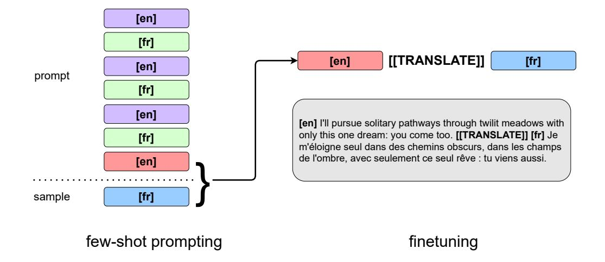

# Unsupervised neural machine translation with generative language models only

#### Jesse Michael Han

Igor Babuschkin Harrison Edwards Arvind Neelakantan Tao Xu Stanislas Polu

Alex Ray Pranav Shyam Aditya Ramesh Alec Radford Ilya Sutskever

# **OpenAI**

#### **ABSTRACT**

We show how to derive state-of-the-art unsupervised neural machine translation systems from generatively pre-trained language models. Our method consists of three steps: *few-shot amplification, distillation*, and *backtranslation*. We first use the zero-shot translation ability of large pre-trained language models to generate translations for a small set of unlabeled sentences. We then amplify these zero-shot translations by using them as few-shot demonstrations for sampling a larger synthetic dataset. This dataset is distilled by discarding the few-shot demonstrations and then fine-tuning. During backtranslation, we repeatedly generate translations for a set of inputs and then fine-tune a single language model on both directions of the translation task at once, ensuring cycle-consistency by swapping the roles of gold monotext and generated translations when fine-tuning. By using our method to leverage GPT-3's zero-shot translation capability, we achieve a new state-of-the-art in unsupervised translation on the WMT14 English-French benchmark, attaining a BLEU score of 42.1.

# 1 Introduction

Recent work on generative pre-training has shown that with sufficient data and scale (Kaplan et al., 2020; Henighan et al., 2020), large language models (LMs) can learn a diverse suite of tasks without explicit supervision (Radford et al., 2019), and that even stronger performance on these tasks can be elicited using few-shot demonstrations (Brown et al., 2020). While few-shot prompting is flexible and enables strong performance on a diverse suite of NLP tasks to be coaxed out of generatively pre-trained LMs without further fine-tuning, its benefits are most pronounced with larger models, with commensurate training, inference, compute, and data costs. Furthermore, the very generality of the pre-training objective which enables multi-task learning can produce LMs with more knowledge than is immediately apparent, requiring carefully designed prompts to bring out fully. The desire to unlock and amplify these latent abilities while also reducing the cost of few-shot prompting motivates our present work, which allows us to continue fine-tuning our models, obtaining more performance from smaller models and pushing our larger models even further, without resorting to few-shot prompting at test time or any additional supervision at train time.

We target the domain of unsupervised neural machine translation (NMT), which typically involves bootstrapping a weak translation model before amplifying its translation ability via backtranslation. Recent work in unsupervised NMT has been dominated by large encoder-decoder architectures where the bootstrap is implemented by denoising/autoencoding tasks (e.g., multilingual Cloze (Devlin et al., 2019; Conneau & Lample, 2019), masked-span prediction (Raffel et al., 2020; Xue et al., 2021), reconstruction from corrupted inputs (Wang et al., 2019; Liu et al., 2020)) intended to produce strong encoders and aligned multilingual representations for decoding. In our present work, we show that generative language modeling alone can implement the entire unsupervised NMT pipeline,

and derive state-of-the-art unsupervised NMT systems using only generatively pre-trained language models. We implement the bootstrap by first sampling a small number of zero-shot translations from GPT-3. These are then used as few-shot prompts to sample a larger dataset of synthetic translations. The few-shot prompts are then discarded and the generated samples are *distilled* by fine-tuning the model on these synthetic data in the zero-shot format. This produces a language model aligned to our translation format and amenable to large-scale backtranslation. By using our method to leverage GPT-3's zero-shot translation capability, we achieve a new state-of-the-art in unsupervised translation on the WMT14 English-French benchmark, attaining a BLEU score of 42.1.

# 2 BACKGROUND AND RELATED WORK

The modern approach to unsupervised neural machine translation typically involves encoder-decoder architectures jointly trained via denoising autoencoding / reconstruction tasks (Vincent et al., 2008; Conneau & Lample, 2019; Liu et al., 2020; Ma et al., 2020; Raffel et al., 2020; Xue et al., 2021; Wang et al., 2019; Liu et al., 2020; Song et al., 2019) and backtranslation (Sennrich et al., 2016; Edunov et al., 2018; Cotterell & Kreutzer, 2018). This approach to unsupervised NMT is codified by Artetxe et al. (2018) and Lample et al. (2018), although various ideas can be traced back further: unsupervised machine translation was framed as a deciphering task by Ravi & Knight (2011) and backtranslation was first introduced for machine translation as a method for data augmentation using target-side monolingual data by Sennrich et al. (2016). Denoising autoencoding with a bilingual encoder can be viewed as a kind of latent bilingual lexicon induction, necessary for producing sufficiently aligned embeddings to kick-start backtranslation; such techniques have been extensively studied in the context of machine translation (Artetxe et al., 2017; Klementiev et al., 2012; Vulic & Moens, 2015; Hu et al., 2017; Goyal et al., 2016; Shen et al., 2017).

At the same time, recent work on large-scale generative pre-training has demonstrated that with sufficient data and model scale (Kaplan et al., 2020; Henighan et al., 2020), transformer language models begin learning a variety of tasks without explicit supervision (Radford et al., 2019) and that even stronger performance can be coaxed from them using few-shot prompts (Brown et al., 2020). Our present work unifies these lines of research by using generative language modeling to simplify unsupervised NMT even further: we show how with sufficient scale, pre-training, and clever prompting, a single generative language model can implement the entire unsupervised neural machine translation pipeline, avoiding optimizations such as denoising autoencoding, auxiliary / adversarial losses in latent space, or ad-hoc bilingual dictionaries.

Our reliance on large-scale generative pre-training is similar to prior work in unsupervised NMT which uses large-scale language modeling tasks on internet data as part of the bootstrap (Conneau & Lample, 2019; Conneau et al., 2020; Liu et al., 2020). The role of few-shot prompting and distillation in our method is related to recent work on unsupervised data augmentation using language models (Anaby-Tavor et al., 2020; Schick et al., 2021; Kumar et al., 2020; Papanikolaou & Pierleoni, 2020; Schick & Schütze, 2021; Yang et al., 2020) and is also in the same spirit as recent work on *self-training* and *noisy-student training* (Mi et al., 2021; Vu et al., 2021; Xie et al., 2020). Recent work on scaling laws for neural machine translation has shown that transformer decoders exhibit more favorable scaling than encoders (Ghorbani et al., 2021). The few-shot distillation component of our method bears some resemblance to contemporaneous work by Wang et al. (2021b) which uses few-shot prompting for unsupervised data augmentation, though they focus only on inference for text classification rather than generation for sequence-to-sequence tasks like machine translation and do not study the phenomena of self-amplification nor few-shot data efficiency (Section 6) as we do.

#### 3 BACKTRANSLATION VIA LANGUAGE MODELING

Backtranslation was first introduced in the context of machine translation as a method for data augmentation using target-side monolingual data by sampling synthetic source-to-target data from another target-to-source translation model (Bojar & Tamchyna, 2011; Sennrich et al., 2016; Poncelas et al., 2018). In our present work, we cast machine translation as a language modeling task and jointly train and sample generations from a single language model for both source-to-target and target-to-source translation.

# Algorithm 1 Iterated backtranslation using a single generative language model

**Input:** Source monotext  $\mathcal{M}_S$ ; target monotext  $\mathcal{M}_T$ ; number of iterations I; number of samples per iteration J; monotext formatter  $f(\cdot)$ ; bitext formatter  $g(\cdot, \cdot)$ ; parameters  $\theta$  of language model  $p_{\theta}(\cdot)$  trained to complete outputs of f to outputs of g.

**Output:** Final model parameters  $\theta$ .

```
1: for i=1 to I do
2: \mathcal{B}_{back} \leftarrow \emptyset
3: for j=1 to J do
4: \mathbf{y} \sim \mathcal{M}_S \cup \mathcal{M}_T
5: \tilde{\mathbf{x}} \sim p_{\boldsymbol{\theta}}(\cdot \mid f(\mathbf{y}))
6: \mathcal{B}_{back} \leftarrow \mathcal{B}_{back} \cup \{\langle \tilde{\mathbf{x}}, \mathbf{y} \rangle\}
7: estimate \boldsymbol{\theta} by maximizing \log p_{\boldsymbol{\theta}} of g(\tilde{\mathbf{x}}, \mathbf{y}) for \langle \tilde{\mathbf{x}}, \mathbf{y} \rangle \in \mathcal{B}_{back}
```

Given bitext  $\langle seq1, seq2 \rangle$  in languages  $L_1$  and  $L_2$ , we format the translation task as follows:

```
[L1] <seq1> [[TRANSLATE]] [L2] <seq2>
```

At test-time, the LM is prompted with <code>[L1] <seq> [[TRANSLATE]] [L2]</code> and we parse a candidate translation <code><sampledSeq></code> from the sampled completion. Backtranslation is implemented by reversing the roles of <code>seq</code> and <code>sampledSeq</code> and fine-tuning on the bitext sampledSeq, <code>seq</code>.

We remark that in contrast to the interpretation of backtranslation as a wake-sleep algorithm (Cotterell & Kreutzer, 2018), where the forwards and backwards translators are trained alternately, we use a single language model for both forwards and backwards translation and train on both directions jointly at every iteration. There are various ways to train a model using backtranslation, e.g., completely online (interleaving minibatch gradient updates and sampling) versus offline (backtranslating the entire training dataset at each epoch; potentially re-training the model from scratch after sampling new backtranslations). In practice, we find that data scaling of a model's optimal test loss and BLEU score quickly saturates on backtranslations from previous versions of the model, and opt for a semi-online setup where we synchronously sample a relatively small number of  $L_1$ - $L_2$  and  $L_2$ - $L_1$  pairs before resuming training for a single epoch on the newly sampled data. We refer to this as a single *iteration* of backtranslation.

Formally, Algorithm 1 describes our implemention of backtranslation using a single generative language model  $p_{\theta}(\cdot)$ . We assume that  $p_{\theta}(\cdot)$  has already been trained to complete formatted monotext ([L1] <seq1> [[TRANSLATE]] [L2]) to formatted bitext ([L1] <seq1> [[TRANSLATE]] [L2] <seq2>).

# 4 THE BOOTSTRAP: GENERATIVE PRE-TRAINING, FEW-SHOT AMPLIFICATION, AND DISTILLATION

The modern approach to unsupervised NMT is parametrized by a choice of initialization or *bootstrap*. The bootstrap has typically relied on some form of unsupervised cross-lingual representation learning, *e.g.*, bilingual dictionaries initialized from unsupervised cross-lingual word embeddings (Lample et al., 2018; Artetxe et al., 2018) or multilingual masked language modeling followed by denoising autoencoding with a shared encoder and decoder (Conneau & Lample, 2019).

In Section 3, we formulated iterative backtranslation in terms of language modeling, assuming a language model which has already been trained to follow a particular instruction format for translation. To complete our procedure, we must supply such a language model. Unlike previous work on unsupervised NMT, we use language models from the GPT-3 family (Brown et al., 2020) which have been *generatively pre-trained* on a large corpus of Internet data. A key observation from the body of work around GPT-3 is that generative pre-training at scale induces strong in-context metalearning abilities, two special cases of which are (1) instruction following and (2) few-shot prompting: a sufficiently trained large language model benefits from both detailed natural language descriptions of tasks and, when given in-context examples, can achieve strong performance on a diverse suite of



Figure 1: Illustration of our bootstrap procedure, which we call *few-shot distillation*. We use few-shot prompts sampled from GPT-3 to generate an initial dataset of synthetic translations from a generatively pre-trained language model (left). The few-shot examples are then discarded and the synthetic bitext reformatted for fine-tuning on the autoregressive language modeling objective (right).

tasks (e.g., question-answering, natural language inference, translation.) We implement the bootstrap by exploiting both of these abilities, by using natural language instruction to produce zero-shot translations and few-shot prompting during amplification.

## 4.1 FEW-SHOT AMPLIFICATION AND DISTILLATION

It thus remains to adapt our generatively pre-trained models' few-shot translation ability to the zero-shot format specified in Section 3. We do this in a two-stage process. We first sample a small number of zero-shot translations from GPT-3. Given bitext (srcSeq, tgtSeq) in srcLang and tgtLang, and a stop-sequence (sep), we use the following format for zero-shot prompting:

```
<sep> Given the following passage in <srcLang>: <sep> <srcSeq> <sep>
a good <tgtLang> translation is: <sep> <tgtSeq> <sep>.
```

At test-time, we sample a completion until the stop-sequence  $\langle sep \rangle$  is detected; throughout we set  $\langle sep \rangle$  to be n---n.

We *amplify* these zero-shot translations by using them as few-shot prompts to sample a much larger synthetic dataset from a smaller model. We then *distill* this dataset by discarding the few-shot prompts and fine-tuning on formatted bitext, producing a language model aligned with our task format and amenable to backtranslation. In detail, we implement the bootstrap as follows:

- 1. Generatively pre-train a language model  $p_{\theta}(\cdot)$  on a large corpus of Internet data.
- 2. Sample a pool of  $N_S$  synthetic target-side translations and  $N_S$  target-side translations zero-shot from another language model  $q(\cdot)$  for few-shot prompting. Using k few-shot examples randomly drawn from  $N_S$  (resp.  $N_T$ ), sample  $C_S$  synthetic target-side translations (resp.  $C_T$  synthetic source-side translations) from  $p_{\theta}(\cdot)$ , using the monolingual source-side corpus  $\mathcal{M}_S$  (resp. target-side corpus  $\mathcal{M}_T$ ).
- 3. Discard the few-shot prompts, reformat the (gold prompt, sampled translation) data as specified in Section 3, and fine-tune the language model  $p_{\theta}(\cdot)$  on these data.
- 4. Reverse all data and continue fine-tuning the language model  $p_{\theta}(\cdot)$  on the backtranslations (sampled translation, gold prompt).

Why amplify and distill? While few-shot prompting is flexible and enables strong performance on a diverse suite of NLP tasks to be coaxed out of generatively pre-trained LMs, its benefits are most pronounced with larger models, with commensurate training, inference, compute, and data

costs. It is also unclear how to iteratively fine-tune a language model in a way that preserves its few-shot ability while remaining aligned with a zero-shot format like in Section 3. Few-shot amplification allows us to generate data for the bootstrap in an unsupervised fashion, possibly avoiding the overhead of few-shot sampling from GPT-3 itself by few-shot prompting a smaller model  $p_{\theta}(\cdot)$ , while distillation enables iterative backtranslation.

# 5 RESULTS

**Experimental setup** For our experiments, we focus on the well-studied WMT14 English-French benchmark. In the notation of Algorithm 1, we obtain source and target monotext  $\mathcal{M}_S$  and  $\mathcal{M}_T$  by splitting the WMT14 English-French training set in half, each with approximately twenty million examples, and use only the English text from one half and only French text from the other to avoid implicit sentence-level alignment between source and target monotext. At each iteration of backtranslation, we sample one million translations in either direction, *i.e.*, J=2e6, and train for one epoch on the newly sampled data. For all of our results, unless otherwise specified, we run 40 iterations of backtranslation after the bootstrap and report BLEU using the final model checkpoint.

To implement the bootstrap, we additionally set aside 2048 training examples, and sample  $N_S=1024$  English-French (resp.  $N_T=1024$  French-English) translations zero-shot from GPT-3 to use as few-shot prompts. During few-shot amplification, we sample four million initial target- and source-side translations respectively using few-shot prompts, i.e.,  $C_S=C_T=4e6$  in the notation of Section 4.1, drawing monolingual prompts from as  $\mathcal{M}_S$  and  $\mathcal{M}_T$  defined above. We fine-tune for two epochs in the forwards direction (distillation) and for another two epochs in the backwards direction (initial backtranslation). For few-shot prompting, we use k=3 in-context examples. In Section 6.3.1 we will see that we can minimize the number of few-shot examples to  $N_S=N_T=3$  with little effect on evaluation BLEU score after iterative backtranslation.

We use the same training setup and BPE tokenizer as GPT-3. During fine-tuning, we use a constant learning rate of  $0.05 \cdot \ell$ , where  $\ell$  is the pre-training learning rate, a weight decay of 0.1, and residual dropout 0.1. When sampling during the bootstrap or during backtranslation, we default to using temperature  $\tau = 0.3$ . We ablate other values of  $\tau$  in Section 6.1. We also filter all fine-tuning bitext by length, discarding pairs with a source/target length ratio exceeding 2.0.

We report BLEU score on the official WMT14 English-French test set with greedy (argmax) sampling and sacreBLEU<sup>1</sup> (Post, 2018). In Table 3 we give a comparison to previous work on unsupervised NMT using multi-bleu.perl and the XLM (Conneau & Lample, 2019) tokenizer.

#### 5.1 FEW-SHOT SELF-DISTILLATION AND BACKTRANSLATION

We first report results using *self-distillation*, *i.e.*, where during the bootstrap (Section 4) we sample from a single model which is then trained to imitate and then backtranslate its own few-shot prompted generations; for these experiments, the few-shot demonstrations themselves are generated zero-shot by GPT-3. This is then followed by the iterative backtranslation procedure described in Section 3. We apply this methodology to the small, medium, large, and xl models from the GPT-3 family (Brown et al., 2020), with 125M, 350M, 760M, and 1.3B parameters respectively. Table 1 displays test BLEU throughout our procedure for all model sizes. We see that translation out of English benefits significantly from the backtranslation part of the bootstrap alone. We also see that our models are much stronger at the translation task compared to few-shot prompting after only self-distillation. Finally, all models benefit significantly from iterative backtranslation, with English-French BLEU always converging to a slightly higher value than the reverse direction.

#### 5.2 DISTILLING SELF-AMPLIFIED GPT-3 INTO SMALLER MODELS

Although we do not apply our full methodology to the 175B parameter GPT-3 model due to compute constraints, we observe that for few-shot distillation, instead of training a model on few-shot samples from itself, we can just as well distill on few-shot samples from a much larger model instead—in this case, the full-size 175B parameter GPT-3 model (henceforth just "GPT-3"). That is, we use GPT-3 to self-amplify its own zero-shot translations to produce an initial dataset for distillation.

<sup>&</sup>lt;sup>1</sup>Signature: BLEU+case.mixed+numrefs.1+smooth.exp+tok.intl+version.1.2.20.

|                         |       | small | medium | large | xl    |
|-------------------------|-------|-------|--------|-------|-------|
| few-shot $(\tau = 0.0)$ | en-fr | 1.15  | 7.71   | 13.07 | 14.28 |
|                         | fr-en | 5.04  | 16.87  | 20.25 | 23.0  |
| few-shot $(\tau = 0.3)$ | en-fr | 1.02  | 7.36   | 11.89 | 13.58 |
|                         | fr-en | 4.46  | 16.13  | 20.7  | 22.07 |
| few-shot $(\tau = 1.0)$ | en-fr | 0.25  | 2.12   | 2.68  | 3.38  |
|                         | fr-en | 1.22  | 5.45   | 6.14  | 9.32  |
| distillation            | en-fr | 0.61  | 9.51   | 17.68 | 22.19 |
|                         | fr-en | 4.31  | 23.67  | 29.38 | 31.12 |
| initial backtranslation | en-fr | 7.94  | 29.84  | 33.59 | 34.71 |
|                         | fr-en | 1.5   | 23.12  | 28.58 | 30.52 |
| after backtranslation   | en-fr | 30.48 | 36.53  | 37.59 | 39.12 |
|                         | fr-en | 27.24 | 32.15  | 34.79 | 35.43 |

Table 1: English-French (top) and French-English (bottom) test BLEU throughout the few-shot self-distillation bootstrap across multiple model scales.

|                                |       | small | medium | large | xl    |
|--------------------------------|-------|-------|--------|-------|-------|
| distillation                   | en-fr | 34.13 | 36.03  | 37.21 | 37.08 |
|                                | fr-en | 32.34 | 34.96  | 36.12 | 36.34 |
| initial backtranslation        | en-fr | 34.71 | 36.31  | 38.89 | 39.05 |
|                                | fr-en | 30.95 | 33.73  | 35.16 | 36.51 |
| after backtranslation          | en-fr | 35.62 | 37.79  | 38.91 | 39.79 |
|                                | fr-en | 31.28 | 34.08  | 35.57 | 35.97 |
| after backtranslation (+CC100) | en-fr | 39.02 | 41.31  | 41.97 | 42.08 |
|                                | fr-en | 33.43 | 35.69  | 36.85 | 37.09 |

Table 2: English-French (top) and French-English (bottom) test BLEU throughout the bootstrap and after iterative backtranslation, this time using generations from self-amplified GPT-3 for the bootstrap. We observe the best performance by mixing in monotext from the English and French components of the CC100 dataset (Wenzek et al., 2020; Conneau et al., 2020) during backtranslation.

We now proceed to apply the same method as in Section 5.1 to all model sizes, but this time using few-shot samples from GPT-3 for the bootstrap. We display the evaluation BLEU scores throughout the bootstrap and after iterative backtranslation in Table 2. Interestingly, the higher-quality samples from GPT-3 appear to saturate the smaller models and they improve very little. Motivated by the possibility that our models are beginning to overfit to the WMT14 English-French training data, we attempt another experiment where 50% of the monotext for backtranslation is sampled from the English and French components of the CC100 dataset (Conneau et al., 2020). The extra monolingual data significantly benefits all model scales, improving English-French BLEU by approximately 3 points compared to iterative backtranslation on WMT data alone. With this setup, the xl attains a new unsupervised state-of-art of 42.1 BLEU on the WMT14 English-French benchmark.

# 6 DISCUSSION AND FURTHER ABLATIONS

Bias towards English generation Previous work (Brown et al., 2020) has shown that after generative pre-training on a corpus of English-dominated Internet text, GPT-3 models are far more capable of translating into English than translating out of English. This is reflected by the disparity between English-French and French-English BLEU scores immediately after few-shot distillation and before backtranslation on the few-shot prompted data. Interestingly, after only two epochs of backtranslation on the relatively scarce few-shot prompted data, this gap is reversed, with all models achieving significantly higher English-French BLEU than French-English BLEU. The data efficiency of the bootstrap suggests that coming out of pre-training, the models are merely misaligned rather than deficient in knowledge about French, and that their latent knowledge about translation out of English can be surfaced using backtranslation. Relatedly, high-quality samples in one language in the previous round of backtranslation lead to higher-quality synthetic bitext for training the reverse direction in the next. This turns the asymmetry towards English generation into an advantage during backtranslation. However, if the initial disparity between the quality of the translation directions is extreme (as with the self-distilled small, which after distillation achieves < 1 BLEU for English-French versus ≈5 BLEU for French-English), then we see that the evaluation BLEU scores for either direction are unstable and oscillates between iterations, though they eventually converge upwards as backtranslation continues.

Comparison to previous work In Table 3, we compare the BLEU scores attained by our best model (an  $\times 1$  distilled on self-amplified GPT-3 followed by 40 rounds of backtranslation) to prior work in unsupervised neural machine translation on the WMT14 English-French benchmark. To ensure comparability to prior work, we report tokenized BLEU using multi-bleu.perl and the XLM tokenizer. This was used to report the few- and zero-shot performance of GPT-3 in Brown et al. (2020), which we also include in Table 3 for completeness. We emphasize the improvement of our model compared to zero-shot GPT-3, which was used to initialize the bootstrap.

|       | XLM  | MASS | CUNMT | XLM+ | CBD  | xl   | GPT-3 (fs)  | GPT-3 (zs) |
|-------|------|------|-------|------|------|------|-------------|------------|
| en-fr | 33.4 | 37.5 | 37.6  | 40.2 | 38.2 | 41.7 | 32.6        | 25.2       |
| fr-en | 33.3 | 34.9 | 35.2  | 36.9 | 35.5 | 38.0 | <u>39.2</u> | 21.2       |

Table 3: Comparison of our best model—an x1 distilled on self-amplified GPT-3 followed by 40 rounds of iterative backtranslation—to prior work (Conneau & Lample, 2019; Song et al., 2019; Wang et al., 2021a; Keung et al., 2020; Nguyen et al., 2021) in unsupervised NMT on the WMT14 English-French benchmark. Bold indicates unsupervised state-of-the-art and underline indicates few-shot state-of-the-art.

**Potential data contamination from pre-training** For high-resource language pairs such as English-French, naturally occuring demonstrations of translation are virtually guaranteed to appear in Common Crawl-like datasets; indeed, Radford et al. (2019) provide examples of English-French parallel text embedded in the WebText corpus. Train/test contamination is also a growing area of concern when training large language models on internet-derived data. The data contamination study conducted by Brown et al. (2020) found virtually no test set contamination for the WMT translation datasets they considered, including the WMT14 English-French dataset. We emphasize

that throughout our entire procedure, no explicit supervision is given for the translation task during pre-training, distillation, or backtranslation.

#### 6.1 Ablating temperature for few-shot distillation

|              |       | self-distill | backtrans. $\tau = 0.0$ | backtrans. $\tau = 0.3$ | backtrans. $\tau = 1.0$ |
|--------------|-------|--------------|-------------------------|-------------------------|-------------------------|
| $\tau = 0.0$ | en-fr | 20.3         | 34.4                    | 34.7                    | 27.8                    |
|              | fr-en | 29.9         | 29.3                    | 29.6                    | 24.7                    |
| $\tau = 0.3$ | en-fr | 20.6         | 33.9                    | 35.1                    | 27.6                    |
|              | fr-en | 29.2         | 28.9                    | 29.9                    | 24.4                    |
| $\tau = 1.0$ | en-fr | 20.2         | 34.9                    | 34.6                    | 27.6                    |
|              | fr-en | 29.0         | 29.2                    | 29.2                    | 24.9                    |

Table 4: English-French (top) and French-English (bottom) test BLEU using few-shot prompted samples generated with temperatures  $\tau=0.0,0.3,1.0$  throughout the bootstrap. We see that the temperature used for sampling has little effect on evaluation BLEU after few-shot distillation, while high-temperature samples are harmful during the backtranslation part of the bootstrap.

It was shown by Edunov et al. (2018) that backtranslation is more effective when the translations are slightly noisy, *i.e.*, sampled with nonzero temperature or via a noised beam search. This motivated our use of the temperature  $\tau=0.3$  throughout. We ablate this choice of temperature when sampling data for few-shot distillation, and study the effect of using  $\tau=0.0$  and  $\tau=1.0$  during the bootstrap using a large model. We display the results in Table 4. We see that lower temperatures lead to marginally higher test BLEU scores during distillation while  $\tau=1.0$  results in lower test *loss* and no overfitting after two epochs of training. However, regardless of the temperature of samples used for self-distillation, the differences in both test BLEU and test loss almost vanish after the backtranslation part of the bootstrap when training to backtranslate low temperature samples ( $\tau=0.0$  or  $\tau=0.3$ ).

### 6.2 FEW-SHOT SELF-AMPLIFICATION

We observed that few-shot prompting GPT-3 with its own zero-shot translations produced better translations than zero-shot prompting alone. We investigate this further by comparing the BLEU scores of zero-shot translations (sampled using the same prompt described in Section 4) to the BLEU scores of self-amplified few-shot prompted translations (*i.e.*, where the few-shot demonstrations are the zero-shot translations sampled from the same model) for all the model sizes studied in this paper. Our results are displayed in Table 5. We see that self-amplification improves translation quality at all model scales.

|                |       | small | medium | large | xl    | GPT-3 |
|----------------|-------|-------|--------|-------|-------|-------|
| zero-shot      | en-fr | 0.57  | 1.23   | 1.90  | 2.84  | 26.19 |
|                | fr-en | 2.00  | 13.92  | 8.14  | 19.60 | 25.49 |
| self-amplified | en-fr | 1.39  | 8.98   | 12.46 | 14.32 | 29.96 |
|                | fr-en | 5.76  | 16.75  | 21.75 | 23.98 | 31.75 |

Table 5: Zero-shot versus few-shot self-amplified test BLEU for all model sizes studied in this paper. For zero-shot generation we use the same prompt format described in Section 4. For self-amplified generation, we use the model's own zero-shot generations as in-context few-shot examples.

#### 6.3 Using real few-shot examples

So far our results have been completely unsupervised, but few-shot learning is typically studied in the context of semi-supervised learning (Wang et al., 2020), where the few-shot demonstrations are real training data. In this section, we ablate the usage of synthetic few-shot translations in our

|                           |       | small | medium | large | xl    |
|---------------------------|-------|-------|--------|-------|-------|
| few-shot $(\tau = 0.0)$   | en-fr | 1.09  | 7.19   | 11.8  | 13.35 |
|                           | fr-en | 3.86  | 14.58  | 20.34 | 23.01 |
| few-shot ( $\tau = 0.3$ ) | en-fr | 1.09  | 6.83   | 11.38 | 13.08 |
|                           | fr-en | 4.13  | 14.86  | 19.92 | 22.04 |
| few-shot $(\tau = 1.0)$   | en-fr | 0.33  | 1.74   | 2.34  | 2.94  |
|                           | fr-en | 0.94  | 4.18   | 4.64  | 7.25  |
| distillation              | en-fr | 0.39  | 7.63   | 17.27 | 19.81 |
|                           | fr-en | 3.9   | 20.29  | 27.65 | 30.89 |
| initial backtranslation   | en-fr | 7.77  | 24.71  | 29.64 | 33.78 |
|                           | fr-en | 1.7   | 18.9   | 26.61 | 30.93 |
| after backtranslation     | en-fr | 31.23 | 34.42  | 37.86 | 39.39 |
|                           | fr-en | 27.45 | 29.96  | 34.23 | 34.97 |

Table 6: English-French (top) and French-English (bottom) test BLEU throughout the few-shot self-distillation bootstrap across multiple model scales, this time using real few-shot examples. We see that performance after backtranslation is equivalent to that reported in Table 1.

|                                |       | small | large |
|--------------------------------|-------|-------|-------|
| distillation                   | en-fr | 32.95 | 36.0  |
|                                | fr-en | 32.45 | 36.29 |
| initial backtranslation        | en-fr | 36.32 | 38.72 |
|                                | fr-en | 32.43 | 36.61 |
| after backtranslation          | en-fr | 36.38 | 39.36 |
|                                | fr-en | 32.66 | 35.67 |
| after backtranslation (+CC100) | en-fr | 39.01 | 42.03 |
|                                | fr-en | 34.17 | 36.94 |

Table 7: English-French (top) and French-English (bottom) test BLEU of the small and large models throughout the bootstrap and after iterative backtranslation, where for the bootstrap we use generations from 175B GPT-3 prompted using real few-shot examples. Similarly to Table 2, we observe a boost in final BLEU score when, after the bootstrap, we additionally sample monolingual text from the English and French portions of the CC100 dataset.

methodology and reproduce our experiments from Section 5 using real few-shot demonstrations. We observe virtually no difference in BLEU score after iterative backtranslation.

We modify the few-shot prompting described in Section 5 as follows. Rather than sampling zero-shot translations for each half of our held-out pool of N=2048 training examples, we sample from these examples directly during few-shot prompting.

Table 6 displays test BLEU throughout the bootstrap and after iterative backtranslation for the same model sizes studied in Section 5.1. We see that our models converge to the same test BLEU (c.f. Section 5.1). Table 7 displays analogous results when distilling samples from GPT-3 with the small and large models, this time few-shot prompted using real examples. We again see that using real rather than synthetic few-shot demonstrations to sample the initial bootstrap data from GPT-3 has no effect on final BLEU score after iterative backtranslation.

# 6.3.1 Almost-unsupervised machine translation with three examples only

Finally, we show that even in the semi-supervised setting, we can minimize the supervision available from few-shot demonstrations with no difference in test BLEU after backtranslation coverges. Table 8 displays the BLEU scores of few-shot sampled translations across various orders of magnitude

| N=3  | N=8 | N=16 | N=32 | N=64 | N=128 | N=256 | N=512 | N=1024       | N=2048 |
|------|-----|------|------|------|-------|-------|-------|--------------|--------|
| <br> |     |      |      |      |       |       |       | 12.7<br>22.2 |        |

Table 8: BLEU scores (calculated over 4096 random training examples) for the few-shot prompted translations from a large model, as the total number of available few-shot examples varies from N=3 to N=2048. We see that N has minimal impact on the BLEU score of the sampled translations. Moreover, the difference in BLEU between the models bootstrapped using N=3 versus N=2048 disappears after iterative backtranslation.

of N, the number of available few-shot examples. Remarkably, even when N is decreased to 3, there is only a slight negative impact on the BLEU score of the few-shot sampled translations. We do not ablate lower values of N in order to maintain the assumption of k=3 distinct in-context examples for few-shot prompting. We then run our entire procedure with a large model, using N=3 real few-shot demonstrations for the bootstrap followed by iterative backtranslation. We observe a final English-French BLEU of 38.0 and French-English BLEU of 34.2, on par with the final BLEU scores reported in Table 6.

#### 7 Conclusion and future directions

We remark that backtranslation, like reinforcement learning, is simply a way of exchanging compute for data. Instead of grounding the model with a reward signal from an environment, however, backtranslation exploits the symmetry of the translation task to ground the model by training it to cross-lingually denoise its own samples. Our present work can be viewed as part of a recent trend towards *data-driven architecture engineering* (Rabe et al., 2021; Wu et al., 2021; Rozière et al., 2021), where task-specific inductive biases, if any, are engineered into and learned from the training data instead of being hardcoded into the model architecture. In formulating the translation task in terms of language modeling, we see that the input-output inductive bias imposed by an encoder-decoder architecture can be simulated with prompt formatting. Similarly, we see that generative language modeling at sufficient scale combined with clever prompting for automated data generation can attain state-of-the-art results in unsupervised translation, rendering methods intended to produce strong encoders and aligned multilingual representations unnecessary.

Although we have focused solely on the domain of machine translation in this work, our methodology is applicable to any sequence-to-sequence task whose forwards and inverse directions are (1) jointly learnable by an autoregressive decoder-only transformer and (2) amenable to few-shot prompting after large-scale generative pre-training. Backtranslation is simply reverse self-training (Bojar & Tamchyna, 2011) and is fundamentally untied to the translation domain; we invite the research community at large to further explore this technique, moving beyond translation and towards applications reflecting the full generality of the transformer architecture.

# REFERENCES

Ateret Anaby-Tavor, Boaz Carmeli, Esther Goldbraich, Amir Kantor, George Kour, Segev Shlomov, Naama Tepper, and Naama Zwerdling. Do not have enough data? deep learning to the rescue! In The Thirty-Fourth AAAI Conference on Artificial Intelligence, AAAI 2020, The Thirty-Second Innovative Applications of Artificial Intelligence Conference, IAAI 2020, The Tenth AAAI Symposium on Educational Advances in Artificial Intelligence, EAAI 2020, New York, NY, USA, February 7-12, 2020, pp. 7383–7390. AAAI Press, 2020. URL https://aaai.org/ojs/index.php/AAAI/article/view/6233.

Mikel Artetxe, Gorka Labaka, and Eneko Agirre. Learning bilingual word embeddings with (almost) no bilingual data. In Regina Barzilay and Min-Yen Kan (eds.), *Proceedings of the 55th Annual Meeting of the Association for Computational Linguistics, ACL 2017, Vancouver, Canada, July 30 - August 4, Volume 1: Long Papers*, pp. 451–462. Association for Computational Linguistics, 2017. doi: 10.18653/v1/P17-1042. URL https://doi.org/10.18653/v1/P17-1042.

- Mikel Artetxe, Gorka Labaka, Eneko Agirre, and Kyunghyun Cho. Unsupervised neural machine translation. In 6th International Conference on Learning Representations, ICLR 2018, Vancouver, BC, Canada, April 30 May 3, 2018, Conference Track Proceedings. OpenReview.net, 2018. URL https://openreview.net/forum?id=Sy2ogebAW.
- Ondrej Bojar and Ales Tamchyna. Improving translation model by monolingual data. In Chris Callison-Burch, Philipp Koehn, Christof Monz, and Omar Zaidan (eds.), *Proceedings of the Sixth Workshop on Statistical Machine Translation, WMT@EMNLP 2011, Edinburgh, Scotland, UK, July 30-31, 2011*, pp. 330–336. Association for Computational Linguistics, 2011. URL https://aclanthology.org/W11-2138/.
- Tom B. Brown, Benjamin Mann, Nick Ryder, Melanie Subbiah, Jared Kaplan, Prafulla Dhariwal, Arvind Neelakantan, Pranav Shyam, Girish Sastry, Amanda Askell, Sandhini Agarwal, Ariel Herbert-Voss, Gretchen Krueger, Tom Henighan, Rewon Child, Aditya Ramesh, Daniel M. Ziegler, Jeffrey Wu, Clemens Winter, Christopher Hesse, Mark Chen, Eric Sigler, Mateusz Litwin, Scott Gray, Benjamin Chess, Jack Clark, Christopher Berner, Sam McCandlish, Alec Radford, Ilya Sutskever, and Dario Amodei. Language models are few-shot learners. In Hugo Larochelle, Marc'Aurelio Ranzato, Raia Hadsell, Maria-Florina Balcan, and Hsuan-Tien Lin (eds.), Advances in Neural Information Processing Systems 33: Annual Conference on Neural Information Processing Systems 2020, NeurIPS 2020, December 6-12, 2020, virtual, 2020. URL https://proceedings.neurips.cc/paper/2020/hash/1457c0d6bfcb4967418bfb8ac142f64a-Abstract.html.
- Alexis Conneau and Guillaume Lample. Cross-lingual language model pretraining. In Hanna M. Wallach, Hugo Larochelle, Alina Beygelzimer, Florence d'Alché-Buc, Emily B. Fox, and Roman Garnett (eds.), Advances in Neural Information Processing Systems 32: Annual Conference on Neural Information Processing Systems 2019, NeurIPS 2019, December 8-14, 2019, Vancouver, BC, Canada, pp. 7057–7067, 2019. URL https://proceedings.neurips.cc/paper/2019/hash/c04c19c2c2474dbf5f7ac4372c5b9af1-Abstract.html.
- Alexis Conneau, Kartikay Khandelwal, Naman Goyal, Vishrav Chaudhary, Guillaume Wenzek, Francisco Guzmán, Edouard Grave, Myle Ott, Luke Zettlemoyer, and Veselin Stoyanov. Unsupervised cross-lingual representation learning at scale. In Dan Jurafsky, Joyce Chai, Natalie Schluter, and Joel R. Tetreault (eds.), *Proceedings of the 58th Annual Meeting of the Association for Computational Linguistics, ACL 2020, Online, July 5-10, 2020*, pp. 8440–8451. Association for Computational Linguistics, 2020. doi: 10.18653/v1/2020.acl-main.747. URL https://doi.org/10.18653/v1/2020.acl-main.747.
- Ryan Cotterell and Julia Kreutzer. Explaining and generalizing back-translation through wake-sleep. *CoRR*, abs/1806.04402, 2018. URL http://arxiv.org/abs/1806.04402.
- Jacob Devlin, Ming-Wei Chang, Kenton Lee, and Kristina Toutanova. BERT: pre-training of deep bidirectional transformers for language understanding. In Jill Burstein, Christy Doran, and Thamar Solorio (eds.), *Proceedings of the 2019 Conference of the North American Chapter of the Association for Computational Linguistics: Human Language Technologies, NAACL-HLT 2019, Minneapolis, MN, USA, June 2-7, 2019, Volume 1 (Long and Short Papers)*, pp. 4171–4186. Association for Computational Linguistics, 2019. doi: 10.18653/v1/n19-1423. URL https://doi.org/10.18653/v1/n19-1423.
- Sergey Edunov, Myle Ott, Michael Auli, and David Grangier. Understanding back-translation at scale. In Ellen Riloff, David Chiang, Julia Hockenmaier, and Jun'ichi Tsujii (eds.), *Proceedings of the 2018 Conference on Empirical Methods in Natural Language Processing, Brussels, Belgium, October 31 November 4, 2018*, pp. 489–500. Association for Computational Linguistics, 2018. doi: 10.18653/v1/d18-1045. URL https://doi.org/10.18653/v1/d18-1045.
- Behrooz Ghorbani, Orhan Firat, Markus Freitag, Ankur Bapna, Maxim Krikun, Xavier Garcia, Ciprian Chelba, and Colin Cherry. Scaling laws for neural machine translation. *CoRR*, abs/2109.07740, 2021. URL https://arxiv.org/abs/2109.07740.
- Anirudh Goyal, Alex Lamb, Ying Zhang, Saizheng Zhang, Aaron C. Courville, and Yoshua Bengio. Professor forcing: A new algorithm for training recurrent networks. In Daniel D. Lee, Masashi Sugiyama, Ulrike von Luxburg, Isabelle Guyon, and Roman Garnett (eds.),

- Advances in Neural Information Processing Systems 29: Annual Conference on Neural Information Processing Systems 2016, December 5-10, 2016, Barcelona, Spain, pp. 4601–4609, 2016. URL https://proceedings.neurips.cc/paper/2016/hash/16026d60ff9b54410b3435b403afd226-Abstract.html.
- Tom Henighan, Jared Kaplan, Mor Katz, Mark Chen, Christopher Hesse, Jacob Jackson, Heewoo Jun, Tom B. Brown, Prafulla Dhariwal, Scott Gray, Chris Hallacy, Benjamin Mann, Alec Radford, Aditya Ramesh, Nick Ryder, Daniel M. Ziegler, John Schulman, Dario Amodei, and Sam McCandlish. Scaling laws for autoregressive generative modeling. *CoRR*, abs/2010.14701, 2020. URL https://arxiv.org/abs/2010.14701.
- Zhiting Hu, Zichao Yang, Xiaodan Liang, Ruslan Salakhutdinov, and Eric P. Xing. Controllable text generation. *CoRR*, abs/1703.00955, 2017. URL http://arxiv.org/abs/1703.00955.
- Jared Kaplan, Sam McCandlish, Tom Henighan, Tom B. Brown, Benjamin Chess, Rewon Child, Scott Gray, Alec Radford, Jeffrey Wu, and Dario Amodei. Scaling laws for neural language models. *CoRR*, abs/2001.08361, 2020. URL https://arxiv.org/abs/2001.08361.
- Phillip Keung, Julian Salazar, Yichao Lu, and Noah A. Smith. Unsupervised bitext mining and translation via self-trained contextual embeddings. *Trans. Assoc. Comput. Linguistics*, 8:828–841, 2020. URL https://transacl.org/ojs/index.php/tacl/article/view/2233.
- Alexandre Klementiev, Ivan Titov, and Binod Bhattarai. Inducing crosslingual distributed representations of words. In Martin Kay and Christian Boitet (eds.), *COLING 2012*, *24th International Conference on Computational Linguistics*, *Proceedings of the Conference: Technical Papers*, 8-15 December 2012, Mumbai, India, pp. 1459–1474. Indian Institute of Technology Bombay, 2012. URL https://aclanthology.org/C12-1089/.
- Varun Kumar, Ashutosh Choudhary, and Eunah Cho. Data augmentation using pre-trained transformer models. *CoRR*, abs/2003.02245, 2020. URL https://arxiv.org/abs/2003.02245.
- Guillaume Lample, Alexis Conneau, Ludovic Denoyer, and Marc'Aurelio Ranzato. Unsupervised machine translation using monolingual corpora only. In 6th International Conference on Learning Representations, ICLR 2018, Vancouver, BC, Canada, April 30 May 3, 2018, Conference Track Proceedings. OpenReview.net, 2018. URL https://openreview.net/forum?id=rkYTTf-AZ.
- Yinhan Liu, Jiatao Gu, Naman Goyal, Xian Li, Sergey Edunov, Marjan Ghazvininejad, Mike Lewis, and Luke Zettlemoyer. Multilingual denoising pre-training for neural machine translation. *Trans. Assoc. Comput. Linguistics*, 8:726–742, 2020. URL https://transacl.org/ojs/index.php/tacl/article/view/2107.
- Shuming Ma, Jian Yang, Haoyang Huang, Zewen Chi, Li Dong, Dongdong Zhang, Hany Hassan Awadalla, Alexandre Muzio, Akiko Eriguchi, Saksham Singhal, Xia Song, Arul Menezes, and Furu Wei. XLM-T: scaling up multilingual machine translation with pretrained cross-lingual transformer encoders. *CoRR*, abs/2012.15547, 2020. URL https://arxiv.org/abs/2012.15547.
- Fei Mi, Wanhao Zhou, Fengyu Cai, Lingjing Kong, Minlie Huang, and Boi Faltings. Self-training improves pre-training for few-shot learning in task-oriented dialog systems. *CoRR*, abs/2108.12589, 2021. URL https://arxiv.org/abs/2108.12589.
- Xuan-Phi Nguyen, Shafiq R. Joty, Thanh-Tung Nguyen, Kui Wu, and Ai Ti Aw. Cross-model back-translated distillation for unsupervised machine translation. In Marina Meila and Tong Zhang (eds.), *Proceedings of the 38th International Conference on Machine Learning, ICML 2021, 18-24 July 2021, Virtual Event*, volume 139 of *Proceedings of Machine Learning Research*, pp. 8073–8083. PMLR, 2021. URL http://proceedings.mlr.press/v139/nguyen21c.html.
- Yannis Papanikolaou and Andrea Pierleoni. DARE: data augmented relation extraction with GPT-2. *CoRR*, abs/2004.13845, 2020. URL https://arxiv.org/abs/2004.13845.

- Alberto Poncelas, Dimitar Sht. Shterionov, Andy Way, Gideon Maillette de Buy Wenniger, and Peyman Passban. Investigating backtranslation in neural machine translation. *CoRR*, abs/1804.06189, 2018. URL http://arxiv.org/abs/1804.06189.
- Matt Post. A call for clarity in reporting BLEU scores. In Ondrej Bojar, Rajen Chatterjee, Christian Federmann, Mark Fishel, Yvette Graham, Barry Haddow, Matthias Huck, Antonio Jimeno-Yepes, Philipp Koehn, Christof Monz, Matteo Negri, Aurélie Névéol, Mariana L. Neves, Matt Post, Lucia Specia, Marco Turchi, and Karin Verspoor (eds.), *Proceedings of the Third Conference on Machine Translation: Research Papers, WMT 2018, Belgium, Brussels, October 31 November 1, 2018*, pp. 186–191. Association for Computational Linguistics, 2018. doi: 10.18653/v1/w18-6319. URL https://doi.org/10.18653/v1/w18-6319.
- Markus Norman Rabe, Dennis Lee, Kshitij Bansal, and Christian Szegedy. Mathematical reasoning via self-supervised skip-tree training. In 9th International Conference on Learning Representations, ICLR 2021, Virtual Event, Austria, May 3-7, 2021. OpenReview.net, 2021. URL https://openreview.net/forum?id=YmqAnY0CMEy.
- Alec Radford, Jeffrey Wu, Rewon Chield, David Luan, Dario Amodei, and Ilya Sutskever. Language models are unsupervised multitask learners. *OpenAI blog*, 1(8):9, 2019.
- Colin Raffel, Noam Shazeer, Adam Roberts, Katherine Lee, Sharan Narang, Michael Matena, Yanqi Zhou, Wei Li, and Peter J. Liu. Exploring the limits of transfer learning with a unified text-to-text transformer. *J. Mach. Learn. Res.*, 21:140:1–140:67, 2020. URL http://jmlr.org/papers/v21/20-074.html.
- Sujith Ravi and Kevin Knight. Deciphering foreign language. In Dekang Lin, Yuji Matsumoto, and Rada Mihalcea (eds.), *The 49th Annual Meeting of the Association for Computational Linguistics: Human Language Technologies, Proceedings of the Conference, 19-24 June, 2011, Portland, Oregon, USA*, pp. 12–21. The Association for Computer Linguistics, 2011. URL https://aclanthology.org/P11-1002/.
- Baptiste Rozière, Marie-Anne Lachaux, Marc Szafraniec, and Guillaume Lample. DOBF: A deobfuscation pre-training objective for programming languages. *CoRR*, abs/2102.07492, 2021. URL https://arxiv.org/abs/2102.07492.
- Timo Schick and Hinrich Schütze. Generating datasets with pretrained language models. *CoRR*, abs/2104.07540, 2021. URL https://arxiv.org/abs/2104.07540.
- Timo Schick, Sahana Udupa, and Hinrich Schütze. Self-diagnosis and self-debiasing: A proposal for reducing corpus-based bias in NLP. *CoRR*, abs/2103.00453, 2021. URL https://arxiv.org/abs/2103.00453.
- Rico Sennrich, Barry Haddow, and Alexandra Birch. Improving neural machine translation models with monolingual data. In *Proceedings of the 54th Annual Meeting of the Association for Computational Linguistics, ACL 2016, August 7-12, 2016, Berlin, Germany, Volume 1: Long Papers.* The Association for Computer Linguistics, 2016. doi: 10.18653/v1/p16-1009. URL https://doi.org/10.18653/v1/p16-1009.
- Tianxiao Shen, Tao Lei, Regina Barzilay, and Tommi S. Jaakkola. Style transfer from non-parallel text by cross-alignment. In Isabelle Guyon, Ulrike von Luxburg, Samy Bengio, Hanna M. Wallach, Rob Fergus, S. V. N. Vishwanathan, and Roman Garnett (eds.), Advances in Neural Information Processing Systems 30: Annual Conference on Neural Information Processing Systems 2017, December 4-9, 2017, Long Beach, CA, USA, pp. 6830–6841, 2017. URL https://proceedings.neurips.cc/paper/2017/hash/2d2c8394e31101a261abf1784302bf75-Abstract.html.
- Kaitao Song, Xu Tan, Tao Qin, Jianfeng Lu, and Tie-Yan Liu. MASS: masked sequence to sequence pre-training for language generation. In Kamalika Chaudhuri and Ruslan Salakhutdinov (eds.), Proceedings of the 36th International Conference on Machine Learning, ICML 2019, 9-15 June 2019, Long Beach, California, USA, volume 97 of Proceedings of Machine Learning Research, pp. 5926–5936. PMLR, 2019. URL http://proceedings.mlr.press/v97/song19d.html.

- Pascal Vincent, Hugo Larochelle, Yoshua Bengio, and Pierre-Antoine Manzagol. Extracting and composing robust features with denoising autoencoders. In William W. Cohen, Andrew McCallum, and Sam T. Roweis (eds.), *Machine Learning, Proceedings of the Twenty-Fifth International Conference (ICML 2008)*, *Helsinki, Finland, June 5-9, 2008*, volume 307 of *ACM International Conference Proceeding Series*, pp. 1096–1103. ACM, 2008. doi: 10.1145/1390156.1390294. URL https://doi.org/10.1145/1390156.1390294.
- Tu Vu, Minh-Thang Luong, Quoc V. Le, Grady Simon, and Mohit Iyyer. Strata: Self-training with task augmentation for better few-shot learning. *CoRR*, abs/2109.06270, 2021. URL https://arxiv.org/abs/2109.06270.
- Ivan Vulic and Marie-Francine Moens. Bilingual word embeddings from non-parallel document-aligned data applied to bilingual lexicon induction. In *Proceedings of the 53rd Annual Meeting of the Association for Computational Linguistics and the 7th International Joint Conference on Natural Language Processing of the Asian Federation of Natural Language Processing, ACL 2015, July 26-31, 2015, Beijing, China, Volume 2: Short Papers, pp. 719–725.* The Association for Computer Linguistics, 2015. doi: 10.3115/v1/p15-2118. URL https://doi.org/10.3115/v1/p15-2118.
- Liang Wang, Wei Zhao, Ruoyu Jia, Sujian Li, and Jingming Liu. Denoising based sequence-to-sequence pre-training for text generation. In Kentaro Inui, Jing Jiang, Vincent Ng, and Xiaojun Wan (eds.), Proceedings of the 2019 Conference on Empirical Methods in Natural Language Processing and the 9th International Joint Conference on Natural Language Processing, EMNLP-IJCNLP 2019, Hong Kong, China, November 3-7, 2019, pp. 4001–4013. Association for Computational Linguistics, 2019. doi: 10.18653/v1/D19-1412. URL https://doi.org/10.18653/v1/D19-1412.
- Mingxuan Wang, Hongxiao Bai, Lei Li, and Hai Zhao. Cross-lingual supervision improves unsupervised neural machine translation. In Young-bum Kim, Yunyao Li, and Owen Rambow (eds.), Proceedings of the 2021 Conference of the North American Chapter of the Association for Computational Linguistics: Human Language Technologies: Industry Papers, NAACL-HLT 2021, Online, June 6-11, 2021, pp. 89–96. Association for Computational Linguistics, 2021a. doi: 10.18653/v1/2021.naacl-industry.12. URL https://doi.org/10.18653/v1/2021.naacl-industry.12.
- Yaqing Wang, Quanming Yao, James T. Kwok, and Lionel M. Ni. Generalizing from a few examples: A survey on few-shot learning. *ACM Comput. Surv.*, 53(3):63:1–63:34, 2020. doi: 10.1145/3386252. URL https://doi.org/10.1145/3386252.
- Zirui Wang, Adams Wei Yu, Orhan Firat, and Yuan Cao. Towards zero-label language learning. *CoRR*, abs/2109.09193, 2021b. URL https://arxiv.org/abs/2109.09193.
- Guillaume Wenzek, Marie-Anne Lachaux, Alexis Conneau, Vishrav Chaudhary, Francisco Guzmán, Armand Joulin, and Edouard Grave. Ccnet: Extracting high quality monolingual datasets from web crawl data. In Nicoletta Calzolari, Frédéric Béchet, Philippe Blache, Khalid Choukri, Christopher Cieri, Thierry Declerck, Sara Goggi, Hitoshi Isahara, Bente Maegaard, Joseph Mariani, Hélène Mazo, Asunción Moreno, Jan Odijk, and Stelios Piperidis (eds.), *Proceedings of The 12th Language Resources and Evaluation Conference, LREC 2020, Marseille, France, May 11-16, 2020*, pp. 4003–4012. European Language Resources Association, 2020. URL https://aclanthology.org/2020.lrec-1.494/.
- Yuhuai Wu, Markus N. Rabe, Wenda Li, Jimmy Ba, Roger B. Grosse, and Christian Szegedy. LIME: learning inductive bias for primitives of mathematical reasoning. In Marina Meila and Tong Zhang (eds.), Proceedings of the 38th International Conference on Machine Learning, ICML 2021, 18-24 July 2021, Virtual Event, volume 139 of Proceedings of Machine Learning Research, pp. 11251–11262. PMLR, 2021. URL http://proceedings.mlr.press/v139/wu21c.html.
- Qizhe Xie, Minh-Thang Luong, Eduard H. Hovy, and Quoc V. Le. Self-training with noisy student improves imagenet classification. In 2020 IEEE/CVF Conference on Computer Vision and Pattern Recognition, CVPR 2020, Seattle, WA, USA, June 13-19, 2020, pp. 10684–10695. Computer Vision Foundation / IEEE, 2020. doi:

 $10.1109/CVPR42600.2020.01070. \qquad URL \quad \texttt{https://openaccess.thecvf.com/content\_CVPR\_2020/html/Xie\_Self-Training\_With\_Noisy\_Student\_Improves\_ImageNet\_Classification\_CVPR\_2020\_paper.html.}$ 

Linting Xue, Noah Constant, Adam Roberts, Mihir Kale, Rami Al-Rfou, Aditya Siddhant, Aditya Barua, and Colin Raffel. mt5: A massively multilingual pre-trained text-to-text transformer. In Kristina Toutanova, Anna Rumshisky, Luke Zettlemoyer, Dilek Hakkani-Tür, Iz Beltagy, Steven Bethard, Ryan Cotterell, Tanmoy Chakraborty, and Yichao Zhou (eds.), *Proceedings of the 2021 Conference of the North American Chapter of the Association for Computational Linguistics: Human Language Technologies, NAACL-HLT 2021, Online, June 6-11, 2021*, pp. 483–498. Association for Computational Linguistics, 2021. doi: 10.18653/v1/2021.naacl-main.41. URL https://doi.org/10.18653/v1/2021.naacl-main.41.

Yiben Yang, Chaitanya Malaviya, Jared Fernandez, Swabha Swayamdipta, Ronan Le Bras, Ji-Ping Wang, Chandra Bhagavatula, Yejin Choi, and Doug Downey. G-daug: Generative data augmentation for commonsense reasoning. In Trevor Cohn, Yulan He, and Yang Liu (eds.), Findings of the Association for Computational Linguistics: EMNLP 2020, Online Event, 16-20 November 2020, volume EMNLP 2020 of Findings of ACL, pp. 1008–1025. Association for Computational Linguistics, 2020. doi: 10.18653/v1/2020.findings-emnlp.90. URL https://doi.org/10.18653/v1/2020.findings-emnlp.90.