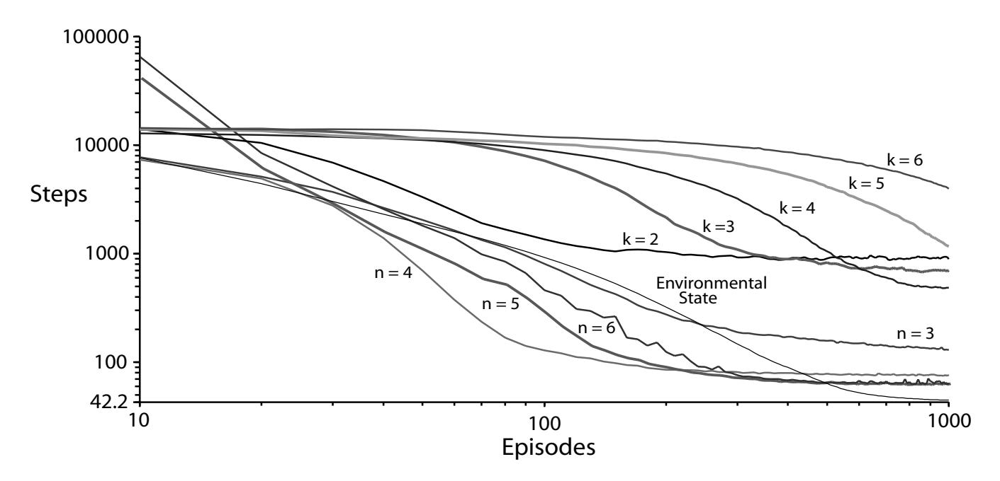

# Using Predictive Representations to Improve Generalization in Reinforcement Learning

Eddie J. Rafols, Mark B. Ring, Richard S. Sutton, Brian Tanner

Department of Computing Science
University of Alberta
Edmonton, Alberta, Canada T6G 2E8
{erafols,markring,sutton,btanner}@cs.ualberta.ca

#### **Abstract**

The predictive representations hypothesis holds that particularly good generalization will result from representing the state of the world in terms of predictions about possible future experience. This hypothesis has been a central motivation behind recent research in, for example, PSRs and TD networks. In this paper we present the first explicit investigation of this hypothesis. We show in a reinforcement-learning example (a grid-world navigation task) that a predictive representation in tabular form can learn much faster than both the tabular explicit-state representation and a tabular history-based method.

## 1 Introduction

A *predictive* representation is one that describes the world in terms of predictions about future observations. The *predictive* representations hypothesis holds that such representations are particularly good for generalization. A good representation is one that captures regularities of the environment in a form useful to the learning agent; and in a reinforcement-learning task, something is "useful" if it increases the agent's ability to receive rewards. Thus, representations generalize well when the regularities they capture allow an agent to learn more efficiently how to increase its cumulative reward.

Why do we believe that predictive representations might generalize particularly well? Good generalization tends to result when similar situations have similar representations. In interactive tasks, two situations are similar when executing an action sequence in one leads to about the same results as executing the same action sequence in the other, regardless of what the action sequence is. The more similar the results tend to be, the more similar the situations are, and, therefore, the more similar their predictive representations will be.

The predictive representations hypothesis makes an especially broad claim, and as a result it is especially resistant to testing or proof. In particular, questions regarding representation and generalization often involve the confounding issues of function approximation and representation acquisition — issues that we have developed specific measures to avoid. In reinforcement learning, for example, generalization is commonly achieved through function approximation: by learning

weightings from a set of features over the agent's past and present perceptions. Good generalization occurs when the features are well chosen and are roughly independent of each other. Predictive representations, too, are generally used in conjunction with function approximation, where each prediction is treated as a feature.

Yet function approximation is itself a complex issue, requiring choices of method, optimization of learning parameters, etc., each of which can influence the results in its own way. To avoid such confusion and test the predictive-representations hypothesis most directly, we have controlled for the possible confounding effects of function approximation by developing a strictly tabular form of predictive representation. Furthermore, our focus is on how predictive representations affect generalization, not on how these representations are acquired, and so we assume they have already been acquired by some other process.

We illustrate the power of predictive representations in a grid-world navigation task where the agent's action and observation space is chosen to be particularly impoverished, thus imposing a high degree of perceptual ambiguity. With only a small subset of the predictions necessary for a full representation of the environmental state, a reinforcement-learning agent can learn quickly and still achieve nearly optimal performance.

## 2 Predictive Representations

Several recently introduced methods for modeling dynamical systems have been inspired by the predictive-representations hypothesis. Among these are predictive state representations (PSRs) [Littman *et al.*, 2002] and temporal-difference networks (TD networks) [Sutton and Tanner, 2005]. Current research on predictive representations has focused principally on the acquisition of the representation (though their use for control is also beginning to be explored [James *et al.*, 2004; Izadi and Precup, 2003]).

PSRs are based on the concept of a core test—a sequence of actions followed by an observation—similar to the tests of Rivest and Schapire [1994]. An agent records the outcome of each core test as either a success or failure depending on whether the predicted observation matches the actual observation. The agent maintains the probability of success for each core test, and this value becomes a feature in the agent's representation of the world. Knowledge of the world can be

expressed as a function (generally a linear combination) of these features. Core tests are continually acquired until the features form a sufficient statistic, which means that they capture all relevant, knowable information about the environment and can maintain such information from one time step to the next. (More will be said about sufficient statistics below.)

TD networks consist of two conceptually separate networks: a question network and an answer network. The question network poses questions about possible future observations. The answer network learns to predict answers to those questions. The questions are therefore analogous to the core tests of PSRs and the answer network is analogous to the function that computes the probabilities of core-test successes. However, the units of the question network can make predictions about not just the agent's observations, but also about the values of other network units, and these predictions of predictions allow the TD network to represent many possible core tests in a compact form. Furthermore, these predictions are generally, but not necessarily, action conditional.

The two approaches just outlined share the common aspiration of representing the world as a set of predictions about future observations. While research into predictive representations is still in its nascent phases, we attempt to make a prediction of our own about possible future observations. In this spirit we pose the following question: if a method does indeed prove successful at *acquiring* predictive representations, will these representations be good at generalization?

# 3 Tabular Predictive Representations

In order to focus exclusively on prediction as a basis for generalization, unclouded by issues involving representation acquisition, we assume the agent has already acquired the ability to make correct predictions. To eliminate issues involving function approximation, we consider deterministic tasks with a single, binary observation (though our method can also be applied to multiple binary observations, and we describe an extension in the future-work section for accommodating continuous observations or stochastic environments). To further focus our tests, we choose to look only at predictions that are contingent upon the agent's actions, though this restriction is not a requirement of predictive representations in general.

## 3.1 Identically Predictive Classes

We start with a set of binary tests resembling PSR core tests. Each test is of length n, meaning that it is a sequence of n actions followed by a single observation bit. We construct all possible tests of length 1 through n and produce a panel of test results in each state, one entry per test. Given N binary tests, the panel may take on  $2^N$  distinct configurations of outcomes (assuming the environment is deterministic). If the agent has a actions available, then there are at most  $a^n$  distinct tests of length n, and the number of tests of length n or less is:

$$N = \sum_{i=1}^{n} a^{i}$$
$$= a^{n+1} - 1.$$

If two states cannot be distinguished by any of the N tests, then the panel of results is identical in both states, and we

say these states are *identically predictive* for that value of n and belong to the same *identically predictive class* (similar to the states of Rivest and Schapire's Simple-Assignment Automata [1994], but constrained by n).

If for a given n an environment has c identically predictive classes, we arbitrarily number them 1 through c, and when an agent visits an environmental state, it observes the number for that state's identically predictive class. This number is therefore the agent's predictive representation in tabular form.

As an example, suppose that a=3, and n=1, then N=3, and the panel consists of three tests (one for each action). Each test can result in an observation of 0 or 1, so there are  $2^3$  possible panel configurations and c=8 (at most). Every state is aggregated into one of these eight classes, labeled 1 through 8, and the agent observes a 1,2,3,4,5,6,7, or 8 in each state that it visits.

In general, as n increases, both N and c increase, so there are fewer states per class on average and the agent's representation of its environment becomes more expressive.

However, not all  $2^N$  panel configurations are necessarily represented in the environment: clearly, there can never be more classes c then there are environmental states S, so if N>S then some tests must be equivalent (meaning there are no environmental states where the tests yield different results). Furthermore, as n increases, N increases exponentially, yet c tends to increase quite slowly in environments with even a moderate amount of regularity.

Eventually, increasing n no longer increases c, and the classes represent a sufficient statistic. At that point c may still be less than S if there are environmental states that cannot be distinguished by any test of any length.

## 3.2 Sarsa(0) with Identically Predictive Classes

All agents in this paper are trained using the reinforcement-learning algorithm known as episodic tabular Sarsa(0) [Sutton and Barto, 1998]. In the traditional Markov case—where the agent directly observes the environmental state—an action-value function is learned over the space of environmental states and actions. In this algorithm, the estimated value Q(s,a) of each experienced state—action pair s,a is updated based on the immediate reward r and the estimated value of the next state—action pair; i.e,

$$\Delta Q(s, a) = \alpha [r + Q(s', a') - Q(s, a)],$$

where  $\alpha$  is a learning-rate parameter.

Episodic tabular Sarsa(0) is implemented over the predictive state space by mapping environmental states to their corresponding identically predictive classes, as described in the previous section. The function  $C(\cdot)$  provides this mapping, and the resulting classes are then treated by the Sarsa agent as though they were environmental states:

$$\Delta Q(C(s), a) = \alpha[r + Q(C(s'), a') - Q(C(s), a)] \quad (1)$$

Because no distinction is made between the states within a class, the learning that occurs in one environmental state applies to all states mapped to the same class.

Figure 1: An agent in this world can have one of 4 orientations in each of the 17 grid squares. Its observation consists of one "nose touch" bit that senses only whether there is a wall directly in front of it. It chooses actions from {Rotate 90° Right, Rotate 90° Left, Advance}. There are therefore 68 distinct environmental states, but a predictive representation will identify (at most) 17 identically predictive classes.

#### 3.3 Performance and Generalization

In episodic tasks the performance of a reinforcement-learning agent can be quantified by the total reward it receives per episode. Given infinite time, agents that observe the (Markov) state of the environment can achieve optimal performance.

In practice, however, learning an optimal policy may take arbitrarily long for an arbitrarily large state space, and these days one can rarely find enough time, let alone an infinite or even an arbitrary amount of it. It is therefore desirable in many cases to use methods that speed learning, even if the final solution is not absolutely optimal.

We anticipate a trade-off between the agent's asymptotic performance and its speed of learning. As c increases, the classes more closely resemble the Markov state of the environment and the agent's asymptotic performance approaches optimal. As c decreases, there are fewer distinct cases to learn about and learning speed improves, but there is a risk that the states comprising a class will disagree about the optimal action for that class. This disagreement can lead to sub-optimal action selection, and in extreme cases the conflict may be catastrophic, precluding the discovery of any reasonable policy. Therefore, a good representation will find low values of c while minimizing the amount of disagreement within classes. The predictive-representations hypothesis specifically holds that the classes formed through predictive representations will do just that.

#### 3.4 Predictive Classes and Sufficient Statistics

An agent's representation of the world is a sufficient statistic if it cannot be improved through any further experience with the world. In the case of predictive representations, a sufficient statistic implies that there are no additional predictions that can add knowledge or improve performance. On the other hand, adding more predictions to a sufficient statistic can never worsen asymptotic performance.

In the tabular case, if a sufficient statistic consists of c classes, no number of additional tests will increase c. (If by adding a test we were to end up with c' classes, where c' > c, then our original representation could not have been a sufficient statistic, since it did not represent the knowledge captured by the newest c' - c class distinctions.) Nor will any

further tests ever reduce the number of classes or change the way states have been assigned to classes.

But an agent whose predictive representation is a sufficient statistic may still not distinguish all environmental states. This idea is illustrated in Figure 1 where there are 68 distinct environmental states (four orientations in each grid cell).

Given an agent that has three actions (Rotate  $90^{\circ}$  Right, Rotate  $90^{\circ}$  Left, Advance) and that observes only whether or not there is a wall directly in front of it, each arm of the cross will produce exactly the same sets of predictions. To the predictive agent, the arms are identical because there is no test that can distinguish a state in one arm from the corresponding states in the other three arms, even with infinite-length tests. Therefore, for this environment there are a maximum of 17 identically predictive classes (four orientations in four arm cells, plus only one in the center because all orientations in the center are identically predictive).

This example also illustrates how an agent's learning speed can be improved through the use of predictive representations. If the task is to navigate to the cell marked  $\mathbf{X}$ , an agent observing identically predictive class numbers will learn an optimal policy much faster than an agent observing environmental state, because the predictive-class agent has only a quarter of the situations to learn about and therefore requires far less experience to learn about all possible situations.

# 4 Tabular History-based Representations

The obvious competitors to predictive representations are history-based representations. Of these, the fixed-length or Markov-k approaches [Ring, 1994; McCallum., 1996; Mitchell, 2003] most clearly lend themselves to a tabular format. To promote a fair comparison between representations, we define a k-length history to be an observation followed by k action-observation pairs. In tabular format, each possible history is uniquely labeled.

Predictive representations and fixed-length history representations offer fundamentally different kinds of generalization. Specifically, most environmental states can be reached via multiple different paths, each corresponding to a different history; conversely, a single action sequence (history) may reach multiple environmental states by starting from different states. Therefore, the mapping between environmental states and fixed-length history sequences is many to many. But the mapping between environmental states and identically predictive classes is many to one.

Conceptually, the reason for the difference is that an agent can take many paths to arrive in a state, but once there, has only one set of possible futures; and the set of possible futures is absolutely fixed for each environmental state. For example, if k=1 the agent has at least two ways of reaching every state in Figure 1—rotating right or rotating left. If k=2 there are at least 4 different histories for each state. The number of fixed-length history representations that can lead to each environmental state increases exponentially with k, so as k increases, there are an exponential number of cases that the agent must learn about. (This problem does not automatically disappear by using function approximation methods.)

In contrast, the set of possible futures available from each

Figure 2: The "office layout" grid-world used for the navigation task. The agent starts an episode in one of the six top rooms, and finishes in the square marked G.

state is the same no matter how that state is reached, and as a result, the number of predictive classes is never more than the number of distinct environmental states. The nature of this mapping makes generalization in the predictive case far more intuitive, and to some extent the predictive-representations hypothesis is based on this clearer intuition.

# 5 Experiment Design

We examined the predictive-representations hypothesis by first designing a grid-world with a large degree of regularity (Figure 2). We then tested Sarsa(0) agents with four different methods of representation on a task in this environment to see how well each method was able to exploit the environment's regularities.

The agent's task was to navigate to the goal cell (marked G) from any randomly chosen square in one of the top six rooms. (The environment was designed to resemble a typical office layout, and the task can be likened to finding the quickest route to the staircase.) Representations that generalize well should allow their respective agents to exploit the regularities in the environment to improve their speed of learning.

As in Figure 1, the agent has a one-bit observation and three possible actions. The rewards for the task are +1 for reaching the goal state and -1 on all other timesteps. All transitions in the environment are deterministic and the environment has a total of 1696 states, 840 of which are possible start states. On average, there are 42.2 steps along the optimal path from start to goal. The task is formulated to be undiscounted and episodic; thus the agent is transported to a randomly chosen starting position upon reaching the goal.

In every case actions were chosen according to an  $\epsilon$ -greedy policy;  $\epsilon$  was set to 0.1, and  $\alpha$  was set to 0.25, which are typical values for Sarsa agents in episodic tasks.

The four representational schemas tested were:

- Markov
- *n*-depth predictive classes
- k-step fixed-length histories
- random state aggregation

In the Markov case the agent directly observed its current environmental state, each state being represented by a unique

|               |             | Unique       | % Environmental |
|---------------|-------------|--------------|-----------------|
| Agent         |             | Observations | States          |
| Markov        | -           | 1696         | 100%            |
| Predictive    | n           |              |                 |
|               | 2           | 67           | 3.9%            |
|               | 3           | 185          | 10.7            |
|               | 3 4 5 | 308          | 17.8            |
|               | 5           | 416          | 24.1            |
|               | 6           | 497          | 28.8            |
|               | 7           | 568          | 32.9            |
| Fixed-History | k           |              |                 |
|               | 2           | 50           | 2.9%            |
|               | 2 3         | 205          | 11.9            |
|               |             | 790          | 45.7            |
|               | 4 5      | 2,938        | 170.0           |
|               | 6           | 10,660       | 616.9           |
| Random        | case        |              |                 |
|               | 1           | 1,526        | 90%             |
|               | 2           | 1,611        | 95              |
|               | 2 3         | 1,679        | 99              |

Figure 3: The four representational schemas in their tested instantiations and the degree of state aggregation in each case. In the predictive case, the "unique observations" column represents the number of identically predictive classes, c. For fixed-length history, this column represents the number of unique histories that occurred during training.

label. In the predictive case the agent observed a label corresponding to the identically predictive class (as described in Section 3.2) for six different values of n. For each value of n, states were assigned to classes as described in Section 3.1. In the fixed-history case, the agent observed a label corresponding to the k-step history it had just experienced (Section 4) for five different values of k. To see whether our results in the predictive case were merely due to beneficial properties of state aggregation, we tried randomly assigning states to classes and then training according to Equation 1.

Figure 3 shows the vital stats for each of the representational methods tested. The amount of state aggregation that occurs in each method is shown in terms of the ratio of unique observations to environmental states.

## 6 Results

Performance results for the different representational schemas given in Figure 3 are graphed in Figure 4, with the exception of the random state aggregation method, which performed too poorly to be graphed meaningfully.

Each point in the graph represents the average number of steps per episode over the previous 10 episodes. The curves are averaged over 10,000 trials, each trial being 1,000 episodes. At the end of each trial, the agent's action values are reset, and learning begins from scratch. Over the course of 1,000 episodes, the Markov case shows a smooth, steadily improving curve, which by the  $1,000^{th}$  episode is performing very close to optimal.

Though fixed-length history representations learn more slowly than the other methods, their learning speeds are

Figure 4: A comparison of three representational methods on the task of Figure 2. The representational schemas shown are: explicit environmental state, history-based representations for k=2 through 6, and identically predictive classes for n=3 through 6. The vertical axis shows average steps taken per episode over the past 100 episodes of training. Note that the axes are logarithmic and the vertical axis intersects the horizontal axis at the optimum.

fastest for small values of k and their final results are best for large values of k, demonstrating the trade-off between representational expressiveness and learning speed. The number of histories increases (exponentially) with k, which negatively impacts learning speed but positively impacts the final results of learning. Interestingly, on individual trials the curves for the history representation resemble a step function. Apparently, the  $\epsilon$ -greedy action selection chooses poorly for many episodes until the agent suddenly learns some key piece of information that dramatically improves performance. As k grows, the agent takes longer to discover this piece of information but then converges to a better solution.

The results look promising for predictive representations. They allow both speedy learning and convergence to a good policy. In general, the results for the identically predictive representations are similar to those for the fixed-history representations in that convergence speed decreases and convergence quality increases as n increases. However, in contrast to the fixed-history representation, the number of identically predictive classes increases quite slowly with n and the generalization benefit of the predictive classes is clear. The representation effectively aggregates similar states, allowing the agent to converge to near-optimal solutions. This result closely matches our intuition and expectations. Only in the n=3 case was there no improvement in learning speed, indicating there may be a maximum degree of state aggregation beyond which learning speed is not improved—also an expected and intuitive result from section 3.3. Results in the n=2 and n=7 cases match these trends but are not shown so as to keep the graph at least vaguely readable.

The case of random state aggregation is not shown in the

graphs because these agents performed so poorly. With only 10% state aggregation (90% of the states not aggregated), random state aggregation brought about catastrophic failure in over 80% of the agents tested, meaning that they show no progress in their training. To avoid catastrophic failure in 90% of the agents, the amount of state aggregation had to be 1% or less, meaning that only one state in a hundred shared a class with another state.

In contrast, there were no cases of catastrophic failure in any of the agents using predictive representations.

It might be argued that the predictive representations benefit unfairly from the preprocessing done to create the classes, which the history-based methods did not have, and which an actual learning agent may not reasonably be expected to acquire. Or it might be argued that history-based methods could somehow be augmented to combine all ways of reaching a state into equivalence classes as our tabular representations do for predictions. But these objections miss two fundamental aspects of this research and of predictive representations in general. First, it is not our intention here to prove the superiority of one particular learning algorithm to any other, but only to test out, in advance, whether the research direction of predictive representations looks promising. (The evidence collected clearly gives reason for optimism.) Second, acquisition of a predictive representation is always directed toward acquisition of a sufficient statistic. Once an agent acquires the predictions necessary for a sufficient statistic, then it can in principle create the class mappings used here. (In fact, those mappings would fall directly out of a TD network representation, being merely a subset.) It is not clear what the equivalent of a sufficient statistic might be for history-based

methods, nor whether it could be reasonably acquired.

Another objection is that performance could be improved even more by hand-coding a mapping of states to classes. But, don't be so sure! While it is obvious that an optimal policy could be encoded by just three classes (one for each action), finding a mapping that encourages learning is a completely different matter, and it is difficult to design a mapping by hand that (a) aggregates the states into a small enough number of classes to allow good generalization, (b) does not risk catastrophic failure by mapping two states into a class that makes learning impossible, and (c) is not essentially based on our intuitive notions of prediction.

# 7 Conclusions and Future Work

This paper makes an initial attempt to answer the question: if there were a learning system that could represent the world in terms of predictions about possible future experience, would that representation turn out to be useful for generalization in reinforcement-learning tasks? While this question is itself quite broad (fully answering it might require thorough testing in the presence of many confounding factors), our results are clear and lend weight to the possibility of a *yes* answer.

In comparison to other representational schemas, our tests suggest that predictive representations may generalize a state space very well, allowing faster learning without obvious risk of catastrophic failure through poor state aggregation.

But there is another significant conclusion to be reached. It is fairly common in reinforcement-learning tasks to provide agents with the environmental state in tabular form. Though it was our intention only to *examine* predictive representational methods, the particular tabular method we developed shows significant advantages over the Markov representation often seen in the reinforcement-learning literature. We suggest it may have unintended practical application to tasks with large state spaces when the environmental state is readily available. Mapping states into identically predictive classes may speed learning and still allow nearly optimal performance to be achieved. This certainly deserves further investigation.

We would also like to test predictive representations in non-deterministic tasks and in environments with continuous-valued observations. In the discrete, deterministic case we can make binary predictions of observations, but in environments with continuous-valued observations, the predictions would also be continuous, and in the non-deterministic tasks the predictions would be continuous-valued probabilities. One solution is to use tile coding to discretize the continuous values, reducing them to binary values that can be treated as described above. A second approach is to view the panel of test results as vectors and measure their similarity with a metric such as Euclidean distance. Vectors within a certain distance would belong to the same identically predictive class.

It should be noted that we have avoided the issue of poor or malicious placement of rewards. What would happen, for example, if the goal in Figure 1 were placed in the middle of one of the arms? The agent, not able to distinguish between one arm and the others, would actually be hindered by using a predictive representation. The solution is to incorporate reward(s) into the predictive model of the world. The ability to predict rewards would increase the expressiveness of the representation and could assist the integration of predictive representations into reinforcement-learning algorithms.

Finally, there is an obvious enhancement to the classification method we employed in this paper. Since small values of n speed learning the most but large values of n converge to a better policy, it would make sense to gradually increase n, splitting up the identically predictive classes into smaller and smaller groups whenever learning begins to converge. Since all the states in each newly derived class would come strictly from the same parent class, the action values for the new classes could be initialized to those of the parent class, and all training done up to that point would be preserved.

# Acknowledgments

We thank Anna Koop for her participation in our early discussions on this paper and for being a good sport. Thanks to Mark Lee for help with the simulation code. This research was supported in part by grants from iCORE, and NSERC, and by DARPA grant HR0011-04-1-0050.

### References

- [Izadi and Precup, 2003] Masoumeh T. Izadi and Doina Precup. A planning algorithm for predictive state representations. In Georg Gottlob and Toby Walsh, editors, *IJCAI*, pages 1520–1521. Morgan Kaufmann, 2003.
- [James et al., 2004] Michael R. James, Satinder Singh, and Michael L. Littman. Planning with predictive state representations. In ICMLA-04, Proceedings of the International Conference on Machine Learning and Applications, pages 304–311, 2004.
- [Littman et al., 2002] Michael L. Littman, Richard S. Sutton, and Satinder Singh. Predictive representations of state. In Advances in Neural Information Processing Systems 14. MIT Press, 2002.
- [McCallum., 1996] Andrew Kachites McCallum. Reinforcement Learning with Selective Perception and Hidden State. PhD thesis, Department of Computer Science, University of Rochester, Rochester, New York, August 1996.
- [Mitchell, 2003] Matthew W. Mitchell. Using markov-k memory for problems with hidden-state. In Hamid R. Arabnia and Elena B. Kozerenko, editors, *MLMTA*, pages 242–248. CSREA Press, 2003.
- [Ring, 1994] Mark B. Ring. *Continual Learning in Reinforcement Environments*. PhD thesis, University of Texas at Austin, Austin, Texas 78712, August 1994.
- [Rivest and Schapire, 1994] Ronald L. Rivest and Robert E. Schapire. Diversity-based inference of finite automata. *J. ACM*, 41(3):555–589, 1994.
- [Sutton and Barto, 1998] Richard S. Sutton and Andrew G. Barto. *Reinforcement Learning: An Introduction*. MIT Press, Cambridge, MA, 1998.
- [Sutton and Tanner, 2005] Richard S. Sutton and Brian Tanner. Temporal-difference networks. In *Advances in Neural Information Processing Systems 17*. MIT Press, 2005.