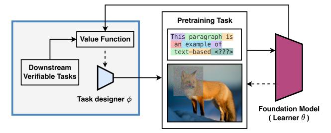
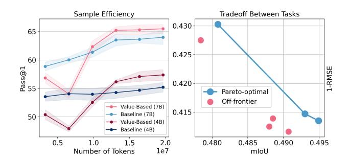
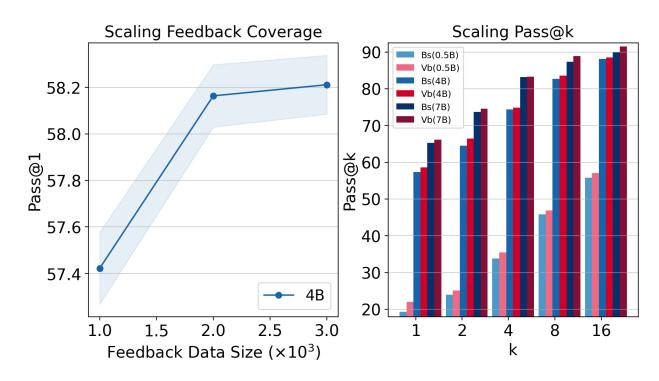

# Value-Based Pre-Training with Downstream Feedback

# Shuqi Ke1 Giulia Fanti1

# **Abstract**

Can a small amount of verified goal information steer the expensive self-supervised pretraining of foundation models? Standard pretraining optimizes a fixed proxy objective (e.g., next-token prediction), which can misallocate compute away from downstream capabilities of interest. We introduce V-Pretraining: a value-based, modalityagnostic method for controlled continued pretraining in which a lightweight task designer reshapes the pretraining task to maximize the value of each gradient step. For example, consider selfsupervised learning (SSL) with sample augmentation. The V-Pretraining task designer selects pretraining tasks (e.g., augmentations) for which the pretraining loss gradient is aligned with a gradient computed over a downstream task (e.g., image segmentation). This helps steer pretraining towards relevant downstream capabilities. Notably, the pretrained model is never updated on downstream task labels; they are used only to shape the pretraining task. Under matched learner update budgets, V-Pretraining of 0.5B-7B language models improves reasoning (GSM8K test Pass@1) by up to 18% relative over standard next-token prediction using only 12% of GSM8K training examples as feedback. In vision SSL, we improve the state-of-the-art results on ADE20K by up to 1.07 mIoU and reduce NYUv2 RMSE while improving ImageNet linear accuracy, and we provide pilot evidence of improved token efficiency in continued pretraining.

## 1. Introduction

The era of blind scaling that improves models primarily by scaling proxy-objective pretraining is showing signs of diminishing returns (Lin et al., 2025; Kaplan et al., 2020; Hoffmann et al., 2022). Yet foundation models are still trained in a remarkably undirected way: we minimize a

Preprint.

Figure 1. Value-Based Pretraining with Downstream Feedback. Today, the learner  $\theta$  trains on unlabeled data using a proxy objective  $L_{\rm pre}$ , for a frozen pretraining task. In V-Pretraining, a small task designer  $\phi$  is trained on a small feedback set of verifiable downstream tasks with predefined value functions, but *never* updates the learner on downstream labels.  $\phi$  thus reshapes the pretraining target (or views) so that the induced SSL update aligns with downstream improvement, calculated via the value function. Relative to current pretraining methods, V-Pretraining adds the components in the left blue box.

static self-supervised proxy loss on massive, weakly curated data, and hope the capabilities we care about (reasoning, dense perception, tool use, world modeling) emerge as a byproduct. In language, the proxy is next-token prediction (Brown et al., 2020; OpenAI et al., 2024; Yang et al., 2025); in vision, it is self-supervised reconstruction or representation learning under augmentations (Chen et al., 2020b; He et al., 2022; Assran et al., 2023; Siméoni et al., 2025). While this recipe scales, it functions as an open-loop system and learns from a "static world": the optimization trajectory is fixed at the start, ignoring whether intermediate steps actually align with complex human goals.

This open-loop nature can lead to sample inefficiency in pretraining. Unlike humans, who utilize closed-loop feedback to rapidly correct errors and master tasks, models blindly consume trillions of tokens without corrective guidance. Current pipelines inject feedback mostly *after* pretraining via supervised fine-tuning or preference optimization (Christiano et al., 2017; Ouyang et al., 2022; Rafailov et al., 2023). These stages are effective, but they arrive late. By the time downstream feedback is applied, the representation has already been shaped by millions of proxy-gradient steps that were agnostic to the target behavior. To break the ceiling of blind scaling, we ask: can we introduce scalable supervision into pretraining, turning an open-loop process into a controlled trajectory toward what we actually want?

&lt;sup>1Carnegie Mellon University. Correspondence to: Shuqi Ke <shuqik@andrew.cmu.edu>.

We introduce V-Pretraining: Value-based Pre-Training with downstream feedback, a framework for controlled pretraining. Standard pretraining fixes the unlabeled stream and a proxy task construction (e.g., one-hot next-token targets in language, or a fixed augmentation pipeline in vision) and optimizes the resulting proxy loss. We keep the unlabeled stream and learner training budget fixed, but add a lightweight task designer trained on a small labeled verification (value) set for the capability of interest (e.g., GSM8K for reasoning, ADE20K/NYUv2 for dense vision). Crucially, the verification set is used only as an evaluator: the learner is *never* updated on verification labels. Instead, the task designer reshapes the pretraining target (the supervision signal inside predictive learning) so that the learner's next unlabeled update is predicted to be more valuable for the target capability. In language, the designer replaces onehot next-token labels with adaptive soft targets supported on the learner's top-K candidates. In vision SSL, it replaces a fixed augmentation pipeline with instance-wise learned views optimized for transfer, especially dense prediction.

Directly optimizing the task designer for downstream performance is computationally prohibitive: it is a bilevel problem that would require differentiating through long pretraining trajectories (Maclaurin et al., 2015; Franceschi et al., 2018). As a result, prior efforts to design task-aware SSL methods were largely tailored to specific domains and tasks, which allowed them to avoid this computational bottleneck (Zhang et al., 2019; Tian et al., 2020; Shi et al., 2022). A key insight of our work is showing how to efficiently generalize task-aware pretraining (including SSL) to different tasks and modalities by defining the value of a pretraining step via an influence-style first-order estimate: the alignment between proxy and downstream gradients (Koh & Liang, 2017; Pruthi et al., 2020a). This yields differentiable meta-updates for the task designer while leaving the learner's pretraining loop essentially unchanged. Because V-Pretraining intervenes only through target/view construction, it can be layered on top of diverse pretraining objectives (e.g., next-token prediction, masked modeling, and joint-embedding SSL) without changing the learner architecture or optimizer. This makes V-Pretraining largely orthogonal to advances in scaling, data mixture/curriculum design, and post-training alignment, and in principle combinable with them.

Across language and vision, value-based pretraining turns small verified feedback into measurable gains in the expensive unlabeled phase. In language, continued pretraining of Qwen1.5 models on a math corpus **improves GSM8K** Pass@1 by 2-14% across 0.5B/4B/7B using only 12% GSM8K training examples for feedback and without updating the learner on GSM8K labels. In vision, dense feedback improves segmentation and depth while maintaining or improving ImageNet linear accuracy. Further, these improvements do not come at the expense of generalization

to other tasks.

**Contributions.** We make four contributions. (1) V-Pretraining: a novel framework for directed pretraining with downstream feedback: we present a principled formulation of controlled pretraining as goal-directed target or view design, separating a large learner trained only on unlabeled data from a lightweight controller trained on a small labeled verification set. (2) A scalable learning rule for task design: we introduce an influence-style first-order value objective based on proxy-downstream gradient alignment that avoids differentiating through long pretraining trajectories. (3) Efficient instantiations across modalities: we instantiate the framework for natural language (adaptive top-K soft targets) and vision (instance-wise learned views) without changing the learner's underlying pretraining loop. (4) Compute-matched evidence and diagnostics: we empirically show that under matched learner update budgets, the V-Pretraining framework increases downstream value per pretraining step for two modalities (vision and language) in various settings. We support our claims with extensive ablations (random feedback, smoothing, self-distillation) and controllability diagnostics (token-efficiency pilot; Pareto tradeoffs in vision).

Together, these results suggest that a small amount of indirect downstream feedback can act as a scalable form of weak-to-strong supervision during pretraining (Burns et al., 2023), improving target capabilities under fixed compute budgets, without harming model generalization.

### 2. Preliminaries and Related Work

# 2.1. Pretraining as Predictive Learning

We unify modern self-supervised pretraining across modalities as *predictive learning under information restriction* (LeCun, 2016). Given an observation that intentionally omits or distorts information, such as past only text, masked patches, or cropped views, the learner is trained to predict a target derived from the same underlying example. The key modeling choices are how we construct the restricted context and how we define the prediction target.

**General formulation.** Let  $x \sim \mathcal{D}$  be an example in a modality space  $\mathcal{X}$ . A stochastic *view generator* produces correlated views

$$(x_c, x_t, m) \sim \mathcal{A}(x),$$
 (1)

where  $x_c$  is an information-restricted context,  $x_t$  is a target view, and m optionally denotes side information such as a mask pattern, crop geometry, or token positions. A predictor consists of an encoder  $f_{\theta}$  and a head  $g_{\theta}$ ,

$$\hat{y} = g_{\theta}(f_{\theta}(x_c), m), \tag{2}$$

while the supervision signal  $y = \tau(x_t)$  is produced by a target function  $\tau$ . The generic pretraining objective is

$$\min_{\theta} \mathbb{E}_{x \sim \mathcal{D}} \mathbb{E}_{(x_c, x_t, m) \sim \mathcal{A}(x)} [\ell(\hat{y}, y)], \tag{3}$$

where  $\ell$  is an appropriate loss (cross-entropy, regression, cosine, InfoNCE, etc.). Under this view, common pretraining methods correspond to different instantiations of triplet  $(\mathcal{A}, \tau, \ell)$  rather than different learning principles; we illustrate common examples below.

**Language: next-token prediction.** Let  $x = (w_1, \ldots, w_T)$  be a sequence of discrete tokens. The view generator samples a position t, sets  $x_c = w_{< t}$  and  $x_t = w_t$ . The target function returns a one-hot distribution,

$$\tau(x_t) = \delta_{w_t},\tag{4}$$

and  $\hat{y}_t$  is a categorical distribution over the vocabulary. With cross-entropy (CE) loss, Equation (3) becomes maximum likelihood estimation.

$$\min_{\theta} \mathbb{E}\left[ CE(\hat{y}_t, \delta_{w_t}) \right] = \min_{\theta} \mathbb{E}\left[ -\log p_{\theta}(w_t \mid w_{< t}) \right].$$
 (5)

**Vision: explicit reconstruction.** For masked autoencoding (Chen et al., 2020a; Xie et al., 2022; He et al., 2022; El-Nouby et al., 2024), x is an image, the view generator samples a mask m, defines  $x_c = x \odot m$  and  $x_t = x \odot (1 - m)$ , and uses  $\tau(x_t) = x_t$  with a regression loss:

$$\min_{\theta} \mathbb{E}\left[\left\|g_{\theta}(f_{\theta}(x\odot m), m) - x\odot(1-m)\right\|_{2}^{2}\right]. \quad (6)$$

This also subsumes variants that reconstruct pixels, patch tokens, or quantized codes (Nguyen et al., 2024).

**Vision: implicit latent prediction.** Many non-contrastive (Grill et al., 2020; Caron et al., 2021; Siméoni et al., 2025) and joint-embedding methods (Assran et al., 2023; 2025) predict representations rather than pixels. Let  $(x_c, x_t)$  be two correlated views produced by  $\mathcal{A}$ . A target network produces the latent target,

$$\tau(x_t) = \operatorname{stopgrad}(f_{\theta'}(x_t)),$$
 (7)

and the predictor matches latent targets under a regression or cosine loss (Grill et al., 2020; Caron et al., 2021; Assran et al., 2023). Even though the targets evolve during training via  $\theta'$ , the mechanism still fits Equation (3). Across modalities, pretraining differs primarily in how prediction targets are constructed, not in the underlying predictive principle.

#### 2.2. Related Works

**Positioning.** We study *controlled pretraining* under a fixed unlabeled stream and learner update budget. A small feedback set of verifiable downstream tasks provides verified

goal information, but it is used only to train a lightweight controller that reshapes the *pretraining target* (or views). The foundation model is *never* updated on downstream labels. This differs from most label-efficient paradigms, which improve performance by creating labels or pseudolabels and then training the main model on them.

Post-training injects direction late. Supervised fine-tuning and preference optimization steer models by directly updating the foundation model on labeled examples or preferences (Christiano et al., 2017; Ouyang et al., 2022; Rafailov et al., 2023). These methods are highly effective, but they operate after proxy pretraining has already shaped the representation space. Our approach is complementary: we inject goal information *during* pretraining by shaping the unlabeled training signal rather than updating the learner on downstream labels.

Weak/semi-supervision: scalable supervision by producing labels, not by steering pretraining updates. A broad literature improves *supervision scalability* by learning from imperfect labels or by manufacturing labels from weak sources, spanning weak supervision and data programming (Ratner et al., 2017; Bach et al., 2017), distant supervision (Mintz et al., 2009), semi-supervised learning (Sohn et al., 2020), robust learning from noisy labels (Song et al., 2022), and more recently weak-to-strong generalization as a way to elicit strong capabilities from weak supervision (Burns et al., 2023). Across these settings, progress typically comes from generating (pseudo-)labels and then training the *main model* on task-defined targets, often with repeated inference or teacher-student refinement that is not compute-matched to pretraining-scale update budgets. Our method can be viewed as a task-agnostic pretraining analogue of weak-to-strong generalization: a small feedback set of verifiable downstream tasks provides weak but reliable goal information, yet the foundation model is never trained on downstream labels; instead, the feedback trains a lightweight controller that reshapes the self-supervised target/views so that each unlabeled gradient step has higher downstream value.

Directing pretraining without step-level downstream feedback: proxy objectives and view design. Most improvements to foundation-model pretraining change the proxy objective or the view/augmentation pipeline while keeping the training signal fixed: in language this includes next-token-based variants and domain-shaped objectives specified *a priori* (Brown et al., 2020; Zhang et al., 2019; Bachmann & Nagarajan, 2025; Shao et al., 2025), while in vision SSL many methods learn from global semantics via contrastive/joint-embedding objectives (Chen et al., 2020b; Grill et al., 2020; Caron et al., 2021) and others inject spatial structure through handcrafted augmentations or predictive objectives such as masked modeling and JEPA-style prediction (He et al., 2022; Assran et al., 2023). These

approaches can yield strong representations, but the *direction* they impose is largely static: the target construction does not adapt online to what a downstream verifier says is valuable for the current model and example (Shi et al., 2022; Bandara et al., 2023). In contrast, value-based pretraining introduces a control loop that uses a small feedback set of verifiable downstream tasks to *modulate the pretraining target/views* so that each unlabeled update aligns with downstream improvement, directly addressing the value-perstep and feedback-efficiency pressures highlighted in our introduction.

Bilevel optimization and influence. Downstream-aware task design naturally leads to bilevel optimization and unrolled differentiation through training (Maclaurin et al., 2015; Franceschi et al., 2018), which is costly at pretraining horizons. To our knowledge, existing work has not optimized both pretraining tasks and SSL augmentations in a bilevel optimization (Reed et al., 2021); the closest approaches use a coordinate-descent-like step-wise optimization (You et al., 2021; 2022; Jin et al., 2022). We circumvent the computational challenges of this bilevel optimization using influence-style methods that estimate the effect of training updates on downstream loss from gradients (Koh & Liang, 2017; Pruthi et al., 2020a). We build on these approximations but apply them to target/view construction during pretraining: a controller learns to reshape the unlabeled supervision signal so that each proxy update aligns with downstream improvement.

### 3. Pretraining with Downstream Feedback

We now treat task design as a learnable object. We refer to the large model being pretrained as the *learner* with parameters  $\theta$ . We refer to the auxiliary model as the *task designer* with parameters  $\phi$ , since it controls how predictive learning targets and views are constructed. The downstream labeled objective provides an *evaluator* through  $L_{\rm down}$ .

#### 3.1. Learning to Design Pretraining Tasks

The task designer can parameterize the target construction, the view generator, or both. We consider a learnable view generator  $A_{\phi}$  and a learnable target function  $\tau_{\phi}$ :

$$(x_c, x_t, m) \sim \mathcal{A}_{\phi}(x), \qquad y_{\phi} = \tau_{\phi}(x_t, x_c, m).$$
 (8)

The resulting pretraining objective is

$$L_{\text{pre}}(\theta;\phi) = \mathbb{E}_{x \sim \mathcal{D}} \mathbb{E}_{(x_c, x_t, m) \sim \mathcal{A}_{\phi}(x)} \Big[ \ell \big( g_{\theta}(f_{\theta}(x_c), m), y_{\phi} \big) \Big].$$
(9)

The learner updates  $\theta$  to minimize  $L_{\rm pre}$ , while the task designer updates  $\phi$  to improve downstream performance. Let  $L_{\rm down}(\theta)$  denote a downstream task loss computed from

a small annotated set. The ideal objective is

$$\min_{\phi} L_{\text{down}}(\theta^{\star}(\phi)), \text{ where } \theta^{\star}(\phi) = \arg \min_{\theta} L_{\text{pre}}(\theta; \phi).$$
(10)

This bilevel formulation is conceptually clean but computationally prohibitive at pretraining scale (Finn et al., 2017; Rajeswaran et al., 2019; Franceschi et al., 2018; Ji et al., 2021). We therefore replace long horizon unrolling with an online value signal.

#### 3.2. Value Function for Downstream Feedback

We define feedback at the level of pretraining steps. Consider one learner update

$$\theta^{+} = \theta - \eta g_{\text{pre}}(\theta; \phi), \ g_{\text{pre}}(\theta; \phi) = \nabla_{\theta} L_{\text{pre}}(\theta; \phi), \ (11)$$

and define the downstream gradient

$$g_{\text{down}}(\theta) = \nabla_{\theta} L_{\text{down}}(\theta).$$
 (12)

A first order Taylor expansion yields (Pruthi et al., 2020b; Jung et al., 2025)

$$L_{\text{down}}(\theta^+) \approx L_{\text{down}}(\theta) - \eta g_{\text{down}}(\theta)^{\top} g_{\text{pre}}(\theta; \phi).$$
 (13)

This suggests scoring a proposed pretraining task by how well its induced gradient aligns with downstream improvement. We therefore define the value function

$$\mathcal{V}(\phi; \theta) = g_{\text{down}}(\theta)^{\top} g_{\text{pre}}(\theta; \phi), \tag{14}$$

which estimates the downstream improvement predicted from a single pretraining update under task design  $\phi$ . The task designer is trained to maximize  $\mathcal{V}(\phi;\theta)$  online.

We treat  $g_{\text{down}}$  as an evaluator and stop gradients through it. Defining  $L_{\text{meta}}(\phi) = -\mathcal{V}(\phi; \theta)$  yields

$$\nabla_{\phi} L_{\text{meta}}(\phi) = -g_{\text{down}}(\theta)^{\top} \frac{\partial}{\partial \phi} \left[ \nabla_{\theta} L_{\text{pre}}(\theta; \phi) \right], \quad (15)$$

a Hessian vector product that can be computed by automatic differentiation (Baydin et al., 2017; Wu et al., 2024). In practice, we compute the dot product on a restricted subset of learner parameters, such as adapter weights or the last layers, to reduce cost while preserving a high quality value signal.

#### 3.3. Algorithmic Instantiations

We instantiate value-based pretraining on both language and vision modalities. Both share the same value function Equation (14) but differ in what the task designer controls. In both cases, the learner minimizes  $L_{\rm pre}$  on unlabeled data, while the task designer maximizes  $\mathcal V$  using a small labeled

Algorithm 1 Value-Based Pretraining with Downstream Feedback

- 1: Initialize learner parameters  $\theta$  and task designer parameters  $\phi$
- 2: repeat
- 3: Sample an unlabeled batch x and construct  $(x_c, x_t, m)$
- 4: Task designer produces  $(A_{\phi}, \tau_{\phi})$  and targets  $y_{\phi} = \tau_{\phi}(x_t, x_c, m)$
- 5: Compute  $L_{\text{pre}}(\theta; \phi)$  and  $g_{\text{pre}} = \nabla_{\theta} L_{\text{pre}}(\theta; \phi)$
- 6: Sample a labeled evaluator batch and compute  $g_{\text{down}} = \nabla_{\theta} L_{\text{down}}(\theta)$
- 7: Update  $\phi$  by maximizing  $\mathcal{V}(\phi; \theta) = g_{\text{down}}^{\top} g_{\text{pre}}$
- 8: Update  $\theta$  by a gradient step on  $L_{\text{pre}}(\theta;\phi)$
- 9: until budget exhausted

evaluator. This yields a concrete mechanism for weak-tostrong supervision, since the evaluator can be much smaller than the learner (Burns et al., 2023).

Language: task design via soft targets. In language modeling, the task designer controls the target construction  $\tau_{\phi}$  while keeping the view generator fixed. Standard pretraining uses a one hot target  $\delta_{w_t}$  for the next token  $w_t$  (Brown et al., 2020). We instead let the task designer produce an instance specific soft target distribution  $q_{\phi}(\cdot \mid w_{< t}, w_t)$  and train the learner by cross entropy to this distribution. For efficiency,  $q_{\phi}$  is supported on a small candidate set, such as the top K tokens under the current learner, and the task designer outputs a mixing coefficient  $\alpha_t$  that controls deviation from the one hot label. The task designer is updated to maximize  $\mathcal{V}(\phi;\theta)$  computed from a downstream task evaluator, making the learned targets downstream-aware by construction.

Vision: task design via learned views. In vision, the task designer controls the view generator  $\mathcal{A}_{\phi}$  while keeping the base SSL objective form fixed. Given an image x, the task designer outputs instance-specific augmentations that generate correlated views used by a standard SSL objective. The learner encoder is trained exactly as in the base SSL method, but views are no longer produced by a fixed handcrafted pipeline. The task designer is updated to maximize  $\mathcal{V}(\phi;\theta)$  computed from downstream evaluators, encouraging it to generate views whose induced self-supervised gradients align with downstream improvement.

#### **3.4.** Theoretic Guarantee

We provide simple guarantees showing that maximizing  $\mathcal{V}$  is a principled proxy for bilevel optimization and yields a certified one step decrease in downstream loss up to second order terms.

**Theorem 3.1** (Value lower bounds one-step downstream

improvement). Let  $\theta^+ = \theta - \eta \, g_{\mathrm{pre}}(\theta; \phi)$  for step size  $\eta > 0$  and define  $g_{\mathrm{down}}(\theta) = \nabla_{\theta} L_{\mathrm{down}}(\theta)$ . Under Equation (21), if  $L_{\mathrm{down}}$  is L-smooth,

$$L_{\text{down}}(\theta) - L_{\text{down}}(\theta^{+})$$

$$\geq \eta \, \mathcal{V}(\phi; \theta) - \frac{L\eta^{2}}{2} \, \|g_{\text{pre}}(\theta; \phi)\|_{2}^{2}. \tag{16}$$

**Interpretation.** When the step size is not too large, increasing  $V(\phi; \theta)$  increases a certified lower bound on the one step improvement in downstream loss.

**Proposition 3.2** (Value is the first-order surrogate of one step bilevel optimization). Fix  $\theta$  and define the one step downstream objective

$$J(\phi; \theta) = L_{\text{down}}(\theta - \eta \nabla_{\theta} L_{\text{pre}}(\theta; \phi)). \tag{17}$$

If  $L_{\text{down}}$  is differentiable, then for small  $\eta$ ,

$$J(\phi; \theta) = L_{\text{down}}(\theta) - \eta \mathcal{V}(\phi; \theta) + O(\eta^2).$$
 (18)

Therefore, maximizing  $V(\phi; \theta)$  is equivalent to minimizing the first order approximation of  $J(\phi; \theta)$ .

**Lemma 3.3** (Unbiased stochastic value under independent sampling). Let  $\hat{g}_{\text{down}}$  and  $\hat{g}_{\text{pre}}$  be unbiased minibatch estimators of  $g_{\text{down}}(\theta)$  and  $g_{\text{pre}}(\theta;\phi)$  computed from independent batches. Then

$$\mathbb{E}[\hat{g}_{\text{down}}^{\top}\hat{g}_{\text{pre}}] = g_{\text{down}}(\theta)^{\top}g_{\text{pre}}(\theta;\phi) = \mathcal{V}(\phi;\theta). \quad (19)$$

**Parameter-efficient variants.** When we compute  $\mathcal{V}$  on a subset of parameters,  $g=(g_S,g_{\bar{S}})$  yields  $\mathcal{V}=g_{\mathrm{down},S}^{\top}g_{\mathrm{pre},S}+g_{\mathrm{down},\bar{S}}^{\top}g_{\mathrm{pre},\bar{S}}$ , and the omitted term satisfies

$$|g_{\text{down},\bar{S}}^{\top}g_{\text{pre},\bar{S}}| \le ||g_{\text{down},\bar{S}}||_2 ||g_{\text{pre},\bar{S}}||_2.$$
 (20)

### 4. Experiments

We evaluate whether small, verifiable downstream feedback can steer continued pretraining under a fixed unlabeled stream and matched learner update budgets.

# **4.1. Setup**

**Setup.** We compare a **baseline** of continued pretraining under state-of-the-art fixed task construction to **name** continued pretraining with an additional task designer trained from downstream feedback. Unless stated otherwise, we match runs by the learner update budget (same batch shape, sequence length, optimizer, schedule, and number of learner optimizer steps), which fixes unlabeled tokens processed. We report wall-clock overhead separately.

**Language.** Our **baseline** initializes from Qwen1.5 base checkpoints (0.5B/4B/7B) (Team, 2024) and continues pretraining on NuminaMath CoT (LI et al., 2024). Examples

are formatted as "Question: ...\n Answer: ..." and packed to fixed length. We compute loss only on the answer span by masking prompt tokens for *both* baseline and value-based runs. For **V-Pretraining**, downstream feedback uses 1,024 labeled GSM8K training examples to compute  $g_{\rm down}$ , but we never update the learner on GSM8K labels. Evaluation uses GSM8K test Pass@1 with greedy decoding.

Vision. Our baseline starts from DINOv3 pretrained ViT backbones (Siméoni et al., 2025) and continue SSL on ImageNet1K (Deng et al., 2009) using a DINO-style objective (Caron et al., 2021). We use DINOv3 as our vision SSL baseline because it is a strong, widely adopted state-of-theart self-supervised representation learner, making improvements under its training recipe a meaningful and challenging test of controllable pretraining. The baseline uses the default augmentation pipeline. V-Pretraining replaces fixed view generation with a learned masking module. Downstream feedback uses small labeled pools from ADE20K segmentation (Zhou et al., 2017) and NYUv2 depth (Nathan Silberman & Fergus, 2012) to compute  $g_{\text{down}}$ . We report ADE20K mIoU, NYUv2 RMSE, ImageNet linear accuracy, and instance retrieval transfer. Full architectural details and regularization terms are provided in Section A.2.

#### 4.2. Evaluation on Selected Downstream Tasks

| Modality | Benchmark          | Model/Size | Baseline           | V-Pretraining      |
|----------|--------------------|------------|--------------------|--------------------|
| Language | GSM8K (Pass@1↑) | 0.5B       | 19.15±1.16         | <b>22.67</b> ±1.05 |
|          |                    | 4B         | <b>56.48</b> ±1.56 | <b>58.98</b> ±1.03 |
|          |                    | 7B         | 65.26±1.06         | <b>66.17</b> ±0.63 |
| Vision   | NYUv2              | ViT-Base   | 0.5888             | 0.5697             |
|          | (RMSE ↓)           | ViT-Large  | 0.5752             | 0.5522             |
|          | ADE20K             | ViT-Base   | 48.82              | 49.60              |
|          | (mIoU ↑)           | ViT-Large  | 51.33              | 52.40              |
|          | INet-1K            | ViT-Base   | 0.8074             | 0.8101             |
|          | (Acc% ↑)           | ViT-Large  | 0.8407             | 0.8459             |

Table 1. Performance on downstream training tasks, tested on data from a possibly different distribution from the downstream task dataset(s) under matched learner update budgets. Language: GSM8K test Pass@1. Vision: ADE20K mIoU, NYUv2 RMSE, and ImageNet linear accuracy.

We first measure whether V-Pretraining can steer continued pretraining to reliably improve performance on chosen downstream tasks under fixed compute and unchanged unlabeled data. Table 1 shows that when we evaluate on the same kind of downstream task that V-Pretraining was pretrained on, it consistently improves performance for both vision and language modalities, including by up to 14% for small language models. Note that even though the downstream task categories are the same (e.g. reasoning), the *data distributions* evaluated in Table 1 are different from the downstream data distribution used in V-Pretraining pretraining.

Eliciting reasoning beyond next-token prediction. V-Pretraining's value-based task design improves GSM8K

across all three model sizes. Gains are largest for the 0.5B model, consistent with the intuition that smaller learners benefit more from an explicit value signal. Importantly, these improvements are obtained using only 1,024 GSM8K training examples as feedback and without updating the learner on GSM8K, which supports the claim that a small evaluator can steer large scale self supervision.

Figure 2. Token efficiency and multi-objective control. Left: GSM8K test Pass@1 versus unlabeled tokens processed for Qwen1.5-4B under matched learner-step budgets. Right: Tradeoff between segmentation (mIoU) and depth estimation (1-RMSE) induced by varying feedback and task-designer hyperparameters.

Eliciting dense prediction ability in vision SSL. In vision, the evaluator targets spatially grounded capabilities. Using only 512 ADE20K and 512 NYUv2 images for feedback, value-based task design improves both ADE20K segmentation and NYUv2 depth relative to fixed augmentation baselines. ImageNet linear evaluation is maintained or improved, suggesting that learning view generation does not trade off global recognition to gain dense performance.

Tradeoff between multiple downstream tasks. A practical notion of "control" is the ability to allocate progress across objectives. In vision, we use two dense evaluators (ADE20K and NYUv2) and form a combined feedback signal by weighting their gradients,  $g_{\rm down} = \alpha_{\rm seg}g_{\rm seg} + \alpha_{\rm depth}g_{\rm depth}$ . Figure 2 (right) plots checkpoints obtained under different feedback weightings and task-designer hyperparameters in the (ADE20K mIoU, NYUv2 1-RMSE) plane. We observe a Pareto frontier with dominated off-front configurations, showing that the same unlabeled pretraining stream can be steered toward different dense capabilities by changing the downstream value signal. We provide representative hyperparameter settings in Appendix A.8.

**Sample/token efficiency.** Beyond final-step gains, we probe whether value feedback can make continued pretraining more *token-efficient* in this lab-scale regime. We track GSM8K test Pass@1 as a function of unlabeled tokens processed, under identical batch shape and optimizer steps. Figure 2 (left) shows that value-based pretraining improves faster once steering begins: for Qwen1.5-4B, it reaches 56.18% Pass@1 after 400 learner steps (about  $1.3 \times 10^7$  tokens), while the baseline requires  $10^3$  steps to reach com-

| Modality          | Benchmark            | Model/Size | Baseline | V-Pretraining |
|-------------------|----------------------|------------|----------|---------------|
| Language          | OMEGA (Acc% ↑)    | 0.5B       | 0.65     | 0.65          |
|                   |                      | 4B         | 1.44     | 1.88          |
|                   |                      | 7B         | 1.52     | 1.50          |
|                   | MMLU (Acc% ↑)     | 0.5B       | 38.08    | 35.01         |
|                   |                      | 4B         | 53.32    | 53.51         |
|                   |                      | 7B         | 58.81    | 58.68         |
| Modality          | Benchmark            | Protocol   | Baseline | V-Pretraining |
| Vision (ViT-L) | R-Oxford5k (mAP↑) | Easy       | 0.5268   | 0.6048        |
|                   |                      | Medium     | 0.4072   | 0.4557        |
|                   |                      | Hard       | 0.0867   | 0.0820        |
|                   | R-Paris6k (mAP↑)  | Easy       | 0.5433   | 0.5973        |
|                   |                      | Medium     | 0.6332   | 0.7005        |
|                   |                      | Hard       | 0.2208   | 0.2509        |

*Table 2.* **Evaluation on tasks not used for feedback.** Language: value-adjacent transfer under distribution shift (OMEGA) and value-extrapolative evaluation (MMLU). Vision: instance retrieval transfer on Revisited Oxford/Paris.

parable accuracy (56.22%). 7B curves follow the similar pattern. The curve also exhibits an early transient dip, which we mitigate with a simple burn-in schedule that delays task-designer updates until the learner stabilizes (Appendix A.7). While this analysis is not a full scaling study, it suggests that downstream feedback can increase value-per-token in continued pretraining.

#### 4.3. Feedback Effects on Generalization

We test whether downstream feedback harms generalization using two regimes. Value adjacent transfer evaluates tasks in the same capability family as the evaluator but under distribution shift. Value extrapolative transfer evaluates tasks from different families.

Reasoning transfer. For value adjacent transfer, we evaluate on OMEGA Explorative (Sun et al., 2025), which contains diverse mathematical reasoning categories and explicit out of distribution splits. We use a fixed prompt that requests a single final answer, decode with greedy generation, and score exact match after normalization. For value extrapolative transfer, we evaluate on MMLU using a standard zero shot multiple choice protocol.

Overall, value-based pretraining does not degrade generalization in aggregate (Table 2). On OMEGA, gains concentrate on several out of distribution categories, while many categories remain similar to the baseline and a few favor the baseline. On MMLU, differences are negligible at the measured scale for models larger than 4B parameters. In contrast, smaller models (0.5B) exhibit greater susceptibility to generalization degradation. This suggests that injecting a small value signal can steer pretraining without collapsing broad competence.

**Instance retrieval transfer.** To test whether dense-task feedback harms transfer to a distinct vision capability, we

evaluate frozen ViT-L representations on Revisited Oxford (R-Oxford5k) and Revisited Paris (R-Paris6k) instance retrieval (Radenović et al., 2018). We extract a single global descriptor per image by mean-pooling patch tokens,  $\ell_2$ -normalize features, and rank database images by cosine similarity. Value-based pretraining improves mAP on the Medium protocol for both datasets and improves Paris on Hard, while Oxford Hard remains comparable. These results suggest that steering with dense evaluators does not reduce general-purpose retrieval transfer and can improve it on standard benchmarks that are not used for feedback.

#### 4.4. Scaling Weak-to-Strong Supervision

We study how weak downstream supervision scales with learner size, feedback coverage, and inference-time compute.

**Scaling learner size.** In language, Table 1 shows that the same downstream dataset improves learners of varying sizes, from 0.5B to 7B parameters. Absolute gains decrease with the learner's size but remain positive. In vision, the same mechanism improves both ViT Base and ViT Large using the same small dense downstream datasets.

Figure 3. Scaling feedback coverage and inference-time compute.

**Scaling feedback coverage.** We vary the number of GSM8K feedback examples used to compute  $g_{\rm down}$ , using 1,000, 2,000, and 3,000 examples. More coverage yields stronger and more stable improvements (Figure 3, left), with diminishing returns beyond a few thousand examples.

Scaling inference-time compute. We evaluate Pass@k for  $k \in \{1, 2, 4, 8, 16\}$  and find our method consistently improves Pass@k across k and model sizes (Figure 3, right), suggesting that value-based task design improves the quality of the solution distribution, not only greedy decoding.

Computation overhead. Table 3 reports steady state runtime on a single H100 for a representative language setting. Relative to baseline next token prediction, value-based pretraining (V-Pretraining) reduces throughput and increases step time modestly, with a small increase in peak memory. The value update itself accounts for a small fraction of total

GPU time, suggesting overhead is dominated by soft target generation rather than the meta update. We provide the detailed setups in Section A.5.

| Method      | Token/s  | Step(s)  | Peak mem | Vb GPU frac |
|-------------|----------|----------|----------|-------------|
| Baseline    | 45782    | 0.7157   | 15.71 GB | _           |
| Value-Based | 38491    | 0.8513   | 16.38 GB | 2.16%       |
|             | (-15.9%) | (+18.9%) | (+4.3%)  |             |

Table 3. Steady-state computational overhead on a single H100 under matched training settings. We report pretraining throughput (token per second), step time (second), peak GPU memory, and the fraction of GPU time spent in the value-update (Vb).

#### 4.5. Ablation Studies

**Decontamination.** We decontaminate NuminaMath CoT by removing near-duplicates of GSM8K and MATH using MinHash LSH and *n*-gram Jaccard similarity (Gionis et al., 1999; Cobbe et al., 2021). Retraining 4B models under the same budget, V-Pretraining maintains its advantage over baseline (57.5% vs. 56.7% Pass@1), suggesting gains are not driven by memorization.

**Feedback and augmentation ablation.** Table 4 isolates the role of the downstream value signal in language steering. Replacing the downstream gradient with a random vector removes most of the benefit, dropping GSM8K Pass@1 from 58.98 to 54.31. Two compute-matched target-shaping baselines that do not use downstream feedback, fixed top-K uniform smoothing (54.58) and self top-K distillation (57.61), also underperform value feedback. The results indicate that gains require a task-relevant value signal that aligns pretraining updates with downstream improvement, rather than generic label smoothing or self-distillation.

#### 5. Discussion and Conclusion

We introduced V-Pretraining, a value-based framework for controlled pretraining. In this framework, a lightweight task designer reshapes self-supervised targets and views to maximize the downstream value of each unlabeled update. Conceptually, V-Pretraining provides a self-supervised analogue of weak-to-strong supervision. A small evaluator supplies weak but reliable goal information, while the large learner continues to learn only from scalable self-supervision and is never trained on downstream labels (Burns et al., 2023). This approach also connects directly to scalable oversight and alignment. By defining a value function that can be grounded in human-validated signals, V-Pretraining offers a mechanism to steer representation formation and learning dynamics toward what humans want during the highcompute phase, rather than only correcting behavior afterward. Finally, our method responds to the growing need for compute efficiency. As the economic and computational costs of simply adding parameters or tokens increase (Ka-

| Method | Value    | Random   | Uniform   | Self dis- |
|--------|----------|----------|-----------|-----------|
|        | feedback | feedback | smoothing | tillation |
| Pass@1 |          | 54.31    | 54.58     | 57.61     |

Table 4. GSM8K test Pass@1 (early stopping witin 2,000 continued-pretraining steps) for Qwen1.5-4B. Value feedback uses the true downstream gradient  $g_{\rm down}$ . Random feedback replaces  $g_{\rm down}$  with a random vector. Uniform smoothing and self-distillation apply fixed soft targets without downstream feedback.

plan et al., 2020; Hoffmann et al., 2022; Dettmers, 2025), alternative approaches become necessary. V-Pretraining targets a complementary lever in this landscape: extracting more downstream value per gradient step under a fixed unlabeled stream and learner update budget.

Several directions are needed to broaden the applicability of value-based pretraining. First, many realistic feedback channels are *online* or *non-differentiable*, such as preference judgments, pass/fail checks, and tool success. These settings motivate the development of value estimators that can learn from such signals while remaining lightweight relative to pretraining. Second, our formulation suggests blurring the boundary between pretraining and post-training (Christiano et al., 2017; Ouyang et al., 2022; Rafailov et al., 2023). Together, these extensions would further position value-based pretraining as a practical control channel for compute-efficient capability shaping and human-aligned training at scale.

#### References

- Assran, M., Duval, Q., Misra, I., Bojanowski, P., Vincent, P., Rabbat, M., LeCun, Y., and Ballas, N. Self-supervised learning from images with a joint-embedding predictive architecture. *arXiv preprint arXiv:2301.08243*, 2023.
- Assran, M., Bardes, A., Fan, D., Garrido, Q., Howes, R., Komeili, M., Muckley, M., Rizvi, A., Roberts, C., Sinha, K., Zholus, A., Arnaud, S., Gejji, A., Martin, A., Robert Hogan, F., Dugas, D., Bojanowski, P., Khalidov, V., Labatut, P., Massa, F., Szafraniec, M., Krishnakumar, K., Li, Y., Ma, X., Chandar, S., Meier, F., LeCun, Y., Rabbat, M., and Ballas, N. V-jepa 2: Self-supervised video models enable understanding, prediction and planning. *arXiv preprint arXiv:2506.09985*, 2025.
- Bach, S. H., He, B., Ratner, A., and Ré, C. Learning the structure of generative models without labeled data, 2017. URL https://arxiv.org/abs/1703.00854.
- Bachmann, G. and Nagarajan, V. The pitfalls of next-token prediction, 2025. URL https://arxiv.org/abs/2403.06963.
- Bandara, W. G. C., Patel, N., Gholami, A., Nikkhah, M., Agrawal, M., and Patel, V. M. Adamae: Adaptive masking for efficient spatiotemporal learning with masked autoencoders. In *Proceedings of the IEEE/CVF Conference* on Computer Vision and Pattern Recognition (CVPR), pp. 14507–14517, June 2023.
- Baydin, A. G., Pearlmutter, B. A., Radul, A. A., and Siskind, J. M. Automatic differentiation in machine learning: a survey. *J. Mach. Learn. Res.*, 18(1):5595–5637, January 2017. ISSN 1532-4435.
- Brown, T. B., Mann, B., Ryder, N., Subbiah, M., Kaplan, J., Dhariwal, P., Neelakantan, A., Shyam, P., Sastry, G., Askell, A., Agarwal, S., Herbert-Voss, A., Krueger, G., Henighan, T., Child, R., Ramesh, A., Ziegler, D. M., Wu, J., Winter, C., Hesse, C., Chen, M., Sigler, E., Litwin, M., Gray, S., Chess, B., Clark, J., Berner, C., McCandlish, S., Radford, A., Sutskever, I., and Amodei, D. Language models are few-shot learners. In *Proceedings of the 34th International Conference on Neural Information Processing Systems*, NIPS '20, Red Hook, NY, USA, 2020. Curran Associates Inc. ISBN 9781713829546.
- Burns, C., Izmailov, P., Kirchner, J. H., Baker, B., Gao, L., Aschenbrenner, L., Chen, Y., Ecoffet, A., Joglekar, M., Leike, J., Sutskever, I., and Wu, J. Weak-to-strong generalization: Eliciting strong capabilities with weak supervision, 2023. URL https://arxiv.org/abs/2312.09390.
- Caron, M., Touvron, H., Misra, I., Jégou, H., Mairal, J., Bojanowski, P., and Joulin, A. Emerging properties in

- self-supervised vision transformers. In *Proceedings of the International Conference on Computer Vision (ICCV)*, 2021.
- Chen, M., Radford, A., Child, R., Wu, J., Jun, H., Luan, D., and Sutskever, I. Generative pretraining from pixels. In III, H. D. and Singh, A. (eds.), *Proceedings of the 37th International Conference on Machine Learning*, volume 119 of *Proceedings of Machine Learning Research*, pp. 1691–1703. PMLR, 13–18 Jul 2020a. URL https://proceedings.mlr.press/v119/chen20s.html.
- Chen, T., Kornblith, S., Norouzi, M., and Hinton, G. A simple framework for contrastive learning of visual representations, 2020b. URL https://arxiv.org/abs/2002.05709.
- Christiano, P., Leike, J., Brown, T. B., Martic, M., Legg, S., and Amodei, D. Deep reinforcement learning from human preferences. In *Advances in Neural Information Processing Systems (NeurIPS)*, 2017.
- Cobbe, K. et al. Training verifiers to solve math word problems. *arXiv preprint arXiv:2110.14168*, 2021.
- Deng, J., Dong, W., Socher, R., Li, L.-J., Li, K., and Fei-Fei, L. Imagenet: A large-scale hierarchical image database. In 2009 IEEE Conference on Computer Vision and Pattern Recognition, pp. 248–255, 2009. doi: 10.1109/CVPR.2009.5206848.
- Dettmers, T. Why AGI will not happen. https://timdettmers.com/2025/12/10/why-agi-will-not-happen/, December 2025. Accessed: 2026-01-23.
- El-Nouby, A., Klein, M., Zhai, S., Bautista, M. A., Toshev, A., Shankar, V., Susskind, J. M., and Joulin, A. Scalable pre-training of large autoregressive image models, 2024. URL https://arxiv.org/abs/2401.08541.
- Finn, C., Abbeel, P., and Levine, S. Model-agnostic metalearning for fast adaptation of deep networks, 2017. URL https://arxiv.org/abs/1703.03400.
- Franceschi, L., Frasconi, P., Salzo, S., Grazzi, R., and Pontil, M. Bilevel programming for hyperparameter optimization and meta-learning, 2018. URL https://arxiv.org/abs/1806.04910.
- Gionis, A., Indyk, P., and Motwani, R. Similarity search in high dimensions via hashing. In *Proceedings of the 25th International Conference on Very Large Data Bases (VLDB)*, 1999.
- Grill, J.-B., Strub, F., Altché, F., Tallec, C., Richemond, P. H., Buchatskaya, E., Doersch, C., Pires, B. A., Guo,

- Z. D., Azar, M. G., Piot, B., Kavukcuoglu, K., Munos, R., and Valko, M. Bootstrap your own latent: A new approach to self-supervised learning, 2020. URL https://arxiv.org/abs/2006.07733.
- He, K., Chen, X., Xie, S., Li, Y., Dollár, P., and Girshick, R. Masked autoencoders are scalable vision learners. In *Proceedings of the IEEE/CVF Conference on Computer Vision and Pattern Recognition (CVPR)*, pp. 16000–16009, June 2022.
- Hoffmann, J., Borgeaud, S., Mensch, A., et al. Training compute-optimal large language models. In *Advances in Neural Information Processing Systems (NeurIPS)*, 2022.
- Ji, K., Yang, J., and Liang, Y. Bilevel optimization: Convergence analysis and enhanced design, 2021. URL https://arxiv.org/abs/2010.07962.
- Jin, W., Liu, X., Zhao, X., Ma, Y., Shah, N., and Tang, J. Automated self-supervised learning for graphs, 2022. URL https://arxiv.org/abs/2106.05470.
- Jung, J., Han, S., Lu, X., Hallinan, S., Acuna, D., Prabhumoye, S., Patwary, M., Shoeybi, M., Catanzaro, B., and Choi, Y. Prismatic synthesis: Gradient-based data diversification boosts generalization in llm reasoning, 2025. URL https://arxiv.org/abs/2505.20161.
- Kaplan, J., McCandlish, S., Henighan, T., et al. Scaling laws for neural language models. *arXiv preprint arXiv:2001.08361*, 2020.
- Koh, P. W. and Liang, P. Understanding black-box predictions via influence functions. In *International Conference on Machine Learning (ICML)*, 2017.
- LeCun, Y. Predictive learning. Invited talk at the 30th Conference on Neural Information Processing Systems (NIPS), December 2016.
- LI, J., Beeching, E., Tunstall, L., Lipkin, B., Soletskyi, R., Huang, S. C., Rasul, K., Yu, L., Jiang, A., Shen, Z., Qin, Z., Dong, B., Zhou, L., Fleureau, Y., Lample, G., and Polu, S. Numinamath. [https://huggingface.co/AI-MO/NuminaMath-CoT](https://github.com/project-numina/aimo-progress-prize/blob/main/report/numina\_dataset.pdf), 2024.
- Lin, B. Y., Bras, R. L., Richardson, K., Sabharwal, A., Poovendran, R., Clark, P., and Choi, Y. Zebralogic: On the scaling limits of llms for logical reasoning, 2025. URL https://arxiv.org/abs/2502.01100.
- Maclaurin, D., Duvenaud, D., and Adams, R. P. Gradientbased hyperparameter optimization through reversible

- learning. In International Conference on Machine Learning (ICML), 2015.
- Mintz, M., Bills, S., Snow, R., and Jurafsky, D. Distant supervision for relation extraction without labeled data. In Su, K.-Y., Su, J., Wiebe, J., and Li, H. (eds.), *Proceedings of the Joint Conference of the 47th Annual Meeting of the ACL and the 4th International Joint Conference on Natural Language Processing of the AFNLP*, pp. 1003–1011, Suntec, Singapore, August 2009. Association for Computational Linguistics. URL https://aclanthology.org/P09–1113/.
- Nathan Silberman, Derek Hoiem, P. K. and Fergus, R. Indoor segmentation and support inference from rgbd images. In *ECCV*, 2012.
- Nguyen, D.-K., Aggarwal, V., Li, Y., Oswald, M. R., Kirillov, A., Snoek, C. G. M., and Chen, X. R-mae: Regions meet masked autoencoders, 2024. URL https://arxiv.org/abs/2306.05411.
- OpenAI, Achiam, J., Adler, S., Agarwal, S., Ahmad, L., Akkaya, I., Aleman, F. L., Almeida, D., Altenschmidt, J., Altman, S., Anadkat, S., Avila, R., Babuschkin, I., Balaji, S., Balcom, V., Baltescu, P., Bao, H., Bavarian, M., Belgum, J., Bello, I., Berdine, J., Bernadett-Shapiro, G., Berner, C., Bogdonoff, L., Boiko, O., Boyd, M., Brakman, A.-L., Brockman, G., Brooks, T., Brundage, M., Button, K., Cai, T., Campbell, R., Cann, A., Carey, B., Carlson, C., Carmichael, R., Chan, B., Chang, C., Chantzis, F., Chen, D., Chen, S., Chen, R., Chen, J., Chen, M., Chess, B., Cho, C., Chu, C., Chung, H. W., Cummings, D., Currier, J., Dai, Y., Decareaux, C., Degry, T., Deutsch, N., Deville, D., Dhar, A., Dohan, D., Dowling, S., Dunning, S., Ecoffet, A., Eleti, A., Eloundou, T., Farhi, D., Fedus, L., Felix, N., Fishman, S. P., Forte, J., Fulford, I., Gao, L., Georges, E., Gibson, C., Goel, V., Gogineni, T., Goh, G., Gontijo-Lopes, R., Gordon, J., Grafstein, M., Gray, S., Greene, R., Gross, J., Gu, S. S., Guo, Y., Hallacy, C., Han, J., Harris, J., He, Y., Heaton, M., Heidecke, J., Hesse, C., Hickey, A., Hickey, W., Hoeschele, P., Houghton, B., Hsu, K., Hu, S., Hu, X., Huizinga, J., Jain, S., Jain, S., Jang, J., Jiang, A., Jiang, R., Jin, H., Jin, D., Jomoto, S., Jonn, B., Jun, H., Kaftan, T., Łukasz Kaiser, Kamali, A., Kanitscheider, I., Keskar, N. S., Khan, T., Kilpatrick, L., Kim, J. W., Kim, C., Kim, Y., Kirchner, J. H., Kiros, J., Knight, M., Kokotajlo, D., Łukasz Kondraciuk, Kondrich, A., Konstantinidis, A., Kosic, K., Krueger, G., Kuo, V., Lampe, M., Lan, I., Lee, T., Leike, J., Leung, J., Levy, D., Li, C. M., Lim, R., Lin, M., Lin, S., Litwin, M., Lopez, T., Lowe, R., Lue, P., Makanju, A., Malfacini, K., Manning, S., Markov, T., Markovski, Y., Martin, B., Mayer, K., Mayne, A., McGrew, B., McKinney, S. M., McLeavey, C., McMillan, P., McNeil, J., Medina, D., Mehta, A., Menick, J., Metz, L., Mishchenko, A., Mishkin, P., Monaco, V.,

- Morikawa, E., Mossing, D., Mu, T., Murati, M., Murk, O., Mély, D., Nair, A., Nakano, R., Nayak, R., Neelakantan, A., Ngo, R., Noh, H., Ouyang, L., O'Keefe, C., Pachocki, J., Paino, A., Palermo, J., Pantuliano, A., Parascandolo, G., Parish, J., Parparita, E., Passos, A., Pavlov, M., Peng, A., Perelman, A., de Avila Belbute Peres, F., Petrov, M., de Oliveira Pinto, H. P., Michael, Pokorny, Pokrass, M., Pong, V. H., Powell, T., Power, A., Power, B., Proehl, E., Puri, R., Radford, A., Rae, J., Ramesh, A., Raymond, C., Real, F., Rimbach, K., Ross, C., Rotsted, B., Roussez, H., Ryder, N., Saltarelli, M., Sanders, T., Santurkar, S., Sastry, G., Schmidt, H., Schnurr, D., Schulman, J., Selsam, D., Sheppard, K., Sherbakov, T., Shieh, J., Shoker, S., Shyam, P., Sidor, S., Sigler, E., Simens, M., Sitkin, J., Slama, K., Sohl, I., Sokolowsky, B., Song, Y., Staudacher, N., Such, F. P., Summers, N., Sutskever, I., Tang, J., Tezak, N., Thompson, M. B., Tillet, P., Tootoonchian, A., Tseng, E., Tuggle, P., Turley, N., Tworek, J., Uribe, J. F. C., Vallone, A., Vijayvergiya, A., Voss, C., Wainwright, C., Wang, J. J., Wang, A., Wang, B., Ward, J., Wei, J., Weinmann, C., Welihinda, A., Welinder, P., Weng, J., Weng, L., Wiethoff, M., Willner, D., Winter, C., Wolrich, S., Wong, H., Workman, L., Wu, S., Wu, J., Wu, M., Xiao, K., Xu, T., Yoo, S., Yu, K., Yuan, Q., Zaremba, W., Zellers, R., Zhang, C., Zhang, M., Zhao, S., Zheng, T., Zhuang, J., Zhuk, W., and Zoph, B. Gpt-4 technical report, 2024. URL https://arxiv.org/abs/2303.08774.
- Ouyang, L., Wu, J., Jiang, X., et al. Training language models to follow instructions with human feedback. In *Advances in Neural Information Processing Systems* (NeurIPS), 2022.
- Pruthi, G., Liu, F., Kale, S., and Sundararajan, M. Estimating training data influence by tracing gradient descent. In *Advances in Neural Information Processing Systems* (NeurIPS), 2020a.
- Pruthi, G., Liu, F., Sundararajan, M., and Kale, S. Estimating training data influence by tracing gradient descent, 2020b. URL https://arxiv.org/abs/2002.08484.
- Radenović, F., Iscen, A., Tolias, G., Avrithis, Y., and Chum, O. Revisiting oxford and paris: Large-scale image retrieval benchmarking. In CVPR, 2018.
- Rafailov, R., Sharma, A., Mitchell, E., Ermon, S., Manning, C. D., and Finn, C. Direct preference optimization: Your language model is secretly a reward model. In *Advances in Neural Information Processing Systems (NeurIPS)*, 2023.
- Rajeswaran, A., Finn, C., Kakade, S., and Levine, S. Metalearning with implicit gradients, 2019. URL https://arxiv.org/abs/1909.04630.

- Ratner, A., Bach, S. H., Ehrenberg, H., Fries, J., Wu, S., and Ré, C. Snorkel: rapid training data creation with weak supervision. *Proceedings of the VLDB Endowment*, 11 (3):269–282, November 2017. ISSN 2150-8097. doi: 10.14778/3157794.3157797. URL http://dx.doi.org/10.14778/3157794.3157797.
- Reed, C. J., Metzger, S., Srinivas, A., Darrell, T., and Keutzer, K. Selfaugment: Automatic augmentation policies for self-supervised learning. In 2021 IEEE/CVF Conference on Computer Vision and Pattern Recognition (CVPR), pp. 2673–2682, 2021. doi: 10.1109/CVPR46437.2021.00270.
- Shao, C., Li, D., Meng, F., and Zhou, J. Continuous autoregressive language models, 2025. URL https://arxiv.org/abs/2510.27688.
- Shi, Y., Siddharth, N., Torr, P. H., and Kosiorek, A. R. Adversarial masking for self-supervised learning. In *International Conference on Machine Learning*, 2022.
- Siméoni, O., Vo, H. V., Seitzer, M., Baldassarre, F., Oquab, M., Jose, C., Khalidov, V., Szafraniec, M., Yi, S., Ramamonjisoa, M., Massa, F., Haziza, D., Wehrstedt, L., Wang, J., Darcet, T., Moutakanni, T., Sentana, L., Roberts, C., Vedaldi, A., Tolan, J., Brandt, J., Couprie, C., Mairal, J., Jégou, H., Labatut, P., and Bojanowski, P. DINOv3, 2025. URL https://arxiv.org/abs/2508.10104.
- Sohn, K., Berthelot, D., Carlini, N., Zhang, Z., Zhang, H., Raffel, C. A., Cubuk, E. D., Kurakin, A., and Li, C.-L. Fixmatch: Simplifying semi-supervised learning with consistency and confidence. In Larochelle, H., Ranzato, M., Hadsell, R., Balcan, M., and Lin, H. (eds.), *Advances in Neural Information Processing Systems*, volume 33, pp. 596–608. Curran Associates, Inc., 2020. URL https://proceedings.neurips.cc/paper\_files/paper/2020/file/06964dce9addb1c5cb5d6e3d9838f733-Paper.pdf.
- Song, H., Kim, M., Park, D., Shin, Y., and Lee, J.-G. Learning from noisy labels with deep neural networks: A survey, 2022. URL https://arxiv.org/abs/2007.08199.
- Sun, Y., Hu, S., Zhou, G., Zheng, K., Hajishirzi, H., Dziri, N., and Song, D. Omega: Can Ilms reason outside the box in math? evaluating exploratory, compositional, and transformative generalization, 2025. URL https://arxiv.org/abs/2506.18880.
- Team, Q. Introducing qwen1.5, February 2024. URL https://qwenlm.github.io/blog/qwen1.5/.

- Tian, Y., Sun, C., Poole, B., Krishnan, D., Schmid, C., and Isola, P. What makes for good views for contrastive learning? In *Proceedings of the 34th International Conference* on Neural Information Processing Systems, NIPS '20, Red Hook, NY, USA, 2020. Curran Associates Inc. ISBN 9781713829546.
- Wu, P., Chintala, S., et al. Pytorch 2: Faster machine learning through dynamic python bytecode transformation and graph compilation. ACM, April 2024. doi: 10.1145/3620665.3640366. URL https://pytorch.org/assets/pytorch2-2.pdf.
- Xie, Z., Zhang, Z., Cao, Y., Lin, Y., Bao, J., Yao, Z., Dai, Q., and Hu, H. Simmim: A simple framework for masked image modeling. In *International Conference on Computer Vision and Pattern Recognition (CVPR)*, 2022.
- Yang, A., Li, A., Yang, B., Zhang, B., Hui, B., Zheng, B., Yu, B., Gao, C., Huang, C., Lv, C., Zheng, C., Liu, D., Zhou, F., Huang, F., Hu, F., Ge, H., Wei, H., Lin, H., Tang, J., Yang, J., Tu, J., Zhang, J., Yang, J., Yang, J., Zhou, J., Zhou, J., Lin, J., Dang, K., Bao, K., Yang, K., Yu, L., Deng, L., Li, M., Xue, M., Li, M., Zhang, P., Wang, P., Zhu, Q., Men, R., Gao, R., Liu, S., Luo, S., Li, T., Tang, T., Yin, W., Ren, X., Wang, X., Zhang, X., Ren, X., Fan, Y., Su, Y., Zhang, Y., Zhang, Y., Wan, Y., Liu, Y., Wang, Z., Cui, Z., Zhang, Z., Zhou, Z., and Qiu, Z. Qwen3 technical report, 2025. URL https://arxiv.org/abs/2505.09388.
- You, Y., Chen, T., Shen, Y., and Wang, Z. Graph contrastive learning automated. *arXiv preprint arXiv:2106.07594*, 2021.
- You, Y., Chen, T., Wang, Z., and Shen, Y. Bringing your own view: Graph contrastive learning without prefabricated data augmentations, 2022.
- Zhang, J., Zhao, Y., Saleh, M., and Liu, P. J. Pegasus: Pre-training with extracted gap-sentences for abstractive summarization, 2019.
- Zhou, B., Zhao, H., Puig, X., Fidler, S., Barriuso, A., and Torralba, A. Scene parsing through ade20k dataset. In Proceedings of the IEEE Conference on Computer Vision and Pattern Recognition (CVPR), July 2017.

# A. Additional Experimental Details

This appendix provides implementation details for the language and vision experiments, including (i) compute-matched baselines, (ii) preprocessing and data pipelines, (iii) learner/task-designer architectures, and (iv) hyper-parameter selection.

# A.1. Language: Controlled Continued Pretraining

**Task and compute-matched baseline.** We study *controlled continued pretraining* of pretrained causal LMs on an unlabeled math corpus. The compute-matched baseline is standard next-token prediction (NTP) on the same unlabeled stream, with the same sequence length, optimizer, schedule, batch shape, and number of learner optimizer steps as V-Pretraining. We match by *learner update budget* (and thus unlabeled tokens processed), and report wall-clock overhead separately.

**Unlabeled data and preprocessing.** We use AI-MO/NuminaMath-CoT (train split) as the unlabeled stream. Each example contains a problem statement and a solution. We format each sample as:

We tokenize prompt and answer separately and compute pretraining loss only on the answer span by masking prompt tokens (labels set to -100 for prompt positions). For efficiency, we *pack* multiple formatted examples into fixed-length sequences (sequence length 1024 in our main runs) using a streaming dataloader with shuffling buffer size 10,000. This packing ensures compute utilization while preserving the answer-only loss protocol.

**Learner models.** Our learner is an off-the-shelf causal LM initialized from pretrained checkpoints (Qwen family in the main paper). We use standard AdamW with cosine learning-rate schedule and linear warmup, and clip gradients to stabilize training. Unless otherwise stated, runs use bfloat16 on GPU and TF32 matmul for throughput.

Task designer: adaptive top-K target distributions. In language, the task designer outputs instance-wise soft targets over a small candidate set. Concretely, at each position t, we take the learner's top-K candidate tokens under its current logits. The designer predicts a distribution  $p_{\phi}(\cdot)$  over these candidates and an adaptive mixing gate  $\alpha_t \in [0, \alpha_{\max}]$ . The resulting training target is the mixture:

$$q_{\phi} = (1 - \alpha_t) \, \delta_{y_t} + \alpha_t \, p_{\phi}(\cdot),$$

where  $\delta_{y_t}$  is the one-hot label for the ground-truth next token  $y_t$ . The learner is trained by cross-entropy to  $q_{\phi}$ , while prompt-masked positions are excluded from loss as above.

**Designer architecture and parameterization.** We implement the designer as a small decoder-only Transformer (LLaMA-style backbone) that conditions on (i) the current token context and (ii) the embedding of the true next token, and produces: (i) scores over the provided top-K ids (without computing full-vocabulary logits), and (ii) the gate  $\alpha_t$  via a sigmoid head. A representative configuration is a 6-layer Transformer with hidden size 256 and 4 attention heads.

Value signal and meta-update. The value signal is the dot-product alignment between (a) the gradient of a downstream evaluator loss (computed on a small labeled GSM8K feedback set) and (b) the gradient of the self-supervised loss induced by the current designer. We compute this alignment on a restricted subset of learner parameters (e.g., last-layer blocks / adapters) to reduce second-order cost while preserving a high-quality signal. During the main learner update, designer outputs are detached so the learner update does not directly backpropagate into the designer; the designer is updated periodically (every K learner steps) using the alignment objective.

**Downstream evaluator data.** For the meta signal, we use a small labeled subset of GSM8K training examples (e.g., 1,024 examples) as the evaluator. Importantly, the learner is *never* trained on GSM8K labels as supervised targets for the learner update; labels are only used to define the evaluator gradient.

**Hyper-parameter selection (language).** For each model size and method (baseline and V-Pretraining), we sweep **five** learner learning rates uniformly in  $[5 \times 10^{-6}, \ 1 \times 10^{-5}]$  and report results using the best-performing setting under our fixed training budget. All other hyper-parameters (sequence length, optimizer betas, warmup fraction, gradient clipping, K,  $\alpha_{\max}$ , and meta-update frequency) are held fixed across the sweep.

**Evaluation (GSM8K).** We evaluate GSM8K using greedy decoding (Pass@1) with a fixed prompt template and exact-match on the final numeric answer after normalization. (When using few-shot prompting, demonstrations are sampled from the GSM8K train split with a fixed seed for reproducibility.)

### A.2. Vision: Continued Self-Supervised Learning with Learned Views

Task and compute-matched baseline. In vision, we continue self-supervised pretraining on ImageNet-1K using a DINO-style student-teacher objective. The baseline uses the standard fixed multi-crop augmentation pipeline, and V-Pretraining replaces fixed view generation with an instance-wise learned masking module. We compute-match by keeping the same backbone, unlabeled ImageNet stream, batch size, optimizer, schedule, and number of SSL steps.

**Backbone and SSL objective.** We initialize from DINOv3 pretrained ViT backbones (ViT-B / ViT-L) and continue training with: (i) a DINO projection head (output dim 8192), (ii) 2 global crops (default 224) and 6 local crops (default 96), (iii) EMA teacher update with cosine momentum schedule (base momentum  $\approx 0.996$ ), (iv) centering with momentum (default 0.9), and temperatures (representatively  $T_s=0.1, T_t=0.04$ ). Optimization uses AdamW with cosine LR schedule and warmup (bfloat16 AMP by default), with gradient clipping.

Task designer: learned soft masks for view generation. The vision task designer outputs a continuous mask  $m_{\phi}(x) \in [0,1]^{H \times W}$  per image (or per crop), applied via a differentiable soft-masking operator to produce the augmented view. During the main SSL step, masks are applied under no\_grad so the SSL update does not directly train the designer. In the meta step, the same masking operation is applied with gradients enabled, allowing the alignment objective to update the designer.

**Designer architecture.** We use lightweight mask generators such as: (i) a tiny U-Net style module (e.g., base channels 16, depth 3), or (ii) a small Transformer-based masking module (SiT-style) with moderate width and depth. By default, the mask is applied to global crops only (leaving local crops unchanged), though we also experiment with masking all crops.

**Downstream evaluators (dense tasks).** We use two dense evaluators to define the value signal: ADE20K semantic segmentation and NYUv2 depth prediction. We maintain small labeled subsets for (i) training lightweight downstream heads and (ii) held-out meta batches used to compute evaluator gradients:

- ADE20K: a labeled train subset and a labeled meta subset (representatively 2,000 train / 512 meta).
- NYUv2: a labeled train subset and a labeled meta subset (representatively 512 train / 128 meta).

**Meta step details (vision).** Each meta step consists of: (1) updating segmentation/depth heads on labeled *train* minibatches with the backbone frozen, (2) computing  $g_{\text{down}}$  on labeled *meta* mini-batches w.r.t. a subset of backbone parameters (last k ViT blocks), (3) computing  $g_{\text{ssl}}$  on an unlabeled meta-SSL batch with masks applied (with create\_graph=True), (4) updating the designer by minimizing:

$$L_{\text{meta}}(\phi) = -\langle g_{\text{down}}, g_{\text{ssl}} \rangle + \lambda_{\text{spars}} \mathcal{R}_{\text{spars}}(m_{\phi}) + \lambda_{\text{tv}} \mathcal{R}_{\text{tv}}(m_{\phi}),$$

where  $\mathcal{R}_{spars}$  encourages a target keep-ratio and  $\mathcal{R}_{tv}$  encourages spatial smoothness. To support the required second-order gradients through attention, we disable flash/memory-efficient SDPA kernels during the meta forward/backward.

**Evaluation protocols.** We evaluate representation quality using: (i) ADE20K mIoU with standard label remapping (ignore void) and either a linear-BN probe or a small conv decoder, (ii) NYUv2 depth using RMSE (and auxiliary metrics such as AbsRel and  $\delta_1$ ), with standard min/max depth clipping and optional Eigen crop, (iii) ImageNet-1K linear evaluation with a linear-BN head trained on frozen features (or partial finetuning of the last k blocks in ablations). For DINOv3 HF backbones, we disable training-time positional embedding augmentation at evaluation to keep train/eval features consistent.

### A.3. Hyper-parameter Sweeps

**Vision sweeps (W&B Bayesian optimization).** We use Weights & Biases Bayesian sweeps for vision hyper-parameters. Each sweep trial continues SSL for a fixed budget (e.g., 20k steps), periodically evaluates, and optimizes the sweep metric:

- Segmentation-focused sweep maximizes eval/best\_miou (ADE20K).
- Depth-focused sweep minimizes eval/best\_rmse (NYUv2).

Across sweeps we tune (representative ranges): student LR (log-uniform  $[10^{-6}, 5 \cdot 10^{-5}]$ ), meta frequency ({2,4,8}), meta SSL batch size ({32,64,128}), alignment scope (last k blocks, {2,3,4}), designer LR (log-uniform  $[10^{-4}, 10^{-3}]$ ), mask keep ratio ({0.4,0.5,0.6,0.7}), sparsity/TV regularizers (log-uniform), and evaluator weightings  $\alpha_{\text{seg}}$ ,  $\alpha_{\text{depth}} \in \{0.5, 1, 2, 4, 8, 16\}$ . For depth sweeps we additionally tune the designer architecture ({U-Net, SiT}).

**Language sweeps.** For language, we sweep five learner learning rates uniformly between  $5 \times 10^{-6}$  and  $1 \times 10^{-5}$ , and use the best setting under the fixed continued-pretraining budget for both baseline and V-Pretraining. All other settings (data formatting/packing, K,  $\alpha_{\rm max}$ , meta-update period, and evaluator batch size) are held constant to isolate the effect of value-based task design.

# A.4. Generalization Tests with OMEGA Benchmark

**Evaluation protocol details.** We use allenai/omega-explorative and evaluate each configuration name as a separate setting. We evaluate on in-distribution (ID) and out-of-distribution (OOD) splits respectively. The prompt begins with an instruction to solve step by step and to output only a final latex box like  $\overline{\ }$  answer, then appends the OMEGA example text from the dataset messages field and ends with the literal string Answer:. We run with n\_shot=0 in our main experiments, and the code optionally supports few shot prompting by sampling demonstrations from the dataset train split using the provided seed and formatting each demonstration with the ground truth inside  $\overline{\ }$ . We tokenize with left padding and truncate the input to fit the model context limit. We decode deterministically with temperature=0. We extract the prediction by first taking the content of the first  $\overline{\ }$  span if present, otherwise the content after the last occurrence of an Answer: tag, otherwise the last non empty line. We normalize by stripping common LaTeX wrappers and collapsing whitespace. Exact match uses string match after whitespace removal, and numeric answers are additionally matched by parsing decimals or fractions and applying a tolerance of  $10^{-3}$  with a relative component. Models are loaded as PEFT adapters.

## A.5. Computation Overhead

**Goal.** We benchmark the *computational overhead* of our value-based training (Vb) relative to the baseline next-token prediction (NTP) continued-pretraining loop. The benchmark is designed to isolate the incremental cost introduced by Vb (soft-target generation and the value update) while keeping the student training configuration fixed.

**Hardware and software.** All measurements are collected on a single NVIDIA H100 GPU with identical software environments across methods (same CUDA/PyTorch/Transformers stack). Both runs use the same numerical precision (bf16) and identical performance toggles (e.g., TF32, gradient checkpointing, and compilation settings are either enabled for both or disabled for both).

**Controlled training configuration.** Baseline and Vb use the same student model initialization, optimizer and learning-rate schedule, and the same effective batch shape: batch size, sequence length, and gradient accumulation are held constant. We also keep the same maximum gradient norm and all other training hyperparameters that affect the student update. The only difference between the two conditions is enabling the Vb components (soft targets and the periodic value update) in the training loop.

Timing protocol and steady-state window. To avoid one-time startup effects (e.g., kernel/JIT warmup and cache population), we separate the run into a warmup phase and a measurement phase. We exclude the first W steps from reporting and then measure over a fixed window of T steps. We report step time and throughput using wall-clock time synchronized at the start and end of the measurement window (with CUDA synchronization to ensure accurate GPU timing). Throughput is computed as:

$$tok/s = \frac{T \cdot (batch\_size \times seq\_len \times grad\_accum)}{\Delta t},$$

where  $\Delta t$  is the measured wall-clock time for the T-step window.

**Memory measurement.** We record peak GPU memory using PyTorch CUDA memory statistics reset at the start of the measurement window and queried at the end (peak allocated and, when relevant, peak reserved). Peak allocated memory is the primary metric reported in the paper, since it most directly reflects the minimum required device capacity.

**Isolating value-update cost.** In addition to end-to-end throughput and step time, we quantify how much of the measured GPU time is spent inside the value-update block. We instrument the value-update region with CUDA events and accumulate GPU-time across all value updates occurring during the measurement window. The *Vb GPU fraction* reported in Table 3 is computed as:

Vb GPU frac = 
$$\frac{\sum_{u=1}^{U} t_u^{\text{(vb)}}}{\Delta t},$$

where  $t_u^{(\text{vb})}$  is the CUDA-event elapsed time of the u-th value update, U is the number of value updates executed in the window, and  $\Delta t$  is the total window duration. This metric separates the periodic value-update overhead from the per-step overhead (e.g., generating soft targets).

Value update cadence. Vb performs a value update every K student steps (parameter value\_update\_every). To obtain stable averages, we choose T such that the measurement window contains many value updates (i.e.,  $T \gg K$ ). This prevents the estimate from being dominated by a small number of updates and ensures the reported overhead reflects typical steady-state behavior.

**Data pipeline considerations.** We run the benchmark in a consistent end-to-end setting (including the same dataloader behavior) for both methods. In cases where dataloader variability is a concern, a compute-only variant can be used by feeding fixed synthetic batches resident on GPU; this variant reduces input-pipeline noise and isolates algorithmic overhead, but we primarily report end-to-end results since they reflect practical training performance.

**Reporting.** We summarize the comparison with steady-state tokens/sec, mean step time, peak memory, and the Vb GPU-time fraction. When reporting ratios, we compute Value-Based/Baseline for each metric and interpret them as throughput reduction, step-time inflation, and memory increase attributable to Vb under otherwise matched conditions.

## A.6. Validating the first-order value estimate

The per-step value signal  $\mathcal{V}=g_{\mathrm{down}}^{\top}g_{\mathrm{pre}}$  is noisy due to minibatch gradients and stochastic training. To validate its meaning, we perform a "probe" test: we compute  $\widehat{\Delta}=\eta\,g_{\mathrm{down}}^{\top}g_{\mathrm{pre}}$  on a held-out GSM8K probe batch and compare it to the realized one-step decrease in probe loss after an SGD-style update on  $g_{\mathrm{pre}}$ . Across probe measurements, predicted and realized improvements are positively correlated (Pearson r=0.657), supporting the influence-style first-order approximation used to train the task designer.

# A.7. Token-efficiency diagnostic for language

We report a token-efficiency diagnostic by evaluating GSM8K test Pass@1 at fixed checkpoints during continued pretraining. The x-axis counts unlabeled tokens processed, computed as tokens =  $steps \times (batch\_size \times seq\_len \times grad\_accum)$ , under identical learner training settings. Because Pass@1 is noisy and non-monotone across checkpoints, we report both the raw curve and a "best-so-far" curve (running maximum) in Figure X. We emphasize that this is a pilot diagnostic in a constrained regime, not a full scaling study.

# A.8. Multi-objective tradeoff details in vision

To study controllable tradeoffs, we use two evaluators (ADE20K segmentation and NYUv2 depth) and combine them by a weighted gradient signal  $g_{\rm down} = \alpha_{\rm seg}g_{\rm seg} + \alpha_{\rm depth}g_{\rm depth}$ . We sweep feedback weights and task-designer hyperparameters (optimizer settings and regularizers) and plot each resulting checkpoint in the (mIoU, RMSE) plane. Figure X shows a Pareto frontier along with dominated off-front points.

# **B. Proofs**

**Assumption B.1** (*L*-smoothness). A function f is L-smooth if for all  $\theta, \theta'$ ,

$$f(\theta') \le f(\theta) + \nabla f(\theta)^{\top} (\theta' - \theta) + \frac{L}{2} \|\theta' - \theta\|_2^2. \tag{21}$$

Proof of Theorem 3.1. We assume that  $L_{\text{down}}$  is L-smooth. Apply (21) with  $\theta' = \theta - \eta g_{\text{pre}}(\theta; \phi)$  and substitute  $\nabla L_{\text{down}}(\theta) = g_{\text{down}}(\theta)$ . The linear term becomes  $-\eta g_{\text{down}}(\theta)^{\top} g_{\text{pre}}(\theta; \phi) = -\eta \mathcal{V}(\phi; \theta)$ , and the quadratic term yields  $\frac{L\eta^2}{2} \|g_{\text{pre}}\|_2^2$ .

*Proof of Theorem 3.2.* Take a first order Taylor expansion of  $L_{\text{down}}$  around  $\theta$  evaluated at  $\theta - \eta \nabla_{\theta} L_{\text{pre}}(\theta; \phi)$ . The linear term yields  $-\eta \, g_{\text{down}}(\theta)^{\top} \nabla_{\theta} L_{\text{pre}}(\theta; \phi) = -\eta \, \mathcal{V}(\phi; \theta)$ .

*Proof of Theorem 3.3.* Independence implies  $\mathbb{E}[\hat{g}_{\text{down}}^{\top}\hat{g}_{\text{pre}}] = \mathbb{E}[\hat{g}_{\text{down}}]^{\top}\mathbb{E}[\hat{g}_{\text{pre}}]$ . Unbiasedness gives the result.