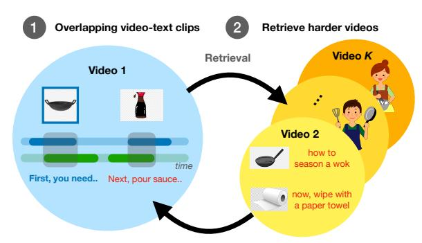

# VideoCLIP: Contrastive Pre-training for Zero-shot Video-Text Understanding

Hu Xu1, Gargi Ghosh1, Po-Yao Huang12, Dmytro Okhonko1, Armen Aghajanyan1 Florian Metze,1 Luke Zettlemoyer1 and Christoph Feichtenhofer1 1Facebook AI

2Carnegie Mellon University

{huxu,gghosh,berniehuang,oxo,armenag fmetze,lsz,feichtenhofer}@fb.com

# Abstract

We present VideoCLIP, a contrastive approach to pre-train a unified model for zeroshot video and text understanding, without using any labels on downstream tasks. VideoCLIP trains a transformer for video and text by contrasting temporally overlapping positive video-text pairs with hard negatives from nearest neighbor retrieval. Our experiments on a diverse series of downstream tasks, including sequence-level text-video retrieval, VideoQA, token-level action localization, and action segmentation reveal state-ofthe-art performance, surpassing prior work, and in some cases even outperforming supervised approaches. Code is made available at https://github.com/pytorch/ fairseq/tree/main/examples/MMPT.

#### 1 Introduction

The popular "pre-training + fine-tuning" paradigm has revolutionized NLP (Devlin et al., 2019; Liu et al., 2019b; Yang et al., 2019; Lewis et al., 2020b) and CV (Chen et al., 2020a; He et al., 2020) over the last few years. Although models trained this way can achieve impressive performance, they still require task-specific annotated data and fine-tuning for each end task. Recent work adopt pre-training for zero-shot transfer to end tasks without fine-tuning, including GPT (Radford et al., 2018, 2019; Brown et al., 2020) for NLP tasks and CLIP (Radford et al., 2021) for image classification.

This paper focuses on pre-training for zero-shot transfer to *video*-text understanding tasks. Our approach pre-trains a Transformer model (Vaswani et al., 2017; Devlin et al., 2019) with a contrastive objective (Oord et al., 2018; Chen et al., 2020a) using pairs of video-text clips. Different from CLIP that scales pre-training data for zero-shot transfer to image classification on an explicitly assembled dataset using a simple contrastive objective (Chen et al., 2020a), this paper uses a *publicly established* pre-training dataset, HowTo100M (Miech et al.,

VideoCLIP: Contrastive learning with hard-retrieved negatives and overlapping positives for video-text pre-training.

Figure 1: VideoCLIP aims for zero-shot video understanding via learning fine-grained association between video and text in a transformer using a contrastive objective with two key novelties: (1) for *positive* pairs, we use video and text clips that are *loosely* temporarily overlapping instead of enforcing strict start/end timestamp overlap; (2) for *negative* pairs, we employ a retrieval based sampling technique that uses video clusters to form batches with mutually harder videos.

2019), for zero-shot video understanding. We show that the resulting pre-trained model can be either directly applied to, or fine-tuned on, a series of video-text tasks at both the global sequence and local clip/token level.

We find that straightforward objectives (Chen et al., 2020a) lead to poor results, and hypothesize that learning fine-grained associations between video and text is crucial for success of zero-shot transfer to end tasks. Since end tasks may require different granularities of video-text correspondence. The granularity can be about sequence length (such as long video versus short text (*e.g.*classification), token level or sequence level) and semantics ("apple" vs "banana" or "apple" vs "car"). Previous efforts sample short, temporally aligned video and text clips with contrastive learning within a random batch, falling short on learning the fine-grained association between video frames and word tokens.

We present VideoCLIP that aims to pre-train a *unified* video-text representation with contrastive learning using two key techniques (see Fig. 1) to compute the training objective.

First, we aim to improve the association of video and text with different sequence lengths. Although the majority of video clips and text transcriptions are not semantically aligned (Miech et al., 2019), current video-text models are trained with exact temporal alignment. As a result, multiple or longer text clips may have better alignment with a video clip (Miech et al., 2020) and many clips may not have any corresponding captions (see a detailed discussion of issues in §3.3). To address these issues, we pre-train with temporally overlapped pairs of video and text clips (of varying length), thereby greatly increasing the quality and quantity of the video-text alignment. We show in experiments that this simple and general approach significantly improves performance.

Second, we learn fine-grained video-text similarity from a contrastive loss with a new method for gathering (implicitly) harder negative pairs. Although existing works contrast intra-video clips via sampling multiple clips from the same video (Miech et al., 2019, 2020), we find that mining clips from other videos can provide much more challenging negatives. We propose a **retrieval augmented pre-training** approach to retrieve a cluster of videos that are similar to each other for each training batch. Retrieval-augmented pre-training alternatively performs retrieving video clusters and uses the retrieved video clusters for pre-training (see § 3.4 for details).

After pre-training, we apply our model for zeroshot transfer *without* any fine-tuning on target dataset labels. We directly use our pre-trained model on a diverse set of *four* tasks in *five* datasets, including text-video retrieval (for text-to-video similarity), VideoQA (for video-to-text similarity), action localization (for video frame to text label similarity) and segmentation (for video token to text label similarity with rejection) (see §4).

Our experiments reveal that VideoCLIP has strong performance, even compared to supervised approaches which use human-annotated labels on the downstream tasks. For example, in text-video retrieval on Youcook2 (Zhou et al., 2017), Video-CLIP outperforms all existing zero-shot methods and even outperforms fully supervised pre-training + fine-tuning methods, but without using any labels.

In summary, the main contributions of this paper include: (i) we propose to pre-train a *unified* model that is capable of zero-shot transfer to *multiple* end tasks for video-text understanding, even surpassing

fully-supervised methods in some cases, and (ii) we introduce two novel techniques to improve the learning of fine-grained video-text association.

#### 2 Related Work

Pre-training for Zero-shot Transfer. Recently, the paradigm of pre-training has made impressive progress with the scale of training data and computational power. For example, in NLP, the paradigm has shifted from learning word embeddings for task-specific architecture (Mikolov et al., 2013; Bojanowski et al., 2017; Peters et al., 2018), to pretraining+fine-tuning (Devlin et al., 2019; Liu et al., 2019b; Lewis et al., 2020b) and few-shot/zero-shot transfer (Radford et al., 2018, 2019; Brown et al., 2020; Alayrac et al., 2020; Ramesh et al., 2021) that have task-agnostic architecture. One line of pre-training for zero-shot transfer focuses on generative (auto-regressive) models (Radford et al., 2018, 2019; Brown et al., 2020), where examples and prompts of an end task are used as context for a language model to respond properly to that task (Brown et al., 2020); the other line of studies focuses on discriminative models (Alayrac et al., 2020; Miech et al., 2020), where a similarity search or ranking model learns a joint space (e.g. via contrastive learning (Chen et al., 2020a; He et al., 2020)) and later transfer to a particular task. Recently, CLIP (Radford et al., 2021) transfers imagetext similarity to many image classification tasks, where the text branch serves as supervision for learning a general image representation and subsequently serves as a hyper network for downstream vision tasks. Our effort aligns with the latter line of work, but is the first to transfer a pre-trained discriminative model to a broad range of tasks in multi-modal video understanding.

Multi-modal Video-Text Pre-training. Multi-modal models have also adopted the pre-training+fine-tuning paradigm. One line of work adopts multiple unimodal encoders for retrieval tasks. For example, (Miech et al., 2019, 2020; Ging et al., 2020; Gabeur et al., 2020; Alayrac et al., 2020; Patrick et al., 2021; Huang et al., 2021) adopt contrastive learning for pre-training and shows the possibility of zero-shot transfer to text-video re-trieval tasks. CBT (Sun et al., 2019a), HERO (Li et al., 2020b), VideoAsMT (Korbar et al., 2020) and UniVL (Luo et al., 2020) adopt multi-task learning (MTL) for pre-training on retrieval tasks.

HERO (Li et al., 2020b) and UniVL (Luo et al., 2020) further adopt a cross-encoder to further learn the fusion of different modalities.

The other line of work adopts a single *cross-modal* encoder and concatenates the vision and text sequences as inputs, including VideoBERT (Sun et al., 2019b), Unicoder-VL (Li et al., 2020a), VL-BERT (Su et al., 2020), UNITER (Chen et al., 2020b), VLP (Zhou et al., 2018), ActBERT (Zhu and Yang, 2020) and VLM (Xu et al., 2021). Although this approach is intuitive, it limits the capability of zero-shot transfer. For example, it is non-trivial to perform retrieval tasks on a single encoder as feeding vision and text in a pairwise manner is not flexible and data efficient (Luo et al., 2020).

Retrieval Augmented Training. Augmenting traditional training with a non-parametric retrieval component has recently shown impressive results in pre-training (Khandelwal et al., 2019; Guu et al., 2020; Lewis et al., 2020a) and QA (Izacard and Grave, 2020; Karpukhin et al., 2020). We find that contrastive learning and retrieval augmented training can have good synergy because the former aims to discriminate examples and the latter aims to find harder examples for discrimination. To the best of our knowledge, there is no existing work of retrieval augmented training for video, perhaps because videos exhibit unique challenges for dataefficient training (see §3.4).

# 3 VideoCLIP Pre-training

In the paradigm of multi-modal video-text pretraining for zero-shot transfer, the key challenge is to learn fine-grained association in-between video and text to cover the diverse needs of end tasks. We cover VideoCLIP pre-training in this section, and discuss the needs of zero-shot transfer to different end tasks in the next section. We first describe video and text model backbone and contrastive loss; then we propose overlapped video and text clips to improve the association of positive pairs; lastly, we describe retrieval augmented pre-training to improve the mining of negative examples.

#### 3.1 Video and Text Encoding

VideoCLIP consumes pairs of video and text clips (v,t) as inputs. It makes no assumptions on the encoder architectures and can work with any video and text backbone. We use Transformer (Vaswani et al., 2017) model for both the video and text. The

video features, extracted by a convolutional neural network (CNN), are first projected to *video tokens* before fed into our video transformer, as described next.

**Video and Text Transformers.** Let  $c_v$  be a video clip of a sequence of continuous frames (we use bold symbols to indicate sequences). We feed  $c_v$  into a (frozen) pre-trained video encoder  $f_{\theta_{\text{CNN}}}$  and then apply a trainable MLP,  $f_{\theta_{\text{MLP}}}$ , with weights  $\theta_{\text{MLP}}$  to obtain  $video\ tokens\ x_v \in \mathbb{R}^d$  with the same embedding dimension, d, as for word embeddings in our architecture:

$$\boldsymbol{x}_v = f_{\theta_{\text{MLP}}}(\text{stopgrad}(f_{\theta_{\text{CNN}}}(\boldsymbol{c}_v))), \quad (1)$$

where stopgrad is a stop-gradient operation, to reflect that the video CNN is frozen.

Similarly, vectors for text tokens  $x_t$  are obtained via embedding lookup as in BERT (Devlin et al., 2019). Then  $x_v$  and  $x_t$  are feed into two separate trainable Transformers,  $f_{\theta_v}$  and  $f_{\theta_t}$ , respectively, to obtain the hidden states for video and text tokens

$$\boldsymbol{h}_v = f_{\theta_v}(\boldsymbol{x}_v), \boldsymbol{h}_t = f_{\theta_t}(\boldsymbol{x}_t). \tag{2}$$

To obtain the hidden states (*i.e.* global features) of video and text clips, we apply average pooling over the sequence of tokens for video and text, respectively

$$z_v = \text{AvgPool}(\boldsymbol{h}_v), z_t = \text{AvgPool}(\boldsymbol{h}_t).$$
 (3)

We use average pooling (instead of using the [CLS] token) to encourage  $f_{\theta_v}$  and  $f_{\theta_t}$  to learn token-level representations that may benefit token-level tasks, such as action localization and action segmentation (see Section 4).

VideoCLIP aims at pre-training the *unified* video-text representation, captured by the Transformer model parameters  $\theta_v$  and  $\theta_t$  for video and text, and consequently use it for zero-shot downstream tasks. In appendix, we also explore *shared* weights for video and text,  $\theta_v \equiv \theta_t$ , and our ablations show that separate video/text transformers yields slightly better performance.

Notably, using a frozen video backbone ( $f_{\theta_{\text{CNN}}}$ ) enables us to go beyond short-term visual input (typical video CNNs (Xie et al., 2018; Feichtenhofer et al., 2019) only capture temporal windows of  $\sim$ 3 seconds), and allows us to model *long-term* visual-textual correspondences spanning  $\sim$ 32 seconds. We describe our training methodology next.

#### 3.2 Contrastive Loss

We use a contrastive loss (InfoNCE (Oord et al., 2018) objective) to learn the correspondence between video and text.

In particular, we minimize the sum of two multimodal contrastive losses:

$$\mathcal{L} = -\sum_{(v,t)\in B} \left(\log \text{NCE}(z_v, z_t) + \log \text{NCE}(z_t, z_v)\right), (4)$$

where B is the batch that contains sampled videotext pairs and  $NCE(z_v, z_t)$  and  $NCE(z_t, z_v)$  corresponds to the contrastive loss on video-to-text similarity and text-to-video similarity. Specifically, the video-to-text contrastive loss is given by

$$NCE(z_{v}, z_{t}) = \frac{\exp(z_{v} \cdot z_{t}^{+} / \tau)}{\sum_{z \in \{z_{t}^{+}, z_{t}^{-}\}} \exp(z_{v} \cdot z / \tau)}, \quad (5)$$

with  $\tau$  being a temperature hyper-parameter and  $z_t^+$  are *positive* embedded text clips overlapping with video clip embedding  $z_v$ , and  $\{z_t^-\}$  are *negative* embedded text clips that are implicitly formed by other text clips in the training batch. The text-to-video loss NCE $(z_t, z_v)$  is defined symmetrically. The next sections (§3.3 and §3.4) describe how we construct the positive,  $z_t^+$ , and negatives,  $\{z_t^-\}$ , in our pre-training objective (5).

#### 3.3 Overlapped Video-Text Clips

To build overlapping positive video/text pairs, we

- (i) sample a text clip (because sampling a video clip first may not have nearby corresponding text);
- (ii) sample a timestamp within the boundary of text clip as the *center* for a video clip;
- (iii) grow a video clip with random duration (up to  $\sim$ 32 seconds) from this center timestamp.

Our empirical results show this simple method works well in practice, and we discuss its benefits w.r.t. prior efforts next.

Low Relevance Temporal Alignment. Existing video-text pre-training methods, *e.g.*, (Miech et al., 2019), consider temporally exactly aligned clips (video and text clips sharing the same start/end timestamps). Although strict alignment seems natural, it is less likely that temporally aligned video and text clips are also semantically close in short clips. For example, a video clip of "*a person speaking*" may have a low relevance1

with the exact temporally aligned transcription "I am going to show you how to cook fried rice". However, a later video clip showing "rice in wok" may have a better semantic visual alignment. One explanation for this low relevance of temporal alignment is that humans are less likely to speak and perform actions simultaneously.

Using exact temporal alignment limits the examples considered in the contrastive loss. Taking the previous  $NCE(z_v, z_t)$  term as an example, the low relevance (positive) pair could be in the numerator of the objective (5), whereas higher relevance pairs (e.g. rice in wok appearing later in a video with an introductionary text clip of "I am going to show you how to cook fried rice") are possibly used as negative pairs, under exact temporal alignment for constructing positive/negative samples. Although existing work (Miech et al., 2020) aligns multiple nearby text clips with one (short) video clip of fixed 3.2 seconds duration, this only partially solves the low relevance problem and can attenuate noise, as the text clips may only partially correspond to the visuals and might have no temporal overlap with the short-duration video clip per se.

Better Video-Text Association. As such, we believe a (self-supervised) method that can curate higher relevance video-text pairs at a large-scale is crucial for effective learning. Our approach to sample video and text pairs (v,t) of different lengths while requiring  $temporal\ overlap$  improves videotext relevance and encourages fine-grained association. As such, a video (or text clip) can have a better chance to be aligned or supervised by nearby text and vice versa. By contrast, video clips without any temporally aligned text are never contributing as a positive video-text pair in our objective.

#### 3.4 Retrieval Augmented Training

Our intention is to learn to model more fine-grained video-text similarity by using difficult examples in our contrastive pre-training objective (5). We construct *negatives* in our training batch by using hard pairs  $\{z_t^-\}$ , which are semantically to the pairs in the numerator, using retrieval based sampling.

Recall that contrastive loss (e.g.in equation (5)) uses positive pairs in a batch B, and typically negative pairs are implicitly induced from other positive pairs in the same batch.

**Dense Video Cluster Retrieval.** Our approach aims to find video clusters to construct a batch of training samples. We formulate this as a dense

&lt;sup>1We use the term low relevance instead of noisy alignment because temporally aligned clips may still have low relevance on certain perspectives, such as positive emotions, an opened mouth with any transcription popping up, and "going to" in transcription indicates visual contents may show up later.

# **Algorithm 1:** Retrieval Augmented Training

**Input** :  $\mathcal{V}$  is video set; M is model.

#### 1 foreach epoch do

- infer global features for all videos  $\mathcal V$  on M: each video  $V \in \mathcal V$ 's global feature is computed as  $z_V = \frac{1}{2|B_V|} \sum_{(v,t) \in B_V} (z_v + z_t),$  where  $B_V$  indicates all clip pairs of V; build dense index on all videos'  $z_V$ ; retrieve  $|\mathcal C|$  video clusters, where each cluster  $c \in \mathcal C$  is sampled as  $c \sim k \mathrm{NN}(z_V, 2k), \, |c| = k$  from a random video V; sample overlapped video-text pairs from  $c \in \mathcal C$  to train M.
- 6 end

retrieval process on the latent space of a video, derived from the video/text embeddings of our transformer that is trained by the contrastive loss (5).

Our overall training process can be described as a two-stage method that alternatively performs *retrieval* and *training* in each epoch, and is summarized in Algorithm 1.

For each epoch, Line 2-4 corresponds to the retrieval stage and Line 5 corresponds to the training stage. Specifics are as follows.

Line 2 computes the global features  $z_V$  for each video by averaging the embeddings of all of its video-text clips. An ablation (in appendix) shows that this is better than using the starting clip of a video to infer the representative video embedding.

Line 3 constructs the dense index2 for all videos to be used in our retrieval-based training.

Line 4 first finds  $|\mathcal{C}|$  (corresponds to the number of overall batches in the training set) random videos, where each video V yields a video cluster c as follows. We sample |c| videos from k neighboring videos of V. Instead of searching k nearest videos directly (see ablation in Table 7), we sample k videos from the 2k nearest videos. This is because we want videos in a cluster to be mutually closer to each other (not all close to video V). In this way, all video/text clips sampled from one video can serve as negative examples for clips sampled from another video.

#### 4 Zero-shot Transfer to End Tasks

We present methods for zero-shot transfer of VideoCLIP to a variety of end tasks (*without* using any labels). For each task, we specify requirements that highlight the aspect of pre-training.

**Text** $\rightarrow$ **Video Retrieval.** Text $\rightarrow$ video retrieval tests the text-to-video similarity computed on the learned video-text representation. NCE $(z_t, z_v)$  in Equation 4 contributes to this task as it discriminates different video clips in the numerator and denominator for a given text clip. It also tests the distribution of hard negative examples in the denominator given it reports multiple recall metrics.

Multiple-choice VideoQA. In multiple-choice VideoQA (Yu et al., 2018), the model aligns each video with one out of several text candidate answers. It tests video $\rightarrow$ text similarities with a pretrained model. We formulate this task as ranking candidate textual answers for a given video question query. This corresponds to the NCE $(z_v, z_t)$  term in Equation 4, where the subtle differences in texts are discriminated against each other.

Action Segmentation. Action segmentation assigns each token (or frame) of a video with one of the pre-defined labels to separate meaningful segments of videos from the rest tokens (or frames). This is similar to sequence labeling (*e.g.* named entity recognition (NER)) in NLP. Inspired by the setup of CLIP (Radford et al., 2021), the text encoder of VideoCLIP can serve as self-supervision for videos during pre-training and as a hyper network to provide hidden states of segment textual labels for a video token. As such, the hidden state of each video token can have a distribution of similarity over segment labels. This task tests video token to text similarities.

One challenge in action segmentation is that it contains an Outside label that does not exist in transcription during pre-training. This Outside label is task-dependent because it means a token does not belong to any of the pre-defined labels. This is similar to open set recognition (Scheirer et al., 2012) or out-of-domain intent detection (Lane et al., 2006), where the *rejection* label is not presented during training but all new classes during inference (not shown in training) should be covered by the *rejection* label.

Let  $t \in L$  be one label in the set of all labels L excluding the <u>O</u>utside label. We apply the following conditions to each video token u to curate the

&lt;sup>2We use FAISS: https://github.com/facebookresearch/faiss.

prediction with the Outside label  $\hat{y}_u$ :

$$\begin{cases} \arg\max_{t\in L}(h_uz_t^T) & \text{if } \max_{t\in L}(h_uz_t^T) > \gamma, \\ \underline{O}\text{utside} & \text{otherwise,} \end{cases}$$
(6)

where  $\gamma$  is a threshold. Note that in zero-shot transfer, there is no access to training or validation data to decide a threshold as a hyper-parameter. Thus, we estimate  $\gamma$  as the maximum of dot products of intra-labels:  $\gamma = \max(z_t z_{t'}^T)$ , where  $t \in L, t' \in L$  and  $t \neq t'$ .

Action Step Localization. In this task, each video is associated with a "task" with multiple steps S, where each step  $t \in S$  is described as a short text. Action step localization is to assign each video token to one or multiple steps in the associated task. This is similar to action segmentation except that the label set is not pre-defined and does not contain the Outside label. As such, we first obtain the hidden states for each video frame (or token)  $h_u$  from transformer. Then we separately forward text labels into the text backbone to obtain the hidden states of step labels  $z_S$ . The distribution of each video token over steps is predicted as Softmax $(h_u z_S^T)$ .

## 5 Experiments

#### 5.1 VideoCLIP Pre-training

For pre-training, we use HowTo100M (Miech et al., 2019) that contains instructional videos via searching keywords from wikihow3 in YouTube. We use 1.1M videos after filtering out videos which are not available or cannot be decoded. We randomly sample 4K videos as the validation set and use the rest for pre-training. On average, the duration of each video is  $\sim$ 6.5 minutes with  $\sim$ 110 clip-text pairs. After removing repeated words from ASR, we end up with  $\sim$ 7.7 GB of text transcriptions, with 2.4 tokens per second on average.

### 5.2 End Task Setups

**Text**→**Video Retrieval.** We use Youcook2, MSR-VTT and DiDeMo to evaluate zero-shot transfer to text-video retrieval. Youcook2 (Zhou et al., 2017) has 2K cooking videos with a total duration of 176 hours and 5.26 minutes on average per video. It shows about 89 recipes in 14K video clips. Each video clip is annotated with one sentence. We follow the splits of Miech et al.

(2019) to make sure there is no overlap between pretraining and evaluation data. We have 3,305 test clip-text pairs from 430 videos for zero-shot evaluation. MSR-VTT (Xu et al., 2016) is a well-known dataset for text-video retrieval, question answering etc. Following JSFusion (Yu et al., 2018; Miech et al., 2019), we randomly sampled 1K clip-text pairs as test data for evaluation of zero-shot transfer. DiDeMo (Anne Hendricks et al., 2017) has 10,000 videos annotated with 40,000 sentences on Flicker videos. We evaluate video-paragraph retrieval on 4021 available testing examples4.

**VideoQA.** We further use the QA test data (Yu et al., 2018) for MSR-VTT to evaluate multiple-choice VideoQA. Recall that this task can be formulated as a video-text retrieval task except the candidate textual answers are associated with each video and only one answer is correct (most relevant). On average, VideoQA for MSR-VTT has 5 candidate answers per video.

**Action Segmentation.** We use COIN (Tang et al., 2019) to evaluate action segmentation. It has 11,827 videos (476 hours) in total and the testing set has 2797 videos, where each video is labeled with 3.91 segments per video on average. There are 778 segment labels and we feed these textual labels into the text backbone to obtain their latent space. As a reminder of Section 4, we do not model the Outside label explicitly and determine an Outside label only when all other 778 labels reject a video token. Note that videos in COIN can last for several minutes, we apply a sliding window with a step size of 16 seconds and a window size of 32 seconds. During inference, we average the logits for overlapped tokens from multiple windows.

Action Step Localization. We use CrossTask (Zhukov et al., 2019) to evaluate action localization. It contains 83 different tasks and 4.7K videos. Each task has a set of steps in the form of text descriptions and each frame of video is annotated with one or multiple steps as a distribution. We use the testing data split via the official code5, which contains 1690 annotated videos. We leave details of fine-tuning data to appendix.

3www.wikihow.com

https://github.com/LisaAnne/
LocalizingMoments/blob/master/utils/
eval.py

5https://github.com/DmZhukov/CrossTask

# 5.3 Implementation Details

**Video Encoder.** We use a S3D (Xie et al., 2018) for video encoder  $f_{\theta_{\text{CNN}}}$ . It is pre-trained on HowTo100M (Miech et al., 2020) to extract video tokens of dimension 512. We use 30fps and extract one video token per second. This can be precomputed for efficiency.

**Transformers.** For the video and text Transformers,  $f_{\theta_{v}}$  and  $f_{\theta_{t}}$ , we initialize their weights with the pre-trained BERTBASE-uncased (Devlin et al., 2019). Using the same type of transformer further allows us to perform ablation study on sharing video and text backbones (see Table 7). We only use the first 6 Transformer layers for the video input and all 12 layers for the text input. Please note that the video/text encoders in VideoCLIP is generally applicable to other pre-trained Transformers. We use a single layer MLP  $f_{\theta_{\text{MLP}}}$  with GELU activation (Hendrycks and Gimpel, 2016) to map the S3D outputs to the 768-dimensional inputs of the video Transformer.

We limit the maximum number of video tokens to be 32. For video transformer, its input sequence is 34 with <code>[CLS]</code> and <code>[SEP]</code> tokens. For text transformer, we have 61 text tokens plus <code>[CLS]</code> and <code>[SEP]</code> tokens (63 in total). The number of text tokens roughly doubling in the number of video tokens because text comes at  $\sim$ 2.4 tokens per second (on average) in the HowTo100M data, while our video tokens are extracted at 1 token per second. A text clip has a random length between 8 and 61 tokens, whereas a video clip has 3 to 32 seconds. We sample 16 video/text pairs from each video and use k=32 videos to form batches of size |B|=512.

**Training Details.** We pre-train our model on 8 NVIDIA Tesla V100 GPUs (each with 32 GB memory) for 25 epochs using fp16 precision for  $\sim$ 1 day. We use Adam (Kingma and Ba, 2014) as optimizer with betas of (0.9, 0.98), an initial learning rate of 5e-5, 1000 steps of warm-up, and a polynomial decay learning rate schedule. Gradients are clipped at 2.0. The softmax temperature in objective (5) is set to  $\tau = 1.0$ .

#### 5.4 Main Results

We evaluate VideoCLIP on various end tasks and compare it with other zero-shot and supervised methods that use labels on the target datasets.

**Text-video Retrieval.** The results on Youcook2 and MSR-VTT are shown in Table 1. The result on

| Youcook2 dataset                    | R@1↑ | `R@5↑ | R@10↑       |
|-------------------------------------|------|-------|-------------|
| SUPERVISED                          |      |       |             |
| HGLMM(Klein et al., 2015)           | 4.6  | 14.3  | 21.6        |
| Coot(Ging et al., 2020)             | 16.7 | 40.2  | 52.3        |
| UniVL (FT-Joint)(Luo et al., 2020)  | 22.2 | 52.2  | 66.2        |
| VideoCLIP (Fine-tuned)              | 32.2 | 62.6  | <b>75.0</b> |
| ZERO-SHOT                           |      |       |             |
| Random                              | 0.0  | 0.2   | 0.3         |
| HowTo100M(Miech et al., 2019)       | 6.1  | 17.3  | 24.8        |
| MIL-NCE(Miech et al., 2020)         | 15.1 | 38.0  | 51.2        |
| VideoCLIP (Zero-shot)               | 22.7 | 50.4  | 63.1        |
|                                     |      |       |             |
| MSR-VTT dataset                     | R@1↑ | `R@5↑ | R@10↑       |
| SUPERVISED                          |      |       |             |
| UniVL (FT-Joint) (Luo et al., 2020) | 20.6 | 49.1  | 62.9        |
| ClipBERT (Lei et al., 2021)         | 22.0 | 46.8  | 59.9        |
| MMT (Gabeur et al., 2020)           | 25.8 | 57.2  | 69.3        |
| Support Set(Patrick et al., 2021)   | 30.1 | 58.5  | 69.3        |
| VideoCLIP (Fine-tuned)              | 30.9 | 55.4  | 66.8        |
| ZERO-SHOT                           |      |       |             |
| Random                              | 0.1  | 0.5   | 1.0         |
| HowTo100M(Miech et al., 2019)       | 7.5  | 21.2  | 29.6        |
| MIL-NCE(Miech et al., 2020)         | 9.9  | 24.0  | 32.4        |
| SupportSet(Patrick et al., 2021)    | 8.7  | 23.0  | 31.1        |
| VideoCLIP (Zero-shot)               | 10.4 | 22.2  | 30.0        |

Table 1: *Text→video retrieval* on Youcook2 and VTT.

DiDeMo is shown in Table 2.

On Youcook2 (Table 1, top), VideoCLIP shows impressive performance gains and has much better accuracy than traditional supervised methods. The zero-shot transfer performance is even close to the performance level of supervised baselines with pre-training. With fine-tuning, VideoCLIP reaches state-of-the-art on Youcook2.

On MSR-VTT (Table 1, bottom), VideoCLIP shows solid improvements but with a larger zero-shot to supervised gap than on Youcook2. The major reason could be domain shift from HowTo100M to MSR-VTT. The captions in MSR-VTT are more descriptive (*e.g.*, "a basketball player is playing basketball" and are less likely to appear in the transcriptions of HowTo100M). After fine-tuning, VideoCLIP reaches state-of-the-art R@1. Note that this is achieved *without using any supervised data* such as ImageNet or *large-scale external data* (*i.e.*, 65 million Instagram data) used by the second best method, Support Set (Patrick et al., 2021).

On DiDeMo (Table 2), VideoCLIP has better performance than most supervised methods. Note that ClipBERT(Lei et al., 2021) has image pretraining before video+text fine-tuning.

**Video Question Answering.** In Table 3, zeroshot VideoCLIP outperforms most supervised

| DiDeMo dataset                  | R@11 | R@5  |
|---------------------------------|------|------|
| SUPERVISED                      |      |      |
| S2VT (Venugopalan et al., 2014) | 11.9 | 33.6 |
| FSE (Zhang et al., 2018)        | 13.9 | 44.5 |
| CE (Liu et al., 2019a)          | 16.1 | 41.1 |
| ClipBERT (Lei et al., 2021)     | 20.4 | 48.0 |
| ZERO-SHOT                       |      |      |
| VideoCLIP (Zero-shot)           | 16.6 | 46.9 |

Table 2: *Text→video retrieval* on DiDeMo.

| MSR-VTT dataset                     | Accuracy ↑ |
|-------------------------------------|------------|
| SUPERVISED                          |            |
| LSTM-fusion (Yu et al., 2018)       | 38.3       |
| C+LSTM+SA-FC7 (Torabi et al., 2016) | 60.2       |
| SNUVL (Yu et al., 2016)             | 65.4       |
| EITanque (Kaufman et al., 2017)     | 65.5       |
| CT-SAN (Yu et al., 2017)            | 66.4       |
| VSE-LSTM (Kiros et al., 2014)       | 67.3       |
| MLB (Kim et al., 2016)              | 76.1       |
| JSFusion(Yu et al., 2018)           | 83.4       |
| ActBERT(Zhu and Yang, 2020)         | 85.7       |
| ClipBERT(Lei et al., 2021)          | 88.2       |
| VideoCLIP (Fine-tuned)              | 92.1       |
| ZERO-SHOT                           |            |
| VideoCLIP (Zero-shot)               | 73.9       |

Table 3: VideoQA on MSR-VTT.

| COIN dataset                       | Frame Accuracy ↑ |  |
|------------------------------------|------------------|--|
| SUPERVISED                         |                  |  |
| NN-Viterbi (Richard et al., 2018)  | 21.2             |  |
| VGG (Simonyan and Zisserman, 2014) | ) 25.8           |  |
| TCFPN-ISBA (Ding and Xu, 2018)     | 34.3             |  |
| CBT (Sun et al., 2019a)            | 53.9             |  |
| ActBERT (Zhu and Yang, 2020)       | 57.0             |  |
| MIL-NCE (Miech et al., 2020)       | 61.0             |  |
| VideoCLIP (Fine-tuned)             | 68.7             |  |
| ZERO-SHOT                          |                  |  |
| VideoCLIP (Zero-shot)              | 58.9             |  |

Table 4: Action segmentation on COIN.

methods but similarly suffers from domain shift from HowTo100M to MSR-VTT. After fine-tuning, it reaches the best performance, indicating Video-CLIP also provides strong features for fine-tuning.

Action Segmentation. We report the results of action segmentation on COIN in Table 4. Zeroshot transfer of VideoCLIP to COIN outperforms all supervised methods, without using any labels on this dataset. This indicates that VideoCLIP also learns good token-level video representations. Finetuning VideoCLIP further yields a ~10% accuracy gain, indicating potential room for improvement.

| CrossTask dataset                | Average Recall $\uparrow$ |  |
|----------------------------------|---------------------------|--|
| SUPERVISED                       |                           |  |
| Alayrac (Alayrac et al., 2016)   | 13.3                      |  |
| Zhukov (Zhukov et al., 2019)     | 22.4                      |  |
| Supervised (Zhukov et al., 2019) | 31.6                      |  |
| ActBERT (Zhu and Yang, 2020)     | 41.4                      |  |
| UniVL (Luo et al., 2020)         | 42.0                      |  |
| VideoCLIP (Fine-tuned)           | 47.3                      |  |
| ZERO-SHOT                        | _                         |  |
| HowTo100M (Miech et al., 2019)   | 33.6                      |  |
| MIL-NCE (Miech et al., 2020)     | 40.5                      |  |
| VideoCLIP (Zero-shot)            | 33.9                      |  |

Table 5: Action step localization on CrossTask.

Action Step Localization. Lastly, we report VideoCLIP's performance on CrossTask in Table 5. It shows a small gap to supervised methods when using zero-shot action step localization. Fine-tuning leads to a  $\sim 10\%$  gain, outperforming all prior work on this dataset.

# 5.5 Discussion on Work that Fine-tunes CLIP Model

There are concurrent works (Luo et al., 2021; Portillo-Quintero et al., 2021) about using image+text model (Radford et al., 2021) for video+text downstream tasks. Note that (Luo et al., 2021) and (Portillo-Quintero et al., 2021) use image pre-training (no video pre-training) and transfer to videos, whereas our focus is about improving video pre-training using a novel pre-training objective. Besides this conceptual difference (Luo et al., 2021; Portillo-Quintero et al., 2021) are using a pre-trained image CLIP(Radford et al., 2021) model from OpenAI which is trained on huge, semicurated web image+text pairs that provides exceptional zero-shot performance on many datasets (e.g.ImageNet); however, the CLIP pre-training data is sourced from web-search engines (which on their own use fully supervised neural networks trained on ImageNet and other datasets); therefore, is not fair to compare to our approach which only trains on HowTo100M instructional videos.

#### **5.6** Ablation Study

In Table 7, we perform an ablation study on zeroshot transfer for text—video retrieval on Youcook2 to quantify the the contribution of overlapping clips and retrieval augmented pre-training.

In the first group, we study the effectiveness of the two proposed methods. VideoCLIP without retrieval augmented training significantly drops

| Query Text                              | Text of Top-1 video from VideoCLIP (Zero-shot)   | Text of Top-1 video from VideoCLIP (Fine-tuned) |
|-----------------------------------------|--------------------------------------------------|-------------------------------------------------|
|                                         | put chickpeas parsley chopped onion chili powder |                                                 |
| pick the ends off the verdalago         | ground cumin in food processor                   | pick the ends off the verdalago                 |
| add the fried pita to the salad and mix | toss the salad                                   | add the dressing and bread pieces the the salad |
| place chicken in hot oil                |                                                  |                                                 |
| and fry until golden brown              | fry the chicken in oil                           | fry the chicken wings in deep oil               |
| fry dark meats together and             |                                                  |                                                 |
| white meats together                    | add the mutton to the pan                        | add the diced beef meat to it and roast it      |
| rub salt and pepper onto the chicken    | season them with salt and pepper                 | rub salt and pepper onto the chicken            |

Table 6: Qualitative error analysis of *text→video retrieval* on Youcook2.

| Youcook2 dataset                                   | R@1↑ | R@5↑ | R@10↑ |
|----------------------------------------------------|------|------|-------|
| VideoCLIP (Zero-shot)                              | 22.7 | 50.4 | 63.1  |
| <ul><li>w/o retrieval</li></ul>                    | 18.5 | 42.8 | 54.6  |
| <ul> <li>w/o retrieval and w/o overlap</li> </ul>  | 12.4 | 30.2 | 40.7  |
| - using MIL-NCE clips and loss                     | 16.1 | 38.6 | 51.1  |
| <ul> <li>shared video/text transformer</li> </ul>  | 21.9 | 48.1 | 60.6  |
| - retrieve k                                       | 22.5 | 49.3 | 61.4  |
| <ul> <li>use first 32 sec for retrieval</li> </ul> | 20.1 | 46.3 | 58.7  |
| - use [CLS]                                        | 22.1 | 47.1 | 59.6  |
|                                                    |      |      |       |

Table 7: Ablation on *text→video retrieval* (Youcook2).

performance by over 4% in R@1 and additionally using *exact alignment* positives, *i.e.*, the same start/end timestamp for a pair of video and text clips, has another 4% drop in R@1. Therefore, both techniques combined lead to a  $\sim 50\%$  relative improvement in recall.

Further, by using MIL-NCE clips and loss we evaluate the potential benefit of using the training objective from MIL-NCE (Miech et al., 2020) (which uses multiple temporally adjacent clips as positives) in our architecture. This ablation isolates the pre-training objective from model and data. We observe that the MIL-NCE loss can improve the direct alignment objective but performs significantly worse than our objective (16.1 vs. 22.7 R@1).

In the second group, we further study the design choices of modeling. shared video/text transformer indicates  $f_{\theta_{v}}$  is the same as  $f_{\theta_{t}}$ , which only decreases performance slightly. This suggests that using a joint backbone for video and text is effective.

retrieve k indicates direct searching k nearest neighbors instead of sampling k videos from 2k nearest neighbors (used by VideoCLIP) in Line 4 of Algorithm 1. Sampling from nearest neighbors yields video clusters of better quality.

use starting 32 sec for retrieval indicates using the first 32 secs of a video as representation for video retrieval, which is an inferior representation of the whole video.

Unlike employing Avgpool, using [CLS] token only prevents VideoCLIP from exploiting token-level information and thus yields worse performance.

#### 5.7 Qualitative Analysis

We examine errors for text-video retrieval of Youcook2 in both zero-shot transfer and fine-tuning setting in Table 6. We observe that in zero-shot transfer, VideoCLIP has no prior knowledge about a particular task/dataset on how long a text and video clip should be paired together for the text-retrieval task. Fine-tuning allows to correct this type of error. Further, we observe that VideoCLIP tends to mix objects of similar color/shape together. We leave incorporating such type of knowledge into pre-training to future work.

# 6 Conclusion

We have presented VideoCLIP, an approach to pretrain a video-text model for zero-shot transfer to end tasks that require fine-grained association between video and language. VideoCLIP uses an objective that contrasts temporally overlapping positives with hard negatives stemming from nearest neighbor retrieval. In evaluation this approach outperforms prior work on a variety of tasks, without any supervision on downstream datasets, and in some cases VideoCLIP is competitive or better than prior work that uses full supervision; nevertheless, we still observe gains for fine-tuning our model. We hope that our code and model will foster future research in multi-modal video understanding.

#### Code

Code and models are made available at https://github.com/pytorch/fairseq/tree/main/examples/MMPT.

### Acknowledgments

We thank Licheng Yu for in-depth discussion and feedback, as well as Huaishao Luo and Mandela Patrick for supporting baseline implementation.

### References

- Jean-Baptiste Alayrac, Piotr Bojanowski, Nishant Agrawal, Josef Sivic, Ivan Laptev, and Simon Lacoste-Julien. 2016. Unsupervised learning from narrated instruction videos. In *Proceedings of the IEEE Conference on Computer Vision and Pattern Recognition*, pages 4575–4583.
- Jean-Baptiste Alayrac, Adrià Recasens, Rosalia Schneider, Relja Arandjelović, Jason Ramapuram, Jeffrey De Fauw, Lucas Smaira, Sander Dieleman, and Andrew Zisserman. 2020. Self-supervised multimodal versatile networks. *arXiv preprint arXiv:2006.16228*.
- Lisa Anne Hendricks, Oliver Wang, Eli Shechtman, Josef Sivic, Trevor Darrell, and Bryan Russell. 2017. Localizing moments in video with natural language. In *Proceedings of the IEEE international conference on computer vision*, pages 5803–5812.
- Piotr Bojanowski, Edouard Grave, Armand Joulin, and Tomas Mikolov. 2017. Enriching word vectors with subword information. *Transactions of the Association for Computational Linguistics*, 5:135–146.
- Tom B Brown, Benjamin Mann, Nick Ryder, Melanie Subbiah, Jared Kaplan, Prafulla Dhariwal, Arvind Neelakantan, Pranav Shyam, Girish Sastry, Amanda Askell, et al. 2020. Language models are few-shot learners. *arXiv preprint arXiv:2005.14165*.
- Ting Chen, Simon Kornblith, Mohammad Norouzi, and Geoffrey Hinton. 2020a. A simple framework for contrastive learning of visual representations. *arXiv* preprint arXiv:2002.05709.
- Yen-Chun Chen, Linjie Li, Licheng Yu, Ahmed El Kholy, Faisal Ahmed, Zhe Gan, Yu Cheng, and Jingjing Liu. 2020b. Uniter: Universal image-text representation learning. In *European Conference on Computer Vision*, pages 104–120. Springer.
- Jacob Devlin, Ming-Wei Chang, Kenton Lee, and Kristina Toutanova. 2019. BERT: Pre-training of deep bidirectional transformers for language understanding. In Proceedings of the 2019 Conference of the North American Chapter of the Association for Computational Linguistics: Human Language Technologies, Volume 1 (Long and Short Papers), pages 4171–4186, Minneapolis, Minnesota. Association for Computational Linguistics.
- Li Ding and Chenliang Xu. 2018. Weakly-supervised action segmentation with iterative soft boundary assignment. In *Proceedings of the IEEE Conference on Computer Vision and Pattern Recognition*, pages 6508–6516.
- Christoph Feichtenhofer, Haoqi Fan, Jitendra Malik, and Kaiming He. 2019. Slowfast networks for video recognition. In *Proceedings of the IEEE/CVF International Conference on Computer Vision*, pages 6202–6211.

- Valentin Gabeur, Chen Sun, Karteek Alahari, and Cordelia Schmid. 2020. Multi-modal transformer for video retrieval. In *European Conference on Computer Vision (ECCV)*, volume 5. Springer.
- Simon Ging, Mohammadreza Zolfaghari, Hamed Pirsiavash, and Thomas Brox. 2020. Coot: Cooperative hierarchical transformer for video-text representation learning. *arXiv preprint arXiv:2011.00597*.
- Kelvin Guu, Kenton Lee, Zora Tung, Panupong Pasupat, and Ming-Wei Chang. 2020. Realm: Retrieval-augmented language model pre-training. *arXiv* preprint arXiv:2002.08909.
- Kaiming He, Haoqi Fan, Yuxin Wu, Saining Xie, and Ross Girshick. 2020. Momentum contrast for unsupervised visual representation learning. In *Proceedings of the IEEE/CVF Conference on Computer Vision and Pattern Recognition*, pages 9729–9738.
- Dan Hendrycks and Kevin Gimpel. 2016. Gaussian error linear units (GELUs). arXiv preprint arXiv:1606.08415.
- Po-Yao Huang, Mandela Patrick, Junjie Hu, Graham Neubig, Florian Metze, and Alexander Hauptmann. 2021. Multilingual multimodal pre-training for zeroshot cross-lingual transfer of vision-language models. In *Meeting of the North American Chapter of the Association for Computational Linguistics (NAACL)*, Mexico City.
- Gautier Izacard and Edouard Grave. 2020. Leveraging passage retrieval with generative models for open domain question answering. *arXiv* preprint *arXiv*:2007.01282.
- Vladimir Karpukhin, Barlas Oguz, Sewon Min, Patrick Lewis, Ledell Wu, Sergey Edunov, Danqi Chen, and Wen-tau Yih. 2020. Dense passage retrieval for open-domain question answering. In *Proceedings of the 2020 Conference on Empirical Methods in Natural Language Processing (EMNLP)*, pages 6769–6781.
- Dotan Kaufman, Gil Levi, Tal Hassner, and Lior Wolf. 2017. Temporal tessellation: A unified approach for video analysis. In *Proceedings of the IEEE International Conference on Computer Vision*, pages 94–104.
- Urvashi Khandelwal, Omer Levy, Dan Jurafsky, Luke Zettlemoyer, and Mike Lewis. 2019. Generalization through memorization: Nearest neighbor language models. *arXiv preprint arXiv:1911.00172*.
- Jin-Hwa Kim, Kyoung-Woon On, Woosang Lim, Jeonghee Kim, Jung-Woo Ha, and Byoung-Tak Zhang. 2016. Hadamard product for low-rank bilinear pooling. *arXiv preprint arXiv:1610.04325*.
- Diederik P Kingma and Jimmy Ba. 2014. Adam: A method for stochastic optimization. *arXiv preprint arXiv:1412.6980*.

- Ryan Kiros, Ruslan Salakhutdinov, and Richard S Zemel. 2014. Unifying visual-semantic embeddings with multimodal neural language models. *arXiv* preprint arXiv:1411.2539.
- Benjamin Klein, Guy Lev, Gil Sadeh, and Lior Wolf. 2015. Associating neural word embeddings with deep image representations using fisher vectors. In *Proceedings of the IEEE Conference on Computer Vision and Pattern Recognition*, pages 4437–4446.
- Bruno Korbar, Fabio Petroni, Rohit Girdhar, and Lorenzo Torresani. 2020. Video understanding as machine translation. *arXiv preprint arXiv:2006.07203*.
- Ian Lane, Tatsuya Kawahara, Tomoko Matsui, and Satoshi Nakamura. 2006. Out-of-domain utterance detection using classification confidences of multiple topics. *IEEE Transactions on Audio, Speech, and Language Processing*, 15(1):150–161.
- Jie Lei, Linjie Li, Luowei Zhou, Zhe Gan, Tamara L. Berg, Mohit Bansal, and Jingjing Liu. 2021. Less is more: Clipbert for video-and-language learningvia sparse sampling. In *CVPR*.
- Mike Lewis, Marjan Ghazvininejad, Gargi Ghosh, Armen Aghajanyan, Sida Wang, and Luke Zettlemoyer. 2020a. Pre-training via paraphrasing. *Advances in Neural Information Processing Systems*, 33.
- Mike Lewis, Yinhan Liu, Naman Goyal, Marjan Ghazvininejad, Abdelrahman Mohamed, Omer Levy, Veselin Stoyanov, and Luke Zettlemoyer. 2020b. BART: Denoising sequence-to-sequence pre-training for natural language generation, translation, and comprehension. In *Proceedings of the 58th Annual Meeting of the Association for Computational Linguistics*, pages 7871–7880, Online. Association for Computational Linguistics.
- Gen Li, Nan Duan, Yuejian Fang, Ming Gong, Daxin Jiang, and Ming Zhou. 2020a. Unicoder-vl: A universal encoder for vision and language by cross-modal pre-training. In *AAAI*, pages 11336–11344.
- Linjie Li, Yen-Chun Chen, Yu Cheng, Zhe Gan, Licheng Yu, and Jingjing Liu. 2020b. HERO: Hierarchical encoder for Video+Language omnirepresentation pre-training. In *Proceedings of the 2020 Conference on Empirical Methods in Natural Language Processing (EMNLP)*, pages 2046–2065, Online. Association for Computational Linguistics.
- Yang Liu, Samuel Albanie, Arsha Nagrani, and Andrew Zisserman. 2019a. Use what you have: Video retrieval using representations from collaborative experts. *arXiv preprint arXiv:1907.13487*.
- Yinhan Liu, Myle Ott, Naman Goyal, Jingfei Du, Mandar Joshi, Danqi Chen, Omer Levy, Mike Lewis, Luke Zettlemoyer, and Veselin Stoyanov. 2019b. Roberta: A robustly optimized bert pretraining approach. *arXiv preprint arXiv:1907.11692*.

- Huaishao Luo, Lei Ji, Botian Shi, Haoyang Huang, Nan Duan, Tianrui Li, Xilin Chen, and Ming Zhou. 2020. Univilm: A unified video and language pre-training model for multimodal understanding and generation. arXiv preprint arXiv:2002.06353.
- Huaishao Luo, Lei Ji, Ming Zhong, Yang Chen, Wen Lei, Nan Duan, and Tianrui Li. 2021. Clip4clip: An empirical study of clip for end to end video clip retrieval. *arXiv preprint arXiv:2104.08860*.
- Antoine Miech, Jean-Baptiste Alayrac, Lucas Smaira, Ivan Laptev, Josef Sivic, and Andrew Zisserman. 2020. End-to-end learning of visual representations from uncurated instructional videos. In *Proceedings of the IEEE/CVF Conference on Computer Vision and Pattern Recognition*, pages 9879–9889.
- Antoine Miech, Dimitri Zhukov, Jean-Baptiste Alayrac, Makarand Tapaswi, Ivan Laptev, and Josef Sivic. 2019. Howto100m: Learning a text-video embedding by watching hundred million narrated video clips. In *Proceedings of the IEEE international conference on computer vision*, pages 2630–2640.
- Tomas Mikolov, Ilya Sutskever, Kai Chen, Greg Corrado, and Jeffrey Dean. 2013. Distributed representations of words and phrases and their compositionality. *arXiv preprint arXiv:1310.4546*.
- Aaron van den Oord, Yazhe Li, and Oriol Vinyals. 2018. Representation learning with contrastive predictive coding. arXiv preprint arXiv:1807.03748.
- Mandela Patrick, Po-Yao Huang, Yuki Asano, Florian Metze, Alexander G Hauptmann, Joao F. Henriques, and Andrea Vedaldi. 2021. Support-set bottlenecks for video-text representation learning. In *International Conference on Learning Representations*.
- Matthew E Peters, Mark Neumann, Mohit Iyyer, Matt Gardner, Christopher Clark, Kenton Lee, and Luke Zettlemoyer. 2018. Deep contextualized word representations. *arXiv preprint arXiv:1802.05365*.
- Jesús Andrés Portillo-Quintero, José Carlos Ortiz-Bayliss, and Hugo Terashima-Marín. 2021. A straightforward framework for video retrieval using clip. In *Mexican Conference on Pattern Recognition*, pages 3–12. Springer.
- Alec Radford, Jong Wook Kim, Chris Hallacy, Aditya Ramesh, Gabriel Goh, Sandhini Agarwal, Girish Sastry, Amanda Askell, Pamela Mishkin, Jack Clark, et al. 2021. Learning transferable visual models from natural language supervision. *arXiv preprint arXiv:2103.00020*.
- Alec Radford, Karthik Narasimhan, Tim Salimans, and Ilya Sutskever. 2018. Improving language understanding by generative pre-training.
- Alec Radford, Jeffrey Wu, Rewon Child, David Luan, Dario Amodei, and Ilya Sutskever. 2019. Language models are unsupervised multitask learners. *OpenAI blog*, 1(8):9.

- Aditya Ramesh, Mikhail Pavlov, Gabriel Goh, Scott Gray, Chelsea Voss, Alec Radford, Mark Chen, and Ilya Sutskever. 2021. Zero-shot text-to-image generation. *arXiv preprint arXiv:2102.12092*.
- Alexander Richard, Hilde Kuehne, Ahsan Iqbal, and Juergen Gall. 2018. Neuralnetwork-viterbi: A framework for weakly supervised video learning. In *Proceedings of the IEEE Conference on Computer Vision and Pattern Recognition*, pages 7386–7395.
- Walter J Scheirer, Anderson de Rezende Rocha, Archana Sapkota, and Terrance E Boult. 2012. Toward open set recognition. *IEEE transactions on pattern analysis and machine intelligence*, 35(7):1757–1772.
- Karen Simonyan and Andrew Zisserman. 2014. Very deep convolutional networks for large-scale image recognition. *arXiv preprint arXiv:1409.1556*.
- Weijie Su, Xizhou Zhu, Yue Cao, Bin Li, Lewei Lu, Furu Wei, and Jifeng Dai. 2020. Vl-bert: Pretraining of generic visual-linguistic representations. In *International Conference on Learning Representations*.
- Chen Sun, Fabien Baradel, Kevin Murphy, and Cordelia Schmid. 2019a. Contrastive bidirectional transformer for temporal representation learning. arXiv preprint arXiv:1906.05743, 3(5).
- Chen Sun, Austin Myers, Carl Vondrick, Kevin Murphy, and Cordelia Schmid. 2019b. Videobert: A joint model for video and language representation learning. In *Proceedings of the IEEE International Conference on Computer Vision*, pages 7464–7473.
- Yansong Tang, Dajun Ding, Yongming Rao, Yu Zheng, Danyang Zhang, Lili Zhao, Jiwen Lu, and Jie Zhou. 2019. Coin: A large-scale dataset for comprehensive instructional video analysis. In *Proceedings of the IEEE Conference on Computer Vision and Pattern Recognition*, pages 1207–1216.
- Atousa Torabi, Niket Tandon, and Leonid Sigal. 2016. Learning language-visual embedding for movie understanding with natural-language. *arXiv preprint arXiv:1609.08124*.
- Ashish Vaswani, Noam Shazeer, Niki Parmar, Jakob Uszkoreit, Llion Jones, Aidan N Gomez, Łukasz Kaiser, and Illia Polosukhin. 2017. Attention is all you need. In *Advances in neural information processing systems*, pages 5998–6008.
- Subhashini Venugopalan, Huijuan Xu, Jeff Donahue, Marcus Rohrbach, Raymond Mooney, and Kate Saenko. 2014. Translating videos to natural language using deep recurrent neural networks. *arXiv* preprint arXiv:1412.4729.
- Saining Xie, Chen Sun, Jonathan Huang, Zhuowen Tu, and Kevin Murphy. 2018. Rethinking spatiotemporal feature learning: Speed-accuracy trade-offs in video classification. In *Proceedings of the European*

- Conference on Computer Vision (ECCV), pages 305–321.
- Hu Xu, Gargi Ghosh, Po-Yao Huang, Prahal Arora, Masoumeh Aminzadeh, Christoph Feichtenhofer, Florian Metze, and Luke Zettlemoyer. 2021. VLM: Task-agnostic video-language model pre-training for video understanding. In *Findings of the Association for Computational Linguistics: ACL-IJCNLP 2021*, pages 4227–4239, Online. Association for Computational Linguistics.
- Jun Xu, Tao Mei, Ting Yao, and Yong Rui. 2016. Msrvtt: A large video description dataset for bridging video and language. In Proceedings of the IEEE conference on computer vision and pattern recognition, pages 5288–5296.
- Zhilin Yang, Zihang Dai, Yiming Yang, Jaime Carbonell, Russ R Salakhutdinov, and Quoc V Le. 2019. Xlnet: Generalized autoregressive pretraining for language understanding. In *Advances in Neural Information Processing Systems*, volume 32, pages 5753–5763. Curran Associates, Inc.
- Youngjae Yu, Jongseok Kim, and Gunhee Kim. 2018. A joint sequence fusion model for video question answering and retrieval. In *Proceedings of the European Conference on Computer Vision (ECCV)*, pages 471–487.
- Youngjae Yu, Hyungjin Ko, Jongwook Choi, and Gunhee Kim. 2016. Video captioning and retrieval models with semantic attention. *arXiv preprint arXiv:1610.02947*, 6(7).
- Youngjae Yu, Hyungjin Ko, Jongwook Choi, and Gunhee Kim. 2017. End-to-end concept word detection for video captioning, retrieval, and question answering. In *Proceedings of the IEEE Conference on Computer Vision and Pattern Recognition*, pages 3165–3173.
- Bowen Zhang, Hexiang Hu, and Fei Sha. 2018. Cross-modal and hierarchical modeling of video and text. In *Proceedings of the European Conference on Computer Vision (ECCV)*, pages 374–390.
- Luowei Zhou, Chenliang Xu, and Jason J Corso. 2017. Towards automatic learning of procedures from web instructional videos. *arXiv preprint arXiv:1703.09788*.
- Luowei Zhou, Yingbo Zhou, Jason J Corso, Richard Socher, and Caiming Xiong. 2018. End-to-end dense video captioning with masked transformer. In *Proceedings of the IEEE Conference on Computer Vision and Pattern Recognition*, pages 8739–8748.
- Linchao Zhu and Yi Yang. 2020. Actbert: Learning global-local video-text representations. In *Proceedings of the IEEE/CVF Conference on Computer Vision and Pattern Recognition*, pages 8746–8755.

Dimitri Zhukov, Jean-Baptiste Alayrac, Ramazan Gokberk Cinbis, David Fouhey, Ivan Laptev, and Josef Sivic. 2019. Cross-task weakly supervised learning from instructional videos. In *Proceedings of the IEEE/CVF Conference on Computer Vision and Pattern Recognition*, pages 3537–3545.

# A Supplementary Material for VideoCLIP

This supplementary material is organized as follows. First we provide additional experimental setups for each end task. Then we specify the hyper-parameters in our model and detail how we train VideoCLIP. Lastly, we provide extra ablations and analysis of various VideoCLIP configurations.

## A.1 End Task Setup Details

**Text-Video Retrieval.** We use Youcook2 and MSR-VTT to evaluate text-video retrieval. We directly use our video and text Transformers to encode the videos and the text queries and measure the text-to-video similarities for retrieval.

Youcook2 (Zhou et al., 2017) is a collection of 2K cooking videos with a total duration of 176 hours and 5.26 minutes on average per video. It contains 89 recipes in 14K video clips where each clip is annotated with one descriptive sentence. We follow the splits defined in Miech et al. (2019) and make sure there is no overlap between pre-training and evaluation data. After filtering out unavailable ones, we obtain 9,473 training clip-text pairs from 1222 videos and 3,305 test clip-text pairs from 430 videos.

MSR-VTT (Xu et al., 2016) is a widely-compared benchmark dataset for text-video retrieval and video question answering. It contains open-domain videos where each video clips is around 10 seconds. Each training clip has 20 captioning sentences labeled by a human. In total, there are 200K clip-text pairs from 10K videos. Following JSFusion (Yu et al., 2018; Miech et al., 2019), we sampled 1K clip-text pairs as the test data and the rest is used for training.

Multiple-choice VideoQA. We use the testing split and data in (Yu et al., 2018) on MSR-VTT to evaluate multiple-choice VideoQA. On average, VideoQA for MSR-VTT has 5 candidate answers per video. Recall that this task can be formulated as a video-text retrieval task except the candidate textual answers are associated with each video and only one answer is correct (most relevant). In practice, we find the answer with the maximum similarity in-between a video and all candidate answers.

Action Segmentation. We use COIN (Tang et al., 2019) to evaluate action segmentation. COIN contains 11,827 videos (476 hours) in total and the testing set has 2797 videos, where each video is labeled with 3.91 segments per video on average.

There are 778 segment labels and we feed these textual labels into the text backbone to obtain their latent space. We do not model the Outside label explicitly and determine an Outside label only when all other 778 labels reject a video token. Note that videos in COIN can last for several minutes, we apply a sliding window with a step size of 16 seconds and a window size of 32 seconds. During inference, we average the logits for overlapped tokens from multiple windows. For follow the original split of COIN for training and evaluation.

Action Step Localization. CrossTask (Zhukov et al., 2019) is used to evaluate action localization. There are 83 different tasks and 4.7K videos where each task has a set of steps in the form of text descriptions and each frame of video is annotated with one or multiple steps as a distribution. We use the testing data split and the official codebase (https://github.com/DmZhukov/ CrossTask) that contains 1.7K videos. We use 540 annotated videos for supervised training. Recall that action step localization testing the video's token-level features and we use the representations  $h_v$  of the last layer of BERT before average pooling. We compute the distribution of similarity for each token over the latent space of textual labels of steps.