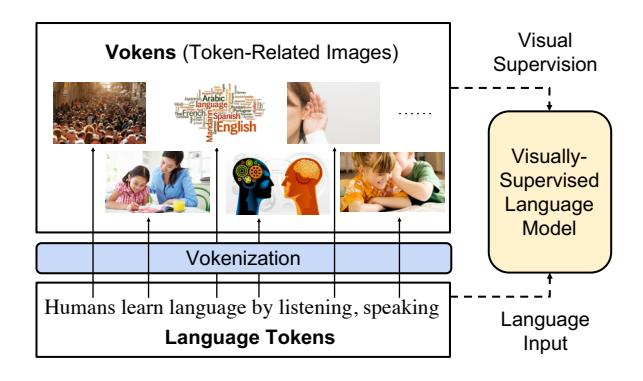
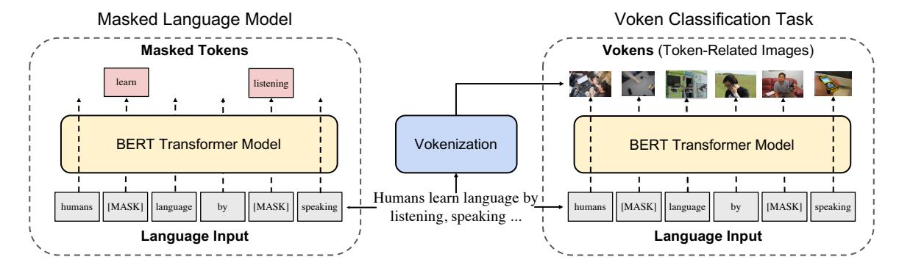
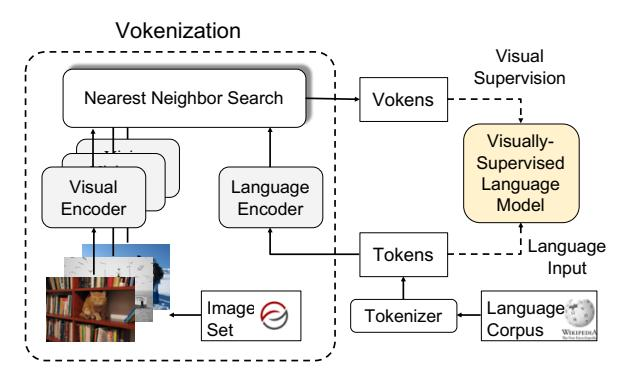
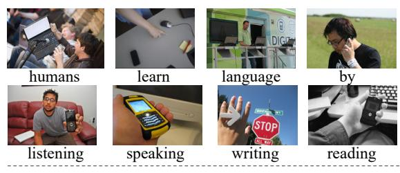
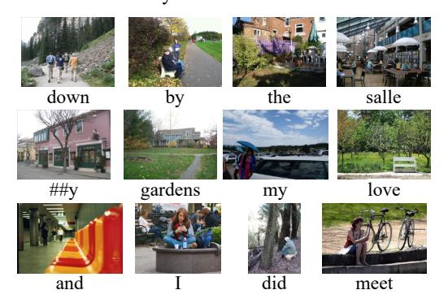

# Vokenization: Improving Language Understanding with Contextualized, Visual-Grounded Supervision

# Hao Tan Mohit Bansal UNC Chapel Hill

{haotan, mbansal}@cs.unc.edu

#### **Abstract**

Humans learn language by listening, speaking, writing, reading, and also, via interaction with the multimodal real world. Existing language pre-training frameworks show the effectiveness of text-only self-supervision while we explore the idea of a visually-supervised language model in this paper. We find that the main reason hindering this exploration is the large divergence in magnitude and distributions between the visually-grounded language datasets and pure-language corpora. Therefore, we develop a technique named "vokenization" that extrapolates multimodal alignments to language-only data by contextually mapping language tokens to their related images (which we call "vokens"). kenizer" is trained on relatively small image captioning datasets and we then apply it to generate vokens for large language corpora. Trained with these contextually generated vokens, our visually-supervised language models show consistent improvements over self-supervised alternatives on multiple purelanguage tasks such as GLUE, SQuAD, and SWAG.1

#### 1 Introduction

Most humans learn language understanding from multiple modalities rather than only from the text and audio, especially using the visual modality. As claimed in Bloom (2002), visual pointing is an essential step for most children to learn meanings of words. However, existing language pretraining frameworks are driven by contextual learning which only takes the language context as self-supervision. For example, word2vec (Mikolov et al., 2013) takes surrounding bag-of-words; ELMo (Peters et al., 2018) and GPT (Radford et al.,

Figure 1: We visually supervise the language model with token-related images. We call these images vokens (visualized tokens) and develop a vokenization process to contextually generate them.

2018) take succeeding contexts; and BERT (Devlin et al., 2019) takes randomly masked tokens. Although these self-supervised frameworks have achieved strong progress towards understanding human language, they did not borrow grounding information from the external visual world (see related motivations in recent work by Bender and Koller (2020) and Bisk et al. (2020)).

In this paper, we introduce the visually-supervised language model that simulates human language learning with visual pointing (Bloom, 2002). As shown in Fig. 1, this model takes language tokens as input and uses token-related images as visual supervision. We name these images as *vokens* (i.e., visualized tokens), since they act as visualizations of the corresponding tokens. Assuming that a large aligned token-voken dataset exists, the model could learn from these vokens via voken-prediction tasks.

Unfortunately, such an aligned token-voken dataset is currently unavailable and hence there are two main challenges in creating it from visually-grounded language datasets. First, there is a large discrepancy between visually-grounded language (which provides innate visual grounding supervi-

&lt;sup>1Code and pre-trained models publicly available at: https://github.com/airsplay/vokenization.

Figure 2: Illustration of the BERT transformer model trained with a visually-supervised language model with two objectives: masked language model (on the left) and voken classification (on the right). The first objective (used in original BERT pre-training) predicts the masked tokens as self-supervision while the second objective predicts the corresponding vokens (contextually generated by our vokenization process) as external visual supervision. Since the inputs are the same, we optimize the two objectives simultaneously and share the model weights.

sion) and other types of natural language. For example, about 120M tokens are available in visuallygrounded language datasets (Tan and Bansal, 2019; Chen et al., 2019), which is far less compared to the 3,300M tokens in BERT training data and 220B tokens in T5 (Raffel et al., 2019). Grounded language also prefers short and instructive descriptions, and thus has different distributions of sentence lengths and active words to other language types. Second, most of the words in natural language are not visually grounded, hence this challenges the premise in creating visual supervision. With an approximate estimation, the ratio of grounded tokens is only about 28% in English Wikipedia. This low grounding ratio leads to low coverage of visual supervision in previous approaches (Frome et al., 2013; Kiela et al., 2018).

To resolve the above two challenges, we propose our *vokenization* method (as shown in Fig. 1) that contextually maps the tokens to the visualized tokens (i.e., vokens) by retrieval. Instead of directly supervising the language model with visually grounded language datasets (e.g., MS COCO (Lin et al., 2014)), we use these relative small datasets to train the vokenization processor (i.e., the vokenizer). We then generate vokens for large language corpora (e.g., English Wikipedia), and our visually-supervised language model will take the input supervision from these large datasets, thus bridging the gap between different data sources, which solves the first challenge. The second challenge of low grounding ratio seems to be an inherent characteristic of language; however, we observe that some non-visually-grounded tokens can be effectively mapped to related images when considering its context, e.g., the abstract word "angry" in

the sentence "an angry cat lies on my leg". This observation is realized by our *contextual* token-image matching model (defined in Sec. 3.2) inside our vokenization processor, where we map tokens to images by viewing the sentence as the context.

Using our proposed vokenizer with a contextualized token-image matching model, we generate vokens for English Wikipedia. Supervised by these generated vokens, we show consistent improvements upon a BERT model on several diverse NLP tasks such as GLUE (Wang et al., 2019), SQuAD (Rajpurkar et al., 2016), and SWAG (Zellers et al., 2018). We also show the transferability of our vokens to other frameworks (i.e., RoBERTa).

### 2 Visually-Supervised Language Models

Contextual language representation learning is driven by self-supervision without considering explicit connections (grounding) to the external world. In this section, we illustrate the idea of a visually-supervised language model and discuss the challenges of creating its visual supervision.

### 2.1 Vokens: Visualized Tokens

To provide visual supervision to the language model, we assume a text corpus where each token is aligned with a related image (although these voken annotations currently do not exist, we will try to generate vokens next in Sec. 3 by the vokenization process). Hence, these images could be considered as visualizations of tokens and we name them as 'vokens'. Based on these vokens, we propose a new pre-training task for language: voken classification.

| Dataset  | # of Tokens | # of Sents | Vocab. Size | Tokens #/ Sent. | 1-Gram JSD | 2-Gram JSD | Grounding Ratio |
|----------|-------------|------------|-------------|-----------------|------------|------------|-----------------|
| MS COCO  | 7.0M        | 0.6M       | 9K          | 11.8            | 0.15       | 0.27       | 54.8%           |
| VG       | 29.2M       | 5.3M       | 13K         | 5.5             | 0.16       | 0.28       | 57.6%           |
| CC       | 29.9M       | 2.8M       | 17K         | 10.7            | 0.09       | 0.20       | 41.7%           |
| Wiki103  | 111M        | 4.2M       | 29K         | 26.5            | 0.01       | 0.05       | 26.6%           |
| Eng Wiki | 2889M       | 120M       | 29K         | 24.1            | 0.00       | 0.00       | 27.7%           |
| CNN/DM   | 294M        | 10.9M      | 28K         | 26.9            | 0.04       | 0.10       | 28.3%           |

Table 1: Statistics of image-captioning dataset and other natural language corpora. VG, CC, Eng Wiki, and CNN/DM denote Visual Genome, Conceptual Captions, English Wikipedia, and CNN/Daily Mail, respectively. JSD represents Jensen–Shannon divergence to the English Wikipedia corpus. A large discrepancy exists between the visually grounded captioning and general language corpora.

#### 2.2 The Voken-Classification Task

Most language backbone models (e.g., ELMo (Peters et al., 2018), GPT (Radford et al., 2018), BERT (Devlin et al., 2019)) output a localized feature representation  $\{h_i\}$  for each token in a sentence  $s = \{w_i\}$ . Thus it allows adding a token-level classification task without modifying the model architecture. Suppose the vokens come from a finite set  $\mathbb{X}$ , we convert the hidden output  $h_i$  to a probability distribution  $p_i$  with a linear layer and a softmax layer, then the voken classification loss is the negative log probability of all corresponding vokens:

$$\begin{aligned} \boldsymbol{h}_1, \boldsymbol{h}_2, \dots, \boldsymbol{h}_l &= \operatorname{lm}(w_1, w_2, \dots, w_l) \\ p_i(v \mid s) &= \operatorname{softmax}_v \{ W \ \boldsymbol{h}_i + b \} \\ \mathcal{L}_{\text{VOKEN-CLS}}(s) &= -\sum_{i=1}^l \log p_i \left( v(w_i; s) \mid s \right) \end{aligned}$$

This task could be easily integrated into current language pre-training frameworks, and we next show an example.

Example: Visually-Supervised BERT Fig. 2 shows an example realization of the voken-classification task that provides visual supervision to BERT (Devlin et al., 2019). The original BERT pre-training mainly relies on the task of masked language model2 (illustrated on the left side of Fig. 2): tokens are randomly masked and the model needs to predict these missing tokens from language context. For simplicity, we use s and  $\hat{s}$  to denote the set of tokens and masked tokens, separately. The unmasked tokens are the set difference  $s \setminus \hat{s}$ . Suppose  $q_i$  is the conditional probability distribution of the i-th token, the Masked Language Model (MLM) loss is the negative log-likelihood of the masked

tokens

$$\mathcal{L}_{\text{MLM}}(s, \hat{s}) = -\sum_{w_i \in \hat{s}} \log q_i \left( w_i \mid s \setminus \hat{s} \right)$$

Without changing the model and model's inputs, we calculate the voken-classification loss for all tokens (illustrated on the right side of Fig. 2):

$$\mathcal{L}_{\text{VOKEN-CLS}}(s, \hat{s}) = -\sum_{w_i \in s} \log p_i \left( v(w_i; s) \mid s \setminus \hat{s} \right)$$

The visually-supervised masked language model takes the sum of these two losses with a ratio  $\lambda$ .

$$\mathcal{L}_{\text{VLM}}(s, \hat{s}) = \mathcal{L}_{\text{VOKEN-CLS}}(s, \hat{s}) + \lambda \mathcal{L}_{\text{MLM}}(s, \hat{s})$$
(1)

#### 2.3 Two Challenges in Creating Vokens

Previous sections illustrate the potential external supervision by assuming the existence of vokens. However, we are currently lacking the dense annotations from tokens to images. The most similar concept to vokens is phrase localization (e.g., in Flickr30K entities (Young et al., 2014; Plummer et al., 2017)). Because the process of collecting phrase localization is costly, the coverage and the amount of annotations cannot meet our requirements.3 Apart from phrase localization, the most promising data source is image captioning datasets with sentence-to-image mappings (or discovered from multimodal documents, as in Hessel et al. (2019)). Image captions belong to a specific type of language called grounded language (Roy and Pentland, 2002; Hermann et al., 2017), which has an explicit grounding to external existence or physical actions. However, grounded language has a large discrepancy to other types of natural language (e.g., News, Wiki, and Textbooks). To illustrate this, we list key statistics of three imagecaptioning dataset (i.e., MS COCO (Lin et al.,

&lt;sup>2The next-sentence prediction task is removed in RoBERTa (Liu et al., 2019) and XLM (Lample and Conneau, 2019) and the fine-tuning results are not largely affected.

&lt;sup>3Recently, a concurrent work Pont-Tuset et al. (2019) releases localized narratives. The tokens are aligned with image pixels instead of images.

2014), Visual Genome (Krishna et al., 2017), and Conceptual Captions (Sharma et al., 2018)) and three language corpora of other language types (i.e., Wiki103 (Merity et al., 2017), English Wiki, and CNN/Daily Mail (See et al., 2017)) in Table 1. This discrepancy between grounded language and other types of natural language leads to two challenges:

A. Different Distributions between Grounded Language and Other Natural Language Corpora. Sentences belonging to grounded language are usually short and informative, e.g., the average sentence length in MS COCO is 11.8, which is much shorter than the average sentence length of 24.1 in English Wiki. The vocabulary4 of MS COCO only covers around one-third of token types (Smith, 2019) in English Wiki. There is also a large divergence of the 1-Gram and 2-Gram distributions (measured by Jensen–Shannon divergence) between grounded language dataset and the English Wikipedia. Lastly, the amount of tokens in grounded language corpora are also orders of magnitude smaller than commonly-used Wikipedia.

B. Low Grounding Ratio in Natural Language. The grounding ratio is defined as the percentage of visually grounded tokens in the dataset. Visually grounded tokens (e.g., concrete nouns) are the token types that are naturally related to specific visual contents (e.g., 'cat', 'cake', 'clock'). Since a precise list of such token types is hard to define, we thus estimate the grounding ratio based on existing grounded language corpora. Specifically, we consider a token type with more than 100 occurrences in MS COCO (after removing all stop words) as visually-grounded. A sample of these token types could be found in the Appendix. As shown in the last column of Table 1, the grounding ratio of English Wiki is 27.7%, which is almost half of that in Visual Genome.

To address these two challenges, we propose a vokenizer with contextual token-image matching models next in Sec. 3.

### 3 Vokenization

In the previous section, we discuss the potential of using vokens (i.e., visualized tokens) as visual supervision to the language model, and also demonstrate the large gap between currently available resources (i.e., annotated dataset) and the desired requirements. Hence, in this section, we develop a framework that can generate vokens. As shown in Fig. 2, the general idea is that we learn a "vokenizer" from image-captioning dataset and use it to annotate large language corpora (i.e., English Wiki), thus bridging the gap between grounded language and other types of natural language. We start by illustrating the vokenization process and then describe how we implement it.

#### 3.1 The Vokenization Process

As shown in Fig. 1 and Fig. 2, vokenization is the process to assign each token  $w_i$  in a sentence  $s = (w_1, w_2, \dots, w_l)$  with a relevant image  $v(w_i; s)$ . We call this image  $v(w_i; s)$  as a 'voken' (visualized token). Instead of creating this image with generative models, we retrieve an image from a set of images  $\mathbb{X} = \{x_1, x_2, \dots, x_n\}$  regarding a token-image-relevance scoring function  $r_{\theta}(w_i, x; s)$ . This scoring function  $r_{\theta}(w_i, x; s)$ , parameterized by  $\theta$ , measures the relevance between the token  $w_i$  in the sentence s and the image x. We here assume that the optimal parameter of this function is  $\theta^*$  and will discuss the details of formulations later. The voken  $v(w_i; s)$  related to a token  $w_i$  in the sentence s is realized as the image  $x \in \mathbb{X}$ that maximizes their relevance score  $r_{\theta^*}$ :

$$v(w_i; s) = \arg\max_{x \in \mathbb{V}} r_{\theta^*}(w_i, x; s)$$

Since the image set X indeed builds a finite vocabulary for vokens, we could utilize the voken-classification task (formulated in Sec. 2.2) to visually supervise the language model training. We next talk about the detailed implementation of this vokenization process.

# 3.2 Contextual Token-Image Matching Model

Lying in the core of the vokenization process is a contextual token-image matching model. The model takes a sentence s and an image x as input, and the sentence s is composed of a sequence of tokens  $\{w_1, w_2, \ldots, w_l\}$ . The output  $r_{\theta}(w_i, x; s)$  is the relevance score between the token  $w_i \in s$  and the image x while considering the whole sentence s as a context.

**Modeling** To model the relevance score function  $r_{\theta}(w_i, x; s)$ , we factorize it as an inner product of the language feature representation  $f_{\theta}(w_i; s)$  and the visual feature representation  $g_{\theta}(x)$ :

$$r_{\theta}(w_i, x; s) = \mathbf{f}_{\theta}(w_i; s)^{\mathsf{T}} \mathbf{g}_{\theta}(x)$$

&lt;sup>4The vocabulary is calculated following Karpathy and Fei-Fei (2015) where the words with > 5 occurrence is counted.

These two feature representations are generated by language and visual encoders respectively. The language encoder first uses a pre-trained BERTBASE (Devlin et al., 2019) model to contextually embed the discrete tokens  $\{w_i\}$  into hiddenoutput vectors  $\{h_i\}$ :

$$h_1, h_2, \ldots, h_l = bert(w_1, w_2, \ldots, w_l)$$

Then we apply a multi-layer perceptron (MLP)  $w_-mlp_\theta$  to down project the hidden output  $h_i$ . In order to simplify the retrieval process in Sec. 3.1, the final language features are normalized to norm-1 vectors by dividing their Euclidean norms:

$$f_{\theta}(w_i; s) = \frac{w_{-}mlp_{\theta}(\boldsymbol{h}_i)}{\|w_{-}mlp_{\theta}(\boldsymbol{h}_i)\|}$$

On the other side, the visual encoder first extracts the visual embedding e from a pre-trained ResNeXt (Xie et al., 2017). Similar to the language encoder, an MLP layer  $x_-mlp_\theta$  and an L2-normalization layer are applied subsequently:

$$egin{aligned} oldsymbol{e} &= \mathrm{ResNeXt}(x) \ oldsymbol{g}_{ heta}(x) &= rac{x\_mlp_{ heta}(oldsymbol{e})}{\|x\_mlp_{ heta}(oldsymbol{e})\|} \end{aligned}$$

**Training** Since the dense annotations from tokens to images are lacking and hard to generate (illustrated in Sec. 2.3), we thus alternatively train the token-image matching model from weak supervision in image-captioning datasets (e.g., MS COCO (Lin et al., 2014)). These datasets are comprised of sentence-image pairs  $\{(s_k, x_k)\}$  where the sentence  $s_k$  describes the visual content in image  $x_k$ . To build alignments between tokens and images, we pair all tokens in a sentence  $s_k$  with the image  $x_k$ . The model is then optimized by maximizing the relevance score of these aligned token-image pairs over unaligned pairs.

Without loss of generality, assuming (s,x) is an image-captioning data point, we randomly sample another image x' with the condition  $x' \neq x$ . We then use hinge loss to optimize the weight  $\theta$  so that the score of the positive token-image pair  $r_{\theta}(w_i, x; s)$  aims to be larger than the negative pair  $r_{\theta}(w_i, x'; s)$  by at least a margin M.

$$\mathcal{L}_{\theta}(s, x, x') = \sum_{i=1}^{l} \max\{0, M - r_{\theta}(w_i, x; s) + r_{\theta}(w_i, x'; s)\}$$

Figure 3: Implementation of our vokenization process. For the tokens in language corpora, we contextually retrieved images (with nearest neighbor search) from the image set as vokens. These generated vokens are then used as the visual supervision to the language model.

Intuitively, minimizing this hinge loss  $\max\{0, M - pos + neg\}$  will try to increase the score of the positive pair and decrease the score of the negative pair when the score difference is smaller than the margin M. Otherwise (if the difference is  $\geq \max(M)$ ), the two scores remain unchanged.

Inference Given that the relevance score is factorized as the inner product of feature representations  $f_{\theta}(w_i; s)$  and  $g_{\theta}(v)$ , the retrieval problem in Sec. 3.1 could be formulated as Maximum Inner Product Search (Mussmann and Ermon, 2016)). Moreover, since the vectors are norm-1, the vector with the maximum inner product is identical to the closest vector in the Euclidean space (i.e., Nearest Neighbor (Knuth, 1973)). We illustrate the detailed implementation in Fig. 3.

#### 3.3 Revokenization

A constraint of the vokenization process in Sec. 3.1 is that the vokens depend on the actual tokenizer of the language encoder in Sec. 3.2. Since different frameworks utilize a various range of tokenizers, this constraint limits the transferability of vokens between different frameworks. Instead of binding our vokenizer to a specific pre-training framework (e.g., BERT), we want to enable its extensibility to other frameworks (e.g., RoBERTa). Thus, we introduce a "revokenization" technique to address this limitation.

Given two different tokenizers  $T_1$  and  $T_2$ , they tokenize a sentence s into two different sequences of tokens:  $T_1(s) = (w_1, w_2, \ldots, w_l)$  and  $T_2(s) = (u_1, u_2, \ldots, u_m)$ . Without loss of generality, assuming the vokenizer is built based on the first tokenizer  $T_1$ , the standard vokenization process will generate a sequence of vokens  $\{v(w_i; s)\}_{i=1}^l$  which

are one-to-one aligned with the tokens  $\{w_i\}_{i=1}^l$ . Our goal is to transfer these w-related vokens to the u-related vokens generated by  $T_2$ . We adapt the idea of "nearest neighbor algorithm" (Altman, 1992) here. For a given token  $u_j$ , among all w's, we select the one that overlaps the most with  $u_j$  and record it as  $w_{ind(j)}$ . The voken for  $u_j$  is defined as the voken for its "nearest neighbor"  $w_{ind(j)}$ :

$$v(u_j; s) := v(w_{ind(j)}; s)$$
$$ind(j) = \arg\max_{i=1}^{l} \operatorname{overlap}(w_i, u_j)$$

The overlapping of two tokens are further quantified by the intersection-over-union (i.e., Jaccard index, defined as  $IoU(A,B)=\frac{|A\cap B|}{|A\cup B|}$ ) of their ranges in the raw sentence s.

#### 4 Experimental Setups and Results

## 4.1 Pre-training Data and Fine-tuning Tasks

We train our model on English Wikipedia 5 and its featured subset Wiki103 (Merity et al., 2017). We use our vokenizer to generate vokens for these two datasets as well. The pre-trained models are then fine-tuned on GLUE (Wang et al., 2019), SQuAD (Rajpurkar et al., 2016, 2018), and SWAG (Zellers et al., 2018) to assess the pre-training performance. Since some smaller tasks in GLUE are reported as unstable (Dodge et al., 2020), recent papers (e.g., Li et al. (2020b)) only report on selected tasks. We follow this trend and evaluate on the four largest datasets (i.e., SST-2 (Socher et al., 2013), QNLI (Rajpurkar et al., 2016), QQP (Iyer et al., 2017), MNLI (Williams et al., 2018)).6.

#### 4.2 Implementation Details

We train our contextual token-image matching model (in Sec. 3.2) on MS COCO image captioning dataset for 20 epochs. The concatenation of the last 4 layers of BERT outputs and ResNeXt-101-32x8d features are used as language hidden states and visual embedding, respectively. Both multi-layer perceptrons  $w\_mlp_\theta$  and  $x\_mlp_\theta$  have two fully-connected layers with 256-dimensional intermediate outputs (followed by ReLU activation) and 64-dimensional final outputs. The two backbone models BERT (Devlin

et al., 2019) and ResNeXt (Xie et al., 2017) are not fine-tuned. We set the hinge loss margin M to 0.5. During the vokenization process of English Wikipedia and Wiki103, we use the faiss (Johnson et al., 2019) library to speed up the nearest neighbor search. The vokens are retrieved from the Visual Genome images that are not used in MS COCO. We fix a voken size of 50000.

When pre-training the model on pure language corpus, we unify the training protocols to avoid possible side effects. We follow previous works to conduct two simplifications: 1. Removing the next-sentence-prediction task (Liu et al., 2019) 2. Using fixed sequence length (Conneau et al., 2020) of 128. We take the 12-layer BERTBASE model of 768 hidden dimensions and train it on English Wikipedia for 200K steps from scratch. We also take a reduced 6-layer model and train it on Wiki103 for 40 epochs (160K steps) because this reduced model could not fit the full English Wikipedia dataset.

Since we only use the vokens in the supervision, the voken-classification task does not bring additional parameters to the language model but needs more computations. We thus adjust the training steps for pure masked-language-model (MLM) training accordingly for a fair comparison. The loss ratio  $\lambda$ =1.0 in Eqn. 1 is not tuned because of limited budget. All pre-training processes take batch sizes of 256 and learning rates of 2e-4. For fine-tuning tasks, we report the results on the validation sets. We train 3 epochs with a learning rate of 1e-4 and a batch-size of 32 for all tasks in GLUE. The hyper-parameters for SQuAD, SWAG are borrowed from BERT.

#### 4.3 Results

As reported in Table 2, we fine-tune the pre-trained models on different natural-language tasks. The models are either pre-trained with masked language model (e.g., "BERT6L/512H") or pre-trained with masked language model with an additional voken-classification task (e.g., "BERT6L/512H+Voken-cls") following Eqn. 1. The default metric is accuracy. Following Wang et al. (2019), we report the average of F1 and accuracy for QQP. For SQuAD, we report the exact matching and F1 score respectively. We also compute macro-averages for evaluated tasks (denoted as "Avg." in the last column) as a general indicator. Although the different architectures of models (i.e., 6L/512H and 12L/768H) affect the fine-tuning results, the voken-classification

&lt;sup>5BERT (Devlin et al., 2019) also uses Toronto Books Corpus (Zhu et al., 2015). However, the dataset is not publicly released. We thus exclude it in our study to ensure reproducibility.

 $^6$ The size of the used four dataset range from 60K to 400 while the omitted dataset range from 0.6K to 8.5K.

| Method                                  | SST-2 | QNLI | QQP         | MNLI | SQuAD v1.1 | SQuAD v2.0 | SWAG | Avg. |
|-----------------------------------------|-------|------|-------------|------|------------|------------|------|------|
| BERT 6L/512H                 | 88.0  | 85.2 | 87.1        | 77.9 | 71.3/80.2  | 57.2/60.8  | 56.2 | 75.6 |
| $BERT_{6L/512H} + Voken-cls$            | 89.7  | 85.0 | 87.3        | 78.6 | 71.5/80.2  | 61.3/64.6  | 58.2 | 76.8 |
| BERT 12L/768H                | 89.3  | 87.9 | 83.2        | 79.4 | 77.0/85.3  | 67.7/71.1  | 65.7 | 79.4 |
| $BERT_{12L/768H} + Voken-cls$           | 92.2  | 88.6 | 88.6        | 82.6 | 78.8/86.7  | 68.1/71.2  | 70.6 | 82.1 |
| RoBERTa 6L/512H              | 87.8  | 82.4 | 85.2        | 73.1 | 50.9/61.9  | 49.6/52.7  | 55.1 | 70.2 |
| RoBERTa 6L/512H + Voken-cls  | 87.8  | 85.1 | 85.3        | 76.5 | 55.0/66.4  | 50.9/54.1  | 60.0 | 72.6 |
| RoBERTa 12L/768H             | 89.2  | 87.5 | 86.2        | 79.0 | 70.2/79.9  | 59.2/63.1  | 65.2 | 77.6 |
| RoBERTa 12L/768H + Voken-cls | 90.5  | 89.2 | <b>87.8</b> | 81.0 | 73.0/82.5  | 65.9/69.3  | 70.4 | 80.6 |

Table 2: Fine-tuning results of different pre-trained models w/ or w/o the voken classification task (denoted as "Voken-cls"). SQuAD results are "exact match"/"F1". The results which significantly outperform the second-best ones are marked in bold. The averages of metrics (denoted as "Avg.") show improvement from voken supervisions.

| Model                                      | Init. with BERT? | Diff. to BERT Weight | SST-2 | QNLI | QQP  | MNLI |
|--------------------------------------------|------------------|----------------------|-------|------|------|------|
| ViLBERT (Lu et al., 2019)                  | Yes              | 0.0e-3               | 90.3  | 89.6 | 88.4 | 82.4 |
| VL-BERT (Su et al., 2020)                  | Yes              | 6.4e-3               | 90.1  | 89.5 | 88.6 | 82.9 |
| VisualBERT (Li et al., 2019)               | Yes              | 6.5e-3               | 90.3  | 88.9 | 88.4 | 82.4 |
| Oscar (Li et al., 2020a)                   | Yes              | 41.6e-3              | 87.3  | 50.5 | 86.6 | 77.3 |
| LXMERT (Tan and Bansal, 2019)              | No               | 42.0e-3              | 82.4  | 50.5 | 79.8 | 31.8 |
| BERT BASE (Devlin et al., 2019) | -                | 0.0e-3               | 90.3  | 89.6 | 88.4 | 82.4 |
| BERT BASE + Weight Noise        | -                | 6.5e-3               | 89.9  | 89.9 | 88.4 | 82.3 |

Table 3: Results of vision-and-language pre-trained models on GLUE tasks. We also provide BERT models w/ and w/o weight noise as baselines.

| Pre-trained on | SST-2 | QNLI | QQP  | MNLI |
|----------------|-------|------|------|------|
| MS COCO        | 83.7  | 60.6 | 82.1 | 69.3 |
| Wiki103*       | 85.8  | 77.9 | 84.8 | 73.9 |
| No Pre-train   | 77.1  | 50.5 | 31.6 | 31.8 |

Table 4: Results of BERT models pre-trained on captions in MS COCO and a reduced version of Wiki103 dataset (denoted as Wiki103\*). Models without pre-training are taken as a baseline.

task consistently improves the downstream tasks' performance and achieves large average gains. We also show the transferability of our vokenizer to the RoBERTa model and observe the same phenomenon as that in BERT.

# 5 Analysis

#### 5.1 Limit of Visually-Grounded Language

In Sec. 2.3, we illustrated the differences between (visually-)grounded-language datasets and other natural-language corpora by demonstrating their contrasting statistics. In this section, we study the models trained with grounded language and show their ineffectiveness on pure-language tasks. We first investigate vision-and-language pre-training frameworks, which succeed on multimodal tasks. As shown in Table 3, when fine-tuning them on

pure-language tasks, the results are generally lower than the pre-trained BERT model. Although these frameworks are different in multiple ways, the only remarkable factor to the fine-tuning results is the BERT-weight initialization. Moreover, we also show that these models are similar to a BERT model with a random weight noise of the same magnitude. We thus claim that vision-and-language pre-training on visually-grounded language dataset currently might not help the pure-language tasks. Note that the BERT results in Table 2 are not fairly comparable to the results in Table 3 because the original BERT model (Devlin et al., 2019) also uses Toronto Books Corpus (Zhu et al., 2015). Unfortunately, this dataset is not publicly available and hence we exclude it. According to Raffel et al. (2019), the exclusion of Toronto Books Corpus downgrades the results and we observe the same tendency here (comparing BERT12L/768H in Table 2 and BERTBASE in Table 3).

Besides these existing models, we next investigate the BERT models trained with masked language model on grounded language data (i.e., MS COCO). A control experiment is built by shrink-

&lt;sup>7ViLBERT (Lu et al., 2019) freezes the BERT weight in its training thus their results are the same to BERT; Uniter (Chen et al., 2019) shrinks its vocab thus is not shown.

| Method         | Retrieval              | Supervision | SST-2 | QNLI | QQP  | MNLI |
|----------------|------------------------|-------------|-------|------|------|------|
| SentLabel      | Sent-level             | Sent-level  | 88.3  | 86.1 | 86.9 | 78.0 |
| Propagated     | Sent-level             | Token-level | 88.9  | 87.9 | 88.1 | 80.2 |
| Term Frequency | Token-level            | Token-level | 89.0  | 86.9 | 85.5 | 79.8 |
| Vokens         | Contextual Token-level | Token-level | 92.2  | 88.6 | 88.6 | 82.6 |

Table 5: Comparisons of sentence-level (denoted as "Sent-level") and token-level approaches. Token-level approaches outperform the sentence-level approaches from both retrieval-method and supervision perspective.

ing the Wiki103 to the same token amount as MS COCO. We also provide the BERT model trained from scratch as a baseline. As shown in Table 4, the model trained with MS COCO is significantly worse than the model trained with Wiki103 on all downstream tasks. The reason might be the large discrepancy between visually-grounded language and other types of language as shown in Sec. 2.3.

# 5.2 Token-Level vs. Sentence-Level Approaches

In Sec. 1, we stated the drawbacks of the purely sentence-level and token-level approaches, then introduce the contextual token-level approach (i.e., the contextual token-image matching model in Sec. 3.2) which combines these two approaches. In this section, we demonstrate a careful comparison between our vokenization process and the other two approaches from two perspectives: the retrieval methods and the supervision types. Experiments are conducted with the same hyper-parameters and dataset as "BERT12L/768H+Voken-cls" in Table 2.

Sentence-Level Retrieval To conduct sentencelevel retrieval, we first adapt the contextual tokenimage matching model in Sec. 3.2 to a sentenceimage matching model (details in Appendix). We then retrieve a related image for each sentence. As shown in Table 5, these retrieved images are used as two kinds of supervisions by putting classifiers at different places: in the row "SentLabel", we provide sentence-level supervision by using the classifier to predict the label for the whole sentence (similar to the BERT's "next-sentence prediction" (NSP) task); and in the row "Propagated", we provide token-level supervision by propagating sentence-level labels to all tokens in the sentences, and apply the classifier at each token (similar to our voken-classification task). The results of both kinds of supervisions are lower than our proposed vokens (in the row "Vokens"). One possible reason for these lower results is that finding an image that conveys the meaning of the whole sentence is hard.

We also find that dense token-level supervision also outperforms the sentence-level supervision.

**Token-level Retrieval** Our proposed vokenization process is viewed as contextual token-level retrieval, which grounds tokens with whole sentences as context. We here consider a purely token-level retrieval method regarding term frequencies. The term frequency  $tf(tok, x_i)$  (Manning et al., 2008) is calculated based on the occurrence  $\#(tok, x_i)$  of the token tok in the image  $x_i$ 's captions.

$$tf(tok, x_i) = \frac{\#(tok, x_i)}{\sum_{tok'} \#(tok', x_i)}$$

We then convert this term frequency to the conditional distribution via Boltzmann distribution:

$$p(x_i \mid tok) = \frac{\exp(tf(tok, x_i)/\gamma)}{\sum_{x'} \exp(tf(tok, x')/\gamma)}$$

where  $\gamma$  is temperature. We stochastically map the tokens to images with this conditional distribution  $p(x_i \mid tok)$ . The results trained with these special vokens are shown in Table 5 as "Term Frequency". Overall, token-level supervision is still better than the sentence-level supervision (as in the row "Sent-Label"). However, among the models trained with token-level supervision, this token-level retrieval method neglects the contextual information thus is worse compared with sentence-level (in the row "Propagated") and contextual token-level retrieval methods (in the row "Voken").

#### 5.3 Visualization of Vokens

In Fig. 4, we visualize our generated vokens. The first example takes the leading sentence in our paper (without commas), which is also used in the imaginary example in Fig. 1. We also vokenize another sentence from William Yeats's poet "Down by the Salley Gardens" in Fig. 4. Although the vokenizer is trained on image-captioning datasets without localizing token-to-image annotations, the vokenizer shows a strong selectivity: different images are selected w.r.t the tokens. The contextual

Example 1: Humans learn language by listening, speaking, writing, reading

Example 2: Down by the salley gardens my love and I did meet

Figure 4: Visualization of model-generated vokens. Example 1 takes the leading sentence of this paper while Examples 2 takes Yeats's poet.

token-level retrieval could also disambiguate certain tokens (e.g., "down" in Example 2) with the help of its context. When the unique related image is hard to define, our vokenizer aims to ground the non-concrete tokens (e.g., "by"/"and"/"the") to relevant images: the voken for the token "by" in Example 2 (of Fig. 4) is better aligned with the [centering token, context] pair than the voken for the same token "by" in Example 1. This related visual information helps understand the language and leads to the improvement in Table 2. On the other hand, some tokens are not faithfully grounded (e.g., "writing" in Example 1) and we also observe a shift in alignment (e.g., the relevant image for the phrase "my love" in Example 2 is aligned to "my" instead of "love"). These misalignments are possibly caused by the limitations of sentence-image weak supervision in our training data since the strong token-image annotations are not available.

#### 6 Related Work

Language (Model) Pre-training Language pre-training has moved from token-level pre-training (Mikolov et al., 2013; Pennington et al., 2014) to sentence-level pre-training (Le and Mikolov, 2014; Kiros et al., 2015; Conneau et al., 2017; Dai and Le, 2015). Recently, a

set of works (Peters et al., 2018; Radford et al., 2018; Devlin et al., 2019; Yang et al., 2019; Liu et al., 2019; Clark et al., 2019; Lan et al., 2019) bring back token-level supervision with contextual language encoders (e.g., based on an LSTM (Hochreiter and Schmidhuber, 1997) and Transformers (Vaswani et al., 2017)). This tendency inspires the design of our vokenizer in merging previous sentence-level (Frome et al., 2013) and token-level (Kiela et al., 2018) approaches into a contextual token-level approach.

Vision-and-Language Pre-training Since language models are trained with self-supervision without knowing the connection to the visual world, vision-and-language pre-training (Li et al., 2019; Lu et al., 2019; Tan and Bansal, 2019; Chen et al., 2019; Su et al., 2020; Zhou et al., 2020) aims to build joint cross-modal representations and focuses on vision-and-language tasks. Due to particularity of grounded language, these models are not able to improve pure language tasks as shown in Sec. 5.1.

Visually-Aided Language Learning Previous works use visual information to improve specific language tasks such as coreference resolution (Kong et al., 2014), machine translation (Elliott et al., 2016; Ive et al., 2019; Wu et al., 2019; Zhang et al., 2020), semantic parsing (Christie et al., 2016; Shi et al., 2019; Kojima et al., 2020), and bilingual lexicon learning (Kiela et al., 2015; Vulić et al., 2016). Our work has a focus on building a visuallysupervised language pre-training frameworks to improve general language understanding. Similar to our work, Frome et al. (2013); Lazaridou et al. (2015); Collell et al. (2017); Kiela et al. (2018); Bordes et al. (2019) aim to improve language representation with visual information; however, most of these works focus on grounded language and hence might suffer from the large discrepancy that we discuss in Sec. 2.3.

#### 7 Conclusion

In this paper, we explored the possibility of utilizing visual supervision to language encoders. In order to overcome the challenges in grounded language, we develop the vokenizer with contextual token-image matching models and use it to vokenize the language corpus. Supervised by these generated vokens, we observe a significant improvement over the purely self-supervised language model on multiple language tasks.

### Acknowledgement

We thank the reviewers and Yixin Nie and Jie Lei for their helpful discussions. This work was supported by ARO-YIP Award W911NF-18-1-0336, DARPA MCS Grant N66001-19-2-4031, a Google Focused Research Award, and a Bloomberg Data Science Ph.D. Fellowship. The views, opinions, and/or findings contained in this article are those of the authors and not of the funding agency.

### References

- NS Altman. 1992. An introduction to kernel and nearest-neighbor nonparametric regression. *The American statistician*, 46(3):175–184.
- Stanislaw Antol, Aishwarya Agrawal, Jiasen Lu, Margaret Mitchell, Dhruv Batra, C Lawrence Zitnick, and Devi Parikh. 2015. Vqa: Visual question answering. In *Proceedings of the IEEE international conference on computer vision*, pages 2425–2433.
- Emily M Bender and Alexander Koller. 2020. Climbing towards nlu: On meaning, form, and understanding in the age of data. In *ACL*.
- Yonatan Bisk, Ari Holtzman, Jesse Thomason, Jacob Andreas, Yoshua Bengio, Joyce Chai, Mirella Lapata, Angeliki Lazaridou, Jonathan May, Aleksandr Nisnevich, Nicolas Pinto, and Joseph Turian. 2020. Experience grounds language. In *EMNLP*.
- Paul Bloom. 2002. How children learn the meanings of words. MIT press.
- Patrick Bordes, Éloi Zablocki, Laure Soulier, Benjamin Piwowarski, and Patrick Gallinari. 2019. Incorporating visual semantics into sentence representations within a grounded space. In *EMNLP*.
- Yen-Chun Chen, Linjie Li, Licheng Yu, Ahmed El Kholy, Faisal Ahmed, Zhe Gan, Yu Cheng, and Jingjing Liu. 2019. Uniter: Learning universal image-text representations. *arXiv preprint arXiv:1909.11740*.
- Gordon Christie, Ankit Laddha, Aishwarya Agrawal, Stanislaw Antol, Yash Goyal, Kevin Kochersberger, and Dhruv Batra. 2016. Resolving language and vision ambiguities together: Joint segmentation & prepositional attachment resolution in captioned scenes. In *Proceedings of the 2016 Conference on Empirical Methods in Natural Language Processing*, pages 1493–1503.
- Kevin Clark, Minh-Thang Luong, Quoc V Le, and Christopher D Manning. 2019. Electra: Pre-training text encoders as discriminators rather than generators. In *International Conference on Learning Representations*.

- Guillem Collell, Ted Zhang, and Marie-Francine Moens. 2017. Imagined visual representations as multimodal embeddings. In *Thirty-First AAAI Conference on Artificial Intelligence*.
- Alexis Conneau, Kartikay Khandelwal, Naman Goyal, Vishrav Chaudhary, Guillaume Wenzek, Francisco Guzmán, Edouard Grave, Myle Ott, Luke Zettlemoyer, and Veselin Stoyanov. 2020. Unsupervised cross-lingual representation learning at scale. In
- Alexis Conneau, Douwe Kiela, Holger Schwenk, Loïc Barrault, and Antoine Bordes. 2017. Supervised learning of universal sentence representations from natural language inference data. In *Proceedings of the 2017 Conference on Empirical Methods in Natural Language Processing*, pages 670–680.
- Andrew M Dai and Quoc V Le. 2015. Semi-supervised sequence learning. In *Advances in neural information processing systems*, pages 3079–3087.
- Jacob Devlin, Ming-Wei Chang, Kenton Lee, and Kristina Toutanova. 2019. Bert: Pre-training of deep bidirectional transformers for language understanding. In Proceedings of the 2019 Conference of the North American Chapter of the Association for Computational Linguistics: Human Language Technologies, Volume 1 (Long and Short Papers), pages 4171–4186.
- Jesse Dodge, Gabriel Ilharco, Roy Schwartz, Ali Farhadi, Hannaneh Hajishirzi, and Noah Smith. 2020. Fine-tuning pretrained language models: Weight initializations, data orders, and early stopping. arXiv preprint arXiv:2002.06305.
- Desmond Elliott, Stella Frank, Khalil Sima'an, and Lucia Specia. 2016. Multi30k: Multilingual englishgerman image descriptions. In *Proceedings of the 5th Workshop on Vision and Language*, pages 70–74
- Andrea Frome, Greg S Corrado, Jon Shlens, Samy Bengio, Jeff Dean, Marc'Aurelio Ranzato, and Tomas Mikolov. 2013. Devise: A deep visual-semantic embedding model. In *Advances in neural information processing systems*, pages 2121–2129.
- Karl Moritz Hermann, Felix Hill, Simon Green, Fumin Wang, Ryan Faulkner, Hubert Soyer, David Szepesvari, Wojciech Marian Czarnecki, Max Jaderberg, Denis Teplyashin, et al. 2017. Grounded language learning in a simulated 3d world. *arXiv preprint arXiv:1706.06551*.
- Jack Hessel, Lillian Lee, and David Mimno. 2019. Unsupervised discovery of multimodal links in multimage, multi-sentence documents. In *EMNLP*.
- Sepp Hochreiter and Jürgen Schmidhuber. 1997. Long short-term memory. *Neural computation*, 9(8):1735–1780.

- Julia Ive, Pranava Madhyastha, and Lucia Specia. 2019. Distilling translations with visual awareness. In *ACL*.
- Shankar Iyer, Nikhil Dandekar, and Kornél Csernai. 2017. First quora dataset release: Question pairs. *data. quora. com.*
- Jeff Johnson, Matthijs Douze, and Hervé Jégou. 2019. Billion-scale similarity search with gpus. *IEEE Transactions on Big Data*.
- Andrej Karpathy and Li Fei-Fei. 2015. Deep visual-semantic alignments for generating image descriptions. In *Proceedings of the IEEE conference on computer vision and pattern recognition*, pages 3128–3137.
- Douwe Kiela, Alexis Conneau, Allan Jabri, and Maximilian Nickel. 2018. Learning visually grounded sentence representations. In *Proceedings of the 2018 Conference of the North American Chapter of the Association for Computational Linguistics: Human Language Technologies, Volume 1 (Long Papers)*, pages 408–418.
- Douwe Kiela, Ivan Vulic, and Stephen Clark. 2015. Visual bilingual lexicon induction with transferred convnet features. In *Proceedings of the 2015 Conference on Empirical Methods in Natural Language Processing (EMNLP 2015)*. ACL; East Stroudsburg, PA
- Ryan Kiros, Yukun Zhu, Russ R Salakhutdinov, Richard Zemel, Raquel Urtasun, Antonio Torralba, and Sanja Fidler. 2015. Skip-thought vectors. In *Advances in neural information processing systems*, pages 3294–3302.
- Donald E Knuth. 1973. The art of computer programming, volume 3: Searching and sorting. *Addison-Westley Publishing Company: Reading, MA*.
- Noriyuki Kojima, Hadar Averbuch-Elor, Alexander M Rush, and Yoav Artzi. 2020. What is learned in visually grounded neural syntax acquisition. In *ACL*.
- Chen Kong, Dahua Lin, Mohit Bansal, Raquel Urtasun, and Sanja Fidler. 2014. What are you talking about? text-to-image coreference. In *Proceedings* of the IEEE conference on computer vision and pattern recognition, pages 3558–3565.
- Ranjay Krishna, Yuke Zhu, Oliver Groth, Justin Johnson, Kenji Hata, Joshua Kravitz, Stephanie Chen, Yannis Kalantidis, Li-Jia Li, David A Shamma, et al. 2017. Visual genome: Connecting language and vision using crowdsourced dense image annotations. *International Journal of Computer Vision*, 123(1):32–73.
- Guillaume Lample and Alexis Conneau. 2019. Crosslingual language model pretraining. *Advances in Neural Information Processing Systems (NeurIPS)*.

- Zhenzhong Lan, Mingda Chen, Sebastian Goodman, Kevin Gimpel, Piyush Sharma, and Radu Soricut. 2019. Albert: A lite bert for self-supervised learning of language representations. In *International Conference on Learning Representations*.
- Angeliki Lazaridou, Marco Baroni, et al. 2015. Combining language and vision with a multimodal skipgram model. In *Proceedings of the 2015 Conference of the North American Chapter of the Association for Computational Linguistics: Human Language Technologies*, pages 153–163.
- Quoc Le and Tomas Mikolov. 2014. Distributed representations of sentences and documents. In *International conference on machine learning*, pages 1188–1196.
- Liunian Harold Li, Mark Yatskar, Da Yin, Cho-Jui Hsieh, and Kai-Wei Chang. 2019. Visualbert: A simple and performant baseline for vision and language. *arXiv* preprint arXiv:1908.03557.
- Xiujun Li, Xi Yin, Chunyuan Li, Xiaowei Hu, Pengchuan Zhang, Lei Zhang, Lijuan Wang, Houdong Hu, Li Dong, Furu Wei, et al. 2020a. Oscar: Object-semantics aligned pre-training for vision-language tasks. arXiv preprint arXiv:2004.06165.
- Zhuohan Li, Eric Wallace, Sheng Shen, Kevin Lin, Kurt Keutzer, Dan Klein, and Joseph E Gonzalez. 2020b. Train large, then compress: Rethinking model size for efficient training and inference of transformers. In *ICML*.
- Tsung-Yi Lin, Michael Maire, Serge Belongie, James Hays, Pietro Perona, Deva Ramanan, Piotr Dollár, and C Lawrence Zitnick. 2014. Microsoft coco: Common objects in context. In *European conference on computer vision*, pages 740–755. Springer.
- Yinhan Liu, Myle Ott, Naman Goyal, Jingfei Du, Mandar Joshi, Danqi Chen, Omer Levy, Mike Lewis, Luke Zettlemoyer, and Veselin Stoyanov. 2019. Roberta: A robustly optimized bert pretraining approach. *arXiv preprint arXiv:1907.11692*.
- Jiasen Lu, Dhruv Batra, Devi Parikh, and Stefan Lee. 2019. Vilbert: Pretraining task-agnostic visiolinguistic representations for vision-and-language tasks. In Advances in Neural Information Processing Systems, pages 13–23.
- Christopher D Manning, Prabhakar Raghavan, and Hinrich Schütze. 2008. *Introduction to information retrieval*. Cambridge university press.
- Stephen Merity, Caiming Xiong, James Bradbury, and Richard Socher. 2017. Pointer sentinel mixture models. In *ICLR*.
- Tomas Mikolov, Ilya Sutskever, Kai Chen, Greg S Corrado, and Jeff Dean. 2013. Distributed representations of words and phrases and their compositionality. In *Advances in neural information processing systems*, pages 3111–3119.

- Stephen Mussmann and Stefano Ermon. 2016. Learning and inference via maximum inner product search. In *International Conference on Machine Learning*, pages 2587–2596.
- Adam Paszke, Sam Gross, Francisco Massa, Adam Lerer, James Bradbury, Gregory Chanan, Trevor Killeen, Zeming Lin, Natalia Gimelshein, Luca Antiga, et al. 2019. Pytorch: An imperative style, high-performance deep learning library. In *Advances in Neural Information Processing Systems*, pages 8024–8035.
- Jeffrey Pennington, Richard Socher, and Christopher D Manning. 2014. Glove: Global vectors for word representation. In *Proceedings of the 2014 conference* on empirical methods in natural language processing (EMNLP), pages 1532–1543.
- Matthew Peters, Mark Neumann, Mohit Iyyer, Matt Gardner, Christopher Clark, Kenton Lee, and Luke Zettlemoyer. 2018. Deep contextualized word representations. In *Proceedings of the 2018 Conference of the North American Chapter of the Association for Computational Linguistics: Human Language Technologies, Volume 1 (Long Papers)*, pages 2227–2237.
- Bryan A. Plummer, Liwei Wang, Christopher M. Cervantes, Juan C. Caicedo, Julia Hockenmaier, and Svetlana Lazebnik. 2017. Flickr30k entities: Collecting region-to-phrase correspondences for richer image-to-sentence models. *IJCV*, 123(1):74–93.
- Jordi Pont-Tuset, Jasper Uijlings, Soravit Changpinyo, Radu Soricut, and Vittorio Ferrari. 2019. Connecting vision and language with localized narratives. *arXiv* preprint arXiv:1912.03098.
- Alec Radford, Karthik Narasimhan, Tim Salimans, and Ilya Sutskever. 2018. Improving language understanding by generative pre-training. *URL https://s3-us-west-2. amazonaws. com/openai-assets/researchcovers/languageunsupervised/language understanding paper. pdf.*
- Colin Raffel, Noam Shazeer, Adam Roberts, Katherine Lee, Sharan Narang, Michael Matena, Yanqi Zhou, Wei Li, and Peter J Liu. 2019. Exploring the limits of transfer learning with a unified text-to-text transformer. *arXiv preprint arXiv:1910.10683*.
- Pranav Rajpurkar, Robin Jia, and Percy Liang. 2018. Know what you don't know: Unanswerable questions for squad. In *Proceedings of the 56th Annual Meeting of the Association for Computational Linguistics (Volume 2: Short Papers)*, pages 784–789.
- Pranav Rajpurkar, Jian Zhang, Konstantin Lopyrev, and Percy Liang. 2016. Squad: 100,000+ questions for machine comprehension of text. In *Proceedings of the 2016 Conference on Empirical Methods in Natural Language Processing*, pages 2383–2392.
- Deb K Roy and Alex P Pentland. 2002. Learning words from sights and sounds: A computational model. *Cognitive science*, 26(1):113–146.

- Abigail See, Peter J Liu, and Christopher D Manning. 2017. Get to the point: Summarization with pointergenerator networks. In *ACL*.
- Piyush Sharma, Nan Ding, Sebastian Goodman, and Radu Soricut. 2018. Conceptual captions: A cleaned, hypernymed, image alt-text dataset for automatic image captioning. In *Proceedings of ACL*.
- Haoyue Shi, Jiayuan Mao, Kevin Gimpel, and Karen Livescu. 2019. Visually grounded neural syntax acquisition. In *Proceedings of the 57th Annual Meeting of the Association for Computational Linguistics*
- Noah A Smith. 2019. Contextual word representations: A contextual introduction. *arXiv preprint arXiv:1902.06006*.
- Richard Socher, Alex Perelygin, Jean Wu, Jason Chuang, Christopher D Manning, Andrew Y Ng, and Christopher Potts. 2013. Recursive deep models for semantic compositionality over a sentiment treebank. In *Proceedings of the 2013 conference on empirical methods in natural language processing*, pages 1631–1642.
- Weijie Su, Xizhou Zhu, Yue Cao, Bin Li, Lewei Lu, Furu Wei, and Jifeng Dai. 2020. Vl-bert: Pretraining of generic visual-linguistic representations. In *ICLR*.
- Hao Tan and Mohit Bansal. 2019. Lxmert: Learning cross-modality encoder representations from transformers. In *Proceedings of the 2019 Conference on Empirical Methods in Natural Language Processing and the 9th International Joint Conference on Natural Language Processing (EMNLP-IJCNLP)*, pages 5103–5114.
- Ashish Vaswani, Noam Shazeer, Niki Parmar, Jakob Uszkoreit, Llion Jones, Aidan N Gomez, Łukasz Kaiser, and Illia Polosukhin. 2017. Attention is all you need. In *Advances in neural information processing systems*, pages 5998–6008.
- Ivan Vulić, Douwe Kiela, Stephen Clark, and Marie Francine Moens. 2016. Multi-modal representations for improved bilingual lexicon learning. In *Proceedings of the 54th Annual Meeting of the Association for Computational Linguistics (Volume 2: Short Papers)*, pages 188–194.
- Alex Wang, Amanpreet Singh, Julian Michael, Felix Hill, Omer Levy, and Samuel Bowman. 2019. Glue: A multi-task benchmark and analysis platform for natural language understanding. In *ICLR*.
- Adina Williams, Nikita Nangia, and Samuel Bowman. 2018. A broad-coverage challenge corpus for sentence understanding through inference. In *Proceedings of the 2018 Conference of the North American Chapter of the Association for Computational Linguistics: Human Language Technologies, Volume 1 (Long Papers)*, pages 1112–1122.

Thomas Wolf, Lysandre Debut, Victor Sanh, Julien Chaumond, Clement Delangue, Anthony Moi, Pierric Cistac, Tim Rault, R'emi Louf, Morgan Funtowicz, and Jamie Brew. 2019. Huggingface's transformers: State-of-the-art natural language processing. *ArXiv*, abs/1910.03771.

Zixiu Wu, Julia Ive, Josiah Wang, Pranava Madhyastha, and Lucia Specia. 2019. Predicting actions to help predict translations. In *ICML The How2 Challenge:* New Tasks for Vision and Language Workshop.

Saining Xie, Ross Girshick, Piotr Dollár, Zhuowen Tu, and Kaiming He. 2017. Aggregated residual transformations for deep neural networks. In *Proceedings of the IEEE conference on computer vision and pattern recognition*, pages 1492–1500.

Zhilin Yang, Zihang Dai, Yiming Yang, Jaime Carbonell, Russ R Salakhutdinov, and Quoc V Le. 2019. Xlnet: Generalized autoregressive pretraining for language understanding. In *Advances in neural information processing systems*, pages 5754–5764.

Peter Young, Alice Lai, Micah Hodosh, and Julia Hockenmaier. 2014. From image descriptions to visual denotations: New similarity metrics for semantic inference over event descriptions. *TACL*, 2:67–78.

Rowan Zellers, Yonatan Bisk, Roy Schwartz, and Yejin Choi. 2018. Swag: A large-scale adversarial dataset for grounded commonsense inference. In *Proceedings of the 2018 Conference on Empirical Methods in Natural Language Processing (EMNLP)*.

Zhuosheng Zhang, Kehai Chen, Rui Wang, Masao Utiyama, Eiichiro Sumita, Zuchao Li, and Hai Zhao. 2020. Neural machine translation with universal visual representation. In *International Conference on Learning Representations*.

Luowei Zhou, Hamid Palangi, Lei Zhang, Houdong Hu, Jason J Corso, and Jianfeng Gao. 2020. Unified vision-language pre-training for image captioning and vqa. In *AAAI*.

Yukun Zhu, Ryan Kiros, Rich Zemel, Ruslan Salakhutdinov, Raquel Urtasun, Antonio Torralba, and Sanja Fidler. 2015. Aligning books and movies: Towards story-like visual explanations by watching movies and reading books. In *Proceedings of the IEEE inter*national conference on computer vision, pages 19– 27.

#### A Appendices

### **A.1** Full Implementation Details

We train our contextual token-image matching model (in Sec. 3.1) on MS COCO image captioning dataset8 for 20 epochs. The concatenation of the last 4 layers of BERT outputs (following Devlin et al. (2019)) and mean pooling of

ResNeXt-101-32x8d feature maps are used as features for tokens and the images. For both multilayer perceptrons  $w\_mlp_\theta$  and  $x\_mlp_\theta$ , we use two fully-connected layers with ReLU activation, where the output dimensions of the two layers are 256 and 64, accordingly. We only train the modules marked with  $\theta$ , i.e., the two backbone models BERT (Devlin et al., 2019) and ResNeXt (Xie et al., 2017) are not fine-tuned. Since we normalize the features  $g(w_i; s)$  and f(v) to be norm-1 vectors, the relevance score thus takes the range from [-1, 1] (from the Cauchy Inequality). The margin M in hinge loss is set to 0.5.

During the vokenization process, we use the faiss (Johnson et al., 2019) library to speed up the nearest neighbor search. The vokenization runs at a speed of 100K tokens / second with 4 Titan V100 GPU. Thus the vokenization of the full Wikipedia is finished in 8 hours. When transferring vokens to other pre-training frameworks, revokenization does not need the GPU computation and runs as fast as the tokenization. The vokens are retrieved from the Visual Genome images which are not used in MS COCO (our training dataset). We take a voken size of 50000.

When pre-training the model on pure language corpus, we unify the training process to avoid possible side effects from different training protocols. We follow previous work to conduct two simplifications: 1. Removing the next-sentence-prediction task (Liu et al., 2019) 2. Using fixed sequence length (Conneau et al., 2020) of 128. We take the 12-layer BERTBASE model of 768 hidden dimensions and train it on English Wikipedia9 for 200K steps from scratch. We also take a reduced 6-layer model and train it on Wiki10310 for 40 epochs (160K steps) from scratch because this reduced model does not fit well on the full Wikipedia dataset. The voken classification task will not bring additional parameters to the language encoder (with 110M parameters) but need more computations, we thus adjust the training steps for pure masked-language-model (MLM) training for a fair comparison. It results in around 10% more training steps in pure MLM training. All models take batch sizes of 256 and a learning rate of 2e-4.

For fine-tuning tasks, instead of high-cost hyper-

8http://cocodataset.org/

9Downloaded with https://github.com/ attardi/wikiextractor

&lt;sup>10https://www.salesforce.com/products/einstein/airesearch/the-wikitext-dependency-language-modelingdataset/

parameter sweeping in BERT (Devlin et al., 2019), we train 3 epochs with a learning rate of 1*e*-4 and a batch-size of 32 for all tasks in GLUE. The hyperparameters for SQuAD and SWAG are borrowed from the BERT paper (Devlin et al., 2019). On SQuAD v1.1, we fine-tune for 3 epochs with a learning rate of 5*e*-5 and a batch size of 32. On SQuAD v2.0, we fine-tune for 2 epochs with a learning rate of 5*e*-5 and a batch size of 48. On SWAG, we fine-tune for 3 epochs with a learning rate of 2*e*-5 and a batch size of 16.

The whole framework is built on Py-Torch (Paszke et al., 2019). The implementations of BERT (Devlin et al., 2019) and RoBERTa (Liu et al., 2019) are borrowed from PyTorch Transformers (Wolf et al., 2019)11. All evaluation code is from the PyTorch Transformers as well.

#### A.2 Visually Grounded Token Types

In Sec.2.3, we estimate the visually grounded token types with the help of MS COCO (Lin et al., 2014) dataset. We here randomly sample a list of the 2406 grounded tokens used in the estimation:

photograph, tv, skyscraper, ##bery, wooded, little, stands, away, storage, mound, pouring, rail, ##fl, eye, ##ke, flown, skiing, plate, movie, dead, tossing, couple, racing, dust, licking, palm, stroll, granite, bananas, ledge, chained, monument, individuals, part, exhibit, softball, second, bow, ones, shop, beverages, sandy, sink, angle, ##ia, gives, music, leading, carrying, cookies, reading, faced, ##k, kid, ##ged, playing, winds, saddle, stunts, squat, cabinets, rusty, matching, biker, let, standing, pan, smiles, train, sky, passing, woman, military, feeder, lot, hydra, party, ##l, furnished, rides, strip, ##field, tin, crouched, courtyard, nicely, screens, us, lie, waving, process, equipment, structure, fore, barrier, ##li, beside, toast, catching, tracks

# A.3 Maximum Inner Product Search of Norm-1 Vectors

In Sec. 3.1, we normalize the vector to norm-1 vectors thus the Maximum Inner Product Search (Mussmann and Ermon, 2016) is equivalent to Nearest Neighbor (Knuth, 1973). Here, we give a simple proof. Suppose  $\boldsymbol{x}$  and  $\boldsymbol{y}$  are two vectors of the same dimension, we have

$$\|x - y\|^2 = \|x\|^2 + \|y\|^2 - 2x^{\mathsf{T}}y$$
 (2)

$$=2-2x^{\mathsf{T}}y\tag{3}$$

| Voken Type          | SST-2 | QNLI | QQP  | MNLI |  |  |  |  |
|---------------------|-------|------|------|------|--|--|--|--|
| Alternative Choices |       |      |      |      |  |  |  |  |
| Random              | 89.1  | 87.6 | 86.6 | 80.0 |  |  |  |  |
| Shuffle             | 89.2  | 87.3 | 86.1 | 80.2 |  |  |  |  |
| Tokens              | 89.7  | 88.8 | 87.2 | 80.8 |  |  |  |  |
| Reference Models    |       |      |      |      |  |  |  |  |
| Voken Only          | 89.8  | 87.8 | 86.2 | 81.7 |  |  |  |  |
| No Voken            | 89.3  | 87.9 | 83.2 | 79.4 |  |  |  |  |
| Voken               | 92.2  | 88.6 | 88.6 | 82.6 |  |  |  |  |

Table 6: Results of different strategies that replace the standard vokenization process.

Without loss of generality, we assume that there is a unique vector  $\hat{y} \in \mathbb{Y}$  with the maximum inner product and thus

$$\hat{y} = \arg\min_{x} \|\boldsymbol{x} - \boldsymbol{y}\| = \arg\max_{x} \boldsymbol{x}^{\mathsf{T}} \boldsymbol{y}$$
 (4)

# A.4 Details of Sentence-level Retrieval in Analysis

In Sec. 3.1, we consider a contextual token-image matching model with relevance score  $r_{\theta}(w, x; s)$ . To do sentence-level retrieval, we modify it into a sentence-image matching score  $r'_{\theta}(x, s)$ , and trained it with:

$$\tilde{\mathcal{L}}_{\theta}(s, x, x') = \max\{0, M - r'_{\theta}(x, s) + r'_{\theta}(x', s)\}$$

The score is also factorized as the dot product of the visual representation and the language representation. However, the language representation here is the sentence embedding (the output for the first token CLS).

We retrieve the image from the same image set  $\mathbb{V}$  as vokenization and with the similar Maximum Inner Product Search method:

$$v(s) = \arg\max_{x \in \mathbb{V}} r'_{\theta^*}(x, s)$$

These retrieved images as used as the label for the whole sentence.

# A.5 Details of Token-level Retrieval in Analysis

In the purely token-level retrieval, we consider the image-captioning sentences as documents and uses traditional IR methods to index them. In order to increase the size of 'documents', we aggregate the data from VQA (Antol et al., 2015) and Visual

&quot;https://github.com/huggingface/transformers

Genome (Krishna et al., 2017), besides the existing MS COCO (Lin et al., 2014) dataset. We also find that the temperature  $\gamma$ =0.01 gives a reasonable retrieval distribution and use it in our experiment.

#### A.6 Voken Ablation Studies

In Table 6, we show several approaches that provide alternative voken-like labels to our model.

**Random** We replace the vokens with random int from  $\{1 \dots \|\mathbb{V}\|\}$ , where  $\mathbb{V}$  is the "vocabulary" of all vokens.

**Shuffle** In order to prove that the order of vokens would affect the results, we shuffle the vokens in each batch and use it as supervision.

**Tokens** We here directly use the original tokens in replace of the vokens to see whether any dense supervision could improve the model.

As shown in Table 6, all these results are lower than the reference vokenization strategy.

# A.7 Correlations between Improvements and Grounding Ratio

In order to understand where the improvements in the performance are coming from, we also study the correlation between the improvement in results and the visual grounding ratio (approximately measured in the same way as Sec. 2.3). We found that the datasets with higher grounding ratio (e.g., MNLI (Williams et al., 2018)) get significant improvements while the datasets (e.g., QNLI (Rajpurkar et al., 2016)) with relatively lower grounding ratio do not benefit much from the visual supervision. The dataset MNLI is built from multiple genre (the original SNLI dataset is in fact built from the Flickr images thus has a strong visual connection) and QNLI is purely based on English Wikipedia (The same as SQuAD (Rajpurkar et al., 2016)). These correlations may indicate that the visual supervision helps build a better understanding of visually grounded tokens. Although we used contextual information to map non-grounded words to related images through vokenization, the effectiveness of this mapping relies on the original grounding ratio of the data.