# Walrus: A Cross-domain Foundation Model for Continuum Dynamics

Michael McCabe\*,1,2, Payel Mukhopadhyay³, Tanya Marwah¹, Bruno Régaldo-Saint Blancard¹, François Rozet¹,4, Cristiana Diaconu³, Lucas Meyer¹, Kaze W. K. Wong, Hadi Sotoudeh³, Alberto Bietti¹, Irina Espejo¹,2, Rio Fear³, Siavash Golkar¹,2, Tom Hehir³, Keiya Hirashima¹,5, Geraud Krawezik¹, François Lanusse¹,4, Rudy Morel¹, Ruben Ohana¹, Liam Parker¹, Mariel Pettee8, Jeff Shen9, Kyunghyun Cho²,10,11, Miles Cranmer³, Shirley Ho¹,2,9

The Polymathic AI Collaboration

## **ABSTRACT**

Foundation models have transformed machine learning for language and vision, but achieving comparable impact in physical simulation remains a challenge. Data heterogeneity and unstable long-term dynamics inhibit learning from sufficiently diverse dynamics, while varying resolutions and dimensionalities challenge efficient training on modern hardware. Through empirical and theoretical analysis, we incorporate new approaches to mitigate these obstacles, including a harmonicanalysis-based stabilization method, load-balanced distributed 2D-3D training strategies, and compute-adaptive tokenization. Using these tools, we develop Walrus, a transformer-based foundation model developed primarily for fluid-like continuum dynamics. Walrus is pretrained on nineteen diverse scenarios spanning astrophysics, geoscience, rheology, plasma physics, acoustics, and classical fluids. Experiments show that Walrus outperforms prior foundation models on both short- and long-term prediction horizons on downstream tasks and across the breadth of pretraining data, while ablation studies confirm the value of our contributions to forecast stability, training throughput, and transfer performance over conventional approaches. Code and weights are released for community use<sup>1</sup>.

## 1 Introduction

In recent years, researchers have explored data-driven emulation of physical systems as an alternative to numerical simulation. Numerical simulation is a cornerstone of modern engineering and scientific workflows, enabling practitioners to forecast the evolution of complex systems (Eyring et al., 2016; Berger & LeVeque, 2024), optimize engineering design (Biegler et al., 2003; Mohammadi & Pironneau, 2004), and infer parameters of unknown systems (Cranmer et al., 2020; Lemos et al., 2023). However, it is this importance and broad applicability that also drives the search for substitutes. While numerical simulation offers incredible accuracy, this accuracy comes at a significant computational cost that may be in excess of required application tolerances leading to a bottleneck, especially in the many-query workflows found in many inverse problems. Furthermore, conventional simulation requires a strict, accurate definition of the system in terms of *partial differential equations* (PDEs) which can be infeasible for multi-physics scenarios or partial-information problems. This latter area is arguably the class of problems for which data-driven emulation has produced the most real-world impact to date (Pfau et al., 2020; Jumper et al., 2021; Lam et al., 2022).

With the exception of data-rich outliers, these two goals—accelerating costly simulations and approximating imperfectly specified dynamics—are ill-suited to the data demands of modern deep learning.

<sup>&</sup>lt;sup>1</sup> Flatiron Institute, <sup>2</sup> New York University, <sup>3</sup> University of Cambridge, <sup>4</sup>University of Liège,

<sup>&</sup>lt;sup>5</sup> RIKEN Center for iTHEMS, <sup>6</sup> Université Paris-Saclay, Université Paris Cité, CEA, CNRS, AIM,

<sup>&</sup>lt;sup>7</sup> University of California, Berkeley, <sup>8</sup> University of Wisconsin–Madison, <sup>9</sup> Princeton University,

<sup>&</sup>lt;sup>10</sup> Prescient Design, Genentech, <sup>11</sup> CIFAR Fellow

<sup>\*</sup>Contact: mmccabe@flatironinstitute.org

<sup>&</sup>lt;sup>1</sup>Github: PolymathicAI/walrus; Visualizations: sites.google.com/view/polymathic-walrus

To address this, researchers have pursued extending the *foundation model* paradigm in which large models are first pretrained on massive amounts of diverse data to this emulation task (Subramanian et al., 2023b; McCabe et al., 2023a; Herde et al., 2024). These techniques have long been used for vision (Chen et al., 2020; He et al., 2021), language (Devlin et al., 2018; Radford et al., 2018), and various scientific disciplines (Bran et al., 2023; Chithrananda et al., 2020; Nguyen et al., 2023; Tu et al., 2023; Jiang et al., 2023; Parker et al., 2024), but the domain of data-driven emulation poses unique obstacles due to the enormous breadth of behavior present in physical dynamics.

This heterogeneity leads to a task that is challenging both from a learning perspective as well as from an engineering perspective. Physical systems evolve over multiple temporal and spatial scales, and learned models which are typically trained on short-term dynamics often become unstable when applied over long horizons, as small errors compound over time in these inherently complex systems. These varying scales and system heterogeneity also mean that different downstream tasks will require modeling varying resolutions, dimensionalities, and physical fields. This poses an enormous problem for modern training architectures which favor consistent inputs. As a result, foundation models developed to date for emulation have largely focused on relatively homogeneous data, often only tackling 2D problems instead of the more realistic 3D setting or limiting inputs to fixed resolutions or aspect ratios. Our work contributes to overcoming this barrier. In particular, our technical contributions are:

- **Patch jittering**: a lightweight procedure to improve the stability of autoregressive rollouts which we derive from harmonic analysis and find to reduce long-horizon error in 89% of the pretraining scenarios.
- Augmentation of 2D into 3D data: jointly handling 2D and 3D data in a single pipeline by treating 2D data as a plane randomly embedded in 3D space.
- Adaptive-compute Tokenization: integrating recent adaptive-compute tokenization methods to allocate compute dynamically based on resolution or problem complexity.
- **Topology-aware Sampling**: increasing training throughput by 262% by tying sampling scheme across ranks to minimize task variance within sharding groups.

We use these new tools to develop Walrus, a 1.3B parameter transformer model trained on both the Well (Ohana et al., 2025) and scenarios from Flowbench (Tali et al., 2024). This includes both 2D and 3D data and 63 distinct state variables drawn from 19 physical scenarios spanning astrophysics, geoscience, rheology, plasma physics, acoustics, and classical fluids with diverse boundary conditions and physical parameterizations. We then experimentally compare Walrus to earlier foundation models for emulation on new scenarios from the Well, Flowbench, PDEArena (Gupta & Brandstetter, 2022), PDEGym (Herde et al., 2024), and PDEBench (Takamoto et al., 2024) as well as analyze the performance in varying domains across the pretraining data. Finally, through controlled experiments on fixed architectures, we show the importance of our diversity-first approach to pretraining demonstrating that while restricted pretraining results in lower pretraining losses, the diversity-first approach leads to stronger downstream performance across a range of tasks.

## 2 Background

**Problem Setting.** Our interest is in data-driven emulation of physical systems, specifically at the level of continuum operators. That is, for an arbitrary physics-driven spatiotemporal system S, we model the evolution of continuous-valued state variable  $\boldsymbol{u}^S(\boldsymbol{x},t):\prod_{i\in[d]}[0,L_i^S]\times[0,\infty)\to\mathbb{R}^q$  where d denotes the number of spatial dimensions and q the number of observed fields. For modeling purposes, the system is discretized in both space and time. A snapshot  $\boldsymbol{u}_t^S\in\mathbb{R}^{N^S}$  represents the value of state variable  $\boldsymbol{u}^S$  at  $N^S$  spatial discretization points at time t. We use the notation  $\Delta(\cdot)$  to denote the difference between two consecutive quantities in sequence, for instance  $\Delta \boldsymbol{u}_{T+\Delta t}^S = \boldsymbol{u}_{T+\Delta t}^S - \boldsymbol{u}_T^S$ . For simplicity, we will drop the superscript S and refer to space and time indices by integer values when the meaning is apparent.

Often these systems' evolutions will be accurately described by known partial differential equations; however, for a foundation model, we do not want to limit ourselves to operating only in such environments. Instead, we adopt a broader pretraining objective: to identify a model  $\mathcal M$  such that for any system S sampled from a distribution over physical systems, given a sequence of  $\tau$  snapshots

$$oldsymbol{U}_t^S = [oldsymbol{u}_{t- au\Delta_t}^S, \dots, oldsymbol{u}_t^S]$$
 we have that:

$$u_{t+\Delta t}^S \approx u_t^S + \mathcal{M}(U_t^S).$$
 (1)

We discuss the trade-offs inherent to the use of history rather than known parameters (PDE coefficients, explicit constitutive models, etc) in Appendix D. In this work, we simplify this objective by using uniformly spaced samples in time such that the model must infer the relative timescales of physical processes from the behavior of the provided historical snapshots.

## 2.1 RELATED WORK

Scientific machine learning. The challenge of spatiotemporal prediction for physical dynamics has motivated a wide range of architectures (Sirignano & Spiliopoulos, 2018; Yu et al., 2018; Han et al., 2018; Bar & Sochen, 2019; Zang et al., 2020). Our work falls into the class of methods which learn to predict system evolution from data without knowledge of governing equations (Kovachki et al., 2023; Lu et al., 2019; Li et al., 2020; 2021; Cao, 2021). This contrasts with neural PDE solvers (referred to as physics-informed methods) which minimize the residual with respect to known governing equations (Lagaris et al., 1998; Raissi et al., 2019; Bruna et al., 2022) or hybrid methods which augment numerical solvers (Um et al., 2021; Rackauckas et al., 2021; Dresdner et al., 2023; Duraisamy et al., 2019; Bar-Sinai et al., 2019; Kochkov et al., 2021; Sirignano & MacArt, 2023). The data and compute needs of these models have led to exploration of transfer learning (Goswami et al., 2022; Li et al., 2021; Xu et al., 2023; Subel et al., 2023; Wang et al., 2022; Desai et al., 2022).

Foundation models for physical dynamics. Many efforts toward foundation models for continuum-level dynamics have sought to adapt strategies from other domains. Early efforts include In-Context Operator Networks (Yang et al., 2023, ICON) which utilized in-context learning (Brown et al., 2020) for prediction in ODEs and 1D PDEs, Subramanian et al. (2023a) which explored the impact of pretraining for linear multi-dimensional PDEs, and multiple physics pretraining (McCabe et al., 2023a, MPP) which introduced tools to adapt autoregressive generation to multi-dimensional systems of nonlinear PDEs. More recent work has explored new pretraining approaches like denoising (Hao et al., 2024) or meta-network learning (Morel et al., 2025) while others have sought to incorporate more data like text-based descriptors of the equations (Shen et al., 2024; Sun et al., 2025) or extend the capabilities, efficiency, or training data of autoregressive and in-context approaches (Herde et al., 2024; Serrano et al., 2025; Nguyen et al., 2025; Cao et al., 2025). These advances have also motivated the development of flexible architectures well-suited to tackling the multiple-physics learning problem (Takamoto et al., 2023; Rahman et al., 2024; Alkin et al., 2024; Holzschuh et al., 2025).

#### 3 Walrus Model

### 3.1 ARCHITECTURE

Walrus employs a space-time factorized transformer architecture (Ho et al., 2019; McCabe et al., 2023a) where alternating operations within a block attend along the space and time axes of space-time tensor-structured data. The procedure can be seen in Figure 1. Spatial processing uses the parallelized attention developed in Wang (2021) using axial RoPE (Su et al., 2023; Lu et al., 2023; 2024) for position encoding. Along the time axis, Walrus uses causal attention with T5-style relative position encoding (Raffel et al., 2020). QK normalization (Dehghani et al., 2023) is used in both space and time blocks to improve training stability. Full architectural details can be found in Appendix A, but we highlight here the notable design decisions before diving into our novel contributions.

Compute-Adaptive Compression. We utilize Convolutional Stride Modulation (Mukhopadhyay et al., 2025, CSM) in our encoder and decoder modules to natively handle data at varying resolutions by adapting the level of downsampling/upsampling in each encoder/decoder block. Prior foundation models for emulation have used fixed compression encoders rendering them inflexible to varying resolution requirements in downstream tasks. CSM allows us to alter the stride of convolutions performing downsampling options letting us choose a spatial compression level appropriate to the task. During pretraining, to maximize device utilization, we choose a fixed number of tokens per axis and adjust the downsampling factor accordingly such that data of the same dimensionality produces roughly the same number of tokens per frame across datasets.

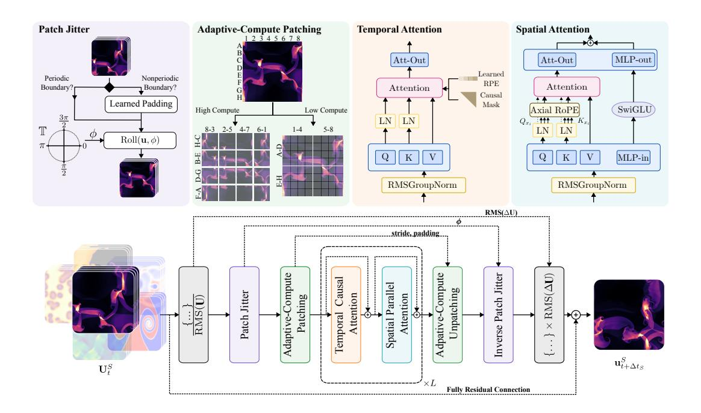

Figure 1: Walrus is a modern transformer incorporating novel stabilizing techniques and recent adaptive-compute methods to learn from a highly diverse set of physical dynamics. Walrus takes as input a short sequence of snapshots and predicts the next step in the sequence.

**Shared Encoder-Decoder.** All physical systems S of a given dimensionality d share a single encoder and decoder block forcing the model to learn generalizable features. Since this study only features 2D and 3D data, this is a total of two encoders and decoders. We use an Hierachical MLP (hMLP) and transposed hMLP for lightweight encoding and decoding (Touvron et al., 2022) and the sub-selected projection approach of MPP (McCabe et al., 2023a) to handle varying input sizes  $q^S$ .

RMS GroupNorm. Walrus employs RMSGroupNorm as the standard normalization approach within each transformer block. This is GroupNorm (Wu & He, 2018) implemented as RMSNorm (Zhang & Sennrich, 2019) over each group. Empirically, we found the larger normalization scope to improve performance in early development stages. LayerNorm (Ba et al., 2016) was used for QK-Normalization as in Dehghani et al. (2023).

**Asymmetric Input/Output Normalization.** Walrus learns to predict  $\Delta u^S_{t+1}$  which is typically distributed differently from the input values  $U^S_t$ . We therefore use asymmetric normalization for model inputs and outputs. In particular, during pretraining, we normalize each unique input field by  $\mathrm{RMS}_{(\mathrm{Time} \times \mathrm{Space})}(U^S_t)$  or the RMS computed over space and time of the given field over the provided history. The output field is then de-normalized by  $\mathrm{RMS}_{(\mathrm{Time} \times \mathrm{Space})}(\Delta U^S_t)$ .

# 3.2 PATCH JITTERING

Several studies have identified aliasing as one of the major contributors to the autoregressive instability (Raonić et al., 2023; McCabe et al., 2023b). Aliasing can lead to spectral artifacts and a loss of equivariance under symmetry transforms (Karras et al., 2021). In ViT-style architectures employing symmetric patchification or equivalently strided convolution and transposed convolutions for tokenization/reconstruction, this can be particularly noticeable as grid-like artifacts in the output. Previous work on aliasing in physical emulation has focused on the challenge posed by nonlinear operations, but here we show that resampling operations in ViT-style architectures alone produce a distinct spectral structure which leads to this grid-imprinting.

For this analysis, we consider a continuous scalar-valued signal  $U(x) \in \mathcal{L}^2(\mathbb{T})$  sampled uniformly as  $u \in \mathbb{R}^N$ , hidden representation  $y \in \mathcal{R}^M$ , and output  $v \in \mathcal{R}^N$ . We denote the downsampling rate by  $P = \frac{N}{M}$ . We denote the discrete Fourier transform of each of these signals by  $\hat{u}$  which we index with

 $k \in \{0,\dots,K\}$ . We assume that U(x) is a bandlimited signal such that  $\hat{U}[k] = 0, \forall \, |k| > N/2$ . By the Shannon-Nyquist sampling theorem, we can therefore represent u exactly by its Fourier expansion  $u[x] = \sum_{k \in \mathbb{Z}} \hat{u}[k] e^{-i2\pi kx[k]}$  and  $\hat{U}(k) = \hat{u}[k]$ .

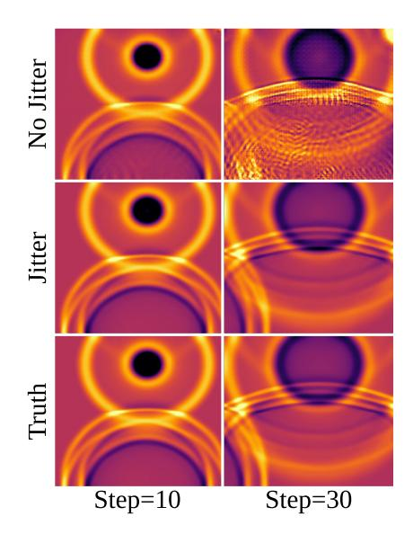

Figure 2: Patch jittering (middle) reduces the accumulation of high frequency artifacts (top) allowing for more stable long-term forecasts.

The strided convolution with filter g can be exactly written in the frequency domain as:

$$\hat{y}[k] = \hat{g}[k]\hat{u}[k] + \sum_{i=1}^{P-1} \hat{g}[k+jM]\hat{u}[k+jM] \quad (2)$$

recalling that due to periodicity  $\hat{u}[k] = \hat{u}[k+jN]$  and  $\hat{y}[k] = \hat{y}[k+jM] \ \forall j \in \mathbb{Z}$ , this amounts to the summation of the aliased frequencies at the new resolution after modulation by filter h. The "reconstruction" by transposed convolution with filter h is then:

$$\hat{v}[k] = \overline{\hat{h}[k]}y[k \mod P] \tag{3}$$

or repetition of the resolvable frequencies at the lower resolution followed by modulation by h. Thus, their composition can be simplified to:

$$\hat{v}[k] = \overline{\hat{h}[k]} \hat{g}[k] \hat{u}[k] + \sum_{j=1}^{P-1} \overline{\hat{h}[k]} \hat{g}[k+jM] \hat{u}[k+jM]$$
(4)

which given the smoothness constraints of small-kernel convolutions (McCabe et al., 2023b) leads to accumulation around the aliases of high magnitude modes. However, we can reformulate this procedure probabilistically by randomly translating our input data and subsequently in-

verting the translation in our output data. Exploiting the Fourier shift property  $\mathcal{F}u(x-s)[k] = e^{-i2\pi sk}\hat{u}[k]$ , we can write this modified version of Eq. 4 as:

$$\mathcal{E}_{s \sim \mathbb{T}} \left[ \hat{v}[k] \right] = \mathcal{E}_{s \sim \mathbb{T}} \left[ e^{i2\pi sk} \left[ \overline{\hat{h}[k]} \hat{g}[k] \hat{u}[k] e^{-i2\pi sk} + \sum_{j=1}^{P-1} \overline{\hat{h}[k]} \hat{g}[k+jM] \hat{u}[k+jM] e^{-i2\pi s(k+jM)} \right] \right]$$

$$(5)$$

$$= \overline{\hat{h}[k]}\hat{g}[k]\hat{u}[k] + \sum_{j=1}^{P-1} \mathcal{E}_{s \sim \mathbb{T}} \left[ \overline{\hat{h}[k]}\hat{g}[k+jM]\hat{u}[k+jM]e^{-i2\pi s j M} \right]$$

$$(6)$$

where the remaining expectation inside the summation is a contour integral around the complex unit circle and therefore evaluates to zero by the Cauchy integral theorem. This leaves us with:

$$\mathcal{E}_{s \sim \mathbb{T}} \left[ \hat{v}[k] \right] = \overline{\hat{h}[k]} \hat{g}[k] \hat{u}[k] \tag{7}$$

or that the expectation of this stochastic process is the un-aliased solution. In realistic settings, this theoretical observation is complicated by slow empirical convergence of the expectation as well as the presence of boundary conditions and nonlinearities. Despite this, we observe significant benefits at minimal cost from this approach purely from incorporating sampling without any averaging. In Appendix Table 7, we sample twenty validation trajectories for each pretraining dataset and compare the median VRMSE over full length autoregressive rollouts. We can see that the use of jitter shows a clear improvement in long term accuracy. The median improvement is 54% and the number of "high" long term errors (defined as median VRMSE  $\geq 1$ ) shrinks from 10 to 3. Overall, we see improvement on 17/19 pretraining datasets with the few that do not improve being largely unaffected.

## 4 Walrus Training

A key challenge for multi-physics foundation models is that, unlike in domains such as NLP, the available data tend to be larger on disk—creating storage and processing burdens—while only

capturing a narrow fraction of all relevant physical dynamics. It is therefore vital to avoid overfitting to the idiosyncrasies of any given data source. We design Walrus's training strategy to maximize the level of heterogeneity seen during training through aggressive diversity-focused augmentation. This choice requires sophisticated distribution strategies to maintain high levels of hardware utilization during training. During finetuning, we include the ability to relax some of these restrictions to improve fitting to downstream tasks which we discuss in Appendix B.2.1.

#### 4.1 AUGMENTING INTO A COMBINED 2D-3D SPACE

**Dimension padding.** To jointly represent 2D and 3D Euclidean data within a single space, we begin by treating all 2D data as thin planes within a 3D space. The data is first projected into 3D by appending a singleton dimension and zero-padding the tensor-valued fields. For example in the left panel of Figure 3, a 2D velocity field of size  $(H \times W)$  with values  $\{v_x, v_y\}$  would be padded to size  $(H \times W \times 1)$  and  $\{v_x, v_y, 0\}$ .

**Tensor-law Aware Augmentations.** Euclidean data is then augmented by the application of tensor-law aware transformations. Here this is limited to the full octahedral group of  $90 \deg$  rotations and reflections to avoid misaligned boundaries. After augmentation, the 2D data is now embedded in a random orientation within the larger 3D space. When we transform the reference frame, tensor-valued fields must be similarly transformed following tensor transformation laws to preserve physical consistency. For order one tensor-value fields, if the field transforms under transformation R, then field u should also transform as Ru. For order 2 tensors, this transformation should be  $RuR^T$ .

**Variable time striding.** Rather than pre-training on a single time-stride, we train the model on randomly sampled time strides so that the model must learn to infer the relative time and velocity scales from context rather than fitting to a particular scale in the training data. This approach was previously used for the VICON foundation model (Cao et al., 2025). We sample the time stride from 1-5 during pretraining.

#### 4.2 EFFICIENT MULTI-TASK TRAINING

Sampling and loss. We balance the contributions of various datasets and regimes within those datasets through a combination of locally normalized training objectives and balanced sampling. Walrus employs a hierarchical sampling scheme where we uniformly sample a system S then uniformly select a starting frame from within the dataset. We then train the model with the normalized loss:

$$\mathcal{L} = \frac{1}{q} \sum_{i=1}^{q} \frac{\|\mathcal{M}(\boldsymbol{U}_{t}(i)) - \Delta \boldsymbol{u}_{t+1}(i)\|_{1}}{\text{RMS}_{\text{Space} \times \text{Time}(\Delta \boldsymbol{U}_{t}(i))}}$$
(8)

In this way, errors predicting changes in rapidly changing fields are down-weighted compared to predictions on slower changing fields which we expect to be more predictable.

Efficient Distribution. However, uniform sampling of heterogeneous data can lead to training bottlenecks, especially in high dimensional spaces. Patch-based tokenization can produce large token counts in high dimensions. For example, a  $256^3$  input processed with an effective

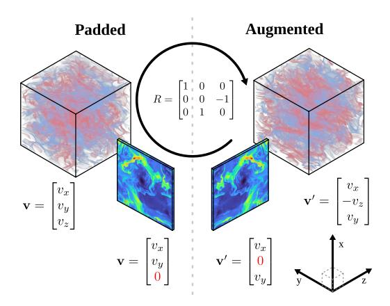

Figure 3: All raw data is projected into 3D by appending singleton dimensions and zero-padding tensor-valued fields prior to applying symmetry-preserving augmentations resulting in the originally final input data being embedded in arbitrary axis-aligned directions in 3D

patch size of 16 results in 4096 tokens per frame. Processing as few as three frames therefore requires sequence lengths of around 12K - larger than the initial pretraining window used in modern LLMs like LLaMA 3 (Grattafiori et al., 2024). This regime favors strategies like FSDP which communicates parameters across the network over over model parallelism which shares activations. Nonetheless, FSDP can lead to inefficiencies when training load is not balanced across the FSDP group.

PyTorch's FSDP utilizes synchronous collective communication primitives such as AllGather during the forward pass itself. These calls are blocking and require each rank to reach a given step before the communication operation can be completed. If workloads are not balanced within the sharding or FSDP group, the ranks running faster jobs will be sitting idle until the slower jobs catch up. Many foundation models for spatiotemporal dynamics to date have avoided this complication of load balancing by using only data at a single resolution and dimensionality. This, however, is not reflective of practical usage conditions and so it is vital to develop strategies for this dilemma.

We address this issue in several ways. First, through *adaptive-compute tokenization* as discussed in Section 3.1. This ensures that at a given dimensionality, all datasets are converted to roughly the same number of tokens. For 2D data, we select this size as 32 per dimension without padding. For 3D, this is set to 16 without padding. The second is through the use of *differential batch sizes*. Linear projections, the dominant cost in the model, scale linearly with token count so to balance the tokens between 2D and 3D, we multiply the 2D batch size and length of time history by a factor of 2 each.

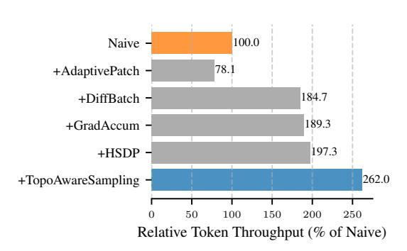

Figure 4: Tokenization and distribution strategies are carefully balanced to ensure each copy of Walrus receives similarly sized buckets of tokens within each synchronous block, minimizing deadweight and maximizing throughput.

However, these steps alone are insufficient to reduce all discrepancies in workload. Encoder/decoder costs still vary by input size, though this can be partially accounted for by simply replicating these parameters on each device rather than sharding them as the hMLPs used are lightweight. Within the transform, while both 2D and 3D remain in the MLP-dominated regime, in moving from 2D to 3D, the larger spatial attention context results in a shift from linear layers forming 95% of the cost of a block to 80% which forms a significant growth in time spent in the attention operation.

Ideally, we would like each GPU to sample datasets independently to maximize batch diversity, however, these cost discrepancies can result in significant deadweight loss. As a compromise, we employ a sampling strategy designed for HSDP (Zhao et al., 2023) where all ranks

within a sharding group are forced to sample from the same dataset every step. Each group, however, samples independently so that the total batch consists of many datasets. Combining this with the gradient accumulation as randomized load balancing trick used in McCabe et al. (2023a), we have a system where the groups of nodes where AllGather operations act as a bottleneck are forced to sample data of the same resolution and dimensionality while the overall variance of time-perstep is reduced by averaging over multiple micro-batches between AllReduce operations prior to parameter updates, balancing sampling diversity and computational performance.

We can see the iterative impact of these changes in Figure 4. Under the given sampling scheme, these combined changes result in an increased throughput of 262% compared to naive usage of FSDP.

## 5 EXPERIMENTS

We design our experiments to answer three key questions about the efficacy and role of Walrus as a foundation model:

- 1. How does Walrus perform as a foundation model when compared with prior foundation models across a range of downstream tasks?
- 2. Is Walrus truly a cross-domain foundation model? Are there particular areas of strength or weakness?
- 3. Does the focus on representational diversity during Walrus's pretraining matter? Are the gains we see in other experiments purely due to scale and architectural choices or does the focus on diversity lead to improvement on downstream tasks?

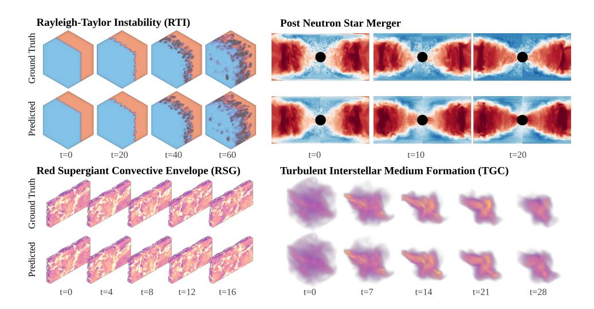

Figure 5: Visualizing the prediction of a finetuned Walrus for 3D research-frontier level simulations.

**Data.** We use a mixture of datasets from the Well (Ohana et al., 2025) and FlowBench (Tali et al., 2024) for pretraining. the Well contains a variety of high resolution data derived from realistic scientific problems while FlowBench introduces geometrically complex obstacles in standard flow scenarios. This totals 19 datasets containing 63 state variables simulated over a wide variety of equations, boundary conditions, and physical parameterizations. Importantly, we use both 2D and 3D data during pretraining. To validate transfer performance, we finetune several held out datasets from the Well, Flowbench, PDEBench (Takamoto et al., 2024), PDEArena (Gupta & Brandstetter, 2022), and PDEGym (Herde et al., 2024). When provided, we use standard splits. Otherwise, we split the dataset by trajectory into 80/10/10 splits. Full data details are described in Appendix C.

Training settings. Walrus was pretrained for approximately 400,000 steps following the distribution strategy described in Section 4.2 with a 2D micro-batch size of 192 and 3D size of 96. In total, Walrus was pretrained on approximately 4 million examples from each 2D dataset and 2 million for each 3D. When finetuned on datasets within Walrus's training set, all comparisons are trained on the combined volume Walrus was shown during both pretraining and finetuning – 4.5 million samples for 2D data and 2.5 million for 3D. Otherwise all models are given the same finetuning budget of 500k samples regardless of dataset size. All models are trained or finetuned to predict the next system state using the AdamW (Loshchilov & Hutter, 2017) optimizer and a reciprocal square-root learning rate schedule (Zhai et al., 2022) with linear warmup and inverse quadratic cooldown (Hägele et al., 2024). Full training details can be found in Appendix B.

**Evaluation.** We primarily use VRMSE as in the Well benchmark (Ohana et al., 2025) either per-step or averaged over rollout windows for comparison as the normalization allows for easier cross-dataset comparison in limited space. All metrics are defined in Appendix E.1. As many of these datasets are undergoing regime transitions and therefore prediction difficulty varies over time, all predicted trajectories begin from T=17 to allow for equal comparisons with models utilizing context lengths matching that used by MPP in pretraining (16).

# 5.1 DOWNSTREAM PERFORMANCE

**Experiment Settings.** The primary goal of any foundation model is to improve performance on diverse downstream tasks. To evaluate this capability in Walrus, we finetune both Walrus and several state-of-the-art foundation models for physical dynamics on a collection of downstream tasks in both 2D and 3D settings drawn from the Well (Ohana et al., 2025), PDEGym (Herde et al., 2024), Flowbench, (Tali et al., 2024), and PDEArena <sup>2</sup> (Gupta & Brandstetter, 2022). For this evaluation, we compare the performance of Walrus (1.3B parameters) against pretrained MPP-AViT-L (McCabe et al., 2023a, 407M), Poseidon-L (Herde et al., 2024, 628M), and DPOT-H (Hao et al., 2024, 1.2B)

<sup>&</sup>lt;sup>2</sup>Note that while the ConditionedINS task is included in DPOT's pretraining, in the finetuning setting, the field-specific embedding weights are replaced to better approximate a true downstream task.

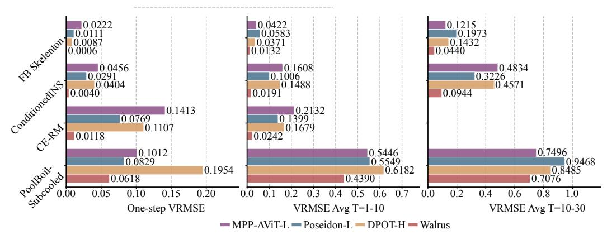

Figure 6: Loss (median VRMSE) on 2D downstream tasks after finetuning each foundation model. Autoregressive prediction starts at T=17 to account for context-length differences. In cases where ground truth is shorter than window, loss is averaged over available frames. If no frames available, the window is left blank.

using the highest parameter count public checkpoints available for each. Each pretrained model is finetuned with 500K samples regardless of the true size of the dataset, so for some datasets this will involve multiple full passes and others will be less than a full pass. This restriction mirrors the common downstream setting in which compute and data availability is significantly lower than during pretraining. The allocation of these samples is described in Appendix B.3.

We evaluate these models across a range of time steps. One-step VRMSE tracks how well the model does across the various regimes tracked in the dataset and provides a direct evaluation of generalization to new data within the framework of the training task. However, medium (1-10 step) and medium (11-30 step) rollouts are used for evaluating effectiveness at the emulation task itself which typically requires multi-step rollouts. For chaotic systems, longer-term pointwise losses like VRMSE can become meaningless as decoupling from the true trajectory is inevitable at which point any effective model will saturate to similar loss. Full loss over time plots can be seen in Appendix Figure 15 while direct numerical versions of these plots can be found in Appendix Table 8.

Analysis. Walrus outperforms the baseline models across all downstream tasks providing an average 63.6% reduction in one-step loss, 56.2% for shorter trajectories, and 48.3% for medium-range trajectories (Figure 6). For non-chaotic tasks, the lower artifact generation of Walrus from patch jittering leads to remarkably consistent performance over time despite the bulk of the network operations occurring in the fully compressed/tokenized space. In more stochastic spaces like the Pool-BoilSubcool from BubbleML, while Walrus initially has a significant lead, this lead is reduced over longer rollouts as the difficulty of inferring

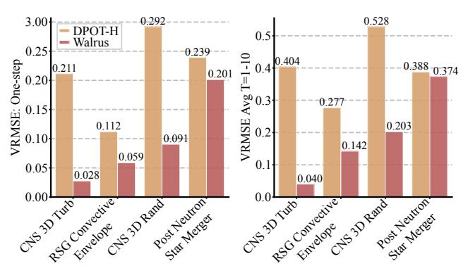

Figure 7: VRMSE on downstream 3D tasks. Lower is better. Walrus outperforms prior foundation models on both single-step and rollout predictions. Note rollout length is limited here due to ground truth trajectory length.

material and burner properties from a short history makes a larger impact. In Figure 35, we see that the model continues to generate bubbles over time rather than converging to a smooth mean state.

3D performance is of particular interest as most real-world physics of simulation interest is truly three-dimensional. Numerical solvers for 3D systems tend to be significantly more expensive than 2D or 1D solvers. Two of the datasets we explore, Post Neutron Star Merger (PNS) and Red Supergiant Convective Envelope (RSG) are among the most computationally expensive public simulation datasets to date having taken roughly 1.5M and 10M (Ohana et al., 2025) core hours to generate small numbers

| Dataset                                                                               | ,                            | VRMSE:                               | One-ste                              | р                                                         | VRM                                  | SE: Avg                              | $T \in [1$                           | : 20]                                                     | VRN                                  | ISE: Av                              | $g T \in [2]$                        | 21:60]                                   |
|---------------------------------------------------------------------------------------|------------------------------|--------------------------------------|--------------------------------------|-----------------------------------------------------------|--------------------------------------|--------------------------------------|--------------------------------------|-----------------------------------------------------------|--------------------------------------|--------------------------------------|--------------------------------------|------------------------------------------|
|                                                                                       | MPP-AViT-L                   | Poseidon-L                           | DPOT-H                               | Walrus                                                    | MPP-AViT-L                           | Poseidon-L                           | DPOT-H                               | Walrus                                                    | MPP-AViT-L                           | Poseidon-L                           | DPOT-H                               | Walrus                                   |
| Biological and chen<br>Active Matter<br>Gray-Scott                                    |                              | 0.0214                               | 0.0476<br>0.0061                     | 0.0057<br>0.0001                                          | 0.3195<br>nan                        | 0.3355<br>0.0411                     | 0.5272<br>0.1354                     | 0.1262<br>0.0278                                          | 1.2481<br>nan                        |                                      | 1.2867<br>0.6567                     |                                          |
| Acoustics and wave<br>Maze*<br>Inclusions<br>Discontinuous<br>Staircase               | 0.0337<br>0.0432<br>0.0097   | 0.0116<br>0.0127<br>0.0035<br>0.0019 | 0.0199<br>0.0055                     | 0.0099<br>0.0089<br>0.0021<br>0.0005                      | 0.0797<br>0.1362<br>0.0460<br>0.0053 | 0.0785<br>0.0510<br>0.0255<br>0.0201 | 0.0500<br>0.0162                     | 0.0345<br>0.0430<br>0.0093<br>0.0040                      | 0.1390<br>0.4940<br>0.2310<br>0.0096 | 0.1407<br>0.0890                     | 0.0543<br>0.1328<br>0.0398<br>0.0031 | 0.1427<br><b>0.0385</b>                  |
| Astrophysical and g<br>Supernova (3D)<br>TGC (3D)<br>PlanetSWE                        | eoscienc<br>—<br>—<br>0.0035 | e applica<br>—<br>—<br>0.0035        | 0.6417<br>0.1002<br>0.0013           | 0.2462<br>0.0466<br>0.0004                                | <br>0.0307                           | <br>0.0730                           | 0.3482                               | 0.6673<br>0.2889<br>0.0046                                | <br>0.1213                           | <br>0.3452                           | <b>0.9669</b> 0.6809 0.0317          | 1.0963<br><b>0.6197</b><br><b>0.0207</b> |
| Plasmas<br>MHD (3D)                                                                   | _                            | _                                    | 0.4734                               | 0.0580                                                    | _                                    | _                                    | 1.0250                               | 0.6487                                                    | _                                    | _                                    | 1.3055                               | 1.2256                                   |
| Viscous fluids<br>Rayleigh-Benard<br>Shear Flow<br>FBHarmonics<br>RT Instability (3D) | 0.0264<br>0.0071<br>0.0104   | 0.0215<br>0.0090<br>0.0068           | 0.0288<br>0.0162<br>0.0031<br>0.2165 | 0.0059<br>0.0012<br>0.0005<br>0.0565                      | 0.4109<br>0.0377<br>0.0420           | 1.3819<br>0.0657<br>0.0686           | 3.4868<br>0.0772<br>0.0525<br>0.3191 | 0.0992<br>0.0146<br>0.0189<br>0.0496                      | 0.7468<br>0.1814<br>0.1785           | 0.9586<br>0.2408<br>0.2526           | 1.2664<br>0.2880<br>0.1546<br>0.9321 | 0.6441<br>0.0810<br>0.0603<br>0.4776     |
| Inviscid fluids<br>MultiQuadrantsP<br>MultiQuadrantsO<br>TRL (2D)<br>TRL (3D)         | 0.0418<br>0.0432<br>0.1707   | 0.0142<br>0.0158<br>0.1323           | 0.0397<br>0.0468<br>0.1601<br>0.2238 | 0.0194<br><b>0.0112</b><br><b>0.0831</b><br><b>0.1588</b> | 0.2010<br>0.3050<br>0.4796           | <b>0.0682</b> 0.0846 0.4117          | 0.4801<br>0.5134                     | 0.0720<br><b>0.0587</b><br><b>0.3393</b><br><b>0.5216</b> | 0.6860<br>1.1011<br>0.8879           | <b>0.2807</b> 0.6478 <b>0.8441</b> — | 0.3839<br>2.7573<br>0.9316<br>0.8106 | 0.2823                                   |
| Non-newtonian fluid<br>Viscoelastics                                                  |                              | 0.0878                               | 0.1398                               | 0.0295                                                    | 0.1578                               | 0.1532                               | 0.1989                               | 0.0373                                                    | _                                    | _                                    | _                                    | _                                        |

Table 1: Losses (Median VRMSE) averaged over various time horizons. One-step computed over all possible steps. Ranges computed by forecasting from initial conditions. Lower is better. Dark font signifies closer to best performance. Bold indicates top performing model. For trajectories shorter than window, averages computed over available steps. "—" indicates either either trajectory is too short or model not applicable (e.g., 2D model on 3D data).

of trajectories. Emultation is complicated by log-spherical geometries with unique symmetries and space-time metric tensors. Despite these challenges, we can see that the finetuned Walrus model is representing large scales well in Figure 5.

Limitations. While state-of-the-art from a machine learning perspective, these results also highlight the need for scientific validation. We found that for RSG, while interior layers are represented faithfully, the exterior often develops artifacts. In PNS, while the bulk dynamics are well captured, the true physical processes are highly sensitive such that the emulated system results in incorrect estimates of physically important quantities, such as the production of heavy elements. Nonetheless, these results highlight the potential of our approach as a foundation for more accurate and efficient emulation, motivating further refinement and application to increasingly complex systems.

#### 5.2 Cross-domain Analysis

**Experiment setting.** We evaluate the claim that Walrus is a cross-domain foundation model by exploring how effectively Walrus performs across the full breadth of its pretraining training data. As Walrus was exposed to this data in pretraining, it is non-trivial to determine a representative baseline. We elect to consider comparisons to an upper bound on the performance of prior foundation models on these datasets. We specialize Walrus to each dataset through an additional 500K samples of finetuning. Baseline models are then finetuned using the full number of samples Walrus has seen from each dataset in the precise orientation and sampling rate used for evaluation. For 2D data, for instance, Walrus was exposed to approximately 4M samples per dataset during pretraining (though at varying sampling rates) and 500K during finetuning. Baselines are therefore finetuned on 4.5M samples, receiving both their own pretraining process and equivalent training on a given dataset.

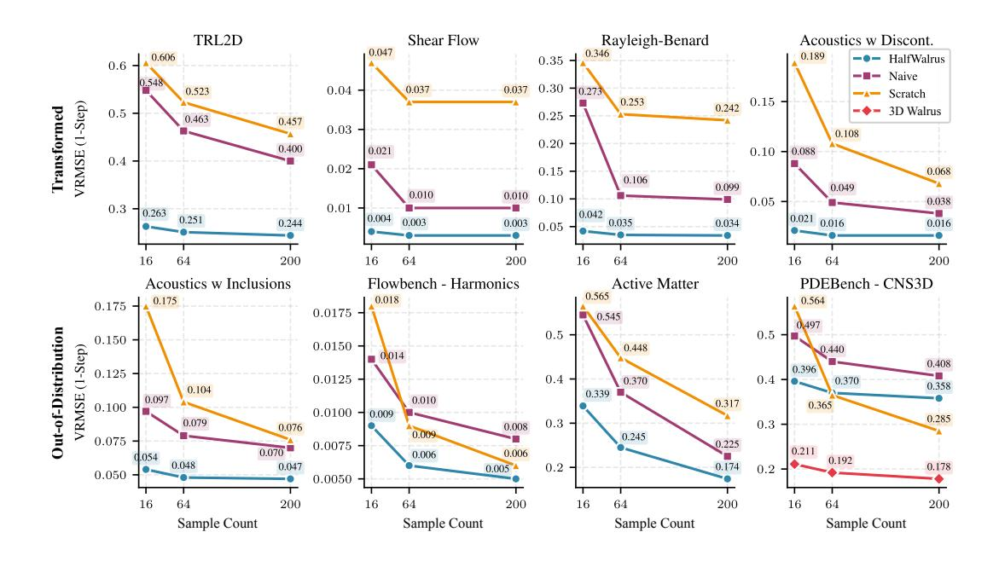

Figure 8: One-step VRMSE in limited data scenarios denoted by restricted numbers of samples. (Top) Transformed variants of in-distribution data. (Bottom) Previously unseen datasets. (Bottom-right) CNS3D is the first 3D dataset seen by any half-sized model. Full Walrus trained with 3D included for comparison with the 2D-pretrained models used in all other panels.

**Analysis.** At a high level, Walrus remains the top performing model though by a less stark margin when compared to these heavily finetuned models providing an average reduction of 52.2% compared to top performing baseline after one-step and achieving the lowest loss on 18/19 tasks, 30.5% after 20 steps (17/19), and 6.3% from 20-60 steps (12/19) in Table 1 even accounting for the outlier performance of DPOT-H on linear wave propagation tasks.

However, more interesting patterns emerge when we look at where different models perform well. DPOT, which utilizes the frequency domain-based AFNO (Guibas et al., 2022) block as its core component, is most competitive to Walrus in the acoustics and linear wave propagation category. It even outperforms Walrus in this specific scenario on longer time horizons. Fourier methods are often used in numerical solvers for these classes of problem as they are highly efficient in smooth linear settings, so the strength of Fourier methods is encouraging as it indicates we may be able to derive intuition about architecture design from the classes of methods used for particular problems. On the other hand, Poseidon is particularly competitive on inviscid fluids, particularly the MultiQuadrantsP task which is a generalization of the classical Euler quadrants problem (Schulz-Rinne et al., 1993) with periodic boundary conditions. In this case, we can find an explanation in the training data: 4/6 tasks used for pretraining Poseidon were solutions of the Euler equations and 2/6 were specifically variants of the Euler quadrants problem (Herde et al., 2024, Table 3). However, even in prior foundation models' domains of strength, Walrus produce competitive results while broader pretraining and less specialized architectural choices imbue Walrus with greater flexibility and stronger performance across a large spectrum of domains.

# 5.3 IMPACT OF PRETRAINING STRATEGY

**Experiment setting.** The final question we would like to answer is whether the focus on representational diversity in Walrus's pretraining matters or whether the improvements we see in prior experiments are entirely due to architectural improvements and increased scale in the Walrus model. For this, we perform ablations over the augmentation strategy presented in Section 4.1 using a half-size Walrus (sizing details in Appendix Table 2) in a data-restricted setting. We pretrain these smaller models on only a subset of 2D data (Maze, Discontinuous, Gray-Scott, Rayleigh-Benard, Shear Flow, TRL2D, Staircase, and Viscoelastics) chosen specifically for having strong anisotropic

behavior. We pretrain one model using the Walrus pretraining strategy (titled HalfWalrus) and another using a naive approach with strictly 2D handling and none of the additional augmentation described in Section 4.1 (Naive). These models, and a third trained from random initialization (Scratch), are evaluated on a mixture of geometrically and temporally transformed pretraining tasks (Transformed) and new tasks not seen during pretraining (Out-of-Distribution). All three models are trained/finetuned using identical configurations and strategies on the downstream tasks.

**Analysis.** The results of this experiment paint a fascinating picture about the role of data diversity in pretraining and downstream performance. Looking only at pretraining metrics in Figure 9, it would appear that Walrus strategy of utilizing heavy augmentation in time and space, including projecting two-dimensional data into 3D has an overall negative impact. However, looking at the results for downstream tasks (Figure 8) we see a wildly differ-

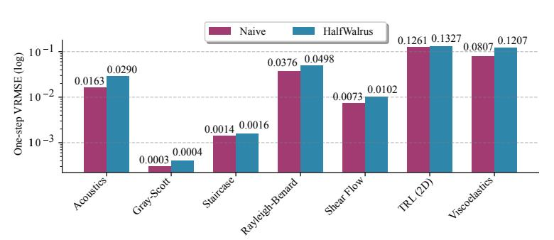

Figure 9: Pretraining VRMSE from HalfWalrus and naively trained models. From pretraining alone, it appears that the less diverse "naive" strategy outperforms HalfWalrus, but this trend is reversed on downstream tasks in Figure 8.

ent story which strongly affirms the need for diversity in pretraining and suggests that the community must be wary of experiments offering strong pretraining results on restricted pretraining collections. While the <code>HalfWalrus</code> model which uses all augmentations discussed in Section 4.1 is expected to have a significant advantage in the Transformed category as this data falls within the <code>HalfWalrus</code> training distribution, <code>HalfWalrus</code> also robustly outperforms training from scratch and the naive pretraining approach on entirely new tasks. Especially notable is the performance of these entirely 2D-pretrained models on the 3D CNS task in the bottom right panel. Having never seen 3D data <code>HalfWalrus</code> provides a boost over training from scratch in extremely small data regimes. However, this is a small boost and we see that insufficiently broad pretraining (excluding 3D data in this case) can actually become a hindrance. We include the finetuning performance of full <code>Walrus</code> which was pretrained on 3D data for comparison. In this case, the 3D-pretrained model has a clear and overwhelming advantage suggesting the importance of including 3D data in pretraining.

#### 6 Conclusion

Limitations. This work addresses several important, but specific limitations of current foundation models for transportive continuum dynamics - cost-adaptivity, stability, and efficient training on highly heterogeneous training data in their native resolution. Yet other obstacles still remain. Training on non-uniform geometries while maintaining efficiencies is a natural next exploration direction. Similarly, settling the discrepancy between more expensive history-based in-context learning and faster but less flexible explicitly parameterized modes of operation (Appendix D) will likely require solutions that can interpolate between the two extremes while also handling the more complex case of partially observed or corrupted data. Additionally, Walrus while having stochastic elements, is trained deterministically with full reconstruction loss. This could prove to be a representational bottleneck for poorly observed or stochastic systems. Diffusion models, particularly latent diffusion models, have shown great promise in ensuring stable rollouts at much higher compression levels (Rozet et al., 2025). These approaches, if generalized to the multiple physics setting without loss of accuracy, could offer significant advantages in run-time due to latent space operations and multi-step predictions while also providing probabilistic estimates.

Summary and Future Work. Walrus is the most accurate foundation model for continuum simulation to date achieving top results in 56/65 tracked metrics across 26 unique continuum emulation tasks on multiple time scales drawn from multiple scientific domains. The Walrus model includes increased scale at 1.3B parameters, novel stabilization techniques, and the ability to adapt compute usage to problem complexity. The strong empirical performance of Walrus can be credited both

to the model-specific improvements as well to broad diversity-focused training over 19 physical scenarios employing aggressive augmentation that was enabled by an efficient integrated distribution and sampling strategy. Ablations on the pretraining strategy demonstrate the importance of pretraining diversity, showing that while less diverse training approaches may appear to perform better on pretraining metrics, downstream performance benefits significantly from broader pretraining.

Walrus is, however, not the final milestone needed for foundation models in physical emulation to achieve the ubiquity they have in vision and language. Rather, it underscores the distinct challenges of physical emulation where data, modeling, and computation can interact in fundamentally different ways from other domains. Continued advances in data management, distribution, and model architecture, designed specifically for physical simulation, will be vital to the continued advancement of these models. Close collaboration with domain scientists and numerical software developers will be necessary to achieve many of these goals and, as machine learning tools mature, to support increasingly high-resolution and geometrically complex data necessary for addressing many real scientific challenges. The trajectory of this research area remains open, but we hope that Walrus provides a substantive step toward realizing that broader vision.

#### ACKNOWLEDGMENTS

Polymathic AI gratefully acknowledges funding from the Simons Foundation and Schmidt Sciences, LLC. Dr. Mukhopadhyay thanks the Infosys-Cambridge AI centre for support. The team thanks Sophie Barstein for support with the accompanying blog post for the project. Compute for this project came from multiple sources and the authors would like to thank the Scientific Computing Core, a division of the Flatiron Institute, a division of the Simons Foundation for extensive computational support. Additionally, the results and models reported in this work were substantively aided through compute resources from the National AI Research Resource Pilot, including support from NVIDIA and NVIDIA's DGX Cloud product which includes the NVIDIA AI Enterprise Software Platform. In particular, the team would like to thank Mahidhar Tatineni at SDSC for technical support with NAIRR resources. The team would also like to thank the developers of APEBench (Koehler et al., 2024) for open sourcing the vape4d software used for 3D visualizations in this paper.

## REFERENCES

- Benedikt Alkin, Andreas Fürst, Simon Schmid, Lukas Gruber, Markus Holzleitner, and Johannes Brandstetter. Universal physics transformers: A framework for efficiently scaling neural operators. *Advances in Neural Information Processing Systems*, 37:25152–25194, 2024.
- Jimmy Lei Ba, Jamie Ryan Kiros, and Geoffrey E. Hinton. Layer normalization, 2016. URL https://arxiv.org/abs/1607.06450.
- Leah Bar and Nir Sochen. Unsupervised deep learning algorithm for pde-based forward and inverse problems. *arXiv preprint arXiv:1904.05417*, 2019.
- Yohai Bar-Sinai, Stephan Hoyer, Jason Hickey, and Michael P. Brenner. Learning data-driven discretizations for partial differential equations. *Proceedings of the National Academy of Sciences*, 116(31):15344–15349, 2019. doi: 10.1073/pnas.1814058116. URL https://www.pnas.org/doi/abs/10.1073/pnas.1814058116.
- Marsha J. Berger and Randall J. LeVeque. Implicit adaptive mesh refinement for dispersive tsunami propagation, 2024.
- Lorenz T Biegler, Omar Ghattas, Matthias Heinkenschloss, and Bart van Bloemen Waanders. Large-scale pde-constrained optimization: an introduction. In *Large-scale PDE-constrained optimization*, pp. 3–13. Springer, 2003.
- Andres M Bran, Sam Cox, Andrew D White, and Philippe Schwaller. Chemcrow: Augmenting large-language models with chemistry tools, 2023.
- Tom Brown, Benjamin Mann, Nick Ryder, Melanie Subbiah, Jared D Kaplan, Prafulla Dhariwal, Arvind Neelakantan, Pranav Shyam, Girish Sastry, Amanda Askell, Sandhini Agarwal, Ariel Herbert-Voss, Gretchen Krueger, Tom Henighan, Rewon Child, Aditya Ramesh,

- Daniel Ziegler, Jeffrey Wu, Clemens Winter, Chris Hesse, Mark Chen, Eric Sigler, Mateusz Litwin, Scott Gray, Benjamin Chess, Jack Clark, Christopher Berner, Sam McCandlish, Alec Radford, Ilya Sutskever, and Dario Amodei. Language models are few-shot learners. In H. Larochelle, M. Ranzato, R. Hadsell, M.F. Balcan, and H. Lin (eds.), Advances in Neural Information Processing Systems, volume 33, pp. 1877–1901. Curran Associates, Inc., 2020. URL https://proceedings.neurips.cc/paper\_files/paper/2020/file/1457c0d6bfcb4967418bfb8ac142f64a-Paper.pdf.
- Joan Bruna, Benjamin Peherstorfer, and Eric Vanden-Eijnden. Neural galerkin scheme with active learning for high-dimensional evolution equations, 2022.
- Shuhao Cao. Choose a transformer: Fourier or galerkin, 2021.
- Yadi Cao, Yuxuan Liu, Liu Yang, Rose Yu, Hayden Schaeffer, and Stanley Osher. Vicon: Vision in-context operator networks for multi-physics fluid dynamics prediction, 2025. URL https://arxiv.org/abs/2411.16063.
- Ting Chen, Simon Kornblith, Mohammad Norouzi, and Geoffrey Hinton. A simple framework for contrastive learning of visual representations, 2020.
- Seyone Chithrananda, Gabriel Grand, and Bharath Ramsundar. Chemberta: Large-scale self-supervised pretraining for molecular property prediction, 2020.
- Clawpack Development Team. Clawpack software. http://www.clawpack.org, 2021.
- Kyle Cranmer, Johann Brehmer, and Gilles Louppe. The frontier of simulation-based inference. *Proceedings of the National Academy of Sciences*, 117(48):30055–30062, 2020. doi: 10.1073/pnas.1912789117. URL https://www.pnas.org/doi/abs/10.1073/pnas.1912789117.
- Mostafa Dehghani, Josip Djolonga, Basil Mustafa, Piotr Padlewski, Jonathan Heek, Justin Gilmer, Andreas Steiner, Mathilde Caron, Robert Geirhos, Ibrahim Alabdulmohsin, Rodolphe Jenatton, Lucas Beyer, Michael Tschannen, Anurag Arnab, Xiao Wang, Carlos Riquelme, Matthias Minderer, Joan Puigcerver, Utku Evci, Manoj Kumar, Sjoerd van Steenkiste, Gamaleldin F. Elsayed, Aravindh Mahendran, Fisher Yu, Avital Oliver, Fantine Huot, Jasmijn Bastings, Mark Patrick Collier, Alexey Gritsenko, Vighnesh Birodkar, Cristina Vasconcelos, Yi Tay, Thomas Mensink, Alexander Kolesnikov, Filip Pavetić, Dustin Tran, Thomas Kipf, Mario Lučić, Xiaohua Zhai, Daniel Keysers, Jeremiah Harmsen, and Neil Houlsby. Scaling vision transformers to 22 billion parameters, 2023.
- Shaan Desai, Marios Mattheakis, Hayden Joy, Pavlos Protopapas, and Stephen Roberts. One-shot transfer learning of physics-informed neural networks, 2022.
- Jacob Devlin, Ming-Wei Chang, Kenton Lee, and Kristina Toutanova. Bert: Pre-training of deep bidirectional transformers for language understanding. *arXiv preprint arXiv:1810.04805*, 2018.
- Gideon Dresdner, Dmitrii Kochkov, Peter Christian Norgaard, Leonardo Zepeda-Nunez, Jamie Smith, Michael Brenner, and Stephan Hoyer. Learning to correct spectral methods for simulating turbulent flows. *Transactions on Machine Learning Research*, 2023. ISSN 2835-8856. URL https://openreview.net/forum?id=wNBARGxoJn.
- Karthik Duraisamy, Gianluca Iaccarino, and Heng Xiao. Turbulence modeling in the age of data. *Annual Review of Fluid Mechanics*, 51(1):357–377, jan 2019. doi: 10.1146/annurev-fluid-010518-040547. URL https://doi.org/10.1146% 2Fannurev-fluid-010518-040547.
- V. Eyring, S. Bony, G. A. Meehl, C. A. Senior, B. Stevens, R. J. Stouffer, and K. E. Taylor. Overview of the coupled model intercomparison project phase 6 (cmip6) experimental design and organization. *Geoscientific Model Development*, 9(5):1937–1958, 2016. doi: 10.5194/gmd-9-1937-2016. URL https://gmd.copernicus.org/articles/9/1937/2016/.
- Somdatta Goswami, Katiana Kontolati, Michael D Shields, and George Em Karniadakis. Deep transfer operator learning for partial differential equations under conditional shift. *Nature Machine Intelligence*, 4(12):1155–1164, 2022.

Aaron Grattafiori, Abhimanyu Dubey, Abhinav Jauhri, Abhinav Pandey, Abhishek Kadian, Ahmad Al-Dahle, Aiesha Letman, Akhil Mathur, Alan Schelten, Alex Vaughan, Amy Yang, Angela Fan, Anirudh Goyal, Anthony Hartshorn, Aobo Yang, Archi Mitra, Archie Sravankumar, Artem Korenev, Arthur Hinsvark, Arun Rao, Aston Zhang, Aurelien Rodriguez, Austen Gregerson, Ava Spataru, Baptiste Roziere, Bethany Biron, Binh Tang, Bobbie Chern, Charlotte Caucheteux, Chaya Nayak, Chloe Bi, Chris Marra, Chris McConnell, Christian Keller, Christophe Touret, Chunyang Wu, Corinne Wong, Cristian Canton Ferrer, Cyrus Nikolaidis, Damien Allonsius, Daniel Song, Danielle Pintz, Danny Livshits, Danny Wyatt, David Esiobu, Dhruv Choudhary, Dhruv Mahajan, Diego Garcia-Olano, Diego Perino, Dieuwke Hupkes, Egor Lakomkin, Ehab AlBadawy, Elina Lobanova, Emily Dinan, Eric Michael Smith, Filip Radenovic, Francisco Guzmán, Frank Zhang, Gabriel Synnaeve, Gabrielle Lee, Georgia Lewis Anderson, Govind Thattai, Graeme Nail, Gregoire Mialon, Guan Pang, Guillem Cucurell, Hailey Nguyen, Hannah Korevaar, Hu Xu, Hugo Touvron, Iliyan Zarov, Imanol Arrieta Ibarra, Isabel Kloumann, Ishan Misra, Ivan Evtimov, Jack Zhang, Jade Copet, Jaewon Lee, Jan Geffert, Jana Vranes, Jason Park, Jay Mahadeokar, Jeet Shah, Jelmer van der Linde, Jennifer Billock, Jenny Hong, Jenya Lee, Jeremy Fu, Jianfeng Chi, Jianyu Huang, Jiawen Liu, Jie Wang, Jiecao Yu, Joanna Bitton, Joe Spisak, Jongsoo Park, Joseph Rocca, Joshua Johnstun, Joshua Saxe, Junteng Jia, Kalyan Vasuden Alwala, Karthik Prasad, Kartikeya Upasani, Kate Plawiak, Ke Li, Kenneth Heafield, Kevin Stone, Khalid El-Arini, Krithika Iyer, Kshitiz Malik, Kuenley Chiu, Kunal Bhalla, Kushal Lakhotia, Lauren Rantala-Yeary, Laurens van der Maaten, Lawrence Chen, Liang Tan, Liz Jenkins, Louis Martin, Lovish Madaan, Lubo Malo, Lukas Blecher, Lukas Landzaat, Luke de Oliveira, Madeline Muzzi, Mahesh Pasupuleti, Mannat Singh, Manohar Paluri, Marcin Kardas, Maria Tsimpoukelli, Mathew Oldham, Mathieu Rita, Maya Pavlova, Melanie Kambadur, Mike Lewis, Min Si, Mitesh Kumar Singh, Mona Hassan, Naman Goyal, Narjes Torabi, Nikolay Bashlykov, Nikolay Bogoychev, Niladri Chatterji, Ning Zhang, Olivier Duchenne, Onur Celebi, Patrick Alrassy, Pengchuan Zhang, Pengwei Li, Petar Vasic, Peter Weng, Prajjwal Bhargava, Pratik Dubal, Praveen Krishnan, Punit Singh Koura, Puxin Xu, Qing He, Qingxiao Dong, Ragavan Srinivasan, Raj Ganapathy, Ramon Calderer, Ricardo Silveira Cabral, Robert Stojnic, Roberta Raileanu, Rohan Maheswari, Rohit Girdhar, Rohit Patel, Romain Sauvestre, Ronnie Polidoro, Roshan Sumbaly, Ross Taylor, Ruan Silva, Rui Hou, Rui Wang, Saghar Hosseini, Sahana Chennabasappa, Sanjay Singh, Sean Bell, Seohyun Sonia Kim, Sergey Edunov, Shaoliang Nie, Sharan Narang, Sharath Raparthy, Sheng Shen, Shengye Wan, Shruti Bhosale, Shun Zhang, Simon Vandenhende, Soumya Batra, Spencer Whitman, Sten Sootla, Stephane Collot, Suchin Gururangan, Sydney Borodinsky, Tamar Herman, Tara Fowler, Tarek Sheasha, Thomas Georgiou, Thomas Scialom, Tobias Speckbacher, Todor Mihaylov, Tong Xiao, Ujjwal Karn, Vedanuj Goswami, Vibhor Gupta, Vignesh Ramanathan, Viktor Kerkez, Vincent Gonguet, Virginie Do, Vish Vogeti, Vítor Albiero, Vladan Petrovic, Weiwei Chu, Wenhan Xiong, Wenyin Fu, Whitney Meers, Xavier Martinet, Xiaodong Wang, Xiaofang Wang, Xiaoqing Ellen Tan, Xide Xia, Xinfeng Xie, Xuchao Jia, Xuewei Wang, Yaelle Goldschlag, Yashesh Gaur, Yasmine Babaei, Yi Wen, Yiwen Song, Yuchen Zhang, Yue Li, Yuning Mao, Zacharie Delpierre Coudert, Zheng Yan, Zhengxing Chen, Zoe Papakipos, Aaditya Singh, Aayushi Srivastava, Abha Jain, Adam Kelsey, Adam Shajnfeld, Adithya Gangidi, Adolfo Victoria, Ahuva Goldstand, Ajay Menon, Ajay Sharma, Alex Boesenberg, Alexei Baevski, Allie Feinstein, Amanda Kallet, Amit Sangani, Amos Teo, Anam Yunus, Andrei Lupu, Andres Alvarado, Andrew Caples, Andrew Gu, Andrew Ho, Andrew Poulton, Andrew Ryan, Ankit Ramchandani, Annie Dong, Annie Franco, Anuj Goyal, Aparajita Saraf, Arkabandhu Chowdhury, Ashley Gabriel, Ashwin Bharambe, Assaf Eisenman, Azadeh Yazdan, Beau James, Ben Maurer, Benjamin Leonhardi, Bernie Huang, Beth Loyd, Beto De Paola, Bhargavi Paranjape, Bing Liu, Bo Wu, Boyu Ni, Braden Hancock, Bram Wasti, Brandon Spence, Brani Stojkovic, Brian Gamido, Britt Montalvo, Carl Parker, Carly Burton, Catalina Mejia, Ce Liu, Changhan Wang, Changkyu Kim, Chao Zhou, Chester Hu, Ching-Hsiang Chu, Chris Cai, Chris Tindal, Christoph Feichtenhofer, Cynthia Gao, Damon Civin, Dana Beaty, Daniel Kreymer, Daniel Li, David Adkins, David Xu, Davide Testuggine, Delia David, Devi Parikh, Diana Liskovich, Didem Foss, Dingkang Wang, Duc Le, Dustin Holland, Edward Dowling, Eissa Jamil, Elaine Montgomery, Eleonora Presani, Emily Hahn, Emily Wood, Eric-Tuan Le, Erik Brinkman, Esteban Arcaute, Evan Dunbar, Evan Smothers, Fei Sun, Felix Kreuk, Feng Tian, Filippos Kokkinos, Firat Ozgenel, Francesco Caggioni, Frank Kanayet, Frank Seide, Gabriela Medina Florez, Gabriella Schwarz, Gada Badeer, Georgia Swee, Gil Halpern, Grant Herman, Grigory Sizov, Guangyi, Zhang, Guna Lakshminarayanan, Hakan Inan, Hamid Shojanazeri, Han Zou, Hannah Wang, Hanwen Zha, Haroun Habeeb, Harrison Rudolph, Helen Suk, Henry Aspegren, Hunter Goldman, Hongyuan Zhan, Ibrahim Damlaj, Igor Molybog, Igor Tufanov, Ilias Leontiadis, Irina-Elena Veliche, Itai Gat, Jake Weissman, James Geboski, James

Kohli, Janice Lam, Japhet Asher, Jean-Baptiste Gaya, Jeff Marcus, Jeff Tang, Jennifer Chan, Jenny Zhen, Jeremy Reizenstein, Jeremy Teboul, Jessica Zhong, Jian Jin, Jingyi Yang, Joe Cummings, Jon Carvill, Jon Shepard, Jonathan McPhie, Jonathan Torres, Josh Ginsburg, Junjie Wang, Kai Wu, Kam Hou U, Karan Saxena, Kartikay Khandelwal, Katayoun Zand, Kathy Matosich, Kaushik Veeraraghavan, Kelly Michelena, Keqian Li, Kiran Jagadeesh, Kun Huang, Kunal Chawla, Kyle Huang, Lailin Chen, Lakshya Garg, Lavender A, Leandro Silva, Lee Bell, Lei Zhang, Liangpeng Guo, Licheng Yu, Liron Moshkovich, Luca Wehrstedt, Madian Khabsa, Manav Avalani, Manish Bhatt, Martynas Mankus, Matan Hasson, Matthew Lennie, Matthias Reso, Maxim Groshev, Maxim Naumov, Maya Lathi, Meghan Keneally, Miao Liu, Michael L. Seltzer, Michal Valko, Michelle Restrepo, Mihir Patel, Mik Vyatskov, Mikayel Samvelyan, Mike Clark, Mike Macey, Mike Wang, Miquel Jubert Hermoso, Mo Metanat, Mohammad Rastegari, Munish Bansal, Nandhini Santhanam, Natascha Parks, Natasha White, Navyata Bawa, Nayan Singhal, Nick Egebo, Nicolas Usunier, Nikhil Mehta, Nikolay Pavlovich Laptev, Ning Dong, Norman Cheng, Oleg Chernoguz, Olivia Hart, Omkar Salpekar, Ozlem Kalinli, Parkin Kent, Parth Parekh, Paul Saab, Pavan Balaji, Pedro Rittner, Philip Bontrager, Pierre Roux, Piotr Dollar, Polina Zvyagina, Prashant Ratanchandani, Pritish Yuvraj, Qian Liang, Rachad Alao, Rachel Rodriguez, Rafi Ayub, Raghotham Murthy, Raghu Nayani, Rahul Mitra, Rangaprabhu Parthasarathy, Raymond Li, Rebekkah Hogan, Robin Battey, Rocky Wang, Russ Howes, Ruty Rinott, Sachin Mehta, Sachin Siby, Sai Jayesh Bondu, Samyak Datta, Sara Chugh, Sara Hunt, Sargun Dhillon, Sasha Sidorov, Satadru Pan, Saurabh Mahajan, Saurabh Verma, Seiji Yamamoto, Sharadh Ramaswamy, Shaun Lindsay, Shaun Lindsay, Sheng Feng, Shenghao Lin, Shengxin Cindy Zha, Shishir Patil, Shiva Shankar, Shuqiang Zhang, Shuqiang Zhang, Sinong Wang, Sneha Agarwal, Soji Sajuyigbe, Soumith Chintala, Stephanie Max, Stephen Chen, Steve Kehoe, Steve Satterfield, Sudarshan Govindaprasad, Sumit Gupta, Summer Deng, Sungmin Cho, Sunny Virk, Suraj Subramanian, Sy Choudhury, Sydney Goldman, Tal Remez, Tamar Glaser, Tamara Best, Thilo Koehler, Thomas Robinson, Tianhe Li, Tianjun Zhang, Tim Matthews, Timothy Chou, Tzook Shaked, Varun Vontimitta, Victoria Ajayi, Victoria Montanez, Vijai Mohan, Vinay Satish Kumar, Vishal Mangla, Vlad Ionescu, Vlad Poenaru, Vlad Tiberiu Mihailescu, Vladimir Ivanov, Wei Li, Wenchen Wang, Wenwen Jiang, Wes Bouaziz, Will Constable, Xiaocheng Tang, Xiaojian Wu, Xiaolan Wang, Xilun Wu, Xinbo Gao, Yaniv Kleinman, Yanjun Chen, Ye Hu, Ye Jia, Ye Qi, Yenda Li, Yilin Zhang, Ying Zhang, Yossi Adi, Youngjin Nam, Yu, Wang, Yu Zhao, Yuchen Hao, Yundi Qian, Yunlu Li, Yuzi He, Zach Rait, Zachary DeVito, Zef Rosnbrick, Zhaoduo Wen, Zhenyu Yang, Zhiwei Zhao, and Zhiyu Ma. The llama 3 herd of models, 2024. URL https://arxiv.org/abs/2407.21783.

John Guibas, Morteza Mardani, Zongyi Li, Andrew Tao, Anima Anandkumar, and Bryan Catanzaro. Adaptive fourier neural operators: Efficient token mixers for transformers, 2022. URL https://arxiv.org/abs/2111.13587.

Jayesh K Gupta and Johannes Brandstetter. Towards multi-spatiotemporal-scale generalized pde modeling. *arXiv preprint arXiv:2209.15616*, 2022.

Jiequn Han, Arnulf Jentzen, and Weinan E. Solving high-dimensional partial differential equations using deep learning. *Proceedings of the National Academy of Sciences*, 115(34):8505–8510, 2018.

Zhongkai Hao, Chang Su, Songming Liu, Julius Berner, Chengyang Ying, Hang Su, Anima Anandkumar, Jian Song, and Jun Zhu. Dpot: Auto-regressive denoising operator transformer for large-scale pde pre-training, 2024. URL https://arxiv.org/abs/2403.03542.

Sheikh Md Shakeel Hassan, Xianwei Zou, Akash Dhruv, Vishwanath Ganesan, and Aparna Chandramowlishwaran. Bubbleformer: Forecasting boiling with transformers, 2025. URL https://arxiv.org/abs/2507.21244.

Kaiming He, Xinlei Chen, Saining Xie, Yanghao Li, Piotr Dollár, and Ross Girshick. Masked autoencoders are scalable vision learners, 2021.

Dan Hendrycks and Kevin Gimpel. Gaussian error linear units (gelus), 2016.

Maximilian Herde, Bogdan Raonić, Tobias Rohner, Roger Käppeli, Roberto Molinaro, Emmanuel de Bézenac, and Siddhartha Mishra. Poseidon: Efficient foundation models for pdes, 2024.

Jonathan Ho, Nal Kalchbrenner, Dirk Weissenborn, and Tim Salimans. Axial attention in multidimensional transformers, 2019.

- Philipp Holl and Nils Thuerey.  $\Phi_{flow}$  (PhiFlow): Differentiable simulations for pytorch, tensorflow and jax. In *International Conference on Machine Learning*. PMLR, 2024.
- Benjamin Holzschuh, Qiang Liu, Georg Kohl, and Nils Thuerey. Pde-transformer: Efficient and versatile transformers for physics simulations, 2025. URL https://arxiv.org/abs/2505.24717.
- Alexander Hägele, Elie Bakouch, Atli Kosson, Loubna Ben Allal, Leandro Von Werra, and Martin Jaggi. Scaling laws and compute-optimal training beyond fixed training durations, 2024. URL https://arxiv.org/abs/2405.18392.
- Lavender Yao Jiang, Xujin Chris Liu, Nima Pour Nejatian, Mustafa Nasir-Moin, Duo Wang, Anas Abidin, Kevin Eaton, Howard Antony Riina, Ilya Laufer, Paawan Punjabi, et al. Health system-scale language models are all-purpose prediction engines. *Nature*, pp. 1–6, 2023.
- John Jumper, Richard Evans, Alexander Pritzel, Tim Green, Michael Figurnov, Olaf Ronneberger, Kathryn Tunyasuvunakool, Russ Bates, Augustin Žídek, Anna Potapenko, Alex Bridgland, Clemens Meyer, Simon A. A. Kohl, Andrew J. Ballard, Andrew Cowie, Bernardino Romera-Paredes, Stanislav Nikolov, Rishub Jain, Jonas Adler, Trevor Back, Stig Petersen, David Reiman, Ellen Clancy, Michal Zielinski, Martin Steinegger, Michalina Pacholska, Tamas Berghammer, Sebastian Bodenstein, David Silver, Oriol Vinyals, Andrew W. Senior, Koray Kavukcuoglu, Pushmeet Kohli, and Demis Hassabis. Highly accurate protein structure prediction with AlphaFold. *Nature*, 596(7873):583–589, August 2021. ISSN 1476-4687. doi: 10.1038/s41586-021-03819-2. URL https://doi.org/10.1038/s41586-021-03819-2.
- Tero Karras, Miika Aittala, Samuli Laine, Erik Härkönen, Janne Hellsten, Jaakko Lehtinen, and Timo Aila. Alias-free generative adversarial networks. In *Proc. NeurIPS*, 2021.
- Diederik P Kingma and Jimmy Ba. Adam: A method for stochastic optimization. arXiv preprint arXiv:1412.6980, 2014.
- Dmitrii Kochkov, Jamie A. Smith, Ayya Alieva, Qing Wang, Michael P. Brenner, and Stephan Hoyer. Machine learning—accelerated computational fluid dynamics. *Proceedings of the National Academy of Sciences*, 118(21):e2101784118, 2021. doi: 10.1073/pnas.2101784118. URL https://www.pnas.org/doi/abs/10.1073/pnas.2101784118.
- Felix Koehler, Simon Niedermayr, Rudiger Westermann, and Nils Thuerey. APEBench: A benchmark for autoregressive neural emulators of PDEs. *Advances in Neural Information Processing Systems* (*NeurIPS*), 38, 2024.
- Nikola Kovachki, Zongyi Li, Burigede Liu, Kamyar Azizzadenesheli, Kaushik Bhattacharya, Andrew Stuart, and Anima Anandkumar. Neural operator: Learning maps between function spaces with applications to pdes. *Journal of Machine Learning Research*, 24(89):1–97, 2023.
- I.E. Lagaris, A. Likas, and D.I. Fotiadis. Artificial neural networks for solving ordinary and partial differential equations. *IEEE Transactions on Neural Networks*, 9(5):987–1000, 1998. ISSN 1045-9227. doi: 10.1109/72.712178. URL http://dx.doi.org/10.1109/72.712178.
- Remi Lam, Alvaro Sanchez-Gonzalez, Matthew Willson, Peter Wirnsberger, Meire Fortunato, Ferran Alet, Suman Ravuri, Timo Ewalds, Zach Eaton-Rosen, Weihua Hu, et al. Graphcast: Learning skillful medium-range global weather forecasting. *arXiv preprint arXiv:2212.12794*, 2022.
- Pablo Lemos, Liam Parker, Chang Hoon Hahn, Shirley Ho, Michael Eickenberg, Jiamin Hou, Elena Massara, Chirag Modi, Azadeh Moradinezhad Dizgah, Bruno Regaldo-Saint Blancard, and David Spergel. Simbig: Field-level simulation-based inference of galaxy clustering, 2023.
- Zongyi Li, Nikola Kovachki, Kamyar Azizzadenesheli, Burigede Liu, Kaushik Bhattacharya, Andrew Stuart, and Anima Anandkumar. Fourier neural operator for parametric partial differential equations. arXiv preprint arXiv:2010.08895, 2020.
- Zongyi Li, Hongkai Zheng, Nikola Kovachki, David Jin, Haoxuan Chen, Burigede Liu, Kamyar Azizzadenesheli, and Anima Anandkumar. Physics-informed neural operator for learning partial differential equations. *arXiv preprint arXiv:2111.03794*, 2021.

- Ilya Loshchilov and Frank Hutter. Decoupled weight decay regularization. arXiv preprint arXiv:1711.05101, 2017.
- Jiasen Lu, Christopher Clark, Sangho Lee, Zichen Zhang, Savya Khosla, Ryan Marten, Derek Hoiem, and Aniruddha Kembhavi. Unified-io 2: Scaling autoregressive multimodal models with vision, language, audio, and action, 2023. URL https://arxiv.org/abs/2312.17172.
- Lu Lu, Pengzhan Jin, and George Em Karniadakis. Deeponet: Learning nonlinear operators for identifying differential equations based on the universal approximation theorem of operators. *arXiv* preprint arXiv:1910.03193, 2019.
- Zeyu Lu, Zidong Wang, Di Huang, Chengyue Wu, Xihui Liu, Wanli Ouyang, and Lei Bai. Fit: Flexible vision transformer for diffusion model, 2024. URL https://arxiv.org/abs/2402.12376.
- Michael McCabe, Bruno Régaldo-Saint Blancard, Liam Holden Parker, Ruben Ohana, Miles Cranmer, Alberto Bietti, Michael Eickenberg, Siavash Golkar, Geraud Krawezik, Francois Lanusse, et al. Multiple physics pretraining for physical surrogate models. *arXiv preprint arXiv:2310.02994*, 2023a.
- Michael McCabe, Peter Harrington, Shashank Subramanian, and Jed Brown. Towards stability of autoregressive neural operators. *Transactions on Machine Learning Research*, 2023b. ISSN 2835-8856. URL https://openreview.net/forum?id=RFfUUtKYOG.
- Bijan Mohammadi and Olivier Pironneau. Shape optimization in fluid mechanics. *Annu. Rev. Fluid Mech.*, 36:255–279, 2004.
- Rudy Morel, Jiequn Han, and Edouard Oyallon. Disco: learning to discover an evolution operator for multi-physics-agnostic prediction, 2025. URL https://arxiv.org/abs/2504.19496.
- Payel Mukhopadhyay, Michael McCabe, Ruben Ohana, and Miles Cranmer. Controllable patching for compute-adaptive surrogate modeling of partial differential equations, 2025. URL https://arxiv.org/abs/2507.09264.
- Tung Nguyen, Johannes Brandstetter, Ashish Kapoor, Jayesh K Gupta, and Aditya Grover. Climax: A foundation model for weather and climate. *arXiv preprint arXiv:2301.10343*, 2023.
- Tung Nguyen, Arsh Koneru, Shufan Li, and Aditya Grover. Physix: A foundation model for physics simulations, 2025. URL https://arxiv.org/abs/2506.17774.
- Ruben Ohana, Michael McCabe, Lucas Meyer, Rudy Morel, Fruzsina J. Agocs, Miguel Beneitez, Marsha Berger, Blakesley Burkhart, Keaton Burns, Stuart B. Dalziel, Drummond B. Fielding, Daniel Fortunato, Jared A. Goldberg, Keiya Hirashima, Yan-Fei Jiang, Rich R. Kerswell, Suryanarayana Maddu, Jonah Miller, Payel Mukhopadhyay, Stefan S. Nixon, Jeff Shen, Romain Watteaux, Bruno Régaldo-Saint Blancard, François Rozet, Liam H. Parker, Miles Cranmer, and Shirley Ho. The well: a large-scale collection of diverse physics simulations for machine learning, 2025. URL https://arxiv.org/abs/2412.00568.
- Liam Parker, Francois Lanusse, Siavash Golkar, Leopoldo Sarra, Miles Cranmer, Alberto Bietti, Michael Eickenberg, Geraud Krawezik, Michael McCabe, Rudy Morel, Ruben Ohana, Mariel Pettee, Bruno Régaldo-Saint Blancard, Kyunghyun Cho, and Shirley Ho. Astroclip: a cross-modal foundation model for galaxies. *Monthly Notices of the Royal Astronomical Society*, 531 (4):4990–5011, June 2024. ISSN 1365-2966. doi: 10.1093/mnras/stae1450. URL http://dx.doi.org/10.1093/mnras/stae1450.
- David Pfau, James S. Spencer, Alexander G. D. G. Matthews, and W. M. C. Foulkes. Ab initio solution of the many-electron schrödinger equation with deep neural networks. *Phys. Rev. Res.*, 2:033429, Sep 2020. doi: 10.1103/PhysRevResearch.2.033429. URL https://link.aps.org/doi/10.1103/PhysRevResearch.2.033429.
- Christopher Rackauckas, Yingbo Ma, Julius Martensen, Collin Warner, Kirill Zubov, Rohit Supekar, Dominic Skinner, Ali Ramadhan, and Alan Edelman. Universal differential equations for scientific machine learning, 2021.

- Alec Radford, Karthik Narasimhan, Tim Salimans, Ilya Sutskever, et al. Improving language understanding by generative pre-training. 2018.
- Colin Raffel, Noam Shazeer, Adam Roberts, Katherine Lee, Sharan Narang, Michael Matena, Yanqi Zhou, Wei Li, and Peter J. Liu. Exploring the limits of transfer learning with a unified text-to-text transformer, 2020.
- Md Ashiqur Rahman, Robert Joseph George, Mogab Elleithy, Daniel Leibovici, Zongyi Li, Boris Bonev, Colin White, Julius Berner, Raymond A. Yeh, Jean Kossaifi, Kamyar Azizzadenesheli, and Anima Anandkumar. Pretraining codomain attention neural operators for solving multiphysics pdes, 2024. URL https://arxiv.org/abs/2403.12553.
- Maziar Raissi, Paris Perdikaris, and George E Karniadakis. Physics-informed neural networks: A deep learning framework for solving forward and inverse problems involving nonlinear partial differential equations. *Journal of Computational physics*, 378:686–707, 2019.
- Bogdan Raonić, Roberto Molinaro, Tim De Ryck, Tobias Rohner, Francesca Bartolucci, Rima Alaifari, Siddhartha Mishra, and Emmanuel de Bézenac. Convolutional neural operators for robust and accurate learning of pdes, 2023.
- François Rozet, Ruben Ohana, Michael McCabe, Gilles Louppe, François Lanusse, and Shirley Ho. Lost in latent space: An empirical study of latent diffusion models for physics emulation, 2025. URL https://arxiv.org/abs/2507.02608.
- Ricardo Buitrago Ruiz, Tanya Marwah, Albert Gu, and Andrej Risteski. On the benefits of memory for modeling time-dependent pdes. *arXiv preprint arXiv:2409.02313*, 2024.
- Carsten W. Schulz-Rinne, James P. Collins, and Harland M. Glaz. Numerical solution of the riemann problem for two-dimensional gas dynamics. *SIAM Journal on Scientific Computing*, 14(6): 1394–1414, 1993. doi: 10.1137/0914082. URL https://doi.org/10.1137/0914082.
- Louis Serrano, Armand Kassaï Koupaï, Thomas X Wang, Pierre Erbacher, and Patrick Gallinari. Zebra: In-context generative pretraining for solving parametric pdes, 2025. URL https://arxiv.org/abs/2410.03437.
- Junhong Shen, Tanya Marwah, and Ameet Talwalkar. Ups: Towards foundation models for pde solving via cross-modal adaptation. *arXiv preprint arXiv:2403.07187*, 2024.
- Justin Sirignano and Jonathan F. MacArt. Deep learning closure models for large-eddy simulation of flows around bluff bodies. *Journal of Fluid Mechanics*, 966, jul 2023. doi: 10.1017/jfm.2023.446. URL https://doi.org/10.1017%2Fjfm.2023.446.
- Justin Sirignano and Konstantinos Spiliopoulos. Dgm: A deep learning algorithm for solving partial differential equations. *Journal of computational physics*, 375:1339–1364, 2018.
- Jianlin Su, Yu Lu, Shengfeng Pan, Ahmed Murtadha, Bo Wen, and Yunfeng Liu. Roformer: Enhanced transformer with rotary position embedding, 2023. URL https://arxiv.org/abs/2104.09864.
- Adam Subel, Yifei Guan, Ashesh Chattopadhyay, and Pedram Hassanzadeh. Explaining the physics of transfer learning in data-driven turbulence modeling. *PNAS nexus*, 2(3):pgad015, 2023.
- Shashank Subramanian, Peter Harrington, Kurt Keutzer, Wahid Bhimji, Dmitriy Morozov, Michael Mahoney, and Amir Gholami. Towards foundation models for scientific machine learning: Characterizing scaling and transfer behavior, 2023a.
- Shashank Subramanian, Peter Harrington, Kurt Keutzer, Wahid Bhimji, Dmitriy Morozov, Michael W. Mahoney, and Amir Gholami. Towards foundation models for scientific machine learning: Characterizing scaling and transfer behavior. In *Thirty-seventh Conference on Neural Information Processing Systems*, 2023b. URL https://openreview.net/forum?id=zANxvzflMl.
- Jingmin Sun, Yuxuan Liu, Zecheng Zhang, and Hayden Schaeffer. Towards a foundation model for partial differential equations: Multi-operator learning and extrapolation, 2025. URL https://arxiv.org/abs/2404.12355.

- Makoto Takamoto, Francesco Alesiani, and Mathias Niepert. Learning neural pde solvers with parameter-guided channel attention, 2023.
- Makoto Takamoto, Timothy Praditia, Raphael Leiteritz, Dan MacKinlay, Francesco Alesiani, Dirk Pflüger, and Mathias Niepert. Pdebench: An extensive benchmark for scientific machine learning, 2024. URL https://arxiv.org/abs/2210.07182.
- Ronak Tali, Ali Rabeh, Cheng-Hau Yang, Mehdi Shadkhah, Samundra Karki, Abhisek Upadhyaya, Suriya Dhakshinamoorthy, Marjan Saadati, Soumik Sarkar, Adarsh Krishnamurthy, Chinmay Hegde, Aditya Balu, and Baskar Ganapathysubramanian. Flowbench: A large scale benchmark for flow simulation over complex geometries, 2024. URL https://arxiv.org/abs/2409.18032.
- Hugo Touvron, Matthieu Cord, Alaaeldin El-Nouby, Jakob Verbeek, and Herve Jegou. Three things everyone should know about vision transformers. *arXiv preprint arXiv:2203.09795*, 2022.
- Tao Tu, Shekoofeh Azizi, Danny Driess, Mike Schaekermann, Mohamed Amin, Pi-Chuan Chang, Andrew Carroll, Chuck Lau, Ryutaro Tanno, Ira Ktena, Basil Mustafa, Aakanksha Chowdhery, Yun Liu, Simon Kornblith, David Fleet, Philip Mansfield, Sushant Prakash, Renee Wong, Sunny Virmani, Christopher Semturs, S Sara Mahdavi, Bradley Green, Ewa Dominowska, Blaise Aguera y Arcas, Joelle Barral, Dale Webster, Greg S. Corrado, Yossi Matias, Karan Singhal, Pete Florence, Alan Karthikesalingam, and Vivek Natarajan. Towards generalist biomedical ai, 2023.
- Kiwon Um, Robert Brand, Yun, Fei, Philipp Holl, and Nils Thuerey. Solver-in-the-loop: Learning from differentiable physics to interact with iterative pde-solvers, 2021.
- Ben Wang. Mesh-Transformer-JAX: Model-Parallel Implementation of Transformer Language Model with JAX. https://github.com/kingoflolz/mesh-transformer-jax, May 2021.
- Hengjie Wang, Robert Planas, Aparna Chandramowlishwaran, and Ramin Bostanabad. Mosaic flows: A transferable deep learning framework for solving pdes on unseen domains. *Computer Methods in Applied Mechanics and Engineering*, 389:114424, 2022.
- Yuxin Wu and Kaiming He. Group normalization, 2018. URL https://arxiv.org/abs/1803.08494.
- Wuzhe Xu, Yulong Lu, and Li Wang. Transfer learning enhanced deeponet for long-time prediction of evolution equations. In *Proceedings of the AAAI Conference on Artificial Intelligence*, volume 37, pp. 10629–10636, 2023.
- Liu Yang, Siting Liu, Tingwei Meng, and Stanley J Osher. In-context operator learning for differential equation problems. *arXiv preprint arXiv:2304.07993*, 2023.
- Bing Yu et al. The deep ritz method: a deep learning-based numerical algorithm for solving variational problems. *Communications in Mathematics and Statistics*, 6(1):1–12, 2018.
- Yaohua Zang, Gang Bao, Xiaojing Ye, and Haomin Zhou. Weak adversarial networks for high-dimensional partial differential equations. *Journal of Computational Physics*, 411:109409, 2020.
- Xiaohua Zhai, Alexander Kolesnikov, Neil Houlsby, and Lucas Beyer. Scaling vision transformers. In *Proceedings of the IEEE/CVF Conference on Computer Vision and Pattern Recognition*, pp. 12104–12113, 2022.
- Biao Zhang and Rico Sennrich. Root mean square layer normalization, 2019. URL https://arxiv.org/abs/1910.07467.
- Yanli Zhao, Andrew Gu, Rohan Varma, Liang Luo, Chien-Chin Huang, Min Xu, Less Wright, Hamid Shojanazeri, Myle Ott, Sam Shleifer, Alban Desmaison, Can Balioglu, Pritam Damania, Bernard Nguyen, Geeta Chauhan, Yuchen Hao, Ajit Mathews, and Shen Li. Pytorch fsdp: Experiences on scaling fully sharded data parallel, 2023. URL https://arxiv.org/abs/2304.11277.

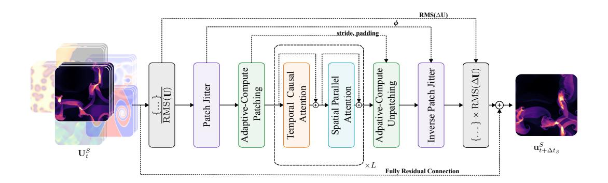

Figure 10: Stages of the Walrus model. Walrus uses recently developed adaptive-compute methods to balance cost between datasets on top of a modern transformer backbone and novel stabilization approaches.

## A MODEL DETAILS

Walrus can be broken into the following stages shown in order in Figure 10:

- Normalization/De-Normalization
- Patch Jittering/Inverse Jittering
- Adaptive-Compute Patching/Reconstruction
- Split Space-time attention block
  - PaLM-parallel Attention-MLP (Space)
  - Vanilla Causal Attention (Time)

We will discuss each briefly in it's own section, though the high level sizing information can be found in Table 2. Normalization is performed outside of the model itself. Jittering and adaptive compute patching are components of the *encoder* and *decoder* blocks. The attention blocks are performed at constant resolution as part of the *processor* blocks.

## A.1 REVERSIBLE NORMALIZATION

During pretraining, we use per-trajectory normalization (McCabe et al., 2023a) as the pretraining process is intended to emulate data from a wide data pool where there may not be a sufficiently large number of trajectories to precompute statistics. However, given the nonlinear dynamics, scale can be a significant factor. During finetuning, therefore, when the model is assumed to have access to a small finetuning set, it can be advantageous to employ normalization computed over the full dataset.

As mentioned in Section 3, the normalization is both asymmetric and uses the RMS statistics rather than mean/standard deviation. This is largely to avoid drift due to the de-normalization of the step term. Given an input trajectory  $\boldsymbol{U} \in \mathbb{R}^{T \times B \times C \times H \times W \times D}$  and using torch-style tensor conventions, this can be written as:

$$RMS(\boldsymbol{U})_{:,b,c} = \sqrt{\frac{1}{T \times H \times W \times D} \sum_{(t,h,w,d) \in T,H,W,D} \boldsymbol{U}_{t,b,c,h,w,d}^{2}}$$
(9)

letting  $\mathcal{M}$  represent the model, the full procedure can then be written as:

$$u_{t+1} = u_t + \mathcal{M}(\frac{\boldsymbol{U}_t}{RMS(\boldsymbol{U}_t)}) * RMS(\Delta \boldsymbol{U}_t)$$
(10)

## A.2 PATCH JITTERER WITH ADAPTIVE COMPUTE PATCHING

This section focuses on concrete implementation while the theory of patch jittering is covered in Section 3.2. As both jittering and adaptive patching (Figure 11) require controlled padding, these

Table 2: Model details for Walrus and HalfWalrus.

|                               | Walrus                       | HalfWalrus                   |
|-------------------------------|------------------------------|------------------------------|
| Architecture                  | Space-time Split Transformer | Space-time Split Transformer |
| Parameters                    | $1.3 \times 10^{9}$          | $6.4 \times 10^{8}$          |
| Encoder                       | hMLP+StrideMod               | hMLP+StrideMod               |
| Time History (2D)             | 6                            | 6                            |
| Base Token Shape (2D)         | $32^{2}$                     | $32^{2}$                     |
| Time History (3D)             | 3                            | 3                            |
| Base Token Shape (3D)         | $16^{3}$                     | $16^{3}$                     |
| Projection dimension          | 48                           | 48                           |
| Encoder dimension             | 352                          | 352                          |
| Hidden dimension              | 1408                         | 1088                         |
| MLP dimension                 | 5632                         | 4352                         |
| Space block                   | Parallel Attention           | Parallel Attention           |
| Space positional embedding    | AxialRoPE                    | AxialRoPE                    |
| Time block                    | Causal Attention             | Causal Attention             |
| Time positional embedding     | LearnedRPE                   | LearnedRPE                   |
| Attention heads               | 16                           | 16                           |
| Activation                    | SwiGLU                       | SwiGLU                       |
| Normalization                 | RMSGroupNorm                 | RMSGroupNorm                 |
| Normalization Groups          | 16                           | 16                           |
| Blocks                        | 40                           | 30                           |
| Drop Path                     | 0.05                         | 0.05                         |
| Optimizer                     | AdamW                        | AdamW                        |
| Learning rate                 | 2E-4                         | 1E-4                         |
| Weight decay                  | 1E-4                         | 1E-4                         |
| Warm-up Epochs                | 10                           | 10                           |
| Cool-down Epochs              | 10                           | 10                           |
| Scheduler                     | InvSqrt                      | InvSqrt                      |
| Gradient norm clipping        | 10.0                         | 10.0                         |
| Micro-batch size per GPU (2D) | 2                            | 2                            |
| Micro-batch size per GPU (3D) | 1                            | 1                            |
| Micro-batch per epoch         | 2000                         | 2000                         |
| GradAcc Steps                 | 4                            | 4                            |
| Epochs                        | 200                          | 200                          |
| GPUs                          | 96                           | 8                            |

are tightly coupled in the Walrus implementation which also depends on the boundary topology as described in Section C.2.

**Adaptive-Compute Patching.** Our implementation is closely adapted from Mukhopadhyay et al. (2025) with the exception that we inherently try to equalize tokens seen per dataset during pretraining. To do this, we choose the kernel sizes  $(p_1, p_2)$  and strides  $(s_1, s_2)$  used in the convolutional downsampling layers to ensure the internal model resolution lines up with the settings in Table 2. Padding is then implemented based on the effective kernel and stride of the combined convolution operations as any intermediate normalization and nonlinear operations do not impact domain shape.

**Patch Jitter.** For periodic boundaries, jitter is implemented as a straightforward torch.roll operation that occurs before any padding is applied. However, in the case of non-periodic boundaries, jitter is instead implemented through padding and limited size roll operation. Due to the inherent translation equivariance of the convolutions used in patching, we can limit the size of the roll to the effective size of the convolutional kernel. Here the padding is chosen to minimize the additional interior tokens generated. The combined procedure is described in Algorithm 1.

After this padding stage, the encoder can be applied with the kernel and stride parameters without additional modification.

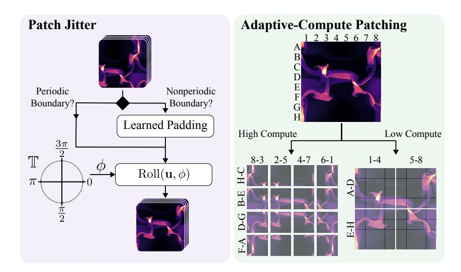

Figure 11: Stages of the Walrus model. Walrus uses recently developed adaptive-compute methods to balance cost between datasets on top of a modern transformer backbone and novel stabilization approaches.

# Algorithm 1 Patch Jittering with Adaptive-Compute Patching

**Require:** Data u,  $p_1$ ,  $p_2$  encoder convolutional kernel sizes,  $s_1$ ,  $s_2$  encoder convolutional kernel strides, b boundary identifiers.

```
1: function PADANDJITTER(u, p1, p2, s1, s2, b)
           p_{eff} \leftarrow p_1 + s_1 \times (p_2 - 1)
 3:
           s_{eff} \leftarrow s_1 \times s_2
           pad_{stride} \leftarrow (p_{eff} - s_{eff})
if b = \text{``PERIODIC''} then
 4:
 5:
 6:
                pad_{total} \leftarrow pad_{stride}
 7:
           else
 8:
                pad_{total} \leftarrow int(s_{eff}/2) + pad_{stride}
 9:
                 u \leftarrow \text{ZeroPad}(u, \text{left} = pad_{total}, \text{right} = pad_{total}, \text{channel} = 3)
10:
                 u[padding region, channel=b] \leftarrow 1.0
11:
12:
           j \leftarrow randint(0, pad_{total})
           u \leftarrow \text{roll}(u, j)
13:
           if u = "PERIODIC" then
14:
15:
                 u \leftarrow \text{CircularPad}(u, \text{left} = pad_{jitter}, \text{right} = pad_{jitter})
                 u \leftarrow \text{ZeroPad}(u, \text{channel} = 3)
16:
17:
           end if
18:
           return u
19: end function
```

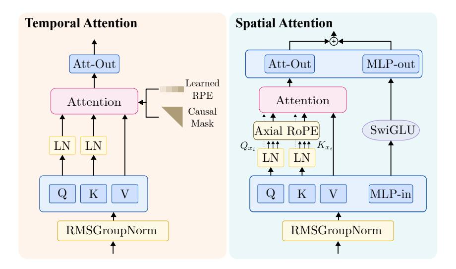

Figure 12: Stages of the Walrus model. Walrus uses recently developed adaptive-compute methods to balance cost between datasets on top of a modern transformer backbone and novel stabilization approaches.

To reconstruct the fields in grid space, the reverse procedure is followed: transposed convolutions using the same p,s values perform upsampling, the jitter is inverted, and padded cells are cropped. The only complication that emerges is again the case of periodic boundaries where the domain is padded by (k-s)//2 on each side prior to performing the transposed convolution and subsequently truncated by k-s to maintain periodicity.

## A.3 PROCESSOR BLOCKS

Each internal block of the transformer architecture consists of both a space and time mixing layer. These are performed sequentially and a high level visual representation of these blocks can be seen in Figure 12.

**Space.** Space and channel mixing are implemented using parallel attention (Wang, 2021) which implements the MLP and Attention in parallel rather than sequentially:

$$v' = \text{RMSGroupNorm}(u)$$
  
 $v = u + \text{MLP}(v') + \text{Attention}(v')$ 

The Attention operation here is scaled dot product attention computed over the spatial domain such for a given time, all tokens in space attend to each other. Training stability is improved using QKNorm from (Dehghani et al., 2023). Position encoding is performed using axial RoPE (Lu et al., 2023) interpolated onto different sized grids.

**Time.** In time, we use a standard attention implementation with causal masking applied independently to each spatial location such that for each point in space, this operation is causally masked attention over all time points. Time blocks use T5-style (Raffel et al., 2020) relative position encoding. While the structure of the objective is inherently causal and therefore does not require causal masking, we saw little difference in performance between the two approaches. Given the significant cost of utilizing the extra history tokens, we opted to use causal masking to enable KV caching in order to reduce inference costs for autoregressive forecasting. This is not currently implemented in the released code, but is vital for production deployment.

Note that while modifications exist to ensure RoPE is periodic, the conventional implementation is not. Therefore, to avoid boundary effects along periodic borders, we perform further random periodic rolls between each block. Rather than inverting immediately after, we use the group property of periodic translation and track the total magnitude of the roll during execution of the blocks. After all processor blocks have completed, we invert the full roll at that time.

#### A.4 MISC.

In a large scale project, with the expense of evaluation and the known behavioral differences across scales, sometimes architectural decisions were made more from inertia, having worked well when originally implemented, rather than through careful testing. Here, we describe the cases where this occurred to bring to light areas that could benefit from further experimentation:

- 1. Encoder and processor using different activations The encoder layers all use GELU activations (Hendrycks & Gimpel, 2016) while the processor layers use SwiGLU. This was an artifact of merging several implementations rather than an intentional decision. On small scale experiments, we saw little difference from correcting this, so it was left as is.
- 2. Additive corner handling In the boundary padding examples, we discussed the one-dimensional case where boundary topology is denoted by appended one-hot encoded channels. However, in multiple dimensions, the padding will overlap in corners resulting in additive corner handling. Changing this to a cross-product of boundary tokens was not explored.

## B TRAINING DETAILS

#### **B.1** Pretraining

Walrus was pretrained using the 19 datasets in Table 5. Training was performed using the Adam optimizer (Kingma & Ba, 2014) with decoupled weight decay (Loshchilov & Hutter, 2017) and an inverse square root learning rate schedule with linear warmup (Zhai et al., 2022) and square root cooldown (Hägele et al., 2024). The base learning rate used was 2E-4 for Walrus and 1E-4 for HalfWalrus. As the dataset is too large for many true epochs, we instead structure it in terms of logging intervals of 2000 micro-batches which we refer to as epochs for convenience. Walrus was trained for 200 of these "epochs" over 96 NVIDIA H100 GPUs. This amounts to 38M micro-batches seen during pretraining. Given the differential batch sizes, this works out to about 4M examples per datasets for 2D data and 2M per dataset for 3D data. HalfWalrus was trained for 200 over 8 NVIDIA H100 GPUs. All training was performed in FP32 single precision as we observed significant accuracy degradation using BF16 while we observed training stability issues using FP16.

**Augmentations.** During pretraining, to maximize the diversity seen, we employ several forms of augmentation. These augmentations are chosen because they are physically valid for a significant number of datasets.

- 1. Variable time-stride: We sample trajectories spaced by varying  $\Delta t$  where this ranges from 1 to 5 simulation steps. The model is forced to learn to infer the time step from history. This information is not provided explicitly.
- 2. **Tensor-aware rotations**: For all data defined on Euclidean domains, we perform additional augmentation using rotations sampled from the axis-aligned subset of SO(3). As mentioned in the main text, all geometric transformations are performed both on the spatial layout and on tensor-valued fields to ensure physical consistency.

For non-Walrus models in experiments, pretrained weights were used from the public code released by the authors.

#### B.2 Walrus Finetuning

For all finetuning tasks, Walrus was trained for an additional 50 pseudo-epochs (500K samples) on the new dataset exclusively at the time-striding and frame of reference used for evaluation. This was performed using the same optimizer and learning rate structure as pretraining but at half the original base learning rate. Finetuning was performed on one node with 4 NVIDIA H100 GPUs at single precision for both Walrus and baseline models.

Table 3: Effect of Absolute Positional Encodings (APE) on Euler datasets. Metrics are rollout VRMSE (mean  $\pm$  std). Lower is better. Removing APE consistently improves performance.

| Dataset        | APE      | 1:3                            | 3:9                   | 9:27                                 | 27:83                |
|----------------|----------|--------------------------------|-----------------------|--------------------------------------|----------------------|
| Euler-Periodic | With APE | $0.0330 \pm 0.0180$            | $0.0734 \pm 0.0336$   | $0.287 \pm 0.0859$                   | $0.921 \pm 0.201$    |
|                | No APE   | $0.0316 \pm 0.0171$            | $0.0571 \pm 0.0335$   | <b>0.167 <math>\pm</math> 0.0970</b> | $0.530 \pm 0.234$    |
| Euler-Open     | With APE | $0.0289 \pm 0.0132$            | $0.05548 \pm 0.0256$  | $0.1665 \pm 0.0843$                  | $0.6448 \pm 0.4904$  |
|                | No APE   | $\mathbf{0.02588 \pm 0.01145}$ | $0.04718 \pm 0.02205$ | $0.13503 \pm 0.06864$                | $0.53181 \pm 0.3504$ |

#### B.2.1 ARCHITECTURAL CHANGES FOR FINETUNING

The following are architectural modifications we enable during finetuning to allow models to adapt to anisotropy in the problem domain.

**Learnable RoPE.** During finetuning, we replicate the RoPE frequency parameters in each dimension and make these parameters trainable. The model can therefore learn to bias the attention to different positions along each axis and account for any differences in the spatial discretization.

**Adding APE.** Models developed for complex domains often employ forms of learned absolute position embeddings. Analysis of these embeddings can reveal complex structure emerging in order to account for information that is not explicitly provided to the model. For instance, visualizing the channels in the position embeddings of a weather model might reveal a surface that appears like a low resolution map. The ability to learn these features can be invaluable for effective model performance. During finetuning, we therefore initialize a learned APE embedding layer.

As the RoPE adaptation has little downside, we enable it for all finetuning experiments. For APE, we use it only when the domain is anisotropic. Table 3 shows that the effect of APE is not universally beneficial. On both Euler–Periodic and Euler–Open datasets, models trained without APE consistently achieve lower next-step and rollout VRMSEs across almost all horizons.

In translationally invariant systems with little geometric forcing such as the Euler examples, the governing equations do not depend on absolute position, and injecting positional signals can introduce spurious biases. In this case, APE effectively adds artificial energy at every rollout step: when applied autoregressively it accumulates errors and degrades long-term forecasts. By contrast, in systems with fixed spatial heterogeneities—for example Rayleigh–Bénard convection, where unknown boundary forcing occurs at the top and bottom walls, or interface-dominated problems where the interface remains at a fixed location—APE provides crucial anchoring information that the model would otherwise lack. Thus, APE is extremely useful when it compensates for missing or unobserved conditions, but can hinder performance when absolute position is physically irrelevant.

#### B.3 FINETUNING DETAILS FOR BASELINES

In all experiments, baselines have been provided equivalent data volumes to the Walrus model (500K for downstream tasks, 4.5M for 2D data included in pretraining, 2.5M for 3D data included in pretraining). How this data is grouped into batches was determined by hyperparameter search. For each downstream task, we selected a subset of datasets consisting of:

- euler\_quadrants\_periodic
- acoustic\_scattering\_discontinuous
- rayleigh\_benard
- active\_matter

The models were then trained at size B at a grid search of the following parameters

- learning rate [1e-3, 5e-4, 1e-4, 5e-4, 1e-5]
- maximum batch size [4, 8, 16, 32, 64]

where the number of total training steps was then computed from the data budget and batch size. For higher resolution systems, maximum batch size was decreased in power of two increments until the batch did not run out of memory. The best performing hyperparameter set across all runs was then evaluated on the data subset at the full size model (L/H). If at full size, any of these runs diverged or performed worse than the smaller model on any datasets, the learning rate was decreased by 20% until this performance gap was eliminated.

Apart from the base learning rate, optimizer and scheduler details we selected to match Walrus settings of AdamW with weight decay of 1E-4, gradient clipped to norm 10, and inverse square-root schedule with linear warmup and inverse square decay.

#### B.3.1 MODEL SIZES

|                        | Walrus           | MPP AViT-L        | Poseidon-L     | <b>DPOT-H</b>        |
|------------------------|------------------|-------------------|----------------|----------------------|
| # of parameters        | 1.29 B           | 407 M             | 628 M          | 1.15 B               |
| Base operation (Space) | Full Attention   | Axial Attention   | SWIN Attention | AFNO                 |
| Base operation (Time)  | Causal Attention | Acausal Attention | None           | Temporal-aggregation |

Table 4: Comparison of model sizes and core architectures between Walrus and baseline models.

## B.3.2 DPOT-H

While generally DPOT is configured to match pretraining settings, DPOT's public config files did not appear to use data normalization, we empirically found the model generally diverged when trained on unnormalized data as the training data covers a wide range of scales that may not have been seen during pretraining. We therefore used standard mean-std style dataset normalization with DPOT with normalization computed over the full training set per individual dataset which we hereafter refer to as "global" normalization.

DPOT was trained using the normalized  $L^2$  loss used in the source repository with a context length of 10 and at each step, the full field is predicted, ie  $u_{t+1} = \mathcal{M}(U_t)$ . To adapt DPOT to arbitrary shapes, we employed linear interpolation on the absolute position embeddings and re-initialized embedding weights for new fields. As the DPOT architecture apart from APE are resolution-agnostic, this amounts to changing how several sizes were passed.

Hyperparameters selected for DPOT-H were learning rate 8E-5 and at maximum batch size 64.

## B.3.3 Poseidon

Poseidon settings were configured to best match original training settings. Data was normalized using global dataset statistics and a normalized  $L^1$  loss was used. At each step, the full field is predicted, ie  $u_{t+1} = \mathcal{M}(U_t)$ .

Though there are no inherent architectural limitations, Poseidon's public code had several limitations preventing application to non-square grids. It was necessary to update several model components which used fixed h=w to track h,w separately and accordingly perform all resize operations to respect the rectangular shape. These were done in minimally invasive fashion without need for further training such that the model performance was found to be unchanged on square data up to numerical precision.

Empirically, we found that time-conditioned rollouts worked poorly on more complex dynamics and subsequently trained all reported models in autoregressive fashion. The "time-conditioning" fed into the model was kept at  $\Delta t=.05$  to match the standard gap between timesteps in Poseidon's pretraining data. As this approach was only used for finetuning, the time-gap observed is always constant.

Hyperparameters selected for Poseidon-L were learning rate 1E-4 and at maximum batch size 64.

#### B.3.4 MPP AVIT-L

MPP settings were configured to best match original training settings. Per-trajectory normalization is used within the model, though the loss is computed in globally normalized space. At each step, the full field is predicted, ie  $u_{t+1} = \mathcal{M}(U_t)$ .

The longer context length (16) used by MPP AvIT-L during pretraining was a significant cost during finetuning, but we found we were able to reduce this to the context used by Walrus (6) with minimal loss of accuracy during finetuning. Field-specific embedding layers were re-initialized due to new fields that were not encountered during pretraining.

Hyperparameters selected for MPP-AViT-L were learning rate 1E-4 and at maximum batch size 32, though the longer context of MPP generally meant that batch size was more memory dependent.

## C DATA

| Dataset                           | Short Name          | Source   | CS               | Resolution (pixels)         | n_steps  | n_traj |
|-----------------------------------|---------------------|----------|------------------|-----------------------------|----------|--------|
| acoustic_scattering_discontinuous | Discontinuous       | The Well | (x, y)           | $256 \times 256$            | 102      | 2 000  |
| acoustic_scattering_inclusions    | Inclusions          | The Well | (x, y)           | $256 \times 256$            | 102      | 4000   |
| acoustic_scattering_maze          | Maze                | The Well | (x, y)           | $256 \times 256$            | 202      | 2000   |
| active_matter                     | Active Matter       | The Well | (x, y)           | $256 \times 256$            | 81       | 360    |
| euler_multiquadrants_periodicBC   | MultiQuadrantsP     | The Well | (x, y)           | $512 \times 512$            | 101      | 5000   |
| euler_multiquadrants_openBC       | MultiQuadrantsO     | The Well | (x, y)           | $512 \times 512$            | 101      | 5000   |
| gray_scott_reaction_diffusion     | Gray-Scott          | The Well | (x, y)           | $128 \times 128$            | 1001     | 1200   |
| helmholtz_staircase               | Staircase           | The Well | (x, y)           | $1024 \times 256$           | 50       | 512    |
| MHD                               | MHD (3D)            | The Well | (x, y, z)        | $64^{3}$                    | 100      | 100    |
| planetswe                         | PlanetSWE           | The Well | $(\theta, \phi)$ | $256 \times 512$            | 1 008    | 120    |
| rayleigh_benard                   | Rayleigh-Benard     | The Well | (x, y)           | $512 \times 128$            | 200      | 1750   |
| rayleigh_taylor_instability       | RT Instability (3D) | The Well | (x, y, z)        | $128 \times 128 \times 128$ | 120      | 45     |
| shear_flow                        | Shear Flow          | The Well | (x, y)           | $256 \times 512$            | 200      | 1120   |
| supernova_explosion               | Supernova (3D)      | The Well | (x, y, z)        | $128^{3}$                   | 59       | 1 000  |
| turbulence_gravity_cooling        | TGC (3D)            | The Well | (x, y, z)        | $64 \times 64 \times 64$    | 50       | 2700   |
| turbulent_radiative_layer_2D      | TRL (2D)            | The Well | (x, y)           | $128 \times 384$            | 101      | 90     |
| turbulent_radiative_layer_3D      | TRL (3D)            | The Well | (x, y, z)        | $128 \times 128 \times 256$ | 101      | 90     |
| viscoelastic_instability          | Viscoelastics       | The Well | (x, y)           | $512 \times 512$            | variable | 260    |
| FPOHarmonics                      | FBHarmonics         | The Well | (x, y)           | $512 \times 128$            | 242      | 400*   |

Table 5: Pretraining dataset descriptions: coordinate system (CS), resolution of snapshots, n\_steps (number of time-steps per trajectory), n\_traj (total number of trajectories in the dataset). Step count may differ from other sources as we normalized step count to always include initial conditions. (\*) Removed flowbench\_FPO\_NS\_2D\_512x128\_harmonics\_Re614.hdf5 due to outlier trajectory.

| Dataset                                                                      | Source                                          | CS                                                                                             | Resolution (pixels)                                                          | n_steps                 | n_traj                    |
|------------------------------------------------------------------------------|-------------------------------------------------|------------------------------------------------------------------------------------------------|------------------------------------------------------------------------------|-------------------------|---------------------------|
| FPOSkelenton<br>PoolBoil Subcooled<br>Conditioned Incompressible NS<br>CE-RM | Flowbench<br>BubbleML 2.0<br>PDEArena<br>PDEGym | $\begin{array}{c} (x,y) \\ (x,y) \\ (x,y) \\ (x,y) \end{array}$                                | $512 \times 128$<br>$512 \times 512$<br>$128 \times 128$<br>$128 \times 128$ | 242<br>2001<br>56<br>21 | 262<br>44<br>6816<br>1260 |
| CNS Turbulent CNS Random post_neutron_star_merger convective_envelope_rsg    | PDEBench<br>PDEBench<br>The Well<br>The Well    | $ \begin{array}{c} (x,y,z) \\ (x,y,z) \\ (\log r,\theta,\phi) \\ (r,\theta,\phi) \end{array} $ | $64^{3}$ $128^{3}$ $192 \times 128 \times 66$ $256 \times 128 \times 256$    | 21<br>21<br>181<br>100  | 600<br>100<br>8<br>29     |

Table 6: Pretraining dataset descriptions: coordinate system (CS), resolution of snapshots, n\_steps (number of time-steps per trajectory), n\_traj (total number of trajectories in the dataset).

All data used for pretraining was sourced from TheWell (Ohana et al., 2025) or Flowbench (Tali et al., 2024). TheWell contains diverse physical settings from across multiple domains while Flowbench fills one of the gaps in TheWell with an extensive collection of flow past obstacle examples. The full descriptions of each of these datasets and how they were generated can be found in the source documents.

For evaluation of transfer capabilities, we include additional datasets from the additional sources PDEGym (Herde et al., 2024), PDEBench (Takamoto et al., 2024), BubbleML 2.0 (Hassan et al., 2025), and PDEArena (Gupta & Brandstetter, 2022) to reduce the likelihood of results being impacted by subtle biases in the construction of the source datasets.

When available, we use the canonical train/valid/test splits provided by the development teams of these datasets. We break the data usage into two categories:

- 1. Pretraining data (Table 5) Data used during pretraining Walrus.
- 2. Downstream tasks (Table 6) Data used for finetuning task which had never been seen by Walrus during initial pretraining, though Conditioned Incompressible NS from PDEArena was used during DPOT training and CE-RM from PDEGym was part of the same data collection as Poseidon's pretraining.

## C.1 DATA TRANSFORMATIONS

The following elementwise transformations were applied to input fields independent of normalization. This was performed uniformly across all experiments and models. Note that since these are applied uniformly, all metrics are computed on transformed fields.

- acoustic\_scattering\_...
  - 1. density: Zero replacement removed to avoid numerical complications from high dynamic range field which is deterministic transform of other provided field.
- post\_neutron\_star\_merger
  - 1. density:  $\log_{10}$  reduce long tail of strictly positive field in accordance with domain conventions.
  - 2. temperature  $\log_{10}$  reduce long tail of strictly positive field in accordance with domain conventions.
  - 3. pressure  $\log_{10}$  reduce long tail of strictly positive field in accordance with domain conventions.
  - 4. entropy  $\log_{10}$  reduce long tail of strictly positive field in accordance with domain conventions.
  - 5. internal\_energy  $\log_{10}$  reduce long tail of strictly positive field in accordance with domain conventions.
- supernova\_explosion\_128
  - 1. density:  $\log_{10}$  reduce long tail of strictly positive field in accordance with domain conventions.
  - 2. temperature:  $\log_{10}$  reduce long tail of strictly positive field in accordance with domain conventions.
- turbulence\_gravity\_cooling
  - 1. density:  $\log_{10}$  reduce long tail of strictly positive field in accordance with domain conventions
  - 2. temperature:  $\log_{10}$  reduce long tail of strictly positive field in accordance with domain conventions.
- turbulent\_radiative\_layer\_3D
  - 1. density:  $\log_{10}$  reduce long tail of strictly positive field in accordance with domain conventions.
  - 2. temperature:  $\log_{10}$  reduce long tail of strictly positive field in accordance with domain conventions.

# C.2 BOUNDARY HANDLING

In the case of periodic boundary conditions, the computations described in Section 3.2 can be performed exactly. As Walrus is intended to be general-purpose and not constrained to settings where the boundary conditions are exactly known, we opt for a simple topological description of boundary conditions indicating whether a boundary is:

- 1. Open The domain extends beyond the sub-domain we are currently viewing. We do not know what is beyond the boundary.
- 2. Closed There is some form of barrier marking this as the limit of the domain. The model is unaware of what conditions are enforced at this barrier.

3. Periodic - There is not truly a boundary here and the neighboring points are on the opposite side of the domain.

For non-periodic boundaries, padding is implemented with additional channels containing binary masks for each topological boundary type. Open and closed boundaries are processed as separate channels so that the model can learn to treat each differently. For the case where downstream boundary conditions are known, we suggest employing ghost-node or extrapolation style padding as are commonly used in numerical packages (Clawpack Development Team, 2021; Holl & Thuerey, 2024) though the impact of this is not explored in this work.

# D Modes of Operation for Dynamics Models

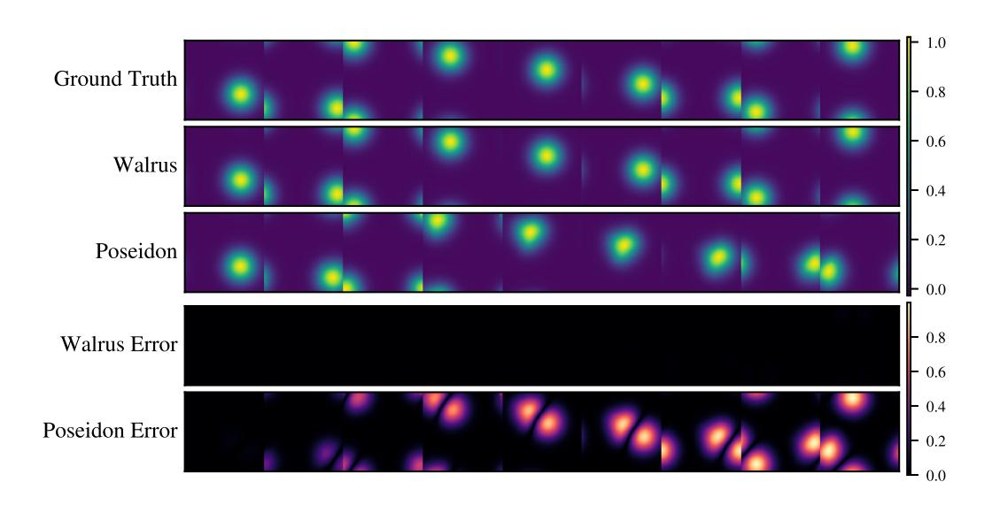

Figure 13: Comparsion between Walrus and the Poseidon-L model on linear advection of smooth initial conditions. Without history, the task becomes degenerate as it is impossible to infer the missing system parameters.

One important point when comparing emulation models is the mode of operation. In practice, there is a wide spectrum of information one can assume the model has access to. For instance, given full observation of all state variables and coefficients in a system governed by PDEs, one would be operating in a Markovian setting in which one timestep provides all necessary information to make the prediction. Foundation models such as Poseidon make this choice to greatly improve model efficiency.

However, in non-Markovian settings—which arise under incomplete information—this strategy can easily become a liability (Ruiz et al., 2024). We describe here a simple experiment where  $u(x,t) \in \mathcal{L}^2(\mathbb{T}^2) \times [0,\infty)$  evolves according to the following linear PDE

$$\frac{\partial \boldsymbol{u}}{\partial t} = \nu \frac{\partial \boldsymbol{u}}{\partial \boldsymbol{x}}.$$

where  $u(x,0) \sim \mathcal{N}(m,\sigma I)$  is a 2D Gaussian, with the center  $m \in [0.25,0.75]^2$  and an isotropic variance with  $\sigma \in \mathcal{U}(0.05,0.25)$ . For a given PDE, the parameter  $\nu$  is independently sampled form a uniform distribution, i.e.,  $\nu \sim \mathcal{U}[0.05,0.25]$ .

If we task both Walrus and Poseidon to learn to emulate this system without any knowledge of  $\nu$ , the result in Figure 13 shows that Poseidon is unable to make predictions while Walrus easily learns the system. Without access to multiple steps, one-step models are forced to estimate a mean tendency. This pattern can be seen in many of the datasets within TheWell. This implies that for these

one-step models to learn to make predictions in incompletely described systems, the initial conditions must be representative of the missing conditions.

It is important to note that the impact of this decision is problem-dependent. In well-understood cases where the dynamics are entirely driven by initial conditions, the one-step approach can prove to be an enormous efficiency advantage. Other foundation models like DPOT employ a middle path where the time dimension is entirely squashed by the encoder. This reduces the number of tokens fed to the processing blocks, but also places sole responsibility for extracting necessarily temporal patterns on the encoder alone. Finding an optimal approach which balances these needs is an open area of research.

## E EVALUATION AND ADDITIONAL RESULTS

#### E.1 EVALUATION METRICS

#### E.1.1 VRMSE METRIC

The variance scaled mean squared error (VMSE): it is the MSE normalized by the variance of the truth. It has been used for the benchmarking of the Well (Ohana et al., 2025).

$$VMSE(u, v) = \frac{\langle |u - v|^2 \rangle}{(\langle |u - \bar{u}|^2 \rangle + \epsilon)}.$$

We chose to report its square root variant, the VRMSE

$$VRMSE(u, v) = \frac{\langle |u - v|^2 \rangle^{1/2}}{(\langle |u - \bar{u}|^2 \rangle + \epsilon)^{1/2}}.$$

Note that, since  $VRMSE(u, \bar{u}) \approx 1$ , having VRMSE > 1 indicates worse results than an accurate estimation of the spatial mean  $\bar{u}$ .

#### E.2 JITTER IMPROVEMENTS

Jitter is primarily intended to aid with the stability of long-term rollout accuracy, particularly preventing divergence to values outside of the typical distribution of field values. Analyzing improvement through  $L^2$  analysis can be tricky as the mean is sensitive to outliers. In Table 7, we show the median trajectory-averaged VRMSE for each dataset after sampling 32 trajectories. Here we can see that jitter shows a clear improvement in long term accuracy. The median accuracy improvement is 54% and the number of "high" long term errors (defined as median VRMSE  $\geq 1$ ) shrinks from 10 to 3. This leads to an overall improvement on 89% of datasets with the few that do not improve being largely unaffected.

#### E.3 ADDITIONAL RESULTS FOR DOWNSTREAM PERFORMANCE

## E.3.1 TABLE-FORMATTED LOSSES

Table 8 shows the finetuning dataset numbers in table format for easier reference.

#### E.3.2 Detailed Loss over Time Plots

Figure 14 shows the median VRMSE over each available step of the rollout for more fine-grained analysis. The shaded region represents plus/minus one standard deviation over the data set. Generally, we see Walrus has a sizable advantage in each downstream scenario. On the PoolBoilSubcool scenario, MPP-AViT-L eventually surpasses Walrus though qualitatively speaking, the MPP model appears to learn to stop predicting bubbles to minimize loss, while

#### E.4 ADDITIONAL RESULTS FOR CROSS-DOMAIN ANALYSIS

#### E.4.1 DETAILED LOSS OVER TIME PLOTS

Figure 15 shows the VRMSE over each step. The shaded region represents plus/minus one standard deviation over the data set. Walrus without finetuning included for reference. We can see that despite

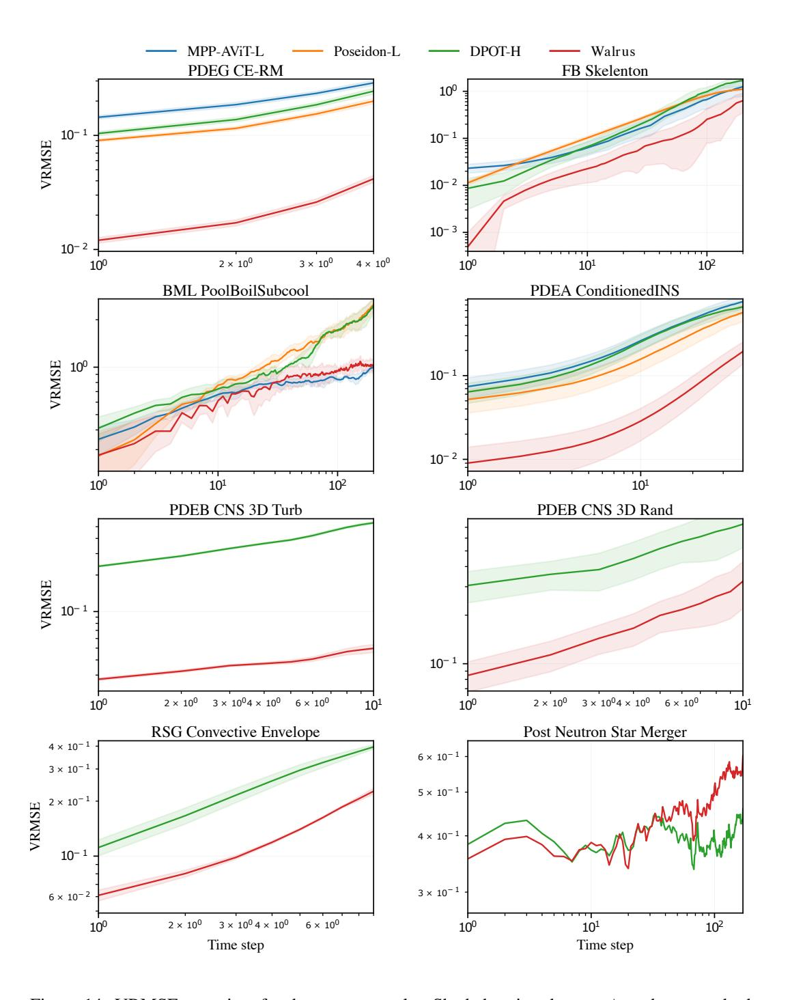

Figure 14: VRMSE over time for downstream tasks. Shaded region denotes  $\pm \sigma$  where standard deviation is computed empirically over test samples at given step.

| Dataset             | Trajectory Lengths | Jitter    | No Jitter |
|---------------------|--------------------|-----------|-----------|
| Maze                | 202                | 0.34      | 1.07      |
| Inclusions          | 102                | 0.18      | 1.30      |
| Discontinuous       | 102                | 0.18      | 1.44      |
| Staircase           | 50                 | 0.01      | 0.27      |
| Active Matter       | 81                 | 0.98      | 0.98      |
| Gray-Scott          | 1001               | 0.41      | 0.48      |
| Supernova (3D)      | 59                 | 1.20      | 1.28      |
| TGC (3D)            | 50                 | 0.67      | 1.12      |
| PlanetSWE           | 1008               | 0.10      | 0.56      |
| MHD (3D)            | 100                | $\geq 10$ | $\geq 10$ |
| Rayleigh-Benard     | 200                | 0.81      | 0.84      |
| Shear Flow          | 200                | 0.16      | 0.27      |
| <b>FBHarmonics</b>  | 242                | 0.07      | 0.27      |
| RT Instability (3D) | 120                | 7.11      | 7.52      |
| MultiQuadrantsP     | 101                | 0.62      | 0.60      |
| MultiQuadrantsO     | 101                | 0.50      | 1.82      |
| TRL (2D)            | 101                | 0.75      | 76.9      |
| TRL (3D)            | 101                | 0.92      | 1.17      |
| Viscoelastics       | 20*                | 0.10      | 0.56      |

Table 7: Median validation full-trajectory averaged VRMSE at various time horizons for both jittered and un-jittered Walrus. (\*) denotes that for variable length trajectories, shortest length used as standard.

| Dataset                  | •          | VRMSE:     | One-ste | p      | VRM        | VRMSE: Avg $T \in [1:10]$ |        |        | VRMSE: Avg $T \in [11:30]$ |            |        |        |
|--------------------------|------------|------------|---------|--------|------------|---------------------------|--------|--------|----------------------------|------------|--------|--------|
|                          | MPP-AViT-L | Poseidon-L | DPOT-H  | Walrus | MPP-AVIT-L | Poseidon-L                | ррог-н | Walrus | MPP-AViT-L                 | Poseidon-L | DPOT-H | Walrus |
| 2D                       |            |            |         |        |            |                           |        |        |                            |            |        |        |
| PDEG CE-RM               | 0.1413     | 0.0769     | 0.1107  | 0.0118 | 0.2132     | 0.1399                    | 0.1679 | 0.0242 | _                          | _          | _      | _      |
| FB Skelenton             | 0.0222     | 0.0111     | 0.0087  | 0.0006 | 0.0422     | 0.0583                    | 0.0371 | 0.0132 | 0.1215                     | 0.1973     | 0.1432 | 0.0440 |
| BML PoolBoilSubcool      | 0.1012     | 0.0829     | 0.1954  | 0.0617 | 0.5446     | 0.5549                    | 0.6182 | 0.4656 | 0.7496                     | 0.9468     | 0.8485 | 0.7095 |
| PDEA ConditionedINS      | 0.0456     | 0.0291     | 0.0404  | 0.0040 | 0.1608     | 0.1006                    | 0.1488 | 0.0178 | 0.4834                     | 0.3226     | 0.4571 | 0.0777 |
| 3D                       |            |            |         |        |            |                           |        |        |                            |            |        |        |
| PDEB CNS 3D Turb         | _          | _          | 0.2115  | 0.0276 | _          | _                         | 0.4039 | 0.0401 | _                          | _          | _      | _      |
| PDEB CNS 3D Rand         | _          | _          | 0.2920  | 0.0905 | _          | _                         | 0.5281 | 0.2025 | _                          | _          | _      | _      |
| RSG Convective Envelope  | _          | _          | 0.1121  | 0.0587 | _          | _                         | 0.2772 | 0.1422 | _                          | _          | _      | _      |
| Post Neutron Star Merger | _          | _          | 0.2394  | 0.2013 | _          | _                         | 0.3877 | 0.3736 | _                          | _          | 0.3933 | 0.3873 |

Table 8: Losses (Median VRMSE) averaged over various time horizons. One-step computed over all possible steps. Ranges computed by forecasting from initial conditions. Lower is better. Dark font signifies closer to best performance. Bold indicates top performing model. For trajectories shorter than window, averages computed over available steps. "—" indicates either either trajectory is too short or model not applicable (e.g., 2D model on 3D data).

seeing less total data per scenario with heavy problem-altering augmentation, the model is still able to compete with the finetuned models, though finetuning greatly reduces the rate at which error accumulates.

## F FINETUNING ROLLOUT EXAMPLES

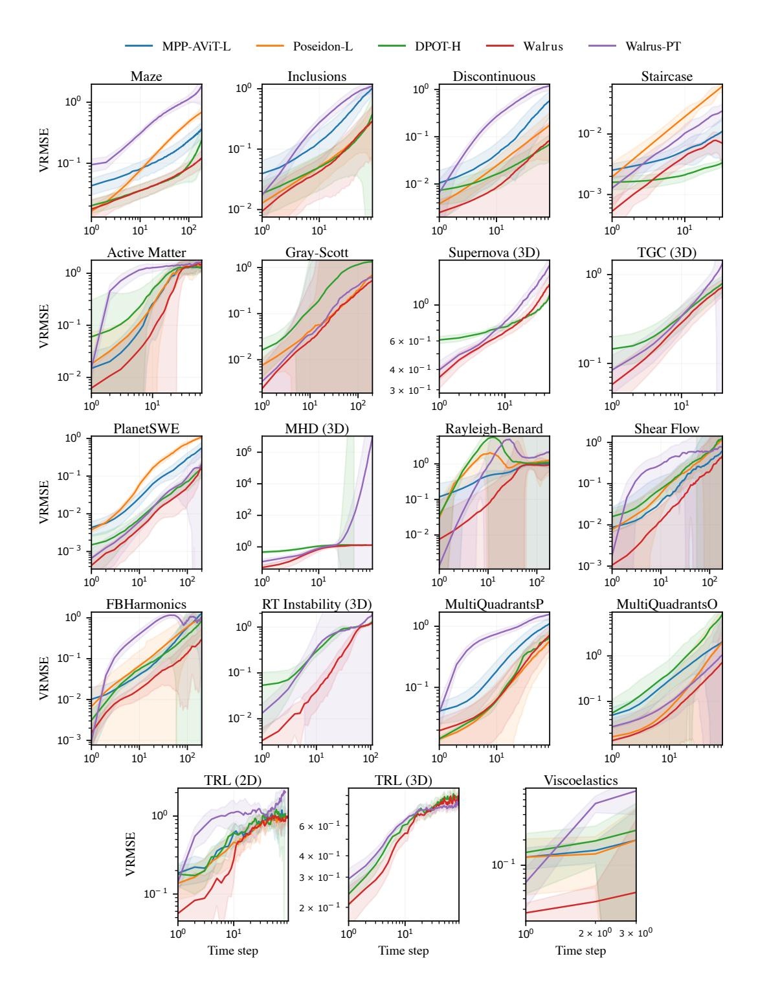

Figure 15: VRMSE over time for tasks in training distribution. Shaded region denotes  $\pm \sigma$  where standard deviation is computed empirically over test samples at given step.

| Dataset                                                                                                                                                                                                                                                                                                                                 | Short Name                                                                                                                                                                                                   | Figure Ref                                                                                                                                                                       |
|-----------------------------------------------------------------------------------------------------------------------------------------------------------------------------------------------------------------------------------------------------------------------------------------------------------------------------------------|--------------------------------------------------------------------------------------------------------------------------------------------------------------------------------------------------------------|----------------------------------------------------------------------------------------------------------------------------------------------------------------------------------|
| acoustic_scattering_discontinuous acoustic_scattering_maze active_matter euler_multiquadrants_periodicBC euler_multiquadrants_openBC gray_scott_reaction_diffusion helmholtz_staircase MHD planetswe rayleigh_benard rayleigh_taylor_instability shear_flow supernova_explosion turbulence_gravity_cooling turbulent_radiative_layer_3D | Discontinuous Inclusions Maze Active Matter MultiQuadrantsP MultiQuadrantsO Gray-Scott Staircase MHD (3D) PlanetSWE Rayleigh-Benard RT Instability (3D) Shear Flow Supernova (3D) TGC (3D) TRL (2D) TRL (2D) | Figure 25 Figure 24 Figure 23 Figure 18 Figures 19 20 Figures 2122 Figure 27 Figure 28 Figure 36 Figure 30 Figure 16 Figure 41 Figure 41 Figure 42 Figure 40 Figure 29 Figure 43 |
| viscoelastic_instability<br>FPOHarmonics                                                                                                                                                                                                                                                                                                | Viscoelastics<br>FBHarmonics                                                                                                                                                                                 | Figure 33<br>Figure 26                                                                                                                                                           |

Table 9: Helper table for quick linking to specific rollout examples.

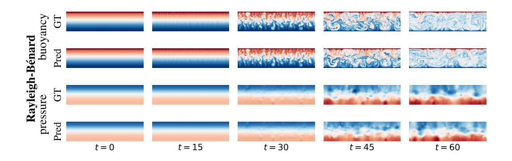

Figure 16: Rayleigh-Benard Convection in 2D.

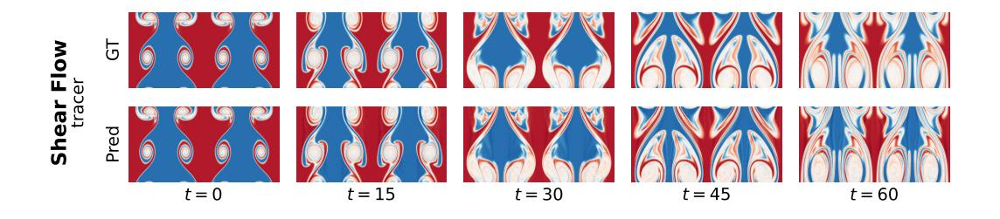

Figure 17: Shear flow in 2D.

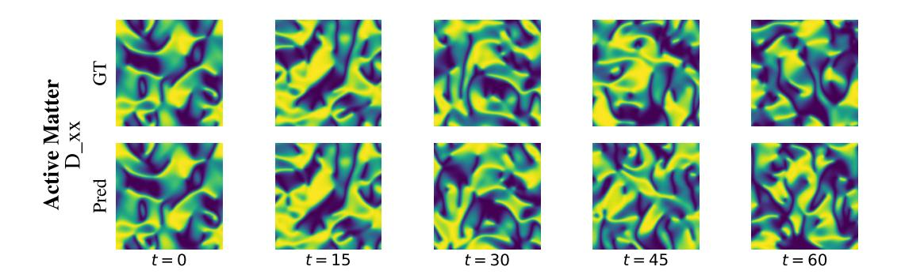

Figure 18: Active matter dynamics in 2D.

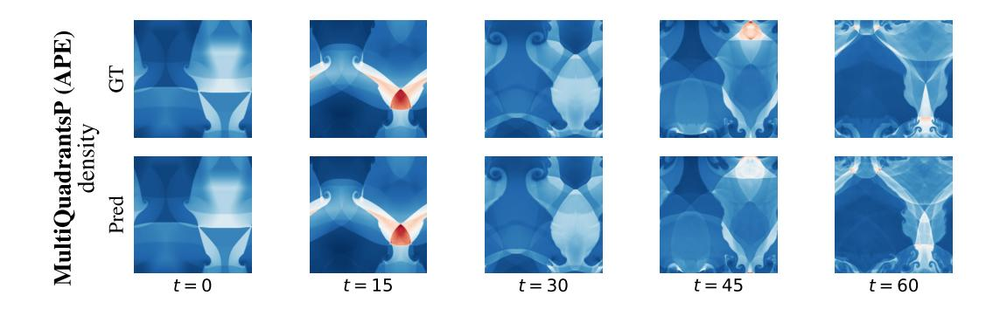

Figure 19: Euler multi-quadrants problem with periodic boundaries in 2D solved with absolute position embeddings (APE).

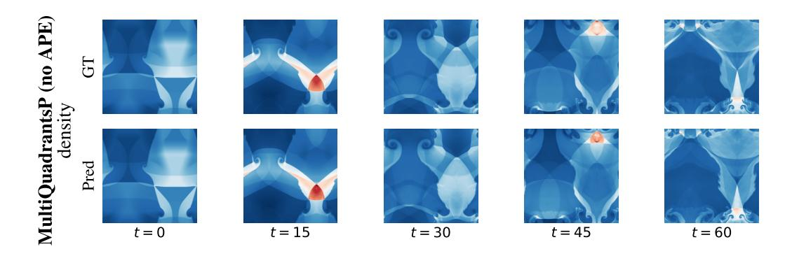

Figure 20: Euler multi-quadrants problem with periodic boundaries in 2D solved without APE.

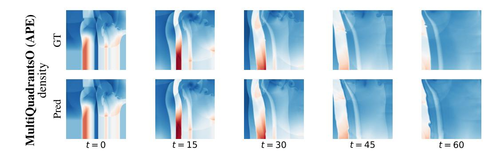

Figure 21: Euler multi-quadrants problem with open boundaries in 2D solved with APE.

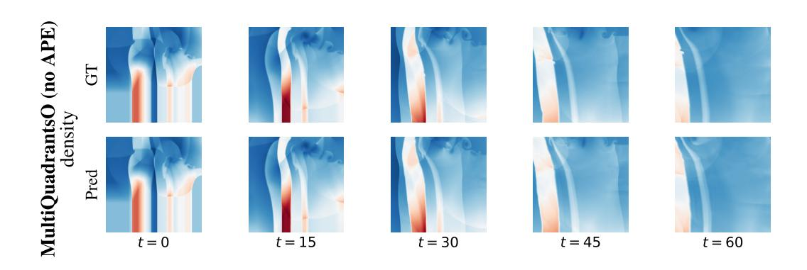

Figure 22: Euler multi-quadrants problem with periodic boundaries in 2D solved without APE.

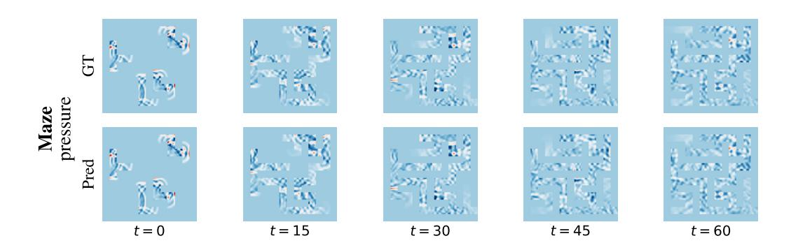

Figure 23: Acoustic scattering through a maze in 2D.

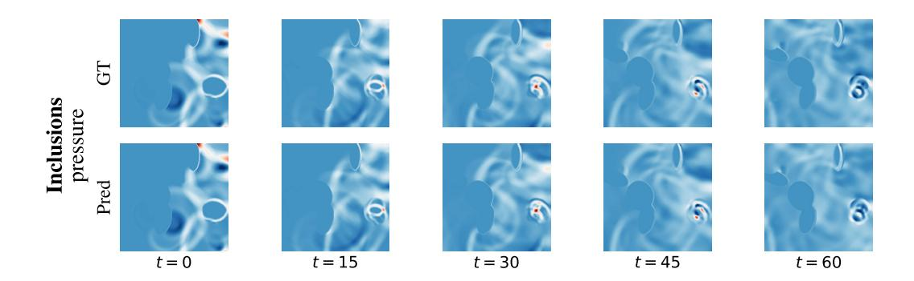

Figure 24: Acoustic scattering through medium with sharply varying inclusions in 2D.

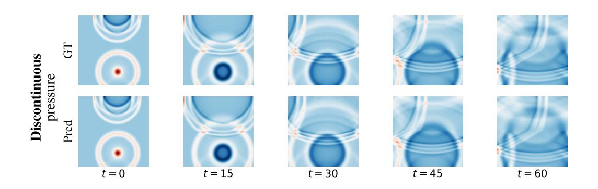

Figure 25: Acoustic scattering through medium with discontinuous density in 2D.

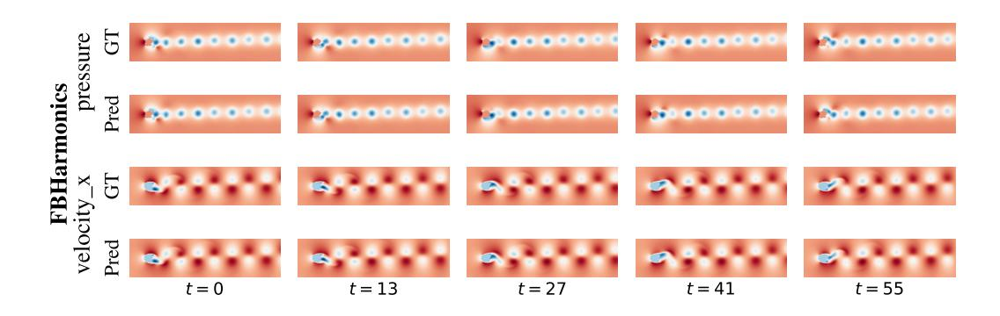

Figure 26: Flow around object with boundaries defined by spherical harmonics.

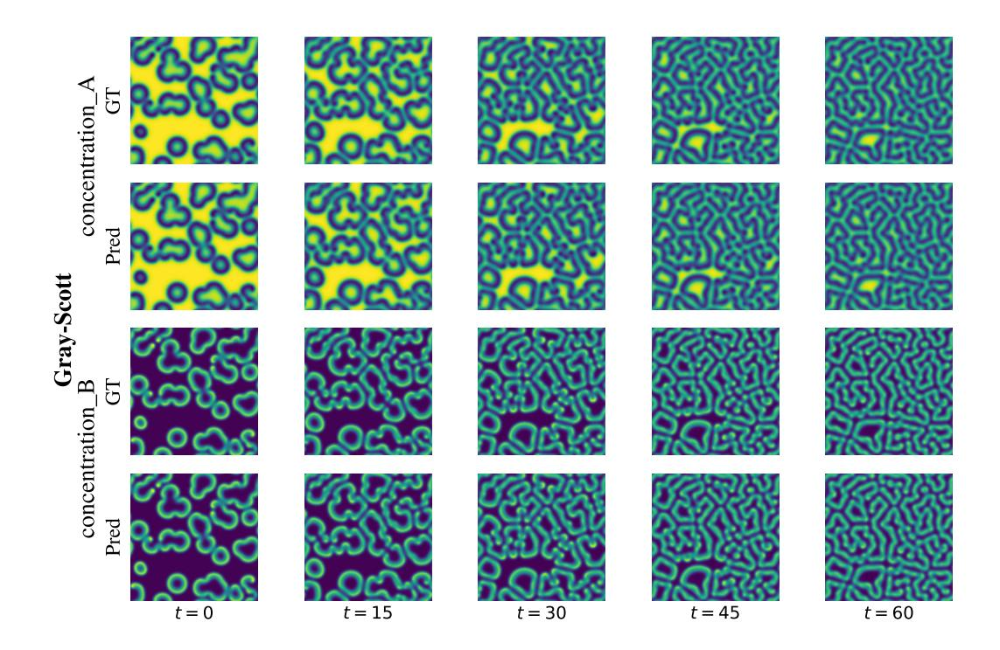

Figure 27: Gray-Scott diffusion reaction in 2D.

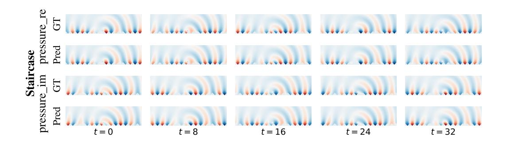

Figure 28: "Helmholtz Staircase" of wave propagation over infinite periodic surface in 2D.

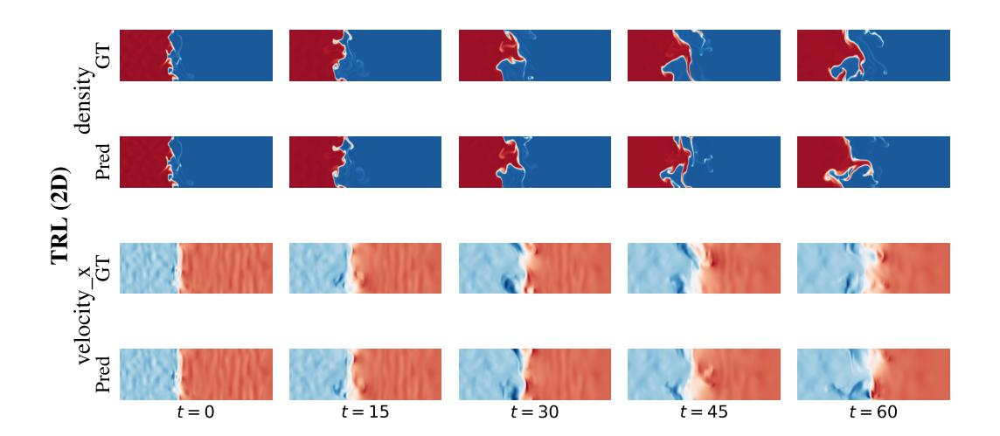

Figure 29: Turbulent radiative layer in 2D.

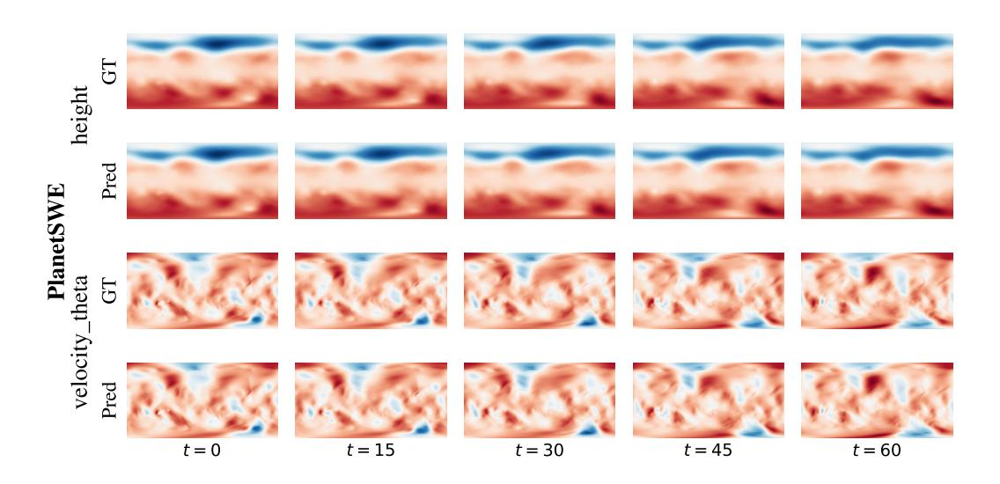

Figure 30: Shallow water equations over approximate earth topography (PlanetSWE).

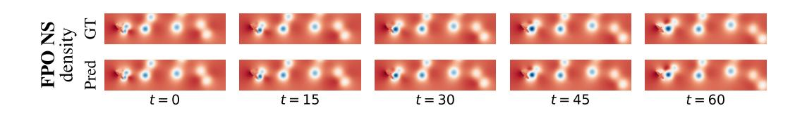

Figure 31: Flow around complex obstacle defined by skelenton in 2D.

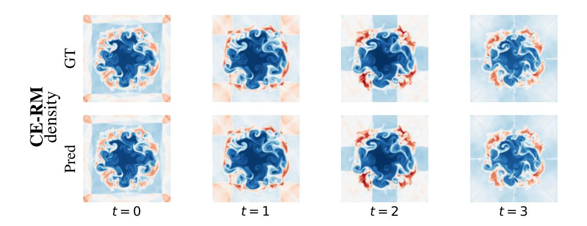

Figure 32: Compressible Euler equations initialized at Richtmyer-Meshkov instability in 2D. From PDEGym.

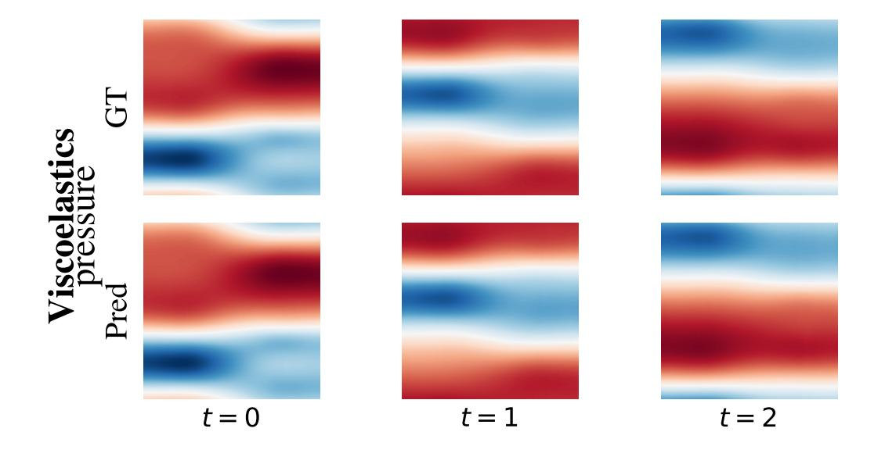

Figure 33: Instability in viscoelastic flow in 2D.

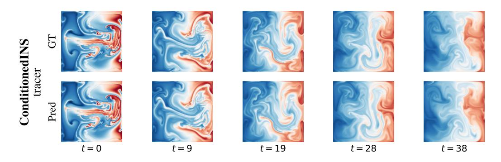

Figure 34: Particles embedded in buoyant incompressible flow in 2D. From PDEArena.

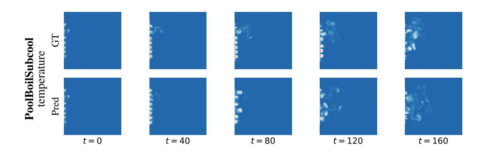

Figure 35: Multi-phase flow in which varying liquids are heated from below to form bubbles in 2D. From BubbleML 2.0.

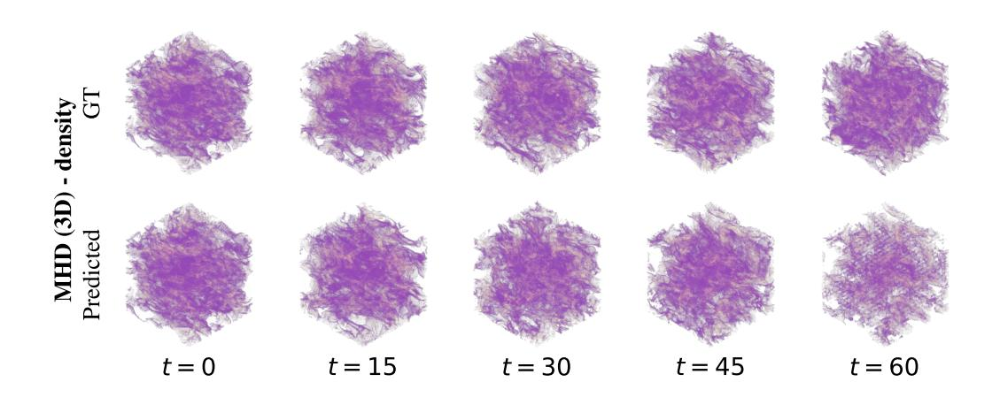

Figure 36: Magnetohydrodynamic turbulence in 3D.

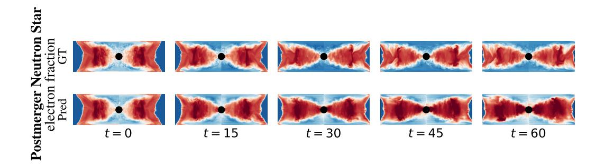

Figure 37: Aftermath of neutron star merger. Visualized slice in 2D, but simulated in 3D.

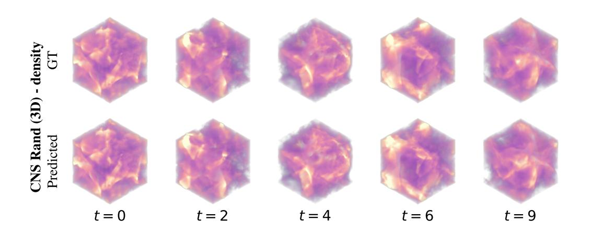

Figure 38: Compressible Navier-Stokes in 3D with "random" initial conditions. From PDEBench.

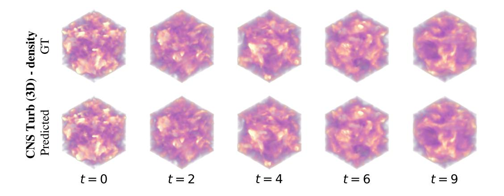

Figure 39: Compressible Navier-Stokes in 3D with "turbulent" initial conditions. From PDEBench.

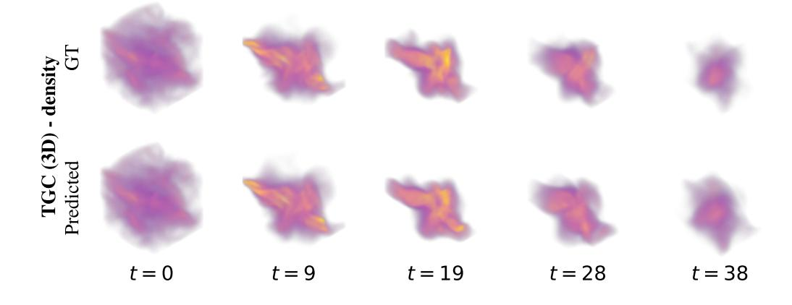

Figure 40: Cooling of the turbulent interstellar medium in 3D.

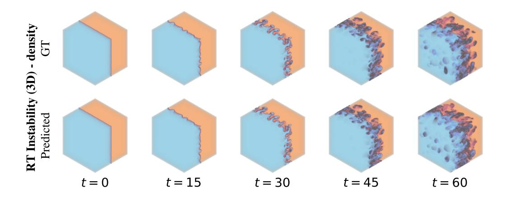

Figure 41: Rayleigh-Taylor Instability in 3D.

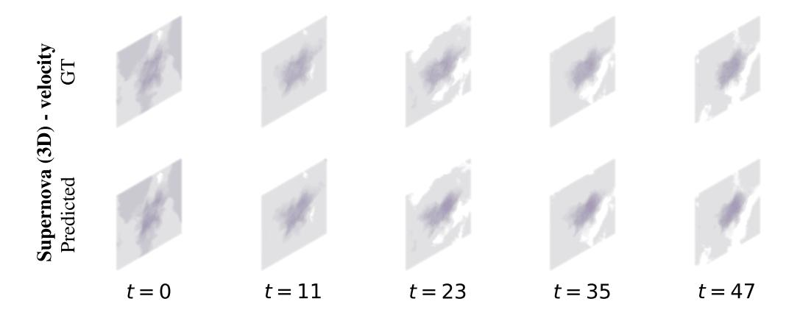

Figure 42: Supernova explosion in 3D.

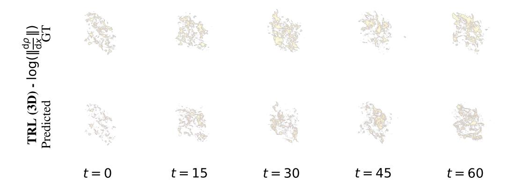

Figure 43: Turbulent radiative layer in 3D.