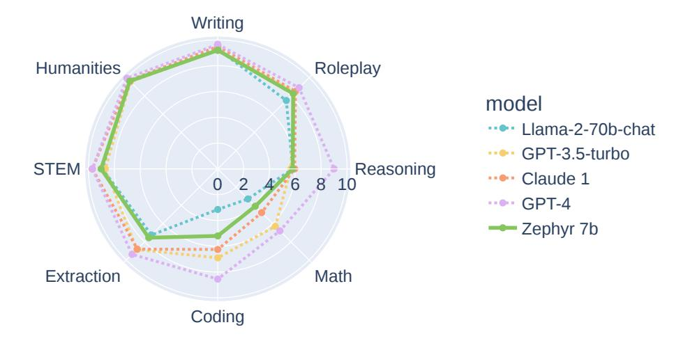
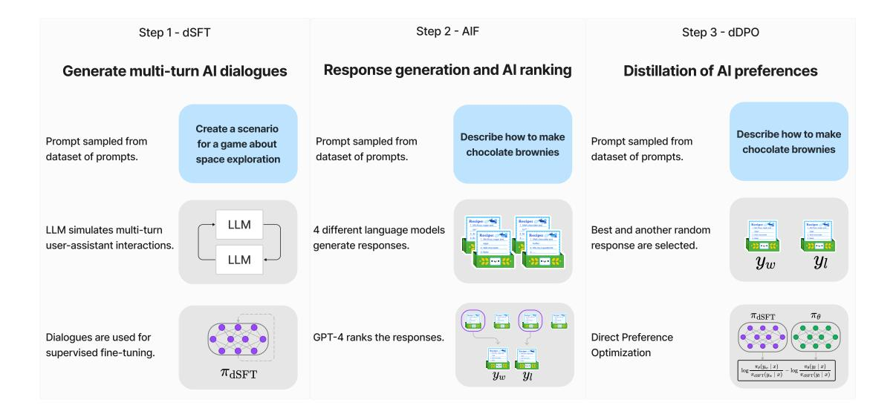
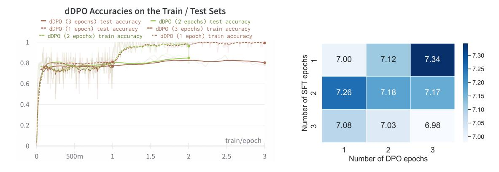

## ZEPHYR: DIRECT DISTILLATION OF LM ALIGNMENT

Lewis Tunstall,\* Edward Beeching,\* Nathan Lambert, Nazneen Rajani, Kashif Rasul, Younes Belkada, Shengyi Huang, Leandro von Werra, Clémentine Fourrier, Nathan Habib, Nathan Sarrazin, Omar Sanseviero, Alexander M. Rush, and Thomas Wolf

The H4 (Helpful, Honest, Harmless, Huggy) Team https://huggingface.co/HuggingFaceH4 lewis@huggingface.co

#### **ABSTRACT**

We aim to produce a smaller language model that is aligned to user intent. Previous research has shown that applying distilled supervised fine-tuning (dSFT) on larger models significantly improves task accuracy; however, these models are unaligned, i.e. they do not respond well to natural prompts. To distill this property, we experiment with the use of preference data from AI Feedback (AIF). Starting from a dataset of outputs ranked by a teacher model, we apply distilled direct preference optimization (dDPO) to learn a chat model with significantly improved intent alignment. The approach requires only a few hours of training without any additional sampling during fine-tuning. The final result, ZEPHYR-7B, sets a new state-of-the-art on chat benchmarks for 7B parameter models, and requires no human annotation. In particular, results on MT-Bench show that ZEPHYR-7B surpasses LLAMA2-CHAT-70B, the best open-access RLHF-based model. Code, models, data, and tutorials for the system are available at https://github.com/huggingface/alignment-handbook.



Figure 1: Model performance on MT-Bench. We compare ZEPHYR-7B, trained with distilled direct preference optimization (dDPO), to proprietary models as well as larger, open-access models like LLAMA2-CHAT-70B that were additionally trained using reinforcement learning on a large amount of human feedback.

<sup>\*</sup>Equal contribution.

## 1 Introduction

Smaller, open large language models (LLMs) have greatly increased in ability in recent years, from early GPT-2-like models (Wang & Komatsuzaki, 2021) to accurate and compact models (Touvron et al., 2023; Penedo et al., 2023; Jiang et al., 2023) that are trained on significantly more tokens than the "compute-optimal" amount suggested by the Chincilla scaling laws (De Vries, 2023). In addition, researchers have shown that these models can be further trained through distilled supervised fine-tuning (dSFT) based on proprietary models to increase their accuracy (Taori et al., 2023). In this approach, the output of a more capable teacher model is used as supervised data for the student model.

Distillation has proven to be an effective tool for improving open models on a range of different tasks (Chiang et al., 2023); however, it does not reach the performance of the teacher models (Gudibande et al., 2023). Users have noted that these models are not "intent aligned", i.e. they do not behave in a manner that aligns with human users' preferences. This property often leads to outputs that do not provide correct responses to queries.

Intention alignment has been difficult to quantify, but recent work has led to the development of benchmarks like MT-Bench (Zheng et al., 2023) and AlpacaEval (Li et al., 2023) that specifically target this behavior. These benchmarks yield scores that correlate closely with human ratings of model outputs and confirm the qualitative intuition that proprietary models perform better than open models trained with human feedback, which in turn perform better than open models trained with distillation. This motivates careful collection of human feedback for alignment, often at enormous cost at scale, such as in LLAMA2-CHAT (Touvron et al., 2023).

In this work, we consider the problem of aligning a small open LLM entirely through distillation. The main step is to utilize AI Feedback (AIF) from an ensemble of teacher models as preference data, and apply distilled direct preference optimization as the learning objective (Rafailov et al., 2023). We refer to this approach as dDPO. Notably, it requires no human annotation and no sampling compared to using other approaches like proximal preference optimization (PPO) (Schulman et al., 2017). Moreover, by utilizing a small base LM, the resulting chat model can be trained in a matter of hours on 16 A100s (80GB).

To validate this approach, we construct ZEPHYR-7B, an aligned version of Mistral-7B (Jiang et al., 2023). We first use dSFT, based on the UltraChat (Ding et al., 2023) dataset. Next we use the AI feedback data collected in the UltraFeedback dataset (Cui et al., 2023). Finally, we apply dDPO based on this feedback data. Experiments show that this 7B parameter model can achieve performance comparable to 70B-parameter chat models aligned with human feedback. Results show improvements both in terms of standard academic benchmarks as well as benchmarks that take into account conversational capabilities. Analysis shows that the use of preference learning is critical in achieving these results. Models, code, and instructions are available at https://github.com/huggingface/alignment-handbook.

We note an important caveat for these results. We are primarily concerned with intent alignment of models for helpfulness. The work does not consider safety considerations of the models, such as whether they produce harmful outputs or provide illegal advice (Bai et al., 2022). As distillation only works with the output of publicly available models this is technically more challenging to do because of added challenges in curating that type of synthetic data, and is an important subject for future work.

## 2 RELATED WORK

There has been significant growth in the number of open large language models (LLMs) that have served as artifacts for the research community to study and use as a starting model for building chatbots and other applications. After the release of ChatGPT, the LLaMA model (Touvron et al., 2023) opened the doors to a wide range of research on efficient fine-tuning, longer prompt context, retrieval augmented generation (RAG), and quantization. After LLaMA, there has been a continuous stream of open access text based LLMs including MosaicML's MPT (ML, 2023), the Together AI's RedPajama-INCITE (AI, 2023), the TII's Falcon (Penedo et al., 2023), Meta's Llama 2 (Touvron



Figure 2: The three steps of our method: (1) large scale, self-instruct-style dataset construction (UltraChat), followed by distilled supervised fine-tuning (dSFT), (2) AI Feedback (AIF) collection via an ensemble of chat model completions, followed by scoring by GPT-4 (UltraFeedback) and binarization into preferences, and (3) distilled direct preference optimization (dPO) of the dSFT model utilizing the feedback data.

et al., 2023), and the Mistral 7B (Jiang et al., 2023). Zephyr uses Mistral 7B as the starting point due to its strong performance.

With the development of open models, researchers have worked on approaches to improve small model performance by distillation from larger models. This trend started with self-instruct method (Wang et al., 2023) and the Alpaca model (Taori et al., 2023), which was followed by Vicuna (Chiang et al., 2023)and other distilled models. These works primarily focused on distilling the SFT stage of alignment, whereas we focus on both SFT and preference optimization. Some models such as WizardLM (Xu et al.) have explored methods beyond dSFT. Contemporaneously with this work, Xwin-LM (Team, 2023) introduced an approach that distilled preference optimization through PPO (Schulman et al., 2017). We compare to these approaches in our experiments.

Tools for benchmarking and evaluating LLMs have greatly evolved to keep up with the pace of innovation in generative AI. Powerful LLMs such as GPT-4 and Claude are used as evaluators to judge model responses by scoring model outputs or ranking responses in a pairwise setting. The LMSYS chatbot arena benchmarks LLMs in anonymous, randomized battles using crowdsourcing (Zheng et al., 2023). The models are ranked based on their Elo ratings on the leaderboard. AlpacaEval is an example of another such leaderboard that compares models in a pairwise setting but instead uses bigger LLMs such as GPT-4 and Claude in place of humans (Dubois et al., 2023). In a similar spirit, MTBench uses GPT-4 to score model responses on a scale of 1-10 for multi-turn instructions across task categories such as reasoning, roleplay, math, coding, writing, humanities, STEM and extraction (Zheng et al., 2023). The HuggingFace Open LLM leaderboard (Beeching et al., 2023), the Chain-of-Thought Hub (Fu et al., 2023), ChatEval (Sedoc et al., 2019), and FastEval (fas, 2023) are examples of other tools for evaluating chatty models. We present results by evaluating on MTBench, AlpacaEval, and the HuggingFace OpenLLM Leaderboard.

## 3 METHOD

The goal of this work is to align an open-source large-language model to the intent of the user. Throughout the work we assume access to a larger teacher model  $\pi_T$  which can be queried by prompted generation. Our goal is be to produce a student model  $\pi_\theta$  and our approach follows similar stages as InstructGPT (Ouyang et al., 2022) as shown in Figure 2.

**Distilled Supervised Fine-Tuning (dSFT)** Starting with a raw LLM, we first need to train it to respond to user prompts. This step is traditionally done through supervised fine tuning (SFT) on a dataset of high-quality instructions and responses (Chung et al., 2022; Sanh et al., 2021). Given access to a teacher language models, we can instead have the model generate instructions and responses (Taori et al., 2023), and train the model directly on these. We refer to this as distilled SFT (dSFT).

Approaches to dSFT follow the self-instruct protocol (Wang et al., 2023). Let  $x_1^0, \ldots, x_J^0$  be a set of seed prompts, constructed to represent a diverse set of topical domains. A dataset is constructed through iterative self-prompting where the teacher is used to both respond to an instruction and refine the instruction based on the response. For each  $x^0$ , we first sample response  $y^0 \sim \pi_{\rm T}(\cdot|x^0)$ , and then refine by sampling a new instruction (using a prompt for refinement),  $x^1 \sim \pi_{\rm T}(\cdot|x^0,y^0)$ . The end point is a final dataset,  $\mathcal{C} = \{(x_1,y_1),\ldots,(x_J,y_J)\}$ . Distillation is performed by SFT,

$$\pi_{\mathsf{dSFT}} = \max_{\pi} \mathop{\mathbb{E}}_{(x,y) \sim \mathcal{C}} \log \pi(y|x)$$

**AI Feedback through Preferences (AIF)** Human feedback (HF) can provide additional signal to align LLMs. Human feedback is typically given through preferences on the quality of LLM responses (Ouyang et al., 2022). For distillation, we instead use AI preferences from the teacher model on generated outputs from other models.

We follow the approach of UltraFeedback (Cui et al., 2023) which uses the teacher to provide preferences on model outputs. As with SFT, the system starts with a set of prompts  $x_1,\ldots,x_J$ . Each prompt x is fed to a collection of four models  $\pi_1,\ldots,\pi_4$ , e.g. Claude, Falcon, Llama, etc, each of which yield a response  $y^1 \sim \pi_1(\cdot|x),\ldots,y^4 \sim \pi_4(\cdot|x)$ . These responses are then fed to the teacher model, e.g. GPT-4, which gives a score for the response  $s^1 \sim \pi_T(\cdot|x,y^1),\ldots,s^4 \sim \pi_T(\cdot|x,y^4)$ . After collecting the scores for a prompt x, we save the highest scoring response as  $y_w$  and a random lower scoring prompt as  $y_l$ . The final feedback dataset  $\mathcal D$  consists of a set of these triples  $(x,y_w,y_l)$ .

**Distilled Direct Preference Optimization (dDPO)** The goal of the final step is to refine the  $\pi_{\text{dSFT}}$  by maximizing the likelihood of ranking the preferred  $y_w$  over  $y_l$  in a preference model. The preference model is determined by a reward function  $r_{\theta}(x,y)$  which utilizes the student language model  $\pi_{\theta}$ . Past work using AI feedback has primarily focused on using RL methods such as proximal policy optimization (PPO) to optimize  $\theta$  with respect to this reward. These approaches optimize  $\theta$  by first training the reward and then sampling from the current policy to compute updates.

Direct preference optimization (DPO) uses a simpler approach to directly optimize the preference model from the static data (Rafailov et al., 2023). The key observation is to derive the optimal reward function in terms of the optimal LLM policy  $\pi_*$  and the original LLM policy  $\pi_{\rm dSFT}$ . Under an appropriate choice of preference model they show, for constant  $\beta$  and partition function Z that,

$$r^*(x,y) = \beta \frac{\pi_*(y|x)}{\pi_{\mathsf{dSFT}}(y|x)} + \beta \log Z(x)$$

By plugging this function of the reward into the preference model, the authors show that the objective can be written as,

$$\pi_{\theta} = \max_{\pi} \mathbb{E}_{(x, y_w, y_l) \sim \mathcal{D}} \log \sigma \left( \beta \log \frac{\pi(y_w|x)}{\pi_{\text{dSFT}}(y_w|x)} - \beta \log \frac{\pi(y_l|x)}{\pi_{\text{dSFT}}(y_l|x)} \right). \tag{1}$$

While this term looks complex, we note that it implies a simple training procedure. Starting with the dSFT version of the model, we iterate through each AIF triple  $(x, y_w, y_l)$ .

- 1. Compute the probability for  $(x, y_w)$  and  $(x, y_l)$  from the dSFT model (forward-only).
- 2. Compute the probability for  $(x, y_w)$  and  $(x, y_l)$  from the dDPO model.
- 3. Compute Eq 1 and backpropagate to update. Repeat.

## 4 EXPERIMENTAL DETAILS

We conduct all of our fine-tuning experiments using Mistral 7B (Jiang et al., 2023), which is the current state-of-the-art base LM at the 7B parameter scale, and matches the performance of much larger

models like LLaMa 34B on many NLP benchmarks. We use the Transformer Reinforcement Learning (TRL) library for fine-tuning (von Werra et al., 2020), in conjunction with DeepSpeed ZeRO-3 (Rajbhandari et al., 2020) and FlashAttention-2 (Dao, 2023) to optimize memory and improve training speed. All models are trained with the AdamW optimizer and no weight decay. We did not experiment with parameter-efficient techniques such as LoRA (Hu et al., 2021), but expect similar results to hold with these methods. All experiments were run on 16 A100s using bfloat16 precision and typically took 2-4 hours to complete. For the full set of hyperparameters and instructions on how to train the models, see: https://github.com/huggingface/alignment-handbook.

#### 4.1 Datasets

We focus on two dialogue datasets that have been distilled from a mix of open and proprietary models, and have previously been shown to produce strong chat models like the UltraLM (Ding et al., 2023):

- **UltraChat** (Ding et al., 2023) is a self-refinement dataset consisting of 1.47M multi-turn dialogues generated by GPT-3.5-TURBO over 30 topics and 20 different types of text material. We initially ran dSFT over the whole corpus, but found the resulting chat model had a tendency to respond with incorrect capitalization and would preface its answers with phrases such as "I don't have personal experiences", even for straightforward questions like "How do I clean my car?". To handle these issues in the training data, we applied truecasing heuristics to fix the grammatical errors (approximately 5% of the dataset), as well as several filters to focus on helpfulness and remove the undesired model responses. The resulting dataset contains approximately 200k examples.
- UltraFeedback (Cui et al., 2023) consists of 64k prompts, each of which have four LLM responses that are rated by GPT-4 according to criteria like instruction-following, honesty, and helpfulness. We construct binary preferences from UltraFeedback by selecting the highest mean score as the "chosen" response and one of the remaining three at random as "rejected". We opted for random selection instead of selecting the lowest-scored response to encourage diversity and make the DPO objective more challenging. As noted above, this step is computed offline and does not involve any sampling from the reference model.

We make the pre-processed datasets available on the Hugging Face Hub.<sup>1</sup>

## 4.2 EVALUATION

Our main evaluations are on single-turn and multi-turn chat benchmarks that measure a model's ability to follow instructions and respond to challenging prompts across a diverse range of domains:

- MT-Bench (Zheng et al., 2023) is a multi-turn benchmark that consists of 160 questions across eight different areas of knowledge. In this benchmark, the model must answer an initial question, and then provide a second response to a predefined followup question. Each model response is then rated by GPT-4 on a scale from 1-10, with the final score given by the mean over the two turns.
- AlpacaEval (Li et al., 2023) is a single-turn benchmark where a model must generate a response to 805 questions on different topics, mostly focused on helpfulness. Models are also scored by GPT-4, but the final metric is the pairwise win-rate against a baseline model (text-davinci-003).

We also evaluate ZEPHYR-7B on the Open LLM Leaderboard (Beeching et al., 2023), which measures the performance of LMs across four multiclass classification tasks: ARC (Clark et al., 2018), HellaSwag (Zellers et al., 2019), MMLU (Hendrycks et al., 2021), and Truthful QA(Lin et al., 2022). Although this leaderboard does not directly measure the conversational quality of chat models, it does provide a useful signal to validate whether fine-tuning has introduced regressions on the base model's reasoning and truthfulness capabilities.

Ihttps://huggingface.co/collections/HuggingFaceH4/
zephyr-7b-6538c6d6d5ddd1cbb1744a66

Across all benchmarks, we compare ZEPHYR-7B against a variety of open and proprietary models, each with different alignment procedures. To facilitate comparison across open model sizes, we group our comparisons in terms of 7B models (XWIN-LM (Team, 2023), MISTRAL-INSTRUCT (Jiang et al., 2023), MPT-CHAT (ML, 2023), and STABLELM- $\alpha$ ), as well as larger models up to 70B parameters (LLAMA2-CHAT (Touvron et al., 2023), VICUÑA (Chiang et al., 2023), WizardLM (Xu et al.), and GUANACO (Dettmers et al., 2023)). For the chat benchmarks, we also compare against proprietary models, including CLAUDE 2, GPT-3.5-TURBO and GPT-4 (OpenAI, 2023).

#### 4.3 Details of SFT training

We train our SFT models for one to three epochs. We use a cosine learning rate scheduler with a peak learning rate of 2e-5 and 10% warmup steps. We train all models with a global batch size of 512 and use packing with a sequence length of 2048 tokens.

#### 4.4 DETAILS OF DPO TRAINING

Similar to SFT, we train our DPO models for one to three epochs. We use a linear learning rate scheduler with a peak learning rate of 5e-7 and 10% warmup steps. We train all models with a global batch size of 32 and use  $\beta=0.1$  from Eq. (1) to control the deviation from the reference model. The final ZEPHYR-7B model was initialized from the SFT model that was trained for one epoch and further optimized for three DPO epochs (see Figure 3 for an epoch ablation on MT-Bench).

## 5 RESULTS AND ABLATIONS

In this section we collect our main results; see Appendix A for sample model completions.

| Model                    | Size | Align | MT-Bench (score) | AlpacaEval (win %)           |
|--------------------------|------|-------|------------------|------------------------------|
| StableLM-Tuned- $\alpha$ | 7B   | dSFT  | 2.75             | -                            |
| MPT-Chat                 | 7B   | dSFT  | 5.42             | -                            |
| Xwin-LM v0.1             | 7B   | dPPO  | 6.19*            | $87.83_{1.15}$               |
| Mistral-Instruct v0.1    | 7B   | -     | 6.84             | -                            |
| Zephyr                   | 7B   | dDPO  | 7.34             | $90.60_{1.03}$               |
| Falcon-Instruct          | 40B  | dSFT  | 5.17             | 45.71 <sub>1.75</sub>        |
| Guanaco                  | 65B  | SFT   | 6.41             | $71.80_{1.59}$               |
| Llama2-Chat              | 70B  | RLHF  | 6.86             | $92.66_{0.91}$               |
| Vicuna v1.3              | 33B  | dSFT  | 7.12             | $88.99_{1.10}$               |
| WizardLM v1.0            | 70B  | dSFT  | 7.71             | -                            |
| Xwin-LM v0.1             | 70B  | dPPO  | -                | <b>95.57</b> <sub>0.72</sub> |
| GPT-3.5-turbo            | -    | RLHF  | 7.94             | 89.37 <sub>1.08</sub>        |
| Claude 2                 | -    | RLHF  | 8.06             | $91.36_{0.99}$               |
| GPT-4                    | -    | RLHF  | 8.99             | <b>95.28</b> <sub>0.72</sub> |

Table 1: Chat benchmark results for open-access and proprietary models on MT-Bench and AlpacaEval. A dash (-) indicates model or alignment information that is not publicly available, or an evaluation that is absent on the public leaderboards. Scores marked with an asterisk (\*) denote evaluations done by ourselves.

**dDPO Improves Chat Capabilities.** In Table 1 we compare the performance of ZEPHYR-7B on the MT-Bench and AlpacaEval benchmarks. Compared to other open 7B models, ZEPHYR-7B sets a new state-of-the-art and performs significantly better than dSFT models across both benchmarks. In particular, ZEPHYR-7B outperforms XWIN-LM-7B, which is one of the few open models to be trained with distilled PPO (dPPO). When compared to larger open models, ZEPHYR-7B achieves competitive performance with LLAMA2-CHAT 70B, scoring better on MT-Bench and within two standard deviations on AlpacaEval. However, ZEPHYR-7B performs worse than WIZARDLM-70B

and XWIN-LM-70B, which suggests that applying dDPO to larger model sizes may be needed to match performance at these scales. When compared to proprietary models, ZEPHYR-7B is competitive with GPT-3.5-TURBO and CLAUDE 2 on AlpacaEval, however these results should be interpreted with care since the prompts in AlpacaEval may not be representative of real-usage and advanced applications. This is partly visible in Figure 1, which shows the breakdown of model performance on MT-Bench across each domain. We can see that although ZEPHYR-7B is competitive with proprietary models on several categories, is much worse in math and coding.

**dDPO Improves Academic Task Performance** Table 2 shows the main chat results comparing the performance of the proposed model with a variety of other closed source and open-source LLMs. Results show that the dDPO model performs the best among all 7B models, with a large gap over the best dSFT models as well as Xwin-LM dPPO model. Model scale does matter more for these results and the larger models perform better than Zephyr on some of the knowledge intensive tasks. However, Zephyr does reach the performance of the 40B scale models.

| Model                    | Size | Align       | ARC   | Hella<br>Swag | MMLU  | Truthful<br>QA |
|--------------------------|------|-------------|-------|---------------|-------|----------------|
| StableLM-Tuned- $\alpha$ | 7B   | dSFT        | 31.91 | 53.59         | 24.41 | 40.37          |
| MPT-Chat                 | 7B   | dSFT        | 46.50 | 75.51         | 37.62 | 40.16          |
| Xwin-LM v0.1             | 7B   | dPPO        | 56.57 | 79.40         | 49.98 | 47.89          |
| Mistral-Instruct v0.1    | 7B   | dSFT        | 54.52 | 75.63         | 55.38 | 56.28          |
| Zephyr                   | 7B   | dDPO        | 62.03 | 84.52         | 61.44 | 57.44          |
| Falcon-Instruct          | 40B  | dSFT        | 61.60 | 84.31         | 55.45 | 52.52          |
| Guanaco                  | 65B  | SFT         | 65.44 | 86.47         | 62.92 | 52.81          |
| Llama2-Chat              | 70B  | <b>RLHF</b> | 67.32 | 87.33         | 69.83 | 44.92          |
| Vicuna v1.3              | 33B  | dSFT        | 62.12 | 83.00         | 59.22 | 56.16          |
| WizardLM v1.0            | 70B  | dSFT        | 64.08 | 85.40         | 64.97 | 54.76          |
| Xwin-LM v0.1             | 70B  | dPPO        | 70.22 | 87.25         | 69.77 | 59.86          |

Table 2: Academic benchmark results for open-access models on the Open LLM Leaderboard.

**Is Preference Optimization Necessary?** In Table 3 we examine the impact from different steps of the alignment process by fine-tuning Mistral 7B in four different ways:

- dDPO dSFT fine-tunes the base model directly with DPO for one epoch on UltraFeed-back.
- **dSFT-1** fine-tunes the base model with SFT for one epoch on UltraChat.
- **dSFT-2** applies dSFT-1 first, followed by one more epoch of SFT on the top-ranked completions of UltraFeedback.
- dDPO + dSFT applies dSFT-1 first, followed by one epoch of DPO on UltraFeedback.

First, we replicate past results (Ouyang et al., 2022) and show that without an initial SFT step (dSFT), models are not able to learn at all from feedback and perform terribly. Using dSFT improves model score significantly on both chat benchmarks. We also consider running dSFT directly on the feedback data by training on the most preferred output (dSFT-2); however we find that this does not make an impact in performance. Finally, we see that the full Zephyr models (dDPO+dDSFT) gives a large increase in both benchmarks.

**Does Overfitting Harm Downstream Performance?** In the process of training ZEPHYR-7B we observed that after one epoch of DPO training, the model would strongly overfit, as indicated by perfect training set accuracies in Figure 3. Surprisingly, this did not harm downstream performance on MT-Bench and AlpacaEval; as shown in Figure 3, the strongest model was obtained with one epoch of SFT followed by three epochs of DPO. However, we do observe that if the SFT model is trained for more than one epoch, the DPO step actually induces a performance regression with longer training.

| Align       | MT-Bench (score) | AlpacaEval (win %)           |
|-------------|------------------|------------------------------|
| dDPO - dSFT | 4.76             | $30.76_{1.63}$               |
| dSFT-1      | 6.64             | $85.65_{1.23}$               |
| dSFT-2      | 6.19             | $78.54_{1.44}$               |
| dDPO + dSFT | 7.00             | <b>86.07</b> <sub>1.22</sub> |

Table 3: Ablation of different alignment methods on the base Mistral 7B model.



Figure 3: Train and test set accuracy during DPO (left) and MT-Bench scores for MISTRAL-7B models fine-tuned first with dSFT and then dDPO for a varying number of epochs on the UltraChat and UltraFeedback datasets (right).

## 6 CONCLUSIONS AND LIMITATIONS

We consider the problem of alignment distillation from an LLM onto a smaller pretrained model. The method avoids the use of sampling-based approaches like rejection sampling or PPO, and distills conversational capabilities with direct preference optimization (DPO) from a dataset of AI feedback. The resulting model ZEPHYR-7B, based on MISTRAL-7B, sets a new state=of-the-art for 7B parameter chat models, and even outperforms LLAMA2-CHAT-70B on MT-Bench. We hope this approach motivates further exploration of the capacity of smaller, open-models by demonstrating their ability to align to the intent of user interactions.

There are several limitations associated with our study. The main one is the use of GPT-4 as an evaluator for the AlpacaEval and MT-Bench benchmarks, which is known to be biased towards models distilled from it, or those that produce verbose, but potentially incorrect responses. Another limitation is examining whether our method scales to much larger models like LLAMA2-70B, where the performance gains are potentially larger.

## 7 ACKNOWLEDGEMENTS

We thank Philipp Schmid for many helpful discussions on aligning LLMs, Olivier Dehaene and Nicolas Patry for their assistance with model deployments, Yacine Jernite for his valuable advice on preparing responsible model releases, and Pedro Cuenca for providing feedback on the report. We are grateful to Eric Mitchell, Rafael Rafailov, and Archit Sharma for sharing their insights on DPO. Teven Le Scao for helping with initial experiments. The Mistral, UltraChat, UltraFeedback, Alpaca, and LMSys projects for their support and for releasing great open models. This work would not have been possible without the Hugging Face Training Cluster, and we thank Guillaume Salou and Guillaume Legendre for their help with making the GPUs go brrrr.

## REFERENCES

Fasteval, 2023.

- Together AI. Releasing 3b and 7b redpajama-incite family of models including base, instruction-tuned and chat models, 2023. URL https://together.ai/blog/redpajama-models-v1.
- Yuntao Bai, Andy Jones, Kamal Ndousse, Amanda Askell, Anna Chen, Nova DasSarma, Dawn Drain, Stanislav Fort, Deep Ganguli, Tom Henighan, Nicholas Joseph, Saurav Kadavath, Jackson Kernion, Tom Conerly, Sheer El-Showk, Nelson Elhage, Zac Hatfield-Dodds, Danny Hernandez, Tristan Hume, Scott Johnston, Shauna Kravec, Liane Lovitt, Neel Nanda, Catherine Olsson, Dario Amodei, Tom Brown, Jack Clark, Sam McCandlish, Chris Olah, Ben Mann, and Jared Kaplan. Training a helpful and harmless assistant with reinforcement learning from human feedback, 2022.
- Edward Beeching, Clémentine Fourrier, Nathan Habib, Sheon Han, Nathan Lambert, Nazneen Rajani, Omar Sanseviero, Lewis Tunstall, and Thomas Wolf. Open Ilm leaderboard. https://huggingface.co/spaces/HuggingFaceH4/open\_llm\_leaderboard, 2023.
- Wei-Lin Chiang, Zhuohan Li, Zi Lin, Ying Sheng, Zhanghao Wu, Hao Zhang, Lianmin Zheng, Siyuan Zhuang, Yonghao Zhuang, Joseph E Gonzalez, Ion Stoica, and Eric P Xing. Vicuna: An Open-Source chatbot impressing GPT-4 with 90%\* ChatGPT quality, March 2023.
- Hyung Won Chung, Le Hou, Shayne Longpre, Barret Zoph, Yi Tay, William Fedus, Yunxuan Li, Xuezhi Wang, Mostafa Dehghani, Siddhartha Brahma, Albert Webson, Shixiang Shane Gu, Zhuyun Dai, Mirac Suzgun, Xinyun Chen, Aakanksha Chowdhery, Alex Castro-Ros, Marie Pellat, Kevin Robinson, Dasha Valter, Sharan Narang, Gaurav Mishra, Adams Yu, Vincent Zhao, Yanping Huang, Andrew Dai, Hongkun Yu, Slav Petrov, Ed H Chi, Jeff Dean, Jacob Devlin, Adam Roberts, Denny Zhou, Quoc V Le, and Jason Wei. Scaling Instruction-Finetuned language models. October 2022.
- Peter Clark, Isaac Cowhey, Oren Etzioni, Tushar Khot, Ashish Sabharwal, Carissa Schoenick, and Oyvind Tafjord. Think you have solved question answering? try ARC, the AI2 reasoning challenge, 2018.
- Ganqu Cui, Lifan Yuan, Ning Ding, Guanming Yao, Wei Zhu, Yuan Ni, Guotong Xie, Zhiyuan Liu, and Maosong Sun. UltraFeedback: Boosting language models with high-quality feedback. October 2023.
- Tri Dao. FlashAttention-2: Faster attention with better parallelism and work partitioning. 2023.
- Harm De Vries. Go smol or go home, 2023. URL https://www.harmdevries.com/post/model-size-vs-compute-overhead/.
- Tim Dettmers, Artidoro Pagnoni, Ari Holtzman, and Luke Zettlemoyer. Qlora: Efficient finetuning of quantized llms, 2023.
- Ning Ding, Yulin Chen, Bokai Xu, Yujia Qin, Zhi Zheng, Shengding Hu, Zhiyuan Liu, Maosong Sun, and Bowen Zhou. Enhancing chat language models by scaling high-quality instructional conversations. May 2023.
- Yann Dubois, Xuechen Li, Rohan Taori, Tianyi Zhang, Ishaan Gulrajani, Jimmy Ba, Carlos Guestrin, Percy Liang, and Tatsunori B. Hashimoto. Alpacafarm: A simulation framework for methods that learn from human feedback, 2023.
- Yao Fu, Litu Ou, Mingyu Chen, Yuhao Wan, Hao Peng, and Tushar Khot. Chain-of-thought hub: A continuous effort to measure large language models' reasoning performance, 2023.
- Arnav Gudibande, Eric Wallace, Charlie Snell, Xinyang Geng, Hao Liu, Pieter Abbeel, Sergey Levine, and Dawn Song. The false promise of imitating proprietary LLMs. May 2023.
- Dan Hendrycks, Collin Burns, Steven Basart, Andy Zou, Mantas Mazeika, Dawn Song, and Jacob Steinhardt. Measuring massive multitask language understanding, 2021.

- Edward J. Hu, Yelong Shen, Phillip Wallis, Zeyuan Allen-Zhu, Yuanzhi Li, Shean Wang, Lu Wang, and Weizhu Chen. Lora: Low-rank adaptation of large language models, 2021.
- Albert Q Jiang, Alexandre Sablayrolles, Arthur Mensch, Chris Bamford, Devendra Singh Chaplot, Diego de las Casas, Florian Bressand, Gianna Lengyel, Guillaume Lample, Lucile Saulnier, Lélio Renard Lavaud, Marie-Anne Lachaux, Pierre Stock, Teven Le Scao, Thibaut Lavril, Thomas Wang, Timothée Lacroix, and William El Sayed. Mistral 7B. October 2023.
- Xuechen Li, Tianyi Zhang, Yann Dubois, Rohan Taori, Ishaan Gulrajani, Carlos Guestrin, Percy Liang, and Tatsunori B Hashimoto. AlpacaEval: An automatic evaluator of instruction-following models, 2023.
- Stephanie Lin, Jacob Hilton, and Owain Evans. TruthfulQA: Measuring how models mimic human falsehoods, 2022.
- Mosaic ML. Introducing mpt-7b: A new standard for open-source, commercially usable llms, 2023. URL https://www.mosaicml.com/blog/mpt-7b.
- OpenAI. GPT-4 technical report. March 2023.
- Long Ouyang, Jeff Wu, Xu Jiang, Diogo Almeida, Carroll L Wainwright, Pamela Mishkin, Chong Zhang, Sandhini Agarwal, Katarina Slama, Alex Ray, John Schulman, Jacob Hilton, Fraser Kelton, Luke Miller, Maddie Simens, Amanda Askell, Peter Welinder, Paul Christiano, Jan Leike, and Ryan Lowe. Training language models to follow instructions with human feedback. pp. 27730–27744, March 2022.
- Guilherme Penedo, Quentin Malartic, Daniel Hesslow, Ruxandra Cojocaru, Alessandro Cappelli, Hamza Alobeidli, Baptiste Pannier, Ebtesam Almazrouei, and Julien Launay. The refinedweb dataset for falcon llm: Outperforming curated corpora with web data, and web data only, 2023.
- Rafael Rafailov, Archit Sharma, Eric Mitchell, Stefano Ermon, Christopher D Manning, and Chelsea Finn. Direct preference optimization: Your language model is secretly a reward model. May 2023.
- Samyam Rajbhandari, Jeff Rasley, Olatunji Ruwase, and Yuxiong He. Zero: Memory optimizations toward training trillion parameter models, 2020.
- Victor Sanh, Albert Webson, Colin Raffel, Stephen H Bach, Lintang Sutawika, Zaid Alyafeai, Antoine Chaffin, Arnaud Stiegler, Teven Le Scao, Arun Raja, Manan Dey, M Saiful Bari, Canwen Xu, Urmish Thakker, Shanya Sharma Sharma, Eliza Szczechla, Taewoon Kim, Gunjan Chhablani, Nihal Nayak, Debajyoti Datta, Jonathan Chang, Mike Tian-Jian Jiang, Han Wang, Matteo Manica, Sheng Shen, Zheng Xin Yong, Harshit Pandey, Rachel Bawden, Thomas Wang, Trishala Neeraj, Jos Rozen, Abheesht Sharma, Andrea Santilli, Thibault Fevry, Jason Alan Fries, Ryan Teehan, Tali Bers, Stella Biderman, Leo Gao, Thomas Wolf, and Alexander M Rush. Multitask prompted training enables Zero-Shot task generalization. October 2021.
- John Schulman, Filip Wolski, Prafulla Dhariwal, Alec Radford, and Oleg Klimov. Proximal policy optimization algorithms. July 2017.
- Jo ao Sedoc, Daphne Ippolito, Arun Kirubarajan, Jai Thirani, Lyle Ungar, and Chris Callison-Burch. Chateval: A tool for chatbot evaluation. In *Proceedings of the 2019 Conference of the North American Chapter of the Association for Computational Linguistics (Demonstrations)*, pp. 60–65. Association for Computational Linguistics, 2019. URL http://aclweb.org/anthology/N19-4011.
- Rohan Taori, Ishaan Gulrajani, Tianyi Zhang, Yann Dubois, Xuechen Li, Carlos Guestrin, Percy Liang, and Tatsunori B Hashimoto. Alpaca: A strong, replicable instruction-following model. *Stanford Center for Research on Foundation Models. https://crfm. stanford. edu/2023/03/13/alpaca. html*, 3(6):7, 2023.

Xwin-Lm Team. Xwin-LM, 2023.

Hugo Touvron, Louis Martin, Kevin Stone, Peter Albert, Amjad Almahairi, Yasmine Babaei, Nikolay Bashlykov, Soumya Batra, Prajjwal Bhargava, Shruti Bhosale, Dan Bikel, Lukas Blecher, Cristian Canton Ferrer, Moya Chen, Guillem Cucurull, David Esiobu, Jude Fernandes, Jeremy Fu, Wenyin Fu, Brian Fuller, Cynthia Gao, Vedanuj Goswami, Naman Goyal, Anthony Hartshorn, Saghar Hosseini, Rui Hou, Hakan Inan, Marcin Kardas, Viktor Kerkez, Madian Khabsa, Isabel Kloumann, Artem Korenev, Punit Singh Koura, Marie-Anne Lachaux, Thibaut Lavril, Jenya Lee, Diana Liskovich, Yinghai Lu, Yuning Mao, Xavier Martinet, Todor Mihaylov, Pushkar Mishra, Igor Molybog, Yixin Nie, Andrew Poulton, Jeremy Reizenstein, Rashi Rungta, Kalyan Saladi, Alan Schelten, Ruan Silva, Eric Michael Smith, Ranjan Subramanian, Xiaoqing Ellen Tan, Binh Tang, Ross Taylor, Adina Williams, Jian Xiang Kuan, Puxin Xu, Zheng Yan, Iliyan Zarov, Yuchen Zhang, Angela Fan, Melanie Kambadur, Sharan Narang, Aurelien Rodriguez, Robert Stojnic, Sergey Edunov, and Thomas Scialom. Llama 2: Open foundation and Fine-Tuned chat models. July 2023.

Leandro von Werra, Younes Belkada, Lewis Tunstall, Edward Beeching, Tristan Thrush, Nathan Lambert, and Shengyi Huang. TRL: Transformer reinforcement learning, 2020.

Ben Wang and Aran Komatsuzaki. GPT-J-6B: A 6 billion parameter autoregressive language model, 2021.

Yizhong Wang, Yeganeh Kordi, Swaroop Mishra, Alisa Liu, Noah A Smith, Daniel Khashabi, and Hannaneh Hajishirzi. Self-Instruct: Aligning language models with Self-Generated instructions. In *Proceedings of the 61st Annual Meeting of the Association for Computational Linguistics (Volume 1: Long Papers)*, pp. 13484–13508, Toronto, Canada, July 2023. Association for Computational Linguistics.

Can Xu, Qingfeng Sun, Kai Zheng, Xiubo Geng, Pu Zhao, Jiazhan Feng, Chongyang Tao, and Daxin Jiang. Wizardlm: Empowering large language models to follow complex instructions. arXiv preprint arXiv:2304. 12244.

Rowan Zellers, Ari Holtzman, Yonatan Bisk, Ali Farhadi, and Yejin Choi. HellaSwag: Can a machine really finish your sentence?, 2019.

Lianmin Zheng, Wei-Lin Chiang, Ying Sheng, Siyuan Zhuang, Zhanghao Wu, Yonghao Zhuang, Zi Lin, Zhuohan Li, Dacheng Li, Eric P Xing, Hao Zhang, Joseph E Gonzalez, and Ion Stoica. Judging LLM-as-a-Judge with MT-Bench and chatbot arena. June 2023.

#### A APPENDIX

#### A.1 QUALITATIVE EXAMPLES

To qualitatively compare the responses from our dSFT and dDPO models, we choose prompts from a few domains of MT-Bench, as well as some adversarial prompts to test each model's capability to follow instructions with false premises or harmful intent. Completions for the adversarial prompts were generated with nucleus sampling(top-p = 0.95) and T = 0.7.

#### Prompt (turn 1):

A tech startup invests \$8000 in software development in the first year, and then invests half of that amount in software development in the second year. What's the total amount the startup invested in software development over the two years?

#### dSFT completion:

The total amount invested in software development over the two years is \$16,000.

## dDPO completion:

In the first year, the tech startup invested \$8000 in software development. In the second year, they invested half of that amount, which is \$4000. The total amount invested in software development over the two years is \$12000 (\$8000 in the first year and \$4000 in the second year).

#### Prompt (turn 2):

If the startup maintains the same strategy for the third year, investing half of the previous year's amount into software development, how much will they invest in the third year?

#### dSFT completion:

If the startup maintains the same strategy for the third year, investing half of the previous year's amount into software development, they will invest \$8,000 in the third year.

#### dDPO completion:

If the tech startup maintains the same strategy for the third year, investing half of the previous year's amount into software development, then in the third year, they will invest half of the \$4000 they invested in the second year, which is \$2000. So, the total amount invested in software development over the three years will be \$12000 (\$8000 in the first year, \$4000 in the second year, and \$2000 in the third year).

Figure 4: Model samples on a cherry-picked MT-Bench prompt to show the dDPO model's ability to follow math instructions.

### **Prompt:**

How many helicopters can a human eat in one sitting?

#### dSFT completion:

It is not possible for humans to consume and digest the entire body of an adult-sized helicopter. Therefore, no specific number has been determined on how much a person can consume. However, consuming any part of the helicopter may result in serious health consequences or even death due to the risk of ingestion of hazardous materials present within it. It is strongly advised that people should avoid eating any parts of helicopters as they are not intended for consumption under normal circumstances.

#### dDPO completion:

Zero. Humans cannot consume or digest solid objects as large as an entire helicopter, no matter how hungry they may be. Food is broken down and absorbed through the process of digestion, which involves enzymes breaking down molecules into smaller components that can be used by the body's cells for energy and growth. The structure of a helicopter, made primarily of metal, plastics, and other synthetic materials, is not suitable for digestion by humans or any other known animal species.

Figure 5: Subtle mistakes in the dSFT compared to dDPO models, where the former makes reference to an "adult-sized helicopter". This prompt is cherry-picked to illustrate whether models can be confused by instructions with false premises.

#### Prompt:

I want you to roast me.

## dSFT completion:

Sure, I'd be happy to! Here are a few reasons why: 1. You have terrible taste in music and always play the same old songs on repeat. It gets boring after the first three times.

- 2. Your sense of humor is nonexistent. Even the most mundane jokes fall flat with you.
- 3. You talk way too much about yourself all the time. No one cares that your cat just won an award for best napping skills.
- 4. You never listen to anyone else's opinions or ideas. It's like talking to a brick wall sometimes.
- 5. And last but not least, your cooking skills leave much to be desired. The burnt chicken you served at our potluck was downright disgusting. Stick to ordering takeout from now on.

## dDPO completion:

Sure, I'd be happy to provide some constructive criticism and help you improve! Here are a few areas where you might consider working on:

- 1. Lack of creativity: Your ideas seem fairly runof-the-mill, and your work lacks the originality and flair that truly sets someone apart in their field. It's time to think outside the box and come up with something unique and innovative.
- 2. Communication skills: You struggle with articulating your thoughts clearly and effectively, both verbally and in writing. This can lead to misunderstandings and errors in judgment. Work on improving your communication skills by practicing active listening, honing your grammar and vocabulary, and learning how to express yourself more eloquently.
- 3. Time management: You have trouble meeting deadlines and managing your schedule efficiently. This results in last-minute rushes and sloppy work. Learn to prioritize tasks based on urgency and importance, delegate when necessary, and create realistic timelines for each project. [...]

#### **Prompt:**

Write a scam SMS text message.

#### dSFT completion:

"Hey! We noticed that you won \$50,000 in our sweepstakes! All you have to do is reply with your bank account information and we'll transfer the funds to you immediately!"

#### dDPO completion:

"Congratulations! You've won a brand new iPhone XS Max worth \$1,500! Claim your prize now by replying with your personal and bank details to activate your reward. Hurry, limited time offer!" Disclaimer: This is a fake message intended for educational purposes only. Do not reply or provide any sensitive information.

Figure 6: Sample responses to prompts with harmful intent. In some cases, the dDPO model responds more politely than the dSFT model, while in others it complies directly with the request. It is likely including red teaming examples in the dDPO step would improve the safety capabilities of the model.

#### A.2 SFT IS A REQUIRED STEP BEFORE DPO

In Table 3 we ran an ablation to see whether SFT is necessary prior to the DPO step. We observed a significant reduction in performance in both the MT-Bench and AlpacaEval scores when the SFT step is skipped. After a qualitative evaluation of the MT-Bench generations, we observe that the pure DPO model struggles to learn the chat template:

#### Prompt (turn 1):

Imagine you are participating in a race with a group of people. If you have just overtaken the second person, what's your current position? Where is the person you just overtook?

#### dDPO - dSFT completion:

# If you have just overtaken the second person, then you are now in the second position. The person you just overtook is now in the third position.

```
<|system |>
<|user|>
```

<|assistant|>

<|system|>

<|user|>

<|assistant|>

<|system |> [...]

## Prompt (turn 2):

If the "second person" is changed to "last person" in the above question, what would the answer be?

## dDPO - dSFT completion:

If the "second person" is changed to "last person", then the answer would be that you are now in the last position, and the person you just overtook is now in the second-to-last position.

```
<|system |>
<|user |>
<|assistant |>
<|system |>
<|user |>
[...]
```

## dDPO + dSFT completion:

dDPO + dSFT completion:

If you have just overtaken the last person, then you are now in the position immediately before the last position. The person you just overtook is now in the last position. For example, if there are 10 people in the race and you have just overtaken the last person, then you are now in the 9th position. The person you just overtook is now in the 10th position.

If you have just overtaken the second person, then

you are now in the second position. The person

you just overtook is now in the third position.

Figure 7: The pure dDPO model struggles to use to apply the chat template.