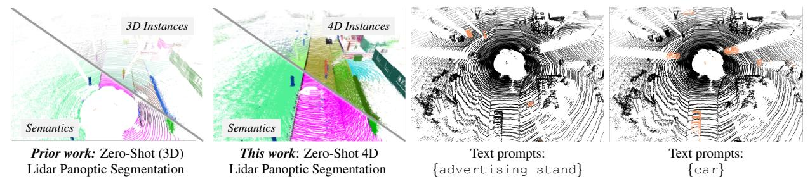
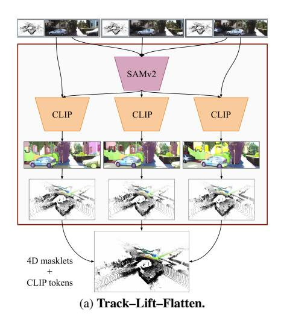
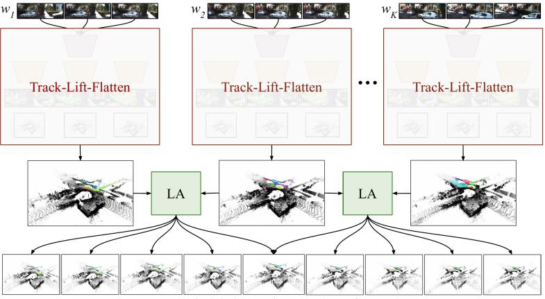
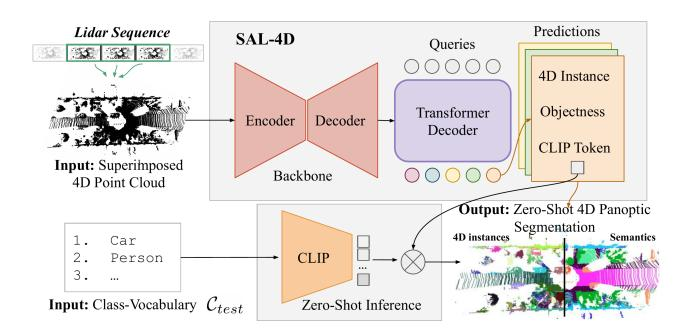
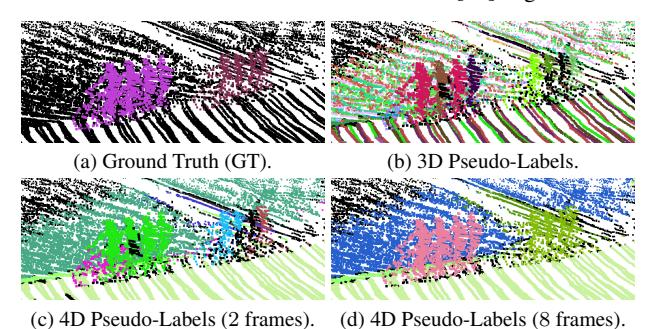
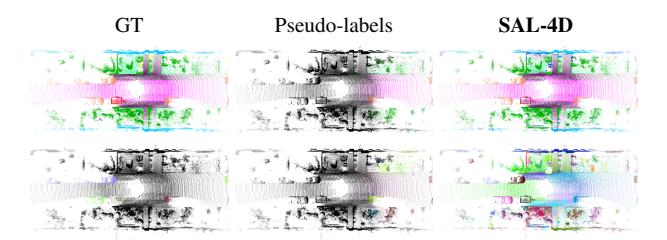

# **Zero-Shot 4D Lidar Panoptic Segmentation**

Yushan Zhang1,2\* Aljoša Ošep1 Laura Leal-Taixé1 Tim Meinhardt1
1NVIDIA 2Linköping University

Figure 1. **Learning to Segment Anything in Lidar–4D:** Prior methods (*left*) for zero-shot Lidar panoptic segmentation process individual (3D) point clouds in isolation. In contrast, our data-driven approach (*right*) operates directly on sequences of point clouds, jointly performing object segmentation, tracking, and zero-shot recognition based on text prompts specified at test time. Our method localizes and tracks *any* object and provides a temporally coherent semantic interpretation of dynamic scenes. We can *correctly* segment canonical objects, such as car, and objects beyond the vocabularies of standard Lidar datasets, such as advertising stand. *Best seen in color, zoomed.* 

### **Abstract**

Zero-shot 4D segmentation and recognition of arbitrary objects in Lidar is crucial for embodied navigation, with applications ranging from streaming perception to semantic mapping and localization. However, the primary challenge in advancing research and developing generalized, versatile methods for spatio-temporal scene understanding in Lidar lies in the scarcity of datasets that provide the necessary diversity and scale of annotations. To overcome these challenges, we propose SAL-4D (Segment Anything in Lidar-4D), a method that utilizes multi-modal robotic sensor setups as a bridge to distill recent developments in Video Object Segmentation (VOS) in conjunction with off-the-shelf Vision-Language foundation models to Lidar. We utilize VOS models to pseudo-label tracklets in short video sequences, annotate these tracklets with sequence-level CLIP tokens, and lift them to the 4D Lidar space using calibrated multi-modal sensory setups to distill them to our SAL-4D model. Due to temporal consistent predictions, we outperform prior art in 3D Zero-Shot Lidar Panoptic Segmentation (LPS) over 5 PQ, and unlock Zero-Shot 4D-LPS.

## 1. Introduction

We tackle segmentation, tracking, and zero-shot recognition of any object in Lidar sequences. Such open-ended 4D

spatio-temporal scene understanding is directly relevant for embodied navigation [91], semantic mapping [6, 7, 92], localization [33, 39] and neural rendering [63].

Status quo. In applications that demand precise spatial and dynamic situational scene understanding, e.g., autonomous driving [91], perception stacks rely on Lidarbased object detection [53, 104, 113] and multi-object tracking [20, 35, 93, 106] methods to localize objects, with recent trends moving towards holistic scene understanding via 4D Lidar Panoptic Segmentation (4D-LPS) [4]. The progress in these areas has largely been fueled by datadriven methods [16, 73, 74, 90] that rely on manually labeled datasets [7, 24, 86], limiting these methods to localizing instances of predefined object classes. On the other hand, recent developments in single-scan Lidar-based perception are moving towards utilizing vision foundation models for pre-training [71, 72, 82] and zero-shot segmentation [62, 67, 99]. However, state-of-the-art methods can only detect [61] and segment [62, 99] objects in individual scans. In contrast, embodied agents must continuously interpret sensory data and localize objects in a 4D continuum to understand the present and predict the future.

**Towards 4D pseudo-labeling.** Can we perform 4D Lidar Panoptic Segmentation by distilling video-foundation models to Lidar? Recent advances [78] suggest that Video Object Segmentation (VOS) [70] generalize well to arbitrary objects. However, empirically, long-term segmentation stability remains a challenge [21, 110], while data recorded

\*Work done during an internship at NVIDIA.

from moving platforms presents unique challenges, such as rapid (ego) motion, objects commonly entering and exiting sensing areas, and frequent occlusions.

To train our SAL-4D for Zero-Shot 4D Lidar Panoptic Segmentation, we present a pseudo-labeling engine that is built on the insight that we can reliably prompt state-of-theart VOS models over short temporal horizons in videos and generate their corresponding sequence-level CLIP features to facilitate zero-shot recognition. To account for inherently noisy localization and possible tracking errors, we lift these masklets, localized in the video, to Lidar, where we leverage accurate spatial Lidar localization to associate masklets across windows and continually localize individual object instances as they enter and leave the sensing area. Therefore, our pseudo-labeling engine provides precisely the supervisory signal for 4D Lidar segmentation models [4, 105]. Even though our pseudo-labeling approach is still prone to noise and errors, we empirically observe that they are sufficiently de-correlated, enabling us to distill a noisy supervisory signal into a strong, end-to-end trainable Lidar segmentation model that can segment, track, and recognize objects anywhere in Lidar in the absence of image features.

**Key findings.** Our method significantly improves the zeroshot recognition capabilities compared to the single-scan state-of-the-art *Lidar Panoptic Segmentation* [62] due to temporal coherence, and, more importantly, **SAL-4D** unlocks new capabilities in Lidar perception. For the first time, we can segment objects beyond the predefined object classes of typical 4D-LPS benchmarks in a temporally coherent manner and open the door for future progress in learning to segment anything in Lidar sequences.

Main contributions. We present the (i) first study on *Zero-Shot 4D Lidar Panoptic Segmentation*, and discuss multiple possible approaches for this task. Our analysis (ii) paves the road for a strong baseline, **SAL-4D**, that utilizes vision foundation models to construct temporal consistent annotations, that, when distilled to Lidar, allow us to segment, track, and recognize arbitrary objects. We (iii) thoroughly ablate our design decisions and analyze the remaining gap to supervised models on standard benchmarks.

### 2. Related Work

This section discusses recent developments in segmentation, tracking, and zero-shot recognition in Lidar.

**Lidar panoptic segmentation.** Thanks to the advent of manually labeled Lidar-based datasets [7, 24, 44] we have made rapid progress in single-scan semantic [1, 2, 16, 48, 57, 80, 88, 94, 95, 100, 116] and panoptic segmentation [8, 25, 29, 47, 79, 114] via supervised learning. In this setting, the task is to learn to classify points into a set of pre-defined semantic classes that follow class vocabulary defined prior to the data annotation process.

This formulation limits types of classes that can be recognized or segmented as individual instances. As labeled Lidar data is scarce, [67, 99] lift image features to 3D for zero-shot semantic [67] and panoptic [99] segmentation. Different from [61, 62], these are limited to segmenting Lidar points that are co-visible in cameras. [61] addresses zero-shot object detection for traffic participants, a subset of thing classes, and SAL [62] distills vision foundation models to Lidar to segment and recognize instances of thing and stuff classes. However, all aforementioned can only segment individual scans, whereas temporal interpretation of sensory data is pivotal in embodied perception.

Object tracking. Multi-object tracking (MOT) is a long-standing problem commonly used for spatio-temporal understanding of Radar [81], image [19, 45, 109], and Lidar [68] data. It is commonly addressed via tracking-by-detection, where an object detector is first trained for a predefined set of object classes [43, 53, 104, 106, 113], that localize objects in individual frames, followed by cross-frame association. Image-based methods rely on learning robust appearance models [19, 84], whereas Lidar-based trackers leverage accurate 3D localization in Lidar and rely on motion and geometry [20, 35, 93, 106]. Unlike our pursuit of joint zero-shot segmentation and tracking of *any* object, prior Lidar-based tracking methods focus on the cross-detection association to track instances of pre-defined classes as bounding boxes.

Related to our work is class-agnostic multi-object tracking in videos [18, 49, 52, 65, 66], recently addressed in conjunction with zero-shot recognition [17, 50]. Like ours, these methods must track and, optionally, classify objects as they enter and exit the sensing area. In contrast to ours, these rely on (at least some) labeled data available in the image domain and focus on tracking *thing* classes. These are also related to methods for single object tracking based on spatial prompts (Visual Object Tracking [32, 41, 42, 97] and Video Object Segmentation [69, 103]), which we utilize [78] in our pseudo-labeling pipeline (Sec. 3.2).

4D Lidar panoptic segmentation. 4D Lidar Panoptic Segmentation [4] addresses holistic, spatio-temporal understanding of (4D) Lidar data. Contemporary methods approach this task by segmenting short spatio-temporal (4D) volumes [3, 4, 13, 30, 40, 96, 105, 115], followed by cross-volume fusion, or follow the tracking-by-detection paradigm, established in MOT [1, 34, 54, 56]. The aforementioned methods utilize manual supervision in the form of semantic spatio-temporal instance labels and are confined to pre-defined class vocabularies. Exceptions are early efforts, such as [28, 38, 59, 60, 64, 89], that utilize heuristic bottom-up grouping methods to segment arbitrary objects in individual Lidar scans, followed by tracking, and, optionally, semantic recognition of tracked objects (for which

semantic annotations are available). Our approach follows the same principle and performs class-agnostic segmentation and tracking of any object in Lidar. However, we learn via self-supervision to track, segment, and recognize any object that occurs in the training data.

Zero-shot learning. Zero-shot learning (ZSL) [98] methods must recognize object classes for which labeled training data may not be available. *Inductive* methods assume no available information about the target classes, whereas transductive setting only restricts access to labels. We address 4D Lidar segmentation in transductive setting, as usual in tasks beyond image recognition (e.g., object detection [5, 58, 76], semantic/panoptic segmentation [10, 22, 101]), where imposing restrictions on the presence of semantic classes in images would be impractical. Similarly to contemporary image-based methods [26, 27, 46, 51, 77, 102, 107, 108, 111, 112], we rely on CLIP [75] for zero-shot recognition of objects, however, we distill CLIP features directly to point cloud sequences. Our work is related to open-set recognition [83] and openworld [9] learning, which recognize classes not shown as labeled instances during the model training.

# 3. Zero-Shot 4D Lidar Panoptic Segmentation

In this section, we formally state the 4D Lidar Panoptic Segmentation (4D-LPS) task and discuss its generalization to zero-shot setting (Sec. 3.1) for joint segmentation, tracking and recognition of any object in Lidar. In Sec. 3.3, we describe our concrete instantiation of this approach, SAL-4D.

### 3.1. Problem Statement

**4D Lidar panoptic segmentation.** Let  $\mathcal{P} = \{P_t\}_{t=1}^T$  be a sequence of T point clouds, where each  $P_t \in \mathbb{R}^{N_t \times 4}$  is a point cloud observed at time t containing  $N_t$  points that consist of spatial coordinates and an intensity value. For each point p, 4D-LPS methods estimate a semantic class  $c \in \{1, \dots, L\}$  with L predefined classes, and an instance id  $\in \mathbb{N}$  for thing classes, or  $\emptyset$  for stuff classes. To this end, a function  $f_\theta$ , representing the segmentation model with parameters  $\theta$ , is usually trained on manually-labeled dataset  $\mathcal{D}_{\text{train}}$  by minimizing an appropriate loss function.

**Zero-shot 4D Lidar panoptic segmentation.** We address 4D-LPS in a zero-shot setting, intending to localize and recognize *any* objects in 4D Lidar point cloud sequences. Similarly, we assign *each* points  $p \in \mathcal{P}$  an instance identity id  $\in \mathbb{N}$ ; however, we do not assume predefined semantic class vocabulary and (accordingly) labeled training set at train time. Instead, we assume a semantic vocabulary  $\mathcal{C}_{test}$  is *optionally* specified at test-time as a list of free-form descriptions of semantic classes. When specified, we assign points also to semantic classes  $c \in \mathcal{C}_{test}$ . As the separation

between *thing* and *stuff* classes cannot be specified *prior* to the model training, we drop this distinction.

**Method overview.** Our **SAL-4D** consists of two core components: (i) The **pseudo-label engine** (Fig. 2) constructs a proxy dataset  $\mathcal{D}_{proxy}$ , that consists of Lidar data and self-generated pseudo-labels that localize individual spatiotemporal instances and their semantic features. (ii) The **model**  $f_{\theta}$  (Fig. 3) learns to segment individual instances in fixed-size 4D volumes by minimizing empirical risk on our proxy dataset  $\mathcal{D}_{proxy}$ . Our model and proxy dataset are constructed such that our model learns to segment and recognize a super-set of all objects labeled in existing datasets.

# 3.2. SAL-4D Pseudo-label Engine

Our pseudo-label engine (Fig. 2) operates with a multimodal sensory setup. We assume an input Lidar sequence  $\mathcal{P} = \{P_t\}_{t=1}^T$  along with C unlabeled videos  $\mathcal{V} = \{\mathcal{V}^c\}_{c=1}^C$ , where each video  $\mathcal{V}^c = \{I_t^c\}_{t=1}^T$  consists of images  $I_t^c \in \mathbb{R}^{H \times W \times 3}$  of spatial dimensions  $H \times W$ , captured by camera c at time t. For each point cloud  $P_t$ , we produce pseudo-labels, comprising of tuples  $\{\tilde{m}_{i,t}, \mathrm{id}_i, f_i\}_{i=1}^{M_t}$ , where  $\tilde{m}_{i,t} \in \{0,1\}^{N_t}$  represents the binary segmentation mask for instance i at time t in the point cloud  $P_t$ , and  $\mathrm{id}_i \in \mathbb{N}$  is the unique object identifier for spatio-temporal instance i. Finally,  $f_i \in \mathbb{R}^d$  represents instance semantic features aggregated over time.

### 3.2.1. Track-Lift-Flatten

We proceed by sliding a temporal window of size K with a stride S over the sequence of length T. We first pseudolabel each temporal window (see Figure 2a), and then perform cross-window association (see Figure 2b) to obtain pseudo-labels for sequences of arbitrary length. In a nutshell, for each temporal window, we track objects in video (track), lift masks to 4D Lidar sequences (lift), and, finally, "flatten" overlapping masklets in the 4D volume. Our temporal windows  $w_k = \{(P_t, I_t) \mid t \in T_k\}$  consist of Lidar point clouds and images over specific time frames. Here,  $T_k = \{t_k, t_k + 1, \ldots, t_k + K - 1\}$  is the set of time indices for window  $w_k$ . We drop the camera index c unless needed.

**Track.** For each video, we use a segmentation foundation model [37] to perform grid-prompting in the first video frame of the window  $I_{t_k}$  to localize objects as masks  $\{m_{i,t_k}\}_{i=1}^{M_{t_k}}, m_{i,t_k} \in \{0,1\}^{H\times W}$ , where  $M_{t_k}$  denotes the number of discovered instances in  $I_{t_k}$ . We then propagate masks through the entire window  $\{I_t \mid t \in T_k\}$  using [78] to obtain masklets  $\{m_{i,t} \mid t \in T_k\}_{i=1}^{M_{t_k}}$  for all instances discovered in  $I_{t_k}$ . This results in  $M_{t_k}$  overlapping masklets in a 3D video volume of dimensions  $H \times W \times K$ , representing objects visible in  $I_{t_k}$  across the window  $w_k$ .

Given masklets  $\{m_{i,t} \mid t \in T_k\}_{i=1}^{M_{t_k}}$  and corresponding images  $\{I_t \mid t \in T_k\}$ , we compute semantic features

Pseudo-labels (masks, IDs, CLIP features)

(b) Cross-window association.

Figure 2. **SAL-4D pseudo-label engine.** We first independently pseudo-label overlapping sliding windows (Fig. 2a). We track and segment objects in the video using [78], generate their semantic features using CLIP, and lift labels from images to 4D Lidar space. Finally, we "flatten" masklets to obtain a unique non-overlapping set of masklets in Lidar for each temporal window. We associate masklets across windows via linear assignment (LA) to obtain pseudo-labels for full sequences and average their semantic features (Fig. 2b).

 $f_{i,t}$  for each mask  $m_{i,t}$  using relative mask attention in the CLIP [75] feature space and obtain masklets paired with their CLIP features  $\{(m_{i,t}, \mathrm{id}_{i,k}, f_{i,t}) \mid t \in T_k\}$  for each instance i, where  $\mathrm{id}_{i,k}$  is a local instance identifier within window  $w_k$ . For details, we refer to Appendix A.1.

**Lift.** We associate 3D points  $\{P_t \mid t \in T_k\}$  with image masks  $m_{i,t}$  via Lidar-to-camera transformation and projection. We refine our lifted Lidar masklets to address sensor misalignment errors using density-based clustering [23]. We create an ensemble of DBSCAN clusters by varying the density parameter and replacing all lifted masks with DBSCAN masks with sufficient intersection-over-union (IoU) overlap [62]. We obtained the best results by performing this on a single-scan basis (Appendix C.1).

We obtain sets  $\{(\tilde{m}_{i,t}^c, \mathrm{id}_{i,k}^c, f_{i,t}^c) \mid t \in T_k\}$  independently for each camera c, and fuse instances with sufficient IoU overlap across cameras. We fuse their semantic features  $f_{i,t}$  via mask-area-based weighted average to obtain a set of tuples  $\{(\tilde{m}_{i,t}, \mathrm{id}_{i,k}, f_{i,t}) \mid t \in T_k\}$ , that represent spatio-temporal instances localized in window  $w_k$ .

Flatten. The resulting set contains overlapping masklets in 4D space-time volume. To ensure each point is assigned to at most one instance, we perform spatio-temporal flattening as follows. We compute the spatio-temporal volume  $V_i$  of each masklet  $\tilde{M}_i = \{\tilde{m}_{i,t} \mid t \in T_k\}$  by summing the number of points across all frames:  $V_i = \sum_{t \in T_k} |\tilde{m}_{i,t}|$ , where  $|\tilde{m}_{i,t}|$  denotes the number of points in mask  $\tilde{m}_{i,t}$ . We sort the masklets in descending order based on their volumes  $V_i$ , and incrementally suppress masklets with intersection-over-minimum larger than empirically determined threshold. With this flattening operation, we favor larger and temporally consistent instances (i.e., prefer larger volumes),

and ensure unique point-to-instance assignments (via IoM-based suppression) in the 4D space-time volume. However, we obtain pseudo-labels *only* for objects visible in the first video frame  $I_{t_k}$  of each window  $w_k$ .

### 3.2.2. Labeling Arbitrary-Length Sequences

After labeling each temporal window, we obtain pseudolabels for point clouds within overlapping windows of size K, with local instance identifiers  $\mathrm{id}_{i,k}$ . To produce pseudolabels for the full sequence of length T and account for new objects entering the scene, we associate instances across windows in a near-online fashion (with stride S), resulting our final pseudo-labels  $\{(\tilde{m}_{i,t},\mathrm{id}_i,f_i)\mid t\in T\}$  (Fig. 4).

For each pair of overlapping windows  $(w_{k-1}, w_k)$ , we perform association via linear assignment. We derive association costs from temporal instance overlaps (measured by 3D-IoU) in the overlapping frames  $T_{k-1} \cap T_k$ :

$$c_{ij} = 1 - \text{IoU}_{3D}(\tilde{m}_{i,k-1}, \tilde{m}_{j,k}),$$
 (1)

where  $\tilde{m}_{i,k-1}$  and  $\tilde{m}_{j,k}$  are the aggregated Lidar masks of instances i and j. After association, we update the global instance identifiers  $\mathrm{id}_i$  for matched instances and aggregate their semantic features  $f_i$ . As a final post-processing step, we remove instances that are shorter than a threshold  $\tau$ .

## 3.3. SAL-4D Model

**Overview.** We follow *tracking-before-detection* design [59, 65, 89] and segment and track objects in a classagnostic fashion. Once localized and tracked, objects can be recognized. To operationalize this, we employ a Transformer decoder-based architecture [12]. In a nutshell, our network (Fig. 3) consists of a point cloud encoder-decoder network that encodes sequences of point clouds, followed

Figure 3. **SAL-4D model** segments individual spatio-temporal instances in 4D Lidar sequences and predicts per-track CLIP tokens that foster test-time zero-shot recognition via text prompts.

by a Transformer-based object instance decoder that localizes objects in the 4D Lidar space (*cf.*, [55, 105]).

**Model.** Our model (Fig. 3) operates on point clouds  $\mathcal{P}_{super} \in \mathbb{R}^{N \times 4}$ ,  $N = N_{t_k} + \ldots + N_{t_k + K - 1}$ , superimposed over fixed-size temporal windows  $w_k$ . As in [62], we encode superimposed sequences using Minkowski U-Net [16] backbone to learn a multi-resolution representation of our input using sparse 3D convolutions. For spatiotemporal reasoning, we augment voxel features with Fourier positional embeddings [87, 105] that encode 3D spatial and temporal coordinates.

Our segmentation decoder follows the design of [12, 14, 55]. Inputs to the decoder are a set of M learnable queries that interact with voxel features, i.e., our (4D) spatio-temporal representation of the input sequence. For each query, we estimate a spatio-temporal mask, an objectness score indicating how likely a query represents an object and a d-dimensional CLIP token capturing object semantics. For details, we refer to Appendix A.2.

**Training.** Our network predicts a set of spatio-temporal instances, parametrized via segmentation masks over the superimposed point cloud:  $\hat{m}_j \in \{0,1\}^N, j=1,\ldots,M$ , obtained by sigmoid activating and thresholding the spatio-temporal mask  $\mathcal{M}$ . To train the network, we establish correspondences between predictions  $\hat{m}_j$  and pseudo-labels  $\tilde{m}_i$  via bi-partite matching (following the standard practice [12, 55, 105]) and evaluate the following loss:

$$\mathcal{L}_{SAL-4D} = \mathcal{L}_{obj} + \mathcal{L}_{seq} + \mathcal{L}_{token}, \tag{2}$$

with a cross-entropy loss  $\mathcal{L}_{obj}$  indicating whether a mask localizes an object, a segmentation loss  $\mathcal{L}_{seg}$  (binary cross-entropy and a dice loss following [55]), and a CLIP token loss (cosine distance)  $\mathcal{L}_{token}$ . As all three terms are evaluated on a sequence rather than individual frame level, our network implicitly learns to segment and associate instances over time, encouraging temporal semantic coherence.

**Inference.** We first decode masks by multiplying objectness scores with the spatio-temporal masks  $\mathcal{M} \in \mathbb{R}^{M \times N}$ , followed by argmax over each point (details in Appendix

A.2.) As our model directly processes superimposed point clouds within windows of size K, we perform *near-online* inference [15] by associating Lidar masklets across time based on 3D-IoU overlap via bi-partite matching (as described in Sec. 3.2.2). For zero-shot prompting, we follow [62] and first encode prompts specified in the semantic class vocabulary using a CLIP language encoder. Then, we perform argmax over scores, computed as a dot product between encoded queries and predicted CLIP features.

# 4. Experimental Validation

This section first discusses datasets and evaluation protocol and metrics (Sec. 4.1). In Sec. 4.2, we ablate our pseudo-label engine and model and justify our design decisions. In Sec. 4.3, we compare our **SAL-4D** with several zero-shot and supervised baselines on multiple benchmarks for 3D and 4D Lidar Panoptic Segmentation.

### 4.1. Experiments

**Datasets.** For evaluation, we utilize two datasets that provide semantic and spatio-temporal instance labels for Lidar, *SemanticKITTI* [7] and *Panoptic nuScenes* [11, 24].

Semantic KITTI was recorded in Karlsruhe, Germany, using a 64-beam Velodyne Lidar sensor at 10Hz and provides Lidar and front RGB camera, which we use for pseudolabeling (14% of all Lidar points are visible in camera). The dataset provides instance-level spatiotemporal labels for 8 thing and 11 stuff classes.

Panoptic nuScenes was recorded in Boston and Singapore using 32-beam Velodyne. It provides five cameras with  $360^{\circ}$  coverage (covering 48% of all points) at 2Hz. Spatiotemporal labels are available for 8 thing and 8 stuff classes.

Evaluation metrics. We follow prior work in 4D Lidar Panoptic Segmentation [4] and adopt LSTQ as the core metric for evaluation. In a nutshell,  $LSTQ = \sqrt{S_{assoc} \times S_{cls}}$  is defined as the geometric mean of two terms, association term  $S_{assoc}$  assesses spatio-temporal segmentation quality, independently of semantics, whereas classification  $S_{cls}$  assesses semantic recognition quality and establishes whether points were correctly classified. This separation between spatio-temporal segmentation and semantic recognition makes LSTQ uniquely suitable for studying ZS-4D-LPS. For per-scan evaluation, we adopt Panoptic Quality [36], which consists of Segmentation Score (SQ) and Recognition Score (RQ):  $PQ = SQ \times RQ$ .

**Frustum and stuff evaluation.** As our pseudo-labels only cover part of the point cloud co-visible in RGB cameras ("frustum"), we focus our ablations to camera view frustums and only report benchmark results on full point clouds. Furthermore, since our approach no longer distinguishes *thing* and *stuff* classes but treats both in a unified manner,

| # frames          | Cross window | LSTQ                                | $S_{assoc}$                         | $S_{cls}$                  | $IoU_{st}$                          | $IoU_{th}$                 |
|-------------------|-----------------|-------------------------------------|-------------------------------------|----------------------------|-------------------------------------|----------------------------|
| 8                 |                 | 49.2                                | 70.0                                | 34.6                       | 36.0                                | 36.9                       |
| 2 4 8 16 | √ √ √     | 50.6 <b>51.4</b> 51.1 50.5 | 67.4 69.5 <b>70.3</b> 69.6 | <b>37.9 37.9 37.2 36.7</b> | 37.3 <b>38.1</b> 37.4 38.0 | <b>43.5</b> 42.4 41.5 39.5 |

Table 1. Pseudo-label ablations on temporal window size and cross-window association: We ablate our approach on temporal window sizes of size  $K = \{2,4,8,16\}$  with stride  $\frac{K}{2}$  on SemanticKITTI validation set. We average CLIP features for each instance across time. We observe association score  $(S_{assoc})$  improve up to 8 frames, while zero-shot recognition  $(S_{cls})$  saturates at 4 frames. Without the cross-window association (Sec. 3.2.2), the LSTQ drops by 1.9 percentage points.

we follow [62] and utilize zero-shot classification labels for merging instances with the same *stuff* classes to evaluate on respective dataset class vocabularies.

#### 4.2. Ablations

We ablate design decisions behind our pseudo-label engine (Sec. 4.2.1) and model (Sec. 4.2.2). We focus this discussion on temporal window size for tracking, point cloud superposition strategies, and the impact of our cross-window association, and report additional ablations in the appendix.

### 4.2.1. Pseudo-label Engine

Labeling temporal windows vs. full sequences. SAL-4D model operates on superimposed point clouds, which only require temporal consistent 4D labels within temporal windows. This begs the question, is pseudolabeling *only* short sequences sufficient? We first generate pseudo-labels with consistent IDs only within fixed-size temporal windows (Sec. 3.2.1) and train our model by removing points that are not pseudo-labeled. However, this method does not fully leverage temporal and semantic information across the whole sequence and account for objects that appear after the first frame of the window. As can be seen in Tab. 1, this version leads to 49.2 LSTQ (1st entry). By additionally associating the fixed-size temporal window (Sec. 3.2.2), we observe an improvement of +1.9 and obtain 51.1 LSTQ (4th entry). We observe improvements in association and, in particular, for zero-shot recognition (37.2)  $S_{cls}$  vs. 34.6, +2.6), as averaging CLIP features over longer temporal horizons (enabled by our cross-window association) provides a more consistent semantic signal.

**Temporal window size.** As discussed in Sec. 3.2, we first label fixed-size temporal windows, followed by cross-window association. By labeling sequences of arbitrary length, we obtain temporally-stable semantic features and correctly handle outgoing/incoming objects. What is the optimal temporal window size? Intuitively, longer temporal

| SAL-4D | # frame | Ego. Comp | LSTQ      | $S_{assoc}$ | $S_{cls}$ | $IoU_{st}$ | $IoU_{th}$ |
|--------|---------|--------------|-----------|-------------|-----------|------------|------------|
| Labels | 8       |              | 51.1      | 70.3        | 37.2      | 37.4       | 41.5       |
|        |         | Ego-         | motion co | mpensation  | ı         |            |            |
| Model  | 8       | None         | 43.7      | 61.3        | 31.2      | 44.3       | 17.1       |
| Model  | 8       | Rand         | 50.7      | 74.2        | 34.7      | 48.5       | 19.9       |
| Model  | 8       | Mix          | 53.2      | 77.2        | 36.6      | 47.9       | 25.6       |
|        |         |              | Window    | / size      |           |            |            |
| Model  | 2       | Mix          | 52.3      | 74.8        | 36.6      | 47.7       | 21.3       |
| Model  | 4       | Mix          | 52.7      | 76.2        | 36.4      | 47.8       | 25.3       |
| Model  | 8       | Mix          | 53.2      | 77.2        | 36.6      | 47.9       | 25.6       |

Table 2. **SAL-4D training.** *Top:* To distill our pseudo-labels into a stronger model, it is important to transform point clouds to a common coordinate frame during train- and test-time. Interestingly, our model benefits from randomly *not* performing motion compensation during training by 10%. *Bottom:* Processing larger temporal sequences directly benefits our model. Overall, we distill our pseudo-labels (51.1 *LSTQ*) to a stronger model (53.2 *LSTQ*).

windows should be preferable. However, errors that arise during video-instance propagation over larger horizons may degrade the performance. Our analysis confirms this intuition: we generate pseudo-labels with varying window sizes  $(K = \{2, 4, 8, 16\})$  with a fixed stride of  $\frac{K}{2}$ , and report our findings in Tab. 1. Our results improve with increasing window size, but performance plateaus after K=8. We obtain the overall highest LSTQ with K = 4 (51.4); however, with K=8, we observe larger gains in terms of segmentation and tracking ( $S_{assoc}$ : 70.3 vs. 69.5). In Fig. 4, we confirm this visually by contrasting ground-truth labels with singlescan labels, and our labels, obtained with  $K = \{2, 8\}$ . Gains are most significant in terms of  $S_{assoc}$ , as these results are reported after cross-window association. The appendix reports a similar analysis conducted before crosswindow association. For the remainder, we fix K=8.

Comparison with single-scan pseudo-labels. Do our spatio-temporal pseudo-labels improve quality on a single-scan basis? In Tab. 3, we compare our SAL-4D pseudo-labels with single-scan labels (SAL [62]), and report zero-shot and class-agnostic segmentation results. As can be seen, our temporally consistent pseudo-labels perform better than our single-scan counterparts, especially in terms of semantics (a relative 15% improvement w.r.t. PQ and 20% improvement w.r.t. mIoU). Our spatio-temporal labels produce fewer instances per scan, which implies spatio-temporal labels improve precision due to temporal coherence. We conclude that our approach not only unlocks the training of models for ZS-4D-LPS but also substantially improves pseudo-labels for training ZS-LPS methods [62].

### 4.2.2. Model and Training

To train the 4D segmentation model, we superimpose point clouds within fixed-size temporal windows and train our model to directly segment superimposed point clouds within these short 4D volumes. For a comparison with our

| Method                               | PQ   | SQ   | $PQ_{th}$ | $PQ_{st} \\$ | mIoU |  |  |  |
|--------------------------------------|------|------|-----------|--------------|------|--|--|--|
| Class-agnostic (Semantic Oracle) LPS |      |      |           |              |      |  |  |  |
| SAL [62] labels                      | 55.3 | 79.9 | 66.0      | 47.5         | 62.1 |  |  |  |
| SAL-4D labels                        | 55.4 | 80.0 | 66.4      | 47.4         | 62.0 |  |  |  |
| Zero-Shot LPS                        |      |      |           |              |      |  |  |  |
| SAL [62] labels                      | 29.9 | 74.8 | 35.2      | 26.0         | 31.9 |  |  |  |
| SAL-4D labels                        | 34.5 | 70.5 | 40.7      | 29.9         | 39.1 |  |  |  |

Table 3. **Single-scan pseudo-label evaluation:** We compare our **SAL-4D** pseudo-labels to its single-scan counterpart on *SemanticKITTI* validation set. Following [62], we also report both zero-shot and semantic-oracle *Lidar Panoptic Segmentation* (LPS) results. Our **SAL-4D** pseudo-label engine produces a smaller set of higher-quality labels when evaluated on a per-scan basis, with an improvement of over 15% in recognition score (PQ) and over 20% in segmentation quality (mIoU).

pseudo-labels, we ablate the model "in-frustum" and investigate two aspects of point cloud superposition.

**Temporal window size:** Refers to the number of scans used to construct a superimposed point cloud. As can be seen in Tab. 2, results are consistent with conclusions for a pseudo-label generation. We obtain the overall best results with a window size of 8 (53.2 LSTQ). Larger temporal window sizes are especially beneficial in terms of segmentation.

**Ego-motion:** In 4D space, we can utilize ego-pose to align point clouds to a common coordinate frame. We ablate three options: (i) no ego-motion compensation (None), (ii) select a random (Rand) scan as the reference scan, and (iii) a mixed (Mix) version of 90% random reference scan + 10% no ego-motion compensation (% determined via line search). Results reported in Tab. 2 suggest that ego-motion compensation has a positive impact. We obtain  $74.2 S_{assoc}$ when aligning point clouds, compared to  $61.3 S_{assoc}$  without. Intuitively, this compensation simplifies tracking at inference, but this is not necessarily desirable during the training. To ensure that our model learns associations among non-aligned regions, we drop ego-compensation in 10% of cases, yielding the best overall results (77.2  $S_{assoc}$ ). With this approach, we distill our pseudo-labels (51.1 LSTQ) to a stronger model (53.2 LSTQ) that segments point clouds in the absence of image features.

# 4.3. Benchmarks

#### 4.3.1. Lidar Panoptic Segmentation

In Tab. 4, we compare our **SAL-4D** to several supervised methods [29, 55, 79, 85, 114], and single-scan zero-shot baseline, SAL [62]. We compare two variants of our method: our top-performing model, trained on the temporal window of size 8, and a variant of our model, trained on the temporal window of size 2, with FrankenFrustum augmen-

|            | Method         | frustum eval | # inst total / mean | PQ   | SQ   | PQ th | PQ st |
|------------|----------------|-----------------|------------------------|------|------|------------------|------------------|
| eq         | DS-Net [29]    | ×               | -                      | 57.7 | 77.6 | 61.8             | 54.8             |
| Supervised | PolarSeg [114] | ×               | -                      | 59.1 | 78.3 | 65.7             | 54.3             |
|            | GP-S3Net [79]  | ×               | -                      | 63.3 | 81.4 | 70.2             | 58.3             |
|            | MaskPLS [55]   | ×               | -                      | 59.8 | 76.3 | -                | -                |
|            | SAL [62]       | <b>√</b>        | 62k / 15.2             | 33.1 | 71.3 | 21.5             | 41.5             |
| şþ         | SAL-4D         | ✓               | 61k / 15.1             | 38.2 | 78.1 | 30.9             | 43.5             |
| Zero-shot  | SAL [62]       | ×               | 25k / 49.0             | 25.3 | 63.8 | 18.3             | 30.3             |
| Ze         | SAL-4D         | ×               | 18k / 44.0             | 30.8 | 76.9 | 25.5             | 34.6             |

Table 4. **3D-LPS evaluation**. Training our **SAL-4D** model on the temporal consistent 4D pseudo-labels yields superior 3D (single-scan) performance compared to 3D baselines. We evaluate on the SemanticKITTI validation set. **SAL-4D** evaluated not only in the frustum was trained with the FrankenFrustum [62] augmentation.

Figure 4. **Qualitative results.** We compare our 4D pseudo-labels (obtained over windows of 2&8 frames) to GT labels, and single-scan labels. By contrast to GT, our automatically-generated labels cover both *thing* and *stuff* classes. As can be seen, the temporal coherence of labels improves over larger window sizes.

tation [62], that helps our model, trained on pseudo-labels generated on 14% of full point cloud, to generalize to the full  $360^\circ$  point clouds. As can be seen in Tab. 4, **SAL-4D** consistently outperforms SAL baseline: we obtain 38.2~PQ within-frustum (+5.1 w.r.t. SAL), and 30.8~PQ on the full point cloud (+5.5 w.r.t. SAL), and overall reduces the gap to supervised baselines. Improvements are especially notable for *thing* classes (18.3 vs. 25.5  $PQ_{th}$ ). We attribute these gains to temporal coherence imposed during pseudo-labeling and model training.

### 4.3.2. 4D Lidar Panoptic Segmentation

We compare **SAL-4D** to several zero-shot baselines and state-of-the-art 4D-LPS methods trained with ground-truth labels provided on *SemanticKITTI* and *Panoptic nuScenes* datasets. In contrast, all zero-shot approaches rely only on single-scan 3D [62] or our 4D pseudo-labels. To compare **SAL-4D** to baselines that operate on full (360°) point clouds, we train our model on temporal windows of size 2, with FrankenFrustum augmentation [62], which helps our model to generalize beyond view frustum.

**ZS-4D-LPS** baselines. We construct several baselines that associate single-scan 3D SAL [62] predictions in time (see Appendix B for further details) and require no tempo-

&lt;sup>1Results we report for the baseline are slightly higher than those reported in [62]. We refer to the supplementary for further details.

|                   |            | Method                | LSTQ | $S_{assoc}$ | $S_{cls}$ | $IoU_{st}$ | $IoU_{th}$ |
|-------------------|------------|-----------------------|------|-------------|-----------|------------|------------|
|                   |            | 4D-PLS [4]            | 62.7 | 65.1        | 60.5      | 65.4       | 61.3       |
|                   |            | 4D-StOP [40]          | 67.0 | 74.4        | 60.3      | 65.3       | 60.9       |
|                   | pa         | 4D-DS-Net [30]        | 68.0 | 71.3        | 64.8      | 64.5       | 65.3       |
| Ξ                 | VIS.       | Eq-4D-PLS [115]       | 65.0 | 67.7        | 62.3      | 66.4       | 64.6       |
| Ε                 | Supervised | Eq-4D-StOP [115]      | 70.1 | 77.6        | 63.4      | 66.4       | 67.1       |
| Ϋ́                | Suj        | Mask4Former [105]     | 70.5 | 74.3        | 66.9      | 67.1       | 66.6       |
| nţi               |            | Mask4D [56]           | 71.4 | 75.4        | 67.5      | 65.8       | 69.9       |
| SemanticKITT      |            | SAL-4D                | 69.1 | 70.1        | 68.0      | 65.7       | 71.2       |
| S                 |            | SAL + MinVIS          | 24.7 | 22.2        | 27.5      | 40.9       | 12.5       |
|                   | Zero-shot  | SAL + MOT             | 30.9 | 34.4        | 27.7      | 41.0       | 12.9       |
|                   | 0.0        | SAL + SW              | 32.7 | 38.5        | 27.7      | 41.0       | 12.9       |
|                   | Ze         | SAL-4D                | 42.2 | 51.1        | 34.9      | 45.1       | 20.8       |
| - s               | 1          | 4D-PLS [4]            | 56.1 | 51.4        | -         | -          | -          |
| ene               | Sup.       | PanopticTrackNet [34] | 43.4 | 32.3        | -         | -          | -          |
| Paniptic nuScenes | S          | EfficientLPS [85]+KF  | 62.0 | 58.6        | -         | -          | -          |
|                   | )t         | SAL + SW              | 30.3 | 26.9        | 34.3      | 43.0       | 29.9       |
| ipt.              | Zero-shot  | SAL + MOT             | 32.8 | 31.5        | 34.3      | 43.0       | 29.9       |
| San               | -010       | SAL + MinVIS          | 33.2 | 32.4        | 34.1      | 42.8       | 29.7       |
| _                 | Ze         | SAL-4D                | 45.0 | 48.8        | 41.5      | 45.9       | 37.0       |

Table 5. Zero-Shot 4D Lidar Panoptic Segmentation benchmark: We compare SAL-4D to several supervised baselines for 4D Panoptic Lidar Segmentation and zero-shot baselines. While there is still a gap between supervised methods and zero-shot approaches, SAL-4D significantly narrows down this gap. On SemanticKITTI, our model SAL-4D reaches 59% of the top-performing supervised model, and on nuScenes, 72%, even though it is not trained using any labeled data.

ral GT supervision. As SemanticKITTI [7] is dominated by static objects, we propose a minimal viable *Stationary World* (SW) baseline that propagates single-scan masks solely via ego-motion. Furthermore, we adopt a strong Lidar *Multi-Object Tracking* (MOT) approach [93], which utilizes Kalman filters in conjunction with a linear assignment association. As a data-driven and model-centric baseline, the *Video instance segmentation* (VIS) baseline follows [31] and directly associates objects by matching decoder object queries of the 3D SAL [62] model in the embedding space.

**SemanticKITTI.** As can be seen in Tab. 5 (top), supervised models are top-performers on this challenging benchmark, specifically, Mask4Former [105] (70.5 LSTQ) and Mask4D [56] (71.4 LSTQ). Our **SAL-4D** (42.2 LSTQ) outperforms all zero-shot baselines and obtains 59.9% of Mask4Former, similarly trained on temporal windows of size 2. Interestingly,  $2^{nd}$  among zero-shot methods is the SW baseline (32.7 LSTQ). We assume this baseline outperforms the MOT baseline as SemanticKITTI is dominantly static. Both geometry-based baselines (SW, MOT) outperform the MinVIS baseline, which mainly relies on datadriven features for the association. We note that SAL-**4D** outperforms zero-shot baselines in terms of association  $(S_{assoc}: 51.1 \text{ SAL-4D } vs. 38.5 \text{ SW})$ , as well as zero-shot recognition ( $S_{cls}$ : 34.9 **SAL-4D** vs. 27.7 SW and MOT). We provide qualitative results in Fig. 5 and the appendix.

**Panoptic nuScenes.** We report similar findings on *Panoptic nuScenes* dataset in Tab. 5. Our **SAL-4D** (45.0 LSTQ) consistently outperforms baselines and reaches 72.6% of

Figure 5. Qualitative results on SemanticKITTI. We show ground-truth (GT) labels (first column), our pseudo-labels (middle column), and SAL-4D results (right column). We show semantic predictions (first row) and instances (second row). As can be seen, our pseudo-labels cover only the camera-visible portion of the sequence (middle). By contrast to GT labels, our pseudo-label instances are not limited to a subset of thing classes (GT, left column). Our trained SAL-4D thus learns to densely segment all classes in space and time (right column). Importantly, pseudo-labels do not provide semantic labels, only CLIP tokens. For visualization, we prompt individual instances with prompts that conform to the SemanticKITTI class vocabulary. Best seen zoomed.

EfficientLPS+KF. Due to the different ratio between static and moving objects on nuScenes, MOT baseline (32.8 LSTQ) outperforms SW (30.3 LSTQ), as expected. Min-VIS performs favorably compared to both and achieves 33.2 LSTQ. This is likely because this data-driven method benefits from a larger *Panoptic nuScenes* dataset. Improvements over baselines are most notable in terms of association ( $S_{assoc}$ : 48.8 **SAL-4D** vs. 32.4 MinVIS).

### 5. Conclusions

We introduced **SAL-4D** for zero-shot segmentation, tracking, and recognition of arbitrary objects in Lidar. Our core component, the pseudo-label engine, distills recent advancements in image-based video object segmentation to Lidar. This enables us to improve significantly over prior single-scan methods and unlock *Zero-Shot 4D Lidar Panoptic Segmentation*. However, as evidenced in Tab. 5, a performance gap persists compared to fully-supervised methods.

Challenges. We observe semantic recognition is the primary source of this gap, with zero-shot recognition  $S_{cls}$  (34.9) trailing supervised methods (68.0). Second, segmentation consistency degrades over extended temporal horizons, reflecting challenges in maintaining coherence across superimposed point clouds. Third, segmentation quality is notably lower for *thing* classes compared to *stuff* classes, most likely due to the inherent imbalance, mitigated by augmentation strategies in supervised methods.

**Future work.** To bridge these gaps, we will focus on (i) refining the data labeling engine to enhance temporal consistency, (ii) expanding the volume of pseudo-labeled data, and (iii) curating high-quality labels for fine-tuning. These steps aim to narrow the divide with supervised methods while preserving **SAL-4D** 's zero-shot scalability.

## References

- [1] Abhinav Agarwalla, Xuhua Huang, Jason Ziglar, Francesco Ferroni, Laura Leal-Taixe, James Hays, Aljosa Osep, and Deva Ramanan. Lidar panoptic segmentation and tracking without bells and whistles. In *Int. Conf. Intel. Rob. Sys.*, 2023. 2
- [2] Eren Erdal Aksoy, Saimir Baci, and Selcuk Cavdar. Salsanet: Fast road and vehicle segmentation in lidar point clouds for autonomous driving. In *Intel. Veh. Symp.*, 2020.
- [3] Ali Athar, Enxu Li, Sergio Casas, and Raquel Urtasun. 4dformer: Multimodal 4d panoptic segmentation. In *Conf. Rob. Learn.*, 2023. 2
- [4] Mehmet Aygün, Aljoša Ošep, Mark Weber, Maxim Maximov, Cyrill Stachniss, Jens Behley, and Laura Leal-Taixé. 4d panoptic lidar segmentation. In *IEEE Conf. Comput. Vis. Pattern Recog.*, 2021. 1, 2, 5, 8
- [5] Ankan Bansal, Karan Sikka, Gaurav Sharma, Rama Chellappa, and Ajay Divakaran. Zero-shot object detection. In Eur. Conf. Comput. Vis., 2018. 3
- [6] Jens Behley and Cyrill Stachniss. Efficient Surfel-Based SLAM using 3D Laser Range Data in Urban Environments. In Rob. Sci. Sys., 2018. 1
- [7] Jens Behley, Martin Garbade, Andres Milioto, Jan Quenzel, Sven Behnke, Cyrill Stachniss, and Juergen Gall. SemanticKITTI: A Dataset for Semantic Scene Understanding of LiDAR Sequences. In *ICCV*, 2019. 1, 2, 5, 8
- [8] Jens Behley, Andres Milioto, and Cyrill Stachniss. A Benchmark for LiDAR-based Panoptic Segmentation based on KITTI. In *Int. Conf. Rob. Automat.*, 2021. 2
- [9] Abhijit Bendale and Terrance Boult. Towards open world recognition. In *IEEE Conf. Comput. Vis. Pattern Recog.*, 2015. 3
- [10] Maxime Bucher, Tuan-Hung Vu, Matthieu Cord, and Patrick Pérez. Zero-shot semantic segmentation. *Adv. Neural Inform. Process. Syst.*, 2019. 3
- [11] Holger Caesar, Varun Bankiti, Alex H. Lang, Sourabh Vora, Venice Erin Liong, Qiang Xu, Anush Krishnan, Yu Pan, Giancarlo Baldan, and Oscar Beijbom. nuScenes: A multimodal dataset for autonomous driving. In *IEEE Conf. Com*put. Vis. Pattern Recog., 2020. 5
- [12] Nicolas Carion, Francisco Massa, Gabriel Synnaeve, Nicolas Usunier, Alexander Kirillov, and Sergey Zagoruyko. End-to-end object detection with transformers. In Eur. Conf. Comput. Vis., 2020. 4, 5
- [13] Xuechao Chen, Shuangjie Xu, Xiaoyi Zou, Tongyi Cao, Dit-Yan Yeung, and Lu Fang. Svqnet: Sparse voxeladjacent query network for 4d spatio-temporal lidar semantic segmentation. In *Int. Conf. Comput. Vis.*, 2023. 2
- [14] Bowen Cheng, Ishan Misra, Alexander G Schwing, Alexander Kirillov, and Rohit Girdhar. Masked-attention mask transformer for universal image segmentation. In *IEEE Conf. Comput. Vis. Pattern Recog.*, 2022. 5
- [15] Wongun Choi. Near-online multi-target tracking with aggregated local flow descriptor. In *Int. Conf. Comput. Vis.*, 2015.

- [16] Christopher Choy, JunYoung Gwak, and Silvio Savarese.
  4D spatio-temporal convnets: Minkowski convolutional neural networks. In *IEEE Conf. Comput. Vis. Pattern Recog.*, 2019. 1, 2, 5
- [17] Wen-Hsuan Chu, Adam W Harley, Pavel Tokmakov, Achal Dave, Leonidas Guibas, and Katerina Fragkiadaki. Zeroshot open-vocabulary tracking with large pre-trained models. In *Int. Conf. Rob. Automat.*, 2024. 2
- [18] Achal Dave, Pavel Tokmakov, and Deva Ramanan. Towards segmenting anything that moves. In *ICCV Work-shops*, 2019.
- [19] Patrick Dendorfer, Aljoša Ošep, Anton Milan, Konrad Schindler, Daniel Cremers, Ian Reid, Stefan Roth, and Laura Leal-Taixé. Motchallenge: A benchmark for singlecamera multiple target tracking. *Int. J. Comput. Vis.*, 2020.
- [20] Shuxiao Ding, Eike Rehder, Lukas Schneider, Marius Cordts, and Juergen Gall. 3dmotformer: Graph transformer for online 3d multi-object tracking. In *Int. Conf. Comput. Vis.*, 2023. 1, 2
- [21] Shuangrui Ding, Rui Qian, Xiaoyi Dong, Pan Zhang, Yuhang Zang, Yuhang Cao, Yuwei Guo, Dahua Lin, and Jiaqi Wang. Sam2long: Enhancing sam 2 for long video segmentation with a training-free memory tree. *arXiv preprint arXiv:2410.16268*, 2024. 1
- [22] Zheng Ding, Jieke Wang, and Zhuowen Tu. Open-vocabulary universal image segmentation with maskclip. In Int. Conf. Mach. Learn., 2023. 3
- [23] Martin Ester, Hans-Peter Kriegel, Jörg Sander, Xiaowei Xu, et al. A density-based algorithm for discovering clusters in large spatial databases with noise. In *Rob. Sci. Sys.*, 1996.
- [24] Whye Kit Fong, Rohit Mohan, Juana Valeria Hurtado, Lubing Zhou, Holger Caesar, Oscar Beijbom, and Abhinav Valada. Panoptic nuscenes: A large-scale benchmark for lidar panoptic segmentation and tracking. *RAL*, 2021. 1, 2, 5
- [25] Stefano Gasperini, Mohammad-Ali Nikouei Mahani, Alvaro Marcos-Ramiro, Nassir Navab, and Federico Tombari. Panoster: End-to-end panoptic segmentation of lidar point clouds. *IEEE Rob. Automat. Letters*, 2021. 2
- [26] Golnaz Ghiasi, Xiuye Gu, Yin Cui, and Tsung-Yi Lin. Scaling open-vocabulary image segmentation with image-level labels. In *Eur. Conf. Comput. Vis.*, 2022. 3
- [27] Xiuye Gu, Tsung-Yi Lin, Weicheng Kuo, and Yin Cui. Open-vocabulary object detection via vision and language knowledge distillation. *Int. Conf. Learn. Represent.*, 2022.
- [28] David Held, Devin Guillory, Brice Rebsamen, Sebastian Thrun, and Silvio Savarese. A probabilistic framework for real-time 3d segmentation using spatial, temporal, and semantic cues. In *Rob. Sci. Sys.*, 2016. 2
- [29] Fangzhou Hong, Hui Zhou, Xinge Zhu, Hongsheng Li, and Ziwei Liu. Lidar-based panoptic segmentation via dynamic shifting network. In *IEEE Conf. Comput. Vis. Pattern Recog.*, 2021. 2, 7
- [30] Fangzhou Hong, Lingdong Kong, Hui Zhou, Xinge Zhu, Hongsheng Li, and Ziwei Liu. Unified 3d and 4d panoptic

- segmentation via dynamic shifting networks. *IEEE Trans. Pattern Anal. Mach. Intell.*, 2024. 2, 8
- [31] De-An Huang, Zhiding Yu, and Anima Anandkumar. Minvis: A minimal video instance segmentation framework without video-based training. In Adv. Neural Inform. Process. Syst., 2022. 8
- [32] Lianghua Huang, Xin Zhao, and Kaiqi Huang. Got-10k: A large high-diversity benchmark for generic object tracking in the wild. *IEEE Trans. Pattern Anal. Mach. Intell.*, 2019.
- [33] Yuming Huang, Yi Gu, Chengzhong Xu, and Hui Kong. Why semantics matters: A deep study on semantic particle-filtering localization in a lidar semantic pole-map. *IEEE Transactions on Field Robotics*, 2024. 1
- [34] Juana Valeria Hurtado, Rohit Mohan, and Abhinav Valada. Mopt: Multi-object panoptic tracking. arXiv preprint arXiv:2004.08189, 2020. 2, 8
- [35] Aleksandr Kim, Guillem Brasó, Aljoša Ošep, and Laura Leal-Taixé. Polarmot: How far can geometric relations take us in 3d multi-object tracking? In Eur. Conf. Comput. Vis., 2022. 1, 2
- [36] Alexander Kirillov, Kaiming He, Ross Girshick, Carsten Rother, and Piotr Dollár. Panoptic segmentation. In *IEEE Conf. Comput. Vis. Pattern Recog.*, 2019. 5
- [37] Alexander Kirillov, Eric Mintun, Nikhila Ravi, Hanzi Mao, Chloe Rolland, Laura Gustafson, Tete Xiao, Spencer Whitehead, Alexander C Berg, Wan-Yen Lo, et al. Segment anything. In *Int. Conf. Comput. Vis.*, 2023. 3
- [38] Deyvid Kochanov, Aljoša Ošep, Jörg Stückler, and Bastian Leibe. Scene flow propagation for semantic mapping and object discovery in dynamic street scenes. In *Int. Conf. Intel. Rob. Sys.*, 2016. 2
- [39] Manuel Kolmet, Qunjie Zhou, Aljoša Ošep, and Laura Leal-Taixé. Text2pos: Text-to-point-cloud cross-modal localization. In *IEEE Conf. Comput. Vis. Pattern Recog.*, 2022. 1
- [40] Lars Kreuzberg, Idil Esen Zulfikar, Sabarinath Mahadevan, Francis Engelmann, and Bastian Leibe. 4d-stop: Panoptic segmentation of 4d lidar using spatio-temporal object proposal generation and aggregation. In ECCV AVVision Workshop, 2022. 2, 8
- [41] Matej Kristan, Jiri Matas, Ales Leonardis, Michael Felsberg, Luka Cehovin, Gustavo Fernandez, Tomas Vojir, Gustav Hager, Georg Nebehay, Roman Pflugfelder, et al. The visual object tracking vot2015 challenge results. In *Int. Conf. Comput. Vis. Workshops*, 2015. 2
- [42] Matej Kristan, Jiri Matas, Aleš Leonardis, Tomáš Vojíř, Roman Pflugfelder, Gustavo Fernandez, Georg Nebehay, Fatih Porikli, and Luka Čehovin. A novel performance evaluation methodology for single-target trackers. *IEEE Trans. Pattern Anal. Mach. Intell.*, 2016. 2
- [43] Alex H Lang, Sourabh Vora, Holger Caesar, Lubing Zhou, Jiong Yang, and Oscar Beijbom. Pointpillars: Fast encoders for object detection from point clouds. In *IEEE Conf. Com*put. Vis. Pattern Recog., 2019. 2
- [44] Duy Tho Le, Chenhui Gou, Stavya Datta, Hengcan Shi, Ian Reid, Jianfei Cai, and Hamid Rezatofighi. Jrdb-panotrack:

- An open-world panoptic segmentation and tracking robotic dataset in crowded human environments. In *IEEE Conf. Comput. Vis. Pattern Recog.*, 2024. 2
- [45] Bastian Leibe, Konrad Schindler, Nico Cornelis, and Luc Van Gool. Coupled object detection and tracking from static cameras and moving vehicles. *IEEE Trans. Pattern* Anal. Mach. Intell., 2008.
- [46] Boyi Li, Kilian Q Weinberger, Serge Belongie, Vladlen Koltun, and Rene Ranftl. Language-driven semantic segmentation. In *Int. Conf. Learn. Represent.*, 2022. 3
- [47] Jinke Li, Yang Wen Xiao He, Yuan Gao, Xiaoqiang Cheng, and Dan Zhang. Panoptic-phnet: Towards real-time and high-precision lidar panoptic segmentation via clustering pseudo heatmap. In *IEEE Conf. Comput. Vis. Pattern Recog.*, 2022. 2
- [48] Shijie Li, Xieyuanli Chen, Yun Liu, Dengxin Dai, Cyrill Stachniss, and Juergen Gall. Multi-scale interaction for real-time lidar data segmentation on an embedded platform. *IEEE Rob. Automat. Letters*, 2021. 2
- [49] Siyuan Li, Martin Danelljan, Henghui Ding, Thomas E Huang, and Fisher Yu. Tracking every thing in the wild. In Eur. Conf. Comput. Vis., 2022. 2
- [50] Siyuan Li, Tobias Fischer, Lei Ke, Henghui Ding, Martin Danelljan, and Fisher Yu. Ovtrack: Open-vocabulary multiple object tracking. In *IEEE Conf. Comput. Vis. Pattern Recog.*, 2023. 2
- [51] Feng Liang, Bichen Wu, Xiaoliang Dai, Kunpeng Li, Yinan Zhao, Hang Zhang, Peizhao Zhang, Peter Vajda, and Diana Marculescu. Open-vocabulary semantic segmentation with mask-adapted clip. In *IEEE Conf. Comput. Vis. Pattern Recog.*, 2023. 3
- [52] Yang Liu, Idil Esen Zulfikar, Jonathon Luiten, Achal Dave, Deva Ramanan, Bastian Leibe, Aljoša Ošep, and Laura Leal-Taixé. Opening up open world tracking. In *IEEE Conf. Comput. Vis. Pattern Recog.*, 2022.
- [53] Ze Liu, Zheng Zhang, Yue Cao, Han Hu, and Xin Tong. Group-free 3d object detection via transformers. In *Int. Conf. Comput. Vis.*, 2021. 1, 2
- [54] Rodrigo Marcuzzi, Lucas Nunes, Louis Wiesmann, Ignacio Vizzo, Jens Behley, and Cyrill Stachniss. Contrastive instance association for 4d panoptic segmentation using sequences of 3d lidar scans. *IEEE Rob. Automat. Letters*, 2022. 2
- [55] Rodrigo Marcuzzi, Lucas Nunes, Louis Wiesmann, Jens Behley, and Cyrill Stachniss. Mask-based panoptic lidar segmentation for autonomous driving. *IEEE Rob. Automat. Letters*, 2023. 5, 7
- [56] Rodrigo Marcuzzi, Lucas Nunes, Louis Wiesmann, Elias Marks, Jens Behley, and Cyrill Stachniss. Mask4d: Endto-end mask-based 4d panoptic segmentation for lidar sequences. *IEEE Rob. Automat. Letters*, 2023. 2, 8
- [57] Andres Milioto, Ignacio Vizzo, Jens Behley, and Cyrill Stachniss. RangeNet++: Fast and Accurate LiDAR Semantic Segmentation. In *Int. Conf. Intel. Rob. Sys.*, 2019. 2
- [58] Dimity Miller, Lachlan Nicholson, Feras Dayoub, and Niko Sünderhauf. Dropout sampling for robust object detection in open-set conditions. In *Int. Conf. Rob. Automat.*, 2018. 3

- [59] Dennis Mitzel and Bastian Leibe. Taking mobile multiobject tracking to the next level: People, unknown objects, and carried items. In *Eur. Conf. Comput. Vis.*, 2012. 2, 4
- [60] Frank Moosmann and Christoph Stiller. Joint self-localization and tracking of generic objects in 3d range data. In *Int. Conf. Rob. Automat.*, 2013. 2
- [61] Mahyar Najibi, Jingwei Ji, Yin Zhou, Charles R Qi, Xinchen Yan, Scott Ettinger, and Dragomir Anguelov. Unsupervised 3d perception with 2d vision-language distillation for autonomous driving. In *Int. Conf. Comput. Vis.*, 2023. 1, 2
- [62] Aljosa Osep, Tim Meinhardt, Francesco Ferroni, Neehar Peri, Deva Ramanan, and Laura Leal-Taixe. Better call sal: Towards learning to segment anything in lidar. In Eur. Conf. Comput. Vis., 2024. 1, 2, 4, 5, 6, 7, 8
- [63] Julian Ost, Fahim Mannan, Nils Thuerey, Julian Knodt, and Felix Heide. Neural scene graphs for dynamic scenes. In IEEE Conf. Comput. Vis. Pattern Recog., 2021.
- [64] Aljoša Ošep, Alexander Hermans, Francis Engelmann, Dirk Klostermann, Markus Mathias, and Bastian Leibe. Multi-scale object candidates for generic object tracking in street scenes. In *Int. Conf. Rob. Automat.*, 2016. 2
- [65] Aljoša Ošep, Wolfgang Mehner, Paul Voigtlaender, and Bastian Leibe. Track, then decide: Category-agnostic vision-based multi-object tracking. In *Int. Conf. Rob. Automat.*, 2018. 2, 4
- [66] Aljoša Ošep, Paul Voigtlaender, Mark Weber, Jonathon Luiten, and Bastian Leibe. 4d generic video object proposals. In Int. Conf. Rob. Automat., 2020. 2
- [67] Songyou Peng, Kyle Genova, Chiyu Jiang, Andrea Tagliasacchi, Marc Pollefeys, and Thomas Funkhouser. Openscene: 3d scene understanding with open vocabularies. In *IEEE Conf. Comput. Vis. Pattern Recog.*, 2023. 1,
- [68] Anna Petrovskaya and Sebastian Thrun. Model based vehicle detection and tracking for autonomous urban driving. Aut. Rob., 2009.
- [69] Jordi Pont-Tuset, Federico Perazzi, Sergi Caelles, Pablo Arbeláez, Alex Sorkine-Hornung, and Luc Van Gool. A benchmark dataset and evaluation methodology for video object segmentation. In *IEEE Conf. Comput. Vis. Pattern Recog.*, 2016. 2
- [70] Jordi Pont-Tuset, Federico Perazzi, Sergi Caelles, Pablo Arbeláez, Alex Sorkine-Hornung, and Luc Van Gool. The 2017 DAVIS challenge on video object segmentation. arXiv preprint arXiv:1704.00675, 2017.
- [71] Gilles Puy, Spyros Gidaris, Alexandre Boulch, Oriane Siméoni, Corentin Sautier, Patrick Pérez, Andrei Bursuc, and Renaud Marlet. Revisiting the distillation of image representations into point clouds for autonomous driving. arXiv preprint arXiv:2310.17504, 2023. 1
- [72] Gilles Puy, Spyros Gidaris, Alexandre Boulch, Oriane Siméoni, Corentin Sautier, Patrick Pérez, Andrei Bursuc, and Renaud Marlet. Three pillars improving vision foundation model distillation for lidar. In *IEEE Conf. Comput. Vis.* Pattern Recog., 2024. 1

- [73] Charles R. Qi, Hao Su, Kaichun Mo, and Leonidas J. Guibas. Pointnet: Deep learning on point sets for 3d classification and segmentation. In *IEEE Conf. Comput. Vis. Pattern Recog.*, 2017.
- [74] Charles R Qi, Li Yi, Hao Su, and Leonidas J Guibas. Point-net++: Deep hierarchical feature learning on point sets in a metric space. Adv. Neural Inform. Process. Syst., 2017.
- [75] Alec Radford, Jong Wook Kim, Chris Hallacy, Aditya Ramesh, Gabriel Goh, Sandhini Agarwal, Girish Sastry, Amanda Askell, Pamela Mishkin, Jack Clark, et al. Learning transferable visual models from natural language supervision. In *Int. Conf. Mach. Learn.*, 2021. 3, 4
- [76] Shafin Rahman, Salman Hameed Khan, and Fatih Porikli. Zero-shot object detection: Learning to simultaneously recognize and localize novel concepts. *Asian Conf. Comput. Vis.*, 2018.
- [77] Yongming Rao, Wenliang Zhao, Guangyi Chen, Yansong Tang, Zheng Zhu, Guan Huang, Jie Zhou, and Jiwen Lu. Denseclip: Language-guided dense prediction with context-aware prompting. In *IEEE Conf. Comput. Vis. Pat*tern Recog., 2022. 3
- [78] Nikhila Ravi, Valentin Gabeur, Yuan-Ting Hu, Ronghang Hu, Chaitanya Ryali, Tengyu Ma, Haitham Khedr, Roman Rädle, Chloe Rolland, Laura Gustafson, et al. Sam 2: Segment anything in images and videos. arXiv preprint arXiv:2408.00714, 2024. 1, 2, 3, 4
- [79] Ryan Razani, Ran Cheng, Enxu Li, Ehsan Taghavi, Yuan Ren, and Liu Bingbing. Gp-s3net: Graph-based panoptic sparse semantic segmentation network. In *IEEE Conf. Comput. Vis. Pattern Recog.*, 2021. 2, 7
- [80] Ryan Razani, Ran Cheng, Ehsan Taghavi, and Liu Bingbing. Lite-hdseg: Lidar semantic segmentation using lite harmonic dense convolutions. In *Int. Conf. Rob. Automat.*, 2021. 2
- [81] Donald B Reid. An algorithm for tracking multiple targets. Tran. Automat. Contr., 1979. 2
- [82] Corentin Sautier, Gilles Puy, Spyros Gidaris, Alexandre Boulch, Andrei Bursuc, and Renaud Marlet. Image-to-lidar self-supervised distillation for autonomous driving data. In IEEE Conf. Comput. Vis. Pattern Recog., 2022.
- [83] Walter J Scheirer, Anderson de Rezende Rocha, Archana Sapkota, and Terrance E Boult. Toward open set recognition. *IEEE transactions on pattern analysis and machine* intelligence, 35(7):1757–1772, 2012. 3
- [84] Jenny Seidenschwarz, Guillem Brasó, Victor Castro Serrano, Ismail Elezi, and Laura Leal-Taixé. Simple cues lead to a strong multi-object tracker. In *IEEE Conf. Comput. Vis. Pattern Recog.*, 2023. 2
- [85] Kshitij Sirohi, Rohit Mohan, Daniel Büscher, Wolfram Burgard, and Abhinav Valada. Efficientlps: Efficient lidar panoptic segmentation. *IEEE Transactions on Robotics*, 2021. 7, 8
- [86] Pei Sun, Henrik Kretzschmar, Xerxes Dotiwalla, Aurelien Chouard, Vijaysai Patnaik, Paul Tsui, James Guo, Yin Zhou, Yuning Chai, Benjamin Caine, et al. Scalability in perception for autonomous driving: Waymo open dataset. In *IEEE Conf. Comput. Vis. Pattern Recog.*, 2020. 1

- [87] Matthew Tancik, Pratul Srinivasan, Ben Mildenhall, Sara Fridovich-Keil, Nithin Raghavan, Utkarsh Singhal, Ravi Ramamoorthi, Jonathan Barron, and Ren Ng. Fourier features let networks learn high frequency functions in low dimensional domains. In Adv. Neural Inform. Process. Syst., 2020. 5
- [88] Haotian Tang, Zhijian Liu, Shengyu Zhao, Yujun Lin, Ji Lin, Hanrui Wang, and Song Han. Searching efficient 3d architectures with sparse point-voxel convolution. In Eur. Conf. Comput. Vis., 2020. 2
- [89] Alex Teichman, Jesse Levinson, and Sebastian Thrun. Towards 3D object recognition via classification of arbitrary object tracks. In *Int. Conf. Rob. Automat.*, 2011. 2, 4
- [90] Hugues Thomas, Charles R. Qi, Jean-Emmanuel Deschaud, Beatriz Marcotegui, François Goulette, and Leonidas J. Guibas. Kpconv: Flexible and deformable convolution for point clouds. In *Int. Conf. Comput. Vis.*, 2019.
- [91] Sebastian Thrun, Mike Montemerlo, Hendrik Dahlkamp, David Stavens, Andrei Aron, James Diebel, et al. Stanley: The robot that won the darpa grand challenge. *Journal* of field Robotics, 2006.
- [92] Shaoyu Wang, Wanji Li, Wenwei Liu, Xin Liu, and Jianguo Zhu. Lidar2map: In defense of lidar-based semantic map construction using online camera-to-lidar distillation. In *IEEE Conf. Comput. Vis. Pattern Recog.*, 2023.
- [93] Xinshuo Weng, Jianren Wang, David Held, and Kris Kitani.
  3D Multi-Object Tracking: A Baseline and New Evaluation Metrics. In *Int. Conf. Intel. Rob. Sys.*, 2020. 1, 2, 8
- [94] Bichen Wu, Alvin Wan, Xiangyu Yue, and Kurt Keutzer. Squeezeseg: Convolutional neural nets with recurrent crf for real-time road-object segmentation from 3d lidar point cloud. In *Int. Conf. Rob. Automat.*, 2018. 2
- [95] Bichen Wu, Xuanyu Zhou, Sicheng Zhao, Xiangyu Yue, and Kurt Keutzer. Squeezesegv2: Improved model structure and unsupervised domain adaptation for road-object segmentation from a lidar point cloud. In *Int. Conf. Rob. Automat.*, 2019. 2
- [96] Xiaopei Wu, Yuenan Hou, Xiaoshui Huang, Binbin Lin, Tong He, Xinge Zhu, et al. Taseg: Temporal aggregation network for lidar semantic segmentation. In *IEEE Conf. Comput. Vis. Pattern Recog.*, 2024. 2
- [97] Yi Wu, Jongwoo Lim, and Ming-Hsuan Yang. Online object tracking: A benchmark. In *IEEE Conf. Comput. Vis. Pattern Recog.*, 2013.
- [98] Yongqin Xian, Christoph H. Lampert, Bernt Schiele, and Zeynep Akata. Zero-shot learning - a comprehensive evaluation of the good, the bad and the ugly. *IEEE Trans. Pattern Anal. Mach. Intell.*, 2018. 3
- [99] Zihao Xiao, Longlong Jing, Shangxuan Wu, Alex Zihao Zhu, Jingwei Ji, Chiyu Max Jiang, et al. 3d open-vocabulary panoptic segmentation with 2d-3d vision-language distillation. In *Eur. Conf. Comput. Vis.*, 2024. 1,
- [100] Xuehan Xiong, Daniel Munoz, J. Andrew Bagnell, and Martial Hebert. 3-D Scene Analysis via Sequenced Predictions over Points and Regions. In *Int. Conf. Rob. Automat.*, 2011. 2

- [101] Jiarui Xu, Sifei Liu, Arash Vahdat, Wonmin Byeon, Xiaolong Wang, and Shalini De Mello. Open-vocabulary panoptic segmentation with text-to-image diffusion models. In *IEEE Conf. Comput. Vis. Pattern Recog.*, 2023. 3
- [102] Mengde Xu, Zheng Zhang, Fangyun Wei, Han Hu, and Xiang Bai. Side adapter network for open-vocabulary semantic segmentation. In *IEEE Conf. Comput. Vis. Pattern* Recog., 2023. 3
- [103] Ning Xu, Linjie Yang, Yuchen Fan, Jianchao Yang, Dingcheng Yue, Yuchen Liang, Brian Price, Scott Cohen, and Thomas Huang. YouTube-VOS: Sequence-to-sequence video object segmentation. In Eur. Conf. Comput. Vis., 2018. 2
- [104] Yan Yan, Yuxing Mao, and Bo Li. Second: Sparsely embedded convolutional detection. Sensors, 2018. 1, 2
- [105] Kadir Yilmaz, Jonas Schult, Alexey Nekrasov, and Bastian Leibe. Mask4former: Mask transformer for 4d panoptic segmentation. In *Int. Conf. Rob. Automat.*, 2024. 2, 5, 8
- [106] Tianwei Yin, Xingyi Zhou, and Philipp Krähenbühl. Center-based 3d object detection and tracking. In *IEEE Conf. Comput. Vis. Pattern Recog.*, 2021. 1, 2
- [107] Haobo Yuan, Xiangtai Li, Chong Zhou, Yining Li, Kai Chen, and Chen Change Loy. Open-vocabulary sam: Segment and recognize twenty-thousand classes interactively. In Eur. Conf. Comput. Vis., 2024. 3
- [108] Alireza Zareian, Kevin Dela Rosa, Derek Hao Hu, and Shih-Fu Chang. Open-vocabulary object detection using captions. In *IEEE Conf. Comput. Vis. Pattern Recog.*, 2021.
- [109] Li Zhang, Li Yuan, and Ramakant Nevatia. Global data association for multi-object tracking using network flows. In *IEEE Conf. Comput. Vis. Pattern Recog.*, 2008. 2
- [110] Tiantian Zhang, Zhangjun Zhou, and Jialun Pei. Evaluation study on sam 2 for class-agnostic instance-level segmentation. arXiv preprint arXiv:2409.02567, 2024. 1
- [111] Yiwu Zhong, Jianwei Yang, Pengchuan Zhang, Chunyuan Li, Noel Codella, Liunian Harold Li, Luowei Zhou, Xiyang Dai, Lu Yuan, Yin Li, et al. Regionclip: Region-based language-image pretraining. In *IEEE Conf. Comput. Vis.* Pattern Recog., 2022. 3
- [112] Chong Zhou, Chen Change Loy, and Bo Dai. Extract free dense labels from clip. In *Eur. Conf. Comput. Vis.*, 2022. 3
- [113] Yin Zhou and Oncel Tuzel. Voxelnet: End-to-end learning for point cloud based 3d object detection. In *IEEE Conf. Comput. Vis. Pattern Recog.*, 2018. 1, 2
- [114] Zixiang Zhou, Yang Zhang, and Hassan Foroosh. Panoptic-polarnet: Proposal-free lidar point cloud panoptic segmentation. In *IEEE Conf. Comput. Vis. Pattern Recog.*, 2021. 2, 7
- [115] Minghan Zhu, Shizhong Han, Hong Cai, Shubhankar Borse, Maani Ghaffari, and Fatih Porikli. 4d panoptic segmentation as invariant and equivariant field prediction. In Int. Conf. Comput. Vis., 2023. 2, 8
- [116] Xinge Zhu, Hui Zhou, Tai Wang, Fangzhou Hong, Yuexin Ma, Wei Li, Hongsheng Li, and Dahua Lin. Cylindrical and asymmetrical 3d convolution networks for lidar segmentation. In *IEEE Conf. Comput. Vis. Pattern Recog.*, 2021. 2