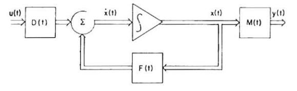
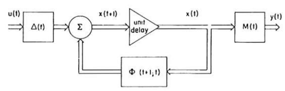
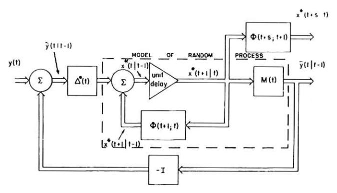
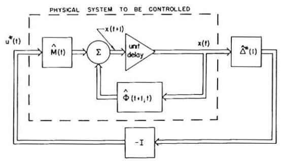

# A New Approach to Linear Filtering and Prediction Problems'

R. E. KALMAN

Research Institute for Advanced Study,2
Baltimore, Md.

The classical filtering and prediction problem is re-examined using the Bode-Shannon representation of random processes and the "state-transition" method of analysis of dynamic systems. New results are:

- (1) The formulation and methods of solution of the problem apply without modification to stationary and nonstationary statistics and to growing-memory and infinitememory filters.
- (2) A nonlinear difference (or differential) equation is derived for the covariance matrix of the optimal estimation error. From the solution of this equation the coefficients of the difference (or differential) equation of the optimal linear filter are obtained without further calculations.
- (3) The filtering problem is shown to be the dual of the noise-free regulator problem. The new method developed here is applied to two well-known problems, confirming and extending earlier results.

The discussion is largely self-contained and proceeds from first principles; basic concepts of the theory of random processes are reviewed in the Appendix.

## Introduction

An important class of theoretical and practical problems in communication and control is of a statistical nature. Such problems are: (i) Prediction of random signals; (ii) separation of random signals from random noise; (iii) detection of signals of known form (pulses, sinusoids) in the presence of random noise.

In his pioneering work, Wiener [1]3 showed that problems (i) and (ii) lead to the so-called Wiener-Hopf integral equation; he also gave a method (spectral factorization) for the solution of this integral equation in the practically important special case of stationary statistics and rational spectra.

Many extensions and generalizations followed Wiener's basic work. Zadeh and Ragazzini solved the finite-memory case [2]. Concurrently and independently of Bode and Shannon [3], they also gave a simplified method [2] of solution. Booton discussed the nonstationary Wiener-Hopf equation [4]. These results are now in standard texts [5-6]. A somewhat different approach along these main lines has been given recently by Darlington [7]. For extensions to sampled signals, see, e.g., Franklin [8], Lees [9]. Another approach based on the eigenfunctions of the Wiener-Hopf equation (which applies also to nonstationary problems whereas the preceding methods in general don't), has been pioneered by Davis [10] and applied by many others, e.g., Shinbrot [11], Blum [12], Pugachev [13], Solodovnikov [14].

In all these works, the objective is to obtain the specification of a linear dynamic system (Wiener filter) which accomplishes the prediction, separation, or detection of a random signal.4

1 This research was supported in part by the U.S. Air Force Office of Scientific Research under Contract AF 49 (638)-382.

2 7212 Bellona Ave.

- 3 Numbers in brackets designate References at end of paper.
- 4 Of course, in general these tasks may be done better by nonlinear filters. At present, however, little or nothing is known about how to obtain (both theoretically and practically) these nonlinear filters.

Contributed by the Instruments and Regulators Division and presented at the Instruments and Regulators Conference, March 29-April 2, 1959, of The American Society of Mechanical Engineers.

Note: Statements and opinions advanced in papers are to be understood as individual expressions of their authors and not those of the Society. Manuscript received at ASME Headquarters, February 24, 1959. Paper No. 59—IRD-11.

Present methods for solving the Wiener problem are subject to a number of limitations which seriously curtail their practical usefulness:

- (1) The optimal filter is specified by its impulse response. It is not a simple task to synthesize the filter from such data.
- (2) Numerical determination of the optimal impulse response is often quite involved and poorly suited to machine computation. The situation gets rapidly worse with increasing complexity of the problem.
- (3) Important generalizations (e.g., growing-memory filters, nonstationary prediction) require new derivations, frequently of considerable difficulty to the nonspecialist.
- (4) The mathematics of the derivations are not transparent. Fundamental assumptions and their consequences tend to be obscured.

This paper introduces a new look at this whole assemblage of problems, sidestepping the difficulties just mentioned. The following are the highlights of the paper:

- (5) Optimal Estimates and Orthogonal Projections. The Wiener problem is approached from the point of view of conditional distributions and expectations. In this way, basic facts of the Wiener theory are quickly obtained; the scope of the results and the fundamental assumptions appear clearly. It is seen that all statistical calculations and results are based on first and second order averages; no other statistical data are needed. Thus difficulty (4) is eliminated. This method is well known in probability theory (see pp. 75–78 and 148–155 of Doob [15] and pp. 455–464 of Loève [16]) but has not yet been used extensively in engineering.
- (6) Models for Random Processes. Following, in particular, Bode and Shannon [3], arbitrary random signals are represented (up to second order average statistical properties) as the output of a linear dynamic system excited by independent or uncorrelated random signals ("white noise"). This is a standard trick in the engineering applications of the Wiener theory [2–7]. The approach taken here differs from the conventional one only in the way in which linear dynamic systems are described. We shall emphasize the concepts of state and state transition; in other words, linear systems will be specified by systems of first-order difference (or differential) equations. This point of view is

natural and also necessary in order to take advantage of the simplifications mentioned under (5).

- (7) Solution of the Wiener Problem. With the state-transition method, a single derivation covers a large variety of problems: growing and infinite memory filters, stationary and nonstationary statistics, etc.; difficulty (3) disappears. Having guessed the "state" of the estimation (i.e., filtering or prediction) problem correctly, one is led to a nonlinear difference (or differential) equation for the covariance matrix of the optimal estimation error. This is vaguely analogous to the Wiener-Hopf equation. Solution of the equation for the covariance matrix starts at the time  $t_0$  when the first observation is taken; at each later time t the solution of the equation represents the covariance of the optimal prediction error given observations in the interval  $(t_0, t)$ . From the covariance matrix at time t we obtain at once, without further calculations, the coefficients (in general, time-varying) characterizing the optimal linear filter.
- (8) The Dual Problem. The new formulation of the Wiener problem brings it into contact with the growing new theory of control systems based on the "state" point of view [17–24]. It turns out, surprisingly, that the Wiener problem is the dual of the noise-free optimal regulator problem, which has been solved previously by the author, using the state-transition method to great advantage [18, 23, 24]. The mathematical background of the two problems is identical—this has been suspected all along, but until now the analogies have never been made explicit.
- (9) Applications. The power of the new method is most apparent in theoretical investigations and in numerical answers to complex practical problems. In the latter case, it is best to resort to machine computation. Examples of this type will be discussed later. To provide some feel for applications, two standard examples from nonstationary prediction are included; in these cases the solution of the nonlinear difference equation mentioned under (7) above can be obtained even in closed form.

For easy reference, the main results are displayed in the form of theorems. Only Theorems 3 and 4 are original. The next section and the Appendix serve mainly to review well-known material in a form suitable for the present purposes.

## **Notation Conventions**

Throughout the paper, we shall deal mainly with discrete (or sampled) dynamic systems; in other words, signals will be observed at equally spaced points in time (sampling instants). By suitable choice of the time scale, the constant intervals between successive sampling instants (sampling periods) may be chosen as unity. Thus variables referring to time, such as t,  $t_0$ ,  $\tau$ , T will always be integers. The restriction to discrete dynamic systems is not at all essential (at least from the engineering point of view); by using the discreteness, however, we can keep the mathematics rigorous and yet elementary. Vectors will be denoted by small bold-face letters: a, b, ..., u, x, y, ... A vector or more precisely an n-vector is a set of n numbers  $x_1, \ldots x_n$ ; the  $x_i$  are the co-ordinates or components of the vector x.

Matrices will be denoted by capital bold-face letters: A, B, Q,  $\Phi$ ,  $\Psi$ , . . .; they are  $m \times n$  arrays of elements  $a_{ij}$ ,  $b_{ij}$ ,  $q_{ij}$ , . . . The *transpose* (interchanging rows and columns) of a matrix will be denoted by the prime. In manipulating formulas, it will be convenient to regard a vector as a matrix with a single column.

Using the conventional definition of matrix multiplication, we write the scalar product of two n-vectors  $\mathbf{x}$ ,  $\mathbf{y}$  as

$$\mathbf{x}'\mathbf{y} = \sum_{i=1}^{n} x_i y_i = \mathbf{y}'\mathbf{x}$$

The scalar product is clearly a scalar, i.e., not a vector, quantity.

Similarly, the *quadratic form* associated with the  $n \times n$  matrix  $\mathbf{Q}$  is

$$\mathbf{x}'\mathbf{Q}\mathbf{x} = \sum_{i,j=1}^{n} x_i q_{ij} x_j$$

We define the expression xy' where x is an m-vector and y is an n-vector to be the  $m \times n$  matrix with elements  $x_iy_i$ .

We write  $E(\mathbf{x}) = E\mathbf{x}$  for the expected value of the random vector  $\mathbf{x}$  (see Appendix). It is usually convenient to omit the brackets after E. This does not result in confusion in simple cases since constants and the operator E commute. Thus  $E\mathbf{x}\mathbf{y}' = \text{matrix}$  with elements  $E(x_iy_j)$ ;  $E\mathbf{x}E\mathbf{y}' = \text{matrix}$  with elements  $E(x_i)E(y_j)$ .

For ease of reference, a list of the principal symbols used is given below.

#### **Optimal Estimates**

t time in general; present time.

to time at which observations start.

 $x_1(t)$ ,  $x_2(t)$  basic random variables.

y(t) observed random variable.

 $x_1^*(t_1|t)$  optimal estimate of  $x_1(t_1)$  given  $y(t_0), \ldots, y(t)$ .

L loss function (nonrandom function of its argument).

 $\epsilon$  estimation error (random variable).

#### **Orthogonal Projections**

 $\mathcal{Y}(t)$  linear manifold generated by the random variables  $y(t_0)$ ,

 $\bar{x}(t_1|t)$  orthogonal projection of  $x(t_1)$  on  $\mathcal{Y}(t)$ .

 $\tilde{x}(t_1|t)$  component of  $x(t_1)$  orthogonal to  $\mathcal{Y}(t)$ .

#### **Models for Random Processes**

 $\Phi(t+1; t)$  transition matrix

 $\mathbf{Q}(t)$  covariance of random excitation

#### Solution of the Wiener Problem

 $\mathbf{x}(t)$  basic random variable.

y(t) observed random variable.

 $\mathcal{Y}(t)$  linear manifold generated by  $\mathbf{y}(t_0), \ldots, \mathbf{y}(t)$ .

Z(t) linear manifold generated by  $\tilde{\mathbf{y}}(t|t-1)$ .

 $\mathbf{x}^*(t_1|t)$  optimal estimate of  $\mathbf{x}(t_1)$  given  $\mathcal{Y}(t)$ .

 $\tilde{\mathbf{x}}(t_1|t)$  error in optimal estimate of  $\mathbf{x}(t_1)$  given  $\mathcal{Y}(t)$ .

## Optimal Estimates

To have a concrete description of the type of problems to be studied, consider the following situation. We are given signal  $x_1(t)$  and noise  $x_2(t)$ . Only the sum  $y(t) = x_1(t) + x_2(t)$  can be observed. Suppose we have observed and know exactly the values of  $y(t_0), \ldots, y(t)$ . What can we infer from this knowledge in regard to the (unobservable) value of the signal at  $t = t_1$ , where  $t_1$  may be less than, equal to, or greater than t? If  $t_1 < t$ , this is a data-smoothing (interpolation) problem. If  $t_1 = t$ , this is called filtering. If  $t_1 > t$ , we have a prediction problem. Since our treatment will be general enough to include these and similar problems, we shall use hereafter the collective term estimation.

As was pointed out by Wiener [1], the natural setting of the estimation problem belongs to the realm of probability theory and statistics. Thus signal, noise, and their sum will be random variables, and consequently they may be regarded as random processes. From the probabilistic description of the random processes we can determine the probability with which a particular sample of the signal and noise will occur. For any given set of measured values  $\eta(t_0), \ldots, \eta(t)$  of the random variable y(t) one can then also determine, in principle, the probability of simultaneous occurrence of various values  $\xi_1(t)$  of the random variable  $x_1(t_1)$ . This is the conditional probability distribution function

36 / MARCH 1960

$$Pr[x_1(t_1) \leq \xi_1 | y(t_0) = \eta(t_0), \ldots, y(t) = \eta(t)] = F(\xi_1)$$
 (1)

Evidently,  $F(\xi_1)$  represents all the information which the measurement of the random variables  $y(t_0), \ldots, y(t)$  has conveyed about the random variable  $x_1(t_1)$ . Any statistical estimate of the random variable  $x_1(t_1)$  will be some function of this distribution and therefore a (nonrandom) function of the random variables  $y(t_0), \ldots, y(t)$ . This statistical estimate is denoted by  $X_1(t_1|t)$ , or by just  $X_1(t_1)$  or  $X_1$  when the set of observed random variables or the time at which the estimate is required are clear from context.

Suppose now that  $X_1$  is given as a fixed function of the random variables  $y(t_0), \ldots, y(t)$ . Then  $X_1$  is itself a random variable and its actual value is known whenever the actual values of  $y(t_0), \ldots, y(t)$  are known. In general, the actual value of  $X_1(t_1)$  will be different from the (unknown) actual value of  $x_1(t_1)$ . To arrive at a rational way of determining  $X_1$ , it is natural to assign a penalty or loss for incorrect estimates. Clearly, the loss should be a (i) positive, (ii) nondecreasing function of the estimation error  $\epsilon = x_1(t_1) - X_1(t_1)$ . Thus we define a loss function by

$$L(0) = 0$$
 
$$L(\epsilon_2) \ge L(\epsilon_1) \ge 0 \quad \text{when} \quad \epsilon_2 \ge \epsilon_1 \ge 0$$
 
$$L(\epsilon) = L(-\epsilon)$$
 (2)

Some common examples of loss functions are:  $L(\epsilon) = a\epsilon^2$ ,  $a\epsilon^4$ ,  $a|\epsilon|$ ,  $a[1 - \exp(-\epsilon^2)]$ , etc., where a is a positive constant.

One (but by no means the only) natural way of choosing the random variable  $X_1$  is to require that this choice should minimize the average loss or risk

$$E\{L[x_1(t_1) - X_1(t_1)]\} = E[E\{L[x(t_1) - X_1(t_1)] | y(t_0), \ldots, y(t)\}]$$
(3)

Since the first expectation on the right-hand side of (3) does not depend on the choice of  $X_1$  but only on  $y(t_0), \ldots, y(t)$ , it is clear that minimizing (3) is equivalent to minimizing

$$E\{L[x_1(t_1)-X_1(t_1)]|y(t_0),\ldots,y(t)\}$$
 (4)

Under just slight additional assumptions, optimal estimates can be characterized in a simple way.

**Theorem 1.** Assume that L is of type (2) and that the conditional distribution function  $F(\xi)$  defined by (1) is:

(A) symmetric about the mean  $\bar{\xi}$ :

$$F(\xi - \overline{\xi}) = 1 - F(\overline{\xi} - \xi)$$

(B) convex for  $\xi \leq \overline{\xi}$ :

$$F(\lambda \xi_1 + (1 - \lambda)\xi_2) \leq \lambda F(\xi_1) + (1 - \lambda)F(\xi_2)$$

for all  $\xi_1, \, \xi_2 \leq \overline{\xi} \, and \, 0 \leq \lambda \leq 1$ 

Then the random variable  $x_1*(t_1|t)$  which minimizes the average loss (3) is the conditional expectation

$$x_1^*(t_1|t) = E[x_1(t_1)|y(t_0), ..., y(t)]$$
 (5)

**Proof:** As pointed out recently by Sherman [25], this theorem follows immediately from a well-known lemma in probability theory.

**Corollary.** If the random processes  $\{x_1(t)\}$ ,  $\{x_2(t)\}$ , and  $\{y(t)\}$  are gaussian, Theorem 1 holds.

**Proof:** By Theorem 5, (A) (see Appendix), conditional distributions on a gaussian random process are gaussian. Hence the requirements of Theorem 1 are always satisfied.

In the control systems literature, this theorem appears sometimes in a form which is more restrictive in one way and more general in another way: **Theorem 1-a.** If  $L(\epsilon) = \epsilon^2$ , then Theorem 1 is true without assumptions (A) and (B).

Proof: Expand the conditional expectation (4):

$$E[x_1^2(t_1)|y(t_0), \ldots, y(t)] - 2X_1(t_1)E[x_1(t_1)|y(t_0), \ldots, y(t)] + X_1^2(t_1)$$

and differentiate with respect to  $X_1(t_1)$ . This is not a completely rigorous argument; for a simple rigorous proof see Doob [15], pp. 77–78.

**Remarks:** (a) As far as the author is aware, it is not known what is the most general class of random processes  $\{x_1(t)\}$ ,  $\{x_2(t)\}$  for which the conditional distribution function satisfies the requirements of Theorem 1.

- (b) Aside from the note of Sherman, Theorem 1 apparently has never been stated explicitly in the control systems literature. In fact, one finds many statements to the effect that loss functions of the general type (2) cannot be conveniently handled mathematically.
- (c) In the sequel, we shall be dealing mainly with vector-valued random variables. In that case, the estimation problem is stated as: Given a vector-valued random process  $\{x(t)\}$  and observed random variables  $y(t_0), \ldots, y(t)$ , where y(t) = Mx(t) (M being a singular matrix; in other words, not all co-ordinates of x(t) can be observed), find an estimate  $X(t_1)$  which minimizes the expected loss  $E[L(||x(t_1) X(t_1)||)]$ , || || being the norm of a vector.

Theorem 1 remains true in the vector case also, provided we require that the conditional distribution function of the n co-ordinates of the vector  $\mathbf{x}(t_1)$ ,

$$Pr[x_1(t_1) \leq \xi_1, \ldots, x_n(t_1) \leq \xi_n | \mathbf{y}(t_0), \ldots, \mathbf{y}(t)] = F(\xi_1, \ldots, \xi_n)$$

be symmetric with respect to the *n* variables  $\xi_1 - \overline{\xi}_1, \ldots, \xi_n - \overline{\xi}_n$  and convex in the region where all of these variables are negative.

# **Orthogonal Projections**

The explicit calculation of the optimal estimate as a function of the observed variables is, in general, impossible. There is an important exception: The processes  $\{x_1(t)\}$ ,  $\{x_2(t)\}$  are gaussian.

On the other hand, if we attempt to get an optimal estimate under the restriction  $L(\epsilon) = \epsilon^2$  and the additional requirement that the estimate be a linear function of the observed random variables, we get an estimate which is identical with the optimal estimate in the gaussian case, without the assumption of linearity or quadratic loss function. This shows that results obtainable by linear estimation can be bettered by nonlinear estimation only when (i) the random processes are nongaussian and even then (in view of Theorem 5, (C)) only (ii) by considering at least third-order probability distribution functions.

In the special cases just mentioned, the explicit solution of the estimation problem is most easily understood with the help of a geometric picture. This is the subject of the present section.

Consider the (real-valued) random variables  $y(t_0), \ldots, y(t)$ . The set of all linear combinations of these random variables with real coefficients

$$\sum_{i=h}^{t} a_i y(i) \tag{6}$$

forms a vector space (linear manifold) which we denote by  $\mathfrak{Y}(t)$ . We regard, abstractly, any expression of the form (6) as "point" or "vector" in  $\mathfrak{Y}(t)$ ; this use of the word "vector" should not be confused, of course, with "vector-valued" random variables, etc. Since we do not want to fix the value of t (i.e., the total number of possible observations),  $\mathfrak{Y}(t)$  should be regarded as a finite-dimensional subspace of the space of all possible observations.

Journal of Basic Engineering

Given any two vectors u, v in  $\mathcal{Y}(t)$  (i.e., random variables expressible in the form (6)), we say that u and v are orthogonal if Euv = 0. Using the Schmidt orthogonalization procedure, as described for instance by Doob [15], p. 151, or by Loève [16], p. 459, it is easy to select an orthonormal basis in  $\mathcal{Y}(t)$ . By this is meant a set of vectors  $e_{t_0} \ldots e_t$  in  $\mathcal{Y}(t)$  such that any vector in  $\mathcal{Y}(t)$  can be expressed as a unique linear combination of  $e_{t_0}, \ldots, e_t$  and

$$Ee_ie_j = \delta_{ij} = 1 \quad \text{if} \quad i = j$$

$$= 0 \quad \text{if} \quad i \neq j$$

$$(i, j = t_0, \ldots, t) \qquad (7)$$

Thus any vector  $\bar{x}$  in  $\mathfrak{P}(t)$  is given by

$$\bar{x} = \sum_{i=t}^{t} a_i e_i$$

and so the coefficients  $a_i$  can be immediately determined with the aid of (7):

$$E\bar{x}e_j = E\left(\sum_{i=t_0}^t a_i e_i\right) e_j = \sum_{i=t_0}^t a_i E e_i e_j = \sum_{i=t_0}^t a_i \delta_{ij} = a_j \quad (8)$$

It follows further that any random variable x (not necessarily in  $\mathcal{Y}(t)$ ) can be uniquely decomposed into two parts: a part  $\bar{x}$  in  $\mathcal{Y}(t)$  and a part  $\bar{x}$  orthogonal to  $\mathcal{Y}(t)$  (i.e., orthogonal to every vector in  $\mathcal{Y}(t)$ ). In fact, we can write

$$x = \bar{x} + \bar{x} = \sum_{i=1}^{t} (Exe_i)e_i + \bar{x}$$
 (9)

Thus  $\bar{x}$  is uniquely determined by equation (9) and is obviously a vector in  $\mathcal{Y}(t)$ . Therefore  $\bar{x}$  is also uniquely determined; it remains to check that it is orthogonal to  $\mathcal{Y}(t)$ :

$$E\tilde{x}e_i = E(x - \bar{x})e_i = Exe_i - E\bar{x}e_i$$

Now the co-ordinates of  $\bar{x}$  with respect to the basis  $e_{t_0}, \ldots, e_t$  are given either in the form  $E\bar{x}e_i$  (as in (8)) or in the form  $Exe_i$  (as in (9)). Since the co-ordinates are unique,  $Exe_i = E\bar{x}e_i$  ( $i = t_0, \ldots, t$ ); hence  $E\bar{x}e_i = 0$  and  $\bar{x}$  is orthogonal to every base vector  $e_i$  and therefore to  $\mathcal{Y}(t)$ . We call  $\bar{x}$  the orthogonal projection of x on  $\mathcal{Y}(t)$ .

There is another way in which the orthogonal projection can be characterized:  $\bar{x}$  is that vector in  $\mathcal{Y}(t)$  (i.e., that *linear* function of the random variables  $y(t_0), \ldots, y(t)$ ) which minimizes the quadratic loss function. In fact, if  $\bar{w}$  is any other vector in  $\mathcal{Y}(t)$ , we have

$$E(x - \bar{w})^2 = E(\bar{x} + \bar{x} - \bar{w})^2 = E[(x - \bar{x}) + (\bar{x} - \bar{w})]^2$$

Since  $\bar{x}$  is orthogonal to every vector in  $\mathcal{Y}(t)$  and in particular to  $\bar{x} - v\bar{v}$  we have

$$E(x - \bar{w})^2 = E(x - \bar{x})^2 + E(\bar{x} - \bar{w})^2 \ge E(x - \bar{x})^2 \quad (10)$$

This shows that, if  $\bar{w}$  also minimizes the quadratic loss, we must have  $E(\bar{x} - \bar{w})^2 = 0$  which means that the random variables  $\bar{x}$  and  $\bar{w}$  are equal (except possibly for a set of events whose probability is zero).

These results may be summarized as follows:

**Theorem 2.** Let  $\{x(t)\}$ ,  $\{y(t)\}$  random processes with zero mean (i.e., Ex(t) = Ey(t) = 0 for all t). We observe  $y(t_0), \ldots, y(t)$ . If either

- (A) the random processes  $\{x(t)\}$ ,  $\{y(t)\}$  are gaussian; or
- (B) the optimal estimate is restricted to be a linear function of the observed random variables and  $L(\epsilon) = \epsilon^2$ ;

then.

$$x^*(t_1|t) = optimal \ estimate \ of \ x(t_1) \ given \ y(t_0), \dots, \ y(t)$$
  
= orthogonal projection  $\bar{x}(t_1|t) \ of \ x(t_1) \ on \ \mathcal{Y}(t).$  (11)

These results are well-known though not easily accessible in the control systems literature. See Doob [15], pp. 75–78, or Pugachev [26]. It is sometimes convenient to denote the orthogonal projection by

$$\bar{x}(t_1|t) \equiv x^*(t_1|t) = \hat{E}[x(t_1)|\mathcal{Y}(t)]$$

The notation  $\hat{\mathcal{L}}$  is motivated by part (b) of the theorem: If the stochastic processes in question are gaussian, then orthogonal projection is actually identical with conditional expectation.

**Proof.** (A) This is a direct consequence of the remarks in connection with (10).

(B) Since x(t), y(t) are random variables with zero mean, it is clear from formula (9) that the orthogonal part  $\mathfrak{T}(t_1|t)$  of  $x(t_1)$  with respect to the linear manifold  $\mathfrak{Y}(t)$  is also a random variable with zero mean. Orthogonal random variables with zero mean are uncorrelated; if they are also gaussian then (by Theorem 5 (B)) they are independent. Thus

$$0 = E\bar{x}(t_1|t) = E[\bar{x}(t_1|t)|y(t_0), \dots, y(t)]$$
  
=  $E[x(t_1) - \bar{x}(t_1|t)|y(t_0), \dots, y(t)]$   
=  $E[x(t_1)|y(t_0), \dots, y(t)] - \bar{x}(t_1|t) = 0$ 

**Remarks.** (d) A rigorous formulation of the contents of this section as  $t \to \infty$  requires some elementary notions from the theory of Hilbert space. See Doob [15] and Loève [16].

(e) The physical interpretation of Theorem 2 is largely a matter of taste. If we are not worried about the assumption of gaussianness, part (A) shows that the orthogonal projection is the optimal estimate for all reasonable loss functions. If we do worry about gaussianness, even if we are resigned to consider only linear estimates, we know that orthogonal projections are not the optimal estimate for many reasonable loss functions. Since in practice it is difficult to ascertain to what degree of approximation a random process of physical origin is gaussian, it is hard to decide whether Theorem 2 has very broad or very limited significance.

(f) Theorem 2 is immediately generalized for the case of vector-valued random variables. In fact, we define the linear manifold  $\mathcal{Y}(t)$  generated by  $\mathbf{y}(t_0), \ldots, \mathbf{y}(t)$  to be the set of all linear combinations

$$\sum_{i=t_0}^t \sum_{j=1}^m a_{ij} y_j(i)$$

of all m co-ordinates of each of the random vectors  $\mathbf{y}(t_0), \ldots, \mathbf{y}(t)$ . The rest of the story proceeds as before.

(g) Theorem 2 states in effect that the optimal estimate under conditions (A) or (B) is a linear combination of all previous observations. In other words, the optimal estimate can be regarded as the output of a linear filter, with the input being the actually occurring values of the observable random variables; Theorem 2 gives a way of computing the impulse response of the optimal filter. As pointed out before, knowledge of this impulse response is not a complete solution of the problem; for this reason, no explicit formulas for the calculation of the impulse response will be given.

#### Models for Random Processes

In dealing with physical phenomena, it is not sufficient to give an empirical description but one must have also some idea of the underlying causes. Without being able to separate in some sense causes and effects, i.e., without the assumption of causality, one can hardly hope for useful results.

It is a fairly generally accepted fact that primary macroscopic sources of random phenomena are independent gaussian processes.5 A well-known example is the noise voltage produced in a resistor due to thermal agitation. In most cases, observed random phenomena are not describable by independent random variables. The statistical dependence (correlation) between random signals observed at different times is usually explained by the presence of a dynamic system between the primary random source and the observer. Thus a random function of time may be thought of as the output of a dynamic system excited by an independent gaussian random process.

An important property of gaussian random signals is that they remain gaussian after passing through a linear system (Theorem 5(A)). Assuming independent gaussian primary random sources, if the observed random signal is also gaussian, we may assume that the dynamic system between the observer and the primary source is linear. This conclusion may be forced on us also because of lack of detailed knowledge of the statistical properties of the observed random signal: Given any random process with known first and second-order averages, we can find a gaussian random process with the same properties (Theorem 5(C)). Thus gaussian distributions and linear dynamics are natural, mutually plausible assumptions particularly when the statistical data are scant.

How is a dynamic system (linear or nonlinear) described? The fundamental concept is the notion of the *state*. By this is meant, intuitively, some quantitative information (a set of numbers, a function, etc.) which is the least amount of data one has to know about the past behavior of the system in order to predict its future behavior. The dynamics is then described in terms of *state transitions*, i.e., one must specify how one state is transformed into another as time passes.

A linear dynamic system may be described in general by the vector differential equation

and  $d\mathbf{x}/dt = \mathbf{F}(t)\mathbf{x} + \mathbf{D}(t)\mathbf{u}(t)$  $\mathbf{y}(t) = \mathbf{M}(t)\mathbf{x}(t)$  (12)

where **x** is an *n*-vector, the *state* of the system (the components  $x_i$  of **x** are called *state variables*);  $\mathbf{u}(t)$  is an *m*-vector  $(m \leq n)$  representing the *inputs* to the system;  $\mathbf{F}(t)$  and  $\mathbf{D}(t)$  are  $n \times n$ , respectively,  $n \times m$  matrices. If all coefficients of  $\mathbf{F}(t)$ ,  $\mathbf{D}(t)$ ,  $\mathbf{M}(t)$  are constants, we say that the dynamic system (12) is *time-invariant* or *stationary*. Finally,  $\mathbf{y}(t)$  is a *p*-vector denoting the outputs of the system;  $\mathbf{M}(t)$  is an  $n \times p$  matrix;  $p \leq n$ .

The physical interpretation of (12) has been discussed in detail elsewhere [18, 20, 23]. A look at the block diagram in Fig. 1 may be helpful. This is not an ordinary but a matrix block diagram (as revealed by the fat lines indicating signal flow). The inte-

Fig. 1 Matrix block diagram of the general linear continuous-dynamic system

grator in Fig. 1 actually stands for n integrators such that the output of each is a state variable; F(t) indicates how the outputs of the integrators are fed back to the inputs of the integrators. Thus  $f_{ij}(t)$  is the coefficient with which the output of the jth integrator is fed back to the input of the ith integrator. It is not hard to relate this formalism to more conventional methods of linear system analysis.

If we assume that the system (12) is stationary and that  $\mathbf{u}(t)$  is constant during each sampling period, that is

$$\mathbf{u}(t+\tau) = \mathbf{u}(t); \ 0 \le \tau < 1, \ t = 0, 1, \dots$$
 (13)

then (12) can be readily transformed into the more convenient discrete form

$$x(t+1) = \Phi(1)x(t) + \Delta(1)u(t); t = 0, 1, ...$$

where [18, 20]

$$\Phi(1) = \exp \mathsf{F} = \sum_{i=0}^{\infty} \mathsf{F}^{i}/i! \quad (\mathsf{F}^{\circ} = \text{unit matrix})$$

and

$$\Delta(1) = \left(\int_0^1 \exp \mathsf{F} \tau d\tau\right) \mathsf{D}$$

Fig. 2 Matrix block diagram of the general linear discrete-dynamic system

See Fig. 2. One could also express exp  $F\tau$  in closed form using Laplace transform methods [18, 20, 22, 24]. If u(t) satisfies (13) but the system (12) is nonstationary, we can write analogously

$$\mathbf{x}(t+1) = \mathbf{\Phi}(t+1; t) + \mathbf{\Delta}(t)\mathbf{u}(t) \mathbf{y}(t) = \mathbf{M}(t)\mathbf{x}(t)$$
  $t = 0, 1, ...$  (14)

but of course now  $\Phi(t+1;t)$ ,  $\Delta(t)$  cannot be expressed in general in closed form. Equations of type (14) are encountered frequently also in the study of complicated sampled-data systems [22]. See Fig. 2.

 $\Phi(t+1;\ t)$  is the transition matrix of the system (12) or (14). The notation  $\Phi(t_2;\ t_1)$  ( $t_2,t_1=$  integers) indicates transition from time  $t_1$  to time  $t_2$ . Evidently  $\Phi(t;\ t)=1=$  unit matrix. If the system (12) is stationary then  $\Phi(t+1;\ t)=\Phi(t+1-t)=\Phi(1)=$  const. Note also the product rule:  $\Phi(t;\ s)\Phi(s;\ r)=\Phi(t;\ r)$  and the inverse rule  $\Phi^{-1}(t;\ s)=\Phi(s;\ t)$ , where  $t,\ s,\ r$  are integers. In a stationary system,  $\Phi(t;\ r)=\exp F(t-\tau)$ .

As a result of the preceding discussion, we shall represent random phenomena by the model

$$x(t+1) = \Phi(t+1; t)x(t) + u(t)$$
 (15)

where  $\{u(t)\}$  is a vector-valued, independent, gaussian random process, with zero mean, which is completely described by (in view of Theorem 5 (C))

$$Eu(t) = 0$$
 for all  $t$ ;

$$E\mathbf{u}(t)\mathbf{u}'(s) = \mathbf{0}$$
 if  $t \neq s$ 

$$E\mathbf{u}(t)\mathbf{u}'(t) = \mathbf{Q}(t).$$

Of course (Theorem 5 (A)),  $\mathbf{x}(t)$  is then also a gaussian random process with zero mean, but it is no longer independent. In fact, if we consider (15) in the steady state (assuming it is a stable system), in other words, if we neglect the initial state  $\mathbf{x}(t_0)$ , then

Journal of Basic Engineering

&lt;sup>5 The probability distributions will be gaussian because macroscopic random effects may be thought of as the superposition of very many microscopic random effects; under very general conditions, such aggregate effects tend to be gaussian, regardless of the statistical properties of the microscopic effects. The assumption of independence in this context is motivated by the fact that microscopic phenomena tend to take place much more rapidly than macroscopic phenomena; thus primary random sources would appear to be independent on a macroscopic time scale.

$$\mathbf{x}(t) = \sum_{r=-\infty}^{t-1} \mathbf{\Phi}(t; r+1)\mathbf{u}(r).$$

Therefore if  $t \ge s$  we have

$$E_{\mathbf{X}}(t)\mathbf{X}'(s) = \sum_{r=-\infty}^{s-1} \Phi(t; r+1)\mathbf{Q}(r)\Phi'(s; r+1).$$

Thus if we assume a linear dynamic model and know the statistical properties of the gaussian random excitation, it is easy to find the corresponding statistical properties of the gaussian random process  $\{x(t)\}$ .

In real life, however, the situation is usually reversed. One is given the covariance matrix  $E\mathbf{x}(t)\mathbf{x}'(s)$  (or rather, one attempts to estimate the matrix from limited statistical data) and the problem is to get (15) and the statistical properties of  $\mathbf{u}(t)$ . This is a subtle and presently largely unsolved problem in experimentation and data reduction. As in the vast majority of the engineering literature on the Wiener problem, we shall find it convenient to start with the model (15) and regard the problem of obtaining the model itself as a separate question. To be sure, the two problems should be optimized jointly if possible; the author is not aware, however, of any study of the joint optimization problem.

In summary, the following assumptions are made about random processes:

Physical random phenomena may be thought of as due to primary random sources exciting dynamic systems. The primary sources are assumed to be independent gaussian random processes with zero mean; the dynamic systems will be linear. The random processes are therefore described by models such as (15). The question of how the numbers specifying the model are obtained from experimental data will not be considered.

## Solution of the Wiener Problem

Let us now define the principal problem of the paper. Problem I. Consider the dynamic model

$$x(t+1) = \Phi(t+1; t)x(t) + u(t)$$
 (16)

$$y(t) = M(t)x(t) \tag{17}$$

where  $\mathbf{u}(t)$  is an independent gaussian random process of n-vectors with zero mean,  $\mathbf{x}(t)$  is an n-vector,  $\mathbf{y}(t)$  is a p-vector  $(p \leq n)$ ,  $\mathbf{\Phi}(t+1;t)$ ,  $\mathbf{M}(t)$  are  $n \times n$ , resp.  $p \times n$ , matrices whose elements are nonrandom functions of time.

Given the observed values of  $y(t_0)$ , . . . , y(t) find an estimate  $\mathbf{x}^*(t_1|t)$  of  $\mathbf{x}(t_1)$  which minimizes the expected loss. (See Fig. 2, where  $\Delta(t) = 1$ .)

This problem includes as a special case the problems of filtering, prediction, and data smoothing mentioned earlier. It includes also the problem of reconstructing all the state variables of a linear dynamic system from noisy observations of some of the state variables (p < nl).

From Theorem 2-a we know that the solution of Problem I is simply the orthogonal projection of  $\mathbf{x}(t_1)$  on the linear manifold  $\mathcal{Y}(t)$  generated by the observed random variables. As remarked in the Introduction, this is to be accomplished by means of a linear (not necessarily stationary!) dynamic system of the general form (14). With this in mind, we proceed as follows.

Assume that  $y(t_0), \ldots, y(t-1)$  have been measured, i.e., that y(t-1) is known. Next, at time t, the random variable y(t) is measured. As before let  $\tilde{y}(t|t-1)$  be the component of y(t) orthogonal to y(t-1). If  $\tilde{y}(t|t-1) \equiv 0$ , which means that the values of all components of this random vector are zero for almost every possible event, then y(t) is obviously the same as y(t-1) and therefore the measurement of y(t) does not convey any additional information. This is not likely to happen in a physically meaningful situation. In any case,  $\tilde{y}(t|t-1)$  generates a linear

manifold (possibly 0) which we denote by Z(t). By definition, Y(t-1) and Z(t) taken together are the same manifold as Y(t), and every vector in Y(t-1).

Assuming by induction that  $\mathbf{x}^*(t_1 - 1|t - 1)$  is known, we can write:

$$\mathbf{x}^{*}(t_{1}|t) = \hat{E}[\mathbf{x}(t_{1})|\mathcal{Y}(t)] = \hat{E}[\mathbf{x}(t_{1})|\mathcal{Y}(t-1)] + \hat{E}[\mathbf{x}(t_{1})|\mathcal{Z}(t)]$$

$$= \mathbf{\Phi}(t+1; t)\mathbf{x}^{*}(t_{1}-1|t-1) + \hat{E}[\mathbf{u}(t_{1}-1)|\mathcal{Y}(t-1)] + \hat{E}[\mathbf{x}(t_{1})|\mathcal{Z}(t)] \quad (18)$$

where the last line is obtained using (16).

Let  $t_1 = t + s$ , where s is any integer. If  $s \ge 0$ , then  $\mathbf{u}(t_1 - 1)$  is independent of  $\mathcal{Y}(t-1)$ . This is because  $\mathbf{u}(t_1 - 1) = \mathbf{u}(t + s - 1)$  is then independent of  $\mathbf{u}(t-2)$ ,  $\mathbf{u}(t-3)$ , ... and therefore by (16-17), independent of  $\mathbf{v}(t_0)$ , ...,  $\mathbf{v}(t-1)$ , hence independent of  $\mathcal{Y}(t-1)$ . Since, for all t,  $\mathbf{u}(t_0)$  has zero mean by assumption, it follows that  $\mathbf{u}(t_1 - 1)$  ( $s \ge 0$ ) is orthogonal to  $\mathcal{Y}(t-1)$ . Thus if  $s \ge 0$ , the second term on the right-hand side of (18) vanishes; if s < 0, considerable complications result in evaluating this term. We shall consider only the case  $t_1 \ge t$ . Furthermore, it will suffice to consider in detail only the case  $t_1 = t + 1$  since the other cases can be easily reduced to this one.

The last term in (18) must be a linear operation on the random variable  $\tilde{\mathbf{y}}(t|t-1)$ :

$$\hat{E}[\mathbf{x}(t+1)|\mathcal{Z}(t)] = \mathbf{\Delta}^*(t)\tilde{\mathbf{y}}(t|t-1) \tag{19}$$

where  $\Delta^*(t)$  is an  $n \times p$  matrix, and the star refers to "optimal filtering."

The component of  $\mathbf{y}(t)$  lying in  $\mathfrak{Y}(t-1)$  is  $\overline{\mathbf{y}}(t|t-1) = \mathbf{M}(t)\mathbf{x}^*$  (t|t-1). Hence

$$\tilde{\mathbf{y}}(t|t-1) = \mathbf{y}(t) - \tilde{\mathbf{y}}(t|t-1) = \mathbf{y}(t) - \mathbf{M}(t)\mathbf{x}^*(t|t-1)$$
 (20)

Combining (18-20) (see Fig. 3) we obtain

$$\mathbf{x}^*(t+1|t) = \mathbf{\Phi}^*(t+1; t)\mathbf{x}^*(t|t-1) + \mathbf{\Delta}^*(t)\mathbf{y}(t)$$
 (21)

where

$$\Phi^*(t+1; t) = \Phi(t+1; t) - \Delta^*(t)M(t)$$
 (22)

Thus optimal estimation is performed by a linear dynamic system of the same form as (14). The state of the estimator is the previous estimate, the input is the last measured value of the observable random variable y(t), the transition matrix is given by (22). Notice that physical realization of the optimal filter requires only (i) the model of the random process (ii) the operator  $\Delta^*(t)$ .

The estimation error is also governed by a linear dynamic system. In fact,

$$\begin{split} \tilde{\mathbf{x}}(t+1|t) &= \mathbf{x}(t+1) - \mathbf{x}^*(t+1|t) \\ &= \mathbf{\Phi}(t+1;\ t)\mathbf{x}(t) + \mathbf{u}(t) - \mathbf{\Phi}^*(t+1;\ t)\mathbf{x}^*(t|t-1) \\ &- \mathbf{\Delta}^*(t)\mathbf{M}(t)\mathbf{x}(t) \end{split}$$

Fig. 3 Matrix block diagram of optimal filter

40 / MARCH 1960

$$= \Phi^*(t+1; t)\tilde{\mathbf{x}}(t|t-1) + \mathbf{u}(t)$$
 (23)

Thus  $\Phi^*$  is also the transition matrix of the linear dynamic system governing the error.

From (23) we obtain at once a recursion relation for the covariance matrix  $\mathbf{P}^*(t)$  of the optimal error  $\tilde{\mathbf{x}}(t|t-1)$ . Noting that  $\mathbf{u}(t)$  is independent of  $\mathbf{x}(t)$  and therefore of  $\tilde{\mathbf{x}}(t|t-1)$ , we get

$$P^{*}(t+1) = E\tilde{\mathbf{x}}(t+1|t)\tilde{\mathbf{x}}'(t+1|t)$$

$$= \Phi^{*}(t+1; t)E\tilde{\mathbf{x}}(t|t-1)\tilde{\mathbf{x}}'(t|t-1)\Phi^{*}(t+1; t) + \mathbf{Q}(t)$$

$$= \Phi^{*}(t+1; t)E\tilde{\mathbf{x}}(t|t-1)\tilde{\mathbf{x}}'(t|t-1)\Phi'(t+1; t) + \mathbf{Q}(t)$$

$$= \Phi^{*}(t+1; t)P^{*}(t)\Phi'(t+1; t) + \mathbf{Q}(t)$$
(24)

where  $\mathbf{Q}(t) = E\mathbf{u}(t)\mathbf{u}'(t)$ .

There remains the problem of obtaining an explicit formula for  $\Delta^*$  (and thus also for  $\Phi^*$ ). Since,

$$\tilde{\mathbf{x}}(t+1|Z(t)) = \mathbf{x}(t+1) - \hat{E}[\mathbf{x}(t+1)|Z(t)]$$

is orthogonal to  $\tilde{\mathbf{y}}(t|t-1)$ , it follows by (19) that

$$0 = E[\mathbf{x}(t+1) - \mathbf{\Delta}^*(t)\tilde{\mathbf{y}}(t|t-1)]\tilde{\mathbf{y}}'(t|t-1)$$
  
=  $E\mathbf{x}(t+1)\tilde{\mathbf{y}}'(t|t-1) - \mathbf{\Delta}^*(t)E\tilde{\mathbf{y}}(t|t-1)\tilde{\mathbf{y}}'(t|t-1).$ 

Noting that  $\bar{\mathbf{x}}(t+1|t-1)$  is orthogonal to  $\mathbf{Z}(t)$ , the definition of  $\mathbf{P}(t)$  given earlier, and (17), it follows further

$$0 = E\bar{\mathbf{x}}(t+1|t-1)\bar{\mathbf{y}}'(t|t-1) - \mathbf{\Delta}^*(t)\mathbf{M}(t)\mathbf{P}^*(t)\mathbf{M}'(t)$$

$$= E[\mathbf{\Phi}(t+1;\ t)\bar{\mathbf{x}}(t|t-1) + \mathbf{u}(t|t-1)]\bar{\mathbf{x}}'(t|t-1)\mathbf{M}'(t) - \mathbf{\Delta}^*(t)\mathbf{M}(t)\mathbf{P}^*(t)\mathbf{M}'(t).$$

Finally, since  $\mathbf{u}(t)$  is independent of  $\mathbf{x}(t)$ ,

$$0 = \Phi(t+1; t)P^*(t)M'(t) - \Delta^*(t)M(t)P^*(t)M'(t).$$

Now the matrix  $\mathbf{M}(t)\mathbf{P}^*(t)\mathbf{M}'(t)$  will be positive definite and hence invertible whenever  $\mathbf{P}^*(t)$  is positive definite, provided that none of the rows of  $\mathbf{M}(t)$  are linearly dependent at any time, in other words, that none of the observed scalar random variables  $y_1(t)$ , . . .,  $y_m(t)$  is a linear combination of the others. Under these circumstances we get finally:

$$\Delta^*(t) = \Phi(t+1; t)P^*(t)M'(t)[M(t)P^*(t)M'(t)]^{-1}$$
 (25)

Since observations start at  $t_0$ ,  $\bar{\mathbf{x}}(t_0|t_0-1)=\mathbf{x}(t_0)$ ; to begin the iterative evaluation of  $\mathbf{P}^*(t)$  by means of equation (24), we must obviously specify  $\mathbf{P}^*(t_0)=E\mathbf{x}(t_0)\mathbf{x}'(t_0)$ . Assuming this matrix is positive definite, equation (25) then yields  $\mathbf{\Delta}^*(t_0)$ ; equation (22)  $\mathbf{\Phi}^*(t_0+1)$ ;  $t_0$ ), and equation (24)  $\mathbf{P}^*(t_0+1)$ , completing the cycle. If now  $\mathbf{Q}(t)$  is positive definite, then all the  $\mathbf{P}^*(t)$  will be positive definite and the requirements in deriving (25) will be satisfied at each step.

Now we remove the restriction that  $t_1 = t + 1$ . Since u(t) is orthogonal to  $\mathcal{Y}(t)$ , we have

$$\mathbf{x}^*(t+1\big|t) = \hat{E}[\mathbf{\Phi}(t+1;\;t)\mathbf{x}(t) + \mathbf{u}(t)\big|\mathcal{Y}(t)] = \mathbf{\Phi}(t+1;\;t)\mathbf{x}^*(t\big|t)$$

Hence if  $\Phi(t+1; t)$  has an inverse  $\Phi(t; t+1)$  (which is always the case when  $\Phi$  is the transition matrix of a dynamic system describable by a differential equation) we have

$$\mathbf{x}^*(t|t) = \mathbf{\Phi}(t; t+1)\mathbf{x}^*(t+1|t)$$

If  $t_1 \ge t + 1$ , we first observe by repeated application of (16) that

$$x(t + s) = \Phi(t + s; t + 1)x(t + 1)$$

$$+ \sum_{r1}^{s-1} \Phi(t+s; \ t+r) \mathbf{u}(t+r) \qquad (s \ge 1)$$

Since  $\mathbf{u}(t+s-1), \ldots, \mathbf{u}(t+1)$  are all orthogonal to  $\mathfrak{Y}(t)$ ,

Journal of Basic Engineering

$$\mathbf{x}^{*}(t+s|t) = \hat{E}[\mathbf{x}(t+s)|\mathfrak{Y}(t)] = \hat{E}[\mathbf{\Phi}(t+s; t+1)\mathbf{x}(t+1)|\mathfrak{Y}(t)] = \mathbf{\Phi}(t+s; t+1)\mathbf{x}^{*}(t+1|t) \quad (s \ge 1)$$

If s < 0, the results are similar, but  $\mathbf{x}^*(t - s | t)$  will have (1 - s)(n - p) co-ordinates.

The results of this section may be summarized as follows:

Theorem 3. (Solution of the Wiener Problem)

Consider Problem I. The optimal estimate  $\mathbf{x}^*(t+1|t)$  of  $\mathbf{x}(t+1)$  given  $\mathbf{y}(t_0), \ldots, \mathbf{y}(t)$  is generated by the linear dynamic system

$$\mathbf{x}^*(t+1|t) = \mathbf{\Phi}^*(t+1;\ t)\mathbf{x}^*(t|t-1) + \mathbf{\Delta}^*(t)\mathbf{y}(t) \quad (21)$$

The estimation error is given by

$$\tilde{\mathbf{x}}(t+1|t) = \mathbf{\Phi}^*(t+1;\ t)\tilde{\mathbf{x}}(t|t-1) + \mathbf{u}(t)$$
 (23)

The covariance matrix of the estimation error is

$$\operatorname{cov} \, \tilde{\mathbf{x}}(t \, | t - 1) = E \tilde{\mathbf{x}}(t | t - 1) \tilde{\mathbf{x}}'(t | t - 1) = \mathbf{P}^*(t) \tag{26}$$

The expected quadratic loss is

$$\sum_{i=1}^{n} E\bar{x}_{i}^{2}(t|t-1) = \text{trace } \mathsf{P}^{*}(t)$$
 (27)

The matrices  $\Delta^*(t)$ ,  $\Phi^*(t+1;t)$ ,  $P^*(t)$  are generated by the recursion relations

$$\Delta^*(t) = \Phi(t+1; t)P^*(t)M'(t)[M(t)P^*(t)M'(t)]^{-1}$$
(28)

$$\Phi^*(t+1;\ t) = \Phi(t+1;\ t) - \Delta^*(t)M(t)$$

$$t \ge t_0$$
(29)

$$P^{*}(t+1) = \Phi^{*}(t+1; t)P^{*}(t)\Phi'(t+1; t) + \mathbf{Q}(t)$$
(30)

In order to carry out the iterations, one must specify the covariance  $P^*(t_0)$  of  $\mathbf{x}(t_0)$  and the covariance  $\mathbf{Q}(t)$  of  $\mathbf{u}(t)$ . Finally, for any  $s \geq 0$ , if  $\Phi$  is invertible

$$\mathbf{x}^*(t+s|t) = \mathbf{\Phi}(t+s;\ t+1)\mathbf{x}^*(t+1|t)$$

$$= \mathbf{\Phi}(t+s;\ t+1)\mathbf{\Phi}^*(t+1;\ t)\mathbf{\Phi}(t;\ t+s-1)$$

$$\times \mathbf{x}^*(t+s-1|t-1)$$

$$+\Phi(t+s;\ t+1)\Delta^*(t)\mathbf{y}(t) \tag{31}$$

so that the estimate  $\mathbf{x}^*(t+s|t)$  ( $s \ge 0$ ) is also given by a linear dynamic system of the type (21).

**Remarks.** (h) Eliminating  $\Delta^*$  and  $\Phi^*$  from (28–30), a nonlinear difference equation is obtained for  $P^*(t)$ :

$$P^{*}(t+1) = \Phi(t+1; t) \{ P^{*}(t) - P^{*}(t)M'(t)[M(t)P^{*}(t)M'(t)]^{-1} \times P^{*}(t)M(t) \} \Phi'(t+1; t) + Q(t) \qquad (t \ge t_{0}) \quad (32)$$

This equation is linear only if  $\mathbf{M}(t)$  is invertible but then the problem is trivial since all components of the random vector  $\mathbf{x}(t)$  are observable  $\mathbf{P}^*(t+1) = \mathbf{Q}(t)$ . Observe that equation (32) plays a role in the present theory analogous to that of the Wiener-Hopf equation in the conventional theory.

Once  $P^*(t)$  has been computed via (32) starting at  $t=t_0$ , the explicit specification of the optimal linear filter is immediately available from formulas (29–30). Of course, the solution of Equation (32), or of its differential-equation equivalent, is a much simpler task than solution of the Wiener-Hopf equation.

(i) The results stated in Theorem 3 do not resolve completely Problem I. Little has been said, for instance, about the physical significance of the assumptions needed to obtain equation (25), the convergence and stability of the nonlinear difference equation (32), the stability of the optimal filter (21), etc. This can actually be done in a completely satisfactory way, but must be left to a future paper. In this connection, the principal guide and

tool turns out to be the duality theorem mentioned briefly in the next section. See [29].

- (j) By letting the sampling period (equal to one so far) approach zero, the method can be used to obtain the specification of a differential equation for the optimal filter. To do this, i.e., to pass from equation (14) to equation (12), requires computing the logarithm  $F^*$  of the matrix  $\Phi^*$ . But this can be done only if  $\Phi^*$  is nonsingular—which is easily seen not to be the case. This is because it is sufficient for the optimal filter to have n-p state variables, rather than n, as the formalism of equation (22) would seem to imply. By appropriate modifications, therefore, equation (22) can be reduced to an equivalent set of only n-p equations whose transition matrix is nonsingular. Details of this type will be covered in later publications.
- (k) The dynamic system (21) is, in general, nonstationary. This is due to two things: (1) The time dependence of  $\Phi(t+1;t)$  and  $\mathbf{M}(t)$ ; (2) the fact that the estimation starts at  $t=t_0$  and improves as more data are accumulated. If  $\Phi$ ,  $\mathbf{M}$  are constants, it can be shown that (21) becomes a stationary dynamic system in the limit  $t \to \infty$ . This is the case treated by the classical Wiener theory.
- (1) It is noteworthy that the derivations given are not affected by the nonstationarity of the model for  $\mathbf{x}(t)$  or the finiteness of available data. In fact, as far as the author is aware, the only explicit recursion relations given before for the growing-memory filter are due to Blum [12]. However, his results are much more complicated than ours.
- (m) By inspection of Fig. 3 we see that the optimal filter is a feedback system, and that the signal after the first summer is white noise since  $\tilde{\mathbf{y}}(t|t-1)$  is obviously an orthogonal random process. This corresponds to some well-known results in Wiener filtering, see, e.g., Smith [28], Chapter 6, Fig. 6-4. However, this is apparently the first rigorous proof that every Wiener filter is realizable by means of a feedback system. Moreover, it will be shown in another paper that such a filter is always stable, under very mild assumptions on the model (16-17). See [29].

## The Dual Problem

Let us now consider another problem which is conceptually very different from optimal estimation, namely, the noise-free regulator problem. In the simplest cases, this is:

Problem II. Consider the dynamic system

$$\mathbf{x}(t+1) = \hat{\mathbf{\Phi}}(t+1; t)\mathbf{x}(t) + \hat{\mathbf{M}}(t)\mathbf{u}(t)$$
(33)

where  $\mathbf{x}(t)$  is an n-vector,  $\mathbf{u}(t)$  is an m-vector ( $m \leq n$ ),  $\hat{\mathbf{\Phi}}$ ,  $\hat{\mathbf{M}}$  are  $n \times n$  resp.  $n \times m$  matrices whose elements are nonrandom functions of time. Given any state  $\mathbf{x}(t)$  at time t, we are to find a sequence  $\mathbf{u}(t), \ldots, \mathbf{u}(T)$  of control vectors which minimizes the performance index

$$V[\mathbf{x}(t)] = \sum_{\tau=t}^{T+1} \mathbf{x}'(\tau) \mathbf{Q}(\tau) \mathbf{x}(\tau)$$

where  $\hat{\mathbf{Q}}(t)$  is a positive definite matrix whose elements are nonrandom functions of time. See Fig. 2, where  $\mathbf{\Delta} = \hat{\mathbf{M}}$  and  $\mathbf{M} = \mathbf{I}$ .

Probabilistic considerations play no part in Problem II; it is implicitly assumed that every state variable can be measured exactly at each instant  $t, t+1, \ldots, T$ . It is customary to call  $T \ge t$  the terminal time (it may be infinity).

The first general solution of the noise-free regulator problem is due to the author [18]. The main result is that the optimal control vectors  $\mathbf{u}^*(t)$  are nonstationary linear functions of  $\mathbf{x}(t)$ . After a change in notation, the formulas of the Appendix, Reference [18] (see also Reference [23]) are as follows:

$$\mathbf{u}^*(t) = -\hat{\mathbf{\Delta}}^*(t)\mathbf{x}(t) \tag{34}$$

Under optimal control as given by (34), the "closed-loop" equations for the system are (see Fig. 4)

$$x(t+1) = \hat{\Phi}^*(t+1; t)x(t)$$

and the minimum performance index at time t is given by

$$V^*[\mathbf{x}(t)] = \mathbf{x}'(t)\mathsf{P}^*(t-1)\mathbf{x}(t)$$

The matrices  $\hat{\Delta}^*(t)$ ,  $\hat{\Phi}^*(t+1;t)$ ,  $\hat{P}^*(t)$  are determined by the recursion relations:

$$\hat{\mathbf{\Delta}}^*(t) = [\hat{\mathbf{M}}'(t)\hat{\mathbf{P}}^*(t)\hat{\mathbf{M}}(t)]^{-1}\hat{\mathbf{M}}'(t)\hat{\mathbf{P}}^*(t)\hat{\mathbf{\Phi}}(t+1;t)$$

$$\hat{\mathbf{\Phi}}^*(t+1;t) = \hat{\mathbf{\Phi}}(t+1;t) - \hat{\mathbf{M}}(t)\hat{\mathbf{\Delta}}^*(t)$$

$$\hat{\mathbf{P}}^*(t-1) = \hat{\mathbf{\Phi}}'(t+1;t)\hat{\mathbf{P}}^*(t)\hat{\mathbf{\Phi}}^*(t+1;t) + \hat{\mathbf{Q}}(t)$$

$$(37)$$

Initially we must set  $\hat{P}^*(T) = \hat{Q}(T+1)$ .

Fig. 4 Matrix block diagram of optimal controller

Comparing equations (35–37) with (28–30) and Fig. 3 with Fig. 4 we notice some interesting things which are expressed precisely by

**Theorem 4.** (Duality Theorem) Problem I and Problem II are duals of each other in the following sense:

Let  $\tau \geq 0$ . Replace every matrix  $\mathbf{X}(t) = \mathbf{X}(t_0 + \tau)$  in (28–30) by  $\hat{\mathbf{X}}'(t) = \hat{\mathbf{X}}'(T - \tau)$ . Then one has (35–37). Conversely, replace every matrix  $\hat{\mathbf{X}}(T - \tau)$  in (35–37) by  $\mathbf{X}'(t_0 + \tau)$ . Then one has (28–30).

**Proof.** Carry out the substitutions. For ease of reference, the dualities between the two problems are given in detail in Table 1.

#### Table 1

#### Problem I Problem II

- 1 x(t) (unobservable) state variables of random process.
- y(t) observed random variables.
- 3  $t_0$  first observation.
- 4  $\Phi(t_0 + \tau + 1; t_0 + \tau)$  transition matrix.
- 5  $P^*(t_0 + \tau)$  covariance of optimized estimation error.
- 6  $\Delta^*(t_0 + \tau)$  weighting of observation for optimal esti-
- 7  $\Phi^*(t_0 + \tau + 1; t_0 + \tau)$  transition matrix for optimal estimation error.
- $M(t_0 + \tau)$  effect of state on observation.
- 9  $Q(t_0 + \tau)$  covariance of random excitation.

- x(t) (observable) state variables of plant to be regu-
- lated.  $\mathbf{u}(t)$  control variables.
- T last control action.
- $\hat{\Phi}(T \tau + 1; T \tau)$  transition matrix.
- $\hat{P}^*(T-\tau)$  matrix of quadratic form for performance index under optimal regulation.
- $\hat{\Delta}^*(T-\tau)$  weighting of state for optimal control.
- $\hat{\Phi}^*(T-\tau+1; T-\tau)$  transition matrix under optimal regulation.
- $\hat{M}(T \tau)$  effect of control vectors on state.
- $\hat{\mathbf{Q}}(T-\tau)$  matrix of quadratic form defining error criterion.

Remarks. (n) The mathematical significance of the duality between Problem I and Problem II is that both problems reduce to the solution of the Wiener-Hopf-like equation (32).

(o) The *physical* significance of the duality is intriguing. Why are observations and control dual quantities?

42 / MARCH 1960

Recent research [29] has shown that the essence of the Duality Theorem lies in the duality of constraints at the output (represented by the matrix  $\hat{\mathbf{M}}(t)$  in Problem I) and constraints at the input (represented by the matrix  $\hat{\mathbf{M}}(t)$  in Problem II).

- (p) Applications of Wiener's methods to the solution of noisefree regulator problem have been known for a long time; see the recent textbook of Newton, Gould, and Kaiser [27]. However, the connections between the two problems, and in particular the duality, have apparently never been stated precisely before.
- (q) The duality theorem offers a powerful tool for developing more deeply the theory (as opposed to the computation) of Wiener filters, as mentioned in Remark (i). This will be published elsewhere [29].

## **Applications**

The power of the new approach to the Wiener problem, as expressed by Theorem 3, is most obvious when the data of the problem are given in numerical form. In that case, one simply performs the numerical computations required by (28–30). Results of such calculations, in some cases of practical engineering interest, will be published elsewhere.

When the answers are desired in closed analytic form, the iterations (28–30) may lead to very unwieldy expressions. In a few cases,  $\Delta^*$  and  $\Phi^*$  can be put into "closed form." Without discussing here how (if at all) such closed forms can be obtained, we now give two examples indicative of the type of results to be expected.

**Example 1.** Consider the problem mentioned under "Optimal Estimates." Let  $x_1(t)$  be the signal and  $x_2(t)$  the noise. We assume the model:

$$x_1(t+1) = \phi_{11}(t+1; t)x_1(t) + u_1(t)$$

$$x_2(t+1) = u_2(t)$$

$$y_1(t) = x_1(t) + x_2(t)$$

The specific data for which we desire a solution of the estimation problem are as follows:

 $t_1 = t + 1$ ;  $t_0 = 0$  $Ex_1^2(0) = 0$ , i.e.,  $x_1(0) = 0$  $Eu_1^2(t) = a^2$ ,  $Eu_1^2(t) = b^2$ ,  $Eu_1(t)u_2(t) = 0$  (for all t)  $\phi_{11}(t + 1; t) = \phi_{11} = \text{const.}$ 

A simple calculation shows that the following matrices satisfy the difference equations (28–30), for all  $t \ge t_0$ :

$$\Delta^*(t) = \begin{bmatrix} \phi_{11}C(t) \\ 0 \end{bmatrix}$$

$$\Phi^*(t+1; t) = \begin{bmatrix} \phi_{11}[1-C(t)] & 0 \\ 0 & 0 \end{bmatrix}$$

$$P^*(t+1) = \begin{bmatrix} a^2 + \phi_{11}^2b^2C(t) & 0 \\ 0 & b^2 \end{bmatrix}$$

$$C(t+1) = 1 - \frac{b^2}{a^2 + b^2 + \phi_{11}^2b^2C(t)} \quad t \ge 0$$
(38)

Since it was assumed that  $x_1(0) = 0$ , neither  $x_1(1)$  nor  $x_2(1)$  can be predicted from the measurement of  $y_1(0)$ . Hence the measurement at time t = 0 is useless, which shows that we should set C(0) = 0. This fact, with the iterations (38), completely determines the function C(t). The nonlinear difference equation (38) plays the role of the Wiener-Hopf equation.

If  $b^2/a^2 \ll 1$ , then  $C(t) \cong 1$  which is essentially pure prediction. If  $b^2/a^2 \gg 1$ , then  $C(t) \cong 0$ , and we depend mainly on  $x_1^*(t|t-1)$  for the estimation of  $x_1^*(t+1|t)$  and assign only

very small weight to the measurement  $y_1(t)$ ; this is what one would expect when the measured data are very noisy.

In any case,  $x_2^*(t|t-1) = 0$  at all times; one cannot predict independent noise! This means that  $\phi^*_{12}$  can be set equal to zero. The optimal predictor is a first-order dynamic system. See Remark (j).

To find the stationary Wiener filter, let  $t = \infty$  on both sides of (38), solve the resulting quadratic equation in  $C(\infty)$ , etc.

**Example 2.** A number of particles leave the origin at time  $t_0 = 0$  with random velocities; after t = 0, each particle moves with a constant (unknown) velocity. Suppose that the position of one of these particles is measured, the data being contaminated by stationary, additive, correlated noise. What is the optimal estimate of the position and velocity of the particle at the time of the last measurement?

Let  $x_1(t)$  be the position and  $x_2(t)$  the velocity of the particle;  $x_3(t)$  is the noise. The problem is then represented by the model,

$$x_1(t+1) = x_1(t) + x_2(t)$$

$$x_2(t+1) = x_2(t)$$

$$x_3(t+1) = \phi_{33}(t+1; t)x_3(t) + u_3(t)$$

$$y_1(t) = x_1(t) + x_3(t)$$

and the additional conditions

- 1  $t_1 = t$ ;  $t_0 = 0$ 2  $Ex_1^2(0) = Ex_2(0) = 0$ ,  $Ex_2^2(0) = a^2 > 0$ ; 3  $Eu_3(t) = 0$ ,  $Eu_3^2(t) = b^2$ .
- 4  $\phi_{33}(t+1; t) = \phi_{33} = \text{const.}$

According to Theorem 3,  $x^*(t|t)$  is calculated using the dynamic system (31).

First we solve the problem of predicting the position and velocity of the particle one step ahead. Simple considerations show that

$$\mathbf{P}^{*}(1) = \begin{bmatrix} a^{2} & a^{2} & 0 \\ a^{2} & a^{2} & 0 \\ 0 & 0 & b^{2} \end{bmatrix} \text{ and } \mathbf{\Delta}^{*}(0) = \begin{bmatrix} 0 \\ 0 \\ 1 \end{bmatrix}$$

It is then easy to check by substitution into equations (28–30) that

$$P^*(t) = \frac{b^2}{C_1(t-1)} \times \begin{bmatrix} t^2 & t & -\phi_{33}t(t-1) \\ t & 1 & -\phi_{33}t(t-1) \\ -\phi_{33}t(t-1) & -\phi_{33}(t-1) & \phi_{33}^2(t-1)^2 + C_1(t-1) \end{bmatrix}$$

is the correct expression for the covariance matrix of the prediction error  $\tilde{\mathbf{x}}(t|t-1)$  for all  $t\geq 1$ , provided that we define

$$C_{1}(0) = b^{2}/a^{2}$$

$$C_{1}(t) = C_{1}(t-1) + [t-\phi_{33}(t-1)]^{2}, t \ge 1$$

It is interesting to note that the results just obtained are valid also when  $\phi_{33}$  depends on t. This is true also in Example 1. In conventional treatments of such problems there seems to be an essential difference between the cases of stationary and nonstationary noise. This misleading impression created by the conventional theory is due to the very special methods used in solving the Wiener-Hopf equation.

Introducing the abbreviation

$$C_2(0) = 0$$
  
 $C_2(t) = t - \phi_{33}(t - 1), t \ge 1$ 

and observing that

$$\operatorname{cov} \tilde{\mathbf{x}}(t+1|t) = \mathbf{P}^*(t+1)$$

$$= \mathbf{\Phi}(t+1;t)[\operatorname{cov} \tilde{\mathbf{x}}(t|t)]\mathbf{\Phi}'(t+1;t) + \mathbf{Q}(t)$$

**Journal of Basic Engineering** 

where

the matrices occurring in equation (31) and the covariance matrix of  $\tilde{\mathbf{x}}(t|t)$  are found after simple calculations. We have, for all  $t \geq 0$ ,

$$\mathbf{\Phi}(t;\ t+1)\mathbf{\Delta}^*(t) = \frac{1}{C_1(t)} \begin{bmatrix} tC_2(t) \\ C_2(t) \\ C_1(t) - tC_2(t) \end{bmatrix}$$

 $\Phi(t; t+1)\Phi^*(t+1; t)\Phi(t+1; t)$ 

$$=\frac{1}{C_1(t)}\begin{bmatrix} C_1(t)-tC_2(t) & C_1(t)-tC_3(t) & -\phi_{33}tC_2(t) \\ -C_2(t) & C_1(t)-C_2(t) & -\phi_{33}C_2(t) \\ -C_1(t)+tC_2(t) & -C_1(t)+tC_2(t) & +\phi_{34}tC_2(t) \end{bmatrix}$$

and

$$\operatorname{cov} \tilde{\mathbf{x}}(t|t) = E\tilde{\mathbf{x}}(t|t)\tilde{\mathbf{x}}'(t|t) = \frac{b^2}{C_1(t)} \begin{bmatrix} t^2 & t & -t^2 \\ t & 1 & -t \\ -t^2 & -t & t^2 \end{bmatrix}$$

To gain some insight into the behavior of this system, let us examine the limiting case  $t \to \infty$  of a large number of observations. Then  $C_1(t)$  obeys approximately the differential equation

$$dC_1(t)/dt \cong C_2^2(t) \qquad (t \gg 1)$$

from which we find

$$C_1(t) \cong (1 - \phi_{33})^2 t^3 / 3 + \phi_{33} (1 - \phi_{33}) t^2 + \phi_{53}^2 t + b^2 / a^2$$

$$(t \gg 1) \quad (39)$$

Using (39), we get further

$$\mathbf{\Phi}^{-1}\mathbf{\Phi}^*\mathbf{\Phi} \cong \begin{bmatrix} 1 & 1 & 0 \\ 0 & 1 & 0 \\ -1 & -1 & 0 \end{bmatrix} \text{ and } \mathbf{\Phi}^{-1}\mathbf{\Delta}^* \cong \begin{bmatrix} 0 \\ 0 \\ 1 \end{bmatrix}$$

$$(t \gg 1)$$

Thus as the number of observations becomes large, we depend almost exclusively on  $x_1^*(t|t)$  and  $x_2^*(t|t)$  to estimate  $x_1^*(t+t)$ 1|t+1) and  $x_2*(t+1|t+1)$ . Current observations are used almost exclusively to estimate the noise

$$x_3^*(t|t) \cong y_1(t) - x_1^*(t|t) \qquad (t \gg 1)$$

One would of course expect something like this since the problem is analogous to fitting a straight line to an increasing number of points.

As a second check on the reasonableness of the results given, observe that the case  $t \gg 1$  is essentially the same as prediction based on continuous observations. Setting  $\phi_{33} = 0$ , we have

$$E\tilde{x}_1^2(t|t) \cong \frac{a^2b^2t^2}{b^2 + a^2t^3/3}$$
  $(t \gg 1; \ \phi_{33} = 0)$ 

which is identical with the result obtained by Shinbrot [11], Example 1, and Solodovnikov [14], Example 2, in their treatment of the Wiener problem in the finite-length, continuous-data case, using an approach entirely different from ours.

#### Conclusions

This paper formulates and solves the Wiener problem from the "state" point of view. On the one hand, this leads to a very general treatment including cases which cause difficulties when attacked by other methods. On the other hand, the Wiener problem is shown to be closely connected with other problems in the theory of control. Much remains to be done to exploit these connections.

## References

- 1 N. Wiener, "The Extrapolation, Interpolation and Smoothing of Stationary Time Series," John Wiley & Sons, Inc., New York, N. Y., 1949.
- 2 L. A. Zadeh and J. R. Ragazzini, "An Extension of Wiener's Theory of Prediction," Journal of Applied Physics, vol. 21, 1950, pp.
- 3 H. W. Bode and C. E. Shannon, "A Simplified Derivation of Linear Least-Squares Smoothing and Prediction Theory," Proceedings IRE, vol. 38, 1950, pp. 417-425.
- 4 R. C. Booton, "An Optimization Theory for Time-Varying Linear Systems With Nonstationary Statistical Inputs," Proceedings IRE, vol. 40, 1952, pp. 977-981.
- 5 J. H. Laning and R. H. Battin, "Random Processes in Automatic Control," McGraw-Hill Book Company, Inc., New York, N.Y., 1956.
- W. B. Davenport, Jr., and W. L. Root, "An Introduction to the Theory of Random Signals and Noise," McGraw-Hill Book Com-
- pany, Inc., New York, N. Y., 1958.
  7 S. Darlington, "Linear Least-Squares Smoothing and Prediction, With Applications," Bell System Tech. Journal, vol. 37, 1958, pp. 1221-1294.
- 8 G. Franklin, "The Optimum Synthesis of Sampled-Data Systems," Doctoral dissertation, Dept. of Elect. Engr., Columbia University, 1955.
- 9 A. B. Lees, "Interpolation and Extrapolation of Sampled Data," Trans. IRE Prof. Group on Information Theory, IT-2, 1956, pp.
- 10 R. C. Davis, "On the Theory of Prediction of Nonstationary Stochastic Processes," *Journal of Applied Physics*, vol. 23, 1952, pp. 1047-1053.
- 11 M. Shinbrot, "Optimization of Time-Varying Linear Systems With Nonstationary Inputs," Trans. ASME, vol. 80, 1958, pp. 457-462.
- 12 M. Blum, "Recursion Formulas for Growing Memory Digital Filters," Trans. IRE Prof. Group on Information Theory, IT-4, 1958,
- 13 V. S. Pugachev, "The Use of Canonical Expansions of Random Functions in Determining an Optimum Linear System," Automatics and Remote Control (USSR), vol. 17, 1956, pp. 489-499; translation
- pp. 545-556.

  14 V. V. Solodovnikov and A. M. Batkov, "On the Theory of Self-Optimizing Systems (in German and Russian)," Proc. Heidelberg
- Conference on Automatic Control, 1956, pp. 308-323.

  15 J. L. Doob, "Stochastic Processes," John Wiley & Sons, Inc., New York, N. Y., 1955.

  16 M. Loève, "Probability Theory," Van Nostrand Company,
- Inc., New York, N. Y., 1955.
- 17 R. E. Bellman, I. Glicksberg, and O. A. Gross, "Some Aspects of the Mathematical Theory of Control Processes," RAND Report R-313, 1958, 244 pp.
- 18 R. E. Kalman and R. W. Koepcke, "Optimal Synthesis of Linear Sampling Control Systems Using Generalized Performance Indexes," Trans. ASME, vol. 80, 1958, pp. 1820-1826.
- 19 J. E. Bertram, "Effect of Quantization in Sampled-Feedback Systems," Trans. AIEE, vol. 77, II, 1958, pp. 177–182.

  20 R. E. Kalman and J. E. Bertram, "General Synthesis Proce-
- dure for Computer Control of Single and Multi-Loop Linear Systems," Trans. AIEE, vol. 77, II, 1958, pp. 602-609.
  21 C. W. Merriam, III, "A Class of Optimum Control Systems,"
- Journal of the Franklin Institute, vol. 267, 1959, pp. 267-281.

  22 R. E. Kalman and J. E. Bertram, "A Unified Approach to the Theory of Sampling Systems," Journal of the Franklin Institute, vol. 267, 1959, pp. 405-436.
- 23 R. E. Kalman and R. W. Koepcke, "The Role of Digital Computers in the Dynamic Optimization of Chemical Reactors," Proc. Western Joint Computer Conference, 1959, pp. 107-116.
- 24 R. E. Kalman, "Dynamic Optimization of Linear Control Sys-
- tems, I. Theory," to appear.

  25 S. Sherman, "Non-Mean-Square Error Criteria," Trans. IRE Prof. Group on Information Theory, IT-4, 1958, pp. 125-126.
- 26 V. S. Pugachev, "On a Possible General Solution of the Problem of Determining Optimum Dynamic Systems," Automatics
- and Remote Control (USSR), vol. 17, 1956, pp. 585-589.

  27 G. C. Newton, Jr., L. A. Gould, and J. F. Kaiser, "Analytical Design of Linear Feedback Controls," John Wiley & Sons, Inc., New York, N. Y., 1957.
- 28 O. J. M. Smith, "Feedback Control Systems," McGraw-Hill Book Company, Inc., New York, N. Y., 1958.
  29 R. E. Kalman, "On the General Theory of Control Systems,"
- Proceedings First International Conference on Automatic Control, Moscow, USSR, 1960.

44 / MARCH 1960

## APPENDIX

## RANDOM PROCESSES: BASIC CONCEPTS

For convenience of the reader, we review here some elementary definitions and facts about probability and random processes. Everything is presented with the utmost possible simplicity; for greater depth and breadth, consult Laning and Battin [5] or Doob [15].

A random variable is a function whose values depend on the outcome of a chance event. The values of a random variable may be any convenient mathematical entities; real or complex numbers, vectors, etc. For simplicity, we shall consider here only real-valued random variables, but this is no real restriction. Random variables will be denoted by  $x, y, \ldots$  and their values by  $\xi, \eta, \ldots$  Sums, products, and functions of random variables are also random variables.

A random variable x can be explicitly defined by stating the probability that x is less than or equal to some real constant  $\xi$ . This is expressed symbolically by writing

$$Pr(x \le \xi) = F_x(\xi); \ F_x(-\infty) = 0, F_x(+\infty) = 1$$

 $F_x(\xi)$  is called the *probability distribution function* of the random variable x. When  $F_x(\xi)$  is differentiable with respect to  $\xi$ , then  $f_x(\xi) = dF_x(\xi)/d\xi$  is called the *probability density function* of x.

The expected value (mathematical expectation, statistical average, ensemble average, mean, etc., are commonly used synonyms) of any nonrandom function g(x) of a random variable x is defined by

$$Eg(x) = E[g(x)] = \int_{-\infty}^{\infty} g(\xi) dF_x(\xi) = \int_{-\infty}^{\infty} g(\xi) f_x(\xi) d\xi$$
 (40)

As indicated, it is often convenient to omit the brackets after the symbol E. A sequence of random variables (finite or infinite)

$${x(t)} = \ldots, x(-1), x(0), x(1), \ldots$$
 (41)

is called a discrete (or discrete-parameter) random (or stochastic) process. One particular set of observed values of the random process (41)

$$\dots$$
,  $\xi(-1)$ ,  $\xi(0)$ ,  $\xi(1)$ ,  $\dots$ 

is called a *realization* (or a *sample function*) of the process. Intuitively, a random process is simply a set of random variables which are indexed in such a way as to bring the notion of time into the picture.

A random process is uncorrelated if

$$Ex(t)x(s) = Ex(t)Ex(s)$$
  $(t \neq s)$ 

If, furthermore,

$$Ex(t)x(s) = 0$$
  $(t \neq s)$ 

then the random process is *orthogonal*. Any uncorrelated random process can be changed into orthogonal random process by replacing x(t) by x'(t) = x(t) - Ex(t) since then

$$Ex'(t)x'(s) = E[x(t) - Ex(t)] \cdot [x(s) - Ex(s)]$$
  
=  $Ex(t)x(s) - Ex(t)Ex(s) = 0$ 

It is useful to remember that, if a random process is orthogonal, then

$$E[x(t_1) + x(t_2) + \ldots]^2 = Ex^2(t_1) + Ex^2(t_2) + \ldots + (t_1 \neq t_2 \neq \ldots)$$

If x is a vector-valued random variable with components  $x_1, \ldots, x_n$  (which are of course random variables), the matrix

$$[E(x_i - Ex_i)(x_i - Ex_j)] = E(\mathbf{x} - E\mathbf{x})(\mathbf{x}' - E\mathbf{x}')$$

$$= cov \mathbf{x} \quad (42)$$

is called the covariance matrix of x.

Journal of Basic Engineering

A random process may be specified explicitly by stating the probability of simultaneous occurrence of any finite number of events of the type

$$x(t_1) \leq \xi_1, \ldots, x(t_n) \leq \xi_n; (t_1 \neq \ldots \neq t_n), i.e.,$$

$$Pr[(x(t_1) \le \xi_1, ..., x(t_n) \le \xi_n)] = F_{x(t_1), ..., x(t_n)}(\xi_1, ..., \xi_n)$$
 (43)

where  $F_{x(t_1),\ldots,x(t_n)}$  is called the joint probability distribution function of the random variables  $x(t_1),\ldots,x(t_n)$ . The joint probability density function is then

$$f_{x(t_1),\ldots,x(t_n)}(\xi_1,\ldots,\xi_n)=\partial^n F_{n(t_1),\ldots,x(t_n)}/\partial \xi_1,\ldots,\partial \xi_n$$

provided the required derivatives exist. The expected value  $Eg[x(t_1), \ldots, x(t_n)]$  of any nonrandom function of n random variables is defined by an n-fold integral analogous to (40).

A random process is *independent* if for any finite  $t_1 \neq \ldots \neq t_n$ , (43) is equal to the product of the first-order distributions

$$Pr[x(t_1) \leq \xi_1] \dots Pr[x(t_n) \leq \xi_n]$$

If a set of random variables is independent, then they are obviously also uncorrelated. The converse is not true in general. For a set of more than 2 random variables to be independent, it is not sufficient that any pair of random variables be independent.

Frequently it is of interest to consider the probability distribution of a random variable  $x(t_{n+1})$  of a random process given the actual values  $\xi(t_1), \ldots, \xi(t_n)$  with which the random variables  $x(t_1), \ldots, x(t_n)$  have occurred. This is denoted by

$$Pr[x(t_{n+1}) \leq \xi_{n+1}|x(t_1) = \xi_1, \ldots, x(t_n) = \xi_n]$$

$$=\frac{\int_{-\infty}^{\xi_{n+1}} f_{x(t_1),\ldots,x(t_{n+1})}(\xi_1,\ldots,\xi_{n+1})d\xi_{n+1}}{f_{x(t_1),\ldots,x(t_n)}(\xi_1,\ldots,\xi_n)}$$
(44)

which is called the conditional probability distribution function of  $x(t_{n+1})$  given  $x(t_1), \ldots, x(t_n)$ . The conditional expectation

$$E\{g[x(t_{n+1})]|x(t_1),\ldots,x(t_n)\}$$

is defined analogously to (40). The conditional expectation is a random variable; it follows that

$$E[E\{g[x(t_{n+1})]|x(t_1),\ldots,x(t_n)\}] = E\{g[x(t_{n+1})]\}$$

In all cases of interest in this paper, integrals of the type (40) or (44) need never be evaluated explicitly; only the *concept* of the expected value is needed.

A random variable x is gaussian (or normally distributed) if

$$f_x(\xi) = \frac{1}{[2\pi E(x - Ex)^2]^{1/2}} \exp\left[-\frac{1}{2} \frac{(\xi - Ex)^2}{E(x - Ex)^2}\right]$$

which is the well-known bell-shaped curve. Similarly, a random vector  $\mathbf{x}$  is gaussian if

$$f_x(\xi) = \frac{1}{(2\pi)^{n/2} (\det \mathbf{C})^{1/2}} \exp \left[ -\frac{1}{2} (\xi - E_{\mathbf{X}})' \mathbf{C}^{-1} (\xi - E_{\mathbf{X}}) \right]$$

where  $C^{-1}$  is the inverse of the covariance matrix (42) of x. A gaussian random process is defined similarly.

The importance of gaussian random variables and processes is largely due to the following facts:

**Theorem 5.** (A) Linear functions (and therefore conditional expectations) on a gaussian random process are gaussian random variables.

- (B) Orthogonal gaussian random variables are independent.
- (C) Given any random process with means Ex(t) and covariances Ex(t)x(s), there exists a unique gaussian random process with the same means and covariances.