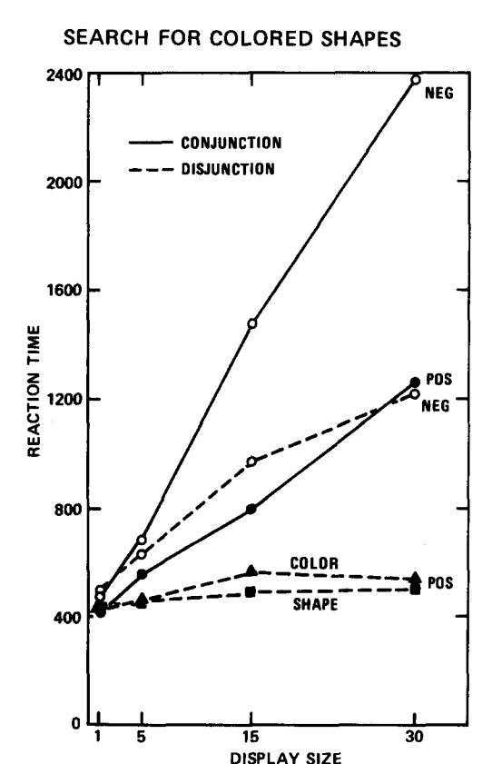
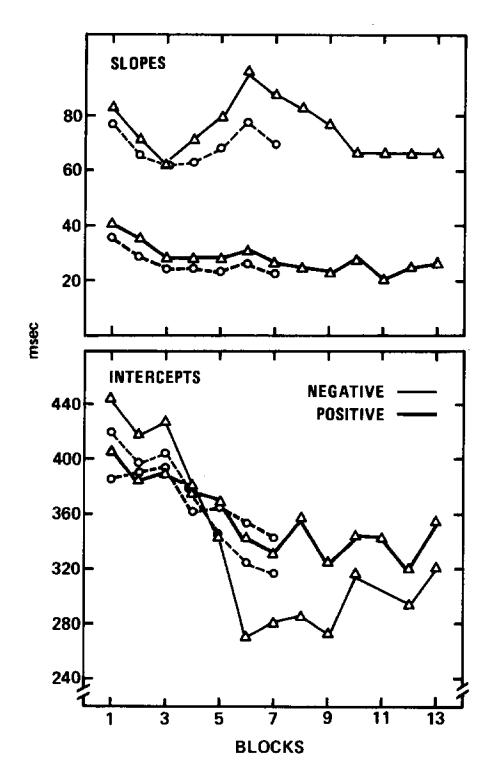
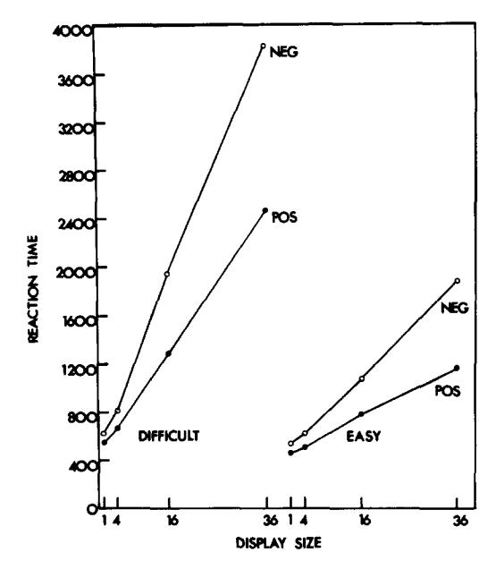
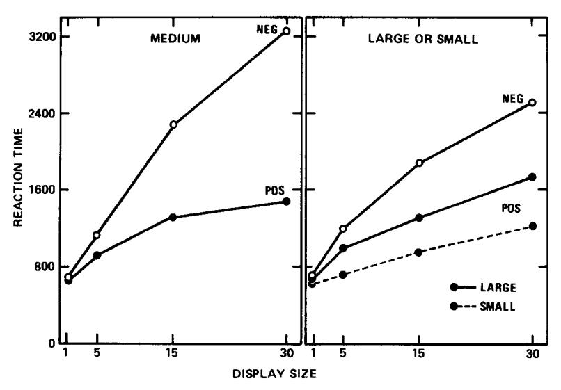
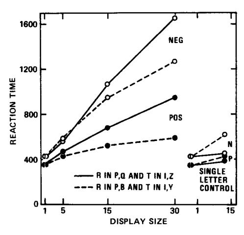

# A Feature-Integration Theory of Attention

## ANNE M. TREISMAN

University of British Columbia

#### AND

### GARRY GELADE

Oxford University

A new hypothesis about the role of focused attention is proposed. The feature-integration theory of attention suggests that attention must be directed serially to each stimulus in a display whenever conjunctions of more than one separable feature are needed to characterize or distinguish the possible objects presented. A number of predictions were tested in a variety of paradigms including visual search, texture segregation, identification and localization, and using both separable dimensions (shape and color) and local elements or parts of figures (lines, curves, etc. in letters) as the features to be integrated into complex wholes. The results were in general consistent with the hypothesis. They offer a new set of criteria for distinguishing separable from integral features and a new rationale for predicting which tasks will show attention limits and which will not.

When we open our eyes on a familiar scene, we form an immediate impression of recognizable objects, organized coherently in a spatial framework. Analysis of our experience into more elementary sensations is difficult, and appears subjectively to require an unusual type of perceptual activity. In contrast, the physiological evidence suggests that the visual scene is analyzed at an early stage by specialized populations of receptors that respond selectively to such properties as orientation, color, spatial frequency, or movement, and map these properties in different areas of the brain (Zeki, 1976). The controversy between analytic and synthetic theories of perception goes back many years: the Associationists asserted that the experience of complex wholes is built by combining more elementary sensations, while the Gestalt psychologists claimed that the whole precedes its parts, that we initially register unitary objects and relationships, and only later, if necessary, analyze these objects into their component parts or properties. This view is still active now (e.g., Monahan & Lockhead, 1977; Neisser, 1976).

The Gestalt belief surely conforms to the normal subjective experience

Address reprint requests to Anne Treisman, Department of Psychology, University of British Columbia, 2075 Wesbrook Mall, Vancouver, B.C. V6T 1W5, Canada. We are grateful to the British Medical Research Council, the Canadian Natural Sciences and Engineering Research Council, the Center for Advanced Study in the Behavioral Sciences, Stanford, California, and the Spencer Foundation for financial support, to Melanie Meyer, Martha Nagle, and Wendy Kellogg of the University of Santa Cruz for running four of the subjects in Experiment V, and to Daniel Kahneman for many helpful comments and suggestions.

of perception. However the immediacy and directness of an impression are no guarantee that it reflects an early stage of information processing in the nervous system. It is logically possible that we become aware only of the final outcome of a complicated sequence of prior operations. "Topdown" processing may describe what we consciously experience; as a theory about perceptual coding it needs more objective support (Treisman, 1979).

We have recently proposed a new account of attention which assumes that features come first in perception (Treisman, Sykes, & Gelade, 1977). In our model, which we call the feature-integration theory of attention, features are registered early, automatically, and in parallel across the visual field, while objects are identified separately and only at a later stage, which requires focused attention. We assume that the visual scene is initially coded along a number of separable dimensions, such as color, orientation, spatial frequency, brightness, direction of movement. In order to recombine these separate representations and to ensure the correct synthesis of features for each object in a complex display, stimulus locations are processed serially with focal attention. Any features which are present in the same central "fixation" of attention are combined to form a single object. Thus focal attention provides the "glue" which integrates the initially separable features into unitary objects. Once they have been correctly registered, the compound objects continue to be perceived and stored as such. However with memory decay or interference, the features may disintegrate and "float free" once more, or perhaps recombine to form "illusory conjunctions" (Treisman, 1977).

We claim that, without focused attention, features cannot be related to each other. This poses a problem in explaining phenomenal experience. There seems to be no way we can consciously "perceive" an unattached shape without also giving it a color, size, brightness, and location. Yet unattended areas are not perceived as empty space. The integration theory therefore needs some clarification. Our claim is that attention is necessary for the *correct* perception of conjunctions, although unattended features are also conjoined prior to conscious perception. The top-down processing of unattended features is capable of utilizing past experience and contextual information. Even when attention is directed elsewhere, we are unlikely to see a blue sun in a yellow sky. However, in the absence of focused attention and of effective constraints on top-down processing, conjunctions of features could be formed on a random basis. These unattended couplings will give rise to "illusory conjunctions."

There is both behavioral and physiological evidence for the idea that stimuli are initially analyzed along functionally separable dimensions, although not necessarily by physically distinct channels (Shepard, 1964; Garner, 1974; De Valois & De Valois, 1975). We will use the term "dimension" to refer to the complete range of variation which is separately

analyzed by some functionally independent perceptual subsystem, and "feature" to refer to a particular value on a dimension. Thus color and orientation are dimensions; red and vertical are features on those dimensions. Perceptual dimensions do not correspond uniquely to distinct physical dimensions. Some relational aspects of physical attributes may be registered as basic features; for example we code intensity contrast rather than absolute intensity, and we may even directly sense such higher-order properties as symmetry or homogeneity. We cannot predict a priori what the elementary words of the perceptual language may be.

The existence of particular perceptual dimensions should be inferred from empirical criteria, such as those proposed by Shepard and by Garner. This paper will suggest several new diagnostics for the separability of dimensions, which derive from the feature-integration theory of attention. In this theory, we assume that integral features are conjoined automatically, while separable features require attention for their integration. Consequently, we can infer separability from a particular pattern of results in the preattentive and divided attention tasks to be described in this paper.

We have stated the feature-integration hypothesis in an extreme form, which seemed to us initially quite implausible. It was important, therefore, to vary the paradigms and the predictions as widely as possible, in order to maximize the gain from converging operations. We developed a number of different paradigms testing different predictions from the theory. Each experiment on its own might allow other interpretations, but the fact that all were derived as independent predictions from the same theory should allow them, if confirmed, to strengthen it more than any could individually.

- (1) Visual search. The visual search paradigm allows us to define a target either by its separate features or by their conjunction. If, as we assume, simple features can be detected in parallel with no attention limits, the search for targets defined by such features (e.g., red, or vertical) should be little affected by variations in the number of distractors in the display. Lateral interference and acuity limits should be the only factors tending to increase search times as display size is increased, perhaps by forcing serial eye fixations. In contrast, we assume that focal attention is necessary for the detection of targets that are defined by a conjunction of properties (e.g., a vertical red line in a background of horizontal red and vertical green lines). Such targets should therefore be found only after a serial scan of varying numbers of distractors.
- (2) Texture segregation. It seems likely that texture segregation and figure-ground grouping are preattentive, parallel processes. If so, they should be determined only by spatial discontinuities between groups of stimuli differing in separable features and not by discontinuities defined by conjunctions of features.

- (3) Illusory conjunctions. If focused attention to particular objects is prevented, either because time is too short or because attention is directed to other objects, the features of the unattended objects are "free floating" with respect to one another. This allows the possibility of incorrect combinations of features when more than one unattended object is presented. Such "illusory conjunctions" have been reported. For example, the pitch and the loudness of dichotic tones are sometimes heard in the wrong combinations (Efron & Yund, 1974), and so are the distinctive features of dichotic syllables (Cutting, 1976). In vision, subjects sometimes wrongly recombine the case and the content of visual words presented successively in the same location (Lawrence, 1971). Treisman (1977) obtained a large number of false-positive errors in a successive same-different matching task when the shapes and colors of two target items were interchanged in the two test stimuli. Each such interchange also added a constant to the correct response times, suggesting that the conjunction of features was checked separately from the presence of those features.
- (4) Identity and location. Again, if focused attention is prevented, the features of unattended objects may be free floating spatially, as well as unrelated to one another. Thus we may detect the presence of critical features without knowing exactly where they are located, although we can certainly home in on them rapidly. Locating a feature would, on this hypothesis, be a separate operation from identifying it, and could logically follow instead of preceding identification. However, the theory predicts that this could not occur with conjunctions of features. If we have correctly detected or identified a particular conjunction, we must first have located it in order to focus attention on it and integrate its features. Thus location must precede identification for conjunctions, but the two could be independent for features.
- (5) Interference from unattended stimuli. Unattended stimuli should be registered only at the feature level. The amount of interference or facilitation with an attended task that such stimuli can generate should therefore depend only on the features they comprise and should not be affected by the particular conjunctions in which those features occur.

There is considerable evidence in speech perception that the meaning of unattended words can sometimes be registered without reaching conscious awareness (e.g., Corteen & Wood, 1972; Lewis, 1970; MacKay, 1973; Treisman, Squire, & Green, 1974). Since words are surely defined by conjunctions, the evidence of word-recognition without attention appears to contradict our hypothesis. However, the data of these studies indicate that responses to primed and relevant words on the unattended channel occurred only on 5-30% of trials. It may be possible for a response occasionally to be triggered by one or more features of an expected word, without requiring exact specification of how these features

are combined. One study has looked at false-positive responses to relevant words on un unattended channel (Forster & Govier, 1978). They found far more GSRs to words which sounded similar to the shock-associated word when these were presented on the unattended than on the attended channel. This suggests either incomplete analysis of unattended items or incomplete sensory data.

These predictions identify two clusters of results, corresponding to the perception of separable features and of conjunctions. Separable features should be detectable by parallel search; they are expected to give rise to illusory conjunctions in the absence of attention; they can be identified without necessarily being located, and should mediate easy texture segregation; they can have behavioral effects even when unattended. Conjunctions, on the other hand, are expected to require serial search; they should have no effect on performance unless focally attended; they should yield highly correlated performance in the tasks of identification and location; they should prove quite ineffective in mediating texture segregation. Our aim was to test these predictions using two dimensions, form and color, which are likely, both on physiological and on behavioral grounds, to be separable. If the predictions are confirmed, we may be able to add our tests to Garner's criteria, to form a more complete behavioral syndrome diagnostic of separable or integral dimensions. Thus, if two physical properties are integral, they should function as a single feature in our paradigms, allowing parallel search, texture segregation, and detection without localization. If on the other hand, they are separable, their conjunctions will require focused attention for accurate perception, and its absence should result in illusory conjunctions. We may then use these paradigms to diagnose less clear-cut candidates for separability, such as the components of letters or schematic faces.

The first three experiments are concerned with visual search; they compare color-shape conjunctions with disjunctive color and shape features as targets; they investigate the effects of practice and the role of feature discriminability in conjunction search, and test an alternative account in terms of similarity relations. Experiment IV explores the possibility that local elements of compound shapes (e.g., letters) also function as separable features, requiring serial search when incorrect conjunctions could be formed. Experiments V, VI, and VII are concerned with texture segregation, using colored shapes and letters as texture elements. Experiments VIII and IX explore the relation between identification and spatial localization, for targets defined by a single feature or by a conjunction.

## EXPERIMENT I

In an experiment reported earlier, Treisman et al. (1977) compared search for targets specified by a single feature ("pink" in "brown" and

"purple" distractors in one condition, "O" in "N" and "T" distractors in another) and for targets specified by a conjunction of features, a "pink O'' (Opink, in distractors Ogreen and Npink). The function relating search times to display size was flat or nonmonotonic when a single feature was sufficient to define the target, but increased linearly when a conjunction of features was required. Experiment I replicates this study with some changes in the design, to confirm and generalize the conclusions. The most important change was in the feature search condition: subjects were now asked to search concurrently for two targets, each defined by a different single feature: a color (blue) and a shape (S). Thus they were forced to attend to both dimensions in the feature condition as well as in the conjunction condition, although they had to check how the features were combined only when the target was a conjunction (Tgreen). The distractors were identical in the two conditions (Xgreen and Tbrown), to ensure that differences between feature and conjunction search could not result from greater heterogeneity of the distractors in the conjunction condition. (This had been a possibility in the previous experiment.)

Another question which has become important in evaluating information-processing hypotheses is how stably they apply across different stages of practice. Neisser, Novick, and Lazar (1963), Rabbitt (1967), and Shiffrin and Schneider (1977) have all shown qualitative changes in performance as subjects repeatedly perform a particular task. Search appears to change from conscious, limited capacity, serial decision making to automatic, fast, and parallel detection. LaBerge (1973) studied the effects of practice on priming in a visual successive matching task. He found that familiarity with the stimuli eventually made matching independent of expectancy, and suggested that this was due to unitization of the features of highly familiar stimuli. We propose that feature unitization may account also for the change with practice from serial to parallel processing in a display, in conditions in which such a change occurs. Thus the development of new unitary detectors for what were previously conjunctions of features would free us from the constraints of focal attention to these features both in memory and in a physically present display. Experiment I explored the possibility that extended practice on a particular shape-color conjunction (Tgreen) could lead to a change from serial to parallel detection, which would suggest the possible emergence of a unitary "green T" detector.

### Method

Stimuli. The stimulus displays were made by hand, using letter stencils and colored inks on white cards. The distractors were scattered over the card in positions which appeared random, although no systematic randomization procedure was used. Four different display sizes, consisting of 1, 5, 15, and 30 items were used in each condition. An area subtending  $14 \times 8^{\circ}$  was used for all display sizes, so that the displays with fewer items were less densely

packed, but the average distance from the fovea was kept approximately constant. Each letter subtended  $0.8 \times 0.6^{\circ}$ . To ensure that the target locations did not vary systematically across conditions, the area of each card was divided into eight sections. This was done by superimposing a tracing of the two diagonals and an inner elliptical boundary, which subtended  $8.5^{\circ} \times 5.5^{\circ}$ . For each condition and each display size, eight cards were made, one with a target randomly placed in each of the resulting eight areas (top outer, top inner, left outer, left inner, right outer, etc.). Another eight cards in each condition and display size contained no target.

The distractors in both conditions were  $T_{brown}$  and  $X_{green}$  in as near equal numbers on each card as possible. The target in the conjunction condition was  $T_{green}$ ; in the feature condition, it was either a blue letter or an S. The blue letter ( $T_{blue}$  or  $X_{blue}$ ) matched half the distractors in shape, and the S ( $S_{brown}$  or  $S_{green}$ ) matched half the distractors in color. The fact that there were four possible disjunctive targets in the feature condition (although the definition specified only "blue or S"), should, if anything, impair performance relative to the conjunction condition.

**Procedure.** The stimulus cards were presented in an Electronics Development three-field tachistoscope and RT was recorded as described below.

At the beginning of each trial, subjects viewed a plain white card in the tachistoscope, and each of their index fingers rested on a response key. The experimenter gave a verbal "Ready" signal and pressed a button to display a second white card bearing a central fixation spot, which remained in view for 1 sec and was then immediately replaced in the field of view by a card bearing a search array. Subjects were instructed to make a key press with the dominant hand if they detected a target and with the nondominant hand otherwise, and to respond as quickly as possible without making any errors. RT was recorded to the nearest millisecond on a digital timer [Advance Electronics, TC11], which was triggered by the onset of the search array and stopped when a response key was pressed. Trials on which an error was made were repeated later in the testing session, and following each error a dummy trial was given, the results of which were not recorded. Subjects were told their RT and whether or not they were correct after each trial; they were not however informed of the dummy trials procedure, the purpose of which was to exclude slow posterror responses from the data.

Each subject was tested both on conjunctions and on features in separate sessions following an ABBAAB order. Half the subjects began with the feature targets and half with the conjunction targets. Six subjects did 3 blocks of 128 trials each in each condition, then two of these subjects volunteered to continue for another 4 blocks in the conjunction condition and two for another 10 blocks, making 13 altogether (a total of 1664 trials). The mean RTs for these two subjects on the first 3 blocks closely approximated the group means.

Within each block the presentation order of positive and negative trials and of different display sizes was randomized; thus in each block the subject knew what the target or the two alternative targets were, but did not know what the array size would be on any given trial. Each block contained 16 positive and 16 negative trials for each display size.

Subjects. The six subjects, four men and two women, were members of the Oxford Subject Panel, ages between 24 and 29. Three of them had previously taken part in the search experiment described in Treisman et al. (1977).

#### Results

Figure 1 shows the mean search times for the six subjects over the second and third blocks in each condition; the first block was treated as practice. Table 1 gives the details of linear regression analyses on these data. The results show that search time increased linearly with display

## Fig. 1. Search times in Experiment I.

size in the conjunction condition, the linear component accounting for more than 99% of the variance due to display size. The ratio of the positive to the negative slopes in the conjunction condition was 0.43, which is quite close to half. These results suggest that search is serial and self-terminating with a scanning rate of about 60 msec per item. The variances increased more steeply for positive than for negative trials, and for positives the root mean square of the RTs increased linearly with display size as predicted for serial self-terminating search.

With the feature targets, the results were very different. For the positive displays, search times were hardly affected by the number of distractors, the slopes averaging only 3.1 msec. Deviations from linearity were significant, and the linear component accounted for only 68% of the variance due to display size. For the negatives, the linear component accounted for 96% of the variance due to display size, and departures from linearity did not reach significance. The slope was, however, less than

|                  |           | Slope | Intercept | Percentage variance with display size which is due to linearity |
|------------------|-----------|-------|-----------|-----------------------------------------------------------------------|
| <u> </u>         | Positives | 28.7  | 398       | 99.7                                                                  |
| Conjunction      | Negatives | 67.1  | 397       | 99.6                                                                  |
| Feature mean  | Positives | 3.1   | 448       | 67.9 n                                                     |
| mean             | Negatives | 25.1  | 514       | 96.6                                                                  |
| Feature color | Positive  | 3.8   | 455       | 61.04                                                                 |
| Feature shape    | Positive  | 2.5   | 441       | 78.5                                                                  |

TABLE 1

Linear Regressions of Reaction Times on Display Size in Experiment I

half the slope for conjunction negatives. The ratio of positive to negative slopes with feature targets was only 0.12. In both conditions, all subjects showed the same pattern of results, with individuals varying mainly in the absolute values of slopes and intercepts.

Errors in the feature condition averaged 2.2% false positives and 2.1% false negatives; for the conjunction condition there were 0.8% false positives and 4.9% false negatives. There were no systematic effects of display size on errors, except that false negatives in the conjunction condition were higher for display size 30 than for 15, 5, or 1 (8.2% compared to 3.8%). The highest mean error rate for an individual subject was 5.5% in the conjunction condition and 3.5% in the feature condition.

It is important to the theory that the difference between conjunction and feature conditions is present only when more than one stimulus is presented. The mean positive RT for display size 1 was 422 msec for the conjunction targets, compared to 426 msec for shape and 446 msec for color in the feature condition. The negatives with display size 1 were also faster in the conjunction than in the feature conditions, 473 msec compared to 500 msec. Thus the difficulty of search for conjunctions arises only when more than one stimulus is presented.

The effects of practice on conjunction search are shown in Fig. 2. The positive slopes and intercepts decrease over the first 7 blocks and change little for the remaining 6 blocks. The negative slopes fluctuate across the first 9 blocks and stabilize at block 10. Both positive and negative slopes remained linear throughout: the proportion of the variance with display

&quot; Cases where deviations from linearity are significant at p < .01. The positive shape feature also deviates considerably from linearity, but the significance level here is only .08.

FIG. 2. The effects of practice on the slope and intercept of the function relating search time to display size. (The dotted lines are the data for the four subjects who did 7 sessions and the solid lines for the two subjects who continued for 13 sessions.)

size that was due to linearity was above 0.99 in every block except positive blocks 3 and 12, when it was 0.98 and 0.97, respectively. Thus there is little indication of any change in the pattern of results and no sign of a switch from serial to parallel search over the 13 blocks of practice. The mean results for the two subjects who volunteered for this extensive practice were typical of the group as a whole on blocks 2 and 3 (negative and positive slopes of 67 and 31, respectively, compared to the group means of 67 and 29; intercepts 423 and 389 compared to 397 and 398).

### Discussion

We suggested that focal attention, scanning successive locations serially, is the means by which the correct integration of features into multidimensional percepts is ensured. When this integration is not required by the task, parallel detection of features should be possible. The results, especially on positive trials, fit these predictions well. Despite the major changes in the feature search condition between this experiment and the

earlier one (Treisman et al., 1977), the results are almost identical. The requirement to search for values on two different dimensions instead of one on each trial produced no qualitative and almost no quantitative change in performance; neither did the greater heterogeneity of the distractors. In both experiments the display was apparently searched spatially in parallel whenever targets could be detected on the basis of a single feature, either color or shape. Another important difference between the conjunction and the feature conditions is the difference in the relation between positive and negative displays. The slope for conjunction positives is about half the slope for the negatives, suggesting a serial self-terminating search. In the reature condition, however, the slope ratio is only 1/8, and the function is linear only for the negatives. This suggests that with single feature targets, a qualitatively different process may mediate the responses to positive and to negative displays. If the target is present, it is detected automatically; if it is not, subjects tend to scan the display, although they may not check item by item in the strictly serial way they do in conjunction search.

Practice for up to 13 sessions on the same target and distractors produced no qualitative changes in performance in conjunction search, no decrease in linearity, and no systematic decrease in either slope or intercept after about the seventh session. We had been interested in seeing whether practice could lead to unitization, in the sense of developing a special detector for the conjunction of green and "T," which could allow a change to parallel search. It is of course possible that longer practice, different stimuli, or a different training method could result in a change to parallel search. The present experiment, however suggests that unitization of color and shape is difficult and may be impossible to achieve. There may be built-in neural constraints on which dimensions can be unitized in this way.

## EXPERIMENT II

The next experiment explores the relation between the discriminability of the features which define a conjunction and the speed of detecting that conjunction as a target in a display. If each item must be scanned serially in order to determine how its features are conjoined, it should be possible to change the slope relating search time to display size, by slowing the decision about the features composing each item. Thus by making the two shapes and the two colors in a conjunction search easier or harder to distinguish, we should be able to change the rate of scanning while retaining the characteristic serial search pattern of linear slopes and the 2/1 ratio of negative to positive slopes. We compared search for a conjunction target in distractors which were similar to each other ( $T_{\rm green}$  in  $X_{\rm green}$  and  $T_{\rm blue}$ ) and in distractors which differed maximally from each other ( $O_{\rm red}$  in

 $O_{green}$  and  $N_{red}$ ). The decisions whether each item had the target color and the target shape should be easier for O versus N and red versus green than for T versus X and green versus blue. (We chose green and blue inks which were very similar to each other.)

A second question we investigated in this experiment was whether the previous results depended on the haphazard spatial arrangement of the items in the display. In this experiment, the letters were arranged in regular matrices of  $2 \times 2$ ,  $4 \times 4$ , and  $6 \times 6$ . The mean distance of the letters from the fixation point was equated, so that density again covaried with display size, but acuity was again approximately matched for each condition.

### Method

Subjects. Six subjects (three females and three males) volunteered for the experiment which involved a test and re-test session. They were students and employees of the University of British Columbia ages between 16 and 45. They were paid \$3.00 a session for their participation.

Apparatus. A two-field Cambridge tachistoscope connected to a millisecond timer was used. The stimuli consisted, as before, of white cards with colored letters. Displays contained 1, 4, 16, or 36 items. The letters were arranged in matrices of  $2 \times 2$ ,  $4 \times 4$ , or  $6 \times 6$  positions. For the displays of 1 item each of the positions in the  $2 \times 2$  matrix was used equally often. The  $6 \times 6$  display subtended  $12.3 \times 9.7^{\circ}$ ; the  $4 \times 4$  matrix subtended  $9.7 \times 9.7^{\circ}$  and the  $2 \times 2$  matrix subtended  $7 \times 7^{\circ}$ . The mean distance of items from the fixation point was about  $4.3^{\circ}$  for all displays. Sixteen different cards, of which 8 contained a target, were made for each display size in each condition. In the easy condition, the distractors were  $O_{green}$  and  $N_{red}$  and the target was  $O_{red}$ . In the difficult condition, the distractors were  $T_{blue}$  and  $X_{green}$  and the target was  $T_{green}$ . The target was presented twice in each display position for the displays of 1 and 4, in half the display positions for displays of 16 (twice in each row and twice in each column), and twice in each  $3 \times 3$  quadrant for the displays of 36.

#### Results

Figure 3 shows the mean RTs in each condition. The details of the linear regressions are given in Table 2. None of the slopes deviates significantly from linearity, which accounts for more than 99.8% of the variance due to display size in every case. The ratio of positive to negative slopes is 0.52 for the easy stimuli and 0.60 for the difficult ones. The slopes in the difficult discrimination are nearly three times larger than those in the easy discrimination, but the linearity and the 2/1 slope ratio is preserved across these large differences. The intercepts do not differ significantly across conditions.

Error rates were higher in the difficult discrimination condition. Two subjects were dropped from the experiment because they were unable to keep their false-negative errors in the large positive displays in this condition below 30%. For the remaining subjects, errors averaged 5.3% for the difficult discrimination and 2.5% for the easy discrimination. They were not systematically related to display size except that the difficult positive

Fig. 3. Search times in Experiment II.

displays of 16 and 36 averaged 5.9 and 20.7% false-negative errors, respectively, compared to a mean of 2.2% errors for all other displays.

## Discussion

In both conditions we have evidence supporting serial, self-terminating search through the display for the conjunction targets. The slopes are linear and the positives give approximately half the slope of the negatives. However, the rates vary dramatically: The more distinctive colors and

TABLE 2

Linear Regressions of Search Times against Display Size in Experiment II

|                          |           | Slope | Intercept | Percentage variance with display size which is due to linearity |
|--------------------------|-----------|-------|-----------|-----------------------------------------------------------------------|
| Difficult discrimination | Positives | 55.1  | 453       | 99.8                                                                  |
|                          | Negatives | 92.4  | 472       | 99.9                                                                  |
| Easy discrimination   | Positives | 20.5  | 437       | 99.8                                                                  |
|                          | Negatives | 39.5  | 489       | 99.9                                                                  |

shapes allow search to proceed nearly three times as fast as the less distinctive. The mean scanning rate of 62 msec per item obtained in the conjunction condition of Experiment I lies between the rates obtained here with the confusable stimuli and with the highly discriminable stimuli. This wide variation in slopes, combined with maintained linearity and 2/1 slope ratios, is consistent with the theory, and puts constraints on alternative explanations. For example, we can no longer suppose that search becomes serial only when it is difficult. The need for focused attention to each item in turn must be induced by something other than overall load. The fact that the intercepts were the same for the easy and the difficult conditions is also consistent with the theory.

Experiment I used pseudo-random locations for the targets and distractors. The present experiment extends the conclusions to displays in which the stimuli are arranged in a regular matrix. The serial scan is therefore not induced by any artifact of the locations selected or by their haphazard arrangement.

### EXPERIMENT III

Experiment III explores an alternative explanation for the difference between conjunction and feature targets. This attributes the difficulty of the conjunction condition to the centrality of the target in the set of distractors: a conjunction target shares one or another feature with every distractor in the display, while each disjunctive feature target shares a feature with only half the distractors (see Fig. 4). In this sense, the conjunction targets are more similar to the set of distractors than the feature targets.

We replicated this aspect of the similarity structure, but using unidimensional stimuli in which checking for conjunctions would not be necessary. We compared search times for a single unidimensional target, which was intermediate between two types of distractors on the single relevant dimension, with search times for either of two disjunctive

| DISJUNCTIVE  | NON-      | CONJUNCTION  | NON-      | DISJUNCTIVE |
|--------------|-----------|--------------|-----------|-------------|
| TARGET       | TARGET    | TARGET       | TARGET    | TARGET      |
| GREEN 'S' | GREEN 'X' | GREEN 'T' | BROWN T'  | BLUE T'  |
| DISJUNCTIVE  | NON-      | MEDIUM       | NON-      | DISJUNCTIVE |
| TARGET       | TARGET    | TARGET       | TARGET    | TARGET      |
| 0            | 0         | 0            | $\bigcup$ |             |

Fig. 4. Similarity relations between the stimuli in Experiments I and III.

targets, each of which was similar only to one of the distractors. We used ellipses varying in size in steps that were subjectively approximately equal, as shown in Fig. 4. If similarity to both types of distractors instead of only one type is the critical variable, the ellipses should show the same pattern of results as the colored shapes: serial for the intermediate target and parallel for the disjunctive large or small targets. The results should also be of some general interest for the theoretical analysis of search and the effects of different similarity relationships between target(s) and distractors.

### Method

Stimuli. These were the same as in Experiment I except for the following substitutions: black ellipses of sizes  $1.0 \times 0.3$  and  $2.0 \times 0.6^{\circ}$  replaced the distractors; ellipses of sizes  $0.6 \times 0.18$  and  $0.5 \times 0.8^{\circ}$  replaced the disjunctive targets and an ellipse of size  $0.4 \times 0.4^{\circ}$  replaced the conjunction target. These sizes were selected after a pilot experiment on three subjects, sampling a wider range of sizes, had determined that the mean RT in a same-different matching task was approximately the same for discriminating the medium-sized target from each of the two distractors as it was for discriminating the large and small targets from the nearest distractor (a mean difference of only 15 msec).

*Procedure*. This was also the same as in Experiment I except that each subject did only three blocks in each condition; we did not investigate the effects of extended practice.

Subjects. The six subjects were drawn from the same panel as those in Experiment I, and three of them had actually taken part in Experiment I.

### Results and Discussion

The mean search times are shown in Fig. 5. All the functions relating latency to display size are negatively accelerated. Deviations from linearity were significant for the large and small negatives (p < .05) and for the intermediate positives (p < .01) and approached significance for the large positives and intermediate negatives (p = .12 and .10, respectively). The pattern of results is quite different from that obtained with the color-shape conjunctions and disjunctive features. With ellipses the intermediate target, which is most "central" in terms of similarity, gives the least linear detection function, and its detection times lie between those for the large and small targets. With negative displays the intermediate targets did produce a steeper function than the large and small targets. A different process may again be mediating positive and negative search times. When subjects are least confident in deciding that the target is absent, they may be most inclined to check the distractors serially before responding "No." The important point for the present theory is that when the intermediate target is present, its detection does not depend on a serial check of the distractors, whereas detection of the color-shape conjunction did. This rules out an explanation of the conjunction effect in terms of the "centrality" of the target to the set of distractors.

The results also reinforce the important conclusion that the difference

### SEARCH FOR ELLIPSES

Fig. 5. Search times in Experiment III.

between conjunctions and disjunctions cannot be attributed simply to their relative difficulty. Search for the intermediate ellipses was considerably slower on average than for the color—shape conjunctions, yet the relation of latency to display size was linear for the conjunctions, and not for the ellipses. When a single feature (size) defines the target, search can be slow but need not be serial in the sense of checking each item in turn.

Clearly, with search times which were sometimes as long as 3 sec for the ellipses, some aspects of processing are likely to be serial. Subjects certainly changed fixation and scanned the display with their eyes, so that different areas of the display received foveal processing successively. In this sense processing was serial. However, serial eye fixations do not imply serial decisions about each item, one at a time, and we believe the two patterns have different theoretical implications which are worth distinguishing. Serial fixations will be made when the discriminations require foveal acuity, either because they are below threshold with peripheral vision or because there is some form of lateral interference which increases towards the periphery. However, within each successive fixation it is at least logically possible that the whole display receives parallel processing, the foveal areas receiving the most detailed sensory information, but all or many stimuli being checked simultaneously. Since density increased with number of items in the present experiment, more stimuli would on average have been within foveal vision for each fixation with the

larger display sizes, allowing the number that could be accurately processed in parallel to increase with display size. This would result in the negatively accelerated functions that we obtained.

These findings suggest that there are at least two ways in which a search task can be difficult, and in which its difficulty can interact with display size: (1) The difficulty can arise, as with the ellipses, because the targets and distractors are difficult to discriminate and therefore require serial fixations with foveal vision. This can occur either with unidimensional variation or with conjunctions. (2) A search task that requires the identification of conjunctions depends on a more central scan with focused attention, which deals serially with each item rather than with each spatial area foveally fixated. In this case the difficulty should be restricted to conditions in which more than one item is presented, allowing the possibility of feature interchanges or "illusory conjunctions." Retinal area should have no effect, within the limits set by acuity. Only the number of items should affect search times, and not their density or spatial distribution.

### EXPERIMENT IV

The next experiment explores the possibility that local elements or parts of shapes function as separable features which must be integrated by focused attention whenever their conjunctions are relevant to the task. In particular we were interested to discover whether integrative attention is required even with highly familiar stimuli, such as letters of the alphabet, or whether letters function as integral perceptual units, which can be registered by unitary "detectors." Treisman et al. (1977) obtained evidence that schematic faces are treated as conjunctions of local features (e.g., eyes and mouth). These apparently required a serial check both in the display and in memory whenever a conjunction error could occur. Moreover conjunction errors actually occurred on about 20% of trials when the response was made too quickly. Faces had seemed good candidates for Gestalt or wholistic recognition. However, the schematic faces we used were unfamiliar as units, and the varied permutation of a fixed limited set of features may have increased the likelihood that features would be processed separably. Letters are both simpler and more familiar.

Letters have long been controversial units in perceptual theory. There have been arguments (1) over whether they are decomposed into features and (2) over whether the letters themselves are processed serially or in parallel. LaBerge (1973), for example, suggests that our great familiarity with letters has "unitized" them, so that they no longer require "attention," but can be automatically registered as wholes. Gibson (1971) on the other hand argues from confusion errors that letter features do have

psychological reality as perceptual elements. Gardner (1973) showed that parallel detection of letters is possible when target and background letters are easily discriminable; he attributes any effects of display size to an increased risk of confusions at the decision level. Estes (1972) however, argues that there are inhibitory effects at the feature level which reduce perceptual efficiency as the number of items increases.

Integration theory should tie the two questions together, and predict that letters will be processed serially only if (a) they are analyzed into separate features and (b) these are interchangeable to form conjunction errors in the particular task the subject is given. Moreover, we would distinguish two senses of confusability. In one sense, letters would be difficult to search when they are similar in a wholistic way. They might then require successive foveal fixations and produce results analogous to those we obtained with the ellipses in Experiment III. Search for "R" in a background of "P"s and "B"s might be a task which reflects confusability in this sense. In another sense, sets of letters would be confusable if their features were interchangeable and could potentially give rise to illusory conjunctions. In this case each letter should be checked serially, giving linear rather than negatively accelerated search functions. For example, "P" and "Q" could form an illusory "R" if the diagonal of the "Q" is registered as a separable feature. Search for "R" in a background of "P"s and "Q"s should therefore be serial, if (a) our hypothesis about the role of focal attention is correct, and (b) these component features are in fact registered as separable elements.

Wolford (1975) has proposed a perturbation model of letter identification which shares some assumptions with our hypothesis. He suggests that features of shapes are registered by parallel independent channels and are then grouped and serially identified as letters. The features have some probability of interchange depending on both distance and time. These perturbations can give rise to identification errors if they alter the set of features in a particular location sufficiently to change which letter is best predicted from those features. The integration model differs from that of Wolford in several ways: (1) It is more general in that it applies to dimensions like shape and color as well as to the local elements of letters. (2) We claim that serial processing is necessary only when feature sets must be spatially conjoined; some sets of letters could therefore be identified in parallel. (3) The relative locations of different features with respect to each other are initially indeterminate, even with the display physically present, and remain so if focused attention to them is prevented. For Wolford, on the other hand, the features are initially localized and their locations are gradually lost by a random walk process in memory when the display is no longer present. (4) Spatial uncertainty in our model depends on the distribution of attention rather than on retinal distance and

time, so that feature interchanges can occur either within or outside the momentary focus of attention but not across its boundary. (5) Finally, we make further related predictions about the role of attention, suggesting, for example, that preattentive processing (in texture segregation) and nonattentive processing (in focused attention tasks) will reflect distinctions only at the feature and not at the conjunction level.

The next experiment contrasts the effects of conjunction difficulties with those of interitem similarity on visual search for letters. We used two sets of letters which could result in conjunction errors if their features were interchanged. Subjects were to search for a target "R" in a background of Ps and Qs (R/PQ), and for a target T in a background of "Z"s and "I"s (T/ZI). To simplify exposition, we will refer only to the R/PQ set, but equivalent procedures were also applied for the T/ZI set. We contrasted the conjunction condition with a control condition in which the similarity of target and distractors was greater. For this similarity control, we replaced one of the distractors (O) with a letter ("B") which, on its own, is more confusable with the target, but whose features could not recombine with the other distractor (P) to form an illusory target. We also ran a control condition with a single type of distractor to check that similarity effects were in the predicted direction: Thus we compared the speed of search for R in Os alone with search for R in Bs alone. Finally we ran a control for distractor heterogeneity. A possible artifact in the main experiment was the greater difference between the two distractors in the conjunction condition (PO) than in the similarity condition (PB). This heterogeneity might make them harder to "filter out" or to reject as irrelevant. We therefore ran a condition using the same distractors as we used in the conjunction condition (P and Q) but with a target (T) which could be distinguished by a single feature (horizontal line).

In addition, we collected pilot data on several other sets of letters, to check on the generality of the results with the two sets used in the main experiment. We compared search for conjunction targets N/VH, E/FL, and Q/OK with search for more similar targets which did not require conjunction checks, N/VW, E/FT, and Q/OG.

It is not clear what Wolford's model would predict for our tasks: Since the displays were physically present until the subject made his response, feature interchanges should probably not occur. If they did, they would lead to errors with the conjunction displays (R/PQ and T/IZ). However there should also be errors arising from the greater number of shared features between distractors and targets in the similarity sets (R/PB and T/IY). It is not clear either how these predicted error rates should differ, or more important, how the relative accuracy would translate into different search latencies given unlimited exposure times. Wolford assumes that the time it takes to process a letter depends on the amount of infor-

mation required. If search for R in Qs alone is faster than for R in Bs alone, it is difficult to see how this would reverse when the Qs are presented together with Ps.

### Method

Stimuli. Sets of cards were prepared for tachistoscopic display in the same way as for Experiment I, with only the following changes. The letters were all drawn in black ink. There were four main conditions: target R in mixed distractors Ps and Qs (R/PQ); target R in Ps and Bs (R/PB); target T in Is and Zs (T/IZ); target T in Is and Ys (T/IY). We selected these letters after considering the matrices of letter confusion errors collected by Townsend (1971), Fisher, Monty, and Glucksberg (1967), Hodge (1962), and Pew and Gardner (1965). Pooling all these tables, we found that R was confused with Q 6 times and with B 61 times, and T was confused with Z 20 times and with Y 107 times. The other two distractors, P and I, were the same in the conjunction and the similarity conditions.

Eight further single letter control cards were made for each condition, containing either 15 identical distractors (Qs, Bs, Zs or Ys) or 14 distractors and one target (R or T, respectively). Finally, a set of cards with target T in distractors P and Q was also made, to be used in the heterogeneity control condition.

Subjects. The subjects were members of the Oxford subject panel, ages between 24 and 29. Six took part in the main experiment with conjunction and similarity conditions; four of them had previously taken part in one of the "search" experiments for colored letters. Two of these and four new subjects were subsequently tested in the heterogeneity control condition.

**Procedure.** For the main experiment, the sequence of events within each trial was the same as in Experiment I. Each session, lasting about 1 hr, tested only one of the two target letters, but included, in separate blocks, all the conditions for that target letter—the conjunction condition (C), the similarity condition (S), and the two controls with a single type of distractor (labeled by lower case c and s). The different display sizes in any one condition were presented in random order within each block. The order in which the conditions were given was counterbalanced across subjects, but the two control conditions each preceded or succeeded the appropriate experimental condition. Thus there were four possible orders within a session: CcSs, cCsS, SsCc, and sScC. Each subject did at least six sessions, three with target R and three with target T in the order RTTRRT reversing the order of conditions within sessions on the third and fifth sessions. Two subjects did a further two sessions, one with each target letter in the order TR, because the early results on these subjects suggested that they had not developed a consistent strategy in the similarity condition. We were interested in comparing search which could use a single feature with search that required conjunction detection, so we decided after the first four sessions on these two subjects to instruct them and future subjects to use a consistent strategy of searching for a distinctive feature when this was possible.

The heterogeneity control experiment consisted of 4 blocks of search for T/PQ and for T in 15 Ps alone and T in 15 Qs alone, following the same within-block orders as in the main experiment.

### Results

Figure 6 shows the mean search times in the last two sessions for each condition of the main experiment, averaged over the R and T replications. Linear regressions were carried out on the search times for each letter set; the results are given in Table 3. Deviations from linearity were significant (p < .01) and p < .05 for the similarity positives, R/PB and T/IY, respec-

### LETTER SEARCH

Fig. 6. Search times in Experiment IV.

tively. Errors averaged 3.5% and were less than 7% in every condition except the positives in the conjunction condition with display size 30, where they increased to 15.5% false negatives. These errors were on average 539 msec slower than the correct detections in the same blocks and conditions. Thus if subjects had continued to search until they found the target, the mean search time in this condition would have been 84 msec longer  $(0.155 \times 539)$ , improving the linearity of the function.

The ratio of positive to negative slopes differed for the conjunction and the similarity conditions: for the conjunctions it was 0.45, which is close to half and suggests a serial self-terminating search. For the similarity condition it was much lower (0.26), as it was with the single feature color

TABLE 3

Linear Regressions of Search Times against Display Size in Experiment IV

|               |      | Positives |           | Negatives |           |
|---------------|------|-----------|-----------|-----------|-----------|
|               |      | Slope     | Intercept | Slope     | Intercept |
| Conjunction   | T/IZ | 12.2      | 363       | 34.7      | 349       |
| -             | R/PQ | 27.2      | 362       | 52.1      | 388       |
| Similarity    | T/IY | 5.3       | 363       | 18.1      | 417       |
|               | R/PB | 9.7       | 403       | 40.5      | 446       |
| Heterogeneity |      |           |           |           |           |
| control       | T/PQ | 4.9       | 340       | 20.5      | 386       |

or shape targets in Experiment I, suggesting again that different processes determined the positive and negative decisions.

The control conditions, in which subjects searched for the same target letters in a background containing only one type of distractor, reversed the relative difficulty of the two conditions. The conjunction controls, R/Q and T/Z, were faster than the similarity controls, R/B and T/Y (t(7) = 3.69, p < .02). The effects of similarity were therefore in the predicted direction, when they were not competing with the conjunction effect.

The heterogeneity control condition, T/PQ, gave results very like those obtained in the similarity condition, T/YI. We can therefore reject the alternative explanation of the conjunction results, which attributed them greater heterogeneity of the distractors.

Finally, the pilot data on three additional sets of conjunction letters (N/VH, E/FL, Q/OK) and similarity letters (N/VW, E/FT and Q/OG) gave results that were clearly in the same direction. With display size 30 (the only one tested), we obtained the following mean times: conjunction positives 1330; conjunction negatives 1754; similarity positives 674; similarity negatives 974.

### Discussion

We suggested that letter search would be serial and self-terminating if the particular sets of distractor and target letters were composed of perceptually separable features which could be wrongly recombined to yield conjunction errors. Otherwise search could be parallel (although not necessarily with unlimited capacity and no interference). The predicted pattern was therefore a linear increase with display size in search times for the R/PQ and T/ZI sets, with positive slopes equaling half the negative slopes, and either a flat function or a nonlinearly increasing function for the R/PB and T/YI sets. The results on positive trials were consistent with these predictions. On negative trials, no departures from linearity reached significance, although the functions relating search time to display size were less steep and less linear for the similarity than for the conjunction letter sets. Most interesting is the interaction between the single distractor controls (P/O, P/B, T/Z, T/Y) and the two-distractor experimental conditions (P/QR, P/BR, T/ZI, T/YI): with the single distractor controls, search times were clearly slower and more affected by display size in the similarity conditions (P/B and T/Y), while with the two-distractor displays the conjunction conditions (P/QR and T/ZI) were much slower. Thus the situation was crucially changed in the absence of a unique identifying feature for the target and when, according to our theory, the possibility of coniunction errors was introduced.

There was a large overall difference in the rate of search between the R and the T sets. This makes the replication of the pattern of results across the two sets all the more striking. The change from linear functions with

conjunctions to nonlinear functions with the similarity controls again appears to be independent of the level of difficulty, over a wide range; the search rate is approximately doubled for T compared to R and is about as fast for the T conjunctions as for the R similarity set. We cannot therefore attribute the difference between conjunctions and similarity controls to the overall level of difficulty or to a general demand for capacity.

It is interesting that our hypothesis about the role of focal attention in integrating separable features appears to hold not only with arbitrary pairings of colors and shapes, or with unfamiliar schematic faces (Treisman et al., 1977), but also with highly familiar, potentially "unitized" stimuli like letters. These results suggest that it may be crucial in experiments using letters or digits to distinguish sets which could form illusory conjunctions from sets which could not.

The finding that the similarity or confusability of individual items is not the only, or even the most powerful variable controlling search throws doubt on the adequacy of models such as those of Gardner (1973) and Estes (1972). The effects that have been attributed to similarity or confusability could in some cases have been due to a greater risk of conjunction errors; "similar" letters are more likely to share separable features, which could be interchanged to form different letters. These effects need to be tested separately before appropriate explanations can be developed.

Wolford's perturbation model (1975), like ours, specifically allows the possibility of conjunction errors. It could therefore predict lower accuracy for the conjunction condition, if displays were brief and response times unlimited. It is less easy, however, to derive from Wolford's model the prediction that search times should be linearly related to display size only for conjunction targets, in a task in which the displays remained physically present until the subject responded, or to see why they should contrast with the negatively accelerated functions for similar letters, even across very different levels of overall difficulty.

Although long-term familiarity with letters seems not to eliminate the conjunction effect, specific practice in particular search tasks may do so. Shiffrin and Schneider (1977) found that subjects could learn to search in parallel for a particular set of letters, provided that targets and distractors never interchanged their roles. In terms of our model, two explanations could be offered: Either subjects within the particular experimental context eventually set up unitary detectors for each of the targets, eliminating the need to check conjunctions; or they eventually learned a set of disjunctive features which distinguished the targets from the distractors (e.g., even for the very similar sets of letters GMFP and CNHD the tail of the G, the right-sloping diagonal of the M, the parallel horizontals of the F, and the small closed curve of the P are a possible set of disjunctive features which could function as the disjunctive "blue" or "curved" features did in our Experiment I). This account could be tested by seeing

whether, after extended practice, the targets function as unitary features in the other paradigms we have studied, for example texture segregation (Experiment V) and target localization (Experiment VIII).

An apparent difficulty for the integration model arises from the flat functions of search time against display size obtained when subjects search for letters in digits or digits in letters (Jonides & Gleitman, 1972; Shiffrin & Schneider, 1977). It should be stressed that our model predicts serial search only when targets must be identified by specifying conjunctions of features, and when no disjunctive set of features can be found that discriminate targets from distractors. There may be disjunctive features which distinguish most digits from most letters; for example digits tend to be narrower, asymmetrical, open to the left, and to have shorter contours than letters. However, Jonides and Gleitman obtained the category effect using a single physical target O and calling it either "zero" or "oh". The objective features of the target must have been the same here, whether search was within or between categories; but, as Gleitman and Jonides (1976) point out, subjects could have adopted different strategies in the two conditions. The present analysis suggests that subjects may have used a single feature for the between-category condition (e.g., symmetry for oh in digits), and a conjunction of features (e.g., closed and curved) for the within-category conditions. White (1977) has shown that the category effect disappears when digits and letters are typed in a number of different type-faces, so that their physical features are less consistent and offer less reliable cues to discriminate the categories.

## EXPERIMENT V

The next experiment investigates the "preattentive" segregation of groups and textures, which could guide the subsequent direction of attention. Early detection of boundaries is a primary requirement in perception (Neisser, 1967). Before we can identify an object, we must separate it from its background. If texture segregation does depend on the early parallel registration of homogeneities, integration theory predicts easy segregation when areas differ in one or more simple, separable features, and not when they differ only in conjunctions of features. We tested this prediction using different arrangements of color and shape (chosen again as clear exemplars of separable dimensions). We used the same elements in each condition ( $O_{red}$ ,  $V_{red}$ ,  $O_{blue}$ , and  $V_{blue}$ ), but grouped them differently in the three conditions. In the feature conditions the boundary divided red items from blue ones or Os from Vs, while in the conjunction condition, it divided  $O_{red}$  and  $V_{blue}$  from  $V_{red}$  and  $O_{blue}$ .

### Method

Stimuli. These were 3 by 5-in cards with stenciled red and blue letters arranged in a square matrix of five rows by five columns. The items were red and blue Os and Vs, about

0.7 cm high and wide, their centers spaced 1.0 cm apart both vertically and horizontally. The task used was card sorting; the visual angle subtended by the letters was therefore variable but averaged about  $1.3^{\circ}$ . The matrix was divided into two groups of letters by an imaginary horizontal or vertical boundary which divided two rows or columns from the other three. The boundary was placed equally often on the left and right sides of the middle column and immediately above or below the middle row. In the color condition, all the items to one side of the boundary were  $O_{\rm red}$  and  $V_{\rm red}$  (randomly mixed but in as near equal numbers as possible) and all the items to the other side were  $O_{\rm blue}$  and  $V_{\rm blue}$ . In the shape condition, the division was between  $O_{\rm red}$  and  $O_{\rm blue}$  on one side and  $V_{\rm blue}$  on the other. In the conjunction condition, it was between  $O_{\rm red}$  and  $V_{\rm blue}$  on one side and  $O_{\rm blue}$  and  $V_{\rm red}$  on the other. Twenty-four cards were made for each condition, three different randomly chosen exemplars for each of the eight combinations of four possible boundary positions and two possible allocations of items to one or other side of the boundary.

In addition 24 control cards were made, containing an outline square the same size as the letter matrix with one horizontal or vertical line drawn across the square, equally often in each of the four positions of the boundary in the letter matrices.

Procedure. The task was to sort the packs of cards as rapidly and accurately as possible into two piles, one containing cards with a horizontal and one with a vertical boundary. Each subject sorted the line pack as often as was necessary to reach an asymptote (defined as a mean decrease of less than 1 sec over four consecutive pairs of trials). The times taken for these last five trials were used as the data for analysis. The line pack was designed to ensure prelearning of the response allocation and of the physical responses, and to provide a baseline sorting time, for a task which presumably matched the experimental task in all respects except the requirement to segregate elements.

Each subject then sorted the three experimental packs to the same criterion, completing one pack before moving on to the next. The data to be analyzed were again the mean times taken on the last five trials in each condition. The packs were held so that the Vs were horizontal and half the time pointed left and half the time right (to reduce the chance that individual cards would be learned and recognized). The order in which the three experimental packs were sorted was counterbalanced across subjects. After completing the experimental packs, subjects sorted the line pack again five times, to control for any further learning of nonperceptual task components. Subjects were encouraged to make as few errors as possible, and to correct any that they did make. This occurred rarely, once or twice in every five trials.

Subjects. The eight subjects were high school and University students and two faculty members, ages 14 to 44. Four subjects sorted the cards with the pack face up and four sorted them with the pack face down, turning each card over in turn. The change to face down presentation for the last four subjects was made to ensure that differences in sorting time for the first four subjects were not concealed by a floor effect, produced by subjects processing one card at the same time as manually placing its predecessor.

### Results and Discussion

The difference between the two feature packs and the conjunction pack was qualitative and immediately obvious. The division between the two areas was highly salient with the feature packs and not at all with the conjunction pack. This difference was reflected in the mean times taken to sort the packs, which were as follows: line 14.5 sec, color 15.9 sec, shape 16.2 sec; and conjunctions 24.4 sec for the subjects who sorted face-up, and line 24.6 sec, color 25.1 sec, shape 25.6 sec, and conjunction 35.2 sec for the subjects who sorted face-down. The mean of the five asymptotic

trials at the beginning and the five at the end of the experiment were used for the line pack in analyzing the results. The change to face-down presentation had no effect on the sorting time differences between the packs. An ANOVA was therefore carried out on the differences between the experimental packs and the line pack for all eight subjects. It showed a significant difference between packs (F(2,14) = 42.2, p < .001). A Newman-Keuls test showed that the conjunction condition differed significantly from the color and shape conditions, but these did not differ from each other. The color and shape conditions did not differ (by t tests) from the line control. With more subjects, the differences between color, shape, and line conditions might have proved significant. Certainly their relative difficulty could be manipulated by varying the discriminability of the single feature colors and shapes used. However, this issue is irrelevant to our present concern, which was to show differences between conjunction and single feature tasks when the discriminability of the individual features was identical for the conjunction and for the feature cards.

If the time taken to sort the line pack represents the shared nonperceptual components of the task plus some nominal or baseline perceptual time, any increments with the other packs should represent the time taken to discover the texture boundary with each type of stimulus set. The increment in the single feature sets was very small and not statistically significant. On the conjunction set it averaged 430 msec per card. This is a large difference, suggesting that the boundary cannot be directly perceived in the conjunction condition and has to be inferred from attentive scanning of several individual items. Most subjects spontaneously developed the same strategy for the conjunction condition; they looked for all the instances of one of the four conjunctions (e.g., Ored) and located the boundary which segregated those from the rest. The scanning rate of 39 msec/item found for the easy conjunctions in Experiment II would allow up to 11 items per card to be checked before the boundary was located, i.e., nearly half the display of 25 items. The results are therefore consistent with a complete failure of preattentive texture segregation with the conjunction displays.

## EXPERIMENT VI

Experiment V showed that two spatially grouped sets of items can be perceptually segregated on the basis of a simple, consistent, feature difference, despite variation within each group on another feature. Thus texture segregation can be mediated by a consistent difference in color despite irrelevant variation in shape, or by a consistent difference in shape despite irrelevant variation in color.

The advantage of the feature packs could, however, derive from the fact that only one dimension was relevant and items on the same side of the boundary were homogeneous on that dimension; the conjunction

pack, on the other hand, required attention to both dimensions. The next experiment was designed to discover whether this could fully or partly explain the difference in the ease of perceptual segregation. Can texture segregation still be mediated by feature differences when the criterion is a disjunctive one, i.e., half the items on either side of the boundary differ in shape and share color and half differ in color and share shape? The feature displays again contained four different types of items: those on one side of the boundary were  $O_{red}$  and  $\Pi_{green}$  and those on the other were  $O_{blue}$  and  $V_{green}$ . The difference across the boundary was therefore no longer consistent and unidimensional.

### Method

*Stimuli*. These were identical to those in Experiment V, except that the shape and the color packs were replaced by one disjunctive feature pack in which the items were  $O_{red}$  and  $\Pi_{green}$  on one side of the boundary and  $O_{blue}$  and  $V_{green}$  on the other.

Procedure. This new disjunctive feature pack, the previous conjunction pack, and the previous line pack were sorted as in Experiment V by eight new subjects. They held the pack face down. The order was counterbalanced across subjects and again each subject both started and finished with the line pack. The criterion for asymptotic performance was again a mean decrease of less than 1 sec across four successive pairs of trials, but in addition a minimum of eight trials per condition was required. The data analyzed were the means for the last five trials in each condition.

Subjects. The eight subjects were students, research assistants, and one faculty member at the University of British Columbia, ages between 16 and 44.

### Results

The mean sorting times on the last five trials in each condition were 24.2 sec for the line pack, 26.9 sec for the disjunctive feature pack, and 32.9 sec for the conjunction pack. Analysis of variance showed a significant effect of conditions (F(2,14) = 42.3, p < .001), and a Newman-Keuls test showed that each of the three conditions differed significantly from the others (p < .05 for line and feature, p < 0.01 for conjunctions compared to line and to feature). We also did an ANOVA on both Experiments V and VI, taking the differences between the line condition and the feature and conjunction conditions. For the feature condition in Experiment V we used the mean of the shape and color packs. The analysis showed a significant effect of conditions (F(1,14) = 102.8, p < .001) and an interaction between conditions and experiments, just bordering on significance (F(1,14) = 4.48, p = .0527). This interaction reflects the greater difference between feature and conjunction packs when the features were defined uniquely (by either a shape or a color difference) than when they were disjunctively defined.

## Discussion

Disjunctive features appear slightly less effective than single features in defining a texture boundary. In Experiment VI, the disjunctive feature

pack was slightly but significantly slower than the line control (a withinsubjects comparison), while there was no difference between single features and line control in Experiment V. However, the mean difference between the two single feature conditions and the disjunctive feature condition is small, only 1.5 sec a pack or 61 msec a card. In both experiments, conjunctions are very much less effective than features in defining a texture boundary. Experiment VI shows that the greater heterogeneity of items in the conjunction condition, and the relevance of two dimensions rather than a single dimension can explain only a small fraction of the difference between features and conjunctions in Experiment V. The ease of feature segregation certainly varies to some extent, both with the number and with the discriminability of the relevant features. However, the important conclusion from our data is that, regardless of the discriminability of their component features, conjunctions alone do not give rise to perceptual grouping.

#### EXPERIMENT VII

The next experiment investigates texture segregation with letters, to see whether the distinction between features and conjunctions is equally crucial when the features are local components of more complex shapes rather than values on different dimensions.

### Method

Stimuli. The displays were  $5 \times 5$  matrices containing four different letters, grouped by pairs on either side of a vertical or horizontal boundary, as in Experiments V and VI. The letters were all black rather than colored. When presented tachistoscopically, each letter subtended  $0.8 \times 0.6^{\circ}$  and the complete matrix subtended  $5.0 \times 5.0^{\circ}$ .

We chose pairs of similar letters (PR, EF, OQ, and XK) and varied the combinations in which they were presented. In two single feature conditions there were letters containing short diagonal lines (Q and/or R) on one side of the boundary and not on the other (PO/RQ and EO/FQ). In two conjunction conditions, on the other hand, there were no simple features distinguishing the letters on one side of the boundary from those on the other (PQ/RO and FK/EX). Comparing the feature and the conjunction conditions, the similarity of letters across the boundary is approximately matched according to confusion matrices. There were 24 cards in each set, 3 for each position of the boundary and each allocation of the particular letters to one side or the other of the boundary.

If subjects focus on groups of items rather than single items and process groups in parallel, we predict feature interchanges both within the focus of attention and outside it. This should make the PQ and RO sets indistinguishable and the FK and EX sets highly similar. The PO and RQ sets and the FQ and EO sets, however, remain distinguishable at the feature level as well as at the letter level. Texture segregation should therefore be easier with these displays than with the others.

Procedure. The cards were shown in a tachistoscope. Subjects were shown a fixation point for a 1-sec warning interval, followed by the array, which terminated when the response was made. The task was to press one key if the boundary was horizontal and the other if it was vertical, as rapidly as possible without making many errors. Each subject was run for two sessions in each condition with the order of conditions reversed in the second session. The order of conditions was also counterbalanced across subjects, as far as possible

with four conditions and six subjects. Subjects were given a few practice trials in each condition before each set of experimental trials began.

Subjects. The six subjects (five men and one woman) were from the Oxford subject panel and had previously taken part in Experiments I or IV, or in both.

### Results and Discussion

One subject gave very anomalous results on the two "single feature" sets (PO/QR and FQ/EO); his mean times on these two sets were 5.7 and 7.4 SD deviations above the mean of the other five subjects and did not differ from his mean times on the conjunction sets (PQ/OR and FK/EX). For these sets his mean was within the range of the other subjects (about 1.3 SD above their mean). He appears to have used a different strategy from the other five subjects on the feature sets and his results will be discussed separately.

The mean times and error rates for the other five subjects were as follows: for the feature sets, PO/RQ 779 msec (7.9%) and FQ/EO 799 msec (5.4%); for the conjunction sets, PQ/RO 978 msec (9.2%), FK/EX 1114 msec (7.9%). The conditions differed significantly in mean response times (F(3,12) = 3.71, p < .05) but not in error rates. Condition PQ/RO was significantly slower than both PO/RQ (t(4) = 6.8, p < .01) and FQ/EO (t(4) = 5.08, p < .01), but did not differ significantly from the other conjunction condition FK/EX. (These conclusions also held when the sixth subject was included, but only at p < .05.)

It seems that the critical variable determining texture segregation with these letter sets was, again, whether the boundary divided areas differing in a single feature or only in a conjunction of features. The fact that one subject failed to show any feature advantage suggests, however, that a choice of strategy may be possible. Subjects may respond to the feature representation or only to the fully identified letters. The one very slow subject showed no difference in latency to the feature and to the conjunction sets. He appears to have treated all displays in the same way using only the conjunction level. Thus the feature level may not be automatically accessed by all subjects.

Julesz (1975) proposed that texture segregation is determined only by first- or second-order regularities, those that can be registered by the frequencies of points and of dipoles, and that higher-order dependencies can be seen only with careful scrutiny, if at all. His dipole model, like the integration model, would predict that different conjunctions of features should fail to segregate one area from another. The approach to the problem is different, however: Julesz offers an objective, physical specification of the properties which, he believes, allow texture segregation; we, on the other hand, try to define them by relating them to inferred properties of the perceptual system. Thus we predict texture segregation from the presence of separable feature analyzers, inferred from the converging

results of other psychological, and perhaps physiological, experiments. If the hypothesis is correct, any feature which meets other criteria for separability should also produce texture segregation, however simple or complex that feature might objectively appear, and however it has been acquired (innately or through experience). Julesz (Note 1) has very recently discovered evidence for three specific higher-order patterns of dependency which also mediate texture segregation. The particular patterns involved are quasi-colinear dots, angles, and closed versus open shapes, all of which seem strong candidates for "separable featurehood." It will be interesting to see whether these three patterns also allow parallel search, form illusory conjunctions, control selective attention, and show independence of identity and location judgements.

### **EXPERIMENT VIII**

The last two experiments test a hypothesis which goes further than the theory requires, although it follows naturally from the central assertions we have made. The hypothesis is that precise information about spatial location may not be available at the feature level which registers the whole display in parallel. Perceptual tasks in which subjects must locate as well as detect or identify an item may require focal attention. When attention is prevented, we suggest features are free floating with respect to one another; they may also be free floating spatially, in the sense that their individual locations are not directly accessible. We can of course rapidly find the location of a detected target, perhaps by "homing in" on it with focal attention. But the hypothesis is that this requires an additional operation. On the other hand, since we claim that focal attention is a prerequisite for the identification of conjunctions, these could not be spatially free floating in the same sense. Locating a conjunction is a necessary condition for its detection and further analysis.

Experiment VIII tests this possibility by looking at the dependency between reports of identity and reports of location on each trial. For conjunctions we predict that the dependency should be high, that if the subject correctly identifies a conjunction he must have located it, in order to focus attention on it and integrate its features. On the other hand, it should be possible to detect or identify a feature without necessarily knowing where it is.

### Method

Stimuli. The displays consisted of two rows of six colored letters, subtending approximately 0.8° each, with the whole array taking a rectangular area of 7.1° (horizontal)  $\times$  2.3° (vertical). Each display contained one target item in any of eight inner positions, i.e., excluding the two positions at each end of each row. The distractors were  $O_{pink}$  and  $X_{blue}$  in approximately equal numbers and distributed pseudo-randomly within the available array positions. In the disjunctive feature condition, the possible targets were H (in pink or blue) and the color orange (in the shape of an X or an O). In the conjunction condition the possible

targets were  $X_{pink}$  and  $O_{blue}$ . Each of the two targets appeared equally often in each of the eight positions. There were 32 different arrays in each condition; each could be inverted to give effectively 64 different arrays per condition.

Subjects. The six male subjects were drawn from the same Oxford pool as those in the other experiments. Four of them had taken part in one or more of the earlier experiments.

**Procedure.** The dependent variable in this experiment was accuracy with brief exposures, rather than response time. The stimuli were presented tachistoscopically and each trial was initiated by the subject pressing a key. At the beginning of each trial, subjects viewed a masking field, which consisted of colored segments of the target and distractor letters scattered at random over a rectangular area slightly larger than that of the letter array  $(8.0^{\circ} \text{ horizontal} \times 3.6^{\circ} \text{ vertical})$ . When the subject pressed a key, the mask was replaced by a central black fixation dot which was displayed for 1 sec and was itself then replaced by the array. The array was in view for a time determined by the experimenter (see below) and was then replaced by the original masking field.

Subjects recorded their own responses; in the feature condition they used the codes H and O for the H and orange targets, respectively, and in the conjunction condition the codes X and 'O' for the  $X_{\rm pink}$  and  $O_{\rm blue}$  targets. Each response was recorded in one cell of a 4  $\times$  2 matrix, whose eight cells corresponded to the eight possible target positions. After each trial subjects told the experimenter what they had written, so that the experimenter could keep account of the error rate and give error feedback.

The presentation times of the arrays were chosen so that in each condition the target was correctly identified on 80% of the trials. A preliminary testing session, prior to the main experiment, served to obtain an initial estimate of this value for each subject in each condition. After every 16 trials the error rate for identifications was checked, and the presentation time adjusted if necessary to keep the number of correct responses close to 80%.

The conjunction and feature conditions were presented in separate blocks of 64 trials each, and on each of 2 days subjects were given one block of trials for each condition. Half of the subjects started with the conjunction and half with the feature condition. For each subject the order of conditions on the second day was the reverse of that on the first.

### Results

The mean exposure durations needed to maintain the proportion of correct identity judgments at about 0.8 were 414 msec for the conjunctions and 65 msec for the features. This very large difference is consistent with the hypothesis of serial search for conjunctions and parallel search for features.

The main point of interest concerns the conditional probability of reporting the target's identity correctly given that the location was wrong and the conditional probability of reporting the location correctly given that the identity was wrong. We analyzed separately the cases where the location was correct, where an adjacent location error was made (displaced by one place horizontally or vertically from the correct position), and where a distant location error was made (all other location errors). Initially we also separately classified diagonal errors (displaced by one place diagonally), but these proved to be very similar to the distant errors and were therefore grouped with them. We carried out the analysis separately for the four inner and the four outer locations in the  $2 \times 8$  matrix, since the chance probabilities of guessing adjacent and distant locations

are different for inner and outer locations. The conditional probabilities were slightly higher for inner than for outer locations, but the pattern of results and the conclusions were essentially the same; we therefore report only the pooled data. The upper half of Table 4 gives the conditional probabilities that the target was correct given each of the three categories of location response. Chance performance would be .5. For conjunction trials on which a distant location error occurred, target identification was random, as predicted by our model. For feature targets, it was well above chance, again as predicted (t(5) = 7.0, p < .001).

The chance level of performance is less clear for report of location, since neither the distribution of errors nor the distribution of missed targets was random for every subject. In order to control for bias on inner versus outer locations and top versus bottom rows, we compared the probability of reporting the correct location with the probability of reporting its mirror image location. The median probability of correctly locating a target that was wrongly identified was at chance for conjunctions (.16 compared to .15). For the feature targets, subjects were a little more likely to place the incorrectly identified target in the correct than in the mirror image location (.16 compared to .06). The data for each subject were few, however, and the difference seems due to an unusually low conditional probability for the mirror image location. The results will be further discussed together with those of Experiment IX.

### EXPERIMENT IX

There is a problem in interpreting the findings of Experiment VIII: the duration required for 80% correct target identification was much greater for the conjunctions than for the feature targets. It is possible that this large difference in exposure duration affected performance in some qualitative way. We therefore replicated the experiment using equal presentation times for features and conjunctions. The times were chosen separately for each subject in each block, in order to ensure performance that

TABLE 4

Median Probabilities of Reporting the Target Identity Correctly Given Different
Categories of Location Responses

|                 |                        | Location response |                |                |                |  |
|-----------------|------------------------|-------------------|----------------|----------------|----------------|--|
|                 |                        | Correct           | Adjacent       | Distant        | Overall        |  |
| Experiment VIII | Conjunction Feature | 0.930 0.897    | 0.723 0.821 | 0.500 0.678 | 0.793 0.786 |  |
| Experiment IX   | Conjunction Feature    | 0.840 0.979    | 0.582 0.925 | 0.453 0.748 | 0.587 0.916 |  |

was above chance in the conjunction condition, but included sufficient errors in the feature condition for analysis to be possible.

## Method

Stimuli. The same stimulus cards were used as in Experiment VIII. They were presented this time in a Cambridge two-field tachistoscope and were preceded as well as succeeded by the mask. There was no warning interval and the exposure was triggered by the subject pressing a button.

Procedure. The same procedure was followed as in Experiment VIII, except for the following changes. Subjects completed three blocks of 32 trials each in the conjunction condition and three in the feature condition in the first of two sessions, and then either three of four blocks in each condition in the second session. Half the subjects started with three feature blocks and half with three conjunction blocks; the order was reversed in the second session. The first block in the first session used an exposure duration of 150 msec. At the end of the first block, the following rules were followed: if there were fewer than 19 trials with correct responses of either target or location, the duration was increased to 200 msec for the next block; if there were fewer than 19 trials with errors on either target or location, the exposure duration was reduced to 100 msec. After the second and third blocks the same rules were followed except that the second reduction (if two were needed) was to 60 msec. No increase beyond 200 msec was made. One reduction to 40 msec was made for one subject. Within each session, the three blocks in the second condition were exactly matched for exposure durations to the three blocks in the first condition. The same procedure for selecting exposure durations was followed in the second session, with the order of conditions reversed; thus exposure durations were calibrated for the feature condition in one session and for the conjunction condition in the other. The mean exposure duration across all subjects and blocks was 117 msec.

Subjects. The six subjects were high school students, University students, and research assistants at the University of British Columbia, ages between 16 and 23. They were paid \$3 for each 1-hr session.

## Results and Discussion

The conditional probabilities of identifying the target given different types of location response were calculated in the same way as those of Experiment VIII; the results are given in the lower half of Table 4. While the absolute frequencies of correct identification and localization were very different from those in Experiment VIII—lower, as expected, for conjunctions and higher for features—the conditional probabilities follow a very similar pattern. As before, we also analyzed the conditional probability of locating a wrongly identified target in the correct compared to the mirror image location. This time the difference was significant neither for conjunctions (.11 compared to .13) nor for features (.14 compared to .09).

The predictions are in fact even better borne out with matched exposure durations than with matched target identification rates. The results rule out the possibility that the large difference in exposure durations in Experiment VIII induced the different strategies for locating and identifying conjunctions and features. The difference seem to be inherent in the tasks, as integration theory predicts. We can therefore discuss the results of both experiments together.

Feature-integration theory claims that conjunction targets cannot be identified without focal attention. It seems likely that in order to focus attention on an item, we must spatially localize it and direct attention to its location. If this hypothesis is correct, it follows that when the subject failed to locate the target, the conditional probability of identifying a conjunction should be at chance (.5). The results of both experiments are consistent with this prediction for trials on which distant location errors were made. Thus, at least approximate perception of location appears to be a necessary condition for the identification of conjunction targets. Adjacent location errors were, however, associated with better than chance identification of targets. Some of these errors most likely reflect failures of memory. However, the integration model is consistent with some degree of perceptual uncertainty between adjacent locations, even when a conjunction target is correctly detected. We claim that focused attention is necessary for accurate identification of conjunctions; but it may not be necessary on all trials to narrow the focus down to a single item. If the focused area includes adjacent items which share one feature and differ on the other, it follows in our task that one of the two must be a target. Thus a proportion of conjunction trials could result in correct identification despite a location error of one position. With nonadjacent location errors, identification would have to be at chance, as in fact it proved to be. Similarly, the results of both experiments indicate that location reports are at chance when conjunction targets are not correctly identified. Thus, when chance successes are removed, a correct or approximately correct localization response is both necessary and sufficient for correct identification of the conjunction target.

The feature condition shows a different pattern, which is also consistent with integration theory. In both experiments, target identification was well above chance, even when major location errors were made. Corrected for guessing, the data suggest that the identity of the target was correctly perceived on perhaps 40% of trials on which the location was completely misjudged. Thus the identity of features can be registered not only without attention but also without any spatial information about their location. The results suggest also that focused attention may be necessary not only to ensure correct identification of conjunctions, but also to localize single features accurately. Feature localization is in fact a special kind of conjunction task—a conjunction of feature and spatial location—and our findings suggest that feature-location conjunctions may require the same conditions for accurate perception as seem necessary for conjunctions of other features.

Location errors for feature targets were not randomly distributed. On a large number of trials, subjects had partial information about the location of correctly identified features. The theoretical account would be as follows: On trials when attention happened to be focused on or around the

target, or when the subject had time to move his attention toward the detected target, we should expect him also to localize it, either accurately or partially. On trials when his attention was distributed rather than focused or when it was focused on the wrong items, the target could still be correctly identified, but its location would be guessed.

With a minor exception for feature targets in Experiment VIII, location responses were generally at chance when the target was wrongly identified. It appears that we cannot normally locate an item which differs from a field of distractors without also knowing at least on which dimension (color or shape) that difference exists. This is consistent with the idea that we form separate, parallel representations for the colors and shapes present in a display, and that detection of an odd item must be specific to one such representation. According to the theory, the registration of unlocalized features in separate maps permits illusory conjunctions to be formed from incorrectly integrated features. The serial focusing of attention on items in the display, which is required to ensure the correct identification of conjunction targets, induces a dependence of identity information on location.

Our finding that feature targets can be identified without being even approximately localized seems inconsistent with a new account of visual attention by Posner (1978). Posner suggests that the orientation of attention to the location of a target is a necessary prior condition for conscious detection in the visual domain. The main support for this proposal is the observation of large benefits of spatial precuing in vision and the absence of such effects in audition and touch. However, a demonstration of an advantage of appropriate orienting does not imply that orienting invariably occurs prior to detection. In another experiment using both visual and tactile stimuli, Posner found a greater benefit from precuing the modality of the stimulus than from precuing its location. This is consistent with the hypothesis that stimuli are initially processed by separate specific feature detectors rather than registered as global objects in a general cross-modal representation of space. Posner concludes from his data, as we do from ours, that "the phenomenological unity of objects in space is imposed relatively late in the nervous system."

## **GENERAL CONCLUSIONS**

The experiments have tested most of the predictions we made and their results offer converging evidence for the feature-integration theory of attention. While any one set of data, taken alone, could no doubt be explained in other ways, the fact that all were derived from one theory and tested in a number of different paradigms should lend them more weight when taken together than any individual finding would have on its own.

To summarize the conclusions: it seems that we can detect and identify

separable features in parallel across a display (within the limits set by acuity, discriminability, and lateral interference); that this early, parallel, process of feature registration mediates texture segregation and figure-ground grouping; that locating any individual feature requires an additional operation; that if attention is diverted or overloaded, illusory conjunctions may occur (Treisman et al., 1977). Conjunctions, on the other hand, require focal attention to be directed serially to each relevant location; they do not mediate texture segregation, and they cannot be identified without also being spatially localized. The results offer a new set of criteria for determining which features are perceptually "separable," which may be added to the criteria listed by Garner. It will be important to see whether they converge on the same candidates for unitary features, the basic elements of the perceptual language.

The findings also suggest a convergence between two perceptual phenomena—parallel detection of visual targets and perceptual grouping or segregation. Both appear to depend on a distinction at the level of separable features. Neither requires focal attention, so both may precede its operation. This means that both could be involved in the control of attention. The number of items receiving focal attention at any moment of time can vary. Visual attention, like a spotlight or zoom lens, can be used over a small area with high resolution or spread over a wider area with some loss of detail (Eriksen & Hoffman, 1972). We can extend the analogy in the present context to suggest that attention can either be narrowed to focus on a single feature, when we need to see what other features are present and form an object, or distributed over a whole group of items which share a relevant feature. Our hypothesis is that illusory conjunctions occur either outside the spotlight of focal attention, or within it, if the spotlight happens to contain interchangeable features (e.g., more than one color and more than one shape), but they will not occur across its boundary. It follows that search for a conjunction target could be mediated by a serial scan of groups of items rather than individual items, whenever the display contains groups of items among which no illusory conjunctions can form. In a display divided into 15 red Os on the left and 15 blue Xs on the right, we are very unlikely to scan serially through each of the 30 items to find a blue O, even though it is a conjunction target. We may need to focus attention only twice in order to exclude the risk of illusory conjunctions. By treating each half of the display separately, we can convert the task into two successive feature search tasks, for blue on the left and for O on the right. The time taken should therefore be no longer than the time taken to search through just two items.

This discussion, however, raises a further question, since in a sense the conjunction results are paradoxical. The problem they pose is that any conjunction search could, in principle, be achieved by two parallel feature

checks, one selecting, for example, all the green items and the second checking these for the presence of a T. Results with the disjunctive feature targets suggest that either of these operations should be possible without serial processing or focal attention. We have to explain, therefore, why the two operations cannot be applied to all relevant items in parallel when combined. Presumably the reason is that attention cannot be focused simultaneously on a number of different locations, when these are interleaved with other locations to be excluded. Kahneman and Henik (1977) showed that subjects were much worse at reporting the red letters in a mixed display of red and blue letters when these were alternated in a checkerboard arrangement then when they were spatially separated into homogeneous groups. This suggests that selective attention to particular sets of items (e.g., all red items) must be mediated by attention to their spatial locations and cannot be directly controlled by their color. Moreover, there must be limits to the number and perhaps the complexity of the spatial areas on which the "spotlight" of attention can be simultaneously focused. The nature of these limits needs clarification; they could be set by simple parameters such as a requirement that the area be bounded by convex or straight edges, or by more complex Gestalt properties, such as symmetry or good continuation.

What problems does the integration model raise for our everyday perception of objects, complex scenes, words, and sentences in reading? Can we reconcile our theory with the apparent speed and richness of information processing that we constantly experience? Perhaps this richness at the level of objects or scenes is largely an informed hallucination. We can certainly register a rich array of features in parallel, and probably do this along a number of dimensions at once. But if we apply more stringent tests to see how accurate and detailed we are in putting features together without prior knowledge or redundancy in the scene, the results are much less impressive (e.g. Biederman, Glass, & Stacy, 1973; Rock, Halper, & Clayton, 1972).

It is of interest to note that some patients with visual agnosia appear to have difficulties specifically in assembling the different components or properties of objects. For example, one patient (Critchley, 1964) described his difficulty as follows: "At first I saw the front part—it looked like a fountain pen. Then it looked like a knife because it was so sharp, but I thought it could not be a knife because it was green. Then I saw the spokes . . ." etc. Another patient commented "Previously I'd have said 'well, of course that's a carnation—no doubt about it—it's quite evident. Now I recognize it in a more scientific fashion. To get it right I've got to assemble it." Gardner (1975) proposes an account of one type of agnosia, which seems closely related to the feature integration hypothesis: he says "if we assume that the ability to recognize configurations such as faces

and objects requires the integration over a brief interval of a number of visual elements, then an impairment in simultaneous synthesis—in the capacity to pull the relevant elements together into a coherent unity—would be sufficient to explain the disorder." The suggestion in fact goes back to Liepmann's "disjunctive agnosia" (1908), which he believed resulted from the "fractionation of representations into primary elements" (Hecaen & Albert, 1978). Finally, Luria's account (1972) of "the man with the shattered mind" suggests a defect in retaining conjunctions in memory as well as in perception. His patient says "I'm in a kind of fog all the time, like a heavy half-sleep. Whatever I do remember is scattered, broken down into disconnected bits and pieces."

To conclude: the feature-integration theory suggests that we become aware of unitary objects, in two different ways—through focal attention, or through top-down processing. We may not know on any particular occasion which has occurred, or which has contributed most to what we see. In normal conditions, the two routes operate together, but in extreme conditions we may be able to show either of the two operating almost independently of the other. The first route to object identification depends on focal attention, directed serially to different locations, to integrate the features registered within the same spatio-temporal "spotlight" into a unitary percept. This statement is of course highly oversimplified; it begs many questions, such as how we deal with spatially overlapping objects and how we register the relationships between features which distinguish many otherwise identical objects. These problems belong to a theory of object recognition and are beyond the scope of this paper.

The second way in which we may "identify" objects, when focused attention is prevented by brief exposure or overloading, is through top-down processing. In a familiar context, likely objects can be predicted. Their presence can then be checked by matching their disjunctive features to those in the display, without also checking how they are spatially conjoined. If the context is misleading, this route to object recognition should give rise to errors; but in the highly redundant and familiar environments in which we normally operate, it should seldom lead us astray. When the environment is less predictable or the task requires conjunctions to be specified, we are in fact typically much less efficient. Searching for a face, even as familiar as one's own child, is a school photograph, can be a painstakingly serial process and focused attention is certainly recommended in proof reading and instrument monitoring.

## **REFERENCES**

Biederman, I., Glass, A. L., & Stacy, E. W. Searching for objects in real-world scenes. Journal of Experimental Psychology, 1973, 97, 22-27.

Corteen, R. S., & Wood, B. Autonomic responses to shock-associated words in an unattended channel. *Journal of Experimental Psychology*, 1972, 94, 308-313.

- Critchley, M. The problem of visual agnosia. *Journal of Neurological Sciences*, 1964, 1, 274-290.
- Cutting, J. E. Auditory and linguistic processes in speech perception: Inferences from six fusions in dichotic listening. *Psychological Review*, 1976, 83, 114-140.
- De Valois, R. L., & De Valois, K. K. Neural coding of color. In E. C. Carterette & M. P. Friedman (Eds.), Handbook of perception. New York: Academic Press, 1975. Vol. V, pp. 117-166.
- Efron, R., & Yund, E. W. Dichotic competition of simultaneous tone bursts of different frequency. I. Dissociation of pitch from lateralization and loudness. *Neuro-psychologia*, 1974, 12, 149-156.
- Eriksen, C. W. W., & Hoffman, J. E. Temporal and spatial characteristics of selective encoding from visual displays. *Perception and Psychophysics*, 1972, 12, 201-204.
- Estes, W. K. Interactions of signal and background variables in visual processing. *Perception and Psychophysics*, 1972, 12, 278-286.
- Fisher, D. F., Monty, R. A. & Glucksberg, S. Visual confusion matrices: fact or artifact. Journal of Psychology, 1969, 71, 111-125.
- Forster, P. M., & Govier, E. Discrimination without awareness. Quarterly Journal of Experimental Psychology, 1978, 30, 289-296.
- Gardner, G. T. Evidence for independent parallel channels in tachistoscopic perception. Cognitive Psychology, 1973, 4, 130-155.
- Gardner, H. The shattered mind. New York: Alfred A. Knopf, 1975. P. 166.
- Garner, W. R. The processing of information and structure. Potomac, MD: Lawrence Erlbaum, 1974.
- Gibson, E. J. Perceptual learning and the theory of word perception. *Cognitive Psychology*, 1971, 2, 351-368.
- Hecaen, H., & Albert, M. L. Human neuropsychology. New York: Wiley, 1978.
- Hodge, D. C. Legibility of a uniform stroke width alphabet: I. Relative legibility of upper and lower case letters. *Journal of Engineering Psychology*, 1962, 1, 34-46.
- Jonides, J., & Gleitman, H. A conceptual category effect in visual search: O as letter or as digit. *Perception and Psychophysics*, 1972, 12, 457-460.
- Julesz, B. Experiments in the visual perception of texture. Scientific American, 1975, 232, 34-43.
- Kahneman, D., & Henik, A. Effects of visual grouping on immediate recall and selective attention. In S. Dornic (Ed.), Attention and performance VI, Hillsdale, NJ: Lawrence Erlbaum, 1977. Pp. 307-332.
- LaBerge, D. Attention and the measurement of perceptual learning. *Memory and Cognition*, 1973, 1, 268-276.
- Lawrence, D. H. Two studies of visual search for word targets with controlled rates of presentation. Perception and Psychophysics, 1971, 10, 85-89.
- Lewis, J. L. Semantic processing of unattended messages using dichotic listening. *Journal of Experimental Psychology*, 1970, 85, 225-228.
- Liepmann, H. Uber die agnostischen Storungen. Neurologisches Zentralblatt, 1908, 27, 609-617.
- Luria, A. R. The man with a shattered world. New York: Basic Books, 1972.
- MacKay, D. G. Aspects of the theory of comprehension, memory and attention. *Quarterly Journal of Experimental Psychology*, 1973, 25, 22-40.
- Monahan, J. S., & Lockhead, G. R. Identification of integral stimuli. *Journal of Experimental Psychology: General*, 1977, 106, 94-110.
- Neisser, U. Cognitive psychology. New York: Appleton-Century-Crofts, 1967.
- Neisser, U. Cognition and reality. San Francisco: Freeman, 1977.
- Neisser, U., Novick, R. & Lazar, R. Searching for ten targets simultaneously. *Perceptual and Motor Skills*, 1963, 17, 955-961.

- Pew, R. W. & Gardner, G. T. Unpublished data, University of Michigan, summarized in Fisher, Monty and Glucksberg, 1969.
- Posner, M. I. Chronometric explorations of mind. Hillsdale, NJ: Lawrence Erlbaum, 1978.
- Rabbitt, P. M. A. Learning to ignore irrelevant information. *British Journal of Psychology*, 1967, 55, 403-414.
- Rock, I., Halper, F., & Clayton, R. The perception and recognition of complex figures. Cognitive Psychology, 1972, 3, 655-673.
- Shepard, R. N. Attention and the metric structure of the stimulus space. *Journal of Mathematical Psychology*, 1964, 1, 54-87.
- Shiffrin, R. M., & Schneider, W. Controlled and automatic human information processing. II. Perceptual learning, automatic attending and a general theory. Psychological Review, 1977, 84, 127-190.
- Townsend, J. T. Theoretical analysis of an alphabetic confusion matrix, *Perception and Psychophysics*, 9, 40-50.
- Treisman, A. Focused attention in the perception and retrieval of multidimensional stimuli. Perception and Psychophysics, 1977, 22, 1-11.
- Treisman, A. The psychological reality of levels of processing. In L. S. Cermak & F. I. M. Craik (Eds.), Levels of processing and human memory. Hillsdale, NJ: Lawrence Erlbaum, 1979.
- Treisman, A., Squire, R., & Green, J. Semantic processing in dichotic listening? A replication. *Memory and Cognition*, 1974, 2, 641-646.
- Treisman, A., Sykes, M., & Gelade, G. Selective attention and stimulus integration. In S. Dornic (Ed.), *Attention and performance VI*. Hillsdale, NJ: Lawrence Erlbaum, 1977. Pp. 333-361.
- White, M. J. Identification and categorization in visual search. *Memory and Cognition*, 1977, 5, 648-657.
- Wolford, G. Perturbation model for letter identification. *Psychological Review*, 1975, 82, 184-199.
- Zeki, S. M. The functional organization of projections from striate to prestriate visual cortex in the rhesus monkey. *Cold Spring Harbor Symposia on Quantitative Biology*, 1976, 15, 591-600.

## REFERENCE NOTE

1. Julesz, B. Colloquium given at Stanford University, 1978.

(Accepted July 4, 1979)