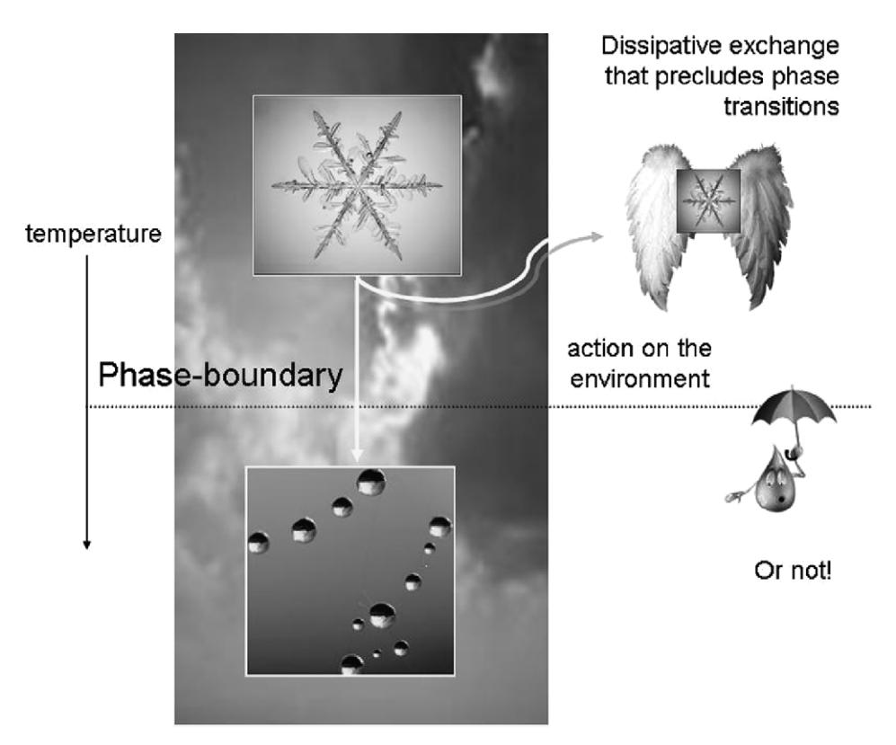
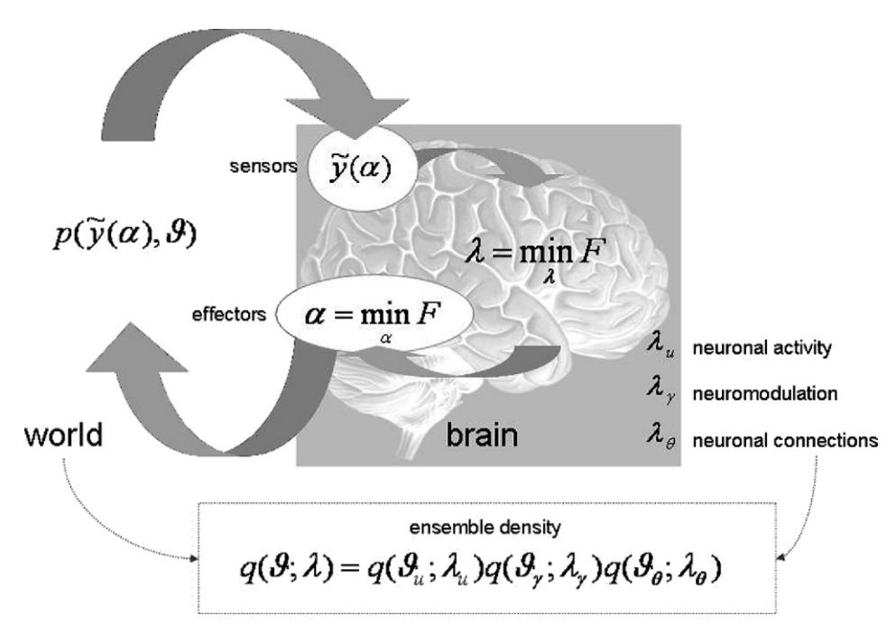
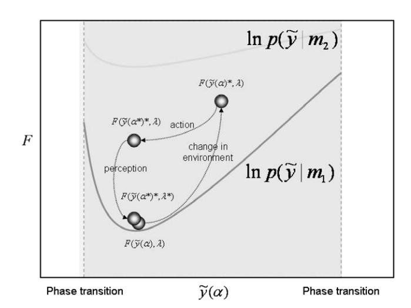
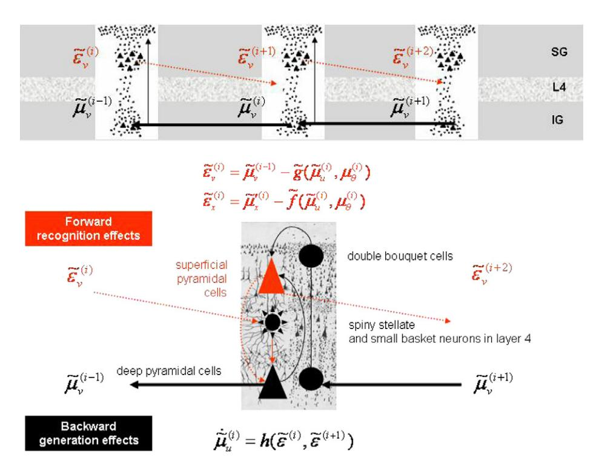
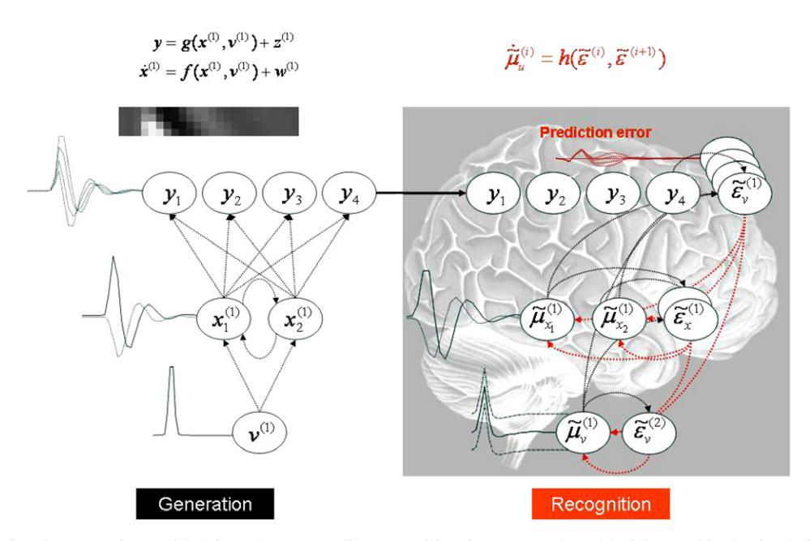
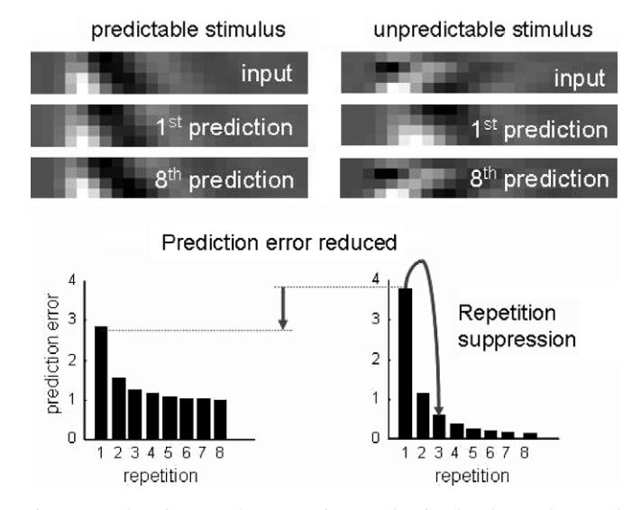
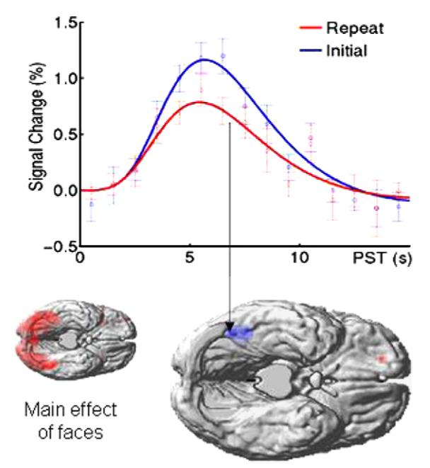
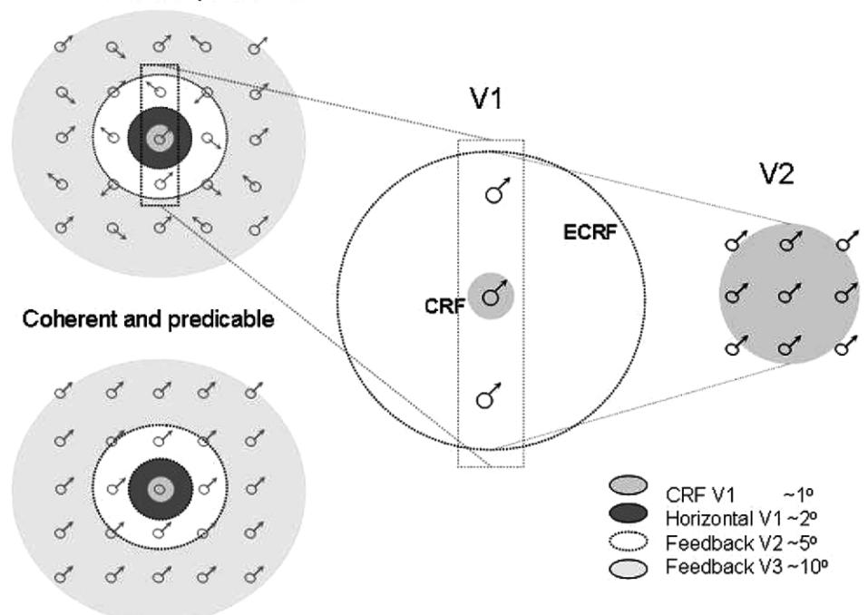
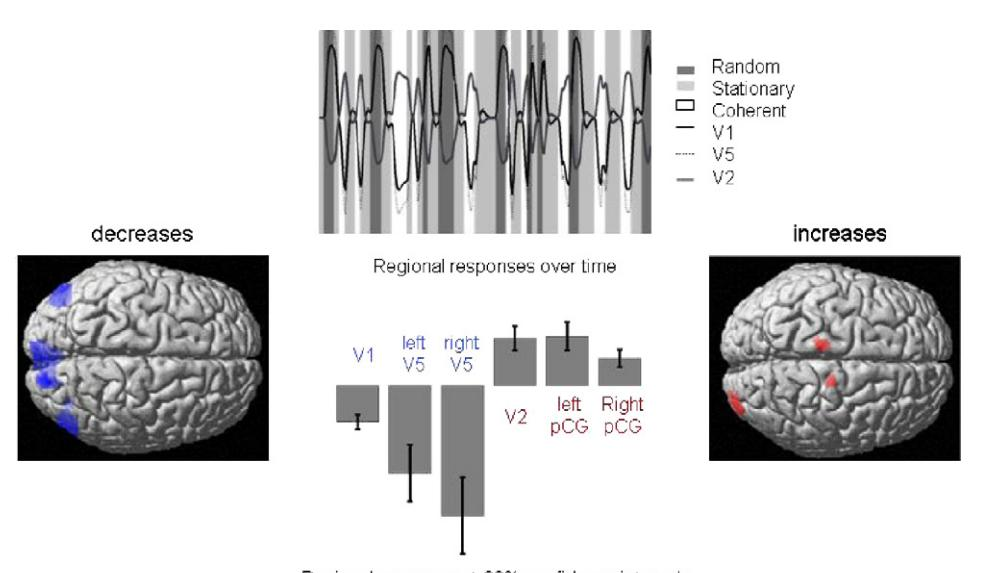

Journal of Physiology - Paris 100 (2006) 70-87

Journal of Physiology Paris

www.elsevier.com/locate/jphysparis

# A free energy principle for the brain

Karl Friston \*, James Kilner, Lee Harrison

The Wellcome Department of Imaging Neuroscience, Institute of Neurology, University College London, 12 Queen Square, London WC1N 3B, United Kingdom

#### Abstract

By formulating Helmholtz's ideas about perception, in terms of modern-day theories, one arrives at a model of perceptual inference and learning that can explain a remarkable range of neurobiological facts: using constructs from statistical physics, the problems of inferring the causes of sensory input and learning the causal structure of their generation can be resolved using exactly the same principles. Furthermore, inference and learning can proceed in a biologically plausible fashion. The ensuing scheme rests on Empirical Bayes and hierarchical models of how sensory input is caused. The use of hierarchical models enables the brain to construct prior expectations in a dynamic and context-sensitive fashion. This scheme provides a principled way to understand many aspects of cortical organisation and responses.

In this paper, we show these perceptual processes are just one aspect of emergent behaviours of systems that conform to a free energy principle. The free energy considered here measures the difference between the probability distribution of environmental quantities that act on the system and an arbitrary distribution encoded by its configuration. The system can minimise free energy by changing its configuration to affect the way it samples the environment or change the distribution it encodes. These changes correspond to action and perception respectively and lead to an adaptive exchange with the environment that is characteristic of biological systems. This treatment assumes that the system's state and structure encode an implicit and probabilistic model of the environment. We will look at the models entailed by the brain and how minimisation of its free energy can explain its dynamics and structure.

© 2006 Published by Elsevier Ltd.

Keywords: Variational Bayes; Free energy; Inference; Perception; Action; Learning; Attention; Selection; Hierarchical

# 1. Introduction

Our capacity to construct conceptual and mathematical models is central to scientific explanations of the world around us. Neuroscience is unique because it entails models of this model making procedure itself. There is something quite remarkable about the fact that our inferences about the world, both perceptual and scientific, can be applied to the very process of making those inferences: Many people now regard the brain as an inference machine that conforms to the same principles that govern the interrogation of scientific data (MacKay, 1956; Neisser, 1967; Ballard et al., 1983; Mumford, 1992; Kawato et al., 1993; Rao and Ballard, 1998; Dayan et al., 1995; Friston, 2003;

Körding and Wolpert, 2004; Kersten et al., 2004; Friston, 2005). In everyday life, these rules are applied to information obtained by sampling the world with our senses. Over the past years, we have pursued this perspective in a Bayesian framework to suggest that the brain employs hierarchical or empirical Bayes to infer the causes of its sensations (Friston, 2005). The hierarchical aspect is important because it allows the brain to learn its own priors and, implicitly, the intrinsic causal structure generating sensory data. This model of brain function can explain a wide range of anatomical and physiological aspects of brain systems; for example, the hierarchical deployment of cortical areas, recurrent architectures using forward and backward connections and functional asymmetries in these connections (Angelucci et al., 2002a; Friston, 2003). In terms of synaptic physiology, it predicts associative plasticity and, for dynamic models, spike-timing-dependent plasticity. In

\* Corresponding author. Tel.: +44 207 833 7488; fax: +44 207 813 1445. *E-mail address*: k.friston@fil.ion.ucl.ac.uk (K. Friston).

terms of electrophysiology it accounts for classical and extra-classical receptive field effects and long-latency or endogenous components of evoked cortical responses (Rao and Ballard, 1998; Friston, 2005). It predicts the attenuation of responses encoding prediction error with perceptual learning and explains many phenomena like repetition suppression, mismatch negativity and the P300 in electroencephalography. In psychophysical terms, it accounts for the behavioural correlates of these physiological phenomena, e.g., priming, and global precedence (see Friston, 2005 for an overview).

It is fairly easy to show that both perceptual inference and learning rest on a minimisation of free energy (Friston, 2003) or suppression of prediction error (Rao and Ballard, 1998). The notion of free energy derives from statistical physics and is used widely in machine learning to convert difficult integration problems, inherent in inference, into easier optimisation problems. This optimisation or free energy minimisation can, in principle, be implemented using relatively simple neuronal infrastructures.

The purpose of this paper is to suggest that inference is just one emergent aspect of free energy minimisation and that a free energy principle for the brain can explain the intimate relationship between perception and action. Furthermore, the processes entailed by the free energy principle cover not just inference about the current state of the world but a dynamic encoding of context that bears the hallmarks of attention and related mechanisms.

The free energy principle states that systems change to decrease their free energy. The concept of free-energy arises in many contexts, especially physics and statistics. In thermodynamics, free energy is a measure of the amount of work that can be extracted from a system, and is useful in engineering applications. It is the difference between the energy and the entropy of a system. Free-energy also plays a central role in statistics, where, borrowing from statistical thermodynamics; approximate inference by variational free energy minimization (also known as variational Bayes, or ensemble learning) has maximum likelihood and maximum a posteriori methods as special cases. It is this sort of free energy, which is a measure of statistical probability distributions; we apply to the exchange of biological systems with the world. The implication is that these systems make implicit inferences about their surroundings. Previous treatments of free energy in inference (e.g., predictive coding) have been framed as explanations or mechanistic descriptions. In this work, we try to go a step further by suggesting that free energy minimisation is mandatory in biological systems and therefore has a more fundamental status. We try to do this by presenting a series of heuristics that draw from theoretical biology and statistical thermodynamics.

#### 2. Overview

This paper has three sections. In the first (Sections 3–7), we lay out the theory behind the free energy principle,

starting from a selectionist standpoint and ending with the implications of the free energy principle in neurobiological and cognitive terms. The second section (Sections 8-10) addresses the implementation of free energy minimisation in hierarchical neuronal architectures and provides a simple simulation of sensory evoked responses. This illustrates some of the key behaviours of brain-like systems that self-organise in accord with the free energy principle. A key phenomenon; namely, suppression of prediction error by top-down predictions from higher cortical areas, is examined in the third section. In this final section (Section 11). we focus on one example of how neurobiological studies are being used to address the free energy principle. In this example, we use functional magnetic resonance imaging (fMRI) of human subjects to examine visually evoked responses to predictable and unpredictable stimuli.

#### 3. Theory

In this section, we develop a series of heuristics that lead to a variational free energy principle for biological systems and, in particular, the brain. We start with evolutionary or selectionist considerations that transform difficult questions about how biological systems operate into simpler questions about the constraints on their behaviour. These constraints lead us to the important notion of an ensemble density that is encoded by the state of the system. This density is used to construct a free energy for any system that is in exchange with its environment. We then consider the implications of minimising this free energy with regard to quantities that determine the systems (i.e., brains) state and, critically, its action upon the environment. We will see that this minimisation leads naturally to perceptual inference about the world, encoding of perceptual context (i.e., attention), perceptual learning about the causal structure of the environment and, finally, a principled exchange with, or sampling of, that environment.

Under the free energy principle (i.e., the brain changes to minimise its free energy), the free energy becomes a Lyapunov function for the brain. A Lyapunov function is a scalar function of a systems state that decreases with time; it is also referred to colloquially as a Harmony function in the neural network literature (Prince and Smolensky, 1997). There are many examples of related energy functionals in the time-dependent partial differential equations literature (e.g., Kloucek, 1998). Usually, one tries to infer the Lyapunov function given a systems structure and behaviour. In what follows we address the converse problem; given the Lyapunov function, what would systems that minimise free energy look like?

# 4. The nature of biological systems

Biological systems are thermodynamically open, in the sense that they exchange energy and entropy with the environment. Furthermore, they operate far-from-equilibrium and are dissipative, showing self-organising behaviour (Ashby, 1947; Nicolis and Prigogine, 1977; Haken, 1983; Kauffman, 1993). However, biological systems are more than simply dissipative self-organising systems. They can negotiate a changing or non-stationary environment in a way that allows them to endure over substantial periods of time. This endurance means that they avoid phase transitions that would otherwise change their physical structure (interesting exceptions are phase-transitions in developmental trajectories; e.g., in metamorphic insects). A key aspect of biological systems is that they act upon the environment to change their position within it, or relation to it, in a way that precludes extremes of temperature, pressure and other external fields. By sampling or navigating the environment selectively they restrict their exchange with it within bounds that preserve their physical integrity and allow them to last longer. A fanciful example is provided in Fig. 1: Here, we have taken a paradigm example of a non-biological self-organising system, namely a snowflake and endowed it with wings that enable it to act on the environment. A normal snowflake will fall and encounter a phase-boundary, at which the environments temperature will cause it to melt. Conversely, snowflakes that can maintain their altitude, and regulate their temperature, survive indefinitely with a qualitatively recognisable form. The key difference between the normal and adaptive snowflake is the ability to change their relationship with the environment and maintain thermodynamic homeostasis. Similar mechanisms can be envisaged easily in an evolutionary setting, wherein systems that avoid phase-transitions will be selected above those that cannot (cf., the selection of chemotaxis in single-cell organisms or the phototropic behaviour of plants). By considering the nature of biological systems in terms of selective pressure one can replace difficult questions about how biological systems emerge with questions about what behaviours they must exhibit to exist. In other words, selection explains *how* biological systems arise; the only outstanding issue is what characterises they must possess. The snowflake example suggests biological systems act upon the environment to preclude phase-transitions. It is therefore sufficient to define a principle that ensures this sort of exchange with the environment. We will see that free energy minimisation in one such principle.

# 4.1. The ensemble density

To develop these arguments formally, we need to define some quantities that describe the environment, the system and their interactions. Let  $\vartheta$  parameterise environmental forces or fields that act upon the system and  $\lambda$  be quantities that describe the systems physical state. We will unpack these quantities later. At the moment, we will simply note that they can be very high dimensional and time-varying.

Fig. 1. Schematic highlighting the difference between dissipative, self-organising systems like snowflakes and adaptive systems that can change their relationship to the environment. By occupying a particular environmental niche, biological systems can restrict themselves to a domain of parameter space that is far from phase-boundaries. The phase-boundary depicted here is a temperature phase-boundary that would cause the snowflake to melt (i.e., induce a phase-transition). In this fanciful example, we have assumed that snowflakes have been given the ability to fly and maintain their altitude (and temperature) and avoid being turned into raindrops.

To link these two quantities, we will invoke an arbitrary function  $q(\vartheta;\lambda)$ , which we will refer to as an ensemble density. This is some arbitrary density function on the environments parameters that is specified or encoded by the systems parameters. For example,  $\lambda$  could be the mean and variance of a Gaussian distribution on the environments temperature,  $\vartheta$ . The reason  $q(\vartheta;\lambda)$  is called an ensemble density is that it can be regarded as the probability density that a specific environmental state  $\vartheta$  would be selected from an infinite ensemble of environments given the systems state  $\lambda$ . Notice that  $q(\vartheta;\lambda)$  is not a conditional density because  $\lambda$  is treated as fixed and known (as opposed to a random variable).

Invoking the ensemble density links the state of the system to the environment and allows us to interpret the system as a probabilistic model of the environment. The ensemble density plays a central role in the free energy formulation described below. Before describing this formulation, we need to consider two other sets of variables that describe, respectively, the effect of the environment on the system and the effect of the system on the environment. We will denote these as  $\tilde{v}$  and  $\alpha$ , respectively.  $\tilde{v}$  can be thought of as system states that are acted upon by the environment; for example the state of sensory receptors. This means that  $\tilde{y}$  can be regarded as sensory input. The action variables  $\alpha$  represent the force exerted by effectors that act on the environment to change sensory samples. We will represent this dependency by making the sensory samples  $\tilde{y}(\alpha)$  a functional of action. Sometimes, this dependency can be guite simple: For example, the activity of stretch receptors in muscle spindles is affected directly by muscular forces causing that spindle to contract. In other cases, the dependency can be more complicated: For example, the oculomotor system, controlling eye position, can influence the activity of every photoreceptor in the retina. Fig. 2 shows a schematic of these variables and how they relate to each other. With these quantities in place we can now formulate an expression for the systems free energy.

# 5. The free energy principle

The free energy is a scalar function of the ensemble density and the current sensory input. It comprises two terms2

$$\begin{split} F &= -\int q(\vartheta) \ln \frac{p(\tilde{y},\vartheta)}{q(\vartheta)} \mathrm{d}\vartheta \\ &= -\langle \ln p(\tilde{y},\vartheta) \rangle_q + \langle \ln q(\vartheta) \rangle_q \end{split} \tag{1}$$

The first is the energy of this system expected under the ensemble density. The energy is simply the surprise or information about the joint occurrence of the sensory input and its causes  $\vartheta$ . The second term is the negative entropy of

the ensemble density. Note that the free energy is defined by two densities; the ensemble density  $q(\vartheta;\lambda)$  and something we will call the generative density  $p(\tilde{y},\vartheta)$ , from which one can *generate* sensory samples and their causes. The generative density factorises into a likelihood and prior density  $p(\tilde{y}|\vartheta)p(\vartheta)$ , which specify a generative model. This means the free energy induces a generative model for any system and an ensemble density over the causes or parameters of that model. The functional form of these densities is needed to evaluate the free energy. We will consider functional forms that may be employed by the brain in the next section. At the moment, we will just note that these functional forms enable the free energy to be defined as a function  $F(\tilde{y},\lambda)$  of the systems sensory input and state.

The free energy principle states that all the quantities that can change; i.e., that are owned by the system, will change to minimise free energy. These quantities are the system parameters  $\lambda$  and the action parameters  $\alpha$ . This principle, as we will see below, is sufficient to account for adaptive exchange with the environment which precludes phase-transitions. We will show this by considering the implications of minimising the free energy with respect to  $\lambda$  and  $\alpha$ , respectively.

# 5.1. Perception: optimising $\lambda$

It is fairly easy to show that optimizing the systems parameters with respect to free energy renders the ensemble density the posterior or conditional density of the environmental causes, given the sensory data. This can be seen by rearranging Eq. (1) to show the dependence of the free energy on  $\lambda^3$ 

$$F = -\ln p(\tilde{y}) + D(q(\vartheta; \lambda) || p(\vartheta | \tilde{y}))$$
(2)

Only the second term is a function of  $\lambda$ ; this is a Kullback– Leibler cross-entropy or divergence term that measures the difference between the ensemble density and the conditional density of the causes. Because this measure is always positive, minimising the free energy corresponds to making the ensemble density the same as the conditional density. In other words, the ensemble density encoded by the systems state becomes an approximation to the posterior probability of the causes of its sensory input. This means the system implicitly infers or represents the causes of its sensory samples. Clearly, this approximation depends upon the physical structure of the system and the implicit form of the ensemble density; and how closely this matches the causal structure of the environment. Again, invoking selectionist arguments; those systems that match their internal structure to the external causal structure of the environment in which they are immersed will be able to minimise their free energy more effectively.

&lt;sup>1 Tilde denotes variables in generalised coordinates that cover highorder motion; i.e.,  $\tilde{y} = y, y', y'', \dots$  This is important when considering the free energy of dynamic systems and enables  $\alpha$  to affect  $\tilde{y}$  through its highorder temporal derivatives.

 $^{2}$   $\langle \cdot \rangle_{q}$  means the expectation under the density q.

&lt;sup>3 We have used the definition of Kullback–Leibler or relative entropy here  $D(q||p) = \int q \ln \frac{q}{p} d\vartheta$ .

Fig. 2. Schematic detailing the quantities that define the free energy. These quantities refer to the internal configuration of the brain and quantities that determine how a system is influenced by the environment. This influence is encoded by the variables  $\tilde{y}(\alpha)$  that could correspond to sensory input or any other changes in the system state due to external environmental forces or fields. The parameters  $\alpha$  correspond to physical states of the system that change the way the external forces act upon it or, more simply, change the way the environment is sampled. A simple example of these would be the state of ocular motor systems controlling the direction of eye gaze.  $p(\tilde{y}(\alpha), \vartheta)$  is the joint probability of sensory input and its causes,  $\vartheta$ .  $q(\vartheta; \lambda)$  is called an ensemble density and is encoded by the systems parameters,  $\lambda$ . These parameters (e.g., mean or expectation) change to minimise free energy, F and, in so doing, make the ensemble density an approximate conditional density on the causes of sensory input.

# 5.2. Action: optimising α

Changing the configuration of the system to move or resample the environment by minimising the free energy with respect to the action variables enforces a sampling of the environment that is consistent with the ensemble density. This can be seen with a second rearrangement of Eq. (1) that shows how the free energy depends upon  $\alpha$ 

$$F = -\langle \ln p(\tilde{y}(\alpha)|\vartheta) \rangle_{a} + D(q(\vartheta)||p(\vartheta))$$
(3)

In this instance, only the first term is a function of action. Minimising this term corresponds to maximising the log probability of the sensory input, expected under the ensemble density. In other words, the system will reconfigure itself to sample sensory inputs that are the most likely under the ensemble density. However, as we have just seen, the ensemble density approximates the conditional distribution of the causes given sensory inputs. The inherent circularity obliges the system to fulfil its own expectations. In other words, the system will expose itself selectively to causes in the environment that it expects to encounter. However, these expectations are limited to the repertoire of physical states the system can occupy, which specify the ensemble density. Therefore, systems with a low free energy can only sample parts of the environment they can encode with their repertoire of physical states. Because the free energy is low, the inferred causes approximate the real environmental conditions. This means the systems physical state must be sustainable under these environmental forces, because each system is its own existence proof. In short, low free energy systems will look like they are responding adaptively to changes in the external or internal milieu, to maintain a homeostatic exchange with the environment.

Systems which fail to minimise free energy will have suboptimal structures for representing the ensemble density or inappropriate effectors for sampling the environment. These systems will not restrict themselves to specific domains of their milieu and will ultimately experience a phase transition.

In summary, the free energy principle can be motivated, quite simply, by noting that any system that does not minimise its free energy cannot respond to environmental changes and cannot have the attribute 'biological'. It follows that minimisation of free energy may be a necessary, if not sufficient, biological characteristic. The mechanism that causes biological systems to minimise their free energy can be ascribed to selective pressure; operating at somatic (i.e., the life time of the organism) or evolutionary timescales (Edelman, 1993). Before turning to minimisation of free energy in the brain, we now need to unpack the quantities describing the biological system and relate their dynamics to processes in neuroscience.

# 5.3. The mean-field approximation

Hitherto, we have treated the quantities describing the environment together. Clearly, these quantities are enor-

mous in number and variety. A key difference among them is the timescales over which they change. We will use this distinction to partition the parameters into three sets  $\theta = \theta_u, \theta_\gamma, \theta_\theta$  that change quickly, slowly and very slowly; and factorise the ensemble density

$$q(\vartheta) = \prod_{i} q(\vartheta_{i}; \lambda_{i}) = q(\vartheta_{u}; \lambda_{u}) q(\vartheta_{\gamma}; \lambda_{\gamma}) q(\vartheta_{\theta}; \lambda_{\theta})$$
 (4)

This also induces a partitioning of the systems parameters into  $\lambda = \lambda_u, \lambda_\gamma, \lambda_\theta$  that encode time-varying partitions of the ensemble density. The first set  $\lambda_u$ , are system quantities that change rapidly. These could correspond to neuronal activity or electromagnetic states of the brain and change with a timescale of milliseconds. The causes  $\vartheta_u$  they encode, correspond to rapidly changing environmental states, for example, changes in the environment caused by structural instabilities or other organisms.

The second set  $\lambda_{\gamma}$  change more slowly, over a time scale of seconds. These could correspond to the kinetics of molecular signalling in neurons; for example calcium-dependent mechanisms underlying short-term changes in synaptic efficacy and classical neural modulatory effects. The equivalent partition of causes in the environment may be contextual in nature, such as the level of radiant illumination or the influence of slowly varying external fields that set the context for more rapid fluctuations in its state.

Finally,  $\lambda_{\theta}$  represent system quantities that change slowly; for example long-term changes in synaptic connections during experience-dependent plasticity, or the deployment of axons that change on a neurodevelopmental timescale. The homologous quantities in the environment are invariances in the causal architecture. These could correspond to physical laws and other structural regularities that shape our interaction with the world.

The factorization in Eq. (4) is, in statistical physics, known as a mean-field approximation. Clearly our approximation with three partitions is a little arbitrary, but it helps organise the functional correlates of their respective optimisation in the nervous system. Other timescales would be necessary for other systems like plants. The mean-field approximation greatly finesses the minimisation of free energy when considering particular schemes. These schemes usually employ variational techniques. Variational approaches were introduced by Feynman (1972), in the context of quantum mechanics using the path integral formulation. They have been adopted widely by the machine learning community (e.g., Hinton and von Cramp, 1993; MacKay, 1995). Established statistical methods like expectation maximisation and restricted maximum likelihood (Dempster et al., 1977; Harville, 1977) can be formulated in terms of free energy (Neal and Hinton, 1998; Friston et al., in press).

#### 6. Optimising variational modes

We now revisit optimisation of the systems parameters that underlie perception in more detail, using the meanfield approximation. Because variational techniques predominate under this approximation, the free energy in Eq. (1) is also known as the variational free energy and  $\lambda_i$  are called variational parameters. The mean-field factorisation means that the mean-field approximation cannot cover the effect of random fluctuations in one partition, on the fluctuations in another. However, this is not a severe limitation because these effects are modelled through mean-field effects (i.e., through the means or dispersions of random fluctuations). This approximation is particularly easy to motivate in the present framework because random fluctuations at fast timescales are unlikely to have a direct effect at slower timescales.

Using variational calculus it is simple to show (see Friston et al., in press) that, under the mean-field approximation above, the ensemble density has the following form:

$$q(\vartheta_i) \propto \exp(I(\vartheta_i))$$

$$I(\vartheta_i) = \langle \ln p(\tilde{y}, \vartheta) \rangle_{q_{i,i}}$$
(5)

where  $I(\vartheta_i)$  is simply the log-probability of  $\vartheta_i$  and the data expected under the ensemble density of the other partitions,  $q_{\setminus i}$ . We will call this the variational energy. From Eq. (5) it is evident that the mode of the ensemble density maximises the variational energy. The mode is an important variational parameter. For example, if we assume  $q(\vartheta_i)$  is Gaussian, then it is parameterised by two variational parameters  $\lambda_i = \mu_i$ ,  $\Sigma_i$  encoding the mode and covariance, respectively. This is known as the Laplace approximation and will be used later. In what follows, we will focus on minimising the free energy by optimizing  $\mu_i$ ; noting that there may be other variational parameters describing higher moments of the ensemble density, for each partition. Fortunately, under the Laplace approximation, the only other variational parameter we require is the covariance. This has a simple form, which is an analytic function of the mode and therefore does not need to be represented explicitly (see Friston et al., in press and Appendix A). We now look at the optimisation of the variational modes  $\mu_i$  and the neurobiological and cognitive processes this optimisation entails:

# 6.1. Perceptual inference: optimising $\mu_u$

Minimising the free energy with respect to neuronal states  $\mu_u$  means maximising  $I(\vartheta_u)$ 

$$\begin{split} \mu_{u} &= \max I(\vartheta_{u}) \\ I(\vartheta_{u}) &= \left\langle \ln p(\tilde{y}|\vartheta) + \ln p(\vartheta) \right\rangle_{q_{\gamma}q_{\theta}} = \left\langle \ln p(\vartheta|\tilde{y}) \right\rangle_{q_{\gamma}q_{\theta}} + \ln p(\tilde{y}) \end{split} \tag{6}$$

This means that the free energy principle is served when the variational mode of the states (i.e., neuronal activity) changes to maximize its log-posterior, expected under the ensemble density of causes that change more slowly. This can be achieved, without knowing the true posterior, by maximising the expected log-likelihood and prior that specify a probabilistic generative model (second line of Eq. (6)).

As mentioned above, this optimisation requires the functional form of the generative model. In the next section, we will look at hierarchical forms that are commensurate with the structure of the brain. For now, it is sufficient to note that the free energy principle means that brain states will come to encode the most likely state of the environment that is causing sensory input.

#### 6.2. Generalised coordinates

Because states are time-varying quantities, it is important to consider what their ensemble density covers. This can cover not just the states at one moment in time but their higher-order motion. In other words, a particular state of the environment and its probabilistic encoding in the brain can embody dynamics by representing the trajectories of states in generalised coordinates. Generalised coordinates are a common device in physics and normally cover position and momentum. In the present context, a generalised state includes the current state, and its generalised motion  $\vartheta_u = u, u', u'', \ldots$  with corresponding variational modes  $\mu_u, \mu'_u, \mu''_u, \ldots$  It is fairly simple to show (Friston, in preparation) that the extremisation in Eq. (6) can be achieved with a rapid gradient descent, while coupling higher to lower-order motion via mean-field terms

$$\dot{\mu}_{u} = \kappa \partial I(\vartheta_{u})/\partial u + \mu'_{u} 
\dot{\mu}'_{u} = \kappa \partial I(\vartheta_{u})/\partial u' + \mu''_{u} 
\dot{\mu}''_{u} = \kappa \partial I(\vartheta_{u})/\partial u'' + \mu'''_{u} 
\dot{\mu}'''_{u} = \cdots$$
(7)

Here  $\dot{\mu}_u$  mean the rate of change of  $\mu_u$  and  $\kappa$  is some suitable rate constant. The simulations in the next section use this descent scheme, which can be implemented using relatively simple neural networks. Note, when the conditional mode has found the maximum of  $I(\vartheta_u)$ , its gradient is zero and the motion of the mode becomes the mode of the motion; i.e.,  $\mu_{\mu} = \mu'_{\mu}$ . However, it is perfectly possible, in generalised coordinates, for these quantities to differ, unless there are special constraints. At the level of perception, psychophysical phenomena, like the motion after-effect, suggest the brain uses generalised coordinates; for example, on stopping, after a period of looking at the scenery from a moving train, the world is perceived as moving but without changing its position. The impression that visual objects change their position in accord with their motion is something that our brains have learned about the causal structure of the world. It is also something that can be unlearned, temporarily (e.g., perceptual after-effects). We now turn to how these causal regularities are learned.

# 6.3. Perceptual context and attention: optimising $\mu_{\nu}$

If we call the causes that change on an intermediate timescale,  $\vartheta_{\gamma}$  contextual, then optimizing  $\mu_{\gamma}$  corresponds to encoding the probabilistic contingencies in which the fast dynamics of the states evolve. This optimization can

proceed as above; however, we can assume that the context changes sufficiently slowly that we can make the approximation  $\mu'_{\alpha} = 0$ . This gives the simple gradient ascent

$$\dot{\mu}_{\gamma} = \kappa \partial I(\vartheta_{\gamma}) / \partial \vartheta_{\gamma} 
I(\vartheta_{\gamma}) = \langle \ln p(\tilde{y}, \vartheta) \rangle_{q, q_{\gamma}}$$
(8)

Note that the expectation is over the generalised coordinates of the states and, implicitly, an extended period of time over which the state trajectory evolves. 4 We will see below that the conditional mode  $\mu_{\nu}$  encoding context might correspond to the strength of lateral or horizontal interactions between neurons in the brain. These lateral interactions control the relative effects of top-down and bottom-up influences on the expected states and therefore control the balance between empirical priors and sensory information, in making perceptual inferences. This suggests that attention could be thought of in terms of optimizing contextual parameters of this sort. It is important to note that, in Eq. (8), the dynamics of  $\mu_{\nu}$  are determined by the expectation under the ensemble density of the perceptual states. This means that it is possible for the system to adjust its internal representation of probabilistic contingencies in a way that is sensitive to the states and their history. A simple example of this, in psychology, would be the Posner paradigm, where a perceptual state: namely an orienting cue, directs visual attention to a particular part of visual space in which a target cue will be presented. In terms of the current formulation, this would correspond to a state-dependent change in the variational parameters encoding context that bias perceptual inference towards the cued part of the sensorium (we will model this in subsequent communication).

The key point here is that the mean-field approximation allows for inferences about rapidly changing perceptual states and more slowly changing context to influence each other through mean-field effects (i.e., the expectations in Eqs. (6) and (8)). This can proceed without explicitly representing the joint distribution in an ensemble density over state and context explicitly (cf., Rao, 2005). Another important interaction between variational parameters relates to the encoding of uncertainly. Under the Laplace assumption this is encoded by the conditional covariances. Critically the conditional covariance of one ensemble is a function of the conditional mode of the others (see Eq. (A.2) in Appendix A). In the present context, the influence of context on perceptual inference can be cast in terms of encoding uncertainty. We will look at neuronal implementations of this in the next section.

### 6.4. Perceptual learning: optimising $\mu_{\theta}$

Optimizing the variational mode encoding  $\vartheta_{\theta}$  corresponds to inferring and learning structural regularities in

&lt;sup>4 In the simulations below, we take the expectation over peristimulus time.

the causal architecture of the environment. As above, this learning can be implemented as a gradient ascent on  $I(\vartheta_{\theta})$ , which represents an expectation under the ensemble density encoding the generalised states and context

$$\dot{\mu}_{\theta} = \kappa \partial I(\vartheta_{\theta}) / \partial \vartheta_{\theta} 
I(\vartheta_{\theta}) = \langle \ln p(\tilde{y}, \vartheta) \rangle_{a_{\theta}, a_{\theta}}$$
(9)

In the brain, this descent can be formulated as changes in connections that are a function of pre-synaptic prediction and post-synaptic prediction error (see Friston, 2003, 2005). The ensuing learning rule conforms to simple associative plasticity or, in dynamic models, plasticity that looks like spike-timing-dependent plasticity. In the sense that optimizing the variational parameters that correspond to connection strengths in the brain encodes causal structure in the environment; this instance of free energy minimisation corresponds to learning. The implicit change in the brains connectivity endows it with a memory of past interactions with the environment that affects the free energy dynamics underlying perception and attention. This is through the mean-field effects in Eqs. (6) and (8). Put simply, sustained exposure to environmental inputs causes the internal structure of the brain to recapitulate the causal structure of those inputs. In turn, this enables efficient perceptual inference. This formulation provides a transparent account of perceptual learning and categorization, which enables the system to remember associations and contingencies among causal states and context. The extension of these ideas into episodic memory remains an outstanding challenge.

# 7. Model optimisation

Hitherto, we have only considered the quantitative optimisation of variational parameters given a particular system and its implicit generative model. Exactly the same free energy principle can be applied to optimise the model itself. Different models can come from populations of systems or from qualitative changes in one system over time. A model here corresponds to a particular configuration that can be enumerated with the same set of variational parameters. Removing a part of the system or adding, for example, another set of connections, changes the model and the variational parameters in a qualitative or categorical fashion.

Model optimisation involves maximising the marginal likelihood of the model itself. In statistics and machine learning this is equivalent to Bayesian model selection, where the free energy can be used to approximate the marginal likelihood,  $p(\tilde{y}|m_i)$  or evidence for a particular model  $m_i$ . This approximation can be motivated easily using Eq. (2): If the system has minimised its free energy and the divergence term is near zero, then the free energy approaches the negative log-evidence for that model. Therefore, the model with the smallest free energy has the highest marginal likelihood.

An evolutionary perceptive on this considers the log-evidence as a lower-bound on free energy,5 which is defined for any systems exchange with the environment  $\tilde{v}(\alpha)$  and is independent of the systems parameters  $\lambda$ . An adaptive system will keep this exchange within bounds that ensure its physical integrity. All this requires is the selection of an appropriate model that renders the log-evidence concave within these bounds and processes that minimise its free energy (see Fig. 2). Selecting models with the lowest free energy will select models that are best able to model their environmental niche and therefore remain within it. Notice that this hierarchical selection rests upon interplay between optimising the parameters of a particular model (to minimise the free energy) and optimising the model per se (using the minimised free energy). Optimisation at both levels is prescribed by the free energy principle. In the theory of genetic algorithms, this is called hierarchical coevolution (e.g., Maniadakis and Trahanias, 2006). A similar relationship is found in Bayesian inference, where model selection is based on a free energy approximation to the model evidence that is furnished by optimising the parameters of each model to minimise free energy. In short, free energy may be a useful surrogate for adaptive fitness in an evolutionary setting and the marginal likelihood in model selection. We introduce model selection because it is linked to value learning (Fig. 3).

# 7.1. Value-learning: optimising $m_i$

Value-learning here denotes the ability of a system to learn valuable or adaptive responses. It refers to re-enforcement or emotional learning in the psychological literature and is closely related to dynamic programming (e.g., temporal difference models) in the engineering and neuroscience literature (e.g., Montague et al., 1995; Suri and Schultz, 2001). In an early formulation of value-learning (Friston et al., 1994) we introduced the distinction between *innate* and *acquired* value. Innate value is an attribute of stimuli or sensory input that releases genetically or epigenetically specified responses that confer fitness. Acquired value is an attribute of stimuli that comes to evoke behaviours, which ultimately disclose stimuli or cues with innate value. Acquired value is therefore learnt during neurodevelopment and exposure to the environment.

The free energy principle explains adaptive behaviour without invoking notions of acquired value or re-enforcement: From the point of view of the organism, it is simply sampling the environment so that its sensory input conforms to its expectations. From its perspective, the environment is a stable and accommodating place. However, for someone observing this system, it will appear to respond adaptively to environmental changes and avoid adverse conditions. In other words, it will seem as if certain

&lt;sup>5 In machine learning, one usually regards the free energy as an upper bound on the log-evidence.

Fig. 3. A schematic showing how the free energy of a system could change over time as a function of changes in its exchange with the environment. This free energy is bounded below by the log-evidence or marginal likelihood of the model used to specify the free energy. In this illustration we have, somewhat artificially, broken down the action-perception dynamics into two steps: First, the model responds to change its sensory input;  $\alpha \to \alpha^*$  and then it adjusts its variational parameters  $\lambda \to \lambda^*$  to infer the new input. Both these changes undo the increase in free energy caused by an change in sensory input  $\tilde{y} \to \tilde{y}^*$ . The upper grey line shows the log-evidence of a suboptimal model as a function of input. Input could be the state of chemo-receptors and action could correspond to movement along the concentration gradients of chemical attractants.

stimulus-response links are selectively re-enforced to ensure the homeostasis of its internal milieu. However, this reinforcement emerges spontaneously in the larger context of action and perception under the free energy principle. A simple example might be an insect that 'prefers' the dark; imagine an insect that has evolved to expect the world is dark. It will therefore move into shadows to ensure it always samples a dark environment. From the point of view of an observer, this adaptive behaviour may be [mis]construed as light-avoiding behaviour that has been reinforced by the value of 'shadows'.

The above arguments suggest biological systems sample their environment to fulfil expectations that are generated by the model implicit in their structure. The likelihood part of its model is learnt on exposure to the environment. However, its priors may be inherited. It is these priors that correspond to innate value and are part of the model  $m_i$ per se. Value-learning is often framed in terms of maximising expected reward or value. However, this is not necessary in the free energy formulation; all that is required is that the organism maximises its expectations. Selection will ensure these expectations are valuable; through selective pressure on innately valuable priors. Anthropomorphically, we may not interact with the world to maximise our reward but simply to ensure it behaves as we think it should. Only phenotypes with good models and a priori, models of a good world will survive. Those who have bad models or model, a priori, a bad world will become extinct.

In summary, within an organism's lifetime its parameters minimise free energy, given the model implicit in its phenotype. At a supraordinate level, the models themselves may be selected, enabling the population to explore model space and find optimal models. This exploration depends upon the heritability of key model components, which include priors about the environmental niche, in which the organism can operate.

In this section, we have developed a free energy principle for the evolution of an organism's state and structure and have touched upon minimisation of free energy at the population level, through hierarchical selection. Minimising free energy corresponds to optimising the organism's configuration, which parameterises an ensemble density on the causes of sensory input and optimising the model itself in somatic or evolutionary time. Factorization of the ensemble density to cover quantities that change with different timescales provides an ontology of processes that map nicely onto perceptual inference, attention and learning. Clearly, we have only touched upon these issues in a somewhat superficial way; each deserves a full treatment. In this paper, we will focus on perceptual inference. In the next section, we consider how the brain might instantiate the free energy principle with a special focus on the likelihood models entailed by its structure.

# 8. Generative models in the brain

In this section, we will look at how the rather abstract principles of the previous section might be applied to the brain. We have already introduced the idea that a biological structure encodes a model of the environment in which it is immersed. We now look at the form of these models implied by the structure of the brain and try to understand how evoked responses and associative plasticity emerge naturally as a minimisation of free energy. In the current formulation, every attribute or quantity describing the brain parameterises an ensemble density on environmental causes. To evaluate the free energy of this density we need to specify the functional form of the ensemble and generative densities. We will assume a Gaussian form for the ensemble densities (i.e., the Laplace approximation), which is parameterised by its mode or expectation and covariance. The generative density is specified by its likelihood and priors. Together these constitute a generative model. If this model is specified properly, we should be able to predict, using the free energy principle, how the brain behaves in different contexts. In a series of previous papers (e.g., Friston and Price, 2001; Friston, 2005) we have described the form of hierarchical generative models that might be employed by the brain. In this section, we will cover briefly the main points again.

# 8.1. Hierarchical dynamic models in the brain

A key architectural principle of the brain is its hierarchical organisation (Zeki and Shipp, 1988; Felleman and Van

Essen, 1991; Mesulam, 1998; Hochstein and Ahissar, 2002) This organisation has been studied most thoroughly in the visual system, where cortical areas can be regarded as forming a hierarchy; with lower areas being closer to primary sensory input and higher areas adopting a multimodal or associational role. The notion of a hierarchy rests upon the distinction between forward and backward connections (Rockland and Pandya, 1979; Murphy and Sillito, 1987; Felleman and Van Essen, 1991; Sherman and Guillery, 1998; Angelucci et al., 2002a). The distinction between forward and backward connections is based on the specificity of the cortical layers that are the predominant sources and origins of extrinsic connections in the brain. Forward connections arise largely in superficial pyramidal cells, in supra-granular layers and terminate in spiny stellate cells of layer four or the granular layer of a higher cortical area (Felleman and Van Essen, 1991; DeFelipe et al., 2002). Conversely, backward connections arise largely from deep pyramidal cells in infra-granular layers and target cells in the infra and supra granular layers of lower cortical areas. Intrinsic connections are both intra and inter laminar and mediate lateral interactions between neurons that are a few millimetres away. Due to convergence and divergence of extrinsic forward and backward connections, receptive fields of higher areas are generally larger than lower areas (Zeki and Shipp, 1988). There is a key functional distinction between forward and backward connections that renders backward connections more modulatory or non-linear in their effects on neuronal responses (e.g., Sherman and Guillery, 1998). This is consistent with the deployment of voltage sensitive and non-linear NMDA receptors in the supra-granular layers that are targeted by backward connections. Typically, the synaptic dynamics of backward connections have slower time constants. This has led to the notion that forward connections are driving and illicit an obligatory response in higher levels, whereas backward connections have both driving and modulatory effects and operate over greater spatial and temporal scales.

The hierarchical structure of the brain speaks to hierarchical models of sensory input. For example

$$y = g(x^{(1)}, v^{(1)}) + z^{(1)}$$

$$\dot{x}^{(1)} = f(x^{(1)}, v^{(1)}) + w^{(1)}$$

$$\vdots$$

$$v^{(i-1)} = g(x^{(i)}, v^{(i)}) + z^{(i)}$$

$$\dot{x}^{(i)} = f(x^{(i)}, v^{(i)}) + w^{(i)}$$

$$\vdots$$

$$(10)$$

In this model sensory states y are caused by a non-linear function of states,  $g(x^{(1)}, v^{(1)})$  plus a random effect  $z^{(1)}$ . The dynamic states  $x^{(1)}$  have memory and evolve according to equations of motion prescribed by the non-linear function  $f(x^{(1)}, v^{(1)})$ . These dynamics are subject to random fluctuations  $w^{(1)}$  and perturbations from higher levels that are generated in exactly the same way. In other words, the in-

put to any level is the output of the level above. This means casual states  $v^{(i)}$  link hierarchical levels and dynamic states  $x^{(i)}$  generate dynamics that are intrinsic to each level. The random fluctuations can be assumed to be Gaussian with a covariance encoded by the hyper-parameters  $\vartheta_{\eta}^{(i)}$ . The functions at each level are parameterised by  $\vartheta_{\theta}^{(i)}$ . This form of hierarchical dynamical model is extremely generic and subsumes most models found in statistics and machine learning as special cases.

This model specifies the functional form of the generative density in generalised coordinates of motion (see Appendix B) and induces an ensemble density on the generalised states  $\vartheta_u^{(i)} = \tilde{\chi}^{(i)}, \tilde{v}^{(i)}$ . If we assume neuronal activity is the variational mode  $\tilde{\mu}_u^{(i)} = \tilde{\mu}_v^{(i)}, \tilde{\mu}_x^{(i)}$  of these states and the variational mode of the model parameters  $\vartheta_{\gamma}^{(i)}$  and  $\vartheta_{\theta}^{(i)}$  corresponds to synaptic efficacy or connection strengths; we can write down the variational energy as a function of these modes using Eq. (5); with  $y = \mu_v^{(0)}$ 

$$I(\tilde{\mu}_{u}) = -\frac{1}{2} \sum_{i} \tilde{\varepsilon}^{(i)T} \Pi^{(i)} \tilde{\varepsilon}^{(i)}$$

$$\tilde{\varepsilon}^{(i)} = \begin{bmatrix} \tilde{\varepsilon}_{v}^{(i)} \\ \tilde{\varepsilon}_{x}^{(i)} \end{bmatrix} = \begin{bmatrix} \tilde{\mu}_{v}^{(i-1)} - \tilde{g} \left( \tilde{\mu}_{u}^{(i)}, \mu_{\theta}^{(i)} \right) \\ \tilde{\mu}_{x}^{\prime(i)} - \tilde{f} \left( \tilde{\mu}_{u}^{(i)}, \mu_{\theta}^{(i)} \right) \end{bmatrix}$$

$$\Pi(\mu_{\gamma}^{(i)}) = \begin{bmatrix} \Pi_{z}^{(i)} \\ \Pi_{w}^{(i)} \end{bmatrix}$$
(11)

Here  $\tilde{\epsilon}^{(i)}$  is a generalised prediction error for the states at the *i*th level. The generalised predictions of the casual states and motion of the dynamic states are  $\tilde{g}^{(i)}$  and  $\tilde{f}^{(i)}$ , respectively (see Appendix B). Here,  $\tilde{\mu}'^{(i)} = \mu_x'^{(i)}, \mu_x''^{(i)}, \mu_x'''^{(i)}, \dots$  represents the motion of  $\tilde{\mu}_x^{(i)}$ .  $\Pi(\mu_\gamma^{(i)})$  are the precisions of the random fluctuations that control their amplitude and smoothness. For simplicity, we have omitted terms that depend on the conditional covariance of the parameters; this is the same approximation used by expectation maximisation (Dempster et al., 1977).

# 8.2. The dynamics and architecture of perceptual inference

As mentioned above, we will focus on the optimization of the ensemble density covering the states, implicit in perception or perceptual inference. From Eq. (7) we obtain an expression that describes the dynamics of neuronal activity under the free energy principle

$$\dot{\tilde{\mu}}_{u}^{(i)} = h(\tilde{\varepsilon}^{(i)}, \tilde{\varepsilon}^{(i+1)}) 
= \tilde{\mu}_{u}^{\prime(i)} - \kappa \frac{\partial \tilde{\varepsilon}^{(i)T}}{\partial \tilde{\mu}_{u}^{(i)}} \Pi^{(i)} \tilde{\varepsilon}^{(i)} - \kappa \frac{\partial \tilde{\varepsilon}^{(i+1)T}}{\partial \tilde{\mu}_{u}^{(i)}} \Pi^{(i+1)} \tilde{\varepsilon}^{(i+1)}$$
(12)

These dynamics describe how neuronal states self-organise when the brain is exposed to sensory input. The form of Eq. (12) is quite revealing; it is principally a function of prediction error, namely the mismatch between the expected state of the world, at any level, and that predicted on the basis of the expected state in the level above. Critically, inference only requires the prediction error from the lower

Fig. 4. Schematic detailing the neuronal architectures that encode an ensemble density on the states and parameters of hierarchical models. The upper panel shows the deployment of neurons within three cortical areas (or macro-columns). Within each area the cells are shown in relation to the laminar structure of the cortex that includes supra-granular (SG) granular (L4) and infra-granular (IG) layers. The lower panel shows an enlargement of a particular area and the speculative cells of origin of forward driving connections that convey prediction error from a lower area to a higher area and the backward connections that carry predictions. These predictions try to explain away input from lower areas by suppressing the mismatch or prediction error. In this scheme, the source of forward connections is the superficial pyramidal cell population and the source of backward connections is the deep pyramidal cell population. The differential equations relate to the free energy minimisation scheme detailed in the main text.

level  $\tilde{\epsilon}^{(i)}$  and the level in question  $\tilde{\epsilon}^{(i+1)}$ . This drives conditional expectations  $\tilde{\mu}_u^{(i)}$  to provide a better prediction, conveyed by backward connections, to explain away the prediction error. This is the essence of the recurrent dynamics that self-organise to suppress free energy or prediction error; i.e., recognition dynamics.

Critically, the motion of the expected states is a linear function of the bottom-up prediction error. This is exactly what is observed physiologically, in the sense that bottom-up driving inputs elicit obligatory responses in higher levels that do not depend on other bottom-up inputs. In fact, the forward connections in Eq. (12) have a simple form6

$$\frac{\partial \tilde{\varepsilon}^{(i)T}}{\partial \tilde{\mu}_{u}^{(i)}} \Pi^{(i)} - \begin{bmatrix} -I \otimes g_{v}^{(i)} & -I \otimes g_{x}^{(i)} \\ -I \otimes f_{v}^{(i)} & D - (I \otimes f_{x}^{(i)}) \end{bmatrix} \Pi^{(i)}$$

$$(13)$$

This comprises block diagonal repeats of the derivatives  $g_x = \partial g/\partial x$  (similarly for the other derivatives). D is an block matrix with identity matrices in its first diagonal that ensure the internal consistency of generalised motion. The connections are modulated by the precisions encoded by  $\mu_y^{(i)}$ . The lateral interactions within each level have an even simpler form

$$\frac{\partial \tilde{\varepsilon}^{(i+1)T}}{\partial \tilde{\mu}_u^{(i)}} \Pi^{(i+1)} = \begin{bmatrix} \Pi_v^{(i+1)} & 0\\ 0 & 0 \end{bmatrix}$$
 (14)

and reduce to the precisions of the causes at that level. We will look at the biological substrate of these interactions below.

The form of Eq. (12) allows us to ascribe the source of prediction error to superficial pyramidal cells and we can posit these as encoding prediction error. This is because the only quantity that is passed forward from one level in the hierarchy to the next is prediction error and superficial pyramidal cells are the source of forward afferents in the brain. This is useful because it is these cells that are primarily responsible for the genesis of electroencephalographic (EEG) signals that can be measured non-invasively. The prediction error itself is formed by predictions conveyed by backward connections and dynamics intrinsic to the level in question. These influences embody the non-linearities implicit in  $\tilde{g}^{(i)}$  and  $\tilde{f}^{(i)}$ ; see Eq. (11). Again, this is entirely consistent with the non-linear or modulatory role of backward connections that, in this context, model interactions among inferred states to predict lower level inferences. See Fig. 4 for a schematic of the implicit neuronal architecture.

In short, the dynamics of the conditional modes are driven by three terms. The first links generalised coordinates

 $^{6}$   $\otimes$  is the Kronecker tensor product.

to ensure the motion of the mode approximates the mode of the motion. This ensures the representation of causal dynamics is internally consistent. The second is a bottomup effect that depends upon prediction error from the level below. This can be thought of as a likelihood term. The third term, corresponding to an empirical prior, is mediated by prediction error at the current level. This is constructed using top-down predictions. An important aspect of hierarchical models is that they can construct their own empirical priors. In the statistics literature these models are known as parametric empirical Bayes models (Efron and Morris, 1973) and rely on the conditional independence of random fluctuation at each level (Kass and Steffey, 1989). In summary, the dynamics of perceptual inference at any level in the brain are moderated by topdown priors from the level above. This is recapitulated at all levels, enabling self-organisation through recurrent interactions to minimise free energy by suppressing prediction error throughout the hierarchy. In this way, higher levels provide guidance to lower levels and ensure an internal consistency of the inferred causes of sensory input at multiple levels of description.

#### 9. Perceptual attention and learning

The dynamics above describe the optimization of conditional or variational modes describing the most likely cause of sensory inputs. This is perceptual inference and corresponds to Bayesian inversion of the hierarchical generative model described in Eq. (10). In this simplified scheme, in which conditional covariances have been ignored, minimising the free energy is equivalent to suppressing hierarchical prediction error. Exactly the same treatment can be applied to changes in extrinsic and intrinsic connectivity encoding the conditional modes  $\mu_{\nu}$  and  $\mu_{\theta}$ . As above, the changes in these modes or synaptic efficacies are relatively simple functions of prediction error and lead to forms that are recognisable as associative plasticity. Examples of these derivations, for static systems are provided in Friston (2005). The contextual variables are interesting because of their role in moderating perceptual inference. Eq. (12) shows that the influence of prediction error from the level below and the current level is scaled by the precision matrices  $\Pi(\mu_{\nu}^{(i)})$  and  $\Pi(\mu_{\nu}^{(i+1)})$  that are functions of  $\mu_{\nu}$ . This means that the relative influence of the bottom-up likelihood term and top-down prior is controlled by modulatory influences encoded by  $\mu_{\nu}$ . This selective modulation of afferents is exactly the same as gain control mechanisms that have been invoked for attention (e.g., Treue and Maunsell, 1996; Martinez-Trujillo and Treue, 2004). It is fairly simple to formulate neuronal architectures in which this gain is controlled by lateral interactions that are intrinsic to each cortical level (see Fig. 4).

As noted in the previous section changes in  $\mu_{\gamma}$  are supposed to occur at a timescale that is intermediate between the fast dynamics of the states and slow associative changes in extrinsic connections mediating the likelihood model.

One could think of  $\mu_{\gamma}$  as describing the short-term changes in synaptic efficacy, in lateral or intrinsic connections that depend upon classical neuromodulatory inputs and other slower synaptic dynamics (e.g., after-hyperpolarisation potentials and molecular signalling). The physiological aspects of these intermediate dynamics provide an interesting substrate for attentional mechanisms in the brain (see Schroeder et al., 2001 for review) and are not unrelated to the ideas in Yu and Dayan (2005). These authors posit a role for acetylcholine (an ascending modulatory neurotransmitter) mediating expected uncertainty. Neural modulatory neurotransmitters have, characteristically, much slower time constants, in terms of their synaptic effects, than glutaminergic neurotransmission that is employed by forward and backward extrinsic connections.

In conclusion, we have seen how a fairly generic hierarchical and dynamical model of environmental inputs can be transcribed onto neuronal quantities to specify the free energy and its minimisation. This minimisation corresponds, under some simplifying assumptions, to a suppression of prediction error at all levels in a cortical hierarchy. This suppression rests upon a balance between bottom-up (likelihood) influences and top-down (prior) influences that are balanced by representations of uncertainty. In turn, these representations may be mediated by classical neural modulatory effects or slow post-synaptic cellular processes that are driven by overall levels of prediction error. Overall, this enables Bayesian inversion of a hierarchical model of sensory input that is context-sensitive and conforms to the free energy principle. We will next illustrate the sorts of dynamics and behaviours one might expect to see in the brain, using a simple simulation.

#### 10. Simulations

# 10.1. Generative and recognition models

Here, we describe a very simple simulation of a twolayer neuronal hierarchy to show the key features of its self-organised dynamics, when presented with a stimulus. The system is shown in Fig. 5. On the left, is the system used to generate sensory input and on the right the neuronal architecture used to invert this generation; i.e., to recognise or disclose the underlying cause. The generative system used a single input (a Gaussian bump function) that excites a damped oscillatory transient in two reciprocally connected dynamic units. The output of these units is then passed through a linear mapping to four sensory channels. Note that the form of the neuronal or recognition model is exactly the same as the generative model: The only difference is that the causal states are driven by prediction errors which invoke the need for forward connections (depicted in red). The inferred causes, with conditional uncertainty (shown as 95% confidence intervals) concur reasonably with the real causes. The input pattern is shown as a function of time and in image format at the top of the figure. This can be thought of as either a changing visual stimulus,

Fig. 5. Diagram showing the generative model (left) and corresponding recognition; i.e., neuronal model (right) used in the simulations. Left panel: this is the generative model using a single cause  $v^{(1)}$ , two dynamic states  $x_1^{(1)}, x_2^{(1)}$  and four outputs  $y_1, \ldots, y_4$ . The lines denote the dependencies of the variables on each other, summarised by the equation on top (in this example both the equations were simple linear mappings). This is effectively a linear convolution model, mapping one cause to four outputs, which form the inputs to the recognition model (solid arrow). The architecture of the corresponding recognition model is shown on the right. This has a similar architecture, apart from the inclusion of prediction error units;  $\tilde{\varepsilon}_u^{(i)}$ . The combination of forward (red lines) and backward influences (black lines) enables recurrent dynamics that self-organise (according to the recognition equation;  $\tilde{\mu}_u^{(i)} = h(\tilde{\varepsilon}^{(i)}, \tilde{\varepsilon}^{(i+1)})$ ) to suppress and hopefully eliminate prediction error, at which point the inferred causes and real causes should correspond. (For interpretation of the references in colour in this figure legend, the reader is referred to the web version of this article.)

impinging on four photo-receptor channels or, perhaps, a formant over time-frequency in an acoustic setting.

This simulation can be regarded as reproducing sensory evoked transients and corresponds to Bayesian inversion of the generative model shown on the left hand side of the figure. In this context, because we used a dynamical generative model, the inversion corresponds to an online deconvolution. If we allow the connection strengths in the recognition model to minimise free energy, we are also implicitly estimating the parameters of the corresponding generative model. In machine learning and signal processing this is known as blind deconvolution. Examples of this are shown in Fig. 6. Here, we presented the same stimulus eight times and recorded the prediction error in the input or lowest level, summed over all peristimulus time. The initial values of the parameters were the same as in the generative model (those used in Fig. 5). The upper panels show the stimulus and predicted input, in image format, for the first and last trial. It can be seen that both the first and eighth predictions are almost identical to the real input. This is because the connection strengths, i.e., conditional modes of the parameters (in the recognition model), started with the same values used by the generative model. Despite this, minimising the free energy of the ensemble density on the parameters enables the recognition model to encode this stimulus more efficiently, with a progressive suppression of prediction error with repeated exposure. This effect is much more marked if we use a stimulus that the recogni-

Fig. 6. Results of repeated presentations to the simulated neural network shown in the previous figure. Left panels: the four channel sensory data used to evoke responses and the predictions from these evoked responses for the first and last of eight trials are shown on top, in image format. The corresponding prediction error (summed over the entire trial period after rectification) is shown below. As expected, there is a progressive reduction in prediction error as the system learns the most efficient causal architecture underlying the generation of sensory inputs. Right panels: exactly the same as above but now using an unpredictable or unfamiliar stimulus that was created using a slightly different generative model. Here, learning the causal architecture of this new stimulus occurs progressively over repeated presentations, leading to profound reduction in prediction error and repetition suppression.

tion model has not seen before. We produced this stimulus by adding a small random number to the parameters of the generative model. At the first presentation, the recognition model tries to perceive the input in terms of what it already knows and has experienced. In this case a prolonged version of the expected stimulus. This produces a large prediction error. By the eighth presentation, changes in the parameters enable it to recognise and predict the input almost exactly, with a profound suppression of prediction error with each repetition of the input. Note that the suppression of prediction error is more dramatic for the unpredicted stimulus; this is because more is learned during repeated exposure.

# 10.2. Repetition suppression

This simple simulation shows a ubiquitous and generic aspect of free energy minimisation schemes and indeed real brain responses; namely repetition suppression. This phenomenon describes the reduction or suppression in evoked responses on repeated presentation of stimuli. This can be seen in many contexts, ranging from the mismatch negativity in EEG research (Näätänen, 2003) to fMRI examples of face processing (see Henson et al., 2000 and Fig. 7).

Suppression of inferotemporal responses to repeated faces

Fig. 7. A summary of the results of an fMRI experiment reported in Henson et al., 2000. The upper panel shows responses to visually presented faces for the first presentation (blue) and the second presentation (red). This is a nice example of repetition suppression as measured using fMRI. The inserts show voxels that were significantly activated by all faces (red) and those that showed significant repetition suppression in the fusiform cortex (blue). (For interpretation of the references in colour in this figure legend, the reader is referred to the web version of this article.)

The phenomenon that we will focus on is the difference between the prediction errors elicited by the familiar or predictable stimulus, relative to that elicited by the unpredictable stimulus. A strong prediction of the free energy formulation is that unpredictable or incoherent stimuli will evoke a much greater prediction error than familiar or coherent stimuli. Furthermore, this relative suppression will be mediated by backward connections in the brain that convey the predictions. In the final section, we present an empirical test of this hypothesis, using an fMRI study of visually evoked responses using predictable and unpredictable stimuli (Harrison et al., in press).

# 11. Suppressing free energy in the human brain

There are clearly a vast number of predictions and experiments that follow from the free energy treatment of the previous sections. We have reviewed many of these from the neurophysiological, electrophysiological, psychophysical and imaging neuroscience literature in other papers (e.g., Friston and Price, 2001; Friston, 2003, 2005). In this paper, we focus on a simple but quite enlightening study that was designed to address the role of backward connections in suppressing prediction error, using predictable and unpredictable visual stimuli.

## 11.1. Experimental design and methods

At its simplest, this experiment can be conceived on measuring visually evoked responses to predictable and unpredictable stimuli, where we hypothesized that the evoked responses in early (lower) visual areas would be reduced for predictable, relative to unpredictable stimuli. The stimuli comprised a sparse grid of visual dots that moved either in a coherent (predictable) or incoherent (unpredictable) fashion. However, simply showing reduced responses to predictable stimuli does not allow us to infer that this reduction is mediated by backward connections. To do this we exploit known anatomical characteristics of connectivity in the visual system to ensure that any effect of coherent motion is mediated by backward connections. We did this by using sparse stimuli that excited retinotopically mapped responses beyond the range of horizontal connections in striate cortex or V1. The classical receptive field of V1 units is about one degree of visual angle (see Fig. 8). On the basis of anatomical studies, horizontal connections in V1 cover about two degrees of visual angle (Angelucci et al., 2002a,b). The separation of the stimuli we employed was about three degrees. Therefore, any component motion of a single dot, that could be predicted by other dots, can only be 'seen' by higher visual areas with larger receptive fields (i.e., V2 or higher). This means that differences, due to predictability, in V1 responses must be mediated by backward connections from V2 or higher. Incoherent and globally coherent sparse stimuli were presented to normal human subjects every second or so while hemodynamic responses were measured using functional

# Incoherent and unpredictable

Fig. 8. Schematic showing the extent of the classical receptive field, horizontal connections in V1 and the influence of backward connections from V2 and V3. The sparse stimulus arrays, used to excite visual responses, are shown as superimposed dots for incoherent or unpredictable motion (upper) and coherent or predictable motion (lower). The schematic on the right is meant to indicate that coherent motion can only affect V1 responses through backward influences from V2 that has sufficiently large receptive fields. A neuron receives input directly from the stimulus (forward) and additional information from backward connections. The extra-classical receptive field (ECRF) comprises a proximal and a distal surround field whose spatial extent is consistent with the deployment of horizontal and backward connections, respectively (Angelucci et al., 2002a). When using a sparse stimulus, only one dot can fall within the proximal surround field of a V1 neuron. Abbreviations: V1 = striate cortex, (E)CRF = (extra)-classical receptive field.

Regional responses  $\pm$  90% confidence intervals

Fig. 9. Results of an fMRI study of twelve subjects comparing visually evoked responses to coherent, relative to incoherent stimuli. Significant decreases are shown on the left in blue and increases on the right in red. The upper panel shows the time course of responses for blocks of incoherent, stationary and coherent stimuli for V1, V2 and V5. These responses were summarized as the first principal eigenvariate of a local sphere placed upon the maxima of the statistical parametric maps shown below. The middle bar charts represent the differences in activity or responses as modelled by a canonical hemodynamic response to coherent relative to incoherent motion. These have arbitrary units. The bars represent 95% confidence intervals. V1; early visual cortex. V5; motion sensitive extra striate cortex. V2; secondary extrastriate cortex. PCG; posterior cingulate cortex. (For interpretation of the references in colour in this figure legend, the reader is referred to the web version of this article.)

magnetic resonance imaging. The data were analysed using conventional statistical parametric mapping. This involved modelling evoked responses with a stimulus function encoding the occurrence of coherent or incoherent stimuli and convolving these with a hemodynamic response function to form regressors for a general linear model. Inferences about differential responses between coherent and incoherent stimuli were assessed using a single-sample *t*-test over subjects, on appropriate contrasts from each subject. The results of this random effects analysis are shown in Fig. 9.

#### 11.2. Results

As predicted, there were profound reductions in visually evoked responses to predictable, relative to incoherent, visual stimuli in V1. Interestingly, these decreases were also seen in V5, bilaterally. The time course of hemodynamic activity for a single subject is shown in the upper panel for V1, V2 and V5. This graphic also shows the estimated responses to control stimuli that did not move. Again, as predicted, enhanced responses to unpredictable stimuli was seen at the first level that the receptive fields could encompass more than one dot. This was in area V2. This may reflect the activity of deep pyramidal cells encoding global motion subtended by multiple dots. It is interesting to note that V5 showed a reduced prediction error, despite the fact that this area is generally thought to be hierarchically higher in the visual cortex than V2. However, extrageniculate pathways can bypass V1 and V2 and provide information directly to V5 which, in some circumstances, may make it behave like a hierarchically low area. This is consistent with the short-latency responses of V5, in relation to V1 (see Nowak and Bullier, 1997).

In summary, this fMRI study confirms our predictions from the theoretical analysis that evoked responses are smaller for predictable, relative to unpredictable stimuli. This is consistent with measured responses reflecting, in large part, prediction error evoked as the sensory cortex self-organises to infer the causes of its geniculate input. Furthermore, by careful design of the stimuli to preclude horizontal interactions among V1 units, we are able to infer that this suppression of prediction error has to be mediated by backward connections from higher cortical areas. This is consistent with the recurrent dynamics entailed by the hierarchical formulation of generative models in the brain and the inversion of these models in accord with the free energy principle.

## 12. Conclusion

In this paper, we have considered the characteristics of biological systems, in relation to non-biological self-organizing and dissipative systems. Biological systems act on the environment and can sample it selectively to avoid phase-transitions that will irreversibly alter their structure. This adaptive exchange can be formalised in terms of free energy minimisation, in which both the behaviour of the organism and its internal configuration minimise its free energy. This free energy is a function of the ensemble density encoded by the organism's configuration and the sensory data to which it is exposed. Minimisation of free energy occurs through action-dependent changes in sensory input and the ensemble density implied by internal changes. Systems that fail to maintain a low free energy will encounter phase-transitions as their relationship to the environment changes. It is therefore necessary, if not sufficient, for biological systems to minimise their free energy.

This free energy is not a thermodynamic free energy but a free energy formulated in terms of information theoretic quantities. The free energy principle discussed here is not a consequence of thermodynamics but arises from population dynamics and selection. Put simply, systems with a low free energy will be selected over systems with a higher free energy. The free energy rests on a specification of a generative model, which is entailed by the organism's structure. Identifying this model enables one to predict how a system will change if it conforms to the free energy principle. For the brain, a plausible model is a hierarchical dynamic system in which neural activity encodes the conditional modes of environmental states and its connectivity encodes the causal context in which these states evolve. Bayesian inversion of this model, to infer the causes of sensory input, is a natural consequence of minimising free energy or, under simplifying assumptions, the suppression of prediction error. We concluded with a simple but compelling experiment that showed the relative suppression of prediction error, in the context of predictable stimuli, is indeed mediated by backward connections in the brain as predicted by a free energy descent scheme.

The ideas presented in this paper have a deep history; starting with the notions of neuronal energy described by Helmholtz (1860) and covering ideas like analysis by synthesis (Neisser, 1967) and more recent formulations like Bayesian inversion and predictive coding (e.g., Ballard et al., 1983; Mumford, 1992; Dayan et al., 1995; Rao and Ballard, 1998). The specific contribution of this paper is to provide a general formulation of the free energy principle to cover both action and perception. Furthermore, this formulation can be used to connect constructs from machine learning and statistical physics with selectionist ideas from theoretical biology.

# Acknowledgements

The Wellcome Trust funded this work. We would like to express our greatest thanks to Marcia Bennett for preparing this manuscript.

# Appendix A. The conditional covariances

Under the Laplace approximation, the variational density assumes a Gaussian form  $q_i = N(\mu_i, \Sigma_i)$  with variational

parameters  $\mu_i$  and  $\Sigma_i$ , corresponding to the conditional mode and covariance of the *i*th parameter set. The advantage of this approximation is that the conditional covariance can be evaluated very simply: Under the Laplace approximation the free energy is

$$F = L(\mu) + \frac{1}{2} \sum_{i} (U_{i} + \ln |\Sigma_{i}| + p_{i} \ln 2\pi e)$$

$$U_{i} = tr(\Sigma_{i} \partial^{2} L(\mu) / \partial \vartheta_{i} \partial \vartheta_{i})$$

$$L(\vartheta) = \ln p(\tilde{y}, \vartheta)$$

$$I(\vartheta_{i}) = L(\vartheta_{i}, \mu_{\backslash i}) + \frac{1}{2} \sum_{i \neq i} U_{j}$$
(A.1)

 $p_i$  is the number of parameters in the *i*th set. The conditional covariances obtain as an analytic function of the modes by differentiating the free energy and solving for zero

$$\partial F/\partial \Sigma_{i} = \frac{1}{2} \partial^{2} L(\mu)/\partial \vartheta_{i} \partial \vartheta_{i} + \frac{1}{2} \Sigma_{i}^{-1} = 0$$

$$\Rightarrow \Sigma_{i}^{-1} = -\partial^{2} L(\mu)/\partial \vartheta_{i} \partial \vartheta_{i}$$
(A.2)

This solution for the conditional covariances does not depend on the mean-field approximation but only on the Laplace approximation. See Friston et al. (in press) for more details.

#### Appendix B. Dynamic models

Here we consider the functional form of the generative density for hierarchical dynamic models of the sort descried in Eq. (10). To simplify things, we will deal with a single level and generalise to multiple levels later

$$y = g(x, v) + z$$
  

$$\dot{x} = f(x, v) + w$$
(A.3)

The continuous non-linear functions f(x,v) and g(x,v) of states are parameterised by  $\vartheta_{\theta}$ . Stochastic innovations z(t) are assumed to be analytic such that the covariance of  $\tilde{z}=z,z',z'',\ldots$  is well defined in generalised coordinates; similarly for random fluctuations in the states,  $\tilde{w}$ . Under local linearity assumptions, the generalised motion  $\tilde{y}$  is given by

$$y = g(x, v) + z x' = f(x, v) + w$$

$$\dot{y} = g_x x' + g_v v' + z' x'' = f_x x' + f_v v' + w'$$

$$\ddot{y} = g_x x'' + g_v v'' + z'' x''' = f_x x'' + f_v v'' + w''$$

$$\vdots \vdots$$
(A.4)

This model induces a variational density  $q(\vartheta_u,t)$  on the generalised causes  $\vartheta_u = \tilde{x}, \tilde{v}$ . The second set of equations prescribes dynamics by coupling low and high-order motion of x(t), which confers memory on the system. Gaussian assumptions about the fluctuations furnish the functional form of the likelihood  $p(\tilde{y}|\vartheta) = N(\tilde{g}, \Pi_z^{-1})$ , where  $\tilde{g}$  and  $\tilde{f}$  comprise the generalised predictions

$$g = g(x, v) f = f(x, v)$$

$$g' = g_x x' + g_v v' f' = f_x x' + f_v v'$$

$$g'' = g_x x'' + g_v v'' f'' = f_x x'' + f_v v''$$

$$\vdots \vdots (A.5)$$

 $\Pi(\vartheta_{\gamma})_z$  is the precision (i.e., inverse covariance) of  $\tilde{z}$  that controls its amplitude and roughness. Similarly, Gaussian assumptions about fluctuations in the states allow us to express the prior  $p(\vartheta_u) = p(\tilde{x}|\tilde{v})p(\tilde{v})$  in terms of predicted motion, where  $p(\tilde{x}|\tilde{v}) = N(\tilde{f}, \Pi_w^{-1})$  and  $\Pi(\vartheta_{\gamma})_w$  is the precision of  $\tilde{w}$ . We now have now the functional form of the likelihood and priors and implicitly the generative model.

Adding hierarchical levels, with  $y = v^{(0)}$  gives Eq. (10)

$$v^{(i-1)} = g(x^{(i)}, v^{(i)}) + z^{(i)}$$

$$\dot{x}^{(i)} = f(x^{(i)}, v^{(i)}) + w^{(i)}$$
(A.6)

These induce empirical priors on the states that lend the generative density a Markov form, through independence assumptions (Kass and Steffey, 1989) about the random fluctuations in different levels

$$p(\tilde{y}, \vartheta) = p(\tilde{y}|\vartheta_{u}^{(1)})p(\vartheta_{u}^{(1)}|\vartheta_{u}^{(2)})\cdots p(\tilde{v}^{(m)})$$

$$p(\vartheta_{u}^{(i-1)}|\vartheta_{u}^{(i)}) = p(\tilde{x}^{(i-1)}|\tilde{v}^{(i-1)})p(\tilde{v}^{(i-1)}|\vartheta_{u}^{(i)})$$

$$p(\tilde{x}^{(i)}|\tilde{v}^{(i)}) = N(\tilde{f}^{(i)}, \Pi_{w}^{(i)-1})$$

$$p(\tilde{v}^{(i-1)}|\vartheta_{u}^{(i)}) = N(\tilde{g}^{(i)}, \Pi_{z}^{(i)-1})$$
(A.7)

The prediction  $\tilde{g}(\vartheta_u^{(i)}, \vartheta_\theta^{(i)})$  plays the role of a prior expectation on  $\tilde{v}^{(i-1)}$  and its prior precision is estimated empirically as  $\Pi(\vartheta_\gamma^{(i)})_v$ ; hence empirical Bayes (Efron and Morris, 1973); similarly for the hidden states. In short, a hierarchical form endows a model with the ability to construct its own priors. This feature is central to many inference and estimation procedures ranging from mixed-effects analyses in classical covariance component analysis to automatic relevance determination. See Friston et al., in press for a fuller discussion of static models.

#### References

Angelucci, A., Levitt, J.B., Walton, E.J., Hupe, J.M., Bullier, J., Lund, J.S., 2002a. Circuits for local and global signal integration in primary visual cortex. J. Neurosci. 22, 8633–8646.

Angelucci, A., Levitt, J.B., Lund, J.S., 2002b. Anatomical origins of the classical receptive field and modulatory surround field of single neurons in macaque visual cortical area V1. Prog. Brain Res. 136, 373–388.

Ashby, W.R., 1947. Principles of the self-organising dynamic system. J. Gen. Psychol. 37, 125–128.

Ballard, D.H., Hinton, G.E., Sejnowski, T.J., 1983. Parallel visual computation. Nature 306, 21–26.

Dayan, P., Hinton, G.E., Neal, R.M., 1995. The Helmholtz machine. Neural Comput. 7, 889–904.

DeFelipe, J., Alonso-Nanclares, L., Arellano, J.I., 2002. Microstructure of the neocortex: comparative aspects. J. Neurocytol. 31, 299–316.

Dempster, A.P., Laird, N.M., Rubin, D.B., 1977. Maximum likelihood from incomplete data via the EM algorithm. J. Roy. Stat. Soc. Ser. B 39, 1–38.

- Edelman, G.M., 1993. Neural Darwinism: selection and reentrant signaling in higher brain function. Neuron 10, 115–125.
- Efron, B., Morris, C., 1973. Stein's estimation rule and its competitors an empirical Bayes approach. J. Am. Stat. Assoc. 68, 117–130.
- Felleman, D.J., Van Essen, D.C., 1991. Distributed hierarchical processing in the primate cerebral cortex. Cerebral Cortex 1, 1–47.
- Feynman, R.P., 1972. Statistical Mechanics. Benjamin, Reading MA, USA.
- Friston, K.J., 2003. Learning and inference in the brain. Neural Networks 16, 1325–1352.
- Friston, K.J., 2005. A theory of cortical responses. Philos. Trans. R Soc. Lond. B Biol. Sci. 360, 815–836.
- Friston, K.J., in preparation. DEM: a variational treatment of dynamic systems.
- Friston, K.J., Price, C.J., 2001. Dynamic representations and generative models of brain function. Brain Res. Bull. 54, 275–285.
- Friston, K.J., Tononi, G., Reeke Jr., G.N., Sporns, O., Edelman, G.M., 1994. Value-dependent selection in the brain: simulation in a synthetic neural model. Neuroscience 59, 229–243.
- Friston, K., Mattout, J., Trujillo-Barreto, N., Ashburner, J., Penny, W., in press. Variational free energy and the Laplace approximation. NeuroImage.
- Haken, H., 1983. Synergistics: An introduction. Non-equilibrium Phase Transition and Self-organisation in Physics, Chemistry and Biology, third ed. Springer Verlag.
- Harrison, L.M., Stephan, K.E., Rees, G., Friston, K.J., in press. Extraclassical receptive field effects measured in striate cortex with fMRI. NeuroImage.
- Harville, D.A., 1977. Maximum likelihood approaches to variance component estimation and to related problems. J. Am. Stat. Assoc. 72, 320–338.
- Helmholtz, H., 1860. Handbuch der physiologischen optik, vol. 3. Dover, New York (English trans., Southall JPC, Ed.).
- Henson, R., Shallice, T., Dolan, R., 2000. Neuroimaging evidence for dissociable forms of repetition priming. Science 287, 1269–1272.
- Hinton, G.E., von Cramp, D., 1993. Keeping neural networks simple by minimising the description length of weights. In: Proceedings of COLT-93, pp. 5–13.
- Hochstein, S., Ahissar, M., 2002. View from the top: hierarchies and reverse hierarchies in the visual system. Neuron 36, 791–804.
- Kass, R.E., Steffey, D., 1989. Approximate Bayesian inference in conditionally independent hierarchical models (parametric empirical Bayes models). J. Am. Stat. Assoc. 407, 717–726.
- Kauffman, S., 1993. Self-organisation on Selection in Evolution. Oxford University Press. Oxford. UK.
- Kawato, M., Hayakawa, H., Inui, T., 1993. A forward-inverse optics model of reciprocal connections between visual cortical areas. Network 4, 415–422.
- Kersten, D., Mamassian, P., Yuille, A., 2004. Object perception as Bayesian inference. Annu. Rev. Psychol. 55, 271–304.
- Körding, K.P., Wolpert, D.M., 2004. Bayesian integration in sensorimotor learning. Nature 427, 244–247.
- Kloucek, P., 1998. The computational modeling of nonequilibrium thermodynamics of the martensitic transformations. Comput. Mech. 23, 239–254.

- MacKay, D.M., 1956. The epistemological problem for automata. In: Shannon, C.E., McCarthy, J. (Eds.), Automata Studies. Princeton University Press, Princeton, NJ, pp. 235–251.
- MacKay, D.J.C., 1995. Free energy minimisation algorithm for decoding and cryptoanalysis. Electron. Lett. 31, 445–447.
- Maniadakis, M., Trahanias, P., 2006. Modelling brain emergent behaviours through coevolution of neural agents. Neural Networks 19, 705–720.
- Martinez-Trujillo, J.C., Treue, S., 2004. Feature-based attention increases the selectivity of population responses in primate visual cortex. Curr. Biol. 14, 744–751.
- Mesulam, M.M., 1998. From sensation to cognition. Brain 121, 1013–1052.
  Montague, P.R., Dayan, P., Person, C., Sejnowski, T.J., 1995. Bee foraging in uncertain environments using predictive Hebbian learning. Nature 377, 725–728.
- Mumford, D., 1992. On the computational architecture of the neocortex. II. The role of cortico-cortical loops. Biol. Cybern. 66, 241–251.
- Murphy, P.C., Sillito, A.M., 1987. Corticofugal feedback influences the generation of length tuning in the visual pathway. Nature 329, 727–729.
- Näätänen, R., 2003. Mismatch negativity: clinical research and possible applications. Int. J. Psychophysiol. 48, 179–188.
- Neal, R.M., Hinton, G.E., 1998. A view of the EM algorithm that justifies incremental sparse and other variants. In: Jordan, M.I. (Ed.), Learning in Graphical Models. Kulver Academic Press.
- Neisser, U., 1967. Cognitive Psychology. Appleton-Century-Crofts, New York.
- Nicolis, G., Prigogine, I., 1977. Self-organisation in Non-equilibrium Systems. John Wiley, New York, USA, p. 24.
- Nowak, L.G., Bullier, J., 1997. The timing of information transfer in the visual system. Cereb. Cortex. 12, 205–241.
- Prince, A., Smolensky, P., 1997. Optimality: from neural networks to universal grammar. Science 275, 1604–1610.
- Rao, R.P., 2005. Bayesian inference and attentional modulation in the visual cortex. Neuro Rep. 16, 1843–1848.
- Rao, R.P., Ballard, D.H., 1998. Predictive coding in the visual cortex: a functional interpretation of some extra-classical receptive field effects. Nature Neurosci. 2, 79–87.
- Rockland, K.S., Pandya, D.N., 1979. Laminar origins and terminations of cortical connections of the occipital lobe in the rhesus monkey. Brain Res. 179, 3–20.
- Sherman, S.M., Guillery, R.W., 1998. On the actions that one nerve cell can have on another: distinguishing "drivers" from modulators. Proc. Natl. Acad. Sci. USA 95, 7121–7126.
- Schroeder, C.E., Mehta, A.D., Foxe, J.J., 2001. Determinants and mechanisms of attentional modulation of neural processing. Front Biosci. 6, D672–D684.
- Suri, R.E., Schultz, W., 2001. Temporal difference model reproduces anticipatory neural activity. Neural Comput. 13, 841–862.
- Treue, S., Maunsell, H.R., 1996. Attentional modulation of visual motion processing in cortical areas MT and MST. Nature 382, 539–541.
- Yu, A.J., Dayan, P., 2005. Uncertainty, neuromodulation and attention. Neuron 46, 681–692.
- Zeki, S., Shipp, S., 1988. The functional logic of cortical connections. Nature 335, 311–317.