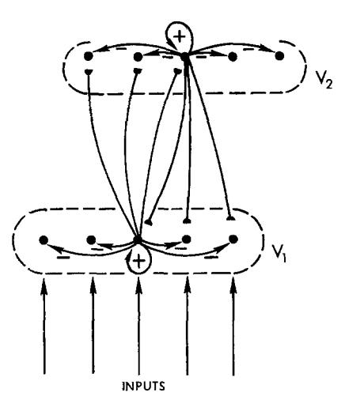
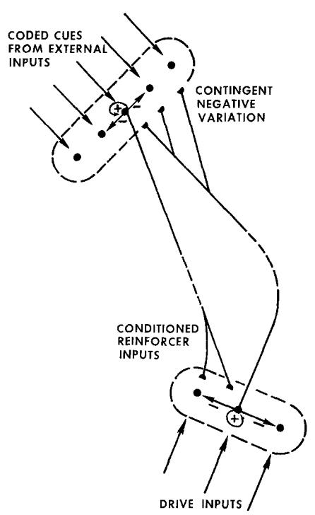
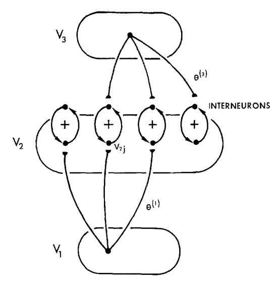
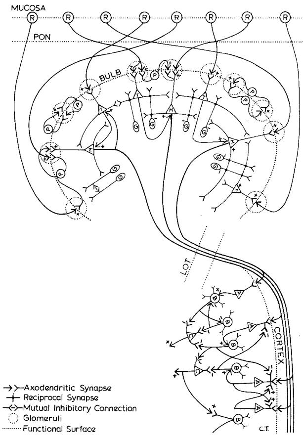
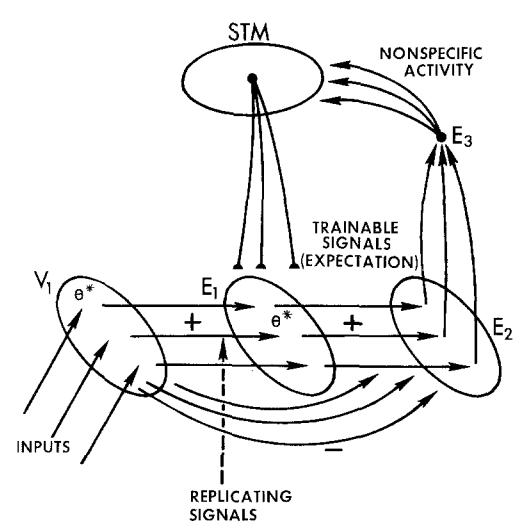
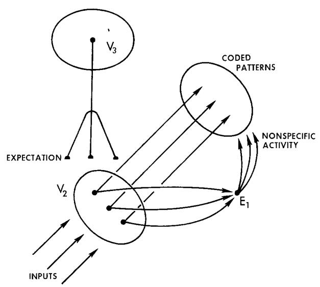
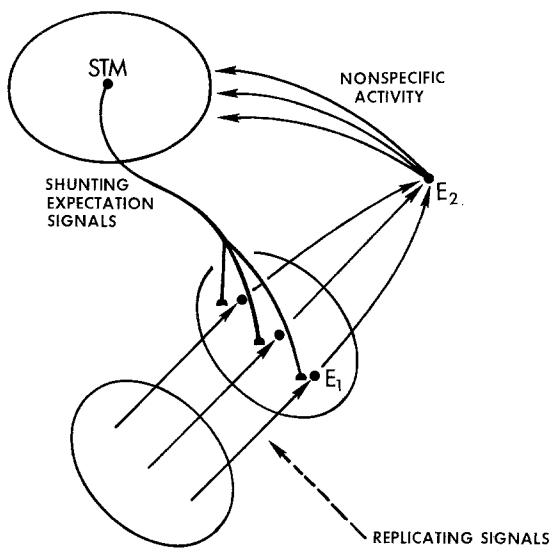
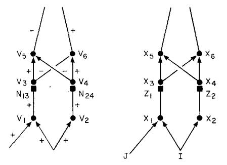
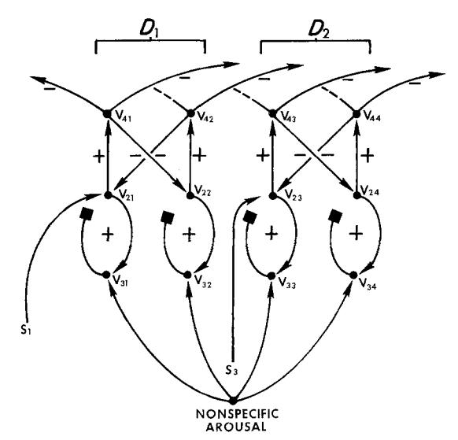
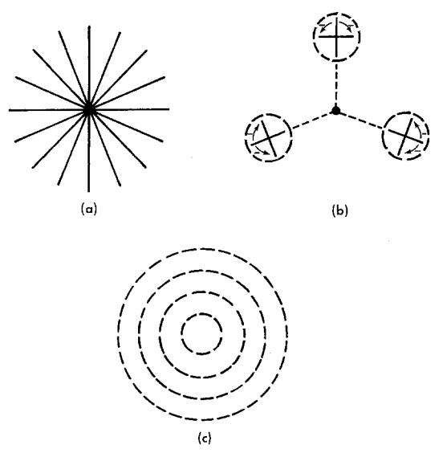

# Adaptive Pattern Classification and Universal Recoding: II. Feedback, Expectation, Olfaction, Illusions

Stephen Grossberg\*

Department of Mathematics, Boston University, Boston, Massachusetts, USA

Abstract. Part I of this paper describes a model for the parallel development and adult coding of neural feature detectors. It shows how any set of arbitrary spatial patterns can be recoded, or transformed, into any other spatial patterns (universal recoding), if there are sufficiently many cells in the network's cortex. This code is, however, unstable through time if arbitrarily many patterns can perturb a fixed number of cortical cells. This paper shows how to stabilize the code in the general case using feedback between cellular sites. A biochemically defined critical period is not necessary to stabilize the code, nor is it sufficient to ensure useful coding properties.

We ask how short term memory can be reset in response to temporal sequences of spatial patterns. This leads to a context-dependent code in which no feature detector need uniquely characterize an input pattern; yet unique classification by the pattern of activity across feature detectors is possible. This property uses learned expectation mechanisms whereby unexpected patterns are temporarily suppressed and/or activate nonspecific arousal. The simplest case describes reciprocal interactions via trainable synaptic pathways (long term memory traces) between two recurrent on-center off-surround networks undergoing mass action (shunting) interactions. This unit can establish an adaptive resonance, or reverberation, between two regions if their coded patterns match, and can suppress the reverberation if their patterns do not match. This concept yields a model of olfactory coding within the olfactory bulb and prepyriform cortex. The resonance idea also includes the establishment of reverberation between conditioned reinforcers and generators of contingent negative variation if presently available sensory cues are compatible with the network's drive requirements at that time; and a search and lock mechanism whereby the disparity between

two patterns can be minimized and the minimal disparity images locked into position. Stabilizing the code uses attentional mechanisms, in particular nonspecific arousal as a tuning and search device. We suggest that arousal is gated by a chemical transmitter system – for example, norepinephrine – whose relative states of accumulation at antagonistic pairs of on-cells and officells through time can shift the spatial pattern of STM activity across a field of feature detectors. For example, a sudden arousal increment in response to an unexpected pattern can reverse, or rebound, these relative activities, thereby suppressing incorrectly classified populations. The rebound mechanism has formal properties analogous to negative afterimages and spatial frequency adaptation.

#### 1. Introduction

In Part I of this paper (Grossberg, 1976a) a model for the parallel development and adult coding of neural feature detectors was analysed. In this model, a network region  $V_1$  sends signals to region  $V_2$  via trainable pathways. Region  $V_1$  is capable of normalizing its total activity. Region  $V_2$  can normalize its total activity, contrast enhance the  $V_1$ -to- $V_2$  signals, and store the contrast-enhanced pattern in short term memory (STM). The STM pattern thereupon causes slow changes in the long term memory (LTM) traces of the  $V_1$ -to- $V_2$  pathways. These LTM changes are the basis for reclassification by  $V_2$  of spatial patterns at  $V_1$ .

Part I shows that the code that develops in this way is unstable if arbitrarily many patterns at  $V_1$  perturb a fixed number of cells in  $V_2$ . This paper attacks the problem of stabilizing network responses to arbitrarily chosen space-time patterns at  $V_1$ ; in particular, to classes of spatial patterns of arbitrary size. We continue where Part I left off. The  $i^{th}$  equation from Part I will be denoted by the notation (Ii) below. A similar notation will be used to denote the  $i^{th}$  Section in Part I.

<sup>\*</sup> Supported in part by the Advanced Research Projects Agency under ONR Contract No. N00014-76-C-0185

# 2. Adaptive Resonance: Stable Coding and Reset of STM

When a temporal succession  $\Theta^{(1)}, \Theta^{(2)}, ..., \Theta^{(k)}$ ... of spatial patterns  $\Theta^{(k)} = (\Theta_1^{(k)}, \Theta_2^{(k)}, \dots, \Theta_n^{(k)})$  perturbs  $V_1$ , how does each pattern  $\Theta^{(k)}$  inhibit the STM pattern on  $V_2$  that was elicited by the previous pattern  $\Theta^{(k-1)}$ , and reset  $V_2$  to store data derived from  $\Theta^{(k)}$  without bias? This question can be reversed in an information way: can  $V_2$  be protected from continual inhibition of its STM throughout the time interval during which a fixed  $\Theta^{(k-1)}$  is presented to  $V_1$ ? In other words, how does the network know the spatial pattern  $\Theta^{(k-1)}$  is changed to a different pattern  $\Theta^{(k)}$ ? The assumption that STM must be actively inhibited in order to shut it off is a mathematical property of reverberating shunting networks (Grossberg, 1973; Ellias and Grossberg, 1975; Grossberg and Levine, 1975). Otherwise there would be an averaging in STM of the codes for all the patterns  $\Theta^{(1)}$ ,  $\Theta^{(2)}$ , ...,  $\Theta^{(k)}$ , ..., and no useful coding of any one pattern.

Section (I8) shows that there are two possible ways to stabilize STM in response to a space-time pattern. Both possible ways will be considered below; namely, inhibition of  $V_1$ -to- $V_2$  signals by feedback from  $V_2$  to  $V_1$ , followed by a shift in the spatial locus of STM activity at  $V_2$ ; and a direct shift in STM locus at  $V_2$  when the input pattern at  $V_1$  changes. Both mechanisms seem to have important practical applications.

The former mechanism has a minimal realization in which  $V_1$  and  $V_2$  send each other conditionable excitatory signals, and recurrent on-center off-surrounds exist in both  $V_1$  and  $V_2$ , as in Figure 1. To derive this mechanism, let two distinct patterns  $\Theta^{(1)}$  and  $\Theta^{(2)}$  successively perturb  $V_1$ , and let  $\Theta^{(i)}$  be coded by  $v_{2i}$ , i=1,2, in  $V_2$ . The mechanism will have the following properties. When  $\Theta^{(1)}$  perturbs  $V_1$ ,  $V_1$ -to- $V_2$  signals activate STM at  $v_{21}$ . Population  $v_{21}$  remains active



Fig. 1. Minimal anatomy of an adaptive resonance

when  $\Theta^{(2)}$  perturbs  $V_1$ , but  $V_1$ -to- $V_2$  signals are suppressed. Then  $v_{21}$ 's activity is also suppressed, whereupon  $\Theta^{(2)}$  can generate  $V_1$ -to- $V_2$  signals that activate STM at  $v_{22}$ . We already know how  $\Theta^{(1)}$  activates  $v_{21}$ , and how  $v_{21}$  remains active in STM. How are  $V_1$ -to- $V_2$  signals suppressed when  $\Theta^{(2)}$  perturbs  $V_1$ ? If  $v_{21}$  were not active in STM when  $\Theta^{(2)}$  perturbs  $V_1$ , then suppression would not occur, since  $\Theta^{(2)}$  would activate STM just as  $\Theta^{(1)}$  did. Moreover, if  $v_{22}$  were active in STM, rather than  $v_{21}$ , then  $V_1$ -to- $V_2$  signals would not be suppressed, just as signals are not suppressed after  $\Theta^{(1)}$  excites  $v_{21}$ . Thus,  $V_1$ -to- $V_2$  signals are suppressed because feedback signals from  $v_{21}$  to  $V_1$  somehow reproduce  $\Theta^{(1)}$  at  $V_1$ , and these signals compete with the  $\Theta^{(2)}$  input to suppress  $V_1$ -to- $v_{21}$  signals.

How can  $v_{21}$ -to- $V_1$  signals reproduce  $\Theta^{(1)}$  at  $V_1$ ? There is only one way in the present setup. While  $V_1$ -to- $v_{21}$  signals are learning to code  $\Theta^{(1)}$ , feedback signals from  $v_{21}$ -to- $V_1$  also learn to reproduce  $\Theta^{(1)}$  at  $V_1$ ; that is, the pathways from  $V_1$  to  $V_2$  and from  $V_2$  to  $V_1$  are both trainable.

Given this much, how does mixing two different patterns, such as  $\Theta^{(1)}$  and  $\Theta^{(2)}$ , at  $V_1$  suppress  $V_1$ -to- $V_2$  signals, whereas either of these patterns separately does not? More generally, what class of patterns at  $V_1$ , whether due to pattern mixture or to external perturbation, suppresses  $V_1$ -to- $V_2$  signals? The following constraints motivate the construction:

- (A)  $V_1$  is a shunting network;
- (B) signals typically add up in such a network; and
- (C) feedback signals from  $v_{2i}$  to  $V_1$  do not shut off  $V_1$ -to- $v_{2i}$  signals when input  $\Theta^{(i)}$  also perturbs  $V_1$ , i = 1, 2.

Given these constraints, the class of uniform patterns across  $V_1$  ( $\Theta_i = 1/n$ , i = 1, 2, ..., n) will suppress output from  $V_1$ ; in other words, only spatial differences in pattern intensity will generate outputs from  $V_1$ . This property emerges naturally in shunting networks, and is familiar, for example, in visual physiology.

How does this property accomplish our goal? When  $\Theta^{(1)}$  is presented at  $V_1$ , signals from  $V_1$  to  $V_2$  excite  $v_{21}$ . Feedback from  $v_{21}$  to  $V_1$  adds learned signals that are proportional to  $\Theta^{(1)}$  to the external  $\Theta^{(1)}$  input. By additivity, the mixture of signals is again the pattern  $\Theta^{(1)}$ , albeit with a different total activity. Hence  $V_1$ -to- $V_2$  signals continue to excite  $v_{21}$ . A resonance between  $V_1$  and  $V_2$  develops that sustains STM activity at  $v_{21}$ .

When  $\Theta^{(2)}$  appears at  $V_1$ , the  $v_{21}$ -to- $V_1$  signals still are proportional to  $\Theta^{(1)}$ . If the sum of  $\Theta^{(2)}$  inputs and  $\Theta^{(1)}$  signals at  $V_1$  is (approximately) uniform, then  $V_1$ -to- $V_2$  signals are inhibited, or at least damped. [All that is needed is a  $V_1$ -to- $V_2$  signal that is too small to exceed the quenching threshold (QT).] This event inhibits STM activity at  $v_{21}$ , so that  $v_{21}$ -to- $V_1$  signals

terminate. Then only the  $\Theta^{(2)}$  input is active at  $V_1$ , so that  $V_1$ -to- $V_2$  signals are elicited, but now activate  $v_{22}$ .

How does inhibition of  $V_1$ -to- $v_{21}$  signals inhibit STM activity at  $v_{21}$ ? This will not happen if recurrent excitatory signals within  $V_2$  can sustain activity in STM. Hence we assume that the QT is chosen sufficiently high to prevent STM reverberation at  $v_{21}$  unless  $V_1$ -to- $v_{21}$  signals are sufficiently large. Reverberation in STM is now accomplished by an excitatory resonance of signals between  $V_1$  and  $V_2$ . The inhibitory off-surrounds in  $V_1$  and  $V_2$  continue to normalize and contrast enhance activity within these regions, but the STM itself is now carried by reverberation between them.

It remains to develop the above ideas mathematically. First we show how a uniform pattern is suppressed. This will be done by developing Equation (I1), for simplicity; namely,

$$\dot{x}_{1i} = -Ax_{1i} + (B - x_{1i})I_i - x_{1i} \sum_{k \neq i} I_k.$$
 (I1)

In (11), an assumption is made that does not hold in all membranes; namely, that the passive equilibrium potential (namely O in  $\dot{x}_{1i} = -Ax_{1i}$ ) equals the inhibitory equilibrium potential (namely O in  $\dot{x}_{1i} = -x_{1i} \sum_{k=1}^{N} I_k$ ). More generally,

$$\dot{x}_{1i} = -Ax_{1i} + (B - x_{1i})I_i - (x_{1i} + C)\sum_{k+1} I_k,$$
 (1)

where C > 0. The constant C is related to the Nearnst potential for potassium (Hodgkin, 1964; Katz, 1966). Consider the equilibrium value of (1) in response to spatial pattern  $I_i = \Theta_i I$ . Then

$$x_{1i} = \frac{(B+C)I}{A+I} \left[ \Theta_i - \frac{C}{B+C} \right]. \tag{2}$$

Suppose for definiteness that

$$B = (n-1)C. (3)$$

Then

$$x_{1i} = \frac{nCI}{A+I} \left( \Theta_i - \frac{1}{n} \right). \tag{4}$$

Also suppose that signals  $h(x_{1i})$  from  $v_{1i}$  to  $V_2$  are generated only if  $x_{1i} > 0$ ; e.g., set  $h(x_{1i}) = [x_{1i}^P]^+$  for some p > 0, where  $[u]^+ = \max(u, 0)$ . Now let  $I_i$  be a uniform pattern (all  $\Theta_i = 1/n$ ). By (4), all  $x_{1i} = 0$  so that no signals are generated. In effect, setting C > 0 contrast-enhances the signals from  $V_1$  to  $V_2$  by chopping off the "uniform part" of inputs to  $V_1$ . Condition (3) can be weakened to

$$B \le (n-1)C \tag{5}$$

since then, in (2),  $C(B+C)^{-1} \ge 1/n$  and signals are even harder to generate. Generalizations to situations in which the on-center and off-surround connection strengths depend on distance can also be made, as in

$$\dot{x}_{1i} = -Ax_{1i} + (B - x_{1i}) \sum_{k} I_k C_{ki} - (x_{1i} + D) \sum_{k} I_k E_{ki}. \quad (6)$$

Levine and Grossberg (1975) show how the behavior of these nonrecurrent networks, and analogous recurrent networks, such as (I4), can formally model certain visual illusions, such as line neutralization, tilt aftereffect, and angle expansion. The size of D in (6) influences how pronounced the angle expansion will be, for example; this is again a contrast enhancement effect.

Equation (1) describes how  $V_1$  processes external patterns  $(I_1, I_2, ..., I_n)$ . Now add on the influence of feedback signals from  $V_2$ , again in an on-center off-surround anatomy. Denote the total feedback signal from  $V_2$  to  $v_{1i}$  by  $J_i$ . Then (1) becomes

$$\dot{x}_{1i} = -Ax_{1i} + (B - x_{1i})(I_i + J_i) - (x_{1i} + C) \sum_{k \neq i} (I_k + J_k).$$
(7)

We will check that, both before and after learning occurs, feedback does not interfere with coding by  $V_2$  of a pattern  $(I_1, I_2, ..., I_n)$  at  $V_1$ . Before learning occurs, feedback is uniformly distributed; that is,  $J_i = \frac{1}{n}J$ . By (7), in response to a spatial pattern  $I_i = \Theta_i I$ , the equilibrium value of  $v_{1i}$  is then

$$x_{1i} = \frac{nCI}{A+I+J} \left( \Theta_i - \frac{1}{n} \right), \tag{8}$$

which differs from (4) only by a reduction in total activity due to J. At time t=0, therefore, feedback signals begin to learn the pattern  $\Theta$ . Will this be true at all times  $t \ge 0$ ? That is, if feedback is proportional to  $\Theta$ , will the pattern at  $V_1$  be  $\Theta$ ? Additivity of inputs to  $V_1$  guarantees this: if  $I_i = \Theta_i I$  and  $J_i = \Theta_i J$ , then the equilibrium value of  $v_{1i}$  is

$$x_{1i} = \frac{nC(I+J)}{A+I+J} \left(\Theta_i - \frac{1}{n}\right),\tag{9}$$

which differs from (4) only by an amplification in total activity due to J. Adding feedback signals to a shunting on-center off-surround anatomy does not change the coding by  $V_2$  of signals from  $V_1$ ! A similar analysis holds for the system in which recurrent on-center off-surround signals replace the nonrecurrent on-center off-surround inputs of (7). The recurrent system will be needed herein, because the feedback signals  $J_i$  will contain summands whose trainable synaptic strengths are determined by the postsynaptic activities  $x_{1i}$ . See Section (I2) for an explanation. Thus we let  $V_1$  be

governed by system

$$\dot{x}_{1i} = -Ax_{1i} + (B - x_{1i}) \left[ \sum_{k=1}^{n} f(x_{1k}) C_{ki} + I_i + J_i \right]$$

$$-(x_{1i} + D) \sum_{k=1}^{n} f(x_{1k}) E_{ki}.$$
(10)

The feedback signals  $J_i$  are defined as follows. The signals from each  $v_{2j}$  to  $V_1$  are trainable. Denote the synaptic strength of the path  $p_{ji}$  from  $v_{2j}$  to  $v_{1i}$  by  $y_{ji}$ . The total signal from  $V_2$  to  $v_{1i}$  is then (simplest case!)

$$J_i = x^{(2)} \cdot y^{(i)} = \sum_{k=1}^{N} x_{2j} y_{ji}$$
.

In case  $V_2$  chooses a population for STM storage, say  $v_{2j}$ , then  $J_i = x_{2j}y_{ji}$ , and the feedback pattern across  $V_1$  is determined by the vector  $y^{(i)} = (y_{j1}, y_{j2}, ..., y_{jn})$  of synaptic strengths.

What rule governs the training of each  $y^{(i)}$ ? As usual,  $y_{ji}$  will learn by computing a time average of multiplied presynaptic signals and postsynaptic activities. Two comments are in order:

- i) As in (I6), let training terminate if no STM activation occurs at  $V_2$ ;
- ii) Since  $x_{1i}$  can be driven to negative values, which do not generate  $V_1$ -to- $V_2$  signals, and since we want feedback to reproduce the  $V_1$  pattern that is coded by  $V_2$ , restrict learning by the feedback synaptic strengths to supraequilibrium  $x_{1i}$  values. By (i) and (ii),

$$\dot{y}_{ii} = \{-y_{ii} + [x_{1i}]^+\} x_{2i}. \tag{11}$$

These equations obviously code the pattern  $I_i = \Theta_i I$  at  $V_1$  if the  $y^{(i)}(0)$  patterns are uniform and  $V_2$  makes a choice.

Finally, we choose the QT of  $V_2$  sufficiently large so that termination of  $V_1$ -to- $v_{2j}$  signals suppresses  $v_{2j}$ 's STM reverberation. Then excitatory signals from  $V_1$  generate recurrent signals within  $V_2$  that contrast enhance, or even choose,  $V_2$  populations for STM storage. As in (I6), let  $S_j \equiv I_{2j}$  be the total  $V_1$ -to- $v_{2j}$  signal; thus

$$S_j = x^{(1)} \cdot z^{(j)} \equiv \sum_{k=1}^{N} x_{1k} z_{kj},$$
 (12)

and let  $V_2$  obey a system of the same form as (I4); namely

$$\dot{x}_{2j} = -Ax_{2j} + (B - x_{2j}) \left[ \sum_{k=1}^{N} f(x_{2k}) C_{kj} + I_{2j} \right] - (x_{2j} + D) \sum_{k=1}^{N} f(x_{2k}) E_{kj}.$$
(13)

In summary, recurrent on-center off-surround interactions exist within both  $V_1$  and  $V_2$ , and excitatory trainable signals exist in both directions between  $V_1$ 

and  $V_2$ . In particular,  $V_1$  must be a higher-order network processing station than a retina. Generalizations of Equations (10)-(13) are readily accomplished, by explicitly including the finite reaction rates of inhibitory interneurons, or by using more complicated signal functions. The papers by Ellias and Grossberg (1975), Grossberg and Levine (1975), and Levine and Grossberg (1976) indicate how these changes will influence network dynamics. The following two comments might also be useful. First, when  $\Theta^{(1)}$  is changed to  $\Theta^{(2)}$ , suppression of  $V_1$ -to- $V_2$  signals occurs before the trainable coefficients can substantially change. In other words, the stability of STM coding in an adaptive resonance depends heavily on the existence of different reaction rates for STM and LTM traces. Second, even if there is no biochemically triggered critical period, a critical period exists in an adaptively resonating network while the STM code is being established. The critical period terminates when learned feedback from  $V_2$  to  $V_1$  prevents recoding from occurring at any population in  $V_2$ .

# 3. Adaptive Resonance in Reinforcement, Motivation, and Attention

A case can be made for adaptive resonance as a general organizational principle in vivo. One important example will be noted in this section, and related examples in the next two sections. The first example describes an adaptive resonance whose trainable synaptic strengths can change during adulthood.

Grossberg (1975a) describes a neuropsychological theory of attention that builds on earlier work concerning reinforcement (Grossberg, 1971, 1972a, 1972b). Without redeveloping this theory herein, we sketch a part of it in which an adaptive resonance occurs. Consider Figure 2. This figure idealizes an adaptive resonance in which  $V_1$  and  $V_2$  both possess recurrent on-center off-surround interactions, and both  $V_1$ -to- $V_2$ and  $V_2$ -to- $V_1$  synaptic strengths are conditionable. Region  $V_1$  receives (precoded) external sensory cues, and region  $V_2$  receives inputs generated by internal drives. Signals from  $V_1$ -to- $V_2$  are trained when rewards act at  $V_2$ ; their patterns code the balance of drives and rewards across  $V_2$  populations when their  $V_1$  sampling cells are active. Signals from  $V_2$ -to- $V_1$  learn "psychological sets", or the classes of cues that have regularly occurred contiguously in time with a given active drive center.

The  $V_1$ -to- $V_2$  signals embody the conditioned reinforcer properties of a cue that activates  $V_1$ . The  $V_2$ -to- $V_1$  signals are interpreted as idealizations of the contingent negative variation, or CNV (Cohen, 1969). Such a wave has been associated with an animal's expectancy, decision (Walter, 1964), motivation (Irwin



Fig. 2. An adaptive resonance that helps to regulate attention to external cues that are compatible with internal needs

et al., 1966; Cant and Bickford, 1967), volition (McAdam et al., 1966), preparatory set (Low et al., 1966), and arousal (McAdam, 1969). When this network is embedded into a more complete system of interactions, an interpretation of  $V_1$  as neocortex and of  $V_2$  as hippocampus is suggested.

Since both  $V_1$  and  $V_2$  receive external inputs in this example, both regions have inhibitory equilibrium potentials that can suppress (close to) uniform patterns. Adaptive resonance here means that the conditioned reinforcer properties of presently available sensory cues are compatible with the network's drive requirements at that time. When resonance is established, motor activity that consummates this consensus can be triggered further downstream in the network (Grossberg, 1975a). Note that no feature detector in  $V_1$  need uniquely determine an input pattern; yet resonance will not be established unless the pattern of activity in  $V_1$  accurately codes the input. The code is *context-dependent*.

### 4. Search and Lock Mechanism

Each of our eyes looks out on visual space from a different position. To focus an object at a finite depth, the eyes verge together until a good match of their separate images is achieved. Then fixation on the object can be maintained. How do our eyes know when this match has been achieved, so that searching eye

movements can cease and a fixated position can be maintained?

A resonance mechanism much like the one in Section 3 can achieve this. Let recurrent on-center offsurround signals exist within  $V_1$  and  $V_2$  separately. Replace the trainable interfield signals of Section 3 either by untrainable on-center off-surround signals. or just on-center signals if the recurrent intrafield offsurround interactions are sufficiently strong. Thus each  $v_{1i}(v_{2i})$  is the center of signals from  $v_{2i}(v_{1i})$ . As in Section 3, suppose that signals and inputs must match to initiate reverberation between  $V_1$  and  $V_2$ . In Section 3, this meant that the coded signals released by one input pattern have to match the other input pattern. Here it means that the two input patterns themselves must match. Thus, only if the two eyes are correctly verged, thereby receiving matched patterns, will  $V_1$  and  $V_2$ reverberate. Now assume that output from  $V_1$  and  $V_2$ inhibits the arousal source that drives the eye movements. Fixation is hereby achieved. See Julesz (1971) for a discussion of interacting fields of dipoles that have a search and lock capability.

# 5. Olfactory Coding and Learned Expectation

In this example, three regions  $V_1$ ,  $V_2$ , and  $V_3$  interact in a way that suggests comparison with data on the neural processing of olfactory stimuli. The main points will be made using the simplest network realizations of relevant mechanisms.

Let  $V_1$  be endowed with recurrent shunting oncenter off-surround interactions. Thus

$$\dot{x}_{1i} = -A^{(1)}x_{1i} + (B^{(1)} - x_{1i}) \left[ \sum_{k=1}^{N_1} f_1(x_{1k}) C_{ki}^{(1)} + I_i \right] - (x_{1i} + D^{(1)}) \sum_{k=1}^{N_1} f_1(x_{1k}) E_{ki}^{(1)};$$
(14)

 $V_1$  can normalize and contrast-enhance input patterns if the signal function  $f_1(w)$  and/or interaction coefficients  $C_{ki}^{(1)}$  and  $E_{ki}^{(1)}$  are properly chosen.

Region  $V_2$  is also endowed with recurrent shunting on-center off-surround interactions, as in

$$\dot{x}_{2j} = -A^{(2)}x_{2j} + (B^{(2)} - x_{2j}) \left[ \sum_{k=1}^{N_2} f_2(x_{2k}) C_{kj}^{(2)} + S_j \right] - (x_{2j} + D^{(2)}) \sum_{k=1}^{N_2} f_2(x_{2k}) E_{kj}^{(2)}$$
(15)

where  $D^{(2)} > 0$ . The total signal  $S_j$  is the sum of two parts,  $S_j^{(1)}$  and  $S_j^{(3)}$ . Signal  $S_j^{(1)}$  is the total signal from  $V_1$  to  $v_{2j}$ ; it codes patterns at  $V_1$  using an inner-product signal-generating rule, such as

$$S_j^{(1)} = \sum_{k=1}^{N_1} h_1(x_{1k}) z_{kj}, \qquad (16)$$

where  $h_1(w)$  is the excitatory  $V_1$ -to- $V_2$  signal function — for example,  $h_1(w) = \lfloor w^p \rfloor^+$ , p > 0 — and  $z_{kj}$  is the synaptic strength from  $v_{1k}$  to  $v_{2j}$ . Signal  $S_j^{(3)}$  is the total signal from a third region  $V_3$  to  $v_{2j}$ ; these signals will be trainable. In effect,  $V_3$  will have a similar relationship to  $V_2$  here as  $V_2$  had to  $V_1$  in Section 2. The signal  $S_j^{(3)}$  also has an inner-product form, namely

$$S_j^{(3)} = \sum_{k=1}^{N_3} h_3(x_{3k}) y_{kj}, \qquad (7)$$

where  $h_3(w)$  is the excitatory  $V_3$ -to- $V_2$  signal function, and  $y_{kj}$  is the trainable synaptic strength from  $v_{3k}$  to  $v_{2j}$ . As in Section 2, if the pattern  $\Theta = (\Theta_1, \Theta_2, \ldots, \Theta_{N_1})$  is approximately uniform, where  $\Theta_j = S_j \left(\sum_{k=1}^{N_2} S_k\right)^{-1}$ , then  $V_2$ 's output will be suppressed. The signal pattern  $\Theta^{(3)} = (\Theta_1^{(3)}, \Theta_2^{(3)}, \ldots, \Theta_{N_1}^{(3)})$  from  $V_3$  to  $V_2$  such that  $\Theta_j^{(3)} = S_j^{(3)} \left(\sum_{k=1}^{N_2} S_k^{(3)}\right)^{-1}$  constitutes an expectation, or expected pattern, that is learned when activity in certain  $V_3$  populations coincides with the elicitation of  $\Theta^{(3)}$  at  $V_2$ . If the afferent signal pattern  $\Theta^{(1)} = (\Theta_1^{(1)}, \Theta_2^{(1)}, \ldots, \Theta_{N_1}^{(1)})$  from  $V_1$  to  $V_2$ , defined by  $\Theta_j^{(1)} = S_j^{(1)} \left(\sum_{k=1}^{N_2} S_k^{(1)}\right)^{-1}$ , is parallel to  $\Theta^{(3)}$ , then  $V_2$  is allowed

to transfer this pattern to higher network centers, with perhaps some contrast control due to fluctuations in total signal strength at  $V_2$ , as between (4) and (9). However, if  $\Theta^{(1)}$  is complementary to  $\Theta^{(3)}$ , then  $V_2$ 's output is quenched, and higher centers do not receive the pattern.

Some further comment about the pathways from  $V_3$  to  $V_2$  is in order. One provocative connection scheme is the following: let  $V_3$ -to- $V_2$  signals terminate on the excitatory on-center interneurons of  $V_2$ , as in Figure 3. Signals from  $V_3$  to  $V_2$  sample the pattern, say  $\Theta^{(3)}$ , at these interneurons during learning trials. Later activation of  $V_3$  can then reproduce  $\Theta^{(3)}$  at the interneurons on performance trials. The input pattern  $\Theta^{(1)}$ to  $V_2$ , after being averaged by the populations  $v_{2j}$ , is then added to  $\Theta^{(3)}$  at the interneurons. If the net pattern  $\Theta$  is parallel to  $\Theta^{(1)}$ , then interneuronal feedback to  $V_2$  gradually normalizes and contrast enhances  $\Theta^{(1)}$  until it achieves a stable asymptotic configuration. If  $\Theta$  is approximately uniform, however, then interneuronal feedback tends to suppress the reverberation. If the amplification of interneuronal feedback signals is large compared to the size of  $V_1$ -to- $V_2$  signals, then this feedback will determine whether or not  $\Theta^{(1)}$  is quenched at  $V_2$ .

There exist numerous variations on the above theme. For example, let  $V_2$  be an *unlumped* recurrent on-center off-surround network, in which the inhibitory interneurons average their excitatory inputs at a finite rate. Then  $V_2$  is capable of an approximately periodic



Fig. 3. Expectation signals from  $V_3$ -to- $V_2$  inhibit  $V_2$ 's response to signals from  $V_1$ -to- $V_2$  unless  $\Theta^{(1)}$  is approximately parallel to  $\Theta^{(3)}$ 

oscillation of activity, or limit cycle, in response to afferent signals (Ellias and Grossberg, 1975). The expected pattern can then quench the limit cycle if the afferent pattern is unexpected, or can amplify an expected afferent pattern, as in (9), until it triggers limit cycle activity. For the unlumped system to code a spatial pattern, the same ordering of STM activities should (approximately) hold through time, except possibly for phase leads due to the shunt. By Ellias and Grossberg (1975, Section 18), such a limit cycle can exist if the expected pattern serves as an input source and the test pattern (approximately) matches it. In particular, order-preserving limit cycles can exist in an unlumped adaptive resonance. I conjecture also that in unlumped systems whose inhibitory gain is sufficiently large (fast oscillations), a limit cycle can be approximately order-preserving in a finite time interval, since the lumped system (infinitely fast oscillations) is asymptotically order-preserving. Indeed by "perturbing off the fast manifold"—that is decreasing inhibitory gain—an infinite range of oscillation frequencies can be achieved.

Is there a physical advantage to letting the expectation operate from  $V_3$  to  $V_2$  rather than from  $V_2$  to  $V_1$ , as in Section 2? There is. In the former case, the expectation is compared to coded patterns; for example, to the generalization gradient of a pattern at  $V_1$ ; cf., Section (I3). If a set of patterns at  $V_1$  has a similar generalization gradient at  $V_2$ , then a single expectation from  $V_3$  can quench, or amplify, them as a class. In other words, if an expectation is learned in response to one pattern at  $V_1$ , then it will act similarly on any equivalent pattern at  $V_1$ . In this sense, the generalization gradient, or code, of a pattern defines the pattern features that are behaviorally important to the network.



**Fig. 4.** Anatomy of olfactory bulb, lateral olfactory tract, and prepyriform cortex (from Freeman, 1972)

The above network suggests an analog with olfactory coding such that  $V_1$  idealizes the olfactory bulb and  $V_2$  idealizes the prepyriform, or primary olfactory, cortex (Freeman, 1972). In this analogy, granule cells in both the olfactory bulb and prepyriform cortex subserve recurrent inhibitory interactions, the mitral and tufted cells in the olfactory bulb act as excitatory populations, and superficial pyramidal cells in the prepyriform cortex act as excitatory populations. Signals from  $V_1$  to  $V_2$  idealize the lateral olfactory tract; see Figure 4.

Given this interpretation, the model generates several implications. In the *lumped* model, wherein inhibitory cells equilibrate rapidly, the generalization gradient at  $V_2$  of a smell-induced pattern at  $V_1$  determines the olfactory code. In other words, a "place theory" (Somjen, 1972, p. 304) or "activity density function" (Freeman, 1972, p. 112) at  $V_2$  determines the code. This suggestion is similar to the idea that the afferent taste message is coded by the relative amount (or spatial pattern!) of neural activity across many neurons (Pfaffman, 1955), in particular across chorda tympani fibers (Erickson, 1963). In the *unlumped* model,

where limit cycle activity is possible, the coded spatial pattern becomes a space-time pattern of activity. In the special case that all populations in  $V_2$  are inhibited by each population in  $V_2$ , this limit cycle might merely describe cyclic changes in contrast enhancement which do not invert the relative ordering of activities of the populations in  $V_2$  (Ellias and Grossberg, 1975). More commonly, a given population in  $V_2$  can only inhibit a subset of populations in  $V_2$ . Then the limit cycle behavior can be more complex. Because spatially localized feedback signals can change the net gain of each population's activity to different values at different positions, the frequency, the phase, and the peak amplitude of oscillation at a given population can be correlated; cf., the Hughes-Hendrix frequency theory of coding (Hughes and Hendrix, 1967; Somjen, 1972).

The inner-product signal-generating rule (16) requires that signals from each  $v_{1i}$  be dispersed broadly across  $V_2$ . We therefore expect each mitral cell to send divergent signals across large prepyriform regions via its axons in the lateral olfactory tract. See Freeman (1972, p. 133) for a review of confirming evidence.

With these conventions in mind, an interesting possibility emerges. If the olfactory system were found to have a critical period in which its code can be retuned by experience, then one place to look for trainable synapses in a sensory cortex is at lateral olfactory synaptic knobs in the prepyriform cortex during the critical period.

Emery and Freeman (1969) show that the prepyriform cortex can filter its olfactory messages by a mechanism of selective attention, which is based on the formation of a spatial pattern of excitability in the excitatory feedback gains of the cortical superficial pyramidal cells; see Freeman (1974, p. 3) for a summary. This spatial pattern acts like an expectation, since if the olfactory pattern to the cortex matches the expected pattern, then the cortex can sustain the pattern. Otherwise, the pattern is quenched. We suggest that the expectation mechanism works as described above, where also the expectation modifies the excitatory feedback gain of the cells in  $V_2$ .

Several interesting questions about olfactory processing are now suggested. What brain region acts like  $V_3$ ? Given that such a region exists, then the  $V_3$ -to- $V_2$  synaptic knobs should provide trainable preparations in an adult mammalian sensory cortex. If  $V_3$  exists, does it sustain an adaptive resonance with  $V_2$ , as  $V_2$  and  $V_1$  do in Section 2? If so, then a critical period could exist at  $V_2$ -to- $V_3$  synaptic knobs, rather than  $V_1$ -to- $V_2$  synaptic knobs. Indeed, is  $V_3$  a formal prepyriform cortex,  $V_2$  its olfactory bulb, and  $V_1$  the source of olfactory messages? Or is  $V_3$  simply a source of extramodality signals that can preset the system to expect a given class of patterns?

# 6. Modulation of Nonspecific Arousal by a Learned Expectation Mechanism

The mechanisms in Section 2 cannot be the only ones that reset STM. An adaptive resonance, for example, can code only one class of patterns at a time in STM. By contrast, sequential STM buffer effects are familiar in vivo; for example, repeating a telephone number, or other sequence of events, that has temporarily been stored in STM. An adaptive resonance is incapable of building a hierarchy of command states that are simultaneously active in STM; such a hierarchy is needed to control a behavioral plan, or goal-oriented series of sensory-motor coordinations (Grossberg, 1976c). If we imagine that  $V_3$  in Section 5, or higher network regions, participate in such sequential and/or hierarchical STM structures, then we must find a way to regulate the pattern of STM activities across these structures in response to new sensory data.

A basic property of such a mechanism is illustrated by the following example. A telephone number can be stored in STM without rehearsing all of its digits at the same time, or indeed any of its digits at certain times. Such unrehearsed but stored items are "opaque" to the learning subject. Yet presentation of a new digit can reset the storage of *all* of these items to make room for the new digit. The mechanism that does this therefore *nonspecifically* influences all the items coded in the neural field; cf., Grossberg (1976b).

The expectation mechanisms of Sections 2 and 5 delete present coding of all patterns in a field to code a new pattern. To synthesize mechanisms that can influence all coded patterns without necessarily deleting them, the input patterns in some examples below will be replicated in two parallel representations. The pattern in one representation will be coded as before. The pattern in the other representation will provide data to the nonspecific mechanism that reorganizes the opaque field of STM activities. This latter mechanism will act as a correlation filter, or decision function, that releases nonspecific activity at prescribed times; it does not pass the patterns themselves to higher centers.

There exist both additive and shunting versions of the mechanism. Both are included to develop the themes of Section (I4). The minimal additive version was derived in Grossberg (1972c, 1975a). The basic idea is as follows. The STM pattern generated by an input pattern  $\Theta$  is typically not  $\Theta$ , but is rather a coded version of  $\Theta$ . This coded activity will preset the network to expect a pattern  $\Theta^*$ . The expected pattern  $\Theta^*$  will then be compared with the test pattern  $\tilde{\Theta}$  that concurrently perturbs  $V_1$ . If  $\Theta^*$  is close to  $\tilde{\Theta}$ , then a signal will be elicited from a prescribed network



Fig. 5. An additive model for gating nonspecific arousal using expectation signals

population. This signal will control nonspecific arousal of the network populations that subserve STM.

To show how an expectation develops, suppose that  $\Theta$  is followed by  $\Theta^*$  on several learning trials. Consider the time interval on each trial when  $\Theta$  is coded in STM and  $\Theta^*$  is active at  $V_1$ . Then  $\Theta^*$  will be replicated at  $E_1$ , and the coded STM representation of  $\Theta$  will elicit signals to  $E_1$  that learn  $\Theta^*$  using trainable synaptic strengths, as in Figure 5. Thereafter, when  $\Theta$  is coded in STM, pattern  $\Theta^*$  will be elicited at  $E_1$  by  $\Theta$ 's STM representation. The pattern at  $E_1$  is then transferred to  $E_2$  as proportional inhibitory signals, which take the place of the threshold pattern of Section (I4). Thus, the pattern of inhibitory signals represents the pattern  $\Theta^*$  that is expected by the network.

These inhibitory signals will be compared with the pattern weights of the test pattern  $\tilde{\Theta}$ . To accomplish this, when a pattern is presented to  $V_1$ , it is also replicated at  $E_2$  as proportional excitatory signals.

The inhibitory  $V_1 \rightarrow E_1 \rightarrow E_2$  signals that the pattern creates are chosen weaker than the direct excitatory  $V_1 \rightarrow E_2$  signals to achieve net excitatory signals at  $E_2$ from  $V_1$ . Given this structure, let  $\Theta$  be active in STM when  $\tilde{\Theta}$  is presented to  $V_1$ . Only if each excitatory pattern weight at  $E_2$  (of  $\tilde{\Theta}$ ) exceeds the corresponding inhibitory pattern weight (of  $\Theta^*$ ) by a suitable proportionality constant will the output signal from that pathway be positive, as in (I11). A high-band filter adjoined to each such pathway ensures that the net signal in each pathway from  $E_2$  to  $E_3$  is positive only if the excitatory pattern weight is sufficiently close to its inhibitory pattern weight, as in (I12). The firing threshold of the population  $E_3$  in the final common path of these signals is chosen so high that all signals must be positive to fire  $E_3$ . Thus  $E_3$  fires only if  $\Theta$  is



Fig. 6. A postsynaptic shunting model for gating nonspecific arousal using expectation signals

close to  $\Theta^*$ . If no expected pattern  $\Theta^*$  is active, then any test pattern  $\tilde{\Theta}$  can elicit a signal unless further structure is added; for example, add tonically active cells that inhibit  $E_2$  until a prescribed pattern is coded in STM, and thereupon inhibits the tonically active cells via a recurrent off-surround. Grossberg (1972c, 1975a) discusses this mechanism in greater detail.

Two shunting analogs of the expectation mechanism are possible. The simpler shunting mechanism works as in Section 5. A region  $V_3$  presets a region  $V_2$  with an expectation pattern. Signals from  $V_2$  bifurcate: one pathway carries coded patterns, as in Sections 2 and 5; the other path  $E_1$ , which acts like  $E_3$  in Figure 5, sums up the signals from  $V_2$ . Thus if the test pattern at  $V_1$  is unexpected, the output from  $E_3$  will be quenched, whereas if the test pattern is expected, the output from  $E_3$  will be large. This mechanism does not require a replication of pattern representations. See Figure 6.

Another shunting version is more complicated, but is included for completeness. Consider learning trials on which  $\Theta^*$  follows  $\Theta$ . Let  $\Theta$  be coded in STM while  $\Theta^*$  is replicated at  $E_1$ . The signals to  $E_1$  generated by  $\Theta$ 's STM representation will shunt the  $\Theta^*$ -generated output signals from  $E_1$  on their way to  $E_2$  (Fig. 7). For example, suppose that only population  $v_i$  is active in STM, that the  $j^{th}$  population in  $E_1$  is  $e_j$ , and that the synaptic strength from  $v_i$  to the pathway from  $e_j$  to  $E_2$  is proportional to  $\Theta^* \cdot z^{(i)}$ , where  $z^{(i)} = (z_{i1}, z_{i2}, \ldots, z_{in})$ . While this signal is on, the plastic synaptic strengths  $z^{(i)}$  will learn the pattern  $\Theta^*$ . In other words, the plastic synaptic strengths shunt signals as they compute a time average of presynaptic signals and postsynaptic activity. After learning takes place, present pattern  $\widetilde{\Theta}$ 



Fig. 7. A presynaptic shunt for gating nonspecific arousal using expectation signals

to  $V_1$  while  $\Theta$  is coded in STM at  $V_2$ . Then the total output signal from  $E_1$  will be proportional to  $\tilde{\Theta} \cdot z^{(i)}$ , which is proportional to  $\tilde{\Theta} \cdot \Theta^*$  as a result of prior learning. Only if this inner-product signal is sufficiently large will the final common path  $E_2$  fire. Again an output signal is generated only if  $\tilde{\Theta}$  is sufficiently similar to  $\Theta^*$ .

This shunting expectation mechanism has the additional property that it can filter patterns. Suppose that several populations  $v_{i_1}, v_{i_2}, ..., v_{i_k}$  are simultaneously active in STM, and have STM activities  $x_{i_1}, x_{i_2}, ..., x_{i_k}$ . Then the total signal from  $E_1$  to  $E_2$  is proportional to

$$\tilde{\Theta} \cdot \sum_{j=1}^{k} x_{i_j} z^{(i_j)} \,. \tag{18}$$

Thus  $E_2$  can fire if  $\tilde{\Theta}$  is sufficiently close to any  $z^{(ij)}$  that has a sufficiently large activity  $x_{ij}$ .

In both the additive and shunting models, a signal is elicited from the final common path of the expectation mechanism only if the test pattern  $\tilde{\Theta}$  is close to the expected pattern  $\Theta^*$ . Grossberg (1975a) assumes that *every* pattern which is processed by the network is capable of eliciting nonspecific arousal, but that the output from the expectation mechanism inhibits the source of nonspecific activity when an expected event occurs. The net output generates nonspecific arousal in response to unexpected events, as in Section (I6), or to events that occur when there is no prior STM activity, as in Section (I7). Grossberg (1975a) also uses these properties to develop a model of attention and discrimination learning.

The above mechanisms suggest that, in addition to the specific pathways that code prescribed patterns, there exist other pathways that release arousal in response to unexpected events. What are these pathways in the olfactory system? We suggest that they are among the multisynaptic pathways that project from the olfactory bulb into the reticular formation (Noback, 1967, pp. 131–133, 221–230).

#### 7. Universal Recoding

By universal recoding is meant a process whereby any k spatial patterns in  $R^m$  can be recoded into any k spatial patterns in  $R^n$ , for any fixed  $k \ge 1$ ,  $m \ge 2$ , and  $n \ge 2$ . Computer studies aimed at this objective have been reported by Kilmer and Olinski (1974) in their model of hippocampal dynamics.

To accomplish universal recoding, three regions  $V_1$ ,  $V_2$ , and  $V_3$  will be needed. Let  $V_1$  have m populations and let  $V_3$  have n populations. The patterns  $\Theta^{(1)}, \Theta^{(2)}, \ldots, \Theta^{(k)}$  in  $R^m$  will be serially presented to  $V_1$  as the corresponding patterns  $\tilde{\Theta}^{(1)}, \tilde{\Theta}^{(2)}, \ldots, \tilde{\Theta}^{(k)}$  in  $R^n$  are presented to  $V_3$ . Each pattern  $\Theta^{(i)}$  at  $V_1$  will be coded at  $V_2$  by a unique population  $v_{2i}$ . Thus  $V_2$  contains at least k populations. Then  $v_{2i}$  can sample the pattern  $\tilde{\Theta}^{(i)}$  at  $V_3$  until its trainable  $v_{2i}$ -to- $v_3$  synapses learn this pattern. Consequently, on performance trials, presenting  $\Theta^{(i)}$  at  $V_1$  excites  $v_{2i}$ , which thereupon reproduces  $\tilde{\Theta}^{(i)}$  at  $V_3$ .

To realize these properties,  $V_1$  and  $V_3$  will be endowed with recurrent shunting on-center off-surrounds in order to normalize their patterns. Both the  $V_1$ -to- $V_2$  and the  $V_2$ -to- $V_3$  synaptic strengths will be trainable; the former to code patterns  $\Theta^{(i)}$ , the latter to learn patterns  $\tilde{\Theta}^{(i)}$ . It remains to show how  $V_2$  chooses a unique  $v_{2i}$  in response to each  $\Theta^{(i)}$ . A simple, but inefficient, way to do this is to use the Sparse Pattern Theorem (Theorem 2) of Part I; namely, let the number K of populations in  $V_2$  be so much larger than k that at most one pattern  $\Theta^{(i)}$  is in each set  $P_i$  defined by (I10). In fact, if this is done, then the  $V_1$ -to- $V_2$  coefficients need not be trainable. For example, let

$$\dot{x}_{2j} = -Ax_{2j} + (B - x_{2j})S_j - (x_{2j} + B)\sum_{k \neq j} S_k$$
 (19)

where  $S_j = \sum_{l=1}^m x_{1l} z_{lj}$  is the  $V_1$ -to- $v_{2j}$  signal. By (2), the equilibrium point of (19) is

$$x_{2j} = \frac{BS}{A+S}(\phi_j - \frac{1}{2}) \tag{20}$$

where  $S = \sum_{i=1}^{K} S$  and  $\phi_j = S_j S^{-1}$ . By (20), at most one  $x_{2i}$  is positive, and this occurs only if  $S_i > \max\{S_k: k \neq i\}$ ; that is, only if  $v_{2i}$  is chosen by  $V_2$ . Let K be chosen so large that, in response to any  $\Theta^{(i)}$  at  $V_1$ , inequality  $\phi_i > \frac{1}{2}$  holds. Also let the threshold of  $V_2$ -to- $V_3$  signals

equal 0. Then, in response to  $\Theta^{(i)}$  at  $V_1$ , only  $v_{2i}$  in  $V_2$  can sample  $\tilde{\Theta}^{(i)}$  at  $V_3$ . Universal recoding is hereby accomplished in this case.

This method fails if K is fixed and k is chosen too large. The following difficulty must be overcome. Suppose that two patterns  $\Theta^{(1)}$  and  $\Theta^{(2)}$  would ordinarily be coded by the same population  $v_{21}$  in  $V_2$ ; that is

$$\Theta^{(i)} \cdot z^{(1)}(0) > \max\{\varepsilon, \Theta^{(i)} \cdot z^{(k)}(0) : k \neq 1\}, \quad i = 1, 2. \quad (21)$$

If  $\Theta^{(1)}$  is presented sufficiently often before  $\Theta^{(2)}$  is presented, how can  $\Theta^{(2)}$  be prevented from being coded by  $v_{21}$ , and yet be allowed to search for and find an as yet unpracticed population in  $V_2$ ? An adaptive resonance between  $V_1$  and  $V_2$  does not suffice. Then activity in  $v_{21}$  generates  $V_2$ -to- $V_1$  feedback that quenches  $V_1$ -to- $V_2$  signals when  $\Theta^{(2)}$  is first presented to  $V_1$ ; but when  $v_{21}$  is hereby inactivated and  $V_1$ -to- $V_2$ signals resume in response to  $\Theta^{(2)}$  alone, they again activate  $v_{21}$ , by (21). Somehow presentation of  $\Theta^{(2)}$ must inhibit  $v_{21}$  – including the large excitatory  $V_1$ -to- $v_{21}$  signal generated by  $\Theta^{(2)}$  – until  $\Theta^{(2)}$  can find an uncommitted population among the uninhibited, or renormalized, populations of  $V_2$ . In particular, there must be at least two sources of input to  $V_2$ : the excitatory signals that code the patterns at  $V_1$ , and the signals that are elicited by a mismatch of patterns. The latter signals differentially inhibit populations which are currently active in STM. These inputs are nonspecific because the STM code is opaque. How does nonspecific arousal interact with current STM activity to differentially inhibit active populations?

Some additional prerequisites are now also evident. Differential inhibition must last long enough for a new population  $v_{22}$  to start reverberating in STM. After  $v_{21}$  is initially inhibited in this way, it no longer triggers the expectation mechanism. Nonspecific arousal consequently ceases. What prevents the large  $V_1$ -to- $v_{21}$  signals due to  $\Theta^{(2)}$  from reactivating  $v_{21}$ ? Only the STM activity of other cells is available to do this. Thus inhibition of  $v_{21}$  is maintained by recurrent inhibitory signals from active populations in  $V_2$ , such as  $v_{22}$ .

Before synthesizing this mechanism, several comments will be made to put it in a broader perspective. Firstly, Grossberg (1975a) shows the need for a similar mechanism to achieve attentional shifts and discrimination learning. In a clear intuitive sense, searching for an uncommitted population is a type of attentional shift. Secondly, a universal recoding mechanism is capable of making arbitrarily fine discriminations; even if two patterns  $\Theta^{(1)}$  and  $\Theta^{(2)}$  are very similar, they can be recoded into two patterns  $\tilde{\Theta}^{(1)}$  and  $\tilde{\Theta}^{(2)}$  that are very dissimilar. It is this latter property that requires the full power of the mechanism described in Grossberg (1975a). Thirdly, universal recoding represents a limiting case of situations that

often occur in vivo. In this limiting case, any change of input pattern is treated like an unexpected event, because no matter how similar  $\Theta^{(1)}$  and  $\Theta^{(2)}$  are, they can, by universality, be conditioned to arbitrarily different patterns  $\tilde{\Theta}^{(1)}$  and  $\tilde{\Theta}^{(2)}$ . A weaker condition often holds in vivo, where unexpected consequences (e.g., no reward) of treating two patterns the same provides a basis for discriminating between them. Nonetheless, similar patterns can be differentially reinforced in vivo. and the mechanism described below has this capability. In effect, different reinforcement contingencies will generate different cognitive structures by triggering nonspecific arousal at different times. A more thorough analysis of a reinforcement theory in which the conditioning and activation of nonspecific arousal is central is given in Grossberg (1971, 1972a, 1972b).

#### 8. Search

It is now easy to supply formal rules capable of universal recoding. However the physical substrates of these rules will require a much deeper understanding. Firstly, sufficient formal rules will be noted, and then an analysis of their physical substrates will be begun. This analysis will open a path to many related subjects, such as cholinergic vs. noradrenergic interactions in neocortex, spatial frequency adaptation, and negative afterimages.

Speaking formally, the following properties suffice:

- (i) inhibition of active states  $v_{21}, v_{22}, ..., v_{2i}$  in  $V_2$  if a mismatch occurs in the expectation mechanism between their coded patterns and externally presented pattern  $\Theta^{(1)}$  at  $V_1$ ;
- (ii) reduction of the QT, or amplification of non-specific arousal, until the activity of *some* uninhibited and unclassified population  $v_{2,i+1}$  exceeds the QT;
- (iii) maintenance of  $v_{2,i+1}$ 's STM activity, and of inhibition of  $v_{21}, v_{22}, ..., v_{2i}$ , until  $v_{2,i+1}$ 's classifying vector  $z^{(i+1)}$  can be trained. On later trials, presentation of  $\Theta^{(1)}$  at  $V_1$  will therefore elicit a maximal signal at  $v_{2,i+1}$ , whence  $v_{2,i+1}$  will classify  $\Theta^{(1)}$ .

These rules imply that a search routine will continue until an uncommitted population is found. In particular, suppose that at time t=0, the signals  $S_k^{(1)}(0)$  from  $V_1$  to  $v_{2k}$  satisfy  $S_k^{(1)}(0) > S_{k+1}^{(1)}(0)$ ,  $k=1,2,...,N_2-1$ . Thus, in response to  $\Theta^{(1)}$  at  $V_1$ ,  $v_{21}$  will be activated. Suppose, however, that  $v_{21}$  codes  $\Theta^{*(1)} \neq \Theta^{(1)}$ . Then a mismatch occurs in the expectation mechanism, and nonspecific arousal is elicited. Consequently,  $v_{21}$  is inhibited as the QT decreases, or equivalently, as the amplification of  $V_1$ -to- $V_2$  signals increases. Among the uninhibited populations  $v_{22}, v_{23}, ..., v_{2N_2}, v_{22}$  now receives the largest net signal, and is therefore activated. Suppose, however, that  $v_{22}$  codes  $\Theta^{*(2)} \neq \Theta^{(1)}$ ; again a mismatch occurs in the expectation mechanism. Non-

specific arousal is again elicited,  $v_{22}$  is inhibited, and the process repeats itself until a population  $v_{2,i+1}$  is found which does not already code a discordant pattern  $\Theta^{*(i+1)}$ . Then STM activity at  $v_{2,i+1}$  can be maintained while the classifying vector  $z^{(i+1)}$  learns  $\Theta^{(1)}$ . The need for reducing the QT, or equivalently increasing nonspecific arousal, is clarified by this description, since the signal  $S_{i+1}^{(1)}(0)$  might otherwise be too small to elicit sustained STM activity at  $v_{2,i+1}$ , especially if i is large.

The maximal length of the search routine depends on how long inhibition of previously active populations lasts. An uncommitted population  $v_{2,i+1}$  can be found only if all the populations  $v_{21}, v_{22}, \ldots, v_{2i}$  are inhibited when nonspecific arousal is triggered by  $\Theta^{*(i)}$ . If inhibition wears off gradually as i increases, eventually  $S_1^{(1)}$  will be large enough to re-excite  $v_{21}$  in STM, say after population  $v_{2k}$  fails to code  $\Theta^{(1)}$ . Then a cyclic reactivation of  $v_{21}, v_{22}, \ldots, v_{2k}$  will ensue. Since some residual inhibition remains, as the cycle repeats itself, the amount of residual accumulation will accumulate. On successive search cycles, k can therefore increase until an asymptotic search cycle length  $k^*$  is reached, whose size depends on how fast inhibition decays.

There exists an inverse relationship between  $k^*$  and the number of cortical populations needed to achieve a prescribed level of discrimination between two patterns. This is because it becomes easier to discriminate two similar patterns as the number of cortical populations with distinct classifying vectors increases. Consequently, the expected search duration will be smaller if the number of cortical populations is larger, and then the decay rate of inhibition can be faster.

# 9. Slow Noradrenergic Transmitter Accumulation-Depletion as a Search Mechanism

We will suggest that the search mechanism is part of a broader scheme of pattern processing that exhibits remarkable structural symmetries. In previous work on reinforcement, Grossberg (1972b) synthesizes networks in which pairs of populations code drive states of opposite sign; e.g., fear vs. relief, hunger vs. frustration. These population pairs, or "dipoles", compete with each other to generate a net incentive motivational signal that regulates compatible motor output, among other things. If a persistent input to one dipole population is suddenly turned off, then a transient rebound. or reversal, occurs in the relative activities of the two dipole populations; e.g., offset of shock elicits relief. This rebound is also generated if an unexpected event causes a sudden increment of arousal equally to both populations in a dipole.

Grossberg (1972a) discusses the existence of analogous dipoles in sensory cortex, wherein one popu-

lation ("on-cells") is excited when its stimulus is on, and its antagonistic population ("off-cells") is transiently excited when the stimulus is turned off. The off-cells are then capable of sampling sensory or motor patterns elsewhere in the network, and hereby the offset of a cue can be used as a basis for learned action.

Grossberg (1972a, 1972b, 1975a) suggests that both types of dipole are examples of a general network design, and synthesizes both with similar formal rules. This synthesis uses a slowly varying transmitter accumulation-depletion mechanism to drive the dipole rebound. Grossberg (1972b) notes data suggesting norepinephrine as a possible candidate for this transmitter. Experiments by Wise et al. (1973) compatibly report that norepinephrine and serotonin act as parallel transmitters in reward and punishment centers of the rat. Grossberg (1972b) also suggests that the reticular formation is a likely source of nonspecific arousal in response to unexpected events, and there are at least three major ascending norepinephrine fiber systems in the rat brainstem (Fuxe et al., 1970: Ungerstedt, 1971; Jacobowitz, 1973; Lindvall and Björklund, 1974; Stein, 1974) that reach neocortex, hippocampus, limbic system, and hypothalmus, among other regions.

We now suggest that this transmitter system is also used to help search for uncommitted cortical populations. This proposal requires only an explication of previous mechanisms for new purposes, rather than an additional construction. The reader is referred to Grossberg (1972b, 1975a) for a detailed analysis of the rebound mechanism. The simplest version is described in Figure 8 and Table 1. Below some properties that suggest the mechanism in the present context will be sketched.

It is clear how nonspecific arousal reduces the QT or, equivalently, amplifies input signals, as in (I13) or (I14). But how does nonspecific arousal, which is distributed uniformly across all populations in  $V_2$ , alter the balance of excitation in favor of previously inactive populations? This problem is particularly evident in adaptive resonances. Here a mismatch be-



Fig. 8. The minimal nonrecurrent rebound mechanism for a dipole of populations

#### Table 1

```
\begin{split} \dot{x}_1 &= -\alpha x_1 + I + J \\ \dot{x}_2 &= -\alpha x_2 + I \\ \dot{z}_1 &= \beta (\gamma - z_1) - \delta f(x_1(t - \tau)) z_1 \\ \dot{z}_2 &= \beta (\gamma - z_2) - \delta f(x_2(t - \tau)) z_2 \\ \dot{x}_3 &= -\epsilon x_3 + \zeta f(x_1(t - \tau)) z_1 \\ \dot{x}_4 &= -\epsilon x_4 + \zeta f(x_2(t - \tau)) z_2 \\ \dot{x}_5 &= -\eta x_5 + \kappa [x_3(t - \sigma) - x_4(t - \sigma)] \\ \dot{x}_6 &= -\eta x_6 + \kappa [x_4(t - \sigma) - x_3(t - \sigma)] \end{split}
```

tween the pattern (say  $\Theta^{*(1)}$ ) coded by a population (say  $v_{21}$ ) and a test pattern at  $V_1$  (say  $\Theta^{(1)}$ ) suppresses the  $V_1$ -to- $v_{21}$  signal, and causes  $x_{21}$  to decay, before nonspecific arousal arrives. Clearly a more slowly decaying trace must remain to indicate that  $v_{21}$  has just been active. This trace must also be slowly decaying to maintain inhibition of incorrect populations during a search routine. More precisely, STM activity at  $v_{21}$  depletes the slow trace in  $v_{21}$ 's arousal pathway, while the trace accumulates at inactive populations. Then equal arousal signals to all populations are gated, or shunted, by their slow traces, so that previously inactive populations receive larger arousal signals. Figure 9 schematizes one such arrangement.

Figure 9 depicts two dipoles  $D_1$  and  $D_2$  of on-cells and off-cells. Nonspecific arousal perturbs all of the excitatory interneurons  $v_{3i}$ , i=1,2,3,4. Slowly varying transmitter exists in the pathways  $v_{3i} \rightarrow v_{2i}$ . Thus, arousal signals on their way to the populations  $v_{2i}$  are gated at the  $v_{3i}$ -to- $v_{2i}$  synapses by the pattern of accumulated transmitter at that time. The on-cell populations  $v_{21}$  and  $v_{23}$  also receive signals  $S_1$  and  $S_3$ , respectively, that are driven by patterns at  $V_1$ . If (say)  $S_1$  is large enough to activate  $v_{21}$  in STM, then excita-



Fig. 9. Nonspecific arousal is gated by slow transmitter accumulation-depletion in an on-center off-surround network of dipoles

tory activity reverberates through the loop  $v_{21} \rightarrow v_{31} \rightarrow$  $v_{21}$  and partially depletes its transmitter. Such reverberation is possible because the net  $v_{21} \rightarrow v_{31} \rightarrow v_{21}$ signal is a monotone increasing function of signal size  $S_1$ , even though transmitter accumulation is a monotone decreasing function of signal size (Grossberg, 1972b). This is a consequence of the gating effect of transmitter on the signal. The second effect of gating occurs when the reverberation terminates and a uniform arousal signal perturbs all  $v_{3i}$ . Since previously active channels have less transmitter than inactive ones, the inactive populations, including off-cells like  $v_{22}$ , receive larger gated signals than the active ones. After  $v_{22}$  is activated, it inhibits  $v_{21}$  via the inhibitory interneuron  $v_{42}$ . The inhibitory interneurons  $v_{4i}$  also scatter inhibition across the field of populations, with oncells inhibiting on-cells, and off-cells inhibiting offcells, to normalize their respective total activities.

If such an anatomy exists in vivo, it would not be surprising if the transmitter at on-cells differs from that at off-cells; cf., norepinephrine and serotonin. Such a difference might provide a chemical substrate whereby the off-surrounds of on-cells and of off-cells could be segregated to include only cells of their own type, much as horizontal cells are segregated in certain retinas (Stell, 1967; Kaneko, 1970). Such an arrangement will also be used to discuss afterimages in Section 11.

The synaptic strengths of  $S_i$ -to- $v_{2i}$  pathways, i = 1, 3, are trainable during the critical period. As in previous papers, these synaptic strengths will be assumed to reflect transmitter production rates in the corresponding synaptic knobs; see Grossberg (1974) for a review. Arguing by analogy with Grossberg (1972b), we suggest that this transmitter system is cholinergic, rather than adrenergic. The present model is therefore compatible with the idea that adrenergic changes merely set the stage for learning by cholinergic synapses, rather than causing memory fixation themselves. The latter stronger view is compatible with indirect evidence reviewed by Stein (1974). The present model is not incompatible with the stronger view; but given the parallel course of formal cholinergic and adrenergic changes in rebound-encoding transitions, it seems that deciding between the two alternatives will require delicate experimentation.

The mechanism in Figure 9 is appealing because of its simplicity. Relatively localized excitatory signals emerge from the cells  $v_{2i}$  ("on-center"), and more broadly distributed inhibitory signals emerge from the cells  $v_{4i}$  ("off-surround"). These are standard adaptational mechanisms plus slow transmitter accumulation-depletion. See Ellias and Grossberg (1975) for a study of STM in a related class of networks. Variations on this theme containing more processing stages are

possible; cf., Grossberg (1972b, Sections 7 and 8) for generalizations in the case of drive dipoles, including variations wherein the accumulation-depletion transmitter is inhibitory.

# 10. Spatial Frequency Adaptation

The rebound mechanism has other formal properties that are analogous to sensory phenomena. To the extent that the rebound mechanism really explains these phenomena, they become manifestations of basic constraints on neural coding, rather than merely curious accidents of nature.

Wilson (1975) proposes a neural model to explain various data about spatial frequency adaptation to sine wave gratings, square wave gratings, tilted gratings, and single bars. In his model, signals are feedforward from retina to cortex, and are distributed in an on-center off-surround interaction pattern whose connection strengths decrease monotonically with distance. Wilson uses trainable synaptic strengths as his mechanism of adaptation. Only the inhibitory synapses of the model are modifiable: their changes are determined by a product of presynaptic signal size and postsynaptic potential. If the net postsynaptic potential of a given cell is large, then the inhibitory synaptic strengths of active synapses impinging on the cell get stronger, and tend to inhibit the potential more vigorously. This negative feedback mechanism produces good fits to various data on adaptation. Wilson also assumes that a synaptic conservation law holds; namely, the total inhibitory synaptic strength impinging on each excitatory neuron is constant through time. This mechanism correctly predicts that elevation of perceptual threshold should be greater at higher spatial frequencies of the adapting grating, and it overcomes the otherwise unduly great depression of the modulation transfer function at all frequencies below 3 cycles/degree, given an adapting spatial frequency of 3 cycles/degree. Grossberg (1975b) notes that synaptic conservation rules are incompatible with classical conditioning, and suggests that normalization of the total retinal output due to its on-center off-surround interactions can be used instead. In effect, good fits to spatial frequency adaptation can be achieved given two regions  $V_1$  and  $V_2$ , each endowed with shunting oncenter off-surround interactions, excitatory signals from  $V_1$  to  $V_2$  that code the patterns at  $V_1$ , and a mechanism of signal gating whereby the most active populations are slowly suppressed.

We now note that adaptational effects can formally be generated by slow accumulation-depletion, rather than by learned cross-correlation, of transmitter. When a pattern at  $V_1$  maximally excites a certain population  $v_{2i}$  for a long time, the transmitters associated with all

of the populations in  $v_{2i}$ 's generalization gradient will gradually become depleted, thereby causing a shift in excitability in response to similar patterns. In other words, imbalances in accumulation-depletion due to persistent activity can change the spatial distribution of inhibition across populations. If this mechanism is valid, then the rate of spatial frequency adaptation might depend on the level of nonspecific arousal. In particular, after the inspection pattern is viewed, do parametric increases in arousal level when a test pattern is imposed influence the amount of adaptation by influencing the size of the rebound?

## 11. Afterimages

An excellent review of this venerable subject is given by Brown (1965). Here we show how the rebound mechanism can generate negative afterimages, and summarize compatible experimental evidence concerning the effect of background illumination on the course of afterimages. The general ideas that afterimages depend on effects of "fatigue" (Fechner, 1840) or antagonistic activity (Plateau, 1834) are very old, but the concept of a tonically driven accumulationdepletion mechanism operating in linked shunting recurrent on-center off-surround fields of dipoles considerably sharpens these ideas. Consider Figure 10. Suppose that the pattern in Figure 10a perturbs a network whose populations code the orientation of lines in prescribed retinal regions (Hubel and Wiesel, 1963; Szentagothai and Arbib, 1974, p. 419). Suppose that the orientationally tuned populations corresponding to a given retinal region interact via a recurrent shunting on-center off-surround network, such that



Fig. 10a—c. Negative afterimage in space: (a) the test figure; (b) maximal inhibition of orthogonal orientations; (c) rebound generates afterimage

populations that code nearby orientations excite each other, but populations that code very different orientations inhibit each other, as is compatible with the developmental model of this paper. See also Levine and Grossberg (1976) for a discussion of relevant experimental data and an explanation of certain visual illusions in such a network. Given this interaction scheme between populations, when the pattern of Figure 10a is active, the maximally inhibited orientations are the ones perpendicular to the orientations of line fragments in the pattern (Fig. 10b). When the pattern is shut off, these perpendicular orientations will be the ones that experience the greatest rebounds. These rebounding populations code a series of concentric circles, or rather the flickering fragments of concentric circles, as in Figure 10c; cf., MacKay (1957).

Negative afterimages in color are also known to occur (Brown, 1965), and will arise using a rebound mechanism if each dipole codes a pair of complementary colors, and the off-surround of each color-coded cell perturbs only similarly color-coded cells, as in Figure 9, thereby generating a lightness scale; cf. Grossberg (1972c).

The effects of changing background illumination, or the secondary field, on afterimages are remarkably similar to the effects of changing arousal level on the rebound. If a secondary field is turned on during the observation of a positive afterimage in darkness, a rapid transition to a negative afterimage can be generated (Helmholtz, 1866, 1924; Brown, 1965, p. 483). If the secondary field is then turned off, the afterimage can revert in appearance to that of the stage when the secondary field was first turned on. In the rebound mechanism, an increase in uniform input to the dipole tends to reverse the relative dipole activities. If the uniform input is shut off, the slowly varying transmitter levels can still be close to their original values, so that the original relative dipole activities are rapidly restored. The higher the luminance of the secondary field, the shorter is the afterimage latency, and the more rapidly is the afterimage extinguished (Juhasz, 1920). In a dipole, a higher uniform input more rapidly equalizes the amounts of transmitter in the two dipole channels by depleting them both at a faster, more uniform, rate. When approximately equal levels of transmitter are achieved, the inhibitory interneurons between the dipole's populations kill any relative advantage of one population over the other. The duration of an afterimage increases with an increase in primary stimulus luminance (Brown, 1965, p. 493). In a dipole, increasing the intensity of an input to one population increases the rebound at the other population when the input terminates, much as termination of a more intense shock causes greater relief (Grossberg, 1972b).

The brightness of the positive afterimage has been found to be greater and the latency shorter if the primary stimulus is relatively brief. A longer stimulus results in a decrease of both the duration and the brightness of the positive afterimage. In the accumulation-depletion mechanism, there is a transient overshoot in transmitter release when an input is first turned on, followed by a decrease in transmitter release to an asymptotic level that depends on input intensity [Grossberg, 1974, Section IX (O), (P)].

Helmholtz (1866, 1924) observed that if the primary stimulus is 4 to 8 seconds in duration, then the duration of negative afterimage may be increased to as long as 8 minutes. Such long effects unambiguously implicate a slowly varying process, and indeed a process slow enough to facilitate search for uncommitted populations during the interim interval.

### 12. Conclusion

The above results hope to show that a small class of network mechanisms can be used to unify the discussion of a variety of seemingly disparate phenomena that are related to sensory processing. For example, the results on negative afterimages and spatial frequency adaptation can be appended to those of Levine and Grossberg (1976), which show that recurrent shunting on-center off-surround networks also enjoy formal properties analogous to other visual illusions, such as hysteresis, line neutralization, tilt aftereffect, and angle expansion. All these results suggest that seeming ideosyncracies in sensory processing are unavoidable epiphenomena of useful design constraints on the development and maintenance of our wonderful sensory endowment.

## References

- Brown, J. L.: Afterimages. In: Vision and visual perception, pp. 479—503. Ed.: Graham, C. H. New York: Wiley 1965
- Cant, B. R., Bickford, R. G.: The effect of motivation on the contingent negative variation (CNV). Electroenceph. clin. Neurophysiol. 23, 594 (1967)
- Cohen, J.: Very slow brain potentials relating to expectancy: the CNV. In: Average evoked potentials, pp. 143—198. Eds.: Donchin, E., Lindsley, D. B. Washington: Natl. Aeron. Space Admin. 1969
- Ellias, S. A., Grossberg, S.: Pattern formation, contrast control, and oscillations in the short term memory of shunting on-center off-surround networks. Biol. Cybernetics 20, 69—98 (1975)
- Emery, J. D., Freeman, W. J.: Pattern analysis of cortical evoked potential parameters during attention changes. Physiol. Beh. 4, 69-77 (1969)
- Erickson, R. P.: Sensory neural patterns and gustation. In: Olfaction and taste, pp. 205—213. Ed.: Zotterman, Y. New York: Pergamon 1963
- Fechner, G. T.: Ueber die subjectiven Nachbilder und Nebenbilder. I. Poggendorf Ann. Phys. Chem. **50**, 193—221 (1840)

- Freeman, W. J.: Waves, pulses, and the theory of neural masses. In: Progress in theoretical biology, pp. 87—165. Ed.: Rosen, R., Snell, F. New York: Academic 1972
- Freeman, W.J.: Neural coding through mass action in the olfactory system. Proceeding IEEE Conference on biologically motivated automata theory 1974
- Fuxe, K., Hökfelt, T., Ungerstedt, U.: Morphological and functional aspects of central monoamine neurons. Int. Rev. Neurobiol. 13, 93—126 (1970)
- Grossberg, S.: On the dynamics of operant conditioning. J. theor. Biol. 33, 225—255 (1971)
- Grossberg, S.: A neural theory of punishment and avoidance, I. Qualitative theory. Math. Biosci. 15, 39—67 (1972a)
- Grossberg, S.: A neural theory of punishment and avoidance, II.

  Ouantitative theory, Math. Biosci. 15, 253—285 (1972b)
- Grossberg, S.: Neural expectation: cerebellar and retinal analogs of cells fired by learnable or unlearned pattern classes. Kybernetik 10, 49—57 (1972c)
- Grossberg, S.: Classical and instrumental learning by neural networks. In: Progress in Theoretical Biology, pp. 51—141. Eds.: Rosen, R., Snell, F. New York: Academic 1974
- Grossberg, S.: A neural model of attention, reinforcement, and discrimination learning. Int. Rev. Neurobiol. 18, 237—263 (1975a)
- Grossberg, S.: On the development of feature detectors in the visual cortex with applications to learning and reaction-diffusion systems. Biol. Cybernetics 21, 145—159 (1976a)
- Grossberg, S.: Adaptive pattern classification and universal recoding, I: Parallel development and coding of neural feature detectors. Biol. Cybernetics 23, 121—134 (1976b)
- Grossberg, S.: Human memory: Self-organization of sensory-motor codes, maps, and plans, in preparation (1976c)
- Grossberg, S., Levine, D.S.: Some developmental and attentional biases in the contrast enhancement and short term memory of recurrent neural networks. J. theor. Biol. 53, 341—380 (1975)
- Helmholtz, H. von: Handbuch der physiologischen Optik. 1st ed. Hamburg, Leipzig: Voss 1866
- Helmholtz, H. von: Physiological optics, Vol. II. Ed.: Southall, J. P. C.: Optical Society of America 1924
- Hodgkin, A. L.: The conduction of the nervous impulse. Springfield, Ill.: C. C. Thomas 1964
- Hubel, D. H., Wiesel, T. N.: Receptive fields of cells in striate cortex of very young, visually inexperienced kittens. J. Neurophysiol. **26**, 994—1002 (1963)
- Hughes, J. R., Hendrix, D. E.: The frequency component hypothesis in relation to the coding mechanism in the olfactory bulb. In: Olfaction and Taste II, pp. 51—87. Ed.: Hayashi; T. Oxford: Pergamon Press 1967
- Irwin, D. A., Rebert, C. S., McAdam, D. W., Knott, J. R.: Slow potential changes (CNV) in the human EEG as a function of motivational variables. Electroenceph. clin. Neurophysiol. 21, 412—413 (1966)
- Jacobowitz, D. M.: Effects of 6-hydroxydopa. In: Frontiers in Catecholamine Research, pp. 729—739. Eds.: Usdin, E., Snyder, H. S. New York: Pergamon Press 1973
- Juhasz, A.: Über die komplementärgefärbten Nachbilder. Z. Psychol. 51, 233—263 (1920)
- Julesz, B.: Foundations of cyclopean perception. Chicago: Univ. of Chicago Press 1971
- Kaneko, A.: Physiological and morphological identification of horizontal, bipolar and amacrine cells in goldfish retina. J. Physiol. (Lond.) 207, 623 (1970)
- Katz, B.: Nerve, muscle, and synapse. New York: McGraw-Hill 1966 Kilmer, W., Olinski, M.: Model of a plausible learning scheme for CA3 hippocampus. Kybernetik 16, 133—143 (1974)
- Levine, D. S., Grossberg, S.: Visual illusions in neural networks: line neutralization, tilt aftereffect, and angle expansion. J. theor. Biol. in press (1976)

- Lindvall, O., Björklund, A.: The organization of the ascending catecholamine neuron systems in the rat brain as revealed by the glyoxylic acid fluorescence method. Acta physiol. scand. Suppl. 412. 1—48 (1974)
- Low, M. D., Borda, R. P., Frost, J. D., Kellaway, P.: Surface negative slow potential shift associated with conditioning in man. Neurology 16, 771—782 (1966)
- MacKay, D. M.: Moving visual images produced by regular stationary patterns. Nature (Lond.) 180, 849—850 (1957)
- McAdam, D. W.: Increases in CNS excitability during negative cortical slow potentials in man. Electroenceph. clin. Neurophysiol. **26**, 216—219 (1969)
- McAdam, D.W., Irwin, D.A., Rebert, C.S., Knott, J.R.: Conative control of the contingent negative variation. Electroenceph. clin. Neurophysiol. 21, 194—195 (1966)
- Noback, C. R.: The human nervous system. New York: McGraw-Hill 1967
- Plateau, J.: Über das Phänomen der zufälligen Farben. Poggendorff Ann. Phys. Chem. 32, 543—554 (1834)
- Pfaffman, C.: Gustatory nerve impulses in rat, cat, and rabbit. J. Neurophysiol. 18, 429—440 (1955)
- Somjen, G.: Sensory coding in the mammalian nervous system. New York: Meredith Corp. 1972
- Stein, L.: Norepinephrine reward pathways: role in self-stimulation, memory consolidation and schizophrenia. In: Nebraska Symposium on Motivation 22, in press 1974

- Stell, W.K.: The structure and relationship of horizontal cells and photo-receptor-bipolar synaptic complexes in goldfish retina. Amer. J. Anat. 121, 401 (1967)
- Szentagothai, J., Arbib, M. A.: Conceptual models of neural organization. Neurosci. Res. Prog. Bull. 12 (1974)
- Ungerstedt, U.: Stereotaxic mapping of the monoamine pathways in the rat brain. Acta physiol. scand. 82 Suppl. 367, 1—48 (1971)
- Walter, W.G.: Slow potential waves in the human brain associated with expectancy, attention and decision. Arch. Psychiat. Nervenkr. **206**, 309—322 (1964)
- Wilson, H.: A synaptic model for spatial frequency adaptation. J. theor. Biol. 49, in press (1975)
- Wise, C.D., Berger, B.D., Stein, L.: Evidence of α-noradrenergic reward receptors and serotonergic punishment receptors in the rat brain. Biol. Psychiat. 6, 3—21 (1973)

Received: October 6, 1975 In revised form: January 10, 1976

Prof. Dr. S. Grossberg Dept. of Mathematics Bay State Road 264 Boston University Boston, MA 02215, USA