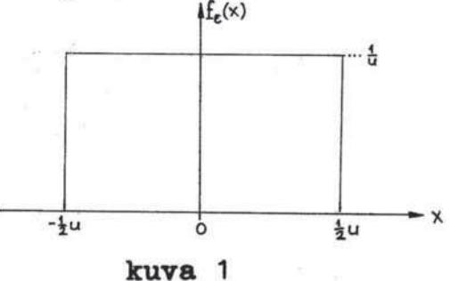
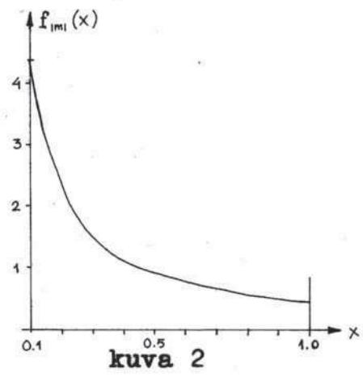
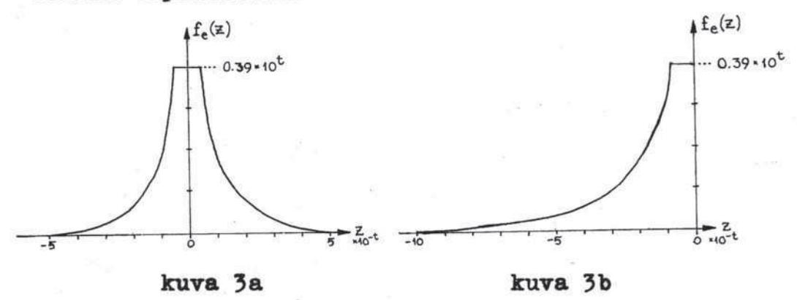
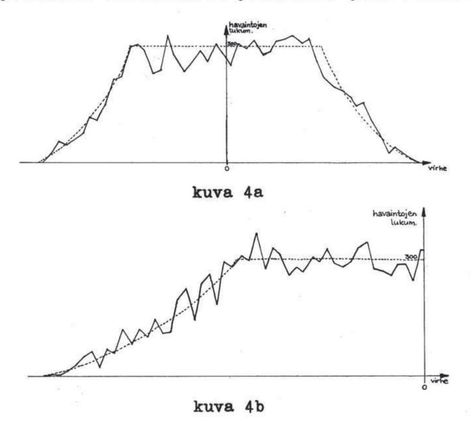
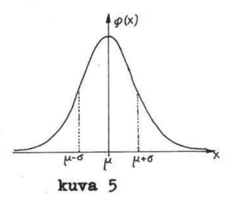
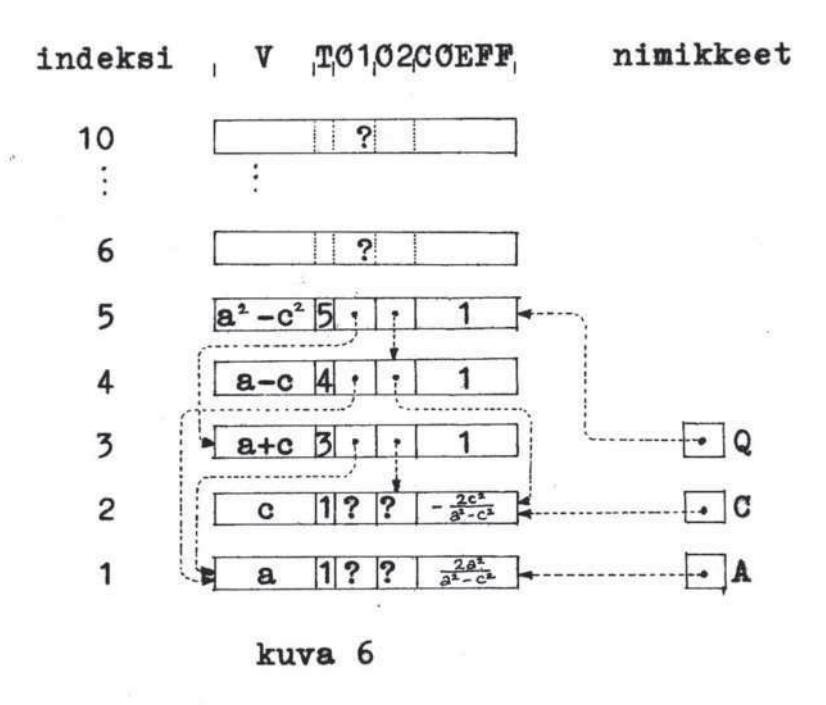
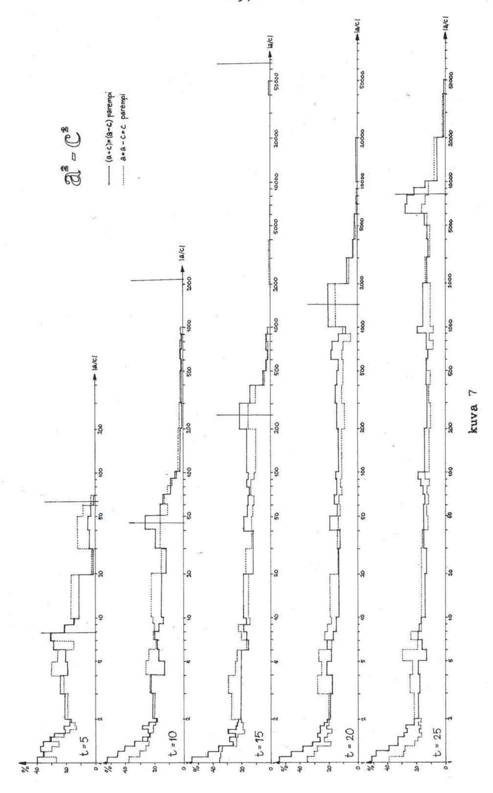
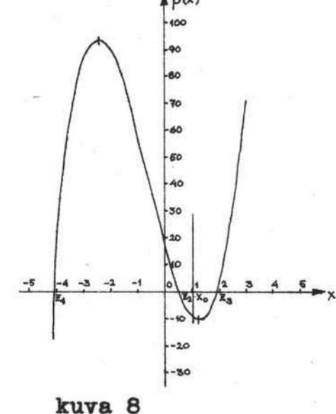
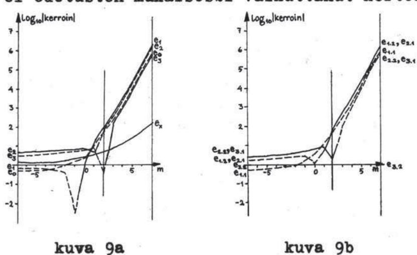
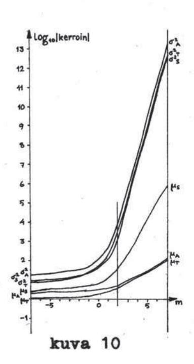

Seppo Linnainmaa

# ALGORITMIN KUMULATIIVINEN PYÖRISTYSVIRHE

# YKSITTÄISTEN PYÖRISTYSVIRHEIDEN TAYLOR-KEHITELMÄNÄ

Pro gradu-tutkielma · ohjaaja professori M.Tienari

#### YHTEENVETO

Algoritmien kumulatiivista pyöristysvirhettä liukuvan pilkun aritmetiikassa pyritään analysoimaan kehittämällä tämä yksittäisten pyöristysvirheiden Taylorkehitelmäksi. Tähän tarkoitukseen esitetään sekä analyyttinen että tietokoneelle soveltuva menetelmä. Yksittäiselle suhteelliselle pyöristysvirheelle konstruoidaan tilastollinen malli. Sovellutuksina käsitellään pienalgoritmia  $a^2-b^2=(a+b)\cdot(a-b)$  sekä Hornershemaa ja Gauss-Jordanin matriisinkääntöalgoritmia. Sovellutuksiin liittyvät ohjelmat on ajettu IBM 7094-tietokoneella.

# SISÄLLYS

| Yhteenveto                                                       | II  |
|------------------------------------------------------------------|-----|
| Sisällys                                                         | III |
| 1. Johdanto                                                      | 1   |
| 2. Pyöristysvirheen käsite                                       | 2   |
| 3. Suhteellisen pyöristysvirheen jakautuma                       | 4   |
| - Mantissaosan pyöristysvirhe                                    | 4   |
| - Suhteellisen pyöristysvirheen jakautuma                        |     |
| pyöristävässä aritmetiikassa                                     | 7   |
| - Suhteellisen pyöristysvirheen jakautuma                        |     |
| katkaisevassa aritmetiikassa                                     | 9   |
| 4. Pyöristysvirhe laskutoimitusten yhteydessä                    | 10  |
| - Yhteen- ja vähennyslasku                                       | 10  |
| - Kerto- ja jakolasku                                            | 12  |
| 5. Pyöristysvirheen Taylor-kehitelmä                             | 15  |
| 6. Taylor-sarjan analyyttinen kehittäminen                       | 19  |
| 7. Taylor-sarjan kertoimien määrittäminen                        |     |
| tietokoneohjelmalla                                              | 24  |
| - Kertoimienlaskualgoritmi L                                     | 24  |
| - Algoritmia L vastaava FORTRAN IV-                              |     |
| aliohjelmaryhmä                                                  | 28  |
| - Yksikköhäiriön menetelmä                                       | 32  |
| 8. Pienalgoritmit a <sup>2</sup> -c <sup>2</sup> :n laskemiseksi | 34  |
| 9. Horner-shema                                                  | 40  |
| - Taylor-sarjan analyyttinen määrittäminen                       | 40  |
| - Toisen asteen kertoimet                                        | 42  |
| <ul> <li>Nollakohtien lähekkäisyyden vaikutus</li> </ul>         |     |
| kertoimiin                                                       | 46  |
| 10. Matriisin kääntö                                             | 52  |
| Liite: Algoritmi L FORTRAN IV-ohjelmana                          | 58  |
| Käytettyjä merkintöjä                                            | 61  |
| Viiteluettelo                                                    | 63  |

#### 1. JOHDANTO

Tietokoneiden mahdollistaman suuren laskentanopeuden johdosta on tullut välttämättömäksi pyrkiä selvittämään pyöristysvirheiden vaikutuksia, koska niiden merkitys kasvaa nopeasti peräkkäisten laskutoimitusten määrän kasvaessa [1].

Kysymystä lähestyttäessä on lähtökohtana tosiasia, että algoritmissa tapahtuva kumulatiivinen pyöristysvirhe on peräisin kussakin erillisessä laskutoimituksessa syntyvästä yksittäisestä pyöristysvirheestä. Näiden avulla on pyritty laskemaan ylärajoja kumulatiiviselle pyöristysvirheelle. Laajoissa algoritmeissa on ollut pakko tyytyä melko karkeisiin arvioihin tälle ylärajalle [10].

Useissa tapauksissa tieto keskimääräisestä virheestä ja sen vaihtelualttiudesta olisi hyödyllisempi kuin virheen yläraja. Tässä tarkoituksessa on pyöristysvirheitä pyritty selittämään tilastollisten jakautumien avulla. Professori Henrici on mm. teoksessaan 'Elements of Numerical Analysis' [4] laajalti lähestynyt kysymystä tältä kannalta. Hän käsittelee pääasiassa kiinteän pilkun aritmetiikkaa. Seuraavassa esityksessä pyritään tekemään vastaavia huomioita liukuvan pilkun aritmetiikasta.

### 2. PYÖRISTYSVIRHEEN KÄSITE

Mielivaltainen nollasta eroava kymmenjärjestelmän reaaliluku voidaan esittää muodossa

$$z = \pm 0.d_{-1}d_{-2}d_{-3}... \cdot 10^{P}$$
, (2.1)

missä  $d_{-1}, d_{-2}, \ldots$  ovat numeroita,  $d_{-1} \neq 0$  ja p on ko-konaisluku. Osaa

$$\mathbf{m} = \pm 0.d_{-1}d_{-2}d_{-3}...$$
 (2.2)

kutsutaan luvun z mantissaosaksi ja sillä tarkoitetaan lukua

$$m = \pm (d_{-1} \cdot 10^{-1} + d_{-2} \cdot 10^{-2} + d_{-3} \cdot 10^{-3} + \dots).$$
 (2.3)

Osaa 10<sup>P</sup> kutsutaan eksponenttiosaksi, 10 on kantaluku ja p on eksponentti.

Tietokoneissa kantalukuna b on luvun 10 sijasta useimmin jokin kahden potenssi (esim.  $2^1 = 2$ ,  $2^3 = 8$  tai  $2^4 = 16$ ). Myös tällöin luku voidaan esittää vastaavassa muodossa [4],[7]

$$z = m \cdot b^{P} = \pm 0.d_{-1}d_{-2}d_{-3}... \cdot b^{P}, \quad d_{-1} \neq 0, (2.4)$$

missä  $d_{-1}, d_{-2}, \ldots$  ovat b-kantaisen lukujärjestelmän numeroita. Tällöin mantissalla m tarkoitetaan lukua

$$\mathbf{m} = \pm (\mathbf{d}_{-1} \cdot \mathbf{b}^{-1} + \mathbf{d}_{-2} \cdot \mathbf{b}^{-2} + \mathbf{d}_{-3} \cdot \mathbf{b}^{-3} + \dots).$$
 (2.5)

Ehdosta d₁ ≠ 0 seuraa

$$b^{-1} \le |m| < 1$$
. (2.6)

Mantissaosaan mahtuu tietokoneessa rajoitettu määrä, t kpl. numeroita, jolloin luku z koneesta

riippuen joko katkaistaan tai pyöristetään 'oikein' muotoon

$$z^* = \pm 0.d_{-1}d_{-2}...d_{-t} \cdot b^p$$
 (2.7)

Tätä muotoa kutsutaan liukuvan pilkun esitykseksi ja lukua z $^*$  liukuluvuksi.

Pyöristetyn ja tarkan luvun erotusta

$$\mathbf{r} = \mathbf{z}^* - \mathbf{z} \tag{2.8}$$

kutsutaan absoluuttiseksi pyöristysvirheeksi. Koska absoluuttisen pyöristysvirheen suuruus liukulukujen yhteydessä riippuu ratkaisevasti itse luvun z suuruudesta, on usein käytännöllisempää tarkastella suhteellista pyöristysvirhettä

$$e = \frac{z^* - z}{z} , \qquad (2.9)$$

jolloin

$$z^* = z(1+e)$$
 . (2.10)

#### SUHTEELLISEN PYÖRISTYSVIRHEEN JAKAUTUMA

### Mantissaosan pyöristysvirhe

Suhteellisen pyöristysvirheen tilastollisen jakautuman selvittämiseksi on syytä tarkastella aluksi pelkästään mantissaosaa. Merkitsemme pyöristetyn luvun z\* mantissaosaa m\*:lla, jolloin

$$\varepsilon = \mathbf{m}^* - \mathbf{m} \tag{3.1}$$

on mantissaosan absoluuttinen pyöristysvirhe. Olkoon

$$u = b^{-t} \tag{3.2}$$

eli

$$u = 0.00...01 \cdot b^{\circ}$$
 (3.3)

esitettynä muodossa (2.7). Mikäli pyöristys on suoritettu 'oikein', on voimassa

$$-\frac{1}{2}\mathbf{u} \leq \varepsilon \leq \frac{1}{2}\mathbf{u} . \tag{3.4}$$

Intuitiivisesti pidetään selvänä, että pyöristysvirhe on satunnainen luku ja siis tilastollisel-

ta jakautumaltaan tasaisesti jakautunut välillä [-4u.4u]. Satunnaisuus on tosin näennäistä: jos otamme uudelleen alkuperäisen luvun ja pyöristämme sen, saamme uudel-



leen saman pyöristysvirheen [4]. Tasainen jakautuma antaa kuitenkin hyvän tilastollisen mallin, jonka avulla voidaan tarkastella pyöristysvirheiden käyttäytymistä pitkissä laskutoimitussarjoissa.

Tilastollisen jakautuman tiheysfunktiolla f(x) tarkoitetaan  $\Delta x$ :llä jaettua todennäköisyyttä sille, että muuttujan arvo on x:n ja  $x+\Delta x$ :n välillä, kun  $\Delta x$  on äärettömän pieni[2]. Pyöristysvirheen  $\varepsilon$  jakautuman tiheysfunktio on muotoa

$$\mathbf{f}_{\varepsilon}(\mathbf{x}) = \begin{cases} 0 , & \mathbf{x} < -\frac{1}{2}\mathbf{u} \\ c , & -\frac{1}{2}\mathbf{u} \le \mathbf{x} \le \frac{1}{2}\mathbf{u} \\ 0 , & \mathbf{x} > \frac{1}{2}\mathbf{u} \end{cases}$$
 (3.5)

missä c on eräs vakio.

Kokonaistodennäköisyys on yksi, joten

$$\int_{-\infty}^{\infty} f_{\varepsilon}(x) dx = cu = 1 , \qquad (3.6)$$

mistä

$$c = \frac{1}{u} . \tag{3.7}$$

Näin saatu virheen tiheysfunktio on havainnollistettu kuvassa 1.

Virheen itseisarvolle saamme tiheysfunktioksi

$$\mathbf{f}_{|\epsilon|}(\mathbf{x}) = \begin{cases} 0, & \mathbf{x} < 0 \\ \frac{2}{\mathbf{u}}, & 0 \le \mathbf{x} \le \frac{4}{2}\mathbf{u} \\ 0, & \mathbf{x} > \frac{4}{2}\mathbf{u} \end{cases}$$
 (3.8)

Useissa tietokoneissa käytetään oikean pyöristyksen sijasta katkaisevaa aritmetiikkaa [6], jolloin pyöristysvirhe

$$\varepsilon' = -|\mathbf{m}^* - \mathbf{m}| = (\mathbf{m}^* - \mathbf{m}) \cdot \text{sign m}$$
 (3.9)

on tasaisesti jakautunut välillä [-u,0]. Funktio

sign x määritellään

$$sign x = \begin{cases} -1, & x < 0 \\ 0, & x = 0 \\ 1, & x > 0 \end{cases}$$
 (3.10)

Pyöristysvirheen & tiheysfunktioksi saamme

$$f_{\epsilon'}(x) = \begin{cases} 0, & x < -u \\ \frac{1}{u}, & -u \le x \le 0 \\ 0, & x > 0. \end{cases}$$
 (3.11)

Tarvitsemme vielä itse mantissan jakautuman pystyäksemme laskemaan suhteellisen pyöristysvirheen jakautuman. Tuntuisi luonnolliselta olettaa, että |m| olisi tasaisesti jakautunut välillä [b<sup>-1</sup>,1). On kuitenkin todettu, ettei tämä pidä paikkaansa [3]. Jos tarkastelemme suurta joukkoa reaalimaailman kymmenjärjestelmän lukuja, esimerkiksi fysikaalisia vakioita, voimme todeta, että niistä on noin 30% ykkösellä alkavia.

Jonkinlaisen teoreettisen selvityksen tälle ti-

lanteelle antaa samoin ilmeisenä pitämämme tosiasia, että kun kaikki reaalimaailman luvut kerrotaan tietyllä vakiolla, niiden ensimmäisten numeroiden jakautuma ei muutu. Tähän nojaamalla voidaan m:n tiheysfunktiolle johtaa



kuvassa 2 havainnollistettu kaava [8]

$$\mathbf{f}_{lml}(\mathbf{x}) = \begin{cases} 0, & \mathbf{x} < b^{-1} \\ \frac{1}{\mathbf{x} \cdot \ln b}, & b^{-1} \le \mathbf{x} < 1 \\ 0, & \mathbf{x} \ge 1. \end{cases}$$
 (3.12)

Tämä tiheysfunktio antaa ykkösellä alkavien lukujen esiintymistodennäköisyydeksi  $\int_{0.1}^{0.2} f_{imi}(x) dx = \log_{10} 2 = 0.30$ , mikä vastaa kokeellista tulosta.

# Suhteellisen pyöristysvirheen jakautuma pyöristävässä aritmetiikassa

Kun kirjoitamme suhteellisen pyöristysvirheen e lausekkeen (2.9) mantissa- ja eksponenttiosan avulla, saamme kaavojen (2.4) ja (3.1) perusteella

$$e = \frac{\mathbf{z}^* - \mathbf{z}}{\mathbf{z}} = \frac{(\mathbf{m}^* - \mathbf{m}) \cdot \mathbf{b}^P}{\mathbf{m} \cdot \mathbf{b}^P} = \frac{\varepsilon \cdot \mathbf{b}^P}{\mathbf{m} \cdot \mathbf{b}^P} = \frac{\varepsilon}{\mathbf{m}} . \tag{3.13}$$

Johdamme nyt e:n itseisarvon  $|e| = |\epsilon/m|$  tiheys-funktion.

Kahden toisistaan riippumattoman satunnaismuuttujan  $\eta$  ja  $\xi$  suhteen  $\zeta = \eta/\xi$  tiheysfunktio saadaan kaavasta [2]

$$f_{\xi}(z) = \int_{0}^{\infty} x f_{\eta}(zx) f_{\xi}(x) dx , \qquad (3.14)$$

kun § > 0. Mikäli oletamme, että ɛ ja m ovat riippumattomia, mikä tuntuu luonnolliselta aimakin suurilla t:n arvoilla, saadaan |e|:n tiheysfunktioksi kaavan (3.14) perusteella

$$f_{|e|}(\mathbf{z}) = \begin{cases} 0, & \mathbf{z} < 0 \\ \int_{b^{-1}}^{1} \mathbf{x} \cdot \frac{2}{u} \cdot \frac{1}{\mathbf{x} \cdot \ln b} d\mathbf{x} = \frac{2 \cdot (b-1)}{ub \cdot \ln b}, & 0 \le \mathbf{z} \le \frac{1}{2} \mathbf{u} \\ \int_{b^{-1}}^{u/2z} \mathbf{x} \cdot \frac{2}{u} \cdot \frac{1}{\mathbf{x} \cdot \ln b} d\mathbf{x} = \frac{1}{2} \frac{1}{2} \frac{1}{2} \frac{1}{2} \frac{1}{2} \frac{1}{2} \mathbf{u} \\ 0, & \mathbf{z} > \frac{1}{2} \mathbf{u} \mathbf{b} \end{cases}, \quad (3.15)$$

Saamme tästä |e|:n ylärajaksi [10]

$$|e| \leq \frac{1}{2}ub . \tag{3.16}$$

Kun vielä oletamme e:n jakautuman olevan symmetrinen origon suhteen, mikä myös tuntuu ilmeiseltä, saamme e:n tiheysfunktioksi

$$\mathbf{f}_{e}(\mathbf{z}) = \begin{cases} \frac{\mathbf{b} - 1}{\mathbf{u} \mathbf{b} \cdot \mathbf{l} \mathbf{n} \mathbf{b}}, & |\mathbf{z}| \leq \frac{1}{2} \mathbf{u} \\ \frac{1}{\mathbf{l} \mathbf{n} \mathbf{b}} \left[ \frac{1}{2 |\mathbf{z}|} - \frac{1}{\mathbf{u} \mathbf{b}} \right], & \frac{1}{2} \mathbf{u} < |\mathbf{z}| \leq \frac{1}{2} \mathbf{u} \mathbf{b} \\ 0, & |\mathbf{z}| > \frac{1}{2} \mathbf{u} \mathbf{b} \end{cases}$$
 (3.17)

Tämä on havainnollistettu kuvassa 3a kymmenjärjestelmän tapauksessa.



Satunnaismuuttujan keski- eli odotusarvo saadaan kaavasta [2]

$$E(\xi) = \int_{-\infty}^{\infty} x f_{\xi}(x) dx \qquad (3.18)$$

ja varianssi kaavasta

$$D^{2}(\xi) = \int_{0}^{\infty} [x-E(\xi)]^{2} f_{\xi}(x) dx.$$
 (3.19)

Varianssin neliöjuuri, keskihajonta  $D(\xi)$  kuvaa muuttujan arvojen keskimääräistä poikkeamaa keskiarvosta.

Saamme kaavojen (3.18) ja (3.19) avulla e:n odotusarvoksi ja varianssiksi

$$\mu_A = E(e) = 0$$
,  $\sigma_A^2 = D^2(e) = \frac{u^2}{24 \cdot \ln b}(b^2 - 1)$ . (3.20)

Seuraavassa taulukossa on varianssin arvoja kantaluvun b eri arvoilla.

| ъ        | o <sub>A</sub> /u <sup>2</sup> |
|----------|--------------------------------|
| 2        | 0.1803                         |
| 8        | 1.262                          |
| 10       | 1.791                          |
| 16<br>32 | 3.832                          |
| 64       | 41.02                          |

# Suhteellisen pyöristysvirheen jakautuma katkaisevassa aritmetiikassa

Katkaisevassa aritmetiikassa saamme yhtälöstä (2.9) kaavojen (2.4) ja (3.11) perusteella suhteelliselle pyöristysvirheelle lausekkeen

$$e = \frac{\mathbf{z}^* - \mathbf{z}}{\mathbf{z}} = \frac{(\mathbf{m}^* - \mathbf{m}) \cdot \mathbf{b}^P}{\mathbf{m} \cdot \mathbf{b}^P} = \frac{\mathbf{m}^* - \mathbf{m}}{|\mathbf{m}| \cdot \mathbf{sign} \ \mathbf{m}} = \frac{\varepsilon'}{|\mathbf{m}|}. \quad (3.21)$$

Kun oletamme  $\varepsilon'$ :n ja |m|:n olevan riippumattomia, saamme kaavan (3.14) perusteella e:n tiheysfunktioksi (kuva 3b)

$$f_{e}(z) = \begin{cases} 0, & z < -ub \\ \int_{b^{-1}}^{-w_{e}} x \cdot \frac{1}{u} \cdot \frac{1}{x \cdot \ln b} dx = \frac{1}{\ln b} \left[ -\frac{1}{z} - \frac{1}{ub} \right], \\ -ub \le z < -u \\ \int_{b^{-1}}^{1} x \cdot \frac{1}{u} \cdot \frac{1}{x \cdot \ln b} dx = \frac{b-1}{ub \cdot \ln b}, \\ -u \le z \le 0 \\ 0, & z > 0 \end{cases}$$
(3.22)

Kaavojen (3.18) ja (3.19) perusteella saamme odotusarvoksi ja varianssiksi

$$\mu_{A} = E(e) = \frac{u(1-b)}{2 \cdot \ln b},$$

$$\sigma_{A}^{2} = D^{2}(e) = -E(e) \left[ \frac{u(b+1)}{3} + E(e) \right].$$
(3.23)

Seuraavassa taulukossa on odotusarvoja ja variansseja kantaluvun eri arvoilla.

| ъ  | μ <sub>^</sub> /u | $\sigma_{A}^{2}/\mathbf{u}^{2}$ |
|----|-------------------|---------------------------------|
| 2  | -0.7213           | 0.2010                          |
| 8  | -1.683            | 2.216                           |
| 10 | -1.954            | 3.346                           |
| 16 | -2.705            | 8.011                           |
| 64 | -7.574            | 106.7                           |

### 4. PYÖRISTYSVIRHE LASKUTOIMITUSTEN YHTEYDESSÄ

### Yhteen- ja vähennyslasku

Kahden liukuluvun yhteenlaskun tarkkuuteen vaikuttaa ratkaisevasti yhteenlaskettavien lukujen eksponenttien  $p_1$ , ja  $p_2$  keskinäinen ero  $|p_1-p_2|$  [10].

Mikäli  $p_1 = p_2$ , on yhteenlasku varsin suurella todennäköisyydellä tarkka. Ainoan poikkeuksen muodostaa tapaus, jossa saadaan muistinumero mantissojen vasemmanpuoleisimpia numeroita yhteenlaskettaessa. Tällöin joudutaan vähiten merkitsevästä numerosta luopumaan, koska mantissa edelleen saa sisältää korkeintaan t numeroa. Samaan tilanteeseen saatetaan joutua myös, kun  $p_1$  ja  $p_2$  ovat likimain yhtäsuuret. Tämä on kuitenkin sitä epätodennäköisempää mitä suurempi  $|p_1-p_2|$  on.

Kun  $|p_1-p_2|=1$ , kohdistuu mielenkiinto lähinnä tapauksiin, joissa luvut ovat erimerkkiset ja niiden itseisarvot niin lähellä toisiaan, että tulosta joudutaan 'siirtämään vasemmalle', jolloin päästään tarkkaan tulokseen.

D.W. Sweeneyn suorittamassa tutkimuksessa [8] |p, -p, |oli käytännön yhteenlaskuissa nolla 33-56%:n ja yksi 12-27%:n todennäköisyydellä kantaluvun saadessa arvot 2-64. Oi-kealle siirtojen todennäköisyys oli vastaavasti 20-2% ja vasemmalle siirtojen 20-11%.

Eksponenttien eron kasvaessa vähenee tarkan laskutoimituksen todennäköisyys ja edellä johdetut mallit pyöristävälle ja katkaisevalle aritmetiikalle pitävät varsin hyvin paikkansa. Tämä paikkansapitävyys loppuu  $|p_1-p_2|$ :n ylittäessä arvon t. Tällöin luvuista itseisarvoltaan pienempi muodostaa sellaisenaan pyöristysvirheen. Näiden tapausten suhteellinen osuus kaikista yhteenlaskuista on kuitenkin niin pieni, ettei

niillä ole suhteellisen pyöristysvirheen jakautumaan merkittävää vaikutusta, kunhan huomioimme tapaukset, joissa toinen yhteenlaskettava on nolla, jolloin laskutoimitus on tarkka. Toinen operandi on edellä mainitun tutkimuksen mukaan tarkka noin 8% todennäköisyydellä.

Koska suhteellisen pyöristysvirheen jakautuma riippuu  $|p, -p_2|$ :n jakautumasta, sille on mahdotonta johtaa täysin yleispätevää mallia. Jonkinlaisen keskivertomallin muodostaminen tosin on mahdollista. Tällöin tullee kysymykseen lähinnä professori Tienarin ehdottama malli: kun

$$(z_1+z_2)^* = (z_1+z_2) \cdot (1+e)$$
, (4.1)

missä e on suhteellinen pyöristysvirhe, kirjoitetaan e muotoon

$$\mathbf{e} = \delta \cdot \mathbf{e}' , \qquad (4.2)$$

missä e' noudattaa edellä johdettua jakautumaa ja satunnaismuuttuja  $\delta$  saa arvon 0 todennäköisyydellä p sekä arvon 1 todennäköisyydellä 1-p. Luku p edustaa tällöin todennäköisyyttä tarkalle laskutoimitukselle. Merkitsemme seuraavassa näin saatavan e:n jakautuman odotusarvoa  $\mu_s$ :llä ja varianssia  $\sigma_s^2$ :llä.

Virheen e yläraja voidaan määrätä yleispätevästi. Perustuen epäyhtälöihin (2.6) ja (3.4) saadaan yhtälöstä (3.13) pyöristävälle aritmetiikalle [7]

$$|\mathbf{e}| = \left| \frac{\varepsilon}{\mathbf{m}} \right| \le \frac{1}{2} \mathbf{u} \mathbf{b}. \tag{4.3}$$

Katkaisevalle aritmetiikalle saadaan vastaavasti

$$|e| \leq ub. \tag{4.4}$$

Eräissä koneissa joudutaan jo ennen laskutoimitusta pyöristämään eksponentiltaan pienempää operandia. Tällöin saadaan ylärajoiksi

$$|\mathbf{e}| \leq \frac{1}{2}\mathbf{u}(\mathbf{b}+1) \tag{4.5}$$

pyöristävässä ja

$$|e| \le u(b+1) \tag{4.6}$$

katkaisevassa aritmetiikassa [10].

Kaikki yhteenlaskua koskeva koskee myös vähennyslaskua, koska näiden ero voidaan tulkita lukujen etumerkkien vaihteluksi.

#### Kerto- ja jakolasku

Kahden liukuluvun välinen kertolasku suoritetaan laskemalla eksponentit yhteen ja kertomalla mantissaosat keskenään. Kun

$$(z_1 \cdot z_2)^* = z_1 \cdot z_2 \cdot (1+e)$$
, (4.7)

voidaan todeta pyöristysvirheen e noudattavan johdettua jakautumaa, so. pyöristävässä aritmetiikassa jakautumaa (3.17) ja katkaisevassa jakautumaa (3.22).

Jakolaskussa vastaavasti vähennetään eksponentit toisistaan ja mantissaosat jaetaan keskenään. Myös osamäärän pyöristysvirhe e noudattaa annettua jakautumaa, kun merkitsemme

$$\left(\frac{\mathbf{z}_1}{\mathbf{z}_2}\right)^* = \frac{\mathbf{z}_1}{\mathbf{z}_2}(1+e). \tag{4.8}$$

Merkitsemme seuraavassa kerto- ja jakolaskun pyöristysvirheen odotusarvoa  $\mu_{\tau}$ :llä ja varianssia  $\sigma_{\tau}^2$ :llä. Tällöin

$$\mu_{\rm T} = \mu_{\rm A}, \quad \sigma_{\rm T}^2 = \sigma_{\rm A}^2 . \tag{4.9}$$

Johdetun mallin pitävyys kerto- ja jakolaskussa testattiin algoritmin S avulla.

Algoritmi S (Satunnaisalgoritmi). Algoritmi suorittaa satunnaisia laskutoimituksia 2t numeron tarkkuudella katkaisten tuleksetn t numeron mittaisiksi
ja luetteloiden syntyneet pyöristysvirheet. Jos
tuloksen eksponentti ylittää itseisarvoltaan puolet suurimmasta mahdollisesta eksponentista max|p|,
sen itseisarvoa pienennetään ½·max|p|:llä.ylivuotojen ehkäisemiseksi. Algoritmi käyttää vektoria
LUKU(1),LUKU(2),...,LUKU(100). Merkintä A—SAT{B,
C,...,Z} tarkoittaa, että A:n arvoksi sijoitetaan
joukon {B,C,...,Z} satunnaisesti valitun alkion arvo.

- S1. [Alkuasetukset.] Vektorin LUKU kymmenen ensimmäisen alkion arvoksi sijoitetaan tunnettuja vakioita: π, Neperin luku, Eulerin vakio, kultainen suhde jne. N←10 (N on käytössä olevan taulukon osan suurin indeksi).
- S2. [Laskutoimituksen valinta.]  $I \leftarrow SAT\{1,2,...,N\}$ ,  $J \leftarrow SAT\{1,2,...,N\}$ ,  $SX \leftarrow SAT\{S3,S4,S5,S6\}$ ,  $\rightarrow SX$ .
- S3. [Yhteenlasku.]  $TULOS \leftarrow LUKU(I) + LUKU(J)$ ,  $\rightarrow S7$ .
- S4. [Vähennyslasku.]  $TULOS \leftarrow LUKU(I) LUKU(J)$ ,  $\rightarrow S7$ .
- S5. [Kertolasku.]  $TULOS \leftarrow LUKU(I) \cdot LUKU(J)$ ,  $\rightarrow S7$ .
- S6. [Jakolasku.] Jos LUKU(J) = 0,  $\rightarrow$ S2. Muuten TULOS $\leftarrow$ LUKU(I)/LUKU(J).
- S7. [Etumerkin valinta.] SIGN-SAT{-1,1}, TULOS-SIGN-TULOS.
- S8. [Pyöristysvirheen kirjaus.] Pyöristä mantissa t numeron mittaiseksi, luetteloi pyöristysvirhe ja pienennä tarvittaessa eksponenttia.
- S9. [Tulosalkion valinta.] Jos N < 100,  $\mathbb{N} \leftarrow \mathbb{N}+1, \mathbb{K} \leftarrow \mathbb{N}$ , muuten  $\mathbb{K} \leftarrow SAT\{1,2,...,\mathbb{N}\}$ .
- S10. [Tuloksen talletus.] LUKU(K) ← TULOS. Jos testituloksia halutaan lisää, →S2, muuten algoritmi päättyy. ■

Testitulosten lukumääräksi määrättiin 10000 sekä pyöristävälle että katkaisevalle aritmetiikalle, jolloin saatiin riittävä kuva pyöristysvirheiden jakautumasta. Summan ja erotuksen pyöristysvirheiden jakautumalle algoritmi S ei antanut mielekästä mallia, koska eksponenttien jakautumaan ei kiinnitetty erityistä huomiota. Sen sijaan tulon ja osamäärän pyöristysvirheiden jakautumalle saatiin malli, joka vastaa teoreettista mallia. Tulokset on esitetty pyöristävälle aritmetiikalle kuvassa 4a ja katkaisevalle kuvassa 4b.

Testikoneena oli IBM 7094, jonka aritmetiikan kantalukuna on kaksi ja t = 27 (simuloitaessa pyöristävää aritmetiikkaa jouduttiin asettamaan t = 26). Mallin hyvä pitävyys osoittaa omalta osaltaan myös jakautuman (3.12) pätevyyttä kaksijärjestelmänkin yhteydessä. Tätä jakautumaahan käytettiin pyöristysvirheen teoreettista jakautumaa johdettaessa.



#### 5. PYÖRISTYSVIRHEEN TAYLOR-KEHITELMÄ

Suoritettaessa peräkkäisiä laskutoimituksia liittyy jokaiseen laskutoimitukseen oma pyöristysvirheensä. Näiden yksittäisten pyöristysvirheiden yhteisvaikutusta kutsutaan kumulatiiviseksi pyöristysvirheeksi. Jos tarkastelemme esimerkiksi kahden pyöristetyn luvun a\* ja b\* jakolaskua, saamme

$$\left(\frac{a^*}{b^*}\right)^* = \frac{a(1+e_a)}{b(1+e_b)}(1+e_c)$$

$$= \frac{a}{b}(1+e_a)(1+e_c)(1-e_b+e_b^2-e_b^3+\dots)$$

$$= \frac{a}{b}(1+e_a-e_b+e_c-e_ae_b+e_ae_c-e_be_c$$

$$-e_ae_be_c+e_a^2e_b^2+e_ce_b^2-e_b^3+\dots)$$

$$= \frac{a}{b}(1+E_c),$$
(5.1)

jolloin Ec edustaa kumulatiivista suhteellista pyöristysvirhettä. Kuten tässä esimerkissä voidaan kumulatiivinen pyöristysvirhe En aina lausua yksittäisten pyöristysvirheiden Taylor-kehitelmänä, so. muodossa

$$E_{n} = \sum_{i} a_{n,i} e_{i} + \sum_{i,j} a_{n,ij} e_{i} e_{j} + \langle e^{3} \rangle , \qquad (5.2)$$

missä  $\langle e^3 \rangle$  tarkoittaa  $e_i$ :den suhteen vähintään kolmannen asteen termejä ja a:t algoritmin alkuarvoista riipuvia vakioita. Kutsumme sarjaa (5.2) seuraavassa (E,e)-sarjaksi.

Kun merkitsemme (E,e)-sarjan k:nnetta osasummaa, so.  $e_i$ :den suhteen k:nnen asteen summaa  $E_n^{(k)}$ :lla, saamme yhtälön (5.2) muotoon

$$E_n = E_n^{(1)} + E_n^{(2)} + \langle e^3 \rangle$$
 (5.3)

Toisen ja korkeamman asteen termien vaikutus kumulatiiviseen pyöristysvirheeseen on yleensä merkityksetön yksittäisten pyöristysvirheiden e; suuruusluokan pienuuden johdosta, joten käytännössä
voidaan En:n lauseke ilmoittaa ensimmäisen asteen
termiensä avulla [9], so.

$$\mathbf{E}_{n} \approx \mathbf{E}_{n}^{(i)} . \tag{5.4}$$

Kumulatiivisen pyöristysvirheen jakautuma voidaan johtaa yksittäisten pyöristysvirheiden jakautumien avulla. Jos satunnaisluvut  $\xi_1, \xi_2, \ldots, \xi_m$  ovat toisistaan riippumattomia ja niiden odotusarvot ovat  $\mu_1, \mu_2, \ldots, \mu_m$  ja varianssit  $\sigma_1^2, \sigma_2^2, \ldots, \sigma_m^2$ , on satunnaismuuttujan

$$\xi = \mathbf{a}_1 \xi_1 + \mathbf{a}_2 \xi_2 + \dots + \mathbf{a}_m \xi_m$$
 (5.5)

odotusarvolle ja varianssille voimassa [4]

$$E(\xi) = \mathbf{a}_{1}\mu_{1} + \mathbf{a}_{2}\mu_{2} + \dots + \mathbf{a}_{m}\mu_{m}, \qquad (5.6)$$

$$D^{2}(\xi) \approx a_{1}^{2} \sigma_{1}^{2} + a_{2}^{2} \sigma_{2}^{2} + \dots + a_{m}^{2} \sigma_{m}^{2}. \tag{5.7}$$

Todennäköisyyslaskennan keskeisen raja-arvoväittä-män nojalla  $\xi$ :n jakautuma lisäksi lähestyy ns.

normaalijakautumaa (kuva 5) m:n lähestyessä ääretöntä [2].

Normaali jakautuman määrittävät yksikäsitteisesti
sen odotusarvo ja varianssi.
Sille on ominaista mm., että
68.3% havaituista satunnaisluvuista poikkeaa vähemmän
kuin varianssin neliöjuuren



eli keskihajonnan verran odotusarvosta.

Pyöristysvirheet eivät yleensä ole täysin riippumattomia toisistaan, mutta niiden väliset riippuvuudet ovat niin vähäisiä, että kaavoja (5.6)
ja (5.7) käyttämällä saadaan riittäviä arvioita

kumulatiivisten pyöristysvirheiden jakautumille yksittäisten pyöristysvirheiden jakautumien avulla[4]. Oikein pyöristävässä aritmetiikassa on kaavan (5.6) perusteella myös kumulatiivisen pyöristysvirheen odotusarvo nolla.

Pitkissä laskusarjoissa voidaan nojata normaalijakautumaan myös määritettäessä käytännöllisiä ylärajoja pyöristysvirheille. Normaalijakautumassa
sijoittuu 99% kaikista havainnoista lähemmäksi odotusarvoa kuin 2.5766, missä o on normaalijakautuman keskihajonta. Selkeänä esimerkkinä voidaan
tarkastella peräkkäisten kertolaskujen kumulatiivista pyöristysvirhettä oikein pyöristävässä aritmetiikassa.

Tuloa

$$P = \prod_{i=1}^{N} h_i$$

vastaa liukuvan pilkun aritmetiikkaa käyttävässä koneessa, kun alkuarvot  $h_i$ , i = 0, ..., N oletetaan tarkoiksi,

$$P^* = P(1+E_N) = \prod_{i=0}^{N} h_i \prod_{i=1}^{N} (1+e_i) \approx \prod_{i=0}^{N} h_i (1+\sum_{i=0}^{N} e_i)$$
,

missä kukin e; on yksittäisessä kertolaskussa syntynyt pyöristysvirhe.

Jos kertolaskut on suoritettu binääriaritmetiikassa, on virheiden  $e_i$ ,  $i=1,\ldots,\mathbb{K}$  odotusarvo 0 ja varianssi  $0.1803u^2$  kaavan (3.20) perusteella. Saamme  $E_N$ :n odotusarvoksi ja varianssiksi kaavojen (5.6) ja (5.7) avulla

$$E(E_N) = 0$$
 ,  $D^2(E_N) = N \cdot 0.1803u^2$  ,

jolloin siis 99% varmuudella

$$|E_N| < 2.576 \cdot \sqrt{N \cdot 0.1803 u^2} = 1.09 \sqrt{N} u$$
.

Tri Wilkinson [10] on päätynyt käytännön ylärajana tulokseen vaika vastaa varsin tarkkaan edellä

johdettua tulosta. Teoreettiseksi ylärajaksi saadaan

$$|E_N| < \frac{4}{2}Nub$$
,

joten varsinkin suurilla N:n arvoilla saataisiin varsin epärealistinen ylärajan arvo ilman tilastollista jakautumaa tai empiirisiä kokeita.

Käsitellyssä esimerkissä syntyivät kaikki pyöristysvirheet kertolaskujen yhteydessä. tysvirheet voidaan kuitenkin jakautumansa ja syntytapansa perusteella jakaa esimerkiksi tyyppeihin

- alkuarvojen pyöristysvirheet (keskiarvo  $\mu_A$ , varianssi  $\sigma_A^2$ )
- summan ja erotuksen pyöristysvirheet (keskiarvo μs, varianssi σs)
- 3. tulon ja osamäärän pyöristysvirheet (keskiarvo  $\mu_{\tau}$ , varianssi  $\sigma_{\tau}^2$ ).

Olkoot yhtälössä (5.2) ei, ei, ..., ei, tyyppiä 1, ei, ,..., ei, tyyppiä 2 ja ei, ,..., eim tyyppiä 3 olevia pyöristysvirheitä. Tällöin En:n odotusarvo ja varianssi voidaan kaavojen (5.4), (5.6) ja (5.7) mukaan lausua muodossa

$$E(E_n) \approx E(E_n^{(i)}) = \sum_{j=1}^{k} \mathbf{a}_{n,i_j} \mu_A + \sum_{j=k+1}^{l} \mathbf{a}_{n,i_j} \mu_S + \sum_{j=l+1}^{m} \mathbf{a}_{n,i_j} \mu_T, \qquad (5.8)$$

$$D^2(E_n) \approx D^2(E_n^{(i)}) = \sum_{j=1}^{k} \mathbf{a}_{n,i_j}^2 \sigma_A^2 + \sum_{j=k+1}^{l} \mathbf{a}_{n,i_j}^2 \sigma_S^2 + \sum_{j=l+1}^{m} \mathbf{a}_{n,i_j}^2 \sigma_T^2. \qquad (5.9)$$

$$D^{2}(E_{n}) \approx D^{2}(E_{n}^{(1)}) = \sum_{i=1}^{k} a_{n,ij}^{2} \sigma_{A}^{2} + \sum_{i=k+1}^{k} a_{n,ij}^{2} \sigma_{S}^{2} + \sum_{i=k+1}^{m} a_{n,ij}^{2} \sigma_{T}^{2}. \qquad (5.9)$$

Esimerkiksi jakolaskun (5.1) pyöristysvirheelle E.

$$E(E_c) \approx \mu_{\tau}$$
,  $D^2(E_c) \approx 2\sigma_A^2 + \sigma_{\tau}^2$ .

Mikäli alkuarvot oletetaan tarkoiksi, on yhtälössä (5.8)  $\mu_A = 0$  ja yhtälössä (5.9)  $\sigma_A^2 = 0$ . tävässä aritmetiikassa  $\mu_{A} = \mu_{S} = \mu_{\tau} = 0$ .

### 6. TAYLOR-SARJAN ANALYYTTINEN KEHITTÄMINEN

Algoritmin laskutoimitusten lukumääräm kasvaessa on yhä vaikeampaa saada selville Taylor-kehitelmän kertoimia. Algoritmin rakennetta analysoimalla on kuitenkin mahdollista laskea analyyttisesti yleisiä lausekkeita kertoimille.

Kaikki algoritmit muodostuvat alkeislaskutoimituksista, joissa jokin operaatio kohdistetaan korkeintaan kahteen operandiin. Olkoon q, erään laskutoimituksen tulos. Tällöin

$$q_n = Q_n(q_i, q_j)$$
, (6.1)

missä Qn tarkoittaa yleensä yhteen-,vähennys-, kerto- tai jakolaskua. Se saattaa tarkoittaa myös potenssiin korotusta, logaritmin ottoa tms.

Tietokoneessa vastaa yhtälöä (6.1) pyöristysten vaikutukseata yhtälö

$$q_n^* = Q_n(q_i^*, q_j^*) \cdot (1 + e_n)$$
, (6.2)

missä e, on laskutoimituksen Q, yksittäinen suhteellinen pyöristysvirhe.

Merkitsemme absoluuttista kumulatiivista pyöristysvirhettä

$$R_n = q_n^* - q_n , \qquad (6.3)$$

jolloin suhteellinen kumulatiivinen pyöristysvirhe voidaan esittää muodossa

$$\mathbf{E}_{n} = \frac{\mathbf{R}_{n}}{\mathbf{q}_{n}}. \tag{6.4}$$

Jos  $q_n$  on erityisesti alkuarvo, jolloin  $q_n^* = q_n(1+e_n)$ , on

$$R_n = q_n e_n \tag{6.5}$$

ja

$$\mathbf{E}_{n} = \mathbf{e}_{n} \quad . \tag{6.6}$$

Myös R, voidaan lausua yksittäisten suhteellisten pyöristysvirheiden Taylor-kehitelmänä

$$R_n = \sum_{i} c_{n,i} e_i + \sum_{i} c_{n,i,j} e_i e_j + \langle e^s \rangle . \qquad (6.7)$$

Nimitämme sarjaa (6.7) (R,e)-sarjaksi. Taylor-kehitelmän yksikäsitteisyyden ja yhtälön (6.4) perusteella saamme E<sub>n</sub>:n ja R<sub>n</sub>:n yhtälöissä (5.2) ja (6.7) esiintyville kertoimille kaikilla kysymykseen tulevilla i:n ja j:n arvoilla

$$\mathbf{a}_{n,i} = \frac{\mathbf{c}_{n,i}}{\mathbf{q}_n} \tag{6.8}$$

$$\mathbf{a}_{n,ij} = \frac{\mathbf{c}_{n,ij}}{\mathbf{q}_n} . \tag{6.9}$$

R,voidaan E,:n tapaan esittää eriasteisten osasummiensa avulla muodossa

$$R_n = R_n^{(1)} + R_n^{(2)} + \langle e^3 \rangle$$
 (6.10)

Lausekkeen  $Q_n(q_i^*, q_j^*)$  saamme väliarvolauseen ja määritelmän (6.3) nojalla muotoon [4]

$$Q_{n}(q_{i}^{*},q_{j}^{*}) = q_{n} + D_{ni}R_{i} + D_{nj}R_{j} + \frac{1}{2}D_{n,ii}R_{i}R_{i} + D_{n,ij}R_{i}R_{j} + \frac{1}{2}D_{n,jj}R_{j}R_{j} + \langle R^{3} \rangle , \qquad (6.11)$$

missä  $D_{n,i}$  on  $Q_n(q_i,q_j)$ :n osittaisderivaatta  $q_i$ :n suhteen pisteessä  $q_n$  ja  $D_{n,ij}$  vastaavasti toinen osittaisderivaatta samassa pisteessä. Yhtälöiden (6.2),

(6.3),(6.10) ja (6.11) avulla saamme

$$R_n^{(4)} = D_{n,i}R_i^{(4)} + D_{n,j}R_j^{(4)} + q_n e_n$$
 (6.12)

ja

$$R_{n}^{(2)} = D_{n,i}R_{i}^{(2)} + D_{n,j}R_{j}^{(2)} + \frac{1}{2}D_{n,i,i}R_{i}^{(1)}R_{i}^{(1)} + D_{n,i,j}R_{i}^{(1)}R_{j}^{(1)} + \frac{1}{2}D_{n,j,j}R_{j}^{(1)}R_{j}^{(1)} + D_{n,i}R_{i}^{(1)}e_{n} + D_{n,j}R_{j}^{(1)}e_{n} .$$
(6.13)

Tarkastelemme saatuja tuloksia kahden pienen esimerkin valossa. Varsinaisissa algoritmeissa päädymme differenssiyhtälöihin, esimerkkinä tällaisista sovellamme teoriaa myöhemmin Horner-shemaan.

Esimerkki 1. Suoritetaan laskutoimitus c = a/b, missä a on tarkka, so. sitä ei tarvitse koneessa pyöristää, ja b:tä vastaa koneessa  $b^* = b(1+e_b)$ . Voimme siis yhtälön (6.5) perusteella merkitä  $R_{\alpha}^{(i)} = R_{\alpha}^{(i)} = 0$ ,  $R_{b}^{(i)} = be_b$ ,  $R_{b}^{(2)} = 0$ . Kaavojen (6.12) ja (6.13) perusteella

$$R_c^{(4)} = \frac{1}{b}R_a^{(4)} - \frac{a}{b^2}R_b^{(4)} + ce_c = -ce_b + ce_c$$

ja

$$R_{c}^{(a)} = \frac{1}{b}R_{a}^{(a)} - \frac{a}{b^{2}}R_{b}^{(a)} + 0 - \frac{1}{b^{2}}R_{a}^{(i)}R_{b}^{(i)} + \frac{a}{b^{3}}R_{b}^{(i)}R_{b}^{(i)} + \frac{1}{b}R_{a}^{(i)}e_{c} - \frac{a}{b^{2}}R_{b}^{(i)}e_{c}$$

$$= ce_{b}e_{b} - ce_{b}e_{c} .$$

Kaavojen (6.8), (6.9) ja (6.10) perusteella c:n (E,e)-sarja on

$$E_c = -e_b + e_c + e_b^2 - e_b e_c + \dots$$

Samaan tulokseen päädyimme aikaisemmin yhtälöissä (5.1), kun otamme huomioon, että  $e_{\alpha} = 0$ .

Esimerkki 2. Olkoon b\* = (ln a\*, kun a\* =a(1+e, ). Bdsllä esitetyt kaavat johdettiin kahdelle operandille, mutta niitä voidaan soveltaa yhden operandin operaatioihin, kunhan osittaisderivaatat 'toisen' operandin suhteen ajatellaan nolliksi, mikä on luonnollista, koska tätä ei esiinny laskutoimi-

tuksessa. Myös tätä toista operandia vastaava virhetermi ajatellaan nollaksi. Tällöin saamme

$$R_b^{(4)} = \frac{1}{a}ae_a + \ln a \cdot e_b = e_a + be_b$$

ja

$$R_b^{(2)} = \frac{1}{a}0 - \frac{1}{2} \cdot \frac{1}{a^2} a^2 e_a^2 + \frac{1}{a} e_a e_b = -\frac{1}{2} e_a^2 + e_a e_b ,$$

missä  $e_b$  on logaritmin otossa tapahtuva suhteellinen virhe. Jälleen pääsemme samaan tulokseen yhtälöstä  $R_b = [\ln(a+ae_a)](1+e_b)-b$ , kun käytämme hyväksi kaavaa  $\ln(1+e_a) = e_a - e_a^2/2 + \langle e_a^3 \rangle$ .

Edellä esitetyn analyysin perusteella voimme myös verrata suhteellisten ja absoluuttisten yksittäisten pyöristysvirheiden e, ja r, yhteyttä kumulatiivisen pyöristysvirheen Taylor-kehitelmässä.

Operaation Q<sub>n</sub> aiheuttama yksittäinen absoluuttinen pyöristysvirhe voidaan kirjoittaa yhtälöiden (6.2) ja (6.11) mukaan muotoon

$$\mathbf{r}_{n} = Q_{n}(\mathbf{q}_{i}^{*}, \mathbf{q}_{j}^{*}) \mathbf{e}_{n}$$
  
=  $\mathbf{q}_{n} \mathbf{e}_{n} + D_{n,i} R_{i} \mathbf{e}_{n} + D_{n,j} R_{j} \mathbf{e}_{n} + \dots$  (6.14)

Täten  $R_n$ :n esityksestä pyöristysvirheiden  $r_i$  avulla, ns. (R,r)-sarjasta

$$\mathbf{R}_{n} = \sum_{i} \mathbf{d}_{n,i} \mathbf{r}_{i} + \sum_{i,j} \mathbf{d}_{n,ij} \mathbf{r}_{i} \mathbf{r}_{j} + \langle \mathbf{r}^{3} \rangle$$
 (6.15)

saadaan

$$R_n = \sum_{i} d_{n,i} q_i e_i + \langle e^2 \rangle . \qquad (6.16)$$

Kun vertaamme yhtälöitä (6.7) ja (6.16), saamme Taylor-kehitelmän yksikäsitteisyyden nojalla i:n kaikilla arvoilla

$$\mathbf{c}_{n,i} = \mathbf{q}_i \, \mathbf{d}_{n,i} \,. \tag{6.17}$$

Kaavan (6.8) perusteella

$$\mathbf{a}_{n,i} = \frac{\mathbf{q}_i}{\mathbf{q}_N} \mathbf{d}_{i,j}. \tag{6.18}$$

Näin olemme selvittäneet (E,e)-, (R,e)- ja (R,r)sarjojen ensimmäisen asteen termien väliset yhteydet.

# 7. TAYLOR-SARJAN KERTOIMIEN MÄÄRITTÄMINEN TIETOKONEOHJELMALLA

### Kertoimienlaskualgoritmi L

Laskualgoritmien laajetessa alkaa myös Taylorsarjan analyyttinen kehittäminen tuottaa vaikeuksia, koska saadut differenssiyhtälöt monimutkais-

| 12 | q <sub>n</sub> | .9n       | $\eta_n$              |
|----|----------------|-----------|-----------------------|
| Æ  | q <sub>N</sub> | 0         | <b>q</b> <sub>N</sub> |
|    | Q N-1          | 0         | 0                     |
|    | :              |           |                       |
| -  | q:             | $D_{n.i}$ | 0                     |
|    | :              |           |                       |
| ,_ | q;             | Dnj       | 0                     |
|    | ÷              |           |                       |
|    | q.             | 0         | 0                     |
|    | :              |           |                       |
| -  | q,             | 0         | 0                     |

kuva 5

tuvat. Voimme kuitenkin soveltaa analyyttistä teoriaa
tietokonealgoritmiin, jonka
avulla Taylor-sarjan ensimmäisen asteen kertoimet voidaan laskea kullekin alkuarvojoukolle erikseen varsin
vaikeissakin algoritmeissa.

Kertoimienlaskualgoritmi
L perustuu yhtälöön (6.12).
Algoritmin lähtökohtana on
kaikkien alkuarvojen ja yksittäisten laskutoimitusten
tulosten qovisminen pinoon
niiden esiintyessä ensimmäis-

tä kertaa. Näin syntyneen pinon  $(q_1, q_2, \ldots, q_N)$  kukin elementti on siis joko alkuarvo tai tulos operaatiosta, joka on kohdistunut yhteen tai kahteen pinossa alempana olevaan elementtiin. Ajattelemme kuhunkin elementtiin  $q_n$ ,  $n=1,\ldots,N$ , liittyvän  $R_n$ :n ja  $e_n$ :n kertoimet  $q_n$  ja  $\eta_n$  siten, että ehto

$$\mathbf{R}_{N}^{(4)} = \sum_{n=1}^{N} \varsigma_{n} \mathbf{R}_{n} + \sum_{n=1}^{N} \eta_{n} \mathbf{e}_{n}$$
 (7.1)

on voimassa.

Aluksi toteutamme yhtälön (7.1) asettamalla  $q_N = 1$ ,  $q_N = 0$ ,  $n \neq N$  ja  $\eta_N = 0$ , n = 1,2,...,N. Olkoon  $q_N = Q_N(q_i,q_j)$ , missä i > j. Yhtälön (6.12) mukaan täytämme yhtälön (7.1) ehdon myös sijoittamalla nyt  $q_N \leftarrow 0$ ,  $q_i \leftarrow D_{n,i}$ ,  $q_j \leftarrow D_{n,j}$  ja  $\eta_N \leftarrow q_N$ . Tämä tilanne on esitetty kuvassa 5.

Seuraavaksi nollaamme pinossa ylimpänä olevan nollasta poikkeavan  $\varsigma_n$ :n eli  $\varsigma_i$ :n. Jos esimerkiksi  $q_i = Q_i(q_j,q_i)$ , on tämä nollaus kaavan (6.12) mukaan mahdollista asettamalla  $\varsigma_j \leftarrow \varsigma_j + \varsigma_i D_{i,j}$ ,  $\varsigma_i \leftarrow \varsigma_i D_{i,l}$  ja  $\eta_i \leftarrow \varsigma_i q_i$ . Näin jatketaan  $\varsigma_n$ :ien nollaamista edeten pinossa alaspäin, kunnes koko pino on käyty läpi, so.  $\varsigma_n = 0$ ,  $n = 1,2,\ldots,N$ . Ehto (7.1) on koko ajan voimassa, joten lopputuloksena saadaan yhtälöiden (6.7) ja (7.1) sekä Taylor-kehitelmän yksikäsitteisyyden nojalla  $\eta$ -sarakkeeseen (R,e)-sarjan ensimmäisen asteen kertoimet.

Voimme todeta, että algoritmin edistyessä  $\eta_n$  pysyy nollana, kunnes  $Q_n$  otetaan nollattavaksi. Tällöin  $\eta_n$ :n arvoksi tulee  $Q_n q_n$ . Mikäli jätämme tässä vaiheessa kertomatta  $q_n$ :llä, saamme yhtälön (6.17) perusteella  $\eta$ -sarakkeeseen (R,r)-sarjan kertoimet. Voimme siis poistaa operaatiot  $Q_n \longleftarrow 0$ ,  $\eta_n \longleftarrow Q_n q_n$  ja samalla koko  $\eta$ -sarakkeen, jolloin algoritmin päättyessä Q-sarakkeessa on (R,r)-sarjan kertoimet. Algoritmissa L vastaa  $Q_n$ -kenttää kenttä COEFF(n).

Algoritmin L 1.osassa luotavan pinon I:s tietue on muotoa

# VALUE(I) TYPE OPERITO OPERITO COEFF(I) .

Kentässä VALUE on algoritmin alkuarvon tai las-

kutoimituksen tuloksen arvo q<sub>I</sub>, TYPE ilmoittaa operaation Q<sub>I</sub> laadun viereisen taulukon mukaan, OPER1 ja OPER2-kentissä on linkit operandeja vastaaviin tietueisiin ja COEFF-kent-

| u |
|---|
|   |
|   |
|   |
|   |
|   |
|   |
|   |

tään lasketaan kertoimet kuten edellä esitettiin. TYPE- ja OPER-kenttien avulla pystytään laskemaan tarvittavat osittaisderivaattojen arvot.

Kun q; liittyy laskualgoritmissa laskutoimitukseen, siihen viitataan algoritmissa L kentän QI avulla, joka sisältää linkin q; :n viimeksi laskettua arvoa vastaavaan tietueeseen (ko. tietueen pinoindeksin). Seuraavassa kutsutaan QI:tä muuttujan q; nimikkeeksi.

Algoritmi h (Kumulatiivisen pyöristysvirheen Taylor-sarjan kertoimien lasku). Algoritmi L jakautuu kahteen osaan. Mielivaltainen laskualgoritmi, 'algoritmi A', suoritetaan kokonaisuudessaan käyttäen osaa 1, joka luo tarvittavan tietuepinon. nolle on varattava tilaa vähintään niin monelle tietueelle kuin algoritmissa A on alkuarvoja ja laskutoimituksia yhteensä. Pinoindeksi I on pinon pohjalta lukien ensimmäisen vapaan tietueen järjestysnu-Osassa 2 lasketaan tuloksen q (vastaava pinoindeksi N) kumulatiivisen pyöristysvirheen Taylorkehitelmän ensimmäisen asteen kertoimet osassa 1 muodostetun tietnepinon avulla. D1 on Qx:nnosittaisderivaatta ensimmäisen ja D2 toisen operandin suhteen voimassaolevalla pinoindeksin K arvolla. Huom. qn:n ei välttämättä tarvitse olla algoritmin A lopputulos.

## Algoritmi L, osa 1.

- L1. [Pinoindeksin alkuasetus.] I←1.
- E2. [Algoritmin A seuraava alkeistoimitus.] Jos algoritmi A on päättynyt, algoritmin L osa 1 päättynyt, →L12. Jos algoritmissa A otetaan käyttöön alkuarvo, →L3. Jos siinä suoritetaan negatointi, →L4, jos yhteenlasku, →L5, jos vähennyslasku, →L6, jos kertolasku, →L7 ja jos jakolasku, →L8. (Tämä algoritmi ei huomioi muita toimituksia, mutta algoritmia voidaan tarvittaessa laajentaa.)

- L3. [Alkuarvo.] (Algoritmissa A otetaan käyttöön alkuarvo  $q_i$ .) TYPE(I) $\leftarrow$ 1, VALUE(I) $\leftarrow$  $q_i$ , $\rightarrow$ L11.
- L4. [Negatointi.] (Algoritmissa A 'q<sub>i</sub> =  $-\mathbf{Q}_{j}$ '.) TYPE(I) $\leftarrow$ 2, VALUE(I) $\leftarrow$ -VALUE(QJ),  $\rightarrow$ L10.
- L5. [Yhteenlasku.] (Algoritmissa A 'q; = q; +qk'.) TYPE(I)  $\leftarrow$  3, VALUE(I)  $\leftarrow$  VALUE(QJ) + VALUE(QK),  $\rightarrow$  L9.
- L6. [Vähennyslasku.] (Algoritmissa A 'q: =  $q_j + q_k$ '.)

  TYPE(I)  $\leftarrow$  4. VALUE(I)  $\leftarrow$  VALUE(QJ) VALUE(QK),  $\rightarrow$  L9.
- L7. [Kertolasku.] (Algoritmissa A 'q: =  $q_j \cdot q_k'$ .) TYPE(I)  $\leftarrow 5$ , VALUE(I)  $\leftarrow$  VALUE(QJ) \*VALUE(QK),  $\rightarrow$  L9.
- L8. [Jakolasku.] (Algoritmissa A 'q<sub>i</sub> =  $q_j/q_k$ '.) TYPE(I) $\leftarrow$ 6, VALUE(I) $\leftarrow$ VALUE(QJ)/VALUE(QK).
- L9. [Linkki 2. operandiin.] OPER2(I) ←QK.
- L10. [Linkki 1. operandiin.] OPER1(I) ←QJ.
- L11. [Nimike kuntoon.]  $QI \leftarrow I$ ,  $I \leftarrow I+1$ ,  $\rightarrow L2$ .

### Algoritmi L, osa 2.

- L12. [COEFF-kenttien alkuasetus.] Nollaa kentät COEFF(K), K = 1, 2, ..., N-1.  $COEFF(N) \leftarrow 1$ ,  $K \leftarrow N$ .
- L13. [Tyyppivalinta.] Mene askeleeseen LX, missä X = 13+TYPE(K).
- L14. [Alkuarvo.]  $\rightarrow$ L21.
- L15. [Negatointi.] COEFF(OPER1(K)) ← COEFF(OPER1(K)) -COEFF(K), COEFF(K) ← O (koska negatointi on tarkka toimitus), →L21.
- L16. [Yhteenlasku.]  $D1 \leftarrow 1$ ,  $D2 \leftarrow 1$ ,  $\rightarrow L20$ .
- L17. [Vähennyslasku.] D1 $\leftarrow$ 1, D2 $\leftarrow$ -1,  $\rightarrow$ L20.
- L18. [Kertolasku.] D1 $\leftarrow$ VALUE(OPER2(K)), D2 $\leftarrow$ VALUE(OPER1(K)),  $\rightarrow$ L20.
- L19.[Jakolasku.] D1-1/VALUE(OPER2(K)),

  D2--VALUE(OPER1(K))/VALUE(OPER2(K))\*\*2.

- L20. [COEFF-kenttien käsittely.]

  COEFF(OPER1(K)) — COEFF(OPER1(K)) + D1 \* COEFF(K),

  COEFF(OPER2(K)) — COEFF(OPER2(K)) + D2 \* COEFF(K).
- L21. [Indeksin vähennys.]  $K \leftarrow K-1$ . Jos K > 0,  $\rightarrow L13$ .
- L22. [Sarjatyypin valinta.] (Jos halutaan (R,r)-sarjan kertoimet, algoritmi loppuu tähän.)

  COEFF(K)—COEFF(K)\*VALUE(K), K = 1,2,...,N.

  (Jos halutaan (R,e)-sarjan kertoimet, algoritmi päättyy tähän.) COEFF(K)—COEFF(K)/VALUE(N),

  K = 1,2,...,N. Algoritmi L päättyy tähän

  (COEFF-kentissä on (E,e)-sarjan kertoimet).]

### Algoritmia L vastaava FORTRAN IV - aliohjelmaryhmä

Ohjelmoitaessa algoritmia L IBM 7094:lle FORTRAN IV-kielellä on algoritmiin vielä tehty lisäys: mikäli laskutoimitus on varmasti tarkka, se huomioidaan ohjelmassa vaihtamalla TYPE- kentän etumerkki miinukseksi. Tällöin tulevat kysymykseen tapaukset, joissa

- operaatio on negatointi (ei merkitystä, koska kerroin nollautuu joka tapauksessa)
- yhteen- tai vähennyslaskun operandi on nolla
- kertolaskun operandi tai jakaja on itseisarvoltaan yksi
- lopputuloksen arvo on nolla.

Tämä tieto saattaa olla tarpeellinen määrättäessä kumulatiivisen pyöristysvirheen jakautumaa, koska eräissä algoritmeissa (esimerkiksi matriisin käännössä) näitä tapauksia on ratkaisevasti enemmän kuin satunnaisuuden perusteella voitaisiin olettaa.

Lisäksi ohjelman avulla voidaan 'määrätä' tietty laskutoimitus tarkaksi tai epätarkaksi, jolloin edellä luetelluilla tapauksilla ei ole vaikutusta TYPE-kentän etumerkkiin. FORTRAN-ohjelma on ryhmä aliohjelmia, jotka on liitetty yhdeksi monihaaraiseksi function-aliohjelmaksi, jotta tietuepinon tilanvarausta ei tarvitsisi määritellä uudelleen jokaisen algoritmin A alkeistoimituksen aikana. Seuraavassa esitellään tähän aliohjelmaryhmään, 'ryhmään L' kuuluvat aliohjelmat.

Nimikkeet QI, QJ, QK, ja QN ovat kokonaismuuttujia. Eräissä kutsuissa esiintyvällä kokonaismuuttujalla K ei ole merkitystä; sen arvoksi talee nolla.

Ryhmän L aliohjelmat

<u>LBEGIN</u> Kutsu: **K** = LBEGIN(VALUE, TYPE, OPER1, OPER2, COEFF.M)

Kutsun on esiinnyttävä pääohjelmassa ennen muiden ryhmän L aliohjelmien kutsuja. Aliohjelmaryhmä saa tiedon taulukoiden VALUE(M), TYPE(M),
..., COEFF(M) sijainnista. Pinoindeksille I annetaan alkuarvo 1.

TYPE, OPER1 ja OPER2 ovat pääohjelmassa määriteltyjä kokomais±, VALUE ja COEFF reaalilukutaulukoita. Kokonaisluku M ilmoittaa kaikkien taulukoiden ulottuvuuden.

LNAME Kutsu: QI = LNAME(VAL)

Kaikki algoritmin A alkuarvot on ilmoitettava tällä kutsulla ryhmälle L. Alkuarvon, reaaliluvun VAL, nimikkeeksi asetetaan QI. **Alkuarvo**katsotaan epätarkaksi, so. siihen liittyy pyöristysvirhe (TYPE(QI):ksi tulee +1).

LNAMEX Kutsu: QI = LNAMEX(VAL)

Kuten LNAME, mutta alkuarvo katsotaan tarkaksi (TYPE(QI):ksi tulee -1).

LNEG Kutsu: QI = LNEG(QJ)

Muuttuja, jonka nimike on QJ, negatoidaan. Negaation nimikkeeksi asetetaan QI. LADD Kutsu: QI = LADD(QJ,QK)

Muuttujat, joiden nimikkeet ovat QJ ja QK, lasketaan yhteen. Tuloksen nimike on QI.

LADDX Kutsu: QI = LADDX(QJ,QK)

Kuten LADD, mutta laskutoimitus katsotaan aina tarkaksi.

LADDN Kutsu: QI = LADDN(QJ,QK)

Kuten LADD, mutta laskutoimitus katsotaan aina epätarkaksi.

LSUB Kutsu: QI = LSUB(QJ,QK)

Muuttuja, jonka nimike on QK, vähennetään muuttujasta, jonka nimike on QJ. Erotuksen nimike on QI.

LSUBX Kutsu: QI = LSUBX(QJ,QK)

Kuten LSUB, mutta laskutoimitus katsotaan aina tarkaksi.

LSUBN Kutsu: QI = LSUBN(QJ,QK)

Küten LSUB, mutta laskutoimitus katsotaan aina epätarkaksi.

LMUL Kutsu: QI = LMUL(QJ,QK)

Muuttujat, joiden nimikkeet ovat QJ ja QK, kerrotaan keskenään. Tulon nimike on QI.

LMULX Kutsu: QI = LMULX(QJ,QK)

Kuten LMUL, mutta laskutoimitus katsotaan aina tarkaksi.

LMULN Kutsu: QI = LMULN(QJ,QK)

Kuten LMUL, mutta laskutoimitus katsotaan aina epätarkaksi.

LDIV Kutsu: QI = LDIV(QJ,QK)

Suoritetaan jakolasku. QJ on jaettavan, QK jakajan ja QI osamäärän nimike.

LDIVX Kutsu: QI = LDIVX(QJ,QK)

Kuten LDIV, mutta laskutoimitus katsotaan aina tarkaksi.

LDIVN Kutsu: QI = LDIVN(QJ,QK)

Kuten LDIV, mutta laskutoimitus katsotaan
aina epätarkaksi.

LEND Kutsu: K = LEND(QN)

Muuttujan, jonka nimike on QN, (R,r)-sarjan kertoimet lasketaan kenttiin CÖEFF(1), CÖEFF(2), ..., CÖEFF(QN). CÖEFF(QN+1) = ... = CÖEFF(M) = 0.

LREL Kutsu: K = LREL(COEFIC, M)

Edeltävässä LEND-käskyssä mainitun muuttujan (nimike QN) (E,e)-sarjan kertoimet lasketaan kenttiin COEFIC(1),COEFIC(2),...,COEFIC(QN).

COEFIC on pääohjelmassa määritelty reaalilukutaulukko, jonka ulottuvuus on M. Voi olla myös COEFIC = COEFF.

LABS

Jos LEND-kutava seuraa sekä LREL- että LABS-kutsu, ei näistä ensimmäiselle saa olla CCEFIC = CCEFF.

Itse aliohjelmaryhmä L on esitetty liitteessä. Esimerkkinä sen käytöstä ohjelmoimme pienalgoritmin  $a^2-c^2=(a+c)\cdot(a-c)$ . Olkoon muuttujan VA arvo a ja muuttujan VC arvo c. Tällöim saamme  $a^2-c^2$ :n (E,e)-sarjan kertoimet kenttiin CCEFF(1),CCEFF(2),...,CCEFF(Q) esimerkiksi ohjelmalla

INTEGER T(10), 01(10), 02(10), A,C,Q REAL V(10), COEFF(10)

I = LBEGIN(V,T,O1,O2,COEFF,10)

A = LNAME(VA)

C = LNAME(VC)

Q = LMUL(LADD(A,C), LSUB(A,C))

I = LEND(Q) + LREL(COEFF, 10).

Aliohjelmaryhmän L muodostama rakenne arvoineen ohjelman suorituksen jälkken on esitetty kuvassa 6, kysymysmerkillä merkittyjä kenttiä ohjelma ei ole käsitellyt.



### Yksikköhäiriön menetelmä

Algoritmin L varjopuolena on, että sen käyttö vaatii paljon muistitilaa, koska jokaiselle algoritmin välitulokselle on muodostettava oma tietueensa. Tilan säästämiseksi voidaan käyttää professori Tienarin esittämää yksikköhäiriön menetelmää, joka puolestaan käyttää runsaasti enemmän koneaikaa, koska algoritmi on tällöin laskettava läpi kerran kutakin yksittäistä pyöristysvirhettä kohden. Yksikköhäiriön menetelmää varten ei voida luoda ryhmää L vastaavia yleisiä aliohjelmia.

Yksikköhäiriön menetelmän periaatteena on, että algoritmin tuloksen  $q_N$  'tarkka' arve lasketaan kaksistarkkaa aritmetiikkaa käyttäen, jolloin voidaan asettaa yhtälössä (5.2)  $E_N = 0$ . Tämän jälkeen annetaan vuorollaan kullekin yksittäiselle suhteelliselle pyöristysvirheelle suuruusluokkaa b<sup>-t</sup> oleva arvo. Kun algoritmi lasketaan 'vuorossa'oleva vir-

he e; huomioon ottaen uudelleen läpi, saadaan tulokseksi  $q_N^*$ . Koska muut yksittäiset virheet bvatnollia, saamme yhtälön (5.2) muotoon

$$E_{N} = a_{N,i} e_{i} . ag{7.2}$$

Tiedämme, että  $E_N = (q_N^* - q_N)/q_N$ . Samoin tiedämme e:n suuruuden, joten kaavan (7.2) perusteella voimme ratkaista  $a_N$ :n kaavasta

$$a_{N,i} = \frac{q_N^* - q_N}{q_N e_i}$$
 (7.3)

Vastaavalla tavalla saadaan a<sub>N.i</sub> ratkaistu**ksi** kaikilla i:n arvoilla.

Esimerkkinä yksikköhäiriön menetelmästä ohjelmoimme jälleen pienalgoritmin a²-c² = (a+c)·(a-c). ER-muuttujan arvona on suuruusluokkaa b⁻ oleva luku, ja virhekertoimet tulevat muuttujien COEFF(1),..., COEFF(5) arvoiksi (haluttaessa ne voitaisiin tulostaa heti kun kukin niistä on laskettu). Taulukko E ajatellaan valmiiksi nollatuksi.

```
REAL COEFF(5)

DOUBLE PRECISION A,C,QA,QC,QX,QN,E(5)

QX = (A+B)*(A-C)

QXER = QX*ER

DO 10 I = 1,5

E(I) = ER

QA = A*(1.+E(1))

QC = C*(1.+E(2))

QN = (QA+QC)*(1.+E(3))*(QA-QC)*(1.+E(4))*(1.+E(5))

COEFF(I) = (QN-QX)/QXER

10 E(I) = 0.
```

Algoritmin L ja yksikköhäiriön menetelmän antamat tulokset ovat likimain yhtä tarkkoja tarkkuuden vähentyessä laskutoimitusten lukumäärän kasvasssa. Mikäli tämä tarkkuus ei riitä, voidaan algoritmi L ohjelmoida käyttämään kaksoistarkkaa aritmetiikkaa, jolloin lasketut arvot ovat ratkaisevasti
tarkempia.

### 8. PIENALGORITMIT a2-c2:N LASKEMISEKSI

Esimerkkinä pyöristysvirheen Taylor-sarjan käytöstä pyrimme selvittämään sen avulla, kumpi lausekkeen a<sup>2</sup>-c<sup>2</sup> kahdesta mahdollisesta laskutavasta,

1. 
$$a^2-c^2 = (a+c) \cdot (a-c)$$
 (8.1)

vai

2. 
$$a^2 - c^2 = a \cdot a - c \cdot c$$
 (8.2)

on edullisempi.

Algoritmien yksinkertaisuuden vuoksi voimme laskea niiden Taylor-sarjat luvussa 5 esitetyllä tavalla. Tällöin

1. 
$$((\mathbf{a}^* + \mathbf{c}^*)^* \cdot (\mathbf{a}^* - \mathbf{c}^*)^*)^*$$
  
=  $\{[\mathbf{a}(\mathbf{1} + \mathbf{e}_a) + \mathbf{c}(\mathbf{1} + \mathbf{e}_c)] (\mathbf{1} + \mathbf{e}_1) [\mathbf{a}(\mathbf{1} + \mathbf{e}_a) - \mathbf{c}(\mathbf{1} + \mathbf{e}_c)] (\mathbf{1} + \mathbf{e}_2)\} (\mathbf{1} + \mathbf{e}_3)$   
=  $\mathbf{a}^2 - \mathbf{c}^2 + 2\mathbf{a}^2 \mathbf{e}_a - 2\mathbf{c}^2 \mathbf{e}_c + (\mathbf{a}^2 - \mathbf{c}^2) \mathbf{e}_1 + (\mathbf{a}^2 - \mathbf{c}^2) \mathbf{e}_2 + (\mathbf{a}^2 - \mathbf{c}^2) \mathbf{e}_3 + \langle \mathbf{e}^2 \rangle$  (8.3)  
=  $(\mathbf{a}^2 - \mathbf{c}^2) (\mathbf{1} + \frac{2\mathbf{a}^2}{\mathbf{a}^2 - \mathbf{c}^2} \mathbf{e}_a - \frac{2\mathbf{c}^2}{\mathbf{a}^2 - \mathbf{c}^2} \mathbf{e}_c + \mathbf{e}_1 + \mathbf{e}_2 + \mathbf{e}_3 + \langle \mathbf{e}^2 \rangle)$   
=  $(\mathbf{a} - \mathbf{c}) (\mathbf{1} + \mathbf{E}_1)$ 

ja

2. 
$$((a^* \cdot a^*)^* - (c^* \cdot c^*)^*)^*$$
  
=  $\{[a(1+e_a)a(1+e_a)](1+e_4) - [c(1+e_c)c(1+e_c)](1+e_s)\}(1+e_6)$   
=  $a^2-c^2+2a^2e_a-2c^2e_c+a^2e_4-c^2e_5+(a^2-c^2)e_c+\langle e^2\rangle$   
=  $(a^2-c^2)(1+\frac{2a^2}{a^2-c^2}e_a-\frac{2c^2}{a^2-c^2}e_c+\frac{a^2}{a^2-c^2}e_5+e_6+\langle e^2\rangle)$   
=  $(a^2-c^2)(1+E_2)^A$ , (8.4)

missä  $e_a$  ja  $e_c$  ovat alkuarvojen a ja c pyöristysvirheitä,  $e_3$ ,  $e_4$  ja  $e_5$  tulon sekä  $e_4$ ,  $e_2$  ja  $e_6$  summan tai erotuksen pyöristysvirheitä. Edellä (kuva 6) totesimme tapauksessa 1 algoritmin L johtavan samaan Taylor-kehitelmään kuin (8.3). Oletamme, että |a| > |c|, mikä ei ole oleellinen rajoitus. Jos tarkastelemme suurimpia mahdollisia virheitä, saamme

$$\max(E_1) \approx (\frac{2a^2}{|a^2-c^2|} + \frac{2c^2}{|a^2-c^2|} + 3) \cdot \max(e)$$
, (8.5)

$$\max(E_2) \approx (\frac{3a^2}{|a^2-c^2|} + \frac{3c^2}{|a^2-c^2|} + 1) \cdot \max(e)$$
, (8.6)

missä max(e) tarkoittaa suurinta mahdollista yksittäistä pyöristysvirhettä. Esimerkiksi pyöristävässä aritmetiikassa, jossa pyöristykset suoritetaan laskutoimituksen jälkeen, on yhtälöiden (3.17) ja (4.3) perusteella max(e) =  $\frac{1}{2}$ ub.

Yhtälöiden (8.5) ja (8.6) perusteella  $max(E_1) < max(E_2)$  eli tapa 1 on edullisempi, kun

$$2|a^2-c^2| < a^2+c^2 \tag{8.7}$$

eli, koska |a| > |c|, kun

$$\frac{8}{c}$$
 <  $\sqrt{3}$   $\approx$  1.7302 . (8.8)

Jos pyrimme selvittämään, kumpi laskutavoista on suuremmalla todennäköisyydellä edullinen, meidän on tarkasteltava virheiden odotusarvoja ja variansseja. Kaavojen (5.8) ja (5.9) perusteella

$$E(E_1) \approx 2\mu_A + 2\mu_S + \mu_T$$
, (8.9)

$$E(E_2) \approx 2\mu_A + \mu_S + \mu_T$$
 , (8.10)

$$D^{2}(\mathbf{E}_{1}) \approx 4 \frac{\mathbf{a}^{4} + \mathbf{c}^{4}}{(\mathbf{a}^{2} - \mathbf{c}^{2})^{2}} \sigma_{A}^{2} + 2 \sigma_{S}^{2} + \sigma_{T}^{2}$$
, (8.11)

$$D^{2}(\mathbf{E}_{2}) \approx 4 \frac{\mathbf{a}^{4} + \mathbf{c}^{4}}{(\mathbf{a}^{2} - \mathbf{c}^{2})^{2}} \sigma_{A}^{2} + \sigma_{S}^{2} + \frac{\mathbf{a}^{4} + \mathbf{c}^{4}}{(\mathbf{a}^{2} - \mathbf{c}^{2})^{2}} \sigma_{T}^{2} \qquad (8.12)$$

Yksinkertaistamme tehtävää olettamalla, että aritmetiikka on pyöristävä, jolloin  $E(E_1)=E(E_2)=0$ . Tapa 1 on tällöin edullisempi, kun  $D^2(E_1) < D^2(E_2)$  eli

$$(a^2-c^2)^2\sigma_s^2 < 2a^2c^2\sigma_\tau^2$$
 (8.13)

Kun  $|\mathbf{a}| \approx |\mathbf{c}|$ , on  $\mathbf{a}^2 - \mathbf{c}^2 \approx 0$  ja tapa 1 on edullisem-

pi. Muulloin, ellei  $|a| \gg |c|$ , on  $\sigma_s^2 \approx \sigma_r^2$ . Tällöin tapa 1 on kaavan (8.13) mukaan edullisempi, mikäli

$$\left|\frac{a}{c}\right| < \sqrt{2+\sqrt{3}} \approx 1.932$$
 (8.14)

Kun a:n ja c:n eksponenttien erotus on >t, on

$$(a^*\pm c^*)^* = a^*$$
 (8.15)

Myös eksponenttien erotuksen arvolla t yhtälö (8.15) on voimassa, kunhan c:n mantissan itseisarvo <½. Koska a:n mantissan itseisarvo on kaavan (2.6) mukaan <1, voimme todeta yhtälön (8.15)
olevan voimassa aina, jos

$$\left|\frac{\mathbf{a}}{\mathbf{c}}\right| \approx \left|\frac{\mathbf{a}^*}{\mathbf{c}^*}\right| > \frac{1}{\frac{1}{2} \cdot \mathbf{b}^{-\mathbf{t}}} = 2\mathbf{b}^{\mathbf{t}} . \tag{8.16}$$

Laskutapa 1 supistuu siis tällöin muotoon a·a. Tavassa 2 voimme vastaavasti korvata c:n nollalla, jos

$$\left|\frac{\mathbf{a}}{\mathbf{c}}\right| \approx \sqrt{\frac{(\mathbf{a}^* \cdot \mathbf{a}^*)^*}{(\mathbf{c}^* \cdot \mathbf{c}^*)^*}} > \sqrt{2\mathbf{b}^t} = \sqrt{2} \cdot \mathbf{b}^{t/2} \quad . \tag{8.17}$$

Koska  $2 \cdot b^t > \sqrt{2} \cdot b^{t/2}$ , kun  $b \ge 2$  ja  $t \ge 1$ , riittää ehto (8.16) molemmissa tavoissa takaamaan, ettwi c:llä ole vaikutusta lopputulokseen. Kaavoissa (8.3) ja (8.4) tämä merkitsee, että c,e,,e, ja e, voidaan korvata nollalla, jolloin laskutavat päätyvät samaan tulokseen eikä siis kumpikaan ole toistaan edullisempi.

Saatujen tulosten testaamiseksi laskettiin a²-c²:n arvoja satunnaisilla a:n ja c:n arvoilla. Tulosten luetteloimiseksi ne jaettiin |a/c|:stä riippuviin luokkiin, välillä [1,2) toiseksi merkitsevimmän ja välillä [2,100000) merkitsevimmän (desimaali)numeron perusteella. Kussakin luokassa suoritettiin noin 300 laskutoimitusta kummallakin tavalla. Kaik-



ki laskutoimitukset suoritettiin binääriaritmetiikassa (b = 2) viidellä erilaisella numeroiden lukumäärällä (t = 5,10,15,20 ja 25).

Testin tulos on histogrammana kuvassa 7, jossa abskissana on |a/c|:n arvo ja oordinaattana prosenttinen osuus suoritetuista laskutoimituksista. Eheä viiva ilmaisee, monessako prosentissa tapa 1 oli parempi ja katkoviiva vastaavan prosenttimäärän tavasta 2. Lopuissa tapauksissa tulos oli molemmilla tavoilla laskettuna sama. |a/c|:n edellä mainitut arvot  $\sqrt{2} \cdot b^{t/2}$  ja  $2b^t$  on merkitty histogrammeihin pystyviivoilla.

Voimme todeta tavan 1 todella olevan edullisempi, kun |a/c| ≤ 2. Mitä lähempänä |a| ja |c| ovat toisiaan, sitä todennäköisempää on, että laskutavat 1 ja 2 johtavat eri tukoksiin. Kun |a/c| > 2, ei suoritetun testin perusteella voida sanoa, että tapa 2 olisi merkittävästi parempi.

Samaan tulokseen päätymisen todennäköisyys pysyy |a/c|:n kasvaessa likimain vakiona aina rajaan  $\sqrt{2} \cdot b^{t/2}$  asti. Tämän jälkeen alkaa olla yhä todennäköisempää, että laskutavat antavat saman tuloksen. Kuten kaavan (8.16) perusteella voitiin odottaa, ei eriäviä tuloksia saatu, kun |a/c| oli  $>2b^t$ .

#### 9. HORNER-SHEMA

## Taylor-kehitelmän analyyttinen määrittäminen

Horner-shema on algoritmi, jolla lasketaan polynomin

$$p = a_0 x^N + a_1 x^{N-1} + ... + a_{N-1} x + a_N , a_0 \neq 0, (9.1)$$

arvo pisteessä x. Se kirjoitetaan tavallisesti muotoon [4]

$$\begin{cases} q_{n} = a_{n} \\ q_{n} = a_{n} + xq_{n-1}, & n = 1,...,N \end{cases}$$
 (9.2)

Kun hajoitamme algoritmin (9.2) yksittäisiin laskutoimituksiin, saamme sen muotoon

$$\begin{cases} q_{0.2} = a_0 \\ q_{n.4} = xq_{n-4.2} \\ q_{n.2} = a_n + q_{n.4}, & n = 1, ..., N \end{cases}$$
 (9.3)

Sovellamme tähän algoritmiin analyyttistä menetelmää kumulatiivisen pyöristysvirheen Taylor-sarjan kertoimien laskemiseksi.

Kaavan (6.12) perusteella saamme

$$\begin{cases} R_{n,4}^{(t)} = q_{n-1,2} x e_x + x R_{n-1,2}^{(t)} + q_{n,1} e_{n,4} \\ R_{n,2}^{(t)} = a_n e_n + R_{n,1}^{(t)} + q_{n,2} e_{n,2} \end{cases},$$
(9.4)

missä  $e_x$  on x:n ja  $e_n$  a  $e_n:n$  pyöristysvirhe sekä  $e_n:n$  ja  $e_{n:2}$  n:n nen iteraatiokierroksen kerto- ja yhteen-laskun pyöristysvirheet.

Sijoittamalla yhtälöistä (9.4) edellinen jälkimmäiseen saamme ensimmäisen asteen differenssiyhtälöm

$$R_{n,2}^{(t)} = xR_{n-1,2}^{(t)} + xq_{n-1,2}e_x + a_n e_n + xq_{n-1,2}e_{n,1} + q_{n,2}e_{n,2}, \qquad (9.5)$$

jonka alkuarvona on  $R_{0,2}^{(i)} = a_0 e_0$  eli  $a_0$ :n absoluuttinen pyöristysvirhe.

Muotoa

$$\mathbf{x}_{n} = \mathbf{a} \mathbf{x}_{n} + \mathbf{b}_{n} \quad \mathbf{x}_{n} = \mathbf{b}_{n} \tag{9.6}$$

olevan differenssiyhtälön ratkaisu on [4]

$$\mathbf{x}_{n} = \sum_{i=0}^{n} \mathbf{a}^{n-i} \mathbf{b}_{i} \quad , \tag{9.7}$$

joten saamme differenssiyhtälön (9.5) ratkaisuksi

$$R_{n,2}^{(i)} = \sum_{i=1}^{n} \mathbf{x}^{n-i+1} \mathbf{q}_{i-1,2} \mathbf{e}_{x} + \sum_{i=0}^{n} \mathbf{x}^{n-i} \mathbf{a} \varrho \mathbf{e}_{i} + \sum_{i=1}^{n} \mathbf{x}^{n-i+1} \mathbf{q}_{i-1,2} \mathbf{e}_{i,1} + \sum_{i=1}^{n} \mathbf{x}^{n-i} \mathbf{q}_{i,2} \cdot \mathbf{e}_{i,2}, \quad n = 2, \dots, N.$$
(9.8)

Vastaavasti saadaan

$$\begin{cases} \mathbf{R}_{1,1}^{(1)} = \mathbf{x} \mathbf{q}_{0,2} \mathbf{e}_{x} + \mathbf{x} \mathbf{a}_{0} \mathbf{e}_{0} + \mathbf{x} \mathbf{q}_{0,2} \mathbf{e}_{1,1} \\ \mathbf{R}_{n,1}^{(1)} = \sum_{i=1}^{n} \mathbf{x}^{n-i+1} \mathbf{q}_{i-1,1} \mathbf{e}_{x} + \sum_{i=1}^{n-1} \mathbf{x}^{n-i} \mathbf{a}_{1} \mathbf{e}_{i} + \sum_{i=1}^{n} \mathbf{x}^{n-i+1} \mathbf{q}_{i-1,2} \mathbf{e}_{1,1} \\ + \sum_{i=1}^{n-1} \mathbf{x}^{n-1} \mathbf{q}_{i,2} \mathbf{e}_{1,2} , \quad \mathbf{n} = 2, \dots, \mathbf{N} . \end{cases}$$

Tarkastelemme erityisesti algoritmin lopputuloksen p =  $q_{\text{\tiny N.2}}$  pyöristysvirhettä  $R_{\text{\tiny N.2}}$ . Otamme käyttöön merkinnät

$$\begin{cases} \alpha_i = \mathbf{x}^{N-i} \mathbf{a}_i \\ \beta_i = \sum_{j=0}^{i} \alpha_j \\ y_i = \sum_{j=0}^{i} (\mathbf{N} - \mathbf{j}) \alpha_j \end{cases}$$
 (9.10)

Merkinnällä  $\alpha_i$  takoitamme siis polynomin p (N-i):nnen asteen termiä ja  $\beta_i$ :llä (N-i):nnen ja sitä korkeamman asteen termien summaa. Kun toteamme, että

$$q_{i,2} = \sum_{j=0}^{i} a_j x^{i-j}$$
, (9.11)

saamme  $\beta_i$ :lle myös lausekkeen

$$\beta_i = \mathbf{x}^{N-i} \mathbf{q}_{i,2} \quad . \tag{9.12}$$

Erityisesti

$$\beta_{N} = p . \tag{9.13}$$

Polynomin p derivaatan p' arvo on

$$p' = Na_0 x^{N-1} + (N-1)a_1 x^{N-2} + ... + 2a_{N-2}x + a_{N-1}.$$
 (9.14)

Huomaamme, että  $\gamma_i$  on polynomin xp' (N-i):nnen ja sitä korkeamman asteen termien summa, erityisesti

$$\gamma_{N} = \mathbf{x}\mathbf{p}^{\prime} \quad . \tag{9.15}$$

Voimme lausua y: n myös muodossa

$$\gamma_i = \sum_{j=0}^{L} (N-i) \alpha_j + \sum_{j=0}^{L} (1-j) \alpha_j = (N-i) \beta_j + \sum_{j=0}^{L-1} \beta_j$$
, (9.16)

erityisesti

$$y_{N} = y_{N-1} = \sum_{i=0}^{N-1} \beta_{i} = \sum_{i=1}^{N-1} \mathbf{x}^{N-i+1} \mathbf{q}_{i-1,2} \quad . \tag{9.17}$$

Saamme yhtälön (9.8) yhtälöiden (9.10), (9.12) ja (9.17) avulla muotoon

$$R_{N,2}^{(4)} = \gamma_N e_x + \sum_{i=0}^{N} \alpha_i e_i + \sum_{i=1}^{N} \beta_{i-1} e_{i,1} + \sum_{i=1}^{N} \beta_i e_{i,2}, \quad N \ge 2, \quad (9.18)$$

josta yhtälön (6.4) perusteella saamme polynomin p (E,e)-sarjaksi

$$\mathbf{E}_{N,2}^{(i)} = \frac{\mathbf{N}}{\mathbf{p}} \mathbf{e}_{x} + \sum_{i=0}^{N} \frac{\alpha_{i}}{\mathbf{p}} \mathbf{e}_{i} + \sum_{i=1}^{N} \frac{\beta_{i-1}}{\mathbf{p}} \mathbf{e}_{i,4} + \sum_{i=1}^{N} \frac{\beta_{i}}{\mathbf{p}} \mathbf{e}_{i,2} , \quad \mathbb{N} \geq 2 . \quad (9.19)$$

Kaavojen (5.8) ja (5.9) mukaan saamme  $E_{N,2}^{(i)}$ :n odotusarvon ja varianssin muotoon

$$E(E_{N,2}^{(1)}) = \frac{1}{p} (\gamma_N + \sum_{i=0}^{N} \alpha_i) \mu_A + \sum_{i=1}^{N} \frac{\beta_i}{p} \mu_S + \sum_{i=1}^{N} \frac{\beta_{i-1}}{p} \mu_T, \qquad (9.20)$$

$$D^{2}(\mathbf{E}_{N2}^{(i)}) = \frac{1}{p^{2}}(\gamma_{N}^{2} + \sum_{i=0}^{N} \alpha_{i}^{2}) \sigma_{A}^{2} + \sum_{i=1}^{N} \frac{\beta_{i}^{2}}{p^{2}} \sigma_{5}^{2} + \sum_{i=1}^{N} \frac{\beta_{i-1}^{2}}{p^{2}} \sigma_{\tau}^{2}. \qquad (9.21)$$

Kun oletamme alkuarvot tarkoiksi ja laskutoimitukset suoritettavaksi kiinteän pilkun aritmetiikkaa käyttäen, jolloin yhteenlaskut ovat tarkkoja, on yhtälössä (9.18)  $e_x = e_i = e_{i.2} = 0$ , i = 0,...,N. Kaavojen (6.17) ja (9.12) perusteella saamme yhtälön (9.18) tällöin muotoon

$$R_{N,2}^{(i)} = \sum_{i=1}^{N} \beta_{i-1} \frac{\mathbf{r}_{i,1}}{\mathbf{q}_{i-1}} = \sum_{i=1}^{N} \mathbf{x}^{N-i+1} \mathbf{q}_{i-1,2} \frac{\mathbf{r}_{i,1}}{\mathbf{x} \mathbf{q}_{i-1,2}} = \sum_{i=1}^{N} \mathbf{x}^{N-i} \mathbf{r}_{i,1} , \qquad (9.22)$$

mikä on Bamaikuin Henricin saama tulos. [4] .

### Toisen asteen kertoimet

Myös toisen asteen kertoimet Horner-sheman kumulatiivisen pyöristysvirheen Taylor-kehitelmässä voidaan johtaa analyyttisesti. Kaavojen (6.13) ja (9.3) perusteella

$$\begin{cases} R_{n,4}^{(2)} = q_{n-1,2} \cdot 0 + x R_{n-1,2}^{(2)} + x e_x R_{n-1,2}^{(1)} + q_{n-1,2} x e_x e_{n,4} + x R_{n-1,2}^{(1)} e_{n,4} \\ R_{n,2}^{(2)} = 1 \cdot 0 + 1 \cdot R_{n,4}^{(2)} + 0 + a_n e_n e_{n,2} + R_{n,4}^{(1)} e_{n,2} \end{cases}$$
(9.21)

Sijoittamalla ensimmäisen yhtälön toiseen saamme ensimmäisen asteen differenssiyhtälön

$$R_{n,2}^{(2)} = xR_{n-1,2}^{(2)} + xe_x R_{n-1,2}^{(1)} + xq_{n-1,2}e_x e_{n,1} + xR_{n-1,2}^{(1)} + a_n e_n e_{n,2} + R_{n,1}^{(1)}e_{n,2}.$$
(9.22)

Alkuarvon  $R_{0.2}^{(2)} = 0$  avulla saamme sen ratkaisuksi

$$\begin{split} R_{n,2}^{(2)} = & \sum_{i=1}^{n} x^{n-i+1} e_{x} R_{i-1,2}^{(i)} + \sum_{i=1}^{n} x^{n-i+1} q_{i-1,2} e_{x} e_{i,4} + \sum_{i=1}^{n} x^{n-i+1} R_{i-1,2}^{(i)} e_{i,4} \\ + & \sum_{i=1}^{n} x^{n-i} a_{i} e_{i} e_{i,2} + \sum_{i=1}^{n} x^{n-i} R_{i,4}^{(i)} e_{i,2} , \quad n = 1, \dots, N \end{split}$$

Sijoittamalla tähän yhtälöön kaavojen (9.8) ja (9.9) tulokset saamme

$$R_{n,2}^{(2)} = \mathbf{a}_{o} \mathbf{x}^{n} \mathbf{e}_{o} \left( \mathbf{e}_{x} + \mathbf{e}_{i,1} \right) + \sum_{i=2}^{n} \mathbf{x}^{n-i+1} \left( \sum_{j=1}^{i-1} \mathbf{x}^{i-j} \mathbf{q}_{j-1,2} \mathbf{e}_{x} + \sum_{j=0}^{i-1} \mathbf{x}^{i-j-1} \mathbf{a}_{j} \mathbf{e}_{j} \right)$$

$$+ \sum_{j=1}^{i-1} \mathbf{x}^{i-j} \mathbf{q}_{j-1,2} \mathbf{e}_{j,1} + \sum_{j=1}^{i-1} \mathbf{x}^{i-j-1} \mathbf{q}_{j,2} \mathbf{e}_{j,2} \right) \left( \mathbf{e}_{x} + \mathbf{e}_{i,1} \right) + \sum_{i=1}^{n} \mathbf{x}^{n-i+1} \mathbf{q}_{i-1,2} \mathbf{e}_{x} \mathbf{e}_{i,1}$$

$$+ \sum_{i=1}^{n} \mathbf{x}^{n-i} \mathbf{a}_{i} \mathbf{e}_{i} \mathbf{e}_{i,2} + \sum_{i=1}^{n} \mathbf{x}^{n-i} \left( \sum_{j=1}^{i} \mathbf{x}^{i-j+1} \mathbf{q}_{j-1,2} \mathbf{e}_{x} + \sum_{j=0}^{i-1} \mathbf{x}^{i-j} \mathbf{a}_{j} \mathbf{e}_{j} \right)$$

$$+ \sum_{j=1}^{i} \mathbf{x}^{i-j+1} \mathbf{q}_{j-1,2} \mathbf{e}_{j,1} \right) \mathbf{e}_{i,2} + \sum_{i=2}^{n} \sum_{j=1}^{i-1} \mathbf{x}^{n-i} \mathbf{x}^{i-j} \mathbf{q}_{j,2} \mathbf{e}_{j,2} \mathbf{e}_{i,2},$$

$$\mathbf{n}_{i} = \mathbf{n}_{i} \mathbf{n}_{i} \mathbf{n}_{i} \mathbf{n}_{i} \mathbf{n}_{i} \mathbf{n}_{i} \mathbf{n}_{i} \mathbf{n}_{i} \mathbf{n}_{i} \mathbf{n}_{i} \mathbf{n}_{i} \mathbf{n}_{i} \mathbf{n}_{i} \mathbf{n}_{i} \mathbf{n}_{i} \mathbf{n}_{i} \mathbf{n}_{i} \mathbf{n}_{i} \mathbf{n}_{i} \mathbf{n}_{i} \mathbf{n}_{i} \mathbf{n}_{i} \mathbf{n}_{i} \mathbf{n}_{i} \mathbf{n}_{i} \mathbf{n}_{i} \mathbf{n}_{i} \mathbf{n}_{i} \mathbf{n}_{i} \mathbf{n}_{i} \mathbf{n}_{i} \mathbf{n}_{i} \mathbf{n}_{i} \mathbf{n}_{i} \mathbf{n}_{i} \mathbf{n}_{i} \mathbf{n}_{i} \mathbf{n}_{i} \mathbf{n}_{i} \mathbf{n}_{i} \mathbf{n}_{i} \mathbf{n}_{i} \mathbf{n}_{i} \mathbf{n}_{i} \mathbf{n}_{i} \mathbf{n}_{i} \mathbf{n}_{i} \mathbf{n}_{i} \mathbf{n}_{i} \mathbf{n}_{i} \mathbf{n}_{i} \mathbf{n}_{i} \mathbf{n}_{i} \mathbf{n}_{i} \mathbf{n}_{i} \mathbf{n}_{i} \mathbf{n}_{i} \mathbf{n}_{i} \mathbf{n}_{i} \mathbf{n}_{i} \mathbf{n}_{i} \mathbf{n}_{i} \mathbf{n}_{i} \mathbf{n}_{i} \mathbf{n}_{i} \mathbf{n}_{i} \mathbf{n}_{i} \mathbf{n}_{i} \mathbf{n}_{i} \mathbf{n}_{i} \mathbf{n}_{i} \mathbf{n}_{i} \mathbf{n}_{i} \mathbf{n}_{i} \mathbf{n}_{i} \mathbf{n}_{i} \mathbf{n}_{i} \mathbf{n}_{i} \mathbf{n}_{i} \mathbf{n}_{i} \mathbf{n}_{i} \mathbf{n}_{i} \mathbf{n}_{i} \mathbf{n}_{i} \mathbf{n}_{i} \mathbf{n}_{i} \mathbf{n}_{i} \mathbf{n}_{i} \mathbf{n}_{i} \mathbf{n}_{i} \mathbf{n}_{i} \mathbf{n}_{i} \mathbf{n}_{i} \mathbf{n}_{i} \mathbf{n}_{i} \mathbf{n}_{i} \mathbf{n}_{i} \mathbf{n}_{i} \mathbf{n}_{i} \mathbf{n}_{i} \mathbf{n}_{i} \mathbf{n}_{i} \mathbf{n}_{i} \mathbf{n}_{i} \mathbf{n}_{i} \mathbf{n}_{i} \mathbf{n}_{i} \mathbf{n}_{i} \mathbf{n}_{i} \mathbf{n}_{i} \mathbf{n}_{i} \mathbf{n}_{i} \mathbf{n}_{i} \mathbf{n}_{i} \mathbf{n}_{i} \mathbf{n}_{i} \mathbf{n}_{i} \mathbf{n}_{i} \mathbf{n}_{i} \mathbf{n}_{i} \mathbf{n}_{i} \mathbf{n}_{i} \mathbf{n}_{i} \mathbf{n}_{i} \mathbf{n}_{i} \mathbf{n}_{i} \mathbf{n}_{i} \mathbf{n}_{i} \mathbf{n}_{i} \mathbf{n}_{i} \mathbf{n}_{i} \mathbf{n}_{i} \mathbf{n}_{i} \mathbf{n}_{i} \mathbf{n}_{i} \mathbf{n}_{i} \mathbf{n}_{i} \mathbf{n}_{i} \mathbf{n}_{i} \mathbf{n}_{i} \mathbf{n}_{i} \mathbf{n}_{i} \mathbf{n}_{i} \mathbf{n}_{i} \mathbf{n}_{i}$$

Erityisesti kaavojen (9.10) ja (9.12) perusteella

$$R_{N,2}^{(2)} = \alpha_0 e_0 \left( e_x + e_{4,4} \right) + \sum_{i=2}^{N} \left( \sum_{j=1}^{i-1} \beta_{j-i} e_x + \sum_{j=0}^{i-1} \alpha_j e_j + \sum_{j=1}^{i-1} \beta_{j-i} e_{j,4} + \sum_{j=1}^{i-1} \beta_j e_{j,2} \right) \left( e_x + e_{i,4} \right)$$

$$+ \sum_{i=1}^{N} \beta_{i-i} e_x e_{i,4} + \sum_{i=1}^{N} \alpha_i e_i e_{i,2} + \sum_{i=1}^{N} \left( \sum_{j=1}^{i} \beta_{j-i} e_x + \sum_{j=0}^{i-1} \alpha_j e_j \right) \left( 9.25 \right)$$

$$+ \sum_{j=1}^{i} \beta_{j-i} e_{j,4} \right) e_{i,2} + \sum_{i=2}^{N} \sum_{j=1}^{i-1} \beta_j e_{j,2} e_{i,2} .$$

Kaavan

$$\sum_{i=k}^{N} \sum_{j=k-1}^{i-1} \mathbf{c}_{j} = \sum_{j=k-1}^{N-1} (N-j) \mathbf{c}_{j}$$
 (9.26)

avulla saamme yhtälön (9.25) muotoon

$$\begin{split} \mathbf{R}_{N,2}^{(2)} &= \sum_{j=1}^{N-1} (\mathbf{N} - \mathbf{j}) \beta_{j-1} \mathbf{e}_{\times} \mathbf{e}_{\times} + \sum_{j=0}^{N} (\mathbf{N} - \mathbf{j}) \alpha_{j} \mathbf{e}_{\times} \mathbf{e}_{j} + \sum_{i=1}^{N} \left[ (\mathbf{N} - \mathbf{i}) \beta_{i-1} \right] \\ &+ \sum_{j=1}^{i} \beta_{j-1} \mathbf{e}_{\times} \mathbf{e}_{i,1} + \sum_{i=1}^{N} \left[ (\mathbf{N} - \mathbf{i}) \beta_{i} + \sum_{j=1}^{i} \beta_{j-1} \right] \mathbf{e}_{\times} \mathbf{e}_{i,2} \\ &+ \sum_{i=1}^{N} \sum_{j=0}^{i-1} \alpha_{j} \mathbf{e}_{j} \mathbf{e}_{i,1} + \sum_{i=1}^{N} \sum_{j=1}^{i-1} \alpha_{j} \mathbf{e}_{j} \mathbf{e}_{i,2} + \sum_{i=1}^{N} \alpha_{i} \mathbf{e}_{i} \mathbf{e}_{i,2} \\ &+ \sum_{i=2}^{N} \sum_{j=1}^{i-1} \beta_{j,1} \mathbf{e}_{i,1} \mathbf{e}_{j,1} + \sum_{i=2}^{N} \sum_{j=1}^{i-1} \beta_{j} \mathbf{e}_{i,2} \mathbf{e}_{j,2} + \sum_{i=1}^{N} \sum_{j=1}^{i} \beta_{j,i} \mathbf{e}_{j,1} \mathbf{e}_{i,2} \\ &+ \sum_{i=2}^{N} \sum_{i=1}^{i-1} \beta_{j} \mathbf{e}_{i,2} \mathbf{e}_{j,2} \quad , \qquad \mathbf{N} \geq 2 \quad . \end{split}$$

Kaavan (9.10) perusteella

$$\sum_{j=1}^{N-1} (N-j) \beta_{j-1} = \sum_{j=1}^{N-1} \sum_{k=0}^{j-1} (N-j) \alpha_k = \sum_{k=0}^{N-2} \frac{1}{2} (N-k-1) (N-k) \alpha_k$$

$$= \frac{1}{2} x^2 p^n , \qquad (9.28)$$

missä p" on polynomin p toinen derivaatta pisteessä x. Kun vielä käytämme kaavoja (9.16) ja (6.4), saamme

$$\mathbf{E}_{n,2}^{(2)} = \frac{1}{2\mathbf{p}} \mathbf{x}^{2} \mathbf{p}^{n} \mathbf{e}_{\times} \mathbf{e}_{\times} + \sum_{j=0}^{N} (\mathbf{N} - \mathbf{j}) \frac{\omega_{j}}{\mathbf{p}} \mathbf{e}_{\times} \mathbf{e}_{j} + \sum_{i=1}^{N} \frac{\lambda_{i}}{\mathbf{p}} \mathbf{e}_{\times} \mathbf{e}_{i,i} + \sum_{i=1}^{N} \frac{\lambda_{i}}{\mathbf{p}} \mathbf{e}_{\times} \mathbf{e}_{i,2}$$

$$+ \sum_{i=1}^{N} \sum_{j=0}^{i=1} \mathbf{e}_{j} \mathbf{e}_{i,i} + \sum_{i=1}^{N} \sum_{j=0}^{i} \mathbf{e}_{j} \mathbf{e}_{i,i} + \sum_{i=1}^{N} \sum_{j=0}^{i} \mathbf{e}_{i,i} \mathbf{e}_{j,i} + \sum_{i=1}^{N} \sum_{j=0}^{i} \mathbf{e}_{i,i} \mathbf{e}_{j,i} \mathbf{e}_{i,i} \mathbf{e}_{j,i}$$

$$+ \sum_{i=1}^{N} \sum_{j=0}^{i=1} \mathbf{e}_{i,i} \mathbf{e}_{j,2} + \sum_{i=1}^{N} \sum_{j=0}^{i} \mathbf{e}_{j,i} \mathbf{e}_{i,i} \mathbf{e}_{i,2} + \sum_{i=1}^{N} \sum_{j=0}^{i=1} \mathbf{e}_{i,2} \mathbf{e}_{j,2} , \quad \mathbf{N} \geq 2 .$$

Kaavojen (9.19) ja (9.29) antamat tulokset p:n (E,e)-sarjan ensimmäisen ja toisen asteen kertoimille on esitetty alla olevassa taulukossa, kun polynomin asteluku N≥1.

| teki jä                           | kerroin*p        | ehto tekijän<br>indekseille | ao. termien<br>lukumäärä |
|-----------------------------------|------------------|-----------------------------|--------------------------|
| ex                                | Yn               | -                           | 1                        |
| ei                                | αi               | <b>1</b> ≥ 0                | N+1                      |
| <b>e</b> i.1                      | Bi-1             | 1 ≥ 1                       | N                        |
| <b>e</b> i.2                      | Bi               | 1 ≥ 1                       | N                        |
| e <sub>x</sub> e <sub>x</sub>     | 1 x 2 p "        | e :=:                       | 1 (0, jos N=1)           |
| e <sub>x</sub> e <sub>i</sub>     | ( <b>N-i)</b> αί | <b>1</b> ≥ 0                | N+1                      |
| e x e i.1                         | Y 6-1            | i ≥ 1                       | N                        |
| e x e i.2                         | Yi               | i ≥ 1                       | N                        |
| e; e;.4                           | αi               | j > i ≥ 0                   | $\frac{1}{2}(N^2+N)$     |
| e i.ej. 2                         | ∞ i              | j>1≥0 tai i=j≥1             | $\frac{1}{2}(N^2 + 3N)$  |
| e <sub>i.1</sub> e <sub>j.1</sub> | Bi-1             | j > i ≥ 1                   | ½(N²-N)                  |
| eej.2                             | Bj               | i > j ≥ 1                   | ½(N²-N)                  |
| e <sub>i.1</sub> e <sub>j.2</sub> | Bi-1             | j ≥ i ≥ 1                   | ½(N²+N)                  |
| e <sub>1.2</sub> e <sub>j.2</sub> | Bi               | j > i ≥ 1                   | $\frac{1}{2}(N^2 - N)$   |

Voimme todeta ensimmäisen asteen termejä olevan kaikkiaann3N+2 ja toisen asteen termejä 3N<sup>2</sup>+4N+2 kappaletta eli toisen asteen termien lukumäärä on suurilla N:n arvoilla noin N-kertainen verrattuna ensimmäisen asteen termien lukumäärään.

Ensimmäisen ja toisen asteen kertoimet edustavat samaa suuruusluokkaa, mutta e² on suuruusluokkaa b¹e. Jotta toisen asteen termien vaikutus olisi samaa suuruusluokkaa kuin ensimmäisen asteen termien, olisi siis N:n oltava suuruusluokkaa b¹. Tällöin pyöristysvirheet ovat kuitenkin niin suuria, ettei polynomin arvon laskeminen t numeron tarkkuudella yleensä enää ole mielekästä tuloksen epätarkkuuden johdosta.

Esimerkkinä mainitusta epätarkkuudesta tarkastelemme polynomia  $p = x^N$ , missä  $N = b^t$ . Koska  $a_0 = 1$  ja  $a_1 = 0$ , i = 1, ..., N, on  $e_{4.4} = 0$  ja  $e_1 = e_{1.2} = 0$ , i = 1, ..., N. Kaavojen (9.20), (3.23) ja (4.9) perusteella on  $E_{N,2}^{(4)}$ :n odotusarvo katkaisevassa aritmetiikassa

$$E(E_{N,2}^{(i)}) = \frac{1}{p}(\gamma_N \mu_A + \sum_{i=2}^{N} \beta_{i-1} \mu_T) = \frac{1}{p}(N x^N \mu_A + (N-1) x^N \mu_T)$$

$$\approx 2N \frac{u(1-b)}{2\ln b} = \frac{1-b}{\ln b} .$$

Toisistaan riippumattomien satunnaismuuttujien  $\xi$  ja  $\eta$  tulon odotusarvolle voimassa olevan yhtälön [2]

$$\mathbf{E}(\xi \eta) = \mathbf{E}(\xi)\mathbf{E}(\eta) \tag{9.30}$$

avulla saamme  $E_{\text{\tiny N.1}}^{(2)}$ :n odotusarvoksi katkaisevassa arit-metiikassa

$$\begin{split} \mathbf{E}\left(\mathbf{E}_{N_{2}}^{(2)}\right) &= \frac{1}{p}\left(\frac{1}{2}\mathbf{x}^{2}\mathbf{p}^{\mathbf{n}}\mu_{A}^{2} + \sum_{i=2}^{N}\gamma_{i-i}\mu_{A}\mu_{T} + \sum_{i=3}^{N}\sum_{j=2}^{i-1}\beta_{j-i}\mu_{T}^{2}\right) \\ &= \frac{1}{p}\left(\frac{1}{2}\mathbf{x}^{2}\mathbf{N}\left(\mathbf{N}-1\right)\mathbf{x}^{N-2}\mu_{A}^{2} + \left(\mathbf{N}-1\right)\mathbf{N}\mathbf{x}^{N}\mu_{A}\mu_{T} + \frac{\left(\mathbf{N}-2\right)\left(\mathbf{N}-1\right)}{2}\mathbf{x}^{N}\mu_{T}^{2}\right) \\ &\approx 2\mathbf{N}^{2}\left[\frac{\mathbf{u}\left(1-\mathbf{b}\right)}{2\mathbf{l}\mathbf{n}\mathbf{b}}\right]^{2} = \frac{1}{2}\left[\frac{1-\mathbf{b}}{\mathbf{l}\mathbf{n}\mathbf{b}}\right]^{2} .\end{split}$$

Alla olevaan taulukkoon on laskettu saatujen odotusarvojen arvoja kantaluvun vaihdellessa.

| ъ  | E(E(1) | E(E(2)) |
|----|--------|---------|
| 2  | -1.44  | 1.04    |
| 8  | -3.37  | 5.67    |
| 10 | -3.91  | 7.64    |
| 16 | -5.41  | 14.6    |
| 64 | -15.1  | 115     |

Kuten odotimme, edustavat  $E(E_{\text{N},2}^{(i)})$  ja  $E(E_{\text{N},2}^{(2)})$  samaa suuruusluokkaa, ja niiden arvot ovat niin suuria, että virheen odotusarvo varsinkin suurilla kantaluvun arvoilla on moninkertainen itse polynomin arvoon verrattuna.

Polynomille  $p = x^{N}$ , missä  $N = \frac{1}{2}b^{t-1}$ , saamme vastaavaksi taulukoksi

|   | b | E(E(3) | E(E(2) |
|---|---|--------|--------|
|   | 2 | -0.36  | 0.07   |
|   | 8 | -0.21  | 0.022  |
| 1 | 0 | -0.19  | 0.019  |
| 1 | 6 | -0.17  | 0.014  |
| 6 | 4 | -0.12  | 0.0045 |

Toisen asteen termien vaikutus on jo selvästi ensimmäisen asteen termien vaikutusta pienempi, mutta virheen odotusarvo on vielä varsin suuri.

Saatu tulos vahvistaa yhtälössä (5.4) esitettyä käsitystä, jonka mukaan toisen ja korkeamman asteen termeillä ei ole käytännössä merkitystä kumulatii-vista pyöristysvirhettä tarkasteltaessa.

### Nollakohtien lähekkäisyyden vaikutus kertoimiin

On tunnettua, että polynomin nollakohtien suhteellinen lähekkäisyys vaikuttaa heikentävästi polynomin arvon laskutarkkuuteen. Tutkimme seuraavassa tätä ilmiötä Taylor-kehitelmän (9.19) kertoimien avulla.

Polynomin p (9.1) kerroin  $a_i$  voidaan lausua nollakohtien  $z_j$ , j = 1,...,N, avulla muodossa

$$a_i = a_o(-1)^i \sum_{j=1}^K (z_{j_1} z_{j_2} \cdots z_{j_i}), i = 1, ..., N, (9.31)$$

missä summattavien tulojen tekijöinä ovat kaikki mahdolliset i nollakohdan kombinaatiot, jolloin K = N!/(i!(N-i)!).

Tarkastelemme nyt polynomia  $\bar{p}$ , jonka nollakohdat ovat  $\bar{z}_j = z_j + M$ , j = 1, ..., N, ja jolle

$$\bar{p}(\bar{x}) = \bar{p}(x+M) = p(x) \qquad (9.32)$$

Tällöin

$$\bar{p}(\bar{x}) = \bar{a}_{\circ}[(x+M) - (z_{1}+M)] \cdot \cdot \cdot [(x+M) - (z_{N}+M)]$$

$$= \bar{a}_{\circ}(x-z_{1}) \cdot \cdot \cdot (x-z_{N}) = \frac{\bar{a}_{0}}{a_{1}}p(x) , \qquad (9.33)$$

joten

$$\bar{\mathbf{a}}_{\circ} = \mathbf{a}_{\circ} \tag{9.34}$$

ja kaavan (9.31) mukaan

$$\bar{\mathbf{a}}_{i} = \mathbf{a}_{o}(-1)^{i} \sum_{j=1}^{K} [(\mathbf{z}_{j_{i}} + \mathbf{M}) \cdot \cdot \cdot (\mathbf{z}_{j_{i}} + \mathbf{M})]$$
 (9.35)

Kun M kasvaa itseisarvoltaan riittävän isoksi, ovat $\vec{z}_j$ :t,  $\vec{x}$  ja M samanmerkkisiä. |M|:n kasvaessa edelleen kasvaa myös

$$\left|\frac{\vec{\alpha}_i}{\vec{p}}\right| = \left|\frac{\vec{a}_i \vec{x}^{N-i}}{\vec{p}}\right| = \frac{|\vec{a}_o| \sum (|\vec{z}_{j_o} + M|_{S^{obs}} |\vec{z}_{j_o} + M|) |\vec{x} + M|^{N-i}}{|\vec{p}|}, \quad (9.36)$$

$$i = 1, ..., N$$
, sekä  $|\overline{\alpha}_o/\overline{p}| = |a_o||x+M|^N/|p|$ .

Summan ja sen suurimman jäsenen itseisarvot edustavat yleensä samaa suuruusluokkaa, joten voimme odottaa myös  $|\overline{\beta}|$ :n ja  $|\overline{\gamma}|$ :n ja siis kaikkien  $\overline{E}_{\text{N},1}^{(i)}$ :n lausekkeessa (9.19) esiintyvien kertoimien kasvavan  $|\mathbf{M}|$ :n kasvaessa.

Nollakohtien arvot lähestyvät toisiaan suhteellisesti |M|:n suuretessa, mutta myös |x|:t kasvavat, joten on syytä tarkastella nollakohtien origosta mitattujen absoluuttisten etäisyyksien vaikutusta kertoimiin.

Ajattelemme kaikkien x-koordinaattien tulevan kerrotuksi kertoimella k y-koordinaattien pysyessä ennallaan. Tällöin polynomia p vastaa polynomi p̂, jolle

$$\hat{p}(\hat{x}) = \hat{p}(kx) = p(x)$$
 (9.37)

Yhtälön (9.31) mukaan

$$\hat{\mathbf{a}}_{i} = \hat{\mathbf{a}}_{o} (-1)^{i} \sum_{j=1}^{K} (k \mathbf{z}_{j_{i}} \cdots k \mathbf{z}_{j_{N}}) = \frac{\hat{\mathbf{a}}_{o}}{\mathbf{a}_{o}} k^{i} \mathbf{a}_{i}, i = 1, ..., N.$$
 (9.38)

Tällöin

$$\hat{p}(\hat{x}) = \sum_{i=0}^{N} \hat{a}_{i} \hat{x}^{N-i} = \sum_{i=0}^{N} \frac{\hat{a}_{o}}{a_{o}} k^{i} a_{i} k^{N-i} = \frac{\hat{a}_{o} k^{N}}{a_{o}} p(x), \quad (9.39)$$

joten yhtälöiden (9.37) ja (9.38) perusteella

$$\hat{\mathbf{a}}_{i} = \mathbf{k}^{i \cdot N} \mathbf{a}_{i} , \quad \mathbf{i} = 0, \dots, N . \tag{9.40}$$

Edelleen

$$\frac{\hat{\alpha}_i}{\hat{\mathbf{p}}} = \frac{\hat{\mathbf{a}}_i \, \hat{\mathbf{x}}^{N-i}}{\hat{\mathbf{p}}} = \frac{\mathbf{k}^{i-N} \mathbf{a}_i \, \mathbf{k}^{N-i} \mathbf{x}^{N-i}}{\mathbf{p}} = \frac{\alpha_i}{\mathbf{p}}$$
 (9.41)

ja yhtälöiden (9.10) perusteella myös  $\hat{\beta}\sqrt{\hat{p}} = \beta \sqrt{p}$ , ja  $\hat{\beta}\sqrt{\hat{p}} = \hat{\beta}\sqrt{p}$ , i = 0,...,N. Kaikki E :n kertoimet pysyvät siis ennallaan mielivaltaisella k:n arvolla.

Myöskään y-koordinaattien kertominen vakioarvolla x-koordinaattien pysyessä ennallaan ei vaikuta  $E_{N1}^{(i)}$ :n kertoimiin, sillä kp(x) = ka $_{\circ}$ (x-z $_{\circ}$ )···(x-z $_{\circ}$ ) eli tämä kertominen voidaan samaistaa a $_{\circ}$ :n kertomiseen vakioarvolla. Voimme helposti todeta, että

$$\frac{\alpha_i}{\mathbf{p}} = \frac{\mathbf{a}_o \left(-1\right)^t \sum \left(\mathbf{z}_{i_1} \cdots \mathbf{z}_{j_t}\right) \mathbf{x}^{N-t}}{\mathbf{a}_o \left(\mathbf{x} - \mathbf{z}_1\right) \cdots \left(\mathbf{x} - \mathbf{z}_N\right)} \tag{9.42}$$

on riippumaton a .: sta.

Edellä saatujen tulosten perusteella E<sub>N,2</sub>:n kertoimet määräytyvät yksinomaan x:n ja nollakohtien arvojen suhteista toisiinsa.kaNoalakohtienäolles±s-savsamanmerkkisiä jarlähestyessäntöisiaanvkasva-tatokertoimet-yleensä itseisanvoltaan.

Tarkastellessamme tietyn polynomin p eri pisteitä ovat erityisen mielenkiintoisia polynomin nollakohtien ohella  $|\mathbf{x}|$ :n erittäin suuret arvot sekä piste  $\mathbf{x} = 0$ . Yleisenä huomiona voidaan todeta, että  $\mathbf{e}_{\text{N}2}$ :n kerroin  $\beta_{\text{N}}/\mathbf{p}$  on aina yksi.

Jos a; ei ole nolla,  $\alpha_i/p$  (i = 0,...,N) kasvaa rajatta x:n lähestyessä polynomin nollakohtaa. Samalla yleensä myös  $\beta_i/p$  ja  $\gamma_i/p$  kasvavat rajatta.

Kun |x| kasvaa rajatta,  $\alpha_0/p \rightarrow 1$  ja  $\alpha_1/p \rightarrow 0$ , i = 1, ..., N, joten

$$\lim_{|\mathbf{x}| \to \infty} \mathbf{E}_{N,2}^{(1)} = \mathbf{N} \mathbf{e}_{x} + \mathbf{e}_{o} + \sum_{i=1}^{N} \mathbf{e}_{i,i} + \sum_{i=1}^{N} \mathbf{e}_{i,2}$$
 (9.43)

ja kertoimet riippuvat siis ainoastaan polynomin asteluvusta.

Jos  $a_k \neq 0$  ja  $a_j = 0$ , j > k, niin x:n lähestyessä nollaa  $\alpha_k/p \rightarrow 1$  ja  $\alpha_j/p \rightarrow 0$ ,  $j \neq k$ . Kun otamme huomioon, että tällöin eja =00, j > k, saamme

$$\lim_{x \to 0} \mathbf{E}_{N,2}^{(t)} = (\mathbf{N} - \mathbf{k}) \mathbf{e}_{x} + \mathbf{e}_{k} + \sum_{i=k+1}^{N} \mathbf{e}_{i,i} , \qquad (9.44)$$

joten kertoimet riippuvat yainnasteluvusta ja indeksin k arvosta. Tapaus k = 0, jolloin  $p = a_0 x^N$ , on erityisen huomion arvoinen. Tällöin E :n lauseke on x:n arvosta riippumatta muotoa

$$\mathbf{E}_{N,2}^{(1)} = \mathbf{N}\mathbf{e}_{x} + \mathbf{e}_{0} + \sum_{i=1}^{N} \mathbf{e}_{i,1} . \qquad (9.45)$$

Nollakohtien lähekkäisyyden vaikutusta tutkittiin kokeellisesti kolmannen asteen polynomin avulla, jonka alkuperäiset nol-

lakohdat olivat väliltä (-5.5) valitut satunnaiset pisteet

 $z_{\cdot} = -4.0467951$ 

 $z_{\cdot} = 0.54756939$ 

 $z_{*} = 1.9969324$ 

ja alkuperäinen a.

$$a_0 = 3.9603187$$
.

Alkuperäiselle polynomille (kuva 8) suoritettiin yhtälön (9.32) mukainen siirto, kun M sai arvot 2",  $m = -7, -6, \dots, 6, 7$ . Kulla-



kin m:n arvolla laskettiin polynomin kertoimet a, in a, ja a, käyttäen kaavaan (9.31) perustuvaa kertoimienlaskualgoritmia K.

Algoritmi K (Polynomin kertoimien lasku). Algoritmi laskee N:nnen asteen polynomin  $p = a_0 x^N + a_1 x^{N-1} + \dots + a_{N-1} + a_N$  kertoimet  $a_0:n$  ja nollakohtien  $z_1, z_2, \dots, z_N$  avulla käyttäen apuvektoria  $s_1, s_2, \dots, s_N$ .

- K1. [Alkuasetukset.]  $s_i \leftarrow z_i$ , i = 1,...,N,  $sign \leftarrow -1$ ,  $i \leftarrow 1$ .
- K2. [Kertoimen  $a_i$  lasku.]  $a_i \leftarrow a_o * sign * \sum_{i=1}^{N-1-1} s_j$ .
- K3. [Seuraava kerroin.] Jos i = N, algoritmi päättyy. Muuten sign\*i-sign, i←i+1, j←1.
- K4. [Apuvektorin täyttö.]  $s_j \leftarrow z_j * \sum_{k < j+1}^{N-i+2} s_k$ . Jos j = N-i+1,  $\rightarrow K2$ , muuten  $j \leftarrow j+1$ ,  $\rightarrow K4$ .

Saaduille polynomeille suoritettiin myös yhtälön (9.37) mukainen supistus siten, että satunnainen piste  $x_o = 1.0768227$  pysyi paikoillaan kaikilla m:n arvoilla. Tällöin k sai kullakin M:n arvolla arvon  $x_o/(x_o+M)$ .

Taylor-sarjan (9.19) kertoimia tutkittiin useilla eri x:n arvoilla, joille polynomin siirtyessä suoritettiin vastaavat siirrot. Suoritettu supistus ei odotusten mukaisesti vaikuttanut kertoimiin.



Kuvissa 9a ja 9b nähdään kertoimien itseisarvojen logaritmit tekijöittäin pisteessä x. m:n vaihdellessa -7:stä 7:ään. Nollakohtien ollessa erimerkkisiä eivät kertoimet muutu oleellisesti. Kaikki nollakohdat tulevat samanmerkkisiksi suunnil-



leen m:n arvolla kaksi, jolloin M = 4, ja alkavat tämän jälkeen lähestyä toisiaan suhteellisesti, jolloin
kertoimien itseisarvot alkavat odotusten mukaan kasvaa voimakkaasti. Eräiden
kertoimien etumerkki vaihtui tarkastelun kuluessa.
Kuvissa 9 merkitsee ehyt
viiva positiivista ja katkoviiva negatiivista kerrointa.

Kuvassa 10 on vastaavas-

ti yhtälöiden (9.20) ja (9.21) määrittämien  $E_{\text{N},2}^{(i)}$ :n odotusarvon ja varianssin lausekkeiden kertoimet, jotka antavat kokonaiskuvan nollakohtien tiivistymisen vaikutuksesta Hermermäheman kumulatiiviseen pyöristysvirheeseen.

Myös muissa tarkastelluissa pisteissä olivat tulokset vastaavanlaisia. Tosin kertoimet alkoivat kasvaa pienintä nollakohtaa pienemmillä x:n arvoilla vasta näidenkin muuttuessa lisäyksen M vaikutuksesta positiivisiksi. Tämä olikin yhtälön (9.36) mukaan edellytyksenä kertoimien kasvulle.

Vastaava koe suoritettiin myös viidennentoista asteen polynomilla, mutta laskentatarkkuus ei riittänyt luotettavien arvojen saamiseen kertoimille. Esimerkkinä mainittakoon, että nollakohtien ollessa lähekkäimmillään (m = 7) saatiin polynomin arvoksi sen eräässä nollakohdassa 4.2·10<sup>28</sup>. Tämäkin tosin omalla tavallaan osoittaa, että pyöristysvirheet kasvavat voimakkaasti nollakohtien lähestyessä toisiaan.

### 10. MATRIISIN KÄÄNTÖ

Käännettäessä m·m-matriisi Gauss-Jordanin menetelmällä [7] otetaan käyttöön apumatriisina m·m-yksikkömatriisi. Nämä kaksi matriisia yhdessä muodostavat m·2m-matriisin

$$(\mathbf{A} \mid \mathbf{I}) = \begin{bmatrix} \mathbf{a}_{11}^{[0]} & \mathbf{a}_{12}^{[0]} & \cdots & \mathbf{a}_{1m}^{[0]} & \mathbf{a}_{1,m+1}^{[0]} & \cdots & \mathbf{a}_{1,2m}^{[0]} \\ \mathbf{a}_{21}^{[0]} & \mathbf{a}_{22}^{[0]} & \cdots & \mathbf{a}_{2m}^{[0]} & \mathbf{a}_{2,m+1}^{[0]} & \cdots & \mathbf{a}_{2,2m}^{[0]} \\ \vdots & \vdots & \ddots & \vdots & \vdots \\ \mathbf{a}_{m1}^{[0]} & \mathbf{a}_{m2}^{[0]} & \cdots & \mathbf{a}_{mm}^{[0]} & \mathbf{a}_{m,m+1}^{[0]} & \cdots & \mathbf{a}_{m,2m}^{[0]} \end{bmatrix}$$

$$(10.1)$$

missä  $\mathbf{a}_{ij}^{[i]} = \mathbf{a}_{ij}$ , kun  $\mathbf{j} \le \mathbf{m}$ ,  $\mathbf{a}_{ij}^{[i]} = 1$ , kun  $\mathbf{i} = \mathbf{j} - \mathbf{m}$  ja  $\mathbf{a}_{ij}^{[i]} = 0$  muulloin.

Matriisin kääntö tapahtuu algoritmin

$$\begin{cases} \mathbf{a}_{i,j}^{(k)} = \mathbf{a}_{i,j}^{(k-1)} - \frac{\mathbf{a}_{i,k}^{(k-1)}}{\mathbf{a}_{i,k}^{(k-1)}} \mathbf{a}_{k,j}^{(k-1)}, & i = 1, \dots, m, i \neq k, \\ & j = k+1, \dots, k+m, \\ & k = 1, \dots, m \end{cases}$$

$$\mathbf{a}_{i,j}^{(m+1)} = \frac{\mathbf{a}_{i,j}^{(m)}}{\mathbf{a}_{i,i}^{(m)}}, & i = 1, \dots, m \\ & j = m+1, \dots, 2m \end{cases}$$

$$(10.2)$$

avulla. Mikäli k:nnella iteraatiokierroksella  $a_{ij}^{[k]}$ :lle ei lasketa uutta arvoa, on  $a_{ij}^{[k]}=a_{ij}^{[k-1]}$ . Tällöin saamme käänteismatriisiksi

$$\mathbf{A}^{-1} = \begin{pmatrix} \mathbf{a}_{4,m+1}^{(m+1)} & \mathbf{a}_{4,m+2}^{(m+1)} & \cdots & \mathbf{a}_{4,2m}^{(m+1)} \\ \vdots & \vdots & \ddots & \vdots \\ \mathbf{a}_{m,m+1}^{(m+1)} & \mathbf{a}_{m,m+2}^{(m+1)} & \cdots & \mathbf{a}_{m,2m}^{(m+1)} \end{pmatrix} . \tag{10.3}$$

Alkioiden indeksointijärjestystä sopivasti vaihtamalla on mahdollista suorittaa kääntäminen tehokkaammin, so. saada tulos tarkemmaksi. Seuraavassa tarkastelussa tätä ei ole otettu huomioon.

Kun hajoitamme algoritmin (10.2) yksittäisiin laskutoimituksiin, saamme sen muotoon

$$\begin{pmatrix} \mathbf{q}_{i,j}^{[o]} &= \mathbf{a}_{i,j}^{[o]}, & \mathbf{i} = 1, \dots, m, & \mathbf{j} = 1, \dots, 2m \\ \mathbf{q}_{i,o,i}^{[o]} &= \mathbf{a}_{i,k}^{[o-1]} / \mathbf{a}_{k,k}^{[o-1]} \\ \mathbf{q}_{i,j,2}^{[o]} &= \mathbf{q}_{i,o,i}^{[o]} \cdot \mathbf{a}_{k,j}^{[o-1]} \\ \mathbf{q}_{i,j,3}^{[o]} &= \mathbf{a}_{i,j}^{[o]} = \mathbf{a}_{i,j}^{[o-1]} - \mathbf{q}_{i,j,2}^{[o]} \end{pmatrix} \mathbf{j} = \mathbf{k} + 1, \dots, \mathbf{k} + \mathbf{m}$$

$$\mathbf{q}_{i,j,3}^{[o]} &= \mathbf{a}_{i,j}^{[o]} = \mathbf{a}_{i,j}^{[o-1]} / \mathbf{a}_{i,i}^{[o-1]} \quad \mathbf{i} = 1, \dots, m, \quad \mathbf{j} = m+1, \dots, 2m$$

$$(10.4)$$

jossa q:n indekseistä ensimmäinen osoittaa riviä, toinen saraketta ja kolmas laskutoimituksen vaihetta. Kuhunkin q:hun liittyy täsmälleen yksi yksittäinen pyöristysvirhe. Pyöristysvirheiden lukumääräksi saamme tyypeittäin

| tyyppi  | lukumäärä     |
|---------|---------------|
| e [to]  | m • 2m        |
| e 1.0.1 | (m-1) · m     |
| € [k]   | (m-1) · m · m |
| € i.j.3 | (m-1) ·m·m    |
| e [m+1] | m·m .         |

Kaikkiaan pyöristysvirheitä ja samalla ensimmäisenasteen termejä kumulatiivisen pyöristysvirheen Taylor-kehitelmässä on 2m³+2m²-m kappaletta.

Taylor-kehitelmän kertoimien analyyttinen määrittäminen kullekin käänteismatriisin alkiolle on algoritmin (10.4) laajuuden johdosta varsin hankalaa, mutta kokeellisissa tarkasteluissa voidaan käyttää esimerkiksi kertoimienlaskualgoritmia L. Esimerkiksi 10×10-matriisin arvojen ollessa valmiina VA-taulukossa saamme alkion 2.7 (E,e)-sarjan taulukkoon C1 sekä alkion 7.2 (E,e)-sarjan taulukkoon C2 ja (R,e)-sarjan taulukkoon C3 ohjelmalla

#### C MÄÄRITTELYT

REAL VA(10,10), V(2200), C1(2200) REAL C2(2200), C3(2200) INTEGER A(10,10), T(2200), O1(2200), O2(2200), Q

```
C ALKUARVOT
      I=LBEGIN(V,T,01,02,C3,2200)
      DØ 30 I=1.10
      DØ 10 J=1.10
   10 A(I,J) = LNAME(VA(I,J))
   DO 30 J=11,20V
      VAL=0.
      IF(J-I-10) 30,20,30
   20 VAL=1.
   30 A(I,J)=LNAMEX(VAL)
   ITERAATIOKIERROKSET 1...10
      DØ 50 K=1.10
      DØ 50 I=1.10
    IF(I-K) 40.50.40
   40 Q=LDIV(A(I.K).A(K.K))
      DØ 50 L=1.10
      J=K+L
      A(I,J) = LSUB(A(I,J), LMUL(Q,A(K,J)))
   50 CONTINUE
   ITERAATICKIERROS 11
      DØ 60 I=1.10
      DO 60 J=11,20
```

60 A(I,J)=LDIV(A(I,J),A(I,I))
C KERTOIMIEN LASKU
I=LEND(A(2,17))+LREL(C1,2200)

I=LEND(A(2,17))+LREL(C1,2200) I=LEND(A(7,12))+LREL(C2,2200)+LABS(C3,2200)

Yksittäisten pyöristysvirheiden lukumäärä kasvaa niin voimakkaasti matriisin ulottuvuuden kasvaessa, että algoritmi L on sovellettava käyttämään tukimuisteja, mikäli sitä aiotaan käyttää suuriala matriiseja käännettäessä.

Algoritmia L hyväksi käyttäen laskettiin (E,e)sarjat symmetrisen  $5 \times 5$ -matriisin  $A = (a_{ij})$  käänteismatriisin alkioille. Matriisin A satunnaislukualkiot olivat neljän desimaalinumeron tarkkuudella

$$A = \begin{bmatrix} 0.5758 & -0.1035 & -0.0824 & 0.1051 & -0.2077 \\ -0.1035 & 0.2601 & -0.0850 & -0.1125 & 0.2108 \\ -0.0824 & -0.0850 & 0.3935 & 0.0737 & -0.1073 \\ 0.1051 & -0.1125 & 0.0737 & 0.3049 & -0.1401 \\ -0.2077 & 0.2108 & -0.1073 & -0.1401 & 0.3595 \end{bmatrix}$$

Käänteismatriisiksi  $A^{-1} = (c_{ij})$  saatiin

$$\mathbf{A}^{-1} = \begin{bmatrix} 2.5555 & -0.2655 & 1.0407 & -0.4111 & 1.7821 \\ -0.2655 & 7.6127 & 0.2779 & 0.9140 & -4.1777 \\ 1.0407 & 0.2779 & 3.2415 & -0.4788 & 1.2193 \\ -0.4111 & 0.9140 & -0.4788 & 4.2070 & 0.7235 \\ 1.7821 & -4.1777 & 1.2193 & 0.7235 & 6.9063 \end{bmatrix}$$

Saatujen Taylor-kehitelmien suurimmat kertoimet olivat alkion  $c_{4.2}$  sarjassa virheen  $e_{5.2}^{[o]}$  (eli alkuarvon  $a_{5.2}$  pyöristysvirheen) sekä alkion  $c_{2.4}$  sarjassa virheen  $e_{2.5}^{[o]}$  (eli alkuarvon  $a_{2.5}$  pyöristysvirheen) kertoimet. Näiden molempien arvo oli 10.7718. Noin kaksi kolmasosaa kaikista kertoimista oli nollia.

Kokonaiskuvan saaminen yksittäisten kertoimien perusteella on niiden lukuisuuden vuoksi varsin vaikeaa. Tässä suhteessa saamme paremman käsityksen yhtälöiden (5.8) ja (5.9) antamien keskiarvon ja varianssin kertoimien avulla. Tällöin on syytä huomioida, että mahdollisista virhelähteistä on m² kappaletta tarkkoja alkuarvoja (yksikkömatriisin alkiot), m·(m-1) kappaletta muotoa O-qili olevia ja siten tarkkoja vähennyslaskuja sekä m·(m-1) kappaletta muotoa qia 1 olevia tarkkoja kertolaskuja. Näitä alkuarvoja ja laskutoimituksia vastaavat yksittäiset pyöristysvirheet ovat nollia. joten niiden kertoimet, yhteensä 3m2-2m kappaletta, on syytä poistaa keskiarvon ja varianssin lausekkeita laskettaessa. Tähän on varauduttu aliohjelmaryhmässä L (vastaavat TYPE-kentät ovat negatiivisia).

Esimerkkimatriisille A<sup>-1</sup> saatiin odotusarvojen lausekkeiden kertoimiksi kahden desimaalin tarkkuudella, kun mainitut poistot oli suoritettu (kertoimet tekijöittäin järjestyksessä  $\mu_{\rm A}/\mu_{\rm S}/\mu_{\rm T}$ )

```
 \begin{bmatrix} -1.00/3.68/2.32 & -1.00/2.00/42.68 & -1.00/1.00/3.81 & -1.00/0.00/3.48 & -1.00/-1.00/3.65 \\ -1.00/2.00/42.68 & -1.00/4.54/2.95 & -1.00/0.00/-3.33 & -1.00/-1.00/2.79 & -1.00/-2.00/3.67 \\ -1.00/4.00/3.81 & -1.00/0.00/-3.33 & -1.00/-0.09/4.68 & -1.00/-2.00/2.48 & -1.00/-3.00/3.36 \\ -1.00/0.00/3.48 & -1.00/-1.00/2.79 & -1.00/-2.00/2.48 & -1.00/-2.02/4.23 & -1.00/-4.00/-2.23 \\ -1.00/-1.00/3.65 & -1.00/-2.00/3.67 & -1.00/-3.00/3.36 & -1.00/-4.00/-2.23 & -1.00/-4.00/2.93 \end{bmatrix}
```

Vastaavat varianssien lausekkeiden kertoimet olivat tekijöittäin järjestyksessä  $\sigma_{\rm A}^2/\sigma_{\rm S}^2/\sigma_{\rm T}^2$ 

```
 \begin{bmatrix} 2.71/3.34/1.29 & 366.14/526.72/179.08 & 5.76/6.51/2.34 & 22.41/16.71/7.95 & 14.57/11.31/4.40 \\ 366.14/526.72/196.11 & 6.19/7.55/1.96 & 207.84/526.30/95.22 & 82.69/29.60/8.00 & 18.31/18.07/4.14 \\ 5.76/6.51/2.44 & 207.84/526.30/455.25 & 1.76/4.74/1.08 & 12.75/18.96/5.93 & 16.46/20.74/7.28 \\ 22.41/16.71/73.82 & 32.69/29.60/16.66 & 12.75/18.96/6.80 & 17.02/4.62/1.05 & 56.18/41.51/20.69 \\ 14.57/11.31/7.20 & 18.51/18.07/7.17 & 16.46/20.74/7.37 & 56.18/41.51/16.57 & 8.59/8.65/2.78 \end{bmatrix}.
```

Edellä esitetyistä matriiseista voidaan tehdä mielenkiintoisia havaintoja:

- Kaikki kertoimet  $\sigma_{\tau}^2$ :n kertoimia lukuunottamatta ovat symmetrisiä (so.  $c_{ij}$ :n tietty kerroin on sama kuin  $c_{ji}$ :n vastaava kerroin).
- o<sup>2</sup>n kertoimet yläkolmiossa ovat pienempiä kuin symmetriset kertoimet alakolmiossa (paitsi c₄s:n o<sup>2</sup>:n kerroin), joten muiden kertoimien yhtäsuuruudesta johtuen yläkolmioon lasketut käänteismatriisin alkiot ovat tarkempia kuin alakolmioon lasketut.
- Varianssin kerroinmatriisin kerrointen suuruusluokka on päälävistäjällä pienempi kuin muualla, so. päälävistäjäm alkioiden arvot ovat tarkempia kuin muiden alkioiden.
- $\mu_s$ :n kertoimien arvo alkioissa  $c_{ij}$ ,  $i \neq j$ , on m-i-j (m = 5) sekä alkiossa  $c_{mm}$  m-1.
- Kaikkien  $\mu_{\star}$ :n kertoimien arvo on -1.

Jätän tässä esityksessä avoimeksi, ovatko nämä havainnot sattumia, vain käsiteltyyn matriisiin liittyviä, vai voidaanko vastaavia havaintoja tehdä yleisesti. Odotusarvomatriisia koskevat havainnot voidaan yleistää ainakin mielivaltaiselle 2×2-matriisilele, sillä tällöin saadaan odotusarvomatriisiksi

$$\begin{bmatrix} -1/\frac{D}{\mathbf{a}_{11}\mathbf{a}_{22}} / 1 + 2\frac{\mathbf{a}_{12}\mathbf{a}_{21}}{D} + \frac{\mathbf{a}_{12}\mathbf{a}_{21}}{\mathbf{a}_{11}\mathbf{a}_{22}} & -1/ -1 / 2\frac{\mathbf{a}_{11}\mathbf{a}_{22}}{D} \\ -1/ -1 / 2\frac{\mathbf{a}_{11}\mathbf{a}_{22}}{D} & -1/ +1 / 1 + 2\frac{\mathbf{a}_{12}\mathbf{a}_{21}}{D} \end{bmatrix}$$

missä  $D = a_{11}a_{22}-a_{12}a_{21}$  on ko. matriisin determinantti.

#### Liite: ALGORITMI L FORTRAM IV-OHJELMANA

```
algoritmin ds
askel
L1
       C
                FUNCTION SUBPROGRAM GROUP L
       C
                INTEGER FUNCTION QI
               ENTRY LEEGIN (VALUE, TYPE, OPER1, OPER2, COEFF, M)
INTEGER TYPE, OPER1, OPER2, QJ, QK, QN, EX
DIMENSION VALUE(M), TYPE(M), OPER1(M), OPER2(M)
                DIMENSION COEFF(M)
                EX=0
                QI=0
                I=1
                RETURN
L3
       C
                INITIAL VALUES
       C
               ENTRY LNAME (VAL)
                TYPE(I)=1
           10 VALUE(I)=VAL
               GO TO 66
ENTRY LNAMEX(VAL)
                TYPE(I) = -1
               GO TO 10
L4
       C
               NEGATION
               ENTRY LNEG(QJ)
TYPE(I)=-2
               VALUE(I) = -VALUE(QJ)
               GO TO 65
L5
       C
               ADDITION
       C
           ENTRY LADD(QJ,QK)
IF(VALUE(QJ)) 20,21,20
20 IF(VALUE(QK)) 22,21,22
           21 EX=1
           22 TYPE(I)=3
               VALUE(I) = VALUE(QJ) + VALUE(QK)
               GO TO 60
               ENTRY LADDX(QJ,QK)
               GO TO 21
               ENTRY LADDN(QJ,QK)
               EX=-1
               GØ TØ 22
```

```
C
             SUBTRACTION
L6
         ENTRY LSUB(QJ,QK)
IF(VALUE(QJ)) 30,31,30
30 IF(VALUE(QK)) 32,31,32
         31 EX=1
         32 TYPE(I)=4
             VALUE(1) = VALUE(QJ) - VALUE(QK)
             GØ TØ 60
             ENTRY LSUBX(QJ,QK)
             GO TO 31
             ENTRY LSUBN(QJ,QK)
             EX=-1
             GO TO 32
      C
L7
             MULTIPLICATION
             ENTRY LMUL(QJ,QK)
         IF(ABS(VALUE(QJ))-1.) 40,41,40
40 IF(ABS(VALUE(QK))-1.) 42,41,42
         41 EX=1
         42 TYPE(I)=5
             VALUE(I) = VALUE(QJ) * VALUE(QK)
             GØ TØ 60
             ENTRY LMULX(QJ,QK)
             GO TO 41
             ENTRY LMULN(QJ,QK)
             EX=-1
             GØ TØ 42
L8
      C
             DIVISION
             ENTRY LDIV(QJ,QK)
             IF(ABS(VALUE(QK))-1.) 51.50.51
         50 EX=1
         51 TYPE(I)=6
             VALUE(I) = VALUE(QJ) / VALUE(QK)
             GØ TØ 60
             ENTRY LDIVX(QJ,QK)
             GØ TØ 50
             ENTRY LDIVN(QJ.QK)
             EX=-1
             GO TO 51
L9
         60 OPER2(I)=QK
             IF(VALUE(I)) 62,61,62
         61 EX=EX+1
         62 IF(EX) 64,64,63
         63 TYPE(I) = -TYPE(I)
         64 EX=0
L10
         65 OPER1(I)=QJ
L11
         66 QI=I
             I=I+1
             RETURN
```

```
C
            COEFFICIENTS
            ENTRY LEND(QN)
            DØ 80 K=1.M
L12
         80 COEFF(K)=0.
            COEFF(QN)=1.
            K=QN
         81 ITYP=IABS(TYPE(K))
L13
            K1=OPER1(K)
            K2=OPER2(K)
        GO TO (83,102,103,104,105,106),ITYP
102 COEFF(K1)=COEFF(K1)
L14
L15
116
       03 COEFF(K)=0.
            GØ TØ 83
        103 D1=1.
L16
            D2=1.
            GO TO 82
L17
        104 D1=1.
            D2 = -1.
            GO TO 82
L18
        105 D1=VALUE(K2)
            D2=VALUE(K1)
            GO TO 82
        106 D1=1./VALUE(K2)
L19
            D2=-VALUE(K1)/VALUE(K2)**2
L20
         82 COEFF(K1) = COEFF(K1) + D1 * COEFF(K)
            COEFF(K2) = COEFF(K2) + D1 + COEFF(K)
L21
         83 K=K-1
            IF(K) 84,84,81
         84 I=1
            QI=0
            RETURN
L22
            RELATIVE OR ABSOLUTE COEFFICIENTS
            ENTRY LREL(COEFIC.M)
            RES=VALUE(QN)
            ASSIGN 91 TO IG
            GØ TØ 90
            ENTRY LABS (COEFIC, M)
            ASSIGN 92 TO IG
         90 CONTINUE
            DIMENSION COEFIC(M)
            DØ 92 K=1,QN
            COEFIC(K) = COEFF(K) *VALUE(K)
            GO TO IG, (91,92)
         91 COEFIC(K)=COEFIC(K)/RES
         92 CONTINUE
            QI=0
            RETURN
            END
```

# KÄYTETTYJÄ MERKINTÖJÄ

| merkin    | tä selitys                                                                                         | sivu       |
|-----------|----------------------------------------------------------------------------------------------------|------------|
| *         | pyöristyssymboli, esim. $z^* = z(1+e)$                                                             | 3          |
| ()        | sarjan jäännöstermi, sulkeissa sarjan                                                              | 15         |
|           | muuttujatyyppi ja pienin jäännöster-<br>missä esiintyvä asteluku, esim. (e³)                       |            |
|           | $x$ -koordinaattien siirto: $\bar{x} = x+M$                                                        | 46         |
| ^ ′       | x-koordinaattien lavennus/supistus:<br>$\hat{x} = kx$                                              | 47         |
| α         | polynomille $p \propto_i = x^{n-i}a_i$                                                             | 40         |
| B         | polynomille p /3: = x x a;                                                                         | 40         |
| γ         | polynomille p $\gamma_i = \sum_{j=1}^{J-2} (N-j) x^{-j} a_i$                                       | 40         |
| 3         | mantissan absoluuttinen pyöristysvirhe                                                             | 4          |
|           | pyöristävässä aritmetiikassa                                                                       |            |
| ε'        | mantissan absoluuttinen pyöristysvirhe katkaisevassa aritmetiikassa                                | 5          |
| μ         | odotusarvo; $\mu_{\text{A}}$ :alkuarvon, $\mu_{\text{S}}$ :summan ja                               | 8,9,11,    |
|           | erotuksen, ur: tulon ja osamäärän pyö-                                                             |            |
|           | ristysvirheen odotusarvo                                                                           | *0 0 * 0 8 |
| d         | keskihajonta; o²:varianssi; o²:alkuar-                                                             | 8,9,11,    |
|           | von, $\sigma_5^2$ : summan ja erotuksen, $\sigma_7^2$ : tulon ja osamäärän pyör. virheen varianssi | 12,16,18   |
| \$,5,7    | satunnaismuuttujia                                                                                 | 7,8,16,45  |
| a         | polynomin p kerroin; matriisin A alkio;                                                            | 39,52      |
|           | (E,e)-sarjan kerroin                                                                               | 15         |
| b .       | käytetyn aritmetiikan kantaluku                                                                    | 2          |
| С         | (R,e)-sarjan kerroin; matriisin A'alkio                                                            | 20,55      |
| D         | Q:n derivaatta operandinsa suhteen,                                                                | 20         |
|           | esim. $D = \partial Q_n(q_i,q_j)/\partial q_i;$                                                    |            |
| (r)       | keskihajonta; D':varianssi, esim. D'(e)                                                            | 82         |
| a.        | (Rar) sarjan kerroin llines                                                                        | 22         |
| E         | kumulatiivinen suhteellinen pyör.virhe;                                                            | 15         |
| 50<br>500 | odotusarvo, esim. E(e)                                                                             | 8          |
| E'(C)     | (E,e)-sarjan i:nnen asteen termien                                                                 | 15         |
|           | susumma.                                                                                           |            |

| (E,e)                         | (E,e)-sarja: muotoa $E_n = \sum_{t} a_t e_t + \dots$ oleva Taylor-kehitelmä      | 15 |
|-------------------------------|----------------------------------------------------------------------------------|----|
| е                             | yksittäinen suhteellinen pyör.virhe,<br>esim. $z^* = z(1+e)$                     | 3  |
| f                             | tiheysfunktio                                                                    | 5  |
| i,j,k,l                       | ,m,n,N indeksejä                                                                 |    |
| k                             | x-koordinaattien lavennus/supistusker-<br>roin, vrt. "~"                         | 47 |
| M                             | x-koordinaattien siirron määrä,                                                  | 46 |
| m                             | liukuluvun mantissa                                                              | 2  |
| p                             | liukuluvun eksponentti;                                                          | 2  |
|                               | polynomi $p = p(x) = a_0 x^n + a_1 x^{n-1} + \dots + a_n$                        | 39 |
| Q                             | laskutoimitus, esim. voi olla Q(a,b)=a-b                                         | 19 |
| q                             | algoritmin alkuarvo tai tulos                                                    | 19 |
| R                             | kumulatiivinen absoluuttinen pyör.virhe                                          | 19 |
| R <sub>n</sub> <sup>(t)</sup> | (R,e)-sarjan i:nnen asteen termien summa                                         | 20 |
| (R,e)                         | $(R,e)$ -sarja: muotoa $R_n = \sum_i c_i e_i + \dots$ oleva Taylor-kehitelmä     | 20 |
| (R,r)                         | $(R,r)$ -sarja: muotoa $R = \sum_{i} d_{i} r_{i} + \dots$ oleva Tayler-kehitelmä | 22 |
| r                             | yksittäinen absoluuttinen pyör.virhe                                             | 3  |
| t                             | liukuluvun mantissan numeroiden lkm                                              | 2  |
| u                             | b <sup>-t</sup>                                                                  | 4  |
| x                             | piste, jossa polynomin p arvo lasketaan                                          | 39 |
| Z                             | liukuluku, $z = m \cdot b^p$ ;                                                   | 2  |
|                               | polynomin nollakohta                                                             | 46 |

### VIITELUETTELO

- [1] Babuška, I., Numerical Stability in Mathematical Analysis, Information Processing 68, 11-23, Amsterdam, 1969
- [2] Elfving, G., Todennäköisyyslaskenta, II luku, Otava, Helsinki, 1966
- [3] Hamming, Numerical Methods for Scientifists and Engineers, luku 2, McGraw-Hill, New York, 1962
- [4] Henrici, P., Elements of Numerical Analysis, luvut 15 ja 16, Wiley, New York, 1964
- [5] Henrici, P., Discrete Variable Methods in Ordinary Differential Equations, Wiley, New York, 1962
- [6] Hull, T. E. ja Swenson, J. R., Tests of Probabilistic Models for Propagation of Round-off Errors, Comm. ACM, vol.9, 108-113, 1966
- [7] Isaacsson, E. ja Keller, H. B., Analysis of Numerical Methods, luvut 1 ja 2, Wiley, New York, 1966
- [8] Knuth, D. E., The Art of Computer Programming, vol.2, luku 4, Addison-Wesley, New York, 1969
- [9] Tienari, M., A Statistical Model of Roundoff Errors in Varying Lenght Floating-point Arithmetic, Helsinki, 1970
- [10] Wilkinson, J., Rounding Errors in Algebraic Processes, Prentice Hall, Englewood Cliffs, N.J., 1963