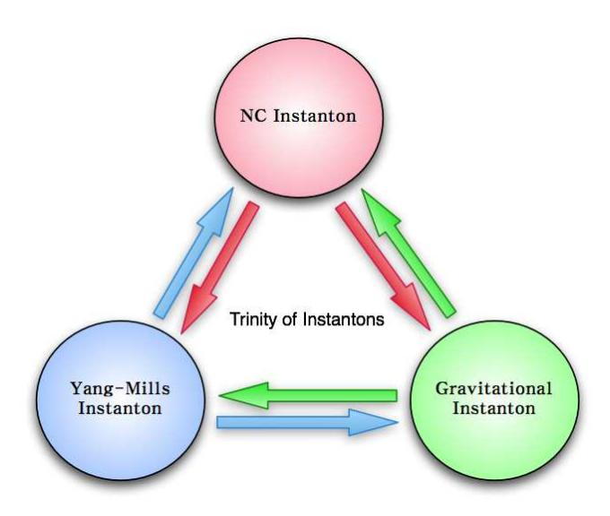

# An Efficient Representation of Euclidean Gravity I

Jungjai Lee a\*, John J. Oh $b^{\dagger}$  and Hyun Seok Yang $c^{\ddagger}$ 

a Department of Physics, Daejin University, Pocheon 487-711, Korea
 b National Institute for Mathematical Sciences, Daejeon 305-390, Korea
 c Institute for the Early Universe, Ewha Womans University, Seoul 120-750, Korea

#### **ABSTRACT**

We explore how the topology of spacetime fabric is encoded into the local structure of Riemannian metrics using the gauge theory formulation of Euclidean gravity. In part I, we provide a rigorous mathematical foundation to prove that a general Einstein manifold arises as the sum of  $SU(2)_L$  Yang-Mills instantons and  $SU(2)_R$  anti-instantons where  $SU(2)_L$  and  $SU(2)_R$  are normal subgroups of the four-dimensional Lorentz group  $Spin(4) = SU(2)_L \times SU(2)_R$ . Our proof relies only on the general properties in four dimensions: The Lorentz group Spin(4) is isomorphic to  $SU(2)_L \times SU(2)_R$  and the six-dimensional vector space  $\Lambda^2T^*M$  of two-forms splits canonically into the sum of three-dimensional vector spaces of self-dual and anti-self-dual two-forms, i.e.,  $\Lambda^2T^*M = \Lambda_+^2 \oplus \Lambda_-^2$ . Consolidating these two, it turns out that the splitting of Spin(4) is deeply correlated with the decomposition of two-forms on four-manifold which occupies a central position in the theory of four-manifolds.

PACS numbers: 04.20.Cv, 02.40.-k, 04.20.Gz

Keywords: Euclidean gravity, Yang-Mills theory, Instanton

August 22, 2018

\*jjlee@daejin.ac.kr

†johnoh@nims.re.kr

‡hsyang@ewha.ac.kr

#### 1 Introduction

Einstein gravity in d-dimensional Euclidean space can be formulated as a gauge theory based on the textbook statement [1] that spin connections in d-dimensions are gauge fields of Lorentz group SO(d). The Riemann curvature tensor can then be understood as the field strength of the SO(d) spin connections from the gauge theory point of view.

Let us systematically apply the gauge theory formulation of Einstein gravity to four-dimensional Riemannian manifolds [2, 3]. We would like to illustrate how our result stated as a Lemma in Section 4 can be derived by applying only a couple of general properties in four dimensions. If M is an oriented Riemannian four-manifold, the structure group acting on orthonormal frames in the tangent space of M is SO(4). An elementary but crucial fact for us is that the Lorentz group SO(4) is isomorphic to  $SU(2)_L \times SU(2)_R/\mathbb{Z}_2$ . Let us simply forget about the  $\mathbb{Z}_2$  factor since we are mostly interested in local descriptions (in the level of Lie algebras). The isomorphism then means that the SO(4) spin connections can be split into a pair of  $SU(2)_L$  and  $SU(2)_R$  gauge fields. Accordingly the Riemann curvature tensor will also be decomposed into a pair of  $SU(2)_L$  and  $SU(2)_R$  curvature two-forms.

Another significant point comes into our consideration. In four dimensions, the six-dimensional vector space  $\Lambda^2 T^*M$  of two-forms splits canonically into the sum of three-dimensional vector spaces of self-dual and anti-self-dual two forms, i.e.,  $\Lambda^2 T^* M = \Lambda^2_+ \oplus \Lambda^2_-$  [4, 5]. It turns out that this Hodge decomposition is deeply correlated with the Lie algebra splitting of  $SO(4) = SU(2)_L \times SU(2)_R$ . This can be understood by the isomorphism between the Clifford algebra  $\mathbb{C}l(d)$  in d-dimensions and the exterior algebra  $\Lambda^*M$  of cotangent bundle  $T^*M$  over a d-dimensional Riemannian manifold M [6]. In this correspondence, the chiral operator  $\Gamma^{d+1}$  in even dimensions corresponds to the Hodge star operation  $*: \Lambda^k T^*M \to \Lambda^{d-k} T^*M$  in  $\Lambda^*M$ . See Eq. (3.16) for the four-dimensional case. That is, the Clifford map implies that the Lorentz generators  $J^{AB} = \frac{1}{4}[\Gamma^A, \Gamma^B]$  in  $\mathbb{C}l(4)$  have one-to-one correspondence with the space  $\Lambda^2 T^* M$  of two-forms in  $\Lambda^* M$ . The spinor representation in even dimensions is reducible and its irreducible representations are defined by the chiral representations whose Lorentz generators are given by  $J_{\pm}^{AB} \equiv \frac{1}{2}(1 \pm \Gamma^{d+1})J^{AB}$ . The splitting of the Lie algebra  $SO(4)=SU(2)_L \times SU(2)_R$  can then be specified by the chiral generators  $J_\pm^{AB}$  as  $J_+^{AB} \in SU(2)_L$  and  $J_{-}^{AB} \in SU(2)_R$ . Then the Clifford map between  $J^{AB}$  and  $\Lambda^2 T^*M$  implies that the chiral splitting of  $SO(4) = SU(2)_L \times SU(2)_R$  is isomorphic to the decomposition  $\Lambda^2 T^*M = \Lambda^2_+ \oplus \Lambda^2_-$  of two-forms on a four-manifold which indeed occupies a central position in the Donaldson's theory of four-manifolds [5].

Let us now apply the chiral splitting of  $SO(4) = SU(2)_L \times SU(2)_R$  and the Hodge decomposition  $\Lambda^2 T^*M = \Lambda_+^2 \oplus \Lambda_-^2$  of two-forms together to Riemann curvature tensors which consist of SO(4)-valued two-forms [3]. In this respect, the 't Hooft symbols defined by Eq. (3.8) take a superb mission consolidating the Hodge decomposition and the chiral splitting which intertwines the SU(2) group structure with the spacetime structure of self-dual two-forms [2]. The Riemann curvature tensor

 $R_{MNAB}$  consists of SO(4) Lie algebra indices A,B and two-form indices M,N in  $\Lambda^2T^*M$ . First one may apply the chiral splitting of  $SO(4)=SU(2)_L\times SU(2)_R$  to yield the result (4.5). The result leads to a pair  $\left(F^{(+)},F^{(-)}\right)$  of SU(2) field strengths in  $SU(2)_L$  and  $SU(2)_R$ , respectively. Since  $F^{(\pm)}$  are SU(2)-valued two-forms, one can next apply the Hodge decomposition  $\Lambda^2T^*M=\Lambda_+^2\oplus\Lambda_-^2$  to yield the results (4.9) and (4.10). Combining these two decompositions together leads to the result (4.11). In the end the Riemann curvature tensor is decomposed into four types  $\{(+,+),(+,-),(-,+),(-,-)\}$  depending on the types of SU(2) chiralities [4]. After imposing the first Bianchi identity,  $R_{AB} \wedge E^B = 0$ , we can swap the role of the indices A,B and C,D in  $R_{ABCD} = E_A^M E_B^N R_{MNCD}$ , i.e.,  $R_{ABCD} = R_{CDAB}$ , which leads to the relation (4.12) between the expansion coefficients and an extra constraint (4.13). Consequently the decomposition (4.11) of a general Riemann curvature tensor ends in 20 components [3].

After we have realized that the four-dimensional Euclidean gravity can be formulated as two copies of SU(2) gauge theories, a natural question arises. What is the Einstein equation from the gauge theory point of view? An educated guess would be some equations which are linear in SU(2) field strengths because Riemmann curvature tensors are composed of a pair  $(F^{(+)}, F^{(-)})$  of SU(2) field strengths. The most natural object linear in the SU(2) field strengths will be Yang-Mills instantons. The Lemma proven in Section 4 shows that the inference is pleasingly true.

Recently, in [7], a similar decomposition of Riemann curvature tensors was applied to 6-dimensional Riemannian manifolds whose holonomy group is  $SO(6) \cong SU(4)/\mathbb{Z}_2$ . Using the SU(4) Yang-Mills gauge theory formulation of 6-dimensional Riemannian manifolds and the six-dimensional 't Hooft symbols which realize the isomorphism between SO(6) Lorentz algebra and SU(4) Lie algebra, it was shown in [7] that six-dimensional Calabi-Yau manifolds are equivalent to Hermitian Yang-Mills instantons in SU(3) Yang-Mills gauge theory. Indeed some of the formulae in this paper are very parallel to six-dimensional ones.

In a series of papers (I & II), we will introduce this efficient representation of Euclidean gravity to uncover the topology of spacetime fabric by consolidating the chiral splitting of  $SO(4) = SU(2)_L \times SU(2)_R$  and the Hodge decomposition  $\Lambda^2T^*M = \Lambda_+^2 \oplus \Lambda_-^2$  of two-forms. In part I, we will provide a rigorous mathematical foundation for the Lemma proven in [3] stating that an Einstein manifold always arises as the sum of  $SU(2)_L$  Yang-Mills instantons and  $SU(2)_R$  anti-instantons.

The paper is organized as follows. In Section 2, we formulate four-dimensional Euclidean gravity as SO(4) Yang-Mills gauge theory [2]. The explicit relation between gravity and gauge theory variables will be established. In Section 3, we introduce an irreducible (chiral) spinor representation of SO(4) which realizes the chiral splitting of SO(4) isomorphic to  $SU(2)_L \times SU(2)_R$ . We further show that the chiral splitting of SO(4) is isomorphic to the Hodge decomposition stating that the six-dimensional vector space  $\Lambda^2T^*M$  of two-forms splits canonically into the sum of three-dimensional vector spaces of self-dual and anti-self-dual two-forms, i.e.,  $\Lambda^2T^*M = \Lambda_+^2 \oplus \Lambda_-^2$ . Consolidating these two, it turns out [3] that the topological classification of four-manifolds is deeply correlated with the chirality and the self-duality of four-manifolds. In Section 4, we apply the results in Section 3 to a

general Einstein manifold to uncover what is a corresponding counterpart of the Einstein manifold from the gauge theory point of view. We explain a mathematical basis necessary to understand the Lemma in [3]. In Section 5, we survey some geometrical aspects of Kähler manifolds to illustrate the power of our gauge theory formulation and study the twistor theory of hyper-Kähler manifolds. In Section 6, we consider a matter coupling to see how the energy-momentum tensor of matter fields in the Einstein equations deforms the structure of an underlying Einstein manifold. The presence of matter fields in general introduces a mixing of  $SU(2)_L$  and  $SU(2)_R$  sectors which is absent in vacuum Einstein manifolds. Finally we address some implications in Section 7 based on the results obtained in this paper and discuss an intriguing trinity of instantons shown up in Figure 1. We will conclude with a brief summary of the contents which will be addressed in the part II [8]. An appendix will be devoted to some useful identities of the 't Hooft symbols.

## 2 Riemannian Manifolds and Gauge Theory

Let M be a four-dimensional Riemannian manifold M whose metric is given by

$$ds^2 = g_{MN}(x)dx^M dx^N, M, N = 1, \dots, 4.$$
 (2.1)

Because spinors form a spinor representation of SO(4) Lorentz group which does not arise from a representation of  $GL(4,\mathbb{R})$ , in order to couple the spinors to gravity, it is necessary to introduce at each spacetime point in M a basis of orthonormal tangent vectors (vierbeins or tetrads)  $E_A = E_A^M \partial_M \in \Gamma(TM), \ A = 1, \cdots, 4$  [1]. Orthonormality means that  $E_A \cdot E_B = \delta_{AB}$ . The frame basis  $\{E_A\}$  defines a dual basis  $E^A = E_M^A dx^M \in \Gamma(T^*M)$  by a natural pairing

$$\langle E^A, E_B \rangle = \delta_B^A. \tag{2.2}$$

The above pairing leads to the relation  $E_M^A E_B^M = \delta_B^A$ . In terms of the non-coordinate (anholonomic) basis in  $\Gamma(TM)$  or  $\Gamma(T^*M)$ , the metric (2.1) can be written as

$$ds^{2} = \delta_{AB}E^{A} \otimes E^{B} = \delta_{AB}E_{M}^{A}E_{N}^{B} dx^{M} \otimes dx^{N}$$

$$\equiv g_{MN}(x) dx^{M} \otimes dx^{N}$$
(2.3)

or

$$\left(\frac{\partial}{\partial s}\right)^2 = \delta^{AB} E_A \otimes E_B = \delta^{AB} E_A^M E_B^N \, \partial_M \otimes \partial_N$$

$$\equiv g^{MN}(x) \, \partial_M \otimes \partial_N. \tag{2.4}$$

There is a large arbitrariness in the choice of a vierbein because the vierbein formalism respects a local gauge invariance. Under a local Lorentz transformation which is an orthogonal frame rotation in SO(4), the vectors transform according to

$$E_A(x) \to E'_A(x) = E_B(x)\Lambda^B{}_A(x),$$
  

$$E^A(x) \to E^{A'}(x) = \Lambda^A{}_B(x)E^B(x)$$
(2.5)

where  $\Lambda^A{}_B(x) \in SO(4)$  is a local Lorentz transformation. As in any other discussion of local gauge invariance, to achieve the local Lorentz invariance requires introducing a gauge field. On a Riemannian manifold M, the spin connection  $\omega$  is an SO(4) gauge field [1]. To be precise, a matrix-valued spin connection  $\omega = \frac{1}{2}\omega_{AB}J^{AB} = \frac{1}{2}\omega_{MAB}(x)J^{AB}dx^{M}$  constitutes a gauge field with respect to the local SO(4) rotations

$$\omega_M \to \omega_M' = \Lambda \omega_M \Lambda^{-1} + \Lambda \partial_M \Lambda^{-1} \tag{2.6}$$

where  $\Lambda = \exp(\frac{1}{2}\lambda_{AB}(x)J^{AB}) \in SO(4)$  and  $J^{AB}$  are SO(4) Lorentz generators which satisfy the following Lorentz algebra

$$[J^{AB}, J^{CD}] = -(\delta^{AC}J^{BD} - \delta^{AD}J^{BC} - \delta^{BC}J^{AD} + \delta^{BD}J^{AC}).$$
 (2.7)

Then the covariant derivatives for the vectors in Eq. (2.5) are defined by

$$D_M E_A = \partial_M E_A - \omega_M{}^B{}_A E_B,$$
  

$$D_M E^A = \partial_M E^A + \omega_M{}^A{}_B E^B.$$
(2.8)

The connection one-forms  $\omega^A{}_B = \omega_M{}^A{}_B dx^M$  satisfy the Cartan's structure equations [1, 9],

$$T^A = dE^A + \omega^A{}_B \wedge E^B, \tag{2.9}$$

$$R^{A}{}_{B} = d\omega^{A}{}_{B} + \omega^{A}{}_{C} \wedge \omega^{C}{}_{B}, \tag{2.10}$$

where  $T^A$  are the torsion two-forms and  $R^A{}_B$  are the curvature two-forms. In terms of local coordinates, they are given by

$$T_{MN}{}^{A} = \partial_{M} E_{N}^{A} - \partial_{N} E_{M}^{A} + \omega_{M}{}^{A}{}_{B} E_{N}^{B} - \omega_{N}{}^{A}{}_{B} E_{M}^{B}, \tag{2.11}$$

$$R_{MN}{}^{A}{}_{B} = \partial_{M}\omega_{N}{}^{A}{}_{B} - \partial_{N}\omega_{M}{}^{A}{}_{B} + \omega_{M}{}^{A}{}_{C}\omega_{N}{}^{C}{}_{B} - \omega_{N}{}^{A}{}_{C}\omega_{M}{}^{C}{}_{B}. \tag{2.12}$$

Now we impose the torsion free condition,  $T_{MN}^{A} = D_{M}E_{N}^{A} - D_{N}E_{M}^{A} = 0$ , to recover the standard content of general relativity, which eliminates  $\omega_{M}$  as an independent variable, i.e.,

$$\omega_{ABC} = E_A^M \omega_{MBC} = \frac{1}{2} (f_{ABC} - f_{BCA} + f_{CAB})$$

$$= -\omega_{ACB}$$
(2.13)

where  $f_{ABC}$  are the structure functions defined by

$$[E_A, E_B] = -f_{AB}{}^C E_C. (2.14)$$

The spin connection (2.13) is related to the Levi-Civita connection as follows

$$\Gamma_{MN}{}^P = \omega_M{}^A{}_B E_A^P E_N^B + E_A^P \partial_M E_N^A, \tag{2.15}$$

which can be derived from the metric-compatibility condition so that the covariant derivative of the vierbein is zero, i.e.,

$$D_M E_N^A = \partial_M E_N^A - \Gamma_{MN}{}^P E_P^A + \omega_M{}^A{}_B E_N^B = 0.$$
 (2.16)

For orthogonal groups the second-rank antisymmetric tensor representation is the same as the adjoint representation, so the Lorentz generators  $J^{AB}=-J^{BA},\ A,B=1,\cdots,4$ , can be conveniently labeled as  $T^a,\ a=1,\cdots,6$ . Hence, we now introduce an SO(4)-valued gauge field defined by  $A=A^aT^a$  where  $A^a=A^a_Mdx^M$  are connection one-forms on M and  $T^a$  are Lie algebra generators of SO(4) satisfying

$$[T^a, T^b] = -f^{abc}T^c. (2.17)$$

The identification [2, 3] we want to make is then given by [2, 3]

$$\omega = \frac{1}{2}\omega_{AB}J^{AB} \equiv A = A^a T^a. \tag{2.18}$$

Thereafter, the Lorentz transformation (2.6) can be translated into a usual gauge transformation

$$A \rightarrow A' = \Lambda A \Lambda^{-1} + \Lambda d \Lambda^{-1} \tag{2.19}$$

where  $\Lambda = e^{\lambda^a(x)T^a} \in SO(4)$ . The SO(4)-valued Riemann curvature tensor is defined by

$$R = d\omega + \omega \wedge \omega$$

$$= \frac{1}{2} R_{AB} J^{AB} = \frac{1}{2} \left( d\omega_{AB} + \omega_{AC} \wedge \omega_{CB} \right) J^{AB}$$

$$= \frac{1}{4} \left( R_{MNAB} J^{AB} \right) dx^{M} \wedge dx^{N}$$

$$= \frac{1}{4} \left[ \left( \partial_{M} \omega_{NAB} - \partial_{N} \omega_{MAB} + \omega_{MAC} \omega_{NCB} - \omega_{NAC} \omega_{MCB} \right) J^{AB} \right] dx^{M} \wedge dx^{N}$$
 (2.20)

or, in terms of gauge theory variables, it is given by

$$F = dA + A \wedge A$$

$$= F^{a}T^{a} = \left(dA^{a} - \frac{1}{2}f^{abc}A^{b} \wedge A^{c}\right)T^{a}$$

$$= \frac{1}{2}\left(F_{MN}^{a}T^{a}\right)dx^{M} \wedge dx^{N}$$

$$= \frac{1}{2}\left[\left(\partial_{M}A_{N}^{a} - \partial_{N}A_{M}^{a} - f^{abc}A_{M}^{b}A_{N}^{c}\right)T^{a}\right]dx^{M} \wedge dx^{N}. \tag{2.21}$$

&lt;sup>1It may be worthwhile to adopt the identification (2.18) by applying a group homomorphism of  $O(4) = SU(2)_L \times SU(2)_R$ . To be precise, the spin connection (2.18) is a connection on a spinor bundle induced from the SO(4)-bundle and the structure group of its fiber is lifted to Spin(4), a double cover of SO(4), according to the short exact sequence of Lie groups:  $1 \to \mathbb{Z}_2 \to Spin(4) \to SO(4) \to 1$ . Hence the global isomorphism should refer to Spin(4). Nevertheless we will not care about the  $\mathbb{Z}_2$ -factor because we are mostly interested in local descriptions (in the level of Lie algebras).

Using the form language where  $d = dx^M \partial_M = E^A E_A$  and  $A = A_M dx^M = A_A E^A$ , the field strength (2.21) of SO(4) gauge fields in the non-coordinate basis takes the form

$$F = dA + A \wedge A = \frac{1}{2} F_{AB} E^{A} \wedge E^{B}$$

$$= \frac{1}{2} \left( E_{A} A_{B} - E_{B} A_{A} + [A_{A}, A_{B}] + f_{AB}{}^{C} A_{C} \right) E^{A} \wedge E^{B}$$
(2.22)

where we used the structure equation

$$dE^{A} = \frac{1}{2} f_{BC}{}^{A} E^{B} \wedge E^{C}. \tag{2.23}$$

After establishing the identification (2.18) between gravity and gauge theory variables, it is straightforward to find a gauge theory representation from formulae in gravity theory.2 For example, the second Bianchi identity for Riemann curvature tensors is mapped to the Bianchi identity for Yang-Mills field strengths [2], i.e.,

$$DR \equiv dR + \omega \wedge R - R \wedge \omega = 0 \quad \Leftrightarrow \quad DF \equiv dF + A \wedge F - F \wedge A = 0. \tag{2.24}$$

## 3 Spinor Representation and Self-Duality

In order to make an explicit identification between the spin connections and the corresponding gauge fields, let us first introduce the four-dimensional Dirac algebra

$$\{\Gamma^A, \Gamma^B\} = 2\delta^{AB} \mathbf{I}_4,\tag{3.1}$$

where  $\Gamma^A$   $(A=1,\cdots,4)$  are 4-dimensional Dirac matrices and  $\mathbf{I}_n$  denotes an  $n\times n$  identity matrix. Then the SO(4) Lorentz generators are given by

$$J^{AB} = \frac{1}{4} [\Gamma^A, \Gamma^B] \tag{3.2}$$

which satisfy the Lorentz algebra (2.7). It will be useful to have an explicit representation of Dirac matrices as follows

$$\Gamma^A = \begin{pmatrix} 0 & \sigma^A \\ \overline{\sigma}^A & 0 \end{pmatrix} \tag{3.3}$$

where  $\sigma^A = (i\tau^a, \mathbf{I}_2)$  and  $\overline{\sigma}^A = (-i\tau^a, \mathbf{I}_2) = (\sigma^A)^{\dagger}$  and  $\tau^a$ , a = 1, 2, 3 are the Pauli matrices. Note that the Dirac matrices in Eq. (3.3) are in the chiral representation where the chirality matrix  $\Gamma^5 \equiv -\Gamma^1 \Gamma^2 \Gamma^3 \Gamma^4$  is given by

$$\Gamma^5 = \begin{pmatrix} \mathbf{I}_2 & 0 \\ 0 & -\mathbf{I}_2 \end{pmatrix}. \tag{3.4}$$

&lt;sup>2Note that it is not always possible. For instance, the torsion free condition (2.9) has no counterpart in gauge theory because the gauge theory has no analogue of vierbeins or tetrads [2]. Moreover, the converse is not always true. For example, a Yang-Mills instanton on flat space  $\mathbb{R}^4$  does not have a gravity counterpart because the spin connection on  $\mathbb{R}^4$  idetically vanishes. This issue will be further discussed in the last Section.

The spinor representation of SO(4) is reducible and there are two irreducible Weyl representations. The Lorentz generators of an irreducible (called Weyl or chiral) representation are given by

$$J_{\pm}^{AB} = \frac{1}{2} (\mathbf{I}_4 \pm \Gamma^5) J^{AB} \equiv \Gamma_{\pm} J^{AB}$$
 (3.5)

where  $\Gamma_{\pm} = \frac{1}{2} (\mathbf{I}_4 \pm \Gamma^5)$ .

Consider the product of two Dirac matrices3

$$\Gamma^{A}\Gamma^{B} \equiv \begin{pmatrix} \delta^{AB}\mathbf{I}_{2} + i\sigma^{AB} & 0\\ 0 & \delta^{AB}\mathbf{I}_{2} + i\overline{\sigma}^{AB} \end{pmatrix} \equiv \delta^{AB}\mathbf{I}_{4} + i\begin{pmatrix} \eta_{AB}^{a}\tau^{a} & 0\\ 0 & \overline{\eta}_{AB}^{\dot{a}}\tau^{\dot{a}} \end{pmatrix}$$
(3.6)

and so the Lorentz generators in Eq. (3.2) are given by

$$J^{AB} = \frac{1}{4} [\Gamma^A, \Gamma^B] = \frac{i}{2} \begin{pmatrix} \eta^a_{AB} \tau^a & 0\\ 0 & \overline{\eta}^{\dot{a}}_{AB} \tau^{\dot{a}} \end{pmatrix}. \tag{3.7}$$

Here we have distinguished for a later purpose the two kinds of Lie algebra indices with a=1,2,3 and  $\dot{a}=1,2,3$  for  $SU(2)_L$  and  $SU(2)_R$  in  $SO(4)=SU(2)_L\times SU(2)_R$ , respectively. One can see from Eqs. (3.5) and (3.7) that the Lorentz generators in the positive and negative chirality basis are given by  $J_+^{AB}=\frac{i}{2}\eta_{AB}^a\tau^a$  and  $J_-^{AB}=\frac{i}{2}\overline{\eta}_{AB}^a\tau^{\dot{a}}$ , respectively. Thereafter, one can determine two families of  $4\times 4$  matrices, the so-called 't Hooft symbols [10], defined by

$$\eta_{AB}^a = -i \operatorname{Tr} \left( J_+^{AB} \tau^a \right), \qquad \overline{\eta}_{AB}^{\dot{a}} = -i \operatorname{Tr} \left( J_-^{AB} \tau^{\dot{a}} \right).$$
(3.8)

An explicit representation of the 't Hooft symbols in the basis (3.3) is shown up in Appendix A where we also list some useful identities of the 't Hooft tensors.

One can check that the chiral Lorentz generators  $J_{\pm}^{AB}$  independently satisfy the Lorentz algebra (2.7) from which Eq. (A.8) is deduced and commutes each other, i.e.,  $[J_{+}^{AB}, J_{-}^{CD}] = 0$ . They also satisfy the anti-commutation relation

$$\{J_{\pm}^{AB}, J_{\pm}^{CD}\} = -\frac{1}{2} (\delta^{AC} \delta^{BD} - \delta^{AD} \delta^{BC} \pm \varepsilon^{ABCD}) \Gamma_{\pm}$$
 (3.9)

from which Eq. (A.3) is deduced. Let us define the right-hand side of Eq. (3.9) as

$$P_{\pm}^{ABCD} \equiv \frac{1}{4} (\delta^{AC} \delta^{BD} - \delta^{AD} \delta^{BC} \pm \varepsilon^{ABCD}). \tag{3.10}$$

The identity (A.3) in turn implies that the above operators can be recapitulated in an elegant form

$$P_{+}^{ABCD} = \frac{1}{4} \eta_{AB}^{a} \eta_{CD}^{a}, \qquad P_{-}^{ABCD} = \frac{1}{4} \overline{\eta}_{AB}^{\dot{a}} \overline{\eta}_{CD}^{\dot{a}}.$$
 (3.11)

&lt;sup>3Note that the Dirac matrices defined by (3.3) are self-adjoint, i.e.,  $(\Gamma^A)^{\dagger} = \Gamma^A$  and so  $\sigma^{AB}$  and  $\overline{\sigma}^{AB}$  in Eq. (3.6) are self-adjoint and traceless  $2 \times 2$  matrices. Such a  $2 \times 2$  matrix can always be expanded in the basis of the Pauli matrices which underlies the expansion in Eq. (3.6) and motivates the introduction of the 't Hooft symbols.

It is then easy to show that the above operators can serve as a projection operator onto a subspace of definite chirality, i.e.,

$$P_{\pm}^{ABEF}P_{\pm}^{EFCD} = P_{\pm}^{ABCD}, \qquad P_{\pm}^{ABEF}P_{\mp}^{EFCD} = 0.$$
 (3.12)

Using Eqs. (A.5) and (A.6), one can easily derive the following useful properties

$$P_{+}^{ABCD}\eta_{CD}^{a} = \eta_{AB}^{a}, \qquad P_{-}^{ABCD}\eta_{CD}^{a} = 0, P_{+}^{ABCD}\overline{\eta}_{CD}^{\dot{a}} = 0, \qquad P_{-}^{ABCD}\overline{\eta}_{CD}^{\dot{a}} = \overline{\eta}_{AB}^{\dot{a}},$$
(3.13)

which can be summarized as an important relation [10]

$$\eta_{AB}^{a} = \frac{1}{2} \varepsilon_{AB}{}^{CD} \eta_{CD}^{a}, \qquad \overline{\eta}_{AB}^{\dot{a}} = -\frac{1}{2} \varepsilon_{AB}{}^{CD} \overline{\eta}_{CD}^{\dot{a}}. \tag{3.14}$$

Starting with the chiral representation (3.3) of the Lorentz algebra, we have arrived at the self-duality relation (3.14). In order to closely understand the interrelation between the chiral representation of Lorentz algebra and the self-duality, let us introduce the Clifford algebra  $\mathbb{C}l(4)$  whose generators are given by

$$\mathbb{C}l(4) = \{\mathbf{I}_{4}, \Gamma^{A}, \Gamma^{AB}, \Gamma^{5}\Gamma^{A}, \Gamma^{5}\} 
= \{\Gamma_{+}, \Gamma_{+}^{A}, \Gamma_{+}^{AB}\} \oplus \{\Gamma_{-}, \Gamma_{-}^{A}, \Gamma_{-}^{AB}\}$$
(3.15)

where  $\Gamma_{\pm}^A = \Gamma_{\pm}\Gamma^A$ ,  $\Gamma_{\pm}^{AB} = \Gamma_{\pm}\Gamma^{AB}$  and  $\Gamma^{A_1A_2\cdots A_k} = \frac{1}{k!}\Gamma^{[A_1}\Gamma^{A_2}\cdots\Gamma^{A_k]}$  with the complete antisymmetrization of indices. Clifford algebras are closely related to exterior algebras [6]. That is, they are naturally isomorphic as vector spaces. In fact, the Clifford algebra (3.15) can be identified with the exterior algebra of a cotangent bundle  $T^*M \to M$ 

$$\mathbb{C}l(4) \cong \Lambda^* M = \bigoplus_{k=0}^4 \Lambda^k T^* M \tag{3.16}$$

where the chirality operator  $\Gamma^5$  corresponds to the Hodge operator  $*: \Lambda^k T^*M \to \Lambda^{4-k} T^*M$ . More precisely, the Clifford algebra may be thought of as a quantization of the exterior algebra, in the same sense that the Weyl algebra is a quantization of the symmetric algebra [11].

The spinor representation of SO(4) can be constructed by 2 fermion creation operators  $a_1^*$ ,  $a_2^*$  and the corresponding annihilation operators  $a^1$ ,  $a^2$  defined by the gamma matrices in Eq. (3.3) [12]. This fermionic system can be represented in a four-dimensional Hilbert space V whose states are made by acting on a Fock vacuum  $|\Omega\rangle$ , i.e.,  $a^1|\Omega\rangle = a^2|\Omega\rangle = 0$  with creation operators  $a_1^*$ ,  $a_2^*$ , and  $a_1^*a_2^*$ 

$$V = |\Omega\rangle \oplus a_1^* |\Omega\rangle \oplus a_2^* |\Omega\rangle \oplus a_1^* a_2^* |\Omega\rangle$$
  
=  $(|\Omega\rangle \oplus a_1^* a_2^* |\Omega\rangle) \oplus (a_1^* |\Omega\rangle \oplus a_2^* |\Omega\rangle).$  (3.17)

Since the chirality operator  $\Gamma^5$  commutes with all of the SO(4) Lorentz generators in Eq. (3.7), the spinor representation in the Hilbert space V is reducible, i.e.,  $V = S_+ \oplus S_-$  and there are two

irreducible spinor representations  $S_{\pm}$  each of dimension 2, namely the spinors of positive and negative chirality. If the Fock vacuum  $|\Omega\rangle$  has positive chirality, the positive chirality spinors of SO(4) are states given by

$$S_{+} = |\Omega\rangle \oplus a_1^* a_2^* |\Omega\rangle = \mathbf{2} \tag{3.18}$$

while the negative chirality spinors of SO(4) are those obtained by

$$S_{-} = a_1^* |\Omega\rangle \oplus a_2^* |\Omega\rangle = \overline{2}. \tag{3.19}$$

According to the Lie algebra isomorphism  $SO(4) = SU(2)_L \times SU(2)_R$ , one may identify two irreducible spinor representations with an  $SU(2)_L$  spinor  $\mathbf{2} = S_+$  and an  $SU(2)_R$  spinor  $\overline{\mathbf{2}} = S_-$ . Because the SU(2) Lie group has only a real representation,  $\overline{\mathbf{2}}$  means not a complex conjugate of  $\mathbf{2}$  but a completely independent spinor.

Using the Fierz identity, a tensor product of two spinors in V can be expanded in terms of the bispinors in Eq. (3.15). And the Clifford map (3.16) also implies that a p-form  $\Psi \in \Lambda^p T^*M$  can be mapped to a bispinor in  $\mathbb{C}l(4)$ :

$$\Psi = \frac{1}{p!} \Psi_{A_1 A_2 \cdots A_p}^{(p)} E^{A_1} \wedge E^{A_2} \wedge \cdots \wedge E^{A_p} \quad \Leftrightarrow \quad \Psi = \Psi_{A_1 A_2 \cdots A_p}^{(p)} \Gamma^{A_1 A_2 \cdots A_p}. \tag{3.20}$$

Therefore it will be useful to classify the Clifford generators in Eq. (3.15) in terms of direct products of the Weyl spinors 2 and  $\overline{2}$  in Eqs. (3.18) and (3.19). The result should be familiar as [12]

$$\mathbf{2} \otimes \mathbf{2} = \mathbf{1} \oplus \mathbf{3} = \{\Gamma_+, \Gamma_+^{AB}\} = \{\mathbf{I}_2, i\sigma^{AB} = i\eta_{AB}^a \tau^a\},\tag{3.21}$$

$$\overline{\mathbf{2}} \otimes \overline{\mathbf{2}} = \overline{\mathbf{1}} \oplus \overline{\mathbf{3}} = \{\Gamma_{-}, \Gamma_{-}^{AB}\} = \{\mathbf{I}_{2}, i\overline{\sigma}^{AB} = i\overline{\eta}_{AB}^{\dot{a}} \tau^{\dot{a}}\}, \tag{3.22}$$

$$\mathbf{2} \otimes \overline{\mathbf{2}} = \mathbf{4} = \{ \Gamma_{+}^{A} \} = \{ \sigma^{A} \},\tag{3.23}$$

$$\overline{\mathbf{2}} \otimes \mathbf{2} = \overline{\mathbf{4}} = \{\Gamma_{-}^{A}\} = \{\overline{\sigma}^{A}\}. \tag{3.24}$$

In particular,  $\sigma^A$  in  $\mathbf{2} \otimes \overline{\mathbf{2}}$  and  $\overline{\sigma}^A$  in  $\overline{\mathbf{2}} \otimes \mathbf{2}$  are nothing but a quoternion and a conjugate quoternion, respectively, that maps spinors of one chirality to the other. A quoternion determines an isomorphism between the Euclidean space  $\mathbb{R}^4$  and the space of bivectors of  $\mathbb{C}^2$  where a point  $x^A$  in  $\mathbb{R}^4$  is taken to correspond to a quoternion according to

$$\mathbb{X}_{\alpha\dot{\alpha}} = x^A \sigma_{\alpha\dot{\alpha}}^A \quad \text{or} \quad \overline{\mathbb{X}}_{\dot{\alpha}\alpha} = x^A \overline{\sigma}_{\dot{\alpha}\alpha}^A$$
 (3.25)

where  $\alpha=1,2\in\mathbf{2}$  and  $\dot{\alpha}=1,2\in\mathbf{\overline{2}}$  are doublet indices on  $\mathbb{C}^2$ . The spinor indices are raised and lowered with the SU(2)-invariant symplectic forms  $\epsilon^{\alpha\beta}$ ,  $\epsilon^{\dot{\alpha}\dot{\beta}}$  and their inverses  $\epsilon_{\alpha\beta}$ ,  $\epsilon_{\dot{\alpha}\dot{\beta}}$ .

The Hodge \*-operator acts on a vector space  $\Lambda^p T^*M$  of p-forms and defines an automorphism of  $\Lambda^2 T^*M$  with eigenvalues  $\pm 1$ . Therefore, we have the following decomposition

$$\Lambda^2 T^* M = \Lambda_+^2 \oplus \Lambda_-^2 \tag{3.26}$$

where  $\Lambda_{\pm}^2 \equiv P_{\pm}\Lambda^2 T^* M$  and  $P_{\pm} = \frac{1}{2}(1 \pm *)$ . The eigenspaces  $\Lambda_{+}^2$  and  $\Lambda_{-}^2$  in Eq. (3.26) are called self-dual and anti-self-dual, respectively. If  $\Lambda_{+}^2$  and  $\Lambda_{-}^2$  take values in a vector bundle E, they are called instantons and anti-instantons [5]. For instance, the Riemann curvature tensor in Eq. (2.20) is an SO(4)-valued two-form and thus one can define the self-dual structure according to the decomposition (3.26). In this case, the eigenspace  $\Lambda_{+}^2$  or  $\Lambda_{-}^2$  in Eq. (3.26) is called a gravitational (anti-)instanton [9]. Now the Clifford map (3.20) together with the self-duality relation (3.14) suggests that the eigenspaces  $\Lambda_{+}^2$  and  $\Lambda_{-}^2$  in Eq. (3.26) take values in the tensor products  $\mathbf{2} \otimes \mathbf{2} = \mathbf{3} \oplus \mathbf{1}$  and  $\mathbf{2} \otimes \mathbf{2} = \mathbf{3} \oplus \mathbf{1}$ , respectively, with singlets being removed.

In order to elucidate this aspect in depth, let us consider an arbitrary two-form

$$F = \frac{1}{2} F_{MN} dx^{M} \wedge dx^{N} = \frac{1}{2} F_{AB} E^{A} \wedge E^{B} \in \Lambda^{2} T^{*} M$$
 (3.27)

and introduce the (3+3)-dimensional basis of two-forms in  $\Lambda^2 T^*M$  for each chirality of SO(4) Lorentz algebra [13]

$$J_{+}^{a} \equiv \frac{1}{2} \eta_{AB}^{a} E^{A} \wedge E^{B}, \qquad J_{-}^{\dot{a}} \equiv \frac{1}{2} \overline{\eta}_{AB}^{\dot{a}} E^{A} \wedge E^{B}.$$
 (3.28)

It is easy to derive the volume forms below using the identities in Appendix A

$$J_{+}^{a} \wedge J_{+}^{b} = 2\delta^{ab} \sqrt{g} d^{4}x,$$

$$J_{-}^{\dot{a}} \wedge J_{-}^{\dot{b}} = -2\delta^{\dot{a}\dot{b}} \sqrt{g} d^{4}x,$$

$$J_{+}^{\dot{a}} \wedge J_{-}^{\dot{b}} = 0.$$
(3.29)

Using Eqs. (3.10) and (3.11) in turn, one can get the following result

$$F_{AB} = (P_{+}^{ABCD} + P_{-}^{ABCD})F_{CD}$$

$$= f_{(+)}^{a} \eta_{AB}^{a} + f_{(-)}^{\dot{a}} \overline{\eta}_{AB}^{\dot{a}}$$

$$\equiv F_{AB}^{(+)} + F_{AB}^{(-)}$$
(3.30)

where  $f^a_{(+)}=\frac{1}{4}F_{AB}\eta^a_{AB}$  and  $f^{\dot{a}}_{(-)}=\frac{1}{4}F_{AB}\overline{\eta}^{\dot{a}}_{AB}$ . In Eq. (3.30), we have introduced self-dual and anti-self-dual rank-2 tensors defined by

$$F_{AB}^{(+)} = f_{(+)}^a \eta_{AB}^a, \qquad F_{AB}^{(-)} = f_{(-)}^{\dot{a}} \overline{\eta}_{AB}^{\dot{a}}.$$
 (3.31)

Then Eq. (3.14) immediately leads to the self-duality relation

$$F_{AB}^{(+)} = \frac{1}{2} \varepsilon_{AB}^{CD} F_{CD}^{(+)}, \qquad F_{AB}^{(-)} = -\frac{1}{2} \varepsilon_{AB}^{CD} F_{CD}^{(-)}.$$
 (3.32)

Plugging the result (3.30) into Eq. (3.27) leads to the Hodge decomposition (3.26) for a generic two-form F:

$$F = F^{(+)} + F^{(-)}$$
  
=  $f^a_{(+)}J^a_+ + f^{\dot{a}}_{(-)}J^{\dot{a}}_-.$  (3.33)

Therefore one sees that the 't Hooft symbols  $\eta_{AB}^a$  and  $\overline{\eta}_{AB}^{\dot{a}}$  have a one-to-one correspondence with the spaces  $\Lambda_+^2$  and  $\Lambda_-^2$  in Eq. (3.26), respectively. In other words, one can see that  $F^{(+)} \in \mathbf{3}$  and  $F^{(-)} \in \overline{\mathbf{3}}$ . As a result, if F is a curvature two-form on a vector bundle E, an instanton can be represented by the basis  $\eta_{AB}^a \in \mathbf{3}$  and it lives in the positive-chirality space  $S_+ = \mathbf{2}$  while an anti-instanton can be represented by the basis  $\overline{\eta}_{AB}^{\dot{a}} \in \overline{\mathbf{3}}$  and it lives in the negative-chirality space  $S_- = \overline{\mathbf{2}}$  [2, 3].

The Clifford map (3.16) implies that the space of two-forms in exterior algebra  $\Lambda^*M$  has a one-toone correspondence with SO(4) generators in Clifford algebra  $\mathbb{C}l(4)$ , i.e.,  $\Lambda^2T^*M\cong\Gamma^{AB}\in SO(4)$ . Thus the Hodge decomposition (3.26) in the exterior algebra  $\Lambda^*M$  is isomorphic to the Lie algebra decomposition  $SO(4) = SU(2)_L \times SU(2)_R$ . Through the Clifford map (3.16), the splitting of SO(4)is deeply related to the decomposition of the two-forms on four-manifold which occupies a central position in the Donaldson's theory of four-manifolds [5]. We want to emphasize that the 't Hooft symbols  $\eta^a_{AB}$  and  $\overline{\eta}^{\dot{a}}_{AB}$  in this respect take a superb mission consolidating the Hodge decomposition (3.26) and the Lie algebra isomorphism  $SO(4) = SU(2)_L \times SU(2)_R$ , which intertwines the group structure of the index  $a = 1, 2, 3 \in SU(2)_L$  and  $\dot{a} = 1, 2, 3 \in SU(2)_R$  with the spacetime structure of the two-form indices A, B [10]. The 't Hooft symbols at the outset have been introduced to define the chiral decomposition of Lorentz generators in Eq. (3.5) which concurrently realizes the Lie algebra isomorphism  $SO(4) = SU(2)_L \times SU(2)_R$ . But the isomorphism between the Clifford algebra  $\mathbb{C}l(4)$ and the exterior algebra  $\Lambda^*M=\bigoplus_{k=0}^4\Lambda^kT^*M$  also dictates that the Hodge decomposition (3.26) should be in parallel with the chiral decomposition. After all, the chirality and the self-duality, which are arguably the most important properties regarding to the topological classification of Riemannian manifolds [5], have been amalgamated into the 't Hooft symbols. A deep geometrical meaning of the 't Hooft symbols is to specify the triple (I, J, K) of complex structures of a hyper-Kähler manifold for a given orientation. The triple complex structures (I, J, K) form a quaternion which can be identified with the SU(2) generators  $T_{+}^{a}$  or  $T_{-}^{\dot{a}}$  in (A.9) [13].

# 4 Einstein Manifolds As Yang-Mills Instantons

The four dimensional space has mystic features [4, 5]. Among the group of isometries of d-dimensional Euclidean space  $\mathbb{R}^d$ , the Lie group SO(4) for  $d \geq 3$  is the only non-simple Lorentz group and one can define a self-dual two-form only for d=4. We observed before that these mystic features in four dimensions can be encoded into the 't Hooft symbols defined by Eq. (3.8). Since the group SO(4) is a direct product of normal subgroups  $SU(2)_L$  and  $SU(2)_R$ , i.e.  $SO(4) = SU(2)_L \times SU(2)_R$ , we take the 4-dimensional defining representation of the Lorentz generators as follows [2]

$$[J^{AB}]_{CD} = \frac{1}{2} \left( \eta_{AB}^{a} [T_{+}^{a}]_{CD} + \overline{\eta}_{AB}^{\dot{a}} [T_{-}^{\dot{a}}]_{CD} \right)$$
$$= \frac{1}{2} \left( \eta_{AB}^{a} \eta_{CD}^{a} + \overline{\eta}_{AB}^{\dot{a}} \overline{\eta}_{CD}^{\dot{a}} \right), \tag{4.1}$$

where  $T_+^a$  and  $T_-^{\dot{a}}$  are the  $SU(2)_L$  and  $SU(2)_R$  generators given by Eq. (A.9). It is then easy to check using Eqs. (A.8) and (A.12) that the generators in Eq. (4.1) satisfy the Lorentz algebra (2.7). According to the identification (2.18), SU(2) gauge fields can be defined from the spin connections

$$[\omega_{M}]_{CD} = \frac{1}{2}\omega_{MAB}[J^{AB}]_{CD}$$

$$= \left(\frac{1}{4}\omega_{MAB}\eta_{AB}^{a}\right)[T_{+}^{a}]_{CD} + \left(\frac{1}{4}\omega_{MAB}\overline{\eta}_{AB}^{\dot{a}}\right)[T_{-}^{\dot{a}}]_{CD}$$

$$\equiv A_{M}^{(+)a}[T_{+}^{a}]_{CD} + A_{M}^{(-)\dot{a}}[T_{-}^{\dot{a}}]_{CD} = [A_{M}]_{CD}$$
(4.2)

where  $A_M^{(+)a}$  and  $A_M^{(-)\dot{a}}$  are  $SU(2)_L$  and  $SU(2)_R$  gauge fields, respectively, defined by

$$A_M^{(+)a} = \frac{1}{4} \omega_{MAB} \eta_{AB}^a, \qquad A_M^{(-)\dot{a}} = \frac{1}{4} \omega_{MAB} \overline{\eta}_{AB}^{\dot{a}}.$$
 (4.3)

In other words, we get the following decomposition [2] for spin connections

$$\omega_{MAB} = A_M^{(+)a} \eta_{AB}^a + A_M^{(-)\dot{a}} \overline{\eta}_{AB}^{\dot{a}}. \tag{4.4}$$

The above decomposition can also be obtained in the exactly same manner as Eq. (3.30). Plugging Eq. (4.4) into Eq. (2.20) leads to a similar decomposition for the Riemann curvature tensors

$$R_{MNAB} = F_{MN}^{(+)a} \eta_{AB}^a + F_{MN}^{(-)\dot{a}} \overline{\eta}_{AB}^{\dot{a}}, \tag{4.5}$$

where

$$F_{MN}^{(\pm)} = \partial_M A_N^{(\pm)} - \partial_N A_M^{(\pm)} + [A_M^{(\pm)}, A_N^{(\pm)}]. \tag{4.6}$$

Therefore, we see that the four-dimensional Euclidean gravity, when formulated as the SO(4) gauge theory, will basically be two copies of SU(2) gauge theories [14]. Now a natural question arises. If the four-dimensional Euclidean gravity can be formulated as the SO(4) gauge theory, what is the Einstein equation from the gauge theory point of view? An educated guess would be some equations which are linear in SU(2) field strengths because Riemann curvature tensors are composed of a pair of SU(2) field strengths as was shown in Eq. (4.5). The most natural object linear in the SU(2) field strengths will be a Yang-Mills instanton. Now we will recapitulate the following Lemma proven in [3] to show that the inference is true.

**Lemma**. If M is an oriented 4-manifold, the spin connections of M are decomposed as Eq. (4.4) according to the Lie algebra decomposition  $Spin(4) = SU(2)_L \times SU(2)_R$ . The curvature 2-form can then be written as Eq. (4.5). With the decomposition (4.5), the Einstein equation

$$R_{AB} - \frac{1}{2}\delta_{AB}R + \delta_{AB}\Lambda = 0 \tag{4.7}$$

for the 4-manifold M is equivalent to the self-duality equation of Yang-Mills instantons

$$F_{AB}^{(\pm)} = \pm \frac{1}{2} \varepsilon_{AB}{}^{CD} F_{CD}^{(\pm)}, \tag{4.8}$$

where  $F_{AB}^{(+)a}\eta_{AB}^a=F_{AB}^{(-)\dot{a}}\overline{\eta}_{AB}^{\dot{a}}=2\Lambda.$ 

Proof. The Hodge \*-operation is an involution of  $\Lambda^2T^*M$  which decomposes the two forms into self-dual and anti-self dual parts,  $\Lambda^2T^*M=\Lambda_+^2\oplus\Lambda_-^2$ . Since the field strengths  $F_{AB}^{(\pm)}\equiv E_A^ME_B^NF_{MN}^{(\pm)}$  in Eq. (4.6) consist of SU(2)-valued two-forms, let us apply the Hodge decomposition (3.30) to  $F_{AB}^{(\pm)}$  to yield [3]

$$F_{AB}^{(+)a} \equiv f_{(++)}^{ab} \eta_{AB}^b + f_{(+-)}^{a\dot{b}} \bar{\eta}_{AB}^{\dot{b}}, \tag{4.9}$$

$$F_{AB}^{(-)\dot{a}} \equiv f_{(-+)}^{\dot{a}\dot{b}} \eta_{AB}^{\dot{b}} + f_{(--)}^{\dot{a}\dot{b}} \overline{\eta}_{AB}^{\dot{b}}. \tag{4.10}$$

Using the above result, we get the following decomposition of the Riemann curvature tensor in Eq. (4.5)

$$R_{ABCD} = f_{(++)}^{ab} \eta_{AB}^{a} \eta_{CD}^{b} + f_{(+-)}^{a\dot{b}} \eta_{AB}^{a} \overline{\eta}_{CD}^{\dot{b}} + f_{(-+)}^{\dot{a}b} \overline{\eta}_{AB}^{\dot{a}} \eta_{CD}^{b} + f_{(--)}^{\dot{a}\dot{b}} \overline{\eta}_{AB}^{\dot{a}} \overline{\eta}_{CD}^{\dot{b}}. \tag{4.11}$$

Note that the curvature tensors have the symmetry property  $R_{ABCD} = R_{CDAB}$  from which one can get the following relations between coefficients in the expansion (4.11):

$$f_{(++)}^{ab} = f_{(++)}^{ba}, \qquad f_{(--)}^{\dot{a}\dot{b}} = f_{(--)}^{\dot{b}\dot{a}}, \qquad f_{(+-)}^{a\dot{b}} = f_{(-+)}^{\dot{b}a}.$$
 (4.12)

The first Bianchi identity,  $\varepsilon^{ACDE}R_{BCDE}=0$ , further constrains the coefficients

$$f_{(++)}^{ab}\delta^{ab} = f_{(--)}^{\dot{a}\dot{b}}\delta^{\dot{a}\dot{b}}. (4.13)$$

Therefore, the Riemann curvature tensor in Eq. (4.11) has 20 = (6+6-1)+9 independent components, as is well-known [1]. The above results can be applied to the Ricci tensor  $R_{AB} \equiv R_{ACBC}$  and the Ricci scalar  $R \equiv R_{AA}$  to yield

$$R_{AB} = \left( f_{(++)}^{ab} \delta^{ab} + f_{(--)}^{\dot{a}\dot{b}} \delta^{\dot{a}\dot{b}} \right) \delta_{AB} + 2 f_{(+-)}^{a\dot{b}} \eta_{AC}^{a} \overline{\eta}_{BC}^{\dot{b}}, \tag{4.14}$$

$$R = 4(f_{(++)}^{ab}\delta^{ab} + f_{(--)}^{\dot{a}\dot{b}}), \tag{4.15}$$

where a symmetric expression was taken in spite of the relation (4.13). Hence the Einstein tensor  $G_{AB} \equiv R_{AB} - \frac{1}{2}R\delta_{AB}$  has 10 independent components given by

$$G_{AB} = 2f_{(+-)}^{a\dot{b}}\eta_{AC}^{a}\bar{\eta}_{BC}^{\dot{b}} - 2f_{(++)}^{ab}\delta^{ab}\delta_{AB}.$$
(4.16)

A Riemannian manifold satisfying the Einstein equation (4.7), which can be written as the form  $R_{AB} = \Lambda \delta_{AB}$  where  $\Lambda$  is a cosmological constant, is called an Einstein manifold. It is easy to deduce the condition for the Einstein manifold from Eq. (4.14) which is given by

$$f_{(++)}^{ab}\delta^{ab} = f_{(--)}^{\dot{a}\dot{b}}\delta^{\dot{a}\dot{b}} = \frac{\Lambda}{2}, \qquad f_{(+-)}^{a\dot{b}} = 0.$$
 (4.17)

Therefore, the curvature tensor for an Einstein manifold reduces to [3]

$$R_{ABCD} = F_{AB}^{(+)a} \eta_{CD}^{a} + F_{AB}^{(-)\dot{a}} \overline{\eta}_{CD}^{\dot{a}}$$

$$= f_{(++)}^{ab} \eta_{AB}^{a} \eta_{CD}^{b} + f_{(--)}^{\dot{a}\dot{b}} \overline{\eta}_{CD}^{\dot{a}}$$

$$(4.18)$$

with the coefficients satisfying (4.17). If  $\Lambda = 0$ , the result (4.18) refers to a Ricci-flat manifold.

As was shown in Eq. (3.32), it is obvious that the SU(2) field strengths in Eq. (4.18) satisfy the self-duality equation

$$F_{AB}^{(\pm)} = \pm \frac{1}{2} \varepsilon_{AB}{}^{CD} F_{CD}^{(\pm)}. \tag{4.19}$$

And one can easily verify that the converse is true too: If the Riemann curvature tensors are given by Eq. (4.18) and so satisfy the self-duality equations (4.19), the Einstein equation (4.7) is automatically satisfied with  $2\Lambda = F_{AB}^{(+)a}\eta_{AB}^a = F_{AB}^{(-)\dot{a}}\overline{\eta}_{AB}^{\dot{a}}$ . This completes the proof of the Lemma.

A few remarks are in order.

The decomposition (4.11) of Riemann curvature tensors can simply be obtained by applying the projection operators in Eq. (3.10) to the Riemann tensors:

$$R_{ABCD} = (P_{+}^{ABA'B'} + P_{-}^{ABA'B'})(P_{+}^{CDC'D'} + P_{-}^{CDC'D'})R_{A'B'C'D'}$$
(4.20)

where the coefficients in the expansion (4.11) are given by

$$f_{(++)}^{ab} = \frac{1}{16} \eta_{AB}^a \eta_{CD}^b R_{ABCD}, \tag{4.21}$$

$$f_{(--)}^{\dot{a}\dot{b}} = \frac{1}{16} \bar{\eta}_{AB}^{\dot{a}} \bar{\eta}_{CD}^{\dot{b}} R_{ABCD}, \tag{4.22}$$

$$f_{(+-)}^{a\dot{b}} = \frac{1}{16} \eta_{AB}^a \bar{\eta}_{CD}^{\dot{b}} R_{ABCD}. \tag{4.23}$$

Therefore, the decomposition (4.11) must be valid for general oriented Riemannian manifolds although we derived it using the spinor representation of Lorentz algebra. Actually it can be derived only using the Hodge decomposition (3.26) that is ready for any oriented four-manifolds and the Lie algebra isomorphism  $SO(4) = SU(2)_L \times SU(2)_R$ . Thus the decomposition (4.11) for Riemann curvature tensors is an off-shell statement. On on-shell, the Einstein equation,  $R_{AB} = \Lambda \delta_{AB}$ , then enforces no mixing between  $P_+$ - and  $P_-$ -sectors. This mixing can be introduced only through a coupling to matter fields, as will be shown in Section 6.

It is remarkable to notice that the Bianchi identity (2.24) then guarantees that every Einstein manifolds which obey Eq. (4.19) automatically satisfy the Yang-Mills equation  $D_BF_{AB}=D_B^{(+)}F_{AB}^{(+)}+D_B^{(-)}F_{AB}^{(-)}=0$  [2]. This becomes possible because an SO(4)-valued quantity can completely be separated into  $SU(2)_L$  and  $SU(2)_R$  sectors according to the Lie algebra isomorphism  $SO(4)=SU(2)_L\times SU(2)_R$ . To be precise, the SO(4) field strength is given by  $F=F^{(+)}+F^{(-)}=F^{(+)a}T_+^a+F^{(-)\dot{a}}T_-^{\dot{a}}$  where  $F^{(\pm)}=dA^{(\pm)}+A^{(\pm)}\wedge A^{(\pm)}$ . The integrability condition, i.e. the Bianchi identity, then reads as  $D^{(\pm)}F^{(\pm)}\equiv dF^{(\pm)}+A^{(\pm)}\wedge F^{(\pm)}-F^{(\pm)}\wedge A^{(\pm)}=0$  or  $\varepsilon^{ABCD}D_B^{(+)}F_{CD}^{(+)}=\varepsilon^{ABCD}D_B^{(-)}F_{CD}^{(-)}=0$ . After all, the self-duality equation (4.19) leads to  $D_B^{(+)}F_{AB}^{(+)}=D_B^{(-)}F_{AB}^{(-)}=0$ . Therefore, our lemma sheds light on why the action of Einstein gravity is linear in curvature tensors contrary to the Yang-Mills action being quadratic in curvatures.

The trace-free part of the Riemann curvature tensor is called the Weyl tensor [1] defined by

$$W_{ABCD} = R_{ABCD} - \frac{1}{2} \left( \delta_{AC} R_{BD} - \delta_{AD} R_{BC} - \delta_{BC} R_{AD} + \delta_{BD} R_{AC} \right) + \frac{1}{6} \left( \delta_{AC} \delta_{BD} - \delta_{AD} \delta_{BC} \right) R. \tag{4.24}$$

The Weyl tensor satisfies all the symmetries of the curvature tensor and all its traces with the metric are zero. Therefore, one can introduce a similar decomposition for the Weyl tensor

$$W_{ABCD} \equiv g_{(++)}^{ab} \eta_{AB}^{a} \eta_{CD}^{b} + g_{(+-)}^{\dot{a}\dot{b}} \eta_{AB}^{\dot{b}} \overline{\eta}_{CD}^{\dot{b}} + g_{(-+)}^{\dot{a}\dot{b}} \overline{\eta}_{AB}^{\dot{a}} \eta_{CD}^{\dot{b}} + g_{(--)}^{\dot{a}\dot{b}} \overline{\eta}_{AB}^{\dot{a}} \overline{\eta}_{CD}^{\dot{b}}. \tag{4.25}$$

The symmetry property of the coefficients in the expansion (4.25) is the same as Eq. (4.12) and the traceless condition, i.e.  $W_{AB} \equiv W_{ACBC} = 0$ , leads to the constraint for the coefficients:

$$g_{(++)}^{ab}\delta^{ab} = g_{(--)}^{\dot{a}\dot{b}}\delta^{\dot{a}\dot{b}} = 0, \qquad g_{(+-)}^{a\dot{b}} = g_{(-+)}^{\dot{b}a} = 0.$$
 (4.26)

Hence the O(4)-decomposition for the Weyl tensor is finally given by [3]

$$W_{ABCD} = g^{ab}_{(++)} \eta^a_{AB} \eta^b_{CD} + g^{\dot{a}\dot{b}}_{(--)} \overline{\eta}^{\dot{a}}_{AB} \overline{\eta}^{\dot{b}}_{CD}$$
(4.27)

with the coefficients satisfying (4.26). One can see that the Weyl tensor has only 10 = 5 + 5 independent components.

By substituting the results (4.11) and (4.14) into Eq. (4.24), it is straightforward to determine the coefficients  $g^{ab}_{(++)} = \frac{1}{16} \eta^a_{AB} \eta^b_{CD} W_{ABCD}$  and  $g^{\dot{a}\dot{b}}_{(--)} = \frac{1}{16} \overline{\eta}^{\dot{a}}_{AB} \overline{\eta}^{\dot{b}}_{CD} W_{ABCD}$  in Eq. (4.27) in terms of the coefficients in curvature tensors:

$$g_{(++)}^{ab} = f_{(++)}^{ab} - \frac{1}{3} \delta^{ab} f_{(++)}^{cd} \delta^{cd},$$

$$g_{(--)}^{\dot{a}\dot{b}} = f_{(--)}^{\dot{a}\dot{b}} - \frac{1}{3}\delta^{\dot{a}\dot{b}}f_{(--)}^{\dot{c}\dot{d}}\delta^{\dot{c}\dot{d}}.$$

Then Eq. (4.27) can be written as follows

$$W_{ABCD} = f_{(++)}^{ab} \eta_{AB}^{a} \eta_{CD}^{b} + f_{(--)}^{\dot{a}\dot{b}} \overline{\eta}_{AB}^{\dot{a}} \overline{\eta}_{CD}^{\dot{b}} - \frac{1}{3} (f_{(++)}^{ab} \delta^{ab} + f_{(--)}^{\dot{a}\dot{b}} \delta^{\dot{a}\dot{b}}) (\delta_{AC} \delta_{BD} - \delta_{AD} \delta_{BC}). \tag{4.28}$$

Combining the results in Eqs. (4.11) and (4.28) gives us the well-known decomposition of the curvature tensor R into irreducible components [15, 4], schematically given by

$$R = \begin{pmatrix} W^{+} + \frac{1}{12}s & B \\ B^{T} & W^{-} + \frac{1}{12}s \end{pmatrix}, \tag{4.29}$$

where s is the scalar curvature, B is the traceless Ricci tensor, and  $W^{\pm}$  are the Weyl tensors.

One can similarly consider the self-duality equation for the Weyl tensor that is defined by  $W_{EFAB} = \pm \frac{1}{2} \varepsilon_{AB}{}^{CD} W_{EFCD}$  [9]. An Einstein manifold is conformally self-dual if  $g^{\dot{a}\dot{b}}_{(--)} = 0$  and conformally anti-self-dual if  $g^{ab}_{(++)} = 0$ . Note that the Weyl instanton (a conformally self-dual manifold) can also be regarded as a Yang-Mills instanton and  $\mathbb{C}P^2$  is a well-known example [16].

In summary, we arrive at a remarkable result [3] that any Einstein manifold with or without a cosmological constant always arises as the sum of  $SU(2)_L$  instantons and  $SU(2)_R$  anti-instantons. It explains why an Einstein manifold is stable because two kinds of instantons belong to different gauge groups, one in  $SU(2)_L$  and the other in  $SU(2)_R$ , and so they cannot decay into a vacuum. The stability of an Einstein manifold will be further clarified in the part II [8] by showing that the Einstein manifold carries nontrivial topological invariants.

## 5 Kähler Manifolds and Twistor Space

In this section we will survey some geometrical aspects of Kähler manifolds [4] to illustrate the power of our gauge theory formulation. Using the decomposition (4.4) of spin connections, the torsion-free condition,  $T^A = 0$ , in Eq. (2.9) can equivalently be stated as the condition that the triples in (3.28) are covariantly constant [13], i.e.,

$$D^{(+)}J_{+}^{a} \equiv dJ_{+}^{a} - 2\varepsilon^{abc}A^{(+)b} \wedge J_{+}^{c} = 0, \qquad D^{(-)}J_{-}^{\dot{a}} \equiv dJ_{-}^{\dot{a}} - 2\varepsilon^{\dot{a}\dot{b}\dot{c}}A^{(-)\dot{b}} \wedge J_{-}^{\dot{c}} = 0.$$
 (5.1)

U(n) is the holonomy group of Kähler manifolds in d=2n-dimensions. Therefore a four-dimensional Kähler manifold has U(2) holonomy. This means that the gauge group of spin connections for a Kähler manifold is reduced from  $SO(4)=SU(2)_L\times SU(2)_R$  to U(2). The surviving U(2) group depends on the choice of Kähler form. To be specific, Eq. (5.1) directly verifies that the Kähler condition,  $d\Omega=0$ , for the Kähler form  $\Omega=J_+^3$  can be satisfied with  $U(2)=U(1)_L\times SU(2)_R$  gauge fields by restricting SO(4) gauge fields such that  $A^{(+)1}=A^{(+)2}=0$ . And similarly the Kähler form  $\Omega=J_-^3$  preserves  $SU(2)_L\times U(1)_R$  gauge fields with  $A^{(-)1}=A^{(-)2}=0$ . We may require a more stronger condition that one of the triples  $(J_+^a,J_-^i)$  are entirely closed, for example,  $dJ_-^i=0$ ,  $\forall \dot{a}$ . This condition can be achieved by imposing  $A^{(-)\dot{a}}=0$ ,  $\forall \dot{a}$  and so the manifold is half-flat, i.e.  $F^{(-)\dot{a}}=0$ , whose solution is called a gravitational instanton [9]. In this case the manifold has  $SU(2)_L$  (or  $SU(2)_R$  for  $dJ_+^a=0$ ) holonomy group. Such a four-manifold is a hyper-Kähler manifold with SU(2) holonomy which is also called Calabi-Yau two-fold because it is Ricci-flat and Kähler [4]. An extra burden beyond the hyper-Kähler condition makes a four-manifold be flat with trivial holonomy.

To be specific, suppose that M is a complex manifold and let us introduce local complex coordinates  $z^{\alpha}=\{x^1+ix^2,x^3+ix^4\}$ ,  $\alpha=1,2$  and their complex conjugates  $\bar{z}^{\bar{\alpha}}$ ,  $\bar{\alpha}=1,2$ , in which an almost complex structure J takes the form  $J^{\alpha}{}_{\beta}=i\delta^{\alpha}{}_{\beta},\ J^{\bar{\alpha}}{}_{\bar{\beta}}=-i\delta^{\bar{\alpha}}{}_{\bar{\beta}}$  [17]. Note that, relative to the real basis  $x^M,M=1,\cdots,4$ , the complex structure J is given by  $T^3_+=i\tau^2\otimes \mathbf{I}_2$  in Eq. (A.9). One may choose a different complex structure where local complex coordinates are given by  $z^{\alpha}=\{x^1+ix^2,x^3-ix^4\}$ . In this case the almost complex structure takes the form  $J'=T^3_-=i\tau^2\otimes\tau^3$  which is related to J by a parity transformation  $P:x^4\to -x^4$ , i.e., J'=PJP. And they commute each other, JJ'=J'J. Therefore there are two independent Kähler manifolds defined by the complex structures J and J'. The decomposition (3.33) suggests that each Kähler structure is associated with an instanton or an anti-instanton.

Let us further impose Hermitian condition on the complex manifold M defined by g(X,Y)=g(JX,JY) for any  $X,Y\in TM$ . This means that the Riemannian metric g on a complex manifold M is a Hermitian metric, i.e.,  $g_{\alpha\beta}=g_{\bar{\alpha}\bar{\beta}}=0,\ g_{\alpha\bar{\beta}}=g_{\bar{\beta}\alpha}$  [17]. The Hermitian condition can be solved by taking the vierbeins as

$$E^i_{\bar{\alpha}} = E^{\bar{i}}_{\alpha} = 0 \quad \text{or} \quad E^{\bar{\alpha}}_i = E^{\alpha}_{\bar{i}} = 0$$
 (5.2)

where a tangent space index  $A=1,\cdots,4$  has been split into a holomorphic index i=1,2 and an anti-holomorphic index  $\bar{i}=1,2$ . This in turn means that  $J^i{}_j=i\delta^i{}_j,\ J^{\bar{i}}{}_{\bar{j}}=-i\delta^{\bar{i}}{}_{\bar{j}}$ . Then one can see that the two-form  $\Omega=J^3_+$  is a Kähler form with respect to the complex structure J, i.e.,  $\Omega(X,Y)=g(JX,Y)$  and similarly  $\Omega(X,Y)=g(J'X,Y)$  for  $\Omega=J^3_-$ . And it is given by

$$\Omega = \frac{i}{2} E^i \wedge E^{\bar{i}} = \frac{i}{2} E^i_{\alpha} E^{\bar{i}}_{\bar{\beta}} dz^{\alpha} \wedge d\bar{z}^{\bar{\beta}} = \frac{i}{2} g_{\alpha\bar{\beta}} dz^{\alpha} \wedge d\bar{z}^{\bar{\beta}}$$

$$(5.3)$$

where  $E^i=E^i_{\alpha}dz^{\alpha}$  is a holomorphic one-form and  $E^{\bar{i}}=E^{\bar{i}}_{\bar{\alpha}}d\bar{z}^{\bar{\alpha}}$  is an anti-holomorphic one-form. The condition for a Hermitian manifold (M,g) to be Kähler is given by  $d\Omega=0$  for the Kähler form  $\Omega=J^3_{\pm}$ . From Eq. (5.1), one can see that the Kähler condition leads to U(2) gauge fields such that  $A^{(\pm)1}=A^{(\pm)2}=0$  and thus  $F^{(\pm)1}=F^{(\pm)2}=0$ . In other words, the spin connections are U(2)-valued, i.e.,

$$\omega_{ij} = \omega_{\bar{i}\bar{j}} = 0, \tag{5.4}$$

which immediately follows from Eq. (4.3) using Eqs. (A.14) and (A.15). Hence, one can read off from Eq. (4.18) that, for a Kähler manifold M,  $f_{(\pm\pm)}^{ab}=0$  except  $f_{(\pm\pm)}^{33}\neq 0$  and so  $U(1)_L$  or  $U(1)_R$  field strength among the U(2) gauge fields is given by

$$F^{(\pm)3} = dA^{(\pm)3} = f_{(\pm\pm)}^{33} J_{\pm}^{3} = f_{(\pm\pm)}^{33} \Omega.$$
 (5.5)

It is well-known [4, 17] that the Ricci tensor of a Kähler manifold M is the field strength of the U(1) part of spin connections. It is obvious from Eq. (4.14) that the Ricci tensor is given by  $R_{AB}=2f_{(\pm\pm)}^{33}\delta_{AB}$  and so  $F^{(\pm)3}$  is a Ricci form of the Kähler manifold M which defines the first Chern class  $c_1(M)\equiv [F^{(\pm)3}/\pi]\in H^2(M,\mathbb{R})$ . Therefore one can see that the complex structures J and J' introduced above correspond to the U(1) generators  $T_+^3$  and  $T_-^3$ , respectively, whose field strengths are given by the Ricci form (5.5) and define U(1) (anti-)instantons of a Kähler manifold. The result (5.5) will be useful later to prove some identity for topological invariants [8].

A Kähler manifold M with vanishing first Chern class,  $c_1(M)=0$ , is called a Calabi-Yau manifold [4]. Then the Calabi-Yau manifold in four dimensions is described by the Riemann curvature tensor in Eq. (4.18) with the coefficients satisfying  $f_{(--)}^{\dot{a}\dot{b}}=0$  (self-dual) or  $f_{(++)}^{ab}=0$  (anti-self-dual) [3]. In other words, the Riemann curvature tensor obeys the self-duality relation defined by [18]

$$R_{ABEF} = \pm \frac{1}{2} \varepsilon_{AB}^{CD} R_{CDEF} \tag{5.6}$$

and such a self-dual manifold is called a gravitational (anti-)instanton. That is, gravitational instantons are half-flat, i.e.,  $F^{(+)a}=0$  or  $F^{(-)\dot{a}}=0$ , and so one can always choose a self-dual gauge  $A^{(+)a}=0$  or  $A^{(-)\dot{a}}=0$ , respectively [9]. Then Eq. (5.1) implies that there exists a triple of Kähler forms, to say  $dJ_+^a=0$  or  $dJ_-^{\dot{a}}=0$ . To recapitulate, a four-manifold M satisfying the self-duality in Eq. (5.6) is a hyper-Kähler manifold or equivalently Ricci-flat and Kähler. Since the holonomy group of a hyper-Kähler manifold is  $SU(2)\cong Sp(1)$  which is a normal subgroup of SO(4), it follows that a hyper-Kähler manifold is simultaneously Kähler relative to the triple (I,J,K) of complex structures

[4]. This triple (I, J, K) can be identified with the SU(2) generators  $T_+^a$  or  $T_-^{\dot{a}}$  in (A.9) which belong to another normal subgroup of SO(4) seeing zero curvature [13]. In fact the hyper-Kähler manifold has a continuous family of Kähler structures defined by aI + bJ + cK where  $(a, b, c) \in \mathbb{S}^2$ , and this leads to the twistor theory of hyper-Kähler manifolds [19, 20].

The twistor space  $\mathcal{Z}$  of a hyper-Kähler manifold M is the product of M with two-sphere, i.e.,  $\mathcal{Z}=M\times\mathbb{S}^2$  where the two-sphere parameterizes the complex structures of M [19]. A choice of projective coordinates in  $\mathbb{C}P^1=\mathbb{S}^2$  corresponds to a choice of a preferred complex structure, e.g., J. Therefore the twistor space  $\mathcal{Z}$  can be viewed as a fiber bundle over  $\mathbb{S}^2$  with a hyper-Kähler manifold M as a fiber. Let  $(\omega_1,\omega_2,\omega_3)$  be the Kähler forms corresponding to (I,J,K) on a hyper-Kähler manifold M, which can be identified with one of the triples in Eq. (3.28). If we fix one of the Kähler structures, say  $J=T_+^3$  or  $T_-^3$  with the Kähler form  $\omega_3=\Omega$ , then the two-form  $\Phi\equiv\frac{1}{2}(\omega_1+i\omega_2)=-\frac{i}{2}E^1\wedge E^2$  is of type (2,0) and determines a holomorphic symplectic structure. Eq. (3.29) then leads to the relation

$$2\Phi \wedge \overline{\Phi} = \Omega \wedge \Omega. \tag{5.7}$$

On a local chart, one can choose local Darboux coordinates  $(z^1, z^2)$  for the (2,0)-form  $\Phi$  such that  $\Phi = -\frac{i}{2}dz^1 \wedge dz^2$ . Let us consider a deformation of the holomorphic (2,0)-form  $\Phi$  as follows

$$\Psi(t) = \Phi + it\Omega + t^2 \overline{\Phi} \tag{5.8}$$

where the parameter t takes values in  $\mathbb{C}P^1=\mathbb{S}^2$ . One can easily see that  $d\Psi(t)=0$  for a hyper-Kähler manifold M and

$$\Psi(t) \wedge \Psi(t) = 0 \tag{5.9}$$

by Eq. (5.7). Since the two-form  $\Psi(t)$  is closed and degenerate, one can solve Eq. (5.9) by introducing a t-dependent map  $(z^1, z^2) \to (Z^1(t; z^{\alpha}, \bar{z}^{\bar{\alpha}}), Z^2(t; z^{\alpha}, \bar{z}^{\bar{\alpha}}))$  such that [21]

$$\Psi(t) = -\frac{i}{2}dZ^{1}(t; z^{\alpha}, \bar{z}^{\bar{\alpha}}) \wedge dZ^{2}(t; z^{\alpha}, \bar{z}^{\bar{\alpha}})$$

$$(5.10)$$

where the exterior derivative acts only along M and not along  $\mathbb{C}P^1$ . The t-dependent coordinates  $Z^{\alpha}(t;z,\bar{z})$  correspond to holomorphic (Darboux) coordinates on a local chart where the 2-form  $\Psi(t)$  becomes the holomorphic (2,0)-form.

When t is small, one can solve (5.10) by expanding  $Z^{\alpha}(t;z,\bar{z})$  in powers of t as

$$Z^{\alpha}(t;z,\bar{z}) = z^{\alpha} + \sum_{n=1}^{\infty} \frac{t^n}{n} p_n^{\alpha}(z,\bar{z}).$$
 (5.11)

By substituting this into Eq.(5.8), one gets at O(t)

$$\partial_{\alpha} p_1^{\alpha} = 0, \tag{5.12}$$

$$\Omega = -\frac{1}{2} \epsilon_{\alpha\beta} \bar{\partial}_{\bar{\gamma}} p_1^{\beta} dz^{\alpha} \wedge d\bar{z}^{\bar{\gamma}}$$
 (5.13)

where the fact was used that  $\Omega$  is a (1,1)-form. Eq. (5.12) can be solved by setting  $p_1^{\alpha}=i\epsilon^{\alpha\beta}\partial_{\beta}K$  and then  $\Omega=i/2\partial_{\alpha}\bar{\partial}_{\bar{\beta}}Kdz^{\alpha}\wedge d\bar{z}^{\bar{\beta}}$ . From Eq. (5.3), one can identify the Kähler metric as  $g_{\alpha\bar{\beta}}=\partial_{\alpha}\bar{\partial}_{\bar{\beta}}K$  where the real-valued smooth function  $K(z,\bar{z})$  is called the Kähler potential. In terms of this Kähler potential K, Eq. (5.9) can be written as the complex Monge-Ampère equation defined by  $\det(\partial_{\alpha}\bar{\partial}_{\bar{\beta}}K)=1$  [21].

When t is large, one can introduce another Darboux coordinates  $\widetilde{Z}^{\bar{\alpha}}(t;z,\bar{z})$  such that

$$\Psi(t) = \frac{it^2}{2} d\widetilde{Z}^1(t; z^{\alpha}, \bar{z}^{\bar{\alpha}}) \wedge d\widetilde{Z}^2(t; z^{\alpha}, \bar{z}^{\bar{\alpha}})$$
 (5.14)

with expansion

$$\widetilde{Z}^{\bar{\alpha}}(t;z,\bar{z}) = \bar{z}^{\bar{\alpha}} + \sum_{n=1}^{\infty} \frac{(-t^{-1})^n}{n} \widetilde{p}_n^{\bar{\alpha}}(z,\bar{z}). \tag{5.15}$$

One can get the solution (5.8) with  $\widetilde{p}_1^{\bar{\alpha}} = -i\epsilon^{\bar{\alpha}\bar{\beta}}\bar{\partial}_{\bar{\beta}}K$  and  $\Omega = i/2\partial_{\alpha}\bar{\partial}_{\bar{\beta}}Kdz^{\alpha}\wedge d\bar{z}^{\bar{\beta}}$ .

Let us introduce the real structure  $\mathfrak{R}$  on  $\mathbb{C}P^1$  defined by complex conjugation composed with the antipodal map, e.g.,  $\mathfrak{R}[Z^{\alpha}(t)] = \bar{Z}^{\bar{\alpha}}(-\frac{1}{t}) = \widetilde{Z}^{\bar{\alpha}}(t)$  [22]. From Eq. (5.7), we see that the two-form  $\Psi(t)$  obeys the reality condition

$$\Psi(t) = t^2 \Re[\Psi(t)] \tag{5.16}$$

and so we have

$$-\frac{i}{2}dZ^{1}(t) \wedge dZ^{2}(t) = \frac{it^{2}}{2}d\overline{Z}^{1}\left(-\frac{1}{t}\right) \wedge d\overline{Z}^{2}\left(-\frac{1}{t}\right)$$
$$= \frac{it^{2}}{2}d\widetilde{Z}^{1}(t) \wedge d\widetilde{Z}^{2}(t). \tag{5.17}$$

The above reality relation shows that  $Z^{\alpha}$  are related to  $\bar{Z}^{\bar{a}}$  by a symplectomorphism up to the  $t^2$ -factor. We introduce a generating function  $f(t;Z^1,\bar{Z}^1)$  for this twisted symplectomorphism defined by [22]

$$Z^2 = -t\frac{\partial f}{\partial Z^1}, \qquad \bar{Z}^2 = -\frac{1}{t}\frac{\partial f}{\partial \bar{Z}^1}$$
 (5.18)

and then

$$-\frac{i}{2}dZ^{1}(t) \wedge dZ^{2}(t) = \frac{it}{2} \frac{\partial^{2} f}{\partial Z^{1} \partial \bar{Z}^{1}} dZ^{1} \wedge d\bar{Z}^{1} \equiv \frac{it}{2} \partial \bar{\partial} f, \tag{5.19}$$

where  $\partial$  and  $\bar{\partial}$  are holomorphic and anti-holomorphic exterior derivatives, respectively, with respect to a complex structure J at the north pole of  $\mathbb{C}P^1$  and again act only on M and not along the  $\mathbb{C}P^1$ . Since  $\Psi(t)$  is a globally defined holomorphic two-form, Eq. (5.18) implies that  $t\frac{\partial f}{\partial Z^1}$  is regular at the north pole and, hence, for a contour encircling t=0,

$$\oint \frac{dt}{2\pi i} t^n \frac{\partial f}{\partial Z^1} = 0, \qquad n \ge 1.$$
(5.20)

Thus the function  $f(t; Z^1, \bar{Z}^1)$  plays the role of a generating function for symplectomorphisms between south and north poles. In this way, the complex geometry of the twistor space  $\mathcal Z$  encodes

all the information about the Kähler geometry of self-dual 4-manifolds [20]. We note that the exactly same construction of the twistor space  $\mathcal Z$  can be applied to noncommutative U(1) instantons [23] which were proven to be equivalent to gravitational instantons [24, 25]. We will further explore in part II [8] (a sequel of the present work) the complex geometry of the twistor space  $\mathcal Z$  and its possible implications for spacetime foams.

## **6** Four-Manifolds with Matter Coupling

Our formalism can be fruitfully applied to the deformation theory of Einstein spaces. First of all, it will be interesting to see how the energy-momentum tensor  $T_{AB}$  of matter fields in the Einstein equation

$$G_{AB} + \Lambda \delta_{AB} = 8\pi G T_{AB} \tag{6.1}$$

deforms the structure of an Einstein manifold described by Eq. (4.18). First note that, among the 20 components of Riemann curvature tensor, the half of them describes gravitational degrees of freedom related to the Weyl tensor and the other half describes matter degrees of freedom related to the Ricci tensor. The Weyl tensor (4.24) is a part of the curvature of spacetime that is not locally determined by the matter through the Einstein equations [26]. Therefore, the deformation of an Einstein manifold by a coupling of matter fields affects only the Ricci tensor part while keeping the Weyl tensor intact. To see this, let us decompose the energy-momentum tensor  $T_{AB}$  into a traceless part and a trace part as follow

$$T_{AB} = T_{AB} - \frac{1}{4}\delta_{AB}T + \frac{1}{4}\delta_{AB}T$$

$$\equiv \widetilde{T}_{AB} + \frac{1}{4}\delta_{AB}T \tag{6.2}$$

where  $T = T_{AA}$ . By comparing Eq. (4.16) with Eq. (6.2), one can deduce the following general result

$$f_{(+-)}^{a\dot{b}}\eta_{AC}^{a}\overline{\eta}_{BC}^{\dot{b}} = 4\pi G\widetilde{T}_{AB},\tag{6.3}$$

$$f_{(++)}^{ab}\delta^{ab} = f_{(--)}^{\dot{a}\dot{b}}\delta^{\dot{a}\dot{b}} = \frac{\Lambda}{2} - \pi GT.$$
 (6.4)

Motivated by the relation (6.3), one may expand the traceless energy-momentum tensor  $\widetilde{T}_{AB}$  as

$$\widetilde{T}_{AB} = t_{(+-)}^{a\dot{b}} \eta_{AC}^a \overline{\eta}_{BC}^{\dot{b}}. \tag{6.5}$$

This expansion is consistent with the fact that  $\widetilde{T}_{AB}$  is a symmetric, traceless second-rank tensor and so has 9 components. In other words, one can invert the expression (6.5) as

$$t_{(+-)}^{ab} = \frac{1}{4} \eta_{AC}^a \overline{\eta}_{BC}^b \widetilde{T}_{AB}. \tag{6.6}$$

Then Eq. (6.3) reduces to a simple relation  $f_{(+-)}^{a\dot{b}} = 4\pi G t_{(+-)}^{a\dot{b}}$ .

From the irreducible decomposition (4.29) of curvature tensor, we know that the components  $f_{(+-)}^{ab}$  describe the traceless Ricci tensor denoted as B and  $B^T$  and  $f_{(++)}^{ab}\delta^{ab}=f_{(++)}^{\dot{a}\dot{b}}\delta^{\dot{a}\dot{b}}$  is the Ricci scalar part denoted as s. One can then draw a general conclusion from Eqs. (6.3) and (6.4) even before considering a specific matter coupling. First of all, the Einstein equations written in the form of Eqs. (6.3) and (6.4) show us a crystal-clear picture how matter fields deform the structure of an Einstein manifold. They in general introduce a mixing between  $SU(2)_L$  and  $SU(2)_R$  sectors, i.e.,  $f_{(+-)}^{a\dot{b}}\neq 0$ . But, if T=0, such a matter field does not disturb the conformal structure given by Eq. (4.27) and the instanton structure described by Eq. (4.18). This will be the case if matter fields preserve a conformal symmetry and so their energy-momentum tensor is traceless. We know that spin-one gauge fields in four-dimensions permit the conformal symmetry. But other fields such as scalar and Dirac fields do not admit the conformal symmetry and so they will also deform the instanton structure of an underlying Einstein manifold through Eq. (6.4).

To be specific, consider the Einstein theory coupled to matter fields where the energy-momentum tensors of scalar fields, spinors and Yang-Mills gauge fields are, respectively, given by

$$T_{AB}^{(0)} = E_A \phi^{\mu} E_B \phi^{\mu} - \delta_{AB} \mathcal{L}^{(0)}, \tag{6.7}$$

$$T_{AB}^{(1/2)} = \frac{1}{2} (\overline{\psi} \Gamma_A D_B \psi + \overline{\psi} \Gamma_B D_A \psi) - \delta_{AB} \mathcal{L}^{(1/2)}, \tag{6.8}$$

$$T_{AB}^{(1)} = \frac{2}{g_{YM}^2} \text{Tr} \Big( F_{AC} F_{BC} - \frac{1}{4} \delta_{AB} F_{CD} F^{CD} \Big), \tag{6.9}$$

where  $E_A\phi^\mu=E_A^M\partial_M\phi^\mu$   $(\mu=1,\cdots,n)$  and  $\mathcal{L}^{(0)}=\frac{1}{2}g^{MN}\partial_M\phi^\mu\partial_N\phi^\mu-V(\phi^\mu)$  and  $D_A\psi=(E_A+\omega_A)\psi$  and  $\mathcal{L}^{(1/2)}=\overline{\psi}\Gamma^A D_A\psi-V(\overline{\psi},\psi)$ . In Euclidean space, the Dirac spinor  $\psi$  has four complex components and the conjugate spinor is defined by  $\overline{\psi}=\psi^\dagger\Gamma^5$  and the Majorana spinor is a bit more subtle to define. We refer to [27] for Euclidean spinors. From the above results, one can see that only  $T_{AB}^{(1)}$  is traceless and so Yang-Mills gauge fields do not deform Eq. (6.4) but affect only Eq. (6.3). Of course, this is a consequence of the conformal symmetry of Yang-Mills gauge theory.

The Yang-Mills field strength  $F_{AB}$  in the adjoint representation of gauge group G can also be decomposed like (4.9) or (4.10) according to the Hodge decomposition (3.30):

$$F_{AB} \equiv f^a_{(+)} \eta^a_{AB} + f^{\dot{a}}_{(-)} \overline{\eta}^{\dot{a}}_{AB}. \tag{6.10}$$

It is then straightforward to calculate the energy-momentum tensor (6.9) which is given by [3]

$$\widetilde{T}_{AB}^{(1)} = \frac{4}{q_{VM}^2} \text{Tr} \left( f_{(+)}^a f_{(-)}^{\dot{b}} \right) \eta_{AC}^a \overline{\eta}_{BC}^{\dot{b}}$$
(6.11)

or

$$t_{(+-)}^{a\dot{b}} = \frac{4}{g_{VM}^2} \text{Tr} \left( f_{(+)}^a f_{(-)}^{\dot{b}} \right)$$
 (6.12)

and  $T^{(1)} = 0$ . Thus Eq. (6.4) is not deformed by Yang-Mills gauge fields as a result of the conformal symmetry and substituting Eq. (6.11) into Eq. (6.3) leads to the deformed equations instead of Eq.

(4.17)

$$f_{(++)}^{ab} \delta^{ab} = f_{(--)}^{\dot{a}\dot{b}} \delta^{\dot{a}\dot{b}} = \frac{\Lambda}{2},$$

$$f_{(+-)}^{a\dot{b}} = \frac{16\pi G}{g_{VM}^2} \text{Tr} \left( f_{(+)}^a f_{(-)}^{\dot{b}} \right). \tag{6.13}$$

It is straightforward to determine the mixing coefficients  $f_{(+-)}^{ab}$  for scalar and spinor fields by calculating the energy-momentum tensor in Eq. (6.6) to which any terms proportional to  $\delta_{AB}$  do not contribute thanks to the property  $\eta_{AB}^a \overline{\eta}_{AB}^b = 0$ . Also the correction of the Ricci scalar part can be calculated by Eq. (6.4). But note that this modification of the Ricci scalar part will also affect the Weyl tensor part through the structure (4.28). It should be the case because the scalar and spinor fields do not respect the conformal symmetry and so the Weyl tensor will be corrected by the presence of these fields.4 In conclusion scalar and spinor fields introduce a mixing between self-dual and antiself-dual sectors of curvature tensors to deform the underlying structure of an Einstein manifold as the manner described by Eqs. (6.3) and (6.4).

#### 7 Discussion

We would like to emphasize that the Lemma proven in Section 4 holds not only for 4-dimensional spin manifolds but also for general oriented 4-manifolds although we have introduced a spinor representation of SO(4) to prove it. Actually we need only two ingredients to prove the Lemma, as we briefly outlined in the Introduction. Recall that if M is an oriented 4-manifold, the structure group of TM, a tangent bundle over M, is SO(4) whose Lie algebra is isomorphic to  $SU(2)_L \times SU(2)_R$  and the Hodge \*-operation is an involution of the space  $\Lambda^2T^*M$  of two-forms which decomposes the two-forms into self-dual and anti-self dual parts, both of which do not necessarily require a spin structure of 4-manifold [4]. Then the Clifford map (3.20) introduces an isomorphic correspondence between the splitting of SO(4) and the Hodge decomposition:

$$J_{\pm}^{AB} \equiv \frac{1}{2} (1 \pm \Gamma^5) J^{AB} \qquad \Leftrightarrow \qquad F^{(\pm)} = \frac{1}{2} (1 \pm *) F$$
 (7.1)

where both  $\frac{1}{2}(1 \pm \Gamma^5)$  and  $\frac{1}{2}(1 \pm *)$  are projection operators acting on the SO(4) Lie algebra and  $\Lambda^2 T^*M$ , respectively. See Eq. (3.33). These two are enough to derive the Lemma. For example, though  $\mathbb{C}P^2$  admits only a generalized spin structure,  $Spin^{\mathbb{C}}$ -structure, one can get the decomposition (4.11) with impunity [3].

In the Donaldson's theory of 4-manifolds [5], Yang-Mills theory shows a profound play in describing the global structure of 4-manifolds where the moduli space of (gauge-inequivalent) solutions

&lt;sup>4It is interesting to notice that the traceless Ricci tensor and the Ricci scalar belong to completely different blocks as shown up in Eq. (4.29) although the Ricci scalar is defined as the trace of the Ricci tensor. The Ricci scalar rather belongs to the same block as the Weyl tensor.

to the self-dual Yang-Mills equations plays the central role. Let us survey the Lemma again to get some insight about the Donaldson's theory. Suppose that M is an Einstein manifold such that it admits a metric g obeying Eq. (4.7). Given such a metric g, one can continuously perturb to a new metric  $g+\delta g$  such that it still describes an Einstein manifold obeying Eq. (4.7). Following the identification (4.4), we can translate the metric perturbation as the perturbation of SU(2) gauge fields  $A_M^{(\pm)}$ , i.e.,  $A_M^{(\pm)} \to A_M^{(\pm)} + \delta A_M^{(\pm)}$ . The Lemma then implies that the Einstein condition for the perturbed metric can be interpreted as instanton connections for the SU(2) gauge fields  $A_M^{(\pm)} + \delta A_M^{(\pm)}$  satisfying Eq. (4.8) from the gauge theory point of view. Hence the perturbed connections  $\delta A_M^{(\pm)}$  will take values in the moduli space of SU(2) Yang-Mills instantons over an Einstein manifold M [5]. However the variational problem for Eq. (4.8) is more complicated than that for usual instantons in a fixed background because the four-dimensional metric used to define Eq. (4.8) simultaneously determines SU(2) instanton connections too. It may be more transparent by writing Eq. (4.8) as the form [2]

$$F_{MN}^{(\pm)} = \pm \frac{1}{2} \frac{\varepsilon^{RSPQ}}{\sqrt{g}} g_{MR} g_{NS} F_{PQ}^{(\pm)}$$

$$(7.2)$$

where  $\sqrt{g}=\det E_M^A$  and  $\varepsilon^{MNPQ}$  is the metric independent Levi-Civita symbol with  $\varepsilon^{1234}=1$ . Therefore it is necessary to consider the variations  $\delta g$  as well as  $\delta A_M^{(\pm)}$  in Eq. (7.2) to define a deformation complex for the Einstein structures on M. However, it may be worthwhile to retain the fact that the variations  $\delta g$  and  $\delta A_M^{(\pm)}$  are not independent but related to each other by Eq. (4.4). All in all, the moduli space of Einstein metrics seems to be essentially the tensor product of the moduli spaces of self-dual and anti-self-dual instantons whose connections are defined by Eq. (4.4) in terms of the spin connections of the Einstein metric itself. The simplest case to test the conjecture is to consider the moduli space of hyper-Kähler (or half-flat) structures satisfying Eq. (5.6) which would be given by only one of the two factors since the other part just sees flat connections. We hope to address this problem elsewhere.

Our gauge theory formulation of Einstein gravity has relied on the fact that spin connections in the tetrad formalism are gauge fields of Lorentz group [1]. But the fundamental variables in the tetrad formalism are vierbeins  $E_A^M(x)$  or the orthonormal tangent vectors  $E_A = E_A^M(x)\partial_M$  in Eq. (2.2) rather than the spin connections. The spin connections are determined by the vierbeins as Eq. (2.13) via the torsion free condition. On the contrary, the gauge theory has no analogue of vierbeins or a Riemannian metric, as we remarked in the footnote 2. See the Table 1 in [2] for some crucial differences between gravity and gauge theory. Therefore, the connection between gravity and gauge theory is still incomplete although we could have understood the Einstein equation for four-manifolds as the self-duality equation of Yang-Mills instantons. Is it possible to find a gauge theory representation of gravity including Riemannian metrics?

Now we will show that the vierbeins and so the Riemannian metrics arise from electromagnetic fields living in a space (M, B) supporting a symplectic structure B [25, 28, 29]. Recently the emergent gravity scheme based on large N matrix models and noncommutative field theories has drawn a

&lt;sup>5 The symplectic structure B is a nondegenerate, closed 2-form, i.e. dB = 0 [30]. Therefore the symplectic structure

lot of attention (see [13, 31] for a review of this subject and references therein). The emergent gravity scheme seems to grant a radically new picture about gravity and provide a clue to realize a gauge theory representation of gravity including Riemannian metrics.

First note that the orthonormal tangent vectors  $E_A = E_A^M(x)\partial_M \in \Gamma(TM)$  satisfy the Lie algebra (2.14). In general, the composition [X,Y], the Lie bracket of X and Y, on  $\Gamma(TM)$ , together with the real vector space structure of  $\Gamma(TM)$ , forms a Lie algebra  $\mathfrak{V} = (\Gamma(TM), [-, -])$ . There is a natural Lie algebra homomorphism between the Lie algebra  $\mathfrak{V} = (\Gamma(TM), [-, -])$  and the Poisson algebra  $\mathfrak{V} = (C^\infty(M), \{-, -\}_\theta)$  (see the footnote 5) defined by [30]

$$C^{\infty}(M) \to \Gamma(TM) : f \mapsto X_f$$
 (7.3)

such that

$$X_f(g) = -\theta(df, dg) = \{g, f\}_{\theta}$$
(7.4)

for  $f, g \in C^{\infty}(M)$ . It is easy to prove the Lie algebra homomorphism

$$X_{\{f,g\}_{\theta}} = -[X_f, X_g] \tag{7.5}$$

using the Jacobi identity of the Poisson algebra  $\mathfrak{P}$ .

Let us take  $M = \mathbb{R}^4$  and a constant symplectic structure  $B = \frac{1}{2}B_{MN}dx^M \wedge dx^N$ , for simplicity. A remarkable point is that the electromagnetism on a symplectic manifold (M,B) is completely specified by the Poisson algebra  $\mathfrak{P} = (C^{\infty}(M), \{-, -\}_{\theta})$  [13]. For example, the action is given by

$$S = \frac{1}{4g_{YM}^2} \int d^4x \{D_A, D_B\}_{\theta}^2 \tag{7.6}$$

where

$$D_A(x) = B_{AB}x^B + \widehat{A}_A(x) \in C^{\infty}(M), \qquad A = 1, \dots, 4$$
 (7.7)

are covariant dynamical coordinates describing fluctuations from the Darboux coordinate  $x^A$ , i.e.  $\{x^A, x^B\}_{\theta} = \theta^{AB}$ , and

$$\{D_A(x), D_B(x)\}_{\theta} = -B_{AB} + \partial_A \widehat{A}_B - \partial_B \widehat{A}_A + \{\widehat{A}_A, \widehat{A}_B\}_{\theta}$$

$$\equiv -B_{AB} + \widehat{F}_{AB}(x) \in C^{\infty}(M). \tag{7.8}$$

It is clear that the equations of motion as well as the Bianchi identity can be represented only with the Poisson bracket  $\{-,-\}_{\theta}$ .

B defines a bundle isomorphism  $B:TM\to T^*M$  by  $X\mapsto A=\iota_X B$  where  $\iota_X$  is an interior product with respect to a vector field  $X\in\Gamma(TM)$ . One can invert this map to obtain the inverse map  $\theta\equiv B^{-1}:T^*M\to TM$  defined by  $\alpha\mapsto X=\theta(\alpha)$  such that  $X(\beta)=\theta(\alpha,\beta)$  for  $\alpha,\beta\in\Gamma(T^*M)$ . The bivector  $\theta\in\Gamma(\Lambda^2TM)$  is called a Poisson structure of M which defines a bilinear operation on  $C^\infty(M)$ , the so-called Poisson bracket, defined by  $\{f,g\}_\theta=\theta(df,dg)$  for  $f,g\in C^\infty(M)$ . Then the real vector space  $C^\infty(M)$ , together with the Poisson bracket  $\{-,-\}_\theta$ , forms an infinite-dimensional Lie algebra, called a Poisson algebra  $\mathfrak{P}=(C^\infty(M),\{-,-\}_\theta)$ .

A peculiar thing for the action (7.6) is that the field strength  $\widehat{F}_{AB}$  in Eq. (7.8) is nonlinear due to the Poisson bracket term although it is the curvature tensor of U(1) gauge fields. Thus one can consider a nontrivial solution of the following self-duality equation

$$\widehat{F}_{AB} = \pm \frac{1}{2} \varepsilon_{AB}{}^{CD} \widehat{F}_{CD}. \tag{7.9}$$

In fact, after the canonical Dirac quantization of the Poisson algebra  $\mathfrak{P}=(C^{\infty}(M),\{-,-\}_{\theta})$ , the solution of the self-duality equation (7.9) is known as noncommutative U(1) instantons [32, 33]. When applying the Lie algebra homomorphism (7.5) to Eq. (7.8), the self-duality equation (7.9) is mapped to the self-duality equation of the vector fields  $V_A \equiv X_{D_A} \in \Gamma(TM)$  obtained by the map (7.4) from the set of the covariant coordinates  $D_A(x)$  in Eq. (7.7) [23, 25]:

$$[V_A, V_B] = \pm \frac{1}{2} \varepsilon_{AB}{}^{CD} [V_C, V_D].$$
 (7.10)

Note that the vector fields  $V_A = V_A^M \partial_M$  are divergence free, i.e.,  $\partial_M V_A^M = 0$  by the definition (7.4) and so preserves a volume form  $\nu$  because  $\mathcal{L}_{V_A} \nu = (\nabla \cdot V_A) \nu = 0$  where  $\mathcal{L}_{V_A}$  is a Lie derivative with respect to the vector field  $V_A$ . Furthermore it can be shown [25] that  $V_A$  can be related to the vierbeins  $E_A$  by  $V_A = \lambda E_A$  with  $\lambda \in C^\infty(M)$  to be determined.

If the volume form  $\nu$  is given by

$$\nu \equiv \lambda^{-2} \nu_g = \lambda^{-2} E^1 \wedge \dots \wedge E^4 \tag{7.11}$$

or, in other words,  $\lambda^2 = \nu(V_1, \dots, V_4)$ , one can easily check that the triple of Kähler forms in Eq. (3.28) is given by [13]

$$J_{+}^{a} = \frac{1}{2} \eta_{AB}^{a} \iota_{A} \iota_{B} \nu, \qquad J_{-}^{\dot{a}} = -\frac{1}{2} \overline{\eta}_{AB}^{\dot{a}} \iota_{A} \iota_{B} \nu, \tag{7.12}$$

where  $\iota_A$  is the interior product with respect to  $V_A$ . In Section 5, we showed that gravitational instantons satisfying Eq. (5.6) are hyper-Kähler manifolds, i.e.,  $dJ_+^a = 0$  or  $dJ_-^{\dot{a}} = 0$  and vice versa. It is straightforward to prove that the hyper-Kähler conditions  $dJ_+^a = 0$  or  $dJ_-^{\dot{a}} = 0$  are precisely equivalent to Eq. (7.10) which can easily be seen by applying to Eq. (7.12) the formula [30]

$$d(\iota_X \iota_Y \alpha) = \iota_{[X,Y]} \alpha + \iota_Y \mathcal{L}_X \alpha - \iota_X \mathcal{L}_Y \alpha + \iota_X \iota_Y d\alpha$$
 (7.13)

for vector fields X, Y and a p-form  $\alpha$ .

In retrospect, Eq. (7.10) was derived from the self-duality equation (7.9) of U(1) gauge fields defined on the symplectic manifold  $(\mathbb{R}^4,B)$ . As a consequence, U(1) instantons on the symplectic manifold  $(\mathbb{R}^4,B)$  are gravitational instantons [23, 24, 25]! We want to emphasize that the emergence of Riemannian metrics from symplectic U(1) gauge fields is an inevitable consequence of the Lie algebra homomorphism between the Poisson algebra  $\mathfrak{P}=(C^\infty(M),\{-,-\}_\theta)$  and the Lie algebra  $\mathfrak{V}=(\Gamma(TM),[-,-])$  if the underlying action of U(1) gauge fields is given by the form of Eq. (7.6). Moreover, the equivalence between U(1) instantons in the action (7.6) and gravitational instantons,

Figure 1: Trinity of instantons

as depicted in Figure 1, turns out to be a particular case of more general duality between the U(1) gauge theory on a symplectic manifold (M,B) and Einstein gravity [25, 29].

A mysterious feature pops out when we add the relationship between noncommutative U(1) instantons, Yang-Mills instantons and gravitational instantons altogether, as shown in Figure 1. If the trinity relation in Figure 1 holds, there must be a relationship between noncommutative U(1) instantons and SU(2) Yang-Mills instantons which is never explored so far. This correspondence, if any, may debunk how SU(2) gauge fields (in a intrepid term, weak interaction) together with Einstein gravity arise from noncommutative U(1) gauge fields. We do not have any concrete understanding yet but it would be worthwhile to submit the problem for a novel unification scheme.

In part II [8], we will apply the gauge theory formulation of Euclidean gravity to the topological classification of four-manifolds. There are two topological invariants for a four-manifold M, namely the Euler characteristic  $\chi(M)$  and the Hirzebruch signature  $\tau(M)$ , which can be expressed as integrals of the curvature of a four dimensional metric [9]. The topological invariants of four-manifolds are basically characterized by configurations of SU(2) instantons and anti-instantons [3]. We observe that the topological numbers of compact Einstein manifolds appear on an even positive integer lattice and show an intriguing reflection symmetry with respect to the interchange of SU(2) instantons and anti-instantons, which we call "mirror" symmetry. The twistor space of hyper-Kähler manifolds discussed in Section 5 will be further studied, especially, from the standpoint of the trinity relation in Figure 1. It turns out that the decomposition of Riemann curvature tensors in Section 4 is particularly useful for the Petrov and Bianchi classifications of Riemannian manifolds [1]. We will also study a general class of four-manifolds with vanishing Weyl curvature with some cosmological implications [26].

#### **Acknowledgments**

HSY thanks Sangheon Yun for helpful discussions. This research was supported by Basic Science Research Program through the National Research Foundation of Korea (NRF) funded by the Ministry of Education, Science and Technology (2011-0010597). The work of H.S. Yang was also supported by the RP-Grant 2010 of Ewha Womans University.

## A 't Hooft symbols

In this Appendix, we will not distinguish the two kinds of Lie algebra indices  $a \in SU(2)_L$  and  $\dot{a} \in SU(2)_R$  for a notational simplicity (if necessary). The 't Hooft symbols  $\eta_{AB}^a$  and  $\overline{\eta}_{AB}^a$  for a = 1, 2, 3 are defined by Eq. (3.8) whose components can be explicitly determined by

$$\eta_{AB}^{a} = \varepsilon^{a4AB} + \delta^{aA}\delta^{4B} - \delta^{aB}\delta^{4A}, 
\overline{\eta}_{AB}^{a} = \varepsilon^{a4AB} - \delta^{aA}\delta^{4B} + \delta^{aB}\delta^{4A}$$
(A.1)

with  $\varepsilon^{1234} = 1$ . Using the explicit result, it is straightforward to derive the following identities for the 't Hooft symbols [2]

$$\eta_{AB}^{(\pm)a} = \pm \frac{1}{2} \varepsilon_{AB}{}^{CD} \eta_{CD}^{(\pm)a},$$
(A.2)

$$\eta_{AB}^{(\pm)a}\eta_{CD}^{(\pm)a} = \delta_{AC}\delta_{BD} - \delta_{AD}\delta_{BC} \pm \varepsilon_{ABCD},\tag{A.3}$$

$$\varepsilon_{ABCD}\eta_{DE}^{(\pm)a} = \mp (\delta_{EC}\eta_{AB}^{(\pm)a} + \delta_{EA}\eta_{BC}^{(\pm)a} - \delta_{EB}\eta_{AC}^{(\pm)a}), \tag{A.4}$$

$$\eta_{AB}^{(\pm)a}\eta_{AB}^{(\mp)b} = 0,$$
(A.5)

$$\eta_{AC}^{(\pm)a}\eta_{BC}^{(\pm)b} = \delta^{ab}\delta_{AB} + \varepsilon^{abc}\eta_{AB}^{(\pm)c},\tag{A.6}$$

$$\eta_{AC}^{(\pm)a}\eta_{BC}^{(\mp)b} = \eta_{AC}^{(\mp)b}\eta_{BC}^{(\pm)a},\tag{A.7}$$

$$\varepsilon^{abc}\eta_{AB}^{(\pm)b}\eta_{CD}^{(\pm)c} = \delta_{AC}\eta_{BD}^{(\pm)a} - \delta_{AD}\eta_{BC}^{(\pm)a} - \delta_{BC}\eta_{AD}^{(\pm)a} + \delta_{BD}\eta_{AC}^{(\pm)a}$$
(A.8)

where  $\eta_{AB}^{(+)a} \equiv \eta_{AB}^a$  and  $\eta_{AB}^{(-)a} \equiv \overline{\eta}_{AB}^a$ .

If we introduce two families of  $4 \times 4$  matrices defined by

$$[T_+^a]_{AB} \equiv \eta_{AB}^a, \qquad [T_-^a]_{AB} \equiv \overline{\eta}_{AB}^a, \tag{A.9}$$

the matrix representation in (A.9) provides two independent spin  $s=\frac{3}{2}$  representations of SU(2) Lie

algebra. Explicitly, they are given by

$$T_{+}^{1} = \begin{pmatrix} 0 & 0 & 0 & 1 \\ 0 & 0 & 1 & 0 \\ 0 & -1 & 0 & 0 \\ -1 & 0 & 0 & 0 \end{pmatrix}, \quad T_{+}^{2} = \begin{pmatrix} 0 & 0 & -1 & 0 \\ 0 & 0 & 0 & 1 \\ 1 & 0 & 0 & 0 \\ 0 & -1 & 0 & 0 \end{pmatrix}, \quad T_{+}^{3} = \begin{pmatrix} 0 & 1 & 0 & 0 \\ -1 & 0 & 0 & 0 \\ 0 & 0 & 0 & 1 \\ 0 & 0 & -1 & 0 \end{pmatrix}, (A.10)$$

$$T_{-}^{1} = \begin{pmatrix} 0 & 0 & 0 & -1 \\ 0 & 0 & 1 & 0 \\ 0 & -1 & 0 & 0 \\ 1 & 0 & 0 & 0 \end{pmatrix}, \quad T_{-}^{2} = \begin{pmatrix} 0 & 0 & -1 & 0 \\ 0 & 0 & 0 & -1 \\ 1 & 0 & 0 & 0 \\ 0 & 1 & 0 & 0 \end{pmatrix}, \quad T_{-}^{3} = \begin{pmatrix} 0 & 1 & 0 & 0 \\ -1 & 0 & 0 & 0 \\ 0 & 0 & 0 & -1 \\ 0 & 0 & 1 & 0 \end{pmatrix}$$
(A.11)

according to the definition (A.1). Indeed Eqs. (A.6) and (A.7) immediately show that  $T_{\pm}^a$  satisfy SU(2) Lie algebras, i.e.,

$$[T_{\pm}^a, T_{\pm}^b] = -2\varepsilon^{abc}T_{\pm}^c, \qquad [T_{\pm}^a, T_{\mp}^b] = 0.$$
 (A.12)

The definition (A.9) implies that the self-duality (A.2) is inherited to the matrix representation

$$[T_{\pm}^a]_{AB} = \pm \frac{1}{2} \varepsilon_{AB}{}^{CD} [T_{\pm}^a]_{CD}.$$
 (A.13)

Finally we list the nonzero components of the 't Hooft symbols in the basis of complex coordinates  $z^{\alpha} = \{z^1 = x^1 + ix^2, z^2 = x^3 + ix^4\}$  and their complex conjugates  $\bar{z}^{\bar{\alpha}}$ :

$$\eta_{12}^1 = -\frac{i}{2}, \quad \eta_{12}^2 = -\frac{1}{2}, \quad \eta_{1\bar{1}}^3 = \frac{i}{2}, \quad \eta_{2\bar{2}}^3 = \frac{i}{2}$$
(A.14)

where we denote  $\eta^a_{\alpha\beta}=\eta^a_{z^\alpha z^\beta},\ \eta^a_{\alpha\bar\beta}=\eta^a_{z^\alpha\bar z^{\bar\beta}}$ , etc. and the complex conjugates are not shown up since they can easily be implemented. The corresponding values of  $\overline{\eta}^{\dot a}_{AB}$  for the complex structure J can be obtained from those of  $\eta^a_{AB}$  by interchanging  $z^2\leftrightarrow \bar z^2$ . But, with another complex structure J' where complex coordinates are given by  $z^\alpha=\{z^1=x^1+ix^2,z^2=x^3-ix^4\}$ , the nonzero components of  $\overline{\eta}^{\dot a}_{AB}$  are the same as Eq. (A.14):

$$\overline{\eta}_{12}^1 = -\frac{i}{2}, \quad \overline{\eta}_{12}^2 = -\frac{1}{2}, \quad \overline{\eta}_{1\bar{1}}^3 = \frac{i}{2}, \quad \overline{\eta}_{2\bar{2}}^3 = \frac{i}{2}.$$
 (A.15)

The above result implies that the space of complex structure deformations for a given self-dual structure can be identified with the homogeneous space  $SO(4)/U(2) = \mathbb{C}P^1$ .

#### References

- [1] C. W. Misner, K. S. Thorne and J. A. Wheeler, *Gravitation* (W. H. Freeman and Company, New York, 1973).
- [2] J. J. Oh, C. Park and H. S. Yang, J. High Energy Phys. **04**, 087 (2011).
- [3] J. J. Oh and H. S. Yang, Einstein Manifolds As Yang-Mills Instantons, [arXiv:1101.5185].
- [4] A. L. Besse, *Einstein Manifolds* (Springer-Verlag, Berlin, 1987).
- [5] S. K. Donaldson and P. B. Kronheimer, *The Geometry of Four-Manifolds* (Oxford Univ. Press, Oxford, 1990); D. S. Freed and K. K. Uhlenbeck, *Instantons and Four-Manifolds* (Springer-Verlag, 1984).
- [6] H. B. Lawson, Jr. and M.-L. Michelsohn, *Spin Geometry* (Princeton Univ. Press, New Jersey, 1989).
- [7] H. S. Yang and S. Yun, Calabi-Yau Manifolds, Hermitian Yang-Mills Instantons and Mirror Symmetry, [arXiv:1107.2095].
- [8] J. Lee, J. J. Oh and H. S. Yang, An Efficient Representation of Euclidean Gravity II (to appear).
- [9] T. Eguchi, P. B. Gilkey and A. J. Hanson, Phys. Rep. **66**, 213 (1980).
- [10] R. Rajaraman, Solitons and Instantons (North-Holland, Amsterdam, 1982).
- [11] Clifford Algebra in Wikipedia (http://en.wikipedia.org/wiki/Clifford\_algebra).
- [12] H. Georgi, *Lie Algebras in Particle Physics: From Isospin to Unified Theories* (Advanced Book Program, 1999).
- [13] J. Lee and H. S. Yang, Quantum Gravity from Noncommutative Spacetime, [arXiv:1004.0745].
- [14] J. M. Charap and M. J. Duff, Phys. Lett. **69B**, 445 (1977); Phys. Lett. **71B**, 219 (1977).
- [15] M. F. Atiyah, N. Hitchin and I. M. Singer, Proc. Roy. Soc. London **A362**, 425 (1978).
- [16] G. W. Gibbons and C. N. Pope, Commun. Math. Phys. **61**, 239 (1978).
- [17] M. Nakahara, Geometry, Topology and Physics (Adam Hilger, 1990).
- [18] S. W. Hawking, Phys. Lett. 60A, 81 (1977); T. Eguchi and A. J. Hanson, Phys. Lett. 74B, 249 (1978); G. W. Gibbons and S. W. Hawking, *ibid.* 78B, 430 (1978).

- [19] R. Penrose, Gen. Rel. Grav. 7, 31 (1976).
- [20] L. J. Mason and N. M. J. Woodhouse, *Integrability, Self-Duality, and Twistor Theory* (Oxford Univ. Press, Oxford, 1996); M. Dunajski, *Solitons, Instantons and Twistors* (Oxford University Press, Oxford, 2010).
- [21] H. Ooguri and C. Vafa, Nucl. Phys. **B361**, 469 (1991).
- [22] U. Lindström and M. Roček, Commun. Math. Phys. 293, 257 (2010).
- [23] H. S. Yang, Europhys. Lett. 88, 31002 (2009); Int. J. Mod. Phys. A24, 4473 (2009).
- [24] M. Salizzoni, A. Torrielli and H. S. Yang, Phys. Lett. **B634**, 427 (2006); H. S. Yang and M. Salizzoni, Phys. Rev. Lett. **96**, 201602 (2006); H. S. Yang, Eur. Phys. J. **C64**, 445 (2009).
- [25] H. S. Yang, J. High Energy Phys. **05**, 012 (2009).
- [26] S. Hawking and R. Penrose, *The Nature of Space and Time* (Princeton Univ. Press, 1996).
- [27] P. van Nieuwenhuizen and A. Waldron, Phys. Lett. **B389**, 29 (1996).
- [28] V. O. Rivelles, Phys. Lett. **B558**, 191 (2003); H. S. Yang, Mod. Phys. Lett. **A21**, 2637 (2006);
  R. Banerjee and H. S. Yang, Nucl. Phys. **B708**, 434 (2005); H. Steinacker, J. High Energy Phys. **12**, 049 (2007).
- [29] H. S. Yang and M. Sivakumar, Phys. Rev. **D82**, 045004 (2010).
- [30] R. Abraham and J. E. Marsden, *Foundations of Mechanics* (Addison-Wesley, Reading, 1978).
- [31] H. S. Yang, Mod. Phys. Lett. A22, 1119 (2007); ibid. A25, 2381 (2010); H. Steinacker, Class. Quant. Grav. 27, 133001 (2010).
- [32] N. Nekrasov and A. Schwarz, Commun. Math. Phys. **198**, 689 (1998).
- [33] K.-Y. Kim, B.-H. Lee and H. S. Yang, J. Korean Phys. Soc. **41**, 290 (2002); Phys. Lett. **B523**, 357 (2001).