# **Broadcast Channels**

THOMAS M. COVER, MEMBER IEEE

Abstract—We introduce the problem of a single source attempting to communicate information simultaneously to several receivers. The intent is to model the situation of a broadcaster with multiple receivers or a lecturer with many listeners. Thus several different channels with a common input alphabet are specified. We shall determine the families of simultaneously achievable transmission rates for many extreme classes of channels. Upper and lower bounds on the capacity region will be found, and it will be shown that the family of theoretically achievable rates dominates the family of rates achievable by previously known timesharing and maximin procedures. This improvement is gained by superimposing high-rate information on low-rate information. All of these results lead to a new approach to the compound channels problem.

#### I. Introduction

THIS PAPER attempts to develop some intuition on the general topic of the simultaneous communication of information from one source to several receivers. Examples of simultaneous communication include broadcasting information to a crowd, or broadcasting TV information from a transmitter to multiple receivers in the area, or giving a lecture to a group of disparate backgrounds and aptitudes.

We will find that our proposed model will also be applicable to the situation of compound channels, where the transmitter does not know the true channel characteristics but wishes to transmit at an interesting rate to the receiver.

The general broadcast channel with k receivers is depicted in Fig. 1. Details of this formulation are made precise in Section III. The basic problem is to find the set of simultaneously achievable transmission rates  $(R_1, R_2, \dots, R_k)$ .

Suppose that the transmission channels to the receiver have respective channel capacities  $C_1, C_2, \cdots, C_k$  bits per second. The first approach that suggests itself is the maximin approach—send at rate  $C_{\min} = \min \{C_1, C_2, \cdots, C_k\}$ . Even this modest goal is only possible when the channels are compatible in some sense (see Section IX for the general expression). If the channels are compatible, each receiver will understand perfectly at the rate  $R = C_{\min}$  bits/s. Here the transmission rate is limited by the worst channel. At the other extreme, information could be sent at rate  $R = C_{\max}$ , with resulting rates  $R_i = 0$ ,  $i = 1, 2, \cdots, k - 1$ , for all but the best channel, and rate  $R_k = C_{\max}$  for the best channel.

Manuscript received March 23, 1971; revised July 30, 1971. This work was supported by Contract F44620-69-C-0101 and Contract N-00014-67-A-0112-0044. Portions of this work were performed at Bell Telephone Laboratories, Murray Hill, N.J. This paper is based on talks presented at the IEEE International Symposium on Information Theory, Noordwijk, the Netherlands, June 1970, and subsequently at the 6th Berkeley Symposium on Probability and Statistics, Berkeley, Calif., July 1970.

The author is with the Department of Electrical Engineering and the Department of Statistics, Stanford University, Stanford, Calif. 94305. He is currently on sabbatical leave at the Department of Electrical Engineering, Massachusetts Institute of Technology, Cambridge, Mass., and at Harvard University, Cambridge, Mass.

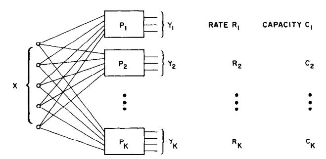

Fig. 1. Broadcast channel.

The next idea is that of time sharing. Allocate proportions of time  $\lambda_1, \lambda_2, \cdots, \lambda_k, \ \lambda_i \geq 0, \ \sum \lambda_i = 1$ , to sending at rates  $C_1, C_2, \cdots, C_k$ . Assuming compatibility of the channels and assuming  $C_1 \leq C_2 \leq \cdots \leq C_k$ , we find that the rate of transmission of information through the *i*th channel is given by

$$R_i = \sum_{j \leq i} \lambda_j C_j, \qquad i = 1, 2, \cdots, k.$$

To our knowledge, no other schemes have been discussed in the literature, nor has the problem of the broadcast channel been formulated.

In this paper, we shall show that even this family of rates can be exceeded. In particular, it will be shown that for a slight degradation in the rate for the worst channel, an incrementally larger increase in the rate of transmission can be made for the better channels. The heuristic that will result from our discussion will be that one should not transmit simultaneously to several channels at the rate of the worst channel, nor should one attempt to transmit information by a time-sharing or time-multiplexing method, but rather one should distribute the high-rate information across the low-rate message.

Examples of good encodings for a family of binary symmetric channels and for a family of Gaussian channels will be presented. Also, the extreme case of orthogonal channels, in which it does not matter that one is trying to send two messages at once to two different people, will be considered, as well as the other extreme of incompatible channels, in which the transmission of information to one receiver precludes the transmission of information to the other.

### II. Two Binary Symmetric Channels

Before proceeding with the precise formulation of a broadcast channel in Section III, let us pursue the case of two binary symmetric channels in heuristic detail. Unfamiliar terminology may be found in Ash [1] and Section III.

Let the input alphabet be  $X = \{1,2\}$  and the output

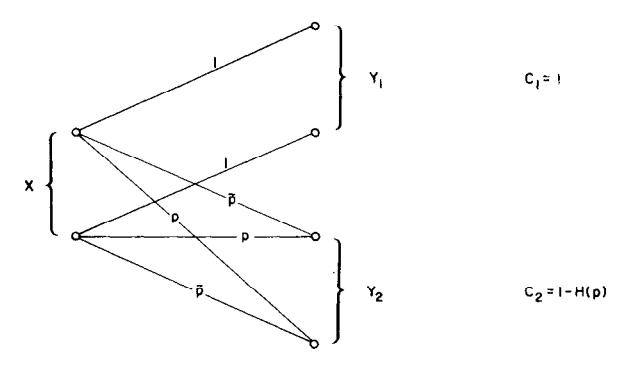

Fig. 2. Two binary symmetric channels.

alphabets for receivers 1 and 2 be  $Y_1 = \{1,2\}$  and  $Y_2 = \{1,2\}$ . Let the channel matrices be given by

$$P_1 = \begin{bmatrix} 1 & 0 \\ 0 & 1 \end{bmatrix} \qquad P_2 = \begin{bmatrix} \bar{p} & p \\ p & \bar{p} \end{bmatrix} \tag{1}$$

as depicted in Fig. 2.

Thus channel 1 is noiseless and channel 2 is a binary symmetric channel (BSC) with error probability p. The corresponding channel capacities are  $C_1 = 1$  bit per transmission and  $C_2 = C(p) = 1 - H(p)$  bits per transmission.

The maximin approach would have us transmit at rates  $(R_1,R_2)=(C_2,C_2)$  as shown in Fig. 3. (The maximin points are loosely called the minimax points in the figures. Although not generally equal, minimax and maximin are equal in all examples depicted in the figures.) These rates can indeed be simultaneously achieved by using a standard  $(2^{n(C_2-\varepsilon)},n,\lambda_n)$  code for channel  $P_2$  (see Wolfowitz [2]).

At the other extreme, we may send at rate  $R_1 = 1$  with zero probability of error to receiver 1, with a resulting rate  $R_2 = 0$  for channel 2. Then, by allocating a proportion of time  $\lambda$  to sending at rate  $(C_2, C_2)$  and a proportion of time  $1 - \lambda$  to sending at rate (1,0), we obtain the family of rates shown by the straight line in Fig. 3. This we shall call the time-sharing lower bound of the set of achievable rates.

Now let us see how to do better. We know, from the random coding proof, that a good  $(2^{n(C_2-\epsilon)}, n, \lambda_n)$  code can be generated by choosing at random a subset S of  $2^{n(C_2-\epsilon)}$  elements from the set of  $2^n$  binary n-sequences  $X^n = \{1,2\}^n$ , and using the decoding rule that assigns the received vector  $y = (y_1, y_2, \dots, y_n)$  to the element of S that is within Hamming distance  $n(p + \epsilon)$  of y.

Let us choose a code of this form designed for a somewhat noisier channel; namely, the cascade of a BSC of parameter p and a BSC of parameter  $\alpha$ , resulting in a BSC of parameter  $\alpha \bar{p} + \bar{\alpha} p$ , where  $\bar{\alpha} = 1 - \alpha$ . Thus there will be only  $2^{n(C(\alpha \bar{p} + \bar{\alpha} p) - \epsilon)}$  codewords in this set, but a larger noise of size  $n(\alpha \bar{p} + \bar{\alpha} p)$  will be tolerated.

We now take advantage of this tolerance by packing in some extra message information intended solely for the perfect receiver  $Y_1$ .

With each codeword x in  $S \subseteq X^n = \{1,2\}^n$ , we will associate the set of all codewords at Hamming distance

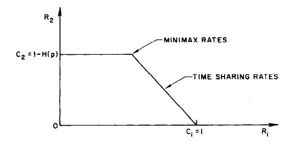

Fig. 3. Some achievable rates for the BSC.

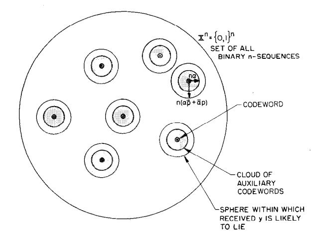

Fig. 4. Space of codewords for BSC.

equal to  $[\alpha n]$ , as suggested by the clouds of points shown in Fig. 4.

This code structure allows the transmission of an arbitrary integer  $r \in \{1, 2, \dots, 2^{n(C(\alpha \bar{p} + \bar{\alpha}p) - \epsilon)}\}$  to both receivers 1 and 2 and an arbitrary integer

$$s \in \left\{1, 2, \cdots, \binom{n}{\lfloor \alpha n \rfloor}\right\}$$

to receiver 1. (See Section III for further elucidation of these ideas.) The message (r,s) is sent in the following manner. The integer r designates the cloud, and the integer s designates the point  $x \in \{1,2\}^n$  within the cloud. This n-sequence x is then transmitted. The perfect channel receives  $y_1 = x$  and thus correctly decodes both r and s. Since there are

$$\binom{n}{[\alpha n]} \approx 2^{nH(\alpha)}$$

points per cloud, we see that the transmission rate for channel 1 is

$$R_1 \triangleq \frac{1}{n} \log 2^{nH(\alpha)} 2^{n(C(\alpha \bar{p} + \bar{\alpha}p) - \varepsilon)} = C(\alpha \bar{p} + \bar{\alpha}p) + H(\alpha) - \varepsilon.$$
(2)

Channel 2 perceives the cloud center as if it had been sent through an additional BSC of parameter  $\alpha$  (due to the choice of s). However, since the cloud centers were chosen to be distinguishable over a BSC of parameter  $\alpha \bar{p} + \bar{\alpha} p$ , we see that r is correctly decoded by receiver  $Y_2$ . Thus

$$R_2 = C(\alpha \bar{p} + \bar{\alpha}p) - \varepsilon. \tag{3}$$

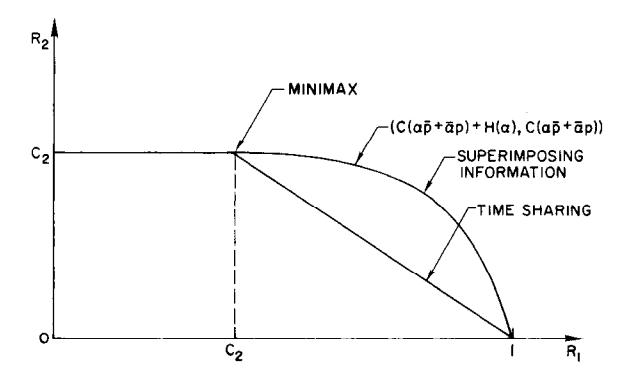

Fig. 5. Set of achievable rates for BSC.

This argument suggests that  $(R_1, R_2)$  is jointly achievable. The Appendix contains the proof. Letting  $\alpha$  range from 0 to 1 generates the new achievable set of rates shown in Fig. 5. We strongly believe that Fig. 5 exhibits the optimal region of achievable rates.

This curve dominates the time-sharing curve. We note also that near the minimax point, the slope is zero. Thus an infinitesimal degradation in the rate for the poor channel will allow an infinitesimally infinite increase in the rate for the good channel. Consequently, at least for two BSC, superposition of information dominates time sharing.

This example naturally leads to a conjecture concerning the evaluation of the capacity region for a special class of broadcast channels in which one channel is a degraded version of the other.

**Definition:** Let P and Q be channel matrices of size  $|X| \times |Y_1|$  and  $|X| \times |Y_2|$ , respectively. Q will be said to be a *degraded version* of P if there exists a stochastic matrix M such that P = QM. Shannon[6] has shown that the capacity of channel Q is not greater than that of channel P.

Conjecture 1: Let S be an arbitrary  $|X| \times |X|$  channel matrix corresponding to the channel density  $p(x \mid s)$  and let p(s) be an arbitrary probability distribution on X. Let p(s) induce the joint distribution  $p(y_1, y_2, s, x) = p(s) p(x \mid s)$   $p(y_1, y_2 \mid x)$  on  $(y_1, y_2, s, x)$ . Let  $P_2$  be a degraded version of  $P_1$ . Then the set of achievable  $(R_1, R_2)$  pairs for the broadcast channel  $(X, p(y_1, y_2 \mid x), Y_1 \times Y_2)$  is given by  $(I(S; Y_2) + I(X; Y_1 \mid S), I(S; Y_2))$ ; generated by all channels S and probability distributions p(s).

The two-BSC example in this section is a special case of this conjecture. The code that achieves  $(R_1, R_2)$  is constructed in an analogous manner. At the time of this writing, P. Bergmans at Stanford has made some progress on the proof of this conjecture. In fact, Bergmans' considerations have allowed me to modify the conjecture from an initially more ambitious version involving a larger class of channels mentioned in [6]. I no longer have any basis for belief in the more ambitious conjecture.

# III. DEFINITIONS AND NOTATION

We shall define a two-receiver memoryless broadcast channel, denoted by  $(X, p(y_1,y_2 \mid x), Y_1 \times Y_2)$  or by

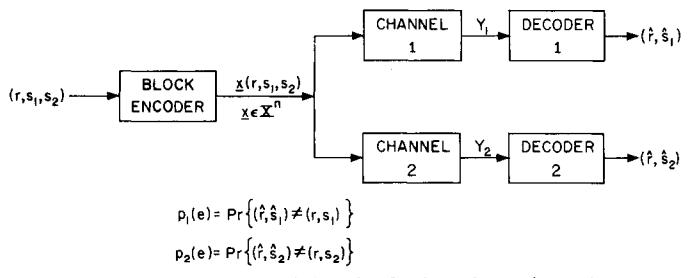

Fig. 6. Encoder and decoder for broadcast channel.

 $p(y_1,y_2 \mid x)$ , to consist of three finite sets  $X,Y_1,Y_2$  and a collection of probability distributions  $p(\cdot,\cdot \mid x)$  on  $Y_1 \times Y_2$ , one for each  $x \in X$ . The interpretation is that x is an input to the channel and  $y_1$  and  $y_2$  are the respective outputs at receiver terminals 1 and 2 as shown in Fig. 6. The problem is to communicate simultaneously with receivers 1 and 2 as efficiently as possible.

For the development of this paper we shall need knowledge only of the marginal distributions

$$p_{1}(y_{1} \mid x) = \sum_{y_{2} \in Y_{2}} p(y_{1}, y_{2} \mid x)$$

$$p_{2}(y_{2} \mid x) = \sum_{y_{1} \in Y_{1}} p(y_{1}, y_{2} \mid x),$$
(4)

which we have designated in the examples by channel matrices  $P_1$  and  $P_2$  of sizes  $|X| \times |Y_1|$  and  $|X| \times |Y_2|$ , respectively. The possible dependence or independence of  $Y_1$  and  $Y_2$  given X is irrelevant, given the constraint that the decoding at the two receivers must be done independently.

The *n*th extension for a broadcast channel is the broadcast channel

$$(X^n, p(y_1, y_2 \mid x), Y_1^n \times Y_2^n),$$
 (5)

where  $p(y_1,y_2 \mid x) = \prod_{j=1}^n p(y_{1j},y_{2j} \mid x_j)$ , for  $x \in X^n$ ,  $y_1 \in Y_1^n$ ,  $y_2 \in Y_2^n$ .

An  $((M_1, M_2, M_{12}), n)$  code for a broadcast channel consists of three sets of integers

$$R = \{1, 2, \dots, M_{12}\}$$

$$S_1 = \{1, 2, \dots, M_1\}$$

$$S_2 = \{1, 2, \dots, M_2\},$$

an encoding function

$$x: R \times S_1 \times S_2 \to X^n$$

and two decoding functions

$$g_1: Y_1^n \to R \times S_1; g_1(y_1) = (\hat{r}, \hat{s}_1)$$
  
 $g_2: Y_2^n \to R \times S_2; g_2(y_2) = (\hat{r}, \hat{s}_2).$ 

The set  $\{x(r,s_1,s_2) \mid (r,s_1,s_2) \in R \times S_1 \times S_2\}$  is called the set of codewords. As illustrated in Fig. 6, we think of integers  $s_1$  and  $s_2$  as being arbitrarily chosen by the trans-

mitter to be sent to receivers 1 and 2, respectively. The integer r is also chosen by the transmitter and is intended to be received by both receivers. Thus r is the "common" part of the message and  $s_1$  and  $s_2$  are the "independent" parts of the message.

An error is made by the *i*th receiver if  $g_i(y_i) \neq (r,s_i)$ . If the message  $(r,s_1,s_2)$  is sent, let

$$\lambda_i(r,s_1,s_2) = \Pr\{g_i(y_i) \neq (r,s_i)\}, \quad i = 1,2,$$
 (6)

denote the probabilities of error for the two channels, where we note that  $y_1, y_2$  are the only chance variables in the above expression.

We denote the (arithmetic average) probability of error in decoding  $(r,s_1)$  averaged over all choices of  $s_2$  by

$$\bar{\lambda}_1(r,s_1) = \frac{1}{M_2} \sum_{s_2=1}^{M_2} \lambda_1(r,s_1,s_2).$$
(7)

Similarly, for channel 2 we define

$$\lambda_2(r,s_2) = \frac{1}{M_1} \sum_{s_1=1}^{M_1} \lambda_2(r,s_1,s_2).$$
(8)

Finally, we define the overall arithmetic average probabilities of error of the code for channels 1 and 2 as

$$\bar{p}_1(e) = \frac{1}{M_1 M_{12}} \sum_{r,s_1} \bar{\lambda}_1(r,s_1) = \frac{1}{M} \sum_{r,s_1,s_2} \lambda_1(r,s_1,s_2)$$
 (9)

$$\bar{p}_2(e) = \frac{1}{M_2 M_{12}} \sum_{r,s_2} \bar{\lambda}_2(r,s_2) = \frac{1}{M} \sum_{r,s_1,s_2} \lambda_2(r,s_1,s_2), (10)$$

where

$$M = M_1 M_2 M_{12}. (11)$$

The overbar on  $\bar{p}_i(e)$  will serve as a reminder that this probability of error is calculated under a special distribution; namely, the uniform distribution over the codewords.

We shall also be interested in the maximal probabilities of error

$$\lambda_i = \max_{r,s_1,s_2} \Pr\{g_i(y_i) \neq (r,s_i) \mid (r,s_1,s_2)\}, \qquad i = 1,2, \quad (12)$$

corresponding to the worst codeword with respect to each channel. Note that  $\lambda_i \geq \bar{p}_i(e)$ .

We shall define the rate  $(R_1, R_2, R_{12})$  of an  $((M_1, M_2, M_{12}), n)$  code by

$$R_{1} = \frac{1}{n} \log M_{1} M_{12}$$

$$R_{2} = \frac{1}{n} \log M_{2} M_{12}$$

$$R_{12} = \frac{1}{n} \log M_{12}$$
(13)

all defined in bits/transmission. Thus  $R_i$  is the total rate of transmission of information to receiver i, i = 1, 2, and  $R_{12}$  is the portion of the information common to both receivers.

Comment: When  $\lambda_i$  and  $\bar{p}_i(e)$  refer to the nth extension

of a broadcast channel, we will often designate this explicitly by  $\lambda_i^{(n)}$ ,  $\bar{p}_i^{(n)}(e)$ .

Definition: The rate  $(R_1, R_2, R_{12})$  is said to be achievable by a broadcast channel if, for any  $\varepsilon > 0$  and for all n sufficiently large, there exists an  $((M_1, M_2, M_{12}), n)$  code with

$$M_1 M_{12} \ge 2^{nR_1}$$
 $M_2 M_{12} \ge 2^{nR_2}$ 
 $M_{12} \le 2^{nR_{12}}$  (14)

such that  $\bar{p}_1^{(n)}(e) < \varepsilon$ ,  $\bar{p}_2^{(n)}(e) < \varepsilon$ .

Comment: Note that the total number  $M = M_1 M_2 M_{12}$  of codewords for a code satisfying (14) must exceed  $2^{n(R_1+R_2-R_{12})}$ 

Definition: The capacity region  $\Re^*$  for a broadcast channel is the set of all achievable rates  $(R_1, R_2, R_{12})$ .

The goal of this paper is to determine  $\Re^*$  for as large a class of channels as possible.

Comment: We shall sometimes let  $\Re^*$  also denote the set of achievable  $(R_1, R_2)$  pairs. However, at this stage in our understanding, it seems that sole concern with  $(R_1, R_2)$ , with the exclusion of concern with  $R_{12}$ , would result in a coarsened and cumbersome theoretical development.

Comment: The extension of the definition of the broadcast channel from two receivers to k receivers is notationally cumbersome but straightforward, given the following comment. The index sets  $R,S_1,S_2$  should be replaced by  $2^k - 1$  index sets  $I(\theta)$ ,  $\theta \in \{0,1,\}^k$ ,  $\theta \neq \mathbf{0}$ , with the interpretation that the integer  $i(\theta)$  selected in index set  $I(\theta) = \{1,2,\cdots,M(\theta)\}$  is intended (by the proper code selection) to be received correctly by every receiver j for which  $\theta_j = 1$  in  $\theta = (\theta_1,\theta_2,\cdots,\theta_k)$ . Then, for example, the rate of transmission over the nth extension of a broadcast channel to the ith receiver will be given by

$$R_{i} = \frac{1}{n} \log \prod_{\substack{\theta \in \{0,1\}^{k} \\ \theta_{i} = 1}} M(\theta) = \frac{1}{n} \sum_{\theta_{i} = 1} \log M(\theta).$$
 (15)

In the two-receiver broadcast channel, the corresponding sets in the new notation are R = I(1,1),  $S_1 = I(1,0)$ ,  $S_2 = I(0,1)$ .

Section IV treats the best two-channel situation and Section V treats the worst.

#### IV. ORTHOGONAL CHANNELS

In this section we shall investigate a broadcast channel in which efficient communication to one receiver in no way interferes with communication to the other. A movie designed to be shown simultaneously to a blind person and a deaf person would be such an example.

Consider the broadcast channel with  $X = \{1,2,3,4\}$ ,  $Y_1 = \{1,2\}$ ,  $Y_2 = \{1,2\}$ , with

$$P_{1} = \begin{bmatrix} 1 & 0 \\ 1 & 0 \\ 0 & 1 \\ 0 & 1 \end{bmatrix} \quad P_{2} = \begin{bmatrix} 1 & 0 \\ 0 & 1 \\ 1 & 0 \\ 0 & 1 \end{bmatrix} \tag{16}$$

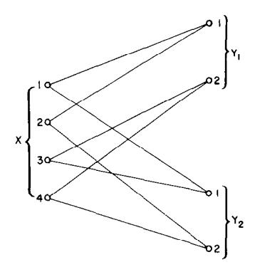

Fig. 7. Orthogonal channel.

as depicted in Fig. 7. As before,

$$(P_k)_{ij} = \text{Pr } \{Y_k = j \mid x = i\}, k = 1,2; j = 1,2; i = 1,2,3,4.$$

We easily calculate  $C_1 = C_2 = 1$  bit/transmission. Clearly, from the standpoint of receiver  $y_1$ , inputs x = 1 and x = 2 both result in  $y_1 = 1$  with probability 1 and can therefore be merged. Proceeding with this analysis, we find that  $Y_1$  can determine only  $x \in \{1,2\}$  versus  $x \in \{3,4\}$ , while  $Y_2$  can determine only  $x \in \{1,3\}$  versus  $x \in \{2,4\}$ .

For this example,  $C_1=1$  and  $C_2=1$  and are, respectively, attained for  $\Pr\{x=1\}+\Pr\{x=2\}=\frac{1}{2}$  and  $\Pr\{x=1\}+\Pr\{x=3\}=\frac{1}{2}$ . Solving these simultaneous equations, we find  $(I(X\mid Y_1),I(X\mid Y_2)=(1,1)$  can be achieved by  $\Pr\{x=i\}=\frac{1}{4},\ i=1,2,3,4$ . This in itself does not guarantee that  $(C_1,C_2)$  can be simultaneously achieved. However, there does exist a coding theorem for this channel. Let  $u_1\in\{1,2\},\ u_2\in\{1,2\}$  denote the message bits that we wish to transmit to  $Y_1$  and  $Y_2$ , respectively.

Make the association from pairs of u to input symbols

$$(u_1, u_2) = (1, 1) \mapsto 1$$
  
 $(u_1, u_2) = (1, 2) \mapsto 2$   
 $(u_1, u_2) = (2, 1) \mapsto 3$   
 $(u_1, u_2) = (2, 2) \mapsto 4$  (17)

and send the appropriate input symbol x. Then  $y_1 = u_1$  and  $y_2 = u_2$ , and capacities  $C_1$  and  $C_2$  are simultaneously achieved. Since  $u_1$  and  $u_2$  may be chosen independently, we may also achieve  $R_{12} = 1$  by this scheme. Fig. 8 shows the set of achievable rates. The upper bound theorem of Section VIII establishes this region as optimal.

The noiselessness of the channels is not crucial. This broadcast channel remains orthogonal in the sense that  $(R_1,R_2)=(C_1,C_2)$  may be achieved even if we define the new channels

$$P_{1} = \begin{bmatrix} r_{1} & \bar{r}_{1} \\ r_{1} & \bar{r}_{1} \\ \bar{r}_{1} & r_{1} \\ \bar{r}_{1} & r_{1} \end{bmatrix} \qquad P_{2} = \begin{bmatrix} r_{2} & \bar{r}_{2} \\ \bar{r}_{2} & r_{2} \\ r_{2} & \bar{r}_{2} \\ \bar{r}_{2} & r_{2} \end{bmatrix}. \tag{18}$$

In this case,  $C_1 = 1 - H(r_1)$  and  $C_2 = 1 - H(r_2)$ .  $C_1$  and  $C_2$  may be simultaneously achieved by selecting sequences of

$$(2^{n(C_1-\varepsilon)},n,\lambda_1^{(n)}), (2^{n(C_2-\varepsilon)},n,\lambda_2^{(n)})$$

codes with words in  $\{0,1\}^n$  such that  $\lambda_1^{(n)} \to 0$ ,  $\lambda_2^{(n)} \to 0$ ,

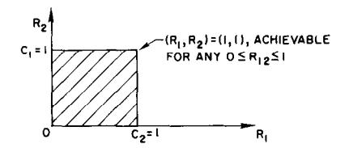

Fig. 8. Achievable rates for the orthogonal channel.

as  $n \to \infty$ , and selecting  $x_i \in \{1,2\}$  or  $x_i \in \{3,4\}$  according to the value of the *i*th bit of the codeword chosen to be sent from the first code and selecting  $x_i \in \{1,3\}$  or  $x_i \in \{2,3\}$  according to the value of the *i*th bit of the codeword selected from the second code. Here, any  $R_{12}$  such that  $0 \le R_{12} \le \min \{C_1, C_2\}$  may also be achieved. Nothing more could be expected, and each channel performs no worse in the presence of the other than it would alone.

#### V. INCOMPATIBLE BROADCAST CHANNELS

In a search to find the worst case of incompatibility in simultaneous communication we turn to the following practical example which, for obvious reasons, we term the switch-to-talk channel.

Example 1—Switch-to-Talk: Let

$$X = X_1 \cup X_2$$

$$Y_1 = \widetilde{Y}_1 \cup \{\phi_1\}$$

$$Y_2 = \widetilde{Y}_2 \cup \{\phi_2\}$$

and

$$P_{1} = X_{1} \begin{cases} \overbrace{x \quad x \quad x \quad \cdots \quad x} & \phi_{1} \\ x \quad x \quad x \quad \cdots \quad x & \phi_{0} \\ x \quad x \quad x \quad \cdots \quad x & \phi_{0} \\ x \quad x \quad \cdots \quad x & \phi_{0} \\ 0 \quad 0 \quad \cdots \quad 0 & 1 \\ 0 \quad 0 \quad \cdots \quad 0 & 1 \\ 1 \quad 1 \\ 0 \quad 0 \quad \cdots \quad 0 & 1 \\ 1 \quad 1 \\ 0 \quad 0 \quad \cdots \quad 0 & 1 \\ 1 \quad 1 \\ 0 \quad 0 \quad \cdots \quad 0 & 1 \\ x \quad x \quad \cdots \quad x \quad 0 \\ x \quad x \quad \cdots \quad x \quad 0 \\ x \quad x \quad \cdots \quad x \quad 0 \\ 0 \quad 0 \end{cases}$$

$$(19)$$

as shown in Fig. 9.

Each receiver has an indicator that lights when the sender is communicating with the other receiver. The idea is that when the sender wishes to communicate with  $Y_1$  he uses  $x \in X_1$ , resulting in  $y_2 = \phi_2$ , indicating to receiver 2 that the sender is communicating with  $Y_1$ . Similarly, to communicate with  $Y_2$ , the sender uses  $x \in X_2$ , resulting in  $y_1 = \phi_1$ . This might correspond to the situation, for example, where a speaker fluent in Spanish and Dutch must speak simultaneously to two listeners, one of whom understands only Dutch and the other only Spanish.

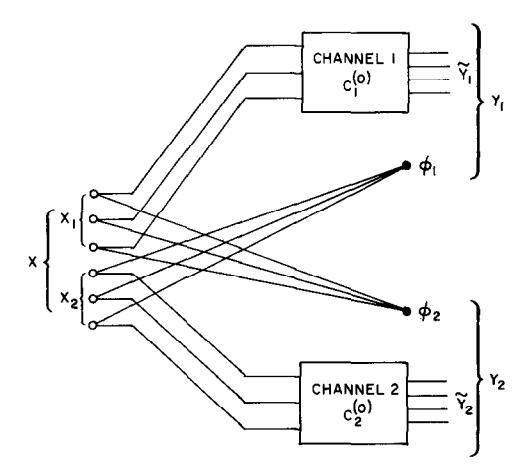

Fig. 9. The switch-to-talk channel.

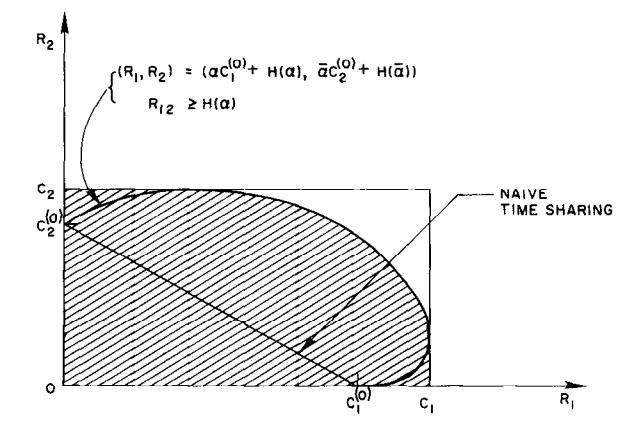

Fig. 10. Achievable rates for switch-to-talk channels.

Let channel 1 have capacity  $C_1^{(0)}$  and channel 2 have capacity  $C_2^{(0)}$ . Using the known result for sum channels (see Shannon [3]) we find

$$C_1 = \log (1 + 2^{C_1(0)})$$

and

$$C_2 = \log (1 + 2^{C_2(0)}).$$

We shall discuss this example informally. Certainly  $(R_1,R_2)=(C_1,0)$  is achievable and  $(R_1,R_2)=(0,C_2)$  is achievable, and hence, by time sharing, any pair of rates  $(R_1,R_2)=(\lambda C_1,\lambda C_2),\ 0\leq \lambda\leq 1$ , is achievable. However, additional information is contained in the knowledge of  $\phi$ ; and proper encoding of the transmission times to  $Y_1$  and  $Y_2$  can be used to send extra information to both channels. If channel 1 is used proportion  $\alpha$  of the time,  $\alpha C_1^{(0)}$  bits/transmission are received by  $Y_1$ . However,  $H(\alpha)$  additional bits/transmission are achieved by choosing which channel to send through independently at each instant by flipping a coin with bias  $\alpha$ . In other words, modulation of the switch-to-talk button, subject to the time-proportion contraint  $\alpha$ , allows the perfect transmission of one of  $2^{nH(\alpha)}$  additional messages to both receivers  $Y_1$  and  $Y_2$ .

Thus all  $(R_1,R_2)$  of the form  $(R_1,R_2) = (\alpha C_1^{(0)} + H(\alpha),\bar{\alpha}C_2^{(0)} + H(\alpha))$  can be achieved by choosing the subset of *n* transmissions devoted to the use of channel 1 in

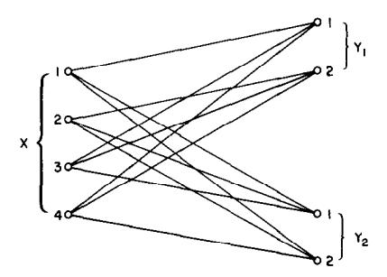

Fig. 11. Incompatible broadcast channels.

one of the  $2^{nH(\alpha)}$  possible ways. This bound cannot be achieved unless the information rate  $R_{12}$  common to both channels satisfies  $R_{12} \ge H(\alpha)$ . The results are summarized in Fig. 10.

It is an easy consequence of Section VIII that Fig. 10 corresponds to the capacity region for this channel, and therefore that this encoding scheme is optimal for the switch-to-talk channel.

The following example illustrates the worst case that may arise in simultaneous communications.

Example 2—Incompatible Case: Let

$$X = \{1,2,3,4\}, Y_1 = \{1,2\}, Y_2 = \{1,2\}$$

and let

$$P_{1} = \begin{bmatrix} 1 & 0 \\ 0 & 1 \\ \frac{1}{2} & \frac{1}{2} \\ \frac{1}{2} & \frac{1}{2} \end{bmatrix} \qquad P_{2} = \begin{bmatrix} \frac{1}{2} & \frac{1}{2} \\ \frac{1}{2} & \frac{1}{2} \\ 1 & 0 \\ 0 & 1 \end{bmatrix}$$
 (20)

as shown in Fig. 11. Thus if X wishes to communicate with  $Y_1$  over the perfect channel  $x \in \{1,2\} \to Y_1$ , he must send pure noise to  $Y_2$ , i.e.,  $\Pr\{y_2 = 1 \mid x \in \{1,2\}\} = \frac{1}{2}$ . A similar statement holds for X communicating with  $Y_2$ .

In Section VIII we shall establish an upper bound on the capacity region by finding the set of all achievable  $(I(X \mid Y_1), I(X \mid Y_2))$  pairs. Anticipating these results, we shall make this calculation for this example. Let  $\Pr\{x=i\}=p_i, i=1,2,3,4$ . Define  $\alpha=p_1+p_2, \ \bar{\alpha}=p_3+p_4$ . Then  $H(Y_1)=H(p_1+\bar{\alpha}/2)$  and  $H(Y_1\mid X)=\bar{\alpha}$ , yielding  $I(X\mid Y_1)=H(p_1+\bar{\alpha}/2)-\bar{\alpha}$ . Similarly,  $I(X\mid Y_2)=I(X\mid Y_2)=H(p_4+\alpha/2)-\alpha$ .

First, fixing  $\alpha$ ,  $\bar{\alpha}$  and maximizing over  $0 \le p_1 \le \alpha$ ,  $0 \le p_4 \le \bar{\alpha}$ , we find the maximum values

$$I(X \mid Y_1) = 1 - \bar{\alpha} = \alpha$$

$$I(X \mid Y_2) = 1 - \alpha = \bar{\alpha}$$
(21)

achieved by  $p_1 = p_2 = \alpha/2$  and  $p_3 = p_4 = \bar{\alpha}/2$ . This is the upper boundary of achievable  $(I(X \mid Y_1), I(X \mid Y_2))$  pairs.

It may also be verified that, for any  $\alpha \in [0,1]$ , there exist  $p_1, p_2, p_3, p_4$  achieving any  $(I(X \mid Y_1), I(X \mid Y_2))$  dominated by  $(\alpha, 1 - \alpha)$ . Thus we have the set I of achievable  $(I(X \mid Y_1), I(X \mid Y_2))$  pairs depicted in Fig. 12.

In Section VIII it will be shown that this region of jointly achievable  $(I(X \mid Y_1), I(X \mid Y_2))$  pairs is an upper bound on the capacity region. However, we can trivially achieve any pair of rates  $(R_1, R_2)$  on the upper boundary of  $\mathcal{R}$  by simply

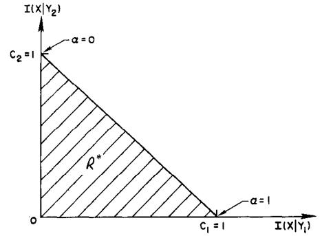

Fig. 12. Capacity region for incompatible channels.

time-sharing the two noiseless channels  $x \in \{1,2\} \to Y_1$  and  $x \in \{3,4\} \to Y_2$ . If  $x \in \{1,2\}$  is used a proportion  $\alpha$  of the time, then rates  $R_1 = \alpha$  and  $R_2 = \bar{\alpha} = 1 - \alpha$  may be achieved without any additional coding. Thus the upper bound can be achieved with trivial coding procedures, and Fig. 12 therefore corresponds to the capacity region.

Here, then, is an example in which the two channels are so incompatible that one can do no better than time sharing —i.e., using one channel efficiently part of the time and the other channel the remainder. Fortunately, for those wishing to get something for nothing, this is the exception rather than the rule.

#### VI. THE BOTTLENECK CHANNEL

Consider the broadcast channel in which the two channels have the same structure, i.e.,

$$p_1(y_1 \mid x) = p_2(y_2 \mid x), \forall x \in X, \forall y_1, y_2 \in Y_1 = Y_2 = Y$$

as shown in Fig. 13. We shall term this the bottleneck channel.

Here, we note that any code for receiver  $Y_1$  is also a code with the same error properties for receiver  $Y_2$ . Thus  $Y_1$  and  $Y_2$  both perceive correctly the transmitted sequence x with low probability of error.

Let the capacity of channel P be denoted by  $C_1 = C_2 = C$  bits per transmission. Now, since both receivers receive the same information about X, it follows that both receivers 1 and 2 will be able to correctly recover r,  $s_1$  and  $s_2$  if and only if  $(R_1, R_2, R_{12})$  is an achievable rate. Counting the number of messages per unit time necessary to transmit  $(r, s_1, s_2)$  correctly yields the following proposition [see comment following (14)].

*Proposition:*  $(R_1,R_2,R_{12})$  is an achievable rate for the broadcast bottleneck channel of capacity C if and only if

$$R_1 + R_2 - R_{12} \le C$$
  
 $0 \le R_1 \le C$   
 $0 \le R_2 \le C$   
 $0 \le R_{12} \le C$ . (22)

As an important application of these ideas, suppose that we wish to send a random process  $U = \{U_n : n = 1, 2, \dots\}$  to receiver 1 and a random process  $V = \{V_n : n = 1, 2, \dots\}$ 

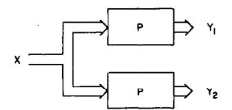

Fig. 13. The bottleneck channel.

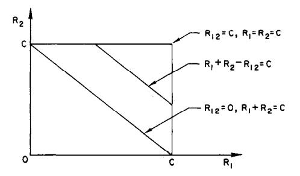

Fig. 14. Achievable rates for bottleneck channel.

to receiver 2 through the bottleneck channel P with arbitrarily small probability of error. (See Fig. 15).

Assume that  $U = \{U_n\}$  and  $V = \{V_n\}$  are jointly ergodic processes taking values in finite alphabets. By jointly ergodic, we mean that the process  $Z_n = (U_n, V_n)$  is ergodic. We recall that the definition of the entropy of an ergodic process  $\{Z_n\}$  is defined by

$$H(Z) = \lim_{n \to \infty} n^{-1} H(Z_1, Z_2, \dots, Z_n).$$
 (23)

We assert the following.

Fact: Asymptotically error free transmission of  $\{U_1, U_2, \dots, U_n\} \rightarrow \{\hat{U}_1, \hat{U}_2, \dots, \hat{U}_n\}$  and  $\{V_1, V_2, \dots, V_n\} \rightarrow \{\hat{V}_1, \hat{V}_2, \dots, \hat{V}_n\}$  over the bottleneck channel of capacity C can be accomplished if and only if

$$H(U,V) < C. (24)$$

**Proof:** The well-known idea of the encoding is to enumerate the  $2^{n(H(U,V)+\varepsilon)}$   $\varepsilon$ -typical sequences and send the index of the actually occurring sequence  $(z_1,z_2,\cdots,z_n)$  over the channel. If  $H(U,V)+\varepsilon < C$ , then this index will be correctly transmitted with probability of error  $\varepsilon/2$  for sufficiently large n. Since the probability that a random  $(z_1,z_2,\cdots,z_n)$  will be typical can be made  $\geq 1-\varepsilon/2$  for sufficiently large n, the overall probability of error can be made less than  $\varepsilon$ . The converse follows the standard argument for a single channel.

The generalization of this result to arbitrary broadcast channels is unknown.

Let us now compare the orthogonal channel with the bottleneck channel. The orthogonal channel of Section IV achieves  $(R_1,R_2)=(1,1)$  with arbitrary joint rate  $0 \le R_{12} \le 1$ . Thus fully independent messages  $(R_{11}=0)$  or maximally dependent messages  $(R_{11}=1)$  can be sent simultaneously to receivers 1 and 2.

At the other extreme, in the case of the bottleneck channel with capacity C=1, we can simultaneously achieve  $R_1=1$ ,  $R_2=1$ . Here however, it may be seen that achieving  $(R_1,R_2)=(1,1)$  implies  $R_{12}=1$ . Thus the messages sent to 1 and 2 must be maximally dependent, and in fact equal.

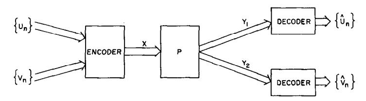

Fig. 15. Sending two random processes over the same channel.

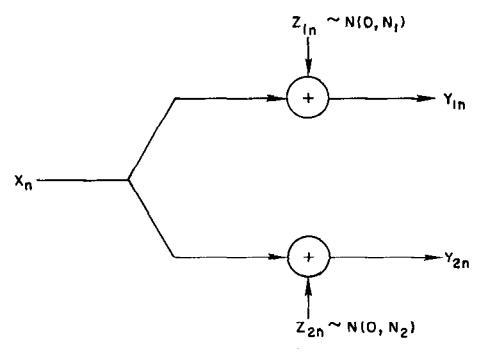

Fig. 16. Gaussian broadcast channel,

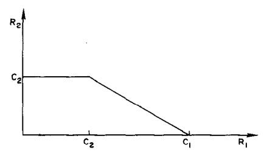

Fig. 17. Time sharing rates for the Gaussian broadcast channel.

# VII. GAUSSIAN CHANNELS

Consider the time-discrete Gaussian broadcast channel with two receivers depicted in Fig. 16.

Let  $z_1 = (z_{11}, z_{12}, \dots, z_{1n}, \dots)$  be a sequence of independently identically distributed (i.i.d.) normal random variables (RV) with mean zero and variance  $N_1$ , and let  $z_2 = (z_{21}, z_{22}, \dots, z_{2n}, \dots)$  be i.i.d. normal RV with mean zero and variance  $N_2$ . Let  $N_1 < N_2$ . At the *i*th transmission the real number  $x_i$  is sent and  $y_{1i} = x_i + z_{1i}$ ,  $y_{2i} = x_i + z_{2i}$  are received. In our analysis it is irrelevant whether  $z_{1i}$  and  $z_{2i}$  are correlated or not (although in the feedback case it may make a difference). Let there be a power constraint on the transmitted power, given for any n by

$$\frac{1}{n} \sum_{i=1}^{n} x_i^2 \le S \tag{25}$$

for any signal  $x = (x_1, x_2, \dots, x_n)$  of block length n.

It is well known that the individual capacities are  $C_1 = \frac{1}{2} \log (1 + S/N_1)$  and  $C_2 = \frac{1}{2} \log (1 + S/N_2)$  bits/transmission, where all logarithms are to the base 2.

Time sharing will achieve any convex combination of  $(C_2, C_2)$  and  $(C_1, 0)$ , as shown in Fig. 17.

Now let us see how we can improve on this performance. Think of the signal  $s_2$  (intended for the high noise receiver  $Y_2$ ) as a sequence of i.i.d.  $N(0,\bar{\alpha}S)$  RV. Superimposed on this sequence will be a sequence  $s_1$  that may be considered

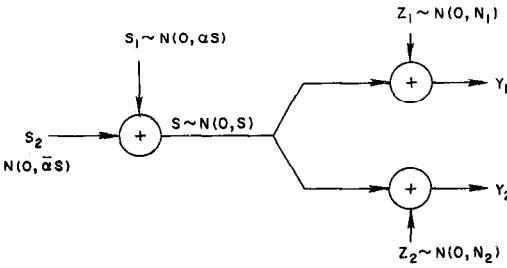

Fig. 18. Decomposition of the signal.

as a sequence of i.i.d.  $N(0,\alpha S)$  RV. Here  $0 \le \alpha \le 1$  and  $\bar{\alpha} = 1 - \alpha$ . Thus the sequence  $s = s_1 + s_2$  will be a sequence of i.i.d. N(0,S) RV. The received sequences  $y_1 = s_1 + s_2 + z_1$  and  $y_2 = s_1 + s_2 + z_2$  are depicted in Fig. 18.

Now  $s_1$  and  $z_2$  are considered to be noise by receiver 2. We see that  $s_{1i} + z_{2i}$  are i.i.d.  $N(0, \alpha S + N_2)$  RV. Therefore, messages may be sent at rates less than

$$\frac{1}{2}\log\left(1+\frac{\bar{\alpha}S}{\alpha S+N_2}\right)\triangleq C_2(\alpha)$$

to receiver  $Y_2$  with probability of error near zero for sufficiently large block length n. That is, there exists a sequence of  $(2^{n(C_2(\alpha)-\epsilon)},n)$  codes with average power constraint  $\bar{\alpha}S$  and probability of error  $\bar{p}_2^{(n)}(e) \to 0$ .

Now, since  $N_1 < N_2$ , receiver  $Y_1$  may also correctly determine the transmitted sequence  $s_2$  with arbitrarily low probability of error. Upon decoding of  $s_2$ , given  $y_1$ , receiver  $Y_1$  then subtracts  $s_2$  from  $y_1$ , yielding  $\tilde{y}_1 = y_1 - s_2 = s_1 + z_1$ . At this stage channel 1 may be considered to be a Gaussian channel with input power constraint  $\alpha S$  and additive zero mean Gaussian noise with variance  $N_1$ . The capacity of this channel is  $\frac{1}{2} \log \left[1 + (\alpha S/N_1)\right] = \tilde{C}_1(\alpha)$  bits/transmission and is achieved, roughly speaking, by choosing  $2^{n\tilde{C}_1(\alpha)}$  independent n-sequences of i.i.d.  $N(0,\alpha S)$  RV as the code set for the possible sequences  $s_1$ . Thus receiver  $Y_1$  correctly receives both  $s_1$  and  $s_2$ .

This informal argument indicates that rates

$$R_{1} = \frac{1}{2} \log \left( 1 + \frac{\bar{\alpha}S}{\alpha S + N_{2}} \right) + \frac{1}{2} \log \left( 1 + \frac{\alpha S}{N_{1}} \right)$$

$$R_{2} = \frac{1}{2} \log \left( 1 + \frac{\bar{\alpha}S}{\alpha S + N_{2}} \right)$$
(26)

may simultaneously be  $\varepsilon$ -achieved, for any  $0 \le \alpha \le 1$ . These rate pairs, shown in Fig. 19, dominate the time-sharing rates.

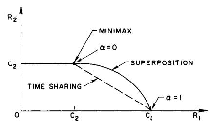

Fig. 19. Set of achievable rates for the Gaussian broadcast channel.

Summarizing the argument, we select a set of  $2^{n(C_2(\alpha)-\epsilon)}$  random n-sequences of i.i.d.  $N(0,\alpha S)$  RV, and a set of  $2^{n(\tilde{C}_1(\alpha)-\epsilon)}$  random n-sequences of i.i.d.  $N(0,\bar{\alpha}S)$  RV. Now  $2^{n(\tilde{C}_1(\alpha)+C_2(\alpha)-2\epsilon)}$  n-sequences are formed by adding together pairs of sequences, in which the first sequence is chosen from the first set and the second sequence is chosen from the second set, and the pairs are chosen in all possible ways. A message

$$(r,s_1), r \in \{1,2,\cdots,2^{n(C_2(\alpha)-\varepsilon)}\}, s_1 \in \{1,2,\cdots,2^{n(\tilde{C}_1(\alpha)-\varepsilon)}\}$$

is transmitted by selecting the *n*-sequence corresponding to the sum of the *r*th sequence in the first set and the  $s_1$ th sequence in the second set. Receiver 1 is intended to decode  $(r,s_1)$  correctly and receiver 2 is intended to decode r correctly, thus simultaneously achieving rates

$$R_1 = \tilde{C}_1(\alpha) + C_2(\alpha) - 2\varepsilon$$

$$R_2 = C_2(\alpha) - \varepsilon$$
(27)

as given in (26).

A full discussion of the Gaussian channel would lead far afield. A direct simple proof of the achievability of the rates given in (27) has been found but will not be presented here.

We shall conclude this section with one observation. If  $N_1 = 0$ , and channel 1 is therefore perfect, we have  $C_1 = \infty$  and  $C_2 = \frac{1}{2} \log (1 + S/N_2)$ . A compound channel or maximin approach would have us send at rates  $(R_1, R_2) = (C_2, C_2)$ . However, an arbitrarily small decrement in the rate for channel 2, corresponding to  $0 < \alpha \ll 1$  in (26), yields  $(R_1, R_2) = (\infty, C_2 - \varepsilon)$  as a pair of achievable rates. Although this rate pair does not dominate  $(C_2, C_2)$ , it seems vastly preferable.

# VIII. AN UPPER BOUND ON ACHIEVABLE RATES $(R_1, R_2)$

Suppose that p(x), a probability distribution on X, generates the pair of mutual informations  $(I(X \mid Y_1), I(X \mid Y_2))$ , where, for i = 1, 2,

$$I(X \mid Y_i) = \sum_{x \in X} \sum_{y \in Y_i} p(x) p_i(y \mid x) \log \frac{p_i(y \mid x)}{p_i(y)}. \quad (28)$$

Given the intuitive properties of mutual information, it is natural to assume that rates  $R_1 = I(X \mid Y_1)$ ,  $R_2 = I(X \mid Y_2)$  are therefore simultaneously achievable. This turns out not to be the case. (Close inspection of the example of two BSC in Section II, with  $P(x = 1) = \frac{1}{2}$  and  $P(x \mid Y_1) = 1$ ,  $P(x \mid Y_2) = C_2$ , will yield a counterexample.) However, the

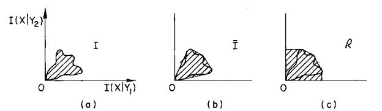

Fig. 20. Upper bound  $\mathcal{R}$  on capacity region.

set of jointly achievable mutual-information pairs, properly modified to take into account the possibility of time-sharing and throwing information away, does yield an upper bound  $\Re$  on the capacity region  $\Re^*$ . This upper bound is actually achieved by the orthogonal-channel, switch-to-talk-channel, and incompatible-channel examples.

Thus we proceed to define  $\Re$  and establish  $\Re$  as an upper bound. Let

$$I = \{ (I(X \mid Y_1), I(X \mid Y_2)) \mid p(x) \ge 0, \sum p(x) = 1 \}$$
 (29)

denote the set of all pairs  $(I(X \mid Y_1), I(X \mid Y_2))$  generated by p(x) as  $p(\cdot)$  ranges over the simplex of possible probability distributions on X. Define  $\bar{I}$  to be the convex hull of I. Thus  $\bar{I}$  may be interpreted as the average joint mutual information achievable by varying  $p(\cdot)$  with time. Let

$$\Re = \{ (R_1, R_2) \in E_2 \mid R_1 \le I_1, R_2 \le I_2,$$
 for some  $(I_1, I_2) \in \bar{I} \}.$  (30)

Thus  $\Re$  intuitively corresponds to the joint mutual information achievable from  $\overline{I}$  by throwing information away. These sets are depicted in Fig. 20. We now show  $\Re^* \subseteq \Re$ .

Lemma 1: Given an arbitrary  $((M_1, M_2, M_{12}); n)$  code for the *n*th extension of a broadcast channel, consisting of words  $x(r,s_1,s_2) \in X^n$ ,  $r \in R$ ,  $s_1 \in S_1$ ,  $s_2 \in S_2$ ,  $|R| = M_{12}$ ,  $|S_1| = M_1$ ,  $|S_2| = M_2$ ,  $M = M_{12}M_1M_2$ ; let  $(r,s_1,s_2)$  be a random variable with range  $R \times S_1 \times S_2$ . Let  $(y_1,y_2) \in Y_1^n \times Y_2^n$  be the corresponding random output *n*-sequences received by 1 and 2, generated by sending  $x(r,s_1,s_2)$  over the channel. If  $p_1(e) = \Pr\{(\hat{r}_1,\hat{s}_1) \neq (r_1,s_1)\}$  and  $p_2(e) = \Pr\{(\hat{r}_1,\hat{s}_2) \neq (r_1,s_2)\}$  are the receiver probabilities of error of the code, then,

$$H(X \mid Y_1) \le 1 + \log M_2 + p_1(e) \log M_{12} M_1$$
 (31)

$$H(X \mid Y_2) \le 1 + \log M_1 + p_2(e) \log M_{12} M_2.$$
 (32)

*Proof:* Let the decoding rules corresponding to the code be

$$g_1: Y_1^n \to R \times S_1$$
  
 $g_2: Y_2^n \to R \times S_2$  (33)

written

$$g_k(y_k) = (g_{k1}(y_k), g_{k2}(y_k)), \qquad k = 1, 2.$$

Thus, given a random message  $(r,s_1,s_2)$  and sequence  $\eta_k \in Y_k^n$ , receiver k will make an error if and only if

$$g_1(y_1) \neq (r, s_1), \qquad k = 1$$
  
 $g_2(y_2) \neq (r, s_2), \qquad k = 2.$  (34)

Thus

$$p_1(e) = \Pr \{g_1(y_1) \neq (r,s_1)\}$$

$$p_2(e) = \Pr \{g_2(y_2) \neq (r,s_2)\}.$$
(35)

We note that

$$\begin{split} H(X \mid y_1) &\leq H(p_1(e \mid y_1), 1 - p_1(e \mid y_1)) \\ &+ (1 - p_1(e \mid y_1)) \log M_2 + p_1(e \mid y_1) \log (M - M_2), \end{split}$$
 (36)

where we have used the inequality

$$H(a_1, a_2, \cdots, a_m) \le \log m, \tag{37}$$

and a basic composition relation (see Ash [1, p. 8]). We have, of course, conditioned on the events  $g_1(y_1) = (r,s_1)$  and  $g_1(y_1) \neq (r,s_1)$ . Taking the expectation over  $Y_1$ , and using the convexity of H(p, 1-p) in p, we have

$$H(X \mid Y_1) \le H(p_1(e), 1 - p_1(e)) + (1 - p_1(e)) \log M_2 + p_1(e) \log (M - M_2).$$
 (38)

Finally, since  $H(p, 1 - p) \le 1$  and  $M = M_{12}M_1M_2$  we have

$$H(X \mid Y_1) \le 1 + \log M_2 + p_1(e) \log (M - M_2) / M_2$$
  
 
$$\le 1 + \log M_2 + p_1(e) \log M_{12} M_1.$$
 (39)

The corresponding argument for  $H(X | Y_2)$  completes the proof.

We shall need the following lemma Ash [1,p. 81].

Lemma 2: Let  $X_1, \dots, X_n$  be a sequence of input random variables to the (discrete memoryless) broadcast channel and  $Y_{11}, \dots, Y_{1n}, Y_{21}, \dots, Y_{2n}$  the corresponding received output random variables for 1 and 2, respectively. Then

$$I(X_1, \dots, X_n \mid Y_{k1}, \dots, Y_{kn}) \leq \sum_{i=1}^n I(X_i \mid Y_{ki}), \qquad k = 1, 2,$$

with equality iff  $Y_{k1}, Y_{k2}, \dots, Y_{kn}$  are independent. *Proof*:

$$H(Y_{k1},Y_{k2},\cdots,Y_{kn}\mid X_1,\cdots,X_n)$$

$$\triangle - \sum p_{\nu}(x, y_{\nu}) \log p_{\nu}(y_{\nu} \mid x),$$

but, because the channel k is memoryless,  $p_k(y_k \mid x)$  factors into a product  $\prod p_k(y_{ki} \mid x_i)$ , yielding

$$H(Y_{k1},\cdots,Y_{kn}\mid X_1,\cdots,X_n)$$

$$= \sum_{x,y_k}^{n} p_k(x,y_k) \sum_{i=1}^{n} \log p_k(y_{ki} \mid x_i)$$

$$= \sum_{i=1}^{n} H(Y_{ki} \mid X_i).$$

Also, by a basic inequality

$$H(Y_{k1},\cdots,Y_{kn}) \leq \sum_{i=1}^{n} H(Y_{ki}),$$

with equality iff  $Y_{ki}$  are independent for  $i = 1, 2, \dots, n$ . Since  $I(X \mid Y_k) = H(Y_k) - H(Y_k \mid X)$ , the lemma follows.

We now wish to show that  $\bar{p}_1^{(n)}(e)$ ,  $\bar{p}_2^{(n)}(e)$  cannot simultaneously tend to zero for rates  $(R_1, R_2) \notin \Re$ . This will establish  $\Re$  as an upper bound on the capacity region for a broadcast channel.

Let  $R_1 = 1/n \log M_1 M_{12}$  and  $R_2 = 1/n \log M_2 M_{12}$  be the rates of communication in bits/transmission for receivers  $Y_1$  and  $Y_2$ , respectively. (We recall that  $R_{12} = \log M_{12}$  is the transmission rate for information common to both channels.) The proof closely resembles that used by Shannon [4] for the two-way channel.

Theorem: For any sequence of  $[(2^{nR_1}, 2^{nR_2}, 2^{nR_{12}}), n]$  codes,  $(R_1, R_2) \notin \Re$  implies that

$$(\bar{p}_1^{(n)}(e), \bar{p}_2^{(n)}(e)) \to (0,0), (\lambda_1^{(n)}, \lambda_2^{(n)}) \not\to (0,0), \qquad n \not\to \infty$$

Thus  $\Re$  is an upper bound on the capacity region for the broadcast channel.

**Proof:** Given an arbitrary  $[(M_1, M_2, M_{12}), n]$  code for the *n*th extension of the broadcast channel, choose a codeword  $x(r,s_1,s_2)$  at random according to a uniform distribution  $Pr\{r,s_1,s_2\} = 1/M, (r,s_1,s_2) \in R \times S_1 \times S_2$ , where  $M = |R||S_1||S_2|$ . If the codewords  $x(r,s_1,s_2) \in X^n$  are not distinct, a simple modification of the proof below will prove the theorem. Thus treating the case where the  $x(r,s_1,s_2)$  are distinct, we have  $H(X) = \log M$  and  $I(X \mid Y_1) = \log M - H(X \mid Y_1)$ , under the given uniform distribution on the codewords. As in Section III, let  $\bar{p}_1^{(n)}(e)$  and  $\bar{p}_2^{(n)}(e)$  designate the probabilities of error of the code under this distribution. By Lemma 2,

$$I(X \mid Y_1) \le \sum_{i=1}^{n} I(X_i \mid Y_{1i}).$$
 (41)

Thus

$$I(X \mid Y_1) = \log M - H(X \mid Y_1) \le \sum_{i=1}^{n} I(X_i \mid Y_{1i}).$$
 (42)

Finally, since (31) in Lemma 1 holds for any distribution on the codewords, substitution in (42) yields

$$\log M - 1 - \log M_2 - \bar{p}_1^{(n)}(e) \log M_{12} M_1$$

$$\leq \sum_{i=1}^{n} I(X_i \mid Y_{1i}), \quad (43)$$

which becomes the basic inequality

$$R_1 \triangleq \frac{1}{n} \log M_{12} M_1 \leq \frac{(1/n) + (1/n) \sum_{i=1}^{n} I(X_i \mid Y_{1i})}{1 - \bar{p}_1^{(n)}(e)}.$$
(44a)

Similarly, we find

$$R_2 \triangleq \frac{1}{n} \log M_{12} M_2 \leq \frac{(1/n) + (1/n) \sum_{i=1}^{n} I(X_i \mid Y_{2i})}{1 - \bar{p}_2^{(n)}(e)}.$$
(44b)

Summarizing, an arbitrary code for the *n*th extension of a broadcast channel must have rates  $(R_1, R_2)$  satisfying (44a) and (44b), where

$$\bar{p}_i^{(n)}(e) = \frac{1}{M} \sum_{r,s_1,s_2} \lambda_i(r,s_1,s_2), \qquad i = 1,2.$$
 (45)

Now suppose  $(R_1, R_2) \notin \Re$ ,  $R_1 \ge 0$ ,  $R_2 \ge 0$  as in Fig. 21.

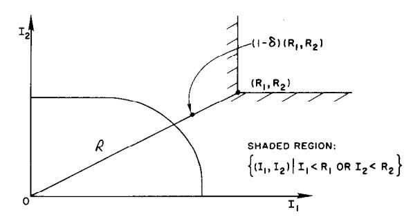

Fig. 21. Unachievable rate  $(R_1, R_2)$ .

We shall show that  $\bar{p}_i^{(n)}(e)$ , i = 1,2 cannot simultaneously be small.

By the convexity of  $\Re$  and  $I \subseteq \Re$ , we have

$$\left(\frac{1}{n}\sum_{i=1}^{n}I(X\mid Y_{1i}),\frac{1}{n}\sum_{i=1}^{n}I(X\mid Y_{2i})\right)\in\Re,$$

for all p(x). Consequently, as illustrated in Fig. 21, either

$$\frac{1}{n} \sum_{i=1}^{n} I(X \mid Y_{1i}) < R_1(1 - \delta)$$
 (46a)

or

$$\frac{1}{n} \sum_{i=1}^{n} I(X \mid Y_{2i}) < R_2(1 - \delta), \tag{46b}$$

where  $\delta > 0$  is any nonnegative real number such that  $(1 - \delta)(R_1, R_2) \notin \Re$ .

But (44) implies for i = 1,2 that

$$\bar{p}_i^{(n)}(e) \ge 1 - \frac{1}{nR_i} - \frac{(1/n)\sum_{j=1}^n I(X \mid Y_{ij})}{R_i}$$
 (47)

The second term on the right-hand side of (47) tends to zero with n, but the third term must be less than  $(1 - \delta)$  for either i = 1 or i = 2, or both. Thus

$$\lim_{n \to \infty} \max \{ \bar{p}_1^{(n)}(e), \bar{p}_2^{(n)}(e) \} \ge \delta > 0, \tag{48}$$

and therefore  $\bar{p}_1^{(n)}(e)$ ,  $\bar{p}_2^{(n)}(e)$  may not simultaneously be near zero. Also, since the probability of error  $\lambda_i^{(n)}$  of the worst codeword for each channel obeys  $\lambda_i^{(n)} \geq \bar{p}_i^{(n)}(e)$ , i = 1, 2, we conclude that if  $(R_1, R_2) \notin \Re$ , then there exists no sequence of  $((2^{nR_1}, 2^{nR_2}, 2^{nR_{12}}), n)$  codes for a broadcast channel such that  $(\lambda_1^{(n)}, \lambda_2^{(n)}) \to (0,0)$ .

#### IX. AN APPROACH TO COMPOUND CHANNELS

Let  $P_{\beta}(y \mid x)$ ,  $\beta \in \mathfrak{B}$  be a perhaps infinite collection of channel transmission functions. An index  $\beta$  will be chosen by nature and a sequence of n transmissions  $x_1, x_2, \dots, x_n$  will be sent to the receiver over the discrete memoryless channel  $P_{\beta}(y \mid x)$ . The index  $\beta$  is unknown to the sender but may, without loss of generality, be assumed known to the receiver. (Simply sending  $\sqrt{n}$  prearranged symbols in n transmissions will allow the receiver to determine  $\beta$  with arbitrarily low probability of error, for finite  $\mathfrak{B}$ , without affecting the achievable rate R.) Wolfowitz [2] and Black-

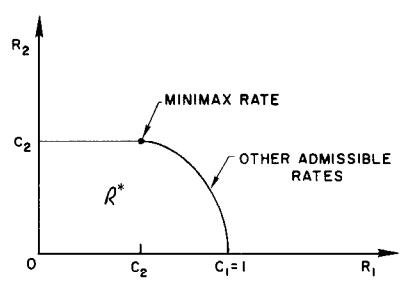

Fig. 22. Set of achievable rates for compound channel.

well et al. [5] have defined the capacity C of the compound channel to be

$$C = C_{\text{maximin}} = \sup_{p(x)} \inf_{\beta} I_{\beta}(X \mid Y). \tag{49}$$

This rate C is achieved for finite  $\mathfrak{B}$  by designing the code for the channel  $\beta^*$  such that

$$C = \max_{p(x)} I_{p\bullet}(X \mid Y). \tag{50}$$

The maximin rate C is then achieved independently of the  $\beta$  chosen by nature.

Now consider a communication link in which it is unknown whether the link is a perfect binary symmetric channel or a binary symmetric channel of parameter p. Thus the channel descriptions  $P_{\beta}(y \mid x)$ ,  $\beta = 1,2$ , are given by

$$P_1 = \begin{bmatrix} 1 & 0 \\ 0 & 1 \end{bmatrix} \qquad P_2 = \begin{bmatrix} \bar{p} & p \\ p & \bar{p} \end{bmatrix}. \tag{51}$$

For this compound channel we find

$$C = 1 - H(p). (52)$$

The point of view of this paper suggests instead that we determine the set  $\Re^*$  of all achievable rate pairs  $(R_1, R_2)$  for the two given channels. See Fig. 22. This yields the entire spectrum of achievable rates under the different contingencies selected by nature.

Thus, for example, if it is known that

$$\Pr \{\beta = 1\} = \pi_1 = 1 - \Pr \{\beta = 2\}, \tag{53}$$

then we may find the maximum expected rate

$$R(\pi_1) = \max_{(R_1, R_2) \in \mathbb{R}^*} (\pi_1 R_1 + \pi_2 R_2). \tag{54}$$

The interpretation is that by using the superimposed codes of Section II we can achieve average rates

$$R(\pi_1) = \max_{0 \le \alpha \le 1} \left[ C(\alpha \bar{p} + \bar{\alpha} p) + \pi_1 H(\alpha) \right], \quad (55)$$

corresponding to points on the boundary of  $\mathfrak{R}^*$ . These average rates are strictly greater than average rates achievable by time sharing (except for the degenerate prior  $\pi_1 = 0$  or 1). Finally, a submessage of rate  $C(\alpha \bar{p} + \bar{\alpha} p)$  is sure to be received, regardless of which channel is the true state of nature.

These considerations suggest that the compound channels problem can be reinvestigated from this broadcasting point of view by interpreting the probability distribution on the

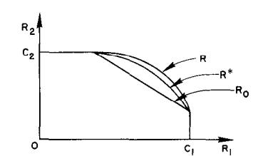

Fig. 23. Bounds on capacity region  $\mathcal{R}^*$ .

channel parameter  $\beta$  as a probability distribution on the receiver chosen in the multiple receiver broadcast channel formulation. Inspection of the capacity region  $\Re^*$  would then yield all achievable probability distributions on rates for the compound channel. The most desirable distribution could then be picked.

#### X. CONCLUSIONS

As before, let the capacity region  $\Re^*$  be the set of all achievable joint rates  $(R_1,R_2)$  for a given broadcast channel with two receivers. We now know the following. There is a certain information-theoretically defined region  $\Re$  generated by  $(I(X \mid Y_1),I(X \mid Y_2))$ , given in Section VIII, which upperbounds  $\Re^*$ . Also, by simple time sharing there is an inner bound  $\Re_0$ , say, to  $\Re^*$ , as shown in Fig. 23.

Sometimes these bounds coincide, as they do for the incompatible channel. Here  $\Re = \Re_0 = \Re^*$ . In other examples, such as the orthogonal channel, in which the bounds do not coincide, there is a simple demonstration that the upper bound can be achieved and therefore that  $\Re = \Re^*$ . In many of the intermediate cases (for example, the two BSC of section II) we can be reasonably well assured that our *ad hoc* codes achieve  $\Re^*$ , although proofs of converses appear to be difficult.

The analysis of this problem is made worthwhile by the fact that it is almost always the case that proper coding will achieve rates  $\Re^*$  strictly greater than those achievable by simple time-sharing.

The primary heuristic that we garner from these investigations is that high joint rates of transmission are best achieved by superimposing high-rate and low-rate information rather than by using time-sharing. Novels written with many levels of symbolism provide just one example of a mode of communication that may be perceived at many different levels by different people.1

#### ACKNOWLEDGMENT

I wish to thank D. Sagalowicz and C. Keilers for many helpful discussions of the ideas presented in this paper. D. Sagalowicz has helped improve the proof of the upper bound and C. Keilers has helped with some of the examples. I have also benefited from discussions with P. Bergmans and A. D. Wyner.

#### APPENDIX

In this section we prove the main result of Section II. Let C(p) = 1 - H(p).

Theorem: For the broadcast channel of Section II, with BSC with parameters  $p_1 = 0$  and  $p_2 = p$ , respectively,  $(R_1, R_2) = (C(\alpha \bar{p} + \bar{\alpha}p) + H(\alpha), C(\alpha \bar{p} + \bar{\alpha}p))$  is achievable for any  $0 \le \alpha \le 1$ .

**Proof:** Let  $M_{12} = 2^{nR_{12}}$ ,  $M_1 = 2^{n(R_1 - R_{12})}$  be integers and let  $R_2 = R_{12}$ ,  $M_2 = 2^{nR_{12}}$ . Consider the following random code. Let x(r),  $r \in R = \{1, 2, ..., M_{12}\}$ , be i.i.d. *n*-sequences in  $X^n = \{0, 1\}^n$ , where x(r) is drawn according to a uniform distribution on  $X^n$ . Let  $\alpha < \frac{1}{2}$ ,  $\alpha n$  be an integer, and let z(s),  $s \in S = \{1, 2, ..., M_1\}$ , be an enumeration of all the *n*-sequences  $z \in \{0, 1\}^n$  such that

$$\sum_{i=1}^n z_i = \alpha n.$$

There are

$$\binom{n}{\alpha n} = 2^{n(H(\alpha) + O(\ln n/n))}$$

such sequences. Define  $x(r,s) = x(r) \oplus z(s)$ , where the vector addition is termwise modulo 2. Without loss of generality let  $p < \frac{1}{2}$ .

The decoding rule  $g_1: Y_1^n \to R \times S$  for the *n*th extension for receiver 1 will be to choose the value of  $\hat{r} \in R$ ,  $\hat{s} \in S$  such that  $y_1 = x(\hat{r}, \hat{s})$ . We shall declare an error if there is more than one choice of  $(\hat{r}, \hat{s})$  such that this is true. (Since channel 1 is noiseless, the possibility that no such  $(\hat{r}, \hat{s})$  exists will not arise.)

The decoding rule  $g_2\colon Y_2^n\to R$  for channel 2 will decide the value of  $\hat{r}\in R$  such that  $d(y_2,x(\hat{r}))\leq n(\alpha\bar{p}+\bar{\alpha}p)+n\epsilon$ , for a given  $\epsilon>0$ , where d is the Hamming distance. An error for channel 2 will be declared if there are more than one or if there are no such values of  $\hat{r}\in R$ .

Let us now pick a message (r,s) with probability  $1/M_1M_{12}$  and evaluate the expected sum of the probabilities of error  $E\{\bar{p}_1(e) + \bar{p}_2(e)\}$  [see (9), (10)] where the expectation is over the random code, drawn as described.

Since channel 1 has perfect transmission (i.e.,  $y_1 = x(r,s)$ ), the only possibility of a decoding error for channel 1 is if the (random) code itself has assigned some other index (r',s') to the same *n*-sequence as (r,s).

By the symmetry of the code generation process, we may fix attention on the transmission of x(1,1). Thus

$$E\bar{p}_1(e) = \Pr\{x(r,s) = x(1,1), \text{ for some } (r,s) \neq (1,1)\}, (57)$$

where the probability is defined over the random code assignment.

Now x(1,1) = x(1,s) implies z(1) = z(s), which is impossible for any  $s \neq 1$ , by the construction of z(s). Thus the only possibility of error is x(1,1) = x(r,s),  $r \neq 1$ ,  $s \in S$ . But  $r \neq 1$  implies x(r,s) and x(1,1) are independent uniformly distributed *n*-sequences over  $\{0,1\}^n$ . Thus, for  $r \neq 1$ ,

$$\Pr\{x(1,1) = x(r,s)\} = 2^{-n}. \tag{58}$$

Putting this together with the union of events inequality yields

$$E \bar{p}_1(e) \le \sum_{(r,s) \ne (1,1)} \Pr\{x(1,1) = x(r,s)\}$$
 (59)

$$\leq M_1 M_{12} 2^{-n} = 2^{-n(1-R_1)} \to 0, \qquad R_1 < 1$$

Thus  $E\{\bar{p}_1(e)\} \to 0$ , as  $n \to \infty$ , if  $R_1 < 1$ , where the construction implies

$$R_1 - R_{12} \triangle (\log M_1)/n = H(\alpha) - O(\ln n/n).$$
 (60)

Now consider channel 2. Let  $e = (e_1, e_2, \ldots, e_n)$  be a binary n vector of i.i.d. Bernoulli RV with parameter p. Thus we can write  $y_2 = x(r,s) \oplus e$  and

$$y_2 = x(r) \oplus z(s) \oplus e. \tag{61}$$

A decoding error can be made in one of two ways.  $E_1$ : the true r=1 does not satisfy

$$d(y_2, x(1)) \le n(\alpha \bar{p} + \bar{\alpha} p) + n\varepsilon, \tag{62}$$

&lt;sup>1 I am soliciting double- and 'riple-meaning quotes that illustrate this idea. Consider, for example, the reaction of three different people to the following donated story. Buck and Harry led a beautiful maiden into the clearing by a rope tied around her ankle. "Let's make her fast," said Buck, "while we have breakfast." The anonymity of the authors will be protected.

and  $E_2$ : there exists an index  $r \neq 1$ ,  $r \in R$ , such that

 $d(v_2,x(r) \leq n(\alpha \tilde{p} + \bar{\alpha}p) + n\varepsilon.$ 

Thus

$$E\{\bar{p}_2(e)\} \le \Pr\{E_1\} + \Pr\{E_2\},$$
 (63)

where here the probability is understood to range over the random choice of code as well as the selection of (r,s). From (61),

$$\Pr\{E_1\} = \Pr\{d(y_2, \mathbf{x}(1)) > n(\alpha \bar{p} + \bar{\alpha}p + \varepsilon)\}$$

$$= \Pr\left\{\frac{1}{n} \sum_{i=1}^{n} \mathbf{z}(s)_i \oplus \mathbf{e}_i > \alpha \bar{p} + \bar{\alpha}p + \varepsilon\right\}. \quad (64)$$

We find the expected value (over e and s)

$$\frac{1}{n} \sum_{i=1}^{n} z(s)_{i} \oplus e_{i} = \frac{1}{n} \sum_{i=1}^{n} \Pr\{(z(s)_{i}, e_{i}) = (1, 0) \text{ or } (0, 1)\} 
= \frac{1}{n} \sum_{i=1}^{n} (\alpha \bar{p} + \bar{\alpha} p) = \alpha \bar{p} + \bar{\alpha} p.$$
(65)

Also, after some calculation

$$\operatorname{var} \frac{1}{n} \sum_{i=1}^{n} z(s)_{i} \oplus e_{i} \leq \frac{p\bar{p}}{n}. \tag{66}$$

It follows that  $d(y,x(r)) \rightarrow \alpha \bar{p} + \bar{\alpha} p$  in probability and therefore  $\Pr\{E_1\} \to 0 \text{ as } n \to \infty.$ 

We are left with the evaluation of  $Pr\{E_2\}$ . We write

$$\Pr\{E_2\} \leq \Pr\{d(x(r),y_2) \leq n(\alpha \bar{p} + \bar{\alpha}p + \varepsilon),$$

for some  $r \neq 1 | x(1)$  transmitted}

$$\leq 2^{nR_{12}} \Pr\{d(\mathbf{x}(2), \mathbf{y}_2) \leq n(\alpha \bar{p} + \bar{\alpha} p + \varepsilon)\}. \tag{67}$$

But

$$d(x(2),y_2) = wt(x(2) \oplus x(1) \oplus z(s) \oplus e), \tag{68}$$

where wt denotes the number of 1's in the binary n-tuple, and x(2)and x(1) are independent Bernoulli *n*-sequences with parameter  $\frac{1}{2}$ . Thus, for any  $\varepsilon > 0$ ,

$$\Pr\{E_2\} \le 2^{nR_{12}} 2^{n(H(\alpha \bar{p} + \bar{\alpha}p) + O(\ln n/n) + \varepsilon')} 2^{-n}, \tag{69}$$

where  $2^{\pi(H(\alpha\bar{p}+\bar{\alpha}p)+O(\ln n/n)+\epsilon')}$  denotes the number of points

$$\sum_{i=0}^{n(\alpha\bar{p}+\bar{\alpha}p+\varepsilon)} \binom{n}{i}$$

in the decoding sphere centered at y2. Consequently, if

$$R_{12} < 1 - H(\alpha \tilde{p} + \tilde{\alpha}p) - \varepsilon', \tag{70}$$

then  $Pr\{E_2\} \to 0$ , as  $n \to \infty$ . Collecting the constraints of (60) and (70), we see that if

$$R_2 = R_{12} < 1 - H(\alpha \bar{p} + \bar{\alpha}p) \tag{71}$$

$$R_1 < H(\alpha) + R_2 = 1 - H(\alpha \tilde{p} + \tilde{\alpha} p) + H(\alpha),$$

then

$$E\{\bar{p}_1^{(n)}(e) + \bar{p}_2^{(n)}(e)\} = E\{\bar{p}_1^{(n)}(e)\} + E\{\bar{p}_2^{(n)}(e)\} \to 0. \tag{72}$$

Since the best code behaves better than the average, there must exist a sequence of  $[(2^{nR_1}, 2^{nR_2}, 2^{nR_{12}}), n]$  codes for n = 1, 2, ..., with

$$R_1 = C(\alpha \bar{p} + \bar{\alpha} p) + H(\alpha) - \varepsilon$$

$$R_2 = C(\alpha \bar{p} + \bar{\alpha}p) - \varepsilon \tag{73}$$

such that

$$\bar{p}_1^{(n)}(e) + \bar{p}_2^{(n)}(e) \to 0,$$
 (74)

and thus  $\bar{p}_1^{(n)}(e) \to 0$ ,  $\bar{p}_2^{(n)}(e) \to 0$ .

Taking the limit of  $(R_1, R_2)$  as  $\varepsilon \to 0$  proves the theorem.

#### REFERENCES

- [1] R. B. Ash, Information Theory. New York: Interscience, 1965. [2] J. Wolfowitz. Coding Theorems of Information Theorems of Information Theorems of Information Theorems of Information Theorems of Information Theorems of Information Theorems of Information Theorems of Information Theorems of Information Theorems of Information Theorems of Information Theorems of Information Theorems of Information Theorems of Information Theorems of Information Theorems of Information Theorems of Information Theorems of Information Theorems of Information Theorems of Information Theorems of Information Theorems of Information Theorems of Information Theorems of Information Theorems of Information Theorems of Information Theorems of Information Theorems of Information Theorems of Information Theorems of Information Theorems of Information Theorems of Information Theorems of Information Theorems of Information Theorems of Information Theorems of Information Theorems of Information Theorems of Information Theorems of Information Theorems of Information Theorems of Information Theorems of Information Theorems of Information Theorems of Information Theorems of Information Theorems of Information Theorems of Information Theorems of Information Theorems of Information Theorems of Information Theorems of Information Theorems of Information Theorems of Information Theorems of Information Theorems of Information Theorems of Information Theorems of Information Theorems of Information Theorems of Information Theorems of Information Theorems of Information Theorems of Information Theorems of Information Theorems of Information Theorems of Information Theorems of Information Theorems of Information Theorems of Information Theorems of Information Theorems of Information Theorems of Information Theorems of Information Theorems of Information Theorems of Information Theorems of Information Theorems of Information Theorems of Information Theorems of Information Theorems of Information Theorems of Information Theorems of Information Theorems of
- R. B. Asn, Information Theory. New York: Interscience, 1965.
  J. Wolfowitz, Coding Theorems of Information Theory, 2nd ed.
  Berlin: Springer, and Englewood Cliffs, N.J.: Prentice-Hall, 1964.
  C. E. Shannon, "A mathematical theory of communication," Bell Syst. Tech. J., vol. 27, 1948, pp. 379–423 (pt. 1) and pp. 623–656 (pt. 2); also Urbana, Ill.: Univ. Illinois Press, 1949.
  C. E. Shannon, "Two-way communication channels," in Proc. 4th Berkeley Symp. Probability and Statistics, vol. 1. Berkeley, Calif.: Univ. California Press, 1961, pp. 611–644.
  D. Blackwell. L. Breiman. and A. Thomasian. "The capacity of a
- [5] D. Blackwell, L. Breiman, and A. Thomasian, "The capacity of a class of channels," *Ann. Math. Statist.*, vol. 30, 1959, pp. 1229–
- [6] C. E. Shannon, "A note on a partial ordering for communication channels," Inform. Contr., vol. 1, 1958, pp. 390-397.

# An Algorithm for Computing the Capacity of Arbitrary Discrete Memoryless Channels

# SUGURU ARIMOTO

Abstract—A systematic and iterative method of computing the capacity of arbitrary discrete memoryless channels is presented. The algorithm is very simple and involves only logarithms and exponentials in addition to elementary arithmetical operations. It has also the property of monotonic convergence to the capacity. In general, the approximation error is at least inversely proportional to the number of iterations; in certain circumstances, it is exponentially decreasing. Finally, a few inequalities that give upper and lower bounds on the capacity are derived.

## I. Introduction

T IS well known that the capacity of discrete memoryless channels that are symmetric from the input can easily be evaluated. Muroga [1] developed a method for straightforward evaluation of capacity, but unfortunately its usefulness is restricted to the case where 1) the channel

Manuscript received September 9, 1970.

The author is with the Faculty of Engineering Science, Osaka University, Osaka, Japan.