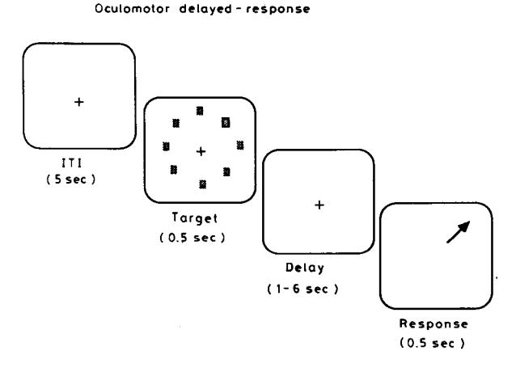
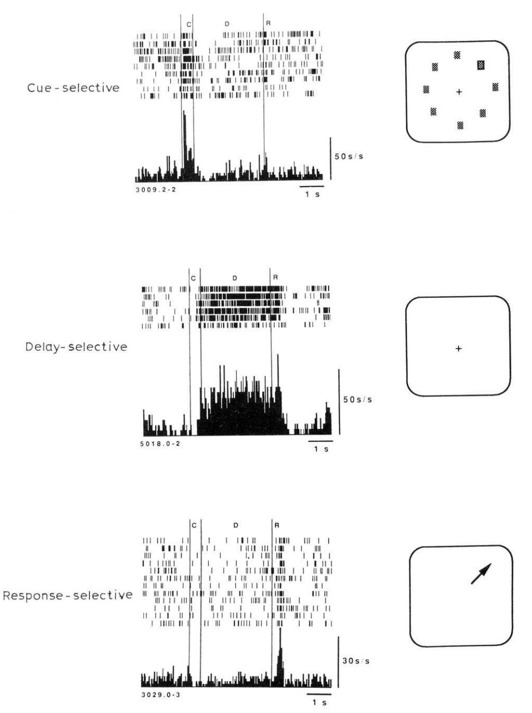
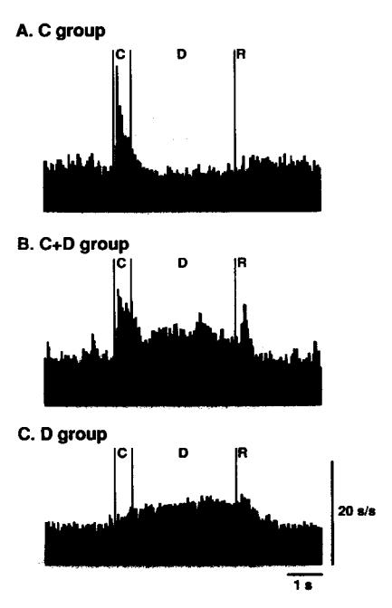
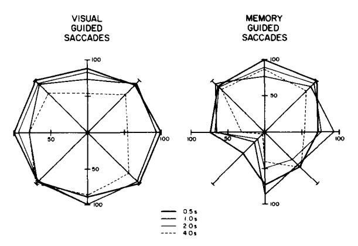
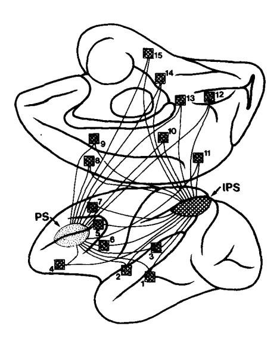

#### **CHAPTER 16**

# Cellular and circuit basis of working memory in prefrontal cortex of nonhuman primates

# Patricia S. Goldman-Rakic

Yale University School of Medicine, Section of Neuroanatomy, C303 SHM, New Haven, CT 06510, USA

#### Introduction

Working memory is the term applied by cognitive psychologists and theorists to the type of memory that is active and relevant only for a short period of time, usually on a scale of seconds (Baddeley, 1986). A common example of working memory is keeping in mind a newly read phone number until it is dialed and then immediately forgotten. This criterion - useful or relevant only transiently distinguishes working memory from the very different process that has been called reference memory (Olton and Papas, 1979), semantic memory (Tulving, 1972), and procedural memory (Squire and Cohen, 1984), all of which have in common that their contents are, for all intents and purposes, stable over time (e.g., someone's name, the color of one's eyes, the shape of an apple, the manner of using a fork and knife). In contrast to working memory, all of these other forms of memory can be considered associative in the traditional sense; i.e., information is acquired by a fixed association between stimuli and responses and/or consequences.

tional sense; i.e., information is acquired by a fixed association between stimuli and responses and/or consequences.

I have argued that the capacity which cognitive psychologists call working memory is similar, if

Correspondence: P.S. Goldman-Rakic, Ph. D., Yale University

School of Medicine, Section of Neuroanatomy, C303 SHM, 333

Cedar Street, New Haven, CT 06510, USA. Tel.: (203) 785-

4808; Fax: (203) 785-5263.

not identical, to the process which is measured by delayed-response tests in nonhuman primates (Goldman-Rakic, 1987). The ability to keep the location of an object "in mind" is not unlike the ability of humans to keep a phone number or a person's name in mind. Indeed, the classical delayed-response task was designed and introduced to comparative psychology by Walter Hunter to differentiate among animal species on intelligence — which he defined as the ability to respond to situations on the basis of stored information, rather than on the basis of "immediate" stimulation (Hunter, 1913).

A crucial feature of the delayed-response task is the need to update information on every trial. The correct response on trial n is not predictive for the correct response on trial n + 1. The lack of a predictive relationship between one trial and the next is unlike the procedure employed in associative learning or conditioning paradigms, in which the correct response or correct association (as in stimulus – stimulus learning) is the same on each subsequent trial. The underlying principle of delayed-response operates in other commonly used behavioral paradigms: spatial delayed alternation, object alternation, match-to-sample or nonmatchto-sample tasks. All of these tasks rely on the common principle that the subject must keep "in mind" an item of information for only one trial, and update to a new memorandum on the next trial. Of course, an organism may need to store a unique event or datum for future reference and, in this instance, additional mechanisms, including rehearsal, must operate. However, for purposes of discussion, the paradigm that I would like to focus on in this chapter is one in which erasure, or forgetting, of an event is as important as its registration. Baddeley's phrase, "scratch-pad memory" perfectly captures this feature of the working memory process (Baddely, 1973).

The objective of this chapter is to review the role of prefrontal cortex in working memory. There is a need to clarify this issue for purposes of constructive dialogue and discussion as well as to stimulate future research on the key mechanisms. Although there appears to be a growing consensus that the principal sulcal cortex in the monkey plays some role in memory processing (Passingham, 1985a, b; Goldman-Rakic, 1987, 1990; Fuster, 1989), there is far less agreement on the nature of this process and whether this is the cardinal function or one of many subserved by prefrontal cortex. Furthermore, in spite of good agreement about the transient nature of the memory trace in delayed-response tasks, terminology is still an issue (Passingham, 1985a, b; Goldman-Rakic, 1987, 1990; Fuster, 1989).

#### Terminology: what's in a name?

What is an appropriate designation for the process that is disturbed by dorsolateral prefrontal lesions in the form of impairment on delayed-response tasks? Historically, it was termed "immediate" memory to differentiate it from conventional memory (Jacobsen, 1936). It has also been simply called "spatial memory" (Mishkin, 1964). I have proposed that the term "working memory" is appropriate to describe this process. Representational memory is another very appropriate designation which has been used (Goldman-Rakic, 1987), but some objections to it can be raised because of its several meanings. For example, external stimuli in the environment often "represent" or signal other stimuli (e.g., the sound of a siren arouses expectation of a police car or a fire engine value) or other meanings that are indicated by the stimulus. Thus, memory processes based on external signals in non-delay tasks may also be considered representational. Further, the term is often used in the sense of central "representations" of the periphery.

The term "transient memory" is perfectly appropriate to designate the psychological process that is tapped by delayed-response tasks, but this term has the sense of a passive process that fades. Calling the process "short term memory" is also problematic because, traditionally, short-term memory has been considered an obligatory stage through which information must pass on its way to long-term memory (for review, see Roitblat, 1987; Baddeley, 1986). More recently, the term "cognitive" memory has been used by some to refer to representational memory. While working memory is a cognitive process, the name cognitive memory implies that all other types of memory, including episodic, semantic, and associative are not cognitive. The term which I advocate, "working memory", has the virtue of calling attention to the active, dynamic nature of the process, the similarity of the process in monkey and human, and it is easily distinguished from associative memory from which it can be dissociated in function, localization, and durability.

Fuster has proposed the terms "prospective" and "retrospective" memory and suggested that they may represent two distinct processes. These terms are attractive and appropriate. However, the term "working memory" serves both prospective and retrospective functions, depending on the point in time considered. For example, when the cue goes out of view and the animal has to keep its location in mind, we would call that prospective memory; the information is being held for a future event. However, at the end of the delay, when the animal selects a food well, the memory trace is considered retrospective since it reflects information presented in the past. Until these two terms can be shown to represent dissociable mechanisms (rather than serving several functions), I do not see the reason to postulate two distinct processes, nor

do these terms particularly capture the transient and renewing nature of the process under review.

It may be argued that the process of working memory differs somewhat in humans and monkeys. A human can keep something in mind for a longer period of time by silently rehearsing it. However, rehearsal invokes repetitive associative processes, and information can be retained for longer periods by both laboratory animals and humans when rehearsal is allowed. It has been shown that monkeys can rehearse (Kojima et al., 1982) as can other prelinguistic organisms, chimps, children, the deaf, and others that do not have the benefit of language. Furthermore, individual differences may be expected among both humans and monkeys in the length of time that information can be held "in mind", as well as in the mental computations that can be performed on the internalized knowledge base. Species differences are large (Goldman-Rakic and Preuss, 1988) and may reflect the emergence of multiple parallel representational systems, each with independent mnemonic modules (Goldman-Rakic, 1987; 1988a, Rumelhardt and McClelland, 1988). However, the fundamental working memory process may be quite similar across mammalian species. There is no doubt that language adds another dimension to information processing, but the question to be resolved is whether linguistic analysis invokes a qualitatively new process rather than an additional, powerful channel of working memory. The concept of "working memory" has been developed in a linguistic framework (Baddeley, 1986).

#### Cellular mechanisms underlying working memory

Support for a memory interpretation of delayedresponse deficits comes from many sources. I should like to call attention here to the recording studies in awake monkeys trained to perform delayed-response and other cognitive tasks (e.g., Fuster and Alexander, 1971; Kubota and Niki, 1971; Kojima and Goldman, 1982; Niki and Watanabe, 1986; Funahashi et al., 1989, 1990

a-c). As in other areas of the cerebral cortex, a variety of neuronal responses has been recorded from prefrontal neurons and there is every reason to believe that they all play some role in integrated delayed-response performance and in the fundamental process of working memory. For example, neuronal activities have been related to the cue, to the delay, to the response, or to some combination of these in manual delayed-response tasks (e.g., Fuster, 1989, for review). A similar variety of neuronal activation patterns has now been demonstrated in oculomotor tasks (Funahashi et al., 1989, 1990a, b; Boch and Goldberg, 1989; Barone and Joseph, 1989). The number of distinct types of neurons that participate in the working memory process is not fully known. Full characterization of prefrontal neuronal activity in delayed-response tasks requires assessing a neuron's pattern of activation under a variety of task permutations, and this is both timeconsuming and technically difficult. Nevertheless, after 2 decades of research, we can draw several general conclusions: that all major classes of neuron (cue, delay, response) are found in the caudal portion of the dorsolateral prefrontal cortex; and all major classes of neuron can be identified in oculomotor as well as in manual delayedresponse tasks. Thus, the functions of the prefrontal cortex pertain to several motor systems and are amenable to cellular and circuit analyses.

#### Delay-period activity: transient memory trace

It is very well established that neurons in the prefrontal cortex become activated during the delay period of a delayed-response trial; at issue is whether the neurons which express this activity are the cellular counterparts of a mnemonic event as suggested in seminal physiological studies of primate prefrontal cortex (Fuster and Alexander, 1971; Fuster, 1973; Kubota and Niki, 1971). It could be argued, for example, that neurons activated during the delay of a delayed-response trial are not necessarily representing specific information to be remembered but, rather, are engaged in

some sort of general preparatory or motor set to respond. The act of preparing to respond could invoke postural mechanisms, both peripheral and central, and not necessarily implicate central registration, storage, or processing of stored information. However, recent evidence from studies in my laboratory are providing strong and convincing evidence for mnemonic processing in prefrontal cortex. Shintaro Funahashi, Charles Bruce, and I have been using an oculomotor delayed-response (ODR) paradigm to study prefrontal function (Funahashi et al., 1989, 1990a, b). The advantages of this paradigm over other methods of studying delayed-response performance are many. The animal is required to fixate a spot of light on a TV monitor and maintain fixation during the brief (0.5 sec) presentation of a stimulus followed by a delay period of variable length (Fig. 1). Visual stimuli can be presented in any part of the visual field, thus allowing complete control over the specific information that the animal has to remember on any given trial. The fixation spot is turned off only at the end of the delay period and its offset con-

Fig. 1. Main phases of a trial in the oculomotor delayedresponse (ODR) paradigm. As described in the text, the task is presented on a TV monitor. The monkey fixates the central spot and maintains fixation throughout the delay period until the fixation spot disappears, where upon it makes a response to the remembered target location. ITI, intertrial interval; arrow, correct direction for the response (arrow is for the reader, not the monkey).

stitutes an instruction to the animal to break fixation and direct his gaze to where the target had been presented. Most important, because the animal is required to fixate during the delay period, he is discouraged from making anticipatory rehearsal responses to the cue location and, further, behavior during the delay is equated on every trial. Because the animal's behavior is rather strictly controlled in all phases of a trial, we believe that the animal can perform correctly only if it uses mnemonic processing.

# Memory fields coded by prefrontal neurons

Although all the neurons in the caudal prefrontal cortex can be assumed to contribute to the functions of that cortex, the neurons that have particularly intrigued us are those that discharge vigorously when the stimulus goes out of view in the delay period. As has been reported for manual delayed-response tasks (Kubota and Niki, 1971; Fuster, 1973), dorsolateral prefrontal neurons increase (or often decrease) their discharge rate during the delay period of a trial. The neuron displayed in the middle panel of Fig. 2 is an example: its activity rises sharply at the end of the stimulus, remains tonically active, and then ceases rather abruptly at the end of the delay, after the fixation spot disappears, and either just before, during, or after the response is initiated (see Funahashi et al., 1990b, for further discussion of saccade-related activity). Such neuronal activity must be as fundamental to the working memory process as orientation-tuned cellular activity of neurons in the visual cortex are to the perception of contour.

The results of our studies of neuronal activity during oculomotor delayed-response performance have advanced our understanding of delay-period activity by suggesting the concept of the "memory field". Although previous studies had shown that delay period activity of prefrontal neurons was directional (discharging more for left than for right trials or the reverse), such directional activity could be interpreted as a specialized code for left – right

Fig. 2. Three distinct types of neuronal activation recorded from prefrontal neurons during performance of the oculomotor delayed-response task. Upper panel displays a neuron that exhibits a *phasic* response on appearance of the target; over 90% of such neurons are directionally selective; i.e., discharge selectively to a specific, usually contralateral, target location. The middle panel displays tonic activity during the delay period; in most prefrontal neurons displaying this activity, the activity is also directionally selective. The lower panel displays a neuron that is activated at the time of response; some oculomotor reponses occur before the response, but most occur after the response is initiated (Funahashi et al., 1990b). These responses are time-locked to the main events (cue, delay and response) of the ODR task.

position. And, indeed, this interpretation fits well the evidence that lesions of the principal sulcus produced deficits on left—right spatial delayed-response tasks. However, studies employing the oculomotor paradigms have shown clearly that prefrontal neurons can code the location of an object throughout the visual field; i.e., in all polar directions of space (Funahashi et al., 1989, 1990a). An important point is that the same neuron codes the same location repeatedly and different neurons code different locations. Thus, the memory field of a prefrontal neuron is quite analogous to the visual receptive fields of visual cortical neurons or the motor fields of motor system neurons.

Analysis of prefrontal function oculomotor paradigm is beginning to yield evidence of dynamic interactions among several neuronal classes. For example, we have obtained evidence that there are 2 types of delay-period activity. The first is a sustained pattern of tonic activity in the delay that commences only when the cue disappears and terminates abruptly after the response is initiated (the "D" cell) (Figs. 2 and 3c). This "D" profile can be contrasted with another, second type of activity pattern in which the cue elicits a phasic stimulus-locked response followed by a sustained tonic activity in the delay period (the "C+D" cell of Funahashi et al., 1990a). Further, the directional bias of the phasic "C" response and the cell's tonic "D" activity are highly correlated (Funahashi et al., 1990a). Finally, some prefrontal neurons respond phasically to the directional cues, but do not generate delay-period activity (the "C" cell) (Fig. 3). Our hypothesis is that each of these response patterns represents the activity of specific classes of prefrontal neurons with distinctive inputs and outputs, and that they are locally interconnected with one another. Thus, we could suppose that the C cell registers the direction of the cue at the time of presentation. Such information presumably originates outside of the prefrontal cortex and could be conveyed, for example, over parieto-prefrontal pathways (e.g., Cavada and Goldman-Rakic, 1989a, b; Leichnetz, 1980; Petrides and Pandya, 1985). Then, the C cell could input to the C + D cell, which computes a memory field (directional delay-period activity) from this "sensory" input. In a next step, the C + D cell may innervate the D cell which keeps the message "on line" and, possibly, is the efferent neuron in the circuit (Funahashi et al., 1990a). Of course, other scenarios and functional circuits are possible and all possibilities need to be analyzed by appropriate experiments in future studies. What we would underscore is that the caudal principal sulcal region contains local "memory" circuits or modules that may constitute the building blocks for numerous of the cognitive functions associated with prefrontal cortex (see Goldman-Rakic, 1987, for further discussion).

Fig. 3. Composite histograms summing over a large number of neurons recorded from the principal sulcus during the ODR task. Only trials for a neuron's preferred direction (largest response) are included. (A) Composite histogram of 27 neurons that responded to the cue. (B) Composite of 33 neurons that had both phasic cue-period activity and tonic delay-period activity. (C) Composite histogram of 78 neurons that exhibit only tonic delay-period activity. C = cue; D = delay; R = response periods. (From Funahashi et al., 1990a.)

# Memory maps in prefrontal cortex

How are such neurons arranged in the prefrontal cortex? The answer to this question is still unclear. However, several lines of evidence indicate that there may be at least a crude topographic map of memory in prefrontal cortex. Circumscribed surgical lesions produce equally circumscribed memory loss for visuospatial targets. For example, we have evidence that a lesion in the posterior third of the principal sulcus, including the anterior bank of the arcuate sulcus, we have produced a deficit restricted to the upper contralateral quadrant of space; a more rostral lesion in the middle third of the principal sulcus produced a deficit in the lower contralateral quadrant (Fig. 4) (Funahashi et al., in preparation). Using the reversible lesion method of a pharmacological block, injections of bicuculline, a competitive antagonist of GABA, into the prin-

Fig. 4. Performance on oculomotor tasks after unilateral lesions of the middle third of the principal sulcus displayed on an octagonal graph. Percent correct performance is graphed separately for each radial position; the different lines represent different delays, as indicated. (Left panel) Performance during the ODR task when the cue remains on during the delay and is present at the end of the delay. The monkey performs without difficulty at all locations and delays. (Right panel) Performance on the ODR task in which the saccades are memory driven. The monkey exhibits a deficit that is mainly expressed in the lower quadrant of the visual field contralateral to the lesion. This deficit can be viewed as a "mnemonic scotoma" because the monkey has no difficulty in seeing or moving his eyes, as shown by his excellent performance when eye movements are visually guided.

cipal sulcus, we have produced a deficit restricted to one or two locations in space; a different placement of injection induced a deficit in a different location in the visual field (Sawaguchi and Goldman-Rakic, 1990) Furthermore, the deficits were most pronounced in the visual field contralateral to the hemisphere injected. Correspondingly, neurons which code the memory of left visual field targets are concentrated in the right hemisphere; those coding the right visual field are concentrated in the left hemisphere (Funahashi et al., 1989). Thus, the visuospatial memory system is lateralized and, very likely, the mechanisms for working memory are well integrated with the brain's mechanisms for spatial vision. Again, we presume that the relevant sensory information originates in the visual areas of the cortex and is transmitted via the parietoprefrontal projections that provide a major input to the caudal principal sulcus.

# Prefrontal function: working memory or motor set?

The activation of prefrontal neurons when a stimulus disappears from view, and maintenance of that activation until a response is executed, is highly suggestive of a working memory process and, perhaps even underlies the conscious experience of that process (Goldman-Rakic, 1990). Nevertheless, it may be argued that the delay-period activity reflects simply the motor set of the animal to respond at the end of the delay, as has been described for neurons in premotor fields. However, prefrontal neurons exhibit increased or decreased discharge only for targets in memory fields. Thus, even though an animal is set to, and does, respond correctly at the end of the delay period on every trial (regardless of target location), any given neuron is attuned to only one or a few locations. A general motor set explanation cannot readily explain this result.

If prefrontal neurons are involved in mnemonic processing, one would except their activity to be sensitive to changes in the duration of the delay period. Indeed, it has been shown that the activity of prefrontal neurons that occurs during the delay period expands and contracts as the delay is lengthened or shortened (Kojima and Goldman, 1982). Again, this would be expected if the neuron is holding information "on line" that is to be retained until the end of the delay period.

Another argument for mnemonic coding comes from a recent analysis of prefrontal neuronal activity in an anti-saccade task (Funahashi and Goldman-Rakic, 1990). The task is identical to the oculomotor delay-response paradigm except that, at the end of the delay, the monkey is required to direct his gaze to the location opposite that in which the to-be-remembered cue was presented. Under this circumstance, the direction of the cue and that of the response are dissociated. We have compared the activity of 44 neurons that were recorded during both the conventional and antisaccade versions of the oculomotor paradigm and have found that the great majority (66%) that responded to a specific direction in the conventional task maintained the same pattern of discharge, even when the response was to the opposite direction (Funahashi and Goldman-Rakic, 1990). Thus, this study indicates that delay-period activity is independent of the direction of the response in a large fraction of prefrontal neurons; so we can conclude that this activity codes a representation of sensory information and is not a motor code. However, a lower percentage of prefrontal cells do code for the direction of the impending motor response, and their firing patterns are influenced by the direction of the motor response, i.e., such cells increase their rate of discharge for saccades only in one or another direction. Such neurons also play a role in prefrontal function and emphasize the richness of neural coding in this cerebral area.

Finally, if prefrontal neurons were coding only a preparatory set to respond, one would expect them to be activated before incorrect as well as correct responses. However, neurons that have memory fields (i.e, have a "best direction" of discharge) either falter in activity during the delay or even completely fail to increase their rate

preceding responses in the non-preferred incorrect direction (Funahashi et al., 1989). The fact that incremental firing precedes only correct responses indicates that the activity may be part of the internalized code needed to guide the correct response. Thus, it would serve a mnemonic function.

#### Working memory network

The principal sulcus in the prefrontal cortex is the anatomical focus for spatial delayed-response function, and knowledge of its connections with other structures is helping us to understand the circuit and cellular basis of working memory. It has become clear from our anatomical investigations that this prefrontal subdivision has reciprocal connections with more than a dozen distinct cortical association regions, with premotor centers, with the caudate nucleus, the superior colliculus, and brain stem centers (Fig. 5; for review see Goldman-Rakic, 1987). Each of these connections presumably contributes different subfunctions to the overall capacity to guide a response by the mental representation of a stimulus. The reciprocal connections between the prefrontal and parietal cortex carry information about the spatial aspects of the outside world. In recent studies, we have traced several pathways from distinct visual centers concerned with peripheral vision to the principal sulcus via relays in the posterior parietal cortex (Cavada and Goldman-Rakic, 1989a). Our anatomical analysis reveals that prefrontal neurons in and around the principal sulcus are but two synapses removed from the primary visual cortex. This network, additionally, contains several multisynaptic pathways between the prefrontal cortex and the hippocampal formation; we have speculated that these connections subserve a cooperative relationship between the hippocampus and the prefrontal cortex with regard to working memory (Goldman-Rakic, et al., 1984; Selemon and Goldman-Rakic, 1988). Our recent evidence of elevated metabolic activity in the dentate gyrus, and the several fields of Ammon's horn of monkeys performing working memory tasks, sup-

Fig. 5. Distributed circuit revealed by the double-anterograde tracing study described in Selemon and Goldman-Rakic (1988). One anterograde tracer, tritiated amino acids, was placed in the prefrontal cortex; another, WGA-HRP, was placed in the posterior parietal cortex (and the reverse). Alternate sections were processed for autoradiography and HRP histochemistry. Adjacent sections were charted and superimposed for determination of convergence, or lack thereof, in potential target areas. Area 46 and area 7 project to as many as 15 targets in common: (1) the depths of the middle third of the superior temporal sulcal cortex; (2) the insular cortex; (3) the fronto-parietal operculum in the dorsal bank of sylvian fissure; (4) the orbital prefrontal cortex; (5) the anterior arcuate cortex; (6 and 7) the ventral and dorsal subdivisions of premotor cortex; (8) the supplementary motor area; (9) the caudal half of the anterior cingulate cortex; (10) the entire posterior cingulate cortex; (11) the medial parietal cortex; (12) the medial prestriate cortex; (13) the caudomedial lobule; (14) the presubiculum; and (15) the parahippocampal gyrus. Thus, in our study, every cortical region that was innervated by the posterior parietal cortex also received a projection from the posterior prefrontal cortex. PS = principal sulcus; IPS = intraparietal sulcus. (From Selemon and Goldman-Rakic, 1988.)

port this line of thinking (Friedman and Goldman-Rakic, 1988). Also, increased neuronal activity during the delay period of delayed-response tasks has been recorded from neurons in Ammon's horn (Watanabe and Niki, 1985). Finally, working memory tasks like nonmatching-to-sample are just the type of task on which monkeys with lesions of the hippocampus are impaired. In the matching

tasks, like in delayed-response tasks, information (the sample) is relevant only for one trial and each trial is independent from the last. It seems clear that the hippocampus and prefrontal cortex are functionally as well as anatomically related.

Connections with the caudate nucleus and superior colliculus, among other motor centers, are thought to play a role in transmitting response commands to the motor centers. The principal sulcus projects to premotor centers including the supplementary motor areas and, through these centers, has access to the primary motor cortex. Therefore, with respect to motor control also, the principal sulcus is only 2 synapses removed from primary motor neurons. Thus, we conclude that prefrontal cortex regulates behavior in collaboration with a large set of other cortical and subcortical structures which, all together, constitute the brain's machinery for spatial cognition (see Goldman-Rakic, 1987, for overview; Selemon and Goldman-Rakic, 1988).

#### Evolutionary significance of working memory

The significance of working memory for higher cortical function is not necessarily self-evident. Perhaps even the quality of its transient nature misleads us into thinking it is somehow less important than the more permanent archival nature of long-term memory. However, the brain's working memory function, i.e., the ability to bring to mind events in the absence of direct stimulation, may be its inherently most flexible mechanism and its evolutionarily most significant achievement. Thus, working memory confers the ability to guide behavior by representations of the outside world rather than by immediate stimulation, and thus to base behavior on ideas and thoughts.

The difference between guidance of behavior by symbols, concepts, or ideas and guidance by external stimuli cannot be overemphasized. At the most elementary level, our basic conceptual ability to understand that an object *out of view* nevertheless exists depends on the capacity to keep events in mind beyond the direct experience of those events.

For some organisms, including humans under certain conditions, "out of sight" is equivalent to "out of mind". Working memory has been invoked in all forms of cognitive processing, including language. Is has been pointed out that the failure to keep a word in mind after it has been uttered would lead to a grave restriction in the span over which contextual interactions can occur (Cohen and Servan-Schreiber, 1989). It is no less essential to the performance of mathematical operations (e.g., carrying over), to playing chess or bridge, to playing the piano without music, delivering a speech without reading (or by rote) and, finally, to fantasizing and planning ahead.

### References

- Baddeley, A.D. (1973) Working memory. *Phil. Trans. R. Soc. Lond. B. Biol. Sci.*, 302: 311-324.
- Baddeley, A. (1986) Working Memory, Oxford University Press, London.
- Barone, P. and Joseph, J.-P. (1989) Prefrontal cortex and spatial sequencing in macaque monkey. Exp. Brain Res., 78: 447-464.
- Boch, R. and Goldberg, M.E. (1989) Participation of prefrontal neurons in the preparation of visually guided eye movements in the rhesus monkey. *J. Neurophysiol.*, 61: 1064 1084.
- Cavada, C. and Goldman-Rakic, P.S. (1989a) Posterior parietal cortex in rhesus monkey. I. Parcellation of areas based on distinctive limbic and sensory cortico-cortical connections. J. Comp. Neurol., 286: 393-421.
- Cavada, C. and Goldman-Rakic, P.S. (1989b) Posterior parietal cortex in rhesus monkey. II. Evidence for networks linking limbic and sensory areas to the frontal lobe. *J. Comp. Neurol.*, 286: 422-445.
- Cohen, J.D. and Servan-Schreiber, D. (1989) A parallel distributed processing approach to behavior and biology in schizophrenia. *Techn. Rep. AIP-100*, Carnegie-Mellon University, Pittsburgh, PA.
- Friedman, H.R. and Goldman-Rakic, P.S. (1988) Activation of the hippocampus by working memory: a 2-deoxyglucose study of behaving rhesus monkeys. *J. Neurosci.*, 8: 4693-4706.
- Funahashi, S., Bruce, C.J. and Goldman-Rakic, P.S. (1989) Mnemonic coding of visual space in the monkey's dorsolateral prefrontal cortex. J. Neurophysiol., 61: 1-19.
- Funahashi, S., Bruce, C.J. and Goldman-Rakic, P.S. (1990a) Visuospatial coding of primate prefrontal neurons revealed by oculomotor paradigms. *J. Neurophysiol.*, 63 (4), 814-831.

- Funahashi, S., Bruce, C.J. and Goldman-Rakic, P.S. (1990b) Pre- and postsaccadic activity in the dorsolateral prefrontal cortex of rhesus monkey. J. Neurophysiol., in press.
- Funahashi, S. and Goldman-Rakic, P.S. (1990) Delay-period activity of prefrontal neurons in delayed saccade and anti-saccade tasks. Soc. Neurosci. Abstr., Vol. 16, p. 1223.
- Fuster, J.M. (1973) Unit activity in prefrontal cortex during delayed-response performance: neuronal correlates of transient memory. *J. Neurophysiol.*, 36: 61-78.
- Fuster, J.M. (1989) *The Prefrontal Cortex*, 2nd Edn., Raven Press, New York, p. 255.
- Fuster, J.M. and Alexander, G.E. (1971) Neuron activity related to short term memory. *Science*, 173: 652-654.
- Goldman-Rakic, P.S. (1987) Circuitry of the prefrontal cortex and the regulation of behavior by representational knowledge. In: F. Plum and V. Mountcastle (Eds.), Handbook of Physiology, Vol. 5, American Physiological Society, Bethesda, MD. p. 373.
- Goldman-Rakic, P.S. (1988a) Changing concepts of cortical connectivity: parallel distributed cortical networks. In: P. Rakic and W. Singer (Eds.), *Neurobiology of Neocortex*, Dahlem Konferenzen, John Wiley, New York, pp. 177 202.
- Goldman-Rakic, P.S. (1988b) Topography of cognition: parallel distributed networks in primate association cortex. *Annu. Rev. Neurosci.*, 11: 137-156.
- Goldman-Rakic, P.S. (1990) The prefrontal contribution to working memory and conscious experience. *Exp. Brain Res.*, *Suppl.*, in press.
- Goldman-Rakic, P.S. and Preuss, T. (1988) Wither comparative psychology? *Behav. Brain Sci.*, 10: 666.
- Goldman-Rakic, P.S., Selemon, L.D. and Schwartz, M.L. (1984) Dual pathways connecting the dorsolateral prefrontal cortex with the hippocampal formation in the rhesus monkey. *Neuroscience*, 12: 719-743.
- Hunter, W.S. (1913) The delayed reaction in animals and children. Behav. Monogr., 2: 1-86.
- Jacobsen, C.F. (1936) Studies of cerebral function in primates. Comp. Psychol. Monogr. 13: 1-68.
- Kojima, S. and Goldman-Rakic, P.S. (1982) Delay-related activity of prefrontal neurons in rhesus monkeys with prefrontal lesions. *Brain Res.*, 248: 43-49.
- Kojima, S., Kojima, M. and Goldman-Rakic, P.S. (1982) Operant behavioral analysis of delayed-response performance in rhesus monkeys with prefrontal neurons. *Brain Res.*, 248: 51-59.
- Kubota, K. and Niki, H. (1971) Prefrontal cortical unit activity and delayed cortical unit activity and delayed alternation performance in monkeys. J. Neurophysiol., 34: 337-347.
- Leichnetz, G.R. (1980) An intrahemispheric columnar projection between two cortical multi-sensory convergence areas (inferior parietal lobule and prefrontal cortex): an anterograde study in macaque using HRP gel. *Neurosci. Lett.*, 18: 119-124.
- Mishkin, M. (1964) Perseveration of central sets after frontal le-

- sions in monkeys. In: J.M. Warren and K. Akert (Eds.), *The Frontal Granular Cortex and Behavior*, New York, McGraw Hill, New York, p. 219.
- Niki, H, and Watanabe, M. (1986) Prefrontal unit activity and delayed response: relation to cue location versus direction of response. *Brain Res.*, 105: 78 88.
- Olton, D.S. and Papas, B.C. (1979) Spatial memory and hip-pocampal function. *Neuropsychologia*, 17: 669 782.
- Passingham, R.E. (1985a) Memory of monkeys (Macaca mulatta) with lesions in prefrontal cortex. Behav. Neurosci., 99: 3-21.
- Passingham, R.E. (1985b) Cortical mechanisms and cues for action. *Phil. Trans. R. Soc. Lond. B. Biol. Sci.*, 308: 101-111.
- Petrides, M. and Pandya, D.N. (1985) Projections to the frontal cortex from the posterior parietal region in the rhesus monkey. J. Comp. Neurol., 228: 105-116.
- Roitblat, H.L. (1987) Introduction to Cognition, Freeman, New York, pp. 146-190.
- Rumelhardt, D.E. and McClelland, J.L. (1988) PDP models and general issues in cognitive science in parallel distributed processing. In: J.L. McClelland, D.E. Rumelhardt and the PDP Research Group (Eds.), MIT Press, Cambridge, MA, pp. 110-146.
- Sawaguchi, T. and Goldman-Rakic, P.S. (1990) Topographic representation of memory in the prefrontal cortex of monkeys revealed by local application of bicusculline. Soc. Neurosci. Abstr., in press.
- Selemon, L.D. and Goldman-Rakic, P.S. (1988) Common cortical and subcortical target areas of the dorsolateral prefrontal and posterior parietal cortices in the rhesus monkey: A double label study of distributed neural networks. J. Neurosci., 8: 4049 4068.
- Squire, L.R. and Cohen, N.J. (1984) Human memory and amnesia. In: G. Lynch, J.L. McGaugh and N.M. Weinberger (Eds.), Neurobiology of Memory and Learning, Guilford Press, New York, p. 3.
- Tulving, E. (1972) Episodic and Semantic Memory, Academic Press, New York, pp. 381-403.
- Watanabe, T. and Niki, H. (1985) Hippocampal unit activity and delayed response in the monkey. *Brain Res.*, 325: 241-254.

# Discussion

- M. Godschalk: In your Oculomotor Delayed Response paradigm, you consider the delay period-related excitation to be related to memory processes. To show that that is indeed the case, and to exclude a relation to preparation of the upcoming eye movement, it would be interesting to know what would happen if the cue were to remain on (till the fixation light dimmed). Do you have any data on that?
- P. Goldman-Rakic: We have examined cellular activity during

- the delay when the cue remains on. In some cases, but not always, we are able to show that the cell's enhanced discharge occurs specifically when the cue is out of view. The strongest evidence for the memory hypothesis is our finding that errors are likely to occur whenever enhanced neuronal discharge is not sustained during the delay (see. Fig. 13, Funahashi et al., 1989). Further a given neuron exhibits enhanced activity in the delay only for a cue in a specific direction, and not for all cues and directions, even though the animal is prepared to respond on every trial, indicating a specific mnemonic process. Finally, prefrontal lesions produce performance deficits on the memoryguided version, but not the sensory-guided version of the task.

  T. Paus: Did the "anti-saccade" task follow the normal ones? If so, did monkeys have trouble suppressing this over-learned behavior pattern ("simple habit")?
- P. Goldman-Rakic: The anti-saccade task often followed the standard task, but once the animal had been trained there was no evidence of interference between the two tasks. The animal quickly learned to know which task he was performing.
- H.B.M. Uylings: In trying to combine some data presented by Mortimer Mishkin and your data, especially those on the connections of the temporal lobe with the PFC via the parietal cortex, I wonder what will be the effects of parietal cortex lesions in comparison with those of lesions in the PFC?
- P. Goldman-Rakic: It seems generally that posterior parietal lesions disrupt perceptual processes leading to problems like spatial neglect, whereas dorsolateral prefrontal lesions disrupt memory of spatial events. However, without appropriately refined methods of testing, it is not easy to differentiate the nature of the deficit expressed either in humans or experimental animals, and the deficits following prefrontal and parietal lesions have often been confused. This is an important area of research.
- C.G. van Eden: Dr. Kolb has stated and Dr. Milner has shown that the PFC is not involved in spatial memory per se. On the other hand, Dr. Fuster and you yourself have shown that the area contains cells whose activity is related to either the left or the right stimulus. Is PFC implicated in L/R discrimination or is it in your opinion also involved in more complex spatial memory paradigmata?
- P. Goldman-Rakic: Considerable evidence indicates that it is the memory for spatial stimili rather than their discrimination which presents difficulty to the animal with prefrontal lesions, i.e., they are not impaired on left-right discrimination problems. The common deficits expressed by frontal patients and monkeys with prefrontal lesions is their inability to keep events in mind for even a few or more seconds. For example, as Milner has shown, frontal lobe patients, like the lesioned monkeys, cannot remember what they did last, whether they selected one or another item on a page, or which stimulus they saw most recently. To have direct comparisons between patients and animals, we need to use comparable tests and compare comparable lesions. I have argued that different regions of prefrontal cortex perform the same working memory functions, but in

different informational domains (Goldman-Rakic, 1987).

- M.A. Corner: Does the available evidence justify speaking of prefrontal cortex (PFC) as "accessing (specific) information" for behavioral control, or could a simple inhibiting "hold" function for the PFC explain the available data?
- P. Goldman-Rakic: What Funashi's recordings have shown most dramatically is that a large fraction of individual prefron-

tal neurons hold directionally specific information "on line" (e.g. 125 degree position). We have also observed cells that discharge in the delay about equally for all cue directions, so-called "omnidirectional" neurons, but most have what we have termed "memory fields", i.e. they carry information about a specific direction.