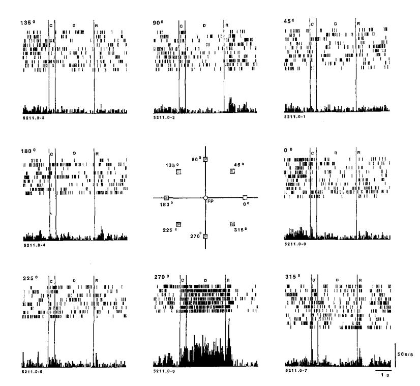
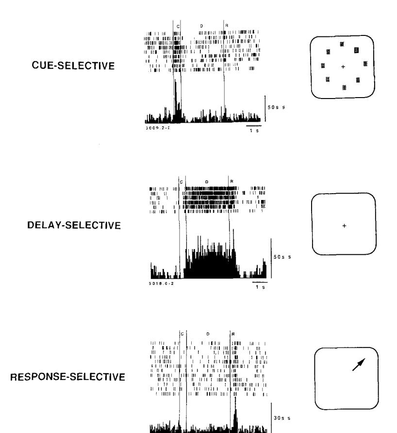
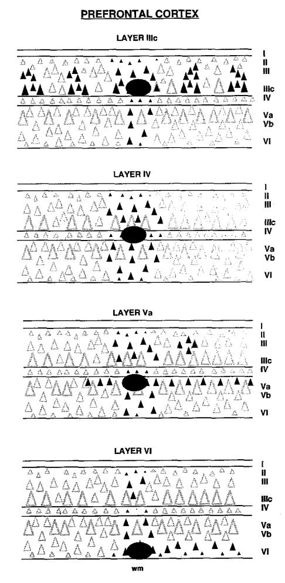
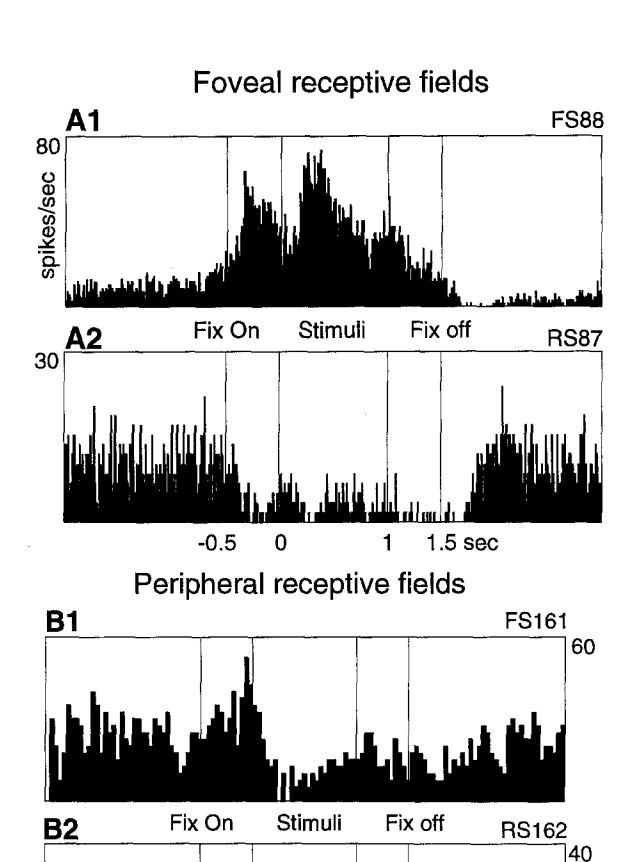
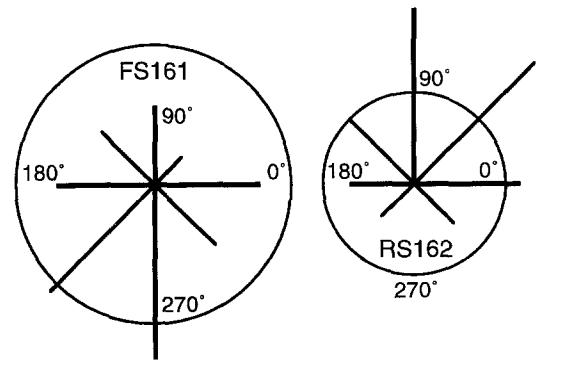
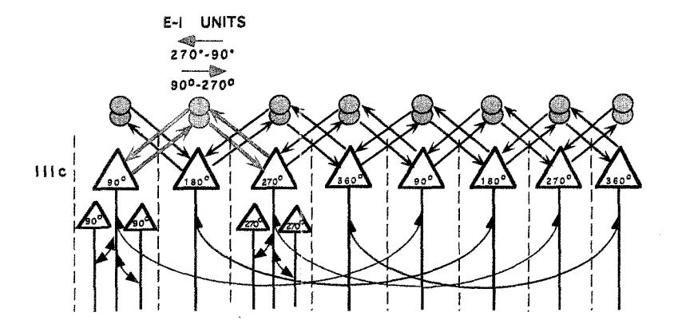
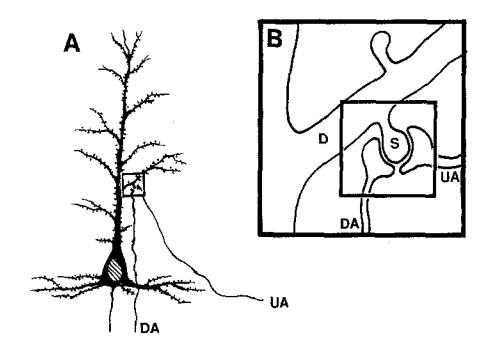
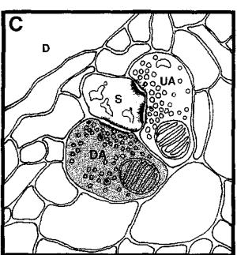

## **Cellular Basis of Working Memory**

### Review

#### P. S. Goldman-Rakic

Section of Neurobiology Yale University School of Medicine New Haven, Connecticut 06510

In the presence of normal sensory and motor capacity, intelligent behavior is widely acknowledged to develop from the interaction of short- and long-term memory. While the behavioral, cellular, and molecular underpinnings of the long-term memory process have long been associated with the hippocampal formation, and this structure has become a major model system for the study of memory (Bliss and Lomo, 1973; McNaughton and Nadel, 1990; Squire and Zola-Morgan, 1991), the neural substrates of specific short-term memory functions have more and more become identified with prefrontal cortical areas (Goldman-Rakic, 1987; Fuster, 1989). The special nature of working memory was first identified in studies of human cognition (e.g., Norman, 1970; Baddeley, 1986), and modern neurobiological methods have identified a specific population of neurons, patterns of their intrinsic and extrinsic circuitry, and signaling molecules that are engaged in this process in animals. In this article, I will first define key features of working memory and then describe its biological basis in primates.

### Distinctive Features of a Working Memory System

Working memory is the term applied to the type of memory that is active and relevant only for a short period of time, usually on the scale of seconds. A common example of working memory is keeping in mind a newly read phone number until it is dialed and then immediately forgotten. This process has been captured by the analogy to a mental sketch pad (Baddeley, 1986) and is clearly different from the permanent inscription on neuronal circuitry due to learning. The criterion-useful or relevant only transiently-distinguishes working memory from the processes that have been variously termed semantic (Tulving, 1972) or procedural (Squire and Cohen, 1984) memory, processes that can be considered associative in the traditional sense, i.e., information acquired by the repeated contiguity between stimuli and responses and/or consequences. If semantic and procedural memory are the processes by which stimuli and events acquire archival permanence, working memory is the process for the retrieval and proper utilization of this acquired knowledge. In this context, the contents of working memory are as much on the output side of long-term storage sites as they are an important source of input to those sites. Considerable evidence is now at hand to demonstrate that the brain obeys the distinction between working and other forms of memory, and that the prefrontal cortex has a preeminent role mainly in the former (Goldman-Rakic, 1987). However, memory-guided behavior obviously reflects the operation of a widely distributed system of brain structures and psychological functions, and understanding the prefrontal component is but one part of the grand design.

Working memory in its most elementary form, the ability to keep events "in mind" for short periods of time, has been studied in nonhuman primates by delayed-response paradigms. Whereas in humans, facts and events accessed from long-term memory stores can be instigated by verbal instructions, in experiments with animals, the information to be processed has to be provided by the experimenter. In the case of the classical delayedresponse task, the subject is shown the location of a food morsel that is then hidden from view by an opaque screen. Following a delay period of several seconds, the subject chooses the correct location out of two or more choices. Thus, the subject must remember where the bait had been placed a few seconds earlier, and the correct response is guided by a representation of the prior stimulus rather than the stimulus itself. Furthermore, as the location of the bait changes randomly from trial to trial, another critical feature of the delayed-response task is that the correct response on any given trial cannot be predicted from the preceding trial, and consequently, information must be updated on a trial-to-trial basis. The underlying principle of delayed response operates in many cognitive paradigms. including the match-to-sample or nonmatch-to-sample tasks commonly used to test hippocampal function in monkeys (Mishkin, 1982; Squire and Zola-Morgan, 1991). In these tasks, as in spatial delayed-response tasks, the animal must defer its response, update it on the basis of constantly changing stimulus items, and execute the correct response based on the memory of the most recent one. A similar working memory process may be the basis of a rat's performance in the Morris water maze (Morris, 1981) or radial arm maze (Olton, 1984), particularly when visual and/or olfactory cues are not available to guide the animal's responses.

## Cellular Correlate of Working Memory: Neurons with Memory Fields

A major advance in our understanding of prefrontal cortex came in the early seventies, when electrophysiological studies were performed for the first time in awake behaving monkeys trained on delayed-response tasks (Fuster and Alexander, 1971; Kubota and Niki, 1971). These studies revealed that neurons in the prefrontal cortex become activated during the delay period of a delayed-response trial, and suggested that the prefrontal neurons examined were the cellular correlate of a mnemonic event. The evidence for prefrontal neurons in mnemonic processing has been accumulating steadily over the past 25 years. Most recently, an oculomotor version of the classical delayedresponse paradigm has allowed more exacting analysis of prefrontal neurons under controlled conditions. Because this approach requires monkeys to fixate a central spot on a TV monitor and to maintain fixation during a brief (0.5 s) presentation of a stimulus and a subsequent 3-5 s delay period, anticipatory responses during the delay are disallowed, and correct performance is possible only if based on true recall (Funahashi et al., 1989). The oculomotor paradigm has additional features as well: it allows perimetric mapping of memory to targets throughout the visual field, precise control over the staging and timing of task events, and exact measurement of the response latency, trajectory, and amplitude of the response.

Using this paradigm, it has been possible to show that prefrontal neurons have "memory fields," defined as maximal firing of a neuron to the representation of a target in one or a few locations of the visual field, with the same neuron always coding the same location (Funahashi et al., 1989). The neuronal activity displayed in the lower part of Figure 1 is an example: its activity rises sharply at the end of the 270° stimulus (C), remains tonically active during the delay (D; in the absence of the stimulus or a response), and then ceases abruptly at the end of the 3-5 s delay, as the response (R) is initiated. Importantly, the activation occurs every time the animal has to remember the 270° location, but not when the animal is remembering targets presented at other locations (e.g., 135°, 180°, and 225°). In fact, this neuron's activity was depressed relative to baseline when the animal had to remember the 90° target. Thus, an additional intriguing discovery from these studies is that many prefrontal neurons have opponent memory fields; i.e., their rate of firing in the delay period is enhanced for one target location and inhibited during the delay on trials with target stimuli of opponent polarity. This functional distinction provides a valuable clue to how the neural circuitry subserving working memory might be organized, and I will return to this question below.

Very little work has been carried out on the temporal

parameters of working memory. Is it possible for neurons to remain activated for longer than a few seconds in the absence of a stimulus or a response? Fuster and Jervey (1981) and later Miyashita and Chang (1988) reported delay-period activation lasting more than 15 s in the temporal lobe of a monkey performing short-term memory tasks, and similarly, long delay-period activation has also been observed in prefrontal neurons (Kojima and Goldman-Rakic, 1982; Funahashi et al., 1989). Recent studies have provided evidence that the delay-period activity recorded in inferotemporal cells during memory tasks may reflect afferents from the prefrontal areas (Fuster et al., 1985; Miller and Desimone, 1994). Interestingly, the area in the inferotemporal cortex, where Fuster and Jervey found the highest concentration of neurons with prolonged delayperiod activity, corresponds precisely to the portion of the temporal lobe that has recently been shown to be connected with inferior prefrontal visual working memory centers (Wilson et al., 1993; Bates et al., 1994, Soc. Neurosci., abstract). In general, it is doubtful that single neurons in the prefrontal or inferotemporal cortex will remain active over the minutes, hours, or days for which many memories can be retained. These responses take place within a narrow range of delays (<20 s. at present), but further studies are needed to determine the limits and constraints on the working memory system. In my view, information that is retained by monkeys for more than tens of seconds enters intermediate or long-term memory stores and likely depends on mechanisms beyond working memory, perhaps involving long-term potentiation in the hippocampal formation. The neuronal activation observed in prefrontal neurons is best viewed as a reflection of information that is "on-line." Furthermore, as would be expected of a neuron

Figure 1. Repeated Recordings from One Neuron during the Many Trials over Which a Monkey Performed an Oculomotor Delayed-Response Working Memory Task

Over the course of a testing session, the monkey's ability to make correct memory-guided responses is tested approximately 10-12 times per target location. The neuron's response is collated over all the trials for a given target location (e.g., 135°, 45°, etc.) as a histogram of the average response per unit time for that location. The activity is also shown in relation to task events (C, cue; D, delay; R, response) on a trial-by-trial basis for each target location. In the example shown, the neuron's rate of discharge increases only when the target at 270° disappears, and is maintained for over 5000 ms until the response is made. This neuron codes the same location trial after trial; different neurons (data not shown) code different locations in working memory. Note that the activity of the same neuron is depressed during performance of saccades, when the animal remembers the opponent (90°) target location (from Funahashi et al., 1989).

engaged in dynamic processing, neuronal activity during memory intervals is labile, within limits, and can expand or contract as the delay period expands and contracts.

### The Neuronal Assembly in Prefrontal Cortex

Subsets of prefrontal neurons in the area of the principal sulcus are either activated phasically in the presence of a visual stimulus, activated tonically during the delay period over which the stimulus is kept on-line, or show phasic reactivation in relation to the initiation of a memory-guided response (Figure 2; for review, see Goldman-Rakic et al., 1990). Thus, prefrontal neuronal activities are not only differentially time locked to the running events in a delayedresponse trial, they are also temporally phased so as to bridge the time domain, as shown in Figure 2. The firing profiles of prefrontal neurons are related to the subfunctions of registration, memory, and motor control, respectively. However, each subfunction has yet to be associated with a particular class of cortical cell in a particular layer of the cortex. Many, if not most, prefrontal neurons respond in more than one phase of the trial (i.e., during the cue, delay, and/or response periods), and their composite profile may be due to inputs from neurons whose activation is simpler and related to only one phase. We have hypothesized that the neurons carrying out these component processes are organized within the laminar hierarchy of a cortical column (or hypercolumn) made up of neurons dedicated to a particular memorandum, in analogy with the columnar organization of the primary visual cortex (Goldman-Rakic et al., 1990). As illustrated in Figure 3, when small injections of the retrograde tracer, cholera toxin-B subunit, are confined to specific layers of prefrontal cortex, it is possible to demonstrate the vertical interlaminar connections within cortical columns that are the presumed circuit basis of the diverse functional subtypes recorded from prefrontal cortex (Kritzer and Goldman-Rakic, 1995). Since the memory relatedness of prefrontal neurons can be addressed only in the awake, behaving primate, one possible way to address these architectural issues would be to record from multiple units in both vertical and tangential penetrations in prefrontal cortex of trained monkeys. Multiunit recording methods are being developed in a number of laboratories and should be available in the near future to allow more precise mapping of functionally related neurons within a cortical column.

### Mechanisms for Constructing Memory Fields: Horizontal Interactions and Vertical Feed-Forward Inhibition

From Cajal on, it has been appreciated that several types of interneurons populate the cerebral cortex and interact with pyramidal cells. We now know that the majority of

Figure 2. Prefrontal Neurons in the Region of the Principal Sulcus Exhibit a Variety of Patterns of Activation during the Oculomotor

Some neurons respond phasically to the occurrence of a target (top), some respond in relation to the delay (middle), and some are activated in relation to the occurrence of a response (bottom). In all cases, neuronal activity is time locked to the events of the task and is spatially tuned. The class of neurons with delay-period activity is the focus of the present essay (based on Funahashi et al., 1989, 1990, 1991).

Figure 3. Layer-Specific Patterns of Intrinsic Connections in Prefrontal Cortex (Walker's areas 46 and 9) as Retrogradely Labeled with Cholera Toxin-B Subunit

In this summary diagram, labeled neurons in layer III and, to a lesser extent, layer V form spaced clusters of pyramidal cells with presumed similar "best directions" (from Kritzer and Goldman-Rakic, 1995).

the interneurons utilize the inhibitory neurotransmitter, y-aminobutyric acid (GABA), whereas pyramidals cells use the excitatory amino acids as their neurotransmitters. Recent evidence indicates that pyramidal-nonpyramidal interactions are critical to the formation of memory fields in prefrontal cortex, just as they are in establishing the orientation specificity of primary visual neurons (for review, see Sillito and Murphy, 1986). Wilson et al. in this laboratory (1994) have succeeded in using waveform analvsis to classify functionally characterized neurons as interneurons (thin spiking neurons) or pyramidal neurons (broader and higher amplitude spikes) in monkeys as they performed the oculomotor delayed-response task. This study showed that interneurons, like pyramidal neurons, express directional preferences (e.g., neuron FS161 in Figure 4B3); and that the patterns of activity expressed by closely adjacent pyramidal and nonpyramidal neurons are often inverse, such that, as a nonpyramidal neuron increases its rate of discharge, a nearby pyramidal neuron decreases its rate (compare Figures 4A1 and 4A2; 4B1

# **B3** Vector plot of responses to stimuli in 8 locations

1.5 sec

-0.5

0

Figure 4. Inverted Responses of Fast-Spiking and Regular-Spiking Pairs of Neurons

Fast-spiking (FS) and regular-spiking (RS) neurons were recorded either 50  $\mu m$  (A1 and A2) or 200  $\mu m$  apart (B1 and B2). FS162 responded maximally to a stimulus presented 13° above the fixation point, whereas RS161 responded maximally to stimuli presented at 9° to the right or 9° above the fixation point. Increases in RS cell firing correspond to graded decreases in FS cell firing, and vice versa. In the vector plot (B3), each vector represents response magnitude plotted relative to a stimulus location for the FS162/RS161 pair. Firing rates are normalized so that the maximum vector length is 100%. Circles represent spontaneous firing rates. Bin width for (B1) and (B2), 40 ms; 10 trials per histogram (from Wilson et al., 1994).

and 4B2) (Wilson et al., 1994). These findings provide suggestive evidence that feed-forward inhibition may play a role in the construction of a memory field in prefrontal neurons.

Recent studies of prefrontal cortex have also begun to elucidate the horizontal connections between groups of pyramidal cells that contribute to local circuits (Leavitt et al., 1993; Kritzer and Goldman-Rakic, 1995). Leavitt et al. (1993) made small injections of biocytin into specific layers of the principal sulcus and traced orthogradely transported label. This study revealed narrow (220-400 µm) stripe-like bands of terminal label over 7-8 mm of cortex arising from neurons in layers 2, 3, and 5 at the center of the injection site. Complimentary results have been obtained with the retrograde tracer, cholera toxin-B subunit. For example, as shown in Figure 3, the injections confined to layer IIIc of prefrontal cortex labeled clusters of neurons several millimeters distant from the injection site (Kritzer and Goldman-Rakic, 1995), reminiscent of iso-orientation columns in the primary visual cortex (Gilbert, 1993) as well as anatomical columns formed by long-tract corticocortical connections (Goldman and Nauta, 1977). Figure 5 illustrates a hypothetical modular architecture for spatial working memory in which columns of pyramidal neurons with like "best directions" (e.g., 90°, 180°, 270°, etc.) are interconnected in a manner analogous to the orientation column system of primary visual cortex (Gilbert, 1993). The figure also incorporates a basket cell interconnecting two pyramidal cells with opposite best directions-a proposed mechanism of reciprocal feed-forward inhibition among cohorts of pyramidal neurons to accommodate the physiology of spatial working memory. According to this scheme, pyramidal cells with opposite best directions communicate via inhibitory interneurons such that a pyramidal neuron with a 90° memory field exhibits enhanced firing during the delay of trials in which the monkey is recalling a 90° target, but is inhibited on trials when the memorandum is at the 270° location. A reciprocal pathway allows for a pyramidal neuron with a 270° memory field to inhibit one with a 90° memory field. The proposed arrangement of excitatory-inhibitory units, which could explain the opponent memory fields of neurons in and around the principal sulcus (an example of which is shown in Figure 1), remains to be tested. However, it is already clear from electron microscopic evidence that pyramidal cells innervate interneurons in the prefrontal cortex (Williams et al., 1992) and that basket cells innervate pyramidal cells (Somogyi et al., 1983) in the manner illustrated.

# Modulation of the Canonical Excitatory-Inhibitory Unit

The prefrontal cortex in primates is a major target of the brainstem dopamine afferents (Brown et al., 1979; Lewis et al., 1988; Williams and Goldman-Rakic, 1993), Working memory deficits are present in Parkinson patients (Gotham et al., 1988; Levin et al., 1989) and have been shown to result from experimental depletion of dopamine in prefrontal areas in rhesus monkeys (Brozoski et al., 1979). Dopamine afferents in the prefrontal (as well as the cingulate, premotor, and motor) cortices form symmetric synapses on the spines of pyramidal neurons, and the same spines are also often contacted by an asymmetric bouton characteristic of axons containing excitatory amino acids (Figure 6; Goldman-Rakic et al., 1989). As pyramidal cells receive the major sensory inputs arriving at the cortex via spine synapses, this synaptic "triad" complex allows direct dopamine modulation of local spinal responses to excitatory input, thereby regulating a pyramidal neuron's integration of its myriad inputs and ultimately affecting its output via axonal projections to various cortical and subcortical structures.

Some insight into the receptors that may influence pyramidal cell function is provided by considerable evidence that members of the D1 family of receptors are particularly concentrated in prefrontal cortex (Lidow et al., 1991). Most recently, electron microscopy in combination with immunohistochemistry has revealed that the spines of pyramidal neurons are preferential sites of D1 receptors (Smiley et al., 1994). Thus, these D1 receptors are well positioned to influence sensory information processing at the level of the spine. Studies with intracerebral injection of SCH39166, a selective D1 receptor antagonist, have now provided evidence that blocking this particular receptor enhances the activation (and/or depression) of some pre-

Figure 5. Hypothetical Model of Working Memory Modules in Prefrontal Cortex

Model of working memory modules consisting of clusters of tuned pyramidal neurons (red and black triangles) arrayed by target location and directly interconnected with each other by their local excitatory axon collaterals (long, thin, curved red and black arrows). Clusters of pyramidal neurons with like best directions are interconnected in a manner similar to iso-orientation columns in visual cortex. Two inhibitory interneurons (gray circles; presumed basket cells in the diagram) provide the reciprocal interconnections (blue arrows) between pyramidal cells with opposite best directions that could explain the opponent memory fields observed by Funahashi et al. (1989). For simplic-

ity, only the 90°-270° and 270°-90° ensemble is illustrated. For now, the organization of the pyramidal cells with particular memory fields is hypothetical, as is the reciprocity of the excitatory-inhibitory units. Further analysis of these local circuits is essential for analyzing the neural substrates of working memory.

Figure 6. Diagram of Synaptic Arrangements Involving the Dopamine Input to the Cortex

- (A) Afferents labeled with a dopamine (DA)—specific antibody terminate on the spine of a pyramidal cell in the prefrontal cortex, together with an unidentified axon (UA). (B) Enlargement of axospinous synapses illustrated in (A) showing apposition of the DA input and a presumed excitatory input (UA) that makes an asymmetrical synapse on the same dendritic (D) spine
- (C) Diagram of ultrastructural features of the axospinous synapses illustrated in (B); the dopamine terminal (darkened profile representing DA immunoreactivity) forms a symmetrical synapse; the unidentified profile forms an asymmetrical synapse with the postsynaptic membrane (diagram modified from data presented in Goldman-Rakic et al., 1989).

frontal neurons in the delay period of the delayed-response task without altering the general excitability of the cell (Williams and Goldman-Rakic, 1995). Further analysis of this type of synaptic complex in terms of physiological/pharmacological interactions between inhibitory and excitatory receptors may bring insight into the modulation of cognitive function by dopamine and other modulatory neurotransmitters. Studies on the memory-enhancing potential of low doses of D1 receptor antagonists administered systemically are currently being studied in our laboratory.

### **Clinical Significance**

The significance of observations on the cortical dopamine innervation for cognition is that they may suggest a variety of ways in which dopamine transmission in the cortex may alter cognitive function. It may be possible to predict conditions of optimal functioning depending on the availability of dopamine in the cortical synaptic cleft and on the availability, affinity, and concentration of specific receptor sites in the cortex. Recent findings on the high density of D1 receptors in prefrontal cortex draw attention to the potential functional significance of these receptors for the cognitive deficits in disorders like schizophrenia. Since multiple subtypes of the D1 receptor family of receptors have now been cloned, future work will have to define the specific subtypes most critical for the cognitive phenomena addressed here. Evidence that dopamine and putative glutamate profiles in prefrontal cortex are apposed to the membrane surface of the same dendritic spine (Goldman-Rakic et al., 1989) gives rise to hypotheses concerning the interactions of glutamate and dopamine receptors in higher cortical processes. Infusion of AMPA or kainate into the prefrontal cortex of both rats (Jedema and Moghaddem, 1994, Soc. Neurosci., abstract) and monkeys (Moghaddem, Youngren, and Goldman-Rakic, unpublished data) increases dopamine release in this cortex, and dopamine, in turn, inhibits pyramidal cell firing (e.g., Ferron et al., 1984; Sesack and Bunney, 1989). In human cortical slices, dopamine enhances N-methyl-D-aspartate-induced spiking in cortical neurons, and the effect can be blocked by SCH23390, a nonselective D1 antagonist (Cepeda et al., 1992).

D1 receptors, along with other monoaminergic receptors, have been explored as possible targets of atypical neuroleptics. We might expect changes in these and/or related receptors to be present in the cortex of schizophrenics and/or as a function of neuroleptic treatments. These predictions have been indirectly supported by studies of receptor regulation after chronic exposure to the atypical neuroleptic, clozapine, in experimental animals (Lidow and Goldman-Rakic, 1994). The cardinal cognitive, emotional, and motivational syndromes consistently associated with schizophrenia bear strong resemblance to the thought disorders, attentional problems, inappropriate or flattened affect, and lack of initiative, plans, and goals that characterize patients with physical prefrontal damage (Goldman-Rakic, 1991). Most recently, schizophrenics have been tested on the spatial oculomotor working memory task that we have used to study working memory in rhesus monkeys (Park and Holzman, 1992); conversely, rhesus monkeys with prefrontal lesions exhibit the same type of predictive eye tracking disorder observed in nearly 80% of schizophrenic patients (MacAvoy et al., 1991). If the prefrontal cortex is the part of the cortex most responsible for working memory function and if this process is dysfunctional in schizophrenia, as we think, then probing how the memory cells of the prefrontal cortex are influenced by dopamine, glutamate, and other neurotransmitters is essential for understanding dysfunction in schizophrenia. The effects of these neuromodulators have received less attention in the neocortex than in the basal ganglia, and now that specific receptors have been implicated in the working memory functions mediated by the prefrontal cortex, the study of their role in cognitive function would seem to be a promising line of study.

### Multiple Working Memory Domains and Distributed Neuronal Networks

Spatial and feature working memory mechanisms of prefrontal cortex can be dissociated at the cellular and areal level (Wilson et al., 1993). It has recently been shown that the prefrontal neurons that code visuospatial memoranda are located in a separate area than those that code simple, complex, or categorical features of stimuli. Moreover, individual neurons that code the location of targets rarely, if ever, code object qualities, or vice versa (Wilson et al., 1993). Furthermore, physiologically informed or physiologically guided injections of pathway tracers in the spatial and object memory centers have shown them to be connected to the appropriate visual centers via relays in the parietal (Cavada and Goldman-Flakic, 1989) and temporal (Bates et al., 1994, Soc. Neurosci., abstract) lobes, respectively.

Working memory is considered a major component of the machinery of executive function (Shallice, 1982), and it is not surprising that positron emission tomography (PET) and functional magnetic resonance imaging (MRI) studies in human subjects have been focused on this function. Recent studies in healthy human subjects, for example, have shown that the middle frontal gyrus, the dorsolateral region corresponding to the areas from which recordings have been made in macaque monkeys, is activated when human subjects carry out analogous spatial working memory tasks (McCarthy et al., 1994; Jonides et al., 1993). Moreover, other regions of the dorsolateral prefrontal cortex are activated for verbal and other nonspatial working memory functions (e.g., Frith et al., 1991; Petrides et al., 1993a, 1993b). Finally, as might be expected if working memory were essential to executive function, working memory deficits and correlated prefrontal dysfunction have been demonstrated in schizophrenics (e.g., Weinberger et al., 1986; Fukushima et al., 1988; Park and Holzman, 1992), in Parkinson patients (e.g., Gotham et al., 1988; Levin et al., 1989), in age-related memory decline (e.g., Salthouse, 1991), and in many other neuropathological conditions in which impairments of higher cortical processing are expressed.

It is of interest that in the monkey the hippocampal formation is activated along with prefrontal areas during performance of working memory tasks, as are the posterior parietal regions that transmit visuospatial information to the dorsolateral regions of the prefrontal cortex (Friedman and Goldman-Rakic, 1994). Recent studies employing multiple-unit recording techniques in the CA1 field of the rodent hippocampus have likewise demonstrated that particular patterns of neuronal activity are associated with particular responses of the animal in a spatial delayedresponse task (Hampson et al., 1993). Studies of delayed recall in humans also activate both prefrontal cortex and the hippocampal formation (e.g., Squire et al., 1992), All of these results speak to a reentrant network organization enabling the prefrontal cortex and hippocampal formation to operate with other cortical and subcortical structures as an integrated unit (for further discussion, see Goldman-Rakic and Friedman, 1991).

### **Concluding Remarks**

In a recent review of neural mechanisms of form and motion processing in the visual system in this journal, Van Essen and Gallant pointed out that "the organization of the primate visual system is far more complex than most neuroscientists appreciated as recently as a decade ago" (Van Essen and Gallant, 1994). The present review hopefully will convey that the prefrontal areas, though no less complex, are not necessarily more complex. Benefiting from the seminal work in the visual system that has preceded it, the functions of the association cortices have taken their place with the accessible topics in neurobiology. Indeed, the work reviewed here demonstrates that the cerebral cortex is a unified structure with the mnemonic processes of its frontal lobe grafted in part upon the architecture of its sensory systems.

The significance of working memory for higher cortical function is not necessarily self-evident. Perhaps even the quality of its transient nature misleads us into thinking it is somehow less important than the more permanent archival nature of long-term memory. However, the brain's working memory function, i.e., the ability to bring to mind events in the absence of direct stimulation, may be its inherently most flexible mechanism and its evolutionarily most significant achievement. At the most elementary level, our basic conceptual ability to appreciate that an object exists when out of view depends on the capacity to keep events in mind beyond the direct experience of those events. For some organisms, including most humans under certain conditions, "out of sight" is equivalent to "out of mind." However, working memory is generally available to provide the temporal and spatial continuity between our past experience and present actions. Working memory has been invoked in all forms of cognitive and linguistic processing and is fundamental to both the comprehension and construction of sentences. It is essential to the operations of mental arithmetic, to playing chess, to playing the piano, particularly without music, to delivering speech extemporaneously, and finally, to fantasizing and planning ahead.

February 14, 1995

#### References

Baddeley, A. (1986). Working Memory (New York: Oxford University Press).

Bliss, T. V. P., and Lomo, T. (1973). Long-lasting potentiation of synaptic transmission in the dentate area of the anesthetized rabbit following stimulation of the perforant path. J. Physiol. 232, 331–356.

Brown, R. M., Crane, A., and Goldman, P. S. (1979). Regional distribution of monoamines in the cerebral cortex and subcortical structures of the rhesus monkey: concentrations and *in vivo* synthesis rates. Brain Res. *168*, 133–150.

Brozoski, T., Brown, R. M., Rosvold, H. E., and Goldman, P. S. (1979). Cognitive deficit caused by regional depletion of dopamine in prefrontal cortex of rhesus monkey. Science 205, 929–932.

Cavada, C., and Goldman-Rakic, P. S. (1989). Posterior parietal cortex in rhesus monkey. II. Evidence for segretated corticocortical networks linking sensory and limbic areas with the frontal lobe. J. Comp. Neurol. 287, 422–445.

Cepeda, C., Radisavljevic, Z., Peacock, W., Levine, M. S., and Buchwald, N. A. (1992). Differential modulation by dopamine of responses evoked by excitatory amino acids in human cortex. Synapse 11, 330–341.

Ferron, A., Thierry, A. M., Le Douarin, C., and Glowinski, J. (1984). Inhibitory influence of the mesocortical dopaminergic system on spontaneous activity or excitatory response induced from the thalamic mediodorsal nucleus in the rat medial prefrontal cortex. Brain Res. 302, 257–265.

Friedman, H. R., and Goldman-Rakic, P. S. (1994). Coactivation of prefrontal cortex and inferior parietal cortex in working memory tasks revealed by 2DG functional mapping in the rhesus monkey. J. Neurosci. 14, 2775–2788.

Frith, C. D., Friston, K., Liddle, P. F., and Frackowiak, R. S. J. (1991). Willed action and the prefrontal cortex in man. Proc. R. Soc. Lond. (B) 244. 241–246.

Fukushima, J., Fukushima, K., Chiba, T., Tanaka, S., Yamashita, I., and Kato, M. (1988). Disturbances of voluntary control of saccadic eye movements in schizophrenic patients. Biol. Psychiat. 23, 670–677.

Funahashi, S., Bruce, C. J., and Goldman-Rakic, P. S. (1989). Mnemonic coding of visual space in the primate dorsolateral prefrontal cortex. J. Neurophysiol. *61*, 331–349.

Funahashi, S., Bruce, C. J., and Goldman-Rakic, P. S. (1990). Visuo-spatial coding in primate prefrontal neurons revealed by oculomotor paradigms. J. Neurophysiol. 63, 814–831.

Funahashi, S., Bruce, C. J., and Goldman-Rakic, P. S. (1991). Neuronal activity related to saccadic eye movements in the monkey's dorsolateral prefrontal cortex. J. Neurophysiol. *65*, 1464–1483.

Fuster, J. M. (1989). The Prefrontal Cortex, 2nd ed. (New York: Raven Press), p. 255.

Fuster, J. M., and Alexander, G. E. (1971). Neuron activity related to short-term memory. Science 173, 652–654.

Fuster, J. M., and Jervey, J. P. (1981). Inferotemporal neurons distinguish and retain behaviorally relevant features of visual stimuli. Science 212, 952–955.

Fuster, J. M., Bauer, R. H., and Jervey, J. P. (1985). Functional interactions between inferotemporal and prefrontal cortex in a cognitive task. Brain Res. 330, 299–307.

Gilbert, C. D. (1993). Circuitry, architecture and functional diversity of visual cortex. Cereb. Cortex 3, 373–386.

Goldman, P. S., and Nauta, W. J. H. (1977). Columnar distribution of cortico-cortical fibers in the frontal association, limbic, and motor cortex of the developing rhesus monkey. Brain Res. 122, 393–413.

Goldman-Rakic, P. S. (1987). Circuitry of the prefrontal cortex and the regulation of behavior by representational knowledge. In Handbook of Physiology, F. Plum and V. Mountcastle, eds. (Bethesda, Maryland: American Physiological Society), pp. 373–417.

Goldman-Rakic, P. S. (1991). Prefrontal cortical dysfunction in schizophrenia: the relevance of working memory. In Psychopathology and the Brain, B. J. Carroll and J. E. Barrett, eds. (New York: Raven Press), pp. 1–23.

Goldman-Rakic, P. S., and Friedman, H. R. (1991). The circuitry of working memory revealed by anatomy and metabolic imaging. In Frontal Lobe Function and Dysfunction, H. S. Levin, H. M. Eisenberg, and A. L. Benton, eds. (New York: Oxford University Press), pp. 72–91.

Goldman-Rakic, P. S., Leranth, C., Williams, S. M., Mons, N., and Geffard, M. (1989). Dopamine synaptic complex with pyramidal neurons in primate cerebral cortex. Proc. Natl. Acad. Sci. USA 86, 9015–

Goldman-Rakic, P. S., Funahashi, S., and Bruce, C. J. (1990). Neocortical memory circuits. Quart. J. Quant. Biol. *55*, 1025–1038.

Gotham, A. M., Brown, R. G., and Marsden, C. P. (1988). "Frontal" cognitive function in patients with Parkinson's disease "on" and "off" levodopa. Brain 111, 299–321.

Hampson, R. E., Heyser, C. J., and Deadwyler, S. A. (1993). Hippocampal cell firing of delayed-match-to-sample performace in the rat. Behav. Neurosci. 107, 715–739.

Jonides, J., Smith, E. E., Koeppe R. A., Awh, E., Minoshima, S., and Mintun, M. A. (1993). Spatial working memory in humans as revealed by PET. Nature *363*, 623–625.

Kojima, S., and Goldman-Rakic, P. S. (1982). Delay-related activity of prefrontal cortical neurons in rhesus monkeys performing delayed response. Brain Res. 248, 43–49.

Kritzer, M. F., and Goldman-Rakic, P. S. (1995). Intrinsic circuit organization of the major layers and sublayers of the dorsolateral prefrontal cortex in the rhesus monkey. J. Comp. Neurol., in press.

Kubota, K., and Niki, H. (1971). Prefrontal cortical unit activity and

delayed alternation performance in monkeys. J. Neurophysiol. 34, 337–347.

Leavitt, J. B., Lewis, D. A., Yoshioka, T., and Lund, J. S. (1993). Topography of pyramidal neuron intrinsic connections in macaque monkey prefrontal cortex (areas 9 and 46). J. Comp. Neurol. 338, 360–376.

Levin, B. E., Labre, M. M., and Weiner, W. J. (1989). Cognitive impairments associated with early Parkinson's disease. Neurology 39, 557–561

Lewis, D. A., Foote, S. L., Goldstein, M., and Morrison, J. H. (1988). The dopamine innervation of monkey prefrontal cortex: a tyrosine hydroxylase immunohistochemical study. Brain Res. 449, 225–243.

Lidow, M. S., and Goldman-Rakic, P. S. (1994). A common action of clozapine, haloperidol, and remoxipride on  $D_1$ - and  $D_2$ -dopaminergic receptors in the primate cerebral cortex. Proc. Natl. Acad. Sci. USA 91, 4353–4356.

Lidow, M. S., Goldman-Rakic, P. S., Gallager, D. W., and Rakic, P. (1991). Distribution of dopaminergic receptors in the primate cerebral cortex: quantitative audioradiographic analysis using [3H]raclopride, [3H]spiperone, and [3H]SCH23390. Neuroscience 40, 657–671.

MacAvoy, M. G., Gottlieb, J. P., and Bruce, C. J. (1991). Smooth pursuit eye movement representation in the primate frontal eye field. Cereb. Cortex 1, 95–102.

McCarthy, G., Blamire, A. M., Puce, A., Nobre, A. C., Bloch, G., Hyder, F., Goldman-Rakic, P., and Shulman, R. G. (1994). Functional magnetic resonance imaging of human prefrontal cortex activation during a spatial working memory task. Proc. Natl. Acad. Sci. USA 91, 8690–8694.

McNaughton, B. L., and Nadel, L. (1990). Hebb-Marr networks and the neurobiological representation of action in space. In Neuroscience and Connectionist Theory, M. A. Gluck and D. E. Rumelhart, eds. (Hillsdale, New Jersey: Erlbaum), pp. 1–64.

Miller, E. K., and Desimone, R. (1994). Parallel neuronal mechanisms for short-term memory. Science 263, 520–522.

Mishkin, M. (1982). A memory system in the monkey. Phil. Trans. R. Soc. Lond. (B) 298, 85.

Miyashita, Y., and Chang, H. S. (1988). Neuronal correlate of pictorial short-term memory in the primate temporal cortex. Nature *331*, 68–70.

Morris, R. G. M. (1981). Spatial localization does not require the presence of local cues. Learning Motivat. 12, 239–261.

Norman, D. A. (1970). Models of Human Memory (New York: Academic Press).

Olton, D. S. (1984). Comparative analysis of episodic memory. Behav. Brain Sci. 7, 250–251.

Park, S., and Holzman, P. S. (1992). Schizophrenics show spatial working memory deficits. Arch. Gen. Psychiat. 49, 975-982.

Petrides, M., Alivisatos, B., Evans, A. C., and Meyer, E. (1993a). Dissociation of human mid-dorsolateral from posterior dorsolateral frontal cortex in memory processing. Proc. Natl. Acad. Sci. USA 90, 873–877.

Petrides, M., Alivisatos, B., Meyer, E., and Evans, A. C. (1993b). Functional activation of the human frontal cortex during the performance of verbal working memory tasks. Proc. Natl. Acad. Sci. USA 90, 878–892

Salthouse, T. A. (1991). Mediation of adult age differences in cognition by reductions in working memory and speed of processing. Psychol. Sci. 2, 170–183.

Sesack, S. R., and Bunney, B. S. (1989). Pharmacological characterization of the receptor mediating electrophysiological effects of dopamine in the rat medial prefrontal cortex: a microiontophoretic study. J. Pharmacol. Exp. Therap. 248, 1323–1333.

Shallice, T. (1982). Specific impairments in planning. Phil. Trans. R. Soc. Lond. (B) 298, 199–209.

Sillito, A. M., and Murphy, P. C. (1986). GABAergic processes in the central visual system. In Neurotransmitters and Cortical Function, M. Avioli, T. A. Reader, R. W. Dykes, and P. Gloor, eds. (New York: Plenum Press), pp. 167–186.

Smiley, J. F., Levey, A. I., Ciliax, B. J., and Goldman-Rakic, P. S.

(1994).  $D_1$  dopamine receptor immunoreactivity in human and monkey cerebral cortex: predominant and extrasynaptic localization in dendritic spines. Proc. Natl. Acad. Sci. USA 91, 5720-5724.

Somogyi, P., Kisvardy, Z. F., Martin, K. A. C., and Whitteridge, D. (1983). Synaptic connections of morphologically identified and physiologically characterized basket cells in the striate cortex of the cat. Neuroscience 10, 261–294.

Squire, L., and Cohen, N. J. (1984). Human memory and amnesia. In Neurobiology of Memory and Learning, G. Lynch, J. L. McGaugh, and N. M. Weinberger, eds. (New York: Guilford Press), pp. 3–64.

Squire, L. R., and Zola-Morgan, S. (1991). The medial temporal lobe memory system. Science 253, 1380–1386.

Squire, L. R., Ojemann, J. G., Meizin, F. M., Petersen, S. E., Videen, T. O., and Raichle, M. E. (1992). Activation of the hippocampal formation in normal humans: a functional anatomical study of memory. Proc. Natl. Acad. Sci. USA 89, 1837–1841.

Tulving, E. (1972). Episodic and semantic memory. In Organization of Memory, E. Tulving and W. Donaldson, eds. (New York: Academic Press), pp. 381–403.

Van Essen, D. C., and Gallant, J. L. (1994). Neural mechanisms of form and motion processing in the primate visual system. Neuron 13, 1–10.

Weinberger, D. R., Berman, K. F., and Zec, R. F. (1986). Physiological dysfunction of dorsolateral prefrontal cortex in schizophrenia. I. Regional cerebral blood flow (rCBF) evidence. Arch. Gen. Psychiat. 43, 114–125

Williams, G. V., and Goldman-Rakic, P. S. (1995). Iontophoretic application of D1 receptor antagonists on prefrontal pyramidal neurons enhances neuronal memory fields associated with delayed response performance. Proc. Natl. Acad. Sci. USA, in press.

Williams, S. M., and Goldman-Rakic, P. S. (1993). Characterization of the dopaminergic innervation of the primate frontal cortex using a dopamine-specific antibody. Cereb. Cortex 3, 199–222.

Williams, S. M., Goldman-Rakic, P. S., and Leranth, C. (1992). The synaptology of parvalbumin-immunoreactive neurons in the primate prefrontal cortex. J. Comp. Neurol. *320*, 353–369.

Wilson, F. A. W., Ó Scalaidhe, S. P., and Goldman-Rakic, P. S. (1993). Dissociation of object and spatial processing domains in primate prefrontal cortex. Science *260*, 1955–1958.

Wilson, F. A. W., Ó Scalaidhe, S. P., and Goldman-Rakic, P. S. (1994). Functional synergism between putative  $\gamma$ -aminobutyrate-containing neurons and pyramidal neurons in prefrontal cortex. Proc. Natl. Acad. Sci. USA *91*, 4009–4013.