30% Discount

Net price, Volumes 1 through 54

79.65

Information about the Psychological Review; from 1894 to 1908 many numbers are out of print, as shown in the table. After 1908, only ten numbers are out of print. After 1926, no numbers are out of print. The journal has been published with six numbers a year throughout its history.

Information about prices: the Psychological Review has the uniform price of \$5.50 per volume and \$1.00 per issue. For incomplete volumes, the price is \$1.00 for each available number. For foreign postage, \$.25 per volume should be added. The American Psychological Association gives the following discounts on orders for any one journal:

10% on orders of \$ 50.00 and over 20% on orders of \$100.00 and over 30% on orders of \$150.00 and over

Current subscriptions and orders for back numbers should be addressed to:

BIE Mannahunatha Avanua W W

AMERICAN PSYCHOLOGICAL ASSOCIATION, INC.

Vol. 55, No. 4

NEUROSCIENCE. UVA. PHYSIOLOGY, AND APPLIED VNIMAL BEHAVIOR, PSYCHO-L. T. THOMPSON III

JULY, 1948

# THE PSYCHOLOGICAL REVIEW

### COGNITIVE MAPS IN RATS AND MEN 1

BY EDWARD C. TOLMAN

University of California

I shall devote the body of this paper to a description of experiments with rats. But I shall also attempt in a few words at the close to indicate the significance of these findings on rats for the clinical behavior of men. Most of the rat investigations, which I shall report, were carried out in the Berkeley laboratory. But I shall also include, occasionally, accounts of the behavior of non-Berkeley rats who obviously have misspent their lives in out-of-State laboratories. Furthermore, in reporting our Berkeley experiments I shall have to omit a very great many. The ones I shall talk about were carried out by graduate students (or underpaid research assistants) who, supposedly, got some of their ideas from me. And a few, though a very few, were even carried out by me myself.

Let me begin by presenting diagrams for a couple of typical mazes, an alley maze and an elevated maze. In the typical experiment a hungry rat is put at the entrance of the maze (alley or elevated), and wanders about through the various true path segments and blind alleys until he finally comes to

1 34th Annual Faculty Research Lecture, delivered at the University of California, Berkeley, March 17, 1947. Presented also on March 26, 1947 as one in a series of lectures in Dynamic Psychology sponsored by the division of psychology of Western Reserve University, Cleveland, Ohio.

the food box and eats. This is repeated (again in the typical experiment) one trial every 24 hours and the animal tends to make fewer and fewer errors (that is, blind-alley entrances) and to take less and less time between start and goal-box until finally he is entering no blinds at all and running in a very few seconds from start to goal. The results are usually presented in the form of average curves of blind-entrances, or of seconds from start to finish, for groups of rats.

All students agree as to the facts. They disagree, however, on theory and explanation.

(1) First, there is a school of animal psychologists which believes that the maze behavior of rats is a matter of mere simple stimulus-response connections. Learning, according to them, consists in the strengthening of some of these connections and in the weakening of others. According to this 'stimulusresponse' school the rat in progressing down the maze is helplessly responding to a succession of external stimulisights, sounds, smells, pressures, etc. impinging upon his external sense organs-plus internal stimuli coming from the viscera and from the skeletal muscles. These external and internal stimuli call out the walkings, runnings, turnings, retracings, smellings, rearings, and the like which appear. The rat's central

100 - 708

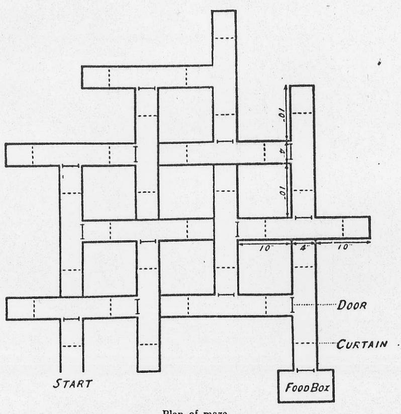

Plan of maze 14-Unit T-Alley Maze

Fig. 1

(From M. H. Elliott, The effect of change of reward on the maze performance of rats. Univ. Calif. Publ. Psychol., 1928, 4, p. 20.)

nervous system, according to this view, may be likened to a complicated telephone switchboard. There are the incoming calls from sense-organs and there are the outgoing messages to muscles. Before the learning of a specific maze, the connecting switches (synapses according to the physiologist) are closed in one set of ways and produce the primarily exploratory responses which appear in the early trials. Learning, according to this view, consists in the respective strengthening and weakening of various of these connections; those connections which result in the animal's going down the true path become relatively more open to the passage of nervous impulses, whereas those which lead him into the blinds become relatively less open.

It must be noted in addition, however, that this stimulus-response school divides further into two subgroups.

(a) There is a subgroup which holds that the mere mechanics involved in the running of a maze is such that the crucial stimuli from the maze get presented simultaneously with the correct responses more frequently than they do with any of the incorrect responses. Hence, just on a basis of this greater frequency, the neural connections between the crucial stimuli and the correct responses will tend, it is said, to

get strengthened at the expense of the incorrect connections.

(b) There is a second subgroup in this stimulus-response school which holds that the reason the appropriate connections get strengthened relatively to the inappropriate ones is, rather, the fact that the responses resulting from the correct connections are followed more closely in time by need-reductions. Thus a hungry rat in a maze tends to get to food and have his hunger reduced *sooner* as a result of the true path responses than as a result of the blind alley responses. And such immediately

following need-reductions or, to use another term, such 'positive reinforcements' tend somehow, it is said, to strengthen the connections which have most closely preceded them. Thus it is as if—although this is certainly not the way this subgroup would themselves state it—the satisfaction-receiving part of the rat telephoned back to Central and said to the girl: "Hold that connection; it was good; and see to it that you blankety-blank well use it again the next time these same stimuli come in." These theorists also assume (at least some of them do some of the

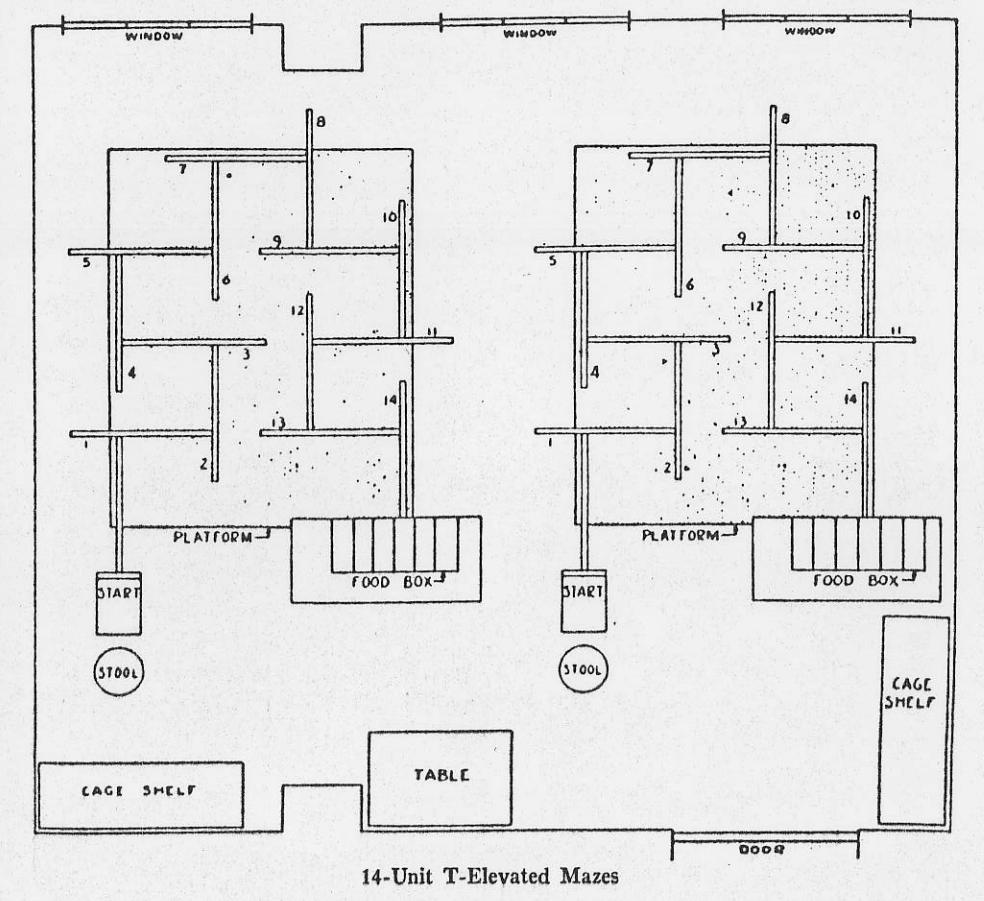

Fig. 2

(From C. H. Honzik, The sensory basis of maze learning in rats. Compar. Psychol. Monogr., 1936, 13, No. 4, p. 4. These were two identical mazes placed side by side in the same room.)

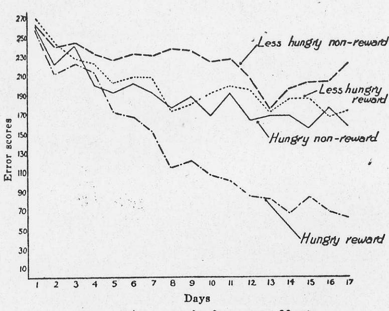

Error curves for four groups, 36 rats.

Fig. 3

(From E. C. Tolman and C. H. Honzik, Degrees of hunger, reward and non-reward, and maze learning in rats. *Univ. Calif. Publ. Psychol.*, 1930, 4, No. 16, p. 246. A maze identical with the alley maze shown in Fig. 1 was used.)

time) that, if bad results—'annoyances,' 'negative reinforcements'—follow, then this same satisfaction-and-annoyance-receiving part of the rat will telephone back and say, "Break that connection and don't you dare use it next time either."

So much for a brief summary of the two subvarieties of the 'stimulus-response,' or telephone switchboard school.

(2) Let us turn now to the second main school. This group (and I belong to them) may be called the field theorists. We believe that in the course of learning something like a field map of the environment gets established in the rat's brain. We agree with the other school that the rat in running a maze is exposed to stimuli and is finally led as a result of these stimuli to the responses which actually occur. We feel, however, that the intervening brain processes are more complicated, more

patterned and often, pragmatically speaking, more autonomous than do the stimulus-response psychologists. Although we admit that the rat is bombarded by stimuli, we hold that his nervous system is surprisingly selective as to which of these stimuli it will let in at any given time.

Secondly, we assert that the central office itself is far more like a map control room than it is like an old-fashioned telephone exchange. The stimuli, which are allowed in, are not connected by just simple one-to-one switches to the outgoing responses. Rather, the incoming impulses are usually worked over and elaborated in the central control room into a tentative, cognitive-like map of the environment. And it is this tentative map, indicating routes and paths and environmental relationships, which finally determines what responses, if any, the animal will finally release.

Finally, I, personally, would hold further that it is also important to discover in how far these maps are relatively narrow and strip-like or relatively broad and comprehensive. Both stripmaps and comprehensive-maps may be either correct or incorrect in the sense that they may (or may not), when acted upon, lead successfully to the animal's goal. The differences between such strip maps and such comprehensive maps will appear only when the rat is later presented with some change within the given environment. Then, the narrower and more strip-like the original. map, the less will it carry over successfully to the new problem; whereas, the wider and the more comprehensive it was, the more adequately it will serve in the new set-up. In a strip-map the given position of the animal is connected by only a relatively simple and single path to the position of the goal. In a comprehensive-map a wider arc of the environment is represented, so that, if the starting position of the animal be

changed or variations in the specific routes be introduced, this wider map will allow the animal still to behave relatively correctly and to choose the appropriate new route.

But let us turn, now, to the actual experiments. The ones, out of many, which I have selected to report are simply ones which seem especially important in reinforcing the theoretical position I have been presenting. This position, I repeat, contains two assumptions: First, that learning consists not in stimulus-response connections but in the building up in the nervous system of sets which function like cognitive maps, and second, that such cognitive maps may be usefully characterized as varying from a narrow strip variety to a broader comprehensive variety.

The experiments fall under five heads: (1) "latent learning," (2) "vicarious trial and error" or "VTE," (3) "searching for the stimulus," (4) "hypotheses" and (5) "spatial orientation."

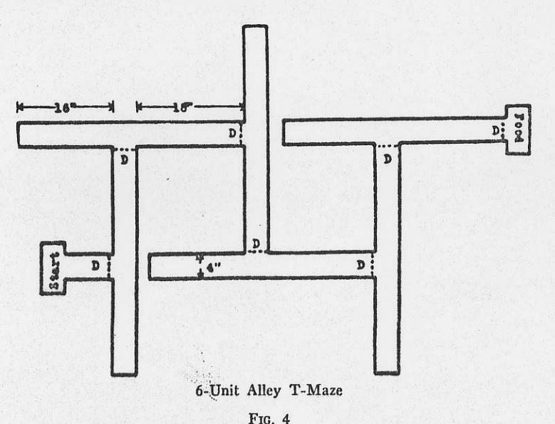

(From H. C. Blodgett, The effect of the introduction of reward upon the maze performance of rats. *Univ. Calif. Publ. Psychol.*, 1929, 4, No. 8, p. 117.)

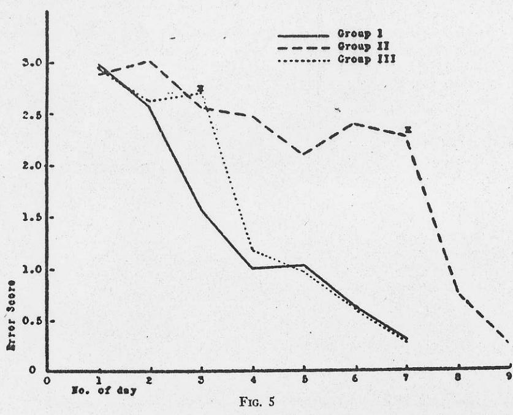

(From H. C. Blodgett, The effect of the introduction of reward upon the maze performance of rats. *Univ. Calif. Publ. Psychol.*, 1929, 4, No. 8, p. 120.)

(1) "Latent Learning" Experiments. The first of the latent learning experiments was performed at Berkeley by Blodgett. It was published in 1929. Blodgett not only performed the experiments, he also originated the concept. He ran three groups of rats through a six-unit alley maze, shown in Fig. 4. He had a control group and two experimental groups. The error curves for these groups appear in Fig. 5. The solid line shows the error curve for Group I, the control group. These animals were run in orthodox fashion. That is, they were run one trial a day and found food in the goal-box at the end of each trial. Groups II and III were the experimental groups. The animals of Group II, the dash line, were not fed in the maze for the first six days but only in their home cages some two hours later. On the seventh day (indicated by the small cross) the rats found food at the end of the maze for the first time and continued to find it on subsequent days. The animals of Group III were treated similarly except that they first found food at the end of the maze on the third day and continued to find it there on subsequent days. It will be observed that the experimental groups as long as they were not finding food did not appear to learn much. (Their error curves did not drop.) But on the days immediately succeeding their first finding of the food their error curves did drop astoundingly. It appeared, in short, that during the non-rewarded trials these animals had been learning much more than they had exhibited. This learning, which did not manifest itself until after the food had been introduced, Blodgett called "latent learning." Interpreting these results anthropomorphically, we would say that as long as the animals were not getting any food at the end of the maze they continued to take their

time in going through it—they continued to enter many blinds. Once, however, they knew they were to get food, they demonstrated that during these preceding non-rewarded trials they had learned where many of the blinds were. They had been building up a 'map,' and could utilize the latter as soon as they were motivated to do so.

Honzik and myself repeated the experiments (or rather he did and I got some of the credit) with the 14-unit T-mazes shown in Fig. 1, and with larger groups of animals, and got similar results. The resulting curves are shown in Fig. 6. We used two control groups—one that never found food in the maze (HNR) and one that found it throughout (HR). The experimental group (HNR-R) found food at the end of the maze from the 11th day on and showed the same sort of a sudden drop.

But probably the best experiment demonstrating latent learning was, unfortunately, done not in Berkeley but at the University of Iowa, by Spence and Lippitt. Only an abstract of this experiment has as yet been published. However, Spence has sent a preliminary manuscript from which the following account is summarized. A simple Ymaze (see Fig. 7) with two goal-boxes was used. Water was at the end of the right arm of the Y and food at the end of the left arm. During the training period the rats were run neither hungry nor thirsty. They were satiated for both food and water before each day's trials. However, they were willing to run because after each run they were taken out of whichever end box they had got to and put into a living cage, with other animals in it. They were given four trials a day in this fashion

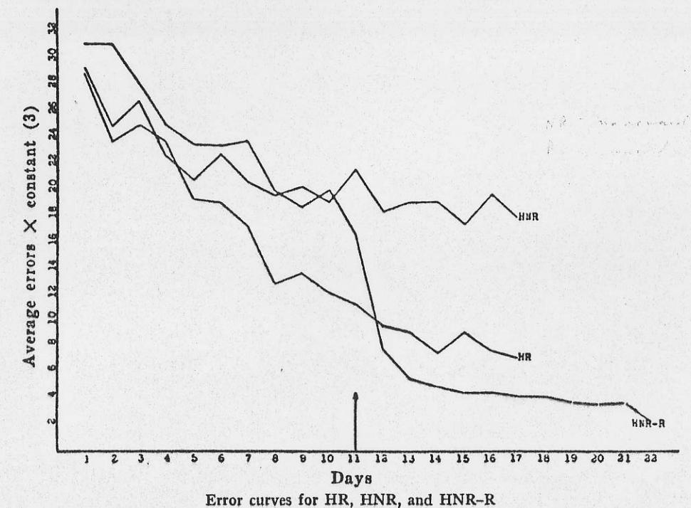

Fig. 6 (From E. C. Tolman and C. H. Honzik, Introduction and removal of reward, and maze performance in rats. *Univ. Calif. Publ. Psychol.*, 1930, 4, No. 19, p. 267.)

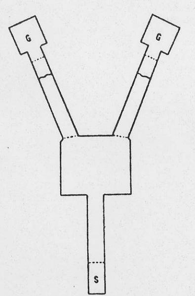

Ground plan of the apparatus

Fig. 7

(Taken from K. W. Spence and R. Lippitt, An experimental test of the sign-gestalt theory of trial and error learning. J. exper. Psychol., 1946, 36, p. 494. In this article they were describing another experiment but used the same maze.)

for seven days, two trials to the right and two to the left.

In the crucial test the animals were divided into two subgroups one made solely hungry and one solely thirsty. It was then found that on the first trial the hungry group went at once to the left, where the food had been, statistically more frequently than to the right; and the thirsty group went to the right, where the water had been, statistically more frequently than to the left. These results indicated that under the previous non-differential and very mild rewarding conditions of merely being returned to the home cages the animals had nevertheless been learning where the water was and where the food was. In short, they had acquired a cognitive map to the effect that food was to the left and water to the right, although during the acquisition of this map they had not exhibited any stimulus-response propensities to go more to the side which became later the side of the appropriate goal.

There have been numerous other latent learning experiments done in the Berkeley laboratory and elsewhere. In general, they have for the most part all confirmed the above sort of findings.

Let us turn now to the second group of experiments.

(2) "Vicarious Trial and Error" or "VTE." The term Vicarious Trial and Error (abbreviated as VTE) was invented by Prof. Muenzinger at Colorado 2 to designate the hesitating, look-

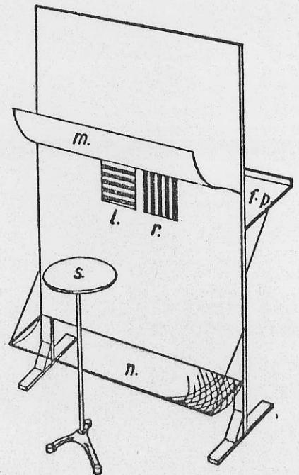

Apparatus Used for Testing Discrimination of Visual Patterns

Fig. 8

(From K. S. Lashley, The mechanism of vision. I. A method for rapid analyses of pattern-vision in the rat. J. genet. Psychol., 1930, 37, p. 454.)

2 Vide: K. F. Muenzinger, Vicarious trial and error at a point of choice: I. A general survey of its relation to learning efficiency. J. genet. Psychol., 1938, 53, 75-86.

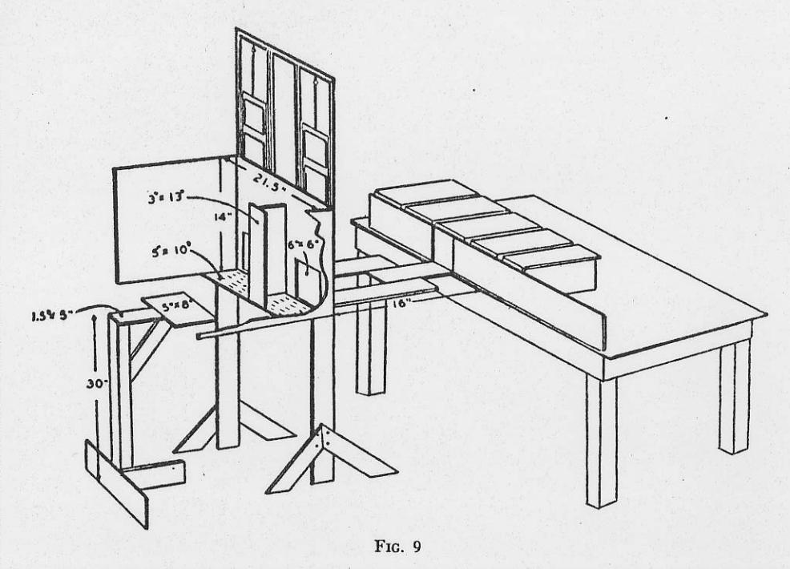

(From E. C. Tolman, Prediction of vicarious trial and error by means of the schematic sowbug. Psychol. Rev., 1939, 46, p. 319.)

ing-back-and-forth, sort of behavior which rats can often be observed to indulge in at a choice-point before actually going one way or the other.

Quite a number of experiments upon VTEing have been carried out in our laboratory. I shall report only a few. In most of them what is called a discrimination set-up has been used. In one characteristic type of visual discrimination apparatus designed by Lashley (shown in Fig. 8) the animal is put on a jumping stand and faced with two doors which differ in some visual property say, as here shown, vertical stripes vs. horizontal stripes.

One of each such pair of visual stimuli is made always correct and the other wrong; and the two are interchanged from side to side in random fashion. The animal is required to learn, say, that the vertically striped door is always the correct one. If he

jumps to it, the door falls open and he gets to food on a platform behind. If, on the other hand, he jumps incorrectly, he finds the door locked and falls into a net some two feet below from which he is picked up and started over again.

Using a similar set-up (see Fig. 9), but with landing platforms in front of the doors so that if the rat chose incorrectly he could jump back again and start over. I found that when the choice was an easy one, say between a white door and a black door, the animals not only learned sooner but also did more VTEing than when the choice was difficult, say between a white door and a gray door (see Fig. 10). It appeared further (see Fig. 11) that the VTEing began to appear just as (or just before) the rats began to learn. After the learning had become established, however, the VTE's began to go down. Further, in a study of individual dif-

# LEARNING CURVES

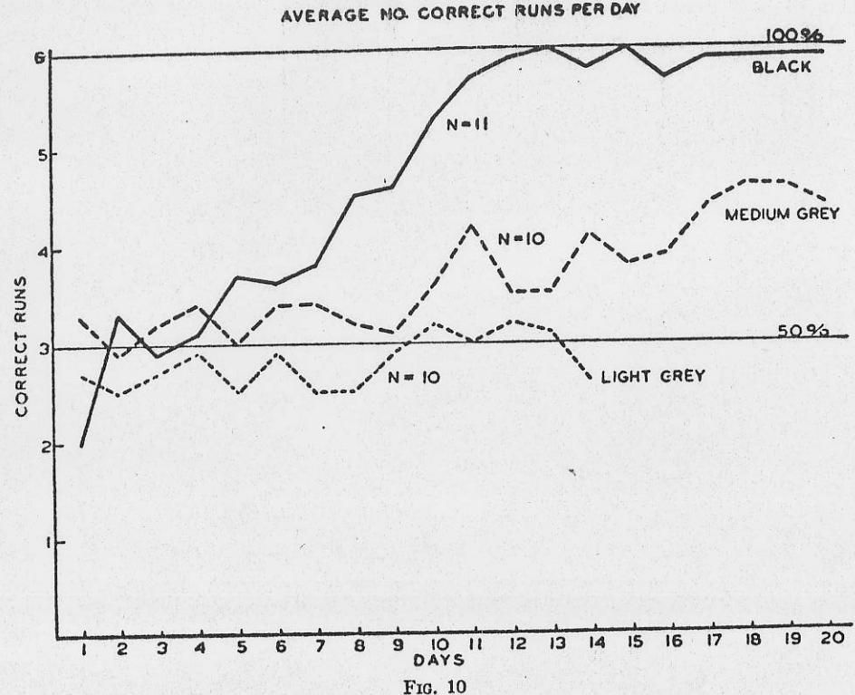

(From E. C. Tolman, Prediction of vicarious trial and error by means of the schematic sowbug. Psychol. Rev., 1939, 46, p. 319.)

ferences by myself, Geier and Levin 3 (actually done by Geier and Levin) using this same visual discrimination apparatus, it was found that with one and the same difficulty of problem the smarter animal did the more VTEing.

To sum up, in visual discrimination experiments the better the learning, the more the VTE's. But this seems contrary to what we would perhaps have expected. We ourselves would expect to do more VTEing, more sampling of the two stimuli, when it is difficult to choose between them than when it is easy.

3 F. M. Geier, M. Levin & E. C. Tolman, Individual differences in emotionality, hypothesis formation, vicarious trial and error and visual discrimination learning in rats.

What is the explanation? The answer lies, I believe, in the fact that the manner in which we set the visual discrimination problems for the rats and the manner in which we set similar problems for ourselves are different. We already have our 'instructions.' We know beforehand what it is we are to do. We are told, or we tell ourselves, that it is the lighter of the two grays, the heavier of the two weights, or the like, which is to be chosen. In such a setting we do more sampling, more VTEing, when the stimulus-difference is small. But for the rats the usual problem in a discrimination apparatus is quite different. They do not know what is wanted of them. The major part of their learning in most such experiments seems to consist in their discovering the instructions. The rats have to discover that it is the differences in visual brightness, not the differences between left and right, which they are to pay attention to. Their VTEing appears when they begin to 'catch on.' The greater the difference between the two stimuli the more the animals are attracted by this difference. Hence the sooner they catch on, and during this catching on, the more they VTE.

That this is a reasonable interpretation appeared further, from an experiment by myself and Minium (the actual work done, of course, by Minium) in which a group of six rats was first taught a white vs. black discrimination, then two successively more difficult gray vs. black discriminations. For each difficulty the rats were given a long series of further trials beyond the points at which they had learned. Comparing the beginning of each of these three difficulties the results were that the rats did more VTEing for the easy discriminations than for the more difficult ones. When, however, it came to a comparison of amounts of VTEing during the final performance after each learning had reached a plateau, the opposite results were obtained. In other words, after the rats had finally divined their instructions, then they, like human beings, did more VTEing, more sampling, the more difficult the discrimina-

Finally, now let us note that it was

#### AVERAGE NO. OF VTE'S

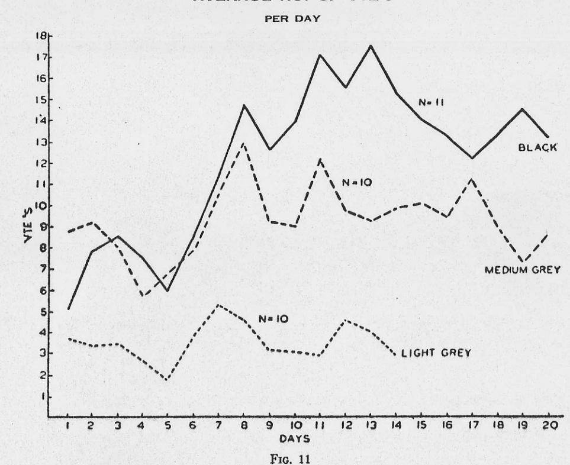

(From E. C. Tolman, Prediction of vicarious trial and error by means of the schematic sowbug. Psychol. Rev., 1939, 46, p. 320.)

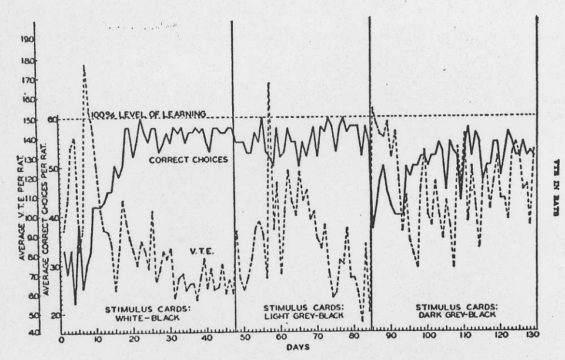

FIG. 12

(From E. C. Tolman and E. Minium, VTE in rats: overlearning and difficulty of discrimination. J. comp. Psychol., 1942, 34, p. 303.)

also found at Berkeley by Jackson 4 that in a maze the difficult maze units produce more VTEing and also that the more stupid rats do the more VTEing. The explanation, as I see it, is that, in the case of mazes, rats know their instructions. For them it is natural to expect that the same spatial path will always lead to the same outcome. Rats in mazes don't have to be told.

But what, now, is the final significance of all this VTEing? How do these facts about VTEing affect our theoretical argument? My answer is that these facts lend further support to the doctrine of a building up of maps. VTEing, as I see it, is evidence that in the critical stages—whether in the first picking up of the instructions or in the later making sure of which stimulus is which—the animal's activity is not just one of responding passively to discrete stimuli, but rather one of the active se-

4 L. L. Jackson, V. T. E. on an elevated maze. J. comp. Psychol., 1943, 36, 99-107.

lecting and comparing of stimuli. This brings me then to the third type of experiment.

(3) "Searching for the Stimulus." I refer to a recent, and it seems to me extremely important experiment, done for a Ph.D. dissertation by Hudson. Hudson was first interested in the question of whether or not rats could learn an avoidance reaction in one trial. His animals were tested one at a time in a living cage (see Fig. 13) with a small striped visual pattern at the end, on which was mounted a food cup. The hungry rat approached this food cup and ate. An electrical arrangement was provided so that when the rat touched the cup he could be given an electric shock. And one such shock did appear to be enough. For when the rat was replaced in this same cage days or even weeks afterwards, he usually demonstrated immediately strong avoidance reactions to the visual pattern. The animal withdrew from that end of the

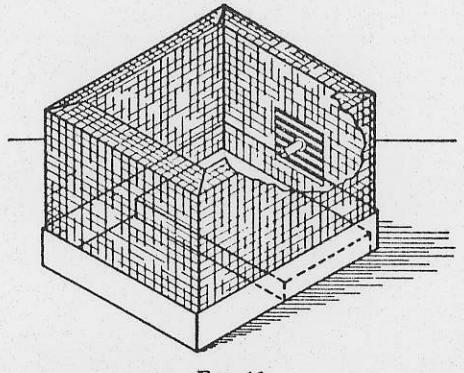

Fig. 13

(From Bradford Hudson. Ph.D. Thesis: 'One trial learning: A study of the avoidance behavior of the rat.' On deposit in the Library of the University of California, Berkeley, California.)

cage, or piled up sawdust and covered the pattern, or showed various other amusing responses all of which were in the nature of withdrawing from the pattern or making it disappear.

But the particular finding which I am interested in now appeared as a result of a modification of this standard procedure. Hudson noticed that the animals, anthropomorphically speaking, often seemed to look around after the shock to see what it was that had hit them. Hence it occurred to him that, if the pattern were made to disappear the instant the shock occurred, the rats might not establish the association. And this indeed is what happened in the case of many individuals. Hudson added further electrical connections so that when the shock was received during the eating, the lights went out, the pattern and the food cup dropped out of sight, and the lights came on again all within the matter of a second. When such animals were again put in the cage 24 hours later, a large percentage showed no avoidance of the pattern. Or to quote Hudson's own words:

"Learning what object to avoid . . . may occur exclusively during the period after the shock. For if the object from which the shock was actually received is removed at the moment of the shock, a significant number of animals fail to learn to avoid it, some selecting other features in the environment for avoidance, and others avoiding nothing."

In other words, I feel that this experiment reinforces the notion of the largely active selective character in the rat's building up of his cognitive map. He often has to look actively for the significant stimuli in order to form his map and does not merely passively receive and react to all the stimuli which are physically present.

Turn now to the fourth type of experiment.

(4) The "Hypothesis" Experiments. Both the notion of hypotheses in rats and the design of the experiments to demonstrate such hypotheses are to be credited to Krech. Krech used a four-compartment discrimination-box. In such a four-choice box the correct door at each choice-point may be determined by the experimenter in terms of its being lighted or dark, left or right, or various combinations of these. If all

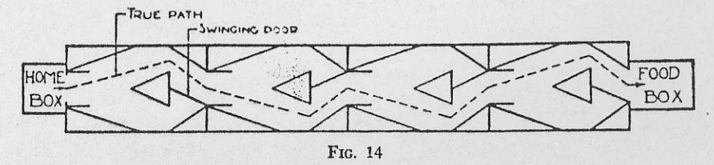

(From I. Krechevsky (Now D. Krech), The genesis of "hypotheses" in rats. Univ. Calif. Publ. Psychol., 1932, 6, No. 4, p. 46.)

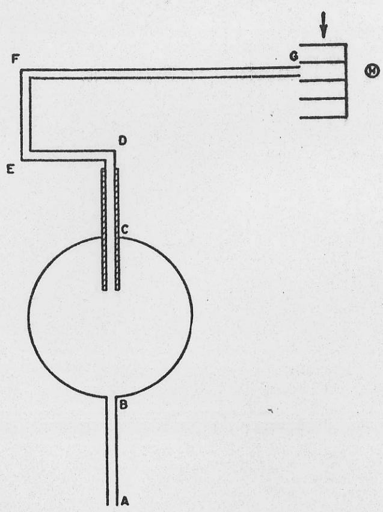

Apparatus used in preliminary training

FIG. 15

(From E. C. Tolman, B. F. Ritchie and D. Kalish, Studies in spatial learning. I. Orientation and the short-cut. J. exp. Psychol., 1946, 36, p. 16.)

possibilities are randomized for the 40 choices made in 10 runs of each day's test, the problem could be made insoluble.

When this was done, Krech found that the individual rat went through a succession of systematic choices. That is, the individual animal might perhaps begin by choosing practically all right-hand doors, then he might give this up for choosing practically all left-hand doors, and then, for choosing all dark doors, and so on. These relatively persistent, and well-above-chance systematic types of choice Krech called

"hypotheses." In using this term he obviously did not mean to imply verbal processes in the rat but merely referred to what I have been calling cognitive maps which, it appears from his experiments, get set up in a tentative fashion to be tried out first one and then another until, if possible, one is found which works.

Finally, it is to be noted that these hypothesis experiments, like the latent learning, VTE, and "looking for the stimulus" experiments, do not, as such, throw light upon the widths of the maps which are picked up but do indicate

the generally map-like and self-initiated character of learning.

For the beginning of an attack upon the problem of the width of the maps let me turn to the last group of experiments.

(5) "Spatial Orientation" Experiments. As early as 1929, Lashley reported incidentally the case of a couple of his rats who, after having learned an alley maze, pushed back the cover near the starting box, climbed out and ran directly across the top to the goal-box where they climbed down in again and ate. Other investigators have reported related findings. All such observations suggest that rats really develop wider spatial maps which include more than the mere trained-on specific paths. In the experiments now to be reported this

possibility has been subjected to further examination.

In the first experiment, Tolman, Ritchie and Kalish (actually Ritchie and Kalish) used the set-up shown in Fig. 15.

This was an elevated maze. The animals ran from A across the open circular table through CD (which had alley walls) and finally to G, the food box. H was a light which shone directly down the path from G to F. After four nights, three trials per night, in which the rats learned to run directly and without hesitation from A to G, the apparatus was changed to the sun-burst shown in Fig. 16. The starting path and the table remained the same but a series of radiating paths was added.

The animals were again started at A

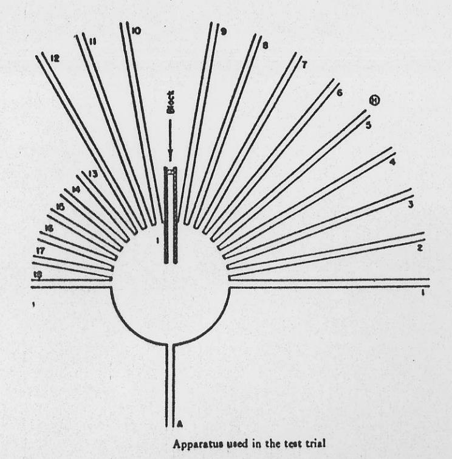

(From E. C. Tolman, B. F. Ritchie and D. Kalish, Studies in spatial learning. I. Orientation and short-cut. J. exp. Psychol., 1946, 36, p. 17.)

Fig. 16

and ran across the circular table into the alley and found themselves blocked. They then returned onto the table and began exploring practically all the radiating paths. After going out a few inches only on any one path, each rat finally chose to run all the way out on one. The percentages of rats finally choosing each of the long paths from 1 to 12 are shown in Fig. 17. It appears

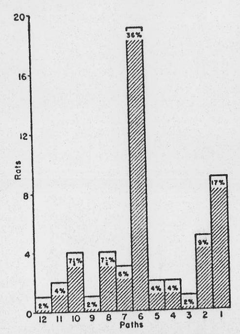

Numbers of rats which chose each of the paths

#### Fig. 17

(From E. C. Tolman, B. F. Ritchie and D. Kalish, Studies in spatial learning. I. Orientation and the short-cut. J. exp. Psychol., 1946, 36, p. 19.)

that there was a preponderant tendency to choose path No. 6 which ran to a point some four inches in front of where the entrance to the food-box had been. The only other path chosen with any appreciable frequency was No. 1—that is, the path which pointed perpendicularly to the food-side of the room.

These results seem to indicate that

the rats in this experiment had learned not only to run rapidly down the original roundabout route but also, when this was blocked and radiating paths presented, to select one pointing rather directly towards the point where the food had been or else at least to select a path running perpendicularly to the foodside of the room.

As a result of their original training, the rats had, it would seem, acquired not merely a strip-map to the effect that the original specifically trained-on path led to food but, rather, a wider comprehensive map to the effect that food was located in such and such a direction in the room.

Consider now a further experiment done by Ritchie alone. This experiment tested still further the breadth of the spatial map which is acquired. In this further experiment the rats were again run across the table—this time to the arms of a simple T. (See Fig. 18.)

Twenty-five animals were trained for seven days, 20 trials in all, to find food at F1; and twenty-five animals were trained to find it at F2. The L's in the diagram indicate lights. On the eighth day the starting path and table top were rotated through 180 degrees so that they were now in the position shown in Fig. 19. The dotted lines represent the old position. And a series of radiating paths was added. What happened? Again the rats ran across the table into the central alley. When, however, they found themselves blocked, they turned back onto the table and this time also spent many seconds touching and trying out for only a few steps practically all the paths. Finally, however, within seven minutes, 42 of the 50 rats chose one path and ran all the way out on it. The paths finally chosen by the 19 of these animals that had been fed at F1 and by the 23 that had been fed at F2 are shown in Fig. 20.

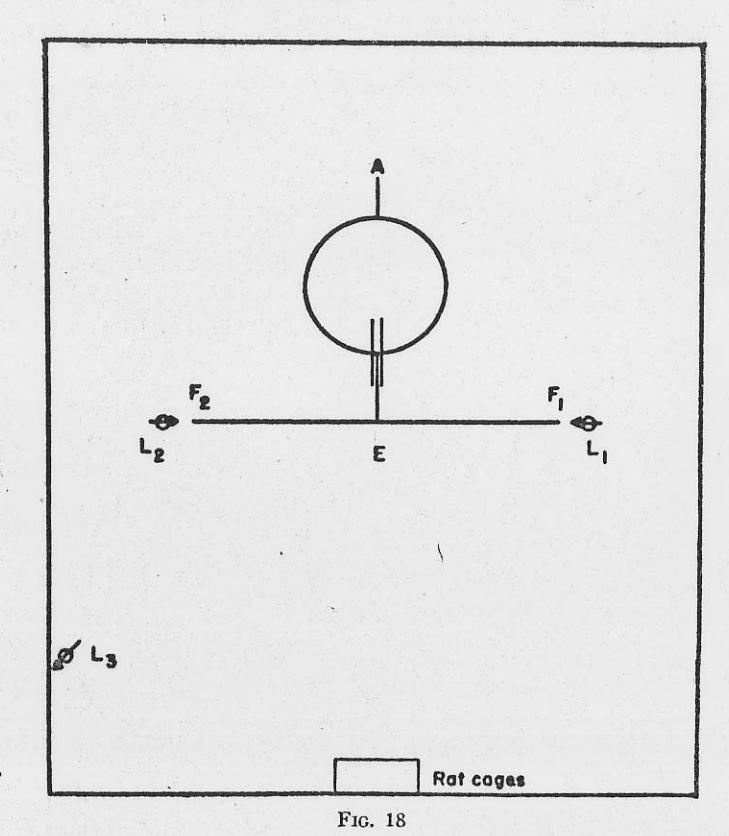

(From B. F. Ritchie. Ph.D. Thesis: 'Spatial learning in rats.' On deposit in the Library of the University of California, Berkeley, California,)

This time the rats tended to choose, not the paths which pointed directly to the spots where the food had been, but rather paths which ran perpendicularly to the corresponding sides of the room. The spatial maps of these rats, when the animals were started from the opposite side of the room, were thus not completely adequate to the precise goal positions but were adequate as to the correct sides of the room. The maps of these animals were, in short, not altogether strip-like and narrow.

This completes my report of experiments. There were the latent learning experiments, the VTE experiments, the searching for the stimulus experiment, the hypothesis experiments, and these last spatial orientation experiments.

And now, at last, I come to the humanly significant and exciting problem: namely, what are the conditions which favor narrow strip-maps and what are those which tend to favor broad comprehensive maps not only in rats but also in men?

There is considerable evidence scattered throughout the literature bearing on this question both for rats and for men. Some of this evidence was obtained in Berkeley and some of it elsewhere. I have not time to present it in any detail. I can merely summarize it by saying that narrow strip maps rather than broad comprehensive maps seem to be induced: (1) by a damaged brain, (2) by an inadequate array of environmentally presented cues, (3) by an

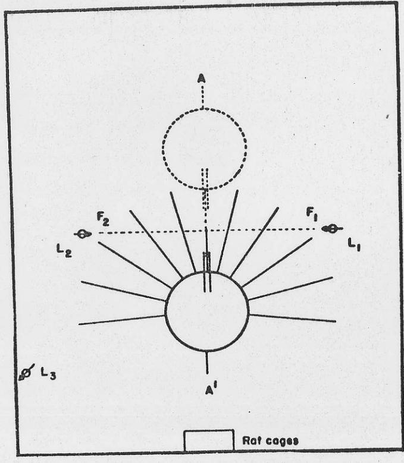

Fig. 19

(From B. F. Ritchie. Ph.D. Thesis: 'Spatial learning in rats.' On deposit in the Library of the University of California, Berkeley, California.)

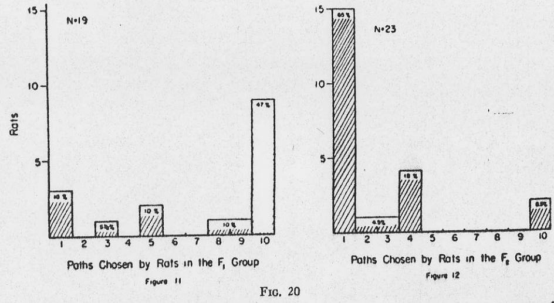

(From B. F. Ritchie. Ph.D. Thesis: 'Spatial learning in rats.' On deposit in the Library of the University of California, Berkeley, California.)

overdose of repetitions on the original trained-on path and (4) by the presence of too strongly motivational or of too strongly frustrating conditions.

It is this fourth factor which I wish to elaborate upon briefly in my concluding remarks. For it is going to be my contention that some, at least, of the so-called 'psychological mechanisms' which the clinical psychologists and the other students of personality have uncovered as the devils underlying many of our individual and social maladjustments can be interpreted as narrowings of our cognitive maps due to too strong motivations or to too intense frustration.

My argument will be brief, cavalier, and dogmatic. For I am not myself a clinician or a social psychologist. What I am going to say must be considered, therefore, simply as in the nature of a rat psychologist's ratiocinations offered free.

By way of illustration, let me suggest that at least the three dynamisms called, respectively, "regression," "fixation," and "displacement of aggression onto outgroups" are expressions of cognitive maps which are too narrow and which get built up in us as a result of too violent motivation or of too intense frustration.

(a) Consider regression. This is the term used for those cases in which an individual, in the face of too difficult a problem, returns to earlier more childish ways of behaving. Thus, to take an example, the overprotected middle-aged woman (reported a couple of years ago in Time Magazine) who, after losing her husband, regressed (much to the distress of her growing daughters) into dressing in too youthful a fashion and into competing for their beaux and then finally into behaving like a child requiring continuous care, would be an illustration of regression. I would not wish you to put too much confidence

in the reportorial accuracy of Time, but such an extreme case is not too different from many actually to be found in our mental hospitals or even sometimes in ourselves. In all such instances my argument would be (1) that such regression results from too strong a present emotional situation and (2) that it consists in going back to too narrow an earlier map, itself due to too much frustration or motivation in early childhood. Time's middle-aged woman was presented by too frustrating an emotional situation at her husband's death and she regressed, I would wager, to too narrow adolescent and childhood maps since these latter had been originally excessively impressed because of overstressful experiences at the time she was growing up.

(b) Consider fixation. Regression and fixation tend to go hand in hand. For another way of stating the fact of the undue persistence of early maps is to say that they were fixated. This has even been demonstrated in rats. If rats are too strongly motivated in their original learning, they find it very difficult to relearn when the original path is no longer correct. Also after they have relearned, if they are given an electric shock they, like *Time's* woman, tend to regress back again to choosing the earlier path.

(c) Finally, consider the "displacement of aggressions onto outgroups." Adherence to one's own group is an ever-present tendency among primates. It is found in chimpanzees and monkeys as strongly as in men. We primates operate in groups. And each individual in such a group tends to identify with his whole group in the sense that the group's goals become his goals, the group's life and immortality, his life and immortality. Furthermore, each individual soon learns that, when as an individual he is frustrated, he must not take out his aggressions on

the other members of his own group. He learns instead to displace his aggressions onto outgroups. Such a displacement of aggression I would claim is also a narrowing of the cognitive map. The individual comes no longer to distinguish the true locus of the cause of his frustration. The poor Southern whites, who take it out on the Negroes, are displacing their aggressions from the landlords, the southern economic system, the northern capitalists, or wherever the true cause of their frustration may lie, onto a mere convenient outgroup. The physicists on the Faculty who criticize the humanities, or we psychologists who criticize all the other departments, or the University as a whole which criticizes the Secondary School system or, vice versa, the Secondary School system which criticizes the University-or, on a still larger and far more dangerous scene-we Americans who criticize the Russians and the Russians who criticize us, are also engaging, at least in part, in nothing more than such irrational displacements of our aggressions onto outgroups.

I do not mean to imply that there may not be some true interferences by the one group with the goals of the other and hence that the aggressions of the members of the one group against the members of the other are necessarily wholly and merely displaced aggressions. But I do assert that often and in large part they are such mere displacements.

Over and over again men are blinded by too violent motivations and too intense frustrations into blind and unintelligent and in the end desperately dangerous hates of outsiders. And the expression of these their displaced hates ranges all the way from discrimination against minorities to world conflagrations.

What in the name of Heaven and Psychology can we do about it? My only answer is to preach again the virtues of reason-of, that is, broad cognitive maps. And to suggest that the child-trainers and the world-planners of the future can only, if at all, bring about the presence of the required rationality (i.e., comprehensive maps) if they see to it that nobody's children are too over-motivated or too frustrated. Only then can these children learn to look before and after, learn to see that there are often round-about and safer paths to their quite proper goals-learn, that is, to realize that the well-beings of White and of Negro, of Catholic and of Protestant, of Christian and of Jew, of American and of Russian (and even of males and females) are mutually interdependent.

We dare not let ourselves or others become so over-emotional, so hungry, so ill-clad, so over-motivated that only narrow strip-maps will be developed. All of us in Europe as well as in America, in the Orient as well as in the Occident, must be made calm enough and well-fed enough to be able to develop truly comprehensive maps, or, as Freud would have put it, to be able to learn to live according to the Reality Principle rather than according to the too narrow and too immediate Pleasure Principle.

We must, in short, subject our children and ourselves (as the kindly experimenter would his rats) to the optimal conditions of moderate motivation and of an absence of unnecessary frustrations, whenever we put them and ourselves before that great God-given maze which is our human world. I cannot predict whether or not we will be able, or be allowed, to do this; but I can say that, only insofar as we are able and are allowed, have we cause for hope.

### THE ROLE OF REWARD IN CONDITIONING THEORY 1

BY HOWARD H. KENDLER
New York University

AND

BENTON J. UNDERWOOD

Northwestern University

When Watson (17), in 1915, gave conditioning a dominant position in his systematic formulation, he initiated a trend in theoretical psychology that still persists. Today, many theoretical systems which attempt to explain relatively complex behavior have, as their bases, principles derived from the data of conditioned response experiments. Because of the generalized implications of this field of investigation, it becomes particularly important to scrutinize carefully and persistently the theories of conditioning.

Hilgard and Marquis (6) have made a methodological analysis of conditioned response experiments which points out a distinction between two types of conditioning procedure, viz., classical and instrumental. The main difference between the two types is that in the former the occurrence of the conditioned response exerts no influence upon the presentation of the unconditioned stimulus (reinforcement), while in instrumental conditioning the achievement of the reward is dependent upon the organism making the appropriate response. The latter is often referred to as selective or trial-and-error learning.

Theorists have disagreed as to whether or not the procedural dis-

1 The initial draft of this paper was an outgrowth of a seminar in learning theory at the State University of Iowa. The completion of the paper was delayed by the military service of the authors. Appreciation is extended to Professor Kenneth W. Spence for his valuable criticism of the initial draft. The responsibility for the paper in its present form is, however, entirely ours.

tinction between kinds of conditioning should be mirrored in their attempts to suggest the basic mechanisms by which learning takes place in the two situations. Guthrie (3) and Hull (8) have insisted that both types of learning are explainable by the same principle, or set of principles, while others (12, 13) have been equally adamant in their assertions that this methodological distinction reflects two distinct kinds of conditioning. One of the most provocative and influential presentations of a dual theory is the one reported in this journal several years ago by Maier and Schneirla (12). It is this formulation which will be dealt with in the present

Maier and Schneirla have challenged the tendency "to break down the theoretical distinction between the classical notion of conditioning and that of selective or 'trial-and-error' learning" (12, p. 117), and have emphasized the necessity of distinguishing between these learning situations, not merely in terms of procedure, but also in terms of the basic mechanisms of learning which must be postulated. There are, these writers maintain, two qualitatively different forms of learning. They write:

"... in the first stage of the conditioning procedure a neutral stimulus develops excitatory value for a response it did not control. The essential condition for this change in the animal is contiguity between the experience of the neutral stimulus and the experience of the unconditioned stimulus. Then a second stage may develop. Once the neutral stimulus has become a