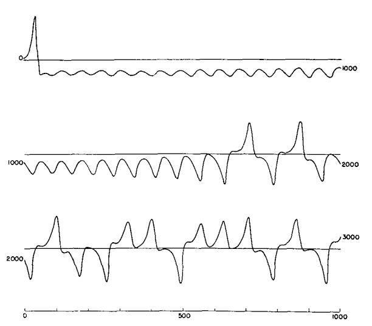
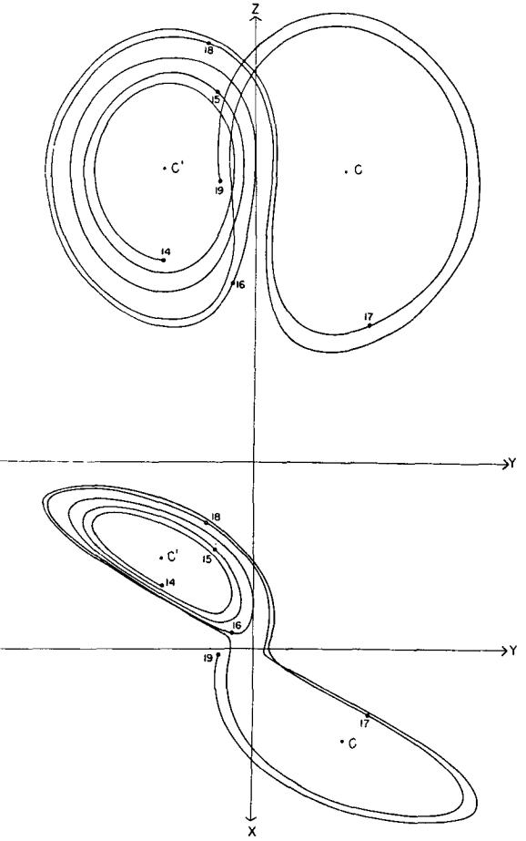
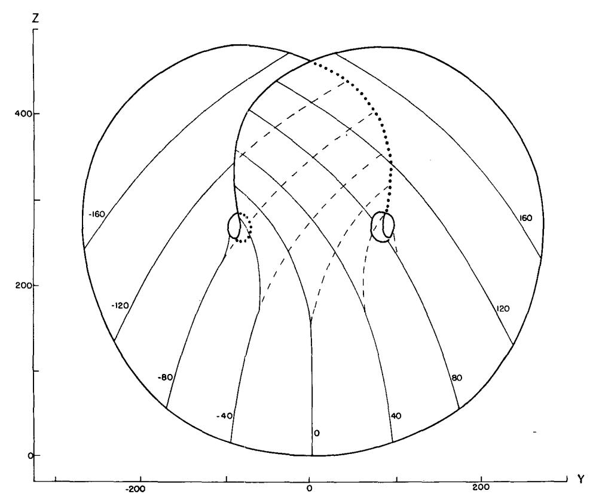
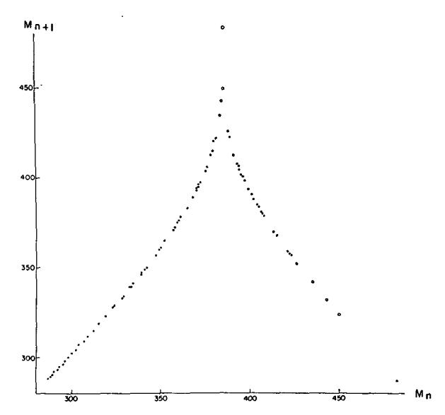
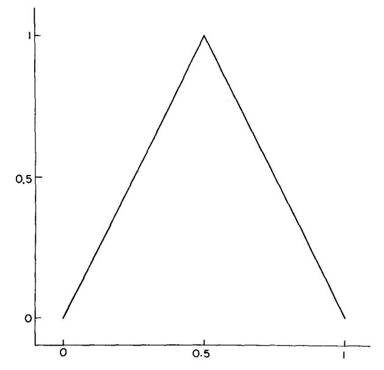

# Deterministic Nonperiodic Flow1

### EDWARD N. LORENZ

Massachusetts Institute of Technology

(Manuscript received 18 November 1962, in revised form 7 January 1963)

#### ABSTRACT

Finite systems of deterministic ordinary nonlinear differential equations may be designed to represent forced dissipative hydrodynamic flow. Solutions of these equations can be identified with trajectories in phase space. For those systems with bounded solutions, it is found that nonperiodic solutions are ordinarily unstable with respect to small modifications, so that slightly differing initial states can evolve into considerably different states. Systems with bounded solutions are shown to possess bounded numerical solutions. A simple system representing cellular convection is solved numerically. All of the solutions are found

A simple system representing cellular convection is solved numerically. All of the solutions are found to be unstable, and almost all of them are nonperiodic.

The feasibility of very-long-range weather prediction is examined in the light of these results.

#### 1. Introduction

Certain hydrodynamical systems exhibit steady-state flow patterns, while others oscillate in a regular periodic fashion. Still others vary in an irregular, seemingly haphazard manner, and, even when observed for long periods of time, do not appear to repeat their previous history.

These modes of behavior may all be observed in the familiar rotating-basin experiments, described by Fultz, et al. (1959) and Hide (1958). In these experiments, a cylindrical vessel containing water is rotated about its axis, and is heated near its rim and cooled near its center in a steady symmetrical fashion. Under certain conditions the resulting flow is as symmetric and steady as the heating which gives rise to it. Under different conditions a system of regularly spaced waves develops, and progresses at a uniform speed without changing its shape. Under still different conditions an irregular flow pattern forms, and moves and changes its shape in an irregular nonperiodic manner.

Lack of periodicity is very common in natural systems, and is one of the distinguishing features of turbulent flow. Because instantaneous turbulent flow patterns are so irregular, attention is often confined to the statistics of turbulence, which, in contrast to the details of turbulence, often behave in a regular well-organized manner. The short-range weather forecaster, however, is forced willy-nilly to predict the details of the large-scale turbulent eddies—the cyclones and anticyclones—which continually arrange themselves into new patterns.

Thus there are occasions when more than the statistics of irregular flow are of very real concern.

In this study we shall work with systems of deterministic equations which are idealizations of hydrodynamical systems. We shall be interested principally in nonperiodic solutions, i.e., solutions which never repeat their past history exactly, and where all approximate repetitions are of finite duration. Thus we shall be involved with the ultimate behavior of the solutions, as opposed to the transient behavior associated with arbitrary initial conditions.

A closed hydrodynamical system of finite mass may ostensibly be treated mathematically as a finite collection of molecules—usually a very large finite collection—in which case the governing laws are expressible as a finite set of ordinary differential equations. These equations are generally highly intractable, and the set of molecules is usually approximated by a continuous distribution of mass. The governing laws are then expressed as a set of partial differential equations, containing such quantities as velocity, density, and pressure as dependent variables.

It is sometimes possible to obtain particular solutions of these equations analytically, especially when the solutions are periodic or invariant with time, and, indeed, much work has been devoted to obtaining such solutions by one scheme or another. Ordinarily, however, nonperiodic solutions cannot readily be determined except by numerical procedures. Such procedures involve replacing the continuous variables by a new finite set of functions of time, which may perhaps be the values of the continuous variables at a chosen grid of points, or the coefficients in the expansions of these variables in series of orthogonal functions. The governing laws then become a finite set of ordinary differential

&lt;sup>1The research reported in this work has been sponsored by the Geophysics Research Directorate of the Air Force Cambridge Research Center, under Contract No. AF 19(604)-4969.

equations again, although a far simpler set than the one which governs individual molecular motions.

In any real hydrodynamical system, viscous dissipation is always occurring, unless the system is moving as a solid, and thermal dissipation is always occurring, unless the system is at constant temperature. For certain purposes many systems may be treated as conservative systems, in which the total energy, or some other quantity, does not vary with time. In seeking the ultimate behavior of a system, the use of conservative equations is unsatisfactory, since the ultimate value of any conservative quantity would then have to equal the arbitrarily chosen initial value. This difficulty may be obviated by including the dissipative processes, thereby making the equations nonconservative, and also including external mechanical or thermal forcing, thus preventing the system from ultimately reaching a state of rest. If the system is to be deterministic, the forcing functions, if not constant with time, must themselves vary according to some deterministic rule.

In this work, then, we shall deal specifically with finite systems of deterministic ordinary differential equations, designed to represent forced dissipative hydrodynamical systems. We shall study the properties of nonperiodic solutions of these equations.

It is not obvious that such solutions can exist at all. Indeed, in dissipative systems governed by finite sets of *linear* equations, a constant forcing leads ultimately to a constant response, while a periodic forcing leads to a periodic response. Hence, nonperiodic flow has sometimes been regarded as the result of nonperiodic or random forcing.

The reasoning leading to these concludions is not applicable when the governing equations are nonlinear. If the equations contain terms representing advection—the transport of some property of a fluid by the motion of the fluid itself—a constant forcing can lead to a variable response. In the rotating-basin experiments already mentioned, both periodic and nonperiodic flow result from thermal forcing which, within the limits of experimental control, is constant. Exact periodic solutions of simplified systems of equations, representing dissipative flow with constant thermal forcing, have been obtained analytically by the writer (1962a). The writer (1962b) has also found nonperiodic solutions of similar systems of equations by numerical means.

### 2. Phase space

Consider a system whose state may be described by M variables  $X_1, \dots, X_M$ . Let the system be governed by the set of equations

$$dX_i/dt = F_i(X_1, \cdots X_M), \quad i = 1, \cdots, M, \tag{1}$$

where time t is the single independent variable, and the functions  $F_i$  possess continuous first partial derivatives. Such a system may be studied by means of phase space—

an M-dimensional Euclidean space  $\Gamma$  whose coordinates are  $X_1, \dots, X_M$ . Each *point* in phase space represents a possible instantaneous state of the system. A state which is varying in accordance with (1) is represented by a moving *particle* in phase space, traveling along a trajectory in phase space. For completeness, the position of a stationary particle, representing a steady state, is included as a trajectory.

Phase space has been a useful concept in treating finite systems, and has been used by such mathematicians as Gibbs (1902) in his development of statistical mechanics, Poincaré (1881) in his treatment of the solutions of differential equations, and Birkhoff (1927) in his treatise on dynamical systems.

From the theory of differential equations (e,g., Ford 1933, ch. 6), it follows, since the partial derivatives  $\partial F_*/\partial X_*$ , are continuous, that if  $t_0$  is any time, and if  $X_{10}, \dots X_{M0}$  is any point in  $\Gamma$ , equations (1) possess a unique solution

$$X_i = f_i(X_{10}, \dots, X_{M0}, t), \quad i = 1, \dots, M,$$
 (2)

valid throughout some time interval containing  $t_0$ , and satisfying the condition

$$f_i(X_{10}, \dots, X_{M0}, t_0) = X_{i0}, \quad i = 1, \dots, M.$$
 (3)

The functions  $f_i$  are continuous in  $X_{10}, \dots, X_{M0}$  and t. Hence there is a unique trajectory through each point of  $\Gamma$ . Two or more trajectories may, however, approach the same point or the same curve asymptotically as  $t \to \infty$  or as  $t \to -\infty$ . Moreover, since the functions  $f_i$  are continuous, the passage of time defines a continuous deformation of any region of  $\Gamma$  into another region.

In the familiar case of a conservative system, where some positive definite quantity Q, which may represent some form of energy, is invariant with time, each trajectory is confined to one or another of the surfaces of constant Q. These surfaces may take the form of closed concentric shells.

If, on the other hand, there is dissipation and forcing, and if, whenever Q equals or exceeds some fixed value  $Q_1$ , the dissipation acts to diminish Q more rapidly then the forcing can increase Q, then (-dQ/dt) has a positive lower bound where  $Q \ge Q_1$ , and each trajectory must ultimately become trapped in the region where  $Q < Q_1$ . Trajectories representing forced dissipative flow may therefore differ considerably from those representing conservative flow.

Forced dissipative systems of this sort are typified by the system

$$dX_i/dt = \sum_{j,k} a_{ijk} X_j X_k - \sum_j b_{ij} X_j + c_i,$$
 (4)

where  $\sum a_{ijk}X_iX_jX_k$  vanishes identically,  $\sum b_{ij}X_iX_j$  is positive definite, and  $c_1, \dots, c_M$  are constants. If

$$Q = \frac{1}{2} \sum_{i} X_{i}^{2}, \tag{5}$$

and if  $e_1, \dots, e_M$  are the roots of the equations

$$\sum_{j} (b_{ij} + b_{ji})e_j = c_i, \tag{6}$$

it follows from (4) that

$$dQ/dt = \sum_{i,j} b_{ij}e_ie_j - \sum_{i,j} b_{ij}(X_i - e_i)(X_j - e_j).$$
 (7)

The right side of (7) vanishes only on the surface of an ellipsoid E, and is positive only in the interior of E. The surfaces of constant Q are concentric spheres. If S denotes a particular one of these spheres whose interior R contains the ellipsoid E, it is evident that each trajectory eventually becomes trapped within R.

### 3. The instability of nonperiodic flow

In this section we shall establish one of the most important properties of deterministic nonperiodic flow, namely, its instability with respect to modifications of small amplitude. We shall find it convenient to do this by identifying the solutions of the governing equations with trajectories in phase space. We shall use such symbols as P(t) (variable argument) to denote trajectories, and such symbols as P or  $P(t_0)$  (no argument or constant argument) to denote points, the latter symbol denoting the specific point through which P(t) passes at time  $t_0$ .

We shall deal with a phase space  $\Gamma$  in which a unique trajectory passes through each point, and where the passage of time defines a continuous deformation of any region of  $\Gamma$  into another region, so that if the points  $P_1(t_0)$ ,  $P_2(t_0)$ ,  $\cdots$  approach  $P_0(t_0)$  as a limit, the points  $P_1(t_0+\tau)$ ,  $P_2(t_0+\tau)$ , ... must approach  $P_0(t_0+\tau)$  as a limit. We shall furthermore require that the trajectories be uniformly bounded as  $t \to \infty$ ; that is, there must be a bounded region R, such that every trajectory ultimately remains with R. Our procedure is influenced by the work of Birkhoff (1927) on dynamical systems, but differs in that Birkhoff was concerned mainly with conservative systems. A rather detailed treatment of dynamical systems has been given by Nemytskii and Stepanov (1960), and rigorous proofs of some of the theorems which we shall present are to be found in that source.

We shall first classify the trajectories in three different manners, namely, according to the absence or presence of transient properties, according to the stability or instability of the trajectories with respect to small modifications, and according to the presence or absence of periodic behavior.

Since any trajectory P(t) is bounded, it must possess at least one *limit point*  $P_0$ , a point which it approaches arbitrarily closely arbitrarily often. More precisely,  $P_0$  is a limit point of P(t) if for any  $\epsilon > 0$  and any time  $t_1$  there exists a time  $t_2(\epsilon,t_1) > t_1$  such that  $|P(t_2) - P_0| < \epsilon$ . Here

absolute-value signs denote distance in phase space. Because  $\Gamma$  is continuously deformed as t varies, every point on the trajectory through  $P_0$  is also a limit point of P(t), and the set of limit points of P(t) forms a trajectory, or a set of trajectories, called the *limiting trajectories* of P(t). A limiting trajectory is obviously contained within R in its entirety.

If a trajectory is contained among its own limiting trajectories, it will be called *central*; otherwise it will be called *noncentral*. A central trajectory passes arbitrarily closely arbitrarily often to any point through which it has previously passed, and, in this sense at least, separate sufficiently long segments of a central trajectory are statistically similar. A noncentral trajectory remains a certain distance away from any point through which it has previously passed. It must approach its entire set of limit points asymptotically, although it need not approach any particular limiting trajectory asymptotically. Its instantaneous distance from its closest limit point is therefore a transient quantity, which becomes arbitrarily small as  $t \to \infty$ .

A trajectory P(t) will be called stable at a point  $P(t_1)$  if any other trajectory passing sufficiently close to  $P(t_1)$  at time  $t_1$  remains close to P(t) as  $t \to \infty$ ; i.e., P(t) is stable at  $P(t_1)$  if for any  $\epsilon > 0$  there exists a  $\delta(\epsilon, t_1) > 0$  such that if  $|P_1(t_1) - P(t_1)| < \delta$  and  $t_2 > t_1$ ,  $|P_1(t_2) - P(t_2)| < \epsilon$ . Otherwise P(t) will be called unstable at  $P(t_1)$ . Because  $\Gamma$  is continuously deformed as t varies, a trajectory which is stable at one point is stable at every point, and will be called a stable trajectory. A trajectory unstable at one point is unstable at every point, and will be called an unstable trajectory. In the special case that P(t) is confined to one point, this definition of stability coincides with the familiar concept of stability of steady flow.

A stable trajectory P(t) will be called uniformly stable if the distance within which a neighboring trajectory must approach a point  $P(t_1)$ , in order to be certain of remaining close to P(t) as  $t \to \infty$ , itself possesses a positive lower bound as  $t_1 \to \infty$ ; i.e., P(t) is uniformly stable if for any  $\epsilon > 0$  there exists a  $\delta(\epsilon) > 0$  and a time  $t_0(\epsilon)$  such that if  $t_1 > t_0$  and  $|P_1(t_1) - P(t_1)| < \delta$  and  $t_2 > t_1$ ,  $|P_1(t_2) - P(t_2)| < \epsilon$ . A limiting trajectory  $P_0(t)$  of a uniformly stable trajectory P(t) must be uniformly stable itself, since all trajectories passing sufficiently close to  $P_0(t)$  must pass arbitrarily close to some point of P(t) and so must remain close to P(t), and hence to  $P_0(t)$ , as  $t \to \infty$ .

Since each point lies on a unique trajectory, any trajectory passing through a point through which it has previously passed must continue to repeat its past behavior, and so must be *periodic*. A trajectory P(t) will be called *quasi-periodic* if for some arbitrarily large time interval  $\tau$ ,  $P(t+\tau)$  ultimately remains arbitrarily close to P(t), i.e., P(t) is quasi-periodic if for any  $\epsilon > 0$  and for any time interval  $\tau_0$ , there exists a  $\tau(\epsilon,\tau_0) > \tau_0$  and a time  $t_1(\epsilon,\tau_0)$  such that if  $t_2 > t_1$ ,  $|P(t_2+\tau) - P(t_2)|$ 

 $<\epsilon$ . Periodic trajectories are special cases of quasiperiodic trajectories.

A trajectory which is not quasi-periodic will be called nonperiodic. If P(t) is nonperiodic,  $P(t_1+\tau)$  may be arbitrarily close to  $P(t_1)$  for some time  $t_1$  and some arbitrarily large time interval  $\tau$ , but, if this is so,  $P(t+\tau)$  cannot remain arbitrarily close to P(t) as  $t \to \infty$ . Nonperiodic trajectories are of course representations of deterministic nonperiodic flow, and form the principal subject of this paper.

Periodic trajectories are obviously central. Quasiperiodic central trajectories include multiple periodic trajectories with incommensurable periods, while quasiperiodic noncentral trajectories include those which approach periodic trajectories asymptotically. Nonperiodic trajectories may be central or noncentral.

We can now establish the theorem that a trajectory with a stable limiting trajectory is quasi-periodic. For if  $P_0(t)$  is a limiting trajectory of P(t), two distinct points  $P(t_1)$  and  $P(t_1+\tau)$ , with  $\tau$  arbitrarily large, may be found arbitrary close to any point  $P_0(t_0)$ . Since  $P_0(t)$  is stable, P(t) and  $P(t+\tau)$  must remain arbitrarily close to  $P_0(t+t_0-t_1)$ , and hence to each other, as  $t\to\infty$ , and P(t) is quasi-periodic.

It follows immediately that a stable central trajectory is quasi-periodic, or, equivalently, that a nonperiodic central trajectory is unstable.

The result has far-reaching consequences when the system being considered is an observable nonperiodic system whose future state we may desire to predict. It implies that two states differing by imperceptible amounts may eventually evolve into two considerably different states. If, then, there is any error whatever in observing the present state—and in any real system such errors seem inevitable—an acceptable prediction of an instantaneous state in the distant future may well be impossible.

As for noncentral trajectories, it follows that a uniformly stable noncentral trajectory is quasi-periodic, or, equivalently, a nonperiodic noncentral trajectory is not uniformly stable. The possibility of a nonperiodic noncentral trajectory which is stable but not uniformly stable still exists. To the writer, at least, such trajectories, although possible on paper, do not seem characteristic of real hydrodynamical phenomena. Any claim that atmospheric flow, for example, is represented by a trajectory of this sort would lead to the improbable conclusion that we ought to master long-range forecasting as soon as possible, because, the longer we wait, the more difficult our task will become.

In summary, we have shown that, subject to the conditions of uniqueness, continuity, and boundedness prescribed at the beginning of this section, a central trajectory, which in a certain sense is free of transient properties, is unstable if it is nonperiodic. A noncentral trajectory, which is characterized by transient properties, is not uniformly stable if it is nonperiodic, and,

if it is stable at all, its very stability is one of its transient properties, which tends to die out as time progresses. In view of the impossibility of measuring initial conditions precisely, and thereby distinguishing between a central trajectory and a nearby noncentral trajectory, all nonperiodic trajectories are effectively unstable from the point of view of practical prediction.

# 4. Numerical integration of nonconservative systems

The theorems of the last section can be of importance only if nonperiodic solutions of equations of the type considered actually exist. Since statistically stationary nonperiodic functions of time are not easily described analytically, particular nonperiodic solutions can probably be found most readily by numerical procedures. In this section we shall examine a numerical-integration procedure which is especially applicable to systems of equations of the form (4). In a later section we shall use this procedure to determine a nonperiodic solution of a simple set of equations.

To solve (1) numerically we may choose an initial time  $t_0$  and a time increment  $\Delta t$ , and let

$$X_{i,n} = X_i(t_0 + n\Delta t). \tag{8}$$

We then introduce the auxiliary approximations

$$X_{i(n+1)} = X_{i,n} + F_i(P_n)\Delta t, \tag{9}$$

$$X_{i((n+2))} = X_{i(n+1)} + F_i(P_{(n+1)}) \Delta t, \tag{10}$$

where  $P_n$  and  $P_{(n+1)}$  are the points whose coordinates are

$$(X_{1,n},\cdots,X_{M,n})$$
 and  $(X_{1(n+1)},\cdots,X_{M(n+1)})$ .

The simplest numerical procedure for obtaining approximate solutions of (1) is the forward-difference procedure,

$$X_{i,n+1} = X_{i(n+1)}. (11)$$

In many instances better approximations to the solutions of (1) may be obtained by a centered-difference procedure

$$X_{i,n+1} = X_{i,n-1} + 2F_i(P_n)\Delta t.$$
 (12)

This procedure is unsuitable, however, when the deterministic nature of (1) is a matter of concern, since the values of  $X_{1,n}, \dots, X_{M,n}$  do not uniquely determine the values of  $X_{1,n+1}, \dots, X_{M,n+1}$ .

A procedure which largely overcomes the disadvantages of both the forward-difference and centered-difference procedures is the double-approximation procedure, defined by the relation

$$X_{i,n+1} = X_{i,n} + \frac{1}{2} [F_i(P_n) + F_i(P_{(n+1)})] \Delta t.$$
 (13)

Here the coefficient of  $\Delta t$  is an approximation to the time derivative of  $X_i$  at time  $t_0 + (n + \frac{1}{2})\Delta t$ . From (9) and (10), it follows that (13) may be rewritten

$$X_{i,n+1} = \frac{1}{2}(X_{i,n} + X_{i((n+2))}).$$
 (14)

A convenient scheme for automatic computation is the successive evaluation of  $X_{i(n+1)}$ ,  $X_{i((n+2))}$ , and  $X_{i,n+1}$  according to (9), (10) and (14). We have used this procedure in all the computations described in this study.

In phase space a numerical solution of (1) must be represented by a jumping particle rather than a continuously moving particle. Moreover, if a digital computer is instructed to represent each number in its memory by a preassigned fixed number of bits, only certain discrete points in phase space will ever be occupied. If the numerical solution is bounded, repetitions must eventually occur, so that, strictly speaking, every numerical solution is periodic. In practice this consideration may be disregarded, if the number of different possible states is far greater than the number of iterations ever likely to be performed. The necessity for repetition could be avoided altogether by the somewhat uneconomical procedure of letting the precision of computation increase as n increases.

Consider now numerical solutions of equations (4), obtained by the forward-difference procedure (11). For such solutions,

$$Q_{n+1} = Q_n + (dQ/dt)_n \Delta t + \frac{1}{2} \sum_{i} F_{i}^{2}(P_n) \Delta t^{2}.$$
 (15)

Let S' be any surface of constant Q whose interior R' contains the ellipsoid E where dQ/dt vanishes, and let S be any surface of constant Q whose interior R contains S'.

Since  $\sum F_i^2$  and dQ/dt both possess upper bounds in R', we may choose  $\Delta t$  so small that  $P_{n+1}$  lies in R if  $P_n$  lies in R'. Likewise, since  $\sum F_i^2$  possesses an upper bound and dQ/dt possesses a negative upper bound in R-R', we may choose  $\Delta t$  so small that  $Q_{n+1} < Q_n$  if  $P_n$  lies in R-R'. Hence  $\Delta t$  may be chosen so small that any jumping particle which has entered R remains trapped within R, and the numerical solution does not blow up. A blow-up may still occur, however, if initially the particle is exterior to R.

Consider now the double-approximation procedure (14). The previous arguments imply not only that  $P_{(n+1)}$  lies within R if  $P_n$  lies within R, but also that  $P_{((n+2))}$  lies within R if  $P_{(n+1)}$  lies within R. Since the region R is convex, it follows that  $P_{n+1}$ , as given by (14), lies within R if  $P_n$  lies within R. Hence if  $\Delta t$  is chosen so small that the forward-difference procedure does not blow up, the double-approximation procedure also does not blow up.

We note in passing that if we apply the forward-difference procedure to a conservative system where dQ/dt=0 everywhere,

$$Q_{n+1} = Q_n + \frac{1}{2} \sum_{i} F_i^2(P_n) \Delta t^2.$$
 (16)

In this case, for any fixed choice of  $\Delta t$  the numerical solution ultimately goes to infinity, unless it is asymp-

totically approaching a steady state. A similar result holds when the double-approximation procedure (14) is applied to a conservative system.

### 5. The convection equations of Saltzman

In this section we shall introduce a system of three ordinary differential equations whose solutions afford the simplest example of deterministic nonperiodic flow of which the writer is aware. The system is a simplification of one derived by Saltzman (1962) to study finite-amplitude convection. Although our present interest is in the nonperiodic nature of its solutions, rather than in its contributions to the convection problem, we shall describe its physical background briefly.

Rayleigh (1916) studied the flow occurring in a layer of fluid of uniform depth H, when the temperature difference between the upper and lower surfaces is maintained at a constant value  $\Delta T$ . Such a system possesses a steady-state solution in which there is no motion, and the temperature varies linearly with depth, If this solution is unstable, convection should develop.

In the case where all motions are parallel to the x-z-plane, and no variations in the direction of the y-axis occur, the governing equations may be written (see Saltzman, 1962)

$$\frac{\partial}{\partial t} \nabla^2 \psi = -\frac{\partial (\psi, \nabla^2 \psi)}{\partial (x, z)} + \nu \nabla^4 \psi + g \alpha \frac{\partial \theta}{\partial x}, \tag{17}$$

$$\frac{\partial}{\partial t} = -\frac{\partial(\psi, \theta)}{\partial(x, z)} + \frac{\Delta T}{H} \frac{\partial \psi}{\partial x} + \kappa \nabla^2 \theta. \tag{18}$$

Here  $\psi$  is a stream function for the two-dimensional motion,  $\theta$  is the departure of temperature from that occurring in the state of no convection, and the constants g,  $\alpha$ ,  $\nu$ , and  $\kappa$  denote, respectively, the acceleration of gravity, the coefficient of thermal expansion, the kinematic viscosity, and the thermal conductivity. The problem is most tractable when both the upper and lower boundaries are taken to be free, in which case  $\psi$  and  $\nabla^2 \psi$  vanish at both boundaries.

Rayleigh found that fields of motion of the form

$$\psi = \psi_0 \sin(\pi a H^{-1} x) \sin(\pi H^{-1} z),$$
 (19)

$$\theta = \theta_0 \cos(\pi a H^{-1} x) \sin(\pi H^{-1} z), \tag{20}$$

would develop if the quantity

$$R_a = g\alpha H^3 \Delta T \nu^{-1} \kappa^{-1}, \tag{21}$$

now called the Rayleigh number, exceeded a critical value

$$R_c = \pi^4 a^{-2} (1 + a^2)^3. \tag{22}$$

The minimum value of  $R_c$ , namely  $27\pi^4/4$ , occurs when  $a^2 = \frac{1}{2}$ .

Saltzman (1962) derived a set of ordinary differential equations by expanding  $\psi$  and  $\theta$  in double Fourier series in x and z, with functions of t alone for coefficients, and

substituting these series into (17) and (18). He arranged the right-hand sides of the resulting equations in double-Fourier-series form, by replacing products of trigonometric functions of x (or z) by sums of trigonometric functions, and then equated coefficients of similar functions of x and z. He then reduced the resulting infinite system to a finite system by omitting reference to all but a specified finite set of functions of t, in the manner proposed by the writer (1960).

He then obtained time-dependent solutions by numerical integration. In certain cases all except three of the dependent variables eventually tended to zero, and these three variables underwent irregular, apparently nonperiodic fluctuations.

These same solutions would have been obtained if the series had at the start been truncated to include a total of three terms. Accordingly, in this study we shall let

$$a(1+a^2)^{-1}\kappa^{-1}\psi = X\sqrt{2}\sin(\pi aH^{-1}x)\sin(\pi H^{-1}z),$$
 (23)

$$\pi R_c^{-1} R_a \Delta T^{-1} \theta = Y \sqrt{2} \cos (\pi a H^{-1} x) \sin (\pi H^{-1} z)$$
  
 $-Z \sin (2\pi H^{-1} z), \quad (24)$ 

where X, Y, and Z are functions of time alone. When expressions (23) and (24) are substituted into (17) and (18), and trigonometric terms other than those occurring in (23) and (24) are omitted, we obtain the equations

$$X' = -\sigma X + \sigma Y, \tag{25}$$

$$Y = -XZ + rX - Y, \tag{26}$$

$$Z = XY \qquad -bZ. \tag{27}$$

Here a dot denotes a derivative with respect to the dimensionless time  $\tau = \pi^2 H^{-2} (1+a^2) \kappa t$ , while  $\sigma = \kappa^{-1} \nu$  is the *Prandtl number*,  $r = R_{\sigma}^{-1} R_{\sigma}$ , and  $b = 4(1+a^2)^{-1}$ . Except for multiplicative constants, our variables X, Y, and Z are the same as Saltzman's variables A, D, and G. Equations (25), (26), and (27) are the convection equations whose solutions we shall study.

In these equations X is proportional to the intensity of the convective motion, while Y is proportional to the temperature difference between the ascending and descending currents, similar signs of X and Y denoting that warm fluid is rising and cold fluid is descending. The variable Z is proportional to the distortion of the vertical temperature profile from linearity, a positive value indicating that the strongest gradients occur near the boundaries.

Equations (25)-(27) may give realistic results when the Rayleigh number is slightly supercritical, but their solutions cannot be expected to resemble those of (17) and (18) when strong convection occurs, in view of the extreme truncation.

## 6. Applications of linear theory

Although equations (25)–(27), as they stand, do not have the form of (4), a number of linear transformations

will convert them to this form. One of the simplest of these is the transformation

$$X' = X, \quad Y' = Y, \quad Z' = Z - r - \sigma.$$
 (28)

Solutions of (25)–(27) therefore remain bounded within a region R as  $\tau \to \infty$ , and the general results of Sections 2, 3 and 4 apply to these equations.

The stability of a solution  $X(\tau)$ ,  $Y(\tau)$ ,  $Z(\tau)$  may be formally investigated by considering the behavior of small superposed perturbations  $x_0(\tau)$ ,  $y_0(\tau)$ ,  $z_0(\tau)$ . Such perturbations are temporarily governed by the linearized equations

$$\begin{bmatrix} x_0 \\ y_0 \\ z_0 \end{bmatrix} = \begin{bmatrix} -\sigma & \sigma & 0 \\ (r-Z) & -1 & -X \\ Y & X & -b \end{bmatrix} \begin{bmatrix} x_0 \\ y_0 \\ z_0 \end{bmatrix}. \tag{29}$$

Since the coefficients in (29) vary with time, unless the basic state X, Y, Z is a steady-state solution of (25)–(27), a general solution of (29) is not feasible. However, the variation of the volume  $V_0$  of a small region in phase space, as each point in the region is displaced in accordance with (25)–(27), is determined by the diagonal sum of the matrix of coefficients; specifically

$$V_0 = -(\sigma + b + 1)V_0.$$
 (30)

This is perhaps most readily seen by visualizing the motion in phase space as the flow of a fluid, whose divergence is

$$\frac{\partial X}{\partial X} + \frac{\partial Y}{\partial Y} + \frac{\partial Z}{\partial Z} = -(\sigma + b + 1). \tag{31}$$

Hence each small volume shrinks to zero as  $\tau \to \infty$ , at a rate independent of X, Y, and Z. This does not imply that each small volume shrinks to a point; it may simply become flattened into a surface. It follows that the volume of the region initially enclosed by the surface S shrinks to zero at this same rate, so that all trajectories ultimately become confined to a specific subspace having zero volume. This subspace contains all those trajectories which lie entirely within R, and so contains all central trajectories.

Equations (25)-(27) possess the steady-state solution X=Y=Z=0, representing the state of no convection. With this basic solution, the characteristic equation of the matrix in (29) is

$$[\lambda+b][\lambda^2+(\sigma+1)\lambda+\sigma(1-r)]=0, \qquad (32)$$

This equation has three real roots when r>0; all are negative when r<1, but one is positive when r>1. The criterion for the onset of convection is therefore r=1, or  $R_a=R_c$ , in agreement with Rayleigh's result.

When r > 1, equations (25)–(27) possess two additional steady-state solutions  $X = Y = \pm \sqrt{b(r-1)}$ , Z = r-1.

For either of these solutions, the characteristic equation of the matrix in (29) is

$$\lambda^3 + (\sigma + b + 1)\lambda^2 + (r + \sigma)b\lambda + 2\sigma b(r - 1) = 0. \quad (33)$$

This equation possesses one real negative root and two complex conjugate roots when r>1; the complex conjugate roots are pure imaginary if the product of the coefficients of  $\lambda^2$  and  $\lambda$  equals the constant term, or

$$r = \sigma(\sigma + b + 3)(\sigma - b - 1)^{-1}$$
. (34)

This is the critical value of r for the instability of steady convection. Thus if  $\sigma < b+1$ , no positive value of r satisfies (34), and steady convection is always stable, but if  $\sigma > b+1$ , steady convection is unstable for sufficiently high Rayleigh numbers. This result of course applies only to idealized convection governed by (25)–(27), and not to the solutions of the partial differential equations (17) and (18).

The presence of complex roots of (34) shows that if unstable steady convection is disturbed, the motion will oscillate in intensity. What happens when the disturbances become large is not revealed by linear theory. To investigate finite-amplitude convection, and to study the subspace to which trajectories are ultimately confined, we turn to numerical integration.

TABLE 1. Numerical solution of the convection equations. Values of X, Y, Z are given at every fifth iteration N, for the first 160 iterations.

| N    | X     | Y     | Z    |  |
|------|-------|-------|------|--|
| 0000 | 0000  | 0010  | 0000 |  |
| 0005 | 0004  | 0012  | 0000 |  |
| 0010 | 0009  | 0020  | 0000 |  |
| 0015 | 0016  | 0036  | 0002 |  |
| 0020 | 0030  | 0066  | 0007 |  |
| 0025 | 0054  | 0115  | 0024 |  |
| 0030 | 0093  | 0192  | 0074 |  |
| 0035 | 0150  | 0268  | 0201 |  |
| 0040 | 0195  | 0234  | 0397 |  |
| 0045 | 0174  | 0055  | 0483 |  |
| 0050 | 0097  | 0067  | 0415 |  |
| 0055 | 0025  | 0093  | 0340 |  |
| 0060 | -0020 | -0089 | 0298 |  |
| 0065 | -0046 | -0084 | 0275 |  |
| 0070 | -0061 | -0083 | 0262 |  |
| 0075 | -0070 | -0086 | 0256 |  |
| 0080 | -0077 | -0091 | 0255 |  |
| 0085 | -0084 | -0095 | 0258 |  |
| 0090 | -0089 | -0098 | 0266 |  |
| 0095 | -0093 | -0098 | 0275 |  |
| 0100 | 0094  | -0093 | 0283 |  |
| 0105 | -0092 | -0086 | 0297 |  |
| 0110 | -0088 | -0079 | 0286 |  |
| 0115 | -0083 | -0073 | 0281 |  |
| 0120 | -0078 | -0070 | 0273 |  |
| 0125 | -0075 | -0071 | 0264 |  |
| 0130 | -0074 | -0075 | 0257 |  |
| 0135 | -0076 | -0080 | 0252 |  |
| 0140 | 0079  | -0087 | 0251 |  |
| 0145 | -0083 | -0093 | 0254 |  |
| 0150 | 0088  | -0098 | 0262 |  |
| 0155 | -0092 | -0099 | 0271 |  |
| 0160 | 0094  | -0096 | 0281 |  |

# 7. Numerical integration of the convection equa-

To obtain numerical solutions of the convection equations, we must choose numerical values for the constants. Following Saltzman (1962), we shall let  $\sigma = 10$  and  $a^2 = \frac{1}{2}$ , so that b = 8/3. The critical Rayleigh number for instability of steady convection then occurs when r = 470/19 = 24.74.

We shall choose the slightly supercritical value r=28. The states of steady convection are then represented by the points  $(6\sqrt{2}, 6\sqrt{2}, 27)$  and  $(-6\sqrt{2}, -6\sqrt{2}, 27)$  in phase space, while the state of no convection corresponds to the origin (0,0,0).

We have used the double-approximation procedure for numerical integration, defined by (9), (10), and (14). The value  $\Delta \tau = 0.01$  has been chosen for the dimensionless time increment. The computations have been performed on a Royal McBee LGP-30 electronic com-

Table 2. Numerical solution of the convection equations Values of X, Y, Z are given at every iteration N for which Z possesses a relative maximum, for the first 6000 iterations.

| N    | X     | Y     | Z    | N    | X     | Y     | Z    |
|------|-------|-------|------|------|-------|-------|------|
| 0045 | 0174  | 0055  | 0483 | 3029 | 0117  | 0075  | 0352 |
| 0107 | -0091 | -0083 | 0287 | 3098 | 0123  | 0076  | 0365 |
| 0168 | -0092 | -0084 | 0288 | 3171 | 0134  | 0082  | 0383 |
| 0230 | -0092 | -0084 | 0289 | 3268 | 0155  | 0069  | 0435 |
| 0292 | -0092 | -0083 | 0290 | 3333 | -0114 | -0079 | 0342 |
| 0354 | -0093 | -0083 | 0292 | 3400 | -0117 | -0077 | 0350 |
| 0416 | -0093 | -0083 | 0293 | 3468 | -0125 | -0083 | 0361 |
| 0478 | -0094 | -0082 | 0295 | 3541 | -0129 | -0073 | 0378 |
| 0540 | -0094 | -0082 | 0296 | 3625 | -0146 | -0074 | 0413 |
| 0602 | -0095 | -0082 | 0298 | 3695 | 0127  | 0079  | 0370 |
| 0664 | 0096  | -0083 | 0300 | 3772 | 0136  | 0072  | 0394 |
| 0726 | -0097 | -0083 | 0302 | 3853 | -0144 | -0077 | 0407 |
| 0789 | -0097 | -0081 | 0304 | 3926 | 0129  | 0072  | 0380 |
| 0851 | -0099 | -0083 | 0307 | 4014 | 0148  | 0068  | 0421 |
| 0914 | -0100 | -0081 | 0309 | 4082 | -0120 | -0074 | 0359 |
| 0977 | -0100 | -0080 | 0312 | 4153 | -0129 | -0078 | 0375 |
| 1040 | -0102 | -0080 | 0315 | 4233 | -0144 | -0082 | 0404 |
| 1103 | -0104 | -0081 | 0319 | 4307 | 0135  | 0081  | 0385 |
| 1167 | -0105 | -0079 | 0323 | 4417 | -0162 | -0069 | 0450 |
| 1231 | -0107 | -0079 | 0328 | 4480 | 0106  | 0081  | 0324 |
| 1295 | -0111 | -0082 | 0333 | 4544 | 0109  | 0082  | 0329 |
| 1361 | -0111 | -0077 | 0339 | 4609 | 0110  | 0080  | 0334 |
| 1427 | -0116 | -0079 | 0347 | 4675 | 0112  | 0076  | 0341 |
| 1495 | -0120 | -0077 | 0357 | 4741 | 0118  | 0081  | 0349 |
| 1566 | -0125 | -0072 | 0371 | 4810 | 0120  | 0074  | 0360 |
| 1643 | -0139 | -0077 | 0396 | 4881 | 0130  | 0081  | 0376 |
| 1722 | 0140  | 0075  | 0401 | 4963 | 0141  | 0068  | 0406 |
| 1798 | -0135 | -0072 | 0391 | 5035 | -0133 | -0081 | 0381 |
| 1882 | 0146  | 0074  | 0413 | 5124 | -0151 | -0076 | 0422 |
| 1952 | -0127 | -0078 | 0370 | 5192 | 0119  | 0075  | 0358 |
| 2029 | -0135 | -0070 | 0393 | 5262 | 0129  | 0083  | 0372 |
| 2110 | 0146  | 0083  | 0408 | 5340 | 0140  | 0079  | 0397 |
| 2183 | -0128 | -0070 | 0379 | 5419 | -0137 | -0067 | 0399 |
| 2268 | -0144 | -0066 | 0415 | 5495 | 0140  | 0081  | 0394 |
| 2337 | 0126  | 0079  | 0368 | 5576 | -0141 | -0072 | 0405 |
| 2412 | 0137  | 0081  | 0389 | 5649 | 0135  | 0082  | 0384 |
| 2501 | -0153 | -0080 | 0423 | 5752 | 0160  | 0074  | 0443 |
| 2569 | 0119  | 0076  | 0357 | 5816 | -0110 | -0081 | 0332 |
| 2639 | 0129  | 0082  | 0371 | 5881 | -0113 | -0082 | 0339 |
| 2717 | 0136  | 0070  | 0395 | 5948 | -0114 | -0075 | 0346 |
| 2796 | -0143 | -0079 | 0402 |      |       |       |      |
| 2871 | 0134  | 0076  | 0388 |      |       |       |      |
| 2962 | -0152 | -0072 | 0426 |      |       |       |      |

puting machine. Approximately one second per iteration, aside from output time, is required.

For initial conditions we have chosen a slight departure from the state of no convection, namely (0,1,0). Table 1 has been prepared by the computer. It gives the values of N (the number of iterations), X, Y, and Z at every fifth iteration for the first 160 iterations. In the printed output (but not in the computations) the values of X, Y, and Z are multiplied by ten, and then only those figures to the left of the decimal point are printed. Thus the states of steady convection would appear as 0084, 0084, 0270 and -0084, -0084, 0270, while the state of no convection would appear as 0000, 0000, 0000.

The initial instability of the state of rest is evident. All three variables grow rapidly, as the sinking cold fluid is replaced by even colder fluid from above, and the rising warm fluid by warmer fluid from below, so that by step 35 the strength of the convection far exceeds that of steady convection. Then Y diminishes as the warm fluid is carried over the top of the convective cells, so that by step 50, when X and Y have opposite signs, warm fluid is descending and cold fluid is ascending. The motion thereupon ceases and reverses its direction, as indicated by the negative values of X following step 60. By step 85 the system has reached a state not far from that of steady convection. Between steps 85 and 150 it executes a complete oscillation in its intensity, the slight amplification being almost indetectable.

The subsequent behavior of the system is illustrated in Fig. 1, which shows the behavior of Y for the first 3000 iterations. After reaching its early peak near step 35 and then approaching equilibrium near step 85, it undergoes systematic amplified oscillations until near step 1650. At this point a critical state is reached, and thereafter Y changes sign at seemingly irregular intervals, reaching sometimes one, sometimes two, and sometimes three or more extremes of one sign before changing sign again.

Fig. 2 shows the projections on the X-Y- and Y-Z-planes in phase space of the portion of the trajectory corresponding to iterations 1400–1900. The states of steady convection are denoted by C and C'. The first portion of the trajectory spirals outward from the vicinity of C', as the oscillations about the state of steady convection, which have been occurring since step 85, continue to grow. Eventually, near step 1650, it crosses the X-Z-plane, and is then deflected toward the neighborhood of C. It temporarily spirals about C, but crosses the X-Z-plane after one circuit, and returns to the neighborhood of C', where it soon joins the spiral over which it has previously traveled. Thereafter it crosses from one spiral to the other at irregular intervals.

Fig. 3, in which the coordinates are Y and Z, is based upon the printed values of X, Y, and Z at every fifth iteration for the first 6000 iterations. These values determine X as a smooth single-valued function of Y and Z over much of the range of Y and Z; they determine X

Fig. 1. Numerical solution of the convection equations. Graph of Y as a function of time for the first 1000 iterations (upper curve), second 1000 iterations (middle curve), and third 1000 iterations (lower curve).

Fig. 2. Numerical solution of the convection equations. Projections on the X-Y-plane and the Y-Z-plane in phase space of the segment of the trajectory extending from iteration 1400 to iteration 1900. Numerals "14," "15," etc., denote positions at iterations 1400, 1500, etc. States of steady convection are denoted by C and C'.

Fig. 3. Isopleths of X as a function of Y and Z (thin solid curves), and isopleths of the lower of two values of X, where two values occur (dashed curves), for approximate surfaces formed by all points on limiting trajectories. Heavy solid curve, and extensions as dotted curves, indicate natural boundaries of surfaces.

as one of two smooth single-valued functions over the remainder of the range. In Fig. 3 the thin solid lines are isopleths of X, and where two values of X exist, the dashed lines are isopleths of the lower value. Thus, within the limits of accuracy of the printed values, the trajectory is confined to a pair of surfaces which appear to merge in the lower portion of Fig. 3. The spiral about C lies in the upper surface, while the spiral about C' lies in the lower surface. Thus it is possible for the trajectory to pass back and forth from one spiral to the other without intersecting itself.

Additional numerical solutions indicate that other trajectories, originating at points well removed from these surfaces, soon meet these surfaces. The surfaces therefore appear to be composed of all points lying on limiting trajectories.

Because the origin represents a steady state, no trajectory can pass through it. However, two trajectories emanate from it, i.e., approach it asymptotically as  $\tau \to -\infty$ . The heavy solid curve in Fig. 3, and its extensions as dotted curves, are formed by these two trajectories. Trajectories passing close to the origin will tend to follow the heavy curve, but will not cross it, so that the heavy curve forms a natural boundary to the region which a trajectory can ultimately occupy. The

holes near C and C' also represent regions which cannot be occupied after they have once been abandoned.

Returning to Fig. 2, we find that the trajectory apparently leaves one spiral only after exceeding some critical distance from the center. Moreover, the extent to which this distance is exceeded appears to determine the point at which the next spiral is entered; this in turn seems to determine the number of circuits to be executed before changing spirals again.

It therefore seems that some single feature of a given circuit should predict the same feature of the following circuit. A suitable feature of this sort is the maximum value of Z, which occurs when a circuit is nearly completed. Table 2 has again been prepared by the computer, and shows the values of X, Y, and Z at only those iterations N for which Z has a relative maximum. The succession of circuits about C and C' is indicated by the succession of positive and negative values of X and Y. Evidently X and Y change signs following a maximum which exceeds some critical value printed as about 385.

Fig. 4 has been prepared from Table 2. The abscissa is  $M_n$ , the value of the *n*th maximum of Z, while the ordinate is  $M_{n+1}$ , the value of the following maximum. Each point represents a pair of successive values of Z taken from Table 2. Within the limits of the round-off

in tabulating Z, there is a precise two-to-one relation between  $M_n$  and  $M_{n+1}$ . The initial maximum  $M_1=483$  is shown as if it had followed a maximum  $M_0=385$ , since maxima near 385 are followed by close approaches to the origin, and then by exceptionally large maxima.

It follows that an investigator, unaware of the nature of the governing equations, could formulate an empirical prediction scheme from the "data" pictured in Figs. 2 and 4. From the value of the most recent maximum of Z, values at future maxima may be obtained by repeated applications of Fig. 4. Values of X, Y, and Z between maxima of Z may be found from Fig. 2, by interpolating between neighboring curves. Of course, the accuracy of predictions made by this method is limited by the exactness of Figs. 2 and 4, and, as we shall see, by the accuracy with which the initial values of X, Y, and Z are observed.

Some of the implications of Fig. 4 are revealed by considering an idealized two-to-one correspondence between successive members of sequences  $M_0, M_1, \cdots$ , consisting of numbers between zero and one. These sequences satisfy the relations

$$M_{n+1} = 2M_n$$
 if  $M_n < \frac{1}{2}$   
 $M_{n+1}$  is undefined if  $M_n = \frac{1}{2}$  (35)  
 $M_{n+1} = 2 - 2M_n$  if  $M_n > \frac{1}{2}$ .

The correspondence defined by (35) is shown in Fig. 5, which is an idealization of Fig. 4. It follows from repeated applications of (35) that in any particular sequence,

$$M_n = m_n \pm 2^n M_0, \tag{36}$$

where  $m_n$  is an even integer.

Consider first a sequence where  $M_0 = u/2^p$ , where u is odd. In this case  $M_{p-1} = \frac{1}{2}$ , and the sequence terminates. These sequences form a denumerable set, and correspond to the trajectories which score direct hits upon the state of no convection.

Next consider a sequence where  $M_0 = u/2^p v$ , where u and v are relatively prime odd numbers. Then if k > 0,  $M_{p+1+k} = u_k/v$ , where  $u_k$  and v are relatively prime and  $u_k$  is even. Since for any v the number of proper fractions  $u_k/v$  is finite, repetitions must occur, and the sequence is periodic. These sequences also form a denumerable set, and correspond to periodic trajectories.

The periodic sequences having a given number of distinct values, or phases, are readily tabulated. In particular there are a single one-phase, a single two-phase, and two three-phase sequences, namely,

The two three-phase sequences differ qualitatively in that the former possesses two numbers, and the latter only one number, exceeding  $\frac{1}{2}$ . Thus the trajectory corresponding to the former makes two circuits about C, followed by one about C' (or vice versa). The trajectory corresponding to the latter makes three circuits about C, followed by three about C', so that actually only Z varies in three phases, while X and Y vary in six.

Now consider a sequence where  $M_0$  is not a rational fraction. In this case (36) shows that  $M_{n+k}$  cannot equal

Fig. 4. Corresponding values of relative maximum of Z (abscissa) and subsequent relative maximum of Z (ordinate) occurring during the first 6000 iterations.

Fig. 5. The function  $M_{n+1}=2M_n$  if  $M_n<\frac{1}{2}$ ,  $M_{n+1}=2-2M_n$  if  $M_n>\frac{1}{2}$ , serving as an idealization of the locus of points in Fig. 4.

 $M_n$  if k>0, so that no repetitions occur. These sequences, which form a nondenumerable set, may conceivably approach periodic sequences asymptotically and be quasi-periodic, or they may be nonperiodic.

Finally, consider two sequences  $M_0$ ,  $M_1$ ,  $\cdots$  and  $M_0'$ ,  $M_1'$ ,  $\cdots$ , where  $M_0' = M_0 + \epsilon$ . Then for a given k, if  $\epsilon$  is sufficiently small,  $M_k' = M_k \pm 2^k \epsilon$ . All sequences are therefore unstable with respect to small modifications. In particular, all periodic sequences are unstable, and no other sequences can approach them asymptotically. All sequences except a set of measure zero are therefore nonperiodic, and correspond to nonperiodic trajectories.

Returning to Fig. 4, we see that periodic sequences analogous to those tabulated above can be found. They are given approximately by

The trajectories possessing these or other periodic sequences of maxima are presumably periodic or quasi-periodic themselves.

The above sequences are temporarily approached in the numerical solution by sequences beginning at iterations 5340, 4881, 3625, and 3926. Since the numerical solution eventually departs from each of these sequences, each is presumably unstable.

More generally, if  $M_n' = M_n + \epsilon$ , and if  $\epsilon$  is sufficiently small,  $M_{n+k}' = M_{n+k} + \Lambda \epsilon$ , where  $\Lambda$  is the product of the slopes of the curve in Fig. 4 at the points whose abscissas are  $M_n, \dots, M_{n+k-1}$ . Since the curve apparently has a slope whose magnitude exceeds unity everywhere, all sequences of maxima, and hence all trajectories, are unstable. In particular, the periodic trajectories, whose sequences of maxima form a denumerable set, are unstable, and only exceptional trajectories, having the same sequences of maxima, can approach them asymptotically. The remaining trajectories, whose sequences of maxima form a nondenumerable set, therefore represent deterministic nonperiodic flow.

These conclusions have been based upon a finite segment of a numerically determined solution. They cannot be regarded as mathematically proven, even though the evidence for them is strong. One apparent contradiction requires further examination.

It is difficult to reconcile the merging of two surfaces, one containing each spiral, with the inability of two trajectories to merge. It is not difficult, however, to explain the *apparent* merging of the surfaces. At two times  $\tau_0$  and  $\tau_1$ , the volumes occupied by a specified set of particles satisfy the relation

$$V_0(\tau_1) = e^{-(\sigma + b + 1)(\tau_1 - \tau_0)} V_0(\tau_0), \tag{37}$$

according to (30). A typical circuit about C or C' requires about 70 iterations, so that, for such a circuit,

$$\tau_2 = \tau_1 + 0.7$$
, and, since  $\sigma + b + 1 = 41/3$ ,  
 $V_0(\tau_1) = 0.00007 V_0(\tau_0)$ . (38)

Two particles separated from each other in a suitable direction can therefore come together very rapidly, and appear to merge.

It would seem, then, that the two surfaces merely appear to merge, and remain distinct surfaces. Following these surfaces along a path parallel to a trajectory, and circling C or C', we see that each surface is really a pair of surfaces, so that, where they appear to merge, there are really four surfaces. Continuing this process for another circuit, we see that there are really eight surfaces, etc., and we finally conclude that there is an infinite complex of surfaces, each extremely close to one or the other of two merging surfaces.

The infinite set of values at which a line parallel to the X-axis intersects these surfaces may be likened to the set of all numbers between zero and one whose decimal expansions (or some other expansions besides binary) contain only zeros and ones. This set is plainly nondenumerable, in view of its correspondence to the set of all numbers between zero and one, expressed in binary. Nevertheless it forms a set of measure zero. The sequence of ones and zeros corresponding to a particular surface contains a history of the trajectories lying in that surface, a one or zero immediately to the right of the decimal point indicating that the last circuit was about C or C', respectively, a one or zero in second place giving the same information about the next to the last circuit, etc. Repeating decimal expansions represent periodic or quasi-periodic trajectories, and, since they define rational fractions, they form a denumerable set.

If one first visualizes this infinite complex of surfaces, it should not be difficult to picture nonperiodic deterministic trajectories embedded in these surfaces.

### 8. Conclusion

Certain mechanically or thermally forced nonconservative hydrodynamical systems may exhibit either periodic or irregular behavior when there is no obviously related periodicity or irregularity in the forcing process. Both periodic and nonperiodic flow are observed in some experimental models when the forcing process is held constant, within the limits of experimental control. Some finite systems of ordinary differential equations designed to represent these hydrodynamical systems possess periodic analytic solutions when the forcing is strictly constant. Other such systems have yielded non-periodic numerical solutions.

A finite system of ordinary differential equations representing forced dissipative flow often has the property that all of its solutions are ultimately confined within the same bounds. We have studied in detail the properties of solutions of systems of this sort. Our principal results concern the instability of nonperiodic solutions. A nonperiodic solution with no transient com-

ponent must be unstable, in the sense that solutions temporarily approximating it do not continue to do so. A nonperiodic solution with a transient component is sometimes stable, but in this case its stability is one of its transient properties, which tends to die out.

To verify the existence of deterministic nonperiodic flow, we have obtained numerical solutions of a system of three ordinary differential equations designed to represent a convective process. These equations possess three steady-state solutions and a denumerably infinite set of periodic solutions. All solutions, and in particular the periodic solutions, are found to be unstable. The remaining solutions therefore cannot in general approach the periodic solutions asymptotically, and so are nonperiodic.

When our results concerning the instability of non-periodic flow are applied to the atmosphere, which is ostensibly nonperiodic, they indicate that prediction of the sufficiently distant future is impossible by any method, unless the present conditions are known exactly. In view of the inevitable inaccuracy and incompleteness of weather observations, precise very-long-range forecasting would seem to be non-existent.

There remains the question as to whether our results really apply to the atmosphere. One does not usually regard the atmosphere as either deterministic or finite, and the lack of periodicity is not a mathematical certainty, since the atmosphere has not been observed forever.

The foundation of our principal result is the eventual necessity for any bounded system of finite dimensionality to come arbitrarily close to acquiring a state which it has previously assumed. If the system is stable, its future development will then remain arbitrarily close to its past history, and it will be quasi-periodic.

In the case of the atmosphere, the crucial point is then whether analogues must have occurred since the state of the atmosphere was first observed. By analogues, we mean specifically two or more states of the atmosphere, together with its environment, which resemble each other so closely that the differences may be ascribed to errors in observation. Thus, to be analogues, two states must be closely alike in regions where observations are accurate and plentiful, while they need not be at all alike in regions where there are no observations at all, whether these be regions of the atmosphere or the environment. If, however, some unobserved features are implicit in a succession of observed states, two successions of states must be nearly alike in order to be analogues.

If it is true that two analogues have occurred since atmospheric observation first began, it follows, since the atmosphere has not been observed to be periodic, that the successions of states following these analogues must eventually have differed, and no forecasting scheme could have given correct results both times. If, instead, analogues have not occurred during this period, some accurate very-long-range prediction scheme, using observations at present available, may exist. But, if it does exist, the atmosphere will acquire a quasi-periodic behavior, never to be lost, once an analogue occurs. This quasi-periodic behavior need not be established, though, even if very-long-range forecasting is feasible, if the variety of possible atmospheric states is so immense that analogues need never occur. It should be noted that these conclusions do not depend upon whether or not the atmosphere is deterministic.

There remains the very important question as to how long is "very-long-range." Our results do not give the answer for the atmosphere; conceivably it could be a few days or a few centuries. In an idealized system, whether it be the simple convective model described here, or a complicated system designed to resemble the atmosphere as closely as possible, the answer may be obtained by comparing pairs of numerical solutions having nearly identical initial conditions. In the case of the real atmosphere, if all other methods fail, we can wait for an analogue.

Acknowledgments. The writer is indebted to Dr. Barry Saltzman for bringing to his attention the existence of nonperiodic solutions of the convection equations. Special thanks are due to Miss Ellen Fetter for handling the many numerical computations and preparing the graphical presentations of the numerical material.

### REFERENCES

Birkhoff, G. O., 1927: Dynamical systems. New York, Amer. Math. Soc., Colloq. Publ., 295 pp.

Ford, L. R., 1933: Differential equations. New York, McGraw-Hill, 264 pp.

Fultz, D., R. R. Long, G. V. Owens, W. Bohan, R. Kaylor and J. Weil, 1959: Studies of thermal convection in a rotating cylinder with some implications for large-scale atmospheric motions. *Meteor. Monog.*, 4(21), Amer. Meteor. Soc., 104 pp.

Gibbs, J. W., 1902: Elementary principles in statistical mechanics. New York, Scribner, 207 pp.

Hide, R., 1958: An experimental study of thermal convection in a rotating liquid. *Phil. Trans. Roy. Soc. London*, (A), 250, 441-478.

Lorenz, E. N., 1960: Maximum simplification of the dynamic equations. Tellus, 12, 243-254.

---, 1962a: Simplified dynamic equations applied to the rotating-basin experiments. J. atmos. Sci., 19, 39-51.

---, 1962b: The statistical prediction of solutions of dynamic equations. *Proc. Internat. Symposium Numerical Weather Prediction*, Tokyo, 629-635.

Nemytskii, V. V., and V. V. Stepanov, 1960: Qualitative theory of differential equations. Princeton, Princeton Univ. Press, 523 pp.

Poincaré, H., 1881: Mémoire sur les courbes définies par une équation différentielle. J. de Math., 7, 375-442.

Rayleigh, Lord, 1916: On convective currents in a horizontal layer of fluid when the higher temperature is on the under side. *Phil. Mag.*, 32, 529-546.

Saltzman, B., 1962: Finite amplitude free convection as an initial value problem—I. J. atmos. Sci., 19, 329-341.