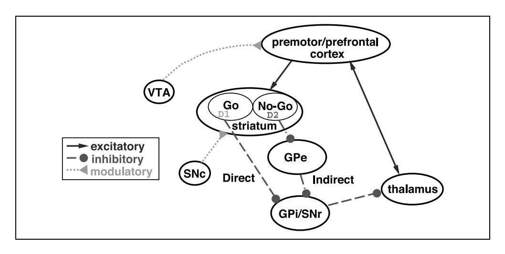
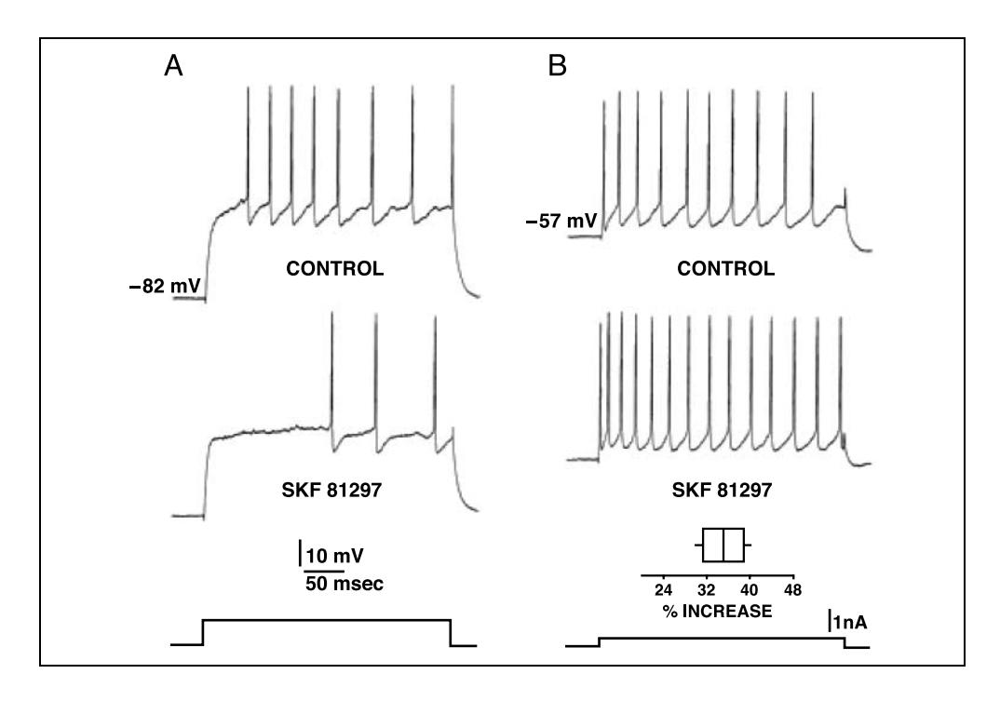
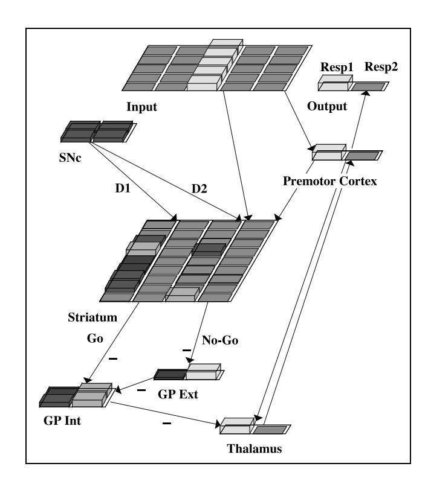
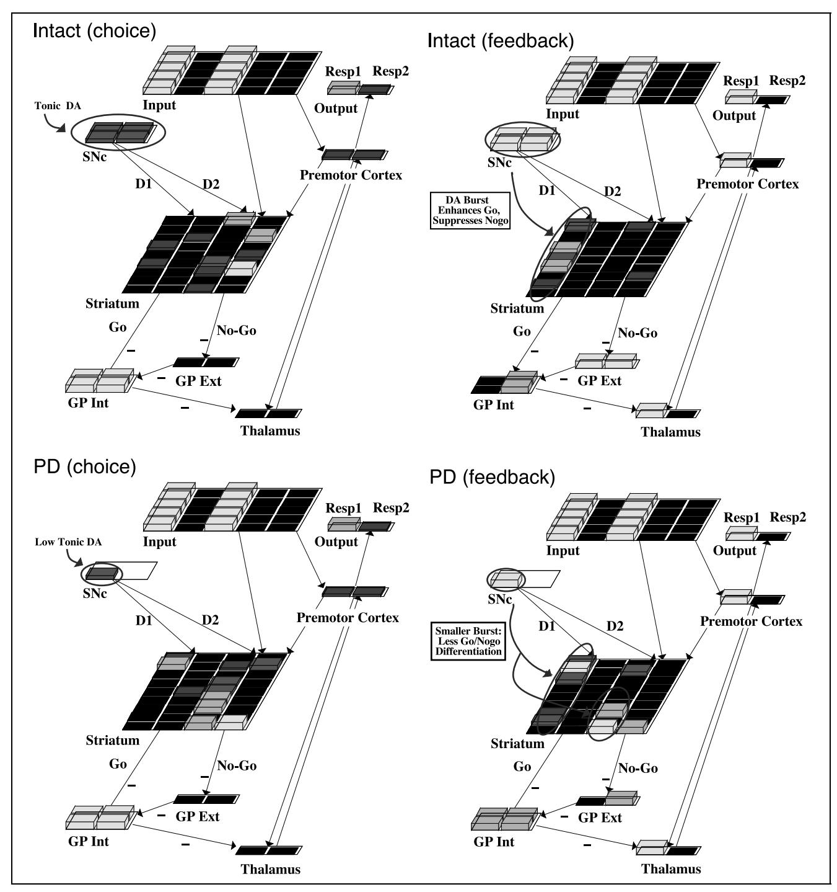
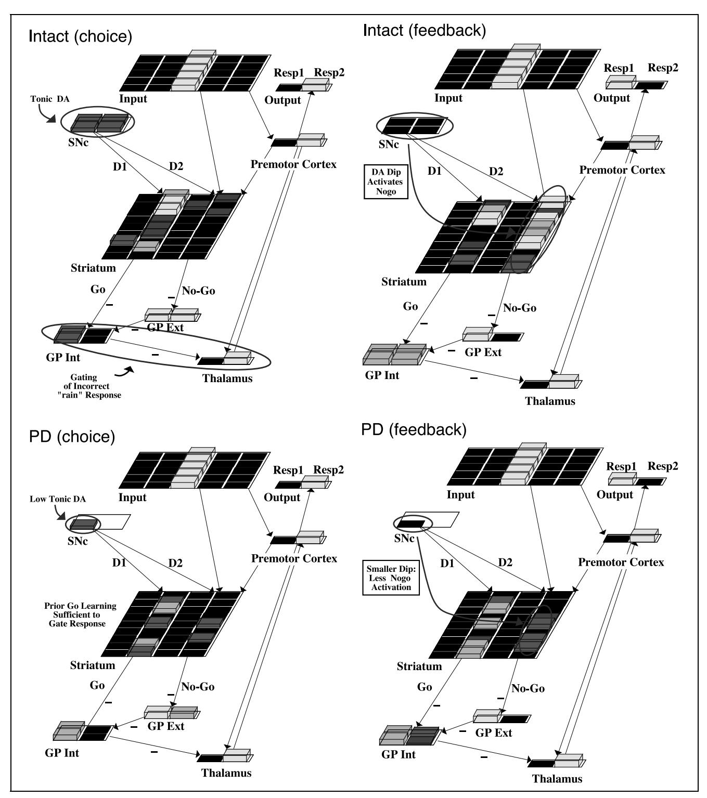
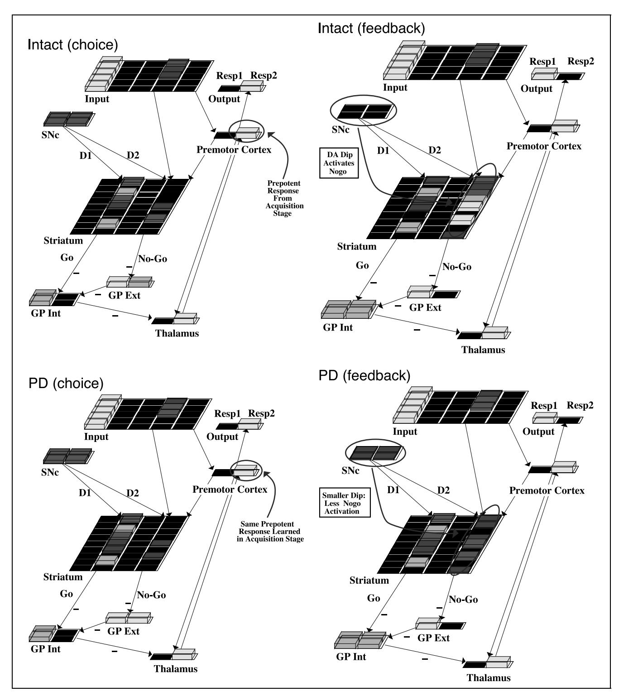
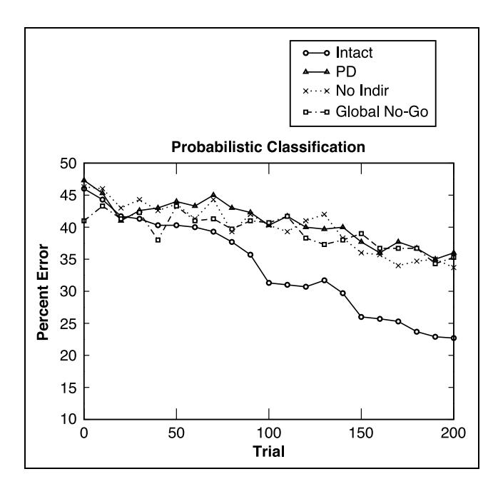
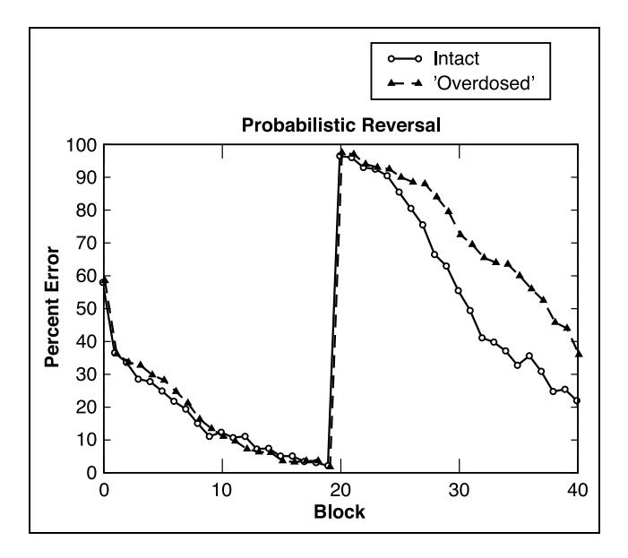

## Dynamic Dopamine Modulation in the Basal Ganglia: A Neurocomputational Account of Cognitive Deficits in Medicated and Nonmedicated Parkinsonism

## Michael J. Frank

#### Abstract

■ Dopamine (DA) depletion in the basal ganglia (BG) of Parkinson's patients gives rise to both frontal-like and implicit learning impairments. Dopaminergic medication alleviates some cognitive deficits but impairs those that depend on intact areas of the BG, apparently due to DA "overdose." These findings are difficult to accommodate with verbal theories of BG/DA function, owing to complexity of system dynamics: DA dynamically modulates function in the BG, which is itself a modulatory system. This article presents a neural network model that instantiates key biological properties and provides insight into the underlying role of DA in the BG during learning and execution of cognitive tasks. Specifically, the BG modulates the execution of "actions" (e.g., motor

responses and working memory updating) being considered in different parts of the frontal cortex. Phasic changes in DA, which occur during error feedback, dynamically modulate the BG threshold for facilitating/suppressing a cortical command in response to particular stimuli. Reduced dynamic range of DA explains Parkinson and DA overdose deficits with a single underlying dysfunction, despite overall differences in raw DA levels. Simulated Parkinsonism and medication effects provide a theoretical basis for behavioral data in probabilistic classification and reversal tasks. The model also provides novel testable predictions for neuropsychological and pharmacological studies, and motivates further investigation of BG/DA interactions with the prefrontal cortex in working memory.

## **INTRODUCTION**

In cognitive neuroscience, brain regions are often characterized as if they implemented localized functions, with relatively little treatment of interactive effects at the network level. In part, this is because interactions are difficult to conceptualize and mileage has been gained from simpler theories. In some cases, however, these theoretical accounts need to be reconsidered. Some brain regions exert their effects only by modulating function in other regions and therefore do not directly implement a cognitive process. This problem is even more elusive when considering effects of neuromodulators in a single brain region, which may have indirect but substantial effects on network dynamics.

This issue applies particularly well to the effects of dopamine (DA) in the basal ganglia (BG), which are critical for many aspects of cognition (Nieoullon, 2002). Because stimulus–response (SR) tasks recruit the BG, many researchers assume that its function is to encode detailed aspects of SR mappings (e.g., Packard & Knowlton, 2002). Others advocate a subtly different modulatory role of the BG to facilitate or suppress SR-like associations that are represented in the cortex (Hikosaka, 1998; Mink, 1996). This article explores the latter

hypothesis and further suggests that DA dynamically modulates activity in an already modulatory BG, as DA levels change in response to different behavioral events. These double modulatory effects are complex and difficult to conceptualize, motivating the use of computational modeling to make them more tenable. In so doing, the model ties together a variety of seemingly unrelated cognitive deficits stemming from DA dysfunction in the BG, as in Parkinson's disease (PD).

The cognitive deficits in PD can be divided into two general classes: those that are "frontal-like" in nature, and those that reflect impairments in implicit learning. On the one hand, patients are impaired at tasks involving attentional processes or working memory (Woodward, Bub, & Hunter, 2002; Rogers et al., 1998; Partiot, Verin, & Dubois, 1996; Dubois et al., 1994; Henik, Singh, Beckley, & Rafal, 1993; Gotham, Brown, & Marsden, 1988). Implicit learning deficits, on the other hand, do not implicate frontal processes because they generally do not involve working memory or conscious knowledge of task demands, and frontal patients do not have such deficits (Knowlton, Mangels, & Squire, 1996). Yet, PD patients are impaired at implicit sequence learning and implicit categorization (Ashby, Noble, Ell, Filoteo, & Waldron, 2003; Maddox & Filoteo, 2001; Jackson, Jackson, Harrison, Henderson, & Kennard, 1995). Similar impairments are observed in probabilistic classification,

University of Colorado

in which participants integrate over multiple trials to extract statistical regularities of the category structure (Knowlton, Mangels, et al., 1996; Knowlton, Squire, & Gluck, 1994). The involvement of DA in these tasks is not straightforward, as dopaminergic medication has both positive and negative effects on cognitive function in PD (Cools, Barker, Sahakian, & Robbins, 2001, 2003; Swainson et al., 2000; Gotham et al., 1988).

Because the neuropathology of PD involves damage to dopaminergic cells in the BG (Kish, Shannak, & Hornykiewicz, 1988), the predominant explanations for the two classes of deficits have been (a) that the damaged BG is interconnected in a functional circuit with prefrontal cortex [PFC] (Middleton & Strick, 2000; Alexander, DeLong, & Strick, 1986), thereby producing frontal deficits, and (b) due to damage to a "neostriatal habit learning system" (Hay, Moscovitch, & Levine, 2002; Knowlton, Mangels, et al., 1996). Finally, the selective cognitive impairments resulting from dopaminergic medication have been attributed to an "overdose" of DA in regions of the BG that are relatively spared in PD (Cools, Barker, et al., 2001; Gotham et al., 1988).

To further understand the role of the BG as a functional cognitive unit, a more mechanistic explanation involving its neurobiology, and specifically the role of DA, is required. What is the role of DA in the BG in modulating frontal processes, and how is it involved in habit learning? This article accounts for Parkinson deficits by integrating aspects of BG biology together with cellular and systems-level effects of DA. In particular, two main populations of cells in the striatum respond differentially to phasic changes in DA thought to occur during error feedback. This causes the two groups of striatal cells to independently learn positive and negative reinforcement values of responses, and ultimately acts to facilitate or suppress the execution of commands in the frontal cortex. Because these cortical commands may differ widely in content, damage to BG DA gives rise to seemingly unrelated deficits.

This article presents a neural network model that incorporates the above features to test their potential role in cognitive function. One of the network's key emergent properties is that a large dynamic range in DA release is critical for BG-dependent learning. That is, the DA signal has to be able to increase and decrease substantially from its baseline levels in order to support discrimination between outcome values of different responses. This dynamic range is reduced in PD, accounting for cognitive deficits. The model further suggests that by tonically increasing DA levels, dopaminergic medications might restrict this dynamic range to always be at the high end of the DA spectrum, adversely affecting some aspects of cognition. For simplicity, only cognitive procedural learning tasks are modeled, but the same arguments can be extended to include interactions with the frontal cortex in working memory (Frank, Loughry, & O'Reilly, 2001), as discussed later.

#### **Probabilistic Classification Deficits**

Probabilistic classification deficits have been studied using the "weather prediction" (WP) task (Knowlton, Squire, et al., 1994). Participants study sets of cards with multiple cues and have to predict whether the cues presented in a given trial are associated with "rain" or "sunshine." The cue-outcome relationships are probabilistic and not easily determined. Healthy participants implicitly integrate information over multiple trials, progressively improving despite not being able to explicitly state the basis of their choices (Gluck, Shohamy, & Myers, 2002). The BG seems to be recruited for this ability, as it is activated during the learning stages of the WP task (Poldrack, Prabakharan, Seger, & Gabrieli, 1999), and is more generally engaged in tasks that emphasize nondeclarative memory (Poldrack, Clark, et al., 2001). The damaged BG in PD likely causes slowed learning observed in patients, just as it has been implicated as a source for habit learning deficits in the motor domain (e.g., Thomas-Ollivier et al., 1999; Soliveri, Brown, Jahanshahi, Caraceni, & Marsden, 1997). But how is the WP task related to habit learning, and exactly what about DA in the BG supports the learning of these so-called habits?

Insight comes from the observation that PD patients are selectively impaired in cognitive procedural learning tasks that involve trial-by-trial error feedback. In purely observational implicit learning tasks (e.g., artificial grammar and prototype learning), patient performance is normative (Reber & Squire, 1999). Among two versions of conditional-associative SR learning, PD patients were only impaired in the one that relied on trial-and-error (Vriezen & Moscovitch, 1990). In implicit categorization tasks, successful integration of information depends on both error feedback (Ashby, Maddox, & Bohil, 2002; Ashby, Queller, & Berretty, 1999) and BG integrity (Ashby, Alfonso-Reese, Turken, & Waldron, 1998).

Taken together, these observations support the notion that feedback-mediated learning occurs in the BG and is therefore disrupted in PD. Feedback may modulate DA release in the BG which, in addition to having a performance effect on response execution, is critical for cognitive reinforcement learning.

## Phasic Bursting of DA Mediates Trial-and-Error Learning

A healthy range of phasic DA bursts during feedback may lead to the unconscious acquisition of stimulus–reward–response associations. Data reviewed below suggest that positive and negative feedback have opposing effects on DA release, which in turn modulates synaptic plasticity and therefore supports learning.

A multitude of data in primates show that DA-releasing cells fire in phasic bursts in response to unexpected reward (Schultz, 1998; Schultz, Dayan, & Montague, 1997).

Equally relevant but sometimes ignored, dopaminergic firing dips below baseline when a reward is expected but not received (Hollerman & Schultz, 1998; Schultz, Apicella, & Ljungberg, 1993). In humans, phasic bursts and dips of DA have been inferred to occur during positive and negative feedback, respectively (Holroyd & Coles, 2002).

Several lines of evidence support the notion that these changes in extracellular levels of DA during feedback are critical for learning. First, DA modifies synaptic plasticity in animal experimental conditions. DA D1 receptor stimulation leads to long-term potentiation (LTP), whereas D2 stimulation restricts LTP (Nishi, Snyder, & Greengard, 1997). Accordingly, LTP is blocked by D1 antagonists and enhanced by D2 antagonists (for a review, see Centonze, Picconi, Gubellini, Bernardi, & Calabresi, 2001). Second, these effects are behaviorally relevant: Administration of D1 antagonists disrupted learning in an appetitive conditioning task, whereas D2 antagonists promoted learning (Eyny & Horvitz, 2003). Third, because DA modulates cellular excitability (Nicola, Surmeier, & Malenka, 2000), associative or "Hebbian" learning may be enhanced in the presence of DA, as this type of learning depends on the levels of activity of the cells in question (Schultz, 2002; Hebb, 1949). Thus, the efficacy of recently active synapses may be reinforced by a burst of DA acting as a "teaching signal," leading to the learning of rewarding behaviors (Wickens, 1997). This account predicts that a delayed DA burst following the behavior should degrade learning by enhancing the strengths of inappropriate synapses. In human category learning, substantial impairments are indeed observed if feedback is delayed by just 2.5 sec after each response (Maddox, Ashby, & Bohil, 2003).

In summary, phasic bursts and dips of DA occur differentially during positive and negative feedback, result in modification of synaptic plasticity, and therefore may be critical for the learning of trial-and-error tasks. A plausible explanation for implicit category learning deficits in PD is that damage to dopaminergic neurons in the BG reduces both the tonic and phasic levels of extracellular DA, diminishing the effectiveness of the habit learning system. Before moving on to a more explicit biologically based version of this theory, the next section discusses the effects of dopaminergic medication on cognition. By artificially increasing levels of DA, medication alleviates some cognitive deficits but actually gives rise to others. This is taken to indicate that the dynamic range of the DA signal may be more critical than its raw level.

## **Deficits Induced by Dopaminergic Medication**

The most common treatments for PD are DA agonists and levodopa (L-Dopa), a DA precursor (Maruyama, Naoi, & Narabayashi, 1996). Many cognitive studies in PD do not take into account the level of medication

administered to the patient, somewhat confounding the interpretation of experimental results. That is, if a null effect is found, it could be attributed to the successful replenishment of DA by 1-Dopa therapy. Conversely, if an effect is found, it is difficult to know if this effect stems from a lack of DA in PD, or is somehow related to the medication. For instance, medication results in elevated levels of tonic DA in undamaged areas. This may prevent phasic dips from being effective and degrade performance when they are functionally important (e.g., during negative feedback).

A series of studies compared cognitive function in medicated versus nonmedicated patients, finding that L-Dopa therapy had positive or deleterious effects on cognitive function, depending on the nature of the task (Cools, Barker, et al., 2001; Swainson et al., 2000; Gotham et al., 1988). The general conclusion was that dopaminergic medication ameliorates task-switching deficits in PD, but that it impairs performance in "probabilistic reversal" [PR] (i.e., learning to reverse stimulus–reward probabilities after prepotent responses are ingrained). Deficits induced by medication are selective to the reversal stage, in which participants must use negative feedback to override prepotent responses.

The interpretation given by these authors stems from the fact that dopaminergic damage in early stage PD is restricted to the dorsal striatum, leaving the ventral striatum with normal levels of DA (Agid et al., 1993; Kish et al., 1988). This explains why DA medication alleviates deficits in task-switching, which relies on dorsal striatal interactions with the dorsolateral PFC. However, the amount of medication necessary to replenish the dorsal striatum might "overdose" the ventral striatum with DA, and is therefore detrimental to tasks that recruit it. Reversal learning depends on the ventral striatum and the ventral PFC in monkeys (Dias, Robbins, & Roberts, 1996; Stern & Passingham, 1995) and recruits these same areas in healthy humans (Cools, Clark, Owen, & Robbins, 2002). The overdose hypothesis is further supported by the finding that medicated, but not nonmedicated, patients exhibited impulsive betting strategies in a gambling task known to recruit the ventral striatum (Cools, Barker, et al., 2003).

If the overdose account is accurate, a key question is why should high levels of DA in the ventral striatum produce deficits in reversal learning? Like categorization tasks, reversal learning relies on trial-by-trial feedback. During positive feedback, phasic bursts of DA may still be released. A notable difference is that higher levels of tonic DA might functionally eliminate the effectiveness of phasic dips in DA during negative feedback. A DA agonist would continue to bind to receptors, as it is not modulated by feedback/reward as is endogenous DA. This by-product of dopaminergic medication may eliminate an important aspect of the natural biological control system—namely, the ability to quickly unlearn previously rewarding behaviors. In nonmedicated

patients and healthy individuals, phasic dips in DA release may ensue after negative feedback in the reversal stage, allowing the participant to unlearn the prepotent association. The overdose of DA in the ventral striatum of medicated patients would hinder this ability.

So far, it has been hypothesized that cognitive deficits in PD arise from a restricted range of DA signals in the BG during error feedback, that does not get completely fixed with medication. This is somewhat vague in that it does not clarify what about the BG supports implicit learning, and how DA modulates processes in the BG. Why should phasic bursts and dips in DA support the learning and unlearning of responses, respectively? For clarity, I now turn to a general (if highly simplified) description of BG circuitry and function, and review the role of DA in modulating this function. A neural network model instantiates these biological properties and provides a mechanistic account of probabilistic classification and reversal deficits in PD. Besides being a useful tool for understanding complex system interactions in implicit learning, the model can be extended to include those involved in modulating prefrontal function in higher level cognition.

# BASAL GANGLIA NEUROANATOMY AND BIOCHEMISTRY

In the context of motor control, various authors have suggested that the BG selectively facilitates the execution of a single motor command, while suppressing all others (e.g., Mink, 1996; Chevalier & Deniau, 1990). The BG does not encode the details of motor responses—it simply modulates their execution by signaling "Go" or "No-Go" (Hikosaka, 1989). Thus, the BG is thought to act as a brake on competing motor actions that are represented in the motor (or premotor) cortex—only the most appropriate motor command is able to "release the brake" and get executed at any particular point in time. This functionality also helps to string simple motor commands together to form a complex motor sequence, by selecting the most appropriate command at any given portion of the sequence and inhibiting the other ones until the time is appropriate. The circuitry that implements these functions is described next.

The input segment of the BG is the striatum, which is formed collectively by the caudate, putamen, and nucleus accumbens. The striatum receives input from multiple cortical areas and projects through the globus pallidus and substantia nigra to the thalamus, ultimately closing the circuit back to the area of the cortex from which it received (e.g., premotor cortex [PMC]) (Alexander, DeLong, et al., 1986). Ninety to ninety-five percent of all striatal neurons are GABAergic medium spiny neurons (MSNs). These are projection cells that carry information to be transmitted to BG output structures. The remaining 5–10% are local interneurons

that are GABAergic and cholinergic (Gerfen & Wilson, 1996).

The MSNs project to the globus pallidus and substantia nigra via two main pathways which have opposing effects on the ultimate excitation/inhibition of the thalamus (Alexander & Crutcher, 1990b). The "direct" pathway facilitates the execution of responses, whereas the "indirect" pathway inhibits them. Cells in the direct pathway project from the striatum and inhibit the internal segment of the globus pallidus (GPi). In the absence of striatal firing, the GPi tonically inhibits the thalamus, so the excitation of direct MSNs and resulting GPi inhibition serves to "disinhibit" the thalamus. Note that the double-negative invoked by this disinhibition does not directly excite the thalamus, but instead simply enables the thalamus to get excited from other excitatory projections (e.g., Frank, Loughry, et al., 2001; Chevalier & Deniau, 1990), thereby providing a gating function. Cells in the indirect pathway inhibit the external segment of the globus pallidus (GPe), which tonically inhibits the GPi.2 The net effect of indirect MSN excitation is then to further inhibit the thalamus (see Figure 1 for a pictorial description of this circuitry).

When striatal cells in the direct pathway disinhibit the thalamus, excitatory thalamocortical projections enhance the activity of the motor command that is currently represented in the motor cortex so that its execution is facilitated. Thus, direct pathway cells send a "Go" signal to select a given response. Indirect pathway activity, with its opposite effect on the thalamus, sends a "No-Go" signal to suppress the response. In support of this model, distinct neuronal activation was found in the monkey striatum in response to two cues that indicated whether the monkey had to execute (Go) or suppress (No-Go) arm movements (Apicella, Scarnati, Ljungberg, & Schultz, 1992).

Whether the direct and indirect pathways compete with each other or function independently is controversial. Because they both ultimately converge on the GPi before either disinhibiting or further inhibiting the thalamus, it would seem these two pathways act competitively to control BG output (Percheron & Filion, 1991). However, subregions of neurons in striatum terminate in distinct subregions within the GPi, suggesting the existence of independent parallel subloops within the overall thalamocortical circuit (Alexander & Crutcher, 1990b), rather than a competitive dynamic. It is plausible that the direct and indirect pathways arising from a subregion in the striatum converge in the GPi and act competitively to facilitate/suppress a particular response, but that this competitive dynamic occurs in parallel for multiple responses. This may allow for "selective" control of different responses, so that one response may be enabled, whereas others are suppressed (Frank, Loughry, et al., 2001; Beiser & Houk, 1998; Mink, 1996). Selection of a given response may involve a Go signal to one area of thalamus, in

Figure 1. The corticostriato-thalamocortical loops, including the direct and indirect pathways of the BG. The cells of the striatum are divided into two subclasses based on differences in biochemistry and efferent projections. The "Go" cells project directly to the GPi, and have the effect of disinhibiting the thalamus, thereby facilitating the execution of an action represented in the cortex. The "No-Go" cells are part of the indirect pathway to the GPi, and have an opposing effect, suppressing actions from getting executed. DA

from the SNc projects to the dorsal striatum, differentially modulating activity in the direct and indirect pathways by activating different receptors: The Go cells express the D1 receptor, and the No-Go cells express the D2 receptor. DA from the VTA projects to the ventral striatum (not shown) and the frontal cortex. GPi = internal segment of globus pallidus; GPe = external segment of globus pallidus; SNc = substantia nigra pars compacta; SNr = substantia nigra pars reticulata; VTA = ventral tegmental area.

conjunction with a No-Go signal to thalamic areas involved in competing responses.

## Cellular Mechanisms of DA in the BG

The dynamics of BG circuitry are importantly modulated by phasic changes in DA. DA is primarily excitatory to D1 receptors and inhibitory to D2 receptors (see below). The functional consequences of DA release can be deduced from the relative segregation of D1 and D2 receptor expression in two main populations of striatal MSNs. The D1 receptor is predominantly expressed in striatal cells of the direct pathway, whereas the D2 receptor predominates in the indirect pathway (Ince, Ciliax, & Levey, 1997; Gerfen, Keefe, & Gauda, 1995; Bloch & LeMoine, 1994; Gerfen & Keefe, 1994; Gerfen, 1992). Even those who caution that there is D1/D2 colocalization in both BG pathways (Aizman et al., 2000; Surmeier, Song, & Yan, 1996) nevertheless concede that the relative levels of expression is asymmetrical. Thus, increased levels of DA activate the direct/Go pathway and suppress the indirect/No-Go pathway (e.g., Brown, Bullock, & Grossberg, 2004; Gurney, Prescott, & Redgrave, 2001). DA depletion of the striatum (as in PD) has the opposite effect, biasing the indirect pathway to be overactive (Gerfen, 2000; Salin, Hajji, & Kerkerian-Le Goff, 1996).

#### D1 Excites/Enhances Contrast of Go Cells

Many studies show an excitatory effect of D1 stimulation (e.g., Kitai, Sugimori, & Kocsis, 1976), but conflicting data also exist (Hernandez-Lopez, Bargas, Surmeier, Reyes, & Galarraga, 1997). One intriguing possibility raised by several researchers is that DA effectively enhances contrast or increases the signal-to-noise ratio

by amplifying activity of the most active cells while inhibiting the least active ones (Cohen, Braver, & Brown, 2002; Cohen & Servan-Schreiber, 1992; Foote & Morrison, 1987; Rolls, Thorpe, Boytim, Szabo, & Perrett, 1984). Recently, cellular mechanisms in the BG were discovered that could potentially support this function (Nicola et al., 2000; Hernandez-Lopez, Bargas, et al., 1997; Figure 2). Specifically, the excitatory/ inhibitory effect of DA on D1 receptors in the rat BG depends on the resting membrane potential of the target cell. In the presence of a D1 agonist, spontaneous firing was reduced in cells that were held at a low membrane potential, but was increased in those held at a more depolarized potential. This is biologically relevant, because medium spiny cells of the BG are bistable: They oscillate between two levels of resting membrane potential (Wilson & Kawaguchi, 1996; Wilson, 1993). The "down-state" refers to a membrane potential of around -80 mV, thought to result from inward rectifying K currents. The "up-state" refers to a membrane potential of around -50 mV, and results from the opening of voltage-dependent Na and Ca channels, upon being excited from temporally coherent, convergent excitatory synaptic input.

Taken together, the above observations suggest that DA, acting via D1 receptors, can sharpen contrast by amplifying activity of cells that are in their up-states and inhibiting those in their down-states from firing spontaneously. This may have the effect of increasing the signal-to-noise ratio, because cells encoding the relevant signal receive temporally coherent synaptic input from multiple cortical afferents and are therefore in their upstate, whereas those reflecting biological noise or other irrelevant background signals may be in their down-state and only firing spuriously.3 The increased signal-to-noise ratio in the direct pathway may help to determine

Figure 2. Medium spiny cells in the basal ganglia are bi-stable, spontaneously switching between two levels of resting membrane potential, commonly labeled "up-state" (V) and "down-state" (V), depending on amount of afferent drive. Cells are more likely to fire when in the up-state, but may still fire spontaneously in the down-state. DA D1 receptor activity may increase the signal-to-noise ratio. In the presence of D1 agonist SKF 81297, firing is (A) reduced for cells that are in their "down-state," but (B) increased for cells in their "up-state." (Reproduced with permission from Hernandez-Lopez, Bargas, et al. (1997). Copyright 1997 by the Society for Neuroscience.)

which among several responses is most appropriate to select.

At a molecular level, D1 activation enhances L-type Ca channel currents in striatal MSNs (Surmeier, Bargas, Hemmings, Nairn, & Greengard, 1995). It appears that this is the mechanism by which the DA contrast sharpening is operating, because both the excitatory and inhibitory DA effects were blocked by L-type Ca channel antagonists (Hernandez-Lopez, Bargas, et al., 1997).

## D2 Inhibits No-Go Cells—"Releasing the Brakes"

In the case of the D1 receptor, the contrast achieved by its activation is thought to be by way of enhancement of L-type Ca channel currents, described above. Recently, it was shown that D2 activation reduces these same currents, thereby reducing neuronal excitability (Hernandez-Lopez, Tkatch, et al, 2000). Unlike the D1 modulatory effects, the D2 inhibition effect on neuronal excitation was not found to be dependent on the membrane potential of the target cell. These results confirmed a long held assumption that DA suppresses activity in the indirect pathway via D2 receptors, and that this is disrupted in PD (Albin, Young, & Penney, 1989).

Recall that striatal cells expressing D2 receptors predominate in the indirect/No-Go pathway, which is thought to act as a brake on a particular action or set of actions. DA can then aid in releasing the brake, by inhibiting No-Go activity via D2 receptors, and allowing the Go pathway to exert more influence on BG output. By this account, DA shifts the balance in the BG from being "hesitant" to a more responsive state, effectively

lowering the threshold for selecting/gating a response to be executed. This explains why Parkinson's patients, who have a lack of DA in the BG, have difficulty initiating motor commands—without a reasonable amount of basal DA release, the system is in a tonic state of "No-Go" because an overactive indirect pathway leads to excessive cortical inhibition (Jellinger, 2002; Filion & Tremblay, 1991). With enough DA, the balance is shifted to "Go," and the particular response that is executed may depend on levels of activity of different subpopulations—representing different responses—in the direct/Go cells. The D1 contrast enhancement mechanism described above would aid in selecting the most appropriate response by boosting its associated neural activity, while suppressing that of all other Go cells.

# DA in the BG: Summary and Effects on Synaptic Plasticity

In summary, increases in DA result in (a) increased contrast enhancement in the direct pathway; and (b) suppression of the indirect pathway. Phasic dips in DA have the opposite effect, releasing the indirect pathway from suppression.

An important consequence of DA performance effects on Go/No-Go activity levels is that they drive activity-dependent learning to synaptic input. A well-established principle should hold across both Go and No-Go cells: More active cells undergo LTP, whereas less active cells undergo long term depression (LTD) (e.g., Bear & Malenka, 1994). Once we account for differential effects of DA on excitability in the two BG pathways, this principle makes straightforward predictions on their effects

on plasticity. If DA bursts during reinforcement are adaptive, they should have the complementary effects of increasing Go learning while decreasing No-Go learning so that reinforced responses are more likely to be facilitated in the future. Because DA enhances activity in the direct pathway, bursts may indeed induce LTP in Go cells. Further, the inhibitory effects of DA in the indirect pathway may induce LTD in No-Go cells so that they learn to become *less* active. This hypothesis is supported by demonstrations that DA induces LTP via D1 receptors and LTD via D2 receptors (Kerr & Wickens, 2001; Calabresi et al., 1997).

The same principle can be applied to predict the effect of DA dips, which, if they are adaptive, should enhance No-Go learning so that nonreinforcing responses are actively suppressed in the future. Because DA dips release No-Go cells in the indirect pathway from DA inhibition, the increased No-Go activity should induce LTP in No-Go cells. Although LTP has not been tested during endogenous DA dips, this hypothesis is indirectly supported by examining the effects of D2 receptor blockade, assuming that DA dips decrease D2 stimulation and should therefore have the same qualitative effects on the indirect pathway as D2 blockade. When stimulated by cortical inputs, D2 blockade increases bursting activity and Fos expression of striatal cells in the indirect pathway (Finch, 1999; Robertson, Vincent, & Fibiger, 1992), and results in enhanced corticostriatal LTP (Calabresi et al., 1997).

#### NEURAL MODEL OF BG AND DA

The hypothesis is that cognitive deficits in PD can be accounted for by a reduced dynamic range of phasic DA signals which reduces the ability to unconsciously learn Go/No-Go associations. This verbal explanation alone is not sufficient, but may be substantially strengthened by testing its feasibility in a computational model that incorporates all the key elements. Such a model can generate novel predictions because it gets at the underlying source of cognitive dysfunction in PD. If validated, it can also be used as a tool to understand complex involvement of DA in the BG in other neurological disorders.

The above anatomical and biochemical considerations are synthesized in a neural network model (Figure 3). The model learns to select one of two responses to different input stimuli. Direct and indirect pathways enable the model to learn conditions that are appropriate for gating as well as those for suppressing. Parallel subloops independently modulate each response, allowing selective facilitation of one response with concurrent suppression of the other. Projections from the substantia nigra pars compacta (SNc) to the striatum incorporate modulatory effects of DA. Phasic bursts and dips in SNc firing (and therefore simulated DA release) ensue from correct and incorrect responses, respectively. These phasic changes drive learning by pref-

**Figure 3.** Neural network model of direct and indirect pathways of the BG, with differential modulation of these pathways by DA in the SNc. The PMC selects a response via direct projections from the input. BG gating results in bottom-up support from the thalamus, facilitating execution of the response in the cortex. In the striatum, the response has a Go representation (first column) that is stronger than its No-Go representation (third column). This results in inhibition of the left column of the GPi and disinhibition of the left thalamus unit, ultimately facilitating the execution of Response1 in the PMC. A tonic level of DA is shown here, during the response selection ("minus") phase. A burst or dip in DA ensues in the feedback ("plus") phase (see Figures 4, 5, and 6).

erentially activating the direct pathway after a correct response and the indirect pathway after an incorrect response. The model is trained on simulated versions of the WP task and PR task. Disruption to the DA system as in PD and "overdose" cases produces results that are qualitatively similar to those observed behaviorally.

## **Mechanics of the Model**

The units in the model operate according to a simple "point neuron" function using rate-coded output activations, as implemented in the *Leabra* framework (O'Reilly & Munakata, 2000; O'Reilly, 1998). There are simulated excitatory and inhibitory synaptic input channels. Local inhibition in each of the layers is computed through a simple approximation to the effects of inhibitory interneurons. Synaptic connection weights were trained using a reinforcement learning version of Leabra. The learning algorithm involves two phases, allowing simulation of feedback effects, and is more biologically plausible than standard error backpropagation. In the

"minus phase," the network settles into activity states on the basis of input stimuli and its synaptic weights, ultimately choosing a response. In the "plus phase," the network resettles in the same manner, with the only difference being a change in simulated DA: An increase for correct responses, and a dip for incorrect responses. Connection weights are then adjusted to learn on the difference between activity states in the minus and plus phases.

#### **Overall Network Division of Labor**

The network's job is to select either Response1 or Response2, depending on the task and the sensory input. At the beginning of each trial, incoming stimuli directly activate a response in the Premotor cortex (PMC). However, these direct connections are not strong enough to elicit a robust response in and of themselves; they also require bottom-up support from the thalamus. The job of the BG is to integrate stimulus input with the dominant response selected by the PMC, and on the basis of what it has learned in past experience, either facilitate (Go) or suppress (No-Go) that response.

Within the overall thalamocortical circuit, there are two parallel subloops that are isolated from each other, separately modulating the two responses. This allows for the BG to *selectively* gate one response, while continuing to suppress the other(s). This was implemented in our previous model (Frank, Loughry, et al., 2001), and has been suggested by others (Beiser & Houk, 1998). The striatum is divided into two distributed subpopulations. The two columns on the left are "Go" units for the two potential responses, and have simulated D1 receptors. The two columns on the right are "No-Go" units, and have simulated D2 receptors. Thus, the four columns in the striatum represent, from left to right, "Go–Response1," "Go–Response2," "No-Go–Response1," and "No-Go–Response2."

The Go columns project only to the corresponding column in the GPi (direct pathway), and the No-Go columns to the GPe (indirect pathway). Both GPe columns inhibit the associated column in GPi, so that striatal Go and No-Go activity have opposing effects on the GPi. Finally, each column in the GPi tonically inhibits the associated column of the thalamus, which is reciprocally connected to the PMC. Thus, if Go activity is stronger than No-Go activity for Response1, the left column of the GPi will be inhibited, removing tonic inhibition (i.e., disinhibiting) of the corresponding thalamus unit, and facilitating its execution in the PMC.

The above parallel and convergent connectivity is supported by anatomical evidence discussed above. The network architecture simply supports the existence of connections, but how these ultimately influence behavior depends on their relative strengths. The network starts off with random weights and representations in both the BG and cortical layers are learned. Distributed

activity within each striatal column enables different Go and No-Go representations to develop for various stimulus configurations during the course of training.

#### Simulated Effects of DA

To simulate differential effects of DA on D1 and D2 receptors in the two populations of striatal cells, separate excitatory and inhibitory projections were assigned from the SNc to the direct and indirect pathways in the striatum. Thus, the D1 projection only connects to the Go columns of the striatum, whereas the D2 projection connects only to the No-Go columns. Besides being excitatory, the effects of D1 activity involve contrast enhancement. This was accomplished by increasing the striatal units' activation gain (making it more nonlinear), in conjunction with increasing the activation threshold (so that weakly active units do not exceed firing threshold and are suppressed). The effects of D2 activity are inhibitory, suppressing the No-Go cells. Thus, for a high amount of simulated DA, contrast enhancement in the direct pathway supports the enabling of a particular Go response, whereas the indirect pathway is suppressed.

## DA Modulates Learning

Increases in DA during positive feedback lead to reinforcing the selected response, whereas decreases in DA during negative feedback lead to learning not to select that response. A tonic level of DA is simulated by setting the SNc units to be semi-active (activation value 0.5) at the start of each trial, in the minus phase. In the initial stages of training, the network selects a random response, dictated by random initial weights together with a small amount of random noise in PMC activity. If the response is correct, a phasic increase in SNc firing occurs in the plus phase, with all SNc units set to have an activation value of 1.0 (i.e., high firing rate). This burst of DA causes a more coherent Go representation in the striatum to be associated with the rewarding response that was just selected. For an incorrect response, a phasic dip of DA occurs, with all SNc units set to zero activation. In this case, the No-Go cells are released from suppression, enabling the network to learn No-Go to the selected incorrect response.

Note that an explicit supervised training signal is never presented; the model simply learns on the basis of the difference between activity states in the minus and plus phases, which only differ due to phasic changes in DA. Weights from the input layer and the PMC are adjusted so that over time, the striatum learns which responses to facilitate and which to suppress in the context of incoming sensory input. In addition, the PMC itself learns to favor a given response for a particular input stimulus, via Hebbian learning from the input layer. Thus, the BG initially learns which response to gate via phasic changes in DA ensuing from random cortical responses, and then

this learning transfers to the cortex once it starts to select the correct response more often than not. This reflects the idea that the BG is not an SR module, but rather modulates the gating of responses that are selected in the cortex.

#### **Probabilistic Classification Simulations**

The WP task (Knowlton, Squire, et al., 1994) involves presenting cards made up of four possible cues that have different probabilities of being associated with "rain" or "sun." The predictability of the individual cues is 75.6%, 57.5%, 42.5%, and 24.4%. Actual trials involve presenting from one to three cues simultaneously, for a total of 14 cue combinations, making it difficult to become explicitly aware of the probability structure.

In the network, cues are presented in the input, and potential responses are immediately but weakly activated in the PMC (Figure 4). The BG gates one of the two responses if its associated "Go" representation is strong enough, facilitating its execution and suppressing that of the alternative response. If the probabilistically determined feedback to the selected response is positive, a phasic DA burst is applied in the plus phase, resulting in an enhanced Go representation and associated learning. Negative feedback results in a phasic dip of DA in the plus phase, releasing No-Go cells from suppression and allowing the network to learn not to gate the selected response. Over the course of training, networks integrate Go and No-Go signals in the context of different cue combinations to learn when it is most appropriate to gate sun and rain responses.

Performance measures involve percentage of "optimal" responses, rather than percentage of responses that were associated with (probabilistically determined) positive feedback provided to the network. Thus, individual responses that had negative outcomes, but were actually the best choice according to the odds, were scored correctly. Similarly, positive outcome responses that were suboptimal were scored incorrectly. These optimal responding measures are consistently used in the behavioral paradigms (e.g., Gluck et al., 2002). Of course, networks were not trained with this error measure but were provided the same probabilistic feedback that would have been given to the human participant.

Further implementational details of the WP task are described in the Methods section.

## Simulated Parkinsonism

Parkinson's disease was simulated by "lesioning" three out of four SNc units so that they were tonically inactive, representing the cell death of approximately 75–80% of dopaminergic neurons in this area (bottom of Figures 4 and 5). This has the effect of reducing tonic DA in the minus phase, as well as phasic DA during feedback in the plus phase. Although the percentage increase/decrease

in phasic firing relative to baseline is the same for intact and Parkinson networks, the total amount of DA is reduced by a factor of four, resulting in reduced dynamic range of the DA signal. Dynamic range is critical for learning appropriate Go/No-Go representations from error feedback, as network weights are adjusted on the basis of difference in activity states in the two phases of network settling. Because tonic DA levels are low, PD networks have an overall propensity for No-Go learning, but the dynamic range of phasic dips during negative feedback is reduced. Go learning is degraded because limited amounts of available DA reduce the potency of phasic bursts, activating less of a Go representation during positive feedback.

Less DA in PD also diminishes the contrast enhancement effects of D1 receptor stimulation, further weakening the learning of Go signals. Smaller bursts of DA in PD nets led to less contrast enhancement during positive feedback, by reducing the change in unit activation gain and threshold by a factor of four (see Methods). Thus, degraded Go learning is exacerbated because of reduced contrast enhancement that would normally amplify the Go signal during positive feedback.

#### Testing the Contribution of the Indirect Pathway

Because other BG models include the direct, but not necessarily the indirect, pathway, the contribution of the latter was evaluated in two different conditions. First, the indirect pathway was disconnected: No-Go units in the striatum no longer projected to the GPe. In these networks, No-Go units were still activated by synaptic input and modulated by DA, but had no effect on BG output. Instead, GPe units tonically inhibited the GPi. This manipulation eliminates the effects of the indirect pathway so that all discrimination learning must be accomplished by comparing Go associations in the direct pathway. Although it is technically possible that this manipulation simply lowers the threshold for gating in the direct pathway by providing more tonic inhibition to the GPi (i.e., less overall No-Go), this possibility was accounted for by varying the strength of GPe-GPi inhibitory projections from zero to maximal inhibition. Results reported below are for the best of these cases, which is still substantially worse than the full BG model.

A second test of the indirect pathway was conducted to evaluate the role of response-specific No-Go representations. The hypothesis advocated in this article is that each response develops both Go and No-Go representations as a result of positive and negative feedback, and that these representations compete in order to facilitate or suppress the response. However, it is also possible that only Go representations in the striatum are response-specific, and that the indirect pathway represents a more global No-Go signal. In the model, this condition was tested by making GPe units in each column project to both columns of the GPi (rather than

**Figure 4.** A positive feedback trial in the weather prediction task, for both intact and "Parkinson" networks. This trial consists of two cues, represented by the two columns of active units in the input layer. Intact (choice): Response selection (minus phase) activity in the intact network. Early in training, the BG has not learned to gate either response, as shown by an active GPi and inhibited thalamus. The PMC is weakly active due to direct connections from sensory input. The most active (left) unit in the PMC, corresponding to "sun," determines the output response. Intact (feedback): Because the model "guessed" correctly, a phasic burst of DA firing occurs in the SNc. This has the effect of activating Go units associated with the selected response (via D1 contrast enhancement), and suppressing No-Go units (via D2 inhibition). Weights are adjusted based on differences in network activity between the minus and plus phases. The enhanced Go representation in the plus phase drives learning to gate the "sun" response. PD (choice): Response selection (minus phase) activity in the PD network, for the same trial. Note the reduced number of intact SNc units, which causes the No-Go units to be more active. Again, there is no BG gating early in training and the model selects a random response from sensory—motor projections. PD (feedback): Correct guessing leads to a phasic burst of DA in the plus phase. However, this phasic burst is not as effective because it applies to only one SNc unit, and therefore only weakly activates more Go units while some No-Go activity persists. Reduced dynamic range of DA in the PD network results in less difference in activity levels between the two phases of network settling, causing less learning.

**Figure 5.** A negative feedback trial in the weather prediction task for both intact and "Parkinson" networks. Intact (choice): A single cue is presented. Based on previous learning, the Go units for "rain" are sufficiently active to gate that response, indicated by the inhibition of right GPi units and disinhibition of the right thalamus unit. Intact (feedback): The feedback on this particular trial is negative (due to probabilistic outcomes), shown by a phasic dip of DA firing in the SNc. The lack of DA removes suppression of No-Go units via D2 receptors, which are then more active than the Go units. The DA dip therefore drives No-Go learning to the incorrect response selected for this cue. Note the output layer displays the target response for the trial, but this is not used as a training signal: The only signal driving learning is the change in SNc DA. PD (choice): The PD network has also learned to gate the "rain" response for this same trial, based on previous learning. PD (feedback): Feedback is incorrect, and the phasic dip of DA in the SNc leads to activation of some No-Go units. However, the PD network already had low amounts of tonic DA, causing an overall propensity for No-Go learning, so this phasic dip is smaller and therefore not as effective. Reduced dynamic range of DA in the PD network results in less difference in activity levels between the two phases of network settling.

**Figure 6.** A trial in the probabilistic reversal task. Two cues are presented at the input, and the model has to select one of them (see Methods for details). The trial shown here is in the reversal stage, during which the model has to learn "No-Go" to the prepotent response before it can switch to selecting the alternative. Reduced dynamic range of DA in the "overdosed" (OD) network causes degraded ability to learn No-Go. Intact (choice): Based on learning in the acquisition stage, the network chooses the stimulus on the right (Resp2). Intact (feedback): In the reversal stage, this choice is incorrect. Phasic dips in SNc release No-Go units from suppression, so that the network can subsequently learn not to perseverate. OD (choice): The same trial is presented to the OD network. Unimpaired Go learning in the acquisition stage results in selection of the same response as the intact network. OD (feedback): A phasic dip is applied to SNc on incorrect trials in the reversal stage, but a residual level of activation due to simulated medication results in weaker activation of No-Go units. The network then takes longer to unlearn the initial response, causing reversal deficits.

Figure 7. Weather prediction task learning curves, averaged over 25 networks for each condition. Intact: Full BG model with direct and indirect pathways modulated by phasic changes in simulated DA during error feedback; PD: simulated Parkinson's disease, modeled by lesioning 75% of dopaminergic units in SNc; No Indir: BG model with the indirect pathway disconnected from the striatum to the GPe; Global No-Go: Full BG model in which No-Go representations globally suppress all responses nonselectively. PD networks are impaired at learning the probabilistic structure, due to impoverished phasic changes in DA in response to feedback. Models without the indirect pathway or with global No-Go representations have reduced discriminability because they can only compare the strength of Go representations to decide which response to facilitate. In contrast, intact models can use response-specific Go and No-Go representations that develop over training in order to more selectively facilitate and suppress responses.

to just the corresponding column), so that No-Go units in the striatum had the same effect on both responses. Because this may amount to more overall inhibition from the GPe to the GPi, once again the strength of these inhibitory projections was varied from zero to maximal and the best case results were reported.

## **Probabilistic Reversal Simulation**

In the PR task (Swainson et al., 2000), the participant is presented with two stimuli on a touch-sensitive computer screen and has to choose one of them (by touching it). Feedback provided after each response is probabilistic, with an 80%/20% ratio of reinforcement for the "correct" stimulus. After a number of trials, the probabilities of correct feedback are suddenly reversed, unbeknownst to the participant.

In the model, training involves two stages: acquisition and reversal. In the acquisition stage, the network had to learn which of two stimuli to select. The probabilities associated with correct response were 80% for

selecting Stimulus 1 and 20% for selecting Stimulus 2. Positive feedback was associated with a DA burst, and negative feedback was associated with a dip. After 50 blocks of trials, these probabilities were reversed, and the feedback effects of DA were necessary to learn No-Go to the prepotent learned response (Figure 6). Once No-Go representations are strong enough to suppress gating, random cortical activity leads to sometimes choosing the opposite response and DA reinforcement of the corresponding Go representation, enabling reversal.

Further implementational details of the PR task are described in the Methods section.

#### Simulated DA Medication

To model DA overdose in the ventral striatum of medicated patients (Cools, Barker, et al., 2001, 2003; Swainson et al., 2000; Gotham et al., 1988), all SNc units remained intact. This reflects the fact that the ventral striatum, which is recruited in this task, is relatively spared from dopaminergic damage in moderate PD. The difference between intact and "overdosed" networks was simply an increase in overall level of DA. In the minus phase, the tonic level of DA was increased from an SNc unit activation value of 0.5 to 0.65, reflecting the greater baseline level of DA. Negative feedback in the plus phase resulted in an activation value of 0.25, instead of zero SNc activation. This is still a phasic dip relative to the tonic level, but is meant to simulate the possibility that DA release

**Figure 8.** Probabilistic reversal results for intact networks and for those with simulated dopamine "overdose," averaged over 25 networks for each condition. Each block consists of 10 trials; reversal of stimulus—outcome probabilities occurred at block 20. Overdosed networks were selectively impaired at learning this reversal, despite performing as well as intact networks in the acquisition phase. A smaller phasic dip in DA during negative feedback resulted in diminished ability to learn "No-Go" to the prepotent response that was learned in the initial acquisition.

has less dynamic range in the overdose case (see above for elaboration and justification). Positive feedback resulted in SNc unit activation of 1.0.

The DA overdose manipulations degraded networks' ability to learn No-Go representations during negative feedback, as No-Go units were suppressed by the increased levels of DA. This selectively impairs reversal learning, in which "No-Go" must be learned to a prepotent response.

#### **RESULTS**

#### **Probabilistic Classification**

Despite not having an explicit supervised training signal, simulated phasic DA release during error feedback allowed intact networks to extract the probability structure, scoring 77% optimal responding after 200 trials of training (Figure 7). "Parkinson" networks were impaired, only scoring 64% optimal responding. Statistical analysis indicated that this difference was highly significant [F(1,24) = 20.8, p = .0001]. Two other conditions were run to evaluate the contribution of responsespecific No-Go representations in the indirect pathway. Networks with a disconnected indirect pathway were significantly impaired relative to intact networks [65% optimal responding, F(1,24) = 11.9, p = .002]. Similarly, networks that had both direct and indirect pathways but only had global No-Go representations (i.e., No-Go units in the striatum affected both responses nonselectively) were also impaired [64% optimal responding, F(1,24) =7.13, p = .013]. In both these cases, parameters were searched to ensure that impairments were not simply due to an overall threshold for responding, by varying the strength of inhibitory connections from the GPe to the GPi-results reported here are for the best cases over the range from zero to maximal inhibition (which for both cases involved an inhibitory strength of approximately 70% of that in the full model).

#### **Probabilistic Reversal**

The results for the PR task were clearcut: "overdosed" networks were selectively impaired at reversing the probabilistic discrimination (Figure 8). Both intact and overdosed networks were able to acquire the initial 80%/20% probabilistic discrimination, with no significant differences between performance in the acquisition phase [97.8% and 98.2 % optimal responding after 200 trials, F(1,24) = .4, ns]. Intact networks consistently learned to reverse this discrimination after a further 200 trials of training, with 78% optimal responding. In contrast, overdosed networks were slower to reverse the initial discrimination, only attaining 64% optimal responding after the same amount of training. These reversal learning differences were significant [F(1,24) = 4.80, p = .038]. DA depletion, as is the case for severe PD in the ventral

striatum, resulted in nonselective impairment in both stages (not shown).

#### **DISCUSSION**

This work presents a theoretical basis for cognitive procedural learning functions of the basal ganglia (BG). A neural network model incorporating known biological constraints provides a mechanistic account of cognitive deficits observed in PD patients. A key aspect of the model is that phasic changes in DA during error feedback are critical for the implicit learning of stimulus–reward–response contingencies, as in probabilistic classification and reversal.

In brief, the model includes competitive dynamics between striatal cells in the direct and indirect pathways of the BG that facilitate or suppress a given response. The cells that detect conditions to facilitate a response provide a "Go" signal, whereas those that suppress responses provide a "No-Go" signal. Habit learning is supported by this circuitry because DA release dynamically modulates the excitability and synaptic plasticity of these pathways so that the most reinforcing responses are subsequently facilitated, whereas those that are more ambiguous are suppressed.

Simulated Parkinsonism, by reducing the amount of DA in the model and thus its modulatory effects on Go and No-Go representations, produced qualitatively similar results to those observed in PD patients learning the WP task (Knowlton, Mangels, et al., 1996; Knowlton, Squire, et al., 1994). Less DA led to less contrast enhancement and lower ability to resolve Go/No-Go association differences needed for discriminating between subtly different response reinforcement histories.

Although it could be argued that the simulated indirect pathway is superfluous and that discrimination learning can happen in the direct pathway alone, networks with disrupted indirect pathways were substantially impaired. These results held even when the threshold for facilitating responses in the direct pathway was systematically varied, ensuring that the indirect pathway does not simply set an overall threshold that feasibly could be implemented in the direct pathway alone. Rather, the indirect pathway makes a genuine contribution by developing response-specific No-Go representations that compete with Go representations to enhance discriminability. Without response-specific No-Go representations, the BG is likely to signal "Go" to whichever response happens to be slightly more active in the PMC.

## **Medication-dependent Deficits**

The model also offers some insight as to why patients on medication are impaired at PR. Simulated DA overdose produced qualitatively similar results to those observed in medicated patients in PR (Cools, Barker, et al., 2001; Swainson et al., 2000; Gotham et al., 1988). That is,

"overdosed" networks were selectively impaired in the reversal stage, but performed as well or better than control networks in the initial discrimination.

The model provides a mechanistic description of how DA medication may lead to reversal impairments that is generally consistent with the overdose hypothesis advocated by authors of the behavioral studies. In intact networks, negative feedback in the reversal stage was associated with phasic dips in DA, which led to activation of striatal No-Go cells by transiently releasing them from the inhibitory influence of DA. The activation of these cells led to suppressing the execution of prepotent responses, allowing networks to learn to reverse responding. In "overdosed" networks, a residual level of DA during negative feedback continued to suppress No-Go cells (via simulated D2 receptors), leading to response perseveration. This account predicts that tonic stimulation of just the D2 receptor should produce similar reversal impairments, which are indeed observed in both healthy humans and nonhuman primates administered D2 agonists (Mehta, Swainson, Ogilvie, Sahakian, & Robbins, 2000; Smith, Neill, & Costall, 1999).

The above account is also consistent with event-related fMRI studies in humans showing caudate activation during the reception of negative feedback (Monchi, Petrides, Petre, Worsley, & Dagher, 2001), and ventral striatum activation during the final reversal error in a PR task (Cools, Clark, et al., 2002). Phasic dips in DA during negative feedback should cause an increase in fMRI signal due to the transient activation of No-Go cells. In the PR task, striatal activation was found specifically during the trial that participants used negative feedback to successfully reverse their behavior on subsequent trials.

Alternative mechanisms are possible to explain reversal learning deficits in patients taking dopaminergic medication. For instance, medication may simply prevent "unlearning" in direct pathway Go cells, rather than suppressing the learning of No-Go cells in the current model. In support of this theory, rats with L-Dopainduced dyskinesia had a selective impairment in the depotentiation (i.e., reversal of LTP) of corticostriatal synapses (Picconi et al., 2003), ostensibly due to changes in the D1 receptor pathway. However, it is not clear whether this depotentiation impairment alone can account for reversal deficits: Normal depotentiation takes in the order of 10 min and therefore is not sufficient to induce reversal in a matter of a few trials. Furthermore, the fact that D2 agonists impair reversal implicates a role of the indirect pathway to activate "No-Go" representations and actively avoid situations. Through its pushpull circuitry, the model suggests that the BG is specialized to quickly learn changes in rewarding information.

#### Relation to Other Models of DA in the BG

Other computational models of the BG have focused more on how response selection and reward information may be implemented in biological circuitry (e.g., Brown et al., 2004; Gurney et al., 2001; Beiser & Houk, 1998), but to my knowledge have not attempted to model cognitive implicit learning tasks. Thus, it is unclear how prior BG models would account for medicated and nonmedicated cognitive impairments in PD. Nevertheless, a comparative analysis of the critical features of the current model with that of others may explicitly demonstrate both consistencies across models as well as novel aspects of the current model that account for behavioral phenomena.

The model builds on earlier work on the interactions between the BG and the PFC in working memory (Frank, Loughry, et al., 2001), but differs from it in three key aspects. First, the earlier model only included the direct "Go" pathway, as its "No-Go" responses to taskirrelevant stimuli were assumed and hand-wired. The current model includes the competing processes of the indirect pathway, and whether to gate (Go) or suppress (No-Go) a response is learned. Second, the current model includes the SNc/VTA so that the role of DA can be implemented, with simulated D1 and D2 receptors in the striatum. Third, the current model does not include the PFC or maintenance of information over time, as the simulated tasks do not involve working memory. Instead, the cortical layer in the model is a simpler PMC, representing just two different possible responses (although in principle it could be extended to include several responses).

The model is consistent with other models of DA in the BG (Brown et al., 2004; Monchi, Taylor, & Dagher, 2000; Taylor & Taylor, 1999), in that DA has a performance effect, by differentially modulating excitability in the direct and indirect pathways. A notable difference is that in the current model DA also enhances contrast in the direct pathway by exciting highly active units and suppressing weakly active units, instead of being globally excitatory. This modulatory effect is important for selecting among competing responses, and is motivated by the observed D1 receptor activation excitation of striatal cells in the "up-state," but inhibition of those in the ("down-state"; Hernandez-Lopez, Bargas, et al., 1997).

Perhaps a more substantial difference is that although prior models emphasize the tonic effects of DA, the current model also incorporates phasic changes in DA release during positive and negative feedback. Positive feedback results in a phasic burst of DA, transiently biasing the direct pathway and suppressing the indirect pathway. Negative feedback results in a phasic dip in DA, and has the opposite effect. Learning is driven by these transient changes: Weight values are modified on the basis of the difference between phases of response selection (hypothesized to involve moderate amounts of DA) and error feedback (hypothesized to involve phasic increases/decreases in DA). Reinforcement learning accounts of DA in the BG have been suggested by others (e.g., Doya, 2000; Suri & Schultz, 1999), and allow

flexible learning of rewarding and nonrewarding behaviors that may change over time.

Another distinguishing feature in the current model is that a particular response is selected by the PMC—the BG simply gates this response if it detects the conditions to be appropriate (i.e., predictive of reward). Thus, the BG is not an SR module, but instead modulates the efficacy of responses being selected in the cortex. This is consistent with observations that striatal firing occurs after that in the PMC and the supplementary motor area (e.g., Alexander & Crutcher, 1990a; Crutcher & Alexander, 1990; see also Mink, 1996). Thus, in contrast to the long held assumption that the BG initiates motor responses, this model suggests that it facilitates or gates responses that are being considered in the PMC. The model further suggests that cortical learning of response selection is mediated by way of DA reward system in the BG, but that once this learning is achieved, the cortex itself selects the response. This is consistent with the observation that Parkinson's patients have specific trouble learning novel motor actions, and with the hypothesis that the BG is only necessary for the learning of new categories but not for categorization behavior in experts, which may be mediated directly from perceptual to motor areas (Ashby, Alfonso-Reese, et al., 1998).

## **Implications for Frontal Deficits**

That PD patients have both implicit learning and frontal deficits—which are not intuitively related—suggests that a better understanding of BG specialization would inform us about how cognition operates as a functional system. The present work only modeled implicit processes in habit learning, which do not have a prefrontal component (Knowlton, Mangels, et al., 1996). However, the same general structure of the model may be extended to include the PFC, providing insight into the roles of DA and the BG in executive and attentional processes. Indeed, these roles may be very similar to those in implicit learning, with the major difference being the type of representations modulated in the targeted cortical area—motor representations in the PMC and working memory in the PFC.

Based on the general suggestions of BG involvement in prefrontal circuits made by Alexander and colleagues (Middleton & Strick, 2000; Alexander, Crutcher, & De-Long, 1990; Alexander, DeLong, et al., 1986), we developed a computational model that explicitly formulated the role of the BG in working memory (Frank, Loughry, et al., 2001). We suggested that just as the BG facilitates motor command execution in the PMC by disinhibiting or "releasing the brakes," it may also facilitate the updating of working memory in the PFC. If a given stimulus was learned to be task-relevant and therefore suitable for maintenance in the PFC, a "Go" signal would be executed by activation of the BG di-

rect pathway, thereby disinhibiting the thalamus and "gating" the updating of the PFC.

In the above work (Frank, Loughry, et al., 2001), we briefly discussed the potential role of DA, suggesting that it would be important for the learning of taskrelevant stimuli via its reward signaling and modulation of synaptic plasticity. In ongoing work (O'Reilly & Frank, submitted), we are developing these ideas in a computational model that integrates ventral and dorsal striatum with PFC maintenance to demonstrate how complex working memory tasks may be learned. Consistent with the present model, DA bursts in the BG preferentially activate cells in the direct pathway via D1 receptors, while suppressing cells in the indirect pathway via D2 receptors. Thus, DA in the BG may have the effect of boosting the updating of working memory by biasing the direct pathway to win the competition for BG output. A phasic dip in DA allows the BG to learn not to update task-irrelevant information. The role of DA in the PFC may be quite different, helping to robustly maintain information over time and in the face of interfering stimuli (Durstewitz, Seamans, & Sejnowski, 2000), depending on optimal levels of DA (Goldman-Rakic, 1996).

With the above model in mind, consider the effect of dopaminergic dysfunction in the BG or the PFC. A lack of DA in the BG would lead to too little updating of relevant information into the PFC, just as it leads to too little execution of motor commands. Conversely, too much DA in the BG would lead to excessive updating of the PFC, as observed in L-Dopa-induced motor tics and dyskinesia in Parkinson's disease. Finally, a suboptimal level of DA in the PFC would lead to insufficient maintenance of task-relevant information. Any of these DA dysfunctions would lead to "frontal-like" cognitive deficits.

Although it is well accepted that the integrity of the PFC is necessary for attentional processes, it is not clear whether attentional deficits seen in PD patients are due to dopaminergic pathology within the PFC itself, or whether DA damage in the BG is sufficient to produce frontal-like deficits due to its interconnections with the PFC. In support of the latter possibility, a positive correlation was found between measures of attention and working memory and the level of L-Dopa accumulation in the striatum of PD patients (Remy, Jackson, & Ribeiro, 2000). In monkeys, D2 agents have effects on working memory tasks when applied systemically, but not when directly infused into the PFC (Granon et al., 2000; Arnsten, Cai, Steere, & Goldman-Rakic, 1995; Arnsten, Cai, Murphy, & Goldman-Rakic, 1994), suggesting that D2 receptors are only indirectly involved in frontal processes.

The current framework holds that D2 effects on working memory are due to modulation of the BG threshold for updating the PFC. With high D2 stimulation there is less "No-Go" so the threshold is lowered,

and with low D2 stimulation the threshold is raised. Note that a raised threshold means that task-irrelevant stimuli are less likely to get updated. This is consistent with observations that DA depletion to the BG (which should raise the threshold for updating PFC) actually makes monkeys *less* distractible to task-irrelevant stimuli during acquisition of an attentional set (Crofts et al., 2001). However, this higher threshold may also make them more rigid in what to pay attention to, so that they are impaired in task-set switching.

## **Model Predictions**

The main assumption built into the model (supported by data reviewed above) is that positive and negative feedback lead to transient bursts and dips in DA. The model shows that these phasic changes can lead to systems-level effects that modulate the BG threshold for facilitating/suppressing cortical commands. Bursts of DA suppress the No-Go pathway and sharpen representations in the Go pathway. Phasic dips of DA have the opposite effect, releasing the indirect pathway from suppression and allowing the model to learn "No-Go" to the incorrect response. A number of testable predictions can be derived from this model at both neural and behavioral levels.

At the neural level, the model predicts that phasic changes in DA support "Hebbian" learning by modulating neuronal excitability in the indirect pathway via D2 receptors. By transiently suppressing No-Go cells, DA bursts should lead to LTD. Conversely, by transiently exciting No-Go cells, DA dips should lead to LTP. This prediction has not yet been tested directly (during endogenous DA bursts/dips), but is consistent with observations that selective stimulation of D2 receptors leads to LTD, whereas D2 blockade leads to LTP (Calabresi et al., 1997).

The model suggests that a large dynamic range in DA release is necessary for learning subtle differences between positive and negative reinforcement values of responses. DA agonists and antagonists may restrict this range to be at the high and low ends of the DA spectrum, respectively. In a probabilistic reinforcement paradigm, participants administered D2 agonists should easily learn to respond to stimuli having greater than 50% reinforcement probabilities, whereas those taking D2 antagonists (and PD patients) should have an easier time learning to avoid stimuli with lower reinforcement probabilities. This is because D2 agonists bias the direct pathway to be more active (by suppressing the indirect pathway), enhancing the learning and execution of Go responses. Parkinson's disease or D2 antagonists should bias the indirect pathway, enabling the learning of No-Go responses.

In addition to modulating the threshold for learning and executing responses, DA should play a similar role in modulating the threshold for updating working memory, discussed in the previous section. D2 agonists should lower this threshold, increasing the amount of updating, whereas D2 antagonists should reduce the amount of updating. Whether these drugs improve or worsen working memory performance should depend on both the baseline level of updating in the individual (see Kimberg, D'Esposito, & Farah, 1997), and the amount of conflict/interference in the particular task. Specifically, if a working memory task involves distracting information, a lower threshold for updating may result in increased distractibility and impulsiveness because the participant may have trouble ignoring task-irrelevant stimuli. Conversely, if the task simply involves recalling a previously stored memory in the absence of distracting information, D2 agonists should improve performance because they should cause more updating and subsequent maintenance of working memory.

#### **Model Limitations and Future Directions**

The model does not differentiate between different parts of the striatum. In fact, the same model is used to simulate probabilistic classification and reversal tasks, which are thought to depend on the dorsal and ventral striatum, respectively. It is, at present, unclear why these two tasks, which both involve learning response selection via trial-and-error feedback, should involve separate striato-cortical circuits. However, one possibility is that the differences lie in the content of cortical targets: The dorsal striatum modulates motor information in the PMC, whereas the ventral striatum targets reward information in the orbito-frontal cortex (OFC) (Gottfried, ODoherty, & Dolan, 2003; Alexander, DeLong, et al., 1986). In reversal learning, a stimulus that has a prepotent reward value suddenly becomes nonrewarding, and OFC representations may be especially important to support top-down activation of "No-Go" representations in the ventral striatum. In probabilistic classification, response selection processes for discriminating among multiple cues may more heavily tax the dorsal striatum. The functional contributions of these two circuits working in tandem will be more explicitly explored in future work.

The present model highlights the importance of dynamic DA modulation in the BG. However, it does not address the brain mechanisms which cause phasic bursts and dips in DA during positive and negative feedback. Instead, this was assumed, and phasic changes in DA were simply set, depending on probabilistic feedback. This implementation does not capture the fact that as learning progresses and rewards become expected, phasic bursts of DA no longer occur during reward but are instead transferred to an earlier stimulus that predicts reward (Ljungberg, Apicella, & Schultz, 1992), as implemented in "temporal differences" (TD) reinforcement learning algorithms (Sutton, 1988). The

simple implementation described in this article is sufficient for two reasons: (a) the tasks are probabilistic, so that positive feedback is never fully predicted (and may therefore always result in a DA burst), and (b) even if phasic changes in DA are reduced as outcomes are more expected, this would simply lead to stable performance once the probabilistic structure is learned. A TD-like mechanism is critical in more complex working memory tasks, in which the model has to update and maintain information in one trial to obtain positive reinforcement a few time steps later.

The above discussion makes it clear that the role of DA in the BG in modulating prefrontal function is more complex and needs to be further investigated. Although it was briefly considered how DA might modulate the threshold for updating information in the PFC, it has not yet been tested whether this would allow for selective updating of task-relevant information, but not that of irrelevant distracting information. By merging aspects of our initial BG–PFC model of working memory (Frank, Loughry, et al., 2001) with that of the current model, we are currently exploring these issues (O'Reilly & Frank, submitted).

#### **Conclusions**

When systems-level interactions of multiple brain regions are involved, computational investigations provide a valuable complement to experimental brain research. The current model of DA in the BG provides a working hypothesis that can be tested experimentally and behaviorally.

#### **METHODS**

### **Implementational Details**

The model is implemented using a subset of the Leabra framework (O'Reilly & Munakata, 2000; O'Reilly, 1998). The two relevant properties of this framework for the present model are (a) the use of a point neuron activation function; and (b) the Winners–Take–All (kWTA) inhibition function that models the effects of inhibitory neurons (these two properties are described in detail in the above references, and also in Frank, Loughry, et al., 2001). Only specific methods related to the present model are described below.

## **Probabilistic Classification Simulation**

For the WP task, the same probabilistic structure was used as in the original study (Knowlton, Squire, et al., 1994), in terms of both frequency of presentation of individual cue combinations, and their probability of being associated with an outcome of "rain" or "sun." Thus, patterns were presented to the network consisting

of one to three cues in blocks of 100 trials. Each cue was represented by a single column of units in the input layer. Thus, a trial that includes Cues 1 and 3 together was simulated by activating the first and third column of units in the input (Figure 4). This cue combination was presented in 6 out of 100 trials (for frequency of 6%), of which five of them would involve positive feedback for a rain response, and negative feedback for a sun response (for a probability of 83.3% rain). The two potential responses in the PMC were left and right, corresponding to buttons pushed by participants to respond "sun" or "rain."

#### **Probabilistic Reversal Simulation**

Just as in the WP task, each of the two stimuli in the PR task were represented by a column of units in the input layer. Unlike the WP task, the potential responses involve directly selecting one of the two stimuli in the input (i.e., two alternative forced choice). The actual motor response (i.e., left/right) is not as relevant in this case, because the correct stimulus appears just as often on the left and right sides of the screen. Instead, responses are likely selected relative to a particular stimulus that is being considered; the participant can either select it, or switch to the other stimulus. To address this in the model, a "stimulus selection process" was implemented. In any given trial, attention is randomly directed to one stimulus with only contextual information about the other. Potential responses were simply to "approach" the attended stimulus, or to "switch" to the context stimulus. This was modeled by making one of the stimuli more salient: The attended stimulus had all 5 units in its column fully activated, whereas the context stimulus had only 3 (randomly selected) units weakly activated, with a mean activation of 0.25 and a variance of 0.35. A similar method was implemented to model a two-alternative forcedchoice task in previous work (Frank, Rudy, & O'Reilly,

## **Parameters for D1 Contrast Enhancement**

A simplified version of the Leabra activation function is presented here to provide context for the parameters associated with contrast enhancement.

Activation communicated to other cells  $(y_j)$  is a thresholded  $(\Theta)$  sigmoidal function of the membrane potential with gain parameter  $\chi$ :

$$y_j(t) = \frac{1}{\left(1 + \frac{1}{\tilde{I}^3[V_m(t) - \hat{I}^{\sim}]_+}\right)} \tag{1}$$

where  $[x]_+$  is a threshold function that returns 0 if x < 0 and x if x > 0. In actual implementation, a less discontinuous deterministic function with a softer

threshold is used (see O'Reilly & Munakata, 2000; O'Reilly, 1998), but the differences do not effect the contrast enhancement manipulations.

The default activation gain,  $\chi$ , is 600. The default membrane potential firing threshold,  $\Theta$ , is 0.25. These parameters were used for tonic levels of DA. For contrast enhancement during phasic DA spikes, the activation gain was increased to 10,000\*k, and the threshold was increased to 0.25 + 0.04\*k, where k is the percentage of intact SNc units (k = 1 for control networks; k = 0.25 for PD networks). This has the effect of suppressing units that do not meet the higher threshold, but enhancing activity in units that are above this threshold. During phasic dips of DA, the activation gain was reduced to 600 - k\*300, and the threshold was 0.25.

## Acknowledgments

I thank Randy O'Reilly, Yuko Munakata, and Amy Santamaria for valuable comments and constructive criticism on earlier versions of this manuscript. Supported by ONR grants N00014-00-1-0246 and N00014-03-1-0428.

Reprint requests should be sent to Michael J. Frank, Department of Psychology and Center for Neuroscience, University of Colorado at Boulder, 345 UCB, Boulder, CO 80309, or via e-mail: frankmj@psych.colorado.edu, http://psych.colorado.edu/~frankmj/.

#### **Notes**

- 1. The substantia nigra pars reticulata (SNr) is equivalent to the GPi in this circuitry, except that the former receives from the caudate, and the latter from the putamen. For this reason, I consider the two to be one functional entity, but for simplicity, only refer to GPi.
- 2. The GPe inhibition of GPi actually involves two sub-pathways, both directly and indirectly through the subthalamic nucleus, but I do not consider the role of the latter structure here.
- 3. Note that some argue that noise suppression in the direct pathway is accomplished not by D1 inhibition, but by low amounts of D2 heteroreceptors acting presynaptically to decrease glutamate release in corticostriatal synapses (O'Donnell, 2003; Maura, Giardi, & Raiteri, 1988). This proposal does not conflict in any important way with the implementations of the model described later in the article.
- 4. Some, but not all, striatal neurons even fire after the onset of movement. Note that this observation does not conflict with the hypothesized role of the BG to gate or facilitate responses, because firing that occurs after the onset of movement could be associated with either terminating the initiated motor program or suppressing other competing programs.

## **REFERENCES**

- Agid, Y., Ruberg, M., Hirsch, E., Raisman-Vozari, R., Vyas, S., Faucheux, B., Michel, P., Kastner, A., Blanchard, V., Damier, P., Villares, J., & Zhang, P. (1993). Are dopaminergic neurons selectively vulnerable to Parkinson's disease? *Advances in Neurology, 60,* 148–164.
- Aizman, O., Brismar, H., Uhlen, P., Zettergren, E., Levet, A., Forssberg, H., Greengrad, P., & Aperia, A. (2000). Anatomical

- and physiological evidence for D and D dopamine receptor colocalization in neostriatal neurons. *Nature Neuroscience*, 3, 226–230.
- Albin, R., Young, A., & Penney, J. (1989). The functional anatomy of basal ganglia disorders. *Trends in Neurosciences*, 12, 366–375.
- Alexander, G., & Crutcher, M. (1990). Preparation for movement: Neural representations of intended direction in three motor areas of the monkey. *Journal of Neurophysiology*, 64, 133–150.
- Alexander, G., Crutcher, M., & DeLong, M. (1990). Basal ganglia–thalamocortical circuits: Parallel substrates for motor, oculomotor, "prefrontal" and "limbic" functions. In H. Uylings, C. Van Eden, J. De Bruin, M. Corner, & M. Feenstra (Eds.), *The prefrontal cortex: Its structure, function, and pathology* (pp. 119–146). Amsterdam: Elsevier.
- Alexander, G. E., & Crutcher, M. D. (1990). Functional architecture of basal ganglia cicuits: neural substrates of parallel processing. *Trends in Neurosciences*, 13, 266–271.
- Alexander, G. E., DeLong, M. R., & Strick, P. L. (1986). Parallel organization of functionally segregated circuits linking basal ganglia and cortex. *Annual Review of Neuroscience*, 9, 357–381.
- Apicella, P., Scarnati, E., Ljungberg, T., & Schultz, W. (1992). Neuronal activity in monkey striatum related to the expectation of predictable environmental events. *Journal* of *Neurophysiology*, 68, 945–960.
- Arnsten, A., Cai, J., Murphy, B., & Goldman-Rakic, P. (1994). Dopamine D receptor mechanisms in the cognitive performance of young adult aged monkeys. *Psychopharmacology, 116,* 143–151.
- Arnsten, A., Cai, J., Steere, J., & Goldman-Rakic, P. (1995). Dopamine D receptor mechanisms contribute to age-related cognitive decline: The effects of quinpirole on memory and motor performance in monkeys. *Journal of Neuroscience*, *15*, 3429–3439.
- Ashby, F., Alfonso-Reese, L., Turken, A., & Waldron, E. (1998). A neuropsychological theory of multiple systems in category learning. *Psychological Review*, *105*, 442–481.
- Ashby, F., Maddox, W., & Bohil, C. (2002). Observational versus feedback training in rule-based and information-integration category learning. *Memory & Cognition*, 30, 666–677.
- Ashby, F., Noble, S., Ell, S., Filoteo, J., & Waldron, E. (2003). Category learning deficits in Parkinson's Disease. *Neuropsychology*, *17*, 133–142.
- Ashby, F., Queller, S., & Berretty, P. (1999). On the dominance of unidimensional rules in unsupervised categorization. *Perception and Psychophysics*, *61*, 1178–1199.
- Bear, M. F., & Malenka, R. C. (1994). Synaptic plasticity: LTP and LTD. *Current Opinion in Neurobiology*, *4*, 389–399.
- Beiser, D. G., & Houk, J. C. (1998). Model of cortical-basal ganglionic processing: Encoding the serial order of sensory events. *Journal of Neurophysiology*, 79, 3168–3188.
- Bloch, B., & LeMoine, C. (1994). Neostriatal dopamine receptors. *Trends in Neurosciences*, 17, 3–4.
- Brown, J., Bullock, D., & Grossberg, S. (2004). How laminar frontal cortex and basal ganglia circuits interact to control planned and reactive saccades. *Neural Networks*, 17, 471–510
- Calabresi, P., Saiardi, A., Pisani, A., Baik, J., Centonze, D., Mercuri, N., Bernardi, G., & Borrelli, E. (1997). Abnormal synaptic plasticity in the striatum of mice lacking dopamine D2 receptors. *Journal of Neuroscience*, 17, 4536–4544.
- Centonze, D., Picconi, B., Gubellini, P., Bernardi, G., & Calabresi, P. (2001). Dopaminergic control of synaptic plasticity in the dorsal striatum. *European Journal of Neuroscience*, *13*, 1071–1077.

- Chevalier, G., & Deniau, J. M. (1990). Disinhibition as a basic process in the expression of striatal functions. *Trends in Neurosciences*, *13*, 277–280.
- Cohen, J. D., Braver, T. S., & Brown, J. W. (2002). Computational perspectives on dopamine function in prefrontal cortex. *Current Opinion in Neurobiology*, 12, 223–229
- Cohen, J. D., & Servan-Schreiber, D. (1992). Context, cortex, and dopamine: A connectionist approach to behavior and biology in schizophrenia. *Psychological Review*, 99, 45–77.
- Cools, R., Barker, R., Sahakian, B., & Robbins, T. (2001). Enhanced or impaired cognitive function in Parkinson's disease as a function of dopaminergic medication and task demands. *Cerebral Cortex*, 11, 1136–1143.
- Cools, R., Barker, R., Sahakian, B., & Robbins, T. (2003). L-Dopa medication remediates cognitive inflexibility, but increases impulsivity in patients with Parkinson's disease. *Neuropsychologia*, 41, 1431–1441.
- Cools, R., Clark, L., Owen, A. M., & Robbins, T. W. (2002). Defining the neural mechanisms of probabilistic reversal learning using event-related functional magnetic resonance imaging. *Journal of Neuroscience*, 22, 4563–4567.
- Crofts, H., Dalley, J., Collins, P., Van Denderen, J., Everitt, B., Robbins, T., & Roberts, A. (2001). Differential effects of 6-OHDA lesions of the frontal cortex and caudate nucleus on the ability to acquire an attentional set. *Cerebral Cortex*, *11*, 1015–1026.
- Crutcher, M., & Alexander, G. (1990). Movement-related neuronal activity selectively coding either direction or muscle pattern in three motor areas of the monkey. *Journal* of *Neurophysiology*, 64, 151–163.
- Dias, R., Robbins, T. W., & Roberts, A. C. (1996). Dissociation in prefrontal cortex of affective and attentional shifts. *Nature*, 380, 69.
- Doya, K. (2000). Complementary roles of the basal ganglia and cerebellum in learning and motor control. *Current Opinion in Neurobiology*, *10*, 732–739.
- Dubois, B., Malapani, C., Verin, M., Rogelet, P., Deweer, B.,
  & Pillon, B. (1994). Cognitive functions in the basal ganglia:
  The model of Parkinson disease. *Revue Neurologique* (*Paris*), 150, 763–770.
- Durstewitz, D., Seamans, J. K., & Sejnowski, T. J. (2000). Dopamine-mediated stabilization of delay-period activity in a network model of prefrontal cortex. *Journal of Neurophysiology*, 83, 1733.
- Eyny, Y. S., & Horvitz, J. C. (2003). Opposing roles of D1 and D2 receptors in appetitive conditioning. *Journal of Neuroscience*, *23*, 1584–1587.
- Filion, M., & Tremblay, L. (1991). Abnormal spontaneous activity of globus pallidus neurons in monkey with MPTP-induced parkinsonism. *Brain Research*, 547, 142–151.
- Finch, D. (1999). Plasticity of responses to synaptic inputs in rat ventral striatal neurons after repeated administration of the dopamine D2 antagonist raclopride. *Synapse*, *31*, 297–301.
- Foote, S., & Morrison, J. (1987). Extrathalamic modulation of cortex. *Annual Review of Neuroscience*, 10, 67–85.
- Frank, M. J., Loughry, B., & O'Reilly, R. C. (2001). Interactions between the frontal cortex and basal ganglia in working memory: A computational model. *Cognitive, Affective, and Behavioral Neuroscience*, 1, 137–160.
- Frank, M., Rudy, J., & O'Reilly, R. (2003). Transitivity, flexibility, conjunctive representations and the hippocampus: II. A computational analysis. *Hippocampus*, 13, 341–354.
- Gerfen, C. (1992). The neostriatal mosaic: Multiple levels of compartmental organization in the basal ganglia. *Annual Review of Neuroscience*, *15*, 285–320.

- Gerfen, C. (2000). Molecular effects of dopamine on striatal projection pathways. *Trends in Neurosciences*, *23*, 864–870. Gerfen, C. & Keefe, K. (1994). Neostriatal dopamine receptors
- Gerfen, C., & Keefe, K. (1994). Neostriatal dopamine receptors. *Trends in Neurosciences*, 17, 2–3.
- Gerfen, C., Keefe, K., & Gauda, E. (1995). D and D dopamine receptor function in the striatum: Coactivation of D- and D-dopamine receptors on separate populations of neurons results in potentiated immediate early gene response in D-containing neurons. *Journal of Neuroscience*, 15, 8167–8176.
- Gerfen, C., & Wilson, C. (1996). The basal ganglia. In L. Swanson, A. Bjorkland, & T. Hokfelt (Eds.), *Handbook of chemical neuroanatomy. Vol 12: Integrated systems of the CNS* (pp. 371–468). Amsterdam: Elsevier.
- Gluck, M. A., Shohamy, D., & Myers, C. (2002). How do people solve the "weather prediction" task?: Individual variability in strategies for probabilistic category learning. *Learning and Memory*, *9*, 408–418.
- Goldman-Rakic, P. (1996). Regional and cellular fractionation of working memory. *Proceedings of the National Academy* of Sciences, 93, 13473–13480.
- Gotham, A., Brown, R., & Marsden, C. (1988). 'Frontal' cognitive function in patients with Parkinson's disease "on" and "off" levodopa. *Brain*, 111, 299–321.
- Gottfried, J. A., O'Doherty, J., & Dolan, R. J. (2003). Neuroscience: Encoding predictive reward value in human amygdala and orbitofrontal cortex. *Science*, 301, 1104–1106.
- Granon, S., Passetti, F., Thomas, K., Dalley, J., Everitt, B., & Robbins, T. (2000). Enhanced and impaired attentional performance after infusion of D1 dopaminergic receptor agents into rat prefrontal cortex. *Journal of Neuroscience*, 20, 1208–1215.
- Gurney, K., Prescott, T. J., & Redgrave, P. (2001). A computational model of action selection in the basal ganglia.
  I. a new functional anatomy. *Biological Cybernetics*, 84, 401–410.
- Hay, J., Moscovitch, M., & Levine, B. (2002). Dissociating habit and recollection: Evidence from Parkinson's disease, amnesia and focal lesion patients. *Neuropsychologia*, 40, 1324–1334.
- Hebb, D. O. (1949). *The organization of behavior*. New York: Wiley.
- Henik, A., Singh, J., Beckley, D., & Rafal, R. (1993). Disinhibtion of automatic word reading in Parkinson's disease. *Cortex*, 29, 589–599.
- Hernandez-Lopez, S., Bargas, J., Surmeier, D., Reyes, A., & Galarraga, E. (1997). D1 receptor activation enhances evoked discharge in neostriatal medium spiny neurons by modulating an L-type Ca conductance. *Journal of Neuroscience*, 17, 3334–3342.
- Hernandez-Lopez, S., Tkatch, T., Perez-Garci, E., Galarraga, E., Bargas, J., Hamm, H., & Surmeier, D. (2000). D2 dopamine receptors in striatal medium spiny neurons reduce L-type Ca currents and excitability via a novel PLC1-IP-calcineurin-signaling cascade. *Journal of Neuroscience*, 20, 8987–8995.
- Hikosaka, O. (1989). Role of basal ganglia in initiation of voluntary movements. In M. A. Arbib & S. Amari (Eds.), *Dynamic interactions in neural networks: Models and* data (pp. 153–167). Berlin: Springer-Verlag.
- Hikosaka, O. (1998). Neural systems for control of voluntary action—A hypothesis. *Advances in Biophysics*, *35*, 81–102.
- Hollerman, J., & Schultz, W. (1998). Dopamine neurons report an error in the temporal prediction of reward during learning. *Nature Neuroscience*, 1, 304–309.
- Holroyd, C. B., & Coles, M. G. H. (2002). The neural basis of human error processing: Reinforcement learning,

- dopamine, and the error-related negativity. *Psychological Review*, 109, 679–709.
- Ince, E., Ciliax, B., & Levey, A. (1997). Differential expression of D and D dopamine and m4 muscarinic acteylcholine receptor proteins in identified striatonigral neurons. *Synapse*, 27, 257–366.
- Jackson, G., Jackson, S., Harrison, J., Henderson, L., & Kennard, C. (1995). Serial reaction time learning and Parkinson's disease: Evidence for a procedural learning deficit. *Neuropsychologia*, 33, 577–593.
- Jellinger, K. (2002). Recent developments in the pathology of Parkinson's disease. *Journal of Neural Transmission* Supplement, 62, 347–376.
- Kerr, J., & Wickens, J. (2001). Dopamine D-1/D-5 receptor activation is required for long-term potentiation in the rat neostriatum in vitro. *Journal of Neurophysiology*, 85, 117–124.
- Kimberg, D. Y., D'Esposito, M., & Farah, M. J. (1997). Effects of bromocriptine on human subjects depend on working memory capacity. *NeuroReport*, 8, 3581–3585.
- Kish, S., Shannak, K., & Hornykiewicz, O. (1988). Uneven pattern of dopamine loss in the striatum of patients with idiopathic Parkinson's disease. *New England Journal of Medicine*, *318*, 876–880.
- Kitai, S., Sugimori, M., & Kocsis, J. (1976). Excitatory nature of dopamine in the nigro-caudate pathway. *Experimental Brain Research*, *24*, 351–363.
- Knowlton, B. J., Mangels, J. A., & Squire, L. R. (1996). A neostriatal habit learning system in humans. *Science*, 273, 1399.
- Knowlton, B. J., Squire, L. R., & Gluck, M. A. (1994).Probabilistic category learning in amnesia. *Learning and Memory*, 1, 1–15.
- Ljungberg, T., Apicella, P., & Schultz, W. (1992). Responses of monkey dopamine neurons during learning of behavioral reactions. *Journal of Neurophysiology*, 67, 145–163.
- Maddox, W., Ashby, F., & Bohil, C. (2003). Delayed feedback effects on rule-based and information-integration category learning. *Journal of Experimental Psychology: Learning, Memory, and Cognition.*
- Maddox, W., & Filoteo, J. (2001). Striatal contributions to category learning: Quantitative modeling of simple linear and complex non-linear rule learning in patients with Parkinson's Disease. *Journal of the International Neuropsychological Society*, 7, 710–727.
- Maruyama, W., Naoi, M., & Narabayashi, H. (1996). The metabolism of L-Dopa and L-threo-3,4-dihydroxyphenylserine and their effects on monoamines in the human brain: Analysis of the intraventricular fluid from parkinsonian patients. *Journal of Neurological Sciences*, 139, 141–148.
- Maura, G., Giardi, A., & Raiteri, M. (1988). Release-regulating D-2 dopamine receptors are located on striatal glutamatergic nerve terminals. *Journal of Pharmacology and Experimental Therapeutics*, 247, 680–684.
- Mehta, M., Swainson, R., Ogilvie, A., Sahakian, B., & Robbins, T. (2000). Improved short-term spatial memory but impaired reversal learning following the dopamine D2 agonist bromocriptine in human volunteers. *Psychopharmacology, 159,* 10–20.
- Middleton, F. A., & Strick, P. L. (2000). Basal ganglia output and cognition: Evidence from anatomical, behavioral, and clinical studies. *Brain and Cognition*, 42, 183–200.
- Mink, J. (1996). The basal ganglia: Focused selection and inhibition of competing motor programs. *Progress in Neurobiology*, 50, 381–425.
- Monchi, O., Petrides, M., Petre, V., Worsley, K., & Dagher, A. (2001). Wisconsin card sorting revisited: Distinct neural

- circuits participating in different stages of the task identified by event-related functional magnetic resonance imaging. *Journal of Neuroscience*, 21, 7733–7741.
- Monchi, O., Taylor, J. G., & Dagher, A. (2000). A neural model of working memory processes in normal subjects, Parkinson's disease and schizophrenia for fMRI design and predictions. *Neural Networks*, *13*, 953.
- Nicola, S., Surmeier, J., & Malenka, R. (2000). Dopaminergic modulation of neuronal excitability in the striatum and nucleus accumbens. *Annual Review of Neuroscience*, 23, 185–215.
- Nieoullon, A. (2002). Dopamine and the regulation of cognition and attention. *Progress in Neurobiology*, 67, 53–83.
- Nishi, A., Snyder, G., & Greengard, P. (1997). Bidirectional regulation of DARPP-32 phosphorylation by dopamine. *Journal of Neuroscience*, *17*, 8147–8155.
- O'Donnell, P. (2003). Dopamine gating of forebrain neural ensembles. *European Journal of Neuroscience*, 17, 429–435.
- O'Reilly, R. C. (1998). Six principles for biologically-based computational models of cortical cognition. *Trends in Cognitive Sciences*, *2*, 455–462.
- O'Reilly, R. C., & Munakata, Y. (2000). *Computational explorations in cognitive neuroscience: Understanding the mind by simulating the brain.* Cambridge: MIT Press.
- O'Reilly, R., & Frank, M. (submitted). Making working memory work: A computational model of learning in the frontal cortex and basal ganglia.
- Packard, M., & Knowlton, B. (2002). Learning and memory functions of the basal ganglia. *Annual Review of Neuroscience*, *25*, 563–593.
- Partiot, A., Verin, M., & Dubois, B. (1996). Delayed response tasks in basal ganglia lesions in man: Further evidence for a striato-frontal cooperation in behavioural adaptation. *Neuropsychologia*, 34, 709.
- Percheron, G., & Filion, M. (1991). Parallel processing in the basal ganglia: Up to a point. *Trends in Neurosciences*, *14*, 55–56.
- Picconi, B., Centonze, D., Hakansson, K., Bernardi, G.,
  Greengard, P., Fisone, G., Cenci, M. A., & Calabresi, P.
  (2003). Loss of bidirectional striatal synaptic plasticity in
  L-dopa-induced dyskinesia. *Nature Neuroscience*, 6,
  501–506.
- Poldrack, R. A., Clark, J., PareBlagoev, E. J., Shohamy, D., Moyano, J. C., Myers, C., & Gluck, M. A. (2001). Interactive memory systems in the human brain. *Nature*, 414, 546–549.
- Poldrack, R., Prabakharan, V., Seger, C., & Gabrieli, J. (1999). Striatal activation during cognitive skill learning. Neuropsychology, 13, 564–574.
- Reber, P. J., & Squire, L. R. (1999). Intact learning of artificial grammars and intact category learning by patients with Parkinson's disease. *Behavioral Neuroscience*, *113*, 235.
- Remy, P., Jackson, P., & Ribeiro, M. (2000). Relationships between cognitive deficits and dopaminergic function in the striatum of Parkinson's disease patients: A PET study. *Neurology*, 54, A372.
- Robertson, G., Vincent, S., & Fibiger, H. (1992). D and D dopamine receptors differentially regulate c-fos expression in striatonigral and stiratopallidal neurons. *Neuroscience*, 49, 285–296.
- Rogers, R., Sahakian, B., Hodges, J., Polkey, C., Kennard, C., & Robbins, T. (1998). Dissociating executive mechanisms of task control following frontal damage and Parkinson's disease. *Brain*, *121*, 815–842.
- Rolls, E., Thorpe, S., Boytim, M., Szabo, I., & Perrett, D. (1984). Responses of striatal neurons in the behaving monkey: 3.

- Effects of iontophoretically applied dopamine on normal responsiveness. *Neuroscience*, *12*, 1201–1212.
- Salin, P., Hajji, M., & Kerkerian-Le Goff, L. (1996). Bilateral 6-hydroxydopamine-induced lesion of the nigrostriatal dopamine pathway reproduces the effects of unilateral lesion on substance P but not on enkephalin expression in rat basal ganglia. *European Journal of Neuroscience*, 8, 1746–1757.
- Schultz, W. (1998). Predictive reward signal of dopamine neurons. *Journal of Neurophysiology*, 80, 1.
- Schultz, W. (2002). Getting formal with dopamine and reward. *Neuron*, *36*, 241–263.
- Schultz, W., Apicella, P., & Ljungberg, T. (1993). Responses of monkey dopamine neurons to reward and conditioned stimuli during successive steps of learning a delayed response task. *Journal of Neuroscience*, 13, 900–913.
- Schultz, W., Dayan, P., & Montague, P. R. (1997). A neural substrate of prediction and reward. *Science*, 275, 1593.
- Smith, A., Neill, J., & Costall, B. (1999). The dopamine D2/D3 receptor agonist 7-OH-DPAT induces cognitive impairment in the marmoset. *Pharmacology, Biochemistry and Behavior*, 63, 201–211.
- Soliveri, P., Brown, R., Jahanshahi, M., Caraceni, T., & Marsden, C. (1997). Learning manual pursuit tracking skills in patients with Parkinson's disease. *Brain*, 120, 1325–1337.
- Stern, C., & Passingham, R. (1995). The nucleus accumbens in monkeys (*Macaca fascicularis*). Experimental Brain Research, 106, 239–247.
- Suri, R. E., & Schultz, W. (1999). A neural network model with dopamine-like reinforcement signal that learns a spatial delayed response task. *Neuroscience*, 91, 871.
- Surmeier, D., Bargas, J., Hemmings, H., Nairn, A., & Greengard, P. (1995). Modulation of calcium currents by a D1 dopaminergic protein kinase/phosphotase cascade in rat neostriatal neurons. *Neuron*, *14*, 385–397.

- Surmeier, D., Song, W., & Yan, Z. (1996). Coordinated expression of dopamine receptors in neostriatal medium spiny neurons. *Journal of Neuroscience*, 16, 6579–6591.
- Sutton, R. S. (1988). Learning to predict by the method of temporal differences. *Machine Learning*, *3*, 9–44.
- Swainson, R., Rogers, R. D., Sahakian, B., Summers, B., Polkey, C., & Robbins, T. W. (2000). Probabilistic learning and reversal deficits in patients with Parkinson's disease or frontal or temporal lobe lesions: Possible adverse effects of dopaminergic medication. *Neuropsychologia*, *38*, 596.
- Taylor, N., & Taylor, J. (1999). Modelling the frontal lobes in health and disease. *Proceedings of the International Conference on Artificial Neural Networks*, 401–406.
- Thomas-Ollivier, V., Reymann, J., Le Moal, S., Schueck, S., Lieury, A., & Allain, H. (1999). Procedural memory in recent-onset Parkinson's disease. *Dementia and Geriatric Cognitive Disorders*, 10, 172–180.
- Vriezen, E., & Moscovitch, M. (1990). Memory for temporal order and conditional associative-learning in patients with Parkinson's disease. *Neuropsychologia*, 28, 1283–1293.
- Wickens, J. (1997). Basal ganglia: Structure and computations. *Network: Computation in Neural Systems*, 8, R77–R109.
- Wilson, C. J. (1993). The generation of natural firing patterns in neostriatal neurons. In G. W. Arbuthnott & P. C. Emson (Eds.), *Chemical signalling in the basal ganglia* (progress in brain research (Vol. 99, pp. 277–297). Amsterdam: Elsevier.
- Wilson, C., & Kawaguchi, Y. (1996). The origins of two-state spontaneous membrane potential fluctuations of neostriatal spiny neurons. *Journal of Neuroscience*, 16, 2397–2410.
- Woodward, T. S., Bub, D. N., & Hunter, M. A. (2002). Task switching deficits associated with Parkinson's disease reflect depleted attentional resources. *Neuropsychologia*, 40, 1948–1955.