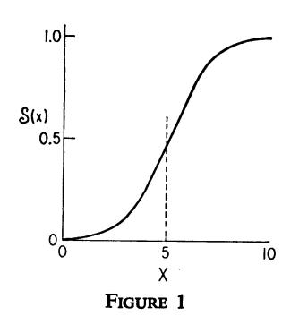
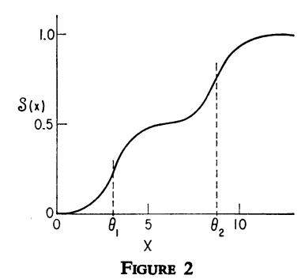
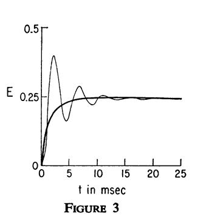
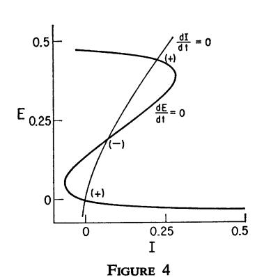
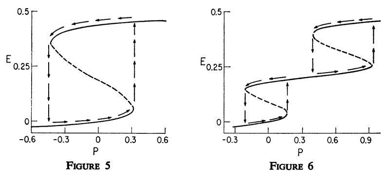
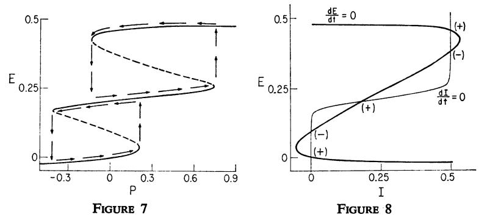
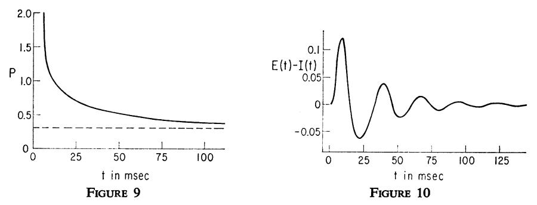
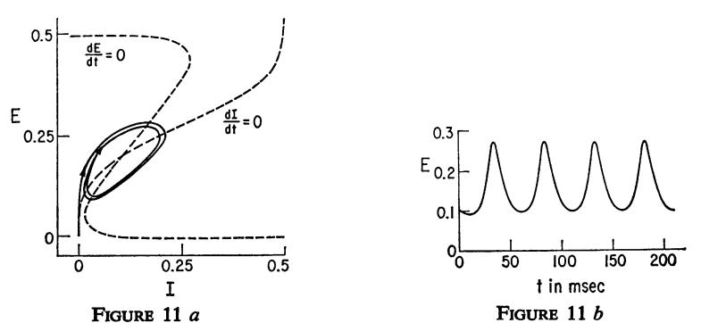
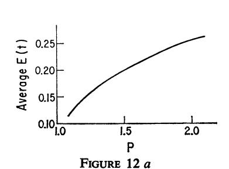
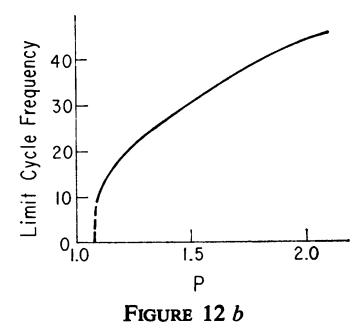

# EXCITATORY AND INHIBITORY INTERACTIONS IN LOCALIZED POPULATIONS OF MODEL NEURONS

HUGH R. WILSON and JACK D. COWAN

From the Department of Theoretical Biology, The University of Chicago, Chicago, Illinois 60637

ABSTRACT Coupled nonlinear differential equations are derived for the dynamics of spatially localized populations containing both excitatory and inhibitory model neurons. Phase plane methods and numerical solutions are then used to investigate population responses to various types of stimuli. The results obtained show simple and multiple hysteresis phenomena and limit cycle activity. The latter is particularly interesting since the frequency of the limit cycle oscillation is found to be a monotonic function of stimulus intensity. Finally, it is proved that the existence of limit cycle dynamics in response to one class of stimuli implies the existence of multiple stable states and hysteresis in response to a different class of stimuli. The relation between these findings and a number of experiments is discussed.

# INTRODUCTION

It is probably true that studies of primitive nervous systems should be focused on individual nerve cells and their precise, genetically determined interactions with other cells. Although such an approach may also be appropriate for many parts of the mammalian nervous system, it is not necessarily suited to an investigation of those parts which are associated with higher functions, such as sensory information processing and the attendant complexities of learning, memory storage, and pattern recognition. There are several reasons why a shift in emphasis is warranted in the investigation of such problems. There is first of all the pragmatic point that since sensory information is introduced into the nervous system in the form of large-scale spatiotemporal activity in sheets of cells, the number of cells involved is simply too vast for any approach starting at the single cell level to be tractable. Closely related to this is the observation that since pattern recognition is in some sense a global process, it is unlikely that approaches which emphasize only local properties will provide much insight. Finally, it is at least a reasonable hypothesis that local interactions between nerve cells are largely random, but that this local

randomness gives rise to quite precise long-range interactions. Here an example from physics suggests itself. If a fluid is observed at the molecular level, what is seen is brownian motion, whereas the same fluid, viewed macroscopically, may be undergoing very orderly streamlined flow. Following up this analogy, we shall develop a deterministic model for the dynamics of neural populations. This may be interpreted as a treatment of the mean values of the underlying statistical processes.

In view of these remarks, we introduce a model which emphasizes not the individual cell but rather the properties of populations. The cells comprising such populations are assumed to be in close spatial proximity, and their interconnections are assumed to be random, yet dense enough so that it is very probable that there will be at least one path (either direct or via interneurons) connecting any two cells within the population. Under these conditions we may neglect spatial interactions and deal simply with the temporal dynamics of the aggregate. Consistent with this approach, we have chosen as the relevant variable (following Beurle, 1956) the proportion of cells in the population which become active per unit time. This implies that the relevant aspect of single cell activity is not the single spike but rather spike frequency. Furthermore, time will be treated as a continuous variable so as to avoid the introduction of the spurious oscillations often found when a differential dynamical system is treated by finite difference equations.

Physiological evidence for the existence of spatially localized neural populations is provided by the work of Mountcastle (1957) and Hubel and Wiesel (1963, 1965). Their findings indicate that even within relatively small volumes of cortical tissue there exist many cells with very nearly identical responses to identical stimuli: there is a high degree of *local redundancy*.2 It is just such local redundancy which must be invoked to justify characterizing spatially localized neural populations by a single variable. Local redundancy in the cerebral cortex has also been inferred from anatomical evidence (Szentágothai, 1967; Colonnier, 1965).

There is one final and crucial assumption upon which this study rests: all nervous processes of any complexity are dependent upon the interaction of excitatory and inhibitory cells. This assertion is supported by the work of Hartline and Ratliff (1958), Hubel and Wiesel (1963, 1965), Freeman (1967, 1968 a, b), Szentágothai (1967), and many others. In fact, this assumption is virtually a truism at this point, yet many neural modelers have dealt with nets composed entirely of excitatory cells (Beurle, 1956; Farley and Clark, 1961; ten Hoopen, 1965; Allanson, 1956). It was just this failure to consider inhibition that led Ashby et al. (1962) to conclude that the dynamical stability of the brain was paradoxical, and it was the introduction of

&lt;sup>1 The neglect of spatial interactions is only temporary; a paper dealing with the extension of the present model to spatially distributed neural populations is in preparation (Wilson and Cowan). 
2 Local redundancy has been used before by Von Neumann (1956) and Winograd and Cowan (1963) to account for the reliability of information processing in neural nets. In the latter work the neural nets had properties analogous to the ones discussed in this paper: excitatory and inhibitory cells, densely interconnected in a redundant fashion.

inhibition by Griffith (1963) which dissolved the paradox. Consequently, we take it to be essential that there be both excitatory and inhibitory cells within any local neural population. We shall therefore speak of a localized neural population as being composed of an excitatory subpopulation and an inhibitory subpopulation. This will require a two-variable description of the population.3

### THE MODEL

In accordance with the preceding remarks, we define as the variables characterizing the dynamics of a spatially localized neural population:

E(t) = proportion of excitatory cells firing per unit time at the instant t;

I(t) = proportion of inhibitory cells firing per unit time at the instant t.

The state E(t) = 0, I(t) = 0, the resting state, will be taken to be a state of low-level background activity, since such activity seems ubiquitous in neural tissue. Therefore, small negative values of E and I will have physiological significance, representing depression of resting activity. E(t) and I(t) will be referred to as the activities in the respective subpopulations.

We now derive the equations satisfied by E(t) and I(t). By assumption the value of these functions at time  $(t + \tau)$  will be equal to the proportion of cells which are sensitive (i.e., not refractory) and which also receive at least threshold excitation at time t. We shall first obtain independent expressions for the proportion of sensitive cells and for the proportion of cells receiving at least threshold excitation.

If the absolute refractory period has a duration of r msec, then the proportion of excitatory cells which are refractory will evidently be given by4

$$\int_{t-t}^{t} E(t') \, \mathrm{d}t'.$$

Consequently, the proportion of excitatory cells which are sensitive is just

$$1 - \int_{t-1}^t E(t') \, \mathrm{d}t'.$$

Similar expressions are obtained for the inhibitory subpopulation.

The functions giving the expected proportions of the subpopulations receiving at

&lt;sup>a Cowan (1970) has previously developed a two-variable treatment of neural activity in which, however, the fundamental variables are the mean rates of firing of *individual* excitatory and inhibitory cells rather than of subpopulations.

&lt;sup>4 No account is taken of relative refractoriness. An extended model which includes a refractory period after any desired time course is given in the Appendix; however, the complexity of the extended model is such that any detailed examination of the effects of relative refractoriness must await a thorough investigation of the present simpler model.

least threshold excitation per unit time as a function of the average levels of excitation within the subpopulations will be called subpopulation response functions and designated by  $S_{\bullet}(x)$  and  $S_{\bullet}(x)$ . We call  $S_{\bullet}(x)$  and  $S_{\bullet}(x)$  response functions because they give the expected proportion of cells in a subpopulation which would respond to a given level of excitation if none of them were initially in the absolute refractory state. The general form of these functions can be derived in several ways.

Assume first that there is a distribution of individual neural thresholds within a subpopulation characterized by the distribution function  $D(\theta)$ . If it is further assumed that all cells receive the same numbers of excitatory and inhibitory afferents, then on the average all cells will be subjected to the same average excitation x(t), and the subpopulation response function S(x) will take the form:

$$S(x) = \int_0^{x(t)} D(\theta) d\theta. \tag{1}$$

Alternatively, assume that all cells within a subpopulation have the same threshold  $\theta$ , but let there be a distribution of the number of afferent synapses per cell. If C(w) is the synaptic distribution function and x(t) the average excitation per synapse, then all cells with at least  $\theta/x(t)$  synapses will be expected to receive sufficient excitation. Thus, the subpopulation response function takes the form:

$$S(x) = \int_{\theta/x(t)}^{\infty} C(w) dw. \qquad (1 a)$$

The validity of both of these formulas of course rests on the assumption that the total number of afferents reaching a cell is sufficiently large, for it is only in this case that all cells will be subjected to approximately the same x(t).

- S(x) as defined in either equations 1 or 1 a is readily seen to be a monotonically increasing function of x(t) with a lower asymptote of 0 and an upper asymptote of 1. If in addition  $D(\theta)$  or C(w) is a unimodal distribution, the response function will assume a sigmoid form such as that shown in Fig. 1. It is this sigmoid form which will be taken to be characteristic of any acceptable subpopulation response function. Any function f(x) will be said to belong to the class of sigmoid functions if:
  - (a) f(x) is a monotonically increasing function of x on the interval  $(-\infty, \infty)$ ,
- (b) f(x) approaches or attains the asymptotic values 0 and 1 as x approaches  $-\infty$  and  $\infty$  respectively, or
- (c) f(x) has one and only one inflection point. This inflection point will be termed the subpopulation threshold, although it is related to the single cell thresholds only through equations 1 or 1 a.

There are several points to be made concerning the sigmoid shape of the subpopulation response function. First, the phenomenological significance of the sigmoid shape is intuitively clear: in a population of threshold elements too low a level of excitation will fail to excite any elements, while very strong excitation can do more than excite all of the elements in the population. Second, a number of experimental studies have shown that single cell response curves are sigmoid functions of excitation (Kernell, 1965 a, b) as well as population response curves (Rall, 1955 a, b, c). Finally, it may be noted that the response function is essentially the event density of renewal theory (Cox, 1962). The event density is known to be related to a sum of convolutions of first-passage time densities for the single units of the population. The relationship of the subpopulation response function to the first-passage density has been explored more fully by Cowan (1971).

Before proceeding it should be mentioned that if  $D(\theta)$  or C(w) is multimodal, S(x) will still be monotonic but will not be sigmoid as defined above. Rather than a unique inflection point, there will be one inflection point for each mode of the distribution, as is shown in Fig. 2 for the bimodal case. For an n-modal distribution, however, S(x) can always be written as a weighted sum of n sigmoid functions having different inflection points. Physiologically, a multimodal distribution would be expected to correspond to the presence of a number of distinct cell types within the subpopulation. For the present we shall take S(x) to be a single sigmoid function, but we will return briefly to the more complex case later.

An expression for the average level of excitation generated in a cell of each subpopulation must now be obtained. If it is assumed that individual cells sum their inputs and that the effect of stimulation decays with a time course  $\alpha(t)$ , then the average level of excitation generated in an excitatory cell at time t will be:

$$\int_{-\pi}^{t} \alpha(t-t')[c_1E(t')-c_2I(t')+P(t')] dt'.$$
 (2)

The connectivity coefficients  $c_1$  and  $c_2$  (both positive) represent the average number

FIGURE 1 Plot of typical sigmoid subpopulation response function. X is average level of excitation in threshold units. The particular function shown here is the logistic curve:  $S(x) = 1/[1 + e^{-a(x-\theta)}]$  with  $\theta = 5$ , a = 1.

FIGURE 2 Subpopulation response function resulting from bimodal distribution of thresholds or afferent synapses. X is excitation in threshold units, while  $\theta_1$  and  $\theta_2$  are the two local maxima of the underlying distribution. Note that this curve may be decomposed into a weighted sum of two sigmoid functions.

of excitatory and inhibitory synapses per cell, while P(t) is the external input to the excitatory subpopulation. A similar expression but with different coefficients and a different external input will apply to the inhibitory subpopulation. The differing coefficients reflect differences in axonal and dendritic geometry between the excitatory and inhibitory cell types, while the difference in external inputs assumes the existence of cell-type specific afferents to the population.

Given these expressions for the subpopulation response functions, the average excitation, and the proportion of sensitive cells in each subpopulation, we may now obtain equations for the activities E(t) and I(t). As we have noted, the activity in a subpopulation at time  $(t + \tau)$  will be equal to the proportion of cells which are both sensitive and above threshold at time t. If the probability that a cell is sensitive is independent of the probability that it is currently excited above its threshold, then the desired expression for the excitatory subpopulation is just:

$$\left[1-\int_{t-r}^t E(t') dt'\right] S_{\epsilon}(x) \delta t.$$

In general, however, there will be some correlation between the level of excitation of a cell and the probability that it is sensitive. Furthermore, this correlation will tend to reduce the value of the expression just obtained. This is so because cells which are currently highly excited are more likely to have been highly excited in the recent past and thus are more likely to have already fired and be refractory. Designating this correlation between excitation and sensitivity by

$$\gamma \left[ \int_{t-t}^{t} E(t') dt', s_{\bullet}(x) \right],$$

the previous expression becomes:

$$\left[1 - \int_{t-\tau}^{t} E(t') dt'\right] S_{\epsilon}(x) \left\{1 - \gamma \left[\int_{t-\tau}^{t} E(t') dt', S_{\epsilon}(x)\right]\right\} \delta t.$$

Although the particular functional form of  $\gamma$  will depend on the details of the connectivity or threshold distribution within the population, it will always have the following properties:

(a) 
$$\lim_{S_{a}(x)\to 0,1} \gamma = 0;$$

(b) 
$$\lim_{\int_{t-\tau}^{t} B(t') dt' \to 0,1} \gamma = 0$$
;

(c) 
$$0 < \max(\gamma) < 1$$
.

The first two conditions follow from the observation that the uncorrelated and correlated expressions will coincide when *all* of the cells are below threshold, above threshold, sensitive, or refractory.

In the case we are considering, that of a richly interconnected population of cells, max  $(\gamma)$  will generally be very small. There are two reasons for this. The first is the presence of spatial and temporal fluctuations in the average level of excitation within the population caused both by the presence of fluctuations in the inputs and by the activity due to firing of cells within the population. The second is the existence of fluctuations in the thresholds of the individual cells themselves (Frishkopf and Rosenblith, 1958; Verveen and Derksen, 1969; Rall and Hunt, 1956). In the present study, therefore, we shall take  $\gamma$  to be zero, thus dealing with the case in which sensitivity is not correlated with level of excitation. It follows that the equations governing the dynamics of a localized population of neurons are:

$$E(t+\tau) = \left[1 - \int_{t-\tau}^{t} E(t') dt'\right]$$

$$\cdot \mathcal{S}_{\sigma} \left\{ \int_{-\infty}^{t} \alpha(t-t') [c_{1}E(t') - c_{2}I(t') + P(t')] dt' \right\}, \quad (3)$$

and

$$I(t+\tau') = \left[1 - \int_{t-\tau'}^{t} I(t') dt'\right]$$

$$\cdot \$_{i} \left\{ \int_{-\infty}^{t} \alpha(t-t') [c_{3}E(t') - c_{4}I(t') + Q(t')] dt' \right\}, \quad (4)$$

for the excitatory and inhibitory subpopulations.

# TIME COARSE GRAINING

Equations 3 and 4 are intuitively simple in that each term has been shown to have a clear physiological interpretation. Mathematically, however, they are extremely complex both because of their strongly nonlinear character and because they involve temporal integrals. The nonlinearity is a fundamental characteristic of this as well as most other biological control systems. The presence of temporal integrals, however, is an aspect of lesser significance biologically, as will now be shown. The mathematical advantage to be gained from the removal of the time integrals will be the applicability of phase plane analysis to extract significant qualitative features of the solutions of equations 3 and 4 for various parameter ranges and initial conditions.

The technique we will use to simplify equations 3 and 4 is a form of temporal coarse graining, which was first applied by Kirkwood (1946) to some problems in statistical physics. Although we shall not follow the original arguments precisely, the basis of the method is the replacement of the dependent variable, e.g. f(t), by the moving time average of this quantity over some appropriately chosen interval

s. The coarse-grained variable,  $\overline{f}(t)$ , is thus given by:

$$\overline{f}(t) = \frac{1}{s} \int_{t-s}^{t} f(t') dt'. \tag{5}$$

Obviously, the effect of this change of variable is to average out rapid temporal variations taking place on a time scale shorter than s. To justify the use of the temporal coarse-graining approximation, therefore, it is necessary to show that the behavior which is lost through averaging is not of significance for the problem at hand.

To obtain the appropriate coarse-grained forms for equations 3 and 4, notice first that E(t) and I(t) appear on the right side of these equations only in the form of time-averaged quantities. If  $\alpha(t)$  is close to unity for  $0 \le t \le r$  and drops fairly rapidly to zero for t > r, then it is a reasonable approximation to replace both these integrals by the same coarse-grained variables. That is,

$$\int_{t-r}^{t} E(t') dt' \to r\overline{E}(t),$$

$$\int_{-\infty}^{t} \alpha(t-t')E(t') dt' \to k\overline{E}(t),$$
(6)

with k and r constant. Similar replacements apply to I(t).

As time coarse graining has a marked smoothing effect on temporal variation, it is appropriate to replace  $E(t + \tau)$  and  $I(t + \tau')$  in equations 3 and 4 by Taylor expansions in the coarse-grained variable about the value  $\tau = 0$ . Thus, we arrive at the time coarse-grained form of equations 3 and 4:

$$\tau \frac{\mathrm{d}\bar{E}}{\mathrm{d}t} = -\bar{E} + (1 - r\bar{E}) \mathcal{S}_{\bullet}[kc_1\bar{E} - c_2k\bar{I} + kP(t)], \tag{7}$$

$$\tau' \frac{d\bar{I}}{dt} = -\bar{I} + (1 - r\bar{I}) S_i [k' c_3 \bar{E} - c_4 k' \bar{I} + k' Q(t)]. \tag{8}$$

In order to assess the appropriateness of the coarse-graining approximation, we have compared computer solutions to equation 3 with those obtained from equation 7. For this purpose equation 3 was expanded to lowest order in  $\tau$ , and  $\alpha(t-t')$  was taken to be an exponential decay. Interaction with the inhibitory subpopulation was excluded from both equations 3 and 7 to simplify the comparison. Thus we are concerned with the equations:

$$\tau \frac{\mathrm{d}E}{\mathrm{d}t} = -E + \left[1 - \int_{t-t}^{t} E(t') \, \mathrm{d}t'\right] S_{\epsilon} \left\{ \int_{-\infty}^{t} e^{-\alpha(t-t')} [c_1 E(t') + P(t')] \, \mathrm{d}t' \right\}, \quad (9)$$

$$\tau \frac{\mathrm{d}\bar{E}}{\mathrm{d}t} = -\bar{E} + (1 - r\bar{E}) \mathcal{S}_{e}[kc_{1}\bar{E}(t) + kP(t)]. \tag{10}$$

The major difference that is observed between the two cases is that the solution to equation 9 generally involves a damped oscillation with period equal to twice the refractory period, whereas the solution to equation 10 approaches the same asymptotic value monotonically. A typical example is shown in Fig. 3.

We suggest that this damped oscillation is not of great significance, for the following reasons. First, as the period of the oscillation is dependent almost entirely on the length of the absolute refractory period, it cannot transmit information concerning the nature of a stimulus. Thus, the damped oscillation is not likely to have any functional significance. Second, although damped oscillations are often observed in evoked potential studies (Freeman, 1967, 1968 a, b; Andersen and Eccles, 1962; MacKay, 1970), such oscillations typically have periods of 40 msec or longer, whereas an oscillation produced by absolute refractoriness alone would be unlikely to have a period of more than about 6 msec. In addition, Freeman's work makes it reasonably certain that the oscillations observed in evoked potential studies result from interactions among excitatory and inhibitory neurons. Finally, if it is the long-time behavior of a neural population (on the order of 100 msec) that is functionally significant, then the coarse-grained equation 10 provides correct results.

There is, however, an apparent exception to the last point: for certain parameter ranges the solution to equation 9 can be shown to give sustained oscillations. A necessary condition for this is that the summation constant  $\alpha$  be much smaller than the refractory period. This is usually not the case, for physiological studies show  $\alpha$  to be around 4 msec and r around 1–2 msec (Eccles, 1964). Furthermore, we would roughly expect that for equation 6 to be valid,  $\alpha$  would have to be somewhat greater than r, for otherwise the exponentially weighted integral would approach zero too fast for significant temporal averaging to take place. Thus, we conclude that when  $\alpha$  and r are given physiologically reasonable values, the temporally coarse-grained equations are valid.

### PHASE PLANE ANALYSIS

Before proceeding to analyze equations 7 and 8, one minor adjustment will be made for conceptual and mathematical convenience. As previously mentioned, the state E=0, I=0 will be chosen to be the state of low-level background activity so ubiquitous in the nervous system. The source of this activity (be it spontaneous, reverberatory, or driven) is of no consequence to the present investigation. The mathematical consequence of this choice of resting state is that E=0, I=0 must be a steady-state solution to equations 7 and 8 for P(t)=Q(t)=0, i.e., in the absence of external inputs. Furthermore, the resting state must be stable to be of physiological significance.

The first of these requirements is readily fulfilled by transforming  $S_e$  and  $S_i$  so that  $S_e(0) = S_i(0) = 0$ . Given any sigmoid function, this may be done by subtracting S(0) from the original function. Now, however, the maximum values of the

response functions will in general be less than unity. Designating these values by  $k_{\bullet}$  and  $k_{i}$ , the refractory terms must be modified, giving the final result:

$$\tau_{e} \frac{dE}{dt} = -E + (k_{e} - r_{e}E) S_{e}(c_{1}E - c_{2}I + P),$$
 (11)

$$\tau_i \frac{\mathrm{d}I}{\mathrm{d}t} = -I + (k_i - r_i I) s_i (c_3 E - c_4 I + Q). \tag{12}$$

(The bars denoting coarse graining have been dropped for convenience.)

The equations may be analyzed qualitatively using the E, I phase plane. From the mathematical properties of sigmoid functions, it is evident that  $S_e$  and  $S_i$  have unique inverses. Denoting these inverses by  $S_e^{-1}$  and  $S_i^{-1}$  it is possible to write the equations for the isoclines corresponding to dE/dt = 0 and dI/dt = 0 as:

$$c_2 I = c_1 E - S_e^{-1} \left( \frac{E}{k_e - r_e E} \right) + P \text{ for } \frac{dE}{dt} = 0,$$
 (13)

$$c_3 E = c_4 I + s_i^{-1} \left( \frac{I}{k_i - r_i I} \right) - Q \quad \text{for } \frac{dI}{dt} = 0.$$
 (14)

Notice that  $c_2$  and  $c_3$  must always be nonvanishing for the isoclines to be non-trivial, thus making negative feedback between the subpopulations an essential feature of the model. A typical plot of these two equations for P=0, Q=0 is shown in Fig. 4. In this case there are three steady-state solutions corresponding to the three intersections of the two curves. Depending on the parameter values chosen there may be either one or five steady states instead of three, a point to which we shall return.

FIGURE 3 Comparison of solution to equation 9 (lighter line) with solution with the temporal coarse-grained equation 10 (heavier line). Duration of refractory period: r=3 msec.

FIGURE 4 Phase plane and isoclines (equations 13 and 14). (+) denotes stability and (-), instability of steady state. Parameters:  $c_1 = 12$ ,  $c_2 = 4$ ,  $c_3 = 13$ ,  $c_4 = 11$ ,  $a_6 = 1.2$ ,  $\theta_6 = 2.8$ ,  $a_i = 1$ ,  $\theta_i = 4$ ,  $r_6 = 1$ ,  $r_i = 1$ , P = 0, Q = 0.

Before going further, let us choose a particular form of sigmoid function to make matters more definite. The form we shall choose is the logistic curve [shifted downward by a constant amount so that \$(0) = 0]:

$$S(x) = \frac{1}{1 + \exp[-a(x - \theta)]} - \frac{1}{1 + \exp(a\theta)}.$$
 (15)

Here a and  $\theta$  are parameters, the latter giving the position of maximum slope and the former determining the value of the maximum slope through the relationship:

$$\max \left[ S'(x) \right] = S'(\theta) = \frac{a}{4}. \tag{16}$$

No particular significance is to be attached to the choice of the logistic curve; any other function with the defining sigmoid properties would be equally suitable. A different function would, of course, lead to different detailed dynamics, but qualitative properties of the solutions such as number and stability of steady states, hysteresis effects, presence of limit cycles, etc., may be obtained from equations 11 and 12 for any particular function chosen.5

Returning now to our discussion of the isoclines defined by equations 13 and 14, we first observe that the inverse of a sigmoid function is a monotonically increasing function of its argument ranging from  $-\infty$  to  $+\infty$ . Therefore, E as defined by equation 14 will always be a monotonically increasing function of I. On the other hand, because of the negative sign before  $S_e^{-1}$  in equation 13, I will be a generally decreasing function of E except over a short range where it may temporarily increase. This is observed in the curve dE/dt = 0 in Fig. 4. This qualitative difference between the two isoclines is a direct manifestation of the antisymmetry between excitation and inhibition.

As it is the "kink" in the isocline for dE/dt = 0 which gives rise to the possibility of multiple steady states, hysteresis phenomena, and maintained oscillations, it is important to know for what values of the parameters this temporary reversal in the slope of equation 13 can occur. A necessary and sufficient condition for this is that the maximum slope of this curve of I as a function of E be greater than zero. The maximum slope is not easy to calculate, but a sufficient condition may be simply obtained by requiring that the slope of equation 13 at the inflection point of  $S_e^{-1}$  be greater than zero. The slope of the isocline at this point is

$$\left(\frac{c_1}{c_2}-\frac{9}{a_6\,c_2}\right),\,$$

&lt;sup>5 This assertion may be proved through considerations of the general shape of inverse sigmoid functions and the resulting shapes of the isoclines, equations 13 and 14.

thus leading to the condition:

$$c_1 > 9/a_{\epsilon}, \tag{17}$$

where  $a_e$  is the slope parameter for the excitatory response function. In obtaining condition 17  $r_e$  and  $r_i$  have been set equal to unity in order to simplify the result. As a matter of convenience we shall adopt this value for  $r_e$  and  $r_i$  from now on, as nothing essential is lost thereby.

A physiological interpretation of condition 17 is possible once it is realized that  $1/a_e$  is directly related to the variance of the distribution of thresholds or synaptic connections from which the excitatory subpopulation response function was derived (see equations 1 and 1 a). That is, for the maximum slope of the response function (see equation 16) to increase, it is necessary that the variance of the underlying distribution decrease. Thus, condition 17 implies that a sufficient condition for the existence of multiple steady states is that the average number of synapses between excitatory neurons must exceed a function of the variance in the distribution of thresholds).

Assuming that condition 17 is satisfied, under what conditions will there exist multiple steady states? If P and Q are restricted to the value zero, this is a difficult question to answer, for the conditions will depend in complex ways on all of the parameters of the population. If P and Q are not so restricted, however, then we may state the following theorem.

Theorem 1. If  $c_1 > 9/a_s$ , then there is a class of stimulus configurations such that the isoclines defined by equations 13 and 14 will have at least three intersections. That is, equations 11 and 12 will have at least three steady-state solutions.

A stimulus configuration is defined to be any particular choice of constant values for P and O.

**Proof:** The condition  $c_1 > 9/a_e$  is sufficient to insure that there will be a region in which the isocline for dE/dt = 0 can be intersected at three points by a line parallel to the E-axis in the phase plane. As the isocline for dI/dt = 0 approaches asymptotes parallel to the E-axis, and as the effect of changing P and Q is to translate their respective isoclines parallel to the I- and E-axes respectively, one can always choose values of P and Q for which there are at least three intersections.

Once the number and locations of steady-state solutions to equations 11 and 12 have been determined, the stability of each steady state can readily be determined by linearization around each state and solution of the resulting characteristic equation. The procedure is simple but tedious, and no real insight is to be gained from displaying the equations. Accordingly, we shall simply indicate stability characteristics where appropriate.

### **HYSTERESIS**

In the example illustrated in Fig. 4 two of the three steady states can be shown to be stable and are separated by an unstable state. This fact, plus the observation that the effect of a change in the value of P or Q is to translate the appropriate isocline parallel to one of the phase plane axes, suggests the existence of hysteresis phenomena. (It will be recalled that P and Q represent external inputs to the excitatory and inhibitory subpopulations.) This is indeed the case, and a graph of the hysteresis loop obtained from Fig. 4 as P is varied and Q held constant is shown in Fig. 5. Only excitatory activity has been plotted, although a corresponding plot could be made for the accompanying inhibitory activity. Had P been held constant and Q varied the resulting hysteresis loop would have been reversed: excitement of inhibitory cells leads to a decrease in excitatory cell activity.

The hysteresis phenomenon illustrated in Fig. 5 is a simple one, as only two stable states are involved. Since stability of two of the three states is easy to prove, a sufficient condition for the existence of such a loop is given by condition 17. Simple hysteresis loops have been demonstrated and discussed by Harth and coworkers in model neural populations containing mainly excitatory cells (Harth, et al., 1970; Anninos, et al., 1970). Consequently, it is not surprising that condition 17 contains only parameters of the excitatory subpopulation of the present model.

The presence of inhibitory cells can lead to more complex hysteresis phenomena. Two examples of this are shown in Figs. 6 and 7. In the former case two separated loops occur, while in the latter three simultaneous stable steady states are observed. Parameters may be chosen so that the points at which the intermediate stable state in Fig. 7 appears and vanishes bear any desired relation to the bifurcation points

FIGURE 5 Steady-state values of E as a function of P (Q=0). Solid lines indicate stable states, while the dashed line indicates an unstable state. Hysteresis loop indicated by arrows is generated if P is varied slowly back and forth through the range shown on the graph. Parameters are those given in Fig. 4.

FIGURE 6 Steady-state values of E as a function of P(Q=0). Solid lines indicate stability, dashed line, instability. Here two simple hysteresis loops (arrows) are separated by a region with a single stable state. Parameters:  $c_1 = 13$ ,  $c_2 = 4$ ,  $c_3 = 20$ ,  $c_4 = 2$ ,  $a_6 = 1.2$ ,  $\theta_6 = 2.7$ ,  $a_i = 5$ ,  $\theta_i = 3.7$ ,  $r_6 = 1$ ,  $r_i = 1$ .

for the upper and lower stable states. Thus, as P increases the intermediate stable state may vanish before the lowest state, etc.

A sufficient condition for the existence of five steady states may be derived by examining the phase plane and isoclines in Fig. 8. Parameters here are those used to obtain the double hysteresis loop in Fig. 7. It will be seen that such a configuration of isoclines can only be obtained if the minimum slope of the isocline for dE/dt = 0 is less than the reciprocal of the maximum slope of the kink in the isocline for dE/dt = 0. (The reciprocal slope must be taken in the latter case because equation 13 defines I as a function of E.) A sufficient condition for this is that:

$$\frac{a_e c_2}{a_e c_1 - 9} > \frac{a_i c_4 + 9}{a_i c_3}. \tag{18}$$

It is obvious that condition 18 can only be satisfied if  $a_{\bullet}c_{1}$  is greater than 9, so condition 17 must also be satisfied. We state this as a second theorem.

Theorem 2. Let the parameters of a neural population satisfy equation 18. Then five steady states will exist, though not necessarily concurrently (see Fig. 6), for some class of stimulus configurations.

This is not a sufficient condition for multiple hysteresis phenomena, since the intermediate state may be unstable in some cases.

A physiological interpretation of condition 18 is more apparent if it is rewritten as

$$a_{a}a_{i}c_{2}c_{3} > (a_{a}c_{1} - 9)(a_{i}c_{4} + 9).$$
 (19)

Neglecting  $a_e$  and  $a_i$ , which appear on both sides of the expression, it will be noted that  $c_2c_3$  is a measure of the strength of the negative feedback loop in the popula-

FIGURE 7 Steady-state values of E as a function of P(Q = 0). Solid lines indicate stability and dotted lines, instability. Here two overlapping hysteresis loops (arrows) are present: note the existence of three stable states in an interval around P = 0. Parameters:  $c_1 = 13$ ,  $c_2 = 4$ ,  $c_3 = 22$ ,  $c_4 = 2$ ,  $a_6 = 1.5$ ,  $\theta_6 = 2.5$ ,  $a_i = 6$ ,  $\theta_i = 4.3$ ,  $r_6 = 1$ ,  $r_i = 1$ . FIGURE 8 Phase plane and isoclines with parameters chosen to give three stable (+) and two unstable (-) steady states. Parameters are the same as those in Fig. 7 with P = 0.

tion. Similarly, the right side of condition 19 is a product of factors measuring the strengths of interactions within the excitatory and inhibitory subpopulations respectively. Thus, it may be said that condition 19 requires that there be a relatively strong negative feedback loop within the neural population.

In contrast to the requirements for simple hysteresis, it is evident from the foregoing that multiple hysteresis phenomena are dependent upon the inclusion of inhibition as an essential part of the present model. Although Smith and Davidson (1962) and Griffith (1963) did exhibit special cases in which an intermediate state of activity was stabilized by inhibition, we are not aware of any previous discussion of multiple hysteresis phenomena in model neural populations.

Functionally, hysteresis was first suggested as a physiological basis for short-term memory by Cragg and Temperley (1955). Such a possibility is evident, for any input of sufficient intensity and duration will cause the activity in the neural population to jump from the lowest (resting) state into one of the stable excited states, and the activity will remain in this state even after the input ceases. It may also be noted in this context that stable high-level activity of this type may be interpreted as resulting from reverberation: activity may circulate in the population in such a manner that the total activity is constant. Hysteresis as a form of short-term memory is therefore consistent with the work of Hebb (1949).

In addition to these conjectures linking hysteresis to short-term memory, there is at least one experimental verification of the existence of hysteresis within the central nervous system. This is the work of Fender and Julesz (1967), in which it is demonstrated that hysteresis is operative in the fusion of binocularly presented patterns to produce single vision. Since the earliest interactions between patterns presented to the two eyes occur in area 17, it is clear that Fender and Julesz have demonstrated the existence of hysteresis phenomena in cortical tissue. Our model provides a neural interpretation of these results.

It is important to note that hysteresis has two important forms of noise insensitivity. Observe first that in a loop such as that in Fig. 5 a large change in P is necessary to excite the population to the higher stable state: there is a population threshold. Secondly, because of the response time of the population even suprathreshold inputs will fail to alter the state of the population if they are of insufficient duration. To measure this time-intensity relationship a stimulus of intensity P was applied to an excitatory subpopulation which was initially in the resting state or passed to a state of maintained self-excitation. The plot in Fig. 9 represents the time-intensity threshold for the initiation of maintained activity. This curve is of the Block type which is commonly observed in the visual system (Le Grand, 1957). For a noisy system such as the brain subjected to a noisy environment these features are of obvious significance.

Finally, let us consider briefly the case in which the excitatory subpopulation has a bimodal distribution of thresholds or connections and consequently a response function such as that shown in Fig. 2. Clearly, this response function may give rise

to an isocline for dE/dt = 0 in which there are two kinks, i.e., two regions of positive slope of the isocline separated by a region of negative slope (see equation 13). This additional kink will increase the number of possible intersections of the two isoclines by two, one of which will be stable. Therefore, one additional loop will be added to the hysteresis phenomenon. In general, an n-modal excitatory subpopulation response function will give rise to complex hysteresis phenomena composed of n simple hysteresis loops. The existence of a multimodal distribution of thresholds or synapses within the excitatory subpopulation will, of course, yield similar results.

### TEMPORAL PHENOMENA: LIMIT CYCLES

So far discussion has been limited to steady states, and nothing has been said of the transient behavior of the neural population. This is because the approach to a stable steady state has been found to be monotonic and uneventful in most cases. There are, however, two types of temporal behavior exhibited by our model which are of considerable physiological interest.

There are a number of physiological systems which, in response to impulse stimulation, produce an average evoked potential in the form of a damped oscillation. Among such systems are the thalamus (Andersen and Eccles, 1962) and the olfactory bulb and cortex (Freeman, 1967, 1968 a, b). Further examples are given in MacKay (1970). Such oscillations typically show periods of 25–40 msec or more.

The usual interpretation is that the potential seen by the recording electrode represents the net difference between excitatory and inhibitory postsynaptic poten-

FIGURE 9 Strength-duration curve for excitation of population from lower to upper stable steady state in Fig. 5. Curve indicates intensity (P) and duration (t) of rectangular impulse which is just sufficient for population to become self-exciting and pass to upper excited state. Parameters are those for Fig. 5, with  $\tau=8$  msec. Dashed line indicates asymptotic value of P below which population cannot become self-exciting regardless of the duration of stimulation.

FIGURE 10 Damped oscillatory behavior of [E(t) - I(t)] in response to brief stimulating impulse. It is suggested that this function is related to the average evoked potential (see text). Parameters:  $c_1 = 15$ ,  $c_2 = 15$ ,  $c_3 = 15$ ,  $c_4 = 3$ ,  $a_6 = 1$ ,  $\theta_6 = 2$ ,  $a_i = 2$ ,  $\theta_i = 2.5$ ,  $\tau = 10$  msec.

tials in the neighborhood of the electrode. This suggests that the function in our model most closely related to the average evoked potential would be proportional to  $[\overline{E}(t) - \overline{I}(t)]$ . For an appropriate choice of parameters, this function will respond to impulse stimulation in a damped oscillatory manner as shown in Fig. 10. To obtain a period similar to that obtained experimentally, it was necessary to choose the time constants  $\tau_{\bullet}$  and  $\tau_{\bullet}$  to be about 10 msec. This value is in the range for the delays associated with the propagation of postsynaptic potentials from the dendrites of a neuron to the axon hillock (Oshima, 1969).

The ability of our model to reproduce the general form of the average evoked potential should not be taken too seriously, as systems may be readily designed to give damped oscillations in response to brief stimulation, and as no attempt has been made to reproduce details of the experimental curves. Rather, we regard the reproduction of a damped oscillatory average evoked potential as a constraint to be satisfied by any neural model claiming physiological plausibility.

There is a second form of temporal behavior exhibited by our model which is potentially of greater functional significance: the limit cycle. Limit cycles will arise whenever there is only one steady state determined by the intersection of the isoclines, and when this steady state is unstable. As all trajectories must remain within the unit square in the phase plane, these conditions are necessary and sufficient for the existence of a limit cycle. Linear stability analysis can be used to show that a sufficient (but not necessary) condition for the instability of such a steady state is that:

$$c_1 a_6 > c_4 a_4 + 18. (20)$$

This expression follows from the linear analysis plus the observation that the requirement of a single unstable steady state can only be realized when the isoclines intersect at a point in the vicinity of the inflection points of the sigmoid response functions. Expression 20 may be interpreted to mean that the existence of limit cycles in a neural population requires that the interactions within the excitatory subpopulation be significantly stronger than those within the inhibitory subpopulation. This is reasonable, since strong interactions within the inhibitory subpopulation will tend to damp out the negative feedback which is responsible for the oscillation.

The requirement that there exist a single stready state for some choice of P and Q and that it occur for values of E and I near the inflection points of the sigmoid response functions leads to the conditions:

$$\frac{a_e c_2}{a_e c_1 - 9} > \frac{a_i c_4 + 9}{a_i c_3}, \tag{21}$$

$$\frac{a_e c_1 - 9}{a_e c_2} < 1. \tag{22}$$

Requirement 21 is identical with condition 18 and is derived in exactly the same way. Requirement 22 insures that there is one steady state rather than five. We may therefore state a theorem encompassing both limit cycle phenomena and multiple hysteresis.

Theorem 3. Let parameters be chosen so that requirement 21 is satisfied. Then if expression 20 is *not* satisfied, multiple hysteresis phenomena will occur for some class of stimulus configurations. If, on the other hand, requirements 20 and 22 are satisfied, then for some class of stimulus configurations limit cycle dynamics will be obtained.

The proof of this theorem follows directly from a consideration of the shapes of the isoclines defined in equations 13 and 14 plus an enumeration of the possible ways in which they can intersect. It is straightforward but tedious and will not be reproduced.

Typical of the limit cycle activity found is that shown in Figs. 11 a and 11 b. As we have required the resting state E=0, I=0 to be stable in the absence of a driving force, the neural population will only exhibit limit cycle activity in response to constant stimulation. We therefore felt it appropriate to investigate the manner in which the limit cycle depends on the value of P(Q) being set equal to zero). Typical results are shown in Figs. 12 a and 12 b. The important observations are:

- (a) There is a threshold value of P below which limit cycle activity cannot occur.
- (b) There is a higher value of P above which the system saturates and limit cycle activity is extinguished.
- (c) Between these two values both the frequency of the limit cycle and the average value of E(t) increase monotonically with increasing P.

Although limit cycle activity as a result of the constant stimulation of neural populations has not been looked for experimentally to our knowledge, our results

FIGURE 11 a Phase plane showing limit cycle trajectory in response to constant stimulation P = 1.25. Dashed lines are isoclines. Parameters:  $c_1 = 16$ ,  $c_2 = 12$ ,  $c_3 = 15$ ,  $c_4 = 3$ ,  $a_6 = 1.3$ ,  $\theta_6 = 4$ ,  $a_6 = 2$ ,  $\theta_6 = 3.7$ ,  $r_6 = 1$ ,  $r_6 = 1$ .

FIGURE 11 b E(t) for limit cycle shown in Fig. 11 a.  $\tau = 8$  msec.

FIGURE 12 a E(t) averaged over one period of limit cycle as a function of stimulation at constant intensity P.

FIGURE 12 b Frequency of limit cycle (in Hz) for different levels of constant stimulation P. For very low values of P no cycle is obtained, i.e., frequency drops to zero. For very high values of P the oscillation is extinguished and only high-level, constant activity is observed. Parameters are those given in Fig. 11 a.

do seem to be directly related to microelectrode studies. In particular, we cite the work of Poggio and Viernstein (1964) on thalamic somatosensory neurons. The constant stimulation in their study was provided by a constant angle of flection of the wrist joint of a monkey. When the expectation density function of neurons driven by joint angle receptors was plotted, it was found to be an undamped periodic function of time. Both the average firing rate and the frequency of the oscillation in the expectation density function were found to increase monotonically with inincreasing (constant) angle of flection (see Fig. 9, Poggio and Viernstein, 1964).

Thus, it is seen that E(t) in our model reproduces qualitatively the characteristics of averaged single unit firing patterns of certain thalamic neurons. Whether localized groups of neurons in the thalamus are set into a collective limit cycle oscillation in response to a constant stimulus is unknown but certainly worthy of experimental investigation.

The implication of both our model study and the work of Poggio and Viernstein is clear: stimulus intensity may be coded into both average spike frequency and the frequency of periodic variations in average spike frequency. How such redundancy in coding may be used in the nervous system is at present unknown, but it is hoped that extensions of the present model to include spatial interactions between neural populations may lead to some insight into the matter. Certainly both the existence of a stimulus threshold for initiation of limit cycle activity and the stability of the limit cycle itself are important forms of noise insensitivity.

Limit cycles have also been used as a model for some of the characteristics of electroencephalogram (EEG) rhythms (Dewan, 1964). In this work the existence of limit cycle oscillations within the central nervous system was assumed without independent evidence. Our present results, therefore, provide a more concrete physiological basis for this approach to the study of EEG rhythms.

Before leaving the subject of limit cycles it may be asked whether a neural popu-

lation which is capable of limit cycle activity for a certain class of stimulus configurations will exhibit hysteresis under different stimulus conditions. The answer to this may be obtained by comparing requirements 20 and 21 with condition 17. As the minimum value of the right-hand side of equation 20 is 18, and as the left-hand side of equation 21 must be greater than zero, it follows that whenever requirements 20 and 21 are satisfied condition 17 will also be satisfied. This proves the following theorem.

Theorem 4. Any neural population which exhibits limit cycle activity for some class of stimulus configurations will also display simple hysteresis phenomena for some other class of stimulus configurations.6

The converse of this theorem is, of course, false. Also, the coexistence of limit cycle phenomena and multiple hysteresis is precluded by Theorem 3.

Theorem 4 is very strong in light of the suggested functional significance of both limit cycles and hysteresis. For example, the theorem shows that nonspecific biasing inputs to a neural population from other parts of the central nervous system may completely change the character of the response of that population to specific sensory (or experimental) stimulation. Furthermore, the theorem is in principle testable, although this might be difficult in practice. One probem is that the experimenter would need independent control over the inputs to both the excitatory and the inhibitory subpopulations.

## CONCLUSIONS

There have been a number of previous studies and simulations of spatially localized neural populations (Allanson, 1956; Smith and Davidson, 1962; Griffith, 1963; ten Hoopen, 1965; Anninos et al., 1970). These treatments have, of course, differed from each other in various ways: some use discrete time, others continuous time, etc. In common to all these studies, however, has been the description of the state of the population at time t by a single variable: e.g., the fraction of cells becoming active per unit time. This has been true even of those studies in which a number of connections have been designated as inhibitory. The most fundamental difference between this study and previous work, therefore, is in the treatment of inhibition as arising from exclusively inhibitory neurons. It thus becomes necessary to deal with interactions between two distinct subpopulations explicitly, and this requires the use of the two variables E(t) and I(t) to characterize the state of the population.

The assumption that the influence of one neuron upon all others is either exclusively excitatory or exclusively inhibitory is known as Dale's law (Eccles, 1964). Although this law is probably not universally true, it is certainly true in most in-

&lt;sup>6 It must be remembered that a stimulus configuration involves inputs to both subpopulations. To pass from limit cycle activity to hysteresis it will generally be necessary to change both P and Q.

&lt;sup>7 Anninos et al. (1970) actually specify that some neurons are inhibitory, but they still describe the state of their population using only one variable.

stances. If one accepts the fact that there are no exclusively excitatory subsystems within the central nervous system, then a two-variable approach such as ours is required even in the study of spatially localized populations.

Results of our study which follow directly from the explicit treatment of excitatory-inhibitory interactions are the existence of multiple hysteresis loops and limit cycles. (It will be remembered that simple hysteresis is dependent only upon characteristics of the excitatory subpopulation.) To these may be added the extremely important result in Theorem 4 stating that any neural population exhibiting limit cycle behavior for one class of stimuli will show simple hysteresis for some other class of stimuli. All of these results have been shown to be of potential functional significance. A paper extending the current model to deal with spatial interactions within sheets of neural tissue is in preparation and will deal with some of the information processing capabilities resulting from the phenomena cited above (Wilson and Cowan, in preparation).

Finally, it is to be emphasized that the qualitative results obtained, i.e. simple and multiple hysteresis, limit cycles, and Theorem 4, are independent of the particular choice of the logistic curve for the subpopulation response functions. The arguments leading to these results depend essentially only on the general shapes of the isoclines as defined in equations 13 and 14. The particular constraints on the parameters given in relationships 17–22 will, of course, differ for differing sigmoid functions, but completely general relations may be obtained by relating the connectivity constants to the maximum slopes of the response functions. This independence of our model from the particular choice of sigmoid response function is extremely important, both because of the difficulty in obtaining experimental determinations of the distributions in equations 1 and 1 a and because of the likelihood that these distributions will differ in different parts of the nervous system.

### **APPENDIX**

In this appendix we extend our basic model to include relative refractoriness. We will deal only with excitatory cells, since an identical equation is obtained for inhibitory cells. Furthermore, we will assume that the relative refractory period is much longer than either the absolute refractory period or the effective summation time. This will permit us to assume the results of the temporal coarse-graining argument for absolute refractoriness and temporal summation. This latter assumption is for convenience only and does not play any essential part in the derivation. Finally, we assume that the resting threshold  $\theta_0$  is the same for all cells in the population. The sigmoid response function is therefore assumed to relate to a distribution of synapses as shown by equation 1 a.

We assume that after firing a cell is initially absolutely refractory and then relatively refractory for a time r, at the end of which it has returned to its totally sensitive state. During the relative refractory period the cell may of course be fired by supernormal stimulation, after which it will again become absolutely refractory, etc. We assume, therefore, that the relative refractory period can be completely characterized by specifying the time course of the return of its threshold from an initially very high value ultimately to its resting value (Adrian, 1928; Fuortes and Mantegazzini, 1962). Let the function which describes this

return of the threshold to its resting value be called  $\theta(t-t')$ , where t' is the time at which the cell last fired. The only restrictions on  $\theta(t-t')$  are that it be continuous and that it reach the resting value in a finite time r. In particular,  $\theta(t-t')$  need not be monotonic, thus allowing for rebound depolarization, etc.

Let  $R(t, t')\delta t$  be the proportion of those cells which fired during the interval  $(t', t' + \delta t)$  which are still in the relative refractory state. Clearly, these cells will have a threshold of  $\theta(t - t')$ . If the net excitation is designated by x(t) and the sigmoid response function for cells with this threshold by  $S[x(t), \theta(t - t')]$  then the equation which governs the evolution of R(t, t') will be:

$$\frac{\mathrm{d}R}{\mathrm{d}t} = -\$[x(t), \theta(t-t')]R. \tag{A 1}$$

This equation accounts for the loss of cells from the relative refractory state through refiring. Equation A 1 may be solved formally for R(t, t'). As the initial condition is that R(t', t') = E(t'), the result is

$$R(t, t') = E(t') \exp \left\{ -\int_{t'}^{t} S[x(t''), \theta(t'' - t')] dt'' \right\}.$$
 (A 2)

Using this result, it is evident that the contribution of the firing of refractory cells to the total activity in the population at time t is just:

$$\int_{t-r}^{t} s[x(t), \theta(t-t')]R(t, t') dt'.$$

The fraction of cells which have completely recovered from firing is:

$$1 - r_e E(t) - \int_{t-r}^t R(t, t') dt',$$

where the term  $r_0E(t)$  gives the fraction of cells which have just fired and are therefore absolutely refractory.

Putting all these results together we arrive at the equation:

$$\tau \frac{dE}{dt} = -E + \int_{t-r}^{t} S[x(t), \theta(t-t')] R(t, t') dt' + \left[1 - r_{e}E - \int_{t-r}^{t} R(t, t') dt'\right] S[x(t), \theta_{0}], \quad (A 3)$$

where R(t, t') is given by equation A 2. This is the equation for a population of excitatory cells having both absolute and relative refractory periods. The second term on the right gives the contribution to E(t) of relatively refractory cells, while the third term gives the contribution of cells which are totally sensitive. Note that for r=0, i.e. for a relative refractory period of zero duration, equation A 3 reduces to the same form as equation 7 in the text This shows that equation A 3 is indeed the proper extension of our model to account for relative refractoriness.

This research was supported in part by the Alfred P. Sloan Foundation and the Otho S. A. Sprague Memorial Institute.

Received for publication 4 June 1971.

### REFERENCES

ADRIAN, E. D. 1928. The Basis of Sensation. Christophers Ltd., London.

ALLANSON, J. T. 1956. In Information Theory (Third London Symposium). Butterworth and Co. Ltd., London. 303.

ANDERSEN, P., and J. Eccles. 1962. Nature (London). 196:645.

Anninos, P. A., B. Beek, T. J. Csermely, E. M. Harth, and G. Pertile. 1970. J. Theor. Biol. 26:121.

ASHBY, W. R., H. VON FOERSTER, and C. C. WALKER. 1962. Nature (London). 196:561.

BEURLE, R. L. 1956. Phil. Trans. Roy. Soc. London Ser. B. Biol. Sci. 240:55.

COLONNIER, M. L. 1965. In Brain and Conscious Experience. J. C. Eccles, editor. Springer-Verlag New York Inc., New York.

Cowan, J. D. 1970. In Lectures on Mathematics in the Life Sciences. M. Gerstenhaber, editor. American Mathematical Society, Providence, R.I. 2:1.

Cowan, J. D. 1971. In Proceedings of the International Union of Pure and Applied Physics Conference on Statistical Mechanics, 1971. S. Rice, J. Light, and K. Freed, editors. University of Chicago Press, Chicago. In press.

Cox, D. R. 1962. Renewal Theory. Methuen and Co. Ltd., London.

CRAGG, B. G., and H. N. V. TEMPERLEY. 1955. Brain. 78(Pt. II):304.

DEWAN, E. M. 1964. J. Theor. Biol. 7:141.

ECCLES, J. 1964. The Physiology of Synapses. Academic Press, Inc., New York.

FARLEY, B. G., and W. A. CLARK. 1961. *In* Information Theory (Fourth London Symposium). C. Cherry, editor. Butterworth and Co. Ltd., London. 242.

FENDER, D., and B. Julesz. 1967. J. Opt. Soc. Amer. 57:819.

FREEMAN, W. J. 1967. Logistics Rev. 3:5.

FREEMAN, W. J. 1968 a. Math. Biosci. 2:181.

FREEMAN, W. J. 1968 b. J. Neurophysiol. 31:337.

FRISHKOPF, L. S., and W. A. ROSENBLITH. 1958. In Symposium on Information Theory in Biology. H. P. Yockey, R. L. Platzman, and H. Quastler, editors. Pergamon Press, Ltd., Oxford, England. FUORTES, M. G. F., and F. MANTEGAZZINI. 1962. J. Gen. Physiol. 45:1163.

GRIFFITH, J. S. 1963. Biophys. J. 3:299.

HARTH, E. M., T. J. CSERMELY, B. BEEK, and R. D. LINDSAY. 1970. J. Theor. Biol. 26:93.

HARTLINE, H. K., and F. RATLIFF. 1958. J. Gen. Physiol. 41:1049.

Hebb, D. O. 1949. The Organization of Behavior. John Wiley & Sons, Inc., New York.

Hubel, D. H., and T. N. Wiesel. 1963. J. Neurophysiol. 26:994.

HUBEL, D. H., and T. N. WIESEL. 1965. J. Neurophysiol. 28a:229.

Kernell, D. 1965 a. Acta Physiol. Scand. 65:65.

KERNELL, D. 1965 b. Acta Physiol. Scand. 65:74.

KIRKWOOD, J. G. 1946. J. Chem. Phys. 14:180.

LE Grand, Y. 1957. Light, Color, and Vision. John Wiley & Sons, Inc., New York.

MACKAY, D. M. 1970. In Neurosciences Research Symposium Summaries. F. O. Schmitt, T. Melnechuk, G. C. Quarton, and G. Adelman, editors. The M.I.T. Press, Cambridge, Mass. 4:397.
 MOUNTCASTLE, V. B. 1957. J. Neurophysiol. 20:408. 253.

OSHIMA, T. 1969. In Basic Mechanisms of the Epilepsies. H. Jasper, A. Ward, and A. Pope, editors. Little, Brown and Company, Boston. 253.

Poggio, G. F., and L. J. VIERNSTEIN. 1964. J. Neurophysiol. 27:517.

RALL, W. 1955 a. J. Cell. Comp. Physiol. 46:3.

RALL, W. 1955 b. J. Cell. Comp. Physiol. 46:373.

RALL, W. 1955 c. J. Cell. Comp. Physiol. 46:413.

RALL, W., and C. C. HUNT. 1956. J. Gen. Physiol. 39:397.

- SMITH, D. R., and C. H. DAVIDSON. 1962. J. Soc. Comput. Mach. 9:268.
- SZENTÁGOTHAI, J. 1967. In Recent Development of Neurobiology in Hungary. K. Lissák, editor. Akadémiai Kiadó, Budapest. 1:9.
- TEN HOOPEN, M. 1965. Cybernetics of Neural Processes. E. R. Caianiello, editor. C.N.R., Rome.
- VERVEEN, A. A., and H. E. DERKSEN. 1969. Acta Physiol. Pharmacol. Neer. 15:353.
- Von Neumann, J. 1956. In Automata Studies. C. E. Shannon and J. McCarthy, editors. Princeton University Press, Princeton, N. J. 43.
- WINOGRAD, S., and J. D. COWAN. 1963. Reliable Computation in the Presence of Noise. The M.I.T. Press, Cambridge, Mass.