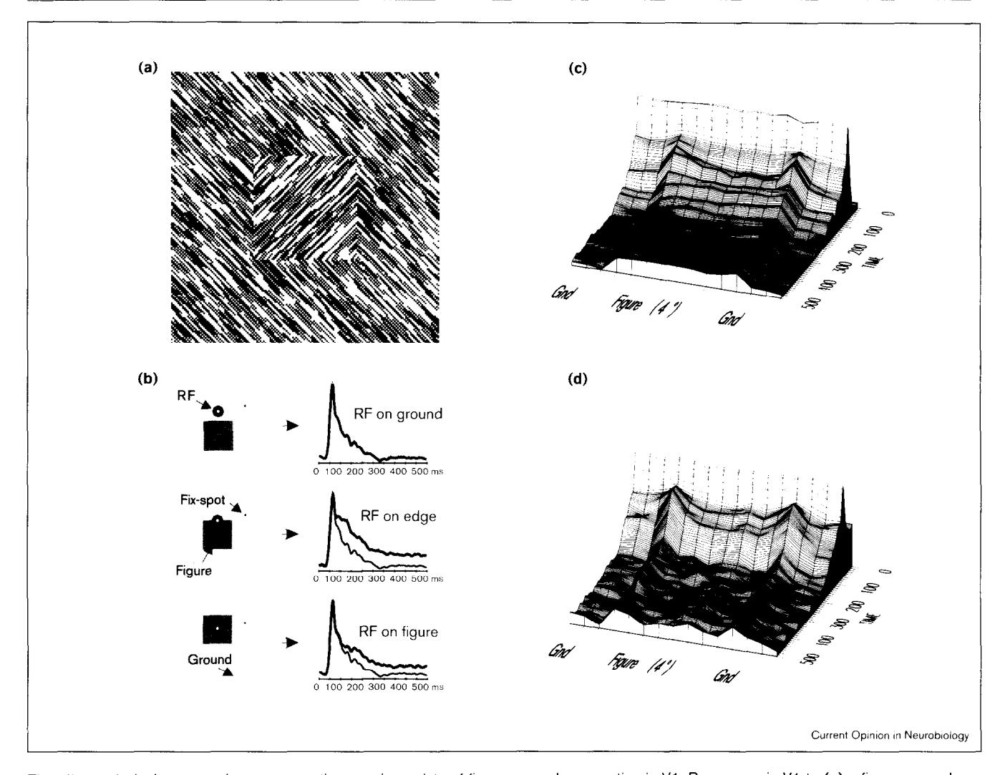

# Feedforward, horizontal, and feedback processing in the visual cortex

# Victor AF Lamme\*, Hans Supèr and Henk Spekreijse

The cortical visual system consists of many richly interconnected areas. Each area is characterized by more or less specific receptive field tuning properties. However, these tuning properties reflect only a subset of the interactions that occur within and between areas. Neuronal responses may be modulated by perceptual context or attention. These modulations reflect lateral interactions within areas and feedback from higher to lower areas. Recent work is beginning to unravel how horizontal and feedback connections each contribute to modulatory effects and what the role of these modulations is in vision. Whereas receptive field tuning properties reflect feedforward processing, modulations evoked by horizontal and feedback connections may reflect the integration of information that underlies perception.

#### Addresses

Graduate School of Neurosciences, Department of Medical Physics, Academical Medical Center, University of Amsterdam, The Netherlands

\*e-mail: v.lamme@amc.uva.nl

The Netherlands Ophthalmic Research Institute, PO Box 12141, 1100 AC Amsterdam, The Netherlands

### Current Opinion in Neurobiology 1998, 8:529-535

http://biomednet.com/elecref/0959438800800529

© Current Biology Publications ISSN 0959-4388

## Abbreviations

CO cytochrome oxidase
GABA γ-aminobutyric acid
LGN lateral geniculate nucleus
MS medial suprasylvian area
MT medial temporal area
RF receptive field
V1 primary visual cortex

# Introduction

The pioneering work of Hubel and Wiesel [1] triggered an enormous amount of work on the receptive field (RF) tuning properties of neurons in visual cortical areas. It was soon recognized that RF properties differ from area to area. In primary visual cortex (V1), cells respond to elementary features, whereas in higher areas, cells are tuned to different aspects of complex stimuli [2]. This suggests that visual processing goes through several stages, from low-level feature extraction in primary areas to complex processing related to perceptual interpretation in higher areas.

Anatomical connections, however, indicate that cortical processing is not strictly hierarchical. Feedforward connections, from one area to the next, are mostly paralleled

by feedback connections going in the reverse direction [3]. Moreover, horizontal connections link neurons across large distances within each area [4,5]. These connections modulate responses to stimuli within the RF [6]. The major challenge to current research is twofold: to disentangle the relative contributions of horizontal and feedback connections to these modulations, and to reveal the function of these modulations in visual processing.

Here, we will review the recent findings on how the connections in the visual cortex mediate response modulations, and to what extent these modulations are related to perceptual organization, visual attention and awareness.

# Anatomy of the cortical visual system

On the basis of laminar origin and destination, one can distinguish between feedforward and feedback connections in the visual cortex, and thus arrive at a hierarchical organization of areas [7]. V1 is at the bottom of such a hierarchy, receiving its main feedforward input from the lateral geniculate nucleus (LGN). From V1, several partially segregated pathways feed into extrastriate areas. The magnocellular pathway — roughly, from V1 layer 4Cα to layer 4B to thick cytochrome oxidase (CO) regions in V2, and to V3 and the medial temporal area (MT)—feeds into parietal cortex, where spatial information is processed. Pyramidal cells in this pathway have larger dendritic fields and higher spine densities in higher areas than in lower areas, supporting the idea that more complex processing is performed in the higher areas [8]. The parvocellular pathway, via layers 4Cβ, 4A, and 3B, converges onto layers 2/3a of V1, which also receives information from the magnocellular pathway. From these superficial layers, the connections to V2 are segregated along CO-labelling patterns [3]. The extent to which cells within separate CO-labelling regions have different RF tuning properties is still a matter of debate [3,9]. Similarly, psychophysical studies both support and oppose the notion that different visual attributes, such as motion, color, and form, are processed independently [10,11°]. Regardless, the segregated CO-labelled projections are probably not maintained when V2 projects further to V4 and to higher areas of the ventral pathway into temporal cortex [3].

An interesting issue is whether the observed segregation in the feedforward pathways is also observed in the horizontal connections and feedback pathways. In V1, horizontal connections are most prominent in superficial layers (i.e. layers 1–3) and, to a lesser extent, in deeper layers (i.e. layers 4B and 5) [12]. Connectivity between similar compartments (i.e. CO blob to CO blob, and

right eye-column to right eye-column) predominates, but interactions between functionally different regions do take place [13]. A well established property of horizontal fibers is that they interconnect cells with similar orientation preferences [4,5,14]. It has recently been shown that these connections are strongest when RFs are also co-axially aligned [15°,16°]. Clustered horizontal connections have been observed in many other cortical areas aside from V1; for example, in V2, these horizontal connections also preferentially interconnect similar CO regions [12].

In the hierarchy of cortical areas, feedback connections are defined as coming from deep or superficial layers, and terminating outside layer 4 [7]. It has been suggested that only feedforward inputs to layer 4 are able to drive neurons, whereas inputs to other layers modulate this driven activity. This would prevent the feedforward-feedback loops from causing uncontrollable excitation in the neuronal network [17]. Indeed, inactivation of area MS in the cat has less effect on deoxyglucose uptake in lower areas than in higher areas [18..]. More or less direct feedback loops do exist, however, particularly between neighbouring areas. The supragranular layers of V1 and V2 exchange information directly [3,19]. In the rat, it has even been shown that feedback from LM (the V2 'homologue') projects directly onto the excitatory network of V1 neurons that provides the feedforward input to LM [20••]. In addition, V3 and MT exchange information with V1 almost directly, with feedback projecting onto the same layers in V1 (i.e. layers 4B and 6) that provide the feedforward pathway [21]. As both feedforward and feedback connections are mostly excitatory [3,22], an important role in controlling these reinforcing loops will be played by the local inhibitory networks within each area [23].

Feedforward projections from V1 can transmit information to extrastriate areas very quickly. Minimal response latencies in V2 (45 ms) are only 10 ms longer than in V1 (35 ms) [24,25••], and are even shorter than those of V1 supragranular layer cells (55 ms). In temporal cortex, minimal latencies are only 80 ms. Feedback connections are probably as fast as feedforward connections [26], allowing for a fast exchange of information between areas. Moreover, many areas in the parietal cortex as well as the frontal cortex show response latencies that are almost as short as in V1, suggesting that these areas do not depend on V1 for visual input [25. Indeed, when V1 is inactivated, MT neurons remain active and motion selective, and so do one third of area V3a neurons; however, areas V2, V3 and V4 are totally silenced [27]. Cells in parietal cortex may thus have access to visual information through alternative routes, such as the pulvinar or superior colliculus, before information reaches these cells from the geniculo-striate pathways; whereas cells in the ventral stream towards temporal cortex depend on feedforward information through V1.

# Putative manifestations of feedforwardfeedback interactions in primary visual cortex

In the past, V1 was mainly viewed as a static bank of spatio-temporal filters, preprocessing the visual input for the higher visual areas, in which perceptually relevant information was supposed to be extracted. However, it has long been known that responses of V1 cells can be altered by stimuli in the RF surround (see [6]). In recent years, it has become evident that these modulations are more than mere RF 'surrounds' [28], and may be neural correlates of perceptual phenomena. Modulations of response strength in V1 have been shown to correlate with perceptual 'pop-out' [29,30], perceived brightness [31], perceptual grouping of line segments [32], and figure-ground segregation for a variety of cues, such as texture, relative motion [33], color, luminance, and depth [34,35]. In addition, the activity in V1 that is attributed to the processing of orientation discontinuities [36] and motion segmentation [37,38] is probably a manifestation of contextual modulation. Recent work has shown that the response modulations in V1 might even be involved in the representation of the medial axes of surfaces, and thus subserve a function in biological object identification [39•,40].

Integrating information into a percept is a process that is largely under the control of attention. Attention may modulate early visual areas, but only in a modality-specific way [41], which is consistent with psychophysical measures of attentional interaction between modalities [42•]. VI responses can be modulated by focal attention [43,44°]. The fact that some authors do not find attentional modulation in V1 [45] may be because attention in V1 operates by modulating contextual effects rather than changing RF processing (M Ito, G Westheimer, CD Gilbert, Soc *Neurosci Abstr* 1997, 23:603.2; see also [46••]). In addition, object-based attention modulates activity in early areas ([47,48••]; PR Roelfsema, VAF Lamme, H Spekreijse, Soc Neurosci Abstr 1997, 23:603.8). Attention can be thought of as mediated by feedback interactions, such as by the parietal cortex in the case of spatial attention [49•]. Alternatively, attention can be mediated by feedforward gating through the thalamus — in this respect, the reticular nucleus is probably very important [50].

RFs may show dynamic properties, such as shifts in preferred orientation [51•], and shifts in position or size [4,5], or they may depend on viewing distance [52]. V1 and other early visual areas are furthermore involved in perceptual learning ([53-55]; GM Ghose, IHR Maunsell, Soc Neurosci Abstr 1997, 23:603.6) and visual imagery [56,57].

Most of the phenomena mentioned in this section are at least partly attributable to horizontal or feedback connections. Horizontal connections and their preference for co-axial RFs are probably strongly involved in lateral

facilitation effects [15•,32,58]. There are good reasons for attributing RF plasticity in V1 to horizontal connections [4,5,59,60]. For many other effects, however, it is unclear whether they are mediated by feedforward, horizontal, or feedback processes. A challenge for future research will be to disentangle the relative contributions of these systems.

## Experiments on the role of feedback

Although many of the neurophysiological phenomena in V1 mentioned above are thought to be, at least in part, mediated by feedback from extrastriate areas, very few studies have been performed to validate this directly. The most straightforward approach is to inactivate higher areas, while recording from V1. This is technically difficult, particularly in macaques, where most of the extrastriate cortex is buried in deep sulci. Earlier studies on squirrel monkey [61] and cat [62,63] showed that inactivation of area 18 led to an overall reduction of responsiveness of area 17 cells. Orientation tuning was not affected by area 18 inactivation [61]; however, some effects on direction [62] and velocity [63] tuning were observed, suggesting that area 18 normally suppresses responses to nonpreferred stimuli.

Recently, research has focussed on the role of feedback in RF surround effects. Bullier and co-workers ([24]; JM Hupé, AC James, P Girard, J Bullier, Soc Neurosci Abstr 1997, 23:406.15) inactivated monkey V2 with GABA injections while recording from V1 at corresponding retinotopic sites. As in other animals [61-63], this type of inactivation reduces the response strength to stimuli within the V1 RF. In addition, however, stimuli that were presented to the surround of the V1 RF—which, under normal circumstances, do not evoke a large - now evoked strong responses in the V1 cells. Presenting center and surround stimuli together normally results in a response that is weaker than for the center stimulus alone [29,30]. Inactivating V2 counters this effect. It is surprising that this 'aspecific' inhibitory surround effect depends on feedback, as it has been shown to arise with almost no delay [29]. It is not clear from these experiments in what way orientation-specific surround effects, which correlate with perceptual 'pop-out' [29], depend on feedback from V2.

Signals in V1, V2, and V3 also depend on feedback from area MT. Again, inactivation (cooling) of the higher area (i.e. area MT) reduces response strengths in the lower areas (i.e. areas V1, V2 and V3), and reduces the inhibitory effects of (moving) surround stimuli. This is particularly the case for stimuli of low saliency (AC James et al., Soc Neurosci Abstr 1997, 23:550.6). In cells with longer response latencies (~100 ms), effects were also recorded on the early transients of stimulus onset responses. This suggests that feedback from MT may act on V1 neurons at the same time or even before information from the LGN reaches these cells. A possible explanation is that cells in MT may be activated by the magnocellular geniculo-cortical

pathway before (supragranular) cells in V1 [25••]. An alternative explanation could be that MT also receives input from the colliculus [64], which might be faster than input from V1. Interestingly, relative motion-specific response components in the colliculus also depend on feedback from area MT [65••].

We (VAF Lamme, K Zipser, H Spekreijse, Invest Ophthalmol Vis Sci 1997, 38:S969; VAF Lamme, K Zipser, H Spekreijse, Soc Neurosci Abstr 1997, 23:603.1) have studied the role of feedback in the awake macaque. It was previously shown that V1 responses to texture elements are enhanced when these belong to a figure as opposed to the background [33,34]. This effect typically has a long latency of 70-100 ms, suggesting a role for feedback. In the nonlesioned animal, responses were enhanced both when the RF was on the figure-ground edge or on the surface of the figure (Figure 1a-c). After a large extrastriate lesion (Figure 1d), only the response enhancement for the boundary between figure and ground remained. It is as if VI can establish the detection of texture boundaries on its own (see also [36]), whereas the 'filling in' between these boundaries depends on feedback from extrastriate areas.

# The roles of feedforward and feedback processes

Many studies suggest that the RF tuning properties of neurons express feedforward processing. The long-standing debate about the mechanisms underlying orientation tuning in V1 seems to converge to the view that LGN input is the determining factor ([66,67]; but see [68]). RF tuning properties of neurons in low and high areas are already established within the earliest components of their responses [69,70]. Feedforward processing may transfer information from one visual area to the next within milliseconds, and thus enable the transformation of visual information into behavioural responses with minimal delay. For example, on the basis of RF tuning, it appears that in parietal cortex, neurons transform information from a retinal coordinate system into a coordinate system that could guide a motor response [71,72]. These transformations may, for example, enable the reflex-like grasping of moving objects. Similarly, the transformations that take place in the ventral pathway towards temporal cortex can be thought of as translating retinal input into the framework of iconic memory systems, allowing for fast recognition of objects [73]. Optic flow induces vergence eye movements at latencies as short as 80 ms, suggesting a fast feedforward mechanism [74]. Even shorter latency vergence movements are induced by binocular disparity, even when this disparity does not result in any depth percept [75°].

The latter result illustrates an interesting point. The fast behavioural responses that are mediated by feedforward pathways are not necessarily linked to perception. A similar dissociation is made in blindsight [76.]; that is to say, visual processing that leads to a behavioural

Figure 1

The effect of lesioning extrastriate cortex on the neural correlate of figure—ground segregation in V1. Responses in V1 to (a) a figure—ground display were sampled (b) using the RF (open circle) of a neuron on the background, the boundary, or the figure surface, while RF stimulation is left identical (see [33]). The initial transients are identical in all three cases, but from 80–100 ms after stimulus onset, responses are larger (shaded in gray) for positions of the RF on the figure boundary or surface than on the background. (c) Responses in V1 with the RF at 15 different positions relative to figure and ground, such that the contextual modulation is 'scanned' across a line passing over and through the figure. The 15 positions are on the x-axis (in front); time is on the y-axis (side); and response strength on the vertical axis. Responses are identical up to about 80 ms after stimulus onset (note the horizontal wave at the back of the plot, which is at 50 ms). Then, responses are 'highlighted' at the boundary between figure and ground first. This is followed by an equal response enhancement for all positions of the RF within the figure, compared to responses for positions of the RF on the background. In (d), the results are shown from recordings in an animal that had sustained a lesion to the peristriate belt of the visual cortex, which included (parts of) areas V3, V3a, V4, V4t, MT, MST, FST, PM, DP, and 7a (see [7]). In contrast to (c), contextual modulation is only present for positions of the RF overlying the figure—ground boundary, and responses are the same for background positions and positions inside the square. Data from Lamme et al. (VAF Lamme, K Zipser, H Spekreijse, Noc Neurosci Abstr 1997, 23:603.1).

response does not always result in visual awareness. A very important observation in this respect can be made from the results of Cumming and Parker [77••], who found that neurons in V1 are tuned to binocular disparity stimuli, irrespective of whether these stimuli produce a depth percept or not, but that their response amplitude is about twice as high when the disparity stimulus leads to depth perception. This is very reminiscent of the modulations of response amplitude in V1 that are related to perceptual organization. Here too, we find enhanced responses for

perceptually relevant image elements [32–34], while these response enhancements are fully dissociated from the RF tuning properties [33]. It has been shown that these feedback-dependent modulations (Figure 1) are present only in the awake and perceiving animal and not in the anesthetized animal, whereas RF tuning is unaffected by anaesthesia [78••]. These findings strengthen the idea that the modulations are necessary for perception and that RF-based processing is not sufficient. Whereas its RF tuning properties may suggest that V1 is not involved in

conscious perception [79–81], other aspects of its activity suggest the reverse. The issue is not so much what areas mediate perception [79], but more what mechanisms or connections do so.

A similar reasoning could be applied to the distinction between attentive and pre-attentive vision. Pre-attentive and 'early' processing are intuitively associated with cortical areas low in the hierarchy. In addition, however, complex stimulus attributes and certain feature conjunctions can be processed in parallel [82]. Many feature conjunctions or complex stimulus attributes that are often encountered are probably engraved in the RF tuning properties of neurons in higher areas, such as the inferotemporal area. Instead of linking pre-attentive vision to primary cortical areas, it is probably best equated to feedforward, RF-based cortical processing. This mode of vision is rather limited. In pre-attentive vision, the shapes of objects are only loosely described, and the relationships of the features that constitute the object remain unspecified [83••]. Attentional mechanisms, mediated by feedback and horizontal connections, are required to go beyond this stage, to the level of perception that is most familiar to us: visual awareness.

# **Conclusions**

Feedforward processing mainly determines the RF properties of neurons in the visual cortex, and may transform visual input into fast behavioural responses. Horizontal and feedback connections play only a minor role in generating RF tuning properties. These connections, however, mediate processes such as perceptual organization, attention, and probably visual awareness.

# Acknowledgements

Funded by a fellowship from the Royal Academy of Sciences of the Netherlands and by the Netherlands Organization for Scientific Research (NWO).

# References and recommended reading

Papers of particular interest, published within the annual period of review, have been highlighted as:

- of special interest
- of outstanding interest
- Hubel DH, Wiesel TN: Receptive fields and functional architecture of monkey striate cortex. J Physiol (Lond) 1968, 195:215-243.
- Maunsell JHR, Newsome WT: Visual processing in monkey extrastriate cortex. Annu Rev Neurosci 1987. 10:363-401.
- Salin P, Bullier J: Corticocortical connections in the visual system: structure and function. Physiol Rev 1995, 75:107-154.
- Gilbert CD: Circuitry, architecture and functional dynamics of visual cortex. Cereb Cortex 1993, 3:373-386.
- Gilbert CD: Plasticity in visual perception and physiology. Curr Opin Neurobiol 1996, 6:269-274.
- Allman JM, Miezin F, McGuiness E: Stimulus specific responses from beyond the classical receptive field: neurophysiological mechanisms for local-global comparisons in visual neurons. Annu Rev Neurosci 1995, 8:407-430.
- Felleman DJ, Van Essen DC: Distributed hierarchical processing in the primate cerebral cortex. Cereb Cortex 1991, 1:1-47.

- Elston GN, Rosa MG: The occipitoparietal pathway of the macaque monkey: comparison of pyramidal cell morphology in layer III of functionally related cortical visual areas. Cereb Cortex 1997, 7:432-452.
- Shoham D, Hübener M, Schulze S, Grinvald A, Bonhoeffer T: Spatio-temporal frequency domains and their relation to cytochrome oxidase staining in cat visual cortex. Nature 1997, 385:529-533.
- Moller P, Hurlbert A: Interactions between colour and motion in image segmentation. Curr Biol 1997, 7:105-111.
- Moutoussis K, Zeki S: Functional segregation and temporal hierarchy of the visual perceptive systems. Proc R Soc Lond (Biol) 1997, 264:1407-1414.

Colour, form and motion are perceived at different latencies after stimulus presentation, which suggests that these visual attributes are processed in a segregated fashion.

- Lund JS, Yoshioka T, Levitt JB: Comparison of intrinsic connectivity in different areas of macaque monkey cerebral cortex. Cereb Cortex 1993, 3:148-162.
- Yoshioka T, Blasdel GG, Levitt JB, Lund JS: Relation between patterns of intrinsic lateral connectivity, ocular dominance, and cytochrome oxidase-reactive regions in macaque monkey striate cortex. Cereb Cortex 1996, 6:297-310.
- Malach R, Amir Y, Harel M, Grinvald A: Relationship between intrinsic connections and functional architecture revealed by optical imaging and in vivo targeted biocytin injections in primate striate cortex. Proc Natl Acad Sci USA 1993, 90:10469-10473.
- Schmidt KE, Goebel R, Lowel S, Singer W: The perceptual grouping criterion of collinearity is reflected by anisotropies of connections in the primary visual cortex. Eur J Neurosci 1997, 9:1083-1089.

Long-range horizontal connections in cat area 17 link neurons with co-oriented, co-axially aligned RFs, thus explaining the importance of colinearity in perceptual grouping at a neurobiological level.

- Bosking WH, Zhang Y, Schofield B, Fitzpatrick D: Orientation selectivity and the arrangement of horizontal connections in the tree shrew striate cortex. J Neurosci 1997, 17:2112-2127.
   Long-range horizontal connections link neurons with co-oriented, co-axially aligned RFs, thus explaining the importance of colinearity in perceptual grouping at a neurobiological level.
- Crick F, Koch C: Constraints on cortical and thalamic projections: the no-strong-loops hypothesis. *Nature* 1998, 391:245-250.
- Vanduffel W, Payne BR, Lomber SG, Orban GA: Functional impact of cerebral connections. Proc Natl Acad Sci USA 1997, 94:7617-7620.

In cat visual cortex, the effect of lesioning area MS on deoxyglucose (DG) uptake in lower and higher areas is compared with the anatomical connections of these areas with area MS. It is found that feedforward connections have relatively more impact on DG uptake than feedback connections.

- Gattas R, Sousa AP, Mishkin M, Ungerleider LG: Cortical projections of area V2 in the macaque. Cereb Cortex 1997, 7:110-129.
- 20. Johnson RR, Burkhalter A: A polysynaptic feedback circuit in rat visual cortex. *J Neurosci* 1997, 17:7129-7140.

  In rat visual cortex, feedback connections (LM to V1) provide strong monosynaptic input to feedforward-projecting neurons in V1. These neurons, in turn, make local connections that preferentially form synapses with other pyramidal cells, many of which were identified as forward-projecting neurons.
- Felleman DJ, Burkhalter A, Van Essen DC: Cortical connections of areas V3 and VP of macaque monkey extrastriate visual cortex. J Comp Neurol 1997, 379:21-47.
- Johnson RR, Burkhalter A: Microcircuitry of forward and feedback connections within rat visual cortex. J Comp Neurol 1996, 368:383-398.
- Lund JS, Wu CQ: Local circuit neurons of macaque monkey striate cortex: IV. Neurons of laminae 1-3A. J Comp Neurol 1997, 384:109-126.
- Bullier J, Hupé JM, James AC, Girard P: Functional interactions between areas V1 and V2 in the monkey. J Physiol (Paris) 1996, 90:217-220.
- 25. Nowak LG, Bullier J: The timing of information transfer in the visual system. In Extrastriate Cortex. Cerebral Cortex, vol 12.

Edited by Kaas J, Rockland K, Peters A. New York: Plenum Press; 1997:205-241.

A detailed overview of the latencies of responses in visual areas, from which it can be concluded that visual processing, to a large extent, is not executed serially, but mostly simultaneously in many areas.

- Nowak LG, James AC, Bullier J: Corticocortical connections between visual areas 17 and 18a of the rat studied in vitro: spatial and temporal organisation of functional synaptic responses. Exp Brain Res 1997, 117:219-241.
- Payne BR, Lomber SG, Villa AE, Bullier J: Reversible deactivation of cerebral network components. Trends Neurosci 1996,
- Xiao DK, Raiguel S, Marcar V, Orban GA: The spatial distribution of the antagonistic surround of MT/V5 neurons. Cereb Cortex 1997, **7**:662-677.
- Knierim JJ. Van Essen DC: Neuronal responses to static 29. texture patterns in area V1 of the alert macaque monkey. J Neurophysiol 1992, 67:961-980.
- Kastner S, Nothdurft HC, Pigarev IN: Neuronal correlates of 30. pop-out in cat striate cortex. Vision Res 1997, 37:371-376.
- 31. Rossi AF, Rittenhouse CD, Paradiso M: The representation of brightness in primary visual cortex. Science 1996, 273:1104-
- Kapadia MK, Ito M, Gilbert CD, Westheimer G: Improvement in visual sensitivity by changes in local context: parallel studies in human observers and in V1 of alert monkeys. Neuron 1995,
- Lamme VAF: The neurophysiology of figure-ground segregation 33. in primary visual cortex. J Neurosci 1995, 15:1605-1615.
- Zipser K, Lamme VAF, Schiller PH: Contextual modulation in 34. primary visual cortex. J Neurosci 1996, 16:7376-7389.
- Levitt JB, Lund JS: Contrast dependence of contextual effects in 35. primate visual cortex. Nature 1997, 387:73-76.
- Sillito AM, Grieve KL, Jones HE, Cudeiro J, Davis J: Visual cortical 36. mechanisms detecting focal orientation discontinuities. Nature 1996. 378:492-496.
- Lamme VAF, Van Dijk BW, Spekreijse H: Contour from motion processing occurs in primary visual cortex. Nature 1993, 363:541-543.
- 38. Reppas JB, Niyogi S, Dale AM, Sereno MI, Tootell RB: Representation of motion boundaries in retinotopic human visual cortical areas. Nature 1997, 388:175-179.
- Lee TS, Mumford R, Romero R, Lamme VAF: The role of the 39. primary visual cortex in higher level vision. Vision Res 1998,

Single cells in V1 show enhanced responses when their receptive field is positioned at the medial axis of objects, compared to other parts of the object's surface. This may be a neural correlate of medial axis computations involved in biological object recognition.

- Kovacs I: Gestalten of today: early processing of visual contours and surfaces. Behav Brain Res 1996, 82:1-11.
- Shulman GL, Corbetta M, Buckner RL, Raichle ME, Fiez JA, Miezin FM, Petersen SE: Top-down modulation of early sensory cortex. Cereb Cortex 1997, 7:193-206.
- Duncan J, Martens S, Ward R: Restricted attentional capacity 42. within but not between sensory modalities. Nature 1997,

The authors report that focussing attention on a visual task reduces performance on another visual task, but not on another auditory task, and viceversa. This shows that attentional capacity is limited per sensory modality

- Motter BC: Focal attention produces spatially selective processing in visual cortical areas V1, V2, and V4 in the presence of competing stimuli. *J Neurophysiol* 1993, 70:909-
- Rees G, Christopher D, Lavie N: Modulating irrelevant motion perception by varying attentional load in an unrelated task. Science 1997, 278:1616-1619.

Functional magnetic resonance imaging signals in area MT, as well as in V1 and other early areas, in response to moving stimuli are reduced when attention is heavily focussed on another task.

Luck SJ, Chelazzi L, Hillyard SA, Desimone R: Neural mechanisms of spatial selective attention in areas V1, V2, and V4 of macaque visual cortex. J Neurophysiol 1997, 77:24-42

- Joseph JS, Chun MM, Nakayama K: Attentional requirements in a 'preattentive' feature search task. Nature 1997, 387:805-808. The authors show that when attention is focussed on a letter identification task, performance is reduced on a parallel 'pop-out' task, which is classically thought of as being performed pre-attentively. This shows that also the preattentive task depends on attentional capacities, which suggests that the distinction between attentive and pre-attentive processing is rather artificial.
- Fink GR, Dolan RJ, Halligan PW, Marshall JC, Frith CD: Space based and object based visual attention: shared and specific neural domains. Brain 1997, 120:2013-2028.
- Valdes-Sosa M, Bobes MA, Rodriguez V, Pinilla T: Switching 48. attention without shifting the spotlight: object-based attentional modulation of brain potentials. J Cogn Neurosci 1998, 10:137-151.

In this study, the subjects had to focus attention on one of two differently colored transparent motion stimuli. The authors found that sudden shifts of movement of the attended set of dots evokes a much larger evoked potential than a movement of the unattended set of dots. This has to be attributable to object-based attention, as both sets of dots overlap in space

Ashbridge E, Walsh V, Cowey A: Temporal aspects of visual search studied by transcranial magnetic stimulation. Neuropsychologia 1997, 35:1121-1131.

Magnetic stimulation (i.e. inactivation) of parietal cortex 100-160 ms after stimulus onset disrupts a visual search task requiring focal attention, but not a pre-attentive pop-out task, which suggests that attention is mediated by feedback from parietal cortex.

- Guillery RW, Feig SL, Lozsádi DA: Paying attention to the thalamic reticular nucleus. Trends Neurosci 1998, 21:28-32.
- Ringach DL, Hawken MJ, Shapley R: Dynamics of orientation 51. tuning in macaque primary visual cortex. Nature 1997, 387:281-

Preferred orientations of cells in superficial layers of V1 change in time after stimulus onset. This shows that V1 RF properties are plastic and not strictly determined by fixed connections.

- Trotter Y, Celebrini S, Stricanne B, Thorpe S, Imbert M: Neural processing of stereopsis as a function of viewing distance in primate visual cortical area V1. J Neurophysiol 1996, 76:2872-2885.
- Carandini M, Barlow HB, O'Keefe LP, Poirson AB, Movshon JA: Adaptation to contingencies in macaque primary visual cortex. Philos Trans R Soc Lond [Biol] 1997, 352:1149-1154.
- Gratton G: Attention and probability effects in the human occipital cortex: an optical imaging study. Neuroreport 1997, 8:1749-1753.
- McLean J, Palmer LA: Plasticity of neuronal response properties 55. in adult cat striate cortex. Vis Neurosci 1998, 15:177-196.
- 56. Mitchison G: Where is the mind's eye? Visual perception. Curr Biol 1996, 6:508-510.
- 57. Frith C, Dolan RJ: Brain mechanisms associated with top-down processes in perception. Philos Trans R Soc Lond [Biol] 1997, 352:1221-1230.
- Adini Y, Sagi D, Tsodyks M: Excitatory-inhibitory network in the 58. visual cortex: psychophysical evidence. Proc Natl Acad Sci USA 1997, 94:10426-10431
- Das A, Gilbert CD: Receptive field expansion in adult visual cortex is linked to dynamic changes in strength of cortical connections. J Neurophysiol 1995, 74:779-792
- Darian-Smith C, Gilbert CD: Topographic reorganization in 60. the striate cortex of the adult cat and monkey is cortically mediated. J Neurosci 1995, 15:1631-1647.
- Sandell JH, Schiller PH: Effect of cooling area 18 on striate 61. cortex cells in the squirrel monkey. J Neurophysiol 1982, 48:38-
- Mignard M, Malpeli JG: Paths of information flow through visual 62. cortex. Science 1991, 251:1249-1251.
- Alonso JM, Cudeiro J, Pérez R, Gonzalez F, Acuna C: Influence 63. of layer 5 of area 18 of the cat visual cortex on responses of cells in layer 5 of area 17 to stimuli of high velocity. Exp Brain Res 1993, 93:363-366.
- Rodman HR, Gross CG, Albright TD: Afferent basis of visual response properties in area MT of the macaque. II. Effects of superior colliculus removal. J Neurosci 1990, 10:1154-1164.
- Joly TJ, Bender DB: Loss of relative-motion sensitivity in the 65. monkey superior colliculus after lesions of cortical area MT. Exp Brain Res 1997, 117:43-58

The sensitivity of superior colliculus cells to moving stimuli that are surrounded by movement in other directions is lost after MT lesions. Nonspecific surround effects are still present, and basic RF responses are not affected either. Relative motion sensitive signals thus depend critically on feedback from area MT.

- 66. Das A: Orientation in visual cortex: a simple mechanism emerges. Neuron 1996, 16:477-480.
- Dalva MB, Weliky M, Katz LC: Relationships between local synaptic connections and orientation domains in primary visual cortex. Neuron 1997, 19:871-880.
- Sompolinsky H, Shapley R: New perspectives on the mechanisms for orientation selectivity. Curr Opin Neurobiol 1997, 7:514-522.
- Celebrini S, Thorpe S, Trotter Y, Imbert M: Dynamics of orientation coding in area V1 of the awake primate. Vis Neurosci 1993, 10:811-825.
- Tovee MJ, Rolls ET, Treves A, Bellis RP: Information encoding and the responses of single neurons in the primate temporal visual cortex. J Neurophysiol 1993, 70:640-654.
- Andersen RA, Snyder LH, Bradley DC, Xing J: Multimodal representation of space in the posterior parietal cortex and its use in planning movements. Annu Rev Neurosci 1997, 20:303-330.
- Colby CL: Action-oriented spatial reference frames in cortex. Neuron 1998, 20:15-24.
- 73. Thorpe S, Fize D, Marlot C: Speed of processing in the human visual system. *Nature* 1996, **381**:520-522.
- Busettini C, Masson GS, Miles FA: Radial optic flow induces vergence eye movements with ultra-short latencies. *Nature* 1997, 390:512-515.
- 75. Masson GS, Busettini C, Miles FA: Vergence eye movements in response to binocular disparity without depth perception.
   Nature 1997, 389:283-286.

Disparity stimuli that result in the percept of depth and those that do not both cause similar vergence movements of the eyes, suggesting the existence of

low-level disparity tuning that is not related to depth perception (see also [77.00])

Stoerig P, Cowey A: Blindsight in man and monkey. Brain 1997,
 120:535-559.

A thorough overview of the intriguing phenomenon of blindsight. The authors draw parallels between findings in humans and monkeys.

77. Cumming BG, Parker AJ: Responses of primary visual cortical neurons to binocular disparity without depth perception. *Nature* 1997, 389:280-283.

Cells in V1 are tuned both to binocular disparity stimuli that do not evoke a depth percept and to those that do (see also [75•]). However, the latter evoke much stronger responses.

Lamme VAF, Zipser K, Spekreijse H: Figure-ground activity in primary visual cortex is suppressed by anesthesia. Proc Natl Acad Sci USA 1998, 95:3263-3268.

Figure-ground-related contextual modulation recorded in V1 from awake and perceiving monkeys is abolished when these animals are anesthetized, whereas RF tuning properties remain unaffected. V1 thus hosts very different types of activity, some of which may not (RF properties) and some of which may very well (contextual modulation) be involved in visual awareness.

- Crick F, Koch C: Are we aware of neural activity in primary visual cortex? Nature 1995, 375:121-123.
- 80. He S, Cavanagh P, Intriligator J: Attentional resolution and the locus of visual awareness. *Nature* 1996, **383**:334-336.
- 81. He S, Cavanagh P, Intriligator J: Attentional resolution. *Trends Cogn Sci* 1997, 1:115-121.
- 82. Treisman A: The binding problem. Curr Opin Neurobiol 1996, 6:171-178
- 83. Wolfe JM, Bennett SC: Preattentive object files: shapeless
   bundles of basic features. Vision Res 1997, 37:25-43.

The authors report on a set of experiments investigating the nature of preattentive 'object files'. They show that objects are represented very loosely before attention is focussed on them, that the relationships between features are mostly not known, and that there is no representation of overall (object) shape.