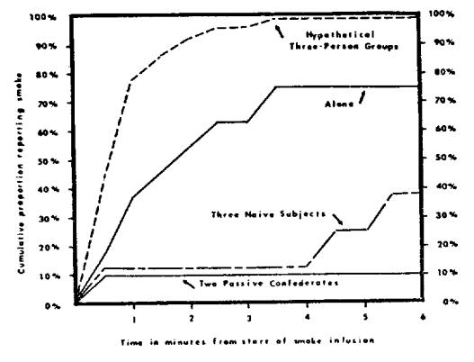

# GROUP INHIBITION OF BYSTANDER INTERVENTION IN EMERGENCIES 1

BIBB LATANÉ 2

AND

IOHN M. DARLEY 8

Columbia University

New York University

Male undergraduates found themselves in a smoke-filling room either alone, with 2 nonreacting others, or in groups of 3. As predicted, Ss were less likely to report the smoke when in the presence of passive others (10%) or in groups of 3 (38% of groups) than when alone (75%). This result seemed to have been mediated by the way Ss interpreted the ambiguous situation; seeing other people remain passive led Ss to decide the smoke was not dangerous.

Emergencies, fortunately, are uncommon events. Although the average person may read about them in newspapers or watch fictionalized versions on television, he probably will encounter fewer than half a dozen in his lifetime. Unfortunately, when he does encounter one, he will have had little direct personal experience in dealing with it. And he must deal with it under conditions of urgency, uncertainty, stress, and fear. About all the individual has to guide him is the secondhand wisdom of the late movie, which is often as useful as "Be brave" or as applicable as "Quick, get lots of hot water and towels!"

Under the circumstances, it may seem surprising that anybody ever intervenes in an emergency in which he is not directly involved. Yet there is a strongly held cultural norm that individuals should act to relieve the distress of others. As the Old Parson puts it, "In this life of froth and bubble, two things stand like stone—kindness in another's trouble, courage in your own." Given the conflict between the norm to act and an individual's fears and uncertainties about getting involved, what factors will determine whether a bystander to an emergency will intervene?

We have found (Darley & Latané, 1968) that the mere perception that other people are also witnessing the event will markedly decrease the likelihood that an individual will intervene in an emergency. Indi-

viduals heard a person undergoing a severe epileptic-like fit in another room. In one experimental condition, the subject thought that he was the only person who heard the emergency; in another condition, he thought four other persons were also aware of the seizure. Subjects alone with the victim were much more likely to intervene on his behalf, and, on the average, reacted in less than one-third the time required by subjects who thought there were other bystanders present.

"Diffusion of responsibility" seems the most likely explanation for this result. If an individual is alone when he notices an emergency, he is solely responsible for coping with it. If he believes others are also present, he may feel that his own responsibility for taking action is lessened, making him less likely to help.

To demonstrate that responsibility diffusion rather than any of a variety of social influence processes caused this result, the experiment was designed so that the onlookers to the seizure were isolated one from another and could not discuss how to deal with the emergency effectively. They knew the others could not see what they did, nor could they see whether somebody else had already started to help. Although this state of affairs is characteristic of many actual emergencies (such as the Kitty Genovese murder in which 38 people witnessed a killing from their individual apartments without acting), in many other emergencies several bystanders are in contact with and can influence each other. In these situations, processes other than responsibility diffusion will also operate.

Given the opportunity to interact, a group

&lt;sup>1 We thank Lee Ross and Keith Gerritz for their thoughtful efforts. This research was supported by National Science Foundation Grants GS 1238 and GS 1239. The experiment was conducted at Columbia University.

&lt;sup>2 Now at the Ohio State University.

3 Now at Princeton University.

can talk over the situation and divide up the helping action in an efficient way. Also, since responding to emergencies is a socially prescribed norm, individuals might be expected to adhere to it more when in the presence of other people. These reasons suggest that interacting groups should be better at coping with emergencies than single individuals. We suspect, however, that the opposite is true. Even when allowed to communicate, groups may still be worse than individuals.

Most emergencies are, or at least begin as, ambiguous events. A quarrel in the street may erupt into violence, but it may be simply a family argument. A man staggering about may be suffering a coronary or an onset of diabetes; he may be simply drunk. Smoke pouring from a building may signal a fire; on the other hand, it may be simply steam or air-conditioning vapor. Before a bystander is likely to take action in such ambiguous situations, he must first define the event as an emergency and decide that intervention is the proper course of action.

In the course of making these decisions, it is likely that an individual bystander will be considerably influenced by the decisions he perceives other bystanders to be taking. If everyone else in a group of onlookers seems to regard an event as nonserious and the proper course of action as nonintervention, this consensus may strongly affect the perceptions of any single individual and inhibit his potential intervention.

The definitions that other people hold may be discovered by discussing the situation with them, but they may also be inferred from their facial expressions or their behavior. A whistling man with his hands in his pockets obviously does not believe he is in the midst of a crisis. A bystander who does not respond to smoke obviously does not attribute it to fire. An individual, seeing the inaction of others, will judge the situation as less serious than he would if he were alone.

In the present experiment, this line of thought will be tested by presenting an emergency situation to individuals either alone or in the presence of two passive others, confederates of the experimenter who have been instructed to notice the emergency but remain indifferent to it. It is our expectation

that this passive behavior will signal the individual that the other bystanders do not consider the situation to be dangerous. We predict that an individual faced with the passive reactions of other people will be influenced by them, and will thus be less likely to take action than if he were alone.

This, however, is a prediction about individuals; it says nothing about the original question of the behavior of freely interacting groups. Most groups do not have preinstructed confederates among their members, and the kind of social influence process described above would, by itself, only lead to a convergence of attitudes within a group. Even if each member of the group is entirely guided by the reactions of others, then the group should still respond with a likelihood equal to the average of the individuals.

An additional factor is involved, however. Each member of a group may watch the others, but he is also aware that the others are watching him. They are an audience to his own reactions. Among American males it is considered desirable to appear poised and collected in times of stress. Being exposed to public view may constrain an individual's actions as he attempts to avoid possible ridicule and embarrassment.

The constraints involved with being in public might in themselves tend to inhibit action by individuals in a group, but in conjunction with the social influence process described above, they may be expected to have even more powerful effects. If each member of a group is, at the same time, trying to appear calm and also looking around at the other members to gauge their reactions, all members may be led (or misled) by each other to define the situation as less critical than they would if alone. Until someone acts, each person only sees other nonresponding bystanders, and, as with the passive confederates, is likely to be influenced not to act himself.

This leads to a second prediction. Compared to the performance of individuals, if we expose groups of naive subjects to an emergency, the constraints on behavior in public coupled with the social influence process will lessen the likelihood that the members of the group will act to cope with the emergency.

It has often been recognized (Brown, 1954, 1965) that a crowd can cause contagion of panic, leading each person in the crowd to overreact to an emergency to the detriment of everyone's welfare. What is implied here is that a crowd can also force inaction on its members. It can suggest, implicitly but strongly, by its passive behavior, that an event is not to be reacted to as an emergency, and it can make any individual uncomfortably aware of what a fool he will look for behaving as if it is.

### **METHOD**

The subject, seated in a small waiting room, faced an ambiguous but potentially dangerous situation as a stream of smoke began to puff into the room through a wall vent. His response to this situation was observed through a one-way glass. The length of time the subject remained in the room before leaving to report the smoke was the main dependent

variable of the study.

Recruitment of subjects. Male Columbia students living in campus residences were invited to an interview to discuss "some of the problems involved in life at an urban university." The subject sample included graduate and professional students as well as undergraduates. Individuals were contacted by telephone and most willingly volunteered and actually showed up for the interview. At this point, they were directed either by signs or by the secretary to a "waiting room" where a sign asked them to fill out a preliminary questionnaire.

Experimental manipulation. Some subjects filled out the questionnaire and were exposed to the potentially critical situation while alone. Others were part of three-person groups consisting of one subject and two confederates acting the part of naive subjects. The confederates attempted to avoid conversation as much as possible. Once the smoke had been introduced, they stared at it briefly, made no comment, but simply shrugged their shoulders, returned to the questionnaires and continued to fill them out, occasionally waving away the smoke to do so. If addressed, they attempted to be as uncommunicative as possible and to show apparent indifference to the smoke. "I dunno," they said, and no subject persisted in talking.

In a final condition, three naive subjects were tested together. In general, these subjects did not know each other, although in two groups, subjects reported a nodding acquaintanceship with another subject. Since subjects arrived at slightly different times and since they each had individual questionnaires to work on, they did not introduce themselves to each other, or attempt anything but the most rudimentary conversation.

Critical situation. As soon as the subjects had completed two pages of their questionnaires, the experimenter began to introduce the smoke through

a small vent in the wall. The "smoke" was finely divided titanium dioxide produced in a stoppered bottle and delivered under slight air pressure through the vent.2 It formed a moderately fine-textured but clearly visible stream of whitish smoke. For the entire experimental period, the smoke continued to jet into the room in irregular puffs. By the end of the experimental period, vision was obscured by the amount of smoke present.

All behavior and conversation was observed and coded from behind a one-way window (largely disguised on the subject's side by a large sign giving preliminary instructions). If the subject left the experimental room and reported the smoke, he was told that the situation "would be taken care of." If the subject had not reported the presence of smoke by 6 minutes from the time he first noticed it, the experiment was terminated.

#### RESULTS

Alone condition. The typical subject, when tested alone, behaved very reasonably. Usually, shortly after the smoke appeared, he would glance up from his questionnaire, notice the smoke, show a slight but distinct startle reaction, and then undergo a brief period of indecision, perhaps returning briefly to his questionnaire before again staring at the smoke. Soon, most subjects would get up from their chairs, walk over to the vent, and investigate it closely, sniffing the smoke, waving their hands in it, feeling its temperature, etc. The usual alone subject would hesitate again, but finally walk out of the room, look around outside, and, finding somebody there, calmly report the presence of the smoke. No subject showed any sign of panic; most simply said, "There's something strange going on in there, there seems to be some sort of smoke coming through the wall . . . ."

The median subject in the alone condition had reported the smoke within 2 minutes of first noticing it. Three-quarters of the 24 people who were run in this condition reported the smoke before the experimental period was terminated.

Two passive confederates condition. The behavior of subjects run with two passive confederates was dramatically different; of 10 people run in this condition, only 1 reported

2 Smoke was produced by passing moisturized air, under pressure, through a container of titanium tetrachloride, which, in reaction with the water vapor, creates a suspension of tantium dioxide in air.

the smoke. The other 9 stayed in the waiting room as it filled up with smoke, doggedly working on their questionnaire and waving the fumes away from their faces. They coughed, rubbed their eyes, and opened the window—but they did not report the smoke. The difference between the response rate of 75% in the alone condition and 10% in the two passive confederates condition is highly significant (p < .002 by Fisher's exact test, two-tailed).

Three naive bystanders. Because there are three subjects present and available to report the smoke in the three naive bystander condition as compared to only one subject at a time in the alone condition, a simple comparison between the two conditions is not appropriate. On the one hand, we cannot compare speeds in the alone condition with the average speed of the three subjects in a group, since, once one subject in a group had reported the smoke, the pressures on the other two disappeared. They legitimately could (and did) feel that the emergency had been handled, and any action on their part would be redundant and potentially confusing. Therefore the speed of the first subject in a group to report the smoke was used as the dependent variable. However, since there were three times as many people available to respond in this condition as in the alone condition, we would expect an increased likelihood that at least one person would report the smoke even if the subjects had no influence whatsoever on each other. Therefore we mathematically created

Fig. 1. Cumulative proportion of subjects reporting the smoke over time.

"groups" of three scores from the alone condition to serve as a base line.3

In contrast to the complexity of this procedure, the results were quite simple. Subjects in the three naive bystander condition were markedly inhibited from reporting the smoke. Since 75% of the alone subjects reported the smoke, we would expect over 98% of the three-person groups to contain at least one reporter. In fact, in only 38% of the eight groups in this condition did even 1 subject report (p < .01). Of the 24 people run in these eight groups, only 1 person reported the smoke within the first 4 minutes before the room got noticeably unpleasant. Only 3 people reported the smoke within the entire experimental period.

Cumulative distribution of report times. Figure 1 presents the cumulative frequency distributions of report times for all three conditions. The figure shows the proportion of subjects in each condition who had reported the smoke by any point in the time following the introduction of the smoke. For example, 55% of the subjects in the alone condition had reported the smoke within 2 minutes, but the smoke had been reported in only 12% of the three-person groups by that time. After 4 minutes, 75% of the subjects in the alone condition had reported the smoke; no additional subjects in the group condition had done so. The curve in Figure 1 labeled "Hypothetical Three-Person Groups" is based upon the mathematical combination of scores obtained from subjects in the alone condition. It is the expected report times for groups in the three-person condition if the members of the groups had no influence upon

It can be seen in Figure 1 that for every point in time following the introduction of the smoke, a considerably higher proportion of subjects in the alone condition had reported the smoke than had subjects in either the two passive confederates condition or in the three naive subjects condition. The curve for the latter condition, although considerably below

&lt;sup>8 The formula for calculating the expected proportion of groups in which at least one person will have acted by a given time is  $1-(1-p)^n$  where p is the proportion of single individuals who act by that time and n is the number of persons in the group.

the alone curve, is even more substantially inhibited with respect to its proper comparison, the curve of hypothetical three-person sets. Social inhibition of response was so great that the time elapsing before the smoke was reported was greater when there were more people available to report it (alone versus group p < .05 by Mann-Whitney U test).

Superficially, it appears that there is a somewhat higher likelihood of response from groups of three naive subjects than from subjects in the passive confederates condition. Again this comparison is not justified; there are three people free to act in one condition instead of just one. If we mathematically combine scores for subjects in the two passive confederates condition in a similar manner to that described above for the alone condition, we would obtain an expected likelihood of response of .27 as the hypothetical base line. This is not significantly different from the .37 obtained in the actual three-subject groups.

Noticing the smoke. In observing the subject's reaction to the introduction of smoke. careful note was taken of the exact moment when he first saw the smoke (all report latencies were computed from this time). This was a relatively easy observation to make, for the subjects invariably showed a distinct, if slight, startle reaction. Unexpectedly, the presence of other persons delayed, slightly but very significantly, noticing the smoke. Sixty-three percent of subjects in the alone condition and only 26% of subjects in the combined together conditions noticed the smoke within the first 5 seconds after its introduction ( $\phi$  < .01 by chi-square). The median latency of noticing the smoke was under 5 seconds in the alone condition: the median time at which the first (or only) subject in each of the combined together conditions noticed the smoke was 20 seconds (this difference does not account for group-induced inhibition of reporting since the report latencies were computed from the time the smoke was first noticed).

This interesting finding can probably be explained in terms of the constraints which people feel in public places (Goffman, 1963). Unlike solitary subjects, who often glanced idly about the room while filling out their

questionnaires, subjects in groups usually kept their eyes closely on their work, probably to avoid appearing rudely inquisitive.

Postexperimental interview. After 6 minutes, whether or not the subjects had reported the smoke, the interviewer stuck his head in the waiting room and asked the subject to come with him to the interview. After seating the subject in his office, the interviewer made some general apologies about keeping the subject waiting for so long, hoped the subject hadn't become too bored and asked if he "had experienced any difficulty while filling out the questionnaire." By this point most subjects mentioned the smoke. The interviewer expressed mild surprise and asked the subject to tell him what had happened. Thus each subject gave an account of what had gone through his mind during the smoke infusion.

Subjects who had reported the smoke were relatively consistent in later describing their reactions to it. They thought the smoke looked somewhat "strange," they were not sure exactly what it was or whether it was dangerous, but they felt it was unusual enough to justify some examination. "I wasn't sure whether it was a fire but it looked like something was wrong." "I thought it might be steam, but it seemed like a good idea to check it out."

Subjects who had not reported the smoke also were unsure about exactly what it was, but they uniformly said that they had rejected the idea that it was a fire. Instead, they hit upon an astonishing variety of alternative explanations, all sharing the common characteristic of interpreting the smoke as a nondangerous event. Many thought the smoke was either steam or air-conditioning vapors. several thought it was smog, purposely introduced to simulate an urban environment, and two (from different groups) actually suggested that the smoke was a "truth gas" filtered into the room to induce them to answer the questionnaire accurately. (Surprisingly, they were not disturbed by this conviction.) Predictably, some decided that "it must be some sort of experiment" and stoicly endured the discomfort of the room rather than overreact.

Despite the obvious and powerful reportinhibiting effect of other bystanders, subjects almost invariably claimed that they had paid little or no attention to the reactions of the other people in the room. Although the presence of other people actually had a strong and pervasive effect on the subjects' reactions, they were either unaware of this or unwilling to admit it.

## DISCUSSION

Before an individual can decide to intervene in an emergency, he must, implicitly or explicitly, take several preliminary steps. If he is to intervene, he must first notice the event, he must then interpret it as an emergency, and he must decide that it is his personal responsibility to act. At each of these preliminary steps, the bystander to an emergency can remove himself from the decision process and thus fail to help. He can fail to notice the event, he can fail to interpret it as an emergency, or he can fail to assume the responsibility to take action.

In the present experiment we are primarily interested in the second step of this decision process, interpreting an ambiguous event. When faced with such an event, we suggest, the individual bystander is likely to look at the reactions of people around him and be powerfully influenced by them. It was predicted that the sight of other, nonresponsive bystanders would lead the individual to interpret the emergency as not serious, and consequently lead him not to act. Further, it was predicted that the dynamics of the interaction process would lead each of a group of naive onlookers to be misled by the apparent inaction of the others into adopting a nonemergency interpretation of the event and a passive role.

The results of this study clearly support our predictions. Individuals exposed to a room filling with smoke in the presence of passive others themselves remained passive, and groups of three naive subjects were less likely to report the smoke than solitary bystanders. Our predictions were confirmed—but this does not necessarily mean that our explanation for these results is the correct one. As a matter of fact, several alternatives are available.

Two of these alternative explanations stem from the fact that the smoke represented a possible danger to the subject himself as well as to others in the building. Subjects' behavior might have reflected their fear of fire, with subjects in groups feeling less threatened by the fire than single subjects and thus being less concerned to act. It has been demonstrated in studies with humans (Schachter, 1959) and with rats (Latané, 1968; Latané & Glass, 1968) that togetherness reduces fear, even in situations where it does not reduce danger. In addition, subjects may have felt that the presence of others increased their ability to cope with fire. For both of these reasons, subjects in groups may have been less afraid of fire and thus less likely to report the smoke than solitary subjects.

A similar explanation might emphasize not fearfulness, but the desire to hide fear. To the extent that bravery or stoicism in the face of danger or discomfort is a socially desirable trait (as it appears to be for American male undergraduates), one might expect individuals to attempt to appear more brave or more stoic when others are watching than when they are alone. It is possible that subjects in the group condition saw themselves as engaged in a game of "Chicken," and thus did not react.

Although both of these explanations are plausible, we do not think that they provide an accurate account of subjects' thinking. In the postexperimental interviews, subjects claimed, not that they were unworried by the fire or that they were unwilling to endure the danger; but rather that they decided that there was no fire at all and the smoke was caused by something else. They failed to act because they thought there was no reason to act. Their "apathetic" behavior was reasonable—given their interpretation of the circumstances.

The fact that smoke signals potential danger to the subject himself weakens another alternative explanation, "diffusion of responsibility." Regardless of social influence processes, an individual may feel less personal responsibility for helping if he shares the responsibility with others (Darley & Latané, 1968). But this diffusion explanation does not

fit the present situation. It is hard to see how an individual's responsibility for saving himself is diffused by the presence of other people. The diffusion explanation does not account for the pattern of interpretations reported by the subjects or for their variety of nonemergency explanations.

On the other hand, the social influence processes which we believe account for the results of our present study obviously do not explain our previous experiment in which subjects could not see or be seen by each other. Taken together, these two studies suggest that the presence of bystanders may affect an individual in several ways; including both "social influence" and "diffusion of responsibility."

Both studies, however, find, for two quite different kinds of emergencies and under two quite different conditions of social contact, that individuals are less likely to engage in socially responsible action if they think other bystanders are present. This presents us with the paradoxical conclusion that a victim may be more likely to get help, or an emergency may be more likely to be reported, the fewer people there are available to take action. It also may help us begin to understand a number of frightening incidents where crowds

have listened to but not answered a call for help. Newspapers have tagged these incidents with the label "apathy." We have become indifferent, they say, callous to the fate of suffering others. The results of our studies lead to a different conclusion. The failure to intervene may be better understood by knowing the relationship among bystanders rather than that between a bystander and the victim.

#### REFERENCES

Brown, R. W. Mass phenomena. In G. Lindzey (Ed.), Handbook of social psychology. Vol. 2. Cambridge: Addison-Wesley, 1954.

Brown, R. Social psychology. New York: Free Press of Glencoe, 1965.

DARLEY, J. M., & LATANÉ, B. Bystander intervention in emergencies: Diffusion of responsibility.

Journal of Personality and Social Psychology,

1968, 8, 377-383.

GOFFMAN, E. Behavior in public places. New York:
Free Press of Glencoe, 1963.

LATANÉ, B. Gregariousness and fear in laboratory rats. Journal of Experimental Social Psychology, 1968, in press.

LATANÉ, B., & GLASS, D. C. Social and nonsocial attraction in rats. Journal of Personality and Social Psychology, 1968, 9, 142-146.

Schachter, S. The psychology of affiliation. Stanford: Stanford University Press, 1959.

(Received December 11, 1967)