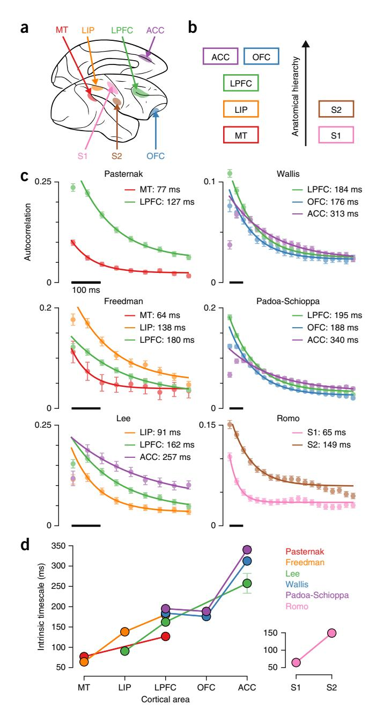
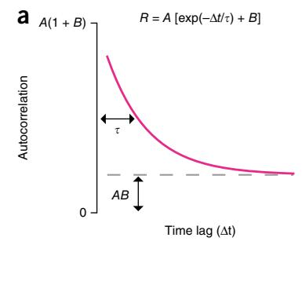
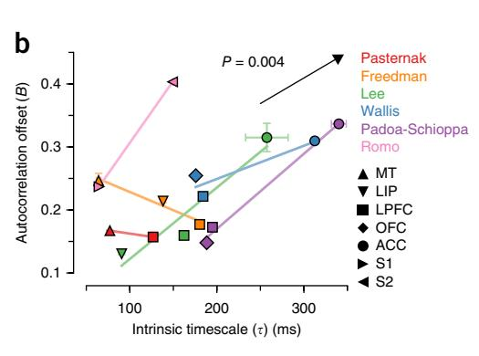
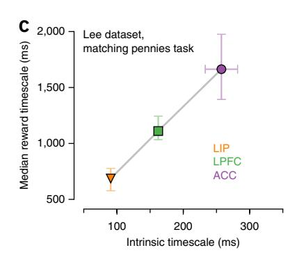

## nature neuroscience

# A hierarchy of intrinsic timescales across primate cortex

John D Murray1,2, Alberto Bernacchia2,3, David J Freedman4, Ranulfo Romo5,6, Jonathan D Wallis7,8, Xinying Cai9,10, Camillo Padoa-Schioppa10, Tatiana Pasternak11,12, Hyojung Seo2, Daeyeol Lee2 & Xiao-Jing Wang1,2,9

Specialization and hierarchy are organizing principles for primate cortex, yet there is little direct evidence for how cortical areas are specialized in the temporal domain. We measured timescales of intrinsic fluctuations in spiking activity across areas and found a hierarchical ordering, with sensory and prefrontal areas exhibiting shorter and longer timescales, respectively. On the basis of our findings, we suggest that intrinsic timescales reflect areal specialization for task-relevant computations over multiple temporal ranges.

Hierarchy provides a parsimonious description of various functional differences across cortical areas. For instance, the sizes of spatial receptive fields increase along the visual hierarchy1, and a posterioranterior hierarchy exists for cognitive abstraction within prefrontal cortex2. In the temporal domain, higher cortical areas can activate selectively for stimuli that are coherent over longer periods of time3,4. It remains an open question whether temporal specialization arises from a cortical area's intrinsic dynamical properties, that is, related to dynamics that exist even in the absence of direct stimulus processing. We hypothesized that differential dynamics would be manifested in the timescales of fluctuations in single-neuron spiking activity.

Variable neuronal activity is ubiquitous across the cortex5,6, yet it has been unclear what the timescales underlying this variability are or whether they differ across areas. Neuronal activity fluctuates over a wide range of timescales, with potential contributions from distinct underlying mechanisms. For example, the timescales of correlated fluctuations of activity within a local microcircuit are likely longer than those of single-neuron burstiness and refractoriness7 but shorter than those of drifts in arousal. In typical electrophysiological recordings from behaving animals, spike trains from a single neuron are recorded over many trials of a task. Using single-neuron spike trains, we sought to characterize underlying fluctuations in activity that are not locked to trial onset. To measure the timescales of these fluctuations, we used the spike-count autocorrelation for pairs of time bins separated by a time lag. The spike-count autocorrelation is calculated

as the correlation coefficient between the number of spikes in each time bin across all trials (Online Methods). As the time lag increases, the autocorrelation decays according to the fluctuation timescales8 (Supplementary Note).

We measured intrinsic timescales using single-neuron spike trains in data sets from 6 research groups, recorded in a total of 26 monkeys, that include 7 cortical areas (Fig. 1a). Five cortical areas are constituents of the visual-prefrontal hierarchy, including sensory, parietal association and prefrontal cortex: medial-temporal (MT) area in visual cortex, lateral intraparietal (LIP) area in parietal association cortex, lateral prefrontal cortex (LPFC), orbitofrontal cortex (OFC) and anterior cingulate cortex (ACC). To test for generality of results outside the visual system, we also examined two somatosensory areas: primary somatosensory cortex (S1) and secondary somatosensory cortex (S2). These areas span multiple levels of the anatomical hierarchy defined by the laminar patterns of long-range projections among cortical areas9,10 (Fig. 1b). For each data set, monkeys were engaged in cognitive tasks. We restricted our analysis to one epoch of the task, the foreperiod that begins each trial. During the foreperiod, the monkey was in a controlled, attentive state awaiting stimulus onset (fixation of eye position for visual tasks, lever hold for the somatosensory task). This restriction minimizes stimulus-related confounds and allows application of the same analyses across areas and data sets. This definition of intrinsic timescale does not refer to single-neuron physiology or imply that the timescale does not change with stimulus conditions.

The decay of autocorrelation with increasing time lag could be well fit by an exponential decay with an offset (Fig. 1c). This fit was obtained at the population level rather than the single-neuron level (Online Methods and Supplementary Figs. 1 and 2), enabling us to extract an intrinsic timescale as a population-level statistic for each area in a data set. Within each data set, the intrinsic timescales differed across areas, in the range of 50-350 ms. Over all data sets, we found a consistent ordering of the intrinsic timescales across cortical areas ( $P < 10^{-5}$ ,  $r_s = 0.89$ , Spearman's rank correlation) (Fig. 1d). Sensory cortex showed shorter timescales, parietal association cortex showed intermediate timescales and prefrontal cortex showed longer timescales, with medial prefrontal area ACC consistently showing the longest timescale in our data sets. Both visual and somatosensory systems had hierarchical ordering. Differences in intrinsic timescales could not be explained by differences in mean firing rates across areas (Supplementary Fig. 3). Notably, this hierarchy of intrinsic timescales aligns with the anatomical hierarchy defined by long-range projections among cortical areas  $^{9,10}$  (P = 0.002,  $r_s = 0.97$ , Spearman's rank correlation), although our physiologically defined

Received 13 May; accepted 12 October; published online 10 November 2014; doi:10.1038/nn.3862

Figure 1 Spike-count autocorrelation reveals a hierarchical ordering of intrinsic timescales. (a) Data sets span seven cortical areas in the macaque monkey: MT, LIP, LPFC, OFC, ACC, S1 and S2. (b) Anatomical hierarchy of the areas, based on long-range projection patterns9,10. (c) Spike-count autocorrelation was computed for neuronal spiking activity during the foreperiod of cognitive tasks. Each panel shows the data set for one of six research groups. The decay of autocorrelation was fit by an exponential decay with an offset. Some areas in data sets show refractory adaptation at short time lags, which were excluded from the fit (Online Methods). Solid lines show the exponential fit. Intrinsic timescale extracted from the fit is shown for each area. Autocorrelation was computed with 50-ms time bins. Error bars indicate s.e.m. (d) Intrinsic timescales across the visual-prefrontal hierarchy in five data sets (left) and the somatosensory hierarchy (right). Error bars indicate standard error of fit parameters.

hierarchy differs from the anatomical hierarchy for OFC. The correspondence between physiological, anatomical and functional hierarchies suggests the functional importance of these timescales in large-scale cortical coordination.

What is the potential relevance of intrinsic timescales to functions that may operate over longer timescales? We examined whether the intrinsic timescale (in the range of 50-350 ms) may be correlated with the capacity for neurons in an area to sustain signals over long behavioral timescales (for example, 5-10 s). Neuronal fluctuations include contributions that operate over a wide range of timescales. Long timescales contribute an effective offset to the autocorrelation (Fig. 2a and Supplementary Note). The offset can therefore reflect the strength of fluctuations at long timescales that cannot be resolved with a limited duration of the foreperiod. We found that the autocorrelation offset positively correlates with the intrinsic timescale (P = 0.004,  $t_9 = 3.4$ , t-test) (Fig. 2b). We also found that the offset reflects the strength of trial-to-trial correlations (P = 0.002,  $t_9$  = 3.9, t-test), indicating that a portion of long-timescale variability persists across trials (Supplementary Fig. 4). These results imply that hierarchy may exist across multiple temporal ranges.

Of relevance to function, fluctuations at long timescales can include contributions from long-lasting memory traces of stimuli or task variables such as reward. In the Lee data set, which includes areas LIP, LPFC and ACC, we previously measured at the single-neuron level the temporal modulation of neuronal activity by reward events during a decision-making task11 (**Supplementary Fig. 5**). We refer to the time constant characterizing the decay of a neuron's modulation by reward as its reward timescale. Consistent with this link between intrinsic timescale and long functional timescales, the order of areas according to median reward timescale aligns with the order according to intrinsic timescale (Fig. 2c). It is noteworthy that the median reward timescale is an order of magnitude longer than the intrinsic timescale. These results support the interpretation that intrinsic timescales may reflect areal specialization for task-relevant computations over long timescales.

In summary, our physiological analyses show that cortical areas follow a hierarchical ordering in their timescales of intrinsic fluctuations. One interpretation of their functional relevance is that these timescales set the duration over which a neural circuit integrates its inputs12. In this interpretation, shorter timescales in sensory areas enable them to rapidly detect or faithfully track dynamic stimuli13,14. By contrast, prefrontal areas can utilize longer timescales to integrate information and improve the signal-to-noise ratio in short-term memory or decision-making computations 12,15. There is known hierarchical specialization across areas at the functional level in sensory and cognitive processing 1-3.

The present study leaves as an open question what underlying mechanisms contribute to this hierarchy of intrinsic timescales.

Computational models of recurrent neural circuits have demonstrated multiple potential mechanisms12. A longer intrinsic timescale in the circuit could reflect longer timescales of cellular or synaptic dynamics12. Consistent with this mechanism, there are interareal differences in the dynamical properties of recurrent excitatory synapses, including differential composition of glutamate receptors16, expression of shortterm synaptic plasticity17 and level of neuromodulation18. Interareal differences in cellular physiology can also be driven by factors such as neuronal morphology19. A longer timescale in the circuit could also arise from stronger synaptic connections mediating recurrent excitation, which slows intrinsic dynamics by partially canceling leak 12. There are increases across the cortical hierarchy in the number and density of excitatory synapses onto pyramidal cells20, which may reflect increased recurrent strength across areas. Modeling studies have further shown that strong recurrent connections can endow a cortical circuit with the capability to exhibit persistent activity in

Figure 2 Links between intrinsic timescales and longer functional timescales. (a) The fit function for autocorrelation is defined by a timescale ( $\tau$ ), amplitude (A) and offset (B). Autocorrelation offset (B) reflects the strength of contributions with long timescales, which do not decay substantially within the fixation epoch. (b) Autocorrelation offset increases with intrinsic timescale. Colored lines show trends for individual data sets. The arrow shows the slope of dependence from a regression analysis (slope  $m = 0.8 \pm 0.2$  kHz). Error bars indicate s.e.m. (c) In the Lee data set, we previously measured timescales characterizing the decay of modulation of single-neuron firing rates by reward events while monkeys performed a competitive decision-making task11 for areas LIP (n = 160), LPFC (n = 243) and ACC (n = 134). The ordering of areas by reward timescale aligns with the ordering by intrinsic timescale. Error bars indicate standard error for fit parameter and median.

working memory and slow accumulation of information in decision making15. A hierarchy of intrinsic timescales may link neurophysiological properties to functional specialization.

#### **METHODS**

Methods and any associated references are available in the online version of the paper.

Note: Any Supplementary Information and Source Data files are available in the online version of the paper.

#### ACKNOWLEDGMENTS

We thank R. Chaudhuri and H.F. Song for discussions, and W. Chaisangmongkon and A. Ponce-Alvarez for assistance with data sets. Funding was provided by US Office of Naval Research grant N00014-13-1-0297 and US National Institutes of Health (NIH) grant R01DM062349 (X.-J.W.); NIH grant R01DA029330 (D.L.); NIH grants R01EY11749 and T32EY07125 (T.P.); NIH grant R01DA032758 and Whitehall Foundation grant 2010-12-13 (C.P.-S.); NIH grants R01DA19028 and P01NS040813 (J.D.W.); grants from Dirección General de Asuntos del Personal Académico–Universidad Nacional Autónoma de México and Consejo Nacional de Ciencia y Tecnología México (R.R.); and NIH grant R01EY019041 (D.J.F.).

### AUTHOR CONTRIBUTIONS

J.D.M., A.B. and X.-J.W. designed the research and wrote the manuscript. J.D.M. analyzed the data and prepared the figures. D.J.F., R.R., J.D.W., X.C., C.P.-S., T.P., H.S. and D.L. contributed the electrophysiological data. All authors contributed to editing and revising the manuscript.

#### COMPETING FINANCIAL INTERESTS

The authors declare no competing financial interests.

Reprints and permissions information is available online at http://www.nature.com/reprints/index.html.

- 1. Lennie, P. Perception 27, 889-935 (1998).
- 2. Badre, D. & D'Esposito, M. Nat. Rev. Neurosci. 10, 659-669 (2009).
- Hasson, U., Yang, E., Vallines, I., Heeger, D.J. & Rubin, N. J. Neurosci. 28, 2539–2550 (2008).
- 4. Honey, C.J. et al. Neuron 76, 423-434 (2012).
- 5. Churchland, M.M. et al. Nat. Neurosci. 13, 369-378 (2010).
- Goris, R.L.T., Movshon, J.A. & Simoncelli, E.P. Nat. Neurosci. 17, 858–865 (2014).
- 7. Maimon, G. & Assad, J.A. Neuron 62, 426-440 (2009).
- 8. Churchland, A.K. et al. Neuron 69, 818-831 (2011).
- 9. Felleman, D.J. & Van Essen, D.C. Cereb. Cortex 1, 1-47 (1991).
- 10. Barbas, H. & Rempel-Clower, N. Cereb. Cortex 7, 635-646 (1997).
- Bernacchia, A., Seo, H., Lee, D. & Wang, X.-J. Nat. Neurosci. 14, 366–372 (2011).
- Goldman, M.S., Compte, A. & Wang, X.-J. in Encyclopedia of Neuroscience (ed. Squire, L.R.) 165–178 (Academic Press, Oxford, 2008).
- Buracas, G.T., Zador, A.M., DeWeese, M.R. & Albright, T.D. Neuron 20, 959–969 (1998)
- Salinas, E., Hernandez, A., Zainos, A. & Romo, R. J. Neurosci. 20, 5503–5515 (2000).
- 15. Wang, X.-J. Neuron 36, 955-968 (2002).
- Wang, H., Stradtman, G.G., Wang, X.-J. & Gao, W.-J. Proc. Natl. Acad. Sci. USA 105, 16791–16796 (2008).
- 17. Wang, Y. et al. Nat. Neurosci. 9, 534-542 (2006).
- 18. Fuster, J. The Prefrontal Cortex (Academic Press, New York, 2008).
- 19. Amatrudo, J.M. *et al. J. Neurosci.* **32**, 13644–13660 (2012).
- 20. Elston, G.N. Cereb. Cortex 13, 1124-1138 (2003).

**ONLINE METHODS** 

Data sets. All experimental methods met standards of the US National Institutes of Health and were approved by the relevant institutional animal care and use committees at University of Rochester, Harvard Medical School, University of Chicago, University of California, Berkeley, Washington University School of Medicine and Universidad Nacional Autónoma de México. Experimental details for the data sets have been reported previously21–38. We used single-neuron spike train data, recorded in macaque monkeys, from the foreperiod of various cognitive tasks. Although their precise ages were not known, all monkeys used in these experiments were adults. For the Romo data set, the foreperiod entailed holding a lever by the free hand; for all other data sets, the foreperiod entailed fixation of eye position to a central target. Criteria for selecting data sets were that they comprised multiple cortical areas and that the task foreperiod had durations of at least 500 ms with minimal task-related stimulus during the foreperiod (for visual tasks, only a fixation point on the screen). Only completed trials were analyzed. Cells and trials were filtered for further analysis by two criteria. To allow computation of spike-count autocorrelation, we required that each time bin have a nonzero mean firing  ${\rm rate}^{39}$ . To minimize spurious autocorrelation caused by very slow drift of firing rates across the recording session, we selected the longest block of trials in which the total foreperiod spike count was statistically stationary across trials40.

The Pasternak data set consists of neurons recorded in MT and LPFC21-25. Monkeys compared two motion stimuli separated by a brief delay. The foreperiod duration was either 500 ms or 1,000 ms. For single neurons recorded over multiple tasks, each task-neuron pair was treated as a separate single neuron to control for task-dependent changes in foreperiod firing. Single-neuron counts were 485 from MT (2 male monkeys) and 427 from LPFC (4 male monkeys). The Freedman data set contains neurons from MT, LIP and LPFC26,27. Monkeys performed a motion-delayed match-to-category task. The foreperiod duration was 500 ms. Single-neuron counts were 59 from MT (2 male monkeys), 222 from LIP (4 male monkeys) and 458 from LPFC (2 male monkeys). The Lee data set consists of neurons recorded in LIP, LPFC and ACC28-30. Monkeys performed a competitive decision-making task called matching pennies. The foreperiod duration was 500 ms. Single-neuron counts were 192 from LIP (1 female, 2 male monkeys), 293 from LPFC (1 female, 4 male monkeys) and 146 from ACC (2 male monkeys). The Wallis data set contains neurons from LPFC, OFC and ACC31-33. Monkeys performed tasks involving value-based choice. The foreperiod duration was 1,000 ms. Single-neuron counts were 946 from LPFC (6 male monkeys), 481 from OFC (7 male monkeys) and 841 from ACC (6 male monkeys). The Padoa-Schioppa data set contains neurons from LPFC, OFC and ACC34-37. Monkeys performed tasks involving value-based choice. The foreperiod duration was 1,500 ms. Single-neuron counts were 1,024 from LPFC (1 female, 1 male monkeys), 1,768 from OFC (1 female, 1 male monkeys) and 987 from ACC (1 female, 1 male monkeys). The Romo data set contains cells from S1 and S2 (ref. 38). Two monkeys performed a vibrotactile delayed discrimination task. The foreperiod duration was variable, with a minimum of 1,400 ms. Single-neuron counts were 711 from S1 (2 male monkeys) and 928 from S2 (2 male monkeys).

Analysis. Our primary analysis was the temporal autocorrelation of spike counts, which we computed in the following way for single neurons. We divided the foreperiod into separate, successive time bins of duration  $\Delta$ . We set  $\Delta = 50$  ms; results were similar for changes of  $\pm$  20%. For two time bins, indexed by their onset times  $i\Delta$  and  $j\Delta$ , we computed the across-trial correlation between spike counts N in those time bins using the Pearson's correlation coefficient R:

$$R = \frac{\text{Cov}(N(i\Delta), N(j\Delta))}{\sqrt{\text{Var}(N(i\Delta)) \times \text{Var}(N(j\Delta))}}$$

$$= \frac{\langle (N(i\Delta) - \bar{N}(i\Delta)) (N(j\Delta) - \bar{N}(j\Delta)) \rangle}{\sqrt{\text{Var}(N(i\Delta)) \times \text{Var}(N(j\Delta))}}$$
(1)

in which covariance (Cov) and variance (Var) are computed across trials for those time bins and  $\overline{N}$  is the mean spike count for a particular bin. Notably, spike-count autocorrelation corrects for nonstationarity in the mean firing rate during the foreperiod (for example, ramping) because covariance and variance subtract the mean spike count for each time bin.

Based on our theoretical calculations for doubly stochastic processes (Supplementary Note), the decay of autocorrelation was fit to the population of neurons within an area by an exponential decay with an offset as a function of the time lag  $k\Delta$  between time bins (k = |i - j|):

$$R(k\Delta) = A \left[ \exp\left(-\frac{k\Delta}{\tau}\right) + B \right]$$
 (2)

in which  $\tau$  is the intrinsic timescale and B is the offset that reflects the contribution of timescales much longer than our observation window. Some areas in the data sets showed signs of refractoriness or negative adaptation at short time lags (Fig. 1c), which would not be captured by equation (2). To accommodate this feature of the autocorrelation data, fitting started at the time lag with maximum decrease of the mean autocorrelation. We fit equation (2) to the full autocorrelation data for all neurons and times; fits were therefore performed at the population level rather than single-neuron level, yielding a set of fit parameters for an area in a data set. For the visual presentation in Figure 1c, autocorrelation was averaged across neurons and times. Autocorrelation averaged across neurons but not time is presented in Supplementary Figure 1, and autocorrelation averaged across time but not neurons is presented in Supplementary Figure 2.

Equation (2) was fit to the autocorrelation data using nonlinear least-squares fitting via the Levenberg-Marquardt algorithm (through the SciPy function optimize.curve\_fit). The parameter covariance matrix generated by the Levenberg-Marquardt fitting procedure describes the dependence between parameters in fitting an individual area in a data set. A positive (negative) off-diagonal term for two parameters indicates that increasing one parameter will increase (decrease) the other to optimize the fit. For most areas (11 of 16), this term had a negative sign, indicating that the positive correlation between  $\tau$  and B shown in Figure 2b was not a consequence of the fitting procedure. Standard error for fit parameters was computed by the delete-one jackknife procedure.

To test for hypothesized relationships between two measures, we used a linear regression model:

$$y_d = mx + \sum_{k \in \{\text{data sets}\}} b_k \delta_{d,k}$$
 (3)

in which  $\delta_{d,k}$  is a dummy variable, which is 1 if data set d matches k and 0 otherwise. This model assumes that all data sets have a linear dependence of y on x across all data sets (m) and allows data sets to have different constant terms ( $b_k$ ). The statistical significance of a regressor, in particular the dependence term m, was assessed by a t-test. This regression analysis was applied to test three dependences: (i) x is intrinsic timescale, y is autocorrelation offset (Fig. 2b); (ii) x is mean firing rate, y is intrinsic timescale (Supplementary Fig. 3); and (iii) x is trial-to-trial correlation, y is autocorrelation offset (Supplementary Fig. 4). We assessed normality of residuals for the regression analyses; in all cases, the magnitude of skew was <0.4. Statistical significance (defined by P < 0.05), or lack thereof, for each test was preserved if a single constant term ( $b_k = b$ ) was used for all data sets.

To test for correlation between the timescale hierarchy and anatomical hierarchy, we calculated the Spearman's rank correlation between the ordering of areas by mean timescale and the discrete anatomical ordering shown in Figure 1b. The rank correlation coefficient was the same for the visual-prefrontal system (MT, LIP, LPFC, OFC, ACC) and for the somatosensory-prefrontal hierarchy (S1, S2, LPFC, OFC, ACC). Unless otherwise stated, reported P values are one sided as we tested a priori hypotheses of positive correlations between variables. Custom Python code was used for all analyses; analysis code is available from the authors upon request.

A Supplementary Methods Checklist is available.

NATURE NEUROSCIENCE doi:10.1038/nn.3862

21. Bisley, J.W., Zaksas, D., Droll, J.A. & Pasternak, T. J. Neurophysiol. 91, 286-300 (2004).

22. Zaksas, D. & Pasternak, T. J. Neurophysiol. 94, 4156-4167 (2005).

23. Zaksas, D. & Pasternak, T. J. Neurosci. 26, 11726-11742 (2006).

24. Hussar, C.R. & Pasternak, T. Neuron 64, 730-743 (2009).

25. Hussar, C.R. & Pasternak, T. J. Neurosci. 32, 2747-2761 (2012).

26. Freedman, D.J. & Assad, J.A. Nature 443, 85-88 (2006).

27. Swaminathan, S.K. & Freedman, D.J. Nat. Neurosci. 15, 315-320 (2012).

- 28. Seo, H., Barraclough, D.J. & Lee, D. *J. Neurosci.* **29**, 7278–7289 (2009). 29. Seo, H., Barraclough, D.J. & Lee, D. *Cereb. Cortex* **17** (suppl. 1), i110–i117 (2007). 30. Seo, H. & Lee, D. *J. Neurosci.* **27**, 8366–8377 (2007).
- 31. Kennerley, S.W., Dahmubed, A.F., Lara, A.H. & Wallis, J.D. *J. Cogn. Neurosci.* **21**, 1162–1178 (2009).
- 32. Kennerley, S.W. & Wallis, J.D. *J. Neurosci.* **29**, 3259–3270 (2009).
- 33. Hosokawa, T., Kennerley, S.W., Sloan, J. & Wallis, J.D. *J. Neurosci.* **33**, 17385–17397 (2013).
- 34. Padoa-Schioppa, C. & Assad, J.A. *Nature* **441**, 223–226 (2006). 35. Padoa-Schioppa, C. & Assad, J.A. *Nat. Neurosci.* **11**, 95–102 (2008).

- 73. radua-schioppa, C. & Assad, J.A. Nat. Neurosci. 11, 93–102 (2006).
   73. Cai, X. & Padoa-Schioppa, C. J. Neurosci. 32, 3791–3808 (2012).
   73. Cai, X. & Padoa-Schioppa, C. Neuron 81, 1140–1151 (2014).
   73. Ponce-Alvarez, A., Nácher, V., Luna, R., Riehle, A. & Romo, R. J. Neurosci. 32, 11956–11969 (2012).
- 39. Ogawa, T. & Komatsu, H. *J. Neurophysiol.* **103**, 2433–2445 (2010). 40. Nishida, S. *et al. Cereb. Cortex* **24**, 1671–1685 (2014).

doi:10.1038/nn.3862 NATURE NEUROSCIENCE