Mathematical Surveys and Monographs Volume 220

Kolmogorov
Complexity
and Algorithmic
Randomness

A. Shen V. A. Uspensky

N. Vereshchagin


Kolmogorov Complexity and Algorithmic Randomness Mathematical Surveys and Monographs Volume 220

# Kolmogorov Complexity and Algorithmic Randomness

A. Shen
V. A. Uspensky

N. Vereshchagin


American Mathematical Society Providence, Rhode Island

#### EDITORIAL COMMITTEE

Robert Guralnick Michael A. Singer, Chair Benjamin Sudakov Constantin Teleman

Michael I. Weinstein

# Н. К. Верещагин, В. А. Успенский, А. Шень

Колмогоровская сложность и алгоритмическая случайность МЦНМО, Москва, 2013

2010 Mathematics Subject Classification. Primary 68Q30, 03D32, 60A99, 97K70.

For additional information and updates on this book, visit  ${\bf www.ams.org/bookpages/surv-220}$ 

#### Library of Congress Cataloging-in-Publication Data

Names: Shen, A. (Alexander), 1958- | Uspenskiĭ, V. A. (Vladimir Andreevich) | Vereshchagin, N. K., 1928-

Title: Kolmogorov complexity and algorithmic randomness / A. Shen, V. A. Uspensky, N. Vereshchagin.

Other titles: Kolmogorovskaya slozhnost i algoritmieskaya sluchanost. English

Description: Providence, Rhode Island: American Mathematical Society, [2017] | Series: Mathematical surveys and monographs; volume 220 | Includes bibliographical references and index. Identifiers: LCCN 2016049293 | ISBN 9781470431822 (alk. paper)

Subjects: LCSH: Kolmogorov complexity. | Computational complexity. | Information theory. |
AMS: Computer science - Theory of computing - Algorithmic information theory (Kolmogorov complexity, etc.). msc | Mathematical logic and foundations - Computability and recursion theory - Algorithmic randomness and dimension. msc | Probability theory and stochastic processes - Foundations of probability theory - None of the above, but in this section. msc | Mathematics education - Combinatorics, graph theory, probability theory, statistics - Foundations and methodology of statistics. msc

Classification: LCC QA267.7 .S52413 2017 | DDC 511.3/42-dc23 LC record available at https://lccn.loc.gov/2016049293

Copying and reprinting. Individual readers of this publication, and nonprofit libraries acting for them, are permitted to make fair use of the material, such as to copy select pages for use in teaching or research. Permission is granted to quote brief passages from this publication in reviews, provided the customary acknowledgment of the source is given.

Republication, systematic copying, or multiple reproduction of any material in this publication is permitted only under license from the American Mathematical Society. Permissions to reuse portions of AMS publication content are handled by Copyright Clearance Center's RightsLink® service. For more information, please visit: http://www.ams.org/rightslink.

Send requests for translation rights and licensed reprints to reprint-permission@ams.org.

Excluded from these provisions is material for which the author holds copyright. In such cases, requests for permission to reuse or reprint material should be addressed directly to the author(s). Copyright ownership is indicated on the copyright page, or on the lower right-hand corner of the first page of each article within proceedings volumes.

©2017 by the authors. All rights reserved. Printed in the United States of America.

The paper used in this book is acid-free and falls within the guidelines established to ensure permanence and durability.

Visit the AMS home page at http://www.ams.org/

10 9 8 7 6 5 4 3 2 1 22 21 20 19 18 17

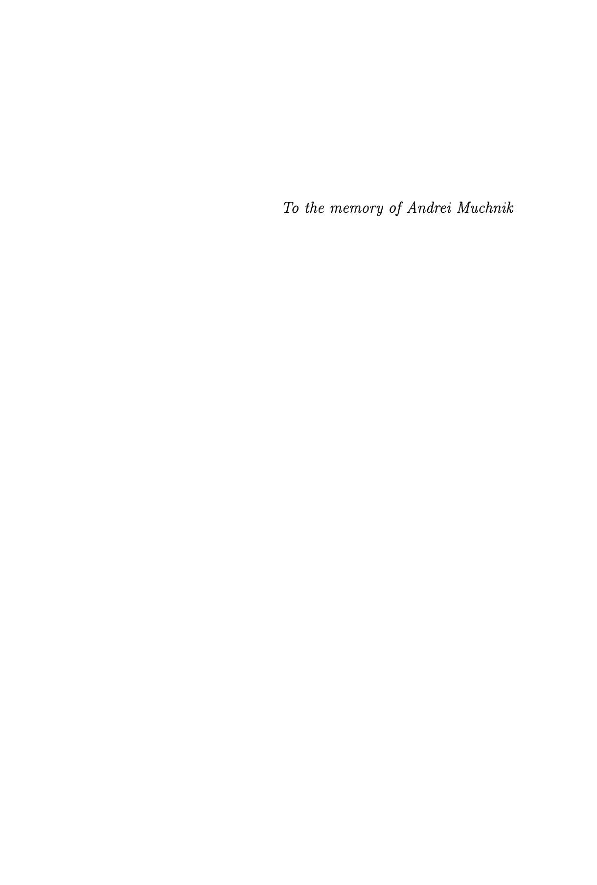

# Contents

| Pretace Acknowledgments                                     | xi<br>xiii |
|-------------------------------------------------------------|------------|
|                                                             |            |
| Basic notions and notation                                  | xv         |
| Introduction. What is this book about?                      | 1          |
| What is Kolmogorov complexity?                              | 1          |
| Optimal description modes                                   | 2          |
| Kolmogorov complexity                                       | 4          |
| Complexity and information                                  | 5          |
| Complexity and randomness                                   | 8          |
| Non-computability of $C$ and Berry's paradox                | 9          |
| Some applications of Kolmogorov complexity                  | 10         |
| Chapter 1. Plain Kolmogorov complexity                      | 15         |
| 1.1. Definition and main properties                         | 15         |
| 1.2. Algorithmic properties                                 | 21         |
| Chapter 2. Complexity of pairs and conditional complexity   | 31         |
| 2.1. Complexity of pairs                                    | 31         |
| 2.2. Conditional complexity                                 | 34         |
| 2.3. Complexity as the amount of information                | 45         |
| Chapter 3. Martin-Löf randomness                            | 53         |
| 3.1. Measures on $\Omega$                                   | 53         |
| 3.2. The Strong Law of Large Numbers                        | 55         |
| 3.3. Effectively null sets                                  | 59         |
| 3.4. Properties of Martin-Löf randomness                    | 65         |
| 3.5. Randomness deficiencies                                | 70         |
| Chapter 4. A priori probability and prefix complexity       | 75         |
| 4.1. Randomized algorithms and semimeasures on $\mathbb{N}$ | 75         |
| 4.2. Maximal semimeasures                                   | 79         |
| 4.3. Prefix machines                                        | 81         |
| 4.4. A digression: Machines with self-delimiting input      | 85         |
| 4.5. The main theorem on prefix complexity                  | 91         |
| 4.6. Properties of prefix complexity                        | 96         |
| 4.7. Conditional prefix complexity and complexity of pairs  | 102        |
| Chapter 5. Monotone complexity                              | 115        |
| 5.1. Probabilistic machines and semimeasures on the tree    | 115        |

viii CONTENTS

| 5.2.    | Maximal semimeasure on the binary tree          | 121 |
|---------|-------------------------------------------------|-----|
| 5.3.    | A priori complexity and its properties          | 122 |
| 5.4.    | Computable mappings of type $\Sigma \to \Sigma$ | 126 |
| 5.5.    | Monotone complexity                             | 129 |
| 5.6.    | Levin–Schnorr theorem                           | 144 |
| 5.7.    | The random number $\Omega$                      | 157 |
| 5.8.    | Effective Hausdorff dimension                   | 172 |
| 5.9.    | Randomness with respect to different measures   | 176 |
|         | 6. General scheme for complexities              | 193 |
|         | Decision complexity                             | 193 |
|         | Comparing complexities                          | 197 |
|         | Conditional complexities                        | 200 |
| 6.4.    | Complexities and oracles                        | 202 |
|         | 7. Shannon entropy and Kolmogorov complexity    | 213 |
| 7.1.    | Shannon entropy                                 | 213 |
| 7.2.    | Pairs and conditional entropy                   | 217 |
| 7.3.    | Complexity and entropy                          | 226 |
| -       | 8. Some applications                            | 233 |
| 8.1.    | There are infinitely many primes                | 233 |
| 8.2.    | Moving information along the tape               | 233 |
| 8.3.    | Finite automata with several heads              | 236 |
| 8.4.    | Laws of Large Numbers                           | 238 |
| 8.5.    | Forbidden substrings                            | 241 |
| 8.6.    | A proof of an inequality                        | 255 |
| 8.7.    | Lipschitz transformations are not transitive    | 258 |
| Chapter |                                                 | 261 |
| 9.1.    | The original idea of von Mises                  | 261 |
| 9.2.    | Set of strings as selection rules               | 262 |
| 9.3.    | Mises-Church randomness                         | 264 |
| 9.4.    | Ville's example                                 | 267 |
| 9.5.    | Martingales                                     | 270 |
| 9.6.    | A digression: Martingales in probability theory | 275 |
| 9.7.    | Lower semicomputable martingales                | 277 |
| 9.8.    | Computable martingales                          | 279 |
| 9.9.    | Martingales and Schnorr randomness              | 282 |
| 9.10.   | Martingales and effective dimension             | 284 |
| 9.11.   | Partial selection rules                         | 287 |
| 9.12.   | Non-monotonic selection rules                   | 291 |
| 9.13.   | Change in the measure and randomness            | 297 |
| Chapter |                                                 | 313 |
| 10.1.   | Introduction and summary                        | 313 |
| 10.2.   | Uniform sets                                    | 318 |
| 10.3.   | Construction of a uniform set                   | 321 |
| 10.4.   | Uniform sets and orbits                         | 323 |
| 10.5.   | Almost uniform sets                             | 324 |

CONTENTS ix

| 10.6. Typization trick                                                                     | 326 |
|--------------------------------------------------------------------------------------------|-----|
| 10.7. Combinatorial interpretation: Examples                                               | 328 |
| 10.8. Combinatorial interpretation: The general case                                       | 330 |
| 10.9. One more combinatorial interpretation                                                | 332 |
| 10.10. The inequalities for two and three strings                                          | 336 |
| 10.11. Dimensions and Ingleton's inequality                                                | 337 |
| 10.12. Conditionally independent random variables                                          | 342 |
| 10.13. Non-Shannon inequalities                                                            | 343 |
| Chapter 11. Common information                                                             | 351 |
| 11.1. Incompressible representations of strings                                            | 351 |
| 11.2. Representing mutual information as a string                                          | 352 |
| 11.3. The combinatorial meaning of common information                                      | 357 |
| 11.4. Conditional independence and common information                                      | 362 |
| Chapter 12. Multisource algorithmic information theory                                     | 367 |
| 12.1. Information transmission requests                                                    | 367 |
| 12.2. Conditional encoding                                                                 | 368 |
| 12.3. Conditional codes: Muchnik's theorem                                                 | 369 |
| 12.4. Combinatorial interpretation of Muchnik's theorem                                    | 373 |
| 12.5. A digression: On-line matching                                                       | 375 |
| 12.6. Information distance and simultaneous encoding                                       | 377 |
| 12.7. Conditional codes for two conditions                                                 | 379 |
| 12.8. Information flow and network cuts                                                    | 383 |
| 12.9. Networks with one source                                                             | 384 |
| 12.10. Common information as an information request                                        | 388 |
| 12.11. Simplifying a program                                                               | 389 |
| 12.12. Minimal sufficient statistics                                                       | 390 |
| Chapter 13. Information and logic                                                          | 401 |
| 13.1. Problems, operations, complexity                                                     | 401 |
| 13.2. Problem complexity and intuitionistic logic                                          | 403 |
| 13.3. Some formulas and their complexity                                                   | 405 |
| 13.4. More examples and the proof of Theorem 238                                           | 408 |
| 13.5. Proof of a result similar to Theorem 238 using Kripke models                         | 413 |
| 13.6. A problem whose complexity is not expressible in terms of the complexities of tuples | 417 |
|                                                                                            |     |
| Chapter 14. Algorithmic statistics                                                         | 425 |
| 14.1. The framework and randomness deficiency                                              | 425 |
| 14.2. Stochastic objects                                                                   | 428 |
| 14.3. Two-part descriptions                                                                | 431 |
| 14.4. Hypotheses of restricted type                                                        | 438 |
| 14.5. Optimality and randomness deficiency                                                 | 447 |
| 14.6. Minimal hypotheses                                                                   | 450 |
| 14.7. A bit of philosophy                                                                  | 452 |
| Appendix 1. Complexity and foundations of probability                                      | 455 |
| Probability theory paradox                                                                 | 455 |
| Current best practice                                                                      | 455 |

x CONTENTS

| Simple events and events specified in advance              | 456 |
|------------------------------------------------------------|-----|
| Frequency approach                                         | 458 |
| Dynamical and statistical laws                             | 459 |
| Are "real-life" sequences complex?                         | 459 |
| Randomness as ignorance: Blum-Micali-Yao pseudo-randomness | 460 |
| A digression: Thermodynamics                               | 461 |
| Another digression: Quantum mechanics                      | 463 |
| Appendix 2. Four algorithmic faces of randomness           | 465 |
| Introduction                                               | 465 |
| Face one: Frequency stability and stochasticness           | 468 |
| Face two: Chaoticness                                      | 470 |
| Face three: Typicalness                                    | 475 |
| Face four: Unpredictability                                | 476 |
| Generalization for arbitrary computable distributions      | 480 |
| History and bibliography                                   | 486 |
| Bibliography                                               | 491 |
| Name Index                                                 | 501 |
| Subject Index                                              | 505 |

# **Preface**

The notion of algorithmic complexity (also sometimes called algorithmic entropy) appeared in the 1960s in between the theory of computation, probability theory, and information theory.

The idea of A. N. Kolmogorov was to measure the amount of information in *finite objects* (and not in random variables, as it is done in classical Shannon information theory). His famous paper [78], published in 1965, explains how this can be done (up to a bounded additive term) using the algorithmic approach.

Similar ideas were suggested a few years earlier by R. Solomonoff (see [187] and his other papers; the historical account and reference can be found in [103]). The motivation of Solomonoff was quite different. He tried to define the notion of a priori probability. Imagine there is some experiment (random process) and we know nothing about its internal structure. Can we say something about the probabilities of different outcomes in this situation? One can relate this to the complexity measures saying that simple objects have greater a priori probability than complex ones. (Unfortunately, Solomonoff's work become popular only after Kolmogorov mentioned it in his paper.)

In 1965 G. Chaitin (then an 18-year-old undergraduate student) submitted two papers [28] and [29]; they were published in 1966 and 1969, respectively. In the second paper he proposed the same definition of algorithmic complexity as Kolmogorov.

The basic properties of Kolmogorov complexity were established in the 1970s. Working independently, C. P. Schnorr and L. Levin (who was a student of Kolmogorov) found a link between complexity and the notion of algorithmic randomness (introduced in 1966 by P. Martin-Löf [115]). To achieve this, they introduced a slightly different version of complexity, the so-called *monotone* complexity. Also Solomonoff's ideas about a priori probability were formalized in the form of prefix complexity, introduced by Levin and later by Chaitin. The notions of complexity turned out to be useful both for theory of computation and probability theory.

Kolmogorov complexity became popular (and for a good reason: it is a basic and philosophically important notion of algorithm theory) after M. Li and P. Vitányi published a book on the subject [103] (first edition appeared in 1993). Almost everything about Kolmogorov complexity that was known at the moment was covered in the book or at least mentioned as an exercise. This book also provided a detailed historical account, references to first publications, etc. Then the books of C. Calude [25] and A. Nies [147] appeared, as well as the book of R. Downey and D. Hirschfeldt [49]. These books cover many interesting results obtained recently

<sup>&</sup>lt;sup>1</sup>Kolmogorov wrote in [79], "I came to a similar notion not knowing about Solomonoff's work."

xii PREFACE

(in particular, the results that relate complexity and randomness with classical recursion theory).

Our book does not try to be comprehensive (in particular, we do not say much about the recent results mentioned above). Instead, we tried to select the most important topics and results (both from the technical and philosophical viewpoints) and to explain them clearly. We do not say much about the history of the topic: as is usually done in textbooks, we formulate most statements without references, but this does not mean (of course) any authorship claim.

We start the book with a section "What is this book about?" where we try to give a brief overview of the main ideas and topics related to Kolmogorov complexity and algorithmic randomness so the reader can browse this section to decide whether the book is worth reading.

As an appendix we reproduce the (English translation) of a small brochure written by one of the authors (V.U.), based on his talk for high school students and undergraduates (July 23, 2005) delivered during the "Modern Mathematics" Summer School (Dubna near Moscow); the brochure was published in 2006 by MCCME publishing house (Moscow). The lecture was devoted to different notions of algorithmic randomness, and the reader who has no time or incentive to study the corresponding chapters of the book in detail can still get some acquaintance with this topic.

Unfortunately, the notation and terminology related to Kolmogorov complexity is not very logical (and different people often use different notation). Even the same authors use different notation in different papers. For example, Kolmogorov used both the letters K and H in his two basic publications [78, 79]. In [78] he used the term "complexity" and denoted the complexity of a string x by K(x). Later in [79] he used the term "entropy" (borrowed from Shannon information theory) for the same notion that was called "complexity" in [78]. Shannon information theory is based on probability theory; Kolmogorov had an ambitious plan to construct a parallel theory that does not depend on the notion of probability. In [79] Kolmogorov wrote, using the same word entropy in this new sense:

The ordinary definition of entropy uses probability concepts, and thus does not pertain to individual values, but to random values, i.e., to probability distributions within a group of values. [...] By far, not all applications of information theory fit rationally into such an interpretation of its basic concepts. I believe that the need for attaching definite meanings to the expressions H(x|y) and I(x|y), in the case of individual values x and y that are not viewed as a result of random tests with a definite law of distribution, was realized long ago by many who dealt with information theory.

As far as I know, the first paper published on the idea of revising information theory so as to satisfy the above conditions was the article of Solomonoff [187]. I came to similar conclusions, before becoming aware of Solomonoff's work in 1963–1964, and published my first article on the subject [78] in early 1965. [...]

The meaning of the new definition is very simple. Entropy H(x|y) is the minimal [bit] length of a [...] program P that permits construction of the value of x, the value of y being known,

$$H(x|y) = \min_{A(P,y)=x} l(P).$$

This concept is supported by the general theory of "computable" (partially recursive) functions, i.e., by theory of algorithms in general.

- $[\ldots]$  The preceding rather superficial discourse should prove two general theses.
- 1) Basic information theory concepts must and can be founded without recourse to the probability theory, and in such a manner that "entropy" and "mutual information" concepts are applicable to individual values.
- 2) Thus introduced, information theory concepts can form the basis of the term *random*, which naturally suggests that randomness is the absence of regularities.<sup>2</sup>

And earlier (April 23, 1965), giving a talk "The notion of information and the foundations of the probability theory" at the Institute of Philosophy of the USSR Academy of Sciences, Kolmogorov said:

So the two problems arise sequentially:

- 1. Is it possible to free the information theory (and the notion of the "amount of information") from probabilities?
- 2. It is possible to develop the intuitive idea of randomness as incompressibility (the law describing the object cannot be shortened)?

(The transcript of his talk was published in [85] on p. 126).

So Kolmogorov uses the term "entropy" for the same notion that was named "complexity" in his first paper, and denotes it by letter H instead of K.

Later the same notion was denoted by C (see, e.g., [103]) while the letter K is used for prefix complexity (denoted by KP(x) in Levin's papers where prefix complexity was introduced).

Unfortunately, attempts to unify the terminology and notation made by different people (including the authors) have lead mostly to increasing confusion. In the English version of this book we follow the terminology that is most used nowadays, with few exceptions, and we mention the other notation used. For the reader's convenience, a list of notation used (p. xv) and index (p. 505) are provided.

### Acknowledgments

In the beginning of the 1980s Kolmogorov (with the assistance of A. Semenov) initiated a seminar at the Mathematics and Mechanics Department of Moscow State (Lomonosov) University called "Description and computation complexity"; now the seminar (still active) is known as the "Kolmogorov seminar". The authors are deeply grateful to their colleagues working in this seminar, including A. Zvonkin,

<sup>&</sup>lt;sup>2</sup>The published English version of this paper says "random is the absence of periodicity", but this evidently is a translation error, and we correct the text following the Russian version.

xiv PREFACE

E. Asarin, V. Vovk (they were Kolmogorov's students), S. Soprunov, V. Vyugin, A. Romashchenko, M. Vyalyi, S. Tarasov, A. Chernov, M. Vyugin, S. Positselsky, K. Makarychev, Yu. Makarychev, M. Ushakov, M. Ustinov, S. Salnikov, A. Rumyantsev, D. Musatov, V. Podolskii, I. Mezhirov, Yu. Pritykin, M. Raskin, A. Khodyrev, P. Karpovich, A. Minasyan, E. Kalinina, G. Chelnokov, I. Razenshteyn, M. Andreev, A. Savin, M. Dektyarev, A. Savchik, A. Kumok, V. Arzumanyan, A. Makhlin, G. Novikov, A. Milovanov; the book would not have been possible without them.

The authors express their gratitude to all the people who helped them to prepare the Russian edition, especially Marina Feigelman who made a drawing for its cover, Olga Lehtonen who performed the cover design, and Victor Shuvalov who helped a lot with typesetting.

The authors were supported by the International Science Foundation (Soros foundation), STINT (Sweden), Russian Fund for Basic Research (01-01-00493-a, 01-01-01028-a, 06-01-00122-a, 09-01-00709-a, 12-01-00864-a), CNRS, and ANR (France, ANR-08-EMER-008 NAFIT and ANR-15-CE40-0016-01 RaCAF grants).

The book was made possible by the generous support of our colleagues, including Bruno Bauwens, Laurent Bienvenu, Harry Buhrman, Cris Calude, Bruno Durand, Péter Gács, Denis Hirschfeldt, Rupert Hölzl, Mathieu Hoyrup, Michal Koucký, Leonid Levin, Wolfgang Merkle, Joseph Miller, Andre Nies, Christopher Porter, Jan Reimann, Jason Rute, Michael Sipser, Steven Simpson, Paul Vitányi, Sergey Vorobyov, and many others.

We are thankful to American Mathematical Society (in particular, Sergei Gelfand) for the suggestion to submit the book for publication in their book program and for the kind permission to keep the book available freely in electronic form at our homepages. We thank the (anonymous) referees for their attention and suggestions, and Jennifer Wright Sharp for correcting our (numerous) English language errors.

For many years the authors had the privilege to work in a close professional and personal contact with Andrej Muchnik (1958–2007), an outstanding mathematician, a deep thinker, and an admirable person, who participated in the work of the Kolmogorov seminar and inspired a lot of work done in this seminar. We devote this book to his memory.

A. Shen, V. Uspensky, N. Vereshchagin November 1, 2016

# Basic notions and notation

This section is intended for people who are already familiar with some notions of Kolmogorov complexity and algorithmic randomness theory and want to take a quick look at the terminology and notation used throughout this book. Other readers can (and probably should) skip it and look back only when needed.

The set of all integer numbers is denoted by  $\mathbb{Z}$ , the notation  $\mathbb{N}$  refers to the set of all non-negative integers (i.e., natural numbers),  $\mathbb{R}$  stands for the set of all reals. The set of all rational numbers is denoted by  $\mathbb{Q}$ . Dyadic rationals are those rationals having the form  $m/2^n$  for some integer m and n.

The cardinality of a set A is denoted by |A|.

When the base of the logarithmic function is omitted, it is assumed that the base equals 2, thus  $\log x$  means the same as  $\log_2 x$  (as usual,  $\ln x$  denotes the natural logarithm).

We use the notation  $\lfloor x \rfloor$  for the integer part of a real number x (the largest integer number that is less than or equal to x). Similarly,  $\lceil x \rceil$  denotes the smallest integer number that is larger than or equal to x.

Orders of magnitude. The notation  $f \leq g + O(1)$ , where f and g are expressions containing variables, means that for some c the inequality  $f \leq g + c$  holds for all values of variables. In a similar way we understand the expression  $f \leq g + O(h)$  (where h is non-negative): it means that for some c for all values of variables, the inequality  $f \leq g + ch$  holds. The notation f = g + O(h) (where h is non-negative) means that for some c for all values of variables we have  $|f - g| \leq ch$ . In particular, f = O(h) holds if  $|f| \leq ch$  for some constant c; the notation  $f = \Omega(h)$  means that  $|f| \geq ch$  for some constant c > 0 (usually f is positive). The notation  $f = \Theta(h)$  means that  $c_1 h \leq |f| \leq c_2 h$  (again, usually f is positive).

 $\mathbb{B}$  denotes the set  $\{0,1\}$ . Finite sequences of zeros and ones are called binary strings. The set of all binary strings is denoted by  $\Xi$ . If A is a finite set (an alphabet), then  $A^n$  denotes the set of all strings of length n over the alphabet A, that is, the set of all sequences of length n, whose terms belong to A. We denote by  $A^*$  the set of all strings over the alphabet A (including the empty string  $\Lambda$  of length 0). For instance,  $\Xi = \mathbb{B}^*$ . The length of a string x is denoted by l(x). The notation ab refers to the concatenation of strings a and b, that is, the result of appending b to a. We say that a string a is a prefix of a string b if b = ax for some string a. We say that a is a substring of a if a is a substring of a or the other way around).

We also consider infinite sequences of zeros and ones, and  $\Omega$  denotes the set of all such sequences. The set of infinite sequences of elements of a set A is denoted by  $A^{\infty}$ , thus  $\Omega = \mathbb{B}^{\infty}$ . For a finite sequence x we use the notation  $\Omega_x$  for the set of all infinite sequences that start with x (i.e., have x as a prefix). Sets of this form

are called *intervals*. The concatenation  $x\omega$  of a finite sequence x and an infinite sequence  $\omega$  is defined in a natural way.

In some contexts it is convenient to consider finite and infinite sequences together. We use the notation  $\Sigma$  for the set of all finite and infinite sequences of zeros and ones, i.e.,  $\Sigma = \Xi \cup \Omega$ , and  $\Sigma_x$  denotes the set of all finite and infinite extensions of a string x.

We consider computable functions whose arguments and values are binary strings. Unless stated otherwise, functions are partial (not necessarily total). A function f is called computable if there is a machine (a program, an algorithm) that for all x, such that f(x) is defined, halts on input x and outputs the result f(x) and does not halt on all inputs x outside the domain of f. We also consider computable functions whose arguments and values are finite objects of different type, like natural numbers, integer numbers, finite graphs, etc. We assume that finite objects are encoded by binary strings. The choice of an encoding is not important provided different encodings can be translated to each other. The latter means that we can algorithmically decide whether a string is an encoding of an object and, if this is the case, we can find an encoding of the same object with respect to the other encoding.

Sometimes we consider computable functions of infinite objects, like real numbers or measures. Such considerations require rigorous definitions of the notion of computability, which are provided when needed (see below).

A set of finite objects (binary strings, natural numbers, etc.) is called *computably enumerable*, or just *enumerable*, if there is a machine (a program, an algorithm) without input that prints all elements from the set (and no other elements) with arbitrary delays between printing consecutive elements. The algorithm is not required to halt even when the set is finite. The order in which the elements are printed can be arbitrary.

A real number  $\alpha$  is *computable* if there exists an algorithm that computes  $\alpha$  with any given precision: for any given rational  $\varepsilon > 0$ , the algorithm must produce a rational number at distance at most  $\varepsilon$  from  $\alpha$  (in this case we say that the algorithm *computes* the number). A real number  $\alpha$  is *lower semicomputable* if it can be represented as a limit of a non-decreasing computable sequence of rational numbers. An equivalent definition:  $\alpha$  is lower semicomputable if the set of rational numbers that are less than  $\alpha$  is enumerable. A sequence of real numbers is *computable* if all its terms are computable, and given any n we are able to find an algorithm computing the nth number in the sequence. The notion of a *lower semicomputable* sequence of reals is defined in an entirely similar way (for any given n we have to find an algorithm that lower semicomputes the nth number).

We consider measures (more specifically, probability measures, or probability distributions) on  $\Omega$ . Every measure can be identified by its values on intervals  $\Omega_x$ . So measures are identified with non-negative functions p on strings which satisfy the following two conditions:  $p(\Lambda) = 1$  and p(x) = p(x0) + p(x1) for all x. Such measures are called measures on the binary tree. We consider also semimeasures on the binary tree, which are probability measures on the space  $\Sigma$  of all finite and infinite binary sequences. They correspond to functions p such that  $p(\Lambda) = 1$  and  $p(x) \geqslant p(x0) + p(x1)$ . We consider also semimeasures on natural numbers, which are defined as sequences  $\{p_i\}$  of non-negative reals with  $\sum_{i \in \mathbb{N}} p_i \leqslant 1$ . It is natural to

identify such sequences with probability distributions on the set  $\mathbb{N}_{\perp}$ , which consists of natural numbers and of the special symbol  $\perp$  (undefined value).

Among all semimeasures (on the tree or on natural numbers) we distinguish lower semicomputable ones. Both the class of lower semicomputable semimeasures on the tree and the class of lower semicomputable semimeasures on natural numbers have a maximal semimeasure (up to a multiplicative constant). Any maximal lower semicomputable semimeasure is called an a priori probability (on the tree or on natural numbers). The a priori probability of a natural number n is denoted by m(n); the a priori probability of a node x in the binary tree (that is, of the string x) is denoted by a(x). We use also the notation m(x) for a binary string x, which means an a priori probability of the number of x with respect to some fixed computable one-to-one correspondence between strings and natural numbers.

The plain Kolmogorov complexity is denoted by C(x), the prefix Kolmogorov complexity is denoted by K(x) (and by K'(x) when we want to stress that we are using prefix-free description modes). The same letters are used to denote complexities of pairs, triples, etc., and to denote conditional complexity. For instance, C(x|y) stands for the plain conditional complexity of x when y is known, and m(x,y|z) denotes the a priori probability of the pair (x,y) (that is, of the corresponding number) when z is known. The monotone Kolmogorov complexity is denoted by KM, and the a priori complexity (negative logarithm of the a priori probability on the tree) is denoted by KA. (In the literature monotone complexity is sometimes denoted by Km and  $K_m$  and the a priori complexity is denoted by KM.) Finally, the decision complexity is denoted by KR.

BB(n) denotes the maximal halting time of the optimal decompressor on inputs of length at most n (if the optimal prefix decompressor is meant, then we use the notation BP(n)). The function BB(n) is closely related to the function B(n) defined as the maximal natural number of Kolmogorov complexity at most n.

We use also several topological notions. The space  $\mathbb{N}_{\perp}$  consists of natural numbers and of a special element  $\perp$  (undefined value); the family of open sets consists of the whole space and of all sets that do not contain  $\perp$ . This topological space, as well as the space  $\Sigma$  (where the family of open sets consists of all unions of sets of the form  $\Sigma_x$ ), is used for the general classification of complexities. For the spaces  $\Omega$  and  $\Sigma$  and for the space of real numbers, we call a set *effectively open* if it is a union of a computably enumerable family of intervals (sets of the form  $\Sigma_x$  for the second space and intervals with rational endpoints for the space of reals).

Most notions of computability theory (including Kolmogorov complexity) can be relativized, which means that all involved algorithms are supplied by an external procedure, called an oracle. That procedure can be asked whether any given number belongs to a set A. That set is also called an oracle. Thus we get the notions of "decidability relative to an oracle A", "computability relative to A", etc. In the corresponding notation we use the superscript A, for example,  $C^A(x)$ .

In the chapter on classical information theory, we use the notion of Shannon entropy of a random variable  $\xi$ . If the variable has k possible outcomes and  $p_1, \ldots, p_k$  are their probabilities, then its Shannon entropy  $H(\xi)$  is defined as  $-\sum_k p_k \log p_k$ . This definition makes sense also for pairs of jointly distributed random variables. For such a pair the conditional entropy of a random variable  $\xi$  when  $\eta$  is known is defined as  $H(\xi, \eta) - H(\eta)$ . The difference  $H(\xi) + H(\eta) - H(\xi, \eta)$  is called the mutual

information in random variables  $\xi$  and  $\eta$  and is denoted by  $I(\xi:\eta)$ . A similar notation I(x:y) is used in algorithmic information theory. As I(x:y) is commutative only up to a small error term, we usually say "the information in x about y" and define this notion as C(y) - C(y|x).

#### INTRODUCTION

# What is this book about?

#### What is Kolmogorov complexity?

Roughly speaking, Kolmogorov complexity means "compressed size". Programs like zip, gzip, bzip2, compress, rar, arj, etc., compress a file (text, image, or some other data) into a presumably shorter one. The original file can then be restored by a "decompressing" program (sometimes both compression and decompression are performed by the same program). Note that we consider here only lossless compression.

A file that has a regular structure can be compressed significantly. Its compressed size is small compared to its length. On the other hand, a file without regularities can hardly be compressed, and its compressed size is close to its original size.

This explanation is very informal and contains several inaccuracies—both technical and more essential. First, instead of files (sequences of bytes) we will consider binary strings (finite sequences of bits, that is, of zeros and ones). The length of such a string is the number of symbols in it. (For example, the string 1001 has length 4, and the empty string has length 0.)

Here are the more essential points:

- We consider only decompressing programs; we do not worry at all about compression. More specifically, a decompressor is any algorithm (a program) that receives a binary string as an input and returns a binary string as an output. If a decompressor D on input x terminates and returns string y, we write D(x) = y and say that x is a description of y with respect to D. Decompressors are also called description modes.
- A description mode is not required to be total. For some x, the computation D(x) may never terminate and therefore produces no result. Also we do not put any constraints on the computation time of D: on some inputs the program D may halt only after an extremely long time.

Using recursion theory terminology, we say that a description mode is a partial computable (=partial recursive) function from  $\Xi$  to  $\Xi$ , where  $\Xi = \{0,1\}^*$  stands for the set of all binary strings. Let us recall that we associate with every algorithm D (whose inputs and outputs are binary strings) a function d computed by D; namely, d(x) is defined for a string x if and only if D halts on x, and d(x) is the output of D on x. A partial function from  $\Xi$  to  $\Xi$  is called *computable* if it is associated with (=computed by) some algorithm D. Usually we use the same letter to denote the algorithm and the function it computes. So we write D(x) instead of d(x) unless it causes a confusion.

Assume that a description mode (a decompressor) D is fixed. (Recall that D is computable according to our definitions.) For a string x consider all its descriptions,

that is, all y such that D(y) is defined and equals x. The length of the shortest string y among them is called the Kolmogorov complexity of x with respect to D:

$$C_D(x) = \min\{l(y) \mid D(y) = x\}.$$

Here l(y) denotes the length of the string y; we use this notation throughout the book. The subscript D indicates that the definition depends on the choice of the description mode D. The minimum of the empty set is defined as  $+\infty$ , thus  $C_D(x)$  is infinite for all the strings x outside the range of the function D (they have no descriptions).

At first glance this definition seems to be meaningless, as for different D we obtain quite different notions, including ridiculous ones. For instance, if D is nowhere defined, then  $C_D$  is infinite everywhere. If  $D(y) = \Lambda$  (the empty string) for all y, then the complexity of the empty string is 0 (since  $D(\Lambda) = \Lambda$  and  $l(\Lambda) = 0$ ), and the complexity of all the other strings is infinite.

Here is a more reasonable example: consider a decompressor D that just copies its input to output, that is, D(x) = x for all x. In this case every string is its own description and  $C_D(x) = l(x)$ .

Of course, for any given string x we can find a description mode D that is tailored to x and with respect to which x has small complexity. Indeed, let  $D(\Lambda) = x$ . This implies  $C_D(x) = 0$ .

More generally, if we have some class of strings, we may look for a description mode that favors all the strings in this class. For example, for the class of strings consisting of zeros only we may consider the following decompressor:

$$D(\sin(n)) = 000 \dots 000 \quad (n \text{ zeros}),$$

where bin(n) stands for the binary notation of natural number n. The length of the string bin(n) is about  $\log_2 n$  (does not exceed  $\log_2 n + 1$ ). With respect to this description mode, the complexity of the string consisting of n zeros is close to  $\log_2 n$ . This is much less that the length of the string (n). On the other hand, all strings containing symbol 1 have infinite complexity  $C_D$ .

It may seem that the dependence of complexity on the choice of the decompressor makes impossible any general theory of complexity. However, that is not the case.

# Optimal description modes

A description mode is better when descriptions are shorter. According to this, we say that a description mode (decompressor)  $D_1$  is not worse than a description mode  $D_2$  if

$$C_{D_1}(x) \leqslant C_{D_2}(x) + c$$

for some constant c and for all strings x.

Let us comment on the role of the constant c in this definition. We consider a change in the complexity bounded by a constant as "negligible". One could say that such a tolerance makes the complexity notion practically useless, as the constant c can be very large. However, nobody managed to get any reasonable theory that overcomes this difficulty and defines complexity with better precision.

**Example.** Consider two description modes (decompressors)  $D_1$  and  $D_2$ . Let us show that there exists a description mode D which is not worse than both of

them. Indeed, let

$$D(0y) = D_1(y),$$
  

$$D(1y) = D_2(y).$$

In other words, we consider the first bit of a description as the index of a description mode and the rest as the description (for this mode).

If y is a description of x with respect to  $D_1$  (or  $D_2$ ), then 0y (respectively, 1y) is a description of x with respect to D as well. This description is only one bit longer, therefore we have

$$C_D(x) \leqslant C_{D_1}(x) + 1,$$
  
$$C_D(x) \leqslant C_{D_2}(x) + 1$$

for all x. Thus the mode D is not worse than both  $D_1$  and  $D_2$ .

This idea is often used in practice. For instance, a zip-archive has a preamble; the preamble says (among other things) which mode was used to compress this particular file, and the compressed file follows the preamble.

If we want to use N different compression modes, we need to reserve initial  $\log_2 N$  bits for the index of the compression mode.

Using a generalization of this idea, we can prove the following theorem:

Theorem 1 (Solomonoff-Kolmogorov). There is a description mode D that is not worse than any other one: for every description mode D' there is a constant c such that

$$C_D(x) \leqslant C_{D'}(x) + c$$

for every string x.

A description mode D having this property is called *optimal*.

PROOF. Recall that a description mode by definition is a computable function. Every computable function has a program. We assume that programs are binary strings. Moreover, we assume that by reading the program bits from left to right, we can determine uniquely where it ends, that is, programs are "self-delimiting". Note that every programming language can be modified in such a way that programs are self-delimiting. For instance, we can double every bit of a given program (changing 0 to 00 and 1 to 11) and append the pattern 01 to its end.

Define now a new description mode D as follows:

$$D(Py) = P(y),$$

where P is a program (in the chosen self-delimiting programming language) and y is any binary string. That is, the algorithm D scans the input string from the left to the right and extracts a program P from the input. (If the input does not start with a valid program, D does whatever it wants, say, it goes into an infinite loop. The self-delimiting property guarantees that the decomposition of input is unique: if Py = P'y' for two programs P and P', then one of the programs is a prefix of the other one.) Then D applies the extracted program P to the rest of the input (y) and returns the obtained result. (So D is just a "universal algorithm", or "interpreter"; the only difference is that program and input are not separated, and therefore we need to use a self-delimiting programming language.)

Let us show that indeed D is not worse than any other description mode P. We assume that the program P is written in the chosen self-delimiting programming

language. If y is a shortest description of the string x with respect to P, then Py is a description of x with respect to D (though not necessarily a shortest one). Therefore, compared to P, the shortest description is at most l(P) bits longer, and

$$C_D(x) \leqslant C_P(x) + l(P).$$

The constant l(P) depends only on the description mode P (and not on x).

Basically, we used the same trick as in the preceding example, but instead of merging two description modes, we join all of them. Each description mode is prefixed by its index (program, identifier). The same idea is used in practice. A *self-extracting archive* is an executable file starting with a small program (a decompressor); the rest is considered as an input to that program. This program is loaded into the memory, and then it decompresses the rest of the file.

Note that in our construction, the optimal decompressor works for a very long time on some inputs (as some programs have large running time) and is undefined on some other inputs.

# Kolmogorov complexity

Fix an optimal description mode D and call  $C_D(x)$  the Kolmogorov complexity of the string x. In the notation  $C_D(x)$  we drop the subscript D and write just C(x).

If we switch to another optimal description mode, the change in complexity is bounded by an additive constant: for any two optimal description modes  $D_1$  and  $D_2$  there is a constant  $c(D_1, D_2)$  such that

$$|C_{D_1}(x) - C_{D_2}(x)| \le c(D_1, D_2)$$

for all x. Sometimes this inequality is written as

$$C_{D_1}(x) = C_{D_2}(x) + O(1),$$

where O(1) stands for a bounded function of x.

Could we then consider the Kolmogorov complexity of a particular string x without having in mind a specific optimal description mode used in the definition of C(x)? No, since by adjusting the optimal description mode, we can make the complexity of x arbitrarily small or arbitrarily large. Similarly, the relation "string x is simpler than y", that is, C(x) < C(y), has no meaning for two fixed strings x and y: by adjusting the optimal description mode, we can make any of these two strings simpler than the other one.

One may then wonder whether Kolmogorov complexity has any sense at all. Trying to defend this notion, let us recall the construction of the optimal description mode used in the proof of the Solomonoff–Kolmogorov theorem. This construction uses some programming language, and two different choices of this language lead to two complexities that differ at most by a constant. This constant is in fact the length of the program that is written in one of these two languages and interprets the other one. If both languages are "natural", we can expect this constant to be not that huge, just several thousands or even several hundreds. Therefore if we speak about strings whose complexity is, say, about  $10^5$  (i.e., a text of a long and not very compressible novel), or  $10^6$  (which is reasonable for DNA strings, unless they are compressible much more than the biologists think now), then the choice of the programming language is not that important.

Nevertheless one should always have in mind that all statements about Kolmogorov complexity are inherently asymptotic: they involve infinite sequences of

strings. This situation is typical also for computational complexity: usually upper and lower bounds for complexity of some computational problem are asymptotic bounds.

# Complexity and information

One can consider the Kolmogorov complexity of x as the amount of information in x. Indeed, a string of zeros, which has a very short description, has little information, and a chaotic string, which cannot be compressed, has a lot of information (although that information can be meaningless—we do not try to distinguish between meaningful and meaningless information; so, in our view, any abracadabra has much information unless it has a short description).

If the complexity of a string x is equal to k, we say that x has k bits of information. One can expect that the amount of information in a string does not exceed its length, that is,  $C(x) \leq l(x)$ . This is true (up to an additive constant, as we have already said).

THEOREM 2. There is a constant c such that

$$C(x) \leq l(x) + c$$

for all strings x.

PROOF. Let D(y) = y for all y. Then  $C_D(x) = l(x)$ . By optimality, there exists some c such that

$$C(x) \leq C_D(x) + c = l(x) + c$$

for all x.

Usually this statement is written as follows:  $C(x) \leq l(x) + O(1)$ . Theorem 2 implies, in particular, that Kolmogorov complexity is always finite, that is, every string has a description.

Here is another property of "amount of information" that one can expect: the amount of information does not increase when algorithmic transformation is performed. (More precisely, the increase is bounded by an additive constant depending on the transformation algorithm.)

THEOREM 3. For every algorithm A there exists a constant c such that

$$C(A(x)) \leq C(x) + c$$

for all x such that A(x) is defined.

PROOF. Let D be an optimal decompressor that is used in the definition of Kolmogorov complexity. Consider another decompressor D':

$$D'(p) = A(D(p)).$$

(We apply first D and then A.) If p is a description of a string x with respect to D and A(x) is defined, then p is a description of A(x) with respect to D'. Let p be a shortest description of x with respect to D. Then we have

$$C_{D'}(A(x)) \leqslant l(p) = C_D(x) = C(x).$$

By optimality we obtain

$$C(A(x)) \leqslant C_{D'}(A(x)) + c \leqslant C(x) + c$$

for some c and all x.

This theorem implies that the amount of information "does not depend on the specific encoding". For instance, if we reverse all bits of some string (replace 0 by 1 and vice versa), or add a zero bit after each bit of that string, the resulting string has the same Kolmogorov complexity as the original one (up to an additive constant). Indeed, the transformation itself and its inverse can be performed by an algorithm.

Here is one more example of a natural property of Kolmogorov complexity. Let x and y be strings. How much information does their concatenation xy have? We expect that the quantity of information in xy does not exceed the sum of those in x and y. This is indeed true; however, a small additive term is needed.

THEOREM 4. There is a constant c such that for all x and y

$$C(xy) \leqslant C(x) + 2\log C(x) + C(y) + c.$$

PROOF. Let us try first to prove the statement in a stronger form, without the term  $2 \log C(x)$ . Let D be the optimal description mode that is used in the definition of Kolmogorov complexity. Define the following description mode D'. If D(p) = x and D(q) = y, we consider pq as a description of xy, that is, we let D'(pq) = xy. Then the complexity of xy with respect to D' does not exceed the length of pq, that is, l(p) + l(q). If p and q are minimal descriptions, we obtain  $C_{D'}(xy) \leq C_D(x) + C_D(y)$ . By optimality the same inequality holds for D in place of D', up to an additive constant.

What is wrong with this argument? The problem is that D' is not well defined. We let D'(pq) = D(p)D(q). However, D' has no means to separate p from q. It may happen that there are two ways to split the input into p and q yielding different results:

$$p_1q_1 = p_2q_2$$
 but  $D(p_1)D(q_1) \neq D(p_2)D(q_2)$ .

There are two ways to fix this bug. The first one, which we use now, goes as follows. Let us prepend the string pq by the length l(p) of string p (in binary notation). This allows us to separate p and q. However, we need to find where l(p) ends, so let us double all the bits in the binary representation of l(p) and then put 01 as separator. More specifically, let bin(k) denote the binary representation of integer k, and  $ext{let } \overline{x}$  be the result of doubling each bit in x. (For example, bin(5) = 101, and  $\overline{bin(5)} = 110011$ .) Let

$$D'(\overline{\operatorname{bin}(l(p))} \, 01pq) = D(p)D(q).$$

Thus D' is well defined: the algorithm D' scans bin(l(p)) while all the digits are doubled. Once it sees 01, it determines l(p), and then scans l(p) digits to find p. The rest of the input is q, and the algorithm is able to compute D(p)D(q).

Now we see that  $C_{D'}(xy)$  is at most  $2l(\operatorname{bin}(l(p))) + 2 + l(p) + l(q)$ . The length of the binary representation of l(p) is at most  $\log_2 l(p) + 1$ . Therefore, xy has a description of length at most  $2\log_2 l(p) + 4 + l(p) + l(q)$  with respect to D', which implies the statement of the theorem.

The second way to fix the bug mentioned above goes as follows. We could modify the definition of Kolmogorov complexity by requiring descriptions to be self-delimiting; we discuss this approach in detail in Chapter 4.

Note also that we can exchange p and q and thus prove that

$$C(xy) \leqslant C(x) + C(y) + 2\log_2 C(y) + c.$$

How tight is the inequality of Theorem 4? Can C(xy) be much less than C(x) + C(y)? According to our intuition, this happens when x and y have much in common. For example, if x = y, we have C(xy) = C(xx) = C(x) + O(1), since xx can be algorithmically obtained from x and vice versa (Theorem 3).

To refine this observation, we will define the notion of the quantity of information in x that is missing in y (for all strings x and y). This value is called the Kolmogorov complexity of x conditional to y (or "given y") and is denoted by C(x|y). Its definition is similar to the definition of the unconditional complexity. This time the decompressor D has access not only to the (compressed) description, but also to the string y. We will discuss this notion later in Section 2. Here we mention only that the following equality holds:

$$C(xy) = C(y) + C(x|y) + O(\log n)$$

for all strings x and y of complexity at most n. The equality reads as follows: the amount of information in xy is equal to the amount of information in y plus the amount of new information in x ("new" = missing in y).

The difference C(x) - C(x|y) can be considered as "the quantity of information in y about x". It indicates how much the knowledge of y simplifies x.

Using the notion of conditional complexity, we can ask questions like this: How much new information does the DNA of some organism have compared to that of another organism's DNA? If  $d_1$  is the binary string that encodes the first DNA and  $d_2$  is the binary string that encodes the second DNA, then the value in question is  $C(d_1|d_2)$ . Similarly we can ask what percentage of information has been lost when translating a novel into another language: this percentage is the fraction

$$C(\text{original} | \text{translation})/C(\text{original}).$$

The questions about information in different objects were studied before the invention of algorithmic information theory. The information was measured using the notion of Shannon entropy. Let us recall its definition. Let  $\xi$  be a random variable that takes n values with probabilities  $p_1, \ldots, p_n$ . Then its Shannon entropy  $H(\xi)$  is defined as

$$H(\xi) = \sum p_i(-\log_2 p_i).$$

Informally, the outcome having probability  $p_i$  carries  $\log(1/p_i) = -\log_2 p_i$  bits of information (=surprise). Then  $H(\xi)$  can be understood as the average amount of information in an outcome of the random variable.

Assume that we want to use Shannon entropy to measure the amount of information contained in some English text. To do this, we have to find an ensemble of texts and a probability distribution on this ensemble such that the text is "typical" with respect to this distribution. This makes sense for a short telegram, but for a long text (say, a novel) such an ensemble is hard to imagine.

The same difficulty arises when we try to define the amount of information in the genome of some species. If we consider as the ensemble the set of the genomes of all existing species (or even all species that ever existed), then the cardinality of this set is rather small (it does not exceed  $2^{1000}$  for sure). And if we consider all

its elements as equiprobable, then we obtain a ridiculously small value (less than 1000 bits); for the non-uniform distributions the entropy is even less.

So we see that in these contexts Kolmogorov complexity looks like a more adequate tool than Shannon entropy.

# Complexity and randomness

Let us recall the inequality  $C(x) \leq l(x) + O(1)$  (Theorem 2). For most of the strings its left-hand side is close to the right hand side. Indeed, the following statement is true:

Theorem 5. Let n be an integer. Then there are less than  $2^n$  strings x such that C(x) < n.

PROOF. Let D be the optimal description mode used in the definition of Kolmogorov complexity. Then only strings D(y) for all y, such that l(y) < n, have complexity less than n. The number of such strings does not exceed the number of strings y such that l(y) < n, i.e., the sum

$$1+2+4+8+\ldots+2^{n-1}=2^n-1$$

(there are  $2^k$  strings for each length k < n).

This implies that the fraction of strings of complexity less than n-c among all strings of length n is less than  $2^{n-c}/2^n = 2^{-c}$ . For instance, the fraction of strings of complexity less than 90 among all strings of length 100 is less than  $2^{-10}$ .

Thus the majority of strings (of a given length) are incompressible or almost incompressible. In other words, a randomly chosen string of the given length is almost incompressible. This can be illustrated by the following mental (or even real) experiment. Toss a coin, say, 80000 times, and get a sequence of 80000 bits. Convert it into a file of size 10000 bytes (8 bits = 1 byte). One can bet that no compression software (existing before the start of the experiment) can compress the resulting file by more than 10 bytes. Indeed, the probability of this event is less than  $2^{-80}$  for every fixed compressor, and the number of (existing) compressors is not so large.

It is natural to consider incompressible strings as "random" ones: informally speaking, randomness is the absence of any regularities that may allow us to compress the string. Of course, there is no strict borderline between "random" and "non-random" strings. It is ridiculous to ask which strings of length 3 (i.e., 000, 001, 010, 011, 100, 101, 111) are random and which are not.

Another example: assume that we start with a "random" string of length 10000 and replace its bits by all zeros (one bit at a step). At the end we get a certainly non-random string (zeros only). But it would be naïve to ask at which step the string has become non-random for the first time.

Instead, we can naturally define the "randomness deficiency" of a string x as the difference l(x) - C(x). Using this notion, we can restate Theorem 2 as follows: the randomness deficiency is almost non-negative (i.e., larger than a constant). Theorem 5 says that the randomness deficiency of a string of length n is less than d with probability at least  $1 - 1/2^d$  (assuming that all strings are equiprobable).

Now consider the Law of Large Numbers. It says that most of the n-bit strings have frequency of ones close to 1/2. This law can be translated into Kolmogorov complexity language as follows: the frequency of ones in every string with small

randomness deficiency is close to 1/2. This translation implies the original statement since most of the strings have small randomness deficiency. We will see later that actually these formulations are equivalent.

If we insist on drawing a strict borderline between random and non-random objects, we have to consider infinite sequences instead of strings. The notion of randomness for infinite sequences of zeros and ones was defined by Kolmogorov's student P. Martin-Löf (he came to Moscow from Sweden). We discuss it in Section 3. Later C. Schnorr and L. Levin found a characterization of randomness in terms of complexity: an infinite binary sequence is random if and only if the randomness deficiency of its prefixes is bounded by a constant. This criterion, however, uses another version of Kolmogorov complexity called *monotone* complexity.

# Non-computability of C and Berry's paradox

Before discussing applications of Kolmogorov complexity, let us mention a fundamental problem that reappears in any application. Unfortunately, the function C is not computable: there is no algorithm that given a string x finds its Kolmogorov complexity. Moreover, there is no computable non-trivial (unbounded) lower bound for C.

Theorem 6. Let k be a computable (not necessarily total) function from  $\Xi$  to  $\mathbb{N}$ . (In other words, k is an algorithm that terminates on some binary strings and returns natural numbers as results.) If k is a lower bound for Kolmogorov complexity, that is,  $k(x) \leq C(x)$  for all x such that k(x) is defined, then k is bounded: all its values do not exceed some constant.

The proof of this theorem is a reformulation of the so-called *Berry's paradox*. This paradox considers

the minimal natural number that cannot be defined by at most fourteen English words.

This phrase has exactly fourteen words and defines that number. Thus we get a contradiction.

Following this idea, consider the first binary string whose Kolmogorov complexity is greater than a given number N. By definition, its complexity is greater than N. On the other hand, this string has a short description that includes some fixed amount of information plus the binary notation of N (which requires about  $\log_2 N$  bits), and the total number of bits needed is much less than N for large N. That would be a contradiction if we knew how to effectively find this string given its description. Using the computable lower bound k, we can convert this paradox into the proof.

PROOF. Consider the function B(N) whose argument N is a natural number. It is computed by the following algorithm:

perform in parallel the computations  $k(\Lambda)$ , k(0), k(1), k(00), k(01), k(10), k(11),... until some string x such that k(x) > N appears; then return x.

If the function k is unbounded, then the function B is total and k(B(N)) > N by construction for every N. As k is a lower bound for K, we have C(B(N)) > N. On the other hand B(N) can be computed given the binary representation bin(N)

of N, therefore

$$C(B(N)) \le C(\sin(N)) + O(1) \le l(\sin(N)) + O(1) \le \log_2 N + O(1)$$

(the first inequality is provided by Theorem 3 and the second one is provided by Theorem 2; term O(1) stands for a bounded function). So we obtain

$$N < C(B(N)) \le \log_2 N + O(1),$$

which cannot happen if N is large enough.

# Some applications of Kolmogorov complexity

Let us start with a disclaimer: the applications we will talk about are not real, practical applications; we just establish relations between Kolmogorov complexity and other important notions.

Occam's razor. We start with a philosophical question. What do we mean when we say that a theory provides a good explanation for some experimental data? Assume that we are given some experimental data and there are several theories to explain the data. For example, the data might be the observed positions of planets in the sky. We can explain them as Ptolemy did, with epicycles and deferents, introducing extra corrections when needed. On the other hand, we can use the laws of the modern mechanics. Why do we think that the modern theory is better? A possible answer: the modern theory can compute the positions of planets with the same (or even better) accuracy given fewer parameters. In other words, Kepler's achievement is a shorter description of the experimental data.

Roughly speaking, experimenters obtain binary strings and theorists find short descriptions for them (thus proving upper bounds for complexities of those strings); the shorter the description, the better the theorist.

This approach is sometimes called "Occam's razor" and is attributed to the philosopher William of Ockham who said that entities should not be multiplied beyond necessity. It is hard to judge whether he would agree with such an interpretation of his words.

We can use the same idea in more practical contexts. Assume that we design a machine that reads handwritten zip codes on envelopes. We are looking for a rule that separates, say, images of zeros from images of ones. An image is given as a Boolean matrix (or a binary string). We have several thousands of images and for each image we know whether it means 0 or 1. We want to find a reasonable separating rule (with the hope that it can be applied to the forthcoming images). What does "reasonable" mean in this context? If we just list all the images in our list together with their classification, we get a valid separation rule—at least it works until we receive a new image—however, the rule is way too long. It is natural to assume that a reasonable rule must have a short description, that is, it must have low Kolmogorov complexity.

Often an explanation for experimental data is only a tool to predict the future elements of the data stream. This aspect was the main motivation for Solomonoff [187]; it is outside the scope of our book and is considered in the book of M. Hutter [68].

Foundations of probability theory. The probability theory itself, being currently a part of measure theory, is mathematically sound and does not need any extra "foundations". The difficult questions arise, however, if we try to understand

why this theory could be applied to the real-world phenomena and how it should be applied.

Assume that we toss a coin a thousand times (or test some other hardware random number generator) and get a bit string of length 1000. If this string contains only zeros or equals 01010101011... (zeros and ones alternate), then we definitely will conclude that the generator is bad. Why?

The usual explanation: the probability of obtaining a thousand zeros is negligible  $(2^{-1000})$  provided the coin is fair. Therefore, the conjecture of a fair coin is refuted by the experiment.

The problem with this explanation is that we do not always reject the generator: there should be some sequence  $\alpha$  of a thousand zeros and ones which is consistent with this conjecture. Note, however, that the probability of obtaining the sequence  $\alpha$  as a result of fair coin tossing is also  $2^{-1000}$ . So what is the reason behind our complaints? What is the difference between the sequence of a thousand zeros and the sequence  $\alpha$ ?

The reason is revealed when we compare the Kolmogorov complexities of these sequences.

**Proving theorems of probability theory.** As an example, consider the Strong Law of Large Numbers. It claims that for almost all (according to the the uniform Bernoulli probability distribution) infinite binary sequences, the limit of frequencies of ones in their initial segments equals 1/2.

More formally, let  $\Omega$  be the set of all infinite sequences of zeros and ones. The uniform Bernoulli measure on  $\Omega$  is defined as follows. For every finite binary string x, consider the set  $\Omega_x$  consisting of all infinite sequences that start with x. For example,  $\Omega_{\Lambda} = \Omega$ . The measure of  $\Omega_x$  is equal to  $2^{-l(x)}$ . For example, the measure of the set  $\Omega_{01}$ , that consists of all sequences starting with 01, equals 1/4.

For each sequence  $\omega = \omega_0 \omega_1 \omega_2 \dots$  consider the limit of the frequencies of ones in the prefixes of  $\omega$ , that is,

$$\lim_{n\to\infty}\frac{\omega_0+\omega_1+\ldots+\omega_{n-1}}{n}.$$

We say that  $\omega$  satisfies the Strong Law of Large Numbers (SLLN) if this limit exists and is equal to 1/2. For instance, the sequence 010101..., having period 2, satisfies the SLLN, and the sequence 011011011..., having period 3, does not.

The SLLN says that the set of sequences that do not satisfy SLLN has measure 0. Recall that a set  $A \subset \Omega$  has measure 0 if for all  $\varepsilon > 0$  there is a sequence of strings  $x_0, x_1, x_2, \ldots$  such that

$$A \subset \Omega_{x_0} \cup \Omega_{x_1} \cup \Omega_{x_2} \cup \dots$$

and the sum of the series

$$2^{-l(x_0)} + 2^{-l(x_1)} + 2^{-l(x_2)} + \dots$$

(the sum of the measures of  $\Omega_{x_i}$ ) is less than  $\varepsilon$ .

One can prove SLLN using the notion of a Martin-Löf random sequence mentioned above. The proof consists of two parts. First, we show that every Martin-Löf random sequence satisfies SLLN. This can be done using Levin-Schnorr randomness criterion (if the limit does not exist or differs from 1/2, then the complexity of some prefix is less than it should be for a random sequence).

The second part is rather general and does not depend on the specific law of probability theory. We prove that the set of all Martin-Löf non-random sequences has measure zero. This implies that the set of sequences that do not satisfy SLLN is included in a set of measure 0 and hence has measure 0 itself.

The notion of a random sequence is philosophically interesting in its own right. In the beginning of twentieth century Richard von Mises suggested using this notion (he called it in German *Kollektiv*) as a basis for probability theory (at that time the measure theory approach had not yet been developed). He considered the so-called "frequency stability" as a main property of random sequences. We will consider von Mises' approach to the definition of a random sequence (and subsequent developments) in Chapter 9.

Lower bounds for computational complexity. Kolmogorov complexity turned out to be a useful technical tool when proving lower bounds for computational complexity. Let us explain the idea using the following model example.

Consider the following problem. Initially, a string x of length n is located in the n leftmost cells of the tape of a Turing machine. The machine has to copy x, that is, to get xx on the tape (the string x is intact and its copy is appended), and halt.

Since the middle of the 1960s it has been well known that a (one-tape) Turing machine needs time proportional to  $n^2$  to perform this task. More specifically, one can show that for every Turing machine M that can copy every string x, there exists some  $\varepsilon > 0$  such that for all n there is a string x of length n whose copying requires at least  $\varepsilon n^2$  steps.

Consider the following intuitive argument supporting this claim. The number of internal states of a Turing machine is a constant (depending on the machine). That is, the machine can keep in its memory only a finite number of bits. The speed of the head movement is also limited: one cell per step. Hence the rate of information transfer (measured in  $bit \cdot cell/step$ ) is bounded by a constant depending on the number of internal states. To copy a string x of length n, we need to move n bits by n cells to the right; therefore, the number of steps should be proportional to  $n^2$  (or more).

Using Kolmogorov complexity, we can make this argument rigorous. A string is hard to copy if it contains maximal amount of information, i.e., its complexity is close to n. We consider this example in detail in Section 8.2 (p. 233).

A combinatorial interpretation of Kolmogorov complexity. We consider here one example of this kind (see Chapter 10, p. 313, for more detail). One can prove the following inequality for the complexity of three strings and their combinations:

$$2C(xyz) \leqslant C(xy) + C(xz) + C(yz) + O(\log n)$$

for all strings x, y, z of length at most n.

It turns out that this inequality has natural interpretations that are not related to complexity at all. In particular, it implies (see [65]) the following geometrical fact:

Consider a body B in a three-dimensional Euclidean space with coordinate axes OX, OY, and OZ. Let V be B's volume. Consider B's orthogonal projections onto coordinate planes OXY, OXZ, and OYZ. Let  $S_{xy}$ ,  $S_{xz}$ , and  $S_{yz}$  be the areas of these projections. Then

$$V^2 \leqslant S_{xy} \cdot S_{xz} \cdot S_{yz}.$$

Here is an algebraic corollary of the same inequality. For every group G and its subgroups X, Y, and Z, we have

$$|X\cap Y\cap Z|^2\geqslant \frac{|X\cap Y|\cdot |X\cap Z|\cdot |Y\cap Z|}{|G|},$$

where |H| denotes the number of elements in H.

Gödel incompleteness theorem. Following G. Chaitin, let us explain how to use Theorem 6 in order to prove the famous Gödel incompleteness theorem. This theorem states that not all true statements of a formal theory that is "rich enough" (the formal arithmetic and the axiomatic set theory are two examples of such a theory) are provable in the theory.

Assume that for every string x and every natural number n, one can express the statement C(x) > n as a formula in the language of our theory. (This statement says that the chosen optimal decompressor D does not output x on any input of length at most n; one can easily write this statement in formal arithmetic and therefore in set theory.)

Let us generate all the proofs (derivations) in our theory and select those of them which prove some statement of the form C(x) > n where x is some string and n is some integer (statements of this type have no free variables). Once we have found a new theorem of this type, we compare n with all previously found n's. If the new n is greater than all previous n's, we write the new n into the "records table" together with the corresponding  $x_n$ .

There are two possibilities: either (1) the table will grow infinitely, or (2) there is the last statement C(X) > N in the table which remains unbeaten forever. If (2) happens, there is an entire class of true statements that have no proof. Namely, all true statements of the form C(x) > n with n > N have no proofs. (Recall that by Theorem 5 there are infinitely many such statements.)

In the first case we have infinite computable sequences of strings  $x_0, x_1, x_2 \dots$  and numbers  $n_0 < n_1 < n_2 < \dots$  such that all statements  $C(x_i) > n_i$  are provable. We assume that the theory proves only true statements; thus, all the inequalities  $C(x_i) > n_i$  are true. Without loss of generality, we can assume that all  $x_i$  are pairwise different (we can omit  $x_i$  if there exists j < i such that  $x_j = x_i$ ; every string can occur only finitely many times in the sequence  $x_0, x_1, x_2 \dots$  since  $n_i \to \infty$  as  $i \to \infty$ ). The computable function k, defined by the equation  $k(x_i) = n_i$ , is then an unbounded lower bound for Kolmogorov complexity. This contradicts Theorem 6.

#### CHAPTER 1

# Plain Kolmogorov complexity

### 1.1. Definition and main properties

Let us recall the definition of Kolmogorov complexity from the introduction. This version of complexity was defined by Kolmogorov in his seminal paper [78]. In order to distinguish it from later versions we call it the *plain* Kolmogorov complexity. Later, starting from Chapter 4, we will also consider other versions of Kolmogorov complexity, including prefix versions and monotone versions, but for now by Kolmogorov complexity we always mean the plain version.

Recall that a description mode, or a decompressor, is a partial computable function D from the set of all binary strings  $\Xi$  into  $\Xi$ . A partial function D is computable if there is an algorithm that terminates and returns D(x) on every input x in the domain of D and does not terminate on all other inputs. We say that y is a description of x with respect to D if D(y) = x.

The complexity of a string x with respect to description mode D is defined as

$$C_D(x) = \min\{l(y) \mid D(y) = x\}.$$

The minimum of the empty set is  $+\infty$ .

We say that a description mode  $D_1$  is not worse than a description mode  $D_2$  if there is a constant c such that  $C_{D_1}(x) \leq C_{D_2}(x) + c$  for all x and write this as  $C_{D_1}(x) \leq C_{D_2}(x) + O(1)$ .

A description mode is called *optimal* if it is not worse than any other description mode. By the Solomonoff–Kolmogorov universality theorem (Theorem 1, p. 3) optimal description modes exist. Let us briefly recall its proof. Let U be an interpreter of a universal programming language, that is, U(p,x) is the output of the program p on input x. We assume that programs and inputs are binary strings. Let

$$D(\hat{p}x) = U(p, x).$$

Here  $p \mapsto \hat{p}$  stands for any computable mapping having the following property: given  $\hat{p}$  we can effectively find p and also the place where  $\hat{p}$  ends (in particular, if  $\hat{p}$  is a prefix of  $\hat{q}$ , then p = q). This property implies that D is well defined. For any description mode D' let p be a program of D'. Then

$$C_D(x) \leqslant C_{D'}(x) + l(\hat{p}).$$

Indeed, for every description y of x with respect to D' the string  $\hat{p}y$  is a description of x with respect to D.

Fix any optimal description mode D, and let C(x) (we drop the subscript) denote the complexity of x with respect to D. (As we mentioned, in the first paper of Kolmogorov [78] the letter K was used, while in his second paper [79] the letter H was used. We follow here the notation used by Li and Vitányi [103].)

As the optimal description mode is not worse than the identity function  $x \mapsto x$ , we obtain the inequality  $C(x) \leq l(x) + O(1)$  (Theorem 2, p. 5).

Let A be a partial computable function. Comparing the optimal description mode D with the description mode  $y \mapsto A(D(y))$ , we conclude that

$$C(A(x)) \leqslant C(x) + O(1),$$

showing the non-growth of complexity under algorithmic transformations (Theorem 3, p. 5).

Using this inequality, we can define Kolmogorov complexity of other finite objects, such as natural numbers, graphs, permutations, finite sets of strings, etc., that can be naturally encoded by binary strings.

For example, let us define the complexity of natural numbers. A natural number n can be written in binary notation. Another way to represent a number by a string is as follows. Enumerate all the binary strings in lexicographical order

$$\Lambda$$
, 0, 1, 00, 01, 10, 11, 000, 001, 010, 011, 100, ...

using the natural numbers  $0, 1, 2, 3, \ldots$  as indexes. This enumeration is more convenient compared to binary representation as it is a bijection. Every string can be considered as an encoding of its index in this enumeration. Finally, one can also encode a natural number n by a string consisting of n ones.

Using either of these three encodings, we can define the complexity of n as the complexity of the string encoding n. Three resulting complexities of n differ at most by an additive constant. Indeed, for every pair of these encodings there is an algorithm translating the first encoding into the second one. Applying this algorithm, we increase the complexity at most by a constant. Note that the Kolmogorov complexity of binary strings is defined up to an additive constant, so the choice of a computable encoding does not matter.

As the length of the binary representation of a natural number n is equal to  $\log n + O(1)$ , the Kolmogorov complexity of n is at most  $\log n + O(1)$ . (By log we denote binary logarithms.)

Here is another application of the non-growth of complexity under algorithmic transformations. Let us show that deleting the last bit of a string changes its complexity at most by a constant. Indeed, all three functions  $x \mapsto x0$ ,  $x \mapsto x1$ ,  $x \mapsto (x \text{ without the last bit})$  are computable.

The same is true for the first bit. However this does not apply to every bit of the string. To show this, consider the string x consisting of  $2^n$  zeros; its complexity is at most  $C(n) + O(1) \leq \log n + O(1)$ . (By log we always mean binary logarithm.) There are  $2^n$  different strings obtained from x by flipping one bit. At least one of them has complexity n or more. (Recall that the number of strings of complexity less than n does not exceed the number of descriptions of length less than n, which is less than  $2^n$ ; see Theorem 5, p. 8.)

Incrementing a natural number n by 1 changes C(n) at most by a constant. This implies that C(n) satisfies the *Lipschitz property*: for some c and for all m, n, we have  $|C(m) - C(n)| \leq c|m - n|$ .

1 Prove a stronger inequality:  $|C(m) - C(n)| \le |m-n| + c$  for some c and for all  $m, n \in \mathbb{N}$ , and, moreover,  $|C(m) - C(n)| \le 2\log|m-n| + c$  (the latter inequality assumes that  $m \ne n$ ).

Several times we have used the upper bound  $2^n$  for the number of strings x with C(x) < n. Note that, in contrast to other bounds, it involves no constants. Nevertheless this bound has a hidden dependence on the choice of the optimal description mode: if we switch to another optimal description mode, the set of strings x such that C(x) < n can change!

2 Show that the number of strings of complexity less than n is in the range  $[2^{n-c}; 2^n]$  for some constant c for all n.

(*Hint*: The upper bound  $2^n$  is proved in the introduction, the lower bound is implied by the inequality  $C(x) \leq l(x) + c$ : the complexity of all the strings of length less than n-c is less than n.)

Show that the number of strings of complexity exactly n does not exceed  $2^n$  but can be much less: e.g., it is possible that this set is empty for infinitely many n.

(*Hint*: Change an optimal description mode by adding 0 or 11 to each description so that all descriptions have even length.)

3 Prove that the average complexity of strings of length n is equal to n+O(1). (Hint: Let  $\alpha_k$  denote the fraction of strings of complexity n-k among strings of length n. Then the average complexity is by  $\sum_k k\alpha_k$  less than n. Use the inequality  $\alpha_k \leq 2^{-k}$  and the convergence of the series  $\sum k/2^k$ .)

In the next statement we establish a formal relation between upper bounds of complexity and upper bounds of cardinality.

THEOREM 7. (a) The family of sets  $S_n = \{x \mid C(x) < n\}$  is enumerable, and  $|S_n| < 2^n$  for all n. Here  $|S_n|$  denotes the cardinality of  $S_n$ .

(b) If  $V_n$  (n = 0, 1, ...) is an enumerable family of sets of strings and  $|V_n| < 2^n$  for all n, then there exists c such that C(x) < n + c for all n and all  $x \in V_n$ .

In this theorem we use the notion of an enumerable family of sets. It is defined as follows. A set of strings (or natural numbers, or other finite objects) is enumerable (= computably enumerable = recursively enumerable) if there is an algorithm generating all elements of this set in some order. This means that there is a program that never terminates and prints all the elements of the set in some order. The intervals between printing elements can be arbitrarily large; if the set is finite, the program can print nothing after some time (unknown to the observer). Repetitions are allowed, but this does not matter since we can filter the output and delete the elements that have already been printed.

For example, the set of all n such that the decimal expansion of  $\sqrt{2}$  has exactly n consecutive nines is enumerable. The following algorithm generates the set: compute decimal digits of  $\sqrt{2}$  starting with the most significant ones. Once a sequence of consecutive n nines surrounded by non-nines is found, print n and continue.

A family of sets  $V_n$  is called enumerable if the set of pairs  $\{\langle n, x \rangle \mid x \in V_n\}$  is enumerable. This implies that each of the sets  $V_n$  is enumerable. Indeed, to generate elements of the set  $V_n$  for a fixed n, we run the algorithm enumerating the set  $\{\langle n, x \rangle \mid x \in V_n\}$  and print the second components of all the pairs that have n as the first component. However, the converse statement is not true. For instance, assume that  $V_n$  is finite for every n. Then every  $V_n$  is enumerable, but at the same time it may happen that the set  $\{\langle n, x \rangle \mid x \in V_n\}$  is not enumerable (say  $V_n = \{0\}$  if  $n \in S$  and  $V_n = \emptyset$  otherwise, where S is any non-enumerable set of integers). One can verify that a family is enumerable if and only if there is an algorithm that

given any n finds a program generating  $V_n$ . A detailed study of enumerable sets can be found in every textbook on computability theory, for instance, in [184].

PROOF. Let us prove the theorem. First, we need to show that the set

$$\{\langle n, x \rangle \mid x \in S_n\} = \{\langle n, x \rangle \mid C(x) < n\},\$$

where n is a natural number and x is a binary string, is enumerable.

Let D be the optimal decompressor used in the definition of C. Perform in parallel the computations of D on all the inputs. (Say, for  $k=1,2,\ldots$  we make k steps of D on k first inputs.) If we find that D halts on some y and returns x, the generating algorithm outputs the pair  $\langle l(y)+1,x\rangle$ . Indeed, this implies that the complexity of x is less than l(y)+1, as y is a description of x. Also it outputs all the pairs  $\langle l(y)+2,x\rangle$ ,  $\langle l(y)+3,x\rangle$ . In parallel to the printing of other pairs.

For those familiar with computability theory, this proof can be compressed to one line:

$$C(x) < n \Leftrightarrow \exists y (l(y) < n \land D(y) = x).$$

(The set of pairs  $\langle x, y \rangle$  such that D(y) = x is enumerable, being the graph of a computable function. The operations of intersection and projection preserve enumerability.)

The converse implication is a bit harder. Assume that  $V_n$  is an enumerable family of finite sets of strings and  $|V_n| < 2^n$ . Fix an algorithm generating the set  $\{\langle n, x \rangle \mid x \in V_n\}$ . Consider the description mode  $D_V$  that deals with strings of length n in the following way. Strings of length n are used as descriptions of strings in  $V_n$ . More specifically, let  $x_k$  be the kth string in  $V_n$  in the order the pairs  $\langle n, x \rangle$  appear while generating the set  $\{\langle n, x \rangle \mid x \in V_n\}$ . (We assume there are no repetitions, so  $x_0, x_1, x_2, \ldots$  are distinct.) Let  $y_k$  be the kth string of length n in lexicographical order. Then  $y_k$  is a description of  $x_k$ , that is,  $D(y_k) = x_k$ . As  $|V_n| < 2^n$ , every string in  $V_n$  gets a description of length n with respect to D.

We need to verify that the description mode  $D_V$  defined in this way is computable. To compute  $D_V(y)$ , we find the index k of y in the lexicographical ordering of strings of length l(y). Then we run the algorithm generating pairs  $\langle n, x \rangle$  such that  $x \in V_n$  and wait until k different pairs having the first component l(y) appear. The second component of the last of them is  $D_V(y)$ .

By construction, for all  $x \in V_n$  we have  $C_{D_V}(x) \leq n$ . Comparing  $D_V$  with the optimal description mode, we see that there is a constant c such that C(x) < n + c for all  $x \in V_n$ . Theorem 7 is proven.

The intuitive meaning of Theorem 7 is as follows. The assertions "the number of strings with a certain property is small" (is less than  $2^i$ ) and "all the strings with a certain property are simple" (have complexity less than i) are equivalent provided the property under consideration is enumerable and provided the complexity is measured up to an additive constant (and the number of elements is measured up to a multiplicative constant).

Theorem 7 can be reformulated as follows. Let f(x) be a function defined on all binary strings and which takes as values natural numbers and a special value  $+\infty$ . We call f upper semicomputable, or enumerable from above, if there is a computable function  $\langle x,k\rangle\mapsto F(x,k)$  defined on all strings x and all natural numbers k such that

$$F(x,0) \geqslant F(x,1) \geqslant F(x,2) \geqslant \cdots$$

and

$$f(x) = \lim_{k \to \infty} F(x, k)$$

for all x. The values of F are natural numbers as well as the special constant  $+\infty$ . The requirements imply that for every k the value F(x,k) is an upper bound of f(x). This upper bound becomes more precise as k increases. For every x there is a k for which this upper bound is tight. However, we do not know the value of that k. (If there is an algorithm that given any x finds such k, then the function f is computable.) Evidently, any computable function is upper semicomputable.

A function f is upper semicomputable if and only if the set

$$G_f = \{ \langle x, n \rangle \mid f(x) < n \}$$

is enumerable. This set is sometimes called the "upper graph of f", which explains the strange names "upper semicomputable" and "enumerable from above".

Let us verify this. Assume that a function f is upper semicomputable. Let F(x,k) be the function from the definition of semicomputability. Then we have

$$f(x) < n \Leftrightarrow \exists k F(x,k) < n.$$

Thus, performing in parallel the computations of F(x,k) for all x and k, we can generate all the pairs in the upper graph of f.

Assume now that the set  $G_f$  is enumerable. Fix an algorithm enumerating this set. Then define F(x,k) as the best upper bound of f obtained after k steps of generating elements in  $G_f$ . That is, F(x,k) is equal to the minimal n such that the pair  $\langle x, n+1 \rangle$  has been printed after k steps. If there is no such pair, let  $F(x,k) = +\infty$ .

Using the notion of an upper semicomputable function, we can reformulate Theorem 7 as follows.

THEOREM 8. (a) The function C is upper semicomputable and

$$|\{x \mid C(x) < n\}| < 2^n$$

for all n.

(b) If a function C' is upper semicomputable and  $|\{x \mid C'(x) < n\}| < 2^n$  for all n, then  $C(x) \leq C'(x) + c$  for some c and for all x.

Note that the upper bound  $2^n$  of the cardinality of  $|\{x \mid C'(x) < n\}|$  in item (b) can be replaced by a weaker upper bound  $O(2^n)$ .

Theorem 8 allows us to define Kolmogorov complexity as a minimal (up to an additive constant) upper semicomputable function k that satisfies the inequality

$$|\{x \mid k(x) < n\}| \le O(2^n).$$

One can replace the requirement of minimality in this definition by some other properties of C. In this way we obtain the following axiomatic definition of Kolmogorov complexity [173]:

Theorem 9. Let k be a natural-valued function defined on binary strings. Assume that k satisfies the following properties:

- (a) k is upper semicomputable (enumerability axiom);
- (b) for every partial computable function A from  $\Xi$  to  $\Xi$ , the inequality

$$k(A(x)) \leqslant k(x) + c$$

is valid for some c and all x in the domain of A (the axiom guarantees that complexity does not increase);

(c) the number of strings x such that k(x) < n is in the range  $[2^{n-c_1}; 2^{n+c_2}]$  for some  $c_1, c_2$  and for any n (calibration axiom).

Then k(x) = C(x) + O(1), that is, the difference |k(x) - C(x)| is bounded by a constant.

PROOF. Theorem 8 implies that  $C(x) \leq k(x) + O(1)$ . So we need to prove that

$$k(x) \leqslant C(x) + O(1).$$

LEMMA 1. There is a constant c and a computable sequence of finite sets of binary strings

$$M_0 \subset M_1 \subset M_2 \subset \cdots$$

with the following properties: the set  $M_i$  has exactly  $2^i$  strings and  $k(x) \leq i + c$  for all  $x \in M_i$  and all i.

Computability of  $M_0, M_1, M_2, \ldots$  means that there is an algorithm that given any i computes the list of elements of  $M_i$ .

PROOF. By axiom (c) there exists a constant c such that for all i the set

$$A_i = \{x \mid k(x) < i + c\}$$

has at least  $2^i$  elements. By item (a) the family  $A_i$  is enumerable. Remove from  $A_i$  all the elements except  $2^i$  strings generated first. Let  $B_i$  denote the resulting set. The list of the elements of  $B_i$  can be found given i: we wait until the first  $2^i$  strings are generated. The set  $B_i$  is not necessarily included in  $B_{i+1}$ . To fix this we define  $M_i$  inductively. We let  $M_0 = B_0$ , and we let  $M_{i+1}$  be equal to  $M_i$  plus any  $2^i$  elements of  $B_{i+1}$  that are outside  $M_i$ . Lemma 1 is proven.

LEMMA 2. There is a constant c such that  $k(x) \leq l(x) + c$  for all x (recall that l(x) denotes the length of x).

PROOF. Let  $M_0, M_1, M_2, \ldots$  be the sequence of sets from the previous lemma. There is a computable one-to-one function A defined on the union of all  $M_i$  that maps  $M_{i+1} \setminus M_i$  onto the set of binary strings of length i. (Recall that the set  $M_{i+1} \setminus M_i$  has exactly  $2^i$  strings.) By item (b) we have  $k(A(y)) \leq k(y) + c'$  for some c' and all x. For all x of length i there is  $y \in M_{i+1} \setminus M_i$  such that A(y) = x, hence  $k(x) \leq k(y) + c' \leq i + c$  for some c and all i. Lemma 2 is proven.

Let us finish the proof of the theorem. Let D be the optimal description mode, and let p be a shortest description of x with respect to D. Then

$$k(x) = k(D(p)) \le k(p) + O(1) \le l(p) + O(1) = C(x) + O(1).$$

Note that we have used property (b) twice: in the proof of Lemma 2 and just now.  $\Box$ 

 $\boxed{4}$  Assume that strings over the alphabet  $\{0,1,2,3\}$  are used as descriptions. Prove that in this case the Kolmogorov complexity, defined as the length of the shortest description (with respect to an optimal description mode), is equal to half of the regular complexity (up to an additive constant).

 $\boxed{\mathbf{5}}$  (Continued) Formulate and prove a similar statement for the n-letter alphabet.

**6** Assume that  $f \colon \mathbb{N} \to \mathbb{N}$  is a total computable increasing function and

$$\lim\inf f(n+1)/f(n) > 1.$$

Let  $A_n$  be an enumerable family of finite sets such that  $|A_n| \leq f(n)$  for all n. Prove that there is a constant c such that  $C(x) \leq \log f(n) + c$  for all n and all  $x \in A_n$ .

7 Prove that for some constant c and for every n the following holds. For every string x of length n one can flip a bit in x so that the resulting string y satisfies the inequality  $C(y) \leq n - \log n + c$ .

(*Hint*: For a given natural k consider a Boolean matrix of size  $k \times (2^k - 1)$  whose columns are all non-zero strings of length k. (Such matrix is used for Hamming codes.) Consider the linear mapping  $\mathbb{B}^{2^k-1} \to \mathbb{B}^k$  defined by this matrix, where  $\mathbb{B}$  denotes the field  $\{0,1\}$ . It is easy to verify that for every vector x one can flip one bit in x so that the resulting string y is in the kernel of this mapping, and the elements of the kernel have complexity at most  $2^k - k + O(1)$ . This gives the desired result for  $n = 2^k - 1$ ; if n does not have the form  $2^k - 1$ , we can flip one of the first  $2^k - 1$  bits for an appropriate k.)

### 1.2. Algorithmic properties

The function C is upper semicomputable. On the other hand, it is not computable and, moreover, it has no unbounded computable lower bounds (Theorem 6, p. 9).

This implies that all optimal description modes are necessarily non-total, that is, some strings describe nothing. Indeed, if a description mode D is total, then we can compute  $C_D(x)$  just by trying all descriptions in lexicographical order until we find the shortest one.

At first glance, this contradicts to our intuition: the bigger the domain of D, the better D is. If the optimal decompressor D is undefined on some string y, then we can define another description mode D' as follows. Let D'(y) be equal to a string z of complexity (with respect to D) greater than l(y), and let D' coincide with D on all other strings. The description mode D' is a bit better than D, as the complexity of all strings except z remains the same while the complexity of z has been decreased.

There is no formal contradiction here, as D is still not worse than D' (they differ only at one point, the difference between the complexities is bounded by a constant, and both D and D' are optimal). However, this is still a bit strange. This observation was made by Yu. Manin in his book Computable and non-computable [114] (by the way, in this book he also discussed the computational power of quantum mechanics long before quantum computing became fashionable).

A similar argument shows that the domain of every optimal description mode is undecidable. (The set of strings is called *decidable*, or *computable*, if there is an algorithm that for any given string decides whether it belongs to the set or not.) Indeed, if there were an algorithm deciding whether D(x) is defined or not, then there would be a total computable extension of D (for example, let D(x) = 0 for all x outside the domain of D). This extension would be a total optimal description mode, but this is impossible as we have seen.

As a byproduct we get an algorithm whose domain is undecidable. This is one of the central theorems in computability theory (see, for example, [184]).

In general the notion of Kolmogorov complexity has a number of connections with computability theory. Recently, many interesting facts were discovered; see [147, 49]. We consider here only two basic examples (a simple set of simple strings and the complexity of large numbers).

1.2.1. Simple strings and simple sets. In this section, the word "simple" has two unrelated meanings. First, when applied to strings, it means that the Kolmogorov complexity of the string is small. Second, it is applied to sets of strings. The notion of a simple set was introduced by the American logician Emil Post and has no relation to Kolmogorov complexity.

DEFINITION. An enumerable set A is *simple* (according to Post) if its complement is infinite but has no infinite enumerable subset.

Call a string x simple if C(x) < l(x)/2.

THEOREM 10. The set of all simple strings is simple in the sense of Post.

PROOF. That set S of all simple strings is enumerable. Indeed, the function C is upper semicomputable, and if C(x) is less than |x|/2, this can be seen while approximating C(x) from above.

The number of strings of complexity less than n/2 does not exceed  $2^{n/2}$ . Therefore the fraction of simple strings among strings of length n is negligible, and the complement of S is infinite.

Assume now that the complement of S has an infinite enumerable subset U. We can use U to obtain a computable unbounded lower bound of C. To find a string of complexity greater than t, we can generate elements of U until we find a string  $u_t$  of length greater than 2t. As U is infinite, there is such a string. The complexity of  $u_t$  is greater than t; otherwise,  $u_t$  is simple. Without loss of generality we can assume that the strings  $u_t$ ,  $t = 1, 2, \ldots$  are pairwise different. Thus the function  $u_t \mapsto t$  is a computable unbounded lower bound for C. This contradicts to Theorem 6 (page 9).

Note that the choice of the threshold l(x)/2 in the definition of a simple string was not essential. The proof of Theorem 10 would work as well with l(x) - 1 or  $\log \log l(x)$  in place of l(x)/2.

1.2.2. Complexity of large numbers. Let us identify a natural number m with the binary string having index m in the standard enumeration of binary strings. In this way C becomes a function of a natural argument. The function C(m) goes to infinity as  $m \to \infty$ . Indeed, for all n there are only finitely many integers of complexity less than n. However, the convergence is not effective. That is, there is no algorithm that, for every given n, finds a number N such that the complexity of N and of all larger numbers is bigger than n. Indeed, such an algorithm would provide an effective way to describe the number N, whose complexity is at least n, by  $\log n + O(1)$  bits. We have seen this in the proof of Theorem 6 (p. 9).

In this section, we study in detail the rate of convergence of C to infinity. Following Chaitin [31], we consider for every natural n the largest number B(n) whose complexity is at most n:

$$B(n) = \max\{m \in \mathbb{N} \mid C(m) \leqslant n\}.$$

The function  $n \mapsto B(n)$  may be called the modulus of the convergence of C(m) to infinity (see Figure 1). Indeed, C(x) > n for all x > B(n) (and B(n) is the minimal

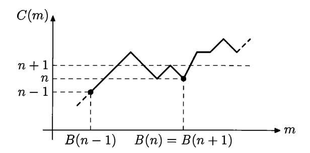

FIGURE 1. The definition of B(n): the value C(m) does not exceed n-1 for m=B(n-1) (the case when C(B(n-1))=n-1 is shown), and  $C(m) \ge n$  for all m > B(n-1). At the point m=B(n), the value of C does not exceed n (the case when C(B(n))=n is shown), and C(m)>n for all m>B(n). The case when C(m) is even greater than n+1 for all m>B(n) is shown, thus B(n+1)=B(n). For  $m\in (B(n-1),B(n)]$ , the value of the function  $C_{\ge}(m)$  is equal to n.

number with this property). Note also that it can happen (for small values of n) that C(m) > n for all m. In this case we let B(n) = -1.

The function B can be considered as an inverse function to the function

$$C_{\geqslant}(N) = \min\{C(m) \mid m \geqslant N\}.$$

The function  $C_{\geqslant}$  grows very slowly. It takes the value n between B(n-1) and B(n), more precisely, on the interval (B(n-1), B(n)]. The slow increase of  $C_{\geqslant}$  corresponds to the fast increase of B. The latter can be illustrated by the following result.

THEOREM 11. Let f be a computable function from  $\mathbb{N}$  to  $\mathbb{N}$ . Then  $B(n) \geq f(n)$  for all but finitely many n.

Note that f may be a partial function. In this case we claim that  $B(n) \ge f(n)$  for all sufficiently large n that are in the domain of f.

PROOF. As algorithmic transformations do not increase complexity, for some constant c for all n we have

$$C(f(n)) \leqslant C(n) + O(1) \leqslant \log n + c.$$

On the other hand, the definition of B and the inequality f(n) > B(n) imply C(f(n)) > n. Thus

$$n < C(f(n)) \leqslant \log n + c$$

whenever f(n) > B(n). This can happen only for finitely many n.

Let us reformulate the definition of B(n) as follows. Let D be the optimal description mode used in the definition of Kolmogorov complexity. Then B(n) is the maximal value of D on strings of length at most n:

$$B(n) = \max\{D(x) \mid l(x) \leqslant n\}.$$

Recall that we identify natural numbers and binary strings and consider the values of D as natural numbers. The minimum of the empty set is defined as -1.

Consider now any partial computable function  $d \colon \Xi \to \mathbb{N}$  in place of D, and let

$$B_d(n) = \max\{d(x) \mid l(x) \leq n \text{ and } d(x) \text{ is defined}\}.$$

The next theorem shows that the function B is the largest function among all functions  $B_d$  in the following sense:

THEOREM 12. For every function d there is a constant c such that

$$B_d(n) \leqslant B(n+c)$$

for all n.

PROOF. For every x of length at most n, the complexity of d(x) is less than n+c for some constant c. Indeed, the complexity of d(x) exceeds at most by a constant the complexity of x, which is less than n+O(1). Hence d(x) does not exceed the largest number of complexity n+c or less, i.e., B(n+c).

This (trivial) observation is useful in the following special case. Let M be an algorithm, and let X be a set of binary strings. A halting problem for M restricted to X is the following problem: given a string  $x \in X$ , find out whether M terminates on x or not.

A classical result in computability theory states that for some algorithm M the unrestricted halting problem  $(X = \Xi)$  for M is undecidable.

We are interested now in the case when X is the set of all strings of bounded length. Fix some algorithm M and consider the running time t(x) of M for some input x. If M does not halt on x, then t(x) is undefined. Thus the domains of t and M coincide. By definition,  $B_t(n)$  is the maximal running time of M on inputs of length at most n. If we know  $B_t(n)$  or any larger number m, we can solve the halting problem for M and every input x of length at most n: Run M on input x; if the computation does not terminate after m steps, it never terminates.

We have seen that  $B_t(n) \leq B(n+c)$  for some constant c (depending on M). Therefore, the knowledge of B(n+c) or any greater number is enough to solve the halting problem of M on inputs of length at most n. In other words, the following holds:

Theorem 13. For every algorithm M there is a constant c and another algorithm A having the following property. For every n and for every number t > B(n+c), the algorithm A, given n and t, produces the list of all strings x of length at most n such that M halts on input x.

This theorem says that the halting problem for inputs of length at most n is reducible to the problem of finding a number greater than B(n+c).

If M is the optimal decompressor D, then the converse is also true: given n and the list of all strings x of length at most n in the domain of D, we can find B(n).

Continuing this argument, we can prove the following result:

Theorem 14. Let BB(n) denote the maximal running time of the optimal decompressor D on strings of length at most n (in the domain of D). Then

$$BB(n) \leqslant B(n+c)$$
 and  $B(n) \leqslant BB(n+c)$ 

for some c and all n.

PROOF. Let  $\alpha_n$  be the most time-consuming description of length at most n, that is, the string x of length at most n in the domain of D that maximizes the running time of D on x. Knowing n and  $\alpha_n$ , one can generate the list of all strings of length at most n in the domain of D, and hence the number BB(n). Both n and  $\alpha_n$  can be encoded in one string of length n+1, the string  $0\cdots 01\alpha_n$  (there are  $n-l(\alpha_n)$  zeros in the beginning). Therefore, the Kolmogorov complexity of BB(n) is at most n+O(1), and  $BB(n) \leq B(n+c)$  for some c and all n.

Let us prove the second inequality of the theorem showing that every t > BB(n) has complexity at least n - O(1). Assume that t has a description u of length k; we need to show that k > n - O(1). Knowing u and n, one can effectively obtain a string of complexity greater than n. Indeed, we reconstruct t (from u) and wait t steps for every description of size at most n. This gives us all strings of complexity at most n, and we can take some other string. By definition of B(n) we conclude that the pair (u,n) has complexity at least n - O(1). On the other hand, this pair can be described using  $k + O(\log(n - k))$  bits if we join the self-delimited description of n - k and u. Therefore,  $k + O(\log(n - k)) \ge n - O(1)$ , and  $(n - k) - O(\log(n - k)) \le O(1)$ , hence  $n - k \le O(1)$ . (We assumed that n > k; otherwise, there is nothing to prove.)

This theorem shows that, within an additive constant in the argument, B(n) is the maximal running time of the optimal decompressor on descriptions of length at most n. A similar function appeared in the literature under the name of "busy beaver function". It was introduced by T. Radó [150] and is defined usually as the maximal number of ones on the tape of Turing machine with n states and binary tape alphabet (1 and blank) after it terminates (starting with blank tape).

More generally, given n and any object from the following list, we can find any other object from the list for a little bit smaller value of n:

- (a) the list of all strings of Kolmogorov complexity at most n with their Kolmogorov complexities;
- (b) the number of such strings;
- (c) B(n);
- (d) BB(n);
- (e) the list of all strings of length at most n in the domain of the optimal decompressor (the halting problem for the optimal decompressor restricted to inputs of length at most n);
- (f) the number of such strings;
- (g) the most time-consuming input of length at most n for the optimal decompressor;
- (h) the graph  $T_n$  of the function C(x) on strings x of length n;
- (i) the lexicographically first string  $\gamma_n$  of length n with Kolmogorov complexity at least n (it exists since the number of strings of complexity less than n is less than  $2^n$ ).

More specifically, the following statement holds.

Theorem 15. The complexity of every object in (a)-(i) is equal to n + O(1). These objects are equivalent to each other in the following sense: Let  $X_n$  and  $Y_n$  be objects described in two items among (a)-(i). Then there is a constant c and an algorithm that given n and  $X_n$  finds  $Y_{n-c}$ .

PROOF. The equivalence of (d), (e), (f), and (g) is easy. Each of the objects (d), (e), (f), and (g) together with n determines the list of all terminating computations of the optimal decompressor D on strings of length at most n. Indeed, knowing BB(n), we can run D on all inputs of length at most n for BB(n) steps. Knowing (e), that is, the list of strings of length at most n in the domain of D, we can run D on all those strings until all the computations terminate (and we know that this happens). Knowing (f), the number of strings of length at most n on which D terminates, we run D on all strings of length at most n until the desired number of computations do terminate. Knowing the string (g), we run D on that string, count the number of steps t, and then run D on all other strings of length at most n for t steps.

Conversely, the list of all halting computations of the optimal decompressor D on strings of length at most n together with n identifies each of the objects (d)–(g) as well as the objects (a)–(c). Therefore, by transitivity (which is easy to check), all the objects (d)–(g) are equivalent.

Let us prove now that (a)-(c) are equivalent to each other and equivalent to (d)-(g). Given the list of strings of complexity at most n, we can find the number of them (so (a) $\rightarrow$ (b)) and the largest number of complexity at most n (so (a) $\rightarrow$ (c)).

It is not that easy to find (a) given (b) and n. Given n and the number of strings of complexity at most n, we can reconstruct the list of these strings (generating them until we obtain the desired number of strings) and find a maximal number among them  $((b)\rightarrow(c))$ . But we still do not know the Kolmogorov complexity of the generated strings. We will prove the implication  $(c)\rightarrow(a)$  indirectly, by showing  $(c)\rightarrow(d)$ ; we know already that (d) implies (a). This will prove that all objects (a)-(g) are equivalent.

The implication  $(c) \rightarrow (d)$  follows from Theorem 14. We know that B(n) is an upper bound for BB(n-c) (for appropriate c). Thus, given n and B(n), we can find BB(n-c) as follows: run D on all inputs of length at most n-c within B(n) steps. Then find BB(n-c) as the number of steps in the longest run.

It remains for us to consider the objects (h) and (i). The implication (a) $\rightarrow$ (h) is easy. Indeed, for some constant c the complexity of every string of length n-c does not exceed n. If we know the list (a) and n, then removing all the strings of length different from n-c from the list, we get (h) for n-c.

The conversion  $(h)\rightarrow(i)$  is straightforward.

Thus it remains to prove (i) $\rightarrow$ (a). It is enough to show that, given the lexicographically first string  $\gamma_n$  of length n and complexity at least n, we can find BB(n-O(1)) or a number greater than BB(n-O(1)). This can be done as follows.

Given  $\gamma_n$ , find n, and for each string x of length n preceding  $\gamma_n$  in lexicographical order, find a description  $p_x$  of x that has length n or less, and find out the running time  $t_x$  of D on  $p_x$ . (Note that  $p_x$  may be not the shortest description of x.) Let T be the maximum of  $t_x$  for those x. We claim that T > BB(n-c) for some c that does not depend on n. Assume that this inequality is false, that is,  $T \leq BB(n-c)$ . We will prove that then c is small. Consider the most time-consuming description  $\alpha_{n-c}$  of length at most n-c; let n-c-d be its length. Given  $\alpha_{n-c}$  and c+d, we can find n and BB(n-c). From this we can find  $\gamma_n$ : run D on all strings of length at most n within BB(n-c) steps. Consider all the strings of length n for which we have found descriptions of length n or less. Then  $\gamma_n$  is the lexicographically

first remaining string (since  $T \leq BB(n-c)$  according to our assumption). As the complexity of  $\gamma_n$  is at least n, we have  $n \leq C(\gamma_n) \leq (n-c-d)+2\log(c+d)+O(1)$ , hence (c+d)=O(1).

We have thus proven the equivalence of objects (a)-(h). It remains to prove that the complexity of each of them is n + O(1).

Let  $X_n$  be one of objects (a)-(h). We have just proven that  $X_n$  can be obtained from  $\gamma_{n+c}$  and n (actually, we do not need n, as  $n = l(\gamma_{n+c}) - c$ ). Therefore,  $C(X_n) \leq C(\gamma_{n+c}) + O(1) \leq n + O(1)$ .

To prove the lower bound of  $C(X_n)$ , let n-d be the complexity of  $X_n$ . For some constant c the string  $\gamma_{n-c}$  can be obtained from the shortest description of  $X_n$  of length n-d and from d (note that n can be retrieved from the length of the shortest description and d). Thus,  $n-c \leq C(\gamma_{n-c}) \leq (n-d) + 2\log d + O(1)$ . Therefore,  $d \leq 2\log d + c + O(1)$  and, hence, d = O(1).

8 The objects in Theorem 15 depend on the choice of the optimal decompressor. In the proof we assumed that the same optimal decompressor is used in all the items (a)–(h). Prove that the statement of the theorem remains true if different decompressors are used.

**9** Prove that the complexity of all the objects in Theorem 15 becomes  $O(\log n)$  if we relativize the definition of Kolmogorov complexity by  $\mathbf{0}'$ , that is, if we allow the decompressor to query the oracle for the halting problem.

We have seen that there exist a constant c and an algorithm A that, given the string  $\gamma_n$ , solves the halting problem for the optimal decompressor on inputs of length at most n-c. This means that given an "oracle" that finds  $\gamma_n$  for every given n, we can solve the halting problem. The same can be done given an oracle deciding whether a given string x is incompressible, that is,  $C(x) \ge l(x)$ . Indeed, using that oracle, we can find  $\gamma_n$  by probing all strings of length n.

Using the terminology of computability theory, we can say that the halting problem is  $Turing\ reducible$  to the set of incompressible strings (or its complement, the set of compressible strings). This implies that the halting problem is also reducible to the "upper graph" of C, that is, to the set  $\{\langle x,k\rangle\mid C(x)< k\}$ . Using the terminology of computability theory, we say that the set of compressible strings (as well as the upper graph of C) is  $Turing\ complete$  in the class of enumerable sets (this means that it is enumerable and that the halting problem is Turing reducible to it).

10 Find some upper bound for the number of oracle queries for the set

$$\{\langle x, k \rangle \mid C(x) < k\}$$

needed to solve the halting problem for a fixed machine M and for all strings of length at most n.

11 Let f be a computable partial function from  $\mathbb{N}$  to  $\mathbb{N}$ . Prove that there is a constant c such that for all n, such that f(B(n)) is defined, the inequality  $B(n+c) \ge f(B(n))$  is true.

(*Hint*: The complexity of f(B(n)) is at most n + O(1).)

12 Call a set U r-separable [137] if every enumerable set V disjoint with U can be separated from U by a decidable set, that is, there is a decidable set R that includes V and is disjoint with U.

(a) Prove that the set  $\{\langle x,k\rangle \mid C(x) < k\}$  (the upper graph of C) is an r-separable set. The set of compressible strings is r-separable, too.

(*Hint*: Assume that the upper graph of C is disjoint with some enumerable set V. The set of the second components of pairs in V is finite, otherwise we get an unbounded computable lower bound for C. That is, V is included in a horizontal strip of finite height. The intersection of the strip with the upper graph is finite.)

(b) We say that a set  $U_1$  is m-reducible to a set  $U_2$  if there is a total computable function f such that  $U_1 = f^{-1}(U_2)$ . Prove that if  $U_2$  is r-separable and  $U_1$  is m-reducible to  $U_2$ , then  $U_1$  is r-separable as well.

(*Hint*: If V is an enumerable set disjoint with  $U_1$ , then f(V) is an enumerable set disjoint with  $U_2$ . If R is a decidable set separating f(V) and  $U_2$ , then  $f^{-1}(R)$  is a decidable set separating V and  $U_1$ .)

(c) Prove that there is an enumerable set that is not r-separable (such a set does not m-reduce to the upper graph of C).

(*Hint*: There is a pair of disjoint enumerable inseparable sets.)

 $\lfloor 13 \rfloor$  Following [74], prove that the following problems are equivalent: "for a given integer n find some string of complexity at least n" and "for a given algorithm without input find some string that is different from its output" (if the algorithm does not terminate, any string is OK). An oracle that fulfills one of these tasks can be used to (effectively) fulfill the other.

(*Hint*: Given an algorithm, we can provide an upper bound for the complexity of its output—it is bounded by complexity (and therefore the length) of the algorithm itself. On the other hand, to provide a string of high complexity means to provide a string which is guaranteed to be different from the outputs of finitely many algorithms. At first, this looks like a more difficult task than for one algorithm (as the oracle does). However, the following trick helps: we may assume that the outputs are tuples and construct a tuple that differs from the output of *i*th algorithm in *i*th position.)

14 (Continued) Prove that both these problems are equivalent to the problem of computing a fixed-point free function: "for every algorithm construct another algorithm that computes a different function" (not the same as the first one).

[15] (Continued) Prove that an enumerable oracle can solve these problems if and only if it solves the halting problem (M. Arslanov proved this result without using Kolmogorov complexity).

(*Hint*: Assume that an enumerable oracle A allows us to compute strings of arbitrarily high complexity. Then let us compute a string of complexity at least n using this oracle, and look at all elements of A that were questioned during this computation. How many steps are needed to enumerate all this elements? This is a big number: any T greater than this number, has Kolmogorov complexity of at least n, since T-approximation of A can be used instead of A. On the other hand, having an oracle for A, we can find T for a given n.)

Kolmogorov complexity and functions B and BB turn out to be useful in studying the so-called "generic" and "coarse" algorithms that solve the halting problem for most inputs (the fraction of errors converges to zero); see [11]. The versions of these functions based on prefix complexity were introduced by Gács [57]; see also [4] for recent results related to the busy beaver functions for different versions of Kolmogorov complexity.

We have shown only several (simple) examples that show how Kolmogorov complexity is related to computability theory (also called *recursion theory*). This area is now actively growing, so we refer the interested reader to two recent monographs [147] by A. Nies and [49] by R. Downey and D. Hirschfeldt.

Theorem 15 selects some very special objects among all objects of complexity n (in fact, one object up to equivalence is described above). At first glance, this seems strange: our intuition says that all random (incompressible) strings of length n should be indistinguishable, and any special property of a string could be used to compress it. However, we have found a very special random string  $\gamma_n$  of length n. This paradox can be explained as follows: the individual properties of  $\gamma_n$  do allow us to find a short description for  $\gamma_n$ , but we need the oracle for  $\mathbf{0}'$  to decompress that description.

We will come back to this question in Section 5.7, which discusses "the number of wisdom"  $\Omega$ , and in Section 14.3, which studies two-part descriptions.

Finally, let us note that although all the objects in Theorem 15 are equivalent, they have very different lengths. The lengths of (a), (b), (e)–(i) are about n while the length of (c) and (d) grows faster than every computable function of n.

#### CHAPTER 2

# Complexity of pairs and conditional complexity

#### 2.1. Complexity of pairs

As we have discussed, we can define complexity of any constructive object using (computable) encodings by strings. In this section we deal with pairs of strings. A pair x, y can be encoded, e.g., by a string  $[x, y] = \overline{x}01y$ ; here  $\overline{x}$  stands for x with doubled bits. Any other computable encoding  $x, y \mapsto [x, y]$  could be used (of course, we need that  $[x, y] \neq [x', y']$  if  $x \neq x'$  or  $y \neq y'$ ). Any two encodings of this type are equivalent (there are translation algorithms in both directions), so Theorem 3 (p. 5) guarantees that complexities of the different encodings of the same pair differ by O(1).

Let us fix some encoding [x, y]. The Kolmogorov complexity of a pair x, y is defined as C([x, y]) and is denoted by C(x, y). Here are some evident properties:

- C(x,x) = C(x) + O(1);
- C(x,y) = C(y,x) + O(1);
- $C(x) \le C(x, y) + O(1)$ ;  $C(y) \le C(x, y) + O(1)$ .

The following theorem gives an upper bound for the complexity of a pair in terms of complexities of its components:

THEOREM 16.

$$C(x,y) \leq C(x) + 2\log C(x) + C(y) + O(1);$$

$$C(x,y) \leq C(x) + \log C(x) + 2\log\log C(x) + C(y) + O(1);$$

$$C(x,y) \leq C(x) + \log C(x) + \log\log C(x) + 2\log\log\log C(x) + C(y) + O(1);$$

(We can continue this sequence of inequalities indefinitely. Also, one can exchange x and y.)

PROOF. This proof (for the first inequality) was already explained in the introduction (Theorem 4, p. 6). The only difference is that we considered the concatenation xy instead of a pair. Let us repeat the argument for pairs.

A computable mapping  $x \mapsto \hat{x}$  (here x and  $\hat{x}$  are binary strings) is called a prefix-free encoding, if for any two different strings x and y the string  $\hat{x}$  is not a prefix of the string  $\hat{y}$ . (In particular,  $\hat{x} \neq \hat{y}$  if  $x \neq y$ .) This guarantees that both u and v can be uniquely reconstructed from  $\hat{u}v$ .

An example of a prefix-free encoding is  $x \mapsto \overline{x}01$ , where  $\overline{x}$  stands for x with doubled bits. Here the block 01 is used as a delimiter. However, this encoding is not the most space-efficient one, since it doubles the length. A better prefix-free encoding is

$$x \mapsto \hat{x} = \overline{\operatorname{bin}(l(x))} \, 01x,$$

where (bin(l(x))) is the binary representation of the length l(x) of the string x). Now

$$l(\hat{x}) = l(x) + 2\log l(x) + O(1).$$

This trick can be *iterated*: for any prefix-free encoding  $x \mapsto \hat{x}$ , we can construct another prefix-free encoding

$$x \mapsto \widehat{\mathrm{bin}(l(x))}x$$
.

Indeed, if  $\widehat{\operatorname{bin}(l(x))}x$  is a prefix of  $\widehat{\operatorname{bin}(l(y))}y$ , then one of the strings  $\widehat{\operatorname{bin}(l(x))}$  and  $\widehat{\operatorname{bin}(l(y))}$  is a prefix of the other one, and therefore  $\widehat{\operatorname{bin}(l(x))} = \widehat{\operatorname{bin}(l(y))}$ . Therefore x is a prefix of y, and y, and y, and y, so y, and y. (In other words, we uniquely determine the length of the string, since a prefix-free code is used for it, and we then get the string itself knowing where it ends.)

In this way we get a prefix-free encoding such that

$$l(\hat{x}) = l(x) + \log l(x) + 2\log \log l(x) + O(1),$$

then (one more iteration)

$$l(\hat{x}) = l(x) + \log l(x) + \log \log l(x) + 2 \log \log \log \log l(x) + O(1),$$

etc.

Now we return to the proof. Let D be the optimal decompressor used in the definition of Kolmogorov complexity. Consider a decompressor D' defined as

$$D'(\hat{p}q) = [D(p), D(q)],$$

where  $\hat{p}$  is a prefix-free encoding and  $[\cdot,\cdot]$  is the encoding of pairs (used in the definition of pairs complexity). Since  $\hat{p}$  is a prefix-free encoding, D' is well defined (we can uniquely extract  $\hat{p}$  out of  $\hat{p}q$ ).

Let p and q be the shortest descriptions of x and y. Then  $\hat{p}q$  is a description of [x, y], and its length is exactly as we need in our theorem. (The more iterations we use for the prefix-free encoding, the better bound we get.)

Theorem 16 implies that

$$C(x,y) \leqslant C(x) + C(y) + O(\log n)$$

for strings x and y of length at most n: one may say that the complexity of a pair does not exceed the sum of the complexities of its component with logarithmic precision.

16 Suggest a natural definition for the complexity of a triple. Show that  $C(x, y, z) \leq C(x) + C(y) + C(z) + O(\log n)$  for every three strings x, y, z of length at most n.

A natural question arises: is it true that  $C(x,y) \leq C(x) + C(y) + O(1)$ ?

A simple argument shows that this is not the case. Indeed, this inequality would imply  $C(x,y) \leq l(x) + l(y) + O(1)$ . Consider some N. For each n = 0, 1, 2, ..., N, we have  $2^n$  strings x of length n and  $2^{N-n}$  strings y of length N-n. Combining them, we (for a given n) obtain  $2^N$  different pairs  $\langle x, y \rangle$ . The total number of pairs (all n = 0, 1, ..., N give different pairs) is  $(N + 1)2^N$ .

Assume that indeed  $C(x, y) \leq l(x) + l(y) + O(1) = N + O(1)$  for all these pairs. Then we get  $(N+1)2^N$  different strings [x, y] of complexity at most N + O(1), but this is impossible (Theorem 7, p. 17, gives the upper bound  $O(2^N)$ ).

17 Prove that there is no constant c such that

$$C(x, y) \leq C(x) + \log C(x) + C(y) + c$$

for all x and y.

(*Hint*: Replace C in the right-hand side by l and count the number of corresponding pairs.)

18 (a) Prove that

$$\sum_{x \in \Xi} 2^{-l(\hat{x})} \leqslant 1$$

for any prefix-free encoding  $x \mapsto \hat{x}$  (here  $\Xi$  is the set of all binary strings).

(b) Prove that if a prefix-free encoding increases the length of an *n*-bit string at most by f(n), i.e., if  $l(\hat{x}) \leq l(x) + f(l(x))$ , then  $\sum_{n} 2^{-f(n)} < \infty$ .

This problem explains why a coefficient 2 appears in Theorem 16 (p. 31): the series

$$\sum \frac{1}{n^2}, \quad \sum \frac{1}{n(\log n)^2}, \quad \sum \frac{1}{n \log n(\log \log n)^2}, \dots$$

converge, while the series

$$\sum \frac{1}{n}$$
,  $\sum \frac{1}{n \log n}$ ,  $\sum \frac{1}{n \log n \log \log n}$ ,...

diverge.

The following problem describes functions that can be used for bounds similar to Theorem 16.

19 Let  $f: \mathbb{N} \to \mathbb{N}$  be a non-decreasing total computable function. Prove that the following three properties are equivalent:

- (a)  $C(x, y) \le C(x) + C(y) + f(C(x)) + O(1);$
- (b)  $C(x,y) \le l(x) + l(y) + f(l(x)) + O(1);$
- (c)  $\sum_{n} 2^{-f(n)} < \infty$ .

(*Hint*: (a) obviously implies (b); to get the reverse implication, consider the shortest descriptions. To derive (a) from (c), one can count pairs with l(x) + f(l(x)) + l(y) < n; one can also use results about prefix complexity (see Chapter 4, Problem 107). Finally, to derive (c) from (b), note that the right-hand side in (b) is at most n + O(1) if l(x) = k and l(y) = n - k - f(k), for  $k + f(k) \le n$ . So the number of such pairs is at least  $\sum 2^k 2^{n-k-f(k)} = 2^n \sum_k 2^{-f(k)}$  where the sum is taken over all k such that  $k + f(k) \le n$ .

**20** Prove that all the inequalities of Theorem 16 become false if the coefficient 2 is replaced by 1 but remain true with the coefficient  $1 + \varepsilon$  for any  $\varepsilon > 0$ .

(Hint: See the preceding problem.)

21 Prove that

$$C(x, y) \le C(x) + \log C(x) + C(y) + \log C(y) + O(1).$$

[22] (Continued) Prove a stronger inequality:

$$C(x,y) \leqslant C(x) + C(y) + \log(C(x) + C(y)) + O(1).$$

(Note that C(x) + C(y) can be replaced by  $\max(C(x), C(y))$ ). This gives a factor at most 2, which makes O(1) after taking logarithms.)

**23** Prove that C(x, C(x)) = C(x) + O(1).

 $\overline{(Hint)}$ :  $C(x,C(x)) \ge C(x) + O(1)$  for evident reasons. On the other hand, the shortest description of x determines both x and C(x).

**24** Prove that if 
$$C(x) \le n$$
 and  $C(y) \le n$ , then  $C(x,y) \le 2n + O(1)$ .

# 2.2. Conditional complexity

When transmitting a file, one could try to save communication charges by compressing that file. The transmission could be made even more effective if an old version of the same file already exists at the other side. In this case we need only describe the changes made. This could be considered as a kind of motivation for the definition of conditional complexity of a given string x relative to a (known) string y.

A conditional decompressor is a computable function D of two arguments, the description and the condition (both arguments and the value of D are binary strings). If D(y,z)=x, we say that y is a (conditional) description of x when z is known (or relative to z). The complexity  $C_D(x|z)$  is then defined as the length of the shortest conditional description:

$$C_D(x|z) = \min\{l(y) \mid D(y,z) = x\}.$$

We say that (conditional) decompressor  $D_1$  is not worse than  $D_2$  if

$$C_{D_1}(x|z) \leq C_{D_2}(x|z) + c$$

for some constant c and for all x and z. A conditional decompressor is *optimal* if it is not worse than any other conditional decompressor.

Theorem 17. There exist optimal conditional decompressors.

PROOF. This conditional version of the Solomonoff– Kolmogorov theorem can be proved in the same way as the unconditional one (Theorem 1, p. 3).

Fix some programming language where one can write programs for computable functions of two arguments, and let

$$D(\hat{p}y,z) = p(y,z),$$

where p(y, z) is the output of program p on inputs y and z, and  $\hat{p}$  is the prefix-free encoding of p.

It is easy to see now that if D' is a conditional decompressor and p is a program for D', then

$$C_D(x|z) \leqslant C_{D'}(x|z) + l(\hat{p}).$$

The theorem is proved.

Again, we fix some optimal conditional decompressor D and omit index D in the notation.

Let us start with some simple properties of conditional complexity.

THEOREM 18.

$$C(x|y) \leqslant C(x) + O(1);$$
  
 $C(x|x) = O(1);$   
 $C(f(x,y)|y) \leqslant C(x|y) + O(1);$   
 $C(x|y) \leqslant C(x|g(y)) + O(1).$ 

Here g and f are arbitrary computable functions (of one and two arguments, respectively) and the inequalities are valid if f(x,y) and g(y) are defined.

PROOF. First inequality: Any unconditional decompressor can be considered as a conditional one that ignores the second argument.

Second inequality: Consider D such that D(p, z) = z.

Third inequality: Let D be the optimal conditional decompressor used to define complexity. Consider another decompressor D' such that

$$D'(p,y) = f(D(p,y),y),$$

and apply the optimality property.

A similar argument works for the last inequality, but D' should be defined in a different way:

$$D'(p,y) = D(p,g(y)).$$

The theorem is proven.

**25** Prove that conditional complexity is "continuous as a function of its second argument": C(x|y0) = C(x|y) + O(1); C(x|y1) = C(x|y) + O(1). Using this property, show that for every string x and for every non-negative integer  $l \leq C(x)$  there exists a string y such that C(x|y) = l + O(1).

A similar argument based on two-dimensional topology is used in [156].

**26** Prove that for any fixed y the function  $x \mapsto C(x|y)$  differs from C at most by 2C(y) + O(1).

**27** Prove that  $C([x,z]|[y,z]) \leq C(x|y) + O(1)$  for any strings x,y,z (here  $[\cdot,\cdot]$  stands for the computable encoding of pairs).

**28** Fix some "reasonable" programming language. (Formally, we require the corresponding universal function to be a Gödel one. This means that a translation algorithm exists for any other programming language; see, e.g., [184].) Show that the conditional complexity C(x|y) is equal (up to an O(1) additive term) to the minimal complexity of a program that produces output x on input y.

(*Hint*: Let D be an optimal conditional decompressor. If we fix its first argument p, we get a program of complexity at most l(p) + O(1). On the other hand, if program p maps y to x, then  $C(x|y) = C(p(y)|y) \leq C(p) + O(1)$ .)

This interpretation of conditional complexity as a minimal complexity of a program with some property will be considered in Chapter 13.

If we restrict ourselves to *total* programs (that terminate on all inputs), we get an essentially different notion of conditional complexity that can be called *total* conditional complexity.

**29** Show that the notion of total conditional complexity CT(x|y), the minimal (plain) complexity of a total program that maps y to x, is well defined (i.e., it changes at most by O(1) when we change the programming language in a reasonable way). Prove that

$$C(x|y) \leqslant CT(x|y) \leqslant C(x)$$

with O(1)-precision.

30 Show that the total complexity sometimes exceeds significantly the usual conditional complexity: for every n there exist two n-bit strings x and y such that

$$C(x|y) = O(1)$$
 while  $CT(x|y) \ge n$ .

(*Hint*: Let us enumerate all programs of complexity less than n defined on all n-bit strings, and maintain two n-bit strings x and y with the following property: none of the programs found maps y to x. When a new program is found that maps y to x, we choose a fresh value of y and then choose an appropriate x. This process is effective if n (=length of y) is given, it defines a partial function  $y \mapsto x$ , so C(x|y) = O(1) for every pair selected.)

31 Let x and y be bit strings such that  $CT(x|y) \leq n$  and  $CT(y|x) \leq n$ . Prove that there exists a program of a computable permutation of the set of bit strings that maps x to y and has complexity at most 2n + O(1).

(*Hint*: It is easy to construct a string v of length 2n + O(1) that encodes a pair of total programs f that maps x to y and g that maps y to x. We may assume without loss of generality that x and y have 0 as their first bits. Consider a binary relation R on the set of strings that have first bit 0, defined as R(u,v): (f(u) = v) and (g(v) = u)). This is a decidable one-to-one correspondence between decidable sets of strings with infinite complements, and it can be easily extended to a computable permutation.)

32 Show that the upper bound in the preceding problem cannot be improved significantly: for every k there are two strings x and y of length n = 2k + O(1) such that  $C(x), C(y) \leq k + O(1)$  (and therefore  $CT(x|y), CT(y|x) \leq k + O(1)$ ), but every permutation of n-bit strings that maps x to y has complexity at least 2k.

(Hint: Let us first select (arbitrarily)  $2^k$  strings y and pair them with some string x. Let us enumerate computable permutations of n-bit strings that have complexity less than 2k. If and when all selected pairs are served by some of these permutations, choose a new string x that is connected (by existing permutation) with at most half of the selected y-strings. After that  $\Omega(2^k)$  new permutations are needed to connect new x to all y-strings. Therefore at most  $2^{2k}/\Omega(2^k) = O(2^k)$  x-strings will be used, so the final x and y have complexity at most k + O(1). The selection of x connected with at most half of selected y-strings is always possible, since each of the y-strings is connected with a small fraction of x-strings, and we can change the order of summation in the double sum. Note that this argument may be used to guarantee that one of the strings x and y belongs to a given set of  $2^k$  strings.)

See [136] for the detailed proofs of these results about total conditional complexity.

Many properties of unconditional complexity have conditional counterparts with essentially the same proofs. Here are some of these counterparts.

- Function  $C(\cdot|\cdot)$  is upper semicomputable (this means that the set of triples  $\langle x, y, n \rangle$  such that C(x|y) < n is enumerable).
- For any y and n the set of all strings x such that C(x|y) < n has cardinality less then  $2^n$ .
- For any y and n there exists a string x of length n such that  $C(x|y) \ge n$ .

33 Prove that for any strings y and z and for any number n there exists a string x of length n such that  $C(x|y) \ge n-1$  and  $C(x|z) \ge n-1$ .

(Hint: Both requirements are violated by a minority of strings.)

THEOREM 19. Let  $\langle x,y\rangle \mapsto k(x,y)$  be an upper semicomputable function such that the set  $\{x \mid k(x,y) < n\}$  has cardinality less than  $2^n$  for any string y and integer n. Then  $C(x|y) \leq k(x,y) + c$  for some c and for all x and y.

The proof repeats the proof of Theorem 8.

Using conditional complexity, we get a stronger inequality for the complexity of pairs (compared with Theorem 16, p. 31):

THEOREM 20.

$$C(x,y) \le C(x) + 2\log C(x) + C(y|x) + O(1).$$

PROOF. Let  $D_1$  be an optimal unconditional decompressor, and let  $D_2$  be an optimal conditional decompressor. Construct a new unconditional decompressor D' as follows:

$$D'(\hat{p}q) = [D_1(p), D_2(q, D_1(p))].$$

Here  $\hat{p}$  stands for the prefix-free encoding of p, and  $[\cdot, \cdot]$  is a computable encoding of pairs used in the definition of the complexity of pairs. Let p be the shortest  $D_1$ -description of x, and let q be the shortest  $D_2$ -description of y conditional to x. Then the string  $\hat{p}q$  is a  $D_3$ -description of [x, y]. Therefore,

$$C(x,y) \leq C_{D'}(x,y) + O(1) \leq l(\hat{p}) + l(q) + O(1).$$

As we have seen, one can choose a prefix-free encoding in such a way that  $l(\hat{p})$  is bounded by  $l(p) + 2 \log l(p) + O(1)$  (see the proof of Theorem 16, p. 31), and we get a desired inequality.

As before, we may replace  $2 \log C(x)$  by  $\log C(x) + 2 \log \log C(x)$ , etc., getting a better bound. We also can use conditional complexity in the logarithmic term and write

$$C(x,y) \leqslant C(x) + C(y|x) + 2\log C(y|x) + O(1).$$

(In the proof we should then replace  $D'(\hat{p}q)$  by  $D'(\hat{q}p)$ .)

34 Prove that

$$C(x|z) \le C(x|y) + 2\log C(x|y) + C(y|z) + O(1)$$

for all x, y, z (a sort of triangle inequality).

If we are not interested in the exact form of the additional logarithmic term, the statement of Theorem 20 can be reformulated as

$$C(x,y) \leqslant C(x) + C(y|x) + O(\log n)$$

for all strings x, y of length at most n.

It turns out 1 that this inequality is in fact an equality.

THEOREM 21 (Kolmogorov-Levin).

$$C(x,y) = C(x) + C(y|x) + O(\log n)$$

for all strings x, y of length at most n.

<sup>&</sup>lt;sup>1</sup>This is the first non-trivial statement in this chapter, and probably the first non-trivial result about Kolmogorov complexity; it was proven independently by Kolmogorov and Levin and published in [79, 225].

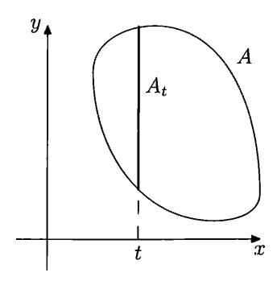

FIGURE 2. The section  $A_t$  of the set A of all simple pairs

Proof. Since we already have one inequality, we need to prove only that

$$C(x,y) \geqslant C(x) + C(y|x) + O(\log n)$$

for all x and y of length at most n.

Let x and y be some strings of length at most n. Let a be the complexity C(x,y) of the pair  $\langle x,y\rangle$ . Consider the set A of all pairs whose complexity does not exceed a. Then A is a set of cardinality  $O(2^a)$  (in fact, at most  $2^{a+1}$ ) and  $\langle x,y\rangle$  is one of its elements.

For each string t consider the "vertical section"  $A_t$  of A:

$$A_t = \{u \mid \langle t, u \rangle \in A\}$$

(see Figure 2). The sum of the cardinalities of all  $A_t$  (over all strings t) is the cardinality of A and does not exceed  $O(2^a)$ . Therefore there are few "large" sections  $A_t$ , and this is the basic argument we need for the proof.

Let m be equal to  $\lfloor \log_2 |A_x| \rfloor$  where x is the first component of the pair  $\langle x, y \rangle$  we started with. In other words, assume that cardinality of  $A_x$  is between  $2^m$  and  $2^{m+1}$ . Let us prove that

- (1) C(y|x) does not exceed m significantly;
- (2) C(x) does not exceed a m significantly.

We start with (1). Knowing a, we can enumerate the set A. If we know also x, we can select only pairs whose first component equals x. In this way we get an enumeration of  $A_x$ . To specify y, it is enough to determine the ordinal number of y in this enumeration (of  $A_x$ ). This ordinal number takes m+O(1) bits, and together with a we get  $m+O(\log n)$  bits for the conditional description of y given x. Note that a=C(x,y) does not exceed O(n) for strings x and y of length n. Therefore, we need only  $O(\log n)$  to specify a and n, and

$$C(y | x) \leqslant m + O(\log n).$$

Now let us prove (2). Consider the set B of all strings t such that the cardinality of  $A_t$  is at least  $2^m$ . The cardinality of B does not exceed  $2^{a+1}/2^m$ ; otherwise, the sum  $|A| = \sum |A_t|$  would be greater than  $2^{a+1}$ . We can enumerate B if we know a and m. Indeed, we should enumerate A and group together the pairs with the same first coordinate. If we find  $2^m$  pairs with the same value of the first coordinate, we put this value into B. Therefore, the string x (as well as every element of B) can be specified by  $(a-m) + O(\log n)$  bits: a-m+1 bits are needed for the ordinal

number of x in the enumeration of B, and  $O(\log n)$  is used to specify a and m. So we get

$$C(x) \leq (a-m) + O(\log n),$$

and it remains to add this inequality and the preceding one.

This theorem can be considered as the complexity counterpart of the following combinatorial statement. Let A be a finite set of pairs. Its cardinality is (obviously) bounded by the product of the cardinality of A's projection onto the first coordinate and the maximal cardinality of the sections  $A_x$ . This corresponds to the inequality  $C(x,y) \leq C(x) + C(y|x) + O(\log n)$ . The reverse inequality needs a more subtle interpretation. Let A be a set of pairs, and let p and q be some numbers such that the cardinality of A does not exceed pq. Then we can split A into parts P and Q with the following properties: the projection of P onto the first coordinate has at most p elements, while all the sections  $Q_x$  of Q (for element in  $Q_x$  the first coordinate equals x) have at most q elements. (Indeed, let P be the union of all sections that have more than q elements. The number of such sections do not exceed p. The remaining elements form Q.) We return to this combinatorial translation in Chapter 10.

Note that in fact we have not used the lengths of x and y, only their complexities. So we have proved the following statement:

Theorem 22 (Kolmogorov-Levin, complexity version).

$$C(x, y) = C(x) + C(y|x) + O(\log C(x, y))$$

for all strings x and y.

**35** Give a more detailed analysis of the additive terms in the proof, and show that

$$C(x) + C(y|x) \le C(x,y) + 3\log C(x,y) + O(\log\log C(x,y)).$$

36 Show that if C(x, y | k, l) < k+l, then C(x | k, l) < k+O(1) or C(y | x, k, l) < l + O(1).

(Hint: This is what we actually proved in the proof of Theorem 22.)

37 Show that  $O(\log n)$  terms are unavoidable in the Kolmogorov-Levin theorem in both directions: for each n there exist strings x and y of length at most n such that

$$C(x,y) \geqslant C(x) + C(y|x) + \log n - O(1)$$

as well as strings x and y of length at most n such that

$$C(x,y) \leqslant C(x) + C(y|x) - \log n + O(1).$$

(*Hint*: For the first inequality we can refer to the remark after Theorem 16 (p. 31). For the second note that C(x, l(x)) = C(x) for every x, while C(x|l(x)) can be equal to l(x) + O(1) and C(x) + O(1). Then we can take a random length between n/2 and n and a random string of this length.)

38 Prove that changing one bit in a string of length n changes its complexity at most by  $\log n + O(\log \log n)$ . Prove the same for the conditional complexity C(x|n).

As we have seen in Problem 7 (p. 21), for every *n*-bit string x there exists another string x' of the same length that differs from x in one position only such that  $C(x') < n - \log n + O(1)$  (and therefore  $C(x'|n) < n - \log n + O(1)$ ). In

particular, if x is incompressible (given n), one can change one bit in x and decrease C(x|n).

One can also move in the other direction: if C(x|n) is small enough (this means that  $C(x|n) \leq \alpha n$  for some positive constant  $\alpha$ ), we can increase this complexity by changing one bit in n: there exists some  $\alpha > 0$  such that for each n-bit string x with  $C(x|n) \leq \alpha n$  one can change one bit in x and get another n-bit string x' such that C(x'|n) > C(x|n). (The proof of this statement requires a more involved combinatorial argument [24] than the decrease in complexity.)

39 Fix some unconditional decompressor D. Prove that for some constant c and for all integers n and k the following statement is true: if some string x has at least  $2^k$  descriptions of length at most n, then  $C(x|k) \leq n - k + c$ .

(*Hint*: Fix some k. For each n consider all strings x that have at least  $2^k$  descriptions of length at most n. The number of these strings does not exceed  $2^{n-k}$ , and we can apply Theorem 19, p. 36.)

Using this problem, we can prove the following statement about unconditional complexity (see [103, Exercises 4.3.9, 4.3.10]):

40 Let D be some optimal unconditional decompressor. Then there exists some constant c such that for any string x the number of shortest D-descriptions of x does not exceed c.

(*Hint*: The previous problems show that  $C(x) \leq n - k + 2 \log k + O(1)$ , so for C(x) = n, we get an upper bound for k.)

41 Prove that there exists a constant c with the following property: if for some x and n the probability of the event  $C(x|y) \leq k$  (all strings y of lengths n are considered as equiprobable here) is at least  $2^{-l}$ , then  $C(x|n,l) \leq k+l+c$ .

(*Hint*: Connect each string y of length n to all strings x such that  $C(x|y) \leq k$ . We get a bipartite graph that has  $O(2^{n+k})$  edges. In this graph the number of vertices x that have degree at least  $2^{n-l}$  does not exceed  $O(2^{k+l})$ . Note that C(x|n,l) does not include k—this is not a typo!)

This problem could help us in finding the average value of C(x|y) for given x and all strings y of some length n. It is evident that  $C(x|y) \leq C(x|n) + O(1)$  since n = l(y) is determined by y. It turns out that for most strings y (of given length) this inequality is close to an equality:

42 Prove that there exists some constant c such that for each string x and for all natural numbers n and d the fraction of strings y such that C(x|y) < C(x|n) - d (among all strings of length n) does not exceed  $cd^2/2^d$ . Using this statement, prove that the average value of C(x|y) taken over all strings y of a given length n equals C(x|n) + O(1) (the constant in O(1) does not depend on x and n).

43 Prove that  $C(x|k) \leq k$  implies  $C(x) \leq k + O(1)$ .

(*Hint*: See Theorem 7. One can also note that if a conditional description of x given k has length k, then k is known anyway, and if this description is shorter, we have enough space to specify the difference between k and the description length.)

A similar (though not identical) statement:

**44** Prove that C(x) = C(x | C(x)) + O(1).

(*Hint*: Assume that x has a conditional description q with condition C(x) that is shorter than C(x). Then one can specify x by providing q and the difference

C(x) - l(q), and we get a description of x that is shorter than C(x)—a contradiction.)

45 Prove that for every n there exists an n-bit string x such that

$$C(C(x)|x) = \log n - O(1).$$

(This is a maximal possible value, since  $C(x) \leq n$  for n-bit string x.)

This result (in a bit weaker form) was proven long ago by P. Gács [55]. Recently E. Kalinina and B. Bauwens suggested a simple game-theoretic proof of this statement. Here is a sketch of their argument (see [6] for details). Consider a rectangular game board of width  $2^n$  and height n. Two players, White and Black, make alternating moves and place pawns of their respective colors into the board cells. Unlike chess, each cell may contain both white and black pawns (at most one of each color). At each move a player may place several pawns into different cells (or no pawns at all); after a pawn is placed, it cannot be moved or removed. Also Black can irreversibly mark some cells. The players should obey the following restrictions:

- (a) each of the players can place at most  $2^i$  pawns at row i (the bottom row has number 0, the upper row has number n-1);
  - (b) Black can mark at most half of the cells in each column.

A white pawn is declared *killed* if its cell is marked or if there is a black pawn below it (in the same column). The game does not end formally (though it is essentially a finite game); White wins if in the limit there is at least one non-killed white pawn.

White has a winning strategy in this game: place a pawn in the top row and wait until it is killed. If it is killed by the black pawn below, switch to the next column (for example, White can go from left to right starting with the leftmost column). If the pawn was killed by marking its cell, White places another pawn just below the first one, etc. (We may assume that Black makes only the move needed to kill White's pawn; since only the limit position matters in the game, all of Black's other moves can be postponed.) Recall that Black can mark at most half of the column, so Black is forced to put some pawn in the column at some point. It cannot be done in all columns, since the sum of  $2^i$  for all rows is less (by 1) than the width of the table. Note also that White will not violate restrictions on the number of pawns in each row, since in all the columns (except the currently active one) under each white pawn (in row i) there is a black pawn (in some row j < i), and the sum of  $2^j$  for all j < i is less that  $2^i$  and there is a space for one more white pawn.

After a winning strategy for White is described, consider the following "universal" strategy for Black: the cell (x,i) is marked as soon as we find that  $C(i|x) < \log n - 1$ ; a black pawn in placed at (x,i) when a conditional description of x (given n) of length i is found. It is easy to check that Black obeys the game rules. White wins, and a live white pawn at the cell (x,i) means that  $C(x|n) \ge i$  and  $C(i|x) \ge \log n - 1$ . Since the actions of White (playing against the computable strategy of Black) are computable, we conclude that  $C(x|n) \le i + O(1)$ : the set of white pawns in row i is enumerable and it contains at most  $2^i$  elements.

This argument shows that  $C(C(x|n)|x) \ge \log n - 1$  (not exactly what we wanted). To get the desired result, we should change the game and consider in parallel boards of all sizes.

46 Prove that for some constant c for any string x and for every number n, there exists a string y of length n such that

$$C(xy) \geqslant C(x|n) + n - c$$
.

(*Hint*: For a given n the number of strings x, such that C(xy) < k for any y of length n, does not exceed  $2^k/2^n$ , and this property is enumerable. So we can apply Theorem 19 (p. 36).)

47 Let f be a function with natural arguments and values. Assume that

$$f(n) + \varepsilon h \leqslant f(n+h) \leqslant f(n) + (1-\varepsilon)h$$

for some  $\varepsilon > 0$  and for all n and h. Prove that there exist an infinite bit sequence  $\omega$  whose n-bit prefix has complexity f(n) + O(1) for every n.

(*Hint*: Let us add blocks of length h where h is large enough. Each new block being added to an n-bit prefix increases complexity by more than f(n+h) - f(n) or by less than f(n+h) - f(n), depending on the current situation (whether we are below or above the boundary). To find a block with a big complexity increase, we may use the previous problem; for a block with a small increase, we can use a block of zeros. Note that (large enough) h is fixed, so it is enough to control the complexity on the blocks' boundaries.)

**48** Prove that an infinite sequence  $x_0x_1x_2\cdots$  of zeros and ones is computable if and only if the values  $C(x_0\cdots x_{n-1}|n)$  (the complexities of its prefixes conditional to their lengths) remain bounded by a constant.

(*Hint*: Consider an infinite binary tree. Let S be the enumerable set of vertices (binary strings) that have conditional complexity (w.r.t. their length) less than some constant c. The horizontal sections of S have cardinality O(1). We need to derive from this that each infinite path that lies entirely inside S is computable. We may assume that S is a subtree (only the strings whose prefixes are in S remain in S).

Let  $\omega$  be an infinite path that goes through S only. At each level n we count vertices in S on the left of  $\omega$  ( $l_n$  vertices) and on the right of  $\omega$  ( $r_n$  vertices). Let  $L = \limsup l_n$  and  $R = \limsup r_n$ . Let N be the level such that L and R are never exceeded after this level. Knowing L, R, and N, we can compute arbitrarily large prefixes of  $\omega$ . We should look for a path  $\pi$  in a tree such that at some level above N there are at least L elements of S on the left of  $\pi$  and at some (possibly other) level above N there are at least R elements on the right of  $\pi$ . When such a path  $\pi$  is found, we can be sure that its initial segment (up to the first of those two levels) coincides with  $\omega$ . This result was published in [108] (attributed to A.R. Meyer).)

**49** Prove that in the previous problem a weaker assumption is sufficient: instead of  $C(x_0 \cdots x_{n-1} | n) = O(1)$ , we can require that  $C(x_0 \cdots x_{n-1}) \leq \log n + c$  for some c and for all n.

(*Hint*: In this case we get an enumerable set S of strings (=tree vertices) with the following property: the number of vertices below level N is O(N). This means that the average number of vertices per level is bounded by a constant. To use the previous problem, we need a bound for all levels and not for the average value. We can achieve this if we consider only vertices  $x \in S$  that have an extension of length 2l(x) that goes entirely inside S. This result was published in [33].)

Following Problem 48, we can suggest different definitions of the complexity notion for computable bit sequences:

- A minimal complexity of a program that, given n, computes  $x_0 \cdots x_{n-1}$ . We can also consider a program that computes  $x_n$  for input n, which gives the same (up to O(1)) complexity. We denote this complexity by C(x).
- A minimal complexity of a program that, given n, computes  $x_0 \cdots x_n$  for all sufficiently large n. For other n (finitely many of them) this program may provide a wrong answer or never terminate. Complexity defined in this way is denoted by  $C_{\infty}(x)$ .
- $\max\{C(x_0 \cdots x_{n-1} | n) | n = 0, 1, \ldots\}$ , denoted by M(x).
- $\limsup_{n\to\infty} C(x_0\cdots x_{n-1}|n)$ , denoted by  $M_{\infty}(x)$ .

There are evident relations between the notions

$$M_{\infty}(x) \leqslant M(x) \leqslant C(x)$$

(up to O(1) additive term) and

$$M_{\infty}(x) \leqslant C_{\infty}(x) \leqslant C(x)$$

(with the same precision).

[50] Prove that there exists a computable bit sequence x such that  $C_{\infty}(x)$  is much less than M(x) (and, therefore, much less than C(x)). More precisely, there exists a sequence  $x^m$  of computable sequences such that  $C_{\infty}(x^m) = O(\log m)$  and  $M(x^m) \ge m$ .

(*Hint*: Consider the sequence  $x^m = y_m 000 \cdots$ , where  $y_m$  is the lexicographically first string of length m that has conditional complexity (given m) at least m.)

51 Prove that for some computable sequence x the value of M(x) is much less than C(x). More precisely, there exist a sequence  $x^m$  of computable sequences such that  $M(x^m) = O(\log m)$  and  $C(x^m) \ge m$ .

(*Hint*: Consider the sequence  $x^m = (1^{BB(m)}000\cdots)$ , where the number of ones before trailing zeros equals BB(m), defined on p. 24.)

**52** Prove that  $C_{\infty}(x) \leq 2M_{\infty}(x) + O(1)$ .

 $\overline{(Hint)}$ : Use the same argument as in Problem 48.)

In fact, the constant 2 in the preceding problem is optimal, as shown in [52].

- 53 Consider strings of length n that have complexity at least n (incompressible strings).
- (a) Prove that the number of incompressible strings of length n is between  $2^{n-c}$  and  $2^n 2^{n-c}$  (for some c and for all n).
- (b) Prove that the cardinality of the set of incompressible strings of length n has complexity n O(1) (note that this implies the statement (a)).
- (c) Prove that if a string x of length 2n is incompressible, then its halves  $x_1$  and  $x_2$  (of length n) have complexity n O(1).
- (d) Prove that if a string x of length n is incompressible, then each of its substrings of length k has complexity at least  $k O(\log n)$ .
- (e) Prove that for any constant c < 1 all incompressible strings of sufficiently large length n contain a substring of  $|c \log_2 n|$  zeros.
- (*Hints*: (a) There is at most  $2^n 1$  descriptions of length less than n, and part of them is used for shorter strings: Any string of length n d (for some d) has complexity less than n. This gives a lower bound for the number of incompressible

strings. To prove the upper bound, note that strings of length n that have a prefix of k zeros could be described by  $2 \log k + (n - k)$  bits.

- (b) Let t be the shortest description of the number of incompressible strings. If t has n-k bits, then knowing t and  $\log k$  additional bits, we can reconstruct first n and then the list of all incompressible strings of length n, so the first incompressible string has complexity less than n, a contradiction.
- (c) If one part of the string is has a short description, the entire string has a short description that starts with prefix-free encoding of the difference between the length and complexity of the compressible part.
- (d) If a string has a simple substring, then the entire string can be compressed (we need to specify the substring, its position, and the rest of the string).
- (e) Let us count the number of strings of length n that do not contain k zeros in a row: a recurrent relation shows that this number grows like a geometric sequence whose base is the maximal real root of the equation  $x = 2 (1/x^k)$ , and we can get a bound for complexity of strings that do not have k zeros in a row.)
- 54 Prove that (for some constant c) for every infinite sequence  $x_0x_1x_2\cdots$  of zeros and ones there exist infinitely many n such that

$$C(x_0x_1\cdots x_{n-1})\leqslant n-\log n+c.$$

Prove that there is a constant c and the sequence  $x_0x_1x_2\cdots$  such that

$$C(x_0x_1\cdots x_{n-1})\geqslant n-2\log n-c$$

for all n.

(*Hint*: The series  $\sum 1/n$  diverges while the series  $\sum (1/n^2)$  converges. For details see Theorem 95 and 99.)

This result was published by Martin-Löf [117] for conditional complexity (and a reference to an earlier unpublished work in Russian was given for unconditional complexity; see also [225, Theorem 2.6]).

55 For a string x of length n let us define d(x) and  $d_c(x)$  as follows:

$$d(x) = n - C(x)$$
 and  $d_c(x) = n - C(x|n)$ .

Show that they are rather close to each other:

$$d_c(x) - 2\log d_c(x) - O(1) \le d(x) \le d_c(x) + O(1).$$

(*Hint*: We need to show that C(x|n) = n-d implies  $C(x) \le n-d+2\log d+O(1)$ . Indeed, let us take the conditional description of x of length n-d and put it after the self-delimiting description of d that has size  $2\log d+O(1)$ . Knowing this string, we can reconstruct d, then n, and finally x.

56 Prove that  $d(xy) = d(x) + d(y|x) + O(\log d(xy))$  for every two *n*-bit strings x and y. (Here d(u) = l(u) - C(u).)

(*Hint*: Use Problem 36.)

The intuitive meaning of the difference between length and complexity as a kind of "randomness deficiency" is discussed (for different complexity versions) in Chapter 5 and Chapter 14.

57 Prove that for sufficiently large values of a constant c the enumerable set of pairs (x, y) such that C(x|y) < c is Turing complete (one can solve the halting problem using an oracle for such a set).

(*Hint*: Use Problem 15 and the fact that the output of a program has O(1) conditional complexity given the program.)

# 2.3. Complexity as the amount of information

As we know (Theorem 18), the conditional complexity C(y|x) does not exceed the unconditional one C(y) (up to a constant). The difference C(y) - C(y|x) tells us how the knowledge of y makes x easier to describe. So this difference can be called the *amount of information in* x about y. We use the notation I(x:y).

Theorem 18 says that I(x:y) is non-negative (up to a constant): there exists some c such that  $I(x:y) \ge c$  for all x and y.

58 Let f be a computable function. Prove that  $I(f(x):y) \leq I(x:y) + c$  for some c and for all x, y such that f(x) is defined.

A generalization of this statement to probabilistic algorithms is possible.

**59** Let f(x,r) be a computable function of two arguments, and let r be chosen at random uniformly among n-bit strings for some n. Then for each l the probability of the event

$$I(f(x,r)\!:\!y) > I(x\!:\!y) + l$$

does not exceed  $2^{-l+O(C(n)+C(l))}$ .

(*Hint*: Use the conditional version of Problem 41.)

These properties of information can be described as *conservation laws* for information (about something) in algorithmic or random processes. As Levin once put it, "by torturing an uninformed person you do not get any evidence about the crime." He discusses this property (for different notions of information) in [100].

Recall that

$$C(x, y) = C(x) + C(y|x) + O(\log C(x, y))$$

(Theorem 22, p. 39). This allows us to express conditional complexity in terms of an unconditional one:  $C(y|x) = C(x,y) - C(x) + O(\log C(x,y))$ . Then we get the following expression for the information:

$$I(x:y) = C(y) - C(y|x) = C(x) + C(y) - C(x,y) + O(\log C(x,y)).$$

This expression immediately implies the following theorem:

THEOREM 23 (Information symmetry).

$$I(x\!:\!y) = I(y\!:\!x) + O(\log C(x,y)).$$

So the difference between I(x:y) and I(y:x) is logarithmically small compared to C(x,y). The following problem shows that at the same time this difference could be comparable with the values I(x:y) and I(y:x) if they are much less than C(x,y).

60 Let x be a string of length n such that  $C(x|n) \ge n$ . Show that

$$I(x:n) = C(n) + O(1)$$
 and  $I(n:x) = O(1)$ .

The property of information symmetry (up to a logarithmic term) explains why I(x:y) (or I(y:x)) is sometimes called *mutual information* in two strings x and y. The connection between mutual information, conditional and unconditional complexities, and pair complexity can be illustrated by a (rather symbolic) picture (see Figure 3).

It shows that strings x and y have  $I(x:y) \approx I(y:x)$  bits of mutual information. Adding C(x|y) bits (information that is present in x but not in y, the left part), we obtain

$$I(y:x) + C(x|y) \approx (C(x) - C(x|y)) + C(x|y) = C(x)$$

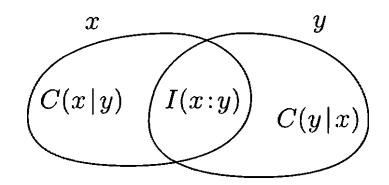

FIGURE 3. Mutual information and conditional complexity

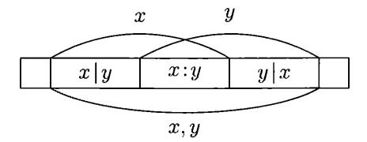

FIGURE 4. Common information in overlapping substrings

bits (matching the complexity of x). Similarly, the central part together with C(y|x) (the right part) give C(y). Finally, all three parts together give us

$$C(x|y) + I(x:y) + C(y|x) = C(x) + C(y|x) = C(x|y) + C(y) = C(x,y)$$

bits (all equalities are true up to  $O(\log n)$  for strings x and y of length at most n).

In some cases this picture can be understood quite literally. Consider, for instance, an incompressible string  $r = r_1 \cdots r_n$  of length n, so  $C(r_1 \cdots r_n) \ge n$ . Then any substring u of x has complexity l(u) up to  $O(\log n)$  terms. Indeed, since u is a substring of r, we have r = tuv for some strings t, v. Then

$$l(r) = C(r) \leqslant C(t) + C(u) + C(v) \leqslant l(t) + l(u) + l(v) = l(r)$$

(up to a logarithmic error), and therefore all the inequalities are equalities (with the same logarithmic precision).

Now take two overlapping substrings x and y (Figure 4). Then C(x) is the length of x and C(y) is the length of y (up to  $O(\log n)$ ).

The complexity C(x, y) is equal to the length of the union of segments (since the pair  $\langle x, y \rangle$  is equivalent to this union plus information about lengths requiring  $O(\log n)$  bits).

Therefore, conditional complexities C(x|y), C(y|x) and the mutual information I(x:y) are equal to the lengths of the corresponding segments (up to  $O(\log n)$ ).

However, the mutual information cannot always be extracted in the form of some string (like it happened in our example, where this common information is just the intersection of strings x and y). As we will see in Chapter 11, there exist two strings x and y that have large mutual information I(x:y) but there is no string z that represents (materializes) this information in the following sense:  $C(z|x) \approx 0$ ,  $C(z|y) \approx 0$  (all information that is present in z is also present both in x and in y), and  $C(z) \approx I(x:y)$  (all inutual information is extracted). In our last example we can take the intersection substring for z, but in general this is not possible.

**61** Prove that for any string x of length at most n the expected value of the mutual information I(x:y) in x and the random string y of length n is  $O(\log n)$ .

Now we move to triples of strings instead of pairs. Here we have an important tool that can be called *relativization*: most of the results proved for unconditional complexities remain valid for conditional complexities (and proofs remain valid with minimal changes). Let us give some example of this type.

A theorem about the complexity of pairs (p. 31) says that

$$C(x, y) \le C(x) + 2\log C(x) + C(y) + O(1).$$

Replacing all complexities by conditional ones (with the same condition z in all cases), we get the following inequality:

$$C(x, y|z) \le C(x|z) + 2\log C(x|z) + C(y|z) + O(1).$$

By conditional complexity of a pair x, y relative to z we mean, as one can expect, the conditional complexity of its encoding: C(x, y|z) = C([x, y]|z). As for unconditional complexity, the choice of encoding is not important (the complexity changes by O(1)).

The proof of this relativized inequality repeats the proof of the unrelativized one: we combine the description p for x (with condition z) and the description q for y (with condition z) into a string  $\hat{p}q$  that is a description of [p,q] (with condition z) relative to some suitable conditional decompressor.

This is nothing really new. However, we may express all the conditional complexities in terms of unconditional ones: recall that C(x,y|z) = C(x,y,z) - C(z) and C(x|z) = C(x,z) - C(z), C(y|z) = C(y,z) - C(z) (with logarithmic precision). Then we get the following theorem:

Theorem 24.

$$C(x, y, z) + C(z) \leqslant C(x, z) + C(y, z) + O(\log n)$$

for all strings x, y, z of complexity at most n.

Sometimes this inequality is called the *basic* inequality for complexities.

The same relativization can be applied to Theorem 21 (p. 37) that relates the complexity of a pair and conditional complexity. Then we get the following statement:

THEOREM 25.

$$C(x, y | z) = C(x | z) + C(y | x, z) + O(\log n)$$

for all strings x, y, z of complexity at most n.

PROOF. We can follow the proof of Theorem 21, replacing unconditional descriptions by conditional ones (with z as the condition). Doing this, we replace C(y|x) by C(y|x,z). One can say that now we work in three-dimensional space with coordinates x, y, z and apply the same arguments simultaneously in all planes parallel to the xy plane.

If this argument does not look convincing, there is a more formal one. Express all the conditional complexities in terms of unconditional ones:

$$C(x,y|z) = C(x,y,z) - C(z),$$

and for the right-hand side

$$C(x|z) + C(y|x,z) = C(x,z) - C(z) + C(y,x,z) - C(x,z).$$

We see that both sides coincide (up to  $O(\log n)$ ). (A careful reader may note that this simplified argument gives larger hidden constants in  $O(\log n)$ -notation.)

**62** Prove that in Theorem 25 the weaker assumption "C(x|z) and C(y|x,z) do not exceed n" is sufficient.

We also relativize the definition of mutual information and let I(x:y|z) be the difference C(y|z) - C(y|x,z). As for the case of (unconditional) information, this quantity is non-negative (with O(1) precision). Replacing conditional complexities by the expressions involving unconditional ones (with logarithmic precision), we can rewrite the inequality  $I(x:y|z) \ge 0$  as

$$C(y|z) - C(y|x,z) = C(y,z) - C(z) - C(y,x,z) + C(x,z) \ge 0.$$

So we get the basic inequality of Theorem 24 again.

In fact, almost all known equalities and inequalities that involve complexities (unconditional and conditional) and information (and have logarithmic precision) are immediate consequences of Theorems 21 and 24. The first examples of linear inequalities for complexities that do *not* follow from basic inequalities were found fairly recently (see [222, 223]) and they are rather complicated and not very intuitive. We discuss them in Section 10.13; we conclude our discussion here with two simple corollaries of basic inequalities.

**Independent strings.** We say that strings x and y are "independent" if  $I(x:y) \approx 0$ . We need to specify what we mean by " $\approx$ ", but we always ignore the terms of order  $O(\log n)$  where n is the maximal length (or complexity) of the strings involved.

Independent strings could be considered as some counterpart of the notion of independent random variables, which is central in probability theory. There is a simple observation: if a random variable  $\xi$  is independent with the pair of random variables  $(\alpha, \beta)$ , then  $\xi$  is independent with  $\alpha$  and with  $\beta$  (separately).

The Kolmogorov complexity counterpart of this statement (if a string x is independent with a pair  $\langle y, z \rangle$ , then x is independent with y and x is independent with z) can be expressed as the inequality

$$I(x:\langle y,z\rangle)\geqslant I(x:y)$$

(and the similar inequality for z instead of y). This inequality is indeed true (with logarithmic precision), and it is easy to see if we rewrite it in terms of unconditional complexities,

$$C(x) + C(y,z) - C(x,y,z) \geqslant C(x) + C(y) - C(x,y),$$

which after cancellation of similar terms gives a basic inequality (Theorem 24). (In classical probability theory one may also apply a similar inequality for Shannon entropies.)

Complexity of pairs and triples. On the other hand, to prove the following theorem (which we have already mentioned on p. 12), it is convenient to replace unconditional complexities by conditional ones:

Theorem 26.

$$2C(x,y,z) \leqslant C(x,y) + C(x,z) + C(y,z) + O(\log n)$$

for all strings x, y, z of complexity at most n.

PROOF. Moving C(x,y) and C(x,z) to the left-hand side and replacing the differences C(x,y,z) - C(x,y) and C(x,y,z) - C(x,z) by conditional complexities

C(z|x,y) and C(y|x,z), we get the inequality

$$C(z \mid x, y) + C(y \mid x, z) \leqslant C(y, z) + O(\log n).$$

It remains to rewrite the right-hand side of this inequality as C(y) + C(z|y), and note that  $C(z|x,y) \le C(z|y)$  and  $C(y|x,z) \le C(y)$ .

Instead we could just add two inequalities (the basic one and the inequality for the complexity of a pair):

$$C(x, y, z) + C(y) \leqslant C(x, y) + C(y, z) + O(\log n),$$
  
$$C(x, y, z) \leqslant C(y) + C(x, z) + O(\log n),$$

and then cancel C(y) in both sides. (This proof, as well as the previous one, has an important aesthetic problem: both treat x, y, z in a non-symmetric way while the statement of the theorem is symmetric.)

We return to the inequality of Theorem 26 and refer to its geometric consequences in Chapter 10.

We can provide a more systematic treatment of the different complexity quantities related to three strings as follows. There are seven basic quantities: three of them are complexities of individual strings, another three are complexities of pairs, and one more is the complexity of the entire triple. Other quantities such as conditional complexity and mutual information can be expressed in terms of these seven complexities. To understand better what requirements these seven quantities should satisfy, let us make a linear transformation in the seven-dimensional space and switch to new coordinates. Consider seven variables  $a_1, a_2, \ldots, a_7$  that correspond to the seven regions shown in Figure 5.

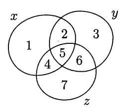

FIGURE 5. New coordinates  $a_1, a_2, \ldots, a_7$ 

Formally, the coordinate transformation is given by the following equations:

$$C(x) = a_1 + a_2 + a_4 + a_5,$$
  
 $C(y) = a_2 + a_3 + a_5 + a_6,$   
 $C(z) = a_4 + a_5 + a_6 + a_7,$   
 $C(x, y) = a_1 + a_2 + a_3 + a_4 + a_5 + a_6,$   
 $C(x, z) = a_1 + a_2 + a_4 + a_5 + a_6 + a_7,$   
 $C(y, z) = a_2 + a_3 + a_4 + a_5 + a_6 + a_7,$   
 $C(x, y, z) = a_1 + a_2 + a_3 + a_4 + a_5 + a_6 + a_7.$ 

Indeed, it is easy to see that these equations determine an invertible linear transformation of  $\mathbb{R}^7$ : each 7-tuple of complexities corresponds to unique value of variables  $a_1, \ldots, a_7$ .

Conditional complexities and expressions for mutual information are combinations of complexities and therefore could be rewritten in new coordinates. For example,

$$I(x:y) = C(x) + C(y) - C(x,y) = a_2 + a_5$$
 and  $C(x|y) = C(x,y) - C(y) = a_1 + a_4$ .

What is the intuitive meaning of these new coordinates? It is easy to see that  $a_1 = C(x|y,z)$  (with logarithmic precision). The meaning of  $a_3$  (and  $a_7$ ) is similar. The coordinate  $a_2$  (with the same precision) is I(x:y|z); coordinates  $a_4$  and  $a_6$  have similar meaning (see Figure 6). In particular, we conclude that for any strings x, y, z the corresponding values of coordinates  $a_1, a_2, a_3, a_4, a_6, a_7$  are non-negative (up to  $O(\log n)$  for strings x, y, z of complexity at most n).

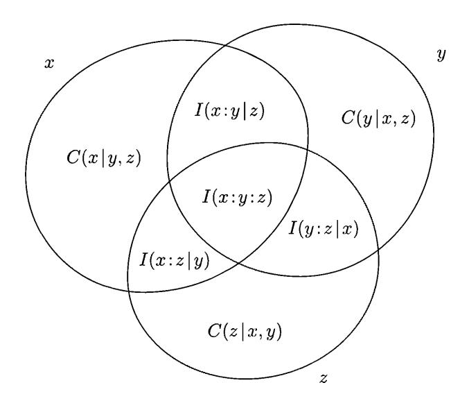

Figure 6. The complexity interpretation of new coordinates

The coordinate  $a_5$  is more delicate. Informally, we would like to understand it as the "amount of mutual information in three strings x, y, z". Sometimes the notation I(x:y:z) is used. However, the meaning of this expression is not quite clear, especially if we take into account that  $a_5$  can be negative.

Consider the following example where  $a_5 < 0$ . Let x and y be two halves of an incompressible string of length 2n. Then C(x) = n, C(y) = n, C(x,y) = 2n, and I(x:y) = 0 (up to  $O(\log n)$ ). Consider a string z of length n which is a bitwise sum modulo 2 of x and y (XOR-operation). Then each of the strings x, y, z can be reconstructed if two others are known; therefore, the complexities of all pairs C(x,y), C(y,z), C(x,z) are equal to 2n (again up to  $O(\log n)$ ), and the complexity C(x,y,z) is also 2n. The complexity of z is equal to n (it cannot be larger, since the length is n; on the other hand, it cannot be smaller, since z and y form a pair of complexity 2n).

The values of  $a_1, \ldots, a_7$  for this example are shown in Figure 7.

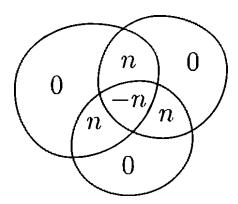

FIGURE 7. Two independent incompressible strings of length n and their XOR

Note that even if  $a_5$  is negative, the sums  $a_5 + a_2$ ,  $a_5 + a_4$  and  $a_5 + a_6$ , being mutual information expressions for pairs, are non-negative. (In our examples these sums are equal to 0.)

This example corresponds to the simple case of secret sharing of secret z between two people: if one of them knows x and the other one knows y, then neither of them has any information about z in isolation (since  $I(x:z) \approx 0$  and  $I(y:z) \approx 0$ )), but together they can reconstruct z as a bitwise sum of x and y.

One can check that we have already given a full list of inequalities that are true for complexities of three strings and their combinations (all  $a_i$ , except for  $a_5$ , are non-negative, as well as the three sums mentioned above). We return to this question in Chapter 10.

Our diagram is a good mnemonic tool. For example, consider again the inequality

$$C(x, y, z) \leqslant C(x, y) + C(x, z) + C(y, z).$$

In our new variables it can be rewritten as  $a_2 + a_4 + a_5 + a_6 \ge 0$  (you can easily check it by counting the multiplicity of each  $a_i$  in both sides of the inequality). It remains to note that  $a_2 + a_5 \ge 0$ ,  $a_4 \ge 0$ , and  $a_6 \ge 0$ . (Alas, the symmetry is broken again!)

**63** Prove that  $I(xy:z) = I(x:z) + I(y:z|x) + O(\log n)$  for strings x, y, z of complexity at most n.

(Hint: Use the diagram.)

This problem shows that information in xy about z can somehow be split into two parts: information in x about z and information in y about z (when x is known). This is somehow similar to the equality C(x,y) = C(x) + C(y|x), but now complexity is replaced by the quantity of information about z. As a corollary we immediately get that if xy is independent with z, then x is independent with z and, at the same time, y is independent with z when x is known. (Here independence means that mutual information is negligible.) A symmetric argument shows that y is independent with z and x is independent with z when y is known.

**64** Show that properties "x is independent with y" and "x is independent with y when z is known" are quite different: each of them can be true when the other is false.

**65** We say that strings x, y, z, t form a *Markov chain* (a well-known notion in probability theory now transferred to algorithmic information theory) if I(x:z|y) and  $I(\langle x,y\rangle:t|z)$  are negligible. (Of course, we need to specify what is "negligible" to get a formal definition.) Show that the reversed sequence of strings also forms a Markov chain, i.e., that I(t:y|z) and  $I(\langle t,z\rangle:x|y)$  are negligible.

(*Hint*: Since  $I(\langle x,y\rangle;t|z)=I(y;t|z)+I(x;t|y,z)$ , the left-hand side in this equality is zero if and only if both terms in the right-hand side are zero; and the second term in the right-hand side does not change when the order of x,y,z,t is reversed.)

#### CHAPTER 3

# Martin-Löf randomness

Here we interrupt the exposition of Kolmogorov complexity and its properties to define another basic notion of the algorithmic information theory, the notion of a Martin-Löf random (or "typical") sequence. This chapter does not refer to the preceding one, which is not used again until Chapter 5 where we characterize randomness in terms of Kolmogorov complexity.

Let us recall some basic facts of measure theory for the case of the Cantor space of infinite sequences of zeros and ones.

#### 3.1. Measures on $\Omega$

Consider the set  $\Omega = \mathbb{B}^{\mathbb{N}}$  whose elements are infinite sequences of zeros and ones. This set is called *Cantor space*. For a binary string x we consider a set  $\Omega_x$  of all infinite sequences that have initial segment x. For example,  $\Omega_{00}$  is the set of all sequences that start with two zeros, and  $\Omega_{\Lambda} = \Omega$  (where  $\Lambda$  is the empty string).

The sets  $\Omega_x$  are called *intervals*. All intervals and all unions of arbitrary families of intervals are called *open* subsets of  $\Omega$ . In this way we get a topology on  $\Omega$ , and this topology corresponds to a standard distance function on  $\Omega$  defined as follows: the longer the common prefix two sequences  $\omega = \omega_0 \omega_1 \cdots$  and  $\omega' = \omega'_0 \omega'_1 \cdots$  have, the smaller the distance between them:

$$d(\omega, \omega') = 2^{-n},$$

where n is the smallest index such that  $\omega_n \neq \omega'_n$ .

**66** Prove that topological space  $\Omega$  is homeomorphic to the Cantor set on the real line. (This set is obtained from [0,1] by deleting the middle third, then the middle third of two remaining segments and so on.)

However, we are interested in measure theory rather than topology. A family of subsets of  $\Omega$  is called a  $\sigma$ -algebra if it is closed under finite or countable unions and intersections, and under negation (taking the complement).

A minimal  $\sigma$ -algebra that contains all intervals  $\Omega_x$  (and therefore all open sets) is called the algebra of *Borel* sets.

Consider an arbitrary  $\sigma$ -algebra that contains all intervals. Let  $\mu$  be a function that maps every set in this  $\sigma$ -algebra into a non-negative real number, and has the following property (called  $\sigma$ -additivity):

if a set A is a union of a countable or finite family of disjoint sets  $A_0, A_1, A_2, \ldots$  that belong to the  $\sigma$ -algebra on which  $\mu$  is defined, then

$$\mu(A) = \mu(A_0) + \mu(A_1) + \mu(A_2) + \cdots$$

(the right-hand side is a finite sum or a converging series with non-negative terms).

Then  $\mu$  is called a *measure* on  $\Omega$ , and the value  $\mu(A)$  is called the measure of the set A. The set A for which  $\mu(A)$  is defined, is called  $\mu$ -measurable.

A measure  $\mu$  such that  $\mu(\Omega) = 1$  is called a *probability distribution* on  $\Omega$ . Elements of the  $\sigma$ -algebra that is the domain of  $\mu$  are called *events*, and  $\mu(A)$  is called the *probability* of the event A.

Any measure is monotone  $(A \subset B \text{ implies } \mu(A) \leq \mu(B))$ . Indeed,

$$\mu(B) - \mu(A) = \mu(B \setminus A) \geqslant 0.$$

Another important property of measures is continuity: if a set B is a union of increasing sequence of sets

$$B_0 \subset B_1 \subset B_2 \subset \cdots$$

then  $\mu(B_n)$  tends to  $\mu(B)$  as  $n \to \infty$ . (Indeed, let us apply the additivity property to all sets  $A_i = B_i \setminus B_{i-1}$  and then to all sets  $A_i$  such that  $i \leq n$ .) A similar property holds for decreasing sequences of sets.

For any measure  $\mu$  on  $\Omega$  let us consider a function p defined of binary strings as

$$p(x) = \mu(\Omega_x).$$

This function has non-negative real values and satisfies the additivity property

$$p(x) = p(x0) + p(x1)$$

for any string x. (Indeed, the interval  $\Omega_x$  is the union of its two halves  $\Omega_{x0}$  and  $\Omega_{x1}$ , which are disjoint sets.)

As we know from measure theory (the Lebesgue theorem), an inverse transition is possible. Namely, for every additive function p on binary strings that has nonnegative real values, the Lebesgue theorem provides a measure  $\mu$  such that  $\mu(\Omega_x) = p(x)$  for all binary strings x.

The measure provided by the Lebesgue theorem has the following additional property: if  $\mu(A) = 0$  for some set A and  $B \subset A$ , then  $\mu(B)$  is defined (and therefore  $\mu(B) = 0$ ). In the sequel we consider only measures that have this additional property.

We do not explain the Lebesgue construction here but refer the reader to any textbook in measure theory, e.g., [81, 63]. However, let us recall the definition of sets having measure 0, since the Martin-Löf definition of randomness uses its effective version.

Let p be an additive non-negative real-valued function on strings. We call p(x) the measure of the interval  $\Omega_x$ . A subset  $A \subset \Omega$  is a *null set* (a set of measure 0) if for every  $\varepsilon > 0$  there exist a finite or countable family of intervals that cover A and have total measure at most  $\varepsilon$ .

In other words, a set A is a null set if there exists a function  $\langle \varepsilon, i \rangle \mapsto x(\varepsilon, i)$  (the first argument is a positive real, the second argument is a non-negative integer; values are binary strings) such that

- $A \subset \Omega_{x(\varepsilon,0)} \cup \Omega_{x(\varepsilon,1)} \cup \Omega_{x(\varepsilon,2)} \cdots$  and
- $p(x(\varepsilon,0)) + p(x(\varepsilon,1)) + p(x(\varepsilon,2)) + \cdots \leq \varepsilon$

for every positive  $\varepsilon$ . Note that the family of intervals can be finite, since we do not require the function x to be total (undefined values are skipped both in the union and in the sum).

Here are some simple but useful observations:

- The definition does not change if we restrict ourselves to rational values of  $\varepsilon$  (or even let  $\varepsilon = 2^{-k}$  for integer k).
- Any subset of a null set is a null set.
- A finite or countable union of null sets is a null set. (Indeed, to cover the union by a family of intervals of total measure less than  $\varepsilon$ , we combine the covers of its parts that have measure less than  $\varepsilon/2$ ,  $\varepsilon/4$ ,  $\varepsilon/8$ , etc.).
- Assume that p is chosen in such a way that any singleton is a null set (it is equivalent to the following property: for any infinite sequence  $\omega = \omega_0 \omega_1 \omega_2 \cdots$  the limit of  $p(\omega_0 \cdots \omega_n)$  (as  $n \to \infty$ ) equals 0). Then every finite or countable set is a null set.

A uniform measure on  $\Omega$  assigns to each interval  $\Omega_x$  the number  $2^{-l(x)}$ :

$$p(x) = 2^{-n}$$
 for all strings x of length n.

The uniform measure is closely related to the standard measure on  $\mathbb{R}$  (or, more precisely, on [0,1]). Formally, the measure of a set  $A\subset\Omega$  is equal to the measure of the set of reals whose binary expansions are elements of A. (In fact, the correspondence between infinite binary fractions and reals in [0,1] is not a bijection, since numbers of the form  $k/2^l$  for integer k and l have two representations, e.g.,  $0.01111\cdots=0.10000\cdots$ . But this happens only for a countable family of reals, and measure theory easily ignores this.)

Indeed, the reals, whose binary expansions start with x, form an interval, and the length of this interval is  $2^{-n}$  where n is the length of x. This implies that for every interval  $I \subset [0,1]$  the uniform measure of the sequences that represent reals in I is equal to the length of the interval I.

Probability theory describes the uniform distribution as the probability distribution for the outcomes of independent fair coin tossing. Indeed, for n independent fair coin tossings, all  $2^n$  binary strings of length n appear with the same probability  $2^{-n}$ . The set  $\Omega_x$  is the event "a random sequence of zeros and ones starts with x", and this event has probability  $2^{-l(x)}$ .

Similarly, we may consider a biased coin assuming that coin tossings are still independent. The corresponding measure (probability distribution) is called *Bernoulli measure* (or *Bernoulli distribution*) with parameters q, p (probabilities of 0 and 1 respectively; we assume that  $p, q \ge 0$ , and p + q = 1).

With respect to this distribution, the event "sequence  $\omega$  starts with a string x" has probability  $q^up^v$  where u and v are the numbers of zeros and ones in x. In other words, we consider a function

$$x \mapsto q^{u(x)}p^{v(x)},$$

where u(x) and v(x) stand for the numbers of zeros and ones in x, respectively. (It is easy to check that this function has the additivity property.)

# 3.2. The Strong Law of Large Numbers

To see all these notions in action, let us state and prove the so-called *Strong Law of Large Numbers* (SLLN).

Fix some  $p, q \ge 0$  such that p+q=1. Let  $A_p$  be the set of all infinite sequences  $\omega_0\omega_1\omega_2\cdots$  of zeros and ones such that the limit frequency of ones exists and is equal

to p, i.e.,

$$\lim_{n\to\infty}\frac{\omega_0+\omega_1+\cdots+\omega_{n-1}}{n}=p.$$

Theorem 27. The set  $A_p$  has measure 1 with respect to Bernoulli distribution with parameters p and q.

In other words, the complement of  $A_p$ , i.e., the set of all sequences that either do not have limit frequency at all or have a limit frequency different from p, is a null set (according to this distribution).

PROOF. We prove this theorem for the uniform case (i.e., for p = q = 1/2) by an explicit calculation. The general case is left as an exercise (see also Section 9.6).

Let us consider first a finite number of coin tossings and fix some n. All binary strings of length n have the same probability. We claim that most of them have approximately n/2 ones. Assume that some threshold  $\varepsilon$  is fixed. How many sequences have more than  $(1/2 + \varepsilon)n$  ones? The answer can be found using the Pascal triangle: we have to sum up all the terms in the nth row starting from some point that is slightly on the right of the midpoint. In this part we have a decreasing sequence of less than n terms, so the sum in question is bounded by the first term multiplied by n. (We do not need to be very accurate in our bounds and ignore factors that are polynomial in n. So we can omit the factor n in our bound.)

The first term of the sum is the binomial coefficient

$$\frac{n!}{k!(n-k)!},$$

where k is the smallest integer not less than  $(1/2 + \varepsilon)n$ . We use Stirling's approximation

$$m! = \sqrt{(2\pi + o(1))m} \left(\frac{m}{e}\right)^m,$$

where e is the base of natural logarithms. Ignoring polynomial (in n) factors and using the notation u = k/n, v = (n - k)/n, we get

$$\begin{split} \frac{n!}{k!(n-k)!} &\approx \frac{(n/e)^n}{(k/e)^k((n-k)/e)^{n-k}} = \frac{n^n}{k^k(n-k)^{n-k}} \\ &= \frac{n^n}{(un)^{un}(vn)^{vn}} = \frac{1}{u^{un}v^{vn}} = 2^{H(u,v)n}, \end{split}$$

where

$$H(u, v) = -u \log u - v \log v.$$

The value H(u, v) is called the Shannon entropy of a random variable that has two values whose probabilities are u and v. (We study Shannon entropy in Chapter 7.) Figure 8 shows the corresponding graph (note that v = 1 - u). It is easy to check that H(u, 1 - u) achieves its maximal value (equal to 1) only at u = 1/2.

Now we see that the number of binary strings of length n that have frequency of ones greater than  $(1/2 + \varepsilon)$  does not exceed  $\operatorname{poly}(n)2^{H(1/2+\varepsilon,1/2-\varepsilon)n}$  and therefore is bounded by  $2^{cn+o(n)}$ , where c is some constant less than 1 (depending on  $\varepsilon$ ). Therefore, the fraction of these strings (among all strings of length n) exponentially decreases as n increases. The same is true for the strings that have frequency of ones less than  $(1/2 - \varepsilon)$ .

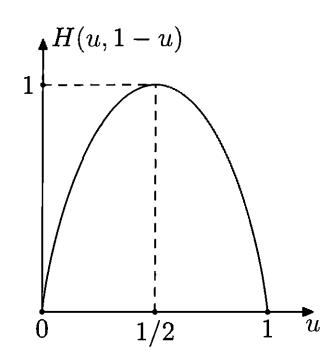

Figure 8. Shannon entropy as a function of u

Let us see where we are. For each fixed  $\varepsilon > 0$  we have proved the following statement:

LEMMA. The fraction of strings of length n where frequency of ones differs from 1/2 at least by  $\varepsilon$  (among all strings of length n) does not exceed some  $\delta_n$  that decreases exponentially as n increases.

This lemma (without any specific claims for the fast convergence  $\delta_n \to 0$ ) is called the *Law of Large Numbers*. To prove the *Strong* Law of Large Numbers we need to know that the series  $\sum_n \delta_n$  is convergent.

We need to prove that the set  $A_{1/2}$  of all sequences that have limit frequency of ones equal to 1/2 has measure 1. In other words, we need to prove that the complement of this set (we denote this complement by B) is a null set.

According to the definition of limit, the set B is the union (over all  $\varepsilon > 0$ ) of the sets  $B_{\varepsilon}$ . Here  $B_{\varepsilon}$  is the set of all sequences such that frequency of ones in their prefixes exceeds  $1/2 + \varepsilon$  (or is less than  $1/2 - \varepsilon$ ) infinitely many times.

Evidently, we can consider only a countable set of different  $\varepsilon$  (e.g., only rational values), and the countable union of null sets is a null set. Therefore it remains to prove that the set  $B_{\varepsilon}$  is a null set for each  $\varepsilon$ .

The set  $B_{\varepsilon}$  consists of the sequences that have arbitrarily long "bad" prefixes. Here a bad prefix is a string where the frequency of ones differs from 1/2 by more than  $\varepsilon$ . Therefore, for each N the set  $B_{\varepsilon}$  is covered by the family of intervals  $\Omega_x$  where x ranges over all bad strings of length at least N. The total (uniform) measure of all these intervals does not exceed

$$\delta_N + \delta_{N+1} + \delta_{N+2} + \cdots,$$

and this sum can be made small since the series  $\sum_{i} \delta_{i}$  is convergent.

(Probability theorists call this argument the  $Borel-Cantelli\ lemma$ . In its general form this lemma says that if the sum of measures of some sets  $A_0, A_1, \ldots$  is finite, then the set of all points that belong to infinitely many  $A_i$  is a null set.)  $\square$ 

One can get a bound for the number of bad strings of length n without Stirling's approximation. We do it separately for bad strings that have too many and too few ones. For example, let us consider the set of all "bad" strings that have frequency of ones greater than  $1/2 + \varepsilon$ . To get a bound for the cardinality of this set, consider two distributions (measures) on the set of all strings of length n. The first one,

called L, is the uniform distribution: all strings have probability  $2^{-n}$ . The second one, called S, is biased (ones are more likely than zeros) and corresponds to n independent coin tosses where one appears with probability  $p=1/2+\varepsilon$ . In other words,  $S(x)=q^up^v$  for a string x that has u zeros and v ones (here  $q=1/2-\varepsilon$  is the probability of zero outcome). The ratio S(x)/L(x) increases when the number of ones in x increases, and for all bad strings this ratio is at least  $2^n/2^{H(p,q)n}$ . Therefore, the total L-measure of all bad strings does not exceed their total S-measure divided by this lower bound. Recalling that the total S-measure of all bad strings does not exceed 1, we conclude that the total L-measure (i.e., the fraction) of all bad strings does not exceed  $2^{H(p,q)n}/2^n$ . So we get another proof of our bound, which is less technical (though more difficult to find). This proof works not only for the uniform Bernoulli measure (p=1/2), but also for arbitrary p (after appropriate changes).

**67** Prove the Strong Law of Large Numbers for arbitrary p.

 $\overline{(Hint)}$ : Let  $p_0$  and  $q_0$  be fixed positive reals such that  $p_0 + q_0 = 1$ . Then the expression  $-p_0 \log p - q_0 \log q$ , where p, q are arbitrary positive reals such that p + q = 1, is minimal when  $p = p_0$ ,  $q = q_0$ . See also Section 9.6, p. 275.)

People often say that "the Strong Law of Large Numbers guarantees that in every random sequence (with respect to uniform Bernoulli measure) the frequency of ones tends to 1/2." (The case of non-uniform Bernoulli measures is similar.) However, in this sentence the word "random" should not be understood literally: the phrase "every random sequence satisfies  $\alpha$ " (for some condition  $\alpha$ ) is an idiomatic expression that means that the set of all sequences that do not satisfy  $\alpha$  is a null set.

A natural question arises: Can we define the notion of a random sequence in such a way that this idiomatic expression can be understood literally? Let us fix some distribution on  $\Omega$ , say, the uniform Bernoulli distribution. We would like to find some subset of  $\Omega$  and call its elements "random sequences". Our goal would be achieved if for any condition  $\alpha$  the following two statements were equivalent:

- all random sequences satisfy the condition  $\alpha$ ;
- the set of all sequences that does not satisfy  $\alpha$  is a null set.

In other words, the sets of measure 1 should be exactly those sets that contain all random sequences (and, maybe, some non-random ones).

One more reformulation: the set of all random sequences should be the smallest (with respect to inclusion) set of measure 1, and the set of non-random sequences should be the largest (with respect to inclusion) null set. Now it easy to see that our goal cannot be achieved. Indeed, any singleton in  $\Omega$  is a null set. However, the union of all these singletons is the entire space  $\Omega$ .

In 1965 Per Martin-Löf (a Swedish mathematician who was Kolmogorov's student at that time) found that we can save the game if we restrict ourselves to "effectively null sets". There exists a largest (with respect to inclusion) effectively null set, and therefore we can define the notion of a random sequence is such a way that any condition  $\alpha$  is satisfied for all random sequences if and only if the set of all sequences that do not satisfy  $\alpha$  is an effectively null set. The Martin-Löf construction is explained in Section 3.3.

# 3.3. Effectively null sets

Let a measure on  $\Omega$  be fixed, and let p(x) be the measure of the interval  $\Omega_x$ .

We say that a set  $A \subset \Omega$  is an effectively null set (with respect to the given measure) if for every  $\varepsilon > 0$  one can effectively find a family of intervals that cover A and whose total measure does not exceed  $\varepsilon$ .

Some details should be specified in this definition. First, we consider only rational values of  $\varepsilon$  (otherwise it is not clear how  $\varepsilon$  could be given to an algorithm). Second, we need to specify how the sequence of intervals (that cover A) is generated. We do this as follows:

DEFINITION. A set  $A \subset \Omega$  is called an *effectively null set* (with respect to a given measure) if there exists a computable function  $x(\cdot,\cdot)$  whose first argument is a positive rational number, its second argument is a natural number and values are binary strings, such that

- (1)  $A \subset \Omega_{x(\varepsilon,0)} \cup \Omega_{x(\varepsilon,1)} \cup \Omega_{x(\varepsilon,2)} \cdots$ ,
- (2)  $p(x(\varepsilon,0)) + p(x(\varepsilon,1)) + p(x(\varepsilon,2)) + \cdots \leq \varepsilon$

for any rational  $\varepsilon > 0$ . Note that we do not require the function x to be total; if  $x(\varepsilon, i)$  is undefined, the corresponding term (in both conditions) is omitted.

**68** Show that we get an equivalent version of the definition if we consider an algorithm that gets  $\varepsilon > 0$  as an input and enumerates a set of binary strings (by printing its elements with arbitrary delays between elements) such that intervals  $\Omega_x$  for generated x cover A and have total measure (the measure of the union of the intervals) at most  $\varepsilon$ . (Note that the total measure can be much smaller than the sum of measures, if the intervals are not disjoint.)

**69** Show that we get an equivalent definition if we consider only rational numbers of the form  $2^{-k}$  (for integer k) instead of all rational  $\varepsilon$ . Show that the definition does not change if we replace the sign  $\leq$  by < in the second inequality.

(*Hint*: Subtract from each interval its part covered by previous intervals, possibly splitting it into several intervals.)

**70** Show that we get an equivalent definition if we require that for each  $\varepsilon > 0$  the domain of the function  $i \mapsto x(\varepsilon, i)$  is an initial segment of  $\mathbb{N}$  (or  $\mathbb{N}$  itself).

71 Show that we get an equivalent definition if we require that the family of intervals is decidable (instead of being enumerable).

(*Hint*: An interval can be split into small parts, so we may assume that intervals in the sequence have non-increasing length, and the family of intervals becomes decidable.)

Let us give some examples of effectively null subsets of  $\Omega$  (with respect to the uniform measure).

A singleton, whose only element is a sequence of zeros, is an effectively null set. Indeed, for every  $\varepsilon > 0$ , we find an integer k such that  $2^{-k} < \varepsilon$ , and consider a covering that consists of one interval  $\Omega_{00\cdots 0}$  (corresponding to the string of k zeros).

Formally speaking,  $x(\varepsilon,0) = 0^k$ , where  $0^k$  stands for the sequence formed by k zeros, and k is the smallest integer such that  $2^{-k} < \varepsilon$ . The values  $x(\varepsilon,i)$  are undefined for i > 0.

In this example the sequence  $0000\cdots$  can be replaced by an arbitrary *computable* sequence of zeros and ones; we need only consider its prefix of length k instead of  $0^k$ .

However, for non-computable sequences the situation could be different:

**72** Prove that there exists a sequence  $\omega \in \Omega$  such that singleton  $\{\omega\}$  is not an effectively null set.

(*Hint*: Consider all computable functions x that satisfy the second condition of the definition of an effectively null set. There are countably many such functions. For each of them consider the largest set A that satisfies requirement (1) of the definition (i.e., the intersection of the unions of coverings over all  $\varepsilon$ ). This set is an (effectively) null set, and the union of a countable family of those sets is a null set. Therefore, there exists a sequence  $\omega$  which does not belong to this union.)

Let us note that the statement of this problem is a straightforward corollary of the Martin-Löf theorem on the existence of the largest effectively null set (Theorem 28, p. 61) proved later in this section, and the hint follows its proof. As we will see later, the set  $\{\omega\}$  is an effectively null set if and only if the sequence  $\omega$  is not "Martin-Löf random".

It is easy to construct a non-computable sequence  $\omega$  such that the singleton  $\{\omega\}$  is an effective null set. Indeed, consider any sequence of the form  $\omega = 0?0?0?0 \cdots$  (each second term is zero, the rest is arbitrary). Let us show that  $\{\omega\}$  is indeed an effectively null set. To find a covering with total measure  $2^{-n}$ , consider all strings of length 2n that are formed by n arbitrary bits interleaved with n zeros (as in  $\omega$ ). There are  $2^n$  strings of this form, and each corresponds to an interval of length  $2^{-2n}$ , so the total measure is  $2^{-n}$ .

In fact we have proved a bit more: the set of all sequences that have only zeros at even positions is an effectively null set. Therefore, each of its subsets (in particular, every singleton) is an effectively null set.

Let us now return to the definition of an effectively null set and separate the requirements used in this definition. We say that a computable function x is "regular" if is satisfies the requirement (2). The requirement (1) then says that for every rational  $\varepsilon > 0$  the set A is a subset of the union

$$\Omega_{x(\varepsilon,0)} \cup \Omega_{x(\varepsilon,1)} \cup \Omega_{x(\varepsilon,2)} \cdots$$
.

Therefore, a regular function "serves" all the subsets of the set

$$\bigcap_{\varepsilon>0} (\Omega_{x(\varepsilon,0)} \cup \Omega_{x(\varepsilon,1)} \cup \Omega_{x(\varepsilon,2)} \cdots) = \bigcap_{\varepsilon>0} \bigcup_{i} \Omega_{x(\varepsilon,i)}.$$

So for each (computable) regular function x we get an effectively null set (defined by the formula above), and effectively null sets are all these sets (for all regular functions) and all their subsets, and that's all.

Before we formulate the Martin-Löf theorem, let us give the definition of a computable measure on the set  $\Omega$ .

A real number  $\alpha$  is called *computable* if there exists an algorithm that computes rational approximations to  $\alpha$  with any given precision. Formally,  $\alpha$  is a computable real if there exists a computable function  $\varepsilon \mapsto a(\varepsilon)$  defined on all positive rational numbers and having rational values such that

$$|\alpha - a(\varepsilon)| < \varepsilon$$

for all rational  $\varepsilon > 0$ .

[73] Show that we get an equivalent definition if we additionally require that all approximations given by a are approximations from below, i.e.,  $a(\varepsilon) < \alpha$  for all  $\varepsilon$ .

(*Hint*: We can transform any approximation to the approximation from below losing only factor 2 in precision.)

74 Prove that the sum, difference, product, and quotient of two computable reals are computable reals.

**75** Prove that e (the base of natural logarithms) and  $\pi$  are computable.

**76** Prove that elementary functions (roots, sine, exponent, logarithm, etc.) preserve computability, i.e., have computable values for computable arguments. (We assume, of course, that the base is computable in the cases of logarithms and exponents.)

A measure  $\mu$  on  $\Omega$  is computable if measures of all intervals are computable reals, and, moreover, we can effectively find an approximation algorithm for  $\mu(\Omega_x)$  given x. Here is a formal definition:

DEFINITION. A measure  $\mu$  on the set  $\Omega$  is *computable* if there exists a computable function  $\langle x, \varepsilon \rangle \mapsto a(x, \varepsilon)$ , defined for all strings x and all positive rational numbers  $\varepsilon$ , such that

$$|\mu(\Omega_x) - a(x,\varepsilon)| < \varepsilon$$

for all x and  $\varepsilon$ .

This definition does not assume that the measure of the entire space  $\Omega$  equals 1, but in fact we will use it only in this case (i.e., for probability distributions).

Theorem 28. Let  $\mu$  be a computable measure on  $\Omega$ . Then there exists a largest effectively null set with respect to  $\mu$ . In other words, the union of all effectively  $\mu$ -null sets is an effectively  $\mu$ -null set.

PROOF. As we have seen, for each regular function x we get a corresponding effectively null set. Since there is countably many regular functions, we get countably many effectively null sets, and their union contains every effectively null set. Therefore, the union of all effectively null sets is a null set. (When speaking about null sets and effectively null sets, we have in mind measure  $\mu$ .)

However, we need more: we have to prove that this union is an *effectively* null set. To achieve this goal, we enumerate all regular functions and then use the effective version of the theorem that says that the countable union of null sets is a null set.

For technical reasons it is convenient to change a bit the definition of a regular function. Namely, we now say that a computable function  $x(\cdot, \cdot)$  is regular if all the finite partial sums of the series

$$p(x(\varepsilon,0)) + p(x(\varepsilon,1)) + p(x(\varepsilon,2)) + \cdots$$

are less than  $\varepsilon$  (note the strict inequality). Here p(x) stands for  $\mu(\Omega_x)$ . This makes our requirements for regular functions a bit stronger (if all partial sums are less than  $\varepsilon$ , the sum of the series does not exceed  $\varepsilon$ , but the reverse is not always true). However, the notion of the effectively null set is not affected, since we always can replace  $\varepsilon$  by (say)  $\varepsilon/2$ .

In the sequel the regular functions are understood in this modified sense (in fact, regular functions are used only locally in the proof of the Martin-Löf theorem).

The following lemma allows us to enumerate all regular functions.

LEMMA. There exists a computable (partial) function

$$\langle q, \varepsilon, i \rangle \mapsto X(q, \varepsilon, i)$$

(where q and i are natural numbers,  $\varepsilon$  is a positive rational number) such that for any fixed q we get a regular function  $X_q$  (of two remaining arguments), and all regular functions can be obtained in this way.

PROOF. Let us enumerate all programs for the functions of two arguments (whether these functions are regular or not); we get a computable sequence of programs, and the qth term of this sequence is called the "qth program" in the rest of the proof.

Then we define  $X(q, \varepsilon, i)$  as the output of the qth program on input  $\varepsilon, i$ , assuming that some conditions are met; otherwise  $X(q, \varepsilon, i)$  is undefined. The conditions guarantee that all  $X_q$  are regular, and that regular functions are untouched.

To compute  $X(q,\varepsilon,i)$ , we apply the qth program in parallel to all pairs

$$(\varepsilon,0),(\varepsilon,1),\ldots,$$

(starting with one step of the first computation, then making two steps of the first two computations, etc.).

When some computation terminates with some output, we interrupt this process to verify that strings obtained so far do not violate the regularity condition. This means that we start to compute more and more precise approximations to p(z) for all of these strings until we could guarantee that the sum of all of these p(z) is less then  $\varepsilon$  (this happens if the sum of approximations is less than  $\varepsilon$  minus the sum of approximation errors). (Since  $\mu$  is computable, we can compute approximations to p(z) for any z with any precision.)

It is possible that we do not return from this interruption; this happens if the sum of measures is not less than  $\varepsilon$ .

Now  $X(q, \varepsilon, i)$  is defined as the output of the qth program on  $(\varepsilon, i)$  if this output appears and passes the test during the process described.

If the qth program computes a regular function, the verification will never fail and  $X_q$  coincides with this function. On the other hand, for every q the function  $X_q$  is regular: if for some  $\varepsilon$  the qth program (applied to  $\varepsilon$  and all  $i=0,1,2,\ldots$ ) generates strings whose total measure is too large, only finitely many of the strings will be let through, and their total measure is still less than  $\varepsilon$ . The lemma is proven.

**77** Explain why we need to change the definition of correctness.

(Answer: If the sum consists of a finite number of terms and their sum is exactly  $\varepsilon$ , we may never know this.)

Now we finish the proof of the Martin-Löf theorem. Let X be the function provided by the lemma. For all  $q=0,1,2,\ldots$  consider the effectively null set  $Z_q$  that corresponds to the regular function  $X_q$ . Every effectively null set by definition is a subset of  $Z_q$  for some q. It remains to show that the union  $Z_0 \cup Z_1 \cup \cdots$  is an effective null set.

We do the same trick that is used to prove that a countable union of null sets is a null set. To find a covering of total measure less that  $\varepsilon$  for  $\bigcup_q Z_q$ , we combine the  $(\varepsilon/2)$ -covering for  $Z_0$  with  $(\varepsilon/4)$ -covering for  $Z_1$ , etc.

More formally, we consider a function  $x(\varepsilon, i)$ , that is defined as

$$x(\varepsilon, [q, k]) = X(q, \varepsilon/2^{q+1}, k).$$

Here [q, k] stands for the number of pair q, k under some computable bijection between  $\mathbb{N}^2$  and  $\mathbb{N}$ .

Now we are ready to give the definition of the Martin-Löf random sequence. Assume that some computable measure  $\mu$  on the set  $\Omega$  is fixed.

DEFINITION. A sequence  $\omega$  is called  $Martin-L\"{o}f$  random (ML-random) with respect to  $\mu$  if  $\omega$  does not belong to the largest effectively null set (with respect to  $\mu$ ) provided by Theorem 28.

Reformulation: A sequence is Martin-Löf random if it does not belong to any effectively null set.

One more version: A sequence  $\omega$  is Martin-Löf random if the singleton  $\{\omega\}$  is not an effectively null set.

A digression: terminology. The notion of Martin-Löf randomness is a refinement of the intuitive idea of a "typical sequence". One could say that a sequence is "typical" if it does not have any regularities or special features which separate it from most sequences. (If somebody says that "Mr. X is a typical math professor", she probably means that Mr. X has no special characteristics that make him different from the majority of math professors.) A "special feature" is a feature that is possessed only by a negligible fraction of the objects considered (sequences). For example, if a sequence  $\omega$  starts with 0, this is not a special feature, since half of the sequences start with 0. On the other hand, if each other term of  $\omega$  is zero, this is indeed a special feature.

This informal idea is implemented in the Martin-Löf definition: a special feature is a feature that corresponds to an effectively null set, and therefore typical sequences are sequences that do not belong to any effectively null set, i.e., Martin-Löf random sequences.

It would be more logical to use the word "typical" for Martin-Löf's definition and reserve the word "random" for a more general intuitive notion that can be formalized in different ways (and the idea of a typical sequence is one of them). However, the attempts to introduce a new, more logical, terminology often make the situation worse. (Authors have to confess that this can be said about their own attempts!) And there is already a lot of confusion—the term "random sequence" is already used in different ways.

So we keep the term *Martin-Löf random sequence* (ML-random sequence) for the definition given above and keep the general term *random sequence* for a vague philosophical notion of randomness that needs additional clarification to become a mathematical notion. (End of digression.)

The following statement is a trivial corollary of the Martin-Löf theorem; however, it deserves careful consideration since it looks counterintuitive.

Theorem 29. A set  $A \subset \Omega$  is an effectively null set if and only if all its elements are not Martin-Löf random (are non-typical).

In particular, the set of all non-ML-random sequences is the largest effectively null set, and the set of all ML-random sequences has measure 1.

PROOF. Indeed, any element of any effectively null set is not ML-random by definition; on the other hand, if all elements of some set A are not ML-random, then A is a subset of the largest effectively null set, and therefore A is an effectively null set.

What is strange here? Intuitively, a set A is a null set if it has "few elements"; the nature of these elements does not matter much. Any singleton  $\{\omega\} \subset \Omega$  is a null set, and this does not depend on the properties of the sequence  $\omega$ .

On the other hand, now we see that if we replace null sets by effectively null sets, the situation changes drastically: We may put as many non-ML-random (non-typical) sequences in a set as we wish, and it would remain an effectively null set. But just one ML-random (typical) sequence added is enough to destroy this property.

For example, recall that any computable sequence forms an effectively null singleton (with respect to uniform measure). We immediately get the following corollary:

Theorem 30. The set of all computable sequences of zeros and ones is an effectively null subset of  $\Omega$  (with respect to the uniform measure).

It is interesting to note that this observation was made before Martin-Löf gave the definition of randomness, while developing the constructive version of calculus (the Zaslavsky construction [221] is used for many counterexamples; it deals with real numbers instead of bit sequences).

In the next section we explore the properties of ML-random sequences (with respect to the uniform measure). We end this section with the following nice criterion for ML-randomness which is attributed to R. Solovay in [34].

Theorem 31. A sequence  $\omega$  is not ML-random with respect to a computable measure  $\mu$  if and only if there exists s computable sequence of intervals with a finite sum of measures that covers  $\omega$  infinitely many times, i.e., a computable sequence of binary strings  $x_0, x_1, x_2, \ldots$  such that

$$\sum_{i} \mu(\Omega_{x_i}) < \infty$$

and  $\omega \in \Omega_{x_i}$  for infinitely many i.

PROOF. Assume that  $\omega$  is not ML-random. Then for each  $\varepsilon$  we can effectively find a computable sequence of intervals that covers  $\{\omega\}$  and has a sum of measures less than  $\varepsilon$ . Then we combine these sequences for  $\varepsilon=1,1/2,1/4,1/8,\ldots$  and get a computable sequence of intervals with a sum of measures not exceeding 2 that covers  $\omega$  infinitely many times (at least once for each  $\varepsilon$ ).

On the other hand, assume that there is a computable sequence  $x_0, x_1, x_2, \ldots$  of strings such that the sum of measures of corresponding intervals  $\Omega_{x_i}$  does not exceed some constant c and infinitely many of them contain  $\omega$ . We may assume without loss of generality that c is a rational number. To find a covering for  $\omega$  that has a sum of measures less than  $\varepsilon$ , we consider the set  $M_N$  of all sequences in  $\Omega$  that are covered at least N times. Here N is a positive integer such that  $c/N < \varepsilon$ . It is easy to see that  $M_N$  can be represented as the union of a computable sequence of disjoint intervals (while reading  $x_0, x_1, \ldots$ , we discover more and more elements of  $M_N$  and add respective intervals as they appear). Therefore the set  $\{\omega\}$  is an effectively null set and the sequence  $\omega$  is not ML-random.

Remark. This result is a constructive version of the Borel-Cantelli lemma (if the sum of measures of sets  $A_0, A_1, \ldots$  is finite, then the set of all points that belong to infinitely many  $A_i$  is a null set), and our argument is an effective version of a classical proof of the Borel-Cantelli lemma. However, we should be careful since

not any classical proof can be effectivized. The standard proof (since the series is converging, its tails could be made as small is needed) does not work here, since there is no way to find an appropriate tail given  $\varepsilon$ .

Martin-Löf randomness is defined for computable measures: we used computability to prove that the largest effectively null set exists. One could reformulate the definition and call a sequence random (for an arbitrary measure  $\mu$  on  $\Omega$ ) if it does not belong to any effectively null set. For this notion B. Kjos-Hansen suggested the name Hippocratic randomness (and P. Gács suggested the more neutral name blind randomness). This is not the only existing notion of randomness with respect to non-computable measures; we do not go into detail here and mention only that one can use uniform tests of randomness (following Levin and Gács, see [13]).

 $\ \ \ \ \ \ \ \ \ \ \ \ \$ 

79 Construct an example of a (non-computable) measure for which there is no largest effectively null set.

(*Hint*: Construct a measure that has two properties at the same time: (1) every computable sequence forms a singleton that is an effective null set (moreover, some prefix already has measure zero); (2) every algorithm that pretends to generate an effectively null set either gives an interval whose measure is too big or does not cover some computable sequence. This can be done by a diagonal argument where we consider one by one all the computable sequences and all possible algorithms.)

80 Show that there is a non-computable measure for which there exists the largest effectively null set.

(*Hint*: Consider a non-computable measure that is very close to the uniform one (say, at most twice as large and at most twice as small for all sets).)

# 3.4. Properties of Martin-Löf randomness

The Strong Law of Large Numbers also provides an example of an effective null set (with respect to the uniform measure).

Theorem 32. A set of all bit sequences that do no have limit frequency 1/2 is an effectively null set with respect to the uniform measure.

PROOF. It is enough to prove that for every rational  $\varepsilon > 0$  the set of all sequences such that frequency of ones is greater than  $1/2 + \varepsilon$  infinitely many times (or less than  $1/2 - \varepsilon$  infinitely many times) is an effective null set.

Indeed, the upper bound for the measure of this set achieved in the proof of the Strong Law of Large Numbers in the previous section (Theorem 27, p. 56) is effective: the set of intervals was the set of all sufficiently long strings with large frequency deviation, and its total measure was effectively bounded by a tail of the converging geometric series.

The statement of this theorem can be reformulated as the property of individual ML-random sequences:

THEOREM 33. Let  $\omega = \omega_0 \omega_1 \cdots$  be an ML-random sequence with respect to the uniform measure. Then

$$\lim_{n\to\infty}\frac{\omega_0+\omega_1+\cdots+\omega_{n-1}}{n}=\frac{1}{2}.$$

A similar statement is true for arbitrary Bernoulli measure. Let p and q be computable positive reals such that p+q=1. Consider the Bernoulli measure with parameters q and p (the sequence of independent coin tossing with success probability p). It is easy to check that this is a computable measure (since p and q are computable).

Theorem 34. Any ML-random sequence with respect to Bernoulli measure with computable parameters q, p has limit frequency p.

PROOF. Indeed, the upper bound for the probability of large deviations (obtained by comparing the given Bernoulli measure with the other one with shifted p, see Problem 67, p. 58), gives an explicit bound and an explicit set of intervals, so we get an effectively null set.

There are several other properties of ML-randomness with respect to the uniform measure:

Theorem 35. Let  $\omega$  be an ML-random sequence with respect to the uniform measure. Then any other sequence which is obtained from  $\omega$  by a finite number of insertions/deletions/changes is also ML-random.

PROOF. It is enough to show that adding a zero/one in the beginning of an ML-random sequence or deleting the first term of an ML-random sequence gives an ML-random sequence. Indeed, assume that sequence  $\omega$  is not ML-random, i.e., it forms an effectively null singleton: for each  $\varepsilon$  one can effectively construct a covering by intervals with total measure less than  $\varepsilon$ . Let us add zero at the beginning of all these intervals (i.e., the corresponding strings). We get a covering for  $0\omega$  whose measure is twice as small. This argument shows that if  $\omega$  is not ML-random, then  $0\omega$  is not ML-random either. (A similar argument works for  $1\omega$ .)

On the other hand, if we delete the first bit of all strings that form a covering for  $\omega$ , we get a family of intervals of measure twice as large that covers  $\omega'$  (obtained from  $\omega$  by deleting the first bit). Therefore,  $\omega'$  is not ML-random either.

[81] Prove that by replacing all zeros by ones and vice versa in an ML-random sequence (with respect to the uniform measure) we get an ML-random sequence.

The following problem shows that a computable subsequence of an ML-random sequence is ML-random.

**82** Let  $n_0, n_1, n_2, \ldots$  be a computable sequence of different integers  $(n_i \neq n_j)$  if  $i \neq j$ . Let  $\omega = \omega_0 \omega_1 \omega_2 \cdots$  be an ML-random sequence. Then its subsequence

$$\omega|n=\omega_{n_0}\omega_{n_1}\omega_{n_2}\cdots$$

is ML-random.

(*Hint*: Any interval  $\Omega_x$  in a cover for  $\omega|n$  produces a finite family of intervals whose union is the set of sequences whose  $(n_0, n_1, \ldots, n_{i-1})$ -subsequence coincides with x (here i is the length of the string x). The total measure of these intervals equals  $2^{-i}$ , the measure of  $\Omega_x$ .)

More general selection rules are considered in Chapter 9 (p. 261) where the frequency approach to the notion of randomness (von Mises' approach) is considered.

83 Let  $\omega$  be an ML-random sequence with respect to the uniform measure. Let us split  $\omega$  into two-bit blocks and then replace blocks 00 by zeros and blocks 01, 10 and 11 by ones. Prove that the resulting sequence is ML-random with respect to Bernoulli measure with parameters 1/4, 3/4.

(*Hint*: We described a transformation  $F: \Omega \to \Omega$ . The preimage of any open set U is open, and the uniform measure of that preimage equals the (1/4, 3/4)-measure of the set U.)

 $\boxed{84}$  (Continued) Prove that every ML-random sequence with respect to the non-uniform Bernoulli (1/4, 3/4)-measure can be obtained in this way from a sequence that is ML-random with respect to the uniform measure.

(*Hint*: For any open set  $B \subset \Omega$ , consider the set B' of all sequences  $\omega$  such that  $F^{-1}(\{\omega\}) \subset B$  (the set of sequences that do not have a preimage outside B, i.e., the complement to the image of the complement of B). The image of a compact set is a compact set; therefore, B' is open. Show that if B is a union of an enumerable family of intervals, then B' is also a union of enumerable family of intervals, and the Bernoulli measure of B' does not exceed the uniform measure of B. See also the proof of a more general statement (Theorem 123, p. 181).)

What can be said about the complexity of an ML-random sequence (with respect to the uniform measure) from the viewpoint of recursion theory? We know already that an ML-random sequence is not computable. It also cannot be a characteristic function of an enumerable (recursively enumerable, computably enumerable) set.

THEOREM 36. Let A be an enumerable set of natural numbers. Consider its characteristic sequence  $a_0a_1a_2\cdots (a_i=0 \text{ for } i\notin A \text{ and } a_i=1 \text{ for } i\in A)$ . This sequence is not ML-random.

PROOF. Let k be an arbitrary natural number. Let us enumerate the set A and see what happens with k first bits of its characteristic sequences. As (the current version of) A increases, we get more and more ones in this k-bit prefix. In this way we get at most k+1 candidates; at some point we come to a final (true) one, but we never know that this happened already. Anyway, the set of candidates is enumerable and the number of candidates does not exceed k+1 (since k-bit prefix can have  $0 \cdots k$  ones). The total measure of these intervals is  $(k+1)/2^k$  and therefore can be made arbitrarily small. (Note that the definition of the effectively null set allows us to enumerate the intervals that form a covering, and this is exactly what we can do in our case.)

A natural question arises: In what sense can one explicitly provide an ML-random sequence? As we have seen, neither computable sequences nor characteristic sequences of enumerable sets are random. If you are familiar with the basics of the recursion theory (see, e.g., [184]), you may appreciate the following result: There exists an ML-random sequence that belongs to the class  $\Sigma_2 \cap \Pi_2$  of the arithmetic hierarchy (this class can be also described as the class of all 0'-computable sequences).

THEOREM 37. There exists a 0'-computable sequence that is ML-random with respect to the uniform measure.

PROOF. It is enough to show that for any enumerable set of strings  $\{x_0, x_1, \ldots\}$  such that  $\sum 2^{-l(x_i)} < 1/2$  there exists a 0'-computable sequence that does not have any of  $x_i$  as a prefix. (Indeed, the largest effective null set has such a covering with total measure less than 1/2, and any sequence that is not covered is ML-random.)

The intervals  $\Omega_{x_i}$  are divided into two groups: some of them belong to the left half of  $\Omega$  (i.e.,  $x_i$  starts with 0) and some belong to the right half. Total measure of both groups at most 1/2. Therefore, at least one of the groups has total measure at most 1/4. However, looking at the sequence  $x_i$ , we cannot find out which half has this property (since at any moment a new large interval can arrive).

However, the 0'-oracle allows us to make this choice, since the event "measure exceeds 1/4" is enumerable. Then we divide this half into two parts of size 1/4 each and choose one of them where the total measure of corresponding intervals does not exceed 1/8, and so on.

In this way we get a 0'-computable sequence with the following property: Each part of its prefix is at most half-covered by our intervals. In particular, no prefix of this sequence can appear in the sequence  $x_i$ , and this is what we need.

A similar but more geometric argument can be given if we consider reals in [0,1]instead of binary sequences. A point  $x \in [0,1]$  is ML-random with respect to the Lebesgue measure on [0, 1] if its binary representation is ML-random with respect to the uniform measure on the Cantor space. (A point can have two representations, but in this case both are computable and non-random, so we may ignore this problem.) One can also give an equivalent definition of randomness directly. A set  $X \subset [0,1]$  is called an *effectively null subset of* [0,1] if there exists an algorithm that for every rational  $\varepsilon > 0$  enumerates a cover of X that consists of intervals with rational endpoints whose sum of measures is less than  $\epsilon$ . Then an ML-random real is a real not contained in any effectively null subset of [0, 1]. All this is just a simple reformulation of corresponding notions and results for Cantor space since the only difference is that some numbers have two representations (but this happens only for countably many computable reals), and we consider intervals with rational endpoints instead of intervals with dyadic-rational endpoints (this does not matter since we can split an interval with rational endpoints into a computable sequence of dyadic intervals). In particular, the following statement is true:

85 Prove that there exists the largest effectively null subset of [0,1] and its elements are reals whose binary representations are not ML-random with respect to the uniform measure in Cantor space.

Now we can point out an explicit ML-random point. Consider an enumerable family of open intervals that have total length less than 1 and cover all non-ML-random points. The union of this intervals is an open set which is a proper subset of [0, 1]. Its complement is a closed set, and this closed set has a minimal point. By construction this point is ML-random.

86 Prove that the minimal point that is not covered by an enumerable family of open intervals with rational endpoints is lower semicomputable, i.e., it is a limit of an increasing computable sequence of rational numbers (and therefore is computable with the oracle for the halting problem 0').

(See Section 5.7 (p. 157) for more detail about random reals and for an alternative construction of a lower semicomputable ML-random real.)

The proof of Theorem 37 given above is a relativized version of the following result:

87 Assume that  $x_0, x_1, x_2, \ldots$  is a computable sequence of binary strings, and assume the sum

$$\sum_{i} 2^{-l(x_i)}$$

is less than 1 and is a computable real number. Then there exists a computable sequence of zeros and ones that has neither of  $x_i$  as its prefix.

(*Hint*: Let this sum be less than some rational S < 1. By induction construct a computable sequence  $\omega_0\omega_1\omega_2\cdots$  with the following property: the fraction of the set  $U = \bigcup \Omega_{x_i}$  among the sequences that have prefix  $\omega_0\cdots\omega_k$  is less than S.)

This problem is related to the definition of randomness suggested by C. Schnorr in [166]. He gave a more restrictive definition of an effectively null set than Martin-Löf. The additional requirement is that for every (rational)  $\varepsilon > 0$ , the total measure of corresponding intervals is not only less than  $\varepsilon$  but is also a computable real (and the approximation algorithm computably depends on  $\varepsilon$ ). This requirement is equivalent to the following one: for every  $\varepsilon > 0$  and  $\delta > 0$ , one can effectively find out how many terms in the series  $\sum_i p(x(\varepsilon, i))$  are needed to make the tail less than  $\delta$ . (For a series with non-negative terms the computability of the sum is equivalent to computable convergence.)

By Schnorr effectively null sets we mean the effectively null sets according to this modified definition. (Schnorr calls them total rekursive Nullmenge, see Definition 8.1 in [166]; effectively null sets (as in the Martin-Löf definition) are called rekursive Nullmenge, see Definition 4.1 in [166].)

[88] Let us change the definition of an effectively null set in another way: now we require that the total measure of all intervals in the covering is exactly  $\varepsilon$ . Show that this definition is equivalent to the definition of a Schnorr effectively null set. (One can also consider the measure of the union of all intervals instead of the sum of measures.)

Problem 87 shows that for every Schnorr effectively null set there exists a computable sequence outside this set. (For simplicity let us consider the case of uniform measure.) On the other hand, every computable sequence (i.e., the singleton made of it) is a Schnorr effectively null set. Therefore, none of the Schnorr effectively null sets is the largest one in the class (in other words, the union of all Schnorr effectively null sets is not a Schnorr effectively null set). Nevertheless we can call a sequence which does not belong to any Schnorr null set a Schnorr random sequence (or Schnorr typical sequence).

Since now we have fewer effectively null sets, we may get the broader class of random sequences, and this is indeed the case. The following problem (together with the results of Chapter 5) guarantees that there exist Schnorr random sequences that are not ML-random.

89 Prove that there exists a Schnorr random sequence  $\omega = \omega_0 \omega_1 \omega_2 \cdots$  whose prefixes have logarithmic complexity, i.e.,  $C(\omega_0 \cdots \omega_{n-1}) = O(\log n)$ .

(*Hint*: Problem 87 shows how one can construct a computable sequence that does not belong to a given Schnorr effectively null set. At some point of this construction we can take into account another Schnorr effectively null set and get a computable sequence that does not belong to both. (Indeed, we need to take a

sufficiently small cover for the second set that does not go out of the safety margin in the construction for the first set.) Moreover, we can consider infinitely many Schnorr effectively null sets in this way (adding them one after another). This will not give us a computable Schnorr random sequence (it does not exist at all), because we need additional information that tells us which algorithms correspond to Schnorr effectively null sets and which do not. But if we postpone the introduction of a new algorithm until the moment when the constructed prefix of our sequence is rather long, this additional information is logarithmic compared to the prefix length.)

We return to Schnorr's definition of randomness in Section 9.8 where it is reformulated in terms of computable martingales.

**90** Prove that a sequence  $\omega$  is not Schnorr random if and only if there exists a computable sequence of strings  $x_0, x_1, \ldots$  such that the series  $\sum_i p(x_i)$  computably converges (has a computable sum) and infinitely many of  $x_i$  are prefixes of  $\omega$ .

(*Hint*: This is a version of Theorem 31 for Schnorr randomness and can be proven in a similar way. In fact, in this case even the standard proof of the Borel–Cantelli lemma works.)

Another version of effectively null sets is obtained if we consider only finite families of intervals (each family is presented as the list of all intervals in the family): Given a rational  $\varepsilon$ , the algorithm should output a finite list of intervals that cover the set and have a sum of measures less than  $\varepsilon$ . This corresponds to the Jordan construction of measure often used in elementary calculus textbooks. In this way we get a smaller class of null sets (e.g., a null set cannot cover all rational points).

91 Prove that a set is an effectively null set in this sense if and only if it is contained in the complement of some effectively open set of measure 1.

The sequences not covered by any effectively null sets in this sense (=contained in every effectively open set of full measure) are called *Kurtz random*. In this definition we again restrict the class of effectively null sets and therefore enlarge the class of random sequences. Indeed we get more random sequences, as the following problem shows.

**92** Show that every Schnorr random sequence (with respect to uniform measure) satisfies the Strong Law of Large Numbers, but there exists a Kurtz random sequence that does not.

(*Hint*: The proof of the Strong Law of Large Numbers gives a cover with a computable sum of measures since the series converges exponentially fast. For the second part, one can consider generic sequences; see Section 5.9, p. 178.)

### 3.5. Randomness deficiencies

Martin-Löf's definition requires that for an effectively null set A there is an algorithm that, given  $\varepsilon > 0$ , produces a cover of A by intervals whose total measure does not exceed  $\varepsilon$ . The union of these intervals in an open set of measure at most  $\varepsilon$ .

In general, the unions of computable sequences of intervals are called *effectively open sets*. As in the definition of effectively null sets (p. 59), we allow the computable sequence to be non-total, so the empty set is also effectively open. In other words, an effectively open set is a union of an enumerable family of intervals.

Now the definition of an effectively null set can be reformulated as follows:

THEOREM 38. A set A is an effectively null set with respect to a measure  $\mu$  if and only if  $A \subset \bigcap_n U_n$  for some uniformly effectively open sets  $U_n$  with  $\mu(U_n) \leq 2^{-n}$ . We may assume also that  $U_1 \supset U_2 \supset \cdots$ .

Speaking about uniformly effectively open sets, we mean that there exists an algorithm that, given n, enumerates a family of intervals whose union is  $U_n$ .

PROOF. There are several differences between this definition and the one we used earlier. The first difference (a trivial one) is that we use only  $\varepsilon = 2^{-n}$ .

Second, we speak here about the measure of an effectively open set, not about the sum of measures of intervals whose union it is. This does not matter either, since we may assume without loss of generality that the intervals forming an effectively open set are disjoint. (When a new interval appears, we subtract all the intervals that appeared earlier and split the rest into a union of disjoint intervals.) For disjoint intervals the sum of measures is equal to the measure of their union.

Finally, we require that  $U_{i+1} \subset U_i$ . To achieve this, we can consider the sequence  $U_1, U_1 \cap U_2, U_1 \cap U_2 \cap U_3, \ldots$  instead of the original one. One needs to check only that the intersection of a finite number of effectively open sets  $U_1 \cap \cdots \cap U_1$  is an effectively open set (and the corresponding algorithm can be effectively found given the algorithms for  $U_i$ ). Indeed, assume that we have two algorithms that enumerate intervals for  $U_1$  and  $U_2$ . At every stage the current approximations for  $U_1$  and  $U_2$  are finite unions of intervals, and their intersection is also a finite union of intervals. Let us add all the intervals of this intersection to the enumerable set of intervals for  $U_1 \cap U_2$ . (We can also make the intervals for  $U_1 \cap U_2$  disjoint, see above.)

In fact, Martin-Löf gave his definition of randomness in this form in [115]; a family  $U_n$  with these properties was called a randomness test. Given such a test, we can define the randomness deficiency of a sequence  $\omega$  as the maximal i such that  $\omega \in U_i$ . The randomness deficiency of a sequence  $\omega$  is infinite when  $\omega$  belongs to all  $U_i$ . In this version, the test not only says that all elements of  $\bigcap_i U_i$  are nonrandom, but also says for other sequences how close they are to non-randomness (the deficiency increases as the sequence get closer).

We know that there exists a universal test such that the set  $\bigcap_i U_i$  is maximal. Martin-Löf noted that one can construct a test that is universal even in a stronger sense:

THEOREM 39. There exists a randomness test that corresponds to the maximal deficiency function (up to an additive constant).

PROOF. In fact we just need to look more closely at the construction given above: randomness tests

$$U^{1}: U_{1}^{1} \supset U_{2}^{1} \supset U_{3}^{1} \supset \cdots$$

$$U^{2}: U_{1}^{2} \supset U_{2}^{2} \supset U_{3}^{2} \supset \cdots$$

$$U^{3}: U_{1}^{3} \supset U_{2}^{3} \supset U_{3}^{3} \supset \cdots$$

can be combined into a test

$$(U_2^1 \cup U_3^2 \cup \cdots \cup U_{k+1}^k \cup \cdots) \supset (U_3^1 \cup U_4^2 \cup \cdots \cup U_{k+2}^k \cup \cdots) \supset \cdots.$$

It is indeed a test: the measures of the sets are bounded by  $1/4 + 1/8 + \cdots \le 1/2$  (the first one),  $1/8 + 1/16 + \cdots \le 1/4$  (the second one), etc. The deficiency function for this combined test is at least  $d^i - i$  for every i, where  $d^i$  is the deficiency function for ith test.

The deficiency function can be considered as a compact representation of a decreasing family  $U_n$ . We consider a function whose values are natural numbers and  $+\infty$ , and for every finite n the set  $U_n$  of all  $\omega$  where the function exceeds n is effectively open (uniformly in n).

One can slightly extend this class of functions allowing non-integer values. We say that a function u defined on  $\Omega$  and having non-negative real values (plus a special value  $+\infty$ ) is lower semicomputable if for every rational r the set  $\{\omega \mid u(\omega) > r\}$  is effectively open uniformly in r.

The following statement provides an equivalent definition of lower semicomputable functions on  $\Omega$ . Let us first consider basic functions on the Cantor space  $\Omega$  that have rational values and depend only on some finite prefix of the argument. To specify a basic function, we say how many input bits it needs to read (the length of the prefix) and provide a table that specifies the output value for every combination of input bits. If a basic function reads m bits, this table will consist of  $2^m$  rational numbers. Such a table (and a basic function that corresponds to it) is a finite object, so we may speak about computable sequence of basic functions.

Theorem 40. The following properties of a function v with non-negative real values ( $+\infty$  is also allowed) are equivalent:

- (a) v is lower semicomputable;
- (b) v is a pointwise supremum of a computable sequence of basic functions;
- (c) v is a pointwise limit of a non-decreasing computable sequence of basic functions;
- (d) v is a sum of a series formed by a computable sequence of non-negative basic functions.

PROOF. The two latter properties are equivalent since the sum and the difference of two basic functions are basic functions.

To convert the supremum into a limit, note that the maximum of a finite set of basic functions is a basic function.

It remains to show that the first property is equivalent to others (for example, the second one). Let  $v = \sup_i v_i$ . Note that  $\sup_i v_i(\omega) > r$  if and only if  $v_i(\omega) > r$  for some i. This guarantees that the set  $\{\omega \mid v(\omega) > r\}$  is (uniformly) effectively open.

For the other direction, if for each rational r we can effectively enumerate intervals where  $u(\omega) > r$ , then u is the pointwise supremum of an enumerable set of basic functions that are equal to r inside the corresponding intervals and 0 otherwise.

Now we can give the following definition of a randomness test (without the integrality requirement and switching to the exponential scale): a probability-bounded randomness test with respect to a computable measure  $\mu$  on  $\Omega$  is a lower semicomputable non-negative function u such that

$$\mu(\{\omega \mid u(\omega) > c\}) < 1/c$$

for every positive rational c. Informally, such a test finds regularities in  $\omega$  in such a way that (a) sequences with a lot of regularities (where the test value is greater than some c) form a small set (of measure at most 1/c) and (b) if a sequence has some regularity (test value is big), this regularity will be eventually found (the lower semicomputablity requirement).

Theorem 41. For every computable measure  $\mu$  on the Cantor space there exists a maximal (up to a constant factor) probability-bounded randomness test with respect to  $\mu$ . Its binary logarithm coincides with the universal test from Theorem 39 up to an additive constant.

PROOF. An arbitrary probability bounded test can be replaced by test with values of the form  $2^n$ . We replace  $u(\omega)$  by the maximal power of 2 that is less than  $u(\omega)$ . The new test is still lower semicomputable and differs from the original one at most by a constant factor. The probability bounded test of this restricted form corresponds to a decreasing sequence of uniformly effectively open sets, and the probability bound means that this sequence forms a randomness test in the Martin-Löf sense. The reverse translation is also possible. It remains to use Theorem 39.

There is another slightly different notion of a randomness test. An expectation-bounded randomness test uses a stronger restriction on the (lower semicomputable non-negative) function u:

$$\int u(\omega) d\mu(\omega) \leqslant 1.$$

Theorem 42. For every computable measure on the Cantor space there is a maximal (up to a constant factor) expectation-bounded randomness test with respect to this measure.

PROOF. We can enumerate all lower semicomputable functions on the Cantor space. (For example, we can use their representations as supremums of enumerable sets of basic functions.) Furthermore, one can "trini" a lower semicomputable function and guarantee that its integral does not exceed 2, and the functions whose integral is at most 1 remain unchanged after the trimming. This can be done effectively (recall that the measure is computable). In this way we get a sequence of uniformly lower semicomputable functions  $u_1, u_2, \ldots$  that includes all tests and consists only of almost-tests (up to factor 2). Adding all the functions of this sequence (with computable coefficients that form a converging series with sum at most 1/2), we get a maximal expectation-bounded randomness test.

Fix some maximal probability-bounded (or expectation-bounded) randomness test with respect to a computable measure  $\mu$ . The logarithm of it is called *probability-bounded* (resp. *expectation-bounded*) randomness deficiency with respect to  $\mu$ . We will denote these deficiencies as  $\mathbf{d}^P$  and  $\mathbf{d}^E$ . (We assume that the measure  $\mu$  is fixed and omit it in the notation.)

THEOREM 43.

$$\mathbf{d}^{P}(\omega) - 2\log \mathbf{d}^{P}(\omega) \leqslant \mathbf{d}^{E}(\omega) \leqslant \mathbf{d}^{P}(\omega).$$

Both inequalities are true with O(1)-precision (and the quantities that appear in them are well defined with the same precision).

PROOF. The second inequality is obvious since every expectation-bounded test is also probability-bounded. To prove the first inequality, we need to show that the function

$$u(\omega) = 2^{\mathbf{d}^P(\omega) - 2\log \mathbf{d}^P(\omega)}$$

has finite integral. (We need u to be lower semicomputable; this is because the function  $x-2\log x$  is an increasing function—strictly speaking, this is not true for small values of x, but these values are not important for finite integral, and the function can be corrected there.)

To check that  $\int u(\omega) d\mu(\omega)$  is finite, note that the set of  $\omega$  such that  $\mathbf{d}^P(\omega)$  is in between n and n+1, has measure at most  $1/2^n$  (since  $2^{\mathbf{d}^E}$  exceeds  $2^n$  on this set), and the function u on this set is bounded by  $O(2^n/n^2)$ . It remains to note that the series  $\sum 1/n^2$  converges.

93 Show that the constant 2 in Theorem 43 can be replaced by an arbitrary number greater than 1.

We have shown, in particular, that each type of test can be used to give an equivalent definition of Martin-Löf randomness (we have already discussed this for a probability-bounded test): a sequence is ML-random if and only it its randomness deficiency is finite.

The difference between probability- and expectation-bounded tests resembles the difference between plain complexity C (studied so far) and prefix complexity K (see the next chapter).

As we have said, randomness tests were introduced and studied in the 1960s and 1970s (probability-bounded tests were introduced in a form of sequences of open sets by Martin-Löf; expectation-bounded were considered by Levin and Gács) but then almost forgotten until recently. For more information about these tests and their applications, see [13]. Recently G. Novikov [149] has studied the difference between different versions of randomness deficiencies.

#### CHAPTER 4

# A priori probability and prefix complexity

# 4.1. Randomized algorithms and semimeasures on N

In this section we consider algorithms (=programs, machines) equipped with a random number generator. That is, algorithms may perform instructions of the following form:

b := random.

This instruction assigns to the variable (memory cell) b a random bit (0 or 1), both values are assigned with equal probabilities (and independently of all previous random bits). To perform this instruction we toss a fair coin and write its outcome (heads/tails as 0/1) in the memory cell b. Algorithms including such instructions are called a randomized or a robabilistic.

The result (output) produced by a randomized algorithm depends not only on its input but also on the result of the coin tossing. That is, for every fixed input, the output of a randomized algorithm is a random variable.

Speaking formally, the probability that a randomized algorithm A outputs x is defined as follows. Consider the uniform Bernoulli distribution on the space  $\Omega$  of all infinite 0-1 sequences. The measure of the set  $\Omega_u$  of all infinite extensions of a finite string u is equal to  $2^{-l(u)}$ .

Let x be an input for a randomized algorithm A, and let  $\omega \in \Omega$  be an infinite sequence of zeros and ones. We denote by  $A(x,\omega)$  the output of A on input x if random bits used by the algorithm are taken from the sequence  $\omega$ . More specifically, each call of a random generator returns the next bit of  $\omega$ . If the algorithm A does not halt (for given x and  $\omega$ ), then the value  $A(x,\omega)$  is undefined.

Let y be a possible output of A. Consider the set  $\{\omega \mid A(x,\omega) = y\}$ . This set is the union of intervals  $\Omega_z$  over all outcomes z of coin tossing that guarantee that A outputs y having x as input. The probability that A on input x outputs y is equal to the measure of this set.

In this section, we consider machines without input whose outputs are natural numbers. Here is an example of such machine. It tosses a coin until 1 appears and outputs the number of zeros preceding the first 1. The probability  $p_i$  of the event "the output is i" is equal to  $2^{-(i+1)}$ . Indeed, the algorithm outputs i if and only if the first i random bits are zeros and the (i+1)-th bit is 1. This happens with probability  $2^{-(i+1)}$ .

The sum  $\sum p_i$  is equal to 1 in this example. Indeed, the algorithm does not halt if and only if all random bits are zeros and this happens with zero probability. But it is also possible that some other algorithm of the type considered does not terminate with some positive probability.

We assign to every probabilistic machine (that has no input and produces natural numbers; after some number is produced, the machine terminates) a sequence  $p_0, p_1, \ldots$  of reals:  $p_i$  is the probability that the machine outputs i. We say that the probabilistic machine generates the sequence  $p_0, p_1, \ldots$  Which sequences  $p_0, p_1, \ldots$  can be obtained in this way? There is an obvious necessary condition:  $\sum p_i \leq 1$  (since the machine cannot produce two different outputs). However, this inequality is not sufficient, as there are countably many randomized algorithms and uncountably many sequences satisfying this condition.

Let us answer first a simpler question. Consider the halting probability of a randomized machine without input, i.e., the probability that the machine halts. Which real numbers can appear as halting probabilities of probabilistic machines without input? To answer this question, we need to recall the notion of a lower semicomputable real number.

A real number  $\alpha$  is *lower semicomputable* if it is the limit of a computable non-decreasing sequence of rational numbers.

**94** Prove that if  $\alpha$  is a computable real number (i.e., there is an algorithm that for any given rational  $\varepsilon > 0$  computes a rational approximation to  $\alpha$  with precision  $\varepsilon$ ), then  $\alpha$  is lower semicomputable.

(*Hint*: We can construct an increasing sequence using approximations from below.)

**95** Show that a real number  $\alpha$  is computable if and only if both numbers  $\alpha$  and  $-\alpha$  are lower semicomputable.

A real number  $\alpha$  is lower semicomputable if and only if the set of rational numbers that are less than  $\alpha$  is enumerable. (It explains why lower semicomputable reals are sometimes called *enumerable from below*.)

Indeed, let us assume that  $\alpha$  is the limit of a non-decreasing computable sequence  $a_0 \leq a_1 \leq a_2 \leq \cdots$  of rationals. For each i enumerate all rational numbers that are less than  $a_i$ . All rational numbers less than  $\alpha$  (and no other) will appear in the enumeration.

Conversely, assume that we can enumerate all rational numbers that are less than  $\alpha$ . Omitting all numbers in this enumeration that are less than previously met ones, we obtain a non-decreasing sequence whose limit is  $\alpha$ .

Using the notion of a lower semicomputable real, we obtain the following answer to the above question:

Theorem 44. (a) Let M be a probabilistic machine without input. The halting probability of M is a lower semicomputable real number.

(b) Every lower semicomputable real is the halting probability of some probabilistic machine.

PROOF. (a) Let  $p_n$  stand for the probability that M halts within n steps. The number  $p_n$  is rational: the algorithm can toss a coin at most n times within n steps, thus the halting probability is a multiple of  $1/2^n$ .

We can find  $p_n$  by simulating the run of the machine for all possible outcomes of the coin tossing. The sequence  $p_0, p_1, \ldots$  is non-decreasing and its limit is equal to the halting probability of M.

(b) Assume that a real q is lower semicomputable. That is, there is a computable sequence  $q_0 \leqslant q_1 \leqslant q_2 \leqslant \cdots$  of rational numbers such that  $q = \lim q_n$ . We have to construct a probabilistic machine whose halting probability is equal to q. Let the machine toss a coin, and let  $b_0, b_1, b_2, \ldots$  be the obtained random bits. Consider the real number  $\beta = 0.b_0b_1b_2\cdots$ ; it is uniformly distributed in [0,1]. Let

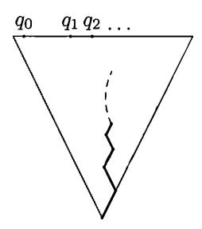

Figure 9. Comparing  $\beta = 0.b_0b_1b_2\cdots$  and  $q = \lim q_i$ 

the machine (in parallel to coin tossing) compute the rational numbers  $q_0, q_1, q_2, \ldots$ . The machine halts when it finds out that  $\beta < q$ . That is, the machine halts if for some i the rational number  $\beta_i = 0.b_0b_1 \cdots b_i 111 \cdots$  (the currently known upper bound for  $\beta$ ) is less than  $q_i$  (the currently known lower bound for q). See Figure 9 for a symbolic representation of this argument.

The constructed machine halts if and only if  $\beta < q$ . Indeed, assume that  $\beta$  is less than q. The numbers  $q_i$  tend to q and the upper bounds  $\beta_i$  for  $\beta$  tend to  $\beta$ , as  $i \to \infty$ . Therefore for some i the number  $q_i$  is greater than  $\beta_i$ . On the other hand, if the machine halts, then  $\beta < q$  by construction.

Thus the halting probability of the machine is equal to the probability of the event  $\beta < q$ . The latter probability equals the length of the segment [0, q), that is, to q. (Recall that  $\beta$  is uniformly distributed in the segment [0, 1].)

Let us return to probability distributions that can by generated by probabilistic machines. First, a definition. A sequence  $p_0, p_1, p_2, \ldots$  is lower semicomputable if there is a function p(i, n), where i, n are integers and p(i, n) is either a rational number or  $-\infty$ , with the following properties: the function p(i, n) is non-decreasing in the second argument:

$$p(i,0) \leqslant p(i,1) \leqslant p(i,2) \leqslant \cdots$$

and

$$p_i = \lim_{n \to \infty} p(i, n)$$

for all i.

One could say that the sequence  $p_i$  is lower semicomputable if the numbers  $p_0, p_1, p_2, \ldots$  are "uniformly lower semicomputable". The next theorem provides an alternative way to define lower semicomputable sequences.

THEOREM 45. A sequence  $p_0, p_1, p_2, \ldots$  is lower semicomputable if and only if the set of pairs  $\langle r, i \rangle$ , where i is a natural number and r is a rational number less than  $p_i$ , is enumerable.

PROOF. Recall that a set is enumerable if there is an algorithm that generates all its elements in some order with arbitrary delays between consecutive elements (the algorithm may not halt even if the set is finite).

Assume that a sequence  $p_0, p_1, p_2, \ldots$  is lower semicomputable. Let p(i, n) be the function from the definition of the lower semicomputability. Arrange all the pairs  $\langle r, i \rangle$  in a sequence so that every pair appears in the sequence infinitely many

times. The algorithm enumerating all the pairs  $\langle r, i \rangle$  with  $r < p_i$  works in steps. On step n compare r and p(i,n) where  $\langle r, i \rangle$  is the nth pair in the chosen sequence. If r < p(i,n), then output the pair  $\langle r, i \rangle$ , otherwise proceed to the next step. By definition,  $r < \lim_{n} p(i,n)$  if and only if there exists n such that r < p(i,n). Thus we will output all the pairs in the set, and no other pairs.

Conversely, assume that the property  $r < p_i$  is enumerable, and let A be an algorithm enumerating all such pairs  $\langle r, i \rangle$ . To compute p(i, n), we simulate n steps of the computation performed by A. Consider all the pairs that appeared within n steps and have i as the second component. Let p(i, n) be equal to the largest first component of such pairs. If there are no such pairs, let  $p(i, n) = -\infty$ . As n increases, new pairs may appear and p(i, n) may increase. The limit  $\lim_n p(i, n)$  is equal to  $p_i$ , since all the rational numbers less than  $p_i$  will appear in the enumeration.

We are now able to characterize probability distributions generated by probabilistic machines.

THEOREM 46. (a) Let M be a probabilistic machine without input that outputs natural numbers. Let  $p_i$  denote the probability that the machine outputs i. The sequence of  $p_i$  is lower semicomputable and  $\sum_i p_i \leq 1$ .

(b) Let  $p_0, p_1, \ldots$  be a lower semicomputable sequence of non-negative real numbers such that  $\sum_i p_i \leq 1$ . There is a probabilistic machine M that outputs every i with probability exactly  $p_i$ .

PROOF. The proof of item (a) is similar to the proof of corresponding statement in the previous theorem. We let p(i, n) be the probability that M outputs i within n steps.

The proof of item (b) is also similar to the proof of corresponding assertion in the previous theorem. This time we assign to each natural i a subset of [0,1] and the machine outputs i if the real number  $\beta = 0.b_0b_1b_2...$  belongs to the set assigned to i. The sets assigned to different values of i do not overlap. They may not cover the entire segment [0,1]. The set assigned to every i is a finite or countable union of half-open intervals [a,b) of total length  $p_i$ . When an approximation for some  $p_i$  increases, we add a new interval for this i (its length is the increase) just on the right of intervals allocated earlier. (So at each moment the used part of [0,1] is [0,s) for some s.)

In parallel, we toss a coin and obtain digits of the random number  $\beta$ . When we are sure that  $\beta$  gets into the set assigned to some natural number, we output that number.

Here is a formal argument. Let p(i,n) be the function of two variables from the definition of lower semicomputability. Without loss of generality we may assume that  $p(i,n) \ge 0$  for all i,n. Indeed, we can replace all negative values by zeros. We may assume also that for all n only finitely many values p(i,n) are positive (let p(i,n)=0 for all  $i\ge n$ ). The probabilistic algorithm that we construct runs in steps. On each step we allocate some space inside [0,1]. Our goal is that after the nth step the total length of intervals allocated to i is equal to p(i,n) (for all i). This requirement is easy to keep: going from left to right, on step n we allocate for each i (such that p(i,n) > p(i,n-1)) a new interval of length p(i,n) - p(i,n-1). We need to do this only for finitely many i, as for  $i \ge n$  we have p(i,n) = p(i,n-1) = 0.

The total length of used intervals does not exceed 1, as  $p(i, n) \leq p_i$  and  $\sum p_i \leq 1$ . Thus we will always be able to allocate the space we needed (at the left of the free space).

In parallel, the probabilistic machine tosses a coin, obtaining a random bit  $b_n$  on step n. It halts on step n and outputs i if it is known for sure that  $\beta = 0.b_0b_1b_2\cdots$  belongs to (the interior of) the space allocated to i, i.e., if the closed interval consisting of all real numbers whose binary expansion starts with  $b_0b_1\cdots b_n$  is included in the interior of the space allocated to i. (The interior of the segment [u,v) is the interval (u,v).) By construction, for all i the measure of this set (interior of the space allocated to i) equals  $p_i$ .

Any sequence  $p_i$  satisfying the conditions of the previous theorem is called a lower semicomputable semimeasure (or enumerable from below semimeasure) on  $\mathbb{N}$ . Sometimes we will use also the notation p(i) for  $p_i$ . We thus have two alternative definitions of a lower semicomputable semimeasure: (1) a probability distribution generated by a randomized algorithm; (2) a lower semicomputable sequence of nonnegative reals whose sum does not exceed 1. The above theorem states that these definitions are equivalent.

The word "semimeasure" may look strange, but unfortunately there is no other appropriate term in the literature. Dropping the semicomputability requirement, one can call any function  $i \mapsto p_i$  with  $\sum_i p_i \leq 1$  a semimeasure on  $\mathbb{N}$ . Every semimeasure on  $\mathbb{N}$  defines a probability distribution on the set  $\mathbb{N} \cup \{\bot\}$  where  $\bot$  is a special symbol meaning "undefined". The probability of the number i is  $p_i$  and the probability of  $\bot$  is  $1 - \sum_i p_i$ . In the sequel we consider lower semicomputable semimeasures only (unless explicitly stated otherwise).

We have considered so far (lower semicomputable) semimeasures on the natural numbers. The definition of a lower semicomputable semimeasure can be naturally generalized to the case of binary strings or any other constructive objects in place of natural numbers. For example, to define a notion of a lower semicomputable semimeasure on the set of binary strings, we have to consider probabilistic machines whose output is a binary string.

Important remark: We will consider in Chapter 5 a notion of a semimeasure on the space consisting of all finite and infinite 0-1 sequences. Such a semimeasure is generated by a probabilistic machine that prints its output bit by bit and never indicates that the output string is finished. In particular the machine never halts. It leads to a different notion: all the machines considered in this section are required to halt after printing the output; for such machines, there is no essential difference between printing a binary string and a natural number.

To stress the difference between these two frameworks, semimeasures defined in this section are called *discrete* semimeasures while the ones considered in Section 5 are called *continuous* semimeasures, or *semimeasures* on the binary tree.

# 4.2. Maximal semimeasures

Comparing two semimeasures on  $\mathbb{N}$ , we will ignore multiplicative constants. A lower semicomputable semimeasure m is called maximal if for any other lower semicomputable semimeasure m' the inequality  $m'(i) \leqslant cm(i)$  holds for some c and for all i. (The name greatest (instead of "maximal") would be more accurate since we look for the greatest element of some partially ordered set, not the maximal one.)

Theorem 47. There exists a maximal lower semicomputable semimeasure on  $\mathbb{N}$ .

PROOF. We have to construct a probabilistic machine M with the following property. The machine M should output every number i with a probability that is at most a constant times less than the similar probability for each other machine M' (the constant may depend on M' but not on i).

This is easy to achieve: consider a machine M that picks at random a probabilistic machine M' and then simulates M'. The probability of picking each machine M' should be positive. If a machine M' is chosen with probability p, then M will output some i with probability at least  $p \cdot ($ the probability that M' outputs i). Thus one can let c = 1/p.

It remains to explain how to implement the random choice of a probabilistic machine. Enumerate all probabilistic machines in a natural way; let  $M_0, M_1, M_2, \ldots$  be the resulting sequence. We toss a coin until the first 1 appears. Then we simulate the machine  $M_i$  where i is the number of zeros preceding the first 1.

It is instructive to prove this theorem once more using the language of lower semicomputable sequences instead of probabilistic algorithms. Basically, we need to show that there exists a convergent lower semicomputable series that upper-bounds all other lower semicomputable convergent series (up to a multiplicative constant). More formally, we should consider only series with the sum at most 1, but this is not essential since we ignore constant factors.

To find such a series, we sum up with certain weights all the lower semicomputable series with sum at most 1. The weights form a computable converging series. This implies that the resulting series (infinite linear combination) converges. By construction it will be maximal (up to a multiplicative constant). There is only one problem left: How do we guarantee that the resulting series is lower semicomputable?

The lower semicomputability of a semimeasure is witnessed by a computable function  $p:\langle i,n\rangle\mapsto p(i,n)$ . There are only countably many such functions, since there are only countably many algorithms. Enumerating all those functions, we get a sequence  $p^{(0)}, p^{(1)}, p^{(2)}, \ldots$ ; then we may consider the function

$$p(i,n) = \sum_{k=0}^{n} \lambda_k p^{(k)}(i,n),$$

where  $\lambda_k$  is a computable sequence of rational numbers with  $\sum_k \lambda_k \leqslant 1$ , say,  $\lambda_k = 2^{-k-1}$ . The resulting function p is non-decreasing in n for every i. Indeed, as n increases, the number of terms in the sum defining p increases and the value of every term increases, too. And for all i we have

$$\lim_{n \to \infty} p(i, n) = \sum_{k} \lambda_k \lim_{n \to \infty} p^{(k)}(i, n).$$

That is, the constructed semimeasure is indeed equal to the sum of all lower semi-computable semimeasures with weights  $\lambda_k$ .

However, there is a fault in this argument: the function p(i,n) should be computable, and thus we cannot use arbitrary enumeration of lower semicomputable functions in our construction. We need to arrange them so that the function  $p: \langle k, i, n \rangle \mapsto p^{(k)}(i,n)$  is computable as a function of all its three arguments. Note that we cannot just let  $p^{(k)}$  be the function computed by kth program: it may

happen that the kth program does not define any lower semicomputable semimeasure. (It may compute a function which is not total or a function that sometimes decreases in the second argument or a function whose sum is greater than 1.)

The bug can be fixed using the following:

LEMMA. Every program P computing a function of two natural arguments and taking rational values (and possibly the value  $-\infty$ ) can be algorithmically transformed into a program P' having the following properties. The program P' defines a lower semicomputable semimeasure. If the program P itself defines a lower semicomputable semimeasure, then P' defines the same semimeasure.

PROOF. Let P be any program satisfying the condition of the lemma. (We do not assume that P is total.) First we let P'(i,n) be equal to the maximal number output within the first n steps in the computations of  $P(i,0),\ldots,P(i,n)$ . If none of these computations terminate within n steps or all the results are negative, we let P'(i,n) = 0. This definition guarantees that P'(i,n) is non-negative and is non-decreasing in n. For every i, if P(i,n) is defined for all n and is non-negative and non-decreasing in n, then  $\lim_n P'(i,n) = \lim_n P(i,n)$ .

It remains to ensure that  $\sum p_i' \leq 1$  where  $p_i' = \lim_n P'(i,n)$ . To this end first let P'(i,n) = 0 for all n < i. This transformation does not change the limit and preserves monotonicity in n. The advantage is that now the sum of P'(i,n) over all i is finite and can be computed for every n. We need that this sum does not exceed 1. To enforce this, we do not increase P' if we see that this would violate our restriction. We first trim the value P'(i,n) for n=0, then for n=1, etc. The lemma is proven.

Using the transformation described in the lemma, we arrange all the lower semicomputable semimeasures into a computable sequence. The weighted sum of all its terms is a maximal lower semicomputable semimeasure. Thus we obtain another proof of Theorem 47.

Fix any maximal lower semicomputable semimeasure on the natural numbers. We will use the notation m(i) or  $m_i$  for the probability of i and the letter m for the semimeasure itself. The value m(i) is called the a priori probability of i. (Another name for m is the universal semimeasure on  $\mathbb{N}$ .) Here is an explanation of this term. Assume that we are given a device (a black box) that after being turned on produces a natural number. For each i we want to get an upper bound for the probability that the black box outputs i. If the device is a probabilistic machine, then a priori (without any other knowledge about the box) we can estimate the probability of i as m(i). This estimate can be much greater than the (unknown) true probability, but only O(1) times less than it.

The a priori probability of a number i is closely related to its complexity. Roughly speaking, the less the complexity is, the larger the a priori probability is. More specifically, we will show that a slightly modified version of complexity (the so-called *prefix complexity*) of i is equal to  $-\log m(i)$ .

#### 4.3. Prefix machines

The difference between prefix complexity and plain complexity can be explained as follows. Defining prefix complexity, we consider only self-delimiting descriptions. This means that the decoding machine does not know where the description ends

and has to find this information itself. One can clarify this idea in several non-equivalent ways. We will discuss all of them further in detail.

Let us start with a following definition. Let f be a function whose arguments and values are binary strings. We say that f is  $prefix\ stable$ , if the following holds for all strings x, y:

 $(f(x) \text{ is defined}) \text{ and } (x \text{ is a prefix of } y) \Rightarrow f(y) \text{ is defined and } f(y) = f(x).$ 

THEOREM 48. There exists an optimal prefix-stable decompressor (for the family of all prefix-stable decompressors).

PROOF. Recall that a decompressor (description mode) is a computable function mapping strings to strings. (All strings are binary.) The plain complexity is defined using an optimal function in the class of all such functions. Now we restrict the class of decompressors to computable prefix-stable functions. We assign to each prefix-stable function D the complexity function  $K_D$ , which is as defined earlier:  $K_D(x)$  is the length of a shortest description of x with respect to D (i.e., minimal l(y) among all y such that D(y) = x). So the definition of  $K_D(x)$  coincides with that of  $C_D(x)$ ; we write K instead of C just to stress that we consider now only prefix-stable decompressors.

We have to show that there exists an optimal prefix-stable decompressor D (for the class of all prefix-stable decompressors). The latter means that for any other prefix-stable decompressor the inequality  $K_D(x) \leq K_{D'}(x) + c$  holds for some c and all x.

Recall that for the plain complexity we have constructed an optimal decompressor D by letting

$$D(\hat{p}y) = p(y).$$

Here  $\hat{p}$  is a self-delimiting description of p, say,  $\hat{p} = \overline{p}01$  where  $\overline{p}$  stands for the string p with all bits doubled. The notation p(y) refers to the output of the program p given input y (more precisely, the string p is interpreted as a program in a universal programming language).

Is this decompressor a prefix-stable one? Certainly not. Indeed, there is a program p computing a function that is not prefix stable, say, p(0) = a and p(00) = b where  $a \neq b$ . Then  $D(\hat{p}0) = a$  and  $D(\hat{p}00) = b$ .

To construct an optimal prefix-stable decompressor, we modify the definition of D as follows. We enforce prefix-stability of programs by converting every program p to another program [p] that works as follows:

- (1) Apply p to all inputs in parallel. If the computation of p on an input y halts with output z, we write down the pair  $\langle y, z \rangle$ . Let  $\langle y_i, z_i \rangle$  denote the resulting sequence of pairs (enumerating the graph of p:  $z_i = p(y_i)$ ).
- (2) We delete some terms of the sequence  $\langle y_i, z_i \rangle$ . Let us call strings y and y' compatible if one of them is a prefix of the other one (an equivalent definition: both strings are prefixes of some third string). We say that a pair  $\langle y_i, z_i \rangle$  contradicts a pair  $\langle y_j, z_j \rangle$  if  $y_i$  is compatible with  $y_j$ , but  $z_i \neq z_j$ . We delete a pair  $\langle y_i, z_i \rangle$  if it contradicts some other pair  $\langle y_j, z_j \rangle$  with j < i. (The argument would work as well if we delete a pair only when it contradicts a non-deleted previous pair.)
- (3) Computing the sequence  $\langle y_i, z_i \rangle$  and filtering out some of its terms is a process that does not depend on the input for the program [p]. The input string y is taken into account as follows. We wait until a (non-deleted) pair  $\langle y_i, z_i \rangle$  appears

such that  $y_i$  is a prefix of y. Once we encounter such a pair, we print the result  $z_i$  and halt.

For every program p the function  $y \mapsto [p](y)$  is prefix stable. Indeed, assume that [p](y) = z. By construction there is a non-deleted pair  $\langle y_i, z \rangle$  such that  $y_i$  is a prefix of y. Assume furthermore that y is a prefix of y'. We need to show that [p](y') = z. The string  $y_i$  is a prefix of y' as well, therefore [p](y') = z or  $[p](y') = z_j$  where  $\langle y_j, z_j \rangle$  is a non-deleted pair such that j < i and  $y_j$  is a prefix of y'. In the latter case  $y_j$  is compatible with  $y_i$  and, since the pair  $\langle y_i, z \rangle$  does not contradict the pair  $\langle y_j, z_j \rangle$ , we have  $z_j = z$ .

If p is prefix stable, then no pair is deleted in the run of its transformed version [p]. Therefore [p](y) is defined as p's output on y or a prefix of y. As we assume that p is prefix stable, the result is the same.

Now we are able to finish the proof. Let

$$D(\hat{p}y) = [p](y).$$

We have to verify that D is prefix stable and optimal (in the class of all prefix-stable decompressors).

To prove the first statement, assume that  $\widehat{p_1}y_1$  is a prefix of  $\widehat{p_2}y_2$ . We need to show that  $D(\widehat{p_1}y_1)$  and  $D(\widehat{p_2}y_2)$  coincide. As both the strings  $\widehat{p_1}$ ,  $\widehat{p_2}$  are prefixes of the string  $\widehat{p_2}y_2$ , they are compatible. Thus  $p_1 = p_2$  (as the encoding  $p \mapsto \widehat{p}$  is self-delimiting) and  $y_1$  is a prefix of  $y_2$ . Since the program  $[p_1]$  (= $[p_2]$ ) is prefix stable, we conclude that  $D(\widehat{p_1}y_1) = [p_1](y_1) = [p_1](y_2) = [p_2](y_2) = D(\widehat{p_2}y_2)$ .

So we have shown that D is prefix stable. To prove optimality, assume that some prefix-stable decompressor D' is given and p is its program. Then we have  $D(\hat{p}y) = [p](y) = p(y)$ . Therefore the complexity of all strings with respect to D' is at most  $l(\hat{p})$  greater than the complexity with respect to D.

Let us fix some optimal prefix-stable decompressor and omit the subscript D in  $K_D(x)$ , speaking about the *prefix complexity* K(x) of x. As well as the plain complexity, the prefix complexity is defined up to an O(1) additive term.

There is another way to define prefix complexity. Instead of prefix-stable functions, we consider prefix-free functions. A function is called *prefix free* if every two different strings in its domain are incompatible. If a prefix free function is defined on a string, it is undefined on all its proper prefixes and extensions.

This time we restrict the class of decompressors to prefix-free ones, that is, computable prefix-free functions. We have the following theorem that is similar to Theorem 48:

Theorem 49. The class of all prefix-free decompressors contains an optimal element.

PROOF. The proof is very similar to the proof of Theorem 48. This time we construct, for every program p, a prefix-free program  $\{p\}$  that works as follows:

- (1) Just as before, run the program p on all inputs to obtain a sequence  $\langle y_i, z_i \rangle$  of all pairs such that z = p(y).
  - (2) Delete all pairs  $\langle y_i, z_i \rangle$  such that  $y_i$  is compatible with  $y_j$  for some j < i.
- (3) Let y denote the input to the program  $\{p\}$ . We find the first non-deleted pair  $\langle y_i, z_i \rangle$  with  $y_i = y$  and output  $z_i = \{p\}(y)$ .

It is easy to verify that the mapping  $y \mapsto \{p\}(y)$  is prefix free for every p and coincides with the mapping  $y \mapsto p(y)$  if the latter one is prefix free. The rest of the proof repeats the corresponding part from the proof of Theorem 48.

Let us fix some optimal prefix-free decompressor, and let K'(x) denote the corresponding complexity.

Which of the complexity measures K and K' is "the right one"? This is a matter of taste. We will prove in Section 4.5 that these measures differ by an additive constant (and that both complexities coincide with the negative logarithm of the a priori probability). Thus the question is which of the two definitions (of the same prefix complexity) is more natural. Again this is a matter of taste. Authors believe that the definition based on prefix-stable functions is more natural than the other one (which explains why we started with it). However, sometimes the second definition is more convenient. For instance, its use makes easier the proof of the theorem on the complexity of a pair (Section 4.6).

One can find the historical account in [18] (see also the arXiv version of this paper); making the story short, let us mention only that prefix complexity was independently introduced by Levin who used prefix-stable decompressors (and denoted prefix complexity by KP) and Chaitin who used prefix-free ones (and denoted prefix complexity by H). Now most English-language papers, following [103], use letter K for prefix complexity.

The properties of K and K' are similar to those of the plain complexity but differ in some important aspects:

• We start with a comparison of C and K:

$$C(x) \le K(x) + O(1)$$
 and  $C(x) \le K'(x) + O(1)$ .

These properties are straightforward, as both prefix-stable and prefix-free decompressors form a subclass in the class of all decompressors.

- Recall that  $C(x) \leq l(x) + O(1)$ , as the optimal decompressor is better than the identity function. This argument is not valid for prefix complexity, as the identity function is neither prefix stable nor prefix free. We will show in Section 4.5 that this inequality is false for the prefix complexity.
- Nevertheless there is an upper bound for prefix complexity in terms of the length. We will provide such bounds for K', and the same bounds hold for K, the proofs being entirely similar. Let us show that  $K'(x) \leq 2l(x) + O(1)$ . Indeed, consider a decompressor

$$D(\overline{x}01) = x$$

where  $\overline{x}$  stands for the string obtained by doubling all bits in x. This decompressor is prefix free and  $K_D(x) = 2l(x) + 2$ . By replacing  $\overline{x}01$  by a more efficient self-delimiting encoding  $\hat{x}$ , we can obtain better upper bounds. For example, letting  $\hat{x} = \overline{\sin(l(x))}01x$ , we obtain the bound

$$K'(x) \leqslant l(x) + 2\log l(x) + O(1).$$

By iterating the construction, we obtain the bound

$$K'(x) \leqslant l(x) + \log l(x) + 2\log \log l(x) + O(1)$$

and so on.

Like plain complexity, prefix complexity does not increase when algorithmic transformation is applied:

$$K'(A(x)) \leqslant K'(x) + O(1).$$

The constant O(1) depends on A but does not depend on x. Indeed, if D is a prefix-free decompressor, then so is the composition  $x \mapsto A(D(x))$ . This is true for prefix-stable decompressors as well, so we obtain a similar statement for K in place of K'. Using this property, we can define prefix complexity of other constructive objects, such as pairs of strings, natural numbers, finite sets of strings etc., without specifying how to encode them by binary strings.

• For prefix complexity, the inequality comparing the complexity of a pair of strings with their separate complexities is true up to a constant additive error term rather than a logarithmic one:

$$K(x,y) \leqslant K(x) + K(y) + O(1)$$

(see below Theorem 60 in Section 4.6, p. 97).

• Let D be an optimal decompressor (from the definition of plain complexity). Since the transformation  $p \mapsto D(p)$  does not increase complexity, we have

$$K(D(p)) \le K(p) + O(1) \le l(p) + 2\log l(p) + O(1).$$

Let p be a shortest description of x with respect to D, that is, D(p) = x and l(p) = C(x). Then we have

$$K(x) = K(D(p)) \le l(p) + 2\log l(p) + O(1)$$
  
=  $C(x) + 2\log C(x) + O(1)$ .

Using stronger bounds in place of the bound  $K(p) \leq l(p) + 2 \log l(p) + O(1)$ , we obtain the inequality

$$K(x) \leqslant C(x) + \log C(x) + 2\log\log C(x) + O(1)$$

and other similar inequalities.

# 4.4. A digression: Machines with self-delimiting input

This section is not used in the sequel; here we analyze the meaning of the words "self-delimited input" and show that a different interpretation of them leads to prefix-free and prefix-stable functions (thus providing a motivation for these notions).

Usually the input is given to a machine in such a way that the machine knows where the input string starts and ends. For example, for Turing machines we usually assume that initially the head is located at the first symbol of the input string and that its last symbol is followed be a special marker, say, a blank.

Informally speaking, a machine with a self-delimited input receives the input bits one by one and has no indication which of them is the last one. At a certain time it should print a result and halt.

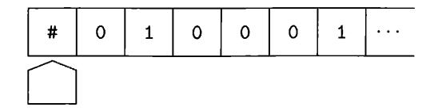

FIGURE 10. A head on a one-way input tape

**4.4.1. Prefix-free functions.** Here is a refinement of this idea. Consider a Turing machine that has an extra infinite one-way read-only *input tape*. The leftmost cell of the tape contains a special marker #. All the other cells contain either 0 or 1 (Figure 10).

Initially the input tape head is located in the leftmost cell and thus scans the marker. The instruction performed by the machine is determined by the symbol on the input tape it scans (and also by the symbol on the work tape and the machine's internal state, as usual). The possible actions are changing the internal state, writing a symbol on the work tape, and moving some of the heads (in any direction on the work tape and to the right on the input tape). The result of the computation should be written on the work tape in the usual way. The work tape is initially empty.

Let M be a Turing machine as described above. Let us run this machine for all possible contents of the input tape. If some of the computations halt, we write down two strings: the string x consisting of all bits scanned by the input head and the result y of the computation. Let  $\Gamma_M$  denote the resulting set of pairs  $\langle x, y \rangle$ . If two different pairs  $\langle x_1, y_1 \rangle$  and  $\langle x_2, y_2 \rangle$  are in  $\Gamma_M$ , then the strings  $x_1$  and  $x_2$  are incompatible. Indeed, assume that  $x_1$  is a prefix of  $x_2$ . Since the computation on  $x_1$  does not go outside  $x_1$ , it will be valid for  $x_2$  too, and the last bits of  $x_2$  remain unused; thus the pair  $\langle x_2, y_2 \rangle$  does not belong to  $\Gamma_M$  (unless  $x_1 = x_2$ —in this case  $y_1 = y_2$ , and we get the same pair).

In particular, the first components of different pairs in  $\Gamma_M$  are different. This means that  $\Gamma_M$  is a graph of a function. We denote this function by  $\gamma_M$ . Its arguments and values are binary strings. We say that M computes  $\gamma_M$  in a prefix-free mode. It is easy to see that the function  $\gamma_M$  is computable in the usual sense. Indeed, to compute  $\gamma_M(x)$ , we write x on the input tape and any symbols (say, zeros) to the right of x, and we then run M. If M halts with output y, we verify whether M has scanned all symbols of x and no symbols beyond x. If the verification fails, we output no result; otherwise we output y and halt.

It is easy to see that the function  $\gamma_M$  is computable and prefix free (every two different strings in its domain are incompatible). The converse statement is true as well:

Theorem 50. Every computable prefix-free function is computed by some machine in a prefix-free mode.

PROOF. This statement is not that evident. Indeed, a (standard) machine computing a prefix-free function f knows where the input ends and can use this information. We need to construct another machine M such that  $\gamma_M = f$ .

Informally speaking, the machine M reads the next bit only if it can be done safely, i.e., when it is known that f is not defined on a currently known part of the input because f is defined on its proper extension. More precisely, fix a machine

computing f in the usual sense. We simulate in parallel its computations on all possible inputs. Sometimes we will interrupt the simulation and scan a new symbol from the input tape. More specifically, when a new pair  $\langle x,y\rangle$  with f(x)=y appears, we compare x with the already scanned part r of the input tape. If r is not a prefix of x, then we do nothing and wait until the next pair  $\langle x,y\rangle$  appears. If r coincides with x, we output y and halt. Otherwise r is a proper prefix of x. In this case we read the input tape until we find the first bit where x differs from the contents of the input tape, or we find out that the input tape starts with x. In the latter case we output y and halt. In the former case we return to the simulation process and continue it until the next pair  $\langle x,y\rangle$  appears.

How does M start its work? Initially the scanned part of the input tape is empty. Once the first pair  $\langle x,y\rangle$  appears, we look at whether x is empty or not. If x is empty, we print y and halt. Otherwise we scan the input tape until we read x or find the first bit where x differs from the contents of the input tape (finding out that x is not a prefix of the input). In the first case we print y and halt. In the second case we wait for the next pair  $\langle x,y\rangle$ .

Formally speaking, we maintain the following invariant relation: after processing each pair, if r is the scanned part of the input tape, then either:

- (1) f(r) is defined and the machine halts with the output f(r); or
- (2) r is not a prefix of x for all pairs  $\langle x, y \rangle$  that have appeared so far, but every proper prefix r' of r is a proper prefix of one of such x's.

(A proper prefix of a string is its prefix that is different from the string itself.)

It is easy to verify that this invariant relation implies that  $f = \gamma_M$ . We skip this verification and explain informally the main idea of the construction: if the scanned part r of the input is a proper prefix of a string in the domain of f, then f(r) is undefined, and we can safely read the next bit of the input.

An equivalent model can be defined in more "practical" terms. Consider computer programs that have instructions of the form

#### b := NextBit.

Executing this instruction, the program shows on the screen a prompt like "Enter the next bit" and waits until the user hits one of the keys "0" or "1". After she does this, the input bit is recorded in b and the computation resumes.

One can assign a computable function f to every program of this type. Namely, f(x) equals to y if the program prints y provided the user enters the bits of x successively in response to the program's prompts. If the program prints the result before the user enters all the bits of x or if it asks for a new bit after all the bits of x are entered, then f(x) is undefined.

It is easy to modify the arguments above to prove that programs of this type compute all the prefix-free functions and no others. (Moving the input head to the right is just reading the next input bit.)

**4.4.2. Prefix-stable functions.** In the previous section we considered *blocking* read primitive: program stops and waits until the next bit arrives. There is another possibility: bits arrive asynchronously and are placed in the input queue; the program may ask whether the queue is empty or not, and continue the execution. Also, if the queue is not empty, the program may get the next bit from the queue.

To be more specific, we assume that the program may use the instruction

$$b := NextExists$$

to find out whether the queue is non-empty. To read a new input bit the program invokes the instruction

b := NextBit.

This instruction removes the first (the oldest) bit from the queue and assigns it to the variable b.

One should specify what happens if the instruction NextBit is performed when the queue is empty. We may agree that this causes a crash, or that the computation is delayed until the next bit arrives. It is not essential which of these two options is chosen, since we may guard the input statement by a waiting loop:

while not NextExists do {nothing};

b := NextBit

The advantage of a non-blocking read operation is that we can do some useful work while waiting for the next input bit. On the other hand, it is not clear now how to define a function computed by a program, since the output of the program may depend not only on the input string, but also on timing.

We call a program robust if this is not the case (i.e., if the output is determined by the input string and does not depend on timing). If the program is robust, for any input string x there are two possibilities: (1) the program does not produce output for any delays between the consecutive bits of x; or (2) for some y, the program outputs y whatever delays happen between the consecutive bits of x.

In this way every robust program *computes* a function f such that f(x) is undefined in the first case and equals y in the second case.

THEOREM 51. (a) The function computed by a robust program is both computable and prefix stable.

(b) For every computable prefix-stable function there exists a robust program that computes it.

PROOF. (a) The computability of f is straightforward: to compute f(x), we start our robust program and enter all the bits of x (with arbitrary delays). Then we wait until the program outputs a result, which by assumption is equal to f(x) if f is defined on x and does not exist otherwise.

Let us prove that f is prefix stable. We have to show (recall the definition from Section 4.3) that if a robust program produces y for some input x, then it produces y on every input x' that is an extension of x. Start the program and enter all the bits of x (with arbitrary delays). By assumption the program produces y and then halts. After that, input all the remaining bits of x' (the difference between x' and x) with arbitrary delays. Obviously, these extra bits do not affect the output of the program. Thus the program produces output y for input x' at least for some timing. Being robust, it does the same for arbitrary timing.

(b) Let f be a computable prefix-stable function f. The robust program r that computes f works as follows:

Using a (non-robust) algorithm that computes f, program r computes in parallel f(x) for all inputs x. At the same time r reads all available input bits. Doing this, r looks for strings x and y such that f(x) = y and x is a prefix of the input sequence. Once such a pair  $\langle x, y \rangle$  is found, program r outputs y and halts.

Assume that f(x) = y and all the bits of x are entered (with some delays). We have to prove that r outputs y and halts whatever the delays are. Indeed, at a certain time, r knows that f(x) = y and all the bits of x have been entered. At that time the program outputs y and halts unless it has been halted earlier. The latter indeed can happen: the program can halt earlier with the result f(x') where x' is some string compatible with x. However, since f is assumed to be prefix stable, we have f(x') = y and the output is the same.

If f(x) is undefined and f is prefix stable, then f(x') is undefined for all prefixes x' of x, and hence the program does not terminate.

This theorem provides a motivation for the notion of a prefix-stable function.

**96** Construct an algorithm transforming every program p that uses NextBit and NextExists calls into a robust program p' that computes the same function as p does, if p is robust (and computes some prefix-stable function if p is not).

(*Hint*: Use the construction from the proof of Theorem 51 back and forth.)

 $\boxed{97}$  (Continued) Prove that there exists no algorithm that for a given program p decides whether p is robust or not.

(*Hint*: This can be done in a standard way, by reducing the halting problem. See, e.g., [184].)

**4.4.3.** Continuous computable mappings. There is another, more abstract, motivation for the notion of a prefix-stable function. It goes back to a general theory of computable functionals of higher type, but we restrict our attention to a special case we are interested in. (See [176] for a more general approach.)

Let  $\Sigma$  denote the set of all finite and infinite binary sequences:  $\Sigma = \Xi \cup \Omega$ . For a finite string x let  $\Sigma_x$  denote the set of all finite and infinite extensions of x. We will consider  $\Sigma$  as a partially ordered set:  $x \leq y$  if x is a prefix of y.

Consider a topology on  $\Sigma$  whose base consists of all sets of the form  $\Sigma_x$ . This means that a set is open if it is a union of some sets of this form. It is easy to verify that we indeed get a topology. (Note that the resulting topological space does not satisfy the separation axiom.)

The following statement is almost obvious:

THEOREM 52. A set  $A \subset \Sigma$  is open if and only if it satisfies the following conditions:

- (1) if a finite string x is in A, then all finite and infinite extensions of x are in A:
  - (2) if an infinite sequence is in A, then some of its finite prefixes are in A.

PROOF. Every union of base sets satisfies the conditions (1) and (2). Conversely, if a set A satisfies both conditions, then it is equal to the union of  $\Sigma_x$  over all finite strings x in A.

Add to the natural numbers a new element  $\bot$  ("undefined"), and let  $\mathbb{N}_\bot$  denote the resulting set. Consider the following partial order on this set: the element  $\bot$  is less than all natural numbers, and all the natural numbers are pairwise incomparable (Figure 11).

Consider the following topology on the set  $\mathbb{N} \cup \{\bot\}$ . A set is open if it either does not include the element  $\bot$  or it coincides with  $\mathbb{N} \cup \{\bot\}$ . It is easy to verify that we get a topological space (that does not satisfy the separation axiom either).

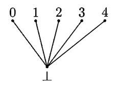

FIGURE 11. The topological space  $\mathbb{N}_{\perp}$ 

Let us identify partial mappings from  $\Sigma$  into  $\mathbb{N}$  with total mappings from  $\Sigma$  into  $\mathbb{N}_{\perp}$ ; the value  $\perp$  replaces all undefined values. The next theorem characterizes continuous mappings (recall that a mapping is continuous if the preimage of every open set is open).

THEOREM 53. A (total) mapping  $F: \Sigma \to \mathbb{N}_{\perp}$  is continuous if and only if the following are true:

- (1) F is increasing, i.e.,  $x \leq y$  implies  $F(x) \leq F(y)$  (the sign  $\leq$  refers to the pre-ordering relations on  $\mathbb{N}_{\perp}$  and  $\Sigma$  introduced above);
- (2) if x is an infinite binary sequence and  $F(x) \neq \bot$ , then x has a finite prefix x' such that  $F(x') \neq \bot$ .

PROOF. Let F be a continuous mapping. To verify condition (1), assume that  $x \leq y$  but  $F(x) \not\leq F(y)$ . Then F(x) is a natural number (and not  $\bot$ ) and  $F(x) \neq F(y)$ . The preimage of the open set  $\{F(x)\}$  contains x and does not contain y, hence it is not open.

Let us verify condition (2). Assume that x is an infinite sequence and  $F(x) \neq \bot$ . The preimage of the set  $\{F(x)\}$  is open and contains x. Thus it contains some finite prefix of x.

It remains to verify that any function F satisfying conditions (1) and (2) is continuous. We need to verify only that the preimage of every natural number is open (indeed, the preimage of the entire space is open, and other open sets are unions of singletons formed by natural numbers). It is enough to verify that the preimage of every natural number satisfies the conditions (1) and (2) from the previous theorem. This is a straightforward corollary of our assumptions. (Note that if x' is a prefix of x and x and x and x and x but the following conditions (1) and (2) is continuous.

For any given continuous mapping  $F: \Sigma \to \mathbb{N}_{\perp}$ , consider the set  $\Gamma_F$  of all pairs  $\langle x, n \rangle \in \Xi \times \mathbb{N}$  such that F(x) = n. Note that the set  $\Gamma_F$  is only a part of the graph of the mapping F (we consider only finite strings x and require that  $n \neq \bot$ ).

THEOREM 54. The mapping  $F \mapsto \Gamma_F$  is a bijection between continuous mappings  $\Sigma \to \mathbb{N}_{\perp}$  and sets  $A \subset \Xi \times \mathbb{N}$  satisfying the following conditions:

- $(1) \ \langle x, n \rangle \in A, \ x \leqslant y \ \Rightarrow \ \langle y, n \rangle \in A;$
- (2)  $\langle x, n \rangle \in A$ ,  $\langle x, m \rangle \in A \implies m = n$ .

PROOF. Assume that the mapping F is continuous. If  $F(x) = n \in \mathbb{N}$ , then condition (1) of the previous theorem guarantees that F(y) = n for every  $y \ge x$ . This proves that the set  $\Gamma_F$  satisfies condition (1). As F(x) cannot be equal to two different numbers, condition (2) is also satisfied. Thus, for every continuous mapping F the set  $\Gamma_F$  has properties (1) and (2).

It is easy to see that the set  $\Gamma_F$  uniquely determines F: if x is a finite string, then F(x) is the second component of the (unique) pair  $\langle x, n \rangle \in \Gamma_F$ . If there is no

such pair, then  $F(x) = \bot$ . If x is an infinite sequence, then F(x) is determined uniquely as F(x') where x' is a sufficiently long prefix of x.

It remains to show that every set A having properties (1) and (2) is equal to  $\Gamma_F$  for certain F. For every finite x define F(x) as the natural number n such that  $\langle x,n\rangle \in A$ ; such a number is unique due to (2). If there is no such n, then let  $F(x) = \bot$ . By condition (1) we get an increasing function. For every infinite  $x \in \Sigma$ , let F(x) be equal to F(x') where x' is any prefix of x such that  $F(x') \neq \bot$ . If there is no such x', then let  $F(x) = \bot$ . By property (1) the value of F(x) is well defined. The constructed function F satisfies both conditions (1) and (2) from the previous theorem and is continuous. By construction we have  $\Gamma_F = A$ .

Conditions (1) and (2) mean that the set A is a graph of a prefix-stable function. We thus have a one-to-one correspondence between continuous mappings  $\Sigma \to \mathbb{N}_{\perp}$  and prefix-stable functions.

Call a continuous mapping  $F \colon \Sigma \to \mathbb{N}_\perp$  computable if the set  $\Gamma_F$  is enumerable. It is easy to verify that F is computable if and only if the restriction of F to those strings  $x \in \Xi$  for which  $f(x) \neq \bot$  is computable in the standard sense. (A partial function from  $\Xi$  to  $\mathbb{N}$  is computable if and only if its graph is enumerable.) Thus computable continuous functions  $\Sigma \to \mathbb{N}_\perp$  are basically the same as prefix-stable functions. This gives an extra motivation for the notion of a computable prefix-stable function.

# 4.5. The main theorem on prefix complexity

In this section, we prove that all three complexity measures, K (defined using prefix-stable decompressors), K' (defined using prefix-free decompressors), and the negative logarithm of the a priori probability coincide up to an additive constant. To this end we prove that three inequalities

$$-\log m(x) \leqslant K(x) \leqslant K'(x) \leqslant -\log m(x)$$

are true up to a constant error term. We start with two easy inequalities.

THEOREM 55.

$$K(x) \leqslant K'(x) + O(1).$$

PROOF. This inequality would be evident if every prefix-free function were prefix stable. This is not the case: a prefix-free function D is undefined on all the extensions of every string u in the domain of D. On the other hand, a prefix-stable function D is defined on all the extensions v of every string u in the domain of D, and D(v) = D(u).

Therefore we need a (simple) construction. Let D be a prefix-free decompressor. Define another decompressor D' as follows: D'(y) = x if and only if D(y') = x for some prefix y' of y. As D is prefix free, such y' is unique, thus D' is well defined. To compute D'(y), we just apply D in parallel to all the prefixes y' of y until we find a prefix y' such that D(y') is defined.

By construction the function D' is prefix stable and extends D. Therefore the complexity of each string with respect to D' does not exceed its complexity with respect to D. (In fact, the complexities with respect to D and D' coincide, as the described transformation  $D \mapsto D'$  does not affect shortest descriptions.)

We could try to prove the converse inequality in a similar way: consider the restriction of the given prefix-stable decompressor D to minimal descriptions. That

is, let D'(y) = z if D(y) = z, and at the same time D(y') is undefined for all proper prefixes y' of y. This transformation is an inverse of the transformation used in the proof of the last theorem; the resulting function D' is indeed prefix free. The problem is that it might be non-computable.

 $\boxed{98}$  Find a computable prefix-stable function D for which the prefix-free function D' constructed in this way is not computable.

(*Hint*: Let A be an enumerable undecidable set, whose complement is thus not enumerable. Let  $f(0^n11x) = 0$  for all natural numbers n and all binary strings x. Also let  $f(0^n1x) = 0$  for all  $n \in A$  and all x.)

This problem shows that, in a sense, the non-blocking read operation is more powerful than the blocking one (see Section 4.4).

THEOREM 56.

$$-\log m(x) \leqslant K(x) + O(1).$$

PROOF. We have to prove that  $2^{-K(x)} \leqslant cm(x)$  for some constant c and for all x. Recall that m is the maximal lower semicomputable semimeasure. Thus it suffices to find an upper bound for the function  $x \mapsto 2^{-K(x)}$  that is a lower semicomputable semimeasure. (In this section we consider discrete semimeasures on the set of all binary strings, as defined in Section 4.1.)

Let us construct a probabilistic machine generating this semimeasure. Toss a coin to obtain a sequence  $b_0b_1b_2\cdots$  of random bits. Simultaneously, apply the optimal prefix-stable decompressor D (from the definition of K) to all prefixes of the sequence  $b_0b_1b_2,\ldots$  If one of the computations

$$D(\Lambda), D(b_0), D(b_0b_1), D(b_0b_1b_2), \dots$$

terminates with a certain result, output that result and halt. Note that it does not matter which of the terminating computations we choose: the prefix-stability of D guarantees that this choice does not affect the result.

Let x be a binary string, and let p be a shortest description of x with respect to p. Then the machine outputs x with probability at least  $2^{-l(p)}$ . Indeed, if the random sequence starts with p, then the result of the machine is x. Thus the constructed machine generates a measure that is an upper bound for  $2^{-K(x)}$ .  $\square$ 

There is a slightly different proof of the same theorem, which does not involve probabilistic machines. The function  $x \mapsto 2^{-K(x)}$  is lower semicomputable. Thus it is enough to show that it is a semimeasure.

THEOREM 57.

$$\sum_{x} 2^{-K(x)} \leqslant 1.$$

PROOF. For every string x let  $p_x$  be some shortest description of x (with respect to the optimal prefix-stable function from the definition of K). For every two different strings x and y the strings  $p_x$  and  $p_y$  are incompatible. Thus the statement is a direct corollary of the following:

LEMMA. Let  $p_0, p_1, p_2, \ldots$  be pairwise incompatible strings (that is, neither of the strings is a prefix of another one). Then  $\sum_i 2^{-l(p_i)} \leq 1$ .

Indeed, for every i consider the set  $\Omega_{p_i}$  of all infinite extensions of  $p_i$ . Its uniform Bernoulli measure is equal to  $2^{-l(p_i)}$ . As the strings  $p_i$  are pairwise incompatible,

these sets are disjoint and the sum of the measures of all sets  $\Omega_{p_i}$  is at most 1. The lemma and Theorem 57 are proved.

Theorem 57 implies that the inequality  $K(x) \leq l(x) + O(1)$  is false (thus showing the difference between the plain complexity C and the prefix complexity K). Indeed, if it were true, the series

$$\sum_{x} 2^{-l(x)}$$

would converge. However, for every n the terms of this series corresponding to strings x of length n sum up to 1 (there are  $2^n$  such terms and each of them is equal to  $2^{-n}$ ).

99 Prove that even a weaker inequality  $K(x) \leq l(x) + \log l(x) + O(1)$  is false (in other words, the difference  $K(x) - l(x) - \log l(x)$  is not bounded by a constant). (*Hint*: Use the divergence of the harmonic series.)

It remains to prove the last (and most difficult) inequality:

THEOREM 58.

$$K'(x) \leqslant -\log m(x) + O(1).$$

PROOF. We present first a sketch of the proof. The semimeasure m(x) is lower semicomputable, so we can generate lower bounds for m(x) that converge to m(x), but no estimates for the approximation error are given. The larger m(x) is, the smaller K'(x) should be, that is, the shorter description p we have to provide for x. The descriptions reserved for different strings must be incompatible. In geometric terms: for every binary string p we consider the interval  $I_p$  formed by all reals whose binary expansion starts with p. The descriptions  $p_1$  and  $p_2$  are incompatible if the intervals  $I_{p_1}$  and  $I_{p_2}$  do not overlap. The inequality  $l(p) \leqslant -\log_2 m(x)$  means that the length of the interval  $I_p$  is at least m(x), i.e.,  $2^{-l(p)} \geqslant m(x)$ .

Thus we have to assign to every string x an interval of length at least m(x) so that the intervals assigned to different strings do not overlap.

Let us specify more carefully what we need. First, for each x it suffices to reserve an interval of the length  $\varepsilon m(x)$  rather than m(x), for some fixed positive  $\varepsilon$ . This relaxation causes the complexity to increase at most by a constant.

Second, we are allowed to use only properly aligned intervals, i.e., intervals  $I_p$  for some binary string p. However, given the above relaxation, this restriction is not essential. Indeed, every interval  $I \subset [0,1]$  contains a properly aligned interval that is at most four times shorter.

So we arrive at a problem that is quite similar to the problem considered in Section 4.1. There is a sequence of clients. Each client asks for some space inside [0,1]; a client may increase its request from time to time. The important difference is that now the clients are interested not in the total space allocated but in the contiguous interval, and this makes our "space management" job more difficult. To compensate for this difficulty, we are allowed to reduce all the requests, multiplying them by some constant  $\varepsilon$ .

Imagine that clients are processes running on a computer, and the memory manager has to allocate contiguous properly allocated memory according to their requests that increase in time. Once allocated, memory cannot be freed (and reused for other process).

The simplest strategy is to allocate a new interval (in the free memory) each time the request increases. This does not work, however: if two clients' requests increase in alternating order and in small steps, the overhead cannot be compensated by any fixed  $\varepsilon$ , and we will run out of space.

The remedy is well known: one should look forward and increase the allocated interval significantly even if the current increase in the request is small. For example, one may allow only powers of 2 as the interval lengths (then the sum of the lengths is at most twice more than the maximal summand).

It is not hard to present a detailed proof based on this strategy, but we will not do that. Instead, we present a slightly different proof that uses the following statement often called *Kraft-Chaitin lemma*. This lemma can be considered as a computable version of the Kraft lemma from information theory (see p. 214).

LEMMA. Let  $l_0, l_1, l_2, \ldots$  be a computable sequence of non-negative integers such that

$$\sum_{i} 2^{-l_i} \leqslant 1.$$

Then there exists a computable sequence of pairwise incompatible binary strings  $x_0, x_1, x_2, \ldots$  such that  $l(x_i) = l_i$ .

Note that the inequality of the lemma is a necessary condition for the existence of such a sequence: the intervals  $I_{x_i}$  do not overlap, and their lengths are equal to  $2^{-l_i}$ . The lemma states that this necessary condition is also sufficient.

PROOF. Again we have an infinite sequence of clients; the *i*th client demands we allocate a properly aligned interval of length  $2^{-l_i}$  for her. The intervals reserved for different clients should not overlap. We need to design a computable strategy to fulfill all the clients' requests.

There are several ways to describe such a strategy. Here is probably the simplest one: let us maintain the representation of the free space (part of [0, 1] that is not allocated) as the union of properly aligned intervals of different lengths.

Initially this list contains one interval [0,1]. We serve the requests  $l_0, l_1, l_2, \ldots$  sequentially.

Assume that the current request is  $l_i$ , so the required length is  $w = 2^{-l_i}$ . First note that one of the free intervals has length at least w. Indeed, if all the free intervals had smaller lengths, their sum (the total amount of free space) would be less than w since they have different lengths and the sum of powers of 2 less that  $w = 2^{-l}$  is less than w.

If there is a free interval in the list that has size exactly w, our task is simple. We just allocate this interval and delete it from the free list (maintaining the invariant relation).

Assume that this is not the case. Then we have some intervals in the list that are bigger than requested. Using the best-fit strategy, we take the smallest among these intervals. Let w' > w be its length. Then we split a free interval of size w' into properly aligned intervals of size  $w, w, 2w, 4w, 8w, \ldots, w'/2$ ; note that

$$w + w + 2w + 4w + 8w + \dots + w'/2 = w'.$$

The first interval (of size w) is allocated, and all the other intervals are added to the free list. We have to check out the invariant relation: all new intervals in the list have different sizes starting from w up to w'/2; old free intervals cannot have this size since w' was the best fit in the list.

The lemma is proven.

100 Prove that the described algorithm can be rephrased as follows: for each i use the the leftmost properly aligned interval of length  $2^{-l_i}$  that does not overlap with previously allocated intervals.

(*Hint*: The construction used in the proof maintains also the following property: the lengths of the free intervals increase from left to right.)

COROLLARY. Let  $l_i$  be a computable sequence of natural numbers such that  $\sum_i 2^{-l_i} \leq 1$ . Then  $K'(i) \leq l_i + O(1)$ .

Indeed, the lemma provides a computable sequence of pairwise incompatible strings  $x_i$  of lengths  $l_i$ . Define a computable function D by letting  $D(x_i) = i$ . As  $x_i$  are pairwise incompatible, this function is prefix free. And D is computable: given an input x, we compare it with  $x_i$  for all  $i = 0, 1, 2, \ldots$  successively. Once we find that  $x = x_i$ , we output i and halt.

(Note that, in this proof, we go back and forth between natural numbers and binary strings when we speak about a priori probability and complexity.)

Let us return to the proof of the theorem. Consider the maximal lower semicomputable semimeasure m. By definition there exists a computable function m(x, i) taking rational values that is non-decreasing in i such that

$$m(x) = \lim_{i \to \infty} m(x, i).$$

Let m'(x,i) stand for the smallest power of two (1,1/2,1/4,1/8,...) that is an upper bound for m(x,i). The function m'(x,i) is computable and non-decreasing in i. Its value is between m(x,i) and 2m(x,i).

Say that a pair  $\langle x, i \rangle$  is a boundary pair if m'(x, i) > m'(x, i - 1) (or if i = 0 and m'(x, 0) > 0).

Let us show that the sum of m'(x,i) over all boundary pairs  $\langle x,i \rangle$  does not exceed 4. It is enough to show that for every fixed x the sum of m'(x,i) over all boundary pairs  $\langle x,i \rangle$  is at most 4m(x). This is true since for every fixed x each term in this sum is at least twice bigger than the preceding term. Thus the sum is at most twice bigger than its last term, m'(x,i) for some i, which is less than 2m(x,i). Now recall that  $m(x,i) \leq m(x)$ . We see that the sum in question is at most 4m(x).

The set of all boundary pairs  $\langle x, i \rangle$  is decidable: to find whether a pair  $\langle x, i \rangle$  is a boundary pair, we have to compare m'(x, i) and m'(x, i-1).

Enumerate all the pairs  $\langle x, i \rangle$  and exclude all non-boundary ones; we get a sequence  $\langle x_0, i_0 \rangle, \langle x_1, i_1 \rangle, \cdots$  of pairs. Each boundary pair appears in this sequence exactly once. Define  $l_n$  by the equality

$$2^{-l_n} = m'(x_n, i_n)/4.$$

The sequence of  $l_n$  is computable and

$$\sum_{n} 2^{-l_n} = \frac{1}{4} \sum_{n} m'(x_n, i_n) \leqslant 1.$$

The corollary mentioned above implies that  $K'(n) \leq l_n + O(1)$ . As  $x_n$  can be computed given n, we have

$$K'(x_n) \leqslant K'(n) + O(1) \leqslant l_n + O(1) = -\log m'(x_n, i_n) + O(1).$$

So for every x the complexity K'(x) does not exceed  $-\log m'(x,i)$  if  $\langle x,i\rangle$  is a boundary pair. Taking the maximal i with this property, we get  $-\log m(x) + O(1)$ ; therefore

$$K'(x) \leqslant -\log m(x) + O(1).$$

So all three values K, K' and  $-\log m$  differ by at most a constant. Given this, we do not distinguish in the sequel between K and K' (unless the difference in their definitions becomes essential for some special reason), and we use notation K for prefix complexity.

We tried to provide a detailed proof, and it may look complicated. The main idea is, nevertheless, very simple. Let us try to summarize it again. In one direction a short description p for a string x guarantees that x may appear with high probability (when we decompress a random sequence). In the other direction the argument is a bit more complicated: high probability does not mean that there is a short description, and the string may have many long descriptions instead. Nevertheless our space allocation algorithm manages to consolidate them: when the total lengths of intervals for x reaches  $2^{-k}$  for some k, it allocates for x a fresh interval of length  $\Omega(2^{-k})$ . This can be done from left to right or using the Kraft-Chaitin lemma.

Let us note that actually we have proven the following statement that will be used in Section 5.6:

THEOREM 59. For every lower semicomputable sequence of reals  $p_0, p_1, \ldots$  such that  $\sum_i p_i \leq 1$ , one can effectively find a prefix-free decompressor D such that  $K'_D(i) \leq -\log_2 p_i + 2$ .

This means that given some algorithm enumerating the set of pairs  $\langle r, i \rangle$  with  $r < p_i$ , we can find an algorithm for a decompressor D satisfying the inequality for  $K'_D$ .

#### 4.6. Properties of prefix complexity

In this section we continue the study of prefix complexity. We first revisit some already established properties and present their alternative proofs based on the a priori probability.

It is well known that the series  $\sum 1/n^2$  converges. Multiplying its terms by a constant, we obtain a lower semicomputable semimeasure. Thus the a priori probability of a natural number n is at least  $c/n^2$  for some constant c. This implies that

$$K(n) \leqslant 2 \log n + O(1).$$

Let  $x_n$  be the *n*th string in the sequence  $\Lambda, 0, 1, 00, 01, 10, 11, 000, \ldots$  of all binary strings. Then

$$K(x_n) \leqslant K(n) + O(1) \leqslant 2\log n + O(1) = 2l(x_n) + O(1);$$

the last equality is true, since  $x_n$  is n+1 in binary notation without the leading 1, so the length of  $x_n$  is  $\log n + O(1)$ . (There is a special case n=0, as both  $1/0^2$  and  $\log 0$  are undefined; the changes needed to handle it are trivial.)

So we get the inequality  $K(x) \leq 2l(x) + O(1)$ .

To prove a better upper bound for prefix complexity, we may consider a converging series

$$\sum \frac{1}{n \log^2 n}.$$

(To prove its convergence, compare it with the corresponding integral.) Using this series, we obtain the inequality  $K(n) \leq \log n + 2 \log \log n + O(1)$  or (for strings)

$$K(x) \leqslant l(x) + 2\log l(x) + O(1)$$

(for the alternative proof of this inequality, see p. 84).

Using the series  $\sum 1/(n \log n (\log \log n)^2)$ ,  $\sum 1/(n \log n \log \log n (\log \log \log n)^2)$ , etc., we can improve the bound further.

Now we prove the inequality relating the prefix complexity of a pair to prefix complexities of its components.

THEOREM 60.

$$K(x,y) \leqslant K(x) + K(y) + O(1).$$

Just as in the case of plain complexity, we define K(x,y) as the complexity of the string [x,y] where  $\langle x,y\rangle \mapsto [x,y]$  is a computable injective encoding of pairs of binary strings. The complexity of a pair does depend on the choice of the encoding; switching to another computable injective encoding changes complexity by at most an additive constant. Indeed, the translation between any two computable injective encodings is an algorithmic transformation.

PROOF. Consider the function m' defined as

$$m'([x, y]) = m(x)m(y).$$

Here x and y are binary strings, [x, y] is the encoding of the pair, and m stands for the a priori probability. If z is not an encoding of any pair, we let m'(z) = 0.

The function m' is lower semicomputable (take the product of lower bounds for m(x) and m(y) as a lower bound for m(x)m(y)). Furthermore, we have

$$\sum_{z} m'(z) = \sum_{x,y} m'([x,y]) = \sum_{x,y} m(x)m(y) = \sum_{x} m(x) \sum_{y} m(y) \leqslant 1 \cdot 1 = 1.$$

Thus m' is a lower semicomputable semimeasure. Comparing m' with the a priori probability, we obtain the inequality  $m'([x,y]) \leq cm([x,y])$  for some constant c. Hence

$$K([x, y]) \leq K(x) + K(y) + O(1).$$

The theorem is proved.

 $\lfloor 101 \rfloor$  Prove that the sum  $\sum_{y} m([x,y])$  differs from m(x) by at most a constant factor (in both directions). Prove a similar statement for  $\max_{y} m(x,y)$ .

102 Let  $f: \mathbb{N} \to \mathbb{N}$  be a strictly increasing computable function. Prove that the value  $\sum \{m(k)|f(n) \leqslant k < f(n+1)\}$  differs from m(n) at most by a constant factor (in both directions). (So if we split the series  $\sum_n m(n)$  into groups in a computable way, the sums of the groups form essentially the same series!)

Let us prove now Theorem 60 using decompressors. It turns out that we need to use prefix-free (and not prefix-stable) decompressors.

Let us prove that  $K'([x,y]) \leq K'(x) + K'(y) + O(1)$ . Let D be an optimal prefix-free decompressor used in the definition of K'. Define a new prefix-free

decompressor D'. Informally, the algorithm D' reads the input until it finds a description of x. Then it reads the rest of the input until it finds a description of y. Formally, we define D' as

$$D'(pq) = [D(p), D(q)].$$

Here pq stands for the concatenation of strings p and q. In other words, we try to split the input into two parts p and q in such a way that both D(p) and D(q) are defined.

We need to verify that D' is well defined. Indeed, assume that x is represented as pq in two different ways, x = pq = p'q', and all the values D(p), D(q), D(p'), D(q') are defined. Then p and p' are compatible (being prefixes of the same string x) and thus coincide (as D is prefix free), hence q = q'.

In a similar way we can prove that the function D' is prefix free. Let pq be a prefix of p'q', and let both belong to the domain of D. The strings p and p' are compatible and both D(p) and D(p') are defined, therefore p = p'. This implies that q is a prefix of q'. As both D(q) and D(q') are defined, we have q = q'.

The function D' is computable: to find D'(x), we compute in parallel D(p) and D(q) for each possible way to split x into p and q. We have shown that there is at most one representation of x as pq such that D(p) and D(q) are defined. If we find such p and q, we output the string [D(p), D(q)].

It remains to note that

$$K_{D'}([x,y]) \leqslant K_D(x) + K_D(y).$$

Indeed, let p and q be shortest descriptions of x and y with respect to D. The string pq is a description of [x, y] with respect to D' and has length  $K_D(x) + K_D(y)$ .

In other words, D' reads the input as D does until p and D(p) are found, then reads the rest of the input again to find q and D(q).

103 Prove Theorem 60 using the definition of prefix-free decompressors in terms of machines with blocking read operation (see Theorem 50 on p. 86).

 $\boxed{104}$  A set of binary strings is called *prefix free* if any two elements of it are incompatible. Show that if sets A and B both are prefix free, then so is the set

$$AB = \{ab \mid a \in A, b \in B\}.$$

Which proof of Theorem 60 (using a priori probability or using prefix-free decompressors) is easier and more natural? It is a matter of taste—the authors believe that the first one is more natural. The next theorem provides an opposite example: encoding arguments here seem to be simpler than the arguments using the a priori probability.

THEOREM 61.

$$K(x, K(x)) = K(x) + O(1).$$

(Problem 23 asks us to prove the same equality for plain complexity.)

PROOF. The inequality  $K(x) \leq K(x, K(x)) + O(1)$  is straightforward, as the string x can by computed given the encoding [x, K(x)] of the pair.

To prove the converse inequality, let D be an optimal prefix-free decompressor used in the definition of prefix complexity K'. Define a new decompressor D' as

$$D'(p) = [D(p), l(p)].$$

The domain of D coincides with that of D, hence D' is prefix free. Let p be a shortest description of x with respect to D. Then l(p) = K'(x) and therefore p is a description of the string [x, K'(x)] with respect to D'. Thus

$$K_{D'}([x, K'(x)]) \leq l(p) = K'(x).$$

Is the theorem proven? There is one subtle point in the argument. We have proved the theorem for the complexity K', defined via prefix-free decompressors. If we substitute K for K' in the equality K'(x,K'(x))=K'(x)+O(1), its right-hand side will change by an additive constant. The similar statement for the left-hand side is not straightforward, as K' has two occurrences there, and the second one is inside the argument. But at least we have K(x,K'(x))=K(x)+O(1).

To finish the proof, it remains to show that the function K(x,n) changes at most by a constant, as n changes by 1. This easily follows from the computability of mappings  $[x,n] \mapsto [x,n+1]$  and  $[x,n] \mapsto [x,n-1]$ .

It is instructive to prove Theorem 61 using the a priori probability. Let m(x) be the a priori probability of x. Define the function m' as

$$m'([x,k]) = \begin{cases} 2^{-k} & \text{if } 2^{-k} < m(x); \\ 0 & \text{otherwise.} \end{cases}$$

This function is lower semicomputable: given x and k, we generate lower bounds for m(x) and output 0 until we find that  $2^{-k} < m(x)$ , and then we output  $2^{-k}$ .

For every fixed x the sum of m'([x,k]) over all k is a geometric series formed by powers of 2. Therefore this sum is less than 2m(x) (the largest term of the series is less than m(x)). Therefore, the sum of m'([x,k]) over all x and k is finite. Comparing m'([x,k]) and the a priori probability of [x,k], we conclude that

$$m(x,k) \geqslant 2^{-k+O(1)}$$

if  $2^{-k} < m(x)$ . Taking the logarithms, we see that

$$K(x,k) \leqslant k + O(1)$$

whenever  $2^{-k} < m(x)$ . The latter inequality holds for  $k = -\lfloor \log m(x) \rfloor + 1$  and thus we have

$$K(x, -\lfloor \log m(x) \rfloor + 1) \leqslant K(x) + O(1).$$

It remains to recall that the function K(x,n) changes at most by a constant, as n changes by 1. The second proof of Theorem 61 (in the non-trivial direction) is finished.

105 This argument proves a bit more:  $K(x, u) \leq u + O(1)$  whenever  $K(x) \leq u$ . How do we derive this inequality from Theorem 61 (from its statement and not from its proof)?

We proceed now to the algorithmic properties of the function K(x). Like plain complexity, prefix complexity is upper semicomputable but not computable. Moreover, there is no computable non-trivial (= unbounded) lower bound for K(x). Indeed, since  $K(x) \leq 2C(x) + O(1)$ , every non-trivial lower bound of K would yield a non-trivial lower bound of C.

Recall that the plain Kolmogorov complexity C(x) can be defined as the smallest upper semicomputable function k such that the cardinality of the set  $\{x \mid k(x) < n\}$  is  $O(2^n)$  for all n (Theorem 8, p. 19). Here is a similar statement for the prefix complexity:

THEOREM 62. The function K is the smallest (up to an additive constant term) upper semicomputable function k (mapping binary strings to natural numbers and  $+\infty$ ) such that the series  $\sum_{x} 2^{-k(x)}$  converges.

PROOF. The function K is upper semicomputable and the series  $\sum_x 2^{-K(x)}$  converges. Let k be another function having these properties. Then the function  $M(x) = c2^{-k(x)}$  where c is a small enough constant is a lower semicomputable semimeasure. As m(x) is the maximal lower semicomputable semimeasure, we have M(x) = O(m(x)), that is,  $\log M(x) \le \log m(x) + O(1)$ . It follows that  $K(x) \le k(x) + O(1)$ .

In other words, for every upper semicomputable function k mapping binary strings to natural numbers and  $+\infty$ , the two statements

"
$$K(x) \le k(x) + O(1)$$
" and " $\sum_{x} 2^{-k(x)} < \infty$ "

are equivalent.

Note that the requirement "the series  $\sum_{x} 2^{-k(x)}$  converges" is stronger than the requirement "the number of x such that  $k(x) \leq n$  is  $O(2^n)$ " used in Theorem 8. Indeed, if  $\sum_{x} 2^{-k(x)} \leq C$ , then the number of x such that  $k(x) \leq n$  is at most  $C2^n$ . This observation gives another proof of the inequality  $C(x) \leq K(x) + O(1)$ .

It is instructive to compare plain and prefix complexity in two aspects: the average complexity of strings of given length and the number of strings that have complexity not exceeding a given bound. Let us start with the first question.

We have seen that the plain complexity of most strings of length n is close to n (p. 8 and Problem 2, p. 17). One could expect the prefix complexity to be slightly bigger.

THEOREM 63. (a)  $K(x) \leq l(x) + K(l(x)) + O(1)$ .

(b) For some constant c and for all n, d the fraction of strings x such that K(x) < n + K(n) - d among all strings of length n is at most  $c2^{-d}$ .

PROOF. (a) Let m(x) be the a priori probability of a binary string x and m(n) be the a priori probability of a natural number n. Consider the function  $m'(x) = 2^{-n}m(n)$  where n is the length of x. The sum of m'(x) over strings of length n is equal to m(n) hence  $\sum_x m'(x) \leq 1$ . Since the function m' is lower semicomputable, we conclude that  $m'(x) \leq cm(x)$  for some constant c and all x. Taking the logarithms, we obtain the inequality

$$K(x) \leqslant n + K(n) + O(1)$$

(the constant O(1) does not depend on n).

(b) Consider the function

$$m'(n) = \sum_{l(x)=n} m(x),$$

the total a priori probability of all strings of length n. Since m'(n) is lower semi-computable and  $\sum_n m'(n) \leq 1$ , we have m'(n) = O(m(n)). On the other hand, the a priori probability of the string consisting of n zeros is at least cm(n) for some positive constant c. Thus we have

$$c_1 m(n) \leqslant \sum_{l(x)=n} m(x) \leqslant c_2 m(n).$$

So the sum of m(x) over all binary strings of length n coincides with m(n) (up to a constant factor). Thus the average of m(x) over all strings x of length n is  $m(n)/2^n$  (up to a constant factor). The fraction of strings x, such that m(x) is  $2^d$  times bigger than the average, is at most  $2^{-d}$  (Chebyshev's inequality).

106 Prove that the average prefix complexity of strings of length n is equal to n + K(n) + O(1).

(A similar question for plain complexity was considered in Problem 3.)

Now we estimate the number of strings with complexity at most n.

THEOREM 64. The number of strings x with K(x) < n is  $2^{n-K(n)+O(1)}$ .

PROOF. Let  $c_n$  be the number of strings x such that K(x) < n. Let us rewrite the basic property of prefix complexity (the convergence of the series  $\sum 2^{-K(x)}$ ) in terms of  $c_n$ . There are exactly  $c_{n+1} - c_n$  strings of complexity n. Therefore the series

$$\sum_{n} 2^{-n} (c_{n+1} - c_n)$$

converges. Regrouping the terms of this series, we conclude that

$$\sum_{n} (2^{-(n-1)} - 2^{-n})c_n = \sum_{n} 2^{-n}c_n < \infty.$$

Since the function  $c_n$  is lower semicomputable, this implies that  $2^{-n}c_n$  does not exceed the a priori probability m(n) of n. Hence  $c_n \leq m(n)2^n = 2^{n-K(n)}$  (up to a constant factor).

On the other hand, it is easy to construct an upper semicomputable function k whose values are natural numbers (and  $+\infty$ ) that takes the value n on (approximately)  $m(n)2^n$  arguments. This can be done in many ways. For example, let us agree that for a string x of length n the value k(x) can be either  $+\infty$  or n; it is equal to n if the ordinal number of x (in the list of all n-bit strings) is less than  $m(n)2^n$ .

For this function k, the series  $\sum 2^{-k(x)}$  converges. So  $K(x) \leq k(x) + O(1)$ , hence  $c_{n+O(1)} \geq m(n)2^n$ . Both m(n) and  $2^n$  change at most by a constant factor as n increases by 1. Thus  $m(n)2^n = O(c_n)$ .

These results may create an impression that prefix and plain complexity measure essentially the same quantity but using slightly different scales, so the prefix complexity is (slightly) bigger just because of the shifted scale. Or, maybe, is there a more fundamental difference? This question can be formalized as follows: Are there two sequences  $a_n$  and  $b_n$  of strings such that  $C(a_n) - C(b_n) \to +\infty$  but  $K(a_n) - K(b_n) \to -\infty$ ? This question was answered by An. A. Muchnik and S. Positselsky who proved that sequences with these properties do exist [137]. Another proof was provided by J. Miller in [122]; this paper contains other results about the relation between plain and prefix complexities, but we restrict ourselves to several simple remarks (see also Section 4.7.4, p. 112).

Iterating the inequality

$$K(x) \leq l(x) + K(l(x)),$$

we obtain the following series of inequalities:

$$K(x) \leq l(x) + l(l(x)) + K(l(l(x))) + O(1),$$
  

$$K(x) \leq l(x) + l(l(x)) + l(l(l(x))) + K(l(l(l(x)))) + O(1),$$

etc. Similar inequalities with C instead of l can be obtained as follows. Let D be the optimal decompressor for plain (not prefix) Kolmogorov complexity. Combining the inequalities  $K(D(y)) \leq K(y) + O(1)$  and  $K(x) \leq l(x) + K(l(x)) + O(1)$ , we get the following series of inequalities:

THEOREM 65.

$$K(x) \le C(x) + K(C(x)) + O(1),$$
  
 $K(x) \le C(x) + C(C(x)) + K(C(C(x))) + O(1),$ 

etc.

Note that the second inequality (as well as all others) follows from the first one by iteration.

$$C(x,y) \leqslant K(x) + C(y) + O(1)$$

for all x, y.

(*Hint*: One can compute the number of pairs for which the right-hand side is less than n, but it is easier to use prefix-free descriptions.)

As we mentioned, one could define random n-bit strings as strings whose (plain) complexity is close to n. But one can also try to use prefix complexity and require the prefix complexity to be maximal, i.e., close to n + K(n). The following problem shows that for such strings the plain complexity is also (almost) maximal.

108 Let x be an n-bit string such that  $C(x) \le n - d$  for some d. Show that  $K(x) \le n + K(n) - d + O(\log d)$ .

(*Hint*: Join the prefix-free descriptions for n and d and a plain description for x.)

The reverse statement is not true, as R. Solovay has shown; see the already mentioned paper of J. Miller [122] or [136, 6].

# 4.7. Conditional prefix complexity and complexity of pairs

**4.7.1.** Conditional prefix complexity. What is conditional prefix complexity? Each of the definitions of prefix complexity can be modified by adding a condition.

We start with a definition using prefix-stable functions. A function D(y, z) is prefix stable with respect to y if for every z the function  $y \mapsto D(y, z)$  is prefix stable:

$$D(y, z)$$
 is defined and  $y \leqslant y' \Rightarrow D(y', z) = D(y, z)$ .

We assume here that the first argument of D is a binary string; the notation  $y \leq y'$  means that y is a prefix of y'.

Recall the definition of the (plain) conditional complexity from Section 2.2. A conditional decompressor (=description mode) is a computable function that maps pairs of binary strings to binary strings. If D(y,z) = x, then y is called a description of x when z is known. The complexity of x with condition z is the length of the shortest description. Then we fix an optimal conditional decompressor that gives minimal complexity (up to a constant).

Now we consider only decompressors that are prefix stable with respect to the first argument. This smaller class of decompressors contains an optimal decompressor (for this class). The proof of this statement is similar to the proof of Theorem 48 (p. 82) where an optimal unconditional prefix-stable decompressor is constructed. We modify this proof by adding the parameter z in all formulas. More specifically, let

$$D'(\hat{p}y, z) = [p](y, z).$$

Here [p] stands for the program obtained from p via "prefix stabilization with respect to y for each z". This means that for all p, z, the function  $y \mapsto [p](y, z)$  is prefix stable, and if the function  $y \mapsto p(y, z)$  itself is prefix stable for some z, then it coincides with the function  $y \mapsto [p](y, z)$ . It is easy to verify that this is indeed possible and that D' is an optimal prefix-stable (with respect to the first argument) decompressor.

Fix an optimal conditional prefix-stable decompressor, and denote the resulting complexity by K(x|z), the prefix complexity of x with condition z.

If we consider *prefix-free* decompressors (instead of prefix-stable ones), we obtain an alternative definition of conditional prefix complexity. The existence of an optimal function in this class of decompressors is proved in a similar way. The resulting complexity could be denoted by K'(x|z). Like their unconditional versions, functions K(x|z) and K'(x|z) differ by at most an additive constant, which does not depend on x and z:

$$K'(x|z) = K(x|z) + O(1).$$

As in the case of unconditional complexities, this is proved using the conditional a priori probability m(x|z). It can be defined in two ways (using probabilistic machines and lower semicomputable semimeasures).

Let M be a probabilistic machine with an input. Let  $p_M(x|z)$  denote the probability that M outputs the string x for input z. The function  $\langle x,z\rangle\mapsto p_M(x|z)$  is lower semicomputable, and for all z the sum  $\sum_x p_M(x|z)$  does not exceed 1. Conversely, for every lower semicomputable function  $\langle x,z\rangle\mapsto p(x|z)$  that takes non-negative real values such that  $\sum_x p(x|z)\leqslant 1$  for all z, there exists a probabilistic machine M with  $p_M=p$ .

The class of all functions  $p_M$  has an optimal function, that is, the greatest one up to a constant factor. Fixing an optimal function in this class, we obtain the conditional a priori probability m(x|z) of the string x with condition z.

The inequality  $K(x|z) \leq K'(x|z) + O(1)$  is easy (as in the unconditional case). To show that all three quantities K(x|z), K'(x|z) and  $-\log m(x|z)$  coincide up to an additive constant, we need to show that  $-\log m(x|z) \leq K(x|z) + O(1)$  and  $K'(x|z) \leq -\log m(x|z) + O(1)$ . We omit those proofs since they repeat their unconditional versions.

One could say that these inequalities and their proofs are "relativizations" of the respective unconditional inequalities and proofs. The relativization is understood here in a non-standard way. In the theory of computation, relativization means that the class of computable functions is replaced by the class of A-computable functions, i.e., the class of functions computable with a given oracle A. (Here A is an arbitrary set of binary strings. A function is computable with oracle A if it is computed by an algorithm that is allowed to make queries of the form " $x \in A$ ?". That is, the algorithm calls an external procedure that on input x returns true

or false depending on whether x is in A or not.) Almost all known theorems in general computation theory are relativizable, i.e., they remain true if we replace (everywhere) computable functions by A-computable functions.

By the way, the notion of Kolmogorov complexity can be relativized in a standard way, too. That is, for every set A we can define the plain Kolmogorov complexity  $C^A(x)$  and the prefix Kolmogorov complexity  $K^A(x)$  (see Section 6.4). However, we do not consider relativized Kolmogorov complexity now. Instead of algorithms having oracle access to a set of strings, we consider algorithms having access to a finite string z. In this way we obtain conditional complexity C(x|z) or K(x|z) instead of C(x) (resp. K(x)). Since z is finite, the access to it does not increase the power of algorithms (any z-computable function is computable without z). However, the access to z changes Kolmogorov complexity, if z contains non-negligible information. Here is another example of this kind of relativization: the quantity I(x:y|z) can be considered as common information in x and y relative to z.

Up to now the structure (prefix relation) used in the definition of prefix-stable and prefix-free functions was applied to descriptions only. The described objects, as well as conditions, had no structure at all. The other approach is also possible: we could take into consideration the binary relation "to be a prefix of" on described objects as well. This will lead us to monotone complexity (see Chapter 5) and decision complexity (Chapter 6). On the other hand, we could consider the relation "to be a prefix of" on conditions as well (see Section 6.3). The resulting complexities make sense; however, they are not well studied yet.

Note that all the requirements in the definitions of prefix-free and prefix-stable decompressors treat different conditions separately. For example, requiring that a machine can tell when the input ends, we allow this decision depend on the condition. This is an important remark, and we can come to wrong conclusions if we forget about this. One should be really careful here; for example, the statement of Problem 28 (p. 35) is not true for prefix complexity:

 $\lfloor 109 \rfloor$  Show that K(y|x) does not exceed the minimal prefix complexity of a program mapping x to y (up to an O(1) additive term). The converse statement is false. (Both statements hold for every reasonable programming language; the additive constant depends on the chosen language.)

(*Hint*: It is easy to see that  $K(y|l(y)) \leq l(y) + O(1)$ . Indeed, every string y is its own self-delimiting description when l(y) is known. If the inequality in question were true, there would be  $2^n$  different programs of prefix complexity at most n.)

- **4.7.2.** Properties of conditional prefix complexity. Let us mention several simple results about conditional prefix complexity.
  - $K(x|z) \leq K(x) + O(1)$ .

Indeed, a prefix-stable (or prefix-free) unconditional decompressor  $y\mapsto D(y)$  can be considered as a prefix-stable (resp. prefix-free) conditional decompressor  $\langle y,z\rangle\mapsto D(y)$  that just ignores the second argument z.

Using semimeasures: any probabilistic machine without input can be considered as a machine that has input but ignores it. And any lower semicomputable semimeasure q(x) can be treated as a family q'(x|z) = q(x) indexed by z.

• K(x|x) = O(1).

Indeed, the decompressor D(y,z)=z is prefix stable (recall that prefix-stability is about y, not z) and  $K_D(x|x)=0$ . We can also change it to get a prefix-free decompressor: let  $D(\Lambda,z)=z$  where  $\Lambda$  is an empty string, and let D(y,z) be undefined if  $y \neq \Lambda$ . Finally, the family of semimeasures can be constructed as follows: q(x|x)=1 and q(z|x)=0 for  $z\neq x$ .

•  $K(f(x,z)|z) \leq K(x|z) + O(1)$  for any computable function f and for any strings x, z such that f(x,z) is defined. (The constant in O(1) may depend on f but not on x and z.)

Indeed, let D be the optimal prefix-stable (resp. prefix-free) conditional decompressor. The mapping  $D'\colon \langle y,z\rangle \mapsto f(D(y,z),z)$  is also a prefix-stable (resp. prefix-free) decompressor and  $K_{D'}(f(x,z)|z)\leqslant K_D(x|z)$ .

In terms of semimeasures the same argument goes as follows: let m(x|z) be the a priori probability of x with condition z. Consider the semimeasure

$$q(x|z) = \sum \{m(x'|z) \mid f(x',z) = x\}$$

(for each z this is an image of the semimeasure  $x \mapsto m(x,z)$  under the mapping  $x \mapsto f(x,z)$ ); it is easy to check that q is lower semicomputable, that  $\sum_{x} q(x|z) \leqslant 1$  and  $q(f(x,z)|z) \geqslant m(x|z)$ . Since m is optimal, we get the desired inequality for a priori probabilities and their logarithms.

• K(f(x)|x) = O(1) for any computable f and for all x such that f(x) is defined.

(A simple corollary.)

•  $K(x|z) \leq K(x|f(z)) + O(1)$  for every computable function f and for all x, z if f(z) is defined (the constant in O(1) may depend on f but not on x and z).

(Indeed, consider the decompressor  $\langle y, z \rangle \mapsto D(y, f(z))$  or the conditional semimeasure q(x|z) = m(x|f(z)).)

•  $C(x|z) \leq K(x|z) + O(1)$ .

Indeed, prefix-stable and prefix-free decompressors form a subclass in the class of all decompressors used in the definition of C(x|z).

•  $K(x|z) \le C(x|z) + 2\log C(x|z) + O(1)$ .

This is a corollary of previous statements. Indeed, let D be the optimal conditional decompressor (not necessarily prefix stable or prefix free). Then

$$K(D(y,z)|z) \le K(y|z) + O(1)$$
  
  $\le K(y) + O(1) \le l(y) + 2\log l(y) + O(1).$ 

If y is the shortest description of x with condition z, then l(y) = C(x|z). In the same way one can prove a stronger inequality

$$K(x|z) \leqslant C(x|z) + \log C(x|z) + 2\log\log C(x|z) + O(1),$$
 etc.

**4.7.3.** Prefix complexity of a pair. As we have seen (Theorem 60, p. 97),  $K(x,y) \leq K(x) + K(y) + O(1)$ . Let us prove a stronger inequality:

THEOREM 66.

$$K(x,y) \le K(x) + K(y|x) + O(1).$$

Proof. We can use either prefix-free decompressors or semimeasures. Both versions are instructive.

Using prefix-free decompressors. Let D be the optimal unconditional prefix-free decompressor. Let  $D_c$  be the optimal conditional prefix-free decompressor. Consider the function D' defined as

$$D'(uv) = [D(u), D_c(v, D(u))]$$

(for u and v such that the right-hand side is defined). Following the proof of Theorem 60, we note that D' is well defined and is a prefix-free (unconditional) decompressor. The concatenation of the shortest D-description for x and the shortest  $D_c$ -description for y (with condition x) is a description for [x, y].

(Note that the order of u and v is crucial for this argument. Replacing uv by vu, we get into a trouble: to find where v ends, we have to use the prefix-free property of  $D_c$ , but it is valid only for a fixed condition and D(u) is not determined yet.)

Using semimeasures. Let m(x) be the unconditional a priori probability of x, and let m(y|x) be the conditional a priori probability of y when x is known. Consider the function m' defined as

$$m'([x,y]) = m(x)m(y|x)$$

(we assume that m'(z) = 0 for strings z that are not encodings of any pairs). Then m' is lower semicomputable (being a product of two non-negative lower semicomputable functions), and

$$\sum_{z} m'(z) = \sum_{x,y} m(x) m(y | x) = \sum_{x} \left[ m(x) \sum_{y} m(y | x) \right] \leqslant \sum_{x} m(x) \leqslant 1.$$

Therefore,  $m([x, y]) \ge \varepsilon m'([x, y]) = \varepsilon m(x) m(y | x)$ .

110 Prove that 
$$C(x, y) \leq K(x) + C(y|x) + O(1)$$
.

(*Hint*: One may use a prefix-free decompressor and append the (plain) description of y given x to the prefix-free description of x. We may also count the number of pairs such that  $K(x) + C(y|x) \le n$ . We have at most  $2^k \cdot m(k) \cdot 2^{n-k} = 2^n m(k)$  pairs such that K(x) = k, and the sum over k gives  $2^n \cdot O(1)$ .)

Further improvements are possible. First note that we can use pairs of strings as conditions by using some computable injective encoding (changing the encoding, we change the complexity by at most a constant). For similar reasons we can speak about complexity of a triple of strings. Now we can write the following chain of inequalities (the O(1) terms are omitted):

$$K(x,y) \le K(x,K(x),y) \le K(x,K(x)) + K(y|x,K(x)) = K(x) + K(y|x,K(x)).$$

Here the equality K(x, K(x)) = K(x) (Theorem 61) is used as well as the inequality for the entropy of pairs (Theorem 66). We get an inequality that can be considered as a strong form of Theorem 66, since  $K(y|x, K(x)) \leq K(y|x)$  (because x can be produced from [x, K(x)] by an algorithm). As noticed by Levin (see [55]) and Chaitin (see [32]), this refined inequality is (remarkably) an equality:

THEOREM 67.

$$K(x, y) = K(x) + K(y | x, K(x)) + O(1).$$

PROOF. In one direction the inequality is already known (see the discussion above). One can give also a direct argument: to get a prefix-free description of a pair  $\langle x, y \rangle$ , it is enough to start with the shortest prefix-free description of x and then append the prefix-free description of y with conditions x and K(x) (note that K(x) is just the length of the prefix-free description of x). After the machine reads the first part and stops, we know both x (its output) and K(x) (the length of the input), so we have all needed information to restore y (in a self-delimiting way).

Using semimeasures, we can prove the same inequality as follows. Consider a function m' such that

$$m'([x,y]) = \sum_{\{k|2^{-k} < 2m(x)\}} 2^{-k} m(y|x,k).$$

This function is lower semicomputable, and its sum over all x, y is finite (for each x and k the sum over all y does not exceed 1, then the sum over all k such that  $2^{-k} < 2m(x)$  does not exceed 4m(x), and the sum over x does not exceed 4). So we compare m' with the a priori probability and conclude that for  $k = -\lfloor \log_2 m(x) \rfloor$ , we get the term that we want to estimate.

Note the important technical trick: we cannot write just

$$m'([x,y]) = m(x)m(y|x,K(x)),$$

since the semicomputability is no longer guaranteed. To avoid the problem, we extend the sum over all  $k \ge K(x)$ .

Now let us consider the reversed inequality:

$$K(x) + K(y|x, K(x)) \le K(x, y) + O(1).$$

Let us start with a simple (but incorrect!) proof of a stronger (but incorrect!) statement

$$K(x) + K(y|x) \le K(x,y) + O(1).$$

In terms of semimeasures this equality can be rewritten as

$$m(x)m(y|x) \geqslant \varepsilon m([x,y])$$

(for some  $\varepsilon$  and for all x, y). Here m stands for a priori probabilities (both conditional and unconditional ones). Let us rewrite this inequality as

$$m(y|x) \geqslant \varepsilon \frac{m([x,y])}{m(x)}.$$

It is enough to show that the function

$$m'(y | x) = \varepsilon \frac{m([x, y])}{m(x)}$$

for any fixed x is a semimeasure (for some  $\varepsilon$ ); after that we can compare it with the maximal semimeasure m(y|x) and get the desired result. We need to show that the sum of m'(y|x) over y does not exceed 1:

$$\sum_{y} m'(y \mid x) = \varepsilon \frac{\sum_{y} m([x, y])}{m(x)} \leqslant 1.$$

Indeed, the function  $x \mapsto \sum_y m([x,y])$  is a semimeasure (its sum over all x equals  $\sum_{x,y} m([x,y]) \leq 1$ ), and therefore this function is bounded by  $m(x)/\varepsilon$  for some  $\varepsilon$ .

What is wrong with this argument? We have not checked that the semimeasure we constructed is lower semicomputable. There are two cases where we need to

check this. In one of them it it is easy: the function  $\sum_y m([x,y])$  is lower semicomputable since m is lower semicomputable. But in the other case, for the function m([x,y])/m(x), the lower semicomputable function m(x) is in the denominator, and when m(x) increases, the ratio decreases.

The correct proof of the weaker inequality follows the same scheme but uses some additional tricks. We have to prove that for z = K(x) the inequality

$$m(y | x, z) \geqslant \varepsilon \frac{m([x, y])}{m(x)}$$

holds. The problem is that the right-hand side is not lower semicomputable. But for z = K(x) we can replace  $m(x) \approx 2^{-K(x)}$  by  $2^{-z}$  and consider the function

$$m'(y|x,z) = m([x,y])2^z$$
.

This function is lower semicomputable. But now it is not a semimeasure: the sum  $\sum_{y} m'(y|x,z)$  is bounded by 1 only if

$$\sum_{y} m([x,y]) \leqslant 2^{-z},$$

which is not true if z is large. However, we know that

$$\sum_{y} m([x, y]) = O(m(x)) = O(2^{-K(x)}),$$

so there exists a constant c such that

$$z \leqslant K(x) - c \Rightarrow \sum_{y} m'(y \mid x, z) \leqslant 1.$$

But this is not enough: we need a family of semimeasures that satisfy this inequality for all x and z (and not only for  $z \approx K(x)$ , as needed for our result). So we "trim" the function m' and get another function m'' such that:

- function  $\langle y, x, z \rangle \mapsto m''(y | x, z)$  is lower semicomputable;
- the inequality

$$\sum_{y} m''(y \mid x, z) \leqslant 1$$

is true for all x and z;

 $\bullet$  there exists a constant c such that

$$z \leqslant K(x) - c \Rightarrow m''(y \mid x, z) = m'(y \mid x, z).$$

How do we perform "trimming"? This trick was explained in Section 4.2: we look at the increasing approximations from below and let them through only if they do not violate the required bound for the sum.

Now, comparing m'' with the a priori probability and taking the logarithms, we conclude that

$$z \leqslant K(x) - c \Rightarrow K(y | x, z) \leqslant K(x, y) - z + c'$$

for some c, c' and for all x, y, z.

Now we let z be equal to z = K(x) - c. Note also that changing z by 1 changes the value K(y|x,z) by at most O(1) (increasing/decreasing the second component of a pair is a computable function). Therefore,

$$K(y|x, K(x) - c) = K(y|x, K(x)) + O(1).$$

Note that Theorem 22 (p. 39), which says that  $C(x,y) = C(x) + C(y|x) + O(\log n)$  for strings of complexity at most n, can now be proved as a corollary.

Indeed, the replacement of K by C changes all three terms by at most  $O(\log n)$ . It remains to note that the difference between C(y|x,K(x)) and C(y|x) is bounded by  $O(\log n)$ . In this way we get a new proof of Theorem 22 that replaces counting by manipulations with semimeasures.

Recalling that  $m(x) \approx \sum_{y} m([x,y])$  (up to a O(1) factor, Problem 101, p. 97), we may rewrite the statement of Theorem 67 as

$$m(y \mid x, K(x)) \approx \frac{m([x, y])}{\sum_{x} m([x, y])}.$$

The right-hand side of the equation can be interpreted as the conditional probability of the event "the second component of the pair equals y" where the condition is "the first component of the pair equals x" (but one should remember that we deal with semimeasures, not probability distributions).

111 Prove that

$$K(x|z) \leq K(x|y) + K(y|z) + O(1)$$

for arbitrary strings x, y, z. (This result can be improved; we may replace K(x|y) by a smaller term K(x|y,z).)

112 Prove the "relativized" version of Theorem 67:

$$K(x, y|z) = K(x|z) + K(y|x, K(x|z), z) + O(1).$$

Using Theorem 67 twice, we a get a formula for the prefix complexity of a triple. Indeed, the triple  $\langle x, y, z \rangle$  can be considered as a pair whose first component is  $\langle x, y \rangle$  and the second component is z. Therefore,

$$K(x,y,z) = K(z \, | \, x,y,K(x,y)) + K(x,y) + O(1).$$

Using Theorem 67 once again, we get the following result:

THEOREM 68.

$$K(x, y, z) = K(z | x, y, K(x, y)) + K(y | x, K(x)) + K(x) + O(1).$$

We can change the order of transformations (using the z-relativized version of Theorem 67) at the second step:

$$K(x, y, z) = K(y, z | x, K(x)) + K(x)$$

$$= K(z | y, K(y | x, K(x)), x, K(x)) + K(y | x, K(x)) + K(x)$$

(we omit the O(1)-terms for brevity).

It is interesting that this leads to a slightly different version of Theorem 68: the two last terms are the same but the first term is different. We still have the conditional complexity of z but now we have two conditions K(x) and K(y|x,K(x)) instead of K(x,y). Note that the sum of the complexities in the condition is exactly K(x,y) according to Theorem 67. Therefore, the pair of complexities has no less information than K(x,y). In fact the reverse is also true (when x and y are conditions). Indeed, let z be the pair  $\langle K(x), K(y|x,K(x)) \rangle$ ; in the second formula the first term is zero (i.e., O(1)). So we get the following corollary:

THEOREM 69.

$$K(K(x)|x, y, K(x, y)) = O(1),$$
  
 $K(K(y|x, K(x))|x, y, K(x, y)) = O(1).$ 

(Of course the same is true for K(y) and K(x|y,K(y)).)

113 Give a direct proof of Theorem 69.

*Hint*: Knowing x, y and K(x, y), we may look for an upper bound d for K(x) such that K(y|x,d)+d becomes equal to K(x,y). The coincidence (up O(1)) implies that d=K(x)+O(1); indeed, if d=K(x)+m for some m, the complexity K(y|x,d) can decrease (because of this m) at most by  $O(\log m)$ , and the sum becomes bigger.)

Using Theorem 67 we can easily show that the basic inequality of Theorem 24 (p. 47) is true with O(1)-precision for prefix complexity (recall that we have logarithmic error term for plain complexity):

THEOREM 70.

$$K(x, y, z) + K(x) \leq K(x, y) + K(x, z) + O(1)$$

for arbitrary strings x, y, z.

PROOF. Indeed, the right-hand side can be rewritten as

$$K(x) + K(y|x, K(x)) + K(x) + K(z|x, K(x)),$$

and the left-hand side equals

$$K(x) + K(y, z | x, K(x)) + K(x).$$

It remains to prove that

$$K(y, z | x, K(x)) \leq K(y | x, K(x)) + K(z | x, K(x)),$$

and this inequality is a relativized version of Theorem 60 (p. 97).

Let us provide also a direct proof of Theorem 70 using semimeasures. We have to show that (up to O(1)-factors)

$$m(x, y, z)m(x) \geqslant m(x, y)m(x, z),$$

where m is the maximal lower semicomputable semimeasure. Dividing by m(x), we get an inequality

$$\frac{m(x,y)m(x,z)}{m(x)}\leqslant m(x,y,z).$$

Let us check that the left-hand side of this inequality has a finite sum (over all triples x, y, z). Indeed,

$$\sum_{x,z} \frac{m(x,y)m(x,z)}{m(x)} \leqslant m(x)$$

(since  $\sum_{y} m(x, y) \leq m(x)$  and  $\sum_{z} m(x, z) \leq m(x)$ ; we omit the O(1) factors). This is not enough: since we have m(x) in the denominator, the fraction

$$\frac{m(x,y)m(x,z)}{m(x)}$$

is not (necessarily) lower semicomputable, and we cannot use the maximality property. So we need to use the following trick (similar to the trick used in the proof of Theorem 67) to construct a lower semicomputable upper bound for this fraction.

For each n consider the function  $m_n(x,y)$  which is obtained from m(x,y) by  $2^{-n}$ -trimming: the sum  $\sum_y m(x,y)$  is forced to be at most  $2^{-n}$ . Note that  $\sum_y m(x,y) = m(x)$  (up to O(1)-factors), so  $m_n(x,y) = m(x,y)$  for n = K(x). Then we consider the function

$$\langle x, y, z \rangle \mapsto \sum_{n \geqslant K(x)} \frac{m_n(x, y) m_n(x, z)}{2^{-n}}.$$

It is an upper bound since it contains the term with n = K(x). On the other hand,

$$\sum_{x,y,z} \sum_{n\geqslant K(x)} \frac{m_n(x,y)m_n(x,z)}{2^{-n}} \leqslant \sum_{x} \sum_{n\geqslant K(x)} \frac{\sum_y m_n(x,y)\sum_z m_n(x,z)}{2^{-n}}$$
$$\leqslant \sum_x \sum_{n\geqslant K(x)} 2^{-n} \leqslant \sum_x 2m(x) \leqslant 2.$$

(As before, we omit the O(1) terms and factors; they lead only to the O(1) factor in the final inequality.)

114 Show that the inequality of Theorem 26 (p. 48) is true for prefix complexity with O(1)-precision:

$$2K(x, y, z) \leq K(x, y) + K(x, z) + K(y, z) + O(1)$$

for all strings x, y, z.

(*Hint*: Add the basic inequality

$$K(x, y, z) + K(z) \leqslant K(x, z) + K(y, z)$$

to the inequality  $K(x, y, z) \leq K(x, y) + K(z)$ .)

[115] Prove that there exists c such that for every string x and for every positive integer n there exists a string y of length n such that

$$K(x,y) \geqslant K(x) + n - c.$$

(*Hint*: For every z and n there exists a string y of length n such that  $K(y|z) \ge n$ .)

A similar statement can be formulated for n-bit extensions of a given string x (its version for plain complexity makes Problem 46 on p. 42).

THEOREM 71.

$$\max\{K(xy) | l(y) = n\} \geqslant K(x | n) + n - O(1).$$

In other words, for some c and all x and n we can append n bits to x in such a way that the complexity becomes at least K(x|n)+n-O(1) (this is not exactly the increase in the complexity since we compare K(xy) with K(x|n) and not K(x)).

PROOF. In terms of a priori probabilities, this inequality says that

$$2^n \min\{m(xy) \mid l(y) = n\} \le m(x \mid n) \cdot O(1).$$

The left-hand side does not exceed  $\sum \{m(xy) \mid l(y) = n\}$  (the sum may only decrease if we replace all summands by the least one). But the latter sum is (as a function of x and n) a lower semicomputable semimeasure, so it remains for us to compare it with the maximal semimeasure m(x|n).

116 Show that a bit weaker statement with K(x) - K(n) instead of K(x|n) (in the right-hand side) can be derived from the statement of Problem 115.

4.7.4. Plain and prefix complexities revisited. We have already seen some bounds for prefix complexity in terms of plain complexity (Theorem 65). There are many other relations between them. For example, the following observation (made by Levin) shows that plain complexity can be defined in terms of prefix (conditional) complexity.

THEOREM 72. Plain complexity C(x) can be defined as the value of i such that K(x|i) = i. More precisely, K(x|C(x)) = C(x) + O(1); on the other hand, if  $K(x|i) = i + \delta$ , then  $C(x) = i + O(\delta)$ .

PROOF. We already noted (see Problem 44 on p. 40), that  $C(x) \leq C(x|C(x))$  with O(1)-precision. On the other hand,  $K(x|C(x)) \leq C(x)$  with the same precision. Indeed, the minimal (plain) description for x can be considered as a prefix-free one if its length is given as a condition. So the first statement is proven.

It remains to note that K(x|i) changes slowly (as i changes): changing i by d, we change this complexity by  $O(\log d)$ . So the equation K(x|i) = i has a unique (up to O(1)) solution; when i deviates by some  $\rho$  from this solution, the difference between i and K(x|i) is proportional to  $\rho$ .

As noted recently by B. Bauwens, this statement can be used to relate plain and prefix complexity. Let us start with a special case of a formula for the complexity of a pair:

$$K(x) = K(x, K(x)) = K(K(x)) + K(x|K(x), K(K(x))).$$

This is true with O(1)-precision. If we ignore terms of order O(K(K(X(x)))), the pair  $\langle K(x), K(K(x)) \rangle$  in the condition can be replaced by K(x) - K(K(x)), and this replacement gives us

$$K(x) - K(K(x)) = K(x|K(x) - K(K(x))) + O(K^{(3)}(x))$$

(where  $K^{(i)}(x)$  stands for the *i*th iteration of K). It remains for us to apply the previous theorem, and we get the following result by R. Solovay [188]:

THEOREM 73.

$$C(x) = K(x) - K(K(x)) + O(K^{(3)}(x)).$$

This result can be rewritten as

(\*) 
$$K(x) - C(x) = K(K(x)) + O(K^{(3)}(x)).$$

Solovay noted also that we can replace K by C in the right-hand side of (\*), i.e., that

$$K(x) - C(x) = C(C(x)) + O(C^{(3)}(x)).$$

In fact,  $O(K^{(3)}(x))$  and  $O(C^{(3)}(x))$  denote the same precision, and the equality K(K(x)) = C(C(x)) holds with this precision.

Let us explain why. First of all, the already proved formula (\*) for K(x)-C(x) implies that

$$|K(K(x)) - K(C(x))| \le K^{(3)}(x) + O(\log K^{(3)}(x))$$

and

$$|C(K(x)) - C(C(x))| \le K^{(3)}(x) + O(\log K^{(3)}(x)),$$

since the difference between complexities of two numbers is bounded by the prefix complexity of the difference between numbers. On the other hand, we can write the formula for K(x) - C(x) for K(x) in place of x; in this way we get the equation

$$K(K(x)) - C(K(x)) = O(K^{(3)}(x)).$$

So all four versions of complexity of x (combinations of plain and prefix complexity) differ at most by  $O(K^{(3)}(x))$ . In particular,

$$K(K(x)) - C(C(x)) = O(K^{(3)}(x)).$$

It remains to show that  $O(K^{(3)}(x))$  and  $O(C^{(3)}(x))$  is the same precision. Note that |u-v|=O(K(u)) implies  $|K(u)-K(v)|=O(\log K(u))$ , so K(K(K(x))) and K(C(C(x))) are "logarithmically close" (we say that a is logarithmically close to b if  $|a-b|=O(\log a)$ ). This "closeness" relation is symmetric and transitive (if we allow the constant to increase in O-notation). Now note that C(v) and K(v) are logarithmically close for every v, in particular, for v=C(C(x)), and the transitivity shows that K(K(K(x))) and C(C(C(x))) are also logarithmically close, so indeed  $O(K^{(3)}(x))$  and  $O(C^{(3)}(x))$  is the same precision.

In this way we obtained another result of Solovay from [188]:

THEOREM 74.

$$K(x) = C(x) + C(C(x)) + O(C^{(3)}(x)).$$

In other words, the inequality from Theorem 65 (p. 102) is almost an equality.

$$C(x) \leq K(x) - K(K(x)) + K^{(3)}(x) + O(1)$$

by estimating the number of x that make the right-hand side of the inequality small. (Hint: We have seen in Theorem 64 (p. 101) that the logarithm of the number of strings such that  $K(x) \leq n$  is bounded by n - K(n) + c for some c and for all n. Given n, we can enumerate these strings, and each string x of this type can be reconstructed from n and the ordinal number of x in this enumeration. This ordinal number can be represented by a string u of length exactly n - K(n) + c (add leading zeros to its binary representation). Knowing this representation, we know n - K(n) (the constant c is fixed), and to reconstruct n it is enough to encode K(n) by a self-delimiting description of length K(K(n)). Now concatenate this self-delimiting description and the string u: we get a (plain) description of x of length K(K(n)) + n - K(n) + c. This can be done for arbitrary string x with  $K(x) \leq n$ , in particular for all strings of prefix complexity exactly n.)

#### CHAPTER 5

# Monotone complexity

# 5.1. Probabilistic machines and semimeasures on the tree

Chapter 4 defines a priori probability by using probabilistic algorithms (machines) that may print some number as their output and then terminate. In this chapter we consider another type of probabilistic (=randomized) algorithms. These algorithms output a binary sequence bit by bit and do not necessarily terminate. The output, therefore, is a random variable whose values are finite and infinite sequences of bits (i.e., elements of the set  $\Sigma$  of all finite and infinite sequences of bits).

Consider the following simple algorithm of this type. It just sends random bits directly to the output:

```
while true do
  b:=random;
  OutputBit(b);
od
```

Its output therefore is a random variable that is uniformly distributed over  $\Omega$ , the set of all infinite binary sequences.

But it is quite possible (for some other algorithm) that some finite sequence is printed with positive probability. This happens when algorithm with positive probability stops after sending some bits to the output (or runs forever without sending more bits to the output).

For each algorithm A of the described type we consider a function a that is defined on binary strings and whose values are non-negative reals:

```
a(x) = \Pr[\text{the output of } A \text{ starts with } x].
```

More formally this function is defined in the following way. Each probabilistic algorithm defines a mapping  $\bar{A}$  of the set  $\Omega$  (infinite sequences of zeros and ones) into the set  $\Sigma$ . Namely,  $\bar{A}(\omega)$  is a sequence of output bits that appears if we use the terms of the sequence  $\omega$  as random bits (this means that each statement b:= random assigns to b the first unused bit of  $\omega$ ). For example, if A is the program mentioned above, then  $\bar{A}(\omega) = \omega$  for all  $\omega$ .

Then a(x) is defined as the measure of the preimage of the set  $\Sigma_x$  under the mapping  $\bar{A}$  (where  $\Sigma_x$  is the set of all finite and infinite sequences having prefix x). We say that A generates the distribution a.

118 What are  $\bar{A}$  and a, if the algorithm A outputs an infinite sequence of zeros (not using random bits at all)?

A natural question arises: what is the class of all functions a that correspond to randomized algorithms A of the described type? The next two theorems provide

the answer (given already in one of the first papers on algorithmic information theory, [225]):

Theorem 75. Let A be a randomized algorithm of the described type, and let a be the corresponding function. Then

- (a)  $a(x) \ge 0$  for all x;
- (b)  $a(\Lambda) = 1$  (here  $\Lambda$  is the empty string);
- (c)  $a(x) \ge a(x0) + a(x1)$  for every string x;
- (d) the function a is lower semicomputable.

The notion of the lower semicomputable (enumerable from below) sequence of reals was defined in Section 4.1 (p. 75). For the functions on strings the definition is quite similar: we require that  $a(x) = \lim_i a(x,i)$  where a(x,i) is a computable function of two arguments x and i, defined for all strings x and for all non-negative values of i; the values a(x,i) are rational numbers or  $-\infty$ , and for every fixed x the value a(x,i) increases as i increases.

PROOF. The first three claims are obvious:

- (a) Probability is always non-negative.
- (b)  $a(\Lambda) = 1$  since the empty string is a prefix of any output.
- (c)  $a(x) \ge a(x0) + a(x1)$ , since the events "the output starts with x0" and "the output starts with x1" are disjoint subsets of the event "the output starts with x".

Note that inequality (c) can be strict; the difference a(x) - a(x0) - a(x1) is the probability of the event "the output is exactly the string x" (no bits appear after it).

(d) To prove that a is lower semicomputable, we need to construct approximations from below for a(x) for any given string x. Let us simulate the behavior of A for all possible values of random bits. During this simulation we discover values of random bits that guarantee that output starts with x, i.e., we find some intervals I in  $\Omega$  such that  $\bar{A}(\omega)$  starts with x for all  $\omega \in I$ . The probability a(x) is the measure of the union of all these intervals, and the approximation a(x,i) is the measure of the union of all the intervals discovered up to the step i of the simulation.

A function a that is defined on all binary strings, that takes real values and satisfies the conditions (a)–(d) of Theorem 75, is called a lower semicomputable semimeasure on the binary tree. It is important not to mix semimeasures on the binary tree and discrete semimeasures defined in Chapter 4 that were functions on natural numbers (or on binary strings that correspond to natural numbers) and correspond to probabilistic algorithms that print some number (or string) and terminate. So we use the name continuous semimeasures or semimeasures on the binary tree for functions that satisfy conditions (a)–(c); the condition (d) selects among them the lower semicomputable continuous semimeasures.

 $\lfloor 119 \rfloor$  Show that continuous semimeasures (functions that satisfy conditions (a)-(c)) are in one-to-one correspondence with measures on the set  $\Sigma$  of all finite and infinite binary sequences. Given a semimeasure a, find the measure of the set that consists of all infinite sequences that have prefix x.

(Answer: The measure of this set is the limit of the (decreasing) sequence

$$\alpha_n = \sum \{a(y)|y \text{ is a string of length } n \text{ that has prefix } x\}.$$

Here  $\alpha_n$  is defined for  $n \ge l(x)$  and equals a(x) if n = l(x).)

120 Show that for a semicomputable tree semimeasure the sum  $\sum_{x} a(x)$  can be infinite.

(Hint: Consider the algorithm that copies random bits to output.)

The converse of Theorem 75 is also true:

Theorem 76. Every lower semicomputable continuous semimeasure is generated by some probabilistic algorithm.

PROOF. The idea of the proof can be easily explained in terms of space allocation, as was done for Theorem 46 (p. 78). The difference is that now the requests are hierarchical. Two big organizations (called 0 and 1) need space in  $\Omega$  (which we identify with [0,1]); the subsets allocated for 0 and 1 should be disjoint, and their space requests increase over time (but never become greater than 1 in total).

Each of the organizations has two divisions (called 00,01 inside 0 and 10,11 inside 1) that request some space inside the regions allocated to their organization as a whole. Their requests also increase over time, but never become greater (in total) than the organization's request (at the same time). Then we consider subdivisions (say, 01 has subdivision 010 and 011) that have increasing requests that do not exceed (together) the request of their parent division, and so on.

For each subdivision x (at any level) we have increasing requests. All the allocations are final, i.e., the space allocated to some x remains allocated to x.

This scheme is used in the proof as follows: Having a lower semicomputable semimeasure a, we construct a family of requests such that the limit of the requests for subdivision x is equal to a(x). Then we choose a way to satisfy all the requests, and then we say that if a sequence of random bits gets into the region allocated to x, then the output of randomized algorithms starts with x.

It is more or less obvious that the requests can indeed be fulfilled. The reader may skip the rest of the proof, where we provide a more formal argument (and explain the intuitive meaning of its steps).

LEMMA 1. Let a be a lower semicomputable semimeasure on the binary tree. Then there exists a total computable monotone (in the second argument) function  $(x,i)\mapsto a(x,i)$  whose values are non-negative rational numbers with denominators being powers of two, such that

- (1)  $\lim_{i} a(x, i) = a(x)$  for every string x;
- (2) for each i the function  $x \mapsto a(x,i)$  is a continuous semimeasure that has only finitely many non-zero values.

In other words, the memory manager can impose the following additional restrictions:

- all the requests are dyadic-rational numbers;
- at each step only finitely many subdivisions have non-zero requests;
- at each step requests are coherent (the request of any subdivision should be greater than or equal to the sum of requests of its children).

PROOF. Our goal is to change the function a from the definition of lower semi-computable semimeasure (but not change the semimeasure itself) so that it satisfies the requirements of Lemma 1. First, we make all values dyadic rationals. To achieve this, we replace a(x,i) by the maximal rational number with denominator  $2^i$  not exceeding a(x,i) (negative numbers are replaced by zeros).

Then we fulfill the second requirement and let a(x, i) be zeros for all strings x whose length exceeds i.

To fulfill the third requirement, we perform the replacement

$$a(x,i) := \max(a(x,i), a(x0,i) + a(x1,i))$$

iteratively starting from long strings and then decreasing the length of x. Since a(x) is by definition a semimeasure, these replacements do not violate the inequality  $a(x,i) \leq a(x)$ .

It is easy to check that our corrections do not change the limit values  $\lim_i a(x, i)$  (for all x), so this limit is still equal to a(x).

Lemma 1 is proven.

To formulate the next lemma we need several auxiliary definitions. A *simple semimeasure* (on the binary tree) is a semimeasure that has only finitely many non-zero values, and all these values are dyadic rationals.

A simple set is the union of a finite number of intervals in  $\Omega$ . (Recall that an interval in  $\Omega$  is a set of the form  $\Omega_z$  that consists of all infinite sequences having prefix z. Therefore, a set is simple if we need to know only a finite prefix of  $\omega$  to decide whether  $\omega$  belongs to this set.)

A simple family is a family of simple sets  $A_x$  (for all binary strings x) such that only finitely many sets among  $A_x$  are non-empty and for each string x the sets  $A_{x0}$  and  $A_{x1}$  are disjoint subsets of  $A_x$ . For such a family the function  $x \mapsto \mu(A_x)$ , where  $\mu$  stands for the uniform measure on  $\Omega$ , is a simple semimeasure. We say that the family  $A_x$  implements this semimeasure.

LEMMA 2. Each simple semimeasure can be implemented by a simple family.

PROOF. We construct this family starting from the empty string x and then gradually increase the length of the index string x. At each step our goal is to find two disjoint simple sets  $A_{x0}$  and  $A_{x1}$  inside the set  $A_x$  that is already constructed. This is possible since the required measures do not exceed (in total) the measure of  $A_x$ . Lemma 2 is proven.

LEMMA 3. Let b(x) be a simple semimeasure, and let  $B_x$  be a simple family of intervals that implements b. Let c be another simple semimeasure such that  $c(x) \ge b(x)$  for all x. Then we can construct a simple family  $C_x$  implementing c such that  $C_x \supset B_x$  for all x.

PROOF. Let us repeat the argument used to prove Lemma 2. Now we have two disjoint simple subsets of a simple set, and we need to increase their measures (keeping them disjoint). It is easy to see that this is indeed possible if the space restrictions are not violated. Lemma 3 is proved.

The proofs of Lemmas 2 and 3 are effective in a natural sense: both simple semimeasures and simple families are finite objects, and there is an algorithm that constructs the simple family given the simple semimeasure(s).

Now we apply Lemma 3 iteratively to the simple semimeasures provided by Lemma 1. In this way we get a two-parametric family of simple sets U(x,i) such that

- the description of U(x, i) (i.e., the list of intervals) is a computable function of x and i;
- the uniform measure of the set U(x,i) is equal to a(x,i) (and therefore tends to a(x) as  $i \to \infty$ );

- for each x and i the sets U(x0,i) and U(x1,i) are disjoint subsets of the set U(x,i);
- $U(x,i) \subset U(x,i+1)$  for each x and i.

Now the probabilistic algorithm that generates the semimeasure a can be constructed as follows: we construct the sets U(x,i) for all x and i and in parallel generate random bits obtaining a sequence  $\omega$ . If at some step we discover that  $\omega \in U(x,i)$  for some x and i, we output those bits of the string x that have not yet been printed.

Note that if  $\omega \in U(x,i)$ , then  $\omega \in U(y,i)$  for every prefix y of x. Note also that  $\omega$  cannot be an element of both U(x,i) and U(x',i) if strings x and x' are incompatible (neither of them is the prefix of the other one). Therefore the bits sent to the output never need to be "recalled".

An output of this algorithm starts with some string x if and only if the sequence  $\omega$  of random bits belongs to the union of the increasing sequence of sets U(x,i) (for  $i=0,1,2,\ldots$ ). The probability of this event is the limit of measures of the sets U(x,i), and this limit is by construction equal to a(x), so we have achieved our goal.

Theorems 75 and 76 show that lower semicomputable semimeasures can be equivalently defined as probability distributions generated by randomized algorithms (of the described class).

There is an important special case when a randomized algorithm almost surely generates an infinite sequence (i.e., the probability of getting a finite sequence is zero). Such algorithms generate computable measures, as the following theorem shows.

THEOREM 77. (a) Let  $\mu$  be a computable measure on  $\Omega$ . Then function p defined on the Cantor space as  $p(x) = \mu(\Omega_x)$  is a lower semicomputable semimeasure and p(x) = p(x0) + p(x1) for all x.

- (b) If a lower semicomputable semimeasure p satisfies the equality p(x) = p(x0) + p(x1) for all x, then it determines some computable measure on  $\Omega$ .
- PROOF. (a) If a real number  $\alpha$  is computable and  $a_n$  is a rational approximation to  $\alpha$  with accuracy 1/n, then  $b_n = a_n 1/n$  is a lower bound for  $\alpha$  that is at most 2/n apart from  $\alpha$ . The sequence  $b_n$  constructed in this way can violate the monotonicity requirement but we may replace it by the sequence  $c_n = \max(b_0, b_1, \ldots, b_n)$  and get a non-decreasing sequence of rational numbers converging to  $\alpha$ . Therefore, every computable real number is lower semicomputable. Doing this in parallel for all x, we obtain computable rational lower bounds for p(x) tending to p(x), and we prove that every computable measure is a lower semicomputable semimeasure. Since  $\Omega_x$  is the union of two disjoint subsets  $\Omega_{x0}$  and  $\Omega_{x1}$ , we also have p(x) = p(x0) + p(x1).
- (b) Assume that p is a lower semicomputable semimeasure that satisfies our condition, i.e., p(x) = p(x0) + p(x1) for all x. We show inductively how p(x) can be computed with arbitrary precision for every x. For empty x we have  $p(\Lambda) = 1$  by definition. Imagine that we already know how to find p(x) with arbitrary precision for some string x. How can we do the same for p(x0) and p(x1)? We have to wait until the sum of (increasing) lower bounds for p(x0) and p(x1) becomes close enough to the (decreasing) upper bound for p(x). In other words, an upper bound for p(x1) can be obtained if we take an upper bound for p(x) (constructed recursively) and subtract a lower bound for p(x0), and vice versa.

This theorem can be interpreted in the following way. Assume that we need a generator of random reals (=sequences of zeros and ones) whose output has a prescribed distribution p (this means that the probability of getting an output that starts with x is equal to p(x)). Then Theorems 76 and 77 guarantee that if p is a computable distribution, then such a generator can be implemented as a randomized algorithm that uses the internal source of random bits that has uniform distribution.

The construction used in the proof of Theorem 76 can be applied to every lower semicomputable continuous semimeasure; in the special case when we deal with computable measures, there is a much simpler approach. Let us divide the interval [0,1] into two parts of lengths p(0) and p(1). The first part is then divided again into parts of length p(00) and p(01), the second one is divided into parts of length p(10) and p(11), and so on. In this way for each string z we get an interval  $\pi_z$  inside [0,1], and the intervals  $\pi_z$  for all strings z of any given length cover [0,1] without overlaps.

Now construct the probabilistic algorithm as follows. This algorithm uses independent tosses of a fair coin to get a sequence  $\alpha$  of random bits that has uniform distribution. This sequence is considered as a binary representation of some real in [0,1]; this real is also denoted by  $\alpha$ . In parallel the probabilistic algorithms looks for binary strings z such that the real number  $\alpha$  lies strictly inside the interval  $\pi_z$  (and this is guaranteed by the available information about  $\alpha$  and the current approximations to the endpoints of  $\pi_z$ ; these approximations are computed with increasing precision).

The strings z discovered in this way are compatible (one being a prefix of another). The more bits of  $\alpha$  we know, the longer z can be. These strings are prefixes of some bit sequence that is the output of our randomized algorithm.

The algorithm described can output a finite sequence. This happens if  $\alpha$  coincides with an endpoint of some  $\pi_z$ . However, there are countably many endpoints, so this event has probability 0. Note also that the output of the algorithm starts with z if and only if  $\alpha$  belongs to the (open) interval  $\pi_z$ , so the probabilities are correct.

More formally, we have described a transformation T of the input bit sequence  $\alpha$  into the output bit sequence  $\beta = T(\alpha)$  such that the image of uniform measure under T is the measure p.

(This trick is well known. For example, imagine that you have a fair coin and you need to simulate the coin that has probabilities 2/3 and 1/3. Then you generate a random real uniformly distributed in [0,1] (by fair coin tossing) and compare this real number with threshold 2/3. To simulate the second coin tossing, you divide both intervals [0,2/3] and [2/3,1] in the same proportion 2:1. The algorithm described earlier does exactly this.)

Theorem 76 shows that it is enough to have a physical generator of independent symmetric random bits (a fair coin) to emulate arbitrary other computable probability distribution and even arbitrary continuous semimeasure. In fact, a "computably biased" coin could work as well, as the following problem shows.

121 Show that in Theorem 75 one can replace uniform distribution by an arbitrary computable distribution and even an arbitrary semimeasure.

(*Hint*: The composition of two algorithmic transformations is an algorithmic transformation itself.)

122 Show that in Theorem 76 one can replace uniform distribution by arbitrary computable distribution that does not have atoms, i.e., every singleton has measure 0.

(*Hint*: A computable measure P can be transformed into the uniform one as follows: as we get z from a P-generator, we output a string x such that the segment  $\pi_z$  is entirely in the open interval  $I_x$  (of numbers whose binary representation starts with x).)

It is important here that the measure does not have atoms: if  $\omega$  has positive measure, then the value  $\bar{A}(\omega)$  has positive probability and we cannot get a uniform output distribution (that does not have atoms). But, as we have seen, this is the only obstacle.

More difficult problem arises if we do not know exactly the distribution of our ("low-quality") source of random bits. Can we still generate some distribution that is at least close to the uniform one? This question can be formalized in terms of the randomness extractors — both in combinatorial terms and in terms of Kolmogorov complexity. See the survey by A. Wigderson [219] and the references in this survey for the combinatorial setting, and the survey of M. Zimand [224]; we do not go into this direction in our book.

#### 5.2. Maximal semimeasure on the binary tree

THEOREM 78. The class of all lower semicomputable semimeasures on the binary tree has the greatest element (up to a constant factor): there exists a semimeasure a in this class such that for every other a' in the same class the inequality  $a'(x) \leq ca(x)$  holds for some constant c and for all x.

PROOF. We can use the same idea as for semimeasures on N (Theorem 47, p. 80). Consider a probabilistic machine A that first chooses at random some probabilistic machine and then simulates it. If a semimeasure a' corresponds to a probabilistic machine A', then  $a'(x) \leq (1/\varepsilon)a(x)$  where  $\varepsilon$  is the probability that machine A' is chosen.

Another proof deals with functions, not machines: first we construct a sequence  $a_0, a_1, \ldots$  of semimeasures and then consider the function  $a = \sum_i \lambda_i a_i$  where  $\lambda_i$  are computable coefficients that have sum 1 (e.g.,  $\lambda_i = 2^{-i-1}$ ).

A delicate point: we need a sequence that includes all (tree) semimeasures that are computable from below, and the sequence itself should be computable from below. This means that we need a lower semicomputable function  $\langle i, x \rangle \mapsto u(i, x)$  such that (1) for any fixed i the function  $u_i : x \mapsto u(i, x)$  is a tree semimeasure; (2) the sequence  $u_i$  contains all lower semicomputable tree semimeasures.

This can be done either by enumerating all probabilistic machines (and that corresponds to the first proof) or by enumerating all lower semicomputable functions and then trimming them to make them semimeasures and leaving them unchanged if they already are semimeasures. See the similar argument for semimeasures on  $\mathbb{N}$  (Section 4.2, p. 79). In this process, if the condition  $p(x) \geq p(x0) + p(x1)$  is violated, we should increase p(x) and so on, unless in the end this makes  $p(\Lambda)$  greater than 1.

123 Provide the missing details in this argument.

REMARK. The first proof of Theorem 78 gives a bit more than we have claimed. Indeed, in this proof we obtain the lower bound not only for the probability of

the event "output starts with x", which is p(x), but also a lower bound for the probability of the event "the output is exactly x", which is p(x) - p(x0) - p(x1). So not only a(x), but also a(x) - a(x0) - a(x1) is maximal for the universal machine we constructed.

124 Prove that all these arguments can be applied to the case of algorithms that send natural numbers (not bits) to the output one at a time. These algorithms correspond to lower semicomputable semimeasures on the set of all (finite and infinite) sequences of natural numbers.

125 (Continued) Let m be the maximal lower semicomputable semimeasure on the set of all finite and infinite sequences of natural numbers. Show that its restriction on the sequences of length 1 coincides (up to an O(1) factor) with the discrete a priori probability on natural numbers (Chapter 4), and its restriction to binary sequences coincides (up to an O(1) factor) with the maximal semimeasure provided by Theorem 78.

126 Show that  $a(0^n1)$  and m(n) differ at most by an O(1) factor in both directions, where a is the maximal continuous semimeasure from Theorem 78, and m(n) is the a priori probability of integer n as defined in Chapter 4. (Instead of  $0^n1$ , one can use arbitrary prefix-free encoding of integers.)

(Hint: See Theorem 79 below.)

Let us fix some maximal lower semicomputable semimeasure on the binary tree and denote it by a(x). It is known as the *universal continuous semimeasure*. One can call a(x) the *continuous a priori probability of x*, to distinguish it from the discrete a priori probability defined in Chapter 4. However, the expression

$$KA(x) = -\log a(x)$$

can be called the a priori complexity of a string x with no risk of confusion: the minus logarithm of the discrete a priori probability (Chapter 4) coincides with the prefix complexity and therefore does not require a special name. Since different maximal semimeasures differ at most by an O(1) factor, the a priori complexity is defined up to an additive O(1) term.

There is no universally accepted notation for the a priori complexity: sometimes it is denoted by KM(x). We use KA(x) for the a priori complexity, reserving KM(x) for monotone complexity as defined later in this chapter. (When KM(x) is used for the a priori complexity, the monotone complexity is usually denoted by Km(x) or  $K_m(x)$ .)

In the next section we study the properties of the a priori complexity. Let us note that by definition the a priori complexity need not be an integer (or even rational) number. But this does not matter much, since most of the statements about complexity are true "up to an O(1) term", and we may replace  $-\log a(x)$  by a minimal integer n such that  $2^{-n} < a(x)$ . An important detail: we use the strict inequality since we want the resulting function to be lower semicomputable. In the sequel we indicate the rare cases where this rounding (or its absence) can be important.

### 5.3. A priori complexity and its properties

THEOREM 79. (a) The a priori complexity is monotone: if x is a prefix of y, then  $KA(x) \leq KA(y)$ .

- (b)  $KA(x) \leq l(x) + O(1)$  for each x.
- (c)  $KA(x) \leq K(x) + O(1)$  for each x.
- (d) Let  $x_0, x_1, \ldots$  be a computable sequence of incompatible binary strings (i.e., none of them is a prefix of another one). Then

$$KA(x_i) = K(x_i) + O(1) = K(i) + O(1).$$

- (e)  $K(x) \leq KA(x) + 2 \log l(x) + O(1)$ .
- (f) Moreover,  $K(x) \leq KA(x) + K(l(x)) + O(1)$ .
- (g) and even more,  $K(x|l(x)) \leq KA(x) + O(1)$ .
- (h) A sequence of zeros and ones is computable if and only if the a priori complexity of its prefixes is bounded.
  - (i) If  $f: \Sigma \to \mathbb{N}_{\perp}$  is a computable continuous mapping, then

$$K(f(x)) \leqslant KA(x) + O(1)$$

for each string x such that f(x) is defined (is not equal to  $\bot$ ).

PROOF. (a) The measure of a subset of a set does not exceed the measure of the set itself.

- (b) The function  $p(x) = 2^{-l(x)}$  is a lower semicomputable semimeasure. Therefore  $p(x) \le ca(x)$  for some c and all x.
- (c) The machines that output a binary string (as a whole) and then halt, form a subclass of the machines that generate output bits one by one. Therefore,  $m(x) \leq ca(x)$  where m is the discrete a priori probability (as defined in Chapter 4).

It is instructive to rephrase this argument using semimeasures. Let m'(x) be the sum of m(y) taken over all strings y that have prefix x (including x itself). Here m is the discrete a priori probability. Modify m', and let  $m'(\Lambda)$  be equal to 1. Then m' is a semimeasure on the binary tree and therefore  $m(x) \leq m'(x) = O(a(x))$ .

(d) Let  $x_i$  be a computable sequence of incompatible binary strings. The function  $i \mapsto a(x_i)$  (where a is the continuous a priori probability) is a lower semicomputable semimeasure on  $\mathbb{N}$ . Indeed, it is lower semicomputable; the events "output starts with  $x_i$ " are disjoint, and therefore the sum of their probabilities does not exceed 1. Therefore  $K(i) \leq KA(x_i) + O(1)$ .

On the other hand,  $K(x_i) = K(i) + O(1)$ , since i can be algorithmically transformed into  $x_i$  and vice versa; finally,  $KA(x_i) \leq K(x_i) + O(1)$  according to (c).

(e) Let a be the universal continuous semimeasure. Consider the function u defined as  $u(x) = a(x)/l(x)^2$ . It is lower semicomputable. Moreover, since the sum of a(x) over all strings x of length n does not exceed 1 (these strings are all incompatible), we get

$$\sum_{x} u(x) = \sum_{n} \sum_{l(x)=n} \frac{a(x)}{n^2} \leqslant \sum_{n} \frac{1}{n^2} = O(1),$$

so we get the desired inequality.

- (f) This can be proved in a similar way. This time we let u(x) = a(x)m(l(x)) where m is the a priori probability on  $\mathbb{N}$  (as defined in Chapter 4).
  - (g) Consider the function

$$u(x,n) = \begin{cases} a(x), & \text{if } l(x) = n, \\ 0, & \text{if } l(x) \neq n. \end{cases}$$

Then for each n the function  $x \mapsto u(x, n)$  is a semimeasure in the sense of Chapter 4 (the sum of values does not exceed 1), and we get the desired inequality.

(h) For a given computable (infinite) sequence  $\omega$  of zeros and ones, consider a probabilistic algorithm that ignores random bits and just computes and sends to the output the sequence  $\omega$  (bit by bit). The corresponding semimeasure equals 1 on any prefix of  $\omega$ ; therefore, the universal semimeasure (whose logarithm is the a priori complexity) of all prefixes of  $\omega$  is greater than some positive constant.

The converse implication is a bit more complicated. Assume that the a priori probabilities (the values of the universal semimeasure a on the binary tree) of all prefixes of  $\omega$  are greater than some rational  $\varepsilon > 0$ . Consider the set B of all binary strings x such that  $a(x) > \varepsilon$ . The set B contains all prefixes of  $\omega$  and is a subtree (if some string is in B, then all its prefixes are in B). Moreover, any prefix-free subset of B (that does not contain a sequence and its prefix at the same time) has at most  $1/\varepsilon$  elements (since the corresponding events are disjoint, their total probability does not exceed 1). Finally, the set B is enumerable (having more and more precise approximations to a(x) from below, we eventually discover all elements in B).

These properties of B are sufficient to conclude that the sequence  $\omega$  is computable. Indeed, consider the maximal (having the maximal cardinality) prefix-free subset  $x_1, \ldots, x_N$  of B. For each of  $x_i$  consider all its continuations that belong to B. All of them (for a given i) are prefixes of one sequence; otherwise, we can find two inconsistent strings and replace  $x_i$  by them (and this is not possible, since the subset is maximal).

So for each i we have a (finite or infinite) branch in B going through  $x_i$ , and it is computable since B is enumerable. The sequence  $\omega$  is one of these branches (otherwise we could add a sufficiently long prefix of  $\omega$  to the set that is maximal—a contradiction).

(i) Consider the probabilistic machine that corresponds to the maximal semi-computable semimeasure on the binary tree, and apply function f to its output. This composition is a probabilistic machine as defined in Chapter 4, and it remains to compare it to the universal machine that generates the maximal lower semicomputable semimeasure on  $\mathbb{N}$  (the logarithm of this semimeasure is K + O(1)).  $\square$ 

Note that the a priori complexity is quite different from the complexities already known (plain and prefix complexities). Its definition uses a tree structure that exists on the set of finite binary strings, and algorithmic transformations that ignore this structure can increase the a priori complexity more than by O(1).

127 Show that one can find a string x that has an O(1) a priori complexity but  $x^R$  (reversed x) has arbitrarily large complexity. (Formally: there exists c such that for every n there is a string x satisfying the inequalities KA(x) < c and  $KA(x^R) > n$ .)

(*Hint*: The string x can be of the form  $100 \cdots 0$ .)

So (unlike for plain or prefix complexity) we cannot define the a priori complexity of arbitrary constructive objects (pairs, graphs, finite sets, etc.) since it depends on the encoding.

The difference between the a priori complexity of a string x of length n and other complexities of x (plain, prefix) is still  $O(\log n)$ . However, it is important that n stands for the length of x, not for the complexity of x. (For example, if

x is a string of n zeros, its a priori complexity is bounded while plain and prefix complexities are not.)

128 Prove that for every string x at least one of the numbers KA(x0) and KA(x1) is at least KA(x) + 1. (In this problem it is important that KA(x) is defined as  $-\log a(x)$  without integer rounding.) Prove that for every string x and every integer n there exists a string y of length n such that  $KA(xy) \ge KA(x) + n$ . Prove that there exists an infinite binary sequence  $\omega$  such that  $KA(x) \ge l(x)$  for every prefix of  $\omega$ .

Compare the last problem with Theorem 71 (p. 111) and Problem 46 (p. 42); note that with the a priori complexity we can get rid of condition n and even the constant O(1) appearing there.

129 Prove that the differences C(x) - KA(x) and KA(x) - C(x) could be of order  $\log n$  for some strings of length n (and for arbitrarily large n).

(*Hint*: C(x) can be much greater than KA(x) if x consists of zeros only. On the other hand, C(x) is smaller than KA(x) if x is a prefix of a sequence from the preceding problem. In this case KA(x) = l(x) + O(1), but C(x) can be smaller than l(x) by  $\log l(x)$ ; see Problem 54.)

130 Prove that

$$KA(xy) \leq K(x) + KA(y) + O(1),$$

where xy is the concatenation of strings x and y. It is important that x is on the left of y: show that for KA(yx) the statement is false.

(*Hint*: Let U be a probabilistic algorithm in the sense of Chapter 4 that generates the discrete a priori probability on strings. Let V be the probabilistic algorithm that generates the continuous a priori probability. Then combine U and V as follows: first, run U until it outputs something and terminates. Then run V using the fresh random bits and add its output bits to the string generated by U. To show that KA(xy) cannot be replaced by KA(yx), let  $y=0^n$  and x=1.)

(Cf. Theorem 71 on p. 111 and Problem 46 on p. 42; note that now we do not have n as a condition, and we even do not have the term O(1) in the inequality.)

Another property of the a priori complexity is an immediate consequence of its definition. Let  $\mu$  be a computable measure on  $\Omega$ . Then for some c and every x we have

$$KA(x) \leqslant -\log \mu(\Omega_x) + c.$$

Indeed, the a priori probability on the binary tree is greater than  $\mu$  (or any other computable measure, or even lower semicomputable semimeasure) up to a O(1) factor, and it remains to take logarithms.

This (very simple) property is important since it is the basis for a criterion of Martin-Löf randomness in terms of the a priori complexity: a sequence  $\omega$  is ML-random with respect to a computable measure  $\mu$  if and only if this inequality turns into an equality for prefixes of  $\omega$ , i.e., if the difference  $-\log \mu(\Omega_x) - KA(x)$  has a constant upper bound for all x that are prefixes of  $\omega$  (it always has a constant lower bound as we just mentioned).

This criterion follows from Schnorr-Levin theorem that provides randomness criterion in terms of monotone complexity and we postpone its proof to Section 5.6

where Schnorr-Levin criterion is considered. But first we have to define monotone complexity (Section 5.5), and this definition uses the notion of a computable mapping of the space  $\Sigma$  into itself (Section 5.4).

One can characterize the a priori complexity as the smallest upper semicomputable (=enumerable from above) function that satisfies some condition, as was done for plain complexity in Theorem 8 (p. 19) and for prefix complexity in Theorem 62 (p. 100). Here is the corresponding statement:

THEOREM 80. The function KA is a minimal (up to an additive constant) upper semicomputable function k such that

$$\sum_{x \in M} 2^{-k(x)} \leqslant 1$$

for any prefix-free set M of binary strings.

PROOF. Since the strings  $x \in M$  are incompatible (none of them is a prefix of another one), the corresponding sets  $\Sigma_x$  (of all finite and infinite sequences with prefix x) are disjoint and the sum of probabilities does not exceed 1.

On the other hand, let k be an upper semicomputable function that satisfies this condition. We have to construct a lower semicomputable semimeasure that is greater that  $2^{-k}$ . The latter function is lower semicomputable but is not necessarily a semimeasure; its values on x, x0, and x1 can be unrelated. So we need first to increase k when it is unavoidable. Let u(x) be the supremum of all sums of the form

$$\sum_{y \in M} 2^{-k(y)}$$

over all prefix-free M sets of extensions of x. It is easy to check that u(x) is indeed a lower semicomputable semimeasure and  $2^{-k(x)}$  does not exceed a(x).

**131** Let us consider functions b on binary strings with values in [0,1] that have the following property: there exists a measure  $\mu$  on the tree such that  $b(x) \leq \mu(\Omega_x)$ .

- (a) Show that every semimeasure on a tree has this property.
- (b) Show that for every lower semicomputable function b with this property there exists a lower computable semimeasure on the tree that is an upper bound for b.

# **5.4.** Computable mappings of type $\Sigma \to \Sigma$

In Chapter 4 we defined prefix complexity (in terms of shortest descriptions) and the a priori probability (in terms of probabilistic machines). It turned out that it is essentially the same notion (one is the logarithm of the other).

In this chapter we have defined the other notion of a priori probability (the continuous one), and a natural question arises: Does it correspond to some natural notion of complexity defined in terms of descriptions? Indeed, such a notion exists; it is called monotone complexity (though it differs slightly from the a priori complexity). However, to give its definition (see Section 5.5 below), we first need to introduce some auxiliary notions.

The algorithms (machines) used in the definition of the universal semimeasure on the binary tree consist of two parts: the random bits generator and the algorithm that transforms the sequence of random bits into the output. In this section we look more closely at this second part and introduce the notion of a computable mapping of the set  $\Sigma$  (of all finite and infinite sequences of zeros and ones) into itself. Let us stress that we consider mappings that are defined everywhere on  $\Sigma$ ; however, some of their values can be equal to the empty string  $\Lambda$  (that represents an undefined value in some sense).

- **5.4.1. Continuous mappings of type**  $\Sigma \to \Sigma$ . Let  $f: \Sigma \to \Sigma$  be a mapping defined on the entire  $\Sigma$ . We say that f is *continuous* if it has the following two properties:
- (1) f is monotone: if  $x \in \Sigma$  is a prefix of some  $y \in \Sigma$ , then f(x) is a prefix of f(y).
- (2) The value  $f(\omega)$  for an infinite sequence  $\omega$  is the least upper bound of the values f(x) on all finite prefixes x of the sequence  $\omega$ .

We use the notation  $x \leq y$  for the relation "x is a prefix of y"; here  $x, y \in \Sigma$  may be finite or infinite. We have  $x \leq x$  for any x; if  $x \leq y$  for an infinite sequence x, then x = y. Requirement (1) says that f is monotone with respect to the partial order  $\leq$  on  $\Sigma$ . This requirement guarantees that the values f(x) for all finite prefixes x of some sequence  $\omega$  are compatible (extend each other); their "union" (=least upper bound under  $\leq$ -ordering) coincides with  $f(\omega)$  due to (2).

132 Show that the notion of continuity defined above is the standard continuity notion with respect to the topology on  $\Sigma$  defined in Section 4.4.3 (p. 89).

(*Hint*: A very similar notion of continuous mappings  $\Sigma \to \mathbb{N}_{\perp}$  was studied in the same section.)

Let  $f: \Sigma \to \Sigma$  be a continuous mapping. Consider the set  $\Gamma_f$  that consists of all pairs  $\langle x, y \rangle$  of binary strings x and y such that  $y \leq f(x)$ . (The set  $\Gamma_f$  may be called the *lower graph* of the mapping f.)

For any continuous  $f: \Sigma \to \Sigma$ , the set  $\Gamma_f$  has the following three properties:

- (1)  $\langle x, \Lambda \rangle \in \Gamma_f$  for every string x;
- (2) If  $\langle x, y \rangle \in \Gamma_f$ , then  $\langle x', y' \rangle \in \Gamma_f$  for every  $x' \succcurlyeq x$  and  $y' \preccurlyeq y$ .
- (3) If  $\langle x, y_1 \rangle$  and  $\langle x, y_2 \rangle$  belong to  $\Gamma_f$ , then the strings  $y_1$  and  $y_2$  are compatible (one of them is a prefix of another one).

The first two properties are obvious. The third one is true since any two prefixes of a (finite or infinite) sequence are compatible.

The following theorem shows that a continuous mapping is defined uniquely by its lower graph.

Theorem 81. The mapping  $f \mapsto \Gamma_f$  is a one-to-one correspondence between continuous functions of type  $\Sigma \to \Sigma$  and sets of pairs of strings that satisfy conditions (1)–(3).

PROOF. Let f be a set of pairs satisfying conditions (1)–(3). These conditions guarantee that for any string x the set  $F_x$  of all y such that  $\langle x, y \rangle \in F$  is non-empty and every  $y_1, y_2 \in F_x$  are compatible. Let f(x) be the least upper bound of  $F_x$ . Property (2) guarantees that  $x \preccurlyeq x'$  implies  $f(x) \preccurlyeq f(x')$  (since  $F_x$  increases as x increases). Therefore we may define  $f(\omega)$  as the union (least upper bound) of f(x) for all strings  $x \preccurlyeq \omega$ . Then the mapping f is continuous. It is easy to check that we get a mapping which is an inverse mapping to the correspondence  $f \mapsto \Gamma_f$ .  $\square$ 

A continuous mapping  $f \colon \Sigma \to \Sigma$  is called *computable* if the corresponding set  $\Gamma_f$  is enumerable. (By definition all computable mappings are continuous.)

This definition is self-contained and does not require any interpretation in terms of machines. All we say below about the interpretation of this notion in terms of machines of special type is not necessary (and is not used in the sequel). However, to give a motivation for this definition, it is instructive to understand which type of machine (program) corresponds to computable continuous mappings of type  $\Sigma \to \Sigma$ .

**5.4.2.** Monotone machines with non-blocking read operation. Let us consider programs that use a non-blocking read operation (we can get the next bit from the input queue and also check whether this queue is non-empty). We have discussed this type of input paradigm in Section 4.4.2, p. 87. However, now we assume that the output is created bit by bit, using the procedure  $\mathtt{OutputBit}(b)$  with a Boolean argument.

The output sequence generated by a program of this type can be finite or infinite. In general, it depends not only on the input sequence but also on the timing (the moments when keys "0" and "1" were pressed). We say that a machine (program) is robust if the timing does not matter, i.e., if the output sequence depends only on the input sequence but not on the timing. (Of course, the output timing may still depend on the input timing.) A robust program determines (computes) some mapping of the set  $\Sigma$  into itself.

Theorem 82. Robust programs compute computable mappings (in the abstract sense, as described above); on the other hand, every computable mapping is computed by some robust program.

PROOF. Assume that M is a robust program. Let x and x' be two (finite or infinite) sequences such that  $x \leq x'$ . Let us show that  $M(x) \leq M(x')$  where M(z) stands for the output of program M on the input z (since M is robust, the output depends only on z, not on the timing). If x is infinite, this is trivial (x = x'). Assume that x is finite. There are two possibilities: M(x) is either finite or infinite.

If M(x) is finite, let us submit input x and wait until M(x) appears at the output. This should happen at some point; after that we submit the remaining bits of x' (that are not in x) to the input. Then we get output M(x') which by construction is the extension of M(x).

If M(x) is infinite, then every bit of M(x) should appear at some time after we submit x to the input. Since the remaining bits of x' can be sent after this moment, this bit should appear also in M(x'). Therefore, M(x) = M(x') in this case.

It is also clear that for an infinite sequence  $\omega$  the value  $M(\omega)$  is the union of M(x) for finite  $x \leq \omega$ ; indeed, at each moment only a finite number of input bits have been read.

The set of all pairs of strings x, y such that  $y \leq M(x)$  is enumerable since we can enumerate it by simulating the behavior of M on all inputs. So each robust machine computes a computable mapping.

On the other hand, let f be an arbitrary computable mapping. We show how to construct a robust machine M that computes it. The machine M enumerates the lower graph  $\Gamma_f$  of the mapping f. At the same time M reads input bits and stores them. If it turns out that  $\Gamma_f$  includes a pair  $\langle x,y\rangle$  such that x is a prefix of the input sequence, we output the remaining bits of y (requirements (2) and (3) guarantee that all the strings y found in this way are compatible, so there is no need to recall the bits already sent to the output).

**5.4.3.** Computable mappings can be enumerated. The definition of computability based on robust machines seems to be more natural than the abstract one. However, it has the same drawback as in the case of prefix-stable programs: there is no (algorithmic) way to find out whether a given program is robust. So the class of robust programs is not a syntactically defined class.

Nevertheless, there exists an algorithmic transformation of programs that converts every program into a robust one (and does not change the mapping computed by it if it was robust). This transformation goes back and forth between mappings and corresponding enumerable sets: we transform a program into an enumerable set of pairs (i.e., into an algorithm enumerating this set), then we trim this set of pairs and transform it back into a program.

We do not describe this process in detail, since robust programs are more a motivation for the definition of a computable mapping than a technical tool. Instead, we prove that the set of computable mappings is enumerable in the following sense:

Theorem 83. There exists an enumerable set U of triples (n, x, y) (here n is a natural number while x and y are binary strings) such that:

- (a) for every n the set  $U_n = \{\langle x, y \rangle \mid \langle n, x, y \rangle \in U \}$  is a lower graph of some computable mapping  $u_n \colon \Sigma \to \Sigma$  (i.e., it satisfies requirements (1)-(3) of Theorem 81);
  - (b) every computable mapping of the set  $\Sigma$  into itself is equal to  $u_n$  for some n.

PROOF. Consider the universal enumerable set W of triples: every enumerable set of pairs appears among  $W_n$ . Then we trim W to enforce requirements (1)–(3) for all  $W_n$  and leave unchanged the sets  $W_n$  that already satisfy these requirements. After that all  $W_n$  are lower graphs for some computable mappings  $w_n$  and any computable mapping appears among  $w_n$ .

The trimming is made in two steps: first we delete inconsistencies and then we fill the gaps. The inconsistency appears when two pairs  $\langle x_1, y_1 \rangle$  and  $\langle x_2, y_2 \rangle$  are found such that  $x_1$  is compatible with  $x_2$  but  $y_1$  is not compatible with  $y_2$ . (It is easy to see that two pairs with this property cannot both appear in the lower graph of a continuous mapping.) To eliminate it, we delete the pair that appeared later in the enumeration. Then we fill the gaps by adding all pairs  $\langle x, \Lambda \rangle$  and adding for each pair  $\langle x, y \rangle$  all the pairs  $\langle x', y' \rangle$  with  $x' \succcurlyeq x$  and  $y' \preccurlyeq y$ . It is easy to see that the set remains enumerable and is the one we need.

Theorem 83 is used in the next section to prove that an (optimal) monotone complexity function exists.

# 5.5. Monotone complexity

To define monotone complexity, we use computable mappings of type  $\Sigma \to \Sigma$  as decompressors (description modes). For a fixed decompressor  $D \colon \Sigma \to \Sigma$  the monotone complexity of a string x (with respect to D) is defined as the minimal length of a string y such that  $x \preceq D(y)$ . Monotone complexity is denoted by  $KM_D(x)$ .

(This definition can be applied to infinite sequences x without any changes, but we follow the tradition and consider  $KM_D(x)$  only for finite x unless the opposite is said explicitly.)

133 Prove that the monotone complexity of an infinite sequence (defined in a natural way) is the limit of the increasing sequence of monotone complexities of its prefixes.

Theorem 84. There exists an optimal decompressor, i.e., a computable mapping  $D \colon \Sigma \to \Sigma$  such that  $KM_D$  is minimal up to an additive constant: for any computable  $D' \colon \Sigma \to \Sigma$  there exists a constant c such that

$$KM_D(x) \leqslant KM_{D'}(x) + c$$

for every string x.

PROOF. Let U be the set of triples whose sections are the lower graphs of all computable mappings (constructed in Theorem 83, p. 129). Let  $D_n$  be a computable mapping that has lower graph  $U_n$ . Then let us define a mapping D as

$$D(\hat{n}z) = D_n(z),$$

where  $\hat{n}$  is the prefix-free encoding of the number n (say, its binary representation with doubled digits followed by 01) and z is an arbitrary element of  $\Sigma$ . In terms of the lower graph, consider the set of all pairs  $\langle \hat{n}u,v\rangle$  such that  $\langle n,u,v\rangle\in U$ . It is easy to check that we indeed get a computable mapping. If some (monotone) decompressor D' has number n (i.e., its lower graph coincides with  $U_n$ ), then  $KM_D(x) \leq KM_{D'}(x) + l(\hat{n})$  for every x.

As usual, we fix some optimal monotone decompressor (description mode), i.e., some computable mapping D that satisfies the statement of this theorem, and define monotone complexity of a string x as  $KM_D(x)$ . We use the notation KM(x) (the subscript D is omitted).

(Warning: Sometimes the notation KM(x) is used for the a priori complexity. Usually in this case the monotone complexity is denoted by Km, as in [103], or  $K_m$ .)

THEOREM 85. (a) Monotone complexity is a monotone function, i.e.,

$$KM(x) \leqslant KM(y)$$
 if  $x \preccurlyeq y$ ;

- (b) the function KM is upper semicomputable;
- (c)  $KM(x) \leq l(x) + O(1)$ ;
- (d)  $KM(x) \leq K(x) + O(1)$ ;
- (e)  $KA(x) \leq KM(x) + O(1)$ ;
- (f) an infinite sequence of zeros and ones is computable if and only if the monotone complexity of its prefixes is bounded;
- (g) if  $f: \Sigma \to \Sigma$  is a computable mapping, then  $KM(f(x)) \leq KM(x) + O(1)$  (the constant hidden in O(1) may depend on f but not on x);
- (h) if  $f: \Sigma \to \mathbb{N}_{\perp}$  is a computable mapping, then  $K(f(x)) \leq KM(x) + O(1)$  (the constant hidden in O(1) may depend on f but not on x).

It is instructive to compare these statements with the properties of the a priori complexity given in Theorem 79 (p. 122). Since monotone complexity is not smaller than the a priori complexity (statement (e)), some properties of the a priori complexity are automatically valid for monotone complexity. In particular, we conclude immediately that  $K(x|l(x)) \leq KM(x) + O(1)$  and  $K(x) \leq KM(x) + K(l(x)) + O(1)$ . Note also that for computable sequences of incomparable strings (none is a prefix

of another one) the prefix and the a priori complexities coincide up to an additive constant and monotone complexity is between them. Therefore it coincides with them: if  $x_0, x_1, \ldots$  is a computable sequence and  $x_i \not\preccurlyeq x_j$  for  $i \neq j$ , then  $KM(x_i) = KA(x_i) + O(1) = K(x_i) + O(1)$ .

PROOF. Statement (a) is a direct consequence of the definition: if  $D(u) \geq y$ , then  $D(u) \geq x$  for every x that is a prefix of y. One could say that in the definition of monotone complexity one needs to describe not the string exactly, but any of its extensions, and the longer the string is, the more difficult this task becomes (the set of extensions becomes smaller).

Statement (b) is true since the lower graph of a computable mapping is enumerable, and the set of triples  $\langle x, y, r \rangle$ , such that l(y) < r and  $\langle y, x \rangle$  belongs to the lower graph, is enumerable, too. The upper graph of KM is a projection of this set.

To prove (c) it is enough to note that the identity mapping  $\Sigma \to \Sigma$  such that D(x) = x for all  $x \in \Sigma$  is computable.

To compare KM and K (statement (d)) it is enough to note that any computable mapping  $\Sigma \to \mathbb{N}_{\perp}$  becomes a computable mapping of type  $\Sigma \to \Sigma$  if  $\mathbb{N}_{\perp}$  is embedded into  $\Sigma$  (and  $\perp$  becomes an empty string). More formally, let D be a prefix-stable decompressor used in the definition of K. In can be extended to a computable mapping of type  $\Sigma \to \Sigma$  (the strings where D was undefined are mapped into  $\Lambda$ , and the values on infinite strings are determined by the continuity requirement).

To compare KM and KA (statement (e)), we have to recall the remark we started with: a probabilistic algorithm is a random bits generator whose output is fed into a computable mapping of  $\Sigma$  into itself. Let D be the optimal decompressor used in the definition of the monotone complexity. Consider a probabilistic algorithm that feeds a random sequence into D. What is the probability of getting some string x (or some its extension) as the output? Obviously, this probability is at least  $2^{-l(y)}$  for any string y such that  $D(y) \geq x$ , since the random string starts with y with probability  $2^{-l(y)}$ , and this guarantees that the output of D starts with x. (We return to the comparison of KM and KA in Theorem 87.)

In statement (f), one implication is a straightforward corollary of the corresponding statement of Theorem 79. The other implication is obvious—all the prefixes of a computable sequence  $\omega$  have bounded complexity since there exists a computable mapping  $\Sigma \to \Sigma$  that is equal to  $\omega$  everywhere.

To prove (g), let us consider the monotone decompressor that is the composition of an optimal monotone decompressor and the mapping f. Note that in this statement the sequence f(x) can be infinite. If we do not want to deal with the complexities of infinite sequences, the statement should be reformulated as follows: for each f there exists a constant c such that for all x, y such that  $y \leq f(x)$  the inequality  $KM(y) \leq KM(x) + c$  holds.

A similar argument works for (h), but this time the composition of the optimal monotone decompressor and f is a prefix-stable decompressor. (One can also derive this statement from a similar statement about the a priori complexity.)

**<sup>134</sup>** Prove that  $KM(xy) \leq K(x) + KM(y) + O(1)$  (here xy stands for the concatenation of strings x and y). In particular,  $KM(xy) \leq K(x) + l(y) + O(1)$ .

(*Hint*: Consider the optimal prefix-free decompressor  $D_p$  and the optimal monotone decompressor  $D_m$ . Now let  $D'(uv) = D_p(u)D_m(v)$  (when  $D_p$  stops reading the input, the remaining part of the input is read by  $D_m$ ).)

135 Show that in the preceding problem one can replace KM(y) by the conditional monotone complexity KM(y|x) defined in a natural way (we do not require monotonicity with respect to condition x, see Chapter 6 for details).

 $\fbox{\textbf{136}}$  Prove that statement (g) remains true if we replace KM by KA (in the both sides of the inequality).

(*Hint*: The mapping f can be applied to the output of a probabilistic machine; the new probabilistic machine is not better than the optimal one.)

We can give an equivalent definition of monotone complexity that does not use computable mappings of type  $\Sigma \to \Sigma$ ; in this way we get a simpler (but somewhat less natural, in our opinion) definition.

Let  $\Xi$  be the set of all binary strings. Consider the binary relation "to be compatible" on this set: x is compatible with y if  $x \leq y$  or  $y \leq x$  (an equivalent property requires that x and y are prefixes of the same string). An enumerable set (binary relation)  $D \subset \Xi \times \Xi$  is called *consistent* if it has the following property:

 $(x_1, y_1), (x_2, y_2) \in D$  and  $(x_1 \text{ is compatible with } x_2) \Rightarrow (y_1 \text{ is compatible with } y_2)$ 

for all  $x_1, x_2, y_1, y_2$ . Then the monotone complexity of a string y with respect to D is defined as the minimal length of a string x such that  $\langle x, y \rangle \in D$ . There is an optimal consistent enumerable binary relation on  $\Xi$ .

137 Prove that this definition leads to a notion of monotone complexity that differs from the previous one by at most O(1).

(*Hint*: The lower graph of any computable mapping  $\Sigma \to \Sigma$  is a consistent binary relation. On the other hand, if D is a consistent binary relation, the gap filling described in the proof of Theorem 83 makes it a lower graph of some computable mapping.)

It is instructive to compare this definition with the definition of plain complexity (where we use graphs of computable functions, i.e., uniform enumerable sets instead of consistent relations D). In the definition of monotone complexity we do not require D to be a graph of some function: several pairs  $\langle x,y\rangle$  with the same x and different y are allowed; we require only that all y's in these pairs are compatible. This makes KM smaller. For example, all prefixes of some computable sequence (say,  $0000\cdots$ ) have bounded complexity (note that  $C(0^n) = C(n)$  is about  $\log n$  for most n).

On the other hand we apply additional restrictions: if a string x is a description of some string y, then the strings that are compatible with x can be descriptions only of strings that are compatible with y. This makes complexity larger. This is especially clear when we consider complexities of the elements of a computable sequence of pairwise incompatible strings: in this case monotone complexity coincides with prefix complexity, and the difference can be about  $\log n$  for strings of length n.

Summing up (and recalling that both the a priori complexity and the plain complexity differ from the prefix complexity at most by  $O(\log n)$  for strings of length n), we come to the following conclusion:

Theorem 86. The difference between C(x) and KM(x) is bounded by  $O(\log n)$  for strings of length n and may be both positive and negative with absolute value  $\log n - O(1)$  for n-bit strings for infinitely many n.

We return to the comparison of different versions of complexity in Chapter 6. Now we provide only one statement of this type:

THEOREM 87. The difference KM(x)-KA(x) is not bounded from above; moreover, for infinitely many n there exists an n-bit string x for which this difference is at least  $\log \log n - O(\log \log \log n)$ .

This theorem (proved by Day [48]) strengthens an old result by Gács [57] that established a weaker lower bound for the difference KM(x) - KA(x). Both papers use a reduction to a game, for which a strategy for one of the players is constructed.

Recall that in both definitions (of KM(x) and KA(x)) we use computable continuous mapping  $f \colon \Sigma \to \Sigma$  and consider the preimage of the set  $\Sigma_x$  of all sequences starting with x. Defining KA, we are interested in the measure of this preimage, while for KM we are looking for the largest interval of type  $\Sigma_y$  which is a subset of this preimage. This shows that  $KA_f \leqslant KM_f$ , and the difference can be large, if the preimage is sparse (if it consists of large number of small intervals). The question is how large this difference could be for an optimal computable mapping.

We have seen a similar situation before. Recall our metaphor of space allocation (we allocate subsets of [0,1] for countably many clients) used in the proofs of Theorem 46 (p. 78) and Theorem 58 (p. 93). The difference between prefix complexity and the logarithm of the a priori probability on  $\mathbb{N}$  has the same nature (the difference between the total measure and the maximal contiguous interval). However, in that case we were able to perform some kind of consolidation by modifying the description mode, and the price was just a constant factor.

Now we have a more delicate task since our clients form a hierarchy. This makes reorganization more difficult and consolidation leads to more than the constant factor overhead.

**5.5.1.** The proof of Gács—Day theorem. This is probably the most difficult argument in the entire book (though we tried hard to simplify the arguments from original papers of Gács and Day), and it is not used in the rest of the book, so feel free to skip it if it looks too difficult.

We start by describing some game. The two players are called *Client* and *Server*. The game has two parameters: a rooted tree and some rational  $d \ge 1$ . At each moment of the game the vertices of the tree are labeled by non-negative rational numbers; the label of vertex x is called the *request* of this vertex (at the given moment). The request of each vertex is at least the sum of requests of its sons, and the request of the tree root is at most 1/d.

Requests are chosen by Client. Server tries to serve these requests by allocating space in  $\Omega$ . At each moment of the game Server allocates some subset of  $\Omega$  for each vertex. This subset should be a union of finitely many intervals (=sets  $\Omega_x$ ). A set allocated for each vertex x should contain the sets allocated to the sons of x, and the sets allocated to brothers should be disjoint. This implies that sets allocated to incomparable vertices (one is not a descendant of the other) are disjoint.

The players alternate. Initially the requests of all vertices are zeros and all the allocated subsets are empty. At every move, Client may increase requests for some (or all) vertices but should not violate the restrictions stated above (otherwise she loses the game). In response, Server may increase the sets allocated to vertices (also obeying the restrictions). Her goal is to satisfy all the requests in the following sense: the set allocated to each vertex i should contain an interval whose length is at least the request of i. (The length of  $\Omega_x$  is  $2^{-n}$  for an n-bit string x. As we have already explained, we care about the contiguous intervals in the allocated space and not about its total size.)

If at some moment Server is unable to satisfy the requests made by Client, she loses. If the game is infinite (and both players follow the restrictions), we say that Server wins.

One can imagine that Client is the CEO of a big hierarchical organization which needs some space for its divisions, subdivisions, subsubdivisions, etc. At every moment it is known how much space each group requires, and the space allocated to each subgroup should be inside the space for the parent group. The space cannot be reused, it can only increase, and only the contiguous space counts (the size of the maximal interval, not the sum of the sizes of intervals).

Increasing the height of the tree and adding branches, we make the task of Server harder. The following statement says that it is enough to use trees of depth O(d) and with (constant) branching factor  $2^{O(d)^{O(d)}}$  to let Client win:

Theorem 88 (Gács-Day). For each  $d \ge 1$  and for a tree T of depth O(d) and branching factor  $2^{O(d)^{O(d)}}$  at every vertex, Client has a computable winning strategy in the corresponding game. (Computability means that there is an algorithm that, given d, implements this strategy.)

Gács has proven a similar result for trees with an infinite (or very large finite) branching factor. Day improved his construction and made it work for much smaller branching factors.

Before constructing the winning strategy, let us explain how its existence implies Theorem 87. Note the branching factor can be decreased if we allow an increase in the depth: for example, the tree with a root and  $2^n$  sons of the root can be embedded into a binary tree of height n (the requests for the intermediate vertices are reconstructed as the sums of the requests of the leaves above them). In a similar way the tree from Theorem 88 can be embedded into a binary tree of height  $O(d)^{O(d)}$ , so Client wins for this binary tree.

Let  $d=2^c$ , where c is some natural number. Theorem 88 guarantees that Client has a computable winning strategy on the binary tree of height  $2^{O(c^{2^c})}$ . Let us use this strategy against Server who follows the optimal computable mapping  $f\colon \Sigma\to \Sigma$  used to define the monotone complexity. This means that Server enumerates all pairs  $\langle y,x\rangle$  such that  $x\preccurlyeq f(y)$  (i.e., y is a description of x). When a pair  $\langle y,x\rangle$  appears, the interval  $\Omega_y$  is allocated to vertex x (if x is inside our tree—if the length of x exceeds  $2^{O(c^{2^c})}$ , then x is ignored). When (and if) all the requests of Client are satisfied, Server informs Client that she made her move. After the next move of Client, Server resumes the process and continues until the new requests are satisfied (if it never happens, Server loses the game by not making a move).

Theorem 88 guarantees that at some moment Server loses (she never satisfies Client's request). This means that there exists a string x of length at most  $2^{O(c2^c)}$ 

<sup>&</sup>lt;sup>1</sup>Readers from the former USSR and similar countries should be familiar with planned economies when supply does not follow demand: the factories just produce what is planned until the customers become satisfied (if they are lucky enough to make modest requests).

such that the request for x at some moment exceeds  $2^{-KM(x)}$ . On the other hand, during the game, Client (using her computable strategy against the computable Server) enumerates from below some semimeasure  $\mu_c$  on the tree: its value at vertex x is equal to the limit (=supremum) of all requests for x. Since Client wins, for some x we have  $KM(x) > -\log \mu_c(x)$ . The weighted sum of semimeasures  $\mu_c$  with weights  $2^c/c^2$  is a lower semicomputable semimeasure on the infinite binary tree and is bounded by the continuous a priori probability (up to an O(1)-factor). So the a priori probability is at least  $\varepsilon \mu_c(x) 2^c/c^2$  for some fixed  $\varepsilon > 0$  and for all c, x. We conclude that for every c there exists a string x of length at most  $2^{O(c2^c)}$  such that

$$KM(x) > KA(x) + c - 2\log c - O(1).$$

Let n be the length of x; then c is at least  $\log \log n - O(\log \log \log n)$  and therefore

$$KM(x) > KA(x) + \log \log n - O(\log \log \log n).$$

Note that our argument constructs a string x of length n with this property for infinitely many n, but not for all (sufficiently large) n.

138 Prove that for infinitely many n the following is true: for all strings of length n the difference KM(x) - KA(x) is bounded by  $\log \log \log n$ . Here the iterated logarithm can be replaced by an arbitrary non-decreasing unbounded computable function.

(*Hint*: If some rare lengths are declared as very important, we can allocate the space for strings of each rare length in a special area reserved for this length, thus making the overhead rather small compared to length.)

PROOF. Let us start the proof of Theorem 88 with an informal discussion. What is the source of difficulties for Server? Imagine that Client requests a very small amount of space for some vertex. Server then has a choice: either allocate a part of the free zone (neighbor intervals are not allocated for any other vertex) keeping in mind the possible increase of the request, or do not think about this possible increase and allocate some (maybe) non-extendable space.

The danger in the first case is that this reserved space will never be used, if Client will not increase the request or will increase it so much that this reserved space cannot be used (as it is too small anyway). In the second case, if Server allocates neighbor intervals to other vertices, and then Client increases the request, the originally allocated interval is lost, since only contiguous intervals matter.

The winning strategy for Client exploits this dilemma. To keep track of the process, we look at  $\varepsilon$ -neighborhoods of different vertices. Let  $\varepsilon \leq 1$  be a negative power of 2. By  $\varepsilon$ -neighborhood of some set X in the Cantor space we mean the union of all intervals of length  $\varepsilon$  that have non-empty intersection with X. The interim goals of Client are formulated as follows: the ratio

the size of 
$$\varepsilon$$
-neighborhood of the space allocated for  $x$  request for  $x$ 

is at least some k. For large k, if the requested space is more than 1/k, Server loses. Following this plan, we construct strategies for Client achieving that at some moment

- the request for the root is at most  $\alpha$ ;
- the  $\varepsilon$ -neighborhood of the space allocated for the root, is at least  $\beta$ .

Here  $\alpha$  and  $\beta$  are some parameters. The  $\varepsilon$ -neighborhood of the space allocated for the root is called *gray space*: these  $\varepsilon$ -intervals can never be allocated for any other vertex. More precisely, we use the following parameters:

- the tree for which the game is played:
- $\varepsilon$  that is used to measure  $\varepsilon$ -neighborhoods;
- maximal allowed request  $\alpha$  for the root;
- the required size  $\beta$  for the gray area (i.e., the  $\varepsilon$ -neighborhood of the space allocated for the root).

We are interested in the values of these parameters such that there exists a winning strategy for Client, i.e., she can achieve that  $\varepsilon$ -neighborhood of the space that Server allocates to the root has size at least  $\beta$  while the root request is at most  $\alpha$ .

EXAMPLE 1. Let  $\varepsilon$  be an arbitrary negative power of 2, let  $\beta = \varepsilon$ , and let  $\alpha$  be positive and much smaller than  $\beta$ . Then the (trivial) strategy "just request  $\alpha$  for the root" works for every tree: whatever Server allocates for the root, this (non-empty) set has an  $\varepsilon$ -neighborhood of size at least  $\varepsilon$ .

So it is easy to get arbitrarily high amplification (high  $\beta/\alpha$ ) for small  $\beta$ . The difficult case is when  $\beta \gg \varepsilon$ , and in this case we construct the strategy recursively by combining strategies for different trees and using inside the strategy some recursive calls of other strategies for the subtrees. In this inductive (recursive) construction it is convenient to add amplification as a parameter, introducing one more parameter k and requiring that the ratio (size of the gray area)/(request) is at least k. For  $k = \beta/\alpha$ , this requirement is obviously true, but we will use strategies that guarantee given amplification k, while the request size (and the gray area size) may vary in some limited way.

EXAMPLE 2. Let T be the tree where the root has m sons, and each of them has two sons (=grandsons of the root). Let  $\varepsilon$  be some (negative) power of 2, let  $\alpha = \beta = m\varepsilon$  for some integer m, and let k = 3/2. (We see that k is important here: we do not specify the exact size of the request and the exact size of the gray area, but the second one should be k times greater than the first one, and  $m\varepsilon$  should be in between.)

Here is the winning strategy for these values. To make trouble for Server, Client selects for each son of the root one of its sons, and requests  $\varepsilon/2$  for all these grandsons of the root. (We specify here the requests for leaves only; for other vertices the requests are computed as the sum of requests for the descendants.) Now Server should decide which grandsons should be paired with their cousins (getting  $\varepsilon/2$  inside one interval) and who should be "a single occupant of a double room" (the neighbor interval of size  $\varepsilon/2$  is kept free). Looking at Server's decision, Client increases the requests trying to make life harder for Server: for grandsons who do not have the reserve (have neighbors), Client requests  $\varepsilon/2$  for their brothers, thus making the father's request  $\varepsilon$ . Then Server needs to allocate a fresh interval of size  $\varepsilon$  for the father (since the old one cannot be used, part of it is already allocated for his niece; the reserves in other places are also too small). Therefore, for each of m sons of the root one of two things happen: either  $\varepsilon$  was grayed for  $\varepsilon/2$ -request, or  $(3/2)\varepsilon$  was allocated for  $\varepsilon$ -request. In both cases the amplification is at least 3/2.

<sup>&</sup>lt;sup>2</sup>In fact, it is easy to achieve amplification 3/2 by asking for each son of the root slightly more than  $\varepsilon/2$ : the interval sizes are powers of 2, and Server is forced to allocate an interval of size

Let us now try to combine two strategies with the same amplification factor k. Our goal is to keep this amplification but increase the size of the request and of the gray area. Consider a tree where the root has two sons with subtrees  $T_1$  and  $T_2$ . Assume that Client has a winning strategy for  $T_1, \alpha_1, \beta_1, \varepsilon$ , and a winning strategy for  $T_2, \alpha_2, \beta_2, \varepsilon$ . Let Client use these two strategies sequentially: the first strategy is used for  $T_1$ , and when it wins (the gray area is large enough), the second strategy is used for  $T_2$ . (One can assume without loss of generality that during  $T_1$ -game nothing is allocated for the vertices in  $T_2$ , since these allocations can be postponed.) The total size of requests is then bounded by  $\alpha_1 + \alpha_2$ . But we cannot claim the additivity for gray areas: it is quite possible that the size of the  $\varepsilon$ -neighborhood of the union is smaller than the sum of the sizes of  $\varepsilon$ -neighborhoods of the parts. For example, in the second game Server can use some space left as reserve in the first game.

To avoid this problem, we use different values  $\varepsilon_1$  and  $\varepsilon_2$  for the strategies. Assume that  $\varepsilon_1 \ll \varepsilon_2$  and the second strategy uses only requests of size at least  $\varepsilon_1$ . Then Server cannot use the gray area of the first game for the second one. Informally, we accumulate reserves "on different levels", first on a micro level, then on a macro level. However, we cannot say that the gray areas are added. While the space allocated for  $T_2$  does not intersect the  $\varepsilon_1$ -neighborhood for  $T_1$ , the opposite is possible: space allocated for  $T_1$  may well intersect the  $\varepsilon_2$ -neighborhood for  $T_2$ . To deal with this problem, we again consider a more general setting and agree that some set  $A \subset \Omega$  is fixed before the game starts; we say that A is unavailable to the server, and count only the new gray intervals. Let us explain in detail what all this means.

The final version of the game has the following parameters:

- $\bullet$  a tree T:
- a subset  $A \subset \Omega$  ("space unavailable to Server");
- $\delta$  (shows how the neighborhood of the unavailable space is measured);
- $\varepsilon$  (shows how the neighborhood of the allocated space is measured);
- the maximal allowed request  $\alpha$  for the root;
- the required size of gray area  $\beta$ ;
- the required amplification factor k.

We assume that  $\varepsilon$  and  $\delta$  are both (negative) powers of 2, and  $\varepsilon \geqslant \delta$ .

Here are the rules of the game. Client increases requests for vertices of T (the request of a vertex should be at least the sum of requests for its sons). The minimal request is  $\delta$ , and the root request should not exceed  $\alpha$ . Server allocates space for vertices of T, fulfilling the requests, and should use only intervals that do not intersect A. Client wins if the size of the new gray area ( $\varepsilon$ -neighborhood of the allocated space minus  $\delta$ -neighborhood of A) is at least  $\beta$  and is at least k times the request for the root. As before, adding vertices to the tree or increasing  $\varepsilon$ , we make Client's task easier. This happens also if we decrease  $\delta$ ,  $\beta$ , or k. One may assume without loss of generality that A is made of intervals of size at least  $\delta$  (since only the  $\delta$ -neighborhood of A matters).

at least  $\varepsilon$ . But this *rounding* effect cannot be scaled recursively, so we will ignore it. Also we can use the sons only (not the grandsons), first asking  $\varepsilon/2$  for each of them and then increasing the requests for the vertices where Server provides no reserve. However, the version with grandsons is closer to the strategy in the general case (see the proof of Composition Lemma, page 138), so we have chosen this version.

When this definition is given, the arguments above prove the following statement.

Composition Lemma. Assume that for some tree  $T_1$  and for every unavailable set A, Client can win the game with parameters  $\varepsilon_1, \delta_1, \alpha_1, \beta_1, k_1$ . Assume also that for some tree  $T_1$  and for every unavailable set she can also win the game with parameters  $\varepsilon_2, \delta_2, \alpha_2, \beta_2, k_2$ . Finally, let us assume that  $\varepsilon_1 = \delta_2$  and  $k_1 = k_2$  (we denote this value by k). Then for the tree T that consists of the root with two sons having subtrees  $T_1$  and  $T_2$  and for every unavailable set, Client can win the game with parameters  $\varepsilon_2, \delta_1, \alpha_1 + \alpha_2, \beta_1 + \beta_2, k$ .

The composition game starts with some set A, the space unavailable to Server during the game. This set is used without changes in the first of two composed games; for the second game we add to this set the area grayed during the first game. It is easy to see then that the newly grayed areas in both games do not intersect.

In fact, in the sequel we do not use exactly the statement of the lemma, but use the same idea in a slightly different situation: the subtrees where games are played are not fixed in advance but are chosen during the game (the next subtree depends on the game on the previous one). Also we combine many strategies, not just two. Because of this, we get a huge gap between the values of  $\varepsilon$  and  $\delta$  in the combined game:  $\delta$  for each game is equal to  $\varepsilon$  in the preceding one and significantly smaller than  $\varepsilon$  in the current game.

This is not enough to finish the proof: the amplification factor for the combined game is the same as for each game in the combination, so we need some other trick to increase amplification. Before giving an example of amplification increase, let us make a simple technical remark about the game definition. We may assume without loss of generality that the root request is at least  $\beta/k$  at the end of the game. Indeed, if it turns out to be less (due to some unexpected luck), we just formally increase it at the end on the game, and the winning condition is still satisfied. We call this trick final adjustment in the sequel.

EXAMPLE 3. Let us show how Client can achieve amplification factor 2. The idea is to follow the same scheme as in Example 2, but use (instead of direct  $\varepsilon/2$ -requests for grandsons) the recursive calls of the strategy that gives amplification 3/2 (from the same Example 2).

Let us recall what was achieved there. For a given  $\alpha$  and for arbitrarily small  $\varepsilon$  (such that  $m=\alpha/\varepsilon$  is an integer), Client has a strategy on a tree of height 2 that allows her (for  $\delta=\varepsilon/2$  and for an arbitrary unavailable<sup>3</sup> set A) to get at least  $\alpha$  newly grayed space with a root request at most  $\alpha$  and an amplification factor at least 3/2. The tree has m sons of the root, and each has two sons. Note that m should be an integer, but this is not a problem, as we will use the strategy of Example 2 only when  $\alpha$  is a multiple of  $\varepsilon$ .

To compose strategies of this type, each next strategy should have an  $\varepsilon$ -parameter twice as big as the preceding one. It is important that we can use the same value of  $\alpha$  in all the games; the construction of Example 2 makes the choices of  $\alpha$  and

<sup>&</sup>lt;sup>3</sup>In Example 2 we did not consider the unavailable space, but the same strategy works in this case: we say that a grandson of the root has a reserve if the  $\varepsilon$ /2-interval allocated to this grandson can be extended to the  $\varepsilon$ -interval in place (the other half of the  $\varepsilon$ -interval is not allocated to the other grandson and does not intersect the unavailable space). We use here that  $\delta = \varepsilon/2$ : the newly grayed area is disjoint with unavailable space because of this.

 $\varepsilon$  independent. Knowing in advance how many strategies we want to compose, we decide what should be the initial value of  $\varepsilon$  and  $\delta$  (for the first strategy in a row). In the sequel we assume that the parameters of the composed games are chosen in this way and return to our task: achieve k > 2, if the  $\varepsilon$ -neighborhood is measured at the end of the composed game (for some  $\varepsilon$ ), and we are free to choose  $\delta$  used to measure the  $\delta$ -neighborhood of the unavailable space in the composed game.

We show how Client can achieve some k > 2 for arbitrary  $\varepsilon$ , for every  $\alpha = m\varepsilon$  and for small enough  $\delta$ , with root request at most  $\alpha$  and for newly grayed area at least  $\alpha$  (so  $\beta = \alpha$ ), if a tree is chosen in a suitable way.

Our construction is similar to Example 2. The root has (as before) m sons, but now has more grandsons. Let us agree that each son of the root has 12 sons (it will be enough). Instead of making direct requests for the grandsons (as was done in Example 2), we recursively call the strategies described above, so each grandson has a subtree of height 2 (its width should be big enough for all values of  $\varepsilon$  used in the subgames), and the total height of the tree is 4.

At each moment we look at the sons of the root and consider those of them who currently do not have a reserved interval; by a reserved interval for vertex x we mean an interval of size  $\varepsilon$  that contains some space allocated to x and which does not contain any space allocated to vertices that are not descendants of x, as well as any points of the unavailable set (specified at the beginning of the game). In other words, an interval is reserved when (1) its part is already allocated for x, and (2) this interval may still be used for x if the request for x increases and becomes  $\varepsilon$ . (Note that the reserved interval may disappear later if some its part is allocated to another vertex.) So we consider some son x that does not have a reserved interval, take some son y of x (not used before for the same purpose), and run a strategy with amplification factor 1.5 and  $\alpha = \varepsilon/8$  on y. The request for y made by this strategy is at most  $\alpha = \varepsilon/8$  and (because of final adjustment, see the paragraph before Example 3 on p. 138) at least  $\alpha/1.5 = \varepsilon/12$ . After that (when the strategy wins its game) look at x again: maybe now x has a reserved interval, and maybe not. In the latter case, we can apply the same trick to some other son of x—or, if we wish, we can select some other root's son that does not have a reserved interval—both options are OK. In any case, we repeat this procedure until all sons of the root have their reserves. One additional precaution is needed: if the request for some root's son exceeds  $(7/8)\varepsilon$ , we just increase its request up to  $\varepsilon$  (which creates a reserved interval automatically) to avoid the possibility that the request increases by  $\varepsilon/8$  and becomes greater than  $\varepsilon$ . Each call of the 1.5-strategy increases the request of the corresponding son of the root by at least  $\varepsilon/12$ , so we never need more than 12 sons for each son of the root. For the same reason, the total number of these calls is bounded by 12m.

What do we achieve by all these tricks? For each son of the root look at the last moment when we considered this son and finally got a reserved interval for it. This reserved interval has size  $\varepsilon$  and it was not a reserved interval before the last step. Since it became a reserved interval (and continued to be a reserved interval), it contains no points of the unavailable set and no space allocated to other vertices (except for the descendants of x). Since it was not a reserved interval before, it had no space allocated for x, and therefore it was completely empty. The conclusion: the space that was grayed during previous calls of the 1.5-strategies is not part of the reserved intervals. This space already gives us 1.5-amplification, and by

adding (rather big and almost empty) reserved intervals, we get k-amplification for k = 20/9 > 2, as one can check.

Let us make a detailed accounting. Let  $\gamma$  be the sum of the requests made during all not-the-last calls for all sons of the root. These calls provide a grayed area of size at least  $(3/2)\gamma$  that does not intersect with the reserved intervals. In total, we get a grayed area of size at least  $(3/2)\gamma + m\varepsilon$ , and all our requests in total are bounded by  $\gamma + m(\varepsilon/8)$ . So there are two parts: for one part, amplification is at least 3/2, for the other part, the amplification is 8, and the second part is not too small compared to the first, so in total we get a significant increase. Technically,  $\gamma \leqslant m\varepsilon$  implies

 $\left[\frac{3}{2}\gamma + m\varepsilon\right] \geqslant \frac{20}{9} \left[\gamma + m\frac{\varepsilon}{8}\right]$ 

(a simple computation). So we get a desired strategy for  $\alpha = \beta = m\varepsilon$  and k = 20/9 (so k > 2).

Now the big picture should be more or less clear. Having the strategy for k = 20/9, we can call it recursively for the grandsons of the root (therefore considering the tree of height 6 with large branching factor; one can get an explicit upper bound for this factor). With some tuning of the parameters, such a step can increase the amplification factor k almost by 1. Indeed, if we take a very small fraction of  $\varepsilon$  instead of  $\varepsilon/8$  (used in our last example), the overhead that happens during the last step (when the final reserved intervals appear) is negligible, and we get reserve  $m\varepsilon$  in addition to a k-times increase achieved during recursive calls. If the total request  $\gamma$  is close to its maximal value  $m\varepsilon$ , we increase amplification almost by 1, and if  $\gamma$  turns out to be smaller, the amplification is even better. To get the upper bound for the width of the tree, we recall that we may assume without loss of generality that each recursive call increases our request by some guaranteed value. This shows that for a tree of height O(k) and large enough branching factor, Client can guarantee k-amplification, and this is enough for Gács (but not for Day).

Let us now go through the details of this argument. We consider values of  $k \geqslant 1$  that are multiples of 1/2. By induction we prove that for every  $\varepsilon \leqslant \alpha \leqslant 1$  that is a power of 2 there exists some  $\delta \leqslant \varepsilon$  (also a power of 2) such that Client has a winning strategy in the game with parameters  $\varepsilon, \delta, \alpha, \alpha, k$  and an arbitrary unavailable set A on the tree that has height 4(k-1) and an infinite (or large enough) branching factor.

The induction base (k=1) is obvious. For the induction step, we assume that the statement is true for some k, and prove it for k+1/2. We use the strategy from Example 3 on the tree of height 4(k+1/2-1), now applying the k-amplification strategy (induction assumption) for the grandsons of the root (the subtree height is exactly 4(k-1) there). The value of  $\alpha$  for these games is chosen as a power of 2 in the interval  $(\varepsilon/(6k), \varepsilon/(3k)]$ . (Since the upper bound in this interval is twice as big as the lower bound, it contains some power of 2.) Each recursive call increases the root request at least by  $\varepsilon/(6k^2)$ , so the number of recursive calls is bounded

 $<sup>^4</sup>$ In fact we need some additional steps to finish the proof of Gács' result. We have a strategy for an arbitrarily large amplification k, but what we need is a strategy with an arbitrarily large ratio  $\beta/\alpha$ : we need the grayed area to be more than 1 and the request at most 1/d. Such a strategy can be easily constructed as a composition. For example, let us apply the strategies with amplification k=2d and  $\alpha=1/(4d)$  for the sons of the root until the total request becomes greater than 1/d-1/(4d). We get a strategy with parameters  $\alpha=1/d$  and  $\beta=2d(1/d-1/(4d))=3/2$  for the tree of size O(d), which is enough.

by  $6mk^2$ . So we are able to choose in advance the parameters  $\varepsilon$  and  $\delta$  for all the recursive calls. Also we can bound the number of grandsons of the root used in this process: it is enough to have  $6k^2$  sons for each son of the root.

When all the sons of the root have their reserved intervals, we achieve our goal. Indeed, let  $\gamma$  be the sum of requests made during non-last recursive calls. This gives us a grayed area of size  $k\gamma$  outside the reserved intervals, so in total we get at least  $k\gamma + m\varepsilon$  for the grayed area while making requests for at most  $\gamma + m(\varepsilon/(3k))$ . Since  $\gamma \leq m\varepsilon$ , we get k+1/2 amplification factor

$$k\gamma + m\varepsilon \geqslant (k+1/2)(\gamma + m\varepsilon/3k)$$

(a simple computation).

This strategy works for infinite branching and for large enough finite branching (depending on  $\varepsilon, \alpha, k$ )—but the required branching factor is much larger than needed for Theorem 88. Let us explain why this happens. The tree for given  $\varepsilon, \alpha, k$  has branching factor  $\alpha/\varepsilon$  at the root. In the sons of the root the branching factor is small enough not to be a problem, but we should look at the grandsons. To estimate the branching factor there, we need to bound the ratio  $\alpha'/\varepsilon'$  for the parameters of the recursive calls made for the grandsons. The parameter  $\alpha'$  is about  $\varepsilon/(3k)$  and is the same for all the calls, but the parameter  $\varepsilon'$  is different for different calls. The minimal  $\varepsilon'$  corresponds to the chain of  $(\alpha/\varepsilon)6k^2$  application of the  $\varepsilon \mapsto \delta$  transformation from the induction assumption, and it is much smaller than the original  $\varepsilon$ . It means that the branching factor for the grandson that is processed first should be very large (in fact, we do not know which of the grandsons will be processed first, so we need this large branching for the "oldest" son of every son).

So the problem with our strategy is that it makes too many recursive calls. It turns out that  $O(k^2)$  recursive calls (instead of  $O(k^2\alpha/\varepsilon)$ ) are enough if we use a more clever strategy. It is important that for this strategy the number of calls does not depend on  $\alpha/\varepsilon$ .

Here we discuss the modification of the induction step. Now the (k+1/2)-strategy processes all the sons of the root that do not have reserved intervals yet, in parallel (and not sequentially, as we did before). More precisely, at each iteration we consider all the sons that do not have reserved intervals, we choose one unprocessed son for each of them, and we process these sons (who are grandsons of the root) together, making a recursive call. This means that the format of the game is now changed: it is played not for one tree, but for a family of identical disjoint trees. (Server should provide disjoint intervals for vertices that are in different trees.) This modification alone is still not enough: it may happen that for each iteration only one son of the root does not have a reserved interval. In this case there is no

$$f_{k+1/2}(\alpha/\varepsilon) \approx 3k \cdot f_k(1) \cdot f_k(f_k(1)) \cdot f_k(f_k(f_k(1))) \cdot \ldots,$$

<sup>&</sup>lt;sup>5</sup>To get a bound for the branching factor for grandsons, we need to bound the ratio  $\varepsilon/\delta$  in the strategy by some function  $f_k(\alpha/\varepsilon)$ . The value  $f_{k+1/2}(\alpha/\varepsilon)$  is a product of  $(\alpha/\varepsilon)6k^2$  values of the form  $f_k(\alpha'/\varepsilon')$ . Here  $\alpha'/\varepsilon'$  are different: the first  $\varepsilon'$  can be  $\alpha'$ , but the following ones should be much smaller: the second  $\varepsilon'$  should be  $f_k(1)$  times smaller than the first one, the third should be  $f_k(f_k(1))$  times smaller than the second, etc. The last term in the product is obtained by  $(\alpha/\varepsilon)6k^2$  iterations of  $f_k$  starting with 1. Therefore,

the product has  $(\alpha/\varepsilon)6k^2$  factors, and the equation is only approximate since the first  $\varepsilon'$  is only close to  $\varepsilon/(3k)$ . And we can start, say, with  $f_{3/2}(\alpha/\varepsilon) \equiv 2$  (see Example 2). Then  $f_2(\alpha/\varepsilon)$  grows exponentially as  $\alpha/\varepsilon$  increases:  $f_2(\alpha/\varepsilon) \geqslant 2^{\alpha/\varepsilon}$ . And  $f_{2,5}(\alpha/\varepsilon)$  is a tower of exponents with base 2 and height  $\alpha/\varepsilon$ . (One could use the strategy from Example 3 and increase k by (almost) 1 during the induction step, but this would only slightly postpone the problem.)

real parallelism. To avoid this problem, we should not wait until all the sons (of all the roots—now we have several trees) have reserved intervals; it is enough for us if sons with reserved intervals form a large enough fraction. The threshold for "large enough" should be greater than 1/2 (if we want a 1/2-increase in k); let us use, say, 3/4 as the threshold. This implies some loss: the value of  $\beta$  is now only  $(3/4)\alpha$ ; in its turn, this makes the lower bound for the sum of requests for all the roots smaller, only 3/4 of the old one, and we need slightly more iterations to get the reserved intervals. The final adjustment is now done as follows: If the average request for the tree roots is less than  $(3/4)\alpha/k$ , we increase some of the requests that are less than  $\alpha$ , to get the average  $(3/4)\alpha/k$ .

As before, if the request of some son u of the root is so close to  $\varepsilon$  that we may cross threshold  $\varepsilon$  while processing one more of its sons, we just increase the request of u up to  $\varepsilon$ . It should be done in the same way, before the next recursive call.

In this way the grayed area will be of size  $k\gamma + (3/4)m\varepsilon$  instead of  $k\gamma + m\varepsilon$ , as it was earlier (here  $\gamma$  is a grayed area that is due to grandsons who are not the last processed among their siblings, and m is the total number of sons of the roots of all trees), and the sum of requests is the same as before,  $\gamma + m\varepsilon/3k$ . Recall that  $\varepsilon/(3k)$  has appeared here as the  $\alpha$  parameter for recursive calls. To get the ratio (grayed)/(requested) at least k + 1/2, we need to decrease slightly this parameter, and  $\varepsilon/(6k)$  will be enough. This makes the number of iterations twice as big, but this is not a problem. There are more details: At each step the sum of the requests of all sons will increase by a quantity that is proportional to  $m\varepsilon/k^2$ . The sum of the requests of all sons cannot exceed  $m\varepsilon$ , therefore the number of recursive calls is bounded by  $O(k^2)$ .

Now let us provide the details. First we should explain what changes are needed in the definition of the game and the construction of a winning strategy. Now the game, in addition to k,  $\varepsilon$ ,  $\delta$ ,  $\alpha$ ,  $\beta$ , the tree T, and the unavailable set A, has an integer parameter l, the number of trees. The meaning of  $\varepsilon$ ,  $\delta$ , A remains the same as before,  $\alpha$  is the upper bound for the request of each root, and  $\beta$  is the lower bound for the average newly grayed area (per tree): the total size of the grayed area should be at least  $l\beta$ . Finally, the parameter k is the lower bound for the ratio (total grayed area)/(sum of the root requests for all trees).

As before, we may compose the strategies; however, now the composed strategies should have the same values of  $k, T, \alpha$ . We can apply first the strategy with parameters  $\varepsilon_1, \delta_1, \alpha, \beta_1, k$  and some unavailable set A to some family of trees (each tree is isomorphic to T). Then we apply the strategy again with new parameters  $\varepsilon_2, \delta_2, \alpha, \beta_2, k$  and a new unavailable set (the union of A and the  $\varepsilon_1$ -neighborhood of the allocated area) for the second (disjoint) family of trees isomorphic to T. We assume that  $\varepsilon_1 = \delta_2$ . In this way we win the game with parameters  $\varepsilon_2, \delta_1, \alpha, \beta_1 + \beta_2, k$  and unavailable set A.

As before, we assume that  $k \geqslant 1$  is a multiple of 1/2 and use induction over k to construct a winning strategy for Client for every  $\varepsilon \leqslant \alpha \leqslant 1$ ,  $\beta = (3/4)\alpha$  and for some  $\delta \leqslant \varepsilon$  and some finite tree of height 4(k-1); its branching factor will be specified later. The numbers  $\varepsilon, \alpha, \delta$  are all negative powers of 2. The strategy wins the game for every l and A.

The induction base (k=1) is obvious. Let us consider the induction step from k to k+1/2. The tree, as before, has  $\alpha/\varepsilon$  sons of the root and each of them has  $O(k^2)$  sons (the exact value will be specified later); recall that now we have a family

of isomorphic trees. The strategy at each iteration does the following. First of all, we increase up to  $\varepsilon$  the requests for those sons of the roots whose request already exceeds  $\varepsilon - \varepsilon/6k$ . After Server's move we check how many sons of the roots do not have a reserved interval yet. If more that 25% of them do not have a reserved interval, for each son that does not have a reserved interval we select an unprocessed son (who is a grandson of one of the roots). For this family of grandsons we perform a recursive call of the strategy with parameter k, and  $\alpha$  is chosen as a power of 2 in the interval  $(\varepsilon/(12k), \varepsilon/(6k)]$ . We repeat this procedure until the fraction of sons that do not have a reserved interval becomes less than 25%.

For every recursive call the sum of all requests increases by  $(3/4)m(\varepsilon/(12k^2))$  or more, where m is a total number of sons of all roots. And the sum of the requests for all roots cannot exceed  $m\varepsilon$ : we guarantee that every son of every root has request at most  $\varepsilon$  (after that the reserved interval is guaranteed). So the total number of recursive calls is at most  $O(k^2)$ . Moreover, each root has request at most  $\alpha$ , since each root has  $\alpha/\varepsilon$  sons. The total size of the newly grayed area is at least the total length of all the reserved intervals, and it is at least  $(3/4)m\varepsilon$ , as required. It remains to estimate the ratio (newly grayed area)/(total sum of requests).

Let  $\gamma$  be the sum of increases for root requests, if we do not count the last increases that created reserved intervals. This increase creates a  $k\gamma$  increase in the grayed area, if we do not count the reserved intervals. In total we obtain a grayed area of size  $k\gamma + (3/4)m\varepsilon$  by making requests at most for  $\gamma + m(\varepsilon/6k)$ . Since  $\gamma \leq m\varepsilon$ , the first number is at least k+1/2 times greater than the second one:

$$k\gamma + (3/4)m\varepsilon \geqslant (k+1/2)(\gamma + m\varepsilon/6k)$$

(a simple computation).

It remains to bound the branching factor of the tree T needed for this construction by a function of k and the ratio  $\alpha/\varepsilon$  (it is easy to see that only the ratio of these numbers is important). As we have discussed (after constructing of a strategy for infinite trees), we should first compare  $\delta$  and  $\varepsilon$  and prove that one can use  $\delta = \varepsilon/c_k$  for some sequence  $c_k$  that does not grow too fast.

For k=1 we had  $\delta=\varepsilon$ , so  $c_1=1$ . The strategy for k+1/2 makes at most  $O(k^2)$  recursive calls of k-strategy, and its  $\varepsilon/\delta$ -ratio is the product of the same ratios for recursive calls, multiplied by the ratio  $\varepsilon/\varepsilon'$ , where  $\varepsilon$  is the parameter of the game and  $\varepsilon'$  is the similar parameter for the last recursive call. The latter ratio does not exceed 12k, because the last call is made with parameter  $\alpha'$  that is at least  $\varepsilon/(12k)$ , and we can use the same value of  $\varepsilon'$ . So we get a recurrent formula

$$c_{k+1/2} = O(kc_k^{O(k^2)}),$$

which gives  $c_k = 2^{O(k)^{4(k-1)}}$ .

Now it is easy to bound the branching factor for the tree T by a function of k and  $\alpha/\varepsilon$ . Recall that in the construction of (k+1/2)-strategy we used a tree with branching factor  $\alpha/\varepsilon$  in the root and  $O(k^2)$  in the sons of the root. So at all odd levels (the root level is 0) the branching factor is  $O(k^2)$ ; it remains to bound the branching on levels  $2, 4, \ldots$ . At level 2 the branching factor is again equal to the ratio  $\alpha'/\varepsilon'$  of the parameters of the strategies used. It is easy to see that this ratio does not depend on the original  $\alpha$  and  $\varepsilon$ . Indeed, calling the strategy recursively for the grandsons, we use the value of  $\alpha'$  that does not exceed  $\varepsilon/(6k)$  and the value of  $\varepsilon'$  that is at least  $\varepsilon/c_{k+1/2}$ . Therefore, the branching factors for the grandsons

are bounded by  $6kc_{k+1/2}$ . The same is true for all other even levels (with a smaller value of k).

Therefore, the k-strategy wins on the tree with branching factor

$$\max\{\alpha/\varepsilon, O(k^2), 6(k-1/2)c_k\} = \max\{\alpha/\varepsilon, O(k^2), 2^{O(k)^{4(k-1)}}\};$$

here the second term (for large k) is dominated by the third one, and we can ignore it

Now we can finish the proof of the Gács–Day result. Let d be a power of 2. We need to construct a strategy with parameters  $\alpha=1/d$  and some  $\beta>1$  that wins on some tree T with a bounded depth and branching factor. For that, we call the strategy constructed above (sequentially for each of the sons of the root) with parameters k=2d and  $\alpha=1/(4d)$  until the request for the root reaches the dangerous level 1/d-1/(4d). In this way we request at most 1/d, and the grayed area is at least 2d(1/d-1/(4d))>1. After each call the root request increases at least by (3/4)(1/4d)(1/k), so the number of requests is bounded by  $O(d^3)$ , and  $O(d^3)$  sons of the root are enough. The subtree rooted there should be suitable for a 2d-strategy with parameters  $\alpha=1/(4d)$  and  $\varepsilon=(1/(4d))/c_{2d}^{O(d^3)}$ . This requires trees of height O(d) and the branching factor

$$\max\{c_{2d}^{O(d^3)}, 2^{O(k)^{4(k-1)}}\} = 2^{O(d)^{O(d)}}.$$

This finishes the proof of the Gács-Day result.

139 Prove that the height of the tree in the Gács-Day theorem cannot be less that d/4: if it is smaller, Server has a winning strategy (instead of Client).

Returning to the gap between KM and KA, we observe that the upper and lower bounds are still significantly different: the only upper bound known says that the gap is at most  $O(\log n)$  for n-bit strings (and this is true even for K instead of KM). One small improvement is that we can replace n by KA(x), as the following problem shows.

140 Prove that 
$$KM(x) \leq KA(x) + O(\log KA(x))$$
.

 $\overline{(Hint)}$ : In fact  $KM(x|KA(x)) \leq KA(x) + O(1)$ . Indeed, if KA(x) = k, then x at some point appears in the growing subtree of strings whose a priori complexity is less than k+1. This tree at all times has width (the cardinality of maximal antichain) at most  $2^{k+1}$ , so looking at the maximal elements of this tree, we cover it by  $2^{k+1}$  growing branches. For details see Theorem 127, p. 194.)

#### 5.6. Levin-Schnorr theorem

The definition of the a priori complexity guarantees that for any lower semi-computable semimeasure p the inequality  $KA(x) \leq -\log p(x) + c$  holds for some c and for every x. It turns out that if p is a (computable) measure, then this inequality is true not only for a priori complexity KA but also for a (larger) monotone complexity KM.

THEOREM 89. Let  $\mu$  be a computable probability distribution on  $\Omega$ , and let p be the corresponding function on binary strings:  $p(x) = \mu(\Omega_x)$ . Then there exists a constant c such that

$$KM(x) \leqslant -\log p(x) + c$$

for every string x.

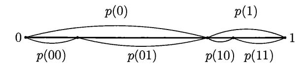

FIGURE 12. The construction of  $\pi_x$ 

PROOF. The idea of the proof can be explained as follows. The difference between KM and KA appears because we are unable to allocate contiguous space to hierarchical users' requests, since we do not know which of the current requests will increase in the future. However, if we have a measure (and not a semimeasure), we can solve this problem and allocate contiguous intervals. (Feel free to ignore this metaphor if it is confusing: we provide a formal proof in the next paragraphs.)

For each string x we define an interval  $\pi_x$  inside [0,1]. The interval  $\pi_x$  is defined in such a way that:

- the length of  $\pi_x$  equals p(x);
- $\pi_{\Lambda} = [0, 1]$  (here  $\Lambda$  is the empty string);
- for each string x the interval  $\pi_x$  is split by some its point into intervals  $\pi_{x0}$  (left part) and  $\pi_{x1}$  (right part)

(see Figure 12).

We consider also another family of intervals that corresponds to the uniform measure. Let  $I_x$  be the interval of reals whose binary representation starts with x. We call the intervals  $I_x$  binary intervals.

Now consider the set G of all pairs  $\langle x,y\rangle$  of strings such that (binary) interval  $I_x$  is located inside the interior of  $\pi_y$ . The set G is enumerable. Indeed, since the function p is computable, we can find the endpoints of intervals  $\pi_y$  with arbitrary precision, and if they are strictly greater (or less) than some rational number, this fact will be discovered eventually.

Note also that the property  $\langle x,y\rangle \in G$  remains true if we replace x by some extension (since  $I_x$  becomes smaller) or replace y by any prefix (since  $\pi_y$  becomes larger). If  $\langle x,y_1\rangle \in G$  and  $\langle x,y_2\rangle \in G$ , the segments  $\pi_{y_1}$  and  $\pi_{y_2}$  have a common interior point (they both contain  $I_x$ ), therefore the strings  $y_1$  and  $y_2$  are compatible. So Theorem 81 (p. 127) guarantees that there exists a computable mapping of  $\Sigma$  into itself whose lower graph is G. We use this mapping as the decompressor in the definition of monotone complexity. Then  $KM_D(y)$  equals the minus binary logarithm of the biggest binary interval that is located strictly inside  $\pi_y$ . It remains for us to note that any open interval of length h contains a closed binary interval of length h/4 and to compare D with the optimal decompressor.

141 Prove the claim about binary intervals (see above).

 $\overline{(Hint)}$ : Let u be a power of 2 such that  $h/4 \leq u < h/2$ . Then any interval of length h intersects at least three consecutive binary intervals of length u and contains the middle one.)

Theorem 89 provides a theoretical justification for the following approach used by Kolmogorov and his students to get upper bounds for the complexity of Russian texts. While reading the text (one letter at a time), the reader tries to guess the next letter. The guess is formulated as a probability distribution over the alphabet.

Then the next letter is read and we add  $-\log p$  to the complexity, where p is the declared probability of that letter (i.e., its probability with respect to the guessed distribution).

If we believe that the behavior of the reader is computable, the result is an upper bound for the complexity. Indeed, the reader provides (some part of) a computable probability distribution on the set of strings telling the conditional probabilities along some path, and the complexity of text does not exceed the sum of negative logarithms of these probabilities (Theorem 89).

Of course, it is not practical to require that the reader provides at each step the list of probabilities for all the letters; one can suggest some standard types of answers such as "the next letter is A with probability 0.5, all other vowels are equiprobable and have total probability 0.3, all other letters are equiprobable". Note also that we get an upper bound for the conditional complexity of the text where the condition is the background of the reader. (For example, if the reader knows the text by heart or is just familiar with the author's writings, the bound can be very small.)

The same trick used in compression algorithms is called *arithmetic coding* and was even patented (many years after Kolmogorov's experiments in the 1970s).

Now we are ready to formulate the criterion of Martin-Löf randomness that uses monotone complexity: a sequence is ML-random if and only if the inequality of Theorem 89 becomes an equality for its prefixes.

Let us formulate this statement precisely. Let  $\mu$  be a computable probability distribution on the set  $\Omega$  of all infinite bit sequences, and let p(x) be the measure of the interval  $\Omega_x$ :  $p(x) = \mu(\Omega_x)$ .

Theorem 90 (Levin-Schnorr). A sequence  $\omega \in \Omega$  is ML-random with respect to a computable probability distribution  $\mu$  if and only if

$$-\log p(x) - KM(x) \leqslant c$$

for some c and for every prefix x of  $\omega$ .

PROOF. We have to prove this theorem in both directions. Let us show first that if (for a given sequence  $\omega$ ) the difference  $-\log p(x) - KM(x)$  is unbounded, then this sequence is not ML-random (i.e., the set  $\{\omega\}$  is an effectively null set).

Fix some constant c and consider all strings x such that  $-\log p(x) - KM(x) > c$ . (This difference is sometimes called *randomness deficiency*, but this term has different meanings. We have already used it in the previous chapter, and in Chapter 14 it is used in a different way.) This set is denoted by  $D_c$ .

The set  $D_c$  is enumerable (since p is computable and KM is upper semicomputable, the difference is lower semicomputable).

LEMMA 1. The set of all infinite sequences that have a prefix in  $D_c$  has  $\mu$ -measure at most  $2^{-c}$ .

Informally speaking, this is true because on this set the measure  $\mu$  is  $2^c$  times smaller than the a priori probability (and the latter does not exceed 1). More formally this argument can be explained as follows.

We are interested in the measure of the union of intervals  $\Omega_x$  for all  $x \in D_c$ . Without changing this union, we may keep only minimal  $x \in D_c$  (i.e., strings  $x \in D_c$  such that no prefix of x belongs to  $D_c$ ). Let  $x_0, x_1, \ldots$  be these minimal elements

of  $D_c$ . (We do not claim the set of minimal elements is enumerable, so this sequence may be non-computable.)

For each  $x_i$  consider the minimal description  $p_i$  (according to the definition of the monotone complexity:  $x_i \preceq D(p_i)$  where  $D \colon \Sigma \to \Sigma$  is the optimal monotone decompressor). Then  $l(p_i) = KM(x_i) < -\log p(x_i) - c$ . Moreover, no  $p_i$  is a prefix of another one (otherwise, the corresponding  $x_i$  would be compatible). Therefore  $\sum_i 2^{-l(p_i)} \leqslant 1$  (being the sum of uniform measures of disjoint sets  $\Omega_{p_i}$ ). The corresponding  $p(x_i)$  are  $2^c$  times smaller, so we get the statement of Lemma 1.

Our assumption guarantees that the sequence  $\omega$  has prefixes from  $D_c$  for every c. To prove that  $\{\omega\}$  is an effectively null set, we need to cover  $\omega$  by an enumerable family of intervals with total measure not exceeding  $2^{-c}$ , and we can use intervals from  $D_c$ .

However, there is a small technical problem here (that we already encountered while speaking about randomness tests). We know that for intervals from  $D_c$  the total measure (i.e., the measure of their union) does not exceed  $2^{-c}$  (as Lemma 1 says), but the definition needs that the sum of measures of all intervals does not exceed  $2^{-c}$ . We cannot solve this problem by considering only minimal points (maximal intervals), since the set of minimal points is not always enumerable. Instead we can use the following statement:

LEMMA 2. Every enumerable set of strings  $x_0, x_1, \ldots$  can be transformed into an enumerable set of incompatible strings with the same union  $\bigcup_i \Omega_{x_i}$ . This transformation is effective (an algorithm that enumerates the first set can be transformed into an algorithm that enumerates the second one).

Indeed, if during the enumeration we get a string that is an extension of the previously enumerated one, this string can be omitted (since the corresponding interval is already covered). If we get a string y that is a (proper) prefix of a string x enumerated earlier, we have to split the difference  $\Omega_y \setminus \Omega_x$  into a finite number of disjoint intervals and replace y by strings that define those intervals. Lemma 2 is proven.

Applying Lemma 2, we get an enumerable set of incompatible strings; these strings may be not in  $D_c$ , but this is not important. It is enough to know that they correspond to disjoint intervals that cover  $\omega$ , and the union of these intervals has  $\mu$ -measure at most  $2^{-c}$ , according to Lemma 1.

Proving the converse implication, we need to show that if a sequence  $\omega$  belongs to an effectively null set, then the differences between the negative logarithms of the measure and the monotone complexity of  $\omega$ -prefixes are unbounded. The idea of this construction may be explained as follows: given a set of small measure, we construct a monotone decompressor that treats favorably the elements of this set (i.e., provides short descriptions for their prefixes).

Let us provide details now. Assume that  $\omega$  belongs to a set U which is an effectively null set (with respect to measure  $\mu$ ). For each c we can effectively find a family of intervals  $\Omega_{x_0}, \Omega_{x_1}, \ldots$  that cover U (and therefore  $\omega$ ) and have total measure less than  $2^{-c}$ . If we multiply the measures of all these intervals by  $2^c$ , the sum is still less than 1. Consider the computable sequence  $p_i = 2^c \mu(\Omega_{x_i})$ . Applying Theorem 59 (p. 96), we get a prefix-free decompressor for which the prefix complexity of i does not exceed  $-\log \mu(\Omega_{x_i}) - c + 2$ . A composition of this decompressor and the computable mapping  $i \mapsto x_i$  is a prefix-free decompressor  $D_c$ 

such that

$$K'_{D_s}(x_i) \leqslant -\log \mu(\Omega_{x_i}) - c + 2.$$

(The subscript c in  $D_c$  is used to stress that the construction depends on c; we use prefix-free decompressors since it will be useful later.) Monotone complexity does not exceed the prefix one, so if the difference between the negative logarithm of the measure and the prefix complexity is large, the same is true for monotone complexity. It remains to combine the decompressors  $D_c$  into one decompressor (not depending on c).

We use the same trick that was was used in the construction of an optimal decompressor. We want the string  $\hat{c}u$  to be the description of the string v if u is a description of v with respect to  $D_c$ . Here  $\hat{c}$  is a self-delimited encoding of length  $O(\log c)$  for a natural number c. If the decompressor D is constructed in this way, the following inequality holds (for all c):

$$K_D'(x_i) \leqslant -\log \mu(\Omega_{x_i}) - c + O(\log c).$$

Since the monotone complexity does not exceed the prefix one, we replace  $K'_D(x_i)$  by  $KM(x_i)$  and conclude that all the strings  $x_i$  (for a given c) have the difference between  $-\log p(x_i)$  and  $KM(x_i)$  at least  $c-O(\log c)$ . If an infinite sequence belongs to U, it has a prefix of this type for any c, therefore the difference is unbounded for its prefixes.

The Levin-Schnorr theorem is proven.

142 Show that in the first part of the proof (if a difference is unbounded, the sequence belongs to an effectively null set) it is enough to have P upper semicomputable, while in the second part it is enough to have P lower semicomputable.

In fact the proof gives us a bit more than we claimed. Here are several modifications of the Levin–Schnorr theorem that can be extracted from it:

Theorem 91. We may replace the monotone complexity KM(x) by the a priori complexity KA(x) in the statement of the previous theorem.

PROOF. The a priori complexity does not exceed the monotone one, so the difference may only increase. So we need to change only the first part of the proof. It is easy: in the proof of Lemma 1 we should note that  $\sum_i 2^{-KA(x_i)} \leq 1$ , since this sum is the sum of the a priori measures of disjoint intervals  $\Omega_{x_i}$ .

THEOREM 92. We can also replace the monotone complexity KM(x) by the prefix complexity K(x).

PROOF. Here we go in the other direction and increase complexity, so only the second part of the proof needs to be redone. And this is trivial—recall that in fact we got just an upper bound for prefix complexity.

Theorem 92 is nowadays the most popular version of the Levin–Schnorr randomness criterion (see, e.g., [103]; see [18] about the history of these results).

The use of monotone or a priori complexity seems (at least to the authors) more natural (though the prefix version has its own advantages; see below the formula for the randomness deficiency in terms of prefix complexity). Note that if we use prefix complexity, the difference in the Levin–Schnorr theorem can become negative. For example, in the case of the uniform measure  $-\log \mu(\Omega_x)$  is just the length of string x, and the prefix complexity may be greater than the length (the difference can be of order  $\log n$ ; see Theorem 63, p. 100).

Moreover, the use of the monotone complexity allows us to strengthen the Levin–Schnorr theorem as follows:

Theorem 93. If a sequence  $\omega$  is not random with respect to measure  $\mu$ , then the difference  $-\log p(x) - KM(x)$  for prefixes x (of  $\omega$ ) is not only unbounded but also tends to infinity.

PROOF. In the proof of Theorem 90 we constructed a prefix-free decompressor that provides short descriptions  $p_i$  for strings  $x_i$  and guarantees that the prefix complexity of  $x_i$  (with respect to this decompressor) does not exceed  $-\log \mu(\Omega_{x_i}) - c$ . To get the required bound for monotone complexity, we may use (for each i) the extensions of  $p_i$  as descriptions of the extensions of  $x_i$  in such a way that the length of the descriptions corresponds to the measure of described strings, as was done in the proof of Theorem 89 (p. 144).

More formally, we can use the inequality  $KM(xy) \leq K(x) + KM(y|x)$  (Problem 135) and the relativized version of Theorem 89:  $KM(y|x) \leq -\log \mu_x(\Omega_y)$  for any computable family of measures that (computably) depends on parameter x. Here  $\mu_x$  is the measure that is concentrated on the set  $\Omega_x$  and is defined as follows:  $\mu_x(\Omega_y) = \mu(\Omega_{xy})/\mu(\Omega_x)$ .

For the case of uniform measure (where  $-\log \mu(\Omega_x) = l(x)$ ), we can use a simpler argument and say that  $p_i z$  is a description of  $x_i z$  for any string z.

This result can be reformulated as follows: if the difference  $\log p(x) - KM(x)$  is uniformly bounded for infinitely many prefixes x of some sequence  $\omega$ , then  $\omega$  is random. For the prefix version, our argument does not work, but we still can prove a weaker statement for computable sequences of lengths.

**143** Let A be a decidable infinite set of natural numbers (lengths), and let  $\omega$  be some sequence. If  $K(x) \ge -\log \mu(\Omega_x) - c$  for some c and for every prefix x of  $\omega$  with length in A, then  $\omega$  is random.

(*Hint*: In the proofs of Theorems 90 and 92, we can split the intervals into parts to get the desired length.)

We provided some arguments in favor of using monotone complexity in the randomness criterion. However, a version that uses prefix complexity has its own advantages. Note that the notion of an ML-random sequence is invariant under computable permutations of indices (if the measure is invariant or is changed according to the permutation), but the notion of a prefix (and therefore the criterion of randomness in terms of prefixes) is not. As it was noted by A. Rumyantsev, using K one can get an invariant criterion of ML-randomness.

Let F be a finite set of indices (natural numbers), and let  $\omega$  be a binary sequence. By  $\omega(F)$  we denote the restriction of  $\omega$  onto F, i.e., the binary string formed by bits  $\omega_i$  such that  $i \in F$  (in the same order as in  $\omega$ ).

Let  $\mu$  be a computable measure on  $\Omega$ . For every finite set  $F \subset \mathbb{N}$  and string Z whose length equals the cardinality of F, we consider the event  $\omega(F) = Z$ . Its  $\mu$ -probability is denoted by  $\mu_{F,Z}$ .

144 Let  $\omega$  be an ML-random sequence with respect to  $\mu$ . Prove that

$$K(F,\omega(F))\geqslant -\log \mu_{F,\omega(F)}-c$$

for some c and for all finite F.

(*Hint*: The measure of the set of all sequences for which this inequality does not hold for some fixed c, does not exceed  $2^{-c}$  multiplied by the sum of the a priori probabilities of all pairs F, Z, and therefore does not exceed  $2^{-c}$ .)

(Note that if F is an initial segment of  $\mathbb{N}$ , then F is determined by  $\omega(F)$  and can be eliminated, so we return to the previous statement.)

In fact, the condition given by the last problem is also sufficient. Moreover, it is enough to require this inequality for any increasing computable sequence of finite sets whose union is  $\mathbb{N}$ .

145 Let  $F_0 \subset F_1 \subset F_2 \subset \cdots$  be a computable sequence of finite sets and  $\bigcup_i F_i = \mathbb{N}$ . Assume that for some sequence  $\omega$  we have

$$K(F_i, \omega(F_i)) \geqslant -\log \mu_{F_i, \omega(F_i)} - c$$

for some c and for all i. Then  $\omega$  is ML-random with respect to  $\mu$ .

(*Hint*: Using permutation of indices, we may assume that  $F_i$  are initial segments of  $\mathbb{N}$ . Then we refer to Problem 143: it is enough to repeat the proof of the Levin–Schnorr theorem using only strings of appropriate lengths and splitting other intervals into unions of appropriate intervals.)

This statement implies, for example, that a two-dimensional bit sequence (i.e., a mapping  $\mathbb{Z}^2 \to \{0,1\}$ ) is ML-random with respect to the uniform measure (all bits are independent; 0 and 1 are equiprobable) if and only if an  $N \times N$  square centered at the origin has prefix complexity at least  $N^2 - O(1)$  (for all odd N).

Let us note one more reason that makes the appearance of prefix complexity in the randomness criterion natural. It turns out that one can prove a quantitative version of the Levin–Schnorr theorem and get a formula for the expectation-bounded randomness deficiency (see Section 3.5):

146 Let  $p(x) = \mu(\Omega_x)$  correspond to a computable measure  $\mu$  on the Cantor space. Prove that the function

$$t(\omega) = \sum_{x \preccurlyeq \omega} \frac{m(x)}{p(x)},$$

where the sum is taken over all finite prefixes x of  $\omega$  and m(x) is the discrete a priori probability of x, is a universal expectation-bounded randomness test.

(*Hint*: A lower semicomputable function on the Cantor space is a sum of characteristic functions of intervals with non-negative coefficients. When a new term is added to this sum (for interval  $\Omega_x$  with coefficient r), we may imagine that the "weight" of the vertex x of the binary tree increases by r. The weights of all vertices form a lower semicomputable function u on strings, and the expectation condition for a test corresponds to the inequality  $\sum_x p(x)u(x) \leq 1$ . The maximal function with this property is m(x)/p(x) up to a  $\Theta(1)$ -factor. One should also agree that m(x)/p(x) is infinite if p(x) = 0 for some string x.)

147 Prove that the sum in the preceding problem can be replaced by the supremum, and thus we obtain a quantitative version of the Levin-Schnorr theorem with prefix complexity. For example, for the case of uniform measure, the expectation-bounded randomness deficiency is equal to  $\sup_{n} [n - K(\omega_0 \cdots \omega_{n-1})]$ .

(*Hint*: A lower semicomputable function that is equal to a inside some effectively open set and is equal to zero outside it can be represented by means of weights

that are equal to a and are placed in incompatible vertices. Every lower semicomputable function can be represented up to a  $\Theta(1)$ -factor as the sum  $t(\omega) = \sum t_k(\omega)$ , where  $t_k(\omega) = 2^k$  if  $t(\omega) > 2^k$  and  $t_k(\omega) = 0$  otherwise. If all  $t_k$  are represented as explained above, all the summands in the formula for the deficiency are powers of two. Then the sum equals the supremum up to a  $\Theta(1)$ -factor. See [13] for details.)

The statement of the last problem was proved in an old paper by Gács [56]. The proof gives as a byproduct the statement of Problem 146 rediscovered independently in a more recent paper by J. Miller and L. Yu [123] under the name of "ample excess lemma".

- $\lfloor 148 \rfloor$  (a) Let  $\omega$  be an ML-random sequence with respect to a computable measure  $\mu$ , and let  $p(x) = \mu(\Omega_x)$ . Prove that the difference  $-\log p(x) K(x)$  is not only bounded from above for prefixes of  $\omega$  but also tends to  $-\infty$  as the length of the prefix increases. In other words, if  $K(x) \leq -\log p(x) + c$  for some c and for infinitely many prefixes x of  $\omega$ , the  $\omega$  is not ML-random.
- (b) Prove that if  $K(x) \le -\log p(x) + \log l(x) + c$  for some c and for all prefixes x of  $\omega$ , then  $\omega$  is not ML-random.

(Hint: In both cases use the ample excess lemma, Problem 146.)

The case of uniform measure is rather important; let us write down all that we have proven for this case:

THEOREM 94. (a) Upper bound:

$$KA(x) \leqslant KM(x) + O(1) \leqslant l(x) + O(1)$$

for any string x.

(b) Randomness criterion: the sequence  $\omega$  is ML-random with respect to the uniform measure if and only if these inequalities become equalities for prefixes of  $\omega$ ,

$$KA((\omega)_n) = KM((\omega)_n) + O(1) = n + O(1).$$

- (c) If  $\omega$  is not ML-random with respect to uniform measure, then the difference  $n KM((\omega)_n)$  (and therefore  $n KA((\omega)_n)$  tends to infinity as  $n \to \infty$ .
- (d) The sequence  $\omega$  is ML-random with respect to the uniform measure if and only if  $K((\omega)_n) \geqslant n-c$  for some c and for all n.
- (e) The sequence  $\omega$  is ML-random with respect to the uniform measure if and only if  $K(F,\omega(F)) \ge |F| c$  for some c and for all finite sets F.

Another version of the statement (d) is that a sequence  $\omega$  is ML-random if and only if the sum  $\sum_{n} 2^{n-K((\omega)_n)}$  is finite (Problem 146).

For the case of uniform measure there exists one more criterion of Martin-Löf randomness. It is interesting since it uses only plain complexity (and not the prefix or monotone versions). It is a bit strange that this criterion was discovered only recently (see [123]) since similar suggestions were considered at the end of the 1960s (see [225, 117]), and the proof of this criterion uses only ideas and methods that were well known at that time.

Theorem 95. Assume that  $f: \mathbb{N} \to \mathbb{N}$  is a computable total function and the series  $\sum 2^{-f(n)}$  converges. Let  $\omega$  be an ML-random sequence with respect to the uniform measure. Then

$$C((\omega)_n | n) \geqslant n - f(n) - O(1)$$

(i.e., there exists c such that for every n the inequality  $C((\omega)_n | n) \ge n - f(n) - c$  holds).

PROOF. Assume that the claim is false. This means that for every c there exists an n such that

$$C((\omega)_n | n) < n - f(n) - c.$$

In other words, for every c the sequence  $\omega$  is covered by some interval  $\Omega_x$  such that

$$C(x \mid n) < n - f(n) - c,$$

where n is the length of x. For each n there are at most  $2^{n-f(n)-c}$  intervals with this property and their total measure is at most  $2^{-f(n)}2^{-c}$  (for a given n). The total measure of all such intervals (for all n) is

$$2^{-c} \left( \sum_{n} 2^{-f(n)} \right),$$

and the sequence  $\omega$  forms an effectively null set: choosing an appropriate c, we get a cover for  $\omega$  that has small measure. Therefore,  $\omega$  is not ML-random. (Note that the sum of the series  $\sum 2^{-f(n)}$  may be a non-computable real number; this does not matter since we may use any upper bound for it.)

Remark. In the proof we used only that f is upper semicomputable, so the statement remains true for f(n) = K(n): for every ML-random sequence  $\omega$  (with respect to the uniform measure) we have

$$C((\omega)_n | n) \geqslant n - K(n) - O(1).$$

As we will see in Theorem 98, this is a necessary and sufficient condition.

Theorem 95 implies, for example, that for any ML-random sequence (with respect to the uniform measure) the plain complexity of its prefix of length n is at least  $n-2\log n-O(1)$  and even  $n-\log n-2\log\log n-O(1)$ , since the corresponding series converge.

Making function f smaller, we make the claim of the theorem stronger. It turns out that for some f we get a randomness criterion in this way:

THEOREM 96. There exists a total computable function  $f: \mathbb{N} \to \mathbb{N}$  such that  $\sum_{n} 2^{-f(n)} < \infty$  and having the following property: if for some sequence  $\omega$  and for some c the inequality

$$C((\omega)_n | n) \geqslant n - f(n) - c$$

holds for all n, then  $\omega$  is ML-random with respect to the uniform measure.

PROOF. We need to prove that every non-random sequence (i.e., every sequence that belongs to the largest effectively null set) has simple prefixes. Note that we also need to choose the function f.

To explain how to do this, let us assume that we are given a family of intervals with total measure at most  $\varepsilon$ . Let F be the set of strings that define these intervals (i.e., the family consists of intervals  $\Omega_x$  for all  $x \in F$ ). Let us sort strings in F according to their length and for each length n consider the total measure of intervals that correspond to n-bit strings in F. Let it be approximately equal to  $2^{-f(n)}$  (we assume that f has integer values, so this cannot be done exactly, but can be done up to factor 2 in both directions; for simplicity we ignore this bounded factor in the sequel). Then we have  $\sum_{n} 2^{-f(n)} \le \varepsilon$ . On the other hand, the set

F contains  $2^{n-f(n)}$  strings of length n, and each of these strings can be described (when n and other parameters of the construction are given) by n-f(n) bits. This gives an upper bound for the complexity of all the strings in F. Note also that every infinite sequence that is covered by our intervals has a prefix in F.

Now we return to the proof. Consider the largest effectively null set. For each  $\varepsilon>0$  there exists its cover by intervals of total length at most  $\varepsilon$ , and we can use the construction above to get the corresponding function f with  $\sum_n 2^{-f(n)} \leqslant \varepsilon$ . We need to combine those functions for different  $\varepsilon$  into one function f as the theorem requires. This is done as follows.

For each  $c=0,1,2,\ldots$ , consider the covering by a family of intervals with total measure not exceeding  $2^{-3c}$ , the corresponding set  $F_c$  of strings, and the corresponding function f. Then we decrease f by 2c and obtain a function  $f_c$  such that

$$\sum_{n} 2^{-f_c(n)} < 2^{-c}$$

(we get  $2^{-c}$  instead of  $2^{-3c}$  since we have decreased f by 2c). The set  $F_c$  contains  $2^{n-f_c(n)-2c}$  strings of length n, and every non-random sequence has a prefix in  $F_c$ . Then f(n) is defined by the equation

$$2^{-f(n)} = \sum_{c} 2^{-f_c(n)}.$$

This guarantees that

$$\sum_{n} 2^{-f(n)} = \sum_{n} \sum_{c} 2^{-f_c(n)} = \sum_{c} \sum_{n} 2^{-f_c(n)} \leqslant \sum_{c} 2^{-c} \leqslant 1.$$

On the other hand, the set  $F_c$  is enumerable given c (according to the definition of an effectively null set), so any element x of length n is determined (when n and c are known) by its ordinal number (in the enumeration of strings of length n in  $F_c$ ), i.e., by  $n - f_c(n) - 2c$  bits,

$$C(x|n,c) \leq n - f_c(n) - 2c + O(1),$$

which implies

$$C(x \,|\, n) \leqslant n - f_c(n) - 2c + O(\log c) < n - f(n) - c$$

for any  $x \in F_c$  of length n (for large enough c).

Now let  $\omega$  be any non-random sequence. As we have seen, for each c the sequence  $\omega$  has a prefix in  $F_c$ . Let n be the length of this prefix. Then

$$C((\omega)_n | n) < n - f(n) - c$$

(assuming that c is large enough), which contradicts our assumption.

However, this does not complete the proof, since we need a computable function f, and the set  $F_c$  is only enumerable, so we do not know when all strings of length n have been appeared, and therefore cannot compute f. To overcome this difficulty, recall that we started with a family of intervals (that cover the largest effectively null set). In this covering we may split a large interval  $\Omega_z$  into many small intervals  $\Omega_{zt}$  (for all strings t of some length). This allows us to make  $f_c$  computable if we require (without loss of generality) that the length of the intervals in the enumeration of  $F_c$  can only increase. The same argument can be applied to all  $f_c$  in parallel and makes f computable.

Finally, there is a (trivial) technical problem: the statement requires f to be integer valued, so some rounding is needed.

The two last theorems together provide a randomness criterion that uses plain complexity (and not monotone or prefix complexity). This criterion is *robust*: one can replace the conditional complexity  $C((\omega)_n|n)$  by the unconditional one,  $C((\omega)_n)$ , or by a conditional prefix complexity,  $K((\omega)_n|n)$ .

Indeed, each of these replacements only increases complexity, therefore only Theorem 96 needs to be verified. For the prefix complexity version, we use that for each element  $x \in A$  the inequality  $K(x|A) \leq \log |A| + O(1)$  holds (we consider a prefix-free encoding by strings of length  $\log |A|$ ).

The case of unconditional plain complexity is a bit more difficult. As we do not know n, we need to describe a string  $x \in F_{c,n}$  (here  $F_{c,n}$  is the set of all strings  $x \in F_c$  that have length n) by its ordinal number in the entire set  $F_c$  (and not by its ordinal number in  $F_{c,n}$  as before). Enumerating  $F_c$  in increasing length order, we need

$$\log(|F_{c,0}| + |F_{c,1}| + \cdots + |F_{c,n}|)$$

bits for that, and this bound is enough if the last term  $|F_{c,n}|$  is greater than the sum of all preceding terms (in this case the increase is at most twofold). We can achieve this using the same trick as before: we replace a string by all its extensions of some bigger length. Note that this is done separately for each c, so the condition c remains, but this does not matter since it gives only  $O(\log c)$  additional bits.

So we get the following result:

Theorem 97. A sequence  $\omega$  is ML-random if and only if for any computable total function  $f: \mathbb{N} \to \mathbb{N}$  such that  $\sum 2^{-f(n)} < \infty$  the inequality

$$C((\omega)_n) \geqslant n - f(n) - O(1)$$

holds.

This criterion uses only plain unconditional complexity and is the most popular version of the Miller-Yu theorem.

This criterion has a drawback: there is a quantifier over f. It can be placed differently (there exists some f that rejects all the non-random sequences, as Theorem 96 says), but still it would be nice to get rid of f completely. It is indeed possible, but the price is that we have to reinsert prefix complexity into the statement:

Theorem 98. A sequence  $\omega$  is ML-random with respect to the uniform measure if and only if

$$C((\omega)_n) \geqslant n - K(n) - O(1).$$

PROOF. If  $\sum_{n} 2^{-f(n)}$  converges for a computable f, then  $K(n) \leq f(n) + O(1)$ . Therefore the condition with prefix complexity is stronger than that in Theorem 97, and thus we need to prove only the converse implication: if for every c there exists an n such that

$$C((\omega)_n) < n - K(n) - c,$$

then  $\omega$  is not ML-random. This can be done in the same way as in Theorem 95. We need only note that the set of all strings x such that

$$C(x) < l(x) - K(l(x)) - c$$

(here l(x) stands for the length of x) is enumerable; see the remark after the proof of this theorem on p. 152.

In this theorem we can also replace  $C((\omega)_n)$  by  $C((\omega)_n | n)$ .

149 Verify that this is indeed possible.

This result was proven in P. Gács paper [56, p. 391].

150 Show that we cannot let  $f(n) = 2 \log n$  in Theorem 96.

(*Hint*: Theorem 95 says that for an ML-random  $\omega$  we have a stronger inequality  $C((\omega)_n) \ge n - \log n - 2\log\log n - O(1)$ . Therefore, if we computably interleave a random sequence with the zero sequence (and zeros are sparse enough), we get a non-random sequence such that  $C((\omega)_n) \ge n - 2\log n - O(1)$ . A similar argument shows that we cannot get a computably convergent series  $2^{-f(n)}$  for a function f that makes Theorem 96 true.)

All the results above still do not answer a very natural question: Can one eliminate f completely and require that  $C((\omega)_n) \ge n - O(1)$  (similar to monotone complexity criterion)?

Of course, this would be the most natural version of the randomness criterion, so it was tried in the very beginning. Martin-Löf noticed that this approach does not work: any binary string is a substring of a random sequence, so any random sequence contains arbitrarily large groups of zeros. And if a string of length n ends with k zeros, then its complexity is at most  $n-k+2\log k+O(1)$  ( $2\log k$  bits are needed for a prefix-free encoding of k and n-k bits for the rest), and the difference between length and (plain) complexity is at least  $k-2\log k-O(1)$ .

The following theorem (see [225, 117]) gives a more precise bound for the unavoidable difference between length and complexity (we mentioned this result earlier in Problem 54):

Theorem 99. There exists some c such that for any  $\omega \in \Omega$  the inequality

$$C((\omega)_n) \leqslant n - \log n + c$$

holds for infinitely many n.

PROOF. For each n let us select (1/n)-th fraction of all strings of length n, i.e.,  $\lfloor 2^n/n \rfloor$  strings of length n. We want to do this in such a way that each infinite sequence has infinitely many selected prefixes (and the set of selected strings is decidable).

Why is this possible? The series  $\sum 1/n$  diverges so we can split its terms into infinitely many groups, and each group has sum greater than 1. Using one group, we get one layer of  $\Omega$ -covering (this means that each sequence  $\omega \in \Omega$  has a prefix among the strings that correspond to that layer). To do this, we consider the strings in order of increasing length and select strings whose prefixes are not yet selected. (There is a rounding problem since  $2^n/n$  is not an integer, but it can be easily fixed.)

Every selected string of length n can be described (if n is known) by its ordinal number, and this requires  $n - \log n$  bits. Therefore, the conditional complexity of this string (with condition n) is at most  $n - \log n + O(1)$ . Moreover, if we make a combined list of all selected strings (in the order of increasing length), the ordinal number increases by an O(1)-factor. Indeed, the number of selected strings of given length grows almost as a geometric sequence, and adding all selected strings

of smaller lengths increases cardinality only by an O(1)-factor. This implies the statement of Theorem 99.

 $\fbox{151}$  Give another proof of this result using the following simple observation: the k-bit prefix of a given sequence can be considered as a binary notation of some integer N (we add 1 at the beginning of the prefix not to lose leading zeros), and N bits following this prefix are enough to reconstruct all k+N bits.

152 Prove that the statement of Theorem 99 is true not only for some c but for every c (including the negative ones).

(*Hint*: If the series  $\sum 2^{-f(n)}$  diverges, we can increase a bit the function f keeping this property: there exists a function g such that  $g(n) - f(n) \to \infty$  and  $\sum 2^{-g(n)} = \infty$ .)

153 Show that the statement of Theorem 99 (the conditional complexity version) remains true if we replace the logarithm by an arbitrary computable function f such that the series  $\sum 2^{-f(n)}$  diverges.

Martin-Löf claims in [117] that the same generalization is possible for unconditional complexity (and refers to an unpublished paper for the proof). The same statement (attributed to Martin-Löf) can be found also in [225]. (We do not know how to prove it.)

Let us mention also that the statement of Theorem 95 has a slightly different form in [117]:

154 Prove that if a sequence  $\omega$  is ML-random with respect to the uniform measure and  $f \colon \mathbb{N} \to \mathbb{N}$  is a computable total function such that the series  $\sum 2^{-f(n)}$  computably converges, then  $C((\omega)_n | n) \ge n - f(n)$  for all sufficiently large n.

(*Hint*: If a series computably converges, and the inequality is false infinitely many times, the tails of the series can be used to get covers that have small measure.)

Another natural question follows: What happens if we require high complexity not for all (sufficiently long) prefixes but for infinitely many of them? In the same Martin-Löf paper [117] the following results are stated:

155 Prove that for almost all (with respect to the uniform measure) sequences  $\omega \in \Omega$  there exists c such that  $C((\omega)_n | n) \ge n - c$  for infinitely many n.

(*Hint*: If it is not the case, then for every c there exists N such that an n-bit prefix of  $\omega$  has complexity less than n-c for every n>N. For given c and N the set of all  $\omega$  with this property has measure at most  $2^{-c}$ . As N increases, this set increases, and the union over all N has measure at most  $2^{-c}$  by continuity.)

**156** If for a given sequence  $\omega$  there exists c such that  $C((\omega)_n | n) \ge n - c$  for infinitely many n, then  $\omega$  is ML-random with respect to the uniform measure.

(*Hint*: If  $\omega$  is covered by some interval in a family of total measure less than  $2^{-c}$ , then every sufficiently long prefix of  $\omega$  can be described (when length is given) by its ordinal number in the set of all strings of this length covered by some interval, and this requires  $2 \log c + n - c$  bits.)

157 Prove that the statement of the previous problem remains true if we replace conditional complexity  $C((\omega)_n|n)$  by unconditional complexity  $C((\omega)_n)$ . (*Hint*: Use Problem 6 or, better, Problem 55.)

The last two problems refer to a set of measure 1 that is a subset of the set of all ML-random sequences. Its complement is a null set; if it were an effectively null set, we would get another criterion for ML-randomness. However, this is not the case. Recently in [121, 148] it was shown that this set has a natural description: it is the set of ML-random sequences relativized to oracle  $\mathbf{0}'$ ; these sequences are sometimes called 2-random (while ML-random sequences are called 1-random). See [16] for a simple proof. There is a similar criterion with prefix complexity: a sequence  $\omega$  is 2-random if and only if  $K((\omega)_n) \leq n + K(n) - c$  for some c and for infinitely many n [124] (see also [5] for a simple proof).

#### 5.7. The random number $\Omega$

The following theorem provides an interesting application of the randomness criterion given in the previous section. Let m be a maximal lower semicomputable semimeasure on the set of natural numbers (e.g, let m(x) be equal to  $2^{-K(x)}$ ; we can use also the distribution on the outputs of the universal probabilistic machine, see Chapter 4). Chaitin suggested considering the number

$$\Omega = \sum_n m(n)$$

(the halting probability for the universal probabilistic machine; the sum of the maximal lower semicomputable series) and made the following interesting observation:

Theorem 100. The binary representation of  $\Omega$  is ML-random with respect to the uniform distribution.

Note that the value of  $\Omega$  depends of the choice of a maximal lower semicomputable semimeasure, but the statement remains true for every choice.

PROOF. Assume that the first n binary digits of  $\Omega$  are given. They form the binary representation of a number  $\Omega_n$  which is a lower bound for  $\Omega$  with approximation error at most  $2^{-n}$ . Generate lower bounds for  $m(0), m(1), m(2), \ldots$  in parallel until the sum of these lower bounds becomes greater than  $\Omega_n - 2^{-n}$ . This does happen at some point since the sum of the series is  $\Omega$  and hence is greater than our threshold. Then make a list of all i that appear in this sum (with a non-zero lower bound for m(i)).

Note that this list includes all i such that  $m(i) \ge 2 \cdot 2^{-n}$  (if some i with this property were omitted, the approximation error would exceed  $2^{-n}$ ). Therefore, all i such that K(i) < n-c (for some c that depends on the choice of the function m but not on n) appear in this list. Thus, the minimal integer that is not in the list has complexity at least n-c. This implies that both the list itself (which determines this minimal integer) and the n-bit prefix of  $\Omega$  (which allows us to construct the list; note that n is determined by this prefix) have complexity at least n-c' for some other c' and for all n. It remains to use the randomness criterion in its prefix complexity version (Theorems 92 and 94).

One can define the notion of a (Martin-Löf) random real number directly. A set X of reals is an effectively null set if there is an algorithm that for any rational  $\varepsilon > 0$  enumerates a cover of X by intervals with rational endpoints and total measure (length) at most  $\varepsilon$ . A real number is ML-random (with respect to the standard measure on  $\mathbb{R}$ ) if it does not belong to any effectively null set (=does not belong to the largest effectively null set).

158 Prove that a real number is random (according to this definition) if and only if its binary representation is a random sequence (with respect to the uniform measure on  $\Omega$ ).

159 Prove that a square (sine, exponent) of a random real is a random real. (*Hint*: A preimage of a null set is a null set, and this argument can be effectivized.)

160 Can the sum of two random real numbers be a non-random real? (*Hint*: the numbers may be dependent.)

The random number  $\Omega$  (or, better to say, any  $\Omega$ -number, since different maximal lower semicomputable semimeasures lead to different numbers) is not just an interesting example. The class of these numbers has several interesting characterizations [26, 87]. Our presentation follows [19], a survey that can be considered as an extended version of a footnote in [102].

5.7.1. Solovay reductions and completeness. Recall that a real number  $\alpha$  is lower semicomputable if  $\alpha$  is the limit of some computable non-decreasing sequence of rational numbers. (An equivalent definition is ...if the set of rational numbers less than  $\alpha$  is enumerable.) We want to classify computable non-decreasing sequences according to their convergence speed and formalize the intuitive idea "one sequence converges better (i.e., not worse) than the other one".

Let  $a_i \to \alpha$  and  $b_j \to \beta$  be two computable strictly increasing sequences converging to lower semicomputable reals  $\alpha$  and  $\beta$  (approximations of  $\alpha$  and  $\beta$  from below). We say that  $a_n \to \alpha$  converges better (not worse) than  $b_n \to \beta$  if there exists a total computable function h such that

$$\alpha - a_{h(i)} \leqslant \beta - b_i$$

for every i.

In other words, we require that for each term of the second sequence one may algorithmically find a term of the first one that approaches the limit as close as the given term of the second sequence. Note that this relation is reflexive and transitive (take the composition of two reducing functions).

In fact, the choice of specific sequences that approximate  $\alpha$  and  $\beta$  is irrelevant: any two increasing computable sequences of rational numbers that have the same limit are equivalent with respect to this quasi-ordering. Indeed, we can just wait to get a term of a second sequence that exceeds a given term of the first one.

We can thus set the following definition. Let  $\alpha$  and  $\beta$  be two lower semicomputable reals, and let  $(a_n)$ ,  $(b_n)$  be approximations of  $\alpha$  and  $\beta$ , respectively. If  $(a_n)$  converges better than  $(b_n)$ , we write  $\alpha \leq_1 \beta$  (by the above paragraph, this does not depend on the particular approximations we chose).

This definition can be reformulated in different ways. First, we can eliminate sequences from the definition and say that  $\alpha \preccurlyeq_1 \beta$  if there exists a partial computable function  $\varphi$  defined on all rational numbers  $r < \beta$  such that

$$\varphi(r) < \alpha$$
 and  $\alpha - \varphi(r) \leqslant \beta - r$ 

for all of them. Below, we refer to  $\varphi$  as the reduction function.

**161** Prove that a lower semicomputable number  $\alpha$  is computable if and only if  $\alpha \leq_1 \beta$  for every lower semicomputable  $\beta$ .

Here is one more useful reformulation:

THEOREM 101.  $\alpha \preccurlyeq_1 \beta$  if and only if  $\beta - \alpha$  is lower semicomputable (or, said otherwise, if and only if  $\beta = \alpha + \rho$  for some lower semicomputable real  $\rho$ ).

PROOF. To show the equivalence, note first that for every two lower semicomputable reals  $\alpha$  and  $\rho$  we have  $\alpha \leq_1 \alpha + \rho$ . Indeed, consider approximations  $(a_n)$  to  $\alpha$ ,  $(r_n)$  to  $\rho$ . Now, given a rational  $s < \alpha + \rho$ , we wait for a stage n such that  $a_n + r_n > s$ . Setting  $\varphi(s) = a_n$ , it is easy to check that  $\varphi$  is a suitable reduction function witnessing  $\alpha \leq_1 \alpha + \rho$ .

It remains to prove the reverse implication: if  $\alpha \preccurlyeq_1 \beta$ , then  $\rho = \beta - \alpha$  is lower semicomputable. Indeed, let  $(b_n)$  be a computable approximation (from below) for  $\beta$ , and let  $\varphi$  be the reduction function that witnesses  $\alpha \preccurlyeq_1 \beta$ . Then all terms  $b_n - \varphi(b_n)$  are less than or equal to  $\beta - \alpha$  and converge to  $\beta - \alpha$ . (The sequence  $b_n - \varphi(b_n)$  may not be increasing, but still its limit is lower semicomputable, since all its terms do not exceed the limit, and we may replace the nth term by the maximum of the first n terms.)

Here is a special case: Let  $\sum u_i$  and  $\sum v_i$  be computable series with non-negative rational terms (for i > 0; terms  $u_0$  and  $v_0$  are starting points and may be negative) that converge to (lower semicomputable)  $\alpha$  and  $\beta$ . If  $u_i \leq v_i$  for all i > 0, then  $\alpha \leq_1 \beta$ , since  $\beta - \alpha = \sum_i (v_i - u_i)$  is lower semicomputable.

The reverse statement is also true: if  $\alpha \preccurlyeq_1 \beta$ , one can find computable series  $\sum u_i = \alpha$  and  $\sum v_i = \beta$  with these properties  $(0 \leqslant u_i \leqslant v_i \text{ for } i > 0)$ . Indeed,  $\beta = \alpha + \rho$  for lower semicomputable  $\rho$ ; take  $\alpha = \sum u_i$  and  $\rho = \sum r_i$ , and let  $v_i = u_i + r_i$ .

**162** Show that a stronger statement is also true: not only can the series  $u_i$  be chosen arbitrarily (see the argument above), but the same is true for  $v_i$ . Namely, if  $\alpha \preccurlyeq_1 \beta = \sum v_i$ , where  $v_i \geqslant 0$ , then there exists a representation  $\alpha = \sum u_i$  such that  $0 \leqslant u_i \leqslant v_i$  for every i > 0. (All series are computable.)

(*Hint*: Construct  $u_i$  sequentially maintaining the following invariant relation: the current approximation  $A = \sum_{j < i} u_j$  to  $\alpha$  is below  $\alpha$  and at least as close (to  $\alpha$ ) as the current approximation  $B = \sum_{j < i} v_j$  (to  $\beta$ ). Initially, we choose  $u_0$  applying the reduction function to  $v_0$ . When the current approximation becomes  $B' = B + v_i$ , we apply the reduction function to get A', which is at least as close to  $\alpha$  as B' is to  $\beta$ . Then there are several cases:

- (1) If A' < A, we let  $u_i = 0$ , and the next approximation is A (it is close enough by assumption).
- (2) If  $A \leq A' \leq A + v_i$ , we let  $u_i = A' A$ ; the condition guarantees that  $u_i \leq v_i$ .
- (3) Finally, if  $A' > A + v_i$ , we let  $u_i = v_i$  (the invariant remains valid since the distances to  $\alpha$  and  $\beta$  are decreased by the same amount).)

Let  $\alpha$  be a lower semicomputable but not computable real. By the results of the previous section, one has

$$\alpha \preccurlyeq_1 2\alpha \preccurlyeq_1 3\alpha \preccurlyeq_1 \cdots$$

because for all k the difference  $(k+1)\alpha - k\alpha = \alpha$  is lower semicomputable. The reverse relations are not true, because  $k\alpha - (k+1)\alpha = -\alpha$  is not lower semicomputable (if it were, then  $\alpha$  would be computable).

One may argue that this relation is therefore a bit too sharp. For example,  $\alpha$  and  $2\alpha$  have essentially the same binary expansion (just shifted by one position),

so one may want  $\alpha$  and  $2\alpha$  to be equivalent. In other words, one may look for a less fine-grained relation. A natural candidate for this is called Solovay reducibility (see [188]).

We say that  $\alpha$  is Solovay reducible to  $\beta$  ( $\alpha \leq \beta$ ) if  $\alpha \leq_1 c\beta$  for some positive integer c > 0. (A convenient notation: We say, for some positive rational c, that  $\alpha \leq_c \beta$  if  $\alpha \leq_1 c\beta$ . Then  $\alpha \leq \beta$  if  $\alpha \leq_c \beta$  for some c.) This relation is also reflexive and transitive (obviously).

Theorem 102. There exists a biggest lower semicomputable real with respect to Solovay reducibility.

PROOF. We can enumerate all lower semicomputable reals  $\alpha_i$  in [0,1] and then take their sum  $\alpha = \sum w_i \alpha_i$  with computable positive weights  $w_i$  such that  $\sum w_i$  converges. This  $\alpha$  can be represented as  $w_i \alpha_i$  plus some lower semicomputable real, so  $\alpha_i \leq_1 (1/w_i)\alpha$ .

The biggest elements for the  $\preccurlyeq$ -preorder are also called *Solovay complete* lower semicomputable reals. One can even define some qualitative notion of *completeness deficiency*: for a lower semicomputable real  $\beta$  the completeness deficiency is defined as minimal c such that  $\alpha \preccurlyeq_1 c\beta$ . Here  $\alpha$  is some fixed Solovay complete real; the deficiency function depends on the choice of  $\alpha$ , but is still defined up to the  $\Theta(1)$ -factor. The deficiency of  $\beta$  is finite if and only if  $\beta$  is Solovay complete.

It turns out that Solovay complete reals can be equivalently described as  $\Omega$ -numbers defined above [188, 26].

Theorem 103. Complete semicomputable reals in (0,1) are sums of universal (maximal) semimeasures on  $\mathbb{N}$  and vice versa.

PROOF. Any lower semicomputable real  $\alpha$  is a sum of a computable series of rationals; this series (up to a constant factor that does not matter due to the definition of the Solovay reducibility) is bounded by a universal semimeasure. The difference between the upper bound and the series itself is a lower semicomputable, and therefore  $\alpha$  is reducible to the sum of the universal semimeasure.

On the other hand, let  $\alpha$  be a Solovay complete real in (0,1). We need to show that  $\alpha$  is a sum of some universal semimeasure. Let us start with the arbitrary universal semimeasure  $m_i$ . The sum  $\sum m_i$  is lower semicomputable and therefore  $\sum m_i \leq_1 c\alpha$ , so  $\alpha = \sum m_i/c + \tau$  for some integer c > 0 and some lower semicomputable  $\tau$ . Dividing m by c and then adding  $\tau$  to one of the values, we get a universal semimeasure with sum  $\alpha$ .

It turns out that these reals (Solovay complete lower semicomputable reals, or  $\Omega$ -numbers) have one more description: they are exactly *lower semicomputable ML-random* real numbers in (0,1). The equivalence proof consists of several parts; let us consider them one by one.

5.7.2. Solovay complete reals are random. We already have shown that Solovay complete reals are random: each of them is an  $\Omega$ -number, i.e., a sum of the values of universal semimeasure, and this sum is random (Theorem 100). Formally speaking, this argument applies only to numbers between 0 and 1, but the general case can be reduced to this special one by adding a rational number. Still there is an interesting direct argument that does not involve complexity and the Levin–Schnorr criterion of randomness (it is in the footnote in Levin's paper [102]; this

footnote compresses the most important facts about lower semicomputable random reals into few lines).

First, recall that one can prove the existence of a lower semicomputable random real without references to  $\Omega$  (Problem 86). So it is enough to prove that *randomness* is upward-closed: if  $\alpha \leq \beta$  and  $\alpha$  is random, then  $\beta$  is random.

We may assume without loss of generality that  $\alpha \preccurlyeq_1 \beta$  (randomness does not change if we multiply a real by a rational factor). Let  $b_i \to \beta$  be a computable increasing sequence of rational numbers that converges to  $\beta$ . Assume that somebody gives us (in parallel with  $b_i$ ) a sequence of rational intervals and guarantees that one of them covers  $\beta$ . How do we transform it into a sequence of intervals that covers  $\alpha$  (i.e., one of the intervals covers  $\alpha$ ) and has the same (or smaller) total length? If an interval appears that is entirely on the left of the current approximation  $b_i$ , it can be ignored (since it cannot cover  $\beta$  anyway). If the interval is entirely on the right of  $b_i$ , it can be postponed until the current approximation  $b_j$  enters it (this may happen or not, in the latter case the interval does not cover  $\beta$ ). If the interval contains  $b_i$ , we can convert it into the interval of the same length that starts at  $a_j$ , where  $a_j$  is a rational approximation to  $\alpha$  that has the same or better precision as  $b_i$  (as an approximation to  $\beta$ ): if  $\beta$  is in the original interval,  $\alpha$  is in the converted interval.

So randomness is upward closed, and therefore complete lower semicomputable reals are random.

REMARK. The second part can be reformulated: if  $\alpha$  and  $\beta$  are lower semicomputable reals and at least one of them is random, then the sum  $\alpha + \beta$  is random too. The reverse is also true: if both  $\alpha$  and  $\beta$  are non-random, then  $\alpha + \beta$  is not random. (Later we will see different proofs of this statement.)

- 5.7.3. Randomness and prediction game. Before proving the reverse implication (random lower semicomputable reals are Solovay complete), let us make a digression and look more closely at the last argument. Consider the following game. An observer watches an increasing sequence of rationals (given one by one) and from time to time makes predictions of the following type: "the sequence will never increase by more than  $\delta$ " (compared to its current value). Here  $\delta$  is some non-negative rational. The observer wins this game if
  - (1) one of the predictions remains true forever;
- (2) the sum of all numbers  $\delta$  used in the predictions is small (less that some rational  $\varepsilon > 0$  which is given to the observer in advance).

It is not required that at any moment a valid prediction exists, though one could guarantee this by making predictions with  $\delta$  that are small and decrease fast at each step. Note also that every prediction can be safely postponed, so we may assume that the next prediction is made only if the previous one becomes invalid. Then at any moment there is only one valid prediction.

One can give a criterion of randomness in terms of this game.

Theorem 104. Let  $a_i$  be a computable increasing sequence of rational numbers that converges to some (lower semicomputable) real  $\alpha$ . The observer has a computable winning strategy in the game if and only if  $\alpha$  is not random.

PROOF. A computable winning strategy gives us a computable sequence of prediction intervals of small total measure and guarantees that one of these (closed) intervals contains  $\alpha$ . We can convert them to slightly bigger open intervals.

On the other hand, having a sequence of intervals that cover  $\alpha$  and have small total measure, we may use it for predictions. To make the prediction, we wait until the current approximation  $a_i$  gets into some of the covering intervals, and we then predict that it will never go out of this interval. When and if this turns out to be false, we wait until the current approximation is covered again, etc. If there are several intervals covering the current approximation, we choose the first one in the enumeration order. Starting from some moment, we always have the interval that covers  $\alpha$  as one of the options, so this rule guarantees the predictions will stabilize.

The following is a reformulation of the same observation that does not use game terminology:

THEOREM 105. Let  $a_i$  be a computable increasing sequence of rational numbers that converges to  $\alpha$ . The number  $\alpha$  is non-random if and only if for every rational  $\varepsilon > 0$  one can effectively find a computable sequence  $h_0, h_1, \ldots$  of non-negative rational numbers such that  $\sum_i h_i < \varepsilon$  and  $\alpha \leq a_i + h_i$  for some i.

PROOF. This corresponds to the game where predictions  $h_i$  are made on every step. As we have said, this does not matter since we may use zeros.

Recall also the Solovay criterion of ML-randomness (a constructive version of the Borel–Cantelli lemma, Theorem 31 on p. 64): A real number  $\alpha$  is non-random if and only if there exists a computable sequence of intervals that have finite total measure and cover  $\alpha$  infinitely many times. The same modification can be applied to the previous theorem, and we get the following result.

Theorem 106. Let  $a_i$  be a computable increasing sequence of rational numbers that converges to  $\alpha$ . The number  $\alpha$  is non-random if and only if there exists a computable sequence  $h_0, h_1, \ldots$  of non-negative rational numbers such that  $\sum_i h_i < \infty$  and  $\alpha \leq a_i + h_i$  for infinitely many i.

PROOF. If  $\alpha$  is non-random, we apply the preceding result for  $\varepsilon = 1, 1/2, 1/4, \ldots$  and then add the resulting sequences (with shifts  $0, 1, 2, \ldots$  to the right). Each of them provides one value of i such that  $\alpha \leq a_i + h_i$ , and these values are still suitable after shifts and cannot be bounded due to shifts. On the other hand, if  $\alpha \leq a_i + h_i$  for infinitely many i, we get a sequence of intervals with finite sum of measures that covers  $\alpha$  infinitely many times (technically, we should replace closed intervals by slightly bigger open intervals). It remains to use Solovay's criterion (or recall its proof: The effectively open set of points that are covered with multiplicity m has measure at most O(1/m)).

The randomness criterion given in this section implies the following observation (which may look strange at first). Consider a sum of a computable series of positive rational numbers. The randomness of the sum cannot change if all summands are changed by some  $\Theta(1)$ -factor. Indeed, all  $h_i$  can be multiplied by a constant.

Now let us prove the result mentioned above:

THEOREM 107. If  $\alpha$  and  $\beta$  are non-random lower semicomputable reals, their sum  $\alpha + \beta$  is non-random too.

PROOF. It now seems very easy at first: Make predictions in the games for  $\alpha$  and  $\beta$ , and then take their sum as prediction for  $\alpha + \beta$ . (If for  $\alpha$  we expect increase

h and for  $\beta$  we expect increase k, then for  $\alpha + \beta$  we predict increase h + k.) But this simple argument does not work. The problem is that the same prediction for  $\alpha$  can be combined with many predictions for  $\beta$  and therefore will be counted many times in the sum.

The solution is to make predictions for  $\alpha$  and  $\beta$  of the same size. Let  $a_i$  and  $b_i$  be computable increasing sequences that converge to  $\alpha$  and  $\beta$ . Since  $\alpha$  and  $\beta$  are non-random, they are covered by sequences of intervals that have small total measure. To make a prediction for the sequence  $a_i + b_i$  (after the previous prediction became invalid), we wait until the current approximations  $a_i$  and  $b_i$  become covered by the intervals of those sequences. We take then the maximal h and k such that  $(a_i, a_i + h)$  and  $(b_i, b_i + k)$  are entirely covered (by the unions of already known intervals). The prediction interval is declared to be  $(a_i + b_i, a_i + b_i + 2\delta)$  where  $\delta = \min(h, k)$ .

Let us show that one of the predictions will remain valid forever. Indeed, the limit values  $\alpha$  and  $\beta$  are covered by some intervals. These intervals appear in the sequences at some point and cover  $\alpha$  and  $\beta$  with some neighborhoods, say,  $\sigma$ -neighborhoods. If the prediction is made after  $a_i$  and  $b_i$  enter these neighborhoods,  $\delta$  is greater than  $\sigma$  and the prediction is final:  $a_i + b_i$  never increases more than by  $2\delta$ .

It remains to bound the sum of all  $\delta$  used during the prediction. It can be done using the following observation. When a prediction interval  $(a_i + b_i, a_i + b_i + 2\delta)$  becomes invalid, this means that either  $a_i$  or  $b_i$  has increased by  $\delta$  or more, so the total measure of the covers on the right of  $a_i$  and  $b_i$  has decreased at least by  $\delta$ . Here we use that  $(a_i, a_i + \delta)$  and  $(b_i, b_i + \delta)$  are covered completely because  $\delta$  does not exceed both h and k. It is important here that we take the minimum.

Let us return to the criterion for randomness provided by Theorem 105. The condition for non-randomness given there can be weakened in two aspects. First, we can replace computable sequence by a lower semicomputable sequence, and second, we can replace  $h_i$  by the entire tail  $h_i + h_{i+1} + \cdots$  of the corresponding series, as follows.

Theorem 108. Let  $a_i$  be an increasing computable sequence of rational numbers that converges to  $\alpha$ . Assume that for every rational  $\varepsilon > 0$  one can effectively find a lower semicomputable sequence  $h_i$  of non-negative reals such that  $\sum_i h_i < \varepsilon$  and  $\alpha \leq a_i + h_i + h_{i+1} + \cdots$  for some i. Then  $\alpha$  is not random.

PROOF. Assume that for every i there is a painter who gets  $h_i$  units of paint and instructions to paint the real line starting at  $a_i$ , going to the right, and skipping the parts already painted by other painters (but making no other gaps). (Since  $h_i$  is only semicomputable, the paint is provided incrementally and is used as soon as it becomes available.) The painted zone is a union of an enumerable family of intervals of total measure  $\sum_i h_i$  (the total amount of paints). If  $\alpha < a_i + h_i + h_{i+1} + \cdots$ , then  $\alpha$  is painted since we cannot use  $h_i + h_{i+1} + \cdots$  units of paint, starting between  $a_i$  and  $\alpha$  (recall that all  $a_k$  are less than  $\alpha$ ) and not crossing  $\alpha$ : by construction, we never cover the same point by several layers of paint. (In the condition of the theorem we have  $\leq$  instead of <, but this does not matter since we can increase all  $h_i$  to, say, twice their original value. For the same reason it is not important that we covered  $\alpha$  by closed intervals instead of open ones.)

This result implies one more criterion of randomness for lower semicomputable reals:

Theorem 109. Let  $\alpha = \sum r_i$  be a computable series of non-negative rational numbers. The (lower semicomputable) real  $\alpha$  is non-random if and only if for every  $\varepsilon > 0$  one can effectively produce an enumerable set  $W \subset \mathbb{N}$  of indices such that (1)  $\sum_{i \in W} r_i < \varepsilon$  and (2) W is co-finite, i.e., contains all sufficiently large integers.

PROOF. If  $\alpha$  is not random, it can be covered by intervals with arbitrarily small total measure. It remains to consider the set W of all i such that

$$[r_0 + \cdots + r_{i-1}, r_0 + \cdots + r_{i-1} + r_i]$$

is entirely covered by one of those intervals. In the other direction the statement is a direct consequence of Theorem 108, just let  $a_i = r_0 + \cdots + r_{i-1}$  and  $h_i = r_i$  for  $i \in W$  (and  $h_i = 0$  for  $i \notin W$ ).

This result shows again that the sum of two non-random lower semicomputable reals is not random (take the intersection of two sets  $W_1$  and  $W_2$  provided by this criterion for each of the reals), so we get a new proof of Theorem 107.

The trick we used to prove Theorem 108 can be reused for the following problem (this argument was communicated to us by L. Bienvenu; the original proof in [87] is much more complicated).

 $\fbox{163}$  Let U be an effectively open subset of [0,1] that has measure less than 1. Assume that U contains all non-ML-random reals. (For example, U can be one of the open sets that form a universal Martin-Löf test.) Prove that the measure of U is a lower semicomputable random real.

(Hint: Let  $\alpha$  be the measure of U. If the cover of  $\alpha$  with intervals of small measure is given, we can construct the cover of the minimal real outside U that has the same measure. How can we do that? As soon as the current approximation to  $\alpha$  gets into some interval, we imagine that it will not get out of this interval, i.e., only a small set will be added to the current part of U and will paint an equally small part of the current complement of U going from left to right. If our assumption is in fact true (and this will happen at some point), then we indeed will paint the minimal element outside U. (The painted part is a union of closed intervals, not the open ones, but this does not matter.))

**5.7.4.** Random lower semicomputable reals are complete. Now it is easy to prove the reverse implication [87]: Every lower semicomputable random real is Solovay complete.

Let us start with the following remark. Consider two lower semicomputable reals  $\alpha$  and  $\beta$  presented as limits of increasing computable sequences  $a_i \to \alpha$  and  $b_i \to \beta$ . Let  $h_i = a_{i+1} - a_i$  be the sequence of increases in the first sequence. We may use the sequence  $h_i$  to construct a strategy for the prediction game against the second sequence in the following way. We shift the interval  $[a_0, a_1]$  to get the (closed) interval of the same length that starts at  $b_0$  (Figure 13). Then we wait until  $b_i$  at the right of this interval appears; let  $b_{i_1}$  be the first term outside it. Then we shift the interval  $[a_1, a_2]$  to get the interval of the same length that starts at  $b_{i_1}$ ; let  $b_{i_2}$  be the first  $b_i$  on the right of it, etc.

There are two possibilities: either

(1) the observer wins in the prediction game, i.e., one of the shifted intervals covers the rest of  $b_i$  and the next  $b_{i_k}$  is undefined; or

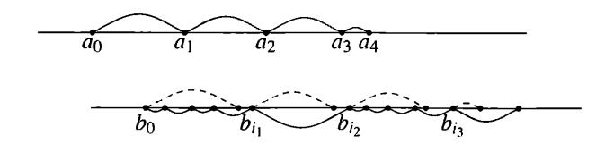

FIGURE 13. Increases of  $a_i$  are used in the prediction game for  $\beta$ .

# (2) this process continues indefinitely.

In the second case  $\alpha \leq_1 \beta$  since the difference  $\beta - \alpha$  is represented as a sum of a computable series ("holes" between neighbor intervals; note that the endpoints of the shifted intervals also converge to  $\beta$ ).

After this remark it is easy to show that every incomplete  $\beta$  is not random. Indeed, assume that  $\beta$  is not Solovay complete; we need to prove that  $\beta$  is not random. Since  $\beta$  is not complete, there exists some  $\alpha$  such that  $\alpha \not\leq \beta$ . In particular,  $\alpha \not\leq_1 \beta$ . Therefore, for these  $\alpha$  and  $\beta$  the second alternative is impossible, and the observer wins. In other words, we get a computable sequence of (closed) intervals of total size at most  $\sum h_i$  that covers  $\beta$ . Repeating the same argument for  $\alpha/2$ ,  $\alpha/4$ ,... (we know that  $\alpha/c \not\leq_1 \beta$  for every c, since  $\alpha \not\leq \beta$ ), we effectively get a cover of  $\beta$  with arbitrarily small measure (since the sum of all  $h_i$  is bounded by a integer constant even being non-computable); therefore  $\beta$  is not random.

This finishes the proof of the result we mentioned:

THEOREM 110. A lower semicomputable real is Solovay complete if and only if it is ML-random.

5.7.5. Slow convergence: Solovay functions. We have seen several results of the following type: the limit of an increasing computable sequence of rationals is random if and only if the convergence is slow. In this section we provide some other results of this type [12, 67].

Consider a computable converging series  $\sum r_i$  of non-negative rational numbers. Note that  $r_i$  is bounded by O(m(i)) where m(i) is the (discrete) a priori probability of integer i, and therefore prefix complexity  $K(i) = -\log m(i)$  is bounded by  $-\log r_i + O(1)$ . We say that the series  $\sum r_i$  converges slowly in the Solovay sense (has the Solovay property) if this bound is O(1)-tight infinitely often, i.e., if  $r_i \geqslant \varepsilon m(i)$  for some  $\varepsilon > 0$  and for infinitely many i. In other words, the series does not converge slowly if  $r_i/m_i \to 0$ .

Historically the name Solovay function was used for a computable bound S(i) for prefix complexity K(i) that is tight infinitely often, i.e.,  $K(i) \leq S(i) + O(1)$  for every i and  $K(i) \geq S(i) - c$  for some c and for infinitely many values of i. Thus, a computable series  $\sum r_i$  of non-negative rational numbers has the Solovay property if and only if  $i \mapsto -\log_2 r_i$  is a Solovay function. (Usually integer-valued Solovay functions are considered, so some rounding is needed.) We provide several results that relate randomness to slow convergence, mainly following [12, 67].

THEOREM 111. Let  $\alpha = \sum_i r_i$  be a computable converging series of non-negative rational numbers. The number  $\alpha$  is random if and only if this series converges slowly in the Solovay sense.

In other words, the sum is non-random if and only if the ratio  $r_i/m(i)$  tends to 0.

PROOF. Assume that  $r_i/m(i) \to 0$ . Then for every  $\varepsilon$  we can let  $h_i = \varepsilon m(i)$  and get a lower semicomputable sequence that satisfies the conditions of Theorem 108. Therefore  $\alpha$  is not random.

We can also prove that  $\alpha$  is not complete (thus providing an alternative proof of its non-randomness). Recall the argument used in the proof of Theorem 103: if  $r_i \leq m(i)$ , then  $\sum r_i \leq_l \sum m(i)$ . And if  $r_i \leq cm(i)$ , then  $\sum r_i \leq_c \sum m(i)$ . This remains true if the inequality  $r_i \leq cm(i)$  is true for all sufficiently large i. So for a fast (non-Solovay) converging series and its sum  $\alpha$  we have  $\alpha \leq_c \sum m(i)$  for arbitrarily small c. If  $\alpha$  were complete, we would have also  $\sum m(i) \leq_d \alpha$  for some d and therefore  $\alpha \leq_{cd} \alpha$  for some d and all c > 0. For small enough c we have cd < 1/2 and therefore  $\alpha \leq_{1/2} \alpha$ , i.e.,  $2\alpha \leq_1 \alpha$ , so the difference  $\alpha - 2\alpha = -\alpha$  is lower semicomputable and  $\alpha$  is computable. (One could note also that for each approximation to  $\alpha$  from below we can find a twice better one, and we can iterate this procedure.)

It remains to show the reverse implication. Assuming that  $\alpha = \sum r_i$  is not random, we need to prove that  $r_i/m(i) \to 0$ . Consider the interval  $[0, \alpha]$  split into intervals of length  $r_0, r_1, \ldots$  (from left to right). Given an open cover of  $\alpha$  with small measure, we consider those intervals (of length  $r_0, r_1, \ldots$ , see above) that are completely covered (endpoints included). They form an enumerable set and the sum of their lengths does not exceed the measure of the cover. If the cover has measure  $2^{-2n}$  for some n, we may multiply the corresponding  $r_i$  by  $2^n$  and their sum remains at most  $2^{-n}$ . Note also that for large enough i the ith interval is covered (since it is close to  $\alpha$  and  $\alpha$  is covered). So for each n we get a semimeasure  $M^n$  such that  $M^n(i)/r_i \geq 2^n$  for all sufficiently large i and  $\sum_i M^n(i) \leq 2^{-n}$ . Taking the sum of all  $M^n$ , we get a lower semicomputable semimeasure M such that  $r_i/M(i) \to 0$ . Then  $r_i/m(i) \to 0$  also for the universal semimeasure m.

This result provides a (third) proof that a sum of two non-random lower semicomputable reals is non-random (since the sum of two sequences that converge to 0 also converges to 0).

It shows also that Solovay functions exist (which is not immediately obvious from the definition). Moreover, it shows that there exist computable *non-decreasing* Solovay functions: take a computable series of rational numbers with random sum and make this series non-increasing not changing the sum (by splitting too big terms into small pieces).

 $\lfloor \mathbf{164} \rfloor$  Let U be an optimal prefix-free decompressor. Consider the function f(p,x,n) that is equal to l(p) if U produces output x on input p making exactly n steps, and (say)  $2l(p) + 2l(x) + 2\log n$  otherwise. Prove that f(p,x,n) is an upper bound for K(p,x,n) and this bound is tight when p is the shortest description of x that needs n steps to process, and give an alternative proof of the existence of Solovay functions.

It also implies that slow convergence (in the Solovay sense) is not a property of a series itself, but only of its sum. It looks strange: some property of a computable series (of non-negative rational numbers), saying that *infinitely many terms come close to the upper bound provided by the a priori probability*, depends only on the sum of this series. At first, it seems that by splitting the terms into small parts we can destroy the property not changing the sum, but it is not so. In the next

section we try to understand this phenomenon providing a direct proof for it (and as a byproduct we improve the results of this section).

5.7.6. The Solovay property as a property of the sum. First, let us note that the Solovay property is invariant under computable permutations. Indeed, consider some computable permutation  $\pi$ . It changes the a priori probability only by a constant factor:  $m(\pi(i)) = \Theta(m(i))$ . Then let us consider grouping. Since we want to allow infinite groups, let us consider a computable series  $\sum_{i,j} a_{ij}$  of non-negative rational numbers. Then

$$\alpha = \sum_{i,j} a_{ij} = (a_{00} + a_{01} + \cdots) + (a_{10} + a_{11} + \cdots) + \cdots = \sum_{i} A_{i},$$

where  $A_i = \sum_j a_{ij}$ .

We want to show that  $A_i$  and  $a_{ij}$  are slowly converging series (in the Solovay sense) at the same time. Note that slow convergence is permutation-invariant, so it is well defined for two-dimensional series.

However, some clarifications and restrictions are needed. First,  $\sum A_i$  is not in general a computable series, it is only a lower semicomputable one. We extend the definition of the Solovay property to lower semicomputable series: for such a series we still have  $A_i = O(m(i))$ , and we require this bound to be O(1)-tight infinitely often. Second, such a general statement is not true: imagine that all non-negative terms are in the first group  $A_0$  and all  $A_1, A_2, \ldots$  are zeros. Then  $\sum A_i$  does not have the Solovay property while  $\sum a_{ij}$  could have it. The following result (essentially from [67]) provides the needed restrictions:

THEOREM 112. Assume that each group  $A_i$  contains only finitely many non-zero terms. Then the properties  $A_i/m(i) \to 0$  and  $a_{ij}/m(i,j) \to 0$  are equivalent.

Here m(i,j) is the a priori probability of pair  $\langle i,j \rangle$  (its number in some computable numbering; the probability does not depend on the coding up to an O(1)-factor). The convergence means that for every  $\varepsilon > 0$ , the inequality  $a_{ij}/m(i,j) > \varepsilon$  is true only for finitely many pairs  $\langle i,j \rangle$ .

PROOF. Let us recall first that  $m(i) = \sum_j m(i,j)$  up to a O(1)-factor. (Indeed, the sum in the right-hand side is lower semicomputable, so it is O(m(i)) due to maximality; on the other hand, already the first term m(i,0) is  $\Omega(m(i))$ .) So if  $a_{ij}/m(i,j)$  tends to zero, the ratio  $A_i/\sum_j m(i,j)$  does the same (only finitely many pairs have  $a_{ij} > \varepsilon m(i,j)$  and they appear only in finitely many groups).

It is more difficult to show that  $A_i/m_i \to 0$  implies  $a_{ij}/m(i,j) \to 0$ . (Here we need to use that only finitely many terms in each group are non-zero.) For this it is enough to construct some lower semicomputable  $\tilde{m}(i,j)$  such that  $a_{ij}/\tilde{m}(i,j) \to 0$ , somehow using the fact that  $A_i/m(i) \to 0$ . The natural idea would be to split m(i) between  $\tilde{m}(i,j)$  in the same proportion as  $A_i$  is split between  $a_{ij}$ . However, for this we need to compute  $A_i$  (and not only to lower semicompute it). It would be easy if we knew how many terms among  $a_{i0}, a_{i1}, \ldots$  are non-zero, but in general this is a non-computable information. (For the special case of finite grouping this argument indeed works.)

So we use another approach. For some constant c we may let  $\tilde{m}(i,j)$  be  $ca_{ij}$  while this does not violate the property  $\sum_{j} \tilde{m}(i,j) \leq m(i)$ . (As m(i) increases, we let  $\tilde{m}(i,j)$  increase when possible.) If indeed  $A_i/m(i) \to 0$ , for every constant c we

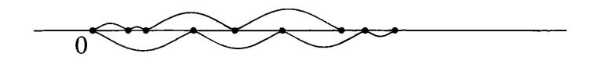

FIGURE 14. Two series with the same sum can be obtained by a different grouping from the same third series.

have  $cA_i \leq m(i)$  for all sufficiently large i, so  $a_{ij}/\tilde{m}(i,j) \leq 1/c$  for all sufficiently large i (and only finitely many pairs  $\langle i,j \rangle$  violate this requirement, because each  $A_i$  has only finitely many non-zero terms). So for each c we have constructed some semimeasure  $m_c$  such that  $a_{ij}/\tilde{m}_c(i,j) \leq 1/c$  for almost all pairs  $\langle i,j \rangle$ , and the sum  $\sum_{ij} \tilde{m}_c(i,j)$  is at most  $\sum m(i) \leq 1$ . It remains to perform this construction for all  $c=2^{2n}$  and combine the resulting  $\tilde{m}_{2^{2n}}$  with coefficients  $2^{-n}$ .

As a corollary of Theorem 112 we see (in an alternative way) that the Solovay property depends only on the sum of the series. Indeed, if  $\sum_i a_i = \sum_j b_j$ , these two series could be obtained by a different grouping of terms in some third series  $\sum_k c_k$ . To construct  $c_k$ , we draw intervals of lengths  $a_1, a_2, \ldots$  starting from zero point, as well as the intervals of lengths  $b_1, b_2, \ldots$ ; combined endpoints split the line into intervals of lengths  $c_1, c_2, \ldots$  (see Figure 14).

In this way we get not only the alternative invariance proof, but also can strengthen Theorem 111, which dealt with computable series of rational numbers. Now we still consider series of rational numbers, but the summands are presented as lower semicomputable numbers and each has only finitely many different approximations. (So  $r_i = \lim_n r(i,n)$ , where r is a computable function of i and n with rational values which is non-decreasing as a function of n and for every i there are only finitely many different values r(i,n).) Then the number  $\sum_i r_i$  is not ML-random if and only if  $r_i/m(i) \to 0$ . Indeed, each  $r_i$  is a sum of a computable series of non-negative rational numbers with only finitely many non-zero terms. So we can split  $\sum r_i$  into a double series not changing the sum (evidently) and the Solovay property (due to Theorem 112).

Recall that an upper semicomputable function  $n \mapsto f(n)$  with integer values is an upper bound for K(n) (up to an O(1) additive term) if and only if  $\sum_{n} 2^{-f(n)}$  is finite (Theorem 62, p. 100). Now we can extend this statement:

THEOREM 113. This bound is tight for infinitely many n (i.e.,  $K(n) \ge f(n) - c$  for some c and for infinitely many n) if and only if the sum  $\sum_{n} 2^{-f(n)}$  is random.

PROOF. Indeed, decreasing integer upper bounds for f(n) provide increasing lower bounds for  $2^{-f(n)}$  (with finitely many changes), so we use the preceding result.

We end this section with an alternative proof that all complete reals have the Solovay property. First we observe that the Solovay property is upward closed with respect to Solovay reducibility. Indeed, if  $\sum a_i$  and  $\sum b_i$  are computable series of non-negative rational numbers and  $a_i$  converges slowly, then  $\sum (a_i + b_i)$  converges slowly also (its terms are bigger). So it remains to prove directly that at least one slowly converging series (or, in other words, a computable Solovay function) exists. It can be done as shown in Problem 164. Another way to explain this construction is that we watch how the values of a priori probability increase (it is convenient

again to consider the a priori probability of pairs):

$$m(0,0)$$
  $m(0,1)$   $m(0,2)$   $m(0,3)$   
 $m(1,0)$   $m(1,1)$   $m(1,2)$   $m(1,3)$   
 $m(2,0)$   $m(2,1)$   $m(2,2)$   $m(2,3)$ 

and we fill a similar table with rational numbers  $a_{ij}$  in such a way that  $a_{ij}/m(i,j) \not\to 0$ . How do we fill this table? For each row we compute the sum of current values  $m(i,\cdot)$ ; if it crosses one of the thresholds  $1/2, 1/4, 1/8 \cdots$ , we put the crossed threshold value into the a-table (filling it with zeros from left to right while waiting for the next threshold crossed). In this way we guarantee that  $a_{ij}$  is a computable function of i and j; the sum of a-values in every row differs from the sum of m-values in the same row at most by factor 2 (in both directions); this implies that the new series is convergent and that in every row there exists some a-value that is at least half of the corresponding m-value. Logarithms of a-values form a Solovay function (and  $a_{ij}$  itself form a slowly convergent series).

Note that this construction does not give a *non-decreasing* Solovay function directly (it seems that we still need to use the arguments from the preceding section).

5.7.7. Busy beavers and convergence moduli. We had several definitions that formalize the intuitive idea of a "slowly converging series". However, the following one (probably the most straightforward) was not considered yet. If  $a_n \to \alpha$ , for every  $\varepsilon > 0$  there exists some N such that  $|\alpha - a_n| < \varepsilon$  for all n > N. The minimal N with this property (considered as a function of  $\varepsilon$ , denoted by  $\varepsilon \mapsto N(\varepsilon)$ ) is called a *modulus of convergence*. A sequence (or a series) should be considered "slowly converging" if this function grows fast (as  $\varepsilon \to 0$ ). Let us show how the the Solovay property could be equivalently characterized in these terms.

In Section 1.2 (p. 21) we defined B(n) as a maximal integer whose complexity does not exceed n. We used plain complexity there (since at that time no other versions were defined), but a similar definition can be given for prefix complexity. Let BP(n) be the maximal integer whose prefix complexity does not exceed n.

165 Fix an optimal prefix-free universal machine M. Let T(m) be the maximal time needed for termination of all terminating computations on inputs of length at most m. Then

$$BP(m-c) \leqslant T(m) \leqslant BP(m+c)$$

for some c and all m.

(*Hint*: One can use the same argument as for plain complexity (see Section 1.2).)

Now we can prove the equivalence of different notions of "slow convergence":

THEOREM 114. The computable series of non-negative rational numbers  $\sum r_i$  has the Solovay property ( $\Leftrightarrow$  has a random sum) if and only if its modulus of convergence grows fast:  $N(2^{-m}) > BP(m-c)$  for some c and for all m.

PROOF. Let  $\alpha = \sum r_i = \lim a_i$ , where  $a_i = r_0 + \dots + r_{i-1}$ . Assume that  $\alpha$  is random. We have to show that  $|\alpha - a_i| < 2^{-m}$  implies K(i) > m - O(1); this shows that  $N(2^{-m}) \ge BP(m - O(1))$ . Since  $K(i) = K(a_i) + O(1)$ , it is enough to show that every rational  $2^{-m}$ -approximation to  $\alpha$  has complexity at least m - O(1). This is a bit stronger condition than the condition  $K(\alpha_0 \cdots \alpha_{m-1}) \ge m - O(1)$  (used in the prefix complexity version of the Levin-Schnorr theorem) since now we consider

all approximations, not only the prefix of the binary expansion. However, it can be proven in a similar way.

Let c be some integer. Consider an effectively open set  $U_c$  constructed as follows. For every rational r we consider the neighborhood around r of radius  $2^{-K(r)-c}$ ; the set  $U_c$  is the union of these neighborhoods. (Since K(r) is upper semicomputable, it is indeed an effectively open set.) The total length of all intervals is  $2 \cdot 2^{-c} \sum_{r} 2^{-K(r)} \leq 2^{-(c-1)}$ . Therefore, the sequence  $U_c$  forms a Martin-Löf test, and random  $\alpha$  does not belong to  $U_c$  for some c. This means that complexity of  $2^{-m}$ -approximations of  $\alpha$  is at least m - O(1).

In the other direction we can use the Levin–Schnorr theorem without any changes: if  $N(2^{-m}) \ge BP(m-c)$ , then  $K(i) \ge m - O(1)$  for every i such that  $a_i$  is a  $2^{-m}$ -approximation to  $\alpha$ . Therefore, the m-bit prefix of  $\alpha$  has complexity at least m - O(1), since by knowing this prefix, we can effectively find an  $a_i$  that exceeds it (and the corresponding i).

REMARK. Note that this theorem shows equivalence between two formalizations of an intuitive idea of "slowly converging series" (or three, if we consider the Solovay reducibility as a way to compare the rate of convergence). However, the proof goes through Martin-Löf randomness of the sum (where the series itself disappears). It would be nice to find a more direct proof and (maybe) to connect the Solovay reducibility (not only completeness) to the properties of the convergence moduli.

Reformulating the definition of BP(m) in terms of a priori probability, we may define BP(m) as the minimal N such that all n > N have a priori probability less than  $2^{-m}$ . However, in terms of a priori probability the other definition looks more natural: let BP'(m) be the minimal N such that the total a priori probability of all n > N is less than  $2^{-m}$ . Generally speaking, BP'(m) can be greater than BP(m) (see [4]), but it turns out that it still can be used to characterize randomness in the same way:

THEOREM 115. Let  $a_i$  be a computable increasing sequence of rational numbers that converges to a random number  $\alpha$ . Then  $N(2^{-m}) \geqslant BP'(m-c)$  for some c and for all m.

PROOF. Since all  $i > N(2^{-m})$  have the same a priori probability as the corresponding  $a_i$  (up to an O(1)-factor), it is enough to show that for every m the sum of a priori probabilities of all rational numbers in the  $2^{-m}$ -neighborhood of a random  $\alpha$  is  $O(2^{-m})$  (recall that for each  $i > N(2^{-m})$ ) the corresponding  $a_i$  belongs to this neighborhood).

As usual, we go in the other direction and cover all "bad"  $\alpha$  that do not have this property by a set of small measure. Not having this property means that for every c there exists an m such that the sum of a priori probabilities of rational numbers in the  $2^{-m}$ -neighborhood of  $\alpha$  exceeds  $c2^{-m}$ . For a given c, we consider all intervals with rational endpoints that have the following property: the sum of a priori probabilities of all rational numbers in this interval is more than c/2 times bigger than the interval's length. Every bad  $\alpha$  is covered by an interval with this property (the endpoints of the interval  $(\alpha - 2^{-m}, \alpha + 2^{-m})$  can be changed slightly to make them rational), and the set of intervals having this property is enumerable. It is enough to show that the union of all such intervals has measure O(1/c), in fact, at most 4/c.

It is also enough to consider a finite union of intervals with this property. Moreover, we may assume that this union does not contain redundant intervals (that can be deleted without changing the union). Let us order all the intervals according to their left endpoints:

$$(l_0, r_0), (l_1, r_1), (l_2, r_2), \ldots,$$

where  $l_0 \leqslant l_1 \leqslant l_2 \leqslant \cdots$ . It is easy to see that right endpoints go in the same order (otherwise, one of the intervals would be redundant). So  $r_0 \leqslant r_1 \leqslant r_2 \leqslant \cdots$ . Now note that  $r_i \leqslant l_{i+2}$ ; otherwise, the interval  $(l_{i+1}, r_{i+1})$  would be redundant. Therefore, intervals with even numbers  $(l_0, r_0), (l_2, r_2), (l_4, r_4), \ldots$  are disjoint, and for each of them the length is c/2 times less than the sum of a priori probabilities of rational numbers inside it. Therefore, the total length of these intervals does not exceed 2/c, since the sum of all priori probabilities is at most 1. The same is true for intervals with odd numbers, so in total we get the bound 4/c.

This statement raises some natural questions. How much could BP(m) and BP'(m) differ? This question was answered in [4] (the maximal difference corresponds to a logarithmic change in the argument), but there are many others for which we do not know the answers. Can we use prefix-stable machines (instead of the prefix-free ones) in the definition of BP(n) as the computation time? Can we derive the last theorem from the version of the Levin–Schnorr theorem with a priori complexity? Can we use the methods of this section to prove that the real number  $\sum_{x \in X} 2^{-l(x)}$  is random for every prefix-free set X that contains the domain of an optimal prefix-free decompressor?

Returning to the "philosophical meaning" of the number  $\Omega$ , let us note that it can be considered as an "infinite version" of special objects of complexity n that are considered in Theorem 15 (p. 25). Moreover, there is a direct connection between these notions.

Theorem 116. Let  $\Omega_n$  be the binary string formed by first n bits of the binary representation of  $\Omega$ . Then  $\Omega_n$  has the properties described in Theorem 15 with  $O(\log n)$ -precision: each of the objects listed there (say, B(n)) can be algorithmically obtained from  $\Omega_{n+O(\log n)}$  and vice versa ( $\Omega_n$  can be obtained from  $B(n+O(\log n))$ ).

PROOF. We already have seen that given  $\Omega_n$  one can construct an integer t > BP(n) (the number of steps needed to exceed  $\Omega_n$ ). The difference between plain and prefix complexity (that could make B(n) greater than BP(n)) can be compensated by an  $O(\log n)$ -change in n.

In the reverse direction, assume that B(n) and n are known. How do we find  $\Omega_{n-O(\log n)}$ ? We claim that in the current approximation for  $\Omega$  found after B(n) steps the first  $n-O(\log n)$  bits are final (i.e., they coincide with the corresponding bits in  $\Omega$ ). If this is not the case, there exists a threshold  $\beta$  that is a finite binary fraction of length  $n-O(\log n)$  bits that separates the current approximation and  $\Omega$ . The complexity of  $\beta$  is at most  $n-O(\log n)$ . Knowing  $\beta$ , we can construct a number greater than B(n): just count the steps needed to get an approximation greater than  $\beta$ . For a large enough constant in  $O(\log n)$ , we get a contradiction.  $\square$ 

Therefore we see that knowing  $n + O(\log n)$  bits in  $\Omega$  allows us to answer any question about the termination of a program of size at most n. Since the question about the membership in any enumerable set (e.g., questions whether a

given statement of size n is provable in some fixed formal theory) has this form, we can follow Chaitin and call  $\Omega$  "the number of wisdom" that contains information about many important things. (Sounds rather romantic, indeed.)

Returning to more meaningful statements, we have proven that  $\Omega$  is Turing-equivalent to  $\mathbf{0}'$  (we can compute  $\Omega$  having an oracle for halting problem, and vice versa).

#### 5.8. Effective Hausdorff dimension

The notion of Hausdorff dimension is well known in measure theory (and it became popular in connection with fractals). Here is the definition. Let  $\alpha > 0$  be some real number. We say that a set A is an  $\alpha$ -null set if for any  $\varepsilon > 0$  there exists a sequence of intervals  $I_k$  that cover A such that

$$\sum_{k} \mu(I_k)^{\alpha} < \varepsilon.$$

This definition assumes that A is a subset of a space where a class of subsets called "intervals" is chosen and the measure of intervals is defined. We restrict ourselves to the case of the set  $\Omega$ . Here intervals are the sets  $\Omega_x$  (where  $\Omega_x$  is the set of all infinite extensions of a binary string x). The measure of the interval  $\Omega_x$  equals  $2^{-l(x)}$ .

Let us start with a few simple remarks:

- (1) Any subset of an  $\alpha$ -null set is an  $\alpha$ -null set.
- (2) For  $\alpha = 1$  we get the standard definition of a null set (set of measure zero).
- (3) For  $\alpha > 1$  any subset  $A \subset \Omega$  is an  $\alpha$ -null set. Indeed, one can cover A by  $2^n$  intervals that correspond to  $2^n$  strings of length n, and the sum of their  $\alpha$ -measures tends to 0 as  $n \to \infty$ .
- (4) Assume that  $0 < \alpha < \alpha'$ . Any  $\alpha$ -null set is then an  $\alpha'$ -null set (note that measure  $\mu(I)$  of each interval I does not exceed 1 and therefore  $\mu(I)^{\alpha'} \leq \mu(I)^{\alpha}$ ).
- **166** Give a natural definition for an  $\alpha$ -null set of reals, and show that a set  $A \subset [0,1]$  is an  $\alpha$ -null set if and only if the set of binary representations of all numbers in A is an  $\alpha$ -null set according to the definition above.

(*Hint*: We need to verify that the more liberal notion of an interval in  $\mathbb{R}$  where we do not require any alignment, does not change the class of null sets.)

Our remarks imply that for any set  $A \subset \Omega$  there exists some threshold  $d \in [0,1]$  with the following property: if  $\alpha > d$ , the set A is an  $\alpha$ -null set; if  $\alpha < d$ , it is not. (For  $\alpha = d$  the set may be an  $\alpha$ -null set or not.) This threshold is called the Hausdorff dimension of the set A.

**167** The Cantor set is the subset of [0,1] that remains if we take out the middle third (1/3,2/3), then take out the middle thirds of two remaining segments (i.e., (1/9,2/9) out of [0,1/3] and (7/9,8/9) out of [2/3,1], etc.). Prove that the Cantor set is a compact set homeomorphic to  $\Omega$  and has Hausdorff dimension  $\log_3 2$ .

(*Hint*: To get an upper bound for the Hausdorff dimension, one may consider the standard intervals, i.e., the intervals that remain after several steps of the Cantor set construction. To get a lower bound, note that (1) we may consider only finite covers due to compactness; (2) if a cover for the Cantor set is given, we can look at its parts that cover the left third and the right third; each of these parts can be scaled to the cover of the entire set due to the self-similarity of the Cantor set. If

 $\alpha$  is smaller than the threshold, one of these covers is better than the original one, so we may increase the sizes of intervals, and finally get a contradiction.)

**168** Give a natural definition of the Hausdorff dimension for the subsets of  $\mathbb{R}^3$ . Explain why the dimension equals 3 for solids, 2 for surfaces, 1 for curves, and 0 for isolated points. Show that for any  $d \in [0,3]$ , there is a subset of  $\mathbb{R}^3$  that has dimension d.

The effective version of Hausdorff dimension is defined in a natural way [190, 152]. A set  $A \subset \Omega$  is an effective  $\alpha$ -null set (for a given  $\alpha > 0$ ) if there exists an algorithm that, for any given  $\varepsilon > 0$ , enumerates a set  $I_0, I_1, I_2, \ldots$  of intervals that cover A such that  $\sum (\mu(I_k))^{\alpha} < \varepsilon$ . (Here  $\mu$  is the uniform measure on  $\Omega$ ).

As in the classical case, the property is monotone (it remains true if  $\alpha$  increases or A decreases). The main difference between the classical and effective case is shown by the following theorem:

Theorem 117. For every rational  $\alpha > 0$ , there exists the largest (with respect to inclusion) effectively  $\alpha$ -null set.

PROOF. The proof goes in the same way as for effectively null (=1-null) sets (Chapter 3). The countable union of  $\alpha$ -null sets (in the classical sense) is an  $\alpha$ -null set. In the same way the union of an enumerable family of effectively  $\alpha$ -null sets is an  $\alpha$ -null set. On the other hand, if  $\alpha$  is a rational number (or even a computable real), we can enumerate all effectively  $\alpha$ -null sets (or, better, the algorithms that serve these sets) by enumerating all algorithms and changing them when too large intervals are generated.

**169** Prove that the largest effectively  $\alpha$ -null set consists of all the sequences  $\omega$  such that the difference  $\alpha n - K(n)$  has no upper bounds.

(*Hint*: The proof is similar to the proof of the prefix complexity version of the Levin–Schnorr theorem.)

The following result (A. Khodyrev) is not used in the sequel (for the definition of the Hausdorff dimension, rational  $\alpha$ 's are sufficient), but it is interesting in its own right. Let  $\alpha$  be an arbitrary real number.

THEOREM 118. The largest effectively  $\alpha$ -null set exists if and only if  $\alpha$  is lower semicomputable.

PROOF. Assume that  $\alpha$  is lower semicomputable. This means that we can generate better and better approximations from below to  $\alpha$ , but we do not know their precision. If we use these approximations (instead of true  $\alpha$ ) in the requirements for the cover (in the definition of an effectively  $\alpha$ -null set), we get stronger requirements. Consider the algorithm from the previous theorem that generates covers of the largest effectively  $\alpha$ -null set, and let it use rational lower approximations of  $\alpha$  instead of  $\alpha$  itself, with the following modification. Do not reject permanently the intervals that violate these requirements, but postpone them and check again when a new approximation to  $\alpha$  arrives. If a cover satisfies the requirement for the true  $\alpha$ , all its intervals will be eventually let through.

On the other hand, let us assume that for some  $\alpha$  there exists the largest effectively  $\alpha$ -null set. Consider the algorithm that generates covers for it. This algorithm can be used to obtain lower bounds for  $\alpha$ . Indeed, if for some rational  $\varepsilon$  the algorithm produces a finite family of intervals (at some step) and  $\beta$ -powers of the measures of these intervals exceed  $\varepsilon$ , this means that  $\beta < \alpha$ .

It remains to prove that these bounds can be arbitrarily close to  $\alpha$ . Assume that this is not the case and all of them are less than some  $\alpha' < \alpha$ . In this case every effectively  $\alpha$ -null set would be at the same time  $\alpha'$ -null set, which is not true (there exist sets of any effective Hausdorff dimension; see Problem 170, p. 175).  $\square$ 

The effective Hausdorff dimension of a set  $A \subset \Omega$  is now defined as the infimum of  $\alpha$  such that A is an effective  $\alpha$ -null set. This number belongs to [0,1] and is obviously greater than or equal to the (classical) Hausdorff dimension. (Initially the definition of effective Hausdorff dimension was given in a different way, using computable martingales; see [111, 118], where the properties of effective dimension were established. See also Section 9.10 about computable martingales.)

We have mentioned a paradox: The property of being an effectively null set depends only on the type of its elements (whether they are random or not). It is not important "how many" elements are in the set. A similar observation can be made for Hausdorff dimension:

Theorem 119. The effective Hausdorff dimension of the set is equal to the supremum of the effective Hausdorff dimensions of its elements.

(By effective Hausdorff dimension of a point  $\omega \in \Omega$ , we mean the effective Hausdorff dimension of the singleton  $\{\omega\}$ .)

PROOF. Obviously the (effectively Hausdorff) dimension of a set cannot be less than the dimension of its element. It remains to prove the converse: if the dimensions of all singletons formed by elements of a set A are less than some rational number r, and r' > r is another rational number, then the dimension of A does not exceed r'. This is a direct corollary of Theorem 117: all singletons are subsets of the largest effectively r'-null set, so A is a subset of the same set and has dimension at most r'.

Therefore we need to understand only what is the (effective Hausdorff) dimension of a singleton. It turns out that it has a simple description in terms of Kolmogorov complexity.

THEOREM 120. The effective Hausdorff dimension of a singleton  $\{\omega\}$ , where  $\omega = \omega_0 \omega_1 \omega_2 \cdots$ , is equal to

$$\liminf_{n\to\infty}\frac{C(\omega_0\omega_1\cdots\omega_{n-1})}{n}.$$

(The statement uses plain Kolmogorov complexity of the prefixes of  $\omega$ . However, one can use other versions of complexity: since the difference between different complexity versions is of order  $O(\log n)$  for strings of length n, and we divide the complexity by n, we get a term  $O(\log n)/n$  that does not change the limit.)

PROOF. This result can be derived from the statement of Problem 169, but we provide the direct proof. We have to prove two inequalities: one for each direction.

Assume that the lim inf is less than a rational number r. We have to verify that the set  $\{\omega\}$  is an effectively r'-null set for each rational r' > r.

For each n we consider all n-bit strings that have complexity less than n. There are at most  $O(2^{rn})$  such strings. The condition about  $\lim \inf$  guarantees that for infinitely many n the n-bit prefix of  $\omega$  is in the corresponding list. Consider all intervals  $\Omega_z$  for all z in the list (for some fixed n), and compute the sum required

in the definition of an effectively r'-null set: there are  $O(2^{rn})$  terms and each is  $(2^{-n})^{r'} = 2^{-r'n}$ , so the sum is  $O(2^{(r-r')n})$ , and we get a converging geometric series

$$\sum_{n} 2^{(r-r')n}.$$

Deleting an initial part of this series (considering only strings of length N or more) we make the sum arbitrarily small (when N is large enough). At the same time our assumption (about  $\liminf$ ) guarantees that remaining intervals still form a cover for  $\omega$ . So one inequality is proved.

Going in the other direction, assume that  $\{\omega\}$  has effective dimension less than r for some rational r. Let us show that the  $\liminf$  does not exceed r.

By definition, for each rational  $\varepsilon > 0$  we can generate a sequence of intervals. We know that one of them contains  $\omega$  and the sum of rth powers of the measures does not exceed  $\varepsilon$ . Let us do this for  $\varepsilon = 1, 1/2, 1/4, \ldots$  In this way we get a sequence of intervals that have finite sum of rth powers of their measures, and infinitely many of them cover  $\omega$ . In other words, there exists a computable sequence of intervals  $x_0, x_1, x_2, \ldots$  such that:

- $\sum 2^{-rl(x_i)} < \infty$ ;
- $\overline{x_i}$  is a prefix of  $\omega$  for infinitely many i.

The first statement implies that  $m(i) \ge c2^{-rl(x_i)}$  for some c and for all i (where m is the discrete a priori probability of natural numbers considered in Chapter 4). Taking the logarithms, we get the bound for prefix complexity,

$$K(x_i) \leqslant K(i) + O(1) \leqslant rl(x_i) + O(1)$$

for all i. Note also that the lengths of  $x_i$  tend to infinity (since the series is convergent), that  $x_i$  is a prefix of  $\omega$  for infinitely many i and that the plain complexity does not exceed the prefix one. (The definition of  $\lim \inf$  guarantees that if a sequence has infinitely many terms that do not exceed r, its  $\lim \inf$  does not exceed r.)  $\square$ 

170 Prove the following corollary: for any real  $\alpha \in [0, 1]$  there exists a set (and even a singleton) that has effective Hausdorff dimension  $\alpha$ .

(*Hint*: The complexity of an initial segment can be increased by adding random bits and decreased by adding zeros.)

171 Prove that for an effectively closed subset of the Cantor space (this means that the complement of this set is the union of an enumerable family of intervals) the effective Hausdorff dimension coincides with the classical Hausdorff dimension.

(*Hint*: Due to compactness, one may consider finite covers and search for them effectively.)

[172] Find the (classical) Hausdorff dimension of the Cantor set (see Problem 167) using the previous problem and the characterization of effective dimension in terms of singletons and Kolmogorov complexity.

173 Prove that for every real  $\alpha \in [0,1]$  there exists a set that has (classical) Hausdorff dimension  $\alpha$ .

(Hint: Consider the set of all sequences that have zeros at specified places.)

 $\boxed{174}$  Prove that the definition of effective Hausdorff dimension of a set A remains the same if we require the existence of a computable sequence of intervals that has finite sum of rth powers of the measures and that covers each element of A infinitely many times.

(*Hint*: If such a cover exists for some  $\alpha$ , for a greater  $\alpha'$  the same intervals have smaller measure, and the decrease is more significant for smaller intervals. Note that we can delete all short strings from the cover, due to our assumption (each element is covered infinitely many times).)

We return to the notion of effective Hausdorff dimension in Section 9.5 where its relation to effective martingales is explained. We show there how to translate the proof of Theorem 120 into the martingale language.

#### 5.9. Randomness with respect to different measures

**5.9.1.** Changing the measure. The notion of randomness evidently depends on the underlying measure. For example, the strong law of large numbers guarantees that sequences that are ML-random with respect to the Bernoulli measure  $B_p$  have limit frequency p, so for different p we get disjoint sets of random sequences. Still from the viewpoint of computability theory the properties of ML-random sequences (with respect to a computable measure P) do not depend on P—except for some trivial cases.

The trivial case we have in mind is the following one: if a computable measure  $\mu$  has an atom, i.e., if some sequence (a singleton) has positive  $\mu$ -measure, then this sequence is random (it cannot be an element of a  $\mu$ -null set). Such a sequence is always computable. This is a corollary of Theorem 79(h) (p. 123), but has also the following simple proof. Assume that  $\{\omega\}$  has a positive probability  $\varepsilon$  with respect to a computable distribution  $\mu$ . Let us consider  $\mu$ -measures of the sets  $\Omega_x$  where x is a prefix of  $\omega$ . These measures decrease as x becomes longer, and their limit is  $\varepsilon$ . Wait until some of them become less than  $1.1\varepsilon$ . If x is such a prefix, only one of the strings x0 and x1 has  $\mu$ -measure greater than  $0.9\varepsilon$ , and this prefix can be effectively found since  $\mu$  is computable. So the sequence can be computably extended starting from this point.

To avoid this special case, we consider only atomless measures where each individual sequence has measure 0. If  $\mu_1$  and  $\mu_2$  are two computable atomless measures, then the sets of ML-random sequences with respect to  $\mu_1$  and  $\mu_2$  are essentially the same from the computability viewpoint:

THEOREM 121. Let  $\mu_1$  and  $\mu_2$  be two atomless measures. Then there exists a bijection between the sets of ML-random sequences with respect to  $\mu_1$  and  $\mu_2$  that in both directions is a restriction of a computable mapping of type  $\Sigma \to \Sigma$ .

In other words, there exist oracle machines  $M_{12}$ ,  $M_{21}$  with the following properties: if an oracle is a sequence  $\omega$  that is ML-random with respect to  $\mu_1$ , then  $M_{12}^{\omega}$  is an infinite sequence that is random with respect to  $\mu_2$ , and vice versa; these two mappings are mutually inverse (on random sequences).

PROOF. Following [225], consider first a special case when one of the measures (say,  $\mu_2$ ) is the uniform measure on [0,1]. We want to construct a one-to-one correspondence between sequences that are  $\mu_1$ -random and uniformly random points in [0,1]. As usual, we split [0,1] into two intervals: the left interval  $\pi_0$  of length  $\mu_1(\Omega_0)$ , and the right interval  $\pi_1$  of length  $\mu_1(\Omega_1)$ . Each of the intervals  $\pi_0$  and  $\pi_1$  is then split in a similar way, etc. Then for each sequence  $\omega$  consider a real number that is a common point of all  $\pi_x$  for all prefixes x of  $\omega$ . Since  $\mu_1$  has no atoms, such a common point is unique.

We have constructed a mapping of  $\Omega$  to [0,1] that is an isomorphism in the sense of measure theory. It is not a one-to-one mapping since the endpoints of the intervals have two preimages, but the endpoints form a (countable) set of measure 0. The computability of the measure guarantees that effectively null sets with respect to  $\mu_1$  correspond to the effectively null sets with respect to the uniform measure, therefore we get a bijection between the sets of ML-random sequences with respect to corresponding measures. (Note that the endpoints of the segments, as well as corresponding sequences  $x000\cdots$  and  $x111\cdots$ , are not random. Note also the  $\mu_1$ -measure of some  $\Omega_x$  can be zero, and then its image is one point, but this does not matter; all the sequences starting with x are then non-random.)

It remains to do the same for  $\mu_2$  and then take the composition of these two bijections (using [0,1] as an intermediate step). The computabity of the corresponding mappings is easy to prove since both measures  $\mu_1$  and  $\mu_2$  are assumed to be computable.

Using the language of computability theory, we can state a corollary of this result. Recall that two sequences (or two sets: we identify a set and its characteristic sequence) are *Turing-equivalent* (belong to the same Turing degree) if each of them is computable by a machine that uses the other sequence as an oracle. The equivalence classes are called *Turing degrees*. Our theorem shows that the class of Turing degrees of ML-random sequences does not depend on the choice of an atomless computable measure.

175 Prove that every sequence that is random with respect to some computable measure  $\mu$  (not necessarily atomless) is either computable or Turing-equivalent to a uniformly ML-random sequence.

(*Hint*: Consider the intervals  $\pi_x$  for x that are prefixes of  $\omega$  and their common point. If it is not unique, then  $\omega$  is computable. If the common point z is unique, then z is uniformly random and can be computed given an oracle for  $\omega$ . On the other hand,  $\omega$  is computable if we have approximations to z as an oracle: we use that z is random and therefore different from all the endpoints of the intervals.)

**5.9.2.** "Absolutely non-random sequences". Consider some sequence  $\omega$ . We want to find a computable measure  $\mu$  such that  $\omega$  is ML-random with respect to  $\mu$ . Is it always possible? The answer turns out to be negative.

THEOREM 122. There exists an infinite sequence of zeros and ones that is not ML-random with respect to any computable measure on  $\Omega$ .

Sequences that are random with respect to some computable measure were called "proper" in [225] (English translation). The theorem states that not all sequences are proper. There are different ways to construct a non-proper sequence. We start with the most intuitive one that uses the *a priori randomness deficiency*. Recall that the ML-randomness criterion (for a computable measure P) can be reformulated in the following way. For each string x consider the difference

$$d_P(x) = -\log_2 P(\Omega_x) - KA(x).$$

The sequence  $\omega$  is ML-random with respect to P if this difference is bounded (by a constant) for the prefixes of  $\omega$ . So we may call this difference the *randomness deficiency* of a string x (with respect to computable measure P): a sequence is random if the deficiencies of its prefixes are bounded (by a constant).

The name "randomness deficiency" is quite general and may be understood in different ways in different contexts. We already considered the expectation-bounded and probability-bounded deficiencies for infinite sequences, and in Chapter 14 we consider the randomness deficiency of an element of a finite set. However, in this section by randomness deficiency we mean the function  $d_P$  defined on finite strings as explained above.

The definition above assumes that  $P(\Omega_x) > 0$ ; if  $P(\Omega_x) = 0$  for some x, we let  $d_P(x) = +\infty$ .

The randomness deficiency is always non-negative (up to a constant); see Theorem 89.

 $\lfloor 176 \rfloor$  Prove that for every string x the deficiency of at least one of the strings x0 and x1 does not exceed the deficiency of x. (We assume that a computable measure P used in the definition of the deficiency is fixed.)

This problem shows that we can start with an arbitrary string with finite deficiency (non-zero measure) and extend it bit by bit not increasing its deficiency. The randomness criterion guarantees that in this way we get an ML-random sequence with respect to the measure used in the definition of deficiency.

After the notion of deficiency is introduced, we return to the proof of Theorem 122.

PROOF. To get a "non-proper" sequence  $\omega$ , we need to ensure that for every computable measure P there is a prefix of  $\omega$  that has large randomness deficiency with respect to P. So we get a countable family of requirements: for each measure P and for each c the corresponding requirement says that some prefix has deficiency at least c with respect to P.

Using a diagonal construction, we fulfill these requirements one by one. At each step we add to a current prefix some additional bits to ensure that the next requirement is fulfilled. So we need to check that for each string x and for each computable measure P and constant c there exists an extension y of x that has deficiency at least c with respect to P. Indeed, we may extend x by adding a bit in such a way that the P-measure decreases at least by a factor of 1.5, then do this again, etc. This can be done effectively, so the complexity of the prefixes increases slowly, while the measure decreases fast, so we get an arbitrary large deficiency.  $\square$ 

Essentially the same argument can be explained using "generic" sequences. Recall that a subset A of  $\Omega$  is everywhere dense if it has non-empty intersection with every interval. A famous  $Baire\ theorem$  says that the intersections of a countable family of open sets  $A_i$  (an open set is a union of intervals) that are everywhere dense is non-empty and, moreover, everywhere dense.

177 Prove the Baire theorem starting with any string and adding suffixes to get inside dense open sets (one by one).

Now we consider effectively open sets (unions of enumerable families of intervals) that are everywhere dense. We get a countable family of open sets that are dense everywhere. Their intersection is an everywhere dense sets whose elements are called *generic* sequences. (The full technical name is *weakly* 1-*generic* sequences; see [147, Definition 1.8.47].) Informally speaking, a generic sequence violates every law that prohibits an enumerable dense set of prefixes. (Every string has an extension that violates the law, and violations can be effectively discovered.)

178 Prove that every generic sequence violates the Strong Law of Large Numbers.

(*Hint*: The set of binary strings of length greater that N that have more than 99% of ones is a dense effectively open set; the same is true for the set of strings with more than 99% of zeros.)

179 Prove that no generic sequence is computable.

 $\overline{(Hint)}$ : The set of all sequences that differ from a given computable sequence is open and everywhere dense.)

Note that the definition of a generic sequence (unlike randomness) does not refer to any measure.

180 Prove that a generic sequence is not ML-random with respect to any computable measure.

(*Hint*: It is enough to construct an effectively open dense set that has small measure. This can be done by iteratively choosing a smaller half of an interval or almost smaller if the halves have almost equal size.)

Zvonkin and Levin ([225], the remark after Definition 4.4) mentioned another way to construct a sequence that is not random with respect to any computable measure. They claim that it is easy to show that the characteristic sequence of the universal enumerable set is not ML-random with respect to any computable measure. They don't say what kind of universality is needed, but indeed one can find an enumerable set with this property:

181 Show that there exists an enumerable set whose characteristic sequence is not random with respect to any computable measure.

(*Hint*: The complexity of the prefixes of every characteristic sequence of an enumerable set is logarithmic; it remains to guarantee that any computable measure of the prefixes decreases fast. This can be done as follows. We split  $\mathbb N$  into countably many arithmetic sequences and devote *i*th of them to an *i*th computable measure; our goal is that the sequence of bits appearing at these places is not random with respect to the projection of the *i*th measure on the corresponding coordinates. It can be done by choosing a direction where measure decreases fast. (Then we use Theorem 123.) Since we do not know whether the *i*th algorithm indeed computes a computable measure, we get an enumerable set, not a decidable one.)

It is interesting that not every enumerable set has this property:

182 Construct an enumerable undecidable set whose characteristic function is ML-random with respect to some computable measure.

(Hint (L. Bienvenu): Let  $a_i$  be a computable sequence of rational numbers that is dense in [0,1]. Consider a computable mapping of  $\Omega$  to itself: a sequence  $\alpha$  is interpreted as a binary fraction in [0,1] and mapped to a sequence  $\omega$  where  $\omega_i = 1$  if  $a_i < \alpha$  and  $\omega_i = 0$  if  $a_i > \alpha$ . (If  $\alpha$  is one of the  $a_i$ , then  $\omega_i$  is undefined.) This mapping is almost everywhere defined (with respect to the uniform measure); the image of the uniform measure is therefore a computable measure on  $\Omega$ , and the image of a lower semicomputable ML-random real is a sequence that is ML-random with respect to the image measure and at the same time is a characteristic sequence of an enumerable undecidable set. (To prove undecidability, we use that  $a_i$  are dense in [0,1].) See Sections 5.7 and 5.9.3.)

We have constructed several examples of sequences that are not random with respect to any computable measure. But one may ask a different question: Is there a sequence that is not Turing-equivalent to any ML-random sequence? Here we do not need to specify a computable measure, since all the measures have the same degrees of random sequences (see above). This is possible, too:

183 Prove that there exists a non-computable oracle A such that no A-computable sequence is random with respect to a computable measure (unless the sequence is computable and the measure has an atom).

(Hint: First, we may consider only the uniform measure. Then we use a diagonal construction to get the required set A. First, for every i we can add a prefix of A that guarantees that A is not computed by the ith machine. On the other hand, for every i we can add a prefix that guarantees that either (1) the ith machine with oracle A computes a non-total sequence, or (2) the ith machine computes a sequence that has a prefix with large deficiency. Indeed, if there is some extension of the current oracle prefix that allows the ith machine to compute a long sequence, choose the first such extension, and the corresponding long sequence will have small complexity; if there is no such extension, the function computed by the ith machine is guaranteed not to be total.)

The statement of the last problem is also a corollary of several more difficult results that are not included in our book. First, V. Vyugin has shown [215] that there exists a probabilistic machine that with positive probability generates sequences with this property (sequences that are not Turing-equivalent to any random sequence). This sounds like a paradox: The property implies that for a sequence  $\alpha$  there is no computable measure that "explains"  $\alpha$  (makes  $\alpha$  random with respect to this measure). On the other hand, there is a machine that generates such "unexplainable" sequences with positive probability—so why not take the output distribution of this machine as an explanation? The solution of this paradox: The output distribution is a semimeasure, not a measure (the machine generates finite sequences with positive probability).

There is another, completely different, argument: We can derive the statement of the problem from recent (but already classical) results about low sets (see the books of A. Nies [147], R. Downey and D. Hirschfeldt [49]; a simplified exposition can be found in [20]). These results say that there is an enumerable undecidable set A that is low for Martin-Löf randomness: Adding A as an oracle does not change the set of ML-random sequences (and it also does not change prefix complexity, but this is not needed now). For this A no A-computable sequence can be random (since it is not A-random). In this way we get a set A with an additional property (A is enumerable).

So for many different reasons there exists a sequence such that no ML-random sequence is reducible to it. In the other direction the situation is different: Every sequence is Turing-reducible to some ML-random (with respect to the uniform distribution) sequence; see below Theorem 126, p. 189. The proof of this theorem implies also that every Turing degree above 0' (every Turing degree that computes the halting problem) contains a random sequence; see Problem 190 (p. 190).

184 Prove that there exist a sequence  $\omega$  that is Turing-equivalent to a uniformly ML-random sequence, but  $\omega$  itself is not random with respect to any computable measure.

(*Hint*: We interleave two sequences: at positions  $0, 2, 4, \ldots$  we put a generic sequence  $\gamma$ ; and at positions  $1, 3, 5, \ldots$  we put an ML-random sequence  $\omega$  that computes  $\gamma$ . The resulting sequence is Turing-equivalent to  $\omega$ . Note also that if a sequence is ML-random with respect to some measure P, that its subsequence with even indices is ML-random with respect to the projection of P on these coordinates; see Theorem 123.)

The sequences that are not random with respect to any computable measure, are similar (in a sense) to non-stochastic objects in the sense of Kolmogorov (see Section 14.2). Moreover, one can show that if a sequence  $\alpha$  is random with respect to a computable measure, then its prefixes are stochastic objects (Problem 349, p. 430).

**5.9.3.** Image randomness. We started this chapter by considering a probabilistic machine that consists of a (fair) random bit generator and an algorithm that transforms this sequence of random bits into a finite or infinite output sequence. Let us return to this scheme and assume that with probability 1 the output sequence is infinite. In this case we get a computable output distribution  $\mu$ .

A (slightly philosophical) question arises: Which infinite sequences are plausible as outcomes of such a machine? There are two possible answers.

First, we have a definition of Martin-Löf randomness that can be applied to the computable distribution  $\mu$ . We can say that plausible sequences are the sequences that are ML-random with respect to this distribution. On the other hand, we can look inside the machine and ask, Which sequences are plausible as the outputs of a random bit generator? The natural answer is ML-random sequences with respect to uniform distribution. According to this answer, plausible output sequences are images of ML-random sequences (with respect to uniform distribution) under the computable transformation performed by the machine.

Which of these two answers is more philosophically convincing? Fortunately, we do not need to make a choice here, since these two classes coincide. Here are the exact statements and proofs.

Let  $\mu$  be a computable probability distribution on  $\Omega$ , and let  $f: \Sigma \to \Sigma$  be a continuous computable mapping. Consider the image of the measure  $\mu$  with respect to f, i.e., a measure  $\nu$  on the set  $\Sigma$  such that

$$\nu(U) = \mu(f^{-1}(U))$$

for any  $U\subset \Sigma$ . In other words,  $\nu$  is the probability distribution of the random variable  $f(\omega)$ , where  $\omega$  is a random variable that has distribution  $\mu$ . In the general case the distribution  $\nu$  is not concentrated on  $\Omega$  and may assign positive probabilities to finite sequences; in our terminology  $\nu$  may be a semimeasure (and this semimeasure is lower semicomputable), not a measure. Let us assume, however, that it is not the case and that  $\nu$  is a measure on  $\Omega$ . (It is easy to see that in this case  $\nu$  is a *computable* measure.)

Theorem 123. (a) For any sequence  $\omega \in \Omega$  that is ML-random with respect to measure  $\mu$ , its image  $f(\omega)$  is an infinite sequence that is ML-random with respect to measure  $\nu$ .

(b) Any sequence  $\tau$  that is ML-random with respect to  $\nu$  can be obtained in this way, i.e., there exists a sequence  $\omega$  that is ML-random with respect to  $\mu$  such that  $f(\omega) = \tau$ .

Recently M. Hoyrup found that this statement remains true for the so-called layerwise computable mappings. This class contains all computable almost everywhere defined mappings and looks like the right generalization making the proof balanced and natural. Still we restrict ourselves to the classical case of computable mappings in this book and refer the interested reader to the exposition in [15] for the general case.

PROOF. First, let us prove that the f-image of a  $\mu$ -random sequence  $\omega$  is infinite. If this is not the case and  $f(\omega)$  is a finite string z, consider all infinite sequences  $\omega$  such that  $f(\omega) = z$ , i.e., the f-preimage of the set  $\Sigma_z \setminus (\Sigma_{z0} \cup \Sigma_{z1})$ .

The preimage of  $\Omega_z$  is an effectively open set (the union of an enumerable set of intervals), and the preimage of  $\Sigma_{z0} \cup \Sigma_{z1}$  is another effectively open set that is a subset of the first one. To get the contradiction, we have to prove that the preimage of the difference (=the difference of the preimages) does not contain random sequences. This is a special case of the following general statement.

LEMMA 1. Let  $\mu$  be a computable measure on  $\Omega$ , and let  $U \subset V$  be two effectively open sets such that  $\mu(V \setminus U) = 0$ . Then  $V \setminus U$  is an effectively null set (=does not contain random sequences).

PROOF. It is enough to consider one interval I in the set V (and replace U by its intersection with I). Enumerating the intervals that form the set U, we cover more and more points in I. By continuity the measure of the covered part converges to the measure of the interval I (since  $V \setminus U$  has zero measure). Therefore, we can wait until the remaining part of I has measure less than  $\varepsilon$  for any given  $\varepsilon$  and find a cover of  $I \setminus U$  by a (finite) family of intervals with small total measure.

Lemma 1 is proven (and we did not use that V is effectively open; the same is true for every open set V).

To finish the proof of (a) we have to show that the image  $f(\omega)$  of a  $\mu$ -random sequence  $\omega$  cannot be an infinite but not  $\nu$ -random sequence. Indeed, assume that that  $f(\omega)$  is infinite but does not form an effectively  $\nu$ -null set. The preimages of the intervals that cover  $f(\omega)$  cover  $\omega$ , and we get an effectively open set that contains  $\omega$  and has small measure (recall that the  $\mu$ -measure of the preimage of an effectively open set is equal to the  $\nu$ -measure of the set itself). The statement (a) is proven.

 $\lfloor 185 \rfloor$  Prove a quantitative version of this statement: The expectation-bounded deficiency of the sequence  $f(\omega)$  with respect to measure  $\nu$  is bounded by the expectation-bounded deficiency of  $\omega$  with respect to  $\mu$  plus a constant that depends on the measures and the mapping but not on  $\omega$ . (In this problem we use the randomness deficiency for infinite sequences as defined in Section 3.5.)

Let us now prove the statement (b) using the notion of deficiency (for finite sequences, as defined on p. 177 using a priori complexity). Assume that the sequence  $\tau$  is ML-random with respect to the measure Q. This means that the deficiencies of its prefixes are bounded (by a constant). Then we apply the following lemma that can be considered as the *finitary version* of statement (b).

LEMMA 2. Let u be a string such that  $\nu(\Omega_u) > 0$ . Then there exists a string w such that  $u \leq f(w)$  (u is a prefix of f(w)) and  $d_{\mu}(w) \leq d_{\nu}(u) + O(1)$ .

(The constant hidden in O(1) may depend on f,  $\mu$ , and  $\nu$  but not on u;  $d_{\mu}$  and  $d_{\nu}$  denote the corresponding deficiencies.)

PROOF. Consider the preimage  $F_u = f^{-1}(\Sigma_u)$  of  $\Sigma_u$ . This is an effectively open subset of  $\Sigma$ . By definition, the  $\mu$ -measure of the set  $F_u$  (recall that the measure  $\mu$  is concentrated on infinite sequences) equals  $\nu(\Sigma_u)$ . If the deficiency  $d_{\nu}(u)$  is small,  $\nu(\Sigma_u)$  cannot be significantly less than the continuous a priori probability of  $\Sigma_u$ .

Now consider the continuous a priori probability of the set  $F_u$ , i.e., the probability of the event "the output of an universal probabilistic machine M belongs to  $F_u$ ". This event can be rephrased as follows: the output of the machine  $f \circ M$  (that applies f to the output of M) starts with u. Comparing the machine  $f \circ M$  and the universal one, we conclude that the (continuous) a priori probability of the set  $F_u$  can be only a constant times bigger than the (continuous) a priori probability of  $\Sigma_u$ . The latter is  $2^{d_v(u)}$  times bigger than  $\nu(\Sigma_u)$  that is equal to the  $\mu$ -measure of the set  $F_u$ . Therefore we get an inequality between two measures of  $F_u$  (the a priori probability a and  $\mu$ ):

$$\frac{a(F_u)}{\mu(F_u)} \leqslant O(2^{d_{\nu}(u)}).$$

Since the set  $F_u$  can be represented as the union of a (possibly non-enumerable) family of disjoint intervals, we conclude that the similar inequality is true for some interval  $\Sigma_w$  in this family:

$$\frac{a(\Sigma_w)}{\mu(\Sigma_w)} \leqslant 2^{d_{\nu}(u)} \cdot O(1).$$

Since  $\Sigma_w \subset F_u$ , we conclude that  $f(w) \geq u$ , and the preceding inequality implies that  $d_u(w) \leq d_v(u) + O(1)$ . Lemma 2 is proven.

Now we continue the proof of statement (b). Let  $t_n = (\tau)_n$  be the prefix of a  $\nu$ -random sequence  $\tau$  that has length n. The randomness criterion guarantees that  $\nu$ -deficiencies of  $t_i$  are bounded. Then the lemma says that there exists a sequence of strings  $w_0, w_1, \ldots$  that have bounded  $\mu$ -deficiencies such that  $f(w_i)$  is an extension of  $t_i$ . If we knew that all  $w_i$  are compatible, this would give us a desired result (a random preimage of  $\tau$ ). However, there is no reason to expect this.

Nevertheless, a standard compactness argument shows that the sequence  $w_i$  has a subsequence that either consists of identical strings or converges to some infinite sequence  $\omega$ . The latter means that any (finite) prefix of  $\omega$  is a prefix of all but finitely many strings in the sequence.

In the first case the sequence  $\tau$  is the image of the finite string w that appears infinitely often in the sequence  $w_i$ . This can happen for a  $\nu$ -random sequence  $\tau$  if this sequence (the corresponding singleton) has a positive measure;  $\tau$  is computable in this case. Then we let  $\omega$  be any  $\mu$ -random continuation of the string w (we know that it exists, since the  $\mu$ -deficiency of w is finite and  $\mu(\Omega_w) > 0$ ).

In the second case an infinite subsequence of the sequence  $w_i$  converges to  $\omega$ . To prepare ourselves for this case, let us make a digression and prove that the randomness deficiency is almost monotone.

Recall the randomness criterion (Theorems 91 and 93). It guarantees that for ML-random sequences the deficiency of their prefixes is bounded while for non-random sequences the deficiencies tend to infinity. This implies that the intermediate situation is not possible: There is no sequence such that deficiencies of its prefixes are not bounded but do not tend to infinity. This looks rather strange, and one may ask why this happens. The following theorem provides some explanation.

Theorem 124. Let P be a computable measure on  $\Omega$ . There exists a constant c such that, for every string x and for every string y that has x as a prefix, the inequality

$$d_P(y) \geqslant d_P(x) - 2\log d_P(x) - c$$

holds.

Informally speaking, every continuation of a string with high deficiency has (almost as) high deficiency; or a prefix of a string that has small deficiency, has (almost as) small deficiency. So the deficiency function is almost monotonic.

PROOF. For each k consider the enumerable set of all finite sequences that have deficiency greater than k. All the infinite continuations of these sequences form an open set  $S_k$ , and the P-measure of this set does not exceed  $2^{-k}$ . Now consider the measure  $P_k$  on  $\Omega$  that is zero outside  $S_k$  and is equal to  $2^kP$  inside  $S_k$ . That means that for every set U the value  $P_k(U)$  is defined as  $2^kP(U \cap S_k)$ . Actually,  $P_k$  is not a measure according to our definition, since  $P_k(\Omega)$  is not equal to 1. However,  $P_k$  can be considered as a lower semicomputable semimeasure if we change it a bit and let  $P_k(\Omega) = 1$  (this means that the difference between 1 and the former value of  $P_k(\Omega)$  is assigned to the empty string).

Now consider the sum

$$S = \sum_{k} \frac{1}{2k^2} P_k.$$

It is a lower semicomputable semimeasure (the factor 2 in the denominator is used to make the sum  $\sum 1/(2k^2)$  less than 1); again, we need to increase S so that  $S(\Omega) = 1$ . Then we have

$$-\log S(x) \leqslant -\log P(x) - k + 2\log k + O(1)$$

for every string x that has a prefix with deficiency greater than k. Since S does not exceed the continuous a priori probability (up to an O(1)-factor), we get the desired inequality.

Here we assume that the deficiency of x is finite, i.e.,  $P(\Omega_x) \neq 0$ ; if  $P(\Omega_x) = 0$ , then  $P(\Omega_y) = 0$  for any y that has prefix x, and the deficiency of y is also infinite.

Let us return now to the proof of Theorem 123. We have a sequence of strings (a subsequence of  $\{w_i\}$ ) that converges to some  $\omega \in \Omega$ . All  $w_i$  have small  $\mu$ -deficiencies. In this case:

- (1) Any prefix of  $\omega$  is a prefix of some  $w_i$ , and all  $w_i$  have bounded  $\mu$ -deficiencies. Therefore, Theorem 124 guarantees that  $\mu$ -deficiencies of all prefixes of  $\omega$  are bounded. So the sequence  $\omega$  is ML-random with respect to  $\mu$ .
  - (2) As we have proved in Theorem 123(a), the sequence  $f(\omega)$  is infinite.
- (3) The sequence  $f(\omega)$  cannot have a prefix that is not a prefix of  $\tau$ . Indeed, in this case  $\omega$  would have a prefix u whose image is incompatible with  $\tau$ ; then the string u is a prefix of almost all strings in the subsequence that converges to  $\omega$ , but images of  $w_i$  have arbitrarily long common prefixes with  $\tau$ .

This contradiction finishes the proof of Theorem123(b).

This proof of Theorem 123 illustrates the use of the randomness deficiency notion. One can also give a more direct proof (suggested by Muchnik in the 1980s):

186 Give a direct proof of Theorem 123(b) using the definition of an effectively null set.

(Hint: For a given  $\varepsilon$  consider the family of intervals  $Z_{\varepsilon}$  that covers the largest effectively  $\mu$ -null set and has total  $\mu$ -measure less than  $\varepsilon$ ; let F be the (closed) set of non-covered sequences. All sequences in F are random, so f is defined (=has infinite sequences as images) and continuous on F. The image of a compact set F is a compact set and therefore is closed. It has measure at least  $1-\varepsilon$ , since its preimage contains F. Its complement is an open set that has measure at most  $\varepsilon$  and covers all the points that do not have preimages in F. The only problem is that one should prove an effective version of the theorem that says that the image of a compact set under a continuous mapping is compact, and conclude that the complement to f-image of F is not only an open set, but a uniformly effectively open set.)

A similar argument allows us to prove a quantitative version of the statement Theorem 123(b) saying that the bound provided by Problem 185 is tight: the expectation-bounded  $\nu$ -deficiency of  $\omega$  equals (up to an O(1) additive term) the infimum of expectation-bounded  $\mu$ -deficiencies of all f-preimages of  $\omega$ . See [15] for more detail.

187 Prove a statement that can be considered as a finitary version of the statement (a) of Theorem 123: if u and w are binary strings such that  $u \leq f(w)$ , then

$$d_{\nu}(u) \leq d_{\mu}(w) + 2\log d_{\mu}(w) + O(1).$$

(*Hint*: The set of sequences having large  $\nu$ -deficiencies can be covered by a set of small  $\nu$ -measure, therefore their preimages can be covered by a set of small  $\mu$ -measure and have large  $\mu$ -deficiency. Note that this statement is a generalization of Theorem 124.)

Theorem 123 has some (rather surprising) applications. Here is an example:

[188] Let  $\omega$  be an ML-random sequence with respect to the Bernoulli distribution (independent coin tosses) where 1 has probability 1/3. Prove that there exists a sequence  $\omega'$  that is random with respect to the uniform distribution (1 has probability 1/2) and can be obtained from  $\omega$  by replacing some zeros by ones.

(*Hint*: Consider an ML-random sequence of independent random reals uniformly distributed in [0,1], or, better to say, the random sequence of bits placed in a two-dimensional table where (infinite) rows are considered as infinite binary fractions. Then convert this sequence into a bit sequence using threshold 2/3. Theorem 123 guarantees that we get an ML-random sequence with respect to the 1/3-Bernoulli distribution and that any ML-random sequence with respect to this distribution can be obtained in this way. Then we can change the threshold to 1/2.)

Another corollary of Theorem 123 and its generalizations are discussed in the next section.

- 5.9.4. Michiel van Lambalgen's theorem. Consider a probabilistic machine that tosses a fair coin to get a sequence  $\omega_0\omega_1\omega_2\cdots$  and then outputs every other bit, i.e., the sequence  $\omega_0\omega_2\omega_4\cdots$ ; the output distribution of this machine is uniform. Theorem 123 for this machine therefore implies the following:
- (a) if  $\omega_0\omega_1\omega_2\cdots$  is ML-random with respect to the uniform Bernoulli measure, then  $\omega_0\omega_2\omega_4\cdots$  is ML-random with respect to the same measure;

(b) for every sequence  $\omega_0\omega_2\omega_4\cdots$  that is ML-random with respect to the uniform Bernoulli measure, there exists a sequence  $\omega_1\omega_3\omega_5\cdots$  such that their mixture  $\omega_0\omega_1\omega_2\cdots$  is ML-random with respect to the same measure.

The first statement is more or less obvious, but the second is more difficult. It can be rephrased in terms of pairs of sequences: If  $\alpha$  is ML-random with respect to the uniform measure, there exists a sequence  $\beta$  such that the pair  $\langle \alpha, \beta \rangle$  is ML-random (in a natural sense, with respect to the product of uniform measures on each coordinate).

We can go further and ask, We know that such a  $\beta$  exists, but what properties of  $\beta$  are needed to make the pair  $\langle \alpha, \beta \rangle$  random? It is clear that  $\beta$  should be random (see above), but this is not sufficient. For example, if we let  $\beta = \alpha$ , we get a non-random pair  $\langle \alpha, \alpha \rangle$ : it corresponds to the sequence  $\omega_0 \omega_1 \cdots$  where each bit is doubled.

The answer to this question is provided by van Lambalgen's theorem [90]: the sequence  $\beta$  should be ML-random and remain ML-random even if we allow the use of  $\alpha$  as an oracle in the definition of ML-randomness.

Let P and Q be two computable distributions on  $\Omega$ . Consider the product  $P \times Q$ , which is a computable distribution on  $\Omega \times \Omega$  (this space is isomorphic to  $\Omega$ , and the definitions of randomness can be easily extended onto it).

Theorem 125. A pair of sequences  $\langle \xi, \eta \rangle$  is ML-random with respect to the distribution  $P \times Q$  if and only if the following conditions are both true:

- (1)  $\xi$  is ML-random with respect to P;
- (2)  $\eta$  is ML-random relative to  $\xi$  (with oracle  $\xi$ ) with respect to Q.

Speaking about relativized randomness, we mean that the algorithm, which (for a given  $\varepsilon > 0$ ) enumerates the intervals in the cover, now has access to  $\xi$  as an oracle (so we get more enumerable sets, more non-random sequences, and fewer random sequences).

Note also that the conditions (1) and (2) are not symmetric with respect to  $\xi$  and  $\eta$ . Theorem 125 implies that condition (1) can be replaced by a stronger requirement:  $\xi$  is random relative to  $\eta$ . However, the non-symmetric version looks more natural. It can be read as, "to produce a random pair, first choose a random  $\xi$  and then choose a random  $\eta$  knowing  $\xi$  (=random relative to  $\xi$ )".

PROOF. Let us prove first that conditions (1) and (2) are true for a random pair  $\langle \xi, \eta \rangle$ .

- (1) If the sequence  $\xi$  is not random and can be covered by intervals of small measure, then the same intervals multiplied by  $\Omega$  (along the second coordinate) become rectangles (products of intervals along both coordinates) that cover  $\langle \xi, \eta \rangle$  and have small measure. (We can also refer to Theorem 123.)
- (2) Assume that  $\eta$  is not random with oracle  $\xi$ . Then for each  $\varepsilon$  we can (using  $\xi$  as an oracle) enumerate intervals that cover  $\eta$  and have small Q-measure. This enumeration process can be run with any oracle and it will generate some intervals using a finite amount of information about the oracle.

Therefore, we get (for a given  $\varepsilon > 0$ ) a family of rectangles that is enumerable (without oracle) and has the following property: If the first coordinate is fixed to be  $\xi$ , the rectangles become a family of intervals with total Q-measure at most  $\varepsilon$ . This family can be easily converted into a family of rectangles for which all vertical sections (not only the  $\xi$ -section) have the same property and all the sections where

this inequality was true before the conversion remain untouched. This contradicts the randomness of  $\langle \xi, \eta \rangle$ , since we can get a family of rectangles that cover  $\langle \xi, \eta \rangle$  and have total measure at most  $\varepsilon$  (since every vertical section has measure at most  $\varepsilon$ ).

Now let us prove that if the pair  $\langle \xi, \eta \rangle$  is not random, then one of the conditions (1) and (2) is false. Assume  $\langle \xi, \eta \rangle$  is not random. Let U be the union of an enumerable family of rectangles in  $\Omega \times \Omega$  of measure at most  $\varepsilon$  that covers  $\langle \xi, \eta \rangle$ . For each fixed value of the first coordinate x, let  $U_x$  denote the x-section of U, i.e., the set  $\{y | \langle x, y \rangle \in U\}$ . Consider the values of x such that the x-measure of x is greater than x-x-x-x-x-x-x-x-x-x-

There are two possibilities: Either  $\xi$  is covered by an enumerable family of intervals having total P-measure at most  $\sqrt{\varepsilon}$  that we have constructed, or  $\langle \xi, \eta \rangle$  is covered by a family V of rectangles such that the Q-measure of  $V_{\xi}$  does not exceed  $\sqrt{\varepsilon}$ . (Other sections may have bigger measure, this does not matter.) In the second case  $\eta$  is covered by a  $\xi$ -enumerable family of intervals of total measure at most  $\sqrt{\varepsilon}$ .

We would like to apply this argument for every  $\varepsilon$  and conclude that either  $\xi$  is not random or  $\eta$  is not random with oracle  $\xi$ . The first conclusion can be drawn if for every  $\varepsilon$  the first possibility happens; the second one, if the second possibility happens for every  $\varepsilon$ . But what should we do if both cases happen for different values of  $\varepsilon$ ?

The following simple trick helps. For every  $k=1,2,3,\ldots$  we perform this construction for  $\varepsilon=2^{-2k}$ . Then for each k we get a family V(k) of intervals (along the first coordinate) that have total P-measure at most  $2^{-k}=\sqrt{2^{-2k}}$ . Now the two possibilities are as follows:

- (a) the family V(k) covers  $\xi$  for infinitely many k;
- (b) for sufficiently large k the family V(k) does not cover  $\xi$ .
- If (a) happens, for each K the union of V(k) for all  $k \ge K$  gives us an enumerable cover of  $\xi$  that has total measure  $2 \cdot 2^{-K}$ , so  $\xi$  is not random.
- If (b) happens, then for each k greater than some K one can  $\xi$ -enumerate a family of intervals that covers  $\eta$  and has total Q-measure at most  $2^{-k}$ , so  $\eta$  is not  $\xi$ -random. (We do not know the value of K, but this does not matter.)

This theorem also has a quantitative version (see [209], or [7] for a detailed exposition): one can prove that the expectation-bounded deficiency d of the pair  $\langle \xi, \eta \rangle$  with respect to  $P \times Q$  is equal to the sum of the expectation-bounded deficiency  $d_1$  of  $\xi$  with respect to P and the expectation-bounded deficiency  $d_2$  of  $\eta$  with respect to Q using the oracle for  $\xi$  and a condition  $\lfloor d_1 \rfloor$  (the integer-rounded value of the first deficiency). To make this statement precise, one should give the definition of expectation-bounded deficiency with oracle and condition (as a function of a sequence, oracle, and condition), and this can be done. In this way we get a formula that resembles the formula for the prefix complexity of a pair (and the statement of Problem 56, p. 44). (It would be nice to prove the statement about deficiencies using the statement about complexities and the expression for the deficiency in terms of complexities, but it is not clear how to achieve this.)

It would be also nice to generalize van Lambalgen's theorem to the case of dependent random variables and to prove that the pair  $\langle \xi, \eta \rangle$  is random with respect to a computable distribution on  $\Omega \times \Omega$  if and only if  $\xi$  is random with respect to the projection of this distribution on the first coordinate (called marginal distribution)

and  $\eta$  is random with respect to the conditional distribution (for the first coordinate fixed to  $\xi$ ). However, there are several problems here. First, one needs to define the conditional distribution (which can be done, as Hayato Takahashi has shown); second, the conditional distribution is not necessarily computable, so it is not clear what the randomness means here. Some results in this direction are proven in his papers [191, 192]; the detailed exposition of these results and a counterexample constructed by Bauwens can be found in [7].

5.9.5. Kučera–Gács theorem. Let us return to the question that we have already discussed. A probabilistic machine is given. Which sequences seem to be the plausible outputs of this machine (or, better to say, which sequences do we agree to believe are generated by this machine)? This question is meaningful for an arbitrary machine, even for the machine that generates finite sequences with positive probability.

More formally, consider a computable probability distribution  $\mu$  on the set  $\Omega$  and computable continuous mapping  $f \colon \Sigma \to \Sigma$ . Together they generate some output distribution  $\nu$  that is the image of  $\mu$  under f. Now we do not assume that  $\nu$  is concentrated on infinite sequences, so we get an lower semicomputable semimeasure  $\nu$  that is not necessarily a measure.

On the other hand, we consider the images (under f) of sequences that are ML-random with respect to  $\mu$ . The question is, Can we characterize this set in terms of  $\nu$ ? It would be nice if, say, the Levin–Schnorr type characterization in terms of continuous a priori probability  $a(\cdot)$  were possible (it would say that a sequence  $\omega$  is in the image of  $\mu$  under f if and only if the ratio  $a(x)/\nu(x)$  is bounded for prefixes  $x \leq \omega$ ).

Unfortunately, the arguments we used for the case when f is almost everywhere defined (and  $\nu$  is a computable measure) do not work anymore (there are problems in both directions). Moreover, as was shown in [14], the image cannot be characterized in terms of  $\nu$ :

**189** Show that there are two computable mappings  $f_1, f_2 : \Sigma \to \Sigma$  that generate the same output semimeasure (as the image of the uniform measure on  $\Omega$ ) but the images  $f_1(R)$  and  $f_2(R)$  of the set R of ML-random sequences (with respect to the uniform measure) are different.

(Hint: Both machines for  $f_1$  and  $f_2$  generate only zero bits (finitely or infinitely many) at their outputs. Such a mapping (restricted on  $\Omega$ ) is determined by a decreasing sequence of effectively open sets  $A_1 \supset A_2 \supset \cdots$  where  $A_i$  is the set of inputs where i or more output zeros are generated. The image semimeasure is determined by the (uniform) measures of  $A_i$ . So it remains to construct two sequences of sets with the same measures such that the intersection of one sequence contains a random element and the intersection of the other one does not. To construct the first one, consider a random number  $\omega$  that is a limit of a computable increasing sequence  $r_i$  of rational numbers, and consider the intervals  $(r_i, \omega + 1/i)$ . For the second one consider the sequence of intervals of the same length with empty intersection, say, with left endpoint 0. Or take centered intervals whose intersection contains only the non-random number 1/2.)

However, some statement that would be a corollary of this "criterion" if it were true (which is not the case), 6 is still true [86, 58]):

Theorem 126. Let  $\alpha$  be an arbitrary sequence of zeros and ones. Then there exist a sequence  $\omega$  that is ML-random with respect to the uniform measure and a computable mapping  $f \colon \Sigma \to \Sigma$  such that  $f(\omega) = \alpha$ .

Using the terminology of recursion theory, this statement guarantees that every sequence of zeros and ones is Turing-reducible to some ML-random sequence with respect to the uniform measure. (We have already mentioned this result on p. 180.)

PROOF. We prove a bit stronger statement and construct a computable continuous mapping f (the same for all  $\alpha$ ) such that the image f(R) (where R is the set of all ML-random sequences with respect to the uniform measure) equals  $\Omega$ .

Moreover, for any effectively open set U (i.e., the union of an enumerable family of intervals) of sufficiently small measure we will construct a computable mapping f such that  $f(\Omega \setminus U)$  covers the entire  $\Omega$ . Applying this construction to an effectively open set of small measure that covers the complement of R, we get the result.

Here is the idea of the construction. First, we split the sequences into blocks of length  $k_0, k_1, \ldots$ , and in this way we represent the Cantor space as the space of paths in a tree with branching factors  $2^{k_0}, 2^{k_1}, \ldots$  (instead of the binary tree). The numbers  $k_i$  grow fast enough as i increases (see below). We choose some binary subtree in this tree and declare that f maps it onto a full binary tree in a natural way. In other words, we select two strings  $s_0$  and  $s_1$  of length  $k_0$  that are mapped by f to 0 and 1, respectively, then select extensions  $s_{00}$ ,  $s_{01}$  (of  $s_0$ ) and  $s_{10}$ ,  $s_{11}$  (of  $s_1$ ), mapping them to 00, 01, 10, 11, respectively, etc.

At the same time, we enumerate the intervals of the effectively open set U. If none of them covers any path in the chosen binary subtree, we have nothing to worry about:  $f(\Omega \setminus U)$  will cover  $\Omega$ . If an interval covers some vertex in the chosen binary subtree, we replace this vertex by another one (that is not yet covered), and extend f to this vertex (and the entire subtree rooted at this new vertex). To prevent this, the adversary needs to make unusable all  $2^{k_0}$  sons of the root except one; to make each of them unusable one needs to make unusable all of its sons except one, etc. We conclude that the set U must be of size at least

$$\left(\frac{2^{k_0}-1}{2^{k_0}}\right) \cdot \left(\frac{2^{k_1}-1}{2^{k_1}}\right) \cdot \left(\frac{2^{k_2}-1}{2^{k_2}}\right) \cdot \dots,$$

and we can choose  $k_0, k_1, \ldots$  growing fast enough to make this product strictly positive (or even close to 1).

Now let us explain the details. For a given (computable) sequence  $k_0, k_1, k_2, \ldots$ , we consider strings of length  $k_0$  (as  $2^{k_0}$  sons of the root), then strings of length  $k_0 + k_1, k_0 + k_1 + k_2$ , etc., as vertices of the tree T (with branching factors  $2^{k_0}, 2^{k_1}, \ldots$ ). We call them T-vertices (to distinguish from the vertices of the binary tree).

First, we choose (in some computable way) a binary subtree in T and map its vertices to the vertices of the binary tree in a natural way. Then we enumerate the intervals that form the effectively open set U. Without loss of generality we may assume that all these intervals are formed by T-vertices. When a new interval appears, we do the following:

 $<sup>^6</sup>$ To derive this statement from the "criterion", one can take a mapping f whose output distribution is the continuous a priori probability.

- Declare the corresponding T-vertex as bad.
- Propagate bad T-vertices to the root. A T-vertex that has only one good son in T becomes bad, too. In this way we get a chain of bad T-vertices.
- If some T-vertices of the binary subtree of T become bad (the subtree intersects the chain of bad T-vertices), take the first bad T-vertex in the subtree (closest to the root) and replace its by its good brother. (This is possible since its father is good and therefore has at least two good sons.) Then grow a replacement binary subtree starting from the new T-vertex and using only good T-vertices. (Again this is possible since every good vertex has at least two good sons.)
- Extend the mapping f to the new part of the binary subtree of T.

There is only one case when this construction is impossible: if the root becomes a bad vertex. If this happens, then all its T-sons (except maybe one) are bad, all the T-sons of these bad T-sons (except maybe one) are bad, etc. In this way we get a subtree of bad T-vertices, and its leaves (the T-vertices that became bad not because of their sons) are intervals of U. Then backward induction shows that the size of U is at least (\*), and we get a positive lower bound assuming that the series  $\sum 2^{-k_i}$  converges. (The infinite product  $\prod (1-\varepsilon_i)$  is positive if and only if  $\sum \varepsilon_i$  is finite.) So one may take, for example,  $k_i = \lceil 2 \log i \rceil$  (for  $i \ge 2$ ), and then for small enough sets U the root will never become bad.

To justify this construction, we need to note that:

- the set of bad *T*-vertices can only increase;
- the current binary subtree of T avoids bad T-vertices;
- the *T*-vertices excluded from the binary subtree will never be added to it again (so the extension of *f* will not contradict the old values).

All these properties are direct consequences of the construction. (The last one: if a *T*-vertex was excluded, one of its ancestors was bad at the moment, it remains bad, and the binary subtree can never use it again.)

It remains to prove that (for f constructed in this way) every sequence  $\alpha \in \Omega$  has an f-preimage outside U. By definition, at any stage t of the construction there exists f-preimage  $\omega_t$  that is not covered by the already discovered part of U. Moreover, as t increases, the points  $\omega_t$  converge to some limit sequence  $\omega$  (we prove the stabilization property at level i by induction over i; note that the number of possible changes on level i is bounded by  $2^{k_i}$ ). It remains to verify that  $\omega$  does not belong to U and that  $f(\omega) = \alpha$ .

By way of contradiction, assume that  $\omega$  is in U. Then  $\omega$  belongs to some interval that is discovered on some step. After that the sequences  $\omega_t$  do not belong to this interval—a contradiction with the convergence.

Finally, let us verify that  $f(\omega) = \alpha$ . Let z be an arbitrary finite prefix of  $\alpha$ . We have to show that  $f(\omega)$  starts with z. Let k be the length of z. At every stage t there exists a k-block string (a level k vertex of T) that is mapped to z. When t increases, this string ultimately reaches its final value and therefore  $\omega$  has a prefix that guarantees that  $f(\omega)$  starts with z.

190 Prove that the random sequence constructed in the proof is computable given both the oracles for  $\alpha$  and for 0' (the halting problem).

(*Hint*: The limit position of the embedded binary tree is computable given  $\mathbf{0}'$ .)

191 Using this argument, prove that for any sequence  $\alpha$  there exists an ML-random sequence  $\omega$  such that  $\alpha$  is Turing-reducible to  $\omega$ , and this reduction needs only an n + o(n)-bit prefix of  $\omega$  to generate an n-bit prefix of  $\alpha$ .

(*Hint*: Instead of the binary tree, one may use in the proof the tree of branching factor  $2^{m_i}$ . Then we need the convergence of the product  $(1-2^{m_i}/2^{k_i})$ , i.e., of the series  $2^{m_i-k_i}$ . We may let  $m_i=i$  and  $k_i=i+2\log i$ .)

One may speculate about the "philosophical meaning" of this theorem as follows: For any sequence  $\alpha$  we can a posteriori explain how it could appear during an experiment. Indeed, for a random  $\omega$  this is the philosophical assumption, and the transformation f is computable and therefore can be implemented.

The Kučera–Gács theorem could look strange if we compare it with another result: If some sequence  $\alpha$  has a positive probability to be computable with a random oracle (the set of sequences that compute  $\alpha$  has a positive measure), then  $\alpha$  is computable. To see why this result is true, note that the set of all oracles that compute  $\alpha$  is a union of sets of oracles that compute  $\alpha$  via some oracle machine M (the union is taken over all M). So one of these sets has positive measure, the a priori probability of  $\alpha$  is positive, and  $\alpha$  is computable. So for a non-computable  $\alpha$  the set of all oracles that compute  $\alpha$  is a null set. On the other hand, the Kučera–Gács theorem says that there exists a random sequence that computes  $\alpha$ . There is no contradiction here; it just means that the null set in question is not an effectively null set.

#### CHAPTER 6

# General scheme for complexities

### 6.1. Decision complexity

We started with a plain Kolmogorov complexity C and then considered also a prefix complexity K and a monotone complexity KM. All three complexities were defined in terms of shortest descriptions, but the notion of a description was different in each case. For plain complexity the description modes (decompressors) were just computable functions, for prefix complexity the description modes were computable continuous mappings of type  $\Sigma \to \mathbb{N}_{\perp}$ , and for monotone complexity the description modes were computable continuous mappings of type  $\Sigma \to \Sigma$ .

To be uniform, we may use computable continuous mappings of type  $\mathbb{N}_{\perp} \to \mathbb{N}_{\perp}$  for plain complexity. Recall that topology on the set  $\mathbb{N}_{\perp}$  (and the set itself) was introduced in Section 4.4.3 (p. 89). It is easy to see that there are two possibilities for a continuous mapping  $f \colon \mathbb{N}_{\perp} \to \mathbb{N}_{\perp}$ : either  $f(\perp)$  is some natural number (and not  $\perp$ ) and the mapping is a constant one, or  $f(\perp) = \perp$  and the values f(n) for natural n can be arbitrary. There is a one-to-one correspondence between the mappings of the second type and partial functions of type  $\mathbb{N} \to \mathbb{N}$  if we use  $\perp$  as a replacement for an undefined value. As before, computability is defined in the following natural way: the mapping  $f \colon \mathbb{N}_{\perp} \to \mathbb{N}_{\perp}$  is computable if the set of pairs  $\langle x,y \rangle$  such that  $y \preccurlyeq f(x)$  is enumerable. All the constant mappings are computable, and for non-constant ones computability means that the corresponding partial function is computable. (Recall that a partial function of type  $\mathbb{N} \to \mathbb{N}$  is computable if and only if its graph is enumerable.)

So using this "new" definition of a description mode (decompressor) as a computable continuous mapping of type  $\mathbb{N}_{\perp} \to \mathbb{N}_{\perp}$ , we get the same plain complexity. Indeed, we add constant functions that map everything, including the element  $\perp$ , to some constant c, but they do not change complexity more than by O(1). (A meticulous reader will stress that the function that maps everything to c should not be identified with the function that corresponds to a total function  $\mathbb{N} \to \mathbb{N}$  that maps everything to c, since the latter one still maps  $\perp$  to  $\perp$ .)

All this formalism, however, is used only as a motivation for the following scheme that explains the origin of the complexities considered (see Figure 15): Each of the three complexities is obtained when we consider computable continuous mappings of the description space into the object space as description modes (decompressors).

This table has an empty cell; for this cell the description modes are computable continuous mappings of type  $\mathbb{N}_{\perp} \to \Sigma$ . Let us consider the corresponding definition in more detail; we call this complexity decision complexity and denote it by KR (the notation KD was used too, but now KD is often used for the so-called distinguishing

|              | objects              |                      | ects |
|--------------|----------------------|----------------------|------|
| ιχο          |                      | $\mathbb{N}_{\perp}$ | Σ    |
| ption        | $\mathbb{N}_{\perp}$ | C                    | ?    |
| lescriptions | Σ                    | K                    | KM   |
|              |                      |                      |      |

FIGURE 15. C, K and K revisited

complexity so we use KR for decision complexity to avoid confusion). This notion of complexity was first considered by D. Loveland [108].

Let us give a definition of decision complexity using some class of machines. Consider a machine that gets a binary string as input (and some end-marker is written on the tape, so the machine knows where the input ends) and prints bits on the output tape (one by one). The machine is not obliged to stop, so for any input string x we obtain a finite or infinite bit sequence as machine's output. (If the output sequence is infinite, it obviously is computable.)

Any machine of the type described defines a mapping of the set of all binary strings (that can be identified with the natural numbers in  $\mathbb{N}_{\perp}$ ) into a set  $\Sigma$  of all finite and infinite sequences. If M is a machine of this type, the complexity  $KR_M(x)$  of a string x (with respect to decompressor M) is defined as the minimal length of a string y such that M(y) (the output sequence for input y) starts with x.

**192** Check that there exists an optimal decompressor M in the described class of decompressors (i.e., the decompressor M that leads to smallest  $KR_M$  up to an O(1)-additive term).

**193** Give the definition of computable continuous mappings  $\mathbb{N}_{\perp} \to \Sigma$ . What is the difference between this definition and the class of the machines described above, and why it is not important for the definition of complexity?

( $\mathit{Hint}$ : A continuous mapping can map  $\bot$  into some non-empty string.)

Therefore we can fill the empty cell in our table (Figure 16).

The following theorem lists the main properties of decision complexity:

THEOREM 127. (a) If a string x is a prefix of a string y, then  $KR(x) \leq KR(y)$ .

- (b) The complexities of prefixes of a sequence  $\omega \in \Omega$  form a non-decreasing sequence that is bounded if and only if the sequence  $\omega$  is computable. (The limit of the complexity of prefixes may be called the decision complexity of the sequence  $\omega$ . This complexity is finite for computable sequences and infinite for non-computable ones.)
  - (c)  $KR(x) \leq C(x) + O(1)$  for every string x.
  - (d)  $KR(x) \leq KM(x) + O(1)$  for every string x.
  - (e)  $KM(x) \leq KR(x) + O(\log KR(x))$  for every string x.
  - (f)  $C(x|l(x)) \leq KR(x) + O(1)$  for every string x.
  - (g) If  $f: \Sigma \to \Sigma$  is a computable continuous mapping, then
- $KR(f(x)) \leqslant KR(x) + O(1)$  (the constant in O(1) may depend on f but not on x).
  - (h) If  $f: \Sigma \to \mathbb{N}_{\perp}$  is a computable continuous mapping, then
- $C(f(x)) \leq KR(x) + O(1)$  (the constant in O(1) may depend on f but not on x).

|             | objects             |                      | ects |
|-------------|---------------------|----------------------|------|
| w           |                     | $\mathbb{N}_{\perp}$ | Σ    |
| escriptions | $\mathbb{N}^{\top}$ | C                    | KR   |
| lescri      | Σ                   | K                    | KM   |
| <b>O</b>    |                     |                      |      |

FIGURE 16. Four complexities

- (i) If  $f: \mathbb{N}_{\perp} \to \Sigma$  is a computable continuous mapping, then  $KR(f(x)) \leq C(x) + O(1)$  (the constant in O(1) may depend on f but not on x).
- (j) A prefix-free set of strings (none is a prefix of another one) that have decision complexity less than n, has cardinality less than  $2^n$ .
  - (k) The function KR is upper semicomputable (enumerable from above).
- (1) The function KR is the smallest (up to a constant) function satisfying the last two conditions: if some function k is upper semicomputable and for every n the cardinality of every prefix-free set of strings x such that k(x) < n for all elements of this set is  $O(2^n)$ , then  $KR(x) \leq k(x) + O(1)$ .
  - (m)  $KR(x) \leq KA(x) + O(1)$  for all strings x.
- PROOF. (a) This is an immediate corollary of the definition (description of a string is at the same time description of any its prefix).
- (b) Assume that the sequence  $\omega$  is computable. Consider the machine that ignores its input and prints  $\omega$  bit by bit, as a decompressor (description mode). All prefixes of  $\omega$  have zero complexity with respect to this decompressor (since the empty string is their description), and therefore they have O(1)-complexity (with respect to the optimal decompressor), On the other hand, if the complexities of all prefixes of  $\omega$  are bounded, some string has to be a description of infinitely many prefixes, therefore  $\omega$  is computable.
- (c) Any partial computable function whose arguments and values are binary strings can be considered as a KR-decompressor (do not output anything before the computation is finished, then print the result bit by bit).
- (d) Any continuous computable mapping  $\Sigma \to \Sigma$  can be considered as a KR-decompressor (after restriction to finite strings; we may say that we type the input string on the keyboard of a robust machine immediately after the computation starts, and we do not touch the keyboard anymore).
- (e) Let  $R: \mathbb{N} \to \Sigma$  be an optimal decompressor used in the definition of decision complexity. Consider a computable mapping  $\hat{R}: \Sigma \to \Sigma$  defined as follows:  $\hat{R}(\hat{x}u) = R(x)$ , where  $\hat{x}$  is a self-delimiting encoding of x (say, the x itself is prepended by the binary encoding of l(x) with duplicated bits and the separator 01) and u is an arbitrary string (needed to ensure the monotonicity).
- (f) Let again  $R: \mathbb{N} \to \Sigma$  be an optimal KR-decompressor. Define the conditional decompressor S by letting S(y, n) be the first n bits of the sequence R(y) (if n exceeds the length of R(y), then S(y, n) is undefined).
- (g) Consider a new KR-decompressor that is a composition of the optimal KR-decompressor and the mapping f, and compare this new decompressor with the optimal one.

- (h) Consider the composition of an optimal KR-decompressor and f as a C-decompressor.
- (i) Consider the composition of an optimal C-decompressor and f as a KR-decompressor.
- (j) Two incompatible strings cannot share a description (since in this case they would be prefixes of some sequence, and the shorter string would be a prefix of the longer one). If all elements of a prefix-free set of strings have complexity less than n, then their descriptions are different strings of length less than n, and there exist fewer than  $2^n$  such strings.
- (k) Applying in parallel the optimal description mode to all strings, we get upper bounds for KR (that may decrease when new descriptions are found); they converge to KR.
- (l) This is the first interesting claim in this theorem (up to now we had only simple variations on known themes).

Let k be a function that satisfies (j) and (k). Adding a constant to k, we may assume without loss of generality that there are at most  $2^n$  pairwise inconsistent strings x such that k(x) < n.

We construct a description mode that gives every string x such that k(x) < n a description of length exactly n. This is done independently (and in parallel) for each n. Namely, we watch the decreasing upper bounds for k and write down the (increasing) list of strings x such that k(x) < n. Consider a subtree of a full binary tree that is formed by the strings in the list and all their prefixes. This is a growing subtree that has (all the time) at most  $2^n$  leaves. (Indeed, the leaves are pairwise incompatible strings x such that k(x) < n.) Let us attach a label to each leaf; this label is a string of length n. When the subtree grows by adding some new string, this string either extends one of the leaves (so it is not a leaf anymore) or creates a new branch (being attached to some internal node). In the first case the new string is a leaf, and this leaf keeps the label of the superseded one. In the second case we provide a new label for the new leaf (which is possible since we have fewer than  $2^n$  leaves).

Let us fix a label and look what happens with leaves carrying this label. Initially the label is unused. It is possible that the label remains unused forever (we do not need that many labels), but if it is not the case, the label is attached to some leaf and then moves up the tree (the next position is a son of the previous one). So this label marks some branch of the tree (finite or infinite sequence of zeros and ones). In this way we get a function that maps strings of length n (i.e., labels) to  $\Sigma$  (the strings that are not labels are mapped to  $\Lambda$ , the empty sequence).

Combining these mappings for all n, we get a KR-description mode that guarantees complexity at most n for all strings x such that k(x) < n, just as we claimed.

(m) If  $x_i$  are pairwise inconsistent binary strings, then  $\sum 2^{-KA(x_i)} \leq 1$  (since  $2^{-KA(x_i)}$  equals the a priori probability of the set  $\Sigma_{x_i}$ , and these sets are disjoint). Therefore we have at most  $2^n$  strings such that  $KA(x_i) < n$  and may refer to the previous statement.

194 Prove that KR(x) can be defined as follows: for any computable function S of two arguments (the first is a binary string, the second is a natural number; values of f are zeros and ones), let  $KR_S(x)$  for a string  $x = x_0 \cdots x_{n-1}$  be the minimal length of the string y such that  $S(y,i) = x_i$  for all  $i = 0, 1, \ldots, n-1$ . Then

we choose an optimal function among all functions of this class, and it defines the decision complexity.

195 Show that the decision complexity of a string x equals (up to O(1)) the minimal value of C(p) for all programs p (in a given programming language, say, Pascal) that ignore their input and output the string x or some its extension.

196 Show that if we replace C by K in the preceding problem, we get in a similar way an upper bound for monotone complexity. Show that this bound is not O(1)-tight.

(*Hint*: The monotone complexity of all n-bit strings is bounded by n + O(1). The programs for these strings (or their extensions) should be all different, and there are not enough strings having prefix complexity n + O(1).)

# 6.2. Comparing complexities

There are four complexities in our table (two options for the space of objects are combined with two options for the space of descriptions). The following diagram (Figure 17) shows the inequalities between them (up to an O(1)-additive term):

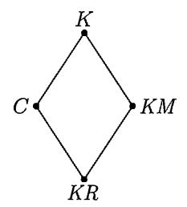

Figure 17. Inequalities between complexities

Some people would like to avoid references to topological notions like continuous mappings, though these notions are quite relevant here as the theory of abstract data types shows (Dana Scott lattices and related notions of  $f_0$ -spaces in the sense of Ershov); see [176]. Those readers will appreciate the following simplified construction [195] that is still enough to define the four complexities in the table.

Consider the set  $\Xi = \mathbb{B}^*$  of all binary strings and two binary relations: x = y means that strings x and y are equal;  $x \times y$  means that x and y are compatible (one is a prefix of the other one). Let  $\alpha$  and  $\beta$  be one of these two relations (so there are four combinations for the pair  $\alpha, \beta$ ).

A set  $S \subset \Xi \times \Xi$  is called  $\alpha$ - $\beta$ -regular if the following condition is true for any strings  $x_1, x_2, y_1, y_2$ :

$$(x_1, y_1) \in S, (x_2 y_2) \in S, x_1 \alpha x_2 \Rightarrow y_1 \beta y_2$$

For example, =-=-regular binary relations are just graphs of functions.

197 (a) Show that every  $\approx$ -=-regular relation determines a continuous mapping of type  $\Sigma \to \mathbb{N}_{\perp}$ .

- (b) Show that every  $\asymp$ - $\asymp$ -regular relation determines a continuous mapping of type  $\Sigma \to \Sigma$ .
- (c) Show that every =- $\approx$ -regular relation determines a continuous mapping of type  $\mathbb{N}_{\perp} \to \Sigma$ .

Now by  $\alpha$ - $\beta$ -description mode we mean an enumerable  $\alpha$ - $\beta$ -regular binary relation on  $\Xi \times \Xi$ . For each description mode S we define the complexity function  $K_S$ : let  $K_S(x)$  be the minimal length of a description of x, i.e., the minimal value of l(y) for all y such that  $\langle y, x \rangle \in S$ .

Theorem 128. For each of the four combinations  $\alpha, \beta \in \{=, \times\}$  there exists an optimal  $\alpha$ - $\beta$ -description mode (that provides minimal complexity function up to O(1)) and the corresponding complexity is one of the four known complexities C, K, KM, KR.

PROOF. In all four cases enumerable  $\alpha$ - $\beta$ -regular relations correspond to computable continuous mappings of the corresponding sets (see Problem 197) that gives the same complexity function, and vice versa.

So we can provide new labels for rows and columns of our table (Figure 18):

| objects |    |     |
|---------|----|-----|
|         | =  | )(  |
| =       | C  | KR  |
| Х       | K  | KM  |
|         | )( | = C |

FIGURE 18.  $\alpha$ - $\beta$ -complexities

198 For pairs of strings show how one can define:

- (a) monotone complexity (using computable continuous mappings  $\Sigma \to \Sigma \times \Sigma$  as decompressors; such mappings are in one-to-one correspondence with pairs of computable mappings  $\Sigma \to \Sigma$ );
- (b) a priori probability (using probabilistic machines that have two output tapes where bits are printed sequentially);
  - (c) decision complexity (using computable continuous mappings  $\mathbb{N}_{\perp} \to \Sigma \times \Sigma$ ).
- **199** Prove that the decision complexity of a pair  $\langle x, y \rangle$  (see the previous problem) does not exceed l(x) + l(y) + O(1).
- (*Hint*: The string z can describe the pair  $\langle z, z^R \rangle$ , where  $z^R$  is z from right to left.)

A surprising result: this property remains true for triples [72] and even for k-tuples of every fixed k (it is a corollary of the results of [146]). For monotone complexity a similar property is *not* true as was shown by Pavel Karpovich in [72]: the value of KM(x,y) may exceed l(x) + l(y) by a quantity of order log n for n-bit strings. (Therefore the monotone complexity of pairs may exceed a priori complexity by the same margin, since a priori complexity of a pair is obviously bounded by the sum of lengths.)

Another classification scheme for complexities (which goes back to [95]) defines each version of complexity as the smallest upper semicomputable function in some class (of functions that satisfy some restrictions). We have already considered these restrictions, so we just collect the results obtained and give the conditions for each complexity version:

- the number of strings x such that k(x) < n is  $O(2^n)$  (plain complexity C, Theorem 8, p. 19):
- the series  $\sum_{x}^{\infty} 2^{-k(x)}$  converges (prefix complexity K, Theorem 62, p. 100);
- every prefix-free set of strings x such that k(x) < n has  $O(2^n)$  elements (decision complexity KR, Theorem 127, p. 194);
- $\sum_{x \in X} 2^{-k(x)} \le 1$  for every prefix-free set X of binary strings (a priori complexity KA, Theorem 80, p. 126).

This scheme gives the same four complexities with one important exception: we get a priori complexity instead of monotone complexity. (There is no problem with prefix complexity, since it coincides with the negative logarithm of the *discrete* a priori probability, the largest lower semicomputable semimeasure on N.)

Combining these two quadrilaterals, we get a pentagon (Figure 19).

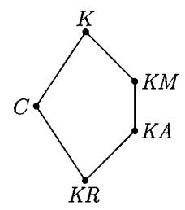

FIGURE 19. Five complexities

Let us recall the basic results that relate complexities in this pentagon. First, all five complexities differ at most by  $O(\log n)$  for strings of length n. Indeed, Theorem 65, p. 102 says that  $K(x) \leq C(x) + O(\log C(x))$ . On the other hand,

$$C(x) \leqslant C(x|l(x)) + C(l(x)) \leqslant KR(x) + O(\log n).$$

So the two most distant complexities in the pentagon (the upper one and the lower one) differ at most by  $O(\log n)$  for strings of length n.

A more complicated picture arises if we want to bound the difference between two complexities in terms of the complexities, not their length (note that a complexity can be much less than length). This is indeed possible for two lines that go in the north-east directions:

$$K(x) \leqslant C(x) + O(\log C(x))$$

(see Theorem 65) and

$$KM(x) \leq KR(x) + O(\log KR(x))$$

(Theorem 127). (A similar inequality with KA instead of KM follows, as we have already mentioned in Problem 140, p. 144.) For "north-west" lines the situation is different: KM and KR are bounded for prefixes of a computable sequence (e.g., for strings that contain only zeros) while C and K are not (the string of n zeros has the same complexity as the integer n, and this complexity is of order  $\log n$  for some n). We have already discussed this question in Theorem 86 and noted that the difference between K and KM can be of order  $\log n$  in both directions (for infinitely many n and for some x of length n). Theorem 87 says that the difference

between KM and KA for n-bit strings can be about  $\log \log n$  (so here we have a gap between the known lower and upper bounds).

None of the mentioned results guarantees that the difference between K(x) and C(x) tends to infinity as x goes to infinity (here we consider x as a natural number). But this follows from Theorem 73 (p. 112). Some other bounds relating different versions of complexity are mentioned in [195].

#### 6.3. Conditional complexities

We have already considered several versions of conditional complexity (of a string relative to the other one). In Section 2.2 we have defined the conditional complexity C(x|y) as the minimal length of a string p that describes x when y is given, i.e., a string p such that S(p, y) = x. Here S is the conditional decompressor that is optimal in the class of all partial computable binary functions.

In Section 4.7 we defined the conditional prefix complexity K(x|y). In this definition we required S(p,y) to be prefix stable with respect to p for every fixed y: this means that if S(p,y)=x for some p, then S(p',y)=x for all strings p' that have prefix p.

Finally, in the proof of Theorem 93 we mentioned the conditional monotone complexity KM(x|y). For its definition a description mode (decompressor) is a computable family of computable continuous mappings  $D_y \colon \Sigma \to \Sigma$  (indexed by string y). The computability of this family means that the set of triples  $\langle y, u, v \rangle$  such that  $v \preceq D_y(u)$  is enumerable.

The conditional decision complexity can be defined in a similar way.

In these four definitions we consider conditions as terminated bit strings, and the behavior of the decompressor is unrelated for different conditions: if we know that p is a description of x relative to y, this gives us no information about the values of decompressor for other values of y.

In other words, a decompressor (say, for the conditional prefix complexity) can be considered as a computable mapping

$$D \colon \Sigma \times \mathbb{N} \to \mathbb{N}_{\perp}$$
:

in the pair  $\langle p, y \rangle \in \Sigma \times \mathbb{N}$ , the string p is considered as a description (and D is monotone with respect to p) and y is a condition, and no monotonicity is required.

If we change this and consider conditions also as vertices of a binary tree requiring monotonicity over conditions, we get four other versions of conditional complexity. These versions are not widely used ([40] is a rare exception).

In this way we get eight versions of conditional complexities (for each of three components, i.e., conditions, descriptions, and objects, we have two possibilities). The most non-technical definition of these complexities goes as follows. Let  $\alpha, \beta, \gamma \in \{=, \times\}$  (see Section 6.2). An  $(\alpha, \beta) | \gamma$ -decompressor (description mode) is an enumerable set S of triples  $\langle p, x, y \rangle$ , such that

$$\langle p_1, x_1, y_1 \rangle \in S$$
,  $\langle p_2, x_2, y_2 \rangle \in S$ ,  $p_1 \alpha p_2$ ,  $y_1 \gamma y_2 \Rightarrow x_1 \beta x_2$ 

The we define  $K_S(x|y)$  as the minimal length of a string p such that  $\langle p, x, y \rangle \in S$ .

Theorem 129. In all eight cases there exists an optimal decompressor S that gives the smallest complexity  $K_S$  (up to O(1)) among all the decompressors of that class.

**200** Give a detailed proof of this theorem (it follows the same scheme as in the case of plain or prefix conditional complexity).

In each of eight classes let us fix some optimal  $(\alpha, \beta) | \gamma$ -decompressor and denote the corresponding complexity by  $K_{(\alpha,\beta)|\gamma}$ . In this notation K(x|y) (as defined earlier) is  $K_{(\approx,=)|=}$  and C(x|y) is  $K_{(=,=)|=}$ .

**201** Show that by replacing = by  $\approx$  in place of  $\gamma$  we may only increase the complexity.

(*Hint*: This replacement adds more restrictions for a decompressor, so we get fewer decompressors. For the same reasons the plain complexity does not exceed the prefix one.)

It would be interesting to study how large this increase could be (and establish other properties of these conditional complexities).

Let us give an example of a statement that involves conditional complexities as they are defined above:

202 Prove that

$$C(x) \leq K_{(=,=)}|_{\approx}(x|y) + KR(y) + O(\log KR(y)).$$

Let us now describe one more approach to the definition of the conditional complexity that goes back to Kolmogorov's interpretation of logical connectives as operations on problems [76]. The conditional complexity of x when y is known can be described as the complexity of the problem "transform y into x"; moreover, this problem can be considered as a set of all functions that map y into x (each function that maps y to x is a "solution" of this problem).

More formally, let us consider the space  $\mathbb F$  whose elements are all partial functions whose arguments and values are natural numbers. Let us introduce the following partial order on this set:  $f_1 \preccurlyeq f_2$  if  $f_2$  is an extension of  $f_1$  (i.e.,  $f_1(y) = x$  implies  $f_2(y) = x$ ). By finite elements of F we mean functions with finite domain. For each finite element  $f \in F$  consider its cone, i.e., the set of all its extensions  $\{y \mid f \preccurlyeq y\}$  (both finite and infinite). We call a continuous mapping  $T \colon \mathbb N_\perp \to \mathbb F$  computable if the set of pairs  $\langle a, f \rangle$  such that  $a \in \mathbb N_\perp$ , f is a finite element of  $\mathbb F$  and  $f \preccurlyeq T(a)$ , is enumerable. Continuous computable mappings  $\mathbb N_\perp \to F$  are used as decompressors for functions. For each function  $f \in F$ , we define the complexity of f (with respect to decompressor T) as the minimal length of a string (or the logarithm of the number—recall that we identify strings with natural numbers) a such that  $f \preccurlyeq T(a)$ .

**203** Prove that there exists an optimal decompressor (in this sense) and that the complexity of the function  $y \mapsto x$  (whose domain is a singleton  $\{y\}$  and whose value is x) is C(x|y) + O(1).

We can give a similar interpretation of all eight conditional complexities defined above: for every two spaces  $Y, X \in \{\mathbb{N}_{\perp}, \Sigma\}$ , we define the space of functions  $(Y \to X)$  and then consider computable mappings of the space of descriptions  $P \in \{\mathbb{N}_{\perp}, \Sigma\}$  into the function space  $(Y \to X)$ . The definition of the function space is given in the spirit of Scott domain theory (or the theory of  $f_0$ -spaces in the sense of Ershov, see [176] for details).

A slightly different interpretation of (plain) conditional complexity as the complexity of the problem "transform y to x" is considered in Chapter 13; it does not use computability notions for function spaces.

A related notion of complexity for functions was considered by Schnorr [168, 170]. Recall that a numbering (an important notion in the recursion theory) is a mapping  $\nu$  that maps each natural number n into some (partial) function  $\nu_n$  whose arguments and values are natural numbers. A numbering  $\nu$  is computable, if the (partial) function of two arguments

$$\langle n, x \rangle \mapsto \nu_n(x)$$

is computable. A numbering  $\nu$  is called a *Gödel numbering* if for any other computable numbering  $\mu$  there exists a computable function that reduces  $\mu$  to  $\nu$  in the following sense:  $\mu_n = \nu_{h(n)}$  for every n. (In particular, the range of a Gödel numbering is the set of all computable functions.)

Following Schnorr, we make this condition stronger and require additionally that h(n) = O(n) (in other words, the length of the string h(n) exceeds the length of string n at most by a constant, if we identify natural numbers with binary strings). If such a function h exists for every computable numbering  $\mu$ , the numbering  $\nu$  is called *optimal*.

THEOREM 130. There exist optimal numberings.

PROOF. Consider any reasonable programming language for functions of two arguments, and let  $\hat{u}v$  be a  $\nu$ -number of the function obtained by fixing first argument equal to v in the function that has program u. (Here  $\hat{u}$  is some self-delimiting encoding of u, e.g., u with doubled bits and 01 appended.)

Schnorr [168, 170] defined the complexity of a computable function as the logarithm of its minimal number on an optimal numbering. (As before, the minimal complexity of a function that maps x to y turns out to be equal to C(y|x).) Schnorr has shown that any two optimal numberings  $\nu_1$  and  $\nu_2$  can be translated into each other by a computable permutation  $\pi$  that changes the size at most by O(1) (in both directions): this means that  $\nu_1(n) = \nu_2(\pi(n))$  for every n and that  $\pi(n) = O(n)$  and  $\pi^{-1}(n) = O(n)$ . The detailed proofs of these results can be found also in [11].

#### 6.4. Complexities and oracles

**6.4.1. Relativized complexity.** Relativization is a well-known method in computability theory. We take a definition or statement that involves the class of computable functions and replace computable functions by functions that are computable with some oracle (computable relative to this oracle). The oracle is usually a total function  $\alpha$  whose arguments and values are natural numbers and/or binary strings, for example, a characteristic function of some set A. An algorithm is allowed to call an external procedure that computes the value  $\alpha(n)$  for a given value of the parameter n. If  $\alpha$  is a characteristic function of a set A, this means that we may ask whether some n belongs to A or not. If the function  $\alpha$  is not computable, this permission to ask  $\alpha$ -oracle increases our capabilities, and we get a class of  $\alpha$ -computable functions that contains all computable functions but also some non-computable ones (including  $\alpha$ ).

Then we can develop the general theory of algorithms as usual and define, say,  $\alpha$ -enumerable sets, or  $\alpha$ -computable real numbers, or (closer to our subject)  $\alpha$ -lower-semicomputable semimeasures, etc. And practically all the theorems of general theory of algorithms (and their proofs) remain valid, we just need to add " $\alpha$ -" for all the notions. This procedure is called *relativization*.

In particular, for a given set A we may define the notion of A-relativized Kolmogorov complexity allowing decompressors to use oracle A. This can be done for plain, prefix, and all other versions of complexity that we have considered (unconditional or conditional). The use of an oracle is shown by a superscript, so, e.g.,  $K^A(x)$  denotes prefix complexity relativized by oracle A.

In fact we can do a bit more: instead of defining complexity for a given oracle A up to an O(1)-additive term (by proving the existence of an optimal A-decompressor), we may define (with the same precision) the function of two arguments:

$$\langle A, x \rangle \mapsto k^A(x)$$

(here k is one of the complexity versions, say, K or KM).

**204** Show that this indeed can be done and that the resulting complexities coincide with the limits of conditional complexities defined in Section 6.3:

$$K^{A}(x) = K_{\simeq,=}^{A}(x) = \lim_{n \to \infty} K_{(\simeq,=|\simeq)}(x \mid A_n),$$

where  $A_n$  is the prefix of length n of the characteristic sequence of the set A. (Similar statements are true for other complexity versions.)

Note that relativized complexity does not exceed the non-relativized one (up to O(1)), since the algorithm with an oracle is not obliged to use it, so all decompressors are A-decompressors.

For some oracles A and some strings x the A-complexity of x can be much smaller than oracle-free complexity. For example, let A be the universal enumerable set: This set is usually denoted by  $\mathbf{0}'$ . In other words, the  $\mathbf{0}'$ -oracle is an oracle for the halting problem. We may send any program (with its input) to this oracle, and the oracle will tell us whether this program terminates for this input.

Using this oracle, we can find for every string x its shortest description (in the standard sense, without oracle) since the oracle tells us which computations terminate. Therefore, the function C is  $\mathbf{0}'$ -computable (the same is true for K, conditional complexities, etc.), and the list of all strings of complexity less than n (that has n + O(1)-complexity without the oracle), as well as the numbers B(n) and BB(n) (see Section 1.2) now have  $\mathbf{0}'$ -complexity only  $O(\log n)$ .

On the other hand, most strings of length n have  $\mathbf{0}'$ -complexity n-O(1), and therefore their  $\mathbf{0}'$ -complexity is close to their non-relativized complexity (and to their length).

**205** Assume that for some set A its use (as an oracle) does not change the plain complexity function, i.e.,  $C(x) = C^A(x) + O(1)$ . Show that A is decidable. Show that the same is true also for KM, KR, KA instead of C.

(*Hint*: One can characterize the computability of a binary sequence in terms of complexities of its prefixes, see Problem 49, p. 42.)

It is not the case for prefix complexity: there exist K-low sets that do not change prefix complexity being used as oracles. This is a very important recent result (see [147, 49], or the popular exposition in [20]).

This result implies that there is no formula that can express the value of plain (monotone, decision, a priori) complexities in terms of prefix complexity with O(1)-precision. Note that the same is true for conditional prefix complexity: it cannot be expressed in terms of the unconditional one, since it determines the class of computable functions. Indeed, a sequence  $\alpha$  is computable if and only if

 $K(\alpha_0 \cdots \alpha_{n-1} | n) = O(1)$ . Note that Theorem 72 characterizes plain complexity in terms of *conditional* prefix complexity.

**6.4.2.** Complexity with large numbers as conditions. Let us define a new type of conditional complexity, i.e., the complexity of a string x relative to the set A. Informally speaking, we want to measure the complexity of the task, "obtain x given an arbitrary element of A". This complexity has several equivalent (up to O(1)) definitions.

Here is one of them. Fix some reasonable programming language. (Formally speaking, "reasonable" means that the numbering corresponding to this language is a Gödel numbering, i.e., there exists a translation algorithm from any other programming language, see [184] for details.) Now let us define the conditional complexity of an object x with condition A as the minimal (plain) Kolmogorov complexity of a program that maps every element of A into x. (A generalization of this definition is considered in Chapter 13.)

The existence of a translation algorithm guarantees that this notion is well defined, i.e., that the complexity defined in this way does not depend on the choice of a programming language (Gödel numbering).

One should not mix this complexity with a completely different notion: a conditional complexity of x with condition A, where the finite set A is given as a finite object (say, as the list of its elements). In our case we do not get the list of all elements of A, but only one of them, and we should be prepared to deal with arbitrary elements of A. To stress this distinction, we use the notation  $C(x \mid A)$  for the new complexity (while  $C(x \mid A)$  denotes the condition complexity of x if a finite set A is given as a list of its elements).

A different (but equivalent) definition of C(x || A) can be given as follows. Let D (decompressor) be a computable partial function of two arguments. Let x be a binary string, and let A be a set of binary strings. We define  $C_D(x || A)$  as the minimal length of a string p such that D(p, y) = x for every  $y \in A$ .

**206** Prove that there exists an optimal decompressor in this class (that gives the minimal function  $C_D(\cdot \| \cdot)$  up to an O(1)-additive term). Prove that  $C_D$  for optimal D coincides (up to an O(1)-term) with the complexity defined above.

For a singleton  $A = \{a\}$ , both the complexities C(x|A) and C(x|A) coincide with the standard conditional complexity C(x|a) up to an O(1)-term (see Problem 28).

Now let A be the set of all integers greater than some (presumably) large number n. (As usual, we identify natural numbers with binary strings.) The complexity of a string x with respect to this set is denoted by  $C(x \parallel \ge n)$ . Obviously, this complexity does not exceed C(x) and is a non-increasing function of n (and, more generally,  $C(x \parallel A)$  can only decrease if A becomes smaller; it becomes O(1) for the empty set A). So there exists some limit as  $n \to \infty$ .

THEOREM 131.

$$\lim_{n\to\infty} C(x \parallel \geqslant n) = C^{\mathbf{0}'}(x) + O(1).$$

PROOF. Assume that the limit equals k. Then there exists a program p of complexity k that maps all sufficiently large numbers to x. If an oracle  $\mathbf{0}'$  is available, this program can be considered as a  $\mathbf{0}'$ -description of x. Indeed, given this program, we search for N and y such that p does not map any  $n \ge N$  into an object

that differs from y. The emphasized property can be checked using a 0'-oracle since it has an enumerable negation. And our assumption guarantees that y equals x. Therefore,

$$C^{\mathbf{0}'}(x) \leqslant \lim_{n \to \infty} C(x \parallel \geqslant n) + O(1).$$

On the other hand, let y be a description of x with respect to a  $\mathbf{0}'$ -optimal decompressor, and let k be the length of y. Consider a following program that has additional input N: make N steps of the enumeration of the universal set  $\mathbf{0}'$  and then use the set of enumerated elements as an oracle for decompression of y. This program can be constructed effectively given y, therefore its complexity does not exceed  $C(y) + O(1) \leq l(y) + O(1) = k + O(1)$ . On the other hand, if N is large enough, this program generates x (since only a finite number of oracle calls are performed during the decompression of y, for all sufficiently large N these questions get correct answers even if the oracle is replaced by its N-approximation).

It turns out that a similar result is true where we replace  $C(x \parallel \geq n)$  by  $\sup_{m \geq n} C(x \mid m)$ . Note that

$$\sup_{m>n} C(x \mid m) \leqslant C(x \parallel \geqslant n),$$

since the optimal program in the right-hand side can be used for any m in the left-hand side. This is easy; the surprising result is that both sides have the same limit as  $n \to \infty$  (up to an O(1)-term):

THEOREM 132.

$$\lim_{n \to \infty} \sup C(x | n) = C^{0'}(x) + O(1).$$

PROOF. We have to prove that if (for some string x and integer k)

$$C(x|n) < k$$
 for any sufficiently large n,

then 0'-complexity of x does not exceed k+O(1). The difficulty here is that (unlike in the previous theorem) the program of length less than k that maps n to x may depend on n, and none of these programs is guaranteed to work for all sufficiently large n.

Note that there is less than  $2^k$  strings x with this property (for a given k). Indeed, if we have more of them, then for sufficiently large n we run out of programs of length less than k.

It would be enough to prove that the set of strings x that have this property is a  $\mathbf{0}'$ -enumerable set whose enumeration effectively depends on k (in other words, it would be enough to prove that the function  $x \mapsto \limsup C(x \mid n)$  is  $\mathbf{0}'$ -enumerable from above). However, the natural description of this set,

$$\exists N \, (\forall n \geqslant N) \, [C(x \, | \, n) < k],$$

shows only that it is a  $\Sigma_3$ -set (the condition in brackets is enumerable and two quantifiers precede it), so we choose an another approach.

Note that we do not really need this set to be 0'-enumerable. It is enough to show that it is a subset of a 0'-enumerable set that contains less than  $2^k$  elements for a given k. This can be done as follows.

Consider two-dimensional enumerable set of pairs  $\langle n, x \rangle$  such that C(x|n) < k. This set (for each k) is *thin* in the following sense: all vertical sections of this set (for fixed n) contain fewer than  $2^k$  elements. Consider some point  $\langle n, x \rangle$ . Let us try to add a horizontal ray that goes on the right from this point to our set (i.e., add all pairs  $\langle m, x \rangle$  for all  $m \geq n$ ). The set may remain thin or not, and these two cases can be distinguished by a 0'-oracle. Indeed, the negation of being thin is an enumerable property (there exists a section that has at least  $2^k$  different elements including the added one).

Let us perform these attempts (to add the horizontal ray starting from some pair  $\langle n, x \rangle$ ) sequentially for all pairs in some order. (If some ray is added successfully, then its elements are taken into account for all subsequent attempts.) This process is  $\mathbf{0}'$ -computable and therefore the ordinates of all added rays form a  $\mathbf{0}'$ -enumerable set.

This set has fewer than  $2^k$  elements (since we add rays only if the resulting set is still thin) and contains every x such that  $\limsup C(x|n) < k$ . Indeed, for such an x there is some ray that lies entirely in the initial set, and this ray can be added at any time.

(This proof is a simplified version of the proof given in [196]. See also similar arguments in [16].)

We can also obtain the results for prefix complexity that are similar to Theorems 131 and 132. However, the definition of conditional prefix complexity with respect to a set is quite subtle, so we postpone its discussion and start with the second theorem.

THEOREM 133.

$$\limsup_{n \to \infty} K(x \mid n) = K^{\mathbf{0}'}(x) + O(1).$$

PROOF. Using a priori probabilities (conditional and unconditional), we rewrite the statement as follows:

$$\liminf_{n \to \infty} m(x \mid n) = m^{\mathbf{0}'}(x)$$

(the equality is understood up to a bounded factor in both directions).

Let us show first that the left-hand side is greater than the right-hand side (up to an O(1)-factor). Indeed, consider a  $\mathbf{0}'$ -oracle probabilistic machine whose output has distribution  $m^{\mathbf{0}'}$ . Then for any integer n we may run this machine with a changed oracle: instead of the entire oracle we use its approximation obtained after n steps. This, of course, changes the output distribution, however, the lim inf of the probabilities to get some x using n-approximation to the oracle (as  $n \to \infty$ ) is greater than or equal to the probability of getting x with the entire oracle. Indeed, the latter probability is the measure of an open set of all bit sequences that are mapped to x using a  $\mathbf{0}'$ -oracle. This open set is a union of intervals, and for each interval the computation depends only on some finite part of the oracle, and therefore the same random bits will give the same output x if the approximation to the oracle is good enough (i.e., n is sufficiently large). (Note that  $\lim \inf can$  be bigger than the probability of getting x with the final oracle, since approximate oracles can force output x for combinations of random bits that do not generate x with the final oracle.)

Now let us prove the reverse inequality. This proof resembles the proof of Theorem 132. We have a lower semicomputable family of semimeasures: for each n the function  $x \mapsto m(x|n)$  is a semimeasure (i.e.,  $\sum_x m(x|n) \leqslant 1$  for each n). It

follows that the function

$$m'(x) = \liminf_{n \to \infty} m(x \mid n)$$

is also a semimeasure, i.e., the sum  $\sum_x m'(x)$  does not exceed 1. If this function were  $\mathbf{0}'$ -lower-semicomputable, this would finish the proof; however, we have the equivalence

$$r < \liminf_{n \to \infty} m(x \mid n) \Leftrightarrow (\exists q > r) \exists N (\forall n > N) [q < m(x \mid n)],$$

where the right-hand side has too many quantifiers (note that the property in the brackets is enumerable, not decidable). But again we may replace the function m' by any larger function, so it remains to construct a 0'-lower-semicomputable upper bound for m'.

To achieve this goal, let us consider triples  $\langle N, x, \varepsilon \rangle$  (where  $\varepsilon$  is a positive rational number). For a given triple we try to increase the values  $m(\cdot|\cdot)$  up to  $\varepsilon$  on a ray that consists of pairs  $\langle n, x \rangle$  for fixed x and for all  $n \ge N$ . This change is performed only if we get semimeasures (i.e., for every n the sum over all x does not exceed 1).

As before, we can check whether such an increase is possible using a 0'-oracle. (Indeed, the violation is an enumerable event.) Let us consider sequentially all triples and perform the increase when possible (the increased values are taken into account on the subsequent steps). Then for each possible increase we keep the values of x and  $\varepsilon$ . In other words, we consider a function that on every x is equal to the upper bound of all  $\varepsilon$  that are used for increase together with that x. In this way we get a 0'-enumerable family of semimeasures that is an upper bound for m'. Indeed, if m' is greater than  $\varepsilon$  for some x, the function m is greater than  $\varepsilon$  on some ray, an increase does not really change anything and therefore is permitted.  $\square$ 

To formulate a similar statement for  $K(x \parallel \ge n)$ , we should first of all define this prefix complexity relative to a set. Here we have several possibilities, and it is unclear which of them is "the right thing".

We may try to define K(x||A) and the minimal prefix complexity of a program that outputs x when applied to every element of A. However, Problem 109 (p. 104) shows that this definition does not match K(x|a) for singleton conditions, so probably this definition is not a good one.

Another definition is similar to the approach used in Problem 206. Consider an arbitrary computable function  $\langle p, x \rangle \mapsto D(p, x)$  that is prefix stable with respect to its first argument (if the second one is fixed). For any x and for any set A we then define  $K_D(k \parallel A)$  as the minimal length of a string p such that f(p, n) = k for all  $n \in A$ . The difference (compared to plain complexity) is that we require the conditional decompressor to be prefix stable with respect to the first argument. There exists an optimal decompressor in this class that gives the least function  $K_D$  (up to an O(1)-additive term). This function can be called prefix complexity  $K(x \parallel A)$ .

**207** Show that the same complexity (up to O(1)) is obtained if decompressors are computable continuous mappings  $\Sigma \to \mathbb{F}$  (here  $\Sigma$  is the space of finite and infinite sequences of zeros and ones, and  $\mathbb{F}$  is the space of partial functions from  $\mathbb{N}$  to  $\mathbb{N}$ ) and complexity is the length of a shortest string that is mapped to some partial function that is equal to x on all elements of A.

We can also define the prefix complexity with set condition using prefix-free functions instead of prefix-stable ones. Again, in the class of computable prefix-free functions there exists an optimal one (that gives the smallest complexity function  $K_f(x \| A)$ ). In this way we get the definition of some function  $K'(x \| A)$  that resembles the conditional complexity K'(k | n) and coincides with it (up to O(1)) if  $A = \{n\}$ .

Finally one can define a priori probability m(x || A). For that we consider some probabilistic machine that has input y and the measure of the set of all sequences  $\omega \in \Omega$  that (being used as random bits) makes the machine transform every input  $y \in A$  into x. Again, there exists an optimal machine that maximizes this probability (up to an O(1)-constant factor), and for singletons this definition coincides with our definition of the conditional a priori probability.

The inequalities

$$-\log m(k \| A) \leq K(k \| A) + O(1) \leq K'(k \| A) + O(1),$$

can be proved in the same way as for conditional prefix complexity, but the argument that showed that all three expressions coincide does not work as before. As Elena Kalinina [71] has shown, the second inequality is not an equality; we do now know what happens with the first inequality. But it is easy to see that all three expressions are not less than

$$-\log \inf_{x \in A} m(k \mid x) = \sup_{x \in A} K(x \mid a),$$

so each of them can be used in the theorem similar to Theorem 131. In particular, for K(x || A) (which seems to be most natural among all three) we get the following result:

THEOREM 134.

$$\lim_{n \to \infty} K(x \| \ge n) = K^{0'}(x) + O(1).$$

**208** Prove that all three quantities  $K(k \parallel A)$ ,  $K'(k \parallel A)$ , and  $C(k \parallel A)$  differ at most by O(the logarithm of the smallest one), i.e., by  $O(\log C(k \parallel A))$ .

We do not know whether C(x || A) can be bounded by a linear (or even computable) function of  $-\log m(k || A)$  (at least for finite A, or even for A that contains only two elements).

Let us mention here that there is another type of problem in which the natural notions of complexity and a priori probability differ significantly: the enumeration problems considered by R. Solovay [189]. Let us consider non-terminating algorithms whose input is a binary string. Such an algorithm enumerates some (finite or infinite) set by printing its elements one by one. (If an algorithm starts to print some output element, it is obliged to print it completely, and then it may resume the computation.) If A is an algorithm of this type and S is some enumerable set, we define the complexity of S with respect to A as the minimal length of the input for which A enumerates S:

$$CE_A(S) = \min\{l(p) \mid M(p) \text{ enumerates } S\}.$$

As usual, it is easy to see that there exists an optimal algorithm A that makes  $CE_A$  minimal up to O(1). We fix an optimal A and call  $CE_A(S)$  an enumeration complexity of S. It is denoted by CE(S) and is finite if and only if S is enumerable.

On the other hand, we may consider probabilistic enumeration algorithms, i.e., the non-terminating algorithms without input equipped with a fair random bits generator and producing output elements as explained above. The output set of a probabilistic enumeration algorithm A is a random variable, and for a given set S we consider the probability of the event "A enumerates S". This probability is denoted by  $m_A(S)$ . Again it is easy to see that there exists an optimal A that makes  $m_A$  maximal up to an O(1)-factor; we fix some A and omit the subscript A, calling m(S) the enumeration a priori probability of S. It was shown by de Leeuw, Moore, Shannon, and Shapiro [91] that m(S) is positive if and only if S is enumerable.

**209** Prove the statement above.

(*Hint*: If a subset of  $\Omega$  has positive probability, there is an interval where the fraction of this subset exceeds 1/2.)

It is easy to see that  $CE(S) \leq -\log m(S) + O(1)$ . The reverse inequality, even with logarithmic precision, i.e., the inequality  $-\log m(S) \leq CE(S) + O(\log CE(S))$ , is unknown. There are some partial results. It is true with factor 3:

$$-\log m(S) \leqslant 3 \cdot CE(S) + O(\log CE(S)),$$

as shown in [189], and for finite sets the constant 3 can be replaced by 2 (see [197]).

**6.4.3.** Limit frequencies and 0'-relativized a priori probability. We conclude this section by a result from [133]; it relates the frequencies in computable sequences to the 0'-relativized prefix complexity. (See also the simplified exposition in [16].)

Let  $f(0), f(1), \ldots$  be a computable sequence of natural numbers. For a given n and k, let us count the appearances of k among  $f(0), \ldots, f(n-1)$  and divide the result by n. The ratio can be called the *frequency of* k *among the first* n *terms* of the sequence.

Now for a fixed k consider the  $\liminf$  of this frequency as  $n \to \infty$ ; we call it the *lower frequency* of element k in the sequence f.

Let  $p_k$  be a lower frequency of k in a given sequence. It is easy to check that  $\sum_k p_k \leq 1$ . Indeed, if some partial sum of this series exceeds 1, then a finite sum of  $\lim \inf$ 's exceeds 1, and for sufficiently large n the sum of the frequencies among the first n terms of the sequence exceeds 1, which is impossible.

The following statement is true for any computable sequence f:

Theorem 135. The function  $k \mapsto p_k$  is 0'-lower-semicomputable.

(Here  $p_k$  is the lower frequency of k; the definition of the lower semicomputable function is given in Section 4.1; now we consider a  $\mathbf{0}'$ -relativized version of this definition.)

PROOF. Indeed, the statement  $r < p_k$  (where r is some rational number) is equivalent to the following one:

there exist a rational number p > r and an integer N such that the frequency of k among the first n terms of f exceeds p for all n > N.

The property printed in italics is co-enumerable (has an enumerable negation): if it is not true, we can establish it by showing a number n that violates it. Therefore

this property is  $\mathbf{0}'$ -decidable (we apply the oracle to the algorithm that searches for that n). So the property  $r < p_k$  is  $\mathbf{0}'$ -enumerable.

In fact we use the following general observation:

**210** Let  $r_n$  be a computable sequence of rational numbers. Show that  $\liminf r_n$  is a  $\mathbf{0}'$ -lower-semicomputable real number and the corresponding  $\mathbf{0}'$ -algorithm can be effectively found given an algorithm for  $r_n$ .

By the way, the reverse statement is also true:

211 Any 0'-lower-semicomputable real number is a liminf of a computable sequence of rational numbers.

(*Hint*: This number is a supremum of a 0'-computable sequence of rational numbers  $r_n$ . Each  $r_n$  is an ultimate value of a stabilizing sequence  $r_{n,k}$ . Let  $s_k$  be the maximum of  $r_{0,k}, \ldots, r_{t-1,k}$  where t is the minimal number such that  $r_{t,k} \neq r_{t,k-1}$ .)

It turns out that for an appropriate computable sequence f the function  $k \mapsto p_k$  is a maximal  $\mathbf{0}'$ -lower-semicomputable semimeasure. This is a corollary of the following result:

THEOREM 136. For any 0'-lower-semicomputable sequence  $q_0, q_1, \ldots$  of non-negative reals such that  $\sum_i q_i \leq 1$ , there exists a computable sequence  $f(0), f(1), \ldots$  such that for all k the lower frequency of k in the sequence f is at least  $q_k$ .

This allows us to give an equivalent definition of 0'-relativized prefix complexity of k: it is the negative logarithm of the lower frequency of k in the optimal sequence f (that gives maximal lower frequencies up to O(1)-factor).

PROOF. Since  $q_k$  is lower semicomputable, the set of pairs  $\langle r, k \rangle$  where r is a rational number smaller than  $q_k$  is **0**'-enumerable. As we know from general computability theory (see, e.g., [184]), **0**'-enumerable sets are  $\Sigma_2$ -sets, i.e., there exists a decidable property R such that

$$r < q_k \Leftrightarrow \exists u \, \forall v \, R(r, k, u, v).$$

We use a slightly different representation of  $\Sigma_2$ -predicates: there exists a computable total function  $(r,k,n)\mapsto S(r,k,n)$  with 0/1-values such that  $r< q_k$  if and only if the sequence  $S(r,k,0), S(r,k,1)\cdots$  has finitely many zeros. The sequence  $S(r,k,0), S(r,k,1)\cdots$  can be constructed as follows. We consider (sequentially) the values  $u=0,1,2,\ldots$ , and for each u we search for v such that R(r,k,u,v) is false. While searching, we extend the sequence adding zeros. When v is found, we add 1 to the sequence and switch to the next value of u. The number of zeros in the constructed sequence is finite if and only if the search was unsuccessful for some u, i.e., if  $r< q_k$ .

It is convenient to visualize this process as follows. From time to time the request "please make  $q_k$  greater than r" appears for some k and r (and the previous request with the same k and r is canceled). Then we consider the requests that appear and are never canceled later; they correspond to pairs  $\langle r, k \rangle$  such that  $r < q_k$ . (The moments when requests appear correspond to zeros in the sequence S.) This process is computable. We may also assume without loss of generality that at each given moment there is only finitely many requests. (This does not matter since only the limit behavior of the sequence is important.)

Recall that we need a computable sequence  $f(0), f(1), \ldots$  for which the lower frequency of k is at least  $q_k$ . To achieve this goal, it is enough to represent the given  $\mathbf{0}'$ -lower-semicomputable semimeasure as the liminf of a computable sequence of measures with rational values, i.e., to construct a two-dimensional table of rational numbers

$$\begin{array}{cccc} p_0^0 & p_1^0 & p_2^0 \\ p_0^1 & p_1^1 & p_2^1 \\ p_0^2 & p_1^2 & p_2^2 \end{array}$$

such that each row has only a finite number of non-zero elements, these elements have sum 1, and the lim inf in the kth column is at least  $q_k$ . Indeed, let us assume that such a table is constructed. Without loss of generality we may suppose that in the ith row all the numbers are multiples of 1/i (we may take approximation with precision 1/i not changing the limit). Then the sequence f can be constructed as follows: first we use the first row as the table of frequencies, then switch to the second row and use it for a much longer time (to make the influence of the first row negligible), then we use the third row even longer (to make the influence of the first and second rows negligible), etc.

So it remains to construct a table  $p_j^i$  with the following property: if some request "please make  $q_k$  greater than r" appears at some moment and is not canceled later, then the kth column has  $\lim \inf at \operatorname{least} q_k$ . This is done as follows: in constructing the nth row (at time n), we try to satisfy all current requests (that have appeared and are not canceled) according to their age (the oldest request is treated first). For each request we increase the corresponding  $p_k$  up to a given r if this is possible (if it does not make the sum greater than 1). We may assume that there are many requests, and at some point the sum becomes greater than 1. At that moment we cut the last request (so the sum is 1), and this finishes the construction of nth row.

Why does this help? Imagine that  $r < q_k$  is true. Then the request "please make  $q_k$  greater than r" appears at some moment and is never canceled later. (It need not to be the first appearance of this request.) Let us look at all requests that appear before this one. Some of them are canceled later (while others are "final"). Let us wait until all these cancellations happen. After that, only "true" requests (ones that are never canceled later) are older than our request, and for these true requests we have  $r' < q_{k'}$ . Their sum therefore does not exceed 1 together with our request, so the requests with high priority at that time will not interfere with our request.

**212** Prove that there exists a computable sequence where the lower frequencies coincide with  $q_k$ .

(Hint: Combine the proof of this theorem with the solution of Problem 211.)

One more result from the same paper [133]:

**213** Prove that Theorem 136 remains true if we consider partial computable functions f from  $\mathbb{N}$  to  $\mathbb{N}$  instead of sequences: for any partial computable function f from  $\mathbb{N}$  to  $\mathbb{N}$  there exists a (total) computable sequence  $g(0), g(1), \ldots$  that has the same (or bigger) lower frequencies: for any k the lower frequency of k in g is at least its lower frequency in  $f(0), f(1), \ldots$  (which is defined as the limit inferior of the number of appearances of k among  $f(0), \ldots, f(N-1)$  divided by N).

(*Hint* [16]: For every N the frequencies in the initial segment of length N form a lower semicomputable semimeasure (it was a measure for total sequences); the construction used in the proof of Theorem 133 allows us to find an upper bound for the limit frequencies that is a 0'-lower-semicomputable semimeasure. Then we apply Theorem 136.)

#### CHAPTER 7

# Shannon entropy and Kolmogorov complexity

# 7.1. Shannon entropy

Consider an alphabet A that contains k letters  $a_1, \ldots, a_k$ . We want to encode each letter  $a_i$  by a binary string  $c_i$ . Of course, we want all  $c_i$  to be different to avoid confusion. But this is not enough if we write codewords without any separator. For example, imagine that letters A, B, and C are encoded by strings 0, 1, and 01. All three codes are different, but two strings ABAB and ABC have identical codes 0101. So additional precautions are needed to guarantee unique decoding.

We want the code to allow unique decoding. At the same time we want it to be space efficient. It is good to have the strings  $c_i$  as short as possible (without violating the unique decoding property). And if we cannot make all codewords short, the priority should be given to the frequent letters. (Similar considerations were taken into account when Morse code was designed.)

**7.1.1.** Codes. Let us give formal definitions. A code for a k-letter alphabet  $A = \{a_1, \ldots, a_k\}$  consists of k binary strings  $c_1, \ldots, c_k$ . These strings are called codewords (for the code considered); letter  $a_i$  has encoding  $c_i$ . Any A-string (a finite sequence of letters taken from A) has an encoding; to get it, we encode each letter and concatenate their codes (without separators).

A code is *injective* if different letters have different codes. A code is *uniquely decodable* if every two different A-strings have different codes. A *prefix code* is a code where no codeword is a prefix of another codeword. (This is a traditional terminology; however, the more logical name *prefix-free code* is also used.)

Theorem 137. Every prefix code is uniquely decodable.

PROOF. The first codeword (the encoding of the first letter) is determined uniquely (due to the prefix property), so we can separate it from the rest. Then the second codeword is determined, etc.

**214** Show that there exist uniquely decodable codes which are not prefix codes.

(Hint: Consider a suffix code.)

215 Construct an explicit bijection between the set of all infinite sequences of digits 0, 1, 2 and the set of all infinite sequences of digits 0, 1.

(*Hint*: Use the prefix code  $0 \mapsto 00$ ,  $1 \mapsto 01$ ,  $2 \mapsto 1$ .)

**216** Consider prefix codes  $c_1, \ldots, c_k$  (for a k-letter alphabet) and  $d_1, \ldots, d_l$  (for an l-letter alphabet). Show that strings  $c_i d_j$  (concatenations of codewords from these two codes) form a prefix code for a kl-letter alphabet.

Before asking which of two codes is more space efficient, we should fix frequencies of the letters. Let  $p_1, \ldots, p_k$  be non-negative reals such that  $p_1 + \cdots + p_n = 1$ .

The number  $p_i$  will be called the *frequency* or *probability* of letter  $a_i$ . For each code  $c_1, \ldots, c_k$  (for alphabet  $a_1, \ldots, a_k$ ) its average length is defined as

$$\sum_i p_i l(c_i).$$

Now we can formulate our goal: for a given  $p_1, \ldots, p_k$  we want to find a code of minimal average length inside some class of codes, e.g., a uniquely decodable code of minimal average length.

**217** Which injective code has minimal average length (among injective codes) for given  $p_1, \ldots, p_n$ ?

(*Hint*: Put all letters in order of decreasing frequency and all binary strings in order of increasing length.)

**7.1.2.** The definition of Shannon entropy. Shannon entropy provides a lower bound for the average length of a uniquely decodable code. It is defined (for given non-negative  $p_i$  such that  $\sum_i p_i = 1$ ) as

$$H = p_1(-\log p_1) + p_2(-\log p_2) + \cdots + p_k(-\log p_k).$$

(We assume that  $p \log p = 0$  for p = 0, making the function  $p \log p$  continuous at the point p = 0.)

There is some motivation for this definition. Letter  $a_i$  appears with frequency  $p_i$ , and each occurrence of  $a_i$  carries  $-\log p_i$  "bits of information", so the average number of bits per letter is H. But then we should also explain why we believe that each occurrence of the letter that has frequency  $p_i$  carries  $-\log p_i$  bits of information. Imagine that somebody has in mind one of  $2^n$  possible numbers, and you want to guess this number by asking yes-or-no questions. Then you need n questions, and each answer gives you one bit of information; so when an event having probability  $1/2^n$  happens, it brings us n bits of information.

Of course, the previous paragraph is just a mnemonic rule for the definition of entropy. The formal reason to introduce this notion is given by the following theorem:

THEOREM 138. Let  $p_1, \ldots, p_n$  be non-negative reals such that  $p_1 + \cdots + p_n = 1$ . (a) The average length of every prefix code  $c_1, \ldots, c_k$  is at least H (the entropy):

$$\sum_{i} p_i l(c_i) \geqslant H.$$

(b) There exists a prefix code such that

$$\sum_{i} p_i l(c_i) < H + 1.$$

PROOF. Note that this theorem deals only with the lengths of codewords (but not the codewords itself). So it is important to know when given integers  $n_1, \ldots, n_k$  could be lengths of codewords in a prefix code. Here is the criterion:

LEMMA (Kraft inequality). Assume that non-negative integers  $n_1, \ldots, n_k$  are fixed and we want to find binary strings  $c_1, \ldots, c_k$  of these lengths  $(l(c_i) = n_i)$  that form a prefix code (i.e.,  $c_i$  is not a prefix of  $c_j$  for  $i \neq j$ ). This is possible if and only if

$$\sum_{i} 2^{-n_i} \leqslant 1.$$

We have already seen this statement, see the lemmas used to prove Theorems 56 (p. 92) and 58 (p. 93). In one direction, if  $c_i$  is never a prefix of the other string  $c_j$ , then the corresponding intervals of lengths  $2^{-n_i}$  are disjoint and the sum of their lengths does not exceed 1. (Using probabilistic language, a random string of zeros and ones has prefix  $c_i$  with probability  $2^{-n_i}$ ; these k events are disjoint, so the sum of probabilities does not exceed 1.)

Going in the opposite direction, we can use a simpler argument that was used before (in the proof of Theorem 58). Simplification is possible since we have only a finite number (k) of integers and they are given in advance. We can simply place the corresponding intervals of lengths  $2^{-n_i}$  inside [0,1] from left to right going in decreasing order of length. Then each interval is properly aligned and corresponds to a binary string of length  $n_i$ . The lemma is proven.

Let us prove the theorem now. Without loss of generality we may assume that all  $p_i$  are strictly positive (since null values do not change Shannon entropy and average code length). Theorem 138(a) says that if  $n_i$  are non-negative integers and  $\sum_i 2^{-n_i} \leq 1$ , then  $\sum p_i n_i \geq 1$ . It is true for any non-negative reals  $n_i$  (even if they are not integers). Indeed, let  $q_i$  be equal to  $2^{-n_i}$ . In these coordinates the statement reads as follows: if  $q_i > 0$  and  $\sum q_i \leq 1$ , then

$$\sum p_i(-\log q_i) \geqslant \sum p_i(-\log p_i).$$

This inequality is sometimes called the *Gibbs inequality*. To prove it, we rewrite the difference between right-hand side and left-hand side as

$$\sum_{i} p_i \log \frac{q_i}{p_i}.$$

Then we use the convexity argument: the weighted sum of logarithms does not exceed the logarithm of the weighted sum  $\sum p_i \log u_i \leq \log(\sum_i p_i u_i)$  (if all  $u_i$  are positive). In our case we see that (\*) does not exceed

$$\log\left(\sum_i p_i rac{q_i}{p_i}
ight) = \log\left(\sum q_i
ight) \leqslant \log 1 = 0.$$

Item (a) is proven.

Let us mention also that the non-negative number

$$\sum_{i} p_i \log \frac{p_i}{q_i}$$

is called the Kullback-Leibler distance between two probability distributions  $p_i$  and  $q_i$  (so we assume that  $\sum q_i = 1$ ) or the Kullback-Leibler divergence; the latter name is better since this "distance" is not symmetric. The convexity of the logarithm (its second derivative is negative everywhere) guarantees that this distance is always non-negative and equals zero only if  $p_i = q_i$  for all i.

To prove item (b), consider the integers  $n_i = \lceil -\log_2 p_i \rceil$  (where  $\lceil u \rceil$  is a minimal integer greater than or equal to u). Then

$$\frac{p_i}{2} < 2^{-n_i} \leqslant p_i.$$

The inequality  $2^{-n_i} \leq p_i$  allows us to use the lemma, so there exist codewords of corresponding lengths. The inequality  $p_i/2 < 2^{-n_i}$  implies that  $n_i$  exceeds  $(-\log p_i)$  by less than 1, and this remains true after averaging: the average code length  $(\sum p_i n_i)$  exceeds  $H = \sum p_i(-\log p_i)$  by less than 1.

This proof is a kind of a "relaxation argument": if we forget that code-lengths should be integers and allow any  $n_i$  such that  $\sum_i 2^{-n_i} \leq 1$ , the optimal choice is  $n_i = -\log p_i$  (convexity of the logarithm function); making  $n_i$  integers, we lose less than 1.

THEOREM 139. The entropy of the distribution  $p_1, \ldots, p_n$  (with n possible values) does not exceed  $\log n$ . It equals  $\log n$  only if all  $p_i$  are equal.

PROOF. If n is a power of 2, the inequality  $H \leq \log n$  follows from Theorem 138 (consider a prefix code where n codewords all have length  $\log n$ . In the general case we use Gibbs inequality for  $q_i = 1/n$  (for all i) and recall that this inequality becomes an equality only if  $p_i = q_i$ .

**7.1.3.** Huffman code. We have shown that the average length of an optimal prefix code (for given  $p_1, \ldots, p_k$ ) is somewhere between H and H+1. But how can we find this optimal code?

Let  $n_1, \ldots, n_k$  be the lengths of codewords for an optimal code (for given frequencies  $p_1, \ldots, p_k$ ). Rearranging the letters, we may assume that

$$p_1 \leqslant p_2 \leqslant \cdots \leqslant p_k$$
.

In this case we may assume that

$$n_1 \geqslant n_2 \geqslant \cdots \geqslant n_k$$
.

Indeed, if one letter has a longer code than another letter that is less frequent, the exchange of codewords (between these two letters) decreases the average length of the code.

One can note also that  $n_1=n_2$  for an optimal code (the two less frequent letters have the same code length). Indeed, if  $n_1>n_2$ , then  $n_1$  is greater than all  $n_i$ . So the first term in the sum  $\sum_i 2^{-n_i}$  is smaller than all other terms, the inequality  $\sum_i 2^{-n_i} \leqslant 1$  cannot be an equality (all terms except the first one are multiples of the second term), and the difference between its two sides is at least  $2^{-n_1}$ . Therefore, we can decrease  $n_1$  by 1 and still not violate the inequality  $\sum_i 2^{-n_i} \leqslant 1$ . This means that the code is not optimal (contrary to our assumption).

We can look for an optimal code among codes that have  $n_1 = n_2$ ; this optimal code minimizes the sum

$$p_1n_1 + p_2n_2 + p_3n_3 + \cdots + p_kn_k = (p_1 + p_2)n + p_3n_3 + \cdots + p_kn_k$$

(here n is the common value of  $n_1$  and  $n_2$ ). In the last expression the minimum should be taken over all sequences  $n, n_3, \ldots, n_k$  such that

$$2^{-n} + 2^{-n} + 2^{-n_3} + \dots + 2^{-n_k} \le 1.$$

This inequality can be rewritten as

$$2^{-(n-1)} + 2^{-n_3} + \dots + 2^{-n_k} \leqslant 1,$$

and the expression that is minimized can be rewritten as

$$(p_1+p_2)+(p_1+p_2)(n-1)+p_3n_3+\cdots+p_kn_k.$$

The term  $(p_1 + p_2)$  is a constant that does not influence the minimal point, so the problem reduces to finding an optimal prefix code for k-1 letters that have probabilities  $p_1 + p_2, p_3, \ldots, p_k$ .

We obtain the recursive algorithm that finds the optimal prefix code as follows:

- combine the two rarest letters into one (adding their probabilities);
- find the optimal prefix code for the resulting probabilities (a recursive call);
- replace the codeword x for a "virtual" combined letter by two codewords x0 and x1 which are one bit longer (note that this replacement keeps the prefix property).

The optimal code constructed by this algorithm is called the *Huffman code* for a given distribution  $p_1, \ldots, p_n$ .

**7.1.4.** Kraft–McMillan inequality. So far we have studied prefix codes. It turns out that they are as efficient as general uniquely decodable codes, as shown in the following theorem.

THEOREM 140 (McMillan inequality). Assume that  $c_1, \ldots, c_k$  are codewords of a uniquely decodable code, and let  $n_i = l(c_i)$  be their lengths. Then

$$\sum_{i} 2^{-n_i} \leqslant 1.$$

Therefore (recall the lemma above) for any uniquely decodable code there is a prefix code with the same lengths of codewords.

PROOF. Let us use letters u and v instead of digits 0 and 1 when constructing codewords (e.g., the codes 0, 01, and 11 are now written as u, uv, vv). Now take a formal sum  $(c_1 + \cdots + c_k)$  of all codewords and consider its Nth power (for some N that we choose later). Then we open the parentheses without changing the order of factors u and v (as if u and v were two non-commuting variables). For example, the code above gives (for N=2) the expression

$$(u+uv+vv)(u+uv+vv)$$

$$= uu + uuv + uvv + uvu + uvuv + uvvv + vvu + vvuv + vvvv.$$

Each term in the right-hand side is a concatenation of some codewords. The unique decoding property guarantees that all the terms are different. Now we let u = v = 1/2. The left-hand side  $(c_1 + \cdots + c_k)^N$  becomes  $(2^{-n_1} + \cdots + 2^{-n_k})^N$ . For the right-hand side we have an upper bound: if it consisted of all strings of length t, it would contain  $2^t$  terms equal to  $2^{-t}$  (each), so the sum would be equal to 1 (for each length t). Therefore, the right-hand side does not exceed the maximal length of strings in the right-hand side, which equals  $N \max(n_i)$ .

If  $\sum 2^{-n_i} > 1$ , we immediately get a contradiction, since for large enough N the left-hand side grows exponentially in N while the right-hand side is linear in N.  $\square$ 

This proof looks like an extremely artificial trick (though a nice one). A more natural proof (or, better to say, a more natural version of the same proof) is given below; see p. 222.

#### 7.2. Pairs and conditional entropy

**7.2.1.** Pairs of random variables. Dealing with Shannon entropies, we use the terminology which is standard for probability theory. Let  $\xi$  be a random variable which takes finitely many values  $\xi_1, \ldots, \xi_k$  with probabilities  $p_1, \ldots, p_k$ . Then the Shannon entropy of a random variable  $\xi$  is defined as

$$H(\xi) = p_1(-\log p_1) + \dots + p_k(-\log p_k).$$

This definition allows us to consider the entropy of a pair of random variables  $\xi$  and  $\eta$  (that have a common distribution, i.e., are defined on the same probability space). Indeed, this pair is also a random variable with a finite range. The following theorem says that the entropy of a pair does not exceed the sum of entropies of its components.

THEOREM 141.

$$H(\langle \xi, \eta \rangle) \leqslant H(\xi) + H(\eta).$$

We consider random variables with finite ranges, so this is just an inequality involving logarithms. Let is write this inequality. Assume that  $\xi$  has k values  $\xi_1, \ldots, \xi_k$  and  $\eta$  has l values  $\eta_1, \ldots, \eta_l$ . Then the maximal possible number of values for the pair  $\langle \xi, \eta \rangle$  is kl, and these values are  $\langle \xi_i, \eta_j \rangle$  (some of them may never appear or have probability 0). The distribution for  $\langle \xi, \eta \rangle$  is therefore a table that has k rows and l columns. The number  $p_{ij}$  (ith row, jth column) is the probability of the event " $(\xi = \xi_i)$  and  $(\eta = \eta_j)$ " (here  $i = 1, \ldots, k$  and  $j = 1, \ldots, l$ ). All  $p_{ij}$  are non-negative and their sum equals 1. (Some of the  $p_{ij}$  can be equal to 0.)

Adding the numbers in each row, we get the probability distribution for  $\xi$ : the probability of the event  $\xi = \xi_i$  equals  $\sum_j p_{ij}$ . We denote this sum by  $p_{i*}$ . Similarly,  $\eta$  takes value  $\eta_j$  with probability  $p_{*j}$  which equals the sum of all numbers in the jth column.

Therefore, the theorem in question is an inequality that is applicable to any matrix with non-negative elements and sum 1:

$$\sum_{i,j} p_{ij}(-\log p_{ij}) \leqslant \sum_{i} p_{i*}(-\log p_{i*}) + \sum_{j} p_{*j}(-\log p_{*j})$$

(here  $p_{i*}$  and  $p_{*j}$  are the sums of the rows and columns).

This inequality again is a consequence of the convexity of logarithm, but it is useful to understand its intuitive meaning. Let us forget for a while that entropy is not exactly equal to the length of the shortest prefix code (and ignore the difference that does not exceed 1). Then this inequality can be proven as follows. Assume that space-efficient prefix codes for  $\xi$  and  $\eta$  are given, and they have codewords  $c_1, \ldots, c_k$  and  $d_1, \ldots, d_l$ , respectively. Then consider a code for  $(\xi, \eta)$  that assigns to the value  $(\xi_i, \eta_j)$  the string  $c_i d_j$  (the concatenation of  $c_i$  and  $d_j$  without a separator). We get a prefix code (indeed, to separate a codeword that starts an infinite sequence, we first find the prefix  $c_i$  and then the prefix  $d_j$  in the remaining part; both operations can be performed uniquely). The average length of this code equals the sum of the average lengths of its components. This code may be non-optimal (which is natural, since the inequality could be strict), but it provides an upper bound for the length of the optimal code.

PROOF. Let us transform this informal argument into a proof. Recall the proof of Theorem 138 (p. 214). We have seen that the entropy is a minimal value of  $\sum_i p_i(-\log_2 q_i)$  taken over all tuples of non-negative reals  $q_i$  that have sum 1. In particular, the entropy of the pair (the left-hand side) is the minimal value of

$$\sum_{i,j} p_{ij} (-\log q_{ij})$$

taken over all tuples  $q_{ij}$  of non-negative reals that sum up to 1. Let us restrict our attention to "rank 1" tuples that have the form

$$q_{ij} = q_{i*} \cdot q_{*j}$$

for some tuples of non-negative reals  $q_{i*}$  and  $q_{*j}$  (both tuples have sum 1). Then  $(-\log q_{ij})$  can be decomposed into  $(-\log q_{i*}) + (-\log q_{*j})$ , and the entire sum is decomposed into two parts, which after partial summation over one coordinate becomes equal to

$$\sum_{i} p_{i*}(-\log q_{i*})$$

and

$$\sum_{j} p_{*j}(-\log q_{*j}),$$

respectively. The minimal values of the two parts are  $H(\xi)$  and  $H(\eta)$ .

Therefore, the left-hand side of our inequality is the minimum over all tuples and the right-hand side is the minimum over rank 1 tuples, and the inequality is proven.  $\Box$ 

**7.2.2.** Conditional entropy. Recall the definition of conditional probability. Let A and B be two events. The *conditional probability* of B with condition A (denoted as  $\Pr[B|A]$ ) is defined as the ratio  $\Pr[A \text{ and } B]/\Pr[A]$ . This definition assumes that  $\Pr[A] > 0$ . The motivation is clear: We are interested in the fraction of outcomes when B happened but restrict our attention to the case when A happened.

Let A be an event (that has non-zero probability), and let  $\xi$  be a random variable with finite range  $\xi_1, \ldots, \xi_k$ . Then we may consider the *conditional distribution* of  $\xi$  when A happens. We get a new random variable: now  $\xi_i$  has probability  $\Pr[(\xi = \xi_i)|A]$  instead of  $\Pr[\xi = \xi_i]$ . The entropy of this distribution is called *conditional entropy of*  $\xi$  with condition A and is denoted by  $H(\xi|A)$ . (The distribution itself could be denoted by  $(\xi|A)$ .)

**218** Show that  $H(\xi|A)$  can be greater than  $H(\xi)$  and can be less than  $H(\xi)$ . (*Hint*: The distribution  $(\xi|A)$  has not much in common with the distribution of  $\xi$ , especially if A has small probability.)

Informally speaking,  $H(\xi|A)$  is the minimal average code length if the average is taken only over the cases when A happens.

Now let us consider two random variables  $\xi$  and  $\eta$  (as was done in the previous section). Let as assume that each value of both  $\xi$  and  $\eta$  has non-zero probability (zero-probability outcomes could be ignored). For each value  $\eta_j$  (for  $\eta$ ) consider the event  $\eta = \eta_j$ . (Its probability was denoted by  $p_{*j}$ .) Consider the conditional entropy of variable  $\xi$  having this event as the condition. In other words, consider the entropy of the distribution  $i \mapsto p_{ij}/p_{*j}$ . Then we average these entropies, using probabilities of the events  $\eta = \eta_j$  as weights. The resulting average is called conditional entropy of  $\xi$  with condition  $\eta$ . It is denoted by  $H(\xi|\eta)$ . So by definition

$$H(\xi|\eta) = \sum_{j} \Pr[\eta = \eta_j] H(\xi|\eta = \eta_j)$$

or, using the notation above,

$$H(\xi|\eta) = \sum_{j} p_{*j} \sum_{i} \frac{p_{ij}}{p_{*j}} \left( -\log \frac{p_{ij}}{p_{*j}} \right).$$

The following theorem sums up the basic properties of conditional entropy (that are true for any random variables  $\xi$  and  $\eta$ ):

Theorem 142. (a)  $H(\xi|\eta) \geqslant 0$ ;

- (b)  $H(\xi|\eta) = 0$  if and only if  $\xi = f(\eta)$  with probability 1 for some function f (in other words, we ignore the cases that have zero probability);
  - (c)  $H(\xi|\eta) \leqslant H(\xi)$ ;
  - (d)  $H(\langle \xi, \eta \rangle) = H(\eta) + H(\xi|\eta)$ .

PROOF. Item (a) is evident: all  $H(\xi|\eta=\eta_j)$  are non-negative, so the same is true for their weighted sum.

(b) If the weighted sum of non-negative terms equals zero, then all the terms that have non-zero weights are equal to zero. So for each value  $\eta_j$  the restricted variable  $(\xi | \eta = \eta_i)$  has zero entropy, and therefore has only one value if we ignore values that have probability 0.

Statement (c) can be explained as follows:  $H(\xi|\eta)$  is the average length of an optimal code for  $\xi$  if we allow different codes for  $\xi$  for different values of  $\eta$  (for each value of  $\eta$  we consider the code that is optimal with respect to conditional distribution). This provides some additional freedom (compared to the case when the same code should be used for all values of  $\eta$ ), and this freedom can only decrease the optimal code length.

The same argument is made formal: For each j the value of  $H(\xi|\eta=\eta_j)$  is the minimal value of the sum

$$\sum_{i} \frac{p_{ij}}{p_{*j}} (-\log q_{ij})$$

taken over all non-negative values of the variables  $q_{1j} + q_{2j} + \cdots + q_{kj} = 1$  (we use different variables for each j). Therefore,  $H(\xi|\eta)$  is the minimal value of the sum

$$\sum_{i} p_{*j} \sum_{i} \frac{p_{ij}}{p_{*j}} (-\log q_{ij})$$

taken over all tables that contain non-negative reals  $q_{ij}$  and each column has sum 1. If we restrict ourselves to tables where all columns are equal  $(q_{ij} = q_i)$ , the sum turns into

$$\sum_{j} p_{*j} \sum_{i} \frac{p_{ij}}{p_{*j}} (-\log q_i) = \sum_{j} \sum_{i} p_{ij} (-\log q_i) = \sum_{i} p_{i*} (-\log q_i),$$

and its minimum is  $H(\xi)$ . Therefore  $H(\xi|\eta) \leqslant H(\xi)$ .

Finally, item (d) is just an exercise in transformation of logarithms:

$$\sum_{i,j} p_{ij}(-\log p_{ij}) = \sum_{j} p_{*j} \sum_{i} \frac{p_{ij}}{p_{*j}} (-\log \frac{p_{ij}}{p_{*j}} - \log p_{*j})$$

$$= \sum_{j} p_{*j} \sum_{i} \frac{p_{ij}}{p_{*j}} (-\log \frac{p_{ij}}{p_{*j}}) + \sum_{j} p_{*j} \sum_{i} \frac{p_{ij}}{p_{*j}} (-\log p_{*j})$$

$$= \sum_{i} p_{*j} H(\xi | \eta = \eta_{j}) + \sum_{i} p_{*j} (-\log p_{*j}) = H(\xi | \eta) + H(\eta).$$

The theorem is proven.

This theorem implies Theorem 141 (p. 218). We see also that the entropy of a pair of random variables cannot be less than the entropy of any of variables

(since conditional entropy is non-negative). Thus we easily obtain the following statement:

THEOREM 143. Let  $\xi$  be a random variable with a finite range, and let f be a function defined on that range. Then

$$H(f(\xi)) \leqslant H(\xi),$$

where  $f(\xi)$  is a random variable that is a composition of f and  $\xi$  (i.e., f is applied to the value of  $\xi$ ).

In terms of distribution the transition from  $\xi$  to  $f(\xi)$  means that we combine several values into one that sums up the corresponding probabilities.

PROOF. Indeed, the random variable  $\langle \xi, f(\xi) \rangle$  has the same distribution as  $\xi$ , and its entropy cannot be less than the entropy of the second coordinate.

**219** Provide an interpretation of this result in terms of minimal average length of codes, and the direct proof.

**220** When does the inequality of Theorem 143 become an equality?

**7.2.3.** Independence and entropy. The notion of independent random variables could be easily expressed in terms of entropy. Recall the variables  $\xi$  and  $\eta$  are called *independent* if the probability of the event " $\xi = \xi_i$  and  $\eta = \eta_j$ " is equal to the product of probabilities of the events  $\xi = \xi_i$  and  $\eta = \eta_j$ . (To reformulate: The conditional distribution of  $\xi$  with condition  $\eta = \eta_j$  coincides with the unconditional distribution. Also we can exchange  $\xi$  and  $\eta$  and say that conditional distribution of  $\eta$  with condition  $\xi = \xi_i$  coincides with the unconditional distribution.)

In the notation used above the independence can be written as  $p_{ij} = p_{i*}p_{*j}$  (probability matrix has rank 1).

THEOREM 144. Random variables  $\xi$  and  $\eta$  are independent if and only if

$$H(\langle \xi, \eta \rangle) = H(\xi) + H(\eta).$$

In other words, we get an independence criterion: The inequality of Theorem 141 becomes an equality. Using Theorem 142, we can rewrite this criterion as  $H(\xi) = H(\xi|\eta)$  (or, symmetrically,  $H(\eta) = H(\eta|\xi)$ ).

PROOF. Let us use once more that the logarithm is a strictly convex function: the inequality

$$\log\left(\sum p_i x_i\right) \geqslant \sum p_i \log x_i$$

holds for all positive weights  $p_i$  with sum 1 and all positive  $x_i$ . This inequality becomes an equality only if all  $x_i$  are equal.

Therefore, for positive  $p_i$  with sum 1 the expression

$$\sum p_i(-\log q_i)$$

(where  $q_i$  are positive and sum up to 1) takes its minimal value only at the point  $q_i = p_i$ .

Now recall the proof of Theorem 141 above. The minimum over rank 1 matrices (that makes the right-hand side equal to the sum of entropies) was achieved for

$$q_{ij} = p_{i*} \cdot p_{*j}.$$

If this minimum coincides with the minimum taken over all matrices  $q_{ij}$  (the latter is achieved for  $q_{ij} = p_{ij}$ ), then we have

$$p_{ij} = p_{i*} \cdot p_{*j},$$

and variables  $\xi$  and  $\eta$  are independent.

221 Provide an another (though similar) proof using Theorem 142.

**222** Prove that three random variables  $\alpha, \beta, \gamma$  are independent (this means that the probability of the event  $(\alpha = \alpha_i, \beta = \beta_j, \gamma = \gamma_k)$  equals the product of three probabilities for each of the variables) if and only if

$$H(\langle \alpha, \beta, \gamma \rangle) = H(\alpha) + H(\beta) + H(\gamma).$$

Theorems 141 and 144 show that the difference  $H(\xi) + H(\eta) - H(\langle \xi, \eta \rangle)$  is always non-negative and equals zero if and only if  $\xi$  and  $\eta$  are independent. So we can take this difference for a quantitative measure of dependence between  $\xi$  and  $\eta$ . This difference is denoted by  $I(\xi : \eta)$  and is called the *mutual information* of two random variables  $\xi$  and  $\eta$ . Theorem 142 allows us to rewrite the definition for  $I(\xi : \eta)$  in the following way:

$$I(\xi:\eta) = H(\eta) - H(\eta|\xi) = H(\xi) - H(\xi|\eta)$$

(mutual information shows how much the knowledge of one random variable decreases the entropy of the other one).

To see all these notions in action, let us return to the McMillan inequality. Now we change the order and prove first that a uniquely decodable code for a random variable  $\xi$  has the average length of the codeword at least  $H(\xi)$ .

First note that for an injective code where all codewords have length less than c the average length is at least  $H(\xi) - \log c$ . Indeed, if  $n_i$  are the lengths of the codewords, the sum of  $2^{-n_i}$  does not exceed c (for every fixed length the sum does not exceed 1). Therefore, the inequality of Theorem 138 is violated at most by  $\log c$ .

This is not enough, and to get a tight bound we consider N independent identically distributed copies of the random variable  $\xi$ . We get a random variable that could be denoted by  $\xi^N$ . Its entropy is  $NH(\xi)$ . Let us use our code for each of N coordinates and then concatenate all the strings. The unique decoding property guarantees that this is an injective code. Its average length is N times greater than the average length of initial code for  $\xi$  (linearity of expectation). And the maximal length does not exceed cN where c is an upper bound for the length of the codewords of the uniquely decodable code we started with. So the previous paragraph gives us

 $N \cdot (\text{average length of the uniquely decodable code}) \ge NH(\xi) - \log(cN)$ .

Now we divide over N and take  $N \to \infty$ . Since  $\log(cN)/N \to 0$  as  $N \to \infty$ , this gives us the bound  $H(\xi)$  for the average length of a uniquely decodable code.

Now the McMillan inequality is easy. Assume that the uniquely decodable code has code lengths  $n_1, \ldots, n_k$  and  $\sum 2^{-n_i} > 1$ . We start with probabilities  $p_i = 2^{-n_i}$  and then proportionally decrease all of them making their sum equal to 1. Consider the random variable that has the distribution  $p_i$  (obtained in this way) and its coding by means of our uniquely decodable code. The average length is  $\sum p_i n_i$  which is less than  $H = \sum p_i (-\log p_i)$  (recall that  $n_i < -\log p_i$  since we have decreased the values  $p_i$ ).

**223** Look closely at this proof and trace the correspondence between it and the proof given above.

7.2.4. "Relativization" and basic inequalities. All the statements about entropy have "relativized" (conditional) versions. For example, we could add some random variable  $\alpha$  as a condition in the inequality

$$H(\langle \xi, \eta \rangle) \leqslant H(\xi) + H(\eta)$$

and get its conditional version

$$H(\langle \xi, \eta \rangle | \alpha) \leq H(\xi | \alpha) + H(\eta | \alpha).$$

The conditional version is an easy consequence of the unconditional one. Indeed, for each fixed value  $\alpha_i$  of a random variable  $\alpha$ , we have

$$H(\langle \xi, \eta \rangle | \alpha = \alpha_i) \leq H(\xi | \alpha = \alpha_i) + H(\eta | \alpha = \alpha_i)$$

(Theorem 141 is applied to conditional distributions of  $\xi$  and  $\eta$  with condition  $\alpha = \alpha_i$ ). Then we sum up all these inequalities with weights  $\Pr[\alpha = \alpha_i]$ .

So we get a conditional inequality as a consequence of the unconditional one. Now, going in the opposite direction and using the equation

$$H(\beta|\gamma) = H(\langle \beta, \gamma \rangle) - H(\gamma),$$

we can express all conditional entropies in terms of unconditional ones.

After canceling some terms, we get the following inequality:

THEOREM 145 (Basic inequality).

$$H(\xi, \eta, \alpha) + H(\alpha) \leq H(\xi, \alpha) + H(\eta, \alpha).$$

We use a simplified notation and write  $H(\xi, \eta, \alpha)$  instead  $H(\langle \xi, \eta, \alpha \rangle)$  (or even more formal  $H(\langle \xi, \eta \rangle, \alpha \rangle)$ ).

Similar relativization (adding random variables as conditions) can be applied to mutual information. For example, we can naturally define  $I(\alpha : \beta|\gamma)$  as

$$H(\alpha|\gamma) + H(\beta|\gamma) - H(\langle \alpha, \beta \rangle|\gamma).$$

The basic inequality (Theorem 145) says that  $I(\alpha : \beta | \gamma) \ge 0$  for all random variables  $\alpha, \beta, \gamma$ .

**224** Prove that  $I(\langle \alpha, \beta \rangle : \gamma) \geqslant I(\alpha : \gamma)$ .

225 Prove that

$$I(\langle \alpha, \beta \rangle : \gamma) = I(\alpha : \gamma) + I(\beta : \gamma | \alpha).$$

If  $I(\alpha : \gamma | \beta) = 0$ , the random variables  $\alpha$  and  $\gamma$  are called *independent relative* to  $\beta$  (when  $\beta$  is known). Experts in probability theory say in this case that  $\alpha, \beta, \gamma$  form a *Markov chain* where the dependence between the *past*  $(\alpha)$  and the *future*  $(\gamma)$  is caused only by the *current state*  $(\beta)$ .

**226** Prove that in this case  $I(\alpha : \gamma) \leq I(\alpha : \beta)$ , and therefore  $I(\alpha : \gamma) \leq H(\beta)$ .

To prove all these (and similar) statements, one could use the diagrams that are similar to the diagrams for Kolmogorov complexity discussed in Chapter 2. The diagram for two variables consists of three regions. Each region carries a nonnegative value. The sum of these values for two left regions is  $H(\alpha)$  and for two right regions is  $H(\beta)$  (see Figure 20).

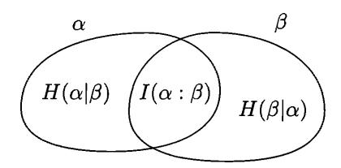

FIGURE 20. Entropies of two random variables

For three variables  $\alpha, \beta, \gamma$  we get a more complicated diagram (Figure 21). The central region carries a number that is denoted by  $I(\alpha : \beta : \gamma)$ . It can be defined as  $I(\alpha : \beta) - I(\alpha : \beta|\gamma)$  or, equivalently, as  $I(\alpha : \gamma) - I(\alpha : \gamma|\beta)$ , etc. In terms of unconditional entropies we get the following expression:

$$I(\alpha:\beta:\gamma) = H(\alpha) + H(\beta) + H(\gamma) - H(\alpha,\beta) - H(\alpha,\gamma) - H(\beta,\gamma) + H(\alpha,\beta,\gamma).$$

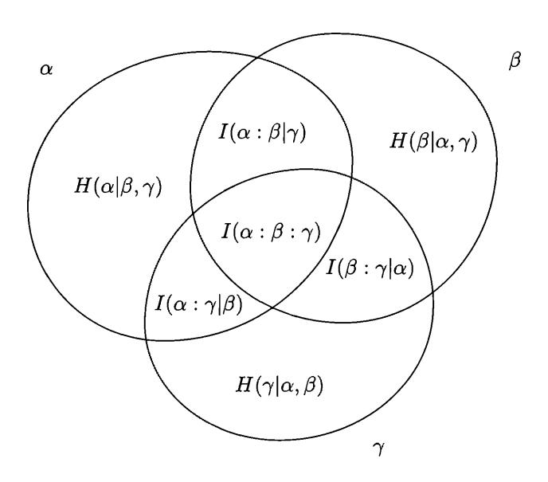

FIGURE 21. Entropies of three random variables

Note that (unlike the other six values shown) the value of  $I(\alpha : \beta : \gamma)$  can be negative. For example, this happens if variables  $\alpha$  are  $\beta$  independent, but become dependent when  $\gamma$  is known.

**227** Construct three variables  $\alpha, \beta, \gamma$  with this property.

 $\overline{(Hint)}$ : Following the example given on p. 51, consider uniformly distributed independent variables  $\alpha$  and  $\beta$  with range  $\{0,1\}$ , and let  $\gamma = (\alpha + \beta) \mod 2$ .)

**228** (Fano inequality) Prove that if the random variables  $\alpha$  and  $\beta$  differ with probability at most  $\varepsilon < 1/2$  and  $\alpha$  takes at most a values, then

$$H(\alpha|\beta) \leqslant \varepsilon \log a + h(\varepsilon),$$

where  $h(\varepsilon)$  is the entropy of a random variable with two values and probabilities  $\varepsilon$  and  $1 - \varepsilon$ .

(*Hint*: Let  $\gamma$  be a random variable with two values;  $\gamma = 0$  when  $\alpha \neq \beta$  and  $\gamma = 1$  when  $\alpha = \beta$ . Then  $H(\alpha|\beta) \leq H(\gamma) + H(\alpha|\beta,\gamma)$ . The first term is  $h(\varepsilon)$ , and the second one can be rewritten as

$$\Pr[\gamma = 0]H((\alpha|\beta)|\gamma = 0) + \Pr[\gamma = 1]H((\alpha|\beta)|\gamma = 1),$$

i.e.,

$$\Pr[\alpha \neq \beta] H((\alpha|\beta)|\alpha \neq \beta) + \Pr[\alpha = \beta] H((\alpha|\beta)|\alpha = \beta),$$

which does not exceed  $\varepsilon \log a + 0$ .)

**229** Assume that 
$$H(\alpha|\beta,\gamma)=0$$
 and  $I(\beta:\alpha)=0$ . Prove that  $H(\gamma)\geqslant H(\alpha)$ .

This problem has the following interpretation. If a spy wants to send to the headquarters a secret message  $\alpha$  as a plain text  $\beta$  using a key  $\gamma$  (that is agreed upon in advance) and wants the adversary, who does not know  $\gamma$ , to get no information about  $\alpha$ , then the entropy of key  $\gamma$  cannot be less than entropy of the message  $\alpha$ . This statement is sometimes called the *Shannon theorem on perfect cryptosystems*.

230 Prove that

$$2H(\alpha, \beta, \gamma) \leq H(\alpha, \beta) + H(\beta, \gamma) + H(\alpha, \gamma)$$

for any three random variables  $\alpha, \beta, \gamma$ .

(*Hint*: See the proof of the corresponding statement about Kolmogorov complexity, Theorem 26 (p. 48).)

**231** Prove a similar inequality for n random variables:

$$(n-1)H(\alpha_1,\ldots,\alpha_n) \leqslant H(\alpha_2,\ldots,\alpha_n) + \cdots + H(\alpha_1,\ldots,\alpha_{n-1}).$$

(The right-hand side contains n terms where one of the variables is omitted.)

**232** (Shearer inequality [43]) Prove the following generalization of the preceding inequality. Let  $T_1, \ldots, T_k$  be arbitrary tuples made of (some of) the random variables  $\alpha_1, \ldots, \alpha_n$ , and each variable appears in exactly r tuples (among  $T_1, \ldots, T_k$ ). Then

$$rH(\alpha_1, \alpha_2, \dots, \alpha_n) \leqslant H(T_1) + \dots + H(T_k).$$

**233** Prove that the inequality of Problem 231 implies the upper bound for the volume of an n-dimensional body in terms of the volumes of its (n-1)-dimensional projections onto coordinate hyperplanes (the case n=3 was mentioned on p. 12): If V is the volume of the body and  $V_1, \ldots, V_n$  are volumes of its projections, then

$$V^{n-1} \leqslant V_1 \cdot V_2 \cdot \ldots \cdot V_n.$$

(*Hint*: First consider the discrete version when the body is made of unit cubes on the grid. For this a random variable that is uniformly distributed among these cubes is useful. An arbitrary case can be treated as the limit of the discrete one.)

The last inequality is a special case of a general Loomis-Whitney inequality [105].

# 7.3. Complexity and entropy

As you surely have noticed, the properties of Shannon entropy (defined for random variables) resemble the properties of Kolmogorov complexity (defined for strings; see Chapter 2). Is it possible to formalize this similarity by converting it into exact statements?

This question has two interpretations. First, one can prove that Kolmogorov complexity and Shannon entropy have similar properties (in particular, the same linear inequalities are true for them; see Section 10.6, p. 326). On the other hand, one may compare the numeric values for complexity and entropy, and this is what we do in this section.

The problem here is that Kolmogorov complexity is defined for strings while Shannon entropy is defined for random variables, so how could one compare them? However, sometimes this comparison is possible, as we shall see. Let us start with a very vague and philosophical description of the results below: Shannon entropy takes into account only frequency regularities while Kolmogorov complexity takes into account all algorithmic regularities, so in general the latter is smaller. On the other hand, if an object is generated by a random process in such a way that it has only frequency regularities, entropy is close to complexity with high probability.

Let us give now some specific results that illustrate this general statement.

**7.3.1.** Complexity and entropy of frequencies. Consider an arbitrary finite alphabet A which may contain more than two letters. Kolmogorov complexity for A-strings can be defined in a natural way. (Note that we have never used that finite objects whose complexity is defined are binary strings. However, it is important that binary strings are used as descriptions: complexity measured in bytes would be eight times less than complexity measured in bits!)

Let x be an A-string of length N, and let  $p_1, \ldots, p_k$  be the frequencies of letters in x. All these frequencies are fractions with denominator N and integer numerators. The sum of frequencies equals 1. Let  $h(p_1, \ldots, p_k)$  be the Shannon entropy of corresponding distribution.

THEOREM 146.

$$\frac{C(x)}{N} \leqslant h(p_1, \dots, p_k) + \frac{O(\log N)}{N}.$$

Here the constant in  $O(\log N)$  does not depend on N, x and the frequencies  $p_1, \ldots, p_k$ . However, this constant may depend on k (we consider an alphabet of a fixed size).

PROOF. In fact this is a purely combinatorial statement. Indeed, the complexity  $C(x|N,p_1,\ldots,p_k)$  does not exceed  $\log C(N,p_1,\ldots,p_k)+O(1)$ , where

$$C(N, p_1, \dots, p_k) = \frac{N!}{(p_1 N)! (p_2 N)! \cdots (p_k N)!}$$

is the number of A-strings of length N that have frequencies  $p_1, \ldots, p_k$ . (Each string with given frequencies can be determined by its ordinal number in this set if the parameters  $N, p_1, \ldots, p_k$  are known, and this number has  $\log C(N, p_1, \ldots, p_k)$  bits.)

The number  $C(N, p_1, \ldots, p_k)$  can be estimated using Stirling's approximation. Ignoring factors bounded by a polynomial in N (that appear due to the term  $\sqrt{2\pi k}$  in Stirling's approximation formula  $k! \approx \sqrt{2\pi k} (k/e)^k$ ), we get exactly  $2^{Nh(p_1, \ldots, p_k)}$ .

This computation was performed (for k=2) when we proved the Strong Law of Large Numbers (Theorem 27, p. 56). The general case (for arbitrary k) can be treated in the same way.

Finally, note that we need about  $k \log N$  bits to specify  $N, p_1, \ldots, p_k$  (we need to specify k integers whose sum is N), so by deleting the condition in  $C(x|N, p_1, \ldots, p_k)$  we increase the complexity by  $O(\log N)$  (and the constant in  $O(\log N)$ -notation is close to k).

Another proof uses the upper bound for monotone complexity (Theorem 89, p. 144). Consider a probability distribution on infinite A-sequences that corresponds to independent trials with probabilities  $p_1, \ldots, p_k$  in each trial.

The event "a sequence with prefix z appears", where z is an A-string of length N that has frequencies  $q_1, \ldots, q_k$ , equals

$$p_1^{q_1N}\cdots p_k^{q_kN}$$

(letter  $a_i$  has probability  $p_i$  and appears  $q_iN$  times). The binary logarithm of this probability is equal to

$$-N\cdot (q_1(-\log p_1)+\cdots+q_k(-\log p_k)).$$

For the special case  $q_i = p_i$  we get  $-Nh(p_1, \ldots, p_k)$ ; therefore the monotone complexity has upper bound  $Nh(p_1, \ldots, p_k)$ . (Recall also that monotone complexity differs from other complexity versions by a term  $O(\log N)$  for strings of length N.)

In fact, this argument is flawed. When we proved the upper bound for monotone complexity, we had assumed that distribution is fixed. The constant term, therefore, may depend on the distribution. And now we try to estimate KM(x) using a measure that depends on the letter frequencies in the string x. So formally Theorem 89 is not applicable. But if we recall its proof, we see that it provides a bound for *conditional* monotone complexity when  $p_1, \ldots, p_k$  are given. The difference between this conditional complexity and the unconditional one is  $O(\log N)$ , so we indeed get another proof for Theorem 146.

**234** What is a value of a constant hidden in  $O(\log N)$  (as a function of k)? (*Hint*: Both proofs give  $k(1 + o(1)) \log N$ .)

**235** Show that when all frequencies  $p_1, \ldots, p_k$  are not very close to 0, the statement of the previous problem could be improved up to  $(k/2 + O(1)) \log N$ .

(*Hint*: In the first proof one should take into account the square roots in Stirling's approximation—most of them are in the denominator. The second proof can also be modified: instead of exact values of frequencies, one can consider approximate frequencies with an error of order  $O(1/\sqrt{N})$ . This gives a weaker bound, but the difference is bounded by a constant. (Recall that a smooth function is quadratic near its minimum.) In this way we can save half of the bits when specifying  $p_1, \ldots, p_k$ .)

Note that the inequality provided by Theorem 146 may be very far from equality. Indeed, if A has two letters and they alternate in a string x, then the right-hand size equals 1 and the left-hand size is of order  $(\log N)/N$ . This is not surprising and fits well into the general picture: the complexity is small since it reflects all the regularities (not only frequencies). In the next sections we prove that the complexity of a randomly generated string is close to the entropy with high probability.

**7.3.2. Expected complexity.** Let us fix k, a k-letter alphabet A, and k positive numbers  $p_1, \ldots, p_k$  whose sum is 1 (for simplicity we assume that all  $p_i$  are rational numbers).

Consider a random variable  $\xi$ , whose values are letters of A and probabilities are  $p_1, \ldots, p_k$ . For each N consider a random variable  $\xi_N$  consisting of N independent identically distributed copies of  $\xi$ . Its values are A-strings of length N. Now we may ask a question: What is the expected complexity of a string generated according to this distribution?

THEOREM 147. The expected value of  $K(\xi^N|N)$  is  $NH(\xi) + O(1)$  (the constant in O(1) may depend on  $\xi$  but not on N).

Note that (for positive  $p_i$ ) all A-strings of length N are among the values of  $\xi^N$ . Some of them have complexity much greater than NH (except for the case of uniform distribution), but others have complexity much less than NH.

PROOF. For each A-string of length N (i.e., for each value of  $\xi_N$ ) consider its shortest description (with respect to some fixed prefix-stable decompressor). These descriptions form a prefix code (in the sense of Section 7.1.1). The average length of the codeword is exactly the expected value of  $K(\xi^N)$ . Therefore, Theorem 138 (p. 214) guarantees that this expected value cannot be less than  $H(\xi^N) = NH(\xi)$ . The lower bound is proved (and even the O(1)-term can be omitted).

The same theorem is useful for the upper bound, too. Indeed, it guarantees that there exists a prefix code that has average length of a codeword at most  $H(\xi^N) + 1$ . Such a code can be constructed by an algorithm if N (and numbers  $p_i$ , which are fixed) is given. For example, one may use the construction used in the proof of Theorem 138, or use Huffman code, or even just try all codes until a good one is found.

Anyway, the constructed code can be used as a conditional decompressor (with N as the condition) such that average length of the shortest description of  $\xi^N$  does not exceed  $H(\xi^N) + 1 = NH(\xi) + 1$ . Replacing this decompressor by an optimal one, we increase the average length by O(1).

**236** Show that one can slightly improve the upper bound and prove that the average value of monotone complexity  $KM(\xi^N)$  does not exceed  $NH(\xi) + O(1)$ . (*Hint*: Apply Theorem 89 to the distribution of  $\xi^{\infty}$ .)

We assumed that  $p_1, \ldots, p_k$  are fixed rational numbers. One may wish to get a uniform bound that is true for all tuples  $p_1, \ldots, p_k$ . Then we should add  $p_1, \ldots, p_k$  to the condition and prove bounds for the expected value of  $K(\xi^N|N, p_1, \ldots, p_k)$  instead of  $K(\xi^N|N)$ . The lower bound is not affected at all, since it is true for any prefix code, and for the code construction the information in the condition is sufficient. (We assume that  $p_i$  are rational numbers. This is not very important, since one may replace arbitrary reals by their approximations with sufficiently small error.)

**237** Formulate the exact statement and prove it.

This theorem says that average complexity equals entropy though individual values of complexity could be much smaller or much larger. In fact, a stronger statement it true: most values of  $\xi^N$  have complexity close to  $NH(\xi)$ . More formally, the event "the complexity of string  $\xi^N$  differs significantly from  $NH(\xi)$ " has small probability. This statement could be considered as an algorithmic version of

the Shannon theorem on (noiseless) channel capacity, and we will return to this question in Section 7.3.4.

7.3.3. Prefixes of random sequences and their complexity. In this section we consider infinite ML-random sequences and compare complexities of their prefixes with the entropy of a generating distribution. Again, let A be an alphabet that has k letters, and let  $p_1, \ldots, p_k$  be a probability distribution on A. We assume that  $p_1, \ldots, p_k$  are computable positive reals.

Consider the space  $A^{\infty}$  of infinite A-sequences and the probability distribution on this space that corresponds to independent identically distributed variables with distribution  $p_1, \ldots, p_k$ . This is a computable probabilistic measure on  $A^{\infty}$ , so the Martin-Löf definition of randomness can be used. (In fact, we have defined Martin-Löf randomness for a two-letter alphabet, but essentially the same definition can be used for any finite alphabet.)

THEOREM 148. Let  $\omega$  be an ML-random sequence with respect to this distribution. Let  $(\omega)_N$  be its prefix of length N. Then

$$\lim \frac{C((\omega)_N)}{N} = H,$$

where H is the Shannon entropy, i.e.,  $H = \sum p_i(-\log p_i)$ .

[238] Prove that for uniform distribution this statement is an immediate consequence of the randomness criterion (Theorem 90, p. 146).

(It is a rare occasion when the uniform case is really special.)

The statement refers to the plain complexity C; however, this is not important, since different versions of complexity differ only by  $O(\log N) = o(N)$ . So we may use monotone complexity in the proof, and this is convenient.

PROOF. The Levin–Schnorr randomness criterion (Theorem 90, p. 146) says that complexity of a prefix of a random sequence is close to the negated logarithm of probability that this prefix appears. The probability refers to the distribution on  $A^{\infty}$  considered above, and the negated logarithm equals  $N \sum q_i(-\log p_i)$  where  $q_i$  is the frequency of *i*th letter in  $(\omega)_N$ . It remains to use the SLLN, which guarantees that  $q_i$  tends to  $p_i$  as  $N \to \infty$  for a random sequence.

Looking at this proof, we see that the difference between the complexity (per letter) and entropy has three reasons: first, the randomness deficiency from the Levin–Schnorr theorem that gives an O(1)/N difference; second, the difference between the plain and monotone complexities (of order  $O(\log N/N)$ ); and, finally, the difference between frequencies and probabilities which makes the most important term. (The law of iterated logarithm says that this term typically is a bit larger than  $O(\sqrt{N})/N$ .)

We have assumed that  $p_i$  are computable reals, otherwise the notion of Martin-Löf randomness cannot be used. If they are not computable, we can still consider the set of sequences such that complexity of their prefixes (per letter) do not have entropy as a limit. Then we can prove that this set has measure zero (with respect to the corresponding distribution).

239 Prove this statement.

 $\overline{(Hint)}$ : For an upper bound we can use some approximations for  $p_i$ ; the precision  $1/N^2$  is enough if we consider prefixes of length N. The additional information

needed to specify these approximate values is of size  $O(\log N)$ . The lower bound does not use at all the algorithmic properties of  $p_i$ ; for example, we can get a bound for relativized complexity with any oracle A that makes all  $p_i$  computable.)

**7.3.4.** The complexity deviations. Theorem 148 is asymptotic. One may look for a bound of difference between complexity and entropy of frequencies for finite sequences. (This follows the example provided by the probability theory that has the SLLN for the limit values as well as large deviation bounds for finite sequences.)

Let A be a k-letter alphabet, and let  $p_1, \ldots, p_k$  be a distribution on A. Again we assume for simplicity that  $p_i$  are rational (or at least computable). Consider the product distribution on  $A^N$  that corresponds to N independent trials with probabilities  $p_1, \ldots, p_k$ . So each A-string of length N has certain probability (and certain complexity). We already know from Theorem 147 that the average value of complexity is close to NH, where  $H = \sum p_i(-\log p_i)$ . But we want to know also how far this complexity deviates from its average value.

The simplest case of two equiprobable letters (which is quite untypical, as we shall see) gives a uniform distribution on all binary strings of length N. We know that all these strings have complexity at most N + O(1) and the (overwhelming) majority of strings has complexity close to N: The fraction of strings that have complexity less than N - c is at most  $2^{-c}$ . So in this case the significant difference between complexity and entropy has an exponentially small probability.

The case of uniform distribution on a k-letter alphabet is similar. However, if not all the letters have the same probability, the situation changes significantly.

Here is the key observation. For any string x of length N we compare probabilities  $p_i$  with empirical frequencies  $q_i(x)$  (frequencies of letters in x). It turns out that with high probability the complexity of a random string (with respect to our distribution on  $A^N$ ) is close to  $k(x) = N \sum_i q_i(x)(-\log p_i)$ . Indeed, Theorem 89 (p. 144) says that monotone complexity can exceed k(x) by at most O(1). On the other hand, the argument used in the proof of Levin–Schnorr theorem (p. 146, Lemma 1) shows that for any c the probability of the event KM(x) < k(x) - c (according to the distribution considered) does not exceed  $2^{-c}$ .

Therefore, the question about complexity reduces to a question about the distribution of empirical frequencies. This question has been studied in probability theory for centuries. It is known (Moivre–Laplace theorem) that this distribution is close to a normal (Gaussian) one: the expectation of frequency equals the probability, and the variance is proportional to 1/N. This is the main term, since it is much larger than terms caused by the  $O(\log N)$  difference between different complexity versions and by using N as a condition. This argument (made precise) gives us the proof of the following statement:

Theorem 149. Let  $\xi$  be a random variable with k values. For each positive  $\varepsilon > 0$  there exists c such that for all N the probability of the event

$$NH(\xi) - c\sqrt{N} < C(x) < NH(\xi) + c\sqrt{N}$$

is at least  $1 - \varepsilon$ . (Here x is a string formed by N independent copies of  $\xi$ .)

In fact our arguments assumed that  $p_i$  are computable. However, this assumption can be dropped if we replace  $p_i$  by their approximations with sufficiently small error (the precision  $1/N^2$  is enough and requires only  $O(\log N)$  additional bits).

**7.3.5.** Shannon coding theorem. The theorem of the last section is a natural translation of classical Shannon results into complexity language. These results deal with the length of a code that allows us to transmit *N*-letter blocks correctly with high probability (according to the given distribution).

Let  $\xi$  be (again) a random variable with k values (letters of A) and some fixed distribution. Let N be a positive integer. By  $\xi^N$  we denote a random variable with range  $A^N$  that is formed by N independent copies of  $\xi$ . We want to encode values of  $\xi^N$  by m-bit strings (see Figure 22).

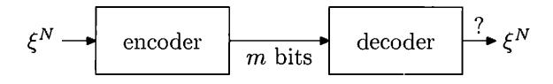

FIGURE 22. Using m bits for transmission of  $\xi^N$ 

Here an encoder is any mapping of type  $A^N \to \mathbb{B}^m$ , and a decoder is any mapping of type  $\mathbb{B}^m \to A^N$ . A given value of  $\xi^N$  causes an error if the input and output A-strings (of length N) differ. The probability of error is measured according to the distribution of  $\xi^N$ . The question is: What conditions on m and N guarantee the existence of an encoder/decoder pair that has small error probability? First, let us make the following evident remark:

Theorem 150. For given N, m and  $\varepsilon > 0$ , the code with error probability at most  $\varepsilon$  exists if and only if the  $2^m$  most probable values of  $\xi^N$  have total probability at least  $1 - \varepsilon$ .

PROOF. Indeed, when m bits are used for encoding, one may transmit (without errors) at most  $2^m$  values. To minimize the error probability, we should choose  $2^m$  most probable values.

In the next theorem the alphabet A and the random variable  $\xi$  are fixed.

Theorem 151. For each  $\varepsilon > 0$  there exists a constant c such that:

- (a) The values of  $\xi^N$  can be encoded/decoded with  $NH(\xi) + c\sqrt{N}$  bits with error probability at most  $\varepsilon$ ;
- (b) Any code for  $\xi^N$  of length at most  $NH(\xi) c\sqrt{N}$  has error probability at least  $1 \varepsilon$  (i.e., the probability of correct decoding is at most  $\varepsilon$ ).
- PROOF. (a) As we know, for a suitable c the value of random variable  $\xi^N$  has complexity less than  $m = NH(\xi) + c\sqrt{N}$  with probability at least  $1 \varepsilon$ . So for these values one can use shortest descriptions (see the definition of plain complexity) as codes. (Formally speaking, we get strings not of length m, but of length less than m, but there are at most  $2^m$  of them, and they can be replaced by strings of length m.)

Note that coding is not performed by an algorithm, but the theorem (as stated) does not say anything about that, it claims the existence of a code mapping.

(b) Here we need to use some trick. If there exists a code of given length, then such a code can be constructed algorithmically using the previous theorem (or just by an exhaustive search). Then the decoding function for this code can be considered as a conditional decompressor (where conditions are  $p_i$  and N). Therefore, all values of  $\xi^N$  that are decoded without error, have complexity at most

 $NH(\xi) - c\sqrt{N} + O(\log N)$  (the latter term corresponds to the complexity of parameters and can be omitted if we increase c). As we know (Theorem 149, p. 230), the probability of this event is at most  $\varepsilon$ .

**240** As before, we assume that probabilities  $p_i$  are known exactly, and if  $p_i$  are not computable, we get some problems. Correct the argument replacing  $p_i$  by their approximations with sufficient precision.

**241** Give a statement and proof for a similar result about conditional coding and conditional entropy.

(*Hint*: Assume that two dependent random variables  $\xi$  and  $\eta$  are given. We make n independent trials, the value of  $\eta^N$  is known both to the sender and the receiver, and the sender wants to send m bits in such a way that the receiver could reconstruct the value of  $\xi^N$ . How large should m be?)

#### CHAPTER 8

# Some applications

# 8.1. There are infinitely many primes

Let us start with a toy example and prove that there are infinitely many primes. Assume that there are only m different prime numbers  $p_1, \ldots, p_m$ . Then every positive integer x has a prime decomposition of the form

$$x = p_1^{k_1} p_2^{k_2} \cdots p_m^{k_m}$$

and can be described by the list of exponents  $k_1, \ldots, k_m$ . Each of  $k_i$  does not exceed  $\log x$ , since the base is at least 2, and has complexity at most  $O(\log \log x)$  (its binary representation has  $O(\log \log x)$  bits). Since m is fixed, i.e., m is the same for different x's, the complexity of the tuple  $\langle k_1, k_2, \ldots, k_m \rangle$  is  $O(\log \log x)$ . As x can be obtained from that tuple, its complexity is  $O(\log \log x)$ . But for a "random" (incompressible) n-bit integer x the complexity is close to n and is not  $O(\log n)$ , as this formula says (the logarithm of an n-bit number does not exceed n). Euclid's theorem is proven.

Is this a real application of Kolmogorov complexity or just cheating? A skeptical reader would say that we just retell, in terms of Kolmogorov complexity, the following counting arguments. If there are only m prime numbers, then there are at most  $(\log x)^m$  different integers between 1 and x, since any integer in this range is determined by the m powers in its decomposition, and each power is less than  $\log x$ . This immediately leads to a contradiction, since  $x > (\log x)^m$  for large x.

This is indeed true: our reasoning using Kolmogorov complexity is a direct translation of this argument (and is a bit more cumbersome due to asymptotic notation). However, such a translation may still have sense, since the new language provides new intuition, and this intuition may be useful even if later the same argument can be translated into the standard language.

We return to this discussion after looking at other applications.

#### 8.2. Moving information along the tape

The other toy example is a well-known result saying that duplication of an n-bit string on the tape of a Turing machine (with one tape only) requires  $\varepsilon n^2$ 

 $<sup>^{1}</sup>$ In [103] this argument continues as follows. If N has a prime factor  $p_{n}$  (the nth prime), then we may encode N as a pair  $(n, N/p_{n})$ , so  $C(N) \leq K(n) + C(N/p_{n}) + O(1)$ . If N is incompressible, then  $\log N \leq C(N) \leq K(n) + \log(N/p_{n})$  with O(1)-precision, so  $\log p_{n} \leq K(n) + O(1)$ . This gives an upper bound for  $p_{n}$  for infinitely many n; one should note only that (as we have seen) incompressible integers may have arbitrarily large factors.

The combinatorial translation of this argument goes as follows. Let us choose some threshold m, and consider all integers that have only prime factors below m. These integers form a minority among large integers, and all other integers have large prime factors. This implies that every tail of the series  $\sum 1/p$  (inverse primes) is at least 1/2, so this series diverges.

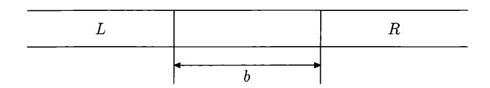

FIGURE 23. A buffer zone of size b

steps in the worst case. This classical result was obtained in 1960s using so-called crossing sequences; our proof is just a translation of this argument into the language of Kolmogorov complexity. (We assume that the reader is familiar with the basic notions related to Turing machines; see, e.g., [184]).

Consider a zone of size b on a tape of a one-tape Turing machine; this zone is considered a *buffer*, and we want to transmit information across this zone, say, from left (L) to right (R); see Figure 23.

Initially the buffer zone and R are empty (filled with blanks), and L is arbitrary. We give an upper bound for the complexity of R after t steps. The upper bound is  $(t \log m)/b + O(\log t)$  where m is the number of states that our Turing machine has and b is the width of the buffer zone. Informally the argument is quite simple: each state of the Turing machine carries  $\log m$  bits of information, and during one computation step this information can be moved to the neighbor cell, so moving it at the distance b requires b times more time.

Now we have to convert this intuitive explanation into a formal argument.

THEOREM 152. Let M be a Turing machine that has m states. Then there exists a constant c such that for any b and for any computation that starts with an empty buffer zone of size b and an empty tape on the right of the buffer zone the complexity of the contents R(t) of the right part of the tape after t steps of computation does not exceed

$$\frac{t\log m}{b} + 4\log t + c.$$

PROOF. Let us consider some line between cells inside the buffer zone as a border, and let us write down the state of M when it crosses the border from left to right (as was done in the time of the Iron Curtain). The sequence of states is called the crossing sequence. Knowing the crossing sequence, we can reconstruct the behavior of M abroad (on the right of the border) not using the contents of the tape on the left. Indeed, we should artificially put the machine into the first state of the crossing sequence and let it go abroad. When M returns back, we put it in the second state of the crossing sequence and let it go abroad again. In this way we correctly reconstruct the abroad behavior of the machine (since it does not remember anything except its state when crossing the border). In particular, at some moment t' the tape on the right of the buffer zone contains R(t). Note that t' may be different from t since we do not take into account the time M spends on the left of the border, but t' cannot exceed t. Therefore, to reconstruct R(t) we need to know the crossing sequence, t', and the distance between the border and R-zone. So there exists a constant c (depending on M but not on b and t) such that for any crossing sequence S and any b and t we have

$$C(R(t)) \leq l(S) \log m + 4 \log t + c.$$

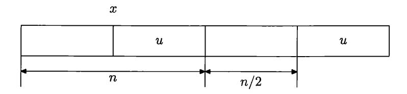

FIGURE 24. Buffer zone for duplication

Here we multiply the length l(S) of the crossing sequence by  $\log m$  since S is a string in an m-letter alphabet and each letter carries  $\log m$  bits. To add b' and t' in a self-delimiting encoding, we need at most  $2\log b + 2\log t$  bits. We may assume that t > b, otherwise R(t) is empty since the head never visited R. The constant c appears when we switch to the optimal decompressor.

This inequality is true for any contents of L and for any placement of the border. Now if for the given contents of L we consider the shortest crossing sequence, the length of this sequence is less than t/b (there is b+1 possible positions of the border, and at each step only one of the positions is crossed, so the sum of the lengths of crossing sequences does not exceed t). In this way we get the inequality stated by the theorem.

**242** Show that this bound can be improved by replacing b in the denominator by 2b.

( $\mathit{Hint}$ : The return trips need almost the same time (the difference is at most b).)

The quadratic lower bound for the duplication of an n-bit string immediately follows.

Assume that a one-tape Turing machine M duplicates its input: If initially the tape contains a binary string x (followed by blanks), at the end of the computation the tape has a second copy of x (i.e., it contains xx).

THEOREM 153. There exists a constant  $\varepsilon > 0$  such that for every n there exists an n-bit string that requires at least  $\varepsilon n^2$  steps to duplicate it.

PROOF. For simplicity let us assume that n is even, and let x be a string whose second half u has complexity close to its length (i.e., to n/2). Then apply the inequality we have proven considering the zone of size n/2 on the right of x as the buffer (Figure 24).

Assume that duplication takes t steps. Then the complexity of R zone after t steps (which is at least n/2) does not exceed  $t \log m/b + 4 \log t + c$ , where b is the size of the buffer zone, i.e., n/2. Therefore,

$$\frac{n}{2} \leqslant \frac{t \log m}{n/2} + 4 \log t + c.$$

We may assume without loss of generality that  $t < n^2$  (otherwise the statement is trivial). Then we replace  $4 \log t$  by  $8 \log n$  and conclude that

$$t \geqslant \frac{n^2}{4\log m} - O(n\log n);$$

the second term is small compared to the first one for large n (we may then formally extend the result to every n by decreasing the coefficient  $\varepsilon$ ).

Is Kolmogorov complexity essential in this proof? The skeptical observer may say again that we in fact just counted the number of different strings that can be copied in a limited time (using the fact that different strings should have different crossing sequences, otherwise the behavior of the machine at the right of the boundary would be identical). Indeed, the original proof follows this scheme (in fact, it deals with palindrome recognition, not the duplication, but the technique is the same). Does the language of complexity make the proof more intuitive and easy to understand? Probably this is a matter of taste.

Many bounds in computational complexity theory can be proven in the same way, using the string of maximal complexity as the worst case and proving that the violation of the bound would imply this string is compressible. Many applications of this type (and further references) are given in the classical textbook [103]; its authors, Ming Li and Paul Vitányi, played an important role in development of this approach, called the *incompressibility method*. Note that in several cases the historically first proof was obtained using Kolmogorov complexity.

In the next section we consider one more application of the incompressibility method, then we switch to other applications. The most interesting thing in these applications is not the statements in themselves but the various methods that allow us to apply Kolmogorov complexity to prove statements that do not mention it.

#### 8.3. Finite automata with several heads

A finite automaton with k heads is similar to the ordinary one (we assume that the reader is acquainted with basic notions related to finite automata; see, e.g., [185]), but it has k one-way read-only heads. Here *one-way* means that the head can only move from left to right.

Initially all k heads observe the leftmost character of the input string. At each step the behavior of the automaton is determined by its state and the k symbols it observes (under k heads): the automaton changes the state and instructs some heads (at least one) to move to the right. Then the automaton performs the next step, etc.

The input string is followed by a special marker; the automaton terminates if all the heads observe this marker. (We assume that the head that sees the marker does not move to the right.) Automaton *accepts* the string if it gets into an *accepting* state after processing this string. We say that the automaton *recognizes* the set of all accepted strings.

**Example.** Consider the language (=set of strings) x#x where x is any binary string. It is well known that this language cannot be recognized by a standard (one-head) automaton. However, it is easily recognized by a two-head automaton. Indeed, we should send one head to look for the separator #, when the separator is found, two heads move synchronously and check that they read the same symbol.

So two heads are better than one (more languages can be recognized). It turns out that the same is true for more heads: k + 1 heads are (strictly) better than k heads.

Theorem 154. For every k there exists a language that can be recognized by a (k+1)-head automaton but not by a k-head one.

PROOF. For each  $m \ge 1$ , consider the language  $L_m$  that consists of all strings

$$w_1 \# \cdots w_m \# w_m \# \cdots w_1$$

(for any binary strings  $w_1, \ldots, w_m$ ). Each  $w_i$  is repeated twice, and in the right half the strings  $w_i$  go in reverse order (this is crucial for the argument).

A k-head automaton can recognize this language if m is not very large (is at most  $\binom{k}{2}$ ), see below). One of the heads goes to the right half, and the remaining k-1 heads are placed before  $w_1,\ldots,w_{k-1}$ . Then each of these k-1 heads checks its string while the first head crosses its copy. After that the first k-1 strings are checked, the first head is of no use (it is at the end of the input string), but the remaining k-1 heads are useful since they are on the left of the remaining strings  $w_k,w_{k+1},\ldots$  Now we repeat the same trick: one of the k-1 heads is sent across the right half, k-2 heads check the next k-2 strings, etc. Repeating this, we can check

$$(k-1)+(k-2)+\cdots+1=rac{k(k-1)}{2}=inom{k}{2}$$

strings. (Note that m is fixed, so for finding a substring with a given number, the finite memory is enough.)

Therefore, the language  $L_m$  can be recognized by a k-head automaton if  $m \leq {k \choose 2}$ .

It remains to show that if  $m > {k \choose 2}$ , the language  $L_m$  cannot be recognized by a k-head automaton. Assume that is not the case and some k-head automaton M recognizes this language. To get a contradiction, let us consider independent random strings  $w_1, \ldots, w_m$  of sufficiently large length N. More formally, consider a string of length mN and complexity at least mN and split it into m strings of length N denoted by  $w_1, \ldots, w_m$ . By assumption, the string

$$W = w_1 \# \cdots w_m \# w_m \# \cdots w_1$$

is accepted by M; we get a contradiction by showing that either  $w_1 \cdots w_m$  is compressible or the automaton does not recognize  $L_m$ .

Let us say that a given pair of heads of M visited  $w_i$  if at some moment (while processing W by M) these heads were simultaneously inside two copies of  $w_i$ . A key observation: a given pair of heads cannot visit both  $w_i$  and  $w_j$  for  $i \neq j$ . Indeed, consider the moment when  $w_i$  was visited. After that the left head reads only  $w_j$  with j > i and the right head visits only  $w_j$  with j < i.

By our assumption  $m > \binom{k}{2}$ ; therefore there exists i such that  $w_i$  is not visited by any pair of heads. Let us show that either  $w_i$  is compressible or one of its copies can be counterfeited in such a way that M will still accept the string (so M does not work correctly).

Let us observe the actions of M on W. Special attention is needed when one of the heads enters or leaves  $w_i$  (any of two copies): We write down the positions of all heads and the state of M at these moments. The obtained "log-file" P has complexity  $O(\log N)$  where the hidden constant depends on k, m, and the number of states in M but not on N. Indeed, there are at most 4k moments to consider (four per head) and at each moment we record the state of the automaton and head positions, and this requires  $O(\log N)$  bits.

Let us show that (if M recognizes  $L_m$  correctly) the string  $w_i$  can be uniquely reconstructed if all other  $w_j$  (with  $j \neq i$ ) and P are given. This would imply that the complexity of the string  $w_1 \cdots w_m$  does not exceed (m-1)N (the number of

bits in  $w_j$  for  $j \neq i$ ) plus  $O(\log N)$  (the complexity of the log-file) plus O(1), which is less than mN for large N, so we get the desired contradiction.

The reconstruction goes as follows: we try all strings of length m as candidates for  $w_i$  (keeping  $w_j$  with  $j \neq i$  intact). For each candidate w we run M on the resulting string and check whether we get the same protocol P. There are three possible cases:

- (1) If (for some w) M rejects (does not accept) the string, then M does not recognize our language.
- (2) M accepts all these strings (for all candidates) and the protocol P appears only once, for  $w = w_i$ . Then reconstruction is possible (and  $w_1 \cdots w_m$  is compressible).
- (3) M accepts all these strings, and P appears both for  $w_i$  and for some  $w \neq w_i$ . Let us show that in this case M accepts a string not in  $L_m$ , namely, the string W' that has  $w_i$  in the left half while in the right half  $w_i$  is replaced by w.

Indeed, there are two accepting computations of M: one if  $w_i$  is used on both sides and the other one for w. Let us split both of them into parts; the splitting points are moments when one of the heads enters or leaves  $w_i$  (or w). The positions of all other heads and the states of M are recorded in P so they are the same for both computations. (Note that the moments of time can be different since they are not recorded. In fact, we may add them also, but this is not needed.) So we can glue the computation intervals for both cases; let us show that we can get an accepting computation of M on a bad string (the left half has  $w_i$  while the right half has w).

By our assumption during the processing of W, there is no moment when both copies of  $w_i$  carry some heads; since the border crossings for both copies are recorded in P, the same is true when  $w_i$  is replaced by w. So for each interval between two protocol events related to  $w_i/w$  there are three possibilities: (a) there is a head in the *i*th string on the left; (b) there is a head in the *i*th string on the right; (c) neither of the above. Then we can copy-and-paste the intervals into a new computation: for part (a) we use the computation of M on W; for part (b) we use the computation of M of changed input (where  $w_i$  is replaced by w); for part (c) we can use either of two (they are the same). Then we get a computation of M on a mixed string W', so M does not work properly.

#### 8.4. Laws of Large Numbers

The Strong Law of Large Numbers was proven in Section 3.2 (Theorem 27, p. 56) without any references to Kolmogorov complexity by straightforward counting. We consider (mainly) the uniform case. In this case the SLLN says that the set of all sequences  $\omega = \omega_0 \omega_1 \cdots$ , such that the sequence

$$p_n = \frac{\omega_0 + \omega_1 + \dots + \omega_{n-1}}{n}$$

has limit 1/2 as n tends to infinity, has full measure (with respect to the uniform Bernoulli measure on  $\Omega$ ). In other words, the SLLN says that the complement of this set (i.e., the set of sequences  $\omega$  such that  $p_n$  either have no limit or have limit not equal to 1/2) is a null set. Later (Theorem 32, p. 65) we have shown that this null set is in fact an effectively null set; this implies that for every ML-random (with respect to the uniform measure) sequence  $\omega$  the sequence  $p_n$  converges to 1/2 (Theorem 33, p. 65).

However, we can go in the other direction. Namely, we may first prove that for any ML-random sequence the frequencies converge to 1/2 using the randomness criterion in terms of complexity (Theorem 90, p. 146). This criterion says that for an ML-random (with respect to the uniform Bernoulli measure) sequence  $\omega$  the monotone complexity of its prefix  $(\omega)_n$  of length n is n+O(1). This property implies that the frequency of ones in  $(\omega)_n$  (i.e.,  $p_n$ ) converges to 1/2. Indeed, Theorem 146 (p. 226) says that the complexity of  $\omega_n$  does not exceed  $nh(p_n, 1-p_n) + O(\log n)$ , so  $h(p_n, 1-p_n) = 1 + O(\log n/n)$  for any ML-random sequence. (Note that the difference between plain and prefix complexity of  $\omega_n$  is  $O(\log n)$ , so any of them can be used.) This implies that  $p_n \to 1/2$  as  $n \to \infty$  (see the graph of the entropy function, Figure 8, p. 57). So the SLLN is true for all ML-random sequences, which form a set of full measure.

The skeptical observer would say that this is not a different proof, or we have just repeated the same arguments using different language. And she is probably right. If we recall the proof of Theorem 146, we see that it uses the same estimate (based on Stirling's approximation) that was used for the proof of SLLN. (Another argument, where monotone complexity is bounded by a negative logarithm of the measure, Theorem 89, also has a direct translation in the probabilistic language; it was discussed in Section 3.2 after the proof of Theorem 27 on p. 56.)

So what do we get by using complexity language? First, we find a broader class of sequences that satisfy the SLLN:

THEOREM 155. Let  $\omega$  be a binary sequence such that  $C((\omega)_n) = n + o(n)$ . Then the sequence  $p_n$  (the frequency of ones in  $(\omega)_n$ ) converges to 1/2.

PROOF. The proof remains essentially unchanged: in this case  $h(p_n, 1 - p_n)$  is still 1 + o(1).

Second, we not only can prove that  $p_n \to 1/2$  but we also can give some estimates for the convergence speed. The corresponding result in probability theory is known as the *Law of the Iterated Logarithm*, and V. Vovk [208] has shown that it is valid for ML-random sequences. Following his argument, let us use Kolmogorov complexity to give a (rather simple) proof of the upper bound provided by this law.

THEOREM 156. Let  $\omega$  be an ML-random sequence with respect to the uniform measure. Let  $p_n$  be the frequency of ones in  $(\omega)_n$ . Then for every  $\varepsilon > 0$ , the inequality

$$|p_n - 1/2| \leqslant (1 + \varepsilon) \sqrt{\frac{\ln \ln n}{2n}}$$

holds for any sufficiently large n.

PROOF. Let us first look at what bound can be obtained by the argument above (that uses Kolmogorov complexity). We know that

$$n - O(1) \leqslant KM((\omega)_n) \leqslant nh(p_n, 1 - p_n) + O(\log n),$$

therefore

$$h(p_n, 1 - p_n) \geqslant 1 - O(\log n/n).$$

The function

$$p \mapsto h(p, 1-p) = p(-\log p) + (1-p)(-\log(1-p))$$

has maximum at p = 1/2, and the second derivative at this point is non-zero (equals  $-4/\ln 2$ ). Therefore, the Taylor expansion gives us

$$h(1/2 + \delta) = 1 - \frac{2}{\ln 2}\delta^2 + o(\delta^2)$$

as  $\delta \to 0$ , and for  $\delta_n = p_n - 1/2$  we have

$$\delta_n^2 = O(\log n/n),$$

i.e.,

$$|p_n - 1/2| = O\left(\sqrt{\frac{\log n}{n}}\right).$$

So we get at least something, though the bound we need is much stronger. (Let us mention that in the probability theory the final bound was obtained in many steps. First Hausdorff (1913) proved the bound  $O(n^{\epsilon}/\sqrt{n})$ ; then Hardy and Littlewood (1914) improved it and replaced  $n^{\epsilon}$  by  $\sqrt{\log n}$ ; then Steinhaus (1922) came with the bound  $(1+\epsilon)\sqrt{(2\ln n)/n}$ , and only later Khinchin (1924) got the final result. So we are now on the level of Hardy and Littlewood in this respect—not that bad.)

Let us think about possible improvements for the upper bound that we had for  $KM((\omega)_n)$ . This upper bound was obtained by comparing  $KM((\omega)_n)$  and the negative logarithm of the probability of the prefix  $(\omega)_n$  with respect to the Bernoulli measure with parameter  $p_n$ . This logarithm is exactly  $nh(p_n, 1 - p_n)$ , but the Bernoulli measure used for comparison depends on n, so the construction used in the proof of Theorem 89 needs an additional term that is  $K(p_n)$  (we start with a self-delimiting encoding of  $p_n$ ). Here  $K(p_n)$  does not exceed  $(2 + \varepsilon) \log n$ , since both numerator and denominator of the fraction  $p_n$  do not exceed n. Altogether we get the bound

$$\frac{2}{\ln 2}(p_n - 1/2)^2 \approx 1 - h(p_n, 1 - p_n) \le (2 + \varepsilon) \log n / n,$$

which is still not good enough.

What else can we do? Note that we already know that  $p_n$  is rather close to 1/2: with denominator n the numerator differs from n/2 by  $\sqrt{n}$  or a bit more. So (when the denominator n is known) we can use fewer bits to describe the numerator, and this allows us to replace 2 by 1.5 in the right-hand side. But this is still not enough for us.

The crucial idea is to use approximations for  $p_n$  instead of the exact values. Let us assume that  $p_n = 1/2 + \delta_n > 1/2$  (the case when  $p_n < 1/2$  is similar). Instead of  $p_n$  we use (while constructing the Bernoulli measure used to get the upper bound for complexity) its approximation  $1/2 + \delta'_n$  where  $\delta'_n$  is an approximation to  $\delta_n$  from below with a small (fixed) relative error. For example, let us take  $\delta'_n$  such that  $0.9\delta_n < \delta'_n \le \delta_n$ . Such a  $\delta'_n$  can be founded among the geometric sequence  $(0.9)^k$ , and its complexity is about  $\log k$ , i.e., about  $\log(-\log \delta_n/\log 0.9) = \log(-\log \delta_n) + c$ . Note that if  $\delta_n < 1/\sqrt{n}$ , then we have nothing to prove, so the complexity of  $\delta'_n$  can be upper bounded by  $(1+\varepsilon)\log\log n$  (for every  $\varepsilon$  this bound holds for all sufficiently large n).

This is good news; the bad news is that we have a more complicated bound for the complexity of  $(\omega)_n$ . Now instead of  $h(p_n, 1 - p_n)$  we have

(\*) 
$$p_n[-\log p'_n] + (1 - p_n)[-\log(1 - p'_n)],$$

where  $p'_n = 1/2 + \delta'_n$ . Recalling our discussion of entropy, we may say that a sequence  $(\omega)_n$  where frequencies of zeros and ones are  $p_n$  and  $1 - p_n$  is encoded by a code adapted to the simplified frequencies  $p'_n$  and  $1 - p'_n$ . The expression (\*) can only increase if we replace  $p_n$  by  $p'_n$ : since  $p_n > p'_n > 1/2$ , the second expression in square brackets is greater than the first one, and increasing its weight by decreasing  $p_n$ , we increase the entire expression (\*).

Finally we get the bound

$$n - O(1) \leq nh(p'_n, 1 - p'_n) + (1 + \varepsilon) \log \log n$$

for every  $\varepsilon > 0$  (the inequality holds for all sufficiently large n). As before, it implies

$$\delta_n' \leqslant (1+\varepsilon)\sqrt{\ln 2 \cdot \log \log n/2n}.$$

For a true  $\delta_n$  we get a slightly bigger bound (1/0.9 times bigger); since 0.9 can be replaced by an arbitrary number less than 1, we get the desired statement (the factor  $\ln 2$  is used to convert the binary logarithm to the natural one, while the replacement of the second binary logarithm by the natural one can be compensated by a change of  $\varepsilon$  in the factor  $(1 + \varepsilon)$ ).

**243** Show that this argument can be used to prove the statement of Theorem 156 not only for ML-random sequences but also for arbitrary sequence  $\omega$  such that  $n - KM((\omega)_n) = o(\log \log n)$ .

# 8.5. Forbidden substrings

**8.5.1. Forbidden and simple substrings.** The statement we prove in this section is an example of a non-trivial application of Kolmogorov complexity (that cannot be directly translated into a counting argument).

Theorem 157. Let  $\alpha < 1$  be a positive real number. Assume that for each n some binary strings are called forbidden strings and there are at most  $2^{\alpha n}$  forbidden strings for any length n. Then there exists some c and an infinite sequence of zeros and ones that does not have forbidden substrings of length c or more.

For example, we can declare strings of length n and (plain) complexity less than  $\alpha n$  as forbidden strings. Then we get the following corollary (called *Levin's lemma*, see [51]):

THEOREM 158. Let  $\alpha < 1$  be a positive real number. There exists an infinite sequence of zeros and ones such that any of its substrings of sufficiently large length n has complexity at least  $\alpha n$ .

It is instructive to compare this statement with the randomness criterion for the uniform measure (Theorem 94, p. 151). In this criterion we considered only the prefixes of the sequence (instead of all substrings); on the other hand the lower bound for complexity was n-O(1) instead of a weaker bound  $\alpha n$  that we have now. (The bound n-O(1) was for monotone complexity; it implies the  $n-O(\log n)$  bound for plain complexity that we use now). The following problem shows that such a strong bound cannot be true for all the substrings (not a surprise, since a truly random sequence contains all substrings, including simple ones).

**244** For each infinite sequence  $\omega$  of zeros and ones there exist  $\alpha < 1$  and infinitely many substrings that have complexity per letter (the ratio complexity/length) at most  $\alpha$ .

(*Hint*: Consider two cases: If all binary strings appear as substrings, the claim is evident. If  $\omega$  does not contain some string u of length k, we can split long substrings into blocks of length k and use efficient coding that takes into account that block u is never used and does not need a code; this gives complexity per letter at most  $(\log(2^k-1))/k$ .)

The proof of Theorem 157 consists of two steps. First we prove its special case, Theorem 158. Then it turns out (surprisingly) that the general case follows from this special one.

PROOF. To prove Theorem 158, let us consider an intermediate  $\beta$  such that  $\alpha < \beta < 1$ . Using Theorem 71 (p. 111), we find a number N with the following property: to each string x we can append N bits (on the right) in such a way that the prefix complexity of the string increases at least by  $\beta N$ .

Let us use this property iteratively starting from the empty string. We get an infinite sequence of N-bit blocks; the prefix complexity increases at least by  $\beta N$  when the next block is appended. This implies that the complexity of every group of consecutive k blocks is at least  $\beta kN - O(1)$ . Indeed, by appending this group, we increase complexity by  $\beta kN$  at least, but the inequality  $K(xy) \leq K(x) + K(y) + O(1)$  shows that  $K(y) \geq K(xy) - K(x) - O(1)$ .

This implies that for every substring u (not necessarily block aligned) the complexity of u is at least  $\beta l(u) - O(1)$  since the change in complexity and length due to boundary effects (by cutting the incomplete block on the border) is O(1). It remains to note that we have some reserve due to the difference between  $\alpha$  and  $\beta$ , and this reserve is enough to compensate both the boundary effects and the difference between plain and prefix complexities (for sufficiently long substrings).

[245] Give a similar argument that uses plain complexity instead of prefix complexity.

(Hint: Use Problem 46, p. 42.)

**246** Prove the statement of Problem 47 (p. 42) with prefix complexity instead of plain complexity.

PROOF. Now let us prove Theorem 157; the simplest approach is to use the relativized version of complexity. Let us consider the set F of forbidden strings as an oracle; this means that we consider algorithms that can ask (for free) whether a given string is forbidden or not. As usual, this relativization goes smoothly both in the statement of Theorem 158 and its proof, and this theorem is true for F-relativized complexity.

Now all forbidden strings of length n have F-complexity at most  $\alpha n + O(\log n)$ , since each forbidden string can be determined by n and by its ordinal number in the list of all forbidden strings of length n. In fact the stronger bound  $\alpha n + O(1)$  is valid since we can use the list of all forbidden strings in the order of increasing length, but this does not matter much since a small change in  $\alpha$  covers this difference. So it remains to apply Theorem 158 and to get a sequence which does not have long substrings with complexity less than  $\beta$  (per letter), for some  $\beta > \alpha$ .

One can also make the following (rather unexpected) observation [160]: Theorem 157 can be derived from Theorem 158 directly, without any relativization, using the following statement:

Theorem 159. If for some rational  $\alpha$  and some set F of forbidden strings the statement of Theorem 157 is false (F has less than  $2^{\alpha n}$  forbidden strings for each n, but there is no infinite sequence without long forbidden strings), then the same happens for a decidable set F.

(Note that for a decidable F the relativization does not change anything; the restriction to rational  $\alpha$  is also not important, since we can increase  $\alpha$  to a greater rational number.)

PROOF. Assume that for some  $\alpha < 1$  and some set F the statement of Theorem 157 is false. Then for each c we may find a set  $F_c$  in such a way that:

- (a)  $F_c$  contains only strings of length greater than c;
- (b)  $F_c$  contains at most  $2^{\alpha k}$  strings of length k (for every k);
- (c) each infinite sequence contains at least one substring that belongs to  $F_c$ .

(Indeed, we can let  $F_c$  be the set of all strings in F that have length greater than c.)

The standard argument (compactness, König's lemma) shows that every sufficiently long string has at least one substring in  $F_c$ , so one can find *finite*  $F_c$  with the same properties. Moreover, such a finite set can be found by an exhaustive search, so we get  $F_c$  that has these properties and can be found effectively when c is given. (Why do we first need to switch to finite sets? To make the search possible.)

Now we construct the sequence  $c_i$  such that  $c_{i+1}$  is greater than the lengths of all strings in  $F_{c_i}$ . The union of all  $F_{c_i}$  is a decidable set that violates the statement of Theorem 157.

Note the structure of our arguments: knowing that an object with some property exists, we perform an exhaustive search and effectively find a (perhaps different) object with the same property. This observation is often useful when dealing with Kolmogorov complexity.

**247** Prove that if for some set F of strings there exists a (one-sided) infinite sequence that does not contain substrings from F, there exists a bidirectional sequence that does not contain substrings from F.

(*Hint*: The compactness argument shows that both properties are equivalent to the existence of arbitrarily long finite sequences that do no contain substrings from F.)

J. Miller [125] suggested a direct proof of Theorem 157, where the required sequence is constructed inductively, and we at each step guarantee that some quantity (the *emergency level*) is not very large. Let us explain how the emergency level is computed and why it can be kept bounded.

Fix a set of forbidden strings F. The emergency level for a string x (the already constructed part of the sequence) is denoted by  $w_c(x)$ , where c will be some constant slightly greater that 1/2. The value of  $w_c(x)$  is big if we have almost got a forbidden substring. The definition follows: For every possible occurrence of a forbidden string  $z \in F$  in the possible extension of x (this means that z is on the right of x, but there is a non-zero overlap, Figure 25), we take the number k of bits of z that are missing in x, and add  $c^k$  to  $w_c(x)$ . In other words,  $w_c(x)$  is the sum of  $c^k$  for all  $z \in F$  and for all possible occurrences.

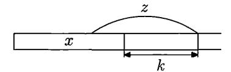

FIGURE 25. A possible occurrence of a forbidden string z: part of z is already in x, but k bits are missing. This occurrence adds  $c^k$  to  $w_c(x)$ .

When c = 1/2, it is easy to explain the meaning of  $w_c(x)$ : it is the expected number of occurrences of forbidden strings that overlap x, assuming that x is extended to the right by a sequence of independent random bits. Having this interpretation in mind, it is easy to see that

$$w_{1/2}(x) = \tfrac{1}{2} w_{1/2}(x0) + \tfrac{1}{2} w_{1/2}(x1) - \sum_{z \in F} (1/2)^{l(z)}.$$

Indeed, we add 0 with probability 1/2 and add 1 with probability 1/2, and we need to take into account that in this way we count also those occurrences that happen immediately after x (and they should not be counted—the definition requires non-zero overlap with x). In fact, this equation is a purely combinatorial fact and is valid for arbitrary c (assuming that x does not contain forbidden strings):

$$w_c(x) = cw_c(x0) + cw_c(x1) - \sum_{z \in F} c^{l(z)}.$$

Initially (when x is empty) the value  $w_c(x)$  is zero, and if x contains a forbidden substring, then  $w_c(x)$  is at least 1. So it is enough to show that we can maintain the invariant relation " $w_c(x) < 1$ " when adding the next bit. It is enough to prove that

$$w_c(x0) + w_c(x1) = \frac{1}{c} \left( w_c(x) + \sum_{z \in F} c^{l(z)} \right) < 2$$

(assuming  $w_c(x) < 1$ ), and this does happen if  $1 + \sum_{z \in F} c^{l(z)} < 2c$ .

To finish the proof of Theorem 157, it remains to make the sum  $\sum_{z \in F} c^{l(z)}$  finite by choosing c close enough to 1/2 (the value of c depends on  $\alpha$  and becomes closer to 1/2 as  $\alpha$  approaches 1), and then to make this sum small by deleting the strings of small lengths from F.

**248** Using this argument, prove an effective version of Theorem 157. If the set F satisfies the conditions and is decidable, then there exists a computable sequence that does not have short substrings from F.

The result of the last problem can be extended to bi-infinite sequences (as noted by K. Makarychev): One can also prove the existence of a computable bi-infinite sequence with the same property. (His argument follows Miller's scheme, but we should define "left" and "right" emergency levels and look how they change when several characters are added: one of the levels should decrease significantly while the other should not increase much.) A more general argument is given in [159]; it uses an effective version of Lovász local lemma (see the next section) and can be generalized to multidimensional case.

**8.5.2.** Lovász local lemma. We have seen how a statement about Kolmogorov complexity (the existence of a sequence without simple substrings) may be used to prove the combinatorial version of this result (the existence of a sequence without forbidden strings). In this section we move in the opposite direction. We start with a combinatorial statement (namely, the Lovász local lemma) and use it to prove statements about Kolmogorov complexity. But first let us make some general remarks.

Probabilistic existence proofs. To prove that there exists an object satisfying some conditions, one can consider a probability distribution on objects and compute for each condition the probability that it is violated. If these probabilities are very small and their sum (over all conditions) is less than 1, the random object with positive probability satisfies all the conditions, and the existence is proven.

In this argument we use the following (trivial) property: If the probability of an event  $A_i$  is at most  $\varepsilon_i$ , then the probability of the union of the events  $A_1, \ldots A_n$  is bounded by the sum of  $\varepsilon_i$ , and the probability of avoiding all these events is at least

$$1-\varepsilon_1-\varepsilon_2-\cdots-\varepsilon_n$$
.

When computing probabilities, we often count "bad" elements in some class; if the total number of bad elements is less than the cardinality of the class, there exist "good" elements. This reasoning can also be translated to complexity language: If there are only a few bad elements, then bad elements have small complexity, so every random (incompressible) element of the class is good.

However, we cannot use arguments of this type to prove Theorem 157. Indeed the probability of finding a bad string in a given position is small  $(2^{(\alpha-1)n})$ , but if there are many possible positions, the sum of probabilities exceeds 1. (Recall that we need to prove the existence of arbitrarily long strings without forbidden substrings.) However, there is an important observation that can be used to save the argument: If two positions are disjoint (do not overlap), then the appearance of a bad string in the first position and in the second position are independent events. This is what the Lovász local lemma is about.

The case of independent events. Let us consider first the case when all events  $A_i$  are independent. If the probability of  $A_i$  equals  $\varepsilon_i$ , then the probability of the event "none of  $A_i$  happens" is equal to

$$(1-\varepsilon_1)\cdot(1-\varepsilon_2)\cdot\ldots\cdot(1-\varepsilon_n)$$

(and it is also greater than  $1 - \varepsilon_1 - \varepsilon_2 - \cdots$ , as guaranteed by the Bernoulli inequality).

So for any independent  $A_i$  the probability of avoiding all  $A_i$  is positive even if the sum of  $\varepsilon_i$  exceeds 1; the only thing we need is that each  $\varepsilon_i$  is less than 1.

The Lovász local lemma deals with an intermediate situation when there are many events (so our first observation does not help), and not all events are independent (so our second observation does not help either).

Assume that n events  $A_1, \ldots, A_n$  are given, and for each  $i \in \{1, \ldots, n\}$  some set  $N(i) \subset \{1, \ldots, n\}$  is fixed that does not contain i. The elements of N(i) are called *neighbors* of i in the sequel. (We do not require the neighborhood relation to be symmetric, so a number may not be a neighbor of its neighbor.)

Assume that each event  $A_i$  is independent with all other events, except for i itself and i's neighbors (for simplicity we identify index i and event  $A_i$ ). More

precisely, we assume that  $A_i$  is independent with the tuple of all non-neighbor events (not only with each of them). Then the following bound can be proven.

THEOREM 160 (Lovász local lemma (LL)). Assume that for each i = 1, 2, ..., n, a positive real  $\varepsilon_i < 1$  is fixed such that

$$\Pr[A_i] \leqslant \varepsilon_i \prod_{j \in N(i)} (1 - \varepsilon_j)$$

for all i. Then the probability of avoiding all the  $A_i$  is at least

$$(1-\varepsilon_1)\cdot(1-\varepsilon_2)\cdot\ldots\cdot(1-\varepsilon_n).$$

So we get the same bound as in the case of independent events, but the conditions are stronger: For each neighbor event j we need to add the factor  $(1 - \varepsilon_j)$  in the right-hand side of the assumption.

PROOF. The proof of LL is a bit strange: All the steps are quite easy, but the intuition behind them is rather unclear (so it was probably difficult to invent it, and it is even quite difficult to reproduce it). So we prepare ourselves by making simple observations first.

(a) For every two events A and B we have

$$\Pr[A \, | \, B] \leqslant \frac{\Pr[A]}{\Pr[B]}.$$

Indeed, the conditional probability is  $\Pr[A \wedge B]/\Pr[B]$  and  $\Pr[A \wedge B] \leq \Pr[A]$ . (As usual,  $\wedge$  stands for "and".)

(b) One can add some condition C to all the events in the previous inequality (the relativization trick), and get

$$\Pr[A \,|\, B \wedge C] \leqslant \frac{\Pr[A \,|\, C]}{\Pr[B \,|\, C]}.$$

This observation is used in the proof of Lovász local lemma for independent A and C (in this case the numerator  $\Pr[A \mid C]$  equals  $\Pr[A]$ ), and the denominator  $\Pr[B \mid C]$  is not very small.

Now we are prepared to prove LL by induction. As often happens, we need a stronger statement for induction purposes. Let us prove the following statements (here  $\neg$  stands for the negation, or complement, of the event):

(1) For every i and for every  $p, q, \ldots$  that are not equal to i and to each other, we have

$$\Pr[A_i | \neg A_p \wedge \neg A_q \wedge \cdots] \leq \varepsilon_i.$$

(2) For every two disjoint families of events  $i, j, \ldots$  and  $p, q, \ldots$  we have

$$\Pr[\neg A_i \wedge \neg A_j \wedge \cdots | \neg A_p \wedge \neg A_q \wedge \cdots] \geqslant (1 - \varepsilon_i) \cdot (1 - \varepsilon_j) \cdot \ldots$$

Note that the first statement implies the second one for the case when the family  $i, j, \ldots$  consists of one event i: If the probability of  $A_i$  (with some condition) is at most  $\varepsilon_i$ , then the probability of its negation is at least  $(1 - \varepsilon_i)$ .

Moreover, this argument can be extended to the case when there is more than one event in the family  $i, j, \ldots$ :

$$\Pr[\neg A_i \wedge \neg A_j \mid \neg A_p \wedge \neg A_q \wedge \cdots]$$

$$= \Pr[\neg A_i \mid \neg A_j \wedge \neg A_p \wedge \neg A_q \wedge \cdots] \cdot \Pr[\neg A_i \mid \neg A_p \wedge \neg A_q \wedge \cdots];$$

it remains to apply (1) to each factor.

On the other hand, the following argument derives (1) from (2). Let us split the conditions in (1) and consider separately the events inside N(i) and outside N(i). (Here i is the number of the event in the left-hand side of (1).) Let N and F be the conjunctions of the negations of the events in these two groups (near and far). Then, following the scheme explained above, we estimate the probability as follows:

$$\Pr[A_i \,|\, N \wedge F] \leqslant \frac{\Pr[A_i \,|\, F]}{\Pr[N \,|\, F]} = \frac{\Pr[A_i]}{\Pr[N \,|\, F]}.$$

We can use inequality (2) and conclude that the denominator in the last fraction is at least the product of  $(1-\varepsilon_t)$  for all  $t \in N$ , and it remains to recall the assumption of LL where these factors (and, maybe, others) appear. We assume here that there are neighbor events among the conditions. If not, the left-hand side in (1) equals  $\Pr[A_i]$  (due to independence) and is bounded by  $\varepsilon_i$ .

It remains to explain why the reductions of (1) to (2) and vice versa (which we have described) do not lead to a vicious circle. Reducing (1) to (2) as explained above, we use (2) in the situation where the number of events in the inequality (on both sides of "|") is smaller than in inequality (1), which we want to prove. (Indeed, the event  $A_i$  disappears). The other reduction, where we derive (2) from (1), does not increase the total number of events in the inequality.

Here is an example of a combinatorial problem where LL is useful:

249 A finite tape is given where each cell may contain a number between 1 and N. For each borderline between neighbor cells some pairs of numbers (l, r) are prohibited, in the sense that one should not put l on the left and r on the right of this border. Prove that if for each border the fraction of prohibited pairs (among  $N^2$  pairs) is at most 4/27, then one can fill all cells satisfying all restrictions.

(*Hint*: For each border consider the event "a prohibited pair appears". Each event has at most two neighbors, and for  $\varepsilon_i = \frac{1}{3}$  one can apply the LL.)

**250** Prove a similar result (even with slightly better parameters) without using the LL. If each set of forbidden pairs contains less than 1/4 of all pairs, then one can satisfy all the restrictions.

(*Hint*: In each position more than half of candidates accept more than half right neighbors, and more than half of candidates accept more than half left neighbors. So there exists some candidate that accepts more than half of left neighbors and more than half of right neighbors at the same time. Starting with this number, one may add numbers from the left to the right, using the fact that two sets containing more than half of the elements always have a common element.)

**8.5.3.** Lovász lemma and forbidden strings. Now let us use LL to prove Theorem 157. As usual, it is enough to prove the existence of arbitrarily long strings without forbidden substrings (due to the standard compactness argument).

So we fix some length and consider random strings of this length where all the bits are independent and uniformly distributed. A bad event happens when some forbidden string appears at some fixed position (different positions give different events). For every n consecutive bits, the appearance of a forbidden string in this position has probability  $2^{(\alpha-1)n}$ . Using the LL, we need to fix some number  $\varepsilon_i$  for each event  $A_i$ , and for this event (the appearance of a forbidden string in a given

position of length n), we use  $2^{(\beta-1)n}$  for some constant  $\beta \in (\alpha, 1)$ . Then we need to check that for suitable  $\beta$  the conditions of the LL are satisfied.

Let I be the position of some event (the interval where we look for a forbidden string). The neighbor events happen at intervals J that overlap with I (all other events are independent). The bounds  $\varepsilon_i$  depend on the lengths, so we group all possible intervals J according to their lengths. There exist n+k-1 intervals J of length k that have a non-zero overlap with a given interval I of length n. Each of them adds a factor  $(1-2^{(\beta-1)k})$  on the right-hand side of the condition of the LL, and in total we get

$$(1-2^{(\beta-1)k})^{n+k-1}$$

Now we have to multiply these expressions for all k, starting with some N (if we construct a sequence with forbidden substrings of length at least N). So to apply the LL, we need to prove the inequality

$$2^{(\alpha-1)n} \leqslant 2^{(\beta-1)n} \cdot \prod_{k \geqslant N} (1 - 2^{(\beta-1)k})^{n+k-1}.$$

(In fact, we included I while considering intervals of length k = n, though we were not obliged to, but this makes our task only more difficult.) Now we use a quite rough bound: we replace n + k - 1 by nk, take nth roots, and use the Bernoulli inequality. It remains to prove that

$$2^{\alpha-\beta} \leqslant 1 - \sum_{k \geqslant N} k 2^{(\beta-1)k}.$$

The infinite series  $\sum_k k2^{(\beta-1)k}$  converges when  $\beta < 1$ , and the left-hand side is less than 1 for  $\alpha < \beta$ , so the inequality is true if N is large enough.

Let us repeat what we are doing. First, we take arbitrary  $\beta \in (\alpha,1)$  and then choose a suitable N that makes the tail of the series small. Then we apply the LL to an arbitrarily large finite length and show that there exists a string of that length which does not have forbidden strings of length N or more. (Our bounds work for arbitrary lengths.) Finally, we use the compactness argument to get an infinite sequence.

**251** Prove a two-dimensional version of Theorem 157: one can fill an infinite cell paper by zeros and ones in such a way that every rectangle of large enough area is not forbidden. (We assume that for every rectangle of area k, at most  $2^{\alpha k}$  forbidden combinations of zeros and ones inside this rectangle are fixed, for some constant  $\alpha < 1$ .)

(Hint: Similar bounds can be proven, and the LL can be used.)

**8.5.4.** Forbidden subsequences. In the previous section we considered forbidden substrings, i.e., forbidden combinations of consecutive bits. But why should the bits be consecutive? This looks artificial, and we may consider a more general setting, as in [158]. Assume that we have a countable family of Boolean variables and some restrictions; each of them forbids some combination of values for some variables. We are interested in a result of the following type: If the restrictions are not too numerous, there exists an assignment of Boolean values to all the variables that satisfies all the restrictions. (In this kind of result, we do not care about exact combinations of values that are forbidden; the only thing we use is that there are not too many restrictions.)

In other words, we want to prove the satisfiability of a formula in a conjunctive normal form (CNF), i.e., a conjunction of several clauses. For example, in the formula

$$(\neg a \lor b \lor c) \land (a \lor c \lor \neg d) \land \cdots$$

the first clause  $(\neg a \lor b \lor c)$  forbids the combination of values a = 1, b = 0, c = 0. Our goal is to find a satisfying assignment, a combination of values that satisfies all the requirements.

Assuming that all variables are independent, we observe that disjoint clauses (that do not have common variables) are independent. So, if we want to apply the LL, we have to bound the number of clauses that contain a given variable.

Let us fix some notation. Let  $\omega = \omega_0 \omega_1 \omega_2 \cdots$  be an infinite sequence of bits. For a finite set  $F \subset \mathbb{N}$ , we denote by  $\omega(F)$  a string composed of  $\omega_i$  for  $i \in F$  (in order of increasing i). Consider a pair (F, X) where F is a finite set of indices and X is a binary string whose length is equal to the cardinality of F. We say that a sequence  $\omega$  is forbidden by the pair (F, X) if  $\omega(F) = X$ . We call the pair (F, X) a restriction, and the number of elements in X is called the size of this restriction. We say that the restriction (F, X) covers the indices in F. Now we are ready to formulate and prove the statement we spoke about [158]:

Theorem 161. Let  $\alpha \in (0,1)$  be a constant. Assume that we have a set of restrictions (F,X) such that for every position i and for every positive integer n there are at most  $2^{\alpha n}$  restrictions of size n that cover i. Then there exist a number N and a sequence that is not forbidden by any of the restrictions of size greater than N.

PROOF. For compactness reasons, it is enough to prove the statement for finite sequences (and for some N that is the same for all lengths).

For each restriction we have the event "this restriction is violated". The probability of such an event for a restriction of size n is  $2^{-n}$ . To apply the LL, let us choose  $\varepsilon_i$  for restrictions of size n as  $2^{-\beta n}$  where  $\beta$  is some constant in  $(\alpha, 1)$  (in fact, every value in this interval can be used).

The neighbors of some restriction are the restrictions that have common variables with the first one. To apply the LL, we need to consider a restriction of size n and check that  $2^{-n}$  does not exceed  $2^{-\beta n}$  times the product of all the factors  $(1-2^{-\beta m})$  for all neighbor restrictions.

We split the product into parts that correspond to common variables. There are n parts (for each of the variables involved in the restriction). If a neighbor shares two or more variables, we arbitrarily break the tie and choose one of them. In each part, we classify the factors according to their sizes. Then for each variable and for each size m, we get at most  $2^{\alpha m}$  factors, each equal to  $(1-2^{-\beta m})$ . Then we take the product over all m, and the nth power (since we have n parts that correspond to n possible common variables). So we need to show that

$$2^{-n} \leqslant 2^{-\beta n} \prod_{m>N} (1-2^{-\beta m})^{2^{\alpha m} n},$$

or (since all the terms are nth powers)

$$2^{\beta - 1} \leqslant \prod_{m > N} (1 - 2^{-\beta m})^{2^{\alpha m}}$$

Using the Bernoulli inequality, we see that it is enough to prove that

$$2^{\beta-1} \leqslant 1 - \sum_{m>N} 2^{\alpha m} 2^{-\beta m}.$$

The left-hand side is less than 1, and

$$\sum_{m} 2^{(\alpha-\beta)m}$$

is a converging geometric series, so this inequality is true for large enough N.

Let us repeat how the proof goes: First we choose some  $\beta \in (\alpha, 1)$ , then we note that the series is converging and choose a suitable N, then (for every length) we apply the LL and show that there exists an assignment of this length that satisfies all the restrictions, and finally we use the compactness argument.

A direct proof of Theorem 161 (that does not refer to the LL but uses some ideas similar to the proof of the LL) was suggested by An. Muchnik and A. L. Semenov. This proof goes as follows. Assume that a set of restrictions is fixed that satisfies the conditions of this theorem. Let N be the minimal size of restrictions in this set.

For each finite set of indices  $I \subset \mathbb{N}$ , let us denote by c(I) the number of valid partial assignments, i.e., the number of mappings  $I \to \{0,1\}$  that do not violate any restrictions. (Here we consider only restrictions (F,X) where  $F \subset I$ . Our mapping is defined only on I, and we cannot check the restrictions that involve variables outside I.) For empty I we let c(I) = 1.

Fix some  $\beta \in (\alpha, 1)$ . Let us prove that c(I) is multiplied by at least  $2^{\beta}$  when we add a new point to I. (We assume that N is large enough.) This implies that  $c(I) \geq 2^{\beta k}$  if I contains k variables. In particular, c(I) > 0 (this is what we really need, but for induction purposes we use a stronger statement).

Imagine that we add to I a new point (=variable, index) i, and  $I' = I \cup \{i\}$ . Every good assignment for I creates two assignments for I' (the new variable may have two values), but not all of these 2c(I) assignments for I' are good, so we need to subtract the number of assignments that violate the restrictions. Since the I-assignment was good, the violated restriction should contain i in addition to some other points in I. Fix some restriction, and let  $K \subset I$  be the set of these other points used in this restriction. How many assignments do we lose because of this restriction? Since the variables that are part of the restriction are fixed to make it false, the number of lost assignments is bounded by the number of good assignments on  $I \setminus K$ , and this number is bounded by  $c(I)/2^{\beta k}$  due to the induction assumption. (Indeed, if we increase the number of assignments by at least a factor of  $2^{\beta}$  when adding a new point, then we decrease the number of assignments by at least the same factor when deleting one of the points.) Now we need to sum up all the deleted assignments for all  $k = N - 1, N, \ldots, I$ , and for each k there is at most  $2^{\alpha(k+1)}$  restrictions that involve i and also k elements in I.

In this way we get the bound

$$c(I') \geqslant 2c(I) - \sum_{k=N-1}^{|I|} 2^{\alpha(k+1)} \frac{c(I)}{2^{\beta k}}.$$

Let us make it weaker: replace  $2^{\alpha}$  by 2, and include all  $k \ge N-1$  in the sum. Then we get

$$c(I')\geqslant 2c(I)\Bigg(1-\sum_{k\geqslant N-1}\frac{2^{\alpha k}}{2^{\beta k}}\Bigg).$$

The series in the right-hand side converges; therefore for large enough N the factor in the right-hand side (in parentheses) is at least  $2^{\beta-1}$ , and the induction step is finished. (Note that we applied the inductive assumption only to sets of size less than |I|, so there is no circle in our argument.)

**8.5.5.** Complex subsequences. Now we want to translate the result of the previous section into complexity language and prove that there exist a sequence that has complex *subsequences* and not only substrings (as before).

What kind of statement can we get? Can we guarantee that every subsequence of (large enough) length m has complexity at least  $\alpha m$  for some  $\alpha < 1$ ? (A similar result was true for substrings.) Of course not—one can select a subsequence that consists only of zeros (or ones). But in this case the set of indices may have high complexity. So we should take into account both the complexity of the set of indices and the complexity of the subsequence.

Indeed a result of this type can be proven, as we saw in Problem 145 (and Theorem 94, p. 151, for the case of uniform measure): if a sequence  $\omega$  is ML-random with respect to the uniform measure, then

$$K(F, \omega(F)) \geqslant |F| - c$$

for some c and for all finite sets F.

But now we want to prove a different result [158]:

Theorem 162. Let  $\alpha \in (0,1)$  be a real number. There exist a sequence  $\omega$  and a constant N such that

$$\max_{t \in F} C(F, \omega(F) | t) \geqslant \alpha |F|$$

for every F that contains at least N elements.

To understand better the meaning of this result, let us consider the following corollary: for every finite set F of size at least N there exists  $t \in F$  such that

$$C(\omega(F)|F,t) \geqslant \alpha|F| - 2C(F|t)$$

(the constant 2 can be made smaller, but we want a simple statement). Omitting t in the left-hand side, we may conclude also that for every finite F the inequality

$$C(\omega(F)|F) \geqslant \alpha|F| - 2 \max_{t \in F} C(F|t)$$

holds.

This implies that all substrings are complex. Indeed, if F is an interval, then the complexity C(F|t) is logarithmic for every  $t \in F$  and can be absorbed by a small change in  $\alpha$ . Moreover, this gives us also a two-dimensional version: If indices form a planar grid and F is a rectangle, the complexity C(F|t) is also logarithmic in the size of F, and the same trick works. So we get the statement of Problem 251 (p. 248) as a corollary.

Note also that this corollary shows that ML-random sequences do not have the required property and LL is essential here.

PROOF. In fact, Theorem 162 is just a complexity reformulation of Theorem 161. Indeed, consider the set of all restrictions (F, Z) such that  $C(F, Z|t) < \alpha|F|$  for all  $t \in F$ . Then for every index t the number of restrictions (F, Z) of size k, where F contains t, is at most  $2^{\alpha k}$ , and we can apply Theorem 161.

**8.5.6.** The "effective" proof of the Lovász local lemma. Are the probabilistic existence proofs "constructive"? No, in the sense that they do not provide an explicit example of an object with required properties. (One can perform a brute-force search and call the first object with the property an explicit example, but this looks more like cheating, and the search usually takes a very long time.) On the other hand, if the probability of the event "random object has the required property" is close to 1, we at least have a probabilistic algorithm that generates an object with required properties, with small probability of error (and rather fast).

What can be said about existence proofs based on the LL? In these proofs the probability is exponentially small (though positive). Random choice is no more an option: We cannot just take a random object according to the distribution used in the LL. However, we can use random bits in a more clever way, and in this section we explain how (and get a new proof for the LL in some special cases as a byproduct).

Assume that we want to construct a binary string (an assignment) that satisfies some restrictions (=clauses of a CNF, see Section 8.5.4). Let us first choose independent random values for all the bits. Most probably some small part of the restrictions will be violated. Take one of them and try to improve the situation by resampling all the variables that appear in this restriction. (Resampling means that we assign fresh random bits to these variables.) Most probably this will solve the problem with this restriction; it is quite unlikely that we will get the same bad values for these variables once more. Of course, other restrictions may still be violated, and new violations may happen (for the restrictions involving the changed variables). Then we can repeat the process: Take some restriction that is currently violated, and perform the random resampling for its variables. And so on.

More formally, the initial values of all variables are chosen at random, and then we iterate the following procedure: While some restrictions are violated, take one of them (say, the first one in some ordering, or the random one, or use some other rule) and perform the resampling for all variables that appear in it. This is repeated until all restrictions are satisfied. It looks like a miracle, but R. Moser and G. Tardos recently proved [130, 131] that this trivial algorithm indeed achieves the goal rather fast and with high probability. (Before them, much more complicated algorithms were studied and much weaker results with much more complicated proofs were obtained.)

We do not present their proof in full generality; instead we consider a special case when all the clauses have the same number of variables. Moreover, we assume that the resampling is made in some special order (determined by recursive calls, see below). In this case a simple argument using Kolmogorov complexity can be used, and we explain this argument, following L. Fortnow.

So let us assume that a CNF is given with n variables and N clauses, and each clause has some fixed length m (contains m variables). We say that two clauses are neighbors if they have a common variable. Assume that every clause has at most t neighbors. We claim that if t is not very large, the LL guarantees the satisfiability of the CNF in question.

How large can be t to make the LL applicable? Since all the clauses have the same size, it is natural to use the same value of  $\varepsilon$  for all of them. This  $\varepsilon$  should satisfy the inequality

$$2^{-m} \leqslant \varepsilon (1 - \varepsilon)^t$$

(the left-hand side is the probability that a given clause is false). The right-hand side is maximal when  $\varepsilon = 1/(t+1)$ , but to simplify the computation we let  $\varepsilon = 1/t$  instead. Then the right-hand side is  $(1-1/t)^t/t$ , which is almost 1/et. So we need (approximately)  $t \leq 2^m/e$  to apply the LL. In the constructive proof we use a bit stronger requirement, namely,  $t \leq 2^m/8$ .

Theorem 163. There exists a probabilistic algorithm that founds a satisfying assignment for a given CNF with n variables and N clauses of size m where each clause has at most  $2^m/8$  neighbors, in time polynomial in n+N and with success probability at least 1/2.

(As usual, the bound for success probability can be amplified easily: Repeating the algorithm s times, we find a satisfying assignment with probability at least  $1-2^{-s}$ .)

PROOF. Our algorithm uses the recursive procedure Fix(d) (where d is some clause) and works as follows:

for all clauses d of a given CNF: if d is false: Fix(d)

All the clauses of a given CNF are processed in some order. The processing of a clause d is simple: If d is not satisfied yet, is is "fixed" by calling Fix(d). To prove the correctness of the algorithm, we need the following property of the procedure Fix(d): It makes clause d true and keeps true all clauses that were true before the call. (Some clauses that were false before the call may become true; this is even better for us since it saves some future work.)

The procedure Fix(d) is simple, too:

resample all variables in d using fresh random bits; for all clauses d' that are neighbors of d:
if d' is false: Fix(d')

Note that it may happen (with small probability) that the new random values are in fact the same as before, so the resampling does not make d true. It would be natural to perform the resampling again until we get new values, but it is easier to postpone this and just consider d as its own neighbor (so that the resampling will be performed later as part of the loop, if it would still be necessary at that time).

The correctness of this procedure (assuming that the recursive calls work correctly) is obvious: During the resampling only the clauses that are neighbors of d may become false, and they all will be fixed in the loop (including d itself, if necessary). The only problem is to prove that the process terminates with high probability in polynomial time. For that let us analyze how this process uses random bits. (We assume that random bits are produced in advance and used when needed.)

First of all, we use n random bits as initial values of the variables. Then each call Fix(d) uses the next m random bits to resample variables in d. (Recall that we do not resample d twice even if the resampling gives the same bad values; it simplifies our analysis.) The following is a crucial observation: At every step

the values of used random bits can be reconstructed if we know (1) the current values of all the variables of the CNF; (2) the list of clauses for which the procedure Fix(d) was called, in the order of calls.

Indeed, the call Fix(d) is performed only when d is false, and this determines the values of variables in d before the call. And their values after the call are just the next random bits. Unrolling the execution backwards, we can reconstruct the values of variables between the calls and finally n initial values, so we know all the random bits used.

Now the idea of the proof can be explained as follows. If the algorithm makes a lot of calls, then we can compress the values of random bits used by the algorithm, because the list of clauses for which Fix was called has a shorter description. To finalize the proof, we should estimate the complexity of this list. Here it is very important that Fix(d) calls Fix(d') only for those d' that are neighbors of d, and these d' can be specified by their ordinal number in the list of neighbors.<sup>2</sup> (Here we use the bound for the number of neighbors.)

Now let us compare the number of random bits used and the number of bits needed to describe them (as explained in the previous paragraph). Consider the situation after k calls of Fix. At that time the algorithm has used n + km random bits. To reconstruct them, we need to know the following:

- the current values of the variables;
- for which clauses the procedure Fix was called in the main loop;
- which recursive calls of Fix were made during each of those calls.

Current values are n bits; the list of clauses called in the main loop can be described by N bits (for each clause we say whether it was processed or not; the order of clauses is fixed, so N bits are enough). To estimate the complexity of the third component, let us consider trees of recursive calls. For example, the tree illustrated in Figure 26 starts with a call Fix(a). This call generates three calls for b, c, d; the call for b generates calls for b, c, d; the call for b generates only one call for b. The chronological order of all the calls is a, b, e, f, g, c, d, h (the left to right ordering of the sons of a vertex corresponds to the order of calls). Indeed, we call b only after we return from b-call (that generated calls for b, b, b, b, b, b, b, b,

$$a-b-e-b-f-b-q-b-a-c-a-d-h-d-a$$
,

and this corresponds to the control flow during the execution. New random bits are used when we come to some vertex for the first time (from below).

So to specify the processed clauses (and the order of processing) it is enough to encode the tree walk. It consists of steps up and down. For a step up, we need to specify not only the fact that we are going up but also the number of the neighbor where we are going. In total we use  $1 + \log t$  bits (one for the direction, and one for the number). Here t is the upper bound for the number of neighbors,

<sup>&</sup>lt;sup>2</sup>So (as we have mentioned) it is a bit surprising that the result is true for other rules that select the next clause for resampling. (We want to stress that the argument we provide depends on the choice of the rule, though the result does not.)

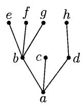

FIGURE 26

i.e.,  $2^m/8 = 2^{m-3}$  according to the assumption. When going down, only one bit that indicated the direction is sufficient. (In other words, when making a recursive call, we perform a push operation for the stack of calls, and we should specify the top of the stack; for pop operation no additional information is needed.)

So for each vertex (except the root) we use  $\log t + 2$  bits (we need  $\log t + 1$  bits when we come to this vertex from below, and then one more bit when going back to its father). In total (for all the vertices) we need  $N + n + k(\log t + 2)$  bits for description. If the random bits used in the algorithm are incompressible, then  $N + n + k(\log t + 2) \ge n + km$ , and we get an upper bound for k. Namely, we get the bound  $k \le N$  (recall that  $\log t + 2 = m - 1$ ), so we make at most N calls of the procedure Fix, and the algorithm is polynomial (in N + n).

Some final clarifications are needed still.

- 1. If we literally use Kolmogorov complexity, then some constant appears, and we should keep track of all these details. As usual, when the idea is clear, we can switch to the probabilistic language: If k = N + c, then the difference between the number of random bits used and the number of bits in the description is c. This means that the number of random bit strings that cause N + c or more calls of Fix is  $2^c$  times smaller than the total number of possible strings, so the probability is bounded by  $2^{-c}$ .
- 2. When we describe several objects by a sequence of bits, we should check that no separators are needed to perform the decoding. Here it is indeed the case: The number of variables, clauses, and the clause size (as well as the bound for the number of neighbors) are known; after a bit that specifies the direction (whether we go up or down) is read, the decoder knows how many bits it should read next.
- 3. The last problem: It may happen that we stopped the execution at the moment when one of the trees is only partially processed, so we should be able to describe the unfinished tree walk. But our way of description works in this case as well; we should only note that at every moment the number of steps down does not exceed the number of steps up (the number of Fix-calls).

# 8.6. A proof of an inequality

As we have said (see p. 12), the inequalities for Kolmogorov complexity have quite unexpected consequences. In this section we explain one of them, a version of the Loomis-Whitney inequality (this topic will be continued in Chapter 10).

THEOREM 164. Let X, Y, and Z be finite sets. Let  $f: X \times Y \to \mathbb{R}$ ,  $g: Y \times Z \to \mathbb{R}$ , and  $h: X \times Z \to \mathbb{R}$  be some functions with non-negative values. Then

$$\left(\sum_{x,y,z} f(x,y)g(y,z)h(x,z)\right)^2 \leqslant \left(\sum_{x,y} f^2(x,y)\right) \cdot \left(\sum_{y,z} g^2(y,z)\right) \cdot \left(\sum_{x,z} h^2(x,z)\right).$$

PROOF. Believe it or not, this inequality is in fact a corollary of the inequality

$$2K(x, y, z) \le K(x, y) + K(y, z) + K(x, z) + O(\log n)$$

for prefix complexity (Theorem 26, p. 48). We wrote the last inequality for prefix complexity, not plain complexity, but this does not matter since the difference is  $O(\log n)$ . (For prefix complexity this inequality is true up to O(1)-precision (see Problem 114, p. 111); for now the  $O(\log n)$ -precision is enough.)

It is convenient to assume that elements of the finite sets X, Y, Z are binary strings. It is enough to show that if the sums in the right-hand side of the inequality do not exceed 1, the same is true for the left-hand side. (Indeed, we can multiply f by an arbitrary constant c, and both sides of the inequality are multiplied by the same factor, so we can normalize f; the same for g and h.)

Now assume that  $\sum_{x,y} f^2(x,y) = 1$  and that the same is true for two other sums. We have to show that  $\sum_{x,y,z} f(x,y)g(y,z)h(x,z) \leq 1$ .

The idea is simple: The function  $f^2$  is a probability distribution on pairs (x,y), so  $K(x,y) \leq -\log f^2(x,y) = -2\log f(x,y)$  (we temporarily ignore the constant in the comparison of this distribution and the a priori one). Similarly,  $K(y,z) \leq -2\log g(y,z)$  and  $K(x,z) \leq -2\log h(x,z)$ . Then we apply the inequality for K(x,y,z) (temporarily ignoring the logarithmic term) and get

$$2K(x,y,z) \leqslant -2\log f(x,y) - 2\log g(y,z) - 2\log h(x,z),$$

i.e.,

$$f(x,y)g(y,z)h(x,z) \leqslant 2^{-K(x,y,z)}.$$

Since the sum of  $2^{-K(x,y,z)}$  over all triples x,y,z does not exceed 1 (Theorem 57, p. 92), we get the desired inequality.

This argument is, of course, too simple to be valid. All our bounds are of asymptotic nature, so we have to switch somehow from individual strings to sequences of strings. Let us show how it can be done.

We start with a simple remark: It is enough to prove the inequality for functions f, g, h with rational values (by continuity).

Let N be some natural number (later we take the limits as N tends to infinity). Consider the sets  $X^N$ ,  $Y^N$ , and  $Z^N$  whose elements are N-tuples (of elements of X, Y, Z, respectively). Consider a probability distribution on  $X^N \times Y^N = (X \times Y)^N$  that corresponds to N independent copies of distribution  $f^2$  on  $X \times Y$ . Formally speaking, the probability of a point  $\langle \langle x_1, \ldots, x_N \rangle, \langle y_1, \ldots, y_N \rangle \rangle$  is equal to the product  $f^2(x_1, y_1) \cdot \ldots \cdot f^2(x_N, y_N)$ . We get a family of distributions that computably depends on N. Therefore, there exists a constant c such that

$$K(\langle x_1, \ldots, x_N \rangle, \langle y_1, \ldots, y_N \rangle | N) \leqslant 2 \sum_i (-\log f(x_i, y_i)) + c$$

for all N and for all  $x_1, \ldots, x_N, y_1, \ldots, y_N$  (we compare our distribution with a priori probability). We can delete the condition N in the left-hand side, and replace c by

 $c \log N$  in the right-hand side. Then (as before) we add three inequalities of this type and apply the inequality for complexities. Then we get

$$K(\langle x_1, \dots, x_N \rangle, \langle y_1, \dots, y_N \rangle, \langle z_1, \dots, z_N \rangle) \\ \leqslant \sum_i (-\log f(x_i, y_i)) + \sum_i (-\log g(y_i, z_i)) + \sum_i (-\log h(x_i, z_i)) + c \log N$$

for some constant c and for all  $N, x_1, \ldots, x_N, y_1, \ldots, y_N, z_1, \ldots, z_N$ . (Note that the total length of all the strings  $x_i, y_i, z_i$  for  $i = 1, \ldots, N$  is O(N), so all logarithmic terms are absorbed by  $c \log N$ .) Combining this bound with the inequality  $\sum_{n} 2^{-K(u)} \leq 1$ , we conclude that for every N the sum

$$\sum \prod_i f(x_i, y_i) g(y_i, z_i) h(x_i, z_i)$$

(over all tuples  $x_1, \ldots, x_N, y_1, \ldots, y_N, z_1, \ldots, z_N$ ) does not exceed  $2^{O(\log N)}$ , i.e., it is bounded by a polynomial in N. But this sum is the Nth power of the sum

$$\sum_{(x,y,z)\in X\times Y\times Z} f(x,y)g(y,z)h(x,z),$$

so polynomial growth is possible only if the latter sum does not exceed 1. This ends the proof.  $\Box$ 

252 Show that this inequality implies the bound for the volume of a three-dimensional body in terms of its two-dimensional projections mentioned on p. 12.

(*Hint*: We can let f, g, h be the characteristic functions of the projections. This works for the discrete case; for the continuous case we should either approximate the body using a cubic grid or approximate the integral by finite sums.)

For comparison let us give two other proofs of the same inequality. Here is the first one (rather simple) using the Cauchy–Schwarz inequality  $(u, v)^2 \leq ||u||^2 \cdot ||v||^2$ , or, in coordinates,  $(\sum u_i v_i)^2 \leq (\sum u_i^2)(\sum v_i^2)$ . We can argue as follows:

$$\left(\sum_{x,y,z} f(x,y)g(y,z)h(x,z)\right)^{2} \leqslant \left(\sum_{x,y} f^{2}(x,y)\right) \left(\sum_{x,y} \left(\sum_{z} g(y,z)h(x,z)\right)^{2}\right)$$

$$\leqslant \left(\sum_{x,y} f^{2}(x,y)\right) \sum_{x,y} \left(\left(\sum_{z} g^{2}(y,z)\right) \left(\sum_{z} h^{2}(x,z)\right)\right)$$

$$= \left(\sum_{x,y} f^{2}(x,y)\right) \left(\sum_{y,z} g^{2}(y,z)\right) \left(\sum_{x,z} h^{2}(x,z)\right).$$

Another proof uses Shannon entropy (and can be considered as a translation of the Kolmogorov complexity argument into probabilistic language). Let us assume that  $\sum f^2 = \sum g^2 = \sum h^2 = 1$ . We want to prove the inequality  $\sum_{x,y,z} p(x,y,z) \leq 1$ , where p(x,y,z) = f(x,y)g(y,z)h(x,z). Assume that is not the case and this sum equals c>1. Then we can multiply it by 1/c and get a probability distribution p' on  $X\times Y\times Z$ :

$$p'(x, y, z) = \frac{1}{c} f(x, y) g(y, z) h(x, z).$$

The corresponding random variable (whose range is  $X \times Y \times Z$ ) is denoted by  $\xi$ . It can be considered as a triple of (dependent) random variables  $\xi_x$ ,  $\xi_y$ ,  $\xi_z$ . One can

also consider the joint distributions  $\xi_{xy} = \langle \xi_x, \xi_y \rangle$ , etc. For example, the random variable  $\xi_{xy}$  takes the value  $\langle x, y \rangle$  with probability  $\sum_z p'(x, y, z)$ .

Recall that by definition the Shannon entropy of the distribution  $(p_1, \ldots, p_k)$  equals  $\sum p_i(-\log p_i)$ ; it does not exceed  $\sum p_i(-\log q_i)$  for any other distribution  $(q_1, \ldots, q_k)$ . Therefore the entropy  $H(\xi_{xy})$  can be bounded (from above) by using  $f^2(x, y)$  as the "other" distribution,

$$H(\xi_{xy}) \leqslant \sum_{x,y} \left(\sum_{z} p'(x,y,z)\right) (-2\log f(x,y)).$$

Then we write similar bounds for two other projections and apply the inequality

$$H(\xi) = H(\xi_x, \xi_y, \xi_z) \le \frac{1}{2} (H(\xi_{xy}) + H(\xi_{yz}) + H(\xi_{xz}))$$

(Problem 230, p. 225). We conclude that

$$H(\xi) \leqslant \sum_{x,y,z} p'(x,y,z) (-\log f(x,y) - \log g(y,z) - \log h(x,z))$$
  
=  $\sum_{x,y,z} p'(x,y,z) (-\log p(x,y,z)).$ 

By definition  $H(\xi) = \sum_{x,y,z} p'(x,y,z)(-\log p'(x,y,z))$ , so we get a contradiction, since p' is c times smaller than p (and therefore  $-\log p'$  exceeds  $-\log p$  by  $\log c$ ).

# 8.7. Lipschitz transformations are not transitive

In this section we apply Kolmogorov complexity to analyze the properties of infinite sequences. Let us start with the following definition related to the Cantor (metric) space  $\Omega$  of infinite binary sequences.

A mapping  $f: \Omega \to \Omega$  is a *Lipschitz* one if

$$d(f(\omega_1), f(\omega_2)) \leqslant cd(\omega_1, \omega_2)$$

for some constant c and for all  $\omega_1, \omega_2 \in \Omega$ . Here d is the standard distance in the Cantor space defined as  $2^{-k}$  where k is the first place where two sequences differ.

Informally speaking, Lipschitz property means that the first n digits of the sequence  $f(\omega)$  are determined by n+O(1) first digits of  $\omega$ . In particular, all mappings defined by local rules (each bit in  $f(\omega)$  is determined by some its neighborhood in  $\omega$ ) have Lipschitz property.

We are interested in the following property of a mapping f: For every two sequences  $\omega_1$ ,  $\omega_2$  and for every  $\varepsilon > 0$ , there exist a number N and sequences  $\omega_1'$  and  $\omega_2'$  such that

$$\omega_2' = f(f(f(\cdots f(\omega_1')\cdots))) \quad (N \text{ iterations})$$

and

$$d(\omega_1, \omega_1') < \varepsilon, \quad d(\omega_2, \omega_2') < \varepsilon.$$

(In other terms, for any two open neighborhoods there exists an orbit that starts in the first one and gets inside the second one.) We call this property the transitivity of f (in this section).

It is easy to check that left shift (that deletes the first bit of the sequence) is transitive: If we need a sequence that starts with  $x_1$  and is transformed (after several shifts) into a sequence that starts with  $x_2$ , just take a sequence that starts with  $x_1x_2$ .

Now we pose the following question: Does the left shift remain transitive if we change the definition and replace Cantor distance d by the so-called Besicovitch distance,

$$\rho(\omega_1, \omega_2) = \limsup_{n \to \infty} d_n(\omega_1, \omega_2) / n$$

(where  $d_n$  is a number of discrepancies among the first n terms, i.e., the number of i < n such that ith terms of  $\omega_1$  and  $\omega_2$  differ)?

It turns out that in this case the left shift is no more transitive (is not *Besicovitch-transitive*). Moreover, the following statement is true (we reproduce the proof given in [17]):

THEOREM 165. No Lipschitz mapping can be Besicovitch-transitive.

(Speaking about the Lipschitz property, we have in mind the original definition using Cantor distance.)

The reason is quite simple. The Lipschitz mapping does not significantly increase the complexity of the prefixes of a sequence, since n bits of the output sequence are determined by n + O(1) bits of the input sequence. (We assume that transformation rule is computable; if not, we have to relativize complexity by a suitable oracle.) On the other hand, if two sequences are Besicovitch-close, then their prefixes have almost the same complexities (a change in a small fraction among the first n bits can be encoded by a short string compared to n).

PROOF. For a formal proof it is convenient to use the notion of effective Hausdorff dimension of a sequence (which is equal to  $\liminf C(\omega_0 \cdots \omega_{n-1})/n$  for a singleton  $\{\omega\}$ ; see Theorem 120, p. 174).

Lemma 1. A computable Lipschitz mapping does not increase the effective Hausdorff dimension of a sequence.

(Speaking about computability of a Lipschitz mapping  $f: \Omega \to \Omega$ , we mean that n first bits of  $f(\omega)$  are effectively determined by n+c first bits of  $\omega$  for some c.)

PROOF. Indeed, if  $f(\omega_1) = \omega_2$ , then the complexity of an *n*-bit prefix of  $\omega_2$  does not exceed (up to O(1)) the complexity of an (n+c)-bit prefix of  $\omega_1$ , and for the dimension these constants are not important.

LEMMA 2. If Besicovitch distance  $\rho(\omega_1, \omega_2)$  is less than  $\varepsilon$ , then effective Hausdorff dimensions of  $\omega_1$  and  $\omega_2$  differ at most by  $H(\varepsilon)$ .

(Here  $H(\varepsilon)$  is the Shannon entropy of a random variable with two values that have probabilities  $\varepsilon$  and  $1 - \varepsilon$ .)

PROOF. Indeed, if the first n terms of  $\omega_1$  and  $\omega_2$  differ in k places, then the complexities differ at most by the complexity of the bitwise xor of these two sequences (since knowing one sequence and their xor we easily get the other one). And every sequence of length n that has k ones has complexity at most  $nH(k/n) + O(\log n)$  (Theorem 146, p. 226). Lemma 2 is proven.

So if we take a sequence of a zero dimension (say, a computable sequence), then any sequence that is Besicovitch-close to it has small dimension, and a computable Lipschitz mapping does not increase this dimension, so we can get only sequences of small effective Hausdorff dimension. On the other hand, any sequence that is Besicovitch-close to a random sequence (that has dimension 1) has dimension close to 1 (Lemma 2 again).

So we have proven our theorem for computable Lipschitz mappings. It remains to note that all our arguments are relativizable and that every Lipschitz mapping is computable relative to some oracle.

#### CHAPTER 9

# Frequency and game approaches to randomness

#### 9.1. The original idea of von Mises

Nowadays the axiomatic approach to probability (that makes it a special part of measure theory) is standard, and it is difficult to forget all we know now and return to the situation in the beginning of the twentieth century when Richard von Mises suggested basing probability theory on the notion of a random sequence (he used the word *Kollektiv*). Still let us try to describe von Mises' ideas.

Some natural phenomena are easy to predict (after we have discovered the laws of nature they obey). For example, the laws of classical mechanics can be used to predict the positions of planets in the sky with very high precision. But there exists another class of phenomena: Even as we try very hard to predict the outcome of coin tossing, usually we get about 50% of predictions correct. Those phenomena are the subject of probability theory.

So the basic notion of probability theory (according to von Mises) is the notion of a Kollektiv—a sequence  $\omega$  of outcomes (we will assume there are two possible outcomes 0 and 1) that is hard to predict. Since this is a basic notion, we do not try to give a definition that would reduce it to other mathematical notions; instead we formulate a frequency stability axiom that captures the main property of Kollektivs:

There exists a limit

$$p = \lim_{n \to \infty} \frac{\omega_0 + \omega_1 + \dots + \omega_{n-1}}{n}.$$

Moreover, p remains the limit if we consider not the entire sequence  $\omega$  but some of its subsequence selected according to some rule; for example, the subsequence  $\omega_{2n}$ , or the subsequence of  $\omega_n$  with composite n, or the terms that follow ones (i.e.,  $\omega_n$  such that  $\omega_{n-1} = 1$ ).

This p is called the *probability* of 1 in a given Kollektiv.

Why do the Kollektivs exists? We know that gambling facilities are commercially successful, and this would be impossible if some selection rule existed that allowed the gamblers to select a subsequence of games with different frequencies of outcomes.

This is a short (but faithful, we hope) summary of what von Mises wrote; see, e.g., his book Wahrscheinlichkeit, Statistik und Wahrheit [127]. But his book was written not in the times of Euclid or Spinoza, but in the beginning of the twentieth century, when people tend to ask nasty questions about exact definitions and for detailed proofs. Indeed, one can declare that the existence of sequences with some properties is an axiom that is confirmed experimentally (though to speak about experimental confirmation of the statement that deals with limits of infinite

sequences is a bit strange). But even then one should say exactly what property we have in mind.

The problem is with the selection rules: We did not say what kind of selections are allowed. Mises gave only some examples of admissible selection rules (we gave three examples of this type), and noted that the decision to select (or do not select) some  $\omega_n$  should not depend on the value of  $\omega_n$  itself; otherwise, we can select a subsequence of zeros (or ones) only from every sequence, and this violates the frequency stability property.

Trying to make Mises' ideas precise, one can give different formal definitions of admissible selection rules and can therefore get different notions of Kollektivs. After some version is chosen, one can ask whether Kollektivs exist. This question is a mathematical one, while the question of whether coin tossing really gives a Kollektiv belongs to natural sciences or philosophy (and can be put aside).

For simplicity we restrict ourselves to the case of a symmetric coin (p = 1/2) unless the opposite is not said explicitly. To simplify the statement, let us define a balanced sequence of zeros and ones as a sequence where the frequency of ones (and, therefore, the frequency of zeros) has limit 1/2.

### 9.2. Set of strings as selection rules

The first (and, probably, the most natural) interpretation of Mises' ideas of an admissible selection rule is the following one. We decide whether to select some term  $\omega_n$  looking at all the preceding terms, i.e.,  $\omega_0\omega_1\cdots\omega_{n-1}$ . So an admissible selection rule is a function that maps all binary strings  $\omega_0\cdots\omega_{n-1}$  to a two-element set {select, do not select}. In other words, a selection rule is a set R of binary strings (corresponding to the value select).

Formally speaking, for every set R of binary strings we define a selection rule as a mapping  $S_R$  that maps an infinite binary sequence  $\omega \in \Omega$  into a (finite or infinite) subsequence  $S_R(\omega)$ . Namely,  $S_R(\omega)$  consists of terms  $\omega_n$  such that  $\omega_0 \cdots \omega_{n-1} \in R$ . (The order of terms is the same as in the original sequence.)

We give an example: If R consists of strings whose lengths belong to some set  $\{n_0, n_1, \ldots\}$  (where  $n_0 < n_1 < \cdots$  is an increasing sequence of integers), then  $S_R(\omega)$  is  $\omega_{n_0}\omega_{n_1}\cdots$  (note that the length of  $x_0\cdots x_{k-1}$  is k). We give another example: The rule "select terms that follow ones" corresponds to the set R which contains all strings with last bit 1.

Assume that we fix some R and then go to a casino where a sequence  $\omega$  of zeros and ones is generated by tossing a fair coin. Then we get some subsequence  $S_R(\omega)$ . (In other words, we use R to decide when to make bets). It is natural to expect that this selection does not give us any advantage, and the limit frequency of ones in the subsequence is still 1/2. There is an important point, however: We assume that we have chosen R before we came to the casino. After the game it is easy to find a rule R that would win if it were used in the game. In other words, we make the following (obvious) observation: For every sequence  $\omega$  there exists a set R such that  $S_R(\omega)$  consists only of zeros or consists only of ones, and therefore  $S_R(\omega)$  is not balanced. So we cannot define the Kollektiv as a sequence  $\omega$  such that  $S_R(\omega)$  is balanced for all R. With this definition there are no Kollektivs at all.

However, as Wald noted in [217], for every countable family of selection rules  $S_{R_i}$  (that corresponds to a countable family of sets  $R_i$ ) there exists a sequence

 $\omega$  that has a frequency stability property with respect to all  $R_i$ : For every i the sequence  $S_{R_i}(\omega)$  is balanced (or finite).

This is easy to prove by a probabilistic argument:

Theorem 166. Let R be an arbitrary set of strings. Then the set of all sequences  $\omega \in \Omega$  such that  $S_R(\omega)$  is an infinite unbalanced sequence is a null set with respect to the uniform measure on  $\Omega$ .

This theorem says that every selection rule discards a null set. So a countable class of selection rules generates a countable family of null sets, and the union of these null sets is a null set. So there are sequences not discarded by any selection rule in the class (moreover, this happens with probability 1).

PROOF. This statement follows from the Strong Law of Large Numbers (the set of unbalanced sequences is a null set, see Section 3.2) and the following lemma that holds for every selection rule  $S_R$ .

LEMMA. Let  $U \subset \Omega$  be a null set. Then its preimage  $S_R^{-1}(U)$  is a null set.

Informally, each next bit of the sequence  $S_R(\omega)$  has the same chance to be zero and one (for every fixed combination of previous bits); the difference with uniform distribution is that the next bit may be absent (if the sequence is finite), but this may only decrease the probability.

(Recall an old question: Will the percentage of men change if families stop giving birth to children after a son is born to keep their heir unique? The answer is negative for the same reasons.)

Now let us present the formal argument.

Consider the set  $\Sigma_x$  of all finite and infinite extensions of x and two of its subsets  $\Sigma_{x0}$  and  $\Sigma_{x1}$ . Let us prove that  $S_R$ -preimages of  $\Sigma_{x0}$  and  $\Sigma_{x1}$  have equal measure (in other words, 0 and 1 can appear after x in  $S_R(\omega)$  with the same probability).

Indeed, consider all strings z such that  $z \in R$  and  $S_R$  selects x from z. They correspond to the situation when x is already selected and the next bit will be selected right now. So every two strings z with this property are incompatible, and the sets  $\Omega_{z0}$  are disjoint. The union of these sets is the preimage of the set  $\Sigma_{x0}$ . Similarly, the preimage of  $\Sigma_{x1}$  is the union of disjoint sets  $\Omega_{z1}$ . So we have split the preimages into equal parts so the preimages have equal measures.

Now it is easy to prove by induction that the measure of the  $S_R$ -preimage of  $\Sigma_x$  is bounded by  $2^{-l(x)}$ . Therefore, the preimage of a null set is a null set too. Indeed, consider the cover of U by intervals  $\Omega_{x_i}$  with small total measure. Consider the preimages of  $\Sigma_{x_i}$ ; each of these preimages is a countable union of intervals. Combining all these intervals, we get a cover of  $S_R^{-1}(U)$  with small total measure. So the Lemma—and Theorem 166 as well—is proven.

Note that the standard measure-theoretic argument (a measure of a set is the infimum of the measures of its covers) now implies that

$$\mu(S_R^{-1}(U))\leqslant \mu(U)$$

for every measurable  $U \subset \Omega$ . If  $S_R(\omega)$  is infinite for every  $\omega$  (or for almost every  $\omega$ ), then we can guarantee also that  $S_R(\omega)$  is uniformly distributed,

$$\mu(S_R^{-1}(U)) = \mu(U),$$

for every measurable U. (Consider U and its complement.)

**253** Fix some selection rule R. Show that if  $\omega$  has a Bernoulli distribution (independent trials with the same probability p, not necessarily equal to 1/2), then  $S_R(\omega)$  has the same distribution (assuming that it is infinite with probability 1).

So the definition of Kollektiv gives a non-empty notion (Kollektivs exist) if we restrict ourselves to some countable family of sets R and consider corresponding selection rules. But which countable family should we choose?

# 9.3. Mises-Church randomness

The ideas of von Mises appeared before the notion of algorithm (or computability) was formalized. As soon as the notion of computable function appeared, it became possible to use it in the Mises' scheme. This was done by A. Church [44], so selection rules  $S_R$  that correspond to decidable (=computable, recursive) sets R are called Church-admissible in the sequel. The corresponding class of sequences, i.e., sequences  $\omega$  such that  $S_R(\omega)$  is finite or balanced for every Church-admissible rule, are called Church-admissible rule, are called Church-admissible rule, are called Church-admissible rule, are called Church-admissible

We know already that they exist and form a set of full measure. Moreover, the following stronger statement is true:

THEOREM 167. Every ML-random sequence (with respect to the uniform measure) is Mises-Church random.

PROOF. The effective version of the SLLN (Theorem 32, p. 65; see also Section 8.4) guarantees that the set U of non-balanced sequences (that do not have the limiting frequency or have it different from 1/2) is an effectively null set.

Let us show that for a Church-admissible selection rule  $S_R$  the preimage of an effectively null set is an effectively null set. Indeed, if R is decidable, the construction used in the proof of Theorem 166 becomes effective (one can effectively enumerate all the intervals that form a preimage of a given interval). So an ML-random sequence does not belong to this preimage, i.e., its image is balanced (or finite).

What else can we prove about Mises-Church random sequences, except for the SLLN (that is satisfied by definition)? For example, we can prove that each substring (not only each symbol) appears with a correct frequency:

Theorem 168. Let  $\omega$  be a Mises-Church random sequence, and let U be a binary string. Consider the positions k where U appears in  $\omega$  (this means that  $U_0U_1\cdots=\omega_k\omega_{k+1}\cdots$ ). The fraction of those i among the first N positions tends to  $1/2^{l(U)}$  as  $N\to\infty$ .

PROOF. We already know that zeros appear in (approximately) half of the positions. Consider now the rule "select terms that go just after zeros". Mises—Church randomness guarantees that the selected subsequence contains (approximately) equal numbers of zeros and ones. This means that the groups 00 and 01 have approximately the same frequency, so the limit frequency of each group is 1/4. The same is true for 10 and 11. Now consider the rule "select terms that follow 00" (or "select terms that follow 01"), etc.

**254** Consider a Mises-Church random sequence and split it into k-bit blocks (for some k). Show that in the resulting sequence (in a  $2^k$ -letter alphabet) each of  $2^k$  blocks appears with limit frequency  $1/2^k$ .

(*Hint*: This problems differs from the preceding theorem, because now we take into account only k-aligned blocks. However, the same argument works.)

The sequences where each combination of letters (of every fixed size) has the same limit frequency (as claimed by Theorem 168), were considered independently of Mises; they are called *normal*.

**255** Let us change the definition of normality of a bit sequence  $\alpha$  and require that for every m the sequence of m-bit strings, obtained by splitting  $\alpha$  into m-bit blocks, contains every m-bit string with limit frequency  $2^{-m}$ . Prove that this definition is equivalent to the original one.

(*Hint*: The difference is that now we consider only aligned m-bit occurrences instead of all occurrences. Still we can prove equivalence considering not only m-bit blocks but also M-bit blocks where M is a large multiple of m. Assume that aligned M-bit blocks appear with right frequencies. Then for a fixed position inside each long M-bit block (modulo M) all short m-bit blocks appear with right frequencies, and short blocks that cross the boundaries between large blocks are rare ( $m \ll M$ ). In the other direction, assume that non-aligned frequencies are OK. Most M-bit blocks are good in the sense that frequencies of short blocks inside them are almost right. Bad blocks are exponentially (in M) rare in terms of non-aligned frequencies. Aligned frequencies could be at most M times bigger, and the factor M is absorbed by the exponent.)

The reals whose binary representations are normal sequences, are called normal in base 2; similarly one can define reals that are normal in base b. If a real is normal in base b for every integer b, it is called absolutely normal.

**256** Prove that the same reals are normal in base b and in base  $b^k$ . (*Hint*: Use the preceding problem.)

One can prove that the class of normal in base b reals depends on b, but this is a non-trivial number-theoretic result [161], and we will not prove it here.

**257** Let us consider a bit sequence  $\omega$  as a binary representation of a real  $\alpha \in [0,1]$ . The tails of  $\omega$  form a sequence of points in [0,1] which is the orbit of  $\alpha$  under the mapping  $x \mapsto \{2x\}$  where  $\{u\}$  stands for the fractional part of u. Show that  $\omega$  is normal if and only if this orbit is uniformly distributed in [0,1]. (The latter means that for every interval the fraction of points that are in this interval has a limit proportional to the length of the interval.)

**258** Prove that multiplication by an integer factor preserves normality: If  $\alpha$  is normal in base 2 and k is an integer, then  $\alpha k$  is normal in base 2. (The same is true for other bases.)

(*Hint*: Use the preceding problem. Applying the *n*th iteration of the mapping  $x \mapsto \{2x\}$  to some real u, we get  $\{2^n u\}$ . For every integer k the number  $\{2^n (ku)\}$  is obtained from  $\{2^n u\}$  by the transformation  $y \mapsto \{ky\}$ . It remains to prove that this mapping preserves the uniform distribution property.)

One can prove that normality is also preserved when we divide a number by some integer (and therefore, when we multiply a number by an arbitrary rational number). This was shown by D. Wall [218] (see also [88]), but the proof is non-trivial and we do not provide it here; see [182] for the proof.

We know that Mises-Church random sequences are normal, but one can also find a computable normal sequence. For example, if we write numbers  $1, 2, 3, \ldots$  in

binary and concatenate all these strings, we get a normal sequence

#### $11011100101110111110001001101010111\cdots$

(Champernowne's example [36]; he considered base 10, but this does not matter much).

259 Prove this statement.

 $\overline{(Hint)}$ : Fix k, the block size. Starting from some point, the numbers have many more than k digits, and after that the boundaries between numbers do not change the frequencies significantly. And the average of block frequencies in all strings of a given length N is as it should be. (Some care is needed to deal with the case when we stop in the middle of strings of length N.))

This construction of a computable normal sequence is performed for one base, and we cannot use it to get a computable absolutely normal number. But such a number (whose b-ary representation is a computable normal sequence for every base n) exists. This observation was made long ago by Turing in his unpublished notes; see [8].

**260** Prove that a computable absolutely normal number exist.

 $\overline{(Hint)}$ : Numbers that are not normal in base b, form a Schnorr effectively null set; this is true for all b, and the union of these sets is also a Schnorr effectively null set, so there exists a computable point outside it.)

Unlike normal sequences, Mises-Church random sequences cannot be computable for obvious reasons (otherwise we can select a sequence of zeros or a sequence of ones by a computable rule). Moreover, the following statement is true:

THEOREM 169. For every total algorithm that gets bits of a sequence from left to right and predicts the next bit before getting it, the fraction of successful predictions for a Mises-Church random sequence tends to 1/2.

PROOF. Indeed, a (total) algorithm that makes predictions can be converted into two selection rules: one selects the terms where the algorithm predicts zero, the other selects the terms where the algorithm predicts one. So our sequence is split into a "mixture" of two subsequences, and Mises-Church randomness guarantees that each of the two sequences is balanced (or finite, but then the statement is trivial). So the fraction of successful predictions for each subsequence tends to 1/2; so the total fraction of successful predictions tends to 1/2.

This statement can be generalized further. Consider the following game: before the next term of the sequence appears, we may make a bet on zero or one; the amount of a bet is a rational number in [0,1]. If our guess is correct, we get the doubled amount; if not, we lose the money. A strategy in a game of this type is a function S whose arguments are binary strings (the bits already disclosed) and the values are rational numbers in [-1,1]. The positive values mean that we bet on 0, the negative values mean that we bet on 1. The total gain of the strategy S playing with the initial segment  $\omega_0 \cdots \omega_{n-1}$  is then

$$\sum_{i=0}^{n-1} S(\omega_0 \cdots \omega_{i-1}) \cdot (-1)^{\omega_i};$$

the negative values correspond to our loss (in this game we can go below zero).

THEOREM 170. Let S be a total computable strategy of this type, and let  $\omega$  be a Mises-Church random sequence. Then the gain of S playing against  $\omega$  is o(n) after n steps.

PROOF. Assume that the strategy may have only values 1 and -1. Then it is essentially equivalent to guessing the next bit. We already know that the fraction of successful guesses tends to 1/2, and this means that the average gain per bit tends to 0.

Now consider more general strategies whose values are rational numbers between -1 and 1 with denominator k (i.e., multiples of 1/k), for some fixed k. Every strategy S of this type can be considered as an average of 2k strategies with values -1 and 1 only, and the gain of S after n bits is at most  $\varepsilon n$ , if n is large enough. We know that for each of them the gain is o(n), so the average is also o(n).

Finally, we consider an arbitrary strategy with rational values. For each  $\varepsilon > 0$  we need to prove that the gain of S after n bits is at most  $\varepsilon n$ , if n is large enough. So let us fix some  $\varepsilon$ . Choose k in such a way that  $1/k < \varepsilon$ , and approximate S by a strategy S' whose values are multiples of 1/k (taking the closest multiple). The approximation error is bounded by  $\varepsilon/2$ . For S' we already know that its gain is o(n), so it is less than  $(\varepsilon/2)n$  for large enough n, and the difference between gains of S and S' is at most  $(\varepsilon/2)n$ .

Here is one more property of Mises-Church random sequences. (It was mentioned by Mises as one of the basic property of Kollektivs.)

Theorem 171. Applying a Church-admissible selection rule to a Mises-Church random sequence, we get either a finite sequence or a Mises-Church random one.

PROOF. It is easy to see that the composition of two Church-admissible selection rules is a selection rule of the same type. If we select some terms (by looking at the previous ones) into a subsequence and then again select some terms of these subsequence looking at the previous ones, the resulting decision for some  $\omega_i$  (whether it will survive the first and the second selection or not) is determined by  $\omega_0 \cdots \omega_{i-1}$ . (And the composition of two computable selection rules is computable.)

Later (Section 9.12, p. 291) we consider more general selection rules (non-monotonic ones) and modify accordingly the notion of randomness (the so-called Mises–Kolmogorov–Loveland randomness or Kolmogorov–Loveland stochasticity). This new class of selection rules will *not* be closed under composition, and, moreover, the corresponding notion of randomness in not closed under selection rules (see Theorem 203, p. 307.)

We have not discussed yet the relation between Martin-Löf randomness and Mises-Church randomness. As we will see soon, they differ, and not all Mises-Church random sequences are Martin-Löf random. But first let us make some remarks about Mises' definition.

# 9.4. Ville's example

We have seen already that for every countable family of sets  $R_i$  there exists a sequence that satisfies the frequency stability property with respect to all selection rules  $S_{R_i}$  (each of these rules selects a finite or balanced subsequence). Indeed, the set of sequences with these properties has measure 1. This is an existence proof;

can we give a more explicit construction of such a sequence? Indeed this is possible, and we now explain such a construction following A. Wald [217], J. Ville [206], and D. Loveland [106].

Let us first consider the case when there is only one selection rule  $S_R$  that corresponds to some set R. Then it is easy to construct a sequence  $\omega$  such that  $S_R(\omega) = 01010101\cdots$  (zeros and ones alternate), so  $S_R(\omega)$  is balanced. Indeed, we construct  $\omega$  from left to right. When the rule  $S_R$  informs us that it intends to select the next term, we look at the number of this term in the subsequence (whether it is even or odd) and choose the next term to be 0 or 1 depending on this number. (The terms of  $\omega$  that are not selected by  $S_R$  can be chosen arbitrarily.)

Now assume that we have m sets  $R_1, \ldots, R_m$  that define selection rules. We want to construct a sequence  $\omega$  such that  $S_{R_i}(\omega)$  is finite or balanced for each  $R_i$ . Again we construct the sequence from left to right. Before we choose the value of the next term  $\omega_n$ , let us apply all the rules to the previous terms and see which of the rules  $S_{R_i}$  will select  $\omega_n$ . We get a m-bit vector, so we can classify the terms of  $\omega$  into  $2^m$  classes depending on this vector, even before the value of the term is chosen. The sequence  $\omega$ , therefore, is a mixture of  $2^m$  interleaving sequences (some of them may be finite).

We have not said yet how we construct  $\omega$ . We use the following rule. All the  $2^m$  subsequences (corresponding to  $2^m$  values of the m-bit vector) should be  $01010101\cdots$ . This can be achieved in a unique way: Before  $\omega_n$  is chosen, we know  $\omega_0\cdots\omega_{n-1}$ , and we know which rules will select  $\omega_n$ , so we know in which subsequences is  $\omega_n$  and we can choose its value.

Note that  $S_{R_i}(\omega)$  is a mixture of  $2^{m-1}$  subsequences (that correspond to  $2^{m-1}$  bit vectors that have 1 at position i). Therefore  $S_{R_i}(\omega)$  is balanced; moreover, we can guarantee that in each prefix of  $S_{R_i}(\omega)$  the number of ones does not exceed the number of zeros, and the difference is bounded by  $2^{m-1}$  (one for each subsequence).

Now we switch to the general case of countably many rules  $R_i$ . The main idea is that we add these rules one by one, and at each moment deal with finitely many rules. If we do it slowly, the transition effects are negligible, and every selection rule selects a balanced subsequence.

If this is not convincing, here are the details. Assume that we have already constructed some prefix  $\omega_0 \cdots \omega_{n-1}$  of the sequence  $\omega$ . Then it is already known which rules  $S_{R_i}$  will select the next term  $\omega_n$  (while the value of  $\omega_n$  is yet to be determined). This information is now not an m-bit vector, but an infinite bit sequence  $u_1u_2\cdots$  (where  $u_i=1$  if  $S_{R_i}$  selects the next term). We consider the sequence  $u_1u_2\cdots$  as a path in an infinite binary tree.

Fix some increasing sequence  $k_0 < k_1 < k_2 <$  of positive integers. We assume that it grows fast enough; for example, we may let  $k_i = 2^{2i}$ . At each step of the construction (for each term  $\omega_n$ ) one of the tree vertices will be declared as active. Namely, following the path  $u_1u_2\cdots$ , we select the first vertex that was active fewer than  $k_i$  times, where i is the height of this vertex, and we declare it as active. In other words, an active vertex (at the step when  $\omega_n$  is chosen) is a shortest string x such that

- the *i*th bit of x is 1 if and only if  $S_{R_i}$  selects  $\omega_n$ ;
- at previous steps of the construction (when  $\omega_0 \cdots \omega_{n-1}$  was constructed), the vertex x was active fewer than  $k_{l(x)}$  times.

So first the root is active, until it happens  $k_0$  times. Then 0 or 1 is active (depending on whether the rule  $S_{R_1}$  selects the next term or not) until they become "tired" of being active  $k_1$  times, etc.

In this way we construct a sequence  $\omega_0\omega_1\cdots$  that is a mixture of countably many finite subsequences that correspond to countably many possible active vertices. The subsequence that corresponds to vertex x (the terms constructed at the steps when x was active) has length at most  $k_{l(x)}$  (but it may be shorter). As before, we choose  $\omega_n$  in such a way that all these subsequences are of the form  $010101\cdots$ .

Let us look at the subsequence selected from  $\omega$  by  $S_{R_i}$  and show that it is balanced (or finite). Now the situation is a bit more complicated: First, we have countably many subsequences, and second, the rule  $S_{R_i}$  was initially ignored (when the active vertices were shorter than i). Let us look at the subsequence selected by  $S_{R_i}$  more closely. It consists of terms of two types. First, there are some terms that correspond to active vertices of height less than i, so  $S_{R_i}$  was not taken into account. Second,  $S_{R_i}$  includes all the terms that correspond to active vertices where the ith bit equals 1. The number of terms of the first type is bounded by  $2^0k_0 + \cdots + 2^{i-1}k_{i-1}$ , so we can safely ignore them.

As for the terms of the second type, note that for every active vertex the subsequence corresponding to this vertex is  $010101\cdots$ , and each of its prefixes contains no more ones than zeros, and the difference is at most 1. So the imbalance in the selected subsequence (if we ignore terms of the first type) at some moment t is bounded by the number of active vertices appearing at that moment. Let N be the maximal height of the active vertices used before t; we assume that  $N \ge i$  (otherwise there is no term of the second type). Then at most  $O(2^N)$  active vertices were used, and the imbalance is at most  $O(2^N)$ . On the other hand, since the vertex of height N became active, the preceding active vertices should be used completely, so the length of the sequence is at least  $k_{N-1}$ . It remains to use that  $2^N = o(k_{N-1})$ .

So we have described an explicit construction of a sequence that has the frequency stability property with respect to a given countable family of selection rules. Does it give something really new when compared to the probabilistic existence proof? Yes. For example, we may note that in this sequence each prefix contains at least as many zeros as ones, since this is true for all the  $010101\cdots$  pieces. So we have proved the following result:

Theorem 172 (Ville's example). There exists a Mises-Church random sequence where each prefix contains at least as many zeros as ones.

(We can also get a sequence whose prefixes have strictly more zeros than ones just by starting with first bit 1 and then using the construction.)

This result can be used to prove that there exists a Mises-Church random sequence that is not ML-random. For that it would be enough to prove that this property (more zeros than ones) is not possible for an ML-random sequence. It is indeed that the case, and it is a consequence of the Effective Law of the Iterated Logarithm—but, unfortunately, not the part that we proved in Section 8.4 (Theorem 156).

**261** Prove that in this case we do not really need the effective version: If the set of sequences that have more zeros than ones in all prefixes is a null set, then it is an effectively null set.

(*Hint*: Let  $p_n$  be the probability of the event "up to length n all prefixes have more zeros that ones". The sequence  $p_n$  is a decreasing computable sequence, and its limit is the measure of the set in question. So if this limit is 0, for a given  $\varepsilon > 0$  we can wait until  $p_n$  becomes less than  $\varepsilon$ . One can also refer to the results about Kurtz randomness (p.70).)

**262** Prove that the set of sequences that contain more zeros than ones in all prefixes in an effectively null set, not referring to the Law of the Iterated Logarithm.

(*Hint*: For every n the probability of the event "the n-bit prefix has more zeros than ones" is about 1/2. If we take a sequence of values of n that grow fast, these events will be almost independent (the deviations for the short prefixes is negligible compared to the expected deviation for the long prefixes).)

We do not provide the details of this argument here. Instead, we prove in a different way that there exist Mises-Church random sequences that are not Martin-Löf random. Namely, we show that there exists a Mises-Church random sequence whose prefixes have logarithmic complexity, using the same explicit construction.

Theorem 173. There exists a Mises-Church random sequence  $\omega = \omega_0 \omega_1 \cdots$  such that

$$C(\omega_0 \cdots \omega_{n-1}) = O(\log n).$$

PROOF. To construct such a sequence, we apply our construction to the countable list of all Church-admissible selection rules: The sets  $R_i$  are all decidable sets of strings. This is not an effective construction, since we cannot enumerate all decidable sets (all total algorithms)—this is not a surprise, otherwise we would get a computable Mises-Church random sequence!

We can enumerate all programs, but then we need some extra advice: Some-body should tell us which of the programs define decidable sets (so we can replace the bad ones by some fixed decidable set). This information for the first m programs takes m bits (one bit per program), and it is enough to perform our construction until we reach active vertices of height (length) m. At that moment we have constructed at least  $k_{m-1} = 2^{2m-2}$  bits of the sequence. So the amount of additional information (advice) is logarithmic in the length of the prefix.

Let us repeat again the important corollary of this result:

Theorem 174. There exists a Mises-Church random sequence that is not Martin-Löf random (with respect to the uniform measure).

If the Mises-Church definition is too weak, maybe we should make it stronger? For example, one can consider a broader class of selection rules or a different type of gambling. In the following sections of this chapter we consider some generalizations that involve non-monotonic rules (the order of terms in the subsequence is not the same as in the entire sequence) and martingales (where we start playing with a fixed amount and can bet all the money we have).

#### 9.5. Martingales

When discussing why Kollektivs exist, we referred to gambling practice. But from the practical viewpoint our gambling framework looks quite unnatural: a gambler comes to a casino where a fair coin is tossed, he selects some of the bits (before they are produced) and then "wins" (discredits the casino's source of randomness) if the selected outcomes are imbalanced (do not have limit frequency 1/2).

As we have said (trying to make the game more natural), we get the same definition if we allow the gambler to make a bet of fixed size at some moments (having the unlimited credit needed for long sequences of losses), and we require that the gambler's average gain (per game) tends to zero as the number of games increases. One can also allow variable bets of bounded size to be made; see above.

J. Ville suggested another setting that looks more natural. Here the gambler comes to the casino with some fixed amount of money, say \$1. Before a coin is tossed, the gambler splits the capital into two parts: the first is used to make a bet on 0, and the second is used to make a bet on 1. One of the bets is successful; the corresponding amount is doubled (and the other part is lost). For example, a cautious gambler may split the current amount into two equal parts, then one is lost and the other one is doubled, so the capital remains unchanged. (It is clear therefore that a special option to leave some part of the money aside is not necessary, it can be emulated anyway.) Now we cannot go into negative, so both parts should be non-negative numbers.

After a game is described, it is clear how the notion of a gambler's strategy in this game should be defined: a strategy is a function that maps the history of the game (the sequence of already seen bits) to the next move (how much should be bet on 0 and on 1). In fact, we will use more a convenient representation of the strategy: let m(x) be the gambler's capital after playing with x (if she follows the strategy). This (non-negative) function determines the strategy uniquely: After seeing x, we bet m(x0)/2 on 0 and m(x1) on 1. Not all non-negative functions correspond to strategies; two conditions are necessary (and sufficient):

- $m(\Lambda) = 1$  (as we agreed, the initial capital when we observed the empty string  $\Lambda$  equals 1);
- m(x) = (m(x0) + m(x1))/2 (the sum of bets on both outcomes is equal to the current capital).

A non-negative function m that has both properties is called a martingale with respect to the uniform measure on the Cantor space. Later we also consider martingales with respect to other measures on the Cantor space. In probability theory a more general notion of martingale is used, but for our purposes this will be sufficient. So from now on we speak mostly about martingales instead of corresponding strategies.

Let  $\nu$  be an arbitrary measure on the Cantor space. It is easy to check that the ratio  $\nu(\Omega_x)/\mu(\Omega_x)$  (here  $\mu$  is the uniform measure on the same space and  $\Omega_x$  is the set of all extensions of x) is a martingale, and every martingale is obtained in this way from some measure.

**263** Show that this is indeed the case.

The following intuitively obvious statement is sometimes called the *Doob inequality* or *Kolmogorov inequality*:

THEOREM 175. Let m be some martingale, and let k be some positive threshold. Consider the set of strings where the martingale exceeds k, and consider all infinite sequences that have a prefix in this set. Then the (uniform) measure of the set of all these sequences does not exceed 1/k.

PROOF. Let us follow the strategy that corresponds to m, but when the capital achieves k (or more), we stop playing and go home. This modified strategy has an

expected return of at most 1 (since the game is fair), so that the probability that we achieve k or more is at most 1/k.

To make this argument formal, consider the corresponding measures. Assume that m(x) is  $\nu(\Omega_x)/\mu(\Omega_x)$  for some measure  $\nu$  (and  $\mu$  is the uniform measure). We consider vertices (strings) x such that the  $\nu$ -measure of cone  $\Omega_x$  is k (or more) times bigger than the  $\mu$ -measure of the same cone. Now consider only the minimal strings x with this property (this does not change the union of  $\Omega_x$ ). They correspond to disjoint cones. The total  $\mu$ -measure of these cones is k times smaller than their total  $\nu$ -measure (or even smaller), and the latter is at most 1.

**264** Prove that for a lower semicomputable martingale m the function

$$t(\omega) = \sup_{x \preceq \omega} m(x)$$

is a probability-bounded randomness test in the sense of Section 3.5.

We have seen that the set where the martingale wins a lot has small measure. The reverse statement is also true: for every set S of small measure, there exists a strategy (martingale) that wins a lot on every sequence in S.

THEOREM 176. Let  $U \subset \Omega$  be an open set of measure  $\varepsilon > 0$ . Then there exists a martingale m with the following property: Each sequence  $\omega \in U$  has a prefix x where  $m(x) \ge 1/\varepsilon$ .

PROOF. Consider a measure  $\nu$  such that  $\nu(X) = \mu(X \cap U)/\varepsilon$ . (This measure is zero outside U, and it is  $(1/\varepsilon)$  times the uniform measure inside U.) Then the function  $m(x) = \nu(\Omega_x)/\mu(\Omega_x)$  is a martingale with the required properties. Indeed, if  $\omega \in U$ , there exists a prefix x of  $\omega$  such that  $\Omega_x \subset U$  and  $m(x) = 1/\varepsilon$ .

This theorem can be explained as follows. Imagine the there are dishonest people in the casino's management who are ready to sell some "insider information". Namely, they specify some open set U and guarantee that the sequence of future coin tossing (due to cheating) is in U. What is the "market value" of this information (together with the option to start the game with initial capital 1 in the casino)? Our theorem says that it is  $1/\mu(U)$ . For example, if the insiders tell us (in advance) the first N bits, the corresponding open set has measure  $1/2^N$ , and indeed we can win  $2^N$  by betting all the money on the known outcome for N first games. The same is true for more complicated types of cheating. For example, if the insiders tell us that some outcome is not possible ("In our casino we never have N consecutive zeros after opening"), this is still something valuable (this information allows the gambler to make  $2^N/(2^N-1)$  dollars out of 1).

The proof of the theorem also can be explained easily in these terms. If at the first step the set U is split between  $\Omega_0$  and  $\Omega_1$  proportional to  $a_0:a_1$ , we split our money in the same proportion. (For example, if all elements of U start with 0, we bet all the money on 0.) Then the ratio

#### current capital

the fraction of U among the extensions of current situation

does not change during the game. Initially the numerator is 1 and the denominator is  $\varepsilon$  (or even less). When we bump into U (and this will surely happen, unless the insiders sold us false information), the denominator is 1, so the numerator is at least  $1/\varepsilon$ .

Similar statements are true for the limit behavior of a martingale. Let us say that a martingale m wins on a sequence  $\omega$  if the values of m on the prefixes of  $\omega$  are not bounded. The following result, discovered by Ville (who introduced martingales), was one of his main motivations.

THEOREM 177. (a) Let m be a martingale. Then the set of sequences on which m wins has measure 0.

(b) Let X be a set of measure 0. Then there exists a martingale m that wins on all elements of X.

PROOF. (a) The set  $U_k$  of sequences, where m reaches the value k or more, has measure at most 1/k and is open; all sequences where m wins belong to  $U_k$  for every k.

(b) For every k consider the open set  $U_k$  of measure at most 1/k that contains X, and the corresponding martingale  $m_k$  that achieves k or more on all elements of  $U_k$ . Now we need to combine these martingales into one. Note that the weighted sum of martingales is a martingale (we may split the capital into pieces and use a separate strategy for every piece). Let us use martingale  $m_{4^n}$  with initial capital (weight)  $2^{-n}$  for all n in parallel (note that  $1 = \sum_n 2^{-n}$ ). Then for all sequences that belong to  $U_{4^N}$ , we guarantee a return of  $4^n \cdot 2^{-n} = 2^n$  (plus, maybe, some return from other investment strategies). So the return on every element of X is infinite.

The proof of this result is similar to the proof of the randomness criterion (Theorem 90, p. 146); we can say that we now have proved the classical version of Theorem 90 by the same argument.

In fact we have proved a bit more that was promised. Let us say that m strongly wins on the sequence  $\omega$  if its values on the prefixes of  $\omega$  are not only unbounded but have limit  $+\infty$ . In the proof of Theorem 177 we have constructed a martingale that strongly wins on all elements of X. (Indeed, the martingale constructed in the proof of Theorem 176 is at least  $1/\varepsilon$  on all sufficiently long prefixes.)

Again, Theorem 93 on p. 149 can be considered as a constructive version of this stronger result. (We will discuss later the connection between randomness and effective versions of the martingale notions.)

Combining these observations, we get the following corollary:

Theorem 178. For every martingale m there exists (another) martingale m' that strongly wins on all sequences where m wins.

PROOF. As we have noted, we can obtain m' going to sets and back. There is also a very intuitive direct construction. The martingale m' should behave like a wise stock market player: when it achieves capital 2 (using the m-strategy), it puts aside half of its money as a safety measure (i.e., this part of the money is bet on 0 and 1 in equal parts), and the other half is used according to m (but with twice smaller amounts). When the capital reaches 4 (i.e., when m would reach 8), again the half (2) is saved, and the rest is used for playing, etc.

Here is another version of the argument (which is better if we want to keep the martingales enumerable from below): For each martingale m and each number c > 0, consider the martingale  $m_c$  which imitates m while the capital is smaller than c, and then stops. Then the limit of  $m_c$  is at least c on every sequence where m reaches c at least once. It remains to take the weighted sum of  $m_{4^k}$  with weights  $2^{-k}$ .

Choosing the weight more carefully, one may prove the following general statement [171, 47]. Let  $f: [1, +\infty) \to [0, +\infty)$  be a non-decreasing continuous function such that  $\int_1^\infty f(t)/t^2 dt \leq 1$ . Then for every martingale m there exists a martingale m' with the following property: If at some sequence  $\omega$  the martingale m reaches c at some moment, then m' reaches f(c) at the same moment and never goes below f(c) later. (The integral bound in the condition is sharp.)

Up to now we assumed that the coin is symmetric—the probabilities of heads and tails declared by the casino are equal. This means that in a fair game the bets on zeros and ones should be doubled. But we can consider other settings. Imagine that casino claims that 0 appears with probability 1/3 and 1 appears with probability 2/3. To make the game rules consistent with this claim, the casino should return bets on 0 multiplied by 3, and bets on 1 multiplied only by 1.5. The definition of the martingale changes accordingly: m(x), the capital after x, should be equal to the sum of its two parts—the amount bet on 0 equals m(x0)/3, and the amount bet on 1 equals to 2m(x1)/3. So we get the condition

$$m(x) = \frac{1}{3}m(x0) + \frac{2}{3}m(x1),$$

which can also be read as "the capital before the next game is equal to the expected capital after it".

Let us now give a formal definition. Let  $\pi$  be an arbitrary probability distribution on  $\Omega$  (informally, the casino claims that the coin behaves according to it). The corresponding function on strings will also be denoted by  $\pi$ , so  $\pi(x) = \pi(\Omega_x)$ .

A non-negative function m on binary strings is called a martingale with respect to  $\pi$  (with initial capital 1) if  $m(\Lambda) = 1$  and

$$m(x)\pi(x) = m(x0)\pi(x0) + m(x1)\pi(x1)$$

for all x. (This definition corresponds to the informal discussion above: Dividing the equation by  $\pi(x)$ , we get conditional probabilities  $\pi(x0)/\pi(x)$  and  $\pi(x1)/\pi(x)$  of 0 and 1 after x.)

In other words, we require that the function  $m(x)\pi(x)$  is a measure, so a martingale with respect to  $\pi$  (or a  $\pi$ -martingale) is just a ratio of some other measure and  $\pi$ . Now we can extend the results above (essentially with the same proofs) to the case of arbitrary measures:

- (1) Let m be a  $\pi$ -martingale, and let k be some threshold. The  $\pi$ -probability of the event "m reaches k on some prefix of  $\omega$ " is at most 1/k.
- (2) For every open set U there exists a martingale that reaches  $1/\pi(U)$  on all elements of U.
- (3) A set X is a  $\pi$ -null set if and only if there exists a  $\pi$ -martingale that wins (or strongly wins) on all elements of X.

The Doob-Kolmogorov inequality guarantees that every martingale is bounded almost everywhere. The following stronger statement (*Doob's theorem*) is also true:

THEOREM 179. For every  $\pi$ -martingale m for  $\pi$ -almost every sequence  $\omega$ , the values of m on prefixes of  $\omega$  have a finite limit.

(In other words, the set of sequences  $\omega$ , where m does not have a finite limit, is a  $\pi$ -null set.)

PROOF. Kolmogorov's inequality guarantees that m is bounded on prefixes of  $\omega$  with probability 1. So it remains to prove that for every rational p,q such that  $0 , the following event has probability zero: "The capital on prefixes of <math>\omega$  oscillates becoming less than p infinitely often and greater than q infinitely often." To show this, we consider another martingale m' that is unbounded at all sequences  $\omega$  where the oscillations happen. The martingale m' implements the classical "buy low—sell high" strategy: it looks at the capital of the original martingale, but keeps its own capital unchanged until m becomes less than p. Then m' behaves like m (with some constant factor) until m reaches capital greater than q; then m' again keeps the capital unchanged until m goes below p, etc. At each iteration m' increases its capital by factor (q/p), so it tends to infinity for sequences where m oscillates.

This theorem can be used to define conditional probabilities. Consider some measure  $\mu$  on the product  $\Omega \times \Omega$ . Then we can consider  $\mu_1$ , which is the projection of  $\mu$  at the first coordinate (the marginal distribution). We also want to define the conditional distribution of the second coordinate when the first coordinate is equal to some  $\alpha \in \Omega$ . We cannot use the elementary definition of conditional probability with some event as a condition since the event "the first coordinate is equal to  $\alpha$ " often has zero probability. Usually the conditional probability is defined (for  $\mu_1$ -almost every  $\alpha$ ) using the Radon–Nikodym derivative, but in our case we can give a more concrete definition using the Doob theorem.

Let A be some property of the second coordinate. Consider the conditional probability of A with the condition "the first coordinate has prefix  $a = a_0 \cdots a_{k-1}$ ". For a fixed A this probability (as a function of a) is a  $\mu_1$ -martingale (up to a constant), so the Doob theorem guarantees that for  $\mu_1$ -almost every  $\alpha$  these probabilities converge to some limit. This limit (defined  $\mu_1$ -almost everywhere) is called the conditional probability of A when the first coordinate is equal to  $\alpha$ . (It is possible that some prefix has probability 0, and then the conditional probability is not defined, but this creates problems only for a set of measure 0.)

The advantage of this construction is that it allows us to define the conditional probability for computable measure  $\mu$  on  $\Omega \times \Omega$  and every ML-random (with respect to  $\mu_1$ ) sequence. See [7] for details.

Returning to our main topic, we conclude this section with the following (evident) observation:

Theorem 180. For every martingale there exists a sequence on which it does not win (and, moreover, is bounded by 1 on all prefixes).

PROOF. The definition of martingale implies that one of the numbers m(x0) or m(x1) does not exceed m(x), so to each x we can add one bit not increasing the value of the martingale.

(If the casino can choose the outcome of coin tossing after the gambler makes a bet, it can guarantee that the gambler never wins anything.)

#### 9.6. A digression: Martingales in probability theory

Theorem 177 can be interpreted as follows:

(a) to prove that some set has  $\mu$ -measure 0, it is enough to construct a  $\mu$ -martingale that wins on all its elements;

(b) this method can be applied to every null set (by finding a suitable martingale).

This interpretation is important for two reasons. First, from a purely technical viewpoint, we get a tool to prove that some set has measure zero (by constructing a martingale that wins on all its elements).

To illustrate the point, let us present in this style the proof of the Strong Law of Large Numbers. Let  $\mu = B_p$ , the Bernoulli distribution with independent trials and success probability p.

For a given q > p, let us prove that the  $B_p$ -probability of the event "the frequency of ones exceeds q infinitely many times" is zero. (For q < p and the event "the frequency of ones falls below q infinitely many times" the arguments are similar.) To achieve this, consider  $B_p$ -martingale  $B_q/B_p$ . For a sequence z of length n, where the frequency of ones is r (with nr ones and n(1-r) zeros), the value of this martingale is

$$\frac{q^{nr}(1-q)^{n(1-r)}}{p^{nr}(1-p)^{n(1-r)}},$$

and the logarithm of this value is

$$n[(r\log q + (1-r)\log(1-q)) - (r\log p + (1-r)\log(1-p))].$$

Since q > p, the latter expression is an increasing linear function of r; the coefficient is  $\log[q/p] + \log[(1-p)/(1-q)]$  and both terms are positive. So for r > q (the case we are interested in), we can only decrease this expression replacing r by q, so the logarithm of the martingale value is

$$n[(q \log q + (1-q) \log(1-q)) - (q \log p + (1-q) \log(1-p))].$$

The Gibbs inequality (p. 215) guarantees that the expression in the square brackets, the Kullback-Leibler distance between the distribution (q, 1 - q), (p, 1 - p), is positive. So the martingale is unbounded on the sequences where frequency exceeds q infinitely often.

This proof of the SLLN does not follow completely the scheme outlined above: We consider not one martingale but a family of martingales (one for each q). Each of the martingales is used to prove that some set has measure zero, and then we observe that the countable union of null sets is a null set.

Instead, we could take a countable family of  $q_i$  (say, all rational q), construct a martingale for each  $q_i$ , and then mix all these martingales with positive weights. If some of the martingales are infinite, the mix will be infinite, too.

Essentially the same proof of the SLLN was discussed in Section 3.2 (Problem 67, p. 58), but there we considered finite sequences and did not use the term martingale speaking just about the ratio of two measures. (Similar arguments will be used later in Section 9.13.)

The second reason why martingales are important is more philosophical. What do we do when we prove some theorem using the martingale approach? We consider some property L of binary sequences ("to be balanced" for the case of the SLLN) and some martingale m. Then we prove that for every binary sequence  $\omega$  at least one of two things happens:

- the sequence  $\omega$  has the property L;
- the martingale m wins on  $\omega$ .

Moving in this direction, one can suggest the following *market* (or game) approach to the notion of randomness and say that

the randomness of a bit sequence is not the property of the sequence but the type of insurance provided for this sequence.

It sounds a bit strange at first, but it still makes sense. Imagine a shop where we can pay \$1 in exchange for a bit sequence written on a scratch card. The sequence is guaranteed to be random: The seller guarantees that our martingale (its copy is given to the seller in a sealed envelope) will not win much on that sequence. More precisely, we discover the bits on the card one by one (from left to right), and at every moment we may get back the value of martingale on the currently discovered bits.

In other words, we come to the shop with \$1 and a description of some martingale in a sealed envelope. Giving the money and the envelope to the seller, we get in exchange the scratch card with an (infinite) bit sequence. Then we reveal the bits on the card sequentially, and at every moment (at our discretion) we can get m dollars as a refund, where m is the value of our martingale on the sequence of bits that we have read. (After that the seller has no other obligations.)

Note that it is important that we do not see the next bits. Otherwise we could cheat—if the next bits decrease the martingale, we demand the refund now, otherwise we wait for a better refund.

Buying the random bits from such a seller, we may hedge the risks of getting a "bad" sequence of random bits. If we have a randomized algorithm that works fast for most values of random bits and we were unlucky and bought a bit sequence that makes it work long, then we can at least get some refund according the martingale (it was carefully chosen when we made the purchase—this martingale should be large on rare sequences that make the algorithm work long). So we need to deposit different martingales depending on the future use of the sequence. For example, if we use the sequence in the probabilistic algorithm that generates large primes (i.e., produces a large prime number with high probability), the martingale should be large on random sequences that lead to composite numbers. Then, if we lose some money because of the nonprimality of the generated number, we at least can get a refund from the randomness provider.

To make the story more realistic, one should consider finite sequences, but the scheme remains the same. Also note that the parties should agree about the measure on bit sequences when making a deal (because the notion of a martingale depends on it). According to this philosophy, one may say that the probability distribution does not exist anywhere in the real world, but is a part of the contract. (However, a wise seller would take into account this part of the contract when producing the sequence for sale.)

This approach to probability theory is discussed thoroughly in the book of V. Vovk and G. Shafer [172].

# 9.7. Lower semicomputable martingales

The results about martingales proven above have a natural effective version. We already have studied the notion of effective null sets. Since null sets are related to martingales, one could expect that effectively null sets correspond to some class of martingales. This is indeed the case.

Fix some computable measure  $\pi$  on  $\Omega$ . In this section we consider martingales and null sets with respect to  $\pi$ ; we do *not* require now that the initial capital of the martingale is 1. Now consider *lower semicomputable* martingales in the sense of Section 4.1 (a function m is lower semicomputable if the set of pairs  $\langle r, x \rangle$ , where a rational number r is less than m(x), is enumerable).

The following problem explains why we should not require the initial capital to be 1.

**265** Show that a lower semicomputable martingale m with  $m(\Lambda) = 1$  is always computable.

The following effective version of Ville's result (Theorem 177) was discovered by C. Schnorr [166]:

THEOREM 181. (a) Let m be a lower semicomputable martingale. Then the set of sequences on which m wins is an effectively null set.

(b) Let X be an effectively null set. Then there exists a lower semicomputable martingale m that wins on all sequences in X.

PROOF. (a) Since m is lower semicomputable, the set of sequences where it exceeds an integer k at some prefix is effectively open and has measure at most 1/k. (Here we consider the measure of an open set that is a union of a computable sequence of intervals. As usual, we should modify the sequence and make these intervals disjoint.)

(b) If a set is effectively open and has measure less than 1/k, then the martingale constructed in the proof of Theorem 176 is lower semicomputable (when a new interval appears, the approximation to the martingale increases). One precaution is necessary, though: we should divide the measure of the intersection not by the measure of the set (it may be non-computable) but by its upper bound 1/k (so we should multiply the measure by k). The root value of the martingale is then less than 1, but this is allowed.

It remains to sum up the martingales for different k with suitable (computable) coefficients, as is done in the proof of Theorem 177. Note that the sum will also be semicomputable.

This result can be strengthened in two directions. First in the proof of (b) we actually construct a martingale that strongly wins on all sequences in X (as we have discussed). In fact, we also can repeat the second proof of Theorem 178 and convert a lower semicomputable martingale into another martingale which is also lower semicomputable and strongly wins on all sequences where the first one wins.

Second, we can extend the notion of martingale and consider lower semicomputable *semimartingales*, also called *supermartingales*. Supermartingales correspond to games where the player at each step can donate some part of the capital. The definition of a supermartingale requires that

$$m(x) \geqslant (m(x0) + m(x1))/2$$

(for the uniform measure) or

$$m(x)\pi(x) \geqslant m(x0)\pi(x0) + m(x1)\pi(x1)$$

(for arbitrary measure  $\pi$ ) instead of the corresponding equality. Since the donations can only decrease the capital, the upper bound for the probability of winning

remains the same, so the proof of the part (a) still works. And the part (b) becomes only weaker, so we can replace martingales by supermatringales everywhere in Theorem 181.

It is clear that a  $\pi$ -supermartingale is just the ratio of some semimeasure and  $\pi$ . Since  $\pi$  is computable, lower semicomputable martingales correspond to lower semicomputable semimeasures. Therefore, we immediately see that there exists the largest (up to O(1)-factor) supermartingale, and it is equal to

$$m(x) = a(x)/\pi(x).$$

This gives us a new proof of the Levin–Schnorr theorem in the version for an a priori probability (Theorem 91, p. 148): A sequence  $\omega$  is ML-random with respect to a computable measure  $\pi$  if and only if the ratio  $a(x)/\pi(x)$  is bounded for the prefixes of  $\omega$ .

#### 9.8. Computable martingales

The notion of a lower semicomputable martingale is rather unnatural from the gambler's point of view: The proportion in which the capital is split between two bets is then a ratio of two lower semicomputable reals, which is rather strange.

Maybe we should consider only *computable* martingales? Let us assume that a computable measure  $\pi$  on  $\Omega$  is fixed and all the values  $\pi(x) = \pi(\Omega_x)$  are strictly positive (this is important since these values are in the denominators). Then a computable martingale corresponds to a computable (in the natural sense) strategy in the game.

We say that a sequence  $\omega$  is computably random with respect to  $\pi$  if no computable  $\pi$ -martingale wins on it, i.e., every computable martingale is bounded on its prefixes. (The name "computably random" sounds a bit strange; it would be better to say something like "random with respect to computable martingales", but here we stick to the commonly used terminology even if it is not perfect.)

- 266 (a) Show that we get an equivalent definition if we consider only martingales that are separated from zero; for example, we can consider only martingales with values at least 1/2.
- (b) Assume that  $\pi(\Omega_x)$  are positive rational numbers that can be computed given x (exactly). Show that we get an equivalent definition if we consider only martingales with rational values and require them to be exactly computable.
- (*Hint*: (a) Take the average of a given martingale and the constant 1. (b) If all the values are separated from zero, we can approximate the proportions by rational numbers, and it is easy to guarantee that the approximation error does not affect the winning property.)

How does the notion of a computably random sequence relate to other definitions of randomness? The following theorem gives some answer to this question. The first two statements are valid for every computable measure  $\pi$ , while the two following ones are for the uniform measure. (They can be also stated for the case of Bernoulli measure  $B_p$  with computable probability p; the proof remains essentially the same.)

THEOREM 182. (a) Every ML-random sequence is computably random.

- (b) There exists a computably random sequence whose prefixes have logarithmic complexity. (So the previous statement cannot be reversed.)
  - (c) Evey computably random sequence is Mises-Church random.

(d) Not every Mises-Church random sequence is computably random.

PROOF. (a) We know from Theorem 181 that even lower semicomputable martingales (not only computable ones) cannot win on an ML-random sequence.

(b) We have already mentioned that for every martingale there exists a sequence on which this martingale is bounded (we should go in the direction where the martingale does not increase).

If a martingale is computable, one can find a computable sequence on which this martingale is bounded. It is a bit more difficult—now we cannot find the minimal value among m(x0) and m(x1) since we can compute these numbers only with some precision. But this is in fact not needed. It is enough to choose an extension where the martingale increases at most by  $1/2^n$  (and this can be done easily if the approximation errors on step n are small compared to  $1/2^n$ ).

(An immediate corollary is that the largest *computable* martingale does not exist. This is one of the main reasons to consider lower semicomputable martingales and supermartingales.)

But we need to continue the proof of (b). The next step is to consider two computable martingales and find a computable sequence where both are bounded. It is easy to achieve. Take a weighted sum (e.g., the average) of these two martingales; it is a computable martingale, so we know already that there exists a computable sequence where the average martingale is bounded. Then both martingales are bounded (with twice bigger bound—recall that martingales are non-negative functions).

A similar argument can be used to deal with a computable sequence of computable martingales (i.e., of programs for them). Then we may mix all the martingales in a weighted sum with weight  $2^{-i}$  for *i*th martingale.

The problem is that there is no computable sequence that would include all computable martingales (otherwise there would be a computable sequence on which all computable martingales are bounded, which is evidently not the case—it is easy to win on a computable sequence). So to construct a sequence  $\omega$  such that no computable martingale wins on it requires some non-algorithmic steps. There is additional information that allows us to perform this construction: For each program we should be informed whether this program computes a martingale, so we require one bit of information per program. To get a sequence with logarithmic complexity, we should use this information in a very economic way, taking into account the information about *i*th program only after a long prefix of the sequence (say, of length  $2^i$ , or even more) is constructed.

Let us describe the construction in more detail. At every step we have some bit string x (the bits already fixed) and some linear combination

$$m_1(x) + \varepsilon_2 m_2(x) + \cdots + \varepsilon_k m_k(x)$$

with positive coefficients. Here  $m_i$  is a martingale computed by *i*th program (or some replacement martingale, or just zero, if the *i*th program does not compute a martingale according to the advice we got). We maintain the invariant relation: this combination is strictly less than 2. (Initially,  $x = \Lambda$ , we have only one martingale  $m_1$ , and the combination is equal to 1.)

As we already discussed, the string x can always be extended by one bit in such a way that the expression remains less than 1 (and this can be done effectively as we know the programs for martingales). So we can extend x while keeping k (the

number of martingales involved) unchanged. On the other hand, we may (from time to time) add a new term  $\varepsilon_k m_k(x)$  to this linear combination, choosing  $\varepsilon_k > 0$  so small that the sum remains less than 2 (the closer the combination is to 2 and the bigger is the value  $m_k(x)$  for current x, the smaller  $\varepsilon_k$  should be).

In this way we get a sequence on which all  $m_i$  are bounded, because each  $m_i$  appears in the sum (bounded by 2) with a positive coefficient (though maybe very small one).

The decision complexity of this sequence is bounded by the number of used advice bits and can grow as slow as we want (if we add new martingales only rarely). And the plain (or prefix) Kolmogorov complexity of the initial segments is  $O(\log n)$ , as we promised.

(c) Recall that the SLLN says that the set of unbalanced sequences has measure zero, and the corresponding martingale (that wins on all unbalanced sequences) can be chosen to be computable (see Section 9.6 where we constructed martingales for each threshold and then mixed them; it can be done in a computable way).

Moreover, if R is a set and  $S_R$  is the corresponding selection rule, we can easily construct a martingale that wins on every sequence  $\omega$  such that  $S_R(\omega)$  is not balanced. Indeed, the martingale should ignore the terms that are not selected by  $S_R$  (keeping the capital unchanged) and use the martingale from the preceding paragraph playing with the selected terms.

For computable R we get a computable martingale, so for every sequence that is not Mises-Church random, we can find a computable martingale that wins on it and thus proves that it is not computably random.

(d) Consider a Mises-Church random sequence where each prefix contains as many zeros as ones (or more); see Theorem 172. Let  $p_n$  be the probability (with respect to the uniform Bernoulli distribution) that all prefixes of length at most n contain at least as many zeros as ones. As we already discussed (Problems 261 and 262), the probabilities  $p_n$  form a computable decreasing sequence that converges to zero. For each n we can computably find a martingale  $M_n$  that wins  $1/p_n$  on every sequence such that all prefixes up to length n contain at least as many zeros as ones. It remains to take a weighted sum of some  $M_n$  (in such a way that  $1/p_n$  increases faster than the coefficients decrease) and get a computable martingale that is not bounded on the sequence we started with.

**267** Give an explicit construction of a martingale used in the proof of (d). (*Hint*: Assume that we come to a casino knowing in advance that every prefix of the game sequence has at least as many heads as tails. Then we can make bets of fixed size being sure that we never run out of money. If the difference between the number of heads and tails tends to infinity, this is the winning strategy (martingale). If it is not the case, there exists some moment t and some number l such that, starting from t, the difference between heads and tails is at least l and is equal to l infinitely often (lim inf). Then after t we can make a bet on tails when the difference is l, and we always win. So we get a martingale for the first case and a family of martingales (with parameters t and t) for the second case; it remains to combine them into one martingale.)

Note that the statements (b) and (c) imply that there exists a Mises-Church random sequence with logarithmic complexity of prefixes. In this way we get a new proof of Theorem 173 (following [120]).

**268** Prove the following stronger version of the statement (b) in the last theorem: Let f be a total computable non-decreasing unbounded function with natural arguments and values. There exists a computably random sequence  $\omega$  such that  $C(\omega_0 \cdots \omega_{n-1} \mid n) \leq f(n) + O(1)$  for all n.

(*Hint*: Adding a new martingale costs us one bit of advice—it should be done only when the value of f increases.)

Moreover, there exists a computably random sequence  $\omega$  such that the statement of the last problem is true for every total computable non-decreasing unbounded function f [120].

**269** Show that for a computable measure P on  $\Omega \times \Omega$  and for every sequence  $\alpha$  that is computably random with respect to the first projection of P, one can define the conditional probability along the second coordinate with condition "the first coordinate equals  $\alpha$ ", using a computable version of Doob's theorem (p. 275).

Let us stress again that all the results about computable martingales can be translated into the language of computable gambling strategies (algorithms that look on the known bits and compute in which (rational) proportion the current capital should be split between two bets. (Recall that the underlying measure P, which determines the rules of the game, is assumed to be computable and strictly positive for all intervals. When performing the rational approximations, we may assume that martingale values are separated from zero, e.g., by taking the average with a martingale that equals 1 everywhere.)

# 9.9. Martingales and Schnorr randomness

The notion of computable randomness is closely related to Schnorr randomness (see Section 3.4). Both these notions were introduces in C. Schnorr's book [166] The following statement was also proved there:

Theorem 183. Let  $\pi$  be a computable measure, and let all intervals  $\Omega_x$  have positive  $\pi$ -measure. A sequence  $\omega$  is not Schnorr random if and only if there exists a computable  $\pi$ -martingale m and computable total non-decreasing unbounded function  $g: \mathbb{N} \to \mathbb{N}$  such that

$$m(\omega_0\omega_1\cdots\omega_{n-1})\geqslant g(n)$$

for infinitely many n.

This theorem says that sequences that are not Schnorr random are not computably random, and, moreover, there is a martingale that is not only unbounded, but unbounded in a strong sense (exceeds infinitely often some computable non-decreasing unbounded function).

PROOF. Assume that  $\omega$  is not Schnorr random. As we have seen in Section 3.4 (Problem 90, p. 70), there exists a sequence of strings  $x_0, x_1, x_2, \ldots$  such that the series  $\sum \pi(x_i)$  computably converges and infinitely many of  $x_i$  are prefixes of  $\omega$ .

Let us split the series  $\pi(x_0) + \pi(x_1) + \pi(x_2) + \cdots + \pi(x_i) + \cdots$  into groups (each contains finitely many consecutive terms) in such a way that the sum of kth group is at most  $4^{-k}$  (discard some initial segment of the series if necessary). Since the series converges computably, this splitting can be performed in a computable way. We may also assume without loss of generality that the groups can be separated by string lengths: there exists a computable sequence  $n_0 < n_1 < n_2 < \cdots$ , and

strings in the kth group have length in the interval  $[n_k, n_{k+1})$ . Indeed, every string  $x_i$  can be replaced by a group of strings of some large length (the interval is split into many intervals of the same size), and we can do this for all  $x_i$  sequentially using longer and longer strings (this does not change the covering property and the sums in groups).

Consider now separately the strings from kth group. The corresponding intervals have total measure less that  $4^{-k}$ , and there exists a martingale  $m_k$  that reaches  $4^k$  on all these strings. Now we mix all these martingales and get a combined martingale  $m = \sum 2^{-k} m_k$ . It reaches  $2^k$  at the strings of kth group. It remains to let  $g(n) = 2^k$  for all n between  $n_k$  and  $n_{k+1}$  and note that infinitely many groups contain prefixes of  $\omega$ .

Now the reverse direction. Assume that a computable martingale m and a total unbounded computable function g are given. We need to cover a sequence  $\omega$  for which we know only that  $m(\omega_0 \cdots \omega_{n-1}) \geqslant g(n)$  for infinitely many n. And the measure of this cover should not exceed some given  $\varepsilon > 0$  and be computable. How do we do this?

First of all, we increase g at some initial segment of  $\mathbb{N}$  and assume that it is at least  $1/\varepsilon + 1$  everywhere (this does not matter when we speak about events that happen infinitely often). Now we consider all the strings in the order of increasing lengths and select those where m exceeds g. (More precisely, since we know m only with some precision, we select strings in such a way that m > g - 1 for all selected strings and all strings with m > g are selected.)

The assumption guarantees that the intervals, which correspond to the selected strings, cover  $\omega$ . Since for these strings the martingale is at least  $1/\varepsilon$ , the total measure of intervals does not exceed  $\varepsilon$ . Finally, the sum of measures is computable: To find it with error at most  $\delta$ , we wait until g becomes bigger than  $1/\delta + 1$ ; all the subsequent (longer) intervals can change the sum of measures at most by  $\delta$ .  $\square$ 

A similar argument can be used to prove the following criterion of Schnorr randomness in terms of prefix complexity [10]:

**270** Prove that a sequence  $\omega$  is Schnorr random with respect to a computable measure  $\mu$  if and only if for every computable total upper bound k for prefix complexity and for every non-decreasing unbounded computable function  $h \colon \mathbb{N} \to \mathbb{N}$  the inequality

$$k((\omega)_n) \geqslant -\log_2 \mu(\Omega_{(\omega)_n}) - h(n) - O(1)$$

holds for all n (the constant in O(1) does not depend on n).

(*Hint*: For computable k and h the cover constructed in the proof of the Levin–Schnorr theorem has computable measure. The argument in the other direction is similar to the proof of the preceding theorem: We split the cover into groups of strings of the same length, where the nth group has total measure less than  $4^{-n}$ , increase the measure of strings in nth group to get  $2^{-n}$  instead of  $4^n$ , and use the Kraft–Chaitin lemma to get a computable bound for prefix complexity; h can be found since all strings in the nth group have the same length.)

This result can be used to show that there exists a Schnorr random sequence (with respect to uniform measure) that is not Mises-Church random [10]. Indeed, it shows that if  $K((\omega)_n) \ge n - h(n) - O(1)$  for some non-decreasing unbounded function h that tends to infinity slower than every computable non-decreasing unbounded function, then  $\omega$  is Schnorr random. Such functions h exist (diagonal

construction), and it remains to select one of them and find a sequence that satisfies the inequality above but is not Mises-Church random.

How can we do this? Take a random sequence  $\alpha$ , and insert zeros at some places. These zeros will later form an unbalanced subsequence (so the sequence is not Mises–Church random). What are the requirements for the places of zeros? They should be (1) computable (or at least one can find them by looking at the previous bits), and (2) very rare (so the complexity of prefixes does not decrease significantly). The requirement (2) hints that the function  $F: n \mapsto$  (place of the nth insertion) should grow faster than any computable function, but how do we combine this with (1)? The key idea is that the Kučera–Gács theorem says that we can take arbitrary F and then find a sequence  $\alpha$  that computes F. There is a subtle point: We are able to compute F having access to the entire  $\alpha$ , and only some prefix is available. But this is not a problem—if the current prefix of  $\alpha$  is not enough to compute F, we just wait (and place zero after the value of F is computed; if this place is farther than we planned, the better). It remains to estimate prefix complexity. Here we note that by adding zero at predictable places, we do not change the prefix complexity of an initial segment.

**271** Provide the missing detail in this argument, and prove that there exist Schnorr random sequences that are not Mises-Church random.

(These sequences will not be computable random, so we also know now that Schnorr randomness is strictly weaker than computable randomness.)

It turns out that Kurtz randomness also can be characterized in terms of martingales.

**272** Prove that a sequence  $\omega$  is not Kurtz random (Section 3.4, p. 70) if and only if there exists a computable martingale such that computable converges to infinity on prefixes of  $\omega$  (an equivalent formulation is that there is a computable monotone lower bound that is not bounded).

(*Hint*: The sets of small measure that cover  $\omega$  and are finite unions of intervals can be converted to martingales. We know how long the prefix of  $\omega$  should be for this martingale to work, and this can be used to find a computable lower bound for the final martingale. On the other hand, knowing the martingale m and a length l, where the martingale should exceed some c, we can consider all the strings of length l where m exceeds c and get a finite cover of  $\omega$  of measure at most 1/c.)

This shows that Schnorr random sequences are Kurtz random (and the inclusion is strict, since some Kurtz random sequences do not satisfy even the SLLN; see Problem 92, p. 70).

### 9.10. Martingales and effective dimension

In the previous section we have seen how the notions of null, effectively null, and Schnorr null sets can be translated into the language of martingales. A similar translation is possible for the notion of Hausdorff dimension. In one sentence this translation can be described as follows: The smaller the dimension of a set is, the faster martingales can grow on its elements. (In this section we consider martingales with respect to the uniform measure.)

Let us start from a statement that relates classical Hausdorff dimension (no algorithms) and martingales.

THEOREM 184. A set  $A \subset \Omega$  is an  $\alpha$ -null set if and only if there exists a martingale m such that for every  $\omega \in A$  the ratio

$$\frac{m(x)}{2^{(1-\alpha)l(x)}}$$

is not bounded on prefixes of  $\omega$ .

(For  $\alpha = 1$ , we get Theorem 177.)

This result can be reformulated as follows. Assume that the gambler is taxed. After each game she pays a tax proportional to her capital, so the capital is multiplied by some constant factor  $2^{\alpha-1} < 1$ . Then the capital m(x) (as a function of a history x of the game) is no more a martingale, but satisfies the condition

$$2^{\alpha-1}m(x) = \frac{m(x0)}{2} + \frac{m(x1)}{2},$$

and this can be rewritten as

$$2^{\alpha}m(x) = m(x0) + m(x1).$$

Functions that satisfy this condition are called (following [110])  $\alpha$ -gales. They also can be defined equivalently in terms of measures: An  $\alpha$ -gale is a function

$$p(x)2^{\alpha l(x)}$$

where  $p(x) = \pi(\Omega_x)$  and  $\pi$  is a measure on  $\Omega$  (we do not require here that  $\pi(\Omega) = 1$  or  $m(\Lambda) = 1$ ). Similarly we can define  $\alpha$ -supergales, where an additional decrease in capital is allowed after each game. The condition is

$$2^{\alpha}m(x)\geqslant m(x0)+m(x1).$$

In this language the statement of Theorem 184 says that for every  $\alpha$ -gale the set of sequences, for whose prefixes this  $\alpha$ -gale is unbounded, is an  $\alpha$ -null set; every  $\alpha$ -null set is contained in a set of this kind (for some  $\alpha$ -gale).

PROOF. The proof is just a slightly modified argument used to prove Theorem 177. We use the language of  $\alpha$ -gales (see above). Let m be an arbitrary  $\alpha$ -gale. We need to show that the set of sequences, where m is unbounded, is an  $\alpha$ -null set. It is enough to show that strings x, where m achieves k (or more) for the first time, have the sum of  $\alpha$ -powers of measures at most 1/k. Writing m(x) as  $p(x)2^{\alpha l(x)}$ , we see that for these strings we have  $p(x) \geq k2^{-\alpha l(x)}$ . All the strings are incompatible (none of them is a prefix of any other). So the sum of p-measures is at most 1, and so the sum of  $2^{-\alpha l(x)}$  for all these x (=the sum of  $\alpha$ -sizes of corresponding intervals) does not exceed 1/k.

In the other direction, let A be an  $\alpha$ -null set. We need to construct an  $\alpha$ -gale that is unbounded on prefixes of  $\omega$  for every  $\omega \in A$ . For each k, consider a cover of A by intervals with sum of  $\alpha$ -sizes at most 1/k. We will construct an  $\alpha$ -gale  $m_k$  that reaches k on these intervals. (Then we compute the sum of all  $\alpha$ -gales  $m_{4^k}$  with coefficients  $2^k$ , since the sum of  $\alpha$ -gales is an  $\alpha$ -gale.)

How do we construct  $m_k$ ? For each x we consider an  $\alpha$ -gale that equals 1 on x and equals 0 on all other strings of the same length; the values for shorter strings are determined uniquely by the definition of  $\alpha$ -gale, and for longer strings we choose some extension. On the root (empty string) the value of this  $\alpha$ -gale is  $2^{-\alpha l(x)}$ , i.e., the  $\alpha$ -size of x. So the sum of values of this  $\alpha$ -gale (over all x in the cover) is at most 1/k in the root, and multiplying it by k, we get  $m_k$ .

Now we switch to the effective version of this theorem. Let  $\alpha \in (0,1]$  be a computable real. We can define the notions of lower semicomputable  $\alpha$ -gale (or  $\alpha$ -supergale) in a natural way. As in the case  $\alpha=1$ , we do not require that  $m(\Lambda)=1$ , only that  $m(\Lambda) \leq 1$ . One may expect that lower semicomputable  $\alpha$ -gales (or supergales) correspond to effectively  $\alpha$ -null sets and this can be proved by an effective version of the argument above.

In one direction it is indeed the case:

THEOREM 185. Let  $\alpha \in (0,1]$  be a computable real number, and let  $A \subset \Omega$  be an effectively  $\alpha$ -null set. Then there exists a lower semicomputable  $\alpha$ -gale that is unbounded on prefixes of  $\omega$  for every  $\omega \in A$ .

PROOF. Indeed, the construction above gives computable  $m_k$  and their mix is lower semicomputable.

In the other direction the situation is more complicated. Let m be a lower semicomputable  $\alpha$ -gale. For some integer k we may consider the set of strings x such that m(x) > k. This is an enumerable set. Moreover, the sum of  $\alpha$ -sizes of its minimal elements is bounded by 1/k. The problem is that the set of minimal elements of an enumerable set is not guaranteed to be enumerable, and if we consider all (not only minimal) elements, we do not have the bound for the sum of  $\alpha$ -sizes anymore. So we cannot use this argument to prove that the set of sequences, where a given lower semicomputable  $\alpha$ -gale is unbounded, is an effectively  $\alpha$ -null set.

In fact this is not true. Lower semicomputable  $\alpha$ -gales correspond to a weaker notion of an effectively  $\alpha$ -null set where we bound not the sum of  $\alpha$ -sizes of all intervals in a cover but only the sum of  $\alpha$ -sizes of subfamilies of disjoint intervals. (An equivalent definition considers only maximal intervals that are not part of other intervals in the cover.) But if we are interested only in effective dimensions, all these subtle differences are easily compensated for by an arbitrarily small change in  $\alpha$ , and the following statement is enough:

THEOREM 186. Let m be a lower semicomputable  $\alpha$ -gale. The set of the sequences  $\omega$ , such that m is not bounded on the prefixes of  $\omega$ , is an effectively  $\beta$ -null set for every  $\beta > \alpha$ .

(We assume here that  $\alpha$  and  $\beta$  are computable.)

PROOF. Let k be a positive integer. Consider strings x such that m(x) > k and the corresponding intervals. We get a cover of the set in question. What can be said about the sum of  $\beta$ -sizes of the covering intervals? As we have seen, every subset of disjoint intervals in this family has a sum of  $\alpha$ -sizes at most 1/k. In particular, for every length N the sum of  $\alpha$ -sizes for strings of length N in the family is at most 1/k, and the sum of  $\beta$ -sizes is at most  $(1/k)2^{-N(\beta-\alpha)}$ . So taking the sum over all lengths, we multiply the bound 1/k by the sum of the geometric series, which is finite.

Two last results give the following corollary:

Theorem 187. For an arbitrary set  $A \subset \Omega$ , its effective Hausdorff dimension is equal to the infimum of the set of  $\alpha$  such that there exists a lower semicomputable  $\alpha$ -gale that is unbounded on all elements of A.

The same is true for  $\alpha$ -supergales instead of  $\alpha$ -gales (with the same proof).

This result provides an alternative proof of Theorem 120. Indeed,  $\alpha$ -supergales are semimeasures multiplied by  $2^{\alpha l(x)}$ . So there exists a maximal lower semicomputable  $\alpha$ -gale that corresponds to a maximal lower semicomputable semimeasure (=continuous a priori probability). In the last result we can therefore consider only this  $\alpha$ -supergale, and the effective dimension of  $\{\omega\}$  is equal to the infimum of  $\alpha$  such that  $a(\omega_0\omega_1\cdots\omega_{n-1})2^{\alpha n}$  is an unbounded function of n. The logarithm of this expression is  $\alpha n - KA(\omega_0\omega_1\cdots\omega_{n-1})$ , so the infimum of those  $\alpha$  is

$$\lim\inf\frac{KA\left(\omega_{0}\cdots\omega_{n-1}\right)}{n}.$$

(In Theorem 120 we used plain complexity instead of a priori complexity, but the difference is  $O(\log n)$  while we have n in the denominator.)

#### 9.11. Partial selection rules

Returning to the selection rules, note that we required the selection rule to be total (the selection always says, in finite time, whether to select the next term or not, for all possible sequences). But this condition can be relaxed. Of course, if the rule is undefined on some prefix of the given sequence, then it does not select a subsequence. But the rule may hang in some other situations (that do not happen for our sequence).

Let us define this broader class of rules formally. Let r be a computable partial function that maps (some) bit strings to  $\{0,1\}$ . To decide whether the term  $\omega_n$  should be selected (while applying the rule to some sequence  $\omega$ ) we compute  $r(\omega_0 \cdots \omega_{n-1})$ . The value 1 means that we select  $\omega_n$ , the value 0 means that we do not select  $\omega_n$ ; if the value is undefined, the selection process hangs, and we get a finite sequence. This selection rule is denoted by  $S_r$ . (It is equivalent to the rule  $S_R$  where R is the set of all x such that r is defined on all prefixes of x and r(x) = 1. Note that this R is not always decidable for computable partial functions f.)

This class of selection rules was considered by R. Daley [46]; we call them *Church–Daley admissible selection rules*. The sequence is called *Mises–Church–Daley random* if every Church–Daley admissible rule selects a balanced (or finite) sequence.<sup>1</sup>

**273** Prove that a Church–Daley admissible selection rule applied to a Mises–Church–Daley random sequence gives a Mises–Church–Daley random sequence.

This extension of the class of selection rules makes the class of random sequences smaller, which follows from Theorem 173 (p. 270) and the following result proven by W. Merkle [120]:

Theorem 188. There is no Mises-Church-Daley random sequence  $\omega$  such that

$$C(\omega_0 \cdots \omega_{n-1}) = O(\log n).$$

Proof. Assume that

$$C(\omega_0 \cdots \omega_{n-1}) < c \log n$$

<sup>&</sup>lt;sup>1</sup>W. Merkle called them the "Mises–Wald–Church stochastic sequence" in [120], though the historical reasons for this name are unclear. Church never considered partial computable rules, while Mises and Wald did not consider computability at all, so the difference between partial and total rules was not essential for them.

for some c and for some large enough n. We want to show that  $\omega$  is not Mises-Church-Daley random, i.e., construct a rule that selects an unbalanced sequence.

Let us first consider the case when c < 1. The set of all strings of complexity less than  $c \log n$  is an enumerable set of at most  $n^c$  elements, and for large n the number or elements in this set (we denote it by  $C_n$ ) is bounded, say, by n/10. Fix some of those large values of n.

Reading the n-bit prefix from left to right, we try to the predict the next bit (after reading all the previous ones). Let us show that we can guarantee at least 90% success. Enumerating  $C_n$ , we find a first element in this enumeration, call it the "current candidate", and predict the bits that are there until our prediction turns out to be incorrect. As soon as this happens, we continue the enumeration of  $C_n$  until we find a new element that is consistent with all already discovered bits. Then it becomes the current candidate, and it is used for predictions until one of the predictions turns out to be incorrect, etc. Since we know that the actual prefix is in  $C_n$ , we will never run out of candidates, and the number of changes (=number of errors) is bounded by the cardinality of  $C_n$ , i.e., by n/10. So at least 90% of the predictions are correct.

This can be done for every large enough n. To deal with an infinite sequence, we consider a fast growing computable sequence  $n_0 < n_1 < n_2 \cdots$  where  $n_0$  is large enough (so our prediction method works for all  $n_i$ ). Using  $C_{n_i}$  for predictions between  $n_{i-1}$  and  $n_i$ , we make at most  $0.1n_i$  errors, and in total we get at most 0.2n errors (even if all previous predictions are false, which is not the case, but we do not need a better estimate). So our prediction method will be successful infinitely often.

It remains to note (as was done in Theorem 169) that the prediction algorithm corresponds to two selection rules: one selects terms when we predict ones, and the other selects terms when we predict zeros. If predictions are successful, at least one of these selection rules will select a highly unbalanced sequence. This ends the proof for c < 1.

This trick does not work for c > 1. For example, if c = 1.5 we have  $n^{1.5}$  candidates, and all our predictions could be false (leading to the change in the current candidate without any contradiction). But we can use a more clever argument.

Let us split the string  $\omega_0 \cdots \omega_{n-1}$  into two halves and get a pair (u,v) where u and v are (n/2)-bit strings. The complexity of this pair is at most  $1.5 \log n$  (we still consider our example with c = 1.5). On the other hand, the complexity of the pair is equal to C(u) + C(v|u) up to  $O(\log C(u,v))$ , so either  $C(u) < 0.8 \log n$  or  $C(v|u) < 0.8 \log n$ . In both cases we can apply the trick used for c < 1, since  $n^{0.8}$  is much less than n/2. Note also that, while predicting the bits in the second half, we already know the bits in the first half, so the condition u in the inequality  $C(v|u) < 0.8 \log n$  is not an obstacle.

So at least one of the two prediction algorithms is successful (on its half). Then one of the two selection rules corresponding to this algorithm will select a highly unbalanced sequence. (The selection rule does not select any terms from the other half.)

There is a problem, however. All this can be done for every n, but how do we combine the selection rules for different n? Imagine, for example, that we tried to predict bits in the left half assuming that C(u) < 0.8n while in fact that is not the case. Then our algorithm can make many errors (this is not a big problem) and

can even hang (and this is the problem, because then it cannot be used as a step in a prediction algorithm for an infinite sequence).

To get around this problem, we should recall the proof of the formula for the complexity of pairs (Theorem 21, p. 37) and use it as a part of our construction. Let us explain what this means.

As before, we make predictions for the left and the right halves (u and v) of the n-bit prefix separately. When we read the right half v bit by bit, we enumerate the set  $C_n$  of possible candidates for the n-bit prefix (=strings of complexity less than 1.5n), waiting until a candidate appears that is consistent with u and already known bits of v. When such a candidate is found, we use it for predictions until one of the predictions turns out to be false. Then we look for the next candidate, etc.

Will this prediction algorithm be successful? It depends on u. More specifically, it depends on the number of different v such that  $uv \in C_n$ . If there are many of them, we can make an error and change the candidate at each step. But at least our prediction algorithm will not hang as far as uv is indeed in  $C_n$ .

Now we discuss the left half. Here we use as candidates the values of u such that there is at least  $n^{0.8}$  different v with  $uv \in C_n$ . The prediction in the left half is guaranteed to be successful if u is among the candidates (and this will happen if the predictions in the right half are not successful). But if not, this prediction algorithm may hang (at some moment we could wait forever for a candidate which is consistent with known bits).

What happens when we combine these algorithms for different prefixes? First we consider the joint algorithm based on the predictions of right halves for each  $n_i$ . This algorithm never hangs (we assume that  $n_0$  is large enough, so all prefixes of length  $n_i$  have complexity less than  $1.5n_i$ ). If for infinitely many i the prediction is successful, then we are done (the fraction of successful predictions does not converge to 1/2). So it is enough to consider the case when the right half prediction works only for finitely many i. Then for all sufficiently large i the left half prediction works, and the finite number of bad prediction algorithms can be replaced by something safe (that never hangs).

So we see that in both cases  $\omega$  is not Mises-Church-Daley random.

This proves the theorem for c=1.5 (and the same trick works for every c<2). But what should be done for bigger values of c? One can split the sequence not into two halves, but into k pieces of equal size for some k>2. One should take k greater than c, and repeat the same argument. The prediction algorithm for the rightmost piece never hangs, so we can combine these algorithms into a prediction algorithm for the entire sequence. If it is successful for infinitely many prefixes, we are done. If not, it fails starting from some moment, and then the prediction algorithm for the second (from the right) piece is total (but not necessarily successful). If it is successful infinitely often, we are again done. If not, we should consider the third piece, etc. (A more formal exposition with all details can be found in [120].)

So we know the Mises-Church-Daley random sequence cannot have  $O(\log n)$ -complexity of prefixes. However, it can only slightly exceed this bound (e.g.,  $O(\log n \log \log n)$  complexity is possible), as shown in [120]:

THEOREM 189. Let  $f: \mathbb{N} \to \mathbb{N}$  be a total non-decreasing unbounded computable function. Then there exists a Mises-Church-Daley random sequence whose n-bit prefix has complexity at most  $f(n) \log n + O(1)$  for all n.

PROOF. Recall how we constructed Mises-Church random sequences in Theorem 173. The advice information there was very small, only one bit per algorithm (that may or may not compute a selection rule) — we needed to know whether it would compute a selection rule. Now this is not enough, because the selection rules are partial. Now we can enumerate all selection rules, but for each selection rule we need to know when it becomes undefined for the first time (so it can be replaced by something harmless starting from this moment). So, if we use f(n) programs to construct the first n bits, the total size of the advice needed is  $f(n) \log n$  bits (for each of f(n) programs we need  $\log n$  bits to specify the first place where it is undefined — we may agree that this place is n+1 if it is defined for all currently known prefixes).<sup>2</sup>

Note that we use n in the condition, but the  $O(\log n)$  change does not matter since this corresponds to the O(1)-change in f.

A similar extension (allowing partial functions) can be done for martingales. Recall that we may define computably random sequences using total computable functions with rational values as martingales. Now we can consider also partial computable functions requiring the equation (defining martingales) to be true if all three quantities m(x), m(x0), and m(x1) are defined.<sup>3</sup> We call these functions partial martingales. A partial martingale wins on a sequence  $\omega$  if it is defined for all prefixes of  $\omega$  and is unbounded. A sequence is partial-computably random if no computable partial martingale wins on it. Now, following [120], we may generalize Theorem 189:

Theorem 190. (a) Every partial-computably random sequence is also Mises-Church-Daley random.

(b) Let  $f: \mathbb{N} \to \mathbb{N}$  be a non-decreasing unbounded computable function. Then there exists a partial-computably random sequence  $\omega$  such that the n-bit prefix of  $\omega$  has complexity at most  $f(n) \log n + O(1)$ .

(These two statements together imply the statement of Theorem 189.)

PROOF. (a) We use that same construction to convert a selection rule into a martingale as in Theorem 182(c). If the rule is partial, we get a partial martingale. But if the rule selects an infinite subsequence from some sequence  $\omega$ , the corresponding martingale is defined on all prefixes of  $\omega$ .

(b) Here again we may follow the argument used to prove Theorem 182(b). For each martingale that is added to the construction, we need to know at which moment it becomes undefined (so we can replace it by something harmless, e.g., by its last value). This information requires at most  $\log n$  for each martingale used to construct the first n bits of the sequence, and if at this moment we use at most f(n) martingales, we get the required bound.

 $<sup>^2</sup>$ One may ask also why we need to know exactly the moment when the algorithm becomes undefined for the first time, not just one bit saying whether this happened or not. This is because the constructions for different n should give prefixes of the same infinite sequence.

<sup>&</sup>lt;sup>3</sup>From the gambling point of view it is natural to require that m(x0) and m(x1) are both defined or both undefined; one cannot toss the coin before both bets are made. However, it is not important: If m(x) and m(x0) are defined, we can compute m(x1) knowing that m is a martingale, and vice versa.

# 9.12. Non-monotonic selection rules

Up to now we considered selection rules that keep the ordering of terms in the input sequence (read it from left to right). However, this restriction can be relaxed in a natural way. Such a relaxation was suggested by Kolmogorov in [77] and independently by D. Loveland in [106, 107].

Let us explain informally how it is done. Imagine that a casino outsources the coin tossing to some producer of random bits who writes these bits on paper cards and puts the cards on a table face down. The gambler may then ask to reveal some bit, then the corresponding card is turned over. Also the gambler may select some bit that is not revealed yet; then the corresponding card is also turned over, and the bit written on it is added to the subsequence.

More formally this class of selection rules can be described as follows. The cards (and corresponding bits) are indexed by natural numbers. The selection rule is determined by a pair of functions F and G. The function F maps binary strings to natural numbers and says which bit should be revealed at the next step (depending on the bits already revealed). We assume that the values of F on every two compatible bit strings (one is a prefix of the other) are different. This guarantees that the same bit is never requested again. The second function, G, is also defined on binary strings and has values in  $\{0,1\}$ . The value 1 means that the bit chosen by F is selected (and becomes the next bit of the output subsequence); the value 0 means that it is observed but not selected.

According to this description, for every two partial functions F (that satisfies the condition above) and G, we define the selection rule  $S_{F,G} \colon \Omega \to \Sigma$  as follows. First we consider a (finite or infinite) sequence of integers  $n_0, n_1, \ldots$  where

$$n_0 = F(\Lambda), \ n_1 = F(\omega_{n_0}), \ n_2 = F(\omega_{n_0}\omega_{n_1}), \ \dots$$

(the construction stops when the next value of F is undefined). The condition for F guarantees that all  $n_i$  are different.

Then we select the terms  $\omega_{n_i}$  for which the value of G on  $\omega_{n_0}\omega_{n_1}\cdots\omega_{n_{i-1}}$  is defined and equal to 1, and, moreover, the values of G on all prefixes of this string are defined. The corresponding  $\omega_{n_i}$  (in order of increasing i) form the output subsequence  $S_{F,G}(\omega)$ . (We call it a subsequence though usually subsequences are defined as monotonic subsequences, keeping the ordering of the initial sequence.)

The selection rules  $S_{F,G}$  that correspond to computable partial functions F and G are called Kolmogorov-Loveland admissible selection rules. A sequence  $\omega \in \Omega$  is called Mises-Kolmogorov-Loveland random, or Kolmogorov-Loveland stochastic, if every Kolmogorov-Loveland admissible rule selects a balanced (or finite) sequence.

We consider mainly the case of the uniform measure, but a similar definition can be given for Bernoulli measure  $B_p$  (independent trials with success probability p).

The following simple (though unexpected) observation was made by W. Merkle in [119]:

THEOREM 191. Restricting the class of selection rules and requiring F and G to be total, we get the same class of Mises-Kolmogorov-Loveland random sequences.

PROOF. Assume that some selection rule  $S_{F,G}$  applied to some sequence  $\omega$  selects an infinite unbalanced subsequence. Let us split the selected subsequence into

two:  $\omega_{n_i}$  is included in the first subsequence if  $n_i$  is even, and in the second subsequence otherwise. At least one of these two subsequences is infinite and unbalanced. So we can assume without loss of generality that the selection rule produces an infinite unbalanced sequence that consists only of terms with even numbers (or only of terms with odd numbers—this case is similar). Knowing that we select only bits with even numbers, we can read other bits at any time; this will not interfere with the selection since these bits will be never selected. So if the partial computable rule starts a long computation, we may in parallel read the bits with odd numbers (they may be requested later by the original rule or not; if the original rule requests them, we have them already at hand and do not read them again). This new selection rule is defined by total functions F' and G' (if the original algorithm hangs at some point, then the new one reads the terms with odd numbers one after another, and never selects anything).

This proof reduces one partial selection rule to two total ones.

How is the new definition of randomness related to the one previously given? A partial answer is provided by the following theorem:

THEOREM 192. (a) Every Mises-Kolmogorov-Loveland random sequence is Mises-Church-Daley random (and, therefore, Mises-Church random).

(b) Every ML-random sequence is Mises-Kolmogorov-Loveland random.

More precisely, (a) holds for every real  $p \in (0,1)$ ; in (b) we assume that the measure is uniform or equals  $B_p$  for some computable p (and both notions of randomness are understood accordingly).

PROOF. (a) Church–Daley admissible selection rules (including Church admissible rules) are a special case of Kolmogorov–Loveland admissible rules.

(b) Here we use essentially the same argument as for Mises–Church randomness. Assume that some computable p is fixed in the definition of Mises–Kolmogorov–Loveland randomness, and we require that every selected subsequence should be finite or have limit frequency p. For Martin-Löf randomness we consider the computable Bernoulli measure  $B_p$  that corresponds to independent trials with success probability p.

Fix some computable (partial) functions that consider the corresponding selection rule  $S_{F,G}$ . For every integer n and for every rational q, consider the set  $D_{n,q}$  of all n-bit strings where the frequency of ones exceeds q. We know that for the fixed q > p and for  $n \to \infty$ , the  $B_p$ -measure of the set  $D_{n,q}$  (more precisely, the  $B_p$ -measure of the set  $D_{n,q}$  of all sequences that have a prefix in  $D_{n,q}$ ) decreases exponentially.

Now consider the preimage of this set with respect to  $S_{F,G}$ ; more precisely, consider the set of all sequences  $\omega$  for which the selection rule produces a subsequence of length at least n and the frequency of ones among the first n terms exceeds q. It is easy to see that  $B_p$ -measure of this set is bounded by  $B_p(D_{n,q})$ .

Informally speaking, this happens because the output distribution of the selection rule applied to  $B_p$ -distributed sequence has the same distribution  $B_p$ , if we ignore that some sequences are cut at some point (output sequence can be finite), and cutting may only decrease the probability. More precisely, let t be a binary string of length k-1. Consider the conditional probability of the event "E=kth bit of the selected sequence is 1" with the condition "C = selected sequence has length at least k and preceding bits are t". This probability is equal to p. Indeed,

there are many cases when bits equal to t are selected and the next bit to be selected is chosen (depending of the values of the revealed but not selected bits) so the condition C can be split into a union of disjoint subsets  $C_i$ , and for each of them the conditional probability  $\Pr[E|C_i]$  equals p: the event  $C_i$  determines the position of the bit that will become the kth bit in the selected sequence, and  $C_i$  is determined by the values of the other bits (before this position). Then we (by induction) conclude that the probability that the first n selected bits form a given string u is bounded by the probability of getting u according to  $B_p$ , and we sum these inequalities over all  $u \in D_{n,q}$ .

It remains to note that the set of sequences  $\omega$ , such that  $S_{F,G}(\omega)$  has a prefix in  $D_{n,q}$ , not only has small measure but also is effectively open (since we can enumerate different scenarios when such a prefix could appear). So for each q we get (as in the proof of the effective version of the SLLN) an effectively null set. (Similar sets should be considered for all rational q < p.) So an ML-random sequence does not belong to these sets, and this finishes the proof.

In the next section we prove the following generalization of statement (b): if a computable sequence  $p_n$  of real numbers in (0,1) computably converges to some  $p \in (0,1)$ , then every sequence that is ML-random with respect to the product measure (independent trials with success probability  $p_i$  in the *i*th trial) is Mises-Kolmogorov-Loveland random with parameter p. This statement is an important tool (suggested by M. van Lambalgen) for constructing examples of Mises-Kolmogorov-Loveland random sequences with pathological properties (not ML-random, having more zeros that ones in all prefixes, and others).

Now we take another direction and show (for the case of uniform measure) that every Mises-Kolmogorov-Loveland sequence has almost maximal complexity of prefixes. (Recall that this is not the case for Mises-Church and Mises-Church-Daley random sequences.)

THEOREM 193. Let  $\omega$  be a binary sequence such that  $C(\omega_0 \cdots \omega_{n-1}) < \alpha n$  for some  $\alpha < 1$  and for all sufficiently large n. Then  $\omega$  is not Mises-Kolmogorov-Loveland random.

This result (proven by An. Muchnik in the late 1980s) was later strengthened: it turned out that if the inequality is true for infinitely many n, the sequence is not Mises-Kolmogorov-Loveland random. But we prove only the original weaker statement.

For this proof we need some auxiliary statement about the price of "insider information" in the game with fixed size bets. Let us state and prove this statement first, and then come back to the proof of Theorem 193.

Assume that we come to a casino when a sequence of random bits is generated by coin tossings, and before each of them we can make a bet  $u \in [-1,1]$ , where positive (resp. negative) u means that we bet on 1 (resp. on 0). After the coin is tossed, we get u dollars if the bit is 1 and -u dollars if the bit is 0.

Note that (unlike for martingale games) our maximal bet is always 1 and does not depend on how much we have won (or lost) in the previous games. So our potential loss is not bounded (in the martingale games the loss was bounded by the initial capital). To avoid confusion, let us stress also that we play with the bits in the same order as they appear (we do not consider the non-monotonic rules yet).

LEMMA. Assume that we know in advance some set A of n-bit strings that contains at most  $2^s$  elements for some s < n. Then there exists a strategy in the described game that guarantees that we win at least n - s on every element of A (for every series of n games when the sequence of outcomes belongs to A).

For example, if A contains only one string (in other words, we know in advance all the outcomes for all n games), the lemma says that we can win n dollars (not a surprise: we win one dollar in each game). For comparison, in the martingale setting we could make  $2^n$  dollars out of 1 dollar. If we know results of some k games, the lemma guarantees that we can win k dollars (and this is again trivial). A bit more complicated example is to assume that we know that the number of ones is even; in this case s = n - 1. The lemma says that we can win one dollar. (Indeed, we can make zero bets until the last game, and then put 1 dollar on the right outcome which is known at that moment.)

PROOF. At each moment we know some prefix w of the sequence; let j be its length. There are  $2^{n-j}$  possible extensions of j (up to an n-bit string), but only some of them are in A. Let us consider their fraction (the conditional probability of A after w); a negated logarithm of this fraction is called the *information capital* of the player.

Initially this capital equals n-s. We will show that we can make bets in such a way that the sum of the information and real capitals never decreases. Then at the end of the game, when the sequence is in A and the information capital is 0, the real capital is at least n-s, as required by the lemma.

Why can we make a bet that guarantees the non-decrease? Assume that the information capital is now  $(-\log p)$  for some p (the current fraction of A-elements among the extensions). Knowing A, we can compute this capital. We know also how it will change after the next game: if 0 appears, it becomes equal to  $(-\log p_0)$ , and if 1 appears, it becomes equal to  $(-\log p_1)$ , where  $p_0$  and  $p_1$  are fractions of A among the extensions of  $w_0$  and  $w_1$ . Evidently,  $p = (p_0 + p_1)/2$ . We need to find a bet d such that in both cases the sum of information and real capitals does not decrease:

$$-\log p_0 - d \geqslant -\log p,$$
  
$$-\log p_1 + d \geqslant -\log p,$$

or (finding the corresponding bounds for d)

$$-\log p_0 + \log p \geqslant d \geqslant -\log p + \log p_1,$$
  
$$-\log(p_0/p) \geqslant d \geqslant \log(p_1/p).$$

Such a d exists if and only if  $p/p_0 \ge p_1/p$ . This can be rewritten as  $p^2 \ge p_0p_1$  and follows from the inequality between arithmetic and geometric means. Note also that  $p_0$  and  $p_1$  do not exceed 2p, so the bounds for d (and d itself) are in the interval [-1,1]. The lemma is proven.

One can explain the relation of this lemma and martingales (and an alternative proof of the lemma) as follows. The martingale makes some decision about the proportion between two opposing bets, and this decision determines a multiplication factor for the capital in a given round. The possible choices are parametrized by a point in a closed interval. The factors for different rounds are multiplied, so their logarithms are added. The choices for the different values of the parameter can be

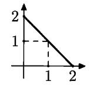

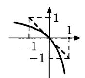

FIGURE 27. Possible choices of a gambler presented in usual (left) and logarithmic (right) scale. A dashed line represents possible choices for the game with bounded bets considered in the lemma.

shown in a logarithmic scale, then we get a curve (instead of a line segment, if we use a normal scale); see Figure 27. It is easy to see that this curve is below the tangent line, so the game will be better for us if we replace the curve by the line. And this line corresponds exactly to the game with bounded bets considered in the lemma.

Now it is easy to prove the following statement (where both the condition and the claim are stronger than in Theorem 193):

Theorem 194. Let k be an arbitrary computable upper bound for the function C, and let  $\omega$  be a sequence such that

$$k(\omega_0 \cdots \omega_{n-1}) \leqslant \alpha n$$

for some  $\alpha < 1$  and for all sufficiently large n. Then  $\omega$  is not Mises-Church random.

PROOF. For every n we can compute the list  $A_n$  for all n-bit strings x such that  $k(x) < \alpha n$ . This list contains at most  $2^{\alpha n + O(1)}$  strings, and for all sufficiently large n the n-bit prefix of  $\omega$  is among them.

For these n the strategy constructed using our lemma (for the set  $A_n$ ) wins at least  $(1-\alpha)n-O(1)$  dollars playing with the first n bits of  $\omega$ . Consider a computable fast growing sequence of  $n_i$  (we assume that  $n_{i-1}/n_i \to 0$ ), and combine the strategies for all  $A_{n_i}$  into one. In fact, the strategy for  $A_{n_i}$  will be used only after  $n_{i-1}$  (where the preceding one stops), but this is a negligible fraction of  $n_i$ . So the combined strategy is successful: Its gain on the first n bits exceeds  $\varepsilon n$  for some fixed  $\varepsilon$  and for infinitely many n. (Take  $\varepsilon < 1 - \alpha$  and  $n = n_i$  for large i.)

This is not possible for a Mises–Church random sequence (see Theorem 170 on p. 267).  $\Box$ 

Now we are prepared to prove Theorem 193.

PROOF. Following the same scheme, we consider the set  $A_n$  of all n-bit strings that have complexity at most  $\alpha n$ ; it contains about  $2^{\alpha n}$  strings, including the prefix of  $\omega$ . However, now we cannot compute the list of all elements of  $A_n$ , we can only enumerate it, and we never know whether all the elements appeared or not. So we cannot use  $A_n$  in the lemma. To overcome this problem, we use non-monotonic selection rules.

Again, we need to select a fast growing sequence  $n_i$ , for example,  $n_i = i!$ , and cut the sequence into pieces of size  $n_i - n_{i-1}$ . Increasing  $\alpha$ , we may assume that the complexity of the *i*th piece is at most  $\alpha$  times its length, so the complexity per letter is at most  $\alpha$ . Let  $A_i$  be the set of all strings of length  $n_i - n_{i-1}$  where

complexity per letter is at most  $\alpha$ . We know that the *i*th piece of  $\omega$  (we denote it by  $\omega_i$  in the sequel) is in  $A_i$ , and we can enumerate  $A_i$  given *i*. (The problem is that we cannot compute  $A_i$  as a list of strings.)

Let  $t_i$  be the number of steps of the enumeration of  $A_i$  that are needed for  $\omega_i$  to appear. Let us group the values of i into pairs and compare the values  $t_{2m}$  and  $t_{2m+1}$ . Trivially, either  $t_{2m} \leqslant t_{2m+1}$  or  $t_{2m+1} \leqslant t_{2m}$  (or both). How does this help? We can now construct two strategies: One reads  $\omega_{2m}$  not making any bets, then waits until  $\omega_{2m}$  appears in  $A_{2m}$ , thus finding  $t_{2m}$ , and then makes the same number of steps enumerating  $A_{2m+1}$  and uses the discovered part of  $A_{2m+1}$  to construct a gambling strategy (in the hope that  $\omega_{2m+1}$  is already discovered). This works only if  $t_{2m} \geqslant t_{2m+1}$ , otherwise we may lose all bets. But then the symmetric strategy (the one that reads  $\omega_{2m+1}$ ) waits until  $\omega_{2m+1}$  appears in  $A_{2m+1}$  and makes the same number of steps enumerating  $A_{2m}$  will win.

So for every sufficiently large m we have a pair of strategies (that makes bets in [-1,1]) and we know that at least one of them is successful (it wins at least  $1-\alpha$  per bet). Omitting small m, we can combine them into two strategies in the infinite game. One of them is monotone, and we may (as we did in Theorem 170) approximate it by an average of finitely many selection rules. The number of the selection rules depends on the required precision; we need the error to be small compared to  $1-\alpha$ , and this can be achieved by a fixed (=not depending on m) number of Church admissible selection rules. We denote this number by N. The other strategy is not monotonic, and we get N Kolmogorov-Loveland admissible selection rules. In total we get 2N selection rules.

Recall that  $n_{i-1}/n_i$  is small; we note that the frequency deviation for some m cannot be compensated by any behavior for previous m. So for each m at least one of 2N selection rules leads to a significant deviation. Therefore, there exists one rule that leads to a significant deviation for infinitely many m, and  $\omega$  is not Mises-Kolmogorov-Loveland random.

Theorem 193 is proven, □

Together with Theorem 189 we get the following corollary:

Theorem 195. There exist Mises-Church-Daley random sequences that are not Mises-Kolmogorov-Loveland random.

There is a natural question related to Theorem 193: Is there some finite counterpart for this result? Assume that we know that the complexity of some (finite) string x is small. Is there a non-monotonic selection rule of small complexity that selects from x some unbalanced sequence? Of course, the exact statement of this type should include several parameters: the length n of the strings, its randomness deficiency d, the complexity of the selection rule (with n as a condition), and the required imbalance in the selected subsequence. In [53] the following result in this direction is proven: There exists a selection rule of complexity  $O(\log(n/d))$  (with n as a condition) that selects a subsequence where the number of ones and zeros differ at least by  $\Omega(n/\log(n/d))$ . In particular, if the randomness deficiency is proportional to n (as in Theorem 193), then the complexity of the selection rule is bounded, and the imbalance is proportional to the length.

# 9.13. Change in the measure and randomness

In this section we describe a tool (suggested by M. van Lambalgen) that allows us to construct Mises-Kolmogorov-Loveland random sequences with pathological properties (not ML-random, with more ones that zeros in prefixes, etc.).

**9.13.1.** Randomness with respect to two measures. Let us start with a question that is interesting in itself: Imagine that we change slightly the measure. What happens with the class of random sequences (with respect to this measure)? Here are two examples of opposite types.

EXAMPLE 1. Let  $\mu$  be the uniform Bernoulli measure  $\mu = B_{1/2}$ . Consider another measure  $\mu'$  that has independent trials with success probability 1/2 in all trials except the first one where the success probability is (for example) 2/3. It is intuitively clear that the same sequences should be random with respect to both measures (for all reasonable notions of randomness): only the first trial is different, and in both cases both outcomes are possible (though the probabilities are not the same). Indeed, this happens for Martin-Löf randomness: The effectively null sets are the same (because for every set its  $\mu$ -measure and  $\mu'$ -measure differs at most by a factor of 2).

274 Show the same result using the complexity criterion for randomness.

**275** Show that the class of computably random sequences for these two measures is the same.

EXAMPLE 2. Consider the uniform Bernoulli measure  $B_{1/2}$  and also some other Bernoulli measure, say  $B_{2/3}$ . Is it possible that some sequence is ML-random with respect to both of them? No, because for a random sequence with respect to Bernoulli measure  $B_p$  the limit frequency is p, so it cannot be both 1/2 and 2/3 at the same time.

So we come to the following question: Imagine that two sequences of reals  $p_i, p_i' \in (0,1)$  are given. Consider the measures for independent trials with probabilities  $p_i$  (call it  $\mu$ ) and  $p_i'$  (call it  $\mu'$ ). What can be said about the classes of ML-random sequences with respect to these two measures? Our examples suggest that if  $p_i$  and  $p_i'$  are close to each other, then these classes should coincide, and if  $p_i$  and  $p_i'$  differ significantly, these classes should be disjoint.

Let us prove that this is indeed the case, assuming that  $p_i$  and  $p'_i$  are separated from 0 and 1, i.e., all belong to  $(\varepsilon, 1 - \varepsilon)$  for some positive  $\varepsilon$ . We also assume that  $p_i$  and  $p'_i$  are computable sequences of computable real numbers (we need the measures to be computable; otherwise, Martin-Löf randomness is not well defined).

V. Vovk proved the following result [207] which is a constructive version of the classical Kakutani's theorem:

Theorem 196. (a) If the sum  $\sum (p_i - p_i')^2$  is finite, then the classes of ML-random sequences with respect to  $\mu$  and  $\mu'$  coincide.

(b) If the sum  $\sum (p_i - p'_i)^2$  is infinite, these classes are disjoint.

The classical version of this result [70] says that in the first case the classes of null sets coincide, and in the second case the measures are orthogonal, i.e., there exists a set that has probability 0 with respect to one measure and probability 1 with respect to the other.

PROOF. Let us first try the following naïve approach to (a). Assume that  $\omega \in \Omega$  is random with respect to  $\mu$  (that corresponds to probabilities  $p_i$ ). Then the (monotone) complexity of its n-bit prefix is close to a negated logarithm of the measure of the corresponding interval, which equals

$$\prod_{i=0}^{n-1} r_i,$$

where  $r_i = p_i$  if  $\omega_i = 1$  and  $r_i = 1 - p_i$  if  $\omega_i = 0$ . If  $p_i$  is close to  $p'_i$ , then  $r_i$  is close to  $r'_i$  (defined in the similar way as  $r_i$ , but for the other measure). So the product of all  $r_i$  is close to the product of all  $r'_i$ ; thus, randomness with respect to one measure implies randomness with respect to the other.

All this is indeed true and can be formalized easily, but for this argument we need to know that the sum

(\*) 
$$\sum_{i=0}^{n-1} (-\log r_i) - \sum_{i=0}^{n-1} (-\log r_i')$$

is bounded; this is indeed true if  $\sum |p_i - p_i'| < \infty$  (recall that we assume that  $p_i$  and  $p_i'$  are separated from 0 and 1). But this is a much stronger assumption than the one we have—we know only that the sum of *squares* is bounded.

How can we improve this argument? Note that it is enough for us if the difference (\*) is bounded for every random with respect to  $\mu$  sequence. Let us see why this happens. Indeed, if  $\omega$  is random with respect to  $\mu$ , then

$$KM(\omega_0 \cdots \omega_{n-1}) = \sum_{i=0}^{n-1} (-\log r_i) + O(1).$$

Since the complexity and the negated logarithm of measure differ by O(1), the upper bound for the complexity in terms of  $\mu'$  (recall that we can use arbitrary measure to get an upper bound for monotone complexity) guarantees that

$$\sum_{i=0}^{n-1} (-\log r_i) \leqslant \sum_{i=0}^{n-1} (-\log r_i') + O(1).$$

Let us denote  $r'_i - r_i$  by  $\delta_i$ . Using this notation and taking the exponents, we get the following inequality (that is true up to a constant factor):

$$\prod_{i=0}^{n-1} r_i \geqslant \prod_{i=0}^{n-1} (r_i + \delta_i).$$

We know that  $\sum_i \delta_i^2 < \infty$ , so  $\delta_i \to 0$  as  $i \to \infty$ . Therefore, for sufficiently large i the value of  $\delta_i$  is smaller than  $\varepsilon$  (the gap between probabilities and 0, 1). We can change finitely many  $p_i'$  and assume that it is true for all i. Then we may consider a measure  $\mu''$  that is symmetric to  $\mu$  (i.e.,  $p_i$  is the middle point between  $p_i'$  and  $p_i''$ ). For this measure we can write a similar inequality, only the sign before  $\delta_i$  is different:

$$\prod_{i=0}^{n-1} r_i \geqslant \prod_{i=0}^{n-1} (r_i - \delta_i)$$

(it is also true up to a constant factor). Multiplying these two inequalities, we get the inequality

$$\prod_{i=0}^{n-1} r_i^2 \geqslant \prod_{i=0}^{n-1} (r_i^2 - \delta_i^2),$$

which is obvious anyway (without any constant). Due to our assumptions about  $r_i$  (separation from 0) and  $\delta_i$  (the convergence of  $\sum \delta_i^2$ ), the last inequality is an equality (up to a  $\Theta(1)$ -factor). Indeed, the product  $\prod (1-h_i)$  is strictly positive (assuming that  $0 < h_i < 1$ ) if and only if  $\sum h_i < \infty$ .

Now the main point: Since the product of two inequalities is an equality, then each of them is also an equality (up to a  $\Theta(1)$ -factor). Then the randomness criterion (Theorem 90) guarantees that  $\omega$  is random also with respect to  $\mu'$  (and also  $\mu''$ , but this does not matter). So the statement (a) is proven.

For statement (b) we postpone the proof since it works for the more general case of dependent trials, and we will prove it soon in this more general version; see Theorem 197 below.

The classical version of Kakutani's theorem can now be proven as a corollary:

**276** Let  $p_0, p_1, p_2, \ldots$  and  $p'_0, p'_1, p'_2, \ldots$  be sequences of reals in  $(\varepsilon, 1 - \varepsilon)$  for some  $\varepsilon > 0$ . Consider the measures  $\mu$  and  $\mu'$  that correspond to independent trials with success probabilities  $p_i$  and  $p'_i$ , respectively. Prove that:

- (a) if  $\sum (p_i p_i')^2 < \infty$ , the classes of null sets with respect to  $\mu$  and  $\mu'$  are the same;
- (b) if  $\sum (p_i p_i')^2 = \infty$ , then  $\mu$  and  $\mu'$  are orthogonal (there exists a set that has measure 0 with respect to one measure and measure 1 with respect to the other one).

(*Hint*: Use Theorem 196 in a relativized version. Note that for every null set one can find an oracle that makes the measures computable and makes this set an effectively null one. For (b) consider the set of random sequences.)

Now we formulate this more general statement. Let  $\mu$  be a measure on  $\Omega$ , and let  $p(x) = \mu(\Omega_x)$  be the corresponding function on binary strings. If p(x) > 0 for some x, we can consider the conditional probabilities of 0 and 1 after x, i.e., the ratios p(0|x) = p(x0)/p(x) and p(1|x) = p(x1)/p(x) (their sum is 1). For the case of independent trials these values depend only on the length of x (and were denoted earlier by  $p_i$ ).

If, in addition to  $\mu$ , some sequence  $\omega \in \Omega$  is fixed, we may consider the conditional probabilities of 1 after each term of this sequence, i.e., the sequence of  $p_i$  defined as

$$p_i = p(1 | \omega_0 \cdots \omega_{i-1}) = p(\omega_0 \cdots \omega_{i-1})/p(\omega_0 \cdots \omega_{i-1})$$

(they are well defined if p is not equal to zero on the prefixes of  $\omega$ ). The next result [207] shows that these probabilities for a given sequence do not depend much on the measure that makes this sequence random:

Theorem 197. Let  $\omega$  be a sequence that is ML-random with respect to two computable measures  $\mu$  and  $\mu'$ . Assume that the conditional probabilities  $p_i$  and  $p_i'$  along  $\omega$  constructed using  $\mu$  and  $\mu'$  are all in the interval  $(\varepsilon, 1 - \varepsilon)$  for some  $\varepsilon > 0$ . Then

$$\sum_i (p_i - p_i')^2 < \infty.$$

Before proving this statement, let us note that it directly implies statement (b) of Theorem 196. Note also that for a random sequence the numbers  $p_i$  are well defined: the denominator p(x) in p(x1)/p(x) is non-zero for a random sequence (otherwise  $\Omega_x$  is an effectively null set).

PROOF. Consider one more measure  $\tilde{\mu}$  that averages the conditional probabilities for  $\mu$  and  $\mu'$ . Namely, the probability of 1 after x for  $\mu''$  is an average of two similar probabilities for  $\mu$  and  $\mu'$ . (Note that  $\mu''$  is not an average of  $\mu$  and  $\mu'$ : if we let  $\tilde{\mu}(X) = (\mu(X) + \mu'(X))/2$ , we also get a measure, but a different one.)

Since the sequence  $\omega$  is random with respect to  $\mu$ , we can use the Levin–Schnorr criterion

$$KA(\omega_0 \cdots \omega_{n-1}) = \sum_{i=0}^{n-1} (-\log r_i) + O(1),$$

where (as before)  $r_i = p_i$  if  $\omega_i = 1$  and  $r_i = (1 - p_i)$  otherwise. Similar equality is valid for  $r'_i$  that correspond to  $\mu'$ . For the intermediate measure  $\tilde{\mu}$  and corresponding  $\tilde{r}_i$  we know only the inequality (the upper bound for complexity).

Thus, we have the following inequalities for conditional probabilities:

$$\sum_{i=0}^{n-1} (-\log r_i) \leqslant \sum_{i=0}^{n-1} (-\log \tilde{r}_i) + O(1),$$

$$\sum_{i=0}^{n-1} (-\log r'_i) \leqslant \sum_{i=0}^{n-1} (-\log \tilde{r}_i) + O(1).$$

Taking the average of these two inequalities, we get

$$\sum_{i=0}^{n-1} \frac{(-\log r_i) + (-\log r_i')}{2} \leqslant \sum_{i=0}^{n-1} (-\log \tilde{r}_i) + O(1).$$

Recalling that  $\tilde{r}_i = (r_i + r'_i)/2$ , we get

$$\sum_{i=0}^{n-1} \left( \frac{(-\log r_i) + (-\log r_i')}{2} - \left( -\log \frac{r_i + r_i'}{2} \right) \right) \leqslant O(1).$$

Each summand in the left-hand side is non-negative (the logarithm is a concave function) and is (up to a  $\Theta(1)$ -factor) equal to  $(r_i - r_i')^2$ , so

$$\sum (r_i - r_i')^2 \sim \sum (p_i - p_i')^2 < \infty,$$

as we claimed.

(This argument has a subtle point which needs to be mentioned. We consider the average of conditional probabilities, which creates a problem if one of the measures has zero values: In this case the computation of conditional probabilities never terminates. So the average measure  $\tilde{\mu}$  is in fact a semimeasure, but this is enough for us (since the upper bound for complexity is still valid, and  $\omega$  never goes through problematic points being random with respect to both measures).

Note that this theorem says only that  $\mu$  and  $\mu'$  are close to each other along  $\omega$  (that is random with respect to both). Of course, they can be completely different in other parts of the Cantor space.

**277** Give a corresponding example.

(*Hint*: Consider two measures that are uniform in the left half of the Cantor space and differ significantly in the right half.)

**278** Prove that in fact for this argument we do not need Martin-Löf randomness. It is enough to know that  $\omega$  is computably random with respect to both measures (assuming that both measures are non-zero on all  $\Omega_x$  and conditional probabilities are well defined).

This proof has an interesting game interpretation. Assume that there are two bookmakers who take bets for the same (sequence of) events, but who have different ideas about their probabilities. Each event has two possible outcomes 0 and 1: the first bookmaker thinks that the probability of 1 is p (and the probability of 0 is q = 1 - p) and therefore returns the bets on 1 [0] with coefficients 1/p [1/q]; and the second bookmaker does the same for probabilities p' and q'. The probabilities p, q, p', q' may be different for different events.

(Note also that we assume that the bookmakers are altruistic; a more practical bookmaker would use coefficients  $c_0$  and  $c_1$  such that  $1/c_0 + 1/c_1 > 1$ .)

Now assume that we are allowed to play with both bookmakers at the same time, having a separate account for each (so we cannot use money from one bookmaker to make bets with the other one). In this language the argument above shows that if all p, q, p', q' are separated from 0 and the sum  $\sum (p - p')^2$  is infinite (for the sequence of events), then we can achieve unbounded capital in (at least) one of the games for sure (for every sequence of outcomes).

How do we achieve this? Assume that in the first game our current capital is u, in the second game our capital is v, and the (assumed) probabilities of the outcomes are p,q (in the first game) and p',q' (in the second one). Let us split u between two bets in the proportion that brings us (p+p')u/2p for outcome 1 and (q+q')u/2q for outcome 0. (It is easy to check that these bets are valid, i.e., the expected value of capital after the game according to the (p,q)-distribution is u.) In the second game capital v becomes (p+p')v/2p' (for outcome 1) or (q+q')v/2q' (for outcome 0). Let us track the product of capitals in both games. It is multiplied either by  $(p+p')^2/4pp'$  or  $(q+q')^2/4qq'$ . The inequality between arithmetic and geometric means (the concavity of the logarithm function) guarantees that in both cases the product increases. Taking the logarithm and estimating the increase, we note that for p,q,p',q' separated from 0 and for the case  $\sum (p-p')^2 = +\infty$  the product of the capitals tends to infinity, so at least for one of the games the capital is unbounded.

In other words, we have constructed two martingales (with respect to two measures), and they have the following property: For every sequence where conditional probabilities for both measures are separated from 0 and 1 and the differences of probabilities have infinite sum of squares, at least one of the martingales is unbounded.

9.13.2. The Law of Large Numbers for variable probabilities. The SLLN says that for every  $p \in (0,1)$  and for the corresponding measure  $B_p$  (independent trials with success probability p) the set of sequences with limit frequency p has measure 1 (and its complement, the set of sequences where the limit does not exist or is different from p, is a null set).

Now assume that the trials are independent, but the success probabilities are different for different trials ( $p_i$  for the *i*th trial). One would expect that if  $p_i$  converges to some p, then again for almost all (with respect to the product measure) sequences, the limit frequency is p. The intuitive explanation follows: Consider some  $\varepsilon > 0$ . All  $p_i$  except for a finite number of them (which could be ignored) are smaller than  $p+\varepsilon/2$ . We know that if we replace all  $p_i$  by  $p+\varepsilon/2$ , then almost surely the frequency will be less than  $p+\varepsilon$  starting from some moment. By monotonicity reasons, this should be true also for the original  $p_i$ .

With some effort, this argument can be made precise, but we prefer to prove a more general statement that is useful in many cases. It deals with an arbitrary measure  $\mu$  on  $\Omega$ , let  $p(x) = \mu(\Omega_x)$  be the corresponding function on strings. For every binary string  $x = x_0 \cdots x_{n-1}$  consider the number of ones in x, and also the sum of conditional probabilities  $p_i$  of the appearance of 1 in the *i*th position of x (after the corresponding prefix),

$$p_i = p(x_0 \cdots x_{i-1}1)/p(x_0 \cdots x_{i-1}).$$

Both quantities (m and the sum of  $p_i$ ) depend on x; the bound below guarantees that with high  $\mu$ -probability for a given n these quantities are close to each other. Here is the exact statement (we have explained what m and  $p_i$  are; the probability is taken with respect to  $\mu$ ):

THEOREM 198.

$$\Pr[|m - (p_0 + \dots + p_{n-1})| > d] \le 2e^{-d^2/4n}$$

This theorem is essentially finite, and this inequality is true for every probability distribution on n-bit strings. This is a weak form of a classical inequality in probability theory called the Azuma-Hoeffding inequality. We will give a simple argument that uses the same technique that we used for the proof of the SLLN, though it does not give the best possible result (in fact, the constant 1/4 can be replaced by 2, so one can get the bound with right-hand side  $2e^{-2d^2/n}$  [66, Theorem 2]).

Proof. We consider separately the probabilities of m being too big or too small. Both cases are similar, so we need to consider one of them and prove, for example, that

$$\Pr[m - (p_0 + \dots + p_{n-1}) > d] \le e^{-d^2/4n}.$$

We use a standard trick and construct some measure  $\mu'$  for which the ratio  $\mu'/\mu$  is big for all sequences that belong to the event in the left-hand side. (The ratio  $\mu'/\mu$  is a martingale that reaches  $e^{d^2/4n}$  if this event happens.)

Since we want to increase the measure for the sequence with many ones, it is natural to increase the conditional probability of 1 in  $\mu'$  (compared to  $\mu$ ). Namely, if for the original sequence the conditional probabilities of 1 and 0 after some x are p and q, in the new measure we let these probabilities be

$$p' = p + \varepsilon pq, \quad q' = q - \varepsilon pq,$$

where  $\varepsilon$  is some positive real. The value of  $\varepsilon$  will be chosen later; now we say only that  $\varepsilon$  does not exceed 1/2. It is easy to check the p' and q' are still in [0,1].

So we get another probability distribution on n-bit strings. Let us compute the ratio of these two distributions on some string x of length n. Each bit of x adds a factor p'/p (if this symbol is 1) or q'/q, where p, q, p', q' are conditional probabilities

of 1 and 0 in the old measure and in the changed measure. In logarithmic scale, the logarithm of the ratio in question is equal to the sum of

$$\ln(p'/p) = \ln(1 + \varepsilon q) \geqslant \varepsilon q - (\varepsilon q)^2 \geqslant \varepsilon (1 - p) - \varepsilon^2$$

or

$$\ln(q'/q) = \ln(1 - \varepsilon p) \geqslant -\varepsilon p - (\varepsilon p)^2 \geqslant -\varepsilon p - \varepsilon^2$$

for all bits in x (with corresponding probabilities p and q). The first expression is used for ones in x and the second is used for zeros. (We used the inequality  $\ln(1+h) \ge h - h^2$  that is true for all h with  $|h| \le 1/2$ .)

What happens when we add all these inequalities? We get a lower bound for the logarithm of the ratio p'(x)/p(x) of two measures for x; this lower bound has a common factor  $\varepsilon$ . Then we have m ones (each term (1-p) contributes one, and there are m of terms of this type) minus the sum of all  $p_i$ , where  $p_i$  is the conditional probability of 1 at ith place, and minus  $n\varepsilon^2$ ,

$$\ln \frac{p'(x)}{p(x)} \geqslant \varepsilon (m - \sum p_i) - n\varepsilon^2.$$

We are interested in x where the excess  $m - \sum p_i$  exceeds d. For them we have

$$\ln \frac{p'(x)}{p(x)} > \varepsilon d - n\varepsilon^2 = \varepsilon (d - n\varepsilon).$$

This is true for all  $\varepsilon \in (0, 1/2)$ , so let us choose  $\varepsilon$  to get the strongest statement. The right-hand side achieves maximal value when  $\varepsilon = d/2n$  (note that  $d \leq n$ , because the number of ones in x does not exceed n, so  $\varepsilon = d/2n \leq 1/2$ ).

Therefore

$$\ln \frac{p'(x)}{p(x)} > d^2/4n$$

for x where the excess is greater than d, and

$$\frac{p'(x)}{p(x)} > e^{d^2/4n},$$

as we claimed. This finishes the proof.

It is instructive to look at the special case where zeros and ones are equiprobable. The probability that the number of ones exceeds its expectation (n/2) by  $2\sqrt{n}$  is bounded by 1/e, and expectation exceeds  $2k\sqrt{n}$  with probability at most  $1/e^{k^2}$  Comparing this with the classical de Moivre-Laplace theorem, we see that our bound is not optimal, but the difference is only in the coefficient (in the exponent).

Now we can repeat the proof of the SLLN with this bound and get the following result that is true for arbitrary measure  $\mu$  on the space  $\Omega$ :

THEOREM 199. For a sequence  $\omega = \omega_0 \omega_1 \cdots$  that has distribution  $\mu$ , the following property holds with probability 1:

$$\lim_{n\to\infty} \left(\frac{m}{n} - \frac{p_0 + \dots + p_{n-1}}{n}\right) = 0,$$

where m is the number of ones among  $\omega_0, \omega_1, \ldots, \omega_{n-1}$  and p is the conditional probability of 1 after  $\omega_0\omega_1\cdots\omega_{i-1}$  according to  $\mu$ .

In particular, this theorem implies that for independent trials where success probabilities  $p_i$  converge to some limit p, the limit frequency p exists with probability 1 (since the limit of averages  $(p_0 + \cdots + p_{n-1})/n$  is also p).

On the other hand, we need more: We wanted to show that the sequence is random according to a Mises-style definition (in one of the versions), so we need to ensure that the limit frequency is p not only for the sequence itself, but for all its subsequences selected by some admissible rule. Let us look at this question, starting with monotone selection rules (the Church-Daley definition).

- 9.13.3. The Law of Large Numbers for subsequences. Let us generalize Theorem 198 by adding selection rules. This theorem considered some measure  $\mu$  on  $\Omega$ , and the corresponding function  $p(x) = \mu(\Omega_x)$  and conditional probability p(1|x) = p(x1)/p(x). For a sequence  $\omega$  and number n we considered two quantities:
  - the number m of ones among  $\omega_0, \ldots, \omega_{n-1}$ ;
  - the sum of conditional probabilities of 1 at n first positions, i.e.,

$$p(1|\Lambda) + p(1|\omega_0) + p(1|\omega_0\omega_1) + \cdots + p(1|\omega_0\cdots\omega_{n-2}).$$

Theorem 198 guaranteed that (for every n) these two quantities differ significantly only for a  $\mu$ -small fraction of sequences  $\omega$  (the  $\mu$ -measure of the set of  $\omega$  such that the difference exceeds d is bounded by  $2e^{-d^2/4n}$ .

Now let us add some selection rule  $S_R$  to this picture. Here R is an arbitrary set of binary strings (the set of prefixes before the selected terms). For every sequence  $\omega$  the rule  $S_R$  selects some positions  $i_0, i_1, \ldots$  and outputs a subsequence  $S_R(\omega) = \omega_{i_0}\omega_{i_1}\cdots$  made by the terms at those positions. Now we compare:

- the number m of ones among the first n selected terms, i.e., the number of ones among n first bits of  $S_R(\omega)$ ;
- the sum of conditional probabilities of ones for the n first selected positions, i.e.,

$$p(1|\omega_0\omega_1\cdots\omega_{i_0-1}) + p(1|\omega_0\omega_1\cdots\omega_{i_1-1}) + \cdots + p(1|\omega_0\omega_1\cdots\omega_{i_{n-1}-1}).$$

When R is the set of all strings, we get the same quantities as in Theorem 198. The following theorem says that the same bound is valid in the general case:

THEOREM 200. The  $\mu$ -measure of the set of  $\omega$  where these two quantities differ by d, is at most  $2e^{-d^2/4n}$ .

Note that for some  $\omega$  the sequence  $S_R(\omega)$  may contain less than n terms. These  $\omega$  are not elements of the set whose measure is bounded.

EXAMPLE. Consider an arbitrary measure  $\mu$  and a selection rule R that selects the terms where the conditional probability of 1 is at most 1/2. Theorem 200 guarantees that the  $\mu$ -probability of the event "there is at least 51% of ones among the first n selected terms" is exponentially small (as n increases).

PROOF. This theorem is also a simple consequence of a general Azuma–Hoeff-ding inequality for martingales in the sense of probability theory, but we can easily modify the argument used to prove Theorem 200.

First note that this theorem now deals with the entire sequence  $\omega$  instead of its prefix of some length (since the first n selected terms may appear arbitrarily late). But due to the continuity of measure, it is enough to prove the same inequality for

first N bits of  $\omega$  (it gives a smaller set, but the union of all these sets for all N is the set in question).

As in the proof of Theorem 200, we construct a new measure, but now we change conditional probabilities only in the positions where the next term is selected, i.e., the conditional probabilities of p(1|x) for  $x \in R$ . Then the ratio of probabilities (for the modified and original measures) will include the length of the selected subsequence (instead of the sequence itself) and the sum of conditional probabilities for the selected terms (instead of the sum of all conditional probabilities), i.e., exactly what we need.

This result gives us a tool (following van Lambalgen [90]) to construct Mises-Church-Daley sequences. Let  $p_0, p_1, \ldots$  be a computable sequence of computable reals that computably converges to some  $p \in (0,1)$ . This means that for every given  $\varepsilon > 0$ , one can compute some N such that  $|p_i - p| < \varepsilon$  for all  $i \ge N$ . (It is easy to see that in this case p is computable.) Consider a computable measure  $\mu$  that corresponds to a sequence of independent trials with probabilities  $p_i$ .

Theorem 201. Every ML-random sequence with respect to  $\mu$  is Mises-Church-Daley random with frequency p.

PROOF. Consider some rational  $\varepsilon > 0$  and some Church-Daley admissible rule  $S_r$  (not necessarily total). We need to show that the set U of all sequences  $\omega$ , where  $S_r(\omega)$  gives an infinite sequence in which the frequency of ones exceeds  $p + \varepsilon$  infinitely often, is an effectively null set. (The argument for frequencies less than  $p - \varepsilon$  is similar.)

Fix some n, and consider the set  $U_n$  of sequences  $\omega$  such that  $S_r(\omega)$  has length at least n and the frequency of ones among the first n terms exceeds  $p + \varepsilon$ . This set is effectively open (applying the computable partial selection rule to all branches, we enumerate all strings that guarantee that its every extension is in  $U_n$ ).

Theorem 200 provides the upper bound for the  $\mu$ -measure of  $U_n$ . If n is large enough, the average of conditional probabilities is less than  $p + \varepsilon/2$  (and we know how large n should be, since the sequence  $p_i$  converges computably to p). This bound decreases exponentially as n increases. So one can cover U by an effectively open set of arbitrarily small measure (taking all the intervals in  $U_N$ ,  $U_{N+1}$ ,  $U_{N+2}$ , ... for arbitrarily large N; recall that by definition of U each element of U belongs to infinitely many  $U_n$ ). Therefore, U is an effectively null set and cannot contain an ML-random sequence.

Now we extend this statement to Mises–Kolmogorov–Loveland random sequences.

Theorem 202. Every ML-random sequence with respect to  $\mu$  is Mises-Kolmogorov-Loveland random with limit frequency p.

PROOF. The application of a Kolmogorov-Loveland admissible selection rule  $S_{F,G}$  to a sequence  $\omega$  consists of two phases. First we use F to select a sequence of revealed bits (both selected and not selected). Then G is used to select some of the revealed bits, and this operation is a Church-Daley admissible selection rule.

After this decomposition is done, let us consider the distribution of a sequence  $\omega_F$  that is obtained at the first step. (We assume that the original sequence is obtained by independent trials with probability  $p_i$  in the *i*th trial.) Let us first assume that F and G are total functions.

The first term of  $\omega_F$  is chosen when no bits are revealed; it occupies a fixed position in  $\omega$ . This position is  $n_0 = F(\Lambda)$ . So the probability that 1 appears as the first term in  $\omega_F$  is  $p_{n_0}$ . Now consider the second term of  $\omega_F$ . Its position in  $\Omega$  depends on the value of  $\omega_{n_0}$  and can be either F(0) or F(1). So the conditional probability for the second term of  $\omega_F$  to be one (given the first term as the condition) is either  $p_{F(0)}$  or  $p_{F(1)}$ . In general, the probability of 1 after x in  $\omega_F$  equals  $p_{F(x)}$ , since the next revealed bit has number F(x). Note that the restrictions of F (no bit is revealed twice) guarantee that conditional probabilities along any branch form a subsequence of  $\{p_i\}$  (without repetitions), so the number of terms outside of  $(p-\varepsilon/2, p+\varepsilon/2)$  for this subsequence is bounded by the number of such terms in the original sequence.

This allows us to apply the bound of Theorem 200 to sequence  $\omega_F$  and the selection rule determined by G in the same way as in the proof of Theorem 201.

The same bound is true for partial F and G: Extending them to some total functions, we may only increase the set whose measure is bounded. (A computable partial function may have no computable extensions, but here we are interested in the bound only, so a non-computable extension can be used.)

Having proven the bound for partial F and G, we now observe that for computable F and G the set of  $\omega$  such that  $S_{F,G}(\omega)$  starts with x, is an effectively open set (uniformly in x). So now we can finish the argument as in the preceding theorem.

REMARK. One can give a more direct proof of Theorem 202. Here is one of the possible arguments (taken from [177]).

Fix some (rational)  $\varepsilon > 0$  and some Kolmogorov-Loveland admissible selection rule  $S_{F,G}$ . We need to show that the set U of sequences  $\omega$  such that  $S_{F,G}(\omega)$  is infinite and the frequency of ones exceeds  $p + \varepsilon$  infinitely often is an effectively null set. (The argument for  $p - \varepsilon$  is similar.)

By  $U_n$  we denote the set of all sequences  $\omega$  such that  $S_{F,G}(\omega)$  contains at least n terms and the frequency of ones among the first n terms exceeds  $p + \varepsilon$ . We need to show that the series  $\sum \mu(U_n)$  computably converges. (Here  $\mu$  is our measure; it corresponds to independent trials with success probabilities  $p_i$ .)

By  $\alpha_{n,k}(r_1,\ldots,r_n)$  we denote the probability of getting more than k ones on n independent trials with success probabilities  $r_1,\ldots,r_n$ . The function  $\alpha_{n,k}$  is a non-decreasing one with respect to each argument  $r_i$ . (A side remark: it is a multilinear function, i.e., a polynomial of degree at most 1 with respect to each argument.) It is easy to see also that  $\alpha_{n,k} \leq \alpha_{n,l}$  if  $k \geq l$ .

We claim that  $\mu(U_n) \leq \alpha_{n,k}(r_1,\ldots,r_n)$ , where  $k = n(p+\varepsilon)$  and  $r_i$  is the *i*th element of  $\{p_0, p_1, \ldots\}$  in decreasing order, or, more precisely,

$$r_1 = \sup p_i$$
,  $r_2 = \sup_{i \neq j} \min(p_i, p_j)$ ,  $r_3 = \sup_{i \neq j \neq k} \min(p_i, p_j, p_k)$ , ...

Let us show that this bound implies the convergence of the series  $\mu(U_n)$ . Obviously,  $r_1 \geqslant r_2 \geqslant \cdots$  and  $\lim r_i = p$ . Let us replace all  $r_i$  that exceed  $p + \varepsilon/2$  by 1; let s be the number of these replacements. We conclude that

$$\mu(U_n) \leqslant \alpha_{n-s,k-s}(p+\varepsilon/2,\ldots,p+\varepsilon/2),$$

so we have reduced the question to the case of constant probabilities (that we have already discussed several times). It is important to note that for large n the ratio (k-s)/(n-s) is close to  $p+\varepsilon$  and exceeds  $p+\varepsilon/2$  significantly.

It remains to prove the bound for  $\mu(U_n)$  mentioned above. Again imagine that the bits of the sequence are written on cards that lay on the table face down, and the selection rule determines which bit should be revealed next and whether it is used just for information or is selected. While applying the selection rule, let us record which cards were turned over and the corresponding bits; we get an (infinite) record, or log file. Let  $\pi$  be the initial segment of such a record. By  $n(\pi)$  we denote the number of terms that were selected during  $\pi$ , and by  $k(\pi)$  we denote the number of ones among these terms. By  $r_i(\pi)$  we denote ith biggest number in a sequence obtained from  $p_0, p_1, \ldots$  by deleting the terms that correspond to the bits already revealed (for information or for selection).

Let  $\mu(U_n | \pi)$  be the conditional probability of  $U_n$  with the condition "the record starts with  $\pi$ ". Let us prove the generalized version of the inequality in question: If  $n(\pi) \leq n$ , then

(\*) 
$$\mu(U_n | \pi) \leqslant \alpha_{n-n(\pi),k-k(\pi)}(r_1(\pi),r_2(\pi),\ldots).$$

For empty  $\pi$  we get the bound we are interested in. This inequality can be proven by backward induction. If  $n(\pi) = n$ , this inequality becomes an equality (left- and right-hand sides are either both zeros or both ones). Let  $n(\pi) < n$ , and let m be the index of the bit that is turned over immediately after  $p_i$  (if  $F(\pi)$  is not defined, then  $\mu(U_n|\pi) = 0$  and we have nothing to prove). Then

$$\mu(U_n | \pi) = p_m \mu(U_n | \pi_1) + (1 - p_m) \mu(U_n | \pi_0),$$

where  $\pi_0$  and  $\pi_1$  are obtained from  $\pi$  by adding that the *m*th card contains 0 (respectively 1). Let us show that if (\*) is true for  $\pi_0$  and  $\pi_1$ , then it is true for  $\pi$ . Indeed, in this case  $\mu(U_n | \pi)$  does not exceed

$$(**) p_m \alpha_{n-n(\pi_1),k-k(\pi_1)}(r_1(\pi_1),\ldots) + (1-p_m)\alpha_{n-n(\pi_0),k-k(\pi_0)}(r_1(\pi_0),\ldots).$$

If the bit on the *m*th card is used only for information, then  $n(\pi_0) = n(\pi_1) = n(\pi)$  and  $k(\pi_0) = k(\pi_1) = k(\pi)$ , and it remains to use the monotonicity of  $\alpha_{n,k}$  and the inequality  $r_i(\pi_0) = r_i(\pi_1) \leq r_i(\pi)$ . On the other hand, if the *m*th bit was selected, then  $n(\pi_0) = n(\pi_1) = n(\pi) + 1$ ,  $k(\pi_0) = k(\pi)$ , and  $k(\pi_1) = k(\pi) + 1$ , and (\*\*) is equal to

$$\alpha_{n-n(\pi),k-k(\pi)}(p_m,r_1(\pi_1),r_2(\pi_1),\ldots).$$

Note that  $r_i(\pi_1) = r_i(\pi_0)$  and therefore does not exceed

$$\alpha_{n-n(\pi),k-k(\pi)}(r_1(\pi),r_2(\pi),\ldots).$$

This ends the proof of the inequality (\*) in the case when all  $\pi$  with  $n(\pi) = n$  have bounded length. If not, this argument gives a bound for  $\mu(U_{n,t}|\pi)$  where  $U_{n,t}$  is the set of all sequences from which a subsequence of length n with more than k ones is selected after revealing at most t bits. It remains to let t tend to infinity.

**9.13.4.** Examples. Now it is easy to prove the existence of Mises–Kolmogorov–Loveland sequences with some pathological properties.

Theorem 203. (a) There exists a Mises-Kolmogorov-Loveland random sequence with frequency 1/2 that is not ML-random with respect to the uniform measure.

(b) There exists a Mises-Kolmogorov-Loveland random sequence with frequency 1/2 where each prefix has more zeros than ones.

- (c) There exists a Mises-Kolmogorov-Loveland random sequence with frequency 1/2 such that some Kolmogorov-Loveland admissible (and even Church admissible) rule selects from it a subsequence that is not Mises-Kolmogorov-Loveland random.
- (d) There exists a Mises-Church-Daley random sequence with frequency 1/2 that becomes not Mises-Church random after a computable permutation of its terms.

PROOF. (a) Consider a computable sequence of rational numbers that converges to 1/2 very slowly, for example,

$$p_i = \frac{1}{2} - \frac{1}{\sqrt{i+5}}$$

(here 5 is added to make all  $p_i$  positive). Consider the computable measure  $\mu$  that corresponds to independent trials with success probabilities  $p_i$ .

Since the series  $\sum (p_i - 1/2)^2$  diverges, no ML-random sequence (with respect to  $\mu$ ) is ML-random with respect to the uniform measure (Theorem 197). On the other hand, all these sequences are Mises-Kolmogorov-Loveland random with limit frequency 1/2 (Theorem 202).

(b) This statement can be proved in a similar way, but one should consider the sequence  $p_i$  that converges to 1/2 even more slowly. For example, let

$$p_i = \frac{1}{2} - \frac{1}{\log(i+5)}.$$

What is the probability (according to  $\mu$ ) of the event "n-bit prefix contains fewer zeros than ones" (the frequency of ones exceeds 1/2)? Theorem 198 says that this probability (let us denote it by  $\delta_n$ ) is bounded by  $e^{-n/O(\log^2 n)}$  (the threshold d is about  $n/O(\log n)$ , and  $d^2/4n = n/O(\log^2 n)$ ). The series  $\sum_n \delta_n$  converges, so the probability of the event "all prefixes of length at least N contain at least as many zeros as ones" is positive. The set of positive measure (obviously) contains some ML-random (with respect to  $\mu$ ) sequence. Now we know that there exists an ML-random sequence (with respect to  $\mu$ ) where all prefixes of length at least N have at least as many zeros as ones. This sequence is Mises-Kolmogorov-Loveland random (Theorem 202). Adding N+1 zeros before it, we get a Mises-Kolmogorov-Loveland sequence with the required property.

(c) As W. Merkle has noted, here we can use the same trick to generate the required sequence. However, the sequence  $p_i$  should be chosen in a more complicated way. Let us split the sequence into blocks: the kth block consists of one term, where probability (to be 1) equals 1/2, and two parts of equal (and large enough) length  $n_k$ . In the first part the probabilities of 1 are the same and exceed 1/2 slightly, while in the second part they are slightly less than 1/2 (and again the same); see Figure 28. Here  $\varepsilon_k$  is strictly positive and converges to 0 as  $k \to \infty$ ,

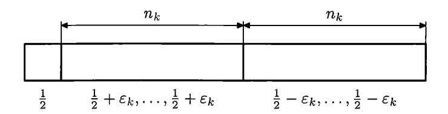

FIGURE 28. The kth block and the probabilities

but the convergence is slow. More precisely, we need the following relation between  $n_k$  and  $\varepsilon_k$ : The probability that for  $n_k$  independent trials with success probability  $\frac{1}{2} + \varepsilon_k$  the fraction of ones is strictly greater than 1/2 is at least  $1 - 2^{-(k+3)}$ . (In fact, this can be achieved for any sequence  $\varepsilon_k$  if  $n_k$  are sufficiently large.)

If  $n_k$  and  $\varepsilon_k$  are chosen in this way, we get with positive probability a sequence  $\omega$  such that for all k in each of the two halves of the kth block the imbalance between zeros and ones is in the expected direction (more ones in the left half and more zeros in the right half).

Therefore, there exists an ML-random (with respect to  $\mu$ ) sequence  $\omega$  with this property, and Theorem 202 guarantees that it is also Mises–Kolmogorov–Loveland random.

Now let us show that some Church admissible selection rule selects from  $\omega$  a sequence that is not Mises–Kolmogorov–Loveland random. The selection rule is very simple: we select the first bit of each block all the time, and depending on its value we select either all bits in the left half or all bits in the right half (of the rest of the block).

Why is the selected subsequence  $\omega'$  not Mises-Kolmogorov-Loveland random? This is easy—the imbalance condition allows us to reconstruct the value of the key (the first bit of the block) by counting zeros and ones in the following  $n_k$  bits. So we first read  $n_k$  bits that go after the key bit and then predict correctly the value of the key bit. This ends the proof of (c).

We may also note that the sequence  $\omega'$  is Mises-Church-Daley random, since the composition of two Church-Daley admissible rules is again a Church-Daley admissible rule. On the other hand, if we permute  $\omega'$  (computably) by placing the key bit after all the other bits of the same block, we get a sequence that is not Mises-Church random. So statement (d) is also proven.

Note that this result shows that all the Mises-style definitions of randomness are not very natural. Indeed, Mises noted the following important property of Kollektivs: Applying an admissible selection rule to a Kollektiv, we should get another Kollektiv. And statement (c) shows that the Mises-Kolmogorov-Loveland definition does not have this property. The definitions with monotonic selection rules (Mises-Church, Mises-Daley) have this property, but are not stable with respect to computable permutation of terms, which is also quite strange.

**279** Prove that by applying a Kolmogorov–Loveland admissible selection rule to a Mises–Kolmogorov–Loveland random sequence we get a Mises–Church–Daley random sequence.

**280** Prove that there exists a Mises-Kolmogorov-Loveland random sequence (with limit frequency 1/2) that is not even Kurtz random.

(*Hint*: Take a sequence that is random with respect to a slightly biased measure. One of the martingales constructed in the proof of Theorem 197 is bounded on it, so the other one has a computable lower bound that computably converges to infinity.)

It seems that the examples of this section tell us that the Mises-Kolmogorov-Loveland definition is probably too weak from the intuitive viewpoint. The same can be said about the definition of computably random sequences. Now the natural question arises: What happens if we combine these two definitions? Assume that we play with a sequence of bits that is selected in arbitrary (not necessarily monotonic) order as in Kolmogorov-Loveland selection rules, but we can make

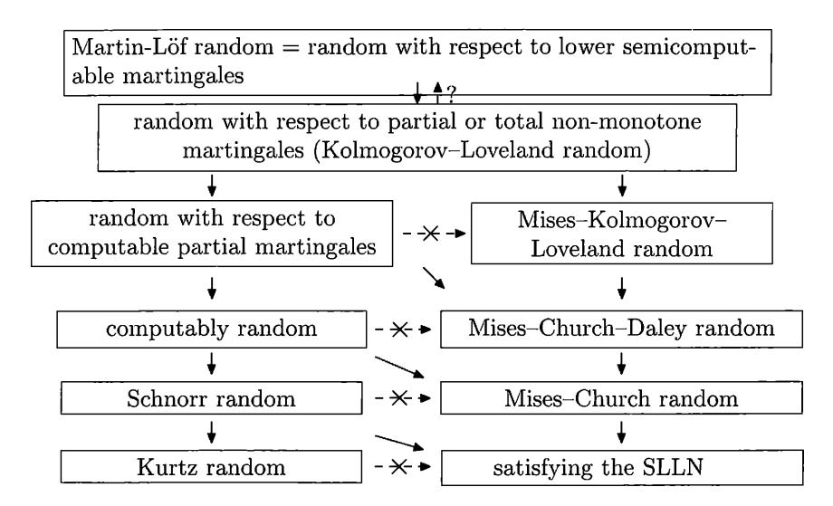

FIGURE 29. Relations between different notions of randomness

bets of arbitrary computable size (not exceeding the current capital), as in the definition of computable random sequences? One can naturally define this class of sequences; they are sometimes called *unpredictable* or *Kolmogorov-Loveland random*. It is easy to prove that all ML-random sequences have this property, but it is not known now (2017) whether these two classes coincide. One can note also that for non-monotonic martingales (games with non-monotonic subsequences) it does not matter whether they are total or not (the same argument as in Theorem 191 (p. 291) works).

Finally, let us summarize what we know about relations between different notions of randomness (Figure 29). We have two columns; in each column the notion becomes weaker (and the class of random sequences increases) as we go down. The left column contains game definitions (extending Ville's idea in different ways) that use martingales of different types. The right column (extending von Mises' ideas in different ways) uses selection rules of different types. Both columns start with Martin-Löf randomness (that is equivalent to randomness with respect to lower semicomputable martingales) and the definition of randomness with respect to non-monotonic (partial) computable martingales. We do not know whether these definitions are equivalent or if the second one is weaker.

In the right column the class of admissible selection rules decreases; in the left column the requirements for a winning strategy increase (see Section 9.9, Theorem 183, and Problem 272). So the corresponding classes of random sequences increase when we go down.

To see why all the implications shown (except for the top one) are irreversible and there are no other implications, let us consider the relations between columns. As we have seen, Mises–Kolmogorov–Loveland randomness does not imply even the weakest notion in the left column—Kurtz randomness (Problem 280)—so there are no implications going from right to left.

When going from left to right, the "random with respect to partial computable martingales sequences" are Mises-Church-Daley random (Theorem 190, p. 290); computably random sequences are Mises-Church random (Theorem 182, p. 279); Schnorr randomness implies SLLN (Problem 92, p. 70). But these implications cannot be improved: Kurtz randomness does not imply the SLLN (Problem 92, p. 70); Schnorr randomness does not imply Mises-Church randomness (Problem 271, p. 284); computably random sequences may be not Mises-Church-Daley random, since in the first case the complexity may grow as  $O(\log n)$  (Theorem 182, p. 279) and in the second case this is impossible (Theorem 188, p. 287); finally, randomness with respect to computable partial martingales does not imply Mises-Kolmogorov-Loveland randomness, since in the first case the complexity of prefixes may be sublinear (Theorem 190, p. 290) while in the second case this is not possible (Theorem 193, p. 293).

Therefore in each column all the arrows are irreversible (since the consequences in the right column are different for each notion in the left column; similarly for the right column), so indeed no other implications can be added to our table.

#### CHAPTER 10

# Inequalities for entropy, complexity, and size

# 10.1. Introduction and summary

The first publication of Kolmogorov in which the definition of complexity was given is the paper "Three approaches to the quantitative definition of information" [78]. The three approaches mentioned there are *combinatorial*, *probabilistic*, and *algorithmic*.

The algorithmic approach measures the amount of information in a message by its  $Kolmogorov\ complexity$  (as we call it now—of course, this name was not used by Kolmogorov himself). Using the probabilistic approach, we consider a message as one of the possible values of some random variable, and we measure the Shannon entropy of this random variable. But Kolmogorov started the paper with the combinatorial approach, making the following (trivial) observation: If there are N different messages that can be transmitted, we need  $\log N$  bits to specify which of the messages is transmitted. (If we need to guess one of N objects, we need to ask  $\log N$  yes-or-no questions.)

We have already mentioned some results that relate these three approaches. For example, Theorem 8 (p. 19) related the combinatorial and algorithmic approaches and refined the following (absurd, if understood literally) statement, "a string x has complexity at most n if and only if x belongs to the set of at most  $2^n$  elements". Another example is that the results of Section 7.3 relate Kolmogorov complexity and Shannon entropy.

In this chapter, following [64, 157], we establish more formal connections between the three approaches and restrict ourselves to a rather specific class of statements: linear inequalities for entropy and complexity (and corresponding combinatorial statements).

Let  $x_1, \ldots, x_n$  be binary strings. For every non-empty set  $I \subset \{1, 2, \ldots, n\}$  of indices, consider the tuple  $x_I$  made of all  $x_i$  with  $i \in I$ . We are interested in the Kolmogorov complexity of this tuple. For example, for n = 3, we have seven possible tuples, and we get a list of seven complexities:

$$C(x_1), C(x_2), C(x_3), C(x_1, x_2), C(x_1, x_3), C(x_2, x_3), C(x_1, x_2, x_3).$$

Let us give several examples of linear inequalities where these complexities appear:

- $C(x_1, x_2) \leq C(x_1) + C(x_2) + O(\log N)$ ;
- $C(x_1, x_2, x_3) \leq C(x_1) + C(x_2, x_3) + O(\log N);$
- $C(x_1, x_2, x_3) + C(x_1) \leq C(x_1, x_2) + C(x_1, x_3) + O(\log N);$
- $2C(x_1, x_2, x_3) \leqslant C(x_1, x_3) + C(x_2, x_3) + C(x_1, x_2) + O(\log N)$

(we assume here that  $x_1, x_2, x_3$  are strings of length at most N).

In general, linear inequality for complexities has the form

$$\sum_{I} \lambda_{I} C(x_{I}) \leqslant O(\log N),$$

where the sum is taken over all non-empty subsets of  $\{1, \ldots, n\}$ . The coefficients  $\lambda_I$  may be positive, negative, or zeros; we assume that all strings  $x_i$  have length at most N, and the constant in O-notation does not depend on N (but may depend on n and the inequality chosen).

Which of these inequalities are true? More formally, we are looking for the tuples of coefficients  $\lambda_I$  such that

$$\sum_{I} \lambda_{I} C(x_{I}) \leqslant c \log N$$

for some c, every N, and all strings  $x_1, \ldots, x_n$  of length at most N.

This question is still wide open, and only some partial results are known.

First of all, this question is not specific to algorithmic information theory, as shown by A. Romashchenko who proved that such an inequality is true if and only if the inequality for Shannon entropies with the same coefficients is true, where strings  $x_i$  are replaced by random variables  $\xi_I$  (with arbitrary joint distribution),

$$\sum_{I} \lambda_{I} H(\xi_{I}) \leqslant 0,$$

where  $\xi_I$  is a random variable made from  $\xi_i$  with  $i \in I$  (in other words, projection of the random vector  $\langle \xi_1, \dots, \xi_n \rangle$  on *I*-coordinates).

The implication in one direction is an easy consequence of the result proven in Section 7.3: Theorem 147 (p. 228) says that entropy is an expected value of complexity and any linear inequality that is true for complexities should be also true for their expectations (with no error term, since the ratio  $O(\log N)/N$  tends to 0 as  $N \to \infty$ ).

More precisely, let  $\xi_i$  be a random variable with values in some finite set  $X_i$ . Then the value of a random vector  $\xi = \langle \xi_1, \dots, \xi_n \rangle$  can be represented by a column of height n. To apply Theorem 147, consider N independent variables distributed as  $\xi$ . Together they form a random variable that we denote by  $\xi^N$ . Its values are matrices having N columns and n rows. Theorem 147 says that the expected value of the complexity of this matrix is  $NH(\xi) + O(\log N)$  (we spoke there about prefix complexity and had N as a condition, but with  $O(\log N)$ -precision this does not matter).

We can consider this matrix as a tuple of rows: the *i*th row is a string of length N over the alphabet  $X_i$ . We can apply Theorem 147 not only to the entire matrix, but also to selected rows indexed by  $i \in I$ , where I is some subset of  $\{1, 2, \ldots, n\}$ . The expected complexity of this part of the matrix is  $NH(\xi_I) + O(\log N)$ .

If the inequality

$$\sum_I \lambda_I C(x_I) \leqslant O(\log N)$$

is true for all tuples  $x_1, \ldots, x_n$ , it can be applied to the rows of our matrix. So, taking the averages, we get

$$\sum_{I} \lambda_{I} N H(\xi_{i}) \leqslant O(\log N).$$

The left-hand side is

$$\left(\sum_I \lambda_I H(\xi_i)\right) \cdot N,$$

so this is possible only if

$$\sum_{I} \lambda_{I} H(\xi_{i}) \leqslant 0,$$

as we claimed.

The other direction is much less trivial. We want to show that if the inequality is true for entropies, it should be true for complexities with logarithmic error. Here some strings  $x_1, \ldots, x_n$  are given, and we need to construct a family of random variables whose entropies (and the entropies of their combinations) are close to the complexities so we can apply the inequality for entropies. This can be done by a typization trick suggested by A. Romashchenko: We consider the set of all tuples of strings  $x'_1, \ldots, x'_n$  whose complexities and conditional complexities are bounded by the corresponding complexities of  $x_1, \ldots, x_n$ , and take a random element of this set (with uniform distribution). See below Section 10.6 (Theorem 212) for the details.

Further results are related (in different ways) with the combinatorial interpretation of inequalities. Let us start with a simple inequality

$$C(x_1, x_2) \leq C(x_1) + C(x_2) + O(\log N)$$

and try to understand its combinatorial meaning. Let  $X_1$  and  $X_2$  be finite sets whose elements  $x_1 \in X_1$  and  $x_2 \in X_2$  are considered as messages. Assume that we have a set  $A \subset X_1 \times X_2$  whose elements are possible pairs of messages. Then we have |A| possibilities for the pair (here |A| stands for the cardinality of A). For the first component the number of possibilities is equal to the size of the first projection of A (the set of  $x_1$  such that  $\langle x_1, x_2 \rangle \in A$  for some  $x_2$ ). Denoting this number by m(1) and a similar number for the other coordinate by m(2), we can write a combinatorial version of the same inequality,

$$\log |A| \le \log m(1) + \log m(2)$$

or

$$|A| \leqslant m(1)m(2)$$

(the size of a set is bounded by the product of sizes of its projections, an evident observation).

To see a less trivial example, consider the inequality for complexities from Theorem 26 (a similar inequality for entropies is considered in Problem 230):

$$2C(x_1, x_2, x_3) \leqslant C(x_1, x_2) + C(x_1, x_3) + C(x_2, x_3) + O(\log N).$$

Using our analogy, we guess that for an arbitrary subset A of the Cartesian product  $X_1 \times X_2 \times X_3$  the following inequality holds:

$$2\log |A| \leqslant \log m(1,2) + \log m(1,3) + \log m(2,3),$$

where m(i,j) is the number of elements in the projection of A onto  $X_i \times X_j$  (see Figure 30) or

$$|A|^2 \le m(1,2)m(1,3)m(2,3).$$

And indeed this is true; moreover, this inequality can be deduced from the inequality about complexities using the following simple argument. For an integer N consider the set  $A^N$ ; we represent elements  $\langle x_1, x_2, x_3 \rangle \in A$  as columns of height 3, so every

element of  $A^N$  can be represented as a matrix of width N and height 3. There are  $|A|^N$  matrices in  $A^N$ , so among them there is a matrix of complexity at least  $\log |A|^N = N \log A$ . Such a matrix is a triple of strings  $\langle \bar{x}_2, \bar{x}_2, \bar{x}_3 \rangle$  of length N (its rows), and we can apply the inequality for complexities

$$2C(\bar{x}_1, \bar{x}_2, \bar{x}_3) \leqslant C(\bar{x}_1, \bar{x}_2) + C(\bar{x}_1, \bar{x}_3) + C(\bar{x}_2, \bar{x}_3) + O(\log N).$$

Note that the complexities in the right-hand side are bounded. For example, the pair  $\langle \bar{x}_1, \bar{x}_2 \rangle$ , a matrix of width N and height 2, is an N-tuple of its columns. Each column is an element of the projection of A onto coordinates (1,2), so the matrix is a string of length N over an alphabet of size m(1,2). Therefore its complexity (given N and A) is bounded by  $N \log m(1,2) + O(1)$ . The set A does not depend on N, and the complexity of N is  $O(\log N)$ , so we get

 $N \log |A| \leq N \log m(1,2) + N \log m(1,3) + N \log m(2,3) + O(\log N),$  which is possible for arbitrarily large N only if

$$2\log|A| \le \log m(1,2) + \log m(1,3) + \log m(2,3).$$

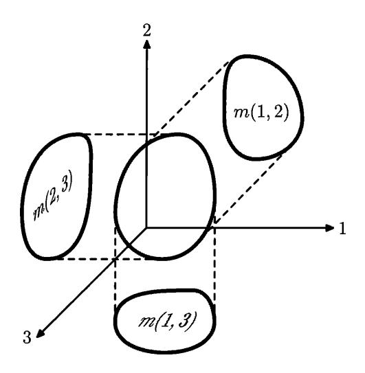

FIGURE 30. Three projections

**281** Prove the same inequality for sets starting with the inequality

$$2H(\xi_1, \xi_2, \xi_3) \leq H(\xi_1, \xi_2) + H(\xi_1, \xi_3) + H(\xi_2, \xi_3)$$

for entropies.

(*Hint*: Consider a triple uniformly distributed in A, and recall that the entropy of every random variable is bounded by the log-size of its range.)

**282** Give a direct proof of the same inequality without using complexities or entropies.

(*Hint*: It can be derived from the inequality of Theorem 164.)

This inequality can be used to show that the number of triangles in a graph with V edges is  $O(V^{1.5})$ .

A similar argument can be applied to an arbitrary linear inequality for complexities that has only one term in the left-hand side (an inequality of this type

says that some complexity is bounded by a positive linear combination of some other complexities). One can also extend this argument to inequalities that have conditional complexities in the right-hand side. For example, the inequality

$$C(x_1, x_2) \leq C(x_1) + C(x_2 | x_1)$$

corresponds to the (evident) combinatorial statement

$$m(1,2) \leqslant m(1) \cdot m(2|1)$$

valid for an arbitrary set  $A \subset X_1 \times X_2$ , where by m(1,2) we mean the number of elements in A, by m(1) we mean the number of elements in the first projection of A, and by m(2|1) we mean the maximal size of all sections of A obtained when the first coordinate is fixed.

Let us explain informally why this inequality is a natural combinatorial counterpart for the inequality about complexities. The "combinatorial amount of information" in  $x_1$  is  $\log m(1)$ ; for a fixed value of  $x_1$  we have at most m(2|1) possible values of  $x_2$ , so the amount of information in  $x_2$  given  $x_1$  is (from the combinatorial viewpoint) bounded by  $\log m(2|1)$ . And the amount of information in a pair  $\langle x_1, x_2 \rangle \in A$  is measured as  $\log A = \log m(1, 2)$ .

**283** Show that every linear inequality of the form  $L \leq R$ , where L and R are positive linear combinations of (conditional or unconditional) complexities and L has only one term, corresponds to a (true) combinatorial inequality.

We can describe completely the inequalities of this type that do not include conditional complexities. Consider an inequality

(\*) 
$$C(x_1,\ldots,x_n) \leqslant \sum_I \lambda_I C(x_I) + O(\log N),$$

where all the coefficients in the right-hand side are non-negative and the sum is taken over non-empty I except for  $I = \{1, 2, ..., n\}$ . (We can assume without loss of generality that the left-hand side includes all  $x_i$ . Then if some  $x_j$  is missing there, we can delete  $x_j$  everywhere in the right-hand side. In other words, replacing  $x_j$  by the empty string, we get a stronger inequality.)

THEOREM 204. The inequality (\*) holds if and only if for every  $i \in \{1, 2, ..., n\}$  the sum of coefficients in the right-hand side for the terms including  $x_i$  is at least 1.

PROOF. If the sum of coefficients is less than 1, the inequality is false even for the case when all strings except  $x_i$  are empty.

Assume now that for all i the sum of coefficients near terms that contain  $x_i$  is at least 1. Represent each term as a sum of conditional probabilities; for example,

$$C(x_1, x_2, x_3, \ldots, x_n)$$

now becomes

$$C(x_1) + C(x_2|x_1) + C(x_3|x_1,x_2) + \cdots + C(x_n|x_1,\ldots,x_{n-1}).$$

In all the terms (in the left- and in the right-hand sides) we use the same ordering (increasing indices, as in this example). Look at the terms  $C(x_i | \cdots)$  with some conditions in the left-hand side and in the right-hand side. On the left we use all preceding variables as conditions, and on the right some terms may have fewer conditions. But the complexity may only increase when a condition is deleted, and it remains to recall that the sum of coefficients in the right-hand side is at least 1.

**284** Prove that for prefix complexity the inequalities from the previous theorem are true with O(1)-precision (better than  $O(\log n)$ -precision that we usually have for strings of length n).

(*Hint*: The argument above shows that this inequality is a linear combination of basic inequalities, and the latter are true with O(1)-precision for prefix complexity (Theorem 70, p. 110). Indeed, if we (temporarily) redefine prefix complexity as K(u|v) = K(u,v) - K(v), then the inequalities of type  $K(z|x,y) \leq K(z)$  are reduced to basic inequalities.)

However, we want to understand the combinatorial meaning of arbitrary linear inequalities (and not only those with one term in the left-hand side). To understand the problem, let us consider an example: the basic inequality

$$C(x_1) + C(x_1, x_2, x_3) \leq C(x_1, x_2) + C(x_1, x_3) + O(\log N).$$

The naïve idea is to write a combinatorial inequality in the same way as before and hope that for every  $A \subset X_1 \times X_2 \times X_3$  the following inequality holds:

$$m(1) \cdot m(1,2,3) \leq m(1,2) \cdot m(1,3)$$
.

This is not the case. This inequality is indeed true for every parallelepiped  $a \times b \times c$  where m(1) = a, m(1,2,3) = abc, m(1,2) = ab, and m(1,3) = ac. But if we add to this parallelepiped another one,  $a' \times 1 \times 1$ , where  $a' \gg a$ , then the values of m(1,2), m(1,3), and m(1,2,3) remain almost unchanged while m(1) increases significantly, so the inequality may become false.

Another example is to consider the reverse inequality for the complexity of a pair

$$C(x_1) + C(x_2 | x_1) \leq C(x_1, x_2) + O(1).$$

What statement is its combinatorial translation? Again, the naïve attempt is to consider the inequality

$$m(1) \cdot m(2|1) \leqslant m(1,2),$$

but it does not work—the ratio m(1,2)/m(1) is an average size of a (non-empty) section, and this average size can be much smaller than the maximal size m(2|1).

So we now see the problem. What can be done? There are several possibilities. First, one may consider not arbitrary sets but some special (uniform or almost uniform) sets, where this problem does not appear. The other approach is to find a better combinatorial translation of the inequalities. Both approaches are considered below; we start with the first one (uniform sets).

# 10.2. Uniform sets

Let us recall the notation used. Let  $A \subset X_1 \times \cdots \times X_n$  be a non-empty subset of a Cartesian product of n finite sets  $X_1, \ldots, X_n$ . For every set  $I \subset \{1, \ldots, n\}$  of indices, we consider the projection of A onto corresponding coordinates, which is a subset of  $\prod_{i \in I} X_i$ . The size of this projection is denoted by  $m_A(I)$ . We consider not only projections, but also their sections. Let I and J be two disjoint sets of indices. Let us fix I-coordinates in some way (by selection of a point in  $\prod_{i \in I} X_i$ ) and consider the set of all J-coordinates of points in A with given I-coordinates. So for every point in  $\prod_{i \in I} X_i$  we get some subset of  $\prod_{j \in J} X_j$ . The maximal size of these subsets is denoted by  $m_A(J | I)$ . (If the set A is clear from the context, we omit the subscript A in this notation.)

We assume (as usual) that  $m(\emptyset) = 1$  and  $m(\emptyset|J) = 1$  for every J. On the other hand, we define  $m(I|\emptyset)$  as m(I). For example, consider a set  $A \subset X_1 \times X_2$  (see Figure 31).

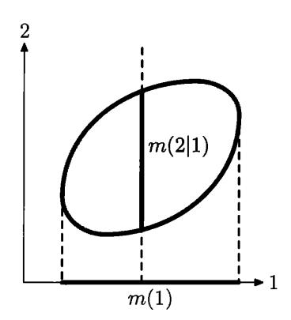

FIGURE 31. A two-dimensional set and its parameters

Then  $m_A(\{1\})$  is the cardinality of the projection of A onto a horizontal axis,  $m_A(\{2\})$  is the size of the vertical projection,  $m_A(\{2\}|\{1\})$  is the maximal size of the vertical section, and  $m_A(\{1\}|\{2\})$  is the maximal size of the horizontal section. The total number of elements in the set is  $m_A(\{1,2\})$ .

We can write the (obvious) inequality

$$m(1,2) \leqslant m(1) \cdot m(2|1)$$

(we omit the subscript A and curly brackets for brevity). Indeed, each of m(1) vertical sections contains at most m(2|1) elements.

For an *n*-dimensional set a similar inequality says that

$$m(1,2,\ldots,n) \leq m(1) \cdot m(2|1) \cdot m(3|1,2) \cdot \ldots \cdot m(n|1,2,\ldots,n-1).$$

It is true for the same reasons: for each of m(1) possible values of the first coordinate, there are at most m(2|1) values of the second coordinate; for each pair there are at most m(3|1,2) values of the third coordinate; and so on. The same inequality is true for every permutation  $(k_1, \ldots, k_n)$  of  $(1, 2, \ldots, n)$ :

$$m(k_1,\ldots,k_n) \leqslant m(k_1) \cdot m(k_2 | k_1) \cdot m(k_3 | k_1,k_2) \cdot \ldots \cdot m(k_n | k_1,\ldots,k_{n-1}),$$

the left-hand side remains the same (the cardinality of A).

Now we are ready to give the definition of a uniform set. A set A is uniform if all these inequalities (for all n! permutations of the set of indices) are equalities. The simplest example of a uniform set is a (combinatorial) parallelepiped, i.e., the set  $A_1 \times \cdots \times A_n$  for some  $A_i \subset X_i$ .

However, there are other examples of uniform sets. For example, Figure 32 shows a uniform sets of six elements (all non-zero sections have two elements and both projections have three).

Let I, J, K be disjoint sets of indices. Then for arbitrary A the following inequality holds:

$$m(J \cup K | I) \leq m(J | I) \cdot m(K | I \cup J)$$

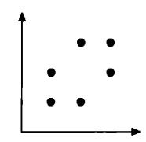

FIGURE 32. A uniform set

(for each combination of *I*-coordinates there are at most m(J|I) combinations of *J*-coordinates, and for each of them there are at most  $m(K|I \cup J)$  combinations for *K*-coordinates).

We can use this inequality to prove the inequality considered earlier,

$$m(k_1,\ldots,k_n) \leq m(k_1) \cdot m(k_2 | k_1) \cdot m(k_3 | k_1, k_2) \cdot \ldots \cdot m(k_n | k_1,\ldots,k_{n-1})$$

(which is evident anyhow, but let us continue the argument, it will soon become clear why we do this) by grouping factors in the right-hand side. For example, the product

$$m(k_3 | k_1, k_2) \cdot m(k_4 | k_1, k_2, k_3)$$

is at least

$$m(k_3, k_4 | k_1, k_2),$$

then the product

$$m(k_2 | k_1) \cdot m(k_3, k_4 | k_1, k_2)$$

can be replaced (without increase) by

$$m(k_2, k_3, k_4 | k_1),$$

and so on, until we get the left-hand side. For a uniform set, therefore, all these inequalities are equalities (since the first and last terms in the chain of inequalities are equal). Now we conclude that for uniform sets the inequality

$$m(J \cup K | I) \leq m(J | I) \cdot m(K | I \cup J)$$

turns into an equality for all I, J, K. Indeed, we can find a chain of inequalities where this inequality appears. The equation

$$m(J \cup K \,|\, I) = m(J \,|\, I) \cdot m(K \,|\, I \cup J)$$

can, therefore, be considered as an (equivalent) definition of uniform sets. We require it to be true for every disjoint set I, J, K of indices.

**285** Following this argument, give a complete proof that the property above is an equivalent definition of uniform sets.

**286** Prove that a projection of a uniform set on every subset of coordinates is again a uniform set.

287 Prove that every section of a uniform set (we fix some coordinate and consider the set of possible values of all other coordinates) is again a uniform set.

Uniform sets are important as sources of random variables. Consider a uniform set  $A \subset X_1 \times \cdots \times X_n$  and a random point that is uniformly distributed in A. Its projection onto the *i*th coordinate is a random variable with values in  $X_i$ ; we denote this variable by  $\xi_i$ .

THEOREM 205. A set A is uniform if and only if for every  $I = \{i_1, \ldots, i_k\}$  the random variable  $\xi_I = \langle \xi_{i_1}, \ldots, \xi_{i_k} \rangle$  has uniform distribution on its range.

PROOF. Let I be some set of indices, and let J be its complement (the difference between  $\{1, 2, \ldots, n\}$  and I). Then the equality

$$m(1,2,\ldots,n) = m(I) \cdot m(J|I)$$

means that that the average size of a (non-empty) section obtained by fixing I-coordinates, i.e.,  $m(1,2,\ldots,n)/m(I)$ , is equal to its maximal size m(J|I), so all the sections have the same size. And this means that all the values of  $\xi_I$  are equiprobable.

On the other hand, assume that for some set A for every set I of indices all the values of  $\xi_I$  are equiprobable. In particular, for  $I = \{1, \ldots, n-1\}$  we get that all (non-empty) sections obtained by fixing the first n-1 coordinates have the same size, so

(\*) 
$$m(1,2,\ldots,n) = m(n|1,2,\ldots,n-1) \cdot m(1,2,\ldots,n-1).$$

Moreover, since the random variable  $\langle \xi_1, \xi_2, \dots, \xi_{n-1} \rangle$  is uniformly distributed in the projection of the set A to coordinates  $1, 2, \dots, n-1$ , we get the same picture for this projection:  $\xi_1, \dots, \xi_{n-1}$  are random variables obtained by projection of a point uniformly distributed in this set. Using induction, we may assume that this set is uniform. Then the equation (\*) can be continued:

$$m(1,2,\ldots,n)$$

$$= m(n|1,2,\ldots,n-1) \cdot m(n-1|1,2,\ldots,n-2) \cdot \ldots \cdot m(3|1,2) \cdot m(2|1) \cdot m(1).$$

The same argument can be applied for every ordering of coordinates, so we conclude that A is uniform according to our definition.

COROLLARY. For the random variables  $\xi_1, \ldots, \xi_n$  constructed in this way, the entropy of the tuple  $\xi_I$  equals  $\log m(I)$  (for every  $I \subset \{1, 2, \ldots, n\}$ ).

So we conclude that the following statement is true:

THEOREM 206. Every linear inequality that is true for entropies is also true for the log-sizes of projections for uniform sets.

For example, if  $A \subset X_1 \times X_2 \times X_3$  is uniform, then the inequality

$$m(1) \cdot m(1,2,3) \leq m(1,2) \cdot m(1,3)$$

holds, since it corresponds to the basic inequalities for complexities and entropies (Theorem 24). Note that (as we have discussed) this inequality is false for some non-uniform sets.

In the next section, following [37], we prove a reverse statement. Starting from a tuple of random variables, we find a uniform set for which the log-sizes of projections are (almost) proportional to the entropies of the corresponding groups of variables.

#### 10.3. Construction of a uniform set

Assume that we have some tuple of (dependent) random variables  $\eta_1, \ldots, \eta_n$ ; all of them have finite range. We want to construct a uniform set A whose projection

sizes (their logarithms) are proportional to the entropies of  $\eta_I$ . The ideal situation is

$$\log m_A(I) = H(\eta_I)$$

for all  $I \subset \{1, ..., n\}$ . Then we would conclude immediately that every inequality that is true for the (log-sizes of the) projections of uniform sets is true for arbitrary random variables.

Of course, this requirement is too restrictive: The entropies in general are not logarithms of integer numbers. But if we are interested in linear inequalities, it is enough if the log-sizes are proportional to entropies, or approximately proportional to them. To achieve this, we consider first the case when the probabilities of all values of  $\langle \eta_1, \ldots, \eta_n \rangle$  are rational. This is enough to conclude that the linear inequalities for entropies and log-sizes are the same (the rational numbers are dense, and every distribution can be approximated by a distribution with rational probabilities, while the entropy is a continuous function of the distribution).

Assume that a tuple of random variables  $\eta_1, \ldots, \eta_n$  is given. Each value of this tuple is a column of height n. Each column has (we assume) some rational probability. Let N be a common denominator for all the probabilities. Consider a matrix with N columns where the columns appear with given probabilities, so our tuple can be obtained by taking at random a column from this matrix.

Let us consider the rows of this matrix. The *i*th row is a string of length N over an alphabet whose letters are possible values of  $\xi_i$ . Denote the set of all strings of length N in this alphabet by  $X_i$ . (The length N is fixed, so we do not include N in the notation.) Then the entire matrix is an element of  $X_1 \times \cdots \times X_n$ .

Consider now all matrices that can be obtained from this one by a permutation of columns. In other words, consider all matrices of width N where the frequencies of all the columns are exactly the same as in our matrix, i.e., they correspond to the distribution of the tuple  $\eta_1, \ldots, \eta_n$ . We get some set  $U \subset X_1 \times \cdots \times X_n$ . Let us show that this is a uniform set with the required sizes of all the projections.

First, let us note that every element of U is obtained from the original table by some permutation of columns. If we take a random permutation (all N! permutations are equiprobable), the probability of getting a given element of a set U does not depend on the element. (Indeed, the number of permutations that give this element is equal to the number of permutations that keep this element unchanged, and this depends only on the multiplicities of different columns and not on their positions.)

This property remains true if we delete some rows from the table. Therefore, the projection of a random point in U on an arbitrary subset of coordinates is also uniformly distributed, so the set U is uniform.

Now we need to estimate the sizes of projections. First, let us find the size of the set itself. Assume that the matrix has m different columns that appear in it with probabilities  $q_1, \ldots, q_m$ . Then the number of matrices that can be obtained by permutations of columns is equal to

$$\frac{N!}{(q_1N)!(q_2N)!\cdots(q_mN)!},$$

and its logarithm is (by Stirling's formula)

$$Nh(q_1,\ldots,q_m)+O(\log N),$$

where  $h(q_1, \ldots, q_m) = \sum q_i(-\log q_i)$  is the Shannon entropy of a random variable that has m values with probabilities  $q_1, \ldots, q_m$ , i.e., the Shannon entropy of  $\langle \eta_1, \ldots, \eta_n \rangle$ . So the log-size of U is (approximately) N times bigger than the entropy of  $\langle \eta_1, \ldots, \eta_n \rangle$ , and the same can be said about every projection of the set (and the corresponding projection of the random variable).

If a linear inequality is true for log-sizes of the projections of all uniform sets, it will be true for the set U. Increasing N (we can multiply N by an integer factor) and taking the limit (as  $N \to \infty$ ), we conclude that the same inequality is true for all random variables with rational probabilities. By continuity it is true for every probability distribution, and we get the following result [37]:

THEOREM 207 (Chan and Yeung). Every linear inequality that is true for logsizes of the projections of uniform sets is also true for entropies of arbitrary random variables.

#### 10.4. Uniform sets and orbits

Let us think again about the construction of the previous section. How do we get a uniform set? Usually uniformity is a byproduct of some algebraic structure on the objects considered. Such a structure indeed can be found in our construction.

Namely, we have a permutation group  $S_N$  and its action on the columns of the matrix. The uniform set is an orbit of some point (and contains all the matrices with the same frequencies). This is a special case of the following situation. Consider some finite group G and some actions of G on finite sets  $X_1, \ldots, X_n$ . Together they define an action of G on  $X_1 \times \cdots \times X_n$ . Consider and arbitrary point  $\langle x_1, \ldots, x_n \rangle \in X_1 \times \cdots \times X_n$  and its orbit G (for this action).

Theorem 208. The set U is a uniform subset of  $X_1 \times \cdots \times X_n$ .

PROOF. Let us consider all elements of G as equiprobable. Consider the action of a random element of G on the point  $x = \langle x_1, \ldots, x_m \rangle$ ; the image is a random variable whose range is the orbit of G. All the values of these random variables are equiprobable. Indeed, the elements of G that map a given point x to a given point y form a coset of a stabilizer subgroup of the point x (which contains the group elements that map x to itself), and all the cosets have the same size.

The same is true for every subset of the set of indices, so a random element of U has the same chances of being projected onto all points (of the projection of U); thus the set U is uniform.

How can we rewrite the inequalities for the sizes of projections in terms of the size of the group and its subgroups? The orbit U has size |G|/|S| where S is the stabilizer of the point x. This stabilizer (for our action) is the intersection of the stabilizers of  $x_1, \ldots, x_n$ . The same can be said for every set I of indices: the size of the projection of U on indices  $\{i_1, i_2, \ldots\}$  is the ratio  $|G|/|S_{i_1} \cap S_{i_2} \cap \cdots|$  where  $S_j$  is the stabilizer of  $x_j$ . Note that we can go in the other direction: an arbitrary subgroup H of G is the stabilizer of some point in the action of G on the cosets of G. In this way every inequality for the projections of uniform sets translates to an inequality about the sizes of subgroups and their intersections.

For example, the inequality  $m(1,2) \leq m(1) \cdot m(2)$  gives the following inequality that is valid for arbitrary subgroups  $H_1$  and  $H_2$  of an arbitrary finite group G:

$$\frac{|G|}{|H_1 \cap H_2|} \leqslant \frac{|G|}{|H_1|} \cdot \frac{|G|}{|H_2|}$$

or  $|H_1 \cap H_2| \geqslant |H_1| \cdot |H_2|/|G|$ .

A more interesting inequality  $m(1,2,3)^2 \le m(1,2)m(1,3)m(2,3)$  gives the inequality

$$|H_1 \cap H_2 \cap H_3|^2 \geqslant |H_1 \cap H_2| \cdot |H_1 \cap H_3| \cdot |H_2 \cap H_3| / |G|$$

for an arbitrary finite group G and its subgroups  $H_1, H_2, H_3$ .

The proof of Theorem 207 shows that the reverse statement is true: every inequality for the size of a group and its subgroups (that contains the products of them with some exponents) can be translated into an inequality for arbitrary random variables, since we may approximate a random variable by the action of the permutation group. We get the following surprising result [37]:

THEOREM 209 (Chan and Yeung). Every linear equality for the entropies of random variables translates into an inequality for the sizes of the group and its subgroups, and vice versa.

#### 10.5. Almost uniform sets

Recall that a set  $A \subset X_1 \times \cdots \times X_n$  is uniform if the inequality

$$m(k_1,\ldots,k_n) \leqslant m(k_1) \cdot m(k_2 | k_1) \cdot m(k_3 | k_1, k_2) \cdot \ldots \cdot m(k_n | k_1,\ldots,k_{n-1})$$

(that is true for all sets) turns out to be an equality for every permutation  $k_1, \ldots, k_n$  of  $\{1, 2, \ldots, n\}$ . Now consider a weaker requirement and say that A is *c-uniform* if the ratio between two sides of this inequality is bounded by c (for every permutation). So 1-uniform sets are uniform sets as defined above.

Many properties of uniform sets are still true (up to some error factor) for almost uniform sets.

THEOREM 210. Let A be a c-uniform set.

(a) Let I, J, K be disjoint sets of indices. The right-hand side in the inequality

$$m(J \cup K \mid I) \leqslant m(J \mid I) \cdot m(K \mid I \cup J)$$

(it is true for every set A) exceeds the left-hand side at most by a factor c.

- (b) The projection of A onto an arbitrary set of coordinates is a c-uniform set.
- (c) Let A' be a subset of A that contains at least an  $\varepsilon$ -fraction of elements of A. Then A' is  $c/\varepsilon$ -uniform.
- (d) Let  $\xi$  be a random variable uniformly distributed in A, and let I be a set of coordinates. Then its projection  $\xi_I$  on I-coordinates has entropy between  $\log m(I) \log c$  and  $\log m(I)$ .
- (e) Let I and J be disjoint sets of coordinates. Then  $H(\xi_J|\xi_I)$  is between  $\log m(J|I) \log c$  and  $\log m(J|I)$ .

PROOF. (a) We can group the factors in the right-hand side of the inequality

$$m(k_1,\ldots,k_n) \leqslant m(k_1) \cdot m(k_2 | k_1) \cdot m(k_3 | k_1, k_2) \cdot \ldots \cdot m(k_n | k_1,\ldots,k_{n-1})$$

using the inequality

$$m(J|I) \cdot m(K|I \cup J) \geqslant m(J \cup K|I)$$

for some I, J, and K. The product decreases at each step, and at the end we get the left-hand side. If the initial inequality was an equality up to a c-factor, the same is true for the inequalities used at each step. And the ordering of coordinates can be chosen in such a way that this process goes through a given triple I, J, K.

(b) By assumption

$$m(n|1,...,n-1) \cdot m(n-1|1,...,n-2) \cdot ... \cdot m(2|1) \cdot m(1) \leq cm(1,...,n),$$

and this inequality can be continued

$$cm(1,\ldots,n) \leqslant cm(n|1,\ldots,n-1) \cdot m(1,\ldots,n-1).$$

Cancelling the terms m(n|1,...,n-1) in both sides, we see that the projection onto 1,2,...,n-1 is c-uniform (and we can do the same for every group of n-1 coordinates). Then we can delete one more coordinate, etc.

- (c) The maximal sizes of the sections for a subset do not exceed the corresponding sizes for the entire set, and the size of the entire set is multiplied by  $\varepsilon$ , so the constant c can be replaced by  $c/\varepsilon$ .
- (d) The random variable  $\xi_I$  has m(I) different values, so its entropy is bounded by  $\log m(I)$ . On the other hand, let  $J = \{1, 2, ..., n\} \setminus I$ . Then

$$m(I) \cdot m(J | I) \leqslant cm(1, 2, \dots, n),$$

so every value of  $\xi_I$  has probability at most

$$m(J|I)/m(1,2,\ldots,n) \leqslant c/m(I),$$

and the entropy is at least  $\log m(I) - \log c$ .

(e) Let us compare the equality

$$H(\xi_1, \dots, \xi_n)$$
=  $H(\xi_n | \xi_1, \dots, \xi_{n-1}) + H(\xi_{n-1} | \xi_1, \dots, \xi_{n-2}) + \dots + H(\xi_2 | \xi_1) + H(\xi_1)$ 

and the inequality

$$\log m(1,...n) \leq \log m(n|1,...,n-1) + \log m(n-1|1,...,n-2) + \cdots + \log m(2|1) + \log m(1).$$

The left-hand sides are the same since  $\xi$  is uniformly distributed in A. Each entropy term in the first inequality is bounded by the corresponding logarithm in the second inequality (the conditional entropy is the average of entropies for all possible values of the condition, and each entropy in this average is bounded by the log-size of the range). Since A is c-uniform, both sides of the inequality differ at most by  $\log c$ . Therefore, each entropy can differ from the corresponding log-size at most by  $\log c$ . By grouping the terms in these two sums (after a suitable permutation of coordinates), we can prove the inequality

$$\log m(J|I) - \log c \leqslant H(\xi_J|\xi_I) \leqslant \log m(J|I)$$

for an arbitrary disjoint set of indices I and J.

An immediate corollary of statements (d) and (e) is that if some linear inequality is true for entropies, it is also true for log-sizes of corresponding projections and sections of a c-uniform set with error term at most  $\lambda \log c$ , where  $\lambda$  is the sum of absolute values of all coefficients. (Increasing c, we allow sets that are less uniform, so the error term increases.)

This property will be used in the next section when we start from a tuple of strings, construct a *c*-uniform set, and then consider the corresponding random variables.

# 10.6. Typization trick

The following theorem starts from an arbitrary tuple of strings  $x_1, \ldots, x_n$  and constructs an almost uniform set A in some Cartesian product  $X_1 \times X_2 \times \cdots \times X_n$  of finite sets  $X_i$  such that  $\log m(J|I) \approx C(x_J|x_I)$  with logarithmic precision:

THEOREM 211 (A. Romashchenko). For every n there exists a constant d such that the following holds: For every N>1 and for every tuple  $x_1,\ldots,x_n$  of strings of complexity at most N there exist finite sets  $X_1,\ldots,X_n$  and an  $N^d$ -uniform subset  $A \subset X_1 \times \cdots \times X_n$  such that

$$|\log m(J|I) - C(x_J|x_I)| \leq d \log N$$

for all disjoint subsets  $I, J \subset \{1, ..., n\}$ .

Note that the sets  $X_i$  are not really relevant here: We can speak instead about a finite set of arbitrary n-tuples with the required size of projections and sections. Note also that a strange condition N>1 is needed since for N=1 the bound  $N^c$  does not grow as c increases.

The proof uses the notion of a *complexity vector* for a tuple of strings. For a given tuple  $x_1, \ldots, x_n$  the complexity vector is the list of all complexities  $C(x_I|x_J)$  for all pairs (I, J) of disjoint subsets of the set of indices  $\{1, \ldots, n\}$ . Note that the length of this vector is exponential in n: There are  $2^n - 1$  unconditional complexities (where  $J = \emptyset$ ) and a lot of conditional ones. Let us denote the complexity vector for  $x_1, \ldots, x_n$  by  $\varkappa(x_1, \ldots, x_n)$ .

PROOF. Consider (for given  $x_1, \ldots, x_n$ ) the set  $A(x_1, \ldots, x_n)$  of all strings  $y_1, \ldots, y_n$  such that

$$\varkappa(y_1,\ldots,y_n)\leqslant \varkappa(x_1,\ldots,x_n)$$

componentwise. For example, for n = 1 this is the set of all strings of complexity at most  $C(x_1)$ . For n = 2, we consider all pairs  $(x_1, x_2)$  such that

$$C(y_1) \leqslant C(x_1), \quad C(y_2) \leqslant C(x_2),$$
 
$$C(y_1, y_2) \leqslant C(x_1, x_2), \quad C(y_1 \mid y_2) \leqslant C(x_1 \mid x_2), \quad C(y_2 \mid y_1) \leqslant C(x_2 \mid x_1).$$

The set  $A(x_1, \ldots, x_n)$  is guaranteed to be non-empty—it contains  $\langle x_1, \ldots, x_n \rangle$ . In fact, it contains about  $2^{C(x_1, \ldots, x_n)}$  elements. Indeed, this is an upper bound since the complexity of all elements of this set is bounded by  $C(x_1, \ldots, x_n)$ . It remains to show that this set cannot be much smaller.

Indeed, knowing the complexity vector  $\varkappa(x_1,\ldots,x_n)$ , we can enumerate the elements of  $A(x_1,\ldots,x_n)$ . To specify the complexity vector, we need  $O(\log N)$  bits. (Note that the number of components in the complexity vector depends only on n, so we consider it as a constant even though this constant grows exponentially in n.) So every element of  $A(x_1,\ldots,x_n)$  can be described by specifying (in addition to the complexity vector) its ordinal number in the enumeration, and therefore every element of  $A(x_1,\ldots,x_n)$  has complexity

$$\log |A(x_1,\ldots,x_n)| + O(\log N).$$

In particular, this is true for the initial tuple  $\langle x_1, \ldots, x_n \rangle$ , so we get the required bound for the cardinality.

Let us show now that the set  $A(x_1, \ldots, x_n)$  is c-uniform for some constant c the depends polynomially on N. For that let us consider both sides of the inequality

$$m(1,2,\ldots,n) \leqslant m(1) \cdot m(2|1) \cdot m(3|1,2) \cdot \ldots \cdot m(n|1,2,\ldots,n-1).$$

The logarithms of the factors in the right-hand side do not exceed the corresponding complexities:  $m(1) \leq 2^{C(x_1)}$ , since by construction we have  $C(y_1) \leq C(x_1)$  for every tuple  $\langle y_1, \ldots, y_n \rangle \in A(x_1, \ldots, x_n)$  (to be exact, one should write  $2^{C(x_1)+1}$ , but all our estimates have logarithmic precision anyway). For the same reasons we have  $m(2|1) \leq 2^{C(x_2|x_1)}$  and so on. We conclude that the logarithm of the right-hand side does not exceed

$$C(x_1) + C(x_2|x_1) + C(x_3|x_1,x_2) + \cdots + C(x_n|x_1,\ldots,x_{n-1}) + O(1),$$

and this sum is equal to  $C(x_1, \ldots, x_n) + O(\log N)$ . But we know also that the logarithm of the left-hand side is at least  $C(x_1, \ldots, x_n) - O(\log N)$ , so the difference between logarithms is  $O(\log N)$  and both sides differ at most by a polynomial (in N) factor. As a byproduct we conclude that

$$C(x_i|x_1,\ldots,x_{i-1}) = \log m(i|1,\ldots,i-1) + O(\log N),$$

and a similar argument (with the permuted indices and grouped terms) shows that

$$C(x_J|x_I) = \log m(J|I) + O(\log N)$$

for every disjoint I and J.

The construction used in the proof may be called a typization trick: starting from a tuple, we construct the set where this tuple is typical.

Now it is easy to finish the proof of the promised result:

THEOREM 212 (A. Romashchenko). Every linear inequality

$$\sum_{I} \lambda_{I} H(\xi_{I}) \leqslant 0,$$

that is true for arbitrary random variables  $\xi_1, \ldots, \xi_n$ , is also true for strings of complexity at most N with  $O(\log N)$ -precision,

$$\sum_{I} \lambda_{I} K(\xi_{I}) \leqslant O(\log N).$$

Here the constant hidden in  $O(\log N)$  depends on n (and grows exponentially as n increases) but not on the strings  $x_1, \ldots, x_n$ .

PROOF. The reverse implication (every inequality that is true for complexities is also true for entropies) was proven in Section 10.1.

Now we are ready to go in the other direction. Assume that this linear inequality is true for entropies. Consider arbitrary strings  $x_1, \ldots, x_n$  and the set  $A = A(x_1, \ldots, x_n)$  from the previous theorem. Consider a random variable  $\langle \xi_1, \ldots, \xi_n \rangle$  that is uniformly distributed in A. Since the set A is  $N^c$ -uniform, the entropies are  $O(\log N)$ -close to the sizes of the corresponding sections, as Theorem 210 says. On the other hand, the log-sizes  $\log m(I|J)$  (even for the conditional case, though we need this only for  $J = \emptyset$ ) coincide with corresponding complexities with  $O(\log N)$ -precision (Theorem 211).

The linear inequalities (of the type considered) are universal formulae of some language, so a natural question arises: Is a similar result true for more complicated statements, say, for  $\forall \exists$ -formulas of the same language (defined in some natural way)? The answer turns out to be negative, as shown in [141].

# 10.7. Combinatorial interpretation: Examples

Let us recall the main idea of the combinatorial interpretation: The statement "x has complexity at most n" is translated as "x belongs to the set of at most  $2^n$  elements". (Since the complexity is defined up to O(1), we do not specify whether we consider strict or non-strict inequalities.) In this way we get a combinatorial translation of a binary relation C(x) < n, so all statements should be reformulated in terms of this binary relation. Here are some examples:

- The inequality  $C(x) \leq C(y)$  means that for every n the statement C(y) < n implies C(x) < n.
- The inequality  $C(x) \leq 2C(y)$  can be rephrased as follows: for every n the inequality C(y) < n implies C(x) < 2n.
- For the inequality  $C(z) \leq C(x) + C(y)$ , the following translation can be used: for every u and v, if C(x) < u and C(y) < v, then C(z) < u + v.

Using the last example as a guideline, let us try to invent a combinatorial translation of the inequality  $C(x,y) \leq C(x) + C(y)$ . As we have said, it means that C(x) < u and C(y) < v imply C(x,y) < u+v. So we want to say something like "if x belongs to some set of size at most  $2^u$ , and y belongs to some set of size at most  $2^v$ , then we can construct a set of size at most  $2^{u+v}$  that is guaranteed to contain (x,y)". Indeed, we can consider the Cartesian product of two given sets, and its size is indeed bounded by  $2^{u+v}$ , so we get a true (though trivial) statement.

To get a combinatorial version of the inequality  $C(x,y) \leq C(x) + C(y|x)$ , we need to translate the statement C(y|x) < v. This can be done as follows:  $\langle x,y \rangle$  belongs to some set whose sections (for every fixed x) have size at most  $2^v$ . In this way we again get a true (but trivial) combinatorial statement.

We get a much more interesting situation when we consider the reverse inequality. We can try to rewrite  $C(z) \ge C(x) + C(y)$  as follows: If  $C(x) \ge u$  and  $C(y) \ge v$ , then  $C(z) \ge u + v$ . But our approach is asymmetric: We know what it means in combinatorial terms when C is *small*, not large (the reason for this asymmetry is that we can enumerate strings of small complexity, but not of large complexity). So we need to consider a dual reformulation: If it is *not* true that C(x) < u and it is not true that C(x) < u and it is not true that C(x) < u and it is not true that C(x) < u and it is not true that C(x) < u and it is not true that C(x) < u and it is not true that C(x) < u and it is not true that C(x) < u and it is not true that C(x) < u and it is not true that C(x) < u and it is not true that C(x) < u and it is not true that C(x) < u and it is not true that C(x) < u and it is not true that C(x) < u and it is not true that C(x) < u and it is not true that C(x) < u and it is not true that C(x) < u and it is not true that C(x) < u and it is not true that C(x) < u and it is not true that C(x) < u and it is not true that C(x) < u and it is not true that C(x) < u and it is not true that C(x) < u and it is not true that C(x) < u and it is not true that C(x) < u and it is not true that C(x) < u and it is not true that C(x) < u and it is not true that C(x) < u and it is not true that C(x) < u and it is not true that C(x) < u and it is not true that C(x) < u and it is not true that C(x) < u and it is not true that C(x) < u and it is not true that C(x) < u and it is not true that C(x) < u and it is not true that C(x) < u and it is not true that C(x) < u and it is not true that C(x) < u and it is not true that C(x) < u and it is not true that C(x) < u and it is not true that C(x) < u and it is not true that C(x) < u and it is not true that C(x) < u and it is not true that C(x) < u and it is not true that C(x) < u and it is not

Let us now try to invent a combinatorial translation of the inequality

$$C(x,y) \geqslant C(x) + C(y|x).$$

Using the trick described, we get the following statement. If a pair  $\langle x, y \rangle$  belongs to a given set of size at most  $2^{u+v}$ , then either x belongs to some set of size at most  $2^u$  or  $\langle x, y \rangle$  belongs to some set of pairs whose sections (for every fixed first coordinate) are of size at most  $2^v$ .

 $<sup>^{1}</sup>$ Of course this should not be understood literally: every x belongs to a singleton. We will see how this is interpreted in the examples below.

A more precise formulation of the statement would be for every u, v and for every set A of pairs that has at most  $2^{u+v}$  elements, there exist

- a set B of size at most  $2^{u}$ :
- ullet a set C of pairs that contains at most  $2^v$  pairs with the same first component

such that for every  $\langle x, y \rangle \in A$  either  $x \in B$  or  $\langle x, y \rangle \in C$  (or both).

In fact the proof of the formula for the complexity of a pair used exactly this approach: For a given x and y, we looked at how many pairs with the same x have small complexity. If there are only few of them, then C(y|x) was small (now we say that the pair (x,y) belongs to C); if there are many of those pairs, then C(x) is small (because this can happen only for few values of x). (Now we say that x belongs to B.)

**288** Translate the arguments used to prove the formula for the complexity of a pair to give a formal proof of the combinatorial statement in question.

Now consider an inequality where both sides have more than one term:

$$C(x_1) + C(x_1, x_2, x_3) \leq C(x_1, x_2) + C(x_2, x_3).$$

(We called it a basic inequality; it is true with an  $O(\log N)$  error term for strings of complexity at most N.)

In terms of a binary relation C(x) < n, this inequality can be restated as follows:

If  $C(x_1, x_2) < a$ ,  $C(x_1, x_3) < b$ , and a + b = p + q, then at least one of the inequalities  $C(x_1) < p$  and  $C(x_1, x_2, x_3) < q$  holds.

(For the sake of brevity, we omit all the details about  $O(\log N)$ -precision.)

The natural combinatorial translation of this statement looks as follows:

If 
$$A \subset X_1 \times X_2 \times X_3$$
,  $m_A(1,2) \leq 2^a$ ,  $m_A(1,3) \leq 2^b$ , and  $a+b=p+q$ , then there exist  $B, C \subset X_1 \times X_2 \times X_3$  such that  $A \subset B \cup C$ ,  $m_B(1) \leq 2^p$ , and  $m_C(1,2,3) \leq 2^q$ .

Eliminating the variables a and b, we can rewrite this statement (in a multiplicative version):

If  $A \subset X_1 \times X_2 \times X_3$  and  $m_A(1,2) \cdot m_A(1,3) = l \cdot V$  for some l, V > 0, then the set A can be covered by two sets B and C such that  $m_B(1) \leq l$  and  $m_C(1,2,3) \leq V$ .

In geometric terms, if some set A has small projections on the planes 1, 2 and 1, 3, its length in direction 1 (the size of the projection on the first coordinate) and its volume (the cardinality of A) can both be large. But we can split A into two parts B and C in such a way that B has small length and C has small volume.

(Recalling the example with two parallelepipeds, we see that in this example B could be the large one and C can be the small one.)

Of course, these heuristic arguments are not proofs. But in fact the last statement is indeed true (though not completely trivial). Here is its proof.

Consider the projection of the set A onto the 1,2-plane; this projection is a subset of  $X_1 \times X_2$ , and we denote it by  $A_{12}$ . For every  $x \in X_1$  consider the section of this projection (pairs with first component x). Let  $n_2(x)$  be the cardinality of this section. Then

$$m(1,2) = |A_{12}| = \sum_{x} n_2(x)$$

(the size of the set is the sum of sizes of all its sections). Similarly,

$$m(1,3) = |A_{13}| = \sum_{x} n_3(x).$$

The length  $m_A(1)$  is the number of non-zero terms in these sums, and m(1,2,3) has an upper bound,

$$m(1,2,3) = |A| \leqslant \sum_{x} n_2(x) n_3(x).$$

One can assume without loss of generality that this inequality is an equality: we can add missing elements to A leaving A's projections unchanged.

Now we need to split A into two parts B and C, and we need to care about the length of B (its 1-projection) and the size of C. For a given length of B we need to cover a maximal number of points, so we consider l maximal sections (that make  $n_2(x)n_3(x)$  maximal) and put all their elements in B. The rest is C.

It remains to prove that the cardinality of C does not exceed  $|A_{12}| \cdot |A_{13}|/l$ . How can we do this? We have bounds for the sizes of two 2D-projections of C: They do not exceed  $|A_{12}|$  and  $|A_{13}|$ . We know also that all sections of C (for every  $x \in X_1$ ) have area at most  $S_l$ , where  $S_l$  is the size of the lth section of A (in decreasing order). Consider the inequality

$$2C(x_1, x_2, x_3) \leq C(x_1, x_2) + C(x_1, x_3) + C(x_2, x_3 | x_1).$$

It is easy to prove. Rewrite all terms of the form  $C(x_1, ...)$  as  $C(x_1) + C(...|x_1)$ . The left-hand side contains only one term, so we already know that it implies the combinatorial statement

$$m(1,2,3)^2 \le m(1,2) \cdot m(1,3) \cdot m(2,3|1).$$

Therefore

$$|C|^2 \leqslant |A_{12}| \cdot |A_{13}| \cdot S_l$$
.

It remains to show that

$$S_l \leqslant \frac{|A_{12}| \cdot |A_{13}|}{l^2}.$$

Recall that B consists of l rectangles, and each of them has size at least  $S_l$ . The sum of widths  $n_2(x)$  of these rectangles is at most  $|A_{12}|$ , and the sum of their heights  $n_3(x)$  is at most  $|A_{13}|$ . The average width is then bounded by  $|A_{12}|/l$ , and the average height is bounded by  $|A_{13}|/l$ . To finish the proof, note that if  $S \leq a_i b_i$  for all  $i = 1, 2, \ldots, l$ , then

$$S \leqslant \frac{a_1 + \dots + a_l}{l} \cdot \frac{b_1 + \dots + b_l}{l}$$

(the logarithm function is concave).

So our guess (the combinatorial statement that is similar to the basic inequality about complexities) turns out to be true.

#### 10.8. Combinatorial interpretation: The general case

After all these examples let us consider the general case. Assume that an arbitrary inequality for complexities is given. Split the negative and positive coefficients, and get the inequality with positive coefficients in both sides

$$\sum \lambda_I C(x_I) \leqslant \sum \mu_J C(x_J)$$

(the sums in the left-hand side and the right-hand side are disjoint: all I's are different from all J's, and the coefficients  $\lambda_I$  and  $\mu_J$  are positive).

How can we translate this inequality into a combinatorial statement? The examples above suggest the following translation:

Consider a set  $A \subset X_1 \times \cdots \times X_n$ . Let  $n_I$  be arbitrary positive numbers such that

$$\prod_I (n_I)^{\lambda_I} = \prod_I m_A(J)^{\mu_J}.$$

Then A can be covered by some  $B_I$  such that

$$m_{B_I}(I) \leqslant n_I$$
.

Unfortunately, we can prove this statement only with logarithmic factors (though one can hope that the stronger statement, say with O(1)-factors, is also true). Here is the weaker version:

For some constant d, for every  $X_1, \ldots, X_n$ , for every finite  $A \subset X_1 \times \cdots \times X_n$  and for every family of positive numbers  $n_I$  (one number for each I in the left-hand side) such that

$$\prod_{I} (n_I)^{\lambda_I} = \prod_{I} m_A(J)^{\mu_J},$$

there is a cover of A by sets  $B_I$  such that

$$m_{B_I}(I) \leqslant n_I \cdot (\log |A|)^d$$
.

Theorem 213. This statement is true for some coefficients  $\lambda_I$  and  $\mu_J$  if and only if

$$\sum \lambda_I C(x_I) \leqslant \sum \mu_J C(x_J) + O(\log N)$$

for all N and for all strings  $x_1, \ldots, x_n$  of complexity at most N.

PROOF. Assume that the inequality for complexities is true. Let us show how a given set A can be split into parts of the required size. First of all, we may assume without loss of generality that the elements of A are tuples of strings  $\langle x_1, \ldots, x_n \rangle$ , and the length of all strings is bounded by  $N = \log |A|$  (we have enough strings for that).

Let us assume for now that the set A is simple (it has complexity  $O(\log N)$ ). Then all its projections are simple, so the complexities of every element of some projection is bounded by the logarithm of its size (with  $O(\log N)$ -precision). Then for every element  $\langle x_1, \ldots, x_n \rangle \in A$ , we have

$$C(x_J) \leqslant \log m_A(J) + O(\log N)$$

for all J. Adding all these inequalities with coefficients  $\mu_J$ , we conclude that

$$\sum_{I} \mu_{J} C(x_{J}) \leqslant \log \left( \prod_{I} m_{A}(J)^{\mu_{J}} \right) + O(\log N).$$

Now we use the inequality for complexity (which we assume to be true) and the condition for  $n_I$ , and we conclude that

$$\sum_{I} \lambda_{I} C(x_{I}) \leqslant \log \left( \prod_{I} n_{I}^{\lambda_{I}} \right) + O(\log N) = \sum_{I} \lambda_{I} \log n_{I} + O(\log N)$$

for  $\langle x_1, \ldots, x_n \rangle \in A$ . Therefore, for each element of A at least one term in the left-hand side is upper-bounded by the corresponding term in the right-hand side: For every  $\langle x_1, \ldots, x_n \rangle \in A$  there exists I such that

$$C(x_I) \leqslant n_I + O(\log N),$$

i.e.,  $x_I$  belongs to the set of all objects of complexity at most  $n_I + O(\log N)$ . This set (more precisely, its intersection with A) can be now used as  $B_I$ .

This ends the proof for the case when A is simple. The result can be extended to arbitrary A by a standard trick. For each N consider all possible subsets  $A \subset X_1 \times \cdots \times X_n$  where all  $X_i$  consist of strings of length at most N. Among all these A, we consider the "worst" one (for given coefficients  $\lambda_I$  and  $\mu_J$ ), i.e., the set that has the worst ratio of the sizes of the left- and right-hand sides for optimal  $B_I$ . This set can be found by an exhaustive search (for given N and given coefficients  $\lambda_I, \mu_J$ ), so it is simple, and we can apply the argument above. Since it was the most difficult set, the same statement is true for all other sets.

In fact, this argument has some flaw. We do not assume that the coefficients  $\lambda_I$  and  $\mu_J$  are rational (they may even be non-computable reals). However, it is enough to know them with precision 1/N, since all logarithms of cardinalities are bounded by N, and this brings only O(1) total error. And we need only  $O(\log N)$  bits to specify the coefficients with that precision.

So we have proven one direction of the statement of the theorem. It remains to show that if the statement about the cover is true, then the inequalities for the complexities are also true. This can be done with the same typization trick.

Consider an arbitrary tuple  $x_1, \ldots, x_n$  of strings. Each has complexity at most N. Assume that the inequality for complexities is false and the left-hand side significantly (by more than  $O(\log N)$ ) exceeds the right-hand side. The typization trick gives us an almost uniform set  $A = A(x_1, \ldots, x_n)$ . Let us define  $n_I$ . Decrease all  $C(x_I)$  by the same quantity in such a way that the left-hand side becomes equal to the right-hand side. Since  $\log m_A(J)$  does not exceed  $C(x_J)$ , we can apply our assumption. In this way we get a cover of A by sets  $B_I$  whose I-projections have at most  $2^{n_I + O(\log N)}$  elements. This is significantly smaller than the corresponding projection of the set A; it contains about  $2^{C(x_I)}$  elements. (Recall that we have decreased  $n_I$  significantly.) Since A is almost uniform, every part that generates a small fraction in one of its projections is a small part of A itself, so the sets  $B_I$  (the number of these sets is fixed) cannot cover A entirely.

**289** Make all the estimates in this argument precise (instead of speaking about "significant increase", "small fraction", and so on).

**290** Show that Theorem 213 and its proof can be generalized to the inequalities that contain conditional entropies (not only unconditional ones).

# 10.9. One more combinatorial interpretation

The last argument in the previous section suggests another combinatorial interpretation for inequalities. It looks somewhat less natural, but it is easy to formulate since now we do not need to separate the positive and negative coefficients in the inequality and treat them differently.

Let us consider arbitrary (positive or negative) coefficients  $\lambda_I$  and the following combinatorial statement:

For some constant d, for every tuple of finite set  $X_1, \ldots, X_n$  and for every  $A \subset X_1 \times \cdots \times X_n$ , one can represent A as a union of at most  $(\log |A|)^d$  sets, and for each of these sets the inequality

$$\prod m(I)^{\lambda_I} \leqslant (\log |A|)^d$$

is true for the projections of the set. (The sets may have nonempty intersections.)

THEOREM 214. Consider a tuple of coefficients  $\lambda_I$ . The combinatorial statement above is true for these  $\lambda_I$  if and only if

$$\sum \lambda_I C(x_I) \leqslant O(\log N)$$

for every N and for all strings  $x_1, \ldots, x_n$  of complexity at most N.

PROOF. Assume first that the combinatorial statement is true, and let us prove the inequality for complexities. Consider arbitrary strings  $x_i$  of complexity at most N. Using the typization trick, we find a set  $A = A(x_1, \ldots, x_n)$  of similar objects; its log-size  $\log |A|$  is a polynomial in N.

We apply the assumption to A and conclude that it can be represented as a union of a polynomial (in  $\log |A|$ , therefore, also in N) number of sets with required properties (inequality for the sizes of the projections). Let B be the biggest of these sets. The set B is a polynomial fraction of A, and A is c-uniform for a polynomially large c; therefore, B itself is c-uniform for some larger (but still polynomially large) value of c. The log-sizes of A- and B-projections differ at most by  $O(\log N)$ . Therefore, the inequality for B implies the same inequality for A (with  $O(\log N)$ -precision); we know that in this case the inequality for complexities of  $x_i$  holds.

To prove the reverse implication, we need the following lemma.

LEMMA. Every set  $A \subset X_1 \times \cdots \times X_n$  can be represented as a union of polynomially (in  $N = \log |A|$ ) many parts where each part is a c-uniform set for some polynomially (in N) large value of c. (The parts do not need to be disjoint.)

Note that this lemma mentions neither Kolmogorov complexity nor inequalities. Still it implies the result we want. Indeed, the inequality for complexities is also true for Shannon entropies of an arbitrary tuple of random variables. In particular, this inequality is true for a random variable uniformly distributed in one of the parts. Since the parts are uniform, for each of them the entropy of each projection of this variable is equal to the log-size of this projection of the set (with  $O(\log c) = O(\log n)$  precision), so we get the desired inequality for the sizes of the projections.

It remains to prove the lemma. There are several proofs; interestingly, the simplest proof uses Kolmogorov complexity and proceeds as follows. Without loss of generality we may assume that the elements  $\langle x_1, \ldots, x_n \rangle \in A$  are tuples of binary strings. For each  $x \in A$  consider the set of all  $\langle y_1, \ldots, y_n \rangle \in A$  whose complexity vector (the list of all conditional complexities) relative to A (i.e., A is added as a condition to all the complexities) is bounded coordinate-wise by the complexity vector for x (also with A as a condition).

Note the following two changes: (1) before we considered all tuples y, while now we consider only the elements of A; (2) now we add A as a condition everywhere.

Each of the subsets constructed in this way is determined by the complexity vector of x, so we get only polynomially many sets. It remains to show that each of these sets is c-uniform for some polynomially (in N) large value of c.

This can be done as before: The number of elements in such a set is not significantly smaller than  $2^{C(x_1,...,x_n|A)}$ , and the log-sizes of the sections are upper bounded by conditional complexities, so we can use the same argument.

It is interesting to find a purely combinatorial proof of this lemma that does not use Kolmogorov complexity (recall that the statement does not mention Kolmogorov complexity). This is not straightforward even for the two-dimensional case (when A is a set of pairs). Assume that some finite set  $A \subset \mathbb{N}^2$  is given. We said that A is almost uniform if

$$m(1,2) \approx m(1)m(2|1), \quad m(1,2) \approx m(2)m(1|2).$$

In other words the average size of a (non-empty) vertical section, i.e., m(1,2)/m(1), should be not much less than the maximal size m(2|1), and the same should be true for the horizontal sections.

How can we try to achieve this? We can split the set A into parts classifying the vertical sections according to their size (say, up to factor 2). Each part then has maximal size not greater than 2 times the average size (or even minimal size). In this way we take care of vertical sections, but if after that we classify horizontal sections in the same way, then we lose the property in the vertical direction.

So what could we do? Let us first note that it is enough to find an almost uniform subset of A that is not too small, i.e., it contains at least some polynomial fraction of the original set. If we know how to do this, we can then apply the same argument to the rest of A, and so on. If at each step we separate at least an  $\varepsilon$ -fraction, then after  $1/\varepsilon$  steps we decrease the cardinality of A approximately by factor  $e = 2.71828 \cdots$ , so after a polynomial number of steps we have fewer than 1 element (i.e., nothing remains).

So how can we get a (not very small) part that is uniform in both directions? Let us make a vertical classification and then take the biggest part. We forget about the other parts, split this biggest part in the horizontal direction, and again take the biggest part. It remains to note that this biggest part is still vertically uniform; see the proof of Theorem 210(c).

This argument can be generalized for arbitrary dimension. Its advantage (compared to the complexity argument above) is that we get parts where non-uniformity is bounded by a polynomial in the log-size of the part (and not of the entire set).

We can improve the statement even more and guarantee that non-uniformity of all the parts is bounded by some constant that depends on the dimension n but not on the size of the set. It is done in [3] in the following way.

For every partition (into disjoint parts) let us define its *weight* in such a way that a minimal weight partition (it exists because the number of possible partitions is finite) would satisfy all the requirements.

The weight of the partition is the sum of the weights of its elements, and the weight of an element x that belongs to some part X is defined as

$$\sum_{A,B} \log m_X(B|A) - d\log |X|,$$

where the sum is taken over all pairs of disjoint subsets  $A, B \subset \{1, 2, ..., n\}$ , and d is some constant factor to be chosen later. Note that the sum also includes  $\log |X|$  (obtained for  $A = \emptyset$ ,  $B = \{1, 2, ..., n\}$ ). All the elements of some part have equal weights.

Let us show that for large enough d the number of parts in the minimal weight partition is small. Namely, we show that the total weight decreases when we combine two parts with almost equal parameters into one part. "Almost equal" means that the values of  $\log m_X(B|A)$  for the two part differ at most by 1 (for every A and B). Indeed, the value of  $m_X(B|A)$  for the combined part is at most three times bigger than the same value for each of the parts, and the value of |X| is multiplied at least by factor 1.5. For large enough d the increase in |X| will outweigh the possible decrease in all the  $m_X(B|A)$ . Note that the suitable value of d depends only on the number of terms in the sum (and the latter is determined by n and does not depend on the size of the set).

So let us assume that d is chosen in this way. Now we classify the parts according to the integer parts of  $\log m_X(B|A)$  for all A and B. As we have seen, for every tuple of integers there is at most one part, and the number of possible tuples is bounded by a polynomial in  $\log |X|$ , and the latter is bounded by the log-size of the set to be partitioned, so we get the desired bound for the number of parts.

It remains to show that in minimal weight partitions, all the parts are almost uniform. To achieve this, we show that a non-uniform part can be split in such a way that the total weight decreases. While splitting some part, we do not change the weights of the elements of the other parts, so we can concentrate on the weights inside the non-uniform part. Consider the formula that defines the weight, i.e.,

$$\sum_{A,B} \log m_X(B \mid A) - d \log |X|.$$

When the part is split, for each of its points all the terms in this expression (both with plus and minus signs) decrease. We need that the decrease in the plus-part is bigger that in the minus-part. The latter can be computed easily: If a part contains m elements and is split into two parts of size pm and qm (where p+q=1), then the subtracted term (for all m elements altogether) decreases by dmh(p,q), where  $h(p,q)=p(-\log p)+q(-\log q)$  is the Shannon entropy of a random variable with probabilities p and q, and it does not exceed 1. So the decrease (per element) in the negative part is at most d.

If the part (that we try to split) is very non-uniform, there exist sets A and B such that  $m(A \cup B)$  significantly exceeds  $m(A) \cdot m(B \mid A)$ . This means that the  $A \cup B$ -projection has B-sections of very different sizes, and the maximal one exceeds the average one by some large factor l. We then split this projection (and therefore the entire part) into two pieces, using the geometric mean between the average and maximal size as a threshold. For the piece with small sections the maximal size is now  $\sqrt{l}$  times smaller. On the other hand, the large sections form at most  $1/\sqrt{l}$ -fraction of all the sections (Chebyshev inequality), so for the other piece the size of the A-projection also decreases at least by factor  $\sqrt{l}$ .

So the splitting reduces at least one positive term (for both pieces) at least by  $\log \sqrt{l}$  (and other positive terms do not increase, as we have mentioned). So if l is large enough ( $\log \sqrt{l} > d$ ), the total weight decreases. We conclude that the

partition of minimal weight has c-uniform parts for some constant c that is (as well as d and l) determined by n (though c increases fast as a function of n). This finishes the alternative proof of the lemma that uses weights instead of Kolmogorov complexities.

# 10.10. The inequalities for two and three strings

As we have seen, there exists some class of linear inequalities that can be defined in many equivalent ways, using entropies, complexities, sizes of projections of uniform sets, sizes of subgroups, etc. This is indeed remarkable, but what is this class? Can we give some explicit description of it? Unfortunately, it remains a wide open problem, and this class is known only for the simple case  $n \leq 3$ . Let us describe the answer.

For n = 1 the situation is trivial. For n = 2 we have the inequalities

$$0 \leqslant H(\xi_1) \leqslant H(\xi_1, \xi_2), \quad 0 \leqslant H(\xi_2) \leqslant H(\xi_1, \xi_2), \quad H(\xi_1, \xi_2) \leqslant H(\xi_1) + H(\xi_2),$$

which (in other words) say that all three quantities

$$H(\xi_2|\xi_1), H(\xi_1|\xi_2), I(\xi_1:\xi_2)$$

are non-negative. On the other hand, it is easy to see that these three quantities may be arbitrary non-negative real numbers. Take three independent variables  $\alpha, \beta, \gamma$  with arbitrary non-negative entropies, and let

$$\xi_1 = \langle \alpha, \beta \rangle, \xi_2 = \langle \beta, \gamma \rangle.$$

Then we have  $H(\xi_1|\xi_2)=H(\alpha)$ ,  $I(\xi_1:\xi_2)=H(\beta)$ , and  $H(\xi_2|\xi_1)=H(\gamma)$ . So the three inequalities listed above are necessary and sufficient for a triple of real numbers to be equal to

$$H(\xi_1), H(\xi_2), H(\xi_1, \xi_2)$$

for some random variables  $\xi_1$  and  $\xi_2$ . So we do not need other inequalities since any other inequality is a consequence of these three. Note also that linear programming guarantees that every consequence is a non-negative linear combination of these three inequalities.

In fact, this statement is not just the description of all true linear inequalities for entropies (complexities, etc.) in the case n=2: We have shown also that every triple of reals that satisfies our inequalities can appear as an entropy triple. Let us repeat this statement in geometric language.

Each n-tuple of random variables determines a point that is a tuple of  $2^n - 1$  values of entropies (for n = 2 we get points in three-dimensional space). Consider all these points (for all n-tuples of random variables). We get some set  $\mathcal{E}$  in the corresponding vector space. The linear inequalities for entropies are closed half-spaces that contain  $\mathcal{E}$ . In the case n = 2, as we have seen, the set  $\mathcal{E}$  is exactly the intersection of half-spaces corresponding to the inequalities listed above.

In the general case the intersection of all the half-spaces containing some set can be bigger than the set itself. For example, this happens if the set is not convex or not closed. So even if we know all the inequalities for entropies, we have only some partial information about  $\mathcal{E}$ . On the other hand, the inequalities are the most interesting part, since the equivalence is proven only for inequalities. The sets themselves are different (e.g., the sizes of projections are logarithms of integers, for Kolmogorov complexity everything is defined only up to some O(1)-term, etc.).

Now let us consider the case n=3. Here we have a subset in  $\mathbb{R}^7$ . The coordinates correspond to seven non-empty subsets of the three-element set. It is convenient to perform a linear transformation of this space and consider other coordinates  $a_1, \ldots, a_7$ , as described in Figure 5 (p. 49) for the case of Kolmogorov complexities. In these coordinates our inequalities just mean that all  $a_i$ , except for the central part  $a_5$  (that we denoted by  $I(\xi_1:\xi_2:\xi_3)$ ), are non-negative,<sup>2</sup> and this central part is non-negative if we add  $a_2$ ,  $a_4$  or  $a_6$  to it. We can say that  $\mathcal{E} \subset \mathbb{R}^7$  is a subset of a set  $\mathcal{F}$  defined by these inequalities.

It is easy to see that  $\mathcal{F}$  is a set of non-negative linear combinations of finitely many generators. These generators can be chosen in the following way. First, we let some  $a_i$  be 1 while all others are zeros. In this way we get seven vectors. This is not enough: we add one more where  $a_5 = -1$ ,  $a_2 = a_4 = a_6 = 1$ , and all the other  $a_i$  are zeros. All these vectors belong to  $\mathcal{F}$ ; let us check that they generate the entire  $\mathcal{F}$ . Indeed, take some point in  $\mathcal{F}$ . The value of  $a_5$  may be negative, but its absolute value does not exceed  $a_2$ ,  $a_4$ , and  $a_6$ , so we take our special vector with coefficient  $|a_5|$  and then adjust all the other coordinates as needed.

Now it is clear that there are no other inequalities for entropies. Indeed, all the generating vectors belong to  $\mathcal{E}$  (can be implemented as entropies); the last vector corresponds to independent  $\xi_1$  and  $\xi_2$  uniformly distributed in  $\{0,1\}$  and  $\xi_3 = \xi_1 + \xi_2 \pmod{2}$ . Every true inequality is true for the generators, so it is true for the entire  $\mathcal{F}$  (and is a consequence of basic inequalities).

**291** Show that the set  $\mathcal{E}$  (for n=3) is not convex. For example, for the last generator e the vector  $\lambda e$  belongs to  $\mathcal{E}$  if and only if  $\lambda$  is the logarithm of some positive integer.

**292** Show that (for arbitrary n) the set  $\mathcal{E}$  is closed under addition: If two vectors  $e, e' \in \mathbb{R}^{2^n-1}$  belong to  $\mathcal{E}$ , then their sum e+e' also belongs to  $\mathcal{E}$ .

(*Hint*: Consider two tuples that give e and e', and combine independent copies of them.)

**293** Prove that the closure of the set  $\mathcal{E}$  is convex (for arbitrary n).

 $\overline{(Hint)}$ : If e and e' belong to  $\mathcal{E}$ , then ke + le' belongs to E for arbitrary nonnegative integers k and l. So it is enough to multiply a vector in  $\mathcal{E}$  by a positive real. We know how to multiply it by an integer factor; we can also (approximately) multiply it by a small positive real using the following trick—take our variables with some small probability  $\varepsilon$ , otherwise use fixed dummy values.)

# 10.11. Dimensions and Ingleton's inequality

In the previous section we described all true linear inequalities for the entropies of two and three linear variables. (Moreover, for n=2, we described the set  $\mathcal{E}$  itself, not only the dual set of linear inequalities that are true for all elements of  $\mathcal{E}$ .) For n=4, we do not have such a description; let us describe what is known.

Recall that we consider an n-tuple of random variables  $\xi = \xi_1, \ldots, \xi_n$ ; by  $\xi_I$  (for some set  $I \subset \{1, \ldots, n\}$  of indices) we denote the tuple of variables  $\xi_i$  with  $i \in I$ . We consider the entropies  $H(\xi_I)$  of these subtuples. The conditional entropies  $H(\xi_I | \xi_J)$  are linear combinations of unconditional ones, so we do not need to consider them.

<sup>&</sup>lt;sup>2</sup>In fact we used the notation  $I(x_1:x_2:x_3)$  for strings  $x_1,x_2,x_3$  and not for random variables, but the definition for variables is the same.

Each tuple  $\xi$  corresponds to a point in  $\mathbb{R}^{2^n-1}$ ; the coordinates of this point are  $H(\xi_I)$  for all non-empty I. These points (taken for all tuples  $\xi$ ) form a set that we have denoted by  $\mathcal{E}$ . As we noted (Problems 291, 292, and 293), this set is not necessarily convex, but its closure is a convex cone (for each two points in the closure, all their non-negative linear combinations also belong to the closure). Then we switched from  $\mathcal{E}$  to its dual set, the set of all linear inequalities that are true for all points in  $\mathcal{E}$ . Geometrically speaking, we consider all half-spaces that contain  $\mathcal{E}$ . If we take the intersection of all these half-spaces, we get the minimal closed convex cone containing  $\mathcal{E}$  (standard result in linear programming theory).

The following basic inequalities are guaranteed to be true for all points in  $\mathcal{E}$ :

$$H(\xi_I) \geqslant 0$$
 for every  $I$ ,  $H(\xi_I) \leqslant H(\xi_J)$  for every  $I \subset J$ ,  $H(\xi_{I \cap J}) + H(\xi_{I \cup J}) \leqslant H(\xi_I) + H(\xi_J)$  for every  $I, J$ .

We have already used the name "basic inequality" for the inequality

$$H(\xi_1) + H(\xi_1, \xi_2, \xi_3) \le H(\xi_1, \xi_2) + H(\xi_1, \xi_3),$$

that corresponds to the case  $I = \{1, 2\}$ ,  $J = \{1, 3\}$  (the case of arbitrary I and J can be reduced to this special case by grouping). Now for convenience the inequalities of the first two types are also called basic inequalities.

To summarize: the set  $\mathcal{E}$  is contained in the polyhedral cone defined by basic inequalities. For n=2, the set  $\mathcal{E}$  coincides with this cone; for n=3, this is not true, but at least  $\mathcal{E}$  is dense in this cone. For n=4, even this weaker statement becomes false.

How can we describe the convex cone defined by basic inequalities? Each set defined by a finite family of linear inequalities is generated by its extreme rays, and there are finitely many extreme rays. If all of those rays intersect  $\mathcal{E}$  (as it was earlier), we could conclude that all the inequalities for entropies are consequences of basic inequalities.

For n=4, this is not the case, but it is still instructive to look at the extreme rays. They can be found (see [64]); most of them correspond to points in  $\mathcal{E}$ , but there are some others called "special" rays. All special rays are the same up to the renaming of variables, so we show here only one:

$$H(\xi_1) = H(\xi_2) = H(\xi_3) = H(\xi_4) = 2n,$$

$$H(\xi_1, \xi_2) = 4n,$$

$$H(\xi_1, \xi_3) = H(\xi_1, \xi_4) = H(\xi_2, \xi_3) = H(\xi_2, \xi_4) = H(\xi_3, \xi_4) = 3n,$$

$$H(\xi_1, \xi_2, \xi_3) = H(\xi_1, \xi_2, \xi_4) = H(\xi_1, \xi_3, \xi_4) = H(\xi_2, \xi_3, \xi_4) = 4n,$$

$$H(\xi_1, \xi_2, \xi_3, \xi_4) = 4n.$$

In other words, each string has complexity 2n; all the strings together, as well as all triples, have complexity 4n; and all pairs have complexity 3n, except for one special pair that has complexity 4n. (Here n is a non-negative factor that parametrizes the ray.)

It is not easy to understand the informal meaning of these conditions. One can draw a picture, but the picture for four strings is rather complicated. One may note that  $\xi_1$  and  $\xi_2$  can be exchanged, as well as  $\xi_3$  and  $\xi_4$ . One can also draw the pictures for triples (Figure 33). Trying to construct random variables or

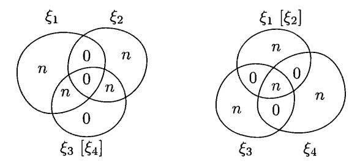

FIGURE 33. Complexity pictures for triples

strings that correspond to this picture, we come to the following problem. The right picture hints that  $\xi_3$  and  $\xi_4$  have n bits of common information that is also included in  $\xi_1$  and  $\xi_2$ . On the other hand, the left picture shows that  $\xi_1$  and  $\xi_2$  do not have common information (they have zero in the intersection part). Of course, it is not a formal contradiction, since we have not specified what we mean by "common information". But indeed we will show later that  $\xi_1, \xi_2, \xi_3$ , and  $\xi_4$  with these complexities do not exist.

If some extremal rays to not intersect  $\mathcal{E}$ , it may happen that some other inequalities (in addition to the basic ones) are true for complexities. How can one find them? Maybe we know all the extreme rays of our cone, and it remains to find the faces of this cone to get the new inequalities? One can indeed find the faces of the cone generated by all non-special rays. In addition to basic inequalities we get one more (up to renaming of the variables):

$$I(\xi_3:\xi_4) \leq I(\xi_3:\xi_4|\xi_1) + I(\xi_3:\xi_4|\xi_2) + I(\xi_1:\xi_2).$$

We have rewritten this inequality in terms of conditional entropies to make it more understandable. In terms of unconditional complexities we get the inequality

$$12 + 3 + 4 + 134 + 234 \le 13 + 23 + 14 + 24 + 34$$

(we write only the indices to make it short; for example, 134 stands for  $H(\xi_1, \xi_3, \xi_4)$ ), which looks even more mysterious).

It turns out that this inequality is well known in matroid theory; it is called *Ingleton's inequality* for the dimensions of subspaces of vector spaces:

Theorem 215. Let  $H_1$ ,  $H_2$ ,  $H_3$ ,  $H_4$  be finite-dimensional subspaces of some vector space. Then

$$\dim(H_1 + H_2) + \dim H_3 + \dim H_4 + \dim(H_1 + H_3 + H_4) + \dim(H_2 + H_3 + H_4)$$

$$\leq \dim(H_1 + H_3) + \dim(H_2 + H_3) + \dim(H_1 + H_4) + \dim(H_2 + H_4) + \dim(H_3 + H_4).$$

Before proving this theorem, let us elaborate upon the connection between entropies and dimensions. Let  $\mathbb{F}$  be a finite field, and let X be a finite-dimensional space over  $\mathbb{F}$ . For each subspace  $Y\subset X$ , we consider a random variable. The probability space is the space of all linear functionals  $X\to\mathbb{F}$ ; the random variable  $\xi_Y$  (corresponding to the subspace Y) maps every functional in the probability space to its restriction on Y. (Less formally, for each subspace Y we consider a random variable that is a restriction of a random functional on Y.) The values of  $\xi_Y$  are elements of the space  $Y^*$  (dual to Y), and they all have the same probability, so the entropy of  $\xi_Y$  equals  $\dim Y \cdot \log |\mathbb{F}|$ .

Note that all the random variables  $\xi_Y$  are defined on the same probability space, so we may consider the joint distribution of a pair  $\langle \xi_Y, \xi_Z \rangle$  for two subspaces Y and Z. What is the entropy of this pair? The restrictions of a functional on Y and Z determine its restriction on  $Y + Z = \{y + z | y \in Y, z \in Z\}$  and vice versa. So the entropy of the pair equals  $\dim(Y + Z) \cdot \log |\mathbb{F}|$ .

This observation immediately gives the following corollary:

THEOREM 216. Every inequality that is true for entropies of random variables and their tuples is also true for the dimensions of finite-dimensional subspaces of a vector space over a finite field if the entropy of the tuple is replaced by the dimension of the sum of corresponding subspaces.

**294** Show that a similar statement is also true for finite-dimensional vector spaces over  $\mathbb{R}$  and over  $\mathbb{C}$ .

(*Hint*: Since the  $\mathbb{R}$ -dimension of a space over  $\mathbb{C}$  is twice as big as its  $\mathbb{R}$ -dimension, it is enough to consider  $\mathbb{R}$ . We assume that a scalar product is defined and consider the random variables that are projections of a random point in the unit ball on the subspaces; the projections are rounded up to  $\varepsilon$ -precision for some small  $\varepsilon$ . The resulting variables do not have entropies exactly proportional to the dimensions, since the projection of the random point of the ball is not uniformly distributed and the projections on X and Y determine the projection onto X + Y only up to some precision, so we have finitely many possibilities, etc. Still the main terms are proportional to dimensions as  $\varepsilon \to 0$ .)

If we want to generalize this result to arbitrary infinite fields, a more complicated argument is needed. First of all, the statement about the existence of a tuple of subspaces with prescribed dimensions (and the dimensions of their sums) can be translated into the language of matrices—it says that there exists a matrix of a certain size where some minors are zeros while some other minors are not. So if some tuple of dimensions is possible for a field  $\mathbb F$ , it is also possible for all its extensions. Thus we may consider only algebraically closed fields. The algebraically closed fields of some characteristic are elementarily equivalent to each other, so we can choose an appropriate field:  $\mathbb C$  for characteristic zero was already discussed, and we can choose the algebraic closure of  $\mathbb Z/p\mathbb Z$  for prime characteristic p. If for this field a tuple of dimensions can be implemented, it can be implemented by matrices with algebraic elements, so there exist a finite extension that contains all needed elements, and we again reduce the statement to the case of finite fields (already considered).

**295** Provide the details for this argument.

Note that the conversion of subspaces into random variables is a rather general way of constructing tuples of variables with required entropies (and therefore points in  $\mathcal{E}$ )—all the points in  $\mathcal{E}$  that we have seen are constructed in this way. Only in the next section, speaking about conditionally independent variables, will we see examples of an essentially different type.

PROOF. Now we finally prove Ingleton's inequality for dimensions. It cannot be derived directly from Theorem 216, since it is not true for entropies of arbitrary random variables. So we need to prepare ourselves by establishing more connections between entropies and dimensions.

Recall that in the inequalities for entropies the conditional entropy  $H(\alpha|\beta)$  appeared as a shortcut for  $H(\alpha,\beta)-H(\beta)$ . This expression translates into dimensions as  $\dim(A+B)-\dim B$ . In other words, it is the dimension of the image of the subspace A under linear mapping with kernel B, and this dimension equals  $\dim A - \dim(A \cap B)$ . Similarly,  $I(\alpha:\beta)$  means  $H(\alpha) + H(\beta) - H(\alpha,\beta)$ , and it corresponds to  $\dim A + \dim B - \dim(A+B)$  and is equal to  $\dim(A \cap B)$ . Finally,  $I(\alpha:\beta|\gamma)$  is equal to  $H(\alpha|\gamma) + H(\beta|\gamma) - H(\alpha,\beta|\gamma)$ , and it corresponds to  $\dim A/C + \dim B/C - \dim(A+B)/C$ , where X/C is the image of X under the linear mapping that has kernel C. Note that the latter expression cannot be rewritten as  $\dim(A \cap B)/C$ —the image of  $A \cap B$  under the mapping with kernel C can be smaller than the intersection of images of A and B under the same mapping. (This happens, for example, if A, B, C are three different one-dimensional subspaces of a two-dimensional space.)

Ingleton's inequality for the dimension of subspaces can now be rewritten as

$$\dim(A \cap B) \leq I(A:B|C) + I(A:B|D) + \dim(C \cap D),$$

where I(A:B|C) stands for the dimension of the intersection of the images of A and B under the mapping with kernel C. Denote  $A \cap B$  by X; it is enough to show that

$$\dim X \leq \dim X/C + \dim X/D + \dim(C \cap D),$$

since dim  $X/C \leq I(A:B|C)$  (the image of the intersection is contained in the intersection of the images, and can be even smaller). The latter inequality corresponds to an easy inequality for entropies

$$H(\xi) \leqslant H(\xi | \gamma) + H(\xi | \delta) + I(\gamma : \delta),$$

and it remains to use Theorem 216.

**296** Prove the inequality  $H(\xi) \leq H(\xi|\gamma) + H(\xi|\delta) + I(\gamma:\delta)$  that we used. (*Hint*: Using the picture (or a simple computation), we note that

$$H(\xi) + H(\xi \mid \gamma, \delta) + I(\gamma : \delta \mid \xi) = H(\xi \mid \gamma) + H(\xi \mid \delta) + I(\gamma : \delta),$$

so this inequality is the sum of basic inequalities.)

**297** A careful reader would note that our proof of Ingleton's inequality works only for vector spaces over some finite field, unless we use some rather obscure tricks for the case of an infinite field (see the discussion above). How can we avoid these tricks?

(*Hint*: The choice of the field was important for converting the inequality for entropies into an inequality for dimensions. But this inequality for entropies was a combination of basic inequalities, and basic inequalities for dimensions are true for arbitrary field.)

**298** We know that the inequalities for entropies can be translated into inequalities for the sizes of subgroups. Show that Ingleton's inequality under this translation becomes true for subgroups of an *abelian* group.

(*Hint*: Follow the proof of Ingleton's inequality using the sum of subgroups instead of the intersection of subspaces (in the abelian case the sum of subgroups is a subgroup itself).)

As a byproduct of our arguments we obtain the following interesting observation:

**299** Every true linear inequality for dimensions that involves only four subspaces is a consequence of the basic inequalities and Ingleton's inequality.

(*Hint*: As we have mentioned, all the extreme rays for the cone defined by basic inequalities, except for the special cases mentioned, can be implemented by subspaces, not only by random variables. Consider the convex cone generated by these (non-special) rays. One can check by a (long) computation that the faces of this cone are given by basic inequalities and Ingleton's inequality (for different orderings of variables).)

**300** Formulate and prove a similar statement for four finite subgroups of an abelian group.

#### 10.12. Conditionally independent random variables

We have mentioned several times that Ingleton's inequality may be false for random variables. Moreover, in this section we show an example in which the right-hand side of this equality is zero while its left-hand side is positive. A useful tool here is the notion of *conditional independence*; see [153, 112] for more advanced applications of this tool.

Let  $\alpha, \beta, \gamma$  be three variables defined on the same probability space. We say that  $\alpha$  and  $\beta$  are independent given  $\gamma$  if  $I(\alpha:\beta|\gamma)=0$ . It is easy to check that this condition is equivalent to the following statement: For every value  $\gamma_0$  of  $\gamma$  that has non-zero probability, the conditional distributions of  $\alpha$  and  $\beta$  under the condition  $\gamma=\gamma_0$  are independent.

**301** Prove this statement.

(*Hint*:  $I(\alpha:\beta|\gamma)$  is an average (taken over all  $\gamma_0$  with corresponding probabilities) of the mutual information between corresponding conditional distributions.)

Abusing slightly the terminology, we say that two random variables  $\alpha$  and  $\beta$  defined on the same probability space are *conditionally independent* if one can find two other random variables  $\gamma$  and  $\delta$  defined on the same probability space or on its more fine-grained version (where elementary events are split into smaller ones) such that

- $\gamma$  and  $\delta$  are independent;
- $\alpha$  and  $\beta$  are independent given  $\gamma$ ;
- $\alpha$  and  $\beta$  are independent given  $\delta$ .

We are allowed to split the elementary events in the probability space, so the conditional independence property is now a property of the joint distribution of  $\alpha$  and  $\beta$ , and it does not depend on the space where  $\alpha$  and  $\beta$  are defined. (As usual, we consider random variables with finitely many values.)

The three conditions in this definition mean that three terms in the right-hand side of Ingleton's inequality are zeros. It remains to construct an example where the left-hand side is positive nevertheless:

THEOREM 217. There exist conditionally independent random variables that are not independent.

PROOF. We need to provide an example of a quadruple of random variables  $\alpha, \beta, \gamma, \delta$  that satisfies the requirements stated in the definition of conditional independence, but where  $\alpha$  and  $\beta$  are dependent. The following example was suggested by Romashchenko. Each of the four variables has values 0 and 1. The variables  $\gamma$ 

and  $\delta$  are independent and uniformly distributed, so each of four possible combinations has probability 1/4.

It remains to define  $\alpha$  and  $\beta$ . It is done as follows: If  $\gamma = \delta$ , then the common value of  $\gamma$  and  $\delta$  is at the same time the value of  $\alpha$  and  $\beta$  (so they are equal). If  $\gamma \neq \delta$ , the joint distribution of  $\alpha$  and  $\beta$  (for two cases  $\gamma = 1, \delta = 0$  and  $\gamma = 0, \delta = 1$ ) is defined as follows:

$$\begin{array}{c|c|c} & 0 & 1 \\ \hline 0 & 1/8 & 3/8 \\ \hline 1 & 3/8 & 1/8 \\ \end{array}$$

For a fixed value (say)  $\gamma = 0$  the conditional distribution of  $\alpha$  and  $\beta$  is the average of this matrix and the matrix

|   | 0 | 1 |
|---|---|---|
| 0 | 1 | 0 |
| 1 | 0 | 0 |

The average is

|   | 0    | 1    |
|---|------|------|
| 0 | 9/16 | 3/16 |
| 1 | 3/16 | 1/16 |

and we get the joint distribution of two independent variables; each is equal to zero with probability 3/4. On the other hand, the joint distribution of  $\alpha$  and  $\beta$  is the average of all the four matrices (for four possible conditions) and is equal to

|   | 0    | 1    |
|---|------|------|
| 0 | 5/16 | 3/16 |
| 1 | 3/16 | 5/16 |

so  $\alpha$  and  $\beta$  are dependent.

Let us summarize what we know about  $\mathcal{E}$  for the case n=4 at this moment. We started with a polyhedral cone defined by basic inequalities. It is an upper bound for  $\mathcal{E}$ . We stated (without providing details of the corresponding computation) that the extreme rays of this cone are of two types: non-special ones and special ones. For non-special ones it is easy to show that they belong to  $\mathbf{E}$ , and we get a lower bound for  $\mathcal{E}$ : the cone generated by these non-special rays. One can check (again a computation is needed) that this cone can be equivalently defined as the set of points that satisfy the basic inequalities plus Ingleton's inequalities. The last theorem provides an example of a point in  $\mathcal{E}$  that does not satisfy Ingleton's inequality, so this lower bound is not exact (for n=4).

In the next section we will see that the upper bound is not exact either (for n = 4).

#### 10.13. Non-Shannon inequalities

The inequalities that are not linear combinations of basic inequalities were founded in [222, 223]; see [113] for more details. They are called *non-Shannon inequalities*. Currently many such inequalities are known; however, their nature is not well understood yet. We consider only one example, the inequality from [113] it is probably the most intuitive among them.

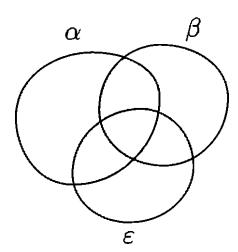

FIGURE 34. The additional term  $W(\alpha, \beta, \varepsilon)$ 

THEOREM 218. For every quintuple of random variables  $\alpha, \beta, \gamma, \delta, \varepsilon$  the following inequality holds:

$$I(\alpha:\beta) \leqslant I(\alpha:\beta|\gamma) + I(\alpha:\beta|\delta) + I(\gamma:\delta) + I(\alpha:\beta|\varepsilon) + I(\alpha:\varepsilon|\beta) + I(\beta:\varepsilon|\alpha).$$

This inequality looks frightening; nevertheless, some comments could be useful (at least, for memorizing this inequality). The right-hand side consists of two parts. The first three terms, without  $\varepsilon$ , are exactly the same as in Ingleton's inequality. If there were no other terms in the right-hand side, we would get exactly Ingleton's inequality, which is false, so we add other terms to make the inequality weaker. Namely, we add

$$W(\alpha, \beta, \varepsilon) = I(\alpha : \beta | \varepsilon) + I(\alpha : \varepsilon | \beta) + I(\beta : \varepsilon | \alpha).$$

This additional term (see Figure 34) contains  $\varepsilon$  while the rest of the inequality does not. One can say that Ingleton's inequality may be false, but the error is bounded by  $\inf_{\varepsilon} W(\alpha, \beta, \varepsilon)$ ; this (mysterious) quantity depends only on  $\alpha$  and  $\beta$ .

One more observation: we can use the same variable (let us call it  $\xi$ ) as  $\alpha$ ,  $\beta$ , and  $\varepsilon$  (here we really mean the same variable, not the identically distributed variable). Then  $W(\alpha, \beta, \varepsilon) = 0$ , and we get the inequality

(\*) 
$$H(\xi) \leq H(\xi|\gamma) + H(\xi|\delta) + I(\gamma:\delta)$$

that we have seen while proving Ingleton's inequality for the dimensions of vector spaces.

We can also derive the following conditional inequality from Theorem 218. If  $W(\alpha, \beta, \varepsilon) = 0$  for some  $\varepsilon$ , then

$$I(\alpha \!:\! \beta) \leqslant I(\alpha \!:\! \beta \!\mid\! \gamma) + I(\alpha \!:\! \beta \!\mid\! \delta) + I(\gamma \!:\! \delta)$$

for all  $\gamma$  and  $\delta$ . Using this conditional inequality, we see that the special ray from Section 10.11 does not belong to  $\mathcal{E}$  (let  $\alpha = \xi_3$ ,  $\beta = \xi_4$ ,  $\gamma = \varepsilon = \xi_1$ ,  $\delta = \xi_2$ ). However, this ray satisfies all basic inequalities, so the inequality of Theorem 218 cannot be derived from basic inequalities.

This conditional inequality can be proven directly by applying the inequality (\*) to the random variable  $\xi$  provided by the next theorem (applied to  $\alpha$ ,  $\beta$ , and  $\varepsilon$ ).

Theorem 219. If  $W(\alpha, \beta, \gamma) = 0$ , the random variables  $\alpha, \beta, \gamma$  have "fully extractable common information" in the following sense. There exists a random variable  $\xi$  such that

$$H(\xi \mid \alpha) = H(\xi \mid \beta) = H(\xi \mid \gamma) = 0,$$
  
$$I(\alpha:\beta \mid \xi) = I(\beta:\gamma \mid \xi) = I(\alpha:\gamma \mid \xi) = 0.$$

PROOF. Consider a three-dimensional table for the joint probability distribution of  $\alpha, \beta, \gamma$ . Our assumption says that every two-dimensional section of this table (some coordinate is fixed) has rank 1 (if it has rank 0, then the corresponding value appears with probability zero and can be eliminated).

First let us assume that all the elements in the three-dimensional table are positive; it this case the three variables  $\alpha, \beta, \gamma$  are independent. Indeed, consider all one-dimensional sections that are parallel to the first coordinate, and fill a two-dimensional table (indexed by other coordinates) with these vectors. All the vectors are non-zero (and even have all non-zero coordinates), and the assumption guarantees that they are proportional in each row and each column of this two-dimensional table. So all the vectors are proportional, therefore all the orthogonal two-dimensional sections are proportional. By the assumption, these section have rank 1, and this finishes the proof for the case of an everywhere positive table.

Now consider the general case. In this case we will show that the table has a *block diagonal* structure, i.e., it may be split into blocks, where each block is a combinatorial parallelepiped (product of three sets of indices), projections of different blocks onto the coordinate axes are disjoint, and the table has zeros outside the blocks (and positive values inside all blocks).

We can apply the above-mentioned argument to each block to get independence inside each block. This finishes the proof, since we can use the block number as  $\xi$ ; the variable  $\xi$  is a function of each of the variables  $\alpha, \beta, \gamma$ , and when  $\xi$  is given (=the block is fixed), variables  $\alpha, \beta, \gamma$  become independent.

So it remains to prove the block diagonal property. Consider the set of positions that contain strictly positive elements. This set has the following property: If two opposite corners of a rectangle (parallel to the axes) contain positive elements, then the two other corners contain positive elements. (Otherwise, the determinant of the corresponding  $2 \times 2$  matrix is not zero, and the rank is greater than 1.) Now, using this property, let us find bigger and bigger blocks in the table. We start with an one-element block. At each step we look at whether there exists a positive element in a place that falls into the block along at least one coordinate. If yes, it is easy to see (using the property above) that the block can be extended into a bigger one with all non-zero elements. In this way we get a maximal block that is separated from other non-zero elements along each coordinate, and we then apply the same argument to the rest of the table.

**302** Provide the missing details for this argument.

**303** (a) Prove the following statement (it is sometimes called the *double Markov property lemma*): if  $I(\beta:\gamma|\alpha)=0$  and  $I(\alpha:\gamma|\beta)=0$ , there exists a random variable  $\xi$  such that  $H(\xi|\alpha)=0$ ,  $H(\xi|\beta)=0$ , and  $I(\langle\alpha,\beta\rangle:\gamma|\xi)=0$ .

(b) Derive Theorem 219 from this statement.

(Hint for (b): For Theorem 219 one can use the same variable  $\xi$  as in (a). One can prove that the variables  $\alpha$  and  $\gamma$  are independent when  $\xi$  is known using the independence of the pair  $\alpha\beta$  and  $\gamma$ . (A similar argument shows that  $\beta$  and  $\gamma$  are independent when  $\xi$  is known.) In addition, we know that  $\alpha$  and  $\beta$  are independent when  $\xi$  is known. One can derive from this that  $\alpha$  and  $\beta$  are independent when  $\xi$  is known and that  $\xi$  is a function of  $\gamma$ . How can we do this? For the first claim, draw a diagram with three variables  $\alpha\beta$ ,  $\gamma$ , and  $\xi$  and look at the regions that contain zeros. This diagram shows that the mutual information between  $\xi$  and  $\alpha\beta$ 

is not less than the mutual information between  $\gamma$  and  $\alpha\beta$ . On the other hand, the condition  $W(\alpha, \beta, \gamma) = 0$  implies that the mutual information between  $\alpha\beta$  and  $\gamma$  equals  $I(\alpha:\beta:\gamma) = I(\alpha:\beta)$ . Also, the conditions  $H(\xi|\alpha) = H(\xi|\beta) = 0$  imply that the mutual information between  $\alpha\beta$  and  $\xi$  equals  $I(\alpha:\beta:\xi)$  (see again the diagram). Therefore,  $I(\alpha:\beta) \geqslant I(\alpha:\beta:\xi) \geqslant I(\alpha:\beta:\gamma) = I(\alpha:\beta)$ , and all inequalities here become equalities. The equality between the two first terms means that  $\alpha$  and  $\beta$  are independent when  $\xi$  is given. Finally, the entropy  $H(\xi|\gamma)$  is bounded by  $H(\xi|\alpha,\gamma) + H(\xi|\beta,\gamma) + I(\alpha:\beta|\gamma)$  and all three terms in the last sum are zeros.)

In [154] a Kolmogorov complexity version of Theorem 219 is proven. Assume that a, b, c are strings, and three quantities I(a:b|c), I(a:c|b), and I(b:c|a) are small, e.g., are bounded by  $O(\log(|a|+|b|+|c|))$ . Then there exists a string d such that the conditional complexities C(d|a), C(d|b), C(d|c), as well as the mutual information I(a:b|d), I(b:c|d), and I(a:c|d) are also small (bounded by  $O(\log(|a|+|b|+|c|))$ ).

**Artificial independence.** We considered some special cases of Theorem 218. Now we will prove Theorem 208 in the general case using some trick (by making some variables independent).

PROOF. Let us split the variables in the inequality into three groups:

(1) 
$$\alpha, \beta$$
; (2)  $\gamma, \delta$ ; (3)  $\varepsilon$ .

Note that in our inequality (2)-variables never appear in the same tuple with (3)-variables, though variables of both groups are used together with (1)-variables. So without loss of generality we may assume that the pair  $\langle \gamma, \delta \rangle$  and  $\varepsilon$  are independent given  $\langle \alpha, \beta \rangle$ . Indeed, consider a different joint distribution for all the variables, obtained in the following way: First we generate values of  $\langle \alpha, \beta \rangle$  according to the existing distribution, and then we independently generate values of  $\langle \gamma, \delta \rangle$  and  $\varepsilon$  according to their (existing) conditional distributions given  $\langle \alpha, \beta \rangle$ . Indeed, for (1)+(2)-variables the distribution remains the same, so the entropies do not change; the same is true for (1) + (3)-variables.

Knowing this, we see that it is enough to prove a weaker inequality (with additional terms in the right-hand side):

$$\begin{split} I(\alpha:\beta) \leqslant I(\alpha:\beta \,|\, \gamma) + I(\alpha:\beta \,|\, \delta) + I(\gamma:\delta) + W(\alpha,\beta,\varepsilon) \\ + I(\langle \gamma,\delta \rangle : \varepsilon \,|\, \langle \alpha,\beta \rangle) \\ + I(\gamma:\varepsilon \,|\, \langle \alpha,\beta \rangle) \\ + I(\delta:\varepsilon \,|\, \langle \alpha,\beta \rangle). \end{split}$$

Indeed, if the pair  $\langle \gamma, \delta \rangle$  is independent with  $\varepsilon$  given  $\langle \alpha, \beta \rangle$ , then the same in true for its components  $\gamma$  and  $\delta$ , so the last three terms vanish after making the groups artificially independent (and the other terms remain the same).

The latter inequality is in fact the sum of eight basic inequalities:

$$\begin{split} I(\langle \alpha, \beta \rangle : & \varepsilon \, | \, \gamma, \delta) \geqslant 0, \\ I(\alpha : \beta \, | \, \varepsilon, \gamma) \geqslant 0, \\ I(\alpha : \beta \, | \, \varepsilon, \delta) \geqslant 0, \\ I(\gamma : \delta \, | \, \varepsilon) \geqslant 0, \\ I(\gamma : \varepsilon \, | \, \alpha) \geqslant 0, \\ I(\gamma : \varepsilon \, | \, \alpha) \geqslant 0, \\ I(\delta : \varepsilon \, | \, \alpha) \geqslant 0, \\ I(\delta : \varepsilon \, | \, \beta) \geqslant 0. \end{split}$$

There is no problem to check this: we just need to express all the mutual information in terms of entropies of tuples, and we get the same inequalities after canceling the opposite terms. Still it remains unclear why this happens and how one can invent such a trick.

One may say that our non-Shannon inequality, while not being a positive linear combination of basic inequalities, still follows from them in a more general sense. In fact, we have discovered a general deduction rule for entropy inequalities: if we manage to split the variables in some inequality into three groups in such a way that the second and third group never meet, then this inequality can be derived from a (generally) weaker inequality where the mutual information between the variables of the second and third group (conditional to all the variables of the first group) is added.

This rule can be used to prove many other non-Shannon inequalities for entropies (it is known that one can get in this way infinitely many inequalities for four variables, and each of them is not a positive linear combination of others).

**Deleting the unique information.** There is one more tool that can be used to derive new inequalities for entropies. It is based on the following Ahlswede–Körner theorem [2] that we state here without proof. (See [113, Lemma 5] for the proof.)

THEOREM 220. Let  $\alpha, \beta, \varepsilon$  be random variables with some joint distribution. Consider n independent copies of this triple, and denote them by  $\alpha_i, \beta_i, \varepsilon_i$  (i = 1, ..., n). Let

$$A = (\alpha_1, \ldots, \alpha_n), B = (\beta_1, \ldots, \beta_n), E = (\varepsilon_1, \ldots, \varepsilon_n).$$

Then there exist a random variable E', defined on the same space as A, B, E such that all seven entropies on the diagram for the triple A, B, E' are the same (up to o(n)) as for the triple A, B, E, except for one, H(E'|A, B), that is now o(n) instead of H(E|A, B).

Informally speaking, E' is like E but does not contain any information that is missing in A, B. A similar statement is true for an arbitrary number of random variables  $\alpha_1, \ldots, \alpha_k$  (with some joint distribution). Let us take n independent samples from this distribution and denote the resulting variables by  $A_1, \ldots, A_k$ . One can "delete" the information that is unique for  $A_k$  (is missing in  $A_1, \ldots, A_{k-1}$ ) and replace  $A_k$  by some  $A'_k$  in such a way that all the regions on the diagram

keep their size (with o(n)-precision) except for the one: the conditional entropy  $H(A'_k | A_1, \ldots, A_{k-1})$  is now o(n).

**304** Prove this statement for the case k = 2.

Note that it is important here that we deal with n independent copies and allow o(n) errors. It is not possible to get such a result without that. Indeed, let  $\alpha$  and  $\varepsilon$  be dependent uniformly distributed binary variables. Then one cannot construct a variable  $\varepsilon'$  that has  $H(\varepsilon'|\alpha)=0$  (i.e., is a function of  $\alpha$ ) and has the required entropy.

Now let us explain how the Ahlswede–Körner theorem can be used to prove Theorem 218. Let  $\alpha, \beta, \gamma, \delta, \varepsilon$  be some random variables (on the same probability space). First of all, let us prove the inequality of Theorem 218 with the additional term  $3H(\varepsilon | \alpha, \beta)$  in the right-hand side. It can be obtained by adding the inequalities

$$H(\varepsilon|\gamma) \leq H(\varepsilon|\alpha) + H(\varepsilon|\beta) + I(\alpha:\beta|\gamma),$$
  

$$H(\varepsilon|\delta) \leq H(\varepsilon|\alpha) + H(\varepsilon|\beta) + I(\alpha:\beta|\delta),$$
  

$$H(\varepsilon) \leq H(\varepsilon|\gamma) + H(\varepsilon|\delta) + I(\gamma:\delta),$$

and the equality

$$I(\alpha:\beta) + 2H(\varepsilon|\alpha) + 2H(\varepsilon|\beta) = H(\varepsilon) + W(\alpha,\beta,\varepsilon) + 3H(\varepsilon|\alpha,\beta).$$

We have already seen the third inequality (Problem 296, p. 341). The first two inequalities follow from its conditional version. All three inequalities are combinations of basic inequalities. The equality is easy to check using the diagram for  $\alpha, \beta, \varepsilon$ .

Now the Ahlswede-Körner theorem allows us to get rid of the undesirable term  $3H(\varepsilon|\alpha,\beta)$ . Consider n independent tuples  $\alpha_i,\beta_i,\gamma_i,\delta_i,\varepsilon_i$  (for  $i=1,\ldots,n$ ) of variables with the same distribution, and random variables  $A = (\alpha_1, \dots, \alpha_n)$ ,  $B = (\beta_1, \ldots, \beta_n), C = (\gamma_1, \ldots, \gamma_n), D = (\delta_1, \ldots, \delta_n), E = (\varepsilon_1, \ldots, \varepsilon_n).$  The entropies of variables A, B, C, D, E and their combinations are n times bigger than the entropies of the original variables and their combinations. Now we can apply the Ahlswede-Körner theorem to random variables  $\alpha, \beta, \varepsilon$  and get a random variable E' defined on the same space as the variables A, B, C, D, E. For A, B, C, D, E'we write the inequality with the additional term 3H(E'|A,B) in the right-hand side (that we have just proven). This additional term is o(n) as stated by the Ahlswede-Körner theorem. Then we replace E' by E in all other terms. We claim that all the terms then change only by o(n). Indeed, for the terms that contain C or D, nothing changes as these terms do not contain E' (here we use the same property of our inequality as in the other proof of Theorem 218). And terms that do not contain C or D can be represented as sums of regions on the diagram for A, B, E' different from H(E'|A, B). Therefore the inequality remains true with o(n)-precision after the replacement. It remains to divide by n and note that we get the desired inequality as  $n \to \infty$ .

It is instructive to compare these two tricks (making variables artificially independent and applying the Ahlswede-Körner theorem). In both cases we have modified the joint distribution of the variables A, B, C, D, E. (We can apply artificial independence to the n-times-sampled variables, it does not make any difference.) In the first case we kept that joint distributions for A, B, E and for A, B, C, D

unchanged. In the second case we kept unchanged only the joint distribution for A, B, C, D. Then we killed the term I(CD:E|AB) in the first case, and the term H(E|AB) in the second case, while keeping the other terms (almost) unchanged.

#### CHAPTER 11

# Common information

# 11.1. Incompressible representations of strings

Is "the information in a string" material? Though this question sounds quite informal, the following example gives an idea of what we are asking. Assume that we are given a string x whose Kolmogorov complexity is n and thus x "has n bits of information". Can we divide that information into two equal parts, as if those bits were pebbles? This question may be formulated quite formally: Are there strings  $x_1$  and  $x_2$ , each of complexity n/2, such that  $C(x_1|x) \approx 0$  and  $C(x_2|x) \approx 0$  (i.e.,  $x_1, x_2$  do not have any new information compared with x) and  $C(x_1, x_2) \approx 0$  (i.e., no information is lost)? It is natural to understand the approximate equalities as equalities holding with accuracy  $O(\log n)$ . We will soon see that such  $x_1$  and  $x_2$  indeed exist.

It is convenient to use the following notion in this context. We say that strings x and y are equivalent with accuracy c, or just c-equivalent, if  $C(x|y) \leq c$  and  $C(y|x) \leq c$ . Of course this relation is not an equivalence relation. If x is equivalent to y, and y is equivalent to z, both with accuracy c, then we can prove only that x is equivalent to z with accuracy  $2c + O(\log c)$ . (An alternative approach would be to consider sequences  $x_0, x_1, \ldots, x_i, \ldots$  of strings where the length of  $x_i$  is bounded by a polynomial in i, instead of individual strings; then we may call sequences  $x_0, x_1, \ldots$  and  $y_0, y_1, \ldots$ , equivalent if  $C(x_i|y_i) = O(\log i)$  and  $C(y_i|x_i) = O(\log i)$ . In this way we get a true equivalence relation on sequences of strings.)

The complexities of c-equivalent strings are almost the same—they differ by at most O(c) and even  $c + O(\log c)$ . More generally, if we replace a string by another string that is c-equivalent to the original one, then all the complexities involving that string change by at most O(c). For example I(x:y|z) changes by at most O(c) after replacing each of the strings x, y, z (and even all of them at the same time) by a c-equivalent string.

Using this notion, we can now formulate our first observation:

THEOREM 221. For every string x there is a string x' of length C(x) that is  $O(\log C(x))$ -equivalent to x. The string x' is incompressible, that is, its complexity differs from its length by at most  $O(\log C(x))$ .

PROOF. Let x' be (some) shortest description of x. Then its length is C(x) and its complexity differs from C(x) by at most a constant. As we can algorithmically transform x' into x, we have C(x|x') = O(1). On the other hand, the following inequalities

$$C(x) \leqslant C(x, x') \leqslant C(x') \leqslant l(x') = C(x)$$

hold up to a constant additive term. As the leftmost and the rightmost terms in these inequalities coincide, they are equalities. In particular,  $C(x, x') \approx C(x)$ . The

theorem on the complexity of the pair implies that  $C(x'|x) \approx 0$  with accuracy  $O(\log C(x))$ .

As a corollary we obtain a positive answer to the above question: Replace the given string by its shortest description x', and let  $x_1$  and  $x_2$  be two halves of x'.

**305** Verify that all the requirements are fulfilled.

306 Assume that C(y|x) = n. Show that there is an (intermediate) z such that  $C(z|x) \approx n/2$  and  $C(y|z) \approx n/2$  with accuracy  $O(\log C(x,y))$ .

In these examples information bits behave as something material. A similar thing happens when we deal with information in a string and some part of this information. Let us explain what we mean by this.

Assume that some strings x and y are given such that  $C(y|x) \approx 0$  ("all the information in y is a part of the information from x"). Then there is an incompressible string x' that is equivalent to x, and some prefix y' of x' that is equivalent to y. (This implies that y' is an incompressible string of length about C(y).) More specifically, the following holds:

Theorem 222. For every two strings x and y there exist strings x' and y' that are equivalent to x and y (respectively) with accuracy  $O(C(y|x) + \log C(x,y))$ , such that y' is a prefix of x' and both x' and y' are incompressible (with the same accuracy).

PROOF. Let y' be a shortest description of y. Then y' is an incompressible string of length C(y) and y' is equivalent to y.

Let z' be a shortest description of x conditional to y. Then z' is an incompressible string of length C(x|y). Knowing y' and z', we can find y and then find x. Therefore the complexity of the pair y', z' is at least C(x, y). On the other hand, the total length of strings y' and z' equals  $C(y) + C(x|y) \approx C(x,y)$ . Hence the string x' = y'z' is incompressible.

As we have seen,  $C(x|x') \approx 0$ . It remains to show that  $C(x'|x) \approx 0$ . Since  $C(x|x') \approx 0$ , we have  $C(x,x') \approx C(x') \approx C(x,y)$ . On the other hand, we have  $C(x,y) \approx C(x)$  with accuracy O(C(y|x)). Hence  $C(x,x') \approx C(x)$  and the Kolmogorov–Levin theorem implies that  $C(x'|x) \approx 0$ .

By this theorem we can think of every two strings x, y with  $C(y|x) \approx 0$  as a string consisting of C(x) almost material bits and its prefix of length C(y).

#### 11.2. Representing mutual information as a string

Is there an analog of Theorem 222 for arbitrary two strings x, y? Recall that any two strings x, y can be characterized by their complexities C(x), C(y) and the complexity C(x, y) of the pair. These values determine both conditional complexities (with logarithmic accuracy) and the mutual information

$$\begin{split} &C(x | y) = C(x, y) - C(y), \\ &C(y | x) = C(x, y) - C(x), \\ &I(x : y) = C(x) + C(y) - C(x, y) \end{split}$$

(cf. Figure 3 on p. 46). We have seen that sometimes Figure 3 can be understood almost literally—this happens when x and y are overlapping substrings of a random string. One can conjecture that this holds in the general case.

Conjecture. For every two strings x and y there is an incompressible string u of length C(x,y) that is equivalent (with logarithmic accuracy) to the pair  $\langle x,y\rangle$ , such that the C(x)-bit prefix of u is equivalent to x and the C(y)-bit suffix of u is equivalent to x (with the same accuracy).

However this conjecture is wrong. To see this, notice that the conjecture implies that for every two strings x and y there exists a string z (the common part of the said prefix and suffix) such that

$$C(z|x) = 0,$$

$$C(z|y) = 0,$$

$$C(z) = I(x:y)$$

(up to logarithmic error terms). Informally, these equalities mean that the string z represents the common information in x and y. We will show that for some pair x, y there is no such z.

307 Show that if for some strings x and y such a z exists, then the conjecture is true for these x and y.

There are several counterexamples to the conjecture. The simplest counterexample (from Muchnik's paper [134]) is the following one. We will construct two strings x and y of complexity 2n that have n bits of mutual information (with logarithmic precision). Thus the complexity of the pair  $\langle x, y \rangle$  will be close to 3n. Additionally, there will be no string z of complexity n such that C(z|x) and C(z|y) are negligible (with accuracy  $O(\log n)$ ).

How can we do this? Let us first rewrite the latter two conditions for z as C(x|z) = n and C(y|z) = n. Thus we are looking for strings x and y both of complexity 2n that have n bits of mutual information and for which there is no string z such that  $C(z) \approx n$ ,  $C(x|z) \approx n$ , and  $C(y|z) \approx n$ . The following theorem guarantees the existence of strings x and y with these properties and even with a stronger property: There is no z such that C(z), C(x|z), and C(y|z) are less than 1.1n.

THEOREM 223. For every n there are strings x and y such that

$$C(x) = 2n + O(\log n), C(y) = 2n + O(\log n), I(x : y) = n + O(\log n),$$

and such that there is no z of complexity less than 1.1n with C(x|z) < 1.1n and C(y|z) < 1.1n.

PROOF. Let us show that there exists a pair x, y of strings, each of length 2n + 2, such that

- $C(x) \geqslant 2n$ ,
- $C(y) \geqslant 2n$ ,
- $C(x,y) \geqslant 3n$ , and
- there is no z with C(z) < 1.1n, C(x|z) < 1.1n, C(y|z) < 1.1n.

Indeed, the first condition is violated by less than quarter of all pairs (the total number of x's is  $2^{2n+2}$ , and only  $2^{2n}$  of them have complexity less than 2n). Similarly, the second condition is violated by less than quarter of all pairs. The third condition is violated by less than  $2^{3n}$  pairs, which is a negligible quantity compared to the total number  $2^{4n+4}$  of all pairs. Finally, the fourth condition is violated by less than  $2^{1.1n} \times 2^{1.1n}$  pairs for every fixed z. As there are less than  $2^{1.1n}$  different

strings z, the total number of such pairs is less than 3.3n, which is again negligible compared to the total number of all pairs.

So there are many pairs satisfying all the conditions. Let x, y be the first pair. To specify this pair we need to know n and the following three lists:

- the list of all strings of complexity less than 2n,
- the list of all pairs of strings of complexity less than 3n, and
- the list of all pairs of strings  $\langle u, v \rangle$  with C(u) < 1.1n and C(v | u) < 1.1n.

Recall that the complexity of the list of all strings of complexity less than k is at most  $k + O(\log k)$  (the list can be specified by the number k and the size of the list, which is less than  $2^k$  and thus can be identified by k bits).

Therefore, the list of all strings of complexity less than 2n has complexity at most  $2n + O(\log n)$ . For the same reasons the complexity of the second list is less than  $3n + O(\log n)$ .

A similar argument can be applied to the list of all pairs of strings  $\langle u, v \rangle$  such that C(u) < 1.1n and C(v | u) < 1.1n. The complexity of this list is at most  $2.2n + O(\log n)$ . Indeed, we can find this list from n and the number of such pairs, which is less than  $2^{2.2n}$ .

What is the joint complexity of three lists, i.e., the complexity of the triple made of these three lists? Is is much less than the sum of their complexities and is bounded by our maximal bounds, i.e., 3n (with accuracy  $O(\log n)$ ). Indeed, given n, each list can be specified by its size. Moreover, we only need to know the sum of the sizes. Indeed, we can generate elements from all three lists in parallel until we obtain the specified total number of elements. Once we get that many elements, we know all the three lists. It remains to notice that the sum of any three binary numbers is at most two bits longer than the maximal number. Therefore the joint complexity of the three lists is at most  $3n + O(\log n)$ .

Thus, the complexity of the pair x, y is at most  $3n + O(\log n)$ . On the other hand, its complexity is at least 3n by construction. Again by construction, the complexity of each of x, y is at least 2n. As the length of both x, y is 2n + 2, the complexity of each of them is at most 2n + O(1). Finally, by construction there is no z with C(z) < 1.1n, C(x|z) < 1.1n, C(y|z) < 1.1n.

It is clear that the bound can be improved; let us make more precise estimates. Assume that we want to construct strings x and y of complexity 2n (both) with mutual information n, but there should be no string z such that

$$C(z) < \alpha$$
,  $C(x|z) < \beta$ , and  $C(y|z) < \gamma$ .

What are the conditions on  $\alpha$ ,  $\beta$ , and  $\gamma$  that make our construction possible? The list of all pairs u, v such that  $C(u) < \alpha$  and  $C(v|u) < \beta$  has complexity  $\alpha + \beta$ , so we need the condition  $\alpha + \beta < 3n$ . In the same way, the condition  $\alpha + \gamma < 3n$  appears. Finally, to prove the existence of a pair we need to know that less than  $2^{4n}$  pairs are prohibited, so we add the condition  $\alpha + \beta + \gamma < 4n$ . These conditions are sufficient to construct a pair with the required properties.

Moreover, we can prohibit simultaneously all the pairs for different triples  $\alpha, \beta, \gamma$  that satisfy these inequalities. There are  $O(n^3)$  triples, so if we require the inequalities to be true with an  $O(\log n)$ -margin, we still have pairs that are not prohibited; the complexity overhead needed to merge polynomially many enumerations is also  $O(\log n)$ . So we get the following statement:

THEOREM 224. For every n there exist strings x, y of complexity  $2n + O(\log n)$  such that  $C(x, y) = 3n + O(\log n)$ , and for every z at least one of the following three inequalities is true:

- (a)  $C(z) + C(x|z) \ge 3n O(\log n)$ ;
- (b)  $C(z) + C(y|z) \ge 3n O(\log n)$ ;
- (c)  $C(z) + C(x|z) + C(y|z) \ge 4n O(\log n)$ .

To be completely formal, we state the following: For some c and for all n there exist strings x and y whose complexities deviate from 2n by at most  $c \log n$ , the complexity of the pair deviates from 3n by at most  $c \log n$ , and for every string z one of the inequalities (a)-(c) is true with  $c \log n$  in the right-hand side in place of  $O(\log n)$ .

The pair constructed in this theorem is the worst-case pair from the viewpoint of common information. This vague statement can be made precise in the following way. For each pair x, y let us consider the set  $C(x, y) \subset \mathbb{N}^3$  of triples  $\langle \alpha, \beta, \gamma \rangle$  such that there exists a string z that makes three conditions

$$C(z) < \alpha$$
,  $C(x|z) < \beta$ , and  $C(y|z) < \gamma$ 

true. The set C(x,y) is upwards closed (obviously). Note that C(x,y) is not determined by complexities of x, y, and the pair x,y: We have seen two pairs that that both have C(x) = C(y) = 2n and C(x,y) = 3n but have different C(x,y). As we will see, these examples are extreme points: we get a maximal set C(x,y) if x and y are (respectively) 2n-bit prefix and 2n-bit suffix of some random 3n-bit string, and we get a minimal C(x,y) for the pair provided by Theorem 224.

Let us explain why this happens. Assume that x and y are strings of complexity 2n with mutual information n (as usual, we allow the deviation of order  $O(\log n)$  without saying this explicitly). Every triple  $\langle \alpha, \beta, \gamma \rangle \in C(x, y)$  should satisfy the obvious inequalities

$$\alpha + \beta \geqslant 2n, \quad \alpha + \gamma \geqslant 2n, \quad \alpha + \beta + \gamma \geqslant 3n$$

(since  $C(x) \leq C(z) + C(x|z)$  and so on). This means that C(x,y) is a subset of the set  $C_M$  of all triples  $\langle \alpha, \beta, \gamma \rangle$  satisfying these three inequalities. (Again we omit  $O(\log n)$  terms that are needed for the exact statement.)

How can we represent this set of triples in an intuitive way? For each  $\beta$  and  $\gamma$  there is some threshold  $\alpha_0(\beta,\gamma)$ —the triples with  $\alpha > \alpha_0$  belong to  $C_M$  and the triples with  $\alpha < \alpha_0$  do not belong to  $C_M$ . The graph of the function  $\langle \beta, \gamma \rangle \mapsto \alpha_0(\beta, \gamma)$  is the boundary of  $C_M$ . It has three faces (corresponding to the three inequalities), and can be represented on the plane by drawing for every  $\alpha$  the set of points where  $\alpha_0(\beta, \gamma) = \alpha$  (i.e., the level line of the function  $\alpha_0$ ). This line is a boundary of the horizontal (fixed  $\alpha$ ) section of  $C_M$ . See Figure 35.

Using this picture, it is easy to check that for our first example (overlapping factors of a random string) the set C(x,y) achieves its upper bound  $C_M$ . How should we choose z for given  $\alpha, \beta, \gamma$  in  $C_M$ ? When  $\alpha < n$ , we let z be a part of the overlap; adding z as the condition then decreases the complexities of both x and y by  $\alpha$ . If  $\alpha > n$ , we let z be the overlap plus some parts of x and y (in some proportion; the change in the proportion gives different points on a line with slope -1 on the picture.

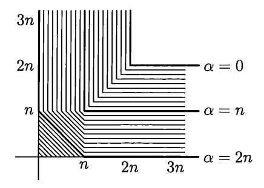

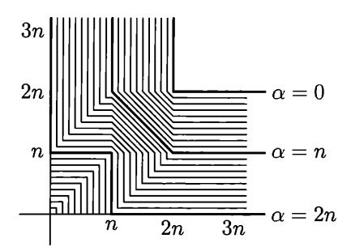

FIGURE 35. The set  $C_M$ 

FIGURE 36. The set  $C_m$ 

Theorem 224 provides an example of a pair (x, y) with smaller C(x, y). Indeed, it gives a pair where C(x, y) is contained in the union of the sets

$$\alpha + \beta \geqslant 3n$$
,  $\alpha + \gamma \geqslant 3n$ ,  $\alpha + \beta + \gamma \geqslant 4n$ 

that correspond to inequalities (a)–(c). Intersecting  $C_M$  with this union, we get a smaller set that is called  $C_m$  in the sequel; it is shown in Figure 36.

In fact,  $C_m$  coincides with C(x,y) for this pair, and  $C_m \subset C(x,y)$  for every pair x,y where x and y have complexity 2n and the pair has complexity 3n.

To check this, we need to find a suitable z for every point  $\langle \alpha, \beta, \gamma \rangle \in C_m$ . It is enough to do this for all minimal triples in  $C_m$  (since C(x,y) is upwards closed). The points on the lines with slope -1 (Figure 36) correspond to a string z that combines part of x with part of y in some proportion. For example, the point (1.5n, 1.5n) corresponds to z that combines n/2 bits from the shortest description of x and n/2 bits from the shortest description of y. The point (n,n) corresponds to a string z of length 2n that combines n bits from each of the two shortest descriptions. The point (n+h,h) (where  $0 \le h \le n$ ) corresponds to a string z of length 2n-h that is a prefix of the shortest description of y. Then C(y|z) is the number of the remaining bits, i.e., h. On the other hand, C(x|z) is bounded by C(x|y) (i.e., n) plus C(y|z) (i.e., h). Finally, the points (h,0) (where  $0 \le h \le n$ ) correspond to strings z of complexity at most 3n-h that contain all y and n-h bits of the shortest description of x given y. So we get the following statement:

Theorem 225. For every pair (x,y) of strings that have complexity 2n and mutual information n, the set C(x,y) is (with logarithmic precision) between the lower bound  $C_m$  and the upper bound  $C_M$ ; both bounds are achieved for some pairs.

As soon as the set C(x,y) is known for a pair (x,y), we can formally derive some properties of this pair. Here is one example:

Theorem 226. Assume that  $C(x,y) = C_m$  (as it happens for the pair constructed in Theorem 224). Then for every z the inequality

$$C(z) \leqslant 2C(z \mid x) + 2C(z \mid y)$$

holds.

Before proving this inequality, let us comment on its meaning. It says that only strings z of small complexity can be simple relative to x and y at the same time. Note that if one can extract common information from x and y, then this common

information z is simple relative to x and y, so this inequality is a quantitative statement that says that common information cannot be extracted.

PROOF. We may assume without loss of generality that C(z) = O(n) (if the complexity of z is big, then C(z|x) and C(z|y) are greater than C(z)/2).

Let us rewrite the inequality in terms of the quantities that appear in the definition of C(x, y): it may be rewritten as

$$C(z) \leq 2C(x, z) - 2C(x) + 2C(y, z) - 2C(y),$$

and then

$$C(z) \le 2C(z) + 2C(x|z) - 2C(x) + 2C(z) + 2C(y|z) - 2C(y),$$

i.e.,

$$2C(x) + 2C(y) \leq 3C(z) + 2C(x|z) + 2C(y|z).$$

The left-hand side equals 8n; to check that the right-hand side cannot be less, we consider each line on Figure 36 (and it is enough to consider points with a minimal sum of coordinates).

**308** Prove that for small values of C(z) one can get a better bound

$$C(z) \leqslant C(z \mid x) + C(z \mid y),$$

but in general the constant 2 cannot be improved.

# 11.3. The combinatorial meaning of common information

Theorem 224 gives us an example of a pair of strings that do not have (extractable) common information in the strongest possible sense. Still it does not explain why this happens, what properties of x and y make mutual information non-extractable. This is a rather informal question, and we do not know any statement that answers it completely. Still some observations can be made.

What does it mean that for given x and y there exists a string z such that  $C(z) < \alpha$ ,  $C(x|z) < \beta$ , and  $C(y|z) < \gamma$ ? Let us denote by  $U_m(z)$  the set of all strings whose conditional complexity given z is less than m. The size of this set is about  $2^m$ . Our condition means that the pair  $\langle x, y \rangle$  is covered by one of the sets  $U_{\beta}(z) \times U_{\gamma}(z)$ ; there are at most  $O(2^{\alpha})$  sets of this type (one for each z).

Therefore, the condition  $\langle \alpha, \beta, \gamma \rangle \in C(x, y)$  means that the pair  $\langle x, y \rangle$  is covered by a union of  $2^{\alpha}$  combinatorial rectangles of size  $2^{\beta} \times 2^{\gamma}$ . (A combinatorial rectangle is a product of two arbitrary sets.) On the other hand, if  $\langle x, y \rangle$  is covered by an enumerable family of  $2^{\alpha}$  combinatorial rectangles of size  $2^{\beta} \times 2^{\gamma}$ , then the triple  $\langle \alpha, \beta, \gamma \rangle$  (plus the complexity of the enumeration algorithm and logarithmic overhead) belongs to C(x, y): Let z be the ordinal number of the rectangle that covers  $\langle x, y \rangle$ . So one can say that the set C(x, y) is determined if we know which (simple enumerable) families of combinatorial rectangles cover the pair  $\langle x, y \rangle$ .

Now it is clear how one can construct an example of a pair without common information—find a set that is difficult to cover by combinatorial rectangles, and take a random element of this set. (This approach also was suggested by An. Muchnik).

It is convenient to identify the sets of pairs with binary relations, or bipartite graphs—a pair  $\langle x,y\rangle$  is then an edge that connects vertex x in the left part with vertex y in the right part. The combinatorial rectangle is then the set of all edges that connect some subset of the left part and some subset of the right part.

There is a simple property of a bipartite graph that guarantees that it is hard to cover this graph by combinatorial rectangles. The graph should not contain cycles of length 4 (there are no vertices a, b in one part and c, d in other part such that all four edges ac, ad, bc, bd are in the graph). The following combinatorial lemma shows that such a graph is difficult to cover:

LEMMA. Consider a bipartite graph with l vertices in the left part and L vertices in the right part; assume that  $l \leq L$ . If this graph does not have cycles of length 4, then the density of edges in it (the number of edges divided by lL) is bounded by  $O(\max(1/\sqrt{L}, 1/l))$ .

In other words, if we place stars in a rectangular table in such a way that no four stars form a rectangle with horizontal and vertical sides, then the density of stars is bounded either by O(1/smaller side) or by  $O(1/\sqrt{\text{larger side}})$ .

PROOF. For each of l left vertices, consider the set of its right neighbors. The condition about cycles says that every two sets of this type (for two different left vertices) have at most one common element. The inclusion-exclusion formula then allows us to give a lower bound for the size of the union of all these neighbor sets: the sum of sizes of all sets (i.e., the total number of edges in the graph) minus the number of all possible pairs, at most  $l^2$ . On the other hand, this union contains at most L elements (the size of the right part).

So we conclude that the total number of edges is bounded by  $L+l^2$ , and the density is bounded by 1/l+l/L. This gives the required bound if the first term dominates the second one, i.e., for  $l \leq \sqrt{L}$ . But for  $l \geq \sqrt{L}$ , we get the bound O(l/L) which is not enough (we want  $O(1/\sqrt{L})$ ); this is OK if  $l = O(\sqrt{L})$ , but l can be bigger.

To get the required bound, let us consider a part of the graph by choosing  $\sqrt{L}$  vertices in the left part (among l) with maximal number of neighbors. Deleting all other left vertices, we only increase the density, and for the reduced graph the density is bounded by  $1/\sqrt{L}$ . The lemma is proven.

Now we need to find a graph without 4-cycles. (Then the lemma guarantees that it is difficult to cover by rectangles, and a random edge in this graph gives us a pair without common information; see below.) Here is a simple geometric construction.

Consider some finite field F and a plane (a two-dimensional vector space) over F. The left vertices are points in this plane; the right vertices are lines. Edges connect incident points and lines. We do not have 4-cycles thanks to Euclid's axiom: for two given points there is at most one line that goes through them.

How many vertices and edges do we get? If the field contains about  $2^n$  elements, then we have about  $2^{2n}$  vertices on each side and about  $2^{3n}$  edges (each line contains about  $2^n$  points, and for each point there is about  $2^n$  lines going through it). So for most edges in the graph, the complexities C(x) and C(y) are close to 2n, the complexity of the pair is close to 2n, and mutual information I(x:y) is close to n.

309 Show that  $I(x:y) = n + O(\log n)$  for all edges xy in this graph whose complexity exceeds  $3n - O(\log n)$ .

To finish the alternative proof of Theorem 223, let us see what fraction of the edges (in this graph) can be covered by  $2^{1.1n}$  rectangles of size  $2^{1.1n} \times 2^{1.1n}$ . (We again use 1.1 as  $\alpha$ ,  $\beta$ , and  $\gamma$ .) We can apply the lemma above to each rectangle

and conclude that the density of edges is bounded by  $2^{-0.55n}$ , so the total number of edges covered by all the rectangles, is at most

$$2^{1.1n} \times 2^{1.1n} \times 2^{1.1n} \times 2^{1.1n} \times 2^{-0.55n} = 2^{2.75n} \ll 2^{3n}$$

So most of the edges remain uncovered (and most of the edges have required complexities and mutual information), so a random edge in this graph with high probability provides an example required by Theorem 223.

310 Show that every edge xy whose complexity is close to 3n can be used as an example for Theorem 223).

(*Hint*: The set of covered edges can be enumerated by a simple algorithm.)

This construction gives a nice alternative proof of Theorem 223, but there is one subtle point in it: we need to know that there exists a field of size close to  $2^n$ . (Knowing that such a field exists, we can find it by a brute-force search, so we may assume that the field is simple given n.) It is a classical (but not completely trivial) result in algebra and number theory. The field of size  $2^n$  can be constructed by a degree n extension of a field with two elements consisting of all roots of the polynomial  $x^{2^n} - x$ . Also we can use the Bertrand postulate which guarantees that for every N there is a prime number p between p and p and p and use residues modulo p where p is a prime number close to p.

Now we have a concrete example of two strings with non-extractable mutual information: a random pair whose first term is a point, the second term is a line, and the point and the line are incident. To make this example more symmetric, we may consider a projective plane instead of the affine one (the complexity does not change much since infinite points form a negligible fraction of all points). We may also choose a random pair of orthogonal one-dimensional subspaces in a three-dimensional space over a finite field (with scalar product  $x_1y_1 + x_2y_2 + x_3y_3$ ).

It would be nice to construct a similar example using spaces over  $\mathbb{R}$  (points on the sphere in  $\mathbb{R}^3$ ). Probably one can take some discrete subset of the sphere with reasonable constant density, but there are some problems: If x and y are close, then there are many points that are almost orthogonal to both.

Of course, the coefficient 1.1 is not optimal. The same argument can be tried for arbitrary  $\alpha, \beta, \gamma$  and is successful (the number of covered edges is less than 3n) if they are not too large. Using our lemma (exactly in the form it is stated), one can get the following result. The set C(x, y) for a random pair (incident point and line) is contained up to  $O(\log n)$ -precision in the set S shown in Figure 37. (The value  $\alpha = 3n$  corresponds to the origin.) For  $\beta \leq \gamma$  the set S is defined by the

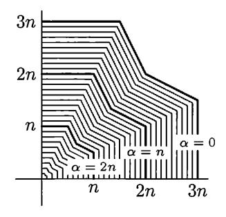

FIGURE 37. The set S

inequality

$$\alpha + \gamma/2 + \max\{\gamma/2, \beta\} \geqslant 3n$$
,

and for  $\gamma \leq \beta$  it is defined by the symmetric inequality

$$\alpha + \beta/2 + \max\{\beta/2, \gamma\} \geqslant 3n$$
.

We can also intersect this set with  $C_M$  (since  $C(x,y) \subset C_M$ ). In this way we get an even more complicated picture (not shown here).

Unlike our previous examples, we have here only an upper bound for the set C(x,y); the set itself remains unknown. It may happen that C(x,y) for this example depends on the choice of the finite field  $\mathbb{F}$ . This looks weird, but the following problem shows that it is not so unbelievable as it could seem at first.

311 Assume that  $\mathbb{F}$  is a field of cardinality  $q^2$  (then  $q = p^k$  for some prime p). Let (x,y) be a random pair of an incident point and line on a plane over  $\mathbb{F}$ . Prove that C(x,y) contains the triple  $\langle 1.5n,n,n\rangle$  where  $n=\log |\mathbb{F}|=2\log q$ . As usual, we ignore logarithmic terms. (This point is on the boundary of the set S (see Figure 37). We do not know whether the same is true for an arbitrary field.)

(Hint: The field  $\mathbb F$  contains a subfield  $\mathbb G$  of size q. Every element in  $\mathbb F$  has the form  $t+s\alpha$ , where  $t,s\in \mathbb G$ , and  $\alpha$  is some fixed element in  $\mathbb F$ . Then we can split the pairs of an incident point and line into  $q^3$  classes, where each class contains at most  $q^3$  pairs and involves at most  $q^2$  points and  $q^2$  lines. To get this classification, we consider lines of the form y=kx+b (vertical lines are non-random) and represent the coefficients in this equation as  $k=f+r\alpha$  and  $b=h+s\alpha$ , where  $f,r,h,s\in \mathbb G$ . If a point (x,y) is on this line, let us represent x as  $x=g+t\alpha$ . Then  $y=fg+h+(ft+gr+s)\alpha+rt\alpha^2$ . We may fix r,t,s in  $q^3$  different ways; each way corresponds to a class of pairs. Each class involves  $q^2$  lines (and this is OK) and  $q^3$  points (which is not OK). To decrease the number of involved points, we can use the following trick. Let us represent the coefficients of each line as  $k=f+r\alpha$ ,  $b=h+(s-ft)\alpha$ , and its points as  $(g+t\alpha,fg+h+(gr+s)\alpha+rt\alpha^2)$ , where all coefficients f,g,h,s,r,t are from  $\mathbb G$ . Now, fixing r,t,s, we get a set that involves  $q^2$  lines (parametrized by f,h) and  $q^2$  points (parametrized by g,fg+h).)

312 Prove that we get the same set C(x, y) for all randomly chosen pairs (x, y) in the line-point graph, up to  $O(\log n)$ -precision: To decide whether a triple  $\langle \alpha, \beta, \gamma \rangle$  belongs to this set, we need to know only the maximal possible number of edges in a combinatorial rectangle of size  $2^{\beta} \times 2^{\gamma}$ . Namely, it is necessary and sufficient that this number times  $2^{\alpha}$  exceeds the total number of edges (up to a polynomial factor).

(*Hint* (Razenshteyn [151]): For every two edges there exists an affine bijection of the plane that maps the first edge into the second one. If there is a rectangle with a large number of edges, we may cover the graph by several random images of this rectangle. We need an additional factor of polynomial size to cover all the edges with positive probability. If all the rectangles are small, there are not enough edges to cover the entire graph (or a significant part of it) by small number of them.)

As in the previous section, the upper bound for C(x,y) implies an inequality that bounds the unconditional complexity of z in terms of conditional complexities (given x and y):

THEOREM 227. Let x, y be a random pair of an incident line and point in a plane over a finite field of size about  $2^n$ . Then for every string z the following

inequality holds:

$$C(z) \leqslant 2C(z|x) + 2C(z|y) + O(\log n).$$

PROOF. As before, we need to prove that

$$8n \leq 3\alpha + 2\beta + 2\gamma$$

for all  $\langle \alpha, \beta, \gamma \rangle \in C(x,y)$ . It is enough to check this inequality for all points in  $S \cap C_M$ . We may assume without loss of generality that  $\beta \leqslant \gamma$ . If  $\beta$  exceeds  $\gamma/2$ , then the required inequality is obtained as follows. Multiply the inequality  $\alpha + \gamma/2 + \beta \geqslant 3n$  (from the definition of S) by 2 and add the inequality  $\alpha + \gamma \geqslant 2n$  (from the definition of  $C_M$ ). Otherwise (if  $\beta \leqslant \gamma/2$ ), we sum up the inequalities  $\alpha + \gamma \geqslant 3n$  (definition of S),  $\alpha + \beta \geqslant 2n$ , and  $\alpha + \beta + \gamma \geqslant 3n$  (both taken from the definition of  $C_M$ ).

So now we have two constructions of a pair without (extractable) common information. The first construction gives better bounds for the set C(x,y). So what are the advantages of the second one? The most important (though informal) advantage is that we have found a combinatorial reason (a graph that is difficult to cover by rectangles) and a simple sufficient condition for this (no cycles of length 4).

A more formal advantage is that in the second construction we get a stochastic example—our pair is an element of maximal complexity in a simple set. Probably the first construction does not give us a stochastic example. However, we may prove the existence of stochastic pairs with minimal C(x,y): A probabilistic method can be used to prove the existence of a graph that is maximally hard to cover by combinatorial rectangles (see [151]).

Another advantage of the second construction is that it can be used to prove a bit stronger statement using oracle complexity. In fact we have shown that for every oracle A there exist two strings x and y of complexity (without oracle) 2n and mutual information (also without oracle) n such that there is no string z with  $C^A(z) < 1.1n$ ,  $C^A(x|z) < 1.1n$ , and  $C^A(y|z) < 1.1n$ . Indeed, even a very powerful oracle still defines some combinatorial rectangles, they cover only a negligible fraction of the edges, and it remains to select an uncovered (and non-simple) edge. (Of course, the resulting pair depends on the oracle, since every pair is simple relative to some oracle.)

313 State and prove a similar result with additional condition u (a string of unlimited complexity) instead of the oracle.

What happens with common (extractable) information in two strings if we add some oracle? Some results in this direction are obtained in [138]; it is assumed there that the oracle is independent with a pair x, y (so the complexities and mutual information remain unchanged). Evidently, if some z is the common information, then adding the oracle does not destroy this. It can be shown that the reverse statement is true (however, the existing proof does not give our usual  $O(\log n)$ -precision but a much weaker result).

We can apply similar combinatorial techniques to other algebraic constructions. For example, we may consider a pair of orthogonal one-dimensional subspaces in a four-dimensional space or, almost equivalently (if we ignore infinitely far points), a random pair (a point in a three-dimensional space and a two-dimensional affine plane that goes through this point). One cannot apply the lemma about 4-cycles any more (there are 4-cycles—for any two one-dimensional subspaces one can find

a two-dimensional space orthogonal to both and two one-dimensional subspaces in it). Still there are only few one-dimensional subspaces in a two-dimensional space, so we still can apply a similar argument based on the inclusion-exclusion formula. (See the proof of Theorem 5 in [39] for details.)

There are other similar examples. One can consider a pair of two affine lines in a three-dimensional space that have a common point. Another series of examples can be obtained in the following way. Fix some integer  $n \geq 3$  and some integers k, l such that 0 < k < l < n. Then in the n-dimensional space over a finite field consider a random pair (k-dimensional subspace, l-dimensional subspace) where the first subspace is contained in the second one. Romashchenko has shown [153], that one cannot extract common information from this pair. The proof uses the following remark: making a short random walk in the resulting bipartite graph, we get an almost uniform distribution.

#### 11.4. Conditional independence and common information

In this section we consider one more (quite mysterious) way to obtain strings that have mutual information but no extractable common information [112, 153]. Let us start by recalling the inequality of Problem 296 (p. 341):

$$H(\xi) \leq H(\xi \mid \alpha) + H(\xi \mid \beta) + I(\alpha : \beta),$$

or, better to say, the corresponding inequality for complexities

$$C(z) \leqslant C(z \mid x) + C(z \mid y) + I(x : y)$$

(as usual, we omit the logarithmic terms). If I(x:y) = 0, this inequality implies an upper bound for unconditional complexity in terms of conditional ones,

$$C(z) \leqslant C(z \mid x) + C(z \mid y).$$

There is no surprise here—if there is no mutual information, there is no common information to extract. It seems that we are not getting anywhere. But a similar bound can be obtained for the case when x and y are conditionally independent relative to two independent strings, i.e., if there exist strings u and v such that I(x:y|u) = 0, I(x:y|v) = 0, and I(u:v) = 0. Namely, the following inequality holds:

THEOREM 228.

$$C(z) \leq 2C(z|x) + 2C(z|y) + I(x:y|u) + I(x:y|v) + I(u:v)$$

for arbitrary strings x, y, z, u, v (with  $O(\log C(x, y, u, z, v))$ -precision).

This inequality is a consequence of the previous one and Ingleton's inequality

$$I(x:y) \leq I(x:y|u) + I(x:y|v) + I(u:v),$$

but, of course, Ingleton's inequality is not always true. So we need to proceed in a different order.

PROOF. Let us consider again the inequality

$$C(z) \leqslant C(z|u) + C(z|v) + I(u:v)$$

and then bound C(z|u) and C(z|v) using the relativized versions of the same inequality:

$$C(z|u) \le C(z|x,u) + C(z|y,u) + I(x:y|u),$$
  
 $C(z|v) \le C(z|x,v) + C(z|y,v) + I(x:y|v).$ 

After that it remains to note that we decrease the complexity when adding another condition:  $C(z|x,u) \leq C(z|x)$ .

This theorem can be used to construct strings with non-extractable mutual information. Consider conditionally independent variables that are not independent (Theorem 217, p. 342): there exist  $\alpha$  and  $\beta$  that are independent given  $\gamma$  and also independent given  $\delta$ , where  $\gamma$  and  $\delta$  are independent variables, while  $\alpha$  and  $\beta$  are not independent.

Now we may consider N independent trials of this quadruple and collect the outcomes of  $\alpha$  into string x, and outcomes of  $\beta$  into y. These strings x and y with high probability will have significant mutual information that cannot be extracted. To see this, let us collect the outcomes of  $\gamma$  and  $\delta$  into u and v, and apply the last inequality to these four strings. (Note that to construct x and y, we need to make N samples of  $\alpha$  and  $\beta$  alone; the variables  $\gamma$  and  $\delta$  are needed only for the proof of non-extractability.)

For technical reasons, to get a better error term (our usual logarithmic term instead of a square root that appears when we compare the frequency and the probability), one should consider not the independent trials, but trials with fixed frequencies. Let us explain what this means.

Consider a quadruple of strings x, y, u, v of length N where the frequencies of all quadruples of letters are equal to the probabilities for the outcomes of  $\langle \alpha, \beta, \gamma, \delta \rangle$ . This means that x is a string in the alphabet that is the range of  $\alpha$ , y is a string whose alphabet is the range of  $\beta$ , etc., and the number of positions  $i = 1, \ldots, N$ , where strings x, y, u, v have letters a, b, c, d, respectively, is equal to

$$\Pr[\alpha = a, \beta = b, \gamma = c, \delta = d] \cdot N + O(1)$$

(we need to add O(1) for rounding—the product of N and the probability is not always an integer).

As we know from Section 7.3 (Theorem 146), for most quadruples of strings with these frequencies the complexities of these strings and their combinations deviate from  $N \times$  (the corresponding entropies) only by  $O(\log N)$ . In this way we get a quadruple of strings x, y, u, v such that

$$I(x:y|u) = O(\log N), \quad I(x:y|v) = O(\log N), \quad I(u:v) = O(\log N),$$

and at the same time

$$I(x:y) = NI(\alpha:\beta) + O(\log N),$$

while (according to our assumption)  $I(\alpha:\beta) \neq 0$ . It remains to use Theorem 228 to conclude that for every z the inequality

$$C(z) \leqslant 2C(z|x) + 2C(z|y)$$

 $<sup>^{1}\</sup>mathrm{To}$  see this we should recall the proof of Theorem 146 where we estimated how many strings with given frequencies exist.

holds with  $O(\log N)$ -precision, while the complexities of x and y and their mutual information is proportional to N (with the same precision) with non-zero coefficients.

In this way we get one more construction of strings with non-extractable mutual information. They are stochastic (as in the geometric construction), and we (a bit mysteriously) avoided any combinatorial considerations.

314 We have already seen (Theorem 217, p. 342) that there exist conditionally independent random variables  $\alpha$  and  $\beta$ , both having the uniform distribution in  $\{0,1\}$ , such that  $\Pr[\alpha = \beta] = 5/8$ . Prove that this statement remains true if we replace 5/8 by arbitrary  $c \in [3/8, 5/8]$ .

However, if c is close to 0 or 1, a similar statement is not true: one cannot add  $\gamma$  and  $\delta$  to make these two variables conditionally independent. Nevertheless, for every  $c \in (0,1)$  we can still prove that the common information is not extractable (for most of the strings obtained by N trials for these  $\alpha$  and  $\beta$ ). We split this result into the following two problems.

**315** Consider an arbitrary  $c \in (0,1)$ . Prove that there exist finite chains of random variables  $\alpha_0, \alpha_1, \ldots, \alpha_k$  and  $\beta_0, \beta_1, \ldots, \beta_k$  defined on some common probability space such that

- $\alpha_0$  and  $\beta_0$  are uniformly distributed in  $\{0,1\}$ ;
- $\bullet \ \Pr[\alpha_0 = \beta_0] = c;$
- $\alpha_0$  and  $\beta_0$  are independent given  $\alpha_1$ ;
- $\alpha_0$  and  $\beta_0$  are independent given  $\beta_1$ ;
- $\alpha_1$  and  $\beta_1$  are independent given  $\alpha_2$ ;
- $\alpha_1$  and  $\beta_1$  are independent given  $\beta_2$ ;
- $\alpha_{k-1}$  and  $\beta_{k-1}$  are independent given  $\alpha_k$ ;
- $\alpha_{k-1}$  and  $\beta_{k-1}$  are independent given  $\beta_k$ ;
- $\alpha_k$  and  $\beta_k$  are independent.

(*Hint*: If this statement is true for some c, it is also true for  $c' = (c^2 + 1)/2$ . To show this, we may apply the construction used to prove Theorem 217, using the c-construction for  $\gamma$  and  $\delta$ . One should correct the distributions of the pair  $\alpha, \beta$  under the conditions  $\gamma = 0$ ,  $\delta = 1$  and  $\gamma = 1, \delta = 0$  in such a way that  $\alpha$  and  $\beta$  become independent given  $\gamma$  and given  $\delta$ . Finally, one should check that every number between 1/2 and 1 can be obtained from some number in (1/2, 5/8) by several iterations of the function  $c \mapsto (c^2 + 1)/2$ . To prove the statement for c < 1/2, we invert one of the variables (say,  $\alpha$ ).)

[316] Assume that  $\alpha$  and  $\beta$  satisfy the statement of the previous problem. Consider the set of pairs of binary strings x,y of length n where the frequencies of all pairs follow the distribution for  $\langle \alpha,\beta \rangle$ . Prove that a random (maximally complex) pair in this set has significant (proportional to n) mutual information but no extractable common information. More precisely, for every z the inequality  $K(z) \leq O(K(z|x) + K(z|y) + \log n)$  holds (the constant in O-notation may depend on the length k of the chain).

The solution of Problem 315 can be generalized for non-binary alphabets and non-uniform distributions. There is a simple criterion to decide whether the random variables  $\alpha$ ,  $\beta$  (their common distribution) satisfy the statement of Problem 315. This happens if and only if one cannot permute the rows and columns of the matrix

(that defines the common distribution) in such a way that a matrix of the form

$$\begin{pmatrix} A & 0 \\ \hline 0 & B \end{pmatrix}$$

appears (here the two zeros stand for zero blocks). In this case the strings obtained by n trials of  $\alpha$  and  $\beta$  have no extractable common information. On the other hand, if such a permutation (that produces a matrix of this form) exists, some part of the mutual information is extractable (indeed, both variables determine the number of the block they are in). This argument (see [112] for the details) gives an alternative proof of a criterion first obtained by Gács and Körner [59].

#### CHAPTER 12

# Multisource algorithmic information theory

### 12.1. Information transmission requests

Multisource information theory deals with information transmission in a network. Such a network includes information sources (one or many), the destinations (one or many) where information should be delivered, and channels that are used for transmission; some (or all) channels may have limited capacity. The classical Shannon approach considers sources as random variables and is well developed. It tries to find conditions that make some information transmission requests feasible.

Similar questions could (and should) be asked for algorithmic information theory. Let us explain this setting more formally, following [179]. Consider a directed graph whose edges are *channels* and nodes are *processors*. Some nodes (called *input nodes*) get outside information; this information should be processed (in the nodes) and transmitted (via the edges) into some other nodes, finally reaching *output nodes*.

More formally, an information transmission *request* consists of the following parts:

- a finite acyclic directed graph;
- a set of *input* nodes;
- an *input string* for each input node;
- a set of *output* nodes;
- a (desired) output string for each output node;
- a non-negative integer *capacity* for each edge (the value  $+\infty$  is also allowed and means unlimited capacity).

To fulfill this request, one should write on each edge e some string whose length does not exceed the capacity of edge e, in such a way that

$$C(X|Y_1,\ldots,Y_k)\approx 0$$

for every node z that has incoming strings  $Y_1, \ldots, Y_k$  and for every outgoing string X in this node. Here by incoming strings for a node we mean the strings written on incoming edges and the input string for the node (if it is an input node); similarly, outgoing strings are strings written on outgoing edges, and the output string for this node (if it is an output node).

Informally speaking, this condition means that the nodes can only process the incoming information and cannot create (a non-negligible amount of) new information. As usual, the approximate equality sign ( $\approx$ ) means that the complexity in question is  $O(\log N)$ , where N is the total length of all input and output strings in the request. So in fact we consider not one request but a sequence of requests with increasing values of N.

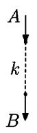

FIGURE 38. The simplest information transmission request

We are interested in the conditions that make a request (actually, a sequence of requests) fulfillable.

Consider a network that has two nodes and one edge (Figure 38). Let us agree that all edges are directed top-down, so the direction arrows are omitted. The top node is an input node and has input string A; the bottom node is an output node and has output string B. The channel has capacity k.

In other words, for given strings A and B we are looking for a string X (transmitted message) such that

$$C(X|A) \approx 0$$
,  $C(B|X) \approx 0$ ,  $l(X) \leq k$ .

Obviously, it is possible only if  $C(B|A) \approx 0$  and  $C(B) \leq k$  (the latter inequality is understood also with logarithmic precision). On the other hand, these conditions are also sufficient because we may use the shortest description for B as X.

To express this evident idea formally, we (unfortunately) need a rather obscure statement. Let  $A_n$  and  $B_n$  be sequences of strings, and let  $k_n$  be a sequence of integers. Assume that the lengths of  $A_n$  and  $B_n$  as well as the integer  $k_n$  are bounded by a polynomial in n. Then the following two properties are equivalent:

(1) there exists a sequence of strings  $X_n$  such that  $l(X_n) \leq k_n + O(\log n)$ ,  $C(X_n | A_n) = O(\log n)$ , and  $C(B_n | X_n) = O(\log n)$ ;

(2) 
$$C(B_n | A_n) = O(\log n)$$
 and  $C(B_n) \leqslant k_n + O(\log n)$ .

This equivalence follows from two (rather trivial) remarks. First,

$$C(B|A) \le C(B|X) + C(X|A) + O(\log C(A, B, X)),$$
  
 $C(B) \le l(X) + C(B|X) + O(\log C(B|X))$ 

for all strings A, B, X (so (1) implies (2)). Second,

for every A, B and k there exists a string X such that

$$l(X) \leqslant C(B), C(X|A) \leqslant C(B|A) + O(\log C(B)),$$
  
and  $C(B|X) = O(1)$ 

(let X be the shortest program for B) and therefore (1) follows from (2).

For the case A = B, the statement has clear intuitive meaning: a string A can be transmitted through a communication channel if and only if its complexity does not exceed the capacity of the channel.

Let us now switch to more interesting examples.

#### 12.2. Conditional encoding

In the following request we want to transmit some string A assuming that both the sender and the receiver know some string B (Figure 39). We need to encode A by a k-bit string, send this string down, and then decode A back; both encoder

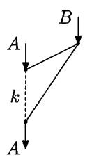

FIGURE 39. Encoding and decoding A when B is known

and decoder have access to B (the capacity of the edges shown as solid lines is unlimited, so we may assume without loss of generality that these edges carry the entire string B).

This request can be fulfilled if and only if  $C(A|B) \leq k$ . Indeed, the decoder knows B (or some derivative of B) and k additional bits, so it can generate A only if  $C(A|B) \leq k$ . On the other hand, if  $C(A|B) \leq k$ , then the shortest description of A given B has at most k bits and can be sent over a restricted channel, while two other unrestricted channels transmit B. Note that the complexity of this shortest description relative to the pair  $\langle A, B \rangle$  is bounded by a logarithm of the total complexity of A and B, since knowing the length of this description we can try all strings of this length in parallel until we find some description.

317 The last argument shows only (but this is enough for us) that *some* shortest description has logarithmic complexity given A and B. Prove that each of them has logarithmic complexity since there is only O(1) of them.

(Hint: It can be proven in the same way as in Problem 40 on p. 40.)

[318] Give the exact statement of the last criterion (for the network in Figure 39) in terms of sequences  $A_k$  and  $B_k$ , and prove this statement.

#### 12.3. Conditional codes: Muchnik's theorem

This section is devoted to a remarkable result of Muchnik [135]. It can be considered as an algorithmic counterpart of a well-known Slepian-Wolf theorem in Shannon information theory. In the language of the previous section, Muchnik's result says that one does not need to use B while encoding A (Figure 39), and this edge may be deleted (Figure 40), and the condition when the request can be fulfilled remains the same.

This condition is  $C(A|B) \leq k$ , and it remains necessary for obvious reasons (the graph is smaller). It remains sufficient too; here is the exact statement.

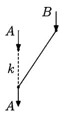

FIGURE 40. Sending A when decoder knows B: Muchnik's theorem

THEOREM 229. Let A and B be arbitrary strings of complexity at most n. Then there exists a string X of length at most  $C(A|B) + O(\log n)$  such that  $C(X|A) = O(\log n)$  and  $C(A|B,X) = O(\log n)$ .

The hidden constant in  $O(\log n)$  does not depend on n, A, B.

This statement can be reformulated: For every A and B there exists a program that transforms B to A, has logarithmic complexity given A, and has unconditional complexity C(A|B) (up to logarithmic precision). In other words, the additional restriction saying that the program should be simple relative to A, increases the minimal possible (unconditional) complexity of the program only by  $O(\log C(A, B))$ .

PROOF. Assume that the string A has complexity a. Replace A by its (shortest) description of length a. This replacement changes the values of C(A|B), C(X|A), and C(A|B,X) only by  $O(\log n)$ . So we may assume without loss of generality that A has length a. (Complexity of A remains close to a, but this does not matter for us.)

Assume that the conditional complexity C(A|B) equals m. The idea of the proof can be explained as follows. Consider some hash function  $\chi \colon \mathbb{B}^a \to \mathbb{B}^m$  that computes an m-bit hash value (fingerprint) for every a-bit string.

For a given string B we have about  $2^m$  strings Z of length a such that  $C(Z|B) \leq m$ . Let  $S_B \subset \mathbb{B}^a$  be the set of these strings. According to our assumption, A is one of the elements of  $S_B$ .

Imagine that we are extremely lucky, and all the strings in  $S_B$  have different hash values. Then every string  $P \in S_B$  can be uniquely reconstructed if we know  $\chi(P)$  and B (the function  $\chi$  is assumed to be fixed). So we can use  $\chi(A)$  as X in the statement of the theorem. It has correct length, is simple relative to A (we assume that  $\chi$  is simple), and, together with B, allows us to reconstruct A—we have to enumerate  $S_B$  until we find a string with the correct hash value.

Of course this is too good to be true. For every hash function  $\chi$ , if a > m, there are at least  $2^{a-m}$  strings that have the same hash value (and for simple  $\chi$  we can find many simple strings with the same hash values, and they will be in  $S_B$  for every B), so we cannot hope to be so lucky.

We need to modify our plan and consider for every  $Z \in \mathbb{B}^a$  several (poly(n)) hash values instead of one. Instead of a hash function, we consider now a bipartite graph  $E \subset \mathbb{B}^a \times \mathbb{B}^m$  where each left vertex Z has at most poly(n) right neighbors. These neighbors are called *fingerprints* of Z.

Proving the theorem, we look for X among the fingerprints of A. This guarantees that  $C(X|A) = O(\log n)$ , assuming that graph E is simple (has  $O(\log n)$  complexity). Indeed, to specify X when A is known, it is enough to specify the ordinal number of X among the fingerprints of A.

If, for a given  $A \in S_B$ , one of its fingerprints X determines A inside  $S_B$  uniquely (no other strings in  $S_B$  have X among their fingerprints), then we can reconstruct A by enumerating  $S_B$  and waiting for a string that has X among its fingerprints. In this case  $C(A|B,X) = O(\log n)$ ; we assume here that E is simple, i.e., has complexity  $O(\log n)$ .

Moreover, the same complexity bound holds if there are polynomially many (in n) strings in  $S_B$  that have X among their fingerprints. We need to specify additionally the ordinal number of A among these strings (in the order of the enumeration of  $S_B$ ), and this requires additionally  $O(\log n)$ -bits.

So our goal is now that A has a right neighbor that has few (polynomially many) left neighbors. Here, speaking about neighbors, we consider the restriction of E onto  $S_B$  as a bipartite graph with left part  $S_B$  and right part  $\mathbb{B}^m$ . Note that this restricted graph has about  $2^m$  vertices both in the left and in the right parts.

In other words, a vertex in the right part is bad if it has many neighbors on the left; a vertex in the left part is bad if all its right neighbors are bad. We need A to be not bad. How can we achieve this?

The fraction of bad right vertices is small: The number of edges is bounded by the size of the left part times the maximal degree of left vertices, and each bad right vertex creates a lot of edges. More precisely, we can ensure that this fraction is at most 1/p(n) for a given polynomial p (the threshold for the number of neighbors for bad vertices is determined by p and increases as p increases).

We want to prove then that the fraction of bad *left* vertices is also small. To achieve this, we assume that E has the following expander-like property: For every subset T in the *left part*, the set of all right neighbors of T-vertices is at least as big as T itself. Having this property, we consider the set T of bad vertices in the left part; all their right neighbors are bad by definition, so the number of left bad vertices is bounded by the number of the right bad vertices. (Note that this expander property of E remains valid if E is restricted on  $S_E$ .)

It remains to explain where we get a (simple) graph E with this property and what we do if A falls into a (small) set of bad vertices.

It is well known that the existence of expander-like graphs can be usually proved by a rather simple probabilistic arguments. To construct them explicitly is quite a different story; it is a very interesting and complicated business where great progress has been made during the last decades. However, we can avoid these complications using the following simple trick: After the existence of a graph with some property is proven, we can generate all the graphs until we find some with this property. We assume that the property is decidable, so this is an algorithmic procedure (which takes a long time, but we have no time bounds). The first suitable graph has logarithmic complexity, since to organize the search we need to know only the sizes of sets (we may assume the sizes are powers of 2). In this way we convert the pure existence proof into a simple object with the property we need.

The last bit of the proof is why A cannot be bad. Note that bad right strings can be enumerated effectively when B (as well as E) is known. As we find new elements in  $S_B$ , we generate new left vertices in the restricted graph and new bad strings in the right part. Since E is known, we can also enumerate left bad strings. So every bad string can be specified (given B) by its ordinal number in the enumeration of bad left strings, and the number of these strings is significantly less than  $2^m$ . And we assumed that the complexity of A given B is m, this was our definition of m. So A cannot be bad. (Also we need  $O(\log n)$ -bits to specify m, a, and E, but, as we will see, the gap is enough to get a contradiction.)

We have described the proof in the top-down mode. Now let us describe the details of the argument in the bottom-up direction. First, we need an existence proof for expander-like graphs.

LEMMA. Let a and m be positive integers, and let  $a \ge m$ . Then there exists a bipartite graph  $E \subset \mathbb{B}^a \times \mathbb{B}^m$  where each vertex in the left side has degree at most a+m+2, with the following property. For every set  $T \subset \mathbb{B}^a$  with at most  $2^{m-1}$ 

elements, the set E(T) of all neighbors of all elements in T has more elements than T itself.

PROOF. Let us prove that a random graph has this property with positive probability. Speaking about random graph, we mean that for every left vertex we randomly select a+m+2 neighbors on the right. This choice is made independently (for different points and for different neighbors, so some neighbors of a given vertex may coincide, and we actually get fewer than a+m+2 neighbors).

What does it mean that the property stated in the lemma is false? In this case we have some non-empty subset T of the left part and some subset U of the right part, such that |U| = |T|, but all neighbors of T-elements belong to U. We compute the probability of this event for fixed T and U and then show that the sum of these probabilities over all T and U is less than 1.

Assume that T and U are fixed, and let t be their cardinality. By assumption,  $t \leq 2^{m-1}$ , so the probability for a random right vertex to get inside U is at most 1/2. The probability that this happens t(a+m+2) times for t elements of T (we make a+m+2 trials for each vertex in T) is at most  $2^{-t(a+m+2)}$ .

Let us sum these probabilities first over all pairs of T and U of given size t. The number of different T is at most  $(2^a)^t$  (we select one of  $2^a$  elements t times, and the possible coincidence and permutations make the number of sets even smaller); the number of different U is at most  $(2^m)^t$ . So the sum over sets of size t does not exceed

$$2^{mt} \cdot 2^{at} \cdot 2^{-t(m+a+2)} = (1/4)^t.$$

It remains to note the sum  $\sum (1/4)^t$  (over all  $t \ge 1$ ) is less than 1 (it is equal to 1/3). The lemma is proven.

Denote by  $E_{m,a}$  the first (in some natural order) graph that satisfies the requirements of this lemma. Its complexity is at most  $2 \log a + O(1)$  (it is enough to specify a and m using two halves of a  $2 \log a$ -bit string).

For a given string B and for given m and a, consider the set  $S_B$  of a-bit strings that have complexity at most m with condition B. Consider the restriction of the graph  $E_{m,a}$  to  $S_B$ . We get a graph with at most  $2^{m+1} \cdot (a+m+2) \leq a2^{m+3}$  edges (each of at most  $2^{m+1}$  left vertices has at most a+m+2 neighbors). Call a right vertex bad if it has at least  $a^4$  neighbors. Then the number of bad right vertices is at most  $k=2^{m+3}/a^3$ .

A left vertex (a string in  $S_B$ ) is now called bad if all its right neighbors are bad. The properties of  $E_{m,a}$  guarantee that number of bad left vertices also is bounded by  $k=2^{m+3}/a^3$ . Indeed, we may assume that a is large enough and  $k<2^{m-1}$ . If there are k+1 bad left vertices, then the expander property of the graph guarantees that the number of their neighbors is at least k+1. All they are bad (due to the definition of bad left vertex).

The bad left vertices can be enumerated (given m, a and B), so every bad string can be specified by giving its ordinal number in the enumeration, i.e., by  $m-3\log a+O(1)$  bits, so

$$C(P \mid B, m, a) \leqslant m - 3\log a + O(1)$$

for every bad string P. We see that the gap is larger than  $2 \log a$  needed to specify m and a, so all the bad strings have conditional complexity (relative to B) less than m, and A cannot appear among them.

П

Therefore, A has a good (not bad) right neighbor X. Then

$$C(X|A) \leq (3+\varepsilon)\log a + O(1)$$

(to specify X we provide m, a, and the ordinal number of X among the neighbors of A; we need some  $\varepsilon > 0$  to take care of pair encoding). The length of X is m, i.e., C(A|B). Finally, C(A|B,X) does not exceed  $(6+\varepsilon)\log a$  (we need  $4\log a$  to specify the ordinal number of X among  $a^4$  left neighbors of X, and  $2\log a$  is needed to specify m and a; again we use some  $\varepsilon$  to cover pair encoding).

The Muchnik theorem is proven.

319 Show that we have proven a bit stronger property that we claimed: We assumed that the complexity of B is bounded by n, but we never used this assumption.

Let us recall that all the inequalities in Muchnik's theorem are true with  $O(\log n)$ -precision, where n is the maximal complexity of A and B. Can we strengthen the claim by requiring  $O(\log m)$ -precision for m equal to maximal conditional complexities C(A|B) and C(B|A)? It turns out that this is not possible; see [205, Section 5] (we do not reproduce the proof here).

# 12.4. Combinatorial interpretation of Muchnik's theorem

Many results about Kolmogorov complexity have some combinatorial counterpart, an equivalent statement of purely combinatorial nature that does not mention Kolmogorov complexity. In many cases this statement is about the existence of a winning strategy in some game. (See [132] about this effect in general computability theory; [136] considers the special case of Kolmogorov complexity.)

Theorem 229 (proven in the previous section) also has some combinatorial counterpart. For given values of a, b, m (we assume that  $m \leq a$ ), we consider a two-player game. The players are called Mathematician ( $\mathbf{M}$ ) and Adversary ( $\mathbf{A}$ ). The game also has some parameter c (that corresponds to the constant in  $O(\log n)$ -notation; see below).

**M** may select for every a-bit string A at most  $c(a+b)^c$  strings of length m; she declares these strings as "simple relative to A". Also for each pair of strings B (of length b) and X (of length m) she may select at most  $c(a+b)^c$  strings of length a and declare them as "simple relative to B, X".

**A** may select for each b-bit string B at most  $2^m$  strings of length a and declare them as "simple relative to B".

Each player may make the next move (i.e., declare more strings as simple) at any moment (whatever the opponent does), seeing the moves of the opponent made earlier. We get a game that is essentially finite—the declared strings cannot be taken back, so the game reaches some limit position. However, watching the game, we may not know whether this limit position is reached, since the players keep right to make moves even if they do not exercise this right.

The limit position of the game determines the winner as follows:

M wins if for every string B of length b and for every string A of length a declared (by A) simple relative to B, there exists a string X of length m that is declared (by M) simple relative to A, such that A is declared (again by M) simple relative to B and X.

Now we can formulate a combinatorial equivalent of Theorem 229.

Theorem 230. There exists a constant c such that for every positive integer a, b, m with  $m \leq a$  the described game with parameters a, b, m, and c has a winning strategy for M.

Let us show that this combinatorial statement is indeed equivalent to Theorem 229. Assume that it is true for some c. Consider a blind adversary that does not look at M's moves and for each B declares as simple all strings of length a that have conditional complexity (given B) less than m. This behavior is algorithmic, and the algorithm is determined by a, b, m. The winning strategy for M can be found by a brute-force search (the game is essentially finite, and we assume that such a strategy exists), so we may assume that the winning strategy is simple. So the strings declared by M as simple are indeed simple, i.e., they have small (conditional) complexity. Indeed, to specify such a string, one may specify its ordinal number in the list of strings declared simple (for a given condition), using  $\log c + c \log(a + b)$  bits, and also specify a, b, m (additional  $O(\log(a + b))$  bits). So we get the statement of Theorem 229. (A technical comment: The factor c in  $c(a + b)^c$  is needed for small values of c and corresponds to the O(1)-term in the complexity bounds that should be added to  $O(\log n)$  for the case when n = 1 and  $\log n = 0$ .)

In the other direction, assume that the statement of Theorem 229 is true with some constant c' in  $O(\log n)$ . We want to prove that for sufficiently large c the combinatorial statement is true. Assume it is not the case and for every c there exist a, b, m for which  $\mathbf{A}$  can win the game. This strategy (together with a, b, c) can be found by a search. So if this strategy declares some A as simple with respect to B, then indeed the conditional complexity C(A|B) is small—it is bounded by m + O(C(c)). We get a contradiction if  $\mathbf{A}$  plays this strategy against the following blind strategy for  $\mathbf{M}$ : Declare X as simple for A if  $C(X|A) < c\log(a+b) + \log c$ , and declare A simple for B, X if  $C(A|B, X) < c\log(a+b) + \log c$ .

Playing this strategy,  $\mathbf{M}$  does not violate the quantitative restrictions (on the number of simple strings). To get the desired contradiction, it remains to show that  $\mathbf{M}$  wins the game. Let A, B be strings of lengths a, b, and assume that A is declared simple for B (by  $\mathbf{A}$ ). Theorem 229 says that there exists a string X' of length  $C(A|B)+c'\log(a+b)$  for which the statement of that theorem is true. Since C(A|B) is bounded by m+O(C(c)), the string X' is only slightly longer that m. Let X be the first m bits of X'. The complexities C(X'|A) and C(A|B,X') are small as Theorem 229 says, and the number of discarded bits is also small. Therefore the complexities C(X|A) and C(A|B,X) are also small, and for the right choice of c they are less than  $c\log(a+b) + \log c$ , so  $\mathbf{M}$  wins.

Let is provide the necessary bounds. The conditional complexity  $C(X \mid A)$  is at most

$$c'\log(a+b) + O(\log m)$$

(the complexity of X' given A plus the length of the prefix-free encoding of m). The conditional complexity C(A|B,X) does not exceed the sum

$$c'\log(a+b) + O(C(c))$$

(the complexity of A given B, X plus the length of the discarded suffix of X'). Now we see that one can choose c of the form  $2^i$  in such a way that both sums do not

exceed  $c \log(a+b) + \log c$  (since c is a power of 2, the complexity of c that appears in the upper bound for C(A|B,X) is much smaller than  $\log c$ ).

So we have shown that the combinatorial statement of Theorem 230 is indeed equivalent to its complexity counterpart, Theorem 229 (and is true, since we proved the latter).

In fact, the combinatorial translation is possible not only for the statement of Theorem 229, but also for its proof. During the game, M does not exercise her right to declare new A-simple strings during the game; she declares all the neighbors of A (according to the expander graph) at once. Then a string A is declared simple given X, B if (1) A is a neighbor of X, (2) A has been declared simple given B by A, (3) at the moment of this declaration the number of neighbors of X among the strings that are already declared simple given B is small. In this way M is able to serve, for each B, most of the strings that are declared simple for this B. The remaining strings (a small fraction of all strings declared simple for B) are forwarded to the next level of service where the same strategy is used, but for B that is smaller by 1, and so on. Finally the number of strings declared simple for A is bounded by a sum of a sequence where each term is twice smaller than the previous one, so the number of simple strings is multiplied by 2 (not a problem).

The ability to declare all the strings at once also has some algorithmic consequences:

 $\fbox{320}$  Prove that for every string A of length n there exists a string X of length C(A), such that  $C(A|X) = O(\log n)$ , and total conditional complexity of X given A (i.e., the minimal complexity of a total program that maps A to X) is  $O(\log n)$ . Show that one cannot replace both the complexities C(A|X) and C(X|A) by total conditional complexities.

(*Hint*: To prove the second part, one may use the existence of non-stochastic strings; see Chapter 14 about algorithmic statistics.)

This problem shows that Muchnik's argument gives us something non-trivial even for empty B. For non-empty B we can get a version of Muchnik's theorem where  $C(X \mid A)$  is replaced by total conditional complexity (and other conditional complexities are understood in the usual way); one needs to assume additionally that the length of A (not only its complexity) does not exceed n.

# 12.5. A digression: On-line matching

In this section we modify the combinatorial proof of Theorem 229 to get a stronger (and simpler) combinatorial statement.

Consider some bipartite graph  $E \subset A \times B$  with left part A and right part B. Given a subset  $A' \subset A$ , one can look for a matching that selects for each vertex  $a \in A'$  some B-neighbor in such a way that no vertices in B are selected twice. In other words, one can try to find a bijection defined on A', and this bijection should be a subset of E. One can consider an on-line version of the same task. Assume that the vertices in A are given one by one, and we need to select a neighbor for the next vertex not knowing which vertices follow.

More formally, we say that the graph  $E \subset A \times B$  allows on-line matching of size k if there is a strategy that selects distinct neighbors for k vertices in A provided sequentially by the adversary. (The game consists of k moves: at each move the adversary select a vertex in A not used before. In response, we have to select some B-neighbor of this vertex. We win if all the selected neighbors are different.)

Note that this definition is non-symmetric—the adversary selects A-vertices and we have to select B-vertices. It is clear from the definition that the property of the graph "to allow on-line matching of size k" is in PSPACE, i.e., can be checked in polynomial space. (It would be interesting to get better upper bounds for complexity or some lower bounds.)

Here is the result about on-line matching that somehow explains the combinatorial root for Muchnik's theorem.

Theorem 231. For some constant c and for all a and m such that  $a \ge m$ , there exists a bipartite graph with  $2^a$  vertices in the left part and  $2^m a^c$  vertices in the right part and degree at most  $a^c$  for every left vertex that allows on-line matching of size  $2^m$ .

In other words, one can find a graph with arbitrary sizes of left and right parts that has small (polynomial) left degree and allows on-line matching of almost maximal size (close to the size of the right part, up to a polynomial factor).

Before proving Theorem 231, let us explain how it implies Theorem 229. As before, let us replace A by its shortest description of length a. Let m be equal to C(A|B)+1. Theorem 231 then guarantees the existence of a bipartite graph with  $2^a$  left vertices and  $a^c2^m$  right vertices and left degree at most  $a^c$  that allows on-line matching of size  $2^m$ . This is a computable property, so the first graph (in some order) with this property has small complexity (logarithmic in a). Fix this graph and some computable strategy that wins the on-line matching game. For a given B, let us enumerate a-bit strings that have conditional complexity less than m given B. There are at most  $2^m$  of them, and A is among them. Applying the matching strategy, we find some right neighbor for each of these strings, including A. Now let X be the selected neighbor of A. This is the string we looked for. Indeed, X (as well as all right neighbors of A) has small complexity given A, since A has only few neighbors. On the other hand, knowing B and A (as well as a and a that determine the graph and the strategy) we can find A—start the process described above and wait until X is assigned to some vertex.

PROOF. Now let us prove Theorem 231. It is enough to prove a weaker statement that allows the matching strategy to skip some elements (whichever it wants), but not more than half of them (at most  $2^{m-1}$  elements). Indeed, if such a weak matching strategy exists, we can start a similar process for skipped elements forwarding them to another matching strategy (with m decreased by 1 and a corresponding graph); the elements skipped by this strategy are forwarded to the third one, etc. In this way we get a full matching in the graph whose left part is the same as before, and the right part is a disjoint union of the right parts of all used graphs (for  $m, m-1, m-2, \ldots$  up to zero, where the matching task is trivial).

It remains to note that this weaker property is guaranteed if the graph has the expansion property used in the proof of Muchnik's theorem. The matching algorithm is straightforward: If a vertex has neighbors not used before, select one of them; if not, skip the vertex. Let us show that this strategy serves at least half of the vertices (at least  $2^{m-1}$  ones). If it serves less, then at the right part we have used less than  $2^{m-1}$  vertices. On the other hand, for each skipped vertex all its neighbors are used (this was the reason to skip it). So we get more than  $2^{m-1}$  left vertices (skipped ones) whose neighbors are all in the set of used right vertices of size less than  $2^{m-1}$ . This is impossible due to the expansion property.

It would be interesting to compare this argument with the proof of Slepian–Wolf theorem and find some "common denominator", a combinatorial fact that implies both Muchnik and Slepian–Wolf theorems. It would be also interesting to find another proof of Theorem 231 (e.g., a direct probabilistic argument, or, even better, some explicit construction of the graph).

One can also prove Muchnik's theorem using another famous combinatorial tool, randomness extractors. This idea was suggested (in a different context and before Muchnik's paper) in [23], and it was applied to Muchnik's theorem in [145]. The advantage of this approach is that one can use known explicit randomness extractors and other known techniques (e.g., pseudo-randomness generators, as suggested by Romashchenko) to prove the space-bounded version of Muchnik's theorem [143, 144]. (Let us mention that resource-bounded Kolmogorov complexity and its relations with computational complexity theory is an important topic that is outside the scope of our book.)

#### 12.6. Information distance and simultaneous encoding

Now we consider a request (Figure 41) where the capacity of the dotted line is bounded by k, and the k-bit string transmitted along this channel must contain enough information to transform A to B and vice versa.

Obviously, it is possible only if  $C(A|B) \leq k$  and  $C(B|A) \leq k$  (with logarithmic precision, as in all our considerations). Indeed, the left output node receives A (or some string derived from A) and X (or some string derived from X) and produces B, so  $C(B|A) \leq k$ . A symmetric argument shows that  $C(A|B) \leq k$ .

We get a necessary condition for the feasibility of this request:

$$\max(C(A|B), C(B|A)) \leq k$$

(as usual, logarithmic terms are omitted). It was shown by Bennett, Gács, Li, Vitányi, and Zurek [9] that this necessary condition is at the same time sufficient. Here is the exact statement of their result:

Theorem 232. Let A, B be strings such that C(A|B) < k and C(B|A) < k. Then there exists a string X of length k such that

$$C(A \, | \, B, X) = O(\log k), \ C(B \, | \, A, X) = O(\log k), \ and \ C(X \, | \, A, B) = O(\log k).$$

PROOF. Consider all pairs  $\langle A,B\rangle$  of strings such that C(A|B) < k and C(B|A) < k at the same time. We get an enumerable binary relation on strings; all its vertical (A is fixed) and horizontal (B is fixed) sections contain at most  $2^k$ 

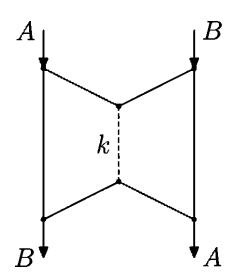

Figure 41. Bennett-Gács-Li-Vitányi-Zurek information request

elements. In other words, we get an (infinite) bipartite graph, and the degree of all vertices (in both parts) is bounded by  $2^k$ .

Now we want to split all the pairs into  $2^{k+1}$  (or fewer) classes in such a way that each class is a one-to-one correspondence (it does not have pairs on the same vertical or the same horizontal line). In graph terms, we color all the edges using  $2^{k+1}$  colors in such a way that every two edges that have a common endpoint have different colors.

This is easy—each new edge is colored by a first (in some order) color that was not used for other edges with common endpoints. Since fewer than  $2^k$  edges may share each of the endpoints, we always have a free color. (In other words, we number the classes by  $0 \cdots 2^{k+1} - 1$ , and each new pair is put in a class that is allowed, i.e., it does not contain pairs with the same first or second coordinates.)

We described an infinite process that depends on k but not on A, B. At some moment it assigns some color (class number) to the pair  $\langle A, B \rangle$  (edge A-B). Let X be this color (=its number in binary). It has at most k+1 bits instead of k but one additional bit does not matter with our precision. Knowing A, k, and X, we can find B: run the process described, and wait for an edge starting at A that is colored by X; its other endpoint is B. For the same reason, knowing B, k, and X, we can compute A. Finally, C(X|A,B,k)=O(1): knowing k, k, and k, we wait until the edge k-k gets some color; this color is k.

321 Prove a stronger statement about bipartite graphs. Assume that a finite bipartite graph is given, and all vertices (in both parts) have degree at most N. Prove that one can color its edges using N colors in such a way that the edges with common endpoint have different colors. Why can we not use this fact in the proof of Theorem 232 (and need to prove a weaker version from scratch)?

(*Hint*: We may assume that the degree is exactly N, and then apply the Ford–Fulkerson argument (max-flow=min-cut) or the Hall theorem. However, all this does not help us since we obtain the graph edges sequentially and have to assign colors on-line.)

One may also note that the color in the last proof can be encoded by a (k+1)-bit string, so it determines k, and we do not need to specify k separately. So the complexities C(A|B,X) and C(B|A,X) are in fact O(1), not  $O(\log k)$ . To put the same observation in programming terms, for every two strings A and B there exists a program of complexity  $\max(C(A|B),C(B|A))+O(1)$  that maps A to B and B to A. Indeed, consider a program that knows the color of the edge A-B (it is used as a constant in the program) and waits for an edge having this color and being incident to the input vertex. (Note that a logarithmic amount of information is enough to distinguish A and B; e.g., one may specify the number of positions where A and B differ.)

**322** Let A and B be two independent random n-bit strings (i.e.,  $C(A) \approx n$ ,  $C(B) \approx n$ , and  $C(\langle A, B \rangle) \approx 2n$ ). Give an explicit example of a string X that satisfies the requirements of Theorem 232.

(Answer: Take the bit-wise XOR of A and B.)

For the case when the complexity C(A|B) and C(B|A) are different, the following refinement of Theorem 232 is possible. Assume, for example, that C(A|B) is bigger. Then the string X can be split into two parts: the first part is the information needed to transform A into B, it has length C(B|A); the rest has length

C(A|B) - C(B|A), and together with the first part makes possible the reverse transformation.

Here is the formal statement:

Theorem 233. Assume that C(A|B) < k, C(B|A) < l, and k > l. Then there exists a k-bit string X such that  $C(X|A,B) = O(\log k)$ ,  $C(A|B,X) = O(\log k)$ , and  $C(B|A,X') = O(\log k)$  where X' is an l-bit prefix of X.

PROOF. Let us use the same trick with  $2^{l+1}$  colors, still requiring that each left vertex has different colors of adjacent edges, but on the right side up to  $2^{k-l}$  adjacent edges of the same color are allowed. Then the color X of edge A-B allows us to find B given A, and in the other direction we need the color plus the number of edge A-B in the enumeration of all B-edges of color X (as they are generated).  $\square$ 

**323** Prove the statement of Theorem 233 in the form used in [9]: Under the assumptions of Theorem 233, there exist a string Y of length k-l and a string X of length l such that  $C(B,Y|A,X)=O(\log k)$  and  $C(A|B,Y,X)=O(\log k)$ .

### 12.7. Conditional codes for two conditions

Let us now consider an information request that in some sense generalizes the two last examples (Figure 42).

For the case A = B we get the request from Section 12.3 (in two symmetric copies). If we let  $C = \langle A, B \rangle$ , we get essentially the same request as in Section 12.6 (in each of the output vertices one string is known, and to restore the pair means to restore the other one).

It is easy to state the necessary conditions for this request to be fulfillable:

$$C(C|A) \leq k$$
,  $C(C|B) \leq k$ .

Muchnik [135] has shown that these conditions in fact are also sufficient. Here is the exact statement:

THEOREM 234. Let A, B, and C be arbitrary strings of complexity at most n, and let k be a positive integer such that  $C(C|A) \leq k$  and  $C(C|B) \leq k$ . Then there exists a string X of length at most  $k + O(\log n)$  such that  $C(X|C) = O(\log n)$ ,  $C(C|A,X) = O(\log n)$ , and  $C(C|B,X) = O(\log n)$ .

In programming terms this statement can be rephrased as follows. For every three strings A, B, C there exists a program of complexity at most

$$\max(C(C|A), C(C|B)) + O(\log n)$$

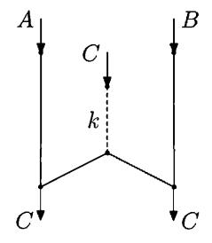

FIGURE 42. Restoring C when A or B are given

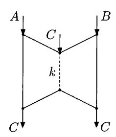

FIGURE 43. Additional edges that do not help much

that is (logarithmically) simple given C, and it maps each of the two strings A and B to C. (As before, the program has some additional part that distinguishes A from B; this part has logarithmic complexity.)

Note that this statement remains non-trivial even if we do not require the program be simple given C: no other proof even of this weak version is known. In other words, the problem does not look simpler if we add two additional edges, as shown in Figure 43.

As before, we can also refine the statement of Theorem 234 for the case when conditional complexities are different:

Theorem 235. Let A, B, and C be strings of complexity at most n, and let  $k \ge l$  be positive integers such that  $C(C|A) \le k$  and  $C(C|B) \le l$ . Then there exists a string X of length k such that  $C(X|C) = O(\log n)$ ,  $C(C|A,X) = O(\log n)$ , and  $C(C|B,X') = O(\log n)$ , where X' is the l-bit prefix of X.

324 How can one formulate this statement in terms of some information request?

(*Hint*: X is sent along an edge of capacity k, and another edge of capacity l extends the first edge.)

All these statements are proven by Muchnik [135]. We reproduce the proof of Theorem 235 given in his paper.

PROOF. We use the same idea: The string X is one of the (few) "fingerprints" of C. However, the argument needs to be changed. Even for the simple case k=l, we have a problem. One can find the fingerprint X such that C(C|A,X) is small, as well as some other fingerprint X' such that C(C|B,X') is small, but we need the same X for both cases. How can we achieve this?

We may consider fingerprints X that generate only few collisions both in  $S_A$  and  $S_B$  (here  $S_A$  and  $S_B$  stand for the set of strings that are simple relative to A and B, respectively). Indeed those universal fingerprints exist (most of the right vertices have this property, since  $S_A \cup S_B$  is only twice bigger than each of  $S_A$  and  $S_B$ ). The expansion property now guarantees that for most strings in  $S_A$  and for most strings in  $S_B$  there exists a universal fingerprint. But then we run into a problem. We would like to say that the remaining strings have small complexity since there are only a few of them, and we can generate them—but to generate them we need to know both A and B, and we have only one of these two strings as a condition....

What can we do? Let us consider A and B separately, but let us require that C has not only one good fingerprint (neighbor) but that most of the neighbors of

C are good. If this can be achieved for A and B separately, then some fingerprint will be good simultaneously for A and B.

So we need to change many things, starting from the expander-type property we use. Let  $E \subset P \times Q$  be a bipartite graph with left part P and right part Q. Now we require that for every small enough  $U \subset Q$ , the set of  $x \in P$  such that most neighbors of x are in U is small. In other words, in our previous argument a vertex in P was bad for us if all its neighbors are bad in Q; now it is enough if most neighbors are bad in Q.

Moreover, to adapt our argument to the case when C(C|A) and C(C|B) are different, we consider not only fingerprints but also their prefixes. So the statement about the existence of an expander-like graph is now as follows (by  $[u]_m$  we denote the m-bit prefix of u):

LEMMA. Let n and N be positive integers, and let  $\varepsilon > 0$  be a real number. Assume that

$$n2^{N+2n+1}\varepsilon^{N/2} < 1.$$

Then there exists a family of N mappings

$$\chi_1, \ldots, \chi_N \colon \mathbb{B}^n \to \mathbb{B}^n$$

with the following property. For every  $m \in \{1, ..., n\}$  and for every non-empty subset  $U \subset \mathbb{B}^m$  of size at most  $\varepsilon 2^m$ , the number of  $x \in \mathbb{B}^n$  such that

$$[\chi_i(x)]_m \in U$$
 for at least half of  $i \in \{1, ..., N\}$ 

is less than |U| (the cardinality of U).

(Some comments: Instead of a graph with left-degree N, we consider a family of N mappings, so we allow multiple edges  $(\chi_i(x) = \chi_j(x) \text{ for } i \neq j)$ . Now both arguments and values of  $\chi_i$  have the same size n, but the statement speaks about m-bit prefixes for all  $m \leq n$ .)

PROOF. As usual, let us consider randomly chosen  $\chi_1, \ldots, \chi_N$  (for all i and x the values  $\chi_i(x)$  are independent and uniformly distributed) and show that the probability of violating the statement is less than 1. Let us get an upper bound for this probability. For each  $m \leq n$ , for each  $t \leq \varepsilon 2^m$ , and for each pair of sets  $T \subset \mathbb{B}^n$  and  $U \subset \mathbb{B}^m$  both having cardinality t, we consider the following event. For each  $x \in T$ , at least half of the values  $[\chi_i(x)]_m$  (for  $i = 1, \ldots, n$ ) are in U. We need an upper bound for the probability of this event.

For a fixed  $x \in T$  the probability of the event "at least half of x-neighbors is in U" is at most  $2^N \varepsilon^{N/2}$ : There are at most  $2^N$  subsets  $X \subset \{1, 2, ..., N\}$  that contain at least N/2 elements, and for each X the probability that all  $\chi_i(x)$  are in U (for all  $i \in X$ ) is at most  $\varepsilon^{N/2}$ . (Recall that  $[\chi_i(x)]_m$  is uniformly distributed in  $\mathbb{B}^m$  and U occupies only an  $\varepsilon$ -fraction of  $\mathbb{B}^m$ .) This event should happen for all  $x \in T$  (this gives exponent t). In this way we get the following bound for the total probability (that should be less than 1):

$$\sum_{m=1}^n \sum_{t=1}^{\varepsilon 2^m} \sum_{T \subset \mathbb{B}^n, |T|=t} \sum_{U \subset \mathbb{B}^m, |U|=t} (2^N \varepsilon^{N/2})^t.$$

The number of different T is bounded by  $2^{nt}$  (the number of sequences of t elements of  $\mathbb{B}^n$ ). For the same reason the number of different U is bounded by  $2^{mt}$ . For the

entire sum we get an upper bound

$$\sum_{m=1}^{n} \sum_{t=1}^{\epsilon 2^m} 2^{tn} 2^{tm} 2^{tN} \varepsilon^{Nt/2}$$

or

$$\sum_{m=1}^{n} \sum_{t=1}^{\epsilon 2^{m}} (2^{n} 2^{m} 2^{N} \epsilon^{N/2})^{t}.$$

The internal sum is a geometric sequence. Our assumptions guarantee that its common ratio is less than 1/2, so the sum is bounded by 2 times the first term, and this term does not depend on t. So we get the upper bound

$$2n \cdot (2^{N+n+m} \varepsilon^{N/2}) \leqslant n 2^{N+2n+1} \varepsilon^{N/2},$$

and it is less than 1 according to our assumption. The lemma is proven.

We will use this lemma for  $\varepsilon = 1/8$ . In this case the condition can be rewritten as

$$n2^{N+2n+1} < 8^{N/2}$$

or

$$\log n + N + 2n + 1 < 3N/2.$$

We can let N = 6n, and this guarantees that the condition of the lemma is true for all sufficiently large n.

Now we are ready to continue the proof of Theorem 235. As before, we replace C by its shortest (unconditional) description, so we assume that C is an n-bit string. (The complexity of A and B is irrelevant; in particular, these complexities may exceed n.) Let us apply the lemma with N = 6n and  $\varepsilon = 1/8$ ; it provides 6n mappings  $\chi_1, \ldots, \chi_{6n} : \mathbb{B}^n \to \mathbb{B}^n$  with specified properties. As usual, we can take the first (in some natural ordering) family with these properties (for a given value of n), so we may assume that the complexity of the family  $\chi_i$  is  $O(\log n)$ .

Assume that C(C|A) = k and C(C|B) = l. (The assumption only guarantees the inequalities  $C(C|A) \leq k$  and  $C(C|B) \leq l$ . But we can decrease k and l if needed, and the statement becomes only stronger.) Taking k (or l) first bits of the hash values, we get N (= 6n) mappings  $\mathbb{B}^n \to \mathbb{B}^k$  (the same for l). These families define bipartite graphs in  $\mathbb{B}^n \times \mathbb{B}^k$  and  $\mathbb{B}^n \times \mathbb{B}^l$  where each left vertex has degree N (including multiple edges). Then we restrict these graphs on  $S_A$  and  $S_B$ , where  $S_A$  consists of n-bit strings that have complexity at most k given A, and A0 consists of A1 or A2 bits strings that have complexity at most A3 in A4 we note bad vertices that have more than A5 neighbors in A6. (The value of a sufficiently large constant A6 will be chosen later.)

In both cases the number of bad vertices in bounded by

$$2N \cdot 2^k/n^c$$
 (for  $\mathbb{B}^k$ ) and  $2N \cdot 2^l/n^c$  (for  $\mathbb{B}^l$ ),

since (a) the degree of a bad vertex exceeds  $n^c$ ; (b) the total number of edges in the restricted graphs is bounded by  $|S_A| \cdot N$  and  $|S_B| \cdot N$ , respectively; (c)  $|S_A| < 2 \cdot 2^k$  and  $|S_B| < 2 \cdot 2^l$ .

Now, implementing our plan, we say that a vertex in  $S_A$  is bad if at least half of its neighbors in the graph in  $S_A \times \mathbb{B}^k$  (multiple edges are counted several times) are bad. The lemma guarantees that the number of bad vertices in  $S_A$  is less than  $2N \cdot 2^k/n^c$  (we assume that c is large enough, so the bound for the number of bad

vertices is less than  $\varepsilon 2^k$ , where  $\varepsilon = 1/8$ ; recall than N = 6n). Since the bad vertices in  $S_A$  can be enumerated (given n, k, and A), the conditional complexity of each of them given A is at most

$$\log(2N \cdot 2^k/n^c) + O(\log n) \leqslant k - c\log n + O(\log n).$$

Therefore, for large enough c all bad vertices have conditional complexity (with condition A) less than k, and C is not bad (its complexity is exactly k). This means that most values  $[\chi_i(C)]_k$  (more than N/2) are good in  $\mathbb{B}^k$ .

A similar argument for the other graph shows that most of the values  $[\chi_i(C)]_l$  are good in  $\mathbb{B}^l$ . Therefore there exists i which leads to good vertices in both cases. Then  $X = [\chi_i(C)]_k$  and  $X' = [\chi_i(C)]_l$  have the required properties.

325 State and prove a similar result for three conditions (or polynomially many conditions).

After these remarkable results are proven, one may want to go farther and ask: Is it possible to find for a given A one string of length k that can be used to reconstruct A starting from  $arbitrary\ B$  such that C(A|B) < k? It is easy to see, however, that it is too good to be true.

Let k=n/2, and let X be a string of length n/2 that satisfies this property (i.e.,  $C(A|X,B)\approx 0$  for every B such that  $C(A|B)\leqslant n/2$ ). Then C(A|X) should be at most n/2, since we can take the half of the n-bit description of A for B. Now we can take X for B; then the complexity of the pair  $\langle X,B\rangle$  is at most n/2, and A cannot be reconstructed.

326 Show that not only is one fingerprint not enough, but any fixed number of fingerprints is not enough.

(*Hint*: Assume that d strings are enough. We can assume without loss of generality that all these strings are incompressible. For some i, let us concatenate i-bit prefixes of all fingerprints and denote this string by  $B_i$ . For some  $i=i_0$  the conditional complexity  $C(A|B_i)$  is close to n/2 since it decreases continuously from n to some value not exceeding n/2 (the latter because it is true even for one fingerprint). This  $i_0$  is at least n/2k; none of the fingerprints can serve  $B_{i_0}$ , since each of them has some common information with  $B_{i_0}$  and the total amount of information is not enough.)

#### 12.8. Information flow and network cuts

We have considered several types of information requests; for each type we have found necessary and sufficient conditions for the request to be fulfillable. In all our examples these conditions can be obtained in some uniform way using network cuts. Let us describe this technique explicitly. Consider an information request (a directed acyclic graph with capacities, input and output vertices, and input and output strings). Let us formulate a necessary condition for this request to be fulfillable.

Choose some cut of the request graph, i.e., some set I of the graph nodes. We are interested in the information flow that goes inside I. Consider all the graph edges that cross I in this direction (start outside I and end in I). If there is some unlimited capacity edge among them, we do not get any non-trivial conditions for our I. Assume that this is not the case and that all capacities  $u_1, \ldots, u_k$  are finite. Let  $V_1, \ldots, V_l$  be the input strings for all input vertices in I, and let  $W_1, \ldots, W_m$ 

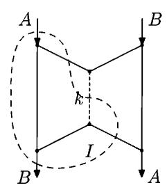

FIGURE 44. A cut for Bennett-Gács-Li-Vitányi-Zurek theorem

be the output strings for all vertices in I. Then the following condition is necessary for the request to be fulfillable:

$$C(W_1,\ldots,W_m\mid V_1,\ldots,V_l)\leqslant u_1+\cdots+u_k.$$

(As always, all the inequalities are understood with logarithmic precision). Indeed, if we know all  $V_1, \ldots, V_l$  and also all the messages along the edges going into I from outside, we can reconstruct (with logarithmic advice) all the outgoing messages for all vertices in I, including  $W_1, \ldots, W_m$ . This can be done by considering the vertices of I in a topologically sorted ordering (the starting point of every edge should be considered before its endpoint; recall that the graph is acyclic according to our assumption).

In fact this is just the standard argument about flows and cuts, adapted to information flow. Let us explain how this general scheme gives the necessary conditions for the requests in one of our previous examples. Consider the request from Section 12.6, and let I be the set of three vertices inside the dotted line (Figure 44).

The incoming information consists of A and some string of length k (along the edge with capacity k). Two other edges of the graph go in the opposite direction (recall that all edges are assumed to be in the top-down direction). So we get exactly the condition  $C(B|A) \leq k$  that we used.

327 Show that for all our examples the conditions we considered can be obtained as cut-flow conditions for suitable chosen cuts.

#### 12.9. Networks with one source

In the previous section we explained a general method to obtain necessary conditions for the information requests to be fulfillable. A natural question arises: Are they (taken for all possible cuts) sufficient? In all previous examples this was indeed the case. In general, as we will see later in this chapter, this is not true. In this section we show that it is true for the special case where there exists one input node with input string A and several output nodes with (the same) output strings A. In other words, if we want to transmit some information without change and have only one source node, the cut-flow conditions are not only necessary but also sufficient.

For Shannon information theory this problem was studied in [1, 104]. Our argument follows the scheme used there (with some changes needed to adapt it to the complexity framework).

Let us start with an example. Assume that we want to transmit a string A of length 2k to three destination nodes (Figure 45); all the channels have unlimited capacity except for the first three that have capacity k. Can we achieve this?

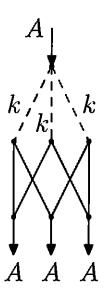

Figure 45. Splitting information into pieces

There is no problem to deliver A into each destination separately. For example, to deliver it into the left destination vertex, we split it into two halves  $A_1$  and  $A_2$ , each containing k bits, and send these halves using two left channels. They have capacity k, so this is possible. (The third channel is useless for this destination.)

The same trick can be used for two other destinations. The problem appears when we want to send A to all three destinations at the same time. For this we would like to cut A into "three halves" in such a way that every two of them are enough to reconstruct A. A standard secret sharing scheme can be used—we send strings  $A_1$ ,  $A_2$  and  $A_1 \oplus A_2$  (bitwise XOR, or sum modulo 2) along three channels.

It turns out that one may do something similar in the general case and prove the following result:

THEOREM 236. Consider an information transmission request with integer capacities, a single input vertex and an input string A of length n, and the same output strings A in several places. Assume that all the cut-flow conditions are true: For every J that does not contain the input vertex and contains at least one output vertex, the sum of capacities of all incoming edges (that start outside J and arrive to J) is at least n. Then this request is fulfillable with  $O(\log n)$ -precision: One can find strings for all edges in such a way that for every vertex the conditional complexity of outgoing information given the incoming information is  $O(\log n)$ .

(The constant hidden in  $O(\log n)$  depends on the graph but not on n, capacities and A.)

PROOF. Consider first the case when there is only one output node t. In this case we need to send n bits of information from source node s to the destination node t along the edges. Let us imagine that each bit is packed into an envelope (the position is also written inside the envelope). We get n envelopes in the source node. We want to bring them to the output node with the restriction that if an edge has capacity k, at most k envelopes could be carried along this edge.

This envelope-moving problem is solvable due to the Ford-Fulkerson theorem (min-cut equals max-flow (see, e.g., [45], since all capacities are integers, an integer flow exists). Now we write on each edge the bits that were carried along this edge. More precisely, Ford and Fulkerson provide a set of envelopes for each edge; consider

the numbers (positions) of bits sent in these envelopes, in non-decreasing order, and write on the edge the subsequence of bits in these positions.

Let us show that bounds for conditional complexities are satisfied. Consider some node and the output and input strings for this node. The output strings are made by combining the bits obtained from the input string. The scheme (which bits go where) does not depend on A and can be computed if n is known, so this scheme has complexity  $O(\log n)$ , and it is enough to know it to transform incoming strings into outgoing strings.

This finishes the proof for the case of one output node.

To prove the same result in the general case, we use random linear codes. In the previous argument we just moved bits from incoming strings to outgoing strings. Now we use a more general tool—we apply some linear operator in each vertex. Imagine for now that bits are elements of the two-element field  $\mathbb{F}_2$  (it consists of 0 and 1, and 1+1=0). Then l-bit strings are vectors in the l-dimensional vector space over this field.

Consider a node that has incoming edges of capacities  $i_1, \ldots, i_p$ , and outgoing edges of capacities  $j_1, \ldots, j_q$ . (We replace all infinite capacities by n: since we send only n bits, we never will need to send more than n bits along an edge.) Then the linear transformation in the node can be specified by a matrix of size  $(j_1 + \cdots + j_q) \times (i_1 + \cdots + i_p)$ , and we multiply the incoming bits vector by this matrix to get the outgoing bits vector. Note that we send exactly k bits along an edge of capacity k (even if this edge looks useless).

(It is easy to see that our solution for the three outputs example has exactly this form.)

Assume that for some vertex such a transformation matrix is chosen. Then we get for each output some linear transformation (from input n-dimensional space to output n-dimensional space) over the field  $\mathbb{F}_2$ . We want to make all these linear operators invertible. This would guarantee that the output string contains full information (up to a fixed linear transformation) about the input string. So if we can find some matrices in the nodes that make all the input-output transformations invertible, we are done.

There is one subtle point here: The mere existence of good transformation matrices for all nodes is not enough. We need these matrices to be simple. However, a standard trick helps. If good matrices exist, we can use the first example in some ordering, and it has complexity  $O(\log n)$ ; recall that the graph is fixed.

A more serious problem is that in some cases it is not possible to make these matrices invertible for each output.

328 Consider the information request from Figure 46. Assume that the input string consists of two bits and the capacities of all edges are equal to 1. Show that no linear transformations in the nodes make all six input-output mappings invertible.

(*Hint*: There are only three non-linear functionals on two-dimensional space, so two of the intermediate vertices will carry the same information.)

Note that for each output it is possible to find transformations in the vertices that make the transformation for this output invertible; indeed, we have seen that we do not even need arbitrary linear transformations—repackaging the bits (from envelopes to envelopes) is enough. The problem is that we cannot make the transformation for all output nodes invertible simultaneously.

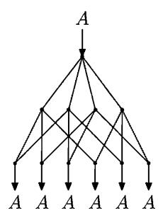

FIGURE 46. Field  $\mathbb{F}_2$  is not enough.

Let us change our setting and consider elements of an arbitrary field F instead of bits (elements of  $\mathbb{F}_2$ ). The input is now a vector from  $F^n$ ; an edge of capacity k carries an element of  $F^k$ , and transformations in the nodes are F-linear, i.e., determined by matrices with elements from F.

Let us show that for a large enough field F one can find the transformations in the nodes that make all the output mappings invertible at the same time. Let us consider the matrix elements as F-valued variables. Then the elements of the resulting input-output matrices are polynomials in these variables. The determinants of these matrices are also polynomials. The degree of a determinant as a polynomial in matrix elements is bounded by nE, where E is the number of edges in the graph (going from input to output, we increase the degree of the polynomial by 1, and by computing the determinant we multiply the degree at most by n). So for each output we have a polynomial of a limited degree (the determinant of the corresponding matrix), and we know that this polynomial is not equal to 0 (since we can make the matrix invertible for each output separately). It remains to use the following simple algebraic result:

LEMMA. A polynomial of degree d in m variables or over a field F is either equal to 0 (has zero coefficients) or is equal to zero in a random point with probability at most d/|F|.

Here by degree we mean total degree (exponents for all variable are added), |F| stands for the cardinality of F, and the probability is taken over uniform distribution in  $F^m$ .

PROOF. We use induction over m. For m=1 the claim says that the number of roots of a univariate polynomial is bounded by its degree (factorization argument). For m>1, we represent the given polynomial as a polynomial in one variable whose coefficients are polynomials in the remaining variables. Let  $d_1$  be the degree of this univariate polynomial (the maximal exponent for the selected variable), and let  $d_2$  be the degree of its leading coefficient (as a polynomial in the remaining variables). This leading coefficient may be zero or not depending on the values of the remaining variables. The probability for it to be zero is bounded by  $d_2/|F|$  due to the induction assumption, and if the leading coefficient is not zero, the probability to bump into a root of the non-zero univariate polynomial of degree  $d_1$  is bounded by  $d_1/|F|$ . In total we get  $(d_2+d_1)/|F| \leq d/|F|$ . The lemma is proven.

Now we note that if the probability of getting a zero determinant at each given output is less than 1/(number of output nodes), then there exist some values of the variables that make all the determinants non-zero simultaneously. We have the degree bounded by nE, the number of outputs is also bounded by E, so the condition  $nE^2 < |F|$  is enough to guarantee the existence of matrices that make all input-output transformations invertible. (And these matrices can be found by search, so they are simple matrices with this property.)

How can we use all this in a situation where we have n bits (and not n elements of a big finite field)? As usual for coding theory, let us split the n-bit string into blocks of some size k. We get (approximately) n/k blocks and interpret each block as an element of a field of size  $2^k$  (such a field exists for all k, as explained in algebra textbooks). If it turns out that the number n and all capacities are multiples of k, and that  $2^k > (n/k)E^2$ , then we are done.

In general, we need some adjustments. First we choose some value of k such that  $2^k > nE^2$  (we ignore the 1/k factor, but it is in our favor). This gives us  $k = O(\log n)$ . Then we round n and the capacities making them multiples of k (n is rounded downwards and capacities are rounded upwards, so the inequalities for cuts remain true). The rounding error is  $O(\log n)$ , so it does not matter with our precision, and it remains to use the statement we proved.

329 Using random linear transformations, construct a probabilistic algorithm that finds the maximal flow in a directed acyclic graph with integer capacities.

(*Hint*: For a given n we may find whether a flow of size n exists by assigning random matrices to each vertex and checking whether the resulting  $n \times n$  matrix is invertible.)

In the rest of the chapter we consider examples of the opposite type, where cut-flow conditions are only necessary, but not sufficient.

# 12.10. Common information as an information request

We have already considered one example where necessary cut-flow conditions turn out to be insufficient—this was the common information problem from Chapter 11. In Section 11.2 we asked (for given strings x, y and for given integers  $\alpha, \beta, \gamma$ ) whether there exists a string z such that

$$C(z) < \alpha$$
,  $C(x|z) < \beta$ ,  $C(y|z) < \gamma$ .

This problem, considered up to logarithmic precision, can be reformulated as an information transmission request (Figure 47). Indeed, if a string z with required properties exists, it can be sent along the middle edge (of capacity  $\alpha$ ); two other edges should transmit conditional descriptions of x and y given z. (Both z and these conditional descriptions can be found by search with logarithmic advice if x and y are given, so there is no new information in the top vertex.) On the other hand, if this information transmission request is fulfillable, then the string z sent along the middle edge satisfies the required inequalities (with logarithmic precision).

The cut-flow conditions give the inequalities

$$C(x) \leqslant \alpha + \beta$$
,  $C(y) \leqslant \alpha + \gamma$ ,  $C(x, y) \leqslant \alpha + \beta + \gamma$ ,

and we have seen in Chapter 11 many different examples of strings x and y where these inequalities turn out to be insufficient for the existence of string z (common information) with required properties.

### 12.11. Simplifying a program

In the previous section we have seen an example of an information request that can be not fulfillable even if all the cut-flow conditions are satisfied. This request is rather complicated, and it is interesting to find a simpler example. In this section we mention one of these examples—it turns out that the statement of Theorem 229 is quite close to the boundary line, and just a slightly more general setting makes the cut-flow conditions insufficient.

Consider an information request suggested by Vyugin (Figure 48). The difference with Muchnik's theorem is that now instead of reconstructing one of the input strings (P in the current notation), we have to obtain some third string (B). The cut-flow conditions for this problem are  $C(B|A) \leq k$  and C(B|A,P) = 0 (considered with logarithmic precision). They are (as always) necessary, but one can show that they are not sufficient.

This request can be described informally as "simplification of a program". Since C(B|A,P)=0, the string P can be considered as a program (or information sufficient for a program) that transforms A into B; however, the complexity of P is bigger than strictly necessary, i.e., it exceeds k=C(B|A). Can we find another program, of minimal possible complexity C(B|A), that transforms A to B and at the same time is a "simplification" of the first one (i.e., has no new information compared to P)?

The detailed explanation of the negative answer (even several explanations, using game, probabilistic, and combinatorial arguments) is given in [140].

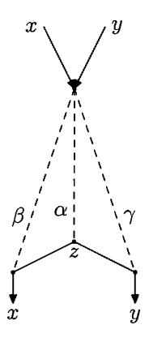

FIGURE 47. Common information request

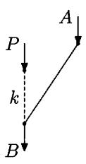

FIGURE 48. Simplification of a program

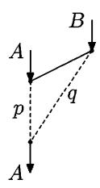

FIGURE 49. Two channels of bounded capacity

#### 12.12. Minimal sufficient statistics

In this section we consider another request where cut-flow conditions are not sufficient (Figure 49). Here the output string is again (like in Muchnik's theorem) one of the input strings, but now both capacities are limited. In addition, we allow use of the full information about B when encoding A.

This problem is related to the notion of minimal sufficient statistics in probability theory. Let us explain this connection (though it is not important for the proofs, so one may skip these explanations). Consider a pair of two random variables  $\theta$  and X with some joint distribution. The variable  $\theta$  is considered a parameter, and for each value of  $\theta$  we consider the conditional distribution of X. For example, we may first choose  $\theta$  uniformly distributed in [0,1], and then choose an n-bit string X according to the Bernoulli distribution on n-bit strings with parameter  $\theta$ . In this way we get a joint distribution of  $\theta$  and X.

Assume that we observe X in a pair  $(\theta, X)$  generated according to this distribution, and want to guess  $\theta$ . (As usual, we assume that some a priori distribution on the space [0,1] of parameters is given.) Not all information in X is really useful for that—it is enough to know how many ones are among the outcomes, and it does not matter what their positions are. More formally, the random variable N(X), the number of ones in X, extracts all information about  $\theta$  that is in X,

$$I(N(X):\theta) = I(X:\theta).$$

For an arbitrary function N the left-hand side does not exceed the right-hand side; the functions N that transform this inequality into an equality are called *sufficient statistics*. The same condition can be formulated in a different way:  $\theta$  and X and independent given N(X). One more reformulation is  $H(\theta|N(X)) = H(\theta|X)$ .

By definition, the random variable X itself is a sufficient statistic; our example shows that it may contain a lot of irrelevant information. A sufficient statistic is called a *minimal sufficient statistic* if it is a function of all other sufficient statistics. For the random variables with finitely many values, a minimal sufficient statistic always exists (and is unique up to permutations): one should identify those values of X that lead to the same conditional distributions on  $\theta$ . The minimal sufficient statistic has minimal entropy among all sufficient statistics.

330 Assume that all values of  $\theta$  have positive probabilities. Prove that the notion of sufficient statistics depends only on the values of conditional probabilities  $P[X = x \mid \theta = t]$  for all pairs x, t (so the distribution for  $\theta$  itself is not important).

(*Hint*: For each x consider a vector containing all  $P[X = x \mid \theta = t]$  for all values t of the random variable  $\theta$ . Then N is a sufficient statistic if and only if every two arguments with the same values of N correspond to proportional vectors.)

The search for minimal sufficient statistics can be described as follows: We consider random variables X' such that H(X'|X) = 0 (i.e., functions of X) and select those for which the value  $H(\theta|X')$  is minimal. Then we minimize H(X') among the selected random variables.

Now we try to find an algorithmic information counterpart of this procedure. Let us consider two strings A (which corresponds to  $\theta$ ) and B (which corresponds to X). We want to select some part B' of information in B for which C(A|B') reaches the minimal possible value C(A|B). Among those B' we then want to select one with minimal C(B') so it can be considered as an algorithmic version of minimal sufficient statistics.

This setting can be explained in terms of information transmission using Figure 49. Here B' (a function of B) is sent via a channel of capacity q, and the conditional description of A given B' is sent via a channel of capacity p. The minimal statistics problem can be now stated as follows—minimize q for minimal possible  $p \approx C(A|B)$ .

Let us consider some more general questions. For which p and q is the information transmission request (for given A and B) fulfillable? The necessary cut-flow conditions are (with logarithmic precision)  $C(A) \leq p + q$  and  $C(A|B) \leq p$ .

**331** Find cuts that give these conditions.

For some pairs A, B these necessary conditions turn out to be sufficient.

332 Show that if A and B have extractable common information (e.g., A and B are overlapping substrings of some incompressible string), then these necessary conditions are also sufficient.

(*Hint*: The condition  $C(A|B) \leq p$  guarantees that we can send the part of A outside B along the left channel, plus some other part of A, and the rest can be sent along the right channel—the condition  $C(A) \leq p + q$  guarantees that there is enough capacity.)

However, as we will see, in the general case the necessary conditions are not sufficient. To provide an example in which this happens, let us fix the complexities and conditional complexities of A and B. We agree that A and B have complexity 2n, and the pair  $\langle A, B \rangle$  has complexity 3n. (So the conditional complexities C(A|B) and C(B|A) are about n.) Figure 50 shows necessary conditions  $p+q \geq 2n$  and  $p \geq n$  for this case.

Now let us try to find some values of p and q when the request is guaranteed to be fulfillable (whatever A and B are, assuming they have complexities as we agreed). We can send the string A along the left channel, so the request is feasible for p = 2n and q = 0 (and, of course, for all bigger p and q). Another possibility is to send B completely along the right channel, so the request is feasible for p = n, q = 2n (and for bigger p and q). In this way we get two quadrants with vertices (2n,0) and (n,2n). Moreover, if we delete (say, the last) k bits from B (which we assume to be incompressible), then the conditional complexity C(A|B) increases at most by k, so the request is feasible for q = 2n - k, p = n + k. So in the dark grey region on Figure 51 (denoted there by G) the request is always feasible.

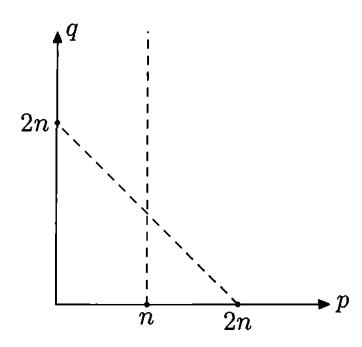

Figure 50. Necessary (cut-flow) conditions

As in the case of common information (Chapter 11), we may say that the *profile* of a pair  $\langle A, B \rangle$  (the set of all pairs  $\langle p, q \rangle$  that make the request feasible) is not determined by complexities and conditional complexities of A and B—for different pairs with the same complexities the profiles could be different. Problem 332 shows that for some pairs the profile coincides with the upper bound provided by cut-flow inequalities. Theorem 237 shows that for some pairs the profile coincides with the lower bound (it equals G; see Figure 51).

However, we need to be careful to formulate the statement correctly. One would like to claim that for every B' that is simple relative to B, the pair  $\langle C(A|B'), l(B') \rangle$  is in an  $O(\log n)$ -neighborhood of G, and the hidden constant in  $O(\log n)$  does not depend on n and B'. However, the assumption "B' is simple relative to B" needs to be formulated in some exact way. We should choose some threshold r and require that C(B'|B) < r. As r increases, the distance between  $\langle C(A|B'), l(B') \rangle$  and G may increase, and we should make an exact statement about it. In fact, the distance is bounded by O(r). Here is the exact statement:

THEOREM 237. For every n there exist strings A, B of complexity  $2n+O(\log n)$  such that  $C(A,B)=3n+O(\log n)$ , and for every B' the pair  $\langle C(A|B'),l(B')\rangle$  belongs to the  $O(\log n+C(B'|B))$ -neighborhood of the set G.

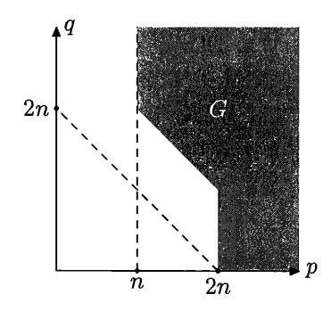

FIGURE 51. Sufficient conditions

PROOF. As in many other cases, we will prove this result using a game.<sup>1</sup> First we describe the game, then show the winning strategy, and finally we explain how this implies the statement of the theorem.

The game has parameter n. We (being one of the players) may, for each 2n-bit string B, choose at most  $2^n$  strings of length 2n, calling them "simple given B". Our adversary, on the other hand, for each triple  $\langle p, q, r \rangle$  (taken from some set M of admissible triples, see below) may do the following:

- for every string B of length 2n, choose at most  $2^r$  strings of length q and call them "r-simple given B";
- for every string B' of length q, choose at most  $2^p$  strings of length 2n and call them "p-simple given B'".

This is done independently for each triple  $\langle p, q, r \rangle$  from M. Imagine that we play against a team. For each  $\langle p, q, r \rangle$  there is a team member who makes his own announcements (obeying his own cardinality restrictions, as described), but they play as a team against us.

The adversary team includes two more members. The first one may choose up to  $2^{2n-1}$  strings of length 2n (i.e., not more than half) and call them "bad". The second one may for every string B of length 2n choose up to  $2^{n-2}$  strings of length 2n (in a different way for each B) and call them "bad for this B".

Later we will play with the adversary who marks as "bad" all 2n-bit strings of complexity less than 2n-1, and for each B marks as "bad for B" all 2n-bit strings A such that C(A|B) < n-2. But the game rules do not say anything about this specific choice of bad strings. Note that we use threshold n-2 (and not, say, n-1) since we need some reserve; see below.

Both we and the adversary make the declarations gradually—at any moment each player may extend the lists of simple/bad strings (if the cardinality restrictions are not violated by this extension). The declarations cannot be retracted. Since the total number of positions is finite, the game (though being formally infinite) has some limit position, but the players do not declare whether they will make more moves or not.

The winner in the game is determined by the limit position. The adversary wins if for every pair of 2n-bit strings A and B, where A is n-simple given B, and A and B are not bad, and A is not bad for B, there exists an admissible triple  $\langle p,q,r\rangle$  and a q-bit string B' such that

- B' is r-simple given B;
- A is p-simple given B'.

According to our plan, we first show a simple computable strategy that wins this game (for some set of admissible triples  $\langle p,q,r\rangle$ ), and we then derive the statement of the theorem. This strategy replies to each move of the adversary (made by some team member who declares a new "bad" or a new "simple" string) by one move. We add (for some string B of length 2n) one n-simple string A of length 2n that prevents the adversary from winning, if no new moves are made. To achieve this, we need the following:

- the chosen strings A and B are not yet declared bad;
- A is not yet declared bad for B;

<sup>&</sup>lt;sup>1</sup>We have already seen several game arguments; for a survey of game techniques for Kolmogorov complexity see [198, 136].

• there is no admissible triple  $\langle p, q, r \rangle$  for which two things happen: (1) there exists some B' of length q that was declared r-simple given B by  $\langle p, q, r \rangle$ -player of the adversary's team, and (2) at the same time A was declared p-simple given B' by the same player.<sup>2</sup>

Why is this possible? At every step of the game there is at least  $2^{2n-1}$  strings not declared bad. If we select one of them, we may declare every string as n-simple given B unless we exhausted the quota, i.e., we have already declared  $2^n$  strings to be n-simple given this B. But if this happens for all non-bad B, this means that we have already made  $2^{2n-1} \cdot 2^n = 2^{3n-1}$  moves. Recall that we make one move after each move of the adversary, and we will see that the adversary cannot make so many moves. So we can choose some B.

After B is chosen in such a way that we have not exhausted the quota for n-simple strings given B, we start to select A. Let us consider some admissible triple  $\langle p,q,r\rangle$  and count the strings A that do not make the position winning because of this triple. There is at most  $2^r$  strings B' of length q declared as r-simple given B. For each of these B' there is at most  $2^p$  strings of length 2n declared as p-simple given B' (for the same triple = by the same team member). So we have to avoid  $2^{p+r}$  strings for each triple  $\langle p,q,r\rangle$  from the set M of admissible triples. In total we have to avoid  $2^{p+r} \cdot |M|$  strings. Also we have to avoid strings that are declared bad, at most  $2^{2n-1}$ , as well as strings declared bad for B, at most  $2^{n-2}$  of them. So we can make the move we want, assuming that

$$(*) 2^{p+r} \cdot |M| + 2^{2n-1} + 2^{n-2} < 2^{2n}.$$

Now we need to count how many moves the adversary can make. Each of M players of his team takes care of one admissible triple  $\langle p,q,r\rangle$  and makes at most  $2^{2n+r}$  moves, declaring r-simple strings, and  $2^{q+p}$  moves, declaring p-simple strings. So the total number of moves for all players is bounded by

$$|M| \cdot (2^{\max(2n+r)} + 2^{\max(q+p)})$$

(maximal values of 2n+r an q+p are taken over all elements in M). We should also add  $2^{2n-1}$  moves that the adversary can make declaring bad strings and  $2^{2n} \cdot 2^{n-2} = 2^{3n-2}$  moves he can make declaring bad strings for  $2^{2n}$  strings of length 2n. So we can ensure the required upper bound for the number of the adversary's moves if

$$(**) |M| \cdot (2^{\max(2n+r)} + 2^{\max(q+p)}) + 2^{2n-1} + 2^{3n-2} < 2^{3n-1}.$$

Taking into account that  $2^k + 2^l$  is close to  $2^{\max\{k,l\}}$ , it is easy to see that the conditions (\*) and (\*\*) are guaranteed to be true if all the triples  $\langle p,q,r\rangle \in M$  satisfy the inequalities

$$p+r < 2n-3\log n - O(1),$$
  
 $2n+r < 3n-3\log n - O(1),$   
 $p+q < 3n-3\log n - O(1).$ 

Note that there are  $O(n^3)$  triples satisfying these inequalities, and to compensate for the factor |M|, we subtracted  $3 \log n + O(1)$ , the upper bound for  $\log |M|$ . In these inequalities we write O(1), but some small value, like 10, will work. Now

<sup>&</sup>lt;sup>2</sup>Note that according to our agreement different players on the adversary team may make different declarations, so the term "r-simple" has a different meaning for the  $\langle p,q,r\rangle$ -player and  $\langle p',q',r\rangle$ -player even when r is the same for both. (In fact, this freedom is not used by the adversary, with whom we really play to prove the theorem.)

let M be the set of all triples that satisfy these inequalities: we know then that a winning strategy in our game exists. (Note that for small r we get the conditions p < 2n and p + q < 3n that are true for points in G.)

Now we apply this winning strategy against the following blind strategy for the adversary (blind means that he does not look at our moves). He declares a 2n-bit string of complexity less than 2n-1 to be bad; for each 2n-bit string B all the strings that have conditional complexity less than n-2 given B are declared bad for B. Also for each triple  $\langle p,q,r\rangle$  the corresponding player from the adversary team declares strings of small conditional complexity as r- or p-simple for the corresponding threshold r or p.

Then both players follow some computable strategies, so the game is computable, and we need only to know n to start its simulation. We cannot effectively find when the limit state is reached, but it will happen at some moment. In this state there is a pair  $\langle A,B\rangle$  of strings guaranteed by the winning condition. Let us show that these two strings satisfy the statement of the theorem.

The length of both strings A and B is 2n; the complexity is 2n+O(1) (it cannot be less since otherwise the string would be declared bad). Since we declare at most  $2^n$  different strings A as simple given B, we have  $C(A|B) \leq n + O(\log n)$ . On the other hand, the complexity C(A|B) cannot be less than n - O(1), otherwise A would be declared bad for B.

Let B' be a q-bit string such that C(B'|B) < r. We may assume that r is much smaller than n, say, r < n/2 (otherwise the term O(r) in the right-hand side makes the statement of the theorem trivial). So the inequality for 2n + r on the previous page (the second one in the list of three inequalities after (\*\*)) is true. Therefore, for every p that satisfies the first and the third inequalities, the complexity C(A|B') exceeds p. So for every pair  $\langle p,q \rangle$  from the light-grey area (Figure 51) that is  $O(r + \log n)$ -far from G, there is no B' of length q such that C(B'|B) < r and C(A|B') < p. That is exactly what we needed to show.

Theorem 237 is proven.  $\Box$ 

Let us now give another proof of the same statement using a probabilistic argument. It follows almost the same scheme as the game proof above, but has several important differences. First, we do not wait until our adversary makes his moves, but we make all our moves at the beginning of the game. Second, we do not describe the winning moves explicitly—we just show that a random choice provides a winning strategy with positive probability.

Let us first make a technical remark: Under these assumptions we may assume without loss of generality that both players always fully use their quotas for bad/simple strings (adding strings is always to the player's advantage).

Now we can start the argument, explaining its relation to the game version in parentheses. Our strategy is now represented by some mapping

$$U \colon \mathbb{B}^{2n} \times \mathbb{B}^n \to \mathbb{B}^{2n}$$

(the values of U(B,X) for a given B and all possible X correspond to strings simple for B in the game argument). Assume that some finite set M of integer triples is fixed and for each triple  $\langle p,q,r\rangle\in M$  two mappings

$$V_{n,q,r} \colon \mathbb{B}^{2n} \times \mathbb{B}^r \to \mathbb{B}^q$$

and

$$W_{p,q,r} \colon \mathbb{B}^q \times \mathbb{B}^p \to \mathbb{B}^{2n}$$

are given. Moreover, assume that a mapping

$$S: \mathbb{B}^{2n-2} \to \mathbb{B}^{2n}$$

and another mapping

$$T \cdot \mathbb{R}^{2n} \times \mathbb{R}^{n-2\log n} \to \mathbb{R}^{2n}$$

are given. (The mappings  $V_{p,q,r}$  and  $W_{p,q,r}$  correspond to the moves of the  $\langle p,q,r \rangle$ -player on the adversary team. Namely, strings  $V_{p,q,r}(B,X)$  for all possible X are r-simple for B; strings  $W_{p,q,r}(B',X)$  for all possible X are p-simple for B'. The mappings S and T correspond to the moves of two additional players. Namely, S(X) are bad strings (there are  $2^{2n-2}$  of them), and T(B,X) are bad for B (there are  $2^{n-2\log n}$  of them). The bounds for the number of bad strings are now more strict than in the game argument; this is needed to obtain the bounds below.)

We say that a mapping U is covered by a quadruple V, W, S, T (which consists of two families of mappings and two mappings) if for every string  $B \in \mathbb{B}^{2n}$  and for every string A that is equal to U(B,X) for some  $X \in \mathbb{B}^n$  (for every string B and for every string A that is declared by us as n-simple for B), the pair  $\langle A, B \rangle$  satisfies one of four conditions:

- (1) B belongs to the range of S (i.e., B = S(Y) for some  $Y \in \mathbb{B}^{2n-2}$ ). (The string B is declared bad by the adversary.)
- (2) A belongs to the range of S (i.e., A = S(Y) for some  $Y \in \mathbb{B}^{2n-2}$ ). (The string A is declared bad by the adversary.)
- (3) A equals T(B, Y) for some  $Y \in \mathbb{B}^{n-2\log n}$ . (The string A is declared bad for B by the adversary.)
- (4) There exists a triple  $\langle p, q, r \rangle \in M$  and some q-bit string B' such that the following two conditions (a) and (b) are both true:
  - (a)  $B' = V_{p,q,r}(B,Y)$  for some  $Y \in \mathbb{B}^r$  ( $\langle p,q,r \rangle$ -player declared B' to be r-simple given B);
  - (b)  $A = W_{p,q,r}(B', Z)$  for some  $Z \in \mathbb{B}^p$  ( $\langle p, q, r \rangle$ -player declared A to be p-simple given B').

We will prove (under some conditions on the set M, see below) that there exists some mapping U that is not covered by any quadruple V, W, S, T. This proof will use a probabilistic argument: For each quadruple we count how many mappings are covered by it (i.e., we compute the probability for a random mapping to be covered by a given quadruple), then we multiply this probability by the number of quadruples and show that the product is less than 1.

The counting for one quadruple goes as follows. Assume that V, W, S, T are fixed. There are at least  $2^{2n-1}$  strings B of length 2n that violate condition (1). For the set U to be covered, it is needed that for each of these B each of the  $2^n$  values A = U(B, X) (for all n-bit X) is covered by one of the conditions (2)–(4). We will show that for a given B and X the probability of this event is at most 1/2. Then, by independence, we conclude that for a random U the probability to be covered is at most

$$(1/2)^{2^{2n-1}\times 2^n} = (1/2)^{2^{3n-1}}$$

Let us check the estimate for given B and X. Unsuitable A include the following:

- strings covered by (2), at most  $2^{2n-2}$  of them;
- strings covered by (3), at most  $2^{n-2\log n}$  of them;

• strings in  $W_{p,q,r}(V_{p,q,r}(B,Y),Z)$  covered by (4), at most  $2^r \times 2^p$  of them for each triple  $(p,q,r) \in M$ .

In total we get

$$2^{2n-2} + 2^{n-2\log n} + 2^{r+p} \cdot |M|$$

unsuitable strings, and this number is bounded by  $2^{2n-1}$  (half of all strings) if

$$(*) r+p+\log|M|<2n-3$$

for all  $(p, q, r) \in M$  (this is our first requirement for M).

Now we estimate the number of all quadruples V, W, S, T. For given p, q, r there are at most

$$(2^q)^{2^{2n}\times 2^r} = 2^{q\cdot 2^{2n+r}}$$

possibilities for  $V_{p,q,r}$  and at most

$$(2^{2n})^{2^q \times 2^p} = 2^{2n \cdot 2^{q+p}}$$

possibilities for  $W_{p,q,r}$ . There are at most

$$(2^{2n})^{2^{2n-2}} = 2^{2n \cdot 2^{2n-2}}$$

possibilities for S and at most

$$(2^{2n})^{2^{2n} \times 2^{n-2\log n}} = 2^{(2^{3n}/n)+1}$$

possibilities for T. The first two bounds appear with exponent |M| (to get the bound for the total number of possibilities for V and W); in total we get the following bound for the number of quadruples:

$$2^{q \cdot 2^{2n+r} \times |M|} \cdot 2^{2n \cdot 2^{q+p} \times |M|} \cdot 2^{2n \cdot 2^{2n-2}} \cdot 2^{(2^{3n}/n)+1}.$$

The binary logarithm of this number does not exceed

$$q \cdot 2^{2n+r} \times |M| + 2n \cdot 2^{q+p} \times |M| + 2n \cdot 2^{2n-2} + (2^{3n}/n) + 1,$$

and this is smaller than  $2^{3n}$  (as we need to finish the proof) if

$$(**) 2n + r + \log q + \log |M| < 3n - O(1)$$

and

$$(***) q + p + \log n + \log |M| < 3n - O(1).$$

(We use that  $2^a+2^b$  is equal to  $2^{\max(a,b)}$  up to an O(1)-factor; two other conditions  $2n-2+\log 2n < 3n-O(1)$  and  $\log(2^{3n}/n+1) < 3n-O(1)$  are guaranteed to be true.)

All three conditions (\*)-(\*\*\*) are true if

$$p+r < 2n-3\log n - O(1),$$
  
 $2n+r < 3n-4\log n - O(1),$   
 $p+q < 3n-4\log n - O(1)$ 

for all  $\langle p,q,r\rangle\in M$ , since  $|M|=O(n^3)$  in this case. Let us now define M as the set of triples satisfying these three inequalities. We know now that (for this M) there exists a mapping U not covered by any quadruple V,W,S,T. Now the standard argument shows that there exists a mapping U of logarithmic complexity (first in some order) not covered by any quadruple.

Take this U and consider the following quadruple V, W, S, T. Let  $\{S(\cdot)\}$  (the range of S) be the set of all 2n-bit strings whose complexity is less than 2n-2.

For every  $B \in \mathbb{B}^{2n}$  let the set  $\{T(B,\cdot)\}$  be the set of all 2n-bit strings that have conditional complexity given B less than  $n-2\log n$ . Let (for given p,q,r) the set  $V_{p,q,r}(B,\cdot)$  be the set of all q-bit strings of conditional complexity (given B) less than r. And let (for given p,q,r) the set  $W_{p,q,r}(B',\cdot)$  be the set of all 2n-bit strings of conditional complexity (given B') less than p. (We specify only the range of these mappings, the order can be arbitrary. Also, the number of strings with a given property may be less than the number of slots, so we fill the remaining slots in an arbitrary way.)

We know that U is not covered by this quadruple. This means that there exist strings A and B of length 2n that do not satisfy any of the properties (1)–(4). Then C(A) = 2n + O(1) (because A has length 2n and cannot have smaller complexity, otherwise it would be covered by S). For the same reasons C(B) = 2n + O(1). The conditional complexity C(A|B) equals  $n + O(\log n)$ : it cannot be bigger since A = U(B, X) for some string X of length n, and the complexity of U is  $O(\log n)$ , and it cannot be smaller, since otherwise the property (3) would be true. Finally, there is no triple  $\langle p, q, r \rangle$  in the set M such that C(B'|B) < r and C(A|B') < p, otherwise (4) would be true.

The rest of the proof is the same as in the game argument, and this finishes the probabilistic proof.

Finally, one can provide a geometric construction that gives strings A, B with the required property. (Unlike the case of common information, here the geometric construction gives almost the same complexity bound, not weaker ones.)

Consider the field with  $2^n$  elements (or a field of approximately this size, if we want to consider integers modulo p for some prime p), and a two-dimensional plane over this field. Let  $\langle A, B \rangle$  be a random pair that consists of a point and a line going through this point. Then we get complexities as required by Theorem 237. Let us show that such a pair has the required properties.

Assume that a string B' is given and

$$(*) C(B'|B) \leqslant r, \quad C(B') \leqslant q, \quad C(A|B') \leqslant p$$

for some p, q, r. We want to prove that the pair  $\langle p, q \rangle$  is in an  $O(r) + O(\log n)$ -neighborhood of the set G by showing that otherwise the pair  $\langle A, B \rangle$  would have smaller complexity. Let us estimate the number of pairs  $\langle A, B \rangle$  such that (\*) is satisfied for some B'. Each of the  $2^q$  strings B' determines two sets:

- the set  $U_{B'}$  of 2n-bit strings A such that  $C(A|B') \leq p$ ;
- the set  $V_{B'}$  of 2*n*-bit strings *B* such that  $C(B'|B) \leq r$ .

The set  $U_{B'}$  has cardinality  $2^p$  (in fact,  $\Theta(2^p)$ , but we ignore bounded factors). The set  $V_{B'}$  may have different sizes depending on the choice of B', but we know that the family  $V_{B'}$  for all B' covers the set  $\mathbb{B}^{2n}$  in at most  $2^r$  layers (for each B there are at most  $2^r$  strings B' that are r-simple given B).

We want to show that the union of the combinatorial rectangles  $U_{B'} \times V_{B'}$  over all B' covers only a small fraction of all pairs of incident point and lines. To bound the number of pairs covered by these rectangles, we use the same technique as before: the incidence graph does not have cycles of length 4, so we can apply the combinatorial lemma (p. 358). Let us recall the statement of this lemma. If a rectangular table  $l \times L$  has stars in some cells and one cannot find two rows and two columns that have stars at all four intersections, then the total number of stars

is bounded by

- O(L) for  $l \leq \sqrt{L}$ ;
- $O(l\sqrt{L})$  for  $l \geqslant \sqrt{L}$

(this is the bound obtained in the proof). Now we have to consider separately the case of large and small  $V_{B'}$ . If  $V_{B'}$  is large and contains more than  $\sqrt{|U_{B'}|}$  (i.e., more than  $2^{p/2}$ ) elements, then the number of covered pairs for this B' is at most  $2^{p/2}|V_{B'}|$ . The sum over all B' of this type is bounded by  $O(2^{p/2}2^{2n}2^r)$  (since the set of size  $2^{2n}$  is covered by at most  $2^r$  layers). Now consider small  $V_{B'}$ 's that contain at most  $\sqrt{|U_{B'}|}$  elements. For them  $U_{B'} \times V_{B'}$  covers at most  $O(2^p)$  elements, and for  $2^q$  different B' we have in total  $O(2^{p+q})$  pairs.

Therefore, if  $p+q < 3n - O(\log n)$  and  $(p/2) + 2n + r < 3n - O(\log n)$ , then a random pair  $\langle A, B \rangle$  cannot be served by any of B'. (We should note also that the set of pairs that are served can be enumerated if we know n, p, q, r, i.e.,  $O(\log n)$  bits of advice.) The second inequality can be rewritten as p+2r < 2n; it is a bit worse than the bound p+r < 2n that appeared in our first argument, but we still get the bound O(r), as the theorem claims.

This finishes the third proof of Theorem 237.

REMARK. The geometric proof provides a simple set of pairs where most of the pairs satisfy the statement of the theorem. So it gives a stochastic (in the sense of Section 14.2) pair with required properties.

The same result can be achieved by some modification of the second (probabilistic) proof. We have said that a mapping is covered if something is true for all pairs (of certain type). Let us weaken this restriction and say that U is covered if the same condition is true at least for the half of the pairs. To prove the existence of U that is not covered, we can use the following (trivial) probability bound. If each of  $2^k$  independent events has probability less than 1/16, then more than  $2^{k-1}$  events happen with probability at most  $2^{2^k} \cdot (1/16)^{2^k/2} = 2^{-2^k}$ . So we may replace 1/2 by 1/16 in the argument and continue the proof as before. In this way we get a simple set U where half of the elements have the required properties.

(Another approach is also possible. Instead of considering S, T and all the admissible triples in parallel, one can prove that with high probability for a random U the fraction of pairs when (4) is true is small. These small fractions and small probabilities are then added for all triples from M.)

# CHAPTER 13

# Information and logic

# 13.1. Problems, operations, complexity

In this chapter we define a *problem* as an arbitrary (finite or infinite) set of binary strings. The elements of this set are called *solutions* to that problem.

Why such strange terminology? Generally speaking, having a problem, we need to solve it, i.e., to find its solution. We assume that a solution can be represented by text (written in some formal language), i.e., by a binary string (assuming some natural encoding is used). We will measure the amount of information in the solutions ignoring all other aspects, so we identify the problem with the set of its solutions.

By complexity of a problem X we mean the minimal complexity of its solutions,

$$C(X) = \min\{C(x) \mid x \in X\}.$$

As usual, the empty set, i.e., the unsolvable problem, has complexity  $+\infty$ .

For example, the complexity of a singleton  $\{x\}$  is just the complexity of the string x. For a less trivial example, recall that in Section 1.2, we considered (for a given n) the problem "find a natural number  $k \ge n$ ". The complexity of this problem was denoted by  $C_{\ge}(n)$ . Now we can say that we consider the problem " $\ge n$ ", whose solutions are natural numbers  $k \ge n$ , and its complexity. (Formally, we have to speak about binary representations of those numbers.)

Let X and Y be two problems. We can consider the problem "solve both problems X and Y", as well as the problem "choose one of the problems X and Y and solve it". The solutions for the first problem ("X and Y") are pairs  $\langle u, v \rangle$  where u is a solution to X and v is a solution to Y. The solutions to the second problem ("X or Y") are solutions to one of the problems X, Y plus a special tag that says which of the two problems we are trying to solve. So we come to the following formal definitions:

$$\begin{split} X \wedge Y &= \{ [x,y] \mid x \in X, y \in Y \}, \\ X \vee Y &= \{ [0,x] \mid x \in X \} \cup \{ [1,y] \mid y \in Y \}. \end{split}$$

Since we want the problems to be sets of strings, we use some (computable one-to-one) encoding [x, y] for the pair  $\langle x, y \rangle$ .

At first glance, these definitions do not look interesting. Indeed, the complexity of  $\{x\} \land \{y\}$  is just the complexity of the pair  $\langle x,y\rangle$ , and the complexity of  $\{x\} \lor \{y\}$  equals  $\min(C(x),C(y))+O(1)$ . In general, the complexity  $C(X\lor Y)$  is equal to  $\min(C(X),C(Y))+O(1)$  for every two problems X and Y (not only for singletons). More interesting examples will appear later.

The problem  $X \wedge Y$  is called the *conjunction* of problems X and Y while the problem  $X \vee Y$  is called the *disjunction* of X and Y.

One may define disjunction in a different way. Imagine a teacher who gives an exam with two questions and says that for a passing grade it is enough to answer one of them. Assume that the teacher gets a student's paper where both questions are answered, but only one answer is correct. Usually it is still enough to pass the exam. This corresponds to the following formal definition:

$$X\tilde{\lor}Y = \{[x,y] \mid x \in X \text{ or } y \in Y\}.$$

We call this operation pseudo-disjunction. Its complexity is the same as for disjunction (up to O(1), as usual), but these two problems are essentially different (see below).

**333** Prove that 
$$C(X\tilde{\vee}Y) = C(X\vee Y) + O(1)$$
.

Yet another (intermediate) interpretation of disjunction will be the union of X and Y; in this version we are required to give a correct answer but are not obliged to specify which question we are trying to answer.

The conditional complexity C(y|x) can also be understood as the complexity of some problem. Informally, we consider the problem "transform x to y". More formally, this problem can be defined as  $\{x\} \to \{y\}$ , where  $X \to Y$  (for any two problems X and Y) is the set of all programs that convert every solution to X into some solution to Y.

Here we fix some programming language where programs (as well as their inputs and outputs) are binary strings. Let us denote by [p](x) the output of program p on input x. If the computation of p on x does not terminate, then [p](x) is undefined. We assume that the programming language is universal (every computable function can be represented as a program). Moreover, we assume that it allows a computable translation from any other programming language (this property is called the  $G\ddot{o}del$  property, see [184]). Then we let

$$X \to Y = \{p \mid \forall x (x \in X \Rightarrow [p](x) \text{ is defined and } [p](x) \in Y)\}.$$

In fact we have already used this approach. In section 6.4 we defined  $C(x | \ge n)$  as the minimal complexity of a program that produces x on every input k such that  $k \ge n$ . In our new notation,  $C(x | \ge n) = C(\{m \in \mathbb{N} \mid m \ge n\} \to \{x\})$ . Our initial example, the complexity of  $\{x\} \to \{y\}$ , is equal to the conditional complexity C(y|x) + O(1).

Some theorems of Chapter 12 can be now stated in terms of problem complexity. For example, the solutions to  $(x \to y) \land (y \to x)$  (we write  $\{x\}$  as x to simplify notation) are pairs [u, v] where program u transforms x to y and program v transforms y to x. As we have seen, the complexity of this problem is equal to  $\max(C(x|y), C(y|x)) + O(\log C(x,y))$ .

Here is one more example. The solutions for the problem  $(x \to z) \land (y \to z)$  are pairs of programs [u, v] such that u maps x to z and v maps y to z. We have shown that the minimal possible complexity of such a pair is

$$\max(C(z|x), C(z|y)) + O(\log C(x, y, z)).$$

**334** Find the complexity of the problem  $a \to (b \to c)$  where a, b, c are strings (singletons).

(*Hint*: This problem is equivalent to  $(a \land b) \rightarrow c$ .)

**335** Find the complexity of  $a \wedge (b \rightarrow c)$  (with logarithmic precision).

(Answer: C(a) + C(c|a,b)). Hint: Given a and a program that maps [a,b] to c, we can convert b to c. In the opposite direction, let us add to the (supposed) answer the value of C(b|a). Then we get C(a,b,c). So it is enough to show that the triple a,b,c can be reconstructed from the set of the following objects: a, the program that converts a to b, and the program that converts b to c.)

**336** Prove that the complexity of  $(x \vee y) \to (x\tilde{\vee}y)$  is O(1), but the reverse implication  $(x\tilde{\vee}y) \to (x\vee y)$  has the same complexity as  $x\vee y$ , up to an  $O(\log n)$  additive term, if x and y are strings of length at most n.

(*Hint*: Let p be a solution to  $(x\tilde{\vee}y) \to (x\vee y)$ . We say that a pair (u,v) is compatible with p if u and v are strings of length at most n and for all strings w of length at most n both values [p]([u,w]) and [p]([w,v]) are solutions to  $u\vee v$ . Then for every pair (u,v) compatible with p, we have either u=x or v=y.)

337 Show that the problem

$$((x\tilde{\lor}y)\to (x\lor y))\to (x\tilde{\lor}y)$$

has complexity  $O(\log n)$  if x and y are strings of length at most n.

The last two problems show the difference between disjunction and pseudodisjunction. They show, in particular, that problems  $x\tilde{\vee}x$  and  $x\vee x$  differ substantially (although their complexities are close). The latter problem  $x\vee x$  is equivalent to x. On the other hand, the problem  $x\tilde{\vee}x$  is not equivalent to x, as the complexity of the problem  $(x\tilde{\vee}x)\to x$  is close to the complexity of x itself and thus can be arbitrarily large. (In the next section, we will define formally what it means that the two problems are equivalent.)

Historical remarks. The study of operations  $\land, \lor, \rightarrow$  on problems goes back to Kolmogorov [76] and Kleene [75]. The complexity of problems obtained from singletons by these operations was studied in [182] and [142]. The formula considered in Problem 335 is from [142]. Problem 336, although inspired by [182], is presumably new.

# 13.2. Problem complexity and intuitionistic logic

The problem  $X \to Y$  has the following property: If both problems X and  $X \to Y$  are simple, then Y is simple, too. Moreover,

$$C(Y) \leqslant C(X) + C(X \to Y).$$

This inequality is true with precision  $O(\log C(X))$  (or  $O(\log C(X \to Y))$ ). It generalizes the inequality

$$C(y) \leqslant C(x) + C(y \mid x)$$

(which is true for all strings x and y, with logarithmic precision). Moreover, we can add Y in the left-hand side:

$$C(X \wedge Y) \leqslant C(X) + C(X \to Y).$$

Note, however, that the reverse inequality is not true anymore (recall that reverse inequality holds for singleton sets X, Y, i.e., for strings).

**338** Find problems (sets) X and Y such that  $C(X \wedge Y)$  is significantly less than  $C(X) + C(X \to Y)$ .

(*Hint*: Let X be the set of all random (incompressible) strings of length n, and let Y be the set of all random strings of length 2n.)

As we have said, the idea to consider  $\land$ ,  $\lor$ ,  $\rightarrow$  as operations on problems (instead of statements) goes back to Kolmogorov [76] and Kleene [75]. They used it to construct an interpretation for intuitionistic propositional calculus (IPC); see, e.g., the textbook [200] for more information about IPC. In this chapter we consider the relation between provability of a formula in IPC and the maximal possible complexity of problems generated by that formula.

Let  $\Phi(p, q, ...)$  be a propositional formula with connectives  $\wedge, \vee, \rightarrow$  and with variables p, q, ... Let X, Y, ... be arbitrary problems (=sets of strings). Substitute X, Y, ... for variables p, q, ..., and let  $\Phi(X, Y, ...)$  denote the resulting problem.

There exists the following subtle problem regarding this definition. Actually, operations on problems depend on the choice of a pairing function  $x, y \to [x, y]$  (conjunction and disjunction), on the choice of a programming language (implication), and, finally, on the choice of the tags 0, 1 (disjunction). However, this dependence is quite weak: Different choices lead to the problems whose complexities differ only by O(1).

More formally, let  $\Phi(p,q,\ldots)$  be an arbitrary propositional formula, and let  $X,Y,\ldots$  be arbitrary problems (sets). Let  $\Phi'(X,Y,\ldots)$  and  $\Phi''(X,Y,\ldots)$  be two problems obtained from  $\Phi$  and  $X,Y,\ldots$  by using different pairing functions ([x,y]',[x,y]''), different programming languages (U'(p,x)=[p]'(x),U''(p,x)=[p]''(x)), and, finally, different tags (a',b') and (a'',b'') in the definition of disjunction. Then the difference between the complexities of problems  $\Phi'(X,Y,\ldots)$  and  $\Phi''(X,Y,\ldots)$  is O(1). (Recall that we assume that pairing functions are computable bijections and programming languages are universal and have the Gödel property, in particular, translation algorithms in both directions exist.)

This claim is easily proved by induction. More specifically, for every formula  $\Phi$  we construct by induction two computable functions:  $f_{12}^{\Phi}$  that maps every solution for the problem  $\Phi'(X,Y,\ldots)$  to some solution for  $\Phi''(X,Y,\ldots)$ ; and  $f_{21}^{\Phi}$  that maps every solution for  $\Phi''(X,Y,\ldots)$ .

For the propositional variable  $\Phi$  both functions  $f_{12}^{\Phi}$  and  $f_{21}^{\Phi}$  are identity functions. If  $\Phi$  is  $\Psi \wedge \Theta$ , and for  $\Psi$  and  $\Theta$  both functions are already constructed, we define  $f_{12}^{\Phi}$  as follows. The input string s is represented as s = [u, v]', then  $f_{12}^{\Psi}$  and  $f_{12}^{\Theta}$  are applied to u and v, respectively. Finally, we apply the other pairing function to the resulting strings. The function  $f_{21}^{\Phi}$  is defined similarly.

The case of disjunction is entirely similar.

Now assume that  $\Phi = \Psi \to \Theta$ . Then the function  $f_{12}^{\Phi}$  can be defined as follows. Consider the (computable) function  $V(s,b) = f_{12}^{\Theta}([s]'(f_{21}^{\Psi}(b)))$ . If s is a solution to  $\Psi'(X,Y,\ldots) \to \Theta'(X,Y,\ldots)$  and b is a solution to  $\Psi''(X,Y,\ldots)$ , then V(s,b) is a solution to  $\Theta''(X,Y,\ldots)$ . Consider V as an interpreter of a programming language. As U'' has the Gödel property, there exists a translation algorithm that converts V-programs to U''-programs. Therefore there exists a total computable function  $t:\Xi\to\Xi$  such that [t(s)]''(b)=V(s,b) for all s,b. This function t can be used as  $f_{12}^{\Phi}$ .

339 Provide details to this argument.

Now we can relate the complexity of problems expressed by formulas to IPC: If a formula  $\Phi(p,q...)$  is provable in IPC, then the complexity of the problem

 $\Phi(X,Y,\ldots)$  is bounded by a constant (depending on  $\Phi$  but not on  $X,Y,\ldots$ ). Moreover, there exists a string s that is a solution to the problem  $\Phi(X,Y,\ldots)$  for all  $X,Y,\ldots$ . This was shown essentially by Kleene by simple induction on the length of the derivation of  $\Phi(p,q\ldots)$ . For example, assume that  $\Phi(p,q\ldots)$  is the IPC axiom  $p\to (q\to p)$ . Then s is the program "transform a given string x into a program that outputs x for every input".

**340** Complete this argument, and show that for each formula  $\Phi(p, q...)$  provable in IPC there exists a string s that solves  $\Phi(X, Y, ...)$  for all problems X, Y, ...

Surprisingly, a kind of reverse statement is also true: If a formula  $\Phi(p, q, ...)$  without negations is not provable in IPC, then the complexity of  $\Phi(X, Y, ...)$  is not bounded (and grows linearly, as the following theorem states):

Theorem 238. Let  $\Phi(t_1,\ldots,t_k)$  be a propositional formula with connectives  $\wedge,\vee,\to$  (no negations and no logical constant  $\perp$ ). Assume that  $\Phi$  is not provable in IPC. Then there exists  $\varepsilon>0$  and a sequence of finite non-empty sets  $X_1^n,\ldots,X_k^n$  (for  $n=1,2,\ldots$ ) that contain only strings of length at most n, such that the complexity of  $\Phi(X_1^n,\ldots,X_k^n)$  is at least  $\varepsilon n$  for all sufficiently large n.

This is the main result of this chapter. We will prove it modulo some result about formulas that are not provable in IPC.

Historical remark. The first non-constant lower bound for  $\Phi(X_1^n, \ldots, X_k^n)$  for formulas that are not derivable in IPC was shown in [42]. The linear lower bound, as in Theorem 238, is due to A. Chernov [38].

# 13.3. Some formulas and their complexity

In the proof of Theorem 238, we use as a tool some bounds for complexities of problems obtained by substituting singletons in non-provable formulas. Some of these bounds are of independent interest (e.g., the bounds we already mentioned). Let us start with more examples of this type.

First, let us consider *Peirce's law*,

$$((p \to q) \to p) \to p$$
.

Peirce's law is provable in classical propositional logic (it is true for all Boolean values of its variables), but it cannot be proved in IPC. Thus, by Theorem 238, for all n we can find non-empty sets X, Y of strings of length at most n such that the complexity of the problem  $((X \to Y) \to X) \to X$  is higher than  $\varepsilon n$ . However, it turns out that the complexity of the problem  $((x \to y) \to x) \to x$  (as usual, we write just x for singleton  $\{x\}$ ) is  $O(\log n)$  for all strings x, y of length at most n (Theorem 239 below).

There is no contradiction here: The complexity of  $((X \to Y) \to X) \to X$  is small for all *singletons* X and Y. However, it may be large for arbitrary finite non-empty sets X and Y.

THEOREM 239. The complexity of the problem  $((x \to y) \to x) \to x$  is  $O(\log n)$  for all strings x, y of length at most n.

PROOF. It is enough to provide an algorithm that gets n and a solution to  $(x \to y) \to x$  and outputs x. This algorithm works as follows. Let p be a solution to  $(x \to y) \to x$ . Let S denote the set of all strings of length at most n. For every total function  $\tau \colon S \to S$  (there are finitely many of them), let us fix some

program  $l_{\tau}$  that computes  $\tau$ . We say that a pair  $(u,v) \in S \times S$  is compatible with p if  $[p](l_{\tau}) = u$  for all  $\tau \colon S \to S$  such that  $\tau(u) = v$ . By assumption, the pair (x,y) is compatible with p. Given p and n, we can enumerate all pairs compatible with p. We claim that the first component u of the first (in fact, every) compatible pair (u,v) is equal to x. (So we can find x given p and n, as we promised.) Indeed, assume that  $u \neq x$ . There exists a function  $\tau$  such that  $\tau(x) = y$  and  $\tau(u) = v$ . Then p should produce both u and x for the input  $l_{\tau}$ , a contradiction.  $\square$ 

A careful reader might notice that this argument is not entirely complete. We have used implicitly that for any given finite function  $\tau$  (presented as the table of its values) one may effectively find its program  $l_{\tau}$ . This is a corollary of our assumption about programming language (the list of values can be considered as a program in some other language, and that program can be effectively translated to our language).

Note also that we could restrict ourselves to a smaller class of functions (e.g., linear functions ax + b if S is enriched with a field structure). We only need that for every two different points, and for every two prescribed values in these points, there is a function in the class that has the required values in those points.

341 Prove that in the statement of the previous theorem we can replace  $O(\log n)$  by  $O(\log k)$ , where  $k = \max(C(x), C(y))$ .

(*Hint*: Consider the shortest programs for x and y instead of x and y themselves. Then S can be replaced by the set of all strings of length at most k. The program  $l_{\tau}$  works as follows: for input u it searches for the first program p of length at most k that produces u, applies  $\tau$  to p, and then decompresses the result.)

This theorem, together with the inequality

$$C(Y) \leq C(X) + C(X \rightarrow Y) + O(\log C(X)),$$

implies that  $C(x) \leq C((x \to y) \to x) + O(\log n)$  for all strings x and y of length at most n (and hence,  $C((x \to y) \to x) = C(x) + O(\log n)$ , as the reverse inequality is trivial).

It is worth noting that there exist formulas A(p,q) and B(p,q) such that the complexity of B(x,y) never exceeds significantly the complexity of A(x,y) (for all strings x and y), but the implication  $A(x,y) \to B(x,y)$  has rather high complexity.

An example of this kind is a pair of formulas  $(x \to y) \to y$  and  $x \lor y$ . (By the way, they are classically equivalent.) As we will show, their complexities can differ at most by  $O(\log n)$  for *n*-bit strings, but the complexity of the problem  $((x \to y) \to y) \to (x \lor y)$  could be as high as n.

To show this, consider first the problem  $(x \to y) \to y$ .

THEOREM 240. The complexity of the problem  $(x \to y) \to y$  is equal to the complexity of the problem  $x \lor y$  (up to  $O(\log n)$ -additive terms, for strings x and y of length at most n).

(Recall that the complexity of  $x \vee y$  is  $\min(C(x), C(y)) + O(1)$ .)

PROOF. To prove this, we present (1) an algorithm that transforms every solution to  $x \vee y$  into some solution to  $(x \to y) \to y$ , and (2) an algorithm that gets a solution to  $(x \to y) \to y$  and  $O(\log n)$  bits of additional information and produces some solution to  $x \vee y$ .

The first algorithm gets [0,x] or [1,y] and should produce a program that maps every solution to  $(x \to y)$  to y. If the input is [1,y], we generate the program that outputs y (without even reading its input). If the input is [0,x], we produce the following program: apply the solution to  $(x \to y)$  (given as input) to x, and output the result y.

The second algorithm is more interesting. Given a solution to  $(x \to y) \to y$ , a number n (an upper bound for lengths of x and y), and one additional bit of information (see below), the algorithm outputs some solution to  $x \lor y$ .

Let p be a given solution to  $(x \to y) \to y$ . Let S stand for the set of all strings of length at most n. For every function  $\tau \colon S \to S$ , we can effectively find a program  $l_{\tau}$  that computes  $\tau$ . This time we say that a pair  $(u,v) \in S \times S$  is compatible with p if  $[p](l_{\tau}) = v$  for all  $\tau$  such that  $\tau(u) = v$ .

By definition, the pair (x, y) is compatible with p. However, other pairs could be compatible with p also. The main point is that for every two compatible pairs (u', v') and (u'', v''), we have either u' = u'' or v' = v''. Indeed, assume that  $u' \neq u''$ . Then there exists a function  $\tau$  such that  $\tau(u') = v'$  and  $\tau(u'') = v''$ . By definition  $p(l_{\tau})$  should be equal both to v' and v''. So v' = v'' unless u' = u''.

Knowing p and n, we can enumerate all pairs compatible with p. Consider the first pair in this enumeration. As we have shown, either u = x or v = y, but we do not know which of these two cases happens. This is why we need an additional bit: we output u or v depending on the value of that bit.

This argument can be generalized to prove the following statement:

THEOREM 241. The complexity of the problem  $(x \to y) \to z$  (with  $O(\log n)$ -precision for strings x, y, z of length at most n) coincides with the complexity of the problem  $z \lor (x \land (y \to z))$ .

As we have seen in Problem 335, the complexity of the latter problem is equal to  $\min(C(z), C(x) + C(z|x, y))$ .

PROOF. It is enough to provide two algorithms. The first one converts every solution for the second problem into a solution for the first problem. The second algorithm gets a solution to the first problem and additional  $O(\log n)$ -bits of information, and it produces a solution to the second problem.

We start with the first algorithm. By definition a solution to the first problem is a program that maps every solution for  $x \to y$  to z. And a solution for the second problem, which is given to the algorithm, is either z or a pair (x, program that converts <math>y to z). If it is z, we produce a program that maps everything to z. And if it is x and a program p that converts y to z, then we output the following program that is a solution to the first problem: apply the given solution for  $x \to y$  to x and get y; then apply p to y and get z; output z.

The second algorithm gets a solution to the first problem, the number n and one auxiliary bit of advice, and produces a solution to the second problem.

Let p denote the given solution to  $(x \to y) \to z$ . Let S stand for the set of strings of length at most n. For every function  $\tau \colon S \to S$ , we fix some program  $l_{\tau}$  that computes that function. We say that a triple  $(u, v, w) \in S \times S \times S$  is compatible with p if  $[p](l_{\tau}) = w$  for all  $\tau$  such that  $\tau(u) = v$ .

By definition the triple (x, y, z) is compatible with p. Given p and n, we can enumerate all compatible triples; let (u, v, w) be the first triple in the order of this enumeration.

It may happen that w = z. In this case we know z (if we get an advice bit that says that this indeed the case).

If  $w \neq z$ , then we can find both x and a solution to  $y \to z$  as follows. First, let us show that x = u. Indeed, if it were not the case, then there would exist a function  $\tau$  that maps both x to y and u to v. Both triples (x,y,z) and (u,v,w) are compatible with p, therefore  $p(l_{\tau})$  would be equal to both w and z, contradicting to the assumption  $w \neq z$ .

It remains to show how to find z given y in the second case  $(w \neq z)$ . This is easy: in general, the problem  $y \to z$  is easier than  $(x \to y) \to z$ , since every y can be considered as a (constant) function that is a solution to  $x \to y$ .

*Historical remark*. All the examples in this section are taken from [182] except for Theorem 241, which was taken from [142].

# 13.4. More examples and the proof of Theorem 238

THEOREM 242. The complexity of the problem  $((x \to y) \to y) \to (x \lor y)$  is equal to  $\min(C(x|y), C(y|x)) + O(\log n)$  for strings x and y of length at most n.

In particular, if x, y are independent random strings of length n, the complexity of this problem is close to n.

PROOF. First, it is easy to see that the complexity of  $((x \to y) \to y) \to (x \lor y)$  does not exceed C(y|x) + O(1). Indeed, if p maps x to y and q is a solution to  $(x \to y) \to y$ , then y equals [p](q).

Now let us prove that the complexity of  $((x \to y) \to y) \to (x \lor y)$  is also bounded by  $C(x|y) + O(\log n)$ . It is enough to show that given a program p that maps y to x, a solution q to  $(x \to y) \to y$  and the number n, we can find x or y. Consider again the set S of all strings of length at most n. Call a pair  $(u, v) \in S \times S$  compatible with q if  $q(l_{\tau}) = v$  for all  $\tau \colon S \to S$  such that  $\tau(u) = v$ . Obviously, the pair (x, y) is compatible with q.

We have seen that any two pairs compatible with q have either the same first components or the same second components. This implies that either all compatible pairs have first component x or all compatible pairs have second component y (or both). Indeed, assume that there is a pair whose first component x' is different from x. Then its second component is y, so the pair is (x', y). For the sake of contradiction, assume that there is a pair whose second component y' is different from y, and thus that pair is (x, y'). Now the pairs (x, y') and (x', y) violate the requirement mentioned above.

So let us assume that n, p, and q are given. We search for pairs compatible with q until the first such pair (u,v) is found. Then we do two things in parallel: (1) we look for other pairs compatible with q, and (2) we run p on v and verify the equality p(v) = u. One of these two things will happen: if p(v) is undefined or  $p(v) \neq u$ , then  $(u,v) \neq (x,y)$  so another pair will appear. If we find another pair (u',v') compatible with q, then we know either x (if  $v \neq v'$ , then v = v) or v (if  $v \neq v'$ , then v = v). And if we know that v0 is undefined another pair v1.

It remains to show that the complexity of  $((x \to y) \to y) \to (x \lor y)$  cannot be much less than  $\min\{C(y|x), C(x|y)\}$ . We do this in the following way. We present a way to convert any program p that solves  $((x \to y) \to y) \to (x \lor y)$  into a pair of programs  $(r_1, r_2)$  such that either  $r_1$  maps x to y or  $r_2$  maps y to x. However,

there is no indication which of these two possibilities happens, so in fact we exhibit a solution to the problem

$$(((x \to y) \to y) \to (x \lor y)) \to ((x \to y)\tilde{\lor}(y \to x)).$$

This is enough to get the required bound for the complexity.

Here is the idea. Let p be a solution to  $((x \to y) \to y) \to (x \lor y)$ . We need to convert either x to y or y to x. Both x and y can be used to construct a solution for  $(x \to y) \to y$ ; indeed, y can be converted into a program that maps everything to y, and x can be used to convert  $(x \to y)$  to y. Then we can apply p to this solution and get a solution to  $x \lor y$ , i.e., x or y. If it happens that we get the other string (not the one we started with), we succeed in transformation of x to y or vice versa. But why may we hope to be so lucky?

We apply a tool from computability theory. Fix a pair of disjoint computably enumerable sets  $A, B \subset \mathbb{N}$  that cannot be separated by a decidable (=computable) set. The latter means that every decidable set that contains A has a non-empty intersection with B (and vice versa).

For every natural i and for every two strings u, v, we consider the program  $q_i(u, v)$  that works as follows (its input s is considered as a program):

```
q_i(u, v) on input s:

i \in A: output v;

i \in B: output [s](u);

[s](u) = v: output v = [s](u).
```

This means that  $q_i(u, v)$  enumerates A, B and applies s to u in parallel, waiting until one of the three events (listed before the colons) happens, and then performs the described action. Note that the first and second conditions are disjoint (since A and B are disjoint); the third condition is not disjoint with the first two, but the action is the same anyway.

The construction guarantees the following properties:

- (1) if  $i \in A$ , then for every u the program  $q_i(u, y)$  is a solution to  $(x \to y) \to y$ ;
- (2) if  $i \in B$ , then for every v the program  $q_i(x, v)$  is a solution to  $(x \to y) \to y$ ;
- (3) for every i the program  $q_i(x, y)$  is a solution to  $(x \to y) \to y$ .

Therefore, in all three cases  $[p](q_i(u,v))$  is a solution to  $x \vee y$  (by our assumption on p).

Now we can present programs  $r_1$  and  $r_2$  and prove that either  $r_1$  maps x to y or  $r_2$  maps y to x. The program  $r_1$  applies p to  $q_i(x,v)$  for all  $i \in B$  and for all strings v in parallel, and waits until p produces an output of the form [1,z] for some z; then  $r_1$  outputs z. Similarly,  $r_2$  applies p to  $q_i(u,y)$  for all  $i \in A$  and for all u, and waits until p gives output [0,z] for some z; then  $r_2$  outputs z.

The properties of  $q_i$  mentioned above guarantee the correctness of the output; it remains to show that at least one of the events will happen. Assume that it is not the case and  $[p](q_i(x,v))$  always starts with 0 (for all  $i \in B$  and for all v) and  $[p](q_i(u,y))$  always starts with 1 (for all  $i \in A$  and for all u). In particular, this happens for v = y and u = x. Recall that  $[p](q_i(x,y))$  is defined for all i, and in this way we can compute a separator for A and B, a contradiction.

The formula used in this theorem already looks quite complicated. However, for Theorem 238 we need to go even farther and consider some generalizations of the problem  $((x \to y) \to y) \to (x \lor y)$ .

Consider arbitrary strings  $u_1, \ldots, u_k$ , where  $k \ge 2$ , and two arbitrary non-empty disjoint sets  $I, J \subset \{1, \ldots, k\}$ . Then consider the problem

$$((X \to Y) \to Y) \to Z,$$

where X is the conjunction of singletons  $\{u_i\}$  for  $i \in I$  (i.e., the k-tuple), Y is the disjunction of all  $u_j$  for  $i \in J$ , and Z is the disjunction of all singletons  $u_1, \ldots, u_k$ . For example, for k = 2,  $I = \{1\}$ ,  $J = \{2\}$ , we get the problem  $((u_1 \to u_2) \to u_2) \to (u_1 \vee u_2)$  considered above. In another example we use different letters for the sake of readability:

$$((x_1 \land x_2 \to y_1 \lor y_2) \to y_1 \lor y_2) \to x_1 \lor x_2 \lor y_1 \lor y_2 \lor z.$$

THEOREM 243. The complexity of the problem  $((X \to Y) \to Y) \to Z$  is lower bounded (with O(1)-precision) by the minimal conditional complexity of  $u_i$  given all other strings  $u_1, \ldots, u_k$ .

PROOF. This theorem generalizes Theorem 242, and its proof is also similar. We construct a tuple of k algorithms that has the following property. For every program p that solves  $((X \to Y) \to Y) \to Z$ , there exists m such that the mth algorithm, given p, reconstructs  $u_m$  from all other  $u_t$ .

As before, the mth algorithm uses all other  $u_t$  (with  $t \neq m$ ) to construct solutions to  $(X \to Y) \to Y$ ; then p is applied to these solutions. Note that if we know all  $u_t$  except  $u_m$ , we either know all strings in X (and can construct a solution to X) or all strings in Y (and can construct a solution to Y; in fact, we get several solutions for Y, since Y is a disjunction of singletons, but this is not important). It may even happen that we can find solutions to both X and Y (e.g., if the missing string appears neither in X nor in Y). Having a solution to X or Y, we may (as before) construct a solution to  $(X \to Y) \to Y$  and apply p to it. If we are lucky enough to get pair  $[t, u_t]$  with t = m as the output of p (recall that m is the number of the missing string we want to reconstruct), we know  $u_m$ . (A technical note: we assume that solutions to Y and Z are pairs of the form  $[t, u_t]$ ; it is not exactly the case since we have not defined disjunction of many problems and should consider  $(u_1 \lor (u_2 \lor (\cdots (u_{k-1} \lor u_k) \cdots)))$  instead, but this is inessential.)

The only problem is to ensure that (for some m) this will indeed work, i.e., that we will obtain a pair  $[t, u_t]$  with t = m. This is done again using computability theory. Instead of computably inseparable sets, we now use a more general construction, a computable diagonal function d. A function d from the set of natural numbers to its subset S is called diagonal if for every partial computable function u of the same type there exists i such that  $d(i) \simeq u(i)$ . (Here  $a \simeq b$  means that either both a and b are undefined or both are defined and a = b.) A computable diagonal function can be constructed as follows: Let d(i) be the value of the ith computable function on i.

For  $S = \{0, 1\}$ , i.e., for Boolean-valued functions, such a function is determined by two disjoint enumerable sets (preimages of 0 and 1); the diagonal property implies that no total Boolean function can be different from d everywhere, so these enumerable sets are inseparable.

In the proof, we will use a computable diagonal function from the set of natural numbers to the set  $S = \{1, \ldots, k\}$ . More specifically, for every k strings  $v_1, \ldots, v_k$  and for every natural number i, we will construct a program  $q_i(v_1, \ldots, v_k)$  that has the following properties:

- (1) for original strings  $u_1, \ldots, u_k$  and every i, the program  $q_i(u_1, \ldots, u_k)$  solves  $(X \to Y) \to Y$ ;
- (2) if d(i) = m, then  $q_i(u_1, \ldots, u_k)$  remains a solution to  $(X \to Y) \to Y$  even after we replace  $u_m$  by any other string  $v_m$  (i.e.,  $q_i(u_1, \ldots, u_{m-1}, v_m, u_{m+1}, \ldots, u_k)$  is a solution to  $(X \to Y) \to Y$  for every  $v_m$ ).

Let us finish the argument assuming that we can construct such a program  $q_i(v_1,\ldots,v_k)$ . The algorithm that reconstructs  $u_m$  from the rest of the  $u_t$ 's works as follows. We start (in parallel) the computations of d(i) for all inputs i. As soon as an i with d(i)=m is found, we apply the given program p to all the solutions to  $(X \to Y) \to Y$  of the form  $q_i(u_1,\ldots,u_{m-1},*,u_{m+1},\ldots,u_k)$  where \* stands for arbitrary strings (all these programs are solutions due to (2)). As soon as one of p's outputs is of type [m,\*], we halt: the second component of the resulting pair is  $u_m$ .

As we said, property (2) implies the correctness of this algorithm (assuming it terminates). However we still need to show that this algorithm terminates for some m (we do not wait forever). To this end we use the diagonal property of d. Assume that for all m the computation does not terminate. This means, in particular, that this happens for  $q_i(u_1, \ldots, u_k)$  for all i. Property (1) guarantees, however, that in this case we apply p to a solution for  $(X \to Y) \to Y$ . Therefore,  $[p](q_i(u_1, \ldots, u_k))$  is defined and is a solution to Z for all i. Thus the computations do not terminate because the first component t of the output pairs never coincides with d(i) (for all i such that d(i) is defined). But this first component is a total computable function of i, so we get a contradiction with the diagonal property.

It remains to construct the program  $q_i(v_1, \ldots, v_k)$  (for arbitrary i and for arbitrary strings  $v_1, \ldots, v_k$ ). Given s as input, this program does two things in parallel:

- (1) it runs the computation of d(i);
- (2) it uses  $v_t$  for  $t \in I$  to construct a potential solution to X, and it applies s to that solution and checks whether the output of s equals  $[t, v_t]$  for some  $t \in J$  (the second coordinate coincides with the tth element of the original tuple  $v_1, \ldots, v_k$ ).

As soon as one of these events happens (including the coincidence in (2)), the program performs the following actions:

- In case (1), when d(i) is defined and equals some m:
  - if  $m \notin I$ , we use  $v_t$  (with  $t \in I$ ) to construct a tentative solution to X and apply s to this solution; the output of s is returned as the output of  $q_i(v_1, \ldots, v_k)$  on input s;
  - if  $m \in I$  (and therefore  $m \notin J$ ), we return the pair  $[t, v_t]$  for some  $t \in J$  (to be precise, let us agree that we use minimal  $t \in J$ ); note that in this case output does not depend on s.
- In case (2), the program outputs the pair  $[t, v_t]$  produced by s.

Why does this work? If  $v_1, \ldots, v_k$  coincides with  $u_1, \ldots, u_k$ , and s is a solution to  $(X \to Y) \to Y$ , then the second event always happens unless the first event happens earlier; in both cases the output of  $q_i(u_1, \ldots, u_k)$  is a solution to Z. So in this case the program  $q_i(u_1, \ldots, u_k)$  is a solution for  $((X \to Y) \to Y) \to Z$ .

Now assume that d(i) = m, that each  $v_t$ , except for (maybe)  $v_m$ , coincides with  $u_t$ , and that s is a solution to  $(X \to Y) \to Y$ . In this case we do not know which of the two parallel computations will stop first. But in both cases the output of  $q_i(v_1, \ldots, v_k)$  is guaranteed to be a solution to Z. Indeed, in case (1) we do not use

the value of  $v_m$  at all. In case (2) we do use  $v_m$ , but we have two reasons to believe that the answer is correct (since the output of s coincides with  $[t, v_t]$ ), and one of these two reasons still works.

To prove Theorem 238, we need to make one more step and consider slightly more general formulas. Again let  $u_1, \ldots, u_k$  be a tuple of strings. Consider several (N) pairs of disjoint set of indices:

$$I_l \cap J_l = \emptyset, \quad I_l, J_l \subset \{1, \dots, k\}, \ l = 1, \dots, N.$$

For each l we define problems  $X_l$  and  $Y_l$  as before, i.e., let  $X_l$  be the conjunction of singletons  $u_t$  for  $t \in I_l$ , while  $Y_l$  is the disjunction of singletons  $y_t$  for  $t \in J_l$ . Finally, let Z be the disjunction of all singletons  $u_1, \ldots, u_k$ . Now consider the problem

$$(((X_1 \to Y_1) \to Y_1) \land \cdots \land ((X_N \to Y_N) \to Y_N)) \to Z.$$

THEOREM 244. The complexity of this problem is not less than the minimal conditional complexity of some  $u_t$  relative to the tuple of all other  $u_1, \ldots, u_k$  (with O(1)-precision).

PROOF. The proof mainly repeats the previous argument. For each l, for each natural number i, and for each tuple  $v = (v_1, \ldots, v_k)$  that coincides with  $u_1, \ldots, u_k$  except for one component, we construct a program  $q_{li}(v)$  that solves the problem

$$(X_l \to Y_l) \to Y_l$$

if d(i) is defined and is equal to the coordinate where u and v differ, or if v = u (in the latter case it is not important whether d(i) is defined or not and what is the value of d(i)).

For every m we consider the following algorithm that tries to reconstruct  $u_m$  given any solution p to the problem

$$(((X_1 \to Y_1) \to Y_1) \land \cdots \land ((X_N \to Y_N) \to Y_N)) \to Z$$

and given all the other components of u. We apply p to tuples  $(q_{1i}(v), \ldots, q_{Ni}(v))$  for all the tuples v that differ from u only in mth coordinate and all the i such that d(i) = m. If we are lucky and for some v, i the program p terminates and outputs a pair [m, \*] with the first component m, then the second component is  $u_m$  (as we wanted).

As before, the diagonal property of d is needed to show that such a lucky coincidence will indeed happen for some m. More specifically, it will happen for v = u and for i such that d(i) coincides with the first component of  $[p](q_{1i}(v), \ldots, q_{Ni}(v))$  (by the diagonal property such an i does exist).

The propositional formulas used in this theorem are called *critical implications*. Namely, a critical implication is a formula of the type

$$\big(((P_1 \to Q_1) \to Q_1) \land \cdots \land ((P_N \to Q_N) \to Q_N)\big) \to R,$$

where R is the disjunction of certain variables  $s_1, \ldots, s_k$ , for each l formula  $P_l$  is a conjunction of some of these variables and  $Q_l$  is a disjunction of some other variables  $(P_l \text{ and } Q_l \text{ have no common variables and are not empty})$ . Critical implications are not provable in IPC; this can be easily shown using Kripke models and also follows from the previous theorem (recall that provable formulas have low complexity). It turns out that critical implications are universal non-provable formulas. More precisely, the following statement is true:

THEOREM 245. Let  $\Phi(t_1,\ldots,t_m)$  be a propositional formula with connectives  $\wedge,\vee,\to$  that is not provable in IPC. Then there exists a number k, propositional formulas  $T_1,\ldots,T_m$  using new variables  $s_1,\ldots,s_k$  with connectives  $\wedge$  and  $\vee$ , and a critical implication  $J(s_1,\ldots,s_k)$  such that the formula

$$\Phi(T_1,\ldots,T_m)\to J$$

is provable in IPC.

Note that formulas  $T_i$  do not use implication.

This result (due to Yu. T. Medvedev) belongs to logic and proof theory, so we do not include its proof in our book. Interested readers may refer to the paper [42] where the proof is given. This statement will be used in the proof of Theorem 238.

PROOF. Let  $\Phi(t_1, \ldots, t_m)$  be a formula which is not provable in IPC. Theorem 245 guarantees that there exist a number k and formulas  $T_1, \ldots, T_m$  with variables  $s_1, \ldots, s_k$  and a critical implication  $J(s_1, \ldots, s_k)$  such that the formula

$$\Phi(T_1,\ldots,T_m)\to J$$

is provable in IPC.

Let us take k independent random strings  $u_1, \ldots, u_k$  of length n/c (the constant c will be chosen later). Let us substitute corresponding k singletons for variables in  $T_1, \ldots, T_m$  and denote the resulting non-empty sets by  $X_1, \ldots, X_m$ . Those sets are finite, since formulas  $T_i$  in Theorem 245 do not contain implication. As the implication  $\Phi(T_1, \ldots, T_m) \to J$  is provable in IPC, the complexity of the problem

$$\Phi(X_1,\ldots,X_m)\to J(u_1,\ldots,u_k)$$

is O(1). By Theorem 244 the complexity of the problem  $J(u_1, \ldots, u_k)$  is at least n/c - O(1). Therefore, the complexity of the problem  $\Phi(X_1, \ldots, X_m)$  is at least n/c - O(1), too. This bound exceeds n/(2c) for all sufficiently large n.

Now we need to choose c in such a way that all the elements in  $X_1, \ldots, X_m$  are strings of length at most n. Recall that every element of  $X_1, \ldots, X_m$  is obtained from singletons  $u_1, \ldots, u_k$  by a fixed number of conjunctions and disjunctions. This means that we use pairing operations O(1) times (starting from variables and tags 0, 1). If we choose a pairing function in a natural way, it does not increase the size of strings more than linearly, so an O(1)-iteration of pairing operations will give only a linear increase in size, and for suitable c we get strings of length at most c . It remains to note that the statement of the theorem is invariant and does not depend on the choice of the pairing function.

Historical remark. Theorem 242 is taken from [182]. Theorem 244 is due to A. Chernov [38].

## 13.5. Proof of a result similar to Theorem 238 using Kripke models

In the proof of Theorem 238, we used the statement of Theorem 245 (without proof). Muchnik showed that a similar statement can be proved directly using only the completeness theorem for Kripke models and IPC.

THEOREM 246. Let  $\Phi(t_1,\ldots,t_k)$  be a propositional formula with connectives  $\wedge,\vee,\to$  not provable in IPC. Then for every n there exist problems  $X_1^n,\ldots,X_k^n$  of complexity O(n) such that the complexity of  $\Phi(X_1^n,\ldots,X_k^n)$  is at least n for all sufficiently large n.

This statement is weaker than Theorem 238 because now the sets  $X_i$  may be (and actually will be) infinite, and only their complexity (not the length of the elements) is O(n). It would be nice to find a direct proof of the full version of Theorem 238.

PROOF. Let a finite Kripke model be given such that  $\Phi(t_1, \ldots, t_k)$  is false (in the root). For every integer n, using this model, we construct sets  $X_1, \ldots, X_k$ . (We omit the superscript n since n is fixed in the sequel.) Let  $\langle K, \leqslant \rangle$  denote the underlying Kripke structure (a finite partially ordered set having the least element, which is called the root; the elements of K are called worlds).

Let us fix some set L of non-negative integers including zero; we assume that every two different elements of L differ significantly (say, at least ten times). We also assume that all non-zero elements of L are much bigger than n. The elements of L are called *lengths* in the sequel (we will consider strings whose lengths are in L). The elements of L are split between worlds in such a way that every world u gets infinitely many lengths, and this subset of L is decidable. We assume also that zero length is assigned to the root world. The lengths assigned to a world u are called u-lengths and all strings of such lengths are said to belong to the world u.

It is easy to see that all these requirements can be satisfied (in many ways). Now we can explain the construction of the set  $X_i$  that corresponds to the variable  $t_i$ . This set is a (disjoint) union of two parts. The first part contains all random strings from worlds where  $t_i$  is true (in the Kripke model). The second part (denoted by C in the sequel) consists of all pairs  $\langle x,y\rangle$  where x and y are random strings from incomparable (in K) worlds. The second part is the same for all variables.

Here we need a technical clarification. A string is called random in this argument if its complexity is not too small compared to its length. Let us choose some threshold and say that a string is random if its complexity is not less than length/10. To be technically correct, we should replace pairs  $\langle x,y\rangle$  by their encodings [x,y], and use tags to distinguish between elements of different types:

```
C = \{[x,y] \mid x,y \text{ are random strings from incomparable worlds}\}, X_i = \{0x \mid t_i \text{ is true at some world } v, \text{ and } x \text{ is a random string from } v\} \cup \{1y \mid y \in C\}.
```

Note that strings from different worlds have different lengths, so for every element of  $X_i$  we can reconstruct where it came from.

Now we prove by induction on the length of the formula  $\Psi(t_1,\ldots,t_k)$  the properties of the problem  $\Psi(X_1,\ldots,X_k)$ . Essentially, we prove that this problem can be described in the same way as was done for variables. More precisely, let us consider the set  $X_{\Psi}$  defined as follows: it is the set of all random strings from worlds where  $\Psi$  is true (in the model), plus all elements of C (added with the same precautions as before, with tags, pairs, etc.). We prove that the problem  $\Psi(X_1,\ldots,X_k)$  is algorithmically equivalent to the set  $X_{\Psi}$ . This means that for every formula  $\Psi$  there exist two computable functions f,g such that f transforms every solution to  $\Psi(X_1,\ldots,X_k)$  into some element of  $X_{\Psi}$  and g transforms every element of  $X_{\Psi}$  into some solution to  $\Psi(X_1,\ldots,X_k)$ .

The base of induction ( $\Psi$  is a variable  $t_i$ ) is trivial: by definition  $X_{\Psi}$  coincides with  $X_i$ , so we let f and g be the identity function. For the induction step, we need to prove the following equivalences:

- (A) the set  $X_{\Psi} \vee X_{\Theta}$  is algorithmically equivalent to the set  $X_{\Psi \vee \Theta}$ ;
- (B) the set  $X_{\Psi} \wedge X_{\Theta}$  is algorithmically equivalent to the set  $X_{\Psi \wedge \Theta}$ ;
- (C) the set  $X_{\Psi} \to X_{\Theta}$  is algorithmically equivalent to the set  $X_{\Psi \to \Theta}$ .

We also use that the operations on problems are stable with respect to algorithmic equivalence. This means that if U and V are algorithmically equivalent to U' and V', respectively, then the set  $U \vee V$   $(U \wedge V, U \to V)$  is algorithmically equivalent to the set  $U' \vee V'$  (resp.  $U' \wedge V', U' \to V'$ ). This is a straightforward consequence of the definition.

- (A) By definition,  $X_{\Psi\vee\Theta}$  is the union of the sets  $X_{\Psi}$  and  $X_{\Theta}$ . So, given an element of  $X_{\Psi}$  or  $X_{\Theta}$ , it is easy to produce an element of  $X_{\Psi\vee\Theta}$ . On the other hand, if we get an element in the union of  $X_{\Psi}$  and  $X_{\Theta}$ , we can find out which world it comes from (because the lengths are different) and construct a solution to  $X_{\Psi}\vee X_{\Theta}$ .
- (B) By definition,  $X_{\Psi \wedge \Theta}$  is the intersection of the sets  $X_{\Psi}$  and  $X_{\Theta}$ , and  $X_{\Psi} \wedge X_{\Theta}$  is their Cartesian product. Having some element x in the intersection, we can easily produce an element of the Cartesian product, namely, [x, x]. On the other hand, assume that we get some element [x, y] of the Cartesian product of  $X_{\Psi}$  and  $X_{\Theta}$ . If at least one of x, y belongs to C (which can be decided looking at the structure of x and y), then this element belongs to the intersection of  $X_{\Psi}$  and  $X_{\Theta}$  (both contain C). If not, then x and y are random strings from the worlds where  $\Psi$  and  $\Theta$  are true (in the model). Looking at the lengths, we can find these two worlds, say, u and v. Now we distinguish two cases:
- (1) The worlds u and v are not comparable in K. Then we produce the pair [x, y] which belongs to C by definition (and therefore belongs to the intersection of  $X_{\Psi}$  and  $X_{\Theta}$ ).
- (2) The worlds u and v are comparable, e.g., u precedes v. Then (due to monotonicity) the formula  $\Psi$  is true also in v, so the element y belongs to the intersection of  $X_{\Psi}$  and  $X_{\Theta}$ .
- (C) This is the central part of the proof. We have to show that, given some element of  $X_{\Psi \to \Theta}$ , we can find an element of  $X_{\Psi} \to X_{\Theta}$  and vice versa. We start with the first claim.

Assume that a string  $x \in X_{\Psi \to \Theta}$  is given. We need to find some solution to  $X_{\Psi} \to X_{\Theta}$ . In other words, given x and some element  $y \in X_{\Psi}$ , we need to find an element of  $X_{\Theta}$ . If either x or y belong to C, we output this element of C (recall that C is a part of  $X_{\Theta}$ ). Now assume that both x and y do not belong to C. Then x is a random string from some world x where x is true, and x is a random string from some world x where x is true (and both worlds can be reconstructed from the lengths of x and x). Then three cases are possible:

- (1) If v precedes u, then  $\Psi$  is true in u also. Therefore,  $\Theta$  is true in u (since the implication  $\Psi \to \Theta$  is true in u). So x belongs to  $X_{\Theta}$  (and we may output x).
- (2) If u precedes v, then  $\Theta$  is true in v, since both  $\Psi$  is true in v and  $\Psi \to \Theta$  is true in v (monotonicity). Therefore y belongs to  $X_{\Theta}$  (and we may output y).
- (3) If u and v are incomparable, then the pair [x, y] belongs to C (and, therefore,  $X_{\Theta}$ ), so we output [u, v].

It remains to show that, given an element r of  $X_{\Psi} \to X_{\Theta}$ , we can construct some element of  $X_{\Psi \to \Theta}$ . So we assume that a program r is given that transforms every string in  $X_{\Psi}$  into some string in  $X_{\Theta}$ .

If the formula  $\Psi \to \Theta$  is true in the root world, the empty string  $\Lambda$  belongs to  $X_{\Psi \to \Theta}$  and we output  $\Lambda$ .

Now let us assume that  $\Psi \to \Theta$  is false in the root world. Then (by the definition of implication in Kripke models) there exists some world u where  $\Psi$  is true and  $\Theta$  is false. Let us choose some big length l (much bigger than the length of r) assigned to u. We know that program r on every random string of length l terminates and produces some element of  $X_{\Theta}$ . However, we do not know which strings of length l are random and which are not. So we apply r (concurrently) to all strings of length l. If some string s appears more that  $2^{l/2}$  times as r's output, then we can be sure that s belongs to  $X_{\Theta}$ . Indeed, the number of non-random strings of length l is much smaller than  $2^{l/2}$ , so s should be also an output of r for some random input. Therefore, s belongs to  $X_{\Theta} \subset X_{\Psi \to \Theta}$ .

Let us try to prove that there is a string s that has many (more than  $2^{l/2}$ ) preimages. Let x be a random string of length l, and let s be the output of r on input x. The complexity of s does not exceed (up to a logarithmic term) the sum of lengths of x and r, so it is significantly less than 2l. Moreover, s belongs to  $X_{\Theta}$ , so s equals either 0t or 1[y, z] where t, y, z are random strings of allowed lengths. Therefore, the lengths of t, y, z cannot exceed l. (If these strings are longer than l, they should be much longer due to the choice of lengths and, being random, they should have large complexity compared to l.) For t (if the output has form 0t) we know more: the length of t should be strictly less than l, since t comes from a world where  $\Theta$  is true, and this world differs from u (recall that  $\Theta$  is false in u). So the length of t does not exceed l/10. For y and z (if the output has form 1[y,z]) we also have additional information: y and z come from incomparable worlds, so they have different lengths. Therefore, at most one of them can have length l, and the other one should be short: either the length of y or the length of z does not exceed l/10. If we knew that both y and z always have lengths at most l/10, we could conclude that the set of all outputs of p on random inputs of length l has cardinality much less than  $2^{l/2}$ , so some element has a lot of preimages (more than  $2^{l/2}$ ).

Since we cannot guarantee this (that one of strings y and z can have length l), this argument does not work. Still we can save something from our reasoning. There are two possibilities: either (1) some s has more that  $2^{l/2}$  preimages, or (2) there exists y such that for more than  $2^{l/2}$  inputs x of length l the program r outputs an element of the form 1[y,z] or 1[z,y] for that y and some z of length l. (The values of z can be different for different inputs.) In the second case the string y must be a random string from some world incomparable with u. Indeed, at least one of the inputs that are transformed by r into 1[y,z] or 1[z,y] is random, so the output should belong to  $X_{\Theta}$ . That is, y and z are random and belong to incomparable worlds. The string z comes from world u (because z has length l); therefore y comes from some world incomparable with u.

Let us summarize our findings. We apply r to all strings of length l and find either s or y with the properties described. In the first case (some s has a lot of preimages) we know what to do: s belongs to  $X_{\Theta} \subset X_{\Psi \to \Theta}$ . In the second case we obtain a random string y from some world v that is incomparable with v. It may happen that v is true in v; then we are done. If not, there exists a world v above v where v is true and v is false. We can repeat our argument for v and get either some element of v or a random string from some worlds v that is incomparable with v. Note that v cannot be below v, since in this case it would

be below  $u_1$ . Therefore, either  $v_1$  is incomparable with v (and we have a pair of random strings from incomparable worlds) or is strictly above v. In the latter case either  $\Psi \to \Theta$  is true in  $v_1$ , or we can repeat our arguments for  $v_1$  and so on. This process cannot be infinite since model K is finite and cannot contain an infinite increasing sequence of worlds.

We have finished our induction argument showing that the set  $\Phi(X_1,\ldots,X_k)$  is algorithmically equivalent to  $X_{\Phi}$ . By assumption,  $\Phi$  is false in the root world, so all strings in  $X_{\Phi}$  have length much bigger than n, and the complexity of  $\Phi(X_1,\ldots,X_k)$  exceeds n. However, we need to guarantee also that complexities of all  $X_i$  are O(n). To achieve this, we need to adjust our argument: We may assume without loss of generality that K has maximal element where all variables are true (this does not change the truth values in other worlds). Also we may assume that length 2n is assigned to this maximal world. Then every random string of length 2n belongs to all  $X_i$ .

Historical remark. The proof of Theorem 246 (due to An. A. Muchnik) is published here for the first time.

# 13.6. A problem whose complexity is not expressible in terms of the complexities of tuples

We have found (with logarithmic accuracy) complexities of several problems that can be obtained from singletons using the operations  $\land, \lor, \to$ . The reader can wrongly deduce that complexity of every problem obtained from singletons  $\{x\}, \{y\}, \ldots$  using these three operations can be expressed through complexities of  $x, y, \ldots$ , their pairs, triples, etc. (with some decent, say logarithmic, accuracy). This is not the case. The problem  $(x \to z) \land (y \to z)$  (whose complexity equals the maximum of C(z|x) and C(z|y), with logarithmic accuracy) is already close to the border of the area where this is possible. It turns out that the complexity of a slightly general problem  $(a \to c) \land (b \to d)$  cannot be expressed through the complexities of a, b, c, d, their pairs, triples, etc. This is stated in Theorem 247 below.

We start with several simple observations on the complexity of this problem.

**342** Prove that for all strings a, b, c, d the following inequalities hold (with logarithmic accuracy):

$$\begin{split} &C((a \rightarrow c) \land (b \rightarrow d)) \leqslant C(c \mid a) + C(d \mid b), \\ &C((a \rightarrow c) \land (b \rightarrow d)) \leqslant C(d \mid b, c) + C(c), \\ &C((a \rightarrow c) \land (b \rightarrow d)) \leqslant C(c \mid a, d) + C(d), \\ &C((a \rightarrow c) \land (b \rightarrow d)) \geqslant C(b, c, d \mid a) - C(b \mid a, c), \\ &C((a \rightarrow c) \land (b \rightarrow d)) \geqslant C(a, c, d \mid b) - C(a \mid b, d). \end{split}$$

**343** Problem 342 establishes three upper bounds and two lower bounds for the complexity of the problem  $(a \to c) \land (b \to d)$ . Prove that there exists a sequence of quadruples  $(a_n, b_n, c_n, d_n)$  of strings of lengths O(n) such that for all n each of the upper bounds is larger than each of the above lower bounds by n - O(1).

(*Hint*: Let a = d and b = c where a, b are independent random strings of length n.)

Theorem 247. For some positive  $\delta$  there exist two sequences of quadruples  $\tilde{a}_n, \tilde{b}_n, \tilde{c}_n, \tilde{d}_n$  and  $\bar{a}_n, \bar{b}_n, \bar{c}_n, \bar{d}_n$  of strings of lengths O(n) such that the complexity of the problem  $(\tilde{a}_n \to \tilde{c}_n) \wedge (\tilde{b}_n \to \tilde{d}_n)$  exceeds the complexity of the problem  $(\bar{a}_n \to \bar{c}_n) \wedge (\bar{b}_n \to \bar{d}_n)$  at least by  $\delta n$ . On the other hand, the difference between the complexities of strings  $\tilde{a}_n, \tilde{b}_n, \tilde{c}_n, \tilde{d}_n$  and the complexities of strings  $\bar{a}_n, \bar{b}_n, \bar{c}_n, \bar{d}_n$  is at most  $O(\log n)$ , and the same thing holds not only for strings themselves but also for all their pairs, triples, and the quadruple.

PROOF. Geometric version. We start with the following observation. For the quadruple  $\tilde{a}_n$ ,  $\tilde{b}_n$ ,  $\tilde{c}_n$ ,  $\tilde{d}_n$  (from the statement of the theorem) both lower bounds from Problem 342 for complexity of  $(a \to c) \land (b \to d)$  must be strict: The difference between the complexity of  $(\tilde{a}_n \to \tilde{c}_n) \land (\tilde{b}_n \to \tilde{d}_n)$  and both lower bounds must be more than  $\delta n$ . We will first exhibit such a quadruple. Then we will find another quadruple with the same complexities (of its components, their pairs, etc.), for which this difference is o(n).

We use the same geometric arguments as in the construction of words whose mutual information cannot be represented as a string (see page 357). Consider the three-dimensional affine linear space over the field of cardinality  $2^n$ . We will consider lines and planes in that space. The number of points in the space is  $2^{3n}$ , the number of lines is about  $2^{4n}$ : every line can be identified by its arbitrary two different points, there are about  $2^{6n}$  of pairs of different points and every line can be represented in about  $2^{2n}$  different ways by a pair of its points. The number of planes is about  $2^{3n}$ : every plane can be identified by three different points, the number of triples of different points is about  $2^{9n}$ , and every plane has  $2^{2n}$  points and hence has about  $2^{6n}$  triples of different points. Let  $\langle \tilde{a}, \tilde{b} \rangle$  be any random pair of intersecting lines,  $\tilde{c}$  their common point, and  $\tilde{d}$  the (unique) plane containing both lines  $\tilde{a}, \tilde{b}$ .

Then  $C(\tilde{a}, \tilde{b}) = 7n$  (with logarithmic accuracy). It is not hard to check that for the quadruple  $\tilde{a}, \tilde{b}, \tilde{c}, \tilde{d}$  both lower bounds from Problem 342 are equal to n (with accuracy  $O(\log n)$ ).

Let us show that

$$C((\tilde{a} \to \tilde{c}) \land (\tilde{b} \to \tilde{d})) \geqslant 1.5n$$

(with precision  $O(\log n)$ ).

Let  $\gamma$  be a solution to the problem  $(\tilde{a} \to \tilde{c}) \wedge (\tilde{b} \to \tilde{d})$ . Then  $\gamma$  is a pair of programs  $\langle \alpha, \beta \rangle$  such that  $\alpha$  transforms  $\tilde{a}$  into  $\tilde{c}$  and  $\beta$  transforms  $\tilde{b}$  into  $\tilde{d}$ . Let S stand for the set of all pairs of different intersecting lines a, b such that the program  $\alpha$  transforms a into the common point of a and b and the program  $\beta$  transforms b into the plane containing both a and b. For any given triple  $(\alpha, \beta, n)$  we are able to generate all elements of S. Since the pair  $\langle \tilde{a}, \tilde{b} \rangle$  is in S, we can deduce that

$$7n \leqslant C(\tilde{a}, \tilde{b}) \leqslant C(\gamma) + \log |S|$$

(with accuracy  $O(\log n)$ ). Thus it suffices to show the upper bound  $O(2^{5.5n})$  for the cardinality of S. This bound is a direct corollary from the following lemma.

LEMMA. Assume that we are given a pair of functions  $\langle f,g \rangle$  such that the first function maps every line to a point on that line and the second function maps every line to a plane containing that line. Let the set S consist of all pairs of lines  $\langle a,b \rangle$  such that the point f(a) belongs also to b, and the plane g(b) also contains a. Then S contains at most  $O(2^{5.5n})$  pairs.

PROOF. Directly from the definition we can derive the upper bound  $|S| = O(2^{6n})$ . Indeed, for every line b there are about  $2^{2n}$  lines a in the plane g(b), thus the cardinality of S exceeds the number of lines  $(2^{4n})$  at most  $2^{2n}$  times. This bound can also be derived by counting, for every line a, the number of lines b passing through the point f(a). Notice that in the first argument we did not take into account that b should pass through the point f(a), and in the second argument we did not take into account that the line a should lie on the plane g(b).

We will modify the first argument as follows. We used the fact that for every line b there are at most  $2^{2n}$  lines a such that the pair (a,b) is in S. Now we will show that on average for every line b there are  $O(2^{1.5n})$  lines a such that the pair (a,b) is in S. To prove this, we will certainly take into account the condition  $f(a) \in b$ . (We could also modify the second argument and show that on average for every line a the set S has  $O(2^{1.5n})$  pairs of the form (a,\*).)

To this end we partition S into slices. Each slice is identified by a plane d and consists of all pairs  $\langle a,b\rangle$  with g(b)=d. Thus both lines from all pairs from the same slice lie on the same plane. We will upper bound the cardinality of each slice, and then we will sum up the obtained bounds.

Let us fix a plane d and bound the number of pairs in the slice corresponding to d. To this end fix a point c on the plane d and let  $A_c$  denote the set of all lines a on the plane d with f(a) = c. Similarly, let  $B_c$  stand for the set of all lines b passing through c with g(b) = d (the conditions imply that the line a passes through c and the line b lies on d). It is clear that the cardinality of the slice is at most

$$\sum_{c} |A_{c}| |B_{c}| \leq \sqrt{\sum_{c} |A_{c}|^{2} \sum_{c} |B_{c}|^{2}}$$

(we have applied the Cauchy–Schwarz inequality). It is easy to bound both sums in the right-hand side of the displayed inequality, as each of them has a clear meaning. More specifically, the sum  $\sum_c |A_c|^2$  is proportional to the probability of the following event: For a randomly chosen (w.r.t. the uniform probability distribution) pair of lines  $\langle a', a'' \rangle$  on the plane d, it holds that f(a') = f(a''). Indeed, this probability equals the sum over all c of the probability of the intersection of independent events f(a') = c and f(a'') = c. The probability of each of these two events is equal to the ratio of  $|A_c|$  and the total number of lines on d, which is about  $2^{2n}$ . On the other hand, the probability of event f(a') = f(a'') is at most  $2^{-n}$  (for every fixed a' the probability of event f(a') = f(a'') does not exceed the probability that a'' passes through the point f(a'), which is about  $2^{-n}$ ). Hence the sum  $\sum_c |A_c|^2$  does not exceed

$$(2^{2n})^2 \cdot 2^{-n} = 2^{3n}.$$

This inequality holds up to a constant factor.

The second sum  $\sum_c |B_c|^2$  is related to the average number of points shared by independent lines b', b'' chosen at random (w.r.t. uniform distribution) from the set  $M_d$  which consists of all lines b with g(b) = d (thus all lines from  $M_d$  lie on the plane d). Indeed, the average cardinality of intersection of b' and b'' is equal to the sum, over all points  $c \in d$ , of probability of the event  $c \in b' \cap b''$ . This event is the intersection of independent events  $c \in b'$  and  $c \in b''$ . The probability of each of these events equals the ratio of  $|B_c|$  and  $|M_d|$ . Hence the average number of common points in b' and b'' is equal to the ratio of the sum  $\sum_c |B_c|^2$  to the square of  $|M_d|$ . On the other hand, any two different lines have at most one

common point, and two coinciding lines have  $2^n$  common points. The lines b' and b'' coincide with probability  $1/|M_d|$ , thus the average number of common points in b' and b'' does not exceed  $1 + 2^n/|M_d|$ . Hence

$$\sum_{c} |B_c|^2 \leqslant |M_d|^2 (1 + 2^n / |M_d|) = |M_d|^2 + |M_d|^2 \leqslant (|M_d| + 2^n)^2.$$

Recall that the number of pairs (a, b) in the slice identified by the plane d is at most  $\sqrt{\sum_{c} |A_{c}|^{2} \sum_{c} |B_{c}|^{2}}$ . Therefore it does not exceed

$$\sqrt{2^{3n}(|M_d|+2^n)^2}=2^{1.5n}(|M_d|+2^n)$$

(up to a constant factor).

It remains to sum up the resulting upper bounds of slice's cardinalities over all d:

$$|S| \le 2^{1.5n} \sum_{d} (|M_d| + 2^n) = 2^{1.5n} \left( \sum_{d} |M_d| + \sum_{d} 2^n \right).$$

The families  $M_d$  are disjoint and hence the sum of their cardinalities is equal to the total number of lines (about  $2^{4n}$ ). The number of planes is about  $2^{3n}$  and therefore the second sum is also about  $2^{4n}$ . This completes the proofs of both the lemma and of the lower bound for the complexity of the problem  $(\tilde{a} \to \tilde{c}) \wedge (\tilde{b} \to \tilde{d})$ .

To complete the proof of the theorem it remains to find another quadruple  $\langle \bar{a}, \bar{b}, \bar{c}, \bar{d} \rangle$  that has the same complexities as  $\langle \tilde{a}, \tilde{b}, \tilde{c}, \tilde{d} \rangle$  and such that the complexity of the problem  $(\bar{a} \to \bar{c}) \wedge (\bar{b} \to \bar{d})$  is close to n.

To achieve this, we pick a random word of length 7n and chop it into seven pieces u, v, w, p, q, r, s, each of length n. Then let  $\bar{a} = uvws$ ,  $\bar{b} = pqrs$ ,  $\bar{c} = ups$ ,  $\bar{d} = vqs$ . A simple counting reveals that the complexities of words from both quadruples, their pairs, etc., are equal to

$$C(a) = C(b) = 4n, \quad C(c) = C(d) = 3n,$$

$$C(a,b) = 7n,$$

$$C(a,c) = C(a,d) = C(b,c) = C(b,d) = C(c,d) = 5n,$$

$$C(a,c,d) = C(b,c,d) = 6n,$$

$$C(a,b,c) = C(a,b,d) = C(a,b,c,d) = 7n.$$

The complexity of the problem  $(\bar{a} \to \bar{c}) \wedge (\bar{b} \to \bar{d})$  is close to n, since given bitwise XOR of p and v we can transform  $\bar{a}$  to  $\bar{c}$ , and  $\bar{b}$  to  $\bar{d}$ .

*Probabilistic version.* Again we start with exhibiting a quadruple  $\tilde{a}_n, \tilde{b}_n, \tilde{c}_n, \tilde{d}_n$  such that the difference between complexity of  $(\tilde{a}_n \to \tilde{c}_n) \wedge (\tilde{b}_n \to \tilde{d}_n)$  and both lower bounds from Problem 342 is linear in n.

Fix a natural n. We will find a quadruple of strings  $\langle \tilde{a}, \tilde{b}, \tilde{c}, \tilde{d} \rangle$ , each of length n and complexity close to n, such that complexities of all pairs of those strings are close to 2n and complexities of all triples and of the quadruple itself are close to 3n. This implies that both lower bounds from Problem 342 for that quadruple are close to n. Besides, the complexity of the problem  $(\tilde{a} \to \tilde{c}) \wedge (\tilde{b} \to \tilde{d})$  will be close to 2n.

On the top level the construction is the following. Consider functions Q that map triples of words of length n to words of length n.

LEMMA. For all sufficiently large n there is a function Q of complexity at most  $\log n + O(1)$  such that for at least half of triples (a, b, c) of words of length n the complexity of the problem  $(a \to c) \land (b \to Q(a, b, c))$  is at least  $2n - O(\log n)$ .

Before proving the lemma, let us explain how it implies Theorem 247. Let Q be a function satisfying the lemma. The number of triples  $\langle a,b,c\rangle$  that satisfy the inequality  $C((a\to c) \land (b\to Q(a,b,c))) \geqslant 2n-O(\log n)$  is at least  $2^{3n-1}$ . Hence there is such a triple with complexity at least 3n-1. Let  $\langle \tilde{a},\tilde{b},\tilde{c}\rangle$  be any such triple, and let  $\tilde{d}=Q(\tilde{a},\tilde{b},\tilde{c})$ . Then the complexity of the quadruple  $\langle \tilde{a},\tilde{b},\tilde{c},\tilde{d}\rangle$  and the complexity of the triple  $\langle \tilde{a},\tilde{b},\tilde{c}\rangle$  are close to 3n, as claimed before. This implies that all the pairs of strings  $\tilde{a},\tilde{b},\tilde{c}\rangle$ , and the strings  $\tilde{a},\tilde{b},\tilde{c}\rangle$  themselves have claimed complexities.

Moreover, the triple  $\langle \tilde{b}, \tilde{c}, \tilde{d} \rangle$  is also random. Indeed, the complexity of the problem  $(\tilde{a} \to \tilde{c}) \land (\tilde{b} \to \tilde{d})$  is at least 2n and at the same time it is bounded from above by the sum  $C(\tilde{c}) + C(\tilde{d} | \tilde{b}, \tilde{c}) \leqslant 2n$ . Therefore both terms in the sum should be close to n. Thus the word  $\tilde{d}$  is independent from the pair  $\langle \tilde{b}, \tilde{c} \rangle$ . Since the pair  $\langle \tilde{b}, \tilde{c} \rangle$  is random, the triple  $\langle \tilde{b}, \tilde{c}, \tilde{d} \rangle$  is also random. The only requirements that are not guaranteed by the lemma are the randomness of the triple  $\langle \tilde{a}, \tilde{b}, \tilde{d} \rangle$  and the randomness of the triple  $\langle \tilde{a}, \tilde{c}, \tilde{d} \rangle$ . We will explain later how we will guarantee them.

PROOF. To prove the lemma, we define a decidable property of functions Q that guarantees the statement of the lemma. Then we will show that for all large enough n a randomly chosen function has that property with positive probability (hence the property is not empty). By an exhaustive search, for any given n we are able to find a function Q with that property. Hence the graph of the first found such function Q can be computed from n and thus its complexity is less than  $\log n + O(1)$ .

Let S denote the set of all words of length n. Let M be a set of (total) functions from S to S. We say that the set M serves a quadruple  $\langle a, b, c, d \rangle \in S^4$ , if f(a) = c and g(b) = d for some pair  $\langle f, g \rangle \in M$ . The property of a function Q we spoke about above is the following:

every set M consisting of less than  $2^k$  pairs of functions (from S to S) serves less than 1/8 of the quadruples of the form  $\langle a, b, c, Q(a, b, c) \rangle$ .

We will specify the parameter k later; it will be a little less than 2n. The property guarantees that for at least 7/8 of the triples  $\langle a,b,c\rangle$  the complexity of the problem  $(a \to c) \land (b \to Q(a,b,c))$  is larger than k. Indeed, every solution to the problem  $(a \to c) \land (b \to d)$  is a pair of programs  $\langle p,q\rangle$  with [p](a) = c and [q](b) = d. For every pair  $\langle p,q\rangle$  of programs of complexity less than k, we can extend in an arbitrary way the mappings  $a \mapsto [p](a)$  and  $b \mapsto [q](b)$  onto the entire set S. We get a set M of pairs of functions of cardinality less than  $2^k$ . Hence M serves less than  $2^{3n-3}$  quadruples  $\langle a,b,c,Q(a,b,c)\rangle$ . On the other hand M serves all quadruples  $\langle a,b,c,d\rangle$  such that the complexity of the problem  $(a \to c) \land (b \to d)$  is less than k. (The reader certainly noticed that to prove the lemma we need the property with the threshold 1/2 in place of 1/8. It will become clear later why we have chosen 1/8 as the threshold.)

Let Q be chosen with a uniform probability distribution among all functions from  $S^3$  to S. In other words, the values Q(a,b,c) are independent (for different triples  $\langle a,b,c\rangle$ ) and uniformly distributed in S. We have to choose the parameter  $k=n-O(\log n)$  so that with positive probability a random function Q has the property specified above.

We fix first a set M consisting of  $2^k$  pairs of functions from S to S and bound from above the probability that it serves more than  $2^{3n-3}$  quadruples of the form  $\langle a,b,c,Q(a,b,c)\rangle$ . To this end let us divide triples  $\langle a,b,c\rangle$  into "bad" and "good" ones. The number of bad triples will be less than  $2^{3n-4}$ . And for good triples  $\langle a,b,c\rangle$  only a fraction of at most 1/32 of quadruples  $\langle a,b,c,d\rangle$  will be served by M. By the Chernoff inequality with high probability the number of served quadruples  $\langle a,b,c,Q(a,b,c)\rangle$  with good  $\langle a,b,c\rangle$  will be also less than  $2^{3n-4}$ .

More specifically, a triple  $\langle a,b,c\rangle$  (and also the quadruple  $\langle a,b,c,d\rangle$ ) is bad if the number of  $\langle f,g\rangle$  from M with f(a)=c is more than  $|M|2^{-n+4}$  (this property depends on a and c only). Since for each pair  $\langle f,g\rangle$  there are only  $2^{2n}$  triples of the form  $\langle a,b,f(a)\rangle$ , the number of bad triples is less than  $|M|\cdot 2^{2n}/(|M|2^{-n+4})=2^{3n-4}$ ; the remaining triples are good.

We claim that if  $k \leq 2n-9$ , then for every good triple  $\langle a,b,c \rangle$  the probability of the event "M serves the quadruple  $\langle a,b,c,Q(a,b,c) \rangle$ " is less than 1/32. Indeed, if M serves the quadruple  $\langle a,b,c,d \rangle$ , then d falls into the set that consists of all strings g(b) such that for some f the pair  $\langle f,g \rangle$  belongs to M and f(a)=c. As  $\langle a,b,c \rangle$  is good, this set has at most  $|M|2^{-n+4}=2^{k-n+4}$  strings. If k is chosen to be less than 2n-9, then this set contains a fraction at most 1/32 of all strings of length n.

We will use now Chernoff inequality in the following form. Assume that we are given N independent events, and the probability of each event equals p. Then for any  $\varepsilon$  with probability at least  $1-e^{-2\varepsilon^2N}$  the number of events that have occurred is fewer than  $(p+\varepsilon)N$ . In particular, this holds for  $\varepsilon=p$ : the number of events that have occurred is fewer than 2pN with probability at least  $1-e^{-2p^2N}$ . Obviously, the same bound holds in the case when the probability of each event is at most p (maybe less than p). In our case each event is specified by a good triple  $\langle a,b,c\rangle$  and thus  $(15/16)2^{3n} \leqslant N \leqslant 2^{3n}$ : the event occurs if M serves the triple  $\langle a,b,c,Q(a,b,c)\rangle$ . The probability of each event is at most p=1/32. By the Chernoff bound with probability at least  $1-e^{-\Omega(2^{3n})}$ , the number of good triples  $\langle a,b,c\rangle$  such that M serves  $\langle a,b,c,Q(a,b,c)\rangle$  is at most  $N/16 \leqslant 2^{3n-4}$ .

If at most 1/16 of good quadruples are served by M, then (even if all bad quadruples are served) the fraction of served quadruples is at most 1/16 + 1/16 = 1/8. Hence M serves more than 1/8 of quadruples  $\langle a,b,c,Q(a,b,c)\rangle$  with probability at most  $e^{-\Omega(2^{3n})}$ .

It remains to verify that the probability  $e^{-\Omega(2^{3n})}$  is less than 1 even after being multiplied by the number of sets M of cardinality  $2^k$ . The number of such sets is fewer than the square of the number of functions from S to S (that number equals  $2^{n2^n}$ ) raised to the power of  $2^k$ :

$$2^{2n2^n 2^k} = 2^{2^{n+k+\log n+1}}.$$

Let us compare this value to the probability

$$2^{-\Omega(2^{3n})}$$

of the event "M serves more than 1/8 of quadruples of the form (a,b,c,Q(a,b,c))". The product of displayed numbers is equal to 2 raised to the power which is the difference of two numbers:  $2^{n+k+\log n+1}$  and  $\Omega(2^{3n})$ . We need that the latter number be bigger than the former one. This happens when  $k=2n-\log n-O(1)$ . (Recall that the number of bad triples is small under the condition  $k \leq 2n-9$ , thus all our calculations remain valid.) The lemma is proven.

It remains to explain how to guarantee the randomness of the remaining triples  $\langle \tilde{a}, \tilde{b}, \tilde{d} \rangle$  and  $\langle \tilde{a}, \tilde{c}, \tilde{d} \rangle$ . The simplest solution is to guarantee this in exactly the same way we guaranteed the randomness of the triple  $\langle \tilde{b}, \tilde{c}, \tilde{d} \rangle$ . That is, we will modify the lemma by requiring that for half of triples  $\langle a, b, c \rangle$  not only does the problem  $(a \to c) \wedge (b \to Q(a, b, c))$  have large complexity but that the symmetric problems  $(c \to b) \wedge (a \to Q(a, b, c))$  and  $(b \to a) \wedge (c \to Q(a, b, c))$  have large complexity also.

LEMMA. For all sufficiently large n there is a function Q of complexity at most  $\log n + O(1)$  such that for more than half of triples  $\langle a, b, c \rangle$  of words of length n the complexity of each of the problems

$$(a \rightarrow c) \land (b \rightarrow Q(a, b, c)), (c \rightarrow b) \land (a \rightarrow Q(a, b, c)), and (b \rightarrow a) \land (c \rightarrow Q(a, b, c))$$
 is at least  $2n - O(\log n)$ .

PROOF. Recall that the previous lemma was proven by the probabilistic method: We have exhibited a property of a function and have shown that a randomly chosen function does not have that property with exponentially small probability. Now, instead of one property of a function Q, we have three symmetric properties. Each of the three properties does not hold with exponentially small probability. Thus for all large enough n there is a function Q that has all the three properties. For such a function the number of triples served in at least one of the three ways is at most 1/8 + 1/8 + 1/8 < 1/2. The lemma is proven.

It remains to exhibit another quadruple  $\langle a,b,c,d \rangle$  of strings that have the same complexities (as well as their pairs, triples, and the quadruple) as  $\langle \tilde{a}, \tilde{b}, \tilde{c}, \tilde{d} \rangle$  and such that the complexity of the problem  $C((a \to c) \land (b \to d))$  is much less than 2n. To this end pick a random string of length 3n and chop it into three parts a,b,c, each of length n. Then let  $d = a \oplus b \oplus c$ . Given  $a \oplus c$ , we can transform a to c and b to d. Hence  $C((a \to c) \land (b \to d)) \leq n$  (up to an additive constant).

**344** Show that the complexity of the problem  $(p \lor q) \to (r \lor s)$  also cannot be expressed through complexities of p, q, r, s, their pairs, triples, and the quadruple.

(*Hint*: Let p = a, q = b, r = ac, s = bd where  $\langle a, b, c, d \rangle$  is either of the two quadruples used in the above proof (say, in the first one). The complexity of the resulting problem depends on which of the two quadruples we have chosen. On the other hand, the complexities of p, q, r, s, their pairs, triples, and the quadruple does not depend on this choice.)

It is instructive to compare the geometric proof with the probabilistic one. The geometric proof is more constructive than the probabilistic one: the first quadruple is identified more explicitly in the geometric proof than in the probabilistic one. On the other hand, in the probabilistic proof, the complexity of the problem  $(\tilde{a} \to \tilde{c}) \wedge (\tilde{b} \to \tilde{d})$  equals the upper bounds from Problem 342, which are all equal to 2n. For the quadruple  $(\tilde{a} \to \tilde{c}) \wedge (\tilde{b} \to \tilde{d})$  from the geometric proof, the upper bounds from Problem 342 are still equal to 2n; however, we were able to show only

the lower bound of 1.5n for the complexity of the problem  $(\tilde{a} \to \tilde{c}) \wedge (\tilde{b} \to \tilde{d})$ . We do not know whether a better lower bound holds.

Historical remark. Theorem 247 was established in [142].

#### CHAPTER 14

# Algorithmic statistics

# 14.1. The framework and randomness deficiency

Generally speaking, mathematical statistics deals with the following problem: there are some experimental data, and we look for a reasonable theory that explains these data (is consistent with these data). It turns out that the notion of complexity is helpful in understanding this problem. This is a topic of algorithmic statistics.<sup>1</sup>

Consider the following (simplified) example. A "black box", switched on, has produced a sequence of bits, say, of length  $10^6$ . (This sequence could also be considered as a number between 0 and  $2^{1.000,000} - 1$ .) What information about the internal structure of the black box could we get by analyzing this sequence? Or, at least, what conjectures about this internal structure look compatible with these data?

Classical statistics is not well suited to this situation. If we had information from several independent copies of our device, or if we could switch on the device many times (and have good reason to believe that the results are independent), or if we had some probabilistic distribution that depends on a parameter and needed to choose the most suitable value of this parameter—in all these cases the statistic would know what to do. But if our experiment cannot be repeated (which is not uncommon in practice, by the way) and we have no a priori information about the family of possible distributions, statistics does not tell us what to do. Indeed, we have a set of all 2<sup>1,000,000</sup> possible outcomes, and no structure on this set, so what can we say about one specific outcome?

Common sense nevertheless supports some conclusions even in this case. For example, if our device produced  $10^6$  zeros, then many people would think that the device is indeed very simple and can produce only zeros. Similarly, if the sequence was  $010101\cdots$  (alternating zeros and ones), people would probably believe that the black box is a simple mechanism of a flip-flop type. And if the sequence had no visible regularities, people would probably think that the device is some kind of random bit generator. So the conclusions could be quite different, and it would be interesting to give some more formal support for our common sense reasoning.

In the first example (a zero string) the "explanation" (hypothesis) is a singleton: we think that perhaps the device can produce only this string. In the second example (and in all similar situations when the device produces a binary string x of a very small complexity) the same explanation looks reasonable: we believe that the device is made just for producing this specific string x. So the set of possibilities

<sup>&</sup>lt;sup>1</sup>An alternative short introduction to this topic can be found in [201] (without proofs). A more detailed exposition that contains some material of this chapter but puts it in a different perspective can be found in a recent survey paper [202].

is a singleton  $\{x\}$ . On the other hand, in the third example (a random-looking sequence) the "explanation set" is the set of all strings.

There are some intermediate examples. Imagine that our device produced a sequence of length  $10^6$  where the first 500,000 bits are zeros and the second half is a random-looking sequence of length 500,000 without any visible regularities. Then we may guess that the device first produces 500,000 zeros and then switches to another mode and produces 500,000 random bits. Here the explanation set has cardinality  $2^{500,000}$  and consists of all strings of length 1,000,000 that start with 500,000 zeros.

The general framework that covers all our examples, can be explained as follows: given a string x, we suggest some finite set A that contains x and can be considered as a reasonable explanation for x. What do we mean by "reasonable"? Here are two natural requirements:

- the set A should be simple (its Kolmogorov complexity C(A) should be small);
- the string x should be a "typical" element of A.

More specifically, Kolmogorov complexity C(A) of a finite set A is the complexity of the list of its elements (written in some fixed order, e.g., sorted in alphabetic order, and encoded by a binary string). It does not depend on the specific ordering (lexicographical or any other computable total ordering) and on the encoding (up to a constant).

The notion of a "typical representative of a set" can also be made more precise using Kolmogorov complexity. Recall that if a set A consists of N elements, then the conditional complexity C(x|A) of every x in A does not exceed  $\log N + O(1)$  (each element can be described by its ordinal number in A—assuming that A is known). For most x in A the complexity C(x|A) is close to  $\log N$ , since only very few elements have smaller complexity. Informally speaking, an element x is typical in A if d(x|A) is negligible.

Let us reformulate this in the following way. Consider a finite set A, an element  $x \in A$ , and the difference

$$d(x|A) = \log|A| - C(x|A).$$

As we have seen, this difference is non-negative (up to O(1)). We call it the randomness deficiency of x as an element of A. Note that we do not use this formula to define d(x|A) if x is not in A; in this case d(x|A) is undefined. (It is also natural to let d(x|A) be  $+\infty$  when  $x \notin A$ , since in this case the explanation A is completely unsuitable for x.)

An element x is *typical* in A if d(x|A) is negligible.

**345** Prove that for a given A the probability of the event "a randomly chosen element  $x \in A$  has deficiency greater than k" does not exceed  $2^{-k}$ .

(Here probability means just the fraction of elements with given property in A.) In fact, to make this statement true, we need to replace  $\log |A|$  by  $\lfloor \log A \rfloor$ ; since complexity is defined up to a constant anyway, we are not that pedantic.

Let us note also that the function d (with two arguments x and A) is lower semicomputable (enumerable from below): We can effectively provide more and more precise lower bounds for it, but we cannot say when its value was achieved. (Indeed, function C is upper semicomputable.)

**346** Assume that a function  $\delta(x|A)$  is given, where x is a string and A is a set containing that string and  $\delta$  has the following properties: (a)  $\delta$  is lower semicomputable; (b) for every finite set A and for every natural number k the fraction of strings in A with  $\delta(x|A) > k$  is less than  $2^{-k}$ . Then  $\delta(x|A) \leq d(x|A) + O(1)$ .

This statement is a direct corollary of a similar statement for conditional Kolmogorov complexity (see Theorem 19 on p. 36). Its meaning is the following. There are different opinions about which elements of a given set are typical and which are not. That is, there exist different methods to measure non-typicality. Assume that we normalize each method so that, after normalization, in each set the fraction of k-non-typical element is less than  $2^{-k}$ . Assume also that we can reveal non-typicality of a given string in a given set provided we have enough time for that (that time can be quite long and not bounded by any total computable function). Then there is the best such method in the sense that the deficiency it reveals is not less than the deficiency revealed by any other method (up to an additive constant).

Randomness deficiency in a finite set is similar to randomness deficiency of an infinite sequence with respect to a probability measure (see Section 3.5). More specifically, it is similar to the maximal probability bounded randomness test. One can also define an analogue of an expectationally bounded randomness test.

**347** Let the prefix randomness deficiency of a string x in a finite set A be defined as  $d_P(x|A) = \log_2 |A| - K(x|A)$ . Show that  $d_P(x|A)$  is a maximal lower semicomputable function  $\delta$  of x and A such that  $(1/|A|) \sum_{x \in A} 2^{\delta(x|A)}$  is at most 1 for all finite sets A.

(*Hint*: Recall that prefix complexity coincides with the negative logarithm of the a priori probability.)

Thus a finite set A is considered a good explanation for x if it is simple and the randomness deficiency d(x|A) of x in A is small. Those strings having such an explanation are called *stochastic*. Are there non-stochastic strings? This question will be answered in the next section.

Notice that we consider only statistical hypotheses that are uniform distributions over finite sets. In a more general framework one can consider also arbitrary probability distributions over strings (say, with finite supports and rational values to avoid technical problems). For such distributions the randomness deficiency of a string x with respect to a distribution P is defined as  $-\log_2 P(x) - C(x|P)$  (if P(x) = 0, then the deficiency is infinite: for such strings x the hypothesis P is completely unsatisfactory).

For uniform distributions (all elements of a finite set A have probability 1/|A|), the generalized definition of randomness deficiency coincides with the previous one. Notice that the general case is not very different from the case of uniform distributions:

348 Assume that x is a string of length n and P is a probability distribution (not necessarily uniform) of complexity k such that the randomness deficiency of x with respect to P is at most l. Then there is a set A of complexity at most  $k + O(\log(l+n))$  containing x such that the randomness deficiency of x in A is at most  $l + O(\log(l+n))$ .

(*Hint*: Let  $A = \{y \mid P(y) \ge p\}$  where p is the probability of x with respect to P rounded to the nearest integer power of 2.)

This problem explains why we are considering uniform distributions only. Let us stress that in the definition of Kolmogorov complexity of a finite set of strings we consider the set as a finite object represented by the list of all its elements in the lexicographical order. An alternative approach is to measure the complexity of a set as the minimal length of a program enumerating the set. With this approach the definition of stochastic strings becomes trivial: all strings are stochastic. Indeed for every string x of complexity k one can consider the set  $S_k$  of all strings of complexity at most k as an explanation for x. It has  $O(2^k)$  elements and hence the randomness deficiency of x in  $S_k$  is negligible. On the other hand, we can enumerate this set given k and hence  $S_k$  can be enumerated by a program of length  $\log k + O(1)$ . However, intuitively  $S_k$  is not a good "explanation" for x.

In the case of general probability distributions (not only uniform), we also consider a distribution as a finite object represented by the list of all pairs (x, P(x)) for x in the support of P and arranged lexicographically. This is why we need the support to be finite and the values to be rational. Alternatively, we could consider infinite supports and uniformly computable values—in that case the explanation would be a program computing the function  $x \mapsto P(x)$ . It is essential that we do not allow lower semicomputable semimeasures represented by programs that lower semicompute them. If we did, then any string would obtain a perfect explanation—the maximal lower semicomputable semimeasure.

Historical remark. The first definition of randomness deficiency was given by Kolmogorov, who used the formula  $\log |A| - C(x)$ . The formula  $\log |A| - C(x|A)$  used throughout the book is due to [60] (note that in [60] the prefix complexity is used instead of the plain one, the difference is  $O(\log(\text{deficiency}))$ ). Kolmogorov's randomness deficiency  $\log |A| - C(x)$  is less than or equal to the randomness deficiency  $\log |A| - C(x|A)$ , and they differ by at most C(A). The two deficiencies may differ that much, e.g., for  $A = \{x\}$ . Perhaps Kolmogorov was interested only in sets A with negligible complexity, in which case these two deficiencies are close. For sets with large complexity the expression  $\log |A| - C(x)$  may have large negative value and hardly makes any sense.

#### 14.2. Stochastic objects

A string x is called  $(\alpha, \beta)$ -stochastic if there is a finite set A containing x with  $C(A) \leq \alpha$  and  $d(x|A) \leq \beta$ .

A natural question arises. Consider all strings x of length n and consider  $\alpha$  and  $\beta$  of order  $O(\log n)$  or o(n), making the complexity of explanations for x much smaller than the length of x. For such  $\alpha, \beta$ , are there non-stochastic strings (i.e., "non-explainable" objects)? An affirmative answer to this question is provided by the following theorem.

THEOREM 248. Assume that  $2\alpha + \beta < n - O(\log n)$ . Then there is a string of length n that is not  $(\alpha, \beta)$ -stochastic.

(The accurate statement is that there is a c such that for all large enough n and all  $\alpha, \beta$  with  $2\alpha + \beta < n - c \log n$  there is a string of length n that is not  $(\alpha, \beta)$ -stochastic.)

PROOF. Consider the list of all finite sets of complexity at most  $\alpha$ . The Kolmogorov complexity of this list is at most  $\alpha + O(\log \alpha) = \alpha + O(\log n)$  (see p. 25).

Ignoring additive error terms of order  $O(\log n)$  (here and also further) we will assume that the complexity of the list is less than  $\alpha$ .

Remove from the list all sets of cardinality more than  $2^{\alpha+\beta}$ . The Kolmogorov complexity of the resulting list is also less than  $\alpha$ . By construction it has at most  $2^{\alpha}$  sets and each of them has at most  $2^{\alpha+\beta}$  elements. Thus the union of all sets in the list has less than  $2^{2\alpha+\beta} < 2^n$  strings. Hence there is a string of length n that does not appear in any set from the list. Let t be the lexicographically first such string. Its complexity is at most  $\alpha$ , as it can be found given n and the list.

Let us show that this string (denoted by t in the sequel) is not  $(\alpha, \beta)$ -stochastic. Indeed, assume that it is contained in some set A of complexity at most  $\alpha$ . The cardinality of A exceeds  $2^{\alpha+\beta}$  since all smaller sets were taken into account by construction. Therefore

$$d(t|A) = \log \#A - C(t|A) > (\alpha + \beta) - C(t) \geqslant (\alpha + \beta) - \alpha \geqslant \beta$$

(one should also add a reserve of size  $c \log n$  to compensate for logarithmic terms that we ignore).

In the other direction we have the following trivial bound:

THEOREM 249. If  $\alpha + \beta > n + O(\log n)$ , all the strings of length n are  $(\alpha, \beta)$ -stochastic.

PROOF. Indeed, we can split all *n*-bit strings into  $2^{\alpha}$  sets of size  $2^{\beta}$ .

As we will see later, the reality is closer to this bound than to the bound of the previous theorem. See Problem 365 on p. 449.

It is natural to ask how often non-stochastic objects appear. For example, what is the fraction of non-stochastic objects among all n-bit strings? It is immediately clear that this fraction does not exceed  $2^{-\beta}$ : Let A be the set of all n-bit strings, and note that strings with deficiency  $\beta$  or more form only a  $2^{-\beta}$ -fraction of A.

On the other hand, if  $2\alpha + \beta \ll n$ , we can extend the reasoning used to prove Theorem 248. Namely, for some h we consider all sets of complexity at most  $\alpha$  and cardinality at most  $2^{\alpha+\beta+h}$ . Then we take the first  $2^h$  elements not covered by these sets; it is possible if  $2\alpha + \beta + h < n$ . The complexity of those elements is bounded by  $\alpha + h$ , so its deficiency in any set of size greater than  $2^{\alpha+\beta+h}$  exceeds  $\beta$ . These arguments (with  $O(\log n)$ -corrections needed) prove the following statement:

THEOREM 250. If  $2\alpha + \beta < n - O(\log n)$ , then the fraction of n-bit strings that are not  $(\alpha, \beta)$ -stochastic is at least  $2^{-2\alpha - \beta - O(\log n)}$ .

Instead of a fraction of non-stochastic strings (i.e., the probability of obtaining such a string by tossing a fair coin), one can ask about their total a priori probability (i.e., the probability of obtaining such a string by a universal randomized algorithm). More formally, let  $\mathbf{m}(\mathbf{x})$  be the discrete a priori probability of x as defined in Chapter 4:  $\mathbf{m}(x) = 2^{-K(x)+O(1)}$ . Then we consider the sum of  $\mathbf{m}(x)$  over all x of length n that are not  $(\alpha, \beta)$ -stochastic. The following theorem estimates this sum:

THEOREM 251. If  $2\alpha + \beta < n - O(\log n)$  and  $\alpha < \beta - O(\log n)$ , then this sum equals  $2^{-\alpha + O(\log n)}$ .

PROOF. We need to prove both lower and upper bounds for this sum. The lower bound easily follows from the proof of Theorem 248. Indeed, a non-stochastic string

constructed in that proof had complexity  $\alpha$  and therefore its a priori probability is  $2^{-\alpha}$  (as usual, we ignore  $O(\log n)$  corrections needed, now in the exponent).

To get an upper bound, consider the sum of  $\mathbf{m}(x)$  over all strings of length n. That sum is a real number  $\omega \leq 1$ . Let  $\bar{\omega}$  be the number represented by first  $\alpha$  bits in the binary representation of  $\omega$ .

Consider the following measure P on strings of length n associated with  $\bar{\omega}$ . Start lower semicomputation of m(x) for all strings x of length n and continue until the sum of all obtained lower bounds for m(x) reaches  $\bar{\omega}$ . Let P(x) be the lower bound for  $\mathbf{m}(x)$  we get at that time. If  $\bar{\omega}$  and n are given, we can compute P(x) for all x of length n. Therefore the complexity of P is at most  $\alpha$ . The sum of differences between  $\mathbf{m}(x)$  and P(x) over all strings of length n is bounded by  $2^{-\alpha}$ .

As we saw in Problem 348, one can use arbitrary finite probabilistic distribution in the definition of stochasticity (with an  $O(\log n)$ -change in the parameters), not only the uniform ones. It remains to be shown that the total a priori probability of all strings x that have  $d(x|P) > \beta$  is bounded by  $2^{-\alpha}$ . Indeed, for those strings we have

$$\log P(x) - C(x | P) > \beta.$$

The complexity of P is bounded by  $\alpha$  and therefore C(x) exceeds C(x|P) at most by  $\alpha$ . Thus we have

$$-\log P(x) - C(x) > \beta - \alpha.$$

We ignore  $O(\log n)$ -terms, so we can replace plain complexity by prefix complexity:

$$-\log P(x) - K(x) > \beta - \alpha.$$

Prefix complexity can be defined in terms of a priori probability, so we get

$$\log(\mathbf{m}(x)/P(x)) > \beta - \alpha$$

for all x that have deficiency exceeding  $\beta$  with respect to P. By assumption,  $\alpha < \beta$  with some safety margin (enough to compensate all the simplifications we made), so we may assume that for all those x we have  $P(x) < \mathbf{m}(x)/2$ , or  $(\mathbf{m}(x) - P(x)) > \mathbf{m}(x)/2$ . Recall that the sum of  $\mathbf{m}(x) - P(x)$  over all x of length n does not exceed  $2^{-\alpha}$  by construction of  $\bar{\omega}$ . Hence the sum of  $\mathbf{m}(x)$  over all strings of deficiency (with respect to P) exceeding  $\beta$  is at most  $2^{-\alpha+1}$ , and this is what we wanted to prove.

The notion of a stochastic object can be considered as a finite analog of the notion of an ML-random sequence with respect to a computable measure. The following problem expresses this similarity in more formal terms.

**349** Assume that a sequence  $\omega$  is ML-random with respect to some computable measure. Prove that for all n the n-bit prefix of the sequence  $\omega$  is an  $(O(\log n), O(\log n))$ -stochastic string. (*Hint*: Use Problem 348.) Conclude that there is an infinite sequence that is not ML-random with respect to any computable measure. (*Hint*: Adding a short prefix does not affect non-stochasticity.)

Historical remarks. The first definition of  $(\alpha, \beta)$ -stochasticity was given by Kolmogorov (the authors learned it from his talk given in 1981 [83], but most probably it was formulated earlier in 1970s; the definition appeared in print in [174]). Kolmogorov and Shen ([174]) used the formula  $\log |A| - C(x)$  for randomness deficiency.

The existence of non-stochastic objects (Theorem 248) was noted in [174]. The first estimates of the a priori measure for the set of non-stochastic objects appeared in [210]. The first tight bound  $2^{-\alpha}$  for the a priori measure of  $(\alpha, \beta)$ -non-stochastic

objects is due to Muchnik [139, Theorem 10.10], who established it for all  $(\alpha, \beta)$  with  $3\alpha + \beta \leq n$ . Both papers [210] and [139] used the Kolmogorov formula  $\log |A| - C(x)$  for randomness deficiency.

Theorem 251 appears to be new. Note that this theorem and Muchnik's result use incomparable assumptions on the parameters  $\alpha$ ,  $\beta$ . Besides, Theorem 251 estimates the a priori measure of a larger set than Muchnik's result.

# 14.3. Two-part descriptions

There is another natural way to estimate the quality of statistical hypotheses. Let us start with the following remark. If a string x belongs to some finite set A, we can specify x in two steps:

- first, we specify A;
- then we specify the ordinal number of x in A (in some natural ordering, say, the lexicographic one).

Therefore, we get  $C(x) \leq C(A) + \log \#A$  for every element x of an arbitrary finite set A (again with logarithmic precision).

There can be many two-part descriptions of the same string x (with different sets A). Which of them are better? Naturally, we would like to make both parts smaller (by finding a simpler and smaller set A): if we can decrease one of the parameters while not increasing the other one, this is an improvement. But which is better: simple A or small complex A? We can compare the lengths of the resulting two-part descriptions and choose a set A which gives the shorter one. This approach is often called the *Minimum Description Length* principle (MDL).

The following simple observation shows that we can move the information from the first part of the description into its second part (leaving the total length almost unchanged). In this way we make the set smaller (the price we pay is that its complexity increases).

THEOREM 252. Let x be a string, and let A be a finite set that contains x. Let i be a non-negative integer such that  $i \leq \log \#A$ . Then there exists a finite set A' containing x such that  $\#A' \leq \#A/2^i$  and  $C(A') \leq C(A) + i + O(\log \min\{i, C(A)\})$ .

PROOF. List all the elements of A in some (say, lexicographic) order. Then split the list into  $2^i$  parts (first  $\#A/2^i$  elements, next  $\#A/2^i$  elements etc.; we omit evident precautions for the case when #A is not a multiple of  $2^i$ ). Then let A' be the part with x. To specify A', it is enough to specify A and the part number, which requires at most i bits. (The logarithmic term at the end is needed to form a pair of these two descriptions; it is enough to specify the length of the shorter description.)

We will use the following convenient (though non-standard) terminology: a set A is called a (k\*l)-description (of every its element) if  $C(A) \leq k$  and  $\log \# A \leq l$ . Theorem 252 can now be formulated as follows: if some x has a (k\*l)-description, then for every  $i \in [0,l]$  it also has  $((k+i+O(\log\min(i,k)))*(l-i))$ -description.

For a given string x let us consider the set  $P_x$  of all pairs  $\langle k, l \rangle$  such that x has a (k\*l)-description, i.e., there exists a set A containing x with  $C(A) \leq k$  and  $\log \#A \leq l$ . Obviously, this set is closed upwards and contains with each point all points on the right (with the bigger k) and on the top (with bigger l). The last theorem says that we can also move down-right adding  $\langle i, -i \rangle$  (with logarithmic precision).


FIGURE 52. The set  $P_x$ 

We will see that movement in the opposite direction is not always possible. So, having two-part descriptions with the same total length, we should prefer the one with the bigger set (since it always can be converted into others, but not vice versa).

Let us look again at the set  $P_x$  for some n-bit string x; see Figure 52. It contains the point  $\langle 0,n\rangle$  that corresponds to  $A=\mathbb{B}^n$ , the set of all n-bit strings (with logarithmic precision). On the other side the set  $P_x$  contains the point  $\langle C(x),0\rangle$  that corresponds to the singleton  $A=\{x\}$ . The boundary of  $P_x$  is some curve connecting these two points, and this curve never gets into the triangle  $k+s\leqslant C(x)$  and always goes down (when moving from left to right) with slope at least -1 or more, as Theorem 252 says.

This picture raises a natural question: Which boundary curves are possible and which are not? Is it possible, for example, that the boundary goes along the dotted line on Figure 52? The answer is positive: take a random string of the desired complexity and add trailing zeros to achieve the desired length. Then the point  $\langle 0, C(x) \rangle$  (the left end of the dotted line) corresponds to the set A of all strings of the same length having the same trailing zeros. We know that the boundary curve cannot go down slower than with slope -1 and that it should end at  $\langle C(x), 0 \rangle$ , therefore it follows the dotted line (with logarithmic precision).

There is a more difficult question: Is it possible that the boundary curve starts from (0, n) and goes with the slope -1 to the very end and then goes down rapidly to (C(x), 0)? (See Figure 53.) Such a string x, informally speaking, would have essentially only two types of statistical explanations: a set of all strings of length n (and its parts obtained by Theorem 252) and the exact description, the singleton  $\{x\}$ .

**350** Show that such x is not  $(\alpha, \beta)$ -stochastic if  $\alpha, \beta$  are smaller than C(x) and n - 2C(x), respectively.

It turns out that not only are these two opposite cases possible, but also all intermediate curves are possible (assuming they have a bounded slope and are simple enough), if we allow a logarithmic deviation from the prescribed curve.


FIGURE 53. Two opposite possibilities for a boundary curve

THEOREM 253. Let  $k \le n$  be two integers, and let  $t_0 > t_1 > \cdots > t_k$  be a strictly decreasing sequence of integers such that  $t_0 \le n$  and  $t_k = 0$ ; let m be the complexity of this sequence. Then there exists a string x of complexity  $k + O(\log n) + O(m)$  and length  $n + O(\log n) + O(m)$  for which the boundary curve of  $P_x$  coincides with the line  $(0, t_0) - (1, t_1) - \cdots - (k, t_k)$  with  $O(\log n) + O(m)$ -precision: the distance between the set  $P_x$  and the set  $T = \{\langle i, j \rangle \mid (i < k) \Rightarrow (j > t_i) \}$  is bounded by  $O(\log n) + O(m)$ .

(We say that the distance between two sets P and Q is at most  $\varepsilon$  if P is contained in  $\varepsilon$ -neighborhood of Q and vice versa.)

PROOF. For every i in the range  $0 \cdots k$  we list all the sets of complexity at most i and size at most  $2^{t_i}$ . For a given i the union of all these sets is denoted by  $S_i$ . It contains at most  $2^{i+t_i}$  elements. (Here and later we omit constant factors and factors polynomial in n when estimating cardinalities, since they correspond to  $O(\log n)$  additive terms for lengths and complexities.) Since the sequence  $t_i$  strictly decreases (this corresponds to slope -1 in the picture), the sums  $i + t_i$  do not increase, therefore each  $S_i$  has at most  $2^{t_0} = 2^n$  elements. Therefore, the union of all  $S_i$  also has at most  $2^n$  elements (up to a polynomial factor, see above). Therefore, we can find a string of length n (actually  $n + O(\log n)$ ) that does not belong to any  $S_i$ . Let x be a first such string in some order (e.g., in lexicographic order).

By construction, the set  $P_x$  lies above the curve determined by  $t_i$ . So we need to estimate the complexity of x and prove that  $P_x$  follows the curve (i.e., that T is contained in the neighborhood of  $P_x$ ).

Let us start with the upper bound for the complexity of x. The list of all objects of complexity at most k plus the full table of their complexities have complexity  $k+O(\log k)$ , since it is enough to know k and the number of terminating programs of length at most k. Except for this list, we need to know the sequence  $t_0, \ldots, t_k$  whose complexity is m.

For the lower bound, the complexity of x cannot be less than k since all the singletons of this complexity were excluded (via  $T_k$ ).

It remains to be shown that for every  $i \leq k$  we can put x into a set A of complexity i (or slightly bigger) and size  $2^{t_i}$  (or slightly bigger). For this we enumerate

a sequence of sets of correct size and show that one of the sets will have the required properties. If this sequence of sets is not very long, the complexity of its elements is bounded. Here are the details.

We start by taking the first  $2^{t_i}$  strings of length n as our first set A. Then we start enumerating all finite sets of complexity at most j and of size at most  $2^{t_j}$  for all j = 0, ..., k, and get an enumeration of all  $S_j$ . Recall that x is the first element that does not belong to all such  $S_j$ . So, when a new set of complexity at most j and of size at most  $2^{t_j}$  appears, all its elements are included in  $S_j$  and removed from A. Until all elements of A are deleted, we have nothing to worry about, since A covers the minimal remaining element. If (and when) all elements of A are deleted, we replace A by a new set that consists of first  $2^{t_i}$  undeleted (yet) strings of length n. Then we wait again until all the elements of this new A are deleted. If (and when) this happens, we take  $2^{t_i}$  first undeleted elements as new A, etc.

The construction guarantees the correct size of the sets and that one of them covers x (the minimal non-deleted element). It remains to estimate the complexity of the sets we construct in this way.

First, to start the process that generates these sets, we need to know the length n (actually something logarithmically close to n) and the sequence  $t_0, \ldots, t_k$ . In total we need  $m + O(\log n)$  bits. To specify each version of A, we need to add its version number. So we need to show that the number of different A's that appear in the process is at most  $2^i$  or slightly bigger.

A new set A is created when all the elements of the old A are deleted. Let us distinguish two types of changes of A: the first changes after a new set of complexity j appears with  $j \leq i$  and the remaining changes. The changes of the first type can happen only  $O(2^i)$  times since there are at most  $O(2^i)$  sets of complexity at most i. Thus it suffices to bound the number of changes of the second type. For those changes all the elements of A are removed due to elements of  $S_j$  with j > i. We have at most  $2^{j+t_j}$  elements in  $S_j$ . Since  $t_j + j \leq t_i + i$ , the total number of deleted elements only slightly exceeds  $2^{t_i+i}$ , and each set A consists of  $2^{t_i}$  elements, so we get about  $2^i$  changes of A.

351 Prove that we cannot strengthen Theorem 253 by requiring the distance between the sets  $P_x$  and T be  $O(\log n)$  (and not  $O(\log n) + O(m)$ ).

(*Hint*: The number of strings of length  $n + O(\log n)$  is much smaller than the number of sets T that satisfy the conditions of the theorem.)

352 Prove that there is no algorithm that, given any x, will find the boundary of the set  $P_x$  with accuracy  $O(\log l(x))$ .

Stronger results on non-computability of the boundary of  $P_x$  can be found in the paper [203].

Theorem 253 shows that the value of the complexity C(x) does not completely describe the properties of x; different strings x of the same complexity can have different boundary curves of  $P_x$ . This curve can be considered an infinite-dimensional characterization of x.

To understand this characteristic better, the following notation is useful. The classification of strings according to their complexity can be represented by an increasing sequence of sets  $S_0 \subset S_1 \subset S_2 \cdots$ , where  $S_i$  is the set of all strings having complexity at most i. The sets  $S_i$  are enumerable (uniformly in i); the size of  $S_i$  is  $O(2^i)$ .

Now, instead of this linear classification, we have a two-dimensional family  $S_{i,j}$  where  $S_{i,j}$  is the union of all finite sets A with  $C(A) \leq i$  and  $\log \# A \leq j$  (these sets were called the (i\*j)-descriptions of their elements). We get a two-dimensional table formed by  $S_{i,j}$ ; note that it is monotone along both coordinates, i.e.,  $S_{i,j}$  increases when i or j increases. Theorem 252 says that this table is (almost) increasing along the diagonal:

$$S_{i,j} \subset S_{i+k,j-k}$$
.

(As usual, we ignore logarithmic corrections: one should write

$$S_{i,j} \subset S_{i+k+O(\log k),j-k}$$

instead.)

To understand better the meaning of this two-dimensional stratification, let us look at the equivalent definitions of  $S_{i,j}$ . As usual, we ignore the logarithmic terms and consider as identical two families S and S' if  $S_{i,j} \subset S'_{i+O(\log l),j+O(\log l)}$  where l=i+j.

By an enumerated list in the following theorem we mean an algorithm that (from time to time) emits binary strings (perhaps, with repetitions); the length of such a list is defined as the number of strings emitted (each string is counted as many times as it was emitted). Condition (c) assumes that the algorithm can produce strings in groups of arbitrary size (different groups produced by the same algorithm may have different sizes).

THEOREM 254. The following properties of a string x are equivalent in this sense (each of them implies the others with logarithmic change in the parameters):

- (a) x belongs to  $S_{i,j}$  (has an (i \* j)-description);
- (b) there exists a simple (=of complexity  $O(\log(i+j))$ ) enumerated list of size at most  $2^{i+j}$  where x appears (for the first time) at least  $2^j$  steps before the end of the list:
- (c) there exists a simple (=of complexity  $O(\log(i+j))$ ) enumerated list of size at most  $2^{i+j}$  that includes x where strings are produced in at most  $2^i$  groups;
- (d) in every simple (=of complexity  $O(\log(i+j))$ ) enumerated list that includes all the strings of complexity at most i+j, the string x appears (for the first time) at least  $2^j$  steps before the end of the list.

PROOF. To show that (a) implies (c), assume that (a) is true. Enumerate all sets of complexity at most i and of size at most  $2^{j}$ . When a new set appears, it forms a new group added to the list. In this way we get at most  $2^{i}$  groups of size at most  $2^{j}$ , so the total length of the enumerated list is at most  $2^{i+j}$ . The complexity of the enumeration algorithm is logarithmic since only i and j should be specified.

To get (b) from (a), we should modify the construction slightly and add  $2^j$  arbitrary elements after each portion. The total number of elements increases then by  $2^{i+j}$  and is still acceptable.

On the other hand, (b) easily implies (a): we need to split the list in groups of size  $2^j$ . Then we get at most  $2^i$  groups, and only  $2^j$  last elements are left outside the groups. Therefore, x is covered by some group. Each group is determined by its ordinal number and therefore has complexity i (plus logarithmic term that covers the complexity of the list).

To get (a) from (c), we split each group into pieces of size  $2^{j}$  (except for one last piece that can be smaller). The number of full pieces is at most  $2^{i}$ , since the length of the list is at most  $2^{i+j}$ . The same is true for the number of non-full pieces.

So every piece can be specified by its ordinal number, so its complexity does not exceed i.

So the properties (a)-(c) are equivalent (modulo logarithmic change in parameters), and it remains to show that they are equivalent to (d). Evidently, (d) implies (b), so it is enough to show that (a) implies (d).

So let us assume that x is an element of some finite set A that has complexity at most i and size at most  $2^{j}$ . All elements of A have complexity at most  $i+j+O(\log(i+j))$ . As usual, we ignore the logarithmic term and hope that the reader can make the necessary corrections.

Assume also that an enumerated list is given that includes all the strings of complexity at most i+j. We want to show that x will appear in this list not too close to the end and at least  $2^j$  strings will follow it. Knowing the set A, we may perform the enumeration until all the elements of A appear in the list. Let B be the part of the list enumerated at that moment. The set B is a finite set of complexity at most i (since it is determined by A and the enumerating algorithm, which is assumed to be simple). Now consider the (lexicographically) first  $2^j$  strings outside B. Each of these strings is determined by B (of complexity i) and ordinal number (at most j bits), so they have complexity at most i+j. And all these strings should appear in the enumeration after x.

One could say that we have introduced an additional classification of strings of complexity at most l by measuring the distance to the end of the list. In terms of our two-dimensional stratification, we can speak of an increasing sequence of sets  $S_{i,j}$  on the diagonal i+j=l. (Strictly speaking, the increasing sequence is obtained only after logarithmic corrections.) Random strings of length  $n \leq l - O(\log l)$  (i.e., the strings of length n and complexity n) are at the beginning of this classification, having (l\*0)-descriptions. At the other end we have (few) strings that have only (0\*l)-descriptions.

353 Show that all strings at the end of the enumerated list of strings of complexity at most n (that are followed only by poly(n) strings) are almost equal in the sense that the conditional complexity of one of them given the other one is  $O(\log n)$ .

One might say that the difference between l and the logarithm of the number of strings after x in the enumerated list of all strings of complexity at most l measures how strange x is. (The equivalence of (b) and (d) guarantees that this measure does not depend significantly on the choice of enumeration.) Random strings of length at most  $l - O(\log l)$  are not strange at all, while the strings that are close to the end of the list, have maximal strangeness (close to l). But one should keep in mind the following:

• The strangeness of a given string x of complexity k (that is determined by its position in the enumerated list of all strings of complexity at most k) can decrease significantly if we consider the same x as an element of the list of all strings of complexity at most l for some l > k. In fact, each string x determines a function that maps  $l \ge C(x)$  to the number of strings after x in the enumeration of strings of complexity at most l. It is essentially the same curve we considered before (the boundary curve for  $P_x$ ) but transformed into other coordinates: for every l we look at the moment when the diagonal line i+j=l gets inside  $P_x$ .

• The strangeness of strings x and y can be very different even if  $C(x|y) \approx 0$  and  $C(y|x) \approx 0$  at the same time. (Indeed, if  $l > C(x) + O(\log C(x))$ , then the shortest description for a string x is random and is not strange even if x were.)

However, if x and y correspond to each other under a simple computable bijection, this is not possible (see the next problem).

**354** Assume that x and y correspond to each other under a bijection computed by a program of complexity t. Prove that if  $x \in S_{i,j}$ , then  $y \in S_{i+O(t),j}$ .

Recall that there is a simple computable bijection that maps a string x to a string y if and only if the total complexity of each of those strings conditional to the other one is negligible (see Problem 31 on p. 36).

By very similar arguments as those used to prove Theorem 254, we can show that  $k_n$  (and also  $m_n$  from Theorem 15 (p. 25)) for different n are closely related:

355 Prove that for all n' < n the string  $k_{n'}$  (i.e., the binary expansion of the number  $k_{n'}$ ) is equivalent to the length n' prefix of the string  $k_n$ . (Two strings x, y are called equivalent if both conditional complexities C(x|y), C(y|x) are  $O(\log n)$ ). Show that strings  $m_n$  have a similar property.

(Hint: (See[203].) For  $k_n$  we have to show that given any number T larger than B(n-s) we are able to find all strings of complexity at most n except fewer than  $2^s$  such strings, and the other way around. Given such a T, start an enumeration of strings of complexity at most n and output them in portions of size  $2^s$ . After T steps all the complete portions will appear. Indeed, the number of steps needed to output all complete portions can be computed from the number of complete portions which has at most n-s bits. The number of remaining strings is fewer than  $2^s$ . In the opposite direction, given a list of strings of complexity at most n except fewer than  $2^s$  such strings, we again start an enumeration of strings of complexity at most n and wait until all the given strings appear in that enumeration. Let T denote the number of steps when it happens. Then any number t > T has complexity at least n-s. Indeed, if C(t) < n-s, then consider  $2^s$  first strings outside the list. Each of them has complexity at most n, a contradiction. For  $m_n$  the arguments are entirely similar.)

The next result generalizes the statement of Problem 39 on p. 40: If a string x has many descriptions of size k, it has shorter descriptions. Now we speak about (i \* j)-descriptions of x, i.e., finite sets containing x that have complexity at most i and cardinality at most  $2^{j}$ .

Theorem 255. Assume that a string x has at least  $2^k$  sets as (i\*j)-descriptions. Then x has some (i\*(j-k))-description and even some ((i-k)\*j)-description.

In this statement we omit (as usual) the logarithmic error terms (the parameters should be increased by  $O(\log(i+j+k))$ ). The word "even" reminds us about Theorem 252 that allows us to convert (i-k)\*j-descriptions to i\*(j-k)-descriptions.

PROOF. The first (simpler) statement is an easy consequence of the arguments used in the proof of Theorem 254. Let us enumerate all sets A of complexity at most i and size at most  $2^j$  and see which strings belong to  $2^k$  or more sets (are covered with multiplicity at least  $2^k$ ). We have at most  $2^{i+j}/2^k$  such elements, i.e.,  $2^{i+j-k}$ , and these elements can be enumerated in at most  $2^i$  groups (each new set A may create one new group). So it remains to recall statement (c) of Theorem 254.

To get a stronger second statement, we need to decrease the number of groups in this argument to  $2^{i-k}$  (keeping the number of elements approximately at the same level). It can be done as follows. Again we enumerate sets of complexity at most i and size at most  $2^{j}$  and look at the strings that are covered many times. But now we also consider the strings that are covered with multiplicity  $2^{k-1}$  (half of the full multiplicity considered before); we call them candidates. When an element with full multiplicity appears, we output this element together with all candidates that exist at that moment.

In this way we may output elements that will never reach the full multiplicity, but this is not a problem since the total number of emitted elements can increase at most twice compared to our count. The advantage is that the number of groups is now much smaller: after all candidates are emitted, we need at least  $2^{k-1}$  new sets to get a new element with full multiplicity (its multiplicity should increase from  $2^{k-1}$  to  $2^k$ ).

This result has the following important corollary:

THEOREM 256. If a string x has an (i\*j)-description A such that  $C(A|x) \ge k$ , then x has also an (i\*(j-k))-description and even an ((i-k)\*j)-description.

Again we omit the logarithmic corrections needed for the exact formulation.

PROOF. Knowing x and the values of i and j (the latter information is of logarithmic size), we can enumerate all (i\*j)-descriptions of x. Therefore, the complexity of each (i\*j)-description given x does not exceed the logarithm of the number of descriptions, and if there is an (i\*j)-description A with large C(A|x), this means that there are many descriptions, and we can apply the previous theorem.  $\square$ 

This statement shows that the descriptions with optimal parameters (on the boundary of  $P_x$  for a given x) are simple relative to x. Which, intuitively speaking, is not surprising at all: If a description contains some irrelevant information (not related to x), it hardly could be optimal.

Historical remarks. The idea of considering two-part descriptions with optimal parameters goes back to Kolmogorov. Theorem 252 was mentioned by Kolmogorov in his talk in 1974 [82]. It appeared in print in [60, 178]. Possible shapes of the set  $P_x$  (Theorem 253) were found in [203]. The enumerations of all objects of bounded complexity and their relation to two-part descriptions were studied in [60, Section III, E]. Theorem 254, although inspired by [60] and [203], is presumably new. Theorems 255 and 256 appeared in [203].

# 14.4. Hypotheses of restricted type

In this section we consider the restricted case: the sets (considered as descriptions, or statistical hypotheses) are taken from some family  $\mathcal A$  that is fixed in advance. (Elements of  $\mathcal A$  are finite sets of binary strings.) Informally speaking, this means that we have some a priori information about the black box that produces a given string: This string is obtained by a random choice in one of the  $\mathcal A$ -sets, but we do not know in which one.

Before we had no restrictions (the family  $\mathcal{A}$  was the family of all finite sets). It turns out that the results obtained so far can be extended (with weaker bounds) to other families that satisfy some natural conditions. Let us formulate these conditions.

- (1) The family  $\mathcal{A}$  is enumerable. This means that there exists an algorithm that prints elements of  $\mathcal{A}$  as lists, with some separators (saying where one element of  $\mathcal{A}$  ends and another one begins).
  - (2) For every n the family  $\mathcal{A}$  contains the set  $\mathbb{B}^n$  of all n-bit strings.
- (3) The exists some polynomial p with the following property: for every  $A \in \mathcal{A}$ , for every natural n, and for every natural c < #A the set of all n-bit strings in A can be covered by at most  $p(n) \cdot \#A/c$  sets of cardinality at most c from A.

For a string x we denote by  $P_x^{\mathcal{A}}$  the set of pairs  $\langle i,j \rangle$  such that x has (i\*j)-description that belongs to A. The set  $P_x^{\mathcal{A}}$  is a subset of  $P_x$  defined earlier; the bigger  $\mathcal{A}$  is, the bigger is  $P_x^{\mathcal{A}}$ . The full set  $P_x$  is  $P_x^{\mathcal{A}}$  for the family  $\mathcal{A}$  that contains all finite sets.

Assume that the family A has properties (1)–(3). Then for every string x the set  $P_x^A$  has properties close to the properties of  $P_x$  proved earlier. Namely, for every string x of length n the following is true:

- The set  $P_x^{\mathcal{A}}$  contains a pair that is  $O(\log n)$ -close to (0, n). Indeed, property (2) guarantees that the family  $\mathcal{A}$  contains the set  $\mathbb{B}^n$  that is an  $(O(\log n) * n)$ -description of x.
- The set  $P_x^A$  contains a pair that is O(1)-close to  $\langle C(x), 0 \rangle$ . Indeed, condition (3) applied to c = 1 and  $A = \mathbb{B}^n$  says that every singleton belongs to A, therefore each string has a ((C(x) + O(1)) \* 0)-description.
- The adaptation of Theorem 252 is true: if  $\langle i,j \rangle \in P_x^A$ , then

$$\langle i+k+O(\log n), j-k \rangle \in P_x^{\mathcal{A}}$$

for every  $k \leq j$ . (Recall that n is the length of x.) Indeed, assume that x has an (i\*j)-description  $A \in \mathcal{A}$ . For a given k we enumerate  $\mathcal{A}$  until we find a family of  $p(n)2^k$  sets of size  $2^{-k}\#A$  (or less) in  $\mathcal{A}$  that covers all strings of length n in A. Such a family exists due to (3), and p is the polynomial from (3). The complexity of the set that covers x does not exceed  $i+k+O(\log n+\log k)$ , since this set is determined by A, n, k and the ordinal number of the set in the cover. We may assume without loss of generality that  $k \leq n$ , otherwise  $\{x\}$  can be used as an  $((i+k+O(\log n))*(j-k))$ -description of x. So the term  $O(\log k)$  can be omitted.

EXAMPLE. Consider the family  $\mathcal{A}$  formed by all balls in Hamming's sense, i.e., the sets  $B_{y,r} = \{x \mid l(x) = l(y), d(x,y) \leq r\}$  (here l(u) is the length of binary string u and d(x,y) is the Hamming distance between two strings x and y of the same length). The parameter r is called the radius of the ball and y is its center. Informally speaking, this means that the experimental data were obtained by changing at most r bits in some string y (and all possible changes are equally probable). This assumption could be reasonable if some string y is sent via an unreliable channel. Both parameters y and r are not known to us in advance.

**356** Prove that for  $r \leq n$  the set  $\mathbb{B}^n$  of *n*-bit strings can be covered by  $\operatorname{poly}(n)2^n/V$  Hamming balls of radius r, where N stands for the cardinality of such a ball (i.e.,  $V = 1 + n + \cdots + \binom{n}{r}$ ).

(*Hint*: Consider N balls of radius r whose centers are randomly chosen in  $\mathbb{B}^n$ . For a given x, the probability of not being covered by any of them equals  $(1-V/2^n)^N < e^{-VN/2^n}$ . For  $N = n \ln 2 \cdot 2^n/V$  this upper bound is  $2^{-n}$ , so for this N the probability of leaving some x uncovered is less than 1.)

357 Prove that this family (of all Hamming balls) satisfies conditions (1)–(3) above.

(*Hint* for (3): Let A be a ball of radius a, and let c be a number less than #A. We need to cover A by balls of cardinality c or less. Without loss of generality we may assume that  $a \leq n/2$ . Indeed, if a > n/2, then we can cover A by two balls  $A_0$ ,  $A_1$  of radius n/2 (the set of all n-bit strings can be covered by two balls of radius n/2, whose centers are the all-zero sequence and all-one sequence). Assuming that the statement holds for  $A_0$  and  $A_1$ , we cover both  $A_0$  and  $A_1$  and then join the obtained families of balls. As the cardinality of both  $A_0$ ,  $A_1$  is not more than that of A, we are done.

Let b be the maximal integer in the interval  $0 \cdots n/2$  such that the cardinality |B| of a ball of radius b does not exceed c. We will cover A by Hamming balls of radius b. When we increase the radius of the ball by one, its size increases at most n+1 times. Therefore,  $|B| \ge c/(n+1)$ , and it suffices to cover A by at most  $\operatorname{poly}(n)|A|/|B|$  balls of radius b.

Cover all the strings that are at distance at most b from the center of A by one ball of radius b that has the same center as A. Partition the remaining points into spheres of radii  $d = b + 1, \ldots, a$ : the sphere of radius d consists of all strings at Hamming distance exactly d from the center of A. As the number of those spheres is at most n, it suffices, for every  $d \in (b, n/2]$ , to cover a sphere of radius d by at most poly(n)|S|/|B| balls of radius b.

Fix d and a sphere S of radius  $d \in (b, n/2]$ . We will show that for some f a small family of balls whose centers are at distance f from the center of S covers S. Let f be the solution to the equation b + f(1 - 2b/n) = d rounded to the nearest integer. Consider any ball B of radius b whose center is a distance f from the center of S.

We claim that a fraction at least  $1/\operatorname{poly}(n)$  of points in B belong to S. Indeed, let x and y denote the centers of S and B, respectively. Let P denote the set of all indexes i from 1 to n where y coincides with x (i.e.,  $x_i = y_i$ ), and let Q stand for the complement of P. Choose a set of (b/n)|P| indexes from P and another set of (b/n)|Q| indexes from Q. Then flip the bits of y with chosen indexes. The resulting string y' is at distance (b/n)|P| + (b/n)|Q| = b from y and at distance f - (b/n)f + (n-f)(b/n) = d from x. Thus y' belongs to the intersection of B and S. The number of strings y' that can be obtained in this way equals  $\binom{f}{f(b/n)}\binom{n-f}{(n-f)(b/n)}$ . Up to a factor  $\operatorname{poly}(n)$  this number equals

$$2^{fh(b/n,1-b/n)+(n-f)h(b/n,1-b/n)} = 2^{nh(b/n,1-b/n)}.$$

On the other hand, the cardinality |B| of a ball of radius b is equal to this number as well, up to a factor poly(n).

Thus every ball B of radius b with center at distance f from x covers at least  $|B|/\operatorname{poly}(n)$  of points from S. Choose such a ball B at random. All points  $z \in S$  have the same probability of being covered by B. As each ball B covers  $|B|/\operatorname{poly}(n)$  of points from S, this probability is at least  $|B|/(|S|\operatorname{poly}(n))$ . Hence there is a polynomial p such that p(n)|S|/|B| random balls of radius b with centers at distance f from x cover S with positive probability.

**358** Consider the family  $\mathcal{A}$  that consists of all Hamming balls. Prove that there exists a string x for which the set  $P_x^{\mathcal{A}}$  is much smaller than the set  $P_x$ . (The

exact statement is for some positive  $\varepsilon$  and for all sufficiently large n there exists a string x of length n such that the distance between  $P_x^A$  and  $P_x$  exceeds  $\varepsilon n$ .)

(Hint: Fix some  $\alpha$  in (0,1/2) and let V be the cardinality of the Hamming ball of radius  $\alpha n$ . Find a set E of cardinality  $N=2^n/V$  such that every Hamming ball of radius  $\alpha n$  contains at most n points from E. (This property is related to list decoding in coding theory. The existence of such a set can be proved by a probabilistic argument: N randomly chosen n-bit strings have this property with positive probability. Indeed, the probability of a random point being in E is an inverse of the number of points, so the distribution is close to Poisson distribution with parameter 1, and tails decrease much faster than  $2^{-n}$  needed.) Since E can be found by an exhaustive search, we can assume that its complexity is  $O(\log n)$  and ignore it (and other  $O(\log n)$ -terms) in the sequel. Now let x be a random element in E, i.e., a string  $x \in E$  of complexity about  $\log \#E$ . The complexity of a ball A of radius  $\alpha n$  that contains x is at least C(x), since knowing such a ball and an ordinal number of x in  $A \cap E$ , we can find x. Therefore x does not have  $(\log \# E, \log V)$ descriptions in A. On the other hand, x does have a  $(0, \log \#E)$ -description if we do not require it to be in A; the set E is such a description. The point  $(\log \#E, \log V)$ is above the line  $C(A) + \log \#A = \log \#E$ , so  $P_x^A$  is significantly smaller than  $P_x$ .)

**359** Describe the set  $P_x^{\mathcal{A}}$  for x constructed in the preceding problem.

*Hint*: The border of the set  $P_x^A$  consists of a vertical segment  $C(A) = n - \log V$ , where  $\log \#A \leq \log V$ , and the segment of slope -1 defined by  $C(A) + \log \#A = n$ , where  $\log V \leq \log \#A$ .)

Let  $\mathcal{A}$  be a family that has properties (1)–(3). We now prove a (weaker) version of Theorem 253 where the precision is only  $O(\sqrt{n \log n})$  instead of  $O(\log n)$ . Note that with this precision the term O(m) in Theorem 253 (which is proportional to the complexity of the boundary curve) is not needed. Indeed, if we draw a curve on a cell paper with cell size  $O(\sqrt{n})$  or larger, the curve goes through  $O(\sqrt{n})$  cells and can be described by  $O(\sqrt{n})$  bits, so we may assume without loss of generality that the complexity of the curve (the sequence  $t_i$  in the statement below) is  $O(\sqrt{n})$ .

THEOREM 257. Let  $k \leq n$  be two integers, and let  $t_0 > t_1 > \cdots > t_k$  be a strictly decreasing sequence of integers such that  $t_0 \leq n$  and  $t_k = 0$ . Then there exists a string x of complexity  $k + O(\sqrt{n \log n})$  and length  $n + O(\log n)$  for which the distance between the set  $P_x^A$  and the set  $T = \{\langle i, j \rangle \mid (i \leq k) \Rightarrow (j \geq t_i)\}$  is at most  $O(\sqrt{n \log n})$ .

PROOF. The proof is similar to the proof of Theorem 253. Let us first recall that proof. We consider the string x that is the lexicographically first string (of suitable length n') that is not covered by any bad set, i.e., by any set of complexity at most i and size at most  $2^j$ , where the pair (i,j) is at the boundary of the set T. The length n' is chosen in such a way that the total number of strings in all bad sets is strictly less than  $2^{n'}$ . On the other hand, we need good sets that cover x. For every boundary point (i,j) we construct a set  $A_{i,j}$  that contains x and has complexity close to i and size  $2^j$ . The set  $A_{i,j}$  is constructed in several attempts. Initially  $A_{i,j}$  is the set of lexicographically first  $2^j$  strings of length n'. Then we enumerate bad sets and delete all their elements from  $A_{i,j}$ . At some step,  $A_{i,j}$  may become empty. We then fill it with  $2^j$  lexicographically first strings that are not in the bad sets (at the moment). By construction the final  $A_{i,j}$  contains the first x that is not in a bad set (since it is the case all the time). And the set  $A_{i,j}$  can

be described by the number of changes (plus some small information describing the process as a whole and the value of j). So it is crucial to have an upper bound for the number of changes. How do we get this bound? We note that when  $A_{i,j}$  becomes empty, it is filled again, and all the new elements should be covered by bad sets before the new change could happen. Two types of bad sets may appear: small ones (of size less than  $2^j$ ) and large ones (of size at least  $2^j$ ). The slope of the boundary line for T guarantees that the total number of elements in all small bad sets does not exceed  $2^{i+j}$  (up to a poly(n)-factor), so they may make  $A_{i,j}$  empty only  $2^i$  times. And the number of large bad sets is  $O(2^i)$ , since the complexity of each is bounded by i. (More precisely, we count separately the number of changes for  $A_{i,j}$  that are first changes after a large bad set appears, and the number of other changes.)

Can we use the same argument in the new situation? We can generate bad sets as before and have the same bounds for their sizes and the total number of their elements. So the length n' of x can be the same (in fact, almost the same, as we will need now that the union of all bad sets is less than half of all strings of length n'; see below). Note that we now may enumerate only bad sets in A, since A is enumerable, but we do not even need this condition. What we cannot do is let  $A_{i,j}$  be the set of the first non-deleted elements: we need  $A_{i,j}$  to be a set from A.

So we now go in the other direction. Instead of choosing x first and then finding a suitable good  $A_{i,j}$  that contains x, we construct the sets  $A_{i,j} \in \mathcal{A}$  that change in time in such a way that (1) their intersection always contains some non-deleted element (an element that is not yet covered by bad sets) and (2) each  $A_{i,j}$  has not too many versions. The non-deleted element in their intersection (in the final state) is then chosen as x.

Unfortunately, we cannot do this for all points (i,j) along the boundary curve. (This explains the loss of precision in the statement of the theorem.) Instead, we construct good sets only for some values of j. These values go down from n to 0 with step  $\sqrt{n \log n}$ . We select  $N = \sqrt{n/\log n}$  points  $(i_1, j_1), \ldots, (i_N, j_N)$  on the boundary of T; the first coordinates  $i_1, \ldots, i_N$  form a non-decreasing sequence, and the second coordinates  $j_1, \ldots, j_N$  split the range  $n \cdots 0$  into (almost) equal intervals  $(j_1 = n, j_N = 0)$ . Then we construct good sets of sizes at most  $2^{j_1}, \ldots, 2^{j_N}$ , and denote them by  $A_1, \ldots, A_N$ . All these sets belong to the family A. We also let  $A_0$  be the set of all strings of length  $n' = n + O(\log n)$ ; the choice of the constant in  $O(\log n)$  will be discussed later.

Let us first describe the construction of  $A_1, \ldots, A_N$  assuming that the set of deleted elements is fixed. (Then we discuss what to do when more elements are deleted.) We construct  $A_s$  inductively (first  $A_1$ , then  $A_2$  etc.). As we have said,  $\#A_s \leq 2^{j_s}$  (in particular,  $A_N$  is a singleton), and we keep track of the ratio

(the number of non-deleted strings in  $A_0 \cap A_1 \cap \cdots \cap A_s)/2^{j_s}$ .

For s=0 this ratio is at least 1/2; this is obtained by a suitable choice of n' (the union of all bad sets should cover at most half of all n'-bit strings). When constructing the next  $A_s$ , we ensure that this ratio decreases only by a poly(n)-factor. How? Assume that  $A_{s-1}$  is already constructed; its size is at most  $2^{j_{s-1}}$ . Condition (3) for A guarantees that  $A_{s-1}$  can be covered by A-sets of size at most  $2^{j_s}$ , and we need about  $2^{j_{s-1}-j_s}$  covering sets (up to a poly(n)-factor). Now we let  $A_s$  be the covering set that contains the maximal number of non-deleted elements in  $A_0 \cap \cdots \cap A_{s-1}$ . The ratio can decrease only by the same poly(n)-factor. In this

way we get

(the number of non-deleted strings in  $A_0 \cap A_1 \cap \cdots \cap A_s$ )  $\geqslant \alpha^{-s} 2^{j_s}/2$ ,

where  $\alpha$  stands for the poly(n)-factor mentioned above.<sup>2</sup>

Up to now we assumed that the set of deleted elements is fixed. What happens when more strings are deleted? The number of the non-deleted elements in  $A_0 \cap \cdots \cap A_s$  can decrease, and at some point and for some s it can become less than the declared threshold  $\nu_s = \alpha^{-s} 2^{j_s}/2$ . Then we can find minimal s where this happens and rebuild all the sets  $A_s$ ,  $A_{s+1}$ , ... (for  $A_s$  the threshold is not crossed due to the minimality of s). In this way we update the sets  $A_s$  from time to time, replacing them (and all the consequent ones) by new versions when needed.

The problem with this construction is that the number of updates (different versions of each  $A_s$ ) can be too big. Imagine that after an update some element is deleted, and the threshold is crossed again. Then a new update is necessary, and after this update the next deletion can trigger a new update, etc. To keep the number of updates reasonable, we will ensure that after the update for all the new sets  $A_l$  (starting from  $A_s$ ) the number of non-deleted elements in  $A_0 \cap \cdots \cap A_l$  is twice bigger than the threshold  $\nu_l = \alpha^{-l} 2^{j_l}/2$ . This can be achieved if we make the factor  $\alpha$  twice as big: since for  $A_{s-1}$  we have not crossed the threshold, for  $A_s$  we can guarantee the inequality with additional factor 2.

Now let us prove the bound for the number of updates for some  $A_s$ . These updates can be of two types: first, when  $A_s$  itself starts the update (being the minimal s where the threshold is crossed); second, when the update is induced by one of the previous sets. Let us estimate the number of the updates of the first type. This update happens when the number of non-deleted elements (that was at least  $2\nu_s$  immediately after the previous update of any kind) becomes less than  $\nu_s$ . This means that at least  $\nu_s$  elements were deleted. How can this happen? One possibility is that a new bad set of complexity at most  $i_s$  (a large bad set) appears after the last update. This can happen at most  $O(2^{i_s})$ -times, since there are at most  $O(2^{i})$ -objects of complexity at most i. The other possibility is the accumulation of elements deleted due to small bad sets, of complexity at least  $i_s$  and of size at most  $2^{j_s}$ . The total number of such elements is bounded by  $nO(2^{i_s+j_s})$ , since the sum  $i_l + j_l$  may only decrease as l increases. So the number of updates of  $A_s$  not caused by large bad sets is bounded by

$$nO(2^{i_s+j_s})/\nu_s = \frac{O(n2^{i_s+j_s})}{\alpha^{-s}2^{j_s}} = O(n\alpha^s 2^{i_s}) = 2^{i_s+NO(\log n)} = 2^{i_s+O(\sqrt{n\log n})}$$

(recall that  $s \leq N$ ,  $\alpha = \text{poly}(n)$ , and  $N \approx \sqrt{n/\log n}$ ). This bound remains valid if we take into account the induced updates (when the threshold is crossed for the preceding sets: there are at most  $N \leq n$  these sets, and an additional factor n is absorbed by O-notation).

We conclude that all the versions of  $A_s$  have complexity at most

$$i_s + O(\sqrt{n \log n}),$$

since each of them can be described by the version number plus the parameters of the generating process (we need to know n and the boundary curve, whose

<sup>&</sup>lt;sup>2</sup>Note that for the values of s close to N, the right-hand side can be less than 1; the inequality then claims just the existence of non-deleted elements. The induction step is still possible: the non-deleted element is contained in one of the covering sets.

complexity is  $O(\sqrt{n})$  according to our assumption, see the discussion before the statement of the theorem). The same is true for the final version. It remains to take x in the intersection of the final  $A_s$ . (Recall that  $A_N$  is a singleton, so the final  $A_N$  is  $\{x\}$ .) Indeed, by construction, this x has no bad (i\*j)-descriptions where (i,j) is on the boundary of T. On the other hand, x has good descriptions that are  $O(\sqrt{n\log n})$ -close to this boundary and whose vertical coordinates are  $\sqrt{n\log n}$ -apart. (Recall that the slope of the boundary guarantees that horizontal distance is less than the vertical distance.) Therefore the position of the boundary curve for  $P_x^A$  is determined with precision  $O(\sqrt{n\log n})$ , as required.<sup>3</sup>

REMARK. In this proof we may use bad sets not only from  $\mathcal{A}$ . Therefore, the set  $P_x^{\mathcal{B}}$  is close to T for every family  $\mathcal{B}$  that contains  $\mathcal{A}$ , and it is not even needed that  $\mathcal{B}$  satisfies requirements (1)–(3) itself.

360 Provide the missing details in this argument.

 $\boxed{\bf 361}$  (1) Let x be a string of length n and let r be a natural number not exceeding n/2. By  $C_r(x)$  we denote the minimal (plain) complexity of a string y of the same length n that differs from x in at most r positions. Prove that (with  $O(\log n)$  precision) the value of  $C_r(x)$  is the minimal i such that x has  $(i*\log V(r))$ -description that is a Hamming ball. (Here V(r) is the cardinality of a Hamming ball of radius r in  $\mathbb{B}^n$ .)

(2) Describe all the possible shapes of the function  $C_r(x)$  as a function of r (that appear for different x) with precision  $O(\sqrt{n \log n})$ .

(*Hint*: For every x in  $\mathbb{B}^n$  we have  $C_0(x) = C(x)$  and  $C_n(x) = O(\log n)$ . Also we have

$$0 \leqslant C_a(x) - C_b(x) \leqslant \log(V(b)/V(a)) + O(\log n)$$

for every  $a < b \le n/2$ . On the other hand, for every  $k \le n$  and for every function  $t: \{0, 1, \ldots, n/2\}$  such that

t(0) = k, t(n/2) = 0 and  $0 \le t(a) - t(b) \le \log(V(b)/V(a))$  for every  $a < b \le n/2$ , there exists a string x of length n and complexity  $k + O(\sqrt{n \log n})$  such that  $C_a(x) = t(a) + O(\sqrt{n \log n})$  for all  $a = 0, 1, \ldots, n/2$ .

We can again look at the error-correcting codes: If a (Kolmogorov-) simple set of codewords has distance d, then for a codeword x in this set the function  $C_r(x)$  does not significantly decrease when r increases from 0 to d/2 (indeed, the codeword can be reconstructed from the approximate version of it).

Complexity measure  $C_r(x)$  was introduced in the paper [69]. In [54], this notion was generalized to conditional complexity. There are two natural generalizations, uniform and non-uniform ones. The uniform conditional complexity  $C_{rs}^u(x|y)$  is defined as the minimal length of a program that given any string y' at Hamming distance at most s from y outputs a string x' at Hamming distance at most r from x. It is important that x' may depend on y'. The non-uniform conditional complexity  $C_{rs}(x|y)$  is defined as  $\max_{y'} \min_{x'} C(x'|y')$  where x', y' are at Hamming distance at most r, s from x, y, respectively. The difference between the uniform and the non-uniform definitions is the following. In the non-uniform definition the program to transform y' to x' may depend on y' while in the uniform

<sup>&</sup>lt;sup>3</sup>Now we see why N was chosen to be  $\sqrt{n/\log n}$ : the bigger N is, the more points on the curve we have, but then the number of versions of the good sets and their complexity increases, so we have some trade-offs. The chosen value of N balances these two sources of errors.

definition the same short program must transform every y' to an x'. This implies that the non-uniform complexity cannot exceed the uniform one. The non-uniform complexity can by much less than the uniform one (see [54] for details).

Theorem 254 provided a criterion saying whether a given string has a (i \* j)-description (unrestricted). It is not clear whether similar criterion could be found for an arbitrary class  $\mathcal{A}$  of allowed descriptions. On the other hand, Theorem 255 is (with minimal changes) valid for an arbitrary enumerable family of descriptions; see conditions (1)–(3) on p. 439.

Theorem 258. Let  $\mathcal{A}$  be an enumerable family of finite sets. Assume that x is a string of length n that has at least  $2^k$  different (i\*j)-descriptions from  $\mathcal{A}$ . (Recall that the (i\*j)-description of x is a finite set of complexity at most i and cardinality at most  $2^j$  containing x.) Then x has some ((i-k)\*j)-description from  $\mathcal{A}$ .

Therefore, if  $\mathcal{A}$  satisfies also the requirement (3), the string x in this theorem also has an (i\*(j-k))-description. (See above about the version of Theorem 252 for restricted descriptions.)

As usual, these statements need logarithmic terms to be exact (this means that  $O(\log(n+i+j+k))$ )-terms should be added to the description parameters).

PROOF. Let us enumerate all (i \* j)-descriptions from  $\mathcal{A}$ , i.e., finite sets that belong to  $\mathcal{A}$ , and have cardinality at most  $2^j$  and complexity at most i. For a fixed n, we start a selection process: some of the generated descriptions are marked (=selected) immediately after their generation. This process should satisfy the following requirements: (1) at any moment every n-bit string x that has at least  $2^k$  descriptions (among enumerated ones) belongs to one of the marked descriptions; (2) the total number of marked sets does not exceed  $2^{i-k}p(n,k,i,j)$  for some polynomial p. So we need to construct a selection strategy (of logarithmic complexity). We present two proofs: a probabilistic one and an explicit construction.

PROBABILISTIC PROOF. First we consider a finite game that corresponds to our situation. The game is played by two players, whose turn to move alternates. Each player makes  $2^i$  moves. At each move the first player presents some set of n-bit strings, and the second player replies saying whether it marks this set or not. The second player loses, if after some moves the number of marked sets exceeds  $2^{i-k+1}(n+1)\ln 2$  (this specific value follows from the argument below) or if there exists a string x that belongs to  $2^k$  sets of the first player but does not belong to any marked set.

Since this is a finite game with full information, one of the players has a winning strategy. We claim that the second player can win. If it is not the case, the first player has a winning strategy. We get a contradiction by showing that the second player has a probabilistic strategy that wins with positive probability against any strategy of the first player. So we assume that some (deterministic) strategy of the first player is fixed and consider the following simple probabilistic strategy of the second player: every set A presented by the first player is marked with probability  $p = 2^{-k}(n+1) \ln 2$ .

The expected number of marked sets is  $p2^i = 2^{i-k}(n+1) \ln 2$ . By Chebyshev's inequality, the number of marked set exceeds the expectation by a factor 2 with probability less than 1/2. So it is enough to show that the second bad case (after some move there exists x that belongs to  $2^k$  sets of the first player but does not belong to any marked set) happens with probability at most 1/2.

For that, it is enough to show that for every fixed x the probability of this bad event is at most  $2^{-(n+1)}$ . The intuitive explanation is simple: if x belongs to  $2^k$  sets, the second player had (at least)  $2^k$  chances to mark a set containing x (when these  $2^k$  sets were presented by the first player), and the probability of missing all these chances is at most  $(1-p)^{2^k}$ ; the choice of p guarantees that this probability is less than  $1/2^{-(n+1)}$ . Indeed, using the bound  $(1-1/x)^x < 1/e$ , it is easy to show that

$$(1-p)^{2^k} < e^{-\ln 2(n+1)} = 2^{-(n+1)}.$$

A meticulous reader would say that this argument is not technically correct since the behavior of the first player (and the moment when the next set containing x is produced) depends on the moves of the second player, so we do not have independent events with probability 1-p each (as it is assumed in the computation).<sup>4</sup> The formal argument considers for each t the event  $R_t$  "after some move of the second player, the string x belongs to at least t sets provided by the first player, but it does not belong to any selected set". Then we prove by induction (over t) that the probability of  $R_t$  does not exceed  $(1-p)^t$ . Indeed, it is easy to see that  $R_t$  is a union of several disjoint subsets (depending on the events happening until the first player provides t+1st set containing x), and  $R_{t+1}$  is obtained by taking a (1-p)-fraction in each of them.

Constructive proof. We consider the same game, but now we allow more sets to be selected (replacing the bound  $2^{i-k+1}(n+1)\ln 2$  by a bigger bound  $2^{i-k}i^2n\ln 2$ ), and we also allow the second player to select sets that were produced earlier (not necessarily upon the preceding move of the first player). The explicit winning strategy for the second players performs simultaneously  $i-k+\log i$  substrategies (indexed by the numbers  $\log(2^k/i), \log(2^k/i)+1, \ldots, i$ ).

The substrategy number s wakes up once in  $2^s$  moves (when the number of moves already made by the first player is a multiple of  $2^s$ ). It forms a family S that consists of  $2^s$  last sets produced by the first player, and the set T that consists of all strings x covered by at least  $2^k/i$  sets from S. Then it selects some elements in S in such a way that all  $x \in T$  are covered by one of the selected sets. It is done by a greedy algorithm: first take a set from S that covers a maximal part of T, then take the set that covers a maximal number of non-covered elements, etc. How many steps do we need to cover the entire T? Let us show that

$$(i/2^k)n2^s \ln 2$$

steps are enough. Indeed, every element of T is covered by at least  $2^k/i$  sets from S. Therefore, some set from S covers at least  $\#T2^k/(i2^s)$  elements, i.e.,  $2^{k-s}/i$ -fraction of T. At the next step the non-covered part is multiplied by  $(1-2^{k-s}/i)$  again, and after  $in2^{s-k} \ln 2$  steps the number of non-covered elements is bounded by

$$#T(1-2^{k-s}/i)^{in2^{s-k}\ln 2} < 2^n(1/e)^{n\ln 2} = 1,$$

<sup>&</sup>lt;sup>4</sup>The same problem appears if we observe a sequence of independent trials. Each of them is successful with probability p, and then we select some trials (before they are actually performed, based on the information obtained so far) and ask what is the probability of the event "t first selected trials were all unsuccessful". This probability does not exceed  $(1-p)^t$ ; it can be smaller if the total number of selected trials is fewer than t with positive probability. This scheme was considered by von Mises when he defined random sequences using selection rules.

therefore all elements of T are covered. (Instead of a greedy algorithm one may use a probabilistic argument and show that randomly chosen  $in2^{s-k} \ln 2$  sets from S cover T with positive probability; however, our goal is to construct an explicit strategy.)

Anyway, the number of sets selected by a substrategy number s does not exceed

$$in2^{s-k}(\ln 2)2^{i-s} = in2^{i-k}\ln 2,$$

and we get at most  $i^2n2^{i-k}\ln 2$  for all substrategies.

It remains to prove that after each move of the second player every string x that belongs to  $2^k$  or more sets of the first player also belongs to some selected set. For the tth move we consider the binary representation of t,

$$t = 2^{s_1} + 2^{s_2} + \cdots$$
, where  $s_1 > s_2 > \cdots$ .

Since x does not belong to the sets selected by substrategies number  $s_1, s_2, \ldots$ , the multiplicity of x among the first  $2^{s_1}$  sets is less than  $2^k/i$ , the multiplicity of x among the next  $2^{s_2}$  sets is also less than  $2^k/i$ , etc. For those j with  $2^{s_j} < 2^k/i$ , the multiplicity of x among the respective portion of  $2^{s_j}$  sets is obviously less than  $2^k/i$ . Therefore, we conclude that the total multiplicity of x is less than x is less than x is less than x is and the second player does not need to care about x. This finishes the explicit construction of the winning strategy.

Now we can assume without loss of generality that the winning strategy has complexity at most  $O(\log(n+k+i+j))$ . (In the probabilistic argument we have proved the existence of a winning strategy, but then we can perform the exhaustive search until we find one; the first strategy found will have small complexity.) Then we use this simple strategy to play against the strategy of the second player which enumerates all  $\mathcal{A}$ -sets of complexity less than i and size  $2^j$  (or less). The selected sets can be described by their ordinal numbers (among the selected sets), so their complexity is bounded by i-k (with logarithmic precision). Every string that has  $2^k$  different (i\*j)-descriptions in  $\mathcal{A}$  will also have one among the selected sets, and that is what we need.

As before (for arbitrary sets), this result implies that explanation with minimal parameters are simple with respect to the explaining object:

THEOREM 259. Let A be an enumerable family of finite sets. If a string x has an (i \* j)-description  $A \in A$  such that C(A|x) < k, then x has an ((i - k) \* j)-description in A. If the family A satisfies condition (3) on p. 439, then x has also an (i \* (j - k))-description in A.

As usual, we omit the logarithmic corrections needed in the exact statement of this result.

Historical remark. All the results from this section, including non-trivial exercises, are from [204]. The probabilistic proof of Theorem 258 was independently proposed by Michal Koucký and Andrei Muchnik.

#### 14.5. Optimality and randomness deficiency

We have considered two ways to measure how bad a finite A is as an explanation for a given object x: the first is the randomness deficiency that was defined as

$$d(x \mid A) = \log \#A - C(x \mid A);$$

the second one, which can be called the optimality deficiency and is defined as

$$\delta(x|A) = \log \#A + C(A) - C(x),$$

shows how far the two-part description of x using A is from the optimum. How are these two numbers related? First let us make an easy observation.

Theorem 260. The randomness deficiency of a string x of a finite set A does not exceed its optimality deficiency (with logarithmic precision, as usual; here l(x) stands for the length of x):

$$d(x|A) \leq \delta(x|A) + O(\log l(x)).$$

PROOF. We need to prove that

$$\log \#A - C(x \mid A) \le \log \#A + C(A) - C(x) + O(\log l(x)).$$

Canceling the term  $\log \# A$ , we get an inequality

$$C(x) \leqslant C(A) + C(x \mid A) + O(\log l(x)).$$

Its right-hand side is the complexity of the pair  $\langle x, A \rangle$  with accuracy  $O(\log C(x, A))$ , and it is larger than C(x) with accuracy  $O(\log C(x|A))$ . Note that the bound we are proving should hold with  $O(\log l(x))$ -precision, and  $O(\log C(x|A)) = O(\log l(x))$ .

This argument shows that the difference between these two deficiencies is close to C(x,A)-C(x), i.e., to C(A|x) with precision  $O(\log l(x)+\log C(A))$ , and this is  $O(\log l(x))$  if C(A)=O(C(x)). (There is no sense in considering the explanations that are much more complex than the object they try to explain, so we will always assume that C(A)=O(C(x)).)

It is easy to give an example of a hypothesis whose optimality deficiency exceeds significantly its randomness deficiency. Let x be a random string of length n, and let B be the set of all strings of length n plus some random string y of length n-1 that is independent of x. Then C(B|x) is close to n, and the optimality deficiency is about n, while the randomness deficiency is still small (including y in the set of all strings of length n does not much change the randomness deficiency of x in that set). In this example, the hypothesis B looks bad from the intuitive viewpoint: It contains an irrelevant element y which has nothing in common with the x that we try to explain. Eliminating this y, we improve the hypothesis and make its optimality deficiency close to its randomness deficiency (which is small in both cases).

Recall that we have proved Theorem 256 which shows that the situation in this example is general: If for a given hypothesis B for a string x the difference between the optimality deficiency  $\delta(x|B)$  and randomness deficiency d(x|B) is large (this difference is about C(B|x), as we have seen), then one can find another hypothesis A of the same size and of the same (and even smaller by C(B|x)) complexity such that  $\delta(x|A)$  does not exceed d(x|B).

Therefore, the question whether for a given string x there exists a set A with  $C(A) \leq \alpha$  and  $d(x|A) \leq \beta$  (asked in the definition of  $(\alpha, \beta)$ -stochasticity), is equivalent (with logarithmic precision) to the question of whether there exists a set A with  $C(A) \leq \alpha$  and  $\delta(x|A) \leq \beta$ . That is, the set  $P_x$  contains the same information about x as the set  $Q_x$  of pairs  $\langle \alpha, \beta \rangle$  for which x is  $(\alpha, \beta)$ -stochastic, but using different coordinates.

**362** Let x be an n-bit string of complexity k. Show that the set  $P_x$  (see Theorem 253) determines for which  $\alpha$  and  $\beta$  the string x is  $(\alpha, \beta)$ -stochastic: this happens iff the pair  $(\alpha, C(x) - \alpha + \beta)$  is in  $P_x$  or  $\alpha > C(x)$  (with logarithmic accuracy).

**363** Prove the claim from p. 429: the first inequality of Theorem 249 can be replaced by a weaker inequality  $\alpha + \beta < n - O(\log n)$ .

(*Hint*: Consider the first string of length n that has no  $\alpha * (n - \alpha)$  descriptions (to be precise we need to subtract  $O(\log n)$  from the parameters). Its complexity is close to  $\alpha$ . The previous problem implies that x is not  $(\alpha, \beta)$ -stochastic.)

**364** Prove that if  $\alpha + \beta < n - O(\log n)$ , then the fraction of non- $(\alpha, \beta)$ -stochastic strings is at least  $2^{-\alpha-\beta-O(\log n)}$ .

(*Hint*: Consider the first  $2^{n-\alpha-\beta}$  strings of length n (in lexicographic order) that do not have  $(\alpha*(n-\alpha))$ -descriptions (we omit logarithmic corrections in the parameters). Each of them has complexity at least  $\alpha$  and at most  $\alpha+n-\alpha-\beta=n-\beta$ . The latter implies that for every x in this set the point  $(\alpha,C(x)-\alpha+\beta)$  does not belong to  $P_x$ .)

**365** Prove that the first inequality of Theorem 251 can be replaced by the weaker inequality  $\alpha + \beta < n - O(\log n)$ .

(*Hint*: The proof of the upper bound remains almost the same: the a priori probability of a string provided by Problem 363 is at least  $2^{-\alpha}$ . The proof of the lower bound used only the inequality  $\alpha < \beta - O(\log n)$ .)

**366** For every x consider the set  $Q_x$  of all pairs  $(\alpha, \beta)$  such that x is  $(\alpha, \beta)$ -stochastic. Characterize possible behaviors of  $Q_x$ .

(*Hint*: Let x be an n-bit string of complexity k. Then the set  $Q_x$  is upward closed (i.e.,  $(\alpha, \beta) \in Q_x$  implies  $(\alpha', \beta') \in Q_x$  for all  $\alpha' \geqslant \alpha$ ,  $\beta' \geqslant \beta$ ) and contains pairs (0, n - k) and (k, 0) with logarithmic precision (this means that  $Q_x$  contains some pairs  $(O(\log n), n - k + O(\log n))$  and (k + O(1), 0)). On the other hand, let k and n be some numbers,  $k \leqslant n$ , and let  $s_0, \ldots, s_k$  be a sequence of integers such that  $n - k \geqslant s_0 \geqslant s_1 \geqslant \cdots \geqslant s_k = 0$ . Let m be the complexity of this sequence. Then there exists a string x of length n and complexity  $k + O(\log n) + O(m)$  such that  $Q_x$  is  $O(\log n) + O(m)$  close to the set  $S = \{\langle \alpha, \beta \rangle \mid (\alpha \leqslant k) \Rightarrow (\beta \geqslant s_\alpha)\}$ .)

[367] Assume that for a string x and some  $\alpha$  there exists a hypothesis that achieves minimal randomness deficiency among hypotheses of complexity at most  $\alpha$ , and its optimality deficiency exceeds its randomness deficiency by  $\gamma$ . Then the boundary of  $P_x$  contains a segment of slope -1 that covers the interval  $(\alpha - \gamma, \alpha)$  on the horizontal axis.

(*Hint*: Use the stronger statement of Theorem 256.)

**368** Let  $\mathcal{A}$  be a family of finite sets that satisfies conditions (1)–(3) on p. 439. Prove that for any x and any  $\alpha \leq C(x)$  the following are equivalent with logarithmic precision:

- there exists a set  $A \in \mathcal{A}$  of complexity at most  $\alpha$  with  $d(x|A) \leq \beta$ ;
- there exists a set  $A \in \mathcal{A}$  of complexity at most  $\alpha$  with  $\delta(x|A) \leq \beta$ ;
- the point  $(\alpha, C(x) \alpha + \beta)$  belongs to  $P_x^{\mathcal{A}}$ .

369 Let  $\mathcal{A}$  be an arbitrary family of finite sets enumerated by program p. Prove that for every x of length at most n the following statements are equivalent

up to an  $O(C(p) + \log C(A) + \log n + \log \log \#A)$ -change in the parameters:

- there exists a set  $A \in \mathcal{A}$  such that  $d(x|A) \leq \beta$ ;
- there exists a set  $A \in \mathcal{A}$  such that  $\delta(x|A) \leq \beta$ .

Historical remarks. The existence of strings of length n and complexity about k that are not  $(k, n-k+O(\log n))$ -stochastic was first proved in [60, Theorem IV.2]. The study of possible shapes of the set  $Q_x$  was initiated by V. V'yugin [211, 212] using direct arguments (and not the relation between  $Q_x$  and  $P_x$ ). The descriptions of possible shapes of  $Q_x$  with accuracy  $O(\log n)$  (Problem 366) is due to [203], where reduction to the set  $P_x$  is used. Problems 367, 368, and 369 go back to [203, 204].

# 14.6. Minimal hypotheses

Fix a string x. We have associated with x the set  $P_x$  consisting of all pairs  $(\alpha, \beta)$  such that x has an  $(\alpha * \beta)$ -description. Those descriptions were considered as "statistical hypotheses to explain x". What do they look like? It turns out that we can identify a more or less explicit class of models such that every model reduces in a sense to a model from that class. This class arises from the proof of Theorem 254.

Let l be some number greater than C(x). Then the list of all strings of complexity at most l contains x. Fix some enumeration of this list (an algorithm that generates all these strings; each appears only once). We assume that this algorithm is simple: its complexity is  $O(\log l)$ . Let  $N_l$  be the number of elements in the list. Consider the binary representation of  $N_l$ , i.e., the sum

$$N_l = 2^{s_1} + 2^{s_2} + \dots + 2^{s_t}$$
, where  $s_1 > s_2 > \dots > s_t$ .

According to this decomposition, we may split the list itself into groups: first  $2^{s_1}$  elements, next  $2^{s_2}$  elements, etc. The string x belongs to one of these groups. This group (the corresponding finite set) can be considered as a hypothesis for x. In this way we get a family of models for x: each l > C(x) produces some hypothesis, denoted  $B_{x,l}$  in the sequel.

The following two theorems prove the promised properties of these models. First, they are minimal, i.e., they lie on the border of the set  $P_x$ . Second, each model for x reduces in a sense to one of them.

Theorem 261. Assume that x belongs to the part  $B_{x,l}$  of size  $2^s$  in this construction. Then this part is an ((l-s)\*s)-description of x and the point (l-s,s) is on the boundary of  $P_x$ . (As usual, the exact statement needs a logarithmic correction: this part is an  $((l-s+O(\log l))*s)$ -description of x and the corresponding point is in the  $O(\log l)$ -neighborhood of the boundary of  $P_x$ .)

PROOF. To specify this part, it is enough to know its size and the number of elements enumerated before it, i.e., it is enough to know s, l and all bits of  $N_l$  except s last bits (i.e., l-s bits). Also we need to know the enumerating algorithm itself, but it has logarithmic complexity (as we assumed). Therefore the complexity of the part is  $l-s+O(\log l)$ , and the number of elements is  $2^s$ , as we have claimed.

If the point (l-s,s) were far from the boundary and were in  $P_x$  together with more than logarithmic neighborhood, then the string x would have much better two-part descriptions (with the same or even smaller total length and with larger size), so Theorem 254(d) would imply that the string x appears in the list earlier (more than  $2^s$  elements follow x in the enumeration), which is impossible in our construction.

The next result explains in which sense these descriptions are universal. Let x be an arbitrary string, and let A be some finite set that contains x. Let l be the maximal complexity of the elements of A. As before, let us split the strings of complexity at most l (there are  $N_l$  of them) into parts corresponding to ones in the binary representation of  $N_l$ . Let B be the part that contains x, and let  $2^s$  be its size.

THEOREM 262. The hypothesis  $B = B_{x,l}$  (considered as an explanation for x) is not worse than A in terms of complexity and optimality deficiency:

- (a)  $C(B) \leq C(A) + O(\log l)$ ;
- (b)  $\delta(x|B) \leq \delta(x|A) + O(\log l)$ ;
- (c)  $C(B|A) \leq O(\log l)$  (the hypothesis B is simple given A).

PROOF. Knowing A and l, we can enumerate all strings of complexity at most l until we see all the elements of A. At that moment the string x already appears, and it belongs to the part of size  $2^s$ , so there are only  $O(2^s)$  strings yet to be discovered (from this part and the smaller parts). Therefore, we know  $N_l$  with precision  $O(2^s)$ , and therefore we know its first l-s bits (with O(1)-advice). And this information, together with l and s, determines B. Therefore,  $C(B|A) \leq O(\log l)$ , so we have proved (c) and therefore (a).

The statement (b) follows directly from the construction. Indeed, if  $C(A) = \alpha$  and  $\log \# A = \beta$ , then all the strings in A have an  $(\alpha * \beta)$ -description and complexity at most  $\alpha + \beta + O(\log \alpha)$ , so their maximal complexity l does not exceed  $\alpha + \beta + O(\log \alpha)$ . The two-part description we have constructed is an ((l-s)\*s)-description (as the previous theorem shows), so its total length and optimality deficiency do not exceed those of A.

The relation between parameters of descriptions A and B is illustrated by Figure 54: the dot corresponds to the parameters of A, and the gray area shows the possible parameters of B.

What happens if the initial hypothesis A is already on the boundary of  $P_x$ ? Does it mean that B has the same parameters as A? Generally, no: the model B may lie on the dashed part of the boundary of the grey area shown in Figure 54. (It is not possible that B is inside the grey area, since in this case A will correspond to the internal point of  $P_x$ .)

In other words, assume that the boundary of  $P_x$  consists of vertical lines and non-vertical lines with slope -1. Then the left-upper endpoints of non-vertical


FIGURE 54. The parameters of the hypothesis A and its simplification B

segments correspond to the hypotheses of described type (since for such A the grey area where B resides has only one common point with  $P_x$ ).

Notice that the information that is contained in these hypotheses, does not really depend on x: the hypothesis B contains the same information as the (l-s)-bit prefix of the string  $N_l$ . As we have seen in Problem 355 (p. 437), this prefix can be replaced by  $N_{l-s}$ , which has the same information as the first l-s bits of Chaitin's  $\Omega$  number. Thus the larger the complexity of our model is, the more information about  $\Omega$  it has. This is discouraging, since the number  $\Omega$  does not depend on x.

It might be that other parameters (than complexity and cardinality) help to distinguish models of the same size and complexity, as explanations for x. The paper [199] suggests one such parameter, namely the total complexity A conditional to x. In all our examples intuitively right models for x have small total complexity conditional to x. On the other hand, one can show that models from the universal family from Theorem 261 have large total complexity conditional to some of their members. We omit the proof of this claim, which may be found in [199].

Note also that this observation (saying that different hypotheses contain almost the same information) is applicable only to hypotheses of our special type and not to arbitrary hypotheses on the boundary of  $P_x$ , as the following example shows. Let x be a random n-bit string. Consider two hypotheses: the set of n-bit strings y that have the same first half as x and the set of n-bit strings y that have the same second half as x. Both hypotheses have small optimality deficiency, but the information contained in them is completely different. (This does not contradict our results above, since the set of all n-bit strings as B has better parameters than both.)

Historical remarks. Cutting the list of all strings of complexity at most k into portions according to the binary expansion of  $N_k$  was introduced in [60], where it was noticed that for k = C(x) we obtain in this way a model for x with small optimality deficiency. Later in [203] models of this type were considered also for k > C(x), and Theorems 261 and 262 were proven.

#### 14.7. A bit of philosophy

There are several philosophical questions related to the task of finding a good two-part description for a given string x. For instance, we can let x be the sequence of all observations about the world made by mankind (encoded in binary) and then consider scientific theories as models A for x. Among those theories we want do identify the right ones. Our criteria are the simplicity of the theory in question (measured by the Kolmogorov complexity of A—the less the complexity is the better), and the "concreteness" or the "explanatory capability" (measured by the size of A—the less the size is, the more concrete the model is, hence the better). One can also recall the ancient philosopher Occam and his razor ("entities must not be multiplied beyond necessity"), which advises choosing the simplest explanation. Or we can look for a scientific theory A such that the randomness deficiency of the data x with respect to A is small ("a good theory should explain all the regularities in the data").

There are also more practical issues related to algorithmic statistics. Kolmogorov complexity can be considered as a theory of "ultimate compression": the

complexity of a string x is the lower bound for its compressed size for compressors without loss of information. The closer to this bound the compressed size is the better the compression method is (for files from a practically important family of files).

This applies to lossy data compression. What about loss compression? Nowadays many compression techniques are used that discard certain not important parts of the information that is being encoded. Such methods allow us to decrease the compressed size below Kolmogorov complexity.

For instance, assume that we are given an old phonograph record that has scratches in random places on the record. These scratches produce peaks on the waveform of the sound (the two-dimensional plot of sound pressure as a function of time). Thus the original information has been distorted. Due to this distortion the Kolmogorov complexity of the record has been much increased (if there are many scratches). However, if we care only about the general impression of playing the record, the exact spots of the scratches are not important. It is enough to store in the compressed file only the general character of the scratches.

In other words, our phonograph record is an element of a large family that consists of all the records with about the same number of scratches of the same type. In this way we obtain a two-part description of the record: the first part is the description of this set (the clean record and statistical parameters of the noise) and the second part identifies the exact spots of the scratches. If our method of compression discards the second part, then after decompression we will get another record. That record will be obtained from the original clean record by adding another noise with the same statistical parameters. One can hope that the audience will not notice the change. Besides, if the decompressing program does not add any noise at all to the clean record, thus "de-noising" the record, then we obtain an even better result (unless of course we are interested in listening to an ancient phonograph instead of listening to music).

The statement of Problem 369 can be interpreted as follows using this analogy. Assume that a string x was obtained from an unknown string y of the same length by adding a noise. That is, for some known natural number r the string x was obtained by a random sampling in a radius-r Hamming ball with the center y. We want to de-noise x and to this end we are looking for a Hamming ball of radius r that provides the minimal length two-part description for x (that is, the Hamming ball of minimal complexity). Assume that we have succeeded and such a ball is found. With high probability the randomness deficiency of x in the original ball is small. By Problem 369 (for the family of all Hamming balls of radius r) the randomness deficiency of x in the ball we have found is small as well. Thus the second part in the found two-part description for x has no useful information. In other words, the center of the ball we have found is a de-noised version of x (in particular, we have also removed the noise present in y).

Here is another example of lossy compression via Kolmogorov complexity. Kolmogorov complexity of a high-resolution picture of a sand-dune is very large, as it identifies the locations of all individual grains of sand, which are random. For a person who looks at that picture, the picture is just a typical element of the set of all similar pictures, where the sand-dune is at the same place, has the same form, and consists of the sand of the same type, while individual sand grains may occupy arbitrary spots. If our compressor stores only the description of this large set

and the decompressing program finds any typical element of that set, the person contemplating the picture will hardly notice any difference.

We should remember that this is just an analogy and we should not expect that mathematical theorems on Kolmogorov complexity of two-part descriptions will be directly applied in practice. One of the reasons for that is our ignoring the computational complexity of decompressing programs and ignoring compressing programs at all. It might be that it is this ignoring that implies paradoxical independence of some minimal models on the string x mentioned earlier.

# APPENDIX 1

# Complexity and foundations of probability

In this section there are no theorems and no proofs. Instead, we discuss the foundations of probability theory (the connection between probability theory as a part of mathematics, and its applications to the real world), especially the role of the algorithmic information theory, following [180].

# Probability theory paradox

One often describes the natural sciences framework as follows: A hypothesis is used to predict something, and the prediction is then checked against the observed actual behavior of the system. If there is a contradiction, the hypothesis needs to be changed.

Can we include probability theory in this framework? A statistical hypothesis (say, the assumption of a fair coin) should be then checked against the experimental data (results of coin tossing) and rejected if some discrepancy is found. However, there is an obvious problem: The fair coin assumption says that in a series of, say, 1000 coin tossings all of the  $2^{1000}$  possible outcomes (all  $2^{1000}$  bit strings of length 1000) have the same probability  $2^{-1000}$ . How can we say that some of them contradict the assumption while other do not?

The same paradox can be explained in a different way. Consider a casino that wants to outsource the task of card shuffling to a special factory that produced shrink-wrapped well-shuffled decks of cards. This factory would need a quality control department. It looks at the deck before shipping it to the customer, blocks some badly shuffled decks, and approves some others as well shuffled. But how is it possible if all n! orderings of n cards have the same probability?

Here is a modernized version of the same paradox. Imagine that a company that runs a multiple-choice test for millions of students decided to make for each participant an individual version of the test by random permutation of possible answers to each question. Imagine that in one of the copies all the correct answers turn out to be labeled as "A". Should they discard this copy?

### Current best practice

Whatever the philosophers say, statisticians have to perform their duties. Let us try to provide a description of their current best practice (see [194, 175, 180]).

A. How a statistical hypothesis is applied. First of all, we have to admit that probability theory makes no predictions but only gives recommendations: If the probability (computed on the basis of the statistical hypothesis) of an event A is much smaller than the probability of an event B, then the possibility of the event B must be taken into consideration to a greater extent than the possibility of the event A (assuming the consequences are equally grave). For example, if the

probability of A is smaller than the probability of being killed on the street by a meteorite, we usually ignore A completely (since we have to ignore event B anyway in our everyday life).

Borel [22, pp. 232–233] describes this principle as follows:

... Il y a à Paris moins d'un million d'hommes adultes; El's journaux rapportent chaque jour des accidents ou incidents bizarres arrivés à l'un d'eux; la vie serait impossible si chacun craignait continuellement pour lui-même toutes les aventures qu'on peut lire dans le faits divers cela revient à dire qu'on doit négliger pratiquement les probabilités inférieures à un millionième. (...)

Souvent la peur d'un mal fait tomber dans un pire.

Pour savoir distinguer le pire, il est bon de connaître les probabilités des diverses éventualités....<sup>1</sup>

B. How a statistical hypothesis is tested. Here we cannot say naïvely that if we observe some event that has negligible probability according to our hypothesis, we reject this hypothesis. Indeed, this would mean that any 1000-bit sequence of the outcomes would make the fair coin assumption rejected (since this specific sequence has negligible probability  $2^{-1000}$ ).

Here algorithmic information theory comes into play: We reject the hypothesis if we observe a *simple* event that has negligible probability according to this hypothesis. For example, if coin tossing produces a thousand tails, this event is simple and has negligible probability, so we do not believe the coin is fair. Both conditions (simple and negligible probability) are important: the event "the first bit is a tail" is simple but has probability 1/2, so it does not discredit the coin. On the other hand, every sequence of outcomes has negligible probability  $2^{-1000}$ , but if it is not simple, its appearance does not discredit the fair coin assumption.

Often both parts of this scheme are combined into a statement "events with small probabilities do not happen". For example, Borel writes: "...je suis arrivé à la conclusion qu'on ne devrait pas craindre d'employer le mot de certitude pour désigner une probabilité qui differe de l'unité d'une quantité suffisamment petite" ([22, p. 5]).<sup>2</sup> Sometimes this statement is called the "Cournot principle". But we prefer to distinguish between these two stages, because for the hypothesis testing the existence of a simple description of an event with negligible probability is important, and for application of the hypothesis it seems unimportant. (We can expect, however, that events interesting to us have simple descriptions because of their interest.)

#### Simple events and events specified in advance

Unfortunately, this scheme remains not very precise: the Kolmogorov complexity of an object x (defined as the minimal length of the program that produces x) depends on the choice of programming language. We need also to fix some way to

<sup>&</sup>lt;sup>1</sup>Fewer than a million people live in Paris. Newspapers daily inform us about the strange events or accidents that happen to some of them. Our life would be impossible if we were afraid of all adventures we read about. So one can say that from a practical viewpoint we can ignore events with probability less that one millionth... Often by trying to avoid something bad we are confronted with even worse... To avoid this, it is good to know the probabilities of different events.

<sup>&</sup>lt;sup>2</sup>I came to the conclusion that one must not be afraid to use the word *certainty* to describe a probability that falls short of unity by a sufficiently small quantity.

describe the events in question. Both choices lead only to an O(1)-change asymptotically; however, strictly speaking, due to this uncertainty we cannot say that one event has smaller complexity than the other one. (The word "negligible" is also not very precise.) On the other hand, the scheme described, while very vague, seems to be the best approximation to the current practice.

One of the possible ways to eliminate complexity in this picture is to say that a hypothesis is discredited if we observe a very improbable event that was specified in advance (before the experiment). Here we come to the following question. Imagine that you make some experiment and get a sequence of a thousand bits that looks random at first. Then somebody comes and says, "Look, if we consider every third bit in this sequence, the zeros and ones alternate." Will you still believe in the fair coin hypothesis? Probably not, even if you haven't thought about this event before while looking at the sequence: the event is so simple that one could think about it. In fact, one may consider the union of all simple events that have small probability, and it still has small probability (if the bound for the complexity of a simple event is small compared to the number of coin tossings involved, which is a reasonable condition anyway). And this union can be considered as specified before the experiment (e.g., it is described in this book).

On the other hand, if the sequence repeats some other sequence observed earlier, we probably will not believe it is obtained by coin tossing even if this earlier sequence had high complexity. One may explain this opinion saying the the entire sequence of observations is simple since it contains repetitions; however, the first observation may not be covered by any probabilistic assumption. This could be taken into account by considering the *conditional* complexity of the event (with respect to all information available before the experiment).

The conclusion is that we may remove one problematic requirement (being simple in some vague sense) and replace it by another problematic one (being specified before the observation). Borel comments on the situation [21, pp. 111–112]:

Disons un mot de la réflexion de Bertrand relativement au triangle équilatéral que formeraient trois étoiles; elle se rattache à la question du nombre rond. Si l'on considère un nombre pris au hasard entre 1.000.000 et 2.000.000 la probabilité pour qu'il soit égal à 1.342.517 est égale à un millionième; la probabilité pour qu'il soit égal à 1.500.000 est aussi égale à un millionième. On considérera cependant volontiers cette dernière éventualité comme moins probable que la première; cela tient à ce qu'on ne se représente jamais individuellement un nombre tel que 1.542.317; on le regarde comme le type de nombres d'apparences analogues et si, en le transcrivant, on modifie un chiffre, on s'en aperçoit à peine et l'on ne distingue pas 1.324.519 de 1.324.517: le lecteur a besoin de faire un effort pour s'assurer que les quatre nombres écrits dans le lignes précédentes sont tous différents.

Lorsque l'on a observé un nombre tel que le précédent comme évaluation d'un angle en dixiémes de secondes centésimales, on ne songe pas à se poser la question de savoir qu'elle était la probabilité pour que cet angle fût précisément égal a 13°42′51″,7 car

on ne se serait jamais posé cette question précise avant d'avoir mesuré l'angle. Il faut bien que cet angle ait une valeur et, qu'elle que soit sa valeur à un dixième de seconde près, on pourrait, après l'avoir mesurée, dire que la probabilité a priori, pour que cette valeur soit précisément telle qu'elle est, est un dixmillionième, et que c'est là un fait bien extraordinaire.  $\langle \ldots \rangle$ 

La question est de savoir si l'on doit faire ces mêmes réserves dans le cas où l'on constate qu'un des angles du triangle formé par trois étoiles a une valeur remarquable et est, par exemple, égal à l'angle du triangle équilatéral  $\langle \ldots \rangle$  ou à un demi-angle droit  $\langle \ldots \rangle$  Voici ce que l'on peut dire à se sujet: on doit se défier beaucoup de la tendance que l'on a à regarder comme remarquable une circonstance que l'on n'avait pas précisée avant l'expérience, car le nombre des circonstances qui peuvent apparaître comme remarquables, à divers points de vue, est très considérable.

### Frequency approach

The most natural and common explanation of the notion of probability says that probability is the limit value of frequencies observed when the number of repetitions tends to infinity. (This approach was advocated as the only possible basis for probability theory by Richard von Mises.)

However, we cannot observe infinite sequences, so the actual application of this definition should somehow deal with finite number of repetitions. And for a finite number of repetitions our claim is not so strong: We do not guarantee that frequency of tails for a fair coin is exactly 1/2. We say only that it is highly improbable that it deviates significantly from 1/2. Since the words highly improbable need to be interpreted, this leads to some kind of logical circle that makes the frequency approach much less convincing; to get out of this logical circle we need some version of the Cournot principle.

<sup>&</sup>lt;sup>3</sup>Let us comment on Bertrand's observation (about an equilateral triangle formed by three stars); it is related to the idea of a "round number". Consider a random integer between 1 000 000 and 2 000 000. The probability that it is equal to 1 342 517 is one over million; the probability that it is equal to 1 500 000, is also one over million. However, the second event is often considered as something less likely than the first one. This is because nobody considers individually a number like 1 542 317. It is considered as an example of some type of numbers, and if we change accidentally one digit when copying such a number, it is hardly noticeable: 1 324 519 looks very similar to 1 324 517. A special effort is needed to check that the four numbers mentioned above are different.

When a number like this appears as an angle measured in centesimal seconds, we do not ask ourselves what is the probability that this angle is exactly  $13^{\circ}42'51''_{,,7}$  because we never would be interested in such a question before the measurement. Of course, the angle should have some value, and whatever this value is (up to a tenth of a second), we may measure it and say that the *a priori* probability to get this value is one in ten million, so an extraordinary event has happened...

The question is whether the same reservations apply if one of the angles formed by three starts has a remarkable value, for example, is equal to the angle in the equilateral triangle... or the half of the right angle... What can we say about that? One should try hard to avoid the temptation to consider some event not fixed before the experiment, as a remarkable one, because a lot of events could look remarkable from some viewpoint.

Technically, the frequency approach can be related to the principles explained above. Indeed, the event "the number of tails in 1000000 coin tossings deviates from 500000 more than by 100000" has a simple description and very small probability, so we reject the fair coin assumption if such an event happens (and ignore the dangers related to this event if we accept the fair coin assumption). In this way the belief that frequency should be close to probability (if the statistical hypothesis is chosen correctly) can be treated as the consequence of the principles explained above.

# Dynamical and statistical laws

We have described how probability theory is usually applied. But the fundamental question remains: Probability theory describes (to some extent) the behavior of a symmetric coin or die and turns out to be practically useful in many cases. But is it a new law of nature or some consequence of the known dynamical laws of classical mechanics? Can we somehow prove that a symmetric die indeed has the same probabilities for all faces (if the starting point is high enough and initial linear and rotation speeds are high enough)?

Since it is not clear what kind of "proof" we would like to have, let us put the question in a more practical way. Assume that we have a die that is not symmetric and we know exactly the position of its center of gravity. Can we use the laws of mechanics to find the probabilities of different outcomes?

It seems that this is possible, at least in principle. The laws of mechanics determine the behavior of a die (and therefore the outcome) if we know the initial point in the phase space (initial position and velocity) precisely. The phase space, therefore, is split into six parts that correspond to six outcomes. In this sense there is no uncertainty or probabilities up to now. But these six parts are well mixed since very small modifications affect the result, so if we consider a small (but not very small) part of the phase space around the initial conditions and any probability distribution on this part whose density does not change drastically, the measures of the six parts will follow the same proportion.

The last sentence can be transformed into a rigorous mathematical statement if we introduce specific assumptions about the size of the starting region in the phase space and variations of the density of the probability distribution on it. It then can be proved. Probably it is a rather difficult mathematical problem not yet solved, but at least theoretically the laws of mechanics allow us to compute the probabilities of different outcomes for a non-symmetric die.

# Are "real-life" sequences complex?

The argument in the preceding section would not convince a philosophically minded person. Well, we can (in principle) compute some numbers that can be interpreted as probabilities of the outcomes for a die, and if we do not need to fix the distribution on the initial condition, it is enough to assume that this distribution is smooth enough. But still we speak about probability distributions that are somehow externally imposed in addition to dynamical laws.

Essentially the same question can be reformulated as follows. Make 10<sup>6</sup> coin tosses and try to compress the resulting sequence of zeros and ones by a standard compression program, say, gzip. (Technically, you need first to convert a bit sequence into a byte sequence.) Repeat this experiment (coin tossing plus gzipping)

as many times as you want, and this will never give you more than 1% compression. (Such a compression is possible for less than a  $2^{-10000}$ -fraction of all sequences.) This statement deserves to be called a law of nature: it can be checked experimentally in the same way as other laws. So the question is, Does this law of nature follow from dynamical laws we know?

To see where the problem is, it is convenient to simplify the situation. Imagine for a while that we have discrete time, phase space is [0,1), and the dynamical law is

$$x \mapsto T(x) =$$
if  $2x < 1$  then  $2x$  else  $2x - 1$ .

So we get a sequence of states  $x_0, x_1 = T(x_0), x_2 = T(x_1), \ldots$ ; at each step we observe where the current state is—writing 0 if  $x_n$  is in [0, 1/2) and 1 if  $x_n$  is in [1/2, 1).

This transformation T has the mixing property we spoke about: If for some large t we look at the set of points that after t iterations are in the left half of the interval, we see that it is just the set of reals where tth bit of the binary representation is zero, and these reals occupy about a half in every (not too short) interval. In other words, we see that a sequence of bits obtained is just the binary representation of the initial condition. So our process just reveals the initial condition bit by bit, and any statement about the resulting bit sequence (e.g., its incompressibility) is just a statement about the initial condition.

So what? Do we need to add to the dynamical laws just one more metaphysical law saying that the world was created at a random (=incompressible) state? Indeed, algorithmic transformations (including dynamical laws) cannot increase significantly the Kolmogorov complexity of the state, so if objects of high complexity exist in the (otherwise deterministic, as we assume for now) real world now, they should be there at the very beginning. (Note that it is difficult to explain the randomness observed saying that we just observe the world at random time or in a random place. The number of bits needed to encode the time and place in the world is not enough to explain an incompressible string of length, say 10<sup>6</sup>, if we use standard estimates for the size and age of the world. The logarithms of the ratios of the maximal and minimal lengths (or time intervals) that exist in nature are negligible compared to 10<sup>6</sup>, and therefore the position in space-time cannot determine a string of this complexity.)

Should we conclude then that instead of playing dice (as Einstein could put it), God provided "concentrated randomness" (a state of high Kolmogorov complexity) while creating the world?

# Randomness as ignorance: Blum-Micali-Yao pseudo-randomness

This discussion becomes too philosophical to continue it seriously. However, there are important mathematical results that could influence the opinion of the philosophers discussing the notions of probability and randomness if they knew these results. In this book we did not touch complexity with bounded resources (an important but not well-studied topic) and instead stayed in the realm of general computability theory, but we cannot avoid this topic when discussing the philosophical aspects of the notion of probability.

This result is the existence of pseudo-random number generators (as defined by Blum, Micali and Yao; they are standard tools in computational cryptography; see, e.g., the Goldreich textbook [61]). Their existence has been proven using

some complexity assumptions (the existence of one-way functions) that are widely believed though not yet proven.

Let us explain what a pseudo-random number generator (in the Blum–Micali–Yao sense) is. Here we use rather vague terms and oversimplify the matter, but there is rigorous mathematics behind it. Imagine a simple and fast algorithmic procedure that gets a seed, a binary string of moderate size, say, 1000 bits, and produces a very long sequence of bits out of it, say, of length  $10^{10}$ . By necessity the output string has small complexity compared to its length (complexity is bounded by the seed size plus the length of the processing program, which we assume to be rather short). However, it may happen that the output sequences will be "indistinguishable" from truly random sequences of length  $10^{10}$ , and in this case the transformation procedure is called a pseudo-random number generator.

It sounds like a contradiction: as we have said, output sequences have small Kolmogorov complexity, and this property distinguishes them from most of the sequences of length  $10^{10}$ . So how they can be indistinguishable? The explanation is that the difference becomes obvious only when we know the seed used for producing the sequence, but there is no way to find out what seed is by looking at the sequence itself. The formal statement is quite technical, but its idea is simple: Consider any simple test that looks at a  $10^{10}$ -bit string and says yes or no (by whatever reason; any simple and fast program could be a test). Then consider two ratios: (1) the fraction of bit strings of length  $10^{10}$  that pass the test (among all bit strings of this length) and (2) the fraction of seeds that lead to a  $10^{10}$ -bit string that passes the test (among all seeds). The pseudo-random number generator property guarantees that these two numbers are very close.

This implies that if some test rejects most of the pseudo-random strings (produced by the generator), then it would also reject most of the strings of the same length, so there is no way to find out whether somebody has given us random or pseudo-random strings.

In a more vague language, this example shows us that randomness may be in the eye of the beholder, i.e., the randomness of an observed sequence could be the consequence of our limited computational abilities which prevent us from discovering non-randomness. (However, if somebody shows us the seed, our eyes are immediately opened, and we see that the sequence has very small complexity.)

So we should not exclude the possibility that the world is governed by simple dynamical laws and its initial state can be also described by several thousands of bits. In this case "true" randomness does not exist in the world, and every sequence of  $10^6$  coin tossings that happened or will happen in the foreseeable future produces a string that has Kolmogorov complexity much smaller than its length. However, a computationally limited observer (like ourselves) would never discover this fact.

#### A digression: Thermodynamics

The connection between statistical and dynamical laws was discussed a lot in the context of thermodynamics while discussing the second law. However, one should be very careful with exact definition and statements. For example, it is often said that the second law of thermodynamics cannot be derived from dynamical laws because they are time-reversible while the second law is not. On the other hand, it is often said that the second law has many equivalent formulations, and one of them claims that the perpetual motion machine of the second kind is impossible,

i.e., no device can operate on a cycle to receive heat from a single reservoir and produce a net amount of work.

However, as Nikita Markaryan explained (personal communication), in this formulation the second law of thermodynamics is a consequence of dynamic laws. Here is a sketch of this argument. Imagine that a perpetual motion machine of the second kind exists. Assume this machine is attached to a long cylinder that contains warm gas. Fluctuations of gas pressure provide a heat exchange between gas and machine. On the other side the machine has a rotating spindle and a rope to lift some weight (due to rotation).


When the machine works, the gas temperature (energy) goes down and the weight goes up. This is not enough to call the machine a perpetual motion machine of the second kind (indeed, it can contain some amount of cold substance to cool the gas and some spring to lift the weight). So we assume that the rotation angle (and the height change) can be made arbitrarily large by increasing the amount of the gas and the length of the cylinder. We also need to specify the initial conditions of the gas; here the natural requirement is that the machine works (as described) for most initial conditions (according to the natural probability distribution in the gas phase space).

Why is such a machine impossible? The phase space of the entire system can be considered as a product of two components: the phase space of the machine itself and the phase space of the gas. The components interact, and the total energy is constant. Since the machine itself has some fixed number of components, the dimension of its component (or the number of degrees of freedom in the machine) is negligible compared to the dimension of the gas component (resp. the number of degrees of freedom in the gas). The phase space of the gas is split into layers corresponding to different levels of energy; the higher the energy is, the more volume in the phase space is used. This dependence outweighs the similar dependence for the machine since the gas has many more degrees of freedom. Since the transformation of the phase space of the entire system is measure-preserving, it is impossible that a trajectory started from a large set with high probability ends in a small set: the probability of this event does not exceed the ratio of a measures of destination and source sets in the phase space. So the machine that (with high probability) cools the gas in a random state and produces mechanical energy (=is a perpetual mobile of the second kind) is impossible.

This argument is quite informal and ignores many important points. For example, the measure on the phase space of the entire system is not exactly a product of measures on the gas and machine coordinates; the source set of the trajectory can have small measure if the initial state of the machine is fixed with very high precision, etc. (The latter case does not contradict the laws of thermodynamics: if

the machine uses a fixed amount of cooling substance of very low temperature, the amount of work produced can be very large.) But at least these informal arguments make plausible that dynamic laws make impossible the perpetual motion machine of the second kind (if the latter is defined properly).

# Another digression: Quantum mechanics

Another physics topic often discussed is quantum mechanics as a source of randomness. There were many philosophical debates around quantum mechanics. However, it seems that the relation between quantum mechanical models and observations resembles the situation with probability theory and statistical mechanics. The difference is that in quantum mechanics the model assigns amplitudes (instead of probabilities) to different outcomes (or events). The amplitudes are complex numbers and the quantum Cournot principle says that if the (absolute value) of the amplitude of event A is smaller than for event B, then the possibility of event B must be taken into consideration to a greater extent than the possibility of event A (assuming the consequences are equally grave). Again this implies that we can (practically) ignore events with very small amplitudes.

The interpretation of the square of amplitude as probability can be then derived is the same way as in the case of the frequency approach. If a system is made of N independent identical systems with two outcomes 0 and 1 and the outcome 1 has amplitude z in each system, then for the entire system the amplitude of the event "the number of 1's among the outcomes deviates significantly from  $N|z|^2$ " is very small (it is just the classical law of large numbers in disguise).

One can then try to analyze measurement devices from the quantum mechanical viewpoint and prove (using the same quantum Cournot principle) that the frequency of some outcome of measurement is close to the square of the length of the projection of the initial state to a corresponding subspace outside some event of small amplitude, etc.

#### APPENDIX 2

# Four algorithmic faces of randomness

# V. USPENSKY

This appendix is a translation of the brochure "Four algorithmic faces of randomness" (2nd corrected edition, MCCME Publishers, Moscow, 2009; the first edition was published in 2006) that is based on a lecture delivered by Uspensky during the summer school "Modern Mathematics" (Dubna near Moscow, Russia, July 23, 2005). The terminology used in this brochure<sup>1</sup> is somewhat different from that used in the rest of the book; in particular, the terms chaotic, typical, and unpredictable are used to stress specific properties of random objects that appear in the corresponding definition. Chaoticness means that the complexity is high (no regularities can be used to give a short description); typicalness is based on measure theory; unpredictability guarantees that no strategy can win in a prediction game against this sequence. There are rigorous definitions for these notions that can be considered possible definitions of true randomness. And it is remarkable that natural definitions of chaoticness and typicalness turn out to be equivalent (Levin-Schnorr theorem).

#### Introduction

If somebody tells us that she tossed a "fair" coin twenty times and got the string

(I) 10001011101111010000

(where 0 and 1 denote head and tail), or the string

(II) 011110110011011110001,

this would not surprise us. However, if somebody claims to obtain

(III) 0000000000000000000000000000000000

or

(IV) 01010101010101010101,

we start to doubt that the experiment was really performed in a proper way. But why?

<sup>&</sup>lt;sup>1</sup>The same terminology was approved by Kolmogorov and used in the opening talk "Algorithms and randomness" at the First World Congress of the Bernoulli Society (written by Kolmogorov and Uspensky, delivered by Uspensky), and in [84, 208, 194, 139]

Somehow the strings (I) and (II) are perceived as "random" while (III) and (IV) are not.

But what does it mean to be "perceived as random"? Classical probability theory says nothing about this natural question. Sometimes they say that the outcomes (III) and (IV) have very small probability  $2^{-20}$  to appear in a fair coin tossing, so the chances to get them are less than one in a million. Still, (I) and (II) have exactly the same probability!

Let us start with three important remarks.

- First, the intuitive idea of randomness depends on the assumed probability distribution. If the coin is very asymmetric and one side is much heavier, or if it is tossed in a very special way, (III) or (IV) may not surprise us. So, for simplicity, we will speak mostly about fair coin tossing, i.e., independent trials with success probability 1/2.
- Second, the intuitive idea of randomness has sense only if the string is long enough. It would be stupid to ask which of four strings 00, 01, 10, 11 looks more random than the others.
- Finally, there is no sharp boundary between (intuitively) random and non-random strings. Indeed, changing one bit in a random string, we get a string that is random, too. But in several steps we can obtain (III) or (IV) from any string. This well-known effect is sometimes called "heap paradox".

So, trying to define randomness, one should consider very long strings, or, even better, infinite bit sequences (in general infinite objects are "approximations from above" for large finite objects). For infinite sequences one may try to draw a meaningful sharp division between random and non-random objects, i.e., to define rigorously a mathematical notion of a *random bit sequence*. In this survey we describe several attempts to provide such a definition, made by different authors. However, a general disclaimer is needed: for all practical purposes only finite sequences (strings) matter, so these definitions are necessarily far from "real life". In fact, even very long finite sequences never appear in real life, so it is hard to extend our intuition of randomness even to long finite strings. This said, we now switch to mathematical definitions.

Let us start with some useful notation and terminology.

We consider finite *bit strings*, i.e., finite sequences of zeros and ones. (They are also called *binary words*.) A string  $x = x_1, \ldots, x_n$  has length n, denoted also by |x|.<sup>2</sup> A string may have zero length, i.e., may contain no bits; it is then called an *empty string* and is denoted by  $\Lambda$ .

The set of all binary strings is denoted by  $\Xi$ . The set of all infinite bit sequences is denoted by  $\Omega$ . An infinite sequence  $a_1, a_2, a_3, \ldots$  has finite string  $a_1, a_2, \ldots, a_n$  as its n-bit prefix. For every string x we consider the set  $\Omega_x \subset \Omega$  of all infinite sequences that have prefix x. This set is called a ball, and the volume of this ball is defined as  $2^{-|x|}$  and denoted by  $\mathbf{v}(x)$ .

Each sequence from  $\Omega$  is considered as a record of an (infinite) coin tossing. Let us repeat that for now we assume that the coin is fair. Mathematically speaking, it

<sup>&</sup>lt;sup>2</sup>We used the notation l(x) for the length of x in the main part of the book.

 $<sup>^3</sup>$ In the rest of the book we call  $\Omega_x$  an interval, not a ball, and speak about its length, not volume.

means that we consider a uniform probability distribution on  $\Omega$  where for each ball  $\Omega_x$  the probability to get an element of  $\Omega_x$  is equal to its volume.

Our goal is to specify a well-defined subset of  $\Omega$  that could be considered as the set of all random sequences. Traditional probability theory cannot help here; even the question can hardly be stated in its language. In a paradoxical way, the notion of algorithm helps. It may sound strange: the notion of randomness is defined in terms of the notion of algorithm, which is a deterministic procedure that has nothing to do with randomness, but it is the case. All known definitions of randomness for individual objects (in our case—individual binary sequences) are based on the theory of algorithms in some way.

We may start by trying to identify a characteristic property that intuitively should be possessed by all random sequences, and then use this property (specified rigorously) as a formal definition of randomness.

So, what properties could be reasonably expected from a randomly chosen bit sequence?

First of all, the limit frequency should exist in such a sequence. For the simplest case of a fair coin this means that the fraction of zeros (as well as the fraction of ones) in the n-bit prefix of the sequence should converge to 1/2 as n goes to infinity. This property can be called *frequency stability*. Moreover, the same property should hold not only for the sequence itself, but also for every its *reasonably chosen* subsequence.

Second, a randomly chosen sequence is expected to be *chaotic*. This means that it has a complex structure and cannot have a *reasonable* description. The psychological difference between the perception of strings (I), (II) and (III), (IV) can be explained, as Kolmogorov suggested, by the fact that strings (I) and (II) have no short description while (III) and (IV) have a regular structure and can be described easily.

Third, a randomly chosen sequence should be *typical*, in the sense that it belongs to any *reasonable* majority.

Finally, it should be *unpredictable*. This means that making bets against this sequence, trying to guess its terms, we cannot win systematically, and no clever strategy could help us.

Of course, these wordings are vague. One should specify the meaning of word "reasonable" that occurs in the explanations of frequency stability, chaoticness, and typicalness, as well of the words "description" and "strategy". Theory of algorithms can be used to convert these descriptions into formal definitions, and we get four rigorously defined properties: frequency stability, chaoticness, typicalness, and unpredictability. Each of them can be considered as some "algorithmic face of randomness" and can to some extent pretend to be a mathematical definition of randomness. In this way we get four well-defined classes of sequences that could compete for the title of the "true class of random sequences" though each has its strong and weak points.

In the following exposition our goal is two-fold: (1) to give rigorous definitions for the four properties mentioned above and therefore to define four classes of sequences; (2) to state (currently known) relations between these properties (and, therefore, between the corresponding classes of sequences).

# Face one: Frequency stability and stochasticness

The idea to define the notion of an individual random sequence goes back to Richard von Mises, a well-known German mathematician; it seems that he was the first who tried to give such a definition. This happened in the beginning of the twentieth century, in 1919. At least it was he who suggested a reasonable approach to this definition (though he did not give a rigorous mathematical one).

Von Mises started by requiring frequency stability, i.e., the existence of limit frequency: the fraction of ones among the first n terms should converge (for the case of fair coin) to 1/2 as n tends to infinity. Of course, this property is not sufficient. For example, this is true for the (definitely non-random) sequence

$$0, 1, 0, 1, 0, 1, 0, 1, \ldots$$

Evidently, we should require that not only the sequence itself, but also its subsequences satisfy the frequency stability property. But we cannot expect *all* the subsequences to be stable in this sense: indeed, even a perfectly random sequence has a zero subsequence, we may select just the terms that are equal to zero. So we have to restrict ourselves and consider only "reasonable chosen", or "admissible" subsequences.

It is nice to consider any subsequence of a given sequence as the result of selection procedure applied to the terms of the original sequence: the subsequence consists just of those terms which are selected. Any selection procedure is based on some selection rule. To obtain a reasonable, or admissible, subsequence, one needs to use a reasonable (admissible) selection rule. For example, a reasonable selection rule may select all terms  $a_i$  where i is a prime number, or all terms that follow zeros (i.e., all terms  $a_{i+1}$  such that  $a_i = 0$ ). In this way we get two admissible subsequences.

Kolmogorov at some point suggested the name *stochastic* for a sequence whose admissible subsequences all have the frequency stability property.

The scheme suggested by von Mises was rather vague; it was turned to a rigorous definition of randomness when the theory of algorithms was developed. One of its inventors, an American mathematician Alonzo Church suggested in 1940 to define the admissible selection rule as algorithms of special type. The sequences where all Church-admissible subsequences satisfy the frequency stability property are called *Church stochastic* sequences.<sup>4</sup> This definition, however, looks too broad: for example, there exists a Church stochastic sequence that becomes non-Church-stochastic after a computable permutation of its terms.<sup>5</sup>

In 1963 Kolmogorov modified the definition given by Church and suggested a broader class of admissible selection rules, thus defining a broader (in fact, strictly broader) class of admissible subsequences. In particular, Kolmogorov's definition does not require that the selected terms keep the ordering they had in the original sequence. A corresponding class of sequences, called *Kolmogorov stochastic sequences*, appears: they are sequences such that all Kolmogorov-admissible subsequences satisfy the frequency stability property. By definition, this class is a

<sup>&</sup>lt;sup>4</sup>In the main part of the book they are called *Mises-Church random* sequences.

<sup>&</sup>lt;sup>5</sup>See Theorem 203(d), p. 307.

<sup>&</sup>lt;sup>6</sup>They are called *Mises-Kolmogorov random sequences* in the main part of the book. The most standard name used nowadays is *Kolmogorov-Loveland stochastic sequences*.

subclass (in fact, a proper subclass) of the class of Church stochastic sequences. In the sequel we denote the class of stochastic sequences by S.

Soon it turned out that the class S was also too broad. For example, one may construct a Kolmogorov stochastic sequence where each prefix has more zeros than ones.<sup>7</sup> It contradicts our intuition (supported by some theorems of probability theory: a one-dimensional random walk returns to the starting point with probability 1). So even the strictest version of the von Mises approach currently known does not provide an intuitively satisfactory notion of randomness, though it is an interesting object to study that reflects some aspects of randomness.

To be precise, let us reproduce the definitions suggested by Church and Kolmogorov. In both cases we define some class of *admissible selection rules* used to form subsequences of a given sequence.

Imagine that the terms of the sequence (zeros and ones) are written on paper cards that are put on the table, face down, so we do not see what is written on the cards. Our goal is to select some of the cards and form another sequence made of the bits on the selected cards. This subsequence (in the case of Kolmogorov's definition this term is used in a broad sense, the order of terms in the subsequence may differ from their order in the original sequence) is called an admissible subsequence. An admissible selection rule is an algorithm that decides on each step (1) which bit should be revealed (corresponding card turned over) next and (2) whether this bit should be included in the subsequence or not. The algorithm has access to the bits already revealed (those bits form its input). It may well happen that the algorithm selects only finitely many bits (it may hang or reveal more and more bits without selecting any of them), in this case we say that no admissible subsequence is formed. (Anyway, the frequency stability property makes sense only for infinite sequences.) If for every admissible selection rule we get a sequence that satisfies the frequency stability property, the original sequence is called stochastic.

To give a more precise description, let us recall some terminology. A function is called *computable* if there is an algorithm that *computes* this function. This means, for some function f, that (1) the algorithm terminates on every input x such that f(x) is defined, and produces f(x), and (2) the algorithm does not terminate on all inputs where f is undefined.

Assume that a sequence  $a_1, a_2, \ldots$  is given, so the *n*th card contains bit  $a_n$ . A Church admissible selection rule is an arbitrary computable function G defined on all binary strings and has True and False as values. The cards are turned over sequentially (first the card that carries  $a_1$ , then  $a_2$ , etc.); before the next card is turned over, the selection rule decides whether that card is selected or not. This is done in the following way. Assume that n cards, carrying bits  $a_1, \ldots, a_n$ , have been turned over. If  $G(a_1, \ldots, a_n)$  equals True, then the next card, carrying  $a_{n+1}$ , is included in the subsequence; otherwise, it is not. At the first step we include  $a_1$  in the subsequence depending on the value of  $G(\Lambda)$ . In other words, the selected subsequence consists of terms

$$a_{n(1)}, a_{n(2)}, a_{n(3)}, \ldots,$$

where  $n(1), n(2), n(3), \ldots$  are all numbers n such that  $G(a_1, \ldots, a_{n-1}) = True$ , assuming that there are infinitely many numbers with this property. Otherwise, we get a finite sequence, and it is not considered as admissible subsequence.

<sup>&</sup>lt;sup>7</sup>See Theorem 203(b), p. 307.

This was Church's definition. Before we explain Kolmorogov's version, let us explain what we mean by a *generalized subsequence* of some sequence  $a_1, a_2, \ldots$  It is a sequence of the form

$$a_{\varphi(1)}, a_{\varphi(2)}, \ldots, a_{\varphi(k)}, \ldots,$$

where

$$i < j \Rightarrow \varphi(i) \neq \varphi(j)$$
.

In the usual definition of subsequence the last condition is stronger: we require that subsequence is monotone, i.e.,  $\varphi(i) < \varphi(j)$  for i < j.

Each Kolmogorov admissible selection rule attempts to select some generalized subsequence of the given sequence. Here we say "attempts" since this attempt may be unsuccessful: in this case instead of an infinite subsequence we get a tuple (finite sequence) that consists of some terms taken from the original sequence. We say that our original sequence is Kolmogorov stochastic if all infinite subsequences obtained from it by Kolmogorov admissible rules have the frequency stability property.

It remains to explain what is a Kolmogorov admissible selection rule. To specify such a rule, we consider two computable functions F and G. The first one (F) is used to construct some intermediate generalized subsequence; the final subsequence is a (monotone) subsequence of that intermediate sequence. Both functions F and G are defined on (some) binary strings, so their domains are subsets of  $\Xi$  (may be, different ones). The values of F are positive integers, and the values of G are Boolean values True and False. We start by constructing a sequence of natural numbers

$$n(1) = F(\Lambda), \ n(2) = F(a_{n(1)}), \ \ldots, \ n(k+1) = F(a_{n(1)}, \ldots, a_{n(k)}).$$

This construction is stopped and gives a finite sequence in the following three cases:

- the value  $F(a_{n(1)}, \ldots, a_{n(k)})$  is undefined;
- the value  $G(a_{n(1)}, \ldots, a_{n(k)})$  is undefined;
- the value  $F(a_{n(1)},...,a_{n(k)})$  coincides with one of the n(1),...,n(k).

If none of these three events happens, we get an infinite sequence of indices

$$n(1), n(2), n(3), \ldots,$$

and a generalized subsequence  $a_{n(1)}, a_{n(2)}, a_{n(3)}, \ldots$  Now, and this is the last step, we select a (monotone) subsequence of these subsequence by choosing all terms  $a_{n(k)}$  such that  $G(a_{n(1)}, \ldots, a_{n(k-1)}) = True$ , in the order of increasing k.

#### Face two: Chaoticness

Let us return to strings (I)–(IV) that we started with. According to Kolmogorov's explanation, strings (I) and (II) look random because they are *complex*, while (III) and (IV) look non-random because they are *simple*. It seems that intuitively we expect the result of a random process be complex, and we suspect some cheating when it turns out to be simple.

There are many ways to compare objects around us: we can distinguish big and small objects, or heavy and light objects. Also we can speak about complex and simple objects. In the 1960s Kolmogorov<sup>8</sup> observed that mathematics can be used

<sup>&</sup>lt;sup>8</sup>Kolmogorov's paper of 1965 [78] became most well known, but he was not alone: many people independently came to similar ideas. As Kolmogorov notes in his paper [79], the first publication in this direction was written by Ray Solomonoff [187]; Gregory Chaitin [28] also developed this idea a bit later.

for such a classification. Now the corresponding mathematical theory is usually called *Kolmogorov complexity theory*.

The main idea is simple and natural: complexity of an object can be measured by the length of its shortest description. Each object has a long description, however a complex object cannot have a short description.

Let Y be the set of all objects we consider, and let X be a set of all possible descriptions of those objects. Let us recall that |x| stands for the length of x. According to what we said, the complexity of an object y, denoted by Comp(y), is defined by the formula

$$Comp(y) = \min_{x} \{ |x| \colon x \text{ is a description of } y \}.$$

If an object y has no description at all, its complexity is infinite (the minimum of the empty set is defined as infinity).

Of course, we need some uniform way to measure the length of a description, it would be unfair to say that something can be easily described in Chinese because only one glyph is needed, and has only a complicated English description that consists of several dozen letters. So we assume that all descriptions are presented as binary strings. In other words, we assume in the sequel that  $X = \Xi$ .

The set of all pairs  $\langle x, y \rangle$  where x describes y, can be called a *language of descriptions* or a *description language*. Note that (for some description language) some object y may have many descriptions. We may also consider description languages where the same x can describe several objects. For example, the expression "a string of zeros" can be considered as a description of all such strings, and we may even consider an expression "a bit string" as a description of all binary strings.<sup>9</sup>

What has been discussed above was a preparation for the following formal definition. Consider an arbitrary subset E in the Cartesian product  $\Xi \times Y$ , called a description language. If  $\langle x,y \rangle \in E$ , we say that the string x is a description of the object y. The complexity Comp $_E$  of an object y with respect to the description language E is defined as

$$Comp_E(y) = \min_{x} \{ |x| \colon \langle x, y \rangle \in E \}.$$

(Again, the minimum of the empty set is infinite.)

For a language  $E = \Xi \times Y$  where every string x is a description of every object y, the complexity of all objects equals zero, since the empty string is a description of every object. Such a description language is formally allowed but will not appear in the classes of description languages considered in the sequel.

Imagine two description languages with the following property: to get a description of some object y for the second language, we take its description for the first language and repeat it twice. Evidently the second description language is worse, since it provides descriptions that are twice as long, and we want the descriptions to be short.

Formally speaking, we say that a description language A is not worse than a description language B and write  $A \leq B$ , if there exists some constant c such that  $\operatorname{Comp}_{A}(y) < \operatorname{Comp}_{B}(y) + c$  for all y.

Consider natural languages as description languages. Assume that for any pair of natural languages there is a translation algorithm that converts any given text

<sup>&</sup>lt;sup>9</sup>However, we should not go too far in this direction; otherwise, the notion of complexity will be trivial.

in the first language into an equivalent text in the second language. We then can conclude that description language corresponding to the second language is not worse than that corresponding to the first language. For example, a Turkish-language description of an object may consist of two parts: a Japanese-language description and a Japanese-Turkish translation algorithm. In this way we get a Turkish description that is longer than a Japanese description at most by a constant (the length of the Japanese-Turkish translation algorithm). This constant does not depend on the choice of the object described. Taking the shortest possible Japanese description, we conclude that the Turkish language is not worse than the Japanese language if we consider both as description languages.

Let us call a *language family* any family of description languages. Having some language family  $\mathcal{L}$ , we may ask whether there exists an optimal language in this family. A language A from  $\mathcal{L}$  is *optimal* (for  $\mathcal{L}$ ) if it is not worse than any other description language in the family, i.e., if

$$(\forall B \in \mathcal{L}) \ (A \leqslant B).$$

An optimal description language, if it exists for some family, should be used to measure complexity. The complexity of an object with respect to some fixed optimal description language can be called *algorithmic entropy* of this object.<sup>10</sup> Entropy is the final version of the measure of complexity (when some family of description languages is fixed).

For some language families one can prove the existence of an optimal description language. For those families the notion of entropy is well defined. The statements of this type are usually called *Solomonoff–Kolmogorov theorems*, since they were first to discover such statements.

A given family may contain (and usually contains) many optimal description languages. Each of them gives some entropy function. However, due to the optimality definition, every two entropies (corresponding to two optimal description languages for some family) differ by at most an additive constant. In other words, if A and B are two optimal description languages in the family  $\mathcal{L}$ , then there exists a constant c such that

$$|\operatorname{Comp}_A(y) - \operatorname{Comp}_B(y)| < c$$

for all y.

REMARK. Of course, one can rightfully complain that the notion of entropy that pretends to be a complexity measure for individual objects is still defined only up to some bounded additive term, and one would like to select some *true* entropy function among different ones. However, attempts of this type have not succeeded up to now.

We use the letter K to denote algorithmic entropy (as a tribute to Kolmogorov)<sup>11</sup> and sometimes add another letter to specify the family of description languages used. If K' and K'' are two entropy functions for the same family of description languages, then

$$|K' - K''| < c$$

(as we have noted).

<sup>&</sup>lt;sup>10</sup>In the main part of the book we keep the name *complexity* for this notion, and we use the word *entropy* for Shannon entropy only.

<sup>&</sup>lt;sup>11</sup>In the main part of the book the letter K is used for prefix version of complexity (entropy).

Kolmogorov not only gave a definition of algorithmic entropy, but also realized its connection with randomness. He observed that for a random sequence the entropy of its n-bit prefix grows fast as n tends to infinity. Notice that a random sequence can start with, say, a million zeros, and the entropy of this prefix is very low, but asymptotically it still grows fast.

When speaking about prefixes of binary sequences, we use binary strings (such as (I), (II), (IV)) as objects whose complexity is measured. So we assume that  $Y = \Xi$  in the sequel.

If a description language contains a pair  $\langle z, z \rangle$ , this means that z is its own description. Consider a description language D that consists of all such pairs; this D can be called a diagonal language (as mathematicians would say); linguists could call it an antonymous description language. Evidently,  $\text{Comp}_D(y) = |y|$ . Let us consider only language families that include D (the family of monotone description languages defined in the sequel, has this property). Then for every entropy function K for this family there exists some c such that

$$K(y) < |y| + c$$

for all y. So, up to an additive constant, the maximal possible value of entropy for an n-bit string is n. Kolmogorov conjectured that for a random sequence this upper bound for its n-bit prefixes is tight (again up to a constant). This is how Kolmogorov interpreted the chaoticness property.

So let us fix some language family (that contains an optimal language), and let K be one of the corresponding entropy functions. A sequence

$$a_1, a_2, \ldots, a_n, \ldots$$

is then called *chaotic* if there exists a constant c such that

$$K(a_1, a_2, \ldots, a_n) > n - c$$

for all n. Evidently, this definition does not depend on the choice of specific entropy function in the family, but may depend on the choice of the family.

It turned out that for some natural language family the notion of chaoticness defined in this way gives a reasonable formalization of the intuitive idea of randomness.

In Kolmogorov complexity theory the relations between descriptions and objects have an algorithmic nature. Following Kolmogorov, we restrict ourselves to enumerable 12 sets. The notion of an enumerable set is one of the main notions in the theory of computability (and in mathematics in general). It can be explained intuitively in the following way. Imagine a printing device that prints binary strings sequentially; printed strings are separated by spaces. The time intervals between printing consecutive strings may be arbitrary (but each string should be printed completely without delays, and infinite sequences of bits are not allowed). It may happen that the device hangs (and does not print anything) after finitely many strings have been printed, then the set of strings printed by the device is finite. In particular, the device may print nothing at all, then we get an empty set of output strings. For such a device, the set of all printed strings is enumerable—and every enumerable set can be obtained in this way, if the device is equipped with a

<sup>&</sup>lt;sup>12</sup>What we call enumerable is usually called computably enumerable, or recursively enumerable. The word enumerable usually refers to countable sets. In our exposition, we use the term enumerable sets to refer to computably enumerable sets; see footnote 13 below.

suitable program. For example, for every formal theory (like set theory, or formal arithmetic) the set of all theorems (provable statements) is enumerable. The introduction of a formal computational model or of a general notion of a formal theory falls beyond our scope. However we will describe the notion of an *enumerable set* in more detail.

Let us start with countable sets. This term is used in two different ways. One more narrow definition says that countable sets are those sets for which there exists a one-to-one correspondence with the set  $\mathbb N$  of all natural numbers. The other more liberal definition says that countable sets are those sets for which there exists a one-to-one correspondence with some initial segment of  $\mathbb N$ . Here by initial segment of  $\mathbb N$  we mean a subset M of  $\mathbb N$  that is downward-closed, i.e., every natural number that is smaller than some element of M also belongs to M. For example, the entire  $\mathbb N$  and the empty set  $\emptyset$  are both initial segments of  $\mathbb N$ , and all finite sets are countable in this more liberal interpretation. We use this interpretation; then one can say that a set is countable if it is either empty or can be represented as a set of terms of an infinite sequence. For example, the finite set  $\{a,b,c\}$  is the set of terms of infinite sequence  $a,b,c,c,c,c,c,\ldots$ . If we additionally require that this infinite sequence is computable, we get the definition of an enumerable set. It remains to explain what a computable sequence is.

A sequence  $w_1, w_2, \ldots, w_n, \ldots$  is called *computable* if there exists an algorithm that for any given n computes its nth term  $w_n$ . One may say that the notion of a computable sequence is an effective (algorithmic) version of the notion of sequence, and the notion of an enumerable set is an effective (algorithmic) version of the notion of a countable set.<sup>13</sup> Let us repeat the definition: a set is enumerable if it is empty or it is a set of terms of some computable sequence.

All the description languages we consider are subsets of  $\Xi \times \Xi$  and therefore are all countable. Kolmogorov suggested considering enumerable description languages only. The final step in the definition of chaoticness was made by Leonid Levin, a student of Kolmogorov; in 1973 he published a paper in which a class of monotone description languages was introduced, and the corresponding notion of chaoticness was studied. Let us provide the corresponding definitions.

We say that strings u and v are *compatible* and write  $u \approx v$  if one of these strings is a prefix of the other one.

A description language E is called *monotone* if E is enumerable and the following requirement is satisfied:

$$(\langle x_1, y_1 \rangle \in E \& \langle x_2, y_2 \rangle \in E \& (x_1 \approx x_2)) \Rightarrow (y_1 \approx y_2).$$

It can be shown that there exists a monotone description language that is optimal for the family of monotone description languages. So the notion of entropy for this family is well defined; the corresponding entropy function is called the *monotone entropy*  $^{15}$  and is denoted by KM.

<sup>&</sup>lt;sup>13</sup>To stress the difference between algorithmic and non-algorithmic notions, enumerable sets are usually called *recursively enumerable* or *computably enumerable* (computable functions were traditionally called "recursive functions" for historical reasons). The word "enumerable" is often used as a synonym for "countable".

<sup>&</sup>lt;sup>14</sup> A similar notion was introduced by Claus-Peter Schnorr in his publication of 1972; see the footnote on p. 482.

<sup>&</sup>lt;sup>15</sup>In the main part of the book this function is called *monotone complexity*; it is defined in Section 6.2.

A sequence that is chaotic for monotone description languages is called just *chaotic* in the sequel. <sup>16</sup> The chaoticness requirement can be written as follows:

$$\exists c \ \forall n \ (KM(a_1, a_2, \dots, a_n) > n - c).$$

We denote the class of all chaotic sequences by **C**.

It seems that the definition of chaoticness is a good approximation to the intuitive notion of randomness. There are two reasons for this.

First, every chaotic sequences satisfies the standard laws of probability theory (such as the strong law of large numbers, the law of iterated logarithm etc.).

Second, the class **C** of chaotic sequences coincides with another natural candidate for the randomness definition, the class **T** of typical sequences (see below):

$$C = T$$

One could even use the names typical-chaotic or chaotic-typical for the sequences in C (=T) and denote this class by CT or TC. This class is a proper subclass of the class S of all Kolmogorov stochastic sequences (as we said, the definition of stochasticity seems to be too liberal to reflect our intuition of randomness):

$$TC \subset S$$
,  $TC \neq S$ .

### Face three: Typicalness

What do we mean by saying that some object is "typical" for some category? This means that it belongs to every reasonable majority of objects selected from this category. For example, a typical human being has height less than 2 meters (i.e., belongs to the majority of people who have height less than 2 meters), has age at least 3 (i.e., belongs to the majority of people who are at least 3 years old), etc. The adjective "reasonable" is important here, since every object x is doomed to fall outside the overwhelming majority of objects that differ from x.

Our intuition says that every random object is typical. But how can we clarify the latter notion? Let us give a mathematical definition of typicalness for a bit sequence (assuming the uniform distribution on infinite bit sequences that corresponds to a fair coin tossing). As we have said, for that we need to specify what an "overwhelming majority" is in the set of all sequences and when that majority is "reasonable". Then the class of typical sequences is defined as the intersection of all reasonable overwhelming majorities.

A set of sequences forms an overwhelming majority if its complement is small, so we need to define the notion of a small set. Using the language of probability theory, we can say that some set Q is small if the event "randomly chosen sequence is in Q" has probability zero. In terms of measure theory small sets are just sets of measure 0. However, we want to have a more explicit definition. It can be given in the following way.

A set Q is small if it can be covered by a countable family of balls whose total volume is arbitrarily small. In other terms, Q is small if for every natural m there exists a sequence of binary strings

$$\langle x(1), x(2), \ldots, x(n), \ldots \rangle$$

<sup>&</sup>lt;sup>16</sup>Since this property is equivalent to Martin-Löf randomness (called typicalness in this appendix), we do not use a different name in the main text of the book.

such that

$$Q \subset \bigcup_{n} \Omega_{x(n)},$$
$$\sum_{n} \mathbf{v}(x(n)) = \sum_{n} 2^{-|x(n)|} < \frac{1}{m}.$$

Evidently, each sequence forms a small set (a singleton), so the intersection of all sets with small complements is empty, and we need to define "reasonable overwhelming majority" in a more restrictive way.

This can be done by considering the following effective version of the definition of a small set.

First, we require the sequence  $\langle x(1), x(2), \ldots, x(n), \ldots \rangle$  in the definition to be computable. In other words, some algorithm should compute x(n) given n as input.

Second, we require not only the computability of this sequence, but uniform computability: the sequence  $\langle x(1), x(2), \ldots, x(n), \ldots \rangle$  with required properties can be constructed by some algorithm given m. We need to explain what it means: this sequence is an infinite object, and algorithms deal with finite objects only. We require that there exists some algorithm that, given m, produces an algorithm (=a program) that computes some sequence  $\langle x(1), x(2), \ldots, x(n), \ldots \rangle$  with required properties.<sup>17</sup>

These two changes in the definition of a small set give us a definition of a more restricted notion, that of an effectively small set.<sup>18</sup> The complements of effectively small sets could be called effectively large sets. Now the intersection of all effectively large sets is not empty; moreover, this intersection itself is an effectively large set. This smallest effectively large set is our goal: we denote it by **T** and call it the set of all typical sequences.

Typical sequences are usually called *Martin-Löf random* sequences, since this definition was suggested (as a definition of randomness) in 1966 by Per Martin-Löf, an eminent Swedish mathematician, who in 1964 and 1965 studied at Moscow University under the supervision of Kolmogorov.

As we have said already, the class T of all typical sequences coincides with the class C of all chaotic sequences,

$$T = C$$
.

and the elements of this class can be called *chaotic-typical* or *typical-chaotic* sequences (and the class may be denoted by **CT** or **TC**).

As we have already mentioned,

$$CT \subset S$$
,  $CT \neq S$ .

#### Face four: Unpredictability

Any random sequence is unpredictable in the following sense: if we know the values of some its terms, it does not give us any information about the terms not revealed yet. So if a Casino prepares a random sequence and then allows a Player to make bets on the values of the terms she does not know, the Casino is safe; more precisely, there is no strategy for the Player that allows her to make Casino bankrupt independent of the initial amount of money Casino has.

 $<sup>^{17}</sup>$ An equivalent definition requires that, given m and n, an algorithm computes the nth term of a sequence that satisfies the requirements for the given m.

<sup>&</sup>lt;sup>18</sup>In the main part of the book those sets are called *effectively null* sets.

In other words, we define the unpredictability of some sequence in terms of a game where Casino uses that sequence and Player makes bets against that sequence, i.e., on the values of terms of that sequence not yet revealed. Player and Casino initially have some amount of money. Casino also has some bit sequence, and Player does not know it. Player can then make bets about some bits of that sequence, not necessarily in the monotone order and not necessarily about all bits; some terms of the sequence may be skipped.

We can imagine that bits are written on cards that lie on an infinite table face down, so Player does not see the bits: she sees only an infinite sequence of card backs. At each move, Player points to some card, makes a prediction about the bit on that card and declares the amount of her bet. Then the card is turned over. If the prediction is correct, Casino pays that amount to Player; if the prediction is wrong, Player loses her money (i.e., pays that amount to Casino). Player wins if she managed to make Casino bankrupt. Of course, if Player has unlimited credit resources, she can always win by doubling the bets until her guess becomes correct. But we assume that Player has no credit line, so the amount of the bet should not exceed her current capital.

A sequence is called *predictable* if there is a strategy for Player that allows her to win against that sequence. This means that for the arbitrarily large initial capital of Casino, Casino will nevertheless become bankrupt if Player uses this strategy. A sequence is called *unpredictable* if it is not predictable.

More formally the game may be described as follows. We consider an infinite sequence of zeros and ones:

$$\mathbf{a} = \langle a_1, a_2, a_3, \ldots \rangle.$$

At each move Player creates a triple

$$\langle n, i, v \rangle$$
,

where

$$n \in \mathbb{N}, \quad i \in \{0, 1\}, \quad v \in \mathbb{Q}, \quad v \geqslant 0;$$

here, as usual,  $\mathbb{N}$  is the set of natural numbers, <sup>19</sup> and  $\mathbb{Q}$  is the set of rational numbers. The meaning of this triple is the following: n is the number of the bit on which the bet is made, i is the predicted value of that bit, and the non-negative rational number v is the amount of the bet. The moves are performed sequentially, starting from the first one; the triple that represents the kth move is denoted by  $\langle n(k), i(k), v(k) \rangle$ . (More formally, moves are triples of the described form.)

Player's capital before the kth move is denoted by V(k-1). Without loss of generality we may assume that the initial capital of Player equals 1, i.e., V(0) = 1.

After each move, Player's capital changes according to the following rules:

- if  $i(k) = a_{n(k)}$  (Player made a correct guess), then V(k) = V(k-1) + v(k);
- if  $i(k) \neq a_{n(k)}$  (Player made an incorrect guess), then V(k) = V(k-1) v(k).

Two additional remarks are needed.

<sup>&</sup>lt;sup>19</sup>Sometimes 0 is considered as a natural number (logicians and computability experts usually do this), sometimes not—in this appendix we follow the second convention and do not consider 0 as a natural number.

First, moves may be *valid* or *invalid*, and the game continues only if the move is valid. By definition, a valid move should satisfy two requirements:

- 1) the number of the bit on which bet is made is valid: this means that this bit was not used earlier, i.e., n(k) does not appear among  $n(1), \ldots, n(k-1)$ ;
- 2) the bet itself is valid: its size is less than the current capital, i.e., v(k) < V(k-1).

The game stops when Player makes an incorrect move. In this case she keeps the current capital forever, and cannot win.

It is also possible that Player refrains from making any move (she may even refrain from making the first move); in this case she also keeps the current capital forever and cannot win. However, we do not say in this case that the game is stopped. Player can think for an arbitrarily long time before making her next move; the time for thinking is not limited, so it is possible that she thinks forever, i.e., never makes any move. While thinking, the capital remains unchanged, so in this case the capital remains unchanged forever. We do not say, however, that the game is stopped, since Player never explicitly declares that she will not make any move. So three scenarios are possible: (1) Player makes infinitely many moves; (2) Player attempts to make an invalid move and the game is stopped; (3) Player at some point starts thinking but never makes a move.

Of course, this is only an illustration, and the formal definition goes as follows. By definition, Player wins against the sequence  $\mathbf{a}$  if

$$\sup_{k} V(k) = +\infty,$$

i.e.,

$$\forall W \; \exists k \; V(k) > W$$

This means that Player can cause the bankruptcy of Casino independently of its initial capital. This is possible only if game is infinite, that is, at each turn Player makes a valid move.

The game is described now, and we define the notion of *strategy*. A strategy is a rule that tells Player what she should do, i.e., prescribes the next move based on the history of the game. The strategy is not required to be total, its output may be undefined because Player makes no move: the strategy produces an output exactly in the cases when Player makes some move. The input to the strategy is the history of the game, that is, the sequence of all the moves made so far and the values of the bits revealed so far. (One could add to the history the information about the capital at every moment, but this is redundant, since this information can be easily computed.)

Here is the history before the kth move can be represented as a table:

$$\begin{array}{lll} n(1) & n(2) & & n(k-1) \\ i(1) & i(2) & & i(k-1) \\ v(1) & v(2) & & v(k-1) \\ a_{n(1)} & a_{n(2)} & & a_{n(k-1)} \end{array}$$

(for k=1 the table is empty).

A strategy therefore is a function that maps every table of this kind to a move (n, i, v), or it may be undefined (on some tables). Here "table of this kind" means an

arbitrary table with positive integers in the first row, non-negative rational numbers in the third row, and bits in the second and fourth rows.

Assume that we are given a strategy and a table that can appear during the game of that strategy against some sequence. Then the first three rows of that table can be uniquely reconstructed from the last row. Indeed, we reconstruct the first move  $\langle n(1), i(1), v(1) \rangle$  applying the strategy to the empty table. Then (assuming that the fourth row is known) we know the history of the game before the second move, i.e., the table

n(1) i(1) v(1)  $a_{n(1)}.$ 

Then we apply the strategy again to find the second move  $\langle n(2), i(2), v(2) \rangle$  and hence the table

$$n(1)$$
  $n(2)$   
 $i(1)$   $i(2)$   
 $v(1)$   $v(2)$   
 $a_{n(1)}$   $a_{n(2)}$ ,

and so on.

So, when defining strategies, we may assume that only the fourth line of the table is given to the strategy. This line is a binary string (an element of  $\Xi$ ). Given a binary string, the strategy may have no output or provide the next move, an element of  $\mathbb{N} \times \{0,1\} \times \mathbb{Q}_+$ , as an output. (Here  $\mathbb{Q}_+$  stands for the set of all non-negative rational numbers.)

So we can now give the final definition of a strategy: it is a partial mapping of type

$$\Xi \to \mathbb{N} \times \{0,1\} \times \mathbb{Q}_+.$$

We are interested in strategies that are computable, i.e., that can be computed by an algorithm. Let us specify what that means. Assume that an algorithm  $\mathbf{A}$  gets elements of a set X as input and produces elements of a set Y as output. Consider the subset of X that consists of all inputs for which  $\mathbf{A}$  provides some output, and the function from this subset of X to Y that maps each input value to the corresponding output value. We say that  $\mathbf{A}$  computes that function, and a function is computable if some algorithm computes it.

We will consider strategies that are computable in this sense. (If the algorithm does not terminate for an input history, then the strategy is undefined on that history, in which case we may imagine that Player is thinking about her move but never comes to any decision.)

We say that a sequence  $\mathbf{a}$  is *predictable* if there exists a computable strategy that wins against  $\mathbf{a}$  (i.e., Player wins if she uses this strategy against  $\mathbf{a}$ ). Otherwise,  $\mathbf{a}$  is *unpredictable*.<sup>20</sup> The class of all unpredictable sequences is denoted by  $\mathbf{U}$ .

It is known that every unpredictable sequence is Kolmogorov stochastic (it belongs to the class S) and that every typical-chaotic sequence is unpredictable:

$$CT \subset U \subset S$$
.

 $<sup>^{20}</sup>$ In the main text unpredictable sequences are called "Kolmogorov–Loveland random"; see the discussion on p. 310.

It is also known that the class of Kolmogorov stochastic sequences is significantly larger than the class of unpredictable sequences:

$$S \neq U$$
.

But the question whether the classes of chaotic (=typical) and unpredictable sequences coincide, is still open:

$$\mathbf{CT} \stackrel{?}{=} \mathbf{U}.$$

This is an important problem; several people tried to solve it but got only partial results.

Strategies that avoid invalid moves. Defining unpredictable sequences, we may restrict ourselves to strategies that never make invalid moves. Indeed, we can modify an algorithm A that computes the winning strategy, and get another algorithm B that does not terminate when A attempts to make an invalid move. One has to check whether the move is valid, and this can be done algorithmically: knowing the input for A, we reconstruct the history of the game, including the numbers of bits revealed and the current capital of Player, so we can check the validity of the move recommended by A and cancel an invalid attempt.<sup>21</sup>

### Generalization for arbitrary computable distributions

Up to now we considered only the case of uniform distribution on the space  $\Omega$  of binary sequences; all the main ideas can be illustrated in this special case. Now, to complete the picture, we consider the general case of arbitrary computable probability distribution on  $\Omega$ . (See the definition below.) Let us make some comments for readers who are not yet familiar with the general notion of a probability distribution (measure).

We say that a set M is equipped with a measure  $\mu$  if (1) some class of subsets of M is chosen and its elements are called measurable subsets; (2) for each measurable subset A some number  $\mu(A)$  is chosen and this number is called the measure of A. There are some requirements (axioms of measure theory); we do not go into detail here and note only that this requirement implies the following fact: any finite or countable union of disjoint measurable subsets is measurable and its measure is equal to the sum of the measures of the parts. For probability measures, or probability distributions, we require also that  $\mu(M) = 1$ . The intuitive meaning of  $\mu(A)$  is the probability of the event "a randomly chosen element of M belongs to A".

A measure on  $\Omega$  is determined by the measures of balls. For the uniform distribution (and only for it) we have

$$(\forall x \in \Xi) \ (\mu(\Omega_x) = 2^{-|x|}).$$

It corresponds to the case where zeros and ones are equiprobable and trials are independent. A slightly more general case is  $Bernoulli\ distribution$ , also called a binomial distribution. Here the trials are also independent, but in each trial the probabilities of 1 and 0 are p and 1-p, respectively. This number p is a parameter;

<sup>&</sup>lt;sup>21</sup>A more complicated argument shows that the class of unpredictable sequences does not change if we consider only total computable strategies, i.e., the strategies defined on all inputs; see the discussion on p. 310.

for p = 1/2, we get uniform distribution. Formally, for the Bernoulli distribution with parameter p we have

$$\mu(\Omega_x) = p^k (1-p)^{|x|-k},$$

where k is the number of ones in x.

The next step is to consider quasi-Bernoulli distributions where trials are still independent, but the probability of success may depend on the number of the trial: in the kth trial the outcome 1 appears with probability p(k). More formally, consider a sequence of reals

$$\mathbf{p} = \langle p(1), p(2), \dots, p(k), \dots \rangle, \quad 0 \leqslant p(k) \leqslant 1.$$

Then the quasi-Bernoulli distribution with parameter  $\mathbf{p}$  is defined by the formula

$$\mu(\Omega_x) = \prod_{i=1}^n r_i,$$

where  $r_i = p(i)$  if  $x_i = 1$  and  $r_i = 1 - p(i)$  if  $x_i = 0$ . If  $\mathbf{p} = \langle p, p, \dots, p, \dots \rangle$ , we get Bernoulli distributions as a special case.

In this section we show how the definitions of stochasticness, chaoticness, typicalness, and unpredictability can be extended to the case of arbitrary computable probability distribution  $\mu$  (see the definition below). Let us tell in advance that for this more general case the same relationships hold:

$$\mathbf{C}(\mu) = \mathbf{T}(\mu) \subset \mathbf{U}(\mu) \subset \mathbf{S}(\mu),$$
  
$$\mathbf{S}(\mu) \neq \mathbf{U}(\mu)$$

(the last inequality is true assuming that all balls have positive measure).

Here  $\mathbf{C}(\mu)$ ,  $\mathbf{T}(\mu)$ ,  $\mathbf{U}(\mu)$ ,  $\mathbf{S}(\mu)$  denote (respectively) the classes of chaotic, typical, unpredictable, and Kolmogorov stochastic sequences with respect to the distribution  $\mu$ ; these classes are defined below. Our old classes now can be written as  $\mathbf{C} = \mathbf{C}(\eta)$ ,  $\mathbf{T} = \mathbf{T}(\eta)$ ,  $\mathbf{U} = \mathbf{U}(\eta)$ , and  $\mathbf{S} = \mathbf{S}(\eta)$  for the uniform distribution  $\eta$  on  $\Omega$ .

Let us warn the reader that this section is addressed to people who like generalizations. It is a bit more difficult than the previous exposition. Moreover, our task, that is the search for a natural definition of randomness, is less clear for general distributions. The intuitive meaning of an individual random sequence as a plausible outcome of some natural physical process like coin tossing becomes less and less clear as we switch from the simple example of fair coin tossing and the uniform distribution to more and more general classes of distributions.

Computable measures (distributions). One may attempt to call a measure on  $\Omega$  computable if there exists an algorithm that for each binary string x computes a measure  $\mu(\Omega_x)$  of the ball  $\Omega_x$ . However, we have to be cautious: the output of an algorithm may be an integer or rational number (to be more precise, its name or representation as a string over a finite alphabet), and we cannot name all the real numbers since we have only countably many names. So we require that the algorithm computes not a real number (the measure of the ball) but its approximation.

Here is the definition. A measure  $\mu$  is *computable* if there exists an algorithm that for any given pair (a binary string x, a positive rational  $\varepsilon$ ) computes a rational number that differs from  $\mu(\Omega_x)$  at most by  $\varepsilon$ .

One could add a requirement that there is an algorithm that for a given x says whether the equality  $\mu(\Omega_x) = 0$  holds or not. That requirement gives a strictly smaller class of measures that are called *strongly computable* measures in the sequel.

An important subclass of the class of computable measures is the class of computable-rational measures where the measure of each ball  $\Omega$  is a rational number that can be computed (the corresponding fraction presented) given x. Note that it is not the same as a computable measure whose values (on balls) are rational numbers: in the latter case we are only able to provide arbitrarily close approximations to the rational number which is the measure of the ball, and this is not enough to produce this number entirely (as a fraction of two integers).

Recalling that probability distributions are those measures for which the measure of  $\Omega$  equals 1, we may speak about computable probability distributions on  $\Omega$ . Many definitions and statements about randomness for the uniform distribution can be generalized naturally to arbitrary computable probability distributions. In particular, one can prove a general version of Martin-Löf's theorem (saying that the intersection of all effectively large sets is an effectively large set itself), and Levin's theorem (saying that typicalness is equivalent to chaoticness defined using monotone complexity).<sup>22</sup>

**Stochasticness.** Recall our notation: the kth term of some sequence e is denoted by  $e_k$  or (to avoid subscripts) by e(k).

For the case of uniform distribution, stochasticness was understood as *global* frequency stability, i.e., the stability of frequencies in all admissible subsequences. Those subsequences were obtained by application of Kolmogorov-admissible selection rules. For the general case of an arbitrary computable measure this scheme remains the same, but frequency stability should be replaced by some more general property derived from the strong law of large numbers in probability theory.

For the Bernoulli distribution with parameter  $p \in (0,1)$  the definition is clear: we require that every admissible subsequence has the frequency stability property with limit frequency p. In other words, for every admissible subsequence the fraction of ones in its n-bit prefixes tends to p as  $n \to \infty$ . We also treat the cases p = 0 and p = 1 in a special way: only the sequence that contains only zeros (respectively, ones) is stochastic.

Can we consider an even more general case of non-Bernoulli distribution? This definitely goes beyond the original idea of von Mises: he tries to define the notion of probability as limit frequency in random sequences. Still one can try to follow this path, starting with quasi-Bernoulli sequences.

One could not expect the existence of limit frequency in the subsequences of a quasi-Bernoulli sequence (and different subsequences may have different limit frequencies even if they exist). So the stochasticity requirement should take into account the selection rules (which terms were selected). But first let us exclude the case when a bit appears that has probability zero: we declare a sequence a non-stochastic if there exists some k such that a(k) = 0 and p(k) = 1, or a(k) = 1 and p(k) = 0. Assuming this does not happen, we call a sequence a stochastic with

<sup>&</sup>lt;sup>22</sup>In the main part of the book this result is called the "Levin–Schnorr theorem"; Schnorr's paper was published earlier and considered some special notion of complexity called "process complexity". It can differ significantly from monotone complexity (see the section about history below and the bibliography at the end of this appendix), but the underlying ideas are similar and the proof for one of them can be easily adapted for the other one.

respect to a selection rule  $\Theta$  if its generalized subsequence

$$\mathbf{b} = \langle a(m_1), a(m_2), \dots, a(m_k), \dots \rangle,$$

obtained by this rule, satisfies the following requirement taken from the strong law of large numbers for quasi-Bernoulli distributions:

$$\frac{a(m_1) + \dots + a(m_k)}{h} - \frac{p(m_1) + \dots + p(m_k)}{h} \to 0$$

as  $k \to \infty$ . Now we can define a stochastic sequence with respect to a given quasi-Bernoulli measure by requiring that for every Kolmogorov-admissible selection rule that produces an infinite generalized subsequence this subsequence is stochastic with respect to this rule.

REMARK. By definition, generalized subsequences are always infinite, so the word "infinite" in the last sentence can be omitted. However, we use it to stress that we really are interested only in the infinite sequences, not tuples.

Now we want to extend the notion of Kolmogorov-stochasticness to a wider class of probability distribution. First, let us introduce some notation.

Let  $n(1), n(2), \ldots, n(k)$  be some natural numbers, and let  $i(1), i(2), \ldots, i(k)$  be some bits. By  $A_{i(1), \ldots, i(k)}^{n(1), \ldots, n(k)}$  we denote the set of all sequences  $\mathbf{a} \in \Omega$  such that

(\*) 
$$a_{n(1)} = i(1), \ a_{n(2)} = i(2), \dots, \ a_{n(k)} = i(k).$$

The ratio

$$\frac{\mu(A_{i(1),\dots,n(k),1}^{n(1),\dots,n(k),m})}{\mu(A_{i(1),\dots,n(k)}^{n(1),\dots,n(k)})}$$

is denoted in the sequel by

$$\mu\begin{pmatrix} m & n(1), \ldots, n(k) \\ 1 & i(1), \ldots, i(k) \end{pmatrix}$$

since it is the conditional probability of the event "the mth term of a equals 1" under condition (\*). That probability is undefined when the denominator equals zero.

Let us fix an arbitrarily sequence  $\mathbf{a} \in \Omega$  and some Kolmogorov-admissible selection rule  $\Theta$ . Our goal is to define the notion "a is stochastic with respect to  $\Theta$ ". Recall that  $\Theta$  was applied to select a subsequence of  $\mathbf{a}$  in two steps. First, we select an auxiliary generalized subsequence  $\mathbf{c}$ ; then the resulting subsequence is obtained by omitting some terms in  $\mathbf{c}$ . More precisely,

$$\mathbf{c} = \langle a_{n(1)}, a_{n(2)}, \dots, a_{n(k)}, \dots \rangle,$$

where the number n(k) is computed algorithmically given the tuple

$$\langle a_{n(1)}, a_{n(2)}, \ldots, a_{n(k-1)} \rangle.$$

Then, using the same tuple as input, the rule  $\Theta$  decides whether the term  $a_{n(k)}$  should be included in the final subsequence **b**. Therefore,

$$\mathbf{b} = \langle a(n(k_1)), a(n(k_2)), \ldots, a(n(k_j)), \ldots \rangle.$$

At both stages it may happen that  $\Theta$  (the corresponding algorithm) does not produce any output (the number in the first case, and the decision bit in the second case). Then **b** is finite and we do not require anything, hence the sequence **a** is

declared to be stochastic with respect to  $\Theta$ . But if **b** is infinite, then some requirement should be fulfilled to make **a** stochastic with respect to  $\Theta$ . Let us describe that requirement.

By  $r_i$  we denote the conditional probability

$$\mu\left(\begin{matrix} n(k_j) & n(1), & n(2), & \dots, & n(k_j-1) \\ 1 & a(n(1)), & a(n(2)), & \dots, & a(n(k_j-1)) \end{matrix}\right).$$

Consider the difference

$$\delta_j = \frac{r_1 + r_2 + \dots + r_j}{j} - \frac{a(n(k_1)) + a(n(k_2)) + \dots + a(n(k_j))}{j}.$$

Here  $\delta_j$  is defined only if all  $r_1, \ldots, r_j$  are defined.

We say that **b** satisfies the strong law of large numbers if all  $\delta_j$  are defined and  $\delta_j \to 0$  as  $j \to \infty$ . A sequence **a** is then called stochastic with respect to  $\Theta$  if the generalized subsequence obtained from **a** according to  $\Theta$  satisfies the strong law of large numbers.

Finally, a sequence **a** is called *Kolmogorov stochastic* with respect to a given probability distribution if **a** is stochastic with respect to every Kolmogorov-admissible selection rule that selects an infinite generalized subsequence from **a**.

This definition by itself does not use the computability of the measure. However, to compare it with other randomness notions, we need to assume that the measure (the probability distribution in question) is computable.

**Chaoticness.** A sequence  $\mathbf{a} = \langle a_1, a_2, a_3, \ldots \rangle$  is chaotic with respect to a computable measure  $\mu$  if there exists a constant c such that

$$KM(a_1, a_2, \ldots, a_n) > -\log \mu(\Omega_{a_1, a_2, \ldots, a_n}) - c,$$

for all n (here log stands, as usual, for the binary logarithm).

For arbitrary computable measures, the motivation for this definition is the same as it was for the uniform measure. One can prove that for every computable measure  $\mu$  there exists some c such that

$$KM(x) < -\log \mu(\Omega_x) + c$$

for all strings x. Informally speaking, for every computable measure  $\mu$  we can find some monotone description language that fits that measure in the following sense: it provides short descriptions for strings x that have big values of  $\mu(\Omega_x)$  (as the inequality above specifies). The sequence is chaotic if those descriptions cannot be significantly shortened (more than by a constant).

**Typicalness.** The definition of typicalness can be naturally extended to arbitrary measures: we used the volume (=the uniform measure) of balls when defining small sets, and now we should use their measure instead.

As before, we start by defining effectively small sets. A set  $Q \subset \Omega$  is effectively small with respect to measure  $\mu$  if there exists an algorithm **A** with the following property. Given any positive integer m and input, the algorithm **A** produces as output an algorithm for the computing a sequence  $\langle x(1), x(2), \ldots, x(n), \ldots \rangle$  such

that

$$Q \subset \bigcup_{n} \Omega_{x(n)},$$
$$\sum_{n} \mu(\Omega_{x(n)}) < \frac{1}{m}.$$

Then a set is considered effectively large with respect to  $\mu$  if its complement is effectively small.

For every computable measure  $\mu$  the following Martin-Löf theorem holds: the union of all effectively small sets is effectively small, and therefore the intersection of all effectively large sets is effectively large. This result provides the smallest effectively large set which is called the constructive support of measure  $\mu$ . The elements of this constructive support are called typical with respect to  $\mu$ , so the set  $\mathbf{T}(\mu)$  is defined as the constructive support of the distribution  $\mu$ .

Unpredictability. Let us explain how the definition of unpredictability (given above for the uniform distribution) should be changed for the case of arbitrary distributions. Two changes are necessary for that: some auxiliary factor (that equals 1 for the uniform distribution and was therefore omitted), and some additional rule that tells us when to stop the game (for the uniform distribution it is not needed since the corresponding situation cannot happen).

The payoff for bets depends on the probability distribution. If Player makes a wrong guess, her bet is lost, i.e., the capital decreases by the size of the bet. But if she makes a correct guess, the increase is proportional to the bet, and the coefficient depends on the probability of the correctly predicted outcome. The coefficient is large if this outcome has small probability, and is small if it has large probability. For uniform distribution the probability is always 1/2 and the coefficient is always 1. The exact value of the coefficient for an arbitrary distribution is determined as follows.

Recall that  $a_k$  denotes the kth term of a sequence **a**; similarly,  $a'_k$  is the kth term of **a'**, etc. Player's jth move is a triple  $\langle n(j), i(j), v(j) \rangle$ .

Let a be the sequence used by Casino for the game. Let

$$A(k-1) = \{ \mathbf{a}' \in \Omega : a'_{n(j)} = a_{n(j)} \text{ for all } j = 1, 2, \dots, k-1 \}$$

(so  $A(0) = \Omega$ ) and

$$A_i(k) = \{ \mathbf{a}' \in A(k-1) \colon a'_{n(k)} = i \} \text{ for } i = 0, 1.$$

This notation makes sense if all the numbers n(l) appearing in it are defined. Note that

(1) 
$$\Omega = A(0) \supset A(1) \supset A(2) \supset \cdots,$$

(2) 
$$1 = \mu(A(0)) \geqslant \mu(A(1)) \geqslant \mu(A(2)) \geqslant \cdots$$

If Player's kth guess was correct, then

(3) 
$$i(k) = a_{n(k)}, \quad A_{i(k)}(k) = A(k);$$

otherwise

(4) 
$$i(k) \neq a_{n(k)}, \quad A_{1-i(k)}(k) = A(k).$$

Note also that

(5) 
$$A(k-1) = A_0(k) \cup A_1(k).$$

If  $i(k) = a_{n(k)}$  (i.e., the kth guess was correct), Player's capital increases according to the formula

(6) 
$$V(k) = V(k-1) + v(k) \cdot \frac{\mu(A_{1-i(k)}(k))}{\mu(A_{i(k)}(k))}.$$

This formula guarantees that the game is fair, i.e., the expected change of the capital at the kth step equals zero. However, an unpleasant surprise is possible when we apply this rule: the value  $\mu(A_{i(k)}(k))$  in the denominator may be equal to 0. In this case (which was not possible for the uniform distribution nor for any positive distribution where all balls have positive measures) a special additional stopping rule is used.

Additional stopping rule. This is used when it happens (for the first time) that  $\mu(A(k)) = 0$  (cf. equation (2) above). Assume that  $\mu(A(k-1)) \neq 0$ ,  $\mu(A(k)) = 0$ . The last move made was the kth move, when Player made a prediction i(k). If the prediction turns out to be correct (i.e.,  $i(k) = a_{n(k)}$ ), then the game is stopped and Player's capital is declared to be infinite  $V(k) = +\infty$ , and Player wins the game. If the prediction turns to be incorrect, i.e.,  $i(k) \neq a_{n(k)}$ , then the game is also stopped, but in this case the capital of Player remains unchanged (and fixed), so Player does not win the game.

This rule takes care of the problem of a zero denominator in (6). Indeed, (6) is applied only if  $i(k) = a_{n(k)}$ . In this case  $A_{i(k)}(k) = A(k)$ , according to (3). So if we get a zero denominator, it means that  $\mu(A(k)) = 0$ . But in this case we apply the additional stopping rule instead of (6). (Or we could say that we apply (6) and declare that we get  $+\infty$  when dividing positive number  $\mu(A_{1-i(k)}(k))$  by zero.)

The definitions of a strategy, a computable strategy, a strategy that performs only valid moves remain (up to these changes) the same as for the special case of the uniform distribution.

#### History and bibliography

We print the numbers in italic to distinguish them from the references in the main list of references.

- [1] A. Kolmogorov, V. Uspensky. "Algorithms and randomness." SIAM J. Theory Probab. Appl., v. 32 (198), p. 389-412. Translated with annoying errors (for instance, everywhere instead of the correct translation "recursively enumerable" an incorrect translation "countable" is used); better translation can be found in: Yu. V. Prokhorov, V. V. Sazonov, eds., Proc. 1st World Congress of the Bernoulli Society (Tashkent 1986), v. 1, Probability Theory and Appl., VNU Science Press, Utrecht, 1987, p. 3-55.
- [2] V. Uspensky, A. Semenov. Algorithms: main ideas and applications. Kluwer Academic Publishers, 1993, 269 pp.
- [3] V. Uspensky, A. Semenov, A. Shen. "Can an individual sequence of zeros and ones be random?" Russian Math. Surveys, v. 45(1), 1990, 121-189.
- [4] V. Uspensky, A. Shen. "Relations between varieties of Kolmogorov complexities." Mathematical Systems Theory, v. 29 (3), 1996, p. 271-292.
- [5] An. Muchnik, A. Semenov, V. Uspensky. "Mathematical metaphysics of randomness," Theoretical Computer Science, v. 207, 1998, p. 263-317.
- [6] A. Shen, "On relations between different algorithmic definitions of randomness," Soviet Math. Dokl., v. 38 (2), 1989, 316-319.

- [7] V. V'yugin, "Algorithmic entropy (complexity) of finite objects and its application to defining randomness and amount of information," Selecta Mathematica (formerly Sovietica), v. 13(4), 1994, p. 357-389.
- [8] M. Li, P. Vitányi. An Introduction to Kolmogorov Complexity and Its Applications., Springer-Verlag, 1993, xx+546 pp., 38 illustrations; third ed., 2008, xxiii+790 pp., 50 illustrations.

Of course, this list is not complete in any sense. However, in these publications (especially in [8]) one can find further references to get a more complete picture. In [2], in Section 2.6 (Applications to probability theory) different definitions of random sequence are given (pp. 166–178). Note that the terminology in [2] is different; what we call chaotic sequences is called there Kolmogorov random sequences, what we call typical sequences is called there Martin-Löf random sequences; Church stochastic sequences are called there Mises-Church random sequences, and Kolmogorov stochastic sequences are called there Mises-Kolmogorov-Loveland random sequences, and in [3] they are called Kolmogorov-Loveland stochastic sequences. D. Loveland independently discovered this class later, in 1966, while Kolmogorov's paper appeared in 1963. The unpredictable sequences (as defined by us) do not appear in [2] since they were introduced only later (in 1998, see [5]).

An example of a Church stochastic sequence that becomes not Church stochastic after a computable permutation of its terms was published by D. Loveland in 1966. That example is important not only because it shows a flaw in Church's definition, but also because it stresses an important property of randomness that is intuitively obvious but was not taken into account earlier: conservation after every computable permutation.

Description complexity theory, i.e., the theory of complexity of objects, should not be mixed with computational complexity theory, i.e., the theory of complexity of computations. Description complexity theory forms the basis for algorithmic information theory. Both theories, closely related, were founded by Kolmogorov in his seminar talks at Lomonosov Moscow State University in the beginning of the 1960s; Kolmogorov's main goal was to create a new foundation for information theory based on the idea that the more complex an object is, the greater is the information carried by that object. That new foundation should avoid the notion of probability replacing it by the notion of algorithm, and also should be applied to the definition of an individual random object. In his 1969 paper (the English version was published in 1968) Kolmogorov wrote:

- (1) Basic information theory concepts must and can be founded without recourse to probability theory, and in such a manner that "entropy" and "mutual information" concepts are applicable to individual values.
- (2) Thus introduced, information theory concepts can form the basis of the term *random*, which naturally suggests that randomness is the absence of regularities.<sup>23</sup>

The idea of measuring the complexity of an object by the length of its shortest description was proposed by Kolmogorov in his paper of 1965;<sup>24</sup> a year earlier similar ideas were published in the U.S. by Ray Solomonoff (Kolmogorov learned

<sup>&</sup>lt;sup>23</sup>The published English version of this paper says "random is the absence of periodicity", but this is evidently a translation error, and we correct the text following the Russian version.

<sup>&</sup>lt;sup>24</sup>See item [78] in the main list of references.

about Solomonoff's work when publishing his 1969 paper,<sup>25</sup> and he cited it). So we called the statement about existence of an optimal description language the *Solomonoff-Kolmogorov theorem*. At the same time (the middle of 1960s) Kolmogorov suggested in his seminar talks that the growth of complexity of prefixes can be used to define randomness for individual infinite sequences. However, the family of description languages introduced by Kolmogorov turned out to be unsuitable for this, and (as we have said before) a suitable family was found in 1973 by Leonid Levin who defined the notion of monotone entropy.

Typical sequences were defined (and called "random") by Per Martin-Löf in 1966, as we have said earlier.

The existence of a Kolmogorov stochastic sequence that is not typical (= not chaotic) was proven by Alexander Shen (see [6] or [2, Section 6.2.4]).  $^{26}$ 

Let K be one of the entropy functions (many of them were studied, including plain, a priori, monotone, process, prefix, and decision entropies; the versions mentioned are different in the sense that the difference between any two of these entropy functions is not bounded). We may try to define chaotic sequences (with respect to the uniform distribution) using K by requiring that

$$\exists c \ \forall n \ (K(a_1, a_2, a_3, \dots, a_n) > n - c).$$

(Just for the record: for plain and decision entropy no sequences with this property exist, and for four other versions we get a definition that is equivalent to typicalness.) The equivalence of chaoticness for monotone entropy and typicalness was shown by Levin in the same paper where monotone entropy was introduced. Independently Claus-Peter Schnorr in his 1973 paper<sup>27</sup> (the conference version was published in 1972) introduced another version of entropy, process entropy (Schnorr used the name "process complexity") and proved (by a similar argument) that the corresponding notion of chaoticness is equivalent to typicalness. Process entropy and monotone entropy differ significantly (their difference is unbounded, as Vladimir Vyugin showed in [7]); later Schnorr switched to monotone entropy, and the equivalence between chaoticness based on monotone entropy and typicalness is sometimes called the Levin-Schnorr theorem.

Prefix entropy was introduced by Levin in his Ph.D. thesis submitted in 1971, but the thesis was rejected<sup>28</sup> and the definition was published only in 1974.<sup>29</sup> Later Gregory J. Chaitin independently discovered the same definition (see his paper "A theory of program size formally identical to information theory", *Journal of the Association of Computing Machinery*, 1975, v. 22, no. 3, 329–340) where he also introduced chaoticness definition using prefix entropy and claimed (without proof) that this version of chaoticness is equivalent to typicalness; the proof was first published in Vyugin's paper [7, Corollary 3.2]. Prefix entropy can be defined as

<sup>&</sup>lt;sup>25</sup>See item [79] in the main list of references.

<sup>&</sup>lt;sup>26</sup>The main idea of this proof was invented by M. van Lambalgen for monotone selection rules and can be easily generalized to non-monotone ones. — A. Shen.

<sup>&</sup>lt;sup>27</sup>See item [169] in the main list of references.

<sup>&</sup>lt;sup>28</sup>Levin was a USSR citizen. The rejection of his thesis, having been approved by Kolmogorov who was the thesis advisor and all the reviewers, took place for political reasons. He emigrated in 1978 and earned a Ph.D. at the Massachusetts Institute of Technology (MIT) in 1979.

<sup>&</sup>lt;sup>29</sup>See item [94] in the main list of references, where the prefix entropy was called *prefix* complexity; we use the same name in the main part of this book.

entropy for the family of prefix description languages. A set E is a prefix description language if E is enumerable and the following condition holds:

$$(\langle x_1, y_1 \rangle \in E \& \langle x_2, y_2 \rangle \in E \& (x_1 \approx x_2)) \Rightarrow (y_1 = y_2).$$

Note also that the term "complexity" is normally used for what we call "entropy" (i.e., complexity with respect to an optimal description language).

Unpredictable sequences (as defined above) appeared (spring 1991) in the joint talk "Randomness and Lawlessness" given by Andrei Muchnik, Alexey Semenov, and Vladimir Uspensky at the conference in California devoted to the foundations of randomness (March 4–7, Institute for Mathematical Studies in the Social Sciences, Stanford University). The paper [5] published in 1998 is based on that talk, and it contained the results about relations between unpredictability and other randomness notions.<sup>30</sup>

Note that the definition of unpredictability given in the present exposition slightly differs from the definition in [5]. Namely, in [5] the bet was called valid if a weaker inequality  $v(k) \leq V(k-1)$  holds, while we require the strict inequality v(k) < V(k-1). Both definitions are equivalent (i.e., lead to the same class of unpredictable sequences), but still our current definition looks somehow more thoughtful. There are two reasons to prefer the new version. First, the game looks more natural: if Player bets all her capital and makes a wrong guess, then no money is left and the rest of the game is trivial (only zero bets are possible). Second, we need strict inequality to make the game realistic from the algorithmic viewpoint for arbitrarily computable measures (only computable-rational measures were considered in [5]). Indeed, before a bet is made, Player should check that the bet is valid. She can check the strict inequality v(k) < V(k-1) before making the bet (checking algorithm terminates and confirms the inequality if it holds, and does not terminate otherwise), but one cannot construct a similar algorithm for the inequality  $v(k) \leq V(k-1)$  and the arbitrary computable measure.

The game approach to randomness was mentioned already by von Mises who spoke about the non-existence of a winning strategy (without formal definitions) when playing against Casino. Later several formal definitions were suggested, but the version from [5] (with a cosmetic change mentioned above) seems to be more adequate. Indeed, in the previous versions either the computability requirement for the strategy was replaced by a requirement of another kind (still of an algorithmic nature, but less natural) or the resulting class of sequences was known to be different from the class of chaotic-typical sequences. For the definition from [5] there is still some hope that it is equivalent to chaoticness and typicalness; if it is indeed the case, this equivalence will be another reason to believe that this class (of chaotic-typical sequences) is a good approximation for our intuitive notion of a random sequence.

<sup>&</sup>lt;sup>30</sup>For the case when the bets are made from left to right, as the sequence terms appears, the game approach to randomness and the corresponding notion of a martingale was introduced in the 1930s by Jean Ville [206] as an alternative to von Mises' approach.

# **Bibliography**

- [1] Ahlswede R., Cai N., Li S. R., Yeung R., Network Information Flow, *IEEE Transactions on Information Theory*, v. 46 (2000), no. 4, 1204-1216.
- [2] Ahlswede R., Körner J., On common information and related characteristics of correlated information sources, Preprint, Presented at the 7th Prague Conference on Information Theory (1974).
- [3] Alon N., Newman I., Shen A., Tardos G., Vereshchagin N., Partitioning multi-dimensional sets in a small number of "uniform" parts, European Journal of Combinatorics, v. 28 (2007), 134-144. Preliminary version, Electronic Colloquium on Computational Complexity, TR05-095 (2005) eccc.hpi-web.de.
- [4] Andreev M., Busy beavers and Kolmogorov complexity, Pursuit of the Universal, Proceedings of the 12th Computability in Europe conference, CiE2016, Paris, France, June 27–July 1, 2016, 195–204.
- [5] Bauwens B., Plain and prefix complexity characterizations of 2-randomness: simple proofs, Archive for Mathematical Logic, v. 54 (2015), no. 5, 615-629. arXiv:1310.5230 (2013).
- [6] Bauwens B., Shen A., Complexity of complexity and strings with maximal plain and prefix Kolmogorov complexity, *Journal of Symbolic Logic*, v. 79 (2014), issue 2, 620-632.
- [7] Bauwens B., Shen A., Takahashi H., Conditional probabilities and van Lambalgen theorem revisited, arXiv:1607.04240 (2016).
- [8] Becher V., Figueira S., and Picchi R., Turing unpublished algorithm for normal numbers, Theoretical Computer Science, v. 377 (2007), no. 1-3, 126-138.
- [9] Bennett C. H., Gács P., Li M., Vitányi P. M. B., and Zurek W., Information distance, IEEE Trans. Information Theory, v. 44 (1998), no. 4, 1407-1423. Preliminary version, Thermodynamics of computation and information distance, Proc. 25th ACM Symp. on Theory of Computing (STOC 1993), p. 21-30.
- [10] Bienvenu L., Game-theoretic characterization of randomness: unpredictability and stochasticity, Ph.D. thesis, University of Marseille, 2008.
- [11] Bienvenu L., Desfontaines D., Shen A., Generic algorithms for halting problem and optimal machines revisited, *Logical Methods in Computer Science*, v. 12 (2:1), 2016, 1-29. See also arXiv:1503.00731.pdf.
- [12] Bienvenu L., Downey R., Kolmogorov complexity and Solovay functions, Electronic Proc. 26th Symp. on Theoretical Aspects of Computer Science (STACS 2009), stacs2009.informatik.uni-freiburg.de/proceedings.php
- [13] Bienvenu L., Gács P., Hoyrup M., Rojas C., and Shen A., Algorithmic tests and randomness with respect to a class of measures, Proc. of the Steklov Institute of Mathematics, v. 274 (2011), 41-102. See also arXiv:1103.1529v2.
- [14] Bienvenu L., Hölzl R., Porter C., Shafer P., Randomness and semi-measures, arXiv:1310.5133v2.
- [15] Bienvenu L., Hoyrup M., Shen A., Layerwise computability and image randomness, arXiv:1607.04232.
- [16] Bienvenu L., Muchnik An., Shen A., Vereshchagin N.K., Limit complexities revisited, Theory of Computing Systems, v. 47 (2010), no. 3, 720-736. See also arXiv:0802.2833. A corrected version which includes also simplified proofs of stronger results: arXiv:1204.0201
- [17] Bienvenu L., Sablik M., The dynamics of cellular automata in shift-invariant topologies, Proc. 11th Conference on Developments in language theory (DLT 2007), Lecture Notes in Computer Science. v. 4588, 84-95.
- [18] Bienvenu L., Shafer G., Shen A., On the history of martingales in the study of randomness, Electronic Journal for History of Probability and Statistics, v. 5 (2009), no. 1, 1-40,

- www.jehps.net/juin2009/BienvenuShaferShen.pdf A more detailed exposition, Bienvenu L., Shen A., Algorithmic information theory and martingales, arXiv:0906.2614.
- [19] Bienvenu L., Shen A., Randon semicomputable reals revisited, Computation, Physics and Beyound, Lecture Notes in Computer Science, v. 7160, 2012, 31-45. See also arXiv:1110.5028.
- [20] Bienvenu L., Shen A., K-trivial, K-low and MLR-low sequences: a tutorial. Fields of logic and computation, II. Essays dedicated to Yuri Gurevich on the occasion of his 75th birthday, Lecture Notes in Computer Science, 9300 (2015), p. 1-23. See also: arXiv:1407.4259.
- [21] Borel E., Le hasard, Paris, Librairie Félix Alcan, 1920.
- [22] Borel E., Probabilité et certitude, Presses Universitaires de France, 1961. English translation: Borel E., Probability and certainty, Walker, 1963.
- [23] Buhrman H., Fortnow L., Laplante S., Resource-bounded Kolmogorov complexity revisited, SIAM Journal on Computing, v. 31 (2002), no. 3, p. 887-905.
- [24] Buhrman H., Fortnow L., Newman I., Vereshchagin N., Increasing Kolmogorov complexity, Proc. 22nd Symp. on Theoretical Aspects of Computer Science (STACS 2005), Lecture Notes in Computer Science v. 3404, 412-421. Preliminary version, Electronic Colloquium on Computational Complexity, TR04-081 (2004).
- [25] Calude C. S., Information and randomness: an algorithmic perspective, 2nd ed., Springer-Verlag, 2002 (first edition, 1994), 450 pp. ISBN 3-540-43466-6.
- [26] Calude C. S., Hertling P., Khoussainov B., Wang, Y., Recursively enumerable reals and Chaitin Omega numbers, Proc. 15th Symp. on Theoretical Aspects of Computer Science (STACS 1998), Lecture Notes in Computer Science v. 1373, 596-606.
- [27] Calude C. S., Staiger L. and Terwijn S., On partial randomness, Annals of Pure and Applied Logic, v. 138 (2006), no. 1-3, 20-30.
- [28] Chaitin G. J., On the length of programs for computing binary sequences, Journal of the ACM, v. 13 (1966), no. 4, 547-569.
- [29] Chaitin G. J., On the length of programs for computing binary sequences: statistical considerations, *Journal of the ACM*, v. 16 (1969), no. 1, 145–159.
- [30] Chaitin G. J., Computational complexity and Gödel's incompleteness theorem, ACM SIGACT News, no. 9 (1971), 11-12.
- [31] Chaitin G.J., Information-theoretic limitations of formal systems, Journal of the ACM, v. 21 (1974), no. 3, 403-424.
- [32] Chaitin G. J., A theory of program size formally identical to information theory, Journal of the ACM, v. 22 (1975), no. 3, 329-340.
- [33] Chaitin G. J., Information-theoretic characterizations of recursive infinite strings, Theoretical Computer Science, v. 2 (1976), issue 1, 45-48.
- [34] Chaitin G. J., Incompleteness theorems for random reals, Advances in Applied Mathematics, v. 8 (1987), 119-146.
- [35] Chaitin G. J., Algorithmic information theory, Cambridge University Press, 1987. Third printing, 1990.
- [36] Champernowne D. G., The construction of decimals normal in the scale of ten, Journal of the London Mathematical Society, v. 8 (1933), 254-260.
- [37] Chan T. H., Yeung R. W., On a relation between information inequalities and group theory, IEEE Transactions on Information Theory, v. 48 (2002), no. 7, 1992–1995.
- [38] Chernov A.V., Complexity of sets obtained as values of propositional formulas, *Mathematical Notes*, v. 75, issue 1 (January 2004), 131–139.
- [39] Chernov A., Muchnik An. A., Romashchenko A., Shen A., Vereshchagin N. K., Upper semilattice of binary strings with the relation "x is simple conditional to y", Theoretical Computer Science, v. 271 (2002), no. 1-2, 69-95. Preliminary version, Proc. 14th IEEE Conference on Computational Complexity (CCC 1999), 114-122.
- [40] Chernov A., Hutter M., Schmidhuber J., Algorithmic complexity bounds on future prediction errors, *Information and Computation*, v. 205 (2007), 242–261. DOI 10.1016/j.ic.2006.10.004. See also arXiv:cs/0701120.
- [41] Chernov A., Shen A., Vereshchagin N., Vovk V., On-line Probability, Complexity and Randomness, Proc. 19th Conference on Algorithmic Learning Theory (ALT 2008), 138-153.
- [42] Chernov A., Skvortsov D., Skvortsova E., and Vereshchagin N., Variants of realizability for propositional formulas and the logic of the weak law of excluded middle, Proc. of Steklov

- Institute of Mathematics, v. 242 (2003), 67-85. Preliminary version, Proc. 16th Workshop on Computer Science Logic (CSL 2002), Lecture Notes in Computer Science v. 2471, 74-88.
- [43] Chung F. R. K., Graham R. L., Frankl P., Shearer J. B., Some intersection theorems for ordered sets and graphs, *Journal of Combinatorial Theory*, A, v. 43 (1986), 23-37.
- [44] Church A., On the concept of a random sequence, Bull. Amer. Math. Soc, v. 46 (1940), no. 2, 130-135.
- [45] Cormen T.H., Leiserson C.E., Rivest, R.L., Stein C., Introduction to Algorithms, 3 ed., Cambridge, MIT Press, 2009.
- [46] Daley R.P., Minimal-program complexity of pseudo-recursive and pseudo-random sequences, Mathematical Systems Theory (now Theory of Computing Systems), v. 9 (1975), no. 1, 83-94.
- [47] Dawid A.P., de Rooij S., Shafer G., Shen A., Vereshchagin N.K., and Vovk V., Insuring against loss of evidence in game-theoretic probability, Statistics & Probability Letters, v. 81 (2011), no. 1, 157-162. See alsoarXiv:1005.1811.
- [48] Day, A., Increasing the gap between descriptional complexity and algorithmic probability, Proc. 24th IEEE Conference on Computational Complexity (CCC 2009), 263-273. A more detailed exposition, homepages.mcs.vuw.ac.nz/~adam/papers/day\_monotone\_a\_priori.pdf.
- [49] Downey R., Hirschfeldt D., Algorithmic randomness and complexity, Springer-Verlag, 2010, 855 pp. ISBN 978-0387955674.
- [50] Downey R., Hirschfeldt D., Nies A., Terwijn S., Calibrating randomness., The Bulletin of Symbolic Logic, v. 12 (2006), no. 3, 411-491.
- [51] Durand B., Levin L., Shen A., Complex tilings, Journal of Symbolic Logic, v. 73 (2007), no. 2, 593-613. See also: arXiv:cs/0107008.
- [52] Durand D., Shen A., and Vereshchagin N., Descriptive complexity of computable sequences, Theoretical Computer Science, v. 171 (2001), 47-58. Preliminary versions, Proc. 16th Symp. on Theoretical Aspects of Computer Science (STACS 1999), Lecture Notes in Computer Science v. 1563, p. 153-162, Electronic Colloquium on Computational Complexity, TR01-087 (2001).
- [53] Durand B. and Vereshchagin N., Kolmogorov-Loveland stochasticity for finite strings, Information Processing Letters, v. 91 (2004), 263-269.
- [54] Fortnow L., Lee T., Vereshchagin N., Kolmogorov complexity with error, Proc. 23rd Symp. Theoretical Aspects of Computer Science (STACS 2006), Lecture Notes in Computer Science v. 3884, 137–148. Preliminary version, Electronic Colloquium on Computational Complexity, TR04-080 (2004).
- [55] Gács P., On the symmetry of algorithmic information, Soviet Math. Dokl, v. 15 (1974), no. 5, 1477-1480.
- [56] Gács P., Exact expressions for some randomness test, Zeitschrift für Math. Logik und Grundlagen d. Math., v. 26 (1980), 385–394.
- [57] Gács P., On the relation between descriptional complexity and algorithmic probability, Theoretical Computer Science, 1983, v. 22, 71-93. Preliminary version, Proc. 22nd Symp. on Foundations of Computer Science (FOCS 1981), 296-303.
- [58] Gács P., Every sequence is reducible to a random one, Information and Control (now Information and Computation), v. 70 (1986), no. 2-3, 186-192.
- [59] Gács, P., and Körner, J., Common information is far less than mutual information, Problems of Control and Information Theory, v. 2 (1973), no. 2, 149-162.
- [60] Gács P., Tromp J., Vitányi P.M.B., Algorithmic statistics, IEEE Transactions on Information Theory, v. 47, no. 6, 2001, 2443-2463.
- [61] Goldreich O., Foundations of Cryptography. V. 1. Basic Tools, Cambridge University Press, Cambridge, 2007.
- [62] Gorbunov K. Yu., On a complexity of the formula  $A \vee B \Rightarrow C$ , Theoretical Computer Science, v. 207 (1998), no. 2, 383-386.
- [63] Halmos P. R., Measure Theory, N.Y.: Van Nostrand, 1950. 292 pp.
- [64] Hammer D., Romashchenko A., Shen A., Vereshchagin N., Inequalities for Shannon entropies and Kolmogorov complexities, Journal of Computer and System Sciences, v. 60 (2000), 442– 464. Preliminary version, Proc. 12th IEEE Conference on Computational Complexity (CCC 1997), 13–23.
- [65] Hammer D., Shen A., A strange application of Kolmogorov complexity, Theory of Computing Systems, v. 31 (1998), no. 1, 1-4.

- [66] Hoeffding, W., Probability inequalities for sums of bounded random variables, Journal of the American Statistical Association, v. 58, issue 301 (March 1963), 13-30.
- [67] Hölzl R., Kräling T., Merkle W., Time-bounded Kolmogorov complexity and Solovay functions, Proc. 34th Symp. Mathematical Foundations of Computer Science (MFCS 2009), Lecture Notes in Computer Science v. 5734, 392–402.
- [68] Hutter, M. Universal Artificial Intelligence. Sequential Decisions Based on Algorithmic Probability. ISBN 3-540-22139-5. Springer, 2005. 278 pp.
- [69] Impagliazzo R., Shaltiel R., and Wigderson A., Extractors and pseudo-random generators with optimal seed length, Proceedings of the 32nd ACM Symp. on the Theory of Computing (STOC 2000), 1-10.
- [70] Kakutani S., On equivalence of infinite product measures, Annals of Mathematics, Second Series, v. 49 (1948), no. 1, 214-224.
- [71] Kalinina E., Prefix-free and prefix-correct complexities with compound conditions, Proc. 5th Computer Science Symp. in Russia (CSR 2010), Lecture Notes in Computer Science v. 6072, 259-265.
- [72] Karpovich P., Monotone complexity of a pair, Proc. 5th Computer Science Symp. in Russia (CSR 2010), Lecture Notes in Computer Science v. 6072, 266-275.
- [73] Kjos-Hanssen B., The probability distribution as a computational resource for randomness testing, Open access Journal of Logic and Analysis, v.2 (2010), logicandanalysis.org/ index.php/jla/article/view/78.
- [74] Kjos-Hanssen B., Merkle W., Stephan F., Kolmogorov complexity and the recursion theorem, Transactions of the American Mathematical Society, v. 363 (2010), 5465-5480. Preliminary version, Proc. 23rd Symp. on Theoretical Aspects of Computer Science (STACS 2006), Lecture Notes in Computer Science v. 3884, 149-161.
- [75] Kleene S. C., On the interpretation of intuitionistic number theory, Journal of Symbolic Logic, v. 10 (1945), 109-124.
- [76] Kolmogoroff A., Zur Deutung der intuitionistishen Logik, Mathematische Zeitschrift, Bd. 35 (1932), H. 1, S. 58-65.
- [77] Kolmogorov A. N., On tables of random numbers, Sankhyā, The Indian Journal of Statistics, Ser. A, v. 25 (1963), no. 4, p. 369-376. Reprinted in Theoretical Computer Science, v. 207 (1998), no. 2, 387-395.
- [78] Kolmogorov A. N., Three approaches to the quantitative definition of information, *Problems Inform. Transmission*, v. 1 (1965), no. 1, 1–7.
- [79] Kolmogorov A. N., Logical basis for information theory and probability theory, IEEE Trans. Inform. Theory, v. 14 (1968), 662–664.
- [80] Kolmogorov A. N., Combinatorial foundations of information theory and the calculus of probabilities [a talk at the International Mathematical Congress (Nice, 1970)], Russian Mathematical Surveys, v. 38 (1983) no. 4, 29-40.
- [81] Kolmogorov A.N., Fomin S.V. Introductory Real Analysis, Englewood Cliff: Prentice-Hall, 1970. 403 pp.
- [82] Kolmogorov A.N., Talk at the Information Theory Symposium in Tallinn, Estonia (then USSR), 1974.
- [83] Kolmogorov A.N., Talk at the seminar at Moscow State University Mathematics Department (Logic Division), 26 November 1981. [The definition of  $(\alpha, \beta)$ -stochasticity was given in this talk, and the question about the fraction of non-stochastic objects was asked.]
- [84] Kolmogorov A. N. and Uspensky V. A., Algorithms and randomness, SIAM J. Theory Probab. Appl. v. 32 (1987) p. 389-412 [with annoying translation errors<sup>31</sup>]. Without annoying translation errors: Prokhorov Yu. V. and Sazonov V. V., Eds., Proc. 1st World Congress of the Bernoulli Society (Tashkent 1986), v. 1: Probab. Theory and Appl., VNU Science Press, Utrecht 1987, 3-55.
- [85] Kolmogorov i kibernetika [Kolmogorov and cybernetics, in Russian]. A collection of papers, edited by D.A. Pospelov and Ya.I. Fet. Novosibirsk: IVM MG SO RAN, 2001. (Voprosy istorii informatiki [The history of computer science], 2) The transcript of Kolmogorov's talk

<sup>&</sup>lt;sup>31</sup>Some of those errors drastically distort meaning; e.g., the Russian word "perechislimyi", which should be translated as "enumerable" or "recursively enumerable", was translated as "countable".

- in the Institute of Philosophy of Russian Academy of Sciences (April 23, 1965) is on 118—137. It is also available (October 2014) as http://cshistory.nsu.ru/?int=VIEW&el=1832&templ=INTERFACE.
- [86] Kucera A., Measure, II<sup>0</sup><sub>1</sub>-classes and complete extensions of PA, In: Ebbinghaus H.-D., Müller G. H. and Sacks G. E. (Eds.), Recursion Theory Week (Oberwolfach, 1984), Lecture Notes in Mathematics, v. 1141 (1985), 245-259.
- [87] Kučera A., Slaman T., Randomness and recursive enumerability, SIAM Journal on Computing, v. 31 (2001), no. 1, 199-211.
- [88] Kuipers L., Niederreiter H., Uniform distribution of sequences, Wiley-Interscience, 1949.
- [89] Kummer M., On the complexity of random strings, Proc. 13th Symp. on Theoretical Aspects of Computer Science (STACS 1996), Lecture Notes in Computer Science v. 1046, 25-36.
- [90] van Lambalgen M., Random sequences, Ph. D. Thesis, University of Amsterdam, 1987.
- [91] de Leeuw K., Moore E.F., Shannon C.E., and Shapiro N., Computability by probabilistic machines. In *Automata Studies*, C. E. Shannon and J. McCarthey (Eds.), Princeton University Press, Princeton, New Jersey, 1956, 183-212.
- [92] Levin L.A., Some theorems on the algorithmic approach to probability theory and information theory (1971 dissertation directed by A.N. Kolmogorov; turned down as required by the Soviet authorities despite unanimously positive reviews). English translation published later in Annals of Pure and Applied Logic, v. 162 (2010), p. 224-235. The original Russian version of the thesis is available as http://www.cs.bu.edu/fac/lnd/dvi/diss/1-dis.pdf.
- [93] Levin L.A., On the notion of a random sequence, Soviet Math. Dokl., v. 14 (1973), 1413– 1416.
- [94] Levin L. A., Laws of information conservation (nongrowth) and aspects of the foundation of probability theory, *Problems of Information Transmission*, v. 10 (1974), 206-210.
- [95] Levin L. A., Various measures of complexity for finite objects (axiomatic description), Soviet Math. Dokl., v. 17 (1976), 522-526.
- [96] Levin L. A., On the principle of conservation of information in intuitionistic mathematics, Soviet Math. Dokl., v. 17 (1976), no. 2, 601-605.
- [97] Levin L.A., Uniform tests of randomness, Soviet Math. Dokl., v. 17 (1976), no. 2, 337-340.
- [98] Levin L. A., On a concrete method of assigning complexity measures, Soviet Math. Dokl., v. 18 (1977), no. 3, 727-731.
- [99] Levin L. A., A concept of independence with application in various fields of mathematics, MIT Technical Report, MIT/LCS/TR-235, 1980, 21 pp.
- [100] Levin L. A., Randomness conservation inequalities: information and independence in mathematical theories, *Information and Control*, v. 61 (1984), no. 1–2, 15–37.
- [101] Levin L. A., Vyugin V. V., Invariant properties of informational bulks, Proc. 6th Symp. on Mathematical Foundations of Computer Science (MFCS 1977), Lecture Notes in Computer Science v. 153, 359-364.
- [102] Levin L. A., Forbidden information, 2002, 8 pp., arXiv:cs/0203029. Preliminary version, Proc. 43th IEEE Symp. on Foundations of Computer Science (FOCS 2002), 761-768.
- [103] Li M., Vitányi P., An Introduction to Kolmogorov complexity and its applications, 3rd ed., Springer, 2008 (1 ed., 1993; 2 ed., 1997), xxiii+790 pp. ISBN 978-0-387-49820-1.
- [104] Li S. R., Yeung R. W., Cai N., Linear network coding, IEEE Transactions on Information Theory, v. 49 (2003), no. 2, 371-381.
- [105] Loomis L. H., Whitney H., An inequality related to the isoperimetric inequality, Bulletin of the American Mathematical Society, v. 55 (1949), 961-962.
- [106] Loveland D. W., A new interpretation of von Mises' concept of a random sequence, Z. Math. Logik und Grundlagen d. Math., v. 12 (1966), 279-294.
- [107] Loveland D. W., The Kleene hierarchy classification of recursively random sequences, Trans. Amer. Math. Soc., v. 125 (1966), 497-510.
- [108] Loveland D. W., A Variant of the Kolmogorov concept of complexity, Information and Control (now Information and Computation), v. 15 (1969), 510-526.
- [109] Loveland D. W., On minimal-program complexity measures, Proc. 1st ACM Symp. on Theory of Computing (STOC 1969), 61-65.
- [110] Lutz J., Dimension in complexity classes, SIAM Journal on Computing, v. 32 (2003), 1236-1259. Preliminary version, Proc. 15th IEEE Conference on Computational Complexity (CCC 2000), p. 158-169.

- [111] Lutz J. H., The dimensions of individual strings and sequences, Information and Computation, v. 187 (2003), no. 1, 49-79. Preliminary version, Gales and the constructive dimension of individual sequences, Proc. 27th Colloquium on Automata, Languages, and Programming (ICALP 2000), Lecture Notes in Computer Science v. 1853, 902-913.
- [112] Makarychev K., Makarychev Yu., Chain independence and common information. IEEE Transactions on Information Theory, v. 58 (2012), no. 8, 5279-5286. See also Conditionally independent random variables, arXiv:cs/0510029.
- [113] Makarychev K., Makarychev Yu., Romashchenko A., Vereshchagin N., A new class of non-Shannon-type inequalities for entropies, Communications in Information and Systems, v. 2 (2002), no. 2, 147–166.
- [114] Manin Yu. I. Vychislimoe i nevychillimoe (Computable and non-computable), Moscow: Sovetskoe radio (Soviet radio), 1980, 128 pp. (Russian)
- [115] Martin-Löf P., The definition of random sequences, Information and Control (now Information and Computation), v. 9 (1966), 602-619.
- [116] Martin-Löf P., Algorithmen und zufällige Folgen, Vier Vorträge von Per Martin-Löf (Stockholm) gehalten am Mathematischen Institut der Universität Erlangen-Nürnberg, Als Manuskript vervielfältigt, Erlangen, 1966, 61 pp. See also www.probabilityandfinance.com/misc/erlangen.pdf.
- [117] Martin-Löf P., Complexity oscillations in infinite binary sequences, Z. Wahrscheinlichkeitstheorie verw. Geb., v. 19 (1971), 225-230.
- [118] Mayordomo E., A Kolmogorov complexity characterization of constructive Hausdorff dimension, Information Processing Letters, v. 84 (2002), no. 1, 1-3.
- [119] Merkle W. The Kolmogorov-Loveland stochastic sequences are not closed under selecting subsequences, Journal of Symbolic Logic, v. 68 (2003), 1362-1376. Preliminary version, Proc. 29th Colloquium on Automata, Languages, and Programming (ICALP 2002), Lecture Notes in Computer Science v. 2380, 390-400.
- [120] Merkle W., The complexity of stochastic sequences, Proc. 18th IEEE Conference on Computational Complexity (CCC 2003), 230-235.
- [121] Miller J., Every 2-random real is Kolmogorov random, Journal of Symbolic Logic, v. 69 (2004), no. 3, 907-913.
- [122] Miller J., Contrasting plain and prefix-free Kolmogorov complexity, (preprint from 2006), www.math.wisc.edu/~jmiller/Notes/contrasting.pdf.
- [123] Miller J., Yu L., On initial segment complexity and degrees of randomness, *Transactions of the American Mathematical Society*, v. 360 (2008), no. 6, 3193-3210.
- [124] Miller J., The K-Degrees, low for K degrees, and weakly low for K sets. Notre Dame Journal of Formal Logic, v. 50, no. 4 (2009), 381-391.
- [125] Miller J., Two notes on subshifts, Proceedings of the American Mathematical Society, v. 140 (2012), no. 5, 1617-1622. See also www.math.wisc.edu/~jmiller/Papers/subshifts.pdf
- [126] von Mises R., Grundlagen der Wahrscheinlichkeitsrechnung, Mathematische Zeitschrift, Bd. 5 (1919), S. 52-99. Reprinted in Selected Papers of Richard von Mises. Volume Two. Probability and Statistics, General. American Mathematical Society, 1964. 57-106.
- [127] von Mises R., Wahrscheinlichkeit, Statistik und Wahrheit, Wien: Springer-Verlag, 1928, 189 pp.
- [128] von Mises R., On the foundations of probability and statistics, Annals of Mathematical Statistics, v. 12 (1941), 191-205. Reprinted in Selected Papers of Richard von Mises. Volume Two. Probability and Statistics, General. American Mathematical Society, 1964, 340-355.
- [129] von Mises R., Doob J. L., Discussion of papers on probability theory, Annals of Mathematical Statistics, v. 12 (1941), p. 215-217. Reprinted in Selected Papers of Richard von Mises. Volume Two. Probability and Statistics, General. American Mathematical Society, 1964, 356-359.
- [130] Moser R.A., A constructive proof of the Lovasz Local Lemma, Proc. 41st ACM Symp. on Theory of Computing (STOC 2009), 343-350. See also arXiv:0810.4812.
- [131] Moser R.A., Tardos G., A constructive proof of the general Lovasz Local Lemma, *Journal* of the ACM, v.57 (2010), no. 2, 11.1-11.15. See also arXiv:0903.0544.
- [132] Muchnik An. A., On the basic structures of the descriptive theory of algorithms, Soviet Math. Dokl., v. 32 (1985), no. 3, 671-674.
- [133] Muchnik An. A., Lower limits on frequencies in computable sequences and relativized a priori probability, SIAM Theory Probab. Appl., v. 32 (1987), 513-514.

- [134] Muchnik An. A., On common information, Theoretical Computer Science, v. 207, no. 2 (1998), 319-328.
- [135] Muchnik An. A. Conditional complexity and codes, Theoretical Computer Science, v. 271 (2002), no. 1–2, 97–109. Preliminary version, Muchnik A., Semenov A., Multi-conditional descriptions and codes in Kolmogorov complexity, Electronic Colloquium on Computational Complexity, TR00-015 (2000).
- [136] Muchnik An. A., Mezhirov I., Shen A., Vereshchagin N. K., Game interpretation of Kolmogorov complexity, 2010, arXiv:1003.4712.
- [137] Muchnik An. A., Positselsky S. E., Kolmogorov entropy in the context of computability theory, Theoretical Computer Science, v. 271 (2002), no. 1-2, 15-35.
- [138] Muchnik An. A., Romashchenko A., Stability of properties of Kolmogorov complexity under relativization. Problems of Information Transmission, v. 46, no. 1 (2010), 38-61. Preliminary version, Muchnik An. A., Romashchenko A., Random oracle does not help extract the mutual information, Proc. 33rd Symp. on Mathematical Foundations of Computer Science (MFCS 2008), Lecture Notes in Computer Science v. 5162, 527-538.
- [139] Muchnik An. A., Semenov A. L., Uspensky V. A., Mathematical metaphysics of randomness, Theoretical Computer Science, v. 207, no. 2 (1998), 263-317.
- [140] Muchnik An. A., Shen A., Ustinov M., Vereshchagin N. K., Vyugin M., Non-reducible descriptions for conditional Kolmogorov complexity, Theoretical Computer Science, v. 384 (2007), no. 1, 77-86. Preliminary versions, Muchnik An. A., Shen A., Vereshchagin N. K., Vyugin M., Non-reducible descriptions for conditional Kolmogorov complexity, Proc. 3rd Conference on Theory and Applications of Models of Computation (TAMC 2006), Lecture Notes in Computer Science v. 3959, 308-317 and Electronic Colloquium on Computational Complexity TR04-054 (2004).
- [141] Muchnik An. A., Vereshchagin N. K., Shannon entropy vs. Kolmogorov complexity, Proc. 1st Computer Science Symp. in Russia (CSR 2006), Lecture Notes in Computer Science v. 3967, 281-291.
- [142] Muchnik An. A., Vereshchagin N. K., On joint conditional complexity (entropy), Proc. of the Steklov Institute of Mathematics, v. 274 (2011), 90-104. Preliminary versions, Muchnik An. A., Vereshchagin N. K., Logical operations and Kolmogorov complexity. II. Proc. 16th IEEE Conference on Computational Complexity (CCC 2001), 256-265 and Electronic Colloquium on Computational Complexity TR01-089 (2001).
- [143] Musatov D., Improving the space-bounded version of Muchnik's conditional complexity theorem via "naive" derandomization, Proc. 6th Computer Science Symp. in Russia (CSR 2011), Lecture Notes in Computer Science v. 6651, 64-76.
- [144] Musatov D., Space-bounded Kolmogorov extractors, Proc. 7th Computer Science Symp. in Russia (CSR 2012), Lecture Notes in Computer Science v. 7353, 266-277.
- [145] Musatov D., Romashchenko A., Shen A., Variations on Muchnik's conditional complexity theorem, Theory Comput. Syst., v. 49 (2011), no. 2, 227-245. Preliminary version, Proc. 4th Computer Science Symp. in Russia (CSR 2009), Lecture Notes in Computer Science v. 5675, 250-262.
- [146] Niederreiter H., A combinatorial problem for vector spaces over finite fields, Discrete Mathematics, v. 96 (1991), no. 3, 221–228.
- [147] Nies A., Computability and randomness, Oxford University Press, 2009, 420 pp. ISBN 978-0-19-923076-1
- [148] Nies A., Stephan F., Terwijn S., Randomness, relativization and Turing degrees, Journal of Symbolic Logic, v. 70 (2005), no. 2, 515-535.
- [149] Novikov G., Relations between randomness deficiencies, 2016, arXiv:1608.08246.
- [150] Radó, T., On non-computable functions, Bell System Technical Journal, v. 41, issue 3, May 1962, 877–884.
- [151] Razenshteyn I., Common information revisited, 2012, arXiv:1104.3207.
- [152] Reimann J., Computability and fractal dimension, PhD thesis, Ruprecht-Karls Universität Heidelberg, 2004 (URN: urn:nbn:de:bsz:16-opus-55430), see www.ub.uni-heidelberg.de/archiv/5543.
- [153] Romashchenko A., Pairs of words with nonmaterializable mutual information, Problems of Information Transmission, v. 36 (2000), no. 1, 3-20.
- [154] Romashchenko A., Extracting the mutual information for a triple of binary strings, *Proc.* 18th IEEE Conference on Computational Complexity (CCC 2003), 221-235.

- [155] Romashchenko A., Rumyantsev A., Shen A., Zametki po teorii kodirovaniya (Notes on coding theory), Moscow: MCCME, 2011, 80 pp. (Russian)
- [156] Romashchenko A., Shen A., Topological arguments for Kolmogorov complexity, Theory of Computing Systems, v. 56, 2015, issue 3, 513-526.
- [157] Romashchenko A., Shen A., Vereshchagin N., Combinatorial interpretation of Kolmogorov complexity, Theoretical Computer Science, v. 271 (2002), no. 1-2, 111-123. Preliminary versions, Proc. 15th IEEE Conference on Computational Complexity (CCC 2000), 131-137, Electronic Colloquium on Computational Complexity TR00-026 (2000).
- [158] Rumyantsev A., Kolmogorov complexity, Lovasz Local Lemma and critical exponents, Proc. 2nd Computer Science Symp. in Russia (CSR 2007), Lecture Notes in Computer Science v. 4649, 349–355. See also arXiv:1009.4995.
- [159] Rumyantsev A., Infinite computable version of Lovasz Local Lemma, 2010, arXiv:1012.0557.
- [160] Rumyantsev A., Ushakov M., Forbidden substrings, Kolmogorov complexity and almost periodic sequences, Proc. 23rd Symp. on Theoretical Aspects of Computer Science (STACS 2006), Lecture Notes in Computer Science v. 3884, 396-407. See also arXiv:1009.4455.
- [161] Schmidt W., On normal numbers, Pacific Journal of Mathematics, v. 10 (1960), no. 2, 661-672.
- [162] Schnorr C. P., Eine Bemerkung zum Begriff der zufälligen Folge, Zeitschrift für Wahrscheinlichkeitstheorie und Verw. Gebiete, v. 14 (1969), 27-35.
- [163] Schnorr C. P., Über die Definition effektiver Zufallstests, Teil I, Zeitschrift für Wahrscheinlichkeitstheorie und Verw. Gebiete, v. 15 (1970), 297-312.
- [164] Schnorr C. P., Über die Definition effektiver Zufallstests, Teil II, Zeitschrift für Wahrscheinlichkeitstheorie und Verw. Gebiete, v. 15 (1970), 313-328.
- [165] Schnorr C. P., Klassifikation der Zufallsgesetze nach Komplexität und Ordnung, Zeitschrift für Wahrscheinlichkeitstheorie und Verw. Gebiete, v. 16 (1970), 1-21.
- [166] Schnorr C.P., Zufälligkeit und Wahrscheinlichkeit. Eine algorithmische Begründung der Wahrscheinlichkeitstheorie, Lecture Notes in Mathematics, v. 218, iv+212 pp., Springer, 1971
- [167] Schnorr C.P., A unified approach to the definition of random sequences, Mathematical Systems Theory (now Theory of Computing Systems), v. 5 (1971), no. 3, 246-258.
- [168] Schnorr C. P, Optimal Gödel numberings, Proc. IFIP congress 71 (1971), v. 1, 56-58.
- [169] Schnorr C.P., Process complexity and effective random tests, Journal of Computer and System Sciences, v. 7 (1973), 376-388. Preliminary version, Proc. 4th ACM Symp. on Theory of Computing (STOC 1972), 168-176.
- [170] Schnorr C. P., Optimal enumerations and optimal Gödel numberings, Mathematical Systems Theory (now Theory of Computing Systems), v. 8 (1975), no. 2, 182-191.
- [171] Shafer G., Shen A., Vereshchagin N. K., Vovk V., Test martingales, Bayes factors, and p-values, Statistical Science v. 26 (2011), no. 1, 84-101. see also arXiv:0912.4269.
- [172] Shafer G., Vovk V., Probability and finance: it's only a game! New York: Wiley, 2001.
- [173] Shen A., Aksiomaticheskoe opisanie ponyatiya entropii konechnogo objekta (An axiomatic description of the notion of entropy of finite objects), Logic and foundations of mathematics. Abstracts of the 8th All-union conference "Logic and methodology of science", Palanga, Sept 26-28, 1982, Vilnius, 1982, 104-105. (Russian)
- [174] Shen A., The concept of (α, β)-stochasticity in the Kolmogorov sense, and its properties. Soviet Math. Dokl., v. 28, no. 1, 1983, 295–299
- [175] Shen A., K logicheskim osnovam primenenia teorii veroyatnostei (On logical foundations of applications of probability theory), Workshop on Semiotic aspects of formalization of intellectual activities, Telavi, Oct. 29-Nov. 6, 1983, 144-146. (Russian)
- [176] Shen A., Algorithmic variants of the notion of entropy, Soviet Math. Dokl., v. 29 (1984), no. 3, 569-573.
- [177] Shen A., On relations between different algorithmic definitions of randomness, Soviet Math. Dokl., v. 38 (1989), no. 2, 316–319.
- [178] Shen A., Discussion on Kolmogorov Complexity and Statistical Analysis, The Computer Journal, v. 42, no. 4, 1999, 340–342.
- [179] Shen A., Multisource algorithmic information theory, Proc. 3rd Conference on Theory and Applications of Models of Computation (TAMC 2006), Lecture Notes in Computer Science v. 3959, 327-338.

- [180] Shen A., Algorithmic information theory and foundations of probability, Proc. 3rd Workshop on Reachability Problems (2009), Lecture Notes in Computer Science v. 5797, 26–34.
- [181] Shen A., Around Kolmogorov complexity: basic notions and results. Measures of Complexity. Festschrift for Alexey Chervonenkis, edited by V. Vovk, H. Papadoupoulos, A. Gammerman, Springer, 2015, 75-116. See also arXiv:1504.04955 (2015), a revised version of Algorithmic information theory and Kolmogorov complexity, lecture notes, http://www.it.uu.se/research/publications/reports/2000-034.
- [182] Shen A. Automatic Kolmogorov complexity and normality revisited, 2017, arXiv.org/pdf/ 170109060.pdf.
- [183] Shen, A. and Vereshchagin, N., Logical operations and Kolmogorov complexity, Theoretical Computer Science, v.271 (2002) pp.125-129. Preliminary version: Electronic Colloquium Computational Complexity, TR01-088(2001).
- [184] Shen A. and Vereshchagin N.K. Computable functions, American Mathematical Society, Student Mathematical Library, vol. 19, 2003.
- [185] Sipser M., Introduction to the theory of computation, PWS Publishing, 1996.
- [186] Slepian D., Wolf J. K., Noiseless coding of correlated information sources, IEEE Transactions on Information Theory, v. IT-19 (1973), no. 4, 471-480.
- [187] Solomonoff R. J., A formal theory of inductive inference, part 1, part 2, Information and Control (now Information and Computation), v. 7 (1964), 1-22, 224-254.
- [188] Solovay R., Draft of a paper (or series of papers) on Chaitin's work, done for the most part during Sept.-Dec. 1974, unpublished (but available to many people in the field).
- [189] Solovay R. M., On Random R.E. Sets. In: A.I. Arruda, N.C.A. da Costa, R. Chaqui (Eds.), Non-classical logics, model theory and computability, North-Holland, Amsterdam, 1977, 283-307.
- [190] Tadaki K., A generalization of Chaitin's halting probability Ω and halting self-similar sets, Hokkaido mathematical journal, v. 31 (2002), no. 1, 219-253. See also arXiv:nlin/0212001.
- [191] Takahashi H., On a definition of random sequences with respect to conditional probability, Information and Computation, v. 206 (2008), no. 12, 1375-1382.
- [192] Takahashi H., Algorithmic randomness and monotone complexity on product space, Information and Computation, v. 209 (2011), no. 2, 183-197, dx.doi.org/10.1016/j.ic.2010.10.003. See also arXiv.org:0910.5076.
- [193] Uspensky V., Semenov A., Algorithms: main ideas and applications, Kluwer Academic Publishers, 1993, 269 pp.
- [194] Uspensky V. A., Semenov A. L., Shen' A. Kh., Can an individual sequence of zeros and ones be random? Russian Math. Surveys, v. 45 (1990), no. 1, 121-189.
- [195] Uspensky V. A., Shen A., Relations between varieties of Kolmogorov complexities, Mathematical Systems Theory (now Theory of Computing Systems), v. 29 (1996), no. 3, 271-292.
- [196] Vereshchagin N. K. Kolmogorov complexity conditional to large integers. Theoretical Computer Science, v. 271 (2002), no. 1-2, 59-67. Preliminary version, Electronic Colloquium on Computational Complexity TR01-086 (2001).
- [197] Vereshchagin N., Kolmogorov complexity of enumerating finite sets, Information Processing Letters, v. 103 (2007), 34–39. Preliminary version, Electronic Colloquium on Computational Complexity TR04-030 (2004).
- [198] Vereshchagin N.K., Kolmogorov complexity and games, Bulletin of the EATCS, v. 94 (2008), 43-75.
- [199] Vereshchagin N., Minimal sufficient statistic revisited, Proc. 5th Conference on Computability in Europe (CiE 2009), Lecture Notes in Computer Science v. 5635, 478-487.
- [200] Vereshchagin N.K., Shen A., Lektsii po matematicheskoi logike i teorii algoritmov, Chast' 2, Yazyki i ischisleniya (Lectures in mathematical logic and computability theory, Part 2, Languages and Calculi), 3rd edition, Moscow: MCCME, 2008, ftp://ftp.mccme.ru/users/shen/logic/firstord.
- [201] Vereshchagin N., Shen A., Algorithmic statistics revisited, Measures of Complexity. Festschrift for Alexey Chervonenkis, edited by V. Vovk, H. Papadoupoulos, A. Gammerman, Springer, 2015, 235-252. See also arXiv:1504.04950 (2015)
- [202] Vereshchagin N., Shen A., Algorithmic statistics: forty years later, arXiv:1607.08077 (2016)
- [203] Vereshchagin N. K, and Vitányi P. M. B, Kolmogorov's structure functions with an application to the foundations of model selection, IEEE Transactions on Information Theory, v. 50

- (2004), no. 12, 3265-3290. Preliminary version, Proc. 43th IEEE Symp. on Foundations of Computer Science (FOCS 2002), 751-760.
- [204] Vereshchagin N. K, and Vitányi P. M. B, Rate distortion and denoising of individual data using Kolmogorov complexity, IEEE Transactions on Information Theory, v. 56 (2010), no. 7, 3438-3454, see also arXiv:cs/0411014 (2004). See also arXiv:cs/0411014 (2004).
- [205] Vereshchagin N. and Vyugin M., Independent minimum length programs to translate between given strings, Theoretical Computer Science, v. 271 (2002), 131-143. Preliminary version, Electronic Colloquium on Computational Complexity TR00-035 (2000).
- [206] Ville J., Étude critique de la notion de collectif, Gauthier-Villars, 1939. (Monographies des probabilités. Calcul des probabilites et ses applications. Publiée sous la direction de M. Émile Borel. Fascicule III.)
- [207] Vovk V.G., On a randomness criterion, Soviet Mathematics Doklady, v. 35 (1987), no. 3, 656-660. See also: http://www.vovk.net/criterion.pdf
- [208] Vovk V.G., The law of the iterated logarithm for random Kolmogorov, or chaotic, sequences, Theory of Probability and its Applications, v. 32 (1987), no. 3, 413-425.
- [209] Vovk V., V'yugin V.V., On the empirical validity of Bayesian method, Journal of the Royal Statistical Society, B, v. 55 (1993), 253-266.
- [210] V'yugin V.V., Nonstochastic objects, Problems of Information Transmission, v. 21, no. 2, 1985, 77–83.
- [211] V.V. V'yugin, On the defect of randomness of a finite object with respect to measures with given complexity bounds, SIAM Theory of Probability and Its Applications, v. 32, issue 3, 1987, 508-512.
- [212] V.V. V'yugin, Algorithmic complexity and stochastic properties of finite binary sequences, The Computer Journal, v. 42, no. 4, 1999, 294–317.
- [213] V'yugin V.V., Algorithmic entropy (complexity) of finite objects and its applications to defining randomness and amount of information, Selecta Mathematica formerly Sovietica, v. 13(4), 1994, 357-389.
- [214] V'yugin V.V., Ergodic theorems for individual random sequences, Theoretical Computer Science, v. 207 (1998), no. 2, 343-361.
- [215] V'yugin V.V., Non-stochastic infinite and finite sequences, Theoretical Computer Science, v. 207 (1998), no. 2, 363–382.
- [216] Wald A., Sur la notion de collectif dans le calcul des probabilités (On the notion of collective in probability theory), présentée par M. Émile Borel. Comptes rendus, v. 202, 180-183 (séance du 20 janvier 1936).
- [217] Wald A., Die Wiederspruchsfreiheit des Kollektivbegriffes der Wahrscheinlichkeitsrechnung, Ergebnisse eines matematischen Kolloquiums, v. 8 (1937), 38-72. Reprinted in Menger K., Ergebnisse eines Mathematischen Kolloquiums, Springer, Wien, New York, 1998.
- [218] Wall D. D., Normal Numbers, PhD thesis, University of California, Berkeley CA, 1949.
- [219] Wigderson, A., Randomness extractors—applications and constructions, Proc. 29th Conference on Foundations of Software Technology and Theoretical Computer Science (FSTTCS 2009), DOI 10.4230/LIPIcs.FSTTCS.2009.2340, drops.dagstuhl.de/opus/ volltexte/2009/2340/.
- [220] Yeung, R. W., A First course in information theory, Kluwer Academic / Plenum Publishers, 2002.
- [221] Zaslavsky, I. D.; Tseitin, G. S. O singulyarnykh pokrytiyakh i svyazannykh s nimi svoist-vah konstruktivnykh funktsii (Singular coverings and properties of constructive functions connected with them), Trudy Mat. Inst. Steklov, v. 67 (1962) 458-502. (Russian)
- [222] Zhang Z., Yeung R.W., A non-Shannon-type conditional information inequality, IEEE Transactions on Information Theory, v. 43 (1997), 1982-1986.
- [223] Zhang Z., Yeung R.W., On characterization of entropy function via information inequalities, IEEE Transactions on Information Theory, v. 44 (1998), 1440-1450.
- [224] Zimand M., Guest Column: Possibilities and Impossibilities in Kolmogorov complexity extraction, SIGACT News, December 2010.
- [225] Zvonkin A.K., Levin L. A., The complexity of finite objects and the development of the concepts of information and randomness by means of the theory of algorithms, *Russian Math. Surveys*, v. 25 (1970), no. 6, 83-124.

# Name Index

| Ahlswede, Rudolf F., 347, 348, 384                              | Day, Adam, 133, 134                          |
|-----------------------------------------------------------------|----------------------------------------------|
| Andreev, Mikhail, xiv                                           | Dektyarev, Mikhail, xiv                      |
| Arslanov, Marat, 28                                             | Doob, Joseph Leo, 271, 274, 282              |
| Arzumanyan, Vitaly, xiv                                         | Downey, Rodney Graham, xi, 29, 165, 180      |
| Asarin, Eugene, xiv                                             | Durand, Bruno, xiv, 43, 296                  |
| Azuma, Kazuoki, 302, 304                                        | Einstein, Albert, 460                        |
| Baire, René-Louis, 178                                          | Ershov, Yuri, 197, 201                       |
| Bauwens, Bruno, xiv, 41, 112, 188                               | Euclid of Alexandria, 233                    |
| Becher, Verónica, 266                                           | Fano, Robert Mario, 224                      |
| Bennett, Charles H., 377                                        | Figueira, Santiago, 266                      |
| Bernoulli, Jacob, 11, 55, 66, 92, 176, 238,                     | Fomin, Sergey, 54                            |
| 245, 264, 276, 279, 291, 297, 390, 480                          | Ford, Lester Randolf, Jr., 378, 385          |
| Berry, G.G., 9                                                  | Fortnow, Lance Jeremy, 40, 252, 377, 444     |
| Bertrand, Joseph Louis François, 359, 457,                      | Frankl, Peter, 225                           |
| 458                                                             | Fulkerson, Delbert Ray, 378, 385             |
| Besicovitch, Abram, 259                                         | Gács, Péter, xiv, 41, 65, 74, 133, 134, 151, |
| Bienvenu, Laurent, xiv, 74, 84, 148, 158,                       | 155, 180, 188, 284, 365, 377, 428, 438,      |
| 164, 165, 179, 188, 259, 283                                    | 450, 452                                     |
|                                                                 | Gibbs, Josiah Willard, 215                   |
| Blum, Manuel, 460<br>Borel, Félix Édouard Justin Émile, 53, 57, | Gödel, Kurt, 13, 35, 202, 204, 402           |
|                                                                 | Goldreich, Oded, 460                         |
| 162, 456, 457                                                   | Graham, Ronald Lewis, 225                    |
| Buhrman, Harry Matthijs, xiv, 40, 377                           | Hall, Philipp, 378                           |
| Cai, Ning, 384                                                  | Halmos, Paul Richard, 54                     |
| Calude, Cristian Sorin, xi, xiv, 158                            | Hammer, Daniel, 12, 313, 338                 |
| Cantelli, Francesco Paolo, 57, 162                              | Hamming, Richard Wesley, 21, 439             |
| Cantor, Georg Ferdinand Ludwig Philipp,                         | Hardy, Godfrey Harold, 240                   |
| 53, 68, 72, 73, 135, 150, 172, 175, 189,                        | Hausdorff, Felix, 172–176, 240, 259, 284,    |
| 258, 259, 271, 300                                              | 286                                          |
| Cauchy, Augustin-Louis, 257, 419                                | Hertling, Peter, 158                         |
| Chaitin, Gregory, xi, 13, 22, 42, 84, 94, 106,                  | Hirschfeldt, Dennis R., xi, xiv, 29, 180     |
| 157, 172, 283, 452, 470                                         | Hoeffding, Wassily, 302, 304                 |
| Champernowne, David Gawen, 266                                  | Hölzl, Rupert, xiv, 165, 188                 |
| Chan, Terence, 323                                              | Hoyrup, Mathieu, xiv, 74, 182                |
| Chelnokov, Georgy, xiv                                          | Huffman, David A., 216                       |
| Chernov, Alexey, xiv, 200, 362, 413                             | Hutter, Marcus, 10, 200                      |
| Chung, Fan R. K., 225                                           | Impagliazzo, Russel, 444                     |
| Church, Alonzo, 264, 269, 280, 283, 287,                        | Ingleton, Aubrey William, 337, 339,          |
| 292, 295, 304, 305, 487                                         | 341–344, 362                                 |
| Cormen, Thomas H., 385                                          | Jordan, Marie Ennemond Camill, 70            |
| Cournot, Antoine Augustin, 456, 463                             | Kakutani, Shizuo, 297, 299                   |
| Daley, Robert P., 287, 289, 292, 293, 296,                      | Kalinina, Elena, xiv, 41, 208                |
| 304, 305, 308, 309, 311                                         | Karpovich, Pavel, xiv, 198                   |
| Dawid, Alexander Philip, 274                                    | Kepler, Johannes, 10                         |
|                                                                 |                                              |

Khinchin, Alexander, 240 Mises, Richard von, 12, 67, 261, 262, 264, Khodyrev, Alexander, xiv, 173 269, 280, 283, 287, 291, 292, 295, 304, Khoussainov, Bakhadyr, 158 305, 446, 458, 468, 487 Moore, Edward Forrest, 209 Kios-Hanssen, Biørn, 28, 65 Kleene, Stephen Cole, 404 Moser, Robin A., 252 Muchnik, Andrei, v, xiv, 101, 184, 250, 293, Kolmogorov Andrei, xi, xiii, 1, 3, 34, 37, 54, 145, 267, 271, 291, 297, 313, 404, 353, 357, 358, 369, 373, 379, 380, 389, 413, 431, 489 467 - 469Musatov, Daniil, xiv, 377 König, Julius, 243 Newman, Ilan, 40 Körner, János, 347, 348, 365 Niederreiter, Harald, 198 Koucký, Michal, xiv Nies, André, xi, xiv, 29, 157, 180 Kraft, Leon G., 94, 214, 217, 283 Novikov, Gleb, xiv, 74 Kräling, Thorsten, 165 Ockham (Occam), William of, 10, 452 Kripke, Saul Aaron, 412 Peirce, Charles Sanders, 405 Kučera, Antonín, 158, 164, 180 Picchi, Rafael, 266 Kuipers, Lauwerens, 265 Podolskii, Vladimir, xiv Kullback, Solomon, 215, 276 Porter, Christopher R., xiv, 188 Kumok, Akim, xiv Positselsky, Semen, xiv, 101 Kurtz, Stewart A., 70, 270, 284, 309 Post, Emil Leon, 22 Lambalgen, Michiel van, 185, 293, 297, 488 Pritykin, Yuri, xiv Laplante, Sophie, 377 Ptolemaios, Klaudios, 10 Lee, Troy, 444 Radó, Tibor, 25 Leeuw, Karel de, 209 Raskin, Mikhail, xiv Leibler, Richard, 215, 276 Razenshtevn, Ilva, xiv, 360, 361 Leiserson, Charles E., 385 Reimann, Jan, xiv, 173 Levin, Leonid, xi, xiii, xiv, 37, 65, 74, 84, Rivest, Ronald Linn, 385 106, 112, 125, 144, 158, 160, 169, 173, Rojas, Cristobal, 74 176, 179, 229, 230, 279, 283, 300, 465, Romashchenko, Andrei, xiv, 35, 313, 314, 488 338, 342, 346, 362, 377 Li, Ming, xi, xiii, 15, 236, 377 Rooij, Steven de, 274 Li, Shuo-Yen Robert, 384 Rumyantsev, Andrei, xiv, 149, 242, 244, Littlewood, John Edensor, 240 248 Loomis, Lynn Harold, 225, 255 Rute, Jason, xiv Lovász, László, 244-246 Sablik, Mathieu, 259 Loveland, Donald, 42, 194, 267, 268, 291, Salnikov, Sergey, xiv 296, 297, 305, 307, 487 Savchik, Alexey, xiv Lutz, Jack H., 174, 285 Savin, Arseny, xiv Makarychev, Konstantin, xiv, 244, 343, 365 Schmidhuber, Jürgen, 200 Makarychev, Yuri, xiv, 343, 365 Schmidt, Wolfgang M., 265 Makhlin, Anton, xiv Schnorr, Claus-Peter, xi, 69, 125, 144, 160, Manin, Yuri, 21 169, 173, 202, 229, 230, 266, 278, 279, Markaryan, Nikita, 462 282, 283, 300, 465, 474, 488 Martin-Löf, Per, xi, 9, 44, 53, 54, 60, 65, Schwarz, Hermann Amandus, 257, 419 71, 125, 146, 157, 180, 229, 239, 264, Scott, Dana, 197, 201 269, 292, 297, 430, 475 Semenov, Alexey, xiii, 250, 489 Mayordomo, Elvira, 174 Shafer, Glenn, 84, 148, 274, 277 McMillan, Brockway, 217, 222 Shafer, Paul, 188 Medvedev, Yuri, 413 Shaltiel, Ronen, 444 Merkle, Wolfgang, xiv, 28, 165, 281, 282, Shannon, Claude Elwood, xi, 7, 56, 209, 287, 291, 308 213, 214, 225, 226, 229, 231, 313, 323, Meyer, Albert Ronald da Silva, 42 343, 369, 384 Mezhirov, Ilya, xiv, 373 Shapiro, Norman Z., 209 Micali, Silvio, 460 Shearer, James B., 225 Miller, Joseph S., xiv, 101, 102, 151, 154, Simpson, Steven, xiv 157, 243 Sipser, Michael, xiv, 236 Milovanov Alexey, xiv Skvortsov, Dmitry Pavlovich, 413 Minasyan, Alexander, xiv Skvortsova, Elena Zelikovna, 413

Slaman, Theodore A., 158, 164

Slepian, David, 369

Solomonoff, Ray, xi, xii, 3, 34, 470

Solovay, Robert Martin, 64, 102, 112, 113,

158, 208

Soprunov, Sergey, xiv

Stein, Clifford, 385

Steinhaus, Hugo, 240

Stephan, Frank, 28, 157

Tadaki, Kohtaro, 173

Takahashi, Hayato, 188

Tarasov, Sergey, xiv

Tardos, Gábor, 252

Terwijn, Sebastiaan A., 157

Tromp, John T., 428, 438, 450, 452

Tseitin, Grigory, 64

Turing, Alan Mathison, 12, 25, 27, 44, 85,

172, 177, 180, 189, 234, 235, 266

Ushakov, Maxim, xiv, 242

Ustinov, Michael, xiv, 389

Ville, Jean-André, 267, 268, 271, 273, 278,

310, 489

Vitányi, Paul Michael Bela, xi, xiii, xiv, 15, 236, 377, 428, 438, 450, 452

Vorovyov, Sergey, xiv

Vovk, Vladimir, xiv, 239, 274, 277, 297

Vyalyi, Mikhail, xiv

Vyugin, Mikhail, 389

Vyugin, Vladimir, xiv, 180, 430, 450, 488

Wald, Abraham, 262, 268, 287

Wall, Donald Dines, 265

Wang, Yongge, 158

Whitney, Hassler, 225, 255

Wigderson, Avi, 121, 444

Wolf, Jack K., 369

Yao, Andrew Chi-Chih, 460

Yeung, Raymond W., 323, 343, 384

Yu, Liang, 151, 154

Zaslavsky, Igor, 64

Zhang, Zhen, 343

Zimand, Marius, 121

Zurek, Wojciech H., 377

Zvonkin, Alexander, xiii, 176, 179

Ville, Jean-André, 269

# Subject Index

| 1-random sequence, 157                 | m(i),~81                                    |
|----------------------------------------|---------------------------------------------|
| 2-random sequence, 157                 | m(x z), 103                                 |
| B(n), 22, 25                           | ( 1 7/                                      |
| BB(n), 24, 25                          | a priori complexity, 122, 133, 148          |
| BP(n), 169                             | a priori probability, 81, 96, 122           |
| C(x), 15                               | conditional, 103                            |
| C(x,y), 31                             | continuous, 122                             |
| $C^{A}(x), 104$                        | discrete, 122, 157                          |
| $C_{\geqslant}$ , 23                   | a priori randomness deficiency, 177         |
| $H(\xi), 217$                          | absolutely normal real, 265                 |
| H(x), 15                               | admissible selection rule, 469              |
| I(x:y), 45, 352                        | Ahlswede-Körner theorem, 347                |
| I(x:y:z), 50                           | algorithm                                   |
| K(x), 15                               | probabilistic, 75                           |
| K(x), 82                               | algorithmic entropy, 472                    |
| K(x z), 103                            | almost uniform set, 324, 326                |
| $K^{A}(x), 104$                        | amount of information, 5                    |
| KA(x), 122                             | algorithmic approach, 313                   |
| KM(x), 130                             | combinatorial approach, 313                 |
| KR(x), 193                             | probabilistic approach, 313                 |
| C(x y), 34                             | amount of information in $x$ about $y$ , 45 |
| K-low set, 203                         | ample excess lemma, 151                     |
| C(x    A), 204                         | arithmetic coding, 146                      |
| $\Lambda$ , empty string, 2            | Arslanov theorem, 28                        |
| $\Omega$ , 11, 157, 158, 160, 171      | artificial independence, 346                |
| $\Omega$ number, 452                   | atomless measure, 176                       |
| $\Xi$ , 1                              |                                             |
| $\alpha$ -gales, 285                   | balanced sequence, 262                      |
| $\alpha$ -null set, 172, 173           | ball, 466                                   |
| F, the space of partial functions, 201 | basic function, 72                          |
| 0', 27                                 | basic inequality, 47, 223, 318, 338         |
| $\preccurlyeq_1$ , 158                 | Bernoulli distribution, 480                 |
| $\preccurlyeq_c$ , 160                 | Bernoulli measure, 11, 55, 66               |
| $\sigma$ -additivity, 53               | Bertrand postulate, 359                     |
| $\sigma$ -algebra, 53                  | Besicovitch distance, 259                   |
| a(x), 122                              | binary words, 466                           |
| bin(n), 2                              | bipartite graph, 357, 371                   |
| c-equivalence, 351                     | black box, 425                              |
| $\mathbf{d}_{\perp}^{E}$ , 73          | blind randomness, 65                        |
| $\mathbf{d}^P$ , 73                    | Borel set, 53                               |
| $f_0$ -space, 201                      | Borel–Cantelli lemma, 57                    |
| $f_0$ -spaces, 197                     | busy beaver, function, 25                   |
| l(x), the length of the string $x$ , 2 |                                             |
| m-reduction, 28                        | Cantor set, 172                             |
|                                        |                                             |

| Cantor space, 53, 172, 258                    | complexity of a problem, 401                |
|-----------------------------------------------|---------------------------------------------|
| Cauchy-Schwarz inequality, 257                | complexity vector, 326, 333                 |
| Chaitin number $\Omega$ , 157, 158, 160, 171  | computable function, 1, 15, 469             |
| chaotic sequence, 473, 475, 484, 488          | computable mapping, 91, 193, 201            |
| chaoticness, 467                              | computable martingale, 278                  |
| characteristic sequence, 67, 179              | computable measure, 60, 61                  |
| characteristic sequence of the set, 203       | computable number, 60                       |
| Chebyshev inequality, 101, 445                | computable sequence, 42                     |
| Church admissible selection rule, 469         | computable series, 159                      |
| Church stochastic sequence, 468               | computable set, 21                          |
| CNF, 249                                      | condition, 34                               |
| co-enumerable property, 209                   | conditional probability, 275                |
| code, 213                                     | conditional complexity, 7, 200, 402         |
| average length, 214                           | prefix, 102                                 |
| injective, 213                                | relativized, 204                            |
| prefix, 213                                   | conditional decompressor, 34                |
| prefix-free, 213                              | conditional entropy, 219                    |
| uniquely decodable, 213                       | conditional independence, 51, 223, 342, 362 |
| codes for two conditions, 379                 | conditional probability, 219                |
| codewords, 213                                | conjunction, 401                            |
| combinatorial amount of information, 317      | constructive support of measure, 485        |
| combinatorial interpretation, 332             | continuity of measure, 54                   |
| combinatorial interpretation of inequalities, | continuous mapping, 193                     |
| 328                                           | $\Sigma \to \Sigma$ , 127                   |
| common information, 351, 388                  | coset, 323                                  |
| combinatorial meaning, 357                    | Cournot principle, 456                      |
| relativized, 104                              | criterion of Martin-Löf randomness, 125,    |
| compatible strings, 197, 474                  | 146, 164                                    |
| completeness deficiency, 160                  | plain complexity, 151                       |
| complex subsequences, 251                     | Solovay, 162                                |
| complexity, 198, 471                          | critical implication, 412                   |
| a priori, 122                                 | cut, 383                                    |
|                                               | ,                                           |
| axiomatic definition, 19                      | decidable set, 21                           |
| combinatorial interpretation, 328             | decompressor, 1, 15, 129, 193               |
| conditional, 7, 34, 200, 402                  | for functions, 201                          |
| relativized, 204                              | optimal, 83, 130, 195, 200                  |
| decision, 193, 194                            | prefix-free, 91, 98                         |
| conditional, 200                              | prefix-stable, 91, 131                      |
| Kolmogorov, 2, 4                              | description, 15, 34, 471                    |
| monotone, 9, 130, 132, 227                    | self-delimiting, 82                         |
| conditional, 200                              | shortest, 352                               |
| of a pair, 352                                | description language, 471                   |
| of finite object, 16                          | description mode, 1, 15, 193, 198           |
| of functions, 201                             | optimal, 3, 15                              |
| of large numbers, 22                          | discrete a priori probability, 157          |
| of natural numbers, 16                        | disjunction, 401                            |
| of pairs, 31, 48, 97, 318                     | distance                                    |
| prefix, 85, 105                               | Besicovitch, 259                            |
| of texts, 145                                 | distance between sequences, 53              |
| of triples, 32, 48, 318                       | distance Kullback-Leibler, 215              |
| plain, 15                                     | distribution                                |
| prefix, 83, 96                                | marginal, 187                               |
| conditional, 102, 200                         | Doob inequality, 271                        |
| of pairs, 97                                  | Doob theorem, 274                           |
| of triples, 106, 109                          | ,                                           |
| relativized, 27, 203, 361                     | effective Hausdorff dimension, 174          |
| total, 35, 375, 437                           | effectively null set, 58, 59, 147           |
| with respect to description mode, 15          | effectively open set, 70, 178               |

| empty string, 2, 466                    | group, 323, 341                           |
|-----------------------------------------|-------------------------------------------|
| encoding, 213                           | group action, 323                         |
| entropy, 314                            |                                           |
| algorithmic, 472                        | Hall theorem, 378                         |
| conditional, 217, 219                   | halting probability, 76                   |
| monotone (algorithmic), 474             | halting problem, 24, 27                   |
| of a pair, 217, 218                     | Hamming ball, 439                         |
| prefix (algorithmic), 488               | cardinality, 441                          |
| Shannon, 7, 56, 213, 214, 217, 226      | Hamming distance, 439                     |
| enumerable family of sets, 17           | hash function, 370                        |
| enumerable set, 17, 77, 473             | Hausdorff dimension, 172, 284             |
| equivalence with accuracy c, 351        | effective, 174, 286                       |
| everywhere dense set, 178               | Huffman code, 217                         |
| expander, 371, 381                      | hypotheses, 438                           |
| expectation-bounded randomness          | hypotheses of restricted type, 438        |
| deficiency, 73                          | hypothesis                                |
| explanation for a string, 426           | minimal, 450                              |
| extension of measure, 54                | . 101                                     |
| extractor, 121, 377                     | image measure, 181                        |
| , ,                                     | implication                               |
| family of sets                          | critical, 412                             |
| enumerable, 17                          | incompressible string, 8, 43, 351         |
| fingerprint, 370, 380                   | independence                              |
| finite automaton, 236                   | conditional, $51$ , $342$ , $362$         |
| finite field, 386                       | of random variables, 221                  |
| forbidden sequence, 248, 249            | of strings, 48, 51                        |
| forbidden string, 247                   | inequality                                |
| Ford-Fulkerson theorem, 385             | Azuma-Hoeffding, 302, 304                 |
| Ford-Fulkerson theorem, 378             | basic, 223, 318, 338                      |
| formula                                 | Cauchy-Schwarz, 257                       |
| propositional, 404                      | Chebyshev, 101, 445                       |
| fractals, 172                           | Doob, 271                                 |
| frequency, 11, 209                      | Fano, 224                                 |
| lower, 209                              | for complexities, 313                     |
| frequency of a letter, 214              | Gibbs, 215                                |
| frequency stability, 261, 467           | Ingleton, 339, 362                        |
| frequency stability axiom, 261          | Kolmogorov, 271                           |
| function                                | Kraft, 214                                |
| basic, 72                               | Kraft-McMillan, 217                       |
| computable, 1, 15, 469                  | non-Shannon, 343                          |
| hash, 370                               | information                               |
| lower semicomputable, 278               | mutual, 45                                |
| prefix-free, 83, 86                     | information common for three strings, 50  |
| prefix-stable, 82                       | information flow, 384                     |
| with respect to the first argument, 102 | Ingleton inequality, 339, 362             |
| Solovay, 165, 166                       | injective code, 213                       |
| upper semicomputable, 19                | input node, 367                           |
| upper semicomputable, 19                | input tape, 86                            |
| game, 373, 375, 393, 445                | inseparable sets, 28                      |
| game argument, 41                       | interval, 53                              |
| generalized subsequence, 470            | intuitionistic logic, 404                 |
| generic sequence, 70, 178               | _ ,                                       |
| Gibbs inequality, 215                   | IPC, 404                                  |
| graph, 357                              | König lemma, 243                          |
| bipartite, 357, 371                     | Kakutani theorem, 297                     |
| cut, 383                                | Kollektiv, 12, 261, 309                   |
| expander, 371                           | Kolmogorov admissible selection rule, 470 |
| matching, 375                           | Kolmogorov complexity, 2, 4               |
| random, 372                             | conditional, 34                           |
| random, 012                             | conditional, 54                           |

| monotone, 130                             | marginal distribution, 187              |
|-------------------------------------------|-----------------------------------------|
| of pairs, 31, 48                          | Markov chain, 51, 223                   |
| of triples, 32, 48                        | Martin-Löf random sequence, 476         |
| prefix, 83                                | martingale, 271, 276, 310               |
| relativized, 203                          | computable, 174, 278, 279               |
| Kolmogorov complexity                     | lower semicomputable, 278               |
| plain, 15                                 | partial, 290                            |
| Kolmogorov inequality, 271                | strongly winning on a sequence, 273     |
| Kolmogorov stochastic sequence, 468       | winning on a sequence, 273, 290         |
| Kolmogorov stochastic sequence, 470, 475, | with respect to distribution, 274       |
| 479, 483, 484                             | matching, 375                           |
| Kolmogorov-Levin theorem, 37, 39          | on-line, 375                            |
| Kraft inequality, 214                     | mathematical statistics, 425            |
| Kraft-Chaitin lemma, 94                   | matroid, 339                            |
| Kraft-McMillan inequality, 217            | maximal semimeasure, 79                 |
| Kripke model, 412, 413                    | McMillan inequality, 217, 222           |
| Kullback-Leibler distance, 215, 276       | MDL (minimal description length), 431   |
| Kurtz randomness, 70                      | measurable set, 54                      |
|                                           | measure, 54, 172                        |
| Lambalgen theorem, 185                    | atomless, 176                           |
| language recognized by the automaton, 236 | Bernoulli, 11, 55, 66, 75               |
| law of iterated logarithm, 239, 269       | computable, 60, 61, 119                 |
| law of large numbers, 55, 65              | uniform, 55                             |
| for variable probabilities, 302           | Miller-Yu theorem, 154                  |
| strong, 179, 303, 304                     | minimal hypothesis, 450                 |
| layerwise computable mapping, 182         | minimal sufficient statistics, 390      |
| lemma                                     | ML-random point, 68                     |
| ample excess, 151                         | ML-random real, 68                      |
| Borel–Cantelli, 57                        | ML-randomness, 63                       |
| Levin, 241                                | modulus of convergence, 22              |
| Lovász, 252                               | Moivre-Laplace theorem, 230             |
| length of a string, 466                   | monotone complexity, 9, 130, 132        |
| Levin lemma, 241                          | monotone machine, 128                   |
| Levin-Schnorr theorem, 146, 148           | Muchnik theorem, 369                    |
| Lipschitz mapping, 258                    | combinatorial version, 374              |
| Lipschitz property, 16                    | Muchnik's theorem                       |
| local lemma, Lovász, 246                  | combinatorial interpretation, 374       |
| Lovász lemma, 245                         | mutual information, 45, 222, 352        |
| Lovász local lemma, 246                   | 111111111111111111111111111111111111111 |
| low for Martin-Löf randomness, 180        | non-computability of complexity, 9      |
| low set, 180                              | non-Shannon inequality, 343             |
| lower bounds for complexity, 9            | non-stochastic string, 428              |
| lower graph of mapping, 127               | normal real, 265                        |
| lower semicomputable, 72                  | normal sequence, 265                    |
| lower semicomputable function, 116        | not worse, comparison of description    |
| lower semicomputable martingale, 278      | modes, 2                                |
| lower semicomputable real, 68, 76, 158    | null set, 11, 54, 263                   |
| lower semicomputable semimeasure, 79      | number                                  |
| lower semicomputable series, 80           | Solovay complete, 160                   |
| , , , , , , , , , , , , , , , , , , ,     | numbering, 202                          |
| map                                       | computable, 202                         |
| computable, 15                            | Gödel, 202                              |
| mapping                                   | optimal, 202                            |
| computable, 91, 127, 193, 201             |                                         |
| continuous, 90, 193                       | Occam's razor, 10, 452                  |
| continuous $\Sigma \to \Sigma$ , 127      | open subset, 53                         |
| covering, 396                             | optimal conditional decompressor, 34    |
| Lipschitz, 258                            | optimal decompressor, 83, 130, 200      |
| lower graph, 127                          | prefix-free, 169                        |

| prefix-stable, 103                         | computable, 284                             |
|--------------------------------------------|---------------------------------------------|
| optimal description language, 472          | computably, 311                             |
| optimal description mode, 3, 15            | deficiency, 8                               |
| optimal numbering, 202                     | Kurtz, 284, 310, 311                        |
| optimality deficiency, 448                 | Martin-Löf, 63, 310, 476                    |
| oracle, 27, 202                            | Mises-Church, 284, 311                      |
| <b>0</b> ′, 203                            | Mises-Church-Daley, 305, 311                |
| non-computable, 180                        | Mises-Kolmogorov-Loveland, 291, 309,        |
| orbit of the point, 323                    | 311                                         |
| output node, 367                           | of real numbers, 157                        |
| ,                                          | partial-computably, 311                     |
| paradox                                    | Schnorr, 69, 282                            |
| Berry's, 9                                 | randomness deficiency, 8, 71, 146, 182, 426 |
| heap, 466                                  | 447                                         |
| partial martingale, 290                    | a priori, 177                               |
| Peirce's law, 405                          | expectation-bounded, 73, 150                |
| Peirce, Charles Sanders (1839–1914), 405   | probability-bounded, 73                     |
| plane Kolmogorov complexity, 15            | randomness extractor, 121                   |
| prefix, 466                                | randomness test                             |
| prefix code, 213                           | Martin-Löf, 71                              |
| prefix complexity, 83, 148                 | probability-bounded, 72                     |
| of pairs, 105                              | real                                        |
| of triples, 106, 109                       | absolutely normal, 265                      |
| prefix randomness deficiency, 427          | normal in base b, 265                       |
| prefix, 427                                | regular function, 60                        |
| prefix-free code, 213                      | relation                                    |
| prefix-free encoding, 31                   | enumerable, 377                             |
| prefix-free function, 83, 86               | relativization, 47, 103, 202, 223           |
| prefix-stable function, 82                 | inequalities, 223                           |
| probabilistic algorithm, 75, 115           | robust program, 128                         |
| probabilistic argument, 395                |                                             |
| probability                                | Schnorr effectively null set, 69            |
| a priori, 81                               | Schnorr random sequence, 283                |
| conditional, 219, 275                      | Schnorr randomness, 282                     |
| of a letter, 214                           | Scott domain, 201                           |
| of the event, 54                           | secret sharing, 385                         |
| von Mises, 261                             | selection rule, 261, 262, 287               |
| probability bounded randomness test, 72    | Church-Daley admissible, 287                |
| probability distribution                   | Church-admissible, 264                      |
| computable, 480                            | Kolmogorov-Loveland admissible, 291         |
| probability measure, 176                   | self-delimited input, 85                    |
| probability-bounded randomness deficiency, | self-delimiting description, 82             |
| 73                                         | self-delimiting program, 3                  |
| problem, 401                               | semimartingale, 278                         |
| profile of a pair of strings, 392          | semimeasure, 92, 105, 279                   |
| proper sequence, 177                       | continuous, 116                             |
| propositional formula, 404                 | lower semicomputable, 79                    |
| pseudo-disjunction, 403                    | maximal, 79                                 |
| pseudo-randomness generator, 377           | on the binary tree, 116                     |
| PSPACE, 376                                | simple, 118                                 |
| random graph, 372                          | universal, 122                              |
| random sequence, 58, 261, 466              | semimeasures                                |
| random string, 8, 102                      | lower semicomputable, 122                   |
| random variable                            | separable set, 27                           |
| conditional independence, 342              | sequence                                    |
| independence, 221                          | 1-random, 157                               |
| randomness                                 | 2-random, 157                               |
| blind, 65                                  | z-random, 157<br>balanced, 262              |
| DILLIU, UJ                                 | Dalanceu, 202                               |

| characteristic, 67<br>Church stochastic, 264 | Solomonoff-Kolmogorov theorem, 3, 15, 34<br>Solovay complete number, 160 |
|----------------------------------------------|--------------------------------------------------------------------------|
| computably random, 279, 284, 311             | Solovay function, 168                                                    |
| convergence speed, 158                       | Solovay reduction, 160                                                   |
| forbidden, 248                               | solution to a problem, 401                                               |
| generic, 70, 178                             | space of partial functions, 201                                          |
| Kolmogorov–Loveland random, 310              | stabilizer subgroup, 323                                                 |
| Kurtz random, 284, 310, 311                  | Stirling's approximation, 226                                            |
| lower semicomputable, 77                     | stochastic sequence, 482                                                 |
| Martin-Löf random, 63, 229, 270, 310         | stochastic string, 428                                                   |
| criterion, 125                               | strategy, 479                                                            |
| Martin-L'of random, 430                      | string                                                                   |
| Mises-Church random, 264, 266, 270,          | forbidden, 247                                                           |
| 284, 311                                     | incompressible, 8, 27, 351                                               |
| Mises-Church-Daley random, 296, 305,         | random, 8                                                                |
| 311                                          | stochastic, 428                                                          |
| Mises-Kolmogorov-Loveland random,            | strong law of large numbers, 11, 238, 276                                |
| 291, 296, 305, 307, 309, 311                 | sufficient statistics, 390                                               |
| normal, 265                                  | suffix code, 213                                                         |
| partial-computably random, 290, 311          | supermartingale, 278                                                     |
| proper, 177                                  | symmetry of information, 45                                              |
| random, 65, 466                              | the quantity of information                                              |
| Schnorr random, 69, 266, 283                 | in $x$ about $y$ , 7                                                     |
| typical, 63                                  | theorem                                                                  |
| unpredictable, 476                           | Ahlswede–Körner, 347                                                     |
| weakly 1-generic, 178                        | Arslanov, 28                                                             |
| set                                          | Baire, 178                                                               |
| $\alpha$ -null, 172, 173                     | Chan-Yeung, 323, 324                                                     |
| c-uniform, 324                               | Doob, 274                                                                |
| r- separable, 27                             | Ford-Fulkerson, 378                                                      |
| almost uniform, 324, 326                     | Gödel incompleteness, 13                                                 |
| Borel, 53                                    | Hall, 378                                                                |
| Cantor, 53                                   | Kakutani, 297                                                            |
| computable, 21                               | Kolmogorov–Levin, 37                                                     |
| decidable, 21                                | Kolmogorov–Solomonoff, 34                                                |
| effectively null, 58, 59, 147                | Lambalgen, 185                                                           |
| effectively open, 70, 178                    | Levin–Schnorr, 11, 173                                                   |
| enumerable, 17, 77, 473                      | Martin-Löf, 482, 485                                                     |
| everywhere dense, 178                        | Romashchenko, 314, 326, 327                                              |
| low, 180                                     | Shannon coding, 231                                                      |
| measurable, 54                               | Shannon on perfect cryptosystems, 225                                    |
| null, 54, 263                                | Slepian-Wolf, 377                                                        |
| open, 53, 89                                 | Solomonoff-Kolmogorov, 3                                                 |
| prefix-free, 98                              | total conditional complexity, 375                                        |
| Schnorr effectively null, 69                 | total conditional complexity, 35, 437                                    |
| simple, 22, 118                              | transitivity, 258                                                        |
| Turing complete, 27                          | Turing completeness, 27                                                  |
| uniform, 318, 319                            | Turing degree, 177                                                       |
| Shannon entropy, 7, 56, 213, 214, 217, 314   | Turing equivalence, 172, 177                                             |
| shortest description, 352                    | Turing machine, 12, 85, 233                                              |
| simple set, 22                               | crossing sequence, 234                                                   |
| simple family of sets, 118                   | Turing reduction, 27                                                     |
| simple semimeasure, 118                      | typical representative of a set, 426                                     |
| simple set, 118                              | typical sequence, 63, 475, 476                                           |
| singleton, 174                               | typical sequence, 65, 475, 476<br>typicalness, 467                       |
| Slepian-Wolf theorem, 369, 377               | typization, 326, 327, 332                                                |
| slow convergence in the Solovay sense, 165   | of piecoton, one, on 1, our                                              |
| slowly converging series, 169                | uniform measure, 55                                                      |

uniform probability distribution, 467 uniform set, 318, 319 construction, 322 uniform tests of randomness, 65 universal continuous semimeasure, 122 universal enumerable set, 203 universal probabilistic machine halting probability, 157 unpredictability, 467 unpredictable sequence, 476, 477, 479, 485, upper graph of function, 19 upper semicomputable function, 19 Ville example, 269 volume of a ball, 466 volume of a three-dimensional body, 257 weakly 1-generic sequence, 178

word c-equivalence, 351

XOR, 385

# Selected Published Titles in This Series

- 222 Alexandru Buium, Foundations of Arithmetic Differential Geometry, 2017
- 221 Dennis Gaitsgory and Nick Rozenblyum, A Study in Derived Algebraic Geometry, 2017
- 220 A. Shen, V. A. Uspensky, and N. Vereshchagin, Kolmogorov Complexity and Algorithmic Randomness, 2017
- 219 Richard Evan Schwartz, The Projective Heat Map, 2017
- 218 Tushar Das, David Simmons, and Mariusz Urbański, Geometry and Dynamics in Gromov Hyperbolic Metric Spaces, 2017
- 217 Benoit Fresse, Homotopy of Operads and Grothendieck-Teichmüller Groups, 2017
- 216 Frederick W. Gehring, Gaven J. Martin, and Bruce P. Palka, An Introduction to the Theory of Higher-Dimensional Quasiconformal Mappings, 2017
- 215 Robert Bieri and Ralph Strebel, On Groups of PL-homeomorphisms of the Real Line, 2016
- 214 Jared Speck, Shock Formation in Small-Data Solutions to 3D Quasilinear Wave Equations, 2016
- 213 Harold G. Diamond and Wen-Bin Zhang (Cheung Man Ping), Beurling Generalized Numbers, 2016
- 212 Pandelis Dodos and Vassilis Kanellopoulos, Ramsey Theory for Product Spaces, 2016
- 211 Charlotte Hardouin, Jacques Sauloy, and Michael F. Singer, Galois Theories of Linear Difference Equations: An Introduction, 2016
- 210 Jason P. Bell, Dragos Ghioca, and Thomas J. Tucker, The Dynamical Mordell-Lang Conjecture, 2016
- 209 Steve Y. Oudot, Persistence Theory: From Quiver Representations to Data Analysis, 2015
- 208 Peter S. Ozsváth, András I. Stipsicz, and Zoltán Szabó, Grid Homology for Knots and Links, 2015
- 207 Vladimir I. Bogachev, Nicolai V. Krylov, Michael Röckner, and Stanislav V. Shaposhnikov, Fokker-Planck-Kolmogorov Equations, 2015
- 206 Bennett Chow, Sun-Chin Chu, David Glickenstein, Christine Guenther, James Isenberg, Tom Ivey, Dan Knopf, Peng Lu, Feng Luo, and Lei Ni, The Ricci Flow: Techniques and Applications: Part IV: Long-Time Solutions and Related Topics, 2015
- 205 Pavel Etingof, Shlomo Gelaki, Dmitri Nikshych, and Victor Ostrik, Tensor Categories, 2015
- 204 Victor M. Buchstaber and Taras E. Panov, Toric Topology, 2015
- 203 Donald Yau and Mark W. Johnson, A Foundation for PROPs, Algebras, and Modules, 2015
- 202 Shiri Artstein-Avidan, Apostolos Giannopoulos, and Vitali D. Milman, Asymptotic Geometric Analysis, Part I, 2015
- 201 Christopher L. Douglas, John Francis, André G. Henriques, and Michael A. Hill, Editors, Topological Modular Forms, 2014
- 200 Nikolai Nadirashvili, Vladimir Tkachev, and Serge Vlăduţ, Nonlinear Elliptic Equations and Nonassociative Algebras, 2014
- 199 Dmitry S. Kaliuzhnyi-Verbovetskyi and Victor Vinnikov, Foundations of Free Noncommutative Function Theory, 2014
- 198 Jörg Jahnel, Brauer Groups, Tamagawa Measures, and Rational Points on Algebraic Varieties, 2014
- 197 Richard Evan Schwartz, The Octagonal PETs, 2014

Looking at a sequence of zeros and ones, we often feel that it is not random, that is, it is not plausible as an outcome of fair coin tossing. Why? The answer is provided by algorithmic information theory: because the sequence is compressible, that is, it has small complexity or, equivalently, can be produced by a short program. This idea, going back to Solomonoff, Kolmogorov, Chaitin, Levin, and others, is now the starting point of algorithmic information theory.

The first part of this book is a textbook-style exposition of the basic notions of complexity and randomness; the second part covers some recent work done by participants of the "Kolmogorov seminar" in Moscow (started by Kolmogorov himself in the 1980s) and their colleagues.

This book contains numerous exercises (embedded in the text) that will help readers to grasp the material.

For additional information and updates on this book, visit www.ams.org/bookpages/surv-220

AMS on the Web www.ams.org

