# Making Working Memory Work: A Computational Model of Learning in the Prefrontal Cortex and Basal Ganglia

Randall C. O'Reilly oreilly@psych.colorado.edu Michael I. Frank

frankmj@psych.colorado.edu Department of Psychology, University of Colorado Boulder, Boulder, CO 80309, U.S.A.

The prefrontal cortex has long been thought to subserve both working memory (the holding of information online for processing) and executive functions (deciding how to manipulate working memory and perform processing). Although many computational models of working memory have been developed, the mechanistic basis of executive function remains elusive, often amounting to a homunculus. This article presents an attempt to deconstruct this homunculus through powerful learning mechanisms that allow a computational model of the prefrontal cortex to control both itself and other brain areas in a strategic, task-appropriate manner. These learning mechanisms are based on subcortical structures in the midbrain, basal ganglia, and amygdala, which together form an actor-critic architecture. The critic system learns which prefrontal representations are task relevant and trains the actor, which in turn provides a dynamic gating mechanism for controlling working memory updating. Computationally, the learning mechanism is designed to simultaneously solve the temporal and structural credit assignment problems. The model's performance compares favorably with standard backpropagation-based temporal learning mechanisms on the challenging 1-2-AX working memory task and other benchmark working memory tasks.

#### 1 Introduction \_

This letter presents a computational model of working memory based on the prefrontal cortex and basal ganglia (the PBWM model). The model represents a convergence of two logically separable but synergistic goals: understanding the complex interactions between the basal ganglia (BG) and prefrontal cortex (PFC) in working memory function and developing a computationally powerful model of working memory that can learn to perform complex temporally extended tasks. Such tasks require learning which information to maintain over time (and what to forget) and how to

assign credit or blame to events based on their temporally delayed consequences. The model shows how the prefrontal cortex and basal ganglia can interact to solve these problems by implementing a flexible working memory system with an adaptive gating mechanism. This mechanism can switch between rapid updating of new information into working memory and robust maintenance of existing information already being maintained (Hochreiter & Schmidhuber, 1997; O'Reilly, Braver, & Cohen, 1999; Braver & Cohen, 2000; Cohen, Braver, & O'Reilly, 1996; O'Reilly & Munakata, 2000). It is trained in the model using a version of reinforcement learning mechanisms that are widely thought to be supported by the basal ganglia (e.g., Sutton, 1988; Sutton & Barto, 1998; Schultz et al., 1995; Houk, Adams, & Barto, 1995; Schultz, Dayan, & Montague, 1997; Suri, Bargas, & Arbib, 2001; Contreras-Vidal & Schultz, 1999; Joel, Niv, & Ruppin, 2002).

At the biological level of analysis, the PBWM model builds on existing work describing the division of labor between prefrontal cortex and basal ganglia (Frank, Loughry, & O'Reilly, 2001; Frank, 2005). In this prior work, we demonstrated that the basal ganglia can perform dynamic gating via the modulatory mechanism of disinhibition, allowing only task-relevant information to be maintained in PFC and preventing distracting information from interfering with task demands. The mechanisms for supporting such functions are analogous to the basal ganglia role in modulating more primitive frontal system (e.g., facilitating adaptive motor responses while suppressing others; Mink, 1996). However, to date, no model has attempted to address the more difficult question of how the BG "knows" what information is task relevant (which was hard-wired in prior models). The present model learns this dynamic gating functionality in an adaptive manner via reinforcement learning mechanisms thought to depend on the dopaminergic system and associated areas (e.g., nucleus accumbens, basal-lateral amygdala, midbrain dopamine nuclei). In addition, the prefrontal cortex representations themselves learn using both Hebbian and error-driven learning mechanisms as incorporated into the Leabra model of cortical learning, which combines a number of well-accepted mechanisms into one coherent framework (O'Reilly, 1998; O'Reilly & Munakata, 2000).

At the computational level, the model is most closely related to the long short-term memory (LSTM) model (Hochreiter & Schmidhuber, 1997; Gers, Schmidhuber, & Cummins, 2000), which uses error backpropagation to train dynamic gating signals. The impressive learning ability of the LSTM model compared to other approaches to temporal learning that lack dynamic gating argues for the importance of this kind of mechanism. However, it is somewhat difficult to see how LSTM itself could actually be implemented in the brain. The PBWM model shows how similarly powerful levels of computational learning performance can be achieved using more biologically based mechanisms. This model has direct implications for understanding executive dysfunction in neurological disorders such as attention deficithyperactivity disorder (ADHD) and Parkinson's disease, which involve the

interaction between dopamine, basal ganglia, and prefrontal cortex (Frank, Seeberger, & O'Reilly, 2004; Frank, 2005).

After presenting the PBWM model and its computational, biological, and cognitive bases, we compare its performance with that of several other standard temporal learning models including LSTM, a simple recurrent network (SRN; Elman, 1990; Jordan, 1986), and real-time recurrent backpropagation learning (RBP; Robinson & Fallside, 1987; Schmidhuber, 1992; Williams & Zipser, 1992).

## 2 Working Memory Functional Demands and Adaptive Gating \_

The need for an adaptive gating mechanism can be motivated by the 1-2-AX task (see Figure 1; Frank et al., 2001), which is a complex working memory task involving both goals and subgoals and is used as a test case later in the article. Number and letter stimuli (1,2,A,X,B,Y) appear one at a time in sequence, and the participant is asked to detect one of two target sequences, depending on whether he or she last saw a 1 or a 2 (which thus serves as "task" stimuli). In the 1 task, the target is A followed by X, and for 2, it is B-Y. Thus, the task demand stimuli define an outer loop of active maintenance (maintenance of task demands) within which there can be a number of inner loops of active maintenance for the A-X level sequences. This task imposes three critical functional demands on the working memory system:

**Rapid updating:** As each stimulus comes in, it must be rapidly encoded in working memory.

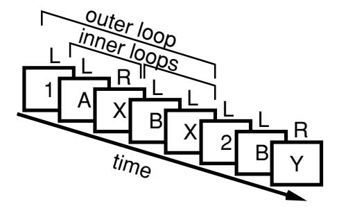

Figure 1: The 1-2-AX task. Stimuli are presented one at a time in a sequence. The participant responds by pressing the right key (R) to the target sequence; otherwise, a left key (L) is pressed. If the subject last saw a 1, then the target sequence is an A followed by an X. If a 2 was last seen, then the target is a B followed by a Y. Distractor stimuli (e.g., 3, C, Z) may be presented at any point and are to be ignored. The maintenance of the task stimuli (1 or 2) constitutes a temporal outer loop around multiple inner-loop memory updates required to detect the target sequence.

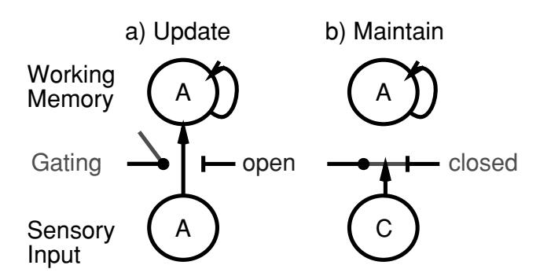

Figure 2: Illustration of active gating. When the gate is open, sensory input can rapidly update working memory (e.g., encoding the cue item A in the 1-2-AX task), but when it is closed, it cannot, thereby preventing other distracting information (e.g., distractor C) from interfering with the maintenance of previously stored information.

**Robust maintenance:** The task demand stimuli (1 or 2) in the outer loop must be maintained in the face of interference from ongoing processing of inner-loop stimuli and irrelevant distractors.

**Selective updating:** Only some elements of working memory should be updated at any given time, while others are maintained. For example, in the inner-loop, A's and X's should be updated while the task demand stimulus (1 or 2) is maintained.

The first two of these functional demands (rapid updating and robust maintenance) are directly in conflict with each other when viewed in terms of standard neural processing mechanisms, and thus motivate the need for a dynamic gating mechanism to switch between these modes of operation (see Figure 2; Cohen et al., 1996; Braver & Cohen, 2000; O'Reilly et al., 1999; O'Reilly & Munakata, 2000; Frank et al., 2001). When the gate is open, working memory is updated by incoming stimulus information; when it is closed, currently active working memory representations are robustly maintained.

**2.1 Dynamic Gating via Basal Ganglia Disinhibition.** One of the central postulates of the PBWM model is that the basal ganglia provide a selective dynamic gating mechanism for information maintained via sustained activation in the PFC (see Figure 3). As reviewed in Frank et al. (2001), this idea is consistent with a wide range of data and other computational models that have been developed largely in the domain of motor control, but also in working memory (Wickens, 1993; Houk & Wise, 1995; Wickens, Kotter, & Alexander, 1995; Dominey, Arbib, & Joseph, 1995; Berns & Sejnowski, 1995, 1998; Jackson & Houghton, 1995; Beiser & Houk, 1998; Kropotov &

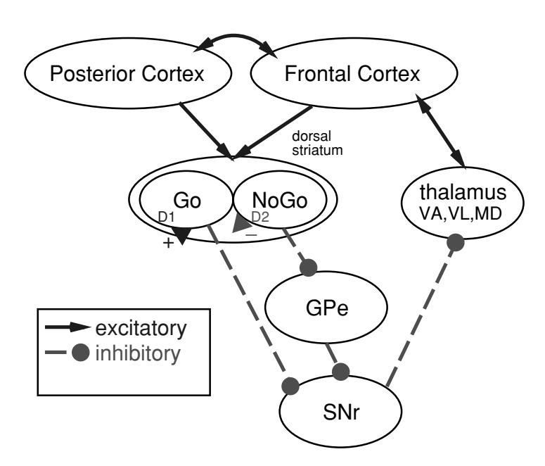

Figure 3: The basal ganglia are interconnected with frontal cortex through a series of parallel loops, each of the form shown. Working backward from the thalamus, which is bidirectionally excitatory with frontal cortex, the SNr (substantia nigra pars reticulata) is tonically active and inhibiting this excitatory circuit. When direct pathway "Go" neurons in dorsal striatum fire, they inhibit the SNr, and thus disinhibit frontal cortex, producing a gating-like modulation that we argue triggers the update of working memory representations in prefrontal cortex. The indirect pathway "NoGo" neurons of dorsal striatum counteract this effect by inhibiting the inhibitory GPe (globus pallidus, external segment).

Etlinger, 1999; Amos, 2000; Nakahara, Doya, & Hikosaka, 2001). Specifically, in the motor domain, various authors suggest that the BG are specialized to selectively facilitate adaptive motor actions, while suppressing others (Mink, 1996). This same functionality may hold for more advanced tasks, in which the "action" to facilitate is the updating of prefrontal working memory representations (Frank et al., 2001; Frank, 2005). To support robust active maintenance in PFC, our model takes advantage of intrinsic bistability of PFC neurons, in addition to recurrent excitatory connections (Fellous, Wang, & Lisman, 1998; Wang, 1999; Durstewitz, Kelc, & Gunturkun, 1999; Durstewitz, Seamans, & Sejnowski, 2000a).

Here we present a summary of our previously developed framework (Frank et al., 2001) for how the BG achieves gating:

• Rapid updating occurs when direct pathway spiny "Go" neurons in the dorsal striatum fire. Go firing directly inhibits the substantia nigra

pars reticulata (SNr) and releases its tonic inhibition of the thalamus. This thalamic disinhibition enables, but does not directly cause (i.e., gates), a loop of excitation into the PFC. The effect of this excitation in the model is to toggle the state of bistable currents in the PFC neurons. Striatal Go neurons in the direct pathway are in competition (in the SNr, if not the striatum; Mink, 1996; Wickens, 1993) with "NoGo" neurons in the indirect pathway that effectively produce more inhibition of thalamic neurons and therefore prevent gating.

- Robust maintenance occurs via intrinsic PFC mechanisms (bistability, recurrence) in the absence of Go updating signals. This is supported by the NoGo indirect pathway firing to prevent updating of extraneous information during maintenance.
- Selective updating occurs because there are parallel loops of connectivity through different areas of the basal ganglia and frontal cortex (Alexander, DeLong, & Strick, 1986; Graybiel & Kimura, 1995; Middleton & Strick, 2000). We refer to the separately updatable components of the PFC/BG system as stripes, in reference to relatively isolated groups of interconnected neurons in PFC (Levitt, Lewis, Yoshioka, & Lund, 1993; Pucak, Levitt, Lund, & Lewis, 1996). We previously estimated that the human frontal cortex could support roughly 20,000 such stripes (Frank et al., 2001).

## 3 Learning When to Gate in the Basal Ganglia

Figure 4 provides a summary of how basal ganglia gating can solve the 1-2-AX task. This figure also illustrates that the learning problem in the basal ganglia amounts to learning when to fire a Go versus NoGo signal in a given stripe based on the current sensory input and maintained PFC activations. Without such a learning mechanism, our model would require some kind of intelligent homunculus to control gating. Thus, the development of this learning mechanism is a key step in banishing the homunculus from the domain of working memory models (cf. the "central executive" of Baddeley's, 1986, model). There are two fundamental problems that must be solved by the learning mechanism:

**Temporal credit assignment:** The benefits of having encoded a given piece of information into prefrontal working memory are typically available only later in time (e.g., encoding the 1 task demand helps later only when confronted with an A-X sequence). Thus, the problem is to know which prior events were critical for subsequent good (or bad) performance.

**Structural credit assignment:** The network must decide which PFC stripes should encode which different pieces of information at a given time. When successful performance occurs, it must reinforce those stripes that

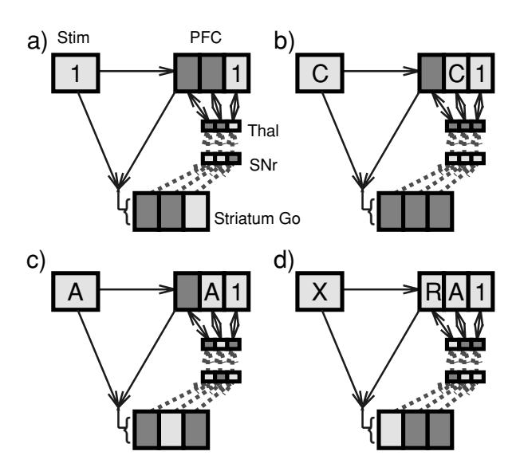

Figure 4: Illustration of how the basal ganglia gating of different PFC stripes can solve the 1-2-AX task (light color = active; dark = not active). (a) The 1 task is gated into an anterior PFC stripe because a corresponding striatal stripe fired Go. (b) The distractor C fails to fire striatial Go neurons, so it will not be maintained; however, it does elicit transient PFC activity. Note that the 1 persists because of gating-induced robust maintenance. (c) The A is gated in. (d) A right key press motor action is activated (using the same BG-mediated disinhibition mechanism) based on X input plus maintained PFC context.

actually contributed to this success. This form of credit assignment is what neural network models are typically very good at doing, but clearly this form of structural credit assignment interacts with the temporal credit assignment problem, making it more complex.

The PBWM model uses a reinforcement-learning algorithm called PVLV (in reference to its Pavlovian learning mechanisms; O'Reilly, Frank, Hazy, & Watz, 2005) to solve the temporal credit assignment problem. The simulated dopaminergic (DA) output of this PVLV system modulates Go versus NoGo firing activity in a stripe-wise manner in BG-PFC circuits to facilitate structural credit assignment. Each of these is described in detail below. The model (see Figure 5) has an actor-critic structure (Sutton & Barto, 1998), where the critic is the PVLV system that controls the firing of simulated midbrain DA neurons and trains both itself and the actor. The actor is the basal ganglia gating system, composed of the Go and NoGo pathways in the dorsal striatum and their associated projections through BG output structures to the thalamus, and then back up to the PFC. The DA signals computed

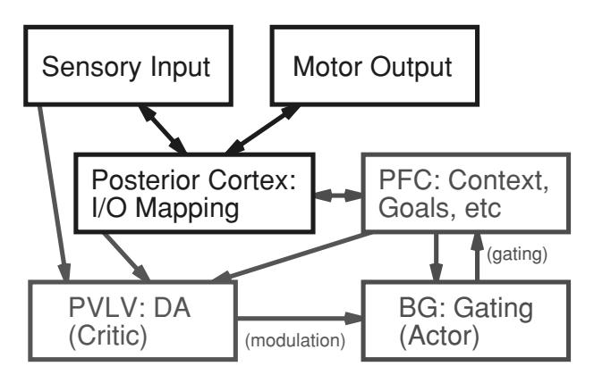

Figure 5: Overall architecture of the PBWM model. Sensory inputs are mapped to motor outputs via posterior cortical ("hidden") layers, as in a standard neural network model. The PFC contextualizes this mapping by representing relevant prior information and goals. The basal ganglia (BG) update the PFC representations via dynamic gating, and the PVLV system drives dopaminergic (DA) modulation of the BG so it can learn when to update. The BG/PVLV system constitutes an actor-critic architecture, where the BG performs updating actions and the PVLV system "critiques" the potential reward value of these actions, with the resulting modulation shaping future actions to be more rewarding.

by PVLV drive both performance and learning effects via opposite effects on Go and NoGo neurons (Frank, 2005). Specifically, DA is excitatory onto the Go neurons via D1 receptors and inhibitory onto NoGo neurons via D2 receptors (Gerfen, 2000; Hernandez-Lopez et al., 2000). Thus, positive DA bursts (above tonic level firing) tend to increase Go firing and decrease NoGo firing, while dips in DA firing (below tonic levels) have the opposite effect. The change in activation state as a result of this DA modulation can then drive learning in an appropriate way, as detailed below and in Frank (2005).

**3.1 Temporal Credit Assignment: The PVLV Algorithm.** The firing patterns of midbrain dopamine (DA) neurons (ventral tegmental area, VTA, and substantia nigra pars compacta, SNc; both strongly innervated by the basal ganglia) exhibit the properties necessary to solve the temporal credit assignment problem because they appear to learn to fire for stimuli that predict subsequent rewards (e.g., Schultz, Apicella, & Ljungberg, 1993; Schultz, 1998). This property is illustrated in schematic form in Figure 6a for a simple Pavlovian conditioning paradigm, where a conditioned stimulus (CS, e.g., a tone) predicts a subsequent unconditioned stimulus (US, i.e., a reward). Figure 6b shows how this predictive DA firing can reinforce BG Go firing to maintain a stimulus, when such maintenance leads to subsequent reward.

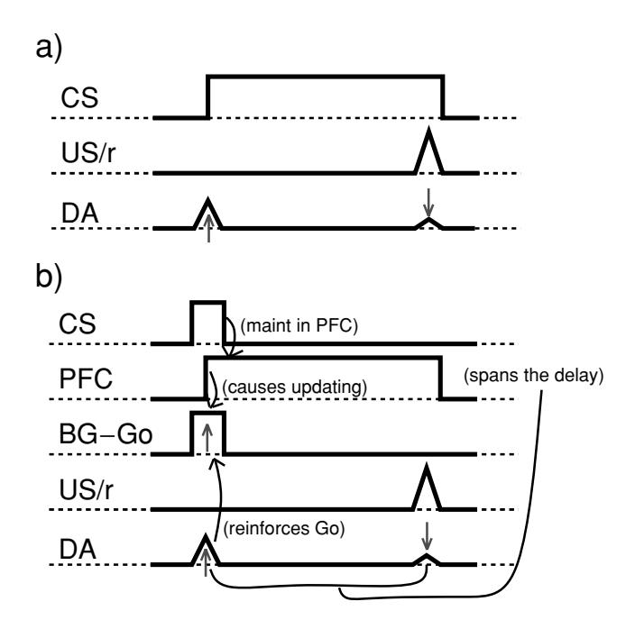

Figure 6: (a) Schematic of dopamine (DA) neural firing for a conditioned stimulus (CS, e.g., a tone) that reliably predicts a subsequent unconditioned stimulus (US, i.e., a reward, r). Initially, DA fires at the point of reward, but then over repeated trials learns to fire at the onset of the stimulus. (b) This DA firing pattern can solve the temporal credit assignment problem for PFC active maintenance. Here, the PFC maintains the transient input stimulus (initially by chance), leading to reward. As the DA system learns, it begins to fire DA bursts at stimulus onset, by virtue of PFC "bridging the gap" (in place of a sustained input). DA firing at stimulus onset reinforces the firing of basal ganglia Go neurons, which drive updating in PFC.

Specifically, the DA firing can move from the time of a reward to the onset of a stimulus that, if maintained in the PFC, leads to this subsequent reward. Because this DA firing occurs when the stimulus comes on, it is well timed to facilitate the storage of this stimulus in PFC. In the model, this occurs by reinforcing the connections between the stimulus and the Go gating neurons in the striatum, which then cause updating of PFC to maintain the stimulus. Note that other models have leveraged this same logic, but have the DA firing itself cause updating of working memory via direct DA projections to PFC (O'Reilly et al., 1999; Braver & Cohen, 2000; Cohen et al., 1996; O'Reilly & Munakata, 2000; Rougier & O'Reilly, 2002; O'Reilly, Noelle, Braver, & Cohen, 2002). The disadvantage of this global DA signal is that it

would update the entire PFC every time, making it difficult to perform tasks like the 1-2-AX task, which require maintenance of some representations while updating others.

The apparently predictive nature of the DA firing has almost universally been explained in terms of the temporal differences (TD) reinforcement learning mechanism (Sutton, 1988; Sutton & Barto, 1998; Schultz et al., 1995; Houk et al., 1995; Montague, Dayan, & Sejnowski, 1996; Suri et al., 2001; Contreras-Vidal & Schultz, 1999; Joel et al., 2002). The earlier DA gating models cited above and an earlier version of the PBWM model (O'Reilly & Frank, 2003) also used this TD mechanism to capture the essential properties of DA firing in the BG. However, considerable subsequent exploration and analysis of these models has led us to develop a non-TD based account of these DA firing patterns, which abandons the prediction framework on which it is based (O'Reilly et al., 2005). In brief, TD learning depends on sequential chaining of predictions from one time step to the next, and any weak link (i.e., unpredictable event) can break this chain. In many of the tasks faced by our models (e.g., the 1-2-AX task), the sequence of stimulus states is almost completely unpredictable, and this significantly disrupts the TD chaining mechanism, as shown in O'Reilly et al. (2005).

Instead of relying on prediction as the engine of learning, we have developed a fundamentally associative "Pavlovian" learning mechanism called PVLV, which consists of two systems: primary value (PV) and learned value (LV) (O'Reilly et al., 2005; see Figure 7). The PV system is just the

Figure 7: PVLV learning mechanism. (a) Structure of PVLV. The PV (primary value) system learns about primary rewards and contains two subsystems: the excitatory (PVe) drives excitatory DA bursts from primary rewards (US = unconditioned stimulus), and the inhibitory (PVi) learns to cancel these bursts (using timing or other reliable signals). Anatomically, the PVe corresponds to the lateral hypothalamus (LHA), which has excitatory projections to the midbrain DA nuclei and responds to primary rewards. The PVi corresponds to the striosome-patch neurons in the ventral striatum (V. Str.), which have direct inhibitory projections onto the DA system, and learn to fire at the time of expected rewards. The LV (learned value) system learns to fire for conditioned stimuli (CS) that are reliably associated with reward. The excitatory component (LVe) drives DA bursting and corresponds to the central nucleus of the amygdala (CNA), which has excitatory DA projections and learns to respond to CS's. The inhibitory component (LVi) is just like the PVi, except it inhibits CS-associated bursts. (b) Application to the simple conditioning paradigm depicted in the previous figure, where the PVi learns (based on the PVe reward value at each time step) to cancel the DA burst at the time of reward, while the LVe learns a positive CS association (only at the time of reward) and drives DA bursts at CS onset. The phasic nature of CS firing, despite a sustained CS input, requires a novelty detection mechanism of some form; we suggest a synaptic depression mechanism as having beneficial computational properties.

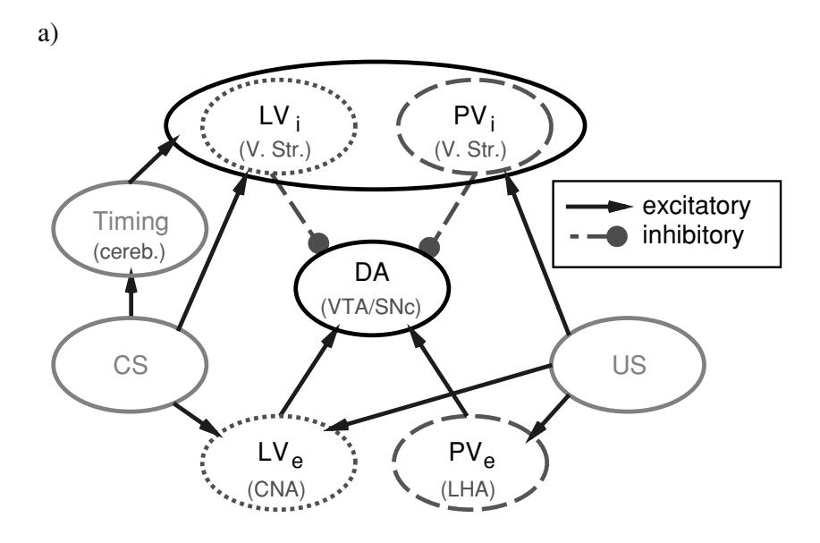

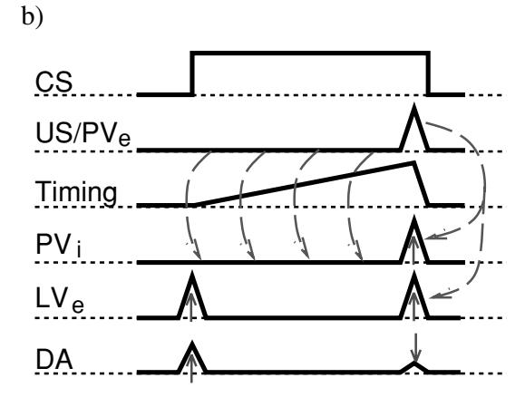

Rescorla-Wagner/delta-rule learning algorithm (Rescorla & Wagner, 1972; Widrow & Hoff, 1960), trained by the primary reward value  $r^t$  (i.e., the US) at each time step t (where time steps correspond to discrete events in the environment, such as the presentation of a CS or US). For simplicity, consider a single linear unit that computes an expected reward value  $\hat{V}_{pv}^t$  based on weights  $w_i^t$  coming from sensory and other inputs  $x_i^t$  (e.g., including timing signals from the cerebellum):

$$\hat{V}_{pv}^t = \sum_i x_i^t w_i^t \tag{3.1}$$

(our actual value representation uses a distributed representation, as described in the appendix). The error in this expected reward value relative to the actual reward present at time t represents the PV system's contribution to the overall DA signal:

$$\delta_{pv}^t = r^t - \hat{V}_{pv}^t. \tag{3.2}$$

Note that all of these terms are in the current time step, whereas the similar equation in TD involves terms across different adjacent time steps. This delta value then trains the weights into the PV reward expectation,

$$\Delta w_i^t = \epsilon \delta_{pv}^t x_i^t, \tag{3.3}$$

where  $\Delta w_i^t$  is the change in weight value and  $0 < \epsilon < 1$  is a learning rate. As the system learns to expect primary rewards based on sensory and other inputs, the delta value decreases. This can account for the cancellation of the dopamine burst at the time of reward, as observed in the neural recording data (see Figure 7b).

When a conditioned stimulus is activated in advance of a primary reward, the PV system is actually trained to not expect reward at this time, because it is always trained by the current primary reward value, which is zero in this case. Therefore, we need an additional mechanism to account for the anticipatory DA bursting at CS onset, which in turn is critical for training up the BG gating system (see Figure 6). This is the learned value (LV) system, which is trained only when primary rewards are either present or expected by the PV and is free to fire at other times without adapting its weights. Therefore, the LV is protected from having to learn that no primary reward is actually present at CS onset, because it is not trained at that time. In other words, the LV system is free to signal reward associations for stimuli even at times when no primary reward is actually expected. This results in the anticipatory dopamine spiking at CS onset (see Figure 7b), without requiring an unbroken chain of predictive events between stimulus onset and subsequent reward, as in TD. Thus, this anticipatory dopamine spiking

by the LV system is really just signaling a reward association, not a reward prediction.

As detailed in O'Reilly et al. (2005), this PV/LV division provides a good mapping onto the biology of the DA system (see Figure 7a). Excitatory projections from the lateral hypothalamus (LHA) and central nucleus of the amygdala (CNA) are known to drive DA bursts in response to primary rewards (LHA) and conditioned stimuli (CNA) (e.g., Cardinal, Parkinson, Hall, & Everitt, 2002). Thus, we consider LHA to represent r, which we also label as PVe to denote the excitatory component of the primary value system. The CNA corresponds to the excitatory component of the LV system described above (LVe), which learns to drive DA bursts in response to conditioned stimuli. The primary reward system  $\hat{V}_{pv}$  that cancels DA firing at reward delivery is associated with the striosome/patch neurons in the ventral striatum, which have direct inhibitory projections into the DA system (e.g., Joel & Weiner, 2000), and learn to fire at the time of expected primary rewards (e.g., Schultz, Apicella, Scarnati, & Ljungberg, 1992). We refer to this as the inhibitory part of the primary value system, PVi. For symmetry and important functional reasons described later, we also include a similar inhibitory component to the LV system, LVi, which is also associated with the same ventral striatum neurons, but slowly learns to cancel DA bursts associated with CS onset. (For full details on PVLV, see O'Reilly et al., 2005, and the equations in the appendix.)

**3.2 Structural Credit Assignment.** The PVLV mechanism just described provides a solution to the temporal credit assignment problem, and we use the overall PVLV  $\delta$  value to simulate midbrain (VTA, SNc) dopamine neuron firing rates (deviations from baseline). To provide a solution to the structural credit assignment problem, the global PVLV DA signal can be modulated by the Go versus NoGo firing of the different PFC/BG stripes, so that each stripe gets a differentiated DA signal that reflects its contribution to the overall reward signal. Specifically, we hypothesize that the SNc provides a more stripe-specific DA signal by virtue of inhibitory projections from the SNr to the SNc (e.g., Joel & Weiner, 2000). As noted above, these SNr neurons are tonically active and are inhibited by the firing of Go neurons in the striatum. Thus, to the extent that a stripe fires a strong Go signal, it will disinhibit the SNc DA projection to itself, while those that are firing NoGo will remain inhibited and not receive DA signals. We suggest that this inhibitory projection from SNr to SNc produces a shunting property that negates the synaptic inputs that produce bursts and dips, while preserving the intrinsically generated tonic DA firing levels. Mathematically, this results in a multiplicative relationship, such that the degree of Go firing multiplies the magnitude of the DA signal it receives (see the appendix for details).

It remains to be determined whether the SNc projections support stripe-specific topography (see Haber, Fudge, & McFarland, 2000, for data

suggestive of some level of topography), but it is important to emphasize that the proposed mechanism involves only a modulation in the amplitude of phasic DA changes in a given stripe and not qualitatively different firing patterns from different SNc neurons. Thus, very careful quantitative parallel DA recording studies across multiple stripes would be required to test this idea. Furthermore, it is possible that this modulation could be achieved through other mechanisms operating in the synaptic terminals regulating DA release (Joel & Weiner, 2000), in addition to or instead of overall firing rates of SNc neurons. What is clear from the results presented below is that the networks are significantly impaired at learning without this credit assignment mechanism, so we feel it is likely to be implemented in the brain in some manner.

- **3.3 Dynamics of Updating and Learning.** In addition to solving the temporal and structural credit assignment problems, the PBWM model depends critically on the temporal dynamics of activation updating to solve the following functional demands:
  - Within one stimulus-response time step, the PFC must provide a stable context representation reflecting ongoing goals or prior stimulus context, and it must also be able to update to reflect appropriate changes in context for subsequent processing. Therefore, the system must be able to process the current input and make an appropriate response before the PFC is allowed to update. This offset updating of context representations is also critical for the SRN network, as discussed later.

In standard Leabra, there are two phases of activation updating: a minus phase where a stimulus is processed to produce a response, followed by a plus phase where any feedback (when available) is presented, allowing the network to correct its response next time. Both of these phases must occur with a stable PFC context representation for the feedback to be able to drive learning appropriately. Furthermore, the BG Go/NoGo firing to decide whether to update the current PFC representations must also be appropriately contextualized by these stable PFC context representations. Therefore, in PBWM, we add a third update phase where PFC representations update, based on BG Go/NoGo firing that was computed in the plus phase (with the prior PFC context active). Biologically, this would occur in a more continuous fashion, but with appropriate delays such that PFC updating occurs after motor responding.

 The PVLV system must learn about the value of maintaining a given PFC representation at the time an output response is made and rewarded (or not). This reward learning is based on adapting synaptic weights from PFC representations active at the time of reward, not based on any transient sensory inputs that initially activated those PFC representations, which could have been many time steps earlier (and long since gone).

• After BG Go firing updates PFC representations (during the third phase of settling), the PVLV critic can then evaluate the value of the new PFC state to provide a training signal to Go/NoGo units in the striatum. This training signal is directly contingent on striatal actions: Did the update result in a "good" (as determined by PVLV associations) PFC state? If good (DA burst), then increase the likelihood of Go firing next time. If bad (DA dip), then decrease the Go firing likelihood and increase NoGo firing. This occurs via direct DA modulation of the Go/NoGo neurons in the third phase, where bursts increase Go and decrease NoGo activations and dips have the opposite effect (Frank, 2005). Thus, the Go/NoGo units learn using the delta rule over their states in the second and third phases of settling, where the third phase reflects the DA modulation from the PVLV evaluation of the new PFC state.

To summarize, the temporal credit assignment "time travel" of perceived value, from the point of reward back to the critical stimuli that must be maintained, must be based strictly on PFC states and not sensory inputs. But this creates a catch-22 because these PFC states reflect inputs only after updating has occurred (O'Reilly & Munakata, 2000), so the system cannot know that it would be good to update PFC to represent current inputs until it has already done so. This is solved in PBWM by having one system (PVLV) for solving the temporal credit assignment problem (based on PFC states) and a different one (striatum) for deciding when to update PFC (based on current sensory inputs and prior PFC context). The PVLV system then evaluates the striatal updating actions after updating has occurred. This amounts to trial-and-error learning, with the PVLV system providing immediate feedback for striatal gating actions (and this feedback is in turn based on prior learning by the PVLV system, taking place at the time of primary rewards). The system, like most reinforcement learning systems, requires sufficient exploration of different gating actions to find those that are useful.

The essential logic of these dynamics in the PBWM model is illustrated in Figure 8 in the context of a simple "store ignore recall" (SIR) working memory task (which is also simulated, as described later). There are two additional functional features of the PBWM model: (1) a mechanism to ensure that striatal units are not stuck in NoGo mode (which would prevent them from ever learning) and to introduce some random exploratory firing, and (2) a contrast-enhancement effect of dopamine modulation on the Go/NoGo units that selectively modulates those units that were actually active relative to those that were not. The details of these mechanisms are described in the appendix, and their overall contributions to learning, along

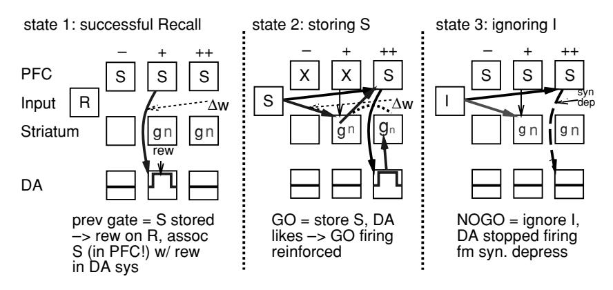

Figure 8: Phase-based sequence of operations in the PBWM model for three input states of a simple Store, Ignore, Recall task. The task is to store the S stimulus, maintain it over a sequence of I (ignore) stimuli, and then recall the S when an R is input. Four key layers in the model are represented in simple form: PFC, sensory Input, Striatum (with Go = g and NoGo = n units), and overall DA firing (as controlled by PVLV). The three phases per trial (-, +, -)++ = PFC update) are shown as a sequence of states for the same layer (i.e., there is only one PFC layer that represents one thing at a time).  $\Delta W$  indicates key weight changes, and the font size for striatal g and n units indicates effects of DA modulation. Syndep indicates synaptic depression into the DA system (LV) that prevents sustained firing to the PFC S representation. In state 1, the network had previously stored the S (through random Go firing) and is now correctly recalling it on an R trial. The unexpected reward delivered in the plus phase produces a DA burst, and the LV part of PVLV (not shown) learns to associate the state of the PFC with reward. State 2 shows the consequence of this learning, where, some trials later, an S input is active and the PFC is maintaining some other information (X). Based on existing weights, the S input triggers the striatal Go neurons to fire in the plus phase, causing PFC to update to represent the S. During this update phase, the LV system recognizes this S (in the PFC) as rewarding, causing a DA burst, which increases firing of Go units, and results in increased weights from S inputs to striatal Go units. In state 3, the Go units (by existing weights) do not fire for the subsequent ignore (I) input, so the S continues to be maintained. The maintained S in PFC does not continue to drive a DA burst due to synaptic depression, so there is no DA-driven learning. If a Go were to fire for the I input, the resulting I representation in PFC would likely trigger a small negative DA burst, discouraging such firing again. The same logic holds for negative feedback by causing nonreward associations for maintenance of useless information.

with the contributions of all the separable components of the system, are evaluated after the basic simulation results are presented.

**3.4 Model Implementation Details.** The implemented PBWM model, shown in Figure 9 (with four stripes), uses the Leabra framework, described

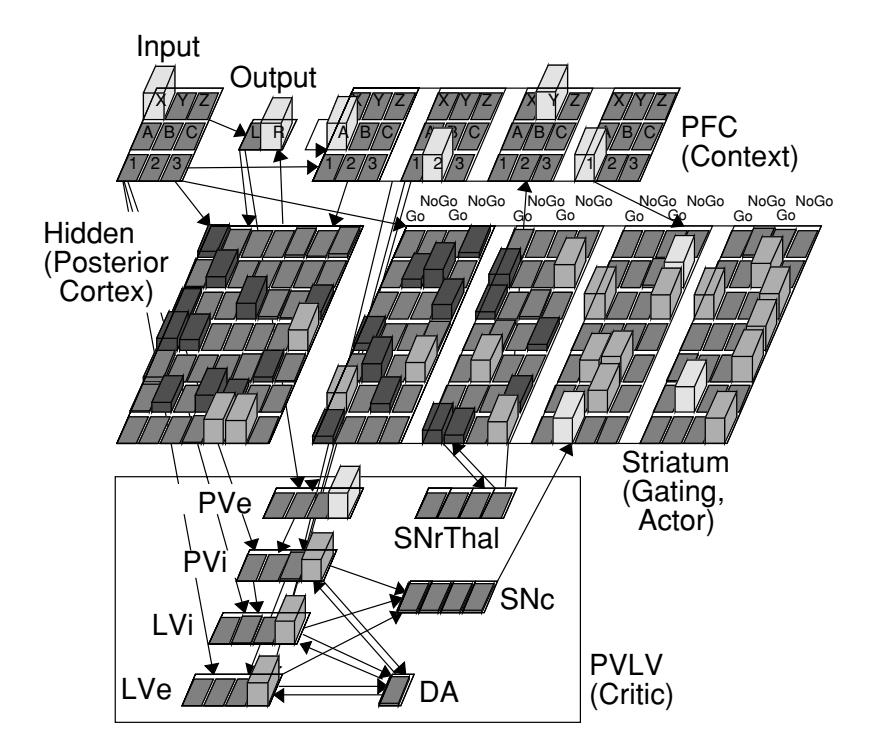

Figure 9: Implemented model as applied to the 1-2-AX task. There are four stripes in this model as indicated by the groups of units within the PFC and Striatum (and the four units in the SNc and SNrThal layers). PVe represents primary reward (r or US), which drives learning of the primary value inhibition (PVi) part of PVLV, which cancels primary reward DA bursts. The learned value (LV) part of PVLV has two opposing excitatory and inhibitory components, which also differ in learning rate (LVe = fast learning rate, excitatory on DA bursts; LVi = slow learning rate, inhibitory on DA bursts). All of these reward-value layers encode their values as coarse-coded distributed representations. VTA and SNc compute the DA values from these PVLV layers, and SNc projects this modulation to the Striatum. Go and NoGo units alternate (from bottom left to upper right) in the Striatum. The SNrThal layer computes Go-NoGo in the corresponding stripe and mediates competition using kWTA dynamics. The resulting activity drives updating of PFC maintenance currents. PFC provides context for Input/Hidden/Output mapping areas, which represent posterior cortex.

in detail in the appendix (O'Reilly, 1998, 2001; O'Reilly & Munakata, 2000). Leabra uses point neurons with excitatory, inhibitory, and leak conductances contributing to an integrated membrane potential, which is then thresholded and transformed via an x/(x+1) sigmoidal function to produce a rate code output communicated to other units (discrete spiking can also be used, but produces noisier results). Each layer uses a k-winners-takeall (kWTA) function that computes an inhibitory conductance that keeps roughly the *k* most active units above firing threshold and keeps the rest below threshold. Units learn according to a combination of Hebbian and error-driven learning, with the latter computed using the generalized recirculation algorithm (GeneRec; O'Reilly, 1996), which computes backpropagation derivatives using two phases of activation settling, as mentioned earlier. The cortical layers in the model use standard Leabra parameters and functionality, while the basal ganglia systems require some additional mechanisms to implement the DA modulation of Go/NoGo units, and toggling of PFC maintenance currents from Go firing, as detailed in the appendix.

In some of the models, we have simplified the PFC representations so that they directly reflect the input stimuli in a one-to-one fashion, which simply allows us to transparently interpret the contents of PFC at any given point. However, these PFC representations can also be trained with random initial weights, as explored below. The ability of the PFC to develop its own representations is a critical advance over the SRN model, for example, as explored in other related work (Rougier, Noelle, Braver, Cohen, & O'Reilly, 2005).

#### 4 Simulation Tests \_

We conducted simulation comparisons between the PBWM model and a set of backpropagation-based networks on three different working memory tasks: (1) the 1-2-AX task as described earlier, (2) a two-store version of the Store-Ignore-Recall (SIR) task (O'Reilly & Munakata, 2000), where two different items need to be separately maintained, and (3) a sequence memory task modeled after the phonological loop (O'Reilly & Soto, 2002). These tasks provide a diverse basis for evaluating these models.

The backpropagation-based comparison networks were:

• A simple recurrent network (SRN; Elman, 1990; Jordan, 1986) with cross-entropy output error, no momentum, an error tolerance of .1 (output err < .1 counts as 0), and a hysteresis term in updating the context layers of .5  $(c_j(t) = .5h_j(t-1) + .5c_j(t-1)$ , where  $c_j$  is the context unit for hidden unit activation  $h_j$ ). Learning rate (lrate), hysteresis, and hidden unit size were searched for optimal values across this and the RBP networks (within plausible ranges, using round numbers, e.g., lrates of .05, .1, .2, and .5; hysteresis of 0, .1, .2, .3, .5, and

- .7, hidden units of 25, 36, 49, and 100). For the 1-2-AX task, optimal performance was with 100 hidden units, hysteresis of .5, and lrate of .1. For the SIR-2 task, 49 hidden units were used due to extreme length of training required, and a lrate of .01 was required to learn at all. For the phonological loop task, 196 hidden units and a lrate of .005 performed best
- A real-time recurrent backpropagation learning network (RBP; Robinson & Fallside, 1987; Schmidhuber, 1992; Williams & Zipser, 1992), with the same basic parameters as the SRN, and a time constant for integrating activations and backpropagated errors of 1, and the gap between backpropagations and the backprop time window searched in the set of 6, 8, 10, and 16 time steps. Two time steps were required for activation to propagate from the input to the output, so the effective backpropagation time window across discrete input events in the sequence is half of the actual time window (e.g., 16 = 8 events, which represents two or more outer-loop sequences). Best performance was achieved with the longest time window (16).
- A long short-term memory (LSTM) model (Hochreiter & Schmidhuber, 1997) with forget gates as specified in Gers (2000), with the same basic backpropagation parameters as the other networks, and four memory cells.
- 4.1 The 1-2-AX Task. The task was trained as in Figure 1, with the length of the inner-loop sequences randomly varied from one to four (i.e., one to four pairs of A-X, B-Y, and so on, stimuli). Specifically, each sequence of stimuli was generated by first randomly picking a 1 or 2, and then looping for one to four times over the following inner-loop generation routine. Half of the time (randomly selected), a possible target sequence (if 1, then A-X; if 2, then B-Y) was generated. The other half of the time, a random sequence composed of an A, B, or C, followed by an X, Y, or Z, was randomly generated. Thus, possible targets (A-X, B-Y) represent at least 50% of trials, but actual targets (A-X in the 1 task, B-Y in the 2 task) appear only 25% of time on average. The correct output was the L unit, except on the target sequences (1-A-X or 2-B-Y), where it was an R. The PBWM network received a reward if it produced the correct output (and received the correct output on the output layer in the plus phase of each trial), while the backpropagation networks learned from the error signal computed relative to this correct output. One epoch of training consisted of 25 outer-loop sequences, and the training criterion was 0 errors across two epochs in a row (one epoch can sometimes contain only a few targets, making a lucky 0 possible). For parameter searching results, training was stopped after 10,000 epochs for the backpropagation models if the network had failed to learn by this point and was scored as a failure to learn. For statistics, 20 different networks of each type were run.

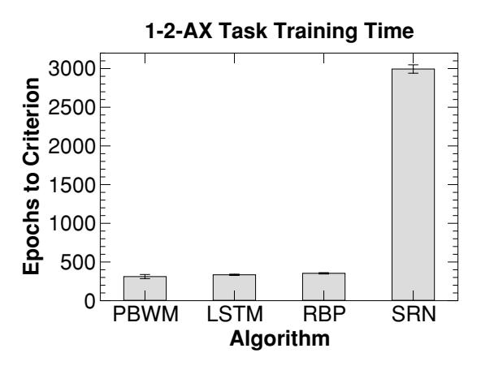

Figure 10: Training time to reach criterion (0 errors in two successive epochs of 25 outer-loop sequences) on the 1-2-AX task for the PBWM model and three backpropagation-based comparison algorithms. LSTM = long short-term memory model. RBP = recurrent backpropagation (real-time recurrent learning). SRN = simple recurrent network.

The basic results for number of epochs required to reach the criterion training level are shown in Figure 10. These results show that the PBWM model learns the task at roughly the same speed as the comparison backpropagation networks, with the SRN taking significantly longer. However, the main point is not in comparing the quantitative rates of learning (it is possible that despite a systematic search for the best parameters, other parameters could be found to make the comparison networks perform better). Rather, these results simply demonstrate that the biologically based PBWM model is in the same league as existing powerful computational learning mechanisms.

Furthermore, the exploration of parameters for the backpropagation networks demonstrates that the 1-2-AX task represents a challenging working memory task, requiring large numbers of hidden units and long temporal-integration parameters for successful learning. For example, the SRN network required 100 hidden units and a .5 hysteresis parameter to learn reliably (hysteresis determines the window of temporal integration of the context units) (see Table 1). For the RBP network, the number of hidden units and the time window for backpropagation exhibited similar results (see Table 2). Specifically, time windows of fewer than eight time steps resulted in failures to learn, and the best results (in terms of average learning time) were achieved with the most hidden units and the longest backpropagation time window.

| Hidden-layer sizes for                                | r SRN (lrate | = .1, hyster | esis = .5 |      |      |  |
|-------------------------------------------------------|--------------|--------------|-----------|------|------|--|
| Hiddens                                               | 25           | 36           | 49        | 100  |      |  |
| Success rate                                          | 4%           | 26%          | 86%       | 100% |      |  |
| Average epochs                                        | 5367         | 6350         | 5079      | 2994 |      |  |
| Hysteresis for SRN (100 hiddens, lrate = .1)          |              |              |           |      |      |  |
| Hysteresis                                            | .1           | .2           | .3        | .5   | .7   |  |
| Success rate                                          | 0%           | 0%           | 38%       | 100% | 98%  |  |
| Average epochs                                        | NA           | NA           | 6913      | 2994 | 3044 |  |
| Learning rates for SRN (100 hiddens, hysteresis = .5) |              |              |           |      |      |  |
| lrate                                                 | .05          | .1           | .2        |      |      |  |
| Success rate                                          | 100%         | 100%         | 96%       |      |      |  |
| Average epochs                                        | 3390         | 2994         | 3308      |      |      |  |

Table 1: Effects of Various Parameters on Learning performance in the SRN.

Notes: Success rate = percentage of networks (out of 50) that learned to criterion (0 errors for two epochs in a row) within  $10,\!000$  epochs. Average epochs - average number of epochs to reach criterion for successful networks. The optimal performance is with 100 hidden units, learning rate .1, and hysteresis .5. Sufficiently large values for the hidden units and hysteresis parameters are critical for successful learning, indicating the strong working memory demands of this task.

Table 2: Effects of Various Parameters on Learning Performance in the RBP Network.

| Time window for RBP (lrate $= .1, 100$ hiddens)           |                                                |                                                                                                                                      |                                                                                                   |  |  |  |
|-----------------------------------------------------------|------------------------------------------------|--------------------------------------------------------------------------------------------------------------------------------------|---------------------------------------------------------------------------------------------------|--|--|--|
| 6                                                         | 8                                              | 10                                                                                                                                   | 16                                                                                                |  |  |  |
| 6%                                                        | 96%                                            | 96%                                                                                                                                  | 96%                                                                                               |  |  |  |
| 1389                                                      | 625                                            | 424                                                                                                                                  | 353                                                                                               |  |  |  |
| Hidden-layer size for RBP (lrate $= .1$ , window $= 16$ ) |                                                |                                                                                                                                      |                                                                                                   |  |  |  |
| 25                                                        | 36                                             | 49                                                                                                                                   | 100                                                                                               |  |  |  |
| 96%                                                       | 100%                                           | 96%                                                                                                                                  | 96%                                                                                               |  |  |  |
| 831                                                       | 650                                            | 687                                                                                                                                  | 353                                                                                               |  |  |  |
|                                                           | 6 6% 1389 RBP (lrate = . 25 96% | $\begin{array}{ccc} 6 & 8 \\ 6\% & 96\% \\ 1389 & 625 \\ \text{RBP (lrate} = .1, window = \\ 25 & 36 \\ 96\% & 100\% \\ \end{array}$ | 6 8 10 6% 96% 96% 1389 625 424 RBP (lrate = .1, window = 16) 25 36 49 96% 100% 96% |  |  |  |

Notes: The optimal performance is with 100 hidden units, time window = 16. As with the SRN, the relatively large size of the network and long time windows required indicate the strong working memory demands of the task.

**4.2** The SIR-2 Task. The PBWM and comparison backpropagation algorithms were also tested on a somewhat more abstract task (which has not been tested in humans), which represents perhaps the simplest, most direct form of working memory demands. In this store ignore recall (SIR) task (see Table 3), the network must store an arbitrary input pattern for a recall test that occurs after a variable number of intervening ignore trials (O'Reilly & Munakata, 2000). Stimuli are presented during the ignore trials and must be identified (output) by the network but do not need to be maintained. Tasks with this same basic structure were the focus of the original Hochreiter and Schmidhuber (1997) work on the LSTM algorithm, where

14

R2

| Trial | Input | Maint-1 | Maint-2 | Output |
|-------|-------|---------|---------|--------|
| 1     | I-D   | _       | _       | D      |
| 2     | S1-A  | A       | _       | A      |
| 3     | I-B   | A       | _       | В      |
| 4     | S2-C  | A       | C       | С      |
| 5     | I-A   | A       | C       | A      |
| 6     | I-E   | A       | C       | E      |
| 7     | R1    | A       | C       | A      |
| 8     | I-A   | _       | C       | A      |
| 9     | I-C   | _       | C       | C      |
| 10    | S1-D  | D       | C       | D      |
| 11    | I-E   | D       | C       | E      |
| 12    | R1    | D       | C       | D      |
| 13    | I-B   | _       | C       | В      |

Table 3: Example Sequence of Trials in the SIR-2 Task, Showing What Is Input, What Should Be Maintained in Each of Two "Stores," and the Target Output.

Notes: I = Ignore unit active,  $S1/2 = Store \ 1/2$  unit active,  $R\ 1/2 = Recall$  unit 1/2 active. The functional meaning of these "task control" inputs must be discovered by the network. Two versions were run. In the shared representations version, one set of five stimulus inputs was used to encode A–E, regardless of which control input was present. In the dedicated representations version, there were different stimulus representations for each of the three categories of stimulus inputs (S1, S2, and I), for a total of 15 stimulus input units. The shared representations version proved impossible for nongated networks to learn.

they demonstrated that the dynamic gating mechanism was able to gate in the to-be-stored stimulus, maintain it in the face of an essentially arbitrary number of intervening trials by having the gate turned off, and then recall the maintained stimulus. The SIR-2 version of this task adds the need to independently update and maintain two different stimulus memories, instead of just one, which should provide a better test of selective updating.

We explored two versions of this task—one that had a single set of shared stimulus representations (A-E) and another with dedicated stimulus representations for each of the three different types of task control inputs (S1, S2, I). In the dedicated representations version, the stimulus inputs conveyed directly their functional role and made the control inputs somewhat redundant (e.g., the I-A stimulus unit should always be ignored, while the S1-A stimulus should always be stored in the first stimulus store). In contrast, a stimulus in the shared representation version is ambiguous; sometimes an A should be ignored, sometimes stored in S1, and other times stored in S2, depending on the concomitant control input. This difference in stimulus ambiguity made a big difference for the nongating networks, as discussed below. The networks had 20 input units (separate A–E stimuli

for each of three different types of control inputs (S1, S2, I) = 15 units, and the 5 control units: S1,S2,I,R1,R2). On each trial, a control input and corresponding stimulus were randomly selected with uniform probability, which means that S1 and S2 maintenance ended up being randomly interleaved with each other. Thus, the network was required to develop a truly independent form of updating and maintenance for these two items.

As Figure 11a shows, three out of four algorithms succeeded in learning the dedicated stimulus items version of the task within roughly comparable numbers of epochs, while the SRN model had a very difficult time, taking on average 40,090 epochs. We suspect that this difficulty may reflect the limitations of the one time step of error backpropagation available for this network, making it difficult for it to span the longer delays that often occurred (Hochreiter & Schmidhuber, 1997).

Interestingly, the shared stimulus representations version of the task (see Figure 11b) clearly divided the gating networks from the nongated ones (indeed, the nongated networks—RBP and SRN—were completely unable to achieve a more stringent criterion of four zero-error epochs in a row, whereas both PBWM and LSTM reliably reached this level). This may be due to the fact that there is no way to establish a fixed set of weights between an input stimulus and a working memory representation in this task version. The appropriate memory representation to maintain a given stimulus must be determined entirely by the control input. In other words, the control input must act as a gate on the fate of the stimulus input, much as the gate input on a transistor determines the processing of the other input.

More generally, dynamic gating enables a form of dynamic variable binding, as illustrated in Figure 12 for this SIR-2 task. The two PFC stripes in this example act as variable "slots" that can hold any of the stimulus inputs; which slot a given input gets "bound" to is determined by the gating system as driven by the control input (S1 or S2). This ability to dynamically route a stimulus to different memory locations is very difficult to achieve without a dynamic gating system, as our results indicate. Nevertheless, it is essential to emphasize that despite this additional flexibility provided by the adaptive gating mechanism, the PBWM network is by no means a fully general-purpose variable binding system. The PFC representations must still learn to encode the stimulus inputs, and other parts of the network must learn to respond appropriately to these PFC representations. Therefore, unlike a traditional symbolic computer, it is not possible to store any arbitrary piece of information in a given PFC stripe.

Figure 13 provides important confirmation that the PVLV learning mechanism is doing what we expect it to in this task, as represented in earlier discussion of the SIR task (e.g., see Figure 8). Specifically, we expect that the system will generate large positive DA bursts for Store events and not for Ignore events. This is because the Store signal should be positively associated with correct performance (and thus reward), while the Ignore signal should not be. This is exactly what is observed.

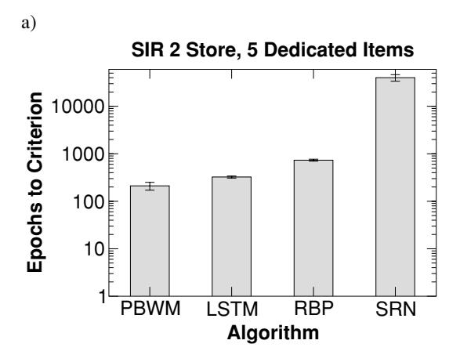

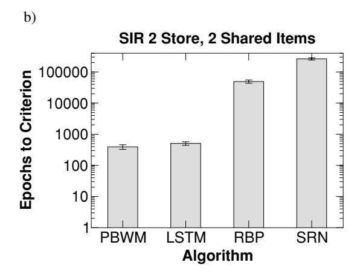

Figure 11: Training time to reach criterion (0 errors in 2 consecutive epochs of 100 trials each) on the SIR-2 task for the PBWM model and three backpropagation-based comparison algorithms, for (a) dedicated stimulus items (stimulus set = 5 items, A–E) and (b) shared stimulus items (stimulus set = 2 items, A–B). LSTM = long short-term memory model. RBP = recurrent backpropagation (real-time recurrent learning). SRN = simple recurrent network. The SRN does significantly worse in both cases (note the logarithmic scale), and with shared items, the nongated networks suffer considerably relative to the gated ones, most likely because of the variable binding functionality that a gating mechanism provides, as illustrated in Figure 12.

**4.3** The Phonological Loop Sequential Recall Task. The final simulation test involves a simplified model of the phonological loop, based on earlier work (O'Reilly & Soto, 2002). The phonological loop is a working

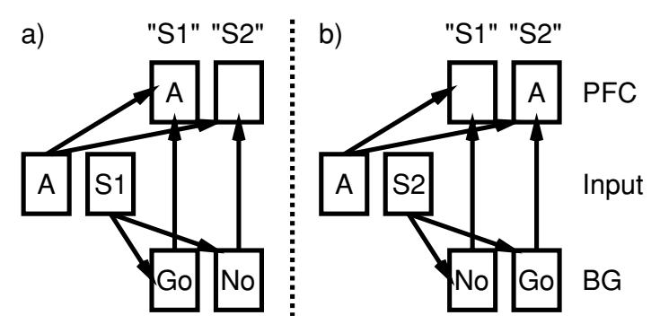

Figure 12: Gating can achieve a form of dynamic variable binding, as illustrated in the SIR-2 task. The store command (S1 or S2) can drive gating signals in different stripes in the BG, causing the input stimulus item (A,B,...) to be stored in the associated PFC stripe. Thus, the same input item can be encoded in a different neural "variable slot" depending on other inputs. Nevertheless, these neural stripes are not fully general like traditional symbolic variables; they must learn to encode the input items, and other areas must learn to decode these representations.

memory system that can actively maintain a short chunk of phonological (verbal) information (e.g., Baddeley, 1986; Baddeley, Gathercole, & Papagno, 1998; Burgess & Hitch, 1999; Emerson & Miyake, 2003). In essence, the task of this model is to encode and replay a sequence of "phoneme" inputs, much as in the classic psychological task of short-term serial recall. Thus, it provides a simple example of sequencing, which has often been linked with basal ganglia and prefrontal cortex function (e.g., Berns & Sejnowski, 1998; Dominey et al., 1995; Nakahara et al., 2001).

As we demonstrated in our earlier model (O'Reilly & Soto, 2002), an adaptively gated working memory architecture provides a particularly efficient and systematic way of encoding phonological sequences. Because phonemes are a small closed class of items, each independently updatable PFC stripe can learn to encode this basic vocabulary. The gating mechanism can then dynamically gate incoming phonemes into stripes that implicitly represent the serial order information. For example, a given stripe might always encode the fifth phoneme in a sequence, regardless of which phoneme it was. The virtue of this system is that it provides a particularly efficient basis for generalization to novel phoneme sequences: as long as each stripe can encode any of the possible phonemes and gating is based on serial position and not phoneme identity, the system will generalize perfectly to novel sequences (O'Reilly & Soto, 2002). As noted above, this is an example of variable binding, where the stripes are variable-like slots for a given position, and the gating "binds" a given input to its associated slot.

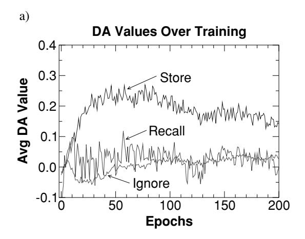

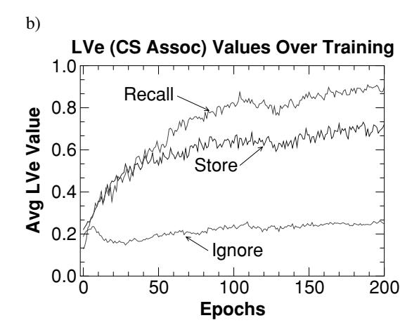

Figure 13: (a) Average simulated DA values in the PBWM model for different event types over training. Within the first 50 epochs, the model learns strong, positive DA values for both types of storage events (Store), which reinforces gating for these events. In contrast, low DA values are generated for Ignore and Recall events. (b) Average LVe values, representing the learned value (i.e., CS associations with reward value) of various event types. As the model learns to perform well, it accurately perceives the reward at Recall events. This generalizes to the Store events, but the Ignore events are not reliably associated with reward, and thus remain at low levels.

Our earlier model was developed in advance of the PBWM learning mechanisms and used a hand-coded gating mechanism to demonstrate the power of the underlying representational scheme. In contrast, we trained the present networks from random initial weights to learn this task. Each

training sequence consisted of an encoding phase, where the current sequence of phonemes was presented in order, followed by a retrieval phase where the network had to output the phonemes in the order they were encoded. Sequences were of length 3, and only 10 simulated phonemes were used, represented locally as one out of 10 units active. Sequence order information was provided to the network in the form of an explicit "time" input, which counted up from 1 to 3 during both encoding and retrieval. Also, encoding versus retrieval phase was explicitly signaled by two units in the input. An example input sequence would be: E-1-'B,' E-2-'A,' E-3-'G,' R-1, R-2, R-3, where E/R is the encoding/recall flag, the next digit specifies the sequence position ("time"), and the third is the phoneme (not present in the input during retrieval).

There are 1000 possible sequences (10³), and the networks were trained on a randomly selected subset of 300 of these, with another nonoverlapping sample of 300 used for generalization testing at the end of training. Both of the gated networks (PBWM and LSTM) had six stripes or memory cells instead of four, given that three items had to be maintained at a time, and the networks benefit from having extra stripes to explore different gating strategies in parallel. The PFC representations in the PBWM model were subject to learning (unlike previous simulations, where they were simply a copy of the input, for analytical simplicity) and had 42 units per stripe, as in the O'Reilly and Soto (2002) model, and there were 100 hidden units. There were 24 units per memory cell in the LSTM model (note that computation increases as a power of 2 per memory cell unit in LSTM, setting a relatively low upper limit on the number of such cells).

Figure 14 shows the training and testing results. Both gated models (PBWM, LSTM) learned more rapidly than the nongated backpropagation-based networks (RBP, SRN). Furthermore, the RBP network was unable to learn unless we presented the entire set of training sequences in a fixed order (other networks had randomly ordered presentation of training sequences). This was true regardless of the RBP window size (even when it was exactly the length of a sequence). Also, the SRN could not learn with only 100 hidden units, so 196 were used. For both the RBP and SRN networks, a lower learning rate of .005 was required to achieve stable convergence. In short, this was a difficult task for these networks to learn.

Perhaps the most interesting results are the generalization test results shown in Figure 14b. As was demonstrated in the O'Reilly and Soto (2002) model, gating affords considerable advantages in the generalization to novel sequences compared to the RBP and SRN networks. It is clear that the SRN network in particular simply "memorizes" the training sequences, whereas the gated networks (PBWM, LSTM) develop a very systematic solution where each working memory stripe or slot learns to encode a different element in the sequence. This is a good example of the advantages of the variable-binding kind of behavior supported by adaptive gating, as discussed earlier.

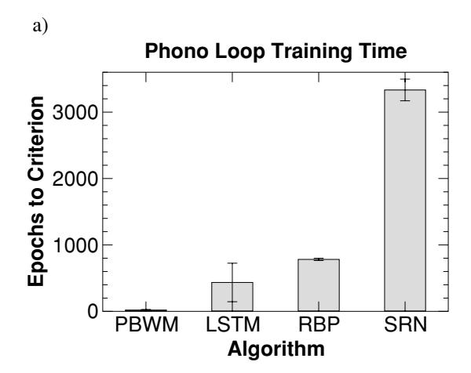

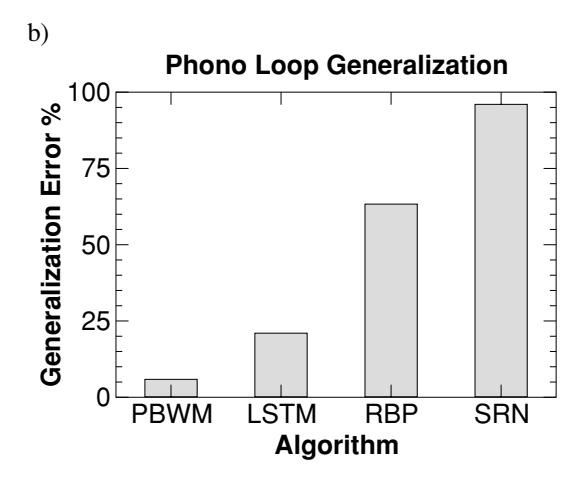

Figure 14: (a) Learning rates for the different algorithms on the phonological loop task, replicating previous general patterns (criterion is one epoch of 0 error). (b) Generalization performance (testing on 300 novel, untrained sequences), showing that the gating networks (PBWM and LSTM) exhibit substantially better generalization, due to their ability to dynamically gate items into active memory "slots" based on their order of presentation.

**4.4 Tests of Algorithm Components.** Having demonstrated that the PBWM model can successfully learn a range of different challenging working memory tasks, we now test the role of specific subcomponents of the algorithm to demonstrate their contribution to the overall performance. Table 4 shows the results of eliminating various portions of the model in

Table 4: Results of Various Tests for the Importance of Various Separable Parts of the PBWM Algorithm, Shown as a Percentage of Trained Networks That Met Criterion (Success Rate).

|                               | Success Rate (%) |       |      |  |
|-------------------------------|------------------|-------|------|--|
| Manipulation                  | 12ax             | SIR-2 | Loop |  |
| No Hebbian                    | 95               | 100   | 100  |  |
| No DA contrast enhancement    | 80               | 95    | 90   |  |
| No Random Go exploration      | 0                | 95    | 100  |  |
| No LVi (slow LV baseline)     | 15               | 90    | 30   |  |
| No SNrThal DA Mod, $DA = 1.0$ | 15               | 5     | 0    |  |
| No SNrThal DA Mod, $DA = 0.5$ | 70               | 20    | 0    |  |
| No SNrThal DA Mod, $DA = 0.2$ | 80               | 30    | 20   |  |
| No SNrThal DA Mod, $DA = 0.1$ | 55               | 40    | 20   |  |
| No DA modulation at all       | 0                | 0     | 0    |  |

Notes: With the possible exception of Hebbian learning, all of the components clearly play an important role in overall learning, for the reasons described in the text as the algorithm was introduced. The No SNrThal DA Mod cases eliminate stripe-wise structural credit assignment; controls for overall levels of DA modulation are shown. The final No DA Modulation at all condition completely eliminates the influence of the PVLV DA system on Striatum Go/NoGo units, clearly indicating that PVLV (i.e., learning) is key.

terms of percentage of networks successfully learning to criterion. This shows that each separable component of the algorithm plays an important role, with the possible exception of Hebbian learning (which was present only in the "posterior cortical" (Hidden/Output) portion of the network). Different models appear to be differentially sensitive to these manipulations, but all are affected relative to the 100% performance of the full model. For the "No SNrThal DA Mod" manipulation, which eliminates structural credit assignment via the stripe-wise modulation of DA by the SNrThal layer, we also tried reducing the overall strength of the DA modulation of the striatum Go/NoGo units, with the idea that the SNrThal modulation also tends to reduce DA levels overall. Therefore, we wanted to make sure any impairment was not just a result of a change in overall DA levels; a significant impairment remains even with this manipulation.

#### 5 Discussion

The PBWM model presented here demonstrates powerful learning abilities on demonstrably complex and difficult working memory tasks. We have also tested it informally on a wider range of tasks, with similarly good results. This may be the first time that a biologically based mechanism for controlling working memory has been demonstrated to compare favorably with the learning abilities of more abstract and biologically implausible

backpropagation-based temporal learning mechanisms. Other existing simulations of learning in the basal ganglia tend to focus on relatively simple sequencing tasks that do not require complex working memory maintenance and updating and do not require learning of when information should and should not be stored in working memory. Nevertheless, the central ideas behind the PBWM model are consistent with a number of these existing models (Schultz et al., 1995; Houk et al., 1995; Schultz et al., 1997; Suri et al., 2001; Contreras-Vidal & Schultz, 1999; Joel et al., 2002), thereby demonstrating that an emerging consensus view of basal ganglia learning mechanisms can be applied to more complex cognitive functions.

The central functional properties of the PBWM model can be summarized by comparison with the widely used SRN backpropagation network, which is arguably the simplest form of a gated working memory model. The gating aspect of the SRN becomes more obvious when the network has to settle over multiple update cycles for each input event (as in an interactive network or to measure reaction times from a feedforward network). In this case, it is clear that the context layer must be held constant and be protected from updating during these cycles of updating (settling), and then it must be rapidly updated at the end of settling (see Figure 15). Although the SRN achieves this alternating maintenance and updating by fiat, in a biological network it would almost certainly require some kind of gating mechanism. Once one recognizes the gating mechanism hidden in the SRN, it is natural to consider generalizing such a mechanism to achieve a more powerful, flexible type of gating.

This is exactly what the PBWM model provides, by adding the following degrees of freedom to the gating signal: (1) gating is dynamic, such that information can be maintained over a variable number of trials instead of automatically gating every trial; (2) the context representations are learned, instead of simply being copies of the hidden layer, allowing them to develop in ways that reflect the unique demands of working memory representations (e.g., Rougier & O'Reilly, 2002; Rougier et al., 2005); (3) there can be multiple context layers (i.e., stripes), each with its own set of representations and gating signals. Although some researchers have used a spectrum of hysteresis variables to achieve some of this additional flexibility within the SRN, it should be clear that the PBWM model affords considerably more flexibility in the maintenance and updating of working memory information.

Moreover, the similar good performance of PBWM and LSTM models across a range of complex tasks clearly demonstrates the advantages of dynamic gating systems for working memory function. Furthermore, the PBWM model is biologically plausible. Indeed, the general functions of each of its components were motivated by a large base of literature spanning multiple levels of analysis, including cellular, systems, and psychological data. As such, the PBWM model can be used to explore possible roles of the individual neural systems involved by perturbing parameters

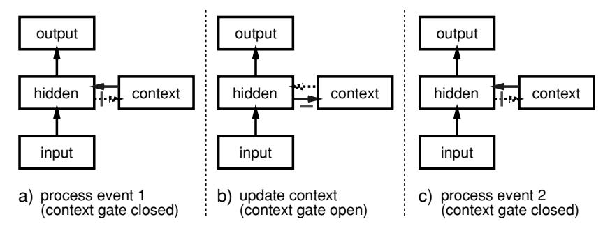

Figure 15: The simple recurrent network (SRN) as a gating network. When processing of each input event requires multiple cycles of settling, the context layer must be held constant over these cycles (i.e., its gate is closed, panel a). After processing an event, the gate is opened to allow updating of the context (copying of hidden activities to the context, panel b). This new context is then protected from updating during the processing of the next event (panel c). In comparison, the PBWM model allows more flexible, dynamic control of the gating signal (instead of automatic gating each time step), with multiple context layers (stripes) that can each learn their own representations (instead of being a simple copy).

to simulate development, aging, pharmacological manipulations, and neurological dysfunction. For example, we think the model can explicitly test the implications of striatal dopamine dysfunction in producing cognitive deficits in conditions such as Parkinson's disease and ADHD (e.g., Frank et al., 2004; Frank, 2005). Further, recent extensions to the framework have yielded insights into possible divisions of labor between the basal ganglia and orbitofrontal cortex in reinforcement learning and decision making (Frank & Claus, 2005).

Although the PBWM model was designed to include many central aspects of the biology of the PFC/BG system, it also goes beyond what is currently known and omits many biological details of the real system. Therefore, considerable further experimental work is necessary to test the specific predictions and neural hypotheses behind the model, and further elaboration and revision of the model will undoubtedly be necessary.

Because the PBWM model represents a level of modeling intermediate between detailed biological models and powerful, abstract cognitive and computational models, it has the potential to build important bridges between these disparate levels of analysis. For example, the abstract ACT-R cognitive architecture has recently been mapped onto biological substrates including the BG and PFC (Anderson et al., 2004; Anderson & Lebiere, 1998), with the specific role ascribed to the BG sharing some central aspects of its role in the PBWM model. On the other end of the spectrum,

biologically based models have traditionally been incapable of simulating complex cognitive functions such as problem solving and abstract reasoning, which make extensive use of dynamic working memory updating and maintenance mechanisms to exhibit controlled processing over a time scale from seconds to minutes. The PBWM model should in principle allow models of these phenomena to be developed and their behavior compared with more abstract models, such as those developed in ACT-R.

One of the major challenges to this model is accounting for the extreme flexibility of the human cognitive apparatus. Instead of requiring hundreds of trials of training on problems like the 1-2-AX task, people can perform this task almost immediately based on verbal task instructions. Our current model is more appropriate for understanding how agents can learn which information to hold in mind via trial and error, as would be required if monkeys were to perform the task.1 Understanding the human capacity for generativity may be the greatest challenge facing our field, so we certainly do not claim to have solved it. Nevertheless, we do think that the mechanisms of the PBWM model, and in particular its ability to exhibit limited variable-binding functionality, are critical steps along the way. It may be that over the 13 or so years it takes to fully develop a functional PFC, people have developed a systematic and flexible set of representations that support dynamic reconfiguration of input-output mappings according to maintained PFC representations. Thus, these PFC "variables" can be activated by task instructions and support novel task performance without extensive training. This and many other important problems, including questions about the biological substrates of the PBWM model, remain to be addressed in future research.

## Appendix: Implementational Details

The model was implemented using the Leabra framework, which is described in detail in O'Reilly and Munakata (2000) and O'Reilly (2001), and summarized here. See Table 5 for a listing of parameter values, nearly all of which are at their default settings. These same parameters and equations have been used to simulate over 40 different models in O'Reilly and Munakata (2000) and a number of other research models. Thus, the model can be viewed as an instantiation of a systematic modeling framework using standardized mechanisms, instead of constructing new mechanisms for each model. (The model can be obtained by e-mailing the first author at oreilly@psych.colorado.edu.)

&lt;sup>1 In practice, monkeys would likely require an extensive shaping procedure to learn the relatively complex 1-2-AX hierarchical structure piece by piece. However, we argue that much of the advantage of shaping may have to do with the motivational state of the organism: it enables substantial levels of success early on, to keep motivated. The model currently has no such motivational constraints and thus does not need shaping.

| Parameter         | Value | Parameter                    | Value |
|-------------------|-------|------------------------------|-------|
| $E_l$             | 0.15  | <u>81</u>                    | 0.10  |
| $E_i$             | 0.15  | $\frac{g^i}{g_i}$            | 1.0   |
| $E_e$             | 1.00  | $\frac{\overline{g_i}}{g_e}$ | 1.0   |
| $V_{rest}$        | 0.15  | Θ                            | 0.25  |
| τ                 | .02   | γ                            | 600   |
| k in/out          | 1     | $\overset{\cdot}{k}$ hidden  | 7     |
| k PFC             | 4     | k striatum                   | 7     |
| k PVLV            | 1     |                              |       |
| $k_{hebb}$        | .01   | $\epsilon$                   | .01   |
| to PFC $k_{hebb}$ | .001* | to PFC $\epsilon$            | .001* |

Table 5: Parameters for the Simulation.

Notes: See the equations in the text for explanations of parameters. All are standard default parameter values except for those with an \*. The slower learning rate of PFC connections produced better results and is consistent with a variety of converging evidence, suggesting that the PFC learns more slowly than the rest of cortex (Morton & Munakata, 2002).

**A.1 Pseudocode.** The pseudocode for Leabra is given here, showing exactly how the pieces of the algorithm described in more detail in the subsequent sections fit together.

Outer loop: Iterate over events (trials) within an epoch. For each event:

- 1. Iterate over minus (–), plus (+), and update (++) phases of settling for each event.
  - (a) At start of settling:
    - i. For non-PFC/BG units, initialize state variables (e.g., activation, v\_m).
    - ii. Apply external patterns (clamp input in minus, input and output, external reward based on minus-phase outputs).
  - (b) During each cycle of settling, for all nonclamped units:
    - i. Compute excitatory netinput ( $g_e(t)$  or  $\eta_j$ ; equation A.3) (equation 24 for SNr/Thal units).
    - ii. For Striatum Go/NoGo units in ++ phase, compute additional excitatory and inhibitory currents based on DA inputs from SNc (equation A.20).
    - iii. Compute kWTA inhibition for each layer, based on  $g_i^{\Theta}$  (equation A.6):
      - A. Sort units into two groups based on  $g_i^{\Theta}$ : top k and remaining k+1 to n.
      - B. If basic, find k and k+1th highest; if average based, compute average of  $1 \rightarrow k \& k+1 \rightarrow n$ .
      - C. Set inhibitory conductance  $g_i$  from  $g_k^{\Theta}$  and  $g_{k+1}^{\Theta}$  (equation A.5).

- iv. Compute point-neuron activation combining excitatory input and inhibition (equation A.1).
- (c) After settling, for all units:
  - i. Record final settling activations by phase  $(y_i^-, y_i^+, y^{++})$ .
  - ii. At end of + and ++ phases, toggle PFC maintenance currents for stripes with SNr/Thal act > threshold (.1).
- 2. After these phases, update the weights (based on linear current weight values):
  - (a) For all non-BG connections, compute error-driven weight changes (equation A.8) with soft weight bounding (equation A.9), Hebbian weight changes from plus-phase activations (equation A.7), and overall net weight change as weighted sum of error-driven and Hebbian (equation A.10).
  - (b) For PV units, weight changes are given by delta rule computed as difference between plus phase external reward value and minus phase expected rewards (equation A.11).
  - (c) For LV units, only change weights (using equation A.13) if PV expectation  $> \theta_{pv}$  or external reward/punishment actually delivered.
  - (d) For Striatum units, weight change is the delta rule on DA-modulated second-plus phase activations minus unmodulated plus phase acts (equation A.19).
  - (e) Increment the weights according to net weight change.

**A.2 Point Neuron Activation Function.** Leabra uses a point neuron activation function that models the electrophysiological properties of real neurons, while simplifying their geometry to a single point. The membrane potential  $V_m$  is updated as a function of ionic conductances g with reversal (driving) potentials E as follows:

$$\Delta V_m(t) = \tau \sum_c g_c(t) \overline{g_c} (E_c - V_m(t)), \tag{A.1}$$

with three channels (c) corresponding to e excitatory input, l leak current, and i inhibitory input. Following electrophysiological convention, the overall conductance is decomposed into a time-varying component  $g_c(t)$  computed as a function of the dynamic state of the network, and a constant  $\overline{g_c}$  that controls the relative influence of the different conductances.

The excitatory net input/conductance  $g_e(t)$  or  $\eta_j$  is computed as the proportion of open excitatory channels as a function of sending activations times the weight values:

$$\eta_j = g_e(t) = \langle x_i w_{ij} \rangle = \frac{1}{n} \sum_i x_i w_{ij}. \tag{A.2}$$

The inhibitory conductance is computed via the kWTA function described in the next section, and leak is a constant.

Activation communicated to other cells  $(y_j)$  is a thresholded  $(\Theta)$  sigmoidal function of the membrane potential with gain parameter  $\gamma$ :

$$y_j(t) = \frac{1}{\left(1 + \frac{1}{\gamma[V_m(t) - \Theta]_+}\right)},$$
 (A.3)

where  $[x]_+$  is a threshold function that returns 0 if x < 0 and x if x > 0. Note that if it returns 0, we assume  $y_j(t) = 0$ , to avoid dividing by 0. To produce a less discontinuous deterministic function with a softer threshold, the function is convolved with a gaussian noise kernel ( $\mu = 0$ ,  $\sigma = .005$ ), which reflects the intrinsic processing noise of biological neurons,

$$y_j^*(x) = \int_{-\infty}^{\infty} \frac{1}{\sqrt{2\pi}\sigma} e^{-z^2/(2\sigma^2)} y_j(z - x) dz,$$
 (A.4)

where x represents the  $[V_m(t) - \Theta]_+$  value, and  $y_j^*(x)$  is the noise-convolved activation for that value. In the simulation, this function is implemented using a numerical lookup table.

**A.3 k-Winners-Take-All Inhibition.** Leabra uses a kWTA (k-Winners-Take-All) function to achieve inhibitory competition among units within a layer (area). The kWTA function computes a uniform level of inhibitory current  $g_i$  for all units in the layer, such that the k+1th most excited unit within a layer is generally below its firing threshold, while the kth is typically above threshold,

$$g_i = g_{k+1}^{\Theta} + q \left( g_k^{\Theta} - g_{k+1}^{\Theta} \right), \tag{A.5}$$

where 0 < q < 1 (.25 default used here) is a parameter for setting the inhibition between the upper bound of  $g_k^\Theta$  and the lower bound of  $g_{k+1}^\Theta$ . These boundary inhibition values are computed as a function of the level of inhibition necessary to keep a unit right at threshold,

$$g_i^{\Theta} = \frac{g_e^* \bar{g}_e(E_e - \Theta) + g_l \bar{g}_l(E_l - \Theta)}{\Theta - E_i},\tag{A.6}$$

where  $g_e^*$  is the excitatory net input without the bias weight contribution. This allows the bias weights to override the kWTA constraint.

In the basic version of the kWTA function, which is relatively rigid about the kWTA constraint and is therefore used for output layers,  $g_k^\Theta$  and  $g_{k+1}^\Theta$  are set to the threshold inhibition value for the kth and k+1th most excited units, respectively. In the average-based kWTA version,  $g_k^\Theta$  is the average

 $g_i^{\Theta}$  value for the top k most excited units, and  $g_{k+1}^{\Theta}$  is the average of  $g_i^{\Theta}$  for the remaining n-k units. This version allows more flexibility in the actual number of units active depending on the nature of the activation distribution in the layer.

A.4 Hebbian and Error-Driven Learning. For learning, Leabra uses a combination of error-driven and Hebbian learning. The error-driven component is the symmetric midpoint version of the GeneRec algorithm (O'Reilly, 1996), which is functionally equivalent to the deterministic Boltzmann machine and contrastive Hebbian learning (CHL). The network settles in two phases—an expectation (minus) phase, where the network's actual output is produced, and an outcome (plus) phase, where the target output is experienced—and then computes a simple difference of a preand postsynaptic activation product across these two phases. For Hebbian learning, Leabra uses essentially the same learning rule used in competitive learning or mixtures-of-gaussians, which can be seen as a variant of the Oja normalization (Oja, 1982). The error-driven and Hebbian learning components are combined additively at each connection to produce a net weight change.

The equation for the Hebbian weight change is

$$\Delta_{hebb}w_{ij} = x_i^+ y_j^+ - y_j^+ w_{ij} = y_j^+ (x_i^+ - w_{ij}), \tag{A.7}$$

and for error-driven learning using CHL,

$$\Delta_{err} w_{ij} = (x_i^+ y_j^+) - (x_i^- y_j^-), \tag{A.8}$$

which is subject to a soft-weight bounding to keep within the 0-1 range:

$$\Delta_{sberr} w_{ij} = [\Delta_{err}]_{+} (1 - w_{ij}) + [\Delta_{err}]_{-} w_{ij}. \tag{A.9}$$

The two terms are then combined additively with a normalized mixing constant  $k_{hebb}$ :

$$\Delta w_{ij} = \epsilon [k_{hebb}(\Delta_{hebb}) + (1 - k_{hebb})(\Delta_{sberr})]. \tag{A.10}$$

**A.5 PVLV Equations.** See O'Reilly et al. (2005) for further details on the PVLV system. We assume that time is discretized into steps that correspond to environmental events (e.g., the presentation of a CS or US). All of the following equations operate on variables that are a function of the current time step t. We omit the t in the notation because it would be redundant. PVLV is composed of two systems, PV (primary value) and LV (learned value), each of which in turn is composed of two subsystems (excitatory and inhibitory). Thus, there are four main value representation layers in

PVLV (PVe, PVi, LVe, LVi), which then drive the dopamine (DA) layers (VTA/SNc).

A.5.1 Value Representations. The PVLV value layers use standard Leabra activation and kWTA dynamics as described above, with the following modifications. They have a three-unit distributed representation of the scalar values they encode, where the units have preferred values of (0, .5, 1). The overall value represented by the layer is the weighted average of the unit's activation times its preferred value, and this decoded average is displayed visually in the first unit in the layer. The activation function of these units is a "noisy" linear function (i.e., without the x/(x+1) nonlinearity, to produce a linear value representation, but still convolved with gaussian noise to soften the threshold, as for the standard units, equation A.4), with gain  $\gamma = 220$ , noise variance  $\sigma = .01$ , and a lower threshold  $\Theta = .17$ . The  $\bar{k}$  for kWTA (average based) is 1, and the q value is .9 (instead of the default of .6). These values were obtained by optimizing the match for value represented with varying frequencies of 0-1 reinforcement (e.g., the value should be close to .4 when the layer is trained with 40% 1 values and 60% 0 values). Note that having different units for different values, instead of the typical use of a single unit with linear activations, allows much more complex mappings to be learned. For example, units representing high values can have completely different patterns of weights than those encoding low values, whereas a single unit is constrained by virtue of having one set of weights to have a monotonic mapping onto scalar values.

A.5.2 Learning Rules. The PVe layer does not learn and is always just clamped to reflect any received reward value (r). By default, we use a value of 0 to reflect negative feedback, .5 for no feedback, and 1 for positive feedback (the scale is arbitrary). The PVi layer units  $(y_j)$  are trained at every point in time to produce an expectation for the amount of reward that will be received at that time. In the minus phase of a given trial, the units settle to a distributed value representation based on sensory inputs. This results in unit activations  $y_j^-$  and an overall weighted average value across these units denoted  $PV_i$ . In the plus phase, the unit activations  $(y_j^+)$  are clamped to represent the actual reward r (a.k.a.  $PV_e$ ). The weights  $(w_{ij})$  into each PVi unit from sending units with plus-phase activations  $x_i^+$ , are updated using the delta rule between the two phases of PVi unit activation states:

$$\Delta w_{ij} = \epsilon (y_j^+ - y_j^-) x_i^+. \tag{A.11}$$

This is equivalent to saying that the US/reward drives a pattern of activation over the PVi units, which then learn to activate this pattern based on sensory inputs.

The LVe and LVi layers learn in much the same way as the PVi layer (see equation A.11), except that the PV system filters the training of the LV values, such that they learn only from actual reward outcomes (or when reward is expected by the PV system but is not delivered), and not when no rewards are present or expected. This condition is

$$PV_{filter} = PV_i < \theta_{\min} \lor PV_e < \theta_{\min} \lor$$

$$PV_i > \theta_{\max} \lor PV_e > \theta_{\max}$$
(A.12)

$$\Delta w_i = \begin{cases} \epsilon (y_j^+ - y_j^-) x_i^+ & \text{if } PV_{filter} \\ 0 & \text{otherwise} \end{cases}, \tag{A.13}$$

where  $\theta_{\min}$  is a lower threshold (.2 by default), below which negative feedback is indicated, and  $\theta_{\max}$  is an upper threshold (.8), above which positive feedback is indicated (otherwise, no feedback is indicated). Biologically, this filtering requires that the LV systems be driven directly by primary rewards (which is reasonable and required by the basic learning rule anyway) and that they learn from DA dips driven by high PVi expectations of reward that are not met. The only difference between the LVe and LVi systems is the learning rate  $\epsilon$ , which is .05 for LVe and .001 for LVi. Thus, the inhibitory LVi system serves as a slowly integrating inhibitory cancellation mechanism for the rapidly adapting excitatory LVe system.

The four PV and LV distributed value representations drive the dopamine layer (VTA/SNc) activations in terms of the difference between the excitatory and inhibitory terms for each. Thus, there is a PV delta and an LV delta:

$$\delta_{pv} = PV_e - PV_i \tag{A.14}$$

$$\delta_{lv} = LV_e - LV_i. \tag{A.15}$$

With the differences in learning rate between LVe (fast) and LVi (slow), the LV delta signal reflects recent deviations from expectations and not the raw expectations themselves, just as the PV delta reflects deviations from expectations about primary reward values. This is essential for learning to converge and stabilize when the network has mastered the task (as the results presented in the article show). We also impose a minimum value on the LVi term of .1, so that there is always some expectation. This ensures that low LVe learned values result in negative deltas.

These two delta signals need to be combined to provide an overall DA delta value, as reflected in the firing of the VTA and SNc units. One sensible way of doing so is to have the PV system dominate at the time of primary

rewards, while the LV system dominates otherwise, using the same PV-based filtering as holds in the LV learning rule (see equation A.13):

$$\delta = \begin{cases} \delta_{pv} & \text{if } PV_{filter} \\ \delta_{lv} & \text{otherwise} \end{cases}$$
 (A.16)

It turns out that a slight variation of this where the LV always contributes works slightly better, and is what is used in this article:

$$\delta = \delta_{lv} + \begin{cases} \delta_{pv} & \text{if } PV_{filter} \\ 0 & \text{otherwise} \end{cases}$$
 (A.17)

A.5.3 Synaptic Depression of LV Weights. The weights into the LV units are subject to synaptic depression, which makes them sensitive to changes in stimulus inputs, and not to static, persistent activations (Abbott, Varela, Sen, & Nelson, 1997). Each incoming weight has an effective weight value  $w^*$  that is subject to depression and recovery changes as follows,

$$\Delta w_i^* = R(w_i - w_i^*) - Dx_i w_i, \tag{A.18}$$

where R is the recovery parameter, D is the depression parameter, and  $w_i$  is the asymptotic weight value. For simplicity, we compute these changes at the end of every trial instead of in an online manner, using R=1 and D=1, which produces discrete one-trial depression and recovery.

# A.6 Special Basal Ganglia Mechanisms

A.6.1 Striatal Learning Function. Each stripe (group of units) in the Striatum layer is divided into Go versus NoGo in an alternating fashion. The DA input from the SNc modulates these unit activations in the update phase by providing extra excitatory current to Go and extra inhibitory current to the NoGo units in proportion to the positive magnitude of the DA signal, and vice versa for negative DA magnitude. This reflects the opposing influences of DA on these neurons (Frank, 2005; Gerfen, 2000). This update phase DA signal reflects the PVLV system's evaluation of the PFC updates produced by gating signals in the plus phase (see Figure 8). Learning on weights into the Go/NoGo units is based on the activation delta between the update (++) and plus phases:

$$\Delta w_i = \epsilon x_i (y^{++} - y^+). \tag{A.19}$$

To reflect the finding that DA modulation has a contrast-enhancing function in the striatum (Frank, 2005; Nicola, Surmeier, & Malenka, 2000;

Hernandez-Lopez, Bargas, Surmeier, Reyes, & Galarraga, 1997) and to produce more of a credit assignment effect in learning, the DA modulation is partially a function of the previous plus phase activation state,

$$g_e = \gamma [da]_+ y^+ + (1 - \gamma)[da]_+$$
 (A.20)

where  $0 < \gamma < 1$  controls the degree of contrast enhancement (.5 is used in all simulations),  $[da]_+$  is the positive magnitude of the DA signal (0 if negative),  $y_+$  is the plus-phase unit activation, and  $g_e$  is the extra excitatory current produced by the da (for Go units). A similar equation is used for extra inhibition ( $g_i$ ) from negative da ( $[da]_-$ ) for Go units, and vice versa for NoGo units.

*A.6.2 SNrThal Units.* The SNrThal units provide a simplified version of the SNr/GPe/Thalamus layers. They receive a net input that reflects the normalized Go–NoGo activations in the corresponding Striatum stripe:

$$\eta_{j} = \left[\frac{\sum Go - \sum NoGo}{\sum Go + \sum NoGo}\right]_{+} \tag{A.21}$$

(where []+ indicates that only the positive part is taken; when there is more NoGo than Go, the net input is 0). This net input then drives standard Leabra point neuron activation dynamics, with kWTA inhibitory competition dynamics that cause stripes to compete to update the PFC. This dynamic is consistent with the notion that competition and selection take place primarily in the smaller GP/SNr areas, and not much in the much larger striatum (e.g., Mink, 1996; Jaeger, Kita, & Wilson, 1994). The resulting SNrThal activation then provides the gating update signal to the PFC: if the corresponding SNrThal unit is active (above a minimum threshold; .1), then active maintenance currents in the PFC are toggled.

This SNrThal activation also multiplies the per stripe DA signal from the SNc,

$$\delta_j = snr_j\delta, \tag{A.22}$$

where  $snr_j$  is the snr unit's activation for stripe j, and  $\delta$  is the global DA signal, equation A.16.

A.6.3 Random Go Firing. The PBWM system learns only after Go firing, so if it never fires Go, it can never learn to improve performance. One simple solution is to induce Go firing if a Go has not fired after some threshold number of trials. However, this threshold would have to be either task specific or set very high, because it would effectively limit the maximum maintenance duration of the PFC (because by updating

PFC, the Go firing results in loss of currently maintained information). Therefore, we have adopted a somewhat more sophisticated mechanism that keeps track of the average DA value present when each stripe fires a Go:

$$\overline{da}_k = \overline{da}_k + \epsilon (da_k - \overline{da}_k). \tag{A.23}$$

If this value is < 0 and a stripe has not fired Go within 10 trials, a random Go firing is triggered with some probability (.1). We also compare the relative per stripe DA averages, if the per stripe DA average is low but above zero, and one stripe's  $\overline{da}_k$  is .05 below the average of that of the other stripe's,

if 
$$(\overline{da}_k < .1)$$
 and  $(\overline{da}_k - \langle \overline{da} \rangle < -.05)$ ; Go, (A.24)

a random Go is triggered, again with some probability (.1). Finally, we also fire random Go in all stripes with some very low baseline probability (.0001) to encourage exploration.

When a random Go fires, we set the SNrThal unit activation to be above Go threshold, and we apply a positive DA signal to the corresponding striatal stripe, so that it has an opportunity to learn to fire for this input pattern on its own in the future.

A.6.4 PFC Maintenance. PFC active maintenance is supported in part by excitatory ionic conductances that are toggled by Go firing from the SNrThal layers. This is implemented with an extra excitatory ion channel in the basic  $V_m$  update equation, A.1. This channel has a conductance value of .5 when active. (See Frank et al., 2001, for further discussion of this kind of maintenance mechanism, which has been proposed by several researchers—e.g., Lewis & O'Donnell, 2000; Fellous et al., 1998; Wang, 1999; Dilmore, Gutkin, & Ermentrout, 1999; Gorelova & Yang, 2000; Durstewitz, Seamans, & Sejnowski, 2000b.) The first opportunity to toggle PFC maintenance occurs at the end of the first plus phase and then again at the end of the second plus phase (third phase of settling). Thus, a complete update can be triggered by two Go's in a row, and it is almost always the case that if a Go fires the first time, it will fire the next, because Striatum firing is primarily driven by sensory inputs, which remain constant.

### Acknowledgments .

This work was supported by ONR grants N00014-00-1-0246 and N00014-03-1-0428 and NIH grants MH64445 and MH069597. Thanks to Todd Braver, Jon Cohen, Peter Dayan, David Jilk, David Noelle, Nicolas Rougier, Tom

Hazy, Daniel Cer, and members of the CCN Lab for feedback and discussion on this work.

#### References

- Abbott, L. F., Varela, J. A., Sen, K., & Nelson, S. B. (1997). Synaptic depression and cortical gain control. *Science*, 275, 220.
- Alexander, G. E., DeLong, M. R., & Strick, P. L. (1986). Parallel organization of functionally segregated circuits linking basal ganglia and cortex. *Annual Review of Neuroscience*, *9*, 357–381.
- Amos, A. (2000). A computational model of information processing in the frontal cortex and basal ganglia. *Journal of Cognitive Neuroscience*, 12, 505–519.
- Anderson, J. R., Bothell, D., Byrne, M. D., Douglass, S., Lebiere, C., & Qin, Y. (2004). An integrated theory of the mind. *Psychological Review*, 111(4), 1036–1060.
- Anderson, J. R., & Lebiere, C. (1998). *The atomic components of thought*. Mahwah, NJ: Erlbaum.
- Baddeley, A. D. (1986). Working memory. New York: Oxford University Press.
- Baddeley, A., Gathercole, S., & Papagno, C. (1998). The phonological loop as a language learning device. *Psychological Review*, 105, 158.
- Beiser, D. G., & Houk, J. C. (1998). Model of cortical-basal ganglionic processing: Encoding the serial order of sensory events. *Journal of Neurophysiology*, 79, 3168–3188.
- Berns, G. S., & Sejnowski, T. J. (1995). How the basal ganglia make decisions. In A. Damasio, H. Damasio, & Y. Christen (Eds.), *Neurobiology of decision-making* (pp. 101–113). Berlin: Springer-Verlag.
- Berns, G. S., & Sejnowski, T. J. (1998). A computational model of how the basal ganglia produces sequences. <u>Journal of Cognitive Neuroscience</u>, 10, 108–121.
- Braver, T. S., & Cohen, J. D. (2000). On the control of control: The role of dopamine in regulating prefrontal function and working memory. In S. Monsell & J. Driver (Eds.), *Control of cognitive processes: Attention and performance XVIII* (pp. 713–737). Cambridge, MA: MIT Press.
- Burgess, N., & Hitch, G. J. (1999). Memory for serial order: A network model of the phonological loop and its timing. <u>Psychological Review</u>, 106, 551–581
- Cardinal, R. N., Parkinson, J. A., Hall, J., & Everitt, B. J. (2002). Emotion and motivation: The role of the amygdala, ventral striatum, and prefrontal cortex. <u>Neuroscience and Biobehavioral Reviews</u>, 26, 321–352.
- Cohen, J. D., Braver, T. S., & O'Reilly, R. C. (1996). A computational approach to prefrontal cortex, cognitive control, and schizophrenia: Recent developments and current challenges. *Philosophical Transactions of the Royal Society (London) B*, 351, 1515–1527.
- Contreras-Vidal, J. L., & Schultz, W. (1999). A predictive reinforcement model of dopamine neurons for learning approach behavior. *Journal of Comparative Neuro*science, 6, 191–214.

- Dilmore, J. G., Gutkin, B. G., & Ermentrout, G. B. (1999). Effects of dopaminergic modulation of persistent sodium currents on the excitability of prefrontal cortical neurons: A computational study. *Neurocomputing*, 26, 104–116.
- Dominey, P., Arbib, M., & Joseph, J.-P. (1995). A model of corticostriatal plasticity for learning oculomotor associations and sequences. <u>Journal of Cognitive Neuroscience</u>, 7, 311–336.
- Durstewitz, D., Kelc, M., & Gunturkun, O. (1999). A neurocomputational theory of the dopaminergic modulation of working memory functions. <u>Journal of Neuro-</u> science, 19, 2807.
- Durstewitz, D., Seamans, J. K., & Sejnowski, T. J. (2000a). Dopamine-mediated stabilization of delay-period activity in a network model of prefrontal cortex. <u>Journal of Neurophysiology</u>, 83, 1733–1750.
- Durstewitz, D., Seamans, J. K., & Sejnowski, T. J. (2000b). Neurocomputational models of working memory. *Nature Neuroscience*, 3 (Suppl.), 1184–1191.
- Elman, J. L. (1990). Finding structure in time. Cognitive Science, 14, 179–211.
- Emerson, M. J., & Miyake, A. (2003). The role of inner speech in task switching: A dual-task investigation. *Journal of Memory and Language*, 48, 148–168.
- Fellous, J. M., Wang, X. J., & Lisman, J. E. (1998). A role for NMDA-receptor channels in working memory. *Nature Neuroscience*, 1, 273–275.
- Frank, M. J. (2005). Dynamic dopamine modulation in the basal ganglia: A neurocomputational account of cognitive deficits in medicated and non-medicated Parkinsonism. *Journal of Cognitive Neuroscience*, 17, 51–72.
- Frank, M. J., & Claus, E. D. (2005). Anatomy of a decision: Striato-orbitofrontal interactions in reinforcement learning, decision making and reversal. Manuscript submitted for publication.
- Frank, M. J., Loughry, B., & O'Reilly, R. C. (2001). Interactions between the frontal cortex and basal ganglia in working memory: A computational model. <u>Cognitive</u>, <u>Affective</u>, <u>and Behavioral Neuroscience</u>, 1, 137–160.
- Frank, M. J., Seeberger, L., & O'Reilly, R. C. (2004). By carrot or by stick: Cognitive reinforcement learning in Parkinsonism. *Science*, 306, 1940–1943.
- Gerfen, C. R. (2000). Molecular effects of dopamine on striatal projection pathways. *Trends in Neurosciences*, 23, S64–S70.
- Gers, F. A., Schmidhuber, J., & Cummins, F. (2000). Learning to forget: Continual prediction with LSTM. *Neural Computation*, 12, 2451–2471.
- Gorelova, N. A., & Yang, C. R. (2000). Dopamine D1/D5 receptor activation modulates a persistent sodium current in rat's prefrontal cortical neurons in vitro. *Journal of Neurophysiology*, 84, 75.
- Graybiel, A. M., & Kimura, M. (1995). Adaptive neural networks in the basal ganglia. In J. C. Houk, J. L. Davis, & D. G. Beiser (Eds.), *Models of information processing in the basal ganglia* (pp. 103–116). Cambridge, MA: MIT Press.
- Haber, S. N., Fudge, J. L., & McFarland, N. R. (2000). Striatonigrostriatal pathways in primates form an ascending spiral from the shell to the dorsolateral striatum. *Journal of Neuroscience*, 20, 2369–2382.
- Hernandez-Lopez, S., Bargas, J., Surmeier, D. J., Reyes, A., & Galarraga, E. (1997). D1 receptor activation enhances evoked discharge in neostriatal medium spiny neurons by modulating an L-type Ca2+ conductance. *Journal of Neuroscience*, 17, 3334–3342.

- Hernandez-Lopez, S., Tkatch, T., Perez-Garci, E., Galarraga, E., Bargas, J., Hamm, H., & Surmeier, D. J. (2000). D2 dopamine receptors in striatal medium spiny neurons reduce L-type  $Ca^{2+}$  currents and excitability via a novel PLCβ1-IP3-calcineurin-signaling cascade. *Journal of Neuroscience*, 20, 8987–8995.
- Hochreiter, S., & Schmidhuber, J. (1997). Long short term memory. *Neural Computation*, 9, 1735–1780.
- Houk, J. C., Adams, J. L., & Barto, A. G. (1995). A model of how the basal ganglia generate and use neural signals that predict reinforcement. In J. C. Houk, J. L. Davis, & D. G. Beiser (Eds.), *Models of information processing in the basal ganglia* (pp. 233–248). Cambridge, MA: MIT Press.
- Houk, J. C., & Wise, S. P. (1995). Distributed modular architectures linking basal ganglia, cerebellum, and cerebral cortex: Their role in planning and controlling action. *Cerebral Cortex*, 5, 95–110.
- Jackson, S., & Houghton, G. (1995). Sensorimotor selection and the basal ganglia: A neural network model. In J. C. Houk, J. L. Davis, & D. G. Beiser (Eds.), Models of information processing in the basal ganglia (pp. 337–368). Cambridge, MA: MIT Press.
- Jaeger, D., Kita, H., & Wilson, C. J. (1994). Surround inhibition among projection neurons is weak or nonexistent in the rat neostriatum. <u>Journal of Neurophysiology</u>, 72, 2555–2558.
- Joel, D., Niv, Y., & Ruppin, E. (2002). Actor-critic models of the basal ganglia: New anatomical and computational perspectives. *Neural Networks*, 15, 535–547.
- Joel, D., & Weiner, I. (2000). The connections of the dopaminergic system with the striatum in rats and primates: An analysis with respect to the functional and compartmental organization of the striatum. *Neuroscience*, *96*, 451.
- Jordan, M. I. (1986). Attractor dynamics and parallelism in a connectionist sequential machine. In *Proceedings of the 8th Conference of the Cognitive Science Society* (pp. 531–546). Hillsdale, NJ: Erlbaum.
- Kropotov, J. D., & Etlinger, S. C. (1999). Selection of actions in the basal ganglia-thalamocoritcal circuits: Review and model. *International Journal of Psychophysiology*, 31, 197–217.
- Levitt, J. B., Lewis, D. A., Yoshioka, T., & Lund, J. S. (1993). Topography of pyramidal neuron intrinsic connections in macaque monkey prefrontal cortex (areas 9 and 46). *Journal of Comparative Neurology*, 338, 360–376.
- Lewis, B. L., & O'Donnell, P. (2000). Ventral tegmental area afferents to the prefrontal cortex maintain membrane potential "up" states in pyramidal neurons via D1 dopamine receptors. *Cerebral Cortex*, 10, 1168–1175.
- Middleton, F. A., & Strick, P. L. (2000). Basal ganglia and cerebellar loops: Motor and cognitive circuits. *Brain Research Reviews*, *31*, 236–250.
- Mink, J. W. (1996). The basal ganglia: Focused selection and inhibition of competing motor programs. *Progress in Neurobiology*, *50*, 381–425.
- Montague, P. R., Dayan, P., & Sejnowski, T. J. (1996). A framework for mesencephalic dopamine systems based on predictive Hebbian learning. *Journal of Neuroscience*, 16, 1936–1947.
- Morton, J. B., & Munakata, Y. (2002). Active versus latent representations: A neural network model of perseveration and dissociation in early childhood. *Developmental Psychobiology*, 40, 255–265.

- Nakahara, H., Doya, K., & Hikosaka, O. (2001). Parallel cortico-basal ganglia mechanisms for acquisition and execution of visuomotor sequences—a computational approach. *Journal of Cognitive Neuroscience*, 13, 626–647.
- Nicola, S. M., Surmeier, J., & Malenka, R. C. (2000). Dopaminergic modulation of neuronal excitability in the striatum and nucleus accumbens. *Annual Review of Neuroscience*, 23, 185–215.
- Oja, E. (1982). A simplified neuron model as a principal component analyzer. *Journal of Mathematical Biology*, 15, 267–273.
- O'Reilly, R. C. (1996). Biologically plausible error-driven learning using local activation differences: The generalized recirculation algorithm. *Neural Computation*, 8(5), 895–938.
- O'Reilly, R. C. (1998). Six principles for biologically-based computational models of cortical cognition. *Trends in Cognitive Sciences*, 2(11), 455–462.
- O'Reilly, R. C. (2001). Generalization in interactive networks: The benefits of inhibitory competition and Hebbian learning. *Neural Computation*, 13, 1199–1242.
- O'Reilly, R. C., Braver, T. S., & Cohen, J. D. (1999). A biologically based computational model of working memory. In A. Miyake & P. Shah (Eds.), *Models of working memory: Mechanisms of active maintenance and executive control.* (pp. 375–411). Cambridge: Cambridge University Press.
- O'Reilly, R. C., & Frank, M. J. (2003). *Making working memory work: A computational model of learning in the frontal cortex and basal ganglia* (ICS Tech. Rep. 03-03, revised 8/04). University of Colorado Institute of Cognitive Science.
- O'Reilly, R. C., Frank, M. J., Hazy, T. E., & Watz, B. (2005). Rewards are timeless: The primary value and learned value (PVLV) Pavlovian learning algorithm. Manuscript submitted for publication.
- O'Reilly, R. C., & Munakata, Y. (2000). Computational explorations in cognitive neuroscience: Understanding the mind by simulating the brain. Cambridge, MA: MIT Press.
- O'Reilly, R. C., Noelle, D., Braver, T. S., & Cohen, J. D. (2002). Prefrontal cortex and dynamic categorization tasks: Representational organization and neuromodulatory control. *Cerebral Cortex*, 12, 246–257.
- O'Reilly, R. C., & Soto, R. (2002). A model of the phonological loop: Generalization and binding. In T. G. Dietterich, S. Becker, & Z. Ghahramani (Eds.), *Advances in neural information processing systems*, 14. Cambridge, MA: MIT Press.
- Pucak, M. L., Levitt, J. B., Lund, J. S., & Lewis, D. A. (1996). Patterns of intrinsic and associational circuitry in monkey prefrontal cortex. *Journal of Comparative Neurology*, 376, 614–630.
- Rescorla, R. A., & Wagner, A. R. (1972). A theory of Pavlovian conditioning: Variation in the effectiveness of reinforcement and non-reinforcement. In A. H. Black & W. F. Prokasy (Eds.), Classical conditioning II: Theory and research (pp. 64–99). New York: Appleton-Century-Crofts.
- Robinson, A. J., & Fallside, F. (1987). *The utility driven dynamic error propagation network* (Tech. Rep. CUED/F-INFENG/TR.1). Cambridge: Cambridge University Engineering Department.
- Rougier, N. P., Noelle, D., Braver, T. S., Cohen, J. D., & O'Reilly, R. C. (2005). Prefrontal cortex and the flexibility of cognitive control: Rules without symbols. *Proceedings of the National Academy of Sciences*, 102(20), 7338–7343.

- Rougier, N. P., & O'Reilly, R. C. (2002). Learning representations in a gated prefrontal cortex model of dynamic task switching. *Cognitive Science*, 26, 503–520.
- Schmidhuber, J. (1992). Learning unambiguous reduced sequence descriptions. In J. E. Moody, S. J. Hanson, & R. P. Lippmann (Eds.), *Advances in neural information processing systems*, 4 (pp. 291–298). San Mateo, CA: Morgan Kaufmann.
- Schultz, W. (1998). Predictive reward signal of dopamine neurons. <u>Journal of Neuro-physiology</u>, 80, 1.
- Schultz, W., Apicella, P., & Ljungberg, T. (1993). Responses of monkey dopamine neurons to reward and conditioned stimuli during successive steps of learning a delayed response task. *Journal of Neuroscience*, 13, 900–913.
- Schultz, W., Dayan, P., & Montague, P. R. (1997). A neural substrate of prediction and reward. *Science*, 275, 1593.
- Schultz, W., Romo, R., Ljungberg, T., Mirenowicz, J., Hollerman, J. R., & Dickinson, A. (1995). Reward-related signals carried by dopamine neurons. In J. C. Houk, J. L. Davis, & D. G. Beiser (Eds.), Models of information processing in the basal ganglia (pp. 233–248). Cambridge, MA: MIT Press.
- Schultz, W., Apicella, P., Scarnati, D., & Ljungberg, T. (1992). Neuronal activity in monkey ventral striatum related to the expectation of reward. *Journal of Neuroscience*, 12, 4595–4610.
- Suri, R. E., Bargas, J., & Arbib, M. A. (2001). Modeling functions of striatal dopamine modulation in learning and planning. *Neuroscience*, 103, 65–85.
- Sutton, R. S. (1988). Learning to predict by the method of temporal diferences. *Machine Learning*, 3, 9–44.
- Sutton, R. S., & Barto, A. G. (1998). Reinforcement learning: An introduction. Cambridge, MA: MIT Press.
- Wang, X.-J. (1999). Synaptic basis of cortical persistent activity: The importance of NMDA receptors to working memory. *Journal of Neuroscience*, 19, 9587.
- Wickens, J. (1993). A theory of the striatum. Oxford: Pergamon Press.
- Wickens, J. R., Kotter, R., & Alexander, M. E. (1995). Effects of local connectivity on striatal function: Simulation and analysis of a model. <u>Synapse</u>, 20, 281–298.
- Widrow, B., & Hoff, M. E. (1960). Adaptive switching circuits. In *Institute of Radio Engineers, Western Electronic Show and Convention, Convention Record, Part 4* (pp. 96–104). New York: Institute of Radio Engineers.
- Williams, R. J., & Zipser, D. (1992). Gradient-based learning algorithms for recurrent networks and their computational complexity. In Y. Chauvin & D. E. Rumelhart (Eds.), *Backpropagation: Theory, architectures and applications*. Hillsdale, NJ: Erlbaum.