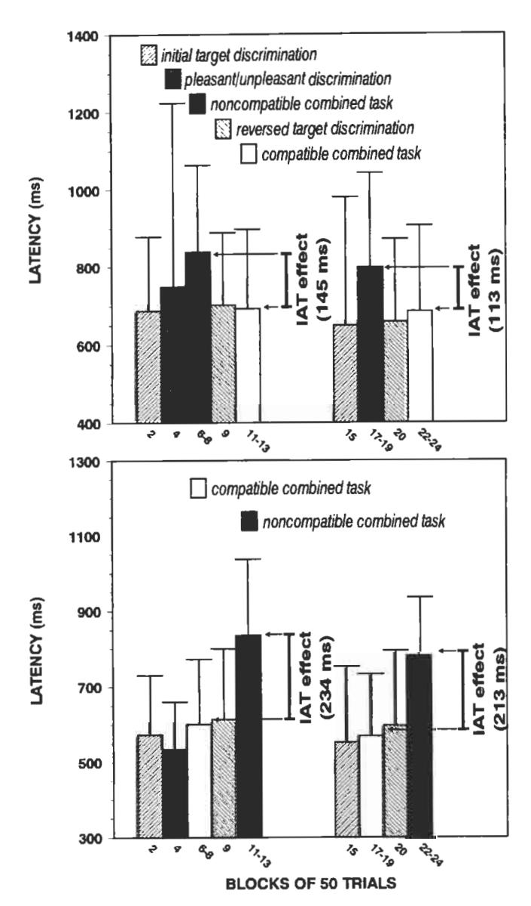
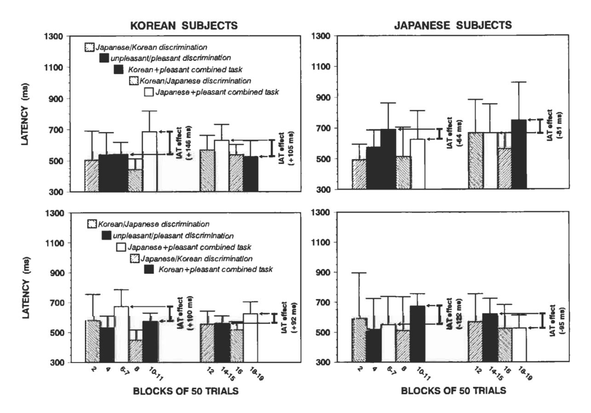
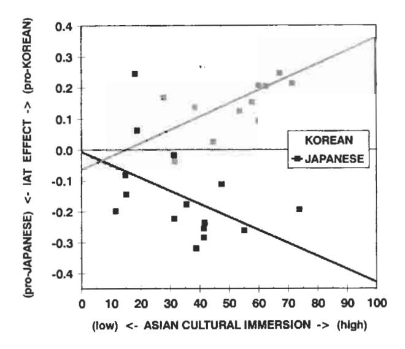
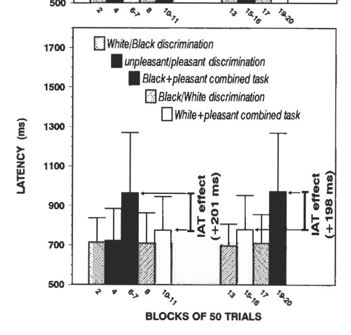
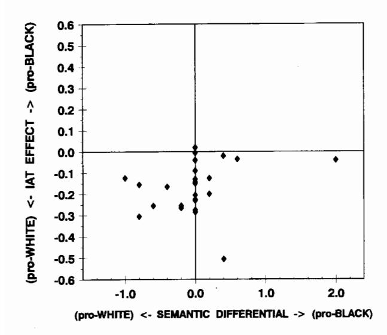

## Measuring Individual Differences in Implicit Cognition: The Implicit Association Test

Anthony G. Greenwald, Debbie E. McGhee, and Jordan L. K. Schwartz University of Washington

An implicit association test (IAT) measures differential association of 2 target concepts with an attribute. The 2 concepts appear in a 2-choice task (e.g., flower vs. insect names), and the attribute in a 2nd task (e.g., pleasant vs. unpleasant words for an evaluation attribute). When instructions oblige highly associated categories (e.g., flower + pleasant) to share a response key, performance is faster than when less associated categories (e.g., insect + pleasant) share a key. This performance difference implicitly measures differential association of the 2 concepts with the attribute. In 3 experiments, the IAT was sensitive to (a) near-universal evaluative differences (e.g., flower vs. insect), (b) expected individual differences in evaluative associations (Japanese + pleasant vs. Korean + pleasant for Japanese vs. Korean subjects), and (c) consciously disavowed evaluative differences (Black + pleasant vs. White + pleasant for self-described unprejudiced White subjects).

Consider a thought experiment. You are shown a series of male and female faces, to which you are to respond as rapidly as possible by saying "hello" if the face is male and "goodbye" if it is female. For a second task, you are shown a series of male and female names, to which you are to respond rapidly with "hello" for male names and "goodbye" for female names. These discriminations are both designed to be easy—the faces and names are unambiguously male or female. For a final task you are asked to perform both of these discriminations alternately. That is, you are shown a series of alternating faces and names, and you are to say "hello" if the face or name is male and "goodbye" if the face or name is female. If you guess that this combined task will be easy, you are correct.

Now imagine a small variation of the thought experiment. The first discrimination is the same ("hello" to male faces, "goodbye" to female faces), but the second is reversed ("goodbye" to male names, "hello" to female names). As with the first experiment, each of these tasks, by itself, is easy. However, when you contemplate mixing the two tasks ("hello" to male face or female name and "goodbye" to female face or male name), you may suspect that this new combined task will be difficult. Unless you wish to make many errors, you will have to respond considerably more slowly than in the previous experiment.

The expected difficulty of the experiment with the reversed

Anthony G. Greenwald, Debbie E. McGhee, and Jordan L. K. Schwartz, Department of Psychology, University of Washington.

This research was partially supported by Grant SBR-9422242 from the National Science Foundation and Grant MH 41328 from the National Institute of Mental Health. For comments on a draft of this article, the authors thank Mahzarin Banaji, Shelly Farnham, Laurie Rudman, and Yuichi Shoda

Correspondence concerning this article should be addressed to Anthony G. Greenwald, Department of Psychology, Box 351525, University of Washington, Seattle, Washington 98195-1525. Electronic mail may be sent to agg@u.washington.edu.

second discrimination follows from the existence of strong associations of male names to male faces and female names to female faces. The attempt to map the same two responses (''hello'' and ''goodbye'') in opposite ways onto the two gender contrasts is resisted by well-established associations that link the face and name domains. The (assumed) performance difference between the two versions of the combined task indeed measures the strength of gender-based associations between the face and name domains. This pair of thought experiments provides the model for a method, the implicit association test (IAT), that is potentially useful for diagnosing a wide range of socially significant associative structures. The present research sought specifically to appraise the IAT method's usefulness for measuring evaluative associations that underlie implicit attitudes (Greenwald & Banaji, 1995).

#### Measuring Implicit Attitudes

Implicit attitudes are manifest as actions or judgments that are under the control of automatically activated evaluation, without the performer's awareness of that causation (Greenwald & Banaji, 1995, pp. 6–8). The IAT procedure seeks to measure implicit attitudes by measuring their underlying automatic evaluation. The IAT is therefore similar in intent to cognitive priming procedures for measuring automatic affect or attitude (e.g., Bargh, Chaiken, Govender, & Pratto, 1992; Fazio, Sanbonmatsu, Powell, & Kardes, 1986; Fazio, 1993; Greenwald, Klinger, & Liu, 1989; Perdue, Dovidio, Gurtman, & Tyler, 1990; Perdue & Gurtman, 1990).2

&lt;sup>1 Greenwald and Banaji (1995) defined implicit attitudes as "introspectively unidentified (or inaccurately identified) traces of past experience that mediate favorable or unfavorable feeling, thought, or action toward social objects" (p. 8).

&lt;sup>2 A few recent studies have indicated that priming measures may be sensitive enough to serve as measures of individual differences in the strength of automatic attitudinal evaluation (Dovidio & Gaertner, 1995; Fazio, Jackson, Dunton, & Williams, 1995). At the same time, other studies have indicated that priming is relatively unaffected by variations

| Sequence             | Sequence 1 |                                       | 1 |     | 2                                       |     |   | 3                                       |          |   | 4                                            |   |     | 5                                       |          |
|----------------------|------------|---------------------------------------|---|-----|-----------------------------------------|-----|---|-----------------------------------------|----------|---|----------------------------------------------|---|-----|-----------------------------------------|----------|
| Task description  |            | Initial rget-conce iscriminatio |   |     | Associated attribute iscriminatio |     | , | Initial combined task             |          |   | Reversed target-concept discrimination |   |     | Reversed combined task            |          |
| Task instructions | •          | BLACK WHITE                        | • | • , | pleasant Inpleasan                   | t • | • | BLACK pleasant WHITE unpleasan | • t • | • | BLACK WHITE                               | • | •   | BLACK pleasant WHITE unpleasan | • t • |
|                      |            | MEREDITH                              | ٥ | 0   | lucky                                   |     | o | JASMINE                                 |          | 0 | COURTNEY                                     |   | ٥   | peace                                   |          |
|                      | 0          | LATONYA                               |   | 0   | honor                                   |     | ٥ | pleasure                                |          | 0 | STEPHANIE                                    |   |     | LATISHA                                 | 0        |
|                      | ٥          | SHAVONN                               |   | 1   | poison                                  | ,0  |   | PEGGY                                   | 0        |   | SHEREEN                                      | 0 | l   | filth                                   | 0        |
| Sample               |            | HEATHER                               | О |     | grief                                   | 0   |   | evil                                    | 0        | 0 | SUE-ELLEN                                    |   | 0   | LAUREN                                  |          |
| stimuli              | 0          | TASHIKA                               |   | 0   | gift                                    |     |   | COLLEEN                                 | 0        |   | TIA                                          | 0 | 0   | rainbow                                 |          |
|                      |            | KATIE                                 | 0 | ļ   | disaster                                | О   | 0 | miracle                                 |          | ļ | SHARISE                                      | 0 | Į į | SHANISE                                 | 0        |
|                      |            | BETSY                                 | О | 0   | happy                                   |     | ٥ | TEMEKA                                  |          | 0 | MEGAN                                        |   |     | accident                                | 0        |
|                      | 0          | EBONY                                 |   |     | hatred                                  | o   |   | bomb                                    | 0        |   | NICHELLE                                     | o | ٥   | NANCY                                   |          |

Figure 1. Schematic description and illustration of the implicit association test (IAT). The IAT procedure of the present experiments involved a series of five discrimination tasks (numbered columns). A pair of target concepts and an attribute dimension are introduced in the first two steps. Categories for each of these discriminations are assigned to a left or right response, indicated by the black circles in the third row. These are combined in the third step and then recombined in the fifth step, after reversing response assignments (in the fourth step) for the target-concept discrimination. The illustration uses stimuli for the specific tasks for one of the task-order conditions of Experiment 3, with correct responses indicated as open circles.

One might appreciate the IAT's potential value as a measure of socially significant automatic associations by changing the thought experiment to one in which the to-be-distinguished faces of the first task are Black or White (e.g., "hello" to African American faces and "goodbye" to European American faces) and the second task is to classify words as pleasant or unpleasant in meaning ("hello" to pleasant words, "goodbye" to unpleasant words). The two possible combinations of these tasks can be abbreviated as Black + pleasant and White + pleasant.3 Black + pleasant should be easier than White + pleasant if there is a stronger association between Black Americans and pleasant meaning than between White Americans and pleasant meaning. If the preexisting associations are opposite in direction—which might be expected for White subjects raised in a culture imbued with pervasive residues of a history of anti-Black discrimination—the subject should find White + pleasant to be easier.

A possible property of the IAT—and one that is similar to a major virtue of cognitive priming methods—is that it may resist masking by self-presentation strategies. That is, the implicit association method may reveal attitudes and other automatic associations even for subjects who prefer not to express those attitudes.

## Design of the IAT

Figure 1 describes the sequence of tasks that constitute the IAT measures in this research and illustrates this sequence with materials from the present Experiment 3. The IAT assesses the association between a target-concept discrimination and an attribute dimension. The procedure starts with introduction of the target-concept discrimination. In Figure 1, this initial discrimination is to distinguish first names that are (in the United States) recognizable as Black or African American from ones recognizable as White or European American. This and subsequent discriminations are performed by assigning one category to a response by the left hand and the other to a response by the right hand. The second step is introduction of the attribute dimension, also in the form of a two-category discrimination. For all of the present experiments, the attribute discrimination was evaluation, represented by the task of categorizing words as pleasant versus unpleasant in meaning. After this introduction to the target discrimination and to the attribute dimension, the two are superimposed in the third step, in which stimuli for target and attribute discriminations appear on alternate trials. In the fourth step, the respondent learns a reversal of response assignments for the target discrimination, and the fifth (final) step combines the attribute discrimination (not changed in response assignments) with this reversed target discrimination. If the target categories

in attitude strength (Bargh et al., 1992; Chaiken & Bargh, 1993), implying that it may be limited in sensitivity to intra- or interindividual differences.

&lt;sup>3 Black + pleasant means that African American faces and pleasant words share the same response; it could equally have been described as White + unpleasant.

are differentially associated with the attribute dimension, the subject should find one of the combined tasks (of the third or fifth step) to be considerably easier than the other, as in the male-female thought experiments. The measure of this difficulty difference provides the measure of implicit attitudinal difference between the target categories.

#### Overview of Research

Because the present three experiments sought to assess the IAT's ability to measure implicit attitudes, in each experiment the associated attribute dimension was evaluation (pleasant vs. unpleasant). Each experiment investigated attitudes that were expected to be strong enough to be automatically activated.

Experiment 1 used target concepts for which the evaluative associations were expected to be highly similar across persons. Two of these concepts were attitudinally positive (flowers and musical instruments) and two were negative (insects and weapons). Experiment 2 used two groups of subjects (Korean American and Japanese American) to assess ethnic attitudes that were assumed to be mutually opposed, stemming from the history of military subjugation of Korea by Japan in the first half of the 20th century. The IAT method was expected to reveal these opposed evaluations even for subjects who would deny, on selfreport measures, any antipathy toward the out-group. Experiment 3 used the IAT to assess implicit attitudes of White subjects toward White and Black racial categories. For these subjects we expected that the IAT might reveal more attitudinal discrimination between White and Black categories than would be revealed by explicit (self-report) measures of the same racial attitudes.

#### Experiment 1

Experiment 1 used the IAT to assess implicit attitudes toward two pairs of target attitude concepts for which subjects were expected to have relatively uniform evaluative associations. A second purpose was to examine effects on IAT measures of several procedural variables that are intrinsic to the IAT method. Subjects in Experiment 1 responded to two target-concept discriminations: (a) flower names (e.g., rose, tulip, marigold) versus insect names (e.g., bee, wasp, horsefly) and (b) musical instrument names (e.g., violin, flute, piano) versus weapon names (e.g., gun, knife, hatchet). Each target-concept discrimination was used in combination with discrimination of pleasantmeaning words (e.g., family, happy, peace) from unpleasantmeaning words (e.g., crash, rotten, ugly). The IAT procedure was expected to reveal superior performance for combinations that were evaluatively compatible (flower + pleasant or instrument + pleasant) than for noncompatible combinations (insect + pleasant or weapon + pleasant).

## Method

After being seated at a table with a desktop computer in a small room, subjects received all instructions from a computer display and provided all of their responses via the computer keyboard.

## Subjects

Thirty-two (13 male and 19 female) students from introductory psychology courses at the University of Washington participated in exchange for an optional course credit.5 Data for 8 additional subjects were not included in the analysis because of their relatively high error rates, which were associated with responding more rapidly than appropriate for the task.6 Data were unusable for one additional subject who, for unknown reasons, neglected to complete the computer-administered portion of the experiment.

#### Materials

The experiment's three classification tasks used 150 stimulus words: 25 insect names, 25 flower names, 25 musical instrument names, 25 weapon names, 25 pleasant-meaning words, and 25 unpleasant-meaning words. The pleasant and unpleasant words were selected from norms reported by Bellezza, Greenwald, and Banaji (1986). Many of the items for the other four categories were taken from category lists provided by Battig and Montague (1969), with additional category members generated by the authors. The selected flower, insect, instrument, and weapon exemplars were ones that the authors judged to be both familiar to and unambiguously classifiable by members of the subject population. The 150 words used as stimuli in Experiment 1 are listed in Appendix A.

#### Apparatus

Experiment 1 was administered on IBM-compatible (80486 processor) desktop computers. Subjects viewed this display from a distance of about 65 cm and gave left responses with left forefinger (using the A key) and right responses with right forefinger (using the 5 key on the right-side numeric keypad).

#### Overview

Each subject completed tasks for two IAT measures in succession, one using flowers versus insects as the target-concept discrimination, and the other using musical instruments versus weapons. The first IAT used the complete sequence of five steps of Figure 1: (a) initial target-concept discrimination, (b) evaluative attribute discrimination, (c) first combined task, (d) reversed target-concept discrimination, and (e) reversed combined task. The second IAT did not need to repeat practice of the evaluative discrimination, and so included only four steps: (f) initial target-concept discrimination, (g) first combined task, (h) reversed target-concept discrimination, and (i) reversed combined task. One IAT measure of attitude was obtained by comparing performance in steps (g) and (i).

&lt;sup>4 The IAT can be used also to measure implicit stereotypes and implicit self-concept (see Greenwald & Banaji, 1995) by appropriate selection of target concept and attribute discriminations.

&lt;sup>5 Another group of 32 subjects participated in a prior replication of Experiment 1 that, however, lacked the paper-and-pencil explicit measures that were included in the reported replication. With one minor exception (mentioned in Footnote 11), there were no discrepancies in findings between the two replications.

&lt;sup>6 Use of data from these 8 subjects (instead of those who replaced them in the design) would have reduced power of statistical tests. As it turns out, this would not have altered any conclusions. The higher power obtained by replacing them was desirable because of the importance of identifying possible procedural influences on the IAT method.

&lt;sup>7 The programs used for all of the present experiments were Windows 95-based and written primarily by Sean C. Draine.

#### Design

The two IAT measures obtained for each subject were analyzed in a design that contained five procedural variables, listed here and described more fully in the *Procedure* section: (a) order of the two target-concept discriminations (flowers vs. insects first or instruments vs. weapons first), (b) order of compatibility conditions within each IAT (evaluatively compatible combination of discriminations before or after non-compatible combination), (c) response key assigned to pleasant items (left or right), (d) category set sizes for discriminations (5 items or 25 items per category), and (e) interval between response and next item presentation for the combined task (100, 400, or 700 ms). The first four of these were two-level between-subjects variables that were administered factorially, such that 2 subjects received each of the 16 possible combinations; the last was a three-level within-subjects variation.

#### **Procedure**

Trial blocks. All tasks were administered in trial blocks of 50 trials. Each trial block started with instructions that described the category discrimination(s) for the block and the assignments of response keys (left or right) to categories. Reminder labels, in the form of category names appropriately positioned to the left or right, remained on screen during each block. Each new category discrimination—in Steps (a), (b), and (f) described in the Overview section—consisted of a practice block of 50 trials followed by a block for which data were analyzed. Combined tasks consisted of a practice block followed by three blocks of data collection, each with a different intertrial interval (see next paragraph).

Timing details. The first trial started 1.5 s after the reminder display appeared. Stimuli were presented in black letters against the light gray screen background, vertically and horizontally centered in the display and remaining on screen until the subject's response. The subject's keypress response initiated a delay (intertrial interval) before the next trial's stimulus. For all simple categorization and combined-task practice trials, the intertrial interval was 400 ms. For the three blocks of combined-task data collection, the interval was either 100, 400, or 700 ms. Half of the subjects received these intervals in ascending order of blocks (100, 400, 700), and the remainder in the opposite order. Throughout the experiment, after any incorrect response, the word *error* immediately replaced the stimulus for 300 ms, lengthening the intertrial interval by 300 ms. At the end of each 50-trial block, subjects received a feedback summary that gave their mean response latency in milliseconds and percentage correct for the just-concluded block.

Stimuli. Words were selected randomly and without replacement (independently for each subject) until the available stimuli for a task were exhausted, at which point the stimulus pool was replaced if more trials were needed. For example, in single-discrimination tasks (a) in the 25-items-per-category condition, each 50-trial block used each of the 50 stimuli for the two categories once, and (b) in the 5-items-percategory condition, each of the 10 stimuli was used five times each. Selection of subsets of five items for the 5-items-per-category conditions was counterbalanced so that all stimuli were used equally in the experiment. For the combined tasks, stimuli were selected such that (a) for subjects assigned to 25-item categories, each of the 100 possible stimuli-50 target-concept items and 50 evaluative items-appeared twice in a total of 200 combined-task trials, or (b) for those assigned to 5item categories, each of the 20 possible stimuli appeared 10 times. In all combined tasks, items for the target-concept discrimination and the attribute discrimination appeared on alternating trials.

Explicit attitude measures. After the computer tasks, subjects completed paper-and-pencil questionnaire measures of their attitudes toward the four target concepts. On the feeling thermometer, subjects were asked to describe their general level of warmth or coolness toward flowers, insects, musical instruments, and weapons (in that order) by making a

mark at the appropriate position on an illustration of a thermometer. The thermometer was numerically labeled at 10-degree intervals from 0 to 99 and anchored at the 0, 50, and 99 points with the words cold or unfavorable, neutral, and warm or favorable, respectively. Next, subjects completed a set of five semantic differential items for each of the four object categories. These 7-point scales were anchored at either end by polar-opposite adjective pairs: beautiful-ugly, good-bad, pleasant-unpleasant, honest-dishonest, and nice-awful. Subjects were instructed to mark the middle of the range if they considered both anchoring adjectives to be irrelevant to the category. The semantic differential was scored by averaging the five items for each concept, scored on a scale ranging from -3 (negative) to 3 (positive).

#### Results

#### Data Reduction

The data for each trial block included response latencies (in milliseconds) and error rates. Prior to conducting other analyses, distributions of these measures were examined, revealing the usual impurities (for speeded tasks) in the form of small proportions of extremely fast and extremely slow responses. These outlying values typically indicate, respectively, responses initiated prior to perceiving the stimulus (anticipations) and momentary inattention. The values in these tails of the latency distribution are problematic not only because they lack theoretical interest but also because they distort means and inflate variances. The solution used for these was to recode values below 300 ms to 300 ms and those above 3,000 ms to 3,000 ms.8 We then log-transformed latencies in order to use a statistic that had satisfactory stability of variance for analyses.9 Also, the first two trials of each block were dropped because of their typically lengthened latencies. Analyses of error rates are not described in detail. However, they (a) revealed relatively low error rates, averaging just under 5% in Experiment 1, and (b) were consistent with latency analyses (higher error rates were obtained for conditions that produced longer latencies), but (c) also revealed considerably weaker effects of task-compatibility combinations than were obtained in analyses of latencies.

#### A Summary Measure of IAT Effect

Figure 2 displays mean latencies for the nine successive tasks of Experiment 1 (see *Overview* section), presented separately for the two levels of the only procedural variable that substantially influenced the data, whether subjects performed evaluatively compatible combinations before noncompatible ones, or

&lt;sup>8 This recoding solution to the problem of outlying data is an alternative to simply dropping trials outside the 300- and 3,000-ms (or other such) boundaries. It has the advantage of being relatively insensitive to (a) differences among conditions in the proportions of trials in the upper versus lower tails, and (b) the choice of specific lower and upper boundaries. Selection of alternative nearby boundaries would yield unchanged conclusions.

&lt;sup>9 Additional analyses were also conducted on speeds (1,000 ÷ latency in milliseconds, a reciprocal conversion that is interpretable as items per second), which is an alternative method of stabilizing latency variance. All conclusions based on analyses of log-transformed latencies were equally evident on the speed measure.

Figure 2. Mean (untransformed) latency results of Experiment I (N = 32), separately for subjects who performed at evaluatively noncompatible combinations before evaluatively compatible ones (upper panel) and those who performed compatible combinations first (lower panel). Data were combined for subjects for whom the first implicit attitude test (IAT) measure used a target discrimination of flowers versus insects and those for whom the first target discrimination was weapons versus instruments. Because results were indistinguishable for the two target-concept discriminations (flower vs. insect and instrument vs. weapon) data for both were collapsed over this design factor in the figure. The first block that introduced each new discrimination or combined task was treated as practice and not included in the figure. Error bars are standard deviations for the 16 subjects contributing to each mean.

vice versa. Evaluatively compatible combinations (either flower + pleasant or instrument + pleasant) are shown as white bars in Figure 2, and noncompatible combinations (insect + pleasant or weapon + pleasant) as black bars. An *IAT effect* is defined as the difference in mean latency between these two conditions

(noncompatible minus compatible). For the data presented in Figure 2, IAT effects averaged 129 ms when noncompatible combinations preceded compatible (upper panel) and 223 ms when compatible combinations came first. For this effect of compatibility order, F(1, 16) = 10.12, p = .006.

In Experiment 1, IAT effects indicating more positive attitudes toward flowers than insects or toward musical instruments than weapons were expected and were also quite clearly obtained. That is, subjects performed faster for flower + pleasant or instrument + pleasant combinations than for insect + pleasant or weapon + pleasant. Using the pooled standard deviation (for compatible and noncompatible conditions) as the effect size unit and collapsing across all design factors other than order of compatibility conditions, effect sizes for the IAT effect (i.e., differences from zero) were d=0.78 and d=2.30, respectively, for the noncompatible first and compatible first conditions. (By convention, d=0.8 is considered to be a large effect size.) Statistical significance tests for difference of these IAT effects from zero were, respectively, F(1, 8) = 25.62, p=.001, and F(1, 8) = 134.53,  $p=10^{-6}.10$ 

#### Effects of Procedural Variables

The design had five procedural factors, one varied withinsubject (intertrial interval) and four varied between-subjects: Combination compatibility order (compatible combination first or second), category set size (5 or 25 items), key assignment for pleasant category (left or right key), and target-concept order (flowers vs. insects or instruments vs. weapons as the first target-concept discrimination). The main effect of combination compatibility order has already been noted and described in Figure 2. Aside from an uninterpretable four-way interaction effect, there were no other significant effects of these procedural variables.11

#### IAT Compared With Explicit Attitude Measures

The IAT effect index is proposed as a measure of subjects' relative implicit attitudes toward the categories under study. That is, better performance in the flower + pleasant condition than in the insect + pleasant condition is taken to indicate a stronger

&lt;sup>10 These statistical tests were based on the log-transformed latencies. Here and elsewhere in this report, p values are reported as approximately exact values, rather than as inequalities relative to a Type I error criterion (e.g., p < .05). This follows the suggestion by Greenwald, Gonzalez, Guthrie, and Harris (1996) not to obscure information provided by p values. Values smaller than .0001 are rounded to the nearest exponent of 10. This treatment of p values notwithstanding, the primary reporting of data is in terms of descriptively more useful raw and standardized effect sizes. For comparison, analysis of untransformed latencies yielded F(1, 8) ratios of 18.97 and 72.45, ps = .002 and  $10^{-5}$ , respectively. Analyses of reciprocally transformed latencies (speeds) yielded F(1, 8) ratios of 26.72 and 198.15, ps = .0009 and  $10^{-6}$ , respectively.

&lt;sup>11 Fortunately, the uninterpretable four-way interaction did not appear in the prior replication (see Footnote 5) and so appears not to call for effort at interpretation. In other respects, however, the prior replication produced IAT effects that were very similar in magnitude to those shown in Figure 2, and it also revealed the same effect of combination compatibility order that was obtained in Experiment 1.

Table 1
Summary Statistics for Difference-Score Attitude Indexes

| Attitude measure        | М     | SD    | ď    | t(31) | p          |
|-------------------------|-------|-------|------|-------|------------|
| Flowers vs. insects     |       |       |      |       |            |
| Feeling thermometer     | 51.1  | 31.8  | 1.61 | 9.09  | $10^{-10}$ |
| Semantic differential   | 2.58  | 1.50  | 1.72 | 9.75  | $10^{-10}$ |
| IAT (log latency)       | .234  | .173  | 1.35 | 7.66  | $10^{-8}$  |
| IAT (latency)           | 166.8 | 140.2 | 1.19 | 6.73  | $10^{-7}$  |
| Instruments vs. weapons |       |       |      |       |            |
| Feeling thermometer     | 46.4  | 42.2  | 1.10 | 6.22  | $10^{-6}$  |
| Semantic differential   | 2.94  | 1.28  | 2.30 | 13.01 | $10^{-14}$ |
| IAT (log latency)       | .246  | .148  | 1.66 | 9.42  | $10^{-10}$ |
| IAT (latency)           | 185.5 | 134.9 | 1.37 | 7.78  | $10^{-8}$  |

*Note.* Positive scores indicate preference for flowers relative to insects, and musical instruments relative to weapons. The thermometer range was -99 to 99, and the semantic differential range was -6 to 6. IAT = implicit association test.

association between flowers and pleasant meaning than between insects and pleasant meaning and, thus, a more positive attitude toward flowers than insects.

Table 1 presents data for the IAT latency measure along with corresponding attitude measures derived from the feeling thermometer and semantic differential measures. All measures are difference scores, with positive scores indicating more favorable attitudes toward flowers than insects, or toward musical instruments than weapons. For all of these measures, attitude differences were observed.

Correlations among the explicit and implicit attitude measures are shown in Table 2. The table presents correlations between measures for the flower-insect contrast above the diagonal and those for the musical instrument-weapon contrast below the diagonal. All of the correlations in Table 2 are in the expected positive direction. Notably, however, scores on the explicit measures for both the flower-insect and instrument-weapon contrasts were only weakly correlated with implicit attitude scores derived from the IAT.

Table 2
Correlations Among Implicit and Explicit Attitude Measures

|                                                                               |     | olicit tude | Implicit attitude |     |  |
|-------------------------------------------------------------------------------|-----|----------------|-------------------|-----|--|
| Measure                                                                       | 1   | 2              | 3                 | 4   |  |
| Thermometer     Semantic differential     LAT effect (leg leteness)           | .53 | .70            | .13               | .16 |  |
|                                                                               | .79 | .27            | .12               | .20 |  |
| <ul><li>3. IAT effect (log latency)</li><li>4. IAT effect (latency)</li></ul> | .29 | .19            | .59               | .95 |  |
|                                                                               | .27 | .19            | .93               | .57 |  |

Note. Correlations above the diagonal involve the flower-insect contrast, below the diagonal are those for the instrument-weapon contrast, and on the main diagonal, in italics, are correlations between corresponding measures for the two contrasts. Correlations between explicit and implicit attitude measures are printed in bold. All measures were scored so that higher scores indicate more positive attitude toward flowers or musical instruments. N=32 for all correlations; two-tailed p values of .10, .05, .01, .005, and .001 are associated, respectively, with r values of .30, .35, .45, .49, and .56. IAT = implicit association test.

#### Discussion

Experiment 1 tested the principal assumption underlying the implicit association test: that associations can be revealed by mapping two discrimination tasks alternately onto a single pair of responses. Confirming expectation, consistently superior performance was observed when associatively compatible (compared with associatively noncompatible) categories were mapped onto the same response. In Experiment 1, both flowerinsect and instrument-weapon discriminations were performed more rapidly when their evaluatively positive categories (flowers or musical instruments) shared a response with pleasant-meaning words than when those categories shared a response with unpleasant-meaning words. Of importance, the data (Figure 2) indicated that compatible task combinations were performed about as rapidly as the uncombined target concept or attribute discriminations, whereas noncompatible combinations were performed considerably more slowly. These findings were clearly encouraging regarding the possibility that the IAT method can effectively measure implicit attitudes. In summary, Experiment 1's IAT measures were highly sensitive to evaluative discriminations that are well established in the connotative meaning structure of the English language.

Experiment 1 was remarkable for the near absence of moderating effects of procedural variables on the measures of evaluative associations that were revealed by the IAT procedure. The effect of task-combination compatibility was not noticeably affected (a) by intertrial intervals (100, 400, or 700 ms), (b) by the set size of categories used in discrimination tasks (5 or 25 items), (c) by the assignment of response key (left or right) to the pleasant category, or (d) by position of the IAT measure within the experiment (first or second internal replication). The variation of order in which compatible and noncompatible task combinations were performed produced a moderate effect, such that the IAT measure of differential evaluation was larger when the compatible combination was performed first. This effect is examined also in Experiments 2 and 3.

Last, Experiment 1 provides the first of a series of findings of low correlations between explicit and implicit measures (see Table 2). The correlations between explicit measures of differ-

&lt;sup>a The effect size measure  $\mathbf{d} = \mathbf{M} \div \mathrm{SD}$ . Conventional small, medium, and large values of  $\mathbf{d}$  are .2, .5, and .8, respectively.

ent contrasts (flower-insect with instrument-weapon, average r = .41) and between implicit measures of different contrasts (average r = .58) were strikingly greater than those between explicit and implicit measures of the same contrast (average r = .19). 12 This pattern indicates the likely presence of systematic method variance for both types of measures, along with a divergence in the constructs measured by the two types of measures. This conceptual divergence between the implicit and explicit measures is of course expected from theorization about implicit social cognition (Greenwald & Banaii, 1995), as well as from previous research findings such as those already mentioned by Dovidio and Gaertner (1995) and Fazio, Jackson, Danton, and Williams (1995). It is also plausible, however, that these correlations are low because of relative lack of population variability in the attitudes being assessed (e.g., uniformity in liking for flowers or disliking for insects).

## Experiment 2

Experiment 1 demonstrated the IAT's ability to detect presumed near-universal evaluative associations involving the semantic contrasts of flowers versus insects and instruments versus weapons. Perhaps because the evaluative aspects of these contrasts are so nearly uniform in the population, they are not typically considered to be attitudinal. Experiment 2 sought to extend the IAT method to a domain that is more typically attitudinal, by using it to discriminate differences between Japanese Americans and Korean Americans in their evaluative associations toward Japanese and Korean ethnic groups. The history of Japanese-Korean antagonism provided the basis for a knowngroups study in which it could be expected that each ethnic group would have not only a typical in-group-directed positive attitude but also a likely negative attitude toward the out-group. 13 To supplement the IAT results, we also obtained explicit measures of these ethnic attitudes along with measures intended to gauge participants' level of immersion in the cultures of their respective ethnicities.

#### Method

## Subjects

The subjects were 17 self-described Korean American (8 female and 9 male) and 15 Japanese American (10 female and 5 male) students who participated in return for optional course credit for their introductory psychology courses at the University of Washington. Data for one of the Korean Americans were not included in analyses because of an IAT error rate of about 50%, indicative of random responding. These subjects were recruited in response to a request for volunteers belonging to the two ethnic groups. As part of the consent procedure prior to participation, subjects were informed that the experiment could reveal attitudes that they would prefer not to express and were reminded that they were free to withdraw at any time.

#### Materials and Apparatus

In addition to the 25 pleasant-meaning and 25 unpleasant-meaning words used in Experiment 1, 25 Korean and 25 Japanese surnames were used. These Korean and Japanese surnames were selected with the help of two Korean and two Japanese judges, who were asked to rate the typicality and ease of categorizing each of a larger set of surnames that

had been selected on the basis of their frequency in the Seattle telephone directory. Because Japanese names are typically longer than Korean names, a set of 25 truncated Japanese names was generated from the 25 selected Japanese surnames, such that for each Korean name, there was a truncated Japanese name of the same length. For example, the Japanese name *Kawabashi* was truncated to *Kawa* to match the length of the Korean name *Youn* while retaining the Japanese character of the name. (The three stimulus sets are presented in Appendix A.) The truncated Japanese names were used only after subjects had received several exposures to the full-length versions. Evaluative words were presented in lowercase, whereas Korean and Japanese names were presented in uppercase. The apparatus was the same as used for Experiment 1.

#### **Procedure**

IAT measures. As in Experiment 1, subjects completed two IAT measures. For the first IAT measure, the target-concept discrimination was Korean names versus full-length Japanese names. For the second, the discrimination was Korean names versus truncated Japanese names. Other than the replacement of Experiment 1's target-concept discriminations with the Japanese versus Korean name discrimination, Experiment 2 had only two substantial differences of procedure from Experiment 1. First, the intertrial interval independent variable was dropped, and all blocks of trials were conducted with a 250 ms interval between response to one stimulus and presentation of the next. Second, combined tasks consisted of one practice block followed by two data-collection blocks (contrasted with Experiment 1's use of three data-collection blocks, each with a different intertrial interval). For half of the subjects, Japanese names were initially assigned to the left key, Korean to the right; the reverse assignment was used for the remaining subjects. Throughout the experiment, all subjects responded to unpleasant words with the left key and pleasant words with the right key. (The omission of counterbalancing for key assignment was a consequence of Experiment 1's finding that key assignment for the pleasant-unpleasant discrimination did not affect findings.)

The second IAT differed from the first in (a) omitting practice of the pleasant-unpleasant discrimination (as in Experiment 1), (b) using the truncated Japanese names in place of the full-length ones, and (c) using opposite key assignments for the initial target-concept discrimination. The last of these three changes was instituted because of Experiment 1's demonstration that order of performance for the target discrimination and its reversal influenced magnitude of observed IAT effect. The consequence of the change was that subjects who performed the first IAT with the Japanese + pleasant combination first performed the second IAT with the Korean + pleasant combination first.

Ethnic identity and attitude questionnaires. After the computer administered IAT tasks, subjects completed several paper-and-pencil questionnaire measures. The first three measures, which were prepared specifically for this experiment, assessed the extent to which subjects were involved in sociocultural networks that were ethnically Japanese or Korean.

The first measure asked subjects to provide initials of "up to twenty people, not family members, that you know." Subjects were instructed that listing close friends was preferable but that they could also list acquaintances. The instructions did not alert subjects to the researchers' interest in ethnicity of these acquaintances (information that was to be requested later), although subjects could well have been sensitized to

 $^{12}$  All averaged correlations were computed by averaging the Fisher's Z conversions of r values, then reconverting the average of these Fisher Z s to r.

&lt;sup>13 From 1905 to 1945, the Japanese occupied Korea, exploiting Koreans economically and repressing them politically. At present, Koreans are a discriminated against minority in Japan.

ethnicity from both the inclusion of ethnic name discriminations in the IAT procedure and their knowledge of having been recruited by virtue of their ethnicity. After completing the next two measures, subjects were instructed to turn back to the list of initials and to mark each to indicate which of the following labels provided the best description: Korean, Korean American, Japanese, Japanese American, none of the above, or don't know. This acquaintances measure was scored to indicate the percentage of those listed who were ethnically Korean or Korean American and the percentage who were ethnically Japanese or Japanese American.

For the second measure, subjects were asked to indicate the number of members of their family who would be described by each of the following labels: Korean, Korean American, Japanese, Japanese American, and American. This yielded percentage scores of those mentioned who were ethnically Korean and ethnically Japanese, treating each Korean American as 50% Korean and 50% American, and similarly for Japanese Americans.

The third measure asked subjects to respond to eight yes-no items, four each concerned with Korean and Japanese language. These items asked, respectively, whether subjects could understand, speak, read, and write each language, each answered on a 3-point scale with 0 = no, 1 = somewhat, and 2 = yes. This yielded 9-point language scales (summing responses, range 0-8) for both the Korean and the Japanese language.

Next followed feeling thermometer and semantic differential measures of attitude toward Japanese and Koreans, which were identical to the corresponding measures of Experiment 1 except for the change of concepts for which responses were requested. All of the first five measures were scored by conversion to a difference score (Korean minus Japanese), for which positive values indicated numerically greater scores for the Korean submeasure.

A sixth and final questionnaire measure was the 23-item Suinn-Lew Asian Self-Identity Acculturation Scale (Suinn, Rickard-Figueroa, Lew, & Vigil, 1987). Unlike the preceding five measures, all of which yielded a comparison of involvement in or attitude toward Korean and Japanese cultures, the Suinn-Lew acculturation measure indicated involvement in Asian (relative to American) culture.

#### Results and Discussion

## IAT Effects

Figure 3 presents Experiment 2's results separately for the counterbalanced variable of order of performing the Korean + pleasant versus Japanese + pleasant combinations, and also separately for the Korean American and Japanese American subject subsamples. The expectation for Experiment 2's data was that ethnically Korean subjects would find it more difficult to perform the Japanese + pleasant than the Korean + pleasant combination (appearing as higher white than black bars in Fig-

Figure 3. Mean (untransformed) latency results of Experiment 2, separately for 16 Korean American and 15 Japanese American subjects and for subjects who received the two orders of presentation for ownethnicity + pleasant combinations and other-ethnicity + pleasant combinations. Error bars are within-cell standard deviations for the 7 to 9 observations (subjects) contributing to each mean. IAT = implicit association test.

| Table 3                                                                            |
|------------------------------------------------------------------------------------|
| Summary Statistics for Difference Scores in Comparison of Ethnicity Discrimination |
| by Seven Measures                                                                  |

| Attitude measure      | Korean M | Japanese M | SD    | ď°   | t d | р         |
|-----------------------|-------------|---------------|-------|------|----------------|-----------|
| Feeling thermometer   | 18.88       | -2.43         | 12.81 | 1.65 | 4.51           | .0001     |
| Semantic differential | 0.43        | -0.31         | 0.83  | 0.89 | 2.33           | .02       |
| IAT (full names)      | .159        | 144           | .161  | 1.88 | 5.26           | $10^{-5}$ |
| IAT (truncated names) | .139        | 119           | .126  | 2.04 | 5.70           | $10^{-5}$ |
| Acquaintances         | 36.0        | -6.4          | 22.4  | 1.89 | 4.88           | $10^{-5}$ |
| Family                | 64.5        | -38.0         | 38.62 | 2.65 | 7.02           | $10^{-7}$ |
| Language              | 5.50        | -2.50         | 3.37  | 2.37 | 6.58           | $10^{-7}$ |

*Note.* All difference measures were scored so that positive differences are expected for ethnically Korean subjects and negative differences for ethnically Japanese subjects. Implicit association test (IAT) measures were based on natural logarithm transformations. Effect sizes were slightly smaller for untransformed latency measures.

ure 3) and that the reverse should be true for ethnically Japanese subjects (higher black than white bars). Figure 3 reveals these expected patterns (higher white than black bars in the left panels; higher black than white bars in the right panels). Using the log-latency IAT-effect measure as a dependent variable, analyses for the effect of subject ethnicity yielded F(1, 28) ratios of 28.53 and 31.93 for the subexperiments with full-length and truncated Japanese names, respectively (both  $ps = 10^{-5}$ ). There were no other significant effects in the design that included also Japanese name length (first vs. second subexperiment) and order of administration of the task combinations. The IAT effect was very similar in magnitude for the first subexperiment with full length Japanese names (mean IAT effect = 105.3 ms) and the second one with truncated Japanese names (M = 92.8 ms), F(1, 27) = 0.58, p = .45. Also, there was a weak order effect of the same type found in Experiment 1: IAT effects were slightly larger when own-ethnicity + pleasant was performed first (M = 117.0 ms) than when other-ethnicity + pleasant was performed first (M = 84.3 ms). This difference, however, was nonsignificant, F(1, 27) = 0.37, p = .55.

#### IAT Compared With Explicit Measures

Table 3 presents Korean and Japanese subject means for the log-latency IAT measure, along with those for the five paper-and-pencil measures that yielded Korean-Japanese difference scores, with all measures scored so that higher numbers were expected for Korean subjects. For example, the language score was computed by subtracting the 9-point measure of the subject's knowledge of Japanese language from the corresponding measure for the Korean language. Perhaps the most noteworthy result in the table is that the IAT's measure of ethnic attitudes discriminated Korean from Japanese subjects more effectively than did three of the five questionnaire measures. Only the language and family measures discriminated Japanese American from Korean American subjects

with greater effect sizes (ds = 2.65 and 2.37) than did the two IAT measures (ds = 2.04 and 1.88).

Correlations of the two IAT log-latency measures with the other five measures of Table 3 are shown in Table 4. All but one correlation was in the expected positive direction. Surprisingly, the semantic differential was uncorrelated with the two IAT measures. This observation strongly suggests that the semantic differential and the IAT measured different constructs.

The strength of correlations of the implicit measures with the acquaintances, family, and language measures suggested the possibility of an analysis using individual differences within the Korean American and Japanese American subsamples. For this analysis, the acquaintances, family, and language measures were converted to absolute values and rescaled so that all were on a 0-100 scale. The acculturation measure was also converted to a 0-100 range. The resulting four measures were averaged to construct an index that was interpretable as measuring immersion in Asian culture. It was expected that the IAT effect measure should show greater Korean-Japanese differentiation for subjects who were immersed in their particular Asian culture (i.e., had high proportions of family members and acquaintances in that culture and were familiar with the language). The analysis to test this expectation is shown in Figure 4, where it can be seen that, indeed, IAT differentiation between the Korean and Japanese subsamples was greater with higher immersion in Asian culture. The test of significance for difference in slopes for the subsample regression functions in Figure 4 yielded an F(1, 26) of 9.83, p = .004. Remarkably, the intersection of the two regression functions near the left side of Figure 4 indicates that an IAT effect of approximately zero would be expected for subjects who had zero immersion in their Asian culture.14

\* For Korean/Japanese groups, respectively, N = 16/14 for feeling thermometer and semantic differential; N = 16/15 for IAT names (full and truncated); N = 16/13 for acquaintances; N = 14/14 for family; and N = 16/14 for language.

&lt;sup>b Standard deviation is the pooled within-cell values for the two-group (Japanese vs. Korean) design.

&lt;sup>c The effect size measure  $\mathbf{d}$  is computed by dividing the Korean minus Japanese mean difference by the pooled standard deviation. Conventional small, medium, and large values for  $\mathbf{d}$  are .2, .5, and .8, respectively. d For t tests, degrees of freedom varied from 26 to 30 depending on sample size (see Note a).

&lt;sup>14 By contrast, neither explicit measure showed the same property. Interaction F(1, 26) ratios were 2.69, p = .11, and 0.04, p = .85, for

Table 4
Correlations Among Explicit and Implicit Measures of Ethnic Attitudes and Measures of Acculturation

|                          | Explici | t attitude | Implici | t attitude | Ethnic identity |     |   |
|--------------------------|---------|------------|---------|------------|-----------------|-----|---|
| Measure                  | 1       | 2          | 3       | 4          | 5               | 6   | 7 |
| Feeling thermometer      | _       |            |         |            |                 |     |   |
| 2. Semantic differential | .43     | _          |         |            |                 |     |   |
| 3. IAT (full names)      | .64     | .12        | _       |            |                 |     |   |
| 4. IAT (truncated names) | .53     | 04         | .85     |            |                 |     |   |
| 5. Acquaintances         | .70     | .48        | .60     | .52        |                 |     |   |
| 6. Family                | .77     | .39        | .67     | .65        | .65             | _   |   |
| 7. Language              | .69     | .34        | .74     | .70        | .69             | .86 |   |

Note. Measures are the same as those in Table 3, scored so that higher scores are expected for ethnically Korean than for ethnically Japanese subjects. N = 31 (16 Korean, 15 Japanese), reduced to 28, 29, or 30 for correlations involving Measures 5–7. For N = 28, two-tailed p values of .10, .05, .01, .005, and .001 are associated, respectively, with r values of .32, .37, .46, .52, and .58. Correlations between explicit attitude measures (Nos. 1 and 2) and implicit measures (Nos. 3 and 4) are in bold, and correlations between implicit measures and ethnic identity measures (Nos. 5, 6, and 7) are in italics. IAT = implicit association test.

Unexpectedly, the feeling thermometer explicit measure was correlated more highly with the IAT measure (average r=.59) than it was with another explicit attitude measure, the semantic differential (r=.43). The semantic differential measure itself was uncorrelated with the IAT (average r=.04) but was modestly correlated with the three ethnic identity measures (average r=.41). Although this pattern is somewhat puzzling, it does not undermine the impressive evidence for validity of the IAT provided by the data in Figure 4. There, it can be seen that the IAT was most effective in diagnosing ethnicity for subjects who were highly involved with their Asian American culture. These findings indicate that the IAT is sensitive to the expected covariation of positivity of ethnic-name-to-evaluation associations with level of exposure to the culture of one's ethnic group.

#### Experiment 3

Experiment 3 was motivated by several previous demonstrations of automatic expressions of race-related stereotypes and attitudes that are consciously disavowed by the subjects who display them (Crosby, Bromley, & Saxe, 1980; Devine, 1989; Fazio et al., 1995; Gaertner & McLaughlin, 1983; Greenwald & Banaji, 1995; Wittenbrink, Judd, & Park, 1997). This experiment used the IAT procedure to measure an implicit attitude that might not readily be detected through explicit self-report measures. Experiment 3's IAT method combined the tasks of classifying Black versus White names and discriminating pleasant versus unpleasant word meanings.

### Method

## Subjects

The subjects were 14 female and 12 male White American students from introductory psychology courses at the University of Washington.

feeling thermometer and semantic differential measures, respectively. The nonsignificant interaction effect on the thermometer was, however, directionally the same as that for the IAT.

The students received optional course credit in return for participation. As in Experiment 2, the pre-experiment consent procedure advised subjects that the experiment could reveal attitudes that they might find objectionable and reminded them that they could withdraw at any time.

#### Materials and Procedure

With the exception of two unpleasant words that were changed, the 25 pleasant-meaning and 25 unpleasant-meaning words used in Experiment 3 were the same as those used in Experiments 1 and 2. Two 50-item sets of first names were also used, one consisting of 25 male names that had been judged by introductory psychology students to be more likely to belong to White Americans than to Black Americans (e.g.,

Figure 4. Implicit association test (IAT) effect data of Experiment 2 (N=30) as a function of an index of immersion in Asian culture that combined four measures. The trend lines are the individual regression slopes for the Korean American and Japanese American subsamples. The IAT measure is the average of the two measures obtained for each subject (one using full-length and one using truncated Japanese names).

500

Brandon, Ian, and Jed) and 25 male names that had been judged to be more likely to belong to Blacks than to Whites (e.g., Darnell, Lamar, and Malik). The other set consisted of 50 female first names, similarly selected (e.g., White: Betsy, Katie, and Nancy; Black: Ebony, Latisha, and Tawanda). Evaluative words were presented in lowercase and names were presented in uppercase. Appendix A contains the complete item lists

Except for the replacement of Japanese and Korean names with Black and White names, Experiment 3 was virtually identical to Experiment 2. Like Experiment 2, Experiment 3 also contained two subexperiments. the first using male names and the second using female names.

After completing the computer-administered IAT tasks, subjects responded to five questionnaire measures of race-related attitudes and beliefs. To allow subjects to know that they would be responding in privacy, they completed these questionnaires in their experimental booths and were informed that they would be placing their completed questionnaires in an unmarked envelope before returning them to the experimenter. The measures included feeling thermometer and semantic differential measures similar to those of the previous two experiments (but targeted at the racial concepts of Black and White), the Modern Racism Scale (MRS; McConahay, Hardee, & Batts, 1981), and two measures developed by Wittenbrink, Judd, and Park (1997), their Diversity and Discrimination scales. The Diversity Scale assesses attitudes about the value of multiculturalism, and the Discrimination Scale assesses beliefs about the causes and pervasiveness of discrimination in American society. Sample items from the MRS and the Diversity and Discrimination scales are provided in Appendix B.

#### Results and Discussion

## IAT Effects

The data of Experiment 3 (see Figure 5) clearly revealed patterns consistent with the expectation that White subjects would display an implicit attitude difference between the Black and White racial categories. More specifically, the data indicated an implicit attitudinal preference for White over Black, manifest as faster responding for the White + pleasant combination (white bars in Figure 5) than for the Black + pleasant combination (black bars). The magnitude of this IAT effect averaged 179 ms over the four White + pleasant versus Black + pleasant contrasts shown in Figure 5. For the separate tests with male names and female names, respectively,  $F_{S}(1, 21) = 41.94$  and 28.83,  $ps = 10^{-6}$  and  $10^{-5}$ . This finding indicates that, for the White college-student subjects of Experiment 3, there was a considerably stronger association of White (than of Black) with positive evaluation. For comparison, these effects, measured in milliseconds, were larger than those observed for the Korean-Japanese contrast in Experiment 2, and even slightly larger than those for the flower-insect and instrument-weapon contrasts in Experiment 1. However, measured in log-latency units or effect sizes, Experiment 3's IAT effects were smaller than those of Experiment 1.

There were no significant effects of order of administering task combinations in Experiment 3,  $F_{\rm S}(1,21) = 0.03$  and 2.01, ps = .86 and .17, respectively, for the tests with male and female names. The direction of this weak and nonsignificant effect indicated, once again, that IAT effects are slightly larger when an evaluatively compatible task combination precedes an evaluatively noncompatible one. (This assumes that for the White subjects of Experiment 3, it is appropriate to call the White +

## Black/White discrimination 1700 unpleasant/pleasant discrimination White+pleasant combined task 1500 White/Black discrimination Black+pleasant combined task ATENCY (ms) 1300 1100 +213 ms) AT effect +120 ms900 700

な

ム

ه ره

WHITE SUBJECTS

Figure 5. Mean untransformed latency data of Experiment 3 (N =26). Results are shown separately for subjects who performed the White + pleasant combination first (n = 13) and those who performed the Black + pleasant combination first (n = 13). Error bars are standard deviations for the 13 observations included in each mean. IAT = implicit association test.

pleasant combination evaluatively compatible, relative to the Black + pleasant combination.)

## IAT Compared With Explicit Measures

Table 5 presents the IAT measures from the two subexperiments (for male and female names) along with the feeling thermometer and semantic differential measures, each in the form of a difference score for which the value 0.0 indicates equivalent

Table 5
Summary Statistics for Difference Score Attitude Indexes

| Measure               | М     | SD    | ď,    | t(25) | р         |
|-----------------------|-------|-------|-------|-------|-----------|
| Measure               |       |       |       | 1(23) | <u> </u>  |
| Feeling thermometer   | -8.73 | 15.06 | -0.58 | -2.96 | .01       |
| Semantic differential | 0.008 | 0.559 | 0.01  | 0.07  | .95       |
| IAT (male names)      | 181   | .139  | -1.30 | -6.61 | $10^{-7}$ |
| IAT (female names)    | 145   | .141  | -1.03 | -5.26 | 10~5      |

*Note.* Positive scores indicate preference for Black relative to White. The feeling thermometer range was -99 to 99, and the semantic differential range was -6 to 6. Latency measures were transformed to natural logarithms for this analysis. IAT = implicit association test.

attitudes toward Black and White. The four measures in Table 5 were computed so that positive numbers would indicate preference for Black relative to White.

As can be seen in Table 5, the IAT measures indicated considerably stronger relative preference for White than did either the feeling thermometer or semantic differential measure. Remarkably, the semantic differential index indicated a virtual absence of racial preference, reminiscent of the weak sensitivity of Experiment 2's semantic differential measure to Korean versus Japanese ethnicity (see Table 3). The thermometer index, along with the two IAT measures, indicated statistically significant relative preference for White. The magnitude (effect size) of the pro-White preference was approximately twice as great for the IAT measures as for the thermometer measure.

Table 6 presents the correlations involving the four measures of Table 5, along with the three additional explicit (self-report questionnaire) measures that were obtained (the MRS and the Diversity and Discrimination scale measures). Scores on the three additional explicit measures were reversed relative to their usual scoring, so that high scores on all seven measures would indicate pro-Black attitudes or beliefs. All correlations were therefore expected to be positive. The five explicit measures (feeling thermometer, semantic differential, the MRS, and the

Diversity and Discrimination scales) formed a cluster that accounted for all of the correlations that were greater than .50 (average r = .50). By contrast, the average correlation of explicit measures with implicit measures was r = .14. Consistent with the results of Experiment 1, this again indicates a divergence between the constructs assessed by the implicit and explicit measures.

An important purpose of Experiment 3 was to determine whether the IAT would reveal an implicit White preference among subjects who explicitly disavowed any Black-White evaluative difference. Figure 6 provides a scatter plot that relates the semantic differential measure of racial evaluative preference to the average of Experiment 3's two IAT measures. Two striking features of Figure 6 indicate that the IAT may indeed implicitly reveal explicitly disavowed prejudice. First, Figure 6 indicates that a majority of Experiment 3's White subjects (19 of 26) explicitly endorsed a position of either Black-White indifference (zero on the semantic differential) or Black preference (a positive semantic differential score). Second, it can be seen in Figure 6 that all but one of these subjects had negative IAT scores, indicating White preference. Indeed, only one of the 26 White subjects had a positive IAT score. At the same time that these findings are encouraging in regard to usefulness of the IAT to measure implicit attitudes, they are discouraging in indicating the pervasiveness of unconscious forms of prejudice.

In Experiment 3, the implicit measures were no more than weakly correlated with explicit measures of either attitude (feeling thermometer and semantic differential, average r=.17) or racist belief measures (MRS and Diversity and Discrimination scales; average r=.12). Although these correlations provide no evidence for convergent validity of the IAT, nevertheless—because of the expectation that implicit and explicit measures of attitude are not necessarily correlated—neither do they damage the case for construct validity of the IAT.

Of course, construct validity of the IAT measure cannot be assumed just from the suspicion that virtually all White Americans may have automatic negative associations to African American names. There is a plausible alternative interpretation: that

Table 6
Correlations Among Implicit and Explicit Measures of Racial Attitudes
and Explicit Measures of Racist Beliefs

|                          | Explicit attitude |     | Implici | it attitude | Racist beliefs |     |   |
|--------------------------|-------------------|-----|---------|-------------|----------------|-----|---|
| Measure                  | 1                 | 2   | 3       | 4           | 5              | 6   | 7 |
| Feeling thermometer      |                   |     |         |             |                |     |   |
| 2. Semantic differential | .36               | _   |         |             |                |     |   |
| 3. IAT (male names)      | .19               | .30 | _       |             |                |     |   |
| 4. IAT (female names)    | .07               | .11 | .46     | _           |                |     |   |
| 5. Modern Racism Scale   | .29               | .48 | .11     | .03         |                |     |   |
| 6. Diversity Index       | .24               | .18 | .19     | .28         | .69            |     |   |
| 7. Discrimination Index  | .54               | .52 | .12     | .01         | .79            | .67 | _ |

Note. Scores on Measures 5-7 were reversed (relative to their usual scoring) so that high scores on all measures would indicate pro-Black attitudes or beliefs. N=26 for all correlations; two-tailed p values of .10, .05, .01, .005, and .001 are associated, respectively, with r values of .33, .39, .50, .54, and .61. Correlations between explicit and implicit attitude measures are printed in bold, and correlations of implicit measures with racist belief measures are in italics. IAT = implicit association test.

&lt;sup>a The effect size measure  $\mathbf{d} = M \div SD$ . Conventional small, medium, and large values of  $\mathbf{d}$  are .2, .5, and .8, respectively.

Figure 6. Relationship of semantic differential and implicit association test (IAT) measures of Black-White evaluative preference. Data are from Experiment 3 (N = 26 White American subjects). Both measures have meaningful zero points that indicate absence of preference. The major feature of the data is the indication of substantial White preference on the IAT measure.

Experiment 3's White college student subjects were much less familiar with the African American stimulus names than they were with the White-American stimulus names. This differential familiarity, coupled with the expectation of greater liking for more familiar stimuli (Zajonc, 1968), could explain the IAT results. This possible alternative to the implicit racism interpretation is considered further in the General Discussion.

### General Discussion

Each of the present three experiments produced findings consistent with the supposition that the IAT procedure is sensitive to automatic evaluative associations. These findings are encouraging in regard to usefulness of the IAT to measure implicit attitudes but do not establish that usefulness beyond doubt. Key issues still to be considered are (a) the IAT's immunity to self-presentation forces and (b) possible alternative interpretations of IAT results in terms of variables that may be confounded with evaluative differences among the categories examined in the three experiments.

#### Immunity to Self-Presentational Forces

All three experiments used two explicit self-report measures of attitude that could be compared with the IAT measures. These two measures were a feeling thermometer measure that used a 100-point scale single-item rating for each category used in the experiment and a semantic differential measure that averaged ratings for each category on five 7-point bipolar evaluative items. Comparison of results obtained for the IAT measures and these self-report measures provides important indications that the IAT may be more resistant to self-presentational factors than are the explicit measures.

Experiment 1's attitude objects were familiar semantic categories for which evaluations are widely shared and presumably not socially sensitive. Subjects should have had little concern about being perceived as liking flowers more than insects or as liking musical instruments more than weapons. For the feeling thermometer and semantic differential explicit measures, indeed, subjects apparently had no reluctance to express these expected attitudes. Effect sizes for Experiment 1's explicit measures (mean  $\mathbf{d} = 1.68$ ) were greater than the average effect sizes for the IAT log-latency measures (mean  $\mathbf{d} = 1.50$ ; see Table 1).

Experiment 2 sought to assess socially more sensitive attitudes involving mutual ethnic regard of Japanese Americans and Korean Americans. By contrast with Experiment 1, the average effect sizes were substantially smaller for the two explicit measures (mean  $\mathbf{d}=0.49$ ) than for IAT measures (mean  $\mathbf{d}=0.99$ ; see Table 3). Experiment 3 assessed a presumably even more socially sensitive attitude domain, involving the Black-White racial evaluative contrast for White American subjects. In Experiment 3, effect sizes for the two explicit measures were even smaller (mean  $\mathbf{d}=0.30$ ) than those in Experiment 2 and were considerably smaller than Experiment 3's IAT-measured effect sizes (mean  $\mathbf{d}=1.13$ ).

The much greater variation across experiments in effect sizes of explicit measures, relative to those of the IAT measures, suggests that the explicit measures might have been more responsive to self-presentational forces that can mask subjects' attitudes. Because of the anonymity and privacy conditions under which both the IAT and explicit-measure data were collected in all three experiments, the self-presentation forces operating in them may belong more in the category of private self-presentation (self-presentation to self: Breckler & Greenwald, 1986; Greenwald & Breckler, 1985) than in the category of impression management (self-presentation to others).

#### Convergent Validity of IAT Attitude Measures

A measure's convergent validity is established by demonstrating that it displays theoretically expected correlations with other measures. In Experiment 1, an expected correlation was demonstrated in that the IAT effect measures were in agreement with common views regarding evaluative differentiations among semantic categories (such as weapons vs. musical instruments). In Experiment 2, the expected correlation was in the relationship of an IAT measure of attitude difference between Korean and Japanese ethnicities and subjects' self-described ethnic identities. Further, this correlation was moderated in theoretically expected fashion by subjects' level of immersion in the cultures of their ethnic groups (Figure 4). Unlike the known-groups design of Experiment 2, Experiment 3 had a single subject group, White Americans. For this group, the IAT indicated an implicit in-group preference (for Whites, relative to Blacks) that was expected on the basis of others' investigations of implicit attitudes (Crosby et al., 1980; Devine, 1989; Fazio et al., 1995;

&lt;sup>15 The effect sizes in Table 3 are for differences between two subject samples, Korean American and Japanese American. The mean **ds** of 0.49 and 0.99 were obtained by dividing Table 3's effect sizes in half, making them more directly comparable to the one-sample effect sizes available for Experiments 1 and 3.

Gaertner & McLaughlin, 1983; Greenwald & Banaji, 1995; Wittenbrink, Judd, & Park, 1997), even though it was not expressed on the explicit (self-report) attitude measures of Experiment 3.

## Discriminant Validity of IAT Attitude Measures

Two issues relating to discriminant validity merit consideration. The first is evidence bearing on the supposition that the IAT and the self-report measures assessed different constructs that might be identified, respectively, as implicit and explicit attitudes. Second is evidence bearing on the possibility that the IAT procedure is sensitive (in an undesired fashion) to differential familiarity with the stimulus items used to represent target concepts.

## Explicit Versus Implicit

In addition to the convergent validity evidence obtained in the form of the expected patterns of results just described, each experiment also examined correlations of IAT measures of implicit attitudes with semantic differential and feeling thermometer measures of explicit attitudes. On average, these two explicit measures were better correlated with each other (average r = .60) than they were with the IAT measures of the same attitudes (average r = .25). It is clear that these implicit—explicit correlations should be taken not as evidence for convergence among different methods of measuring attitudes but as evidence for divergence of the constructs represented by implicit versus explicit attitude measures.

## Differential Familiarity With IAT Stimuli

In all three experiments, target-concept stimuli for IAT measures were words or names that were associated with naturally occurring categories. This allowed possible confounding of implicit attitude differences with any other differences that existed naturally among the stimulus words or names used for the various categories. The most obvious possible confounding was that of positive evaluation with amount of prior exposure to the target concept stimuli. This possible confounding raises a concern about discriminant validity: Does the IAT measure implicit attitude, or is it an artifact of amount of exposure to the stimuli used to represent target concepts?

In both Experiments 2 and 3, it was virtually certain that subjects were more familiar with names associated with their own ethnic group than with names associated with the contrasting group. For example, the Japanese American and Korean American subjects in Experiment 2 were undoubtedly more familiar with names of their own ethnicity than the other, and the White subjects in Experiment 3 were similarly more familiar with the White first names used in that experiment than with the contrasting Black names.

Although it is plausible that IAT measures possibly tapped prior exposure differences in Experiments 2 and 3, this alternative explanation cannot apply to Experiment 1. In Experiment 1, the evaluatively negative categories (insects and weapons) consisted of words that have substantially higher frequency in the language than did the words used for the evaluatively positive categories (flowers and musical instruments). Thus, even if rela-

tive familiarity of stimulus items plays some role in the IAT effect, it cannot explain the full set of findings for all three studies. This aspect of Experiment 1's design notwithstanding, it is desirable to pursue alternative strategies to resolve the discriminant validity question concerning differential item familiarity.16

## Comparison of IAT With Other Automatic Evaluation Measures

The chief method previously investigated for the assessment of automatic evaluative associations is evaluative semantic priming (e.g., Bargh et al., 1992; Fazio et al., 1986; Greenwald et al., 1989). In the evaluative priming method, subjects classify each of a series of target words based on the target word's evaluative meaning, with each target word immediately preceded by a to-be-ignored prime word. Prime-target evaluative congruence facilitates responding to the target, producing variations in response latencies that can be used to measure automatic evaluation of the prime category. The more a category of words speeds judgments of positive evaluated targets or hinders judgments of negatively evaluated targets, the more evaluative positivity is indicated for that category. Studies of evaluative priming have used prime stimulus categories much like the target-concept categories of the present experiments. Perdue and Gurtman (1990) examined automatic evaluation associated with the prime categories of old and young. Perdue et al. (1990) contrasted automatic evaluation evoked by words representing concepts of in-group (such as we or us) and out-group (they or them). Fazio et al. (1995) used an evaluative priming method to assess relative automatic evaluations toward Black and White race categories.

In comparing usefulness of the IAT method with that of the priming method, it is appropriate to compare effect sizes obtained by the two procedures with similar materials. The priming studies of Fazio et al. (1986), Perdue and Gurtman (1990), Perdue et al. (1990), and Fazio et al. (1995) were considered suitable for comparison with the present research, although only one of three experiments in the last of these provided latency data that could be used for comparison. Treating each of the seven comparison priming experiments as an independent estimate, and combining them in unweighted fashion, yielded an average priming effect (latency difference for evaluative-category contrasts) of 64.0 ms, with an average effect size of d = .62. For comparison, the IAT effects in the present three experiments averaged 153.5 ms, with effect sizes averaging d = 1.21. (These figures are unweighted averages of data from the present three experiments as given in Tables 1, 3, and 5, halving the figures in Table 3 in order to treat the data from the Korean and Japanese subsamples as individual subexperiments.) This comparison suggests that the IAT method has about twice the priming method's sensitivity to evaluative differences. The implications of a doubling of effect size are substantial, perhaps

&lt;sup>16 Preliminary findings of experiments using multiple strategies to examine the effect of item familiarity have, so far, produced findings indicating that the implicit in-group preferences observed in Experiments 2 and 3 are not artifacts of greater familiarity with in-group-related stimuli (Dasgupta, McGhee, Greenwald, & Banaji, 1998).

chiefly because doing so permits experiments at fixed levels of statistical power to be conducted with a quarter of the sample size. Of course, it would be much superior to compare the IAT and priming methods' effect sizes in a single experiment, using the same stimulus categories with each method.

IAT measures share some important properties with semantic priming measures: (a) Both procedures measure attitude as the evaluative difference between two categories (target concepts in the IAT and priming item categories in semantic priming), and (b) the procedure juxtaposes items from categories for which an attribute is to be measured (target concepts in the IAT, or priming categories in priming) with items that have well-established attribute values (attribute categories in the IAT and target items in priming).

## Effect of Procedural Variables on IAT

## Order of Task-Compatibility Combinations

Experiment 1 tested the impact of five procedural factors on the IAT's sensitivity to evaluative associations. Only one procedural variable was demonstrated to moderate the IAT: the order of performing compatible and noncompatible conceptattribute combinations. When a compatible combination (for example, pleasant + flowers) precedes a noncompatible one (pleasant + insects), the IAT's measure of evaluative difference between the positive (flowers) and negative (insects) concepts is increased. Although this compatibility-order effect was statistically significant only in Experiment 1, it was also found directionally in Experiments 2 and 3. This procedural effect does not appear to undermine the IAT's sensitivity to individual differences in implicit attitudes, but it does compromise the location of a zero point. For example, a person truly characterized by no implicit attitude difference between the Black and White racial categories would appear to be mildly pro-White if given an IAT in which White + pleasant preceded Black + pleasant but would appear mildly pro-Black if this ordering were reversed. Fortunately, the effect of this procedural variable appears to be removable by reducing the number of trials used in each component of the IAT. As already mentioned, the effect was statistically nonsignificant in Experiments 2 and 3, both of which used reduced numbers of trials in the critical combined task portions of the IAT. Subsequent (as yet unreported) data collections indicate that the compatibility-order effect can be eliminated completely by further reducing the numbers of combined-task trials.

## Category Set Sizes

Of the several procedural factors tested in Experiment 1 and found not to influence IAT measures, perhaps the most practically significant was the variation of 5 versus 25 items used to represent each category in Experiment 1. If the IAT can be administered equally effectively with 5-item and 25-item categories, it should be relatively easy to extend its method to new domains in which there may be relatively few items available to represent either target concepts or associated attributes. It remains possible, also, that the IAT may be successfully usable with even fewer than five items per category.

# Extension of the IAT Method to Stereotypes and Self-Concept

A reason for strong interest in the IAT method is its potential for easy extension both to additional attitude-object categories and to attribute dimensions other than evaluation. For example, by using male versus female names as the target concept pair and replacing the pleasant-unpleasant attribute contrast of the present experiments with a strong-weak contrast, the IAT method can be used to assess a stereotypic differentiation between males and females on the strong-weak attribute dimension (Rudman, Greenwald, & McGhee, 1996). By using me versus not me (i.e., self vs. other) as the target-concept contrast together with the pleasant-unpleasant contrast, one can obtain a measure of evaluative associations that underlie self-esteem (Farnham & Greenwald, 1998; Farnham, Greenwald, & Banaji, in press). By combining the self-other target concepts with any of various attribute dimensions, one should also be able to determine whether each attribute dimension is associated with a person's self-concept. This last possibility offers a new method for measuring the self-schema construct that was introduced by Markus (1977).

#### Conclusion

Findings of three experiments consistently confirmed the usefulness of the IAT (implicit association test) for assessing differences in evaluative associations between pairs of semantic or social categories. The findings also suggested that the IAT may resist self-presentational forces that can mask personally or socially undesirable evaluative associations, such as the ethnic and racial attitudes investigated in Experiments 2 and 3. The IAT method offers the further advantage of being adaptable to assess a wide variety of associations, including those that comprise stereotypes and self-concept.

#### References

Bargh, J. A., Chaiken, S., Govender, R., & Pratto, F. (1992). The generality of the automatic attitude activation effect. *Journal of Personality and Social Psychology*, 62, 893-912.

Battig, W. F., & Montague, W. E. (1969). Category norms for verbal items in 56 categories: A replication and extension of the Connecticut category norms. *Journal of Experimental Psychology Monographs*, 80(3, Pt. 2), 1-46.

Bellezza, F. S., Greenwald, A. G., & Banaji, M. R. (1986). Words high and low in pleasantness as rated by male and female college students. Behavior Research Methods, Instruments, & Computers, 18, 299– 303.

Breckler, S. J., & Greenwald, A. G. (1986). Motivational facets of the self. In E. T. Higgins & R. Sorrentino (Eds.), *Handbook of motivation* and cognition (pp. 145-164). New York: Guilford Press.

Chaiken, S., & Bargh, J. A. (1993). Occurrence versus moderation of the automatic attitude activation effect: Reply to Fazio. *Journal of Personality and Social Psychology*, 64, 759-765.

Crosby, F., Bromley, S., & Saxe, L. (1980). Recent unobtrusive studies of Black and White discrimination and prejudice: A literature review. *Psychological Bulletin*, 87, 546–563.

Dasgupta, N., McGhee, D. E., Greenwald, A. G., & Banaji, M. R. (1998). Measuring implicit racism using the Implicit Association Test. Unpublished manuscript, University of Washington.

Devine, P. G. (1989). Stereotypes and prejudice: Their automatic and

- controlled components. Journal of Personality and Social Psychology, 56, 5-18.
- Dovidio, J. F., & Gaertner, S. L. (1995, October). Stereotyping, prejudice, and discrimination: Spontaneous and deliberative processes.
   Paper presented at the meeting of the Society of Experimental Social Psychology, Washington, DC.
- Farnham, S. D., & Greenwald, A. G. (1998, May). *Implicit balance of personal and social identity: I am good + I am female = female is good*. Paper presented at the meetings of the Midwestern Psychological Association, Chicago.
- Farnham, S. D., Greenwald, A. G., & Banaji, M. R. (in press). Implicit self-esteem. In D. Abrams & M. A. Hogg (Eds.), Social cognition and social identity. London: Blackwell.
- Fazio, R. H. (1993). Variability in the likelihood of automatic attitude activation: Data reanalysis and commentary on Bargh, Chaiken, Govender, and Pratto (1992). *Journal of Personality and Social Psychol*ogy, 64, 753-758.
- Fazio, R. H., Jackson, J. R., Dunton, B. C., & Williams, C. J. (1995).
  Variability in automatic activation as an unobtrusive measure of racial attitudes: A bona fide pipeline? *Journal of Personality and Social Psychology*, 69, 1013-1027.
- Fazio, R. H., Sanbonmatsu, D. M., Powell, M. C., & Kardes, F. R. (1986). On the automatic activation of attitudes. *Journal of Personality and Social Psychology*, 50, 229-238.
- Gaertner, S. L., & McLaughlin, J. P. (1983). Racial stereotypes: Associations and ascriptions of positive and negative characteristics. Social Psychology Quarterly, 46, 23-30.
- Greenwald, A. G., & Banaji, M. R. (1995). Implicit social cognition: Attitudes, self-esteem, and stereotypes. *Journal of Personality and Social Psychology*, 102, 4-27.

- Greenwald, A. G., & Breckler, S. J. (1985). To whom is the self presented? In B. R. Schlenker (Ed.), The self and social life (pp. 126-145). New York: McGraw-Hill.
- Greenwald, A. G., Gonzalez, R., Guthrie, D. G., & Harris, R. J. (1996). Effect sizes and p-values: What should be reported and what should be replicated? *Psychophysiology*, 33, 175–183.
- Greenwald, A. G., Klinger, M. R., & Liu, T. J. (1989). Unconscious processing of dichoptically masked words. *Memory and Cognition*, 17, 35-47.
- Markus, H. (1977). Self-schemata and processing information about the self. Journal of Personality and Social Psychology, 35, 63-78.
- McConahay, J. B., Hardee, B. B., & Batts, V. (1981). Has racism declined in America? It depends on who is asking and what is asked. Journal of Conflict Resolution, 25, 563-579.
- Perdue, C. W., Dovidio, J. F., Gurtman, M. B., & Tyler, R. B. (1990).
  Us and them: Social categorization and the process of intergroup bias.
  Journal of Personality and Social Psychology, 59, 475-486.
- Perdue, C. W., & Gurtman, M. B. (1990). Evidence for the automaticity of ageism. *Journal of Experimental Social Psychology*, 26, 199-216.
- Rudman, L., Greenwald, A. G., & McGhee, D. E. (1996, October).
  Powerful women, warm men? Implicit associations among gender, potency, and nurturance. Paper presented at the meeting of the Society of Experimental Social Psychology, Sturbridge, MA.
- Suinn, R., Rickard-Figueroa, K., Lew, S., & Vigil, P. (1987). The Suinn-Lew Asian Self-Identity Acculturation Scale: An initial report. Educational and Psychological Measurement, 47, 401-407.
- Wittenbrink, B., Judd, C. M., & Park, B. (1997). Evidence for racial prejudice at the implicit level and its relationship with questionnaire measures. Journal of Personality and Social Psychology, 72, 262–274.
- Zajonc, R. B. (1968). Attitudinal effects of mere exposure. Journal of Personality and Social Psychology, 9(Supp. 2, Pt. 2).

#### Appendix A

## Word Lists for Three Experiments

Positive words. caress, freedom, health, love, peace, cheer, friend, heaven, loyal, pleasure, diamond, gentle, honest, lucky, rainbow, diploma, gift, honor, miracle, sunrise, family, happy, laughter, paradise, vacation

Negative words. abuse, crash, filth, murder, sickness, accident, death, grief, poison, stink, assault, disaster, hatred, pollute, tragedy, bomb, a divorce, jail, poverty, ugly, cancer, evil, kill, rotten, vomit, agony, prison b

Flowers. aster, clover, hyacinth, marigold, poppy, azalea, crocus, iris, orchid, rose, bluebell, daffodil, lilac, pansy, tulip, buttercup, daisy, lily, peony, violet, carnation, gladiola, magnolia, petunia, zinnia

Insects. ant, caterpillar, flea, locust, spider, bedbug, centipede, fly, maggot, tarantula, bee, cockroach, gnat, mosquito, termite, beetle, cricket, hornet, moth, wasp, blackfly, dragonfly, horsefly, roach, weevil

Instruments. bagpipe, cello, guitar, lute, trombone, banjo, clarinet, harmonica, mandolin, trumpet, bassoon, drum, harp, oboe, tuba, bell, fiddle, harpsichord, piano, viola, bongo, flute, horn, saxophone, violin

Weapons. arrow, club, gun, missile, spear, axe, dagger, harpoon, pistol, sword, blade, dynamite, hatchet, rifle, tank, bomb, firearm, knife, shotgun, teargas, cannon, grenade, mace, slingshot, whip

Japanese names. Hitaka, Yokomichi, Fukamachi, Yamamoto, Itsumatsu, Yagimoto, Kawabashi, Tsukimoto, Kushibashi, Tanaka, Kuzumaki, Takasawa, Fujimoto, Sugimoto, Fukuyama, Samukawa, Harashima, Sakata, Kamakura, Namikawa, Kitayama, Nakamoto, Minakami, Morimoto, Miyamatsu

Korean names. Hwang, Hyun, Choung, Maeng, Chun, Choe, Kwon, Sunwoo, Whang, Byun, Sohn, Kung, Youn, Chae, Choi, Chon, Kwan, Jung, Kang, Hwangbo, Bhak, Paik, Chong, Jang, Yoon

Truncated Japanese names. Hitak, Yoko, Fukama, Yamam, Itsu, Yagi, Kawa, Tsukim, Kushi, Tana, Kuzu, Taka, Fuji, Sugi, Fuku, Samu, Hara, Saka, Kama, Namikaw, Kita, Naka, Minak, Mori, Miya

White American male names. Adam, Chip, Harry, Josh, Roger, Alan, Frank, Ian, Justin, Ryan, Andrew, Fred, Jack, Matthew, Stephen, Brad, Greg, Jed, Paul, Todd, Brandon, Hank, Jonathan, Peter, Wilbur

Black American male names. Alonzo, Jamel, Lerone, Percell, Theo, Alphonse, Jerome, Leroy, Rasaan, Torrance, Darnell, Lamar, Lionel, Rashaun, Tyree, Deion, Lamont, Malik, Terrence, Tyrone, Everol, Lavon, Marcellus, Terryl, Wardell

White American female names. Amanda, Courtney, Heather, Melanie, Sara, Amber, Crystal, Katie, Meredith, Shannon, Betsy, Donna, Kristin, Nancy, Stephanie, Bobbie-Sue, Ellen, Lauren, Peggy, Sue-Ellen, Colleen, Emily, Megan, Rachel, Wendy

Black American female names. Aiesha, Lashelle, Nichelle, Shereen, Temeka, Ebony, Latisha, Shaniqua, Tameisha, Teretha, Jasmine, Latonya, Shanise, Tanisha, Tia, Lakisha, Latoya, Sharise, Tashika, Yolanda, Lashandra, Malika, Shavonn, Tawanda, Yvette

aExperiment 3 only. bExperiments 1 and 2 only.

## Appendix B

## Sample Items From Explicit Measures

#### Modern Racism Scale

Discrimination against Blacks is no longer a problem in the United States.

Over the past few years, the government and news media have shown more respect for Blacks than they deserve.

## Diversity Scale

There is a real danger that too much emphasis on cultural diversity will tear the United States apart.

The establishment and maintenance of all-Black groups and coalitions prevents successful racial integration.

#### Discrimination Scale

Members of ethnic minorities have a tendency to blame Whites too much for problems that are of their own doing.

In the U.S. people are no longer judged by their skin color.

Note. All responses were scored from 1 to 5, with lower scores recoded to indicate less anti-Black prejudice.

Received January 2, 1997
Revision received September 11, 1997
Accepted September 15, 1997

## Low Publication Prices for APA Members and Affiliates

**Keeping you up-to-date.** All APA Fellows, Members, Associates, and Student Affiliates receive—as part of their annual dues—subscriptions to the *American Psychologist* and *APA Monitor*. High School Teacher and International Affiliates receive subscriptions to the *APA Monitor*, and they may subscribe to the *American Psychologist* at a significantly reduced rate. In addition, all Members and Student Affiliates are eligible for savings of up to 60% (plus a journal credit) on all other APA journals, as well as significant discounts on subscriptions from cooperating societies and publishers (e.g., the American Association for Counseling and Development, Academic Press, and Human Sciences Press).

**Essential resources.** APA members and affiliates receive special rates for purchases of APA books, including the *Publication Manual of the American Psychological Association*, and on dozens of new topical books each year.

Other benefits of membership. Membership in APA also provides eligibility for competitive insurance plans, continuing education programs, reduced APA convention fees, and specialty divisions.

**More information.** Write to American Psychological Association, Membership Services, 750 First Street, NE, Washington, DC 20002-4242.