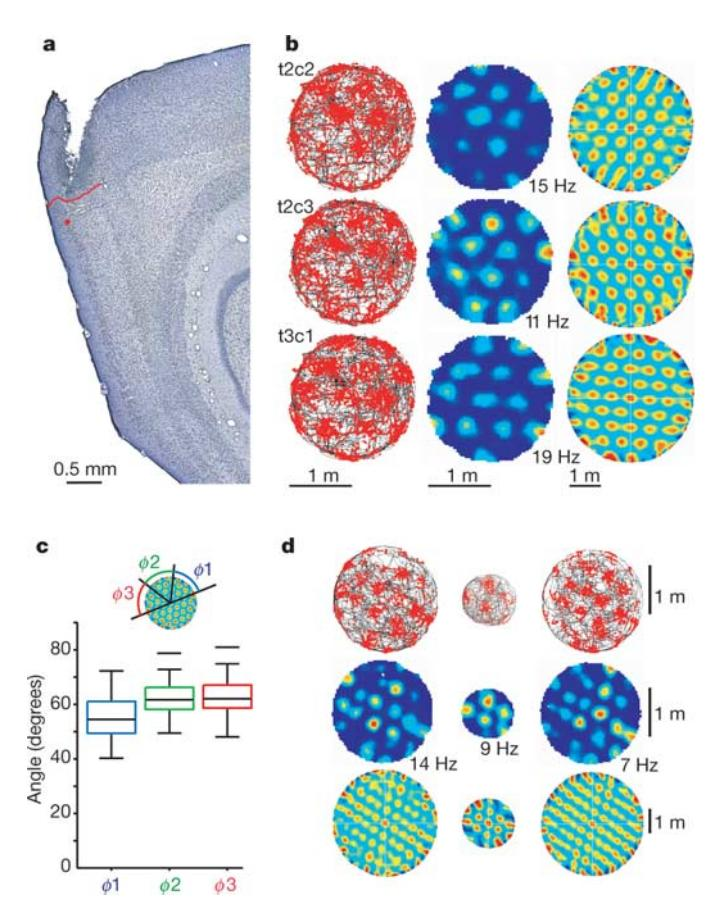
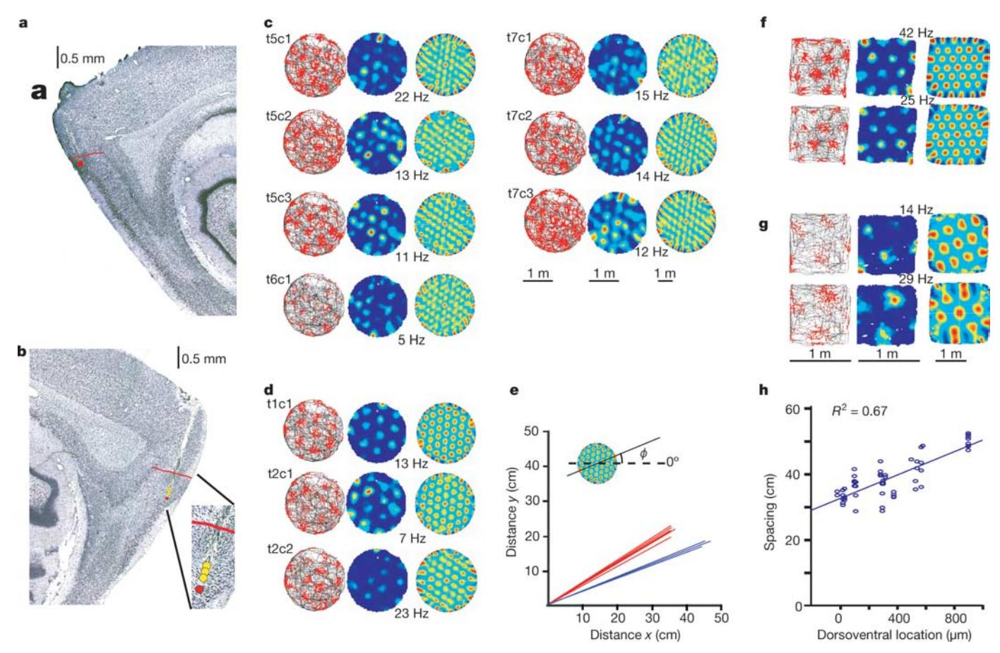
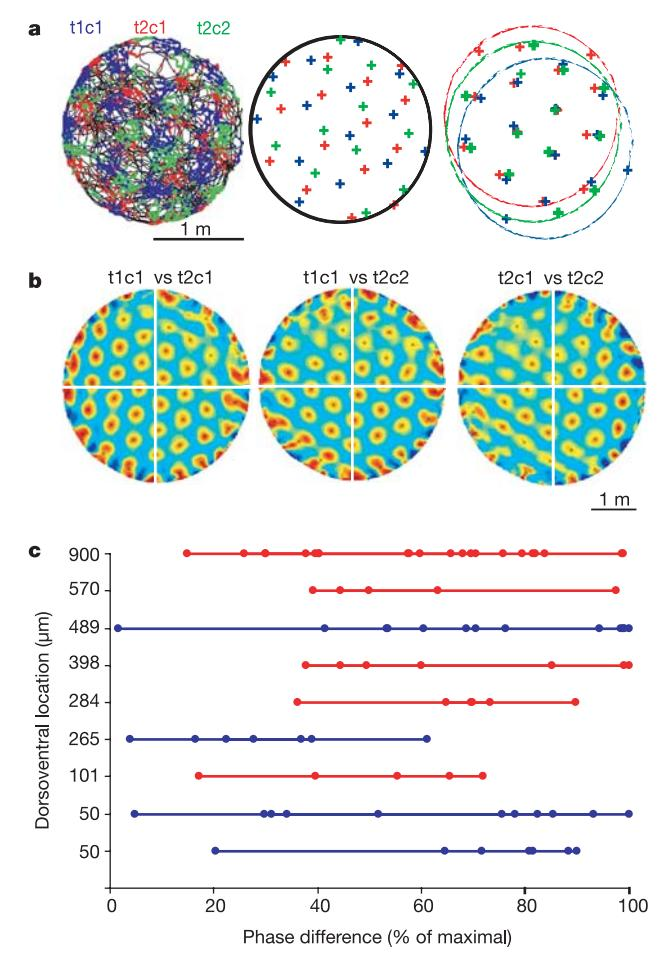
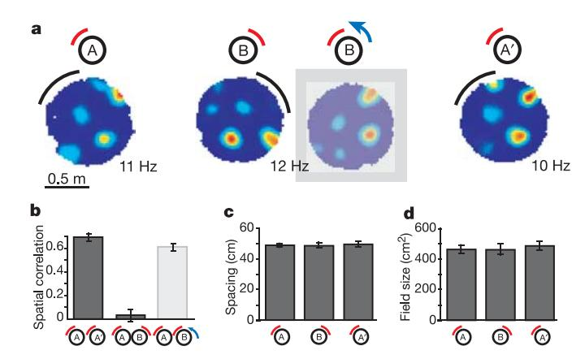
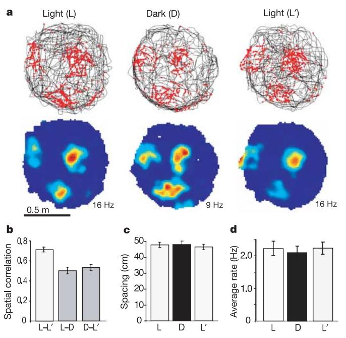
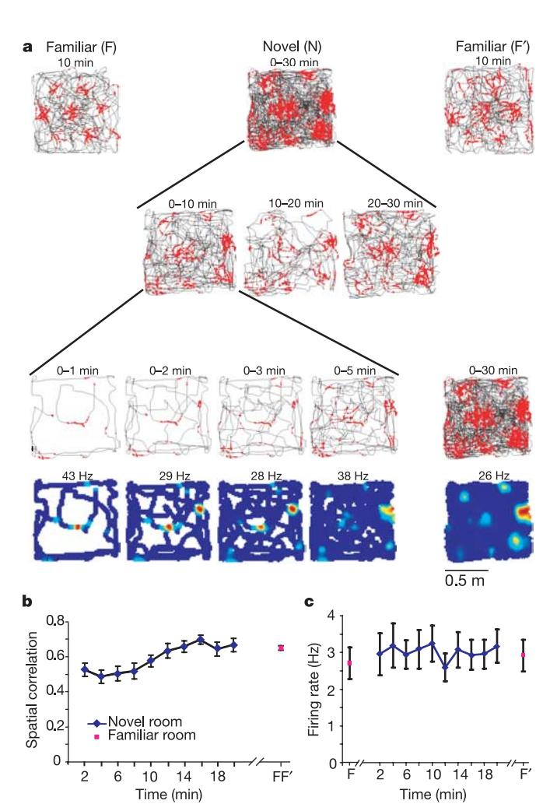

## ARTICLES

# Microstructure of a spatial map in the entorhinal cortex

Torkel Hafting1\*, Marianne Fyhn1\*, Sturla Molden1†, May-Britt Moser1 & Edvard I. Moser1

The ability to find one's way depends on neural algorithms that integrate information about place, distance and direction, but the implementation of these operations in cortical microcircuits is poorly understood. Here we show that the dorsocaudal medial entorhinal cortex (dMEC) contains a directionally oriented, topographically organized neural map of the spatial environment. Its key unit is the 'grid cell', which is activated whenever the animal's position coincides with any vertex of a regular grid of equilateral triangles spanning the surface of the environment. Grids of neighbouring cells share a common orientation and spacing, but their vertex locations (their phases) differ. The spacing and size of individual fields increase from dorsal to ventral dMEC. The map is anchored to external landmarks, but persists in their absence, suggesting that grid cells may be part of a generalized, path-integration-based map of the spatial environment.

Navigation in mammals depends on a distributed, modularly organized brain network 1-7. The network computes and represents positional and directional information, as indicated by the existence of 'place cells'1 and 'head-direction cells'3 in the hippocampal and parahippocampal cortices. The function of hippocampal place cells has received particular attention1,2. Place cells respond to a wide variety of spatial inputs, including extrinsic landmarks8,9 and translational and directional movement signals10–13. Along with the strong involvement of the hippocampus in spatial learning1,14, the convergent expression of metric positional and directional information in place cells pointed, early on, to a pivotal role for the hippocampus in spatial computation and representation 1-7,14,15. However, whereas place cells were originally thought to have general navigational functions, it became clear that sensory information about space is differentiated by the hippocampus into a multitude of contextspecific representations16–21, which can be retrieved independently from degraded versions of the original input22,23. This diversification of stored information is consistent with a principal role for the hippocampus in event- or context-specific memory24,25, and raises the possibility that context-independent position information is computed upstream of the hippocampus5,6, for example, by algorithms that integrate self-motion information into a metric and directionally oriented representation that is valid in all contexts4–6.

A map with such properties has not been identified, but recent work has shown that location is represented accurately before the hippocampus in the superficial layers of the dorsocaudal region of the medial entorhinal cortex (dMEC)26. Whereas place cells in the hippocampus usually have a single confined firing field1, upstream dMEC neurons have multiple discrete fields of similar amplitude26. To determine whether the dMEC has a map-like structural organization, we recorded spike activity in this area while rats ran in enclosures that were large enough to capture possible regularities in the spatial organization of neural activity (14 rats, 211 cells).

#### Grid cells have tessellating firing fields

To visualize the spatial structure of firing fields in dMEC neurons, we first tested the rats in a circular enclosure with a diameter of 2 m (45 neurons from 6 rats). Individual neurons in layer II of the dMEC had

multiple discrete firing fields with distinct inhibitory surrounds (Fig. 1)26. The expanded recording environment revealed a striking spatial organization of the subfields that was not apparent in the smaller, conventionally sized enclosures used previously. In every isolated principal neuron, the firing field formed a grid of regularly tessellating triangles spanning the whole recording surface (Fig. 1b, left and middle columns). All nodes of activity were sharply delineated from the background, although the individual peak firing rates varied. The regular nature of the activity distribution was verified by spatial autocorrelation analyses, which for all cells showed a tessellating pattern similar to that of the original rate maps (Fig. 1b, right column; Supplementary Fig. S1).

To examine the geometric structure of the grid, we measured the separation of the peaks in the autocorrelogram. If the unit is an equilateral triangle, the central peak of the autocorrelogram should be surrounded by six equidistant peaks forming the vertices of a regular hexagon. The analysis confirmed this prediction. First, within each firing grid, the distance from the central peak of the autocorrelogram to the nearest six peaks was nearly constant. Although the average of this distance varied from 39 to 73 cm across different cells of different rats, the standard deviation (s.d.) within a single grid was only 3.2 cm (mean s.d. across 45 cells). Additional hexagons of equidistant firing peaks were formed at multiples of the distance to the nearest hexagon, implying that the pattern was regular across the entire field. Second, the angular separation of the vertices of the inner hexagon was in multiples of 60 degrees (Fig. 1c; s.d. = 7.1 degrees), as expected if the unit was an equilateral triangle.

The location of the grid vertices (the phase) remained stable across recording trials (Supplementary Fig. S2)26. The rats were tested twice in the large cylinder at an interval of 15 min. The peak firing rates in each subfield on the first trial correlated weakly but significantly with the peak rates in the same areas on the second trial (mean correlation  $\pm$  s.e.m.,  $r = 0.35 \pm 0.06$ , t(25) = 6.1, where 25 degrees of freedom are indicated in parentheses, P < 0.001), implying that activity was distributed non-randomly across the nodes of the firing lattice.

The structure of the grid was not confined by the boundaries of the enclosure (Fig. 1d). When the environment was expanded, the

&lt;sup>1Centre for the Biology of Memory, Norwegian University of Science and Technology, 7489 Trondheim, Norway. †Present address: Department of Physiology, University of Oslo, PO Box 1103 Blindern, 0317 Oslo, Norway.

\*These authors contributed equally to this work.

ARTICLES NATURE|Vol 436|11 August 2005

number of activity nodes increased, but their density remained constant (t(28) = 1.2, P > 0.20; 29 cells from 3 rats), suggesting that grids may potentially have infinite size (Supplementary Fig. S3).

#### Grid cells are topographically organized

Grid cells in the dMEC showed a striking topographic organization. Grids recorded at the same electrode location shared a number of metric properties, including spacing, orientation (direction) and field size (Fig. 2). Spacing was expressed for each grid as the distance from the central peak to the vertices of the inner hexagon in the autocorrelogram (the median of the six distances). While spacing varied by more than 30 cm in the entire cell population, the s.d. among cells recorded on the same tetrode was only 2.1 cm (mean across 12 sets of simultaneously recorded cells, n=42). The orientation of the grid was expressed in the autocorrelogram as the angle  $\phi$  between a camera-defined reference line (0 degrees) and a vector to the nearest vertex of the inner hexagon in the counterclockwise direction (Fig. 2e inset). The entire range of orientations was

Figure 1 | Firing fields of grid cells have a repetitive triangular structure. a, Sagittal Nissl-stained section indicating the recording location (red dot) in layer II of the dMEC. Red line indicates border to postrhinal cortex. b, Firing fields of three simultaneously recorded cells at the dot in a during 30 min of running in a large circular enclosure. Cell names refer to tetrode (t) and cell (c). Left, trajectory of the rat (black) with superimposed spike locations (red). Middle, colour-coded rate map with the peak rate indicated. Red is maximum, dark blue is zero. Right, spatial autocorrelation for each rate map (see Supplementary Methods). The colour scale is from blue (r = -1)through green (r=0) to red (r=1). **c**, Box plot showing distribution of angles  $\phi$ 1,  $\phi$ 2 and  $\phi$ 3 between the central peak of the autocorrelogram and the vertices of a hexagon defined by the nearest six peaks. The diagram shows median angles (horizontal lines inside boxes), interquartile distances (boxes), upper and lower limits, and outliers (horizontal lines). d, Discharge maps (as in b) showing similar triangular structure in enclosures of different size (left, large; middle, small; right, large).

represented in the population as a whole (from 1 to 59 degrees), but among cells recorded on the same tetrode, orientation varied minimally (s.d. = 1.8 degrees). The size of the individual fields was estimated as the area covered by the central peak of the autocorrelogram, using a threshold of r=0.2. Field sizes ranged from 326 to 709 cm² in the population as a whole. The s.d. among cells recorded at the same electrode location was 42 cm².

Although spacing, orientation and field size were almost invariant at individual recording locations, spacing and field size increased with distance from the postrhinal border, resulting in more dispersed fields at more ventral electrode positions. This pattern was observed both within animals (Fig. 2a-e) and between animals (Fig. 2f-h; Supplementary Fig. S4). Figure 2 shows the difference between grid cells at two electrode locations, one near the postrhinal border and one 560 µm deeper, in a rat with a double dMEC implant tested in the large circular enclosure. The spacing of the grid was consistently denser at the dorsal position (Fig. 2e). In the dorsal cells, the spacing ranged from 39.1 to 43.0 cm (14 cells recorded over 3 days). In the more ventrally located cells, the spacing ranged from 48.1 to 52.2 cm (5 cells recorded over 2 days). The increase in spacing at the ventral position was accompanied by an increase in the size of the individual fields (dorsal 353–583 cm2; ventral 511–637 cm2; t(17) = 2.4, P < 0.05). A similar topographic arrangement was revealed when one set of tetrodes was lowered tangentially along the border of layers II and III (yellow circles in Fig. 2b). Over a distance of 100 μm, the spacing increased from between 41.9 and 45.9 cm (n = 3) to between 44.9 and 49.7 cm (n = 4). These results were replicated in two other rats with double implants (17 cells) as well as in a larger sample of rats running in a smaller square box (1 m2; 11 rats, 57 cells; Fig. 2f-h and Supplementary Fig. S4). In the latter group, the distance from the postrhinal border correlated significantly with both the spacing of the grid (r = 0.82, degrees of freedom, d.f. = 55, P < 0.001) and the size of the individual fields (r = 0.79, P < 0.001). The field size was quadratically proportional to the spacing (r = 0.75, P < 0.001).

Like spacing and field size, orientation of the grid varied between electrode locations (Fig. 2 and Supplementary Fig. S4). In Fig. 2, the angle with the camera-defined horizontal line was between 26.7 and 32.7 degrees at the recording location near the postrhinal border (n=14) and between 19.7 and 22.1 degrees at the more ventral location on the contralateral side (n=5) (Fig. 2e). However, although the entire range of orientations was represented across animals, we were unable to detect any systematic change from dorsal to ventral in dMEC (r=-0.13, P=0.30).

Although grids of neighbouring cells had similar spacing, field size and orientation, their phases (the vertex locations) were apparently not related. Collectively, grids from a small number of units recorded simultaneously at the same electrode position filled up the entire space of the recording arena (Fig. 2). Because neighbouring cells had similar grid spacing and grid orientation, a slight phase shift in each of the grids was sufficient to superimpose the vertices of the grids almost completely (Fig. 3a). Cross-correlation of the rate maps of cell pairs recorded simultaneously at the same electrode location yielded a regular multi-peaked surface with a structure very similar to that of each cell's autocorrelogram, except that the peaks were offset from the origin in most cases (Fig. 3b). Cross-correlation of cells recorded at different locations (with different spacing and orientation) gave cross-correlograms with more dispersed peaks and lower peak amplitudes (Supplementary Fig. S5). Among the co-localized cells, the average phase shift, expressed as the distance from the origin to the nearest peak in the cross-correlogram, was evenly distributed, extending from 0 to a maximum of 0.5 of the spacing of the corresponding autocorrelograms, both in the group as a whole and in individual recordings (Fig. 3c). The distribution of phase shifts did not deviate significantly from uniformity ( $\chi(4) = 0.84$  with bins corresponding to 20% of the maximally possible grid spacing) and was not related to the distance from the postrhinal border (r = 0.13, d.f. = 43, n.s.). These results suggest that the complete surface of the NATURE|Vol 436|11 August 2005

environment was represented at each dorsoventral level of the dMEC, for every spacing and every orientation of the map.

#### Grids are anchored to external cues

How does the spatial map in dMEC contribute to navigation? A key question is whether locations of discharge in grid cells are determined by external landmarks (allothetic cues) or by information generated by the rat's own movement (idiothetic cues). The stability of the grid vertices across successive trials in the same enclosure (Supplementary Fig. S2) suggests that allothetic cues exert a significant influence. To test their influence more directly, we rotated a cue card on the wall of a circular test box while recording from grid cells in dMEC (3 rats, 24 cells). Distal cues were masked by curtains. When the cue card was rotated 90 degrees, the grid rotated similarly (24/24 cells; Fig. 4; Supplementary Fig. S6). The correlation between the rate maps of the initial baseline trial and the rotation trial was substantially lower than between trials with the cue card in the same position (Fig. 4b; t(23) = 4.6, P < 0.001). There was no change in grid spacing or field size (Fig. 4c and d; t < 0.5). Counter-rotating the rate map from the rotation trial reversed the drop in spatial correlation (Fig. 4a and b; t(23) = 1.6, P = 0.10), supporting the notion that phase and orientation are set by external landmarks.

#### Grid structure persists after cue removal

To determine whether allothetic cues were also necessary for maintaining grid-like activity during exploration, we asked whether grids were expressed after all visual cues were removed. Spike activity was recorded in total darkness for 30 min after an initial period of 10 min with the lights on (4 rats, 33 cells; Fig. 5 and Supplementary Fig. S7). The grid was maintained in darkness. Darkness had no significant effect on the spacing of the grid, and there was no change in average firing rate or spatial information per spike (t < 1.5, P > 0.15), suggesting that the existence of a grid-like firing structure was independent of allothetic information. Yet, in the majority of the cells, the onset of total darkness caused a weak dispersal or displacement of the vertices, expressed as a moderate decrease in the spatial correlation of the rate maps (Fig. 5b; t(29) = 6.5, P < 0.001). The decrease in spatial correlation is consistent with a role for allothetic cues in determining the phase of the grid, that is, in aligning the grid to the external reference frame. Stationary non-visual cues contributed minimally to the firing positions in darkness (Supplementary Fig. S8).

#### Grid development in a novel environment

The persistence of firing structure after perturbations of external sensory input suggests that grids may to a large extent be based on hardwired network mechanisms. If this is true, they may stabilize rapidly in a novel environment. We tested this prediction by recording grid cells for 30 min while rats explored a square enclosure in a novel room (room N; 7 rats, 24 cells). Before and after this trial, the rats ran in a similar enclosure in a familiar room (F and F'). Visual inspection suggested that the grid pattern was expressed from the outset (Fig. 6a). Firing locations were mostly stable from the first time the rat passed through the area, both in light (Fig. 6; Supplementary

Figure 2 | Grid cells recorded simultaneously at two electrode locations in the same rat. a, b, Sagittal sections showing recording locations (dots) in layer II at the dorsal extreme of the left dMEC (a) and 560  $\mu m$  more ventrally in the right dMEC (b). Red line indicates border to postrhinal cortex. c, d, Trajectory maps (left), rate maps (middle) and spatial autocorrelograms (right) for cells recorded at positions indicated by red dots in a and b, respectively. e, Vector representation of grid spacing (length) and grid

orientation (direction) in **c** (red) and **d** (blue). Each vector refers to one cell. Direction is relative to a fixed horizontal reference (inset). Note invariance of spacing and orientation at each location. **f**, **g**, Discharge maps (as in **c** and **d**) for representative pairs of cells at the dorsalmost (**f**) and ventralmost (**g**) recording locations tested. These rats ran in a smaller square enclosure. **h**, Grid spacing as a function of distance from the postrhinal cortex for all animals tested in the square enclosure (Supplementary Fig. S4).

ARTICLES NATURE|Vol 436|11 August 2005

Figure 3 | Distributed spatial phase of co-localized grid cells. a, Grids of the three cells in Fig. 2d, each with a separate colour. Left, trajectory maps. Middle, peak locations. Right, peaks are offset to visualize similarity in spacing and orientation. b, Spatial cross-correlations for the same three cells. c, Distribution of phase differences between co-localized neuron pairs, expressed as distance from the origin to the nearest peak in their cross-correlogram. Each circle indicates one cell pair. Simultaneously recorded cell pairs are connected (only recordings with ≥5 cell pairs). Blue, large cylinder; red, small square enclosure.

Fig. S9) and in total darkness (Supplementary Fig. S7). The development of firing was estimated by correlating for each grid cell the final firing rate at each position in the environment (estimated during the last 10 min of the trial) with the firing rate at the same locations (if visited) for blocks of 2 min throughout the preceding 20 min. Firing locations during the first 2 min were significantly correlated with firing locations at the end of the trial (mean correlation  $\pm$  s.e.m. = 0.53  $\pm$  0.04; Fig. 6b). However, the correlation was weaker during the first blocks than later (Fig. 6b; Block effect:  $F_{9,207} = 8.5$ , P < 0.001), suggesting that stabilization of the grid, like stabilization of hippocampal place fields18,27, requires some minimum exposure. The delay may reflect the time needed to set phase and orientation in relation to context-specific landmarks. The orientation of the grid in the new room was different from the orientation in the familiar room (mean change =  $20.8 \pm 3.2$ degrees). The orientation drifted only minimally between the two tests in the familiar room (2.3  $\pm$  0.5 degrees), as expected if grids are aligned with external landmarks.

#### **Discussion**

This study points to the dMEC as part of a neural map of the spatial environment. The basic unit of the map is the grid cell, whose multiple discrete firing fields invariantly form a stable, regularly

Figure 4 | Grids are aligned to environment-specific landmarks. a, Rate maps for a representative cell after rotation of the cue card (arc) on the small cylinder. Left and right, cue card in original position (A and A'). Middle pair, cue card rotated 90° (B). Shaded map, rate map counter-rotated 90°. **b–d**, Firing properties of grid cells on trials with the cue card in A and B positions (all rats; means  $\pm$  s.e.m.).

tessellating structure of equilateral triangles. Grid spacing, grid orientation and field size were topographically organized, with minimal variation locally, but significant variation across the surface of the dMEC. Spacing and field size increased from the dorsal to the ventral part of dMEC, raising the possibility that this gradient is continuous with the broad, single-peaked firing fields in the intermediate band of the MEC26. In contrast, the phase of the grid appeared to vary randomly among cells recorded at the same brain location, implying that the entire surface of the environment was represented within a local cell ensemble with a common grid spacing and orientation. These observations point to a modular local organization of the entorhinal spatial map, similar to the columnar organization of other areas of neocortex28,29. The mosaic organization of the superficial layers of dMEC30 represents a possible substrate for the modularity of the spatial map.

A fundamental property of the entorhinal spatial map is the apparent universality of several key parameters. The triangular firing structure and the spacing of the grid cells were impervious to displacement or removal of external sensory input, in much the same way that units in more ventromedial parts of MEC preserve firing fields after geometric transformation of the local environment31. The persistent firing structure of the population is reminiscent of the coherence across environments expressed by headdirection cells3,12,32,33 and suggests that in both systems the same neurons may perform the same algorithms in different environments. The maintenance of grid structure during visual deprivation points to path integration7,34–36 as a probable motor of the spatial periodicity. Whether the position vector is computed in the dMEC itself or outside remains to be determined, but the convergence in the dMEC of directional input from the dorsal presubiculum37 and visuospatial input from the postrhinal cortex38,39 puts the dMEC in a unique position to perform this computation. A direct involvement of the dMEC in path integration is consistent with the disruption of return paths40 and spatial search patterns41 during navigation in rats with entorhinal lesions that include the dorsocaudal pole. However, although the spatial structure of firing may be determined by selfmotion cues, phase and orientation were controlled by the specific landmarks of each environment, in the same way that specific cues are needed to initialize the directional preferences of the headdirection cells3. These alignment processes presumably involve associative learning.

The representation of place, distance and direction in the same network of dMEC neurons would permit the computation of a continuously updated metric representation of the animal's location. The underlying algorithms may have similarities with those NATURE|Vol 436|11 August 2005

Figure 5 | Grids persist in darkness. a, Trajectory and rate maps for a representative dMEC cell after onset of darkness. Room lights were on for  $10 \min (L)$ , off for  $10 \min (D)$ , and on for another  $10 \min (L')$ . **b–d**, Firing properties of grid cells in L, D and L' (all rats; means  $\pm$  s.e.m.).

proposed previously for recurrent networks of head-direction cells42 and hippocampal place cells15. By way of their intrinsic connections43–45, entorhinal neurons may be able to support a two-dimensional continuous attractor-based representation of the environment, in which activity is moved between successive mutually connected cell ensembles by a path-integration-based mechanism2,15. The constant spacing, field size and orientation of grids in neighbouring cells suggest that conjunctions of active neurons are repeated regularly as the animal moves over a surface. If the start location is retained, a cyclically organized map might be sufficient to signal location in environments of any size, and work equally well at the edges and in the centre of the map5.

One potential problem with the grid structure is that the population code at each vertex of the grid may be relatively similar. This potential ambiguity could be resolved by using the small, but reliable rate differences between the vertices, or perhaps more efficiently, by integrating over grids with different spacing and orientation. The mechanism by which information about distance and direction is extracted is not known, but successful read-out would probably depend significantly on temporal integration of neural activity. Sustained firing in single cells46 and reverberatory circuits47 may contribute to such integration. Although the wide distribution of grid phase allows the animal's position to be predicted from the collective firing of small local cell ensembles26, it remains to be determined whether read-out occurs within the entorhinal cortex, or in one or several of its hippocampal or parahippocampal target structures4-6.

The results suggest that the entorhinal cortex may support some spatial computations that were previously attributed to the hippocampus1,2,14,15. Although hippocampal place cells respond to translational and directional information10–13, similar influences were observed upstream in layer II of the dMEC. The contextual specificity of hippocampal representations16–21 suggests that during encoding, the hippocampus associates output from a generalized, path-integration-based coordinate system with landmarks or other features specific to the individual environment or context. Through backprojections to the superficial layers of the entorhinal cortex39, associations stored in the hippocampus may reset the path integrator

Figure 6 | Grid structure of dMEC cells is expressed instantly in a novel environment. a, Trajectory and rate maps for a grid cell in a familiar room, a novel room, and the familiar room (top row). The middle trial is broken into blocks to illustrate development. b, Development of grid structure as indicated by spatial correlation with the final firing field (last  $10 \, \text{min}$ ) across preceding 2-min blocks of the trial (all rats; means  $\pm$  s.e.m.). c, Stability of firing rate across 2-min blocks, normalized to the average value for the last  $10 \, \text{min}$ 

as errors accumulate during exploration7,36,48,49. Anchoring the output of the path integrator to external reference points stored in the hippocampus or other cortical areas may enable alignment of entorhinal maps from one trial to the next, even when the points of departure are different.

#### **METHODS**

**Subjects.** Fourteen male Long Evans rats (350–450 g) kept at ~90% of free-feeding body weight were implanted above the dMEA with a microdrive containing four tetrodes26. Six of these rats received an additional microdrive in the contralateral hemisphere either above the dMEA (n=5) or above the dorsal CA3 of the hippocampus18 (n=1). Tetrodes were made of 17- $\mu$ m-diameter polyimide-coated platinum–iridium (90%–10%) wire.

**Enclosures and rooms.** Neuronal activity was recorded during pellet chasing in enclosures of different size and shape: a large circular box (200 cm in diameter, 50 cm high), a small circular box (90 cm in diameter, 50 cm high), a square box (100 cm  $\times$  100 cm  $\times$  50 cm high), and a linear track (235 cm long, 10 cm wide and 50 cm above the floor). A cue card (45 cm  $\times$  50 cm or 20 cm  $\times$  30 cm) was displayed at a constant location in each box.

Training and testing. Tetrodes were moved in daily steps of  $\sim 50\,\mu m$  or less towards layer II of the dMEA until multiple distinguishable large-amplitude units were obtained. Six rats were tested on alternating trials in two circular enclosures of different size at the same location. In three rats, the cue card was

ARTICLES NATURE|Vol 436|11 August 2005

rotated 90 degrees and back on separate trials in the small circle. Four animals were tested in a black square box with room lights on and off on alternating trials. The rat was not taken out of the recording enclosure between these trials. Seven animals were tested on alternating trials in two square boxes, one in a familiar room and one in a novel room. An eighth animal was tested in the novel room with lights off during the first 30 min. Three rats were trained to run back and fourth on a linear track with food rewards at the ends. These rats were tested on alternating trials in light and darkness.

Spike sorting and analysis of firing structure. Position and unit data were recorded with an Axona recording station. Spike sorting was performed off-line for all data using graphical cluster-cutting software26. Firing-rate maps, spatial correlations, spatial autocorrelations and spatial cross-correlations were computed as described in Supplementary Methods.

Histology and topography. The majority of the electrodes were positioned in layer II at the caudal end of the dorsolateral band of the MEC26. A smaller subset was located at the border between layers II and III. Data from these recordings were not separated out because cells in layers II and III appear to have similar grid-like firing properties50. Most data were recorded at the bottom of the electrode trace. When this was not the case, the recording position was extrapolated using the read-out of the tetrode turning protocol corrected for shrinkage26. Distance between the electrode position and the postrhinal border was measured tangentially along layer II.

### Received 16 February; accepted 5 May 2005. Published online 19 June 2005.

- O'Keefe, J. & Nadel, L. The Hippocampus as a Cognitive Map (Clarendon, Oxford, 1978).
- McNaughton, B. L. et al. Deciphering the hippocampal polyglot: the hippocampus as a path integration system. J. Exp. Biol. 199, 173–185 (1996).
- Taube, J. S. Head direction cells and the neurophysiological basis for a sense of direction. *Prog. Neurobiol.* 55, 225–256 (1998).
- Redish, A. D. & Touretzky, D. S. Cognitive maps beyond the hippocampus. *Hippocampus* 7, 15–35 (1997).
- Redish, A. D. Beyond the Cognitive Map: From Place Cells to Episodic Memory (MIT Press, Cambridge, 1999).
- Sharp, P. E. Complimentary roles for hippocampal versus subicular/entorhinal place cells in coding place, context, and events. *Hippocampus* 9, 432–443 (1999)
- Etienne, A. S. & Jeffery, K. J. Path integration in mammals. Hippocampus 14, 180–192 (2004).
- 8. O'Keefe, J. & Conway, D. H. Hippocampal place units in the freely moving rat: why they fire where they fire. *Exp. Brain Res.* **31**, 573–590 (1978).
- O'Keefe, J. & Burgess, N. Geometric determinants of the place fields of hippocampal neurons. *Nature* 381, 425–428 (1996).
- Gothard, K. M., Skaggs, W. E. & McNaughton, B. L. Dynamics of mismatch correction in the hippocampal ensemble code for space: interaction between path integration and environmental cues. J. Neurosci. 16, 8027–8040 (1996).
- Sharp, P. E., Blair, H. T., Etkin, D. & Tzanetos, D. B. Influences of vestibular and visual motion information on the spatial firing patterns of hippocampal place cells. J. Neurosci. 15. 173–189 (1995).
- Knierim, J. J., Kudrimoti, H. S. & McNaughton, B. L. Place cells, head direction cells, and the learning of landmark stability. J. Neurosci. 15, 1648–1659 (1995).
- Jeffery, K. J., Donnett, J. G., Burgess, N. & O'Keefe, J. M. Directional control of hippocampal place fields. Exp. Brain Res. 117, 131–142 (1997).
- Nadel, L. The hippocampus and space revisited. Hippocampus 1, 221–229 (1991).
- Samsonovich, A. & McNaughton, B. L. Path integration and cognitive mapping in a continuous attractor neural network model. J. Neurosci. 17, 5900–5920 (1997).
- Muller, R. U. & Kubie, J. L. The effects of changes in the environment on the spatial firing of hippocampal complex-spike cells. J. Neurosci. 7, 1951–1968 (1987).
- Bostock, E., Muller, R. U. & Kubie, J. L. Experience-dependent modifications of hippocampal place cell firing. *Hippocampus* 1, 193–205 (1991).
- Leutgeb, S., Leutgeb, J. K., Treves, A., Moser, M.-B. & Moser, E. I. Distinct ensemble codes in hippocampal areas CA3 and CA1. Science 305, 1295–1298 (2004).
- 19. Markus, E. J. et al. Interactions between location and task affect the spatial and directional firing of hippocampal neurons. J. Neurosci. 15, 7079–7094 (1995).
- Frank, L. M., Brown, E. N. & Wilson, M. Trajectory encoding in the hippocampus and entorhinal cortex. *Neuron* 27, 169–178 (2000).
- Wood, E. R., Dudchenko, P. A., Robitsek, R. J. & Eichenbaum, H. Hippocampal neurons encode information about different types of memory episodes occurring in the same location. *Neuron* 27, 623–633 (2000).
- Nakazawa, K. et al. Requirement for hippocampal CA3 NMDA receptors in associative memory recall. Science 297, 211–218 (2002).
- Lee, I., Yoganarasimha, D., Rao, G. & Knierim, J. J. Comparison of population coherence of place cells in hippocampal subfields CA1 and CA3. *Nature* 430, 456–459 (2004).

 Rolls, E. T. & Treves, A. Neural Networks and Brain Function (Oxford Univ. Press, Oxford, 1998).

- Squire, L. R., Stark, C. E. & Clark, R. E. The medial temporal lobe. *Annu. Rev. Neurosci.* 27, 279–306 (2004).
- Fyhn, M., Molden, S., Witter, M. P., Moser, E. I. & Moser, M. B. Spatial representation in the entorhinal cortex. Science 305, 1258–1264 (2004).
- Wilson, M. A. & McNaughton, B. L. Dynamics of the hippocampal ensemble code for space. Science 261, 1055–1058 (1993).
- Mountcastle, V. B. The columnar organization of the neocortex. Brain 120, 701–722 (1997).
- Rockland, K. S. & Ichinohe, N. Some thoughts on cortical minicolumns. Exp. Brain Res. 158, 265–277 (2004).
- Ikeda, J., Mori, K., Oka, S. & Watanabe, Y. A columnar arrangement of dendritic processes of entorhinal cortex neurons revealed by a monoclonal antibody. *Brain Res.* 505, 176–179 (1989).
- Quirk, G. J., Muller, R. U., Kubie, J. L. & Ranck, J. B. Jr The positional firing properties of medial entorhinal neurons: description and comparison with hippocampal place cells. *J. Neurosci* 12, 1945–1963 (1992).
- 32. Taube, J. S., Muller, R. U. & Ranck, J. B. Jr Head-direction cells recorded from the postsubiculum in freely moving rats. II. Effects of environmental manipulations. *J. Neurosci.* 10, 436–447 (1990).
- 33. Goodridge, J. P. & Taube, J. S. Preferential use of the landmark navigational system by head direction cells in rats. *Behav. Neurosci.* 109, 49–61 (1995).
- 34. Mittelstaedt, M. L. & Mittelstaedt, H. Homing by path integration in a mammal. *Naturwissenschaften* **67**, 566–567 (1980).
- Gallistel, C. R. The Organization of Learning (MIT Press, Cambridge Massachusetts, 1990).
- 36. Biegler, R. Possible uses of path integration in animal navigation. *Anim. Learn. Behav.* **28**, 257–277 (2000).
- van Haeften, T., Wouterlood, F. G., Jorritsma-Byham, B. & Witter, M. P. GABAergic presubicular projections to the medial entorhinal cortex of the rat. J. Neurosci. 17, 862–874 (1997).
- Witter, M. P., Groenewegen, H. J., Lopes da Silva, F. H. & Lohman, A. H. Functional organization of the extrinsic and intrinsic circuitry of the parahippocampal region. *Prog. Neurobiol.* 33, 161–253 (1989).
- Witter, M. P. & Amaral, D. G. in *The Rat Nervous System* 3rd edn (ed. Paxinos, G.) 637–703 (Academic, San Diego, 2004).
- 40. Parron, C. & Save, E. Evidence for entorhinal and parietal cortices involvement in path integration in the rat. *Exp. Brain Res.* **159**, 349–359 (2004).
- Steffenach, H.-A., Witter, M. P., Moser, M.-B. & Moser, E. I. Spatial memory in the rat requires the dorsolateral band of the entorhinal cortex. *Neuron* 45, 301–313 (2005).
- Skaggs, W. E., Knierim, J. J., Kudrimoto, H. & McNaughton, B. L. in Advances in Neural Information Processing Systems (eds Tesauro, G., Touretzky, D. S. & Leen, T. K.) Vol. 7, 173–180 (MIT Press, Cambridge, Massachusetts, 1995).
- Lingenhohl, K. & Finch, D. M. Morphological characterization of rat entorhinal neurons in vivo: soma-dendritic structure and axonal domains. Exp. Brain Res. 84, 57–74 (1991).
- Germroth, P., Schwerdtfeger, W. K. & Buhl, E. H. Ultrastructure and aspects of functional organization of pyramidal and nonpyramidal entorhinal projection neurons contributing to the perforant path. J. Comp. Neurol. 305, 215–231 (1991).
- Dhillon, A. & Jones, R. S. Laminar differences in recurrent excitatory transmission in the rat entorhinal cortex in vitro. Neuroscience 99, 413–422 (2000).
- Egorov, A. V., Hamam, B. N., Fransen, E., Hasselmo, M. E. & Alonso, A. A. Graded persistent activity in entorhinal cortex neurons. *Nature* 420, 173–178 (2002).
- lijima, T. et al. Entorhinal-hippocampal interactions revealed by real-time imaging. Science 272, 1176–1179 (1996).
- Lorincz, A. & Buzsaki, G. Two-phase computational model training long-term memories in the entorhinal-hippocampal region. *Ann. NY Acad. Sci.* 911, 83–111 (2000).
- Fyhn, M., Molden, S., Hollup, S., Moser, M.-B. & Moser, E. I. Hippocampal neurons responding to first-time dislocation of a target object. *Neuron* 35, 555–566 (2002).
- Sargolini, F., Molden, S., Witter, M. P., Moser, E. I. & Moser, M.-B. Place representation in the deep layers of entorhinal cortex. Soc. Neurosci. Abstr. 30, 330.9 (2004)

**Supplementary Information** is linked to the online version of the paper at www.nature.com/nature.

**Acknowledgements** We are grateful to the members of the Centre for the Biology of Memory as well as W. E. Skaggs, J. Lisman and G. Einevoll for discussions. We also thank the technical team of the Centre for their assistance. This work is supported by the Norwegian Research Council's Centre of Excellence scheme.

**Author Information** Reprints and permissions information is available at npg.nature.com/reprintsandpermissions. The authors declare no competing financial interests. Correspondence and requests for materials should be addressed to E.I.M. (edvard.moser@ntnu.no).