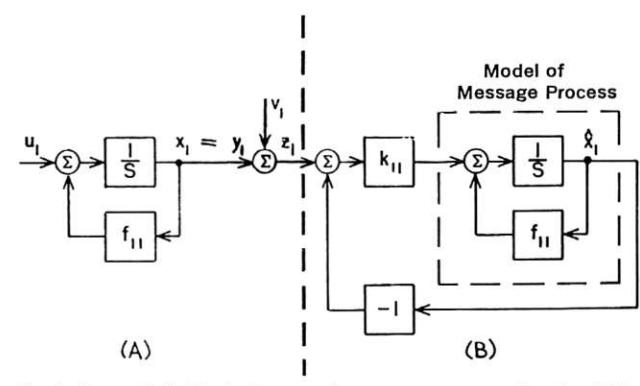
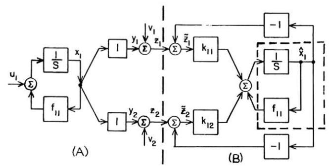
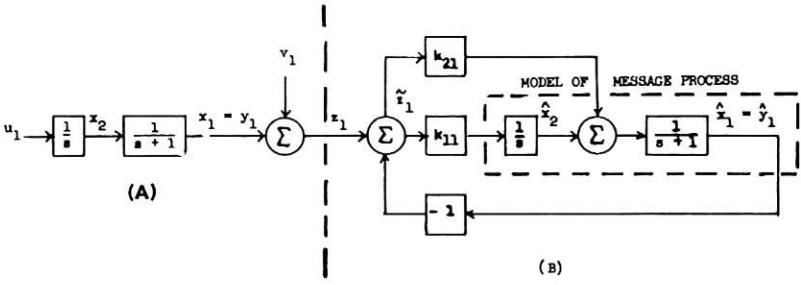
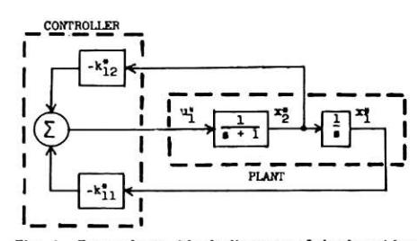
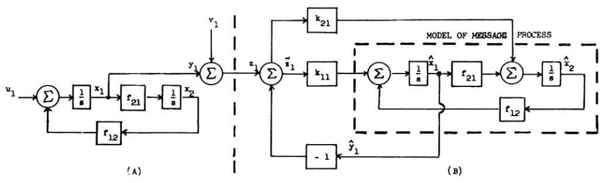
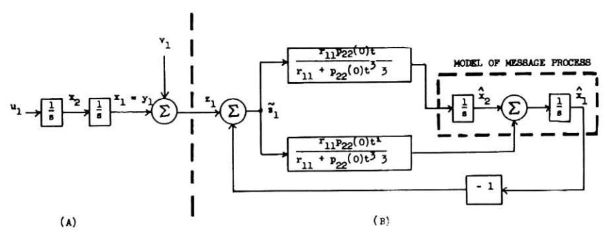
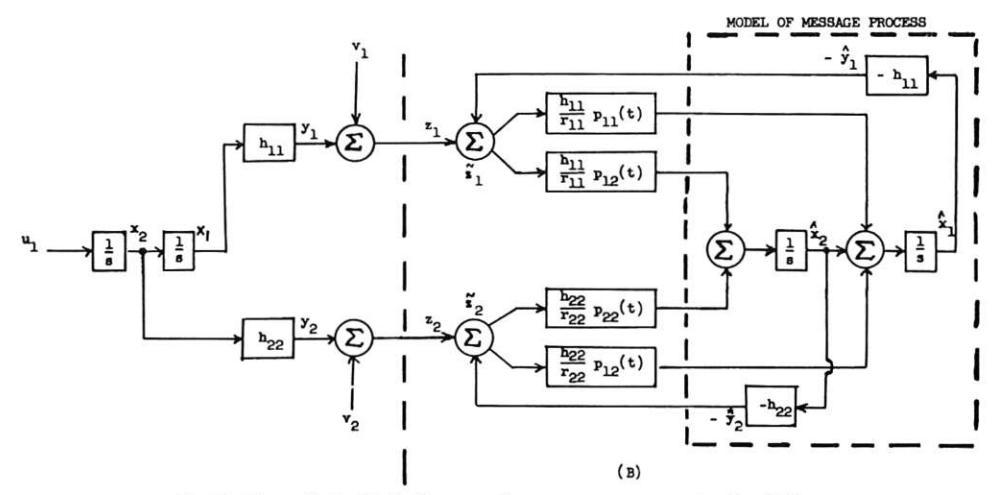
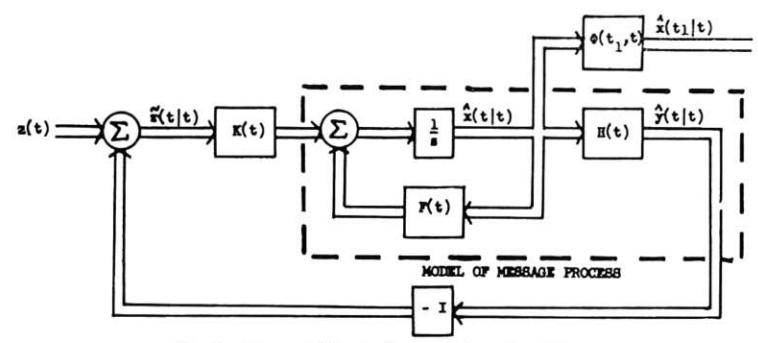
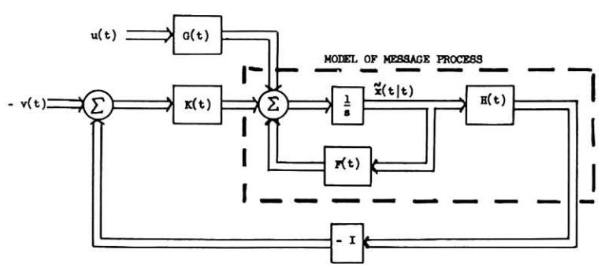
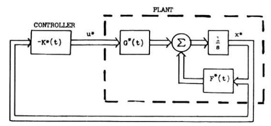

# New Results in Linear Filtering and Prediction Theory'

R. E. KALMAN

Research Institute for Advanced Study,2 Baltimore, Maryland

R. S. BUCY

The Johns Hopkins Applied Physics Laboratory, Silver Spring, Maryland A nonlinear differential equation of the Riccati type is derived for the covariance matrix of the optimal filtering error. The solution of this "variance equation" completely specifies the optimal filter for either finite or infinite smoothing intervals and stationary or nonstationary statistics.

The variance equation is closely related to the Hamiltonian (canonical) differential equations of the calculus of variations. Analytic solutions are available in some cases. The significance of the variance equation is illustrated by examples which duplicate, simplify, or extend earlier results in this field.

The Duality Principle relating stochastic estimation and deterministic control problems plays an important role in the proof of theoretical results. In several examples, the estimation problem and its dual are discussed side-by-side.

Properties of the variance equation are of great interest in the theory of adaptive systems. Some aspects of this are considered briefly.

# 1 Introduction

AT PRESENT, a nonspecialist might well regard the Wiener-Kolmogorov theory of filtering and prediction [1, 2]3 as "classical"—in short, a field where the techniques are well established and only minor improvements and generalizations can be expected.

That this is not really so can be seen convincingly from recent results of Shinbrot [3], Steeg [4], Pugachev [5, 6], and Parzen [7]. Using a variety of time-domain methods, these investigators have solved some long-standing problems in nonstationary filtering and prediction theory. We present here a unified account of our own independent researches during the past two years (which overlap with much of the work [3–7] just mentioned), as well as numerous new results. We, too, use time-domain methods, and obtain major improvements and generalizations of the conventional Wiener theory. In particular, our methods apply without modification to multivariate problems.

The following is the historical background of this paper.

In an extension of the standard Wiener filtering problem, Follin [8] obtained relationships between time-varying gains and error variances for a given circuit configuration. Later, Hanson [9] proved that Follin's circuit configuration was actually optimal for the assumed statistics; moreover, he showed that the differential equations for the error variance (first obtained by Follin) follow rigorously from the Wiener-Hopf equation. These results were then generalized by Bucy [10], who found explicit relationships between the optimal weighting functions and the error variances; he also gave a rigorous derivation of the variance equations and those of the optimal filter for a wide class of non-stationary signal and noise statistics.

Independently of the work just mentioned, Kalman [11] gave

Contributed by the Instruments and Regulators Division of The American Society of Mechanical Engineers and presented at the Joint Automatic Controls Conference, Cambridge, Mass., September 7-9, 1960. Manuscript received at ASME Headquarters, May 31, 1960. Paper No. 60—JAC-12.

a new approach to the standard filtering and prediction problem. The novelty consisted in combining two well-known ideas:

- (i) the "state-transition" method of describing dynamical systems [12-14], and
- (ii) linear filtering regarded as orthogonal projection in Hilbert space [15, pp. 150-155].

As an important by-product, this approach yielded the *Duality Principle* [11, 16] which provides a link between (stochastic) filtering theory and (deterministic) control theory. Because of the duality, results on the optimal design of linear control systems [13, 16, 17] are directly applicable to the Wiener problem. Duality plays an important role in this paper also.

When the authors became aware of each other's work, it was soon realized that the principal conclusion of both investigations was identical, in spite of the difference in methods:

Rather than to attack the Wiener-Hopf integral equation directly, it is better to convert it into a nonlinear differential equation, whose solution yields the covariance matrix of the minimum filtering error, which in turn contains all necessary information for the design of the optimal filter.

# 2 Summary of Results: Description

The problem considered in this paper is stated precisely in Section 4. There are two main assumptions:

- (A1) A sufficiently accurate model of the message process is given by a linear (possibly time-varying) dynamical system excited by white noise.
- (A2) Every observed signal contains an additive white noise component.

Assumption  $(A_2)$  is unnecessary when the random processes in question are sampled (discrete-time parameter); see [11]. Even in the continuous-time case,  $(A_2)$  is no real restriction since it can be removed in various ways as will be shown in a future paper. Assumption  $(A_1)$ , however, is quite basic; it is analogous to but somewhat less restrictive than the assumption of rational spectra in the conventional theory.

Within these assumptions, we seek the best linear estimate of the message based on past data lying in either a finite or infinite time-interval.

The fundamental relations of our new approach consist of five equations:

**Journal of Basic Engineering** 

&lt;sup>1 This research was partially supported by the United States Air Force under Contracts AF 49(638)-382 and AF 33(616)-6952 and by the Bureau of Naval Weapons under Contract NOrd-73861.

&lt;sup>2 7212 Bellona Avenue.

3 Numbers in brackets designate References at the end of paper.

- (I) The differential equation governing the optimal filter, which is excited by the observed signals and generates the best linear estimate of the message.
- (II) The differential equations governing the error of the best linear estimate.
- (III) The time-varying gains of the optimal filter expressed in terms of the error variances.
- (IV) The nonlinear differential equation governing the covariance matrix of the errors of the best linear estimate, called the variance equation.
  - (V) The formula for prediction.

The solution of the variance equation for a given finite timeinterval is equivalent to the solution of the estimation or prediction problem with respect to the same time-interval. The steady-state solution of the variance equation corresponds to finding the best estimate based on all the data in the past.

As a special case, one gets the solution of the classical (stationary) Wiener problem by finding the unique equilibrium point of the variance equation. This requires solving a set of algebraic equations and constitutes a new method of designing Wiener filters. The superior effectiveness of this procedure over present methods is shown in the examples.

Some of the preceding ideas are implicit already in [10, 11]; they appear here in a fully developed form. Other more advanced problems have been investigated only very recently and provide incentives for much further research. We discuss the following further results:

- (1) The variance equations are of the Riccati type which occur in the calculus of variations and are closely related to the canonical differential equations of Hamilton. This relationship gives rise to a well-known analytic formula for the solution of the Riccati equation [17, 18]. The Hamiltonian equations have also been used recently [19] in the study of optimal control systems. The two types of problems are actually duals of one another as mentioned in the Introduction. The duality is illustrated by several examples.
- (2) A sufficient condition for the existence of steady-state solutions of the variance equation (i.e., the fact that the error variance does not increase indefinitely) is that the information matrix in the sense of R. A. Fisher [20] be nonsingular. This condition is considerably weaker than the usual assumption that the message process have finite variance.
- (3) A sufficient condition for the optimal filter to be stable is the dual of the preceding condition.

The preceding results are established with the aid of the "state-transition" method of analysis of dynamical systems. This consists essentially of the systematic use of vector-matrix notation which results in simple and clear statements of the main results independently of the complexity of specific problems. This is the reason why multivariable filtering problems can be treated by our methods without any additional theoretical complications.

The outline of contents is as follows:

In Section 3 we review the description of dynamical systems from the state point of view. Sections 4-5 contain precise statements of the filtering problem and of the dual control problem. The examples in Section 6 illustrate the filtering problem and its dual in conventional block-diagram terminology. Section 7 contains a precise statement of all mathematical results. A reader interested mainly in applications may pass from Section 7 directly to the worked-out examples in Section 11. The rigorous derivation of the fundamental equations is given in Section 8. Section 9 outlines proofs, based on the Duality Principle, of the existence and stability of solutions of the variance equation. The theory of analytic solutions of the variance equation is discussed in Section 10. In Section 12 we examine briefly the relation of our results to adaptive filtering problems. A critical evaluation of

the current status of the statistical filtering problem is presented in Section 13.

# 3 Preliminaries

In the main, we shall follow the notation conventions (though not the specific nomenclature) of [11], [16], and [21]. Thus  $\tau$ , t,  $t_0$  refer to the time,  $\alpha$ ,  $\beta$ , ...,  $x_1$ ,  $x_2$ , ...,  $\phi_1$ ,  $\phi_2$ , ...,  $a_{ij}$ , ... are (real) scalars; a, b, ..., x, y, ...,  $\phi$ ,  $\psi$ , ... are vectors, A, B, ...,  $\Phi$ ,  $\Psi$ , ... are matrices. The prime denotes the transposed matrix; thus x'y is the scalar (inner) product and xy' denotes a matrix with elements  $x_i y_j$  (outer product).  $\|\mathbf{x}\| = (\mathbf{x}'\mathbf{x})^{1/2}$  is the euclidean norm and  $\|\mathbf{x}\|^2 \mathbf{A}$  (where  $\mathbf{A}$  is a nonnegative definite matrix) is the quadratic form with respect to  $\mathbf{A}$ . The eigenvalues of a matrix  $\mathbf{A}$  are written as  $\lambda_i(\mathbf{A})$ . The expected value (ensemble average) is denoted by  $\mathbf{E}$  (usually not followed by brackets). The covariance matrix of two vector-valued random variables  $\mathbf{x}(t)$ ,  $\mathbf{y}(\tau)$  is denoted by

$$\mathcal{E}_{\mathbf{x}}(t)\mathbf{y}'(\tau) - \mathcal{E}_{\mathbf{x}}(t)\mathcal{E}_{\mathbf{y}}'(\tau)$$
 or  $\operatorname{cov}[\mathbf{x}(t), \mathbf{y}(\tau)]$ 

depending on what form is more convenient.

Real-valued linear functions of a vector  $\mathbf{x}$  will be denoted by  $\mathbf{x}^*$ ; the value of  $\mathbf{x}^*$  at  $\mathbf{x}$  is denoted by

$$[x^*, x] = \sum_{i=1}^n x^*_i x_i$$

where the  $x_i$  are the co-ordinates of x. As is well known,  $x^*$  may be regarded abstractly as an element of the dual vector space of the x's; for this reason,  $x^*$  is called a covector and its co-ordinates are the  $x^*_i$ . In algebraic manipulations we regard  $x^*$  formally as a row vector (remembering, of course, that  $x^* \neq x'$ ). Thus the inner product is  $x^*y^{*'}$  and we define  $||x^*||$  by  $(x^*x^{*'})^{1/2}$ . Also

$$\begin{split} \mathcal{E}[\mathbf{x}^*, \, \mathbf{x}]^2 &= \mathcal{E}(\mathbf{x}^*\mathbf{x})^2 = \mathcal{E}\mathbf{x}^*\mathbf{x}\mathbf{x}'\mathbf{x}^{*\prime} \\ &= \, \mathbf{x}^*(\mathcal{E}\mathbf{x}\mathbf{x}')\mathbf{x}^{*\prime} = \|\mathbf{x}^*\|_{\mathcal{E}\mathbf{x}\mathbf{x}'} \end{split}$$

To establish the terminology, we now review the essentials of the so-called *state-transition method* of analysis of dynamical systems. For more details see, for instance, [21].

A linear dynamical system governed by an ordinary differential equation can always be described in such a way that the defining equations are in the *standard form*:

$$d\mathbf{x}/dt = \mathbf{F}(t)\mathbf{x} + \mathbf{G}(t)\mathbf{u}(t) \tag{1}$$

where x is an *n*-vector, called the *state*; the *co-ordinates*  $x_i$  of x are called *state variables*; u(t) is an *m*-vector, called the *control function*; F(t) and G(t) are  $n \times n$  and  $n \times m$  matrices, respectively, whose elements are continuous functions of the time t.

The description (1) is incomplete without specifying the *out-put* y(t) of the system; this may be taken as a p-vector whose components are linear combinations of the state variables:

$$y(t) = H(t)x(t) \tag{2}$$

where H(t) is a  $p \times n$  matrix continuous in t.

The matrices F, G, H can be usually determined by inspection if the system equations are given in block diagram form. See the examples in Section 5. It should be remembered that any of these matrices may be nonsingular. Frepresents the dynamics, G the constraints on affecting the state of the system by inputs, and H the constraints on observing the state of the system from outputs. For single-input/single-output systems, G and H consist of a single column and single row, respectively.

If F, G, H are constants, (3) is a constant system. If u(t) = 0 or, equivalently, G = 0, (3) is said to be free.

It is well known [21-23] that the general solution of (1) may be written in the form

96 / MARCH 1961

$$\mathbf{x}(t) = \mathbf{\Phi}(t_1 \ t_0)\mathbf{x}(t_0) + \int_{t_0}^t \mathbf{\Phi}(t_1 \ \tau)\mathbf{G}(\tau)\mathbf{u}(\tau)d\tau \tag{3}$$

where we call  $\Phi(t, t_0)$  the transition matrix of (1). The transition matrix is a nonsingular matrix satisfying the differential equation

$$d\mathbf{\Phi}/dt = \mathbf{F}(t)\mathbf{\Phi} \tag{4}$$

(any such matrix is a fundamental matrix [23, Chapter 3]), made unique by the additional requirement that, for all  $t_0$ ,

$$\Phi(t_0, t_0) = 1 = \text{unit matrix} \tag{5}$$

The following properties are immediate by the existence and uniqueness of solutions of (1):

$$\Phi^{-1}(t_1, t_0) = \Phi(t_0, t_1)$$
 for all  $t_0, t_1$  (6)

$$\mathbf{\Phi}(t_2, t_0) = \mathbf{\Phi}(t_2, t_1)\mathbf{\Phi}(t_1, t_0) \text{ for all } t_0, t_1, t_2$$
 (7)

If F = const, then the transition matrix can be represented by the well-known formula

$$\Phi(t, t_0) = \exp F(t - t_0) = \sum_{i=0}^{\infty} [F(t - t_0)]^i / i!$$
 (8)

which is quite convenient for numerical computations. In this special case, one can also express  $\Phi$  analytically in terms of the eigenvalues of F, using either linear algebra [22] or standard transfer-function techniques [14].

In some cases, it is convenient to replace the right-hand side of (3) by a notation that focuses attention on how the state of the system "moves" in the state space as a function of time. Thus we write the left-hand side of (3) as

$$\mathbf{x}(t) \equiv \mathbf{\phi}(t; \ \mathbf{x}, t_0; \ \mathbf{u}) \tag{9}$$

Read: The state of the system (1) at time t, evolving from the initial state  $\mathbf{x} = \mathbf{x}(t_0)$  at time  $t_0$  under the action of a fixed forcing function  $\mathbf{u}(t)$ . For simplicity, we refer to  $\phi$  as the motion of the dynamical system

## 4 Statement of Problem

We shall be concerned with the continuous-time analog of Problem I of reference [11], which should be consulted for the physical motivation of the assumptions stated below.

(A1) The message is a random process  $\mathbf{x}(t)$  generated by the model

$$d\mathbf{x}/dt = \mathbf{F}(t)\mathbf{x} + \mathbf{G}(t)\mathbf{u}(t) \tag{10}$$

The observed signal is

$$\mathbf{z}(t) = \mathbf{y}(t) + \mathbf{v}(t) = \mathbf{H}(t)\mathbf{x}(t) + \mathbf{v}(t) \tag{11}$$

The functions  $\mathbf{u}(t)$ ,  $\mathbf{v}(t)$  in (10-11) are independent random processes (white noise) with identically zero means and covariance matrices

cov 
$$[\mathbf{u}(t), \mathbf{u}(\tau)] = \mathbf{Q}(t) \cdot \delta(t - \tau)$$
  
cov  $[\mathbf{v}(t), \mathbf{v}(\tau)] = \mathbf{R}(t) \cdot \delta(t - \tau)$  for all  $t, \tau$  (12)  
cov  $[\mathbf{u}(t), \mathbf{v}(\tau)] = \mathbf{0}$ 

where  $\delta$  is the Dirac delta function, and  $\mathbf{Q}(t)$ ,  $\mathbf{R}(t)$  are symmetric, nonnegative definite matrices continuously differentiable in t.

We introduce already here a restrictive assumption, which is needed for the ensuing theoretical developments:

 $(A_2)$  The matrix R(t) is positive definite for all t. Physically, this means that no component of the signal can be measured exactly.

To determine the random process x(t) uniquely, it is necessary

to add a further assumption. This may be done in two different ways:

 $(A_3)$  The dynamical system (10) has reached "steady-state" under the action of  $\mathbf{u}(t)$ , in other words,  $\mathbf{x}(t)$  is the random function defined by

$$\mathbf{x}(t) = \int_{-\infty}^{t} \mathbf{\Phi}(t, \tau) \mathbf{G}(\tau) \mathbf{u}(\tau) d\tau$$
 (13)

This formula is valid if the system (10) is uniformly asymptotically stable (for precise definition, valid also in the nonconstant case, see [21]). If, in addition, it is true that F, G, O are constant, then x(t) is a stationary random process—this is one of the chief assumptions of the original Wiener theory.

However, the requirement of asymptotic stability is inconvenient in some cases. For instance, it is not satisfied in Example 5, which is a useful model in some missile guidance problems. Moreover, the representation of random functions as generated by a linear dynamical system is already an appreciable restriction and one should try to avoid making any further assumptions. Hence we prefer to use:

 $(A_3')$  The measurement of z(t) starts at some fixed instant  $t_0$  of time (which may be  $-\infty$ ), at which time  $cov[x(t_0), x(t_0)]$  is known.

Assumption ( $A_3$ ) is obviously a special case of ( $A_3$ '). Moreover, since (10) is not necessarily stable, this way of proceeding makes it possible to treat also situations where the message variance grows indefinitely, which is excluded in the conventional theory. The main object of the paper is to study the

OPTIMAL ESTIMATION PROBLEM. Given known values of  $\mathbf{z}(\tau)$  in the time-interval  $t_0 \leq \tau \leq t$ , find an estimate  $\hat{\mathbf{x}}(t_1|t)$  of  $\mathbf{x}(t_1)$  of the form

$$\hat{\mathbf{x}}(t_i|t) = \int_{t_0}^{t} \mathbf{A}(t_i, \tau) \mathbf{z}(\tau) d\tau$$
 (14)

(where A is an  $n \times p$  matrix whose elements are continuously differentiable in both arguments) with the property that the expected squared error in estimating any linear function of the message is minimized:

$$\mathcal{E}[\mathbf{x}^*, \mathbf{x}(t_1) - \hat{\mathbf{x}}(t_1|t)]^2 = \text{minimum for all } \mathbf{x}^*$$
 (15)

Remarks. (a) Obviously this problem includes as a special case the more common one in which it is desired to minimize

$$\mathcal{E}||\mathbf{x}(t_1) - \hat{\mathbf{x}}(t_1|t)||^2$$

- (b) In view of (A1), it is clear that  $\mathcal{E}_{\mathbf{x}}(t_1) = \mathcal{E}_{\mathbf{x}}(t_1|t) = \mathbf{0}$ . Hence  $[\mathbf{x}^*, \hat{\mathbf{x}}(t_1|t)]$  is the minimum variance linear unbiased estimate of the value of any costate  $\mathbf{x}^*$  at  $\mathbf{x}(t_1)$ .
- (c) If  $\mathcal{E}_{\mathbf{u}}(t)$  is unknown, we have a more difficult problem which will be considered in a future paper.
- (d) It may be recalled (see, e.g., [11]) that if  $\mathbf{u}$  and  $\mathbf{v}$  are gaussian, then so are also  $\mathbf{x}$  and  $\mathbf{z}$ , and therefore the best estimate will be of the type (14). Moreover, the same estimate will be best not only for the loss function (15) but also for a wide variety of other loss functions.
- (e) The representation of white noise in the form (12) is not rigorous, because of the use of delta "functions." But since the delta function occurs only in integrals, the difficulty is easily removed as we shall show in a future paper addressed to mathematicians. All other mathematical developments given in the paper are rigorous.

The solution of the estimation problem under assumptions  $(A_1)$ ,  $(A_2)$ ,  $(A_2')$  is stated in Section 7 and proved in Section 8.

#### 5 The Dual Problem

It will be useful to consider now the dual of the optimal estimation problem which turns out to be the optimal regulator problem in the theory of control.

**Journal of Basic Engineering** 

First we define a dynamical system which is the dual (or adjoint) of (1). Let

$$\begin{cases}
 t^* = -t \\
 F^*(t^*) = F'(t) \\
 G^*(t^*) = H'(t) \\
 H^*(t^*) = G'(t)
 \end{cases}$$
(16)

Let  $\Phi^*(t^*, t_0^*)$  be the transition matrix of the dual dynamical system of (1):

$$dx^*/dt^* = F^*(t^*)x^* + G^*(t^*)u^*(t^*)$$
 (17)

It is easy to verify the fundamental relation

$$\mathbf{\Phi}^*(t^*, t_0^*) = \mathbf{\Phi}'(t_0, t) \tag{18}$$

With these notation conventions, we can now state the OPTIMAL REGULATOR PROBLEM. Consider the linear dynamical system (17). Find a "control law"

$$\mathbf{u}^*(t^*) = \mathbf{k}^*(\mathbf{x}^*(t^*), t_0^*) \tag{19}$$

with the property that, for this choice of u\*(t\*), the "performance index"

$$V(\mathbf{x}^*; \ t^*, t_0^*; \ \mathbf{u}^*) = \| \ \phi \ ^*(t_0^*; \ \mathbf{x}, t^*; \ \mathbf{u}^*) \|_{\mathbf{P}_0}^2$$

$$+ \int_{t^*}^{t_0^*} \{ \| \ \phi \ ^*(\tau^*; \ \mathbf{x}^*, t^*; \ \mathbf{u}^*) \|_{\mathbf{Q}(\tau^*)}^2 + \| \mathbf{u}^*(\tau^*) \|_{\mathbf{R}(\tau^*)}^2 \} d\tau^* \quad (20)$$

assumes its greatest lower bound.

This is a natural generalization of the well-known problem of the optimization of a regulator with integrated-squared-error type of performance index.

The mathematical theory of the optimal regulator problem has been explored in considerable detail [17]. These results can be applied directly to the optimal estimation problem because of the

DUALITY THEOREM. The solutions of the optimal estimation problem and of the optimal regulator problem are equivalent under the duality relations (16).

The nature of these solutions will be discussed in the sequel. Here we pause only to observe a trivial point: By (14), the solutions of the estimation problem are necessarily linear; hence the same must be true (if the duality theorem is correct) of the solutions of the optimal regulator problem; in other words, the optimal control law k\* must be a linear function of x\*.

The first proof of the duality theorem appeared in [11], and consisted of comparing the end results of the solutions of the two problems. Assuming only that the solutions of both problems result in linear dynamical systems, the proof becomes much simpler and less mysterious; this argument was carried out in detail in [16].

Remark (f). If we generalize the optimal regulator problem to the extent of replacing the first integrand in (20) by

$$\|\mathbf{y}^*(\tau^*) - \mathbf{y}_d^*(\tau^*)\|^2 \mathbf{Q}(\tau^*)$$

where  $\mathbf{y}_d^*(t^*) \not\equiv \mathbf{0}$  is the desired output (in other words, if the regulator problem is replaced by a servomechanism or follow-up problem), then we have the dual of the estimation problem with  $\mathbf{E}\mathbf{u}(t) \not\equiv \mathbf{0}$ .

# 6 Examples: Problem Statement

To illustrate the matrix formalism and the general problems stated in Sections 4-5, we present here some specific problems in the standard block-diagram terminology. The solution of these problems is given in Section 11.

Example 1. Let the model of the message process be a first-order, linear, constant dynamical system. It is not assumed that the model is stable; but if so, this is the simplest problem in the Wiener theory which was discussed first by Wiener himself [1, pp. 91–92].

Fig. 1 Example 1: Block diagram of message process and optimal filter

The model of the message process is shown in Fig. 1(a). The various matrices involved are all defined by  $1 \times 1$  and are

$$F(t) = [f_{11}], G(t) = [1], H(t) = [1],$$

$$Q(t) = [g_{11}], R(t) = [r_{11}].$$

The model is identical with its dual. Then the dual problem concerns the plant

$$dx^*_1/dt^* = f_{11}x^*_1 + u^*_1(t^*), \quad y^*_1(t) = x^*_1(t)$$

and the performance index is

$$\int_{t^*}^{t_0^*} \left\{ q_{11}[x^*_{1}(\tau^*)]^2 + r_{11}[u^*_{1}(\tau^*)]^2 \right\} d\tau^* \tag{21}$$

The discrete-time version of the estimation problem was treated in [11, Example 1]. The dual problem was treated by Rozonoër [19].

Example 2. The message is generated as in Example 1, but now it is assumed that two separate signals (mixed with different noise) can be observed. Hence R is now a  $2 \times 2$  matrix and we assume that

$$H = \begin{bmatrix} 1 \\ 1 \end{bmatrix}$$

The block diagram of the model is shown in Fig. 2(a).

Fig. 2 Example 2: Block diagram of message process and optimal filter

Example 3. The message is generated by putting white noise through the transfer function 1/s(s+1). The block diagram of the model is shown in Fig. 3(a). The system matrices are:

$$\mathbf{F} = \begin{bmatrix} 0 & 0 \\ 1 & -1 \end{bmatrix} \qquad \mathbf{G} = \begin{bmatrix} 1 \\ 0 \end{bmatrix} \qquad \mathbf{H} = \begin{bmatrix} 0 & 1 \end{bmatrix}$$

In the dual model, the order of the blocks 1/s and 1/(s+1) is interchanged. See Fig. 4. The performance index remains the same as (21). The dual problem was investigated by Kipiniak [24].

Fig. 3 Example 3: Block diagram of message process and optimal filter  $(x_1 \text{ and } \hat{x}_1 \text{ should be interchanged with } x_2 \text{ and } \hat{x}_2)$ 

Fig. 4 Example 3: Block diagram of dual problem

Fig. 5 Example 4: Block diagram of message process and optimal filter

Example 4. The message is generated by putting white noise through the transfer function  $s/(s^2 - f_{12}f_{21})$ . The block diagram of the model is shown in Fig. 5(a). The system matrices are:

$$\mathbf{F} = \begin{bmatrix} 0 & f_{12} \\ f_{21} & 0 \end{bmatrix} \qquad \mathbf{G} = \begin{bmatrix} 1 \\ 0 \end{bmatrix} \qquad \mathbf{H} = \begin{bmatrix} 1 & 0 \end{bmatrix}$$

The transfer function of the dual model is also  $s/(s^2 - f_{12}f_{21})$ . However, in drawing the block diagram, the locations of the first and second state variables are interchanged, see Fig. 6. Evidently  $f^*_{12} = f_{21}$  and  $f^*_{21} = f_{12}$ . The performance index is again given by (21).

The message model for the next two examples is the same and is defined by:

$$F = \begin{bmatrix} 0 & 1 \\ 0 & 0 \end{bmatrix}$$

$$CONTROLLER$$

$$\downarrow u_1^*$$

$$\downarrow v_1^*$$

$$\downarrow v_{11}^*$$

$$\downarrow v_{12}^*$$

$$\downarrow v_{12}^*$$

$$\downarrow v_{21}^*$$

$$\downarrow v_{21}^*$$

$$\downarrow v_{21}^*$$

$$\downarrow v_{21}^*$$

$$\downarrow v_{21}^*$$

Fig. 6 Example 4: Block diagram of dual problem

The differences between the two examples lie in the nature of the "starting" assumptions and in the observed signals.

Example 5. Following Shinbrot [3], we consider the following situation. A particle leaves the origin at time  $t_0 = 0$  with a fixed but unknown velocity of zero mean and known variance. The position of the particle is continually observed in the presence of additive white noise. We are to find the best estimator of position and velocity.

The verbal description of the problem implies that  $p_{11}(0) = p_{12}(0) = 0$ ,  $p_{22}(0) > 0$  and  $q_{11} = 0$ . Moreover, G = 0,  $H = [1\ 0]$ . See Fig. 7(a).

The dual of this problem is somewhat unusual; it calls for minimizing the performance index

$$p_{22}(0)[\phi^*_{2}(0; \mathbf{x}^*, t^*; \mathbf{u}^*)]^2 + \int_{t^*}^0 r_{11}[u^*_{1}(\tau^*)]^2 d\tau^* \ (t^* < 0)$$

In words: We are given a transfer function  $1/s^2$ ; the input  $u^*_1$  over the time-interval  $[t^*, 0]$  should be selected in such a way as to minimize the sum of (i) the square of the velocity and (ii) the control energy. In the discrete-time case, this problem was treated in [11, Example 2].

Example 6. We assume here that the transfer function  $1/s^2$  is excited by white noise and that both the position  $x_1$  and velocity  $x_2$  can be observed in the presence of noise. Therefore (see Fig. 8a)

Fig. 7 Example 5: Block diagram of message process and optimal filter

Fig. 8 Example 6: Block diagram of message process and optimal filter

Fig. 9 General block diagram of optimal filter

$$\mathbf{G} = \begin{bmatrix} 0 \\ 1 \end{bmatrix} \qquad \mathbf{H} = \begin{bmatrix} h_{11} & 0 \\ 0 & h_{22} \end{bmatrix}$$

This problem was studied by Hanson [9] and Bucy [25. 26]. The dual problem is very similar to Examples 3 and 4.

# 7 Summary of Results: Mathematics

Here we present the main results of the paper in precise mathematical terms. At the present stage of our understanding of the problem, the rigorous proof of these facts is quite complicated, requiring advanced and unconventional methods; they are to be found in Sections 8–10. After reading this section, one may pass without loss of continuity to Section 11 which contains the solutions of the examples.

(1) Canonical form of the optimal filter. The optimal estimate  $\hat{\mathbf{x}}(t|t)$  is generated by a linear dynamical system of the form

$$d\hat{\mathbf{x}}(t|t)/dt = \mathbf{F}(t)\hat{\mathbf{x}}(t|t) + \mathbf{K}(t)\bar{\mathbf{z}}(t|t)$$
$$\tilde{\mathbf{z}}(t|t) = \mathbf{z}(t) - \mathbf{H}(t)\hat{\mathbf{x}}(t|t)$$
(1)

The initial state  $\hat{\mathbf{x}}(t_0|t_0)$  of (I) is zero.

For optimal extrapolation, we add the relation

$$\hat{\mathbf{x}}(t_1|t) = \mathbf{\Phi}(t_1, t)\hat{\mathbf{x}}(t|t) \qquad (t_1 \ge t) \tag{V}$$

No similarly simple formula is known at present for interpolation  $(t_1 < t)$ .

The block diagram of (I) and (V) is shown in Fig. 9. The variables appearing in this diagram are vectors and the "boxes" represent matrices operating on vectors. Otherwise (except for the noncommutativity of matrix multiplication) such generalized block diagrams are subject to the same rules as ordinary block

diagrams. The fat lines indicating direction of signal flow serve as a reminder that we are dealing with multiple rather than single signals.

The optimal filter (I) is a feedback system. It is obtained by taking a copy of the model of the message process (omitting the constraint at the input), forming the error signal  $\tilde{\mathbf{z}}(t|t)$  and feeding the error forward with a gain  $\mathbf{K}(t)$ . Thus the specification of the optimal filter is equivalent to the computation of the optimal time-varying gains  $\mathbf{K}(t)$ . This result is general and does not depend on constancy of the model.

(2) Canonical form for the dynamical system governing the optimal error. Let

$$\tilde{\mathbf{x}}(t|t) = \mathbf{x}(t) - \hat{\mathbf{x}}(t|t) \tag{22}$$

Except for the way in which the excitations enter the optimal error,  $\tilde{\mathbf{x}}(t|t)$  is governed by the same dynamical system as  $\hat{\mathbf{x}}(t|t)$ :

$$d\tilde{\mathbf{x}}(t|t)/dt = \mathbf{F}(t)\tilde{\mathbf{x}}(t|t) + \mathbf{G}(t)\mathbf{u}(t) - \mathbf{K}(t)[\mathbf{v}(t) + \mathbf{H}(t)\tilde{\mathbf{x}}(t|t)]$$
(II)

See Fig. 10.

(3) Optimal gain. Let us introduce the abbreviation:

$$P(t) = \operatorname{cov}[\tilde{\mathbf{x}}(t|t), \, \tilde{\mathbf{x}}(t|t)]$$
 (23)

Then it can be shown that

$$K(t) = P(t)H'(t)R^{-1}(t)$$
 (III)

(4) Variance equation. The only remaining unknown is P(t). It can be shown that P(t) must be a solution of the matrix differential equation

$$dP/dt = F(t)P + PF'(t) - PH'(t)R^{-1}(t)H(t)P + G(t)Q(t)G'(t)$$
(IV)

This is the *variance equation*; it is a system of  $n(n+1)/2^4$  non-linear differential equations of the first order, and is of the *Riccati* type well known in the calculus of variations [17, 18].

(5) Existence of solutions of the variance equation. Given any fixed initial time  $t_0$  and a nonnegative definite matrix  $P_0$ , (IV) has a unique solution

$$\mathbf{P}(t) = \mathbf{\Pi}(t; \; \mathbf{P}_0, t_0) \tag{24}$$

defined for all  $|t - t_0|$  sufficiently small, which takes on the value  $P(t_0) = P_0$  at  $t = t_0$ . This follows at once from the fact that (IV) satisfies a Lipschitz condition [21].

Since (IV) is nonlinear, we cannot of course conclude without further investigation that a solution P(t) exists for all t [21]. By taking into account the problem from which (IV) was derived, however, it can be shown that P(t) in (24) is defined for all  $t \ge t_0$ .

These results can be summarized by the following theorem, which is the analogue of Theorem 3 of [11] and is proved in Section 8:

THEOREM 1. Under Assumptions  $(A_1)$ ,  $(A_2)$ ,  $(A_3')$ , the solution of the optimal estimation problem with  $t_0 > -\infty$  is given by relations (I-V). The solution P(t) of (IV) is uniquely determined for all  $t \ge t_0$  by the specification of

$$P_0 = \text{cov}[x(t_0), x(t_0)];$$

knowledge of P(t) in turn determines the optimal gain K(t). The initial state of the optimal filter is 0.

(6) Variance of the estimate of a costate. From (23) we have immediately the following formula for (15):

$$\mathcal{E}[\mathbf{x}^*, \, \tilde{\mathbf{x}}(t|t)]^2 = \|\mathbf{x}^*\|_{P(t)}$$
 (25)

(7) Analytic solution of the variance equation. Because of the close relationship between the Riccati equation and the calculus of variations, a closed-form solution of sorts is available for (IV). The easiest way of obtaining it is as follows [17]:

Introduce the quadratic Hamiltonian function

$$3C(\mathbf{x}, \mathbf{w}, t) = -(1/2) ||\mathbf{G}'(t)\mathbf{x}||^{2}_{\mathbf{Q}(t)} - \mathbf{w}'\mathbf{F}'(t)\mathbf{x} + (1/2) ||\mathbf{H}(t)\mathbf{w}||^{2}_{\mathbf{R}^{-1}(t)}$$
(26)

and consider the associated canonical differential equations

$$d\mathbf{x}/dt = \delta \mathcal{G}/\partial \mathbf{w}^{5} = -\mathbf{F}'(t)\mathbf{x} + \mathbf{H}'(t)\mathbf{R}^{-1}(t)\mathbf{H}(t)\mathbf{w}$$

$$d\mathbf{w}/dt = -\delta \mathcal{G}/\partial \mathbf{x} = \mathbf{G}(t)\mathbf{Q}(t)\mathbf{G}'(t)\mathbf{x} + \mathbf{F}(t)\mathbf{w}$$
(27)

We denote the transition matrix of (27) by

$$\Theta(t, t_0) = \begin{bmatrix} \Theta_{11}(t, t_0) & \Theta_{12}(t, t_0) \\ \Theta_{21}(t, t_0) & \Theta_{22}(t, t_0) \end{bmatrix}$$
(28)

In Section 10 we shall prove

THEOREM 2. The solution of (IV) for arbitrary nonnegative definite, symmetric  $P_0$  and all  $t \ge t_0$  can be represented by the formula

$$\Pi(t; \mathbf{P}_0, t_0) = [\Theta_{21}(t, t_0) + \Theta_{22}(t, t_0)\mathbf{P}_0] \cdot [\Theta_{11}(t, t_0) + \Theta_{12}(t, t_0)\mathbf{P}_0]^{-1}$$
(29)

Unless all matrices occurring in (27) are constant, this result simply replaces one difficult problem by another of similar difficulty, since only in the rarest cases can  $\Theta(t, t_0)$  be expressed in analytic form. Something has been accomplished, however, since we have shown that the solution of nonconstant estimation problems involves precisely the same analytic difficulties as the solution of linear differential equations with variable coefficients.

(8) Existence of steady-state solution. If the time-interval over which data are available is infinite, in other words, if  $t_0 = -\infty$ , Theorem 1 is not applicable without some further restriction.

For instance, if  $H(t) \equiv 0$ , the variance of  $\tilde{x}$  is the same as the variance of x; if the model (10-11) is unstable, then x(t) defined by (13) does not exist and the estimation problem is meaningless.

The following theorem, proved in Section 9, gives two sufficient conditions for the steady-state estimation problem to be meaningful. The first is the one assumed at the very beginning in the conventional Wiener theory. The second condition, which we introduce here for the first time, is much weaker and more "natural" than the first; moreover, it is almost a necessary condition as well.

THEOREM 3. Denote the solutions of (IV) as in (24). Then the limit

$$\lim_{t_0 \to -\infty} \mathbf{\Pi}(t; \mathbf{0}, t_0) = \overline{\mathbf{P}}(t) \tag{30}$$

exists for all t and is a solution of (IV) if either

(A4) the model (10-11) is uniformly asymptotically stable; or (A4') the model (10-11) is "completely observable" [17], that is, for all t there is some  $t_0(t) < t$  such that the matrix

$$\mathsf{M}(t_0, t) = \int_{t_0}^t \mathbf{\Phi}'(\tau, t) \mathsf{H}'(\tau) \mathsf{H}(\tau) \mathbf{\Phi}(\tau, t) d\tau \tag{31}$$

is positive definite. (See [21] for the definition of uniform asymptotic stability.)

Remarks. (g)  $\bar{P}(t)$  is the covariance matrix of the optimal error corresponding to the very special situation in which (i) an arbitrarily long record of past measurements is available, and (ii) the initial state  $x(t_0)$  was known exactly. When all matrices in (10-12) are constant, then so is also  $\bar{P}$ —this is just the classical Wiener problem. In the constant case,  $\bar{P}$  is an equilibrium state of (IV) (i.e., for this choice of  $\bar{P}$ , the right-hand side of (IV) is zero). In general,  $\bar{P}(t)$  should be regarded as a moving equilibrium point of (IV), see Theorem 4 below.

(h) The matrix  $M(t_i, t)$  is well known in mathematical statistics. It is the *information matrix* in the sense of R. A. Fisher [20] corresponding to the special estimation problem when (i)  $\mathbf{u}(t) \equiv \mathbf{0}$  and (ii)  $\mathbf{v}(t) = \mathbf{gaussian}$  with unit covariance matrix. In this case, the variance of any unbiased estimator  $\mu(t)$  of  $[\mathbf{x}, \mathbf{x}(t)]$  satisfies the well-known Cramér-Rao inequality [20]

Fig. 10 General block diagram of optimal estimation error

4 This is the number of distinct elements of the symmetric matrix P(t).

The notation 33C/dw means the gradient of the scalar 3C with respect to the vector w.

$$\mathcal{E}[\mu(t) - \mathcal{E}\mu(t)]^{2} \ge \|\mathbf{x}^{*}\|_{\mathbf{M}^{-1}(t_{0}, t)}$$
(32)

Every costate  $x^*$  has a minimum-variance unbiased estimator for which the equality sign holds in (32) if and only if M is positive definite. This motivates the use of condition  $(A_4')$  in Theorem 3 and the term "completely observable."

(i) It can be shown [17] that in the constant case complete observability is equivalent to the easily verified condition:

$$rank[H', F'H', ..., (F')^{n-1}H'] = n$$
 (33)

where the square brackets denote a matrix with n rows and np columns.

(9) Stability of the optimal filter. It should be realized now that the optimality of the filter (I) does not at the same time guarantee its stability. The reader can easily check this by constructing an example (for instance, one in which (10-11) consists of two non-interacting systems). To establish weak sufficient conditions for stability entails some rather delicate mathematical technicalities which we shall bypass and state only the best final result currently available.

First, some additional definitions.

We say that the model (10-11) is uniformly completely observable if there exist fixed constants,  $\alpha_1$ ,  $\alpha_2$ , and  $\sigma$  such that

$$\alpha_1 \|\mathbf{x}^*\|^2 \le \|\mathbf{x}^*\|^2 \mathbf{M}(t-\sigma, t) \le \alpha_2 \|\mathbf{x}^*\|^2$$
 for all  $\mathbf{x}^*$  and  $t$ .

Similarly, we say that a model is completely controllable [uniformly completely controllable] if the dual model is completely observable [uniformly completely observable]. For a discussion of these motions, the reader may refer to [17]. It should be noted that the property of "uniformity" is always true for constant systems.

We can now state the central theorem of the paper:

THEOREM 4. Assume that the model of the message process is

- (A4") uniformly completely observable;
- (A5) uniformly completely controllable;
- $(A_6) \ \alpha_3 \leq ||\mathbf{Q}(t)|| \leq \alpha_4, \ \alpha_5 \leq ||\mathbf{R}(t)|| \leq \alpha_6 \ \text{for all} \ t;$
- $(A_7) \| \mathbf{F}(t) \| \leq \alpha_7.$

Then the following is true:

- (i) The optimal filter is uniformly asymptotically stable;
- (ii) Every solution  $\mathbf{\Pi}(t; \ \mathbf{P_0}, \ t_0)$  of the variance equation (IV) starting at a symmetric nonnegative matrix  $\mathbf{P_0}$  converges to  $\bar{\mathbf{P}}(t)$  (defined in Theorem 3) as  $t \to \infty$ .

Remarks. (j) A filter which is not uniformly asymptotically stable may have an unbounded response to a bounded input [21]; the practical usefulness of such a filter is rather limited.

- (k) Property (ii) in Theorem 4 is of central importance since it shows that the variance equation is a "stable" computational method that may be expected to be rather insensitive to roundoff errors.
- (1) The speed of convergence of  $P_0(t)$  to  $\overline{P}(t)$  can be estimated quite effectively using the second method of Lyapunov; see [17].
- (10) Solution of the classical Wiener problem. Theorems 3 and 4 have the following immediate corollary:

THEOREM 5. Assume the hypotheses of Theorems 3 and 4 are satisfied and that F, G, H, Q, R, are constants.

Then, if  $t_0 = -\infty$ , the solution of the estimation problem is obtained by setting the right-hand side of (IV) equal to zero and solving the resulting set of quadratic algebraic equations. That solution which is nonnegative definite is equal to  $\vec{\mathbf{P}}$ .

To prove this, we observe that, by the assumption of constancy,  $\bar{\mathbf{P}}(t)$  is a constant. By Theorem 4, all solutions of (IV) starting at nonnegative matrices converge to  $\bar{\mathbf{P}}$ . Hence, if a matrix  $\mathbf{P}$  is found for which the right-hand side of (IV) vanishes and if this matrix is nonnegative definite, it must be identical

with  $\bar{\mathbf{P}}$ . Note, however, that the procedure may fail if the conditions of Theorems 3 and 4 are not satisfied. See Example 4.

(11) Solution of the Dual Problem. For details, consult [17]. The only facts needed here are the following: The optimal control law is given by

$$\mathbf{u}^*(t^*) = -\mathbf{K}^*(t^*)\mathbf{x}(t^*) \tag{34}$$

where  $K^*(t^*)$  satisfies the duality relation

$$\mathbf{K}^*(t^*) = \mathbf{K}'(t) \tag{35}$$

and is to be determined by duality from formula (III). The value of the performance index (20) may be written in the form

$$\min_{\mathbf{u}^*} V(\mathbf{x}^*; \ t^*, t_0^*, \mathbf{u}^*) = \|\mathbf{x}^*\|^2 \mathbf{II}^*(t^*; \ \mathbf{x}^*, t^*_0)$$

where  $\mathbf{H}^*(t^*; \mathbf{x}^*, t_0^*)$  is the solution of the dual of the variance equation (IV).

It should be carefully noted that the hypotheses of Theorem 4 are invariant under duality. Hence essentially the same theory covers both the estimation and the regular problem, as stated in Section 5.

The vector-matrix block diagram for the optimal regulator is shown in Fig. 11.

Fig. 11 General block diagram of optimal regulator

(12) Computation of the covariance matrix for the message process. To apply Theorem 1, it is necessary to determine cov  $[x(t_0), x(t_0)]$ . This may be specified as part of the problem statement as in Example 5. On the other hand, one might assume that the message model has reached steady state (see  $(A_3)$ ), in which case from (13) and (12) we have that

$$\mathsf{S}(t) = \mathrm{cov} \; [ \mathbf{x}(t), \; \mathbf{x}(t) ] = \int_{-\infty}^{t} \Phi(t, \tau) \mathsf{G}(\tau) \mathsf{Q}(\tau) \mathsf{G}'(\tau) \Phi'(t, \tau) d\tau$$

provided the model (10) is asymptotically stable. Differentiating this expression with respect to t we obtain the following differential equation for S(t)

$$dS/dt = F(t)S + SF'(t) + G(t)Q(t)G'(t)$$
 (36)

This formula is analogous to the well-known lemma of Lyapunov [21] in evaluating the integrated square of a solution of a linear differential equation. In case of a constant system, (36) reduces to a system of linear algebraic equations.

## 8 Derivation of the Fundamental Equations

We first deduce the matrix form of the familiar Wiener-Hopf integral equation. Differentiating it with respect to time and then using (10-11), we obtain in a very simple way the fundamental equations of our theory.

Much cumbersome manipulation of integrals can be avoided by recognizing, as has been pointed out by Pugachev [27], that the Wiener-Hopf equation is a special case of a simple geometric principle: orthogonal projection.

Consider an abstract space  $\mathfrak{X}$  such that an inner product (X, Y) is defined between any two elements X, Y of  $\mathfrak{X}$ . The norm is defined by  $||X|| = (X, X)^{1/2}$ . Let  $\mathfrak{A}$  be a subspace of  $\mathfrak{X}$ . We

seek a vector  $U_0$  in  $\mathfrak U$  which minimizes ||X - U|| with respect to any U in  $\mathfrak U$ . If such a minimizing vector exists, it may be characterized in the following way:

ORTHOGONAL PROJECTION LEMMA.  $||X - U|| \ge ||X - U_0||$  for all U in  $\mathfrak{A}$  (i) if and (ii) only if

$$(X - U_0, U) = 0 \text{ for all } U \text{ in } \mathfrak{U}$$
(37)

(iii) Moreover, if there is another vector  $U_0'$  satisfying (37), then  $||U_0 - U_0'|| = 0$ .

Proof. (i), (iii) Consider the identity

$$||X - U||^2 = ||X - U_0||^2 + 2(X - U_0, U_0 - U) + ||U - U_0||^2$$

Since  $\mathfrak U$  is a linear space, it contains  $U-U_0$ ; hence if Condition (37) holds, the middle term vanishes and therefore  $||X-U|| \ge ||X-U_0||$ . Property (iii) is obvious.

(ii) Suppose there is a vector  $U_1$  such that  $(X - U_0, U_1) = \alpha \neq 0$ . Then

$$||X - U_0 - \beta U_1||^2 = ||X - U_0||^2 + 2\alpha\beta + \beta^2 ||U_1||^2$$

For a suitable choice of  $\beta$ , the sum of the last two terms will be negative, contradicting the optimality of  $U_0$ . Q.E.D.

Using this lemma, it is easy to show:

WIENER-HOPF EQUATION. A necessary and sufficient condition for  $[\mathbf{x}^*, \hat{\mathbf{x}}(t_1|t)]$  (where  $\hat{\mathbf{x}}(t_1|t)$  is defined by (14)) to be a minimum variance estimator of  $[\mathbf{x}^*, \mathbf{x}(t_1)]$  for all  $\mathbf{x}^*$ , is that the matrix function  $\mathbf{A}(t_1, \tau)$  satisfy the relation

$$\operatorname{cov}[\mathbf{x}(t_1), \mathbf{z}(\sigma)] - \int_{t_0}^{t} \mathbf{A}(t_1, \tau) \operatorname{cov}[\mathbf{z}(\tau), \mathbf{z}(\sigma)] d\tau = \mathbf{0} \quad (38)$$

or equivalently,

$$\operatorname{cov}\left[\tilde{\mathbf{x}}(t_1|t),\,\mathbf{z}(\sigma)\right] = \mathbf{0} \tag{39}$$

for all  $t_0 \leq \sigma < t$ .

COROLLARY. 
$$\operatorname{cov}[\tilde{\mathbf{x}}(t_1|t), \, \hat{\mathbf{x}}(t_1|t)] = \mathbf{0}$$
 (40)

*Proof.* Let  $\mathbf{x}^*$  be a fixed costate and denote by  $\mathfrak X$  the space of all scalar random variables  $[\mathbf{x}^*, \mathbf{x}(t_1)]$  of zero mean and finite variance. The inner product is defined as  $(X, Y) = \mathcal{E}[\mathbf{x}^*, \mathbf{x}(t_1)] \cdot [\mathbf{x}^*, \mathbf{y}(t_1)]$ . The subspace  $\mathfrak U$  is the set of all scalar random variables of the type

$$U = [\mathbf{x}^*, \mathbf{u}(t_1)] = \left[\mathbf{x}^*, \int_{t_0}^t \mathbf{B}(t_1, \tau) \mathbf{z}(\tau) d\tau\right]$$

(where  $B(t_1, \tau)$  is an  $n \times p$  matrix continuously differentiable in both arguments). We write  $U_0$  for the estimate  $[\mathbf{x}^*, \hat{\mathbf{x}}(t_1|t)]$ .

We now apply the orthogonal projection lemma and find that condition (37) takes the form

$$(X - U_0, U) = \mathcal{E}[\mathbf{x}^*, \tilde{\mathbf{x}}(t_1|t)][\mathbf{x}^*, \mathbf{u}(t_1)]$$
  
=  $\mathbf{x}^* \operatorname{cov}[\tilde{\mathbf{x}}(t_1|t), \mathbf{u}(t_1)]\mathbf{x}^{*'}$ 

Interchanging integration and the expected value operation (permissible in view of the continuity assumptions made under (A1), see [28]), we get

$$(X - U_0, U) = \mathbf{x}^* \left\{ \int_{t_0}^t \operatorname{cov}[\bar{\mathbf{x}}(t_1|t), \mathbf{z}(\sigma)] \mathbf{B}'(t_1, \sigma) d\sigma \right\} \mathbf{x}^{**}$$

This expression must vanish for all  $\mathbf{x}^*$ . Sufficiency of (39) is obvious. To prove the necessity, we take  $\mathbf{B}(t_1, \sigma) = \text{cov}[\tilde{\mathbf{x}}(t_1|t), \mathbf{z}(\sigma)]$ . Then  $\mathbf{B}\mathbf{B}'$  is nonnegative definite. By continuity, the integral will be positive for some  $\mathbf{x}^*$  unless  $\mathbf{B}\mathbf{B}'$  and therefore also  $\mathbf{B}(t_1, \sigma)$  vanishes identically for all  $t_0 \leq \sigma < t$ . The Corollary follows trivially by multiplying (39) on the right by  $\mathbf{A}'(t_1, \sigma)$  and integrating with respect to  $\sigma$ . Q.E.D.

Remark. (m) Equation (39) does not hold when  $\sigma = t$ . In fact, cov  $[\tilde{\mathbf{x}}(t|t), \mathbf{z}(t)] = (1/2) \mathbf{K}(t) \mathbf{R}(t)$ .

Journal of Basic Engineering

For the moment we assume for simplicity that  $t_1 = t$ . Differentiating (38) with respect to t, and interchanging  $\partial/\partial t$  and  $\mathcal{E}$ , we get for all  $t_0 \leq \sigma < t$ ,

$$\frac{\partial}{\partial t} \cos[\mathbf{x}(t), \mathbf{z}(\sigma)] = \mathbf{F}(t) \cos[\mathbf{x}(t), \mathbf{z}(\sigma)] + \mathbf{G}(t) \cos[\mathbf{u}(t), \mathbf{z}(\sigma)] \quad (41)$$

and

$$\frac{\partial}{\partial t} \int_{t_0}^{t} A(t, \tau) \cos[\mathbf{z}(\tau), \mathbf{z}(\sigma)] d\tau$$

$$= \frac{\partial}{\partial t} \int_{t_0}^{t} A(t, \tau) \cos[\mathbf{y}(\tau), \mathbf{y}(\sigma)] d\tau + \frac{\partial}{\partial t} A(t, \sigma) R(\sigma)$$

$$= \int_{t_0}^{t} \frac{\partial}{\partial t} A(t, \tau) \cos[\mathbf{z}(\tau), \mathbf{z}(\sigma)] d\tau$$

$$+ A(t, t) \cos[\mathbf{y}(t), \mathbf{y}(\sigma)] \quad (42)$$

The last term in (41) vanishes because of the independence of  $\mathbf{u}(t)$  of  $\mathbf{v}(\sigma)$  and  $\mathbf{x}(\sigma)$  when  $\sigma < t$ . Further,

$$cov[y(t), y(\sigma)] = H(t)cov[x(t), z(\sigma)] - cov[y(t), v(\sigma)]$$
(43)

As before, the last term again vanishes. Combining (41-43), we get, bearing in mind also (38),

$$\int_{t_0}^{t} \left[ F(t) A(t, \tau) - \frac{\partial}{\partial t} A(t, \tau) - A(t, t) H(t) A(t, \tau) \right] \cos[z(\tau), z(\sigma)] d\tau = 0 \quad (44)$$

for all  $t_0 \le \sigma < t$ . This condition is certainly satisfied if the optimal operator  $A(t, \tau)$  is a solution of the differential equation

$$F(t)A(t,\tau) - \frac{\partial}{\partial t}A(t,\tau) - A(t,\tau)H(t)A(t,\tau) = 0 \quad (45)$$

for all values of the parameter  $\tau$  lying in the interval  $t_0 \leq \tau \leq t$ . If  $\mathbf{R}(\tau)$  is positive definite in this interval, then condition (45) is necessary. In fact, let  $\mathbf{B}(t,\tau)$  denote the bracketed term in (44). If  $\mathbf{A}(t,\tau)$  satisfies the Wiener-Hopf equation (38), then  $\hat{\mathbf{x}}(t|t)$  given by (14) is an optimal estimate; and the same holds also for

$$\hat{\mathbf{x}}(t|t) + \int_{t_0}^{t} \mathbf{B}(t, \tau) \mathbf{z}(\tau) d\tau$$

since by (45)  $A(t,\tau) + B(t,\tau)$  also satisfies the Wiener-Hopf equation. But by the lemma, the norm of the difference of two optimal estimates is zero. Hence

$$\mathbf{x}^* \left\{ \int_{t_0}^{t} \int_{t_0}^{t} \mathbf{B}(t, \, \tau) \text{cov}[\mathbf{z}(\tau), \, \mathbf{z}(\tau')] \mathbf{B}'(t, \, \tau') d\tau d\tau' \right\} \, \mathbf{x}^{*'} = 0 \quad (46)$$

for all  $x^*$ . By the assumptions of Section 4,  $y(\tau)$  and  $v(\tau)$  are uncorrelated and therefore

$$\operatorname{cov}[\mathbf{z}(\tau), \mathbf{z}(\tau')] = \mathbf{R}(\tau)\delta(\tau - \tau') + \operatorname{cov}[\mathbf{y}(\tau), \mathbf{y}(\tau')]$$

Substituting this into the integral (46), the contribution of the second term on the right is nonnegative while the contribution of the first term is positive unless (45) holds (because of the positive definiteness of  $\mathbf{R}(\tau)$ ), which concludes the proof.

Differentiating (14), with respect to t we find

$$d\hat{\mathbf{x}}(t|t)/dt = \int_{t}^{t} \frac{\partial}{\partial t} \, \mathbf{A}(t,\,\tau)\mathbf{z}(\tau)d\tau + \mathbf{A}(t,\,t)\mathbf{z}'t)$$

Using the abbreviation A(t, t) = K(t) as well as (45) and (14), we obtain at once the differential equation of the optimal filter:

$$d\hat{\mathbf{x}}(t|t)/dt = \mathbf{F}(t)\hat{\mathbf{x}}(t|t) + \mathbf{K}(t)[\mathbf{z}(t) - \mathbf{H}(t)\hat{\mathbf{x}}(t|t)] \tag{I}$$

Combining (10) and (I), we obtain the differential equation for the error of the optimal estimate:

$$d\tilde{\mathbf{x}}(t|t)/dt = [\mathbf{F}(t) - \mathbf{K}(t)\mathbf{H}(t)]\tilde{\mathbf{x}}(t|t) + \mathbf{G}(t)\mathbf{u}(t) - \mathbf{K}(t)\mathbf{v}(t) \quad (II)$$

To obtain an explicit expression for K(t), we observe first that (39) implies that following identity in the interval  $t_0 \leq \sigma < t$ :

cov 
$$[\mathbf{x}(t), \mathbf{y}(\sigma)] - \int_{t_0}^t \mathbf{A}(t, \tau) \cos [\mathbf{y}(\tau), \mathbf{y}(\sigma)] d\tau = \mathbf{A}(t, \sigma) \mathbf{R}(\sigma)$$
(39')

Since both sides of (39') are continuous functions of  $\sigma$ , it is clear that equality holds also for  $\sigma = t$ . Therefore

$$K(t)R(t) = A(t, t)R(t) = cov[\tilde{x}(t|t), y(t)]$$

= cov 
$$[\tilde{\mathbf{x}}(t|t), \mathbf{x}(t)]\mathbf{H}'(t)$$

By (40), we have then

$$= \operatorname{cov} \left[ \tilde{\mathbf{x}}(t|t), \ \tilde{\mathbf{x}}(t|t) \right] \mathsf{H}'(t) = \mathsf{P}(t)\mathsf{H}'(t)$$

Since R(t) is assumed to be positive definite, it is invertible and therefore

$$K(t) = P(t)H'(t)R^{-1}(t)$$
 (III)

We can now derive the variance equation. Let  $\Psi(t, \tau)$  be the common transition matrix of (I) and (II). Then

$$\begin{aligned} \mathsf{P}(t) &- \Psi(t, t_0) \mathsf{P}(t_0) \Psi'(t, t_0) \\ &= \mathcal{E} \int_{t_0}^t \Psi(t, \tau) [\mathsf{G}(\tau) \mathsf{u}(\tau) - \mathsf{K}(\tau) \mathsf{v}(\tau)] d\tau \\ &\times \int_{t_0}^t \left[ \mathsf{u}'(\sigma) \mathsf{G}'(\sigma) - \mathsf{v}'(\sigma) \mathsf{K}'(\sigma) \right] \Psi'(t, \sigma) d\sigma \end{aligned}$$

Using the fact that  $\mathbf{u}(t)$  and  $\mathbf{v}(t)$  are uncorrelated white noise, the integral simplifies to

$$= \int_{t_0}^t \mathbf{\Psi}(t, \tau) [\mathbf{G}(\tau)\mathbf{Q}(\tau)\mathbf{G}'(\tau) + \mathbf{K}(\tau)\mathbf{R}(\tau)\mathbf{K}'(\tau)] \mathbf{\Psi}'(t, \tau) d\tau$$

Differentiating with respect to t and using (III), we obtain after easy calculations the variance equation

$$dP/dt = F(t)P + PF'(t) - PH'(t)R^{-1}(t)H(t)P + G(t)Q(t)G'(t)$$
(IV)

Alternately, we could write

$$d\mathbf{P}/dt = d \operatorname{cov} \left[\tilde{\mathbf{x}}, \, \tilde{\mathbf{x}}\right]/dt = \operatorname{cov} \left[d\,\tilde{\mathbf{x}}/dt, \, \tilde{\mathbf{x}}\right] + \operatorname{cov} \left[\tilde{\mathbf{x}}, \, d\,\tilde{\mathbf{x}}/dt\right]$$

and evaluate the right-hand side by means of (II). A typical covariance matrix to be computed is

 $\operatorname{cov}\left[\tilde{\mathbf{x}}(t|t),\,\mathbf{u}(t)\right]$ 

$$= \operatorname{cov} \left[ \int_{t_0}^t \Psi(t, \tau) [\mathsf{G}(\tau) \mathsf{u}(\tau) - \mathsf{K}(\tau) \mathsf{v}(\tau)] d\tau, \, \mathsf{u}(t) \right]$$
$$= (\frac{1}{2}) \mathsf{G}(t) \mathsf{Q}(t)$$

the factor 1/2 following from properties of the  $\delta$ -function.

To complete the derivations, we note that, if  $t_1 > t$ , then by (3)

$$\mathbf{x}(t_1) = \mathbf{\Phi}(t_1, t)\mathbf{x}(t) + \int_{t_1}^{t} \mathbf{\Phi}(t_1, \tau)\mathbf{u}(\tau)d\tau$$

Since  $\mathbf{u}(\tau)$  for  $t < \tau \le t_1$  is independent of  $\mathbf{x}(\tau)$  in the interval  $t_0 \le \tau \le t$ , it follows by (38) that the optimal estimator for the right-hand side above is **0**. Hence

$$\hat{\mathbf{x}}(t_1|t) = \mathbf{\Phi}(t_1, t)\hat{\mathbf{x}}(t|t) \quad (t_1 \ge t) \tag{V}$$

The same conclusion does not follow if  $t_1 < t$  because of lack of independence between  $x(\tau)$  and  $u(\tau)$ .

The only point remaining in the proof of Theorem 1 is to determine the initial conditions for (IV). From (38) it is clear that

$$\hat{\mathbf{x}}(t_{\nu}|t_0)=\mathbf{0}$$

Hence

$$P_0 = P(t_0) = \operatorname{cov}[\check{\mathbf{x}}(t_0|t_0), \ \check{\mathbf{x}}(t_0|t_0)]$$
  
=  $\operatorname{cov}[\mathbf{x}(t_0), \ \mathbf{x}(t_0)]$ 

In case of the conventional Wiener theory (see  $(A_3)$ ), the last term is evaluated by means of (36).

This completes the proof of Theorem 1.

#### 9 Outline of Proofs

Using the duality relations (16), all proofs can be reduced to those given for the regulator problem in [17].

- (1) The fact that solutions of the variance equation exist for all  $t \ge t_0$  is proved in [17, Theorem (6.4)], using the fact that the variance of  $\mathbf{x}(t)$  must be finite in any finite interval  $[t_0, t]$ .
- (2) Theorem 3 is proved by showing that there exists a particular estimate of finite but not necessarily minimum variance. Under  $(A_4')$ , this is proved in [17; Theorem (6.6)]. A trivial modification of this proof goes through also with assumption  $(A_4)$ .
- (3) Theorem 4 is proved in [17; Theorems (6.8), (6.10), (7.2)]. The stability of the optimal filter is proved by noting that the estimation error plays the role of a Lyapunov function. The stability of the variance equation is proved by exhibiting a Lyapunov function for P. This Lyapunov function in the simplest case is discussed briefly at the end of Example 1. While this theorem is true also in the nonconstant case, at present one must impose the somewhat restrictive conditions  $(A_6 A_7)$ .

# 10 Analytic Solution of the Variance Equation

Let X(t), W(t) be the (unique) matrix solution pair for (27) which satisfy the initial conditions

$$X(t_0) = I, W(t_0) = P_0$$
 (47)

Then we have the following identity

$$\mathbf{W}(t) = \mathbf{P}(t)\mathbf{X}(t), \quad t \ge t_0 \tag{48}$$

which is easily verified by substituting (48) with (IV) into (27). On the other hand, in view of (47-48), we see immediately from the first set of equations (27) that X(t) is the transition matrix of the differential equation

$$d\mathbf{x}/dt = -\mathbf{F}'(t)\mathbf{x} + \mathbf{H}'(t)\mathbf{R}^{-1}(t)\mathbf{H}(t)\mathbf{P}(t)\mathbf{x}$$

which is the adjoint of the differential equation (IV) of the optimal filter. Since the inverse of a transition matrix always exists, we can write

$$P(t) = W(t)X^{-1}(t), t \ge t_0$$
 (49)

This formula may not be valid for  $t < t_0$ , for then P(t) may not exist!

Only trivial steps remain to complete the proof of Theorem 2.

## 11 Examples: Solution

Example 1. If  $q_{11} > 0$  and  $r_{11} > 0$ , it is easily verified that the conditions of Theorems 3-4 are satisfied. After trivial substitutions in (III-IV) we obtain the expression for the optimal gain

$$k_{11}(t) = p_{11}(t)/r_{11} \tag{50}$$

and the variance equation

$$dp_{11}/dt = 2f_{11}p_{11} - p_{11}^2/r_{11} + q_{11}$$
 (51)

104 / MARCH 1961

By setting the right-hand side of (51) equal to zero, by virtue of the corollary of Theorem 4 we obtain the solution of the stationary problem (i.e.,  $t_0 = -\infty$ , see (A3)):

$$p_{11} = \left[ f_{11} + \sqrt{f_{11}^2 + \zeta_{11}/r_{11}} \right] r_{11} \tag{52}$$

Since  $p_{11}$  and  $r_{11}$  are nonnegative, it is clear that only the positive sign is permissible in front of the square root.

Substituting into (50), we get the following expressions for the optimal gain

$$\bar{k}_{11} = f_{11} + \sqrt{f_{11}^2 + q_{11}/r_{11}}$$
 (53)

and for the infinitesimal transition matrix (i.e., reciprocal time constant)

$$\bar{f}_{11} = f_{11} - \bar{k}_{11} = -\sqrt{f_{11}^2 + q_{11}/r_{11}}$$
 (54)

of the optimal filter. We see, in accordance with Theorem 4, that the optimal filter is always stable, irrespective of the stability of the message model. Fig. 1(b) shows the configuration of the optimal filter.

It is easily checked that the formulas (52-54) agree with the results of the conventional Wiener theory [29].

Let us now compute the solution of the problem for a finite smoothing interval  $(t_0 > -\infty)$ . The Hamiltonian equations (27) in this case are:

$$dx_1/dt = -f_{11}x_1 + (1/r_{11})w_1 dw_1/dt = q_{11}x_1 + f_{11}w_1$$

Let T be the matrix of coefficients of these equations.

To compute the transition matrix  $\Theta(t, t_0)$  corresponding to T, we note first that the eigenvalues of T are  $\pm \bar{f}_{11}$ . Using this fact and constancy, it follows that

$$\Theta(t, t_0) = \exp \mathsf{T}(t - t_0) = \mathsf{C}_1 \exp (t - t_0) \bar{f}_{11} + \mathsf{C}_2 \exp [-(t - t_0) \bar{f}_{11}]$$

where the constant matrices  $C_1$  and  $C_2$  are uniquely determined by the requirements

$$\Theta(t_0, t_0) = C_1 + C_2 = I = \text{unit matrix}$$
  
$$d\Theta(t, t_0)/dt|_{t=t_0} = T\Theta(t, t_0)|_{t=t_0} = \bar{f}_{11}C_1 - \bar{f}_{11}C_2$$

After a good deal of algebra, we obtain

$$\Theta(t_0 + \tau, t_0) = \begin{bmatrix} \cosh \bar{f}_{11}\tau - \frac{f_{11}}{\bar{f}_{11}} \sinh \bar{f}_{11}\tau & \frac{1}{r_{11}\bar{f}_{11}} \sinh \bar{f}_{11}\tau \\ \frac{q_{11}}{\bar{f}_{11}} \sinh \bar{f}_{11}\tau & \cosh \bar{f}_{11}\tau + \frac{f_{11}}{\bar{f}_{11}} \sinh \bar{f}_{11}\tau \end{bmatrix}$$
(55)

Knowledge of  $\Theta(t, t_0)$  can be used to derive explicit solutions to a variety of nonstationary filtering problems.

We consider only one such problem, which was treated by Shinbrot [3, Example 2]. He assumes that  $f_{11} < 0$  and that the message process has reached steady-state. From (36) we see that

$$\mathcal{E}x_1^2(t) = -q_{11}/2f_{11}$$
 for all t

We assume that the observations of the signal start at t=0. Since the estimates must be unbiased, it is clear that  $\hat{x}_1(0)=0$ . Therefore

$$p_{11}(0) = \mathcal{E}\bar{x}_1^2(0) = \mathcal{E}x_1^2(0) = -q_{11}/2f_{11}$$

substituting this into (55), we get Shinbrot's formula:

$$p_{11}(t) = q_{11} \left[ \frac{(f_{11} - \bar{f}_{11})e^{\bar{f}_{11}t} - (f_{11} + \bar{f}_{11})e^{-\bar{f}_{11}t}}{-(f_{11} - \bar{f}_{11})^{2}e^{\bar{f}_{11}t} + (f_{11} + \bar{f}_{11})^{2}e^{-\bar{f}_{11}t}} \right]$$

Since  $\bar{f}_{11} < 0$ , we see that as  $t \to \infty$ ,  $p_{1i}(t)$  converges to

$$\bar{p}_{11} = -q_{11}/(f_{11} + \bar{f}_{11}) = (f_{11} - \bar{f}_{11})r_{11}$$

### **Journal of Basic Engineering**

which agrees with (52).

To understand better the factors affecting convergence to the steady-state, let

$$\delta p_{11}(t) = p_{11}(t) - \bar{p}_{11}$$

The differential equation for  $\delta p_{11}$  is

$$d\delta p_{11}/dt = 2\bar{f}_{11}\delta p_{11} - (\delta p_{11})^2/r_{11}$$
 (56)

We now introduce a Lyapunov function [21] for (56)

$$V(\delta p_{11}) = (\delta p_{11}/\bar{p}_{11})^2$$

The derivative of V along motions of (51) is given by

$$\dot{V}(\delta p_{11}) = \frac{\partial V(\delta p_{11})}{\partial \delta p_{11}} \cdot \frac{d\delta p_{11}}{dt} = -2[p_{11}/r_{11} + q_{11}/p_{11}]V(\delta p_{11}) \quad (57)$$

This shows clearly that the "equivalent reciprocal time constant" for the variance equation depends on two quantities: (i) the message-to-noise ratio  $p_{11}/r_{11}$  at the input of the optimal filter, (ii) the ratio of excitation to estimation error  $q_{11}/p_{11}$ .

Since the message model in this example is identical with its dual, it is clear that the preceding results apply without any modification to the dual problem. In particular, the filter shown in Fig. 1(b) is the same as the optimal regulator for a plant with transfer function  $1/(s - f_{11})$ . The Hamiltonian equations (27) for the dual problem were derived by Rozonoër [19] from Pontryagin's maximum principle.

Let us conclude this example by making some observations about the nonconstant case. First, the expression for the derivative of the Lyapunov function given by (57) remains true without any modification. Second, assume  $p_{11}(t_0)$  has been evaluated somehow. Given this number,  $p_{11}(t)$  can be evaluated for  $t \geq t_0$  by means of the variance equation (51); the existence of a Lyapunov function and in particular (57) shows that this computation is stable, i.e., not adversely affected by roundoff errors. Third, knowing  $p_{11}(t)$ , equation (57) provides a clear picture of the transient behavior of the optimal filter, even though it might be impossible to solve (51) in closed form.

Example 2. The variance equation is

$$dp_{11}/dt = 2f_{11}p_{11} - p_{11}^{2}(1/r_{11} + 1/r_{22}) + q_{11}$$

If  $q_{11} > 0$ ,  $r_{11} > 0$ , and  $r_{22} > 0$ , the conditions of Theorems 3-4 are satisfied. Therefore the minimum error variance in the steady-state is

$$p_{11} = \frac{f_{11} + \sqrt{f_{11}^2 + q_{11}/r_{11} + q_{11}/r_{22}}}{1/r_{11} + 1/r_{22}}$$

and the optimal steady-state gains are

$$\bar{k}_{1i} = \bar{p}_{11}/r_{ii}, \qquad i = 1, 2$$

The same problem has been considered also by Westcott [30, Example]. A glance at his calculations shows that ours is the simpler and more natural approach.

Example 3. The variance equation is

$$dp_{11}/dt = -p_{12}^2/r_{11} + q_{11}$$

$$dp_{12}/dt = p_{11} - p_{12} - p_{12}p_{22}/r_{11}$$

$$dp_{22}/dt = 2(p_{12} - p_{22}) - p_{22}^2/r_{11}$$
(58)

If  $q_{11} > 0$ ,  $r_{11} > 0$ , the conditions of Theorems 3-4 are satisfied. Setting the right-hand side of (58) equal to zero, we get the solution of the stationary problem:

$$\bar{k}_{11} = \sqrt{q_{11}/r_{11}}$$

$$\bar{k}_{21} = -1 + \sqrt{1 + 2\sqrt{q_{11}/r_{11}}}$$

See Fig. 3(b).

The infinitesimal transition matrix of the optimal filter in the steady-state is:

$$\mathbf{F} = \begin{bmatrix} 0 & -\sqrt{q_{11}/r_{11}} \\ 1 & -\sqrt{1+2\sqrt{q_{11}/r_{11}}} \end{bmatrix}$$

The natural frequency of the filter is  $(q_{11}/r_{11})^{1/4}$  and the damping ratio is  $(1/2)[2 + (r_{11}/q_{11})^{1/2}]^{1/2}$ . Even for such a very simple problem, the parameters of the optimal filter are not at all obvious by inspection.

The solution of the dual problem in the steady-state (see Fig. 4) is obtained by utilizing the duality relations

$$\bar{k}^*_{11} = \bar{k}_{11}, \quad \bar{k}^*_{12} = \bar{k}_{21}$$

The same result was obtained by Kipiniak [24], using the Euler equations of the calculus of variations.

Example 4. The variance equation is

$$dp_{11}/dt = 2f_{12}p_{12} - p_{11}^2/r_{11} + q_{11}$$

$$dp_{12}/dt = f_{21}p_{11} + f_{12}p_{22} - p_{11}p_{12}/r_{11}$$

$$dp_{22}/dt = 2f_{21}p_{12} - p_{12}^2/r_{11}$$

$$(59)$$

If  $f_{12} \neq 0$ ,  $f_{21} \neq 0$ , and  $f_{11} > 0$ , the conditions of Theorems 3-4 are satisfied. There are then two sets of possibilities for the right-hand side of (59) to vanish for nonnegative  $\bar{p}_{22}$ :

zero. The matrix of coefficients of the Hamiltonian equations (27) is:

$$\mathsf{T} = \begin{bmatrix} 0 & 0 & 1/r_{11} & 0 \\ -1 & 0 & 0 & 0 \\ 0 & 0 & 0 & 1 \\ 0 & 0 & 0 & 0 \end{bmatrix}$$

and the corresponding transition matrix is (here (4) is a finite series!)

$$\Theta(t_0 + \tau, t_0) = \begin{bmatrix} 1 & 0 & \tau/r_{11} & \tau^2/2r_{11} \\ -\tau & 1 & -\tau^2/2r_{11} & -\tau^3/6r_{11} \\ 0 & 0 & 1 & \tau \\ 0 & 0 & 1 & 1 \end{bmatrix}$$

Using (29), we find  $(t_0 = 0)$ :

$$\mathsf{P}(t) = \frac{r_{11}p_{22}(0)}{r_{1:} + p_{22}(0)t^3/3} \begin{bmatrix} t^2 & t \\ t & 1 \end{bmatrix}$$

This formula, obtained here with little labor, is identical with the results of Shinbort [3, Example 1].

The optimal filter is shown in Fig. 7(b). The time-varying gains tend to 0 as  $t \to \infty$ ; in other words, the filter pays less and less attention to the incoming signals and relies more and more on the previous estimates of  $x_1$  and  $x_2$ .

Since the conditions of Theorem 4 are not satisfied, one might suspect that the optimal filter is *not* uniformly (and hence exponentially [21]) asymptotically stable. To check this conjecture, we calculate the transition matrix of the optimal filter. We find, for  $t, \tau \ge 0$ ,

$$\Psi(t,\tau) = \frac{1}{\alpha(t)} \begin{bmatrix} \alpha(t) - \beta(t,\tau)t & -\alpha(t)\tau + \alpha(\tau)t + \beta(t,\tau)\tau t \\ -\beta(t,\tau) & \alpha(\tau) + \beta(t,\tau) \end{bmatrix}$$

(A) 
$$\bar{p}_{12} = \sqrt{q_{11}r_{11}}$$
 (B)  $\bar{p}_{11} = \sqrt{(q_{11} + 4f_{12}f_{21}r_{11})r_{11}}$   
 $p_{12} = 0$   $\bar{p}_{12} = 2f_{21}r_{11}$   
 $\bar{p}_{22} = -(f_{21}/f_{12})\sqrt{q_{11}r_{11}}$   $\bar{p}_{22} = (f_{21}/f_{12})\sqrt{(q_{11} + 4f_{12}f_{21}r_{11})r_{11}}$ 

The expression for  $p_{22}$  shows that Case (A) applies when  $f_{12}f_{21}$  is negative (the model is stable but not asymptotically stable) and Case (B) applies when  $f_{12}f_{21}$  is positive (the model is unstable).

The optimal filter is shown in Fig. 5(b). The optimal gains are given by

$$\bar{k}_{11} = \bar{p}_{11}/r_{11}, \qquad \bar{k}_{21} = \bar{p}_{12}/r_{11}$$

If  $f_{12} \neq 0$  but  $f_{21} = 0$ , the model is completely observable but not completely controllable. Hence the steady-state variances exist but the optimal filter is not necessarily asymptotically stable since Theorem 4 is not applicable. As a matter of fact, the optimal filter in this case is partially "open loop" and it is not asymptotically stable.

If  $f_{12} = 0$ , then not even Theorem 3 is applicable. In this case, if  $f_{21} \neq 0$ , equations (59) have no equilibrium state; if  $f_{21} = 0$ , then equations (59) have an infinity of positive definite equilibrium states given by:

$$\bar{p}_{11} = \sqrt{q_{11}/r_{11}}, \quad \bar{p}_{12} = 0, \quad \bar{p}_{22} > 0$$

Thus if  $f_{12} = 0$ , the conclusions of Theorems 3-4 are false. Example 5. The variance equation is

$$dp_{11}/dt = 2p_{12} - p_{11}^2/r_{11}$$

$$dp_{12}/dt = p_{22} - p_{11}p_{12}/r_{11}$$

$$dp_{22}/dt = -p_{12}^2/r_{11}$$

We assume that  $r_{11} > 0$ ; this assures that Theorem 3 is applicable. We then find that the steady-state error variances are all

where

$$\alpha(t) = t^3/3 + r_{11}/p_{22}(0)$$
$$\beta(t, \tau) = (t^2 - \tau^2)/2$$

Since  $\psi_{\Pi}(t, \tau)$  does not converge to zero with  $t - \tau \to \infty$ , it is clear that the optimal filter is not even stable, let alone asymptotically stable.

From the transition matrix of the optimal filter, we can obtain at once its impulse response with respect to the input  $z_1(t)$  and output  $\hat{x}_1(t)$ :

$$\psi_{11}(t, \tau)k_{11}(\tau) + \psi_{12}(t, \tau)k_{21}(\tau) = \frac{t\tau}{t^3/3 + r_{11}/r_{22}(0)}$$

This agrees with Shinbrot's result [3].

Example 6. The variance equation is:

$$dp_{11}/dt = 2p_{12} - h_{11}^{2}p_{11}^{2}/r_{11} - h_{22}^{2}p_{12}^{2}/r_{22}$$

$$dp_{12}/dt = p_{22} - h_{11}^{2}p_{11}p_{12}/r_{11} - h_{22}^{2}p_{12}p_{22}/r_{22}$$

$$dp_{22}/dt = -h_{11}^{2}p_{12}^{2}/r_{11} - h_{22}^{2}p_{22}^{2}/r_{22} + q_{11}$$

$$(60)$$

If  $h_{11} \neq 0$ ,  $q_{11} > 0$ ,  $r_{11} > 0$ ,  $r_{22} > 0$ , then the conditions of Theorems 3-4 are satisfied. Setting the right-hand side of (60) equal to zero leads to a very complicated algebraic problem. We introduce first the abbreviations:

$$\alpha = |h_{11}| \sqrt{q_{11}/r_{11}}$$

$$\beta^2 = h_{22}^2 q_{11}/r_{22}$$

Transactions of the ASME

106 / MARCH 1961

It follows that

$$h_{11}\bar{k}_{11} = \frac{h_{11}^2}{r_{11}} \, \bar{p}_{11} = \alpha \, \frac{\sqrt{2\alpha + \beta^2}}{\alpha + \beta^2}$$

$$h_{11}\bar{k}_{21} = \frac{h_{11}^2}{r_{11}} \, \bar{p}_{12} = \frac{\alpha^2}{\alpha + \beta^2}$$

$$h_{22}\bar{k}_{12} = \frac{h_{22}^2}{r_{22}} \, \bar{p}_{12} = \frac{\beta^2}{\alpha + \beta^2}$$

$$h_{22}\bar{k}_{21} = \frac{h_{22}^2}{r_{22}} \, \bar{p}_{22} = \beta^2 \frac{\sqrt{2\alpha + \beta^2}}{\alpha + \beta^2}$$

It is easy to verify that the right-hand side of (60) vanishes for this set of  $p_{ij}$ 's; by Theorem 5, this cannot happen for any other set. Hence the solution of the stationary Wiener problem is complete. It is interesting to note that the conventional procedure would require here the spectral factorization of a two-by-two matrix which is very much more difficult algebraically than by the present method.

The infinitesimal transition matrix of the optimal filter is given

$$\mathsf{F}_{\mathrm{opt}} = egin{bmatrix} -lpha rac{\sqrt{2lpha+eta^2}}{lpha+eta^2} & rac{lpha}{lpha+eta^2} \ -rac{lpha^2}{lpha+eta^2} & -eta^2 rac{\sqrt{2lpha+eta^2}}{lpha+eta^2} \end{bmatrix}$$

The natural frequency of the optimal filter is

$$\omega = |\lambda(\mathbf{F}_{opt})| = \sqrt{\alpha}$$

and the damping ratio is

$$\zeta = |\operatorname{Re} \lambda(\mathsf{F}_{\mathrm{opt}})|/\omega = \frac{1}{\sqrt{2}} \sqrt{1 + \frac{\beta^2}{2\alpha}}$$

The quantities  $\alpha$  and  $\beta$  can be regarded as signal-to-noise ratios. Since all parameters of the optimal filter depend only on these ratios, there is a possibility of building an adaptive filter once means of experimentally measuring  $\alpha$  and  $\beta$  are available. An investigation of this sort was carried out by Bucy [31] in the simplified case when  $h_{22} = \beta = 0$ .

## 12 Problems Related to Adaptive Systems

The generality of our results should be of considerable usefulness in the theory of adaptive systems, which is as yet in a primitive stage of development.

An adaptive system is one which changes its parameters in accordance with measured changes in its environment. In the estimation problem, the changing environment is reflected in the time-dependence of F, G, H, Q, R. Our theory shows that such changes affect only the values of the parameters but not the structure of the optimal filter. This is what one would expect intuitively and we now have also a rigorous proof. Under ideal circumstances, the changes in the environment could be detected instantaneously and exactly. The adaptive filter would then behave as required by the fundamental equations (I-IV). In other words, our theory establishes a basis of comparison between actual and ideal adaptive behavior. It is clear therefore that a fundamental problem in the theory of adaptive systems is the further study of properties of the variance equation (IV).

# 13 Conclusions

One should clearly distinguish between two aspects of the estimation problem:

# **Journal of Basic Engineering**

- (1) The theoretical aspect. Here interest centers on:
- (i) The general form of the solution (see Fig. 1).
- (ii) Conditions which guarantee a priori the existence, physical realizability, and stability of the optimal filter.
- (iii) Characterization of the general results in terms of some simple quantities, such as signal-to-noise ratio, information rate, bandwidth, etc.

An important consequence of the time-domain approach is that these considerations can be completely divorced from the assumption of stationarity which has dominated much of the thinking in the past.

(2) The computational aspect. The classical (more accurately, old-fashioned) view is that a mathematical problem is solved if the solution is expressed by a formula. It is not a trivial matter, however, to substitute numbers in a formula. The current literature on the Wiener problem is full of semirigorously derived formulas which turn out to be unusable for practical computation when the order of the system becomes even moderately large. The variance equation of our approach provides a practically useful and theoretically "clean" technique of numerical computation. Because of the guaranteed convergence of these equations, the computational problem can be considered solved, except for purely numerical difficulties.

Some open problems, which we intend to treat in the near future, are:

- (i) Extension of the theory to include nonwhite noise. As mentioned in Section 2, this problem is already solved in the discrete-time case [11], and the only remaining difficulty is to get a convenient canonical form in the continuous-time case.
- (ii) General study of the variance equations using Lyapunov
- (iii) Relations with the calculus of variations and information theory.

# 14 References

- 1 N. Wiener, "The Extrapolation, Interpolation, and Smoothing of Stationary Time Series," John Wiley & Sons, Inc., New York, N. Y., 1949.
- 2 A. M. Yaglom, "Vvedenie v Teoriya Statsionarnikh Sluchainikh Funktsii" (Introduction to the theory of stationary random Processes) (in Russian), Ups. Fiz. Nauk., vol. 7, 1951; German translation edited by H. Göring, Akademie Verlag, Berlin, 1959.

  3 M. Shinbrot, "Optimization of Time-Varying Linear Systems With Nonstationary Inputs," Trans. ASME, vol. 80, 1958, pp. 457-
- 4 C. W. Steeg, "A Time-Domain Synthesis for Optimum Extrapolators," Trans. IRE, Prof. Group on Automatic Control, Nov., 1957, pp. 32-41.
- V. S. Pugachev, "Teoriya Sluchainikh Funktsii i Ee Primenenie k Zadacham Automaticheskogo Upravleniya" (Theory of Random Functions and Its Application to Automatic Control Problems) (in
- Russian), second edition, Gostekhizdat, Moscow, 1960.
  6 V. S. Pugachev, "A Method for Solving the Basic Integral Equation of Statistical Theory of Optimum Systems in Finite Form," Prikl. Math. Mekh., vol. 23, 1959, pp. 3-14 (English translation pp. 1-16).
- 7 E. Parzen, "Statistical Inference on Time Series by Hilbert-Space Methods, I," Tech. Rep. No. 23, Applied Mathematics and Statistics Laboratory, Stanford Univ., 1959.
- 8 A. G. Carlton and J. W. Follin, Jr., "Recent Developments in Fixed and Adaptive Filtering," Proceedings of the Second AGARD Guided Missiles Seminar (Guidance and Control) AGARDograph 21, September, 1956.
- 9 J. E. Hanson, "Some Notes on the Application of the Calculus of Variations to Smoothing for Finite Time, etc.," JHU/APL Internal Memorandum BBD-346, 1957.

  10 R. S. Bucy, "Optimum Finite-Time Filters for a Special Non-
- stationary Class of Inputs," JHU/APL Internal Memorandum BBD-600, 1959.
- 11 R. E. Kalman, "A New Approach to Linear Filtering and Prediction Problems," Trans. ASME, Series D, Journal of Basic Engineering, vol. 82, 1960, pp. 35-45.

- 12 R. E. Bellman, "Adaptive Control: A Guided Tour" (to be published), Princeton University Press, Princeton, N. J., 1960.
  13 R. E. Kalman and R. W. Koepcke, "The Role of Digital Com-
- puters in the Dynamic Optimization of Chemical Reactions," Proceedings of the Western Joint Computer Conference, 1959, pp. 107-116.
- 14 R. E. Kalman and J. E. Bertram, "A Unified Approach to the Theory of Sampling Systems," Journal of the Franklin Institute,
- vol. 267, 1959, pp. 405-436.
  15 J. L. Doob, "Stochastic Processes," John Wiley & Sons, Inc.,
- New York, N. Y., 1953.

  16 R. E. Kalman, "On the General Theory of Control Systems,"
  Proceedings of the First International Congress on Automatic Control, Moscow, USSR, 1960.
- 17 R. E. Kalman, "Contributions to the Theory of Optimal Control," Proceedings of the Conference on Ordinary Differential Equations, Mexico City, Mexico, 1959; Bol. Soc. Mat. Mex., 1961.

  18 J. J. Levin, "On the Matrix Riccati Equation," Trans. Ameri-
- can Mathematical Society, vol. 10, 1959, pp. 519-524.
- 19 L. I. Rozonoër, "L. S. Pontryagin's Maximum Principle in the Theory of Optimum Systems, I," Avt. i Telemekh., vol. 20, 1959, pp.
- 20 S. Kullback, "Information Theory and Statistics," John Wiley & Sons, New York, N. Y., 1959.
- R. E. Kalman and J. E. Bertram, "Control System Analysis and Design Via the 'Second Method' of Lyapunov. I. Continuous-

- Time Systems," Journal of Basic Engineering, Trans. ASME, series D, vol. 82, 1960, pp. 371–393.

  22 R. E. Bellman, "Introduction to Matrix Analysis," McGraw-
- Hill Book Company, Inc., New York, N. Y., 1960.
  23 E. A. Coddington and N. Levinson, "Theory of Ordinary Differential Equations," McGraw-Hill Book Company, Inc., New York,
- N. Y., 1955. 24 W. Kipiniak, "Optimum Nonlinear Controllers," Report 7793-
- R-2, Servomechanisms Lab., M.I.T., 1958.
  25 R. S. Bucy, "A Matrix Formulation of the Finite-Time Problem," JHU/APL Internal Memorandum BBD-777, 1960.
- 26 R. S. Bucy, "Combined Range and Speed Gate for White Noise and White Signal Acceleration," JHU/APL Internal Memorandum BBD-811, 1960.
- 27 V. S. Pugachev, "General Condition for the Minimum Mean Square Error in a Dynamic System," Avt. i Telemekh., vol. 17, 1956, pp. 289-295, translation, pp. 307-314.
- 28 M. Loève, "Probability Theory," Van Nostrand and Company, New York, N. Y., 1955, Chap. 10.
  29 W. B. Davenport and W. L. Root, "An Introduction to the
- Theory of Random Signals and Noise," McGraw-Hill Book Company,
- Inc., New York, N. Y., 1956.

  30 J. H. Westcott, "Design of Multivariable Optimum Filters,"
  TRANS. ASME, vol. 80, 1958, pp. 463-467.

  31 R. S. Bucy, "Adaptive Finite-Time Filtering," JHU/APL
- Internal Memorandum BBD-645, 1959.