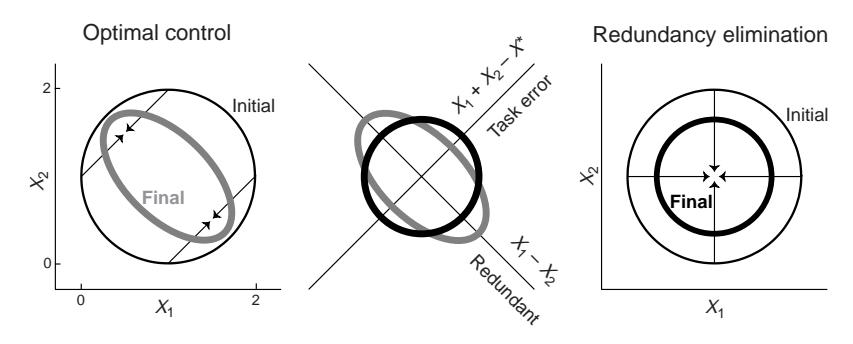
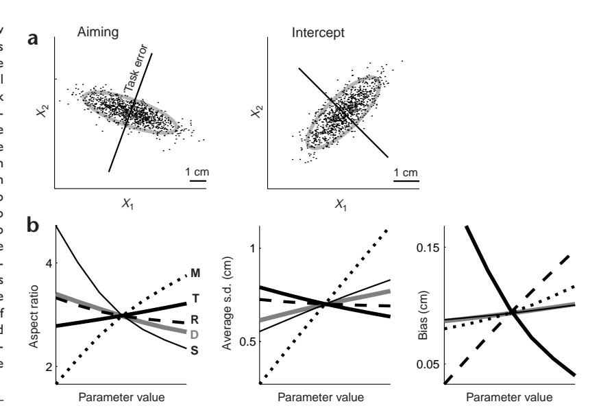
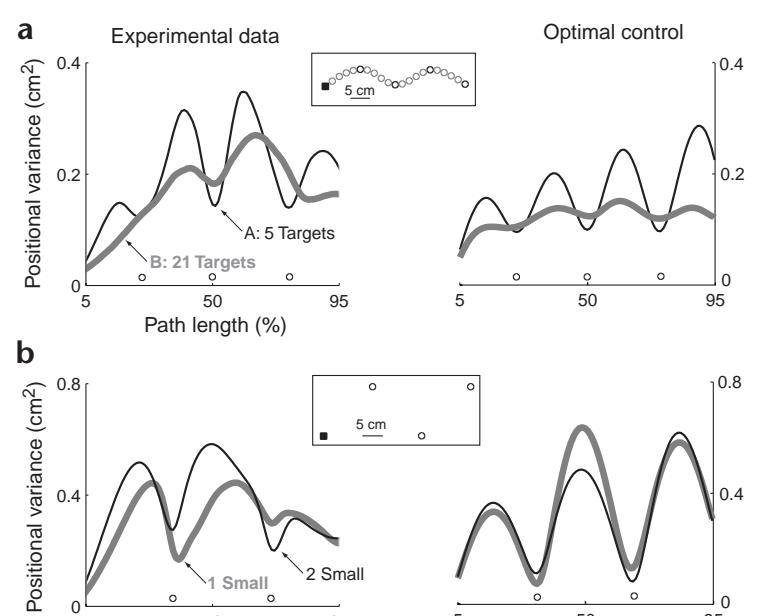
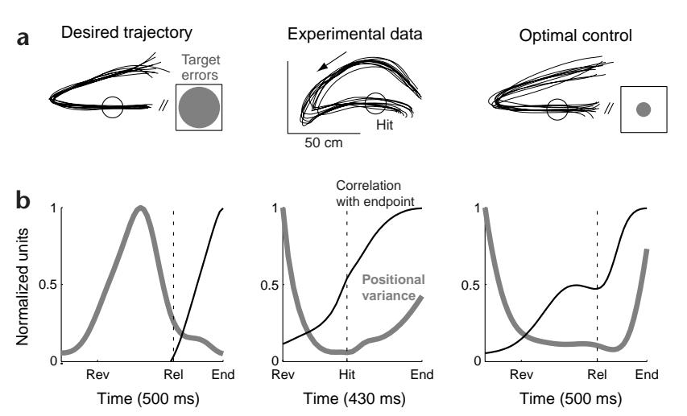
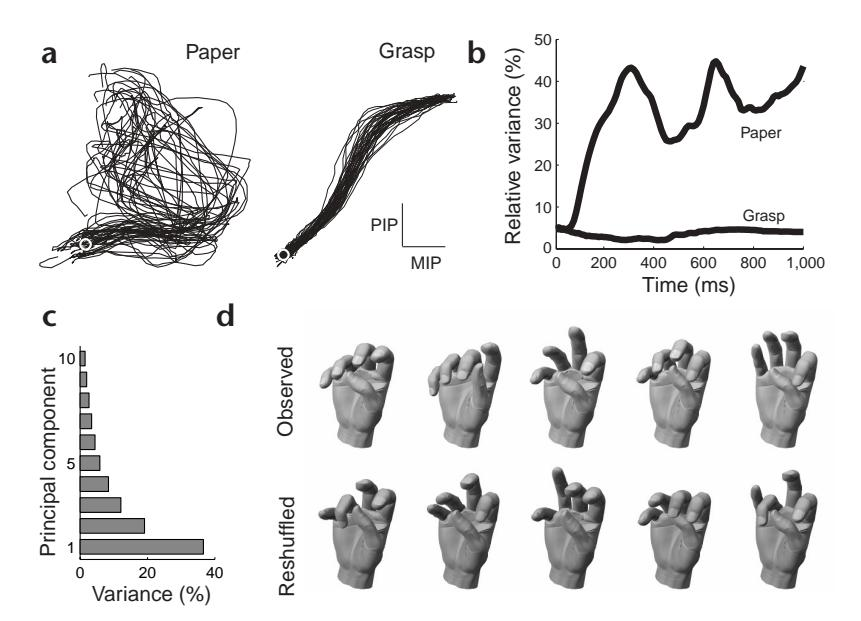
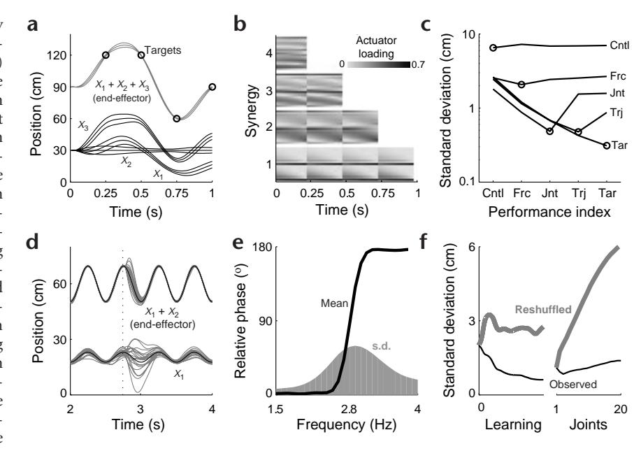

## 103 © 20

# Optimal feedback control as a theory of motor coordination

Emanuel Todorov1 and Michael I. Jordan2

Correspondence should be addressed to E.T. (todorov@cogsci.ucsd.edu)

Published online 28 October 2002; doi:10.1038/nn963

A central problem in motor control is understanding how the many biomechanical degrees of freedom are coordinated to achieve a common goal. An especially puzzling aspect of coordination is that behavioral goals are achieved reliably and repeatedly with movements rarely reproducible in their detail. Existing theoretical frameworks emphasize either goal achievement or the richness of motor variability, but fail to reconcile the two. Here we propose an alternative theory based on stochastic optimal feedback control. We show that the optimal strategy in the face of uncertainty is to allow variability in redundant (task-irrelevant) dimensions. This strategy does not enforce a desired trajectory, but uses feedback more intelligently, correcting only those deviations that interfere with task goals. From this framework, task-constrained variability, goal-directed corrections, motor synergies, controlled parameters, simplifying rules and discrete coordination modes emerge naturally. We present experimental results from a range of motor tasks to support this theory.

Humans have a complex body with more degrees of freedom than needed to perform any particular task. Such redundancy affords flexible and adaptable motor behavior, provided that all degrees of freedom can be coordinated to contribute to task performance1. Understanding coordination has remained a central problem in motor control for nearly 70 years.

Both the difficulty and the fascination of this problem lie in the apparent conflict between two fundamental properties of the motor system¹: the ability to accomplish high-level goals reliably and repeatedly, versus variability on the level of movement details. More precisely, trial-to-trial fluctuations in individual degrees of freedom are on average larger than fluctuations in task-relevant movement parameters—motor variability is constrained to a redundant subspace (or 'uncontrolled manifold'²-5) rather than being suppressed altogether. This pattern is observed in industrial activities¹, posture⁶, locomotion¹, skiing⁶, writing¹,⁶, shooting³, pointing⁴, reaching¹⁰, grasping¹¹, sit-to-stand², speech¹², bimanual tasks⁵ and multi-finger force production¹³. Furthermore, perturbations in locomotion¹, speech¹⁴, grasping¹⁵ and reaching¹⁶ are compensated in a way that maintains task performance rather than a specific stereotypical movement pattern.

This body of evidence is fundamentally incompatible1,17 with models that enforce a strict separation between trajectory planning and trajectory execution18–23. In such serial models, the planning stage resolves the redundancy inherent in the musculoskeletal system by replacing the behavioral goal (achievable via infinitely many trajectories) with a specific 'desired trajectory'. Accurate execution of the desired trajectory guarantees achievement of the goal, and can be implemented with relatively simple trajectory-tracking algorithms. Although this approach is computationally viable (and often used in engineering), the many observations of task-constrained variability and goal-directed

corrections indicate that online execution mechanisms are able to distinguish, and selectively enforce, the details that are crucial for goal achievement. This would be impossible if the behavioral goal were replaced with a specific trajectory.

Instead, these observations imply a very different control scheme, which pursues the behavioral goal more directly. Efforts to delineate such a control scheme have led to the idea of functional synergies, or high-level 'control knobs', that have invariant and predictable effects on the task-relevant movement parameters despite variability in individual degrees of freedom1,24,25. However, the computational underpinnings of this approach—how the synergies appropriate for a given task and plant can be constructed, what control scheme is capable of using them, and why the motor system should prefer such a control scheme—remain unclear. This form of hierarchical control predicts correlations among actuators and a corresponding reduction in dimensionality, in general agreement with data26,27, but the biomechanical analysis needed to relate such observations to the hypothetical functional synergies is lacking.

Here we aim to resolve the apparent conflict at the heart of the motor coordination problem and clarify the relationships among variability, task goals and synergies. We propose to do so by treating coordination within the framework of stochastic optimal feedback control28,29. Although the idea of feedback control as the basis for intelligent behavior is venerable—dating back most notably to Wiener's Cybernetics movement—and although optimal feedback controllers of various kinds have been studied in motor control17,30–34, we feel that the potential of optimal control theory as a source of general explanatory principles for motor coordination has yet to be fully realized. Moreover, the widespread use of optimization methods for open-loop trajectory planning18,20–22 creates the impression that optimal control nec-

&lt;sup>1 Department of Cognitive Science, University of California, San Diego, 9500 Gilman Dr., La Jolla, California 92093-0515, USA

&lt;sup>2 Division of Computer Science and Department of Statistics, University of California, Berkeley, 731 Soda Hall #1776, Berkeley, California 94720-1776, USA

**Fig. 1.** Redundancy exploitation. The system described in the text (with  $X^*=2$ ,  $a=\sigma=0.8$ ) was initialized 20,000 times from a circular two-dimensional Gaussian with mean (1, 1) and variance 1. The control signals given by the two control laws were applied, the system dynamics simulated, and the covariance of the final state measured. The plots show one standard deviation ellipses for the initial and final state distributions, for the optimal (left) and desired-state (right) control laws. The arrows correspond to the effects of the control signals at four different initial states (scaled by 0.9 for clarity).

essarily predicts stereotypical behavior. However, the source of this stereotypy is the assumption that trajectory planning and execution are separate—an assumption motivated by computational simplicity and not by optimality.

Our model is based on a more thorough use35 of stochastic optimal control: we avoid performance-limiting assumptions and postulate that the motor system approximates the best possible control scheme for a given task—which will generally take the form of a feedback control law. Whenever the task allows redundant solutions, movement duration exceeds the shortest sensorimotor delay, and either the initial state of the plant is uncertain or the consequences of the control signals are uncertain, optimal performance is achieved by a feedback control law that resolves redundancy moment-by-moment—using all available information to choose the best action under the circumstances. By postponing decisions regarding movement details until the last possible moment, this control law takes advantage of the opportunities for more successful task completion that are constantly created by unpredictable fluctuations away from the average trajectory. As we show here, such exploitation of redundancy not only improves performance, but also gives rise to taskconstrained variability, goal-directed corrections, motor synergies and several other phenomena related to coordination.

Our approach is related to the dynamical systems view of motor coordination36,37, in the sense that coupling the optimal feedback controller with the controlled plant produces a specific dynamical systems model in the context of any given task. Moreover, as in this view, we make no distinction between trajectory planning and execution. The main difference is that we do not infer a parsimonious control law from empirical observations; instead we predict theoretically what the (possibly complex) control law should be, by optimizing a parsimonious performance criterion. Thus, in essence, our approach combines the performance guarantees inherent in optimization models with the behavioral richness emerging from dynamical systems models.

#### Optimality principles in motor control

Many theories in the physical sciences are expressed in terms of optimality principles, which have been important in motor control theory as well. In this case, optimality yields computational-level theories (in the sense of Marr38), which try to explain why the system behaves as it does, and to specify the control laws that generate observed behavior. How these control laws are implemented in the nervous system, and how they are acquired via learning algorithms, is typically beyond the scope of such theories. Different computational theories can be obtained by varying the specification of the physical plant controlled, the performance index optimized, and the control constraints imposed. Our theory is based on the following assumptions.

The general observation that faster movements are less accurate implies that the instantaneous noise in the motor system is signal dependent, and, indeed, isometric data show that the standard deviation of muscle force grows linearly with its mean39,40. Although such multiplicative noise has been incorporated in trajectory-planning models22, it has had a longer history in feedback control models30,33,35, and we use it here as well. Unlike most models, we also incorporate the fact that the state of the plant is only observable through delayed and noisy sensors. In that case, the calculation of optimal control signals requires an internal forward model, which estimates the current state by integrating delayed noisy feedback with knowledge of plant dynamics and an efference copy of prior control signals. The idea of forward models, like optimality, has traditionally been linked to the desired trajectory hypothesis41. However, the existence of an internal state estimate in no way implies that it should be used to compute (and cancel) the difference from a desired state at each point in time.

Without psychometric methods that can independently estimate how subjects perceive 'the task', the most principled way to define the performance index is to quantify the instructions given to the subject. In the case of reaching, for example, both the stochastic optimized submovement model30 and the minimum variance model22 define performance in terms of endpoint error and explain the inverse relationship between speed and accuracy known as Fitts' law. Performance indices based on trajectory details rather than outcome alone have been proposed20,21,32,33, because certain empirical results—most notably the smoothness20,42 of arm trajectories—seemed impossible to explain with purely outcome-based indices 18,32. However, under multiplicative noise, endpoint variance is minimal when the desired trajectory is smooth22 (and executed in an open loop). Although there is no guarantee that optimal feedback control will produce similar results, this encouraging finding motivates the use of outcome-based performance indices in the tasks that we model here. We also add to the performance index an effort penalty term, increasing quadratically with the magnitude of the control signal. Theoretically, it makes sense to execute the present task as accurately as possible while avoiding excessive energy consumption—at least because such expenditures will decrease accuracy in future tasks. Empirically, people are often 'lazy', 'sloppy' or otherwise perform below their peak abilities. Such behavior can only be optimal if it saves some valuable resource that is part of the cost function. Although the exact form of that extra term is unknown, it should increase faster than linear because larger forces are generated by recruiting more rapidly fatiguing

The principal difference between optimal feedback control and optimal trajectory planning lies in the constraints on the

Fig. 2. Final state variability. (a) Dots show final states  $(X_1, X_2)$  for 1,000 simulation runs in each task (Results). The 'task error' line shows the direction in which varying the final state will affect the cost function. The thick ellipse corresponds to ± 2 standard deviations of the final state distribution. (b) We varied the following parameters linearly, one at a time: motor noise magnitude (M) from 0.1 to 0.7; sensory noise magnitude (S) from 0.1 to 0.7; sensory delay (D) from 20 ms to 80 ms; effort penalty (R) from 0.0005 to 0.004; movement time (T) from 410 ms to 590 ms. For each modified parameter set, we constructed the optimal control law (intercept task) and ran it for 5,000 trials. The plots show the bias (that is, the average distance between the two point masses at the end of the movement), the ratio of the standard deviations in the task-irrelevant versus taskrelevant directions, and the average of the two standard deviations.

control law. As mentioned earlier, the serial planning/execution model imposes the severe constraint that the control law must execute a desired trajectory, which is planned in an open loop18,20–22. Although some feedback controllers are optimized under weaker constraints imposed by intermittency30 or specific parameterizations and learning algorithms17,32, feedback controllers derived in the LQG framework31,33–35 used here are not subject to any control constraints28. Realistically, the anatomical structure, physiological fluctuations, computational mechanisms and learning algorithms available to the nervous system must impose information-processing constraints—whose precise form should eventually be studied in detail. However, it is important to start with an idealized model that avoids extra assumptions whenever possible, introducing them only when some aspect of observed behavior is suboptimal in the idealized sense. Therefore we use a nonspecific 'model' of the lumped effects of all unknown internal constraints: we adjust two scalars that determine the sensory and motor noise magnitudes until the optimal control law matches the overall variability observed in experimental data. These parameters give us little control over the structure of the variability that the model predicts.

#### RESULTS

#### The minimal intervention principle

In a wide range of tasks, variability is not eliminated, but instead is allowed to accumulate in task-irrelevant (redundant) dimensions. Our explanation of this phenomenon follows from an intuitive property of optimal feedback control that we call the 'minimal intervention' principle: deviations from the average trajectory are corrected only when they interfere with task performance. If this principle holds, and noise perturbs the system in all directions, the interplay of noise and control processes will cause larger variability in task-irrelevant directions. If certain deviations are not corrected, then certain dimensions of the control space are not being used—the phenomenon interpreted as evidence for motor synergies26,27.

Why should the minimal intervention principle hold? An optimal feedback controller has nothing to gain from correcting task-irrelevant deviations, because its only concern is task performance, and, by definition, such deviations do not interfere with performance. Moreover, generating a corrective con-

trol signal can be detrimental, because both noise and effort are control dependent and therefore could increase. Below we formalize the ideas of 'redundancy' and 'correction' and show that they are indeed related for a surprisingly general class of systems. We then apply the minimal intervention principle to specific motor tasks.

In the simplest example of these ideas, consider the following one-step control problem: given the state variables  $x_i$ , choose the control signals  $u_i$  that minimize the expected cost  $E_{\epsilon}(x_1^{final} +$  $x_2^{\text{final}} - X^*)^2 + r(u_1^2 + u_2^2)$  where the stochastic dynamics are  $x_i^{\text{final}} =$  $ax_i + u_i(1 + \sigma \varepsilon_i)$ ;  $i \in \{1,2\}$ , and  $\varepsilon_i$  are independent random variables with mean 0 and variance 1. In other words, the (redundant) task is to make the sum  $x_1 + x_2$  of the two state variables equal to the target value  $X^*$ , with minimal effort. Focusing for simplicity on unbiased control, it is easy to show that the optimal controls minimize  $(r + \sigma^2)(u_1^2 + u_2^2)$  subject to  $u_1 + u_2 =$ *–Err*, where  $Err \triangleq a(x_1 + x_2) - X^*$  is the expected task error if  $u_1$  $= u_2 = 0$ . Then the (unique) optimal feedback control law is  $u_1$  $= u_2 = -Err/2$ . This control law acts to cancel the task error Err, which depends on  $x_1 + x_2$  but not on the individual values of  $x_1$ and  $x_2$ . Therefore introducing a task-irrelevant deviation (by adding a constant to  $x_1$  and subtracting it from  $x_2$ ) does not trigger any corrective response—as the minimal intervention principle states. Applying the optimal control law to the (otherwise symmetric) stochastic system produces a variability pattern elongated in the redundant dimension (Fig. 1, left).

Now consider eliminating redundancy by specifying a single desired state. To form the best possible desired state, we use the average behavior of the optimal controller:  $x_1^{\text{final}} = x_2^{\text{final}} = X^*/2$ . The feedback control law needed to instantiate that state is  $u_i = X^*/2 - ax_i$ ;  $i \in \{1,2\}$ . This control law is suboptimal (because it differs from the optimal one), but it is interesting to analyze what makes it suboptimal. Applying it to our stochastic system yields a variability pattern that is now symmetric (Fig. 1, right). Comparing the two covariance ellipses (Fig. 1, middle) reveals that the optimal control law achieved low task error by allowing variability in the redundant dimension. That variability could be further suppressed, but only at the price of increased variability in the dimension that matters. Therefore the optimal control law takes advantage of the redundant dimension by using it as a form of 'noise buffer'.

This example illustrates two additional properties of optimal feedback control that will be discussed in more detail below. First, the optimal control signals are synergetically coupled—not because the controller is trying to 'simplify' the control problem, but because the synergy is the optimal solution to that problem. Second, the optimal control signals are smaller than the control signals needed to instantiate the best possible desired state (Fig. 1).

50 Path length (%) 95

50

95

What is redundancy, precisely? In the case of reaching, for example, all final arm configurations for which the fingertip is at the specified target are task-equivalent, that is, they form a redundant set. During the movement, however, it is not obvious what set of intermediate arm configurations should be considered task-equivalent. Therefore we propose the following more general approach. Let the scalar function  $v^*(t,\mathbf{x})$  indicate how well the task can be completed on average (in a sense to be made precise below), given that the plant is in state  $\mathbf{x}$  at time t. Then it is natural to define all states  $\mathbf{x}(t)$  with identical  $v^*(t,\mathbf{x})$  as being task-equivalent.

The function  $v^*$  is not only needed to define redundancy, but also is fundamental in stochastic optimal control theory, which we now introduce briefly to develop our ideas. Let the instantaneous cost for being in state  $\mathbf{x} \in \mathbb{R}^m$  and generating control  $\mathbf{u} \in \mathbb{R}^n$  at time t be  $q(t,\mathbf{x}) + \mathbf{u}^T R(t,\mathbf{x}) \mathbf{u} \ge 0$ , where the first term is a (very general) encoding of task error, and the second term penalizes effort. The optimal feedback control law  $\mathbf{u} = \pi^*(t,\mathbf{x})$  is the time-varying mapping from states into controls that minimizes the total expected cost. The function  $v^*(t,\mathbf{x})$ , known as the 'optimal cost-to-go,' is the cumulative expected cost if the plant is initialized in state  $\mathbf{x}$  at time t, and the optimal control law  $\pi^*$  is applied until the end of the movement. To complete the definition, let  $\bar{\mathbf{x}}(t)$  be the average trajectory, and on a given trial let the plant be in state  $\bar{\mathbf{x}} + \Delta \mathbf{x}$  at time t. The deviation  $\Delta \mathbf{x}$  is redundant if  $\Delta v^*(\Delta \mathbf{x}) = 0$ , where  $\Delta v^*(\Delta \mathbf{x}) \triangleq v^*(t, \bar{\mathbf{x}} + \Delta \mathbf{x}) - v^*(t, \bar{\mathbf{x}})$ .

Returning to the case of reaching, at the end of the movement our definition reduces to the above kinematic approach, because the instantaneous cost and the cost-to-go become identical. During the movement, however,  $v^*$  depends on dynamics as well as

Fig. 3. Trajectory variability. Within-subject positional variance (left) compared to model variance (right). Dots mark passage through the intermediate targets; the square in each inset marks the starting position. (a) In the multiple target condition A, experiment I, subjects moved through the black targets shown in the inset. In the constrained trajectory condition B, 16 more targets (gray) were added. (b) In the '1 small' condition, experiment 3, the first intermediate target was smaller; in the '2 small' condition, the second intermediate target was smaller.

kinematics: whereas all paths that lead to the target appear redundant from a kinematic point of view, completing the movement from intermediate states far from the target (such as the midpoints of curved paths) requires larger control signals—which are more costly and introduce more multiplicative noise.

Next we formalize the notion of 'correcting' a deviation  $\Delta x$  away from the average  $\bar{x}$ . It is natural to define the corrective action *corr* due to the optimal control signal  $u = \pi^*(t, \bar{x} + \Delta x)$  as the amount of state change opposite to the deviation. To separate the effects of the control signal from

those of the passive dynamics, consider the (very general) family of dynamical systems  $d\mathbf{x} = \mathbf{a}(t,\mathbf{x})dt + B(t,\mathbf{x})\mathbf{u}dt + \Sigma_{i=1}^k C_i(t,\mathbf{x})\mathbf{u}d\varepsilon_i$ , where  $\mathbf{a}(t,\mathbf{x})$  are the passive dynamics,  $B(t,\mathbf{x})$  are the control-dependent dynamics,  $C_i(t,\mathbf{x})$  are multiplicative noise magnitudes, and  $\varepsilon_i(t)$  are independent standard Brownian motion processes. For such systems, the expected instantaneous state change  $\dot{\mathbf{x}}_{\mathbf{u}}$  due to the optimal control signal is  $\dot{\mathbf{x}}_{\mathbf{u}} = B(t,\bar{\mathbf{x}} + \Delta\mathbf{x})\pi^*(t,\bar{\mathbf{x}} + \Delta\mathbf{x})$ . Now the corrective action can be defined by projecting  $-\dot{\mathbf{x}}_{\mathbf{u}}$  on  $\Delta\mathbf{x}$ :  $corr(\Delta\mathbf{x}) \triangleq (\Delta\mathbf{x}, -\dot{\mathbf{x}}_{\mathbf{u}})$ .

To complete the analysis, we need to relate  $\Delta v^*(\Delta x)$  and  $corr(\Delta x)$ , which in turn requires a relationship between  $v^*$  and  $\pi^*$ . The latter two quantities are indeed related, and  $v^*$  carries all the information needed to compute  $\pi^*$ —which is why it is so fundamental to optimal control theory. In particular,  $\pi^*(t, \mathbf{x}) = -Z(t, \mathbf{x})^{-1} B(t, \mathbf{x})^T v_x^*(t, \mathbf{x})$ , where  $Z(t, \mathbf{x}) \triangleq 2R(t, \mathbf{x}) + \sum_{i=1}^k C_i(t, \mathbf{x})^T v_{xx}^*(t, \mathbf{x}) C_i(t, \mathbf{x})$ , and  $v_{xx}^*$  are the gradient and Hessian of  $v^*$ . Expanding  $v^*$  to second order, also expanding its gradient  $v_x^*$  to first order, and approximating all other quantities as being constant in a small neighborhood of  $\bar{\mathbf{x}}$ , we obtain

$$\begin{array}{l} \Delta v^*(\Delta \mathbf{x}) \approx \left\langle \Delta \mathbf{x}, v_x^* + v_{xx}^* \Delta \mathbf{x} \right\rangle \\ corr(\Delta \mathbf{x}) \approx \left\langle \Delta \mathbf{x}, v_x^* + v_{xx}^* \Delta \mathbf{x} \right\rangle_{BZ^{-1}B^{\mathrm{T}}} \end{array}$$

where the weighted dot-product notation  $\langle a,b \rangle_{M}$  stands for  $a^{T}Mb$ .

Thus both  $corr(\Delta x)$  and  $\Delta v^*(\Delta x)$  are dot-products of the same two vectors. When  $v_x^* + v_{xx}^* \Delta x = 0$ , which can happen for infinitely many  $\Delta x$  when the Hessian  $v_{xx}^*$  is singular, the deviation  $\Delta x$  is redundant and the optimal control law takes no corrective action. Furthermore, corr and  $\Delta v^*$  are positively correlated, that is, the control law resists single-trial deviations that take the system to more costly states and magnifies deviations to less costly states.

This analysis confirms the minimal intervention principle to be a very general property of optimal feedback control, explaining why variability patterns elongated in task-irrelevant dimensions have been observed in such a wide range of experiments involving different actuators and behavioral goals.

## gdu

#### Mechanical redundancy

The exploitation of mechanical redundancy in Fig. 1 occurs under static conditions, relevant to postural tasks in which this phenomenon has indeed been observed6. Here the same effect will be illustrated in simulations of more prolonged behaviors, by repeatedly initializing a system with two mechanical degrees of freedom from the same starting state, applying the corresponding optimal control signals for 0.5 s, and analyzing the distribution of final states (Methods; Supplementary Notes online).

Task-constrained variability has been observed in pistolaiming tasks, where the final arm postures vary predominantly in the joint subspace that does not affect the intersection of the pistol axis with the target3. We reproduce this effect in a simple model of aiming (Sim 1): a two-dimensional point mass has to make a movement (about 20 cm) that ends anywhere on a specified 'line of sight'  $X_2 = X_1 \tan(-20^\circ)$ . On different trials, the optimally controlled movement ended in different locations that were clustered along the line of sight—orthogonal to the task-error dimension (Fig. 2a, Aiming). The same effect was found in a range of models involving different plant dynamics and task requirements. To illustrate this generality, we provide one more example (Sim 2): two one-dimensional point masses (positions  $X_1, X_2$ ) start moving 20 cm apart and have to end the movement at identical (but unspecified) positions  $X_1 = X_2$ . The state covariance ellipsoid is again orthogonal to the (now different) taskerror dimension (Fig. 2a, Intercept). Such an effect has been observed in two-finger11 and two-arm5 interception tasks.

We analyzed the sensitivity of the Intercept model by varying each of five parameters one at a time (Fig. 2b). Before delving into the details, note that the basic effect—the aspect ratio being greater than one—is very robust. Increasing either the motor or the sensory noise increases the overall variability (average s.d.). Increasing the motor noise also increases the aspect ratio (to be expected, given

that such noise underlies the minimal intervention principle), but increasing the sensory noise has the opposite effect. This is not surprising; in the limit of infinite sensory noise, any control law has to function in open loop, and so redundancy exploitation becomes impossible. The effects of the sensory delay and sensory noise are similar: because the forward model extrapolates delayed information to the present time, delayed sensors are roughly equivalent to instantaneous but more noisy sensors (except when large abrupt perturbations are present). The general effect of increased movement time is to improve performance: both bias and overall variability decrease, while the exploitation of redundancy increases. The effort penalty term has a somewhat counterintuitive effect: although derivation of the minimal intervention principle relies on the matrix 2R +  $\Sigma C_i^{\mathrm{T}} v_{xx}^* C_i$  being positive-definite  $(r + \sigma^2 >$ 0 in the simple example), increasing R actually decreases the exploitation of redundancy. We verified that the latter effect is not specific to the Intercept task.

#### Trajectory redundancy

Unlike the extensively studied case of mechanical redundancy, the case of end-

point trajectory redundancy has received significantly less attention. Here we investigate the exploitation of such redundancy by focusing on pairs of conditions with similar average trajectories but different task goals.

In experiment 1, we asked eight subjects to make planar arm movements through sequences of targets (Fig. 3a). In condition A, we used five widely spaced targets, whereas in condition B we included 16 additional targets chosen to fall along the average trajectory produced in condition A (Methods). The desired trajectory hypothesis predicts no difference between A and B. Our model makes a different prediction. In A, the optimal feedback controller (with target passage times that were also optimized; Sim 3) minimizes errors in passing through the targets by allowing path variability between the targets (Fig. 3a). In B, the increased number of targets suppresses trajectory redundancy, and so the predicted path variability becomes more nearly constant throughout the movement. Compared to A, the predicted variability increases at the original targets and decreases between them. The experimental results confirm these predictions. In A, the within-subject positional variance at the intermediate targets (mean  $\pm$  s.e.m,  $0.14 \pm 0.01$  cm2) was smaller (*t*-test, P < 0.01) than the variance at the midpoints between those targets (0.26  $\pm$ 0.03 cm2). In B, the variances at the same locations were no longer different (0.18  $\pm$  0.02 cm2 versus 0.18  $\pm$  0.03 cm2). Compared to A, the variance increased (P < 0.05) at the original target locations and decreased (P < 0.01) between them. The average behavior in A and B was not identical, but the differences cannot account for the observed change in variability under the desired trajectory hypothesis (Supplementary Notes). This phenomenon was confirmed by reanalyzing data from the published42 experiment 2, where subjects executed via-point and curve-tracing movements with multiple spatial configurations (Supplementary Notes).

**Fig. 4.** Hitting and throwing. (a) Examples of hand trajectories. In the experimental data, time of impact was estimated from the point of peak velocity. Note that the strategy of moving back and reversing was not built into the model—it emerged from the operation of the optimal feedback controller. (b) For each subject and trial, we analyzed the movement in a 430-ms interval around the point of peak velocity (hit), which corresponded to the forward swing of the average movement. The variance at each timepoint was the determinant of the covariance matrix of hand position (2D in the simulations and 3D in the data). Peak variance was normalized to 1. The x, y and z hand coordinates at the endpoint were correlated with x(t), y(t) and z(t) at each point in time t, and the average of the three correlation coefficients plotted. All analyses were performed within subjects (around 300 trials per subject), and the results averaged. The same analyses were repeated on the synthetic trajectories (500-ms time window).

Fig. 5. Hand manipulation. (a) MIP versus PIP joints of the index finger for a typical subject, first 500 ms. The starting posture is marked (o). (b) Relative variance. A value of 50% would indicate that the 'noise' and the average trajectory cause equal amounts of joint excursion. (c) Principal components analysis (PCA) of trial-to-trial variability. The PC magnitudes (averaged over subjects and time points) correspond to the axis lengths of the multijoint covariance ellipsoid. Ten PCs are needed to account for 95% variance. (d) Top, examples of postures observed 300 ms into the movement (after time alignment) in one subject. Bottom, examples of synthetic postures, where each joint angle is taken from a randomly chosen trial (at 300 ms, same subject).

Optimal control also predicts different variability patterns in moving through targets with identical locations but varying sizes. Passing through a smaller target requires increased accuracy, which the optimal controller (Sim 4) achieves by increasing variability elsewhere—in particular at the remaining targets (Fig. 3b). The desired trajectory hypothesis again predicts no effect. These predictions were tested in experiment 3. Each of seven subjects participated in two conditions: the first target small or the second target small. As predicted, the variability at the smaller target (0.34  $\pm$  0.02 cm2) was less (P < 0.05) than the variability at the larger one (0.42  $\pm$  0.02 cm2).

The results of these three experiments clearly demonstrate that the motor system exploits the redundancy of end-effector trajectories—variability is reduced where accuracy is most needed and is allowed to increase elsewhere. This is necessarily due to online feedback control, because, first, if these movements were executed in an open loop the variability would increase throughout the movement, and second, in related experiments35 in which vision of the hand was blocked while the targets remained visible, the overall positional variance was about two times higher.

Hitting and throwing tasks present an interesting case of trajectory redundancy because the hand trajectory after impact (release) cannot affect the outcome. We reanalyzed data from the published seperiment 4, where nine subjects hit ping-pong balls to a target. The hand movements were roughly constrained to a vertical plane—starting with a backward swing, reversing, and swinging forward to hit the horizontally flying ball (Fig. 4a).

Because impact cannot be represented with linear dynamics, we modeled a closely related throwing task in which the ball is constrained to be released in a certain region. We first built the optimal controller (Sim 5) and found its average trajectory. That trajectory was then used as the desired trajectory for an optimal trajectory-tracking controller (Sim 6). Note that the trajectory-tracking controller immediately cancels the variability in starting position, resulting in more repeatable trajectories than the optimal controller (Fig. 4a). The price for this repeatability is increased target error: the optimal controller sends the ball to the target much more accurately because it takes advantage of trajectory redundancy.

The optimal controller is not concerned with where the movement ends; thus it allows spatial variability to accumulate after release (Fig. 4b). The same phenomenon was observed in the experimental data: the variance at the end point divided by the

variance at the impact point was  $7.6\pm2.2$ , which was significantly different (P<0.05) from 1. In contrast, the trajectory-tracking controller managed to bring positional variance to almost zero at the end of the movement. Both in the experimental data and optimal control simulations, positional variance reached its peak well before the reversal point (Fig. 4b). In the trajectory tracking simulations, peak positional variance occurred much later—near the point of peak forward velocity.

Another difference between the two controllers was observed in the temporal correlations of the resulting trajectories. In trajectory tracking, the correlation between hand coordinates observed at different points in time drops quickly with the time interval, because deviations are corrected as soon as they are detected. The optimal controller on the other hand has no reason to correct deviations away from the average trajectory as long as they do not interfere with task performance (the minimal intervention principle). As a result, temporal correlations remain high over a longer period of time—similar to what was observed experimentally. In both the data and optimal control simulations (Fig. 4b), the hand coordinates at impact/release were well correlated ( $r \approx 0.5$ ) with the endpoint coordinates observed on the same trial. In contrast, the same correlation for the trajectory-tracking controller was near 0.

#### Redundancy in object manipulation

The most complex form of redundancy is found in object manipulation, where the task outcome depends on the state of the controlled object, which may in turn reflect the entire history of interactions with the hand. We investigated such a task in experiment 5, in which five subjects manipulated identical sheets of paper and turned them into paper balls. The amount of trial-to-trial variability (Fig. 5a) was larger than any previously reported. In fact, the magnitude of within-subject joint variability observed at a single point in time was comparable to the overall range of joint excursions in the course of the average trajectory (Fig. 5b). If the movements we observed followed a desired trajectory whose execution were as inaccurate as the data implies, the human hand should be completely dysfunctional. Yet all of the trials we analyzed were successful—the task of making a paper ball was always accomplished.

To test whether the variability pattern was elongated, we did principal components analysis (PCA) on all the postures measured in the same subject and the same point in time (Fig. 5c). Clearly the joint space variability is elongated in some subspace. But is that subspace redundant, and how can we even address such questions in cases where the redundant dimensions are so hard to identify quantitatively? We propose the following intuitive graphical method. Suppose that for a given subject and point in time, we generate synthetic hand postures by setting each joint angle to the corresponding angle from a randomly chosen trial. This 'bootstrapping' procedure will increase variability in the subspaces that contain belowaverage variability, and decrease variability in the subspaces that contain above-average variability. Therefore, if the synthetic postures appear to be inappropriate for the task (as in Fig. 5d), the variability of the observed postures was indeed smaller in task-relevant dimensions. Thus redundancy is being exploited in this task.

Of course hand movements are not always so variable; for example, grasping a cylinder results in much more repeatable joint trajectories (Fig. 5a and b). It is striking that two such different behavioral patterns are generated by the same joints, controlled by the same muscles, driven by largely overlapping

neuronal circuits (at least on the lower levels of the sensorimotor hierarchy) and, presumably, subject to the similar amounts of intrinsic noise. This underscores the need for unified models that naturally generate very different amounts of variability when applied to different tasks. We will show elsewhere that optimal feedback control models possess that property.

#### Emergent properties of optimal feedback control

Although our work was motivated by the variability patterns observed in redundant tasks, the optimal feedback controllers we constructed displayed a number of additional properties related to coordination. This emergent behavioral richness is shown in a telescopic 'arm' model, which has M point masses sliding up and down a vertical pole in the presence of gravity. Points 0:1, 1:2, ... M-1:M (0 being the immovable base) are connected with 'single joint' linear actuators; points 0:2, ... M-2:M are connected with 'double-joint' actuators. The lengths  $X_1, X_2, ... X_M$  of the single-joint actuators correspond to joint 'angles'. The last point mass (whose position is  $X_1 + X_2 + ... + X_M$ ) is defined to be the end-effector (Supplementary Notes).

The first task we study is that of passing through a sequence of 4 targets at specified points in time, for the system M=3 (Fig. 6a).

Fig. 6. Telescopic 'arm' model. (a) Example of a problem where the optimal controller seems to 'freeze' one degree of freedom  $(X_2)$ . The plot shows means and 95% confidence intervals for the three joint angles and the end-effector. (b) The non-zero eigenvectors of the  $L_t$  matrix at each timepoint t. The grayscale intensities corresponds to the absolute values of the 19 actuator weights in each eigenvector (normalized to unit length). (c) Variability on different levels of description and for different indices of performance: control signals (Cntl), actuator forces (Frc), joint angles (Jnt), end-effector trajectory (Trj) and end-effector positions at the specified passage times (Tar). To convert kinetic variables (forces and control signals) into centimeters, we divided each variable by its average range and multiplied by the average joint range. (d) Effects of perturbing all control signals at the time marked with the dotted line, in a sinusoidal tracking task. The perturbations had standard deviation 30 N. (e) Relative phase was computed by running the simulation for 5 s, discarding the first and last cycle, and for each local minimum of  $X_1 + X_2$  finding the nearest (in time) local minimum of  $X_1$ . This was done separately for each oscillation frequency. (f) The cost of each feedback controller for the postural task was evaluated via Monte Carlo simulation, and its parameters were optimized using the nonlinear simplex method in Matlab. Average results from five runs of the learning algorithm. The 'observed' and 'reshuffled' curves correspond to the observed end-effector variability, and the end-effector variability that would result if the single-joint fluctuations were independent. The same curves are shown as a function of the number of joints M, using the corresponding optimal controller for the four-target task.

The optimal controller (Sim 7) seems to be keeping  $X_2$  constant and only using  $X_1$  and  $X_3$  to accomplish the task. If this behavior were observed experimentally, it would likely be interpreted as evidence for a 'simplifying rule' used to solve the 'redundancy problem'. No such rule is built into the controller here—the effect emerges from symmetries in the controlled system (a similar although weaker effect is observed in  $X_2$  and  $X_4$  for M=5, but not for M=2 and M=4). More importantly,  $X_2$  is not really 'frozen.'  $X_2$  fluctuates as much as  $X_1$  and  $X_3$ , and substantially more than the end-effector (Fig. 6a). Thus all three joints are used to compensate for each other's fluctuations, but that information is lost when only the average trajectory is analyzed.

We have already seen an example of a synergy (Fig. 1), where the optimal controller couples the two control signals. To examine this effect in a more complex scenario, we constructed the optimal feedback controller for the 4 targets task in the M=10 system (Sim 7) and defined the number of synergies at each point in time as the rank of the  $L_t$  matrix (which maps the current state estimate into a control signal; Methods). This rank is equal to the dimensionality of the control subspace that the optimal controller can span for any state distribution. Although the M=10 system has 19-dimensional control space and 40-dimensional

state space, only up to 4 dimensions of the control space were used at any time (Fig. 6b). The similarity of each greyscale pattern over time indicates that each synergy (that is, eigenvector of  $L_t$ ) preserved its structure. One synergy disappeared after passing through each target, whereas the remaining synergies remained roughly unchanged. This suggests an interpretation of synergy 1 as being used to move toward the current target, synergy 2 as being used to adjust the movement for the next target, etc.

Motor coordination is sometimes attributed to the existence of a small number of 'controlled' parameters24, which are less variable than all other movement parameters. To study this effect in the M = 2 system executing the four-targets task, we specified the index of performance on five different levels of description: control signals, actuator forces, joint angles, endeffector trajectory and end-effector positions at the specified passage times. The average behavior of the controller optimal for the last index was used to define the first four indices, so that all five optimal controllers had identical average behavior. In each case, we measured variability on each of the five levels of description. On each level, variability reached its minimum (0) when the index of performance was specified on the same level (Fig. 6c). Furthermore, for the task-optimal controller (Index = Tar), the different levels formed a hierarchy, with the taskrelated parameter being the least variable, and the parameter most distant from the task goal—the control signal—being the most variable. The same type of ordering was present when the task was specified in terms of joint angles (Index = Jnt), and almost present for the end-effector trajectory specification (Index = Trj). This ordering, however, did not hold for kinetic parameters: force and control signal variability were higher than kinematic variability even when these parameters were specified by the index of performance. Thus, higher variability at the level of kinetics compared to kinematics is a property of the mechanical system being controlled, rather than the controller being used.

Responses to external perturbations are closely related to the pattern of variability, because the sensorimotor noise generating that variability is essentially a source of continuous perturbation. Because an optimal controller allows variability in task-irrelevant dimensions, it should also offer little resistance to perturbations in those dimensions. Such behavior has indeed been observed experimentally  $^{1,14-16}$ . In the M=2 system performing a sinusoidal tracking task with the end-effector (Sim 9; Fig. 6d), at the time marked with a dotted line, we added a random number to each of the three control signals. The perturbation caused large changes in the trajectory of the intermediate point, whereas the end-effector trajectory quickly returned to the specified sinusoid.

'Discrete coordination modes' also emerge from the optimal control approach (Fig. 6e). In the sinusoidal tracking task (M=2), we built the optimal controller (Sim 9) for each oscillation frequency and measured the relative phase between the oscillations of the end-effector  $(X_1+X_2)$  and the intermediate point  $(X_1)$ . We found two preferred modes—in phase and 180° out of phase, with a fairly sharp transition between them. In the transition region, the phase fluctuations increased. The same behavior was observed with additive instead of multiplicative control noise (data not shown). Although the present model is not directly applicable to the extensively studied two-finger tapping task37, the effect is qualitatively similar to the sharp transition and accompanying phase fluctuations observed there, and shows that such behavior can be obtained in the framework of optimal feedback control.

The effects of increasing mechanical complexity (varying the number of point masses M from 1 to 20) were studied in the four-targets task. The difference between the observed end-effector variability and the 'reshuffled' variability (the variability that would have been observed if the joint fluctuations were independent) is a measure of how much redundancy is being exploited. This measure increased with mechanical complexity (Fig. 6f, right). At the same time, the performance achieved by the optimal controller improved relative to the performance of a trajectory-tracking controller whose desired trajectory matched the average joint trajectory of the optimal controller. The cost ratio varied from 0.9 for M = 1 to 0.22 for M = 20 (Sim 8).

In all the examples considered thus far, we have used the optimal control law. Do we expect the system to exploit redundancy only after a prolonged learning phase in which it has found the global optimum, or can redundancy exploitation be discovered earlier in the course of learning? This questions was addressed in a postural task (M=2) requiring the end-effector to remain at a certain location (while compensating for gravity). We initialized the feedback law with the optimal open-loop controller and then applied a generic reinforcement learning algorithm (Sim 10), which gradually modified the parameters of the feedback law so as to decrease task error. The algorithm quickly discovered that redundancy is useful—long before the optimal feedback law was found (Fig. 6f, left).

#### **DISCUSSION**

We have presented a computational-level38 theory of coordination focusing on optimal task performance. Because the motor system is a product of evolution, development, learning and adaptation—all of which are in a sense optimization processes aimed at task performance—we argue that attempts to explain coordination should have similar focus. In particular, the powerful tools of stochastic optimal control theory should be used to turn specifications of task-level goals into predictions regarding movement trajectories and underlying control laws. Here we used local analysis of general nonlinear models, as well as simplified simulation models based on the LQG formalism, to gain insight into the emergent properties of optimally controlled redundant systems. We found that optimal performance is achieved by exploiting redundancy, explaining why variability constrained to a task-irrelevant subspace has been observed in such a wide range of seemingly unrelated behaviors. The emergence of goal-directed corrections, motor synergies, discrete coordination modes, simplifying rules and controlled parameters indicates that these phenomena may reflect the operation of task-optimal control laws rather than computational shortcuts built into the motor system. The experiments presented here extend previous findings, adding end-effector trajectories and object manipulation to the well-documented case of mechanical redundancy exploitation. Taken together our results demonstrate that, from the motor system's perspective, redundancy is not a 'problem'; on the contrary, it is part of the solution to the problem of performing tasks well.

While motor variability is often seen as a nuisance that a good experimental design should suppress, we see the internal sources of noise and uncertainty as creating an opportunity to perform 'system identification' by characterizing the probability distribution of motor output. Variability results provide perhaps the strongest support for the optimal feedback control framework, but there is additional evidence as well. In a detailed study of properties of reaching trajectories (E.T., Soc. Neurosci. Abstr. 31, 301.8, 2001), our preliminary results accounted for

other movement properties: (i) smoothness of most movements and higher accuracy with less smooth movements; (ii) gradual correction for target perturbations and incomplete correction for perturbations late in the movement44; (iii) reduced speed and skewed speed profiles in reaching to smaller targets; (iv) directional reaching asymmetries45, of which the motor system is aware46 but which it does not remove even after a lifelong exposure to the anisotropic inertia of the arm. Elsewhere we have explained cosine tuning as the unique muscle recruitment pattern minimizing both effort and errors caused by multiplicative motor noise40.

The linear dynamics inherent in the LQG framework can capture the anisotropic endpoint inertia of multijoint limbs, making it possible to model phenomena related to inertial anisotropy45,47. However, endpoint trajectory phenomena such as the lack of mirror symmetry in via-point tasks21 require nonlinear models. Another limitation of linear dynamics is the need to specify passage times in via-point tasks. The problem can be avoided by including a state variable that keeps track of the next target, but this makes the associated dynamics nonlinear. We intend to study optimal feedback control models for nonlinear plants. However, the theory developed here is independent of the LQG methodology we used to model specific tasks. Although many interesting effects will no doubt emerge in nonlinear models, the general analysis we presented assures us that the basic phenomena in this paper will remain qualitatively the same.

Our theory concerns skilled performance in well-practiced tasks, and does not explicitly consider the learning and adaptation that lead to such performance. Adaptation experiments are traditionally interpreted in the context of the desired trajectory hypothesis. However, observations of both overcomplete23 and undercomplete48,49 adaptation suggest that a more parsimonious account of that literature may be possible. We have presented (E.T., Soc. Neurosci. Abstr. 31, 301.8, 2001) preliminary models of force field adaptation23,49 within the optimal feedback control framework. Our previous visuomotor adaptation results48 may seem problematic for the present framework, but, with due consideration for how the nervous system interprets experimental perturbations, we believe we can account for such results (Supplementary Notes). In future work, we aim to extend and unify our preliminary models of motor adaptation, and incorporate ideas from adaptive estimation and adaptive optimal control. It will also be important to address the acquisition of new motor skills, particularly the complex changes in variability structure5 and number of utilized degrees of freedom1,50. Reinforcement learning29 techniques should provide a natural extension of the theory in that direction.

Finally, the present argument has general implications for motor psychophysics. If most motor tasks are believed to differ mainly in their desired trajectories, whereas the trajectory execution mechanisms are universal, one can hope to uncover those universal mechanisms in simple tasks such as reaching. Understanding a new task would then require little more than measuring a new average trajectory. In our view, however, such hopes are unfounded. Although the underlying optimality principle is always the same, the feedback controller that is optimal for a given task is likely to have unique properties, revealed only in the context of that task. Therefore, the mechanisms of feedback control need to be examined carefully in a much wider range of behaviors. Single-trial variability patterns and responses to unpredictable perturbations—when analyzed from the perspective of goal achievement—should provide insight into the complex sensorimotor loops underlying skilled performance.

#### **METHODS**

Numerical simulations. Although the optimal control law  $\pi^*$  is easily found given the optimal cost-to-go  $\nu^*$ ,  $\nu^*$  itself is in general very hard to compute: the Hamilton–Jacobi–Bellman equation it satisfies does not have an analytical solution, and the numerical approximation schemes guaranteed to converge to the correct answer are based on state-space discretization practical only for low-dimensional systems. Making the state observable only through delayed noisy feedback introduces substantial further complications.

Therefore, all simulation results in this paper are obtained within the extensively studied linear-quadratic-Gaussian (LQG) framework28, which has been used in motor control31,33,34. We adapted the LQG framework to discrete-time linear dynamical systems subject to multiplicative noise:  $\mathbf{x}_{t+\Delta t} = A\mathbf{x}_t + B\mathbf{u}_t + \Sigma_{i=1}^k C_i\mathbf{u}_i \mathcal{E}_{i,t}$ . The controls  $\mathbf{u}_t$ —corresponding to the neural signals driving the muscles—are low-pass filtered to generate force. The task error is quadratic:  $\mathbf{x}_t^T \mathbf{Q}_t \mathbf{x}_t$ . The state  $\mathbf{x}_t$ —which contains positions, velocities, muscle forces, and constants specifying the task—is not observable directly, but only through delayed and noisy measurements of position, velocity, and force. The optimal control law is in the form  $\mathbf{u}_t = -\mathbf{L}_t \hat{\mathbf{x}}_t$ , where  $\hat{\mathbf{x}}_t$  is an internal state estimate obtained by a forward model (a Kalman filter). We use one set of parameters for the telescopic arm model and another set for all other simulations. For details of the adapted LQG control methodology and the specific simulations, see Supplementary Notes.

Experiments 1 and 3. Subjects moved an LED pointer (tracked with an Optotrak 3020, 120 Hz) on a horizontal table through sequences of circular targets projected on the table. After the LED was positioned at the starting target, the remaining targets were displayed, and the subject was free to move when ready. After each trial, all missed targets were highlighted. If trial duration (time from leaving a 2 cm diameter start region to when hand velocity fell below 1 cm/s) was outside a specified time window, a "Speed up" or "Slow down" message appeared. Methods were similar to42. The data from all trials were analyzed. Within-subject positional variance was computed from a set of trajectories as follows. First, all trajectories from one subject and condition were resampled at 100 equally spaced points along the path. Second, the average trajectory was computed. Third, for each average point, the nearest point from each trial was found. Fourth, the sum of the x and y variances of these nearest points was averaged over subjects and expressed as a function of path length (eliminating 5% of the path at each end to avoid artifacts of realignment). In experiment 1, subjects executed 40 consecutive movements per condition, 1.2–1.5 s time window, 1 cm target diameter. The extra targets in condition B were specified using the average trajectory measured from 3 pilot subjects in condition A. In experiment 3, subjects executed 15 consecutive trials per condition, 1.2-1.4 s time window; target diameter was 1.6 cm, except for the smaller target (first or second, depending on the condition), which was 0.8 cm.

Experiment 5. Five subjects manipulated a square  $(20 \times 20 \text{ cm})$  sheet of paper to turn it into a paper ball, as quickly as possible (~1.5 s movement duration), using their dominant right hand. After 10 practice trials, 20 hand joint angles were recorded in 40 trials (Cyberglove, 100 Hz sampling). An effort was made to position the hand and the paper in the same initial configuration. To ensure that variability did not arise from the recording equipment or data analysis methods, 40 trials were recorded from one subject grasping a cylinder (3 cm diameter). Each joint angle for each subject was separately normalized, so that its variance over the entire experiment was 1. All trials were aligned on movement onset. The time axis for each trial was scaled linearly to optimize the fit to the subject-specific average trajectory. Each joint angle was linearly detrended to eliminate possible drift over trials. 'Relative variance' was defined by computing the trial-to-trial variance separately for each subject, joint angle and time point. The results were then averaged over subjects and joint angles.

Note: Supplementary information is available on the Nature Neuroscience website.

### bo

#### Acknowledgments

We thank P. Dayan, Z. Ghahramani, G. Hinton and G. Loeb for discussions and comments on the manuscript. E.T. was supported by the Howard Hughes Medical Institute, the Gatsby Charitable Foundation and the Alfred Mann Institute for Biomedical Engineering. M.I.J. was supported by ONR/MURI grant N00014-01-1-0890.

#### **Competing interests statement**

The authors declare that they have no competing financial interests.

#### RECEIVED 15 APRIL; ACCEPTED 1 OCTOBER 2002

- Bernstein, N. I. The Coordination and Regulation of Movements (Pergamon, Oxford, 1967).
- Scholz, J. P. & Schoner, G. The uncontrolled manifold concept: identifying control variables for a functional task. Exp. Brain Res. 126, 289–306 (1999).
  Scholz, J. P. Schoner, C. & Latech, M. L. Hartifeing the variable structure of the property of the property of the property of the property of the property of the property of the property of the property of the property of the property of the property of the property of the property of the property of the property of the property of the property of the property of the property of the property of the property of the property of the property of the property of the property of the property of the property of the property of the property of the property of the property of the property of the property of the property of the property of the property of the property of the property of the property of the property of the property of the property of the property of the property of the property of the property of the property of the property of the property of the property of the property of the property of the property of the property of the property of the property of the property of the property of the property of the property of the property of the property of the property of the property of the property of the property of the property of the property of the property of the property of the property of the property of the property of the property of the property of the property of the property of the property of the property of the property of the property of the property of the property of the property of the property of the property of the property of the property of the property of the property of the property of the property of the property of the property of the property of the property of the property of the property of the property of the property of the property of the property of the property of the property of the property of the property of the property of the property of the property of the property of the property of the property
- Scholz, J. P., Schoner, G. & Latash, M. L. Identifying the control structure of multijoint coordination during pistol shooting. *Exp. Brain Res.* 135, 382–404 (2000).
- Tseng, Y. W., Scholz, J. P. & Schoner, G. Goal-equivalent joint coordination in pointing: affect of vision and arm dominance. *Motor Control* 6, 183–207 (2002).
- Domkin, D., Laczko, J., Jaric, S., Johansson, H. & Latash, M. L. Structure of joint variability in bimanual pointing tasks. Exp. Brain Res. 143, 11–23 (2002).
- Balasubramaniam, R., Riley, M. A. & Turvey, M. T. Specificity of postural sway to the demands of a precision task. *Gait Posture* 11, 12–24 (2000).
- Winter, D. A. in *Perspectives on the Coordination of Movement* (ed. Wallace, S. A.) 329–363 (Elsevier, Amsterdam, 1989).
- Vereijken, B., van Emmerik, R. E. A., Whiting, H. & Newel, K. M. Free(z)ing degrees of freedom in skill acquisition. J. Motor Behav. 24, 133–142 (1992).
- Wright, C. E. in Attention and Performance XIII: Motor Representation and Control (ed. Jeannerod, M.) 294–320 (Lawrence Erlbaum, Hillsdale, New Jersey, 1990).
- Haggard, P., Hutchinson, K. & Stein, J. Patterns of coordinated multi-joint movement. Exp. Brain Res. 107, 254–266 (1995).
- Cole, K. J. & Abbs, J. H. Coordination of three-joint digit movements for rapid finger-thumb grasp. J. Neurophysiol. 55, 1407–1423 (1986).
- Gracco, V. L. & Abbs, J. H. Variant and invariant characteristics of speech movements. Exp. Brain Res. 65, 156–166 (1986).
- 13. Li, Z. M., Latash, M. L. & Zatsiorsky, V. M. Force sharing among fingers as a model of the redundancy problem. *Exp. Brain Res.* 119, 276–286 (1998).
- Gracco, V. L. & Abbs, J. H. Dynamic control of the perioral system during speech: kinematic analyses of autogenic and nonautogenic sensorimotor processes. J. Neurophysiol. 54, 418–432 (1985).
- Cole, K. J. & Abbs, J. H. Kinematic and electromyographic responses to perturbation of a rapid grasp. J. Neurophysiol. 57, 1498–1510 (1987).
- Robertson, E. M. & Miall, R. C. Multi-joint limbs permit a flexible response to unpredictable events. Exp. Brain Res. 117, 148–152 (1997).
- Sporns, O. & Edelman, G. M. Solving Bernstein's problem: a proposal for the development of coordinated movement by selection. *Child Dev.* 64, 960–981 (1993)
- Nelson, W. L. Physical principles for economies of skilled movements. *Biol. Cybern.* 46, 135–147 (1983).
- Bizzi, E., Accornero, N., Chapple, W. & Hogan, N. Posture control and trajectory formation during arm movement. J. Neurosci. 4, 2738–2744 (1984).
- Flash, T. & Hogan, N. The coordination of arm movements: an experimentally confirmed mathematical model. *J. Neurosci.* 5, 1688–1703 (1985).
- Uno, Y., Kawato, M. & Suzuki, R. Formation and control of optimal trajectory in human multijoint arm movement: minimum torque-change model. *Biol. Cybern.* 61, 89–101 (1989).

- Harris, C. M. & Wolpert, D. M. Signal-dependent noise determines motor planning. Nature 394, 780–784 (1998).
- Thoroughman, K. A. & Shadmehr, R. Learning of action through adaptive combination of motor primitives. *Nature* 407, 742–747 (2000).
- Gelfand, I., Gurfinkel, V., Tsetlin, M. & Shik, M. in Models of the Structural-Functional Organization of Certain Biological Systems (eds. Gelfand, I., Gurfinkel, V., Fomin, S. & Tsetlin, M.) 329–345 (MIT Press, Cambridge, Massachusetts, 1971).
- Hinton, G. E. Parallel computations for controlling an arm. J. Motor Behav. 16, 171–194 (1984).
- D'Avella, A. & Bizzi, E. Low dimensionality of supraspinally induced force fields. Proc. Natl. Acad. Sci. USA 95, 7711–7714 (1998).
- Santello, M. & Soechting, J. F. Force synergies for multifingered grasping. Exp. Brain Res. 133, 457–467 (2000).
- Davis, M. H. A. & Vinter, R. B. Stochastic Modelling and Control (Chapman and Hall, London, 1985).
- Sutton, R. S. & Barto, A. G. Reinforcement Learning: An Introduction (MIT Press, Cambridge, Massachusetts, 1998).
- Meyer, D. E., Abrams, R. A., Kornblum, S., Wright, C. E. & Smith, J. E. K. Optimality in human motor performance: ideal control of rapid aimed movements. *Psychol. Rev.* 95, 340–370 (1988).
- Loeb, G. E., Levine, W. S. & He, J. Understanding sensorimotor feedback through optimal control. *Cold Spring Harbor Symp. Quant. Biol.* 55, 791–803 (1990).
- Jordan, M. I. in Attention and Performance XIII: Motor Representation and Control (ed. Jeannerod, M.) 796–836 (Lawrence Erlbaum, Hillsdale, New Jersey, 1990).
- 33. Hoff, B. A Computational Description of the Organization of Human Reaching and Prehension. Ph.D. Thesis, University of Southern California (1992)
- Kuo, A. D. An optimal control model for analyzing human postural balance. IEEE Trans. Biomed. Eng. 42, 87–101 (1995).
- Todorov, E. Studies of goal-directed movements. Ph.D. Thesis, Massachusetts Institute of Technology (1998).
- 36. Turvey, M. T. Coordination. Am. Psychol. 45, 938-953 (1990).
- Kelso, J. A. S. Dynamic Patterns: The Self-Organization of Brain and Behavior (MIT Press, Cambridge, Massachusetts, 1995).
- 38. Marr, D. Vision (Freeman, San Francisco, 1982).
- Schmidt, R. A., Zelaznik, H., Hawkins, B., Frank, J. S. & Quinn, J. T. Jr. Motor-output variability: a theory for the accuracy of rapid notor acts. *Psychol. Rev.* 86, 415–451 (1979).
- Todorov, E. Cosine tuning minimizes motor errors. Neural Comput. 14, 1233–1260 (2002).
- Kawato, M. Internal models for motor control and trajectory planning. Curr. Opin. Neurobiol. 9, 718–727 (1999).
- 42. Todorov, E. & Jordan, M. I. Smoothness maximization along a predefined path accurately predicts the speed profiles of complex arm movements. *J. Neurophysiol.* **80**, 696–714 (1998).
- Todorov, E., Shadmehr, R. & Bizzi, E. Augmented feedback presented in a virtual environment accelerates learning of a difficult motor task. J. Motor Behav. 29, 147–158 (1997).
- Komilis, E., Pelisson, D. & Prablanc, C. Error processing in pointing at randmoly feedback-induced double-step stimuli. J. Motor Behav. 25, 299–308 (1993).
- Gordon, J., Ghilardi, M. F., Cooper, S. & Ghez, C. Accuracy of planar reaching movements. II. Systematic extent errors resulting from inertial anisotropy. Exp. Brain Res. 99, 112–130 (1994).
- Flanagan, J. R. & Lolley, S. The inertial anisotropy of the arm is accurately predicted during movement planning. J. Neurosci. 21, 1361–1369 (2001).
- Sabes, P. N., Jordan, M. I. & Wolpert, D. M. The role of inertial sensitivity in motor planning. J. Neurosci. 18, 5948–5957 (1998).
- Wolpert, D. M., Ghahramani, Z. & Jordan, M. I. Are arm trajectories planned in kinematic or dynamic coordinates—an adaptation study. *Exp. Brain Res.* 103, 460–470 (1995).
- Gottlieb, G. L. On the voluntary movement of compliant (inertialviscoelastic) loads by parcellated control mechanisms. *J. Neurophysiol.* 76, 3207–3228 (1996).
- Newell, K. M. & Vaillancourt, D. E. Dimensional change in motor learning. Hum. Mov. Sci. 20, 695–715 (2001).