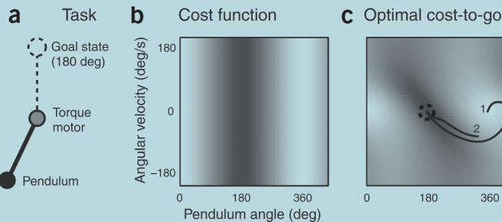
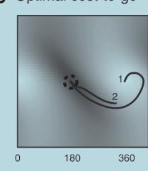
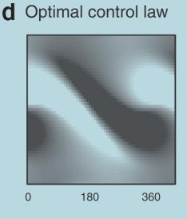
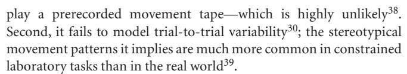
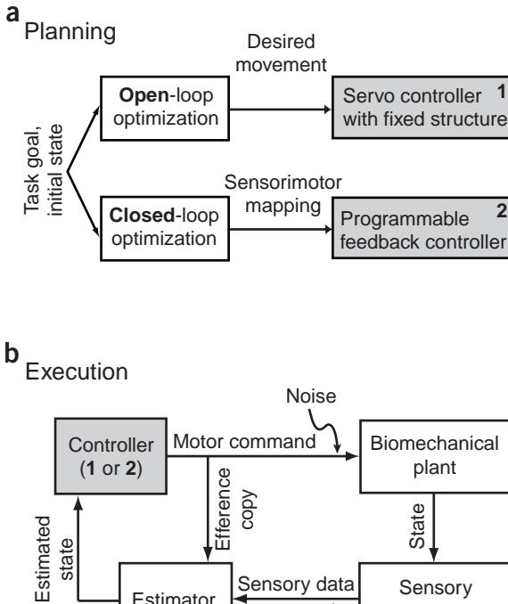
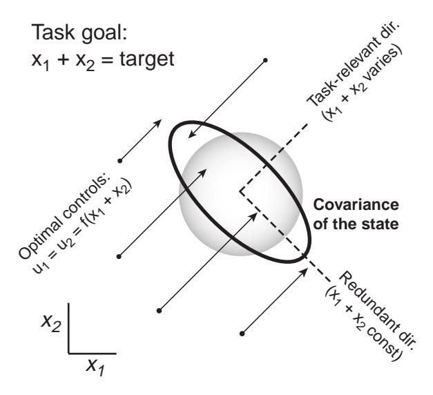
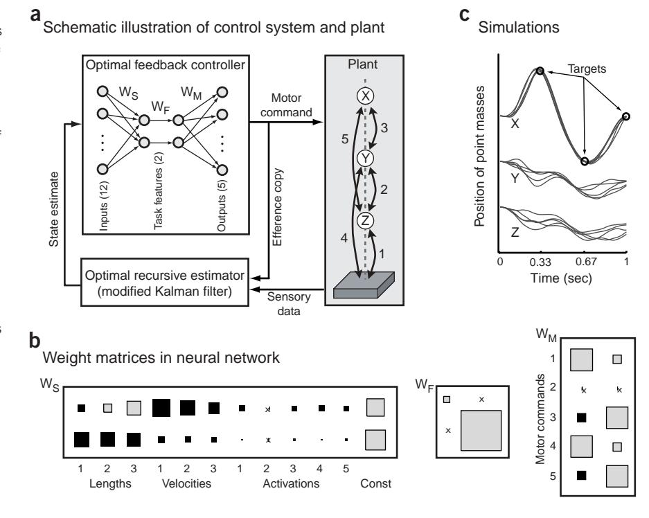

# Optimality principles in sensorimotor control

Emanuel Todorov

The sensorimotor system is a product of evolution, development, learning and adaptation—which work on different time scales to improve behavioral performance. Consequently, many theories of motor function are based on 'optimal performance': they quantify task goals as cost functions, and apply the sophisticated tools of optimal control theory to obtain detailed behavioral predictions. The resulting models, although not without limitations, have explained more empirical phenomena than any other class. Traditional emphasis has been on optimizing desired movement trajectories while ignoring sensory feedback. Recent work has redefined optimality in terms of feedback control laws, and focused on the mechanisms that generate behavior online. This approach has allowed researchers to fit previously unrelated concepts and observations into what may become a unified theoretical framework for interpreting motor function. At the heart of the framework is the relationship between high-level goals, and the real-time sensorimotor control strategies most suitable for accomplishing those goals.

The appeal of optimality principles lies in their ability to transform a parsimonious performance criterion into elaborate predictions regarding the behavior of a given system. Optimal control models of biological movement 1-32 explain behavioral observations on multiple levels of analysis (limb trajectories, joint torques, interaction forces, muscle activations) and have arguably been more successful than any other class of models. Their advantages are both theoretical and practical. Theoretically, they are well justified a priori. This is because the sensorimotor system is the product of processes that continuously act to improve behavioral performance. Even if skilled performance on a certain task is not exactly optimal, but is just 'good enough', it has been made good enough by processes whose limit is optimality. Thus optimality provides a natural starting point for computational investigations33 of sensorimotor function.

In practice, optimal control modeling affords unsurpassed autonomy and generality. Most alternative methods in engineering control, as well as alternative models of the neural control of movement, require as their input a detailed description of how the desired goal should be accomplished. For example, the equilibrium point hypothesis34,35 explains how a reference trajectory (presumably specified by the CNS) can be used to guide limb movement, but does not tell us how such a trajectory might be computed in tasks more complex than pointing. Similarly, the dynamical systems view36 emphasizes that the composite neuro-musculo-skeletal system is a nonlinear dynamical system that can show interesting phenomena such as bifurcations, but does not predict what nonlinear dynamics we should observe in a new task. In contrast, optimal con-

Department of Cognitive Science, University of California San Diego, La Jolla, California 92093-0515, USA. Correspondence should be addressed to E.T. (todorov@cogsci.ucsd.edu).

Published online 26 August 2004; doi:10.1038/nn1309

trol methods only require a performance criterion that describes what the goal is and then fill in all movement details automatically by searching for the control strategy (or control law) that achieves the best possible performance. Although the search process itself is sometimes cast as a model of behavioral change22,23,31,37, most existing models focus on the outcome of that search—which corresponds to skilled performance.

Before the powerful machinery of optimal control can be applied, the modeler has to specify (i) a family of admissible control laws, (ii) a compatible musculo-skeletal model, and (iii) a quantitative definition of task performance. The performance of a control law—which is the quantity to be minimized—is measured as the time-integral of some 'cost function.' The cost is an instantaneously defined scalar function that depends on the current set of control signals (such as muscle activations) as well as the set of variables describing the current state of the musculo-skeletal system and environment (such as joint angles and velocities, positions of relevant objects). The choice of cost has attracted a lot of attention in the literature, and optimality models are often named 'minimum X', where X can be jerk, torque change, energy, time, variance, etc.. This choice is important, and not always transparent (see below). However, the more fundamental distinction used here to categorize existing models—which leads to different views of sensorimotor processing—concerns the type of control law.

The first category of models reviewed below focus on open-loop control: they plan the best sequence of muscle activations (or joint torques, or limb postures), ignore the role of online sensory feedback, and usually assume deterministic dynamics. Such models differ mainly in the cost function they optimize, and often yield detailed and accurate predictions of behavior averaged over multiple repetitions of a task. But open-loop optimization has two serious limitations. First, it implies that the neural processing in the mosaic of brain areas involved in online sensorimotor control does little more than

# **BOX 1 PROPERTIES OF THE OPTIMAL COST-TO-GO FUNCTION.**

Consider the task (a) of making a pendulum swing up as quickly as possible. The pendulum is driven by a torque motor with limited output, and has to overcome gravity. Because this is a second-order system, the state vector includes the pendulum angle and angular velocity. The cost function penalizes the vertical distance away from the upright position (b) as well as the squared torque output. If we attempt to minimize this cost greedily,

by always pushing up, the pendulum will never rise above some intermediate position where gravity balances the maximal torque the motor can generate. The only way to overcome gravity is to swing in one direction, and then accelerate in the opposite direction. This is similar to hitting and throwing tasks, where we have to move our arm back before accelerating it forward. The important point here is that the cost function itself does not directly suggest such a strategy. Indeed, the relationship between costs and optimal controls is rather subtle, and is mediated by another function: the 'optimal cost-to-go'. For each state, this function tells us how much cost we will accumulate from now until the end of the movement, assuming we choose controls optimally. The optimal cost-to-go obeys a self-consistency condition known as Bellman's optimality principle: the optimal cost-to-go at each state (c) is found by considering every possible control at that state, adding the control cost to the optimal cost-to-go for the resulting next state, and taking the minimum of these sums. The latter minimization also yields the optimal control law; in (d) the color corresponds to the optimal torque as a function of the pendulum state (black, maximum negative; white, maximum positive). Plot (c) shows two optimal trajectories starting at different states. One uses the strategy of swinging back and then forward; the other goes straight to the goal because the initial velocity is sufficient to overcome gravity.

Note that both trajectories in (c) are moving roughly downhill along the optimal cost-to-go surface (from light to dark). This is because, for a large class of problems, the vector of optimal control signals can be computed by taking the negative gradient of the optimal cost-to-go function, and multiplying it by a matrix that reflects plant dynamics and energy costs30,91. This gradient, known in control theory as the 'costate vector', is a vector with the same dimensionality as the state; it tells us how to change the state so as to increase the cost-to-go most rapidly. Now imagine that the costate vector is encoded by some population of neurons—which would not be surprising given its fundamental role in the computation of optimal controls. Because optimal controls are obtained from the costate via matrix multiplication, the activities of these neurons can directly drive muscle activation. This is reminiscent of a model 119 of direct cortical control of muscle activation, and suggests that the costate vector is something that might be encoded in the output of primary motor cortex. What does the costate look like? As explained above, it is related to how the state varies under the action of the optimal controller; if the state includes position and velocity, the costate might resemble a mix of velocity and acceleration. But this relationship is loose; the only general way to find the true costate is to solve the optimal control problem.

The second category of models focus on closed-loop control: they construct the sensorimotor transformation (or feedback control law) that yields the best possible performance when motor noise as well as sensory uncertainty and delays are taken into account. These models predict not only average behavior, but also the task-specific sensorimotor contingencies that the CNS uses to make intelligent adjustments online. Such adjustments enable biological systems to "solve a control problem repeatedly rather than repeat its solution"39, and thus afford remarkable levels of performance in the presence of noise, delays, internal fluctuations and unpredictable changes in the environment. Optimal feedback control has recently made it possible to unify a wide range of concepts and observations (kinematic regularities, motor synergies and controlled parameters, end-effector control, motor redundancy and structured variability, impedance control, speed-accuracy tradeoffs) into a cohesive theoretical framework. It may further allow several important extensions: principles for hierarchical sensorimotor control32,40,41, automated inference of task goals given movement data42-44, and neuronal models of spinal24,28,29 as well as motor cortical function45 (Box 1).

# Open-loop optimization: models of average behavior

Most existing optimal control models1–23 predict average movement trajectories or muscle activity, by optimizing a variety of cost functions. Ideally, the cost assumed in an optimal control model should correspond to what the sensorimotor system is trying to achieve. But how can this be quantified? A rare case where the choice of cost is transparent are behaviors that require maximal effort—for example, jumping as high as possible19, or producing maximal isometric fingertip force20. Here one simply optimizes whatever subjects were asked to optimize, under the constraint that each muscle can produce limited force. The model predictions agree with data19,20, especially in well-controlled fingertip force experiments where fine-wire EMGs from all participating muscles have been obtained20.

In many cases, however, the cost that is relevant to the sensorimotor system may not directly correspond to our intuitive understanding of 'the task', and so its detailed form should be considered a (relatively) free parameter. A recent attempt to measure that parameter, in a virtual aiming task46, suggests a cost for final position error that is quadratic when the error is small but saturates for larger error. It would be very useful to have a general data analysis procedure that infers the cost function given experimental data and a biomechanical model. Some results along these lines have been obtained in the computational literature42–44, but a method applicable to motor control is not yet available. Lacking empirically derived costs, researchers

have experimented with a variety of definitions, and found that motor behavior is near-optimal with respect to costs that vary with the task. Below, open-loop models are subdivided according to the cost they optimize.

Detailed optimal control modeling has its longest history in biomechanics, and locomotion in particular, where most models minimize energy used by the muscles1–7. Although precise models of metabolic energy consumption that reflect the details of muscle physiology are rare, a number of cost functions that increase supra-linearly with muscle activation yield realistic and generally similar predictions4. Some models use optimization in a limited sense: they start with the experimentally measured kinematics of the gait cycle, and compute the most efficient muscle activations or joint torques that could cause the observed kinematics3,5. Avoiding this limitation leads to more challenging dynamic optimization problems1,6. In a recent model6 incorporating 23 mechanical degrees of freedom and 54 muscle-tendon actuators, only the initial and final posture of the gait cycle were specified empirically. The optimal sequences of muscle activations, joint torques and body postures were then obtained by minimizing total energy. Considering how many details were predicted simultaneously (after 10,000 hours of CPU time!), the agreement with kinematic, kinetic and EMG measurements is striking6.

Energy minimization alone fails to account for average behavior in arm movements8, eye movements17 and some full-body movements, such as standing from a chair11. The usual remedy in such cases is a smoothness cost, which penalizes the time-derivative of hand acceleration9,10,12,13 (termed 'jerk'), joint torque14,15 or muscle force11. These models are less 'ecological': whereas the nervous system has obvious reasons to care about energetic efficiency or accuracy, it is much less clear a priori why smoothness might be important. Nevertheless, smoothness optimization has been successful in predicting average trajectories—particularly in arm movement tasks. The idea was first introduced in the minimum-jerk model  $^{9,10}$ , where it accounts for the straight paths and bell-shaped speed profiles of reaching movements, as well as a number of trajectory features in 'via-point' tasks (where the hand is required to pass through a sequence of locations). A more accurate but also more phenomenological model fits the speed profiles of arbitrary arm trajectories, by computing the minimum-jerk speed profile along the empirical movement path12. It also captures the inverse relationship between speed and curvature, better than the 2/3 power law47 previously used to quantify that phenomenon. The minimum-jerk model has been extended to the task of grasping, by using a cost that includes the smoothness of each fingertip trajectory plus a term that encourages perpendicular approach of the fingertips to the object surface13. This model of independent fingertip control explains many observations from grasping experiments (in particular the effects of object size on hand opening and timing), without having to invoke the previously proposed separation between hand transport and hand shaping. Smoothness optimization has also been formulated on the level of dynamics—by minimizing the time-derivative of joint torque14,15. Interestingly, despite the nonlinear dynamics of the arm, the hand-reaching trajectories predicted by this model are roughly straight in Cartesian space; in fact, their mild curvature agrees with experimental data. The minimum torque-change model also accounts for the lack of mirror symmetry observed in some viapoint tasks14,15—a phenomenon inconsistent with kinematic models that ignore the nonlinear arm dynamics.

The above models yield average behavior that achieves the task goals accurately. But one can be perfectly accurate on average and yet make substantial variable errors on individual trials. Within the limits of open-loop optimization, this issue was addressed by the minimum variance model16, in which the sequence of muscle activations is planned so as to minimize the resulting variance of final hand positions (the 'endpoint variance'). Note that motor noise is known to be control-dependent—its magnitude is proportional to muscle activation21,48,49—and so the choice of control signals affects movement variability. This form of optimization is loosely related to smoothness: nonsmooth movements require abrupt changes of muscle force, which require large EMG signals (to overcome the low-pass filtering properties of muscles), which lead to increased controldependent noise. Indeed, this model predicts reaching trajectories very similar to the (successful) predictions of the minimum torquechange model, and also accounts for the inverse speed-curvature relationship found in elliptic movements47. It will be interesting to see if the more general relationship between path and speed that is captured by the path-constrained minimum-jerk model12 can also be explained. The minimum variance model predicts, in impressive detail, the magnitude-dependent speed profiles of saccadic eye movements16,17. For eye movements, the predictions are also accurate on the level of muscle activations, but it is not yet clear if the same holds for arm movements. An extension to obstacle-avoidance tasks18 accounts for the empirical relationship between the direction-dependent arm inertia and the margin by which the hand clears the obstacle50; this is another phenomenon inconsistent with kinematic models. In addition to average trajectories, the minimumvariance model also predicts the pattern of variability. However, because it ignores feedback, and variability is significantly affected by feedback (especially in movements of longer duration), the latter prediction is less reliable.

Exploration of simple costs has illuminated the performance criteria relevant to different tasks. However, the true performance criterion in most cases is likely to involve a mix of cost terms51. Even if accuracy in the minimum-variance sense16 can completely subsume smoothness optimization, it is clear that energetics also factor into many tasks-including arm movements (ref. 52 and E.T., Neural Control Mov., 2001). A cost function combining accuracy (under controldependent noise) and energy was used to predict muscle directional tuning, that is, how the activation of individual muscles varies with the direction of desired net muscle force21. Under very general assumptions, the optimal tuning curve was found to be either a full cosine or a truncated cosine—as has been observed empirically53. Cosine tuning curves (for wrist muscles) were also predicted by a recent model that only minimizes energy22.

Whereas open-loop models tend to optimize simple costs subject to boundary constraints (such as hand position, velocity and acceleration specified at the beginning and end of the movement10), such constraints are inapplicable to stochastic problems in which the final state is affected by noise. Instead, stochastic models have to use final accuracy costs in addition to whatever costs are defined during the movement30. The modeler then has the non-trivial task of assigning relative weights to quantities that have different units (for instance, metabolic energy and endpoint error). It may be possible to automate this, using an algorithm54 that converts probabilistic constraints (such as a threshold on endpoint variance) into multi-attribute costs. Note that such costs can significantly enrich optimality models: different weight settings yield different predictions, which can be tested experimentally by varying the relative importance of different aspects of task performance. The speed–accuracy trade-offs discussed below are an example of this approach. Also, the weights that define a multiattribute cost could be used as command signals by higher-level control centers; this may be important in future optimality models that have hierarchical structure (see below).

Estimator

Sensory data

Noise

plant

Sensory

apparatus

State

Instead of focusing on average behavior, which reflects neural information processing somewhat indirectly, sensorimotor integration can be modeled much more directly via closed-loop optimization24–32. Here both sensory and motor noise are incorporated in the biomechanical model, and performance is optimized over the family of all possible feedback control laws. As explained next, this class of models can address all phenomena that open-loop models address, and many more.

What is optimal feedback control, and how is it related to optimal open-loop control? Both optimization procedures start with a cost defining the task goals, as well as an initial state (Fig. 1). Open-loop optimization then yields a 'desired' movement. Because open-loop control makes little sense in the presence of noise, the movement plan is usually thought to be executed by a feedback controller-which uses some servo mechanism to cancel the instantaneous deviations between the desired and actual state of the body. That mechanism, however, is predefined, and is not taken into consideration in the optimization phase. In contrast, closed-loop optimization treats the feedback mechanism as being fully programmable, that is, it constructs the best possible transformation from states of the body and environment into control signals. The resulting controller does whatever is needed to accomplish the task: instead of relying on preconceived notions of what control schemes the sensorimotor system might use, optimal feedback control lets the task and biomechanical model dictate the control scheme that best suits them. This may yield a force-control scheme in an isometric task where a target force level is specified, or a position-control scheme in a postural task where a target limb position is specified. In less trivial tasks, however, the optimal control scheme will generally be one that we do not yet have a name for. Such flexibility, however hard to grasp, matches the flexibility and resourcefulness apparent in motor behavior39.

The numerical methods used to approximate optimal feedback controllers are complex55-61, and computationally expensive. One

**Figure 1** Schematic illustration of open- and closed-loop optimization. (a) The optimization phase, which corresponds to planning or learning, starts with a specification of the task goal and the initial state. Both approaches yield a feedback control law, but in the case of open-loop optimization, the feedback portion of the control law is predefined and not adapted to the task. (b) Either feedback controller can be used online to execute movements, although controller 2 will generally yield better performance. The estimator needs an efference copy of recent motor commands in order to compensate for sensory delays. Note that the estimator and controller are in a loop; thus they can continue to generate time-varying commands even if sensory feedback becomes unavailable. Noise is typically modeled as a property of the sensorimotor periphery, although a significant portion of it may originate in the nervous system.

class of such methods-temporal difference reinforcement learning59—have been used with remarkable success to model many aspects of reward-related neural activity62–65. Almost all available methods are based on the fundamental concept of long-term performance, quantified by an optimal cost-to-go (or value) function. For every state and point in time, this function tells us how much cost (or reward) is expected to accumulate from now until the end of the movement, assuming we behave optimally. Box 1 clarifies the optimal cost-to-go function, its importance in the computation of optimal controls, and its potential role in future analyses and models of motor cortical activity.

The above discussion implied that feedback controllers map actual body states into control signals. But when the state of a stochastic plant is observable only through delayed and noisy sensors, the controller has to rely on an internal estimate of the state (Fig. 1b). The resulting controls are optimal only when the state estimator is also optimal that is, Bayesian. Such an estimator takes into account sensory data, recent control signals, knowledge of body dynamics, as well as its earlier output, and weights all these sources of information regarding the current state in proportion to their reliability. In modeling practice one typically uses a Kalman filter—which is the optimal estimator when the dynamics and sensory measurements are linear and the noise is Gaussian, and provides a good approximation in other cases57. A number of studies suggest that perception in general66, and online state estimation in particular67–69, are based on the principles of Bayesian inference. A key feature of optimal estimators is their ability to anticipate state changes before the corresponding sensory data have arrived. This requires either explicit or implicit knowledge of body dynamics, that is, an 'internal model'. There is a growing body of psychophysical70–73 and neurophysiological74,75 evidence in support of this idea, although critics point out that some of it is indirect76. The formation of internal models through adaptation was initially interpreted in the context of movement planning  $\overline{^{70}}$ ; recent results  $\overline{^{53,77-80}}$  however paint a much more complex picture, and suggest the kind of flexibility that optimal feedback control affords (E.T., Adv. Comput. Motor Control, 2002, http://www.acmc-conference.org). Here I am only referring to what are usually called internal forward models—as distinguished from internal inverse models. The latter are thought to transform task goals into motor commands, but because this is the job of a controller, I believe the 'inverse model' terminology should be avoided.

Although the distinction between open- and closed-loop control was traditionally seen as a dichotomy worth debating, researchers have increasingly realized that one is simply a special case of the other81. Because the optimal feedback controller is driven by an optimal state estimate rather than raw sensory input, it responds appropriately to any information supplied by the estimator—regardless of whether that information reflects immediate sensory data, or past

Figure 2 Minimal intervention principle. Illustration of the simplest redundant task, adapted from ref. 30.  $x_1$ ,  $x_2$  are two uncoupled state variables, each driven by a corresponding control signal  $u_1$ ,  $u_2$  in the presence of controldependent noise. The task is to maintain  $x_1 + x_2 = target$  and use small controls. The optimal  $u_1$  and  $u_2$  are equal—to a function that depends on the task-relevant feature  $x_1 + x_2$  but not on the individual values of  $x_1$  and  $x_2$ . Thus  $u_1$  and  $u_2$  form a motor synergy. Arrows show that the optimal controls push the state vector orthogonally to the redundant direction (along which  $x_1 + x_2$  is constant). This direction is then an uncontrolled manifold. The black ellipse is the distribution of final states, obtained by sampling the initial state from a circular Gaussian, and applying the optimal control law for one step. The gray circle is the distribution under a different control law, that tries to maintain  $x_1 = x_2 = target/2$  by pushing the state toward the center of the plot. Such a control law can reduce variance in the redundant direction as compared to the optimal control law, but only at the expense of increased variance in the taskrelevant direction, as well as increased control signals (not shown). See ref. 30 for technical details.

experiences, or predictions about the future. The predictive capabilities of the estimator allow the controller to counteract disturbances before they cause errors—by generating net muscle force when the direction and time course of the disturbance are predictable70,82, or by adjusting muscle coactivation (and thereby limb stiffness and damping) when only the magnitude of the disturbance is known53,83. It is technically straightforward to incorporate an open-loop control signal in the feedback control law, by treating time as another state variable; however, adaptation experiments84 reveal a strong preference for associating time-varying forces with limb positions and velocities rather than time. Optimal feedback control yields a servo controller when the task explicitly specifies a limb trajectory to be traced, and approaches optimal open-loop control when sensory noise or delays become very large. Thus the differences between the two classes of models are most salient when the movement duration allows time for sensory-guided adjustments, and the task goal can be achieved by a large variety of movements. Most everyday behaviors have these properties.

Optimal feedback control explains one of the most thoroughly investigated properties of discrete movements: the scaling of duration with amplitude and desired accuracy85,86. This scaling is quantified by Fitts' law, which states that movement duration is a linear function of the logarithm of movement amplitude divided by target width. Fitts' law is predicted by both intermittent87 and continuous25 optimal feedback control models of reaching. The essential ingredient of these

models is the control-dependent nature of motor noise21,48,49—which makes faster movements less accurate. The recent minimum-variance model16 also predicts Fitts' law, via open-loop optimization. However, feedback control25 explains an important additional observation: the increased duration of more accurate movements is due to a prolonged deceleration phase, making the speed profiles significantly skewed88. Such skewing is optimal because the largest motor commands (and consequently most of the control-dependent noise) are generated early in the movement, and so the feedback mechanism has more time to detect and correct the resulting errors.

Optimal feedback control provides a natural framework for studying the responses to experimentally induced perturbations. In human standing, various features of ankle-hip trajectories observed during postural adjustments can be explained27. The smooth correction of the hand movement toward a displaced target81—which occurs even when subjects are unaware of the displacement—is also well explained25. An interesting phenomenon that seems to contradict optimality models (as well as other models89) is the systematic undercompensation for target displacements introduced late in the movement90. However, this turns out to have an explanation (E.T., Adv. Comput. Motor Control, 2002, http://www.acmc-conference.org), as follows. The feedback controller is optimized for a world where targets do not jump. So it takes advantage of stationarity—by lowering positional feedback gains toward the end of a reaching movement, and using negative velocity and force feedback to stop without oscillation. Consequently, large positional errors introduced in the stopping phase are not fully compensated.

#### Redundancy, motor synergies and minimal intervention

A recent theory of motor coordination30,91, based on optimal feedback control, brings together a number of key ideas that have stimulated motor control research since the pioneering work of Bernstein39. Here they are illustrated intuitively in context of the simplest redundant task (Fig. 2; for a mathematically precise description, see ref. 91).

Redundancy means that the same goal can be achieved in many different ways. For example, many limb trajectories can bring the fingertip to the same target. This is characteristic of most everyday tasks39 and raises the problem of choosing one out of all possible solutions—the 'redundancy problem'. Such abundance of solutions is beneficial to the sensorimotor system (as it makes the search for a solution more likely to succeed), but is a problem for the researcher trying to understand how this choice is made. An appealing aspect of optimal control is the principled manner in which it resolves redundancy—by choosing the best possible control law. The latter is usually well defined: in the presence of noise, different feedback controllers yield different performance even when the resulting average behavior is the same40. Mathematical analysis reveals that optimal feedback controllers resolve redundancy online. They obey a 'minimal intervention' principle: make no effort to correct deviations away from the average behavior unless those deviations interfere with task performance30,91. This is because acting (and making corrections in particular) is expensive—due to control-dependent noise and energy costs. It follows that solving a redundant task according to a detailed movement plan (such as tracking a prespecified reach trajectory) is a suboptimal strategy, regardless of how the plan is chosen. It also follows that experimentally induced perturbations should be resisted in a goal-directed manner, so that task performance is recovered although the corrected movement may differ from baseline; this has been observed repeatedly39,92–94.

Optimal feedback control confirms Bernstein's intuition39 that the substantial yet structured variability of biological movements is not

© 2004 Nature Publishing Group http://www.nature.com/natureneuroscience

Figure 3 Application of optimal feedback control to a redundant stochastic system. (a) The plant is composed of three point masses (X, Y, Z) and five actuated visco-elastic links, moving up and down in the presence of gravity30. The task requires point mass X (the 'end-effector') to pass through specified targets at specified points in time. The state vector includes the lengths and velocities of links 1–3, the activation states of all actuators (modeled as low-pass filters), and the constant 1 (needed for technical reasons). The optimal feedback controller in this case is a 5-by-12 time-varying matrix. To show how this matrix transforms estimated states into control signals, it was averaged over time and represented as a linear neural network (using singular value decomposition). (b) Weight matrices in the neural network (color denotes sign, area denotes absolute value, 'x' denotes zero weight). The rows of WS correspond to the task-relevant features being extracted;  $W_{\text{F}}$  are feedback gains; the columns of  $W_{\mbox{\scriptsize M}}$  are motor synergies. The bottom feature (with much bigger gain) extracts something closely related to end-effector position, by summing the lengths of links 1–3. The structure of the motor synergies reflects the symmetries of plant: links 3 and 5 (which act on the end-effector) are treated as a unit; links 1 and 4 (which transmit to the ground the forces generated by 3 and 5) are treated as another

unit; link 2 is not actuated at all. (c) Trajectories of the point masses from 5 simulation runs. The trajectories of the end-effector are overall more repeatable than the other two point masses; also, the end-effector trajectories themselves show less variability when passing through the targets—as observed in via-point tasks30. These are both examples of variability structure arising from the minimal intervention principle. Note that the distance between the two intermediate point masses Y and Z is kept constant on average; this is an interesting emergent property due to the structure of the optimal motor synergies (which in turn reflect the structure of the plant).

due to sloppiness, but on the contrary, is an indication that the sensorimotor system is exceptionally well designed. If we think of body configurations as being vectors in a multi-dimensional state space (Fig. 2), a redundant task is one in which the state vector can vary in certain directions without interfering with the goal. A control law that obeys the minimal intervention principle has the effect of 'pushing' the state vector orthogonally to the redundant directions. The resulting probability distribution of observed states (covariance ellipse in Fig. 2) is elongated in redundant directions. Such effects have been observed in a wide range of behaviors30,39,95–97, and were recently quantified by the 'uncontrolled manifold' method for comparing task-relevant versus redundant variances95. Optimal feedback control literally creates an uncontrolled manifold: there are directions in which the control law does not act. A different control law that acts in all directions (for instance, by pushing the state toward the center of the plot in Fig. 2) can further reduce variance in the redundant direction but only by increasing variance in the task-relevant direction. Thus, allowing large variability in the redundant direction is necessary for achieving optimal performance.

However, variability structure does not necessarily arise from redundancy; instead it may reflect structure in motor noise. An example is the distribution of reach endpoints—which is known to be elongated in the (non-redundant) movement direction 98,99. This is likely because muscles pulling along the movement are more active, and therefore more affected by control-dependent noise. In movements of longer duration, the anisotropy of endpoint distributions is reduced98,99, probably because the feedback controller has more time to make corrections. Optimal feedback control reproduces these findings for the reasons just outlined (E.T., Adv. Comput. Motor Control, 2002, http://www.acmc-conference.org). Another example is template-drawing, in which the variance of hand position is modulated similarly to hand speed (both in experimental data and optimal control simulations30) even though the drawing task suppresses positional redundancy.

Lack of control action in certain directions implies correlations among control signals. (Fig. 2 is an extreme case where the two controls are always equal.) Principal components analysis (PCA) on a correlated dataset always yields a small number of principal components (PCs) that account for a large percentage of the variance. Thus, optimal feedback control predicts that PCA-related methods applied to EMG data will find evidence for reduced dimensionality—which is indeed the case 100,101. Such PCs correspond to the idea of motor synergies39,102, or high-level 'control knobs' thought to affect a few important features of the state while leaving many others uncontrolled. This is precisely what the control law in Fig. 2 does: it extracts from the two-dimensional state vector a single task-relevant feature, and generates controls that selectively affect that feature. Figure 3 illustrates the emergence of synergies and structured variability in a more complex task. By representing the feedback controller as a neural network, we can see more clearly how it compresses the 12-dimensional state vector into just two task-relevant features, and then expands them into a vector of 5 control signals (whose variance can therefore be accounted for by only two PCs). We also see the emergence of movement regularities that reflect biomechanical structure rather than control objectives.

# D S

#### Hierarchical sensorimotor control

Sensorimotor function results from multiple feedback loops that operate simultaneously: tunable muscle stiffness and damping provide instantaneous feedback; the spinal cord generates the fastest neural feedback; slower but more adaptable loops are implemented in somatosensory and motor cortices, visuo-motor loops involve parietal cortex, and so on. The different latencies may be arranged so that slower but more intelligent loops respond to perturbations just when the faster loops are about to run out of steam103. An important step toward understanding how this complex mosaic produces integrated action was Bernstein's analysis 104, translated in part only recently 105. It suggested a four-level functional hierarchy for human motor control: posture and muscle tone, muscle synergies, dealing with threedimensional space, and organizing complex actions that pursue more abstract goals. It also suggested that any one behavior involves at least two levels of neural feedback control: a leading level that monitors progress and exploits the many different ways of achieving the goal, and a background level that provides automatisms and corrections without which the leading level could not function. Note that although the task-relevant features in Figs. 2 and 3 are reminiscent of a higher level of control, all feedback models discussed so far involved a single sensorimotor transformation.

Computational modeling that aims to capture the essence of feedback control hierarchies—via optimization29,32,40,41 or otherwise106—is still in its infancy. Anatomically specific models29,40 emphasize the distinction between spinal and supra-spinal processing and take into account our partial understanding of spinal circuitry; such models may prove very useful in elucidating spinal cord function, especially in lower species. Models32,41 that aim to explain complex behavior emphasize a functional hierarchy: the low level of neural feedback augments or transforms the dynamics of the musculo-skeletal system, so that the high level 'sees' a composite dynamical system that is easier to (learn how to) control optimally. One way to construct an appropriate low level is through unsupervised learning, which captures the statistical regularities present in the flow of motor commands and corresponding sensory data41. Unsupervised learning has a long history in the sensory domain 107, where it has been used to model neural coding in primary visual cortex108 as well as the auditory nerve109. Another approach is inspired by the minimal intervention principle: if we guess the taskrelevant features that the optimal feedback controller will use in the context of a specific task, then we can design a low-level feedback controller that extracts those features, sends them to the high level, and maps the descending commands (which signal desired changes in the task features) into appropriate muscle activations32. When coupled with optimal feedback control on the high level, both of these approaches yield hierarchical controllers that are approximately optimal—at a fraction of the computational effort required to optimize a non-hierarchical feedback controller32,41. Related ideas have also been pursued in robotics110,111. Apart from modeling sensorimotor function, such hierarchical methods hold promise for real-time control of complex robotic prostheses as well as electrical stimulators112 implanted in multiple muscles.

A number of 'end-effector' control models26,87,113–116, formulated in the context of reaching tasks, are related to the present discussion. They postulate kinematic feedback control mechanisms that monitor progress of the hand toward the target, and issue desired changes in hand position or joint angles. These models do not specify how muscles are activated by a low-level controller. In the stochastic iterative correction model87, the hand and target positions are compared, and corrective submovements toward the target are (intermittently) generated;

submovement magnitudes are chosen so as to minimize controldependent noise. The vector-integration-to-endpoint model  $^{115}$  is similar, except that here the comparison is continuous, and the hand-target vector is multiplied by a time-varying GO signal that maps distance into speed. The minimum-jerk10 model of trajectory planning has also been transformed into a feedback control model: at each point in time, a new minimum-jerk trajectory appropriate for the remainder of the movement is computed (starting at the current state), and its initial portion is used for instantaneous control26. The latter is an example of model-predictive control—an approach gaining popularity in engineering117. Two related models113,116 take us a step further—to the level of joint kinematics. An earlier model113 proposed that each joint is moved autonomously, in proportion to how much moving that joint alone affects the hand-target distance. In retrospect, the joint increments computed in this way correspond to the gradient (a list of partial derivatives) of the hand-target distance with respect to the joint angles. However, the idea of gradient-following was formalized and compared to data only recently116. A related (although rather abstract) approach to coordination in the presence of redundancy is afforded by tensor network theory114. Note that the latter models are in effect optimization models: the gradient is the minimal change in joint angles that results in unit displacement of the hand toward the target.

It is not yet clear how the predictions of hierarchical models of optimal sensorimotor control will differ from non-hierarchical ones. But as the following example illustrates, consideration of low-level feedback loops may be essential for reaching correct conclusions. One of the most prominent arguments35 in favor of trajectory planning is the observation118 that a limb perturbed in the direction of a target 'fights back', as if to return to some moving virtual attractor. This is indeed inconsistent with kinematic feedback control that always pushes the hand toward the target. But in the context of hierarchical optimal control, the phenomenon has a simple explanation that does not involve a hypothetical trajectory plan: (i) neural feedback is delayed while tunable muscle stiffness and damping act instantaneously; (ii) the neural controller knows that, and coactivates muscles preemptively so as to ensure an immediate response when unexpected perturbations arise; (iii) muscles are dumb feedback controllers that, once coactivated, resist perturbations both away from the target and toward it. Thus, a response that seems to be task-inappropriate from a kinematic perspective may actually be optimal when muscle properties, noise, sensorimotor delays and the need for stability are taken into account40.

### ACKNOWLEDGMENTS

We thank G. Loeb and J. Triesch for their comments on the manuscript. This work was supported by US National Institutes of Health grant R01-NS045915.

#### COMPETING INTERESTS STATEMENT

The authors declare that they have no competing financial interests.

Received 14 July; accepted 4 August 2004
Published online at http://www.nature.com/natureneuroscience/s

- Chow, C.K. & Jacobson, D.H. Studies of human locomotion via optimal programming. *Math. Biosci.* 10, 239–306 (1971).
- Hatze, H. & Buys, J.D. Energy-optimal controls in the mammalian neuromuscular system. *Biol. Cybern.* 27, 9–20 (1977).
- Davy, D.T. & Audu, M.L. A dynamic optimization technique for predicting muscle forces in the swing phase of gait. J. Biomech. 20, 187–201 (1987).
- Collins, J.J. The redundant nature of locomotor optimization laws. J. Biomech. 28, 251–267 (1995).
- Popovic, D., Stein, R.B., Oguztoreli, N., Lebiedowska, M. & Jonic, S. Optimal control of walking with functional electrical stimulation: a computer simulation study. IEEE Trans. Rehabil. Eng. 7, 69–79 (1999).
- Anderson, F.C. & Pandy, M.G. Dynamic optimization of human walking. J. Biomech. Eng. 123, 381–390 (2001).
- Rasmussen, J., Damsgaard, M. & Voigt, M. Muscle recruitment by the min/max criterion—a comparative numerical study. J. Biomech. 34, 409–415 (2001).

- Nelson, W.L. Physical principles for economies of skilled movements. *Biol. Cybern.* 46, 135–147 (1983).
- Hogan, N. An organizing principle for a class of voluntary movements. J. Neurosci. 4, 2745–2754 (1984).
- Flash, T. & Hogan, N. The coordination of arm movements: an experimentally confirmed mathematical model. J. Neurosci. 5, 1688–1703 (1985).
- Pandy, M.G., Garner, B.A. & Anderson, F.C. Optimal control of non-ballistic muscular movements: a constraint-based performance criterion for rising from a chair. *J. Biomech. Eng.* 117, 15–26 (1995).
- Todorov, E. & Jordan, M.I. Smoothness maximization along a predefined path accurately predicts the speed profiles of complex arm movements. *J. Neurophysiol.* 80, 696–714 (1998).
- Smeets, J.B. & Brenner, E. A new view on grasping. Motor Control 3, 237–271 (1999).
- Uno, Y., Kawato, M. & Suzuki, R. Formation and control of optimal trajectory in human multijoint arm movement: Minimum torque-change model. *Biol. Cybern.* 61, 89–101 (1989).
- Nakano, E. et al. Quantitative examinations of internal representations for arm trajectory planning: minimum commanded torque change model. J. Neurophysiol. 81, 2140–2155 (1999).
- Harris, C.M. & Wolpert, D.M. Signal-dependent noise determines motor planning. Nature 394, 780–784 (1998).
- Harwood, M.R., Mezey, L.E. & Harris, C.M. The spectral main sequence of human saccades. J. Neurosci. 19, 9098–9106 (1999).
- Hamilton, A.F. & Wolpert, D.M. Controlling the statistics of action: obstacle avoidance. J. Neurophysiol. 87, 2434–2440 (2002).
- Pandy, M.G., Zajac, F.E., Sim, E. & Levine, W.S. An optimal control model for maximum-height human jumping. J. Biomech. 23, 1185–1198 (1990).
- Valero-Cuevas, F.J., Zajac, F.E. & Burgar, C.G. Large index-fingertip forces are produced by subject-independent patterns of muscle excitation. *J. Biomech.* 31, 693–703 (1998).
- Todorov, E. Cosine tuning minimizes motor errors. Neural Comput. 14, 1233–1260 (2002).
- Fagg, A.H., Shah, A. & Barto, A.G. A computational model of muscle recruitment for wrist movements. J. Neurophysiol. 88, 3348–3358 (2002).
- Ivanchenko, V. & Jacobs, R.A. A developmental approach aids motor learning. Neural Comput. 15, 2051–2065 (2003).
- Loeb, G.E., Levine, W.S. & He, J. Understanding sensorimotor feedback through optimal control. *Cold Spring Harb. Symp. Quant. Biol.* 55, 791–803 (1990).
- Hoff, B. A Computational Description of the Organization of Human Reaching and Prehension. Ph.D. Thesis, Univ. Southern California (1992).
- Hoff, B. & Arbib, M.A. Models of trajectory formation and temporal interaction of reach and grasp. J. Mot. Behav. 25, 175–192 (1993).
- 27. Kuo, A.D. An optimal control model for analyzing human postural balance. *IEEE Trans. Biomed. Eng.* **42**, 87–101 (1995).
- Shimansky, Y.P. Spinal motor control system incorporates an internal model of limb dynamics. *Biol. Cybern.* 83, 379–389 (2000).
- Ijspeert, A.J. A connectionist central pattern generator for the aquatic and terrestrial gaits of a simulated salamander. *Biol. Cybern.* 84, 331–348 (2001).
- Todorov, E. & Jordan, M. Optimal feedback control as a theory of motor coordination. Nat. Neurosci. 5, 1226–1235 (2002).
- Shimansky, Y.P., Kang, T. & He, J.P. A novel model of motor learning capable of developing an optimal movement control law online from scratch. *Biol. Cybern.* 90, 133–145 (2004).
- Li, W., Todorov, E. & Pan, X. Hierarchical optimal control of redundant biomechanical systems. in *Proceedings of the 26th Annual International Conferences of the IEEE Engineering in Medicine and Biology Society* (IEEE Press, ISSN 1094-687X, in the press).
- 33. Marr, D. Vision (Freeman, San Francisco, 1982).
- 34. Feldman, A.G. & Levin, M.F. The origin and use of positional frames of reference in motor control. *Behav. Brain Sci.* **18**, 723–744 (1995).
- Bizzi, E., Hogan, N., Mussa-Ivaldi, F.A. & Giszter, S. Does the nervous system use equilibrium-point control to guide single and multiple joint movements? *Behav. Brain Sci.* 15, 603–613 (1992).
- 36. Kelso, J.A.S. *Dynamic Patterns: The Self-Organization of Brain and Behavior* (MIT Press, Cambridge, Massachusetts, 1995).
- Sporns, O. & Edelman, G.M. Solving Bernstein's problem: a proposal for the development of coordinated movement by selection. *Child Dev.* 64, 960–981 (1993).
- 38. Kalaska, J., Sergio, L.E. & Cisek, P. in *Sensory Guidance of Movement: Novartis Foundation Symposium* (ed. Glickstein, M.) 176–201 (Wiley, Chichester, UK, 1998).
- Bernstein, N.I. The Coordination and Regulation of Movements (Pergamon, Oxford, 1967).
- Loeb, G.E., Brown, I.E. & Cheng, E.J. A hierarchical foundation for models of sensorimotor control. Exp. Brain Res. 126, 1–18 (1999).
- Todorov, E. & Ghahramani, Z. Unsupervised learning of sensory-motor primitives. in Proceedings of the 25th Annual International Conference of the IEEE Engineering in Biology and Medicine Society 1750–1753 (IEEE Press, ISSN 1094-687X, 2003).
- 42. Kalman, R. When is a linear control system optimal? Trans. AMSE J. Basic Eng. Ser. D 86, 51–60 (1964).
- Moylan, P. & Anderson, B. Nonlinear regulator theory and an inverse optimal control problem. IEEE Trans. Automatic Control AC-18, 460–465 (1973).
- Ng, A. & Russell, S. Algorithms for inverse reinforcement learning. in Proceedings of the 17th International Conference on Machine Learning (Morgan Kaufmann, San Francisco, 2000).

- 45. Scott, S. Optimal feedback control and the neural basis of volitional motor control. *Nat. Neurosci. Rev.* **5**, 534–546 (2004).
- Kording, K. & Wolpert, D. The loss function of sensorimotor learning. *Proc. Natl. Acad. Sci. USA* 101, 9839–9842 (2004).
- 47. Lacquaniti, F., Terzuolo, C. & Viviani, P. The law relating the kinematic and figural aspects of drawing movements. *Acta Psychol.* **54**, 115–130 (1983).
- 48. Sutton, G.G. & Sykes, K. The variation of hand tremor with force in healthy subjects. J. Physiol. (Lond.) 191, 699–711 (1967).
- Schmidt, R.A., Zelaznik, H., Hawkins, B., Frank, J.S. & Quinn, J.T. Jr. Motor-output variability: a theory for the accuracy of rapid notor acts. *Psychol. Rev.* 86, 415–451 (1979).
- Sabes, P.N., Jordan, M.I. & Wolpert, D.M. The role of inertial sensitivity in motor planning. J. Neurosci. 18, 5948–5957 (1998).
- 51. Rosenbaum, D.A. Human Motor Control (Academic, San Diego, 1991).
- Burdet, E., Osu, R., Franklin, D.W., Milner, T.E. & Kawato, M. The central nervous system stabilizes unstable dynamics by learning optimal impedance. *Nature* 414, 446–449 (2001).
- Hoffman, D.S. & Strick, P.L. Step-tracking movements of the wrist. IV. Muscle activity associated with movements in different directions. *J. Neurophysiol.* 81, 319–333 (1999).
- 54. Zhu, G., Rotea, M.A. & Skelton, R. A convergent algorithm for the output covariance constraint control problem. Siam J. Control Optimization 35, 341–361 (1997)
- Bryson, A. & Ho, Y. Applied Optimal Control (Blaisdell, Waltham, Massachusetts, 1969).
- Kirk, D. Optimal Control Theory: An Introduction (Prentice Hall, Englewood Cliffs, New Jersey, 1970).
- 57. Davis, M.H. & Vinter, R.B. Stochastic Modelling and Control (Chapman and Hall, London, 1985).
- Bertsekas, D. & Tsitsiklis, J. Neuro-Dynamic Programming (Athena Scientific, Belmont, Massachusetts, 1997).
- Sutton, R.S. & Barto, A.G. Reinforcement Learning: An Introduction (MIT Press, Cambridge, Massachusetts, 1998).
- Todorov, E. & Li, W. Optimal control methods suitable for biomechanical systems. in Proceedings of the 25th Annual International Conference of the IEEE Engineering in Medicine and Biology Society (IEEE Press, ISSN 1094-687X, 2003).
- 61. Li, W. & Todorov, E. Iterative linear quadratic regulator design for nonlinear biological movement systems. in *Proceedings of the 1st International Conference on Informatics in Control, Automation, and Robotics* (Kluwer, in the press).
- Montague, P.R., Dayan, P., Person, C. & Sejnowski, T.J. Bee foraging in uncertain environments using predictive hebbian learning. *Nature* 377, 725–728 (1995).
- Schultz, W., Dayan, P. & Montague, P.R. A neural substrate of prediction and reward. Science 275, 1593–1599 (1997).
- 64. O'Doherty, J. et al. Dissociable roles of ventral and dorsal striatum in instrumental conditioning. *Science* **304**, 452–454 (2004).
- 65. Seymour, B. et al. Temporal difference models describe higher-order learning in humans. *Nature* **429**, 664–667 (2004).
- Knill, D. & Richards, W. Perception as Bayesian Inference (Cambridge Univ. Press, 1996).
- 67. Wolpert, D., Gharahmani, Z. & Jordan, M. An internal model for sensorimotor integration. *Science* **269**, 1880–1882 (1995).
- Kording, K.P. & Wolpert, D.M. Bayesian integration in sensorimotor learning. *Nature* 427, 244–247 (2004).
- Saunders, J.A. & Knill, D.C. Visual feedback control of hand movements. J. Neurosci. 24, 3223–3234 (2004).
- 70. Shadmehr, R. & Mussa-Ivaldi, F.A. Adaptive representation of dynamics during learning of a motor task. *J. Neurosci.* **14**, 3208–3224 (1994).
- Flanagan, J.R. & Wing, A.M. The role of internal models in motion planning and control: Evidence from grip force adjustments during movements of hand-held loads. *J. Neurosci.* 17, 1519–1528 (1997).
- Kawato, M. Internal models for motor control and trajectory planning. Curr. Opin. Neurobiol. 9, 718–727 (1999).
- Flanagan, J.R. & Lolley, S. The inertial anisotropy of the arm is accurately predicted during movement planning. J. Neurosci. 21, 1361–1369 (2001).
- Li, C.S., Padoa-Schioppa, C. & Bizzi, E. Neuronal correlates of motor performance and motor learning in the primary motor cortex of monkeys adapting to an external force field. *Neuron* 30, 593–607 (2001).
- 75. Gribble, P.L. & Scott, S.H. Overlap of internal models in motor cortex for mechanical loads during reaching. *Nature* **417**, 938–941 (2002).
- Ostry, D.J. & Feldman, A.G. A critical evaluation of the force control hypothesis in motor control. Exp. Brain Res. 153, 275–288 (2003).
- 77. Thoroughman, K.A. & Shadmehr, R. Learning of action through adaptive combination of motor primitives. *Nature* **407**, 742–747 (2000).
- Wang, T., Dordevic, G.S. & Shadmehr, R. Learning the dynamics of reaching movements results in the modification of arm impedance and long-latency perturbation responses. *Biol. Cybern.* 85, 437–448 (2001).
- Flanagan, J.R., Vetter, P., Johansson, R.S. & Wolpert, D.M. Prediction precedes control in motor learning. *Curr. Biol.* 13, 146–150 (2003).
- 80. Korenberg, A. Computational and Psychophysical Studies of Motor Learning. PhD Thesis, University College London (2003).
- Desmurget, M. & Grafton, S. Forward modeling allows feedback control for fast reaching movements. *Trends Cogn. Sci.* 4, 423–431 (2000).
- Gribble, P.L. & Ostry, D.J. Compensation for interaction torques during single- and multijoint limb movement. *J. Neurophysiol.* 82, 2310–2326 (1999).

- Humphrey, D.R. & Reed, D.J. in Advances in Neurology: Motor Control Mechanisms in Health and Disease (ed. Desmedt, J.E) 347–372 (Raven, New York, 1983).
- Conditt, M.A. & Mussa-Ivaldi, F.A. Central representation of time during motor learning. Proc. Natl. Acad. Sci. USA 96, 11625–11630 (1999).
- 85. Woodworth, R.S. The accuracy of voluntary movement. Psychol. Rev. Monogr. 3 (1899).
- 86. Fitts, P. The information capacity of the human motor system in controlling the amplitude of movements. *J. Exp. Psychol.* **47**, 381–391 (1954).
- Meyer, D.E., Abrams, R.A., Kornblum, S., Wright, C.E. & Smith, J.E.K. Optimality in human motor performance: Ideal control of rapid aimed movements. *Psychol. Rev.* 95, 340–370 (1988).
- 88. Milner, T.E. & Ijaz, M.M. The effect of accuracy constraints on three-dimensional movement kinematics. *Neuroscience* **35**, 365–374 (1990).
- Flash, T. & Henis, E. Arm trajectory modifications during reaching towards visual targets. J. Cogn. Neurosci. 3, 220–230 (1991).
- Komilis, E., Pelisson, D. & Prablanc, C. Error processing in pointing at randomly feedback-induced double-step stimuli. J. Motor Behav. 25, 299–308 (1993).
- Todorov, E. & Jordan, M. in Advances in Neural Information Processing Systems vol. 15 (eds. Becker, S., Thrun, S. & Obermayer, K.) 27–34 (MIT Press, Cambridge, Massachusetts, 2002).
- Cole, K.J. & Abbs, J.H. Kinematic and electromyographic responses to perturbation of a rapid grasp. *J. Neurophysiol.* 57, 1498–1510 (1987).
- Gracco, V.L. & Abbs, J.H. Dynamic control of the perioral system during speech: kinematic analyses of autogenic and nonautogenic sensorimotor processes. *J. Neurophysiol.* 54, 418–432 (1985).
- Robertson, E.M. & Miall, R.C. Multi-joint limbs permit a flexible response to unpredictable events. Exp. Brain Res. 117, 148–152 (1997).
- Scholz, J.P. & Schoner, G. The uncontrolled manifold concept: identifying control variables for a functional task. Exp. Brain Res. 126, 289–306 (1999).
- Scholz, J.P., Schoner, G. & Latash, M.L. Identifying the control structure of multijoint coordination during pistol shooting. Exp. Brain Res. 135, 382–404 (2000).
- Li, Z.M., Latash, M.L. & Zatsiorsky, V.M. Force sharing among fingers as a model of the redundancy problem. *Exp. Brain Res.* 119, 276–286 (1998).
   Gordon, J., Ghilardi, M.F., Cooper, S. & Ghez, C. Accuracy of planar reaching movements. II. Systematic extent errors resulting from inertial anisotropy. *Exp. Brain Res.* 99, 112–130 (1994).
- Messier, J. & Kalaska, J.F. Comparison of variability of initial kinematics and endpoints of reaching movements. Exp. Brain Res. 125, 139–152 (1999).
- D'Avella, A., Saltiel, P. & Bizzi, E. Combinations of muscle synergies in the construction of a natural motor behavior. *Nat. Neurosci.* 6, 300–308 (2003).

- Ivanenko, Y.P. et al. Temporal components of the motor patterns expressed by the human spinal cord reflect foot kinematics. J. Neurophysiol. 90, 3555–3565 (2003).
- Latash, M.L. in Motor Control, Today and Tomorrow (eds. Gantchev, G., Mori, S. & Massion, J.) 181–196 (Academic Publishing House "Prof. M. Drinov", Sofia, 1999).
- Nicols, T.R. & Houk, J.C. Improvement in linearity and regulations of stiffness that result from actions of stretch reflex. *J. Neurophysiol.* 39, 119–142 (1976).
- 104. Bernstein, N.I. On the Construction of Movements (Medgiz, Moscow, 1947).
- 105. Bernstein, N.I. in *Dexterity and its Development* (eds. Latash, M.L. & Turvey, M.) 97–170 (Lawrence Erlbaum, Mahwah, New Jersey, 1996).
- Cisek, P., Grossberg, S. & Bullock, D. A cortico-spinal model of reaching and proprioception under multiple task constraints. J. Cogn. Neurosci. 10, 425–444 (1998).
- Barlow, H. in Sensory Communication (ed. Rosenblith, W.) 217–234 (MIT Press, Cambridge, Massachusetts, 1961).
- 108. Olshausen, B.A. & Field, D.J. Emergence of simple-cell receptive field properties by learning a sparse code for natural images. *Nature* 381, 607–609 (1996).
- 109. Lewicki, M.S. Efficient coding of natural sounds. *Nat. Neurosci.* **5**, 356–363 (2002)
- 110. Khatib, O. A unified approach to motion and force control of robotic manipulators: The operational space formulation. *IEEE J. Robotics Automation* RA-3, 43–53 (1987)
- Pratt, J., Chew, C.M., Torres, A., Dilworth, P. & Pratt, G. Virtual model control: An intuitive approach for bipedal locomotion. *Intl. J. Robotics Res.* 20, 129–143 (2001).
- 112. Loeb, G.E., Peck, R.A., Moore, W.H. & Hook, K. BION system for distributed neural prosthetic interfaces. *Med. Eng. Physics* **23**, 9–18 (2001).
- 113. Hinton, G.E. Parallel computations for controlling an arm. *J. Motor Behav.* **16**, 171–194 (1984).
- 114. Pellionisz, A. Coordination: a vector-matrix description of transformations of over-complete CNS coordinates and a tensorial solution using the Moore-Penrose generalized inverse. *J. Theoret. Biol.* 110, 353–375 (1984).
- 115. Bullock, D. & Grossberg, S. Neural dynamics of planned arm movements: emergent invariants and speed-accuracy properties during trajectory formation. *Psychol. Rev.* 95, 49–90 (1988).
- Torres, E.B. & Zipser, D. Reaching to grasp with a multi-jointed arm. I. Computational model. J. Neurophysiol. 88, 2355–2367 (2002).
- 117. Camacho, E.F. & Bordons, C. *Model Predictive Control* (Springer, London, 1999). 118. Bizzi, E., Accornero, N., Chapple, W. & Hogan, N. Posture control and trajectory
- formation during arm movement. *J. Neurosci.* **4**, 2738–2744 (1984). 119. Todorov, E. Direct cortical control of muscle activation in voluntary arm movements: a model. *Nat. Neurosci.* **3**, 391–398 (2000).

