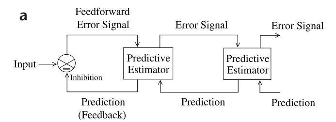
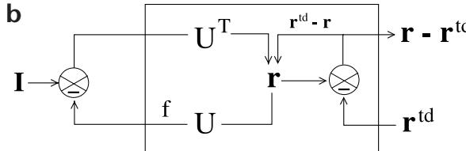
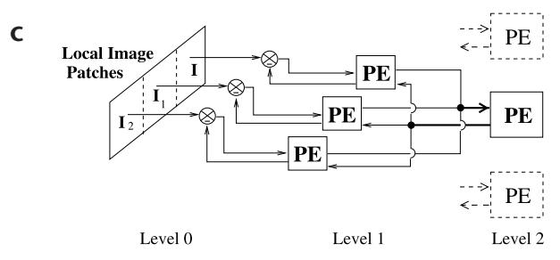
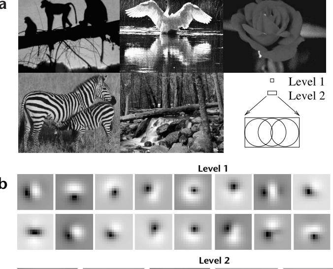
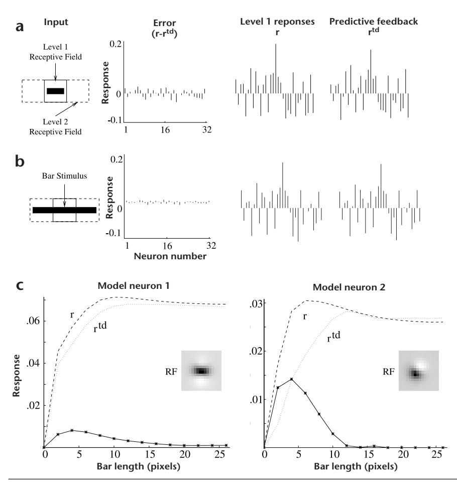
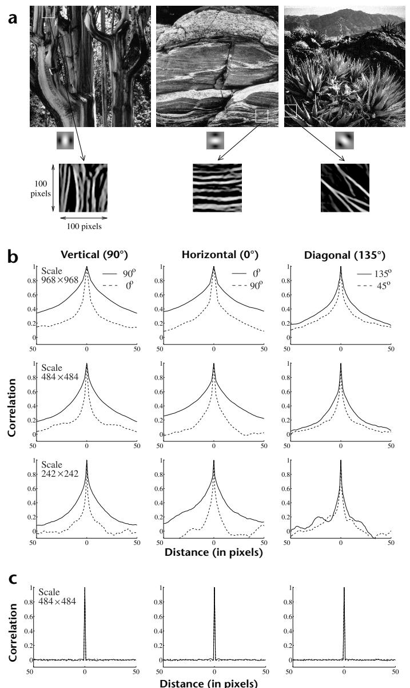
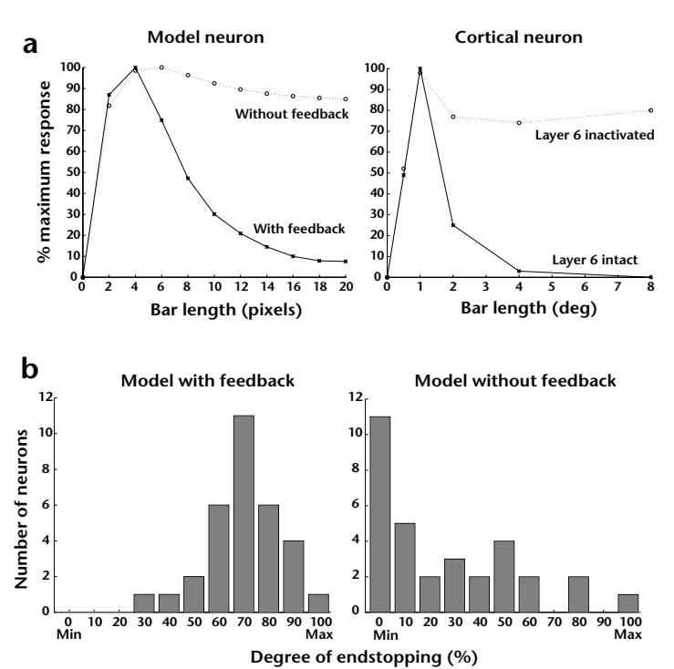
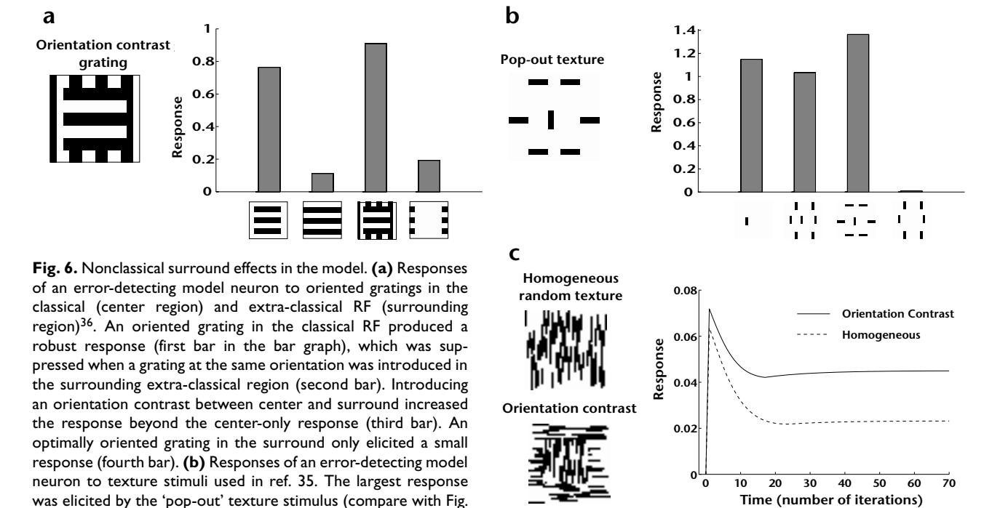

# Predictive coding in the visual cortex: a functional interpretation of some extra-classical receptive-field effects

Rajesh P. N. Rao1 and Dana H. Ballard2

We describe a model of visual processing in which feedback connections from a higher- to a lower-order visual cortical area carry predictions of lower-level neural activities, whereas the feedforward connections carry the residual errors between the predictions and the actual lower-level activities. When exposed to natural images, a hierarchical network of model neurons implementing such a model developed simple-cell-like receptive fields. A subset of neurons responsible for carrying the residual errors showed endstopping and other extra-classical receptive-field effects. These results suggest that rather than being exclusively feedforward phenomena, nonclassical surround effects in the visual cortex may also result from cortico-cortical feedback as a consequence of the visual system using an efficient hierarchical strategy for encoding natural images.

Neurons that respond optimally to line segments of a particular length were first reported in early studies of the cat and monkey visual cortex1,2. These neurons, which are especially abundant in cortical layers 2 and 3, have the curious property of endstopping (or end-inhibition): a vigorous response to an optimally oriented line segment is reduced or eliminated when the same stimulus extends beyond the neuron's classical receptive field (RF). Such 'extra-classical' RF effects occur in several visual cortical areas, including V1 (area 17; refs 2, 3), V2 (area 18; refs 1, 4), V4 (ref. 5) and MT6. In most of these cases, neural responses are suppressed when stimulus properties at the center, such as orientation, velocity or direction of motion, match those in the surrounding extra-classical RF.

Why should a neuron that responds to a stimulus stop responding when the same stimulus extends beyond the classical RF? Some studies have postulated a role for 'hypercomplex' endstopped neurons in the detection of visual curvature1,7. Others have suggested a role for these cells in detecting corners and line terminations8, occlusion9, perceptual grouping10 and illusory contours11. However, a straightforward extension of these arguments to extra-classical RF effects in different cortical areas has been difficult. We have previously shown that a model12 based on the principle of Kalman filtering can account for certain visual cortical responses in a monkey freely viewing natural images13. It was conjectured that a similar model might also account for endstopping and other extra-classical effects.

Here we show simulations suggesting that extra-classical RF effects may result directly from predictive coding of natural images. The approach postulates that neural networks learn the statistical regularities of the natural world, signaling deviations from such regularities to higher processing centers. This reduces redundancy by removing the predictable, and hence

redundant, components of the input signal. Roots of this idea can be found in early information-theoretic approaches to sensory processing14–16. More recently, it has been used to explain the spatiotemporal response properties of cells in the retina17-19 and lateral geniculate nucleus (LGN)20,21. Because neighboring pixel intensities in natural images tend to be correlated, values near the image center can often be predicted from surrounding values. Thus, the raw image-intensity value at each pixel can be replaced by the difference between a center pixel value and its spatial prediction from a linear weighted sum of the surrounding values. This decorrelates (or whitens) the inputs17,19 and reduces output redundancy, providing a functional explanation for center-surround receptive fields in the retina and LGN. The values of a given pixel also tend to correlate over time. A retinal/LGN cell's phasic response can thus be interpreted as the difference between the actual input and its temporal prediction based on a linear weighted sum of past input values 19-21. Similarly, the responses of retinal photoreceptors sensitive to different wavelengths are often correlated because their spectral sensitivities overlap. Thus, the L-cone (long-wavelength or 'red' receptor) response may predict the M-cone (medium-wavelength or 'green' receptor) response, and the L- and M-cone responses together may predict the S-cone (short-wavelength or 'blue' receptor) response. Thus, the color-opponent (red – green) and blue – (red + green) channels in the retina might reflect predictive coding in the chromatic domain similar to that of the spatial and temporal domains18.

Using a hierarchical model of predictive coding, we show that visual cortical neurons with extra-classical RF properties can be interpreted as residual error detectors, signaling the difference between an input signal and its statistical prediction based on an efficient internal model of natural images.

&lt;sup>1 The Salk Institute, Sloan Center for Theoretical Neurobiology and Computational Neurobiology Laboratory, 10010 N. Torrey Pines Road, La Jolla, California 92037, USA

&lt;sup>2 Department of Computer Science, University of Rochester, Rochester, New York 14627-0226, USA Correspondence should be addressed to R.P.N.R. (rao@salk.edu)

**Fig. 1.** Hierarchical network for predictive coding. **(a)** General architecture of the hierarchical predictive coding model. At each hierarchical level, feedback pathways carry predictions of neural activity at the lower level, whereas feedforward pathways carry residual errors between the predictions and actual neural activity. These errors are used by the predictive estimator (PE) at each level to correct its current estimate of the input signal and generate the next prediction. **(b)** Components of a PE module, composed of feedforward neurons encoding the synaptic weights UT, neurons whose responses **r** maintain the current estimate of the input signal, feedback neurons encoding U and conveying the prediction  $f(U\mathbf{r})$  to the lower level, and error-detecting neurons computing the differ-

ence  $(\mathbf{r} - \mathbf{r}^{td})$  between the current estimate  $\mathbf{r}$  and its top-down prediction  $\mathbf{r}^{td}$  from a higher level.  $(\mathbf{c})$  A three-level hierarchical network used in the simulations. An input image was analyzed by three level-1 PE modules, each predicting its own local image patch. The responses  $\mathbf{r}$  of all three level-1 modules were input to the level-2 module. This convergence of lower-level inputs to a higher-level module increases receptive-field size of neurons as one ascends the hierarchy, with the receptive field at the highest level spanning the entire input image.

### Results

# HIERARCHICAL PREDICTIVE CODING MODEL

Each level in the hierarchical model network (except the lowest level, which represents the image) attempts to predict the responses at the next lower level via feedback connections (Fig. 1a). The error between this prediction and the actual response is then sent back to the higher level via feedforward connections. This error signal is used to correct the estimate of the input signal at each level (see Methods and Fig. 1b), similar to some previous models22–24 (see also refs 15, 25, 26). The prediction and error-correction cycles occur concurrently throughout the hierarchy, so top-down information influences lower-level estimates, and bottom-up information influences higher-level estimates of the input signal. Lower levels operate on smaller spatial (and possibly temporal) scales, whereas higher levels estimate signal properties at larger scales because a higher-level module predicts and estimates the responses of several lower-level modules (for example, three in Fig. 1c). Thus, the effective RF size of units increases progressively until the highest level, where the RF spans the entire input image. The underlying assumption here is that the external environment generates natural signals hierarchically via interacting hidden physical causes (object attributes such as shape, texture and luminance) at multiple spatial and temporal scales. The goal of a visual system then becomes optimally estimating these hidden causes at each scale for each input image and, on a longer time scale, learning the parameters governing the hierarchical generative model. Similar models have been studied by other researchers (for example, refs 27, 28).

# HIERARCHICAL PREDICTIVE CODING OF NATURAL IMAGES

Given that the visual cortex is hierarchically organized and that cortico-cortical connections are almost always reciprocal29, the model described above suggests the following hypothesis: feedback connections from a higher area to a lower area (say V2 to V1) carry predictions of expected neural activity in V1, whereas feedforward connections convey to V2 the residual activity in V1

that was not predicted by V2 (refs 12, 22). To test this hypothesis, a three-level hierarchical network of predictive estimators (Fig. 1c) was trained on image patches extracted from five natural images (Fig. 2a), the motivation being that the response properties of visual neurons might be largely determined by the statistics of natural images17,20,21,30. Such an approach has previously explained some important visual cortical RF properties26,31,32.

We allowed the network to learn a hierarchical internal model of its natural image inputs by maximizing the posterior probability of generating the observed data (Methods). The internal model is encoded in a distributed manner within the synapses of model neurons at each level. The synaptic weights (or 'efficacies') of a neuron encode a single basis vector that in conjunction with other basis vectors predicts lower-level inputs. For example, a given input image at the zeroth level can be predicted as an appropriate linear combination of the first-level basis vectors (Methods, Equation 2). In this linear combination, the weighting coefficient for the kth basis vector is given by the response of the kth neuron in the first level. The response is determined by a first-order differential equation implementing the prediction and error-correction cycle mentioned above. This equation, like the synaptic learning rule, is also derived by maximizing the posterior probability of generating the observed data (Methods). Thus, for any given input, the network converges to a set of neuronal responses optimal for predicting that input. These responses are then used to adapt the synaptic basis vectors. The same description applies to each level of the hierarchy, with each level predicting the inputs at its lower level using its set of learned basis vectors and, on a slower time scale, adapting these basis vectors to enable more accurate prediction of the inputs in the future.

After exposure to several thousand natural image patches, the basis vectors learned by the network at level 1 resembled oriented edges or bars (Fig. 2b), whereas the basis vectors at level 2 seemed to be composed of various combinations of the features

Level 1 (with sparse prior distribution)

**Fig. 2.** Receptive fields of feedforward model neurons after training on natural images. **(a)** Five natural images used for training the three-level hierarchical network of Fig. 1c (Methods). The two upper boxes in the bottom right corner show relative sizes (16 x 16 and 16 x 26 pixels) of level-1 and level-2 receptive fields respectively. **(b)** Learned synaptic weights (RF weighting profiles) of 20 of the 32 feedforward model neurons in the level-1 module analyzing the central image region. Flanking image regions were analyzed by two other level-1 modules (**Fig. 1c**), each with 32 feedforward model neurons (Methods). Values for these synapses, which form rows of the matrix UT, can be positive (excitatory, bright regions) or negative (inhibitory, dark regions). These RF profiles resemble

classical oriented-edge/bar detectors characteristic of simple cells2. (c) RF profiles of 12 of the 128 level-2 feedforward model neurons. (d) Localized RF profiles resembling Gabor wavelets obtained by using a sigmoidal nonlinearity in the generative model, along with a sparse kurtotic prior distribution for the network activities (Methods). All 32 level-1 feedforward model neurons are shown; Gaussian windowing of inputs (as in b) was not necessary in this case.

represented at level 1 (Fig. 2c). The basis vectors can be regarded as approximate 'receptive fields' of the feedforward model neurons because they are the primary determinants of the neurons' feedforward responses26,32. These RFs at level 1 are reminiscent of oriented Gabor or difference-of-Gaussian filters that have been used to model simple-cell RFs in primary visual cortex (for example, ref. 7). We used a Gaussian weighting profile to model the input dendritic arbor of the model neurons so that each set of the level 1 neurons only sees a localized portion of the entire input image. However, the model also learns localized receptive fields without a Gaussian spatial window if we impose the additional constraint of sparseness on the model neuron responses (Methods; Fig. 2d)26,32. In this case, the wavelet-like basis vectors code for local oriented structures rather than being centered in the input window as in Fig. 2b. These basis vectors and their level-2 counterparts were used for the simulations in Fig. 6, whereas all

### ENDSTOPPED RESPONSES INTERPRETED AS ERROR SIGNALS

other simulations used the basis vectors in Fig. 2b and c.

Given an input image, the initial predictions at any given level are based on an arbitrary random combination of the basis vectors, giving large error signals. To minimize this error, the network converges to the responses that best predict the current input by subtracting the prediction from the input (via inhibition) and propagating the residual error signal to the neurons at the next level, which integrate this error and generate a better prediction (Methods).

The model neurons carrying the error signal (the 'errordetecting' neurons) send feedforward connections from the lower level to the higher level. In the visual cortex, feedforward connections to a higher area generally arise from the superficial layers (such as layer 2/3). A relatively large number of neurons in layer 2/3 of striate cortex (V1) show endstopping and related extra-classical effects2,3,33. To ascertain whether these observed neuronal responses can be functionally interpreted as residual error signals, we recorded the responses of level-1 error-detecting neurons in the simulated network, when exposed to the image of a short dark bar lying within their RF (Fig. 3a). The solid box in the first panel ('Input') represents the RF size of the level-1 neurons  $(16 \times 16 \text{ pixels})$ , whereas the dotted box represents the level-2 RFs  $(16 \times 26 \text{ pixels})$ . The last two panels show the two components that determine the error signal. Many of the error-detecting neurons showed significant non-zero responses, demonstrating that feedback from level 2 could not completely predict the responses at level 1.

On the other hand, when the bar stimulus extends beyond the classical receptive field into the flanking regions (Fig. 3b), the same error-detecting neurons showed little or no response because the predictions from level 2 were much more accurate, with prediction errors close to zero. Why are the level 2 predictions much more accurate for the longer bar than for the short bar? Recall that the network was trained on natural images. In natural images, short bars seldom occur in isolation; rather, a bar in a small region of an image is usually part of a longer bar that extends into neighboring regions. Because the network was optimized for natural image statistics, the most accurate predictions are generated when the input's properties match those of natural images. The continuation of the bar into the surrounding region provides the necessary context for the bar in the center to be predicted, much as in the case of retinal center-surround pre-

Fig. 3. Endstopping in the model network. (a) Responses of the 32 errordetecting model neurons in the central level-I module to a dark bar. (Positive values are upward bars; negative values are downward bars.) Although not modeled here, positive and negative values may be coded by separate neurons in the cortex. (b) Reduction in the level-I residual errors due to increase in top-down prediction accuracy as the bar extends beyond the classical RF (solid box), up to the size of the level-2 RF (dashed box). This reduced prediction error manifests itself as endstopping in the error-detecting model neurons. (c) Length-tuning curves for two error-detecting model neurons at level I with even-symmetric (left) and odd-symmetric (right) RF profiles. Both model neurons show the decrease in response characteristic of endstopping as the bar extends beyond the classical RF. The dashed line represents the corresponding response r at level I, and the dotted line represents the predictive feedback rtd from level 2.

diction mechanisms. Without this contextual information in the surrounding region, the higher level cannot accurately predict the bar in the center. The short bar thus elicits a relatively large response from the error-detecting neurons as compared to the longer bar.

This argument suggests that the autocorrelation along a dominant orientation in a local region in natural images extends over reasonably large distances. We tested this hypothesis on a set of natural images (Fig. 4a). Random locations were selected in these images, and the local oriented energy was computed by summing the squared outputs of quadrature pairs of filters. The orientation that maximized this energy measure was selected as the dominant orientation. Correlations in the dominant orientation direction and in the opposite direction in the natural image were then calculated along three different orientation directions (vertical, horizontal and diagonal) for several thousand random image locations (Fig. 4b). The average correlations along the dominant directions, especially the vertical and horizontal directions, remain relatively high for distances of up to plus or minus 50 pixels as compared to the correlations in the opposite direction. As a control, we repeated the experiment for three different natural image sizes (968  $\times$  968, 484  $\times$  484 and 242  $\times$  242 pixels). In all three cases, higher correlations were observed in the dominant direction as compared to the opposite direction. (Results for a random white-noise image are shown in Fig. 4c.)

To compare model neuron responses to neurophysiological data, we computed the tuning curves of model error-detecting neurons to bars of increasing length (Fig. 3c). The prediction

from level 2 falls short of the actual level-1 responses for shorter bar lengths but gradually matches the actual response as the length of the bar is increased. This determines the model length-tuning curves, which closely resemble the tuning curves of layer 2/3 neurons in cat striate cortex (Fig. 5a). The model tuning curve is a parameter-free prediction of the data in the sense that it is determined by the statistics of the input natural images rather than by the physiological data. Thus, the close similarity between the model and physiological tuning curves is noteworthy. In the model, the average length of the bar eliciting maximal response was found to be approximately 4.5 pixels, the absolute RF sizes being approximately  $5\times10$  pixels. For comparison, ref. 3 reports RF sizes of  $1^\circ\times1.75^\circ$  and  $0.5^\circ\times1.5^\circ$  for two visual cortical neurons. These were maximally responsive to bars of length  $1^\circ$  and  $0.5^\circ$ , respectively.

### PREDICTIVE FEEDBACK AND EXTRA-CLASSICAL RF EFFECTS

The removal of feedback from level 2 to level 1 in the model caused previously endstopped neurons to continue to respond to bars of increasing lengths (Fig. 5a), supporting the hypothesis that predictive feedback is important in mediating endstopping in the level-1 model neurons. To quantify this result, we computed the distribution of endstopping (Fig. 5b) in all 32 model layer 2/3 (error-detecting) neurons in the central level-1 module (see Fig. 1c) with and without feedback from level 2. The degree of endstopping was quantified as the percentage difference between peak response and average plateau response for lengths greater than 18 pixels: (peak – plateau)/peak × 100. Model neu-

rons were classified into 10 categories according to their degree of endstopping, with 100% inhibition denoting a plateau response of zero to long bars. If we define endstopping as greater than 50% inhibition, 28 of the 32 model error-detecting neurons were endstopped with feedback intact. Disabling the feedback connections eliminated endstopping in all but 5 of these neurons, a reduction of 82%. The five neurons that continued to show some degree of endstopping after removal of feedback were those whose receptive field orientations were not completely aligned with that of the bar used for testing.

# OTHER EXTRA-CLASSICAL RF EFFECTS IN THE MODEL

Several neurophysiological studies have reported nonclassical surround effects due to orientation contrast between the stimuli in the central classical RF region and the surrounding region33,35,36. To investigate whether some of these effects could result from the extended positive correlations along dominant orientation directions in natural images (Fig. 4), we trained a

Fig. 4. Autocorrelation along dominant orientation directions in natural images. (a) Three natural images from the Sweeney/Rubin Ansel Adams Fiat Lux collection (reproduced with permission from the California Museum of Photography, University of California, Riverside). Each image was filtered with quadrature pairs of oriented filters for computing oriented energy. Three of these oriented filters are shown at the bottom alongside the arrows. The bottom row shows examples of oriented structures extending over relatively large distances in three natural image patches. (b) Average correlations in the natural images along the dominant orientation direction and the orthogonal direction, shown here for three different orientation directions (horizontal, vertical and diagonal) and for three different natural image sizes. Correlations were computed by choosing a 16 x 16 image patch at a randomly selected location in a natural image and translating the correlation window up to plus and minus 50 pixels along the dominant orientation direction and the orthogonal direction. The dominant orientation was chosen to be the one that maximized the local oriented energy as given by the sum of squared outputs of the quadrature pairs of filters. Correlations along the dominant directions remained positive for distances of up to plus or minus 50 pixels, supporting the hypothesis that oriented structures in natural images on the average tend to extend over reasonably large distances. (c) Results of applying the same procedure to a randomly generated white-noise image.

three-level hierarchical network, similar to the one used for the endstopping simulations, on ten different natural images. Rather than using a Gaussian window to localize receptive fields as in the endstopping experiments, we allowed the network to learn localized receptive fields by imposing a sparse prior distribution32 on the network responses (Methods). A total of nine level-1 modules arranged in three rows and three columns analyzed a local image patch  $(14 \times 14 \text{ pixels})$ . The outputs of these nine modules were input to the single level-2 module.

An oriented grating in the classical RF produced a robust response in a level-1 error-detecting model neuron in the simulated network (Fig. 6a). This steady-state response was suppressed 85.3% when a grating at the same orientation was introduced in the surrounding extra-classical region, consistent with a reduction in the

residual error signal due to better prediction from level 2 based on the surrounding context. Introducing an orientation contrast between the center and the surrounding region increased the model neuron response by 19.1% over the classical RF response, reflecting an increase in the residual error. Similar increases in neuronal responses due to cross-oriented grating stimuli have been reported in primary visual cortex36. An optimally oriented grating restricted only to the surround elicited little response in the model neuron. We determined the response of a model neuron (Fig. 6b) to four different texture stimuli previously used in a macaque V1 study35. The largest response was elicited by the 'pop-out' texture stimulus (compare with Fig. 4 of ref. 35 showing a similar response in a V1 neuron). For these stimuli, the spatial displacement of the central and surrounding bars in a particular direction sometimes modified a response from suppression to enhancement or vice versa, an effect attributable to the localized nature of the level-1 receptive fields (Fig. 2d). We also tested the response of an error-detecting model neuron

Fig. 5. Predictive feedback and endstopping. (a) Effect of inactivating feedback from level 2 in the model. Plotted on the left are the length tuning curves for a 'layer 2/3' errordetecting model neuron at level I with and without feedback from level 2 (solid and dotted line respectively). Tuning curves for a layer 2/3 complex cell in cat striate cortex (VI) (redrawn from Fig. 3 in ref. 3) are shown on the right for comparison. Disabling top-down feedback eliminated endstopping in the model neuron in a manner qualitatively similar to that observed in the cortical neuron after inactivation of layer 6 (dotted line). Elimination of feedback from V2 dramatically affects neural responses in layer 6 of VI in the squirrel monkey34. (b) Histograms summarizing the distribution of length tuning in all 32 model layer 2/3 neurons in the central level I module with feedback (left) and without feedback (right) from level 2. Endstopping was quantified as the percentage difference between peak response and average plateau response for lengths greater than 18 pixels. Model neurons were classified into ten categories according to their degree of endstopping. Disabling feedback connections eliminated endstopping (defined as greater than 50% inhibition) in 82% of the model layer 2/3 neurons.

(Fig. 6c) to random texture stimuli used in a study of contextual modulation in alert macaque V1 (ref. 33). The tonic phase of the model neuron response reveals a large positive difference (93.5%) developing over time for the orientation-contrast texture as compared to the homogeneous texture. This modulation in response resembles the type of contextual modulation observed in V1 neurons (compare with Fig. 2 of ref. 33).

# Discussion

Our simulation results suggest that certain extra-classical RF effects could be an emergent property of the cortex using an efficient hierarchical and predictive strategy for encoding natural images. In this model, cortical neurons showing extra-classical effects are interpreted as error-detecting neurons that signal the difference between an input and its prediction from a higher visual area. In particular, the layer 2/3 neurons that send axons to the higher visual area are posited to be likely candidates for this function. In the model, predictions are made based on progressively larger spatial contexts as one ascends the visual hierarchy. As a result, when the stimulus properties in a neuron's receptive field match the stimulus properties in the surrounding region, little response is evoked from the error-detecting neurons because the 'surround' can predict the 'center.' On the other hand, when the stimulus occurs in isolation, such a prediction fails, eliciting a relatively large response. This behavior can be viewed as a refinement of the types of predictive coding observed at the retina 17-19 and the LGN20,21 involving spatiotemporal prediction based on weighted averages of spatially/temporally local pixels and subtraction of this prediction from current pixel values.

The model predicts that layer 2/3 neurons will respond most vigorously to stimuli whose statistics differ in certain drastic ways from natural image statistics (as in, for example, Fig. 6). This raises the interesting possibility of discovering novel extra-classical RF effects by explicitly constructing stimuli that deviate from natural image statistics. In addition, termination of cortical feed-

back should disinhibit the responses of layer 2/3 neurons that are suppressed by extra-classical stimuli under normal conditions. In anesthetized monkeys, inactivation of higher-order visual cortical areas disinhibits responses to surround stimuli in lower-area neurons37 (see also Hupé, J. M. *et al.*, *Soc. Neurosci. Abstr.* 23, 1031, 1997 and James, A. C. *et al.*, *Soc. Neurosci. Abstr.* 21, 904, 1995), consistent with the predictive coding model. In the cat, removal of feedback from visual cortical areas 17 and 18 to the LGN strongly reduces the degree of end-inhibition in LGN cells38. Also, extra-classical RF effects in layer 2/3 neurons in alert monkey V1 often manifest themselves only 80–100 milliseconds after stimulus onset, suggesting that feedback from higher areas may be involved in mediating these effects33.

The simulation results show that extra-classical RF effects can occur in the predictive coding model under either Gaussian (Figs 3 and 5) or sparse kurtotic (Fig. 6) prior distributions for the network activities. The issue of prior distributions has been much discussed 12,31,32, with kurtotic distributions being favored because they can produce localized receptive fields and sparse codes. Our results suggest that the effects can be obtained under both sparse and non-sparse prior distributions, as long as one interprets the effects as being caused due to residual errors in prediction based on an internal model of natural image statistics.

The predictive coding model does not rule out the possibility that certain extra-classical contextual effects may result from recurrent lateral inhibition mediated by long-range horizontal connections within the same visual area39. In fact, the equation for the dynamics of the network can be rewritten such that some of the effects of feedback are replaced by recurrent lateral interactions (Methods, Equation 8; refs 32, 40). In addition, the repetitive subtraction of neighboring neuronal activities (Equation 8) may produce a net effect similar to divisive normalization41, an operation that reproduces certain extra-classical effects in simulations (Simoncelli, E. P., results presented at the 1998 Center for Visual Science Symposium, Rochester, New York, 1998).

exposed to the random texture stimuli used in ref. 33. The tonic phase of the response reveals a large positive difference developing over time for the orientation-contrast texture as compared to the homogeneous stimulus (compare with Fig. 2 of ref. 33).

Some extra-classical RF effects involve facilitatory rather than inhibitory responses39. In other words, the presence of a stimulus in the surround may facilitate rather than inhibit the neural response elicited by a stimulus in the center alone. Some examples of such facilitatory effects in the model are shown in Fig. 6, but other facilitatory effects may reflect a bipolar strategy for encoding prediction errors. Because these errors can be either positive or negative, the cortex may use two distinct populations of neurons to signal errors, one for positive and another for negative errors, in analogy with the existence of on-center, off-surround and off-center, on-surround cells in the early visual pathway.

4 of ref. 35). (c) Extra-classical contextual modulation in the temporal response of an error-detecting model neuron, when

Although we have focused on interpreting responses in V1, the general idea of predictive coding may help explain certain responses in other brain regions as well. For example, some neurons in MT are suppressed when the direction of stimulus motion in the surrounding region matches that in the center of the classical RF6. This suggests a hierarchical predictive coding strategy for motion analogous to the one suggested here for image features. Although the precise details of such a strategy are far from clear, a testable prediction of such a model would be a significant reduction in extra-classical effects in layer 2/3 neurons in MT upon inactivation of feedback from a higher area such as MST. Certain neurons in the anterior inferotemporal (IT) cortex of alert behaving monkeys fire vigorously whenever a presented test stimulus does not match the item held in memory, though showing little or no response in the case of a match42. This suggests an interpretation of these responses in terms of residual error signals between a test stimulus and a predicted item from memory. Whether such a model can also account for the very specific face and view-sensitive cells in IT43,44 remains unclear (however, see ref. 45). A third example suggestive of predictive coding is the generation and subtraction of sensory expectations from actual inputs in cerebellum-like structures in several distinct classes of fishes46. In this case, the sensory prediction is generated using not only recent sensory inputs but also corollary discharge or proprioceptive signals associated with motor commands. Finally, the responses of dopaminergic neurons projecting to the cortex and striatum from the midbrain can often be characterized as encoding reward prediction errors: large responses are elicited whenever actual rewards do not match the predicted rewards in a behavioral task47. These examples suggest that the general idea of predictive coding may be applicable across different brain regions and modalities, providing a useful framework for understanding the general structure and function of the neocortex22,48.

### Methods

HIERARCHICAL GENERATIVE MODEL. Consider an image I represented as a vector of n pixels. We assume that the cortex tries to represent the image in terms of hypothetical causes, as represented by a vector  $\mathbf{r}$ . We characterize the relationship between the causes  $\mathbf{r}$  and the image I using the function f and a matrix U:

$$\mathbf{I} = f(\mathbf{U}\mathbf{r}) + \mathbf{n} \tag{1}$$

where n is a stochastic noise process characterizing the differences between I and f(Ur). Note that

$$f(\mathbf{Ur}) = f(\sum_{j=1}^{k} \mathbf{U}_{j} r_{j})$$
 (2)

where  $U_j$  are columns of U, representing basis vectors for generating images. Thus, each image I is assumed to be generated by a linear superposition of the basis vectors followed by a possible nonlinearity f. In terms of a neural network, the coefficients  $r_j$  correspond to the activities or firing rates of neurons, whereas the basis vectors  $U_j$  correspond to the synaptic weights of neurons. The function f(x) is the neuronal activa-

tion function, typically a sigmoidal function such as tanh(x). The coefficients  $r_j$  can be regarded as the network's internal representation of the spatial characteristics of the image I, as interpreted using the internal model defined by the basis vectors  $U_j$ .

To make this model hierarchical, we assume that the causes r themselves can be represented as a set of higher-level causes  $\mathbf{r}^h$  representing more abstract stimulus properties than the lower level. This yields the equation:

$$\mathbf{r} = \mathbf{r}^{td} + \mathbf{n}^{td} \tag{3}$$

where  $\mathbf{r}^{td} = f(\mathbf{U}^h \mathbf{r}^h)$  is the 'top-down' prediction of  $\mathbf{r}$ , and  $\mathbf{n}^{td}$  is a sto-chastic noise process.

Because the dendritic arbors of neurons can only span a finite spatial extent, we limit the size of I at the lowest level so that only a local portion of the actual image is being generated by a given set of causes r. The higher-level vector  $\mathbf{r}^h$ , however, generates several sets of these causes  $\mathbf{r}$ associated with local neighboring image regions. Thus, a given image is generated by groups of local causes r, several groups being generated by a single higher-level vector  $\mathbf{r}^h$ , several of which are in turn generated by an even higher level of causes until the entire image is accounted for. This results in increasing receptive field size as one ascends the hierarchy, similar to that observed in the occipitotemporal visual pathway29. To allow prediction in time for time-varying images, the model can be extended using a set of recurrent synaptic weights V that recursively transform the vector  $\mathbf{r}(t)$  at time t to the predicted vector  $\mathbf{r}(t+1)$  at time t+1:  $\mathbf{r}(t+1) =$ f(Vr(t)) + m where m is a noise process. Because static images sufficed for our simulation results, we did not use the temporal prediction component, but the interested reader is referred to refs 12 and 49 for more

OPTIMIZATION FUNCTION. The goal is to estimate, for each hierarchical level, the coefficients r for a given image and, on a longer time scale, learn appropriate basis vectors  $\mathbf{U}_j$  for each hierarchical level. Assuming that the noise terms n and  $\mathbf{n}^{td}$  are Gaussian with zero mean and variances  $\sigma^2$  and  $\sigma_{td}^2$  respectively, one can write the following optimization function:

$$E_{1} = \frac{1}{\sigma^{2}} (\mathbf{I} - f(\mathbf{U}\mathbf{r}))^{T} (\mathbf{I} - f(\mathbf{U}\mathbf{r})) + \frac{1}{\sigma_{cd}^{2}} (\mathbf{r} - \mathbf{r}^{td})^{T} (\mathbf{r} - \mathbf{r}^{td})$$
(4)

where the superscript T denotes the transpose of a vector or matrix. Note that  $E_1$  is the negative logarithm of the probability of the data given the parameters. It is the sum of squared prediction errors for level 1 and level 2, each term being weighted by the respective inverse variances. Taking into account the prior distributions of  $\bf r$  and  $\bf U$ , one obtains the optimization function:

$$E = E_1 + g(\mathbf{r}) + h(\mathbf{U}) \tag{5}$$

where  $g(\mathbf{r})$  and h(U) are the negative logarithms of the prior probabilities of  $\mathbf{r}$  and U respectively. For the endstopping simulations, we used Gaussian prior distributions for both these model parameters because this was sufficient to illustrate the properties of the model. This results in  $g(\mathbf{r}) = \alpha \sum_i r_i^2$  and  $h(U) = \lambda \sum_{i,j} U_{i,j}^2$  where  $\alpha$  and  $\lambda$  are positive constants related to the variance of the Gaussian prior distributions. Localized receptive fields can be obtained by using sparse kurtotic prior distributions for  $\mathbf{r}$  (refs 26,31), e.g.,

$$g(\mathbf{r}) = \alpha \sum_{i} \log(1 + r_i^2) \tag{6}$$

This choice was used for the extra-classical surround experiments in Fig. 6. Note that by Bayes Theorem, minimizing E is equivalent to maximizing the posterior probability of the model parameters given the input data. In the context of information theory, E can be interpreted as representing the cost of coding the errors and parameters in bits (in base e). Thus, minimizing E is equivalent to using the minimum description length principle50, which requires solutions to be not only accurate but also cheap in terms of coding length.

NETWORK DYNAMICS AND SYNAPTIC LEARNING. An optimal estimate of **r** can be obtained by performing gradient descent on *E* with respect to **r**:

$$\frac{d\mathbf{r}}{dt} = -\frac{k_1}{2} \frac{\partial E}{\partial \mathbf{r}} = \frac{k_1}{\sigma^2} \mathbf{U}^{\mathrm{T}} \frac{\partial f^{\mathrm{T}}}{\partial \mathbf{x}} (\mathbf{I} - f(\mathbf{U}\mathbf{r})) + \frac{k_1}{\sigma_{td}^2} (\mathbf{r}^{td} - \mathbf{r}) - \frac{k_1}{2} g'(\mathbf{r})$$
 (7)

where  $k_1$  is a positive constant governing the rate of descent towards a minimum for E,  $\mathbf{x} = \mathbf{Ur}$ , and  $\mathbf{g}'$  is the derivative of g with respect to  $\mathbf{r}$ . In the linear case (f(x) = x),

$$\frac{\partial f}{\partial \mathbf{x}}^{\mathrm{T}}$$

is the identity matrix and in the case where  $f(x) = \tanh(x)$ ,

$$\frac{\partial f}{\partial x} = (1 - \tanh(x)^2).$$

Similarly, for a Gaussian prior distribution,  $g'(\mathbf{r}) = 2\alpha \mathbf{r}$  and for the kurtotic prior distribution in Equation 6,  $g'(r_i) = 2\alpha r_i / (1 + r_i^2)$  (ref. 32).

To modify **r** toward the optimal estimate (Equation 7), one needs the 'bottom-up' residual error ( $\mathbf{I} - f(\mathbf{Ur})$ ) and the 'top-down' error ( $\mathbf{r}^{td} - \mathbf{r}$ ). The bottom-up error is multiplied by the transpose of the gradient and the basis matrix  $\mathbf{U}^T$ , and a decay term  $\mathbf{g}'(\mathbf{r})$  due to the prior probability of **r** is subtracted. Note that all the information required is available locally at each level. The weight accorded to the top-down and bottom-up errors is inversely proportional to their respective noise variances: the larger the noise variance, the smaller the weight (see ref. 12). In a neural implementation (Fig. 1b), each row of the matrix  $\mathbf{U}^T$  corresponds to the synaptic weights of a single neuron.

In the linear case (f(x) = x), the above dynamics can be rewritten to allow lateral interactions32,40:

$$\frac{d\mathbf{r}}{dt} = \frac{k_1}{\sigma^2} \mathbf{U}^{\mathrm{T}} \mathbf{I} + \frac{k_1}{\sigma_{td}^2} (\mathbf{r}^{td} - \mathbf{r}) - \frac{k_1}{2} g'(\mathbf{r}) - \frac{k_1}{\sigma^2} \mathbf{W} \mathbf{r}$$
 (8)

where  $W=U^TU$ . In this implementation, the neural responses  ${\bf r}$  undergo recurrent lateral inhibition due to the term

$$\frac{k_1}{\sigma^2}$$
 Wr

where the *i*th row of W represents the lateral weights for the *i*th neuron that maintains the estimate  $r_i$ . Such lateral connections between neurons maintaining r may thus also be involved in mediating some of the extraclassical RF effects observed in the visual cortex (see Discussion).

A synaptic learning rule for adapting the basis matrix U can be obtained by performing gradient descent on *E* with respect to U:

$$\frac{d\mathbf{U}}{dt} = -\frac{k_2}{2} \frac{\partial E}{\partial \mathbf{U}} = \frac{k_2}{\sigma^2} \frac{\partial f}{\partial \mathbf{x}}^{\mathrm{T}} (\mathbf{I} - f(\mathbf{U}\mathbf{r})) \mathbf{r}^{\mathrm{T}} - k_2 \lambda \mathbf{U}$$
(9)

where  $k_2$  is a positive parameter determining the learning rate of the network and  $\mathbf{x} = \mathbf{Ur}$ . Note that this learning rule is a form of Hebbian adaptation, the presynaptic activity being  $\mathbf{r}$  and the postsynaptic activity being the residual error  $(\mathbf{I} - f(\mathbf{Ur}))$  (see Fig. 1b).

Although the top-down feedback  $\mathbf{r}^{td}$  does not appear explicitly in the learning rule for U, it nevertheless influences the estimation of  $\mathbf{r}$  (see Equation 7) and hence, also U.

SIMULATIONS. For the endstopping simulations, five natural images of different sizes (Fig. 2a) were first filtered using a center-surround differenceof-Gaussians operator to approximate processing at the levels of the retina and the LGN (see also ref. 26). During the training phase, three  $16 \times 16$ overlapping Gaussian-windowed image patches (offset by 5 pixels horizontally) were input to the three level-1 modules (Fig. 1c). The responses from the level-1 modules at each time instant were input as a single vector to the level-2 module. The effective level-2 RF thus encompassed a  $16 \times 26$  image region spanned by the three overlapping circles (Fig. 2a). For simplicity, a linear generative model (f(x) = x) was used in the endstopping simulations. Each level-1 module consisted of 32 feedforward neurons representing  $U^T$  (size  $32 \times 256$ ), 32 neurons that maintained r (according to equation 7), 32 error-detecting neurons that propagated to level 2 the top-down residual  $(r - r^{td})$ , and a set of 256 feedback neurons whose synaptic efficacies encoded the rows of U and that conveyed the prediction Ur to level 0. The level-2 module consisted of 128 feedforward neurons receiving inputs from the three level-1 modules, 128 neurons for maintaining  $\mathbf{r}^h$ , and 96 feedback neurons whose synapses encoded rows of  $U^h$  and which conveyed the prediction  $U^h \mathbf{r}^h$  to level 1. Parameter values:  $k_1 = 0.5$ ,  $\sigma^2 = 1$ ,  $\sigma_{td}^2 = 10$ ,  $\alpha = 1$  for level 1 and 0.05 for level 2, and  $\lambda = 1$ 0.02. The learning rate  $k_2$  was initially set to 1 and decreased gradually by dividing with 1.015 after every 40 training inputs.

For the extra-classical RF simulations in Fig. 6, a nonlinear hierarchical generative model  $(f(x) = \tanh(x))$  was used at levels 1 and 2 of the three-level hierarchical network, along with a kurtotic prior distribution for r (Equation 6). Nine level-1 modules, each with 32 feedforward model neurons and each analyzing a local  $8 \times 8$  pixel image region, were arranged in a  $3 \times 3$  overlapping configuration to analyze a  $14 \times 14$  pixel image region. The level-2 module included 64 feedforward model neurons. The network was trained on ten prewhitened natural images and during training, the gain of each basis vector in U was adapted so as to maintain equal variance on each  $r_i$  (see ref. 26 for more details). The level-1 basis vectors were learned first, followed by the level-2 basis vectors.

# Acknowledgements

We thank Christof Koch for comments on the manuscript and Mary Hayhoe, Terrence Sejnowski and members of the Computational Neurobiology Lab at the Salk Institute for discussions. This work was supported by research grants from the National Institute of Health (NIH), the National Science Foundation (NSF) and the Alfred P. Sloan Foundation.

### RECEIVED 29 JUNE; ACCEPTED 18 NOVEMBER 1998

- Hubel, D. H. & Wiesel, T. N. Receptive fields and functional architecture in two non-striate visual areas (18 and 19) of the cat. J. Neurophysiol. 28, 229–289 (1965).
- Hubel, D. H. & Wiesel, T. N. Receptive fields and functional architecture of monkey striate cortex. J. Physiol. (Lond.) 195, 215–243 (1968).
- Bolz, J. & Gilbert, C. D. Generation of end-inhibition in the visual cortex via interlaminar connections. *Nature* 320, 362–365 (1986).
- Hubel, D. H. & Livingstone, M. S. Segregation of form, color, and stereopsis in primate area 18. J. Neurosci. 7, 3378–3415 (1987).
- Desimone, R. & Schein, S. J. Visual properties of neurons in area V4 of the macaque: sensitivity to stimulus form. J. Neurophysiol. 57, 835–868 (1987).
- Allman, J., Miezin, F. & McGuinness, E. Stimulus specific responses from beyond the classical receptive field: Neurophysiological mechanisms for local-global comparisons in visual neurons. *Annu. Rev. Neurosci.* 8, 407–429 (1985).
- Dobbins, A., Zucker, S. W. & Cynader, M. S. Endstopped neurons in the visual cortex as a substrate for calculating curvature. *Nature* 329, 438–441 (1987).
- Bolz, J., Gilbert, C. D. & Wiesel, T. N. Pharmacological analysis of cortical circuitry. *Trends Neurosci.* 12, 292–296 (1989).
- Peterhans, E. & von der Heydt, R. in Representations of Vision. Trends and Tacit Assumptions (eds Gorea, A., Frégnac, Y., Kapoulis, Z. & Findlay, J.) 111–124 (Cambridge Univ. Press, Cambridge, UK, 1991).
- 10. Grossberg, S., Mingolla, E. & Ross, W. D. Visual brain and visual perception: how does the cortex do perceptual grouping? *Trends Neurosci.* 20, 106–111 (1997).
  11. Peterhans, E. & von der Heydt, R. Subjective contours—bridging the gap
- Peterhans, E. & von der Heydt, R. Subjective contours—bridging the gap between psychophysics and physiology. *Trends Neurosci.* 14, 112–119 (1991).
- Rao, R. P. N. & Ballard, D. H. Dynamic model of visual recognition predicts neural response properties in the visual cortex. *Neural Comput.* 9, 721–763 (1997).
- Gallant, J. L., Connor, C. E. & Van Essen, D. C. Neural activity in areas V1, V2 and V4 during free viewing of natural scenes compared to controlled viewing. *Neuroreport* 9, 2153–2158 (1998).
- Attneave, F. Some informational aspects of visual perception. Psychol. Rev. 61, 183–193 (1954).
- MacKay, D. M. in Automata Studies (eds Shannon, C. E. & McCarthy, J.) 235–251 (Princeton Univ. Press, Princeton, NJ, 1956).
- Barlow, H. B. in Sensory Communication (ed. Rosenblith, W. A.) 217–234
   (MIT Press Cambridge MA 1961)
- (MIT Press, Cambridge, MA, 1961).17. Atick, J. J. Could information theory provide an ecological theory of sensory processing? *Network Comput. Neural Sys.* 3, 213–251 (1992).
- Buchsbaum, G. & Gottschalk, A. Trichromacy, opponent colours coding and optimum colour information transmission in the retina. *Proc. R. Soc. Lond. B Biol. Sci.* 220, 89–113 (1983).
- 19. Srinivasan, M. V., Laughlin, S. B. & Dubs A. Predictive coding: A fresh view of

- inhibition in the retina. *Proc. R. Soc. Lond. B Biol. Sci.* **216**, 427–459 (1982). 20. Dan, Y., Atick, J. J. & Reid, R. C. Efficient coding of natural scenes in the
- Dan, Y., Atick, J. J. & Reid, R. C. Efficient coding of natural scenes in the lateral geniculate nucleus: experimental test of a computational theory. J. Neurosci. 16, 3351–3362 (1996).
- Dong, D. W. & Atick, J. J. Temporal decorrelation: a theory of lagged and nonlagged responses in the lateral geniculate nucleus. *Network Comput. Neural Sys.* 6, 159–178 (1995).
- Mumford, D. On the computational architecture of the neocortex. II. The role of cortico-cortical loops. *Biol. Cybern.* 66, 241–251 (1992).
- Pece, A. E. C. in Artificial Neural Networks 2 (eds Aleksander, I. & Taylor, J.) 865–868 (Elsevier, Amsterdam, 1992).
- Softky, W. R. in Advances in Neural Information Processing Systems 8 (eds Touretzky, D., Mozer, M. & Hasselmo, M.) 809–815 (MIT Press, Cambridge, MA, 1996).
- Ullman, S. in Large-Scale Neuronal Theories of the Brain (eds Koch, C. & Davis, J. L.) 257–270 (MIT Press, Cambridge, MA, 1994).
- Olshausen, B. A. & Field, D. J. Sparse coding with an overcomplete basis set: A strategy employed by V1? Vision Res. 37, 3311–3325 (1997).
- A strategy employed by V1? Vision Res. 37, 3311–3325 (1997).

  27. Dayan, P., Hinton, G.E., Neal, R.M. & Zemel, R.S. The Helmholtz machine. Neural Comput. 7, 889–904, (1995).
- Luettgen, M. R. & Willsky, A. S. Likelihood calculation for a class of multiscale stochastic models, with application to texture discrimination. *IEEE Trans. Image Proc.* 4, 194–207 (1995).
- Felleman, D. J. & Van Essen, D. C. Distributed hierarchical processing in the primate cerebral cortex. Cereb. Cortex 1, 1–47 (1991).
- Field, D. J. Relations between the statistics of natural images and the response properties of cortical cells. J. Opt. Soc. Am. A 4, 2379–2394 (1987).
- Bell, A. J. & Sejnowski, T. J. The "independent components" of natural scenes are edge filters. Vision Res. 37, 3327–3338 (1997).
- Olshausen, B. A. & Field, D. J. Emergence of simple-cell receptive field properties by learning a sparse code for natural images. *Nature* 381, 607–609 (1996)
- Zipser, K., Lamme, V. A. F. & Schiller, P. H. Contextual modulation in primary visual cortex. J. Neurosci. 16, 7376–7389 (1996).
- Sandell, J. H. & Schiller, P. H. Effect of cooling area 18 on striate cortex cells in the squirrel monkey. J. Neurophysiol. 48, 38–48 (1982).
- Knierim, J. & Van Essen, D. C. Neural responses to static texture patterns in area V1 of the alert macaque monkey. J. Neurophysiol. 67, 961–980 (1992).
- Sillito, A. M., Grieve, K. L., Jones, H. E., Cudeiro, J. & Davis, J. Visual cortical mechanisms detecting focal orientation discontinuities. *Nature* 378, 492–496 (1995)
- Hupé, J. M. et al. Cortical feedback improves discrimination between figure and background by V1, V2 and V3 neurons. *Nature* 394, 784–787 (1998).
- Murphy, P. C. & Sillito, A. M. Corticofugal feedback influences the generation of length tuning in the visual pathway. *Nature* 329, 727–729 (1987).
- 39. Gilbert, C. D. Adult cortical dynamics. Physiol. Rev. 78, 467-485 (1998).
- Lee, D. D. & Seung, H. S. in Advances in Neural Information Processing Systems 9 (eds Mozer, M., Jordan, M. & Petsche, T.) 515–521 (MIT Press, Cambridge, MA, 1997).
- Heeger, D. J., Simoncelli, E. P. & Movshon, J. A. Computational models of cortical visual processing. *Proc. Natl. Acad. Sci. USA* 93, 623–627 (1996).
- Miller, E. K., Li, L. & Desimone, R. A neural mechanism for working and recognition memory in inferior temporal cortex. *Science* 254, 1377–1379 (1991).
- Gross, C. G. & Sergent, J. Face recognition. Curr. Opin. Neurobiol. 2, 156–161 (1992).
- Logothetis, N. K. & Pauls, J. Psychophysical and physiological evidence for viewer-centered object representations in the primate. *Cereb. Cortex* 5, 270–288 (1995).
- 45. Poggio, T. & Edelman, S. A network that learns to recognize 3D objects. Nature 343, 263–266 (1990).
- Bell, C., Bodznick, D., Montgomery, J. & Bastian, J. The generation and subtraction of sensory expectations within cerebellum-like structures. *Brain Behav. Evol.* 50 Suppl. 1, 17–31 (1997).
- Schultz, W. et al. in Models of Information Processing in the Basal Ganglia (eds Houk, J. C., Davis, J. L. & Beiser, D. G.) 233–248 (MIT Press, Cambridge, MA 1995)
- 48. Creutzfeldt, O. D. Generality of the functional structure of the neocortex. *Naturwissenschaften* **64**, 507–517 (1977).
- 49. Rao, R. P. N. An optimal estimation approach to visual perception and learning. *Vision Res.* (in press).
- Rissanen, J. Stochastic Complexity in Statistical Inquiry (World Scientific, Singapore, 1989).