# RECEPTIVE FIELDS, BINOCULAR INTERACTION AND FUNCTIONAL ARCHITECTURE IN THE CAT'S VISUAL CORTEX

# By D. H. HUBEL AND T. N. WIESEL

From the Neurophysiology Laboratory, Department of Pharmacology Harvard Medical School, Boston, Massachusetts, U.S.A.

(Received 31 July 1961)

What chiefly distinguishes cerebral cortex from other parts of the central nervous system is the great diversity of its cell types and interconnexions. It would be astonishing if such a structure did not profoundly modify the response patterns of fibres coming into it. In the cat's visual cortex, the receptive field arrangements of single cells suggest that there is indeed a degree of complexity far exceeding anything yet seen at lower levels in the visual system.

In a previous paper we described receptive fields of single cortical cells, observing responses to spots of light shone on one or both retinas (Hubel & Wiesel, 1959). In the present work this method is used to examine receptive fields of a more complex type (Part I) and to make additional observations on binocular interaction (Part II).

This approach is necessary in order to understand the behaviour of individual cells, but it fails to deal with the problem of the relationship of one cell to its neighbours. In the past, the technique of recording evoked slow waves has been used with great success in studies of functional anatomy. It was employed by Talbot & Marshall (1941) and by Thompson, Woolsey & Talbot (1950) for mapping out the visual cortex in the rabbit, cat, and monkey. Daniel & Whitteridge (1959) have recently extended this work in the primate. Most of our present knowledge of retinotopic projections, binocular overlap, and the second visual area is based on these investigations. Yet the method of evoked potentials is valuable mainly for detecting behaviour common to large populations of neighbouring cells; it cannot differentiate functionally between areas of cortex smaller than about 1 mm2. To overcome this difficulty a method has in recent years been developed for studying cells separately or in small groups during long micro-electrode penetrations through nervous tissue. Responses are correlated with cell location by reconstructing the electrode tracks from histological material. These techniques have been applied to

the somatic sensory cortex of the cat and monkey in a remarkable series of studies by Mountcastle (1957) and Powell & Mountcastle (1959). Their results show that the approach is a powerful one, capable of revealing systems of organization not hinted at by the known morphology. In Part III of the present paper we use this method in studying the functional architecture of the visual cortex. It helped us attempt to explain on anatomical grounds how cortical receptive fields are built up.

#### METHODS

Recordings were made from forty acutely prepared cats, anaesthetized with thiopental sodium, and maintained in light sleep with additional doses by observing the electrocorticogram. Animals were paralysed with succinylcholine to stabilize the eyes. Pupils were dilated with atropine. Details of stimulating and recording methods are given in previous papers (Hubel, 1959; Hubel & Wiesel, 1959, 1960). The animal faced a wide tangent screen at a distance of 1.5 m, and various patterns of white light were shone on the screen by a tungsten-filament projector. All recordings were made in the light-adapted state. Background illumination varied from -1.0 to +1.0 log10 cd/m2. Stimuli were from 0.2 to 2.0 log, units brighter than the background. For each cell receptive fields were mapped out separately for the two eyes on sheets of paper, and these were kept as permanent records.

Points on the screen corresponding to the area centralis and the optic disk of the two eyes were determined by a projection method (Hubel & Wiesel, 1960). The position of each receptive field was measured with respect to these points. Because of the muscle relaxant the eyes usually diverged slightly, so that points corresponding to the two centres of gaze were not necessarily superimposed. In stimulating the two eyes simultaneously it was therefore often necessary to use two spots placed in corresponding parts of the two visual fields. Moreover, at times the two eyes were slightly rotated in an inward direction in the plane of their equators. This rotation was estimated by (1) photographing the cat before and during the experiment, and comparing the angles of inclination of the slit-shaped pupils, or (2) by noting the inclination to the horizontal of a line joining the area centralis with the optic disk, which in the normal position of the eye was estimated, by the first method, to average about 25°. The combined inward rotations of the two eyes seldom exceeded 10°. Since the receptive fields in this study were usually centrally rather than peripherally placed on the retina, the rotations did not lead to any appreciable linear displacement. Angular displacements of receptive fields occasionally required correction, as they led to an apparent difference in the orientation of the two receptive-field axes of a binocularly driven unit. The direction and magnitude of this difference were always consistent with the estimated inward rotation of the two eyes. Moreover, in a given experiment the difference was constant, even though the axis orientation varied from cell to cell.

The diagram of Text-fig. 1 shows the points of entry into the cortex of all 45 microelectrode penetrations. Most electrode tracks went no deeper than 3 or 4 mm, so that explorations were mainly limited to the apical segments of the lateral and post-lateral gyri (LG and PLG) and a few millimetres down along the adjoining medial and lateral folds. The extent of the territory covered is indicated roughly by Text-figs. 13–15. Although the lateral boundary of the striate cortex is not always sharply defined in Nissl-stained or myelinstained material, most penetrations were well within the region generally accepted as 'striate' (O'Leary, 1941). Most penetrations were made from the cortical region receiving projections from in or near the area centralis; this cortical region is shown in Text-fig. 1 as the area between the interrupted lines. Tungsten micro-electrodes were advanced by a hydraulic micro-electrode positioner (Hubel, 1957, 1959). In searching for single cortical units the retina was continually stimulated with stationary and moving forms while the electrode was advanced. The unresolved background activity (see p. 129) served as a guide for determining the optimum stimulus. This procedure increased the number of cells observed in a penetration, since the sampling was not limited to spontaneously active units.

In each penetration electrolytic lesions were made at one or more points. When only one lesion was made, it was generally at the end of an electrode track. Brains were fixed in 10 % formalin, embedded in celloidin, sectioned at 20  $\mu$ , and stained with cresyl violet. Lesions were 50–100  $\mu$  in diameter, which was small enough to indicate the position of the electrode tip to the nearest cortical layer. The positions of other units encountered in a cortical penetration were determined by calculating the distance back from the lesion along the track,

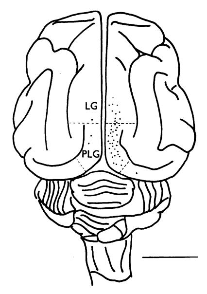

Text-fig. 1. Diagram of dorsal aspect of cat's brain, to show entry points of 45 micro-electrode penetrations. The penetrations between the interrupted lines are those in which cells had their receptive fields in or near area centralis. LG, lateral gyrus; PLG, post-lateral gyrus. Scale, 1 cm.

using depth readings corresponding to the unit and the lesion. A correction was made for brain shrinkage, which was estimated by comparing the distance between two lesions, measured under the microscope, with the distance calculated from depths at which the two lesions were made. From brain to brain this shrinkage was not constant, so that it was not possible to apply an average correction for shrinkage to all brains. For tracks marked by only one lesion it was assumed that the first unit activity was recorded at the boundary of the first and second layers; any error resulting from this was probably small, since in a number of penetrations a lesion was made at the point where the first units were encountered, and these were in the lower first or the upper second layers, or else at the very boundary. The absence of cell-body records and unresolved background activity as the electrode passed through subcortical white matter (see Text-fig. 13 and Pl. 1) was also helpful in confirming the accuracy of the track reconstructions.

# PART I

# ORGANIZATION OF RECEPTIVE FIELDS IN CAT'S VISUAL CORTEX: PROPERTIES OF 'SIMPLE' AND 'COMPLEX' FIELDS

The receptive field of a cell in the visual system may be defined as the region of retina (or visual field) over which one can influence the firing of that cell. In the cat's retina one can distinguish two types of ganglion cells, those with 'on'-centre receptive fields and those with 'off'-centre fields (Kuffler, 1953). The lateral geniculate body also has cells of these two types; so far no others have been found (Hubel & Wiesel, 1961). In contrast, the visual cortex contains a large number of functionally different cell types; yet with the exception of afferent fibres from the lateral geniculate body we have found no units with concentric 'on'-centre or 'off'-centre fields.

When stimulated with stationary or moving patterns of light, cells in the visual cortex gave responses that could be interpreted in terms of the arrangements of excitatory and inhibitory regions in their receptive fields (Hubel & Wiesel, 1959). Not all cells behaved so simply, however; some responded in a complex manner which bore little obvious relationship to the receptive fields mapped with small spots. It has become increasingly apparent to us that cortical cells differ in the complexity of their receptive fields. The great majority of fields seem to fall naturally into two groups, which we have termed 'simple' and 'complex'. Although the fields to be described represent the commonest subtypes of these groups, new varieties are continually appearing, and it is unlikely that the ones we have listed give anything like a complete picture of the striate cortex. We have therefore avoided a rigid system of classification, and have designated receptive fields by letters or numbers only for convenience in referring to the figures. We shall concentrate especially on features common to simple fields and on those common to complex fields, emphasizing differences between the two groups, and also between cortical fields and lateral geniculate fields.

#### RESULTS

# Simple receptive fields

The receptive fields of 233 of the 303 cortical cells in the present series were classified as 'simple'. Like retinal ganglion and geniculate cells, cortical cells with simple fields possessed distinct excitatory and inhibitory subdivisions. Illumination of part or all of an excitatory region increased the maintained firing of the cell, whereas a light shone in the

inhibitory region suppressed the firing and evoked a discharge at 'off'. A large spot confined to either area produced a greater change in rate of firing than a small spot, indicating summation within either region. On the other hand, the two types of region within a receptive field were mutually antagonistic. This was most forcefully shown by the absence or near absence of a response to simultaneous illumination of both regions. for example, with diffuse light. From the arrangement of excitatory and inhibitory regions it was usually possible to predict in a qualitative way the responses to any shape of stimulus, stationary or moving. Spots having the approximate shape of one or other region were the most effective stationary stimuli; smaller spots failed to take full advantage of summation within a region, while larger ones were likely to invade opposing regions, so reducing the response. To summarize: these fields were termed 'simple' because like retinal and geniculate fields (1) they were subdivided into distinct excitatory and inhibitory regions; (2) there was summation within the separate excitatory and inhibitory parts; (3) there was antagonism between excitatory and inhibitory regions; and (4) it was possible to predict responses to stationary or moving spots of various shapes from a map of the excitatory and inhibitory areas.

While simple cortical receptive fields were similar to those of retinal ganglion cells and geniculate cells in possessing excitatory and inhibitory subdivisions, they differed profoundly in the spatial arrangements of these regions. The receptive fields of all retinal ganglion and geniculate cells had one or other of the concentric forms shown in Text-fig. 2A, B. (Excitatory areas are indicated by crosses, inhibitory areas by triangles.) In contrast, simple cortical fields all had a side-to-side arrangement of excitatory and inhibitory areas with separation of the areas by parallel straight-line boundaries rather than circular ones. There were several varieties of fields, differing in the number of subdivisions and the relative area occupied by each subdivision. The commonest arrangements are illustrated in Text-fig. 2C-G: Table 1 gives the number of cells observed in each category. The departure of these fields from circular symmetry introduces a new variable, namely, the orientation of the boundaries separating the field subdivisions. This orientation is a characteristic of each cortical cell, and may be vertical, horizontal, or oblique. There was no indication that any one orientation was more common than the others. We shall use the term receptive-field axis to indicate a line through the centre of a field, parallel to the boundaries separating excitatory and inhibitory regions. The axis orientation will then refer to the orientation of these boundaries, either on the retina or in the visual field. Axes are shown in Text-fig. 2 by continuous lines.

Two common types of fields, shown in Text-fig. 2C, D, each consisted of a narrow elongated area, excitatory or inhibitory, flanked on either side

by two regions of the opposite type. In these fields the two flanking regions were symmetrical, i.e. they were about equal in area and the responses obtained from them were of about the same magnitude. In addition there were fields with long narrow centres (excitatory or inhibitory) and asymmetrical flanks. An example of an asymmetrical field with an inhibitory centre is shown in Text-fig. 2 E. The most effective stationary stimulus for all of these cells was a long narrow rectangle ('slit') of light just large

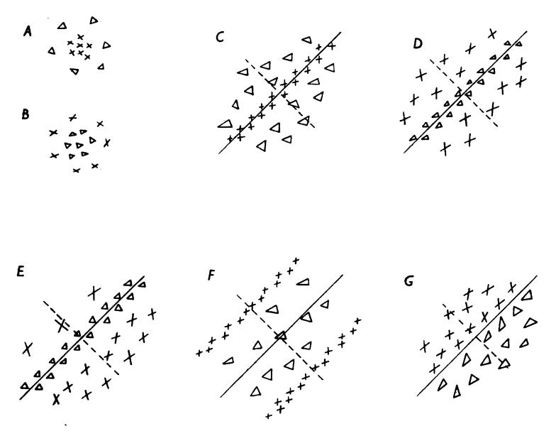

Text-fig. 2. Common arrangements of lateral geniculate and cortical receptive fields. A. 'On'-centre geniculate receptive field. B. 'Off'-centre geniculate receptive field. C-G. Various arrangements of simple cortical receptive fields.  $\times$ , areas giving excitatory responses ('on' responses);  $\triangle$ , areas giving inhibitory responses ('off' responses). Receptive-field axes are shown by continuous lines through field centres; in the figure these are all oblique, but each arrangement occurs in all orientations.

enough to cover the central region without invading either flank. For maximum centre response the orientation of the slit was critical; changing the orientation by more than 5–10° was usually enough to reduce a response greatly or even abolish it. Illuminating both flanks usually evoked a strong response. If a slit having the same size as the receptive-field centre was shone in either flanking area it evoked only a weak response, since it covered only part of one flank. Diffuse light was ineffective, or at most evoked only a very weak response, indicating that the excitatory and inhibitory parts of the receptive field were very nearly balanced.

In these fields the equivalent but opposite-type regions occupied retinal

areas that were far from equal; the centre portion was small and concentrated whereas the flanks were widely dispersed. A similar inequality was found in fields of type F, Text-fig. 2, but here the excitatory flanks were elongated and concentrated, while the centre was relatively large and diffuse. The optimum response was evoked by simultaneously illuminating the two flanks with two parallel slits (see Hubel & Wiesel, 1959, Fig. 9).

Some cells had fields in which only two regions were discernible, arranged side by side as in Text-fig. 2G. For these cells the most efficient stationary stimulus consisted of two areas of differing brightness placed so that the line separating them fell exactly over the boundary between the excitatory and inhibitory parts of the field. This type of stimulus was termed an 'edge'. An 'on' or an 'off' response was evoked depending on whether the bright part of the stimulus fell over the excitatory or the inhibitory region. A slight change in position or orientation of the line separating the light from the dark area was usually enough to reduce greatly the effectiveness of the stimulus.

Moving stimuli were very effective, probably because of the synergistic effects of leaving an inhibitory area and simultaneously entering an excitatory area (Hubel & Wiesel, 1959). The optimum stimulus could usually be predicted from the distribution of excitatory and inhibitory regions of the receptive field. With moving stimuli, just as with stationary, the orientation was critical. In contrast, a slit or edge moved across the circularly symmetric field of a geniculate cell gave (as one would expect) roughly the same response regardless of the stimulus orientation. The responses evoked when an optimally oriented slit crossed back and forth over a cortical receptive field were often roughly equal for the two directions of crossing. This was true of fields like those shown in Text-fig. 2C, D and F. For many cells, however, the responses to two diametrically opposite movements were different, and some only responded to one of the two movements. The inequalities could usually be accounted for by an asymmetry in flanking regions, of the type shown in Text-fig. 2E (see also Hubel & Wiesel, 1959, Fig. 7). In fields that had only two discernible regions arranged side by side (Text-fig. 2G), the difference in the responses to a moving slit or edge was especially pronounced.

Optimum rates of movement varied from one cell to another. On several occasions two cells were recorded together, one of which responded only to a slow-moving stimulus (1°/sec or lower) the other to a rapid one (10°/sec or more). For cells with fields of type F, Text-fig. 2, the time elapsing between the two discharges to a moving stimulus was a measure of the rate of movement (see Hubel & Wiesel, 1959, Fig. 5).

If responses to movement were predictable from arrangements of excitatory and inhibitory regions, the reverse was to some extent also true.

The axis orientation of a field, for example, was given by the most effective orientation of a moving slit or edge. If an optimally oriented slit produced a brief discharge on crossing from one region to another, one could predict that the first region was inhibitory and the second excitatory. Brief responses to crossing a very confined region were characteristic of cells with simple cortical fields, whereas the complex cells to be described below gave sustained responses to movement over much wider areas.

Table 1. Simple cortical fields

|                                              | Text-fig.         | No. of cells |
|----------------------------------------------|-------------------|--------------|
| (a) Narrow concentrated centres              |                   |              |
| (i) Symmetrical flanks                       |                   |              |
| Excitatory centres                           | $\boldsymbol{2C}$ | 23           |
| Inhibitory centres                           | $\boldsymbol{2D}$ | 17           |
| (ii) Asymmetrical flanks                     |                   |              |
| Excitatory centres                           |                   | 28           |
| Inhibitory centres                           | 2E                | 10           |
| (b) Large centres; concentrated flanks       | 2F                | 21           |
| (c) One excitatory region and one inhibitory | 2G                | 17           |
| (d) Uncategorized                            | _                 | 117          |
| Total number of simple fields                |                   | 233          |

Movement was used extensively as a stimulus in experiments in which the main object was to determine axis orientation and ocular dominance for a large number of cells in a single penetration, and when it was not practical, because of time limitations, to map out every field completely. Because movement was generally a very powerful stimulus, it was also used in studying cells that gave little or no response to stationary patterns. In all, 117 of the 233 simple cells were studied mainly by moving stimuli. In Table 1 these have been kept separate from the other groups since the distribution of their excitatory and inhibitory regions is not known with the same degree of certainty. It is also possible that with further study, some of these fields would have revealed complex properties.

# Complex receptive fields

Intermixed with cells having simple fields, and present in most penetrations of the striate cortex, were cells with far more intricate and elaborate properties. The receptive fields of these cells were termed 'complex'. Unlike cells with simple fields, these responded to variously-shaped stationary or moving forms in a way that could not be predicted from maps made with small circular spots. Often such maps could not be made, since small round spots were either ineffective or evoked only mixed ('on-off') responses throughout the receptive field. When separate 'on' and 'off' regions could be discerned, the principles of summation and mutual antagonism, so helpful in interpreting simple fields, did not generally hold. Nevertheless, there were some important features common to the two

Physiol. 160

types of cells. In the following examples, four types of complex fields will be illustrated. The numbers observed of each type are given in Table 2.

TABLE 2. Complex cortical receptive fields

|                                         | Text-fig. | No. of cells |
|-----------------------------------------|-----------|--------------|
| (a) Activated by slit—non-uniform field | 3         | 11           |
| (b) Activated by slit—uniform field     | 4         | 39           |
| (c) Activated by edge                   | 5-6       | 14           |
| (d) Activated by dark bar               | 7–8       | 6            |
| Total number of complex fields          |           | 70           |

The cell of Text-fig. 3 failed to respond to round spots of light, whether small or large. By trial and error with many shapes of stimulus it was discovered that the cell's firing could be influenced by a horizontally oriented slit  $\frac{1}{8}$ ° wide and 3° long. Provided the slit was horizontal its exact

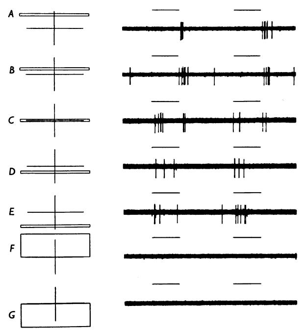

Text-fig. 3. Responses of a cell with a complex receptive field to stimulation of the left (contralateral) eye. Receptive field located in area centralis. The diagrams to the left of each record indicate the position of a horizontal rectangular light stimulus with respect to the receptive field, marked by a cross. In each record the upper line indicates when the stimulus is on. A-E, stimulus  $\frac{1}{8} \times 3^{\circ}$ , F-G, stimulus  $\frac{1}{2} \times 3^{\circ}$  (4° is equivalent to 1 mm on the cat retina). For background illumination and stimulus intensity see Methods. Cell was activated in the same way from right eye, but less vigorously (ocular-dominance group 2, see Part II). An electrolytic lesion made while recording from this cell was found near the border of layers 5 and 6, in the apical segment of the post-lateral gyrus. Positive deflexions upward; duration of each stimulus 1 sec.

positioning within the 3°-diameter receptive field was not critical. When it was shone anywhere above the centre of the receptive field (the horizontal line of Text-fig. 3) an 'off' response was obtained; 'on' responses were evoked throughout the lower half. In an intermediate position (Text-fig. 3C) the cell responded at both 'on' and 'off'. From experience with simpler receptive fields one might have expected wider slits to give increasingly better responses owing to summation within the upper or lower part of the field, and that illumination of either half by itself might be the most effective stimulus of all. The result was just the opposite: responses fell off rapidly as the stimulus was widened beyond about 1°, and large rectangles covering the entire lower or upper halves of the receptive field were quite ineffective (Text-fig. 3F, G). On the other hand, summation could easily be demonstrated in a horizontal direction, since a slit \( \frac{1}{8} \) wide but extending only across part of the field was less effective than a longer one covering the entire width. One might also have expected the orientation of the slit to be unimportant as long as the stimulus was wholly confined to the region above the horizontal line or the region below. On the contrary, the orientation was critical, since a tilt of even a few degrees from the horizontal markedly reduced the response, even though the slit did not cross the boundary separating the upper and lower halves of the field.

In preferring a slit specific in width and orientation this cell resembled certain cells with simple fields. When stimulated in the upper part of its field it behaved in many respects like cells with 'off'-centre fields of type D, Text-fig. 2; in the lower part it responded like 'on'-centre fields of Text-fig. 2C. But for this cell the strict requirements for shape and orientation of the stimulus were in marked contrast to the relatively large leeway of the stimulus in its ordinate position on the retina. Cells with simple fields, on the other hand, showed very little latitude in the positioning of an optimally oriented stimulus.

The upper part of this receptive field may be considered inhibitory and the lower part excitatory, even though in either area summation only occurred in a horizontal direction. Such subdivisions were occasionally found in complex fields, but more often the fields were uniform in this respect. This was true for the other complex fields to be described in this section.

Responses of a second complex unit are shown in Text-fig. 4. In many ways the receptive field of this cell was similar to the one just described. A slit was the most potent stimulus, and the most effective width was again  $\frac{1}{8}$ °. Once more the orientation was an important stimulus variable, since the slit was effective anywhere in the field as long as it was placed in a 10 o'clock-4 o'clock orientation (Text-fig. 4A-D). A change in orientation of more than 5-10° in either direction produced a marked

reduction in the response (Text-fig. 4E-G). As usual, diffuse light had no influence on the firing. This cell responded especially well if the slit, oriented as in A-D, was moved steadily across the receptive field. Sustained discharges were evoked over the entire length of the field. The optimum rate of movement was about  $1^{\circ}/\text{sec}$ . If movement was interrupted the discharge stopped, and when it was resumed the firing recommenced. Continuous firing could be maintained indefinitely by small side-

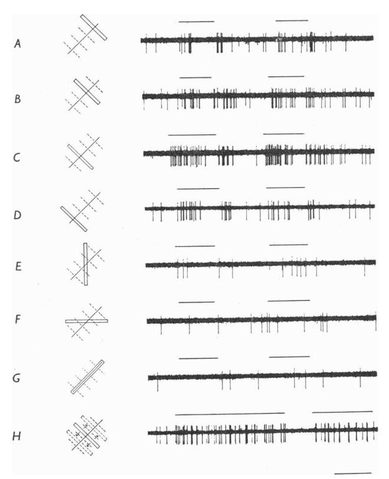

Text-fig. 4. Responses of a cell with a complex field to stimulation of the left (contralateral) eye with a slit  $\frac{1}{8} \times 2\frac{1}{2}^{\circ}$ . Receptive field was in the area centralis and was about  $2 \times 3^{\circ}$  in size. A-D,  $\frac{1}{8}^{\circ}$  wide slit oriented parallel to receptive field axis. E-G, slit oriented at 45 and 90° to receptive-field axis. H, slit oriented as in A-D, is on throughout the record and is moved rapidly from side to side where indicated by upper beam. Responses from left eye slightly more marked than those from right (Group 3, see Part II). Time 1 sec.

to-side movements of a stimulus within the receptive field (Text-fig. 4H). The pattern of firing was one characteristic of many complex cells, especially those responding well to moving stimuli. It consisted of a series of short high-frequency repetitive discharges each containing 5-10 spikes. The

bursts occurred at irregular intervals, at frequencies up to about 20/sec. For this cell, movement of an optimally oriented slit was about equally effective in either of the two opposite directions. This was not true of all complex units, as will be seen in some of the examples given below.

Like the cell of Text-fig. 3 this cell may be thought of as having a counterpart in simple fields of the type shown in Text-fig. 2C-E. It shares with these simpler fields the attribute of responding well to properly oriented slit stimuli. Once more the distinction lies in the permissible variation in position of the optimally oriented stimulus. The variation is small (relative to the size of the receptive field) in the simple fields, large in the complex. Though resembling the cell of Text-fig. 3 in requiring a slit for a stimulus, this cell differed in that its responses to a properly oriented slit were mixed ('on-off') in type. This was not unusual for cells with complex fields. In contrast, cortical cells with simple fields, like retinal ganglion cells and lateral geniculate cells, responded to optimum restricted stimuli either with excitatory ('on') responses or inhibitory ('off') responses. When a stimulus covered opposing regions, the effects normally tended to cancel, though sometimes mixed discharges were obtained, the 'on' and 'off' components both being weak. For these simpler fields 'on-off' responses were thus an indication that the stimulus was not optimum. Yet some cells with complex fields responded with mixed discharges even to the most effective stationary stimuli we could find. Among the stimuli tried were curved objects, dark stripes, and still more complicated patterns, as well as monochromatic spots and slits.

A third type of complex field is illustrated in Text-figs. 5 and 6. There were no responses to small circular spots or to slits, but an edge was very effective if oriented vertically. Excitatory or inhibitory responses were produced depending on whether the brighter area was to the left or the right (Text-fig. 5A, E). So far, these are just the responses one would expect from a cell with a vertically oriented simple field of the type shown in Text-fig. 2G. In such a field the stimulus placement for optimum response is generally very critical. On the contrary, the complex unit responded to vertical edges over an unusually large region about  $16^{\circ}$  in length (Text-fig. 6). 'On' responses were obtained with light to the left (A-D), and 'off' responses with light to the right (E-H), regardless of the position of the line separating light from darkness. When the entire receptive field was illuminated diffusely (I) no response was evoked. As with all complex fields, we are unable to account for these responses by any simple spatial arrangement of excitatory and inhibitory regions.

Like the complex units already described, this cell was apparently more concerned with the orientation of a stimulus than with its exact position in the receptive field. It differed in responding well to edges but poorly or not at all to slits, whether narrow or wide. It is interesting in this connexion that exchanging an edge for its mirror equivalent reversed the response, i.e. replaced an excitatory response by an inhibitory and vice versa. The ineffectiveness of a slit might therefore be explained by supposing that the opposite effects of its two edges tended to cancel each other.

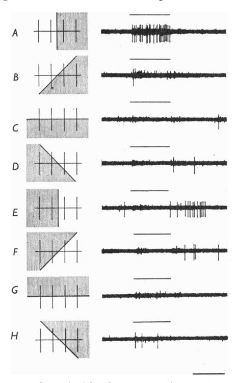

Text-fig. 5. Responses of a cell with a large  $(8 \times 16^{\circ})$  complex receptive field to an edge projected on the ipsilateral retina so as to cross the receptive field in various directions. (The screen is illuminated by a diffuse background light, at  $0.0 \log_{10} \text{cd/m}^2$ . At the time of stimulus, shown by upper line of each record, half the screen, to one side of the variable boundary, is illuminated at  $1.0 \log_{10} \text{cd/m}^2$ , while the other half is kept constant.) A, vertical edge with light area to left, darker area to right. B-H, various other orientations of edge. Position of receptive field 20° below and to the left of the area centralis. Responses from ipsilateral eye stronger than those from contralateral eye (group 5, see Part II). Time 1 sec.

As shown in Text-fig. 6, the responses of the cell to a given vertical edge were consistent in type, being either 'on' or 'off' for all positions of the edge within the receptive field. In being uniform in its response-type it resembled the cell of Text-fig. 4. A few other cells of the same general category showed a similar preference for edges, but lacked this uniformity. Their receptive fields resembled the field of Text-fig. 3, in that a given edge evoked responses of one type over half the field, and the opposite type over

the other half. These fields were divided into two halves by a line parallel to the receptive-field axis: an edge oriented parallel to the axis gave 'on' responses throughout one of the halves and 'off' responses through the other. In either half, replacing the edge by its mirror image reversed the response-type. Even cells, which were uniform in their response-types, like those in Text-fig. 4–6, varied to some extent in the magnitude of their responses, depending on the position of the stimulus. Moreover, as with most cortical cells, there was some variation in responses to identical stimuli.

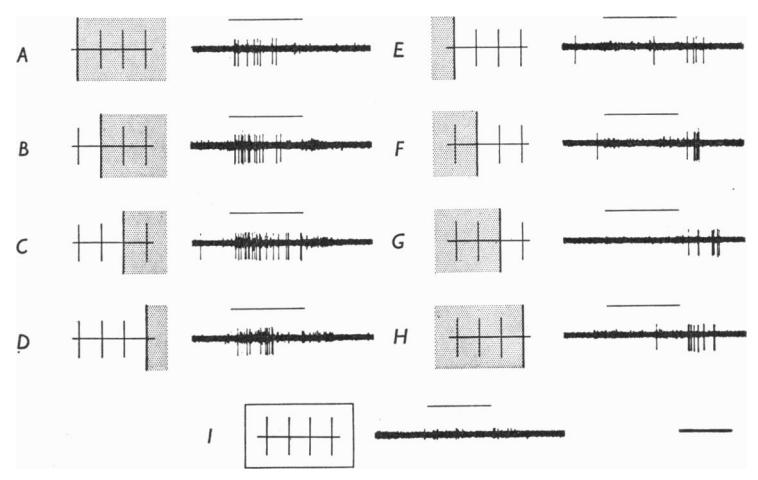

Text-fig. 6. Same cell as in Text-fig. 5. A-H, responses to a vertical edge in various parts of the receptive field: A-D, brighter light to the left; E-H, brighter light to the right; I, large rectangle,  $10\times20^{\circ}$ , covering entire receptive field. Time, 1 sec.

A final example is given to illustrate the wide range of variation in the organization of complex receptive fields. The cell of Text-figs. 7 and 8 was not strongly influenced by any form projected upon the screen; it gave only weak, unsustained 'on' responses to a dark horizontal rectangle against a light background, and to other forms it was unresponsive. A strong discharge was evoked, however, if a black rectangular object (for example, a piece of black tape) was placed against the brightly illuminated screen. The receptive field of the cell was about  $5 \times 5^{\circ}$ , and the most effective stimulus width was about  $\frac{1}{3}^{\circ}$ . Vigorous firing was obtained regardless of the position of the rectangle, as long as it was horizontal and within the receptive field. If it was tipped more than  $10^{\circ}$  in either direction no discharge was evoked (Text-fig. 7D, E). We have recorded several complex fields which resembled this one in that they responded best to black rectangles against a bright background. Presumably it is important to

have good contrast between the narrow black rectangle and the background; this is technically difficult with a projector because of scattered light.

Slow downward movement of the dark rectangle evoked a strong discharge throughout the entire 5° of the receptive field (Text-fig. 8A). If the movement was halted the cell continued to fire, but less vigorously.

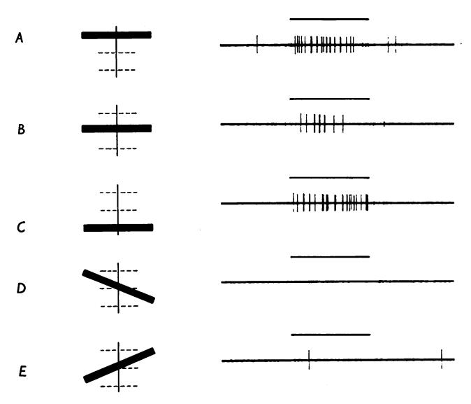

Text-fig. 7. Cell activated only by left (contralateral) eye over a field approximately  $5 \times 5^{\circ}$ , situated  $10^{\circ}$  above and to the left of the area centralis. The cell responded best to a black horizontal rectangle,  $\frac{1}{3} \times 6^{\circ}$ , placed anywhere in the receptive field (A-C). Tilting the stimulus rendered it ineffective (D-E). The black bar was introduced against a light background during periods of 1 sec, indicated by the upper line in each record. Luminance of white background,  $1 \cdot 0 \log_{10} \operatorname{cd/m^2}$ ; luminance of black part,  $0 \cdot 0 \log_{10} \operatorname{cd/m^2}$ . A lesion, made while recording from the cell, was found in layer 2 of apical segment of post-lateral gyrus.

Upward movement gave only weak, inconsistent responses, and left-right movement (Text-fig. 8B) gave no responses. Discharges of highest frequency were evoked by relatively slow rates of downward movement (about 5-10 sec to cross the entire field); rapid movement in either direction gave only very weak responses.

Despite its unusual features this cell exhibited several properties typical of complex units, particularly the lack of summation (except in a horizontal sense), and the wide area over which the dark bar was effective. One may think of the field as having a counterpart in simple fields of type D, Text-fig. 2. In such fields a dark bar would evoke discharges, but only if it fell within the inhibitory region. Moreover, downward movement of

the bar would also evoke brisker discharges than upward, provided the upper flanking region were stronger than the lower one.

In describing simple fields it has already been noted that moving stimuli were often more effective than stationary ones. This was also true of cells with complex fields. Depending on the cell, slits, edges, or dark bars were most effective. As with simple fields, orientation of a stimulus was always critical, responses varied with rate of movement, and directional asymmetries of the type seen in Text-fig. 8 were common. Only once have we seen activation of a cell for one direction of movement and suppression of

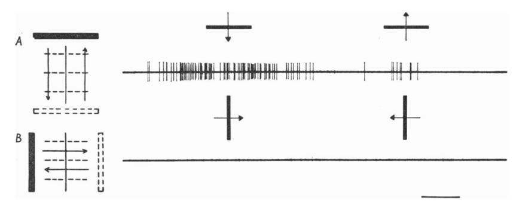

Text-fig. 8. Same cell as in Text-fig. 7. Movement of black rectangle  $\frac{1}{3} \times 6^{\circ}$  back and forth across the receptive field: A, horizontally oriented (parallel to receptive-field axis); B, vertically oriented. Time required to move across the field, 5 sec. Time, 1 sec.

maintained firing for the opposite direction. In their responses to movement, cells with complex fields differed from their simple counterparts chiefly in responding with sustained firing over substantial regions, usually the entire receptive field, instead of over a very narrow boundary separating excitatory and inhibitory regions.

# Receptive-field dimensions

Over-all field dimensions were measured for 119 cells. A cell was included only if its field was mapped completely, and if it was situated in the area of central vision (see p. 135). Fields varied greatly in size from one cell to the next, even for cells recorded in a single penetration (see Text-fig. 15). In Text-fig. 9 the distribution of cells according to field area is given separately for simple and complex fields. The histogram illustrates the variation in size, and shows that on the average complex fields were larger than simple ones.

Widths of the narrow subdivisions of simple fields (the centres of types C, D and E or the flanks of type F, Text-fig. 2) also varied greatly: the smallest were 10-15 minutes of arc, which is roughly the diameter of the smallest field centres we have found for geniculate cells. For some cells

with complex fields the widths of the most effective slits or dark bars were also of this order, indicating that despite the greater overall field size these cells were able to convey detailed information. We wish to emphasize that in both geniculate and cortex the field dimensions tend to increase with distance from the area centralis, and that they differ even for a given location in the retina. It is consequently not possible to compare field sizes in the geniculate and cortex unless these variations are taken into account. This may explain the discrepancy between our results and the findings of Baumgartner (see Jung, 1960), that 'field centres' in the cortex are one half the size of those in the lateral geniculate body.

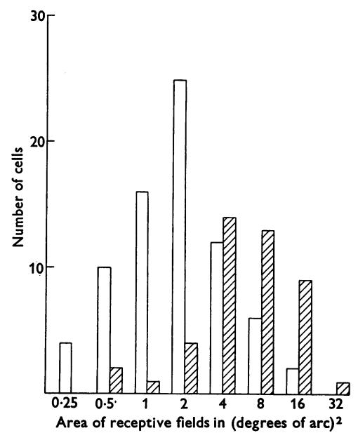

Text-fig. 9. Distribution of 119 cells in the visual cortex with respect to the approximate area of their receptive fields. White columns indicate cells with simple receptive fields; shaded columns, cells with complex fields. Abscissa: area of receptive fields. Ordinate: number of cells.

# Responsiveness of cortical cells

Simple and complex fields together account for all of the cells we have recorded in the visual cortex. We have not observed cells with concentric fields. Except for clearly injured cells (showing extreme spike deformation or prolonged high-frequency bursts of impulses) all units have responded to visual stimulation, though it has occasionally taken several hours to find the retinal region containing the receptive field and to work out the optimum stimuli. Some cells responded only to stimuli which were optimum in their retinal position and in their form, orientation and rate of

movement. A few even required stimulation of both eyes before a response could be elicited (see Part II). But there is no indication from our studies that the striate cortex contains nerve cells that are unresponsive to visual stimuli.

Most of the cells of this series were observed for 1 or 2 hr, and some were studied for up to 9 hr. Over these periods of time there were no qualitative changes in the characteristics of receptive fields: their complexity, arrangements of excitatory and inhibitory areas, axis orientation and position all remained the same, as did the ocular dominance. With deepening anaesthesia a cell became less responsive, so that stimuli that had formerly been weak tended to become even weaker or ineffective, while those that had evoked brisk responses now evoked only weak ones. The last thing to disappear with very deep anaesthesia was usually the response to a moving form. As long as any responses remained the cell retained the same specific requirements as to stimulus form, orientation and rate of movement, suggesting that however the drug exerted its effects, it did not to any important extent functionally disrupt the specific visual connexions. A comparison of visual responses in the anaesthetized animal with those in the unanaesthetized, unrestrained preparation (Hubel, 1959) shows that the main differences lie in the frequency and firing patterns of the maintained activity and in the vigour of responses, rather than in the basic receptive-field organization. It should be emphasized, however, that even in light anaesthesia or in the attentive state diffuse light remains relatively ineffective; thus the balance between excitatory and inhibitory influences is apparently maintained in the waking state.

# PART II

## BINOCULAR INTERACTION AND OCULAR DOMINANCE

Recording from single cells at various levels in the visual system offers a direct means of determining the site of convergence of impulses from the two eyes. In the lateral geniculate body, the first point at which convergence is at all likely, binocularly influenced cells have been observed, but it would seem that these constitute at most a small minority of the total population of geniculate cells (Erulkar & Fillenz, 1958, 1960; Bishop, Burke & Davis, 1959; Grüsser & Sauer, 1960; Hubel & Wiesel, 1961). Silver-degeneration studies show that in each layer of the geniculate the terminals of fibres from a single eye are grouped together, with only minor overlap in the interlaminar regions (Silva, 1956; Hayhow, 1958). The anatomical and physiological findings are thus in good agreement.

It has long been recognized that the greater part of the cat's primary visual cortex receives projections from the two eyes. The anatomical

evidence rests largely on the observation that cells in all three lateral geniculate layers degenerate following a localized lesion in the striate area (Minkowski, 1913). Physiological confirmation was obtained by Talbot & Marshall (1941) who stimulated the visual fields of the separate eyes with small spots of light, and mapped the evoked cortical slow waves. Still unsettled, however, was the question of whether individual cortical cells receive projections from both eyes, or whether the cortex contains a mixture of cells, some activated by one eye, some by the other. We have recently shown that many cells in the visual cortex can be influenced by both eyes (Hubel & Wiesel, 1959). The present section contains further observations on binocular interaction. We have been particularly interested in learning whether the eyes work in synergy or in opposition, how the relative influence of the two eyes varies from cell to cell, and whether, on the average, one eye exerts more influence than the other on the cells of a given hemisphere.

#### RESULTS

In agreement with previous findings (Hubel & Wiesel, 1959) the receptive fields of all binocularly influenced cortical cells occupied corresponding positions on the two retinas, and were strikingly similar in their organization. For simple fields the spatial arrangements of excitatory and inhibitory regions were the same; for complex fields the stimuli that excited or inhibited the cell through one eye had similar effects through the other. Axis orientations of the two receptive fields were the same. Indeed, the only differences ever seen between the two fields were related to eye dominance: identical stimuli to the two eyes did not necessarily evoke equally strong responses from a given cell. For some cells the responses were equal or almost so; for others one eye tended to dominate. Whenever the two retinas were stimulated in identical fashion in corresponding regions, their effects summed, i.e. they worked in synergy. On the other hand, if antagonistic regions in the two eyes were stimulated so that one eye had an excitatory effect and the other an inhibitory one, then the responses tended to cancel (Hubel & Wiesel, 1959, Fig. 10A).

Some units did not respond to stimulation of either eye alone but could be activated only by simultaneous stimulation of the two eyes. Text-figure 10 shows an example of this, and also illustrates ordinary binocular synergy. Two simultaneously recorded cells both responded best to transverse movement of a rectangle oriented in a 1 o'clock-7 o'clock direction (Text-fig. 10A, B). For one of the cells movement down and to the right was more effective than movement up and to the left. Responses from the individual eyes were roughly equal. On simultaneous stimulation of the two eyes both units responded much more vigorously. Now a third cell was also activated.

The threshold of this third unit was apparently so high that, at least under these experimental conditions, stimulation of either eye alone failed to evoke any response.

A second example of synergy is seen in Text-fig. 11. The most effective stimulus was a vertically oriented rectangle moved across the receptive field from left to right. Here the use of both eyes not only enhanced the response already observed with a single eye, but brought into the open a tendency that was formerly unsuspected. Each eye mediated a weak

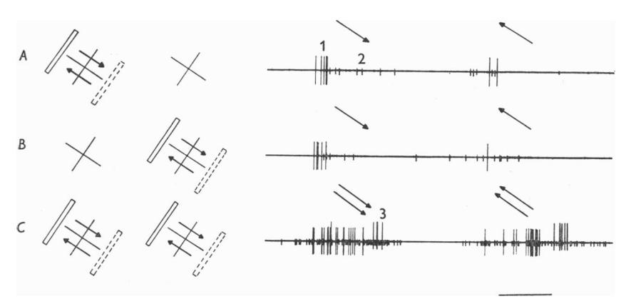

Text-fig. 10. Examples of binocular synergy in a simultaneous recording of three cells (spikes of the three cells are labelled 1-3). Each of the cells had receptive fields in the two eyes; in each eye the three fields overlapped and were situated  $2^{\circ}$  below and to the left of the area centralis. The crosses to the left of each record indicate the positions of the receptive fields in the two eyes. The stimulus was  $\frac{1}{8} \times 2^{\circ}$  slit oriented obliquely and moved slowly across the receptive fields as shown; A, in the left eye; B, in the right eye; C, in the two eyes simultaneously. Since the responses in the two eyes were about equally strong, these two cells were classed in ocular-dominance group 4 (see Text-fig. 12). Time, 1 sec.

response (Text-fig. 11A, B) which was greatly strengthened when both eyes were used in parallel (C). Now, in addition, the cell gave a weak response to leftward movement, indicating that this had an excitatory effect rather than an inhibitory one. Binocular synergy was often a useful means of bringing out additional information about a receptive field.

In our previous study of forty-five cortical cells (Hubel & Wiesel, 1959) there was clear evidence of convergence of influences from the two eyes in only one fifth of the cells. In the present series 84% of the cells fell into this category. The difference is undoubtedly related to the improved precision in technique of binocular stimulation. A field was first mapped in the dominant eye and the most effective type of stimulus determined. That stimulus was then applied in the corresponding region in the other

eye. Finally, even if no response was obtained from the non-dominant eye, the two eyes were stimulated together in parallel to see if their effects were synergistic. With these methods, an influence was frequently observed from the non-dominant eye that might otherwise have been overlooked.

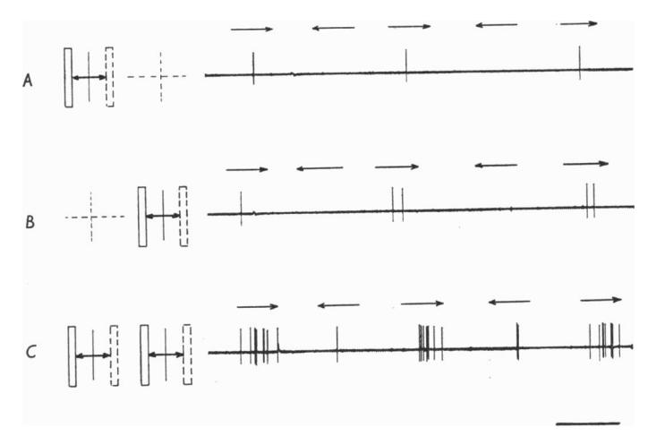

Text-fig. 11. Movement of a  $\frac{1}{4} \times 2^{\circ}$  slit back and forth horizontally across the receptive field of a binocularly influenced cell. A, left eye; B, right eye; C, both eyes. The cell clearly preferred left-to-right movement, but when both eyes were stimulated together it responded also to the reverse direction. Field diameter,  $2^{\circ}$ , situated  $5^{\circ}$  from the area centralis. Time, 1 sec.

A comparison of the influence of the two eyes was made for 223 of the 303 cells in the present series. The remaining cells were either not sufficiently studied, or they belonged to the small group of cells which were only activated if both eyes were simultaneously stimulated. The fields of all cells were in or near the area centralis. The 223 cells were subdivided into seven groups, as follows:

# Group Ocular dominance 1 Exclusively contralateral 2\* Contralateral eye much more effective than ipsilateral eye 3 Contralateral eye slightly more effective than ipsilateral 4 No obvious difference in the effects exerted by the two eyes 5 Ipsilateral eye slightly more effective 6\* Ipsilateral eye much more effective

Exclusively ipsilateral

\* These groups include cells in which the non-dominant eye, ineffective by itself, could influence the response to stimulation of the dominant eye.

A histogram showing the distribution of cells among these seven groups is given in Text-fig. 12. Assignment of a unit to a particular group was to some extent arbitrary, but it is unlikely that many cells were misplaced by more than one group. Perhaps the most interesting feature of the

histogram is its lack of symmetry: many more cells were dominated by the contralateral than by the ipsilateral eye (106 vs. 62). We conclude that in the part of the cat's striate cortex representing central vision the great majority of cells are influenced by both eyes, and that despite wide variation in relative ocular dominance from one cell to the next, the contralateral eye is, on the average, more influential. As the shaded portion

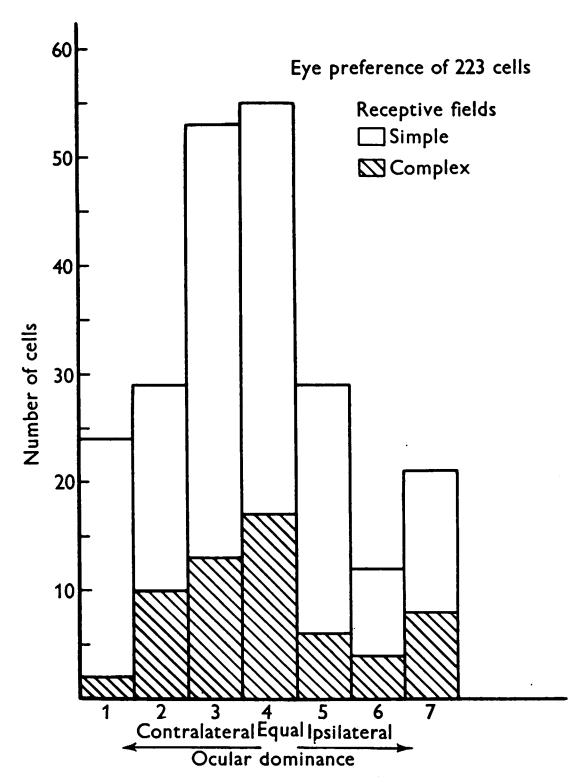

Text-fig. 12. Distribution of 223 cells recorded from the visual cortex, according to ocular dominance. Histogram includes cells with simple fields and cells with complex fields. The shaded region shows the distribution of cells with complex receptive fields. Cells of group 1 were driven only by the contralateral eye; for cells of group 2 there was marked dominance of the contralateral eye, for group 3, slight dominance. For cells in group 4 there was no obvious difference between the two eyes. In group 5 the ipsilateral eye dominated slightly, in group 6, markedly; and in group 7 the cells were driven only by the ipsilateral eye.

of Text-fig. 12 shows, there is no indication that the distribution among the various dominance groups of cells having complex receptive fields differs from the distribution of the population as a whole.

A cortical bias in favour of the contralateral eye may perhaps be related to the preponderance of crossed over uncrossed fibres in the cat's optic tract (Polyak, 1957, p. 788). The numerical inequality between crossed and uncrossed tract fibres is generally thought to be related to an inequality in size of the nasal and temporal half-fields, since both inequalities are most marked in lower mammals with laterally placed eyes, and become progressively less important in higher mammals, primates and man. Thompson et al. (1950) showed that in the rabbit, for example, there is a substantial cortical region receiving projections from that part of the peripheral contralateral visual field which is not represented in the ipsilateral retina (the 'Temporal Crescent'). Our results, concerned with more central portions of the visual fields, suggest that in the cat the difference in the number of crossed and uncrossed fibres in an optic tract is probably not accounted for entirely by fibres having their receptive fields in the temporal-field crescents.

# PART III

# FUNCTIONAL CYTOARCHITECTURE OF THE CAT'S VISUAL CORTEX

In the first two parts of this paper cells were studied individually, no attention being paid to their grouping within the cortex. We have shown that the number of functional cell types is very large, since cells may differ in several independent physiological characteristics, for example, in the retinal position of their receptive fields, their receptive-field organization, their axis orientation, and their ocular-dominance group. In this section we shall try to determine whether cells are scattered at random through the cortex with regard to these characteristics, or whether there is any tendency for one or more of the characteristics to be shared by neighbouring cells. The functional architecture of the cortex not only seems interesting for its own sake, but also helps to account for the various complex response patterns described in Part I.

#### RESULTS

Functional architecture of the cortex was studied by three methods. These had different merits and limitations, and were to some extent complementary.

(1) Cells recorded in sequence. The most useful and convenient procedure was to gather as much information as possible about each of a long succession of cells encountered in a micro-electrode penetration through the cortex, and to reconstruct the electrode track from serial histological sections. One could then determine how a physiological characteristic (such as receptive-field position, organization, axis orientation or ocular dominance) varied with cortical location. The success of this method in

delineating regions of constant physiological characteristics depends on the possibility of examining a number of units as the electrode passes through each region. Regions may escape detection if they are so small that the electrode is able to resolve only one or two cells in each. The fewer the cells resolved, the larger the regions must be in order to be detected at all.

(2) Unresolved background activity. To some extent the spaces between isolated units were bridged by studying unresolved background activity audible over the monitor as a crackling noise, and assumed to originate largely from action potentials of a number of cells. It was concluded that cells, rather than fibres, gave rise to this activity, since it ceased abruptly when the electrode left the grey matter and entered subcortical white matter. Furthermore, diffuse light evoked no change in activity, compared to the marked increase caused by an optimally oriented slit. This suggested that terminal arborizations of afferent fibres contributed little to the background, since most geniculate cells respond actively to diffuse light (Hubel, 1960). In most penetrations unresolved background activity was present continuously as the electrode passed through layers 2–6 of the cortical grey matter.

Background activity had many uses. It indicated when the cells within range of the electrode tip had a common receptive-field axis orientation. Similarly, one could use it to tell whether the cells in the neighbourhood were driven exclusively by one eye (group 1 or group 7). When the background activity was influenced by both eyes, one could not distinguish between a mixture of cells belonging to the two monocular groups (1 and 7) and a population in which each cell was driven from both eyes. But even here one could at least assess the relative influence of the two eyes upon the group of cells in the immediate neighbourhood of the electrode.

(3) Multiple recordings. In the series of 303 cells, 78 were recorded in groups of two and 12 in groups of three. Records were not regarded as multiple unless the spikes of the different cells showed distinct differences in amplitude, and unless each unit fulfilled the criteria required of a single-unit record, namely that the amplitude and wave shape be relatively constant for a given electrode position.

In such multiple recordings one could be confident that the cells were close neighbours and that uniform stimulus conditions prevailed, since the cells could be stimulated and observed together. One thus avoided some of the difficulties in evaluating a succession of recordings made over a long period of time span, where absolute constancy of eye position, anaesthetic level, and preparation condition were sometimes hard to guarantee.

Regional variations of several physiological characteristics were examined by the three methods just outlined. Of particular interest for the

Physiol. 160

present study were the receptive-field axis orientation, position of receptive fields on the retina, receptive-field organization, and relative ocular dominance. These will be described separately in the following paragraphs.

# Orientation of receptive-field axis

The orientation of a receptive-field axis was determined in several ways. When the field was simple the borders between excitatory and inhibitory regions were sufficient to establish the axis directly. For both simple and complex fields the axis could always be determined from the orientation of the most effective stimulus. For most fields, when the slit or edge was placed at right angles to the optimum position there was no response. The receptive-field axis orientation was checked by varying the stimulus orientation from this null position in order to find the two orientations at which a response was only just elicited, and by bisecting the angle between them. By one or other of these procedures the receptive-field orientation could usually be determined to within 5 or 10°.

One of the first indications that the orientation of a receptive-field axis was an important variable came from multiple recordings. Invariably the axes of receptive fields mapped together had the same orientations. An example of a 3-unit recording has already been given in Text-fig. 10. Cells with common axis orientation were therefore not scattered at random through the cortex, but tended to be grouped together. The size and shape of the regions containing these cell groups were investigated by comparing the fields of cells mapped in sequence. It was at once apparent that successively recorded cells also tended to have identical axis orientations and that each penetration consisted of several sequences of cells, each sequence having a common axis orientation. Any undifferentiated units in the background responded best to the stimulus orientation that was most effective in activating the cell under study. After traversing a distance that varied greatly from one penetration to the next, the electrode would enter an area where there was no longer any single optimum orientation for driving background activity. A very slight advance of the electrode would bring it into a region where a new orientation was the most effective, and the succeeding cells would all have receptive fields with that orientation. The change in angle from one region to another was unpredictable; sometimes it was barely detectable, at other times large (45-90°).

Text-figure 13 shows a camera lucida tracing of a frontal section through the post-lateral gyrus. The electrode track entered normal to the surface, passed through the apical segment in a direction parallel to the fibre bundles, then through the white matter beneath, and finally obliquely through half the thickness of the mesial segment. A lesion was made at the termination of the penetration. A composite photomicrograph (Pl. 1) shows the lesion

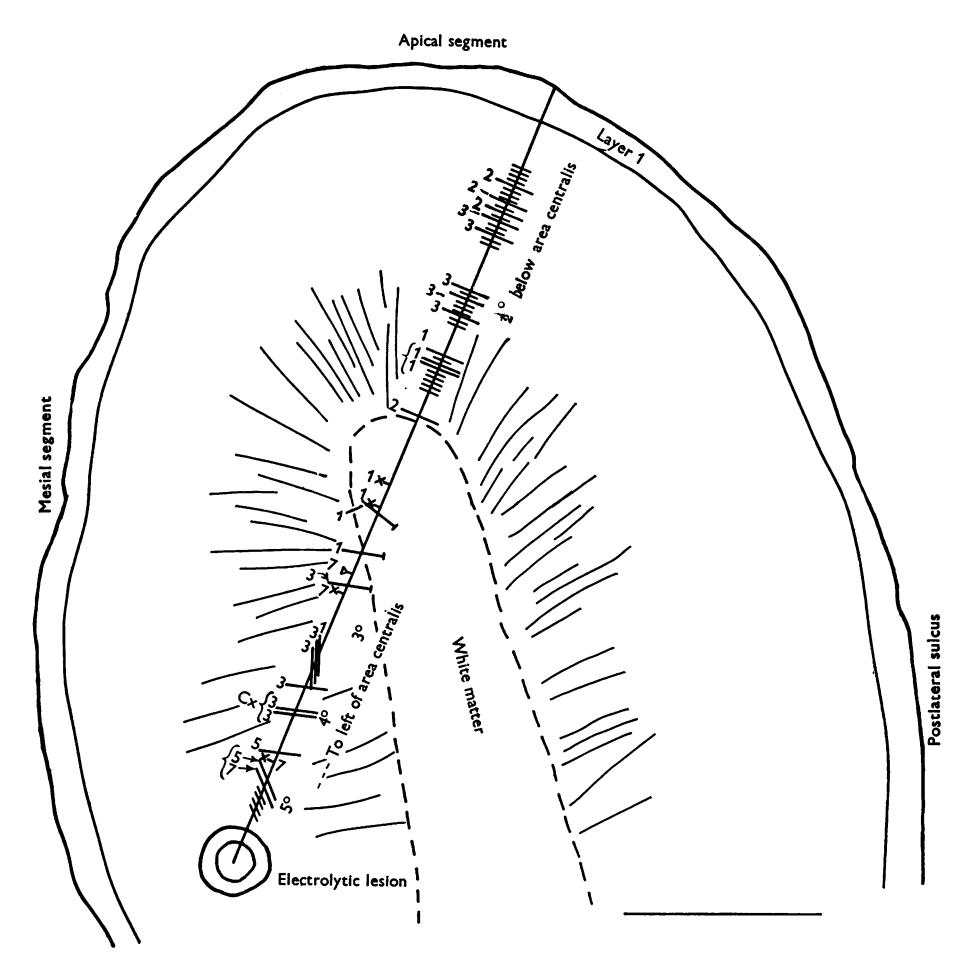

Text-fig. 13. Reconstruction of micro-electrode penetration through the lateral gyrus (see also Pl. 1). Electrode entered apical segment normal to the surface, and remained parallel to the deep fibre bundles (indicated by radial lines) until reaching white matter; in grey matter of mesial segment the electrode's course was oblique. Longer lines represent cortical cells. Axons of cortical cells are indicated by a cross-bar at right-hand end of line. Field-axis orientation is shown by the direction of each line; lines perpendicular to track represent vertical orientation. Brace-brackets show simultaneously recorded units. Complex receptive fields are indicated by 'Cx'. Afferent fibres from the lateral geniculate body indicated by  $\times$ , for 'on' centre;  $\Delta$ , for 'off' centre. Approximate positions of receptive fields on the retina are shown to the right of the penetration. Shorter lines show regions in which unresolved background activity was observed. Numbers to the left of the penetration refer to ocular-dominance group (see Part II). Scale 1 mm.

and the first part of the electrode track. The units recorded in the course of the penetration are indicated in Text-fig. 13 by the longer lines crossing the track; the unresolved background activity by the shorter lines. The orientations of the most effective stimuli are given by the directions of the lines, a line perpendicular to the track signifying a vertical orientation. For the first part of the penetration, through the apical segment, the field orientation was vertical for all cells as well as for the background activity.

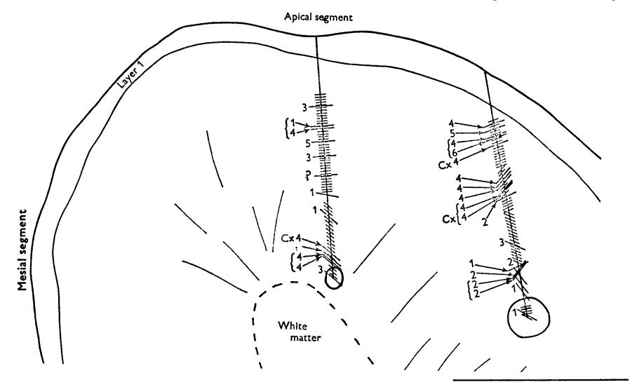

Text-fig. 14. Reconstructions of two penetrations in apical segment of post-lateral gyrus, near its anterior end (just behind anterior interrupted line in Text-fig. 1, see also Pl. 2). Medial penetration is slightly oblique, lateral one is markedly so. All receptive fields were located within 1° of area centralis. Conventions as in Text-fig. 13. Scale 1 mm.

Fibres were recorded from the white matter and from the grey matter just beyond it. Three of these fibres were axons of cortical cells having fields of various oblique orientations; four were afferent fibres from the lateral geniculate body. In the mesial segment three short sequences were encountered, each with a different common field orientation. These sequences together occupied a distance smaller than the full thickness of the apical segment.

In another experiment, illustrated in Text-fig. 14 and in Pl. 2, two penetrations were made, both in the apical segment of the post-lateral gyrus. The medial penetration (at left in the figure) was at the outset almost normal to the cortex, but deviated more and more from the direction of the deep fibre bundles. In this penetration there were three different axis orientations, of which the first and third persisted through long sequences.

In the lateral track there were nine orientations. From the beginning this track was more onlique, and it became increasingly so as it progressed.

As illustrated by the examples of Text-figs. 13 and 14, there was a marked tendency for shifts in orientation to increase in frequency as the angle between electrode and direction of fibre bundles (or apical dendrites) became greater. The extreme curvature of the lateral and post-lateral gyri in their apical segments made normal penetrations very difficult to obtain; nevertheless, four penetrations were normal or almost so. In none of these were there any shifts of axis orientation. On the other hand there were several shifts of field orientation in all oblique penetrations. As illustrated by Text-fig. 14, most penetrations that began nearly normal to the surface became more and more oblique with increasing depth. Here the distance traversed by the electrode without shifts in receptive-field orientation tended to become less and less as the penetration advanced.

It can be concluded that the striate cortex is divided into discrete regions within which the cells have a common receptive-field axis orientation. Some of the regions extend from the surface of the cortex to the white matter: it is difficult to be certain whether they all do. Some idea of their shapes may be obtained by measuring distances between shifts in receptive-field orientation. From these measurements it seems likely that the general shape is columnar, distorted no doubt by any curvature of the gyrus, which would tend to make the end at the surface broader than that at the white matter; deep in a sulcus the effect would be the reverse. The cross-sectional size and shape of the columns at the surface can be estimated only roughly. Most of our information concerns their width in the coronal plane, since it is in this plane that oblique penetrations were made. At the surface this width is probably of the order of 0.5 mm. We have very little information about the cross-sectional dimension in a direction parallel to the long axis of the gyrus. Preliminary mapping of the cortical surface suggests that the cross-sectional shape of the columns may be very irregular.

# Position of receptive fields on the retina

Gross topography. That there is a systematic representation of the retina on the striate cortex of the cat was established anatomically by Minkowski (1913) and with physiological methods by Talbot & Marshall (1941). Although in the present study no attempt has been made to map topographically all parts of the striate cortex, the few penetrations made in cortical areas representing peripheral parts of the retina confirm these findings. Cells recorded in front of the anterior interrupted lines of Textfig. 1 had receptive fields in the superior retinas; those in the one penetration behind the posterior line had fields that were well below the horizontal

meridian of the retina. (No recordings were made from cortical regions receiving projections from the deeply pigmented non-tapetal part of the inferior retinas.) In several penetrations extending far down the mesial (interhemispheric) segment of the lateral gyrus, receptive fields moved further and further out into the insilateral half of each retina as the electrode advanced (Text-fig. 13). In these penetrations the movement of fields into the retinal periphery occurred more and more rapidly as the electrode advanced. In three penetrations extending far down the lateral segment of the post-lateral gyrus (medial bank of the post-lateral sulcus) there was likewise a clear progressive shift of receptive-field positions as the electrode advanced. Here also the movement was along the horizontal meridian, again into the ipsilateral halves of both retinas. This therefore confirms the findings of Talbot & Marshall (1941) and Talbot (1942), that in each hemisphere there is a second laterally placed representation of the contralateral half-field of vision. The subject of Visual Area II will not be dealt with further in this paper.

Cells within the large cortical region lying between the interrupted lines of Text-fig. 1, and extending over on to the mesial segment and into the lateral sulcus for a distance of 2–3 mm, had their receptive fields in the area of central vision. By this we mean the area centralis, which is about 5° in diameter, and a region surrounding it by about 2–3°. The receptive fields of the great majority of cells were confined to the ipsilateral halves of the two retinas. Often a receptive field covering several degrees on the retina stopped short in the area centralis right at the vertical meridian. Only rarely did a receptive field appear to spill over into the contralateral half-retina; when it did, it was only by 2–3°, a distance comparable to the possible error in determining the area centralis in some cats.

Because of the large cortical representation of the area centralis, one would expect only a very slow change in receptive-field position as the electrode advanced obliquely (Text-fig. 13). Indeed, in penetrations through the apex of the post-lateral gyrus and extending 1–2 mm down either bank there was usually no detectable progressive displacement of receptive fields. In penetrations made 1–3 mm apart, either along a parasagittal line or in the same coronal plane (Text-fig. 14) receptive fields again had almost identical retinal positions.

Retinal representation of neighbouring cells. A question of some interest was to determine whether this detailed topographic representation of the retina held right down to the cellular level. From the results just described one might imagine that receptive fields of neighbouring cortical cells should have very nearly the same retinal position. In a sequence of cells recorded in a normal penetration through the cortex the receptive fields should be superimposed, and for oblique penetrations any detectable

changes in field positions should be systematic. In the following paragraphs we shall consider the relative retinal positions of the receptive fields of neighbouring cells, especially cells within a column.

In all multiple recordings the receptive fields of cells observed simultaneously were situated in the same general region of the retina. As a rule the fields overlapped, but it was unusual for them to be precisely superimposed. For example, fields were often staggered along a line perpendicular to their axes. Similarly, the successive receptive fields observed during a long cortical penetration varied somewhat in position, often in an apparently random manner. Text-figure 15 illustrates a sequence of twelve cells recorded in the early part of a penetration through the cortex. One lesion was made while observing the first cell in the sequence and another at the end of the penetration; they are indicated in the drawing of cortex to the right of the figure. In the centre of the figure the position of each receptive field is shown relative to the area centralis (marked with a cross); each field was several degrees below and to the left of the area centralis. It will be seen that all fields in the sequence except the last had the same axis orientation; the first eleven cells therefore occupied the same column. All but the first three and the last (cell 12) were simple in arrangement. Cells 5 and 6 were recorded together, as were 8 and 9.

In the left-hand part of the figure the approximate boundaries of all these receptive fields are shown superimposed, in order to indicate the degree of overlap. From cell to cell there is no obvious systematic change in receptive-field position. The variation in position is about equal to the area occupied by the largest fields of the sequence. This variation is undoubtedly real, and not an artifact produced by eye movements occurring between recordings of successive cells. The stability of the eyes was checked while studying each cell, and any tendency to eye movements would have easily been detected by an apparent movement of the receptive field under observation. Furthermore, the field positions of simultaneously recorded cells 5 and 6, and also of cells 8 and 9, are clearly different; here the question of eye movements is not pertinent.

Text-figure 15 illustrates a consistent and somewhat surprising finding, that within a column defined by common field-axis orientation there was no apparent progression in field positions along the retina as the electrode advanced. This was so even though the electrode often crossed through the column obliquely, entering one side and leaving the other. If there was any detailed topographical representation within columns it was obscured by the superimposed, apparently random staggering of field positions. We conclude that at this microscopic level the retinotopic representation no longer strictly holds.

# Receptive-field organization

Multiple recordings. The receptive fields of cells observed together in multiple recordings were always of similar complexity, i.e. they were either all simple or all complex in their organization. In about one third of the multiple recordings the cells had the same detailed field organization; if simple, they had similar distributions of excitatory and inhibitory

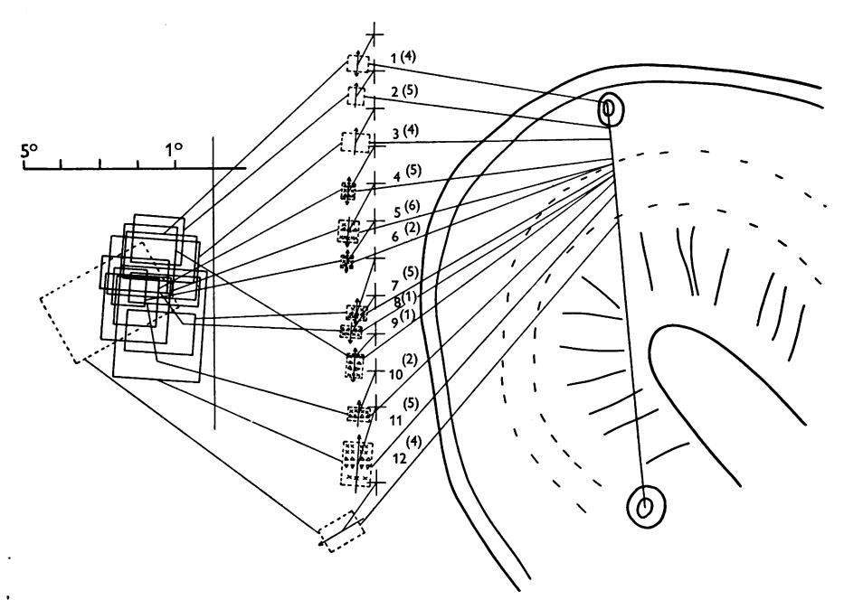

Text-fig. 15. Reconstruction of part of an electrode track through apical and mesial segments of post-lateral gyrus near its anterior end. Two lesions were made, the first after recording from the first unit, the second at the end of the penetration. Only the first twelve cells are represented. Interrupted lines show boundaries of layer 4.

In the centre part of the figure the position of each receptive field, outlined with interrupted lines, is given with respect to the area centralis, shown by a cross. Cells are numbered in sequence, 1–12. Numbers in parentheses refer to ocular-dominance group (see Part II). Units 5 and 6, 8 and 9 were observed simultaneously. The first three fields and the last were complex in organization; the remainder were simple.  $\times$ , areas giving excitation;  $\triangle$ , areas giving inhibitory effects. Note that all receptive fields except the last have the same axis orientation (9.30–3.30 o'clock). The arrows show the preferred direction of movement of a slit oriented parallel to the receptive-field axis.

In the left part of the figure all of the receptive fields are superimposed, to indicate the overlap and variation in size. The vertical and horizontal lines represent meridia, crossing at the area centralis. Scale on horizontal meridian, 1° for each subdivision.

areas; if complex, they required identical stimuli for their activation. As a rule these fields did not have exactly the same retinal position, but were staggered as described above. In two thirds of the multiple recordings the cells differed to varying degrees in their receptive field arrangements. Two types of multiple recordings in which field arrangements differed seem interesting enough to merit a separate description.

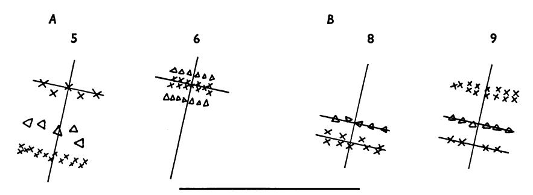

Text-fig. 16. Detailed arrangements of the receptive fields of two pairs of simultaneously recorded cells (nos. 5 and 6, and 8 and 9, of Text-fig. 15). The crosses of diagrams 5 and 6 are superimposed as are the double crosses of 8 and 9. Note that the upper excitatory region of 5 is superimposed upon the excitatory region of 6; and that both regions of 8 are superimposed on the inhibitory and lower excitatory regions of 9. Scale, 1°.

In several multiple recordings the receptive fields overlapped in such a way that one or more excitatory or inhibitory portions were superimposed. Two examples are supplied by cell-pairs 5 and 6, and 8 and 9 of Text-fig. 15. Their fields are redrawn in Text-fig. 16. The fields of cells 5 and 6 are drawn separately (Text-fig. 16A) but they actually overlapped so that the reference lines are to be imagined as superimposed. Thus the 'on' centre of cell 6 fell directly over the upper 'on' flank of 5 and the two cells tended to fire together to suitably placed stimuli. A similar situation existed for cells 8 and 9 (Text-fig. 16B). The field of 9 was placed so that its 'off' region and the lower, weaker 'on' region were superimposed on the two regions of 8. Again the two cells tended to fire together. Such examples suggest that neighbouring cells may have some of their inputs in common.

Cells responded reciprocally to a light stimulus in eight of the forty-three multiple recordings. An example of two cells responding reciprocally to stationary spots is shown in Text-fig. 17. In each eye the two receptive fields were almost superimposed. The fields consisted of elongated obliquely oriented central regions, inhibitory for one cell, excitatory for the other, flanked on either side by regions of the opposite type. Instead of firing together in response to an optimally oriented stationary slit, like the cells

in Text-fig. 16, these cells gave opposite-type responses, one inhibitory and the other excitatory. Some cell pairs responded reciprocally to to-and-fro movements of a slit or edge. Examples have been given elsewhere (Hubel, 1958, Fig. 9; 1959, Text-fig. 6). The fields of these cell pairs usually differed only in the balance of the asymmetrical flanking regions.

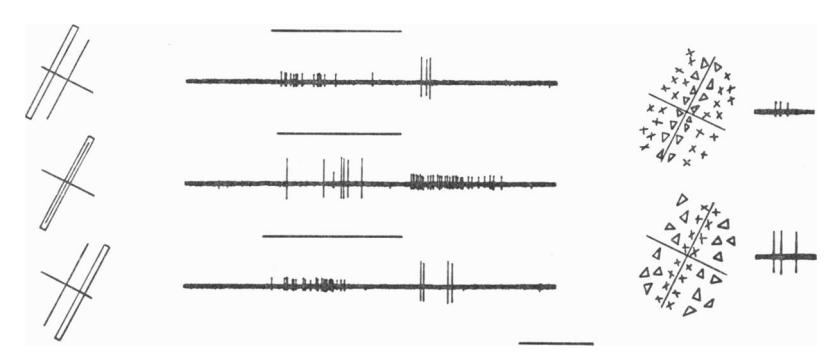

Text-fig. 17. Records of two simultaneously observed cells which responded reciprocally to stationary stimuli. The two receptive fields are shown to the right, and are superimposed, though they are drawn separately. The cell corresponding to each field is indicated by the spikes to the right of the diagram. To the left of each record is shown the position of a slit,  $\frac{1}{4} \times 2\frac{1}{2}^{\circ}$ , with respect to these fields.

Both cells binocularly driven (dominance group 3); fields mapped in the left (contralateral) eye; position of fields 2° below and to the left of the area centralis. Time, 1 sec.

Relationship between receptive field organization and cortical layering. In a typical penetration through the cortex many different field types were found, some simple and others complex. Even within a single column both simple and complex fields were seen. (In Text-fig. 13 and 14 complex fields are indicated by the symbol 'Cx'; in Text-fig. 15, fields 1-3 were complex and 4-11 simple, all within a single column.) An attempt was made to learn whether there was any relationship between the different field types and the layers of the cortex. This was difficult for several reasons. In Nissl-stained sections the boundaries between layers of the cat's striate cortex are not nearly as clear as they are in the primate brain; frequently even the fourth layer, so characteristic of the striate cortex, is poorly demarcated. Consequently, a layer could not always be identified with certainty even for a cell whose position was directly marked by a lesion. For most cells the positions were arrived at indirectly, from depth readings and lesions made elsewhere in the penetrations: these determinations were subject to more errors than the direct ones. Moreover, few of the penetrations were made in a direction parallel to the layering, so that the distance an electrode travelled in passing through a layer was short, and the error in electrode position correspondingly more important.

The distribution of 179 cells among the different layers is given in the histograms of Text-fig. 18. All cells were recorded in penetrations in which at least one lesion was made; the shaded portions refer to cells which were individually marked with lesions. As shown in the separate histograms, simple-field cells as well as those with complex fields were widely distributed throughout the cortex. Cells with simple fields were most numerous in layers 3, 4 and 6. Especially interesting is the apparent rarity of complex fields in layer 4, where simple fields were so abundant. This is also illustrated in Text-fig. 15, which shows a sequence of eight cells

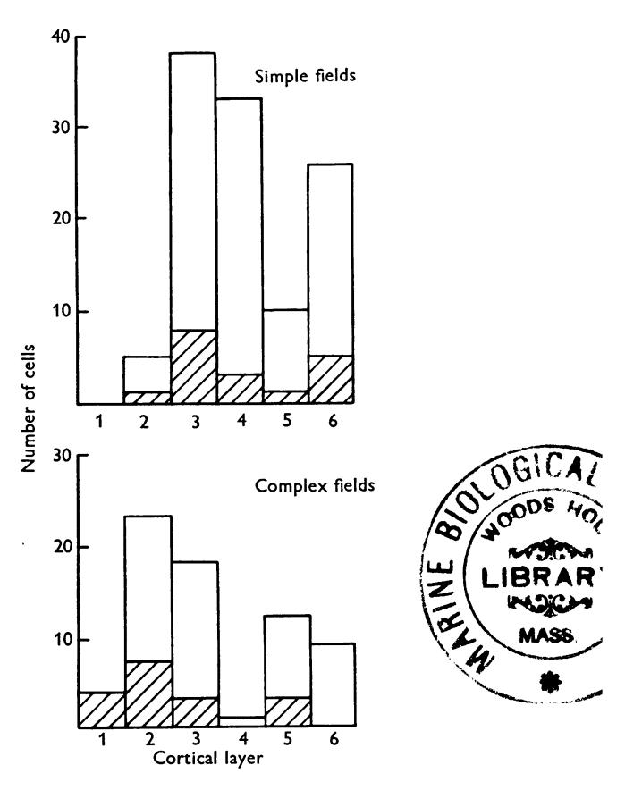

Text-fig. 18. Distribution of 179 cells, 113 with simple fields, 66 with complex, among the different cortical layers. All cells were recorded in penetrations in which at least one electrolytic lesion was made and identified; the shaded areas refer to cells marked individually by lesions. Note especially the marked difference in the occurrence, in layer 4, between simple and complex fields.

recorded from layer 4, all of which had simple fields. These findings suggest that cells may to some extent be segregated according to field complexity, and the rarity with which simple and complex fields were mapped together is consistent with this possibility.

# Ocular dominance

In thirty-four multiple recordings the eye-dominance group (see Part II) was determined for both or all three cells. In eleven of these recordings there was a clear difference in ocular dominance between cells. Similarly, in a single penetration two cells recorded in sequence frequently differed in eye dominance. Cells from several different eye-dominance categories appeared not only in single penetrations, but also in sequences in which all cells had a common axis orientation. Thus within a single column defined by a common axis orientation there were cells of different eye dominance. A sequence of cells within one column is formed by cells 1–11 of Text-fig. 15. Here eye dominance ranged from wholly contralateral (group 1) to strongly ipsilateral (group 6). The two simultaneously recorded cells 5 and 6 were dominated by opposite eyes.

While these results suggested that cells of different ocular dominance were present within single columns, there were nevertheless indications of some grouping. First, in twenty-three of the thirty-four multiple recordings, simultaneously observed cells fell into the same ocular-dominance group. Secondly, in many penetrations short sequences of cells having the same relative eye dominance were probably more common than would be expected from a random scattering. Several short sequences are shown in Text-fig. 13 and 14. When such sequences consisted of cells with extreme unilateral dominance (dominance groups 1, 2, 6, and 7) the undifferentiated background activity was usually also driven predominantly by one eye, suggesting that other neighbouring units had similar eye preference. If cells of common eye dominance are in fact regionally grouped, the groups would seem to be relatively small. The cells could be arranged in nests, or conceivably in very narrow columns or thin layers.

In summary, cells within a column defined by a common field-axis orientation do not necessarily all have the same ocular dominance; yet neither do cells seem to be scattered at random through the cortex with respect to this characteristic.

#### DISCUSSION

A scheme for the elaboration of simple and complex receptive fields

Comparison of responses of cells in the lateral geniculate body with responses from striate cortex brings out profound differences in the receptive-field organization of cells in the two structures. For cortical

cells, specifically oriented lines and borders tend to replace circular spots as the optimum stimuli, movement becomes an important parameter of stimulation, diffuse light becomes virtually ineffective, and with adequate stimuli most cells can be driven from the two eyes. Since lateral geniculate cells supply the main, and possibly the only, visual input to the striate cortex, these differences must be the result of integrative mechanisms within the striate cortex itself.

At present we have no direct evidence on how the cortex transforms the incoming visual information. Ideally, one should determine the properties of a cortical cell, and then examine one by one the receptive fields of all the afferents projecting upon that cell. In the lateral geniculate, where one can, in effect, record simultaneously from a cell and one of its afferents, a beginning has already been made in this direction (Hubel & Wiesel, 1961). In a structure as complex as the cortex the techniques available would seem hopelessly inadequate for such an approach. Here we must rely on less direct evidence to suggest possible mechanisms for explaining the transformations that we find.

The relative lack of complexity of simple cortical receptive fields suggests that these represent the first or at least a very early stage in the modification of geniculate signals. At any rate we have found no cells with receptive fields intermediate in type between geniculate and simple cortical fields. To account for the spatial arrangements of excitatory and inhibitory regions of simple cortical fields we may imagine that upon each simpletype cell there converge fibres of geniculate origin having 'on' or 'off' centres situated in the appropriate retinal regions. For example, a cortical cell with a receptive field of the type shown in Text-fig. 2C might receive projections from a group of lateral geniculate cells having 'on' field centres distributed throughout the long narrow central region designated in the figure by crosses. Such a projection system is shown in the diagram of Text-fig. 19. A slit of light falling on this elongated central region would activate all the geniculate cells, since for each cell the centre effect would strongly outweigh the inhibition from the segments of field periphery falling within the elongated region. This is the same as saying that a geniculate cell will respond to a slit with a width equal to the diameter of its field centre, a fact that we have repeatedly verified. The inhibitory flanks of the cortical field would be formed by the remaining outlying parts of the geniculate-field peripheries. These flanks might be reinforced and enlarged by appropriately placed 'off'-centre geniculate cells. Such an increase in the potency of the flanks would appear necessary to explain the relative indifference of cortical cells to diffuse light.

The arrangement suggested by Text-fig. 19 would be consistent with our impression that widths of cortical receptive-field centres (or flanks, in a

field such as that of Text-fig. 2F) are of the same order of magnitude as the diameters of geniculate receptive-field centres, at least for fields in or near the area centralis. Hence the fineness of discrimination implied by the small size of geniculate receptive-field centres is not necessarily lost at the cortical level, despite the relatively large total size of many cortical fields; rather, it is incorporated into the detailed substructure of the cortical fields.

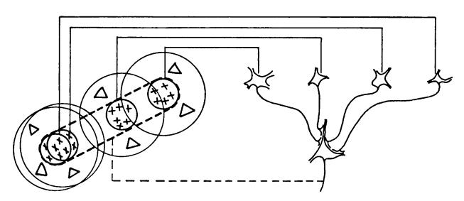

Text-fig. 19. Possible scheme for explaining the organization of simple receptive fields. A large number of lateral geniculate cells, of which four are illustrated in the upper right in the figure, have receptive fields with 'on' centres arranged along a straight line on the retina. All of these project upon a single cortical cell, and the synapses are supposed to be excitatory. The receptive field of the cortical cell will then have an elongated 'on' centre indicated by the interrupted lines in the receptive-field diagram to the left of the figure.

In a similar way, the simple fields of Text-fig. 2D-G may be constructed by supposing that the afferent 'on'- or 'off'-centre geniculate cells have their field centres appropriately placed. For example, field-type G could be formed by having geniculate afferents with 'off' centres situated in the region below and to the right of the boundary, and 'on' centres above and to the left. An asymmetry of flanking regions, as in field E, would be produced if the two flanks were unequally reinforced by 'on'-centre afferents.

The model of Text-fig. 19 is based on excitatory synapses. Here the suppression of firing on illuminating an inhibitory part of the receptive field is presumed to be the result of withdrawal of tonic excitation, i.e. the inhibition takes place at a lower level. That such mechanisms occur in the visual system is clear from studies of the lateral geniculate body, where an 'off'-centre cell is suppressed on illuminating its field centre because of suppression of firing in its main excitatory afferent (Hubel & Wiesel, 1961). In the proposed scheme one should, however, consider the possibility of direct inhibitory connexions. In Text-fig. 19 we may replace any of the excitatory endings by inhibitory ones, provided we replace the corresponding geniculate cells by ones of opposite type ('on'-centre instead of 'off'-centre, and conversely). Up to the present the two mechanisms have

not been distinguished, but there is no reason to think that both do not occur.

The properties of complex fields are not easily accounted for by supposing that these cells receive afferents directly from the lateral geniculate body. Rather, the correspondence between simple and complex fields noted in Part I suggests that cells with complex fields are of higher order, having cells with simple fields as their afferents. These simple fields would all have identical axis orientation, but would differ from one another in their exact retinal positions. An example of such a scheme is given in Text-fig. 20. The hypothetical cell illustrated has a complex field like that

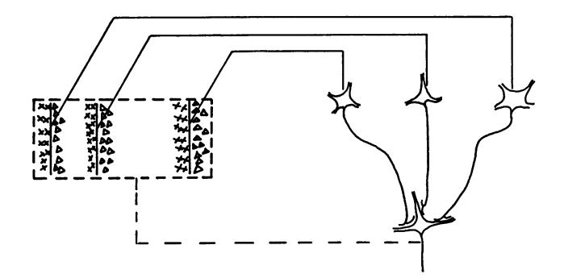

Text-fig. 20. Possible scheme for explaining the organization of complex receptive fields. A number of cells with simple fields, of which three are shown schematically, are imagined to project to a single cortical cell of higher order. Each projecting neurone has a receptive field arranged as shown to the left: an excitatory region to the left and an inhibitory region to the right of a vertical straight-line boundary. The boundaries of the fields are staggered within an area outlined by the interrupted lines. Any vertical-edge stimulus falling across this rectangle, regardless of its position, will excite some simple-field cells, leading to excitation of the higher-order cell.

of Text-figs. 5 and 6. One may imagine that it receives afferents from a set of simple cortical cells with fields of type G, Text-fig. 2, all with vertical axis orientation, and staggered along a horizontal line. An edge of light would activate one or more of these simple cells wherever it fell within the complex field, and this would tend to excite the higher-order cell.

Similar schemes may be proposed to explain the behaviour of other complex units. One need only use the corresponding simple fields as building blocks, staggering them over an appropriately wide region. A cell with the properties shown in Text-fig. 3 would require two types of horizontally oriented simple fields, having 'off' centres above the horizontal line, and 'on' centres below it. A slit of the same width as these centre regions would strongly activate only those cells whose long narrow

centres it covered. It is true that at the same time a number of other cells would have small parts of their peripheral fields stimulated, but we may perhaps assume that these opposing effects would be relatively weak. For orientations other than horizontal a slit would have little or no effect on the simple cells, and would therefore not activate the complex one. Small spots should give only feeble 'on' responses regardless of where they were shone in the field. Enlarging the spots would not produce summation of the responses unless the enlargement were in a horizontal direction; anything else would result in invasion of opposing parts of the antecedent fields, and cancellation of the responses from the corresponding cells. The model would therefore seem to account for many of the observed properties of complex fields.

Proposals such as those of Text-figs. 19 and 20 are obviously tentative and should not be interpreted literally. It does, at least, seem probable that simple receptive fields represent an early stage in cortical integration, and the complex ones a later stage. Regardless of the details of the process, it is also likely that a complex field is built up from simpler ones with common axis orientations.

At first sight it would seem necessary to imagine a highly intricate tangle of interconnexions in order to link cells with common axis orientations while keeping those with different orientations functionally separated. But if we turn to the results of Part III on functional cytoarchitecture we see at once that gathered together in discrete columns are the very cells we require to be interconnected in our scheme. The cells of each aggregate have common axis orientations and the staggering in the positions of the simple fields is roughly what is required to account for the size of most of the complex fields (cf. Text-fig. 9). That these cells are interconnected is moreover very likely on histological grounds: indeed, the particular richness of radial connexions in the cortex fits well with the columnar shape of the regions.

The otherwise puzzling aggregation of cells with common axis orientation now takes on new meaning. We may tentatively look upon each column as a functional unit of cortex, within which simple fields are elaborated and then in turn synthesized into complex fields. The large variety of simple and complex fields to be found in a single column (Text-fig. 15) suggests that the connexions between cells in a column are highly specific.

We may now begin to appreciate the significance of the great increase in the number of cells in the striate cortex, compared with the lateral geniculate body. In the cortex there is an enormous digestion of information, with each small region of visual field represented over and over again in column after column, first for one receptive-field orientation and then for another. Each column contains thousands of cells, some cells having simple fields and others complex. In the part of the cortex receiving projections from the area centralis the receptive fields are smaller, and presumably more columns are required for unit area of retina; hence in central retinal regions the cortical projection is disproportionately large.

# Complex receptive fields

The method of stimulating the retina with small circular spots of light and recording from single visual cells has been a useful one in studies of the cat's visual system. In the pathway from retina to cortex the excitatory and inhibitory areas mapped out by this means have been sufficient to account for responses to both stationary and moving patterns. Only when one reaches cortical cells with complex fields does the method fail, for these fields cannot generally be separated into excitatory and inhibitory regions. Instead of the direct small-spot method, one must resort to a trial-anderror system, and attempt to describe each cell in terms of the stimuli that most effectively influence firing. Here there is a risk of over- or underestimating the complexity of the most effective stimuli, with corresponding lack of precision in the functional description of the cell. For this reason it is encouraging to find that the properties of complex fields can be interpreted by the simple supposition that they receive projections from simplefield cells, a supposition made more likely by the anatomical findings of Part III.

Compared with cells in the retina or lateral geniculate body, cortical cells show a marked increase in the number of stimulus parameters that must be specified in order to influence their firing. This apparently reflects a continuing process which has its beginning in the retina. To obtain an optimum response from a retinal ganglion cell it is generally sufficient to specify the position, size and intensity of a circular spot. Enlarging the spot beyond the size of the field centre raises the threshold, but even when diffuse light is used it is possible to evoke a brisk response by using an intense enough stimulus. For geniculate cells the penalty for exceeding optimum spot size is more severe than in the retina, as has been shown by comparing responses of a geniculate cell and an afferent fibre to the same cell (Hubel & Wiesel, 1961). In the retina and lateral geniculate body there is no evidence that any shapes are more effective than circular ones, or that, with moving stimuli, one direction of movement is better than another.

In contrast, in the cortex effective driving of simple-field cells can only be obtained with restricted stimuli whose position, shape and orientation are specific for the cell. Some cells fire best to a moving stimulus, and in these the direction and even the rate of movement are often critical.

Physiol. 160

Diffuse light is at best a poor stimulus, and for cells in the area of central representation it is usually ineffective at any intensity.

An interesting feature of cortical cells with complex fields may be seen in their departure from the process of progressively increasing specificity. At this stage, for the first time, what we suppose to be higher-order neurones are in a sense less selective in their responses than the cells which feed into them. Cells with simple fields tend to respond only when the stimulus is both oriented and positioned properly. In contrast, the neurones to which they supposedly project are concerned predominantly with stimulus orientation, and are far less critical in their requirements as regards stimulus placement. Their responsiveness to the abstraction which we call orientation is thus generalized over a considerable retinal area.

The significance of this step for perception can only be speculated upon, but it may be of some interest to examine several possibilities. First, neurophysiologists must ultimately try to explain how a form can be recognized regardless of its exact position in the visual field. As a step in form recognition the organism may devise a mechanism by which the inclinations of borders are more important than their exact visual-field location. It is clear that a given form in the visual field will, by virtue of its borders, excite a combination of cells with complex fields. If we displace the form it will activate many of the same cells, as long as the change in position is not enough to remove it completely from their receptive fields. Now we may imagine that these particular cells project to a single cell of still higher order: such a cell will then be very likely to respond to the form (provided the synapses are excitatory) and there will be considerable latitude in the position of the retinal image. Such a mechanism will also permit other transformations of the image, such as a change in size associated with displacement of the form toward or away from the eye. Assuming that there exist cells that are responsive to specific forms, it would clearly be economical to avoid having thousands for each form, one for every possible retinal position, and separate sets for each type of distortion of the image.

Next, the ability of some cells with complex fields to respond in a sustained manner to a stimulus as it moves over a wide expanse of retina suggests that these cells may play an important part in the perception of movement. They adapt rapidly to a stationary form, and continuous movement of the stimulus within the receptive field is the only way of obtaining a sustained discharge (Text-fig. 4H). Presumably the afferent simple-field cells also adapt rapidly to a stationary stimulus; because of their staggered fields the moving stimulus excites them in turn, and the higher-order cell is thus at all times bombarded. This seems an elegant means of overcoming a difficulty inherent in the problem of movement

perception, that movement must excite receptors not continuously but in sequence.

Finally, the above remarks apply equally well to displacements of retinal images caused by small eve movements. The normal eve is not stationary, but is subject to several types of fine movements. There is psychophysical evidence that in man these may play an important part in vision, transforming a steady stimulus produced by a stationary object into an intermittent one, so overcoming adaptation in visual cells (Ditchburn & Ginsborg, 1952; Riggs, Ratliff, Cornsweet & Cornsweet, 1953). At an early stage in the visual pathway the effect of such movements would be to excite many cells repeatedly and in turn, rather than just a few continuously. A given line or border would move back and forth over a small retinal region; in the cortex this would sequentially activate many cells with simple fields. Since large rotatory movements are not involved, these fields would have the same axis orientations but would differ only in their exact retinal positions. They would converge on higher-order cells with complex fields, and these would tend to be activated continuously rather than intermittently.

# Functional cytoarchitecture

There is an interesting parallel between the functional subdivisions of the cortex described in the present paper, and those found in somatosensory cortex by Mountcastle (1957) in the cat, and by Powell & Mountcastle (1959) in the monkey. Here, as in the visual area, one can subdivide the cortex on the basis of responses to natural stimuli into regions which are roughly columnar in shape, and extend from surface to white matter. This is especially noteworthy since the visual and somatic areas are the only cortical regions so far studied at the single-cell level from the standpoint of functional architecture. In both areas the columnar organization is superimposed upon the well known systems of topographic representation—of the body surface in the one case, and the visual fields in the other. In the somatosensory cortex the columns are determined by the sensory submodality to which the cells of a column respond: in one type of column the cells are affected either by light touch or by bending of hairs, whereas in the other the cells respond to stimulation of deep fascia or manipulation of joints.

Several differences between the two systems will at once be apparent. In the visual cortex the columns are determined by the criterion of receptive-field axis orientation. Presumably there are as many types of column as there are recognizable differences in orientation. At present one can be sure that there are at least ten or twelve, but the number may be very large, since it is possible that no two columns represent precisely the same axis orientation. (A subdivision of cells or of columns into twelve groups

according to angle of orientation shows that there is no clear prevalence of one group over any of the others.) In the somatosensory cortex, on the other hand, there are only two recognized types of column.

A second major difference between the two systems lies in the very nature of the criteria used for the subdivisions. The somatosensory cortex is divided by submodality, a characteristic depending on the incoming sensory fibres, and not on any transformations made by the cortex on the afferent impulses. Indeed we have as yet little information on what integrative processes do take place in the somatosensory cortex. In the visual cortex there is no modality difference between the input to one column and that to the next, but it is in the connexions between afferents and cortical cells, or in the interconnexions between cortical cells, that the differences must exist.

Ultimately, however, the two regions of the cortex may not prove so dissimilar. Further information on the functional role of the somatic cortex may conceivably bring to light a second system of columns, superimposed on the present one. Similarly, in the visual system future work may disclose other subdivisions cutting across those described in this paper, and based on other criteria. For the present it would seem unwise to look upon the columns in the visual cortex as entirely autonomous functional units. While the variation in field size from cell to cell within a column is generally of the sort suggested in Text-figs. 9 and 15, the presence of an occasional cell with a very large complex field (up to about 20°) makes one wonder whether columns with similar receptive-field orientations may not possess some interconnexions.

### Binocular interaction

The presence in the striate cortex of cells influenced from both eyes has already been observed by several authors (Hubel & Wiesel, 1959; Cornells & Grüsser, 1959; Burns, Heron & Grafstein, 1960), and is confirmed in Part II of this paper. Our results suggest that the convergence of influences from the two eyes is extensive, since binocular effects could be demonstrated in 84% of our cells, and since the two eyes were equally, or almost equally, effective in 70% (groups 3–5). This represents a much greater degree of interaction than was suggested by our original work, or by Grüsser and Grüsser-Cornells (see Jung, 1960), who found that only 30% of their cells were binocularly influenced.

For each of our cells comparison of receptive fields mapped in the two eyes showed that, except for a difference in strength of responses related to eye dominance, the fields were in every way similar. They were similarly organized, had the same axis orientation, and occupied corresponding regions in the two retinas. The responses to stimuli applied to corresponding parts of the two receptive fields showed summation. This should

be important in binocular vision, for it means that when the two images produced by an object fall on corresponding parts of the two retinas, their separate effects on a cortical cell should sum. Failure of the images to fall on corresponding regions, which might happen if an object were closer than the point of fixation or further away, would tend to reduce the summation; it could even lead to mutual antagonism if excitatory parts of one field were stimulated at the same time as inhibitory parts of the other. It should be emphasized that for all simple fields and for many complex ones the two eyes may work either synergistically or in opposition, depending on how the receptive fields are stimulated; when identical stimuli are shone on corresponding parts of the two retinas their effects should always sum.

Although in the cortex the proportion of binocularly influenced cells is high, the mixing of influences from the two eyes is far from complete. Not only are many single cells unequally influenced by the two eyes, but the relative eye dominance differs greatly from one cell to another. This could simply reflect an intermediate stage in the process of mixing of influences from the two eyes; in that case we might expect an increasing uniformity in the eve preference of higher-order cells. But cells with complex fields do not appear to differ, in their distribution among the different evedominance groups, from the general population of cortical cells (Text-fig. 12). At present we have no clear notion of the physiological significance of this incomplete mixing of influences from the two eyes. One possible hint lies in the fact that by binocular parallax alone (even with a stimulus too brief to allow changes in the convergence of the eyes) one can tell which of two objects is the closer (Dove, 1841; von Recklinghausen, 1861). This would clearly be impossible if the two retinas were connected to the brain in identical fashion, for then the eyes (or the two pictures of a stereo-pair) could be interchanged without substituting near points for far ones and vice versa.

# Comparison of receptive fields in the frog and the cat

Units in many respects similar to striate cortical cells with complex fields have recently been isolated from the intact optic nerve and the optic tectum of the frog (Lettvin, Maturana, McCulloch & Pitts, 1959; Maturana, Lettvin, McCulloch & Pitts, 1960). There is indirect evidence to suggest that the units are the non-myelinated axons or axon terminals of retinal ganglion cells, rather than tectal cells or efferent optic nerve fibres. In common with complex cortical cells, these units respond to objects and shadows in the visual field in ways that could not have been predicted from responses to small spots of light. They thus have 'complex' properties, in the sense that we have used this term. Yet in their detailed behaviour they differ greatly from any cells yet studied in the cat, at any

level from retina to cortex. We have not, for example, seen 'erasible' responses or found 'convex edge detectors'. On the other hand, it seems that some cells in the frog have asymmetrical responses to movement and some have what we have termed a 'receptive-field axis'.

Assuming that the units described in the frog are fibres from retinal ganglion cells, one may ask whether similar fibres exist in the cat, but have been missed because of their small size. We lack exact information on the fibre spectrum of the cat's optic nerve; the composite action potential suggests that non-myelinated fibres are present, though in smaller numbers than in the frog (Bishop, 1933; Bishop & O'Leary, 1940). If their fields are different from the well known concentric type, they must have little part to play in the geniculo-cortical pathway, since geniculate cells all appear to have concentric-type fields (Hubel & Wiesel, 1961). The principal cells of the lateral geniculate body (those that send their axons to the striate cortex) are of fairly uniform size, and it seems unlikely that a large group would have gone undetected. The smallest fibres in the cat's optic nerve probably project to the tectum or the pretectal region; in view of the work in the frog, it will be interesting to examine their receptive fields.

At first glance it may seem astonishing that the complexity of thirdorder neurones in the frog's visual system should be equalled only by that of sixth-order neurones in the geniculo-cortical pathway of the cat. Yet this is less surprising if one notes the great anatomical differences in the two animals, especially the lack, in the frog, of any cortex or dorsal lateral geniculate body. There is undoubtedly a parallel difference in the use each animal makes of its visual system: the frog's visual apparatus is presumably specialized to recognize a limited number of stereotyped patterns or situations, compared with the high acuity and versatility found in the cat. Probably it is not so unreasonable to find that in the cat the specialization of cells for complex operations is postponed to a higher level, and that when it does occur, it is carried out by a vast number of cells, and in great detail. Perhaps even more surprising, in view of what seem to be profound physiological differences, is the superficial anatomical similarity of retinas in the cat and the frog. It is possible that with Golgi methods a comparison of the connexions between cells in the two animals may help us in understanding the physiology of both structures.

# Receptive fields of cells in the primate cortex

We have been anxious to learn whether receptive fields of cells in the monkey's visual cortex have properties similar to those we have described in the cat. A few preliminary experiments on the spider monkey have shown striking similarities. For example, both simple and complex fields have been observed in the striate area. Future work will very likely show

differences, since the striate cortex of the monkey is in several ways different morphologically from that of the cat. But the similarities already seen suggest that the mechanisms we have described may be relevant to many mammals, and in particular to man.

#### SUMMARY

- 1. The visual cortex was studied in anaesthetized cats by recording extracellularly from single cells. Light-adapted eyes were stimulated with spots of white light of various shapes, stationary or moving.
- 2. Receptive fields of cells in the visual cortex varied widely in their organization. They tended to fall into two categories, termed 'simple' and 'complex'.
- 3. There were several types of simple receptive fields, differing in the spatial distribution of excitatory and inhibitory ('on' and 'off') regions. Summation occurred within either type of region; when the two opposing regions were illuminated together their effects tended to cancel. There was generally little or no response to stimulation of the entire receptive field with diffuse light. The most effective stimulus configurations, dictated by the spatial arrangements of excitatory and inhibitory regions, were long narrow rectangles of light (slits), straight-line borders between areas of different brightness (edges), and dark rectangular bars against a light background. For maximum response the shape, position and orientation of these stimuli were critical. The orientation of the receptive-field axis (i.e. that of the optimum stimulus) varied from cell to cell; it could be vertical, horizontal or oblique. No particular orientation seemed to predominate.
- 4. Receptive fields were termed complex when the response to light could not be predicted from the arrangements of excitatory and inhibitory regions. Such regions could generally not be demonstrated; when they could the laws of summation and mutual antagonism did not apply. The stimuli that were most effective in activating cells with simple fields—slits, edges, and dark bars—were also the most effective for cells with complex fields. The orientation of a stimulus for optimum response was critical, just as with simple fields. Complex fields, however, differed from simple fields in that a stimulus was effective wherever it was placed in the field, provided that the orientation was appropriate.
- 5. Receptive fields in or near the area centralis varied in diameter from  $\frac{1}{2}$ -1° up to about 5-6°. On the average, complex fields were larger than simple ones. In more peripheral parts of the retina the fields tended to be larger. Widths of the long narrow excitatory or inhibitory portions of simple receptive fields were often roughly equal to the diameter of the smallest geniculate receptive-field centres in the area centralis. For cells

with complex fields responding to slits or dark bars the optimum stimulus width was also usually of this order of magnitude.

- 6. Four fifths of all cells were influenced independently by the two eyes. In a binocularly influenced cell the two receptive fields had the same organization and axis orientation, and were situated in corresponding parts of the two retinas. Summation was seen when corresponding parts of the two retinas were stimulated in identical fashion. The relative influence of the two eyes differed from cell to cell: for some cells the two eyes were about equal; in others one eye, the ipsilateral or contralateral, dominated.
- 7. Functional architecture was studied by (a) comparing the responses of cells recorded in sequence during micro-electrode penetrations through the cortex, (b) observing the unresolved background activity, and (c) comparing cells recorded simultaneously with a single electrode (multiple recordings). The retinas were found to project upon the cortex in an orderly fashion, as described by previous authors. Most recordings were made from the cortical region receiving projections from the area of central vision. The cortex was found to be divisible into discrete columns; within each column the cells all had the same receptive-field axis orientation. The columns appeared to extend from surface to white matter; cross-sectional diameters at the surface were of the order of 0.5 mm. Within a given column one found various types of simple and complex fields; these were situated in the same general retinal region, and usually overlapped, although they differed slightly in their exact retinal position. The relative influence of the two eyes was not necessarily the same for all cells in a column.
- 8. It is suggested that columns containing cells with common receptive-field axis orientations are functional units, in which cells with simple fields represent an early stage in organization, possibly receiving their afferents directly from lateral geniculate cells, and cells with complex fields are of higher order, receiving projections from a number of cells with simple fields within the same column. Some possible implications of these findings for form perception are discussed.

We wish to thank Miss Jaye Robinson and Mrs Jane Chen for their technical assistance. We are also indebted to Miss Sally Fox and to Dr S. W. Kuffler for their helpful criticism of this manuscript. The work was supported in part by Research Grants B-2251 and B-2260 from United States Public Health Service, and in part by the United States Air Force through the Air Force Office of Scientific Research of the Air Research and Development Command under contract No. AF 49 (638)-713. The work was done during the tenure of a U.S. Public Health Service Senior Research Fellowship No. SF 304-R by D.H.H.

#### REFERENCES

- BISHOP, G. H. (1933). Fiber groups in the optic nerve. Amer. J. Physiol. 106, 460-474.
- BISHOP, G. H. & O'LEARY, J. S. (1940). Electrical activity of the lateral geniculate of cats following optic nerve stimuli. *J. Neurophysiol.* 3, 308–322.
- BISHOP, P. O., BURKE, W. & DAVIS, R. (1959). Activation of single lateral geniculate cells by stimulation of either optic nerve. *Science*, 130, 506-507.
- Burns, B. D., Heron, W. & Grafstein, B. (1960). Response of cerebral cortex to diffuse monocular and binocular stimulation. *Amer. J. Physiol.* **198**, 200–204.
- CORNEHLS, U. & GRÜSSER, O.-J. (1959). Ein elektronisch gesteuertes Doppellichtreizgerät. Pflüg. Arch. ges. Physiol. 270, 78-79.
- Daniel, P. M. & Whitteridge, D. (1959). The representation of the visual field on the calcarine cortex in baboons and monkeys. J. Physiol. 148, 33 P.
- DITCHBURN, R. W. & GINSBORG, B. L. (1952). Vision with stabilized retinal image. *Nature*, Lond., 170, 36-37.
- Dove, H. W. (1841). Die Combination der Eindrücke beider Ohren und beider Augen zu einem Eindruck. *Mber. preuss. Akad.* 1841, 251–252.
- ERULKAR, S. D. & FILLENZ, M. (1958). Patterns of discharge of single units of the lateral geniculate body of the cat in response to binocular stimulation. J. Physiol. 140, 6-7P.
- ERULKAR, S. D. & FILLENZ, M. (1960). Single-unit activity in the lateral geniculate body of the cat. J. Physiol. 154, 206-218.
- GRÜSSER, O.-J. & SAUER, G. (1960). Monoculare und binoculare Lichtreizung einzelner Neurone im Geniculatum laterale der Katze. *Pflüg. Arch. ges. Physiol.* **271**, 595–612.
- HAYHOW, W. R. (1958). The cytoarchitecture of the lateral geniculate body in the cat in relation to the distribution of crossed and uncrossed optic fibers. J. comp. Neurol. 110, 1-64.
- Hubel, D. H. (1957). Tungsten microelectrode for recording from single units. Science, 125, 549-550.
- Hubel, D. H. (1958). Cortical unit responses to visual stimuli in nonanesthetized cats. Amer. J. Ophthal. 46, 110–121.
- Hubel, D. H. (1959). Single unit activity in striate cortex of unrestrained cats. J. Physiol. 147, 226-238.
- Hubel, D. H. (1960). Single unit activity in lateral geniculate body and optic tract of unrestrained cats. J. Physiol. 150, 91-104.
- Hubel, D. H. & Wiesel, T. N. (1959). Receptive fields of single neurones in the cat's striate cortex. J. Physiol. 148, 574-591.
- Hubel, D. H. & Wiesel, T. N. (1960). Receptive fields of optic nerve fibres in the spider monkey. J. Physiol. 154, 572-580.
- Hubel, D. H. & Wiesel, T. N. (1961). Integrative action in the cat's lateral geniculate body. J. Physiol. 155, 385-398.
- Jung, R. (1960). Microphysiologie corticaler Neurone: Ein Beitrag zur Koordination der Hirnrinde und des visuellen Systems. Structure and Function of the Cerebral Cortex, ed. Tower, D. B. and Schadé, J. P. Amsterdam: Elsevier Publishing Company.
- Kuffler, S. W. (1953). Discharge patterns and functional organization of mammalian retina. J. Neurophysiol. 16, 37-68.
- LETTVIN, J. Y., MATURANA, H. R., McCulloch, W. S. & PITTS, W. H. (1959). What the frog's eye tells the frog's brain. *Proc. Inst. Radio Engrs*, N.Y., 47, 1940-1951.
- MATURANA, H. R., LETTVIN, J. Y., McCulloch, W. S. & Pitts, W. H. (1960). Anatomy and physiology of vision in the frog (Rana pipiens). J. gen. Physiol. 43, part 2, 129-176.
- Minkowski, M. (1913). Experimentelle Untersuchungen über die Beziehungen der Grosshirnrinde und der Netzhaut zu den primären optischen Zentren, besonders zum Corpus geniculatum externum. Arb. hirnanat. Inst. Zürich, 7, 259–362.
- MOUNTCASTLE, V. B. (1957). Modality and topographic properties of single neurons of cat's somatic sensory cortex. J. Neurophysiol. 20, 408-434.
- O'LEARY, J. L. (1941). Structure of the area striata of the cat. J. comp. Neurol. 75, 131-164. POLYAK, S. (1957). The Vertebrate Visual System, ed. Klüver, H. The University of Chicago Press.

- POWELL, T. P. S. & MOUNTCASTLE, V. B. (1959). Some aspects of the functional organization of the cortex of the postcentral gyrus of the monkey: a correlation of findings obtained in a single unit analysis with cytoarchitecture. *Johns Hopk. Hosp. Bull.* 105, 133–162.
- RIGGS, L. A., RATLIFF, F., CORNSWEET, J. C. & CORNSWEET, T. N. (1953). The disappearance of steadily fixated visual test objects. J. opt. Soc. Amer. 43, 495-501.
- SILVA, P. S. (1956). Some anatomical and physiological aspects of the lateral geniculate body. J. comp. Neurol. 106, 463-486.
- TALBOT, S. A. (1942). A lateral localization in the cat's visual cortex. Fed. Proc. 1, 84.
- TALBOT, S. A. & MARSHALL, W. H. (1941). Physiological studies on neural mechanisms of visual localization and discrimination. Amer. J. Ophthal. 24, 1255-1263.
- Thompson, J. M., Woolsey, C. N. & Talbot, S. A. (1950). Visual areas I and II of cerebral cortex of rabbit. J. Neurophysiol. 13, 277-288.
- VON RECKLINGHAUSEN, F. (1861). Zum körperlichen Sehen. Ann. Phys. Lpz. 114, 170-173.

#### EXPLANATION OF PLATES

#### PLATE 1

Coronal section through post-lateral gyrus. Composite photomicrograph of two of the sections used to reconstruct the micro-electrode track of Text-fig. 13. The first part of the electrode track may be seen in the upper right; the electrolytic lesion at the end of the track appears in the lower left. Scale 1 mm.

#### PLATE 2

A, coronal section through the anterior extremity of post-lateral gyrus. Composite photomicrograph made from four of the sections used to reconstruct the two electrode tracks shown in Text-fig. 14. The first part of the two electrode tracks may be seen crossing layer 1. The lesion at the end of the lateral track (to the right in the figure) is easily seen; that of the medial track is smaller, and is shown at higher power in B. Scales: A, 1 mm, B, 0.25 mm.

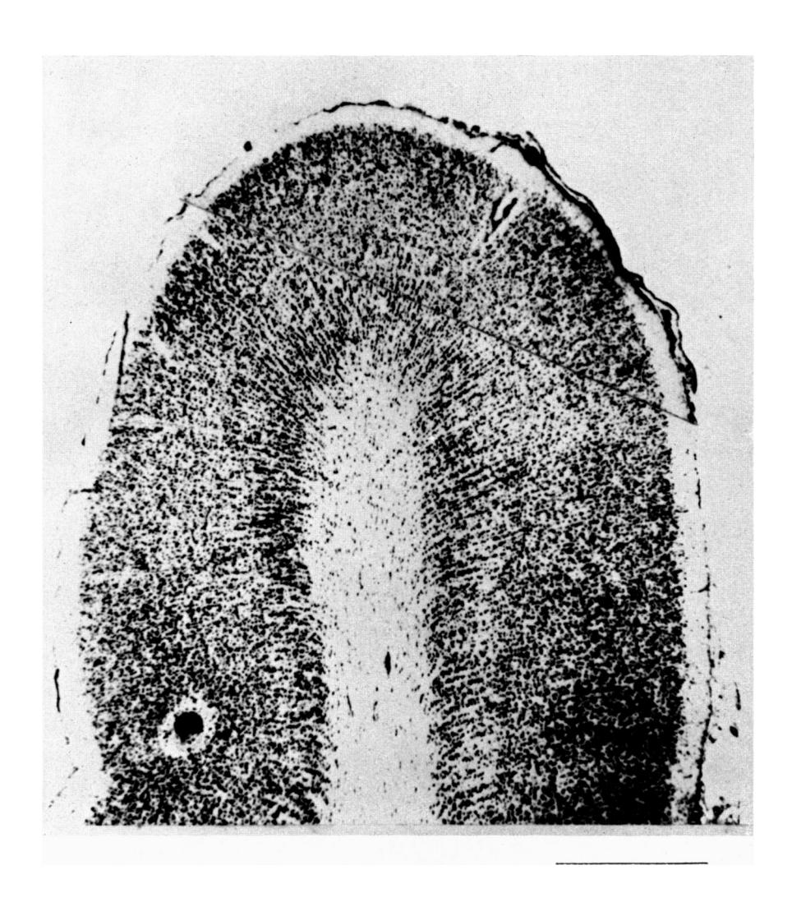

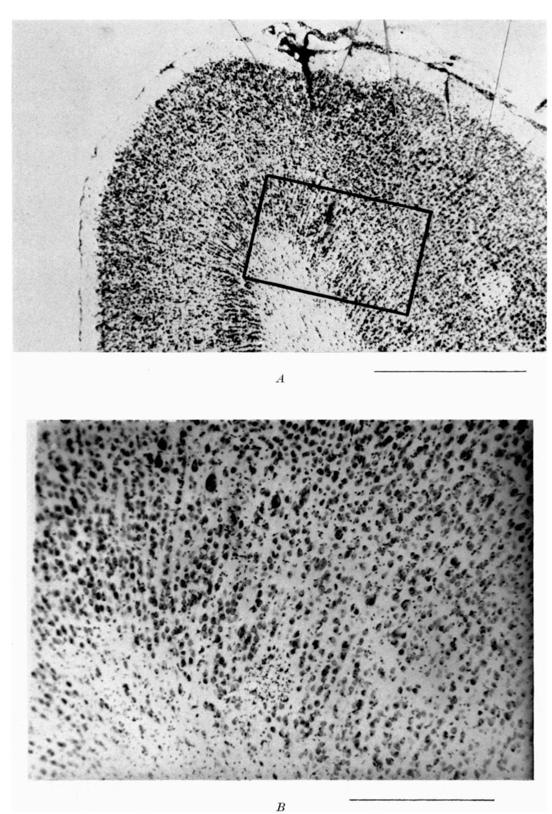

D. H. HUBEL AND T. N. WIESEL