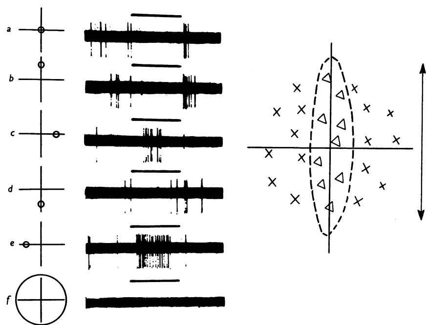
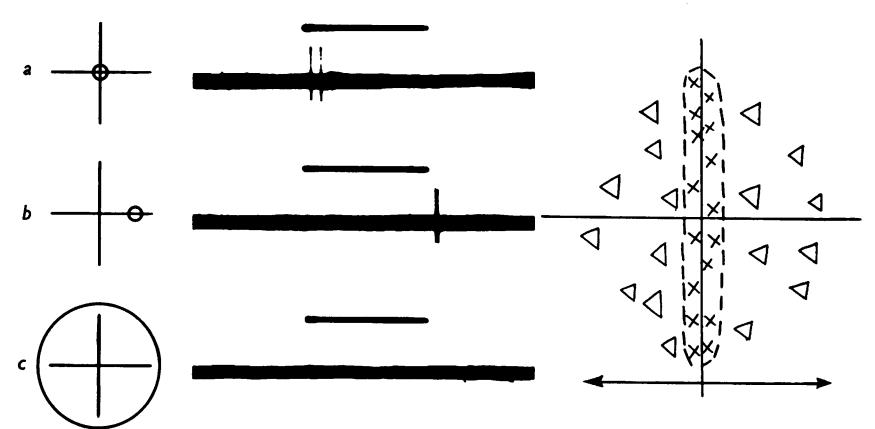
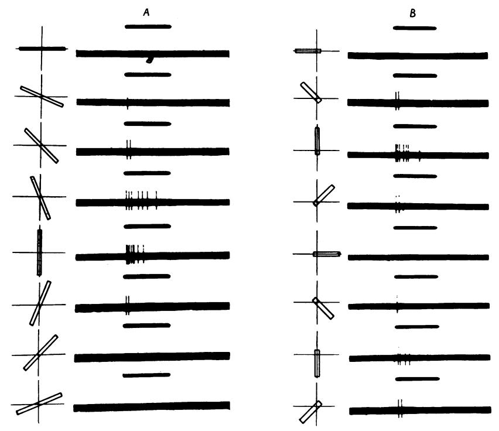
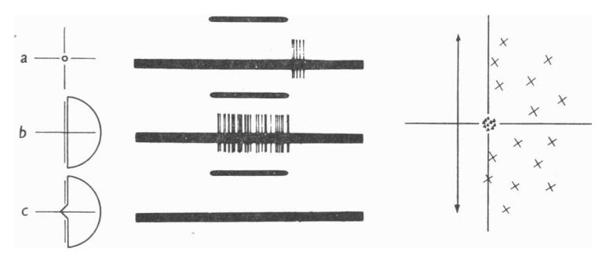
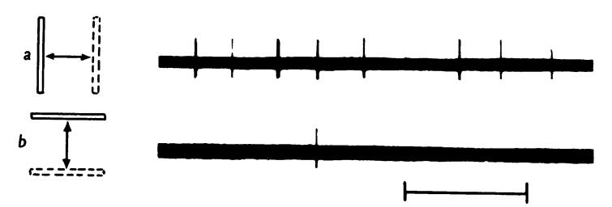
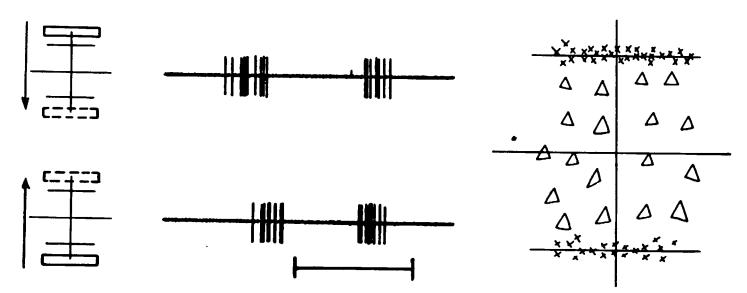
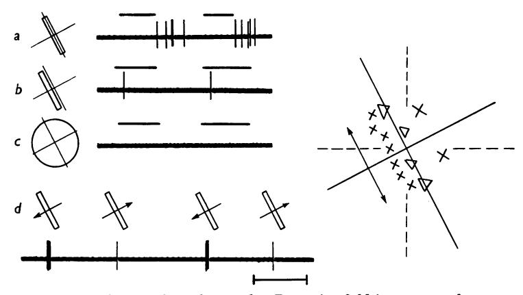
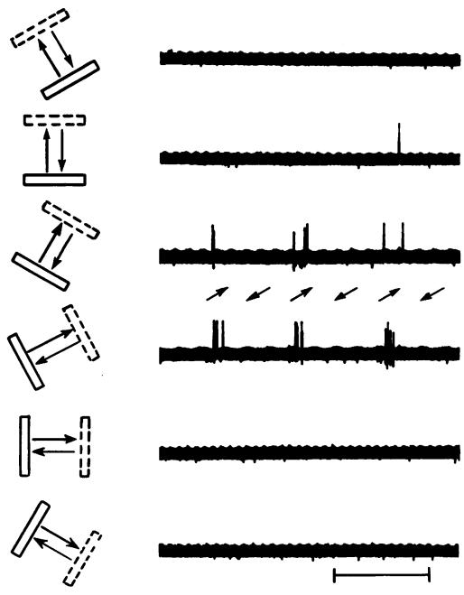
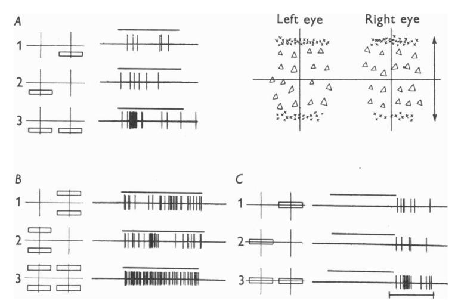
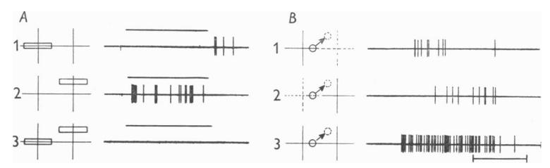

## J. Physiol. (1959) 148, 574-591

# RECEPTIVE FIELDS OF SINGLE NEURONES IN THE CAT'S STRIATE CORTEX

By D. H. HUBEL\* AND T. N. WIESEL\*

From the Wilmer Institute, The Johns Hopkins Hospital and University, Baltimore, Maryland, U.S.A.

(Received 22 April 1959)

In the central nervous system the visual pathway from retina to striate cortex provides an opportunity to observe and compare single unit responses at several distinct levels. Patterns of light stimuli most effective in influencing units at one level may no longer be the most effective at the next. From differences in responses at successive stages in the pathway one may hope to gain some understanding of the part each stage plays in visual perception.

By shining small spots of light on the light-adapted cat retina Kuffler (1953) showed that ganglion cells have concentric receptive fields, with an 'on' centre and an 'off' periphery, or vice versa. The 'on' and 'off' areas within a receptive field were found to be mutually antagonistic, and a spot restricted to the centre of the field was more effective than one covering the whole receptive field (Barlow, FitzHugh & Kuffler, 1957). In the freely moving light-adapted cat it was found that the great majority of cortical cells studied gave little or no response to light stimuli covering most of the animal's visual field, whereas small spots shone in a restricted retinal region often evoked brisk responses (Hubel, 1959). A moving spot of light often produced stronger responses than a stationary one, and sometimes a moving spot gave more activation for one direction than for the opposite.

The present investigation, made in acute preparations, includes a study of receptive fields of cells in the cat's striate cortex. Receptive fields of the cells considered in this paper were divided into separate excitatory and inhibitory ('on' and 'off') areas. In this respect they resembled retinal ganglion-cell receptive fields. However, the shape and arrangement of excitatory and inhibitory areas differed strikingly from the concentric pattern found in retinal ganglion cells. An attempt was made to correlate responses to moving stimuli

\* Present address, Harvard Medical School, 25 Shattuck St., Boston 15, Massachusetts.

with receptive field arrangements. Some cells could be activated from either eye, and in these binocular interaction was studied.

#### METHODS

In this series of experiments twenty-four cats were used. Animals were anaesthetized with intraperitoneal thiopental sodium (40 mg/kg) and light anaesthesia was maintained throughout the experiment by additional intraperitoneal injections. The eyes were immobilized by continuous intravenous injection of succinylcholine; the employment of this muscle relaxant made it necessary to use artificial respiration. Pupils of both eyes were dilated and accommodation was relaxed by means of 1% atropine. Contact lenses used with a suitably buffered solution prevented the corneal surfaces from drying and becoming cloudy. The lids were held apart by simple wire clips.

A multibeam ophthalmoscope designed by Talbot & Kuffler (1952) was used for stimulation and viewing the retina of the left eye. Background illumination was usually about 0·17 log. metre candles (m.c.), and the strongest available stimulus was 1·65 log. m.c. Many sizes and shapes of spots of light could be produced, and these were well focused on the retina. Stimulus durations were of the order of 1 sec.

For binocular studies a different method of light stimulation was used. The animal faced a large screen covering most of the visual field. On this screen light spots of various sizes and shapes were projected. The light source was a tungsten filament projector mounted on an adjustable tripod. Stimuli could be moved across the screen in various directions and with different speeds. Spots subtending an angle as small as 12 min of arc at the cat's eyes could be obtained, but generally 0.5-1° spots were used for mapping receptive fields. (Dimensions of stimuli are given in terms of equivalent external angles; in the cat 1 mm on the retina subtends about 4°.) Spots were focused on the two retinas with lenses mounted in front of the cat's eyes. Lenses for focusing were selected by using a retinoscope. Spot intensities ranged from -0.76 to 0.69 log. cd/m2. A background illuminance of -1.9 log.  $cd/m^2$  was given by a tungsten bulb which illuminated the whole screen diffusely. Intensities were measured by a Macbeth Illuminometer. Values of retinal illumination corresponding to these intensities (Talbot & Kuffler, 1952, Fig. 4) were within the photopic range but were lower than those employed with the ophthalmoscope. Whenever the two methods of stimulation were checked against each other while recording from the same unit they were found to give similar results. This principle of projecting light spots on a screen was described by Talbot & Marshall (1941). Areas responsive to light were marked on sheets of paper fixed on the screen, in such a way as to indicate whether the responses were excitatory or inhibitory. The sheets of paper then provided permanent records of these responses, and showed the shape, size and orientation of the regions.

Single unit activity was recorded extracellularly by techniques described previously (Hubel, 1959). A hydraulic micro-electrode positioner was attached to the animal's skull by a rigidly implanted plastic peg. The cortical surface was closed off from the atmosphere to minimize respiratory and vascular movements of the cortex (Davies, 1956). This method gave the stability needed for thorough exploration of each receptive field, which often took many hours. Electrodes were electrolytically sharpened tungsten wires insulated with a vinyl lacquer (Hubel, 1957). Cathode follower input and a condenser-coupled pre-amplifier were used in a conventional recording system.

Recordings were made from parts of the lateral gyrus extending from its posterior limit to about Horsley-Clarke frontal plane 10. At the end of each penetration an electrolytic lesion was made (Hubel, 1959) and at the end of the experiment the animal was perfused, first with normal saline and then with 10% formalin. The borders of the trephine hole were marked with Indian ink dots and the brain was removed from the skull and photographed. Paraffin serial sections were made in the region of penetration and stained with cresyl violet. These sections showed that all units described were located in the grey matter of the striate cortex. Correlation between

location of units in the striate cortex and physiological findings will not be dealt with in this paper.

There is evidence that cortical cells and afferent fibres differ in their firing patterns and in their responses to diffuse light (Hubel, 1960). The assumption that the spikes recorded were from cell bodies is based on these differences, as well as on electrophysiologic criteria for distinguishing cell-body and fibre spikes (Frank & Fuortes, 1955; Hubel, 1960).

#### RESULTS

Several hundred units were recorded in the cat's striate cortex. The findings to be described are based on thorough studies of forty-five of these, each of which was observed for a period of from 2 to 9 hr. Times of this order were usually required for adequate analysis of these units.

In agreement with previous findings in the freely moving light-adapted cat (Hubel, 1959) single cortical units showed impulse activity in the absence of changes in retinal illumination. Maintained activity was generally less than in freely moving animals, and ranged from about 0·1–10 impulses/sec. The low rate was possibly due to light barbiturate anaesthesia, since on a number of occasions deepening the anaesthesia resulted in a decrease of maintained activity. This need not mean that all cortical cells are active in the absence of light stimuli, since many quiescent units may have gone unnoticed.

In most units it was possible to find a restricted area in the retina from which firing could be influenced by light. This area was called the receptive field of the cortical unit, applying the concept introduced by Hartline (1938) for retinal ganglion cells. The procedure for mapping out a receptive field is illustrated in Fig. 1. Shining a 1° spot (250  $\mu$  on the retina) in some areas of the contralateral eye produced a decrease in the maintained activity, with a burst of impulses when the light was turned off (Fig. 1a, b, d). Other areas when illuminated produced an increase in firing (Fig. 1c, e). The complete map, illustrated to the right of the figure, consisted of a long, narrow, vertically oriented region from which 'off' responses were obtained (triangles), flanked on either side by areas which gave 'on' responses (crosses). The entire field covered an area subtending about 4°. The elongated 'off' region had a width of 1° and was 4° long.

Most receptive fields could be subdivided into excitatory and inhibitory regions. An area was termed excitatory if illumination produced an increase in frequency of firing. It was termed inhibitory if light stimulation suppressed maintained activity and was followed by an 'off' discharge, or if either suppression of firing or an 'off' discharge occurred alone. In many units the rate of maintained activity was too slow or irregular to demonstrate inhibition during illumination, and only an 'off' discharge was seen. It was, however, always possible to demonstrate inhibitory effects if the firing rate was first increased by stimulation of excitatory regions.

As used here, 'excitatory' and 'inhibitory' are arbitrary terms, since both

inhibition and excitation could generally be demonstrated from both regions, either during the light stimulus or following it. We have chosen to denote receptive field regions according to effects seen during the stimulus. Furthermore, the word 'inhibition' is used descriptively, and need not imply a direct inhibitory effect of synaptic endings on the cell observed, since the suppression of firing observed could also be due to a decrease in maintained synaptic excitation.

Fig. 1. Responses of a cell in the cat's striate cortex to a 1° spot of light. Receptive field located in the eye contralateral to the hemisphere from which the unit was recorded, close to and below the area centralis, just nasal to the horizontal meridian. No response evoked from the ipsilateral eye. The complete map of the receptive field is shown to the right. ×, areas giving excitation; △, areas giving inhibitory effects. Scale, 4°. Axes of this diagram are reproduced on left of each record. a, 1° (0·25 mm) spot shone in the centre of the field; b-e, 1° spot shone on four points equidistant from centre; f, 5° spot covering the entire field. Background illumination 0·17 log. m.c. Stimulus intensity 1·65 log. m.c. Duration of each stimulus 1 sec. Positive deflexions upward.

When excitatory and inhibitory regions (used in the sense defined) were stimulated simultaneously they interacted in a mutually antagonistic manner, giving a weaker response than when either region was illuminated alone. In most fields a stationary spot large enough to include the whole receptive field was entirely without effect (Fig. 1f). Whenever a large spot failed to evoke responses, diffuse light stimulation of the entire retina at these intensities and stimulus durations was also ineffective.

In the unit of Fig. 1 the strongest inhibitory responses were obtained with a vertical slit-shaped spot of light covering the central area. The greatest 'on' responses accompanied a stimulus confined to the two flanking regions. Summation always occurred within an area of the same type, and the strongest response was obtained with a stimulus having the approximate shape of this area.

In the unit of Figs. 2 and 3 there was weak excitation in response to a circular 1° spot in the central region. A weak 'off' response followed stimulation in one of the flanking areas (Fig. 2a,b). There was no response to an 8° spot covering the entire receptive field (Fig. 2c). The same unit was strongly activated by a narrow slit-shaped stimulus, measuring 1° by 8°, oriented vertically over the excitatory region (Fig. 3A). In contrast, a horizontal slit

Fig. 2. Responses of a unit to stimulation with circular spots of light. Receptive field located in area centralis of contralateral eye. (This unit could also be activated by the ipsilateral eye.) a, 1° spot in the centre region; b, same spot displaced 3° to the right; c, 8° spot covering entire receptive field. Stimulus and background intensities and conventions as in Fig. 1. Scale, 6°.

of light was completely ineffective, despite the fact that the central area was capable of evoking a response when stimulated alone (Fig. 2a). As the optimum (vertical) orientation of the slit was approached responses appeared and rapidly increased to a maximum.

These findings can be readily understood in terms of interacting excitatory and inhibitory areas. The strength of the response to a vertically oriented slit is explained by summation over the excitatory region and by the exclusion of inhibitory regions. When parts of the inhibitory flanking areas were included by rotating the slit, responses were reduced or abolished. Thus a horizontal slit was ineffective because it stimulated a small portion of the central excitatory area, and larger portions of the antagonistic regions.

Some units were not responsive enough to permit mapping of receptive fields with small light spots. In these the effective stimulus pattern could be

found by changing the size, shape and orientation of the stimulus until a clear response was evoked. Often when a region with excitatory or inhibitory responses was established the neighbouring opposing areas in the receptive field could only be demonstrated indirectly. Such an indirect method is illustrated in Fig. 3B, where two flanking areas are indicated by using a short slit in various positions like the hand of a clock, always including the very

Fig. 3. Same unit as in Fig. 2. A, responses to shining a rectangular light spot,  $1^{\circ} \times 8^{\circ}$ ; centre of slit superimposed on centre of receptive field; successive stimuli rotated clockwise, as shown to left of figure. B, responses to a  $1^{\circ} \times 5^{\circ}$  slit oriented in various directions, with one end always covering the centre of the receptive field: note that this central region evoked responses when stimulated alone (Fig. 2a). Stimulus and background intensities as in Fig. 1; stimulus duration 1 sec.

centre of the field. The findings thus agree qualitatively with those obtained with a small spot (Fig. 2a).

Receptive fields having a central area and opposing flanks represented a common pattern, but several variations were seen. Some fields had long narrow central regions with extensive flanking areas (Figs. 1-3): others had a large central area and concentrated slit-shaped flanks (Figs. 6, 9, 10). In many fields the two flanking regions were asymmetrical, differing in size and shape; in these a given spot gave unequal responses in symmetrically corresponding

37 PHYSIO. CXLVIII

regions. In some units only two regions could be found, one excitatory and the other inhibitory, lying side by side. In these cases of extreme asymmetry it is possible that there was a second weak flanking area which could not be demonstrated under the present experimental conditions.

An interesting example of a field with only two opposing regions is shown in Fig. 4. The concentrated inhibitory region was confined to an area of about  $1^{\circ}$  (Fig. 4a). The excitatory area situated to the right of the inhibitory was much larger: a spot of at least  $4^{\circ}$  was required to evoke a response, and a very strong discharge was seen when the entire  $12^{\circ}$  excitatory area was illuminated (Fig. 4b). Despite the difference in size between excitatory and inhibitory areas, the effects of stimulating the two together cancelled each other and no response was evoked (Fig. 4c). The semicircular stimulus in Fig. 4b

Fig. 4. Responses evoked only from contralateral eye. Receptive field just outside nasal border of area centralis. a, 1° spot covering the inhibitory region; b, right half of a circle 12° in diameter; c, light spot covering regions illuminated in a and b. Background and stimulus intensities and conventions as in Fig. 1. Scale, 12°.

was of special interest because the exact position of the vertical borderline between light and darkness was very critical for a strong response. A slight shift of the boundary to the left, allowing light to infringe on the inhibitory area, completely cancelled the response to illumination. Such a boundary between light and darkness, when properly positioned and oriented, was often an effective type of stimulus.

Cortical receptive fields with central and flanking regions may have either excitatory (Fig. 2) or inhibitory (Figs. 1, 6, 7) centres. So far we have no indication that one is more common than the other.

The axis of a field was defined as a line through its centre, parallel to an optimally oriented elongated stimulus. For each of the field types described examples were found with axes oriented vertically, horizontally or obliquely. Orientations were determined with respect to the animal's skull. Exact field orientations with respect to the horizontal meridians of the retinas were not known, since relaxation of eye muscles may have caused slight rotation of the eyeballs. Within these limitations the two fields illustrated in Figs. 1–3 were

vertically arranged: a horizontal field is shown in Fig. 6, 9 and 10, and oblique fields in Figs. 7 and 8.

All units have had their receptive fields entirely within the half-field of vision contralateral to the hemisphere in which they were located. Some receptive fields were located in or near the area centralis, while others were in peripheral retinal regions. All receptive fields were located in the highly reflecting part of the cat's retina containing the tapetum. So far, retinal ganglion cell studies have also been confined to the tapetal region (Kuffler, 1953).

It was sometimes difficult to establish the total size of receptive fields, since the outer borders were often poorly defined. Furthermore, field size may depend on intensity and size of the stimulus spot and on background illumination, as has been shown for the retina by Hartline (1938) and Kuffler (1953). Within these limitations, and under the stimulus conditions specified, fields ranged in total size from about 4° to 10°. Although in the present investigation no systematic studies have been made of changes in receptive fields under different conditions of stimulation, fields obtained in the same unit with the ophthalmoscope and with projection techniques were always found to be similar in size and structure, despite a difference of several logarithmic units in intensity of illumination. This would suggest that within this photopic range there was little change in size or organization of receptive fields. No units have been studied in states of dark adaptation.

# Responses to movement

Moving a light stimulus in the visual field was generally an effective way of activating units. As was previously found in the freely moving animal (Hubel, 1959), these stimuli were sometimes the only means by which the firing of a unit could be influenced. By moving spots of light across the retina in various directions and at different speeds patterns of response to movement could be outlined in a qualitative way.

Slit-shaped spots of light were very effective and useful for studies of movement. Here also the orientation of the slit was critical for evoking responses. For example, in the unit of Fig. 3 moving a vertical slit back and forth across the field evoked a definite response at each crossing (Fig. 5a), whereas moving a horizontal slit up and down was without effect (Fig. 5b). The vertical slit crossed excitatory and inhibitory areas one at a time and each area could exert its effect unopposed, but a horizontal slit at all times covered the antagonistic regions simultaneously, and was therefore ineffective. The response to a vertical slit moved horizontally was about the same for the two directions of movement.

In some units a double response could be observed at each crossing of the receptive field. The receptive field in Fig. 6 had an extensive inhibitory centre flanked by elongated, horizontally oriented, concentrated flanking regions.

Fig. 5. Same unit as in Figs. 2 and 3. Receptive field shown in Fig. 2. Responses to a slit  $(1^{\circ} \times 8^{\circ})$  moved transversely back and forth across the receptive field. a, slit moved horizontally. b, slit moved vertically. Background and stimulus intensities as in Fig. 1; time, 1 sec.

Fig. 6. Slow up-and-down movements of horizontal slit  $(1^{\circ} \times 8^{\circ})$  across receptive field of left eye. Burst of impulses at each crossing of an excitatory region. For details see Fig. 9.  $\times$ , excitatory;  $\triangle$ , inhibitory. Background illumination -1.9 cd/m2; stimulus intensity 0.69 cd/m2; time, 1 sec.

Fig. 7. Unit activated from ipsilateral eye only. Receptive field just temporal to area centralis. Field elongated and obliquely oriented. Left excitatory flanking region stronger than right. a,  $1^{\circ} \times 10^{\circ}$  slit covering central region; b,  $1^{\circ} \times 10^{\circ}$  slit covering left flanking region; c,  $12^{\circ}$  spot covering entire receptive field; d, transverse movement of slit  $(1^{\circ} \times 10^{\circ})$  oriented parallel to axis of field—note difference in response for the two directions of movement. Background and stimulus intensities and conventions as in Fig. 6. Scale,  $10^{\circ}$ ; time, 1 sec.

A horizontal slit moved slowly up or down over the receptive field evoked a discharge as each excitatory region was crossed. A further description of this unit is given in the binocular section of this paper (p. 584).

Many units showed directional selectivity of a different type in their responses to movement. In these a slit oriented optimally produced responses that were consistently different for the two directions of transverse movement. In the example of Fig. 7, the receptive field consisted of a strong inhibitory area flanked by two excitatory areas, of which the right was weaker than the

Fig. 8. Records from unit activated by ipsilateral eye only; unresponsive to stationary spots, influenced by movement in an area temporal to area centralis. A slit (0.5° × 8°) moved back and forth transversely with different orientations, as shown to the left. For slit orientations evoking responses only one direction was effective—up and to the right. Stimulus and background intensities as in Fig. 6; time, 1 sec.

left. Each region was elongated and obliquely oriented. As usual, a large spot was ineffective (Fig. 7c). A narrow slit, with its long axis parallel to that of the field, produced a strong response when moved transversely in a direction down and to the left, but only a feeble response when moved up and to the right (Fig. 7d). A tentative interpretation of these findings on the basis of asymmetry within the receptive field will be given in the Discussion.

A number of units responded well to some directions of movement, but not at all to the reverse directions. An example of this is the unit of Fig. 8. Again

a slit was moved back and forth transversely in a number of different directions. Only movements up and to the right evoked responses. As with many units, this one could not be activated by stationary stimuli; nevertheless, by using moving stimuli it was possible to get some idea of the receptive field organization—for example, in this unit, the oblique orientation.

## Binocular interaction

Thirty-six units in this study could be driven only from one eye, fifteen from the eye ipsilateral to the hemisphere in which the unit was situated, and twenty-one from the contralateral. Nine, however, could be driven from the two eyes independently. Some of these cells could be activated just as well from either eye, but often the two eyes were not equally effective, and different degrees of dominance of one eye over the other were seen. In these binocular units the receptive fields were always in roughly homologous parts of the two retinas. For example, a unit with a receptive field in the nasal part of the area centralis of one eye had a corresponding field in the temporal part of the area centralis of the other eye.

Receptive fields were mapped out on a screen in front of the cat. With the eye muscles relaxed with succinylcholine the eyes diverged slightly, so that receptive fields as charted were usually side by side, instead of being superimposed. Whenever the receptive fields of a single unit could be mapped out in the two eyes separately, they were similar in shape, in orientation of their axes, and in arrangements of excitatory and inhibitory regions within the field.

The receptive fields shown in Fig. 9 were obtained from a binocularly activated unit in which each field was composed of an inhibitory centre flanked by narrow horizontal excitatory areas. Responses of the same unit to a horizontal slit moved across the field have already been shown in Fig. 6, for the left eye.

Summation occurred between corresponding regions in the receptive fields of the two eyes (Fig. 9). Thus simultaneous stimulation of two corresponding excitatory areas produced a response which was clearly stronger than when either area was stimulated alone (Fig. 9A). As the excitatory flanks within one receptive field summed, the most powerful response was obtained with a stimulus covering the four excitatory areas in the two eyes (Fig. 9B). Similarly, summation of 'off' responses occurred when inhibitory areas in the two eyes were stimulated together (Fig. 9C).

Antagonism could also be shown between receptive fields of the two eyes (Fig. 10 A). Stimulated alone the central area of the left eye gave an 'off' response, and one flanking area of the right eye gave an 'on' response. When stimulated simultaneously the two regions gave no response. The principles of summation and antagonism could thus be demonstrated between receptive fields of the two eyes, and were not limited to single eyes.

Finally, in this unit it was possible with a moving stimulus to show that opposite-type areas need not always inhibit each other (Fig. 10 A), but may under certain circumstances be mutually reinforcing (Fig. 10 B). The right eye was covered, and a spot was projected on the screen, over the centre (inhibitory) area of the left eye. Moving the spot as illustrated, away from the centre

Fig. 9. This unit was activated from either eye independently. The illustration shows summation between corresponding parts of the two receptive fields. Receptive field in the contralateral eye was located just above and nasal to area centralis; in the ipsilateral eye, above and temporal. Receptive fields of the two eyes were similar in form and orientation, as shown in upper right of the figure; scale 8°. The pairs of axes in the receptive field diagram are reproduced to the left of each record. Background and stimulus intensities and conventions as in Fig. 6. (Same unit as in Fig. 6.) A. 1, horizontal slit covering lower flanking region of right eye; 2, same for left eye; 3, pair of slits covering the lower flanking regions of the two eyes. B. 1, pair of horizontal slits covering both flanking regions of the right eye; 2, same for left eye; 3, simultaneous stimulation of all four flanking regions. C. 1, horizontal slit in central region of right eye; 2, same for left eye; 3, simultaneous stimulation of central regions of both eyes. Time, 1 sec.

region of the left eye, produced an 'off' response (Fig.  $10\,B$ , 1). When the left eye was covered and the right eye uncovered, making the same movement again evoked a response as the flanking excitatory region of the right eye was illuminated (Fig.  $10\,B$ , 2). The procedure was now repeated with both eyes uncovered, and a greatly increased response was produced (Fig.  $10\,B$ , 3). Here the movement was made in such a way that the 'off' response from the left eye apparently added to the 'on' response from the right, producing a response much greater than with either region alone. It is very likely that within a single receptive field opposite-type regions may act in this synergistic way in response to a moving stimulus.

Fig. 10. Same unit as in Fig. 9. A. Antagonism between inhibitory region in the left eye and an excitatory region in the right eye; stationary spots. 1, horizontal slit in centre of left eye; 2, horizontal slit covering upper flanking region of right eye; 3, simultaneous stimulation of the regions of 1 and 2. B. Synergism between inhibitory region in left eye and an excitatory region in the right eye; moving spot of light. 1, right eye covered, spot moved from inhibitory region in left eye, producing an 'off' response; 2, left eye covered, spot moved into excitatory region in right eye, producing an 'on' response; 3, both eyes uncovered, spot moved from inhibitory region in left eye into excitatory region of right eye, producing a greatly enhanced response. Time, 1 sec.

### DISCUSSION

In this study most cells in the striate cortex had receptive fields with separate excitatory and inhibitory regions. This general type of organization was first described by Kuffler (1953) for retinal ganglion cells, and has also been found in a preliminary study of neurones in the lateral geniculate body (Hubel & Wiesel, unpublished). Thus at three different levels in the visual system a cell can be inhibited by one type of stimulus and excited by another type, while a stimulus combining the two is always less effective. Most retinal ganglion and geniculate cells give clear responses to a large spot of light covering the entire receptive field. At the cortical level the antagonism between excitatory and inhibitory areas appears to be more pronounced, since the majority of units showed little or no response to stimulation with large spots. Similar findings in the cortex of unanaesthetized, freely moving cats (Hubel, 1959) suggest that this is probably not a result of anaesthesia.

Other workers (Jung, 1953, 1958; Jung & Baumgartner, 1955), using only diffuse light stimulation, were able to drive about half the units in the cat striate cortex, while the remainder could not be activated at all. In recent studies (Hubel, 1960) about half the units recorded in striate cortex were shown to be afferent fibres from the lateral geniculate nucleus, and these responded to diffuse illumination. The remainder were thought to be cell bodies or their axons; for the most part they responded poorly if at all to diffuse light. The apparent discrepancy between our findings and those of Jung and his co-workers may perhaps be explained by the exclusion of afferent fibres from the present studies. On the other hand it may be that cells responsive to diffuse light flashes are more common in the cortex than our results would imply, but were not detected by our methods of recording and stimulating. However, cortical cells may not be primarily concerned with levels of

diffuse illumination. This would be in accord with the finding that in cats some capacity for brightness discrimination persists after bilateral ablation of the striate cortex (Smith, 1937).

The main difference between retinal ganglion cells and cortical cells was to be found in the detailed arrangement of excitatory and inhibitory parts of their receptive fields. If afferent fibres are excluded, no units so far recorded in the cortex have had fields with the concentric configuration so typical of retinal ganglion cells. Moreover, the types of fields found in the cortex have not been seen at lower levels.

Spots of more or less circular (or annular) form are the most effective stimuli for activating retinal ganglion cells, and the diameter of the optimum spot is dependent on the size of the central area of the receptive field (Barlow et al. 1957). At the cortical level a circular spot was often ineffective; for best driving of each unit it was necessary to find a spot with a particular form and orientation. The cortical units described here have had in common a side-by-side distribution of excitatory and inhibitory areas, usually with marked elongation of one or both types of regions. The form and size of the most effective light stimulus was given by the shape of a particular region. The forms of stimulus used in these studies were usually simple, consisting of slit-shaped spots of light and boundaries between light and darkness. Position and orientation were critical, since imperfectly placed forms failed to cover one type of region completely, thus not taking advantage of summation within that region, and at the same time could invade neighbouring, opposing areas (Fig. 3).

The phenomena of summation and antagonism within receptive fields seem to provide a basis for the specificity of stimuli, in shape, size and orientation. Units activated by slits and boundaries may converge upon units of higher order which require still more complex stimuli for their activation. Most units presented in this paper have had receptive fields with clearly separable excitatory and inhibitory areas. However, a number of units recorded in the striate cortex could not be understood solely in these terms. These units with more complex properties are now under study.

Other types of receptive fields may yet be found in the cortex, since the sampling (45 units) was small, and may well be biased by the micro-electrode techniques. We may, for example, have failed to record from smaller cells, or from units which, lacking a maintained activity, would tend not to be detected. We have therefore emphasized the common features and the variety of receptive fields, but have not attempted to classify them into separate groups.

There is anatomical evidence for convergence of several optic tract fibres on to single geniculate neurons (O'Leary, 1940) and for a more extensive convergence of radiation fibres on to single cortical cells (O'Leary, 1941). Consistent with these anatomical findings, our results show that some single

cortical cells can be influenced from relatively large retinal regions. These large areas, the receptive fields, are subdivided into excitatory and inhibitory regions; some dimensions of these may be very small compared with the size of the entire fields. This is illustrated by the fields shown in Figs. 1, 2 and 7, in which the central regions were long but very narrow; and by that of Fig. 9, in which both flanks were narrow. It is also shown by the field of Fig. 4, which had a total size of about 12° but whose inhibitory region was only about 1° in diameter. Thus a unit may be influenced from a relatively wide retinal region and still convey precise information about a stimulus within that region.

Movement of a stimulus across the retina was found to be a very potent way of activating a cell, often more so than a stationary spot. Transverse movement of a slit usually produced responses only when the slit was oriented in a certain direction. This was sometimes explained by the arrangement within the receptive fields as mapped out with stationary stimuli (Fig. 5).

In many units (Fig. 7) the responses to movement in opposite directions were strikingly different. Occasionally when the optimum direction of movement was established, there was no response to movement in the opposite direction (Fig. 8). Similar effects have been observed with horizontally moving spots in the unanaesthetized animal (Hubel, 1959). It was not always possible to find a simple explanation for this, but at times the asymmetry of strength of flanking areas was consistent with the directional specificity of responses to movement. Thus in the unit of Fig. 7 best movement responses were found by moving a slit from the inhibitory to the stronger of the two excitatory regions. Here it is possible to interpret movement responses in terms of synergism between excitatory and inhibitory areas. This is further demonstrated in Fig.  $10\,B$ , where areas antagonistic when tested with stationary spots (Fig.  $10\,A$ ) could be shown to be synergistic with moving stimuli, and a strong response was evoked when a spot moved from an 'off' to an 'on' area.

Inhibition of unitary responses by stimulation of regions adjacent to the excitatory area has been described for the eccentric cell in the *Limulus* eye (Hartline, 1949) and for ganglion cells both in the frog retina (Barlow, 1953) and in the cat retina (Kuffler, 1953). Analogous phenomena have been noted for tones in the auditory system (dorsal cochlear nucleus, Galambos, 1944) and for touch and pressure in the somatosensory system (Mountcastle, 1957). In each system it has been proposed that these mechanisms are concerned with enhancing contrast and increasing sensory discrimination. Our findings in the striate cortex would suggest two further possible functions. First, the particular arrangements within receptive fields of excitatory and inhibitory regions seem to determine the form, size and orientation of the most effective stimuli, and secondly, these arrangements may play a part in perception of movement.

It is clear from stimulation of separate eyes with spots of light that some

cortical units are activated from one eye only, either the ipsilateral or the contralateral, while others can be driven by the two eyes. In view of the small number of cells studied, no conclusion can be drawn as to the relative proportions of these units (ipsilaterally, contralaterally and bilaterally driven), but it appears that all three types are well represented.

Studies of binocularly activated units showed that the receptive fields mapped out separately in the two eyes were alike. The excitatory and inhibitory areas were located in homologous parts of the retinas, were similarly shaped and oriented, and responded optimally to the same direction of movement. When corresponding parts of the two receptive fields were stimulated summation occurred (Fig. 9). Assuming that the receptive fields as projected into the animal's visual field are exactly superimposed when an animal fixes on an object, any binocularly activated unit which can be affected by the object through one eye alone should be much more strongly influenced when both eyes are used. The two retinal images of objects behind or in front of the point fixed will not fall on corresponding parts of the fields, and their effects should therefore not necessarily sum. They may instead antagonize each other or not interact at all.

It is possible that when an object in the visual field exerts, through the two eyes, a strong influence on binocularly activated units, those influences may lead in some way to an increased awareness of the object. If that is so, then objects which are the same distance from the animal as the object fixed should stand out in relief. On the other hand such units may be related to mechanisms of binocular fixation, perhaps projecting to mid-brain nuclei concerned with the regulation of convergence.

## SUMMARY

- 1. Recordings were made from single cells in the striate cortex of lightly anaesthetized cats. The retinas were stimulated separately or simultaneously with light spots of various sizes and shapes.
- 2. In the light-adapted state cortical cells were active in the absence of additional light stimulation. Increasing the depth of anaesthesia tended to suppress this maintained activity.
- 3. Restricted retinal areas which on illumination influenced the firing of single cortical units were called receptive fields. These fields were usually subdivided into mutally antagonistic excitatory and inhibitory regions.
- 4. A light stimulus (approximately 1 sec duration) covering the whole receptive field, or diffuse illumination of the whole retina, was relatively ineffective in driving most units, owing to mutual antagonism between excitatory and inhibitory regions.
- 5. Excitatory and inhibitory regions, as mapped by stationary stimuli, were arranged within a receptive field in a side-by-side fashion with a central area

of one type flanked by antagonistic areas. The centres of receptive fields could be either excitatory or inhibitory. The flanks were often asymmetrical, in that a given stationary stimulus gave unequal responses in corresponding portions of the flanking areas. In a few fields only two regions could be demonstrated, located side by side. Receptive fields could be oriented in a vertical, horizontal or oblique manner.

- 6. Effective driving of a unit required a stimulus specific in form, size, position and orientation, based on the arrangement of excitatory and inhibitory regions within receptive fields.
- 7. A spot of light gave greater responses for some directions of movement than for others. Responses were often stronger for one direction of movement than for the opposite; in some units these asymmetries could be interpreted in terms of receptive field arrangements.
- 8. Of the forty-five units studied, thirty-six were driven from only one eye, fifteen from the ipsilateral eye and twenty-one from the contralateral; the remaining nine could be driven from the two eyes independently. In some binocular units the two eyes were equally effective; in others various degrees of dominance of one eye over the other were seen.
- 9. Binocularly activated units were driven from roughly homologous regions in the two retinas. For each unit the fields mapped for the two eyes were similar in size, form and orientation, and when stimulated with moving spots, showed similar directional preferences.
- 10. In a binocular unit excitatory and inhibitory regions of the two receptive fields interacted, and summation and mutual antagonism could be shown just as within a single receptive field.

We wish to thank Dr S. W. Kuffler for his helpful advice and criticism, and Mr R. B. Bosler and Mr P. E. Lockwood for their technical assistance. This work was supported in part by U.S. Public Health Service grants B-22 and B-1931, and in part by U.S. Air Force contract AF 49 (638)—499 (Air Force Office of Scientific Research, Air Research and Development Command).

## REFERENCES

Barlow, H. B. (1953). Summation and inhibition in the frog's retina. J. Physiol. 119, 69-88. Barlow, H. B., Fitzhugh, R. & Kuffler, S. W. (1957). Change of organization in the receptive fields of the cat's retina during dark adaptation. J. Physiol. 137, 338-354.

DAVIES, P. W. (1956). Chamber for microelectrode studies in the cerebral cortex. Science, 124, 179-180.

Frank, K. & Fuortes, M. G. F. (1955). Potentials recorded from the spinal cord with microelectrodes. J. Physiol. 130, 625-654.

Galambos, R. (1944). Inhibition of activity in single auditory nerve fibers by acoustic stimulation.  $J.\ Neurophysiol.\ 7,\ 287-304.$ 

Hartline, H. K. (1938). The response of single optic nerve fibers of the vertebrate eye to illumination of the retina. *Amer. J. Physiol.* 121, 400-415.

HARTLINE, H. K. (1949). Inhibition of activity of visual receptors by illuminating nearby retinal areas in the *Limulus* eye. Fed. Proc. 8, 69.

Hubel, D. H. (1957). Tungsten microelectrode for recording from single units. Science, 125, 549-550.

- Hubel, D. H. (1959). Single unit activity in striate cortex of unrestrained cats. J. Physiol. 147, 226-238.
- Hubel, D. H. (1960). Single unit activity in lateral geniculate body and optic tract of unrestrained cats.  $J.\ Physiol.$  (In the Press.)
- Jung, R. (1953). Neuronal discharge. Electroenceph. clin. Neurophysiol. Suppl. 4, 57-71.
- JUNG, R. (1958). Excitation, inhibition and coordination of cortical neurones. Exp. Cell Res. Suppl. 5, 262-271.
- Jung, R. & Baumgartner, G. (1955). Hemmungsmechanismen und bremsende Stabilisierung an einzelnen Neuronen des optischen Cortex. Pflüg. Arch. ges. Physiol. 261, 434–456.
- Kuffler, S. W. (1953). Discharge patterns and functional organization of mammalian retina. J. Neurophysiol. 16, 37-68.
- MOUNTCASTLE, V. B. (1957). Modality and topographic properties of single neurons of cat's somatic sensory cortex. J. Neurophysiol. 20, 408-434.
- O'LEARY, J. L. (1940). A structural analysis of the lateral geniculate nucleus of the cat. J. comp. Neurol. 73, 405-430.
- O'LEARY, J. L. (1941). Structure of the area striata of the cat. J. comp. Neurol. 75, 131-164.
- SMITH, K. U. (1937). Visual discrimination in the cat: V. The postoperative effects of removal of the striate cortex upon intensity discrimination. J. genet. Psychol. 51, 329-369.
- Talbot, S. A. & Marshall, W. H. (1941). Physiological studies on neural mechanisms of visual localization and discrimination. *Amer. J. Ophthal.* 24, 1255–1263.
- Talbot, S. A. & Kuffler, S. W. (1952). A multibeam ophthalmoscope for the study of retinal physiology. J. opt. Soc. Amer. 42, 931-936.