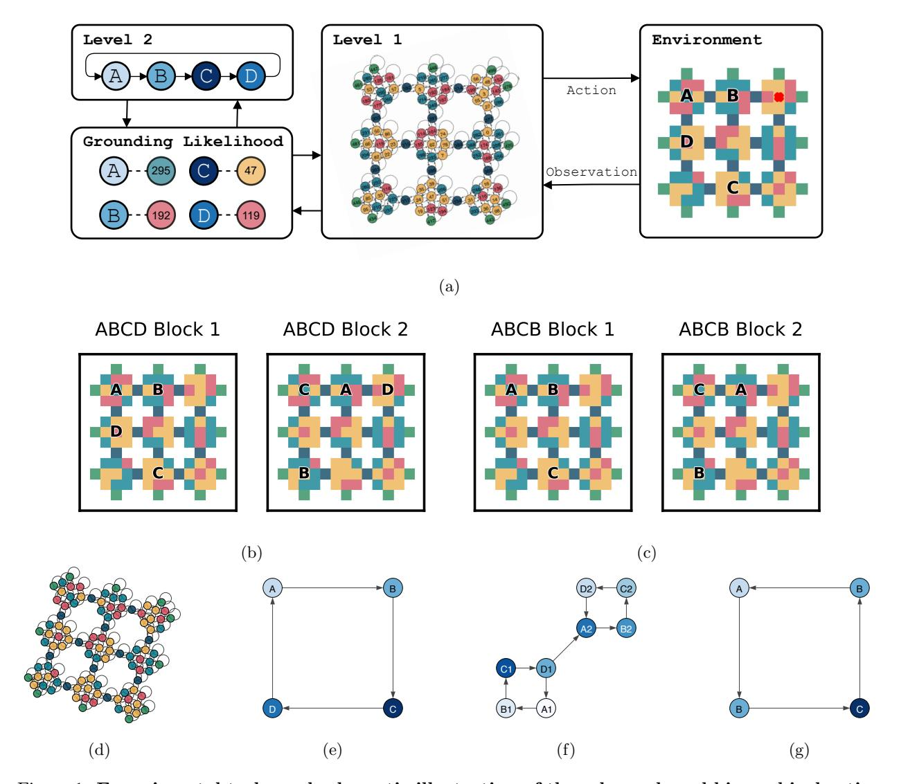
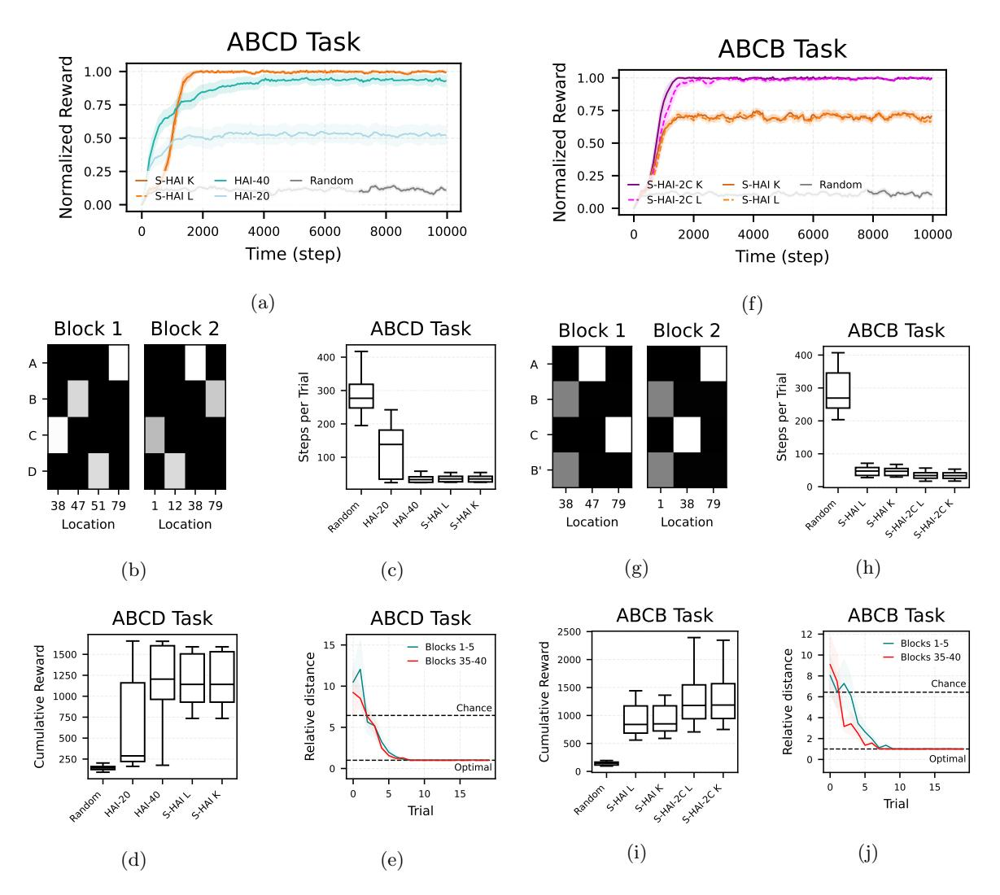
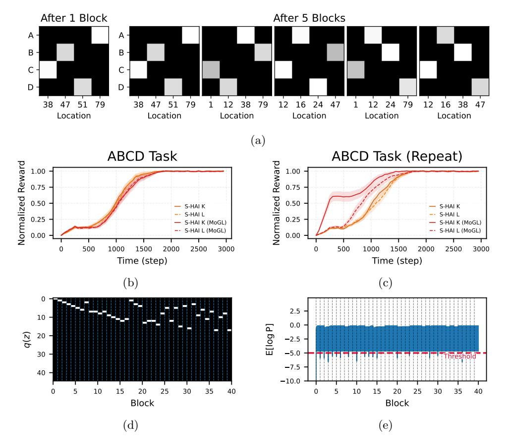
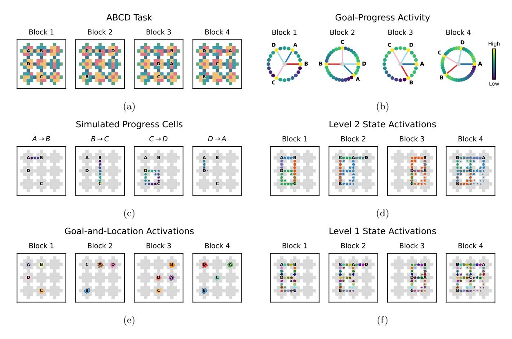
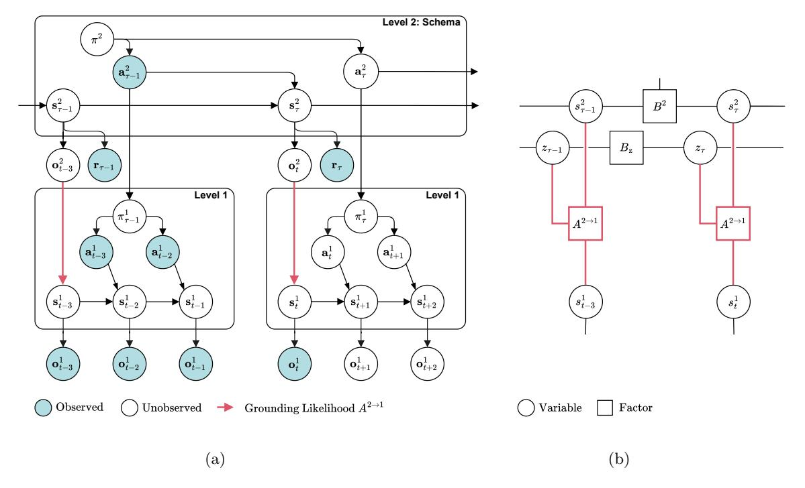
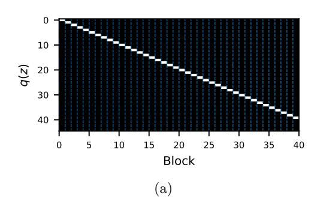
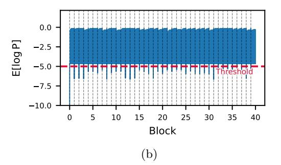
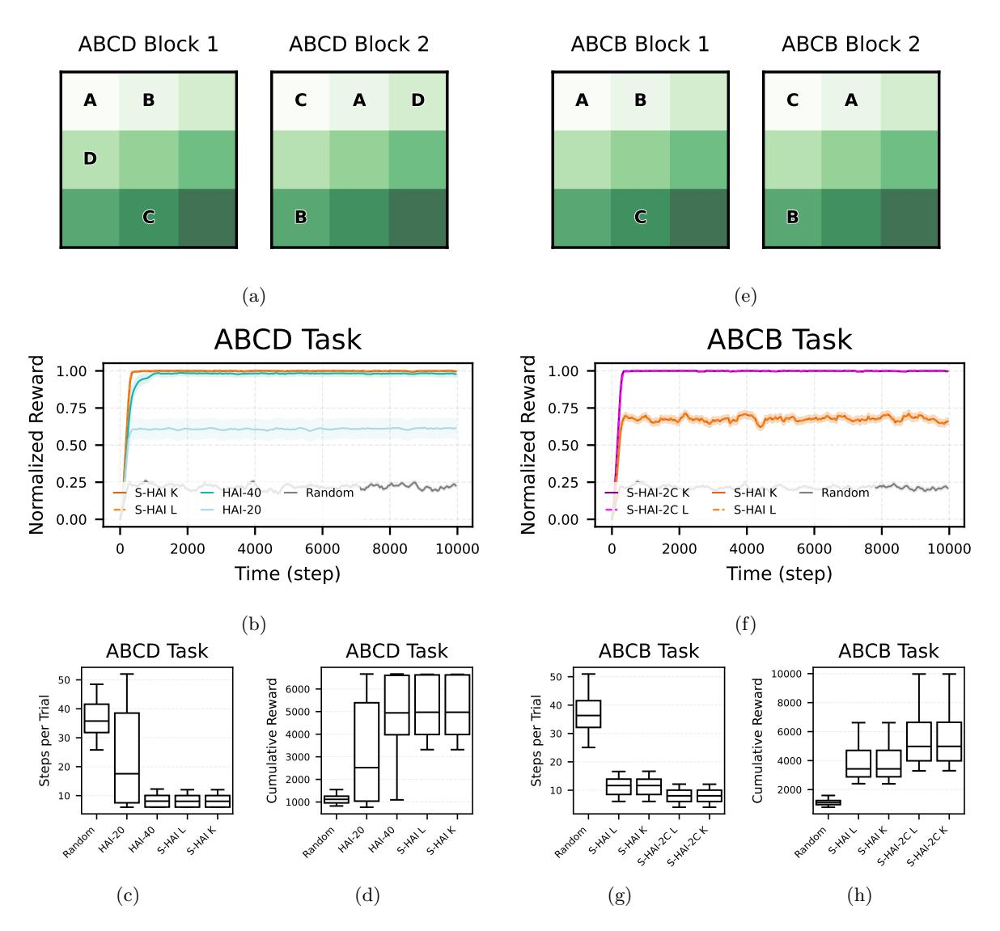

## Schema-based active inference supports rapid generalization of experience and frontal cortical coding of abstract structure

Toon Van de Maele1 Tim Verbelen1 Dileep George2 Giovanni Pezzulo3,\*

VERSES Research Lab, Los Angeles, USA
 Google Paradigms of Intelligence, Mountain View, USA
 Institute of Cognitive Sciences and Technologies, National Research Council, Rome, Italy
 \* Corresponding author: giovanni.pezzulo@istc.cnr.it

January 28, 2026

#### Abstract

Schemas – abstract relational structures that capture the commonalities across experiences – are thought to underlie humans' and animals' ability to rapidly generalize knowledge, rebind new experiences to existing structures, and flexibly adapt behavior across contexts. Despite their central role in cognition, the computational principles and neural mechanisms supporting schema formation and use remain elusive. Here, we introduce schema-based hierarchical active inference (S-HAI), a novel computational framework that combines predictive processing and active inference with schema-based mechanisms. In S-HAI, a higher-level generative model encodes abstract task structure, while a lower-level model encodes spatial navigation, with the two levels linked by a grounding likelihood that maps abstract goals to physical locations. Through a series of simulations, we show that S-HAI reproduces key behavioral signatures of rapid schema-based generalization in spatial navigation tasks, including the ability to flexibly remap abstract schemas onto novel contexts, resolve goal ambiguity, and balance reuse versus accommodation of novel mappings. Crucially, S-HAI also reproduces prominent neural codes reported in rodent medial prefrontal cortex during a schema-dependent navigation and decision task, including task-invariant goalprogress cells, goal-identity cells, and goal-and-spatially conjunctive cells, as well as place-like codes at the lower level. Taken together, these results provide a mechanistic account of schema-based learning and inference that bridges behavior, neural data, and theory. More broadly, our findings suggest that schema formation and generalization may arise from predictive processing principles implemented hierarchically across cortical and hippocampal circuits, enabling the generalization of experience.

**Keywords:** schema; hierarchical active inference; predictive processing; frontal cortex, hippocampus

#### 1 Introduction

Humans and other animals show a remarkable ability to rapidly generalize their knowledge to novel environments with very little new experience. This capability remains unparalleled by current artificial and AI systems, which usually require extensive datasets of problem-specific data.

In cognitive science, it has long been postulated that a specific cognitive structure—schemas—may support the generalization of existing knowledge and skill to novel contexts. Schemas are typically defined as relational knowledge structures that capture abstracted commonalities across multiple experiences. They enable individuals to organize and interpret experiences in memory and to generalize to novel situations that share underlying structure, even when differing in sensory details (Piaget, 1952; Bartlett, 1932). The crucial insight is that schemas are formed through experience, encoding inferred relational task structure while abstracting away from low-level (sensory) details. Schemas not only organize experiences into a rich

set of relations but also serve as templates that enable the rapid assimilation of new experiences. This type of learning—or assimilation—requires only mapping the low-level sensory details of a novel experience onto the abstract relational structure of an existing schema, enabling the fast (ideally, one-shot) reuse and generalization of knowledge to new contexts. As a result, it is significantly faster than the gradual accumulation of knowledge emphasized in classical theories of trial-and-error or associative learning. Furthermore, besides assimilation—fitting new information into existing schemas—there is a second process—called accommodation—which involves creating new schemas or modifying existing ones when new information does not fit. Piaget (1952) famously argued that this dual process of assimilation and accommodation is fundamental to learning and development.

These ideas originating in cognitive science have been influential since the early days of AI, inspiring numerous efforts to theorize and implement schemas (or related structures, such as frames or scripts), particularly but not exclusively within the symbolic AI tradition (Minsky, 1986; Schank and Abelson, 2013; Hummel and Holyoak, 1997). Several theoretical accounts over the years have argued that the remapping of existing schemas and task representations to novel tasks lies at the heart of abstraction, structural inference, and analogy-making, as seen in multiple cognitive domains, from goal-directed navigation to rule learning and narrative understanding (Chollet, 2019; Mitchell, 2021; Hofstadter, 1999; Tenenbaum et al., 2011; Roy, 2005; Pezzulo, 2009; Niv, 2019; Schuck et al., 2016; Bein and Niv, 2025; Bähner et al., 2025; Collin et al., 2025; Goudar et al., 2023; Beukers et al., 2024; Yang et al., 2019; Sandbrink and Summerfield, 2024). However, designing effective computational models capable of learning schemas and generalizing them to novel experiences remains a significant challenge. Key difficulties include identifying the underlying relational structure to form schemas, encoding it in a form that supports rapid rebinding to new contexts, and designing mechanisms that enable rapid mapping between existing schemas and novel problems. Despite progress, a comprehensive computational account of schema-based learning and inference—particularly in complex, dynamic environments—remains elusive. Nonetheless, valuable insights into these challenges have begun to emerge from neuroscience.

In neuroscience, various studies have addressed the role of schemas in rodents and primates. These studies reveal that three interconnected brain structures—the hippocampus, the entorhinal cortex, and the frontal cortex—may play a crucial role in schema-based rapid learning and systems consolidation (Farzanfar et al., 2023). For example, Tse et al. (2007) demonstrated that rats could integrate new information into an existing associative schema after only a single learning episode, with corresponding changes observed in hippocampal activity. This supports the view that schemas facilitate fast learning when new information is congruent with previously acquired relational structures. Additional studies have shown that hippocampal representations become more abstract and organized with schema acquisition, as evidenced by hippocampal replay and reactivation patterns during rest and sleep (McKenzie et al., 2014). Beyond the hippocampus, grid cells in the entorhinal cortex have been implicated in cognitive map formation and schema learning (Neupane et al., 2024). During spatial navigation, grid cells provide a periodic, low-dimensional representation of space that is believed to support path integration and map-like computations (Hafting et al., 2005). More recent research suggests that grid-like coding may extend beyond physical space to support abstract cognitive maps, including task spaces and relational structures (Buzsáki and Moser, 2013; Bellmund et al., 2018; Viganò et al., 2023; Bottini and Doeller, 2020; Dong and Fiete, 2024). These studies suggest that grid cells in the entorhinal cortex may serve as a stable, reusable coordinate system that anchors task-specific details—mediated by the hippocampus—onto an abstract relational scaffold for organizing schematic knowledge.

Finally, various studies indicate that the frontal cortex—possibly in interaction with the hippocam-pus—plays a crucial role in forming cognitive maps and schematic associations, integrating new information into existing schemas, and determining whether assimilation or accommodation processes are engaged (Gilboa and Marlatte, 2017; Zeithamova et al., 2012; Van Kesteren et al., 2012; Giuliano et al., 2021; Bonasia et al., 2018; Baldassano et al., 2018; Basu et al., 2021; Manakov et al., 2025; Schuck et al., 2016; Wang and Hayden, 2021; Vaidya and Badre, 2022; Tang et al., 2023). A particularly striking example of schema learning and generalization is provided by El-Gaby et al. (2024), who demonstrated that the rodent medial frontal cortex is involved in learning the abstract structure of a sequential task—the ABCD task, which requires reaching four goal locations in the correct order—and in reusing this structure in novel environments where

the sequence remains the same but the goal locations vary. A key indicator of fast, schema-based learning is that rodents rapidly move toward location A after discovering location D. At the neuronal level, this ability is supported by various types of cells that are sensitive to different combinations of abstract goal, physical location, and other task-relevant information.

These and other studies have contributed to a convergent computational perspective, whose central insight is that during schema formation, relational structure is represented independently of sensory details. Each state in the relational structure is then bound to particular experiences via rapidly learnable associative links. This idea has been proposed in a series of computational models focusing on the hippocampus and the entorhinal cortex (Whittington et al., 2020, 2018, 2025; Chandra et al., 2025). In this view, the grid cell system in the entorhinal cortex provides the relational scaffold, while individual experiences are encoded in the hippocampus; the interaction between the entorhinal grid system and hippocampal place and conjunctive cells may allow rapid encoding of new experiences within a structured representational space, facilitating both assimilation and accommodation processes. Another related computational account of schema and rebinding in the hippocampus has been developed based on clone-structured causal graphs (CSCG) (George et al., 2021; Guntupalli et al., 2023; Swaminathan et al., 2023; Raju et al., 2024). In this perspective, the latent structure of the cognitive map of a maze can be abstracted by disconnecting it from the specific observations, and then reused as a schema to accelerate learning in other mazes. The same mechanism can also be used to learn the abstract structure of algorithms and template structures of language (Swaminathan et al., 2023) with inference time plasticity solves the problem of recalling the appropriate schema while dynamically binding the latent structure to novel inputs. Recent modeling work extends these ideas to neural activity in the frontal cortex but does not address how schemas are learned and deployed during spatial navigation (El-Gaby et al., 2024).

While valuable, these studies leave several important questions unanswered, including how abstract schemas can be formed and leveraged during goal-directed navigation and planning; how they extend to more challenging contexts in which multiple schemas—or multiple mappings between existing schemas and novel problems—must be created de novo, capturing the dynamics of what Piaget (1952) called assimilation and accommodation; and how they relate to neural processing in frontal cortex, as seen in the ABCD task (El-Gaby et al., 2024).

While prior work on CSCGs has addressed the problem of learning space as a latent structure from partially observable sensations (Raju et al., 2024), and CSCG schemas (Guntupalli et al., 2023; Swaminathan et al., 2023) addresses the problem of transferring a learned spatial or algorithm structure using schemas, they do not address the problem of transferring multiple task structures that are learned in the same spatial environment. To do this in a partially observable setting, new task-structure schemas have to learned that uses the latent states of the spatial structure that was previously learned.

In this study, we develop and validate a novel schema-based hierarchical active inference (S-HAI) model that addresses these challenges. In the next section, we first introduce the experimental tasks (ABCD and ABCB, Section 2.1) and the schema-based hierarchical active inference (S-HAI) agent that solves them (Section 2.2). Then, we present four simulations that evaluate whether the S-HAI agent exhibits behavioral and neural (prefrontal) signatures of schema-based inference and learning reported empirically. The first simulation shows that schema-based inference in the S-HAI agent enables fast generalization in the ABCD task of El-Gaby et al. (2024) (Section 2.3). The second simulation demonstrates the efficacy of schema-based inference in a more demanding ABCB task, in which two goals can occupy the same location, as in spatial alternation tasks (Jadhav et al., 2012) (Section 2.4). The third simulation shows that the S-HAI agent is capable of incremental online learning and selection among multiple hypotheses about how to map its abstract schema onto the current maze (Section 2.5). Finally, the fourth simulation shows that neural representations emerging in the S-HAI agent during learning of the ABCD task display key neural signatures of schema processing in the rodent mFC (El-Gaby et al., 2024).

### 2 Results

#### 2.1 Experimental tasks: the ABCD and ABCB tasks

The main experimental task we adopt to evaluate our model is the ABCD task of El-Gaby et al. (2024). In this task, a rodent (or artificial agent) acquires rewards by visiting four goal locations on a maze in the correct sequence (Figure 1b). The maze consists of nine wells arranged in a 3 × 3 grid, where each well consists of nine tiles which are connected through one-tile corridors. After the agent obtains a reward, a new reward is placed at the center of the next well in the sequence. The four goal locations differ across blocks, each comprising multiple trials. For example, in Block 1, the four goals are in maze locations: "upper left", "upper center", "bottom center", and "center left", whereas in Block 2, they are in locations: "upper center", "bottom left", "upper left", and "upper right". Crucially, the underlying (ABCD) structure remains invariant throughout the experiment: the rodent must always cycle through the four goal locations in the correct order (e.g., A, B, C, D, A, . . .). The distinction between variable sensory details and stable relational structure makes the ABCD task a natural testbed for schema-based inference.

We also address a more challenging variant, the ABCB task, in which two goals (the B goals) occupy the same spatial location (Figure 1c). This setup is similar to spatial alternation tasks commonly used in rodents (Jadhav et al., 2012) and is more demanding than the ABCD task, since at B animals must remember whether they arrived from A or from C in order to correctly select their next goal, C or A.

#### 2.2 Schema-based hierarchical active inference (S-HAI)

We address the ABCD and ABCB tasks using a novel schema-based hierarchical active inference (S-HAI) agent, which comprises two levels implemented as two interconnected Partially Observable Markov Decision Processes (POMDPs). Figure 1a provides a schematic illustration of S-HAI and its three components: Level 1, which handles spatial navigation; Level 2, which handles schema-based inference; and the *grounding likelihood*, which specifies the probabilistic mapping between abstract goals encoded in schemas and particular locations in the maze. See Section 4 for a formal specification of the S-HAI agent.

At the lower level (Level 1), the S-HAI agent handles spatial navigation in "navigation space", i.e., the grid world depicted in Figure 1b. At this level, the agent observes the color of the tile it is currently visiting, and can navigate the grid using four actions ("up", "down", "left", and "right"). The parameters of the transition model used for navigation are obtained through offline training, simulating the fact that in the corresponding rodent studies, animals already know the environment before schema learning (see Section 4). Previewing the results of our simulations, we found that after training, the model correctly recovers the transition dynamics between the 105 locations (Figure 1d, inset "Level 1" in Figure 1a).

At the higher level (Level 2), the agent performs schema-based learning and inference in "task space". Schema-based learning in the ABCD task amounts to learning an abstract transition model between goals. representing the fact that rewards are obtained by sequentially visiting four abstract goals, A, B, C, and D. then again A, and so on. Schema-based inference amounts to inferring the agent's current position in task space (e.g., whether the current goal has been achieved) based on observations of Level 1 latent states and the presence or absence of reward, and then—if the current goal has been achieved—selecting the next navigation goal for Level 1. The level 1 goal is specified as an intention over future state, which triggers the model to associate each state with an inductive cost (Friston et al., 2023). This cost is proportional to the distance with respect to the intended goal state according to the latent dynamics (see Section 4 in Equation (5)). In our simulations, we implement both online and offline schema learning. Previewing our results, we found that in both cases, the S-HAI agent correctly learns a unique generalizable schema capturing the cyclical transitions between the four goals, applicable to both Blocks 1 and 2 (Figure 1e, inset "Level 2" in Figure 1a). In contrast, an alternative agent trained without schema learning (HAI) captures distinct transitions for the two blocks (Figure 1f). Finally, we found that an S-HAI agent augmented with the capability to distinguish between goals with identical locations (S-HAI-2C) correctly infers a generalizable schema for the ABCB task (Figure 1f).

Crucially, the S-HAI agent also includes a grounding likelihood: a probabilistic mapping between the

Figure 1: Experimental tasks and schematic illustration of the schema-based hierarchical active inference model (S-HAI). (a) Hierarchical generative model of the S-HAI agent. The figure depicts the interaction of the two levels of the model. High-level plans are formed in the task model (Level 2) and, through the grounding likelihood, are mapped onto the preferences of the spatial navigation model (Level 1). The agent then executes actions in the environment, which generate observations. Through bottom-up inference, beliefs over states are formed at each hierarchical level. The agent's location is marked in red. (b) Arrangement of the four goals in two example blocks of the ABCD task (El-Gaby et al., 2024). (c) Arrangement of the four goals in two example blocks of the ABCB task, requiring spatial alternation (Jadhav et al., 2012). Note the two overlapping goals marked B. (d) Transition matrix learned at Level 1 by the S-HAI model (trained on Block 1), encoding the spatial structure of the environment. (e) Transition matrix learned at Level 2 by the schema-based (S-HAI) agent trained on Block 1 of the ABCD task, representing transitions across the four goals A, B, C, and D. (f) Transition matrix learned at Level 2 by the agent without schemas (HAI) trained on Blocks 1 & 2 of the ABCD task, representing transitions between the four goals of each block separately. (g) Transition matrix learned at Level 2 by the schema-based agent with two clone states (S-HAI-2C) trained on Blocks 1 & 2 of the ABCB task.

abstract schema representing transitions between goals in task space (i.e., A, B, C, and D) and the concrete locations of the goals in navigation space (i.e., the locations in the maze where it can find reward). Learning grounding likelihoods is what affords schema-based generalization: it enables the agent to rapidly map its abstract schema (e.g., ABCD) to each novel spatial configuration of the goals (i.e., each block), rather than relearning the correct sequence of actions and goals from scratch on each trial. In our simulations, we implement online learning of the grounding likelihood, alongside both an online and offline variant for the Level 2 schema. In addition, we introduce a mixture model over grounding likelihoods that allows the S-HAI agent to flexibly infer which of its existing grounding likelihoods is most useful in the current maze, or to create a new one when needed. Previewing our results, we found that in all cases (online or offline, with or without mixture), grounding likelihoods allow the S-HAI agent to outperform alternative models trained on the same or even larger datasets but without schema learning. Learning the grounding likelihoods is similar to learning the emission matrix of a schema as in (Guntupalli et al., 2023) and (Swaminathan et al., 2023).

## 2.3 The ABCD task: Schema-based hierarchical active inference allows fast generalization to novel problems with the same abstract structure

In this simulation, we test whether schema learning enables the S-HAI agent to generalize the ABCD task across blocks of trials that share the same sequential structure but differ in specific goal locations. Following the experimental setting of El-Gaby et al. (2024), each block ran until the agent completed 10K steps in the environment. A trial of four consecutive rewards can be completed in an average of  $32 \pm 7.15$  steps  $(\mu \pm \sigma)$ , computed across 40 blocks.

We compare two variants of the S-HAI agent—one that learns schemas offline (S-HAI K) and one that learns them online (S-HAI L)—as well as a standard hierarchical active inference (HAI) agent without schemas and a baseline agent that selects goals randomly (Random). For consistency, in this and the subsequent simulations, all agents share the same hierarchical architecture. Furthermore, the Level 1 model responsible for spatial navigation (Figure 1d) is learned offline and is identical across agents. The only differences between agents arise at Level 2.

In the offline schema-based agent (S-HAI K), the Level 2 schema is trained offline using data generated through a random walk (50 000 steps) collected from the first block only (the "K" denotes that the schema is known). Figure 1e visualizes the learned schema at Level 2, which represents a cycle between the four goals A, B, C, and D. The grounding likelihood is initialized randomly at the beginning of each block and learned online during the task. By contrast, in the online schema-based agent (S-HAI L), both the Level 2 schema and the grounding likelihood are trained online (the "L" denotes that the schema is learned online). The parameters are initialized randomly and updated using conjugate updates, with the grounding likelihood reset after each block.

In the hierarchical active inference (HAI) agent without schemas, Level 2 is implemented using a clone-structured graph (CSCG) (George et al., 2021) and the grounding likelihood is an identity matrix. The agent is denoted as HAI-i, with the index i indicating the number of tasks the agent is trained on; training is done offline on a sequence of the first i tasks, with 10 000 interaction steps per task. See Figure 1f for the transition dynamics between goals learned by the HAI-2 agent (trained on two blocks) at Level 2. Note that, unlike the S-HAI agent, which learns a unique sequential schema, the HAI-2 agent learns a unique subcycle for each block. When the HAI-i agent is trained on more blocks, it tends to learn multiple block-specific subcycles (not shown here, but similar to what is reported in (Van de Maele et al., 2024)).

Finally, in the baseline (Random) hierarchical active inference model, Level 2 randomly selects a subgoal for the agent to navigate to. See Section 4 for a formal explanation of the agents used in this simulation.

Figure 2a shows the simulation results for the ABCD task, reporting the average reward rate (smoothed over 250 steps), normalized against optimal performance, across 40 blocks. The solid line denotes the mean across blocks, and shaded areas indicate the standard error. Each block ended when the agent reached 10 000 interactions with the environment. As expected, the HAI agents without schemas (trained offline on half (20) or all (40) blocks; HAI-20, and HAI-40) outperformed the Random baseline, with performance improving as the number of training blocks increased. However, the HAI-20 agent trained in half of the

Figure 2: Simulations 1 and 2: addressing the ABCD and ABCB tasks, with and without schemas. (a) Normalized reward in the ABCD task for the two schema-based agents using offline (S-HAI K) and online (S-HAI L) learning; two non-schema agents trained offline on 20 (HAI-20) or all 40 blocks (HAI-40); and the baseline (Random) agent. The solid line shows the mean normalized reward (measured as the reward rate smoothed over 250 steps, normalized against the optimal performance) across 40 blocks; the shaded area shows the standard error. Each block ends when the agent reaches a maximum of 10 000 navigation steps. (b) Grounding likelihoods for the first two blocks of the ABCD task learned by the S-HAI L agent. (c) Box plot of the average number of steps per trial required to complete an ABCD task and obtain 4 consecutive rewards, for the various agents. (d) Box plot of cumulative rewards across 40 ABCD blocks, for the various agents. (e) Relative distance to subgoals (ratio of the path length taken to the shortest possible path between subgoals) in the first and last 5 blocks of the ABCD task, for the S-HAI L agent. (f) Performance in the ABCB task for the offline and online schema-based agent with clone graphs (S-HAI-2C K, S-HAI-2C L), without clone graphs schema-based agents (S-HAI K, S-HAI L), and the Random agent. (g) Grounding likelihoods for the first two blocks of the ABCB task learned by the S-HAI-2C K agent. (h) Box plot of the average number of steps per trial required to complete an ABCB task and obtain 4 consecutive rewards, for the various models. (i) Box plot of cumulative rewards across 40 ABCB blocks, for the various models. (i) Relative distance to subgoals in the first and last 5 blocks of the ABCB task, for the S-HAI-2C L agent. The statistical significances are reported in Tables S1, S2, S3, and S4. See the main text for details.

blocks showed limited generalization to novel blocks beyond its training set.

In contrast, the schema-based S-HAI agents generalized robustly to unseen tasks. The offline agent (S-HAI K) rapidly converged to near-optimal reward levels, demonstrating that a schema learned from a single training block can generalize to 39 novel blocks. The online agent (S-HAI L) also reached near-optimal performance, showing that generalizable schemas can be learned efficiently online without prior offline training. Furthermore, both S-HAI agents required fewer steps per trial (Figure 2c) and accumulated more reward (Figure 2d) than the HAI-20 agent and the Random baseline. Additionally, the S-HAI agents reached the maximum normalized reward faster than the more extensively trained HAI-40 agent (Figure 2a). To ensure that the observed behavior is not reflective of imperfect learning at the lower level, we also replicated our results in a simplified environment (a  $3 \times 3$  grid, with unique observations; see Appendix A.3).

A key driver of schema-based generalization is that both S-HAI K and S-HAI L learned a new grounding likelihood online in each block, mapping abstract schema observations ( $\mathbf{o}_t^2$ ) to concrete spatial states ( $\mathbf{s}_t^1$ ). Two examples of grounding likelihoods are shown in Figure 2b, where only the high-level states corresponding to rewarding locations are displayed for clarity (the full grounding likelihood includes 210 high-level states: the conjunction of 105 locations with reward presence). Schemas and grounding likelihoods were acquired quickly within blocks, as indicated by the rapid improvement of S-HAI L performance with experience, reflected in the reduction of relative distance to subgoals (Figure 2e).

Summing up, we found that schema-based S-HAI agents successfully solve structured tasks such as ABCD by rapidly grounding abstract, schema-encoded goals in physical locations that vary across blocks. Remarkably, these schema-based agents perform far more efficiently than the HAI-20 agent trained on only half of the blocks and reach maximal reward faster than the HAI-40 agent, despite the latter being extensively trained offline on all block configurations.

# 2.4 The ABCB task: Schema-based hierarchical active inference augmented with clone graphs can address problems with aliased goals

In this simulation, we consider a more challenging variant of the ABCD task that includes an alternation pattern between goals (Jadhav et al., 2012). Here, the second and the fourth goals, both denoted as B, occupy the same spatial location; this is why the task is called ABCB.

What makes this task more difficult is that it requires spatial memory: when the agent observes a reward at location B, it must decide whether to move toward the C or the A target. Standard HMM-like architectures, such as the one used by the HAI agent in the first simulation, struggle with this task because they confuse the two instances of the B goal. To address this limitation, we endowed Level 2 of the HAI agent with a more expressive clone-structured cognitive graph (CSCG) mechanism (George et al., 2021), which extends HMMs by allowing multiple clones for each state. We call the resulting agent S-HAI-2C K. Here, "2C K" denotes that Level 2 is a CSCG with two clones, trained offline using a random walk (10 000 steps) from the first block, which we found sufficient to learn the ABCB schema (Figure 1g). Additionally, we include a variant that learns the parameters of the clone-structured Level 1 online, called S-HAI-2C L. As in the first simulation, the grounding likelihood was initialized randomly at the beginning of each task and learned online during the task. See Section 4 for a formal specification of the S-HAI-2C K agent.

Figure 2f shows the mean acquired reward over time across 40 blocks of the ABCB task. The results show that the schema-based agents with clones (S-HAI-2C K, S-HAI-2C L) reached near-optimal performance, outperforming the two agents without clones (S-HAI K, S-HAI L), which struggled with the ambiguity of the B goal.

It is also interesting to note that, for the ABCB task, in the first blocks, the relative distance (Figure 2j) for each trial decreases more slowly than during the late trials, indicating that in the late stage, the agent has learned the abstract task structure in the schema and only has to infer the grounding likelihood.

Figure 2g shows the grounding likelihoods for two blocks learned by the S-HAI-2C K agent. At Level 2, the grounding likelihood  $P(\mathbf{s}_t^1|\mathbf{o}_t^2)$  is combined with the observation likelihood  $P(\mathbf{o}_t^2|\mathbf{s}_t^1)$ . Unlike Figure 2b, two distinct task states (corresponding to the first and second occurrences of goal B) map to the same spatial locations (location 2 in Block 1 and location 7 in Block 2). Finally, as shown in Figures 2h and 2f, the S-

HAI-2C K agent requires fewer steps per trial and achieves higher reward than its non-clone counterparts. Taken together, these findings illustrate that augmenting the S-HAI model with clone-based mechanisms (George et al., 2021) enables it to learn schemas that generalize effectively in tasks with aliased goals.

## 2.5 Schema-based inference with a mixture model affords the incremental learning and reuse of multiple grounding likelihoods

In the previous simulations, we examined how the agent remaps spatial states to task states using a single grounding likelihood, which was re-trained at each block. However, in real-world scenarios, animals (and artificial agents) may need to autonomously identify when blocks of problems change (Behrens et al., 2007; Friston et al., 2016b; Proietti et al., 2025). Furthermore, they may encounter the same blocks multiple times, in which case re-learning them from scratch would be inefficient.

To address this challenge, we implemented a non-parametric extension of the S-HAI agent, called the S-HAI MoGL agent, which maintains a mixture of grounding likelihoods that expand over time using a truncated Dirichlet process (Section 4). The S-HAI MoGL agent maintains a belief over the mixture, which is reset to a uniform prior at the beginning of each block, and selects the most likely grounding likelihood for each trial. This non-parametric approach allows the agent to flexibly create new grounding likelihoods when encountering novel problems, while reusing existing grounding likelihoods when encountering previously seen problems. As in the previous simulations, the non-parametric agent was implemented with both online learning (S-HAI L MoGL) and offline learning (S-HAI K MoGL). See Section 4 for a formal explanation of the S-HAI MoGL agent.

To test the mixture of grounding likelihoods, we tested the S-HAI L MoGL and S-HAI K MoGL agents in the ABCD task used in the first simulation, where the agent faces 40 distinct blocks of problems. Our results show that after completing the first block, the S-HAI MoGL agents learn a single grounding likelihood, shown on the left of Figure 3a. As the agent encounters novel blocks, the mixture model expands, resulting in multiple distinct grounding likelihoods for different blocks; for example, the right of Figure 3a shows the learned mixture components after five blocks.

Figure 3b compares the performance of schema-based agents with (S-HAI MoGL K and S-HAI MoGL L) and without (S-HAI K and S-HAI L) a mixture of grounding likelihoods in the ABCD task. The results for the S-HAI K and S-HAI L agents without a mixture are identical to those shown in Figure 2a. Our results show that introducing a mixture of grounding likelihoods affects how quickly the S-HAI MoGL agent learns each task. Initially, the S-HAI MoGL agent—which must infer which grounding likelihood applies to the current problem and, in some cases, create a new one—learns more slowly than a schema-based agent that retrains a single likelihood at each new block. However, this slower start is offset over time: as the S-HAI MoGL agent accumulates knowledge about the grounding likelihood within blocks, it can reuse it across problems, ultimately reaching the performance of the agent without the mixture.

Finally, to further examine the benefits of the mixture of grounding likelihoods, we consider a variant of the ABCD task in which the agent can encounter the same blocks multiple times. In this variant, the 40 blocks that compose the experiment are random samples of only the first 20 blocks used in the previous simulations, so certain blocks may be repeated twice or more. Figure 3c shows the results. Both the schema-based agents with a mixture of grounding likelihoods (S-HAI MoGL) and with a single grounding likelihood (S-HAI) eventually reach the same optimal performance. However, the agent endowed with the mixture model learns faster, as it can immediately apply previously acquired components to tasks it has already encountered. This simulation illustrates that maintaining multiple explicit mappings between the schema and the problems in which it can be applied provides a clear advantage in tasks where prior knowledge can be reused.

Figure 3d provides a more detailed view of how the S-HAI MoGL agent accumulates and organizes the mixture of grounding likelihoods during the ABCD task with repeated environments. The panel shows the agent's belief over the selected mixture component (i.e., the grounding likelihood) across time. In most cases, the agent assigns a unique grounding likelihood to each block, reflecting successful differentiation of the blocks. The bottom panel shows the expected log likelihood of the observations under the mixture model

Figure 3: Simulation 3: addressing the ABCD task with schemas and a mixture of grounding likelihoods. (a) Grounding likelihoods learned by the S-HAI MoGL R agent after the first block (left) and after five blocks (right) of the ABCD task. For visual clarity, the grounding likelihoods only show the relevant entries. The location indicates the specific value for the Level 1 states across the blocks. (b) Normalized reward over 3000 timesteps on the ABCD task, with 40 sequentially experienced blocks. (c) Normalized reward over 3000 timesteps on a variant of the ABCD task with repeated blocks. In this variant, the first 20 blocks are randomly sampled to generate 40 blocks, so that some blocks can be repeated multiple times. (d) The approximate posterior over z (the selector variable of the grounding likelihood) during the ABCD task with repeated blocks, showing that the agent either creates a new grounding likelihood or reuses an existing one when it re-encounters an environment. (e) The expected log likelihood during the 40 blocks of the ABCD task with repeated blocks, with the threshold (-5) used for expanding the mixture model. See the main text for details.

(the first factor in (13)). When this quantity falls below a threshold (shown as the dotted red line), a new grounding likelihood is added to the mixture. This typically occurs at the beginning of a new block, when observations are surprising and inconsistent with prior expectations—consistent with empirical findings that boundaries between episodes often correspond to moments of high surprise (Zacks, 2020). This does not happen when a block is encountered that the agent has previously observed. In the ABCD task without repeating environments, the agent consistently creates new mixture components for each encountered block (see supplementary materials).

## 2.6 Schema-based hierarchical active inference reproduces "goal-progress cells" and other key signatures of schemas in the rodent medial frontal cortex

In this simulation, we aim to assess what internal representations emerge in the schema-based (S-HAI) agent during schema learning and how they relate to neural codes reported in the medial prefrontal cortex (mPFC) of rodents performing the ABCD task (El-Gaby et al., 2024). According to the Bayesian brain hypothesis, neurons do not simply fire in response to stimuli; rather, their activations encode probabilistic beliefs about relevant quantities in the environment (Doya, 2007; Parr et al., 2022). To simulate neural activity, we therefore interpret neurons as representing beliefs over particular states, goals, or transitions. We focus our simulations on four ABCD problems, depicted in Figure 4a. This allows us to observe which neural beliefs evolve as the agent performs the problems, which remain invariant or vary across problem instances, and how they map to neural activation reported in the rodent mPFC.

A key finding of the ABCD study (El-Gaby et al., 2024) is that the rodent mPFC encodes a large population of cells tuned to various combinations of goal-related, spatial, and other types of task-related information. Among these, the most frequent are "goal-progress cells," or cells that are tuned (mainly) to progress (e.g., early, mid, and late phases) toward abstract goals, independently of goal identity or physical distance. This is evidenced by the fact that the firing of these cells occurs when approaching any goal and stretches or shrinks depending on the spatial distribution of goal locations; see Figure 2c in (El-Gaby et al., 2024).

Neural activations that track progress toward goals naturally emerge in our model when considering the agent's belief over the inductive cost, under the expectation of its current location. During planning, the inductive cost associated with each state reflects how far this is from the preference state (see method for details). Figure 4b shows simulated neural activity in our model, where the expected inductive cost is normalized across consecutive steps, revealing that this value increases as the agent approaches the goal. Notably, the agent's goal expectation ramps up consistently as it approaches the next goal, regardless of which goal is targeted. This is illustrated, for example, at the start of the sequence, its expected inductive cost is initially high (early progress, purple node), then increases as it moves toward goal C, passing through mid expectation (green node) before reaching high expectation (yellow node). This pattern corresponds to the engagement of distinct populations of "goal-progress cells", tuned to early, mid, or late phases of progress toward any goal.

Simulated populations of "goal-progress cells" are further illustrated in Figure 4c, where their activations are plotted on top of the maze layout during Block 1. The agent's trajectories are shown as colored dots (with small amounts of noise added to avoid overlapping points). In the third panel, two distinct trajectories can be observed between C and D. The dots are color-coded as before, indicating that along each trajectory (e.g., from A to B in the first panel), different populations of "goal-progress cells" become active in sequence: first those tuned to mid goal expectation (green), then to high goal expectation (yellow), and finally to low goal expectation after the reward is collected at the goal location (purple). Importantly, this ramping pattern emerges consistently across different trajectories, independent of the specific goal destination, while the firing fields of these cells flexibly stretch or contract depending on the physical distance between goals.

A second prominent class of cells reported by (El-Gaby et al., 2024) encode the pursuit of a specific abstract goal (A, B, C, or D), independently of its physical position in the maze (see Figure 2d in (El-Gaby et al., 2024)). In our model, neural activations with this property emerge naturally when considering the agent's Level 2 (prior) belief over the current task phase (i.e., moving toward A, B, C, or D), which reflects the agent's expectation about where the next reward will be obtained. Figure 4d illustrates this by plotting the agent's trajectories during the four Blocks, with colors indicating the current belief over the task phase. The activation corresponding to each phase (e.g., blue when moving from A to B, orange when moving from B to C, green when moving from C to D, and purple when moving from D to A) remains constant along the trajectory until the goal is reached, regardless of the path taken. Crucially, this coding pattern generalizes across Blocks even when goals occupy different spatial locations, thus demonstrating goal-selective but spatially invariant representations—mirroring the empirical findings.

A third prominent class of cells identified by (El-Gaby et al., 2024) encode joint information about the specific abstract goal (A, B, C, or D) and its spatial location in the maze. In our model, such goal-and-

Figure 4: Simulation of neural activity in the S-HAI model during the ABCD task. (a) Four blocks of the ABCD task. (b) Simulated activity of "goal-progress" cells during the ABCD task, plotted in a circle. The nodes represent locations visited during the task and their colors nodes indicate the normalized expected inductive cost, under the variational posterior over the level 1 state; these range from purple (low expectation, corresponding to early phase of progress towards a goal) to green (mid expectation and mid phase of progress) and yellow (high expectation and late phase of progress). The line indicates where the reward was received, and the color indicates which phase of the task this was in. (c) Simulated activity of "goal-progress" cells during the ABCD task, plotted in space. The panels show activations of the normalized expected inductive cost under the variational posterior over level 1 state in distinct phases of Task 4. As before, purple, green, and yellow represent low expectation (early phase), mid expectation (mid phase), and high expectation (late phase of progress). Note that in the third panel, there are two paths from C to D, i.e., the animal can move upward or to the left after leaving C. (d) Level 2 state activations during the last 1000 steps in each environment for the tasks. Dots are plotted at points between two visited tiles, colored by the high-level state. Locations are augmented with random noise for visual clarity. (e) Dots colored according to the joint activation of a task phase and location. (f) Level 1 state activations during the last 1000 steps in each environment. Dots are plotted on the agent's tile and colored by the low-level state. Locations are augmented with random noise for visual clarity. See the main text for further explanation.

location—tuned activations emerge naturally within the grounding likelihood. This is illustrated in Figure 4e, where each set of colored dots corresponds to an entry of the grounding likelihood that maps a given spatial location to a task state. This mechanism produces unique activation patterns: activations are identical (or highly similar) only when both the spatial location and the task state coincide, and they differ otherwise. For instance, the activation pattern for location A in Tasks 1 and 4 is identical, whereas the pattern for location A in Tasks 1 and 2 is distinct—mirroring the empirical findings.

Finally, beyond the neural codes that support navigation in task space at Level 2—potentially associated with frontal cortical mechanisms—our model also accounts for neural codes that support navigation in physical space at Level 1, possibly linked to spatial mapping and navigation in the hippocampal formation (Nyberg et al., 2022). Figure 4f shows Level 1 spatial activations, which encode the agent's position within

the environment. Regardless of the task instance, each spatial location corresponds to a distinct activation pattern. For example, the bottom-right location consistently activates the same neuron, analogous to hippocampal place cells (O'Keefe and Dostrovsky, 1971). This demonstrates that Level 1 neurons provide a stable spatial representation independent of the current task, enabling the model to preserve consistent positional information while Level 2 representations capture task-specific and goal-directed information.

#### 3 Discussion

The traditional view of learning in psychology, neuroscience, and AI emphasizes the gradual accumulation of experience. Alongside classical learning theories, it has long been postulated that humans and other animals are capable of forming *schemas*—data structures that encode structural relations between events while abstracting away from sensory details—and of rapidly reusing them to generalize knowledge to novel contexts by quickly rebinding new experiences to existing schemas (Piaget, 1952; Bartlett, 1932). A growing body of literature, recently reviewed in (Farzanfar et al., 2023), supports the idea that advanced cognitive abilities, such as fast generalization and the abstraction of knowledge across contexts, depend on schema-based mechanisms possibly involving the hippocampus, entorhinal cortex, and frontal cortex.

This study introduces a novel computational approach—schema-based hierarchical active inference (S-HAI)—that addresses the formation of schemas from experience and their rapid generalization to novel contexts. The model builds on theories of hierarchical predictive processing and active inference (Parr et al., 2022; Van de Maele et al., 2024; Pezzulo et al., 2018; Butz et al., 2025; Pezzulo et al., 2018; Smith et al., 2022; Lanillos et al., 2021; Matsumoto and Tani, 2020; Friston et al., 2021; Taniguchi et al., 2022; Isomura and Friston, 2018) and extends them with schema-based mechanisms. S-HAI is organized hierarchically: the higher level (Level 2) is responsible for schema learning and navigation in an abstract task space, while the lower level (Level 1) encodes spatial information and supports navigation in physical space. Crucially, the two levels are connected by a mechanism unique to our model, the grounding likelihood, which maps abstract goal codes in the schema to physical locations. The rapid learning of this mapping enables the agent to flexibly generalize the same schema to novel goal configurations.

With a series of simulations, we validate the ability of the schema-based S-HAI agent to reproduce behavioral findings in tasks requiring rapid generalization, as well as neural findings reported in the medial frontal cortex of rodents performing such tasks. Our results show that, after learning a schema for a general class of navigation problems sharing the same structure—namely, problems requiring cyclic visits to four goal locations to obtain rewards, as in the ABCD task (El-Gaby et al., 2024)—the S-HAI agent exhibits rapid online generalization to novel problems in which the relational structure is preserved but the spatial locations of the four goals change. Remarkably, the schema-based agent outperforms an agent trained offline on all problems, showcasing the advantages of schema-based learning in novel contexts. Our simulations also show that the same approach can be generalized to more challenging tasks in which multiple goals can share the same location (ABCB task), analogous to spatial alternation tasks (Jadhav et al., 2012), and that the S-HAI agent can learn online and select among a mixture of likelihood mappings between the abstract schema and concrete problems, demonstrating the ability to decide when to reuse an existing mapping or create a novel one—capturing at least basic signatures of the assimilation (of novel experiences into existing relational structures) and accommodation (of novel relational structures) processes as conceived by (Piaget, 1952). Finally, and importantly, the S-HAI model reproduces key neural signatures of schemas identified in the medial frontal cortex of rodents performing the ABCD task (El-Gaby et al., 2024), most prominently capturing the activity of goal-progress cells, while also reflecting the heterogeneous coding of other cells sensitive to combinations of goal, spatial, and task-related information.

Taken together, these results establish S-HAI as a comprehensive computational framework that demonstrates the efficacy of schema-based learning and inference, capturing both behavioral and neural signatures of rapid generalization, flexible problem solving, and the assimilation and accommodation of novel experiences. Importantly, S-HAI provides a mechanistic account of how abstract relational knowledge can be represented, mapped onto specific contexts, and incrementally updated, grounded in principles of predictive processing and hierarchical active inference (Parr et al., 2022). This suggests that the same predictive pro-

cessing principles that have been successful in modeling perception, action, and decision-making may also underlie schema formation, flexible reuse of relational knowledge, and generalization in the brain.

By providing a mechanistic model of schema-based learning and inference, our framework also generates novel empirical predictions that can be tested in future experiments. One such prediction concerns the behavior and neural representations that might be observed in animals performing the ABCB task (Figure 2f). Our simulations suggest that correctly solving this task requires a mechanism (clone-based or similar) capable of disambiguating between distinct instances of the same goal (e.g., goal B). This, in turn, should produce specific patterns of behavior and Level 2 neural representations, including separate representations of the same goal when it is encountered twice (see Figure 1g). Another critical prediction concerns the functional role of the neural activity patterns reported in the medial frontal cortex of rodents during the ABCD task (El-Gaby et al., 2024). Our model maps distinct populations of neurons—tuned to goal progress, goal identity, and goal identity in conjunction with spatial location—onto distinct computational processes, namely: goal expectations, beliefs about the current task phase, and the grounding likelihood. As a result, perturbing these neurons should have dissociable effects. For example, disrupting neurons that encode beliefs about the current task phase should impair the animal's ability to correctly infer its next goal, whereas disrupting neurons that encode the grounding likelihood should impair the animal's ability to flexibly link task phases to spatial representations. These predictions remain to be tested in future experiments.

The current S-HAI agent has several limitations that can be addressed in future research. First, while our model considers multiple grounding likelihoods, it currently implements only a single schema. The S-HAI framework allows a straightforward extension from maintaining a mixture of grounding likelihoods to also maintaining a mixture over multiple schemas, thereby providing a more comprehensive account of the assimilation and accommodation processes envisaged by (Piaget, 1952). Second, the model focuses primarily on schema learning and inference in the frontal cortex, based on probabilistic generative models that extend Hidden Markov Models (HMMs). This approach permits reproducing some key aspects of the neural coding of schemas in the frontal cortex, but cannot capture its full complexity. Future studies could explore biologically realistic implementations of HMMs (Kappel et al., 2014) and more systematically investigate the mapping between these models and neural computations in the frontal cortex. Additionally, future work might extend S-HAI to provide a system-level model addressing schema-based processes beyond the frontal cortex, encompassing other relevant brain regions such as the hippocampus and entorhinal cortex.

Finally, future work could investigate how schema-based mechanisms can be reused to support navigation in abstract, conceptual spaces. Recent studies suggest that the brain may rely on shared computational mechanisms for mapping and navigation in both physical and conceptual domains, with a central role played by the hippocampal—entorhinal system (Buzsáki and Moser, 2013; Bellmund et al., 2018; Viganò et al., 2023; Bottini and Doeller, 2020; Dong and Fiete, 2024). Understanding how schema formation and schema-based inference contribute to constructing and navigating such abstract cognitive maps could provide a unifying framework for explaining flexible cognition across spatial and non-spatial domains.

#### 4 Methods

Our approach builds on active inference, a framework in which agents minimize variational free energy by updating beliefs (perception), choosing actions (policy evaluation), and adapting model parameters (learning) (Parr et al., 2022; Smith et al., 2022). We expand the paradigm by introducing a generative model that can represent and reuse abstract schemas – structured, generalizable representations of task dynamics – across multiple environments. Instead of learning the specific sequence of rewarded locations in a task (Van de Maele et al., 2024), the schema captures the abstract structure of this task, such as the fact that there are four rewards in four different locations (as in the ABCD task of (El-Gaby et al., 2024)) or three rewards in alternating locations (as in the spatial alternation task of (Jadhav et al., 2012)). In various task instances, this schema can then be mapped probabilistically to environment-specific states. This corresponds to a very fast learning process, since the agent only needs to learn a new mapping (which we call a grounding likelihood) from the abstract schema states to environment-specific locations. The use of schemas, therefore, allows the agent to rapidly generalize and transfer high-level knowledge across different task instances.

In this Section, we first briefly review the functioning of active inference and then we illustrate the structure of the novel schema-based (S-HAI) agent.

#### 4.1 Active Inference

Active inference is a framework that describes cognitive processes and brain dynamics in living organisms, in terms of the minimization of an information-theoretic functional: variational free energy (Parr et al., 2022). Active inference agents are endowed with a *generative model*: a probabilistic model that encodes the internal belief over the causal relationship between hidden states, actions, and subsequent observed outcomes. Note that this is distinct from the true physical process (called *generative process*) that generates the outcomes in the world.

As agents are computationally bound, inference over the posterior becomes intractable for large state spaces. Therefore, agents use approximate (variational) inference by minimizing their variational free energy, a bound on the surprise, defined as:

$$\mathcal{F} = \mathbb{E}_{Q(\tilde{\mathbf{s}};\theta)}[\ln Q(\tilde{\mathbf{s}};\theta) - \ln P(\tilde{\mathbf{s}},\tilde{\mathbf{o}},\tilde{\mathbf{a}})]$$
(1)

$$= D_{KL}[Q(\tilde{\mathbf{s}}; \theta) || P(\tilde{\mathbf{s}} | \tilde{\mathbf{o}}, \tilde{\mathbf{a}})] - \ln P(\tilde{\mathbf{o}}), \tag{2}$$

with variational posterior  $Q(\tilde{\mathbf{s}}; \theta)$ , parameterized by  $\theta$  over the latent state trajectories. When  $\mathcal{F}$  is minimized, the variational posterior approximates the true posterior.

A key assumption of active inference is that organisms minimize their variational free energy by changing their beliefs about the world to better fit their observations (perception), by changing the parameters of their generative model (learning), or by changing the world – and therefore their observations – by acting (action selection and planning).

During perception, the generative model is inverted to find the hidden causes that give rise to the observed outcomes. This is done by minimizing the free energy  $\mathcal{F}$  with respect to the approximate posterior's variational parameters  $\theta$ . By applying a mean field factorization over time  $Q(\tilde{\mathbf{s}}; \theta) = \prod_t Q(\mathbf{s}_t; \theta_t)$  (Beal, 2003) and parameterizing the approximate posterior at each timestep as a categorical distribution  $Q(\mathbf{s}_t) = \operatorname{Cat}(\theta_t)$ , it is possible to perform approximate posterior inference over hidden states, using standard mean-field variational updates (Heins et al., 2022).

During learning, the agent's generative model is updated through its experiences. This is achieved by optimizing the variational free energy objective with respect to the model parameters. Both the observation and dynamics likelihood are modeled as a categorical distribution, with a conjugate Dirichlet prior over the model parameters. The variational posterior distribution of the Categorical-Dirichlet pair is the sum of the sufficient statistics of the observed data with the prior (Blei et al., 2017). For the observation likelihood, the sufficient statistics are computed as the outer product between the observation and state at the current timestep  $(\mathbf{s}_t, \mathbf{a}_t)$ . While for the dynamics likelihood, the sufficient statistic is computed as the outer product between the state at the current time step, and the state-action pair at the previous timestep  $(\mathbf{s}_t, \mathbf{s}_{t-1}, \mathbf{a}_{t-1})$ . The belief over the state  $\mathbf{s}_t$  is found using a Bayesian filtering approach when learning non-clone structured transition dynamics, and using smoothing when learning the dynamics of a CSCG online. In this work, we consider a fixed observation likelihood and only learn the parameters of the dynamics and the grounding likelihood (see Section 4.2.1).

Finally, during action selection, the agent selects the policy  $\pi$  (a sequence of actions) that minimizes the expected free energy  $\mathcal{G}$ , i.e., the expectation of the free energy under future observations, under each policy, augmented with an inductive prior over policies  $\mathcal{H}$ , which enables intended behavior towards preferred states, rather than preferred outcomes (Friston et al., 2023).

The expected free energy over a policy is the sum of the expected free energies at each future timestep

$$\tau$$
:  $\mathcal{G}(\pi) = \sum_{\tau} \mathcal{G}_{\tau}(\pi_{\tau})$ .

$$\mathcal{G}_{\tau}(\pi_{\tau}) = \mathbb{E}_{Q(\mathbf{o}_{\tau}|\pi_{\tau})} \left[ \ln Q(\mathbf{s}_{\tau}|\pi) - \ln P(\mathbf{o}_{\tau}, \mathbf{s}_{\tau}|\pi_{\tau}) \right]$$
(3)

$$= -\underbrace{\mathbb{E}_{Q(\mathbf{o}_{\tau}|\pi_{\tau})} \left[ \operatorname{D}_{\mathrm{KL}} \left[ Q(\mathbf{s}_{\tau}, \mathbf{o}_{\tau}|\pi_{\tau}) || Q(\mathbf{s}_{\tau}|\pi_{\tau}) \right] \right]}_{\text{Epistemic Value}} - \underbrace{\mathbb{E}_{Q(\mathbf{o}_{\tau}|\pi_{\tau})} \left[ \ln P(\mathbf{o}_{\tau}) \right]}_{\text{Utility}}$$
(4)

This quantity trades off *epistemic value*, scoring how much information is gained from pursuing the policy and *utility*, scoring how much the policy realizes the agent's goals in the future, encoded as prior preferences over observations  $P(\mathbf{o}_{\tau})$ . Similar to the expected free energy, the inductive prior over policies is simply the sum of the inductive priors at each future timestep  $\tau$ :  $\mathcal{H}(\pi) = \sum_{\tau} \mathcal{H}_{\tau}(\pi_{\tau})$ .

$$\mathcal{H}_{\tau}(\pi_{\tau}) = -\underbrace{\mathbb{E}_{q(\mathbf{s}_{\tau}|\pi_{\tau})}[\ln P(\mathbf{s}_{\tau})]}_{\text{Inductive cost}}$$
(5)

This quantity scores future states  $\mathbf{s}_{\tau}$  with respect to an intended future state, encoded as a prior over future state  $P(\mathbf{s}_{\tau})$ . Crucially, unlike the utility term (conditioned on an expected outcome), the *inductive* cost propagates through the latent dynamics across the state space of the agent as it assigns a cost value to each state, reflecting the distance to the intended (goal) state. For a more comprehensive description, the reader is referred to (Friston et al., 2023).

The approximate posterior over the policies  $Q(\pi)$  is set to be proportional to the expected free energy and inductive prior:  $Q(\pi) = \sigma(-\gamma(\mathcal{G}(\pi) + \mathcal{H}(\pi)))$ . Here,  $\sigma$  is the softmax function, and  $\gamma$  is the sampling temperature, where lower temperatures yield more stochastic behavior. This implies that the more a policy is expected to minimize free energy, the higher the probability of selecting it. For a more detailed explanation of active inference, see (Parr et al., 2022).

#### 4.2 Formal description of the schema-based hierarchical active inference agent

Active inference agents are endowed with a generative model, which essentially defines and constrains their knowledge and capabilities. In this study, we propose a novel type of hierarchical generative model that allows the agent to engage in schema-based learning and inference, as seen for example in the ABCD task of (El-Gaby et al., 2024), where the agent navigates in space to reach sequences of four goals.

Figure 5a shows the generative model for schema-based hierarchical active inference (S-HAI), using the formalism of Bayesian networks (see also Figure 1a for a more informal schematization). It comprises two hierarchical layers. The bottom layer (Level 1) operates at the finest timescale and handles the agent's spatial localization and navigation. At this level, the agent receives direct observations of its location and acts through movement. Top-down goals are set as preferences over future states at the lower level that the agent needs to reach.

The higher layer (Level 2) implements schema-based inference and learning. The schema operates at a slower timescale compared to level 1 and captures the abstract task structure, integrating information about reward and bottom-up messages containing the inferred state at the lower level. The dynamics at this level model the state transitions across the goal states that provide reward observations (Friston et al., 2024). For example, in the ABCD task, the schema captures an abstract sequence of actions to move to the next goal, cyclically (from A to B, C, D, and then again to A, etc.).

The hierarchical generative model comprises two coupled Partially Observable Markov Decision Processes (POMDPs), one per level, which interact through top-down and bottom-up message passing (Van de Maele et al., 2024; Catal et al., 2021). Each layer maintains its generative model, and for the generic level *i*, the joint distribution factorizes as:

$$P(\tilde{\mathbf{s}}^i, \tilde{\mathbf{o}}^i, \tilde{\mathbf{a}}^i) = P(\mathbf{s}_0^i) \prod_{t=1}^T P(\mathbf{o}_t^i | \mathbf{s}_t^i) P(\mathbf{s}_t^i | \mathbf{s}_{t-1}^i, \mathbf{a}_{t-1}^i) P(\mathbf{a}_{t-1}^i)$$
(6)

Figure 5: The hierarchical generative model (a) The hierarchical generative model used in this study. The observed variables are denoted in green, while unobserved variables are denoted in white. The red arrow indicates the grounding likelihood. Note that the policy of Level 1 is conditioned on the C-vector, which is set by passing the empirical prior of the schema through the grounding likelihood. (b) A factor graph representation of the grounding likelihood that maps states at level 2 to states at level 1.  $B_z$  shows the transition dynamics in a mixture of grounding likelihoods. The red connections refer to the same likelihood as in Figure 5a. See the main text for explanation.

with states  $\tilde{\mathbf{s}}^i$ , actions  $\tilde{\mathbf{a}}^i$ , and observations  $\tilde{\mathbf{o}}^i$ . Note that the tilde indicates a sequence of that variable over time. The superscript indicates the hierarchical level, and the subscript indicates time.

The POMDP at each level factorizes into a prior  $P(\mathbf{s}_0^i)$  over the initial state, a prior  $P(\mathbf{a}_{t-1}^i)$  over action, an observation likelihood  $P(\mathbf{o}_t^i|\mathbf{s}_t^i)$  that maps the current state to an observation, and a dynamics model  $P(\mathbf{s}_{t+1}^1|\mathbf{s}_{t-1}^1,\mathbf{a}_{t-1}^1)$  that maps the current state-action pair to future state.

The two POMDPs continuously engage in hierarchical message passing to realize hierarchical active inference. Inferred states of level 1 are passed as bottom-up messages to the observations for level 2, while top-down actions from level 2 specify goals at level 1 (see Figure 5a).

Crucially, to support schema-based inference, the agent cannot assume a one-to-one mapping between the states at level 1  $\mathbf{s}_t^1$  and the observations at level 2  $\mathbf{o}_t^2$ . For example, the agent cannot assume that in the ABCD task, the A goal is always in the same spatial position, as it varies across trials. For this, the agent must learn a grounding likelihood  $P(\mathbf{s}_t^1|\mathbf{o}_t^2)$  that maps from observations at level 2 to states at level 1 (e.g., it tells the agent in which spatial position the goal A is), represented by the red arrow in Figure 5a. More details on the grounding likelihood are provided in Section 4.2.1.

For the first level, the observations  $\mathbf{o}^1$  are the color of the tile the agent is currently occupying (see the ABCD Task in Figure 1b). The agent can perform primary movement actions  $\mathbf{a}^1$ , i.e., move up, down, left, or right. Through a clone-structured likelihood mapping, an observation maps to a uniform distribution over "clone" states. Through the encountered transitions between states, the agent infers the level 1 state  $\mathbf{s}^1$ . At the higher level, the observations are received bottom-up using the grounding likelihood, on rewarding timesteps, and the action space consists of only one action: "move to the next goal in the sequence". Gating bottom-up messages based on reward is a form of active data selection (Friston et al., 2024), ensuring that

the high-level learns the dynamics of the rewarding states at a coarser timescale.

Through this hierarchical coupling, the grounding likelihood mediates how the abstract schema at Level 2 specifies concrete goals at Level 1, allowing the agent to generalize task structure across environments.

#### 4.2.1 The grounding likelihood

The grounding likelihood acts as the interface between the high-level schema that tracks the abstract task states and the lower-level state, which is responsible for spatial navigation. By translating schema states to specific spatial states, the same abstract task schema can be reused and generalized across multiple instances of the same abstract task, even though they differ in their specifics. In particular, the likelihood describes the mapping of a schema "observation"  $\mathbf{o}_t^2$  to a spatial state  $\mathbf{s}_t^1$ . This schema observation is decoupled from direct reward signals (see the red arrow in Figure 5a), and thus encodes an "abstract spatial state" within the schema space. Note that when the grounding likelihood is the identity mapping, this task space observation has to learn the specific location of rewards and their dynamics for each of the tasks (Van de Maele et al., 2024). This prevents generalization of the schema abstraction to other task instances.

Formally, we model the grounding likelihood as a categorical distribution, conditioned on the high-level state indicating in which phase of the task the agent is. This likelihood specifies which spatial state the agent expects to find rewards:

$$P(\mathbf{s}_t^1|\mathbf{o}_t^2) = \operatorname{Cat}(A_{\mathbf{o}_t^2}^{2\to 1}),\tag{7}$$

Where the subscript  $\mathbf{o}_t^2$  indicates slicing the parameter tensor  $A^{2\to 1}$  under the high-level observation. This distribution has a Dirichlet prior over the parameters with pseudo-counts  $\alpha$ . The variational posterior over these parameters is computed online using conjugate updates (Friston et al., 2016a).

Remember from Section 4 that the schema level only learns the dynamics of the rewarding sequence. Therefore, for updating the model, we use a modified belief vector  $\hat{\mathbf{s}}_t^1$  to encode the probability of observing a reward at each state. In case the reward is observed, this corresponds exactly to the lower level state  $\mathbf{s}_t^1$ ; However, in case the reward is not observed, we set this belief to a uniform distribution over all other locations, and a zero probability to the currently observed one.

$$\hat{\mathbf{s}}_t^1 = \begin{cases} \mathbf{s}_t^1 & \text{if } r_t = 1, \\ \frac{1}{n-1} (1 - \mathbf{s}_t^1) & \text{if } r_t = 0, \end{cases}$$
 (8)

where  $r_t$  is the observed reward at time t, n is the number of low-level states, and  $(1 - \mathbf{s}_t^1)$  is a vector of all states except the current one, normalized by n - 1 to ensure a proper probability distribution.

With this definition of modified belief vector  $\hat{\mathbf{s}}_t^1$ , the variational posterior is updated using the update rule as derived in (Heins et al., 2022), and described in Section 4.1:

$$P(A^{2\to 1}) \sim \text{Dir}(\alpha)$$
 (9)  $\alpha_t = \alpha_{t-1} + \eta(\hat{\mathbf{s}}_t^1 \otimes \mathbf{o}_t^2),$  (10)

Where  $\mathbf{o}_t^2$  is a one-hot representation of the high-level observation, i.e., the abstraction over the location of the current reward in the task.  $\eta$  is the learning rate, which is 1 in case of observed reward or 0.05 otherwise, ensuring that the grounding likelihood is strongly updated by rewarding states and weakly by non-rewarding ones. Finally,  $\otimes$  denotes the outer product, which increments the pseudocounts  $\alpha$  on the co-occurrence of high-level observation and the low-level state. In the case that the rewarding state has been found, this will enforce the mapping of high-level observation to the low-level state, and in the other case, it will decrease the strength of the current low-level state by incrementing all other low-level states.

#### 4.2.2 Mixture of Grounding Likelihoods

A single grounding likelihood can be brittle when multiple tasks or environments are present. To support richer generalization and knowledge retention, we introduce a *Mixture of Grounding Likelihoods* (MoGL), in which the agent maintains a set of grounding likelihoods and infers which one is active at each timestep.

Formally, the low-level state is sampled from a mixture of grounding likelihoods:

$$P(\mathbf{s}_t^1|\mathbf{o}_t^2) = \sum_{z_t} P(\mathbf{s}_t^1|\mathbf{o}_t^2, z_t) P(z_t|z_{t-1}), \tag{11}$$

where  $z_t$  is a discrete switching variable indicating which grounding likelihood is currently in use. We model  $z_t$  as a Markov chain with fixed parameters, favoring staying in the same grounding likelihood with high probability and transitioning to a different grounding likelihood with low probability. See Figure 5b for a factor graph visualization of the dynamics on switching variable  $z_t$ .

The agent has to infer which grounding likelihood  $z_t$  is currently in play. Similar to the inference mechanism described in Section 4.1, we infer this belief over  $z_t$ , proportional to the expected log likelihood under the Dirichlet parameters of the selected grounding likelihood. In a similar vein to the modified belief in Section 4.2.1, we invert the parameters of the grounding likelihood if it is a non-rewarding location:

$$\hat{A}_{z_t, \mathbf{o}_t^2}^{2 \to 1} = \begin{cases} A_{z_t, \mathbf{o}_t^2}^{2 \to 1} & \text{if } r_t = 1, \\ Z \cdot (1 - \frac{1}{Z} A_{z_t, \mathbf{o}_t^2}^{2 \to 1}) & \text{if } r_t = 0, \end{cases}$$
(12)

where  $A_{z_t,\mathbf{o}_t^2}^{2\to 1}$  is the vector of the concentration parameters for the Dirichlet distribution, conditioned on high-level observation  $\mathbf{o}_t^2$ , and switching variable  $z_t$ . Here, Z is the sum of the concentration parameters. We infer the likelihood message as proportional to the expected log likelihood and combine it with the empirical prior  $P(\mathbf{z}_t|\mathbf{z}_{t-1})$  from the Markov chain to find:

$$Q(\mathbf{z}_{t}) \propto \sigma\left(\underbrace{\mathbb{E}_{P(\hat{A}_{\mathbf{z}_{t}, \mathbf{o}_{t}^{2}}^{2 \to 1})}[\ln P(\mathbf{s}_{t}^{1} | \mathbf{o}_{t}^{2}; \hat{A}_{\mathbf{z}_{t}, \mathbf{o}_{t}^{2}}^{2 \to 1})]})P(\mathbf{z}_{t} | \mathbf{z}_{t-1}),$$
Expected Log Likelihood (13)

Crucially, we model this mixture model as a non-parametric model that can expand the mixture by adding clusters (Stoianov et al., 2022; Heins et al., 2025), i.e., particular grounding likelihoods for observed maps. Formally, this is modeled as a truncated stick-breaking prior that expands the mixture model if the expected log likelihood, marked in Equation (13), of the selected map drops below a preselected threshold (Heins et al., 2025), which means that none of the currently in-play grounding likelihoods explain the data well.

#### 4.2.3 Clone-structured causal graphs

Clone-structured causal graphs (CSCG) (George et al., 2021) are a particular instance of Hidden Markov models (HMM), where the observation likelihood maps observations deterministically to a multitude of states called "clones"; instead, state inference is driven entirely by the model's dynamics. The strength of clone graphs lies in the fact that, even though observations can be identical, this model can disambiguate them into distinct states. This approach has proven effective in navigation with aliased observations (George et al., 2021) and in hierarchical models of alternation tasks (Van de Maele et al., 2024); moreover, the CSCG aligns closely with neural data on cognitive map formation in the hippocampus (Sun et al., 2025). Note that a clone graph with a single clone reduces to a standard (action-augmented) HMM.

The CSCGs are learned using the expectation-maximization (EM) algorithm for HMMs (the Baum-Welch algorithm), which maximizes the evidence lower bound (ELBO) (George et al., 2021). During the E-step, the posteriors over states are estimated through smoothing, i.e., the forward-backward algorithm. The M-step then selects the optimal parameters for the transition model, given this sequence of visited states. After training, the model is pruned using a Viterbi decoding. Here, for each timestep, the maximum likelihood state is selected, and the transition model parameters are estimated using these maximum likelihood states.

We also implement a mechanism to learn the CSCGs online in Section 2.4. In contrast to standard parameter learning in active inference, where the belief over the state is filtered as actions are executed and observations come in, clone-graphs smooth the belief over states, and propagate disambiguating information back into other "cloned" states. This provides a better estimate over the individual states, which can then be used to update the Dirichlet distribution over the transition parameters. For learning the schemas (i.e.,

the level 2 transitions), we use a sliding window of 10 observations and update the parameters as each observation comes in.

We use the CSCG framework in three parts of this study. First, we use it to learn a cognitive map of the spatial locations in the environment. The clone-structure allows finding structure in highly ambiguous observations (6 tile colors, in 105 distinct locations). Second, we use it in Simulation 1 to develop Level 2 of the HAI-i agents without schemas that address the ABCD task. In this case, the CSCG is initialized with a number of clones i that equals the number of blocks to be learned (20 or 40), to ensure the agent has enough capacity to learn all of them. Finally, we use the CSCG framework in Simulation 2 to develop Level 2 of the schema-based S-HAI-2C agent that addresses the ABCB task. In this case, the CSCG is initialized with 2 clones. To use them in discrete-time active inference, we need to map CSCGs to POMDPs as was described in Van de Maele et al. (2023).

### Code availability

We provide the code for replicating the simulations at https://github.com/toonvdm/grounding-schemas.

## Acknowledgments

This research received funding from the European Research Council under the Grant Agreement No. 820213 (ThinkAhead), the Italian National Recovery and Resilience Plan (NRRP), M4C2, funded by the European Union – NextGenerationEU (Project IR0000011, CUP B51E22000150006, 'EBRAINS-Italy'; Project PE0000013, 'FAIR'; Project PE0000006, 'MNESYS'), and the Ministry of University and Research, PRIN PNRR P20224FESY and PRIN 20229Z7M8N. The GEFORCE Quadro RTX6000 and Titan GPU cards used for this research were donated by the NVIDIA Corporation. We used a Generative AI model to correct typographical errors and edit language for clarity.

### References

- Bähner, F., Popov, T., Boehme, N., Hermann, S., Merten, T., Zingone, H., Koppe, G., Meyer-Lindenberg, A., Toutounji, H., and Durstewitz, D. (2025). Abstract rule learning promotes cognitive flexibility in complex environments across species. *Nature Communications*, 16(1):5396.
- Baldassano, C., Hasson, U., and Norman, K. A. (2018). Representation of real-world event schemas during narrative perception. *Journal of Neuroscience*, 38(45):9689–9699.
- Bartlett, F. C. (1932). Remembering: A Study in Experimental and Social Psychology. Cambridge University Press, Cambridge.
- Basu, R., Gebauer, R., Herfurth, T., Kolb, S., Golipour, Z., Tchumatchenko, T., and Ito, H. T. (2021). The orbitofrontal cortex maps future navigational goals. *Nature*, 599(7885):449–452.
- Beal, M. J. (2003). Variational Algorithms for Approximate Bayesian Inference. PhD thesis, University College London.
- Behrens, T. E., Woolrich, M. W., Walton, M. E., and Rushworth, M. F. (2007). Learning the value of information in an uncertain world. *Nature neuroscience*, 10(9):1214–1221.
- Bein, O. and Niv, Y. (2025). Schemas, reinforcement learning and the medial prefrontal cortex. *Nature Reviews Neuroscience*, pages 1–17.
- Bellmund, J. L., Gärdenfors, P., Moser, E. I., and Doeller, C. F. (2018). Navigating cognition: Spatial codes for human thinking. *Science*, 362(6415):eaat6766.
- Beukers, A. O., Collin, S. H., Kempner, R. P., Franklin, N. T., Gershman, S. J., and Norman, K. A. (2024). Blocked training facilitates learning of multiple schemas. *Communications Psychology*, 2(1):28.
- Blei, D. M., Kucukelbir, A., and McAuliffe, J. D. (2017). Variational inference: A review for statisticians. Journal of the American Statistical Association, 112(518):859–877.
- Bonasia, K., Sekeres, M. J., Gilboa, A., Grady, C. L., Winocur, G., and Moscovitch, M. (2018). Prior knowledge modulates the neural substrates of encoding and retrieving naturalistic events at short and long delays. *Neurobiology of Learning and Memory*, 153:26–39.
- Bottini, R. and Doeller, C. F. (2020). Knowledge across reference frames: Cognitive maps and image spaces. Trends in Cognitive Sciences, 24(8):606–619.
- Butz, M. V., Mittenbühler, M., Schwöbel, S., Achimova, A., Gumbsch, C., Otte, S., and Kiebel, S. (2025). Contextualizing predictive minds. *Neuroscience & Biobehavioral Reviews*, 168:105948.
- Buzsáki, G. and Moser, E. I. (2013). Memory, navigation and theta rhythm in the hippocampal-entorhinal system. *Nature neuroscience*, 16(2):130–138.
- Catal, O., Verbelen, T., Van de Maele, T., Dhoedt, B., and Safron, A. (2021). Robot navigation as hierarchical active inference. *Neural Networks*, 142:192–204.
- Chandra, S., Sharma, S., Chaudhuri, R., and Fiete, I. (2025). Episodic and associative memory from spatial scaffolds in the hippocampus. *Nature*, pages 1–13.
- Chollet, F. (2019). On the measure of intelligence. arXiv preprint arXiv:1911.01547.
- Collin, S. H., Kempner, R. P., Srivatsan, S., and Norman, K. A. (2025). Neural codes track prior events in a narrative and predict subsequent memory for details. *Communications Psychology*, 3(1):26.
- Dong, L. L. and Fiete, I. R. (2024). Grid cells in cognition: mechanisms and function. Annual Review of Neuroscience, 47.

- Doya, K. (2007). Bayesian brain: Probabilistic approaches to neural coding. MIT press.
- El-Gaby, M., Harris, A. L., Whittington, J. C., Dorrell, W., Bhomick, A., Walton, M. E., Akam, T., and Behrens, T. E. (2024). A cellular basis for mapping behavioural structure. *Nature*, pages 1–10.
- Farzanfar, D., Spiers, H. J., Moscovitch, M., and Rosenbaum, R. S. (2023). From cognitive maps to spatial schemas. *Nature Reviews Neuroscience*, 24(2):63–79.
- Friston, K., FitzGerald, T., Rigoli, F., Schwartenbeck, P., O'Doherty, J., and Pezzulo, G. (2016a). Active inference and learning. *Neuroscience & Biobehavioral Reviews*, 68:862–879.
- Friston, K., FitzGerald, T., Rigoli, F., Schwartenbeck, P., Pezzulo, G., et al. (2016b). Active inference and learning. *Neuroscience & Biobehavioral Reviews*, 68:862–879.
- Friston, K., Heins, C., Verbelen, T., Costa, L. D., Salvatori, T., Markovic, D., Tschantz, A., Koudahl, M., Buckley, C., and Parr, T. (2024). From pixels to planning: scale-free active inference.
- Friston, K., Moran, R. J., Nagai, Y., Taniguchi, T., Gomi, H., and Tenenbaum, J. (2021). World model learning and inference. *Neural Networks*, 144:573–590.
- Friston, K. J., Salvatori, T., Isomura, T., Tschantz, A., Kiefer, A., Verbelen, T., Koudahl, M., Paul, A., Parr, T., Razi, A., Kagan, B., Buckley, C. L., and Ramstead, M. J. D. (2023). Active inference and intentional behaviour.
- George, D., Rikhye, R. V., Gothoskar, N., Guntupalli, J. S., Dedieu, A., and Lázaro-Gredilla, M. (2021). Clone-structured graph representations enable flexible learning and vicarious evaluation of cognitive maps. *Nature Communications*, 12(1).
- Gilboa, A. and Marlatte, H. (2017). Neurobiology of schemas and schema-mediated memory. *Trends in cognitive sciences*, 21(8):618–631.
- Giuliano, A. E., Bonasia, K., Ghosh, V. E., Moscovitch, M., and Gilboa, A. (2021). Differential influence of ventromedial prefrontal cortex lesions on neural representations of schema and semantic category knowledge. *Journal of Cognitive Neuroscience*, 33(9):1928–1955.
- Goudar, V., Peysakhovich, B., Freedman, D. J., Buffalo, E. A., and Wang, X.-J. (2023). Schema formation in a neural population subspace underlies learning-to-learn in flexible sensorimotor problem-solving. *Nature Neuroscience*, 26(5):879–890.
- Guntupalli, J. S., Raju, R. V., Kushagra, S., Wendelken, C., Sawyer, D., Deshpande, I., Zhou, G., Lázaro-Gredilla, M., and George, D. (2023). Graph schemas as abstractions for transfer learning, inference, and planning. arXiv preprint arXiv:2302.07350.
- Hafting, T., Fyhn, M., Molden, S., Moser, M.-B., and Moser, E. I. (2005). Microstructure of a spatial map in the entorhinal cortex. *Nature*, 436(7052):801–806.
- Heins, C., Millidge, B., Demekas, D., Klein, B., Friston, K. J., Couzin, I. D., and Tschantz, A. (2022). pymdp: A python library for active inference in discrete state spaces. *CoRR*, abs/2201.03904.
- Heins, C., Van de Maele, T., Tschantz, A., Linander, H., Markovic, D., Salvatori, T., Pezzato, C., Catal, O., Wei, R., Koudahl, M., Perin, M., Friston, K., Verbelen, T., and Buckley, C. (2025). Axiom: Learning to play games in minutes with expanding object-centric models.
- Hofstadter, D. R. (1999). Gödel, Escher, Bach: an eternal golden braid. Basic books.
- Hummel, J. E. and Holyoak, K. J. (1997). Distributed representations of structure: A theory of analogical access and mapping. *Psychological review*, 104(3):427.

- Isomura, T. and Friston, K. (2018). In vitro neural networks minimise variational free energy. *Scientific Reports*, 8(1).
- Jadhav, S. P., Kemere, C., German, P. W., and Frank, L. M. (2012). Awake hippocampal sharp-wave ripples support spatial memory. *Science*, 336(6087):1454–1458.
- Kappel, D., Nessler, B., and Maass, W. (2014). Stdp installs in winner-take-all circuits an online approximation to hidden markov model learning. *PLoS computational biology*, 10(3):e1003511.
- Lanillos, P., Meo, C., Pezzato, C., Meera, A. A., Baioumy, M., Ohata, W., Tschantz, A., Millidge, B., Wisse, M., Buckley, C. L., and Tani, J. (2021). Active inference in robotics and artificial agents: Survey and challenges.
- Manakov, M., Proskurin, M., Wang, H., Kuleshova, E., Lustig, A., Behnam, R., Druckmann, S., Tervo, D. G. R., and Karpova, A. Y. (2025). Cognitive graphs of latent structure in rostral anterior cingulate cortex. bioRxiv, pages 2025–04.
- Matsumoto, T. and Tani, J. (2020). Goal-directed planning for habituated agents by active inference using a variational recurrent neural network. *Entropy*, 22(5):564.
- McKenzie, S., Frank, A. J., Kinsky, N. R., Porter, B., Rivière, P. D., and Eichenbaum, H. (2014). Hippocampal representation of related and opposing memories develop within distinct, hierarchically organized neural schemas. *Neuron*, 83(1):202–215.
- Minsky, M. (1986). Society of mind. Simon and Schuster.
- Mitchell, M. (2021). Abstraction and analogy-making in artificial intelligence. Annals of the New York Academy of Sciences, 1505(1):79–101.
- Neupane, S., Fiete, I., and Jazayeri, M. (2024). Mental navigation in the primate entorhinal cortex. *Nature*, 630(8017):704–711.
- Niv, Y. (2019). Learning task-state representations. Nature neuroscience, 22(10):1544–1553.
- Nyberg, N., Duvelle, É., Barry, C., and Spiers, H. J. (2022). Spatial goal coding in the hippocampal formation. *Neuron*, 110(3):394–422.
- O'Keefe, J. and Dostrovsky, J. (1971). The hippocampus as a spatial map: preliminary evidence from unit activity in the freely-moving rat. *Brain research*.
- Parr, T., Pezzulo, G., and Friston, K. J. (2022). Active inference: the free energy principle in mind, brain, and behavior. MIT Press.
- Pezzulo, G. (2009). Dipra: a layered agent architecture which integrates practical reasoning and sensorimotor schemas. *Connection Science*, 21(4):297–326.
- Pezzulo, G., Rigoli, F., and Friston, K. J. (2018). Hierarchical active inference: a theory of motivated control. Trends in cognitive sciences, 22(4):294–306.
- Piaget, J. (1952). The Origins of Intelligence in Children. W. W. Norton & Company, New York.
- Proietti, R., Parr, T., Tessari, A., Friston, K., and Pezzulo, G. (2025). Active inference and cognitive control: Balancing deliberation and habits through precision optimization. *Physics of Life Reviews*.
- Raju, R. V., Guntupalli, J. S., Zhou, G., Wendelken, C., Lázaro-Gredilla, M., and George, D. (2024). Space is a latent sequence: A theory of the hippocampus. *Science Advances*, 10(31):eadm8470.
- Roy, D. (2005). Semiotic schemas: A framework for grounding language in action and perception. *Artificial Intelligence*, 167(1-2):170–205.

- Sandbrink, K. and Summerfield, C. (2024). Modelling cognitive flexibility with deep neural networks. *Current Opinion in Behavioral Sciences*, 57:101361.
- Schank, R. C. and Abelson, R. P. (2013). Scripts, plans, goals, and understanding: An inquiry into human knowledge structures. Psychology press.
- Schuck, N. W., Cai, M. B., Wilson, R. C., and Niv, Y. (2016). Human orbitofrontal cortex represents a cognitive map of state space. *Neuron*, 91(6):1402–1412.
- Smith, R., Friston, K. J., and Whyte, C. J. (2022). A step-by-step tutorial on active inference and its application to empirical data. *Journal of mathematical psychology*, 107:102632.
- Stoianov, I., Maisto, D., and Pezzulo, G. (2022). The hippocampal formation as a hierarchical generative model supporting generative replay and continual learning. *Progress in Neurobiology*, 217:102329.
- Sun, W., Winnubst, J., Natrajan, M., Lai, C., Kajikawa, K., Bast, A., Michaelos, M., Gattoni, R., Stringer, C., Flickinger, D., et al. (2025). Learning produces an orthogonalized state machine in the hippocampus. Nature, 640(8057):165–175.
- Swaminathan, S., Dedieu, A., Vasudeva Raju, R., Shanahan, M., Lazaro-Gredilla, M., and George, D. (2023). Schema-learning and rebinding as mechanisms of in-context learning and emergence. *Advances in Neural Information Processing Systems*, 36:28785–28804.
- Tang, W., Shin, J. D., and Jadhav, S. P. (2023). Geometric transformation of cognitive maps for generalization across hippocampal-prefrontal circuits. *Cell reports*, 42(3).
- Taniguchi, T., Yamakawa, H., Nagai, T., Doya, K., Sakagami, M., Suzuki, M., Nakamura, T., and Taniguchi, A. (2022). A whole brain probabilistic generative model: Toward realizing cognitive architectures for developmental robots. *Neural Networks*, 150:293–312.
- Tenenbaum, J. B., Kemp, C., Griffiths, T. L., and Goodman, N. D. (2011). How to grow a mind: Statistics, structure, and abstraction. *science*, 331(6022):1279–1285.
- Tse, D., Langston, R. F., Kakeyama, M., Bethus, I., Spooner, P. A., Wood, E. R., Witter, M. P., and Morris, R. G. (2007). Schemas and memory consolidation. *Science*, 316(5821):76–82.
- Vaidya, A. R. and Badre, D. (2022). Abstract task representations for inference and control. *Trends in cognitive sciences*, 26(6):484–498.
- Van de Maele, T., Dhoedt, B., Verbelen, T., and Pezzulo, G. (2023). Integrating cognitive map learning and active inference for planning in ambiguous environments.
- Van de Maele, T., Dhoedt, B., Verbelen, T., and Pezzulo, G. (2024). A hierarchical active inference model of spatial alternation tasks and the hippocampal-prefrontal circuit. *Nature Communications*, 15(1).
- Van Kesteren, M. T., Ruiter, D. J., Fernández, G., and Henson, R. N. (2012). How schema and novelty augment memory formation. *Trends in neurosciences*, 35(4):211–219.
- Viganò, S., Bayramova, R., Doeller, C. F., and Bottini, R. (2023). Mental search of concepts is supported by egocentric vector representations and restructured grid maps. *Nature Communications*, 14(1):8132.
- Wang, M. Z. and Hayden, B. Y. (2021). Latent learning, cognitive maps, and curiosity. *Current Opinion in Behavioral Sciences*, 38:1–7.
- Whittington, J., Muller, T., Mark, S., Barry, C., and Behrens, T. (2018). Generalisation of structural knowledge in the hippocampal-entorhinal system. Advances in neural information processing systems, 31.

- Whittington, J. C., Dorrell, W., Behrens, T. E., Ganguli, S., and El-Gaby, M. (2025). A tale of two algorithms: Structured slots explain prefrontal sequence memory and are unified with hippocampal cognitive maps. *Neuron*, 113(2):321–333.
- Whittington, J. C., Muller, T. H., Mark, S., Chen, G., Barry, C., Burgess, N., and Behrens, T. E. (2020). The tolman-eichenbaum machine: unifying space and relational memory through generalization in the hippocampal formation. *Cell*, 183(5):1249–1263.
- Yang, G. R., Joglekar, M. R., Song, H. F., Newsome, W. T., and Wang, X.-J. (2019). Task representations in neural networks trained to perform many cognitive tasks. *Nature neuroscience*, 22(2):297–306.
- Zacks, J. M. (2020). Event perception and memory. Annual review of psychology, 71(1):165-191.
- Zeithamova, D., Dominick, A. L., and Preston, A. R. (2012). Hippocampal and ventral medial prefrontal activation during retrieval-mediated learning supports novel inference. *Neuron*, 75(1):168–179.

### A Supplementary Materials

#### A.1 Significance Tables for the ABCD and ABCB Tasks.

Table S1: Significance test for Steps per Trial in the ABCD Task. Results of a paired t-test (scipy.stats.ttest\_rel). (\*) indicates significance (p < 0.05), and (n.s.) denotes no significance. The corresponding box plot is depicted in Figure 2c.

|               | Random                      | HAI-20                      | HAI-40                              | S-HAI L                             | S-HAI K                             |
|---------------|-----------------------------|-----------------------------|-------------------------------------|-------------------------------------|-------------------------------------|
| Random        |                             | $1.76 \cdot 10^{-14} \ (*)$ | $1.23 \cdot 10^{-27} \ (*)$         | $3.70 \cdot 10^{-31} \ (*)$         | $3.47 \cdot 10^{-31} \ (*)$         |
| <b>HAI-20</b> | $1.76 \cdot 10^{-14} \ (*)$ |                             | $5.22 \cdot 10^{-6} \ (*)$          | $4.89 \cdot 10^{-8} \ (*)$          | $4.79 \cdot 10^{-8} \ (*)$          |
| <b>HAI-40</b> | $1.23 \cdot 10^{-27} \ (*)$ | $5.22 \cdot 10^{-6} \ (*)$  |                                     | $9.49 \cdot 10^{-2} \text{ (n.s.)}$ | $9.37 \cdot 10^{-2} \text{ (n.s.)}$ |
| S-HAI L       | $3.70 \cdot 10^{-31} \ (*)$ | $4.89 \cdot 10^{-8} \ (*)$  | $9.49 \cdot 10^{-2} \text{ (n.s.)}$ |                                     | $3.21 \cdot 10^{-1} \text{ (n.s.)}$ |
| S-HAI K       | $3.47 \cdot 10^{-31} \ (*)$ | $4.79 \cdot 10^{-8} \ (*)$  | $9.37 \cdot 10^{-2} \text{ (n.s.)}$ | $3.21 \cdot 10^{-1} \text{ (n.s.)}$ |                                     |

Table S2: Significance test for Cumulative Reward in the ABCD Task. Results of a paired t-test (scipy.stats.ttest\_rel). (\*) indicates significance (p < 0.05), and (n.s.) denotes no significance. The corresponding box plot is depicted in Figure 2d.

|               | Random                      | HAI-20                     | HAI-40                              | S-HAI L                             | S-HAI K                             |
|---------------|-----------------------------|----------------------------|-------------------------------------|-------------------------------------|-------------------------------------|
| Random        |                             | $7.22 \cdot 10^{-7} \ (*)$ | $2.85 \cdot 10^{-19} \ (*)$         | $1.88 \cdot 10^{-26} \ (*)$         | $2.77 \cdot 10^{-26} \ (*)$         |
| <b>HAI-20</b> | $7.22 \cdot 10^{-7} \ (*)$  |                            | $2.44 \cdot 10^{-6} \ (*)$          | $2.90 \cdot 10^{-7} \ (*)$          | $2.38 \cdot 10^{-7} \ (*)$          |
| <b>HAI-40</b> | $2.85 \cdot 10^{-19} \ (*)$ | $2.44 \cdot 10^{-6} \ (*)$ |                                     | $3.93 \cdot 10^{-1} \text{ (n.s.)}$ | $3.57 \cdot 10^{-1} \text{ (n.s.)}$ |
| S-HAI L       | $1.88 \cdot 10^{-26} \ (*)$ | $2.90 \cdot 10^{-7} \ (*)$ | $3.93 \cdot 10^{-1} \text{ (n.s.)}$ |                                     | $1.77 \cdot 10^{-1} \text{ (n.s.)}$ |
| S-HAI K       | $2.77 \cdot 10^{-26} \ (*)$ | $2.38 \cdot 10^{-7} \ (*)$ | $3.57 \cdot 10^{-1} \text{ (n.s.)}$ | $1.77 \cdot 10^{-1} \text{ (n.s.)}$ |                                     |

Table S3: Significance test for Steps per Trial in the ABCB Task. Results of a paired t-test (scipy.stats.ttest\_rel). (\*) indicates significance (p < 0.05), and (n.s.) denotes no significance. The corresponding box plot is depicted in Figure 2h.

|            | Random                      | S-HAI L                             | S-HAI K                             | S-HAI-2C L                  | S-HAI-2C K                  |
|------------|-----------------------------|-------------------------------------|-------------------------------------|-----------------------------|-----------------------------|
| Random     |                             | $6.91 \cdot 10^{-27} \ (*)$         | $5.37 \cdot 10^{-27} \ (*)$         | $2.30 \cdot 10^{-27} \ (*)$ | $2.11 \cdot 10^{-27} \ (*)$ |
| S-HAI L    | $6.91 \cdot 10^{-27} \ (*)$ |                                     | $1.85 \cdot 10^{-1} \text{ (n.s.)}$ | $8.64 \cdot 10^{-14} \ (*)$ | $2.02 \cdot 10^{-14} \ (*)$ |
| S-HAI K    | $5.37 \cdot 10^{-27} \ (*)$ | $1.85 \cdot 10^{-1} \text{ (n.s.)}$ |                                     | $1.08 \cdot 10^{-15} \ (*)$ | $1.27 \cdot 10^{-16} \ (*)$ |
| S-HAI-2C L | $2.30 \cdot 10^{-27} \ (*)$ | $8.64 \cdot 10^{-14} \ (*)$         | $1.08 \cdot 10^{-15} \ (*)$         |                             | $2.34 \cdot 10^{-2} \ (*)$  |
| S-HAI-2C K | $2.11 \cdot 10^{-27} \ (*)$ | $2.02 \cdot 10^{-14} \ (*)$         | $1.27 \cdot 10^{-16} \ (*)$         | $2.34 \cdot 10^{-2} \ (*)$  |                             |

Table S4: Significance test for Cumulative Reward in the ABCB Task. Results of a paired t-test (scipy.stats.ttest\_rel). (\*) indicates significance (p < 0.05), and (n.s.) denotes no significance. The corresponding box plot is depicted in Figure 2i.

|            | Random                      | S-HAI L                             | S-HAI K                             | S-HAI-2C L                  | S-HAI-2C K                  |
|------------|-----------------------------|-------------------------------------|-------------------------------------|-----------------------------|-----------------------------|
| Random     |                             | $1.61 \cdot 10^{-22} \ (*)$         | $1.97 \cdot 10^{-23} \ (*)$         | $1.65 \cdot 10^{-20} \ (*)$ | $4.89 \cdot 10^{-21} \ (*)$ |
| S-HAI L    | $1.61 \cdot 10^{-22} \ (*)$ |                                     | $1.86 \cdot 10^{-1} \text{ (n.s.)}$ | $3.13 \cdot 10^{-11} \ (*)$ | $4.54 \cdot 10^{-12} \ (*)$ |
| S-HAI K    | $1.97 \cdot 10^{-23} \ (*)$ | $1.86 \cdot 10^{-1} \text{ (n.s.)}$ |                                     | $2.53 \cdot 10^{-11} \ (*)$ | $2.48 \cdot 10^{-12} \ (*)$ |
| S-HAI-2CL  | $1.65 \cdot 10^{-20} \ (*)$ | $3.13 \cdot 10^{-11} \ (*)$         | $2.53 \cdot 10^{-11} \ (*)$         |                             | $1.33 \cdot 10^{-2} \ (*)$  |
| S-HAI-2C K | $4.89 \cdot 10^{-21} \ (*)$ | $4.54 \cdot 10^{-12} \ (*)$         | $2.48 \cdot 10^{-12} \ (*)$         | $1.33 \cdot 10^{-2} \ (*)$  |                             |

#### A.2 Mixture of Grounding Likelihoods

Figure S1: **Mixture of Grounding Likelihoods.** (a) The approximate posterior over z (the selector variable of the grounding likelihood) during the ABCD task without repeated blocks, showing that the agent tends to select a different grounding likelihood for each of the 40 blocks. (b) The expected log likelihood during the 40 blocks of the ABCD task without repeated blocks, with the threshold (-5) used for expanding the mixture model.

#### A.3 Small Maze

In this section, we provide the results for simulations on the ABCD and ABCB tasks, where the spatial level is fully observed, i.e. the tile color uniquely corresponds to the location of the agent. See Figure S1 for the environment and behavioral results, which exhibit the same qualitative patterns reported in the main text.

Figure S2: The small maze environment. (a) The ABCD environment for two blocks. (b) Normalized reward in the ABCD task for the two schema-based agents using offline (S-HAI K) and online (S-HAI L) learning; two non-schema agents trained offline on 20 (HAI-20) or all 40 blocks (HAI-40); and the baseline (Random) agent. The solid line shows the mean normalized reward (measured as the reward rate smoothed over 250 steps, normalized against the optimal performance) across 40 blocks; the shaded area shows the standard error. Each block ends when the agent completes 10 000 navigation steps. (c) Box plot of the average number of steps per trial required to complete an ABCD task and obtain 4 consecutive rewards, for the various agents (d) Box plot of cumulative rewards across 40 ABCD blocks, for the various models (e) The ABCB environment for two blocks. (f) Performance in the ABCB task for the offline and online schema-based agent with clone graphs (S-HAI-2C K, S-HAI-2C L), without clone graphs schema-based agents (S-HAI K, S-HAI L), and the Random agent. (g) Box plot of the average number of steps per trial required to complete an ABCB task and obtain 4 consecutive rewards, for the various agents (h) Box plot of cumulative rewards across 40 ABCB blocks, for the various models