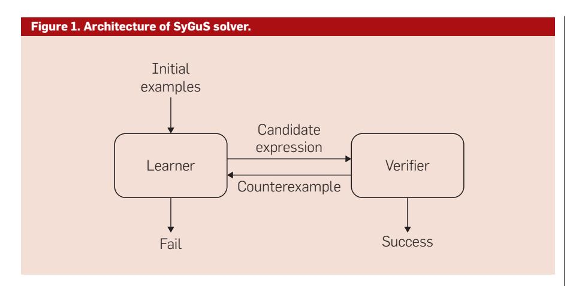

## review articles

DOI:10.1145/3208071

A promising, useful tool for future programming development environments.

BY RAJEEV ALUR, RISHABH SINGH, DANA FISMAN. AND ARMANDO SOLAR-LEZAMA

# Search-based **Program Synthesis**

Writing programs that are both correct and efficient is challenging. A potential solution lies in program synthesis aimed at automatic derivation of an executable implementation (the "how") from a highlevel logical specification of the desired input-tooutput behavior (the "what"). A mature synthesis technology can have a transformative impact on programmer productivity by liberating the programmer from low-level coding details. For instance, for the classical computational problem of sorting a list of numbers, the programmer has to simply specify that given an input array A of n numbers, compute an output array *B* consisting of exactly the same numbers as A such that  $B[i] \le B[i+1]$  for  $1 \le i < n$ , leaving it to the synthesizer to figure out the sequence of steps needed for the desired computation.

Traditionally, program synthesis is formalized as a problem in deductive theorem proving:17 A program is derived from the constructive proof of the theorem

that states that for all inputs, there exists an output, such that the desired correctness specification Building automated and scalable tools to solve this problem has proved to be difficult. A recent alternative to formalizing synthesis allows the programmer to supplement the logical specification with a syntactic template that constrains the space of allowed implementations and the solution strategies focus on search algorithms for efficiently exploring this space. The resulting search-based program synthesis paradigm is emerging as an enabling technology for both designing more intuitive programming notations and aggressive program optimizations.

As an instance of making programming easier and accessible to end users, consider the *programming-by*examples (PBE) systems that allow a user to specify the desired functionality using representative input-to-output examples. Such a programming environment is feasible in domainspecific applications such as data manipulation as illustrated by the success of the FlashFill feature in Microsoft Excel spreadsheet software.10, 11 This feature can automatically fill in a column in the spread sheetby examining a few examples provided by the user. The underlying computational problem is searchbased synthesis, namely, finding a program that is consistent with all the user-provided examples and fits the syntactic template of the native language.

### key insights

- Syntex-guided synthesis formalizes the computational problem of searching for a program expression that meets both syntactic and logical constraints.
- A wide variety of problems, such as programming by examples, program superoptimization, and program repair, naturally map to syntax-guided synthesis.
- Standardization, benchmark collection. and solver competition have led to significant advances in solution strategies and new applications.

A traditional optimizing compiler transforms the input program by applying a sequence of transformations where each transformation makes a local change to the program that is guaranteed to preserve semantic equivalence. An alternative, based on search-based synthesis, is to explore the space of syntactically correct programs for a program that is semantically equivalent to the input program and meets desired performance criteria (for example, uses an expensive operation only a limited number of times). This approach offers the possibility of more aggresoptimization—sometimes called superoptimization, as it can lead to a resulting program that is structurally quite dissimilar to the original one.18,26

Since the number of syntactically correct programs grows exponentially with the size, searching through the space of programs is computationally intractable. Our attempt to tackle this seemingly hopeless research challenge is rooted in two lessons learned from the progress on two analogous, computationally intractable, problems in formal analysis: model checking that requires exploration of reachable states of finite-state models of protocols4 and constraint solving to find a satisfying assignment to variables in a logical formula with Boolean connectives.5,16 First, a sustained focus on battling the computational bottlenecks via algorithmic innovations, data structures, and performance tuning can result in impressive advances in tools. Second, even when the tools have scalability limits, they can still prove invaluable in practice when applied to carefully chosen realworld problems.

While search-based synthesis is the computational problem at the core of a number of synthesis projects dating back to the system Sketch for program completion, 28,29 the precise formulation we focus on is called *syntax-guided synthesis* (SyGuS): 2 Given a set *Exp* of expressions specified by a context-free grammar that captures the set of candidate implementations of an unknown function *f*, and a logical formula *Spec* that captures the desired functionality of *f*, find an expression *e* in *Exp* such that

replacing f by e in Spec results in a valid formula. The input format for this problem has been standardized, hundreds of benchmarks from different application domains have been collected, and a competition of solvers has been held annually starting 2014 (see www.sygus.org). This community effort has led to innovations in both computational techniques for solvers and practical applications.

In this article, we introduce the SyGuS problem using four applications: synthesis from logical specifications, programming by examples, program transformation, and automatic inference of program invariants. Next, we discuss a generic architecture for solving the SyGuS problem using the iterative counterexample-guided inductive synthesis (CEGIS) strategy29 that combines a search strategy with a verification oracle. As an instance of the learning algorithm, we explain the enumerative technique that generates the candidate expressions of increasing size relying on the input examples for pruning.32 We then describe the standardized input format, the benchmarks, and the annual competition of solvers. This infrastructure effort was supported by NSF Expeditions in Computing project ExCAPE (Expeditions in Computer-Augmented Program Engineering) focused on advancing tools and applications of program synthesis. We close by examining the resulting progress. In particular, we explain how the best performing solver in the 2017 competition integrates decision trees in the enumerative search algorithm to boost its performance,3 and discuss a new application of SyGuS to automatically make cryptographic circuits resilient to timing attacks.7

It should be noted that search-based program synthesis is an active area of research with tools and applications beyond the specific formalization we focus on. While space does not permit a detailed discussion of the related work, let us mention a few relevant trends: type-based approaches to code completion, 14,21,22 use of statistical models learnt from code repositories for program synthesis, 24 and search-based program repair. 15,19

#### **Syntax-Guided Synthesis**

The SyGuS problem is to find a function f that meets the specified syntactic and semantic constraints. The syntactic constraint is given as a grammar deriving a set Exp of expressions that captures the candidate implementations of f. The semantic constraint is a logical formula Spec that captures the desired functionality of f. We introduce the problem using a series of illustrative examples from different applications.

Synthesis from logical specifications. A logical specification of a function describes what needs to be computed. As a simple example, consider the following specification  $Spec_1$  of a function f that takes two input arguments x and y of type int and returns an integer value that is the maximum of the input arguments:

$$Spec_1: (f(x,y) \ge x) \land (f(x,y) \ge y)$$
$$\land (f(x,y) \in \{x,y\}).$$

Finding a function f satisfying this logical specification can be viewed as establishing the truth of the quantified formula:  $\exists f. \forall x, y. Spec_1$ . A constructive proof of this formula can reveal an implementation of f.17 Since automatic proofs in a logic that supports quantification over functions remains a challenge, the syntaxguided approach we advocate asks the user to specify additional structural constraint on the set of expressions that can be used as possible implementations of f. For example, the following grammar specifies the set  $Exp_1$ of all linear expressions over input arguments x and y with positive coefficients:

$$Exp_1: E := x | y | 0 | 1 | E + E.$$

Now the computational problem is to systematically search through the set  $Exp_1$  of expressions to find an expression e such that the formula obtained by substituting e for f(x, y) in  $Spec_1$  is valid. Convince yourself that there is no solution in this case: no linear expression over two integers can correspond to the maximum of the two.

Since no linear expression satisfies the specification, we can enrich the set of candidate implementations by allowing conditionals. The following grammar specifies this set  $Exp_3$ :

$$\begin{aligned} \mathit{Exp}_2\colon T &:= x \,|\, y \,|\, 0 \,|\, 1 \,|\, T + T \,|\, \mathtt{ITE}(C,T,T) \\ C &:= (T \leq T) \,|\, \neg C \,|\, (C \wedge C). \end{aligned}$$

Here the nonterminal T generates linear expressions, the nonterminal C generates tests used in conditionals, and for a test t and expressions  $e_1$  and  $e_2$ , ITE $(t, e_1, e_2)$  stands for if t then  $e_1$  else  $e_2$ . Now  $f(x, y) = \text{ITE}((x \le y), y, x)$  satisfies the logical specification  $Spec_1$  and also belongs to the set  $Exp_2$ . Observe that this expression does not involve addition of terms and thus can also be generated by the following simpler grammar that specifies the set  $Exp_2$  of expressions:

$$Exp_3: T := x | y | 0 | 1 | ITE(C,T,T)$$
$$C := (T < T) | \neg C | (C \land C).$$

Now suppose we change the logical requirement of the desired function *f* from *Spec*, to *Spec*2:

$$Spec_2: (f(x,y) > x) \land (f(x,y) > y).$$

Observe that this is an under-specification since multiple functions can satisfy this logical constraint. If we choose the set of expressions to be  $Exp_2$ , a possible solution is  $f(x,y) = \text{ITE}((x \le y), y, x) + 1$ . However, this solution will no longer work if the set of expressions is  $Exp_3$ . This ability to change the specification of the desired function by revising either the logical formula or the set of expressions offers a significant convenience in encoding synthesis problems.

Programming by examples. An appealing application of synthesis is to learn a program from representative input-to-output examples. The Flash-Fill feature in Microsoft Excel is a recent success of such a programming methodology in practice. 10,11 It allows Excel users to perform string transformations using a small number of input-to-output examples. For example, consider the task of transforming names from one format to another as shown in Table 1. Formally, the semantic constraint on the desired function f from strings to strings is given by the formula with a conjunct for each of the rows, where the conjunct for the first row is of the form f(Nancy FreeHafer) = FreeHafer, N.

| String transformation by examples. |               |  |
|------------------------------------|---------------|--|
| Input                              | Output        |  |
| Nancy FreeHafer                    | FreeHafer, N. |  |
| Andrew Cencini                     | Cencini, A.   |  |
| lan Katas                          | Kataa I       |  |

The set of string transformations supported by the domain specific language of Excel can be specified by the grammar below (simplified for exposition):

$$\begin{split} E &:= \operatorname{Concat}(E, E) \\ & | \operatorname{SubStr}(E, I, I) | \text{``.''}| \text{``,''}| \text{``} \text{''} \\ I &:= 0 | 1 | 2 | I + I | I - I | \operatorname{Len}(E) | \\ & \operatorname{IndexOf}(E, E, I). \end{split}$$

In this grammar, the nonterminal E generates string transformations, and the nonterminal I generates integer-valued index expressions. The Concat $(s_1,\ s_2)$  function returns the concatenation of the strings  $s_1$  and  $s_2$ , SubStr $(s,i_1,i_2)$  returns the substring of the string s between the integer positions  $i_1$  and  $i_2$ , Len(s) returns the length of the string s, and IndexOf  $(s_1,s_2,i)$  returns the index of the ith occurrence of the string  $s_3$  in the string  $s_4$ .

A possible solution to the SyGuS problem is:  $Concat(s_1, ",", s_2, ".")$ , where  $s_1$  is the expression SubStr(s, IndexOf(s, "", 1) + 1, Len(s)) and  $s_2$  is SubStr(s, 0, 1). This program concatenates the following four strings: the substring in the input string starting after the first whitespace; constant string ","; the first character; and constant string ".".

**Program optimization.** In automatic program optimization, we are given an original program f, and we want to find another program g such that the program g is functionally equivalent to f and satisfies specified syntactic constraints so it has better performance compared to f. The syntactic constraint can be used to rule out, or restrict, the use of certain operations deemed expensive.

As an example, consider the problem of computing the average of two unsigned integer input numbers xand y represented as bitvectors. The obvious expression (x + y)/2 is not a correct implementation since the intermediate result (x + y) can cause an overflow error. If the input numbers are bitvectors of length 32, an alternative correct formulation can first extend the given numbers to 64-bits to make sure that no overflow error will be introduced when they are summed up together, then divide by 2, and finally convert the result back to 32-bits. This is specified by the function:

$$f(x,y) = BV_{32}((BV_{64}(x) + BV_{64}(y))/2),$$

where the operator  $_{64}$  converts a 32-bitvector to a 64-bitvector by concatenating 32 zeros to its left, and  $_{32}$  converts a 64-bitvector to a 32-bitvector by taking the 32 rightmost bits.

Since the result does not require more than 32-bits, we want to know if there exists an equivalent solution that works without using an extension to 64-bits. We can pose this as a SyGuS question: does there exist an expression that is equivalent to f(x, y) and is generated by the grammar:

$$E := x | y | E + E | E \& E | E | | E$$
$$|E^{\hat{E}}| = |E \otimes N| | E \ll N$$

where + is addition, &, ||,  $\hat{}$  are bitwise and, or, and xor,  $\ll$  and  $\gg$  are shift left and shift right, N is the set of integer constants between 0 and 31. Note that the grammar explicitly rules out the use of bitvector conversion operators BV64 and BV32 used in the original program f. A correct solution to the synthesis problem is the program

$$g(x,y) = (x \& y) + (x^{\hat{}}y) \gg 1.$$

**Template-based invariant synthesis.** To verify that a program satisfies its correctness specification, one needs to identify *loop invariants*—conditions over program variables that are preserved by an execution of the loop. As a simple example consider the following program, where *i*, *j*, *m*, and *n* are integers:

$$\begin{aligned} &1.\,i\!=\!m;\\ &2.\,j\!=\!n;\\ &3.\,\text{while}\,(i\!>\!0)\;\{\\ &4.\qquad i\!=\!i\!-\!1;\\ &5.\qquad j\!=\!j\!+\!1;\\ &6.\,\}. \end{aligned}$$

Figure 2. Illustrative execution of CEGIS.

| Iteration | Candidate expression   | Counterexample |
|-----------|------------------------|----------------|
| 1         | Х                      | (x = 0, y = 1) |
| 2         | У                      | (x = 1, y = 0) |
| 3         | 1                      | (x = 0, y = 0) |
| 4         | x + y                  | (x = 1, y = 1) |
| 5         | $ITE((x \le y), y, x)$ | Success        |

We want to prove that if m is a non-negative integer then when the program terminates j equals m + n; that is, assuming the pre-condition  $m \ge 0$ , the post-condition j = m + n holds. To apply the standard verification technology, we need to first find a Boolean predicate f over the variables i, j, m, and n, that must hold every time the program control is at line number 3. The desired predicate f(i, j, m, n)should satisfy the following three logical requirements: (1) assuming the pre-condition, the first time the program control reaches the while loop, the desired predicate *f* holds:

$$Pre: (m > 0) \rightarrow f(m, n, m, n),$$

(2) assuming that f(i, j, m, n) holds, and the program enters the while loop (that is, the test i > 0 is satisfied), after executing the body of the loop once, the condition f continues to hold for the updated variables:

Induct: 
$$(f(i,j,m,n) \land i > 0) \rightarrow f(i-1, j+1,m,n),$$

and (3) assuming that f(i, j, m, n)holds, and the program exits the loop, the post-condition of the program holds:

$$Post: (f(i,j,m,n) \land \neg(i>0)) \rightarrow j=m+n$$

A predicate f that satisfies all these conditions is an inductive invariant that is strong enough to prove the correctness of the program. A modern proof assistant for program verification asks a user to annotate a program with such loop invariants, and then automatically checks whether all these conditions are satisfied.

The more ambitious task of automatically synthesizing loop invariants that satisfy the desired conditions can be formalized as a SyGuS problem. 30 In the above example, the function f to be synthesized takes four integer arguments and returns a Boolean value. The logical specification is the conjunction  $Pre \wedge Induct \wedge$ Post. As a syntactic specification for the set of potential candidates for invariants, we choose expressions that are conjunctions of linear inequalities over program variables. This set is expressed by the grammar:

$$C := C \wedge C | (T \leq T);$$
  

$$T := x | y | m | n | 0 | 1 | T + T.$$

The following expression f(i, j, m, n)then is a solution satisfying both syntactic and semantic constraints:

*Post*: 
$$(f(i, j, m, n) \land \neg(i > 0)) \rightarrow j = m + n$$
.  $(i + j \le m + n) \land (m + n \le i + j) \land (0 \le i)$ .

#### Solving Sygus

Given a set *Exp* of expressions specified using a grammar, and a logical formula Spec that constrains the desired function f, the SyGuS problem is to find an expression *e* in *Exp* such that the formula Spec[f/e] obtained by replacing f with e in Spec is valid or report failure if no such expression exists. This search involves an alternation of quantifiers: there exists an expression e in Exp such that for all inputs, Spec[f/e] holds. The architecture underlying current solvers involves a cooperation between a learning module that searches for a candidate expression and a verification oracle that checks its validity as explained next.

Counterexamples and inductive synthesis. The architecture of a typical SyGuS solver is shown in Figure 1 (see Seshia27 for alternative querying models). The set Examples contains interesting inputs that the learner uses to guide its search. This set can initially be empty. The learner is tasked with finding an expression e in Exp such that Spec[f/e] is satisfied at least for the inputs in Examples. If the learner fails in this task, then there is no solution to the synthesis problem. Otherwise, the candidate expression e produced by the learner is given to the verifier that checks if *Spec*[ *f/e*] holds for all inputs. If so, the current expression e is the desired answer to the synthesis problem. If not, the verifier produces a counterexample, that is, an input for which the specification does not hold, and this input now is added to the set Examples to reiterate the learning phase. The learning phase is an instance of the so-called inductive synthesis as the learner is attempting to generalize based on the current set Examples of inputs it considers significant. Since the inputs added to this set are counterexamples produced by the verifier, the overall solution strategy is called CEGIS. 28,29

For illustrating this strategy, let us show a plausible sequence of iterations using the logical specification  $Spec_1$  and the set  $Exp_2$  of linear expressions with conditionals noted previously. Initially the set *Examples* is empty, and as a result, the learner has no constraints and can return any expression it wants. Suppose it

returns x. Now the verifier checks if setting f(x, y) = x satisfies the logical specification; that is, it checks the validity of the formula  $(x \ge x) \land (x \ge y) \land (x \in \{x, y\})$ . This formula does not hold for all values of x and y, and the verifier returns one such counterexample, say, (x = 0, y =1). This input is added to the set *Examples*, and the learner now needs to find a solution for *f* that satisfies the specification at least for this input. The learner can possibly return the expression y, and when the verifier checks the validity of this answer it returns (x = 1, y = 0) as a counterexample. Figure 2 shows the expressions learnt and the corresponding counterexamples produced by the verifier in successive iterations. For instance, in iteration 4, the learner attempts to find a candidate solution that satisfies the specification for the inputs (0, 1), (1, 0), and (0, 0), and f(x, 0)y) = x + y is indeed such a plausible answer. The verifier then checks the validity of  $(x + y \ge x) \land (x + y \ge y) \land (x + y \ge y)$  $y \in \{x, y\}$ ) and returns (x = 1, y = 1) as a counterexample. In the subsequent iteration, when the learner attempts to find a solution that fits all the four inputs currently in Examples, the shortest expression possible is ITE((x)< y), y, x), which the verifier finds to be a valid solution.

Given a candidate solution for the desired function, checking whether it satisfies the logical specification for all inputs is a standard verification problem, and we can rely upon a mature verification technology such as SMT solvers for this purpose.5 Learning an expression from the set *Exp* of candidate expressions that satisfies the specification for the current inputs in *Examples* is a new challenge, and has been the focus of research in design and implementation of SyGuS solvers.

Enumerative search. Given a set *Exp* of candidate expressions specified by a (context-free) grammar, a finite set *Examples* of inputs, and a logical specification *Spec*, the learning problem is to find an expression *e* in *Exp* such that *Spec*[*f/e*] is satisfied for all inputs in *Examples*. Furthermore, we want to find the simplest such expression.

The simplest solution to the

learning problem is based on enumerating all expressions in Exp one by one in increasing order of size, and checking for each one if it satisfies Spec for all inputs in Examples. Since the number of expressions grows exponentially with the size, we need some heuristics to prune the search space. An optimization that turns out to be effective is based on a notion of equivalence among expressions with respect to the given set of inputs. Let us say that two expressions  $e_1$  and  $e_2$ are Examples-equivalent if for all inputs in *Examples*,  $e_1$  and  $e_2$  evaluate to the same value. Notice that if e is an expression that contains  $e_1$  as a subexpression, and if we obtain e' by substituting  $e_1$  by another expression  $e_2$  that is *Examples*-equivalent to  $e_1$ , then e' is guaranteed to be *Examples*-equivalent to e. As a result, the enumeration algorithm maintains a list of only inequivalent expressions. To construct the next expression, it uses only the expressions from this list as potential subexpressions, and as a new expression is constructed, it first checks if it is equivalent to one already in the list, and if so, discards it.

To illustrate the algorithm, suppose the logical specification is Spec2, the set of expressions is  $Exp_1$ , and the current set of Examples contains a single input (x = 0, y = 1) (as noted earlier). The job of the learning algorithm is to find an expression *e* that satisfies Spec, for x = 0 and y = 1, that is, e(0, 1)> 1. Two expressions are equivalent in this case if  $e_1(0, 1) = e_2(0, 1)$ . The enumerator starts by listing expressions of size 1 one by one. The first expression considered is x. It is added to the list, and since it does not satisfy the specification, the search continues. The next expression is y, which is inequivalent to *x* and does not satisfy the specification, so is added to the list and the search continues. The next expression is 0, which turns out to be equivalent to *x* (both evaluate to 0 for the input (0,1), and is hence discarded. The next expression is 1, which is also discarded as it is equivalent to y. Next the algorithm considers the expressions generated by the application of the rule E + E. The algorithm considers only x and y as potential subexpressions at this step, and thus, examines only x + x, x + y, y + x, and y + y, in that order. Of these, the first one is equivalent to x, and the next two are equivalent to y, and hence discarded. The expression y + y is the only interesting example of size 3, and the algorithm checks if it satisfies the specification. Indeed that is the case, and the learner returns y + y. The verifier will discover that this solution does not satisfy the specification for all inputs, and will generate a counterexample, say, (x = 1, y = 0). Note that adding this input to Examples changes the notion of equivalence of expressions (for instance, the size 1 expressions x and 0 are no longer equivalent), so in the next iteration, the learning algorithm needs to start enumeration from scratch.

We conclude the discussion of the enumerative search algorithm with a few observations. First, if the set *Exp* is unbounded, the algorithm may simply keep enumerating expressions of larger and larger size without ever finding one that satisfies the specification. Second, if we know (or impose) a bound *k* on the depth of the expression we are looking for, the number of possible expressions is exponential in k. The equivalencebased pruning leads to significant savings, but the exponential dependence remains. Finally, to translate the idea described above to an actual algorithm that works for the set of expressions described by a contextfree grammar some fine-tuning is needed. For example, consider the grammar for the set  $Exp_2$  of linear expressions with conditionals, the algorithm needs to enumerate (inequivalent) expressions generated by both non-terminals T and C concurrently by employing a dynamic programming strategy (see Alur et al.2 and Udupa et al. 32).

#### **An Infrastructure for Solvers**

In the world of constraint solving, the standardization of the input format, collection and categorization of a large number of benchmarks, access to open-source computational infrastructure, and organization of an annual competition of solvers, had a transformative impact on both the development of powerful computational techniques and the practical applications to diverse problems.5

This success inspired us to initiate a similar effort centered on the SvGuS problem (see www.sygus.org).

Standardized input format. To define a standardized input format for SyGuS, a natural starting point is the input format used by SMT solvers for two reasons. First, there is already a vibrant ecosystem of benchmarks, solvers, users, and researchers committed to the SMT format. Second, a typical SyGuS solution strategy (see Figure 1) needs to verify that a candidate solution satisfies the logical constraint, and the ability to use a standard SMT solver as a verifier is a big win.

The SyGuS input format SYNTH-LIB thus extends the format SMT-LIB2 for specifying logical constraints. This means that to define a problem, we must first choose one of the standard SMT logics. An example is LIA that can encode formulas in linear arithmetic with conditionals (essentially same as the set of expressions in the set  $Exp_2$ ). Other commonly used logics for our purpose include BV for manipulating bit-vectors, LRA for linear arithmetic over reals, and SLIA for processing strings.

Once a logic is chosen, the problem definition next declares the name of the function to be synthesized along with the types of the input arguments and output value. These types must be from the underlying theory, for instance, boolean and integer types are possible in LIA. The function declaration also specifies the grammar for defining the set *Exp* of candidate expressions. This simply includes a list of typed nonterminals, including the special nonterminal Start, and a list of productions for each of them. The terminals in the grammar rules must be the symbols from the underlying logic used in a type-consistent manner. The unknown function itself cannot occur in the rules, meaning that we do not support synthesis of recursively defined functions in the current version.

The logical constraint Spec is specified as a formula that is built from the operations in the chosen logic and invocations of the function to be synthesized. In the current version, we require this formula to be free of quantifiers as is the case in examples mentioned previously. This means that once the learner returns a candidate expression e, the verifier needs to check the truth of Spec[f/e] with all the variables universally quantified. This amounts to checking the satisfiability of the quantifier-free formula ¬ Spec[f/e], a task for which contemporary SMT solvers are particularly effective.

The format allows specifying synthesis of multiple unknown functions simultaneously. It also allows the use of let expressions in the grammar rules. Such expressions can make synthesized solutions succinct, and are analogous to the use of auxiliary variables in imperative code.

Benchmarks. The benchmarks we have collected come from different domain areas, use different SMT logics, and different grammars. There are currently over 1,500 benchmarks. We give a few examples for benchmark categories.

The hacker's delight benchmarks are concerned with bit-manipulation problems from the book Hacker's Delight.33 These benchmarks were among the first to be successfully tackled by synthesis technology. 12,13,29 Each such problem induces several benchmarks with varying grammars. The grammar in the easiest instances includes only the operators that are required to implement the desired transformations, whereas the grammar in the hardest instances is highly unconstrained, so the synthesizer must discover which operators to use in addition to how to compose them together.

SV-COMP is a competition of automated tools for software verification held annually in conjunction with ETAPS (European Joint Conferences on Theory and Practice of Software). In this competition, the verifier is tasked with checking correctness requirements (such as assertions) of C programs. When the program to be verified contains loops, this requires inference of an inductive loop invariant. Research on automated synthesis of invariants has used benchmarks of SV-COMP by converting fragments of C programs to logical formulas corresponding to verification conditions.8 Augmenting these benchmarks with a syntactic template for the unknown

invariant, typically using linear arithmetic with conditionals, leads to benchmarks for SyGuS solvers.

The *string* category of benchmarks consists of tasks that require learning programs to manipulate strings based on regular expressions and come from the public set of benchmarks of the FlashFill system (and its successors). These benchmarks are based on the newly supported theory SLIA in SMT-LIB, which supports string operations such as prefix, suffix, substring, length, and indexing.

The other sources of benchmarks include motion planning for robot movements, the 2013 ICFP Programming Competition1 that included synthetic but challenging bitvector functions, program repair for introductory programming solutions and real-world programs,15 compiler optimization, and synthesis of cryptographic circuits that are resilient to timing attacks7 (as we will detail later).

SyGuS-Comp: a competition of solvers. In order to encourage the development of solvers for the SyGuS problem we initiated a competition of solvers called SyGuS-Comp. The solvers are compared on the basis of the number of benchmarks solved, the time taken to solve, and the size of the generated expressions. The first competition was held in 2014, and is now an annual event, co-located with the annual Computer Aided Verification Conference (CAV). The Star-Exec platform provides the computational infrastructure needed for the competition.31

The first competition consisted of a single track. The benchmarks in this track used the SMT logics LIA (conditional linear arithmetic) and BV (bitvectors), and each benchmark provided its own context-free grammar to be used in the solution. The second competition consisted of three tracks: the general track that is same as the single track of the first competition, the CLIA track where logic is LIA and the grammar admits every LIA expression, and the INV track aimed at benchmarks for synthesis of loop invariants. This track is a restriction of the CLIA track, which consists of special syntactic sugaring of SyGuS problems, to allow direct encoding of inference of inductive invariants. The

third and fourth competitions consisted, in addition to these three tracks, the PBE track for programming by examples. The PBE track restricts semantic constraints to be based upon only input-output examples. This track is divided into two: benchmarks using the BV logic, and benchmarks manipulating strings expressed in the SLIA logic.

The ESolver based on the enumerative search strategy described previously won the first competition. Since then a number of researchers have proposed new solution strategies. For instance, the ICE-DT solver is specialized to learning invariants based on a novel idea of generalizing from implication counterexamples (as opposed just positive and negative examples common in classical learning), and won the INV track in recent competitions,8 and the strategy to solve alternation of quantifiers within the SMT solver CVC4 was modified to produce witness functions that match the syntactic template leading to a SyGuS solver that is the most effective current solver for the CLIA and PBE-String tracks.25 The winner of the general track in the 2017 competition is EUSolver, which we will explore.

#### State of the Art

The formalization of the SyGuS problem and organization of the annual competition of solvers has been a catalyst for research in search-based program synthesis. We first give an overview of the progress in solver technology, then describe the solution strategy employed by the current winner, and explain a novel application of SyGuS to synthesis of cryptographic circuits resistant to timing attacks.

Evolution of SyGuS solvers. The capabilities of SyGuS solvers are improving from competition to competition. For instance, all instances of the ICFP benchmarks were solved in 2017 competition, most in less than 10 seconds. In contrast, none of these were solved in the first competition, and in the original ICFP competition, some of these benchmarks were solved by the participants using enormously large compute clusters.

As another example, recall the example given earlier of synthesizing

The formalization of the SyGuS problem and organization of the annual competition of solvers has been a catalyst for research in searchbased program synthesis. the maximum of two numbers using the grammar  $Exp_{3}$ . For any number  $n_{3}$ , we can similarly write a specification for computing the maximum of ninput arguments. In the first competition all solvers were able to solve for n= 2, only one solver was able to solve for n = 3 and none could solve for n = 4. The 2017 solvers are capable of solving for  $n \le 21$ . Note that the size of the minimal expression grows quadratically with n. The size of the expression generated for n = 21 is 1621. With regard to the time to solve these benchmarks, instances with  $n \leq 10$ are solved within 5s, whereas the solution for n = 21 required 2100 s.

Trying to understand which SyGuS instances are easily solved by current SyGuS solvers, we recall different aspects of a SyGuS instance: (i) The grammar can be very general or very restrictive, depending on the size of the set of syntactically allowed expressions. (ii) The specification can require a *single* or *multiple* functions to be simultaneously synthesized. (iii) The specification can be *complete* or partial depending on whether the set of semantic solutions is a singleton or not. (iv) The grammar may or may not allow the use of let for specifying auxiliary variables. (v) When the specification has several invocations of the function to be synthesized, all invocations may be exactly the same (in the sense that the sequence of parameters is the same in all) or there may be different ways in which the function is invoked. We refer to the former as *single invocation* and to the latter as multiple invocation.25 The categories of benchmarks in which stateof-the-art solvers excel are those with a single function invocation, a single function to synthesize, a complete specification, no use of let, and a restricted grammar. Benchmarks of the CLIA and invariant generation tracks are also easily handled by current solvers, in spite of their grammar being general.

Enumerative search with decision trees. When the grammar specifying the set of allowed expressions includes conditionals, the desired solution is typically a tree whose internal nodes are labeled with tests used in conditionals and leaves are labeled with test-free expressions. The key

idea behind the optimization to the enumerative search employed by the 2017 winning solver, EUSolver, is to find expressions suitable as labels in the desired tree by enumeration, and construct the desired tree using the well-studied heuristic for decision tree learning from machine learning literature.20,23 We will illustrate the mechanics of this algorithm, and why its performance is superior to the enumerative search, using the logical specification  $Spec_1$  and the set  $Exp_2$  of conditional linear expressions. Recall that the correct solution to this synthesis problem is the expression ITE( $(x \le y), y, x$ ), which corresponds to an expression tree of size 6. The enumerative search algorithm thus has to process all expressions of size 5 or less that are inequivalent with respect to the current set *Examples*.

To understand the divide-and-conquer strategy of EUSolver, let us ignore the pruning based on Examples-equivalence Suppose the algorithm starts enumerating expressions in  $Exp_a$  in increasing order of size, and checks for each one if it satisfies *Spec*, for all inputs in the current set Examples. The expressions of size 1, namely, 0, 1, x, and y, are considered first. Suppose none of them satisfies the specification for all inputs in Examples (this will be the case, for instance, if it contains both (0, 1) and (1, 0)). However, no matter what inputs belong to Examples, one of the terms x or y satisfies the specification for every input in *Examples*. In other words, the terms x and y cover the current set, and can be viewed as partial solutions. If such partial solutions can be combined using conditional tests, then this can already yield a solution that satisfies all inputs in Examples without enumerating terms of larger sizes. The EUSolver consists of a module that enumerates predicates (that is, tests used in conditionals) concurrently in increasing size. The test  $(x \le y)$  is a predicate of smallest possible size.

Given such a test, the set of inputs divides naturally into two sets, Examples1 for which the test is true and Examples0 for which the test is false. Observe that the partial solution yworks for all inputs in Examples1 The categories of benchmarks in which state-of-the-art solvers excel are those with a single function invocation, a single function to synthesize, a complete specification, no use of let, and a restricted grammar.

while the partial solution *x* works for all inputs in Examples0. Thus, the learner can return ITE(  $(x \le y), y, x)$  as a candidate expression.

In general, consider a set *Examples* of inputs, a set L of terms enumerated so far, and a set *P* of conditional tests enumerated so far. Suppose the terms in *L* cover all inputs, that is, for each input in Examples, there is at least one term in L, which satisfies the specification for this input. The computational problem is now to construct a conditional expression with tests in Pand leaf expressions in L. A natural recursive algorithm to construct the decision tree is to first choose a test p in P, learn a conditional expression  $e_1$ for the subset *Examples*1 of inputs for which the test p is true, learn a conditional expression  $e_0$  for the subset Examples0 of inputs for which the test is false, and return ITE $(p, e_1, e_2)$ . The effectiveness of this algorithm, that is, how many tests the final expression contains, depends on how the splitting predicate p is chosen. The construction of the desired tree can be formalized as a decision tree learning problem: one can think of the inputs in Examples as instances, terms in L as labels where a data point is labeled with a term if the term satisfies the specification for that input, and tests in P as attributes. The greedy heuristic for constructing a small decision tree selects a test p as the first decision attribute if it leads to the maximum information gain among all possible tests, where the gain is calculated from the so-called *entropy* of the sets Examples and Examples of data points as split by the attribute p.

The idea of considering only those terms and tests that are inequivalent with respect to current inputs is orthogonal to the above divide-andconquer strategy, and can be integrated in it.

Repairing cryptographic circuits. Consider a circuit C with a set  $I_0$  of private inputs and a set I, of public inputs such that if an attacker changes the values of the public inputs and observes the corresponding output, she is unable to infer the values of the private inputs (under standard assumptions about computational resources in cryptography). The private inputs can correspond to a user's

secret key, the public inputs can correspond to a message, and the output can be the encryption of the message using the secret key. Such cryptographic circuits are commonplace in encryption systems used in practice. One possible attack, that is, a strategy for the attacker to gain information about the private inputs despite the established logical correctness of the circuit, is based on measuring the time it takes for the circuit to compute. For instance, when a public input bit changes from 1 to 0, a specific output bit is guaranteed to change from 1 to 0 independent of whether a particular private input bit is 0 or 1, but may change faster when this private input is 0, thus leaking information. Such vulnerabilities do occur in practice, and in fact, Ghalaty et al.9 reports such an attack on a circuit used in the AES encryption standard. The timing attack is not possible if the circuit meets the so-called structural property of being *constant time*: A constant-time circuit is the one in which the length of all input-to-output paths measured in terms of number of gates are the same. After identifying the attack, Ghalaty et al.9 shows how to convert the given circuit to an equivalent constant-time circuit by introducing delay elements on shorter paths.

As noted in the work of Eldib et al., 7 being constant-time is a syntactic constraint on the logical representation of a circuit, that is, it depends on the structure of the expression and not on the operators used in the construction. As a result, given a circuit C, synthesizing another circuit C' such that C' is a constant-time circuit and is functionally equivalent to C can be formalized as a SyGuS problem. The set of all constant-time circuits with all input-to-output path lengths within a given bound can be expressed using a context-free grammar and being logically equivalent to the original circuit can be expressed as a Boolean formula involving the unknown circuit. Eldib et al.7 then use the EUSolver to automatically synthesize constant-time circuits that are logically equivalent to given cryptographic circuits, and in particular, report a solution that is smaller in terms of overall size as well as path lengths compared to the manually constructed one in the work of Ghalaty et al.9

#### Conclusion

Search-based program synthesis promises to be a useful tool for future program development environments. Programming by examples in domainspecific applications and semanticspreserving optimization of program fragments to satisfy performance goals expressed via syntactic criteria are already proving to be its interesting applications. Our experience shows that investing in the infrastructure—standardized input formats, collection of benchmarks, opensource prototype solvers, and a competition of solvers—has been vital in advancing the state of the of art. Finally, improving the scalability of SyGuS solvers is an active area of current research, and in particular, a promising research direction is to explore how these solvers can benefit from modern machine learning technology (see, for example, Devlin et al.6 for the use of neural networks for learning programs from input-tooutput examples).

#### References

- Akiba, T., Imajo, K., Iwami, H., Iwata, Y., Kataoka, T., Takahashi, N., Mmoskal, M., Swamy, N. Calibrating research in program synthesis using 72,000 hours of programmer time. Technical Report, MSR 2013
- Alur, R., Bodík, R., Juniwal, G., Martin, M.M.K., Raghothaman, M., Seshia, S.A., Singh, R., Solar-Lezama, A., Torlak, E., Udupa, A. Syntax-guided synthesis. In Proc. FMCAD, 2013. 1-17.
- Alur, R., Radhakrishna, A., Udupa, A. Scaling enumerative program synthesis via divide and conquer In Proc TACAS LNCS 10205 2017 319-336.
- Clarke, E., Grumberg, O., Peled, D. Model Checking. MIT Press, 2000.
- de Moura, L., Bjørner, N. Satisfiability Modulo Theories: Introduction and applications. Commun. ACM 54, 9 (2011), 69-77.
- Devlin, J., Uesato, J., Bhupatiraju, S., Singh, R., Mohamed, A., Kohli, P. Robustfill: Neural program learning under noisy I/O. In Proc. ICML, 2017, 990-998.
- Eldib, H., Wu, M., Wang, C. Synthesis of fault-attack countermeasures for cryptographic circuits. In Proc. CAV, LNCS 9780, 2016, 343-363.
- Garg, P., Löding, C., Madhusudan, P., Neider, D. ICE: A robust framework for learning invariants. In Proc. CAV. LNCS 8559, 2014, 69-87.
- Ghalaty, N., Aysu, A., Schaumont, P. Analyzing and eliminating the causes of fault sensitivity analysis. In Proc. DATE, 2014, 1-6.
- 10. Gulwani, S. Automating string processing in spreadsheets using input-output examples. In Proc. POPL, 2011, 317-330.
- 11. Gulwani, S., Harris, W.R., Singh, R. Spreadsheet data manipulation using examples. Commun. ACM, 55, 8 (2012) 97-105
- 12. Gulwani, S., Jha, S., Tiwari, A., Venkatesan, R. Synthesis of loop-free programs. In Proc. PLDI, 2011, 62-73.
- Jha, S., Gulwani, S., Seshia, S.A., Tiwari, A. Oracle-guided component-based program synthesis.

- In Proc. ICSE, 2010, 215-224
- 14. Kuncak, V., Mayer, M., Piskac, R., Suter, P. Software synthesis procedures. Commun. ACM, 55, 2.
- 15. Le, X.D., Chu, D., Lo, D., Le Goues, C., Visser, W. S3: Syntax- and semantic-guided repair synthesis via programming by examples. In Proc. FSE, 2017,
- 16. Malik, S., Zhang, L. Boolean satisfiability: From theoretical hardness to practical success. Commun. ACM, 52, 8 (2009), 76-82.
- 17. Manna, Z., Waldinger, R. Fundamentals of deductive program synthesis, IEEE Trans, Softw. Eng. 18, 8 (1992), 674-704.
- Massalin, H. Superoptimizer A look at the smallest program. In Proc. ASPLOS, 1987, 122-126.
- Mechtaev, S., Yi, J., Roychoudhury, A. Angelix: Scalable multiline program patch synthesis via symbolic analysis. In Proc. ICSE, 2016, 691-701.
- 20. Mitchell, T. Machine Learning. McGraw-Hill, 1997.
- 21. Osera, P., Zdancewic, S. Type-and-example-directed program synthesis. In *Proc. PLDI*, 2015, 619–630.
- 22. Polikarpova, N., Kuraj, I., Solar-Lezama, A. Program synthesis from polymorphic refinement types. In Proc. PLDI, 2016, 522-538.
- 23. Quinlan, J. Introduction to decision trees. Mach. Learn, 1, 1 (1986), 81-106.
- 24. Raychev, V., Vechev, M.T., Yahav, E. Code completion with statistical language models. In Proc. PLDI, 2014,
- Reynolds, A., Deters, M., Kuncak, V., Tinelli, C., Barrett, C.W. Counterexample-guided quantifier instantiation for synthesis in SMT. In Proc. CAV, 2015, 198-216.
- 26. Schkufza, E., Sharma, R., Aiken, A. Stochastic program optimization, Commun. ACM 59, 2 (2016), 114-122,
- 27. Seshia, S.A. Combining induction, deduction, and structure for verification and synthesis. Proc. IEEE 103, 11 (2015), 2036-2051.
- 28. Solar-Lezama, A. Program sketching. STTT 15, 5-6 (2013), 475-495.
- Solar-Lezama, A., Rabbah, R., Bodík, R., Ebcioglu, K. Programming by sketching for bit-streaming programs. In Proc. PLDI, 2005, 281-294.
- Srivastava, S., Gulwani, S., Foster, J.S. Templatebased program verification and program synthesis. STTT 15, 5-6 (2013), 497-518.
- 31. Stump, A., Sutcliffe, G., Tinelli, C. Starexec: A cross-community infrastructure for logic solving. In Proc. IJCAR, 2014, 367-373.
- 32. Udupa, A., Raghayan, A., Deshmukh, J., Mador-Haim, S., Martin, M., Alur, R. TRANSIT: Specifying protocols with concolic snippets. In Proc. PLDI, 2013, 287-296.
- 33. Warren, H.S. Hacker's Delight. Addison-Wesley, 2002.

Rajeev Alur is the Zisman Family Professor in the Department of Computer and Information Sciences at the University of Pennsylvania, Philadelpha, PA, USA.

Rishabh Singh is a research scientist at Google Brain. Mountain View, CA, USA,

Dana Fisman is a senior lecturerat Ben Gurion University Be'er Shera, Tsrael,

Armando Solar-Lezama is an associate professor and leader of the Computer Assisted Programming Group at MIT, Cambridge, MA, USA.

©2018 ACM 0001-0782/18/12 \$15.00.