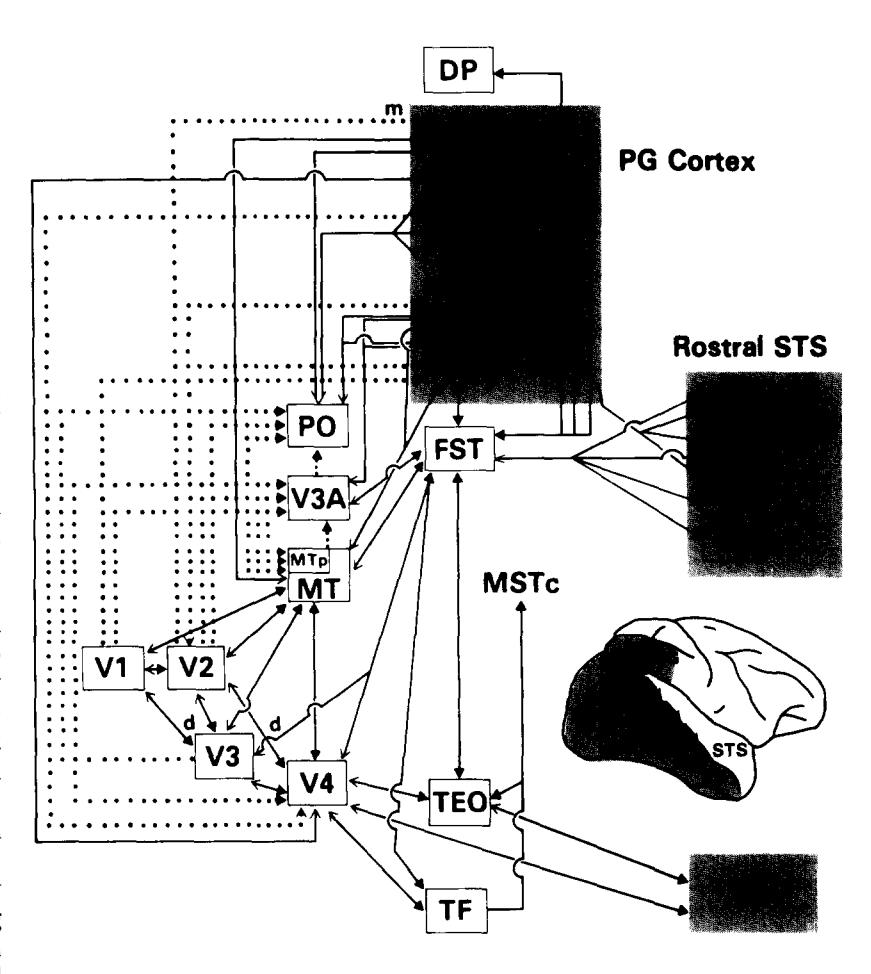
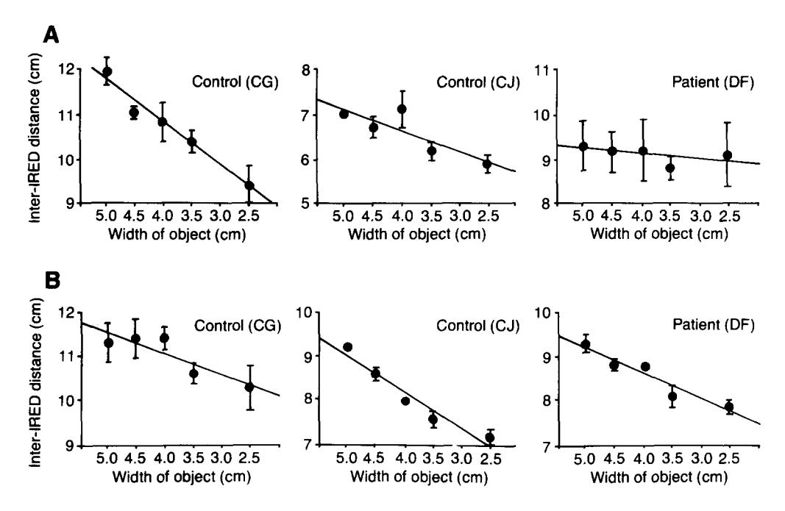

# Separate visual pathways for perception and action

Melvyn A. Goodale and A. David Milner

Melvyn A. Goodale is at the Dept of Psychology, University of Western Ontario, London, Ontario N6A 5C2, Canada, and A. David Milner is at the Dept of Psychology, University of St Andrews, St Andrews KY16 9JU, UK. Accumulating neuropsychological, electrophysiological and behavioural evidence suggests that the neural substrates of visual perception may be quite distinct from those underlying the visual control of actions. In other words, the set of object descriptions that permit identification and recognition may be computed independently of the set of descriptions that allow an observer to shape the hand appropriately to pick up an object. We propose that the ventral stream of projections from the striate cortex to the inferotemporal cortex plays the major role in the perceptual identification of objects, while the dorsal stream projecting from the striate cortex to the posterior parietal region mediates the required sensorimotor transformations for visually guided actions directed at such objects.

In an influential article that appeared in Science in 1969, Schneider1 postulated an anatomical separation between the visual coding of the location of a stimulus and the identification of that stimulus. He attributed the coding of the location to the ancient retinotectal pathway, and the identification of the stimulus to the newer geniculostriate system; this distinction represented a significant departure from earlier monolithic descriptions of visual function. However, the notion of 'localization' failed to distinguish between the many different patterns of behaviour that vary with the spatial location of visual stimuli, only some of which turn out to rely on tectal mechanisms2-Nevertheless, even though Schneider's original proposal is no longer generally accepted, his distinction between object identification and spatial localization, between 'what' and 'where', has persisted in visual neuroscience.

#### Two cortical visual systems

In 1982, for example, Ungerleider and Mishkin5 concluded that 'appreciation of an object's qualities and of its spatial location depends on the processing of different kinds of visual information in the inferior temporal and posterior parietal cortex, respectively.' They marshalled evidence from a number of electrophysiological, anatomical and behavioural studies suggesting that these two areas receive independent sets of projections from the striate cortex. They distinguished between a 'ventral stream' of projections that eventually reaches the inferotemporal cortex, and a 'dorsal stream' that terminates finally in the posterior parietal region. The proposed functions of these two streams were inferred largely from behavioural evidence derived from lesion studies. They noted that monkeys with lesions of the inferotemporal cortex were profoundly impaired in visual pattern discrimination and recognition6, but less impaired in solving 'landmark' tasks, in which the location of a visual cue determines which of two alternative locations is rewarded. Quite the opposite pattern of results was observed in monkeys with posterior parietal lesions7-9

So, according to Ungerleider and Mishkin's 1982 version of the model of two visual systems, the inferotemporal lesions disrupted circuitry specialized

for identifying objects, while the posterior parietal lesions interfered with neural mechanisms underlying spatial perception. Thus, within the visual domain, they made much the same functional distinction between identification and localization as Schneider, but mapped it onto the diverging ventral and dorsal streams of output from the striate cortex. Since 1982, there has been an explosion of information about the anatomy and electrophysiology of cortical visual areas 10,11 and, indeed, the connectional anatomy among these various areas largely confirms the existence of the two broad 'streams' of projections proposed by Ungerleider and Mishkin (see Fig. 1)12,13.

It has recently been suggested14 that these two streams can be traced back to the two main cytological subdivisions of retinal ganglion cells: one of these two subdivisions terminates selectively in the parvocellular layer, while the other terminates in the magnocellular layer of the lateral geniculate nucleus (LGN)14-16. Certainly, these 'parvo' and 'magno' subdivisions remain relatively segregated at the level of the primary visual cortex (V1) and in the adjacent visual area V2. They also appear to predominate, respectively, the innervation of area V4 and the middle temporal area (MT), which in turn provide the major visual inputs to the inferotemporal and posterior parietal cortex, respectively. However, it is becoming increasingly clear that the separation between magno and parvo information in the cortex is not as distinct as initially thought. For example, there is recent evidence for a parvo input into a subset of MT neurones17 as well as for a large contribution from the magno pathway to V4 neurones18 and to the 'blobs' in V1 (Ref. 19). In short, it now appears that the dorsal and the ventral streams each receive inputs from both the magno and the parvo pathways.

### Two visuomotor systems: 'what' versus 'how'

Our alternative perspective on modularity in the cortical visual system is to place less emphasis on input distinctions (e.g. object location versus object qualities) and to take more account of output requirements20,21. It seems plausible from a functional standpoint that separate processing modules would have evolved to mediate the different uses to which vision can be put. This principle is already generally accepted in relation to 'automatic' types of behaviour such as saccadic eye movements22, and it is possible that it could be extended to other systems for a range of behavioural skills such as visually guided reaching and grasping, in which close coordination is required between movements of the fingers, hands, upper limbs, head and eyes.

It is also our contention that the inputs and transformations required by these skilled visuomotor acts differ in important respects from those leading to what is generally understood as 'visual perception.' Indeed, as has been argued elsewhere, the functional modules supporting perceptual experience of the world may have evolved much more recently than those controlling actions within it21. In this article, it is

proposed that this distinction ('what' versus 'how') – rather than the distinction between object vision and spatial vision ('what' versus 'where') – captures more appropriately the functional dichotomy between the ventral and dorsal projections.

### Dissociation between prehension and apprehension

Neuropsychological studies of patients with damage to one projection system but not the other have also been cited in support of the model proposed by Ungerleider and Mishkin5,23. Patients with visual agnosia following brain damage that includes, for example, the occipitotemporal region, are often unable to recognize or describe common objects, faces, pictures, or abstract designs, even though they can navigate through the everyday world – at least at a local level – with considerable skill24. Conversely, patients suffering from optic ataxia following damage to the posterior parietal region are unable to reach accurately towards visual targets that they have no difficulty recognizing25. Such observations certainly appear to provide support in humans for an occipitotemporal system mediating object vision but not spatial vision, and a parietal system mediating spatial vision but not object vision.

Closer examination of the behaviour of such patients, however, leads to a different conclusion. Patients with optic ataxia not only have difficulty reaching in the right direction, but also in positioning their fingers or adjusting the orientation of their hand when reaching toward an object that can be oriented at different angles25. Such patients may also have trouble adjusting their grasp to reflect the size of the object they are asked to pick up.

Visually guided grasping was recently studied in a patient who had recovered from Balint's syndrome, in which bilateral parietal damage causes profound disorders of spatial attention, gaze and visually guided reaching26. While this patient had no difficulty in recognizing line drawings of common objects, her ability to pick up such objects remained quite impaired. For example, when she reached out for a small wooden block that varied in size from trial to trial. there was little relationship between the magnitude of the aperture between her index finger and thumb and the size of the block as the movement unfolded. Not only did she fail to show normal scaling of the grasping movement; she also made a large number of adjustments in her grasp as she closed in on the object adjustments rarely observed in normal subjects. Such studies suggest that damage to the parietal lobe can impair the ability of patients to use information about the size, shape and orientation of an object to control the hand and fingers during a grasping movement, even though this same information can still be used to identify and describe the objects. Clearly, a 'disorder of spatial vision' fails to capture this range of visuomotor impairments.

There are, of course, other kinds of visuospatial disorders, many of which are associated with parietal lobe damage, while others are associated with temporal lobe lesions27,28. Unfortunately, we lack detailed analyses of the possible specificity of most such disorders: in many, the deficit may be restricted to particular behavioural tasks. For example, a recently described patient with a parietal injury performed

Fig. 1. The 1982 version of Ungerleider and Mishkin's5 model of two visual systems is illustrated in the small diagram of the monkey brain inset into the larger box diagram. In the original model, V1 is shown sending a dorsal stream of projections to the posterior parietal cortex (PG), and a ventral stream of projections to the inferotemporal cortex (TE). The box diagram illustrates one of the most recent versions of the interconnectivity of the visual cortical areas, showing that they can still be broadly segregated into dorsal and ventral streams. However, there is crosstalk between the different areas in the two streams, and there may be a third branch of processing projecting into the rostral superior temporal sulcus (STS) that is intimately connected with both the dorsal and ventral streams. (This is illustrated in both the brain and box diagrams.) Thus, the proposed segregation of input that characterized the dorsal and ventral streams in the original model is not nearly as clear cut as once was thought. (Modified, with permission, from Ref. 11.)

poorly on a task in which visual guidance was needed to learn the correct route through a small ten-choice maze by moving a hand-held stylus23. However, he was quite unimpaired on a locomotor maze task in which he was required to move his whole body through space when working from a two-dimensional visual plan. Moreover, he had no difficulty in recalling a complex geometrical pattern, or in carrying out a task involving short-term spatial memory29. Such dissociations between performance on different 'spatial' tasks show that after parietal damage spatial information may still be processed quite well for some purposes, but not for others. Of course, the fact that visuospatial deficits can be fractionated in humans does not exclude combinations of such impairments occurring after large lesions, nor would it exclude possible selective input disorders occurring after smaller deafferentation lesions close to where the dorsal stream begins.

Fig. 2. In both (A) the manual matching task and (B) the grasping task, five white plaques (each with an overall area of 25 cm2 on the top surface, but with dimensions ranging from  $5 \times 5$  cm to 2.5 × 10 cm) were presented, one at a time, at a viewing distance of approximately 45 cm. Diodes emitting infrared light (IREDs) were attached to the tips of the index finger and thumb of the right hand and were tracked with two infrared-sensitive cameras and stored on a WATSMART computer (Northern Digital Inc., Waterloo, Canada). The three-dimensional position of the IREDs and the changing distance between them were later reconstructed off line. (A) In the manual matching task, DF and two control subjects were instructed to indicate the width of each plaque over a series of randomly ordered trials by separating the index finger and thumb of their right hand. In DF, unlike the controls (CG and CJ), the aperture between the finger and thumb was not systematically related to the width of the target. DF also showed considerable trial to trial variability. (B) In contrast, when they were instructed to reach out and pick up each plaque. DF's performance was indistinguishable from that of the control subjects. The maximum aperture between the index finger and thumb, which was achieved well before contact, was systematically related to the width of the plaques in both DF and the two control subjects. In interpreting all these graphs, it is the slope of the function that is important rather than the absolute values plotted, since the placement of the IREDs and the size of the hand and fingers varied somewhat from subject to subject. Bars represent means  $\pm$  se. (Modified, with permission, from Ref. 31.)

Complications also arise on the opposite side of the equation (i.e. in relation to the ventral stream), when the behaviour of patients with visual agnosia is studied in detail. The visual behaviour of one patient (DF) who developed a profound visual-form agnosia following carbon monoxide poisoning was recently studied. Although MRI revealed diffuse brain damage consistent with anoxia, most of the damage in the cortical visual areas was evident in areas 18 and 19, with area 17 apparently remaining largely intact. Despite her profound inability to recognize the size, shape and orientation of visual objects, DF showed strikingly accurate guidance of hand and finger movements directed at the very same objects30,31. Thus, when she was presented with a pair of rectangular blocks of the same or different dimensions, she was unable to distinguish between them. When she was asked to indicate the width of a single block by means of her index finger and thumb, her matches bore no relationship to the dimensions of the object and showed considerable trial to trial variability (Fig. 2A). However, when she was asked simply to reach out and pick up the block, the aperture between her index finger and thumb changed systematically with the width of the object, just as in normal subjects (Fig. 2B). In other words, DF scaled her grip to the

dimensions of the objects she was about to pick up, even though she appeared to be unable to 'perceive' those dimensions.

A similar dissociation was seen in her responses to the orientation of stimuli. Thus, when presented with a large slot that could be placed in one of a number of different orientations, she showed great difficulty in indicating the orientation either verbally manually (i.e. by rotating her hand or a hand-held card). Nevertheless, she was as good as normal subjects at reaching out and placing her hand or the card into the slot, turning her hand appropriately from the very onset of the movement30,31.

These disparate neuropsychological observations lead us to propose that the visual projection system to the human parietal cortex provides action-relevant information about the structural characteristics and orientation of objects, and not just about their position. On the other hand, projections to the temporal lobe may furnish our visual perceptual experience, and it is these that we postulate to be severely damaged in DF.

## Dorsal and ventral systems in the monkey

How well do electrophysiological studies of the two projection systems in the visual cortex of the monkey support the distinction we are making? While any correlations

between human neuropsychology and monkey neurophysiology should only be made with caution, it is likely that humans share many features of visual processing with our primate relatives – particularly with the Old World monkeys in which most of the electrophysiology has been carried out. Furthermore, lesion studies of the two projection systems in the monkey should show parallels with the results of work done on human patients.

It was noted earlier that although there are differences in the major retinal origins of inputs to the dorsal and ventral systems in the monkey brain, there is subsequently a good deal of pooling of information. Moreover, there are convergent similarities in what is extracted within the two systems. For example, both orientation and disparity selectivity are present in neurones in both the magno and parvo systems within cortical areas V1 and V2 (Ref. 15).

Nevertheless, there are special features in the properties of individual neurones in the posterior parietal cortex (and in its major input areas V3A and MT) that are not found in the ventral system. The most striking feature of neurones in the posterior parietal region is not their spatial selectivity (indeed, like those of inferotemporal cells, their receptive fields are typically large), but rather the fact that their

responses depend greatly on the concurrent behaviour of the animal with respect to the stimulus. Separate subsets of cells in the posterior parietal cortex have been shown to be implicated in visual fixation, pursuit and saccadic eve movements, evehand coordination, and visually guided reaching movements32. Many cells in the posterior parietal region have gaze-dependent responses; i.e. where the animal is looking determines the response amplitude of the cell (although not the retinal location of its receptive field)33. In reviewing these studies, Andersen32 emphasizes that most neurones in this area 'exhibit both sensory-related and movement-related activity.' In a particularly interesting recent development. Taira et al. 34 have shown that some parietal cells are sensitive to those visual qualities of an object that determine the posture of the hand and fingers during a grasping movement. They studied neurones selectively associated with hand movements made by the monkey in reaching and picking up solid objects. Many of these cells were selective for the visual appearance of the object that was to be manipulated, including its size and in several cases its orientation.

The posterior parietal cortex may receive such form information from one or both of the areas V3 or V4, both of which project to area MT35. Other visual inputs pass through area MT and the adjacent medial superior temporal (MST) area, both of which contain cells variously selective for object motion in different directions, including rotation and motion in depth32. Thus, the posterior parietal cortex appears to receive the necessary inputs for continually updating the monkey's knowledge of the disposition and structural qualities of objects in its three-dimensional ego-space. Also, many motion-sensitive cells in the posterior parietal cortex itself appear to be well suited for the visual monitoring of limb position during reaching behaviour36; in contrast, motion-sensitive cells in the temporal lobe have been reported not to respond to such self-produced visual motion37. As for the output pathways, the posterior parietal region is strongly linked with those pre-motor regions of the frontal cortex directly implicated in ocular control33,38, reaching movements of the limb39, and grasping actions of the hand and fingers39.

Thus, the parietal cortex is strategically placed to serve a mediating role in the visual guidance and integration of prehensile and other skilled actions (see Ref. 40 for a detailed account of this argument). The results of behavioural analyses of monkeys with posterior parietal damage support this further. Like patients with optic ataxia, such animals fail to reach correctly for visual targets41, and they also have difficulty in shaping and orienting their hands when attempting to retrieve food42,43. Their reaching impairment is, therefore, one symptom of a wider visuomotor disorder, and most of the deficits that have been reported on 'maze' tasks following posterior parietal damage may also be visuomotor in nature9,40.

Nonetheless, neurones in the dorsal stream do not show the high-resolution selectivity characteristic of neurones in the inferotemporal cortex, which are strikingly sensitive to form, pattern and colour10. In this and in neighbouring temporal lobe areas, some cells respond selectively to faces, to hands, or to the appearance of particular actions in others44. There-

fore, it is unsurprising that monkeys with inferotemporal lesions have profound deficits in visual recognition; however, as noted by Pribram45, they remain highly adept at the visually demanding skill of catching flies!

A further peculiarity of many visual cells in the temporal cortex is that they continue to maintain their selective responsiveness over a wide range of size, colour, optical and viewpoint transformations of the object44,46. Such cells, far from providing the momentary information necessary for guiding action, specifically ignore such changing details. Consistent with this, behavioural studies have shown that by lesioning the inferotemporal cortex (but not the posterior parietal cortex), a monkey is less able to generalize its recognition of three-dimensional shape across viewing conditions47,48.

## Visual and attentional requirements for perception and action

As DeYoe and Van Essen15 have suggested, 'parietal and temporal lobes could both be involved in shape analysis but associated with different computational strategies.' For the purposes of identification, learning and distal (e.g. social) transactions, visual coding often (though not always44,46) needs to be 'object-centred'; i.e. constancies of shape, size, colour, lightness, and location need to be maintained across different viewing conditions. The above evidence from behavioural and physiological studies supports the view that the ventral stream of processing plays an important role in the computation of such object-specific descriptions. In contrast, action upon the object requires that the location of the object and its particular disposition and motion with respect to the observer is encoded. For this purpose, coding of shape would need to be largely 'viewer-centred'49 with the egocentric coordinates of the surface of the object or its contours being computed each time the action occurs. We predict that shape-encoding cells in the dorsal system should predominantly have this property. Nevertheless, certain constancies, such as size, would be necessary for accurate scaling of grasp aperture, and it might therefore be expected that the visual properties of the manipulation cells found by Taira et al. 34 in the posterior parietal region would have this property.

It is often suggested that the neuronal properties of the posterior parietal cortex qualify it as the prime mediator of visuospatial attention50. Certainly, many cells (e.g. in area 7a) are modulated by switches of attention to different parts of the visual field51. (Indeed, the 'landmark' disorder that follows posterior parietal damage in monkeys may be primarily due to a failure to attend or orient rather than a failure to localize9,40,52.) However, it is now known that attentional modulation occurs in neurones in many parts of the cortex, including area V4 and the inferotemporal region within the ventral stream53,54. This might explain the occurrence of landmark deficits after inferotemporal as well as posterior parietal damage7,8.

In general terms, attention needs to be switched to particular locations and objects whenever they are the targets either for intended action51,55 or for identification54. In either case, this selection seems typically to be spatially based. Thus, human subjects performing manual aiming movements have a

predilection to attend to visual stimuli that occur within the 'action space' of the hand56. In this instance the attentional facilitation might be mediated by mechanisms within the dorsal projection system; in other instances it is probably mediated by the ventral system. Indeed, the focus of lesions causing the human attentional disorder of 'unilateral neglect' is parietotemporal (unlike the superior parietal focus for optic ataxia25), as is the focus for object constancy impairments57. We conclude that spatial attention is physiologically non-unitary55, and may be as much associated with the ventral system as with the dorsal.

### A speculation about awareness

The evidence from the brain-damaged patient DF described earlier suggests that the two cortical pathways may be differentiated with respect to their access to consciousness. DF certainly appears to have no conscious perception of the orientation or dimensions of objects, although she can pick them up with remarkable adeptness. It may be that information can be processed in the dorsal system without reaching consciousness, and that this prevents interference with the perceptual constancies intrinsic to many operations within the ventral system that do result in awareness. Intrusions of viewer-centred information could disrupt the continuity of object identities across changing viewpoints and illumination conditions.

If this argument is correct, then there should be occasions when normal subjects are unaware of changes in the visual array to which their motor system is expertly adjusting. An example of such a dissociation has been reported in a study on eye-hand coordination during visually guided aiming58. Subjects were unable to report, even in forced-choice testing, whether or not a target had changed position during a saccadic eye movement, although correction saccades and manual aiming movements directed at the target showed near-perfect adjustments for the unpredictable target shift. In other words, an illusory perceptual constancy of target position was maintained in the face of large amendments in visuomotor control. In another recent example, it has been reported that the compelling illusion of slowed motion of a moving coloured object that is experienced at equiluminance does not prevent accurate ocular pursuit under the same conditions (see Ref. to Lisberger and Movshon, cited in Ref. 59). Such observations may illustrate the independent functioning of the ventral and dorsal systems in normal humans.

We do not, however, wish to claim that the division of labour we are proposing is an absolute one. In particular, the above suggestion does not imply that visual inputs are necessarily blocked from awareness during visuomotor acts, although that may be a useful option to have available. Rather, we assume that the two systems will often be simultaneously activated (with somewhat different visual information), thereby providing visual experience during skilled action. Indeed, the two systems appear to engage in direct crosstalk; for example, the posterior parietal and inferotemporal cortex themselves interconnect and inferotemporal cortex themselves interconnect temporal sulcus 11-13. There, cells that are highly form selective lie close to others that have motion specificity 44, thus providing scope for cooperation

between the two systems (see Fig. 1). In addition, there are many polysensory neurons in these areas, so that not only visual but also cross-modal interaction between these networks may be possible. This may provide some of the integration needed for the essential unity and cohesion of most of our perceptual experience and behaviour, although overall control of awareness may ultimately be the responsibility of superordinate structures in the frontal cortex61. Nevertheless, it is feasible to maintain the hypothesis that a *necessary condition* for conscious visual experience is that the ventral system be activated.

### Concluding remarks

Despite the interactions between the dorsal and ventral systems, the converging lines of evidence reviewed above indicate that each stream uses visual information about objects and events in the world in different ways. These differences are largely a reflection of the specific transformations of input required by perception and action. Functional modularity in cortical visual systems, we believe, extends from input right through to output.

#### **Selected references**

- 1 Schneider, G. E. (1969) Science 163, 895-902
- 2 Ingle, D. J. (1982) in Analysis of Visual Behavior (Ingle, D. J., Goodale, M. A. and Mansfield, R. J. W., eds), pp. 67–109, MIT Press
- 3 Goodale, M. A. and Murison, R. (1975) *Brain Res.* 88, 243-255
- 4 Goodale, M. A. and Milner, A. D. (1982) in *Analysis of Visual Behavior* (Ingle, D. J., Goodale, M. A. and Mansfield, R. J. W., eds), pp. 263–299, MIT Press
- 5 Ungerleider, L. G. and Mishkin, M. (1982) in Analysis of Visual Behavior (Ingle, D. J., Goodale, M. A. and Mansfield, R. J. W., eds), pp. 549–586, MIT Press
- 6 Gross, C. G. (1973) Prog. Physiol. Psychol. 5, 77-123
- 7 Pohl, W. (1973) J. Comp. Physiol. Psychol. 82, 227-239
- 8 Ungerleider, L. G. and Brody, B. A. (1977) Exp. Neurol. 56, 265-280
- 9 Milner, A. D., Ockleford, E. M. and Dewar, W. (1977) *Cortex* 13, 350-360
- 10 Desimone, R. and Ungerleider, L. G. (1989) in Handbook of Neuropsychology, Vol. 2 (Boller, F. and Grafman, J., eds), pp. 267–299, Elsevier
- Boussaoud, D., Ungerleider, L. G. and Desimone, R. (1990)
  J. Comp. Neurol. 296, 462–495
- 12 Morel, A. and Bullier, J. (1990) Visual Neurosci. 4, 555-578
- 13 Baizer, J. S., Ungerleider, L. G. and Desimone, R. (1991) J. Neurosci. 11, 168-190
- 14 Livingstone, M. and Hubel, D. (1988) Science 240, 740-749
- 15 DeYoe, E. A. and Van Essen, D. C. (1988) *Trends Neurosci.* 11, 219-226
- 16 Schiller, P. H. and Logothetis, N. K. (1990) *Trends Neurosci.* 13, 392–398
- 17 Maunsell, J. H. R., Nealy, T. A. and De Priest, D. D. (1990) J. Neurosci. 10, 3323-3334
- 18 Nealey, T. A. and Maunsell, J. H. R. (1991) Invest. Ophthalmol. Visual Sci. 32 (Suppl.) 1117
- 19 Ferrera, V. P., Nealey, T. A. and Maunsell, J. H. R. (1991) Invest. Ophthalmol. Visual Sci. 32 (Suppl.) 1117
- 20 Goodale, M. A. (1983) in *Behavioral Approaches to Brain Research* (Robinson, T. E., ed.), pp. 41–61, Oxford University Press
- 21 Goodale, M. A. (1988) in *Computational Processes in Human Vision: An Interdisciplinary Perspective* (Pylyshyn, Z., ed.), pp. 262–285, Ablex
- 22 Sparks, D. L. and May, L. E. (1990) Annu. Rev. Neurosci. 13, 309–336
- 23 Newcombe, F., Ratcliff, G. and Damasio, H. (1987) Neuro-psychologia 25, 149-161
- 24 Farah, M. (1990) Visual Agnosia, MIT Press
- 25 Perenin, M-T. and Vighetto, A. (1988) Brain 111, 643-674
- 26 Jakobson, L. S., Archibald, Y. M., Carey, D. and Goodale, M. A. (1991) Neuropsychologia 29, 803–809
- 27 Milner, B. (1965) Neuropsychologia 3, 317-338

- 28 Smith, M. L. and Milner, B. (1989) *Neuropsychologia* 27, 71-81
- 29 Ettlinger, G. (1990) Cortex 26, 319-341
- 30 Milner, A. D. et al. (1991) Brain 114, 405-428
- 31 Goodale, M. A., Milner, A. D., Jakobson, L. S. and Carey, D. P. (1991) Nature 349, 154–156
- 32 Andersen, R. A. (1987) in Higher Functions of the Brain, Part 2 (The Nervous System, Vol. V, Handbook of Physiology, Section 1) (Mountcastle, V. B., Plum, F. and Geiger, S. R., eds), pp. 483–518, American Physiological Association
- 33 Andersen, R. A., Asanuma, C., Éssick, G. and Siegel, R. M. (1990) J. Comp. Neurol. 296, 65-113
- 34 Taira, M., Mine, S., Georgopoulos, A. P., Murata, A. and Sakata, H. (1990) Exp. Brain Res. 83, 29-36
- 35 Felleman, D. J. and Van Essen, D. C. (1987) *J. Neurophysiol.* 57, 889–920
- 36 Mountcastle, V. B., Motter, B. C., Steinmetz, M. A. and Duffy, C. J. (1984) in *Dynamic Aspects of Neocortical Function* (Edelman, G. M., Gall, W. E. and Cowan, W. M., eds), pp. 159–193, Wiley
- 37 Perrett, D. I., Mistlin, A. J., Harries, M. H. and Chitty, A. J. (1990) in *Vision and Action: The Control of Grasping* (Goodale, M. A., ed.), pp. 163–180, Ablex
- 38 Cavada, C. and Goldman-Rakic, P. S. (1989) *J. Comp. Neurol.* 287, 422-445
- 39 Gentilucci, M. and Rizzolatti, G. (1990) in *Vision and Action:* The Control of Grasping (Goodale, M. A., ed.), pp. 147–162, Ablex
- 40 Milner, A. D. and Goodale, M. A. Prog. Brain Res. (in press) 41 Bates, J. A. V. and Ettlinger, G. (1960) Arch. Neurol. 3, 177-192
- 42 Faugier-Grimaud, S., Frenois, C. and Stein, D. G. (1978) Neuropsychologia 16, 151-168
- 43 Haaxma, R. and Kuypers, H. G. J. M. (1975) *Brain* 98, 239–260

- 44 Perrett, D. I., Mistlin, A. J. and Chitty, A. J. (1987) Trends Neurosci. 10, 358–364
- 45 Pribram, K. H. (1967) in *Brain Function and Learning* (Lindsley, D. B. and Lumsdaine, A. A., eds), pp. 79–122, University of California Press
- 46 Perrett, D. I. et al. (1991) Exp. Brain Res. 86, 159-173
- 47 Humphrey, N. K. and Weiskrantz, L. (1969) Quart. J. Exp. Psychol. 21, 225–238
- 48 Weiskrantz, L. and Saunders, R. C. (1984) *Brain* 107, 1033–1072
- 49 Marr, D. (1982) Vision, Freeman
- 50 Goldberg, M. E. and Colby, C. L. (1989) in Handbook of Neuropsychology (Vol. 2) (Boller, F. and Grafman, J., eds), pp. 301–315, Elsevier
- 51 Bushnell, M. C., Goldberg, M. E. and Robinson, D. L. (1981) *J. Neurophysiol.* 46, 755-772
- 52 Lawler, K. A. and Cowey, A. (1987) Exp. Brain Res. 65, 695–698
- 53 Fischer, B. and Boch, R. (1981) Exp. Brain Res. 44, 129-137
- 54 Moran, J. and Desimone, R. (1985) Science 229, 782-784
- 55 Rizzolatti, G., Gentilucci, M. and Matelli, M. (1985) in *Attention and Performance XI* (Posner, M. I. and Marin, O. S. M., eds), pp. 251–265, Erlbaum
- 56 Tipper, S., Lortie, C. and Baylis, G. J. Exp. Psychol. Human Percept. Perform. (in press)
- 57 Warrington, E. K. and Taylor, A. M. (1973) *Cortex* 9, 152–164
- 58 Goodale, M. A., Pelisson, D. and Prablanc, C. (1986) *Nature* 320, 748–750
- 59 Sejnowski, T. J. (1991) Nature 352, 669-670
- 60 Cavada, C. and Goldman-Rakic, P. S. (1989) J. Comp. Neurol. 287, 393–421
- 61 Posner, M. I. and Rothbart, M. K. (1991) in *The Neuro-psychology of Consciousness* (Milner, A. D. and Rugg, M. D., eds), pp. 91–111, Academic Press

# Control of neuronal excitability by corticosteroid hormones

Marian Joëls and E. Ronald de Kloet

The rat adrenal hormone corticosterone can cross the blood-brain barrier and bind to two intracellular receptor populations in the brain – the mineralocorticoid and glucocorticoid receptors. Recent studies have revealed that the corticosteroid hormones are able to restore changes in neuronal membrane properties induced by current or neurotransmitters, probably through a genomic action. In general, mineralocorticoid receptors mediate steroid actions that enhance cellular excitability, whereas activated glucocorticoid receptors can suppress temporarily raised neuronal activity. The steroid-mediated control of excitability and the implications for information processing in the brain are reviewed in this article.

It has been acknowledged for many years that adrenal corticosteroid hormones that are released into the blood circulation can cross the blood-brain barrier and bind to intracellular receptors in the brain (see Refs 1–3). During the 1960s, McEwen and co-workers showed with the help of radioligand binding and autoradiography that [3H]corticosterone, administered to adrenalectomized (ADX) rats, is retained by intracellular receptors in some brain structures, particularly in the hippocampus4. The steroid-receptor complex displays increased affinity for the cell nuclear compartment; it can bind to the genome and act as a transcription factor for specific genes1–3.

The localization of intracellular corticosteroid hormone receptors in brain structures naturally raised

the question as to whether cellular activity, and particularly the electrical properties of neurons, could be affected by the hormones. An early study by Pfaff *et al.* showed that in hypophysectomized rats that received a peripheral injection of cortisol (the adrenocortical steroid found in humans and primates), spontaneous single-unit activity in the hippocampus was reduced with a delay of approximately 30 min (Ref. 5). However, subsequent extracellular recording of hippocampal, forebrain and hypothalamic neurons revealed a disparity in the effects of corticosteroid hormones, which were excitatory or inhibitory or which exerted no changes at all6–9.

In retrospect, two important factors may have contributed to the variability in results. One factor relates to the background electrical activity of the tissue exposed to the corticosteroid hormones. The effects of corticosteroid may well be voltage dependent and derive their excitatory or inhibitory nature from the prevailing level of excitability. The extracellular recording methods used in vivo in the studies mentioned above do not allow control of the background electrical activity, in contrast to methods developed for use *in vitro* over the past decades. The second factor stems from the realization over the past six years that corticosterone in the rat brain binds to two intracellular receptor populations: the mineralocorticoid receptor (MR), which binds corticosterone with high affinity and is discretely localized, particularly in neurons of limbic structures; and the The authors are grateful to D. Carey, L. Jakobson and D. Perrett for their comments on a draft of this paper.

Acknowledgements

Marian Joëls is at the Dept of Experimental Zoology, University of Amsterdam, 1098 SM Amsterdam, The Netherlands, and E. Ronald de Kloet is at the Center for Biopharmaceutical Sciences, Leiden University, 2300 RA Leiden, The Netherlands.