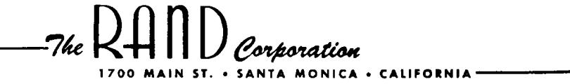

# THE THEORY OF DYNAMIC PROGRAMMING Richard Bellman

P-550

30 July 1954

### Summary

This paper is the text of an invited address before the annual summer meeting of the American Mathematical Society at Laramie, Wyoming, September 2, 1954.

The contents are chiefly of an expository nature.

### THE THEORY OF DYNAMIC PROGRAMMING

#### Richard Bellman

### §1. Introduction

Before turning to a discussion of some representative problems which will permit us to exhibit various mathematical features of the theory, let us present a brief survey of the fundamental concepts, hopes, and aspirations of dynamic programming.

To begin with, the theory was created to treat the mathematical problems arising from the study of various multi-stage decision processes, which may roughly be described in the following way: We have a physical system whose state at any time t is determined by a set of quantities which we call state parameters, or state variables. At certain times, which may be prescribed in advance, or which may be determined by the process itself, we are called upon to make decisions which will affect the state of the system. These decisions are equivalent to transformations of the state variables, the choice of a decision being identical with the choice of a transformation. The outcome of the preceding decisions is to be used to guide the choice of future ones, with the purpose of the whole process that of maximizing some function of the parameters describing the final state.

Examples of processes fitting this loose description are furnished by virtually every phase of modern life, from the planning of industrial production lines to the scheduling of patients at a medical clinic; from the determination of long-term

investment programs for universities to the determination of a replacement policy for machinery in factories; from the programming of training policies for skilled and unskilled labor to the choice of optimal purchasing and inventory policies for department stores and military establishments.

It is abundantly clear from the very brief description of possible applications that the problems arising from the study of these processes are problems of the future as well as of the immediate present.

Turning to a more precise discussion, let us introduce a small amount of terminology. A sequence of decisions will be called a <u>policy</u>, and a policy which is most advantageous according to some preassigned criterion will be called an <u>optimal</u> policy.

The classical approach to the mathematical problems arising from the processes described above is to consider the set of all possible sequences of decisions, which is to say, the set of all feasible policies, compute the return from each such feasible policy, and then maximize the return over the set of all feasible policies.

It is evident that straightforward and reasonable as such a procedure is, it is often not practical. For processes involving even a moderate number of stages and a moderate range of choices at each stage, the dimension of the resultant maximization problem will be uncomfortably high, with continuous processes requiring maximization over function space.

If we momentarily re—examine the situation, not as a mathematician, but as a "practical man," we see that this price of excessive dimensionality—a price that occasionally makes even a modern computing machine cringe—arises from a demand for too much information. How much information is actually required to carry out a multi-stage decision process?

Do we require a knowledge of the complete sequence of decisions, those to be performed at the present stage, those at the next stage, and so on? Not at all! It is sufficient to furnish a general prescription which determines at any stage the decision to be made in terms of the current state of the system. In other words, if at any <u>particular</u> time we know what to do, it is never necessary to know the decisions required at subsequent times.

Donning our mathematical cap again, we see that this commonsense attitude reduces the dimension of the problem to its proper level, namely the dimension of the decision problem that confronts one at any particular time.

For the case of deterministic processes, which is to say, those where the initial state and the decision uniquely determine the outcome, both viewpoints are possible. For the case of stochastic processes, where a decision determines only a distribution of outcome states, the classical enumerative approach is virtually impossible.

### §2. The Fundamental Approach

As stated above, the basic idea of the theory of dynamic programming is that of viewing an optimal policy as one determining the decision required at each time in terms of the current state of the system. Following this line of thought, the basic functional equations given below describing the quantitative aspects of the theory are uniformly obtained from the following intuitive

Principle of Optimality: An optimal policy has the property that whatever the initial state and initial decisions are, the remaining decisions must constitute an optimal policy with regard to the state resulting from the first decisions.

The functional equations we shall derive are of a difficult and fascinating type, wholly different from any encountered previously in analysis. Nonetheless, as we shall see below, they may be utilized to provide an entirely new approach to some classical problems.

### 53. Mathematical Formulation-I: A Discrete Deterministic Process

To illustrate the type of functional equation that arises from an application of the principle of optimality, let us begin with the simplest case of a deterministic process where the system is described at any time by an M-dimensional vector  $p = (p_1, p_2, \ldots, p_M), \text{ constrainted to lie within some region D.}$  Let  $T = \left\{ T_k \right\}$ , where k runs over a set which may be finite, enumerable, or continuous, be a set of transformations with the property that  $p \in D$  implies that  $T_k(p) \in D$  for all k.

Let us assume that we are considering an N-stage process to be carried out to maximize some scalar function, R(p) of the final state. We shall call this function the N-stage return. A policy consists of a selection of N transformations,  $P = (T_1, T_2, \ldots, T_N)$ , yielding successively the states

$$p_{1} = T_{1}(p),$$

$$p_{2} = T_{2}(p_{1}),$$

$$\vdots$$

$$p_{N} = T_{N}(p_{N-1})$$

If D is a finite region, each  $T_k(p)$  is continuous in p, and if R(p) is a continuous function of p for  $p \in D$ , it is clear that an optimal policy exists. The maximum value of  $R(p_N)$ , determined by an optimal policy, will be a function only of the initial vector p and the number of stages N. Let us then define

(2) 
$$f_N(p) = Max R(p_N)$$

= the N-stage return obtained using an optimal policy starting from the initial state p.

To derive a functional equation for  $f_N(p)$ , we employ the principle cited above. Assume that we choose some transformation  $T_k$  as a result of our first decision, obtaining thereby a new state  $T_k(p)$ . The maximum return from the following (N-1) stages is, by definition,  $f_{N-1}(T_k(p))$ . It follows that k must now be

chosen so as to maximize this. The result is the basic functional equation

(3) 
$$f_N(p) = \max_k f_{N-1}(T_k(p)), N=2,3,...$$

It is clear that a knowledge of any particular optimal policy, not necessarily unique, will yield  $f_N(p)$ , which is unique. Conversely, given the sequence  $\left\{f_N(p)\right\}$ , all optimal policies may be determined.

We thus have a duality between the space of functions and the space of policies which is of great theoretical and computational importance. This point will be discussed again below.

### §4. Mathematical Formulation—II: Discrete Stochastic Case

Let us now consider the case where the transformations are stochastic rather than deterministic. A choice of a transformation  $T_k$  now yields a stochastic vector z as the new state vector with an associated vector distribution function  $dG_k(p,z)$ .

It is clear that it is now in general meaningless to speak of maximizing the return. We must agree to measure the value of a policy in terms of some average value of the function of the final state. Let us call this expected value the N-stage return.

We now define  $f_N(p)$  as before in terms of the N-stage return. If z is the state resulting from any initial transformation  $T_k$ , the return from the last (N-1) stages will be  $f_{N-1}(z)$ . The

expected return as a result of the choice of  $\mathbf{T}_{\mathbf{k}}$  is

(1) 
$$\int_{z \in D} f_{N-1}(z) dG_k(p,z)$$

Hence, the functional equation for  $f_N(p)$  is

(2) 
$$f_N(p) = \max_k \int_{z \in D} f_{N-1}(z) dG(p,z), N=2,2,...$$

Note that the deterministic process may be considered to be merely a particular case of a stochastic process.

### 55. Mathematical Formulation—III: Infinite Stochastic Process

For mathematical purposes, it is frequently useful to consider the fictitious infinite process in which there are an unbounded number of stages. In that case, the sequence  $f_N(p)$  is replaced by the single function  $f(p) = f_{OO}(p)$ , and the formal equivalent of (3.2) is

(1) 
$$f(p) = \max_{k} \sum_{z \in D} f(z) dG_k(p,z)$$

## §6. Mathematical Formulation—IV: Continuous Deterministic Process

If we consider a continuous process where a decision must be made at each point of a time interval, we are led to maximization problems over function spaces. The simplest examples of these problems are furnished by the calculus of variations.

As we shall show below, our approach leads to a new view of this classical theory.

Defining

(1) f(p;T) = the return obtained over a time interval 0,T using an optimal policy starting from an initial state p

the analogue of the functional equation of (3.3) is

(2) 
$$f(p;S+T) = \underset{D[\overline{0},\overline{S}]}{\text{Max}} f(T_S(p);T)$$

where the maximum is taken over all allowable decisions made over the initial interval  $[0,\overline{S}]$ .

As soon as we consider infinite processes, we are confronted by the difficulty of showing that the maximum is actually attained. Consequently, in general, we must initially replace (6.2) by the rigorous equation

(3) 
$$f(p;S+T) = \sup_{D[O,S]} f(T_S(p);T)$$

and then show, under various assumptions, that the extremum is attained.

As will be shown below, the limiting form of (6.3) as  $S \longrightarrow 0$  yields a partial differential equation.

We shall not discuss here the corresponding problem for the case of stochastic processes since a number of interesting and difficult conceptual questions arise which have not as yet been fully resolved.

### §7. Some Examples—I: An Allocation Problem

Before proceeding any further with our general discussion, let us illustrate these ideas by means of a number of examples, of both stochastic and deterministic type, which are representative of the types of problems which fall within the domain of the general theory.

<u>Problem</u> 1. We are given a quantity x > 0 that may be divided into two non-negative parts, y and x-y. From y we obtain a return of g(y), at the expense of reducing y to ay where 0 < a < 1; from x-y we obtain a return of h(x-y) at the expense of reducing x-y to b(x-y) where 0 < b < 1. The process is now repeated with the new initial quantity ay + b(x-y), and so on indefinitely. How does one allocate at each stage so as to maximize the total return obtained over the entire process?

This is a very simple prototype of a large class of important allocation and investment problems which occur in a number of diverse activities.

Let

(1) f(x) =the total return obtained employing an optimal policy.

Arguing as above, it is readily seen that f(x) satisfies the functional equation

(2) 
$$f(x) = \sup_{0 \le y \le x} \left[ g(y) + h(x-y) + f(ay + b(x-y)) \right], x > 0$$

$$f(0) = 0$$

For a discussion of the various ways in which this equation can arise, and some of the analytic results which can be obtained, we refer the reader to [4], [6], [11], [12].

Treatment of the closely related optimal inventory problem may be found in [2], [29], [15].

### §8. Some Examples—II: Stochastic Gold Mining

Let us now consider the following example:

Problem 2. We are fortunate enough to possess two gold mines, Anaconda and Bonanza, and a sensitive gold-mining machine with the following characteristics: If the machine is used in Anaconda, it will mine, with probability p, a fixed fraction r of the gold there and be undamaged; with probability (1-p) it will mine nothing and be damaged beyond repair. If the machine is used in Bonanza, it will mine, with probability q, a fixed fraction s of the gold there and be undamaged; with probability (1-q) it will mine nothing and be damaged beyond repair.

At each stage, as long as the machine is undamaged, we have our choice of using the machine in Anaconda or Bonanza. Given the initial amounts, x and y respectively in each mine, what sequence of choices maximizes the expected amount mined before the machine is damaged?

Let

(1) f(x,y) = the expected amount of gold mined before the machine is damaged using an optimal policy, starting with x in Anaconda and y in Bonanza.

It is easily seen that f(x,y) satisfies the functional equation

(2) 
$$f(x,y) = \text{Max} \begin{bmatrix} A: & p[rx + f((1-r)x,y)] \\ B: & q[sy + f(x,(1-s)y)] \end{bmatrix}$$

The solution has the following simple structure:

- a. For prx/(1-r) > qsy/(1-s), choose A
- (3) b. For prx/(1-r) < qsy/(1-s), choose B
  - c. For prx/(1-r) = qsy/(1-s), choose either

Using this prescription, f(x,y) may be computed recurrently. The boundary curve between the two decisions regions is the locus of points where immediate expected gain over immediate expected loss is the same for both choices. Unfortunately, as a counter-example of Karlin and Shapiro [56] shows, this simple and intuitive rule is not valid generally in more complicated decision processes.

For a discussion of further results and extensions of both discrete and continuous type, see [3], [9], [11], [25], [26].

### §9. Some Examples—III: A Problem in the Calculus of Variations

A simple example of a continuous decision process is furnished by the following problem in the calculus of variations:

Problem 3. Maximize  $\int_{0}^{T} F(x,y)dt$  over all y where x and y are connected by the relation dx/dt = G(x,y), x(0) = c.

The classical technique in the calculus of variations, patterned directly after the technique used in maximization problems in finite—dimensional spaces, consists of considering the function yielding an extremum as a point in function space. This point is now characterized by means of variational prperties, of which the most important is the Euler equation.

This approach corresponds to finding y as a function of t.

Instead, we shall view the problem as a continuous decision

process and seek to determine y at any time as a function of the two state parameters, c and T.

Let us then set

(1) 
$$f(c,T) = \text{Max} \int_{0}^{T} F(x,y)dt$$

We shall in what follows proceed completely formally, assuming the maximum is attained, that all functions have the requisite number of continuous derivatives, and so on. Using the principle of optimality, we see that f(c,T) satisfies the equation

$$f(c,S+T) = \max_{\mathbf{y} \mid 0,S \mid} \left[ \int_{0}^{S} F(x,y)dt + \int_{S}^{S+T} F(x,y)dt \right]$$

$$= \max_{\mathbf{y} \mid 0,S \mid} \left[ \int_{0}^{S} F(x,y)dt + f(c(S),T) \right]$$

where c(S) is x at t = S

Assuming that y is continuous, we obtain after a simple computation the limiting form of (2) as  $S \longrightarrow 0$ 

(3) 
$$f_{\mathbf{T}} = \text{Max} \left[ F(c, \mathbf{v}) + G(c, \mathbf{v}) f_{c} \right]$$

where v = y(0). Proceeding formally, we have for the determination of the maximum

$$(4) F_v + G_v f_c = 0$$

Eliminating f between (3) and (4) we obtain the first-order partial differential equation

$$(5) \qquad \left(-\frac{F_{\mathbf{v}}}{G_{\mathbf{v}}}\right)_{\mathbf{v}} \mathbf{v}_{\mathbf{T}} = \left(\frac{FG_{\mathbf{v}} - GF_{\mathbf{v}}}{G_{\mathbf{v}}}\right)_{\mathbf{v}} \mathbf{v}_{\mathbf{c}} + \left(\frac{FG_{\mathbf{v}} - GF_{\mathbf{v}}}{G_{\mathbf{v}}}\right)_{\mathbf{c}}$$

The characteristics of this equation lead directly to the Euler equation obtained by the usual variational approach:

(6) 
$$G_{\mathbf{y}} = \begin{bmatrix} \mathbf{F}_{\mathbf{y}} \\ \mathbf{G}_{\mathbf{y}} \end{bmatrix} = \begin{bmatrix} \mathbf{F}_{\mathbf{x}} & \mathbf{F}_{\mathbf{y}} \\ \mathbf{G}_{\mathbf{x}} & \mathbf{G}_{\mathbf{y}} \end{bmatrix}$$

The same is true in the multi-dimensional problem where x,y and G(x,y) are vectors and F(x,y) is a scalar function. The case where the integrand contains t explicitly can always be reduced to the above by the introduction of a new dependent variable.

If we add to our original problem a constraint such as  $0 \le y \le x$ , one which occurs frequently in connection with allocation and investment problems, the functional equation is replaced by

(7) 
$$f_{T} = \underset{0 \le v \le c}{\text{Max}} \left[ F(c,v) + G(c,v) f_{c} \right]$$

Various conditions under which this problem has a solution of particularly simple structure are given in [17]. We might note in passing that the difficulty induced by a constraint of the type above is due to the fact that free variation is not permitted whenever y has an extreme value of 0 or x, and consequently inequalities replace equalities.

Further discussion of these techniques will be found in  $[1\overline{Q}]$ ,  $[1\overline{Q}]$ ,  $[1\overline{Q}]$ ,  $[1\overline{Q}]$ .

### §10. Some Examples—IV: An Eigenvalue Problem

This functional—equation approach is also applicable to eigenvalue problems associated with differential equations of the form

(1) 
$$\frac{du^{2}}{dt^{2}} + \lambda^{2} \phi(t) u = 0$$

$$u(0) = u(1) = 0$$

where we are interested in the values of  $\lambda^2$  which yield nontrivial solutions u.

Under suitable conditions upon  $\phi(t)$ , this problem is equivalent to that of determining the successive minima of  $\int_0^1 u^{12} dt$  subject to the constraints  $\int_0^1 \phi(t) u^2 dt = 1, \quad u(0) = u(1) = 0.$  In order to employ the functional equation, we imbed the problem within the more general problem of determining the successive minima of

(2) 
$$J(u) = \int_{a}^{a+t} u^{2} dS$$

subject to the constraints

(a) 
$$u(a) = u(a+t) = 0$$
,  
(3)  $a+t$   $a+t$   
(b)  $\int_{a}^{a+t} \phi(S)u^{2}dS + k \int_{a}^{a+t} \phi(S)(a+t-S)u(S)dS = 1$ 

Writing Min J(u) = f(a,k,t), we can derive a partial differential equation for f, which is nonlinear. Using the fact that  $\phi$  may be considered constant, and equal to  $\phi(a)$ , for small t, this equation may be used to determine the eigenvalues computationally (see  $[1\overline{0}]$ ,  $[1\overline{0}]$ ).

### §11. Some Examples—V: Games of Survival

As our last example, let us consider a particularly interesting example of a multi-stage game, the so-called "game of survial."

Let us assume that two players, A and B, are playing a zero—sum game determined by the matrix  $A = (a_{ij})$ , i,j=1,1,...,N, and that A starts initially with an amount of money x, and B starts initially with y. Both are playing the game with the purpose of ruining the other. How should both play?

Let us define, for x and y positive.

(1) f(x,y) =the probability that A ruins B, given that A starts with x, and B with y, and both play optimally.

It is clear that A wishes to maximize this probability and B wishes to minimize it.

For other values of x and y, f(x,y) is defined as follows:

(2) 
$$f(x,y) = 0, x \le 0, y > 0$$
  
= 1,  $y \le 0, x > 0$ 

It is now clear that f(x,y) satisfies the functional equation

(3) 
$$f(x,y) = \max_{p} \min_{q} \left[ \sum_{i,j=1}^{N} p_{i}q_{j}f(x + a_{ij}, y-a_{ij}) \right]$$
$$= \min_{q} \max_{p} \left[ \cdots \right]$$

Since the total sum of money in the game remains constant, it is clear that we can replace f(x,y) by a function of one variable, x.

For further developments, we refer the reader to 3, and to a recent paper by Shapley 39.

### 612. Approximation in Policy Space and Monotone Convergence

The functional equations we have derived above are, in the main, analytically intransigent. The theoretical and numerical properties of the solutions must then be derived by use of that general factorum of analysis, the method of successive approximations. If our functional equation has the form

(1) 
$$f(p) = T(f(p))$$

as do those above, we choose an initial function  $f_0(p)$ , and obtain a sequence of functions by means of the algorithm

(2) 
$$f_{n+1}(p) = T(f_n(p)), n=0,1,...$$

The physical background will usually provide precisely the conditions required for geometric convergence of this sequence to the solution of (1), where the uniqueness will be equally guaranteed by the same conditions. This technique we call approximation in function space.

Let us recall, however, that in a sense the function f(p) is not of paramount importance. Rather, it is the optimal policies which yield f(p) that are the most important. It follows that it may be wiser to approximate to optimal policies rather

than approximate directly to maximum returns.

ーノノマ

In many ways this is a simpler and more natural technique, as well as more practical in applications. The principle theoretical advantage lies in the fact that we now obtain monotone convergence.

To illustrate this in its simplest form, let us consider the functional equation discussed in

(3) 
$$f(x) = Max \left[ g(y) + h(x-y) + f(ay + b(x-y)) \right]$$

Perhaps the simplest initial guess is to assume that y=0 continually. This yields as our initial approximation to the maximum return the function  $f_{\rm O}(x)$  satisfying the functional equation

(4) 
$$f_0(x) = h(x) + f_0(bx)$$

It is now clear that the function  $f_1(x)$  determined by

(5) 
$$f_1(x) = \max_{0 \le y \le x} \left[ g(y) + h(x-y) + f_0(ay + b(x-y)) \right]$$

is always greater than or equal to  $f_{\scriptscriptstyle O}(x)$ . Hence, inductively, if

(6) 
$$f_{n+1}(x) = \max_{0 \le y \le x} \left[ g(y) + h(x-y) + f_n(ay+b(x-y)) \right], \quad n=0,1,...$$

we have

$$f_{n+1}(x) \ge f_n(x)$$

and thus monotone convergence, see [3], [8].

A completely analogous technique is applicable to continuous processes, and in particular the calculus of variations. The results are particularly interesting in connection with eigenvalue problems where we obtain monotone convergence, [6],

### §13. Further Results

We have not the space here to discuss any of a number of other interesting and important problems in dynamic programming. For those interested in bottleneck problems occurring in multi-stage production processes, we refer to [7], [14], [27].

Those interested in scheduling problems may consult [22], [23], [33].

A number of mathematical problems occurring in connection with the control of engineering economic systems are discussed in [20], [21].

Finally, we should like to mention a number of papers concerned with the very difficult mathematical problems occurring in the general theory of learning processes, [32], [34], [35], and [24].

### BIBLIOGRAPHY

- 1. Arrow, K. J., D. Blackwell, and M. A. Girshick, "Bayes and Minimax Solutions of Sequential Decision Problems,"

  Econometrica, Vol. 17, Nos. 3-4, July-October, 1949, pp. 214-244.
- 2. Arrow, K. J., T. E. Harris, and J. Marschak, "Optimal Inventory Policy," Cowles Commission Paper No. 44, 1951.
- 3. Bellman, R., An Introduction to the Theory of Dynamic Programming, The RAND Corporation, Report R-245, 1953.
- 4. \_\_\_\_\_, "On Games Involving Bluffing," Rendiconti del Circolo Matematico di Palermo (2), Vol. 1, 1952, pp. 1-18.
- 5. \_\_\_\_\_, "On the Theory of Dynamic Programming," Proceedings of the National Academy of Sciences, Vol. 38, No. 8, August 1952, pp.716-719.
- 6. \_\_\_\_\_\_, "Some Problems in the Theory of Dynamic Programming," Econometrica, Vol. 22, No. 1, January 1954, pp. 37-48.
- 7. ———, "On Bottleneck Problems and Dynamic Programming,"
  Proceedings of the National Academy of Sciences, Vol. 39,
  No. 9, September 1953, pp. 947-951.
- 8. \_\_\_\_\_, "On Computational Problems in the Theory of Dynamic Programming," Symposium of Numerical Methods, Santa Monica, 1953, The RAND Corporation Paper P-423.
- 9. \_\_\_\_\_, "Some Functional Equations in the Theory of Dynamic Programming," Proceedings of the National Academy of Sciences, Vol. 39, No. 10, October 1953, pp. 1077-1082.
- 10. \_\_\_\_\_\_, "Dynamic Programming and a New Formalism in the Calculus of Variations," Proceedings of the National Academy of Sciences, Vol. 40, No. 4, April 1954, pp. 231-235.
- 11. \_\_\_\_\_\_, "The Theory of Dynamic Programming, A General Survey," Chapter from Mathematics for Modern Engineers, by E. F. Beckenbach, McGraw-Hill Publishing Company (forthcoming).
- 12. \_\_\_\_\_, "Some Applications of the Theory of Dynamic Programming to Logistics," Navy Quarterly of Logistics (forthcoming).

- , "Some Applications of the Theory of Dynamic 13. Programming A Review, Operations Research Quarterly (forthcoming). , "Bottleneck Problems, Functional Equations, and Dynamic Programming," The RAND Corporation, Paper 14. P-483, January 1954. of Optimal Inventory," The RAND Corporation, Paper 15. P-480, January 1954. - , "Dynamic Programming and the Calculus of Varia-16. tions-I," The RAND Corporation, Paper P-495, March 1954. , "Dynamic Programming and the Calculus of Variations—II," The RAND Corporation, Paper P-512, April 17. 1954. , "Monotone Convergence in Dynamic Programming and the Calculus of Variations," The RAND Corporation, 18. Paper P-513, April 1954. Bellman, R., and D. Blackwell, "Some Two-person Games Involv-ing Bluffing," Proceedings of the National Academy of Sciences, Vol. 35, No. 10, October 1949, pp. 600-605. 19. Bellman, R., I. Glicksberg, and O. Gross, "On Some Varia-20. tional Problems Occurring in the Theory of Dynamic Programming," Proceedings of the National Academy of Sciences, Vol. 39, No. 4, April 1953, pp. 298-301. \_\_\_, "On Some Varia-21. tional Problems in the Theory of Dynamic Programming," Rendiconti del Circolo Matematico di Palermo (forthcoming). -, "The Theory of 22. Dynamic Programming as Applied to a Smoothing Problem," Journal of the Society for Industrial and Applied Mathematics (forthcoming).
- 23. Bellman, R., and O. Gross, "Some Combinatorial Problems
  Arising in the Theory of Multi-stage Processes," The
  RAND Corporation, Paper P-456, November 1953.
- 24. Bellman, R., T. E. Harris, and H. N. Shapiro, "Studies on Functional Equations Occurring in Decision Processes,"

  The RAND Corporation, Paper P-382, August 1952.
- 25. Bellman, R., and R. S. Lehman, "On the Continuous Gold-mining Equation," Proceedings of the National Acadamy of Sciences, Vol. 40, No. 2, February 1954, pp. 115-119.

- the Theory of Dynamic Programming and its Generalizations, "The RAND Corporation, Paper P-433, January 1954.
- 27. \_\_\_\_\_\_\_, "Studies on Bottleneck Problems in Production Processes," The RAND Corporation, Paper P-492. February 1954.
- 28. Bush, R. R., and C. F. Mosteller, "A Mathematical Model for Simple Learning," <u>Psychological Review</u>, Vol. 58, No. 5, September 1951, pp. 313-325.
- 29. Dvoretzky, A. J., J. Kiefer, and J. Wolfowitz, "The Inventory Problem—I: Case of Known Distributions of Demand," and "The Inventory Problem—II: Case of Unknown Distributions of Demand," <a href="Econometrica">Econometrica</a>, Vol. 20, No. 2, April 1952, pp. 187—222.
- 30. Dvoretzky, A. J., A. Wald, and J. Wolfowitz, "Elimination of Randomization in Certain Statistical Decision Procedures and Zero-sum Two-person Games," Annals of Mathematical Statistics, Vol. 22, No. 1, March 1951, pp. 1-21.
- 31. Estes, W. K., "Toward a Statistical Theory of Learning,"

  Psychological Review, Vol. 57, No. 2, March 1950,

  pp. 94-107.
- 32. Flood, M. M., "On Stochastic Learning Theory," The RAND Corporation, Paper P-353, December 1952.
- 33. Johnson, S., "Optimal Two- and Three-stage Production Schedules with Setup Times Included," The RAND Corporation, Paper P-402, May 1953.
- 34. Johnson, S., and S. Karlin, "On Optimal Sampling Procedure for a Problem of Two Populations—I," The RAND Corporation, Paper P-328, October 1952.
- 35. Karlin, S., "A Mathematical Treatment of Learning Models—I,
  The RAND Corporation, Research Memorandum RM-921,
  September 1952.
- 36. \_\_\_\_\_, and H. N. Shapiro, Decision Processes and Functional Equations, The RAND Corporation, Research Memorandum RM-933, September 1952.
- 37. Peisakoff, M., More on Games of Survival, The RAND Corporation, Research Memorandum RM-884, June 1952.
- 38. Robbins, H., "Some Aspects of the Sequential Design of Experiments," <u>Bulletin of the American Mathematical</u>
  <u>Society</u>, Vol. 58, No. 5, September 1952, pp. 527-536.

39. Shapley, L., "Stochastic Games," Proceedings of the National Academy of Sciences, Vol. 39, No. 10, October 1953, pp. 1095-1100.