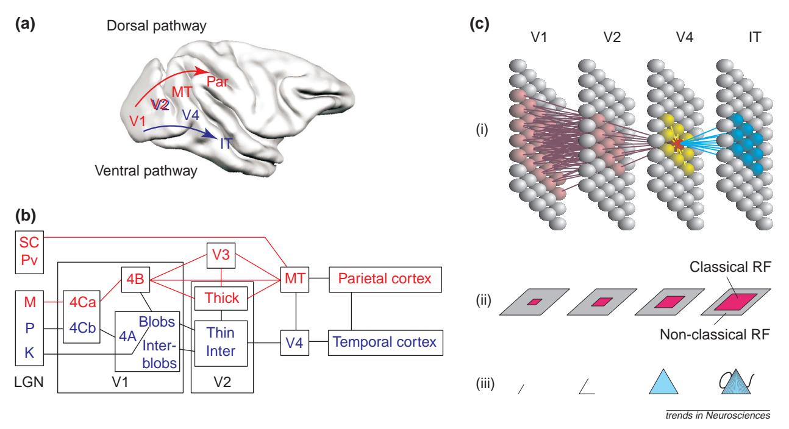
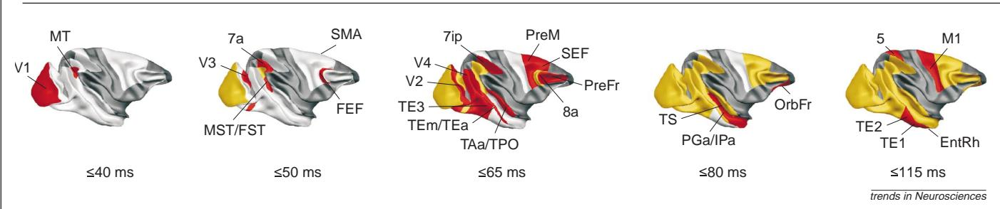
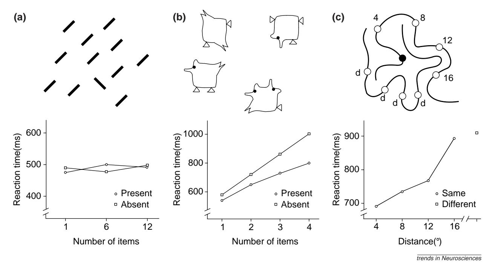
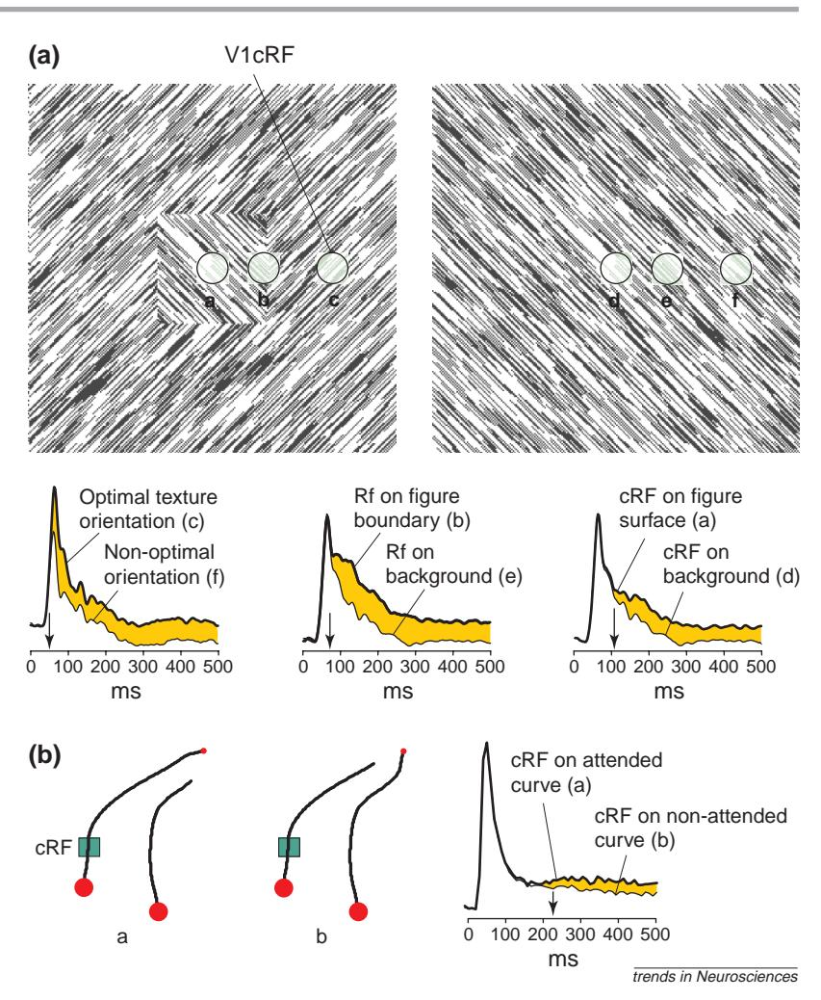
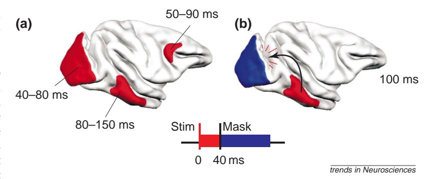

# The distinct modes of vision offered by feedforward and recurrent processing

Victor A.F. Lamme and Pieter R. Roelfsema

An analysis of response latencies shows that when an image is presented to the visual system, neuronal activity is rapidly routed to a large number of visual areas. However, the activity of cortical neurons is not determined by this feedforward sweep alone. Horizontal connections within areas, and higher areas providing feedback, result in dynamic changes in tuning. The differences between feedforward and recurrent processing could prove pivotal in understanding the distinctions between attentive and pre-attentive vision as well as between conscious and unconscious vision. The feedforward sweep rapidly groups feature constellations that are hardwired in the visual brain, yet is probably incapable of yielding visual awareness; in many cases, recurrent processing is necessary before the features of an object are attentively grouped and the stimulus can enter consciousness.

Trends Neurosci. (2000) 23, 571-579

UR UNDERSTANDING of vision has advanced considerably by subdividing it into distinct processes. For example, the distinction between spatial and object vision has been related to distinct neural pathways in the brain1: a dorsal stream that relays visual information to the parietal cortex, and a ventral stream that projects to the temporal cortex (Box 1). A second major dichotomy is between attentive and pre-attentive vision. Pre-attentive vision operates on an entire visual scene, in parallel to segregate visual objects from the background. This only works, however, if the object differs from the background in one or several elementary features. If these elementary feature differences are not available for segregation, the scene has to be inspected in a more serial manner; this is the domain of attentive vision2-4. A third dichotomy under consideration is between conscious and unconscious visual processing. We experience vision mostly through our conscious percepts. However, a visual stimulus that bypasses visual awareness can also be transformed into a motor output. This not only happens in pathological conditions, such as blindsight5, but has also been demonstrated in normal subjects6.

With the recent advances in neuroscience, we are also beginning to understand the dichotomies, attentive-pre-attentive and conscious-unconscious, in neural terms. For example, in the pre-attentive-attentive dichotomy it has been suggested that specific neural circuits, in particular in the parietal and prefrontal cortex, are involved in attentive vision7,8, whereas low-level retinotopic areas are involved in pre-attentive vision3,9. Similarly, the segregation of visual pathways into a ventral and a dorsal cortical stream has been suggested to underlie the distinction between conscious perception and visually guided action that can bypass consciousness6,10.

An aspect of cortical processing that has been relatively overlooked in these models are the differences between the various types of connections in the visual cortex11. Feedforward connections relay information from lower to higher visual cortical areas, but there are also horizontal, within-area and feedback connections. Edelman12 was among the first to suggest that these 're-entrant' connections play a prominent role in a variety of visual functions. Here we will try to relate the distinction between connection types to functional dichotomies in visual processing.

### The fast feedforward sweep of information processing

After the presentation of an image, the successive hierarchical levels of the visual cortex are rapidly activated through the cascade of feedforward connections. This is what we call the feedforward sweep of information processing. Activation spreads from lowlevel to high-level areas of the visual cortical hierarchy13. Anatomically, V1 is the lowest visual area, in which information has to cross at least two populations of synapses (in layers 4C and 2–4B)14 before it can reach higher areas. The stream of information bifurcates into a dorsal and a ventral stream. In the ventral stream, areas of the temporal lobe are thought to be at the top of the visual cortical hierarchy. In the dorsal stream, the top is more difficult to accurately define. The hierarchy that is based on corticocortical connections fits well with hierarchies that are based on physiological criteria, such as the increase in receptive-field size and the complexity of tuning properties in higher visual areas15 (Box 1).

A more direct way of characterizing the feedforward sweep is by an analysis of the latency of visual responses in the cortical areas (Box 2). This yields a somewhat different picture than that expected on purely anatomical grounds. For example, cells in area MT and the frontal eye fields (FEF) areas are activated almost as rapidly as cells in area V1. There are several reasons for the non-correspondence between this temporal and the anatomical hierarchy (see Box 2).

is at the Graduate School of Neurosciences. Dept Visual System Analysis, AMC. University of Amsterdam, PO Box 12011, 1100 AA Amsterdam, The Netherlands and The Netherlands Ophthalmic Research Institute. Meibergdreef 47. 1105 BA Amsterdam The Netherlands Pieter R. Roelfsema is at the Graduate School of Neurosciences, Dept Visual System Analysis, AMC. University of Amsterdam, PO Box 12011, 1100 AA Amsterdam. The Netherlands

Victor A.F. Lamme

## Box I. Anatomical organization of the visual system

The organization of the visual system has parallel as well as hierarchical features. Several parallel pathways (magno-, parvo- and koniocellular) can be discerned that transfer different kinds of information from the retina to the LGN and cortex. In the cortex, these pathways are recombined. Functional subdivisions in areas V1 (blob and interblob regions) and V2 (thick, thin and interstripe regions) have been defined on the basis of cytochrome oxidase (CO) staining. After the recombination, two pathways emerge: a dorsal, magno-dominated pathway flows to the parietal cortex and is mostly involved with space, movement and action and a ventral, parvo-dominated pathway flows into temporal areas and is mostly concerned with object identification and perceptiona (Fig Ia,b). Three connection types can be identified within this parallel flow. Those that provide input from cells at lower levels (feedforward connections), those that provide input from cells at the same level (horizontal connections), and those that provide feedback from higher levels (feedback connections)b [Fig. Ic, part (i)]. Feedforward connections shape the classical receptive field (cRF). The cRF corresponds to the region of the retina to which a neuron is connected by way of feedforward connections. The cRF increases in higher areas and tuning becomes more complicated [Fig. Ic, parts (ii), (iii)]. Through longer routes, which involve hori-zontal and feedback connections, neurons also receive information from the surround of their cRF [Fig. Ic, part (ii)]. Feedforward, horizontal and feedback connections have different layers of origin and termination. These differences have been exploited to define a hierarchical scheme in which the relative hierarchical positions of most visual areas match the type of interareal connectionsc.

#### References

- a Walsh, V. and Butler, S.R. (1996) Different ways of looking at seeing. Behav. Brain Res. 76, 1–3
- b Salin, P. and Bullier, J. (1995) Corticocortical connections in the visual system: structure and function. *Physiol. Rev.* 75, 107–154
- c Felleman, D.J. and Van Essen, D.C. (1991) Distributed hierarchical processing in the primate cerebral cortex. *Cereb. Cortex* 1, 1–47
- d Nowak, L.G. and Bullier, J. (1997) The timing of information transfer in the visual system. In *Extrastriate Cortex* (*Cerebral Cortex*, Vol. 12) (Kaas, J. *et al.*, eds), pp. 205–241, Plenum Press
- e Maunsell, J.H.R. and Newsome, W.T. (1987) Visual processing in monkey extrastriate cortex. Annu. Rev. Neurosci. 10, 363–401

Fig. I. Anatomical connections and receptive fields. Anatomical connections are shown at three different levels of detail. The two cortical streams are shown in an MRI image of monkey cortex rendered with BrainVoyager® software (a). The interareal connections of the early visual areas and the segregation of these connections according to LGN input and cytochrome oxidase (CO) staining are shown in (b). Components of the magno-dominated 'fast brain'd have been shown in red. This system includes a connection from the superior colliculus (SC) and Pulvinar (Pv) to area MT. (c) Part (i) representation of feedforward (pink), horizontal (yellow), and feedback (blue) connections to a hypothetical neuron in V4 (red). The increase of receptive field (RF) size is shown in part (ii), and the increase of the complexity of receptive field tuning properties is shown in part (iii), going from low-level to high-level areas. (a) MRI image courtesy of R. Goebel and N.K. Logothetis.

Furthermore, large differences exist between latencies of dorsal and ventral stream areas because of the different speeds of the magno- and parvo-pathways feeding into these areas.

An important feature of the organization thus is that not one, but multiple parallel feedforward sweeps can be identified that operate at different speeds. Yet each of these sweeps share several important characteristics. First, they proceed rapidly. The exact speed depends on stimulus variables (e.g. contrast, motion, type of onset), but after the presentation of a high-contrast stimulus, the highest levels of the visual cortical processing hierarchy in the ventral stream are reached within 100 ms. Second, they are mainly

determined by the feedforward connections. Response latencies at any hierarchical level are usually about 10 ms longer than those at the previous level. Thus, because 10 ms is in the range of the minimal interspike interval16,17, a typical cortical neuron can fire at most a single spike before the next hierarchical level is activated, leaving little time for lateral connections and no time for feedback connections to exert their effect. Therefore, the ensemble of neurons that participate in the first sweep of activity through the hierarchy of visual areas is primarily determined by the pattern of feedforward connections.

These data imply that the degree of tuning of the first spikes provides an indication of what is

### Box 2. The feedforward sweep

**Fig. 1.** Earliest visual response latencies of areas in the macaque cerebral cortex. Activation of areas at specific latencies, shown in MRI images of monkey cortex, rendered with BrainVoyager® software. Areas that have become active at the given latency after visual stimulation are shown in red in each plot. Regions shown in yellow represent the areas that were activated earlier. White regions are not yet activated. Dark gray regions represent areas for which no information was obtained. Latencies of the layers of the LGN, magnocellular (earliest 28 ms, mean 33 ms) and parvocellular (earliest 31 ms, mean 50 ms) (Ref. c) are not shown. MRI images courtesy of R. Goebel and N.K. Logothetis.

An independent measure of the hierarchical level of a visual area can be derived from the latency of the responses that are evoked by a stimulus that appears suddenly. We peformed a meta-analysis (48 studies) of visual response latencies that have been reported for various areas of the visual, parietal, frontal and motor cortex of the macaque monkey. For some areas considerable discrepancies between studies were observed, which are presumably related to: differences in methods for the calculation of latency; differences between visual stimuli and differences in behavioral state. Moreover, in some studies only the median of the distribution of latencies is reported, whereas others only report the average latency. These factors cannot, however, contribute to differences in latencies between areas that have been studied by the same authors. Therefore in the meta-analysis, particular weight was attached to studies that compared latencies in two or more areas.

For each area A a latency  $\lambda_A$  was estimated by minimizing the following error term:

$$Err = \sum_{S,A} (\lambda_A - L_{S,A})^2 + W \sum_{S,A,B} F_S [D_{S,A,B} - (\lambda_A - \lambda_B)]^2$$

Here,  $L_{S,A}$  is the latency in area A, and  $D_{S,A,B}$  the latency difference between areas A and B, reported by study S. W determines the relative weight attributed to differences between latencies in areas that were examined in a single study. W was set to five in the present analysis.  $F_S$  is a normalization factor that avoids disproportionate weighting of studies that report latencies in more than two areas. A study that reports latencies in  $N_S$  areas contributes  $N_S-1$  independent estimates of interareal latency differences (degrees of freedom), but yields  $0.5 \cdot N_S$  ( $N_S-1$ ) values for  $D_{S,A,B}$ . Therefore,  $F_S$  equalled [( $N_S-1$ ) / (0.5· $N_S$ ·( $N_S-1$ )]. The analysis was carried out twice, once for the earliest latencies (Fig. I, Table 1), and once for the average latencies (Table 1).

Several factors are responsible for the non-correspondence between this temporal hierarchy and the topological hierarchy of Box 1

- (1) Not all neurons within a given area receive their inputs via the shortest possible routes. Thus, the hierarchy falls apart at the level of individual neurons. Indeed, a layer 4C neuron in V2 might be closer to visual input than a layer 5 cell in V1.
- (2) The several streams of information processing that can be discerned have different speeds. The magnocellular pathway is fastest, followed by the moderately fast parvo- and the slow koniocellular pathway. Each pathway projects to different layers in V1, and from there to different pathways within V1 and beyond (Box 1). Thus, a neuron that is topologically close to the retina, but that belongs to a slower stream, might respond later than a neuron that is topologically further from the retina.
- (3) The LGN is not the only source of visual information, because other subcortical structures, including the superior colliculus (SC) and pulvinar (PV), also project to various extrastriate areas.

TABLE I. Visual response latencies in macaque cerebral cortex

| Area    | Earliest | Mean | Refs                |
|---------|----------|------|---------------------|
| VI      | 35       | 72   | 80–88               |
| V2      | 54       | 84   | 84-86,89            |
| V3      | 50       | 77   | 86                  |
| V4      | 61       | 106  | 82,86,90            |
| TE3     | 57       | 109  | 91                  |
| TE2     | 83       | 123  | 91–94               |
| TEI     | 86       | 143  | 91,95               |
| TEm     | 59       | 114  | 91,96               |
| TEa     | 59       | 123  | 91,96               |
| lpa     | 68       | 128  | 91,96               |
| Pga     | 69       | 125  | 16,91,97            |
| TPO     | 60       | 117  | 16,91,97            |
| TAa     | 57       | 144  | 91                  |
| TS      | 67       | 139  | 91                  |
| TP      | _        | 156  | 95                  |
| 36      | _        | 148  | 95                  |
| TF      | _        | 146  | 95                  |
| 35      | _        | 175  | 95                  |
| EntRh   | 100      | 158  | 95,98               |
| MT      | 39       | 76   | 82,85,86,99-102     |
| MST/FST | 45       | 74   | 86,99,100,103       |
| 7a      | 44       | 129  | 104-107             |
| 7ip     | 64       | 92   | 104,106             |
| 5       | 114      | 162  | 108,109             |
| FEF     | 43       | 91   | 86,110-113          |
| SEF     | 52       | 115  | 110,111,114         |
| PreFr   | 51       | 141  | 106,114,115         |
| 8a      | 63       | 96   | 106                 |
| OrbFr   | 80       | 152  | 116                 |
| MI      | 85       | 150  | 109,117-120         |
| PreM    | 57       | 127  | 109,114,119,121-123 |
| SMA     | 48       | 124  | 120,124,125         |

Area MT, for example, receives an important input from the SC, that can sustain the responsiveness of MT cells in the absence of V1 (Ref. a). It has been argued that this pathway might provide visual input to the parietal cortex before the geniculostriate input has arrivedb.

#### References

- a Rodman, H.R. et al. (1990) Afferent basis of visual response properties in area MT of the macaque. II. Effects of superior colliculus removal. I. Neurosci. 10, 1154–1164
- b Nowak, L.G. and Bullier, J. (1997) The timing of information transfer in the visual system. In *Extrastriate Cortex*, (*Cerebral Cortex*, Vol. 12) (Kaas, J. et al., eds), pp. 205–241, Plenum Press
- c Schmolesky, M.T. et al. (1998) Signal timing across the macaque visual system. J. Neurophysiol. 79, 3272–3278

**Fig. 1.** Visual tasks with differing demands on visual processing. (a) A visual search for an image element with a unique orientation is carried out in parallel across the visual field. The graph shows that the reaction time is hardly affected by the number of distractors. This type of search is also referred to as pop-out. Circles show reaction times in the presence, and squares in the absence of the target (modified from Ref. 28). (b) Search for a 'chicken' among distractors composed of chicken parts. Reaction times show a steep increase with the number of distractors (modified from Ref. 4). Circles show reaction times in the presence, and squares in the absence of the target. The original data were kindly provided by J.M. Wolfe. (c) A curve-tracing task46, in which subjects had to indicate whether the fixation point (filled circle) was connected to a circular target, which could appear at one of a number of positions (unfilled circles). The target could appear on the same curve as the fixation point at a distance of 4°, 8°, 12° or 16°, or on the other curve d. During the actual experiment the target appeared only at one of these eight possible locations. In the graph, circles show the dependence of reaction time on the distance between the fixation point and target. The square indicates the reaction time in trials in which the target was on the curve that was not connected to the fixation point.

achieved by feedforward connections, in terms of neural computation. The first spikes are remarkably selective in many cases that have been studied. For example, orientation tuning of V1 cells is present in the first spikes that can be recorded18. Similarly, the first spikes in the inferior temporal cortex exhibit tuning to complicated stimuli such as faces 16,17,19. and the first spikes evoked in area MST, an area of the parietal cortex contributing to motion perception, are tuned to complex patterns of optical flow $^{20}$ . The feedforward sweep thus exposes the very impressive capabilities of the feedforward connections; they determine the neurons classical receptive field (cRF) (Ref. 21), and their basic tuning properties. Oram and Perrett16, and Tovée17 suggested that this implies that visual cortical processing is usually finished when the feedforward sweep of activity has been completed. This might however, only be true for a limited part of visual processing. We will argue below that many aspects of visual processing rely crucially on what happens beyond the feedforward sweep.

## Beyond the feedforward sweep

Visual cortical neurons remain active after their participation in the feedforward sweep. This occurs in areas both at lower and higher hierarchical levels. At these longer latencies, information from horizontal or feedback connections can be incorporated into the responses. The contribution of these recurrent connections can be distinguished from the feedforward sweep on the basis of several criteria.

A first indication for the involvement of recurrent connections is a change in the tuning of a neuron over the course of its response. In the primary visual cortex (V1), for example, tuning for orientation22 and color23 changes dynamically during the neuronal response. Such dynamic changes in tuning have also been observed for neurons in the inferotemporal cortex that are selective for faces. The early part of the response of these neurons simply depends on whether the stimulus is a face or not17. However, a significant portion of cells also convey information about facial expression or identity, but only after an additional delay24. Also, in other cortical areas, the initial responses reflect sensory processing by the feedforward sweep, whereas responses at longer latencies correlate with more cognitive or behavioral aspects of sensory processing. In parietal areas, for example, aspects of perceptual decisions are expressed at longer latencies25. Thus, cortical neurons are not simple detectors for one aspect of the visual scene. Instead, lateral and feedback connections allow them to contribute to different analyses at different moments in time. Even in the motor cortex, early responses reflect sensory events, whereas responses at intermediate latencies reflect sensorymotor mapping rules, and late responses reflect the motor commands26.

A second indication for the involvement of recurrent connections is the modulation of a cell's response by contextual information occurring outside its cRF. Indeed, if the cRF is defined as the region of visual space from which a cell receives information by

way of feedforward connections (Box 1), influences from outside the cRF depend, by definition, on recurrent connections. Many studies have documented that stimuli in regions surrounding the cRF might inhibit or enhance the response to an item that is presented within the cRF (Ref. 21). A remarkable property of these modulations is that they often correspond to psychophysical measures of the effects that the surrounding stimuli have on the saliency of the RF stimulus. For example, when similarly oriented lines surround a line segment, it will be less salient than when it is surrounded by orthogonal lines. Correspondingly, contextual modulation in area V1 results in a lower response for the first situation than for the second27. Similarly, contextual modulation has been shown to reflect perceptual pop-out27 (Fig. 1a), perceived brightness29, color constancy30, and perceptual grouping31. Horizontal connections probably play an important role in the modulations related to grouping32. Furthermore, involvement of recurrent connections is suggested by the finding that many of these effects occur at some delay compared with the onset of the RF response33, and that these effects depend on feedback from the extrastriate area V2 (Ref. 34).

There is substantial evidence for the involvement of recurrent connections in the visual task of texture segregation. Figure 2a, shows how V1 cells respond to the presentation of a textured figure overlying a textured background. In this case the contents of the cRF do not allow the neuron to decide whether its RF is on the figure or the background35–37. Thus, figural response enhancement is an influence from outside the cRF, which comes at an additional delay. Modulatory effects related to figure–ground segregation have been shown to depend on feedback from MT (Ref. 38) and other extrastriate areas39.

A third indication for the involvement of recurrent connections in a visual task can be derived from processing times. The fast feedforward sweep of activity is completed within approximately 100 ms (Box 2). Recurrent connections have to be involved in those visual tasks in which longer delays are obtained. Here we will discuss two such tasks, visual search and curve tracing.

Visual search is the prime example of a task in which long processing times can occur. In a search task the subject has to find a target item within a variable number of distractors. Typically, the average reaction time exhibits an approximately linear dependence on the number of distractors. In difficult search tasks each distractor item might add more than 50 ms to the reaction time, and displays in which the reaction time is increased by more than 300 ms are not uncommon2-4,40 (Fig. 1b). Physiological studies of visual search in monkeys has shown that neurons in various visual areas enhance their firing rate if the target item appears in their RF, instead of a distractor41–44. This response enhancement is delayed relative to the initial visual response to the onset of the search display, suggesting that it is mediated by recurrent connections. Indeed, the response enhancement is also found in early visual areas, including area V1, exemplifying an influence from outside the cRF (Refs 42.45).

In a curve-tracing task two or more curves are displayed, and the subject has to decide whether two

**Fig. 2.** V1 cells are sequentially selective for various aspects of a stimulus. (a) Responses are compared with the receptive fields (RF) (circles, marked a to f) of V1 neurons at different locations of a texture. Comparing responses to differently orientated textures (c versus f, left graph, yellow shading indicates difference) shows that cells are selective for orientation of textures at 55 ms (arrow indicates moment of first significant difference). The same cells are selective for the boundary between figure and ground (b versus e, middle graph) at 80 ms, and show an enhanced response when the RF covers the figure surface compared to the background surface at 100 ms, even though the stimulus within the RF is identical in both situations35 (a versus d, right graph). (b) V1 cells show a response enhancement by 30% if their RF is on a curve that needs to be traced, compared to when it is on a distractor curve. On average, the difference occurs 235 ms after stimulus onset49.

particular curve segments belong to the same or to different curves (Fig. 1c). The time to decide whether two segments belong to the same curve increases with their distance along the curve. This suggests that some time-consuming mental operation has to track along the curve to group all contour segments that belong to it47,48, implicating the use of recurrent connections. We have recently recorded from the primary visual cortex of monkeys that were trained to perform such a curve-tracing task without moving their eyes49 (Fig. 2b). Neural responses to the traced curve were on average enhanced by 30% compared with responses to a distractor curve even though the stimulus within the cRF was identical in both situations. The latency of the response enhancement was typically more than 200 ms. These findings indicate that the response enhancement is mediated by recurrent processing. Moreover, the response enhancement occurred for responses to all segments of the traced curve, even if it crossed another curve. This suggests that the entire cortical representation of the traced curve 'lights up' during this task. We have proposed that labeling of neuronal responses by the rate enhancement might serve to bind the various segments of the traced curve into a coherent representation50,51.

The above examples all suggest that recurrent processing typically exerts its influence at relatively longer latencies. However, some areas in the dorsal stream, such as MT, are activated at very short latencies, probably by fast subcortical and magnocellular pathways (Boxes 1 and 2). This would enable feedback from these areas to reach the early areas, such as V1, at about the same time as the feedforward input from the slower parvocellular pathway9. Indeed, cooling-experiments have shown that feedback from MT influences V1 responses very early on52. Such results illustrate how the interpretation of feedforward and recurrent processing is complicated by the noncorrespondence between the anatomical and temporal hierarchy of corticocortical connections (Boxes 1 and 2).

## The contribution of feedforward and feedback processing to pre-attentive and attentive vision

The hypothesis that visual responses are enhanced in order to integrate them into a coherent representation is reminiscent of the feature integration theory of Treisman and co-workers2,3. In this psychological theory, it is suggested that attention needs to be directed to an object in order to bind all of its features together. Rate enhancements have been widely reported as a neural correlate of visual attention53 and appear to provide the neural mechanism of attentive grouping. During visual search, responses that are selective for the identity of the target item, as well as for its location, are eventually enhanced. Thus, attention labels the identity and location of the target item. During curve tracing, attention is directed selectively to the various segments of the curve that is traced54; attention appears to spread along the traced curve from segments that are attended, to new segments that are collinear and connected to them. Such a selective attentional labeling can be implemented by a spread of the rate enhancement through the network of corticocortical connections in V1, because these connections predominantly interconnect neurons that are tuned to nearby and collinear contour segments50,51.

These data suggest that labeling by attention involves recurrent connections, which would explain why it is time-consuming. It is therefore tempting to identify recurrent processing with attentive grouping. Pre-attentive processing, by contrast, could be identified with the feedforward sweep. This association appears to hold at a first approximation, but there are also several subtleties50. First, most psychological theories suggest that attention is always required to group complex feature combinations2,3. Physiological data indicate, however, that the tuning that is obtained during the feedforward sweep can be complex, in particular, at the higher hierarchical levels16,17,19 (Box 1). This elaborate tuning of neurons also constitutes a form of grouping. For example, if a faceselective neuron is activated, the eyes, nose and mouth of the face are grouped together by the visual system. Does this imply that such complex feature constellations are invariably extracted during the

feedforward sweep?

The answer to this question appears to be negative. When elaborate feature constellations are embedded in a crowded search display, the feedforward sweep is curtailed. This is caused by inhibitory interactions among the representations of multiple objects, which are particularly pronounced at the higher hierarchical levels53,55. Thus, the depth of pre-attentive encoding might depend on the number and spacing of display items. Studies on visual search use many display items and the uncovered pre-attentive features are relatively simple2,3,40 (but see, for example, Refs 56,57). Other methods to investigate pre-attentive vision have used fewer display items. For example, priming studies probe the depth of encoding of unattended display items by studying their effect at a later time point. These studies have uncovered deeper, even semantic encoding of non-attended objects58,59. Therefore, grouping by the distribution of attentional labels might only be required if neurons that are selective for the requested feature constellation are not available, or remain inactive during the feedforward sweep50.

A second intricacy in the identification of pre-attentive vision with the feedforward sweep is related to the general application of the term pre-attentive to grouping that is based on simple image features, such as orientation similarity and collinearity. The physiological data discussed above suggest that such grouping operations might also require recurrent processing. In the segregation of a texture on the basis of a difference in orientation (Fig. 2a), for example, it takes time before the rate enhancement spreads to the interior of the figural region, thereby labeling this region as a single coherent object. Recurrent processing and visual attention are also involved in curve tracing, although this corresponds to grouping on the basis of collinearity and connectedness, criteria that have previously been identified with the pre-attentive system60. The involvement of attention in grouping, on the basis of elementary features, is supported by recent psychophysical studies61,62.

A third intricacy in the mapping of the feedforward sweep onto pre-attentive vision is related to the possibility of separating an instruction cue from a visual stimulus in time. In this case, the instruction cue can generate feedback to lower hierarchical levels before the actual stimulus appears, thereby altering the subsequent feedforward sweep. Early instruction cues have been shown to modulate visual responses in parietal areas as well as in the FEFs at early latencies63,64. Temporal delays that are associated with attentional processing are expected to be most pronounced if the instruction cue and stimulus array are presented at the same time.

## Conscious and unconscious processing and the feedforward-feedback distinction

Several views exist with respect to the neural basis of the conscious–unconscious dichotomy in visual processing. The results obtained from patients suffering from a lesion of V1 have been pivotal in this. These patients report not to perceive anything, that is to be blind, yet are remarkably good at 'guessing' about many attributes of the stimuli presented in the blind field, a phenomenon called blindsight65. Therefore, they exhibit visually guided behavior in the

absence of visual awareness5. A possible explanation for the blindsight phenomenon is that an interruption in the flow of information towards higher areas. as a result of a V1 lesion, prohibits visual awareness. After a V1 lesion, visual information is still routed to parietal cortex through other projections, but cells in the ventral stream appear to be silenced11. These, and other neuropsychological considerations, led to the suggestion that visual awareness is mediated by the ventral stream, whereas the dorsal stream mediates unconscious action6,10. However, this model cannot explain why blindsight patients are also good at 'guessing' about the color or form of unperceived stimuli65, features that are thought to be processed by the ventral stream (but see Ref. 66). Moreover, evidence from human blindsight patients indicates that unperceived stimuli evoke activity in ventral stream areas67.

Instead of attributing visual awareness to specific areas or pathways, it might be useful to relate the conscious-unconscious dichotomy to the distinction between feedforward and recurrent processing. Masking experiments provide support for this approach. In backward masking paradigms, the presentation of a stimulus is rapidly (<100 ms) followed by a second stimulus, the mask. Such a mask strongly reduces the visibility of the first stimulus, in some cases rendering it fully invisible68. Accordingly, information that enters the visual system later in time can have large effects on the awareness of earlier stimuli.

A backward masked stimulus evokes initial transients at the appropriate latencies (Fig. 3) in low-level areas69,70 as well as high-level areas59,71–74. However, if the mask follows the stimulus with a short delay (20 ms), a slight suppression in the number of spikes that are evoked during the feedforward sweep and their tuning has been reported72-74. Such an early mask presumably cannot catch up with the very first spikes of the feedforward sweep, but can affect responses that are still within the initial response transient. It has been argued that this accounts for the masking effect $^{72-74}$ . An alternative explanation is that the mask disrupts the recurrent interaction between higher and lower visual areas75. Stimulus information from higher areas, when fed back to lower regions, will 'clash' with mismatching mask responses in lower visual areas (Fig. 3). Such a model also readily accounts for the effectiveness of masks that are presented at longer stimulus onset asynchronies (for example, see Ref. 69).

These two masking models might be distinguished on the basis of data obtained with transcranial magnetic stimulation (TMS). In a TMS experiment, a magnetic pulse is used to silence a cortical region of a healthy volunteer for a short period of time. TMS pulses that are applied to early cortical areas (V1 and/or circumstriate areas), can impair visual perception of a briefly presented stimulus if they have the appropriate timing76. Early blockade of perception is obtained with pulses that are applied 30 ms before and until 50 ms after stimulus onset77. Such early pulses presumably disrupt the feedforward sweep. Remarkably, pulses applied between 80 and 120 ms after stimulus onset are also effective in blocking perception76. At that time, the feedforward sweep has reached the higher visual areas. The data therefore

Fig. 3. Masking interrupts recurrent interactions. Neural activity was evoked by a stimulus lasting 40 ms (red bar), followed by a mask stimulus (blue bar). Psychophysically this typically leads to a strongly reduced visibility of the (red) stimulus. (a) The latencies of the response intervals of activity related to the 40 ms stimulus (not the mask) are shown for the areas V1, frontal eye field (FEF) and IT shown in red (Refs 69–74). This shows that the feedforward sweep is left relatively intact by the mask. (b) The effect of masking might be explained by the mismatch of recurrent information and feedforward information: at 100 ms, areas in the temporal cortex are activated by the stimulus (red) and they send feedback towards the lower areas. However, at this stage, V1 is activated by the masking stimulus (blue) and the feedback no longer matches the low-level activity.

suggest that recurrent processing in early visual areas is, at least under some conditions, necessary for visual awareness. It might be, however, that recurrent processing is not required in all conditions. It remains to be determined whether recurrent processing is also required for the awareness of stimuli, such as faces, which appear to be identified during the feedforward sweep.

#### **Concluding remarks**

Our current view of cerebral processing is heavily influenced by the concept of hierarchies, and the notions of feedforward and recurrent processing depend on this. Several parallel streams of hierarchical processing exist that overlap in space and time. Therefore, it is extremely difficult to disentangle the contributions of feedforward and recurrent processing on the basis of a single criterion, such as anatomical connections or latencies. Nevertheless, they remain extremely useful concepts in our understanding of cortical processing, as we have tried to demonstrate here.

summary, we propose feedforward-feedback dichotomy might greatly aid in understanding the differences between pre-attentive and attentive vision, and between unconscious vision and visual awareness. Findings reviewed here suggest that the feedforward sweep of information processing is mainly involved in pre-attentive, unconscious vision, whereas recurrent processing is required for attentive vision and visual awareness. Does the overlap of the neural substrates of attention and awareness imply that they are the same processes? This is an important question for future research, about which we can only speculate. Some evidence suggests that it is possible to dissociate attention and awareness. For example, attentional priming has been shown to be possible in the blind hemifield of blindsight patients78. It might also be possible, however, to attribute these priming effects to the feedforward sweep. If this is the case, these effects should not be called attentional according to the above definition. A refined definition of attention and awareness might be required to bring

physiology and psychology into closer correspondence. The time might have arrived at which our understanding of the neural substrate has advanced sufficiently to guide this redefinition79.

#### References

- 1 Mishkin, M. et al. (1983) Object vision and spatial vision: two cortical pathways. *Trends Neurosci.* 6, 414–417
- 2 Treisman, A.M. and Gelade, G. (1980) A feature-integration theory of attention. *Cognit. Psychol.* 12, 97–136
- 3 Treisman, A. (1993) The perception of features and objects. In *Attention: Selection, Awareness and Control: A Tribute to Donald Broadbent* (Baddeley, A. and Weiskrantz, L., eds), pp. 5–35, Clarendon Press
- 4 Wolfe, J.M. and Bennett, S.C. (1997) Preattentive object files: shapeless bundles of basic features. *Vision Res.* 37, 25–43
- 5 Stoerig, P. and Cowey, A. (1997) Blindsight in man and monkey. Brain 120, 535–559
- 6 Milner, A.D. and Goodale, M.A. (1995) *The Visual Brain in Action*, Oxford University Press
- 7 Corbetta, M. and Shulman, G.L. (1998) Human cortical mechanisms of visual attention during orienting and search. *Philos. Trans. R. Soc. London Ser. B* 353, 1352–1362
- 8 Mesulam, M.M. (1999) Spatial attention and neglect: parietal, frontal and cingulate contributions to the mental representation and attentional targeting of salient extrapersonal events. *Philos. Trans. R. Soc. London Ser. B* 354, 1325–1346
- 9 Vidyasagar, T.R. (1999) A neuronal model of attentional spotlight: parietal guiding the temporal. *Brain Res. Rev.* 30, 66–76
- 10 Milner, A.D. (1995) Cerebral correlates of visual awareness. Neuropsychologia 33, 1117–1130
- 11 Salin, P. and Bullier, J. (1995) Corticocortical connections in the visual system: Structure and function. *Physiol. Reviews* 75, 107–154
- 12 Edelman, G.M. (1992) Bright Air, Brilliant Fire. On the Matter of Mind, Basic Books, USA
- 13 Felleman, D.J. and Van Essen, D.C. (1991) Distributed hierarchical processing in the primate cerebral cortex. *Cerebral Cortex* 1, 1–47
- 14 Callaway, E.M. (1998) Local circuits in primary visual cortex of the macaque monkey. *Annu. Rev. Neurosci.* 21, 47–74
  15 Maunsell, J.H.R. and Newsome, W.T. (1987) Visual processing
- 15 Maunsell, J.H.R. and Newsome, W.T. (1987) Visual processing in monkey extrastriate cortex. Annu. Rev. Neurosci. 10, 363–401
- 16 Oram, M.W. and Perrett, D.I. (1992) The time course of neural responses discriminating between different views of the head and face. *J. Neurophysiol.* 68, 70–84
- 17 Tovee, M.J. (1994) How fast is the speed of thought? *Curr. Biol.* 4, 1125–1127
- 18 Das, A. (1996) Orientation in visual cortex: a simple mechanism emerges. Neuron 16, 477–480
- 19 Tanaka, K. (1996) Inferotemporal cortex and object vision. *Annu. Rev. Neurosci.* 19, 109–139
- 20 Graziano, M.S. et al. (1994) Tuning of MST neurons to spiral motion. J. Neurosci. 14, 54–67
- 21 Allman, J.M. *et al.* (1985) Stimulus specific responses from beyond the classical receptive field: neurophysiological mechanisms for local-global comparisons in visual neurons. *Annu. Rev. Neurosci.* 8, 407–430
- 22 Ringach, D.L. *et al.* (1997) Dynamics of orientation tuning in macaque primary visual cortex. *Nature* 387, 281–284
- 23 Cottaris, N.P. and De Valois, R.L. (1998) Temporal dynamics of chromatic tuning in macque primary visual cortex. *Nature* 395, 896–900
- 24 Sugase, Y. et al. (1999) Global and fine information coded by single neurons in the temporal visual cortex. Nature 400, 869–873
- 25 Leon, M.I. and Shadlen, M.N. (1998) Exploring the neurophysiology of decisions. *Neuron* 21, 669–672
- 26 Zhang, J. et al. (1997) Dynamics of single neuron activity in monkey primary motor cortex related to sensorimotor transformation. J. Neurosci. 17, 2227–2246
- 27 Knierim, J.J. and Van Essen, D.C. (1992) Neuronal responses to static texture patterns in area V1 of the alert macaque monkey. *J. Neurophysiol.* 67, 961–980
- 28 Treisman, A. (1985) Preattentive processing in vision. *Comput. Vis. Graph. Image Proc.* 31, 156–177
- 29 Rossi, A.F. *et al.* (1996) The representation of brightness in primary visual cortex. *Science* 173, 1104–1107
- 30 Wachtler, T. *et al.* (1999) Interactions between stimulus and background chromaticities in macaque primary visual cortex. *Invest. Ophthalmol. Vis. Sci.* 40, S641
- 31 Kapadia M.K. et al. (1995) Improvement in visual sensitivity by changes in local context: parallel studies in human observers and in V1 of alert monkeys. Neuron 15, 843–856

- 32 Gilbert, C.D. (1993) Circuitry, architecture, and functional dynamics of visual cortex. *Cereb. Cortex* 3, 373–386
- 33 Lamme, V.A.F. and Spekreijse, H. (1999) Contextual modulation in V1 and scene perception. In *The Cognitive Neurosciences* (Gazzaniga, M., ed.), MIT Press
- 34 Payne, B.R. *et al.* (1996) Reversible deactivation of cerbral network components. *Trends Neurosci.* 19, 535–542
- 35 Lamme, V.A.F. *et al.* (1999) Separate processing dynamics for texture elements, boundaries and surfaces in primary visual cortex. *Cerebral Cortex* 9, 406–413
- **36** Lamme, V.A.F. (1995) The neurophysiology of figure-ground segregation in primary visual cortex. *J. Neurosci.* 15, 1605–1615
- 37 Zipser, K. *et al.* (1996) Contextual modulation in primary visual cortex. *J. Neurosci.* 16, 7376–7389
- 38 Hupé, J.M. *et al.* (1998) Cortical feedback improves discrimination between figure and background by V1, V2, and V3 neurons. *Nature* 394, 784–787
- 39 Lamme, V.A.F. *et al.* (1998) Feedforward, horizontal, and feedback processing in the visual cortex. *Curr. Opin. Neurobiol.* 8, 529–535
- **40** Wolfe, J.M. (1998) What can 1 million trials tell us about visual search? *Psychol. Sci.* 9, 33–39
- 41 Chelazzi, L. et al. (1993) A neural basis for visual search in inferior temporal cortex. *Nature* 363, 345–347
- 42 Motter, B.C. (1994) Neural correlates of attentive selection for color or luminance in extrastriate area V4. *J. Neurosci.* 14, 2178–2189
- 43 Gottlieb, J.P. *et al.* (1998) The representation of visual salience in monkey parietal cortex. *Nature* 391, 481–484
- 44 Bichot, N.P. and Schall, J.D. (1999) Effects of similarity and history on neural mechanisms of visual selection. *Nat. Neurosci.* 2, 549–554
- 45 Vidyasagar, T.R. (1998) Gating of neuronal responses in macaque primary visual cortex by an attentional spotlight. *NeuroReport* 9, 1947–1952
- 46 Jolicoeur, P. and Ingleton, M. (1991) Size invariance in curve tracing. *Mem. Cognit.* 19, 21–36
- 47 Jolicoeur, P. *et al.* (1986) Curve tracing: a possible basic operation in the perception of spatial relations. *Mem. Cognit.* 14, 129–140
- 48 Roelfsema, P.R. *et al.* (1999) Temporal constraints on the grouping of contour segments into spatially extended objects. *Vision Res.* 39, 1509–1529
- **49** Roelfsema, P.R. *et al.* (1998) Object-based attention in the primary visual cortex of the macaque monkey. *Nature* 395, 376–381
- 50 Roelfsema, P.R. et al. (2000) The implementation of visual routines. Vision Res. 40. 1385–1411
- 51 Roelfsema, P.R. and Singer, W. (1998) Detecting connectedness. Cereb. Cortex 8, 385–396
- 52 Hupe, J.M. et al. Rapid effects of feedback connections in monkey visual cortex. J. Neurophysiol. (in press)
- 53 Desimone, R. and Duncan, J. (1995) Neural mechanisms of selective visual attention. Annu. Rev. Neurosci. 18, 193–222
- 54 Scholte, H.S. et al. (1999) Attention in mental curve tracing task is not zoom-lens or spotlight based. *Invest. Ophthalmol. Vis. Sci.* 40, S51
- 55 Kastner, S. et al. (1998) Mechanisms of directed attention in the human extrastriate cortex as revealed by functional MRI. Science 282, 108–111
- 56 Sun, J. and Perona, P. (1996) Early computation of shape and reflectance in the visual system. *Nature* 379, 165–168
- 57 Enns, J.T. and Rensink, R.A. (1990) Influence of scene-based properties on visual search. *Science* 247, 721–723
- 58 Tipper, S.P. (1985) The negative priming effect: inhibitory priming by ignored objects. *Q. J. Exp. Psychol.* 37A, 571–590
- 59 Dehaene, S. et al. (1998) Imaging unconscious semantic priming. Nature 395, 597–600
- 60 Rock, I. and Palmer, S. (1990) The legacy of Gestalt psychology. Sci. Am. 263, 48–61
- 61 Rock, I. *et al.* (1992) Perception without attention: results of a new method. *Cognit. Psychol.* 24, 501–534
- 62 Joseph, J.S. *et al.* (1997) Attentional requirements in a 'preattentive' feature search task. *Nature* 387, 805–807
- 63 Colby, C.L. et al. (1996) Visual, presaccadic, and cognitive activation of single neurons in monkey lateral intraparietal area. J. Neurophysiol. 76, 2841–2852
- 64 Schall, J.D. and Bichot, N.P. (1998) Neural correlates of visual and motor decision processes. Curr. Opin. Neurobiol. 8, 211–217
- 65 Weiskrantz, L. (1996) Blindsight revisited. Curr. Opin. Neurobiol. 6, 215–220
- 66 Sereno, A.B. and Maunsell, J.H.R. (1998) Shape selectivity in primate lateral intraparietal cortex. *Nature* 395, 500–503
- 67 Milner, A.D. (1998) Streams and consciousness: visual awareness and the brain. *Trends Cognit. Sci. 2*, 25–30
- 68 Breitmeyer, B. (1984) Visual Masking: An Integrative Approach, Clarendon

- 69 Bridgeman, B. (1980) Temporal response characteristics of cells in monkey striate cortex measured with metacontrast masking and brightness discrimination. *Brain Res*. 196, 347–364
- 70 Macknik, S.L. and Livingstone, M.S. (1998) Neuronal correlates of visibility and invisibility in the primate visual system. *Nat. Neurosci.* 1, 144–149
- 71 Thompson, K.G. and Schall, J.D. (1999) The detection of visual signals by macaque frontal eye field during masking. *Nat. Neurosci.* 2, 283–288
- 72 Rolls, E.T. and Tovee, M.J. (1994) Processing speed in the cerebral cortex and the neurophysiology of visual masking. *Proc. R. Soc. London Ser. B* 257, 9–15
- 73 Kovacs, G. et al. (1995) Cortical correlate of pattern backward masking. Proc. Natl. Acad. Sci. U. S. A. 92, 5587–5591
- 74 Rolls, E.T. et al. (1999) The neurophysiology of backward visual masking: information analysis. J. Cogn. Neurosci. 11, 300–311
- 75 Pollen, D.A. (1999) On the neural correlates of visual perception. *Cereb. Cortex* 9, 4–19
- 76 Walsh, V. and Cowey, A. (1998) Magnetic stimulation studies of visual cognition. *Trends Cognit. Sci.* 2, 103–110
- 77 Corthout, E. et al. (1999) Timing of activity in early visual cortex as revealed by transcranial magnetic stimulation. NeuroReport 10, 2631–2634
- 78 Kentridge, R.W. et al. (1999) Attention without awareness in blindsight. Proc. R. Soc. London B Biol. Sci. 266, 1805–1811
- 79 Churchland, P.M. (1997) Can neurobiology teach us anything about consciousness? In *The Nature of Consciousness, Philosophical Debates* (Block, N. et al., eds), MIT Press
- 80 Celebrini, S. et al. (1993) Dynamics of orientation coding in area V1 of the awake monkey. Vis. Neurosci. 10, 811–825
- 81 Knierim, J.J. and Van Essen, D.C. (1992) Neuronal responses to static texture patterns in area V1 of the alert macaque monkey. *J. Neurophysiol.* 67, 961–980
- 82 Maunsell, J.H.R. (1987) Physiological evidence for two visual subsystems. In *Matters of Intelligence* (Vaina, L.M., ed.), pp. 59–87, Reidel
- 83 Maunsell, J.H.R. and Gibson, J.R. (1992) Visual response latencies in striate cortex of the macaque monkey. J. Neurophysiol. 68, 1332–1344
- 84 Nowak, L.G. *et al.* (1995) Visual latencies in areas V1 and V2 of the macaque monkey. *Vis. Neurosci.* 12, 371–384
- 85 Raiguel, S.E. et al. (1989) Response latencies of visual cells in macaque areas V1, V2 and V5. Brain Res. 493, 155–159
- 86 Schmolesky, M.T. et al. (1998) Signal timing across the macaque visual system. J. Neurophysiol. 79, 3272–3278
- 87 Trotter, Y. *et al.* (1996) Neural processing of stereopsis as a function of viewing distance in primate visual area V1. *J. Neurophysiol.* 76, 2872–2885
- 88 Vogels, R. and Orban, G.A. (1990) How well do response changes of striate neurons signal differences in orientation: a study in the discriminating monkey. *J. Neurosci.* 10, 3543–3558
- 89 Munk, M.H.J. et al. (1995) Visual latencies in cytochrome oxidase bands of macaque area V2. Proc. Natl. Acad. Sci. U. S. A. 92, 988–992
- 90 Boch, R. and Fischer, B. (1983) Saccadic reaction times and activation of the prelunate cortex: parallel observations in trained rhesus monkeys. *Exp. Brain Res.* 50, 201–210
- 91 Baylis, G.C. et al. (1987) Functional subdivisions of the temporal lobe neocortex. *J. Neurosci.* 7, 330–342
- 92 Fuster, J.M. (1990) Inferotemporal units in selective visual attention and short-term memory. *J. Neurophysiol.* 64, 681–897
- 93 Sary, G. et al. (1995) Responses of monkey inferotemporal neurons to luminance-, motion-, and texture-defined gratings. *J. Neurophysiol.* 73, 1341–1354
- 94 Vogels, R. and Orban, G.A. (1994) Activity of inferior temporal neurons during orientation discrimination with successively presented gratings. J. Neurophysiol. 71, 1428–1451
- 95 Nakamura, K. et al. (1994) Visual responses of single neurons in the temporal pole of behaving monkeys. J. Neurophysiol. 71, 1206–1221
- 96 Mikami, A. et al. (1994) Neuronal responses to photographs in the superior temporal sulcus of the rhesus monkey. Behav. Brain Sci. 60, 1–13
- 97 Oram, M.W. and Perrett, D.I. (1996) Integration of form and motion in the anterior superior temporal polysensory area (STPa) of the macaque monkey. J. Neurophysiol. 76, 109–129
- 98 Suzuki, W.A. *et al.* (1997) Object and place memory in the macaque entorhinal cortex. *J. Neurophysiol.* 78, 1062–1081
- 99 Ferrera, V.P. and Lisberger, S.G. (1997) Neuronal responses in visual areas MT and MST during smooth pursuit target selection. J. Neurophysiol. 78, 1433–1446

- 100 Inoue, Y. *et al.* (1998) Dependence of short-latency ocular following and associated activity in the medial superior temporal area (MST) on ocular vergence. *Exp. Brain Res.* 121. 135–144
- 101 Lagae, L. *et al.* (1994) Responses of macaque STS neurons to optic flow components: a comparison of areas MT and MST. *J. Neurophysiol.* 71, 1597–1626
- 102 Raiguel, S.E. et al. (1999) Response latency of macaque area MT/V5 neurons and its relationship to stimulus parameters. J. Neurophysiol. 82, 1944–1956
- 103 Kawano, K. et al. (1994) Neural activity in cortical area MST of alert monkey during ocular following responses. J. Neurophysiol. 71, 2305–2324
- 104 Barash, S. *et al.* (1991) Saccade-related activity in the lateral intraparietal area. I. Temporal properties comparison with area 7a. *J. Neurophysiol.* 66, 1095–1108
- 105 Bushnell, M.C. *et al.* (1981) Behavioral enhancement of visual responses in monkey cerebral cortex. I. Modulation in posterior parietal cortex related to selective visual attention. *J. Neurophysiol.* 46, 755–772
- 106 Chafee, M.V. and Goldman-Rakic, P.S. (1998) Matching patterns of activity in primate prefrontal area 8a and parietal 7ip neurons during spatial working memory task. J. Neurophysiol. 79, 2919–2940
- 107 Robinson, D.L. et al. (1978) Parietal association cortex in the primate: sensory mechanisms and behavioral modulations. J. Neurophysiol. 41, 910–932
- 108 Johnson, P.B. et al. (1996) Cortical networks for visual reaching: physiological and anatomical organization of frontal and parietal lobe arm regions. Cereb. Cortex 6, 102–119
- 109 Kalaska, J.F. and Crammond, D.J. (1992) Cerebral cortical mechanisms of reaching movements. *Science* 255, 1517–1523
- 110 Chen, L.L. and Wise, S.P. (1995) Supplementary eye field contrasted with the frontal eye field during acquisition of conditional oculomotor associations. *J. Neurophysiol.* 73, 1122–1134
- 111 Goldberg, M.E. and Bushnell, M.C. (1981) Behavioral enhancement of visual responses in monkey cerebral cortex. II. Modulation in frontal eye fields specifically related to saccades. *J. Neurophysiol.* 46, 773–787
- 112 Schall, J.D. (1991) Neuronal activity related to visually guided saccades in the frontal eye fields of rhesus monkeys: comparison with supplementary eye fields. *J. Neurophysiol.* 66, 559–579
- 113 Thompson, K.G. *et al.* (1996) Perceptual and motor processing stages identified in the activity of macaque frontal eye field neurons during visual search. *J. Neurophysiol.* 76, 4040–4055
- 114 di Pellegrino, G. and Wise, S.P. (1991) A neurophysiological comparison of three distinct regions of the primate frontal lobe. *Brain* 114, 951–978
- 115 Funahashi, S. et al. (1990) Visuospatial coding in primate prefrontal neurons revealed by oculomotor paradigms. J. Neurophysiol. 63, 814–831
- 116 Thorpe, S.J. *et al.* (1983) The orbitofrontal cortex: neuronal activity in the behaving monkey. *Exp. Brain Res.* 49, 93–115
- 117 Kwan, H.C. *et al.* (1985) Properties of visual cue responses in primate precentral cortex. *Brain Res.* 343, 24–35
- 118 Lamarre, Y. *et al.* (1983) Fast ballistic arm movements triggered by visual, auditory, and somesthetic stimuli in the monkey. I. Activity of precentral cortical neurons. *J. Neurophysiol.* 50, 1343–1358
- 119 Riehle, A. (1991) Visually induced signal-locked neuronal activity changes in precentral motor areas of the monkey: hierarchical progression of signal processing. *Brain Res.* 540, 131–137
- 120 Tanji, J. and Kurata, K. (1982) Comparison of movement-related activity in two cortical motor areas of primates. *J. Neurophysiol.* 48, 633–653
- 121 Godschalk, M. *et al.* (1985) The involvement of monkey premotor cortex in preparation of visually cued arm movements. *Behav. Brain Res.* 18, 143–157
- 122 Kurata, K. and Tanji, J. (1986) Premotor cortex neurons in macaques: activity before distal and proximal forelimb movements. *J. Neurosci.* 6, 403–411
- 123 Weinrich, M. *et al.* (1984) A neurophysiological study of the premotor cortex in the rhesus monkey. *Brain* 107, 385–414
- 124 Romo, R. and Schultz, W. (1992) Role of primate basal ganglia and frontal cortex in the internal generation of movements. III. Neuronal activity in the supplementary motor area. *Exp. Brain Res.* 91, 396–407
- 125 Schall, J.D. (1991) Neuronal activity related to visually guided saccadic eye movements in the supplementary motor area of rhesus monkeys. J. Neurophysiol. 66, 530–558