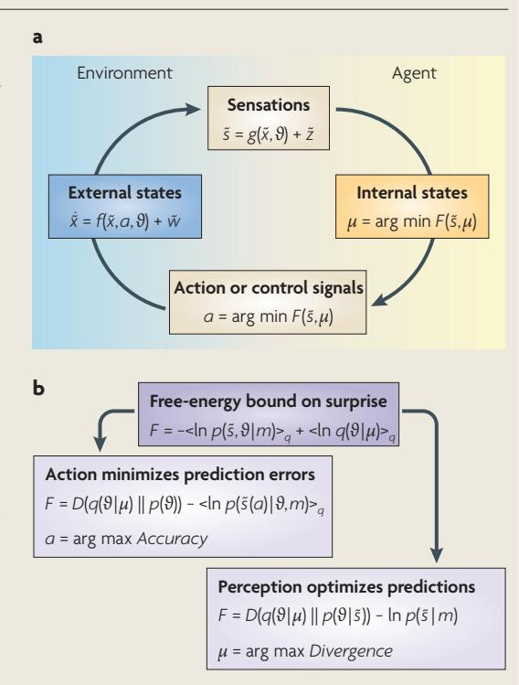
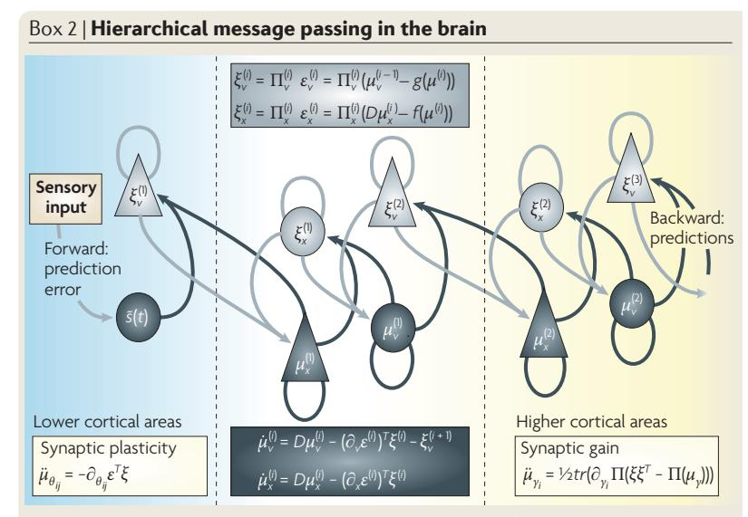
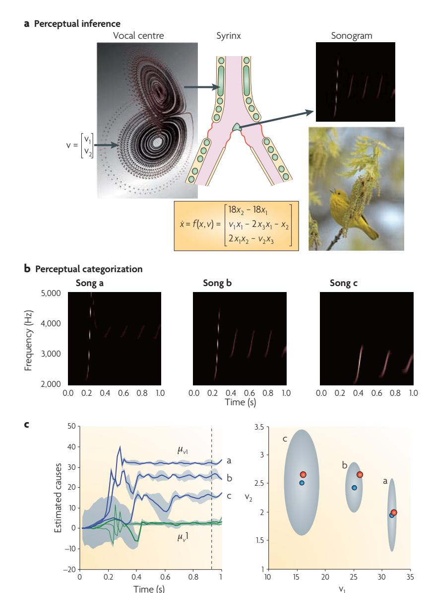
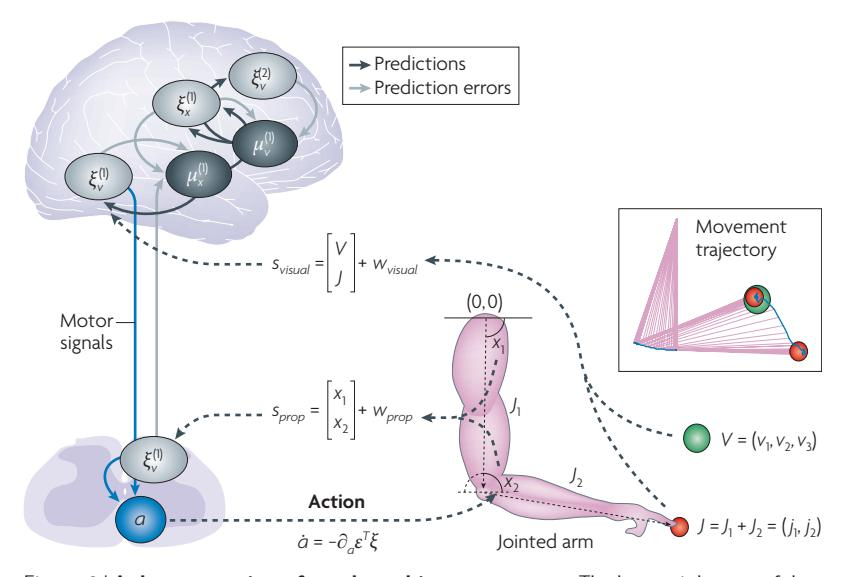
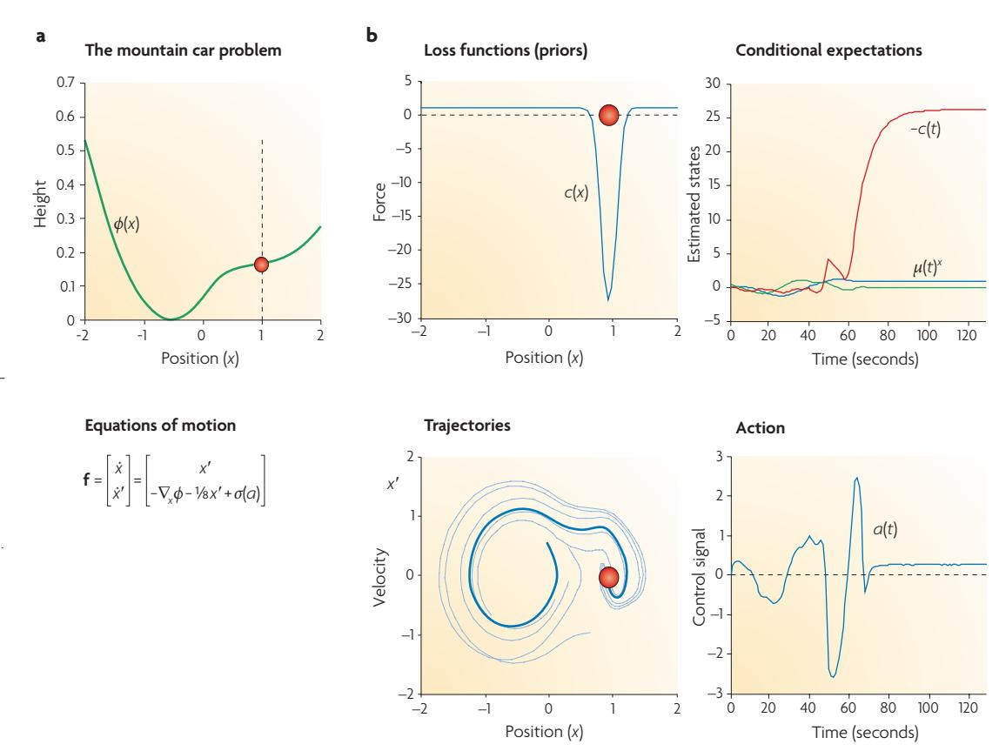
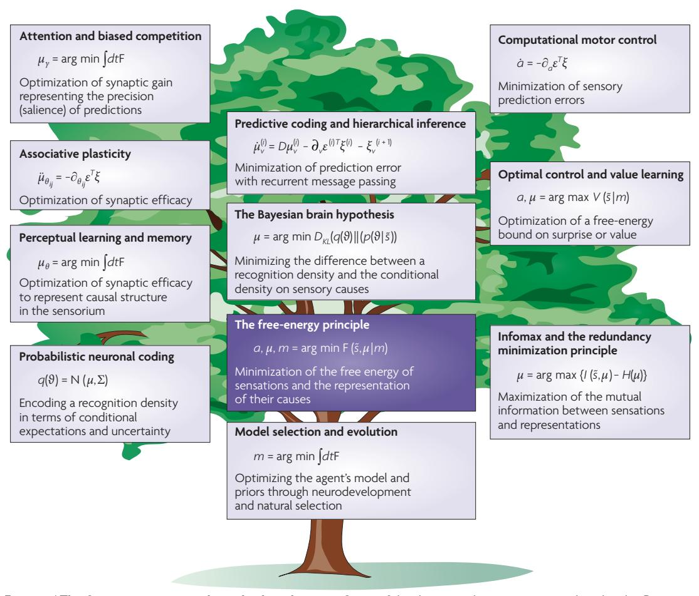

# The free-energy principle: a unified brain theory?

#### Karl Friston

Abstract | A free-energy principle has been proposed recently that accounts for action, perception and learning. This Review looks at some key brain theories in the biological (for example, neural Darwinism) and physical (for example, information theory and optimal control theory) sciences from the free-energy perspective. Crucially, one key theme runs through each of these theories — optimization. Furthermore, if we look closely at what is optimized, the same quantity keeps emerging, namely value (expected reward, expected utility) or its complement, surprise (prediction error, expected cost). This is the quantity that is optimized under the free-energy principle, which suggests that several global brain theories might be unified within a free-energy framework.

#### Free energy

An information theory measure that bounds or limits (by being greater than) the surprise on sampling some data, given a generative model.

#### Homeostasis

The process whereby an open or closed system regulates its internal environment to maintain its states within bounds.

#### Entropy

The average surprise of outcomes sampled from a probability distribution or density. A density with low entropy means that, on average, the outcome is relatively predictable. Entropy is therefore a measure of uncertainty.

The Wellcome Trust Centre for Neuroimaging, University College London, Oueen Square, London, WC1N 3BG, UK. e-mail: k.friston@fil.ion.ucl.ac.uk doi:10.1038/nrn2787 Published online 13 January 2010

Despite the wealth of empirical data in neuroscience, there are relatively few global theories about how the brain works. A recently proposed free-energy principle for adaptive systems tries to provide a unified account of action, perception and learning. Although this principle has been portrayed as a unified brain theory¹, its capacity to unify different perspectives on brain function has yet to be established. This Review attempts to place some key theories within the free-energy framework, in the hope of identifying common themes. I first review the free-energy principle and then deconstruct several global brain theories to show how they all speak to the same underlying idea.

#### The free-energy principle

The free-energy principle (BOX 1) says that any selforganizing system that is at equilibrium with its environment must minimize its free energy2. The principle is essentially a mathematical formulation of how adaptive systems (that is, biological agents, like animals or brains) resist a natural tendency to disorder3-6. What follows is a non-mathematical treatment of the motivation and implications of the principle. We will see that although the motivation is quite straightforward, the implications are complicated and diverse. This diversity allows the principle to account for many aspects of brain structure and function and lends it the potential to unify different perspectives on how the brain works. In subsequent sections, I discuss how the principle can be applied to neuronal systems as viewed from these perspectives. This Review starts in a rather abstract and technical way but then tries to unpack the basic idea in more familiar terms.

Motivation: resisting a tendency to disorder. The defining characteristic of biological systems is that they maintain their states and form in the face of a constantly changing environment3-6. From the point of view of the brain, the environment includes both the external and the internal milieu. This maintenance of order is seen at many levels and distinguishes biological from other self-organizing systems; indeed, the physiology of biological systems can be reduced almost entirely to their homeostasis7. More precisely, the repertoire of physiological and sensory states in which an organism can be is limited, and these states define the organism's phenotype. Mathematically, this means that the probability of these (interoceptive and exteroceptive) sensory states must have low entropy; in other words, there is a high probability that a system will be in any of a small number of states, and a low probability that it will be in the remaining states. Entropy is also the average self information or 'surprise'8 (more formally, it is the negative log-probability of an outcome). Here, 'a fish out of water' would be in a surprising state (both emotionally and mathematically). A fish that frequently forsook water would have high entropy. Note that both surprise and entropy depend on the agent: what is surprising for one agent (for example, being out of water) may not be surprising for another. Biological agents must therefore minimize the long-term average of surprise to ensure that their sensory entropy remains low. In other words, biological systems somehow manage to violate the fluctuation theorem, which generalizes the second law of thermodynamics9.

#### Box 1 | The free-energy principle

Part  $\mathbf a$  of the figure shows the dependencies among the quantities that define free energy. These include the internal states of the brain  $\mu(t)$  and quantities describing its exchange with the environment: sensory signals (and their motion)  $\tilde{s}(t) = [s,s',s'',\dots]^T$  plus action a(t). The environment is described by equations of motion, which specify the trajectory of its hidden states. The causes  $\vartheta \supset \{\tilde{x},\theta,\gamma\}$  of sensory input comprise hidden states  $\tilde{x}(t)$ , parameters  $\theta$  and precisions  $\gamma$  controlling the amplitude of the random fluctuations  $\tilde{z}(t)$  and  $\tilde{w}(t)$ . Internal brain states and action minimize free energy  $F(\tilde{s},\mu)$ , which is a function of sensory input and a probabilistic representation  $q(\vartheta|\mu)$  of its causes. This representation is called the recognition density and is encoded by internal states  $\mu$ .

The free energy depends on two probability densities: the recognition density  $q(\vartheta|\mu)$  and one that generates sensory samples and their causes,  $p(\tilde{s},\vartheta|m)$ . The latter represents a probabilistic generative model (denoted by m), the form of which is entailed by the agent or brain. Part  ${\bf b}$  of the figure provides alternative expressions for the free energy to show what its minimization entails: action can reduce free energy only by increasing accuracy (that is, selectively sampling data that are predicted). Conversely, optimizing brain states makes the representation an approximate conditional density on the causes of sensory input. This enables action to avoid surprising sensory encounters. A more formal description is provided below.

# Surprise

(Surprisal or self information.) The negative log-probability of an outcome. An improbable outcome (for example, water flowing uphill) is therefore surprising.

#### Fluctuation theorem

(A term from statistical mechanics.) Deals with the probability that the entropy of a system that is far from the thermodynamic equilibrium will increase or decrease over a given amount of time. It states that the probability of the entropy decreasing becomes exponentially smaller with time

#### Attractor

A set to which a dynamical system evolves after a long enough time. Points that get close to the attractor remain close, even under small perturbations.

# Kullback-Leibler divergence (Or information divergence, information gain or cross

entropy.) A non-commutative measure of the non-negative difference between two probability distributions.

#### Recognition density

(Or 'approximating conditional density'.) An approximate probability distribution of the causes of data (for example, sensory input). It is the product of inference or inverting a generative model.

#### Optimizing the sufficient statistics (representations)

Optimizing the recognition density makes it a posterior or conditional density on the causes of sensory data: this can be seen by expressing the free energy as surprise  $-\ln p(\tilde{s},|m)$  plus a Kullback-Leibler divergence between the recognition and conditional densities (encoded by the 'internal states' in the figure). Because this difference is always positive, minimizing free energy makes the recognition density an approximate posterior probability. This means the agent implicitly infers or represents the causes of its sensory samples in a Bayes-optimal fashion. At the same time, the free energy becomes a tight bound on surprise, which is minimized through action.

# Optimizing action

Acting on the environment by minimizing free energy enforces a sampling of sensory data that is consistent with the current representation. This can be seen with a second rearrangement of the free energy as a mixture of accuracy and complexity. Crucially, action can only affect accuracy (encoded by the 'external states' in the figure). This means that the brain will reconfigure its sensory epithelia to sample inputs that are predicted by the recognition density — in other words, to minimize prediction error.

In short, the long-term (distal) imperative — of maintaining states within physiological bounds — translates into a short-term (proximal) avoidance of surprise. Surprise here relates not just to the current state, which cannot be changed, but also to movement from one state to another, which can change. This motion can be complicated and itinerant (wandering) provided that it revisits a small set of states, called a global random attractor10, that are compatible with survival (for example, driving a car within a small margin of error). It is this motion that the free-energy principle optimizes.

So far, all we have said is that biological agents must avoid surprises to ensure that their states remain within physiological bounds (see <u>Supplementary information S1</u> (box) for a more formal argument). But how do they do this? A system cannot know whether its sensations are surprising and could not avoid them even if it did know. This is where free energy comes in: free energy is an upper bound on surprise, which means that if agents minimize free energy, they implicitly minimize surprise.

Crucially, free energy can be evaluated because it is a function of two things to which the agent has access: its sensory states and a recognition density that is encoded by its internal states (for example, neuronal activity and connection strengths). The recognition density is a probabilistic representation of what caused a particular sensation.

This (variational) free-energy construct was introduced into statistical physics to convert difficult probability-density integration problems into easier optimization problems11. It is an information theoretic quantity (like surprise), as opposed to a thermodynamic quantity. Variational free energy has been exploited in machine learning and statistics to solve many inference and learning problems12-14. In this setting, surprise is called the (negative) model evidence. This means that minimizing surprise is the same as maximizing the sensory evidence for an agent's existence, if we regard the agent as a model of its world. In the present context, free energy provides the answer to

tive systems avoid surprising states? They can do this by minimizing their free energy. So what does this involve?

Implications: action and perception. Agents can suppress free energy by changing the two things it depends on: they can change sensory input by acting on the world or they can change their recognition density by changing their internal states. This distinction maps nicely onto action and perception (BOX 1). One can see what this means in more detail by considering three mathematically equivalent formulations of free energy (see Supplementary information S2 (box) for a mathematical treatment).

a fundamental question: how do self-organizing adap-

The first formulation expresses free energy as energy minus entropy. This formulation is important for three reasons. First, it connects the concept of free energy as used in information theory with concepts used in statistical thermodynamics. Second, it shows that the free energy can be evaluated by an agent because the energy is the surprise about the joint occurrence of sensations and their perceived causes, whereas the entropy is simply that of the agent's own recognition density. Third, it shows that free energy rests on a generative model of the world, which is expressed in terms of the probability of a sensation and its causes occurring together. This means that an agent must have an implicit generative model of how causes conspire to produce sensory data. It is this model that defines both the nature of the agent and the quality of the free-energy bound on surprise.

The second formulation expresses free energy as surprise plus a divergence term. The (perceptual) divergence is just the difference between the recognition density and the conditional density (or posterior density) of the causes of a sensation, given the sensory signals. This conditional density represents the best possible guess about the true causes. The difference between the two densities is always non-negative and free energy is therefore an upper bound on surprise. Thus, minimizing free energy by changing the recognition density (without changing sensory data) reduces the perceptual divergence, so that the recognition density becomes the conditional density and the free energy becomes surprise.

The third formulation expresses free energy as complexity minus accuracy, using terms from the model comparison literature. Complexity is the difference between the recognition density and the prior density on causes; it is also known as Bayesian surprise15 and is the difference between the prior density — which encodes beliefs about the state of the world before sensory data are assimilated — and posterior beliefs, which are encoded by the recognition density. Accuracy is simply the surprise about sensations that are expected under the recognition density. This formulation shows that minimizing free energy by changing sensory data (without changing the recognition density) must increase the accuracy of an agent's predictions. In short, the agent will selectively sample the sensory inputs that it expects. This is known as active inference16. An intuitive example of this process (when it is raised into consciousness) would be feeling our way in darkness: we anticipate what we might touch next and then try to confirm those expectations.

In summary, the free energy rests on a model of how sensory data are generated and on a recognition density on the model's parameters (that is, sensory causes). Free energy can be reduced only by changing the recognition density to change conditional expectations about what is sampled or by changing sensory samples (that is, sensory input) so that they conform to expectations. In what follows, I consider these implications in light of some key theories about the brain.

#### The Bayesian brain hypothesis

The Bayesian brain hypothesis 17 uses Bayesian probability theory to formulate perception as a constructive process based on internal or generative models. The underlying idea is that the brain has a model of the world18-22 that it tries to optimize using sensory inputs23–28. This idea is related to analysis by synthesis20 and epistemological automata19. In this view, the brain is an inference machine that actively predicts and explains its sensations18,22,25. Central to this hypothesis is a probabilistic model that can generate predictions, against which sensory samples are tested to update beliefs about their causes. This generative model is decomposed into a likelihood (the probability of sensory data, given their causes) and a prior (the a priori probability of those causes). Perception then becomes the process of inverting the likelihood model (mapping from causes to sensations) to access the posterior probability of the causes, given sensory data (mapping from sensations to causes). This inversion is the same as minimizing the difference between the recognition and posterior densities to suppress free energy. Indeed, the free-energy formulation was developed to finesse the difficult problem of exact inference by converting it into an easier optimization problem11-14. This has furnished some powerful approximation techniques for model identification and comparison (for example, variational Bayes or ensemble learning29). There are many interesting issues that attend the Bayesian brain hypothesis, which can be illuminated by the free-energy principle; we will focus on two.

The first is the form of the generative model and how it manifests in the brain. One criticism of Bayesian treatments is that they ignore the question of how prior beliefs, which are necessary for inference, are formed27. However, this criticism dissolves with hierarchical generative models, in which the priors themselves are optimized26,28. In hierarchical models, causes in one level generate subordinate causes in a lower level; sensory data *per se* are generated at the lowest level (BOX 2). Minimizing the free energy effectively optimizes empirical priors (that is, the probability of causes at one level, given those in the level above). Crucially, because empirical priors are linked hierarchically, they are informed by sensory data, enabling the brain to optimize its prior expectations online. This optimization makes every level in the hierarchy accountable to the others, furnishing an internally consistent representation of sensory causes at multiple levels of description. Not only do hierarchical models have a key role in statistics (for example, random effects and parametric empirical Bayes models30,31), they may also be used by the brain, given the hierarchical arrangement of cortical sensory areas32-34.

#### Generative model

A probabilistic model (joint density) of the dependencies between causes and consequences (data), from which samples can be generated. It is usually specified in terms of the likelihood of data, given their causes (parameters of a model) and priors on the causes

#### Conditional density

(Or posterior density.) The probability distribution of causes or model parameters, given some data; that is, a probabilistic mapping from observed data to causes.

#### Prior

The probability distribution or density of the causes of data that encodes beliefs about those causes before observing the data.

#### Bayesian surprise

A measure of salience based on the Kullback-Leibler divergence between the recognition density (which encodes posterior beliefs) and the prior density. It measures the information that can be recognized in the data.

# Bayesian brain hypothesis

The idea that the brain uses internal probabilistic (generative) models to update posterior beliefs, using sensory information, in an (approximately) Bayes-optimal fashion.

#### Analysis by synthesis

Any strategy (in speech coding) in which the parameters of a signal coder are evaluated by decoding (synthesizing) the signal and comparing it with the original input signal.

# Epistemological automata

Possibly the first theory for why top-down influences (mediated by backward connections in the brain) might be important in perception and cognition.

#### **Empirical prior**

A prior induced by hierarchical models; empirical priors provide constraints on the recognition density in the usual way but depend on the data.

The figure details a neuronal architecture that optimizes the conditional expectations of causes in hierarchical models of sensory input. It shows the putative cells of origin of forward driving connections that convey prediction error (grey arrows) from a lower area (for example, the lateral geniculate nucleus) to a higher area (for example, V1), and nonlinear backward connections (black arrows) that construct predictions  $^{41}$ . These predictions try to explain away prediction error in lower levels. In this scheme, the sources of forward and backward connections are superficial and deep pyramidal cells (upper and lower triangles), respectively, where state units are black and error units are grey. The equations represent a gradient descent on free energy using the generative model below. The two upper equations describe the formation of prediction error encoded by error units, and the two lower equations represent recognition dynamics, using a gradient descent on free energy.

#### Generative models in the brain

To evaluate free energy one needs a generative model of how the sensorium is caused. Such models  $p(\S, \emptyset) = p(\S \mid \emptyset)$   $p(\emptyset)$  combine the likelihood  $p(\S \mid \emptyset)$  of getting some data given their causes and the prior beliefs about these causes,  $p(\emptyset)$ . The brain has to explain complicated dynamics on continuous states with hierarchical or deep causal structure and may use models with the following form

$$s = g(x^{(1)}, v^{(1)}, \theta^{(1)}) + z^{(1)} \qquad v^{(i-1)} = g(x^{(i)}, v^{(i)}, \theta^{(i)}) + z^{(i)}$$

$$\dot{x}^{(1)} = f(x^{(1)}, v^{(1)}, \theta^{(1)}) + w^{(1)} \qquad \dot{x}^{(i)} = f(x^{(i)}, v^{(i)}, \theta^{(i)}) + w^{(i)}$$

Here,  $g^{(i)}$  and  $f^{(i)}$  are continuous nonlinear functions of (hidden and causal) states, with parameters  $\theta^{(i)}$ . The random fluctuations  $z(t)^{(i)}$  and  $w(t)^{(i)}$  play the part of observation noise at the sensory level and state noise at higher levels. Causal states  $v(t)^{(i)}$  link hierarchical levels, where the output of one level provides input to the next. Hidden states  $x(t)^{(i)}$  link dynamics over time and endow the model with memory. Gaussian assumptions about the random fluctuations specify the likelihood and Gaussian assumptions about state noise furnish empirical priors in terms of predicted motion. These assumptions are encoded by their precision (or inverse variance),  $\Pi^{(i)}(\gamma)$ , which are functions of precision parameters  $\gamma$ .

# Recognition dynamics and prediction error

If we assume that neuronal activity encodes the conditional expectation of states, then recognition can be formulated as a gradient descent on free energy. Under Gaussian assumptions, these recognition dynamics can be expressed compactly in terms of precision-weighted prediction errors  $\xi^{(i)} = \Pi^{(i)}(\varepsilon)^{(i)}$  on the causal states and motion of hidden states. The ensuing equations (see the figure) suggest two neuronal populations that exchange messages: causal or hidden-state units encoding expected states and error units encoding prediction error. Under hierarchical models, error units receive messages from the state units in the same level and the level above, whereas state units are driven by error units in the same level and the level below. These provide bottom-up messages that drive conditional expectations  $\mu^{(i)}$  towards better predictions, which explain away prediction error. These top-down predictions correspond to  $g(\mu^{(i)})$  and  $f(\mu^{(i)})$ . This scheme suggests that the only connections that link levels are forward connections conveying prediction error to state units and reciprocal backward connections that mediate predictions. See REFS 42,130 for details. Figure is modified from REF. 42.

The second issue is the form of the recognition density that is encoded by physical attributes of the brain, such as synaptic activity, efficacy and gain. In general, any density is encoded by its sufficient statistics (for example, the mean and variance of a Gaussian form). The way the brain encodes these statistics places important constraints on the sorts of schemes that underlie recognition: they range from free-form schemes (for example, particle filtering26 and probabilistic population codes35-38), which use a vast number of sufficient statistics, to simpler forms, which make stronger assumptions about the shape of the recognition density, so that it can be encoded with a small number of sufficient statistics. The simplest assumed form is Gaussian, which requires only the conditional mean or expectation — this is known as the Laplace assumption39, under which the free energy is just the difference between the model's predictions and the sensations or representations that are predicted. Minimizing free energy then corresponds to explaining away prediction errors. This is known as predictive coding and has become a popular framework for understanding neuronal message passing among different levels of cortical hierarchies40. In this scheme, prediction error units compare conditional expectations with top-down predictions to elaborate a prediction error. This prediction error is passed forward to drive the units in the level above that encode conditional expectations which optimize top-down predictions to explain away (reduce) prediction error in the level below. Here, explaining away just means countering excitatory bottom-up inputs to a prediction error neuron with inhibitory synaptic inputs that are driven by top-down predictions (see BOX 2 and REFS 41,42 for detailed discussion). The reciprocal exchange of bottom-up prediction errors and top-down predictions proceeds until prediction error is minimized at all levels and conditional expectations are optimized. This scheme has been invoked to explain many features of early visual responses40,43 and provides a plausible account of repetition suppression and mismatch responses in electrophysiology44. FIGURE 1 provides an example of perceptual categorization that uses this scheme.

Message passing of this sort is consistent with functional asymmetries in real cortical hierarchies45, where forward connections (which convey prediction errors) are driving and backwards connections (which model the nonlinear generation of sensory input) have both driving and modulatory characteristics46. This asymmetrical message passing is also a characteristic feature of adaptive resonance theory47,48, which has formal similarities to predictive coding.

In summary, the theme underlying the Bayesian brain and predictive coding is that the brain is an inference engine that is trying to optimize probabilistic representations of what caused its sensory input. This optimization can be finessed using a (variational free-energy) bound on surprise. In short, the free-energy principle entails the Bayesian brain hypothesis and can be implemented by the many schemes considered in this field. Almost invariably, these involve some form of message passing or belief propagation among brain areas or units. This

Figure 1 | Birdsongs and perceptual categorization. a | The generative model of birdsong used in this simulation comprises a Lorenz attractor with two control parameters (or causal states) (v,,v,), which, in turn, delivers two control parameters (not shown) to a synthetic syrinx to produce 'chirps' that were modulated in amplitude and frequency (an example is shown as a sonogram). The chirps were then presented as a stimulus to a synthetic bird to see whether it could infer the underlying causal states and thereby categorize the song. This entails minimizing free energy by changing the internal representation  $(\mu_{\omega}, \mu_{\omega})$  of the control parameters. Examples of this perceptual inference or categorization are shown below. **b** | Three simulated songs are shown in sonogram format. Each comprises a series of chirps, the frequency and number of which fall progressively from song a to song c, as a causal state (known as the Raleigh number; v, in part a) is decreased. **c** | The graph on the left depicts the conditional expectations ( $\mu_{\alpha}, \mu_{\alpha}$ ) of the causal states, shown as a function of peristimulus time for the three songs. It shows that the causes are identified after around 600 ms with high conditional precision (90% confidence intervals are shown in grey). The graph on the right shows the conditional density on the causes shortly before the end of the peristimulus time (that is, the dotted line in the left panel). The blue dots correspond to conditional expectations and the grey areas correspond to the 90% conditional confidence regions. Note that these encompass the true values (red dots) of  $(v_1, v_2)$  that were used to generate the songs. These results illustrate the nature of perceptual categorization under the inference scheme in BOX 2: here, recognition corresponds to mapping from a continuously changing and chaotic sensory input to a fixed point in perceptual space. Figure is reproduced, with permission, from REF. 130 @ (2009) Elsevier.

allows us to connect the free-energy principle to another principled approach to sensory processing, namely information theory.

# The principle of efficient coding

The principle of efficient coding suggests that the brain optimizes the mutual information (that is, the mutual predictability) between the sensorium and its internal representation, under constraints on the efficiency of those representations. This line of thinking was articulated by Barlow49 in terms of a redundancy reduction principle (or principle of efficient coding) and formalized later in terms of the infomax principle50. It has been applied in machine learning51, leading to methods like independent component analysis52, and in neurobiology, contributing to an understanding of the nature of neuronal responses53–56. This principle is extremely effective in predicting the empirical characteristics of classical receptive fields53 and provides a principled explanation for sparse coding55 and the segregation of processing streams in visual hierarchies57. It has been extended to cover dynamics and motion trajectories58,59 and even used to infer the metabolic constraints on neuronal processing60.

At its simplest, the infomax principle says that neuronal activity should encode sensory information in an efficient and parsimonious fashion. It considers the mapping between one set of variables (sensory states) and another (variables representing those states). At first glance, this seems to preclude a probabilistic representation, because this would involve mapping between sensory states and a probability density. However, the infomax principle can be applied to the sufficient statistics of a recognition density. In this context, the infomax principle becomes a special case of the free-energy principle, which arises when we ignore uncertainty in probabilistic representations (and when there is no action); see Supplementary information S3 (box) for mathematical details). This is easy to see by noting that sensory signals are generated by causes. This means that it is sufficient to represent the causes to predict these signals. More formally, the infomax principle can be understood in terms of the decomposition of free energy into complexity and accuracy: mutual information is optimized when conditional expectations maximize accuracy (or minimize prediction error), and efficiency is assured by minimizing complexity. This ensures that no excessive parameters are applied in the generative model and leads to a parsimonious representation of sensory data that conforms to prior constraints on their causes. Interestingly, advanced model-optimization techniques use free-energy optimization to eliminate redundant model parameters61, suggesting that freeenergy optimization might provide a nice explanation for the synaptic pruning and homeostasis that take place in the brain during neurodevelopment62 and sleep63.

The infomax principle pertains to a forward mapping from sensory input to representations. How does this square with optimizing generative models, which map from causes to sensory inputs? These perspectives can be reconciled by noting that all recognition schemes based

on infomax can be cast as optimizing the parameters of a generative model64. For example, in sparse coding models55, the implicit priors posit independent causes that are sampled from a heavy-tailed or sparse distribution42. The fact that these models predict empirically observed receptive fields so well suggests that we are endowed with (or acquire) prior expectations that the causes of our sensations are largely independent and sparse.

In summary, the principle of efficient coding says that the brain should optimize the mutual information between its sensory signals and some parsimonious neuronal representations. This is the same as optimizing the parameters of a generative model to maximize the accuracy of predictions, under complexity constraints. Both are mandated by the free-energy principle, which can be regarded as a probabilistic generalization of the infomax principle. We now turn to more biologically inspired ideas about brain function that focus on neuronal dynamics and plasticity. This takes us deeper into neurobiological mechanisms and the implementation of the theoretical principles outlined above.

#### Sufficient statistics

Ouantities that are sufficient to parameterize a probability density (for example, mean and covariance of a Gaussian density).

#### Laplace assumption

(Or Laplace approximation or method.) A saddle-point approximation of the integral of an exponential function, that uses a second-order Taylor expansion. When the function is a probability density, the implicit assumption is that the density is approximately Gaussian.

# Predictive coding

A tool used in signal processing for representing a signal using a linear predictive (generative) model. It is a powerful speech analysis technique and was first considered in vision to explain lateral interactions in the retina.

#### Infomax

An optimization principle for neural networks (or functions) that map inputs to outputs. It says that the mapping should maximize the Shannon mutual information between the inputs and outputs, subject to constraints and/or noise processes.

#### Stochastic

Governed by random effects.

#### Biased competition

An attentional effect mediated by competitive interactions among neurons representing visual stimuli; these interactions can be biased in favour of behaviourally relevant stimuli by both spatial and non-spatial and both bottom-up and top-down processes.

#### The cell assembly and correlation theory

The cell assembly theory was proposed by Hebb65 and entails Hebbian — or associative — plasticity, which is a cornerstone of use-dependent or experience-dependent plasticity66, the correlation theory of von de Malsburg67,68 and other formal refinements to Hebbian plasticity per se69. The cell assembly theory posits that groups of interconnected neurons are formed through a strengthening of synaptic connections that depends on correlated pre- and postsynaptic activity; that is, 'cells that fire together wire together. This enables the brain to distil statistical regularities from the sensorium. The correlation theory considers the selective enabling of synaptic efficacy and its plasticity (also known as metaplasticity70) by fast synchronous activity induced by different perceptual attributes of the same object (for example, a red bus in motion). This resolves a putative deficiency of classical plasticity, which cannot ascribe a presynaptic input to a particular cause (for example, redness) in the world67. The correlation theory underpins theoretical treatments of synchronized brain activity and its role in associating or binding attributes to specific objects or causes68,71. Another important field that rests on associative plasticity is the use of attractor networks as models of memory formation and retrieval72-74. So how do correlations and associative plasticity figure in the free-energy formulation?

Hitherto, we have considered only inference on states of the world that cause sensory signals, whereby conditional expectations about states are encoded by synaptic activity. However, the causes covered by the recognition density are not restricted to time-varying states (for example, the motion of an object in the visual field): they also include time-invariant regularities that endow the world with causal structure (for example, objects fall with constant acceleration). These regularities are parameters of the generative model and have to be inferred by the brain — in other words, the conditional expectations of these parameters that may be encoded

by synaptic efficacy (these are  $\mu_\theta$  in BOX 2) have to be optimized. This corresponds to optimizing connection strengths in the brain — that is, plasticity that underlines learning. So what form would this learning take? It transpires that a gradient descent on free energy (that is, changing connections to reduce free energy) is formally identical to Hebbian plasticity^{28,42} (BOX 2). This is because the parameters of the generative model determine how expected states (synaptic activity) are mixed to form predictions. Put simply, when the presynaptic predictions and postsynaptic prediction errors are highly correlated, the connection strength increases, so that predictions can suppress prediction errors more efficiently.

In short, the formation of cell assemblies reflects the encoding of causal regularities. This is just a restatement of cell assembly theory in the context of a specific implementation (predictive coding) of the free-energy principle. It should be acknowledged that the learning rule in predictive coding is really a delta rule, which rests on Hebbian mechanisms; however, Hebb's wider notions of cell assemblies were formulated from a non-statistical perspective. Modern reformulations suggest that both inference on states (that is, perception) and inference on parameters (that is, learning) minimize free energy (that is, minimize prediction error) and serve to bound surprising exchanges with the world. So what about synchronization and the selective enabling of synapses?

#### **Biased competition and attention**

Causal regularities encoded by synaptic efficacy control the deterministic evolution of states in the world. However, stochastic (that is, random) fluctuations in these states play an important part in generating sensory data. Their amplitude is usually represented as precision (or inverse variance), which encodes the reliability of prediction errors. Precision is important, especially in hierarchical schemes, because it controls the relative influence of bottom-up prediction errors and top-down predictions. So how is precision encoded in the brain? In predictive coding, precision modulates the amplitude of prediction errors (these are  $\mu_{i}$  in BOX 2), so that prediction errors with high precision have a greater impact on units that encode conditional expectations. This means that precision corresponds to the synaptic gain of prediction error units. The most obvious candidates for controlling gain (and implicitly encoding precision) are classical neuromodulators like dopamine and acetylcholine, which provides a nice link to theories of attention and uncertainty75-77. Another candidate is fast synchronized presynaptic input that lowers effective postsynaptic membrane time constants and increases synchronous gain78. This fits comfortably with the correlation theory and speaks to recent ideas about the role of synchronous activity in mediating attentional gain79,80.

In summary, the optimization of expected precision in terms of synaptic gain links attention to synaptic gain and synchronization. This link is central to theories of attentional gain and biased competition80-85, particularly in the context of neuromodulation86,87. The theories considered so far have dealt only with perception.

However, from the point of view of the free-energy principle, perception just makes free energy a good proxy for surprise. To actually reduce surprise we need to act. In the next section, we retain a focus on cell assemblies but move to the selection and reinforcement of stimulus—response links.

#### Neural Darwinism and value learning

In the theory of neuronal group selection88, the emergence of neuronal assemblies is considered in the light of selective pressure. The theory has four elements: epigenetic mechanisms create a primary repertoire of neuronal connections, which are refined by experience-dependent plasticity to produce a secondary repertoire of neuronal groups. These are selected and maintained through reentrant signalling among neuronal groups. As in cell assembly theory, plasticity rests on correlated pre- and postsynaptic activity, but here it is modulated by value. Value is signalled by ascending neuromodulatory transmitter systems and controls which neuronal groups are selected and which are not. The beauty of neural Darwinism is that it nests distinct selective processes within each other. In other words, it eschews a single unit of selection and exploits the notion of meta-selection (the selection of selective mechanisms; for example, see REF. 89). In this context, (neuronal) value confers evolutionary value (that is, adaptive fitness) by selecting neuronal groups that meditate adaptive stimulus-stimulus associations and stimulus-response links. The capacity of value to do this is assured by natural selection, in the sense that neuronal value systems are themselves subject to selective pressure.

This theory, particularly value-dependent learning 90, has deep connections with reinforcement learning and related approaches in engineering (see below), such as dynamic programming and temporal difference models 91,92. This is because neuronal value systems reinforce connections to themselves, thereby enabling the brain to label a sensory state as valuable if, and only if, it leads to another valuable state. This ensures that agents move through a succession of states that have acquired value to access states (rewards) with genetically specified innate value. In short, the brain maximizes value, which may be reflected in the discharge of value systems (for example, dopaminergic systems 92–96). So how does this relate to the optimization of free energy?

The answer is simple: value is inversely proportional to surprise, in the sense that the probability of a phenotype being in a particular state increases with the value of that state. Furthermore, the evolutionary value of a phenotype is the negative surprise averaged over all the states it experiences, which is simply its negative entropy. Indeed, the whole point of minimizing free energy (and implicitly entropy) is to ensure that agents spend most of their time in a small number of valuable states. This means that free energy is the complement of value, and its long-term average is the complement of adaptive fitness (also known as free fitness in evolutionary biology97). But how do agents know what is valuable? In other words, how does one generation tell the next which states have value (that is, are unsurprising)?

Value or surprise is determined by the form of an agent's generative model and its implicit priors — these specify the value of sensory states and, crucially, are heritable through genetic and epigenetic mechanisms. This means that prior expectations (that is, the primary repertoire) can prescribe a small number of attractive states with innate value. In turn, this enables natural selection to optimize prior expectations and ensure they are consistent with the agent's phenotype. Put simply, valuable states are just the states that the agent expects to frequent. These expectations are constrained by the form of its generative model, which is specified genetically and fulfilled behaviourally, under active inference.

It is important to appreciate that prior expectations include not just what will be sampled from the world but also how the world is sampled. This means that natural selection may equip agents with the prior expectation that they will explore their environment until states with innate value are encountered. We will look at this more closely in the next section, where priors on motion through state space are cast in terms of policies in reinforcement learning.

Both neural Darwinism and the free-energy principle try to understand somatic changes in an individual in the context of evolution: neural Darwinism appeals to selective processes, whereas the free energy formulation considers the optimization of ensemble or population dynamics in terms of entropy and surprise. The key theme that emerges here is that (heritable) prior expectations can label things as innately valuable (unsurprising); but how can simply labelling states engender adaptive behaviour? In the next section, we return to reinforcement learning and related formulations of action that try to explain adaptive behaviour purely in terms of labels or cost functions.

#### Optimal control theory and game theory

Value is central to theories of brain function that are based on reinforcement learning and optimum control. The basic notion that underpins these treatments is that the brain optimizes value, which is expected reward or utility (or its complement — expected loss or cost). This is seen in behavioural psychology as reinforcement learning98, in computational neuroscience and machine learning as variants of dynamic programming such as temporal difference learning 99-101, and in economics as expected utility theory 102. The notion of an expected reward or cost is crucial here; this is the cost expected over future states, given a particular policy that prescribes action or choices. A policy specifies the states to which an agent will move from any given state ('motion through state space in continuous time'). This policy has to access sparse rewarding states using a cost function, which only labels states as costly or not. The problem of how the policy is optimized is formalized in optimal control theory as the Bellman equation and its variants99 (see Supplementary information S4 (box)), which express value as a function of the optimal policy and a cost function. If one can solve the Bellman equation, one can associate each sensory state with a value and optimize the policy by ensuring that the next state

# Reciprocal message passing among neuronal groups.

#### Reinforcement learning

An area of machine learning concerned with how an agent maximizes long-term reward. Reinforcement learning algorithms attempt to find a policy that maps states of the world to actions performed by the agent.

#### Optimal control theory

An optimization method (based on the calculus of variations) for deriving an optimal control law in a dynamical system. A control problem includes a cost function that is a function of state and control variables.

# Bellman equation

(Or dynamic programming equation.) Named after Richard Bellman, it is a necessary condition for optimality associated with dynamic programming in optimal control theory.

# **RFVIFWS**

# Optimal decision theory

(Or game theory.) An area of applied mathematics concerned with identifying the values, uncertainties and other constraints that determine an optimal decision.

#### Gradient ascent

(Or method of steepest ascent.) A first-order optimization scheme that finds a maximum of a function by changing its arguments in proportion to the gradient of the function at the current value. In short, a hill-climbing scheme. The opposite scheme is a gradient descent.

is the most valuable of the available states. In general, it is impossible to solve the Bellman equation exactly, but several approximations exist, ranging from simple Rescorla–Wagner models98 to more comprehensive formulations like Q-learning100. Cost also has a key role in Bayesian decision theory, in which optimal decisions minimize expected cost in the context of uncertainty about outcomes; this is central to optimal decision theory (game theory) and behavioural economics102–104.

So what does free energy bring to the table? If one assumes that the optimal policy performs a gradient ascent on value, then it is easy to show that value is inversely proportional to surprise (see Supplementary information S4 (box)). This means that free energy is (an upper bound on) expected cost, which makes sense as optimal control theory assumes that action minimizes expected cost, whereas the free-energy principle states that it minimizes free energy. This is important

Figure 2 | A demonstration of cued reaching movements. The lower right part of the figure shows a motor plant, comprising a two-jointed arm with two hidden states, each of which corresponds to a particular angular position of the two joints; the current position of the finger (red circle) is the sum of the vectors describing the location of each joint. Here, causal states in the world are the position and brightness of the target (green circle). The arm obeys Newtonian mechanics, specified in terms of angular inertia and friction. The left part of the figure illustrates that the brain senses hidden states directly in terms of proprioceptive input  $(S_{pop})$  that signals the angular positions  $(x_1, x_2)$  of the joints and indirectly through seeing the location of the finger in space  $(J_1, J_2)$ . In addition, through visual input  $(S_{visual})$  the agent senses the target location  $(v_1, v_2)$  and brightness  $(v_3)$ . Sensory prediction errors are passed to higher brain levels to optimize the conditional expectations of hidden states (that is, the angular position of the joints) and causal (that is, target) states. The ensuing predictions are sent back to suppress sensory prediction errors. At the same time, sensory prediction errors are also trying to suppress themselves by changing sensory input through action. The grey and black lines denote reciprocal message passing among neuronal populations that encode prediction error and conditional expectations; this architecture is the same as that depicted in BOX 2. The blue lines represent descending motor control signals from sensory prediction-error units. The agent's generative model included priors on the motion of hidden states that effectively engage an invisible elastic band between the finger and target (when the target is illuminated). This induces a prior expectation that the finger will be drawn to the target, when cued appropriately. The insert shows the ensuing movement trajectory caused by action. The red circles indicate the initial and final positions of the finger, which reaches the target (green circle) quickly and smoothly; the blue line is the simulated trajectory.

because it explains why agents must minimize expected cost. Furthermore, free energy provides a quantitative and seamless connection between the cost functions of reinforcement learning and value in evolutionary biology. Finally, the dynamical perspective provides a mechanistic insight into how policies are specified in the brain: according to the principle of optimality 99 cost is the rate of change of value (see Supplementary information S4 (box)), which depends on changes in sensory states. This suggests that optimal policies can be prescribed by prior expectations about the motion of sensory states. Put simply, priors induce a fixed-point attractor, and when the states arrive at the fixed point, value will stop changing and cost will be minimized. A simple example is shown in FIG. 2, in which a cued arm movement is simulated using only prior expectations that the arm will be drawn to a fixed point (the target). This figure illustrates how computational motor control105–109 can be formulated in terms of priors and the suppression of sensory prediction errors (K.J.F., J. Daunizeau, J. Kilner and S.J. Kiebel, unpublished observations). More generally, it shows how rewards and goals can be considered as prior expectations that an action is obliged to fulfil16 (see also REF. 110). It also suggests how natural selection could optimize behaviour through the genetic specification of inheritable or innate priors that constrain the learning of empirical priors (BOX 2) and subsequent goaldirected action.

It should be noted that just expecting to be attracted to some states may not be sufficient to attain those states. This is because one may have to approach attractors vicariously through other states (for example, to avoid obstacles) or conform to physical constraints on action. These are some of the more difficult problems of accessing distal rewards that reinforcement learning and optimum control contend with. In these circumstances, an examination of the density dynamics, on which the free-energy principle is based, suggests that it is sufficient to keep moving until an a priori attractor is encountered (see Supplementary information S5 (box)). This entails destroying unexpected (costly) fixed points in the environment by making them unstable (like shifting to a new position when sitting uncomfortably). Mathematically, this means adopting a policy that ensures a positive divergence in costly states (intuitively, this is like being pushed through a liquid with negative viscosity or friction). See FIG. 3 for a solution to the classical mountain car problem using a simple prior that induces this sort of policy. This prior is on motion through state space (that is, changes in states) and enforces exploration until an attractive state is found. Priors of this sort may provide a principled way to understand the exploration exploitation trade-off111-113 and related issues in evolutionary biology114. The implicit use of priors to induce dynamical instability also provides a key connection to dynamical systems theory approaches to the brain that emphasize the importance of itinerant dynamics, metastability, self-organized criticality and winnerless competition115-123. These dynamical phenomena have a key role in synergetic and autopoietic accounts of adaptive behaviour5,124,125.

Figure 3 | Solving the mountain car problem with prior expectations. a | How paradoxical but adaptive behaviour (for example, moving away from a target to ensure that it is secured later) emerges from simple priors on the motion of hidden states in the world. Shown is the landscape or potential energy function (with a minimum at position x = -0.5) that exerts forces on a mountain car. The car is shown at the target position on the hill at x = 1, indicated by the red circle. The equations of motion of the car are shown below the plot. Crucially, at x = 0 the force on the car cannot be overcome by the agent, because a squashing function  $-1 \le \sigma \le 1$  is applied to action to prevent it being greater than 1. This means that the agent can access the target only by starting halfway up the left hill to gain enough momentum to carry it up the other side. b | The results of active inference under priors that destabilize fixed points outside the target domain. The priors are encoded in a cost function c(x) (top left), which acts like negative friction. When 'friction' is negative the car expects to go faster (see Supplementary information S5 (box) for details). The inferred hidden states (upper right: position in blue, velocity in green and negative dissipation in red) show that the car explores its landscape until it encounters the target, and that friction then increases (that is, cost decreases) dramatically to prevent the car from escaping the target (by falling down the hill). The ensuing trajectory is shown in blue (bottom left). The paler lines provide exemplar trajectories from other trials, with different starting positions. In the real world, friction is constant. However, the car 'expects' friction to change as it changes position, thus enforcing exploration or exploitation. These expectations are fulfilled by action (lower right).

# Principle of optimality

An optimal policy has the property that whatever the initial state and initial decision, the remaining decisions must constitute an optimal policy with regard to the state resulting from the first decision

# Exploration-exploitation trade-off

Involves a balance between exploration (of uncharted territory) and exploitation (of current knowledge). In reinforcement learning, it has been studied mainly through the multi-armed bandit problem.

#### Dynamical systems theory

An area of applied mathematics that describes the behaviour of complex (possibly chaotic) dynamical systems as described by differential or difference equations.

#### Synergetics

Concerns the self-organization of patterns and structures in open systems far from thermodynamic equilibrium. It rests on the order parameter concept, which was generalized by Haken to the enslaving principle: that is, the dynamics of fast-relaxing (stable) modes are completely determined by the 'slow' dynamics of order parameters (the amplitudes of unstable modes).

#### Autopoietic

Referring to the fundamental dialectic between structure and function.

#### Helmholtzian

Refers to a device or scheme that uses a generative model to furnish a recognition density and learns hidden structures in data by optimizing the parameters of generative models.

In summary, optimal control and decision (game) theory start with the notion of cost or utility and try to construct value functions of states, which subsequently guide action. The free-energy formulation starts with a free-energy bound on the value of states, which is specified by priors on the motion of hidden environmental states. These priors can incorporate any cost function to ensure that costly states are avoided. States with minimum cost can be set (by learning or evolution) in terms of prior expectations about motion and the attractors that ensue. In this view, the problem of finding sparse rewards in the environment is nature's solution to the problem of how to minimize the entropy (average surprise or free energy) of an agent's states: by ensuring they occupy a small set of attracting (that is, rewarding) states.

# **Conclusions and future directions**

Although contrived to highlight commonalities, this Review suggests that many global theories of brain function can be united under a Helmholtzian perceptive of the brain as a generative model of the world it inhabits18,20,21,25 (FIG. 4); notable examples include the integration of the Bayesian brain and computational motor control theory, the objective functions shared by predictive coding and the infomax principle, hierarchical inference and theories of attention, the embedding of perception in natural selection and the link between optimum control and more exotic phenomena in dynamical systems theory. The constant theme in all these theories is that the brain optimizes a (free-energy) bound on surprise or its complement, value. This manifests as perception (so as to change

Figure 4 | The free-energy principle and other theories. Some of the theoretical constructs considered in this Review and how they relate to the free-energy principle (centre). The variables are described in BOXES 1,2 and a full explanation of the equations can be found in the Supplementary information S1–S4 (boxes).

predictions) or action (so as to change the sensations that are predicted). Crucially, these predictions depend on prior expectations (that furnish policies), which are optimized at different (somatic and evolutionary) timescales and define what is valuable.

What does the free-energy principle portend for the future? If its main contribution is to integrate established theories, then the answer is probably 'not a lot'. Conversely, it may provide a framework in which current debates could be resolved, for example whether dopamine encodes reward prediction error or surprise126,127 — this is particularly important for understanding conditions like addiction, Parkinson's disease and schizophrenia. Indeed, the free-energy formulation has already been used to explain the positive symptoms of schizophrenia in terms of false inference128. The free-energy formulation could also provide new approaches

to old problems that might call for a reappraisal of conventional notions, particularly in reinforcement learning and motor control.

If the arguments underlying the free-energy principle hold, then the real challenge is to understand how it manifests in the brain. This speaks to a greater appreciation of hierarchical message passing41, the functional role of specific neurons and microcircuits and the dynamics they support (for example, what is the relationship between predictive coding, attention and dynamic coordination in the brain?129). Beyond neuroscience, many exciting applications in engineering, robotics, embodied cognition and evolutionary biology suggest themselves; although fanciful, it is not difficult to imagine building little free-energy machines that garner and model sensory information (like our children) to maximize the evidence for their own existence.

- Huang, G. Is this a unified theory of the brain? New Scientist 2658, 30–33 (2008).
- Friston K., Kilner, J. & Harrison, L. A free energy principle for the brain. J. Physiol. Paris 100, 70–87 (2006).

An overview of the free-energy principle that describes its motivation and relationship to generative models and predictive coding. This

- paper focuses on perception and the neurobiological infrastructures involved.
- Ashby, W. R. Principles of the self-organising dynamic system. J. Gen. Psychol. 37, 125–128 (1947).
- Nicolis, G. & Prigogine, I. Self-Organisation in Non-Equilibrium Systems (Wiley, New York, 1977).
- 5. Haken, H. Synergistics: an Introduction. Non-Equilibrium Phase Transition and Self-Organisation in
- Physics, Chemistry and Biology 3rd edn (Springer, New York, 1983).
- Kauffman, S. The Origins of Order: Self-Organization and Selection in Evolution (Oxford Univ. Press, Oxford, 1993).
- Bernard, C. Lectures on the Phenomena Common to Animals and Plants (Thomas, Springfield, 1974)

- Applebaum, D. Probability and Information: an Integrated Approach (Cambridge Univ. Press, Cambridge, UK, 2008).
- Evans, D. J. A non-equilibrium free energy theorem for deterministic systems. *Mol. Physics* 101, 15551–11554 (2003).
- Crauel, H. & Flandoli, F. Attractors for random dynamical systems. *Probab. Theory Relat. Fields* 100, 365–393 (1994).
- 11. Feynman, R. P. Statistical Mechanics: a Set of Lectures (Benjamin, Reading, Massachusetts, 1972).
- Hinton, G. E. & von Cramp, D. Keeping neural networks simple by minimising the description length of weights. Proc. 6th Annu. ACM Conf. Computational Learning Theory 5–13 (1993).
- Learning Theory 5–13 (1993).
  MacKay. D. J. C. Free-energy minimisation algorithm for decoding and cryptoanalysis. *Electron. Lett.* 31, 445–447 (1995).
- Neal, R. M. & Hinton, G. E. in *Learning in Graphical Models* (ed. Jordan, M. I.) 355–368 (Kluwer Academic. Dordrecht. 1998).
- Itti, L. & Baldi, P. Bayesian surprise attracts human attention. Vision Res. 49, 1295–1306 (2009).
- Friston, K., Daunizeau, J. & Kiebel, S. Active inference or reinforcement learning? *PLoS ONE* 4, e6421 (2009).
- 17. Knill, D. C. & Pouget, A. The Bayesian brain: the role of uncertainty in neural coding and computation. Trends Neurosci. 27, 712–719 (2004). A nice review of Bayesian theories of perception and sensorimotor control. Its focus is on Bayes optimality in the brain and the implicit nature of neuronal representations.
- von Helmholtz, H. in *Treatise on Physiological Optics* Vol. III 3rd edn (Voss, Hamburg, 1909).
- MacKay, D. M. in *Automata Studies* (eds Shannon, C. E. & McCarthy, J.) 235–251 (Princeton Univ. Press, Princeton, 1956).
- Neisser, U. Cognitive Psychology (Appleton-Century-Crofts, New York, 1967).
- Gregory, R. L. Perceptual illusions and brain models. Proc. R. Soc. Lond. B Biol. Sci. 171, 179–196 (1968)
- Proc. R. Soc. Lond. B Biol. Sci. 171, 179–196 (1968).
   Gregory, R. L. Perceptions as hypotheses. Philos. Trans. R. Soc. Lond. B Biol. Sci. 290, 181–197 (1980).
- 23. Ballard, D. H., Hinton, G. E. & Sejnowski, T. J. Parallel visual computation. *Nature* **306**, 21–26 (1983).
- Kawato, M., Hayakawa, H. & Inui, T. A forward-inverse optics model of reciprocal connections between visual areas. Network: Computation in Neural Systems 4, 415–422 (1993).
- 25. Dayan, P., Hinton, G. E. & Neal, R. M. The Helmholtz machine. Neural Comput. 7, 889–904 (1995). This paper introduces the central role of generative models and variational approaches to hierarchical self-supervised learning and relates this to the function of bottom-up and top-down cortical processing pathways.
- Lee, T. S. & Mumford, D. Hierarchical Bayesian inference in the visual cortex. J. Opt. Soc. Am. A Opt. Image Sci. Vis. 20, 1434–1448 (2003).
- Kersten, D., Mamassian, P. & Yuille, A. Object perception as Bayesian inference. *Annu. Rev. Psychol.* 55, 271–304 (2004).
- Friston, K. J. A theory of cortical responses. *Philos. Trans. R. Soc. Lond. B Biol. Sci.* 360, 815–836 (2005).
- Beal, M. J. Variational Algorithms for Approximate Bayesian Inference. Thesis, University College London (2003).
- Efron, B. & Morris, C. Stein's estimation rule and its competitors – an empirical Bayes approach. *J. Am. Stats. Assoc.* 68, 117–130 (1973).
- Kass, R. E. & Steffey, D. Approximate Bayesian inference in conditionally independent hierarchical models (parametric empirical Bayes models). J. Am. Stat. Assoc. 407, 717–726 (1989).
- Zeki, S. & Shipp, S. The functional logic of cortical connections. *Nature* 335, 311–317 (1988).
   Describes the functional architecture of cortical hierarchies with a focus on patterns of anatomical connections in the visual cortex. It emphasizes the role of functional segregation and integration (that is, message passing among cortical areas).
- Felleman, D. J. & Van Essen, D. C. Distributed hierarchical processing in the primate cerebral cortex. *Cereb. Cortex* 1, 1–47 (1991).
- 34. Mesulam, M. M. From sensation to cognition. *Brain* **121**, 1013–1052 (1998).
- Sanger, T. Probability density estimation for the interpretation of neural population codes.
   J. Neurophysiol. 76, 2790–2793 (1996).

- Zemel, R., Dayan, P. & Pouget, A. Probabilistic interpretation of population code. *Neural Comput.* 10, 403–430 (1998).
- Paulin, M. G. Evolution of the cerebellum as a neuronal machine for Bayesian state estimation. *J. Neural Eng.* 2, S219–S234 (2005).
- Ma, W. J., Beck, J. M., Latham, P. E. & Pouget, A. Bayesian inference with probabilistic population codes. *Nature Neurosci.* 9, 1432–1438 (2006).
- Friston, K., Mattout, J., Trujillo-Barreto, N., Ashburner, J. & Penny, W. Variational free energy and the Laplace approximation. *Neuroimage* 34, 220–234 (2007).
- Rao, R. P. & Ballard, D. H. Predictive coding in the visual cortex: a functional interpretation of some extra-classical receptive field effects. *Nature Neurosci.* 2, 79–87 (1998).
  - Applies predictive coding to cortical processing to provide a compelling account of extra-classical receptive fields in the visual system. It emphasizes the importance of top-down projections in providing predictions, by modelling perceptual inference.
- Mumford, D. On the computational architecture of the neocortex. II. The role of cortico-cortical loops. *Biol. Cybern.* 66, 241–251 (1992).
- Friston, K. Hierarchical models in the brain. PLoS Comput. Biol. 4, e1000211 (2008).
- Murray, S. O., Kersten, D., Olshausen, B. A., Schrater, P.
- Garrido, M. I., Kilner, J. M., Kiebel, S. J. & Friston, K. J. Dynamic causal modeling of the response to frequency deviants. *J. Neurophysiol.* 101, 2620–2631 (2009).
- Sherman, S. M. & Guillery, R. W. On the actions that one nerve cell can have on another: distinguishing "drivers" from "modulators". *Proc. Natl Acad. Sci. USA* 95, 7121–7126 (1998).
- Angelucci, A. & Bressloff, P. C. Contribution of feedforward, lateral and feedback connections to the classical receptive field center and extra-classical receptive field surround of primate V1 neurons. *Prog. Brain Res.* 154, 93–120 (2006).
- Grossberg, S. Towards a unified theory of neocortex: laminar cortical circuits for vision and cognition. *Prog. Brain Res.* 165, 79–104 (2007).
   Grossberg, S. & Versace, M. Spikes, synchrony, and
- Grossberg, S. & Versace, M. Spikes, synchrony, and attentive learning by laminar thalamocortical circuits. *Brain Res.* 1218, 278–312 (2008).
- Barlow, H. in Sensory Communication (ed. Rosenblith, W.) 217–234 (MIT Press, Cambridge, Massachusetts, 1961).
- Linsker, R. Perceptual neural organisation: some approaches based on network models and information theory. *Annu. Rev. Neurosci.* 13, 257–281 (1990).
- Oja, E. Neural networks, principal components, and subspaces. *Int. J. Neural Syst.* 1, 61–68 (1989).
- Bell, A. J. & Sejnowski, T. J. An information maximisation approach to blind separation and blind de-convolution. *Neural Comput.* 7, 1129–1159 (1995).
- Atick, J. J. & Redlich, A. N. What does the retina know about natural scenes? *Neural Comput.* 4, 196–210 (1992).
- Optican, L. & Richmond, B. J. Temporal encoding of two-dimensional patterns by single units in primate inferior cortex. III Information theoretic analysis. J. Neurophysiol. 57, 132–146 (1987).
- Olshausen, B. A. & Field, D. J. Emergence of simplecell receptive field properties by learning a sparse code for natural images. *Nature* 381, 607–609 (1996)
- 56. Simoncelli, E. P. & Olshausen, B. A. Natural image statistics and neural representation. *Annu. Rev. Neurosci.* 24, 1193–1216 (2001).
  A nice review of information theory in visual processing. It covers natural scene statistics and empirical tests of the efficient coding hypothesis in individual neurons and populations of neurons.
- Friston, K. J. The labile brain. III. Transients and spatio-temporal receptive fields. *Philos. Trans. R. Soc. Lond. B Biol. Sci.* **355**, 253–265 (2000).
  Bialek, W., Nemenman, I. & Tishby, N. Predictability,
- Bialek, W., Nemenman, I. & Tishby, N. Predictability complexity, and learning. *Neural Comput.* 13, 2409–2463 (2001).
- Lewen, G. D., Bialek, W. & de Ruyter van Steveninck, R. R. Neural coding of naturalistic motion stimuli. Network 12, 317–329 (2001).

- Laughlin, S. B. Efficiency and complexity in neural coding. Novartis Found. Symp. 239, 177–187 (2001).
- Tipping, M. E. Sparse Bayesian learning and the Relevance Vector Machine. *J. Machine Learn. Res.* 1, 211–244 (2001).
- Paus, T., Keshavan, M. & Giedd, J. N. Why do many psychiatric disorders emerge during adolescence? Nature Rev. Neurosci. 9, 947–957 (2008).
- Gilestro, G. F., Tononi, G. & Cirelli, C. Widespread changes in synaptic markers as a function of sleep and wakefulness in *Drosophila*. Science 324, 109–112 (2009).
- Roweis, S. & Ghahramani, Z. A unifying review of linear Gaussian models. *Neural Comput.* 11, 305–345 (1999).
- Hebb, D. O. The Organization of Behaviour (Wiley, New York, 1949).
- Paulsen, O. & Sejnowski, T. J. Natural patterns of activity and long-term synaptic plasticity. *Curr. Opin. Neurobiol.* 10, 172–179 (2000).
- von der Malsburg, C. The Correlation Theory of Brain Function. Internal Report 81–82, Dept. Neurobiology, Max-Planck-Institute for Biophysical Chemistry (1981).
- Singer, W. & Gray, C. M. Visual feature integration and the temporal correlation hypothesis. *Annu. Rev. Neurosci.* 18, 555–586 (1995).
- Bienenstock, E. L., Cooper, L. N. & Munro, P. W. Theory for the development of neuron selectivity: orientation specificity and binocular interaction in visual cortex. J. Neurosci. 2, 32–48 (1982).
- Abraham, W. C. & Bear, M. F. Metaplasticity: the plasticity of synaptic plasticity. *Trends Neurosci.* 19, 126–130 (1996).
- Pareti, G. & De Palma, A. Does the brain oscillate? The dispute on neuronal synchronization. *Neurol. Sci.* 25, 41–47 (2004).
- Leutgeb, S., Leutgeb, J. K., Moser, M. B. & Moser, E. I. Place cells, spatial maps and the population code for memory. *Curr. Opin. Neurobiol.* 15, 738–746 (2005).
- Durstewitz, D. & Seamans, J. K. Beyond bistability: biophysics and temporal dynamics of working memory. Neuroscience 139, 119–133 (2006).
- Anishchenko, A. & Treves, A. Autoassociative memory retrieval and spontaneous activity bumps in smallworld networks of integrate-and-fire neurons. *J. Physiol. Paris* 100, 225–236 (2006).
- Abbott, L. F., Varela, J. A., Sen, K. & Nelson, S. B. Synaptic depression and cortical gain control. *Science* 275, 220–224 (1997).
- Yu, A. J. & Dayan, P. Uncertainty, neuromodulation and attention. *Neuron* 46, 681–692 (2005).
- 77. Doya, K. Metalearning and neuromodulation. *Neural Netw.* 15, 495–506 (2002).
  78. Chawla, D., Lumer, E. D. & Friston, K. J. The
- relationship between synchronization among neuronal populations and their mean activity levels. *Neural Comput.* **11**, 1389–1411 (1999).

  79. Fries, P., Womelsdorf, T., Oostenveld, R. & Desimone, R.
- Fries, P., Womeisdorf, I., Oostenveld, R. & Desimone, R. The effects of visual stimulation and selective visual attention on rhythmic neuronal synchronization in macaque area V4. *J. Neurosci.* 28, 4823–4835 (2008).
- Womelsdorf, T. & Fries, P. Neuronal coherence during selective attentional processing and sensory-motor integration. J. Physiol. Paris 100, 182–193 (2006).
- Desimone, R. Neural mechanisms for visual memory and their role in attention. *Proc. Natl Acad. Sci. USA* 93, 13494–13499 (1996).
  - A nice review of mnemonic effects (such as repetition suppression) on neuronal responses and how they bias the competitive interactions between stimulus representations in the cortex. It provides a good perspective on attentional mechanisms in the visual system that is empirically grounded.
- Treisman, A. Feature binding, attention and object perception. *Philos. Trans. R. Soc. Lond. B Biol. Sci.* 353, 1295–1306 (1998).
- Maunsell, J. H. & Treue, S. Feature-based attention in visual cortex. *Trends Neurosci.* 29, 317–322 (2006).
- 84. Spratling, M. W. Predictive-coding as a model of biased competition in visual attention. *Vision Res.* 48, 1391–1408 (2008).
- Reynolds, J. H. & Heeger, D. J. The normalization model of attention. *Neuron* 61, 168–185 (2009).
- Schroeder, C. E., Mehta, A. D. & Foxe, J. J. Determinants and mechanisms of attentional modulation of neural processing. *Front. Biosci.* 6, D672–D684 (2001).

# **RFVIFWS**

- Hirayama, J., Yoshimoto, J. & Ishii, S. Bayesian representation learning in the cortex regulated by acetylcholine. *Neural Netw.* 17, 1391–1400 (2004).
- Edelman, G. M. Neural Darwinism: selection and reentrant signaling in higher brain function. *Neuron* 10, 115–125 (1993).
- Knobloch, F. Altruism and the hypothesis of metaselection in human evolution. *J. Am. Acad. Psychoanal.* 29, 339–354 (2001).
- Friston, K. J., Tononi, G., Reeke, G. N. Jr, Sporns, O. & Edelman, G. M. Value-dependent selection in the brain: simulation in a synthetic neural model. *Neuroscience* 59, 229–243 (1994).
- Sutton, R. S. & Barto, A. G. Toward a modern theory of adaptive networks: expectation and prediction. *Psychol. Rev.* 88, 135–170 (1981).
- Montague, P. R., Dayan, P., Person, C. & Sejnowski, T. J. Bee foraging in uncertain environments using predictive Hebbian learning. *Nature* 377, 725–728 (1995).
  - A computational treatment of behaviour that combines ideas from optimal control theory and dynamic programming with the neurobiology of reward. This provided an early example of value learning in the brain.
- 93. Schultz, W. Predictive reward signal of dopamine neurons. *J. Neurophysiol.* **80**, 1–27 (1998).
- Daw, N. D. & Doya, K. The computational neurobiology of learning and reward. *Curr. Opin. Neurobiol.* 16, 199–204 (2006).
- Redgrave, P. & Gurney, K. The short-latency dopamine signal: a role in discovering novel actions? *Nature Rev. Neurosci.* 7, 967–975 (2006).
- Berridge, K. C. The debate over dopamine's role in reward: the case for incentive salience. *Psychopharmacology (Berl.)* 191, 391–431 (2007).
- Sella, G. & Hirsh, A. E. The application of statistical physics to evolutionary biology. *Proc. Natl Acad. Sci. USA* 102, 9541–9546 (2005).
- Rescorla, R. A. & Wagner, A. R. in Classical Conditioning II: Current Research and Theory (eds Black, A. H. & Prokasy, W. F.) 64–99 (Appleton Century Crofts, New York, 1972).
- Bellman, R. On the Theory of Dynamic Programming. Proc. Natl Acad. Sci. USA 38, 716–719 (1952).
- 100. Watkins, C. J. C. H. & Dayan, P. Q-learning. *Mach. Learn.* 8, 279–292 (1992).
- 101. Todorov, E. in *Advances in Neural Information Processing Systems* (eds Scholkopf, B., Platt, J. & Hofmann T.) **19**, 1369–1376 (MIT Press, 2006).
- Camerer, C. F. Behavioural studies of strategic thinking in games. *Trends Cogn. Sci.* 7, 225–231 (2003).
- 103. Smith, J. M. & Price, G. R. The logic of animal conflict. *Nature* **246**, 15−18 (1973).
- 104. Nash, J. Equilibrium points in n-person games. *Proc. Natl Acad. Sci. USA* **36**, 48–49 (1950).
- 105. Wolpert, D. M. & Miall, R. C. Forward models for physiological motor control. *Neural Netw.* 9, 1265–1279 (1996).

- 106. Todorov, E. & Jordan, M. I. Smoothness maximization along a predefined path accurately predicts the speed profiles of complex arm movements. *J. Neurophysiol.* 80, 696–714 (1998).
- 107. Tseng, Y. W., Diedrichsen, J., Krakauer, J. W., Shadmehr, R. & Bastian, A. J. Sensory predictionerrors drive cerebellum-dependent adaptation of reaching. J. Neurophysiol. 98, 54–62 (2007).
- Bays, P. M. & Wolpert, D. M. Computational principles of sensorimotor control that minimize uncertainty and variability. J. Physiol. 578, 387–396 (2007)
  - A nice overview of computational principles in motor control. Its focus is on representing uncertainty and optimal estimation when extracting the sensory information required for motor planning
- 109. Shadmehr, R. & Krakauer, J. W. A computational neuroanatomy for motor control. *Exp. Brain Res.* 185, 359–381 (2008)
- Verschure, P. F., Voegtlin, T. & Douglas, R. J. Environmentally mediated synergy between perception and behaviour in mobile robots. *Nature* 425, 620–624 (2003).
- 111. Cohen, J. D., McClure, S. M. & Yu, A. J. Should I stay or should I go? How the human brain manages the trade-off between exploitation and exploration. *Philos. Trans. R. Soc. Lond. B Biol. Sci.* 362, 933–942 (2007).
- 112. Ishii, S., Yoshida, W. & Yoshimoto, J. Control of exploitation-exploration meta-parameter in reinforcement learning. *Neural Netw.* 15, 665–687 (2002).
- Usher, M., Cohen, J. D., Servan-Schreiber, D., Rajkowski, J. & Aston-Jones, G. The role of locus coeruleus in the regulation of cognitive performance. *Science* 283, 549–554 (1999).
   Voigt, C. A., Kauffman, S. & Wang, Z. G. Rational
- 114. Voigt, C. A., Kauffman, S. & Wang, Z. G. Rational evolutionary design: the theory of *in vitro* protein evolution. *Adv. Protein Chem.* 55, 79–160 (2000)
- Freeman, W. J. Characterization of state transitions in spatially distributed, chaotic, nonlinear, dynamical systems in cerebral cortex. *Integr. Physiol. Behav. Sci.* 29, 294–306 (1994).
- Tsuda, I. Toward an interpretation of dynamic neural activity in terms of chaotic dynamical systems. *Behav. Brain Sci.* 24, 793–810 (2001).
- 117. Jirsa, V. K., Friedrich, R., Haken, H. & Kelso, J. A. A theoretical model of phase transitions in the human brain. Biol. Cybern. 71, 27–35 (1994). This paper develops a theoretical model (based on synergetics and nonlinear oscillator theory) that reproduces observed dynamics and suggests a formulation of biophysical coupling among brain systems.
- Breakspear, M. & Stam, C. J. Dynamics of a neural system with a multiscale architecture. *Philos. Trans. R. Soc. Lond. B Biol. Sci.* 360, 1051–1074 (2005).

- Bressler, S. L. & Tognoli, E. Operational principles of neurocognitive networks. *Int. J. Psychophysiol.* 60, 139–148 (2006).
- Werner, G. Brain dynamics across levels of organization. J. Physiol. Paris 101, 273–279 (2007).
- Pasquale, V., Massobrio, P., Bologna, L. L., Chiappalone, M. & Martinoia, S. Self-organization and neuronal avalanches in networks of dissociated cortical neurons. *Neuroscience* 153, 1354–1369 (2008).
- 122. Kitzbichler, M. G., Smith, M. L., Christensen, S. R. & Bullmore, E. Broadband criticality of human brain network synchronization. *PLoS Comput. Biol.* 5, e1000314 (2009).
- 123. Rabinovich, M., Huerta, R. & Laurent, G. Transient dynamics for neural processing. *Science* 321 48–50 (2008).
- Tschacher, W. & Hake, H. Intentionality in nonequilibrium systems? The functional aspects of selforganised pattern formation. New Ideas Psychol. 25, 1–15 (2007).
- 125. Maturana, H. R. & Varela, F. De máquinas y seres vivos (Editorial Universitaria, Santiago, 1972). English translation available in Maturana, H. R. & Varela, F. in Autopoiesis and Cognition (Reidel, Dordrecht, 1980).
- 126. Fiorillo, C. D., Tobler, P. N. & Schultz, W. Discrete coding of reward probability and uncertainty by dopamine neurons. *Science* 299, 1898–1902 (2003).
- Niv, Y., Duff, M. O. & Dayan, P. Dopamine, uncertainty and TD learning. *Behav. Brain Funct.* 1, 6 (2005).
- 128. Fletcher, P. C. & Frith, C. D. Perceiving is believing: a Bayesian approach to explaining the positive symptoms of schizophrenia. *Nature Rev. Neurosci.* 10, 48–58 (2009).
- 129. Phillips, W. A. & Silverstein, S. M. Convergence of biological and psychological perspectives on cognitive coordination in schizophrenia. *Behav. Brain Sci.* 26, 65–82 (2003).
- 130. Friston, K. & Kiebel, S. Cortical circuits for perceptual inference. *Neural Netw.* **22**, 1093−1104 (2009).

#### Acknowledgments

This work was funded by the Wellcome Trust. I would like to thank my colleagues at the Wellcome Trust Centre for Neuroimaging, the Institute of Cognitive Neuroscience and the Gatsby Computational Neuroscience Unit for collaborations and discussions.

#### Competing interests statement

The author declares no competing financial interests.

#### SUPPLEMENTARY INFORMATION

See online article:  $\underline{S1}$  (box) |  $\underline{S2}$  (box) |  $\underline{S3}$  (box) |  $\underline{S4}$  (box) |  $\underline{S5}$  (box)

ALL LINKS ARE ACTIVE IN THE ONLINE PDF

# Supplementary information S1 (box): The entropy of sensory states and their causes

This box shows that the entropy of hidden states in the environment is bounded by the entropy of sensory states. This means that if the entropy of sensory signals is minimised, so is the entropy of the environmental states that caused them. For any agent or model m the entropy of generalised sensory states  $\tilde{s}(t) = [s, s', s'', \dots]^T$  is simply their average surprise  $-\ln p(\tilde{s} \mid m)$  (with a sight abuse of notion)

$$H(\tilde{s} \mid m) := \int -p(\tilde{s} \mid m) \ln p(\tilde{s} \mid m) d\tilde{s} = \lim_{T \to \bullet} \int_{0}^{T} -\ln p(\tilde{s}(t) \mid m) dt$$
 S1.1

Under ergodic assumptions, this is just the long-term time or path-integral of surprise. We will assume sensory states are an analytic function of hidden environmental states plus some generalised random fluctuations

$$\tilde{s} = g(\tilde{x}, \theta) + \tilde{z}$$

$$\dot{\tilde{x}} = f(\tilde{x}, \theta) + \tilde{w}$$
S1.2

Here, hidden states change according to the stochastic differential equations of motion (with parameters  $\theta$ ) in S1.2. Because  $\tilde{x}$  and  $\tilde{z}$  are statistically independent, we have (see Eq. 6.4.6 in Jones 1979, p149)

$$I(\tilde{s}, \tilde{z}) = H(\tilde{s} \mid m) - H(\tilde{x} \mid m) - \int p(\tilde{x} \mid m) \ln |\partial_{\tilde{x}} g| d\tilde{x}$$
 S1.3

Here,  $I(\tilde{s},\tilde{z}) \geq 0$  is the mutual information between the sensory states and noise. By Gibb's inequality this cross-entropy or Kullback-Leibler divergence is non-negative (Theorem 6.5; Jones 1979, p151). This means the entropy of the sensory states is greater than the entropy of the sensory mapping. Here.  $\partial_{\tilde{x}}g$  is the sensitivity or gradient of the sensory mapping with respect to the hidden states. The integral in S1.3 reflects the fact that entropy is not invariant

to a change of variables and assumes that the sensory mapping  $g: \tilde{x} \to \tilde{s}$  is diffeomorphic (i.e., bijective and smooth). This requires the hidden and sensory state-spaces to have the same dimension, which can be assured by truncating generalised states at an appropriately high order. For example, if we had n hidden states in m generalised coordinates of motion, we would consider m sensory states in n generalised coordinates; so that  $\dim(\tilde{x}) = \dim(\tilde{s}) = n \times m$ . Finally, rearranging S1.3 gives

$$H(\tilde{x} \mid m) \le H(\tilde{s} \mid m) - \int p(\tilde{x} \mid m) \ln |\partial_{\tilde{x}} g| d\tilde{x}$$
 S1.4

In conclusion, the entropy of hidden states is upper-bounded by the entropy of sensations, assuming their sensitivity to hidden states is constant, over the range of states encountered.

Clearly, the ergodic assumption in S1.1 only holds over certain temporal scales for real organisms that are on a trajectory from birth to death. This scale can be somatic (e.g., over days or months, where development is locally stationary) or evolutionary (e.g., over generations, where evolution is locally stationary).

#### Reference

Jones, DS. (1979). *Elementary information theory*. Publisher: Oxford: Clarendon Press; New York: Oxford University Press

# Supplementary information S2 (box): Variational free energy

Here, we derive the free-energy and show how its various formulations relate to each other. We start with the quantity we want to bound; namely, the surprise or log-evidence associated with sensory states  $\tilde{s}(t)$  that have been caused by some unknown quantities  $\vartheta \ldots \{\tilde{x},\theta\}$ , which include the hidden states and parameters in box (S1)

$$-\ln p(\tilde{s}(t)) = -\ln \int p(\tilde{s}(t), \vartheta) d\vartheta$$
 S2.1

To create a free-energy bound on surprise  $F\left(\tilde{s}(t),q(\vartheta)\right)$ , we simply add a non-negative cross-entropy between an arbitrary (recognition) density on the causes  $q(\vartheta)$  and their posterior density  $p(\vartheta\,|\,\tilde{s})$  (dropping the dependency on m for clarity).

$$F = \int q(\vartheta) \ln \frac{q(\vartheta)}{p(\vartheta \mid \tilde{s})} d\vartheta - \ln p(\tilde{s})$$

$$= D(q(\vartheta) || p(\vartheta \mid \tilde{s})) - \ln p(\tilde{s})$$
S2.2

The cross-entropy term is non-negative by Gibb's inequality. In short, free-energy is *cross-entropy plus surprise*. Because surprise depends only on sensory states, we can bring it inside the integral and use  $p(\vartheta, \tilde{s}) = p(\vartheta \mid \tilde{s}) p(\tilde{s})$  to show free-energy is *expected energy minus entropy* 

$$F = \int q(\vartheta) \ln \frac{q(\vartheta)}{p(\vartheta \mid \tilde{s}) p(\tilde{s})} d\vartheta$$

$$= \int q(\vartheta) \ln q(\vartheta) d\vartheta - \int q(\vartheta) \ln p(\vartheta, \tilde{s}) d\vartheta$$

$$= -\left\langle \ln p(\vartheta, \tilde{s}) \right\rangle_q - \left\langle -\ln q(\vartheta) \right\rangle_q$$
S2.3

where  $-\ln p(\vartheta,\tilde{s})$  is Gibb's energy. A final rearrangement, using  $p(\vartheta,\tilde{s})=p(\tilde{s}\mid\vartheta)p(\vartheta)$ , shows free-energy is also *complexity minus accuracy*, where complexity is the cross-entropy between the recognition  $q(\vartheta)$  and prior density  $p(\vartheta)$ 

$$F = \int q(\vartheta) \ln \frac{q(\vartheta)}{p(\tilde{s} \mid \vartheta) p(\vartheta)} d\vartheta$$

$$= \int q(\vartheta) \ln \frac{q(\vartheta)}{p(\vartheta)} d\vartheta - \int q(\vartheta) \ln p(\tilde{s} \mid \vartheta) d\vartheta$$

$$= D(q(\vartheta) \parallel p(\vartheta)) - \langle \ln p(\tilde{s} \mid \vartheta) \rangle_{q}$$
S2.4

# Supplementary information S3 (box): The free-energy principle and infomax

Here, we show that the free-energy principle is a probabilistic generalisation of the infomax principle. The infomax principle requires the mutual information  $I(\tilde{s},\mu)$  between sensory data and their conditional representation  $\mu(t)$  to be maximal, under prior constraints on the representations; e.g.,  $p(\mu) = N(0,I)$ . This can be stated as an optimisation of an infomax criterion

$$\mu^* = \underset{\mu}{\operatorname{arg \, max}} G$$

$$G = I(\tilde{s}, \mu) - H(\mu)$$

$$= H(\tilde{s}) - H(\tilde{s} \mid \mu) - H(\mu)$$
S3.1

Because the representations do not change sensory data, they are only required to minimise the average surprise about them, given the representations; and the average surprise about the representations, given their prior constraints. These are the last two terms in (S3.1). If the recognition density is a point mass at  $\mu(t)$ ; i.e.,  $q(\vartheta) = \delta(\vartheta - \mu)$ , the free-energy from (S2.4) reduces to

$$\mathsf{F} = -\ln p(\tilde{s} \mid \mu) - \ln p(\mu)$$
 S3.2

From (S1.1), the path-integral of free-energy (also known as free-action) becomes

$$A = \int dt \quad (\tilde{s}(t), \mu(t)) \mu H(\tilde{s} \mid \mu) + H(\mu)$$
 S3.3

This means optimising the conditional expectations with respect to free-energy and (by the fundamental lemma of variational calculus) free-action, is exactly the same as optimising the infomax criterion

$$\mu^* = \underset{\mu}{\operatorname{arg\,min}} \mathsf{F} \mathsf{A} = \underset{\mu}{\operatorname{arg\,min}} = \underset{\mu}{\operatorname{arg\,max}} G$$
 S3.4

In short, the infomax principle is a special case of the free-energy principle that obtains when we discount uncertainty and represent sensory data with point estimates of their causes. Alternatively, the free-energy is a generalisation of the infomax principle that covers probability densities on the unknown causes of data. In this context, high mutual information is assured by maximising accuracy (e.g., minimising prediction error) and the prior constraints are enforced by minimising complexity (see S2.4)

# Supplementary information S4 (box): Value and surprise

Here, we compare and contrast optimal control and free-energy formulations of dynamics on hidden or sensory states. To keep things simple, we will assume the hidden states are known (as is usually assumed in control theory) and ignore random fluctuations; i.e.,  $\tilde{w}(t) = 0$  (see box S1). In optimum control, one starts with a loss or cost-function (negative reward or utility),  $c(\tilde{x})$  and optimises the motion of states to maximise value or expected reward over time

$$a^* = \underset{a}{\arg\max} \ f(\tilde{x}, a) \cdot \nabla V(\tilde{x})$$

$$V(\tilde{x}(0)) = \int_{0}^{\bullet} -c(\tilde{x}(t))dt \Rightarrow \dot{V}(\tilde{x}(t)) = c(\tilde{x})$$
S4.1

The first equality says that motion ascends the gradients of the value-function and the second just defines value as reward that will be accumulated in the future. Note the equations of motion  $\dot{\tilde{x}}=f(\tilde{x},a)$  now include action. The value-function is the solution to the celebrated Hamilton-Jacobi-Bellman equation

$$\max_{a} \left\{ \dot{V}(\tilde{x}(t)) - c(\tilde{x}) \right\} = 0 \Rightarrow$$

$$\max_{a} \left\{ f(\tilde{x}, a) \cdot \nabla V(\tilde{x}) - c(\tilde{x}) \right\} = 0$$
S4.2

This solution ensures that the rate of change of value is cost, as required by the definition of value. In summary, (S4.1) says that action maximises value and (S4.2) means that value is the reward expected under this policy. This ensures low-cost regions attract all trajectories through state-space.

We now revisit value from the perspective of surprise and free-energy. If we put the random fluctuations back and assume a general form (the Helmholtz decomposition) for motion:  $f = \nabla V + \nabla \times W \text{ , it is fairly easy to relate value and surprise (using the Fokker-Planck equation, subject to } \nabla V \cdot (\nabla \times W) = 0 \text{ )}$ 

$$V(\tilde{x}) = \gamma \ln p(\tilde{x} \mid m)$$

$$c(\tilde{x}) = f \cdot \nabla V + \gamma \nabla^2 V$$
S4.3

Here,  $\gamma > 0$  encodes the amplitude of the random fluctuations (and is known as an inverse sensitivity or temperature parameter). The first equality shows that value is inversely proportional to surprise, where free-energy is surprise because we know the true states. This means the value of a state is proportional to the log-probability of finding an agent m in that state. This is also the log-sojourn time or the proportion of time the state is occupied by that agent.

In the limit of small fluctuations  $\gamma \to 0$ , the ensemble density  $p(\tilde{x} \mid m) = \exp(\gamma^{-1}V(\tilde{x}))$  becomes a point mass at the minimum of the cost-function. This somewhat trivial case serves to connect optimal control theory to the equilibrium treatment that underpins the free-energy scheme. In this limit, cost is just the rate of change of value:  $c(\tilde{x}) = f \cdot \nabla V = \dot{V}(\tilde{x}(t))$ , as mandated by the definition of value in Equation S4.1, which is the solution to the (deterministic) Hamilton-Jacobi-Bellman equation (S4.2).

Crucially, Equation S4.3 also shows that peaks of the equilibrium density can only exist where cost is zero or less

$$\frac{\nabla V(x) = 0}{\nabla^2 V(x) \le 0} \Rightarrow c(x) \le 0$$
 S4.4

with c(x) = 0 in the limit  $\gamma \to 0$ .

In summary, optimal control theory starts with a cost-function and solves for a value-function that guides the flow or policy to minimise expected cost. Conversely, the equilibrium

perspective starts with flow and derives the implicit value and cost-functions, where value is inversely proportional to surprise. In the last supplementary information box (S5), we show how cost can define policies, without solving the (generally intractable) Hamilton-Jacobi-Bellman equation.

# Supplementary information S5 (box): Policies and cost

This box describes a scheme that ensures agents are attracted to locations in state-space, using prior expectations about the motion of hidden states;  $\tilde{x}(t) = [x, x']^T \in X$  comprising position and velocity. This formulation of how an ensemble density can be restricted to an attractive subset of state-space  $A \subset X$  rests on the Fokker-Planck description (see Frank 2004) of how the density changes with time

$$\dot{p}(\tilde{x} \mid m) = \gamma \nabla^2 p - p \nabla \cdot f - f \cdot \nabla p$$

At equilibrium,  $\dot{p}(\tilde{x} \mid m) = 0$  and

$$p(\tilde{x} \mid m) = \frac{\gamma \nabla^2 p - f \cdot \nabla p}{\nabla \cdot f}$$
 S5.1

Notice that as the divergence  $\nabla \cdot f$  increases, the sojourn time (i.e., the proportion of time a state is occupied) falls. Crucially, at the peaks of the ensemble density, the gradient is zero and its curvature is negative, which means the divergence must be negative (from Equation S5.1)

$$\begin{array}{l} p > 0 \\ \nabla p = 0 \\ \nabla^2 p < 0 \end{array} \Rightarrow \nabla \cdot f < 0$$
 S5.2

This provides a simple and general mechanism to ensure peaks of the ensemble density lie in, and only in  $A \subset X$ . This is assured if  $\nabla \cdot f(\tilde{x}) < 0$  when  $\tilde{x} \in A$  and  $\nabla \cdot f(\tilde{x}) \ge 0$  otherwise. We can exploit this using the generic equations of motion

$$f = \begin{bmatrix} x' \\ cx' - \partial_x \varphi \end{bmatrix} \implies \nabla \cdot f = c$$
 S5.3

S5.4

This flow describes the Newtonian motion of a unit mass in a potential energy well  $\varphi(x,\theta)$ , where cost plays the role of negative dissipation or friction. Crucially, under this policy or flow, divergence is simply cost; meaning the associated ensemble density can only have maxima in regions of negative cost. This provides a means to specify attractive regions  $A \subset X$  by assigning them negative cost

$$c(x) \le 0 : x \in A$$

$$c(x) > 0 : x \notin A$$

Put simply, this scheme ensures that agents are expelled from high-cost regions of statespace and get 'stuck' in attractive regions.

In summary, the previous supplementary information box (S4) showed that any flow can be described in terms of a scalar value-function (and vector potential W), from which an implicit cost-function can be derived. In this box (S5), we have addressed the inverse problem of how cost can be used to constrain flow, ensuring that it leads to attractive, low-cost states. The ensuing policy or flow can be used in a generative model of flow or state-transitions to provide predictions that action fulfils, under the free-energy principle. A full discussion of these and related ideas will be presented in Friston et al (in preparation).

#### Reference

Frank TD (2004). Nonlinear *Fokker-Planck Equations: Fundamentals and Applications*. Springer Series in Synergetics (Berlin: Springer)