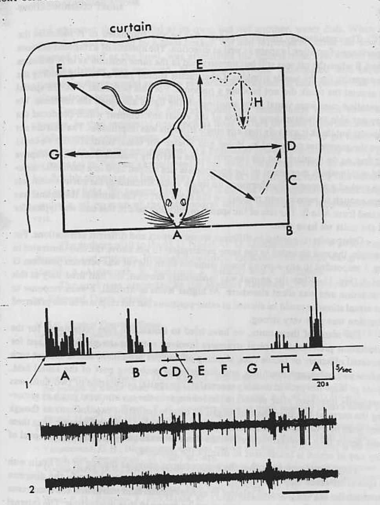

TI

ne

47

in

n0)

of

10-

: 10

62)

of

16

TVC

om.

21-

ent.

ase

. ed

me

ne:

ne

of

## **Short Communications**

O'Keafe & Dostrousky

The hippocampus as a spatial map. Preliminary evidence from unit activity in the freely-moving rat

Rats with hippocampal damage are reported to be hyperactive in novel environments, 'perseverative' and resistant to extinction on tasks that they have learned, heedless of drastic changes in their environment, and poor at spatial tasks such as mazes and tasks which require the alteration of responses on successive trials2,4. These deficits could be due to the loss of the neural system which provides the animal with a cognitive, or spatial, map5 of its environment. Our preliminary observations on the behaviour of hippocampal units in the freely moving rat provide support for this theory of hippocampal function.

Our technique is a modification of one previously used in the spinal cord8 and the medulla1. A small lightweight microdrive which carries up to 8 glass-insulated platinum-plated tungsten microelectrodes is permanently fixed to the rat's skull. Set screws on the manipulator allow any electrode or combination of electrodes to be moved independently of the others. Maximum rejection of muscle and movement artefacts is obtained by feeding the signals from two adjacent microelectrodes into a high input impedance differential FET preamplifier mounted directly on the microdrive. From there, the signal passes through flexible, lightly screened wires to standard recording equipment. In early experiments, two electrodes were glued side by side, one tip 0.5 mm in front of the other, and the pair driven down through the hippocampus together. More recently, satisfactory recordings have been obtained by manipulating one electrode into place in the cortical white matter and fixing it there to serve as a reference for each of the other electrodes in turn. With either method, a constant check was kept on which of the two electrodes carried the unit being studied.

For implantation, the rat was anaesthetized with Equithesin and held in a stereotaxic instrument. The microdrive assembly was fixed to its skull with dental cement in such a way that the tips of the electrodes passed through a hole drilled in the skull and rested in the upper layers of the cortex. A day or two later, the rat, fully recovered from the anaesthetic, was placed on the recording stand and the first electrode or pair of electrodes moved down through the cortex and dorsal hippocampus in search of units. The recording stand was a 24 cm × 36 cm raised platform, surrounded on three sides by a white plastic curtain. The fourth side was open, giving the rat a view of the laboratory. Unit activity was monitored during spontaneous behaviours such as walking, eating, drinking, grooming, and sleeping, and during elicited behaviours such as orienting, sniffing at cotton wool or various odours, biting at a polyethylene tube, and in some instances, bar-pressing for food. Responses to simple auditory (clicks, whistles, scratching noises), visual (moving light, hand, black and white striped board), olfactory (various odours, rat faeces), and tactile (touch and pressure over the body surface) stimuli were also tested. All units reported on were studied for at least 15 min and most for more than 30 min.

15/76 silent

Brain Research, 34 (1971) 171-175

Recording sites were localised in the following manner: all electrodes were left in their final positions for at least 24 h to allow gliosis to form around the tips. The animals were then sacrificed and perfused with 10% formol-saline and their brains sectioned and stained with cresyl violet or darrow red and Luxol fast blue. Each recording site was calculated as the distance on the microdrive above this final position.

This preliminary paper will concentrate on the response properties of 8 of the 76 units obtained in 36 electrode penetrations through the dorsal hippocampus (fields CA1 and 4) and the dentate gyrus in 23 rats. Of the remaining 68 units, 14 were classified as 'arousal' or 'attentional' units and resemble those reported by Vinogradova et al.7; 21 'movement' units had patterns of activity directly related to the animal's behaviour, firing briskly during some but not necessarily all of the following behaviours: orienting, sniffing, bar-pressing, and walking, and firing infrequently or not at all, during eating, drinking, grooming, quiet sitting, and slow wave sleep\*; two units had interesting properties relating to the animal's expectations; and for the remaining 31, either no adequate stimulus or behaviour could be found or their responses were inconsistent and uninterpretable. This last group includes 15 units which, apart from an occasional spike in conjunction with a burst of spikes in several smaller units, remained silent in spite of considerable, and sometimes drastic, attempts to fire them.

It is the response properties of the last class of units which has led us to postulate that the rat hippocampus functions as a spatial map. These 8 units responded solely or maximally when the rat was situated in a particular part of the testing platform facing in a particular direction. Five of them were in all other respects identical to the 15 silent units discussed above: they did not fire unless the animal was in a moderate state of arousal, was situated in the correct part of the testing platform, and for 4 of the 5, was receiving, in addition, the appropriate sensory stimulus. The other three units had a spontaneous firing rate which was maximal in a particular part of the testing stand. These 8 units then appear to have preferred spatial orientations.

Fig. 1 illustrates the clearest example of these units, one recorded in the CAI field of the anterior dorsal hippocampus. It had no spontaneous activity and only fired when the rat was pointing in the directions marked A or B and was simultaneously lightly but firmly restrained by a hand placed over its back with thumb and index finger on its shoulder and upper arm. Both the particular orientation and tactile stimulus were necessary. This was clearly shown by the testing procedure illustrated in Fig. 1. The rat was coaxed or pushed around the platform in a counterclockwise direction starting and ending at A. At each position marked by a letter, it was left for a few seconds, then restrained in the manner described above, and then released to remain at that position for another few seconds before being moved to the next position. During this whole procedure, the animal was highly aroused and remained motionless when not restrained or changing directions. The unit fired only when the rat was restrained in positions A and B and when he moved while restrained from B to

\* Vanderwolf5 has reported (and we agree) that the former behaviours are associated with  $\theta$  activity in the hippocampal EEG, while, during the latter behaviours, the EEG shows irregular slow waves.

大松の日本の大阪日本

Fig. 1. Responses of a hippocampal (CAI) unit to a restraining tactile stimulus as a function of the rat's spatial orientation. The arrows and associated letters mark the positions at which the animal was restrained as it was pushed or coaxed in a counter-clockwise direction around the test platform. The firing rate of the unit during this procedure is illustrated by the continuous frequency histogram in the middle of the figure. The letters correspond to the positions and the lines indicate the periods when the rat was restrained. In between these periods, the rat sat immobile in the same position for a few seconds and then was moved on to the next position. The bottom two lines show the raw data taken at the onset of the unit response at A (1) and during the absence of a response at D (2). Time calibration for these data is 400 msec.

D (C). The considerably smaller response when he was translated to H indicates the importance of position in space as well as direction. The absence of a response between A and B when the rat was still but unrestrained in the same position as in A indicates the necessity for the tactile stimulus. Other tactile stimuli such as loosely holding the rat around the trunk did not produce a response. For this particular unit, the spatial orientation cues were visual since shutting off the lights abolished the response. We were not able to isolate those aspects of the visual environment which produced the response but think it unlikely that any single stimulus was responsible. The unit did not have the properties described by Hubel and Wiesel3 for visual cortical cells: we could not find, as we regularly did for the cells of the overlying prestriate cortex, a receptive field within which movement of the appropriate size striped card in a particular direction evoked a response. Furthermore, no single visual stimulus in the environment was large enough to remain even roughly on the same part of the retina as the animal was rotated from A to B. The size of the spatial orientation field in this unit was typical for all the units we have seen.

Other units responded to different sensory inputs and different orientations. For example, the unit recorded in the same penetration  $10~\mu m$  above the unit illustrated in Fig. 1 responded to any moving visual stimulus when the rat was between positions G and A (Fig. 1). When the animal was moderately aroused, the unit fired only at this orientation and was silent elsewhere. At higher levels of arousal, a weak response to the visual stimulus could be elicited at other positions but the response in the preferred direction was now very strong.

For many of these units, we have tried to isolate the cues responsible for the orientation preference. Typical strategies involved rotating the platform to test for proximal olfactory or tactile cues, shutting off various prominent sound sources such as fans and polygraph machines, and darkening or occluding part of the visual field. None of these has proved notably successful: the spatial orientation of two units was eventually disrupted after several radical changes in the environment (such as removing the curtain) but then the rats began to behave (constant exploration) as though they were in a totally new environment. We suspect, but have not proved, that these cells derive their orientation preferences from several equipotential cues, removal of any one of which is insufficient to disrupt the response.

These findings suggest that the hippocampus provides the rest of the brain with a spatial reference map. The activity of cells in such a map would specify the direction in which the rat was pointing relative to environmental land marks and the occurrence of particular tactile, visual, etc., stimuli whilst facing in that orientation. The internal wiring of the hippocampus, on this model, would be such that activation of those cells specifying a particular orientation together with a signal indicating movement or intention to move in space (hippocampal  $\theta$  and  $\theta$ -related movement units) would tend to activate cells specifying adjacent or subsequent spatial orientations. In this way, the map would 'anticipate' the sensory stimuli consequent to a particular movement. Vinogradova et al.7 has reported evidence of anticipation in the temporal domain by hippocampal cells. As mentioned above, two of our units showed behaviour related to the animal's expectation. One of these, for example, recorded from the dentate gyrus,

Brain Research, 34 (1971) 171-175

nired water return until stimu infor

10

SHORT

change happ lar reless f that resultrats.

> diset Mer

> > A.R. Depe Enis Lone

> > > A th D H P K

> the

ween

cates

g the patial

:. We

d not

ptive

lirec-

t was

I was

al for

. For

ins G

t this

of 50

erred

t for

such

tield. was

TOV-

ough

these

al of

with

tion

.r.ce

rnal

cells For

end ay, ent. by I to fired whenever the rat sniffed at its own, but not another, water dish. When its own water dish was covered by a glass beaker, the unit response occurred the first time it returned to sniff at the bowl, was attenuated the second time, and absent thereafter until the beaker was removed. Mismatches between 'anticipated' and experienced stimulus patterns would result in exploration designed to incorporate into the map information about the new stimulus pattern.

Deprived of this map, the rat would not immediately notice environmental changes, be they incidental ones such as floor texture or more inportant ones such as reinforcement contingencies. Furthermore, it could not learn to go from where it happened to be in the environment to a particular place independently of any particular route (as in Tolman's experiments5) but would be forced to rely on other inherently less flexible strategies to find its way: turn left at the junction, follow this odour, avoid that bright light. We suggest, then, that it is the loss of this spatial reference map which results in all or most of the behavioural deficits reported for hippocampectomized rats.

The authors wish to thank L. Nadel, G. D. Gaffan and P. D. Wall for important discussion and criticism. Invaluable technical assistance and advice was given by E. G. Merrill, A. Ainsworth, R. Sampson, J. Astafiev and J. Sheppard.

The work was supported by the Medical Research Council. J. Dostrovsky was an Edmund Davis Scholar.

M.R.C. Cerebral Functions Group, Department of Anatomy, University College London, London WC1E 6BT (Great Britain) J. O'KEEFE J. DOSTROVSKY\*

! AINSWORTH, A., GAFFAN, G. D., O'KEEFE, J., AND SAMPSON, R., A technique for recording units in the medulla of awake, freely moving rats, J. Physiol. (Lond.), 202 (1969) 80-82P.

2 Douglas, R. J., The hippocampus and behaviour, Psychol. Bull., 67 (1967) 416-442.

- 3 Hubel, D. H., and Wiesel, T. N., Receptive fields on single neurones in cat's striate cortex, J. Physiol. (Lond.), 148 (1959) 574-591.
- + Kimble, D. P., The hippocampus and internal inhibition, Psychol. Bull., 70 (1968) 285-295.

5 Tolman, E. C., Cognitive maps in man and animals, Psychol. Rev., 55 (1948) 189-208.

- 6 VANDERWOLF, C. H., Hippocampal electrical activity and voluntary movement in the rat, Electroenceph. clin. Neurophysiol., 26 (1969) 407-418.
- 7 VINOGRADOVA, O. S., SEMYONOVA, T. P., AND KNONOVALOV, W. PH., Trace phenomenon in single neurons of hippocampus and mammillary bodies. In K. H. PRIBRAM AND D. E. BROADBENT (Eds.), Biology of Memory, Academic Press, New York, 1970, pp. 191-222.

8 Wall, P. D., Freeman, J., and Major, D., Dorsal horn cells in spinal and in freely moving rats, Exp. Neurol., 19 (1967) 519-529.

(Accepted August 20th, 1971)

\* Present address: Department of Zoology, University of Toronto, Toronto, Ont., Canada.