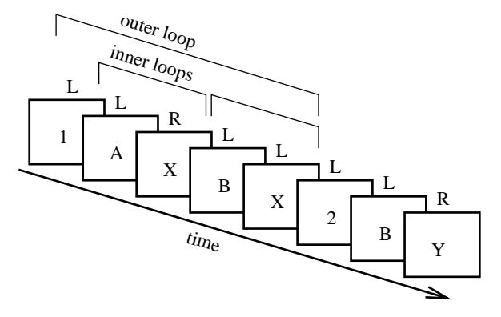
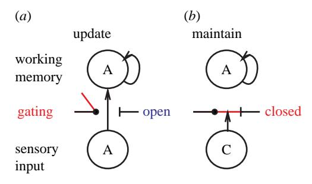
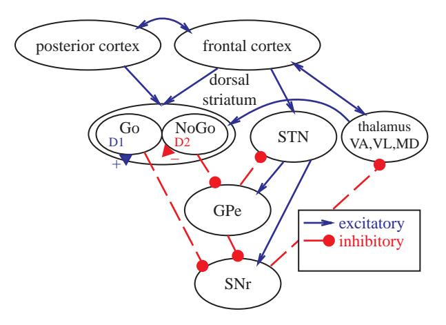
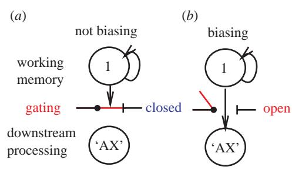
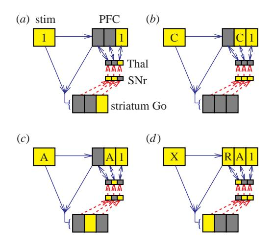
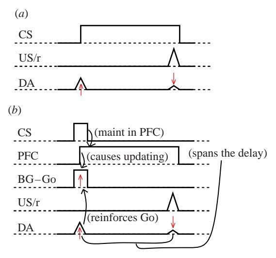
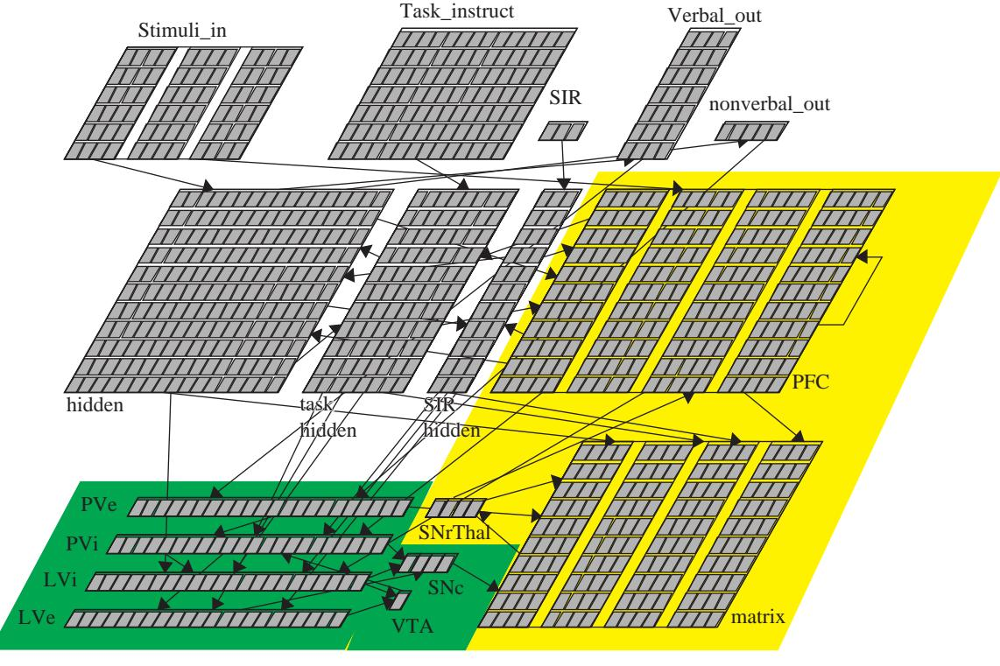
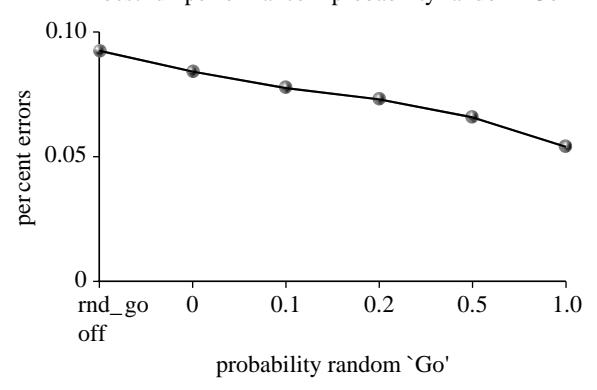

# Towards an executive without a homunculus: computational models of the prefrontal cortex/basal ganglia system

Thomas E. Hazy1, Michael J. Frank2 and Randall C. O'Reilly1,\*

1Department of Psychology, University of Colorado Boulder, 345 UCB, Boulder, CO 80309, USA 2Department of Psychology, Program in Neuroscience, University of Arizona, Tucson, AZ 85721, USA

The prefrontal cortex (PFC) has long been thought to serve as an 'executive' that controls the selection of actions and cognitive functions more generally. However, the mechanistic basis of this executive function has not been clearly specified often amounting to a homunculus. This paper reviews recent attempts to deconstruct this homunculus by elucidating the precise computational and neural mechanisms underlying the executive functions of the PFC. The overall approach builds upon existing mechanistic models of the basal ganglia (BG) and frontal systems known to play a critical role in motor control and action selection, where the BG provide a 'Go' versus 'NoGo' modulation of frontal action representations. In our model, the BG modulate working memory representations in prefrontal areas to support more abstract executive functions. We have developed a computational model of this system that is capable of developing human-like performance on working memory and executive control tasks through trial-and-error learning. This learning is based on reinforcement learning mechanisms associated with the midbrain dopaminergic system and its activation via the BG and amygdala. Finally, we briefly describe various empirical tests of this framework.

**Keywords:** basal ganglia; prefrontal cortex; dopamine; working memory; Pavlovian conditioning; computational modeling

#### 1. INTRODUCTION

There is widespread agreement that some regions of the brain play a larger role in controlling our overall behaviour than others with a strong consensus that the prefrontal cortex (PFC) is a 'central executive' (e.g. Baddeley 1986; Shallice 1988; Duncan 2001; Miller & Cohen 2001; Conway et al. 2003). However, this central executive label raises many more questions than it answers. How does the PFC know what actions or plans to select? How does experience influence the PFC? How do the specific neural properties of the PFC enable this kind of function, and how do these differ from those in other non-executive areas? Without answers to these kinds of questions, the notion of a central executive is tantamount to positing a homunculus (small man) living inside the PFC and controlling our actions.

This article reviews ongoing research attempting to characterize the computational and neural mechanisms by which the PFC guides cognition and behaviour. We see these mechanisms as an evolutionary extension of the same frontal cortical and basal ganglia (BG) mechanisms involved in the motor control system, which are relatively better characterized and do not have the same degree of mysterious executive function associated with them. In this motor domain, the BG

Electronic supplementary material is available at http://dx.doi.org/10. 1098/rstb.2007.2055 or via http://www.journals.royalsoc.ac.uk.

One contribution of 15 to a Theme Issue 'Modelling natural action selection'.

modulate frontal motor representations, by providing Go versus NoGo signals that reflect the prior reward history of actions (Wickens 1993; Mink 1996). In the PFC, the BG can similarly provide Go/NoGo modulation controlling the maintenance of more abstract PFC working memory representations, which in turn guide behaviour and cognition (Frank *et al.* 2001; Hazy *et al.* 2006; O'Reilly & Frank 2006). These PFC representations include plans, goals, task-relevant sensory stimuli, partial products of ongoing processing, etc.

We have identified six core functional demands that collectively serve to define the fundamental nature of prefrontal cortical function from a neuro-mechanistic perspective. Further, whereas our initial focus was on the mechanisms by which the BG-PFC system learns when to update and maintain information in working memory (Frank et al. 2001; Hazy et al. 2006; O'Reilly & Frank 2006), here we extend the model to include an output-gating mechanism that can determine which of a subset among multiple parallel active representations should be currently used to guide action selection (similar to the model of Brown et al. 2004). Interestingly, the same BG mechanisms that can drive the selection of when to update PFC working memory representations can also be used (in parallel circuits) to select which of the already maintained PFC representations should be actually be used to guide behaviour.

This article has two goals to describe: (i) the latest version of our PBWM (PFC, BG working memory) model, including two important extensions recently added and (ii) our ongoing attempt to model several key working memory tasks in a single instantiation of the

\* Author for correspondence (oreilly@psych.colorad.edu).

Figure 1. The 1-2-AX task. Stimuli (in boxes) are presented one at a time in a sequence and the subject is required to press either a left or right key (L, R; no boxes) after each stimulus. Correct responses are the right key (R) to a target sequence of two stimuli or a left key (L) otherwise (cue only; wrong sequence). Target sequences are determined as follows: if the subject last saw a 1, then the target sequence is an A followed by an X. If a 2 was last seen, then the target is a B followed by a Y. Distractor stimuli (e.g. 3, C, Z) may also be presented at any point, but are to be ignored (no response). Thus, the maintenance of the task stimuli (1 or 2) constitutes a temporal outer-loop around multiple inner-loop memory updates required to detect the target sequence. See text for a more detailed explanation.

model. The article's overall organization follows accordingly: we first describe the PBWM computational model and how it relates working memory with motor control and action selection. (We see working memory as the fundamental mechanism underlying executive function generally.) In elucidating our model, we place special emphasis on six key functional demands underlying working memory. We then describe two new extensions to the model, output gating and a mechanism for dealing with the exploration/exploitation trade-off in learning (Aston-Jones & Cohen 2005). Finally, we outline a research trajectory to simulate an increasing number of the most important task paradigms of working memory and executive function in a single instantiation of a comprehensive model built around the core PBWM mechanisms.

#### 2. THE PBWM MODEL OF WORKING MEMORY

Based on our cumulative work on a wide variety of working memory tasks, we have identified a core set of six functional demands, enumerated below, that are required by tasks involving working memory and executive function. Taken together, these functional demands provide a basic set of constraints for our biologically based PBWM model. Regarding the relationship between working memory and executive function, we see the former as providing the fundamental process that underlies executive function generally. Briefly, we believe it is the rapid and selective pattern of updating of PFC stripes (largely under control of the BG) that results in the emergent set of phenomena we recognize as executive function. The 1-2-AX task, which is an extension of the widely studied AX version of the continuous performance task (AX-CPT), provides a nice demonstration for these information-processing demands on the working memory/executive function system.

Figure 2. Illustration of active maintenance gating. When the gate is open, sensory input can rapidly update working memory (e.g. encoding the cue item A in the 1-2-AX task), but when it is closed, it cannot thereby preventing other distracting information (e.g. distractor C) from interfering with the maintenance of previously stored information.

Figure 3. The BG are interconnected with frontal cortex through a series of parallel loops each of the form shown. Working backward from the thalamus, which is bidirectionally excitatory with frontal cortex, the SNr (substantia nigra pars reticulata) is tonically active and inhibiting this excitatory circuit. When direct pathway Go neurons in dorsal striatum fire, they inhibit the SNr and thus disinhibit frontal cortex producing a gating-like modulation that we argue triggers the update of working memory representations in PFC. The indirect pathway NoGo neurons of dorsal striatum counteract this effect by inhibiting the inhibitory GPe (globus pallidus, external segment). The STN (subthalamic nucleus) provides an additional dynamic background of inhibition (NoGo) by exciting the SNr.

The AX-CPT is a standard working memory task that has been extensively studied in humans (Cohen et al. 1997; Braver et al. 1999, submitted; Braver & Cohen 2000; Frank & O'Reilly 2006). The subject is presented with sequential letter stimuli (A, X, B, Y) and is asked to detect the specific sequence of an A followed on the very next event by an X, by pushing the target (right) button. All other combinations (A-Y, B-X, B-Y) should be responded to with a non-target (left) button push. This task requires a relatively simple form of working memory, where the prior stimulus must be maintained over a delay until the next stimulus appears, so that the subject can discriminate the target from non-target sequences. This is the kind of activation-based working memory that has often been observed for example in electrophysiological studies of working memory in monkeys (e.g. Fuster & Alexander 1971; Kubota & Niki 1971; Miyashita & Chang 1988; Funahashi et al. 1989; Miller et al. 1996).

In the 1–2 extension of the AX-CPT task (1–2-AX; figure 1; Frank et al. 2001; O'Reilly & Frank 2006), the target sequence varies depending on prior task demand stimuli (a 1 or 2). Specifically, if the subject last saw a 1, then the target sequence is A–X. However, if the subject last saw a 2, then the target sequence is B–Y. Thus, the task demand stimuli define an outer loop of active maintenance (maintenance of task demands) within which there can be any number of inner loops of active maintenance for the A–X level sequences.

## (a) Six key functional demands for working memory

Using the 1-2-AX task as a concrete example, six key functional demands placed upon the working memory system can be identified:

- (i) Rapid updating. The working memory system should be able to rapidly encode and maintain new information as it occurs. In the 1-2-AX task, as each relevant stimulus is presented, it must be rapidly encoded in working memory.
- (ii) Robust maintenance. Information that remains relevant should be maintained in the face of the interference from ongoing processing or other stimulus inputs. In the 1-2-AX task, the task demand stimuli (1 or 2) in the outer loop must be maintained in the face of the interference from ongoing processing of inner loop stimuli and irrelevant distractors. Also, a specific A or B must also be maintained for the duration of each inner loop.
- (iii) Multiple, separate working memory representations. To maintain the outer loop stimuli (1 or 2) while updating the inner loop stimuli (A or B), these two sets of representations must be distinct within the PFC (i.e. they must not be in direct mutual competition with one another, such that only one such representation could be active at a time).
- (iv) Selective updating. Only some elements of working memory should be updated at any given time, while others are maintained. For example, in the inner loop, A or B should be updated while the task demand stimulus (1 or 2) is maintained.
- (v) Independent output-gating for top-down biasing of processing. For working memory representations to achieve controlled processing, they must be able to bias (control) processing elsewhere in the brain—and at the appropriate time. For example, whichever outer loop stimulus (1 or 2) is relevant at a given time must bias processing in the PFC/BG system itself, to condition responses and working memory updates as a function of the current target sequence.
- (vi) Learning what and when to gate. Underlying all successful working memory task performance is the need to learn when to gate appropriately—both gating 'in' for maintenance and 'out' for biasing elsewhere in the processing stream. This is a particularly challenging problem in the maintenance case because the benefits of having gated something in are typically only available later in time (e.g. encoding the 1 task demand stimulus

Figure 4. Illustration of output gating showing a single outer-loop stripe biasing (not biasing) inner loop processing. When the gate is open, actively maintained representations in the outer loop stripe can bias processing in the inner loop stripes, so as to attend to the A–X target sequence, but when the output-gate is closed, it cannot. Instead, active representations in another outer-loop stripe (not shown) might be exerting its influence (e.g. 2—B–Y). This output-gating process learns and functions largely independent of the maintenance gating system (figure 2).

only affects overt behaviour and error-feedback later when confronted with an A–X sequence).

Earlier computational work has instantiated and validated several aspects of this overall theory, including the graded nature of controlled processing (Cohen et al. 1990); the ability of PFC representations to bias subsequent processing (Cohen & Servan-Schreiber 1992); the role of PFC in active maintenance (Braver et al. 1995) and the ability of the BG to update PFC working memory representations (Frank et al. 2001). Most recently, we have been focused on elucidating the mechanisms of the PFC/BG system, and most specifically, how it can learn to do what it has to do to support working memory.

The six functional demands described above have been published previously in more basic form (Hazy et al. 2006). Here, we modify them in a significant way to reflect a newly recognized demand for an independent output-gating mechanism (incorporated primarily into demand no. 5). This new demand is necessarily separate and distinct from the previously described maintenance-gating mechanism (O'Reilly & Frank 2006). The motivation for such a demand and our proposed mechanism will be elaborated upon below.

#### (b) Dynamic updating via basal ganglia gating

One of the main implications from the above functional demands is that the first two functional demands (rapid updating versus robust maintenance) are in direct conflict with each other when viewed in terms of standard neural processing mechanisms. This motivates the need for a dynamic gating mechanism to switch between these two modes of operation (Cohen et al. 1996; O'Reilly et al. 1999; Braver & Cohen 2000; O'Reilly & Munakata 2000, Frank et al. 2001). When the gate is open, working memory can get updated by incoming stimulus information; when it is closed, currently active working memory representations are robustly maintained even in the face of potential interference as from intervening distractor stimuli (figure 2).

A central tenet of the PBWM model is that the BG provide the dynamic gating mechanism for information maintained via sustained activation in the PFC, just as the

BG are thought to 'gate' action selection in the motor areas of the frontal cortex. In the motor system, the BG are interconnected with frontal cortex through a series of parallel loops (figure 3). When direct pathway Go neurons in dorsal striatum fire, they inhibit the SNr and thus disinhibit frontal cortex producing a gating-like modulation that triggers the 'release' of one action, out of many, competing pre-activated actions. In the same manner, we argue that the BG works with the PFC to trigger the updating of working memory representations in PFC. The indirect pathway NoGo neurons of dorsal striatum counteract this effect by inhibiting the inhibitory GPe (globus pallidus, external segment). The STN (subthalamic nucleus) provides an additional dynamic background of inhibition (NoGo) by exciting the SNr (Frank (2006) for computational advantages of this global NoGo signal for action selection). As reviewed in Frank et al. (2001), this idea is consistent with a wide range of empirical data and other computational models that have been developed largely in the domain of motor control, but also for working memory as well (e.g. Dominey et al. 1995; Houk & Wise 1995; Wickens et al. 1995; Berns & Sejnowski 1998; Cisek 2007; Houk et al. 2007). Our ideas regarding just how the PFC and BG might accomplish this complex coordination in support of working memory and executive function are outlined below, along with a brief description of the specific biologically plausible computational mechanisms that our PBWM model uses to instantiate them. New to this latest version of the model is the addition of an outputgating mechanism (demand no. 5), which leverages the same BG/PFC circuitry and Go/NoGo modulation (Brown et al. 2004).

- (i) Rapid updating occurs when direct pathway spiny neurons in the dorsal striatum fire (Go units). Go firing directly inhibits the substantia nigra pars reticulata (SNr) and releases its tonic inhibition of the thalamus. This thalamic disinhibition enables, but does not directly cause (i.e. gates), a loop of excitation into the corresponding PFC 'stripe' (see Multiple, separate working memory representations). The effect of this net excitation is to toggle the state of bistable currents in the PFC neurons. Striatal Go neurons in the direct pathway are in competition (downstream in the SNr, if not actually in the striatum; Wickens 1993; Mink 1996) with a corresponding *NoGo* (indirect) pathway that promotes greater inhibition of thalamic neurons, thereby working to block gating.
- (ii) Robust maintenance occurs via two intrinsic PFC mechanisms: (a) recurrent excitatory connectivity (e.g. Zipser 1991; O'Reilly et al. 1999) and (b) bistability (Fellous et al. 1998; Durstewitz et al. 1999, 2000; Wang 1999), the latter of which is toggled between a maintenance state and a non-maintenance state by the Go gating signal from the BG. (For an interesting variation on this basic theme, see Prescott et al. (2006) for an account that places much of the burden of active maintenance in the motor domain (so called behavioural persistence) in the BG themselves, rather than in the frontal cortex as we would emphasize. It may be that both areas serve as

- substrates for active maintenance in both domains (motor and cognitive) or it may be that the BG play more of a role in behavioural persistence, while the PFC is the substrate of active maintenance for more cognitive (working memory) functions. Future work will be necessary to sort these issues out.)
- (iii) Multiple, separate working representations are possible owing to the 'striped' micro-anatomy of the PFC, which is characterized by small, relatively isolated groups of interconnected neurons, thereby preventing undue interference between representations in different (even nearby) stripes (Levitt et al. 1993; Pucak et al. 1996). We think of these frontal cortical stripes as being functionally similar to—and roughly the same size as—the well described hypercolumns of the visual cortex. Finally, we have estimated elsewhere there may be on the order of 20 000 such stripes in human frontal cortex (Frank et al. 2001), with progressively fewer in lower species as one goes backward down the phylogenetic tree. Thus, the pure quantity of stripes present in frontal cortex may be an important variable in determining cognitive abilities, an idea we explore briefly in §4.
- (iv) Selective updating occurs owing to the existence of independently updatable parallel loops of connectivity through different areas of the BG and frontal cortex (Alexander et al. 1986; Graybiel & Kimura 1995; Middleton & Strick 2000). We hypothesize that these loops are selective to the relatively finegrained level of the anatomical stripes in PFC. This stripe-based gating architecture has an important advantage over the global nature of a purely dopamine-based gating signal (e.g. Braver & Cohen 2000; Rougier & O'Reilly 2002; Tanaka 2002), which appears computationally inadequate for supporting a selective updating function by itself.
- (v) Independent output-gating for top-down biasing of processing occurs via output-gated projections from actively maintained representations in PFC to relevant areas throughout the brain (figure 4), most typically the posterior cortex, but also the hippocampus and the PFC/BG itself (Fuster 1989; Cohen & Servan-Schreiber 1992). New here is the recognition that access to biasing influence should operate only when appropriate and not at other times indiscriminately. We adopt the hypothesis that this output gating function is accomplished by means of the unique laminar frontal cortical column architecture and its specific connectivity pattern with the BG and thalamus (Brown et al. 2004). Briefly, deep, output-generating laminae of the PFC (particularly lamina Vb) display thresholded behaviour so that these layers do not fire until a threshold is reached via a specific BG-gated thalamic input signal. In effect, output-gating is the same mechanism as the motor gating that the BG are typically described as performing (e.g. Houk *et al.* 1995, 2007; Mink 1996; Gurney et al. 2001; Frank 2005).

(vi) Learning what and when to gate (for both maintenance and output) is accomplished by a dopamine-based reinforcement-learning mechanism that is capable of providing temporally appropriate learning signals to train gating update activity in the striatal Go and NoGo synapses (Frank 2005; O'Reilly & Frank 2006); this learning occurs in parallel for maintenance and for output. Thus, each striatal medium spiny neuron (MSN) develops its own unique pattern of connection weights enabling separate Go versus NoGo decisions in each stripe.

Figure 5 shows how the BG-mediated selective gating mechanism can enable basic performance of the 1-2-AX task. When a task demand stimulus is presented (e.g. 1), a BG gating signal (i.e. a Go signal) must be activated to enable a particular PFC stripe to gate in and retain this information (panel a), and no stripe (or NoGo firing) should be activated for a distractor such as C (panel b). A different stripe must be gated for the subsequent cue stimulus A (panel c). When the X stimulus is presented, the combination of this stimulus representation plus the maintained PFC working memory representations is sufficient to trigger a target response R (panel d).

The need for an output-gating mechanism can be motivated by considering a situation where a motor plan is being formulated. For example, you might be planning a sequence of steps (e.g. picking up a set of plates, condiments and other items sitting on the table after dinner) and need to figure out the best order to execute these steps. As you are juggling the possible orderings in your mind, you do not want to actually execute those actions. Thus, the maintenance-gating function is enabling the updating of different action plan representations, while the output gates remain closed to prevent actual actions from being executed based on these plans. Then, once the plan is ready to execute, the output-gating mechanism fire Go signals for each step of the plan in order. This coordination between maintenance and output gating can apply to more abstract cognitive operations in addition to concrete motor actions.

In addition, even situations that may appear to only require output-gating often require a maintenance-gating step as well. For example, in the motor domain (where output gating is synonymous with motor action gating), there are many cases where a motor plan must first be selected and maintained even for a few hundreds of milliseconds, and this could benefit from maintenance gating. Thus, the clear implication of this overall formulation is that both output gating and maintenance gating apply equally well to the action selection and working memory domains.

#### (c) Learning when to gate in the basal ganglia

Of all the aspects of our model that purport to deconstruct the homunculus, learning when to gate is clearly the most critical. For any model, either the explicit knowledge of when to update working memory must be programmed in by the model's designer or, somehow, a model must learn it on its own, relying only on its training experience as it interacts with any primitive built in biases and constraints (much like the

architectural and/or parametric constraints discovered by evolution). That is, without such a learning mechanism, our model would have to resort to some kind of intelligent homunculus to control gating.

Our approach for simulating how the BG learn to update task-relevant versus irrelevant working memory information builds on prior work showing how the same basic mechanism can bring about the learning of the appropriate selection of motor responses. Specifically, the BG are thought to learn to facilitate the selection of the most appropriate response while suppressing all other competing responses (Mink 1996). In our models, the BG learn the distinction between good and bad responses via changes in dopamine firing in response to reward signals during positive and negative reinforcement (Frank 2005). The net effect is that increases in DA enhance BG Go firing and learning via simulated D1 receptors, whereas decreases in dopamine during negative reinforcement have the opposite effect enhancing NoGo firing and learning via simulated D2 receptors. This functionality enables the BG system to learn to discriminate between subtly different reinforcement values of alternative responses (Frank 2005) and is consistent with several lines of biological and behavioural evidence (for review see Frank & O'Reilly 2006). This direct modulation of Go versus NoGo actions in BG can train the output-gating mechanism in our model, which is functionally the same as a motor control gating mechanism.

A similar logic applies to training maintenance gating: increases in dopamine reinforce BG Go firing to gate information into working memory that contributes to better performance at later time-steps, while decreases in dopamine allow the model to learn that a current working memory state is contributing to poor performance (figure 5). In this manner, the BG eventually come to gate in information that is taskrelevant, because maintenance of this information over time leads to adaptive behaviour and reinforced responses. Conversely, the system learns to ignore distracting information, because its maintenance will interfere with that of task-relevant information and therefore lead to poor performance. The overall PBWM model of the role of the PFC and BG in working memory makes a number of further predictions, several of which have been validated empirically (Frank et al. 2007).

From a computational perspective, maintenance gating also requires very specific mechanisms to deal with the *temporal credit assignment problem*. The benefits of having encoded a given piece of information into prefrontal working memory are typically only available later in time (e.g. encoding the 1 task demand stimulus can only really help later (in terms of getting an actual reward) when confronted with an A–X sequence). Thus, the problem is to know which prior events were critical for subsequent good (or bad) performance.

The firing patterns of midbrain dopamine (DA) neurons (ventral tegmental area, VTA; substantia nigra pars compacta, SNc; both strongly innervated by the BG) exhibit the properties necessary to solve the temporal credit assignment problem, because they learn to fire for stimuli that predict subsequent rewards (e.g. Schultz *et al.* 1993; Schultz 1998). This property is illustrated in schematic form in figure 6a for a simple

Figure 5. Illustration of how BG maintenance gating of different PFC stripes can solve the 1-2-AX task (light colour=active; dark=not active). Only three stripes are shown for clarity; we have estimated elsewhere there may actually be on the order of 20 000 stripes in human frontal cortex (Frank et al. 2001). (a) The 1 task is gated into an anterior PFC stripe because a corresponding striatal stripe fired Go. (b) The distractor C fails to fire striatal Go neurons, so it will not be maintained; however, it does elicit transient PFC activity. Note that the 1 persists owing to gating-induced robust maintenance. (c) The A is gated in to a separate stripe. (d) A right keypress motor action is activated based on X input plus maintained PFC context.

Figure 6. (a) Schematic of dopamine (DA) neural firing for an input stimulus (Input, e.g. a tone) that reliably predicts a subsequent reward (unconditioned stimulus US/r). Initially, DA fires at the point of reward, but then over repeated trials learns to fire at the onset of the stimulus. (b) This DA firing pattern can solve the temporal credit assignment problem for PFC active maintenance. Here, the PFC maintains the transient input stimulus (initially by chance) leading to reward. As the DA system learns, it can predict subsequent reward at stimulus onset by virtue of PFC 'bridging the gap' (in place of a sustained input). DA firing at stimulus onset reinforces the firing of BG Go neurons, which drive updating in PFC.

Pavlovian conditioning paradigm where a stimulus (e.g. a tone) predicts a subsequent reward. Figure 6b shows how this predictive DA firing can reinforce BG Go firing to gate in and subsequently maintain a stimulus, when such maintenance leads to subsequent reward. Specifically, the DA firing can move discretely

from the time of a reward to the onset of a stimulus that, if maintained in the PFC, leads to the subsequent delivery of this reward. Because this DA firing occurs at the time when the stimulus comes on, it is well timed to facilitate the storage of this stimulus in PFC. In our model, this occurs by reinforcing the connections between the stimulus and the Go gating neurons in the striatum, which then cause updating of PFC to maintain the stimulus.

The apparently predictive nature of the DA firing has most often been explained in terms of the temporal differences (TD) reinforcement learning mechanism (Sutton 1988; Houk et al. 1995; Schultz et al. 1995; Montague et al. 1996; Sutton & Barto 1998; Contreras-Vidal & Schultz 1999; Suri et al. 2001; Joel et al. 2002). However, extensive exploration and analysis of these models has led us to develop a somewhat different account, which moves away from the explicit prediction framework upon which TD is based (O'Reilly & Frank 2006; O'Reilly et al. 2007). Our alternative learning mechanism, called PVLV (primary value and learned value) involves two separable but interdependent learning mechanisms, each of which is essentially a simple delta-rule or Rescorla-Wagner mechanism (Widrow & Hoff 1960; Rescorla & Wagner 1972). This PVLV mechanism shares several features in common with the model of Brown et al. (1999).

Further details of the PBWM model and PVLV learning mechanism are beyond the scope of this paper, but the basic results are that the resulting model can learn complex working memory tasks, such as the 1-2-AX task based purely on trial-and-error experience with the task.

#### (d) Empirical tests of the model

As previously noted, much evidence supports the role of the PFC in active maintenance during working memory tasks and for the existence of at least two mechanisms (recurrent connectivity and bistability) that could support it (e.g. Zipser 1991; Fellous *et al.* 1998; Wang 1999; Durstewitz *et al.* 2000). Bistability is of particular empirical relevance to the PBWM model, since it provides a viable candidate for the 'toggling' process required by PBWM. In addition, considerable evidence supports the existence of a 'striped' micro-anatomy in the PFC (Levitt *et al.* 1993; Pucak *et al.* 1996).

With regard to the more novel aspects of the model, some evidence is available to suggest that there is a 'striped' micro-architecture within the well-documented striato-cortical loops, that is there may be a more finely granular micro-anatomical functional organization within the striatal matrix compartment (matrisomes; Flaherty & Graybiel 1993; Holt *et al.* 1997) and that this finely granular functional organization may be preserved in the striatal projections to the pallidum (Flaherty & Graybiel 1993). The PBWM model makes an explicit verifiable claim that such micro-anatomical fine structure *ought* to exist, another strong prediction of the model.

With regard to the issue of whether or not the BG can specifically trigger the toggling process of active maintenance in the PFC, a prominent feature of the PBWM model, accumulating evidence from our group supports this prediction in Parkinson's patients (Frank et al. 2004), in normals on dopaminergic agents (Frank & O'Reilly 2006) and, most recently, in ADHD patients

Figure 7. Overall structure of the MT model. Similar to our other PBWM models, the input/output layers are at the top-left of the diagram. The PFC and BG layers are at the bottom-right. The PVLV learning algorithm layers are in the lower left-hand corner (highlighted in green/darker grey), and the full PBWM component also includes the BG (Matrix, SNrThal) and PFC on the right hand side (highlighted in yellow/lighter grey). Depending on the particular task, single or multiple featured stimuli are presented in one or more 'slots' in the Stimuli\_In layer, along with task instructions in the task instruct and SIR (store, ignore, recall) layers. Based on these inputs, plus context provided by PFC input, the hidden layer determines the correct output in verbal or nonverbal form or both. The shown model has four 'stripes' reflected in the four subgroups of the PFC and Matrix (striatal matrisomes) layers, and the four units of the SNc and SNrThal layers. SNc, substantia nigra, pars compacta; SNrThal, abstracted layer reflecting direct and indirect pathways via substantia nigra, pars reticulata and thalamus; VTA, ventral tegmental area; PVe, primary value (PV) excitatory, external reward; PVi, primary value inhibitory (anatomically associated with patch/striosomes of ventral striatum); LVi, learned value (LV) inhibitory (same anatomical locus); and LVe, learned value, excitatory (anatomically associated with the central nucleus of the amygdala).

(Frank *et al.* 2007). These studies have also supported the hypothesis that it is the differential effect of phasic DA burst firing on Go and NoGo MSNs in the striatum that is critical to learning when to gate, another important component of the PBWM model.

# 3. SIMULATING MULTIPLE WORKING MEMORY TASKS IN A SINGLE MODEL

The PBWM model is complex, as might be expected considering the complexity of the phenomena it is meant to explain. Nonetheless, it is still far from a complete account and we continue to refine and extend it. Accordingly, it makes sense to continue to look for more and better ways to constrain the performance of the model by subjecting it to increasingly stringent tests. One strategy that we have employed successfully in the past with both our hippocampal and posterior cortical models is to apply them to a progressively wider range of relevant phenomena. To the extent that the same basic model can account for a progressively wider range of data, it provides confidence that the model is capturing some critical core elements of cognitive function. The virtues of this general approach have been forcefully argued by Newell (1990).

For these reasons, one of our goals is to be able to simulate an increasingly wider range of working memory and executive tasks using a single instantiation of the PBWM model. This research builds upon earlier work simulating many of the paradigmatic tasks thought to be characteristic of working memory and executive function, including: the Stroop effect (Cohen et al. 1990; O'Reilly & Munakata 2000; Stafford & Gurney 2007); the AX-CPT (Braver et al. 1995); the 1-2-AX (O'Reilly & Frank 2006); the Wisconsin card sort task (WCST; Rougier & O'Reilly 2002); the intradimensional/ extradimensional (ID/ED) dynamic categorization task (O'Reilly et al. 2002); and the Eriksen flanker task (Cohen et al. 1992; Bogacz & Cohen 2004; Yeung et al. 2004). In addition to these already modelled tasks, we also plan to simulate additional tasks not yet modelled by us: the ABCA/ABBA task (Miller et al. 1996); serial recall (phonological loop; Burgess & Hitch 1999); Sternberg task (Sternberg 1966); and the N-Back task (Braver et al. 1997). A description of each task is available in the electronic supplementary material.

The earlier successful efforts had all used different models of varying levels of sophistication and complexity, thus motivating the current goal of consolidating the results onto a single comprehensive model. Although easily stated, this is far from a trivial undertaking. In the first place, models constructed to perform one task may have design features or parameters that work against good performance in other tasks. Thus, even getting the

same model to perform multiple tasks *independently* is a significant challenge. Obviously, the problem will only get more difficult as one attempts to implement multiple tasks in a single instantiation due to the additional complication of cross-training interference.

#### (a) The full MT model

To simulate a progressively wider range of working memory/executive function tasks using a single instantiation of a single model, we have developed the MT (multitask) model, a complex environment instantiation of the PBWM. Figure 7 shows the MT (multitask) model, with input/output layers appearing at the top of the network, posterior cortical 'Hidden' layers and PFC layer in the middle, and BG/midbrain areas for learning and gating of PFC at the bottom. The input/output representations were designed to accommodate the vagaries of each individual task in a way that achieves a high level of surface validity.

The perceptual input representations in the MT model (table 1) assume a high level of perceptual preprocessing, such that different stimulus items ('objects') are represented with consistent and unique activity patterns. We encode three separate (orthogonal) stimulus dimensions: object identity; colour; and size, and we also provide three spatial locations in which a given object may appear. The task instruction layer tell the network what to do with the input stimuli, including the overall task and any more specific pieces of information that might be required (e.g. whether to do word reading or colour naming in the Stroop task). We have also included a subcategory of instruction inputs in the form of the store/ignore/recall (SIR) layer, which can be used to provide explicit working memory update signals that are encoded in a variety of different ways in different tasks, and may also be present via implicit timing signals via the cerebellum (e.g. Ivry 1996; Mauk & Buonomano 2004). The outputs include both verbal and non-verbal responses, the latter including button presses and pointing to locations.

The PFC is bidirectionally connected to all relevant high-level processing layers (sensory input, task hidden, central hidden and output), and its associated BG layers receive from all of these layers as well to provide control over the learning and execution of the dynamic gating signals. Note that the shown PFC/BG system has four stripes, with each stripe representing a selectively updatable component of working memory. More stripes facilitate faster learning, but result in a larger, more computationally costly model so the exact number of stripes is a matter of pragmatic optimization in the model (in the brain, we estimate that many thousands of stripes are present).

When sensory inputs are presented, activation flows throughout the network in a bidirectional manner, so that internal posterior cortical hidden layers are affected by both these bottom-input and maintained top-down activations in the PFC. In the Leabra algorithm that we use (electronic supplementary material), individual units are modelled as point neurons, with simulated ion channels contributing to a membrane potential, which is in turn passed through a thresholded nonlinear activation function to obtain a continuous instantaneous spike rate output that is communicated to other units.

Table 1. Perceptual input features, organized along three separate dimensions. Three separate locations of these features are provided as input to the network.

| size             | small                         | medium                          | large                     | X-large                    |
|------------------|-------------------------------|---------------------------------|---------------------------|----------------------------|
| colour object | black circle 'red' A | white square 'green' B | red triangle 1 X | green diamond 2 Y |

The inhibitory conductances are efficiently computed according to a k-winners-take-all algorithm (kWTA), which ensures that not more than some percentage (typically between 15–25%) of units within a layer are active at a time.

Outside of the BG system, learning occurs as a result of both Hebbian and error-driven mechanisms, with the error-driven learning computed in a biologically plausible fashion based on the GeneRec learning algorithm (O'Reilly 1996). The learning mechanisms for the BG components (PVLV algorithm) were described earlier.

### (i) Recent progress: the task contingency-shifting paradox in the WCST

Over several iterations of the MT model (incorporating progressively improving versions of PBWM), various versions have successfully replicated key results of a set of core tasks, including the Stroop, AX-CPT and 1-2-AX, in addition to a set of more primitive component tasks (e.g. naming, matching and comparing stimulus features, dimensions and locations) that had been included in another earlier model—the cross task generalization model (Rougier et al. 2005). This prior version was also able to do a version of the WCST, using a simple direct model of PFC gating that did not place particularly strong learning demands on the network. In moving to the more sophisticated current version, however, one that places more stringent learning demands on the model, we found that we ran into a new computational issue when uninstructed changes in task contingency occur as in the WCST. This prompted a further modification to the core PBWM model (in addition to the output-gating mechanism described earlier).

Recall that in the WCST, subjects are required to place cards displaying multidimensional stimuli into piles according to which feature matches according to a relevant dimension that is not explicitly stated. The relevant dimension is kept constant over blocks of several trials, but is changed periodically without any signal—the only feedback the subject receives is whether their most recent response was correct or incorrect. This uncued change in environmental contingency presented a kind of paradox for earlier versions of PBWM, prompting the extension described below.

When task-contingencies change and the model makes errors, this results in phasic dopamine dips, which in our model depress Go (direct) pathway firing in the striatum and enhance NoGo firing. In the maintenance-gating mechanism, NoGo firing prevents updating and causes whatever was being maintained in the PFC working memory to continue to be maintained. But, this is the exact opposite of what needs to happen

now that the model is making errors. Normally, this is not a problem when cues are provided in the environment since the Go/NoGo system can easily learn to use those cues to trigger a Go (update) signal. The problem is when the contingencies change without warning.

A potential solution to this problem comes from mechanisms that address the exploration/exploitation trade-off in reinforcement learning (Aston-Jones & Cohen 2005). This trade-off arises when an agent is faced with either continuing to exploit the strategies that have worked well in the past or exploring new strategies that might work better. At the point when errors are made, this decision becomes critical: do you just need to work harder at the current strategy or give up and try something else? Based on a wide range of data, Aston-Jones & Cohen (2005) argue that neural systems in the anterior cingulate cortex (ACC) and locus coeruleus (LC) provide a means for dealing with this situation. Specifically, when some errors are made in the context of overall good performance, the system responds by working harder at the current strategy as a result of phasic-mode noradrenaline released by the LC in precise time-lock with subsequent motor actions under descending control of the ACC. However, as errors mount or are very strongly unexpected, the system switches to a fast-tonic mode that overwhelms extant phasic (time-locked) signals and supports greater exploration of alternative strategies.

As a simple proxy for this set of mechanisms, the PBWM model now triggers random BG Go firing (causing exploration) when some threshold number of errors have been encountered after some number of correct responses in a row have been made (typically 5). In addition, this random Go firing is modulated by whether other Go firing is currently taking place. If no other stripes are firing Go, then it is imperative that a Go fire to drive updating. If other stripes are firing Go, then in principle these could do appropriate updating of the PFC and cause the network to adopt a new strategy or rule. However, we have found that additional random Go firing, even in this case, leads to better overall performance in the model, in proportion to the probability of this random Go firing occurring (figure 8). Finally, see Frank et al. (2007) for simulations of LC dynamics in BG models of action selection and their potential implication for decision making in neurological disorders such as ADHD.

## 4. CONCLUSION AND FUTURE MODEL DEVELOPMENT

Although many theoretical models have been developed purporting to explain aspects of working memory and executive function, the mechanistic basis underlying them has remained inadequately described, often amounting to a homunculus. In this paper, we have reviewed some of the progress being made by our group and others in attempting to deconstruct this implicit homunculus by elucidating the precise computational and neural mechanisms underlying them, particularly the role of the PFC and BG. We are currently applying a comprehensive version of our PBWM model to a range of different working memory tasks to strongly test the cognitive neuroscience validity of the model. For

best run performance × probability random `Go'

Figure 8. Performance on WCST as a function of the probability of firing an exploratory random Go when an error has been made after a threshold number of correct responses in a row (5), even when another stripe is already firing Go. A greater probability of random Go firing results in better performance consistent with the idea that this error-driven modulation of exploratory behaviour is critical, as predicted by models of the noradrenaline system.

example, the model can be used to explore roles of the individual neural systems involved by perturbing parameters to simulate development, ageing, pharmacological manipulations and neurological dysfunction, and it promises to be extensible to a broad array of other relevant manifestations of working memory and executive function. In addition to the basic goal of simulating all of these tasks with a single model, we think this overall approach will facilitate the exploration of many fundamental questions about the nature and origins of cognitive control, and intelligence more generally. Five of the key research directions we are currently pursuing—or plan to pursue in the near future—are described briefly below.

(i) Understanding the interaction between the specific architectural features of the PBWM model and the breadth of the training experience, as is characteristic of human development. Perhaps, the greatest mystery in cognitive processing is where all the 'smarts' come from to control the system in a taskappropriate manner. How is it that people quickly adapt to performing certain novel cognitive tasks, when it can take months of highly focused training to learn those very same tasks for monkeys? How much of this difference is due to nature (e.g. neuro-anatomical differences) versus nurture (training experience). A key hypothesis to be tested is that our model can be made to learn complex tasks significantly faster after being pretrained on simpler, relevant ones, a result which would weigh towards a nurture-heavy explanation. Along another (not explicitly modelling) vein, an interesting empirical question might be whether one can demonstrate interspecific differences in performance between non-human primate species on these tasks (in addition to the obvious differences with humans), and try to map these to things such as the gross number of frontal cortical stripes present in a species or differences in organizational structure. If we are successful in making progress towards these goals, it would

- represent a critical qualitative step forward in the modelling of human-like intelligence.
- (ii) The question of how the PFC is functionally organized is also prominent in the literature and remains largely unresolved. We think the path of research described here can shed considerable light on this issue as well. For example, how much of the increase in cognitive capability seen as one move up the phylogenetic tree can be accounted for by a simple increase in the number of frontal lobe 'stripes' (a largely quantitative difference) versus how much is driven by new organizational changes, i.e. new functional specialization (a more qualitative difference). We would predict that both are probably important. Furthermore, we would expect that new organizational changes are probably relatively rare and that a specialized organization in the PFC to support recursion (as exemplified in the 1-2-AX task) is probably limited to only a very few nesting levels given our notoriously limited recursive abilities. Previously, we have proposed that the anterior-posterior (and perhaps dorsal-ventral) axis of the PFC might be organized along a gradient from abstract to concrete, respectively (O'Reilly & Munakata 2000; O'Reilly et al. 2002; Wood & Grafman 2003). One particular organizational bias suggested by the biology is to have only the more posterior areas of PFC connected (bidirectionally) with posterior cortical areas, while more anterior PFC areas connect only with these posterior PFC areas. Thus, anterior PFC areas might be able to serve as more abstract biasing inputs to more posterior PFC areas which in turn bias more specific processing in posterior cortex. Similarly, orbitofrontal areas are thought to maintain motivational states and reinforcement values to bias decision making processes in BG and other frontal regions (Frank & Claus 2006).
- (iii) Understanding the human capacity for generativity may be one of the greatest challenges facing the field of 'higher-level' cognitive function. We think that the mechanisms of the PBWM model, and in particular its ability to exhibit limited variable-binding functionality, may be critical steps along the way to such an understanding. Some preliminary work using an earlier version of our basic model provides reason to be optimistic regarding this overall approach. In simulations of the cross-task generalization task cited earlier (XT; Rougier et al. 2005), we explored the ability of training on one set of tasks to generalize (transfer) to other related tasks. In general, the key to generalization in a neural network is the formation of abstract (e.g. categorical) representations (O'Reilly & Munakata 2000; Munakata & O'Reilly 2003). We think this pattern of results reflect a general principle for why the PFC should develop more abstract representations than posterior cortex, and thus facilitate flexible generalization to novel environments:

- abstraction derives from the maintenance of stable representations over time interacting with learning mechanisms that extract commonalities over varying inputs.
- (iv) Further development on the interactions between output-biasing and input-maintenance gating mechanisms in support of working memory and executive function, along with related interactions with the action selection/motor planning system. For example, which compartments and/or subsets of MSN's in the striatum handle input versus output gating? A related issue is the direct role of dopamine effects in the PFC. In brief, we think that phasic dopamine effects may be most manifest in the BG where they are critical for highly discriminative Go versus NoGo learning, whereas longer lasting tonic dopamine effects in PFC may help support robust maintenance of working memory representations (Durstewitz et al. 2000; Tanaka 2002; Seamans & Yang 2004). In addition, phasic DA bursts within PFC may still be important for dictating when to update while the same signals within the BG modulate what to update (Frank & O'Reilly 2006). In the model described here, these dopaminergic effects in PFC were abstracted and subsumed by a simple intracellular maintenance current but these currents are known to depend on a healthy level of dopamine.
- (v) Exploration of the performance monitoring function to deal with uncued (dynamic) changes in environmental contingency, probably involving the anterior cingulate (ACC) and locus coeruleus (LC) as briefly touched on earlier. As noted in the WCST example, uncued changes in environmental contingency present an important challenge for which a robust understanding is beginning to emerge. Incorporating more sophisticated versions of these mechanisms into the core PBWM model is another developmental trajectory for our work.

#### REFERENCES

Alexander, G. E., DeLong, M. R. & Strick, P. L. 1986 Parallel organization of functionally segregated circuits linking basal ganglia and cortex. *Annu. Rev. Neurosci.* **9**, 357–381. (doi:10.1146/annurev.ne.09.030186.002041)

Aston-Jones, G. & Cohen, J. D. 2005 An integrative theory of locus coeruleus–norepinephrine function: adaptive gain and optimal performance. *Annu. Rev. Neurosci.* **28**, 403–450. (doi:10.1146/annurev.neuro.28.061604.135709)

Baddeley, A. D. 1986 *Working memory*. New York, NY: Oxford University Press.

Berns, G. S. & Sejnowski, T. J. 1998 A computational model of how the basal ganglia produces sequences. *J. Cogn. Neurosci.* **10**, 108–121. (doi:10.1162/089892998563815)

Bogacz, R. & Cohen, J. D. 2004 Parameterization of connectionist models. *Behav. Res. Methods Instrum. Comput.* **36**, 732–741.

Braver, T. S. & Cohen, J. D. 2000 On the control of control: the role of dopamine in regulating prefrontal function and

- working memory. In *Control of cognitive processes: attention and performance XVIII* (eds S. Monsell & J. Driver), pp. 713–737. Cambridge, MA: MIT Press.
- Braver, T. S., Cohen, J. D. & Servan-Schreiber, D. 1995 A computational model of prefrontal cortex function. In *Advances in neural information processing systems* (eds D. S. Touretzky, G. Tesauro & T. K. Leen), pp. 141–148. Cambridge, MA: MIT Press.
- Braver, T. S., Cohen, J. D., Nystrom, L. E., Jonides, J., Smith, E. E. & Noll, D. C. 1997 A parametric study of frontal cortex involvement in human working memory. *NeuroImage* 5, 49–62. (doi:10.1006/nimg. 1996.0247)
- Braver, T. S., Barch, D. M. & Cohen, J. D. 1999 Cognition and control in schizophrenia: a computational model of dopamine and prefrontal function. *Biol. Psych.* 46, 312–328. (doi:10.1016/S0006-3223(99)00116-X)
- Braver, T. S., Barch, D. M. & Cohen, J. D. Submitted. Mechanisms of cognitive control: active memory, inhibition, and the prefrontal cortex.
- Brown, J., Bullock, D. & Grossberg, S. 1999 How the basal ganglia use parallel excitatory and inhibitory learning pathways to selectively respond to unexpected rewarding cues. *J. Neurosci.* 19, 10 502–10 511.
- Brown, J. W., Bullock, D. & Grossberg, S. 2004 How laminar frontal cortex and basal ganglia circuits interact to control planned and reactive saccades. *Neural Netw.* 17, 471–510. (doi:10.1016/j.neunet.2003.08.006)
- Burgess, N. & Hitch, G. J. 1999 Memory for serial order: a network model of the phonological loop and its timing. *Psychol. Rev.* **106**, 551–581. (doi:10.1037/0033-295X.106. 3.551)
- Cisek, P. 2007 Cortical mechanisms of action selection: the affordance competition hypothesis. *Phil. Trans. R. Soc. B* **362**, 1585–1599. (doi:10.1098/rstb.2007.2054)
- Cohen, J. D. & Servan-Schreiber, D. 1992 Context, cortex, and dopamine: a connectionist approach to behavior and biology in schizophrenia. *Psychol. Rev.* 99, 45–77. (doi:10.1037/0033-295X.99.1.45)
- Cohen, J. D., Dunbar, K. & McClelland, J. L. 1990 On the control of automatic processes: a parallel distributed processing model of the Stroop effect. *Psychol. Rev.* 97, 332–361. (doi:10.1037/0033-295X.97.3.332)
- Cohen, J. D., Servan-Schreiber, D. & McClelland, J. L. 1992 A parallel distributed processing approach to auomaticity. *Am. J. Psychol.* **105**, 239–269. (doi:10. 2307/1423029)
- Cohen, J. D., Braver, T. S. & O'Reilly, R. C. 1996 A computational approach to prefrontal cortex, cognitive control, and schizophrenia: recent developments and current challenges. *Phil. Trans. R. Soc B* 151, 1515–1527. (doi:10.1098/rstb.1996.0138)
- Cohen, J. D., Perlstein, W. M., Braver, T. S., Nystrom, L. E., Noll, D. C., Jonides, J. & Smith, E. E. 1997 Temporal dynamics of brain activity during a working memory task. *Nature* 386, 604–608. (doi:10.1038/ 386604a0)
- Contreras-Vidal, J. L. & Schultz, W. 1999 A predictive reinforcement model of dopamine neurons for learning approach behavior. *J. Comput. Neurosci.* **6**, 191–214. (doi:10.1023/A:1008862904946)
- Conway, A. R. A., Kane, M. J. & Engle, R. W. 2003 Working memory capacity and its relation to general intelligence. *Trends Cogn. Sci.* 7, 547–552. (doi:10.1016/j.tics.2003. 10.005)
- Dominey, P., Arbib, M. & Joseph, J.-P. 1995 A model of corticostriatal plasticity for learning oculomotor associations and sequences. *J. Cogn. Neurosci.* 7, 311–336.

- Duncan, J. 2001 An adaptive coding model of neural function in prefrontal cortex. *Nat. Rev. Neurosci.* 2, 820–829. (doi:10.1038/35097575)
- Durstewitz, D., Kelc, M. & Gunturkun, O. 1999 A neurocomputational theory of the dopaminergic modulation of working memory functions. *J. Neurosci.* 19, 2807.
- Durstewitz, D., Seamans, J. K. & Sejnowski, T. J. 2000 Dopamine-mediated stabilization of delay-period activity in a network model of prefrontal cortex. J. Neurophysiol. 83, 1733–1750.
- Fellous, J. M., Wang, X. J. & Lisman, J. E. 1998 A role for NMDA-receptor channels in working memory. *Nat. Neurosci.* 1, 273–275. (doi:10.1038/1086)
- Flaherty, A. W. & Graybiel, A. M. 1993 Output architecture of the primate putamen. *J. Neurosci.* 13, 3222–3237.
- Frank, M. J. 2005 Dynamic dopamine modulation in the basal ganglia: a neurocomputational account of cognitive deficits in medicated and non-medicated Parkinsonism. J. Cogn. Neurosci. 17, 51–72. (doi:10.1162/0898929052 880093)
- Frank, M. J. 2006 Hold your horses: a dynamic computational role for the subthalamic nucleus in decision making. *Neural Netw.* **19**, 1120–1136. (doi:10.1016/j.neunet.2006.03.006)
- Frank, M. J. & Claus, E. D. 2006 Anatomy of a decision: striato-orbitofrontal interactions in reinforcement learning, decision making, and reversal. *Psychol. Rev.* **113**, 300–326. (doi:10.1037/0033-295X.113.2.300)
- Frank, M. J. & O'Reilly, R. C. 2006 A mechanistic account of striatal dopamine function in human cognition: psychopharmacological studies with cabergoline and haloperidol. *Behav. Neurosci.* 120, 497–517. (doi:10.1037/0735-7044. 120.3.497)
- Frank, M. J., Loughry, B. & O'Reilly, R. C. 2001 Interactions between the frontal cortex and basal ganglia in working memory: a computational model. *Cogn. Affect. Behav. Neurosci.* 1, 137–160.
- Frank, M. J., Seeberger, L. C. & O'Reilly, R. C. 2004 By carrot or by stick: cognitive reinforcement learning in Parkinsonism. *Science* **306**, 1940–1943. (doi:10.1126/science. 1102941)
- Frank, M. J., Scheres, A. & Sherman, S. J. 2007 Understanding decision making deficits in neurological conditions: insights from models of natural action selection. *Phil. Trans. R. Soc. B* **362**, 1641–1654. (doi:10.1098/rstb.2007.2058)
- Frank, M. J., Santamaria, A., O'Reilly, R. C. & Wilcutt, E. G. 2007 Testing computational models of dopamine and noradrenaline dysfunction in attention deficit/hyperactivity disorder. *Neuropsychopharmacology*. (doi:10.1038/sj.npp. 1301278)
- Funahashi, S., Bruce, C. J. & Goldman-Rakic, P. S. 1989 Mnemonic coding of visual space in the monkey's dorsolateral prefrontal cortex. 7. Neurophysiol. 61, 331–349.
- Fuster, J. M. 1989 The prefrontal cortex: anatomy, physiology and neuropsychology of the frontal lobe. New York, NY: Raven Press
- Fuster, J. M. & Alexander, G. E. 1971 Neuron activity related to short-term memory. *Science* 173, 652–654. (doi:10.1126/science.173.3997.652)
- Graybiel, A. M. & Kimura, M. 1995 Adaptive neural networks in the basal ganglia. In *Models of information processing in the basal ganglia* (eds J. C. Houk, J. L. Davis & D. G. Beiser), pp. 103–116. Cambridge, MA: MIT Press.
- Gurney, K., Prescott, T. J. & Redgrave, P. 2001 A computational model of action selection in the basal ganglia. I. A new functional anatomy. *Biol. Cybern.* **84**, 401–410. (doi:10.1007/PL00007984)

- Hazy, T. E., Frank, M. J. & O'Reilly, R. C. 2006 Banishing the homunculus: making working memory work. *Neuroscience* **139**, 105–118. (doi:10.1016/j.neuroscience.2005.04.067)
- Holt, D. J., Graybiel, A. M. & Saper, C. B. 1997 Neurochemical architecture of the human striatum. *J. Comp. Neurol.* **384**, 1–25. (doi:10.1002/(SICI)1096-9861(19970721)384:1<1::AID-CNE1>3.0.CO;2-5)
- Houk, J. C. & Wise, S. P. 1995 Distributed modular architectures linking basal ganglia, cerebellum, and cerebral cortex: their role in planning and controlling action. *Cereb. Cortex* 5, 95–110. (doi:10.1093/cercor/5.2.95)
- Houk, J. C., Adams, J. L. & Barto, A. G. 1995 A model of how the basal ganglia generate and use neural signals that predict reinforcement. In *Models of information processing in* the basal ganglia (eds J. C. Houk, J. L. Davis & D. G. Beiser), pp. 233–248. Cambridge, MA: MIT Press.
- Houk, J. C., Bastianen, C., Fansler, D., Fishbach, A., Fraser, D., Reber, P. J., Roy, S. A. & Simo, L. S. 2007 Action selection and refinement in subcortical loops through the basal ganglia and cerebellum. *Phil. Trans. R. Soc. B* 362, 1573–1583. (doi:10.1098/rstb.2007.2063)
- Ivry, R. 1996 The representation of temporal information in perception and motor control. *Curr. Opin. Neurobiol.* 6, 851–857. (doi:10.1016/S0959-4388(96)80037-7)
- Joel, D., Niv, Y. & Ruppin, E. 2002 Actor-critic models of the basal ganglia: new anatomical and computational perspectives. *Neural Netw.* 15, 535–547. (doi:10.1016/S0893-6080(02)00047-3)
- Kubota, K. & Niki, H. 1971 Prefrontal cortical unit activity and delayed alternation performance in monkeys. J. Neurophysiol. 34, 337–347.
- Levitt, J. B., Lewis, D. A., Yoshioka, T. & Lund, J. S. 1993 Topography of pyramidal neuron intrinsic connections in macaque monkey prefrontal cortex (areas 9 and 46). *J. Comp. Neurol.* **338**, 360–376. (doi:10.1002/cne.9033 80304)
- Mauk, M. D. & Buonomano, D. V. 2004 The neural basis of temporal processing. *Annu. Rev. Neurosci.* 27, 307–340. (doi:10.1146/annurev.neuro.27.070203.144247)
- Middleton, F. A. & Strick, P. L. 2000 Basal ganglia output and cognition: evidence from anatomical, behavioral, and clinical studies. *Brain Cogn.* **42**, 183–200. (doi:10.1006/brcg.1999.1099)
- Miller, E. K. & Cohen, J. D. 2001 An integrative theory of prefrontal cortex function. *Annu. Rev. Neurosci.* 24, 167–202. (doi:10.1146/annurev.neuro.24.1.167)
- Miller, E. K., Erickson, C. A. & Desimone, R. 1996 Neural mechanisms of visual working memory in prefontal cortex of the macaque. J. Neurosci. 16, 5154.
- Mink, J. W. 1996 The basal ganglia: focused selection and inhibition of competing motor programs. *Prog. Neurobiol.* 50, 381–425. (doi:10.1016/S0301-0082(96) 00042-1)
- Miyashita, Y. & Chang, H. S. 1988 Neuronal correlate of pictorial short-term memory in the primate temporal cortex. *Nature* 331, 68–70. (doi:10.1038/331068a0)
- Montague, P. R., Dayan, P. & Sejnowski, T. J. 1996 A framework for mesencephalic dopamine systems based on predictive Hebbian learning. J. Neurosci. 16, 1936–1947.
- Munakata, Y. & O'Reilly, R. C. 2003 Developmental and computational neuroscience approaches to cognition: the case of generalization. *Cogn. Stud.* 10, 76–92.
- Newell, A. 1990 *Unified theories of cognition*. Cambridge, MA: Harvard University Press.
- O'Reilly, R. C. 1996 Biologically plausible error-driven learning using local activation differences: the generalized recirculation algorithm. *Neural Comput.* **8**, 895–938.

- O'Reilly, R. C. & Frank, M. J. 2006 Making working memory work: a computational model of learning in the prefrontal cortex and basal ganglia. *Neural Comput.* **18**, 283–328. (doi:10.1162/089976606775093909)
- O'Reilly, R. C. & Munakata, Y. 2000 Computational explorations in cognitive neuroscience: understanding the mind by simulating the brain. Cambridge, MA: MIT Press.
- O'Reilly, R. C., Braver, T. S. & Cohen, J. D. 1999 A biologically based computational model of working memory. In *Models of working memory: mechanisms of active maintenance and executive control* (eds A. Miyake & P. Shah), pp. 375–411. New York, NY: Cambridge University Press.
- O'Reilly, R. C., Noelle, D., Braver, T. S. & Cohen, J. D. 2002 Prefrontal cortex and dynamic categorization tasks: representational organization and neuromodulatory control. *Cereb. Cortex* 12, 246–257. (doi:10.1093/cercor/12.3.246)
- O'Reilly, R. C., Frank, M. J., Hazy, T. E. & Watz, B. 2007 PVLV: the primary value and learned value Pavlovian learning algorithm. *Behav. Neurosci.* **121**, 31–49. (doi:10. 1037/0735-7044.121.1.31)
- Prescott, T. J., Montes Gonzalez, F. M., Gurney, K., Humphries, M. D. & Redgrave, P. 2006 A robot model of the basal ganglia: behavior and intrinsic processing. *Neural Netw.* 19, 31–61. (doi:10.1016/j.neunet.2005.06.049)
- Pucak, M. L., Levitt, J. B., Lund, J. S. & Lewis, D. A. 1996 Patterns of intrinsic and associational circuitry in monkey prefrontal cortex. *J. Comp. Neurol.* 376, 614–630. (doi:10. 1002/(SICI)1096-9861(19961223)376:4<614::AID-CN E9>3.0.CO;2-4)
- Rescorla, R. A. & Wagner, A. R. 1972 A theory of Pavlovian conditioning: variation in the effectiveness of reinforcement and non-reinforcement. In *Classical conditioning II: theory and research* (eds A. H. Black & W. F. Prokasy), pp. 64–99. New York, NY: Appleton-Century-Crofts.
- Rougier, N. P. & O'Reilly, R. C. 2002 Learning representations in a gated prefrontal cortex model of dynamic task switching. *Cogn. Sci.* **26**, 503–520. (doi:10.1016/S0364-0213(02)00073-3)
- Rougier, N. P., Noelle, D., Braver, T. S., Cohen, J. D. & O'Reilly, R. C. 2005 Prefrontal cortex and the flexibility of cognitive control: rules without symbols. *Proc. Natl Acad. Sci. USA* 102, 7338–7343. (doi:10.1073/pnas. 0502455102)
- Schultz, W. 1998 Predictive reward signal of dopamine neurons. J. Neurophysiol. 80, 1.
- Schultz, W., Apicella, P. & Ljungberg, T. 1993 Responses of monkey dopamine neurons to reward and conditioned stimuli during successive steps of learning a delayed response task. J. Neurosci. 13, 900–913.
- Schultz, W., Romo, R., Ljungberg, T., Mirenowicz, J., Hollerman, J. R. & Dickinson, A. 1995 Reward-related signals carried by dopamine neurons. In *Models of information processing in the basal ganglia* (eds J. C. Houk, J. L. Davis & D. G. Beiser), pp. 233–248. Cambridge, MA: MIT Press.
- Seamans, J. K. & Yang, C. R. 2004 The principal features and mechanisms of dopamine modulation in the prefrontal cortex. *Prog. Neurobiol.* **74**, 1–57. (doi:10.1016/j.pneurobio. 2004.05.006)
- Shallice, T. 1988 From neuropsychology to mental structure. New York, NY: Cambridge University Press.
- Stafford, T. & Gurney, K. 2007 Biologically constrained action selection improves cognitive control in a model of the stroop task. *Phil. Trans. R. Soc. B* **362**, 1671–1684. (doi:10. 1098/rstb.2007.2060)
- Sternberg, S. 1966 High speed scanning in human memory. *Science* **153**, 652–654. (doi:10.1126/science.153.3736. 652)

- Suri, R. E., Bargas, J. & Arbib, M. A. 2001 Modeling functions of striatal dopamine modulation in learning and planning. *Neuroscience* **153**, 65–85. (doi:10.1016/S0306-4522(00) 00554-6)
- Sutton, R. S. 1988 Learning to predict by the method of temporal differences. *Mach. Learn.* 3, 9–44.
- Sutton, R. S. & Barto, A. G. 1998 Reinforcement learning: an introduction. Cambridge, MA: MIT Press.
- Tanaka, S. 2002 Dopamine controls fundamental cognitive operations of multi-target spatial working memory. Neural Netw. 15, 573–582. (doi:10.1016/S0893-6080(02) 00050-3)
- Wang, X.-J. 1999 Synaptic basis of cortical persistent activity: the importance of NMDA receptors to working memory. *7. Neurosci.* **19**, 9587.
- Wickens, J. 1993 A theory of the striatum. Oxford, UK: Pergamon Press.

- Wickens, J. R., Kotter, R. & Alexander, M. E. 1995 Effects of local connectivity on striatal function: simulation and analysis of a model. *Synapse* **20**, 281–298. (doi:10.1002/syn.890200402)
- Widrow, B. & Hoff, M. E. 1960 Adaptive switching circuits. Inst. Radio Eng. West. Electron. Show Convention, Convention Rec. Part 4, pp. 96–104.
- Wood, J. N. & Grafman, J. 2003 Human prefrontal cortex: processing and representational perspectives. Nat. Rev. Neurosci. 4, 139–147. (doi:10.1038/nrn1033)
- Yeung, N., Botvinick, M. M. & Cohen, J. D. 2004 The neural basis of error detection: conflict monitoring and the error-related negativity. *Psychol. Rev.* 111, 931–959. (doi:10. 1037/0033-295X.111.4.939)
- Zipser, D. 1991 Recurrent network model of the neural mechanism of short-term active memory. *Neural Comput.* 3, 179–193.