# **Usability Analysis of Visual Programming Environments:**

# a 'cognitive dimensions' framework

| T. R. G. Green                         |
|----------------------------------------|
| MRC Applied Psychology Unit            |
| 15 Chaucer Road, Cambridge CB2 2EF, UK |

#### M. Petre

Dept. of Mathematics and Computer Science Open University, Milton Keynes MK7 6AA, UK

#### **CONTACT ADDRESS:**

T. R. G. Green MRC Applied Psychology Unit 15 Chaucer Road, Cambridge CB2 2EF UK

Internet: Thomas.Green@mrc-apu.cam.ac.uk

tel: +44-1223-355294 (ext. 280)

fax: +44-1223-359062

#### To appear in Journal of Visual Languages and Computing

| 1 | Introduction1                                  |
|---|------------------------------------------------|
| 2 | Psychology and HCI of Programming              |
| 3 | Sketch of a framework of cognitive dimensions8 |

| 4 | Design alternatives in VPLs                                   |    |
|---|---------------------------------------------------------------|----|
|   | Basic                                                         | 11 |
|   | LabVIEW                                                       | 11 |
|   | Prograph                                                      | 13 |
| 5 | Applying the Cognitive Dimensions                             | 14 |
|   | Abstraction Gradient                                          | 14 |
|   | Closeness of Mapping                                          | 16 |
|   | Consistency                                                   | 18 |
|   | Diffuseness/Terseness                                         | 18 |
|   | Error-proneness                                               | 19 |
|   | Hard Mental Operations                                        | 20 |
|   | Hidden Dependencies                                           | 24 |
|   | Premature Commitment                                          | 26 |
|   | Progressive Evaluation                                        |    |
|   | Role-expressiveness                                           | 28 |
|   | Secondary Notation and Escape from Formalism                  | 29 |
|   | Viscosity: resistance to local change                         | 32 |
|   | Visibility and Juxtaposability                                | 33 |
| 6 | Discussion and Conclusions                                    | 35 |
|   | What the cognitive dimensions framework can tell the designer | 35 |
|   | Future progress in cognitive dimensions                       | 36 |
|   | Future progress in VPL design                                 | 37 |
| A | cknowledgements                                               | 38 |
| R | eferences                                                     | 44 |
| A | ppendix A Viscosity Test                                      | 51 |

## **Usability Analysis of Visual Programming Environments:**

## a 'cognitive dimensions' framework

T. R. G. Green and M. Petre

#### Abstract:

The cognitive dimensions framework is a broad-brush evaluation technique for interactive devices and for non-interactive notations. It sets out a small vocabulary of terms designed to capture the cognitively-relevant aspects of structure, and shows how they can be traded off against each other. The purpose of this paper is to propose the framework as an evaluation technique for visual programming environments. We apply it to two commercially-available dataflow languages (with further examples from other systems) and conclude that it is effective and insightful; other HCI-based evaluation techniques focus on different aspects and would make good complements. Insofar as the examples we used are representative, current VPLs are successful in achieving a good 'closeness of match', but designers need to consider the 'viscosity' (resistance to local change) and the 'secondary notation' (possibility of conveying extra meaning by choice of layout, colour, etc.).

## 1. Introduction

The evaluation of full-scale programming environments presents something of a challenge to existing HCI. Many, indeed most, of the evaluative techniques that have been proposed in HCI are designed to concentrate on physical, low-level details of interaction between a user and a device. From GOMS [10] onwards, there has been a tradition of close inspection of 'simple tasks', such as deleting a word in a text editor, and of trying to predict time taken to learn or to perform the task. But that tradition is not suitable for evaluating programming environments. If we tried to evaluate a programming environment that way we would be overwhelmed by a mass of detailed time predictions of every simple task that could be performed in that environment. Even if we had the timings, and could digest them, they would only address a few of the questions that designers ask. And finally, GOMS and similar HCI approaches have not so far been applied to notational issues, such as whether to use identifier declarations in a programming language; the HCI approach has concentrated on interactive situations, rather than to notational design.

Green [28], [30] presented an alternative approach, called 'cognitive dimensions of notations', as a framework for a broad-brush assessment of almost any kind of cognitive artifact. Unlike many other approaches, the cognitive dimensions framework is *task-specific*, concentrating on the processes and activities rather than the finished product. This broad-brush framework supplements the detailed and highly specific analyses typical of contemporary cognitive models in HCI and it has more to say to users who are not HCI specialists.

**The Cognitive Dimensions framework:** 'Cognitive dimensions' constitute a small set of terms describing the structure of the artifact, which are mutually orthogonal (in principle) and which are derived by seeking generalised statements of how that structure determines the pattern of user activity. Any cognitive artifact can be described in their terms, and although that description will be at a very high level it will predict some major aspects of user activity.

The dimensions are not guidelines, which are handfuls of unrelated precepts for design; they are neither descriptions of devices nor descriptions of how to use devices; and they are definitely not a cognitive model of the user, although they rest on a common-sense 'proto-theory' of what users do. They are *discussion tools*, descriptions of the artifact-user relationship, intended to raise the level of discourse.

Briefly, these are the claims we make for the cognitive dimensions framework:

- 1. Broad-brush analysis is usable by non-specialists in HCI because it avoids 'death by detail': it offers a few striking points covering a couple of pages, rather than pages of analysis. It is extremely quick and cheap: an afternoon of careful thought about a system is probably all that is needed.
- 2. Because this assessment is structural, it can be used at an early stage in design. (By the same token it needs to be supplemented at a later stage by other methods.)
- 3. We claim that the terms it uses conform to many notions which are recognisable but unnamed in the discourse of non-HCI specialists. Readers should not expect to discover many new ideas, but they should recognise many that were previously unformulated.
- 4. By introducing a defined vocabulary for such ideas, the framework not only makes it easier to converse about cognitive artifacts without having to explain all the concepts, but also provides a checklist. Designers and evaluators will find it easier to avoid gross oversights (e.g. not including a cross-referencer as part of a spreadsheet).
- 5. For different types of user activity it is possible to set up a preferred profile across the dimensions. Exploratory design will require one type of profile, tightly-specified safety-critical design will require a different profile.
- 6. With a defined vocabulary in place it becomes much easier to describe how remedies for weaknesses can be provided, and how different dimensions trade off against each other.

Explicitly presenting one's ideas as discussion tools is, we believe, a new approach to HCI, yet doing so is doing nothing more than recognising that discussion among choosers and users carries on interminably, in the corridors of institutes and over the Internet. Our hope is to improve the level of discourse and thereby to influence design in a roundabout way. Many protagonists of HCI have tried the direct route; they have explicitly attempted to develop methods of design. Such is not our aim. Indeed, we feel it would be impertinent to suggest that cognitive psychologists can tell professional designers what to do; we have no pretensions that we can design programming languages. We do not even, in this paper, attempt to lay down a set of evaluative criteria that designs should meet, such as are to be found in books of guidelines.

The purpose of the cognitive dimensions framework is to *lay out the cognitivist's view of the design space* in a coherent manner, and where possible to exhibit some of the cognitive consequences of making a particular bundle of design choices that position the artifact in the space. It is the designer who has to decide on the

specification and where to locate the artifact in the design space, and to invent a solution. It is the designer, not the cognitivist, who has to weigh cognitive costs and benefits against the requirements of expense, software engineering, personnel training, organisational design, etc.

**Structure of paper:** In this paper we present the cognitive dimensions as a method of evaluating visual programming languages (VPLs) and their environments. (For simplicity we shall not be pedantic in distinguishing language and environment.) We start by briefly reviewing some of the major findings about the psychology of programming and the HCI of programming; we then present an outline of the cognitive dimensions, and show how the dimensions are based on contemporary theory. We then use the dimensions one by one to consider the successes and weaknesses of visual programming environments.

We have chosen not to attempt to review the state of the art on VPLs. To illustrate the cognitive dimensions, we shall draw on two commercially-available VPLs, LabVIEW and Prograph. These languages are not state-of-the-art, but they are genuinely usable – complex programs have been successfully and enthusiastically built in them by end-users who are scientific specialists, not programming specialists. Both languages adopt the dataflow model, using box-and-wire representation, but they illustrate different design decisions with different usability consequences. Brief descriptions are given in Section 4.

Since they are commercially available we have been able to benefit from personal experience, from comments and help from experts, and from a certain amount of empirical observation. Each cognitive dimension will be related to these two languages. We have also taken examples of specific issues from other VPL designs.

# 2. Psychology and HCI of Programming

The framework of 'cognitively-relevant dimensions' is founded (not too tightly, alas) on present-day views on the activity of programming, which we shall review very briefly. 'Programming' is a seriously overloaded term, comprising a host of different activities and situations [61]; perhaps it is fortunate that we have no space to enter into the niceties here. What follows is a very high-level view, restricted to that which is relevant to the cognitive dimensions framework.

To start with, we need to consider the users and the situation. If we wish to design a programming environment, who is it for? What are they doing? What aspects of the activity are affected by the programming environment?

First, we shall assume that anyone may be a user; expert or novice, end-user or computer-science professional. We shall ignore the large literature on what experts know that novices do not know, but we shall take into account the extra support that novices need.

Second, we shall tend to limit our discussion to situations like exploratory or incremental programming. We shall pay no attention to other design criteria, such as safety-critical design or coding for efficiency; nor to other parts of the software creation process, such as communication and negotiation during requirements elicitation; nor to the demands of the local situation or organization, even though they are known to affect choice of cognitive strategy [87]. One thing at a time!

And thirdly, within those limits we shall try to consider as much of the programming process as is affected by the programming environment. Not just coding, nor just comprehension.

We shall distinguish rather loosely between the 'psychology' and the 'HCI' of the programming environment, using 'psychology' to refer to the meaning of the code ("How do I solve this problem? What does that code mean?") and 'HCI' to mean interaction with the notational system (control of layout, searching for items).

#### 2.1 Psychology of programming

**The maxims of information representation:** We start with a truism that may all too easily get overlooked – data is not information. Data must be presented in a usable form before it becomes information, and the choice of representation affects the usability. But usability is not simply 'better' or 'worse'; how good a representation is depends on what you want to use it for.

Diagrams are famously better than text for some problems, worse for others. One school of thought maintains that the difference lies in the cognitive processes of locating and indexing the components of information, a view well analysed for pulley problems in mechanics by Larkin and Simon [43] who show that the two representations they used, diagrammatic and symbolic, carried the same information but imposed very different processing costs.

Mental processing analyses apply just as cogently to differences in programming languages. Green [26], [34] and Vessey [85], [80] have independently developed bodies of research that demonstrate notational structure effects. Their work can be summarised in two maxims.

Every notation highlights some kinds of information at the expense of obscuring other kinds. Not everything can be highlighted at once. If a language highlights dataflow than it may well obscure the control flow; if a language highlights the conditions under which actions are to be taken, as in a rule-based language, then it probably obscures the sequential ordering of actions. Corollary: part of the notation design problem is to make the obscured information more visible.

When seeking information, there must be a cognitive fit between the mental representations and the external representation. If your mental representation is in control flow form, you will find a dataflow language hard to use; if you think iteratively, recursion will be hard.

Taken together these maxims mean that a programming system (including the language and the programmer) will not be successful unless the language fits the tasks the programmer needs to do, and the programmer's mental representation fit the language representations.

**Mental representations:** The mental representation of a program is at a higher level than pure code. This has been demonstrated in various ways. Soloway and Ehrlich [81] introduced the notion of a schema or 'programming plan', binding together several semantically-related but dispersed statements in a Pascallike program to make a group which taken together achieved a goal, such as 'form a running total'. Détienne [19] reviews this literature, Rist [68], [69] extends and tightens the schema concept and relates it to a full theory of program development and comprehension in novices and experts. In Prolog, the corresponding notion seems to be a 'technique' [6], which has a similar function but is more abstract.

The dislocation and dispersal of related statements has been seen by some as a major problem in learning to program. Spohrer and Soloway [82] report that, contrary to the received wisdom which says that most novice bugs are caused by misconceptions about language constructs, "many bugs arise as a result of *plan composition problems* — difficulties in putting the 'pieces' of a program together". Even though the novice knows what bits are required, linking the bits together is too difficult. Further analysis of a familiar and distressing problem, 'Why can't smart students solve simple programming problems?' [78] has brought home the importance of plan composition as a cause of *failure to program*.

Dataflow languages have not received the same degree of attention, although recently it has been shown that the schema analysis can be applied to spreadsheets [75] and visual dataflow languages [31].

Concentration on 'programming plans' may have led some researchers to downplay other types of knowledge. Gilmore [23] shows that possessing strategies for planning and debugging is a prerequisite for programming success. The development of visual programming may well give more scope for visual or spatial reasoning than the older, text-based languages. Saariluoma and Sajaniemi [72], [73], [74] ingeniously showed that spreadsheet programmers reasoned about formulae in terms of the areas on the spreadsheet, while Green and Navarro [31] showed that mental representations of programs had different structures for Basic, for spreadsheets, and for LabVIEW. Far more research is needed in this area but the message seems to be that where possible, spatial reasoning is used as a support.

**Order of program development:** The development of a program is not linear. Programmers neither write down a program in text order from start to finish, nor work top-down from the highest mental construct to the smallest. They sometimes jump from a high level to a low level or vice versa, and they frequently revise what they have written so far [4], [14], [16], [34], [86]. For the purposes of programming support, that is all we need to know. Although the causes and nature of deviations from top-down development have inspired much research, the implication for a programming environment is quite

straightforward; the order of working should be left to the programmer, not prescribed by the environment.

**Effect of environment:** Green et al. [34] showed that at the coding stage, programmers using text-based languages develop their code in little spurts (possibly corresponding to mental chunks or schemas) which are knitted in to what has been written so far. It follows that programmers need to read and understand what has been written so far, in order to knit the new material in. They called this the 'parsing-gnisrap' cycle (gnisrap = parsing backwards). Davies [17] extended this to consider the relationship with the environment: an editor which allows easy access to a large window of code makes the cycle easier. Once again, there is further work to be done here (see Ormerod and Ball, [56], for recent developments), but there is a straightforward implication, that the 'window of access' needs to be large enough.

From problem to program: Brooks [7] described program design in terms of mappings between problem domain and program domain. Subsequent research (e.g. [58], [60]) has strongly reinforced that view. (The spatial reasoning mentioned above can be seen as using an intermediate mapping where possible.) There is a powerful corollary: it is not easy to deal with entities in the program domain that do not have corresponding entities in the problem domain. Lewis and Olson [45] show that for potential end user programmers, an abundance of low-level primitives is one of the great cognitive barriers to programming. Nardi [51] persuasively argues the case for task-specific languages, since by definition they have a high proportion of entities that map very directly back to problem domain. Visual programming languages are not the only possible way to create task-specific programming languages, but they can be very effective.

Anderson et al. [1] distinguish between 'inherent goals', which exist in the problem domain, and 'planning goals', which exist solely in the solution domain. Computing gross profit for the year would be an inherent goal; declaring an identifier called **Profit** would be a planning goal. The crux of the problem in designing a programming language for end-users, according to Lewis and Olson [45], is to avoid spawning shoals of planning goals. The problem with an abundance of low-level primitives, in their view, is precisely that weaving them together correctly creates many planning goals. The problem of plan composition, mentioned above, can be seen as a problem of spawning planning goals.

**Understanding and evaluating the program:** The 'parsing-gnisrap' cycle shows that programmers need to read and evaluate incomplete programs as well as finished ones. The less experienced the programmer, the smaller the amount that is produced before it must be evaluated. Novices need 'progressive evaluation' [1], an environment where it is easy to check a program fragment before adding to it. Ideally, every step could be checked individually, and combinations of steps could be checked to see whether something had gone adrift. So the environment needs to allow seriously incomplete program fragments to be evaluated; a far cry from early systems for, say, Pascal, where a program had to pass a rigorous syntactic check before it could be executed.

Experts need to check and debug their programs, too, and – hardly surprisingly – one of the means they use to locate a recalcitrant bug in a big program is to cut the program into smaller fragments. Weiser [89]

identified 'slicing' as an expert debugging strategy, a slice being the smallest fragment of code that could be run as a program and that reproduced the errant behaviour. Textual languages support slicing by commenting out unwanted code.

By the maxims of information presentation, the understandability of a programming language depends on the match between the way it is structured and the type of question to be answered. For example, a traditional GOTO-language highlights the procedural information (the order of execution of statements) at the expense of the declarative information (how many types of input are distinguished and how each type is handled). Therefore, it is easier to answer procedural questions from a GOTO language than to answer declarative questions. This has been demonstrated for textual languages [26] and its analogue has been demonstrated for visual data flow languages [34], [49].

One way to improve the 'cognitive fit' is to include cues to improve the accessibility of information. So textual languages may include perceptual cues, such as indenting or choice of typeface, or symbolic cues [26]. Alternatively, the environment may offer comprehension aids, such as software visualization tools [20], which present their information in a structure that highlights what the programmer wants to know. These tools are usually designed purely by intuition, but one day it may be possible to design them as deliberately-engineered complements to the programming language they support.

## 2.2 HCI of programming

The previous section dealt primarily with moving between the problem domain and the program domain; in this short section we need to consider what is involved in interacting with the code, on the screen or on paper.

**Control of layout and text:** Despite an overwhelming literature on the design of text-editors and word-processors very little is known about their use for programming. 'Engineering estimates' of time required for simple editing tasks using conventional editors are available [55], and it would be surprising indeed if they failed to apply to programming, but little is presently known about the use of specialised editors, program synthesizers, and the like.

Still less is known about code management in visual languages, not even in the common box-and-line structure. A 'straw' comparison (i.e. N=1) by the authors is mentioned below (see Section 5.12 on Viscosity), but serious research is needed to tell us how programmers plan and manage the updating of diagrammatic notations.

**Searching and browsing:** There is similarly very little known about searching and browsing in visual programming languages – indeed, not much is known about browsing in any kind of language. But it is well-established that programmers need wide access to many parts of the program. Far from reading the

program line by line, they visit different parts to make comparisons, establish dependencies, and so on [42], [70].

Sometimes programmers use existing code as a seed for new code. This is a deliberately-supported feature of object-oriented languages, where programmers frequently specialise an existing class for new purpose, and it is also used by learners making use of example programs to guide them to solutions [52].

Different types of browsers (such as scrolling through a long text versus hypertext methods) favour different strategies and impose different costs [50], but few general principles are yet forthcoming. Whatever type of browser is used, however, it will impose its own cognitive overheads, both in finding the way and in finding the way back. Hypertext systems create long trails of windows which can be so confusing that some systems give explicit support in keeping track of trails [77].

# 3. Sketch of a framework of cognitive dimensions

The framework of cognitive dimensions consists of a small number of terms which have been chosen to be easy for non-specialists to comprehend, while yet capturing a significant amount of the psychology and HCI of programming. Moreover, it is supposed to apply beyond programming, to a wide variety of other notations and to interactive devices as well, although we shall not discuss other applications in this paper. Finally, the 'dimensions', so-called, are meant to be coherent with each other, like physical dimensions.

There is a place for both scientific knowledge and craft knowledge in inventing such a framework. The scientific knowledge, in the form of the psychological and HCI-based literature just reviewed, tells us that certain empirical effects have been observed, but we have to rely on craft knowledge to tell us whether those effects are important in context, and whether there are significant effects that have been missed. So the craft knowledge sometimes acts as a check on the scientific knowledge, strengthening or discounting its conclusions. The opposite is just as true; the craft knowledge tells us what experts think they do, but controlled observation gives us a different viewpoint and separates out some of the myths<sup>1</sup>.

The framework can be tested by comparing it post-hoc with its roots, to show that each 'dimension' taken in turn does have empirical support; and it can be tested by trying it out, seeing whether all known phenomena, or at least the important ones, have a place in the framework; and it can be tested by seeing whether experienced programmers, designers or end-users respond to each 'dimension' with recognition and understanding, perhaps with some phrase like "Yes, I know about that, I just didn't have a name for it until now"; and it can be tested by showing that the 'dimensions' have internal coherency and dynamics, perhaps one day even by formulating a 'theory of information artifacts'. And finally, the ultimate test is

<sup>&</sup>lt;sup>1.</sup> But it would be over-simple to assume that the scientist's viewpoint is privileged; Davies and Castell show that the different narratives of software design, as seen by different stake-holders, each have their own contributions to make [18].

whether people find it useful, whether it makes it easier to talk about designs and notations and easier to find problems or to make comparisons.

**The dimensions in outline:** The list of dimensions that we shall use in this paper follows. For each dimension we supply a thumb-nail description. A lengthier account of the dimension and its relation to the underlying evidence will be found in the appropriate section below.

**Abstraction Gradient:** What are the minimum and maximum levels of abstraction? Can fragments be encapsulated?

**Closeness of mapping:** What 'programming games' need to be learned?

**Consistency:** When some of the language has been learnt, how much of the rest can be inferred?

**Diffuseness:** How many symbols or graphic entities are required to express a meaning?

**Error-proneness:** Does the design of the notation induce 'careless mistakes'?

**Hard mental operations:** Are there places where the user needs to resort to fingers or pencilled annotation to keep track of what's happening?

**Hidden dependencies:** Is every dependency overtly indicated in both directions? Is the indication perceptual or only symbolic?

**Premature commitment:** Do programmers have to make decisions before they have the information they need?

**Progressive evaluation:** Can a partially-complete program be executed to obtain feedback on "How am I doing"?

**Role-expressiveness:** Can the reader see how each component of a program relates to the whole?

**Secondary notation:** Can programmers use layout, colour, or other cues to convey extra meaning, above and beyond the 'official' semantics of the language?

**Viscosity:** How much effort is required to perform a single change?

**Visibility:** Is every part of the code simultaneously visible (assuming a large enough display), or is it at least possible to juxtapose any two parts side-by-side at will? If the code is dispersed, is it at least possible to know in what order to read it?

**Trade-offs among dimensions:** From the point of view of the designer, there are important trade-off relationships between the cognitive dimensions. The position of an artifact in 'cognitive dimensions space' cannot be adjusted arbitrarily. Changing its structure to reduce viscosity, for example, is likely to affect other dimensions. There is a parallel with the quantities that define physical systems: heating a body to change its temperature will also change its volume, unless it is compressed, in which case the pressure will change instead. Designers need to understand the trade-offs so that they can find the right compromise, but conversing about trade-off decisions is difficult – and it will remain so until there is an accepted vocabulary at the level of cognitive dimensions.

Far more analysis of trade-off relationships needs to be done, although in the conclusions of this paper we consider a few relationships we have observed. What is important is to bear in mind that because these trade-off relationships do exist, a notable success along one dimension may be reduced by a poor performance on another. Like other forms of engineering, design is a matter of compromise.

# 4. Design alternatives in VPLs

To show what the cognitive dimensions framework can yield, we shall apply it to two different target languages from the small repertoire of commercially-available VPLs, and to that old faithful, Basic. Using languages that are commercially available and actively used has advantages because they are likely to be familiar to at least some readers, and we can supplement our own observations with those of expert users. Also, it guarantees that the environments are complete enough to be workable, unlike some research systems.

Designers of VPLs obviously need to choose a computational model and some type of visual 'language', such as box-and-wire, in which to represent that model. The cognitive dimensions framework has little to say about these high-level choices; its relevance starts as the details start to be worked out. To illustrate this, we have chosen two VPLs that both use a dataflow computational model and a box-and-wire representation, Prograph and LabVIEW. Despite their similarities, they have surface differences that greatly affect their assessment. Prograph programs have a very deep call structure while Labview ones have a flat structure; LabVIEW is closely modelled on the schematic circuit notation of electronics, both in its visual presentation and in its facilities, and is intended for the construction of 'virtual instruments', while Prograph aims more at building applications; Prograph is object-oriented, while LabVIEW is not. We shall use the contrast with Basic to highlight some of the contrasts between textual languages and this class of VPLs.

To bring out their various differences, we shall present their differing solutions to a yardstick problem taken from a paper by Curtis et al. [13] which compared the comprehensibility of a wide variety of design choices for notations. These authors formed the conclusion that their text-based versions were superior to their graphical ones; however, their graphical notations were based on the flowchart, rather than the modern dataflow approach. We shall present solutions to the rocket trajectory problem (Figure 1) in each of the illustrative languages. Unfortunately there is no easy way to illustrate the dynamic aspects of the three programming environments.

The rocket program computes the vertical and horizontal trajectory of a rocket on which the only forces acting are its thrust and gravity. At time zero the rocket stands stationary and vertical on level ground, with a mass of 10<sup>4</sup> pounds. Its engine develops a thrust of 4\*10<sup>5</sup> foot-pounds, using up a mass of 50 pounds of fuel per second, until the fuel is exhausted after 100 seconds. It rises vertically for 10 seconds after which it adopts and retains an angle of 0.3941 radians (22.5 degrees) to the

vertical. The downwards acceleration of gravity is 32 feet/sec<sup>2</sup>.

Figure 1: The Rocket Program specification. (Deduced from programs given by Curtis et al., [13].)

#### 4.1 Basic

Basic is probably still the commonest end-user programming language—or rather, it is no single language, but a family of closely related dialects and versions. Older readers will remember (nostalgically?) the days when lines were numbered and programs burst their sides with GOTOs. However, the more up-to-date versions use structured control statements, affording a good example of an informal, 'scruffy' language, still very widely used. Figure 2 shows a version of the rocket program in Microsoft Basic, version 2.0; this dialect includes while-loops.

Basic has no mechanism to distinguish between constants and variables, but it is easy to bring the vertical and horizontal components into groups which show very clearly the similarity of the computations. The control structures in Basic vary somewhat between implementations; GOTOs are almost always allowed, and are sometimes the only means of handling conditionals. (Note that variables initialise to zero by default, a typical 'scruffy' feature; also that the identifier **Time**, used in our other example programs, is a reserved keyword and has been replaced by **Tim.**)

The programming environment for Basic is usually a simple text editor. As a normally interpretive language, it has a very quick test-edit cycle.

```
Mass = 10000
Fuel = 50
Force = 400000
Gravity = 32
WHILE Vdist >= 0
   IF Tim = 11 THEN Angle = .3941
   IF Tim > 100 THEN Force = 0 ELSE Mass = Mass - Fuel
   Vaccel = Force*COS(Angle)/Mass - Gravity
   Vveloc = Vveloc + Vaccel
   Vdist = Vdist + Vveloc
   Haccel = Force*SIN(Angle)/Mass
   Hveloc = Hveloc + Haccel
   Hdist = Hdist + Hveloc
   PRINT Tim, Vdist, Hdist
   Tim = Tim + 1
WEND
STOP
```

Figure 2: solution to the rocket program in Microsoft Basic.

#### 4.2 LabVIEW

LabVIEW is a visual data-flow language marketed by National Instruments Corp.; our version was 2.0.6. The usual box-and-line structure is enriched with constructs for conditionals, loops, and sequences. The data flows are typed: numbers, booleans, strings, and arrays all have their own type of line. The operators provided give excellent coverage of what might be needed to construct a virtual electronic instrument operating in real time, but make considerably less coverage provision for other domains of computing.

The graphical realisation of LabVIEW forcefully presents a view of an electronics schematic or wiring diagram, a conceptual model made all the more impressive by referring all input/output to a 'panel' containing pictures of knobs, sliders, etc. Control structures (loops, sequences, and conditionals) are expressed by spatial containment — for instance, the while-loop in the rocket program (Figure 3) is represented as a thick-walled rectangle surrounding all operations within its scope. Data flows left to right overall, but connectors ('wires') can be bent through any number of right angles.

The equivalent of a subroutine library is provided by the 'virtual instrument' feature: any program can be packaged away and be represented by a new icon drawn by the user.

The panel for the rocket program (not illustrated) contains an output indicator to show the 'time' when the rocket hits the ground, and a pair of charts showing horizontal and vertical distance against time. The 'wiring diagram' (Figure 3) contains the actual program. The large rectangle is the while loop, whose termination is controlled by the test at the bottom right hand corner; the little arrows on the left and right sides denote 'shift registers' which recycle data values at each iteration. For example, the top horizontal data line, carrying the <code>Hdist</code> parameter, is initially set to zero, but at each new iteration preserves the value computed during the previous iteration.

Icons within the while-box handle summation, multiplication, and trig functions in an obvious manner. Less obvious is the iteration counter **i**, which arises from its own box (bottom left corner). In this program, the number of iterations represents elapsed time, but cannot be given another identifier. The values of **Angle** and **Force** are set in conditional boxes, which represent the if- and else-arms of a conditional but do not allow both arms to be visible simultaneously (only the if-arms are shown in the figure).

There is no lexical distinction possible between the true constants such as **Gravity** and the constants of initialisation, such as **Hdist**. The code for the vertical and horizontal components has been laid out in very similar ways, but even so it is not perceptually grouped as strongly as in the text-based languages.

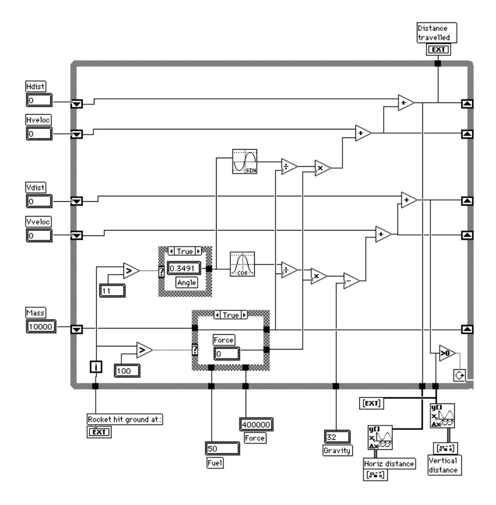

Figure 3: The rocket program in LabVIEW. Input and output are via a 'front panel', not illustrated.

## 4.3 Prograph

Prograph is a visual, data flow, object-oriented language marketed by TGS Systems. We used version 2.5. The language is built around 'methods' (subroutines) represented as icons and connected by the usual lines, carrying data objects from top to bottom of the screen. Each method may have several cases, with a conditional choosing between them.

The 'methods' and their cases are each realised as a separate window, complete with scroll bars, making for a busy screen. There is a method browser (also browsers for classes, attributes, etc.) but there is no overview of the call graph of methods.

Within the method windows data flow runs downwards from an entry bar, where terminals supply incoming data, to an exit bar where terminals accept outgoing data. Each method that is called is represented by

an icon accepting data at the top and producing data at the bottom: double-clicking on non-primitive icons opens their method window in turn. Terminals are connected by lines in the usual way. Unlike LabVIEW dataflow lines, lines can be placed diagonally and cannot contain bends.

A Prograph version of the rocket program is shown in Figure 4. The two quantities **Fuel** and **Gravity**, represented as constants in the Pascal version, are here represented as 'persistents' (although persistents are global variables rather than true constants); this distinguishes them quite satisfactorily from the other variables, although it does not explicitly show that they are constants. The remaining quantities (**Mass**, **Time**, etc.) are all represented as parameters to a single method, **Compute**, just as they were in the Lab-VIEW version. The terminals on **Compute** show that each of the quantities is updated at each iteration. Within the method window for **Compute**, reading from left to right (NB: this direction has no significance in Prograph, which is a concurrent-operation language), the operations are: increment **Time**; compute the new mass; compute the new angle; compute the new force, etc. Attached to **Vdist**, the identifier for the vertical height of the rocket, is a test for 'less than zero': if this test returns true, the attached annotation, a tick-mark with an overline bar, terminates the loop with a success condition. At each cycle the time and the vertical distance are output from **Compute**, and these are gathered up into a list by the '...' terminal and eventually are displayed as a scrolling table of values (code not shown).

The computations for the vertical and horizontal acceleration have been encapsulated into their own methods, partly to reduce the clutter of the top level of **Compute** and partly to exhibit their similarities; but the vertical and horizontal velocities and distances are computed in the main loop, and although they have been laid out to look similar the general clutter obscures them.

Figure 4: ABOUT HERE The rocket program in Prograph.

# 5. Applying the Cognitive Dimensions

In this section we show how the dimensions work by considering each one in turn, relating it to the existing evidence, and showing briefly how it applies to the two VP languages, LabVIEW and Prograph, and occasionally to other languages. Our aim is not so much to evaluate these languages as to use them to illustrate the cognitive dimensions and to demonstrate what type of conclusions the framework leads to.

#### 5.1 Abstraction Gradient

An abstraction is a grouping of elements to be treated as one entity, whether just for convenience or to change the conceptual structure. Programming languages can be grouped as abstraction-hating, abstraction-tolerant, or abstraction-hungry, based on their minimum starting level of abstractions and their readiness or desire to accept further abstraction.

Flowcharts are *abstraction-hating*. They only contain decision boxes and action boxes.

C and HyperTalk are both *abstraction-tolerant*, permitting themselves to be used exactly as they come, but also allowing new abstractions of several kinds to be created. HyperTalk has a low initial level of abstractions, and novices can start by learning how to use fields, then how to use invisible fields, then how to use variables. C has a much higher minimum starting level, so that the novice has many more new ideas to learn before being able to write much of a program. Although criteria for learnability are not the main focus of this paper, we ought to point out that having to master several abstractions all at once presents novices with a 'rubber hamburger' which has to be swallowed because it cannot be chewed. Suggestions for incremental learning environments are made by Scaife and Taylor [76].

Smalltalk, as well as having a high starting level, is an *abstraction-hungry* language: to start writing a program, you first modify the class hierarchy. The user must feed it new abstractions. This is a whole new ballgame. Every program requires a new abstraction; the novice programmer cannot simply map problem entities onto domain entities. (Of course, experienced programmers have a stock of abstractions they have already learnt, ready to be applied in a new situation.)

Finding the right balance is not easy. Learning to think in abstract terms is a high educational achievement. Even the concept of a variable is not without its difficulties for many novices (Rogalski and Samurçay, [71]; Spohrer et al., [83]). Abstraction-hungry systems therefore have obvious disadvantages.

Moreover, abstraction-hungry systems necessarily take a long time to set up, suffer from a sort of delayed gratification, because the appropriate abstractions must be defined before the programmer's inherent goals can be attacked. And there is still much to be done in the understanding of satisfactory mechanisms for the browsing and editing of abstractions, especially at a cognitively relevant level (the story of Carroll and Rosson's 'ViewMatcher' for Smalltalk [12] illustrates the need for intensive, iterated development).

Not surprisingly, many potential end-users are repelled by abstraction-hungry systems. Yet there are good reasons for using them. The classic solution to *viscosity* problems is to introduce more abstractions, so that many components can be treated as a group: this is one of the reasons for the development of object-oriented programming. Well-chosen abstractions can also increase the comprehensibility of a language. Abstractions also increase the protection against *error-proneness* (for example, by declaring all identifiers, mistypings can be detected at compilation rather than run-time).

**Application:** Both our main example languages provide relatively standard control abstractions, i.e. conditionals, loops and subroutines.

Different approaches are taken to data abstraction. LabVIEW conscientiously preserves the *closeness of mapping* to the target domain with an abstraction called a 'bundle' of wires, suitable for parallel signal streams', but there is no provision for extending the data abstractions. Prograph, having no dominating metaphor, cannot preserve such a close mapping; however, it can be used as a full object-oriented system. These abstractions can be built up incrementally, and the abstraction editor avoids imposing unnecessary guessahead. We see early versions of Prograph as an extraordinarily successful example of a language with an abstraction gradient that is both gentle and far-reaching. <sup>2</sup>

More specifically visual possibilities are envisaged by Forms/3 by Burnett and Ambler [9], who write: "Information hiding is supported through visibility. When a value can be made visible on the screen, it is accessible logically as well. This visual mechanism replaces the approach to information hiding found in many textual languages, which generally rely on a combination of declarations and behind-the-scenes scope rules." Due to their simple but powerful approach, everything is done by declarative formulas, and they have thereby managed to create a visual data abstraction facility that has a low overhead in abstraction level: "The user does not have to think about variables, declarations, sequencing, control flow, pointers, state modification, event loops, inheritance tress or hierarchical scope rules in order to program" (p. 59). That is the sort of target we should try to achieve more often.

#### 5.2 Closeness of Mapping

Programming requires mapping between a problem world and a program world. The closer the programming world is to the problem world, the easier the problem-solving ought to be. Ideally, the problem entities in the user's task domain could be mapped directly onto task-specific program entities, and operations on those problem entities would likewise be mapped directly onto program operations. Conventional textual languages are a long way from that goal; VPLs are surprisingly effective.

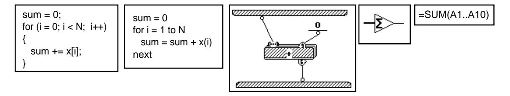

Figure 5: Differences in number of primitives and amount of syntax. All these fragments add up a vector (or where appropriate, a list). Left to right: C, Basic, Prograph, LabVIEW, and a spreadsheet. C introduces many unusual primitives which have no relationship to the user's inherent goals, and requires 'programming games' to put them together. At the other extreme, LabVIEW has a single goal-oriented primitive. (The notations of Prograph and LabVIEW are explained below.)

Figure 5 illustrates the scale of the problem. The C version has a wealth of unusual primitives and lexical clutter (3 kinds of parenthesis and 3 kinds of assignment operator just in these few lines), while the components have to be arranged in a hard-to-remember structure with finicky syntax rules (e.g. when to use a semicolon). Basic makes less fuss about syntax, but it still has the wrap-around loop structure. Prograph makes life somewhat easier because the system stops the loop at the right place automatically, so that no explicit mention need be made of the size of the array (or in this case, the list). LabVIEW just needs a single

<sup>&</sup>lt;sup>2.</sup> The recently introduced CPX version is less gentle; a change in marketing emphasis.

primitive: an array comes in at the left (note thick data line) and its sum leaves on the right. The spreadsheet system seems to have the least amount of unusual components to be understood.

Unfortunately there are few detailed studies in this area. Hoc [53] reviews what we know about programming language semantics and mental models. In his own methodology [39], [53] beginners were first asked to perform a task by hand, in a situation with as few constraints as possible, so that their 'everyday' procedures could be observed. Then they were asked to instruct a device, step by step, to perform the task; first with all data stores visible at all times, then with the data stores covered. This technique gives remarkable insights into both the 'everyday' methods, and into how beginners try to modify them for the programming world. This technique is too time-consuming to use in a broad-brush technique like the cognitive dimensions framework, and it has not yet been widely adopted, so that we know less than we would like to about 'everyday' methods.

**Application:** As dataflow languages, both our target languages avoid some of the 'programming games' associated with other computational models. LabVIEW affords close mapping to its electronics schematic metaphor; if its metaphor fits the user's domain, then the language may be transparent to the task. The many task-specific library functions help. However, where the 'wiring' metaphor fails, there are difficulties: for example, the looping and sequence constructs require understanding the 'shift register', a local variable that transfers values from the end of one iteration to the beginning of the next. This is an extra piece of conceptual apparatus, which is of course part of the program's world and not part of the external domain world.

It has been ably argued by Nardi [51] that for end-users, a domain-specific programming language supported by a visual formalism, such as the spreadsheet grid, will give the best of all worlds. Her approach has been much extended in Repenning's Agentsheets [65], [66]. An Agentsheets program consists of a sheet of agents organized in a grid. Agents can interact with locally-reachable agents (neighbours on the grid) and they can represent themselves on a display. Although the underlying definitions of agents are in Lisp, and are supplied by a designer, the system supports end-user programmers who select agents and place them on a worksheet to create programs.

Agentsheets are in many ways like spreadsheets plus visual effects, with the added feature that the components are active. To put together a simulation of water pipework, the programmer can just place virtual pipes next to each other; the agents behind the images 'know' how to join themselves up and make water flow. Indeed, Agentsheets appears to score very well on closeness of mapping. The objects in the programming domain not only match the behaviour of the objects in the problem domain, but they also resemble them in appearance; and on top of that, using agents that know how to join themselves up or interact in other ways eliminates many of the 'programming games' found in other systems. It will be interesting to see how this system fares in action.

#### 5.3 Consistency

The notion of consistency or harmony in programming language design goes back a long way, but it has been difficult to define. No doubt it would be widely agreed that a language is inconsistent if (like Pascal) it allows reals and integers to be read and written, but not booleans, even though booleans are treated in the same way as integers and reals for most other purposes.

For our purposes we can take it as a particular form of guessability: when a person knows some of the language structure, how much of the rest can be successfully guessed? Green [27] produced arguments that a consistent language was easier to learn and suggested that a two-level grammar was one way to model the programmer's knowledge of consistency; this led to Task-Action Grammar [58] but it became clear that estimating consistency by creating a special grammar required very detailed analysis, and was unsuitable for broad-brush approaches. At present we have little alternative but to rely on introspection.

Reisner [64] made it clear that there had a been a confusion in early approaches to this problem between two meanings of 'consistency': a language might have been put together more or less at random, in an arbitrary way; or it might be seen as highly consistent by its designer, but might create problems for a learner because his or her understanding of the structure was different from (inconsistent with) the designer's.

Lisp seems to be an example of this problem. Many learners understand that the structure of a function call is:

```
(FOO ARG1 ARG2)
```

When they come to define a function, they may write something like this:

```
(DEFUN (FOO ARG1 ARG2) ....)
```

That would be consistent with a structure in which DEFUN took as its first argument a reference to a function.

The correct form is:

```
(DEFUN FOO (ARG1 ARG2) ....)
```

In the correct form, DEFUN is a call to a function, FOO is its first argument, and (ARG1 ARG2) is its second argument. Thus this second is also perfectly consistent – but consistent with a different structuring.

**Application:** VPLs have shown a real improvement in consistency, partly because they have a much simpler syntax. In our two target languages we have not noticed any particular problems of consistency.

#### 5.4 Diffuseness/Terseness

Some notations use a lot of symbols or a lot of space to achieve the results that other notations achieve more compactly. It is difficult to dissect this difference in a wholly satisfactory way, because notations which have a very close mapping to the problem domain will require fewer lexemes to achieve their results, and

will therefore appear terse; whereas our interest is in the diffuseness of notations independently of closeness-of-mapping.

The cognitive implications of unrestrained diffuseness will be self-evident – the more material to be scanned, the smaller the proportion of it that can be held in working memory, and the greater the disruption caused by frequent searches through the text. But over-terseness has its problems, too. If wholly different programs are hardly different in any visible way, scanning becomes difficult. Clearly there is some happy mean, and we do not pretend to know how to state it.

**Application:** The real-estate problems of visual notations are a commonplace. What is more surprising is the number of 'entities' or 'lexemes'. We do not pretend to have a perfect definition of an entity, but if we count words, icons and connectors, the results for the rocket program are unexpected, to say the least.

In Basic, the rocket program occupies 22 lines and uses 140 'words', fitting easily onto the screen. In Lab-VIEW the rocket program uses 45 icons (counting the shift registers, which come in pairs, as 1 per pair) and 59 wires, a total of 104 different graphic entities. It readily fits onto a medium sized screen.

Prograph is much more diffuse, the rocket program occupies 11 windows, with a total of 52 icons for methods, constants and tests, and 79 connectors, making 131 graphic entities. (We have not counted the data bars at the top and bottom of each method, because these are inserted by the system when a method is first created.) There is no question whatever of having all the program visible simultaneously, even on a large (15-inch by 11-inch) screen.

So we conclude firstly, that adopting the dataflow paradigm has not reduced the number of entities as much as we had expected, and secondly, that the physical size is hardly related to the number of entities.

## 5.5 Error-proneness

There are, of course, errors and errors. It is conventional to distinguish between 'mistakes' and 'slips', where a slip is doing something you 'didn't mean' to do, where you knew what to do all along but somehow did it wrong; contrast with those parts of program design and coding that are *deeply* difficult, where mistakes of problem analysis are quite common. The distinction is by no means perfect but will serve.

Textual programming languages contain a number of syntactic design features that help slips to occur or make them hard to find once they have occurred. Merely having to type long identifiers is a source of mistypings, obviously enough, and early language designs had no facilities for catching these; until the declaration was invented, new identifiers were declared by being used (as they still are in some languages). In consequence there are well-known war-stories recounting how a single mistyping in a Fortran, Basic or Prolog program caused untold disasters long after the program was thought to be fully debugged.

Another potent source of slips is the paired-delimiter system: parentheses in Lisp, begin-end in Pascal, and a wide variety of paired symbols in C – in all cases, it is not uncommon for the pairing to go wrong. Pascal's semicolon-as-separator convention is another problem, at least for novices, who think the semicolon is a terminator and write

```
if A then B; else C;
instead of

if A then B else C;
```

**Application:** None of these error sources can be found in the two target languages in any serious quantity. Far fewer identifiers are needed and it is easy to fetch the names by copying them or by some other direct reference. Pairings are inserted automatically in the few cases where they occur (both languages use paired data-ports in loops, for instance). Delimiters and separators are not needed because the syntactic structure is different. Data-flow dependencies are made explicit by the lines. So the frequency of slips due to these causes should be dramatically reduced, compared to a primitive language such as early Fortran.

#### 5.6 Hard Mental Operations

Consider the following sentence:

Unless it is not the case that the lawn-mower is not in the shed, or if it *is* the case that the oil is not in the tool-box *and* the key is not on its hook, you will not need to cut the grass....

Much innocent amusement can be had from dressing up fairly simple contingencies as impenetrably as possible. But there is no delight in being forced to do real work with such stuff, and programming languages should avoid such 'brain twisters', the mental equivalents of tongue-twisters.

'Hard mental operations' are defined by two properties. First, the problematic mental operations must lie at the notational level, not solely at the semantic level, because our topic of interest is how to design good notations, rather than in the question of which meanings are in themselves hard to express, whatever the notation. Conditionals and negatives meet this requirement, because their familiar problems can be made very much less if they are re-expressed in decision tables or various other formats [90], [13], showing that a substantial component of the difficulty is at the notational level rather than the semantic.

The second defining property of a 'hard mental operation', as we use the term, is that combining two or three of the offending objects vastly increases the difficulty. A single one of the conditional clauses would be easily interpreted. Multiple negatives have the same problem as complex booleans; so do self-embedded sentences ("The man that the horse that the dog chased kicked fed the cat.")

The broad-brush test for hard mental operations, then, is: (i) if I fit two or three of these constructs together, does it get incomprehensible? (ii) is there a way in some other language of making it comprehensible? (Or is it just a really hard idea to grasp?) If the answer is Yes to both, then it counts.

**Application:** Although VPLs seem such a simple and intuitive idea, we were surprised to realise that the need for hard mental operations was not uncommon. The difficulties we have observed have all been to do with control constructs.

Difficulties arise in LabVIEW when conditionals are built from logic gates, as in Figure 6. The authors observed subjects, some of whom were professional electronics engineers and others amateur but experienced LabVIEW users, as they solved such problems [32], [36]. The subjects could be seen winding their fingers in and out over the screen trying to follow the logic; they were evidently experiencing great difficulties keeping track of their peregrinations. To some degree their strategies improved with experience [63] but even expert readers of schematics experienced difficulties. Similar results have been reported for Petri net programs [49]. It is clear that such a process makes severe demands on working memory.

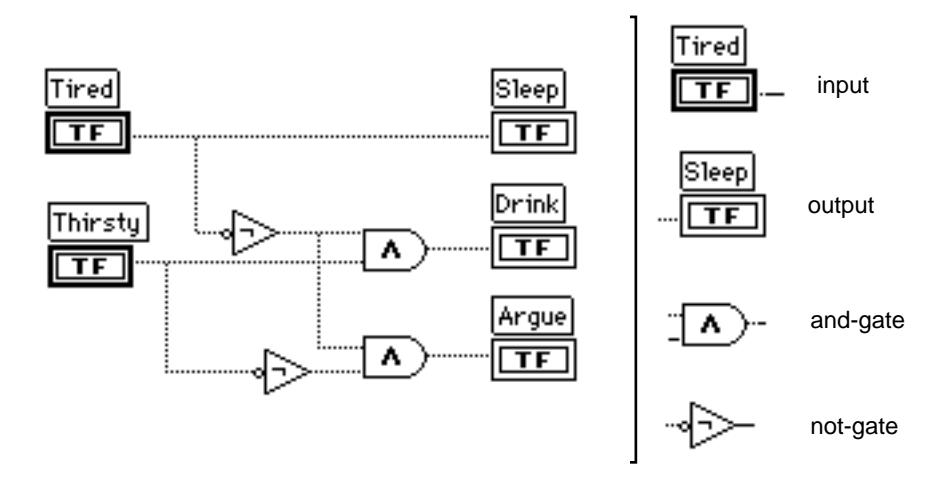

Figure 6: Unsuspected hard mental operations in LabVIEW. Problem: if 'Tired' and 'Thirsty' are both false, which one of the three outputs receives a true signal?

At first it seems surprising that the task should be so difficult; after all, the logic-gate notation is extremely well-known, one of the standard design notations. How can it be that simple problems expressed in a popular notation can be so hard? The answer may well be that the notation evolved as a paper-based notation. Paper allows the reader to make annotations showing what combination of signals drives each wire to a 'true' state. (It also allows the reader to make little pencil marks to help keep track of the search process.) On the screen, though, pencil annotation is impossible, and without annotation the task becomes one of maze searching. A plausible account of the typical procedure, agreeing with the patterns of behaviour we observed, is as follows (see Figure 7 for an illustration of the search):

Take first truth-value, Tired=False. Scan to find Tired in program. Propagate False along the wire. Place finger at choice point and consider each direction in turn.

- Propagate horizontally first. On reaching next component, Sleep, abandon this branch, since we haven't sent a True to an output yet.
- Now propagate downwards. On reaching the invertor, start to propagate True. On reaching junction, place finger at choice point and consider each direction in turn.
  - Propagate horizontally first. On reaching and-gate, place finger on it and start to search backwards. Search reaches input Thirsty. Look up truth-value, which is False. Return to most recent finger; abandon this branch since the conjunction is false.

- Return to previous finger. Start to propagate downwards. On reaching and-gate place finger on it and start to search backwards. On reaching invertor, remember to invert next signal found. Search reaches Thirsty which is set to False so invertor is set to True. Return to most recent finger and continue propagating True. Search reaches Argue. Stop with output 'Argue'.

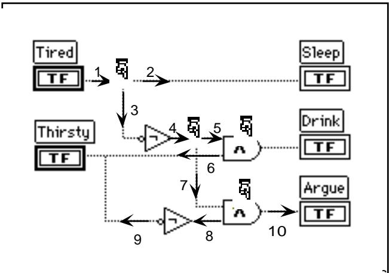

Figure 7: Search page shave been marked; each of these points must be remembered in case the search has to backtrack.

Prograph fares no better. Here, the control of loops, with repeated reversals of success and failure, has all the signs of a classic 'hard mental operations' example. (It should be noted the following analysis is purely speculative, and is unsupported by empirical data; but we are very confident.) Consider searching a list for an item – not a very demanding task. Prograph uses success and failure signals to control searches and to flag the result. The solution in the Tutorial supplied uses two methods, each with two cases. Method 1 ('searcher'), case 1, calls Method 2 ('search a list'); if Method 2 succeeds, then the target was *not* found, and control switches to case 2, which gives a Not-Found message; if Method 2 fails, then control stays with Method 1 case 1, which gives a Found message.

Method 2 case 1 has two tests: first, is the container equal to the target? if that succeeds, then fail; and second, is the container a list? if that succeeds, then switch to case 2, which recurses into the list members; if the recursion fails, then case 2 fails. Back in case 1, if the container is not a list, then the case succeeds.

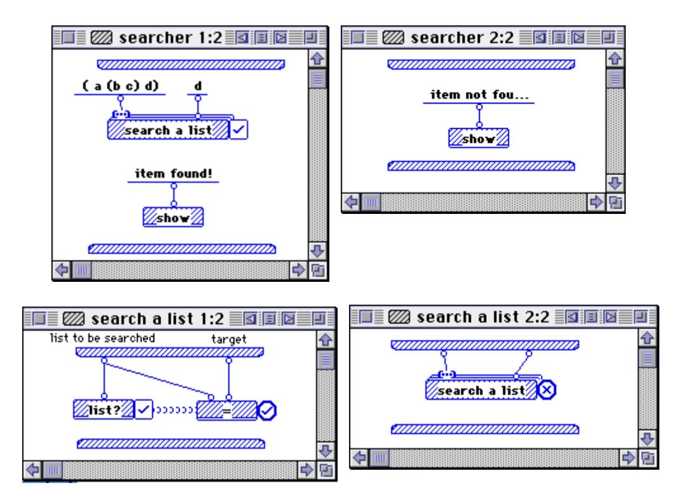

Figure 8: A Prograph program to search a list such as (a (b c ) d) for a target, such as d. See text for explanation.

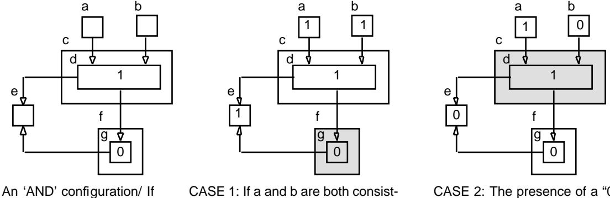

the inputs to boxes a and b are both "1", this will generate a "1" in box e; other inputs generate a "0".

ent with d, box d is allowed to send its "1" signal. Box f receives different signals from d and g, so both are suppressed; box e therefore receives only the "1" from d.

CASE 2: The presence of a "0" in the input conflicts with the "1" from box d causes box c to suppress all signals, thereby allowing box g to send its "0".

Figure 9: Conjunction made difficult: an 'and' configuration in Show-and-Tell. More complex expressions, such as (p or not-q and r), would undoubtedly become overwhelming.

A last example of hard mental operations. One very interesting VPL, 'Show and Tell' [41] uses a dataflow model in which the usual conception of conditionality has been replaced by a consistency constraint: data cannot flow into or through a box that is in an inconsistent state. Inconsistency originates when a box receives two or more inputs that do not agree, or when its input disagrees with a stored constant (Figure 9)<sup>3</sup>. This ingenious device evades many of the visibility problems, because no encapsulation is required, but it creates a serious difficulty when the conditionals get more complex.

Understanding these three examples in LabVIEW, Prograph, and Show-and-Tell reminds us of those classic 'knights and knaves' puzzles in which knights always tell the truth and knaves always lie, but are indistinguishable. A typical example taken from Rips [67] goes like this: A says that B is a knave; B says that A and C are of the same type (i.e. both knights or both knaves); what is C? The answer goes as follows:

Suppose A is a knight, then B is a knave, so what B said is false, so A and C are different, so (since A is a knight by hypothesis) C must be a knave.

Alternatively, suppose A is a knave, then B is a knight, so A and C are of the same type, so (since A is a knave by this hypothesis) C must be a knave.

Answer: C is a knave.

Rips showed that his subjects (university students with no training in formal logic) had poor scores on these problems. The exact explanation is still a matter of disagreement among cognitive theorists ([22], [40]) which means that it is not yet possible to give a complete account of how to impose or avoid 'hard mental operations'. More research is needed here, both in investigating the psychology and in testing the comprehensibility of VPLs.

#### 5.7 Hidden Dependencies

A hidden dependency, as its name suggests, is a relationship between two components such that one of them is dependent on the other, but that the dependency is not fully visible. In older text-based languages, the 'side-effect' was a much-frowned-upon form of hidden dependency, in which a function or subroutine surreptitiously altered the value of a global variable.

Today the classic example is the spreadsheet. The formula in a cell tells which other cells it takes its value from, but does *not* tell which other cells take their value from it. In the worst case the whole sheet must be scrutinised cell by cell before one can be certain that it is safe to change a cell. Hidden dependencies are apparently responsible for a very high error frequency in spreadsheets [57], possibly because the spreadsheet programmer hopes for the best rather than scrupulously checking out all the consequences of a change. When spreadsheets are viewed in the data-view mode rather than the formula-view mode, the problem becomes still more acute.

Other examples include GOTOs and subroutine structures (where is this subroutine used?); in both cases, the absence of a 'come-from' means that it can be risky to make a change to the code. Most VPLs, especially those using data-flow, make GOTO dependencies explicit, but subroutines remain a problem — one that may be amplified by nesting.

<sup>&</sup>lt;sup>3.</sup> One of our readers commented "This figure is, frankly, obscure." That is exactly our point.

|   | А      | В          | С     | D       | Е     | F           |
|---|--------|------------|-------|---------|-------|-------------|
| 1 | item   | unit price | units | price   | tax   | total price |
| 2 | apples | £ 0.84     | 2     | = B2*C2 | 0. 29 | = E2*D2     |

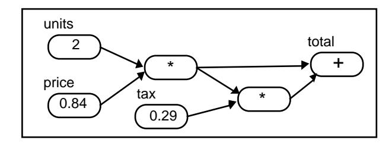

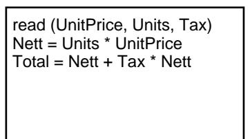

Figure 10: Hidden and explicit dependencies. Spreadsheets (top) contain hidden dependencies which can interfere with comprehension and debugging: e.g. cell D2 records that which cells it refers to, but does not indicate which cells it supplies data to. The data flow representation (bottom left) makes the dependencies visible (but increases the viscosity). Conventional imperative text languages (bottom right) use variables: because their names have to be remembered and have to be matched symbolically rather than perceptually, they could be classed as partially hidden. Notice that the required material is visible in all these cases; it is the *dependencies* that are hidden.

Cross-referencers and call-graphs are remedies for hidden dependencies in conventional languages: antecedents and dependents trees are remedies in data-flow languages. Where computed targets are permitted, such as computed GOTOs, no general remedy is possible. An unfortunate consequence is that it becomes impossible to discover which objects are 'live' (that is, are referred to by some other object) and which are 'dead'. In small systems, exhaustive search may be used to discover which objects are dead. In large systems search is infeasible, and the system accumulates 'fossils': objects which are presumed dead, but which nobody dares throw away just in case they aren't dead after all. Unix filestores typically contain a very large number of hidden dependencies, with large numbers of 'dot' files used as data by other scripts, many of which are in fact fossils silting up the system.

Hidden dependencies can be a severe source of difficulty. Eisenstadt [21] recorded in detail his own activity in several lengthy sessions with HyperTalk and recorded eight types of problem. Two of these were directly related to hidden dependencies, his problems 6 and 7: "(6) Traversal of indirect data influences (data flow) requires too much detective work. (7) Understanding the precise conditions under which a particular event happens (control flow logic) requires too much detective work." The effects on debugging are sometimes dramatic, as he illustrates.

**Application:** In contrast to text languages, the box-and-line representation of data flow scores really well at a local level, the lines making the local data dependencies clearly visible. Both LabVIEW and Prograph therefore do well in avoiding the problem. LabVIEW uses virtually no variables at all, whereas Prograph has persistents which can act as global variables. These are different positions in the 'design space'. The Prograph position is presumably that if no globals at all are allowed, the program will get cluttered with too many lines.

But although local dependencies are made visible, long-range data dependencies are a different issue. Prograph has an extraordinarily large number of long-range hidden dependencies, created by the combination of a deep nesting with the lack of an overview of the nesting structure. Although the programmer can quickly navigate down the call graph by clicking on method icons to open their window, then clicking on the icons found there, etc., there is no way to proceed *up* the call graph in the same way. In general, to discover which method calls a given method, and thereby to determine its preconditions, can require an extensive search. To alleviate the difficulty, a searching tool is provided; it would be interesting to know how successful the tool is with expert users.

#### 5.8 Premature Commitment

Sometimes the user is forced to make a decision before the information is available. The problem arises when (a) the notation contains many internal dependencies, (b) the medium or working environment constrains the order of doing things, and (c) the order is inappropriate. Try writing the contents list – with page numbers – before you write the book!

The difficulty is that until you see your first efforts, you often have little idea of how to make your initial choices: yet the nature of the system is such that these choices are forced upon you, before you're ready. In general, enforced look-ahead – and the danger of premature commitment – occurs when (i) there are internal dependencies among components, and (ii) there are order constraints which restrict which components can be created first. And even then, there may be no untoward consequences if the programmer can readily recover from the commitment – i.e. if the system is fluid rather than viscous. (For discussion of viscosity see below, Section 5.12.) But when the system is unforgivingly viscous, it can be catastrophic.

Observation suggests that programmers cope with enforced guess-ahead in various ways, such as working the problem out in advance, either mentally or on paper; or by leaving placeholders where needed, and going back later to fill in holes. This second style was repeatedly observed in studies of programmers using Pascal and other languages [4], [15], [56]. Unfortunately we know of no comparable studies on VPLs.

**Application:** VPLs using the box-and-line representation have less commitment to the order of creating code than text languages. They typically allow code to be developed in any order, allowing programmers to expand conceptual goals and subgoals in an order that is compatible with the conceptual order in which they come to mind. Nevertheless, many kinds of lookahead problems can arise. We shall identify a number of forms that we have observed. (An interesting example occurred in Modugno's 'Pursuit' environment for visual programming by demonstration; it would be too difficult to explain here, but see [48])

*Commitment to layout:* Obviously, the visual programmer has to make the first mark somewhere on the virtual page. As the program takes shape it may become clear that the first mark was unfortunately placed, or that subsequent marks were ill-placed with respect to it and each other. Although there is always some

way to adjust the layout, the viscosity may be too high for comfort. That is certainly the case with complex LabVIEW programs.

Commitment to connections: The 2-dimensional layout of VPLs requires subroutines to be associated with their callers by ports with a definite placing. In both our target languages, one easily finds that the data terminals are not arranged in the order one wants them for a particular purpose. For example, in Prograph, the order of terminals is usually chosen to minimise wire crossings, but the lookahead to get this right is quite extensive, so even in the simple rocket program some unnecessary crossings occur. Figure 11 shows the 'visual spaghetti' created by not looking ahead – this example is drawn from practically the first method window opened in the first author's file of Prograph programs. The point here is not that it is possible to make a horrible-looking program; that's true in any language. The point is that it needs a lot of lookahead to avoid making a mess. Worse, because of the high viscosity of these languages, it takes too much time to clear it up, so the mess gets left.

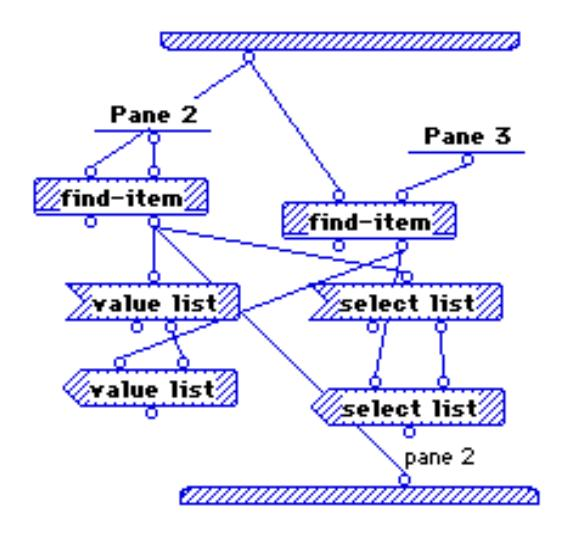

Figure 11: 'Visual spaghetti'. To avoid this, the programmer has to look ahead. This example is in Prograph, but the same problem occurs in LabVIEW or any other box-and-wire language.

Commitment to order of creation: Whenever the interpretation of a program depends on the order in which entities are created, there is a risk of premature commitment. NoPumpG, a 'visual spreadsheet' [44], can cleverly model constraint-based systems, but the evaluation of certain formulas depends on the order of creation of the cells; there is no 'shuffle' operator, so if you build the cells in the wrong order, you have to delete them and start again. Another potential example occurs in Forms/3 [9] where 'visual abstract data type event receptors' are represented by on screen 'cells'. When two or more cells overlap on screen, the top cell gets the event (p. 53). The difficulty about this, clever though it is, is that the cells must be created in the right order, so that the last to be created is the one that is to receive the event; or else the user must be given some means to shuffle the order.

Commitment to choice of construct: When a programmer chooses a syntactic construct and then adds code to the construct, it may turn out subsequently that the construct is the wrong one (e.g. while should be

changed to *for*). Therefore, programmers may prefer to postpone commitment to a particular construct until the code has been further developed. Gray and Anderson [25] noted novices' problems in the construction of Lisp conditionals. Lisp conditionals sometimes require the programmer to make an early commitment to a particular form, and they found that many instances of change-episodes were cases where the programmer's first guess was wrong and had to be undone.

Early versions of LabVIEW suffered exactly the same problem; once a control construct had been selected, it was a tiresome chore to change it. More recent versions of LabVIEW solve the premature commitment problem partly by postponing commitment, as well as by making it easier to change the decision (specifically, it is now possible to draw a loop around existing code, just as a for-statement can be inserted into a textual program.)

### 5.9 Progressive Evaluation

It is a standard finding in many domains that novices need to evaluate their own problem-solving progress at frequent intervals. The possibility of 'progressive evaluation' is downright essential for novices. Experts can usually live without it if they have to, but even they prefer to have it: for instance, experts tend to run their programs more frequently while debugging than novices do [37]. Consequently, the programming environment needs to support 'progressive evaluation' of partially-finished programs.

The opposite type of environment, in contrast, prohibits any testing until the program is completely ready. Only then can it be compiled and run. Sometimes programmers use work-arounds to defeat such systems – for example, at early stages of development Pascal programmers regularly use procedure 'stubs' (empty procedure definitions, with a declaration part but no body) rather than write out the procedures in full.

**Application:** LabVIEW programs cannot be executed until every wire is sound, every data sink is attached to a source, and any subroutines required are present. Its requirements are very similar to Pascal.

Prograph, on the other hand, is excellent for progressive evaluation. In fact, it will allow an almost non-existent program to be evaluated, with new code being added each time the evaluation runs out of somewhere to go; and if incorrect partial results have been computed, the programmer has the options of simply changing the data being transmitted to what it should be, or changing the code that has already been executed, thereby causing execution to roll back and repeat itself.

## 5.10 Role-expressiveness

In the folklore of programming it is widely agreed that some programming languages are hard to read; unfortunately, which ones are hard is not so widely agreed. The dimension of role-expressiveness is intended to describe how easy it is to answer the question 'what is this bit for?' There have been very few studies on comparative comprehension of equivalent programs expressed in different notations, except for

cases where the cause of difficulty was clearly the presence of *hard mental operations* (as in [36]), poor *secondary notation*, etc.

Role-expressiveness is presumably enhanced by the use of meaningful identifiers [84], by well-structured modularity, by the use of secondary notation to signal functionally-related groupings, and by the presence of 'beacons' that signify certain highly diagnostic code structures [88]. We note with interest that not all of these are readily available in our two target languages.

Role-expressiveness can be improved by adding an explicit 'description level' [35]. Hendry and Green [38] have shown that this works well for spreadsheets, but VPLs have not been explored.

**Application:** LabVIEW programs have no identifiers, have poor secondary notation, and (in our own admittedly limited experience) do not contain obvious beacons. However, they can be structured into well-defined subroutines, and some programmers use case or sequence constructs simply as modules.

Prograph programs contain identifiers, but they have poor secondary notation. There are some very standard cliché-like code-groups that possibly serve as beacons. Because programmers are forced by the syntax to create many methods, it is not easy to signal modularity by putting all of one module into one method.

Prograph contains one notable piece of lexical ambiguity, the annotation of methods with tick or cross. This annotation is not self-disclosing, and it is necessary to *remember* whether the structure shown in Figure 12 means "Do the FOLLOWING case if the test fails" or "Do THIS case if the test fails"; far better would have been to introduce an indicator to show which was meant. It is especially unfortunate that this problem arises in the expression of conditionals, which are difficult enough in the best of circumstances and which are always a source of potential trouble to all programmers. (To assist in deciphering the rocket program, readers may like to know that the meaning is in fact "Do the following case if the test fails".)

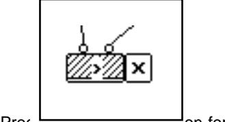

Figure 12: This conditional test in Prograph combines and on for 'greater than' with an icon saying what to do if the test fails; unfortunately there is no explicit indication whether it means 'stick with this case after failure' or 'switch to next case after failure'.

## 5.11 Secondary Notation and Escape from Formalism

Many programming languages allow extra information to be carried by other means than their formal syntax: indenting, commenting, choice of naming conventions, choice of programming construct, and grouping of related statements. These techniques have no place in the formal semantics of the algorithm, but they all convey meaning to the human reader.

Regrettably, this extra channel of communication between programmer and reader seems to have been little investigated. In other domains, experts regard it as indispensable. Petre and Green [62] found that electronics CAD designers regarded component placement as a very valuable resource that could make a substantial difference in the readability of a schematic. Conversely, less experienced designers apparently produce schematics which are hard to read, even by experienced designers. If the same applies to programming, we should at least give experts languages which have good scope for secondary notation, because they are likely to be creating complex programs which will need to be understood by others (or by themselves at a later date when they have forgotten how the program worked!). Novices, on the hand, might possibly benefit at the start from a more constrained system in which secondary notation was minimised: but that is pure conjecture: more research is needed here.

One of the difficulties of researching this area may well be that the use of secondary notation is idiosyncratic and private, except perhaps in tightly-managed industrial programming. Thus, although in laboratory settings it can be shown that secondary cues such as indentation can improve comprehension [24], it is well-known that indentation styles vary greatly, and observations on expert programmers 'in the wild' showed that they used secondary notation in many different ways (Petre, in preparation).

Conventional programming languages, rather surprisingly, allow a substantial amount of secondary notation. In the Basic version of the rocket program, statements have been collected into paragraphs which help to reveal the 'rhyme' between how vertical and horizontal components are treated. This allows the reader to check and see that the differences are just as expected – i.e. that the vertical component allows for gravity, unlike the horizontal. If the revised version allowed for air resistance in one component and not the other, that would be made obvious.

Vaccel = Thrust\*COS(Angle)/Mass - Gravity Vveloc = Vveloc + Vaccel Vdist = Vdist + Vveloc

Haccel = Thrust\*SIN(Angle)/Mass Hveloc = Hveloc + Haccel Hdist = Hdist + Hveloc

Figure 13: 'Rhyming paragraphs' are frequently found in textual languages. Note the use of both white space and choice of statement order to get the desired effect.

Closely related to secondary notation is the possibility of an escape from the formalism altogether. No programming language captures everything that a programmer has to say about a program. If programs are to be used as a means of communication, some other mechanism must be provided with which to escape from the bounds of formalism. Petre and Green's electronics designers using CAD packages made the same point. Programmers need to map the program onto the domain and 'tell a story' about it; and they need to document sources ("The next part follows the method of X and Y") or doubts and intentions ("This part is untested, but I'll check it out soon"). Green et al. [35] put forward an argument for formalised means to allow programmers to make any desired assertions about the program, as a 'description level'.

The main existing resource is the *comment*, which sometimes can only be applied to a single program primitive, sometimes to a combination of primitives. Comments which only apply to a single primitive are not very useful as a means of communicating the programmer's view of the program structure.

**Application:** One of the large gaps in existing research is any study of the effects of secondary notation in VPLs. In our target languages, the opportunities to use layout as a means to express secondary aspects are very limited.

Prograph's secondary notation, in fact, is almost nil. Comments can be attached to primitives and user-defined methods and to data ports, but groups of objects cannot be commented. The method boxes can, in principle, be laid out anywhere in a window, but in practice the layout is dominated by the wish to keep the dataflow lines reasonably tidy; in any case, because the deep nesting of Prograph code into methods and submethods means that not very much code is visible in any one window, the opportunities for using layout to communicate are quite restricted.

LabVIEW is a flatter representation with more information per window, so, by careful placement of operators and data lines, it is possible to show relationships between parts of the program. This requires some practice, and is exceedingly tiresome because the system is (as already noted) viscous. Comments can be attached to operators and to wires, but not to groups. Backgrounds can be coloured, which may be useful at times.

In the rocket program, the processing paths for the vertical and horizontal components have been laid out in a similar fashion, to emphasize their algorithmic similarities or 'rhyme'; this allows as nearly as possible a simple and accurate perceptual-level comparison, whereas if they were laid out differently a topological comparison would be needed. To achieve this parallelism is by no means the work of a moment. (Contrast this with the swift re-arrangements possible in Basic or Pascal.) Expert LabVIEW programmers see this as important. One of our informants reported "I quite often spend an hour or two just moving boxes and wires around, with no change in functionality, to make it that much more comprehensible when I come back to it." It is hard to imagine a Pascal programmer having to spend an hour or two doing nothing but re-arranging the components of the program to make it comprehensible. Text-based programmers are aware of the need for white space and indenting, but usually they solve it as they go along. (On the other hand, text-based programmers might spend that much time going back over a program and inserting comments. Maybe this is a case of swings and roundabouts.)

We regard their weak secondary notation as a serious deficiency in these two VPLs, which seem to be typical of existing box-and-line designs. Visual grid systems offer different possibilities. Repenning's Agentsheets system [65], [66] replaces the box-and-line with a sheet of agents organized in a grid (see Section 5.2). Although the need for interaction constrains the placement of agents, it is probable that the arrangement can be modified by the programmer to convey extra information.

A more thorough-going approach is to create an explicit 'description level'. Hendry and Green [38] added a simple description level to a commercial spreadsheet system. Their system was deliberately minimal, to avoid raising the abstraction level unnecessarily. It allowed tags to be attached to groups of cells (not necessarily contiguous); the user could control the shading attached to tagged cells. Tagged regions could be linked by arrows. Simple though this was, it allowed representation of all the assertions made in a corpus of descriptions of spreadsheets by professional users.

#### 5.12 Viscosity: resistance to local change

The 'viscosity' of a fluid is its resistance to local change. We apply it to programming languages (and other information structures) to mean how much work the user has to put in, to effect a small change. Obviously this depends on the precise change, but in general, some programming languages/environments need more work. One standard example of viscosity is having to make a global change by hand because the environment contains no global update tools. A 'smart' environment reduces viscosity by introducing abstractions. (See [29] for a more detailed account of viscosity.)

Viscosity matters. All studies of programming show that changes and revisions infest the whole course of programming activity, from specifying to designing to coding. This is not because programmers and designers are stupid and careless, but because of how human reasoning works: we need to see a sketch and have it 'talk back to us'. Very skilled designers can do moderate problems in their heads. Normal designers can do easy problems in their heads. Nobody can do big, hard problems in their heads. Which is a pity, because those are the ones where the effects of viscosity will be most apparent.

The first impression might well be that dataflow VPLs have low viscosity. To add an extra bit of code, you only have to break a wire and insert the new boxes. *That is not so.* The box-and-line style favoured by many VPL designers can easily make for a viscous system, unless a good diagram editor is used (Figure 14).

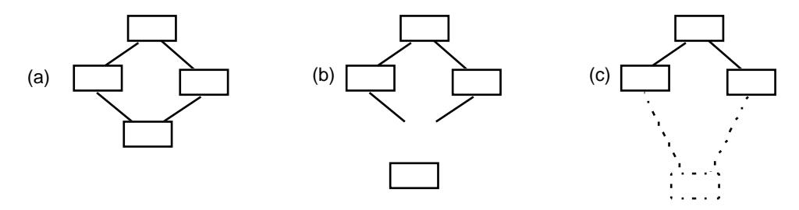

Figure 14: Potential layout viscosity in box-and-line notations means that good diagram editors are essential. If each component has to be moved individually, layout viscosity is extremely high (as shown in (b)). A better method is to treat links as rubber bands (as in (c)).

**Application:** As a straw test of viscosity, we made the same change to each version of the rocket program: we added code to take account of air resistance, exerting a drag proportional to the square of the velocity. The topological change to the program is tiny, but the time taken to make the change is hugely different for the three programming languages.

Because we wanted to measure the time to edit the program but not the time taken to solve the problem, our straw test was conducted in two stages. First one author (TG) constructed a modification (Appendix Figure 1 shows the LabVIEW solution, for example) and took a screen dump of it. Then we gave an experienced user the original program and the screen dump of the required final result, and timed how long it took to edit the original programs into the required shape.

Inserting the material into LabVIEW took a surprisingly long time because all the boxes had to be jiggled about and many of the wires had to be rebuilt. Prograph was able to absorb the extra code to deal with air resistance with little difficulty — certainly less than evidenced by LabVIEW. This was because the new code was placed in new windows, and relatively little change had to be made to existing layouts. For Basic, the problem is just one of typing a few more lines. Overall time taken was as follows: LabVIEW, 508.3 seconds; Prograph, 193.6 seconds; Basic, 63.3 seconds - an astonishing ratio of 8:1 between extremes. These are differences of a whole order of magnitude, and if the programs were larger we would expect them to increase proportionately (i.e. to increase faster for LabVIEW, slower for Basic).

#### 5.13 Visibility and Juxtaposability

The visibility dimension denotes simply whether required material is accessible without cognitive work: whether it is or can readily be made visible, whether it can readily be accessed in order to make it visible, or whether it can readily be identified in order to be accessed. Long or intricate search trails make poor visibility. (Contrast with hidden dependencies. Visibility measures the number of steps needed to make a given item visible, hidden dependencies describes whether relationships are manifest.) An important component is <code>juxtaposability</code>, the ability to see any two portions of the program on screen side-by-side at the same time.

In the early days of programming when programs were relatively short there was little difficulty in seeing everything at once; but as program lengths increased by orders of magnitude it became necessary to take drastic steps. Among these steps were the development of terser notations with high-level operations (notably APL!) and increased use of procedures and libraries to hide localised detail. But, although using procedures improves visibility within one level, *across levels it can create real problems*.

For example, HyperCard disperses little packets of HyperTalk code (scripts) in many different places through the stack. For a single script, the local visibility is good; the code is usually associated closely with the object that uses it. But the result of the dispersal is that overall visibility is low. We have noted above (section 5.7) the debugging difficulties chronicled by Eisenstadt [21], caused by the many hidden dependencies and the poor visibility.

Early versions of Hypercard also had dismal juxtaposability, because it did not allow two scripts to be viewed at the same time. The code for one button had to be remembered if it was to be compared to another the code for another one. Happily, this oversight has now been remedied.

Spreadsheets, with their two layers (data and formulae), have asymmetric visibility. When the sheet as a whole is displaying data, the formula in exactly one cell can be made visible. Obviously it will be difficult to compare that formula to any others. When the sheet is displaying formulas, the comparisons are easy – but now it is no longer possible to see the values computed by the formulas, which loses much of the point of the spreadsheet model.

Viewing related components simultaneously is essential, according to our model of programming. The cognitive justification is twofold. (i) Programmers often solve one problem by refining an earlier solution to a related problem, so they need simultaneous access to both pieces of code. (ii) Programmers understand a program not just by local inspection but by looking at a sweep of things in order to form a whole [70], hence requiring the ability to view simultaneously quite a number of program items which may be widely dispersed. The absence of side-by-side viewing amounts to a psychological claim that every problem is solved independently of all other problems.

When side-by-side viewing is not supported by the environment, programmers have two choices. They can rely on working memory, frequently refreshed by revisiting the two items being compared in turn, or else they can make a hard copy of one component to study. The second strategy amounts to decoupling themselves from the given environment and proving themselves with a new environment in which side-by-side viewing is possible.

Serious visibility problems can be remedied by the provision of browsers, such as Smalltalk-80's class browser, and the provision of alternative views — for instance, some of HyperCard's problems have been eased in other systems by providing a 'contents list' of all the cards in the stack. There are several advanced systems (especially in the Lisp community) that allow definitions of procedures and functions to be called up instantly, which makes navigating across levels easier, but this is not a sufficient remedy unless the different parts can be viewed simultaneously. (Notice, in passing, that all these remedies rely on a view of a different abstraction from the main programming language.)

**Application:** LabVIEW visibility is good in most areas but conditionals are a problem. In total defiance of juxtaposability, only one arm of a LabVIEW conditional is visible at any one moment, either the 'true' or the 'false'. Figure 15 shows both arms of one of the conditionals of the rocket program in a side-by-side view. The designers of LabVIEW no doubt opted to preserve the excellent closeness of mapping between a LabVIEW program and a schematic, rather than to improve the visibility.

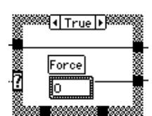

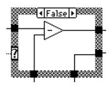

Figure 15: A LabVIEW conditional from the rocket program, showing both arms. In the LabVIEW environment, only one arm is visible on screen at any one time.

When conditionals are nested, this can become a serious difficulty, making it hard to answer questions about program behaviour; all sorts of stuff might be hidden away inside a conditional, which becomes a sort of maze that has to be explored. In fact, we found that *every subject's* performance was worse in Lab-VIEW than in text in a study in which LabVIEW users and electronics designers answered questions about conditionals [36], [32]. The demand placed on working memory by the 'invisible arms' is just too much.

Visibility in Prograph is weakened by its deep subroutine structure – 'everything in its own rat-hole', as one expert Prograph programmer described it – creating steep visibility problems.

## 6. Discussion and Conclusions

Psychologists have found it difficult to assess the broad sweep of a programming language, even though they have found ways to study certain details in the laboratory; computer scientists have found it difficult to see their creations from the point of view of an inexperienced non-specialist. The cognitive dimensions framework provides an evaluative technique that is easy to understand and quick to use. In this section we report overall conclusions about the state of VPL design, and overall conclusions about the cognitive dimensions framework itself.

#### 6.1 What the cognitive dimensions framework can tell the designer

Evaluating a system is sufficient for choosers and users, but a designer wants to know more. If the system is unsatisfactory, how can it be improved?

Our answer is to concentrate on the 'standard remedies' and their trade-offs. The standard remedies provide ways of improving performance on selected dimensions; as we have repeatedly emphasized in this paper, changes cannot be made arbitrarily. Fixing a problem with one dimension will usually entail a change on some other dimension. The designer can choose (at least to some degree) which other dimension will change; in a properly-conceived framework, the dimensions would indeed be pairwise orthogonal, so that for any arbitrary pair of dimensions one could be altered while the second was held constant, *so long as* some other dimension was allowed to vary.

The standard remedies should, by now, sound familiar. *Viscosity* can be reduced by increasing the number of *abstractions* (this is what object-oriented programming systems are all about).

Increasing *abstractions* tends to create *hidden dependencies* (because it is not clear where the abstractions are instantiated, nor what the consequences of change will be; quite often the abstractions themselves bring problems of *visibility*–local visibility may be good, but remote visibility may be poor, as for example in using encapsulated subroutines as abstractions, when the subroutines may promote increased *juxtaposability* (one can be compared readily to the next) at the cost of losing sight of their calling context.

Increasing abstractions can also change the *closeness-of-mapping*, either for better or worse: sometimes the program structure can be made to map closely onto the problem structure by choosing the right abstractions, but sometimes the rigours of designing for possible change have forced the creation of abstractions designed to reduce viscosity rather than to map the problem domain. When the abstraction level is too high, other problems can arise: the user is quite often forced into *imposed guess-ahead* (because the abstractions have to be defined before anything can be programmed, at which point it may become apparent that the abstractions were ill-conceived); in an abstraction-hungry system, there is usually a problem of 'delayed gratification' (i.e. it takes a lot of fiddling to get started), and sometimes manipulating and understanding the abstractions requires *hard mental operations*.

In some cases an awkwardness can be remedied by adding tools to the programming environment, such as browsers to display dependencies that would otherwise be hidden. This is usually only a partial remedy. The distractions of invoking the browser break up the pattern of problem-solving, and the limited, over-specialised view often given by a browser deprives the programmer of opportunistically taking advantage of information from other sources.

#### 6.2 Future progress in cognitive dimensions

The cognitive dimensions framework is not yet a finished entity. We are actively seeking a formalization of device structure that will allow us to state the relationships between dimensions in well-defined terms, for example; this should help to remove some of the overlaps that exist at present. We also intend to explore some of the gaps that our work has revealed, such as the management of abstractions in interactive devices. And it is our intention to explore the framework's applicability to other types of information artifact.

Meanwhile, the ultimate test of such an approach is its practical use, so we hope that the framework will be put to work by designers, by end-users, and by other researchers, and that deficiencies or insights will be reported. We are pleased to note some successes already. Modugno et al. [48] used the approach to evaluate and improve a design for a visual programming-by-demonstration system; they write:

The technique provides both experts and novices the ability to examine an artifact and proceed quickly to a high level discussion of it. We attribute this to the compact shared vocabulary of cognitive dimensions not found in other evaluation techniques. Finally, the technique provided several insights to the designer, even though she had been working with the system for over two years! (p. 101)

Buckingham-Shum and Hammond have evaluated graphical notations for design rationale, using a variety of criteria, among them the cognitive dimensions framework [8], [79]; this helps to underline the wide applicability of the approach.

Lastly, Yang et al. [91] have developed the framework as a practical system for use by designers of visual languages. They have proposed a variety of easily-measured benchmarks and demonstrated their applica-

bility to two very different types of visual language. They also carried out a small study to test whether their benchmarks were usable by other designers, and found that graduate students could comprehend the ideas and successfully use them to evaluate their designs.

For best results, however, we would suggest that a design should be evaluated from several angles. The available evaluation techniques have different strengths and weaknesses. Three of the best-known are GOMS, claims analysis, and programming walkthroughs.

GOMS [10] [55] is particularly strong in the evaluation of low-level aspects, such as time taken to edit diagrams, giving good estimates of time taken to perform many standard operations. Programming walkthroughs [2][46] are derived from 'cognitive walkthroughs' in HCI [45]; in contrast to GOMS this is a knowledge-intensive approach, intended to determine what the programmer needs to know to solve a given task. Claims analysis [3][11][12] is also derived from a general HCI approach but has been applied to both Smalltalk and Hypercard; this technique rests on the thesis that an artifact 'embodies' psychological claims about the user and the interaction process. None of these is easy to use for a non-specialist, but claims analysis in particular demands a high level of psychological sophistication.

For an overall evaluation we would suggest combining three approaches: (i) the cognitive dimensions approach, giving a broad-brush overview of the system from a process perspective; (ii) the programming walkthrough, for its knowledge-intensive analysis; and (iii) the GOMS methodology, to examine in detail some of the more frequent editing tasks. Constructing and altering the graphic layout, for example, would be a natural target for a GOMS analysis, and the straw viscosity test reported above suggests that much might be learnt from it.

## 6.3 Future progress in VPL design

Not having reviewed the present state of VPL design, any conclusions we can offer must needs be tentative. Nevertheless some interesting, and to us unexpected, points emerge about where VPL design stands now and where it may look to make progress.

(i) The construction of programs is probably easier in VPLs than in textual languages, for several reasons: there are fewer syntactic planning goals to be met, such as paired delimiters, discontinuous constructs, separators, or initialisations of variables; higher-level operators reduce the need for awkward combinations of primitives; and the order of activity is freer, so that programmers can proceed as seems best in putting the pieces of a program together. The last issue needs further study. Professional designers need to be able to pursue their design in an untrammelled order, allowing them to concentrate on parts that will be crucial. Our estimate is that VPLs will make that easier, which ought to assist designers; but at present there are no substantive studies of design activity using visual environments.

- (ii) Secondary notation is poorly developed in the box-and-wire notations we examined, making them harder to understand, we believe (although as yet, large-scale studies of comprehension have still be reported). To achieve their aim of making better use of the visual medium, VPLs need facilities for colouring, commenting, grouping, modularising, etc. (We recommend an explicit 'description level'.) Techniques to reduce the cluttered-wire problem would greatly increase the scope for using spatial layout as a form of communication. Other types of representation, such as 'Agentsheets' [65], may offer possibilities, and perhaps the emerging technology of 3D representations may be helpful.
- (iii) The representation of control flow remains a problem in the VPLs we examined. In the sections above we have documented examples of poor visibility and of the need for hard mental operations, supported in some cases by direct empirical observations and in others by apparent close similarity to well-studied structures like self-embedded sentences and 'knights and knaves' puzzles. Our impression is that this remains a problem in general with the dataflow model, and needs vigorous consideration. Other computational models may resolve the difficulty, of course. Particularly in this area, designers of VPL environments should beware of assuming that they can themselves foresee all their users' problems; experience in the general field of HCI has not supported that view.
- (iv) Viscosity was surprisingly high in the languages we looked at. The role of the diagram editor is crucial, yet few research papers in the visual programming literature discuss the design of effective diagram editors. In our straw viscosity test we found a range from about 1 minute to about 9 minutes for making semantically equivalent changes to programs in different languages. Visibility can be very poor. Systematic, easy-to-understand search tools need to be developed and user-tested, and if at all possible de facto standards should be adopted.
- (v) Diffuseness the famous real-estate problem was less of a liability than we had supposed.

Overall, we believe that in many respects VPLs offer substantial gains over conventional textual languages, but at present their HCI aspects are still under-developed. Improvements in secondary notation, in editing, and in searching will greatly raise their overall usability.

## **Acknowledgements**

We are grateful to too many friends and colleagues to list them all. Particular thanks to Peter Eastty, David Hendry, Richard Potter and Darrell Raymond for lengthy discussions on visual programming, to our erst-while colleagues Rachel Bellamy, Brad Blumenthal, David Gilmore, and Martin Stacey, and to Gilbert Cockton, Robin Jeffries and many other friends who have all contributed to this approach. Randy Flanagan allowed us to time his performance as an experienced LabVIEW user. Ann Blandford, Wayne Citrin and two anonymous referees helped to clarify both the wording and the structure of this paper.

LabVIEW is a trademark of National Instruments Corp., and Prograph is a trademark of TGS Systems Ltd. (now Pictorius International).

#### References

- 1. Anderson, J. R., Farrell, R. and Sauers, R. (1984) Learning to program in LISP. *Cognitive Science*, 8 (2), 87-129.
- 2. Bell, B., Rieman, J. and Lewis, C. (1991) Usability testing of a graphical programming system: things we missed in a programming walkthrough. *Proceedings of ACM CHI'91 Conference on Human Factors in Computing Systems*, pp 7-12. New York: ACM Press.
- 3. Bellamy, R. K. E. and Carroll, J. M. (1992) Restructuring the programmer's task. *Int. J. Man-Machine Studies*, 37 (4), 503-527.
- 4. Bellamy, R. K. E. and Gilmore, D. J. (1990) Programming plans: internal or external structures. In K. J. Gilhooly, M. T. G. Keane, R. H. Logie and G. Erdos (Eds.) *Lines of Thinking: Reflections on the Psychology of Thought.* (Vol. 1.) New York: Wiley.
- 5. Black, A. (1990) Visible planning on paper and on screen: the impact of working medium on decision-making by novice graphic designers. *Behaviour and Information Technology*, 9 (4), 283-296.
- 6. Bowles, A., Robertson, D., Vasconcelos, W., Vargas-Vera, M. and Bental, D. (1994) Applying Prolog programming techniques. *Int. J. Human-Computer Studies*, 41 (3), 329-350.
- Brooks, R. (1977) Towards a theory of the cognitive processes in computer programming. Int. J. Man-Machine Studies, 9, 737-751.
- 8. Buckingham Shum, S, & Hammond, N (1994a). Argumentation-based design rationale: what use at what cost? *Int. J. Human-Computer Studies*, 40, 4, pp. 603-652.
- 9. Burnett, M. M. and Ambler, A. L. (1994) Interactive visual data abstraction in a declarative visual programming language. *J. Visual Languages and Computing* 5(1) 29-60.
- 10. Card, S. K., Moran, T. P. and Newell, A. (1983) *The Psychology of Human-Computer Interaction.* Hillsdale, NJ: Erlbaum.
- 11. Carroll, J. M. and Kellogg, W. (1989) Artifact as theory-nexus: hermeneutics meets theory-based design. In Bice, K. and Lewis, C. (Eds) *Proc CHI'89*, 'Wings for the Mind'. 69-73. New York: ACM.
- 12. Carroll, J. M. and Rosson, M. B. (1991) Deliberated evolution: stalking the View Matcher in design space. *Human-Computer Interaction*, 6(3-4), 281-318.
- 13. Curtis, B., Sheppard, S., Kruesi-Bailey, E., Bailey, J. and Boehm-Davis, D. (1989) Experimental evaluation of software documentation formats. *J. Systems and Software*, 9 (2), 167-207.

- 14. Davies, S. P. (1989) Skill levels and strategic differences in plan comprehension and implementation in programming. In A. Sutcliffe and L. Macaulay (Eds.) *People and Computers V.* Cambridge: Cambridge University Press.
- 15. Davies, S. P. (1991a) The role of notation and knowledge representation in the determination of programming strategy: a framework for integrating models of programming behavior. *Cognitive Science*, 15, 547-572.
- 16. Davies, S. P. (1991b) Characterising the program design activity: neither strictly top-down nor globally opportunistic. *Behaviour and Information Technology*, 10 (3), 173-190.
- 17. Davies, S. P. (1993) Externalising information during coding activities: effects of expertise, environment, and task. In C. R. Cook, J. C Scholtz and J. C. Spohrer (Eds.) *Empirical Studies of Programmers: 5th Workshop.* Norwood, N.J.: Ablex.
- 18. Davies, S. P. and Castell, A. M. (1991) From individuals to groups through artifacts: the changing semantics of design in software development. In D. J. Gilmore, R. L. Winder and F. Détienne (Eds.) *User-Centred Requirements for Software Engineering Environments*. Berlin: Springer-Verlag.
- 19. Détienne, F. (1990) Expert programming knowledge: a schema-based approach. In J.-M. Hoc, T.R.G. Green, D.J. Gilmore and R. Samurçay (Eds.), *Psychology of Programming*. London: Academic Press.
- 20. Domingue, J., Price, B. A. and Eisenstadt, M. (1992) A framework for describing and implementing software visualization systems. *Proc. Graphics Interface 92*.
- 21. Eisenstadt, M. (1993) Why HyperTalk debugging is more painful than it ought to be. In J. L. Alty, D. Diaper and S. Guest (Eds.) *People and Computers VII: Proc. HCI '93 Conference.* Cambridge: Cambridge University Press.
- 22. Evans, J. St. B. T. (1990) Reasoning with knights and knaves: a discussion of Rips. Cognition 36 (1) 85-90.
- 23. Gilmore, D. J. (1990) Expert programming knowledge: a strategic approach. In J-M. Hoc, T.R.G. Green, D.J. Gilmore and R. Samurçay (Eds.) *Psychology of Programming*. London: Academic Press.
- 24. Gilmore, D. J. and Green, T. R. G. (1988) Programming plans and programming expertise. *Quarterly J. Exp. Psychol.* 40A, 423-442.
- 25. Gray, W. and Anderson, J. R. (1987) Change-episodes in coding: when and how do programmers change their code? In G. M. Olson, S. Sheppard and E. Soloway (Eds), *Empirical Studies of Programmers:* Second Workshop. Norwood, N.J.: Ablex.
- 26. Green, T. R. G. (1977) Conditional program statements and their comprehensibility to professional programmers. *J. Occupational Psychology*, 50, 93-109.

- 27. Green, T. R. G. (1983) Learning big and little programming languages. In A.C. Wilkinson (ed.), *Classroom Computers and Cognitive Science.* New York: Academic Press.
- 28. Green, T. R. G. (1989) Cognitive dimensions of notations. In A. Sutcliffe and L. Macaulay (Eds.) *People and Computers V.* Cambridge: Cambridge University Press.
- 29. Green, T. R. G. (1990) The cognitive dimension of viscosity: a sticky problem for HCI. In D. Diaper, D. Gilmore, G. Cockton and B. Shackel (Eds.) *Human-Computer Interaction INTERACT '90.* Amsterdam: Elsevier.
- 30. Green, T. R. G. (1991) Describing information artifacts with cognitive dimensions and structure maps. In D. Diaper and N. V. Hammond (Eds.) *Proceedings of "HCI'91: Usability Now", Annual Conference of BCS Human-Computer Interaction Group.* Cambridge: Cambridge University Press.
- 31. Green, T. R. G. and Navarro, R. (1995) Programming plans, imagery, and visual programming. To appear in Nordby, K., Gilmore, D. J. and Arnesen, S. (1995) *INTERACT-90*. London: Chapman and Hall.
- 32. Green, T. R. G. and Petre, M. (1992) When visual programs are harder to read than textual programs. *Proc. ECCE-6 (6th European Conf. on Cognitive Ergonomics)*.
- 33. Green, T.R.G., Sime, M.E., and Fitter, M.J. (1981). The art of notation. In M.J. Coombs and J. Alty (eds.) *Computing Skills and the User Interface.* London: Academic Press.
- 34. Green, T. R. G., Bellamy, R. K. E. and Parker, J. M. (1987) Parsing-gnisrap: a model of device use. In G. M. Olson, S. Sheppard and E. Soloway (Eds.) *Empirical Studies of Programmers: Second Workshop*. Norwood, N.J.: Ablex.
- 35. Green, T. R. G., Gilmore, D. J., Blumenthal, B. B., Davies, S. P. and Winder, R. (1992) Towards a cognitive browser for OOPS. *Int. J. Human-Computer Interaction*, 4(1), 1-34.
- 36. Green, T. R. G., Petre, M. and Bellamy, R. K. E. (1991) Comprehensibility of visual and textual programs: a test of 'Superlativism' against the 'match-mismatch' conjecture. In J. Koenemann-Belliveau, T. Moher, and S. Robertson (Eds.), *Empirical Studies of Programmers: Fourth Workshop.* Norwood, NJ: Ablex. Pp. 121-146.
- 37. Gugerty, L. and Olson, G. M. (1986) Comprehension differences in debugging by skilled and novice programmers. In E. Soloway and S. Iyengar (Eds.) *Empirical Studies of Programmers*. Norwood, N.J.: Ablex.
- 38. Hendry, D. G. and Green, T. R. G. (1993) CogMap: a visual description language for spreadsheets. *Journal of Visual Languages and Computing*, 4(1), 35-54.
- 39. Hoc, J.-M. (1983) Analysis of beginners' problem-solving strategies in programming. In T. R. G. Green, S. J. Payne and G. C. van der Veer (Eds.) *The Psychology of Computer Use.* London: Academic Press.

- 40. Johnson-Laird, P. N. and Byrne, R. M. J. (1990) Meta-logical problems: knights, knaves, and Rips. *Cognition* 36 (1) 69-84.
- 41. Kimura, T. D., Choi, J. W. and Mack, J. M. (1990) Show and Tell: a visual programming language. In E. P. Glinert (Ed.), *Visual Programming Environments: Paradigms and Systems*. New York: IEEE Press.
- 42. Koenemann, J. and Robertson, S. P. (1991) Expert problem-solving strategies for program comprehension. In S. P. Robertson, G. M. Olson and J. S. Olson (Eds.) *Reaching Through Technology, Proc. ACM Conf. on Human Factors in Computing Systems CHI'91*. Reading, MA: Addison-Wesley.
- 43. Larkin, J. H. and Simon, H. A. (1987) Why a diagram is (sometimes) worth 10,000 words. *Cognitive Science*, 11, 65-100.
- 44. Lewis, C. (1990) NoPumpG: creating interactive graphics with spreadsheet machinery. In E. P. Glinert (Ed.), *Visual programming environments: paradigms and systems*. Los Alamitos, Calif: IEEE Computer Society Press.
- 45. Lewis, C. and Olson, G.M. (1987) Can principles of cognition lower the barriers to programming? In G. M. Olson, S. Sheppard and E. Soloway (Eds.) *Empirical Studies of Programmers: Second Workshop.* Norwood. N.J.: Ablex.
- 46. Lewis, C., Rieman, J. and Bell, B. (1991) Problem-centered design for expressiveness and facility in a graphical programming system. *Human-Computer Interaction*, 6 (3-4), 319-355.
- 47. Mayer, R. E. (1987) Cognitive aspects of learning and using a programming language. In J. M. Carroll (Ed.) *Interfacing Thought.* Cambridge, Mass: MIT Press.
- 48. Modugno, F., Green, T. R. G. and Myers, B. A. Visual programming in a visual domain: a case study of cognitive dimensions. In G. Cockton, S. W. Draper, and G. R. S. Weir (Eds.) *People and Computers IX: Proc. HCI '94.* Cambridge: Cambridge University Press.
- 49. Moher, T. G., Mak, D. C., Blumenthal, B., and Leventhal, L. M. (1993) Comparing the comprehensibility of textual and graphical programs: the case of Petri nets. In Cook, C. R., Scholtz, J. C. and Spohrer, J. C. (Eds.), *Empirical Studies of Programmers: Fifth Workshop*. Norwood, NJ: Ablex. Pp. 137-161.
- 50. Monk, A., Walsh, P. and Dix, A. J. (1988) A comparison of hypertext, scrolling and folding as mechanisms for program browsing. In D. M. Jones and R. Winder (Eds.) *People and Computers IV*. (Proc. Fourth Conf. of BCS HCI Specialist Group.) Cambridge: Cambridge University Press.
- 51. Nardi, B. (1993) A Small Matter of Programming: Perspectives on End-User Computing. MIT Press.
- 52. Neal, L., (1989). A system for example-based programming. In Bice, K. and Lewis, C. (Eds) *Proc CHI'89, 'Wings for the Mind'*. 69-73. New York: ACM.

- 53. Nguyen-Xuan, A. and Hoc, J.-M. (1987) Learning to use a command device. *European Bulletin of Cognitive Psychology*, 7, 5-31.
- 54. Norman, D. A. (1991) Cognitive artifacts. In J. M. Carroll (Ed.) *Designing Interaction*. New York: Cambridge University Press.
- 55. Olson, J. R. and Olson, G. M. (1990) The growth of cognitive modeling in human-computer interaction since GOMS. *Human-Computer Interaction*, 5, 221-265.
- 56. Ormerod, T. C. and Ball, L. J. (1993) Does programming knowledge or design strategy determine shifts of focus in Prolog programming? In C. R. Cook, J. C Scholtz and J. C. Spohrer (Eds.) *Empirical Studies of Programmers: 5th Workshop.* Norwood, N.J.: Ablex.
- 57. Panko, R. R. and Halverson, R. P. Jr. (1994) Individual and group spreadsheet design: patterns of errors. *Proc. 27th Hawaii Intl. Conf. on System Sciences.* Hawaii.
- 58. Payne, S. J. and Green, T. R. G. (1986) Task-Action Grammars: a model of the mental representation of task languages. *Human-Computer Interaction*, 2, 93-133.
- 59. Pennington, N. (1987a) Stimulus structures and mental representations in expert comprehension of computer programs. *Cognitive Psychology*, 19, 295-341.
- 60. Pennington, N. (1987b) Comprehension strategies in programming. In G. M. Olson, S. Sheppard, and E. Soloway (Eds.), *Empirical Studies of Programmers: Second Workshop.* Norwood, N.J.: Ablex.
- 61. Pennington, N. and Grabowski, B. (1990) The tasks of programming. In J.-M. Hoc, T. R. G. Green, D. J. Gilmore and R. Samurçay (Eds.) *The Psychology of Programming* London: Academic Press.
- 62. Petre, M. and Green, T. R. G. (1990) Where to draw the line with text: some claims by logic designers about graphics in notation. In D. Diaper, D. Gilmore, G. Cockton and B. Shackel (Eds.) *Human-Computer Interaction INTERACT '90.* Amsterdam: Elsevier.
- 63. Petre, M. and Green, T. R. G. (1993) Learning to read graphics: some evidence that 'seeing' an information display is an acquired skill. *Journal of Visual Languages and Computing*, 4 (1), 55-70.
- 64. Reisner, P. (1993) APT: a description of user interface inconsistency. *Int. J. Man Machine Studies* 39 (2) 215-236.
- 65. Repenning, A. (1993) Agentsheets: design and evolution of domain-oriented visual programming languages. PhD dissertation. Univ. of Colorado at Boulder, Dept. of Computer Science.
- 66. Repenning, A. and Citrin, W. (1993) Agentsheets: applying grid-based spatial reasoning to human-computer interaction. *Proc IEEE Workshop on Visual Languages*, Bergen, Norway.
- 67. Pips, J. L. (1989) The psychology of knights and knaves. Cognition 31 (2) 85-116.

- 68. Rist, R. S. (1986) Plans in programming: definition, demonstration, and development. In E. Soloway and S. Iyengar (Eds.), *Empirical Studies of Programmers*. Norwood, NJ: Ablex.
- 69. Rist, R. S. (1994) Program structure and design. Unpublished report 94.4, School of Computing Sciences, Sydney University of Technology.
- 70. Robertson, S. P., Davis, E. F., Okabe, K. and Fitz-Randolf, D. (1990) Program comprehension beyond the line. In D. Diaper, D. Gilmore, G. Cockton and B. Shackel (Eds.) *Human-Computer Interaction INTERACT '90.* Amsterdam: Elsevier.
- 71. Rogalski, J. and Samurçay, R. (1990) Acquisition of programming knowledge and skills. In J-M. Hoc, T.R.G. Green, D.J. Gilmore and R. Samurçay (Eds.) *Psychology of Programming*. London: Academic Press.
- 72. Saariluoma, P. and Sajaniemi, J. (1989) Visual information chunking in spreadsheet calculation. *Int. J. Man-Machine Studies*, 30 (5), 475-488.
- 73. Saariluoma, P. and Sajaniemi, J. (1991) Extracting implicit tree structures in spreadsheet calculation. *Ergonomics*, 34 (8) 1027-1046.
- 74. Saariluoma, P. and Sajaniemi, J. (in press) Transforming verbal descriptions into mathematical formulas in spreadsheet calculation. *Int. J. Human Computer Studies*.
- 75. Sajaniemi, J. (1989) Goals and plans as a basis for user interfaces in spreadsheet calculation. In K. Pulliainen and H. Sihvo (Eds.), *West of East.* Finland: University of Joensuu Press.
- 76. Scaife, M. and Taylor, J. (1990) Graduated learning environments for developing computational concepts in 7-11 year old children. *Jnl. of Artificial Intelligence in Education*, 2 (2), 31-41.
- 77. Seabrook, R. H. C. and Shneiderman, B. (1989) The user interface in a hypertext, multi-window, program browser. *Interacting with Computers*, 1, 299-337.
- 78. Shackelford, R. L. and Badre, A. N. (1993) Why can't smart students solve simple programming problems? *Int. J. Man-Machine Studies*, 38 (6), 985-987.
- 79. Shum, S. (1991). Cognitive dimensions of design rationale. In D. Diaper and N. V. Hammond (Eds.) *People and Computers VI: Proceedings of HCI'91*. Cambridge University Press: Cambridge.
- 80. Sinha, A. and Vessey, I. (1992) Cognitive fit in recursion and iteration: an empirical study. *IEEE Transactions on Software Engineering*, SE-18 (5), 386-379.
- 81. Soloway, E. and Erlich, K. (1984) Empirical studies of programming knowledge. *IEEE Transactions on Software Engineering*, SE-10 (5), 595-609.

- 82. Spohrer, J. C. and Soloway, E. (1989) Novice mistakes: are the folk wisdoms correct? In E. Soloway and J. C. Spohrer (Eds.) *Studying the Novice Programmer*. Hillsdale, NJ: Erlbaum.
- 83. Spohrer, J. C., Soloway, E. and Pope, E. (1985) A goal-plan analysis of buggy Pascal programs. *Human-Computer Interaction*, 1, 163-207.
- 84. Teasley, B. E. (1994) The effects of naming style and expertise on program comprehension. *Int. J. Human-Computer Studies* 40 (5) 757-70.
- 85. Vessey, I. and Galletta, D. (1992) Cognitive fit: an empirical study of information acquisition. *Information Systems Research* 2 (1), 63-84.
- 86. Visser, W. (1990) More or less following a plan during design: opportunistic deviations in specification. *Int. J. Man-Machine Studies* 33 (3) 247-278.
- 87. Waterson, P. E., Clegg, C. W. and Axtell, C. M. (1995) The interplay between cognitive and organizational factors in software development. To appear in Nordby, K., Gilmore, D. J. and Arnesen, S. (Eds) *Human-Computer Interaction INTERACT '95.* London: Chapman and Hall.
- 88. Weidenbeck, S. (1991) The initial stages of program comprehension. *Int. J. Man-Machine Studies*, 35, 517-540.
- 89. Weiser, M. (1982) Programmers use slices when debugging. Comm. ACM, 25, 446-452.
- 90. Wright, P. and Reid, F. (1973) Written information: some alternatives to prose for expressing the outcome of complex contingencies. *J. Applied Psychology*, 57 (2), 160-166.
- 91. Yang, S., Burnett, M. M., DeKoven, E. and Zloof, M. (1995) Representation design benchmarks: a design-time aid for VPL navigable static representations. Oregon State University (Corvallis), Dept. of Computer Science Technical Report 95-60-3.

# **Appendix A. Viscosity Test**

In this Appendix we show the modified versions of the rocket program. For the straw viscosity test, we gave an experienced user the original program and a paper print-out of the appropriate modified version, and timed the modification process.

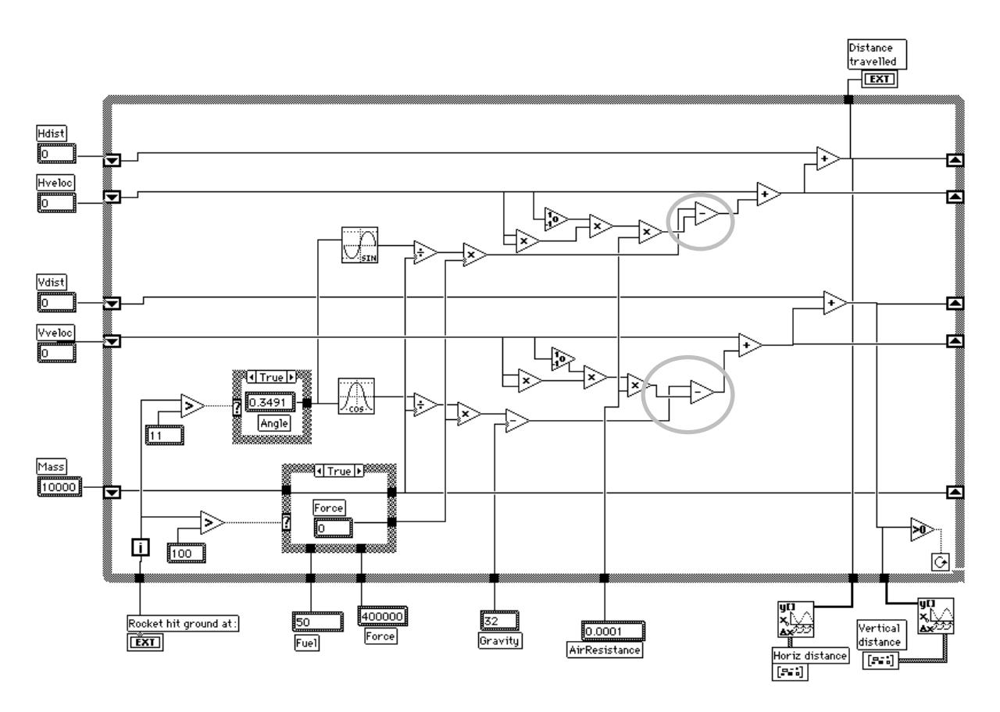

Appendix Figure 1: Revision in LabVIEW. The program as modified by an inexpert LabVIEW user (TG). As a first step, the surrounding box had to be enlarged to make space for the new operation icons. Moving the icons along and adjusting their wires is quite a few operations, and the transplanted elements have a slightly different configuration (the relative positions of the original layout were only approximately reproduced). All these steps are *enabling steps* to meet planning goals. Then the new icons were dropped into the space: the first *inherent* goal. As can be seen, the new section is densely packed and hard to read. Confirming that parallel operations are performed on the vertical and horizontal components has become considerably harder (e.g. the two new subtraction icons, shown in rings, are differently laid out, so that comparisons must be topological, not perceptual).

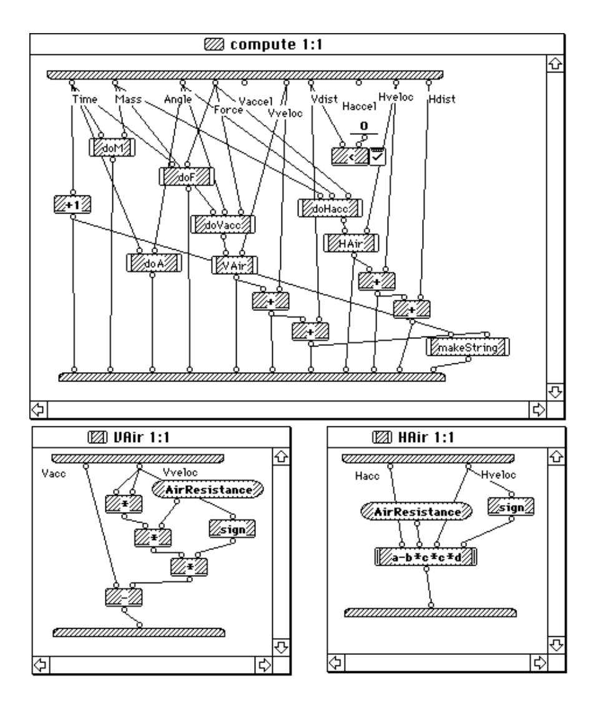

Appendix Figure 2: Revision in Prograph. Effects on existing layout are minimised by entering new code in new windows. The price is still worse visibility. (The horizontal component, on the right, illustrates Prograph's special device for complex arithmetic formulas.)

```
Mass = 10000
Fuel = 50
Force = 400000
Gravity = 32
AirResistance = 0.0001
WHILE Vdist >= 0
   IF Tim = 11 THEN Angle = .3941
   IF Tim > 100 THEN Force = 0 ELSE Mass = Mass - Fuel
   Vaccel = Force*COS(Angle)/Mass - Gravity
   Vaccel := Vaccel - AirResistance*Vveloc*Vveloc*sign(Vveloc)
   Vveloc = Vveloc + Vaccel
   Vdist = Vdist + Vveloc
   Haccel = Force*SIN(Angle)/Mass
   Haccel := Haccel - AirResistance*Hveloc*Hveloc*sign(Hveloc)
   Hveloc = Hveloc + Haccel
   Hdist = Hdist + Hveloc
   PRINT Tim, Vdist, Hdist
   Tim = Tim + 1
WEND
STOP
```

Appendix Figure 3: Revision in Basic program. Additional code required to allow for air resistance is shown in italics.