#### WORKING MEMORY

## Alan D. Baddeley1 and Graham Hitch1

#### UNIVERSITY OF STIRLING, STIRLING, SCOTLAND

| I.   | Introduction                                            | 47 |
|------|---------------------------------------------------------|----|
| II.  | The Search for a Common Working Memory System           | 49 |
|      | A. The Role of Working Memory in Reasoning              | 50 |
|      | B. Comprehension and Working Memory                     | 59 |
|      | C. Working Memory and Free Recall                       | 66 |
| III. | A Proposed Working Memory System                        | 74 |
|      | A. Allocation of Work Space                             | 76 |
|      | B. The Role of Working Memory in the Memory Span        | 77 |
|      | C. One or Many Working Memories?                        | 80 |
|      | D. Working Memory and the Recency Effect in Free Recall | 81 |
|      | E. The Memory Span, Transfer to LTS, and Recency        | 82 |
| IV.  | The Nature of the Recency Effect                        | 82 |
| V.   | Concluding Remarks                                      | 85 |
|      | References                                              | 87 |

#### I. Introduction

Despite more than a decade of intensive research on the topic of short-term memory (STM), we still know virtually nothing about its role in normal human information processing. That is not, of course, to say that the issue has completely been neglected. The short-term store (STS)—the hypothetical memory system which is assumed to be responsible for performance in tasks involving shortterm memory paradigms (Atkinson & Shiffrin, 1968)—has been assigned a crucial role in the performance of a wide range of tasks including problem solving (Hunter, 1964), language comprehension (Rumelhart, Lindsay, & Norman, 1972) and most notably, long-term learning (Atkinson & Shiffrin, 1968; Waugh & Norman, 1965). Perhaps the most cogent case for the central importance of STS in general information processing is that of Atkinson and Shiffrin (1971) who attribute to STS the role of a controlling executive system responsible for coordinating and monitoring the many and complex subroutines that are responsible for both acquiring new material and retrieving old. However, despite the frequency with which STS

&lt;sup>1 Present address: Medical Research Council, Applied Psychology Unit, 15 Chaucer Road, Cambridge, England.

has been assigned this role as an operational or working memory, the empirical evidence for such a view is remarkably sparse.

A number of studies have shown that the process of learning and recall does make demands on the subject's general processing capacity, as reflected by his performance on some simultaneous subsidiary task, such as card sorting (Murdock, 1965), tracking performance (Martin, 1970), or reaction time (Johnston, Griffith & Wagstaff, 1972). However, attempts to show that the limitation stems from the characteristics of the working memory system have proved less successful. Coltheart (1972) attempted to study the role of STS in concept formation by means of the acoustic similarity effect, the tendency for STM to be disrupted when the material to be remembered comprises items that are phonemically similar to each other (Baddeley, 1966b; Conrad, 1962). She contrasted the effect of acoustic similarity on concept formation with that of semantic similarity, which typically effects LTM rather than STM (Baddeley, 1966a). Unfortunately for the working memory hypothesis, her results showed clear evidence of semantic rather than acoustic coding, suggesting that the long-term store (LTS) rather than STS was playing a major role in her concept formation task.

Patterson (1971) tested the hypothesis that STS plays the important role in retrieval of holding the retrieval plan, which is then used to access the material to be recalled (Rumelhart et al., 1972). She attempted to disrupt such retrieval plans by requiring her experimental group to count backwards for 20 seconds following each item recalled. On the basis of the results of Peterson and Peterson (1959), it was assumed that this would effectively erase information from STS after each recall. Despite this rather drastic interference with the normal functioning of STS however, there was no reliable decrement in the number of words recalled.

The most devastating evidence against the hypothesis that STS serves as a crucially important working memory comes from the neuropsychological work of Shallice and Warrington (Shallice & Warrington, 1970; Warrington & Shallice, 1969; Warrington & Weiskrantz, 1972). They have extensively studied a patient who by all normal standards, has a grossly defective STS. He has a digit span of only two items, and shows grossly impaired performance on the Peterson short-term forgetting task. If STS does indeed function as a central working memory, then one would expect this patient to exhibit grossly defective learning, memory, and comprehension. No such evidence of general impairment is found either in this case or

in subsequent cases of a similar type (Warrington, Logue, & Pratt, 1971).

It appears then, that STS constitutes a system for which great claims have been made by many workers (including the present authors), for which there is little good evidence.

The experiments which follow attempt to answer two basic questions: first, is there any evidence that the tasks of reasoning, comprehension, and learning share a common working memory system?; and secondly, if such a system exists, how is it related to our current conception of STM? We do not claim to be presenting a novel view of STM in this chapter. Rather, our aim is to present a body of new experimental evidence which provides a firm basis for the working memory hypothesis. The account which follows should therefore be regarded essentially as a progress report on an on-going project. The reader will notice obvious gaps where further experiments clearly need to be performed, and it is more than probable that such experiments will modify to a greater or lesser degree our current tentative theoretical position. We hope, however, that the reader will agree that we do have enough information to draw some reasonably firm conclusions, and will feel that a report of work in progress is not too out of place in a volume of this kind.

## II. The Search for a Common Working Memory System

The section which follows describes a series of experiments on the role of memory in reasoning, language comprehension, and learning. An attempt is made to apply comparable techniques in all three cases in the hope that this will allow a common pattern to emerge, if the same working memory system is operative in all three instances.

In attempting to assess the role of memory in any task, one is faced with a fundamental problem. What is meant by STS? Despite, or perhaps because of, the vast amount of research on the characteristics of STS there is still little general agreement. If our subsequent work were to depend on a generally acceptable definition of STS as a prerequisite for further research, such research would never begin. We suspect that this absence of unanimity stems from the fact that evidence for STS comes from two basically dissimilar paradigms. The first is based on the traditional memory span task. It suggests that STS is limited in capacity, is concerned with the re-

tention of order information, and is closely associated with the processing of speech. The second cluster of evidence derives from the recency effect in free recall. It also suggests that STS is limited in capacity; however, its other dominant feature is its apparent resistence to the effects of other variables, whether semantic or speechbased (Glanzer, 1972). Rather than try to resolve these apparent discrepancies, we decided to begin by studying the one characteristic that both approaches to STS agreed on, namely its limited capacity. The technique adopted was to require S to retain one or more items while performing the task of reasoning, language comprehension, or learning. Such a concurrent memory load might reasonably be expected to absorb some of the storage capacity of a limited capacity working memory system, should such a system exist. The first set of experiments describes the application of this technique to the study of a reasoning task. To anticipate our results, we find a consistent pattern of additional memory load effects on all three tasks that we have studied: reasoning, language comprehension, and free recall. Additionally, all three tasks show evidence of phonemic coding. From this evidence we infer that each of the tasks involves a spanlike component, which we refer to as working memory. Further evidence from the free recall paradigm shows that the recency effect is neither disrupted by an additional memory span task nor particularly associated with phonemic coding. We therefore suggest a dichotomy between working memory and the recency effect, in contrast to the more usual view that both recency and the memory span -reflect a single limited capacity short-term buffer store (STS).

## A. THE ROLE OF WORKING MEMORY IN REASONING

The reasoning task selected was that devised by Baddeley (1968) in which S is presented with a sentence purporting to describe the order of occurrence of two letters. The sentence is followed by the letters in question, and S's task is to decide as quickly as possible whether the sentence correctly describes the order in which the letters are presented. For example, he may be given the sentence A is not preceded by B-AB, in which case he should respond True. A range of different sentences can be produced varying as to whether they are active or passive, positive or negative, and whether the word precedes or follows is used. This task is typical of a wide range of sentence verification tasks studied in recent years (Wason & Johnson-Laird, 1972). Its claim to be a reasoning task of some general validity is supported by the correlation between performance and

intelligence (Baddeley, 1968) and its sensitivity to both environmental and speed-load stress (Baddeley, De Figuredo, Hawkswell-Curtis, & Williams, 1968; Brown, Tickner, & Simmonds, 1969). The first experiment requires S to perform this simple reasoning task while holding zero, one, or two items in memory. If the task relies on a limited capacity system, then one might expect the additional load to impair performance.

## 1. Experiment I: Effects of a One- or Two-Item Preload

Subjects were required to process 32 sentences based on all possible combinations of sentence voice (active or passive), affirmation (affirmative or negative), truth value (true or false), verb type (precedes or follows), and letter order (AB or BA). The experiment used a version of the memory preload technique in which S is given one or two items to remember. He is then required to process the sentence and having responded "True" or "False," he is then required to recall the letters. A slide projector was used to present the sentences, each of which remained visible until S pressed the "True" or "False" response key. Twenty-four undergraduate Ss were tested. The order in which the three conditions were presented were determined by a Latin square. For half the Ss the preload was presented visually, while the other half was given an auditory preload. In the zero load condition, S was always presented with a single letter before the presentation of the sentence. However, the letter was the same on all trials, and S was not required to recall it subsequently. With the one- and two-letter loads, the letters differed from trial to trial but were never the same as those used in the reasoning problem. All Ss were informed of this.

TABLE I

Mean Time (sec) to Complete Verbal Reasoning Problems as a Function of Size of Additional Memory Load and Method of Reading Memory Items

|                   |      | Memory load |           |  |
|-------------------|------|-------------|-----------|--|
| Method of reading | Zero | 1-letter    | 2-letters |  |
| Silent            | 3.07 | 3.35        | 3,21      |  |
| Aloud             | 3.33 | 3.26        | 3.41      |  |
| Means             | 3.20 | 3.31        | 3.31      |  |

The results are shown in Table I. There was no reliable effect of memory load on solution time regardless of whether the load was one or two letters, and was presented visually or auditorily (F < 1 in each case). Since letter recall was almost always perfect, it appears to be the case that SS can hold up to two additional items with no impairment in their reasoning speed. This result suggests one of two conclusions; either that the type of memory system involved in retaining the letters is not relevant to the reasoning task, or else that a load of two items is not sufficient to overtax the system. Experiment II attempts to decide between these two hypotheses by increasing the preload from two to six letters, a load which approaches the memory span for many SS.

#### 2. Experiment II: Effects of a Six-Digit Preload

Performance on the 32 sentences was studied with and without a six-letter memory preload. In the preload condition each trial began with a verbal "ready" signal followed by a random sequence of six letters spoken at a rate of one per second. The reasoning problem followed immediately afterwards, details of presentation and method of responding being the same as in Experiment I. After solving the problem, S attempted to recall verbally as many letters as possible in the correct order. In the control condition, the reasoning problem followed immediately after the "ready" signal. After completing the problem, and before being presented with the next problem, S listened to a six-letter sequence and recalled it immediately. This procedure varies the storage load during reasoning, but roughly equates the two conditions for total memorization required during the session.

Separate blocks of 32 trials were used for presenting the two conditions, each block containing the 32 sentences in random order. Half the Ss began with the control condition and half with the preload condition. Two groups of 12 undergraduate Ss were tested. The two groups differed in the instructions they were given. The first group (equal stress) was told to carry out the reasoning task as rapidly as possible, consistent with high accuracy, and to attempt to recall all six letters correctly. The second group (memory stress) was told that only if their recall was completely correct could their reasoning time be scored; subject to this proviso, they were told to reason as rapidly as they could, consistent with high accuracy. All Ss were given a preliminary three-minute practice session on a sheet of reasoning problems, and were tested individually.

TABLE II

MEAN REASONING TIMES AND RECALL SCORES FOR THE "EQUAL STRESS"

AND "MEMORY STRESS" INSTRUCTIONAL GROUPS

|                                | Mean reasoning time (sec) |                   | Mean no. items recalle (max = 6) |                   |  |
|--------------------------------|---------------------------|-------------------|-------------------------------------|-------------------|--|
| Instructional emphasis         | Control                   | Memory preload | Control                             | Memory preload |  |
| "Equal stress" "Memory stress" | 3.27 2.73              | 3.46 4.73      | 5.5 5.8                          | 3.7 5.0        |  |

Mean reasoning times (for correct solutions) and recall scores for both groups of subjects are shown in Table II. For the "equal stress" Ss memory load produced a slight but nonsignificant slowing down in reasoning time (on a Wilcoxon test, T=31, N=12, P>.05), while for the "memory stress" Ss memory load slowed down reasoning considerably (T=4, N=12, P<.01). There appears to have been a trade-off between reasoning and recall in the memory load condition. The equal stress Ss achieved their unimpaired reasoning at the expense of very poor recall compared with that of the memory stress Ss.

The results show then, that there is an interaction between additional short-term storage load and reasoning performance. In comparison with the results of Experiment I these suggest that the interaction depends on the storage load since, up to two items can be recalled accurately with no detectable effect. Thus the reasoning task does not seem to require all the available short-term storage space. The results show additionally that the form of the interaction depends on the instructional emphasis given to S. It seems likely therefore that interference was the result of the active strategy that Ss employed. One possibility is that the "memory stress" Ss dealt with the memory preload by quickly rehearsing the items, to "consolidate" them in memory before starting the reasoning problem. If this were the case, then reasoning times ought to be slowed by a constant amount (the time spent rehearsing the letters), regardless of problem complexity. Figure 1 shows mean reasoning time for the memory stress group for different types of sentence. Control reaction times (RTs) show that problems expressed as passives were more difficult than those expressed as actives, and that negative forms were more difficult than affirmatives. However, the slowing down in reasoning produced by the memory preload was roughly constant regardless of problem difficulty. Analysis of variance showed significant effects

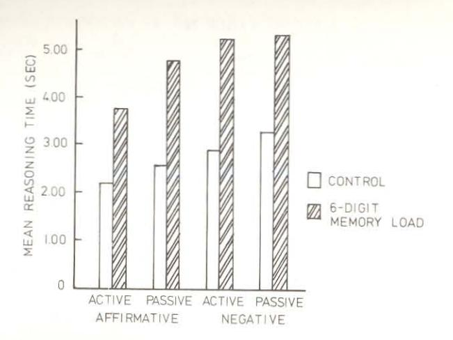

GRAMMATICAL FORM OF REASONING PROBLEM

Fig. 1. Mean reasoning time for different forms of the problem for the "memory stress" group of subjects.

of memory load [F(1,10) = 8.51, P < .025], sentence voice [F(1,10 = 7.34, P < .025], and negation [F(1,10 = 34.9, P < .001]. None of the interaction terms involving the load factor approached significance.

The results of this experiment do not adequately demonstrate that the verbal reasoning task involves a short-term storage component. Subjects seem to have adopted a strategy of time-sharing between rehearsal of the memory letters and reasoning. While the time-sharing may have been forced by competition between the tasks for a limited storage capacity, this is not necessarily the case. The tasks may, for example, have competed for use of the articulatory system, without having overlapping storage demands.

Experiment III attempts to prevent the strategy of completely switching attention from the memory task to the reasoning test by changing from a preload to a concurrent load procedure. In the concurrent load procedure, S is required to continue to rehearse the memory load items aloud while completing the reasoning task. Since the process of articulation has itself been shown to impair performance in both memory (Levy, 1971; Murray, 1967, 1968) and reasoning (Hammerton, 1969; Peterson, 1969), two additional conditions were included to allow a separation of the effects of memory load and of articulation.

## 3. Experiment III: Effects of a Concurrent Memory Load

All Ss performed the 32 reasoning problems under each of four conditions, the order in which the conditions were tested being determined by a Latin square. In the control condition, a trial began with a verbal warning signal and the instruction "say nothing." The problem was then presented and solved as quickly and accurately as possible. The second condition used the articulatory suppression procedure devised by Murray (1967). Subjects were instructed to say the word "the" repeatedly, at a rate of between four and five utterances per second. After S had begun to articulate, the problem was presented, whereupon he continued the articulation task at the same high rate until he had pressed the "True" or "False" response button. The third condition followed a procedure adopted by Peterson (1969) in which the articulation task consisted of the cyclic repetition of a familiar sequence of responses, namely the counting sequence "one-two-three-four-five-six." Again, a rate of four to five words per second was required. In the fourth condition, S was given a random six-digit sequence to repeat cyclically at a four- to fivedigit per second rate. In this condition alone, the message to be articulated was changed from trial to trial. The three articulation conditions therefore range from the simple repetition of a single utterance, through the rather more complex articulation involved in counting, up to the digit span repetition task, which presumably makes considerably greater short-term storage demands. Degree of prior practice and method of presentation were as in Experiment II.

Table III shows the performance of the 12 undergraduate Ss tested in this study. Concurrent articulation of "the" and counting up to six produced a slight slowing of reasoning time, but by far the greatest slowing occurred with concurrent articulation of random digit sequences. Analysis of variance showed a significant main effect of

TABLE III

MEAN REASONING TIMES AND ERROR RATES AS A FUNCTION OF
CONCURRENT ARTICULATORY ACTIVITY

| Concurrent articulation | Mean reasoning $RT$ (sec) | Percent reasoning errors |
|-------------------------|---------------------------|-----------------------------|
| Control                 | 2.79                      | 8.1                         |
| "The-The-The"           | 3.13                      | 10.6                        |
| "One-Two-Three"         | 3.22                      | 5.6                         |
| Random 6-digit No.      | 4.27                      | 10.3                        |

conditions [F(3,33) = 14.2, P < .01]. Newman-Keuls tests showed that the effect was mainly due to the difference between the random digit condition and the other three. The slight slowing down in the suppression-only and counting conditions just failed to reach significance.

These results suggest that interference with verbal reasoning is not entirely to be explained in terms of competition for the articulatory system, which may be committed to the rapid production of a well-learned sequence of responses with relatively little impairment of reasoning. A much more important factor appears to be the short-term memory load, with the availability of spare short-term storage capacity determining the rate at which the reasoning processes are carried out. Since difficult problems presumably make greater demands on these processes, one might expect that more difficult problems would show a greater effect of concurrent storage load. Figure 2 shows the mean reasoning times for problems of various kinds. As is typically the case with such tasks (Wason & Johnson-Laird, 1972), passive sentences proved more difficult than active sentences [F(1,11) = 55.2, P < .01], and negatives were more difficult than affirmatives [F(1,11) = 38.5, P < .01]. In addition to the main effect of con-

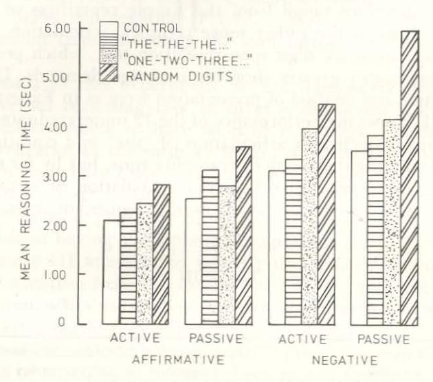

GRAMMATICAL FORM OF REASONING PROBLEM

Fig. 2. Effects of concurrent articulatory activity on mean reasoning time for different types of problem.

current activity, activity interacted with sentence voice [F(3,33) = 5.59, P < .01] and with negativity [F(3,33) = 5.29, P < .01]. Figure 2 shows that these interactions were due largely to performance in the random digit condition. Additional storage load seems to have slowed down solution times to passives more than actives and to negatives more than affirmatives. Thus the greater the problem difficulty, the greater the effect of an additional short-term storage load.

In summary, it has been shown that additional STM loads of more than two items can impair the rate at which reasoning is carried out. Loads of six items can produce sizable interference, but the effect may depend on the instructional emphasis given to Ss (Experiment II). The interference effects may be partly due to the articulatory activity associated with rehearsal of the memory items, but there is a substantial amount of interference over and above this which is presumably due to storage load (Experiment III). The trade-off between reasoning speed and additional storage load suggests that the interference occurs within a limited capacity "workspace," which can be flexibly allocated either to storage or to processing.

The effect of articulatory suppression in Experiment III was small and did not reach statistical significance. However, Hammerton (1969) has reported evidence that suppression can produce reliable interference in this task. His Ss repeated the familiar sentence "Mary had a little lamb" while carrying out the Baddeley reasoning task. Performance was impaired when contrasted with a control group who said nothing when reasoning. This result together with those of Peterson (1969) suggests that reasoning may resemble the memory span task in having an articulatory component. Experiment IV explores the relation between the memory span and working memory further by taking a major feature of the verbal memory span, namely its susceptibility to the effects of phonemic similarity, and testing for similar effects in the verbal reasoning task.

### 4. Experiment IV: Phonemic Similarity and Verbal Reasoning

One of the more striking features of the memory span for verbal materials is its apparent reliance on phonemic (either acoustic or articulatory) coding. This is revealed both by the nature of intrusion errors (Conrad, 1962; Sperling, 1963) and by the impairment in performance shown when sequences of phonemically similar items are recalled (Baddeley, 1966b; Conrad & Hull, 1964). As Wickelgren (1965) has shown, phonemic similarity has its disruptive effect prin-

cipally on the retention of order information, and since the reasoning task employed depends on the order of the letters concerned, it seems reasonable to suppose that the manipulation of phonemic similarity might prove a suitable way of disrupting any STS component of the task. Experiment IV, therefore, studied the effect of phonemic similarity on the reasoning task and compared this with the effect of visual similarity, a factor which is typically found to have little or no influence on memory span for letters.

A group testing procedure was used in which Ss were given test sheets containing 64 reasoning problems printed in random order and were allowed three minutes to complete as many as possible. A 2 × 2 factorial design was used with phonemic and visual similarity as factors. There were two replications of the experiment, each using different letter pairs in each of the four conditions. The sets of letter pairs used were as follows: MC, VS (low phonemic similarity, low visual similarity); FS, TD (high phonemic, low visual similarity); OQ, XY (low phonemic, high visual similarity); and BP, MN (high phonemic, high visual similarity). Thirty-two undergraduate Ss were tested, half with one letter set and half with the other. All Ss were first given a preliminary practice session using the letter-pair AB. Each S then completed a three-minute session on each of the four types of problems. Problems were printed on sheets, and Ss responded in writing. The order of presenting the four conditions was determined using a Latin square.

Table IV shows the mean number of correctly answered questions in the various conditions. Since there were no important differences between results from the two replications, data from the two sets of letter pairs have been pooled. Only the effect of phonemic similarity was significant (N=32, Z=2.91, P<.002), while visual similarity appeared to have no effect (N=32, Z<1). It appears then that the verbal reasoning task does require the utilization of phonemically

TABLE IV

Mean Number of Reasoning Problems Correctly Solved in Three Minutes as a Function of Phonemic and Visual Similarity of the Letters Used in the Problems

| Phonemi | ic similarity | of letters |
|---------|---------------|------------|
|         | Low           | High       |
| Low     | 43.2          | 40.9       |
| High    | 42.9          | 39.8       |
|         | Low           | Low 43.2   |

coded information, and, although the effect is small, it is highly consistent across Ss.

In summary then, verbal reasoning shows effects of concurrent storage load, of articulatory suppression, and of phonemic similarity. This pattern of results is just what would be expected if the task depended on the use of a short-term store having the characteristics typically shown in the memory span paradigm. However, the magnitude of the effects suggest that the system responsible for the memory span is only part of working memory. We shall return to this point after considering the evidence for the role of working memory in prose comprehension and learning.

#### B. COMPREHENSION AND WORKING MEMORY

While it has frequently been asserted that STS plays a crucial role in the comprehension of spoken language (e.g., Baddeley & Patterson, 1971; Norman, 1972), the evidence for such a claim is sparse. There is, of course, abundant evidence that language material may be held in STM (Jarvella, 1971; Sachs, 1967) but we know of no evidence to suggest that such storage is an essential function of comprehension under normal circumstances, and in view of the lack of any obvious defect in comprehension shown by patients with grossly defective STS (Shallice & Warrington, 1970), the importance of STS in comprehension remains to be demonstrated. Experiments V and VI attempt to do so using the memory preload and the concurrent memory load techniques.

# 1. Experiment V: Effects of a Memory Preload on Comprehension

In this experiment, S listened to spoken prose passages under each of two memory load conditions and was subsequently tested for retention of the passages. In the experimental condition, each sentence of the passage was preceded by a sequence of six digits spoken at a rate of one item per second. After listening to the sentence, S attempted to write down the digit sequence in the correct order in time to a metronome beating at a one-second rate. Hence S was required to retain the digit sequence while listening to the sentence. In the control condition the digit sequence followed the sentence and was recalled immediately afterward. Thus both conditions involved the same amount of overt activity, but only in the experimental condition was there a temporal overlap between the retention

of the digits and sentence presentation. In both conditions the importance of recalling the digits accurately was emphasized. After each passage, S was allowed three minutes to complete a recall test based on the Cloze technique (Taylor, 1953). Test sheets comprised a typed script of each of the passages, from which every fifth word had been deleted. The passages contained approximately 170 words each, and hence there were about 33 blanks which S was instructed to try to fill with the deleted word. This technique has been shown by Rubenstein and Aborn (1958) to be a reasonably sensitive measure of prose retention. Three different types of passage were included in the experiment: descriptions, narratives, and arguments. Two examples of each type were constructed giving six passages in all, each of which contained ten sentences. Each of 30 Ss was tested on all six passages, comprising one experimental and one control condition for each of the three passage types. Subjects were tested in two separate groups, each receiving a different ordering of the six passages.

Table V shows the mean number of correctly completed blanks for the control and experimental conditions together with the mean number of digit sequences correctly reported in the two conditions. The digit preload impaired performance on the comprehension test for all three types of passage. Differences were significant for the descriptions ( $Z=2.81,\,P<.01$ , Wilcoxon test) and the narratives ( $Z=2.91,\,P<.01$ ), but not for the arguments ( $Z=1.14,\,P>.05$ ). Thus, test performance is impaired when digits have to be held in store during presentation of the passage. Digit recall scores were

TABLE V

Comprehension and Digit Recall Scores with and without Additional Memory Load for Three Types of Passage

| Type of passage | Memory load condition | Comprehension score a | Digit recall score |
|-----------------------|-----------------------------|----------------------------------|--------------------|
| Description           | No load                     | 16.8                             | 11.8               |
|                       | Load                        | 13.3                             | 7.7                |
| Narrative             | No load                     | 20.1                             | 11.4               |
|                       | Load                        | 18.0                             | 7.8                |
| Argument              | No load                     | 14.5                             | 11.4               |
|                       | Load                        | 13.6                             | 8.1                |

&lt;sup>a Mean no, of blanks correctly filled in-max = 33

also poorest in the experimental condition, but this was, of course, to be expected in view of the long filled retention interval in this condition.

While the results can be interpreted as showing that comprehension is impaired by an additional short-term storage load, this conclusion is not unchallengeable. Firstly, the Cloze procedure is probably a test of prompted verbatim recall and may not measure comprehension. Secondly, the control condition of the experiment may not have been entirely satisfactory. If the time *between* sentences is important for comprehension of the meaning of the passage as a whole, the control group itself may have suffered from an appreciable amount of interference. The next experiment goes some way to overcoming both these objections, using the concurrent memory load procedure instead of the preload technique.

## 2. Experiment VI: Effects of a Concurrent Memory Load on Comprehension

This experiment compared the effects of three levels of concurrent storage load on prose comprehension. In all three conditions, the memory items were presented visually at a rate of one per second using a TV monitor. The concurrent memory load tasks were as follows. In the three-digit load condition, S was always presented with sequences of three digits, each sequence being followed by a 2-second blank interval during which S attempted to recall and write down the three digits he had just seen. In the six-digit condition, the sequences all comprised six items and were followed by a 4-second blank interval. Again S was instructed not to recall the digits until the sequence had been removed. Time intervals were chosen so as to keep S busy with the digit memory task, and were also such that all conditions would require input and output of the same total number of digits. In the control condition, S was presented with sequences of three and six digits in alternation. After each three-digit list there was a 2-second blank interval, and after each six-digit list the blank interval was 4 seconds. In this case, however, S was simply required to copy down the digits while they were being presented. It was hoped that this task would require the minimal memory load consistent with the demand of keeping the amount of digit writing constant across conditions. The main difference between the three conditions was, therefore, the number of digits which S was required to store simultaneously. Instructions emphasized the im-

&lt;sup>b Mean no. of digit strings correctly reported—max = 14

portance of accuracy on all three digit tasks, and an invigilator checked that Ss were obeying the instructions.

Comprehension was tested using six passages taken from the Neale Analysis of Reading Ability (Neale, 1958). Two passages (those suited for 12- and 13-year-old children) were selected from each of the three parallel test forms. Each passage comprised approximately 120 words and was tested by eight standardized questions. These have the advantage of testing comprehension of the passage without using the specific words used in the original presentation. They can, therefore, be regarded as testing retention of the gist of the passage rather than verbatim recall. Answers were given a score of one if correct, half if judged almost correct, and zero otherwise. At the start of each trial, the experimenter announced which version of the digit task was to be presented before testing began. After a few seconds of the digit processing task, the experimenter began to read out the prose passage at a normal reading rate and with normal intonation. At the end of the passage, the digit task was abandoned and the experimenter read out the comprehension questions. A total of 15 undergraduates were tested in three equal-sized groups, in a design which allowed each passage to be tested once under each of the three memory load conditions.

The mean comprehension scores for the three conditions are shown in Table VI. The Friedman test showed significant overall effects of memory load ( $\chi_r^2 = 7.3$ , P < .05). Wilcoxon tests showed that the six-digit memory load produced lower comprehension scores than either the control condition (T = 19, N = 14, P < .05), or the three-digit condition (T = 19.5, N = 15, P < .05). There was no reliable difference between the three-digit load and control conditions (T = 44.5, N = 14, P > .05). Thus, comprehension is not reliably affected by a three-item memory load, but is depressed by a six-item load, a pattern of results which is very similar to that observed with the verbal reasoning task.

TABLE VI

Mean Comprehension Scores as a Function of Size of Concurrent Memory Load

|                                    | Memory load          |         |         |  |
|------------------------------------|----------------------|---------|---------|--|
|                                    | Control (1-digit) | 3-digit | 6-digit |  |
| Mean comprehension score (max = 8) | 5.9                  | 5.6     | 4.8     |  |

While Experiments IV and V present *prima facie* evidence for the role of working memory in comprehension, it could be argued that we have tested retention rather than comprehension. From what little we know of the process of comprehension, it seems likely that understanding and remembering are very closely related. It is, however, clearly desirable that this work should be extended and an attempt made to separate the factors of comprehension and retention before any final conclusions are drawn.

If comprehension makes use of STM, it should be possible to impair performance on comprehension tasks by introducing phonemic similarity into the test material. To test this hypothesis using the prose comprehension task of the previous experiment would have involved the difficult task of producing passages of phonemically similar words. We chose instead to study the comprehension of single sentences, since the generation of sentences containing a high proportion of phonemically similar words seemed likely to prove less demanding than that of producing a whole passage of such material.

## 3. Experiment VII: Phonemic Similarity and Sentence Comprehension

The task used in this experiment required S to judge whether a single sentence was impossible or possible. Possible sentences were both grammatical and meaningful, while impossible sentences were both ungrammatical and relatively meaningless. Impossible sentences were derived from their possible counterparts by reversing the order of two adjacent words near the middle of the possible sentence. Two sets of possible sentences were constructed, one comprising phonemically dissimilar words and the other one containing a high proportion of phonemically similar words. An example of each type of possible sentence together with its derived impossible sentence is shown in Table VII. In order to equate the materials as closely as

TABLE VII

Examples of the Sentences Used in Experiment VIII

|                         | Possible version                             | Impossible version                           |
|-------------------------|----------------------------------------------|----------------------------------------------|
| Phonemically dissimilar | Dark skinned Ian thought Harry ate in bed | Dark skinned Ian Harry thought ate in bed |
| Phonemically similar    | Red headed Ned said Ted fed in bed           | Red headed Ned Ted said fed in bed        |

possible, each phonemically similar sentence was matched with a phonemically dissimilar sentence for number of words, grammatical form, and general semantic content. There were nine examples of each of the four conditions (phonemically similar possible; phonemically similar impossible; phonemically dissimilar possible, and phonemically dissimilar impossible), giving 36 sentences in all.

Each sentence was typed on a white index card and was exposed to S by the opening of a shutter approximately half a second after a verbal warning signal. The sentence remained visible until S had responded by pressing one of two response keys. Instructions stressed both speed and accuracy. Twenty students served as Ss and were given ten practice sentences before proceeding to the 36 test sentences which were presented in random order.

Since reading speed was a potentially important source of variance, 13 of the 20 Ss were asked to read the sentences aloud at the end of the experiment and their reading times were recorded. The 36 sentences were grouped into four sets of nine, each set corresponding to one of the four experimental conditions and were typed onto four separate sheets of paper. The order of presenting the sheets was randomized across Ss, and the time to read each was measured by a stopwatch.

Table VIII shows mean reaction times for each of the four types of sentence, together with reading rate for each condition. It is clear that phonemic similarity increased the judgment times for both possible and impossible sentences [F(1,9)=8.77, P<.01], there being no interaction between the effects of similarity and grammaticality [F(1,9)<1]. An interaction between the effects of phonemic similarity and sentence type [F(8,152)=4,38, P<.001] suggests that the effect does not characterize all the sentences presented. Inspec-

TABLE VIII
RESULTS OF EXPERIMENT VIII

|                            | Mean RT for judgment of "possibility" (sec) |                    |         | Mean reading time (sec) |                    |         |
|----------------------------|------------------------------------------------|--------------------|---------|-------------------------|--------------------|---------|
| Sentence type           | Possible version                            | Impossible version | Average | Possible version        | Impossible version | Average |
| Phonemically dissimilar | 2.84                                           | 2.62               | 2.73    | 2.93                    | 3.18               | 3,06    |
| Phonemically similar    | 3.03                                           | 2.83               | 2.93    | 2.96                    | 3.19               | 3.08    |

tion of the three sentence sets out of nine which show no similarity effect suggests that this is probably because the dissimilar sentences in these sets contained either longer or less frequent words than their phonemically similar counterparts. Clearly, future experiments should control word length and frequency.

Reading times did not vary appreciably with phonemic similarity [F(1,12) < 1]. It is, therefore, clear that phonemic similarity interfered with the additional processing over and above that involved in reading, required to make the possible/impossible judgment. As Table VIII suggests, although impossible sentences took longer to read than possible sentences [F(1,12) = 41.6, P < .001], they were judged more rapidly [F(1,19) = 17.3, P < .001]. This contrast suggests that when judging impossible sentences, S was able to make his judgment as soon as an unlikely word was encountered and did not have to read the entire sentence.

To summarize the results of this section: first, comprehension of verbal material is apparently impaired by a concurrent memory load of six items but is relatively unimpaired by a load of three or less. Second, it appears that verbal comprehension is susceptible to disruption by phonemic similarity. It should be noted, however, that use of the term comprehension has necessarily been somewhat loose; it has been used to refer to the retention of the meaning of prose passages on the one hand and to the detection of syntactic or semantic "impossibility" on the other. Even with single-sentence material, Ss can process the information in a number of different ways depending on the task demands (Green, 1973). It should, therefore, be clear that the use of the single term "comprehension" is not meant to imply a single underlying process. Nevertheless, it does seem reasonable to use the term "comprehension" to refer to the class of activities concerned with the understanding of sentence material. Tasks studied under this heading do at least appear to be linked by the common factor of making use of a short-term or working memory system. As in the case of the verbal reasoning studies this system appears to be somewhat disrupted by the demands of a near-span additional memory load and by the presence of phonemic similarity.

It might reasonably be argued that the reasoning task we studied is essentially a measure of sentence comprehension and that we have, therefore, explored the role of working memory in only one class of activity. The next section, therefore, moves away from sentence material and studies the retention and free recall of lists of unrelated words. The free recall technique has the additional advantage of allowing us to study the effects that the variables which appear to

have influenced the operation of working memory in the previous experiments have on the recency effect, a phenomenon which has in the past been regarded as giving a particularly clear indication of the operation of STS.

#### C. WORKING MEMORY AND FREE RECALL

## 1. Experiment VIII: Memory Preload and Free Recall

This experiment studied the free recall of lists of 16 unrelated words under conditions of a zero-, three-, or six-digit preload. The preload was presented before the list of words and had to be retained throughout input and recall, since S was only told at the end of the recall period whether to write the preload digit sequence on the right- or left-hand side of his response sheet. The experiment had two major aims. The first aim was to study the effect of a preload on the LTM component of the free recall task, hence giving some indication of the possible role of working memory in long-term learning. The second aim was to study the effect of a preload on the recency effect. Since most current views of STS regard the digit span and the recency effect as both making demands on a common shortterm store, one might expect a dramatic reduction of recency when a preload is imposed. However, as was pointed out in the introduction, there does appear to be a good deal of difference between the characteristics of STS revealed by the digit span procedure (suggesting that it is a serially ordered speech-based store) and the characteristics suggested by the recency effect in free recall (which appears to be neither serially ordered nor speech-based).

All lists comprised 16 high-frequency words equated for word length and presented auditorily at a rate of two seconds per word. Subjects were given a preload of zero, three, or six digits and were required to recall the words either immediately or after a delay of 30 seconds during which subjects copied down letters spoken at a one-second rate. In both cases, they had one minute in which to write down as many words as they could remember, after which they were instructed to write down the preload digits at the left-or right-hand side of their response sheets. Instructions emphasized the importance of retaining the preload digits.

The design varied memory load as a within S factor, and delay of recall between Ss. The same set of 15 lists were presented to both immediate and delayed recall groups. Within each group there were three subgroups across which the assignment of particular lists to particular levels of preload was balanced. For each group the 15

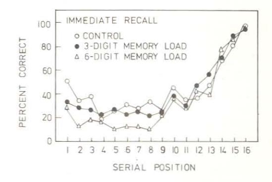

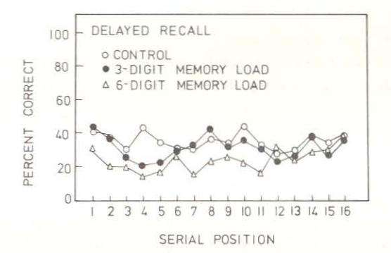

Fig. 3. Effects of additional short-term memory load on immediate and delayed free recall.

trials of the experiment were divided into blocks of three, in which each load condition occurred once. Subject to this constraint, the ordering of conditions was random. Twenty-one undergraduates served in each of the two subgroups. Figure 3 shows the serial position curves for recall as a function of size of preload for the immediate and delayed recall conditions. Analysis of variance showed significant effects due to delay [F(1,40) = 9.85, P < .01], serial position [F(15,600) = 49.4, P < .001], and the delay  $\times$  serial position interaction [F(15,600) = 33.4, P < .001]. These correspond to the standard finding that delaying free recall abolishes the recency effect. There were also significant effects due to memory load [F(2,80) = 35.8, P < .001], to the memory load  $\times$  serial position interaction, [F(30,1200) = 1.46, P < .05], and to the load  $\times$  serial position  $\times$  delay interaction [F(30,1200) = 1.80, P < .01].

The overall percentage of words recalled declined with increased

TABLE IX

Percentages of Words Regalled in the Various

Conditions of Experiment X

|                  | Memory load |          |          |
|------------------|-------------|----------|----------|
|                  | Zero        | 3-digits | 6-digits |
| Immediate recall | 43.9        | 41.6     | 35.2     |
| Delayed recall   | 35.5        | 32.3     | 24.5     |

preload (see Table IX). Comparison between means using the Newman-Keuls procedure showed that the impairment due to a three-digit preload was just significant (P < .05) while the six-digit preload condition was significantly worse than both the control and the three-digit preload conditions at well beyond the .01 significance level.

It is clear from Fig. 3 that the load effect was restricted to the long-term component of recall and did not substantially influence the recency effect.

The first conclusion from this study is that performance on the secondary memory component of free recall is adversely effected by a digit preload, with the size of the decrement being a function of the size of the preload. A somewhat more dramatic finding is the apparent absence of a preload effect on the recency component. There are, however, at least two classes of interpretations of this result. The first is to conclude that an STM preload does not interfere with the mechanism of the recency effect. This would be a striking conclusion, since the "standard" account of recency assumes that the last few items are retrieved from the same store that would be used to hold the preload items. To accept this hypothesis would require a radical change of view concerning the nature of the recency effect. An alternative hypothesis is to assume that S begins to rehearse the preload items at the beginning of the list, and by the end of the list has succeeded in transferring them into LTS, freeing his STS for other tasks. Two lines of evidence support this suggestion: firstly, there was only a marginal effect of preload on recall of the last few items when recall was delayed (see Fig. 3). This suggests that the preload effect diminished as the list progressed. Secondly, when questioned after the experiment, 37 out of 39 Ss stated that they carried out some rehearsal of the digits, and 26 of these said that they rehearsed the digits mostly at the beginning of the word list. Clearly, our failure to control Ss, rehearsal strategies prevents our drawing any firm conclusions about the influence of preload on the recency

effect. The next experiment, therefore, attempts to replicate the present results under better controlled conditions.

Before passing on to the next experiment, however, it is perhaps worth noting that the delayed recall technique for separating the long- and short-term components in free recall is the only one of the range of current techniques which would have revealed this potential artifact. Techniques which base their estimates of the two components entirely on immediate recall data assume that the LTS component for later items in the list can be estimated from performance on the middle items. In our situation, and possibly in many others, this assumption is clearly not valid.

### 2. Experiment IX: Concurrent Memory Load and Free Recall

This experiment again studied the effects of three levels of memory load on immediate and delayed free recall. In general, procedures were identical with Experiment VIII, except that the concurrent load rather than the preload technique was used. This involved the continuous presentation and test of digit sequences throughout the presentation of the memory list. In this way, it was hoped to keep the memory load relatively constant throughout the list and so avoid the difficulties of interpretation encountered in the previous study.

The concurrent load procedure was similar to that described for Experiment VI and involved the visual presentation of digit sequences. In the six-digit concurrent load condition, sequences of six digits were visible for four seconds, followed by a four-second blank interval during which S was required to recall and write down the six digits. The three-digit concurrent load condition was similar except that the three-digit sequences were presented for only two seconds and followed by a two-second blank interval, while in the control condition, S saw alternate sequences of three and six digits, followed, respectively, by gaps of two and four seconds. In this condition, however, he was instructed to copy down the digits as they appeared. The three conditions were thus equal in amount of writing required, but differed in the number of digits that had to be held in memory simultaneously.

The procedure involved switching on the digit display and requiring S to process digits for a few seconds before starting the auditory presentation of the word list. The point at which the word list began was varied randomly from trial to trial. This minimized the chance that a particular component of the digit task (e.g., input or recall) would be always associated with particular serial positions

in the word list. After the last word of each list, the visual display was switched off and Ss immediately abandoned the digit task. In the immediate recall condition, they were allowed one minute for written recall of the words, while in the delayed condition they copied a list of 30 letters read out at a one-second rate before beginning the one-minute recall period.

The design exactly paralleled that used in the previous experiment, with 17 undergraduates being tested in the immediate recall condition and 17 in the delayed condition. High accuracy on the digit task was emphasized; each of the three-digit processing procedures was practiced before beginning the experiment, and behavior was closely monitored during the experiment to ensure that instructions were obeyed.

The immediate and delayed recall serial position curves are shown in Fig. 4. Because of the scatter in the raw data, scores for adjacent serial positions have been pooled, except for the last four serial positions. Analysis of variance indicated a significant overall effect of memory load  $[F(2,64)=45.2,\ P<.01]$ , with mean percentage correct scores being 31.8, 31.2, and 24.8 for the zero-, three- and six-item load conditions, respectively. The Newman-Keuls test indicated a significant difference between the six-digit load condition and both other conditions (P<.01), which did not differ significantly between themselves.

As Fig. 4 suggests, there were highly significant effects of serial position [F(15,480) = 70.7, P < .01], of delay [F(1,32) = 26.6, P < .01], and of their interaction [F(15,480) = 29.1, P < .001], indicating the standard effect of delay on the recency component. The analysis showed no evidence of a two-way interaction between memory load and serial position (F < 1) and very weak evidence for a three-way interaction among memory load, serial position, and delay [F(30,960) = 1.32, P > .10]. The general conclusion, therefore, is that an additional concurrent memory load, even of six items, does not significantly alter the standard recency effect.

This conclusion confirms the result of the previous experiment, but rules out one of the possible interpretations of the earlier data. With the preload technique, the absence of an effect of load on recency might have been due to a progressive decline in the "effort" or "difficulty" associated with the digit task during input of the word list. Such an explanation is not appropriate for the present results since the concurrent load procedure ensured that the digit memory task was carried out right through input of the word lists, a conclusion which is supported by the continued separation of the

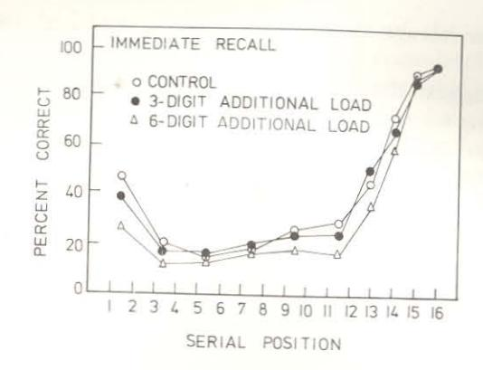

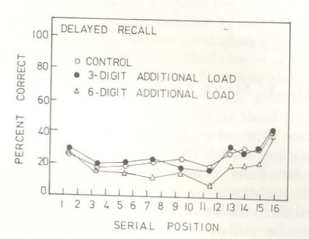

Fig. 4. Effects of concurrent short-term storage load on immediate and delayed free recall.

three- and six-digit load conditions over the last few serial positions in the delayed recall condition (see Fig. 3). Thus, even though six digits are concurrently being stored during the input of the final words of the list, the recency effect is unimpaired. To account for this, it must be assumed that the recency mechanism is independent from that involved in the memory span task. According to most dual-store theories, the digit span task ought to keep STS virtually fully occupied. Since the recency effect is commonly supposed to depend on output from this store, the digit span task should seriously reduce the amount of recency observed. It seems, therefore,

that the buffer-storage account of recency is faced with a major difficulty.

Our data suggest then that a concurrent load of six items does impair the long-term component of free recall. Furthermore, as in the case of our reasoning task and prose comprehension studies, a load of three items has only a marginal effect. These results are consistent with the hypothesis of a working memory, which has some features in common with the memory span task. Since the memory load was present only during input of the words and not during recall, it is reasonable to conclude that working memory is concerned with the processes of transferring information to LTM. The absence of an effect of concurrent storage load on the recency effect suggests that working memory may have little or nothing to do with the recency effect. This hypothesis is discussed more fully in the concluding section of the chapter, when extra evidence against a buffer-storage account of recency is presented and an alternative interpretation suggested.

## 3. Experiment X: Speech Coding and Free Recall

In the case of both verbal reasoning and comprehension, we observed a similar effect of preload to that shown in the last two experiments, together with clear evidence of phonemic coding. This was revealed by effects of both acoustic similarity and articulatory suppression in the reasoning task, and by acoustic similarity effects in comprehension. There already exists evidence that phonemic similarity may be utilized in free recall (Baddeley & Warrington, 1973; Bruce & Crowley, 1970), provided at least that the phonemically similar items are grouped during presentation. The effects observed were positive, but since acoustic similarity is known to impair recall of order while enhancing item recall (Wickelgren, 1965), this would be expected in a free recall task. It is perhaps worth noting in connection with the dichotomy between span-based indicators of STS and evidence based on the recency effect suggested by the results of the last two experiments that attempts to show that the recency effect is particularly susceptible to the effects of phonemic similarity have proved uniformly unsuccessful (Craik & Levy, 1970; Glanzer, Koppenaal, & Nelson, 1972). Although there is abundant evidence that Ss may utilize phonemic similarity in long-term learning, this does not present particularly strong evidence in favor of a phonemically based working memory, since Ss are clearly able to utilize a very wide range of characteristics of the material to be learnt, possibly using processes which lie completely outside the working memory system. The next experiment, therefore, attempts to examine the role of articulatory coding in long-term learning more directly using the articulatory suppression technique. It comprises one of a series of unpublished studies by Richardson and Baddeley and examines the effect of concurrently articulating an irrelevant utterance on free recall for visually and auditorily presented word sequences.

Lists of ten unrelated high-frequency words were presented at a rate of two seconds per word either visually, by memory drum, or auditorily, which involved the experimenter reading out the words from the memory drum, which was screened from S. A total of 40 lists were used, and during half of these S was required to remain silent during presentation, while for the other half he was instructed to whisper "hiya" [an utterance which Levy (1971) found to produce effective suppression at a rate of two utterances per second throughout the presentation of the word list. Half the Ss articulated for the first 20 lists and were silent for the last 20, while the other half performed in the reverse order. Manipulation of modality was carried out according to an APBA design, with half the Ss receiving visual as the first and last conditions, and half receiving auditory first and last. Each block of ten lists was preceded by a practice list in the appropriate modality and with the same vocalization and recall conditions. Following each list, S was instructed to recall immediately unless the experimenter read out a three-digit number, in which case he was to count backwards from that number by three's. Half the lists in each block of ten were tested immediately and half after the 20-second delay; in each case S was allowed 40 seconds for recall. Sixteen undergraduates served as Ss. The major results of interest are shown in Fig. 5, from which it is clear that articulatory suppression impaired retention [F(1,1185) = 19.6, P < .001]. The effect is shown particularly clearly with visual presentation and appears to be at least as marked for the earlier serial positions which are generally regarded as dependent on LTS, as for the recency component. This result is consistent with the suggestion of a working memory operating on phonemically coded information and transferring it to LTS. It further supports Glanzer's (1972) conclusion that the recency effect in free recall does not reflect articulatory coding and lends further weight to the suggestion that working memory is probably not responsible for the recency effect.

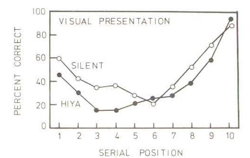

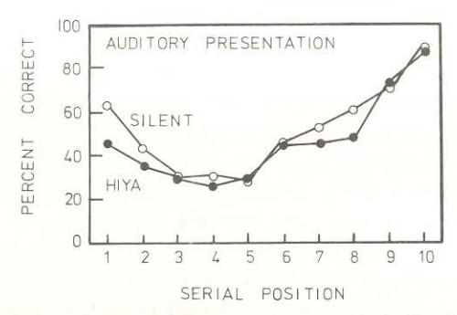

Fig. 5. Effect of concurrent articulation on free recall of visually and aurally presented word lists. (Data from Richardson and Baddeley, unpublished.)

## III. A Proposed Working Memory System

We have now studied the effect of factors which might be supposed to influence a working memory system, should it exist, across a range of cognitive tasks. The present section attempts to summarize the results obtained and looks for the type of common pattern which might suggest the same system was involved across the range of tasks.

Table X summarizes our results so far. We have studied three types of task: the verbal reasoning test, language comprehension, and the free recall of unrelated words. As Table X shows, these have in all three cases shown a substantial impairment in performance when an additional memory load of six items was imposed. In contrast to this, a load of three items appears to have little or no decremental effect, an unexpected finding which is common to all three situations. In the case of phonemic similarity, we have found the type of

TABLE X SUMMARY OF EXPERIMENTAL RESULTS (PARADIGM)

|                          |           | Verbal reasoning |               | Free recall |           |
|--------------------------|-----------|---------------------|---------------|-------------|-----------|
|                          |           |                     | Comprehension | LTS         | Recency   |
| Memory load              |           |                     |               | Small       |           |
|                          | 1-3 items | No effect           | No effect     | decrement   | No effect |
|                          | 6 items   | Decrement           | Decrement     | Decrement   | No effect |
| Phonemic similarity   |           | Decrement           | Decrement     | Enhancement | No effect |
| Articulatory suppression |           | Decrement           | Not studied   | Decrement   | No effect |

effect that would be expected on the assumption of a working memory system having characteristics in common with the digit span. Such effects are reflected in a performance decrement in those tasks where the retention of order is important (the reasoning and sentence judging tasks), coupled with a positive effect in the free recall situation for which the recall order is not required. Finally we have found that articulatory suppression, a technique which is known to impair digit span (Baddeley & Thomson, unpublished), has a deleterious effect in the two situations in which we have so far studied it, namely reasoning and free recall learning.

There appears then to be a consistent pattern of effects across the three types of task studied, strongly suggesting the operation of a common system such as the working memory initially proposed. This system appears to have something in common with the mechanism responsible for the digit span, being susceptible to disruption by a concurrent digit span task, and like the digit span showing signs of being based at least in part upon phonemic coding. It should be noted, however, that the degree of disruption observed, even with a near-span concurrent memory load, was far from massive. This suggests that although the digit span and working memory overlap, there appears to be a considerable component of working memory which is not taken up by the digit span task. The relatively small effects of phonemic coding and articulatory suppression reinforce this view and suggest that the articulatory component may comprise only one feature of working memory. Coltheart's (1972) failure to find an effect of phonemic similarity on a concept formation task is, therefore, not particularly surprising.

We would like to suggest that the core of the working memory

system consists of a limited capacity "work space" which can be divided between storage and control processing demands. The next three sections comprise a tentative attempt to elaborate our view of the working memory system by considering three basic questions: how work space is allocated, how the central processing system and the more peripheral phonemic rehearsal system interact in the memory span task, and, finally, whether different modalities each have their own separate working memory system.

#### A ALLOCATION OF WORK SPACE

Our data suggest that a trade-off exists between the amount of storage required and the rate at which other processes can be carried out. In Experiment III, for example, Ss solved verbal reasoning problems while either reciting a digit sequence, repeating the word the, or saying nothing. It is assumed that reciting a digit sequence requires more short-term storage than either of the other two conditions. Reasoning times, which presumably reflect the rate at which logical operations are carried out, were substantially increased in this condition. Furthermore, problems containing passive and negative sentences were slowed down more than problems posed as active and affirmative sentences. Since grammatically complex sentences presumably require a greater number of processing operations than simple sentences, this result is consistent with the assumed trade-off between storage-load and processing-rate.

The effect of additional memory load on free recall may be used to make a similar point. Experiments on presentation rate and free recall suggest that "transfer" to LTS proceeds at a limited rate. Since increasing memory load reduced transfer to LTS, it is arguable that this may result from a decrease in the rate at which the control

processes necessary for transfer could be executed.

However, although our evidence suggests some degree of trade-off between storage-load and processing-rate, it would probably be unwise to regard working memory as an entirely flexible system of which any part may be allocated either to storage or processing. There are two reasons for this. In the first place, there may ultimately be no clear theoretical grounds for distinguishing processing and storage: they may always go together. Secondly, at the empirical level, a number of results show that it is difficult to produce appreciable interference with additional memory loads below the size of the span. This may mean that a part of the system that may be used for storage is not available for general processing. When the capacity of this component is exceeded, then some of the general-purpose work space must be devoted to storage, with the result that less space is available for processing. We shall discuss this possibility in more detail in the next section.

The final point concerns the factors which control the trade-off between the amount of work space allocated to two competing tasks. Results show that instructional emphasis is at least one determinant. In Experiment II, for example, Ss for whom the memory task was emphasized showed a very much greater effect of a six-digit preload on reasoning time than was shown by a second group who were instructed that both tasks were equally important. Evidence for a similar effect in free recall learning has been presented by Murdock (1965). He showed that a concurrent card-sorting task interfered with the long-term component of free recall and that the trade-off between performance on the two tasks was determined by the particular payoff specified in the instructions.

#### B. THE ROLE OF WORKING MEMORY IN THE MEMORY SPAN

We have suggested that the working memory system may contain both flexible work space and also a component that is dedicated to storage. This view is illustrated by the following suggested interpretation of the role of working memory in the memory span task. It is suggested that the memory span depends on both a phonemic response buffer which is able to store a limited amount of speechlike material in the appropriate serial order and the flexible component of working memory. The phonemic component is relatively passive and makes few demands on the central processing space, provided its capacity is not exceeded. The more flexible and executive component of the system is responsible for setting up the appropriate phonemic "rehearsal" routines, i.e., of loading up the phonemic buffer and of retrieving information from the buffer when necessary. Provided the memory load does not exceed the capacity of the phonemic buffer, little demand is placed upon the central executive, other than the routine recycling of the presumably familiar subroutines necessary for rehearing digits. When the capacity of the phonemic buffer is exceeded, then the executive component of working memory must devote more of its time to the problem of storage. This probably involves both recoding in such a way as to reduce the length or complexity of the phonemic subroutine involved in rehearsal and also devoting more attention to the problem of retrieval. It is, for example, probably at this stage that retrieval rules

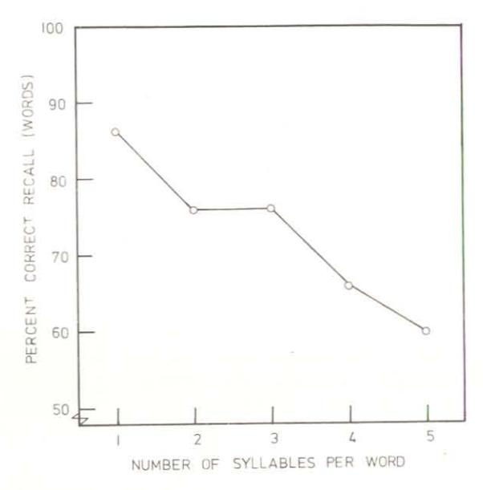

Fig. 6. Effect of word length on short-term serial recall. (Data from Baddeley and Thomson, unpublished.)

become useful in allowing S to utilize his knowledge of the experimental situation in order to interpret the deteriorated traces emerging from an overloaded phonemic buffer (Baddeley, 1972).

According to this account, the span of immediate memory is set by two major factors: the capacity of the phonemic loop, which is presumably relatively invariant, and the ability of the central executive component to supplement this, both by recoding at input and reconstruction at the recall stage. We have begun to study the first of these factors by varying word length in the memory span situation. Figure 6 shows the results of an experiment in which eight Ss were presented with sequences of five words from each of five sets. Each set comprised ten words of equal frequency of occurrence, but sets varied in word length, ranging in number of syllables from one through five. There is a clear tendency for performance to decline as word length increases. A similar result was independently obtained by Standing (personal communication) who observed a negative correlation between the memory span for a given type of material and the speed at which that material can be articulated. It is perhaps worth noting at this point that Craik (1968) reports that

the recency effect in free recall is unaffected by the word length, suggesting once again a clear distinction between factors influencing the recency effect in free recall and those affecting the memory span. Watkins (1972) has further observed that word length does not influence the modality effect, but does impair the long-term component of verbal free recall. The former result would tend to suggest that the precategorical acoustic store on which the modality effect is generally assumed to rely (Crowder & Morton, 1969) lies outside the working memory system.

We, therefore, appear to have at least tentative evidence for the existence of a phonemic buffer, together with techniques such as articulatory suppression and the manipulation of word length which hopefully will provide tools for investigating this component in greater depth. It is possible that this component plays a major role in determining the occurrence of both acoustic similarity effects in memory and perhaps also of such speech errors as tongue twisters and spoonerisms. It seems likely that although it does not form the central core of working memory the phonemic component will probably justify considerably more investigation.

The operation of the central component of working memory seems likely to prove considerably more complex. It seems probable that it is this component that is responsible for the "chunking" of material which was first pointed out by Miller (1956) and has subsequently been studied in greater detail by Slak (1970), who taught subjects to recode digit sequences into a letter code which ensured an alternation between consonants and vowels. This allowed a dramatic reduction in the number of phonemes required to encode the sequence and resulted not only in a marked increase in the digit span, but also in a clear improvement in the performance of a range of tasks involving the long-term learning of digit sequences. A similar recoding procedure, this time based on prior language habits, is probably responsible for the observed increase in span for letter sequences as they approximate more closely to the structure of English words. This, together with the decreased importance of phonemic similarity, suggests that S is chunking several letters into one speech sound rather than simply rehearsing the name of the letter (Baddeley, 1971).

During retrieval, the executive component of the working memory system is probably responsible for interpreting the phonemic trace; it is probably at this level that retrieval rules (Baddeley, 1972) are applied. These ensure that a trace is interpreted within the constraints of the experiment, with the result that Ss virtually never pro-

duce completely inappropriate responses such as letters in an experiment using digits. We have unfortunately, however, so far done little to investigate this crucial central executive component; techniques aimed at blocking this central processor while leaving the peripheral components free should clearly be developed if possible.

#### C. ONE OR MANY WORKING MEMORIES?

Our work so far has concentrated exclusively on verbal tasks, and the question obviously arises as to how general are our conclusions. It seems probable that a comparable system exists for visual memory which is different at least in part from the system we have been discussing.

Brooks (1967, 1968) studied a number of tasks in which S is induced to form a visual image and use this in an immediate memory situation. He has shown that performance in such a situation is impaired by concurrent visual processing, in contrast to equivalent phonemically based tasks, which are much more susceptible to concurrent verbal activity. We have confirmed and extended Brooks' results using visual pursuit tracking (Baddeley, Grant, Wight, & Thomson, 1974) which was found to cause a dramatic impairment in performance on a span task based on visual imagery, while producing no decrement in performance on an equivalent phonemically based task. Further evidence for the existence of a visual memory system which may be unaffected by heavy phonemic processing demands comes from the study by Kroll, Parks, Parkinson, Bieber, and Johnson (1970), who showed that Ss could retain a visually presented letter over a period of many seconds of shadowing auditory material.

From these and many other studies, it is clear that visual and auditory short-term storage do employ different subsystems. What is less clear is whether we need to assume completely separate parallel systems for different modalities, or whether the different modalities may share a common central processor. Preliminary evidence for the latter view comes from an unpublished study by R. Lee at the University of St. Andrews. He studied memory for pictures in a situation where Ss were first familiarized with sets of pictures of a number of local scenes, for which they were taught an appropriate name. Several slightly different views of each scene were used although only half of the variants of each scene were presented during the pretraining stage. Subjects were then tested on the full set of pictures and were required in each case to name the scene, saying whether the particular version shown was an "old" view which they had seen before

or a "new" one. Subjects' performance was compared both while doing this task alone and while doing a concurrent mental arithmetic task (e.g., multiplying 27 and 42). Subjects were able to name the scenes without error in both conditions, but made a number of errors in deciding whether or not they had seen any given specific view of that scene; these errors were markedly more frequent in the mental arithmetic condition, suggesting that the visual recognition process was competing for limited processing capacity with the arithmetic task. One obvious interpretation of this result is to suggest that the central processor which we have assumed forms the core of working memory in our verbal situations plays a similar role in visual memory, although this time with a separate peripheral memory component, based on the visual system. What little evidence there exists, therefore, suggests that the possibility of a single common central processor should be investigated further, before assuming completely separate working memories for different modalities.

## D. Working Memory and the Recency Effect in Free Recall

A major distinction between the working memory system we propose and STS (Atkinson & Shiffrin, 1968) centers on the recency effect in free recall. Most theories of STM assume that retrieval from a temporary buffer store accounts for the recency effect, whereas our own results argue against this view. It is suggested that working memory, which in other respects can be regarded as a modified STS, does not provide the basis for recency.

Experiment IX studied the effect of a concurrent digit memory task on the retention of lists of unrelated words. The results showed that when Ss were concurrently retaining six digits, the LTS component of recall was low, but recency was virtually unaffected. Since six digits is very near the memory span, the STS model would have to assume that STS is full almost to capacity for an appreciable part of the time during the learning of the words for free recall. On this model, both recency and LTS transfer should be lowered by the additional short-term storage load. As there was no loss of recency, it seems that an STS account of recency is inappropriate. Instead, it seems that recency reflects retrieval from a store which is different from that used for the digit span task. Perhaps the most important aspect of this interpretation is that the limited memory span and limited rate of transfer of information to LTS must be regarded as having a common origin which is different from that of the recency

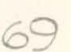

effect. It would be useful to consider briefly what further evidence there is for this point of view.

## E. THE MEMORY SPAN, TRANSFER TO LTS, AND RECENCY

There is a wide range of variables which appear to affect the memory span (or short-term serial recall) and the LTS component of free recall in the same way, but which do not affect the recency component of free recall. In addition to the effects of word length and articulatory suppression which we have already discussed, which probably reflect the limited storage capacity of the working memory system or of one of its components, there are a number of variables which have been shown to affect the second limitation of the STS system, namely the rate at which it is able to transfer information to LTS. Several sets of experimental results show that the recency effect is not influenced by factors which interfere with LTS transfer. Murdock (1965), Baddeley, Scott, Drynan, and Smith (1969), and Bartz and Salehi (1970) have all shown that the LTS component of free recall is reduced when Ss are required to perform a subsidiary card-sorting task during presentation of the items for free recall. The effect is roughly proportional to the difficulty of the subsidiary task. However, there is no effect on the recency component of recall. Similar results have been reported by Silverstein and Glanzer (1971) using arithmetic varying in level of difficulty as the subsidiary task. As most of these authors concluded, the results suggest that there is a limited capacity system mediating LTS registration which is not responsible for the recency effect. On the present hypothesis, the subsidiary task is viewed as interfering with working memory and does not necessarily, therefore, interfere with recency as well. Hence the crucial difference in emphasis between the two theories (working memory-LTS, and STS-LTS) is that working memory is supposed to have both buffer-storage and control-processing functions, with recency explained by a separate mechanism.

## IV. The Nature of the Recency Effect

So far, the most compelling argument for rejecting the bufferstorage hypothesis for recency has been the data from Experiment XI, in which a concurrent memory span task did not abolish recency in free recall. Clearly the argument needs strengthening.

Tzeng (1973) presented words for free recall in such a way that

before and after each word, S was engaged in a 20-second period of counting backwards by three's. Under these conditions the serial position curve showed a strong recency effect. After learning four such lists, S was asked to recall as many words as possible from all four lists. Even on this final recall, the last items from each of the lists were recalled markedly better than items from earlier positions. Neither of these two recency effects is easily attributable to retrieval from a short-term buffer store. With the initial recall, the counting task ought to have displaced words from the buffer. In the case of the final recall the amount of interpolated activity was even greater. Tzeng's results, therefore, suggest at the very least that the recency effect is not always attributable to output from buffer storage. Tzeng cites further evidence (unpublished at the time of writing) from Dalezman and from Bjork and Whitten, in both cases suggesting that recency may occur under conditions which preclude the operation of STS.

Baddeley (1963) carried out an experiment in which Ss were given a list of 12 anagrams to solve. Anagrams were presented one at a time for as long as it took for a solution to be found, up to a limit of one minute, at which time the experimenter presented the solution. After the final anagram, S was questioned about his strategy and was then asked to freely recall as many of the solution words as possible. The results of the recall test are shown in Fig. 7 since they were not reported in the original paper. They show that despite the unexpected nature of the recall request and the delay while S discussed his strategy, a pronounced recency effect occurs. Since each item except the last was followed by up to a minute of problem-

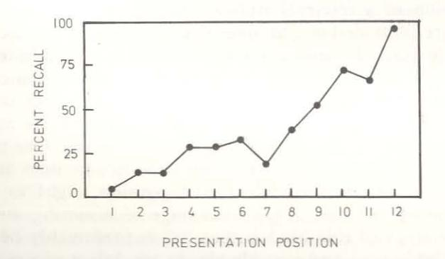

Fig. 7. Recall of anagram solutions as a function of order of presentation of the problems. (Data from Baddeley, 1963.)

solving activity and the last item was followed by a period of question-answering, it is difficult to explain this recency effect in terms of a temporary buffer store.

An experiment by Glanzer (1972) which we have successfully replicated (Baddeley & Thomson, unpublished) presents further problems for a simple buffer-store interpretation of the recency effect. Instead of unrelated words, Glanzer used proverbs as the material to be recalled. His results showed two striking phenomena: first, the recency effect extended over the last few proverbs rather than the last few words; and second, a filled delay reduced, but by no means eliminated, the marked recency effect observed. The extent of recency, therefore, seems to be defined in terms of "semantic units" rather than words. This is not, of course, incompatible with a buffer-storage account, although in this experiment, a good deal of semantic processing would presumably have to occur before entry of a proverb into this buffer. The assumption of a more central store does have the additional advantage of "explaining" the durable recency effect observed in this study, in terms of the suggestion by Craik and Lockhart (1972) that greater depth of processing is associated with greater durability. However, it is clearly the case that such a depth of processing is by no means essential to the recency effect. Indeed, the effect appears to be completely unaffected by factors such as presentation rate (Glanzer & Cunitz, 1966), concurrent processing load (Murdock, 1965), and type of material (Glanzer, 1972), all of which would be expected to have a pronounced influence on depth of processing.

A more promising alternative explanation of recency might be to elaborate the proposal made by Tulving (1968) that recency reflects the operation of a retrieval strategy, rather than the output of a specific store. Provided one assumes that ordinal recency may be one accessible feature of a memory trace, then it is plausible to assume that Ss may frequently access items on the basis of this cue. The limited size of the recency effect, suggesting that recency is only an effective cue for the last few items, might reasonably be attributed to limitations on the discriminability of recency cues. One might assume, following Weber's Law, that with the newest item as a reference point, discriminability of ordinal position ought to decrease with increasing "oldness." The advantage of assuming an ordinal retrieval strategy of this kind is that it can presumably be applied to any available store and possibly also to any subset of items within that store, provided the subset can be adequately categorized. Thus, when an interpolated activity is classed in the same category as the learned items, the interpolated events will be stored in the same dimension as the to-be-remembered items and will hence supersede them as the most recent events. When the interpolated activity is classed in a different category from the learned items, recency will be unaffected. This presumably occurred in the case of proverbs and the anagram solutions. It also seems intuitively plausible to assume that a similar type of recency is reflected in one's own memory for clearly specified classes of events, for example, football games, parties, or meals at restaurants, all of which introspectively at least appear to exhibit their own recency effect. It is clearly necessary to attempt to collect more objective information on this point, however.

The preceding account of recency is highly tentative, and although it does possess the advantage of being able to deal with evidence which presents considerable difficulties for the buffer-store interpretation, it does leave two very basic questions unanswered. The first of these concerns the question of what factors influence the categorization of different types of events; it seems intuitively unlikely that backward-counting activity should be categorized in the same way for example as visually presented words, and yet counting effectively destroys the recency effect in this situation. This is, of course, a difficult problem, but it is no less a problem for the buffer-store interpretation which must also account for the discrepancy between Tzeng's results and the standard effect of a filled delay on recency.

The second basic question is that of how ordinal recency is stored, whether in terms of trace-strength, in terms of ordinal "tags" of some kind, or in some as yet unspecified way. Once again, this problem is not peculiar to the retrieval cue interpretation of recency; it is clearly the case that we are able to access ordinal information in some way. How we do this, and whether ordinal cues can be used to retrieve other information, is an empirical question which remains unanswered.

## V. Concluding Remarks

We would like to suggest that we have presented *prima facie* evidence for the existence of a working memory system which plays a central role in human information processing. The system we propose is very much in the spirit of similar proposals by such authors as Posner and Rossman (1965) and Atkinson and Shiffrin (1971). However, whereas earlier work concentrated principally on

87

the memory system *per se*, with the result that the implications of the system for nonmemory tasks were largely speculative, our own work has been focused on the information processing tasks rather than the system itself. As a consequence of this, we have had to change our views of both working memory and of the explanation of certain STM phenomena.

To sum up, we have tried to make a case for postulating the working memory-LTS system as a modification of the current STS-LTS view. We would like to suggest that working memory represents a control system with limits on both its storage and processing capabilities. We suggest that it has access to phonemically coded information (possibly by controlling a rehearsal buffer), that it is responsible for the limited memory span, but does not underly the recency effect in free recall. Perhaps the most specific function which has so far been identified with working memory is the transfer of information to LTS. We have not yet explored its role in retrieval, so that the implications of Patterson's (1971) results for the nature of working memory are still unclear. Our experiments suggest that the phonemic rehearsal buffer plays a limited role in this process, but is by no means essential. The patient K.F., whom Shallice and Warrington (1970) showed to have grossly impaired digit span together with normal long-term learning ability, presents great difficulty for the current LTS-STS view, since despite his defective STS, his long-term learning ability is unimpaired. His case can, however, be handled quite easily by the view of working memory proposed, if it is assumed that only the phonemic rehearsal-buffer component of his working memory is impaired, while the central executive component is intact. Our experiments also suggest that working memory plays a part in verbal reasoning and in prose comprehension. Understanding the detailed role of working memory in these tasks, however, must proceed hand-in-hand with an understanding of the tasks themselves.

We began with a very simple question: what is short-term memory for? We hope that our preliminary attempts to begin answering the question will convince the reader, not necessarily that our views are correct, but that the question was and is well worth asking.

#### ACKNOWLEDGMENTS

Part of the experimental work described in this chapter was carried out at the University of Sussex. We are grateful to colleagues at both Sussex and Stirling for

valuable discussion and in particular to Neil Thomson whose contribution was both practical and theoretical. The financial support of both the British Medical Research Council and the Social Sciences Research Council is gratefully acknowledged.

#### REFERENCES

- Atkinson, R. C., & Shiffrin, R. M. Human memory: A proposed system and its control processes. In K. W. Spence & J. T. Spence (Eds.), The psychology of learning and motivation: Advances in research and theory. Vol. 2. New York: Academic Press, 1968. Pp. 89–195.
- Atkinson, R. C., & Shiffrin, R. M. The control of short-term memory. Scientific American, 1971, 225, 82-90.
- Baddeley, A. D. A Zeigarnik-like effect in the recall of anagram solutions. Quarterly Journal of Experimental Psychology, 1963, 15, 63-64.
- Baddeley, A. D. The influence of acoustic and semantic similarity on long-term memory for word sequences. *Quarterly Journal of Experimental Psychology*, 1966, 18, 302-309. (a)
- Baddeley, A. D. Short-term memory for word sequences as a function of acoustic, semantic and formal similarity. Quarterly Journal of Experimental Psychology, 1966, 18, 362-366. (b)
- Baddeley, A. D. A three-minute reasoning test based on grammatical transformation. Psychonomic Science, 1968, 10, 341–342.
- Baddeley, A. D. Language habits, acoustic confusability and immediate memory for redundant letter sequences. Psychonomic Science, 1971, 22, 120–121.
- Baddeley, A. D. Retrieval rules and semantic coding in short-term memory. Psychological Bulletin, 1972, 78, 379–385.
- Baddeley, A. D., De Figuredo, J. W., Hawkswell-Curtis, J. W., & Williams, A. N. Nitrogen narcosis and performance under water. *Ergonomics*, 1968, 11, 157–164.
- Baddeley, A. D., Grant, S., Wight, E., & Thomson, N. Imagery and visual working memory. In P. M. Rabbitt & S. Dornic (Eds.), Attention and performance. Vol. 5. New York: Academic Press, 1974, in press.
- Baddeley, A. D., & Patterson, K. The relationship between long-term and short-term memory. *British Medical Bulletin*, 1971, 27, 237–242.
- Baddeley, A. D., Scott, D., Drynan, R., & Smith, J. C. Short-term memory and the limited capacity hypothesis. British Journal of Psychology, 1969, 60, 51-55.
- Baddeley, A. D., & Warrington, E. K. Memory coding and amnesia. Neuropsychologia, 1973, 11, 159-165.
- Bartz, W. H., & Salehi, M. Interference in short- and long-term memory. *Journal of Experimental Psychology*, 1970, 84, 380-382.
- Brooks, L. R. The suppression of visualization in reading. Quarterly Journal of Experimental Psychology, 1967, 19, 289-299.
- Brooks, L. R. Spatial and verbal components in the act of recall. Canadian Journal of Psychology, 1968, 22, 349-368.
- Brown, I. D., Tickner, A. H., & Simmonds, D. C. V. Interference between concurrent tasks of driving and telephoning. *Journal of Applied Psychology*, 1969, 53, 419-424.
- Bruce, D., & Crowley, J. J. Acoustic similarity effects on retrieval from secondary memory. Journal of Verbal Learning and Verbal Behavior, 1970, 9, 190-196.
- Coltheart, V. The effects of acoustic and semantic similarity on concept identification. Quarterly Journal of Experimental Psychology, 1972, 24, 55-65.

- Conrad, R. An association between memory errors and errors due to acoustic masking of speech. *Nature* (London), 1962, 193, 1314–1315.
- Conrad, R., & Hull, A. J. Information, acoustic confusion and memory span. British Journal of Psychology, 1964, 55, 429–432.
- Craik, F. I. M. Two components in free recall. Journal of Verbal Learning and Verbal Behavior, 1968, 7, 996-1004.
- Craik, F. I. M., & Levy, B. A. Semantic and acoustic information in primary memory. *Journal of Experimental Psychology*, 1970, 86, 77-82.
- Craik, F. I. M., & Lockhart, R. S. Levels of processing: A framework for memory research. Journal of Verbal Learning and Verbal Behavior, 1972, 11, 671-684.
- Crowder, R. G., & Morton, J. Precategorical acoustic storage (PAS). Perception & Psychophysics, 1969, 5, 365-373.
- Glanzer, M. Storage mechanisms in free recall. In G. H. Bower (Ed.), The psychology of learning and motivation: Advances in research and theory. Vol. 5. New York: Academic Press, 1972. Pp. 129–193.
- Glanzer, M., & Cunitz, A. R. Two storage mechanisms in free recall. Journal of Verbal Learning and Verbal Behavior, 1966, 5, 351-360.
- Glanzer, M., Koppenaal, L., & Nelson, R. Effects of relations between words on short-term storage and long-term storage. Journal of Verbal Learning and Verbal Behavior, 1972, 11, 403–416.
- Green, D. W. A psychological investigation into the memory and comprehension of sentences. Unpublished doctoral dissertation, University of London, 1973.
- Hammerton, M. Interference between low information verbal output and a cognitive task. Nature (London), 1969, 222, 196.
- Hunter, I. M. L. Memory. London: Penguin Books, 1964.
- Jarvella, R. J. Syntactic processing of connected speech. Journal of Verbal Learning and Verbal Behavior, 1971, 10, 409-416.
- Johnston, W. A., Griffith, D., & Wagstaff, R. R. Information processing analysis of verbal learning. Journal of Experimental Psychology, 1972, 96, 307-314.
- Kroll, N. E. A., Parks, T., Parkinson, S. R., Bieber, S. L., & Johnson, A. L. Short-term memory while shadowing: Recall of visually and aurally presented letters. *Journal* of *Experimental Psychology*, 1970, 85, 220-224.
- Levy, B. A. Role of articulation in auditory and visual short-term memory. Journal of Verbal Learning and Verbal Behavior, 1971, 10, 123-132.
- Martin, D. W. Residual processing capacity during verbal organization in memory. Journal of Verbal Learning and Verbal Behavior, 1970, 9, 391-397.
- Miller, G. A. The magical number seven plus or minus two: some limits on our capacity for processing information. *Psychological Review*, 1956, 63, 81–97.
- Murdock, B. B., Jr. Effects of a subsidiary task on short-term memory. British Journal of Psychology, 1965, 56, 413-419.
- Murray, D. J. The role of speech responses in short-term memory. Canadian Journal of Psychology, 1967, 21, 263-276.
- Murray, D. J. Articulation and acoustic confusability in short-term memory. *Journal of Experimental Psychology*, 1968, 78, 679-684.
- Neale, M. D. Neale Analysis of Reading Ability. London: Macmillan, 1958.
- Norman, D. A. The role of memory in the understanding of language. In J. F. Kavanagh & I. G. Mattingly (Eds.), Cambridge, Mass.: MIT Press, 1972.
- Patterson, K. A. Limitations on retrieval from long-term memory. Unpublished doctoral dissertation, University of California, San Diego, 1971.
- Peterson, L. R. Concurrent verbal activity. Psychological Review, 1969, 76, 376-386.

- Peterson, L. R., & Peterson, M. J. Short-term retention of individual verbal items. Journal of Experimental Psychology, 1959, 58, 193-198.
- Posner, M. I., & Rossman, E. Effect of size and location of informational transforms upon short-term retention. *Journal of Experimental Psychology*, 1965, **70**, 496–505.
- Rubenstein, H., & Aborn, M. Learning, prediction and readability. Journal of Applied Psychology, 1958, 42, 28-32.
- Rumelhart, D. E., Lindsay, P. H., & Norman, D. A. A process model for long-term memory. In E. Tulving & W. Donaldson (Eds.), Organisation and memory. New York: Academic Press, 1972.
- Sachs, J. D. S. Recognition memory for syntactic and semantic aspects of connected discourse. *Perception & Psychophysics*, 1967, 2, 437-442.
- Shallice, T., & Warrington, E. K. Independent functioning of verbal memory stores: a neuropsychological study. Quarterly Journal of Experimental Psychology, 1970, 22, 261-273.
- Silverstein, C., & Glanzer, M. Difficulty of a concurrent task in free recall: differential effects of LTS and STS. *Psychonomic Science*, 1971, 22, 367-368.
- Slak, S. Phonemic recoding of digital information. Journal of Experimental Psychology, 1970, 86, 398-406.
- Sperling, G. A model for visual memory tasks. Human Factors, 1963, 5, 19-31.
- Taylor, W. L. "Cloze procedure": A new tool for measuring readability. Journalism Quarterly, 1953, 30, 415–433.
- Tulving, E. Theoretical issues in free recall. In T. R. Dixon & D. L. Horton (Eds.), Verbal behaviour and general behaviour theory. Englewood Cliffs, N.J.: Prentice-Hall, 1968.
- Tzeng, O. J. L. Positive recency effect in delayed free recall. Journal of Verbal Learning and Verbal Behavior, 1973, 12, 436–439.
- Warrington, E. K., Logue, V., & Pratt, R. T. C. The anatomical localization of selective impairment of auditory verbal short-term memory. *Neuropsychologia*, 1971, 9, 377–387.
- Warrington, E. K., & Shallice, T. The selective impairment of auditory verbal short-term memory. *Brain*, 1969, **92**, 885–896.
- Warrington, E. K., & Weiskrantz, L. An analysis of short-term and long-term memory defects in man. In J. A. Deutsch (Ed.), *The physiological basis of memory*. New York: Academic Press, 1973.
- Wason, P. C., & Johnson-Laird, P. N. Psychology of reasoning: Structure and content. London: Batsford, 1972.
- Watkins, M. J. Locus of the modality effect in free recall. Journal of Verbal Learning and Verbal Behavior, 1972, 11, 644-648.
- Waugh, N. C., & Norman, D. A. Primary memory. Psychological Review, 1965, 72, 89-104.
- Wickelgren, W. A. Short-term memory for phonemically similar lists. American Journal of Psychology, 1965, 78, 567-574.