# The Hidden Logic of Sudoku

**Second Edition** 

**Denis Berthier** 

# The Hidden Logic of Sudoku

**Second Edition** 

Books by Denis Berthier:

Le Savoir et l'Ordinateur, Editions L'Harmattan, Paris, November 2002. Méditations sur le Réel et le Virtuel, Editions L'Harmattan, Paris, May 2004.

The Hidden Logic of Sudoku (First Edition), Lulu.com, May 2007.

This work is subject to copyright. All rights are reserved. This work may not be translated or copied in whole or in part without the prior written permission of the publisher, except for brief excerpts in connection with reviews or scholarly analysis. Use in connection with any form of information storage or retrieval, electronic adaptation, computer software, or by similar or dissimilar methods now known or hereafter developed is forbidden.

The first edition of this book has been published in May 2007 by Lulu.com Publishers (© 2007 Denis Berthier, ISBN: 978-1-84753-472-9).

987654321

Second Edition

© 2007 Denis Berthier

ISBN: 978-1-84799-214-7

### Contents

| Foreword to the Second Edition                       | 11 |
|------------------------------------------------------|----|
| Prologue                                             | 13 |
| Introduction                                         | 17 |
| 1 The Sudoku problem and the resolution methods      |    |
| 2 The roles of Logic and AI in this book             | 25 |
| 3 Examples and classification results                | 27 |
| PART ONE: FOUNDATIONS                                | 33 |
| Chapter I. Symmetries, analogies and supersymmetries | 29 |
| I.1 Symmetries                                       | 35 |
| I.2 The two canonical coordinate systems on a grid   | 37 |
| I.3 Coordinates and names                            | 38 |
| I.4 Analogies                                        | 39 |
| I.5 Supersymmetries                                  | 40 |
| Chapter II. Complementary graphical representations  | 41 |
| II.1 New graphical representations of a puzzle       |    |
| II.2 Extended Sudoku Board                           | 45 |
| II.3 How to build the rn- and cn- representations    | 47 |
| II.4 How to use the rn- and cn- representations      | 49 |

| Chapter III. Grid Theory and Sudoku Theory                  |     |
|-------------------------------------------------------------|-----|
| III.1 Multi-sorted first order logic and Sudoku Grid Theory | 52  |
| III.2 Sudoku Theory (ST)                                    | 60  |
|                                                             |     |
| Chapter IV. Sudoku Resolution Theories                      |     |
| IV.1 Sudoku Theory vs. Sudoku Resolution Theories           | 66  |
| IV.2 The logical nature of Sudoku Resolution Theories       | 67  |
| IV.3 Basic Sudoku Resolution Theory (BSRT)                  |     |
| IV.4 Block-free predicates and formulæ                      |     |
| IV.5 Symmetries and the three basic meta-theorems           | 87  |
| PART TWO: BASIC RESOLUTION RULES                            | 91  |
| Chapter V. Subset rules, level one: Singles                 |     |
| V.1 Subset rules, level one                                 |     |
| V.2 Logical formulation of the rules                        |     |
| V.3 Example                                                 |     |
| V.4 Theory L1_0                                             | 97  |
| Chapter VI. Subset rules, level two: Pairs                  | 99  |
| VI.1 Naked-Pairs                                            | 101 |
| VI.2 Hidden-Pairs                                           |     |
| VI.3 Super-Hidden-Pairs or X-Wing                           |     |
| VI.4 Theory L2                                              | 129 |
| Chapter VII. Subset rules, level three: Triplets            | 121 |
| VII.1 Naked-Triplets                                        |     |
| VII.2 Hidden-Triplets                                       | 128 |
| VII.3 Super-Hidden-Triplets or Swordfish                    |     |
| VII.4 Theory L3_0                                           |     |
| Chapter VIII. Subset rules, level four: Quadruplets         | 135 |
| VIII.1 Naked-Quadruplets                                    |     |
| VIII.2 Hidden-Quadruplets                                   | 140 |
| VIII.3 Super-Hidden-Quadruplets or Jellyfish                | 141 |
| VIII.4 Correspondence between Naked and Hidden subsets      | 147 |
| VIII.5 Theory L4_0                                          | 147 |

Contents 7

| Chapter IX. Interaction Rules                                                                    | 149    |
|--------------------------------------------------------------------------------------------------|--------|
| IX.1 Row-Interaction-with-Block                                                                  | 149    |
| IX.2 Column-Interaction-with-Block                                                               | 151    |
| IX.3 Block-Interaction-with-Row and Block-Interaction-with-Column                                | 153    |
| IX.4 How the interaction rules integrate our hierarchy                                           | 155    |
| IX.5 Examples and independence results                                                           |        |
| IX.6 Theory L1                                                                                   |        |
| Chapter X. The XY-Wing and XYZ-Wing rules                                                        |        |
| X.1 XY-Wing or XYW                                                                               | 161    |
| X.2 XYZ-Wing or XYZW                                                                             |        |
| X.3 Theory L3                                                                                    | 169    |
| X.4 Theories L1_0 to L4_0                                                                        | 170    |
| PART THREE: 2D CHAIN RULES                                                                       | 175    |
| Chapter XI. General theorems on shared units                                                     |        |
| XI.1 Shared units in natural row-column space                                                    |        |
| XI.2 Hidden counterparts of the previous theorems                                                | 180    |
| Chapter XII. Chains, target cells and chain rules                                                | 183    |
| XII.1 Links, chains, targets and chain rules                                                     |        |
| XII.2 xy-links, xy-chains and xy-chain rules                                                     | 188    |
| XII.3 c-links, c-chains and c-chain rules                                                        | 191    |
| XII.4 Formal interpretation of the rules and of their proofs                                     | 195    |
| Chapter XIII. Graphico-logical patterns for chain rules                                          | 197    |
| XIII.1 Simple patterns for cells and chains; their graphical representation their instantiations | ns and |
| XIII.2 Logical formula associated to a simple chain pattern                                      |        |
| XIII.3 Graphico-logical expression of chain rules                                                |        |
| Chapter XIV. xy-chains                                                                           | 207    |
| XIV.1 Why one should not allow loops in xy-chains                                                |        |
| XIV.2 List of the first xy-chains                                                                |        |
| XIV.3 Examples and independence results                                                          |        |

| Chapter XV. Hidden xy-chains (hxy-chains)                          | 225 |
|--------------------------------------------------------------------|-----|
| XV.1 Introduction to hidden xy-chains (or hxy-chains)              | 225 |
| XV.2 The unifying power of hidden xy-chains                        |     |
| XV.3 Examples and independence results                             | 233 |
| Chapter XVI. Conjugacy chains (c-chains)                           | 245 |
| XVI.1 Why one should not allow loops in c-chains                   |     |
| XVI.2 Special c-chains and the case of hidden c-chains             | 248 |
| XVI.3 Examples of c4-chains; independence of C4, XY4 and HXY4      | 250 |
| XVI.4 Example of a c6-chain                                        | 254 |
| XVI.5 Example of a c8-chain                                        | 256 |
| Chapter XVII. xyt-chains                                           | 257 |
| XVII.1 xyt-chains and xyt-chain rules                              |     |
| XVII.2 Extended cell patterns and chain patterns                   | 260 |
| XVII.3 List of the first xyt-chain rules                           | 262 |
| XVII.4 Examples and independence results                           | 264 |
| Chapter XVIII. Hidden xyt-chains (hxyt-chains)                     | 279 |
| XVIII.1 Introduction to hidden xyt-chains (or hxyt-chains)         |     |
| XVIII.2 Examples and independence results                          |     |
| Chapter XIX. xyz- and xyzt- chains                                 | 297 |
| XIX.1 Introduction to xyz-chains                                   |     |
| XIX.2 Introduction to xyzt-chains                                  |     |
| XIX.3 List of the first xyzt-chain rules                           |     |
| XIX.4 Examples and independence results                            |     |
| Chapter XX. Hidden xyz- and xyzt- chains (hxyz- and hxyzt- chains) | 315 |
| XX.1 Introduction to hidden xyzt-chains (or hxyzt-chains)          |     |
| XX.2 Examples and independence results                             |     |
| Chapter XXI. Classification results                                | 323 |
| XXI.1 Detailed results for levels L0 to L4 0                       |     |
| XXI.2 Global results for levels L4 0 to L13                        |     |
| XXI.3 Further results for levels L4 0 to L7                        |     |
| XXI 4 Comparison with number of entries (Sudogen0)                 |     |

### PART FOUR: FULLY SUPERSYMMETRIC (OR "3D") CHAIN RULES.331

| Chapter XXII. 3D chains: nrc-, nrct-, nrcz- and nrczt- chains          | 333 |
|------------------------------------------------------------------------|-----|
| XXII.1 nrc-cells, candidates, nrc-links and nrc-chains                 |     |
| XXII.2 nrc-chains                                                      |     |
| XXII.3 nrct-chains                                                     |     |
| XXII.4 nrcz-chains                                                     |     |
| XXII.5 nrczt-chains                                                    |     |
| XXII.6 Proof of the nrc-, nrct-, nrcz- and nrczt- chain rules          |     |
| XXII.7 Graphico-logical patterns for 3D chains and associated logical  |     |
| formulæ                                                                | 343 |
| XXII.8 Miscellanea                                                     | 343 |
| Chapter XXIII. Examples and classification results for 3D chains       | 345 |
| XXIII.1 3D chains: priorities and notation                             |     |
| XXIII.2 Examples of 3D chains of types nrc, nrct, nrcz and nrczt       | 348 |
| XXIII.4 Classification results                                         | 363 |
| XXIII.5 An unsolved puzzle: Easter Monster                             | 364 |
| Chapter XXIV. Resolution rules and resolution techniques               | 365 |
| XXIV.1 On the concept of a resolution rule                             | 365 |
| XXIV.2 Chains and their objective properties                           | 369 |
| XXIV.3 Resolution rule versus resolution techniques                    | 373 |
| XXIV.4 Several resolution techniques implementing the nrczt-chain rule | 375 |
| XXIV.5 The Trial and Error Theorem                                     | 379 |
| Miscellanea                                                            | 385 |
| 1 The question of completeness                                         | 385 |
| 2 The question of confluence                                           | 387 |
| 3 The question of uniqueness                                           | 391 |
| 4 Are any other types of rules necessary?                              | 401 |
| Conclusion                                                             | 403 |
| References                                                             | 413 |

#### Foreword to the Second Edition

The first edition of this book (May 2007) introduced a conceptual framework for Sudoku solving, where "resolution rules" played a central role. All the concepts were formalised in Predicate Logic (FOL), which (surprisingly) was a new idea: all the books and Web forums had always considered Propositional Logic was enough. The concepts were also straightforwardly grounded in the notions every player uses when solving a puzzle. This framework (unchanged in this second edition) was thus totally player oriented from the start; it can be considered as a mere formalisation of what has always been looked for when it is said a "pure logic solution" is wanted.

On the practical side, I also introduced new resolution rules, based on natural generalisations of the famous xy-chains, such as xyt-, xyz- and zyzt- chains; contrary to those proposed in the current literature, these were not based on subsets. The systematic clarification and exploitation of all the generalised symmetries of the game also led me to a new source of generalisation and provided the "hidden" counterparts of the previous chains. After the first edition was published, I devised a further generalisation, pushing the idea of super-symmetry to its maximal extent and allowing to solve almost any puzzle with short chain patterns. Giving a systematic presentation of these new rules (which I had introduced less formally on Web forums) was the main reason for this second edition; and this provided the occasion for local improvements of the parts already present in the first.

#### What has been changed in the second edition

Let us state the main modifications that have been made in Parts One to Three:

- the graphics have been improved, especially for the grids with candidates;
- the extended Sudoku board defined in chapter II, the way to build and use it in practice, which were previously only available on my Web pages, have been fully

integrated into the book; moreover, they are now explicitly used in several examples, making the whole book more obviously player oriented;

- a new notation, the "nrc notation", is now used for displaying the solution paths of all the examples; being more compact, it allowed the introduction of Part Four without significantly increasing the total number of pages.

#### What has been added

Part Four of this second edition is completely new:

- the newest topic is "3D" chains (chapters XXII and XXIII); these are the fully super-symmetric extensions, or the 3D counterparts, of all the 2D chains introduced in the first edition (which could be spotted as sequences of cells in either of the rc-, rn-, cn-, and bn- spaces); as 3D chains are more general but also more complex and more difficult to spot on a real grid than the 2D chains, they take place above them in a complexity hierarchy; they do not replace them; this is why Parts One to Three have been kept unchanged, apart from the presentation details mentioned above; the new 3D chains, even limited to short lengths, allow to solve almost all the puzzles (99% of the random minimal puzzles with chains of length no more than five and 99.9% with chains of length no more than seven);
- chapter XXIV comments some features of the general conceptual framework of this book: the purely factual basic predicates; the concepts of a knowledge state and of a resolution rule; the misleading notion of a chain of inferences, as it appears too often on Web forums; the difference between proving a rule and finding its occurrences; the way our approach allows to unify two apparently conflicting views of chains (chains of cells versus chains of candidates); it also introduces a few factual properties of chains that may have an impact on their practical useability;
- resolution rules say what is legitimate and what patterns should be looked for; but they don't always say very explicitly where or how to find these patterns; chapter XXIV introduces the idea that one or more resolution technique(s) can be the implementation of a resolution rule and can thus help find the occurrences of its underlying pattern on a real grid; it gives precise examples for chains, building on classical ideas of colouring and tagging (for fans of such techniques);
- Trial and Error (T&E) is anathemised by purists who want only "pure logic solutions"; it was so obvious for me that its full version, recursive Trial and Error (rT&E), which is guaranteed to produce a solution if there is any, cannot be defined by a resolution rule that I didn't even think of elaborating on this idea in the first edition; a theorem and some comments on this can now be found in chapter XXIV, where the concept of a resolution rule appears to allow a clear theoretical separation between a "pure logic solution" and rT&E.

### Prologue

Do I need to introduce the game of Sudoku and its diabolical puzzles, when everyone knows that they have invaded the whole planet? One sad winter evening in December 2005, I came across one of those grids by chance – unless it was already the first step in some plot of the Powers of Darkness, who had placed it as a challenge to me on a full page of a magazine in a hairdressing saloon. Unfortunately I thought to myself: "well, let's see if this stupid game can help me get lighter ideas". Alas! I did not know yet that Sudoku grids are like the arabesques described by Lovecraft: once you begin following their perverse thread, your mind becomes irevocably ensnared. Reader, unless you have already fallen into this abyss, do not take my warning lightly: keep away! Gödel's sentence of the mind, a riddle that is able to paralyse it into unending loops, is not where Douglas Hofstadter has been looking for it: you will find it in the Sudoku grids! Or should I say: it will find you?

To make it short, I was not only unable to unlock my mind from the puzzle before I had completed it, but I was also coerced by the spell into trying immediately to solve a second one, even though I still had the same opinion in my mind: what a stupid game!

But this is only the beginning of the story: so mischievous is the Sudoku virus that it has to replicate and disseminate itself by all available means. Judge for yourself. On the morrow morning, I was hardly awake when I discovered that the same Fiendish Powers who had plotted my first encounter with the grids had also implanted a weird idea into the innermost meanders of my neurons, softened up by too short a night: "what a nice elementary example that would be for the students of my introductory courses in Logic and Artificial Intelligence (AI)!" This was the real start of it all.

As I was somehow aware some spell was acting on me and there was a risk of transferring it onto the poor fellows, I had to make sure there was a firm scientific or technical basis on which they could obtain a foothold. So I first checked that the problem was feasible (in particular that the computation times would not be prohibitive) and I quickly developed a small knowledge base able to solve all the example grids I could find on the Web. It worked by recursive Trial and Error, i.e. it by carrying out a systematic exploration of all the possibilities<sup>1</sup>. I needed a little more time to optimise the knowledge base so as to solve most of the puzzles in a fraction of a second and the remaining ones in a few seconds on my old Powerbook, but this was disconcertingly easy (compared to the time one needs to solve a puzzle "by hand"). So I gave this as an exercise to a first group of students – and discovered with some horror that many of them were already addicted to the wicked game.

Although I was not so naive to expect anything else, my program was deeply frustrating: the machine reached the solution infinitely faster than any human being could, even in his dreams, but it did so in an utterly stupid way (by exploring thousands of hypotheses, sometimes more than twenty levels deep).

Still goaded by the same Devilish Powers, I decided to write another (rule based) program that would simulate the behaviour of an expert player, able to justify all its steps as a human player would. In the meanwhile, I had discovered on the Web lots of pages describing resolution rules based on "pure logic", i.e. not resorting to Trial and Error. These rules consist of detecting patterns of varied complexity (and propagating associated constraints) of a type much less obvious than those mentioned above – the names of which might make you pensive (Naked Single, Hidden Single, Naked Subset, Hidden Subset, Block-Row-Interaction, X-Wing, Swordfish, Jellyfish and all other sorts of fishy things, XYZ-Wing, Death Blossom...). Building a series of projects for other groups of students provided me with a pretext for pursuing these new avenues.

The first thing to consider about the way a human being tackles the problem is that a puzzle is never submitted in a purely logical form; on the contrary, it is always centred on a spatial presentation<sup>2</sup>, i.e.: "complete the following grid...". This might seem harmless since it is not very difficult to translate the whole data into pure logic. Nevertheless, this spatial presentation of the game insidiously leads to the extended and biased representation universally used for resolution (a representation used by *all* the Web sites I have visited and by *all* the books I have browsed): in every cell, one writes either the number that must definitely occupy it or (with a

<sup>&</sup>lt;sup>1</sup> Of course, this (depth first) exploration of the tree of possibilities was duly pruned by propagation of the constraints defining the game (along rows, columns and 3x3 blocks).

<sup>&</sup>lt;sup>2</sup> Notice that the same remark applies to most of the so called logical games.

Prologue 15

pencil and in smaller size) the list of all its "candidates", i.e. of all the numbers that may still occupy it. Solving the grid then consists of progressively reducing this list of candidates by constraints propagation, until only one possibility remains for each cell. The resolution rules one can find on the Web are the expression of more or less complicated constraints; they are nearly *always* formulated on the basis of this representation.

It is time now to say a few words about the first discovery my writhing neurons made while trying to escape the spell: this universal spatial presentation of the puzzle, together with the associated model of cells to be filled with one number each, hide some logical symmetries of the problem<sup>3</sup>. And considering that eliciting these symmetries leads to the quasi identification of complex rules (such as X-Wing, Swordfish and Jellyfish) with apparently much simpler ones (such as Naked Pairs, Naked Triplets and Naked Quadruplets respectively), there is a mathematical beauty in it.

As everybody knows, the Powers of Darkness do not like Beauty.

But they have very twisted minds and you can never know by which pernicious paths they will have you reach their goals. At the time I caught Sudoku (as one catches a cold), I was wondering, like many researchers in cognitive science, if there is anything describable that makes the symbols or signs we use in language and in many other forms of ordinary life different from the formal symbols of AI. With the findings mentioned above, this very vague question mingled with, or focused on, the relationship between the abstract logical formulation of the game and its spatial presentation<sup>4</sup>. That is to say, I got a new excuse for continuing working on Sudoku.

The fact is I never consciously decided to write this book before the post-its, writings, drawings and programs had accumulated while I progressively shook the spell off as days passed. One vicious thing leading to a virtuous one, the whole process ended with this book (and the corresponding program SudoRules) being written. The Gods are victorious and our spirits are high.

<sup>&</sup>lt;sup>3</sup> Since this discovery, I have not been able to find any systematic reference on the Web to anything similar and I think granting it the central place it has in this book is original. But I must confess that I have not read the sixty and some million pages related to Sudoku.

<sup>&</sup>lt;sup>4</sup> This topic is still under investigation and will hardly be tackled in the present book.

The Gods are victorious and our spirits are high, but do not forget that lurking forever behind each and every Sudoku grid are the Powers of Darkness...

#### Introduction

#### 1. The Sudoku problem and the resolution methods

#### 1.1. Statement of the Sudoku problem

Given a 9x9 *grid*, partially filled with *numbers* from 1 to 9 (the "entries" of the problem, also called the "clues" or the "givens"), complete it with numbers from 1 to 9 so that in every of the nine *rows*, in every of the nine *columns* and in every of the nine disjoint *blocks* of 3x3 contiguous *cells*, the following property holds:

- there is at most one occurrence of each of these numbers.

Although this defining property can be replaced by either of the following two, that are obviously equivalent to it, we shall stick to the first formulation, for reasons that will appear later (in chapter IV, section 1.2):

- there is at least one occurrence of each of these numbers,
- there is exactly one occurrence of each of these numbers.

Since rows, columns and blocks play similar roles in the defining constraints, they will naturally appear to do so in many other places and it is convenient to introduce a word that makes no difference between them: a *unit* is either a row or a column or a block. And we say that two cells *share a unit* if they are either in the same row or in the same column or in the same block (where "or" is non exclusive). We also say that these two cells are *linked*, or that they *see* each other. It should be noticed that this (symmetric) relation between two cells, whichever of the three equivalent names it is given, does not depend in any way on the content of these cells but only on their place in the grid; it is therefore a straightforward and quasi physical notion.

As can be seen from the definition, a Sudoku grid is a special case of a Latin Square. Latin Squares must satisfy the same constraints as Sudoku, except the condition on blocks. The practical consequences of this relationship between Sudoku and Latin Squares will appear throughout this book (and the logical relationship between the two theories will be fully clarified in chapter IV).

Figure 1 below shows the standard presentations of a *problem grid* (also called a *puzzle*) and of a *solution grid* (also called a *complete Sudoku grid*).

|   |   |   |   |   |   | 1 | 2 |
|---|---|---|---|---|---|---|---|
|   |   |   | 3 | 5 |   |   |   |
|   |   | 6 |   |   |   | 7 |   |
| 7 |   |   |   |   | 3 |   |   |
|   |   | 4 |   |   | 8 |   |   |
| 1 |   |   |   |   |   |   |   |
|   |   | 1 | 2 |   |   |   |   |
|   | 8 |   |   |   |   | 4 |   |
|   | 5 |   |   |   | 6 |   |   |

| 6 | 7 | 3 | 8 | 9 | 4 | 5 | 1 | 2 |
|---|---|---|---|---|---|---|---|---|
| 9 | 1 | 2 | 7 | 3 | 5 | 4 | 8 | 6 |
| 8 | 4 | 5 | 6 | 1 | 2 | 9 | 7 | 3 |
| 7 | 9 | 8 | 2 | 6 | 1 | 3 | 5 | 4 |
| 5 | 2 | 6 | 4 | 7 | 3 | 8 | 9 | 1 |
| 1 | 3 | 4 | 5 | 8 | 9 | 2 | 6 | 7 |
| 4 | 6 | 9 | 1 | 2 | 8 | 7 | 3 | 5 |
| 2 | 8 | 7 | 3 | 5 | 6 | 1 | 4 | 9 |
| 3 | 5 | 1 | 9 | 4 | 7 | 6 | 2 | 8 |

Figure 1. A puzzle (Royle17-3) and its solution

#### 1.2. Resolution methods, candidates

The problem statement lists the constraints a solution grid must satisfy, i.e. it says *what* we want. It does not say anything about *how* we can obtain it: this is the job of the *resolution methods* and the *resolution rules* on which they are based (two notions that will be progressively refined in this introduction, until the final definition of a resolution rule can be given in chapter IV).

Different kinds of resolution methods can be used, depending mainly on whether they are primarily intended for a human solver or for a machine. For instance, one may be interested in efficient machine solving techniques; one will then choose machine representations of the problem specially adapted to efficient processing but that may be rather obscure for most human Sudoku players; one well-known technique of this kind relies on graph theory and maximal cliques. Although we do not neglect efficiency matters and have developed an automatised solver (SudoRules) implementing all the resolution rules described later in this book, we want to make it clear from the start that such questions are not our primary concern. Instead, our

Introduction 19

approach is totally player oriented and we shall concentrate on formalising resolution rules that can be applied by a human solver equipped only with a sheet of paper and a pen (and quite a lot of patience) and on simulating them with the (most classical, i.e. rule based) techniques of Artificial Intelligence (AI).

|            | cl                | <i>c</i> 2        | <i>c3</i>           | <i>c4</i>         | c5              | <i>c</i> 6        | <i>c</i> 7      | c8            | c9              |            |
|------------|-------------------|-------------------|---------------------|-------------------|-----------------|-------------------|-----------------|---------------|-----------------|------------|
| rl         | 3<br>4 5 6<br>8 9 | 3<br>4 6<br>7 9   | 3<br>4 5 6<br>7 8 9 | 7 8 9             | 4<br>7 8 9      | 4<br>7 8 9        | 4 5 9           | 1             | 2               | r1         |
| r2         | 2<br>4 6<br>8 9   | 1 2<br>4 6<br>7 9 | 1 2<br>4 6<br>7 8 9 | 2<br>7 8 9        | 3               | 5                 | 4 9             | 6<br>8 9      | 4 6 8 9         | r2         |
| r3         | 23<br>45<br>89    | 1 2 3<br>4<br>9   | 1 2 3<br>4 5<br>8 9 | 6                 | 1<br>4<br>8 9   | 1 2<br>4<br>8 9   | 4 5 9           | 7             | 3<br>4 5<br>8 9 | r3         |
| r4         | 7                 | 4 6 9             | 2<br>4 5 6<br>8 9   | 2<br>5<br>8 9     | 1<br>5 6<br>8 9 | 1 2<br>6<br>8 9   | 3               | 2<br>5 6<br>9 | 1<br>4 5 6<br>9 | r4         |
| r5         | 2 3<br>5 6<br>9   | 2 3<br>6<br>9     | 2 3<br>5 6<br>9     | 4                 | 1<br>5 6<br>7 9 | 1 2 3<br>6<br>7 9 | 8               | 2<br>5 6<br>9 | 1<br>5 6<br>7 9 | r5         |
| r6         | 1                 | 2 3<br>4 6<br>9   | 2 3<br>4 5 6<br>8 9 | 2 3<br>5<br>7 8 9 | 5 6<br>7 8 9    | 2 3<br>6<br>7 8 9 | 2<br>4 5<br>7 9 | 2<br>5 6<br>9 | 4 5 6<br>7 9    | r6         |
| <i>r</i> 7 | 3<br>4 6<br>9     | 3<br>4 6<br>7 9   | 3<br>4 6<br>7 9     | 1                 | 2               | 3<br>4 6<br>7 8 9 | 5<br>7 9        | 3<br>5<br>8 9 | 3<br>5<br>7 8 9 | <i>r</i> 7 |
| r8         | 2 3<br>6<br>9     | 8                 | 1 2 3<br>6<br>7 9   | 3<br>5<br>7 9     | 5 6<br>7 9      | 3<br>6<br>7 9     | 1 2<br>5<br>7 9 | 4             | 1 3<br>5<br>7 9 | r8         |
| r9         | 2 3<br>4 9        | 5                 | 1 2 3<br>4<br>7 9   | 3<br>7 8 9        | 4<br>7 8 9      | 3<br>4<br>7 8 9   | 6               | 2 3<br>8 9    | 1 3<br>7 8 9    | r9         |
| 1          | cl                | <i>c</i> 2        | <i>c3</i>           | <i>c4</i>         | c5              | <i>c</i> 6        | <i>c</i> 7      | c8            | c9              |            |

Figure 2. Grid Royle17-3 of Figure 1, with the candidates remaining after the elementary constraints have been propagated

Given this choice, the process of solving a grid "by hand" is generally initialised by defining the "candidates" for each cell. For later formalisation, one must give a careful definition of this notion: at any stage of the resolution process, candidates for a cell are the numbers that are not yet explicitly known to be impossible values for this cell. At the start of the game, one possibility is to consider that any cell with

no input value admits all numbers from 1 to 9 as candidates (but more subtle initialisations can be considered).

Usually candidates for a cell are displayed in the grid as smaller and/or clearer letters in this cell (as shown in Figure 2); for better readability of such representations, the nine blocks will be marked by thick borders and each of the possible values will always be represented at the same relative place in each of the cells.

Then, the resolution process is a sequence of steps consisting of repeatedly applying "resolution rules" (some of which have become very classical and some of which may be very complex) of the general condition-action type: if some pattern (i.e. configuration) of cells, links, values and candidates for these cells is present on the grid, then carry out the action specified by the rule. Notice that any such pattern always has a purely "physical" part (which may be called its "physical" support), defined by the conditions on the cells and links between them, and an additional part, depending on the conditions put on the values and candidates in these cells.

According to the type of their action part, such rules can be classified into three categories:

- either assert the final value of a cell (when it is proven there is only one possibility left for it); there are very few rules of this type;
- or delete some candidate(s) (which we call the target values of the pattern) from some cell(s) (which we call the target cells of the pattern); as appears from a quick browsing of the available literature and as will be confirmed by this book, most resolution rules are of this type; they express specific forms of constraints propagation; their general form is: if such a pattern is present, then it is impossible for some value(s) to be in some cell(s) and the corresponding candidates must be deleted from them;
- or, for some very difficult grids, recursively make a hypothesis on the value of a cell, analyse its consequences and apply the eliminations induced by the contradictions thus discovered; techniques of this kind (named "recursive Trial and Error" or "recursive guess"), do not fit our condition-action form and are proscribed by purists (for the reason that, most of the time, they make solving the puzzle totally uninteresting); this book will show that they are very rarely needed if one admits complex chain rules.

It should be noted that all of the above resolution rules, whatever their type, do not assert that there is a solution. But for recursive Trial and Error, they may be interpreted from an operational point of view as: "from what is known in the current situation, do conclude that any solution, if there is any, will satisfy the following".

Introduction 21

As one proceeds with resolution, candidates for each cell form a monotone decreasing set. With a little care, this remains true even when making hypotheses (i.e. resorting to recursive Trial and Error) cannot be avoided; in our "SudoRules" solver, for instance, in this case all candidates are explicitly relativised to finite sets of hypotheses (called "contexts") and monotonicity is thus maintained.

#### 1.3. Elementary rules, Trial and Error, and their limitations

The four simpler constraints propagation rules (obviously valid) are the direct translation of the initial problem formulation into operational rules for managing candidates. We call them "the (four) elementary constraints propagation rules" (ECP):

- ECP(cell): "if a value is asserted for a cell (as is the case for the initial values), then remove all the other candidates for this cell";
- ECP(row): "if a value is asserted for a cell (as is the case for the initial values), then remove this value from the candidates for any other cell in the same row";
- ECP(col): "if a value is asserted for a cell (as is the case for the initial values), then remove this value from the candidates for any other cell in the same column";
- ECP(blk): "if a value is asserted for a cell (as is the case for the initial values), then remove this value from the candidates for any other cell in the same block".

The simpler assertion rule (also obviously valid) is called Naked-Single:

– NS: "if a cell has only one candidate left, then assert it as the only possible value of the cell".

Together with NS, the four elementary constraints propagation rules constitute "the (five) elementary rules".

A novice player may think that these five elementary rules express the whole problem and that applying them repeatedly is therefore enough to solve any puzzle. If such were the case, you'd probably never have heard of Sudoku, because it would amount to mere paper scratching. Anyway, as he gets stuck in situations where none of these rules remains applicable, he soon discovers that, except for the simplest grids, this is very far from being sufficient. The puzzle in figure 1 is a simple illustration of how you get stuck if you only know and use the five elementary rules: the resulting situation is shown in figure 2, in which none of these rules can be applied. As we shall see later (in chapter V), for this particular puzzle, there is an easy way to unblock it. But, as we shall also see, there are lots of puzzles that need rules of a much higher complexity in order to be solved. And this is why Sudoku has become

so popular: all but the easiest puzzles require a particular combination of neuron-titillating techniques and may even suggest the discovery of as yet unknown ones.

One general way out of the blocked situation described above is recursive Trial and Error: when stuck, one can start a systematic (depth first) exploration of the tree of possibilities, duly pruned by the propagation of elementary constraints (thus avoiding the exploration of obviously contradictory possibilities). Simplistic as this method may be, it has a major theoretical advantage, justifying that we keep it in our arsenal of techniques to solve a grid: it is guaranteed either to find a solution if there is (at least) one or to prove there is none.

The technical drawback is a great variance in the computation times (be it by a human or a machine), and this variability is unrelated to any sensible notion of difficulty of the grid (it depends mainly on the order chosen to explore the tree of possibilities, i.e. on chance). But the major drawback is its unrealistic character by any human standards: some puzzles would require exploring thousands of hypotheses, sometimes more than twenty levels deep. This is one of the reasons why this technique is anathemised by purists, the second being that using it generally makes the puzzle totally uninteresting.

Finally, we keep recursive Trial and Error in our arsenal, but we keep it as a last resort weapon, to be used when nothing else can be done; we shall see that with all the rules defined later in this book, such a strategy guarantees that, most of the time (in 99,7% of Royle's 36,628 reference cases defined below; in 97% of the randomly generated puzzles), this technique is not needed; and, when it is needed, we have found no case for which one level of hypothesis was not enough. With the rules for 3D chains introduced in this second edition, these percentages rise to over 99.99%.

#### 1.4. Resolution rules and guiding principles for their formulation

Because the five elementary rules are not enough to solve any puzzle and recursive Trial and Error is not realistic from a human solver point of view, other resolution techniques must be devised.

Since Sudoku was invented, more or less complex resolution rules have been defined. They are based on the eliciting of various types of additional constraints, some of which may be non-obvious consequences of the problem statement.

Unfortunately, very often in the available literature, these rules, especially the most complex ones, are only illustrated by examples and their definitions remain

Introduction 23

rather vague – which incurs both redundancy in the rules proposed by various authors and much uncertainty regarding their scopes of application. To check this, just look at some of the innumerable Web sites dedicated to Sudoku (more than sixty millions, only a few of which are listed in the bibliography at the end of this book).

It appears that this vagueness is due to the lack of a general guiding principle for stating the rules, and this in turn is due to the lack of a clear notion of the complexity of a rule.

Later in this book, we shall provide a precise and sometimes unusual rephrasing of most of the familiar rules. Besides the constraint of non-ambiguity, the general guiding principle we adopt can be considered a version of Occam's Razor. One can easily find some logical and some psychological support for it. It can be viewed from two complementary, but essentially equivalent, points of view:

- from the point of view of the preconditions of a rule: a rule should apply only in cases when simpler rules do not, i.e. its preconditions must be so specific as not to subsume those of simpler rules; but they must also be so general as to cover as many cases as possible; said otherwise, the scope of a rule must be extended as far as the logic underlying it allows;
- from the point of view of the conclusions of a rule (its action part): a rule should produce effective results, i.e. its conclusions should not be obtainable by simpler rules.

Of course, with the same reference to "simpler rules" in the two points of view, this principle relies on a definition of the complexity of a rule (or at least of the relative complexities of two rules). In this book, we build a hierarchy of rules progressively, based on:

- a distinction between three general classes of rules: subset rules, interaction rules and chain rules:
  - a generalised notion of logical symmetry and associated representations;
- a second guiding principle: a rule obtained from another by some (generalised or not) logical symmetry must be granted the same logical complexity.

Given our objective of formalising the methods applied by a human solver, our second principle is highly debatable. There may be a great gap between abstract logical complexity and psychological complexity for the human solver. But the fact is that, in most cases, we have no idea of how psychological complexity can be measured. It is even doubtful that a given resolution rule could be given a psychological complexity measure independent of the "geographical" situation on the grid of the cells it applies to, i.e. independent of the most elementary symmetries inherent to

Sudoku (see chapter I); for instance, identical patterns of candidates on adjacent cells may be easier to see than the same patterns in distant cells; and this may also depend on individual psychological specificities. On the other hand, it is our hope that a partial relative ordering of our rules, based on their logical formulation and consistent with all the logical symmetries of the game, will serve as a reference for future measures of the psychological deviations from it. Moreover, there is a strong argument in favour of this principle, if one adopts the graphical representations and the extended Sudoku board (defined in chapter II) that makes obvious the equivalences associated to generalised symmetries.

Notice that we are looking for a partial complexity order relation on the set of resolution rules and that this is a very different task from trying to rank the puzzles based on some definition of the complexity of their resolution path (unless one defines the ranking of a puzzle as the complexity of the most complex rule necessary to solve it – not a very realistic ranking). Of course, there must be some relationship between a ranking of the puzzles and a partial complexity order on the set of resolution rules. Nevertheless, given a fixed set of rules, we shall see through examples that it can solve puzzles whose solution paths vary largely in complexity (whatever intuitive notion of complexity one adopts for the paths). In this book, we shall not tackle the problem of ranking the puzzles.

One last point can now be clarified. Everywhere in this book, a *resolution method* must be understood strictly as:

- a set of resolution rules.
- a non-strict precedence ordering among them. Non-strict means that two rules can have the same precedence (for instance, there is no reason to give a rule higher precedence than that obtained from it by transposing rows and columns or by any generalised symmetry).

As a consequence of this definition, several resolution methods can be based on the same set of rules with different partial orderings.

Moreover, to every resolution method one can associate a simple systematic procedure for solving a puzzle:

List the all the resolution rules in a way compatible with their precedence ordering (i.e. among the different possibilities of doing so choose one)

Loop until a solution is found (or until it is proven there can be no solution)

| Do until a rule applies effectively                          |
|--------------------------------------------------------------|
| Take the first rule not yet tried in the list                |
| Do until its conditions pattern effectively maps to the grid |
| Try all possible mappings of the conditions pattern          |

Introduction 25

| End do | End do | Apply rule on selected matching pattern End loop

In this context, a natural question arises: given a set of resolution rules, can different orderings lead to different puzzles being solved or unsolved? The answer is in the notion of confluence, to be explained in chapter XXII, where it will be shown that all the sets of rules introduced in this book have the *confluence property* and that the ordering of the rules is therefore irrelevant as long as we are only interested in solving puzzles; but it is of course very relevant when we also consider the efficiency of the associated method, e.g. the simplicity of the solution paths.

This abstract property has a very practical meaning for the player: it allows him/her not to be as systematic in the application of the rules as a machine would be, without running the risk of being blocked because of missing an elimination he could have done earlier in the resolution process.

#### 2. The roles of logic and AI in this book

As its organisation shows, this book is centred on the Sudoku problem itself. Nevertheless, from the points of view of logic or AI, it can also be considered as a long exercise in either of these disciplines. So let us clarify the roles we grant them.

#### 2.1. The role of logic

Throughout this book, the primary function of logic will be that of a compact notation tool for expressing the resolution rules in a non ambiguous way and expliciting the symmetry relationships between them (the simplest and most striking example of this is the set of rules for Singles in section V.2).

For better readability, the rules we introduce will always be formulated first in plain English and their validity will only be established by elementary non-formal means. The non mathematically oriented reader should therefore not be discouraged by the logical formalism. He can even skip chapters III and IV and the formal version of each rule that will usually follow its intuitive definition.

Moreover, in the very important case of the various types of chains we shall consider, the associated rules will always be expressed in an intuitive graphical formalism (partly inspired from existing informal representations one can find on Web forums, but also resolutely diverging from them when necessary); it will be

shown to be strictly equivalent to logical formulæ – so that the explicit writing of the corresponding logical formulæ will not even be needed.

The formalism we use relies effectively on the strictest formal logic and it would not be very difficult to use it as a basis for formal proofs. From a logical point of view and given the basic definitions of chapters III and IV, we consider that these formal proofs are no more than easy exercises for students in logic and we should not overload this book with them.

As a fundamental and practical consequence of our strict logical foundations, the natural symmetry properties of the Sudoku problem can be transposed into three formal meta-theorems allowing one to deduce systematically new rules from given ones (see chapters I and IV). This will allow us to introduce chain rules of completely new types ("hidden chains").

Finally, the other role assigned to logic is that of a mediator between the intuitive formulation of the resolution rules and their implementation in our AI program (SudoRules, or any other). This is a methodological point for AI (or software engineering in general): no program development should ever be started before precise definitions of its components are given (though not necessarily in strict logical form) – a common sense principle that is very often violated, even by those who consider it as obvious (this is the teacher speaking)!

#### 2.2. The role of AI in this book

What role do we impart to AI in this book?

The resolution of each puzzle by a human solver needs a significant amount of time. Therefore, the number of puzzles that can be tested "by hand" against any resolution method is very limited. Simulating human solvers by AI will allow us to test tens of thousands of puzzles (see section 3.1 below). This will give us indications of the relative efficiency of different rules. It is not mere chance that the writing of this book and the development of our SudoRules solver occurred in parallel. Abstract definitions of relative complexities of rules were checked against our puzzle collections for their resolution times.

Productivity of new rules was tested as soon as they were introduced. Sometimes, it was very hard to find an example for a rule (such as rules for Naked-, Hidden- or Super-Hidden- Quadruplets). And sometimes, when no example could be found, it led to the conjecture, and then to the proof, that the supposedly new rule was subsumed by (i.e. could be reduced to) simpler ones.

Introduction 27

As I said above, this book can also be considered as a (long) exercise in AI. Many computer science departments in universities have taken Sudoku as a basis for various projects. My personal experience is that it is a most welcome topic for a project in computer science or AI.

Actually, this is how my work on Sudoku started. But, on second thoughts, I realised that there might be something original in the point of view I had developed in the meanwhile and that it might concern a wider audience of "sudoku-ka". I therefore decided to soften the mathematical content (without sacrificing its logical foundations), in the hope that the result would be of interest to the union of the three populations instead of their intersection.

#### 3. Examples and classification results

As can be seen from a fast browsing of this book, many examples are scattered in every chapter, making nearly a third of the content. This is not only because a book on Sudoku without a lot of examples would be like a French lunch without cheese. All our examples satisfy precise functions and their choice is anything but arbitrary. We decided that each example should:

- be as short as possible.
- illustrate a precise rule,
- prove that the rule it illustrates cannot be reduced to simpler ones (in this sense, the detailed resolution paths given for all the examples must be considered as proofs of independence theorems),
- originate from a real puzzle (this may seem an obvious constraint, but one can find examples on the Web where a partial situation is displayed with no indication as to its origin; for instance, one can find an example of an xy-chain of length 20; but I have never seen any real puzzle whose resolution needed to consider such a long xy-chain).

#### 3.1. The origin of our examples

All our examples rely on three large puzzle collections:

- the first, hereafter named the Royle17 collection, has been assembled by the graph theorist Gordon Royle; it consists of the 36,628 known (non essentially equivalent) minimal grids with a unique solution; in this context, a grid is called minimal if it has seventeen entries and it has a unique solution; it is termed minimal because there is no known example of a grid with less than seventeen entries and a unique solution (it might be called absolutely minimal, but, as of the writing of this book, it

has not been proven that grids with fewer than seventeen entries cannot have a unique solution); in order to avoid confusion with the broader notion of minimality defined below, we call this case 17-minimal; grid number n in this collection is always named Royle17-n;

- the second, hereafter named the Sudogen0 collection, consists of 10,000 puzzles randomly generated with the C generator suexg (see http://magictour.free.fr/suexco.txt for a description of the generation principles), with seed 0 for the random numbers generator; grid number n in this collection is always named Sudogen0-n;
- the third, hereafter named the Sudogen17 collection, consists of 10,000 puzzles randomly generated with the same software as above, but using a different seed (17); grid number n in this collection is always named Sudogen17-n.

All the puzzles in our three test databases are *minimal* in the following sense (broader than the one used by Gordon Royle, in that they may have more than seventeen entries): they have a unique solution and any puzzle obtained from them by eliminating any one of their entries has more than one solution. For the Royle-17 case, this property results from the assembling choices of the collection; for the two Sudogen cases, the property is included in the principles of the generating software.

As for the specific examples chosen in this book to illustrate our rules, most of them draw upon the Royle17 collection. Occasionally, we also take examples from the Sudogen0 and Sudogen17 collections. The main reason for preferring the Royle-17 puzzle database is that showing that there is a 17-minimal puzzle for which a rule applies is a stronger result than just showing that this rule applies to some grid with no specific property (but this is not really important for the purposes of this book). And the main reason for using also randomly generated puzzles is for not relying on biased databases when we study global classification results.

#### 3.2. Uniform presentation of our examples

If we displayed the full trace of the resolution process of an example puzzle, it would take several pages, most of which would describe obvious or uninteresting steps. Indeed, in the worst cases, starting from a 17-minimal puzzle, there are 64 (81-17) unknown values, which makes 576 (64x9) candidates to be eliminated and 64 values to be asserted, that is 640 steps. In order to skip some of these steps, we shall use the following five conventions.

Convention 1: obvious elementary constraint propagation rules ECP(cell), ECP (row), ECP(col) and ECP(blk) will never be displayed.

Introduction 29

Convention 2: let us define the theory (i.e. the set of rules) L1\_0 as the union of all the above elementary (ECP) rules and the semi-elementary rules (Naked Singles and Hidden Singles – NS and HS) defined in chapter V. It can easily be checked that the final rules that apply to a puzzle always belong to L1\_0, at least when these rules are given higher priority than more complex ones. Except in chapter V, where they are introduced, they will always be omitted from the end of the listing of the resolution path.

Convention 3: it can easily be checked that for most puzzles (due to the fact that they are minimal), the first rules that can be applied (not mentioning ECP) are semi-elementary propagation rules (NS and HS) whose direct effect is to add values. Except in chapter V, we shall replace the initial puzzle P by its "L1\_0 elaboration", i.e. by the puzzle obtained by adding to P all the values asserted by these first semi-elementary rules. Of course, this puzzle is no longer minimal (but it originates in a clearly defined minimal one).

Convention 4: since, for complex puzzles, this is sometimes still not enough for concentrating the listing on the rule we want to illustrate, when necessary we shall replace the original puzzle by the one obtained after applying rules of higher complexity than the semi-elementary ones (but of lower complexity than the one the example intends to illustrate). If P is a puzzle and T is a Sudoku Resolution Theory (i.e. a set of resolution rules), the puzzle obtained from P by applying repeatedly all the rules in T until none of them can be applied and keeping only the values thus asserted (i.e. discarding any information on the candidates eliminated) is called *the T elaboration of P*. Notice that the T elaboration of P is a real puzzle (although not minimal). It includes all the consequences of T on P that can be expressed as values.

Convention 5: nevertheless, since the T elaboration of P discards information that can be expressed only in terms of candidates, when it is taken as the new starting point and it is submitted to a new resolution process using an extension T' of T with rules more complex than those in T, the first rules that apply may still be rules from T. The worst situation is when the T elaboration of P coincides with P (i.e. no new value is produced by T). Such an extreme situation seems nearly impossible when we start with a minimal P, but it is often the case that the T elaboration of P coincides with the elaboration of T by a much simpler theory than T (L1\_0 for instance), i.e. all the rules in T do not produce more values than the rules in L1\_0. A situation that arises rather frequently is when many candidates are deleted by T but few values are asserted; this makes the strategy described in convention 4 more or less inefficient. Conversely, the ideal case is when all results produced by the elaboration process are subsumed by the values asserted (this is of course the case when T is L1\_0, but this condition is not necessary). In this case, we may be certain that the first rule applicable in T' will not be in T (still not mentio-

ning ECP). Therefore the T elaboration of P illustrates a situation in which the patterns used by the rules added to T in order to obtain T' are immediately visible (after rules from ECP have been applied). Whenever possible, our examples will be chosen from such ideal situations.

With the above conventions, only the interesting part of the resolution process of the initial minimal puzzle will be displayed. But, even with the economy resulting from the above conventions, some traces of resolution processes may be very long. Most of the time, we shall select examples with short traces, but this will not always be possible and, in order to help you keep in mind that these examples are somewhat exceptional and the possibilities are much more varied, especially for rules relative to long chains, longer examples will also be given from time to time (see for instance chapters XV or XVIII).

All our examples will respect the following uniform format (Figure 3), except that, due to page setting constraints, the figure displaying the puzzle, the introductory text and/or the listing may be inverted.

After an introductory text, explaining the purpose of the example and/or commenting on some particular point, a row of three grids is displayed: the original puzzle (always a minimal puzzle taken from one of our three collections), its indicated elaborated version and its solution. This is followed by a listing of the resolution path.

The first line of the resolution path indicates by which resolution theory T1 (L3\_0 in the above example) the elaborated puzzle displayed in the second grid was obtained and (inside parenthesis) to which simpler elaboration T0 (L1 in the above example) it is equivalent. Both statements are useful: the second indicates the minimal theory T0 necessary (which is also the part of T1 effectively used) to get the elaborated version of P; the first indicates that P cannot be solved in (the stronger) T1 alone.

This first line of the resolution path also indicates in which theory T (stronger than T1) the resolution path that follows is obtained (L3\_0+XY3 in the example). Most of the time, T will be of type T1+R, i.e. will be obtained from T1 by adding a single rule, R. Thus, by showing that P can be solved in T1+R but not in T1 alone, the example proves that the R rule is not subsumed by (i.e. cannot be reduced to) the set of rules in T1. This is a very important property, because the converse would mean that, given T1, R is useless. To express it, we write that P belongs to [T1]+R. Every example of this form can thus be considered as an independence theorem.

Introduction 31

-----

#### <Introductory text>

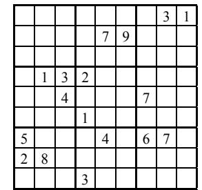

| 4 | 7 | 5 | 6 | 8 | 2 | 9 | 3 | 1 |
|---|---|---|---|---|---|---|---|---|
| 3 | 6 | 1 |   | 7 | 9 | 2 |   |   |
| 8 | 9 | 2 |   | 1 | 3 |   | 6 | 7 |
|   | 1 | 3 | 2 | 5 |   |   |   | 6 |
| 6 | 2 | 4 | 9 | 3 | 8 | 7 | 1 | 5 |
|   | 5 | 8 | 1 | 6 |   | 3 | 2 |   |
| 5 | 3 | 9 | 8 | 4 | 1 | 6 | 7 | 2 |
| 2 | 8 | 6 | 7 | 9 | 5 | 1 | 4 | 3 |
| 1 | 4 | 7 | 3 | 2 | 6 |   |   |   |

| I | 4 | 7 | 5 | 6 | 8 | 2 | 9 | 3 | 1 |
|---|---|---|---|---|---|---|---|---|---|
| I | 3 | 6 | 1 | 4 | 7 | 9 | 2 | 5 | 8 |
| I | 8 | 9 | 2 | 5 | 1 | 3 | 4 | 6 | 7 |
| ĺ | 7 | 1 | 3 | 2 | 5 | 4 | 8 | 9 | 6 |
| I | 6 | 2 | 4 | 9 | 3 | 8 | 7 | 1 | 5 |
| l | 9 | 5 | 8 | 1 | 6 | 7 | 3 | 2 | 4 |
| I | 5 | 3 | 9 | 8 | 4 | 1 | 6 | 7 | 2 |
| I | 2 | 8 | 6 | 7 | 9 | 5 | 1 | 4 | 3 |
|   | 1 | 4 | 7 | 3 | 2 | 6 | 5 | 8 | 9 |

Figure x. Puzzle Royle17-186, its L1 elaboration and its solution

Resolution path in L3\_0+XY3 for the L3\_0 (or L1) elaboration of Royle17-186: xy3-chain {n8 n5}r2c8 — {n5 n4}r3c7 — {n4 n8}r4c7 ==> r4c8  $\neq$  8 ... (Naked-Singles and Hidden-Singles)

\_\_\_\_\_

Figure 3. Uniform format of our examples

Then comes the resolution path proper. Each step in the resolution path is the application of a well defined resolution rule in T to the precisely decribed and purely factual situation resulting from the previous rule applications; the resolution path is thus a proof of the solution within theory T (where "proof" is meant in the strict mathematical logic sense).

Starting from the elaborated version of the puzzle, only the sequence of non-obvious resolution steps will be displayed. Each line in the sequence consists of the name of the rule applied, followed in order by: the description of how the condition part is satisfied (how the rule is "instantiated"), the "==>" sign, the conclusion(s) allowed by the "action" part. Details of the "nrc notation" used for the condition part will be described progressively with each rule we study. The conclusion part is always either that a candidate can be eliminated, symbolically written as here: r4c8  $\neq$  8, or that a value must be asserted, written symbolically as e.g. r4c8 = 8. When the same rule instantation justifies several conclusions, they will be written on the same line, separated by commas: e.g. r4c8  $\neq$  8, r5c8  $\neq$  8.

The rule(s) of interest in the path will be displayed in bold characters. In the above example, there is only one step, the application of the XY3 rule to some clearly described pattern of cells and values.

The trace of a resolution path will always end with the line "... (Naked-Singles and Hidden-Singles)" or something similar to remind you of convention C2.

The above conventions present the following advantages for you reader, if you want to try the examples. First, you may skip the uninteresting parts and start from the central puzzle; it is not minimal, but it is a real puzzle. Then, most of the time, the first rule you will have to apply (after the obvious ECP) will be the one studied in the chapter of the example; and, when this is not the case, the steps you will have to apply before you reach this rule will be clearly indicated so that you can easily reproduce them until you reach the pattern of interest. Our examples are designed to help you detect these patterns but they suppose an active participation on your part: only the initial values are displayed; it is left to you to apply ECP and the other rules of the resolution path to reach the desired situation. Occasionally, the detailed situation at some point in the resolution path (i.e. all the values and candidates present at this point) will be displayed so that you can directly check the presence of the pattern under discussion, but, due to place constraints, this cannot be systematic.

Finally, note that all the traces of resolution processes given in this book were obtained with version 13 of our SudoRules solver (with some hand editing for a shorter and cleaner appearance), run in the CLIPS 6.24 environment (more on this in chapter XXI).

#### 3.3. Classification results

The available literature on resolution rules has concentrated on isolated examples illustrating specific rules but systematic studies on large collections of puzzles are lacking. To palliate this deficiency, and as a concrete counterpart to our abstract ideas about rules classification, detailed numerical results about the number of grids solved by each type of rule will be given in chapter XXI. As a justification of these results (that would need far too many pages to be published in paper form), detailed lists of the corresponding grids are available on the author's Web pages (permanent address: http://carva.org/denis.berthier), together with lots of additional material.

## Part One

# **FOUNDATIONS**

### Chapter I

# Symmetries, analogies and supersymmetries

#### I.1. Symmetries

Throughout this book, the word "symmetry" is used in the general abstract mathematical sense. A Sudoku symmetry, or symmetry for short, is thus just a transformation that, when applied to *any* valid Sudoku grid, produces a valid Sudoku grid. Any combination of symmetries is a symmetry, there is a null symmetry (that does not change anything) and every symmetry has a reverse; we therefore have a group of symmetries.

Two grids (completed or not) that are related by symmetry are said to be essentially equivalent. The reason is that when the first is solved, its solution path can be transposed to solve the other. The abstract notions above become very concrete and intuitive as soon as a set of generators for the whole group of symmetries is given. By definition, any symmetry is then composed of a finite sequence of these generating ones. The simplest set of generators one can consider is composed of two different types of obvious symmetries (see e.g. [RUS 05]):

– permutations of the numbers: the numerical values of the numbers used to fill the grid are totally irrelevant; they could indeed be replaced by arbitrary symbols; a Japaglish word ("Wordoku") has even been invented for the purpose of naming puzzles to be filled with letters instead of numbers, which is hiding the fact that this is essentially the same game; keeping numbers from 1 to 9 as symbols, any permutation of the numbers (which is just a relabelling of the entries) defines a symmetry of the game; there are obviously 9! = 362,880 such symmetries.

- "geometrical" symmetries of the grid:
  - permutations of individual rows 1, 2, 3
  - permutations of individual rows 4, 5, 6;
  - permutations of individual rows 7, 8, 9;
  - permutations of triplets of rows 1-3, 4-6 and 7-9;
  - symmetry relative to the first diagonal (row-column symmetry).

From these primary geometrical symmetries, others can be deduced:

- permutations of individual columns 1, 2, 3;
- permutations of individual columns 4, 5, 6;
- permutations of individual columns 7, 8, 9;
- permutations of triplets of columns 1-3, 4-6 and 7-9;
- reflection (left-right symmetry);
- up-down symmetry;
- symmetry relative to the second diagonal;
- rotation.
- and, more generally, any combination of symmetries in the generating set.

As of the writing of this book, symmetries have been used mainly to count the number of essentially non-equivalent grids. Expressed in terms of elementary symmetries, two grids (completed or not) are essentially equivalent if there is a sequence of elementary symmetries such that the second is obtained from the first by application of this sequence; this does not entail that they are of "humanly equivalent difficulty" – whatever intuitive meaning one can associate with this last sentence.

Thus, E. Russell & F. Jarvis have shown in [RUS 05] that the number of non essentially equivalent complete Sudoku grids is 5,472,730,538 – much less than the *a priori* possibly different 6,670,903,752,021,072,936,960 complete grids, but still enough to spend trying to solve them more of your next lives than you'd need to reach nirvana. So much more so, considering that the number of essentially different puzzles may be even greater, its exact value being still unknown. The point is that each complete grid may be the solution for many different minimal puzzles. For instance, Gordon Royle has published a grid (displayed in Figure 1) such that there are 29 puzzles with seventeen entries whose unique solution is this grid.

| 6 | 3 | 9 | 2 | 4 | 1 | 7 | 8 | 5 |
|---|---|---|---|---|---|---|---|---|
| 2 | 8 | 4 | 7 | 6 | 5 | 1 | 9 | 3 |
| 5 | 1 | 7 | 9 | 8 | 3 | 6 | 2 | 4 |
| 1 | 2 | 3 | 8 | 5 | 7 | 9 | 4 | 6 |
| 7 | 9 | 6 | 4 | 3 | 2 | 8 | 5 | 1 |
| 4 | 5 | 8 | 6 | 1 | 9 | 2 | 3 | 7 |
| 3 | 4 | 2 | 1 | 7 | 8 | 5 | 6 | 9 |
| 8 | 6 | 1 | 5 | 9 | 4 | 3 | 7 | 2 |
| 9 | 7 | 5 | 3 | 2 | 6 | 4 | 1 | 8 |

Figure 1. Gordon Royle's "Strangely Familiar" grid

Later we shall formulate axioms for Sudoku in a logical language and in a way that exhibits all the previous symmetries. In turn, such symmetries in the axioms will lead to symmetries in the logical formulation of our resolution rules. But all the types of symmetries are not expressed in the same way in these axioms or rules.

Primary symmetries other than row-column are totally transparent, in that they make use of variable names (for numbers, rows, columns...) but they refer to no specific values of these entities.

Row-column symmetry is generally expressed by the presence of two similar axioms or rules, each of which can be obtained from the other by simple permutation of the words "row" and "column". As a consequence of this symmetry in the axioms, there is a symmetry in the theorems and the resolution rules, as expressed by the following intuitively obvious

meta-theorem 1 (informal): for any valid resolution rule, the rule deduced from it by permuting systematically the words "row" and "column" is valid and it has obviously the same logical complexity as the original. We shall express this as: the set of valid resolution rules is closed under symmetry.

#### I.2. The two canonical coordinate systems on a grid

Let the nine rows be numbered 1, 2, ..., 9 from top to bottom. Let the nine columns be numbered 1, 2, ..., 9 from left to right. Let the nine blocks and the nine

squares inside any fixed block be numbered according to the same following scheme:

Any cell, in "natural" row-column space, can be unambiguously located on the grid either by its row and column numbers or by its block and square numbers. One can therefore consider two coordinate systems on the grid: row-column and block-square. We call them the two canonical coordinate systems and we write the coordinates of a cell in each of them as (r, c) or as [b, s] respectively.

```
Change of coordinates F: (r, c) \rightarrow [b, s] is defined by the following formulæ: b = 1 + 3*IP((r-1)/3) + IP((c-1)/3) s = 1 + 3*(mod(r+2), 3) + (mod(c+2), 3).
```

```
Conversely, change of coordinates [b, s] \rightarrow (r, c) is defined by: r = 1 + 3*IP((b-1)/3) + IP((s-1)/3) c = 1 + 3*(mod(b+2), 3) + (mod(s+2), 3), where "IP" stands for "integer part" and "mod" for "modulo".
```

Note that transformation F:  $(r, c) \rightarrow [b, s]$  is involutive, i.e.  $F^{-1} = F$  or  $F \bullet F = Id$  (the identity), where "F<sup>-1</sup>" denotes as usual the inverse of F and " $\bullet$ " denotes function composition.

#### L3. Coordinates and names

Coordinates should not be confused with the various names that can be given to the rows, columns, blocks, squares and cells for displaying purposes. Various displaying conventions can be used, but we shall systematically stick to the following classical convention, which we have found most convenient:

- rows are named: r1, r2, r3, r4, r5, r6, r7, r8, r9;
- columns are named: c1, c2, c3, c4, c5, c6, c7, c8, c9;
- cells in natural rc-space are named accordingly, in the obvious way: r1c1, r1c2, ..., r9c9;
  - blocks are named: b1, b2, b3, b4, b5, b6, b7, b8, b9;
  - squares in a block are named: s1, s2, s3, s4, s5, s6, s7, s8, s9;
  - as a result, cells in rc-space can also be named: b1s1, b1s2, ..., b9s9;

- when needed, numbers are named n1, n2, n3, n4, n5, n6, n7, n8, n9; this will be useful in the next chapter when we consider "abstract spaces": row-number, column-number and block-number and we want to name cells in these spaces: r1n1, r1n2... in rn-space; c1n1, c1n2,... in cn-space; b1n1, b1n2,... in bn-space; the reason is that r11, r12... or c11, c12... would be rather obscure and confusing.

Notice that, as the same subscripted lower case letters will be used for variables, these displaying conventions might lead to some confusion between variables and constants. But this risk of confusion is very limited: no constant symbol will ever appear in an axiom or a resolution rule and no variable symbol will ever appear in the description of any real facts on a real grid.

#### I.4. Analogies

Analogies should not be confused with symmetries. There are some analogies between rows and blocks (or between columns and blocks) but there is no real symmetry.

This is related to the fact that the two canonical coordinate systems do not share the same properties with respect to the game of Sudoku. There is a symmetry between the coordinates in the first system (rows and columns) and, relying explicitly on this symmetry, many axioms and rules exist by pairs; but there is no symmetry between the coordinates in the second system (blocks and squares) so that transposing rules from the first system to the second would be meaningless.

There is nevertheless a partial analogy between rows (or columns) and blocks, captured by the following informal

meta-theorem 2 (informal): for any valid resolution rule mentioning only numbers, rows and columns (i.e. neither blocks nor squares nor any property referring directly or indirectly to such objects), if this rule displays a systematic symmetry between rows and columns but can be proved without using the row-column symmetry property, then the rule deduced from it by systematically replacing the word "row" by "block" and the word "column" by "square" is valid and it has obviously the same logical complexity as the original. We shall express this as: the set of valid resolution rules is closed under analogy.

What the phrases "systematic symmetry between rows and columns" and "proved without using the row-column symmetry property" mean will be defined precisely in chapter IV.

#### I.5. Supersymmetries

Up to now, symmetries relative to the entries and "geometrical" symmetries relative to the grid have been considered separately. One of the aims of this book is to elicit new symmetries (named *supersymmetries*) that mix numbers, rows and columns, to show how they translate into relationships between some of the constraints propagation rules, how they entail a new logical classification of these rules, how this allows clearer definitions of the rules themselves and how this leads to introduce new types of chains (hidden chains) and associated rules.

The main reason for our interest in supersymmetry is the following

meta-theorem 3 (informal): for any valid resolution rule mentioning only numbers, rows and columns (i.e. neither blocks nor squares nor any property referring directly or indirectly to such objects), any rule deduced from it by any systematic permutation of the words "number", "row" and "column" is valid and it has obviously the same logical complexity as the original. We shall express this as: the set of valid resolution rules is closed under supersymmetry.

Meta-theorem 3 is not intuitively as obvious as meta-theorem 1. From a logical point of view, it is nevertheless a straightforward consequence of the subsequent logical formulation of the problem in multi-sorted first order logic (more on this in chapters III and IV).

In the next chapter, we shall introduce three new graphical representations of a puzzle in three "abstract spaces" (row-number, column-number, block-number) that will make it easier to exploit the above symmetries, analogies and supersymmetries.

These abstract spaces, their associated graphical representations and the three meta-theorems stated in the present chapter will be abundantly illustrated in the subset rules of chapters VI, VII and VIII where they will be used to show that apparently complex familiar rules (such as X-wing, Swordfish or Jellyfish) are no more than the supersymmetric versions of obvious ones (Naked-Pairs, Naked-Triplets and Naked-Quadruplets, respectively). They will also be the basis for introducing the notion of hidden chains and associated new resolution rules in chapters XV, XVIII and XX.

### Chapter II

# Complementary graphical representations

To better visualise the symmetries, analogies and supersymmetries defined in chapter I, the present chapter introduces new graphical representations that can be grouped with the usual one to form an extended Sudoku board. Then it explains how to build and use them

#### II.1. New graphical representations of a puzzle

In addition to the standard natural row-column space, we consider three abstract spaces: row-number, column-number and block-number. In the sequel, these four spaces will also be called respectively rc-space, rn-space, cn-space and bn-space and "cells" in these four spaces will be called respectively rc-cells, rn-cells, cn-cells and bn-cells. As for their graphical representations, when they are displayed together, they are aligned so that rows in the first two coincide and columns in the first and the third coincide (column-number space is thus displayed as number-column).

The reason for considering rn-cell with coordinates (r, n) in row-number space is that it will contain all the possibilities (i.e. all the possible columns) for the unique instance of number n that must occur in this row r; similarly, the reason for considering cn-cell with coordinates (c, n) in column-number space is that it will contain all the possibilities (i.e. all the possible rows) for the unique instance of number n that must occur in column c; finally, the reason for considering bn-cell with coordinates (b, n) in block-number space is that it will contain all the possibilities (i.e. all the possible squares) for the unique instance of number n that must occur in block b.

At any point in the resolution process, all the data on the grid (values and candidates) can be displayed in any of these four representations. We insist that they all display exactly the same abstract logical information content – or, to say it more formally: they correspond to the same underlying set of ground atomic formulæ in the logical language that will be introduced later. They should be considered only as different visual supports for symmetry, analogy and supersymmetry, in the sense that it is easier to detect some patterns in some representations that in others, as many chapters in this book will show. The correspondences are straightforward and given by the following equivalences:

- number n is in rc-cell (r, c),
- column c is in rn-cell (r, n),
- row r is in cn-cell (c, n),
- square s is in bn-cell (b, n) where (r, c) = [b, s].

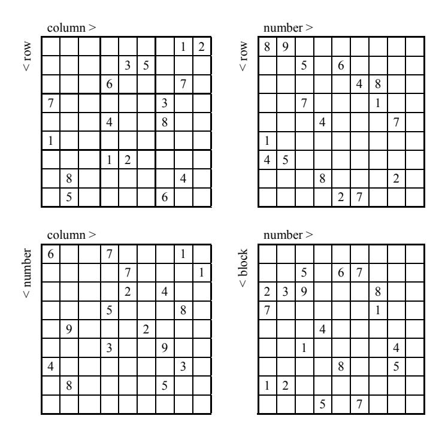

Figure 1. Same puzzle Royle17-3 as in the introduction, Figure 1, but viewed in the four different representation spaces

Notice that pseudo blocks (i.e. groups of 3x3 rn-, cn- or bn- cells) have no meaning in the new rn- or cn- representations (this is why we do not mark them with thick borders): only constraints on Latin Squares can be directly propagated in rownumber and column-number spaces (as will be proved in chapter IV). And links in bn-space cannot use the number coordinate.

Let us illustrate our new representations with an example. Starting from the puzzle in the upper left corner of Figure 1 (puzzle Royle17-3), we can first display its entries in the standard grid and in the three new grids of the same Figure 1.

|     | cl                  | <i>c</i> 2          | <i>c3</i>               | c4                | c5                  | с6                    | <i>c</i> 7        | c8                | c9                    |    |
|-----|---------------------|---------------------|-------------------------|-------------------|---------------------|-----------------------|-------------------|-------------------|-----------------------|----|
| n1  | 6                   | 2 3                 | 2 3 8 9                 | 7                 | 4 5                 | 4 5                   | 8                 | 1                 | 4 5 8 9               | n1 |
| n2  | 2 3<br>5<br>8 9     | 2 3<br>4 5 6        | 2 3<br>4 5 6<br>8 9     | 4 6               | 7                   | 3<br>4 5 6            | 8                 | 4 5 6 9           | 1                     | n2 |
| n3  | 1 3<br>5<br>7 8 9   | 1 3<br>5 6<br>7     | 1 3<br>5 6<br>7 8 9     | 6<br>8 9          | 2                   | 5 6<br>7 8 9          | 4                 | 7 9               | 3<br>7 8 9            | n3 |
| n4  | 1 2 3<br>7 9        | 1 2 3<br>4 6<br>7   | 1 2 3<br>4 6<br>7 9     | 5                 | 1 3 9               | 1 3<br>7 9            | 1 2 3             | 8                 | 2 3<br>4 6            | n4 |
| n5  | 1 3 5               | 9                   | 1 3<br>4 5 6            | 4 6               | 4 5 6               | 2                     | 1 3<br>6<br>7 8   | 4 5 6<br>7        | 3<br>4 5 6<br>7 8     | n5 |
| п6  | 1 2<br>5<br>7 8     | 1 2<br>4 5 6<br>7   | 1 2<br>4 5 6<br>7 8     | 3                 | 4 5 6               | 4 5 6<br>7 8          | 9                 | 2<br>4 5 6        | 2<br>4 5 6            | п6 |
| n7  | 4                   | 1 2                 | 1 2<br>7 8 9            | 1 2<br>6<br>8 9   | 1<br>5 6<br>8 9     | 1<br>5 6<br>7 8 9     | 7 8               | 3                 | 5 6<br>7 8 9          | n7 |
| n8  | 1 2 3               | 8                   | 1 2 3 4 6               | 1 2<br>4 6<br>9   | 1 3<br>4 6<br>9     | 1 3<br>4 6<br>7 9     | 5                 | 2<br>7 9          | 2 3 7 9               | n8 |
| n9  | 1 2 3<br>5<br>7 8 9 | 1 2 3<br>4 5 6<br>7 | 1 2 3<br>4 5 6<br>7 8 9 | 1 2<br>4 6<br>8 9 | 1 3<br>4 5 6<br>8 9 | 1 3<br>4 5 6<br>7 8 9 | 1 2 3<br>6<br>7 8 | 2<br>4 5 6<br>7 9 | 2 3<br>4 5 6<br>7 8 9 | n9 |
| .—— | cl                  | <i>c</i> 2          | <i>c3</i>               | <i>c4</i>         | <i>c</i> 5          | <i>c6</i>             | <i>c</i> 7        | c8                | с9                    |    |

Figure 2. Same puzzle Royle17-3 as in the introduction, Figure 2, but viewed in numbercolumn space

Let us apply all the elementary constraints propagation rules to the standard grid for this puzzle. We get the natural representation of the result in row-column space (Figure 2 of the introduction). Now, suppose we display the grid thus obtained, with its candidates, in the full rn- and cn- representations with candidates. Generating these new grid representations by hand is easy as long as we consider only values, as in Figure 1, but it requires some care when it comes to the candida-tes. Nevertheless, with some practice, it is relatively easy to apply the above stated equivalences. Moreover, programming a spreadsheet computing the three new grids and their candidates automatically from the first is an easy exercise.

For our puzzle, there is nothing particularly appealing in the row-number representation, so we skip it. But a surprise is awaiting us with its number-column representation (Figure 2, in which numbers in a cn-cell stand for the row candidates for this cn-cell).

It becomes obvious that there is a cn-cell (n1c7) with only one possibility left: the unique instance of number 1 that must appear somewhere in column 7 is in fact confined to row 8 (i.e. cn-cell n1c7 has only one row candidate: r8).

As an example of the groups of 3x3 cn-cells having no meaning, we can see that the same candidate (row) appears twice in two of these pseudo-blocks (7, i.e. r7, in the second upper pseudo-block and 1, i.e. r1, in the third upper pseudo-block).

Now, if we had remained in standard row-column space and considered attentively Figure 2 of the introduction, we could have seen that, in column c7, there is only one row (row r8) having number 1 among its candidates. Therefore, the unique instance of number 1 that must be found somewhere in column c7 has only one possibility left of finding its place in this column and that is in row r8. But this cannot be seen in rc-space by looking only at rc-cell r8c7, since it has still five candidates: 1, 2, 5, 7 and 9. What the representation in column-number space provides is the possibility of detecting this forced value by looking at a single cn-cell, while in row-column space we should examine all the nine rc-cells of column c7. This is a very elementary example of how rn- or cn- spaces can be used.

This is our first case of a "Hidden-Single" in a column. Notice that the phrase "hidden single in a column" suggests properly that, in column c7, cell r8c7 has a single possible value but that this fact is not visible by looking only at the candidates for this cell. Of course, one can also find Hidden-Singles in rows or in blocks. Actually, our example puzzle Royle17-3 can be solved using only these three types of Hidden-Singles (in addition to the elementary rules, of course). It shares this property with a total of 8,051 (among 36,628) puzzles in the Royle17 database – which also entails that the remaining 28,577 grids in this database cannot be solved with only these rules.

Graphically, in standard row-column space, detecting that a number is a Hidden-Single-in-a-row [respectively in-a-column, in-a-block] needs checking that the other eight cells in this row [resp. this column, this block] do not contain this number among their candidates. In the new row-number [resp. column-number, block-number] space, all that is needed is checking that one cell has a single possibility. Thus, even in very simple cases, our new representations simplify the detection job.

Now, a few comments about these new graphical representations are in order. Should one admit them as an acceptable basis for human solving? What can be considered as accessible to a human solver? There will probably never be any general agreement on this point. My personal opinion is that, given the additional paperwork needed for building and maintaining the four representations in parallel, they are not very useful for easy grids (and, in particular, for the detection of hidden subsets); but, one can easily imagine a computerised interface that maintains the coherency between the four grids (any time you eliminate a candidate from one of them, this is transferred to the others).

Moreover, there are many difficult puzzles that become easier to solve if we use such representations (and rules based on them); they therefore seem to be an inescapable tool for the advanced player. As a result, a significant part of this book is based on symmetries, supersymmetries and hidden structures (subsets, chains...). For advanced examples, see chapters XV, XVII and XVIII, where hidden chains of various types are introduced and shown to be irreducible to non-hidden chains.

#### II.2. Extended Sudoku Board

As many chapters in this book will show, especially when we deal with chains, the rn- and cn- spaces will allow us to describe simple patterns and rules that would need much more complex descriptions if we tried to do it in the standard rc-space. In order to facilitate their use, the rn- and cn- representations of these spaces can be grouped with the standard one into the following Extended Sudoku Board. (We don't use much the bn-representation, although we could, because it is of limited practical interest and it won't reappear in the sequel.)

Notice that the rn- and cn- representations do not replace the standard one; they are added to it, so that the three representations, when placed in the proper relative positions, form an extended Sudoku board, as given in section 4 below. In order to avoid confusion between rows, columns and numbers, in this extended board we shall systematically use their full names: r1, r2,...; c1, c2,...; n1, n2,...

| 11   12   13   11   12   13   11   12   13   11   12   13   11   12   13   11   12   13   11   12   13   11   12   13   11   12   13   11   12   13   11   12   13   11   12   13   11   12   13   11   12   13   11   12   13   11   12   13   11   12   13   11   12   13   11   12   13   11   12   13   11   12   13   11   12   13   11   12   13   11   12   13   11   12   13   11   12   13   11   12   13   11   12   13   11   12   13   11   12   13   11   12   13   11   12   13   11   12   13   11   12   13   11   12   13   11   12   13   11   12   13   11   12   13   11   12   13   11   12   13   11   12   13   11   12   13   11   12   13   11   12   13   11   12   13   11   12   13   11   12   13   11   12   13   11   12   13   11   12   13   11   12   13   11   12   13   11   12   13   11   12   13   11   12   13   11   12   13   11   12   13   11   12   13   11   12   13   11   12   13   11   12   13   11   12   13   11   12   13   11   12   13   11   12   13   11   12   13   11   12   13   11   12   13   11   12   13   11   12   13   11   12   13   11   12   13   11   12   13   11   12   13   11   12   13   11   12   13   11   12   13   11   12   13   11   12   13   11   12   13   11   12   13   11   12   13   11   12   13   11   12   13   11   12   13   11   12   13   11   12   13   11   12   13   11   12   13   11   12   13   11   12   13   11   12   13   11   12   13   11   12   13   11   12   13   11   12   13   11   12   13   11   12   13   11   12   13   11   12   13   11   12   13   11   12   13   11   12   13   11   12   13   11   12   13   11   12   13   11   12   13   11   12   13   11   12   13   11   12   13   11   12   13   11   12   13   11   12   13   11   12   13   11   12   13   11   12   13   11   12   13   11   12   13   11   12   13   11   12   13   11   12   13   11   12   13   11   12   13   11   12   13   11   12   13   11   12   13   11   12   13   11   12   13   11   12   13   11   12   13   11   12   13   11   12   13   11   12   13   11   12   13   11   12   13   11   12   13   11                                                                                                                                                                                                          |            |
|-------------------------------------------------------------------------------------------------------------------------------------------------------------------------------------------------------------------------------------------------------------------------------------------------------------------------------------------------------------------------------------------------------------------------------------------------------------------------------------------------------------------------------------------------------------------------------------------------------------------------------------------------------------------------------------------------------------------------------------------------------------------------------------------------------------------------------------------------------------------------------------------------------------------------------------------------------------------------------------------------------------------------------------------------------------------------------------------------------------------------------------------------------------------------------------------------------------------------------------------------------------------------------------------------------------------------------------------------------------------------------------------------------------------------------------------------------------------------------------------------------------------------------------------------------------------------------------------------------------------------------------------------------------------------------------------------------------------------------------------------------------------------------------------------------------------------------------------------------------------------------------------------------------------------------------------------------------------------------------------------------------------------------------------------------------------------------------------------------------------------------------------------------------------------------------------------------------------------------------------------------------------------------------------------------------------------------------|------------|
| 11   12   13   11   12   13   11   12   13   11   12   13   11   12   13   11   12   13   11   12   13   11   12   13   11   12   13   11   12   13   11   12   13   11   12   13   11   12   13   11   12   13   11   12   13   11   12   13   11   12   13   11   12   13   11   12   13   11   12   13   11   12   13   11   12   13   11   12   13   11   12   13   11   12   13   11   12   13   11   12   13   11   12   13   11   12   13   11   12   13   11   12   13   11   12   13   11   12   13   11   12   13   11   12   13   11   12   13   11   12   13   11   12   13   11   12   13   11   12   13   11   12   13   11   12   13   11   12   13   11   12   13   11   12   13   11   12   13   11   12   13   11   12   13   11   12   13   11   12   13   11   12   13   11   12   13   11   12   13   11   12   13   11   12   13   11   12   13   11   12   13   11   12   13   11   12   13   11   12   13   11   12   13   11   12   13   11   12   13   11   12   13   11   12   13   11   12   13   11   12   13   11   12   13   11   12   13   11   12   13   11   12   13   11   12   13   11   12   13   11   12   13   11   12   13   11   12   13   11   12   13   11   12   13   11   12   13   11   12   13   11   12   13   11   12   13   11   12   13   11   12   13   11   12   13   11   12   13   11   12   13   11   12   13   11   12   13   11   12   13   11   12   13   11   12   13   11   12   13   11   12   13   11   12   13   11   12   13   11   12   13   11   12   13   11   12   13   11   12   13   11   12   13   11   12   13   11   12   13   11   12   13   11   12   13   11   12   13   11   12   13   11   12   13   11   12   13   11   12   13   11   12   13   11   12   13   11   12   13   11   12   13   11   12   13   11   12   13   11   12   13   11   12   13   11   12   13   11   12   13   11   12   13   11   12   13   11   12   13   11   12   13   11   12   13   11   12   13   11   12   13   11   12   13   11   12   13   11   12   13   11   12   13   11   12   13   11   12   13   11   12   13   11   12   13   11   12   13   11                                                                                                                                                                                                          | r1         |
| 11   12   13   11   12   13   11   12   13   11   12   13   11   12   13   11   12   13   11   12   13   11   12   13   11   12   13   11   12   13   11   12   13   11   12   13   11   12   13   11   12   13   11   12   13   11   12   13   11   12   13   11   12   13   11   12   13   11   12   13   11   12   13   11   12   13   11   12   13   11   12   13   11   12   13   11   12   13   11   12   13   11   12   13   11   12   13   11   12   13   11   12   13   11   12   13   11   12   13   11   12   13   11   12   13   11   12   13   11   12   13   11   12   13   11   12   13   11   12   13   11   12   13   11   12   13   11   12   13   11   12   13   11   12   13   11   12   13   11   12   13   11   12   13   11   12   13   11   12   13   11   12   13   11   12   13   11   12   13   11   12   13   11   12   13   11   12   13   11   12   13   11   12   13   11   12   13   11   12   13   11   12   13   11   12   13   11   12   13   11   12   13   11   12   13   11   12   13   11   12   13   11   12   13   11   12   13   11   12   13   11   12   13   11   12   13   11   12   13   11   12   13   11   12   13   11   12   13   11   12   13   11   12   13   11   12   13   11   12   13   11   12   13   11   12   13   11   12   13   11   12   13   11   12   13   11   12   13   11   12   13   11   12   13   11   12   13   11   12   13   11   12   13   11   12   13   11   12   13   11   12   13   11   12   13   11   12   13   11   12   13   11   12   13   11   12   13   11   12   13   11   12   13   11   12   13   11   12   13   11   12   13   11   12   13   11   12   13   11   12   13   11   12   13   11   12   13   11   12   13   11   12   13   11   12   13   11   12   13   11   12   13   11   12   13   11   12   13   11   12   13   11   12   13   11   12   13   11   12   13   11   12   13   11   12   13   11   12   13   11   12   13   11   12   13   11   12   13   11   12   13   11   12   13   11   12   13   11   12   13   11   12   13   11   12   13   11   12   13   11   12   13   11   12   13   11   12   13   11                                                                                                                                                                                                          | <i>r</i> 2 |
| 11   12   13   11   12   13   11   12   13   11   12   13   11   12   13   11   12   13   11   12   13   11   12   13   11   12   13   11   12   13   11   12   13   11   12   13   11   12   13   11   12   13   11   12   13   11   12   13   11   12   13   11   12   13   11   12   13   11   12   13   11   12   13   11   12   13   11   12   13   11   12   13   11   12   13   11   12   13   11   12   13   11   12   13   11   12   13   11   12   13   11   12   13   11   12   13   11   12   13   11   12   13   11   12   13   11   12   13   11   12   13   11   12   13   11   12   13   11   12   13   11   12   13   11   12   13   11   12   13   11   12   13   11   12   13   11   12   13   11   12   13   11   12   13   11   12   13   11   12   13   11   12   13   11   12   13   11   12   13   11   12   13   11   12   13   11   12   13   11   12   13   11   12   13   11   12   13   11   12   13   11   12   13   11   12   13   11   12   13   11   12   13   11   12   13   11   12   13   11   12   13   11   12   13   11   12   13   11   12   13   11   12   13   11   12   13   11   12   13   11   12   13   11   12   13   11   12   13   11   12   13   11   12   13   11   12   13   11   12   13   11   12   13   11   12   13   11   12   13   11   12   13   11   12   13   11   12   13   11   12   13   11   12   13   11   12   13   11   12   13   11   12   13   11   12   13   11   12   13   11   12   13   11   12   13   11   12   13   11   12   13   11   12   13   11   12   13   11   12   13   11   12   13   11   12   13   11   12   13   11   12   13   11   12   13   11   12   13   11   12   13   11   12   13   11   12   13   11   12   13   11   12   13   11   12   13   11   12   13   11   12   13   11   12   13   11   12   13   11   12   13   11   12   13   11   12   13   11   12   13   11   12   13   11   12   13   11   12   13   11   12   13   11   12   13   11   12   13   11   12   13   11   12   13   11   12   13   11   12   13   11   12   13   11   12   13   11   12   13   11   12   13   11   12   13   11   12   13   11                                                                                                                                                                                                          | r3         |
| r5         n1 n2 n3 n1 n2 n3 n1 n2 n3 n1 n2 n3 n1 n2 n3 n1 n2 n3 n1 n2 n3 n1 n2 n3 n1 n2 n3 n1 n2 n3 n1 n2 n3 n1 n2 n3 n1 n2 n3 n1 n2 n3 n1 n2 n3 n1 n2 n3 n1 n2 n3 n1 n2 n3 n1 n2 n3 n1 n2 n3 n1 n2 n3 n1 n2 n3 n1 n2 n3 n1 n2 n3 n1 n2 n3 n1 n2 n3 n1 n2 n3 n1 n2 n3 n1 n2 n3 n1 n2 n3 n1 n2 n3 n1 n2 n3 n1 n2 n3 n1 n2 n3 n1 n2 n3 n1 n2 n3 n1 n2 n3 n1 n2 n3 n1 n2 n3 n1 n2 n3 n1 n2 n3 n1 n2 n3 n1 n2 n3 n1 n2 n3 n1 n2 n3 n1 n2 n3 n1 n2 n3 n1 n2 n3 n1 n2 n3 n1 n2 n3 n1 n2 n3 n1 n2 n3 n1 n2 n3 n1 n2 n3 n1 n2 n3 n1 n2 n3 n1 n2 n3 n1 n2 n3 n1 n2 n3 n1 n2 n3 n1 n2 n3 n1 n2 n3 n1 n2 n3 n1 n2 n3 n1 n2 n3 n1 n2 n3 n1 n2 n3 n1 n2 n3 n1 n2 n3 n1 n2 n3 n1 n2 n3 n1 n2 n3 n1 n2 n3 n1 n2 n3 n1 n2 n3 n1 n2 n3 n1 n2 n3 n1 n2 n3 n1 n2 n3 n1 n2 n3 n1 n2 n3 n1 n2 n3 n1 n2 n3 n1 n2 n3 n1 n2 n3 n1 n2 n3 n1 n2 n3 n1 n2 n3 n1 n2 n3 n1 n2 n3 n1 n2 n3 n1 n2 n3 n1 n2 n3 n1 n2 n3 n1 n2 n3 n1 n2 n3 n1 n2 n3 n1 n2 n3 n1 n2 n3 n1 n2 n3 n1 n2 n3 n1 n2 n3 n1 n2 n3 n1 n2 n3 n1 n2 n3 n1 n2 n3 n1 n2 n3 n1 n2 n3 n1 n2 n3 n1 n2 n3 n1 n2 n3 n1 n2 n3 n1 n2 n3 n1 n2 n3 n1 n2 n3 n1 n2 n3 n1 n2 n3 n1 n2 n3 n1 n2 n3 n1 n2 n3 n1 n2 n3 n1 n2 n3 n1 n2 n3 n1 n2 n3 n1 n2 n3 n1 n2 n3 n1 n2 n3 n1 n2 n3 n1 n2 n3 n1 n2 n3 n1 n2 n3 n1 n2 n3 n1 n2 n3 n1 n2 n3 n1 n2 n3 n1 n2 n3 n1 n2 n3 n1 n2 n3 n1 n2 n3 n1 n2 n3 n1 n2 n3 n1 n2 n3 n1 n2 n3 n1 n2 n3 n1 n2 n3 n1 n2 n3 n1 n2 n3 n1 n2 n3 n1 n2 n3 n1 n2 n3 n1 n2 n3 n1 n2 n3 n1 n2 n3 n1 n2 n3 n1 n2 n3 n1 n2 n3 n1 n2 n3 n1 n2 n3 n1 n2 n3 n1 n2 n3 n1 n2 n3 n1 n2 n3 n1 n2 n3 n1 n2 n3 n1 n2 n3 n1 n2 n3 n1 n2 n3 n1 n2 n3 n1 n2 n3 n1 n2 n3 n1 n2 n3 n1 n2 n3 n1 n2 n3 n1 n2 n3 n1 n2 n3 n1 n2 n3 n1 n2 n3 n1 n2 n3 n1 n2 n3 n1 n2 n3 n1 n2 n3 n1 n2 n3 n1 n2 n3 n1 n2 n3 n1 n2 n3 n1 n2 n3 n1 n2 n3 n1 n2 n3 n1 n2 n3 n1 n2 n3 n1 n2 n3 n1 n2 n3 n1 n2 n3 n1 n2 n3 n1 n2 n3 n1 n2 n3 n1 n2 n3 n1 n2 n3 n1 n2 n3 n1 n2 n3 n1 n2 n3 n1 n2 n3 n1 n2 n3 n1 n2 n3 n1 n2 n3 n1 n2 n3 n1 n2 n3 n1 n2 n3 n1 n2 n3 n1 n2 n3 n1 n2 n3 n1 n2 n3 n1 n2 n3 n1 n2 n3 n1 n2 n3 n1 n2 n3 n1 n2 n3 n1 n2 n3 n1 n2 n3 n1 n2 n3 n1 n2 n3 n1 n2 n3 n1 n2                                                                                                                                                                                                                                      | r4         |
| r6         n1 n2 n3 n1 n2 n3 n1 n2 n3 n1 n2 n3 n1 n2 n3 n1 n2 n3 n1 n2 n3 n1 n2 n3 n1 n2 n3 n1 n2 n3 n1 n2 n3 n1 n2 n3 n1 n2 n3 n1 n2 n3 n1 n2 n3 n1 n2 n3 n1 n2 n3 n1 n2 n3 n1 n2 n3 n1 n2 n3 n1 n2 n3 n1 n2 n3 n1 n2 n3 n1 n2 n3 n1 n2 n3 n1 n2 n3 n1 n2 n3 n1 n2 n3 n1 n2 n3 n1 n2 n3 n1 n2 n3 n1 n2 n3 n1 n2 n3 n1 n2 n3 n1 n2 n3 n1 n2 n3 n1 n2 n3 n1 n2 n3 n1 n2 n3 n1 n2 n3 n1 n2 n3 n1 n2 n3 n1 n2 n3 n1 n2 n3 n1 n2 n3 n1 n2 n3 n1 n2 n3 n1 n2 n3 n1 n2 n3 n1 n2 n3 n1 n2 n3 n1 n2 n3 n1 n2 n3 n1 n2 n3 n1 n2 n3 n1 n2 n3 n1 n2 n3 n1 n2 n3 n1 n2 n3 n1 n2 n3 n1 n2 n3 n1 n2 n3 n1 n2 n3 n1 n2 n3 n1 n2 n3 n1 n2 n3 n1 n2 n3 n1 n2 n3 n1 n2 n3 n1 n2 n3 n1 n2 n3 n1 n2 n3 n1 n2 n3 n1 n2 n3 n1 n2 n3 n1 n2 n3 n1 n2 n3 n1 n2 n3 n1 n2 n3 n1 n2 n3 n1 n2 n3 n1 n2 n3 n1 n2 n3 n1 n2 n3 n1 n2 n3 n1 n2 n3 n1 n2 n3 n1 n2 n3 n1 n2 n3 n1 n2 n3 n1 n2 n3 n1 n2 n3 n1 n2 n3 n1 n2 n3 n1 n2 n3 n1 n2 n3 n1 n2 n3 n1 n2 n3 n1 n2 n3 n1 n2 n3 n1 n2 n3 n1 n2 n3 n1 n2 n3 n1 n2 n3 n1 n2 n3 n1 n2 n3 n1 n2 n3 n1 n2 n3 n1 n2 n3 n1 n2 n3 n1 n2 n3 n1 n2 n3 n1 n2 n3 n1 n2 n3 n1 n2 n3 n1 n2 n3 n1 n2 n3 n1 n2 n3 n1 n2 n3 n1 n2 n3 n1 n2 n3 n1 n2 n3 n1 n2 n3 n1 n2 n3 n1 n2 n3 n1 n2 n3 n1 n2 n3 n1 n2 n3 n1 n2 n3 n1 n2 n3 n1 n2 n3 n1 n2 n3 n1 n2 n3 n1 n2 n3 n1 n2 n3 n1 n2 n3 n1 n2 n3 n1 n2 n3 n1 n2 n3 n1 n2 n3 n1 n2 n3 n1 n2 n3 n1 n2 n3 n1 n2 n3 n1 n2 n3 n1 n2 n3 n1 n2 n3 n1 n2 n3 n1 n2 n3 n1 n2 n3 n1 n2 n3 n1 n2 n3 n1 n2 n3 n1 n2 n3 n1 n2 n3 n1 n2 n3 n1 n2 n3 n1 n2 n3 n1 n2 n3 n1 n2 n3 n1 n2 n3 n1 n2 n3 n1 n2 n3 n1 n2 n3 n1 n2 n3 n1 n2 n3 n1 n2 n3 n1 n2 n3 n1 n2 n3 n1 n2 n3 n1 n2 n3 n1 n2 n3 n1 n2 n3 n1 n2 n3 n1 n2 n3 n1 n2 n3 n1 n2 n3 n1 n2 n3 n1 n2 n3 n1 n2 n3 n1 n2 n3 n1 n2 n3 n1 n2 n3 n1 n2 n3 n1 n2 n3 n1 n2 n3 n1 n2 n3 n1 n2 n3 n1 n2 n3 n1 n2 n3 n1 n2 n3 n1 n2 n3 n1 n2 n3 n1 n2 n3 n1 n2 n3 n1 n2 n3 n1 n2 n3 n1 n2 n3 n1 n2 n3 n1 n2 n3 n1 n2 n3 n1 n2 n3 n1 n2 n3 n1 n2 n3 n1 n2 n3 n1 n2 n3 n1 n2 n3 n1 n2 n3 n1 n2 n3 n1 n2 n3 n1 n2 n3 n1 n2 n3 n1 n2 n3 n1 n2 n3 n1 n2 n3 n1 n2 n3 n1 n2 n3 n1 n2 n3 n1 n2 n3 n1 n2 n3 n1 n2 n3 n1 n2 n3 n1 n2                                                                                                                                                                                                                                      | r5         |
| 11   12   13   11   12   13   11   12   13   11   12   13   11   12   13   11   12   13   11   12   13   11   12   13   11   12   13   11   12   13   11   12   13   11   12   13   11   12   13   11   12   13   11   12   13   11   12   13   11   12   13   11   12   13   11   12   13   11   12   13   11   12   13   11   12   13   11   12   13   11   12   13   11   12   13   11   12   13   11   12   13   11   12   13   11   12   13   11   12   13   11   12   13   11   12   13   11   12   13   11   12   13   11   12   13   11   12   13   11   12   13   11   12   13   11   12   13   11   12   13   11   12   13   11   12   13   11   12   13   11   12   13   11   12   13   11   12   13   11   12   13   11   12   13   11   12   13   11   12   13   11   12   13   11   12   13   11   12   13   11   12   13   11   12   13   11   12   13   11   12   13   11   12   13   11   12   13   11   12   13   11   12   13   11   12   13   11   12   13   11   12   13   11   12   13   11   12   13   11   12   13   11   12   13   11   12   13   11   12   13   11   12   13   11   12   13   11   12   13   11   12   13   11   12   13   11   12   13   11   12   13   11   12   13   11   12   13   11   12   13   11   12   13   11   12   13   11   12   13   11   12   13   11   12   13   11   12   13   11   12   13   11   12   13   11   12   13   11   12   13   11   12   13   11   12   13   11   12   13   11   12   13   11   12   13   11   12   13   11   12   13   11   12   13   11   12   13   11   12   13   11   12   13   11   12   13   11   12   13   11   12   13   11   12   13   11   12   13   11   13   11   13   11   13   11   13   11   13   11   13   11   13   11   13   11   13   11   13   11   13   11   13   11   13   11   13   11   13   11   13   11   13   11   13   11   13   11   13   11   13   11   13   11   13   11   13   11   13   11   13   11   13   11   13   11   13   11   13   11   13   11   13   11   13   11   13   11   13   11   13   11   13   11   13   11   13   11   13   11   13   11   13   11   13   11   13   11   13   11                                                                                                                                                                                                          | r6         |
| 1   17   18   18   19   17   18   19   17   18   19   17   18   19   17   18   19   17   18   19   17   18   19   17   18   19   17   18   19   17   18   19   17   18   19   17   18   19   17   18   19   17   18   19   17   18   19   17   18   19   17   18   19   17   18   19   17   18   19   17   18   19   17   18   19   17   18   19   17   18   19   17   18   19   17   18   19   17   18   19   17   18   19   17   18   19   17   18   19   17   18   19   17   18   19   17   18   19   17   18   19   17   18   19   17   18   19   17   18   19   17   18   19   17   18   19   17   18   19   17   18   19   17   18   19   17   18   19   17   18   19   17   18   19   17   18   19   17   18   19   17   18   19   17   18   19   17   18   19   17   18   19   17   18   17   18   17   18   17   18   17   18   17   18   17   18   17   18   17   18   17   18   17   18   17   18   17   18   17   18   17   18   17   18   17   18   17   18   17   18   17   18   17   18   17   18   17   18   17   18   17   18   17   18   17   18   17   18   17   18   17   18   17   18   17   18   17   18   17   18   17   18   17   18   17   18   17   18   17   18   17   18   17   18   17   18   17   18   17   18   17   18   17   18   17   18   17   18   17   18   17   18   17   18   17   18   17   18   17   18   17   18   17   18   17   18   17   18   17   18   17   18   17   18   17   18   17   18   17   18   17   18   17   18   17   18   17   18   17   18   17   18   17   18   17   18   17   18   17   18   17   18   17   18   17   18   18                                                                                                                                                                                                                                                                                                                                                                                                                                                                                                                                                                                                                                                                                                                                         | r7         |
| 17   18   19   17   18   19   17   18   19   17   18   19   17   18   19   17   18   19   17   18   19   17   18   19   17   18   19   17   18   19   17   18   19   17   18   19   17   18   19   17   18   19   17   18   19   17   18   19   17   18   19   17   18   19   17   18   19   17   18   19   17   18   19   17   18   19   17   18   19   17   18   19   17   18   19   17   18   19   17   18   19   17   18   19   17   18   19   17   18   19   17   18   19   17   18   19   17   18   19   17   18   19   17   18   19   17   18   19   17   18   19   17   18   19   17   18   19   17   18   19   17   18   19   17   18   19   17   18   19   17   18   19   17   18   19   17   18   19   17   18   19   17   18   19   17   18   19   17   18   19   17   18   19   17   18   19   17   18   19   17   18   19   17   18   19   17   18   19   17   18   19   17   18   19   17   18   19   17   18   17   18   17   18   17   18   17   18   17   18   17   18   17   18   17   18   17   18   17   18   17   18   17   18   17   18   17   18   17   18   17   18   17   18   17   18   17   18   18                                                                                                                                                                                                                                                                                                                                                                                                                                                                                                                                                                                                                                                                                                                                                                                                                                                                                                                                                                                                                                                                                                                                                                                                     |            |
| 1                                                                                                                                                                                                                                                                                                                                                                                                                                                                                                                                                                                                                                                                                                                                                                                                                                                                                                                                                                                                                                                                                                                                                                                                                                                                                                                                                                                                                                                                                                                                                                                                                                                                                                                                                                                                                                                                                                                                                                                                                                                                                                                                                                                                                                                                                                                                   | r8         |
| n1         r1 r2 r3         r1 r2 r3         r1 r2 r3         r1 r2 r3         r1 r2 r3         r1 r2 r3         r1 r2 r3         r1 r2 r3         r1 r2 r3         r1 r2 r3         r1 r2 r3         r1 r2 r3         r1 r2 r3         r1 r2 r3         r1 r2 r3         r1 r2 r3         r1 r2 r3         r1 r2 r3         r1 r2 r3         r1 r2 r3         r1 r2 r3         r1 r2 r3         r1 r2 r3         r1 r2 r3         r1 r2 r3         r1 r2 r3         r1 r2 r3         r1 r2 r3         r1 r2 r3         r1 r2 r3         r1 r2 r3         r1 r2 r3         r1 r2 r3         r1 r2 r3         r1 r2 r3         r1 r2 r3         r1 r2 r3         r1 r2 r3         r1 r2 r3         r1 r2 r3         r1 r2 r3         r1 r2 r3         r1 r2 r3         r1 r2 r3         r1 r2 r3         r1 r2 r3         r1 r2 r3         r1 r2 r3         r1 r2 r3         r1 r2 r3         r1 r2 r3         r1 r2 r3         r1 r2 r3         r1 r2 r3         r1 r2 r3         r1 r2 r3         r1 r2 r3         r1 r2 r3         r1 r2 r3         r1 r2 r3         r1 r2 r3         r1 r2 r3         r1 r2 r3         r1 r2 r3         r1 r2 r3         r1 r2 r3         r1 r2 r3         r1 r2 r3         r1 r2 r3         r1 r2 r3         r1 r2 r3         r1 r2 r3         r1 r2 r3         r1 r2 r3         r1 r2 r3         r1 r2 r3         r1 r2 r3         r                                                                                                                                                                                                                                                                                                                                                                                                                                                                                                                                                                                                                                                                                                                                                                                                                                                                                                                                                           | r9         |
| n1         r4 5 6         r4 5 76         r4 5 76         r4 5 76         r4 5 76         r4 5 76         r4 5 76         r4 5 76         r4 5 76         r4 5 76         r4 5 76         r4 5 76         r4 5 76         r4 5 76         r7 8 89         r7 8 89         r7 8 89         r7 8 89         r7 8 89         r7 8 89         r7 8 89         r7 8 89         r7 8 89         r7 8 89         r7 8 89         r7 8 89         r7 8 89         r7 8 89         r7 8 89         r7 8 89         r7 8 89         r7 8 89         r7 8 89         r7 8 89         r7 8 89         r7 8 89         r7 8 89         r7 8 89         r7 8 89         r7 8 89         r7 8 89         r7 8 89         r7 8 89         r7 8 89         r7 8 89         r7 8 89         r7 8 89         r7 8 89         r7 8 89         r7 8 89         r7 8 89         r7 8 89         r7 8 89         r7 8 89         r7 8 89         r7 8 89         r7 8 89         r7 8 89         r7 8 89         r7 8 89         r7 8 89         r7 8 89         r7 8 89         r7 8 89         r7 8 89         r7 8 89         r7 8 89         r7 8 89         r7 8 89         r7 8 89         r7 8 89         r7 8 89         r7 8 89         r7 8 89         r7 8 89         r7 8 89         r7 8 89         r7 8 89         r7 8 89         r7 8 89         r7 8                                                                                                                                                                                                                                                                                                                                                                                                                                                                                                                                                                                                                                                                                                                                                                                                                                                                                                                                                                                      |            |
| n2         r4 r5 r6         r4 r5 r6         r4 r5 r6         r4 r5 r6         r4 r5 r6         r4 r5 r6         r4 r5 r6         r4 r5 r6         r4 r5 r6         r4 r5 r6         r4 r5 r6         r4 r5 r6         r4 r5 r6         r4 r5 r6         r4 r5 r6         r4 r5 r6         r4 r5 r6         r4 r5 r6         r7 r8 r9         r7 r8 r9         r7 r8 r9         r7 r8 r9         r7 r8 r9         r7 r8 r9         r7 r8 r9         r7 r8 r9         r7 r8 r9         r7 r8 r9         r7 r8 r9         r7 r8 r9         r7 r8 r9         r7 r8 r9         r7 r8 r9         r7 r8 r9         r7 r8 r9         r7 r8 r9         r7 r8 r9         r7 r8 r9         r7 r8 r9         r7 r8 r9         r7 r8 r9         r7 r8 r9         r7 r8 r9         r7 r8 r9         r7 r8 r9         r7 r8 r9         r7 r8 r9         r7 r8 r9         r7 r8 r9         r7 r8 r9         r7 r8 r9         r7 r8 r9         r7 r8 r9         r7 r8 r9         r7 r8 r9         r7 r8 r9         r7 r8 r9         r7 r8 r9         r7 r8 r9         r7 r8 r9         r7 r8 r9         r7 r8 r9         r7 r8 r9         r7 r8 r9         r7 r8 r9         r7 r8 r9         r7 r8 r9         r7 r8 r9         r7 r8 r9         r7 r8 r9         r7 r8 r9         r7 r8 r9         r7 r8 r9         r7 r8 r9         r7 r8 r9         r7 r8 r9         r7 r8 r9         r                                                                                                                                                                                                                                                                                                                                                                                                                                                                                                                                                                                                                                                                                                                                                                                                                                                                                                                                                           | n1         |
| n3         r4 r5 r6 r4 r5 r6 r4 r5 r6 r4 r5 r6 r4 r5 r6 r4 r5 r6 r4 r5 r6 r7 r8 r9         r4 r5 r6 r7 r8 r9         r4 r5 r6 r7 r8 r9         r4 r5 r6 r7 r8 r9         r4 r5 r6 r7 r8 r9         r4 r5 r6 r4 r5 r6 r4 r5 r6 r7 r8 r9         r4 r5 r6 r7 r8 r9         r4 r5 r6 r7 r8 r9         r4 r5 r6 r7 r8 r9         r7 r8 r9         r7 r8 r9         r7 r8 r9         r7 r8 r9         r7 r8 r9         r7 r8 r9         r7 r8 r9         r7 r8 r9         r7 r8 r9         r7 r8 r9         r7 r8 r9         r7 r8 r9         r7 r8 r9         r7 r8 r9         r7 r8 r9         r7 r8 r9         r7 r8 r9         r7 r8 r9         r7 r8 r9         r7 r8 r9         r7 r8 r9         r7 r8 r9         r7 r8 r9         r7 r8 r9         r7 r8 r9         r7 r8 r9         r7 r8 r9         r7 r8 r9         r7 r8 r9         r7 r8 r9         r7 r8 r9         r7 r8 r9         r7 r8 r9         r7 r8 r9         r7 r8 r9         r7 r8 r9         r7 r8 r9         r7 r8 r9         r7 r8 r9         r7 r8 r9         r7 r8 r9         r7 r8 r9         r7 r8 r9         r7 r8 r9         r7 r8 r9         r7 r8 r9         r7 r8 r9         r7 r8 r9         r7 r8 r9         r7 r8 r9         r7 r8 r9         r7 r8 r9         r7 r8 r9         r7 r8 r9         r7 r8 r9         r7 r8 r9         r7 r8 r9         r7 r8 r9         r7 r8 r9         r7 r8 r9         r7 r8 r9         r7 r8 r9         r7 r                                                                                                                                                                                                                                                                                                                                                                                                                                                                                                                                                                                                                                                                                                                                                                                                                                                                                                     | n2         |
| n4         r4 r5 r6         r4 r5 r6         r4 r5 r6         r4 r5 r6         r4 r5 r6         r4 r5 r6         r4 r5 r6         r4 r5 r6         r4 r5 r6         r4 r5 r6         r4 r5 r6         r4 r5 r6         r4 r5 r6         r4 r5 r6         r4 r5 r6         r4 r5 r6         r4 r5 r6         r4 r5 r6         r4 r5 r6         r4 r5 r6         r4 r5 r6         r4 r5 r6         r4 r5 r6         r4 r5 r6         r4 r5 r6         r4 r5 r6         r4 r5 r6         r4 r5 r6         r4 r5 r6         r4 r5 r6         r4 r5 r6         r4 r5 r6         r4 r5 r6         r4 r5 r6         r4 r5 r6         r4 r5 r6         r4 r5 r6         r4 r5 r6         r4 r5 r6         r4 r5 r6         r4 r5 r6         r4 r5 r6         r4 r5 r6         r4 r5 r6         r4 r5 r6         r4 r5 r6         r4 r5 r6         r4 r5 r6         r4 r5 r6         r4 r5 r6         r4 r5 r6         r4 r5 r6         r4 r5 r6         r4 r5 r6         r4 r5 r6         r4 r5 r6         r4 r5 r6         r4 r5 r6         r4 r5 r6         r4 r5 r6         r4 r5 r6         r4 r5 r6         r4 r5 r6         r4 r5 r6         r4 r5 r6         r4 r5 r6         r4 r5 r6         r4 r5 r6         r4 r5 r6         r4 r5 r6         r4 r5 r6         r4 r5 r6         r4 r5 r6         r4 r5 r6         r4 r5 r6         r4 r5 r6         r4 r5 r6         r                                                                                                                                                                                                                                                                                                                                                                                                                                                                                                                                                                                                                                                                                                                                                                                                                                                                                                                                                           | п3         |
| n5         r1 r2 r3         r1 r2 r3         r1 r2 r3         r1 r2 r3         r1 r2 r3         r1 r2 r3         r1 r2 r3         r1 r2 r3         r1 r2 r3         r1 r2 r3         r1 r2 r3         r1 r2 r3         r1 r2 r3         r1 r2 r3         r1 r2 r3         r1 r2 r3         r1 r2 r3         r1 r2 r3         r1 r2 r3         r1 r2 r3         r1 r2 r3         r1 r2 r3         r1 r2 r3         r1 r2 r3         r1 r2 r3         r1 r2 r3         r1 r2 r3         r1 r2 r3         r1 r2 r3         r1 r2 r3         r1 r2 r3         r1 r2 r3         r1 r2 r3         r1 r2 r3         r1 r2 r3         r1 r2 r3         r1 r2 r3         r1 r2 r3         r1 r2 r3         r1 r2 r3         r1 r2 r3         r1 r2 r3         r1 r2 r3         r1 r2 r3         r1 r2 r3         r1 r2 r3         r1 r2 r3         r1 r2 r3         r1 r2 r3         r1 r2 r3         r1 r2 r3         r1 r2 r3         r1 r2 r3         r1 r2 r3         r1 r2 r3         r1 r2 r3         r1 r2 r3         r1 r2 r3         r1 r2 r3         r1 r2 r3         r1 r2 r3         r1 r2 r3         r1 r2 r3         r1 r2 r3         r1 r2 r3         r1 r2 r3         r1 r2 r3         r1 r2 r3         r1 r2 r3         r1 r2 r3         r1 r2 r3         r1 r2 r3         r1 r2 r3         r1 r2 r3         r1 r2 r3         r1 r2 r3         r1 r2 r3         r                                                                                                                                                                                                                                                                                                                                                                                                                                                                                                                                                                                                                                                                                                                                                                                                                                                                                                                                                           | n4         |
| $ \begin{array}{c} n6 \\ r1 r2 r3 \\ r4 r5 r6 \\ r4 r5 r6 \\ r4 r5 r6 \\ r4 r5 r6 \\ r4 r5 r6 \\ r4 r5 r6 \\ r4 r5 r6 \\ r4 r5 r6 \\ r4 r5 r6 \\ r4 r5 r6 \\ r4 r5 r6 \\ r4 r5 r6 \\ r4 r5 r6 \\ r4 r5 r6 \\ r4 r5 r6 \\ r4 r5 r6 \\ r4 r5 r6 \\ r4 r5 r6 \\ r4 r5 r6 \\ r4 r5 r6 \\ r4 r5 r6 \\ r4 r5 r6 \\ r4 r5 r6 \\ r4 r5 r6 \\ r4 r5 r6 \\ r4 r5 r6 \\ r4 r5 r6 \\ r4 r5 r6 \\ r4 r5 r6 \\ r4 r5 r6 \\ r4 r5 r6 \\ r4 r5 r6 \\ r4 r5 r6 \\ r4 r5 r6 \\ r4 r5 r6 \\ r4 r5 r6 \\ r4 r5 r6 \\ r4 r5 r6 \\ r4 r5 r6 \\ r4 r5 r6 \\ r4 r5 r6 \\ r4 r5 r6 \\ r4 r5 r6 \\ r4 r5 r6 \\ r4 r5 r6 \\ r4 r5 r6 \\ r4 r5 r6 \\ r4 r5 r6 \\ r4 r5 r6 \\ r4 r5 r6 \\ r4 r5 r6 \\ r4 r5 r6 \\ r4 r5 r6 \\ r4 r5 r6 \\ r4 r5 r6 \\ r4 r5 r6 \\ r4 r5 r6 \\ r4 r5 r6 \\ r4 r5 r6 \\ r4 r5 r6 \\ r4 r5 r6 \\ r4 r5 r6 \\ r4 r5 r6 \\ r4 r5 r6 \\ r4 r5 r6 \\ r4 r5 r6 \\ r4 r5 r6 \\ r4 r5 r6 \\ r4 r5 r6 \\ r4 r5 r6 \\ r4 r5 r6 \\ r4 r5 r6 \\ r4 r5 r6 \\ r4 r5 r6 \\ r4 r5 r6 \\ r4 r5 r6 \\ r4 r5 r6 \\ r4 r5 r6 \\ r4 r5 r6 \\ r4 r5 r6 \\ r4 r5 r6 \\ r4 r5 r6 \\ r4 r5 r6 \\ r4 r5 r6 \\ r4 r5 r6 \\ r4 r5 r6 \\ r4 r5 r6 \\ r4 r5 r6 \\ r4 r5 r6 \\ r4 r5 r6 \\ r4 r5 r6 \\ r4 r5 r6 \\ r4 r5 r6 \\ r4 r5 r6 \\ r4 r5 r6 \\ r4 r5 r6 \\ r4 r5 r6 \\ r4 r5 r6 \\ r4 r5 r6 \\ r4 r5 r6 \\ r4 r5 r6 \\ r4 r5 r6 \\ r4 r5 r6 \\ r4 r5 r6 \\ r4 r5 r6 \\ r4 r5 r6 \\ r4 r5 r6 \\ r4 r5 r6 \\ r4 r5 r6 \\ r4 r5 r6 \\ r4 r5 r6 \\ r4 r5 r6 \\ r4 r5 r6 \\ r4 r5 r6 \\ r4 r5 r6 \\ r4 r5 r6 \\ r4 r5 r6 \\ r4 r5 r6 \\ r4 r5 r6 \\ r4 r5 r6 \\ r4 r5 r6 \\ r4 r5 r6 \\ r4 r5 r6 \\ r4 r5 r6 \\ r4 r5 r6 \\ r4 r5 r6 \\ r4 r5 r6 \\ r4 r5 r6 \\ r4 r5 r6 \\ r4 r5 r6 \\ r4 r5 r6 \\ r4 r5 r6 \\ r4 r5 r6 \\ r4 r5 r6 \\ r4 r5 r6 \\ r4 r5 r6 \\ r4 r5 r6 \\ r4 r5 r6 \\ r4 r5 r6 \\ r4 r5 r6 \\ r4 r5 r6 \\ r4 r5 r6 \\ r4 r5 r6 \\ r4 r5 r6 \\ r4 r5 r6 \\ r4 r5 r6 \\ r4 r5 r6 \\ r4 r5 r6 \\ r4 r5 r6 \\ r4 r5 r6 \\ r4 r5 r6 \\ r4 r5 r6 \\ r4 r5 r6 \\ r4 r5 r6 \\ r4 r5 r6 \\ r4 r5 r6 \\ r4 r5 r6 \\ r4 r5 r6 \\ r4 r5 r6 \\ r4 r5 r6 \\ r4 r5 r6 \\ r4 r5 r6 \\ r4 r5 r6 \\ r4 r5 r6 \\ r4 r5 r6 \\ r4 r5 r6 \\ r4 r5 r6 \\ r4 r5 r6 \\ r4 r5 r6 \\ r4 r5 r6 \\ r4 r5 r6 \\ r4 r5 r6 \\ r4 r5 r6 \\ r4 r5 r6 \\ r4 r5 r6 \\ r4 r5 r6 \\ r4 r5 r6 \\ r4 r5 r6 \\ r4 r5 r6 \\ r4 r5 r6 \\ r4 r5 r6 \\ r4 r5 r6 \\ r4 r5 r6 \\ r4 r5 r6 $ | n5         |
| n7         r1 r2 r3 r1 r2 r3 r1 r2 r3 r1 r2 r3 r1 r2 r3 r1 r2 r3 r1 r2 r3 r1 r2 r3 r1 r2 r3 r1 r2 r3 r1 r2 r3 r1 r2 r3 r1 r2 r3 r1 r2 r3 r1 r2 r3 r1 r2 r3 r1 r2 r3 r1 r2 r3 r1 r2 r3 r1 r2 r3 r1 r2 r3 r1 r2 r3 r1 r2 r3 r1 r2 r3 r1 r2 r3 r1 r2 r3 r1 r2 r3 r1 r2 r3 r1 r2 r3 r1 r2 r3 r1 r2 r3 r1 r2 r3 r1 r2 r3 r1 r2 r3 r1 r2 r3 r1 r2 r3 r1 r2 r3 r1 r2 r3 r1 r2 r3 r1 r2 r3 r1 r2 r3 r1 r2 r3 r1 r2 r3 r1 r2 r3 r1 r2 r3 r1 r2 r3 r1 r2 r3 r1 r2 r3 r1 r2 r3 r1 r2 r3 r1 r2 r3 r1 r2 r3 r1 r2 r3 r1 r2 r3 r1 r2 r3 r1 r2 r3 r1 r2 r3 r1 r2 r3 r1 r2 r3 r1 r2 r3 r1 r2 r3 r1 r2 r3 r1 r2 r3 r1 r2 r3 r1 r2 r3 r1 r2 r3 r1 r2 r3 r1 r2 r3 r1 r2 r3 r1 r2 r3 r1 r2 r3 r1 r2 r3 r1 r2 r3 r1 r2 r3 r1 r2 r3 r1 r2 r3 r1 r2 r3 r1 r2 r3 r1 r2 r3 r1 r2 r3 r1 r2 r3 r1 r2 r3 r1 r2 r3 r1 r2 r3 r1 r2 r3 r1 r2 r3 r1 r2 r3 r1 r2 r3 r1 r2 r3 r1 r2 r3 r1 r2 r3 r1 r2 r3 r1 r2 r3 r1 r2 r3 r1 r2 r3 r1 r2 r3 r1 r2 r3 r1 r2 r3 r1 r2 r3 r1 r2 r3 r1 r2 r3 r1 r2 r3 r1 r2 r3 r1 r2 r3 r1 r2 r3 r1 r2 r3 r1 r2 r3 r1 r2 r3 r1 r2 r3 r1 r2 r3 r1 r2 r3 r1 r2 r3 r1 r2 r3 r1 r2 r3 r1 r2 r3 r1 r2 r3 r1 r2 r3 r1 r2 r3 r1 r2 r3 r1 r2 r3 r1 r2 r3 r1 r2 r3 r1 r2 r3 r1 r2 r3 r1 r2 r3 r1 r2 r3 r1 r2 r3 r1 r2 r3 r1 r2 r3 r1 r2 r3 r1 r2 r3 r1 r2 r3 r1 r2 r3 r1 r2 r3 r1 r2 r3 r1 r2 r3 r1 r2 r3 r1 r2 r3 r1 r2 r3 r1 r2 r3 r1 r2 r3 r1 r2 r3 r1 r2 r3 r1 r2 r3 r1 r2 r3 r1 r2 r3 r1 r2 r3 r1 r2 r3 r1 r2 r3 r1 r2 r3 r1 r2 r3 r1 r2 r3 r1 r2 r3 r1 r2 r3 r1 r2 r3 r1 r2 r3 r1 r2 r3 r1 r2 r3 r1 r2 r3 r1 r2 r3 r1 r2 r3 r1 r2 r3 r1 r2 r3 r1 r2 r3 r1 r2 r3 r1 r2 r3 r1 r2 r3 r1 r2 r3 r1 r2 r3 r1 r2 r3 r1 r2 r3 r1 r2 r3 r1 r2 r3 r1 r2 r3 r1 r2 r3 r1 r2 r3 r1 r2 r3 r1 r2 r3 r1 r2 r3 r1 r2 r3 r1 r2 r3 r1 r2 r3 r1 r2 r3 r1 r2 r3 r1 r2 r3 r1 r2 r3 r1 r2 r3 r1 r2 r3 r1 r2 r3 r1 r2 r3 r1 r2 r3 r1 r2 r3 r1 r2 r3 r1 r2 r3 r1 r2 r3 r1 r2 r3 r1 r2 r3 r1 r2 r3 r1 r2 r3 r1 r2 r3 r1 r2 r3 r1 r2 r3 r1 r2 r3 r1 r2 r3 r1 r2 r3 r1 r2 r3 r1 r2 r3 r1 r2 r3 r1 r2 r3 r1 r2 r3 r1 r2 r3 r1 r2 r3 r1 r2 r3 r1 r2 r3 r1 r2 r3 r1 r2 r3 r1 r2 r3 r1 r2 r3 r1 r2 r3 r1 r2 r3 r1 r2 r3 r1 r2 r3 r1 r2                                                                                                                                                                                                                                      |            |
| $n8 \begin{smallmatrix} r1 & r2 & r3 \\ r4 & r5 & r6 \\ r7 & r8 & r9 \end{smallmatrix} \begin{smallmatrix} r7 & r8 & r9 \\ r7 & r8 & r9 \end{smallmatrix} \begin{smallmatrix} r7 & r8 & r9 \\ r7 & r8 & r9 \end{smallmatrix} \begin{smallmatrix} r7 & r8 & r9 \\ r7 & r8 & r9 \end{smallmatrix} \begin{smallmatrix} r7 & r8 & r9 \\ r7 & r8 & r9 \end{smallmatrix} \begin{smallmatrix} r7 & r8 & r9 \\ r7 & r8 & r9 \end{smallmatrix} \begin{smallmatrix} r7 & r8 & r9 \\ r7 & r8 & r9 \end{smallmatrix} \begin{smallmatrix} r7 & r8 & r9 \\ r7 & r8 & r9 \end{smallmatrix} \begin{smallmatrix} r7 & r8 & r9 \\ r7 & r8 & r9 \end{smallmatrix} \begin{smallmatrix} r7 & r8 & r9 \\ r7 & r8 & r9 \end{smallmatrix} \begin{smallmatrix} r7 & r8 & r9 \\ r7 & r8 & r9 \end{smallmatrix} \begin{smallmatrix} r7 & r8 & r9 \\ r7 & r8 & r9 \end{smallmatrix} \begin{smallmatrix} r7 & r8 & r9 \\ r7 & r8 & r9 \end{smallmatrix} \begin{smallmatrix} r7 & r8 & r9 \\ r7 & r8 & r9 \end{smallmatrix} \begin{smallmatrix} r7 & r8 & r9 \\ r7 & r8 & r9 \end{smallmatrix} \begin{smallmatrix} r7 & r8 & r9 \\ r7 & r8 & r9 \end{smallmatrix} \begin{smallmatrix} r7 & r8 & r9 \\ r7 & r8 & r9 \end{smallmatrix} \begin{smallmatrix} r7 & r8 & r9 \\ r7 & r8 & r9 \end{smallmatrix} \begin{smallmatrix} r7 & r8 & r9 \\ r7 & r8 & r9 \end{smallmatrix} \begin{smallmatrix} r7 & r8 & r9 \\ r7 & r8 & r9 \end{smallmatrix} \begin{smallmatrix} r7 & r8 & r9 \\ r7 & r8 & r9 \end{smallmatrix} \begin{smallmatrix} r7 & r8 & r9 \\ r7 & r8 & r9 \end{smallmatrix}  \begin{smallmatrix} r7 & r8 & r9 \\ r7 & r8 & r9 \end{smallmatrix}  \begin{smallmatrix} r7 & r8 & r9 \\ r7 & r8 & r9 \end{smallmatrix} $                                                                                                                                                                                                                                                                                                                                                                                                                                                                                                                                                                                                                                     | <i>n</i> 6 |
|                                                                                                                                                                                                                                                                                                                                                                                                                                                                                                                                                                                                                                                                                                                                                                                                                                                                                                                                                                                                                                                                                                                                                                                                                                                                                                                                                                                                                                                                                                                                                                                                                                                                                                                                                                                                                                                                                                                                                                                                                                                                                                                                                                                                                                                                                                                                     | no<br>n7   |
| $\begin{array}{cccccccccccccccccccccccccccccccccccc$                                                                                                                                                                                                                                                                                                                                                                                                                                                                                                                                                                                                                                                                                                                                                                                                                                                                                                                                                                                                                                                                                                                                                                                                                                                                                                                                                                                                                                                                                                                                                                                                                                                                                                                                                                                                                                                                                                                                                                                                                                                                                                                                                                                                                                                                                |            |
| c1         c2         c3         c4         c5         c6         c7         c8         c9                                                                                                                                                                                                                                                                                                                                                                                                                                                                                                                                                                                                                                                                                                                                                                                                                                                                                                                                                                                                                                                                                                                                                                                                                                                                                                                                                                                                                                                                                                                                                                                                                                                                                                                                                                                                                                                                                                                                                                                                                                                                                                                                                                                                                                          | n7         |

|    | n1                               | <i>n</i> 2                       | n3                               | n4       | n5       | n6       | n7       | n8                               | n9       |            |
|----|----------------------------------|----------------------------------|----------------------------------|----------|----------|----------|----------|----------------------------------|----------|------------|
| r1 |                                  | c1 c2 c3<br>c4 c5 c6<br>c7 c8 c9 | c4 c5 c6                         |          |          | c4 c5 c6 | c4 c5 c6 | c1 c2 c3<br>c4 c5 c6<br>c7 c8 c9 | c4 c5 c6 | r1         |
| r2 |                                  | c1 c2 c3<br>c4 c5 c6<br>c7 c8 c9 |                                  |          |          | c4 c5 c6 |          | c1 c2 c3<br>c4 c5 c6<br>c7 c8 c9 | c4 c5 c6 | <i>r</i> 2 |
| r3 | c1 c2 c3<br>c4 c5 c6<br>c7 c8 c9 | c4 c5 c6                         | c4 c5 c6                         |          |          | c4 c5 c6 | c4 c5 c6 | c1 c2 c3<br>c4 c5 c6<br>c7 c8 c9 | c4 c5 c6 | r3         |
| r4 | c1 c2 c3<br>c4 c5 c6<br>c7 c8 c9 |                                  | c1 c2 c3<br>c4 c5 c6<br>c7 c8 c9 | c4 c5 c6 |          | c4 c5 c6 | c4 c5 c6 | c1 c2 c3<br>c4 c5 c6<br>c7 c8 c9 | c4 c5 c6 | r4         |
| r5 | c1 c2 c3<br>c4 c5 c6<br>c7 c8 c9 |                                  | c1 c2 c3<br>c4 c5 c6<br>c7 c8 c9 | c4 c5 c6 | c4 c5 c6 | c4 c5 c6 |          | c1 c2 c3<br>c4 c5 c6<br>c7 c8 c9 | c4 c5 c6 | r5         |
| r6 | c1 c2 c3<br>c4 c5 c6<br>c7 c8 c9 |                                  | c4 c5 c6                         | c4 c5 c6 |          | c4 c5 c6 | c4 c5 c6 |                                  | c4 c5 c6 | r6         |
| r7 |                                  |                                  | c1 c2 c3<br>c4 c5 c6<br>c7 c8 c9 |          | c4 c5 c6 | c4 c5 c6 | c4 c5 c6 |                                  | c4 c5 c6 | r7         |
| r8 | c1 c2 c3<br>c4 c5 c6<br>c7 c8 c9 | c4 c5 c6                         | c4 c5 c6                         | c4 c5 c6 | c4 c5 c6 | c4 c5 c6 | c4 c5 c6 | c1 c2 c3<br>c4 c5 c6<br>c7 c8 c9 | c4 c5 c6 | r8         |
| r9 | c1 c2 c3<br>c4 c5 c6<br>c7 c8 c9 |                                  | c1 c2 c3<br>c4 c5 c6<br>c7 c8 c9 |          | c4 c5 c6 |          | c4 c5 c6 | c1 c2 c3<br>c4 c5 c6<br>c7 c8 c9 | c4 c5 c6 | r9         |
|    | n1                               | <i>n</i> 2                       | n3                               | n4       | n5       | n6       | n7       | n8                               | n9       |            |

In the one page version of this Extended Sudoku Board (available on my Web pages), the two parts that can only be displayed on two pages here are stuck together along the central "r1...r9" column. Notice that we also use variants of this extended bard, in which the n, r and c letters inside the sub-boards are not written (there are only numbers); which form you prefer is only a matter of personal taste. In our examples, we shall alternate between the two, so that you can get an idea of the possibilities.

#### II.3. How to build the rn- and cn- representations

In this section, we describe a simple step by step procedure for building the graphical rn- and cn- representations of a puzzle in the rn- and cn- spaces, starting from the standard representation in the rc-space. This procedure can be applied at any stage in the resolution process. The next section will explain how to use these representations. The example we shall use throughout the construction procedure is that of Figure 2 in the introduction.

#### II.3.1. How to build the rn-representation from the standard rc-representation

The rn-representation is built on the right of the standard rc-representation, with rows aligned. Each row in the rn-representation is built from and only from the corresponding row in the rc-representation. Remember that, on any fixed row r, rn-cell (r,n) contains all and only the columns c in which number n may still be found. Therefore, rn-cell  $r_i n_k$  of the rn-representation will contain column  $c_j$  if and only if number  $n_k$  appears in rc-cell  $r_i c_j$  of the standard representation.

Consider first row 1 of the re-representation, in which the numbers in each cell simply represent the known values or the candidates for this cell:

| ſ | 3   |   | 3 | 3     |       |       |       |     |   |   |
|---|-----|---|---|-------|-------|-------|-------|-----|---|---|
|   |     |   |   | 4 5 6 |       | 4     | 4     | 4 5 | 1 | 2 |
|   | 8 9 | 7 | 9 | 7 8 9 | 7 8 9 | 7 8 9 | 7 8 9 | 9   | 1 | _ |

and let us build row r1 of the rn-representation, in which the numbers in each cell will represent the known column or the candidate columns for this cell. This is done systematically for each rn-cell, from left to right.

| Row R1 in the rc-representation ==>                                      | Row R1 in the rn-representation                                                                  |
|--------------------------------------------------------------------------|--------------------------------------------------------------------------------------------------|
| <b>n1</b> appears only in r1 <i>c8</i>                                   | r1 <b>n1</b> contains only <i>c8</i>                                                             |
| n2 appears only in r1c9                                                  | r1 <b>n2</b> contains only <i>c9</i>                                                             |
| <b>n3</b> appears only in r1 <i>c1</i> , r1 <i>c2</i> , r1 <i>c3</i>     | r1 <b>n3</b> contains only <i>c1</i> , <i>c2</i> , <i>c3</i>                                     |
| <b>n4</b> appears only in r1c1, r1c2, r1c3,                              | r1 <b>n4</b> contains only <b>c1</b> , <b>c2</b> , <b>c3</b> , <b>c5</b> , <b>c6</b> , <b>c7</b> |
| rl <b>c5</b> , rl <b>c6</b> , rl <b>c7</b>                               |                                                                                                  |
| <b>n5</b> appears only in r1 <i>c1</i> , r1 <i>c3</i> , r1 <i>c7</i>     | r1 <b>n5</b> contains only <i>c1</i> , <i>c3</i> , <i>c7</i>                                     |
| <b>n6</b> appears only in r1 <i>c1</i> , r1 <i>c2</i> , r1 <i>c3</i>     | r1 <b>n6</b> contains only <i>c1</i> , <i>c2</i> , <i>c3</i>                                     |
| <b>n7</b> appears only in r1c2, r1c3, r1c4,                              | r1 <b>n7</b> contains only <b>c2</b> , <b>c3</b> , <b>c4</b> , <b>c5</b> , <b>c6</b>             |
| r1 <b>c5</b> , r1 <b>c6</b>                                              |                                                                                                  |
| <b>n8</b> appears only in r1c1, r1c3, r1c4,                              | r1 <b>n8</b> contains only <i>c1</i> , <i>c3</i> , <i>c4</i> , <i>c5</i> , <i>c6</i>             |
| r1 <b>c5</b> , r1 <b>c6</b>                                              |                                                                                                  |
| <b>n9</b> appears in and only in r1r1, r1c2,                             | r1 <b>n9</b> contains only $c1, c2, c3, c4, c5, c6$ ,                                            |
| rl <b>c3</b> , rl <b>c4</b> , rl <b>c5</b> , rl <b>c6</b> , rl <b>c7</b> | <i>c</i> 7                                                                                       |

We thus get row r1 in the rn-representation:

|   |   | 1 2 3 | 1 2 3 | 1 3 | 2 3   |       |       |
|---|---|-------|-------|-----|-------|-------|-------|
| 8 | 9 |       | 7     | 7   | 4 5 6 | 4 5 6 | 4 5 6 |

As a final check for row r1: there must be exactly the same total number of signs in the rc- and rn- representations: 34 in this example. There also must be exactly the same number of decided cells (cells with only one value): 2 in this example. This is a very effective test in practice (although not a complete proof of correcteness).

To complete the rn-representation, merely repeat the same procedure for each successive row.

#### II.3.2. How to build the cn-representation from the standard rc-representation

The cn-representation is build below the standard rc-representation, with columns aligned. Each column in the cn-representation is built from and only from the corresponding column in the rc-representation. Remember that, on any fixed column c, cn-cell (c, n) contains all and only the rows r in which number n may still be found. Therefore, cn-cell  $c_j n_k$  of the cn-representation will contain row  $r_i$  if and only if number  $n_k$  appears in rc-cell  $r_i c_j$  of the standard representation.

The procedure goes along the same lines as for rows in the rn-representation. Instead of building rows one by one from top to bottomn, we build columns one by one, from left to right. We leave the details to the reader. The full result for our example has already been given in Figure 2 above.

As was the case for each row, there is a final check for each column: there must be exactly the same total number of signs in the rc- and cn- representations; there must also be exactly the same number of decided cells.

#### II.4. How to use the rn- and cn- representations

Deciding how to use the auxiliary representations in rn- and cn- spaces is a different question from how to build them. One could say that it defines a strategic level in relation to these representations.

#### II.4.1. When to build the auxiliary rn- and cn- representations

What is most time consuming with the rn- and cn- representations of a puzzle is building them for the first time. Moreover, the more candidates there remains on the standard grid, the longer it is (for a human being) to generate these auxiliary representations. Therefore, it may be wise to delay their generation until you are blocked. This is all the wiser that simple hidden patterns such as subsets can be found directly on the standard grid and the auxiliary representations are useful mainly for complex chain patterns. The example given in section 3 is probably the more complex you

will ever see; most of the time, there will be much fewer candidates left when you start building the auxiliary rn- and cn- representations.

Delaying the building and use of these representations will entail that, before generating them, you may have searched for patterns in rc-space more complex than those you would have searched for in the auxiliary spaces, had you generated them sooner. But our confluence theorem in chapter XXII shows that this cannot prevent you from reaching the solution. The only consequence of this strategy is that you won't classify the puzzle at the same level as you would if you had used the auxiliary representations from the start, but this is pointless as long as you are only concerned with solving the puzzle.

#### II.4.2. Updating the auxiliary rn- and cn- representations

Once the rn- and cn- representations are built, maintaining them is worth and easy, provided that this is done systematically, so that you don't have to build them several times from nought.

The recommended procedure is the following:

- whenever a rule concludes that a candidate must be eliminated, then eliminate it simultaneously from the three representations, i.e.
  - eliminate n from rc-cell (r, c) in the standard rc-representation,
  - eliminate c from rn-cell (r, n) in the rn-representation,
  - eliminate r from cn-cell (c, n) in the cn-representation;
- whenever a rule concludes that a value must be asserted, then assert it simultaneously on the three grids, i.e.
  - assert n as the value of rc-cell (r, c) in the standard rc-representation,
  - assert c as the value of rn-cell (r, n) in the rn-representation,
  - assert r as the value of cn-cell (c, n) in the cn-representation.

In this process do not forget the elementary constraints propagation rules that apply after any value is asserted. In particular, do not forget that block constraints must be applied only in the rc-representation and that the eliminations they entail must be transfered to the rn- and cn- representations (remember that there is no constraint on the pseudo-blocks in these auxiliary representations). Row and column constraints can indifferently be applied directly in the three representations or transferred from one to the others.

### Chapter III

# Grid Theory and Sudoku Theory

The minimal underlying framework of Sudoku – the minimal necessary support for the representation of any Sudoku puzzle and any intermediate state in the resolution process – is a 9x9 grid composed of nine disjoint square blocks of 3x3 contiguous cells. Therefore, whichever formulation one chooses for the constraints (in rows, columns and blocks) defining the game, any theory of Sudoku must include an appropriate theory of such a grid. In the sequel, (our version of) this theory will be called 9-Grid Theory (or simply Grid Theory or GT); it must contain all the general and "static" knowledge about grids and only this knowledge, i.e. all the knowledge that does not depend on the specific constraints of Sudoku or on any particular entries for a puzzle and that does not change throughout the resolution process.

In order to make our (very sketchy) introduction to logic as concrete as possible from the start, the first section of this chapter takes this Grid Theory as an Ariadne thread to introduce and illustrate simultaneously the formalism that will be used throughout this book. Then the second section applies this formalism to write the axioms of Sudoku Theory (ST).

Although this book may be used as a support for exercises in Logic or AI, and must therefore adopt a clear and non ambiguous formalism, it is not intended as an introductory textbook on these topics and we want it to be readable by Sudoku addicts. If you are not mathematically oriented, you should not be discouraged by the formalism introduced here: apart from the proof of (the very important) metatheorems 1, 2 and 3 (in chapter IV) and some local remarks, it will mainly be used as a very compact notation tool for writing Sudoku resolution rules. In any case, all

these rules will first be formulated in plain English, so that you will always be able to skip the logical version if you are definitively allergic to formalism. Moreover, most of the resolution rules (and, in particular, the chain rules of all the types considered in this book) will also be displayed in intuitive graphical representations (that will be shown to be strictly equivalent to logical formulæ). As for GT and ST, you can consider them as completely obvious from an intuitive point of view (and skip this chapter and the next or keep them for further reading).

#### III.1. Multi-sorted first order logic and Sudoku Grid Theory

In order to have a logical formalism as concrete as possible, we want our formulæ to be simple and compact; we shall therefore use a multi-sorted first order logic with equality (MS-FOL). Such logic is known to be formally equivalent to standard first order logic with equality (FOL): theories and proofs in MS-FOL translate easily from and to theories and proofs in FOL. But the natural expressive power of MS-FOL is much greater, i.e. things are generally much easier to write. For a more extensive introduction to MS-FOL and a proof of its equivalence with FOL, see e.g. [MEI 93].

In computer science (where modern languages are typed – and even object oriented) and in most of the real world applications of logic, MS-FOL rather than FOL is the natural choice, whether or not any kind of extension (modal, temporal, dynamic and so on) is required. This is not to suggest that the specific sorts needed for an application are in any way "natural" (as the object oriented community used to claim for the object classes); they are the result of a modelling process.

#### III.1.1. Logical symbols (operators)

The language of MS-FOL has the usual logical symbols of FOL:

- "\", "&" or "and" are used indifferently to express conjunction,
- "v" or "or" are used indifferently to express disjunction,
- "¬" or "not" are used indifferently to express negation,
- "⇒" expresses logical implication,
- "\forsigned" expresses universal quantification (see III.1.2 for some specificities),
- "∃" expresses existential quantification (see III.1.2 for some specificities),
- "=" expresses equality between objects of the same sort (see III.1.2 for some specificities).

#### III.1.2. Sorts

The distinctive characteristic of MS-FOL is that it assumes the world of interest is composed of different types of objects, called sorts. In the very limited world of GT (and of Sudoku in section 2), we shall consider only six sorts: Number, Row, Column, Block, Square and Unit-Type.

In this book, "Number" will always mean "integer between 1 and 9". "Number" is the type of the objects intended to fill up the cells of a grid; when we need to refer to other kinds of numbers, we shall use their usual specific mathematical type: for instance, integers from 0 to infinity are called integers. The subscripts appearing in variables of any type are integers, not Numbers; this distinction will be important later, because we shall have to consider "chains" of length greater than 9. We have chosen to introduce the sort Number, because Sudoku is generally expressed in terms of digits, but one could introduce instead a sort Symbol, with nine arbitrary constant symbols.

Attached to each sort, there are two sets of symbols, one for naming constant objects of this sort, and one for naming variables of this sort. In the GT case, we have:

- Number:
  - constant symbols:  $1_n$ ,  $2_n$ ,  $3_n$ ,  $4_n$ ,  $5_n$ ,  $6_n$ ,  $7_n$ ,  $8_n$ ,  $9_n$
  - variable symbols:  $n, n', n'', n_0, n_1, n_2, \dots$
- Row
  - constant symbols:  $1_r$ ,  $2_r$ ,  $3_r$ ,  $4_r$ ,  $5_r$ ,  $6_r$ ,  $7_r$ ,  $8_r$ ,  $9_r$
  - variable symbols:  $r, r', r'', r_0, r_1, r_2, \dots$
- Column:
  - constant symbols:  $1_c$ ,  $2_c$ ,  $3_c$ ,  $4_c$ ,  $5_c$ ,  $6_c$ ,  $7_c$ ,  $8_c$ ,  $9_c$
  - variable symbols: c, c', c'', c<sub>1</sub>, c<sub>2</sub>, ...
- Block:
  - constant symbols:  $1_b$ ,  $2_b$ ,  $3_b$ ,  $4_b$ ,  $5_b$ ,  $6_b$ ,  $7_b$ ,  $8_b$ ,  $9_b$
  - variable symbols: b, b', b'', b<sub>0</sub>, b<sub>1</sub>, b<sub>2</sub>, ...
- Square:
  - constant symbols:  $1_s$ ,  $2_s$ ,  $3_s$ ,  $4_s$ ,  $5_s$ ,  $6_s$ ,  $7_s$ ,  $8_s$ ,  $9_s$
  - variable symbols: s, s', s'', s<sub>0</sub>, s<sub>1</sub>, s<sub>2</sub>, ...
- Unit-Type (a unit-type is one of the three symbols: row, col, blk):
  - constant symbols: row, col, blk
  - variable symbols: ut, ut', ut', ut<sub>0</sub>, ut<sub>1</sub>, ut<sub>2</sub>, ...

In MS-FOL, the sets of constants of different sorts must not overlap (for instance, 1 is not the same thing if it designates a row or if it designates a column); we have therefore introduced different symbols for constants of different sorts (for instance:  $1_n$ ,  $1_r$ ,  $1_c$ , ...); however, most of the time, we shall be very lax on these symbols: whenever the sort of a constant symbol is clear from the context, i.e. from the predicate in whose scope it appears, we shall drop the subscripts.

Notice that we introduce a sort for unit types but no sort for units: a unit can only be a row, a column or a block (there are 27 units, but we shall never need to refer to the set of units as such), whereas a unit type can only be one of three formal symbols: row, col or blk.

For constants of any fixed sort, we adopt a *unique names assumption*: two different constant symbols do not designate the same entity. For each of the first five sorts, this amounts to adding the following thirty-six axioms (with subscripts appropriate to each sort):

```
2\(\frac{1}{2}\),
3\(\frac{1}{2}\), 3\(\frac{2}{2}\),
...,
8\(\frac{1}{2}\), 8\(\frac{2}{2}\), 8\(\frac{2}{3}\), 8\(\frac{2}{3}\), 8\(\frac{2}{3}\), 8\(\frac{2}{3}\), 9\(\frac{2}{3}\), 9\(\frac{2}{3}\), 9\(\frac{2}{3}\), 9\(\frac{2}{3}\), 9\(\frac{2}{3}\), 9\(\frac{2}{3}\), 9\(\frac{2}{3}\), 9\(\frac{2}{3}\), 9\(\frac{2}{3}\), 9\(\frac{2}{3}\), 9\(\frac{2}{3}\), 9\(\frac{2}{3}\), 9\(\frac{2}{3}\), 9\(\frac{2}{3}\), 9\(\frac{2}{3}\), 9\(\frac{2}{3}\), 9\(\frac{2}{3}\), 9\(\frac{2}{3}\), 9\(\frac{2}{3}\), 9\(\frac{2}{3}\), 9\(\frac{2}{3}\), 9\(\frac{2}{3}\), 9\(\frac{2}{3}\), 9\(\frac{2}{3}\), 9\(\frac{2}{3}\), 9\(\frac{2}{3}\), 9\(\frac{2}{3}\), 9\(\frac{2}{3}\), 9\(\frac{2}{3}\), 9\(\frac{2}{3}\), 9\(\frac{2}{3}\), 9\(\frac{2}{3}\), 9\(\frac{2}{3}\), 9\(\frac{2}{3}\), 9\(\frac{2}{3}\), 9\(\frac{2}{3}\), 9\(\frac{2}{3}\), 9\(\frac{2}{3}\), 9\(\frac{2}{3}\), 9\(\frac{2}{3}\), 9\(\frac{2}{3}\), 9\(\frac{2}{3}\), 9\(\frac{2}{3}\), 9\(\frac{2}{3}\), 9\(\frac{2}{3}\), 9\(\frac{2}{3}\), 9\(\frac{2}{3}\), 9\(\frac{2}{3}\), 9\(\frac{2}{3}\), 9\(\frac{2}{3}\), 9\(\frac{2}{3}\), 9\(\frac{2}{3}\), 9\(\frac{2}{3}\), 9\(\frac{2}{3}\), 9\(\frac{2}{3}\), 9\(\frac{2}{3}\), 9\(\frac{2}{3}\), 9\(\frac{2}{3}\), 9\(\frac{2}{3}\), 9\(\frac{2}{3}\), 9\(\frac{2}{3}\), 9\(\frac{2}{3}\), 9\(\frac{2}{3}\), 9\(\frac{2}{3}\), 9\(\frac{2}{3}\), 9\(\frac{2}{3}\), 9\(\frac{2}{3}\), 9\(\frac{2}{3}\), 9\(\frac{2}{3}\), 9\(\frac{2}{3}\), 9\(\frac{2}{3}\), 9\(\frac{2}{3}\), 9\(\frac{2}{3}\), 9\(\frac{2}{3}\), 9\(\frac{2}{3}\), 9\(\frac{2}{3}\), 9\(\frac{2}{3}\), 9\(\frac{2}{3}\), 9\(\frac{2}{3}\), 9\(\frac{2}3\), 9\(\frac{2}3\), 9\(\frac{2}3\), 9\(\frac{2}3\), 9\(\frac{2}3\), 9\(\frac{2}3\), 9\(\frac{2}3\), 9\(\frac{2}3\), 9\(\frac{2}3\), 9\(\frac{2}3\), 9\(\frac{2}3\), 9\(\frac{2}3\), 9\(\frac{2}3\), 9\(\frac{2}3\), 9\(\frac{2}3\), 9\(\frac{2}3\), 9\(\frac{2}3\), 9\(\frac{2}3\), 9\(\frac{2}3\), 9\(\frac{2}3\), 9\(\frac{2}3\), 9\(\frac{2}3\), 9\(\frac{2}3\), 9\(\frac{2}3\), 9\(\frac{2}3\), 9\(\frac{2}3\), 9\(\frac{2}3\), 9\(\frac{2}3\), 9\(\frac{
```

For the last sort, this amounts to adding the 3 axioms: col\(\neq\)row, blk\(\neq\row, blk\(\neq\)col.

This gives a total of 183 (5x36 + 3) sort axioms.

Alternatively, for the sorts Number, Row, Column, Block and Square, we could have introduced binary predicates  $<_n$ ,  $<_r$ ,  $<_c$ ,  $<_b$  and  $<_n$ , together with the general axioms for a full order, plus the specific axioms:

```
1 < 2 < 3 < 4 < 5 < 6 < 7 < 8 < 9 (with appropriate subscripts for each sort).
```

Let us call OGT (ordered GT) the theory thus obtained. Using OGT instead of GT as the basic theory for grids does not make any difference for Sudoku Theories: due to the symmetries of Sudoku explained in chapter I, none of the resolution rules will depend on these orderings. In the sequel, we shall use GT, but, if you prefer, you can replace GT everywhere with OGT.

As for the variable symbols, they explicitly carry their sort with the first letter of their name, so that they can be used straightforwardly in quantifiers or equality with no more specification. For instance:

- $\forall r$  always means "for all row r",
- – ∀c always means "for all column c",
- $-\exists n$  always means "there exists a number n",
- -= can only be used with objects of the same sort, so that writing r=c is not allowed; to be more formal, the = sign should also be subscripted according to the type of objects it relates; for instance, to assert that two rows  $r_1$  and  $r_2$  are equal, we should use a specific equality symbol  $=_r$  and write  $r_1=_r$   $r_2$  (but we shall be lax on this notation also, since no confusion can arise from it).

Contrary to constant symbols, we do not adopt a unique names assumption for variable symbols. Therefore, unless their being different is explicitly specified, two variables (of the same sort) can designate the same value (of this sort), as is the general case in logic.

We shall also use natural shorthands such as:

- $\exists$ !n to mean "there exists one and only one number" (in which case variable n is also used, if needed, to name the unique value whose existence is asserted),
- $-\exists 2!$ n to mean "there exist two and only two different numbers" (in case we do not need to refer to them explicitly by their names),
- ∃2!n<sub>1</sub>≠n<sub>2</sub> to mean "there exists two and only two different numbers, named n<sub>1</sub> and n<sub>2</sub>" (in case we need to refer to them explicitly by their names),
- $\, \exists n_1 \neq n_2$  to mean "there exists (at least) two different numbers, named  $n_1$  and  $n_2$  ",
- $-\exists (r_1, c_1) \neq (r_2, c_2)$  to mean "there exists (at least) two different cells in row-column space, with coordinates  $(r_1, c_1)$  and  $(r_2, c_2)$ ", i.e.  $\exists r_1 \exists c_1 \exists r_2 \exists c_2 (r_1 \neq r_2 \text{ or } c_1 \neq c_2)$ ,
  - $\forall$ 3≠ $n_1n_2n_3$  to mean "for any three different numbers  $n_1$ ,  $n_2$  and  $n_3$ ",
  - $\ \forall n \not\in \{n_1,\, n_2,\, n_3\}$  to mean "for any number n different from  $n_1,\, n_2$  and  $n_3$  ".

Any time such shorthands appear in the text, it is left as an exercise for the reader to write the corresponding full formula that does not use them.

#### III.1.3. Function and predicate symbols, atomic formulæ

Our logical language has no function symbol.

#### III.1.3.1. Predicate symbols and atomic formulæ

In logic, the role of predicate symbols (also called relation symbols) is to express properties of objects or relations between objects of the same sort or of different sorts. A predicate symbol has an "arity" (an integer number defining the number of arguments it takes) and a "signature" (a sequence of sorts, the length of its arity, specifying that each constant or variable appearing in the atomic formulæ built on the predicate must be of the sort corresponding to the place it occupies in it).

Predicate symbols are used to build "atomic formulæ": if P is a predicate symbol of arity k and signature  $(S_1,...,S_k)$ , and if, for every i from 1 to k,  $x_i$  is either a constant symbol of sort  $S_i$  or a variable symbol of sort  $S_i$ , then  $P(x_1,...,x_k)$  is an atomic formula. An atomic formula is the standard means for expressing elementary relations between its arguments. An atomic formula  $P(x_1,...,x_k)$  is said to be ground if for every i from 1 to k,  $x_i$  is a constant symbol, i.e. if it has no variable symbol.

In GT, in addition to the six equality predicate symbols associated to the abovedefined Sorts, we have only one primary predicate symbol (we call it primary, to distinguish it from the auxiliary predicate symbols that will be defined later):

- **correspondence**, with arity 4 and signature (Row, Column, Block, Square). Just to make things more intuitive about the atomic formulæ built on this predicate (but this is anticipating on the axioms of GT), let us say that the intended meaning of correspondence(r, c, b, s) is that (r, c) and [b, s] are the coordinates of the same cell in the two canonical coordinate systems of natural rc-space: row-column and block-square.

#### III.1.3.2. Auxiliary predicate symbols (shorthands)

We introduce the following auxiliary predicate symbols (which should be considered simply as shorthands for their defining formulæ):

- **same-row**, with arity 4 and signature (Row, Column, Row, Column); same-row( $r_1$ ,  $c_1$ ,  $r_2$ ,  $c_2$ ) is defined as a shorthand for:  $r_1 =_r r_2$ ;
- **same-column**, with arity 4 and signature (Row, Column, Row, Column); same-column( $r_1$ ,  $c_1$ ,  $r_2$ ,  $c_2$ ) is defined as a shorthand for:  $c_1 = c_2$ ;
- **same-block**, with arity 4 and signature (Row, Column, Row, Column); same-block( $r_1$ ,  $c_1$ ,  $r_2$ ,  $c_2$ ) is defined as a shorthand for:

```
\exists b \exists s_1 \exists s_2 \{ correspondence(r_1, c_1, b, s_1) \& correspondence(r_2, c_2, b, s_2) \};
```

 - same-cell, also named same-rc-cell, with arity 4 and signature (Row, Column, Row, Column);

```
same-cell(r_1, c_1, r_2, c_2) is defined as a shorthand for: r_1 = r_2 \& c_1 = c_2;
```

As they are defined, the predicates same-row, same-column, same-block and same-cell all have the same arity and signature: they all apply to the coordinates of couples of cells in row-column space. This is very important because it allows us to define a predicate share-a-unit with the same arity and signature, applying to coordinates of couples of cells in row-column space, independent of the type of unit they share (we shall see that, most of the time, this type is irrelevant):

- **share-a-unit**, with arity 4 and signature (Row, Column, Row, Column); share-a-unit( $r_1$ ,  $c_1$ ,  $r_2$ ,  $c_2$ ) is defined as a shorthand for:

```
¬same-cell(r_1, c_1, r_2, c_2) & [ same-row(r_1, c_1, r_2, c_2) or same-column(r_1, c_1, r_2, c_2) or same-block(r_1, r_1, r_2, r_2);
```

of course, the intended meaning of this predicate is that suggested by its name: the two cells share either a row or a column or a block; notice that a cell is not considered as sharing a unit with itself.

We also introduce the following auxiliary predicate, useful when we want to specify not only whether or not two cells share a unit but also whether or not they share more precisely a unit of a given type (ut):

neighbours-type, with arity 5 and signature (Unit-type, Row, Column, Row, Column);

neighbours-type(ut,  $r_1$ ,  $c_1$ ,  $r_2$ ,  $c_2$ ) is defined as a shorthand for:

```
\negsame-cell(r_1, c_1, r_2, c_2) & { [ut = row & same-row(r_1, c_1, r_2, c_2)] or [ut = col & same-column(r_1, c_1, r_2, c_2)] or [ut = blk & same-block(r_1, r_2, r_2, r_2)] };
```

notice that, since two cells can share two units, it would not be possible to replace this predicate by a function that would take as input the coordinates of the two cells and produce as a result a unit shared by them.

#### III.1.4. Formulæ

Formulæ in MS-FOL are defined recursively, as in standard logic, by combining atomic formulæ with logical symbols:

- if F is an atomic formula, then it is a formula,
- boolean combinations of formulæ are formulæ: if F and G are formulæ, then  $\neg F$  (also written "not F"),  $F \land G$  (also written "F & G") ,  $F \lor G$  (also written "F or G") and  $F \Rightarrow G$  are formulæ,

– if F is a formula, and x is a variable of any sort, then  $\forall xF$  and  $\exists xF$  are formulæ.

A variable appearing in a formula is called free if it is not in the scope of a corresponding quantifier. A formula with no free variables is called closed (all its variables are quantified); otherwise, the formula is called open. Notice that an open formula can have quantifiers (when only part of its variables are quantified).

The auxiliary predicates in the previous section are defined from open formulæ (without quantifiers, except "same-block").

#### III.1.6. Axioms of Grid Theory

In any logic, an axiom is defined as a closed formula and a theory as a set of axioms. In this section, we write the axioms of our Grid Theory (GT).

#### III.1.6.1. Sort axioms

Sort axioms include the 183 axioms expressing unique names assumption (see section 1.2). Moreover, there are axioms to specify that each sort has a fixed finite set of possible values, defined by the values of its constant symbols. This is expressed by the following six axioms:

```
\begin{array}{l} \forall n \; (n=1_n \vee n=2_n \; (\; n=3_n \; (\; n=4_n \; (\; n=5_n \; (\; n=6_n \; (\; n=7_n \; (\; n=8_n \; (\; n=9_n) \; ) \\ \forall r \; (r=1_r \; (\; r=2_r \; (\; r=3_r \; (\; r=4_r \; (\; r=5_r \; (\; r=6_r \; (\; r=7_r \; (\; r=8_r \; (\; r=9_r) \; ) \\ \forall c \; (c=1_c \; (\; c=2_c \; (\; c=3_c \; (\; c=4_c \; (\; c=5_c \; (\; c=6_c \; (\; c=7_c \; (\; c=8_c \; (\; c=9_c) \; ) \\ \forall b \; (b=1_b \; (\; b=2_b \; (\; b=3_b \; (\; b=4_b \; (\; b=5_b \; (\; b=6_b \; (\; b=7_b \; (\; b=8_b \; (\; b=9_b) \; ) \\ \forall s \; (s=1_s \; (\; s=2_s \; (\; s=3_s \; (\; s=4_s \; (\; s=5_s \; (\; s=6_s \; (\; s=7_s \; (\; s=8_s \; (\; s=9_s) \; ) \\ \forall ut \; (ut=row \; (\; ut=col \; (\; ut=blk) \\ \end{array}
```

Notice that, as a result of these axioms, all the sorts under consideration in Grid Theory (and in the forthcoming Sudoku Theory and Sudoku Resolution Theories) have finite domains. We could therefore have chosen to write all these theories in the formalism of Proposition Calculus (i.e. zero order logic) instead of Predicate Calculus (i.e. first order logic, be it multi-sorted or not). But the choice of MS-FOL, that appears to be a mere facility of writing from a theoretical standpoint, makes a major difference from a practical standpoint: Grid axioms, Sudoku axioms and resolution rules will be much more compact in MS-FOL. Nevertheless, the major argument for this choice is that it allows the writing of explicit generalisations.

#### III 1 6 2 Grid axioms

There is a fixed correspondence between coordinates in row-column space and coordinates in block-square space. This is expressed by the following 81 axioms on predicate "correspondence":

```
\label{eq:correspondence} \begin{split} & correspondence(\mathbf{1}_{r},\,\mathbf{1}_{c},\,\mathbf{1}_{b},\,\mathbf{1}_{s}) \\ & \ldots \\ & correspondence(\mathbf{4}_{r},\,\mathbf{5}_{c},\,\mathbf{5}_{b},\,\mathbf{2}_{s}) \\ & \ldots \\ & correspondence(\mathbf{9}_{r},\,\mathbf{9}_{c},\,\mathbf{9}_{b},\,\mathbf{9}_{s}). \end{split}
```

That is, for every cell with coordinates  $(r^{\circ}, c^{\circ})$  and  $[b^{\circ}, s^{\circ}]$  in the two canonical coordinate systems – which supposes that  $[b^{\circ}, s^{\circ}] = F(r^{\circ}, c^{\circ})$  –, we assert the axiom: correspondence $(r^{\circ}, c^{\circ}, b^{\circ}, s^{\circ})$ . (In this formulation,  $r^{\circ}, c^{\circ}, b^{\circ}$ , and  $s^{\circ}$  are considered as meta-variables for arbitrary but constant values).

It can easily be checked that these 81 axioms, together with the above 189 sort axioms, are enough to fix the "geometrical" structure of the grid, up to isomorphism, i.e. up to the geometrical symmetries explained in chapter I, allowing one to display it in the usual graphical representation.

It is also an easy exercise to check that:

- the fact that a row intersects a block is captured by the auxiliary predicate **row-intersects**, with arity 2 and signature (Row, Block); row-intersects(r, b) is defined as a shorthand for:

```
\exists c \exists s \text{ correspondence}(r, c, b, s);
```

the fact that a column intersects a block is captured by the auxiliary predicate column-intersects, with arity 2 and signature (Column, Block);
 column-intersects(c, b) is defined as a shorthand for:

```
\exists r \exists s \text{ correspondence}(r, c, b, s).
```

#### III.1.7. Block-free Grid Theory (LSGT)

The Grid Theory defined above can be simplified according to the following principles:

- forget the sorts Block and Square,
- forget the primary predicate "correspondence",

– forget all the axioms referring to the above sorts or predicates (including all the correspondence axioms).

Then we obtain a theory of grids that does not mention blocks: LSGT.

# Theorem III.1: There is a one-to-one correspondence between the models of GT and the models of LSGT satisfying the correspondence axioms.

Proof: the proof involves some easy but tedious technicalities concerning the correspondence between theories in MS-FOL and in FOL (along the lines of [MEI 93]). Given a model of GT, just forget anything about blocks and squares to get a model of LSGT. Conversely, given a model of LSGT, the key is that the correspondence axioms can be used to define new predicates for blocks and squares and that these predicates can, in turn, be used to introduce the new sorts Block and Square. Details of the proof are left as an exercise to the motivated reader.

Why do we introduce this simplified grid theory LSGT? The main reasons will appear in the next chapter:

- by design, LSGT is block-free (in the sense defined in section IV.5.1);
- as the constraints on Latin Squares do not refer to blocks, LSGT is necessary and sufficient to deal with the theory of Latin Squares;
- the theory of Latin Squares is very precisely related not only to Sudoku Theory (this is obvious) but also to Sudoku Resolution Theories and to metatheorem 3.

#### III.2. Sudoku Theory (ST)

Sudoku Theory (ST) can be axiomatised as a mere transliteration of the naive problem formulation. ST is an extension of Grids Theory (GT).

#### III.2.1. The sorts and predicates of Sudoku Theory

ST has the same sorts and the same absence of functions as GT.

In ST, in addition to those already in GT, we have only one more predicate symbol (we call it primary, to distinguish it from the auxiliary predicate symbols defined later):

value, with arity 3 and signature (Number, Row, Column).
 Just to make things more intuitive about the atomic formulæ built on this predicate (but this is anticipating on the axioms of ST), let us say that the intended meaning of

value(n, r, c) is that number n is the value of cell (r, c) in natural row-column space; this is equivalent to saying that column c is the value of rn-cell (r, n) in rn-space, or that row r is the value of cn-cell (c, n) in cn-space.

We also introduce the following additional auxiliary predicate; in its loose notation, it will be very useful to exhibit analogies:

value', with signature (Number, Block, Square);
value'(n, b, s) is defined as a shorthand for:

#### III.2.2. The axioms of Sudoku Theory

The only point in stating the axioms of ST is that we must be careful if we want to guarantee the best possible proximity with the resolution theories to be defined later. For instance, if we write that there must be one value for each cell (*in fine* an inescapable condition of the problem), this precludes all intermediate states from satisfying this axiom; we therefore try to limit the number of such assertions: indeed it will appear in only one axiom (ST5). All the other general conditions in the statement of the problem can be expressed as "single occupancy" or "mutual exclusion" axioms – this is why, anticipating on the present formalisation, we adopted the first formulation of the game in the introduction.

ST is defined as the specialisation of GT (i.e. it has all the axioms of GT) with the following additional axioms. These axioms are the quasi direct transliteration of the English formulation of the problem, as given in the introduction:

- **ST1**: in natural row-column space, every rc-cell has at most one number as its value (i.e. given any cell, it can have at most one value):

$$\forall r \forall c \forall n_1 \forall n_2 \{ value(n_1, r, c) \& value(n_2, r, c) \Rightarrow n_1 = n_2 \};$$

ST2: in abstract row-number space, every rn-cell has at most one column as its value (i.e. given a number, in any given row it can appear in at most one column):

$$\forall r \forall n \forall c_1 \forall c_2 \{ value(n, r, c_1) \& value(n, r, c_2) \Rightarrow c_1 = c_2 \};$$

- ST3: in abstract column-number space, every cn-cell has at most one row as its value (i.e. given a number, in any given column it can appear in at most one row):

$$\forall c \forall n \forall r_1 \forall r_2 \{ value(n, r_1, c) \& value(n, r_2, c) \Rightarrow r_1 = r_2 \};$$

- ST4: in abstract block-number space, every bn-cell has at most one square as its value (i.e. given a number, in any given block it can appear in at most one square):

$$\forall b \forall n \forall s_1 \forall s_2 \{ value[n, b, s_1] \& value[n, b, s_2] \Rightarrow s_1 = s_2 \};$$

- ST5: the grid must be complete:

$$\forall r \forall c \exists n \text{ value}(n, r, c).$$

At this point, it is important to notice that the first three of these axioms exhibit the symmetries and supersymmetries reviewed in chapter I (and they are block-free according to the definition in forthcoming section IV.5), while the fourth exhibits analogy with the second and the third (and it is not block-free).

#### III.2.3. The axiom associated with the entries of a puzzle

In order to be potentially consistent with any set of entries, ST includes no axioms on specific values. With any specific puzzle P we can associate the axiom  $E_P$  defined as the finite conjunction of the set of all the ground atomic formulæ "value( $n_k$ ,  $r_i$ ,  $c_j$ )" such that there is an entry of P asserting that number  $n_k$  must occupy cell ( $r_i$ ,  $c_j$ ). Then, when added to the axioms of GT, axiom  $E_P$  defines the theory of the specific puzzle P.

#### III.2.4. Proofs and theorems

For any logical theory T, a proof is a sequence of formulæ each of which is either an axiom or the application of inference rules to previous ones. A theorem is a formula that can be obtained as the last step in a proof. The inference rules are:

- Modus Ponens: for any formulæ A and B, if A and A => B are theorems, then
   B is a theorem;
- *Universal Generalisation*: for any formula F, if F is a theorem, then  $\forall xF$  is a theorem.

Notice that this notion of a proof puts strong restrictions on how the axioms in T can be used to prove theorems.

#### III.2.5. Using the axioms of Sudoku Theory

From a logical point of view, the set ST of axioms is necessary and sufficient to define the Sudoku problem: given any puzzle P (with axiom E<sub>P</sub> corresponding to its entries) and any complete grid G, the following are equivalent:

- G is compatible with the entries for P and it satisfies ST, i.e. G is a solution for P in the intuitive sense;
  - G is a *model* (in the standard sense of mathematical logic) of ST  $\cup$  {E<sub>P</sub>};
  - G satisfies the axioms in ST  $\cup$  {E<sub>P</sub>}.

ST is therefore theoretically perfect: for any puzzle, its formal and intuitive meanings coincide. The only problem with it is practical: it does not tell us *how* to build a complete grid.

From an operational point of view, the first four axioms (ST1 to ST4) could be considered as contradiction detection rules. For instance, axiom ST1 could be rewritten in the following operational form: if, at some point in the resolution process of a puzzle, we reach a situation in which two different values should be assigned to the same cell, then we can conclude that the puzzle has no solution (the entries of the puzzle are contradictory with the axioms). Similar reformulations could be obtained for axioms ST2 to ST4. They are, somehow, operational forms of these axioms. But do these forms express all the operational consequences of the original formulæ? Actually, the developments in chapter IV will show that they don't (and they are indeed very far from doing so). The situation for axiom ST5 is still worse, since it does not tell anything about how it can be used in practice.

Vague as this may remain, let us define the aim we shall pursue with Sudoku Resolution Theories: replace the above axioms by another set of axioms that could be easily interpreted as (or transformed into) a set of operational rules for building a solution. And, since most known resolution rules are based on the notion of a candidate and on the progressive elimination of candidates, we want to write rules explicitly designed for this purpose. The problem is that, unless one admits recursive Trial and Error (which is not a rule), no theory of this kind is known that would be equivalent to ST.

#### III.2.6. Remarks on the existence and uniqueness of a solution

Notice that, given any puzzle P, the axioms of ST together with  $E_P$  a priori imply neither the existence nor the uniqueness of a solution for P. Concerning the existence, this may seem to contradict axiom ST5, but ST5 only puts a condition on a solution, it does not assert that there is a solution (i.e. that  $E_P$  is consistency with ST). Indeed, any axiom that would assert the existence of a solution for any P would be trivially inconsistent. Moreover, no set of a priori conditions on the entries of a puzzle P is known that would ensure that P has a solution (at least one). Obviously, some trivial necessary conditions for existence can be written (such as not having the same entry twice in a row, a column or a block) but they are very far from being sufficient).

As for uniqueness, for any puzzle P and corresponding axiom  $E_P$ , it could be expressed by one more axiom:

- ST6: ST  $\cup$  {E<sub>P</sub>} has at most one solution:

$$E_P \& \forall r \forall c \forall n_{rc} \forall n'_{rc} [value(n_{rc}, r, c) \& value(n'_{rc}, r, c) \Rightarrow n_{rc} = n'_{rc}].$$

Nevertheless, uniqueness of a solution is a very delicate question. As was the case for existence, some trivial necessary conditions can be written for uniqueness (such as having entries for at least eight different numbers – otherwise, given any solution, you can get a different one by merely permuting two of the remaining numbers) but, again, they are very far from being sufficient.

There are famous examples of puzzles that have been proposed and asserted as having a unique solution and that have indeed several ones. Many of the resolution rules that have been proposed to take uniqueness into account are used inconsistently to *conclude* that some puzzle has a unique solution. Moreover, the uniqueness of a solution for a given puzzle can be asserted only if it has already been proven – which supposes that there exists some means for proving it. In our approach, we shall never take the uniqueness of a solution as granted and we therefore do not adopt axiom ST6. As a consequence, no resolution rule based on the assumption of uniqueness will ever be written in this book (except in chapter XXII). The classification results given in chapter XXI show that 97% of the randomly generated puzzles (and 99.7% of the Royle17 database) can be solved without the assumption of uniqueness (and without the infamous Trial and Error) using only 2D chains and the further results given in Part Four show that this proportion raises to at least 99.99% if we use 3D chains

### Chapter IV

### Sudoku Resolution Theories

Before we try to capture Sudoku Resolution Theories in a logical formalism, we must make a clear distinction between a logical theory of the Sudoku problem itself (as it has been formulated in chapter III, with no reference to candidates) and theories related to the popular resolution methods (which we consider from now on as being based on the progressive elimination of candidates). These two kinds of theories correspond to two options: are we just interested in formulating a set of axioms describing the constraints a solution of a given puzzle (if it has any) must satisfy or do we want a theory that somehow applies to intermediate states in the resolution process? To maintain this distinction as clearly as possible, we shall consistently use the expressions "Sudoku Theory" for the first type and "Sudoku Resolution Theory" for the second type. Section 1 elaborates on this distinction. Since it has been shown in chapter III that formulating the first theory is straightforward, theories of the second kind will remain as the main topic of interest in the present book. Nevertheless, it will be necessary to clarify the relationship between the two types of theories and between their respective basic notions ("value" and "candidate").

We said informally in chapter II that, at any stage in the resolution process of a Sudoku puzzle, there can be (at least) four different graphical representations of the current knowledge state, but that they display exactly the same abstract information content. This would remain true even if, from a programming point of view, we chose to associate a different data representation to each graphical representation; for instance a specific data representation could be based on the *sets* of number-(respectively column-, row- or square-) candidates in the rc- (resp. rn-, cn- or bn-) cells displayed; these different data representations would still correspond to the same abstract information content, as defined below. In section 2, we formalise

these notions of a "knowledge state" and of an "abstract information content" – and we do this in a way that is fully compatible with all the symmetries analysed in chapter I. This leads to giving the notion of a candidate a clear logical status and to defining a precise relationship between "value" and "candidate".

As the first illustration of our logical formalism, section 3 introduces our minimal Resolution Theory (Basic Sudoku Resolution Theory or BSRT for short) and expresses its axioms in this formalism. Here, "minimal" means that all the other resolution theories introduced in this book will be extensions of BSRT with additional axioms (logically speaking, they will therefore be specialisations of BSRT). Finally, section 4 introduces several notions (block-free and block-positive formulæ...) and applies them to prove the formal versions of meta-theorems 1, 2 and 3 and an extension of the last. This extension will be very useful when we want to apply it in practice.

The only place where the logical formalism of this chapter is explicitly necessary is in proving the validity of our most powerful tools: meta-theorems 1, 2 and 3, as explained in section 2. If you want to understand the proofs of the general meta-theorems that will be frequently used in this book to assert new rules (especially new chain rules), you must also understand the notion of a block-free formula introduced in this chapter. Nevertheless, if you do not understand these proofs, you can also consider the meta-theorems as simple heuristics suggesting new potential rules and you can prove directly all the rules we shall deduce from them (this will generally be very easy).

#### IV.1. Sudoku Theory vs. Sudoku Resolution Theories

As our first approximation, we could say that Sudoku Theory is about *what* we want (a complete grid satisfying the general Sudoku constraints and the specific data entries), with no consideration at all for the way it can be obtained, whereas a Sudoku Resolution Theory is about *how* we can reach the desired final state; but then we must correct the resulting erroneous suggestion that a theory of this second kind would be mainly concerned with resolution *processes*.

To state it formally, throughout this book, the status we grant a Resolution Theory is *logical*, not *operational*, and we make a clear distinction between a Resolution Theory and possible various *resolution methods* that may be built as operational counterparts of it (e.g. by superimposing priorities on the pure logic of the resolution rules). Such a resolution method may itself be considered from different points of view and different kinds of logic may be used to express these. For instance, one might be interested in the dynamics of the resolution processes

associated with the method, in which case one could use temporal or dynamic logic for modelling them. This is not the point of view chosen in this book, where we consider a resolution method from the point of view of the "knowledge states" underlying it and we adopt epistemic (modal) logic to model these. Whereas the main part of this book deals with Resolution Theories, a problem (confluence) specific to resolution methods based on them will be tackled in chapter XXII.

Then from a logical standpoint, the only purpose of a resolution theory is to restrict the number of knowledge states compatible with the axioms (i.e. the number of partial solutions, expressed in terms of values and candidates) and the relationships that exist between them. From an operational standpoint, it can be used as a reference for defining a resolution method that will dynamically modify the current information content; but, before a resolution theory can be used this way, there must be some operationalisation process. This distinction is essential (and very classical in Artificial Intelligence) because a given logical axiom (taken from a resolution theory) can be operationalised in different ways. (To be more specific: it can be expressed in the form of different rules in an inference engine.)

Whereas Sudoku Theory, as developed in chapter III is very simple, Sudoku Resolution Theories require a more complex approach.

Notice that all the theories of interest should be restricted to satisfy two obvious general requirements:

- they are naturally compatible with the general symmetries analysed in chapter I, (of course, the meaning of "naturally" must be further specified),
  - they can apply to any set of grid entries.

But this is far from being enough to constrain the possible theories of interest.

As a consequence of these requirements (in particular symmetry), there are lots of aspects of the game that we do exclude from our considerations. We exclude any psychological bias, e.g. we do not take into account the physical proximity of rows or columns, although it is probably easier to see Naked Pairs in two contiguous cells than in two cells six columns apart.

#### IV.2. The logical nature of Sudoku Resolution Theories

The analyses in this section constitute the central part of this chapter and they are the key to understanding the logical foundations of this book: given that the naive notion of a candidate is at the basis of the various popular resolution rules and of the formulation of any resolution method, can one grant it a well defined logical status?

Another point to be considered is the relationship between Sudoku Theory (which does not use this notion) and Sudoku Resolution Theories (which are based on it).

#### IV.2.1. On the (non existent) problem on non-monotonicity

Let us first clarify the following point. One apparent problem in choosing the notion of a candidate as the basis for a logical formulation is that the set of candidates for any cell is monotonically decreasing throughout the resolution process, whereas logic is usually associated with monotonically increasing sets: starting from what is initially assumed to be true (the axioms), each step in a proof adds new assertions to what has been proved to be true in the previous steps; there is no possibility in standard logic for removing anything.

Do we need therefore to use some sort of non-monotonic logic, as is often the case with AI problems? Not really. Because instead of considering candidates for a cell, we can consider the complementary set of "not-candidates" or excluded values, i.e. values that are effectively known to be incompatible with all that is already known (the crossed or erased candidates in the grid on your paper sheet) – and this is a monotonically increasing set. By "effectively known", one should understand "proved by admissible reasoning techniques" (and the sequel will show that the informal word "admissible" must in turn be understood technically as "intuitionistically valid").

What is really important in logic is that the abstract information content is monotone increasing throughout the resolution process. (In other terms, one should not confuse this information content with possibly varied representations of it.) In the sequel, when we write resolution rules, we shall sometimes conform to the Sudoku literature usage and refer to candidates, but we must keep in mind that, when expressed with not-candidates, the underlying logic is always monotone increasing. To eliminate any ambiguity: as long as we are concerned with the logical foundations of our theories, the notion (and the predicate) we shall consider as primary is that of a not-candidate, but in practice our rules will also mention the usual auxiliary predicate "candidate" (whose precise definition will be given below).

#### IV.2.2. Knowledge states and epistemic models

Notwithstanding the above remarks on the informal notion of a candidate (or on the preferred one of a not-candidate), can we grant it a precise logical status allowing us to use it consistently in the expression of the resolution rules? But, first of all, how is it related to the primary predicate "value"? Notice the vocabulary we used

spontaneously: a value is asserted as being true, while a candidate is known (or not known) to be incompatible with all that is already known. One way to interpret this is as an indication that the underlying logic of any Sudoku Resolution Theory based on candidates should be epistemic: it should be a logic of knowledge as opposed to a logic of truth (such as standard logic or MS-FOL).

Before entering into the formal details, let us define the notions of a knowledge state and of an epistemic model. Defining the model theoretic aspects before the syntactic aspects is not the usual way to proceed in logic, but it is more intuitive. Since, *in fine*, "value" and "candidate" will be defined as having an epistemic content and will appear as auxiliary predicates, let us adopt two new primary predicates "value" and "cando" intended to express the simple truth of an atomic fact.

#### IV.2.2.1. Knowledge states

Definitions (in which n°, r° and c° are meta-variables designating respectively a constant symbol for a Number, a Row and a Column):

- a value° datum is any ground atomic formula of type value°(n°, r°, c°);
- a cand° datum is any ground atomic formula of type cand°( n°, r°, c°);
- a *knowledge state* is any set of value° data and cand° data (it is not necessarily devoid of contradictions with respect to the rules of Sudoku).

Notice that any knowledge state is a finite set and the whole set **KS** is therefore finite (and independent of any particular puzzle) although very large.

As suggested in part by the name, a knowledge state is intended to represent the totality of the ground atomic facts (in terms of value° and cand°) that are present in some possible state of reasoning for some Sudoku puzzle. This is what we called informally the information content of this state – in which all the "static" knowledge about the grid is considered as background knowledge and is not explicitly listed. A knowledge state is therefore a straightforward abstraction for something very concrete: the set of values and of candidates present on the sheet of paper you are using to solve a puzzle.

Nevertheless, in order to be able to give the above interpretation, we must add a condition on the set **KS** of knowledge states and on the way they are related. On the set **KS**, we define a natural partial order relation:  $KS_1 \le KS_2$  if and only if, for all symbol constants (of appropriate sorts)  $n^{\circ}$ ,  $r^{\circ}$ ,  $c^{\circ}$ , one has:

- if value° $(n^{\circ}, r^{\circ}, c^{\circ})$  is in KS<sub>1</sub>, then value° $(n^{\circ}, r^{\circ}, c^{\circ})$  is in KS<sub>2</sub>,
- if cand $^{\circ}$ (  $n^{\circ}$ ,  $r^{\circ}$ ,  $c^{\circ}$ ) is in KS<sub>2</sub>, then cand $^{\circ}$ (  $n^{\circ}$ ,  $r^{\circ}$ ,  $c^{\circ}$ ) is in KS<sub>1</sub>.

Thus, the intended meaning of  $KS_1 \le KS_2$  is that when one passes from one knowledge state to a "greater" one (according to this order relation), the information content can only increase – the deletion of a candidate being considered as an increase of this information content. In practical terms, it also means that  $KS_2$  is closer to a solution (or to the detection of a contradiction) than  $KS_1$  is.

#### IV.2.2.2. Epistemic models

To any puzzle P, one can associate a unique well defined knowledge state  $KS_P$ , called the initial knowledge state associated with P, in which:

- for every cell ( $r^{\circ}$ ,  $c^{\circ}$ ) with entry  $n^{\circ}$  in P, KS<sub>P</sub> contains the value datum: value  $(n^{\circ}, r^{\circ}, c^{\circ})$ ,
- for every cell ( $r^{\circ}$ ,  $c^{\circ}$ ) with no entry in P and for every  $n^{\circ}$ ,  $KS_{P}$  contains the cand datum: cand  $n^{\circ}$ ,  $r^{\circ}$ ,  $r^{\circ}$ ,  $r^{\circ}$ ,  $r^{\circ}$ ,  $r^{\circ}$ ,  $r^{\circ}$ ,  $r^{\circ}$ ,  $r^{\circ}$ ,  $r^{\circ}$ ,  $r^{\circ}$ ,  $r^{\circ}$ ,  $r^{\circ}$ ,  $r^{\circ}$ ,  $r^{\circ}$ ,  $r^{\circ}$ ,  $r^{\circ}$ ,  $r^{\circ}$ ,  $r^{\circ}$ ,  $r^{\circ}$ ,  $r^{\circ}$ ,  $r^{\circ}$ ,  $r^{\circ}$ ,  $r^{\circ}$ ,  $r^{\circ}$ ,  $r^{\circ}$ ,  $r^{\circ}$ ,  $r^{\circ}$ ,  $r^{\circ}$ ,  $r^{\circ}$ ,  $r^{\circ}$ ,  $r^{\circ}$ ,  $r^{\circ}$ ,  $r^{\circ}$ ,  $r^{\circ}$ ,  $r^{\circ}$ ,  $r^{\circ}$ ,  $r^{\circ}$ ,  $r^{\circ}$ ,  $r^{\circ}$ ,  $r^{\circ}$ ,  $r^{\circ}$ ,  $r^{\circ}$ ,  $r^{\circ}$ ,  $r^{\circ}$ ,  $r^{\circ}$ ,  $r^{\circ}$ ,  $r^{\circ}$ ,  $r^{\circ}$ ,  $r^{\circ}$ ,  $r^{\circ}$ ,  $r^{\circ}$ ,  $r^{\circ}$ ,  $r^{\circ}$ ,  $r^{\circ}$ ,  $r^{\circ}$ ,  $r^{\circ}$ ,  $r^{\circ}$ ,  $r^{\circ}$ ,  $r^{\circ}$ ,  $r^{\circ}$ ,  $r^{\circ}$ ,  $r^{\circ}$ ,  $r^{\circ}$ ,  $r^{\circ}$ ,  $r^{\circ}$ ,  $r^{\circ}$ ,  $r^{\circ}$ ,  $r^{\circ}$ ,  $r^{\circ}$ ,  $r^{\circ}$ ,  $r^{\circ}$ ,  $r^{\circ}$ ,  $r^{\circ}$ ,  $r^{\circ}$ ,  $r^{\circ}$ ,  $r^{\circ}$ ,  $r^{\circ}$ ,  $r^{\circ}$ ,  $r^{\circ}$ ,  $r^{\circ}$ ,  $r^{\circ}$ ,  $r^{\circ}$ ,  $r^{\circ}$ ,  $r^{\circ}$ ,  $r^{\circ}$ ,  $r^{\circ}$ ,  $r^{\circ}$ ,  $r^{\circ}$ ,  $r^{\circ}$ ,  $r^{\circ}$ ,  $r^{\circ}$ ,  $r^{\circ}$ ,  $r^{\circ}$ ,  $r^{\circ}$ ,  $r^{\circ}$ ,  $r^{\circ}$ ,  $r^{\circ}$ ,  $r^{\circ}$ ,  $r^{\circ}$ ,  $r^{\circ}$ ,  $r^{\circ}$ ,  $r^{\circ}$ ,  $r^{\circ}$ ,  $r^{\circ}$ ,  $r^{\circ}$ ,  $r^{\circ}$ ,  $r^{\circ}$ ,  $r^{\circ}$ ,  $r^{\circ}$ ,  $r^{\circ}$ ,  $r^{\circ}$ ,  $r^{\circ}$ ,  $r^{\circ}$ ,  $r^{\circ}$ ,  $r^{\circ}$ ,  $r^{\circ}$ ,  $r^{\circ}$ ,  $r^{\circ}$ ,  $r^{\circ}$ ,  $r^{\circ}$ ,  $r^{\circ}$ ,  $r^{\circ}$ ,  $r^{\circ}$ ,  $r^{\circ}$ ,  $r^{\circ}$ ,  $r^{\circ}$ ,  $r^{\circ}$ ,  $r^{\circ}$ ,  $r^{\circ}$ ,  $r^{\circ}$ ,  $r^{\circ}$ ,  $r^{\circ}$ ,  $r^{\circ}$ ,  $r^{\circ}$ ,  $r^{\circ}$ ,  $r^{\circ}$ ,  $r^{\circ}$ ,  $r^{\circ}$ ,  $r^{\circ}$ ,  $r^{\circ}$ ,  $r^{\circ}$ ,  $r^{\circ}$ ,  $r^{\circ}$ ,  $r^{\circ}$ ,  $r^{\circ}$ ,  $r^{\circ}$ ,  $r^{\circ}$ ,  $r^{\circ}$ ,  $r^{\circ}$ ,  $r^{\circ}$ ,  $r^{\circ}$ ,  $r^{\circ}$ ,  $r^{\circ}$ ,  $r^{\circ}$ ,  $r^{\circ}$ ,  $r^{\circ}$ ,  $r^{\circ}$ ,  $r^{\circ}$ ,  $r^{\circ}$ ,  $r^{\circ}$ ,  $r^{\circ}$ ,  $r^{\circ}$ ,  $r^{\circ}$ ,  $r^{\circ}$ ,  $r^{\circ}$ ,  $r^{\circ}$ ,  $r^{\circ}$ ,  $r^{\circ}$ ,  $r^{\circ}$ ,  $r^{\circ}$ ,  $r^{\circ}$ ,  $r^{\circ}$ ,  $r^{\circ}$ ,  $r^{\circ}$ ,  $r^{\circ}$ ,  $r^{\circ}$ ,  $r^{\circ}$ ,  $r^{\circ}$ ,  $r^{\circ}$ ,  $r^{\circ}$ ,  $r^{\circ}$ ,  $r^{\circ}$ ,  $r^{\circ}$ ,  $r^{\circ}$ ,  $r^{\circ}$ ,  $r^{\circ}$ ,  $r^{\circ}$ ,  $r^{\circ}$ ,  $r^{\circ}$ ,  $r^{\circ}$ ,  $r^{\circ}$ ,  $r^{\circ}$ ,  $r^{\circ}$ ,  $r^{\circ}$ ,  $r^{\circ}$ ,  $r^{\circ}$ ,  $r^{\circ}$ ,  $r^{\circ}$ ,  $r^{\circ}$ ,  $r^{\circ}$ ,  $r^{\circ}$ ,  $r^{\circ}$ ,  $r^{\circ}$ ,  $r^{\circ}$ ,  $r^{\circ}$ ,  $r^{\circ}$ ,  $r^{\circ}$ ,  $r^{\circ}$ ,  $r^{\circ}$ ,  $r^{\circ}$ ,  $r^{\circ}$ ,  $r^{\circ}$ ,  $r^{\circ}$ , r
  - KS<sub>P</sub> contains no other value° or cand° data than those defined above.

The epistemic model of a puzzle P is defined as the subset  $KS_P$  of KS (together with the order relation induced by KS) consisting of all the knowledge states KS such that  $KS_P \le KS$ . When trying to solve P, you can never escape  $KS_P$ , at least as long as you reason consistently. Any solution of P must be in  $KS_P$  and it can only be a maximally consistent element of  $KS_P$ . But, conversely, a maximally consistent element of  $KS_P$  is not necessarily a solution (especially in case there is no solution). By exploring systematically all the states in  $KS_P$ , you are certain either to prove that P has no solution or to find all the solutions of P, if P has any. Of course, to find a solution, you need not explore all of  $KS_P$ . In some sense, the purpose of a resolution theory is to define a smart way of reducing  $KS_P$  to as small as possible a relevant part (without excluding any parts that may lead to a solution).

For instance, we can notice that our definition of  $KS_P$  corresponds to a trivial initialisation of the problem and that smarter definitions could be considered, where some cand° could be excluded from the start (e.g. by taking ECP into account). This would amount to restricting the epistemic model  $KS_P$  of P to a smaller relevant part.

#### IV.2.2.3. Remarks on the notions of a knowledge state and an epistemic model

Notice that the above notions of a knowledge state and an epistemic model are very narrow. For instance, a knowledge state does not include any "mental" component such as having identified a pattern corresponding to the preconditions of a rule. Similarly, the epistemic model  $KS_P$  of a puzzle P defines only an abstract order relation on the set of knowledge states reachable from the initial state  $K_P$ , it does not indicate *how* to pass from one state to a greater one. But this is the only way one can build a consistent semantics in case a puzzle has zero or several solutions.

Simplistic as they may seem, these notions allow us to state precisely what kind of resolution rules we are looking for. Given a resolution theory T, the application of any resolution rule R in T to a puzzle P should lead from one knowledge state in  $KS_P$  to a greater one, with the following interpretation: if, starting from a knowledge state KS in  $KS_P$ , we notice a pattern (or configuration) of cells, units, value°s and cand°s, satisfying the condition part of R, then R can be applied to this pattern; and, if we apply it, in the resulting knowledge state  $KS_1$  and in all the subsequent ones (still in  $KS_P$ ), the value°(s) and cand°(s) specified in the action part of R will respectively be added and deleted. Notice that the whole process of detecting a pattern, applying a rule and passing from KS to  $KS_1$  is superimposed on  $KS_P$  but is not part of this abstract static model.

Now, still starting from the same knowledge state KS, if we notice that the conditions of another resolution rule R' in T are also satisfied in KS and if we apply R' instead of R, we usually reach a knowledge state  $KS_2$  (still in  $KS_P$ ) different from  $KS_1$ . For a real understanding of what a resolution theory is and is not, it is crucial to remark that the (relatively informal) definition we have just given does not *a priori* imply that the two states  $KS_1$  and  $KS_2$  are T-compatible, in the sense that there would be a state  $KS_3$  such that  $KS_1 \leq KS_3$ ,  $KS_2 \leq KS_3$  and  $KS_3$  is accessible both from  $KS_1$  and  $KS_2$  via rules in T. See chapter XXII for some elaborations on this and the associated fundamental notion of confluence.

#### IV.2.3. The logic of the resolution rules must be epistemic

Our notion of a knowledge state appears to be a special case of the classical notion of a possible world in modal logic; the order relation on the set of knowledge states corresponds to the accessibility relation between possible worlds and our notion of an epistemic model coincides with that of a Kripke model ([KRI 63]). Let K be the "epistemic operator", i.e. the formal logical operator corresponding to knowing (for any proposition A, KA denotes the proposition "it is known that A" or "the agent under consideration knows that A"). Then, for any proposition A, we have Hintikka's interpretation of KA ([HIN 62]): in any possible world compatible with what is known (i.e. accessible from the current one), it is the case that A.

Which logical axioms for the epistemic operator K should one adopt? This is the subject of much philosophical and scientific debate. It concerns the relationship between truth and belief and the axioms expressing this relationship. There are several theories in competition, the most common of which are, in increasing order of strength: S4 < S4.2 < S4.3 < S4.4 < S5 (on this point and the following, see for instance the Stanford Encyclopedia of Philosophy: http://plato.stanford.edu/entries/logic-epistemic/).

Moreover, it is known that there is a correspondence between the axioms on K and the properties of the accessibility relation between possible worlds (this is a form of the classical relationship between syntax and semantics).

For instance, one can consider the following axioms:

- KA  $\Rightarrow$  A: "if a proposition is known then it is true" or "only true propositions can be known"; we are speaking of knowledge and not of belief and this supposes the agent (our player) does not make false inferences; nevertheless the underlying notion of truth may be debated from a general philosophical standpoint (but probably not in our very limited context); this axiom corresponds to the accessibility relation being reflexive (for all KS in KS, one has: KS  $\leq$  KS);
- KA ⇒ KKA: (reflection) if a proposition is known then it is known to be known (you are aware of what you know); this axiom corresponds to the accessibility relation being transitive (for all KS<sub>1</sub>, KS<sub>2</sub> and KS<sub>3</sub> in **KS**, one has: if KS<sub>1</sub> ≤ KS<sub>2</sub> and KS<sub>2</sub> ≤ KS<sub>3</sub>, then KS<sub>1</sub> ≤ KS<sub>3</sub>);
- $-K(A\Rightarrow B)\Rightarrow (KA\Rightarrow KB)$ : (limited deductive closure of belief) if it is known that  $A\Rightarrow B$ , then if it is known that A, then it is known that B. In the case of Sudoku, this will be applied as follows: when a resolution rule  $[A\Rightarrow B]$  is known  $[K(A\Rightarrow B)]$ , then if its conditions [A] are known to be satisfied [KA] then its conclusions [B] are known to be satisfied [KB].

We shall not get involved in the debates on the proper formalisation of K, because the weaker logic S4 (including the three axioms above) is enough for our purpose. From our definition of an epistemic model, it can easily be checked that it satisfies the axioms of S4.

One thing should nevertheless be noted: in epistemic logic, for any *ground atomic* formula A, "A or  $\neg$  A" is true and known to be true – i.e. "K(A or  $\neg$ A)" is true –, but this is not the case for "KA or K $\neg$ A". For instance, given some definite place in space-time, it is always true that either it is raining (A) or it is not ( $\neg$ A) at this place, and you know this is true (K(A or  $\neg$ A)). But it is not true that either you know it is raining (KA) or you know it is not raining (K $\neg$ A) at this place: it may happen that you do not know anything about the weather at this place. Said otherwise, knowing that  $\neg$ A and not knowing that A are very different things (and the first is much stronger than the second).

#### IV.2.4. Relationship between basic and epistemic predicates

Well, the logic of any Sudoku Resolution Theory must be based on modal (epistemic) logic. But this does not tell us yet how values and candidates should be rela-

ted. The most natural possibility would certainly have been to define "candidate" as an auxiliary predicate, built on the predicates necessary to define Sudoku Theory, by: candidate(n, r, c)  $\equiv \neg K \neg value(n, r, c)$ . But, remembering that the notion of a candidate is introduced with (ultimately) operational purposes in mind, what could be concretely gained with this definition is unclear when "value" is assigned its usual truth theoretic meaning.

Instead, our approach will be somewhat more convoluted. In our Sudoku Resolution Theories, neither "candidate" nor "value" will be considered formally as primary predicates; the primary predicates will be "value" and "cand", expressing simple truth in a possible world (i.e. in a knowledge state).

Let us first reconsider the status of "value". As all the values asserted during the resolution process will either be the entries of the problem or will be explicitly asserted by resolution rules, all the values ever present on the grid will not only be true in a knowledge state, they will be known to be true in this state; therefore, predicate "value" itself should now be given an epistemic status, with value(n, r, c) intended to mean: it is effectively known that the value of cell(r, c) is n. Let us thus define "value" as an auxiliary predicate by axiom VAL:

```
VAL: value(n, r, c) \Leftrightarrow K value°(n, r, c).
```

Of course, given the axioms on K (KA  $\Rightarrow$  A), we have:

```
\forall n \forall r \forall c \text{ [value(n, r, c)} \Rightarrow \text{value}^{\circ}(n, r, c)].
```

There now remains to define the auxiliary predicates "not-candidate" and "candidate" (in this order) by the axioms NOT-CAND and CAND:

```
NOT-CAND: not-candidate(n, r, c) = K - \text{cand}^{\circ}(n, r, c)
```

CAND: candidate(n, r, c) =  $\neg$  not-candidate(n, r, c).

It can be seen that these definitions are consistent with the persistence of what is known from one knowledge state to those accessible from it and the non-persistence of what is not known. Strong or "positive" facts of types "value" and "not-candidate" cannot disappear once they have appeared, but weak or "negative" facts of type "candidate" can.

#### IV.2.5. Relationship between candidates and values

To get our first specific answer to the main questions of this section: what is the relationship between predicates "value" and "candidate" and what is the relationship between Sudoku Theory and all the possible Sudoku Resolution Theories, we now adopt the following axiom (call it VCR, "Value to Candidate Relationship"), which, after being reformulated into condition-action rules, will be the true logical foundation for all our Sudoku Resolution Theories:

#### VCR: $\forall n \forall r \forall c \text{ [value(n, r, c)} \Leftrightarrow \forall n' \neq n \text{ not-candidate(n, r, c)]};$

intuitively, it means that n is effectively known to be the value of cell (r, c) if and only if it is effectively known that no other value for this cell is possible.

#### IV.2.6. "Forgetting" the epistemic component of a predicate

So far so good; but we are not very enthusiastic with the prospect of having to overload the formulation of our resolution rules with epistemic operators. Let us do one more step. Anticipating on our resolution rules (which may not refer explicitly to knowledge states), it appears that, in their naive formulations, their (non static) conditions will bear on the presence of some candidates and on the absence of others and their conclusions will always be the assertion of a value or the elimination of a candidate. Let us see how this can be understood and written in the present formalism:

- a condition on the absence of a candidate means that it is effectively known to be excluded (K  $\neg$  cand $^{\circ}$ ) and must therefore be expressed with the auxiliary predicate "not-candidate" defined for this purpose;
- a condition on the presence of a candidate means that it is not effectively known to be excluded ( $\neg K \neg cand^\circ$ ) and must therefore be expressed with the auxiliary predicate "candidate" defined for this purpose;
- a conclusion on the assertion of a value means that the value is effectively known to be true (K value°) and must therefore be expressed with the auxiliary predicate "value";
- a conclusion on the elimination of a candidate means that this candidate is effectively known to be excluded (K  $\neg$  cand $^{\circ}$ ) and must therefore be expressed with the auxiliary predicate "not-candidate";
- the entries of a puzzle P must be understood in terms of effectively known initial values (K value°) and must therefore be expressed with the auxiliary predicate "value";

- finally, the implication sign appearing in a resolution rule must be understood in terms of simple consequence. The last phrase means that we make no temporal difference between knowing that the conditions of a rule are satisfied by some pattern and knowing its conclusions. In this respect, remember that our formalisation is logical and not dynamical (in contrast with possible analyses of resolution methods in terms of passage from one knowledge state to another).

As a result of the above analysis, the two primary predicates "value" and "cando" will never appear as such in the formulation of resolution rules, leaving their place to the epistemic predicates "value" and "not-candidate". This result has a very intuitive meaning: the formulation of a resolution rule will not be based on the truth of anything in a possible world (an abstract notion depending on that of a logical consequence of the axioms) but only on what is already effectively known or not effectively known; and, using "value" and "not-candidate" as pseudo primary predicates, no explicit epistemic operator will ever be needed in the logical formulation of the resolution rules!!

As a result, and building on the well known correspondences between modal logic S4, intuitionistic logic ([FIT 69]) and constructive logic ([BRI 06]), we can completely forget that "value" and "not-candidate" are auxiliary predicates including the epistemic operator and we can consider them as primary predicates, as long as we use only intuitionistically valid (or constructive) reasoning methods. This conclusion will be the justification for the a priori definitions of a resolution rule and of a resolution theory given in the next section.

Notice that such an approach and a conclusion can be generalised to any game based on the progressive elimination of candidates.

#### IV.3. Basic Sudoku Resolution Theory (BSRT)

After all the above preliminary analyses, time has come to turn to the axioms we want all our Sudoku Resolution Theories to share.

Let us first state our three basic *a priori* definitions:

- a formula in the language of BSRT (to be defined below) is said to be in the condition-action form if it is written A⇒B, possibly surrounded with quantifiers, where A does not contain explicitly the "⇒" sign and B is a mere conjunction of "value" and "not-candidate" predicates (no disjunction is allowed in B);
- a **resolution rule** is a formula written in the condition-action form, with no constants symbols, and which is an intuitionistically (or constructively) valid consequence of the axioms in ST+VCR (a loose notation for the set  $ST \cup \{VCR\}$ );

a Sudoku Resolution Theory is a specialisation of BSRT in which all the additional axioms are resolution rules.

All the theories considered in this book will be specialisations of the theory defined in this section, called the "Basic Sudoku Resolution Theory" or BSRT. "Specialisation" means that:

- they are formulated with exactly the same language (in particular, they do not introduce any new primary predicate although they may introduce auxiliary ones, considered as previously as shorthands),
  - they contain all the axioms of BSRT.

BSRT includes the axioms of Grid Theory (GT) defined in chapter III. Contrary to the general Sudoku Theory ST:

- BSRT is based on the primary predicates "value" and "not-candidate",
- as explained in section 2 above, these predicates now have an underlying epistemic meaning (that may remain implicit),
  - BSRT cannot include the axioms of ST as such (they are not resolution rules),
  - the underlying logic is not classical but intuitionistic (constructive).

#### IV.3.1. Sorts

Sorts are the same as in the general grids theory GT and in ST.

#### IV.3.2. Functions and predicates

The logical language of BSRT has no function symbol.

#### IV.3.2.1. Primary predicate symbols

BSRT has the same predicate symbols as GT, plus the following two:

- value, with arity 3 and signature (Number, Row, Column);

just to make things more intuitive about the atomic formulæ built on this predicate (but this is anticipating on the axioms of BSRT), let us say that the intended meaning of value(n, r, c) is that number n is effectively known to occupy cell (r, c) in natural row-column space; this is equivalent to saying that column c is effectively known to occupy rn-cell (r, r) in rn-space, or that row r is effectively known to occupy rn-cell (r, r) in rn-space;

- **not-candidate**, with arity 3 and signature (Number, Row, Column);

just to make things more intuitive about the atomic formulæ built on this predicate (but this is anticipating on the axioms of BSRT), let us say that the intended meaning of not-candidate(n, r, c) is at the same time that:

- it is effectively known that number n cannot occupy cell  $(r,\,c)$  in natural row-column space;
- it is effectively known that column c cannot receive the unique instance of number n that should be found in row r, i.e. it is effectively known that column c cannot occupy rn-cell (r, n) in abstract row-number space;
- it is effectively known that row r cannot receive the unique instance of number n that should be found in column c, i.e. it is effectively known that row r cannot occupy cn-cell (c, n) in abstract column-number space.

As can be seen from the signatures of predicates "value" and "not-candidate", they are the basic support for the quasi-automatic expression of symmetry and supersymmetry in the Sudoku resolution theories.

#### IV.3.2.2. Auxiliary predicate symbols (shorthands)

Let us now introduce the following auxiliary predicates, which will be considered as almost primary:

- candidate, with arity 3 and signature (Number, Row, Column);
   candidate(n, r, c) is defined as a shorthand for:
  - ¬ not-candidate(n, r, c);

just to make things more intuitive about the atomic formulæ built on this predicate, let us say that the intended meaning of candidate(n, r, c) is at the same time that:

- it is not effectively known that number n cannot occupy cell (r, c) in natural row-column space; notice that this is much weaker than saying "it is effectively known that number n is allowed to occupy cell (r, c)"; we can never know effectively that n is allowed to occupy cell (r, c), unless value(n, r, c) has been proven; we can only come to know effectively that it is *not* allowed; this example illustrates why we must use intuitionistic logic instead of classical logic; the operators of negation and of knowing do not commute;
- it is not effectively known that column c cannot receive the unique instance of number n that should be found in row r, i.e. it is not effectively known that column c cannot occupy rn-cell (r, n) in abstract row-number space;
- it is not effectively known that row r cannot receive the unique instance of number n that should be found in column c, i.e. it is not effectively known that row r cannot occupy cn-cell (c, n) in abstract column-number space.

We also introduce the following additional auxiliary predicates (which should be considered mainly as shorthands for the associated defining formulæ). In their loose notation, they will be very useful to exhibit analogies:

 $-\ \textbf{value'}, \ with \ signature \ (Number, Block, Square); \\ value'(n, b, s) \ is \ defined as a shorthand for: \\ \exists r \exists c \ \{correspondence(r, c, b, s) \& \ value(n, r, c)\}; \\ value'(n, b, s) \ will \ generally \ be \ loosely \ written \ as \ value[n, b, s]; \\ value[n, b, s] \ is \ intended \ to \ mean \ that \ number \ n \ is \ effectively \ known \ to \ occupy \ cell \ [b, s] \ in \ block-square \ space; \\ \\$ 

not-candidate', with signature (Number, Block, Square);
 not-candidate'(n, b, s) is defined as a shorthand for:

- candidate', with signature (Number, Block, Square); candidate'(n, b, s) is defined as a shorthand for:  $\neg$  not-candidate'(n, b, s); candidate'(n, b, s) will be loosely written as candidate[n, b, s].

Notice that the presence of any of the predicates "correspondence", "same-block", "share-a-unit", "value'" or "candidate'" in a rule precludes it from the application of meta-theorems 2 and 3, since they refer to blocks and squares.

#### IV.3.2.3. General remark about the shorthands on quantifiers

Concerning the shorthands on quantifiers introduced in chapter III, such as  $\exists !n$ , we now adopt the convention that they should always be understood in epistemic terms, i.e. in reference to the primary predicates. For instance,  $\exists !n$  candidate(n, r, c) should be understood as:

 $\exists n \text{ [candidate(n, r, c) \& } \forall n_2 \text{ (} n_2 \neq n \text{)} => \text{not-candidate(n_2, r, c)]}$  with the intended meaning that there is one and only one value that is not known to be excluded for cell (r, c), and not as the *a priori* weakest formula:

$$\exists n \text{ [candidate(n, r, c) \& } \forall n_2 (n_2 \neq n) \Rightarrow \neg \text{candidate(n_2, r, c)]}.$$

#### IV.3.3. The axioms of Basic Sudoku Resolution Theory (BSRT)

BSRT is defined *a priori* as being composed of the axioms of GT plus the following six resolution rules.

The first group of four axioms on candidates expresses the mutual exclusion conditions on cells, rows, columns and blocks. These four rules, also called the elementary constraints propagation rules, can be considered as the direct operational transpositions of axioms ST1 to ST4. (Of course, they can easily be proven from these axioms plus VCR.) They can be used in practice to eliminate candidates as soon as a value is asserted. In this respect, they will be much more useful than rules such as ST1 to ST4 could be:

- **ECP(cell)**: unique value in a cell: if a number is effectively known to be the value of a cell, then any other number is effectively known to be excluded for this cell; notice that this axiom expresses the left to right implication in axiom VCR in section 2:

$$\forall r \forall c \forall n \{ value(n, r, c) => \forall n_1 \neq n \text{ not-candidate}(n_1, r, c) \};$$

- **ECP(row)**: unique value on a row: if a number is effectively known to be the value of a cell, then it is effectively known to be excluded for other cells in this row:

$$\forall c \forall n \forall r \{ value(n, r, c) => \forall c_1 \neq c \text{ not-candidate}(n, r, c_1) \};$$

- **ECP(col)**: unique value on a column: if a number is effectively known to be the value of a cell, then it effectively known to be excluded for other cells in this column:

$$\forall r \forall n \forall c \{ value(n, r, c) => \forall r_1 \neq r \text{ not-candidate}(n, r_1, c) \}$$

- ECP(blk): unique value in a block: if a number is effectively known to be the value of a cell, then it is effectively known to be excluded for other cells in this block:

$$\forall b \forall n \forall s \{ value[n, b, s] => \forall s_1 \neq s \text{ not-candidate}[n, b, s_1] \}.$$

The fifth axiom expresses contradiction detection:

– **CD**: if there is a cell such that all the numbers are known to be excluded values for it, then the puzzle has no solution (where " $\perp$ " stands for any formula with value False, such as  $1_n \neq 1_n$ ):

$$\exists r \exists c \forall n \text{ not-candidate}(n, r, c) \Rightarrow \bot$$
.

The sixth axiom expresses the right to left implication in the basic relationship between values and candidates (i.e. of axiom VCR in section 2):

 NS or Naked-Single: assert a value whenever there is a unique candidate for a cell:

$$\forall r \forall c \forall n \{ [candidate(n, r, c) \& \forall n_1 \neq n \text{ not-candidate}(n_1, r, c) \}$$
  
=> value(n, r, c)}.

```
Finally, we define:

ECP = {ECP(cell), ECP(row), ECP(col), ECP(blk)}

L0 = ECP \cup \{CD\}

BSRT = L0 \cup \{NS\}.
```

Notice that axiom ST5 of ST has not been transposed for inclusion into BSRT, because there is no obvious way to write it as a resolution rule. This incompleteness of BSRT is the fundamental reason why we must search for compensatory additional resolution rules.

#### IV.3.4. The axiom associated with the entries of a puzzle

As was the case for Sudoku Theory ST, with any specific puzzle P we can associate the axiom  $E_P$  defined as the finite conjunction of all the formulæ of type value( $n_k$ ,  $r_i$ ,  $c_j$ ) corresponding to each entry of P. Then, when added to the axioms of BRST (or any extension of it), axiom  $E_P$  defines a Sudoku Resolution Theory for the specific puzzle P.

Notice that, although the form and the name are identical to those used in ST, the axiom for the entries of a puzzle does not have the same meaning as for ST. In the context of BSRT, it is given an epistemic meaning.

#### IV.3.5. The theory of Latin Squares

Let LS be the theory of Latin Squares, defined as the block-free part of ST. More precisely, LS is defined as follows:

The language of LS is the block-free part of the language of BRST; the axioms of LS are:

- those of LSGT (the block-free version of GT, as defined in chapter III),
- those of ST except ST4 (the block-free part of ST).

LS is obviously a subtheory of ST and LS+VCR is a subtheory of ST+VCR. Any formula F that is true in LS+VCR will therefore be true in ST+VCR. With some restriction on the predicates in F (they must be block-free), the converse will be proved in the next section.

#### IV.4. Block-free predicates and formulæ

In this section, we introduce the concept of a block-free formula and we define three transformations on formulæ (in the language of BSRT) that will be used in section 5 to state the formal versions of meta-theorems 1, 2 and 3 and to prove them. We also prove a preliminary theorem that may be interesting in its own respect: it states that a block-free formula (a formula that does not mention blocks) is true for Sudoku (i.e. in ST+VCR) if and only if it is true for Latin Squares (i.e. in LS+VCR).

#### IV.4.1. Block-free predicates and formulæ

The notion of a block-free formula is the formalisation of the natural language phrase ("mentioning only numbers, rows and columns") that was used in chapter I in the informal version of some of our meta-theorems. Block-free formulæ will play a major role in all of this book, because they are the formulæ to which these meta-theorems can be applied.

#### IV.4.1.1. General definitions

A primary predicate is called *block-free* if its signature contains only the sorts Number, Row and Column (equivalently: the sorts Block, Square and Unit-Type do not appear in its signature). Therefore, "= $_n$ ", "= $_r$ " and "= $_c$ " (i.e. respectively, equality between numbers, rows and columns) are block-free predicates, as are "value" and "not-candidate", whereas "= $_b$ ", "= $_s$ ", "= $_u$ " and "correspondence" are not.

A formula (or an auxiliary predicate) is called block-free if it is built on block-free predicates only, i.e. all the primary predicates it contains are block-free. For instance, for the auxiliary predicates defined in chapter III, "same-row", "same-column" and "same-rc-cell" are block-free, whereas "same-block", "share-a-unit" and "neighbours-type" are not. As for the predicates defined in the present chapter, "value" and "candidate" are block-free but "value" and "candidate" are not. Of course, to check that a formula including auxiliary predicates is block-free, it is not necessary to develop it into a formula containing only primary predicates; if it contains only block-free primary or auxiliary predicates, then it is block-free.

#### IV.4.1.2. $S_{rc}$ , $S_{rn}$ and $S_{cn}$ transformations on block-free formulæ

In order to deal properly with the different kinds of symmetries reviewed in chapter I, we need the following definitions. For any block-free formula F, we define inductively the three block-free formulæ  $S_{rc}(F)$ ,  $S_{rn}(F)$  and  $S_{cn}(F)$ . These formulæ have the same arity as F but they have different signatures.

Before giving the formal definitions, let me warn you that they are just a pompous way of saying what was said informally in chapter I, so that you may skip them if you are not interested in the technicalities:

- $-S_{rc}(F)$  is the formula obtained from F by permuting systematically the words "row" and "column",
- $-S_m(F)$  is the formula obtained from F by permuting systematically the words "row" and "number".
- $-S_{cn}(F)$  is the formula obtained from F by permuting systematically the words "column" and "number".

As usual in logic, the formal definitions of  $S_{rc}(F)$ ,  $S_{rn}(F)$  and  $S_{cn}(F)$  are given recursively, following the general construction of a formula:

- block-free atomic formulæ (notice that, for "value" and "not-candidate" the sorts cannot be permuted in the predicate itself, but the indices on the variables are permuted; this is technically very important, especially when we deal with transformations of formulæ with different numbers of variables of different sorts):

| F                                 | $S_{rc}(F)$            | $S_{rn}(F)$            | $S_{cn}(F)$            |
|-----------------------------------|------------------------|------------------------|------------------------|
| $n_i = n_i$                       | $n_i = n_i$            | $r_i = r_i$            | $c_i = c_i$            |
| $\mathbf{r}_{i} = \mathbf{r}_{i}$ | $c_i = c_i$            | $n_i = n_i$            | $r_i = r_i$            |
| $c_i = c_i$                       | $r_i = r_i$            | $c_i = c_i$            | $n_i = n_i$            |
| value $(n_i, r_i, c_k)$           | $value(n_i, r_k, c_i)$ | $value(n_i, r_i, c_k)$ | $value(n_k, r_i, c_i)$ |
| not-candidate                     | not-candidate          | not-candidate          | not-candidate          |
| $(n_i, r_i, c_k)$                 | $(n_i, r_k, c_i)$      | $(n_i, r_i, c_k)$      | $(n_k, r_i, c_i)$      |

#### – logical connectives:

| F     | Src(F)                        | Srn(F)                        | Scn(F)                        |
|-------|-------------------------------|-------------------------------|-------------------------------|
| ¬F1   | $\neg Src(F1)$                | $\neg Srn(F1)$                | ¬Scn(F1)                      |
| F1∧F2 | $Src(F1) \land Src(F2)$       | $Srn(F1) \land Srn(F2)$       | $Scn(F1) \land Scn(F2)$       |
| F1∨F2 | Src(F1)\sc(F2)                | Srn(F1)∨Srn(F2)               | Scn(F1)∨Scn(F2)               |
| F1⇒F2 | $Src(F1) \Rightarrow Src(F2)$ | $Srn(F1) \Rightarrow Srn(F2)$ | $Scn(F1) \Rightarrow Scn(F2)$ |

#### - quantifiers:

| F                    | S <sub>rc</sub> (F)       | $S_{rn}(F)$            | S <sub>cn</sub> (F)       |
|----------------------|---------------------------|------------------------|---------------------------|
| $\forall n_i F_1$    | $\forall n_i S_{rc}(F_1)$ | $\forall r_i S_m(F_1)$ | $\forall c_i S_{cn}(F_1)$ |
| $\forall r_i F_1$    | $\forall c_i S_{rc}(F_1)$ | $\forall n_i S_m(F_1)$ | $\forall r_i S_{cn}(F_1)$ |
| $\forall c_i F_1$    | $\forall r_i S_{rc}(F_1)$ | $\forall c_i S_m(F_1)$ | $\forall n_i S_{cn}(F_1)$ |
| $\exists n_i F_1$    | $\exists n_i S_{rc}(F_1)$ | $\exists r_i S_m(F_1)$ | $\exists c_i S_{cn}(F_1)$ |
| $\exists r_{i}F_{1}$ | $\exists c_i S_{rc}(F_1)$ | $\exists n_i S_m(F_1)$ | $\exists r_i S_{cn}(F_1)$ |
| $\exists c_i F_1$    | $\exists r_i S_{rc}(F_1)$ | $\exists c_i S_m(F_1)$ | $\exists n_i S_{cn}(F_1)$ |

Notice that the three transformations are involutive, i.e. for any block-free formula F, one has  $S_{rc} \bullet S_{rc}(F) = F$ ,  $S_m \bullet S_m(F) = F$  and  $S_{cn} \bullet S_{cn}(F) = F$ .

Notice also that  $S_{rc}$  can be extended trivially to any (non necessarily block-free) formula F; of course  $S_{rc}(F)$  is not block-free if F is not. It suffices to define  $S_{rc}(F)$  for non block-free atomic fo-mulæ, i.e. for equality between two blocks, two squares or two unit types and for the non block-free primary predicate "correspondence". This is obvious and details are left to the reader

As a result of the above rules, we have the following table for the almost primary predicate "candidate".

| F                         | S <sub>rc</sub> (F)         | S <sub>rn</sub> (F)         | S <sub>cn</sub> (F)             |
|---------------------------|-----------------------------|-----------------------------|---------------------------------|
| candidate $(n_1,r_2,c_1)$ | candidate $(n_i, r_i, c_i)$ | candidate $(n_i, r_i, c_i)$ | candidate $(n_{i},r_{i},c_{i})$ |

#### IV.4.1.3. The example of cell equality

Remember that, in chapter III, we introduced the following block-free auxiliary predicate expressing equality of rc-cells in rc-space:

- same-rc-cell, also called same-cell, with arity 4 and signature (Row, Column, Row, Column);

same-re-cell( $r_1$ ,  $c_1$ ,  $r_2$ ,  $c_2$ ) is defined as a shorthand for:  $r_1 = r_2 \& c_1 = c_2$ ;

Let us now define equality of cells in rn- and cn- spaces, with the following two block-free auxiliary predicates:

- **same-rn-cell**, with arity 4 and signature (Row, Number, Row, Number); same-rn-cell( $r_1$ ,  $n_1$ ,  $r_2$ ,  $n_2$ ) is defined as a shorthand for:  $r_1 = r_2 \& n_1 = n_2$ ;
- **same-cn-cell**, with arity 4 and signature (Column, Number, Column, Number);

same-cn-cell( $c_1$ ,  $n_1$ ,  $c_2$ ,  $n_2$ ) is defined as a shorthand for:  $c_1 = c_2 \& n_1 = n_2$ .

```
Exercise: show that, if F is "same-rc-cell(r_1, c_1, r_2, c_2)", then S_{rc}(F) = F, S_{cn}(F) = \text{same-rn-cell}(r_1, n_1, r_2, n_2), S_{m}(F) = \text{same-cn-cell}(c_1, n_1, c_2, n_2), S_{rc} \bullet S_{cn}(F) = S_{m}(F), S_{rc} \bullet S_{m}(F) = S_{cn}(F), where "\bullet" denotes function composition.
```

As a result of this exercise, the above three predicates are the only ones we can get when we start from any of them and we repeatedly apply any series of transformations from the set  $\{S_{rc}(F), S_{rn}(F), S_{cn}(F)\}$ .

Nevertheless, one should not conclude from this particular (but important) case that relations such as  $S_{rc} \bullet S_{rn}(F) = S_{cn}(F)$  are general. For the general formula F, things are more complex; chapters VI to VIII will show practical consequences of this remark on the sets of resolution rules for Pairs, Triplets and Quadruplets.

#### IV.4.2. Block-free transform of a formula

To any formula one can associate a well defined block-free formula, called its block-free transform

#### IV.4.2.1. General definition of the block-free transform of a formula

The block-free transform of any formula F is defined recursively:

- if F is a block-free atomic formulæ, then B(F) is F;
- if F is a non block-free atomic formulæ, then B(F) is  $\bot$ , where "⊥" stands for any closed formula with value False, such as  $1_n \ne 1_n$ ;
  - $-BF(\neg F)$  is  $\neg BF(F)$ ;
  - BF(F<sub>1</sub>∧F<sub>2</sub>) is BF(F<sub>1</sub>)∧BF(F<sub>2</sub>);
  - $-BF(F_1 \lor F_2)$  is  $BF(F_1) \lor BF(F_2)$ ;
  - $-BF(F_1 \Longrightarrow F_2)$  is  $BF(F_1) \Longrightarrow BF(F_2)$ ;
- if F is  $\forall xF_1$ , then BF(F) is  $\forall xBF(F_1)$  if x is a block-free variable and it is simply  $F_1$  if x is a non block-free variable;
- if F is  $\exists xF_1$ , then BF(F) is  $\exists xBF(F_1)$  if x is a block-free variable and it is simply  $F_1$  if x is a non block-free variable.

#### Remarks:

- the last two conditions are justified by the fact that non block-free variables are eliminated together with the non block-free atomic formulæ containing them;
- for any formula F (and not only the atomic ones), if F is block-free, then BF(F) is simply F;
- obvious examples: the block-free transforms of row-intersects(...) and of column-intersects(...) are  $\bot$ .

#### IV.4.2.2. A basic example of a block-free transform: rc-connectedness

If we take "share-a-unit( $r_1$ ,  $c_1$ ,  $r_2$ ,  $c_2$ )" (defined in section III.1.3.2) as the formula F in the above definitions, we get:

BF(F) = 
$$\neg$$
same-cell( $r_1, c_1, r_2, c_2$ ) & [  $r_1 = r_2$  or  $c_1 = c_2$ )].

Let us therefore introduce the following auxiliary predicate:

- **rc-connected**, with arity 4 and signature (Row, Column, Row, Column); rc-connected( $r_1$ ,  $c_1$ ,  $r_2$ ,  $c_2$ ) is defined as a shorthand for:

```
\negsame-cell(r_1, c_1, r_2, c_2) & [ r_1 = r_2 or c_1 = c_2)];
```

rc-connectedness of two cells in rc-space means that they are different and that they are either in the same row or in the same column. It is a more restrictive notion of connectedness than that defined by "share-a-unit";

rc-connected( $r_1$ ,  $c_1$ ,  $r_2$ ,  $c_2$ ) is (by construction) the block-free transform of share-a-unit( $r_1$ ,  $c_1$ ,  $r_2$ ,  $c_2$ ); it is not a very useful predicate in practice, but it allows to clarify the following set of relationships.

Let us also introduce the following auxiliary predicates:

- **rn-connected**, with arity 4 and signature (Row, Number, Row, Number); rn-connected $(r_1, n_1, r_2, n_2)$  is defined as a shorthand for:

```
\negsame-rn-cell(r_1, n_1, r_2, n_2) & [ r_1 = r_2 or n_1 = n_2)];
```

- **cn-connected**, with arity 4 and signature (Column, Number, Column, Number);

cn-connected( $c_1$ ,  $n_1$ ,  $c_2$ ,  $n_2$ ) is defined as a shorthand for:

```
\negsame-cn-cell(c_1, n_1, c_2, n_2) & [ c_1 = c_2 or n_1 = n_2)].
```

Exercise 1: show that all the relationships described in Figure 1 below between the various notions of connectedness introduced above are true. This will be very useful when we transpose subset or chain rules.

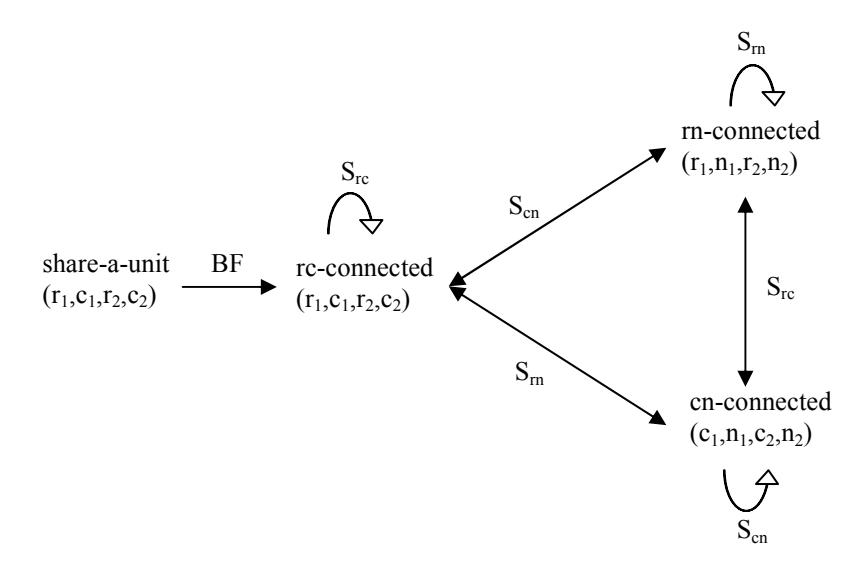

Figure 1. The various notions of connectedness and their relationships

#### IV.4.3 A block-free resolution rule has a block-free proof

Theorem IV.1: a block-free formula that is valid in ST+VCR has a block-free proof.

Restricted to resolution rules, this gives:

Theorem IV.2: any block-free resolution rule is already valid in LS+VCR (the theory of Latin Squares extended to candidates). Stated otherwise: a block-free formula is valid for Sudoku if and only if it is valid for Latin Squares.

 $\mathsf{Proof}^{\mathfrak{S}}$ : we can use the completeness and consistency theorems of intuitionistic logic. A formula F is an intuitionistically valid consequence of a theory T if and only if F has an intuitionistic formal proof from the axioms of T. Remember the standard definition of such a proof: it is a sequence of formulæ ending by F, where each formula in the sequence either is an intuitionistic logical axiom or is an axiom

 $<sup>^5</sup>$  Technical remark: one may think that this theoren could be proved using general theorems in logic such as the interpolation theorem and/or Gentzen's theorem in the sequents calculus: "if a sequent  $\Gamma\,\Delta$  is provable in the sequents calculus then it has a proof that uses only sequents formed on the sub formulæ of  $\Gamma\,\Delta$ ". But it does not seem to work.

of T or can be deduced from the previous ones by *modus ponens* (i.e. from the law "from A and from  $A \Rightarrow B$  deduce B").

Let F be a block-free formula and consider an intuitionistic proof of it in T = ST+VCR. We prove that, if we apply BF to any step in this proof, we get a block-free proof of BF(F).

Since  $BF(A \Rightarrow B)$  is the same thing as  $BF(A) \Rightarrow BF(B)$ , any application of *modus* ponens in the proof will be easily transposed and the only thing we must check for this transposition to be valid is that, for any axiom A in T, BF(A) is true in T.

The only axiom in T which is not already block-free is ST4. But, for ST4, we have:

```
\begin{split} ST4 &\equiv \forall b \forall n \forall s_1 \forall s_2 \; \{value[n,\,b,\,s_1] \;\&\; value[n,\,b,\,s_2] \Rightarrow s_1 = s_2 \}) \\ &\equiv \forall b \forall n \forall s_1 \forall s_2 \\ &\{ \;\; \exists r_1 \exists c_1 \; [correspondence(r_1,\,c_1,\,b,\,s_1) \;\&\; value(n,\,r_1,\,c_1) \} \;\&\; \\ &\exists r_2 \exists c_2 \; [correspondence(r_2,\,c_2,\,b,\,s_2) \;\&\; value(n,\,r_2,\,c_2)] \\ &\Rightarrow \\ &s_1 = s_2 \; \}; \end{split}
```

Applying the definition of BF gives:

```
BF(ST4) \equiv \forall n \{ \exists r_1 \exists c_1 [\bot \& value(n, r_1, c_1)] \& \\ \exists r_2 \exists c_2 [\bot \& value(n, r_2, c_2)] \} \\ \Rightarrow \\ \bot \} \\ \equiv \bot \Rightarrow \bot \\ \equiv TRUE
```

This ends the proof of theorem IV.1.

As for theorem IV.2, a block-free proof uses only the block-free transforms of the axioms in ST+VCR. But, since BF(ST4) = TRUE, this is exactly LS+VCR.

#### IV.5. Symmetries and the three basic meta-theorems

We now have the technical tools necessary for stating and proving our three fundamental meta-theorems.

#### IV.5.1. Formal statement and proof of meta-theorem 1

Meta-theorem 1 (formal): if R is a resolution rule, then  $S_{rc}(F)$  is a resolution rule (and it obviously has the same logical complexity as R). We shall express this as: the set of resolution rules is closed under symmetry.

Proof: let T be the theory consisting of the axioms in ST+VCR. If R is a resolution rule, then R has a formal proof in T. From such a proof of R, a proof of R in T can be obtained by replacing successively each step in the first proof (axioms included) by its transformation under R<sub>rc</sub>. This is legitimate since:

- the set of axioms in T is invariant under  $S_{rc}$  symmetry;
- any application of *modus ponens* can be transposed, because  $S_{rc}(A \Rightarrow B) \equiv S_{rc}(A) \Rightarrow S_{rc}(B)$ .

#### IV.5.2. Formal statement and proof of meta-theorem 3

Meta-theorem 3 (formal): if R is a block-free resolution rule, then  $S_{rn}(R)$  and  $S_{cn}(R)$  are resolution rules (and they obviously have the same logical complexity as R). We shall express this as: the set of resolution rules is closed under supersymmetry.

Proof: the proof (for  $S_m$ ) is similar to that of meta-theorem 1. Let now T be the theory consisting of the axioms in LS+VCR. After theorem IV.2, there is a proof of R in T. From such a proof, a proof of  $S_m(R)$  in T (it will automatically be also a proof in ST+VCR) can be obtained by replacing successively each step in the first proof (axioms included) by its transformation under  $S_m$ . This is legitimate since:

- each formula in the first proof is block-free and S<sub>m</sub> can be applied to it;
- the set of axioms in T is invariant under  $S_m$  symmetry;
- any application of *modus ponens* can be transposed, because  $S_m(A \Rightarrow B) \equiv S_m(A) \Rightarrow S_m(B)$ .

#### IV.5.3. Analogy and meta-theorem 2

Stating and proving meta-theorem 2 is done along the same lines as we did for meta-theorems 1 and 3. As previously, we must begin by introducing a new formal notion, the notion of the  $R_{rcbs}$  transform of a block-free formula.

#### IV.5.3.1. $S_{rcbs}$ transform of a block-free formula

For a block-free formula F, its S<sub>rebs</sub> transform is defined recursively by:

– block-free atomic formulæ:

| F                                  | S <sub>rcbs</sub> (F)         |
|------------------------------------|-------------------------------|
| $n_i = n_i$                        | $n_i = n_i$                   |
| $r_i = r_i$                        | $b_i = b_i$                   |
| $c_i = c_i$                        | $S_i = S_i$                   |
| $value(n_i,r_i,c_k)$               | value $[n_i, b_i, s_k]$       |
| $not$ -candidate $(n_i, r_i, c_k)$ | not-candidate $[n_i,r_i,c_k]$ |

- logical (and modal) connectives: all of them simply commute with S<sub>rcbs</sub>
- quantifiers:

| F                    | $S_{rcbs}(F)$               |
|----------------------|-----------------------------|
| $\forall n_i F_1$    | $\forall n_i S_{rcbs}(F_1)$ |
| $\forall r_i F_i$    | $\forall b_i S_{rcbs}(F_1)$ |
| $\forall c_i F_1$    | $\forall s_i S_{rcbs}(F_1)$ |
| $\exists n_i F_1$    | $\exists n_i S_{rebs}(F_1)$ |
| $\exists r_{i}F_{1}$ | $\exists b_i S_{rcbs}(F_1)$ |
| $\exists c_i F_i$    | $\exists s_i S_{rcbs}(F_1)$ |

As a result of the above rules, we have the following table for the almost primary predicate:

| F                           | S <sub>rcbs</sub> (F)       |
|-----------------------------|-----------------------------|
| candidate $(n_i, r_i, c_k)$ | candidate $[n_i, r_i, c_k]$ |

#### IV.5.3.2. Formal statement and proof of meta-theorem 2

Meta-theorem 2 (formal): if R is a block-free resolution rule that can be proved without using axiom ST3, then  $S_{rcbs}(R)$  is a resolution rule (and it obviously has the same logical complexity as R). We shall express this as: the set of resolution rules is closed under analogy.

Proof: it goes along the same lines as those of meta-theorems 1 and 3.

After theorem IV.2, there is a proof of R in LS+VCR. This is not enough for our purpose, but the proof of theorem IV.2 can be transposed to show that there is a proof of R in LS+VCR that does not use axiom ST3; it is therefore a proof of R using only the axioms in the set {ST1, ST2, ST5, VCR}. From this proof of R, a

proof of  $S_{rebs}(R)$  using only the axioms in the set {ST1, ST4, ST5, VCR} (a subset of ST+VCR) is obtained by replacing each step in the first proof by its transformation under  $S_{rebs}$ . This is legitimate since:

- each formula in the first proof is block-free and S<sub>rcbs</sub> can be applied to it;
- under S<sub>rcbs</sub>, ST1, ST5 and VCR are invariant and ST2 becomes ST4;
- any application of *modus ponens* can be transposed, because  $S_{rcbs}(A \Rightarrow B) \equiv S_{rcbs}(A) \Rightarrow S_{rcbs}(B)$ .

#### IV.5.4. Extension of meta-theorem 3

Finally, meta-theorem 3 can be modified and extended to a wider class of resolution rules by defining the notion of a block-positive formula.

For easier formulation, let us consider formulæ written without the logical symbol for implication (" $\Rightarrow$ "), i.e. written with only the following logical symbols:  $\land$ ,  $\lor$ ,  $\neg$ ,  $\forall$ ,  $\exists$ . Notice that (using the trivial identity  $A \Rightarrow B \equiv \neg A \lor B$ ) every formula can be rewritten in this form. Remember also that the condition part of any resolution rule satisfies this constraint.

Definitions: A formula F is said to be *block-positive* if it does not contain the logical symbol for implication (" $\Rightarrow$ ") and if any of its non block-free primary predicates is in the scope of an even number of negations (i.e. of " $\neg$ " symbols). By extension, a resolution rule  $A\Rightarrow B$  is said to be block-positive if B is block-free and A is block-positive.

Theorem IV.3: if F is a block-positive formula, then the validity of BF(F) entails the validity of F; in particular, if R is a block-positive resolution rule, then BF(R) is a resolution rule.

The proof of the first part is obvious. Notice that BF(R) is weaker than R, since it has stronger conditions; it might therefore be considered as totally uninteresting. But BF(R) is block-free and it can be submitted to meta-theorem 3. This is the way how, in the chapters dealing with chains, counterparts of all the chain rules in natural rc-space will be defined in rn- and cn-spaces, leading to entirely new types of chains

Meta-theorem 3 (formal, extended version): if R is a block-positive resolution rule, then  $S_{rn} \bullet BF(R)$  and  $S_{cn} \bullet BF(R)$  are resolution rules.

## Part Two

# BASIC RESOLUTION RULES

### Chapter V

# Subset rules, level one: Singles

In this short chapter, the following familiar rules will be studied and their relationships through symmetry, analogy and supersymmetry will be established:

- Naked-Single, or NS for short: if there is a row and a column such that there is one and only one candidate for the cell they define, then assert it as the value of this cell;
- Hidden-Single-in-a-row, or HS(row) for short: if there is a row and a number such that the number is a candidate for one and only one cell in this row, then assert it as the value of this cell;
- Hidden-Single-in-a-column, or HS(column) for short: if there is a column and a number such that the number is a candidate for one and only one cell in this column, then assert it as the value of this cell;
- Hidden-Single-in-a-block, or HS(block) for short: if there is a block and a number such that the number is a candidate for one and only one square in this block, then assert it as the value of this square.

Validity of each of these rules is obvious. Notice the duality between rows and columns, but the absence of duality between blocks and squares (e.g. there is no rule Hidden-Single-in-a-square).

#### V.1. Subset rules, level one

Let us use the abstract spaces introduced in chapter II and rephrase the above rules so as to better display the symmetries linking them:

- NS: if, in natural row-column space, there is a rc-cell (r, c) with only one candidate (number), then assert it as the value of this rc-cell;
- HS(row): if, in abstract row-number space, there is a rn-cell (r, n) with only one candidate (column), then assert it as the value of this rn-cell;
- HS(col): if, in abstract column-number space, there is a cn-cell (c, n) with only one candidate (row), then assert it as the value of this cn-cell;
- HS(blk): if, in abstract block-number space, there is a bn-cell (b, n) with only one candidate (square), then assert it as the value of this bn-cell.

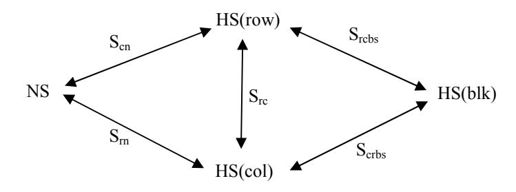

Figure 1. Symmetries, analogies and supersymmetries at level one

This is our first and simpler example of supersymmetry, together with analogy. The four rules can be phrased similarly: if, in any of the four row-column, row-number, column-number or block-number spaces, there is a cell with only one possibility left for the remaining variable, then assert it as the final value. The first three rules express supersymmetry; the fourth expresses analogy with the previous ones. More specifically:

- HS(row) is obtained from NS by supersymmetry: permuting "number" and "column"; formally:  $HS(row) = S_{cn}(NS)$ ;
- HS(col) is obtained from NS by supersymmetry: permuting "number" and "row"; formally: HS(col) =  $S_{rn}$ (NS); it is also obtained from HS(row) by symmetry: permuting "row" and "column"; formally: HS(col) =  $S_{rc}$ (HS(row));
- HS(blk) is obtained from HS(row) by analogy: replacing "row" by "block" and "column" by "square"; formally: HS(blk) =  $S_{rcbs}(HS(row))$ .
- HS(blk) is also obtained from HS(col) by analogy: replacing "column" by "block" and "row" by "square"; formally:  $HS(blk) = S_{crbs}(HS(col))$ .

Figure 1 summarises all the formal relations of symmetry, analogy and supersymmetry between these four rules.

#### V.2. Logical formulation of the rules

Whereas the English sentences for expressing our rules are deduced from each other by permuting properly the words "row", "column", "number", "block" and "square", the logical formulæ expressing them are deduced from each other simply by permuting the quantifiers. As a result and an illustration of the expressive power of multi-sorted logic, their logical formulation is still more striking in its compactness:

```
 \begin{array}{lll} - \mbox{ NS:} & \forall r \forall c \; \{ \exists ! n \; candidate(n, r, c) => value(n, r, c) \} \\ - \mbox{ HS(row):} & \forall r \forall r \; \{ \exists ! c \; candidate(n, r, c) => value(n, r, c) \} \\ - \mbox{ HS(col):} & \forall c \forall r \; \{ \exists ! r \; candidate(n, r, c) => value(n, r, c) \} \\ - \mbox{ HS(blk):} & \forall b \forall r \; \{ \exists ! s \; candidate[n, b, s] => value[n, b, s] \} \end{array}
```

As an exercise in logic and as an illustration of the facilities allowed by our shorthands, developing the first formula into a standard (but still multi sorted) logical form would give something much less appealing:

```
 \forall r \forall c \ \{ \exists n \ [candidate(n, r, c) \& \forall n_2 \ (n_2 \neq n) => not\text{-candidate}(n_2, r, c)] \\ => \\ \forall n \ [candidate(n, r, c) => value(n, r, c)] \}.
```

Notice that, in conformance with our convention in section IV.3.2.3, the short-hands on the quantifiers have been developed in reference to the primary predicates "value" and "not-candidate".

In the sequel, such developments will be left to the reader motivated by the purity of logical formulæ. But, as formal logic is used here merely as a compact notation tool, and not for providing formal proofs of the rules, they will never be needed.

#### V.3. Example

No new grid is needed to exemplify the Hidden-Single rules: in the introduction, with puzzle Royle17-3 (recalled here in Figure 2, together with its solution) we have

seen a case of a Hidden-Single-in-a-column and we have already observed that it looks in abstract column-number space as a Naked-Single does in natural row-column space. This is the concrete graphical manifestation of the logical symmetries explicited in the present chapter.

It is the case that grid Royle17-3 can be solved using only the rules defined above (in addition, of course, to the elementary constraints propagation rules). As will be shown by the classification results at the end of this book, this is a relatively frequent property (shared by 46% of the puzzles in the Royle17 database and more than 41% of the randomly generated grids in Sudogen0 and Sudogen17).

|   |   |   |   |   |   | 1 | 2 |
|---|---|---|---|---|---|---|---|
|   |   |   | 3 | 5 |   |   |   |
|   |   | 6 |   |   |   | 7 |   |
| 7 |   |   |   |   | 3 |   |   |
|   |   | 4 |   |   | 8 |   |   |
| 1 |   |   |   |   |   |   |   |
|   |   | 1 | 2 |   |   |   |   |
|   | 8 |   |   |   |   | 4 |   |
|   | 5 |   |   |   | 6 |   |   |

| 6 | 7 | 3 | 8 | 9 | 4 | 5 | 1 | 2 |
|---|---|---|---|---|---|---|---|---|
| 9 | 1 | 2 | 7 | 3 | 5 | 4 | 8 | 6 |
| 8 | 4 | 5 | 6 | 1 | 2 | 9 | 7 | 3 |
| 7 | 9 | 8 | 2 | 6 | 1 | 3 | 5 | 4 |
| 5 | 2 | 6 | 4 | 7 | 3 | 8 | 9 | 1 |
| 1 | 3 | 4 | 5 | 8 | 9 | 2 | 6 | 7 |
| 4 | 6 | 9 | 1 | 2 | 8 | 7 | 3 | 5 |
| 2 | 8 | 7 | 3 | 5 | 6 | 1 | 4 | 9 |
| 3 | 5 | 1 | 9 | 4 | 7 | 6 | 2 | 8 |

Figure 2. Puzzle Royle17-3 and its solution

Here is the detailed listing for the resolution path of puzzle Royle17-3 (application of elementary constraints propagation is not displayed). Remember from what we said in the introduction that, in future examples, all the steps shown here will be considered as obvious and will not be displayed.

```
Resolution path in L1 0 for Royle17-3:
hidden-single-in-block b3
                             ==> r3c9 = 3
hidden-single-in-column c7
                             ==> r8c7 = 1
hidden-single-in-row r9
                             ==> r9c3 = 1
hidden-single-in-row r2
                             ==> r2c2 = 1
hidden-single-in-column c7
                             ==> r6c7 = 2
hidden-single-in-column c8
                             ==> r9c8 = 2
hidden-single-in-block b9
                             = > r7c8 = 3
hidden-single-in-column c8
                              ==> r2c8 = 8
hidden-single-in-block b3
                             ==> r2c9 = 6
hidden-single-in-column c7
                              ==> r7c7 = 7
```

```
hidden-single-in-block b7
                              ==> r8c3 = 7
hidden-single-in-block b1
                              ==> r1c2 = 7
hidden-single-in-block b2
                              ==> r2c4 = 7, r3c6 = 2
hidden-single-in-block b5
                              ==> r4c4 = 2
hidden-single-in-column c2
                           ==> r5c2 = 2
hidden-single-in-column c3
                           ==> r2c3 = 2
hidden-single-in-column c1
                            ==> r8c1 = 2
hidden-single-in-block b7
                             ==> r9c1 = 3
hidden-single-in-row r1
                             ==> r1c3 = 3
hidden-single-in-block b4
                            ==> r6c2 = 3
hidden-single-in-block b5
                             ==> r5c6 = 3
hidden-single-in-row r8
                             ==> r8c4 = 3
hidden-single-in-column c4 ==> r6c4 = 5
hidden-single-in-column c5
                           ==> r8c5 = 5
naked-single
                              ==> r8c9 = 9, r9c9 = 8, r9c4 = 9, r1c4 = 8, r7c9 = 5, r8c6 = 6
hidden-single-in-column c1
                            ==> r3c1 = 8
hidden-single-in-block b8
                            ==> r7c6 = 8
hidden-single-in-column c6
                           ==> r4c6 = 1
naked-single
                              => r4c9 = 4, r6c9 = 7, r6c6 = 9, r6c8 = 6, r6c5 = 8, r6c3 = 4,
r4c5 = 6, r5c5 = 7, r9c5 = 4, r9c6 = 7, r1c5 = 9, r3c5 = 1, r4c2 = 9, r4c8 = 5, r5c8 = 9,
r4c3 = 8, r3c2 = 4, r7c2 = 6, r7c3 = 9, r7c1 = 4, r3c3 = 5, r5c3 = 6, r5c1 = 5, r3c7 = 9,
r2c7 = 4, r1c7 = 5, r1c1 = 6, r2c1 = 9, r1c6 = 4, r5c9 = 1
```

For this particular puzzle, it can be seen that only rules of type Hidden-Single are applied in the first steps and that only rules of type Naked-Single are applied in the last steps (forgetting elementary propagation rules). In grids that can be solved with only these two types of rules, invocation of rules of each type are generally more intermingled than in this example. However, whichever set of rules the resolution of a puzzle needs and still forgetting ECP, most of the time, the last rules applied need not be of a type more complex than Naked-Single.

#### V.4. Theory L1 0

Let us define theory L1\_0 as the union of the axioms of BSRT (which already includes Naked-Single) with the three Hidden-Single rules:

```
HS = \{HS(row), HS(col), HS(blk)\},
L1_0 = BSRT \cup HS.
```

Full level 1 and associated theory L1 will be obtained from L1\_0 by adding interactions rules (see chapter IX). But for the next three chapters, we continue with subset rules.

Whenever there can be no confusion, we shall use the same name to designate a resolution theory and the set of puzzles that can be solved by it.

### Chapter VI

## Subset rules, level two: Pairs

The set of rules relative to Pairs constitutes a still more striking illustration of our approach based on symmetries than the rules relative to Singles. In this chapter, the following familiar rules will be studied in full detail and their relationships through symmetry, analogy and supersymmetry will be established:

- Naked-Pairs-in-a-row, or NP(row) for short: if there is a row and there are two different cells in this row that have exactly the same two different candidates, then remove these two candidates from all the other cells in this row;
- Naked-Pairs-in-a-column, or NP(col) for short: if there is a column and there
  are two different cells in this column that have exactly the same two different candidates, then remove these two candidates from all the other cells in this column;
- Naked-Pairs-in-a-block, or NP(blk) for short: if there is a block and there are two different cells in this block that have exactly the same two different candidates, then remove these two candidates from all the other cells in this block;
- Hidden-Pairs-in-a-row, or HP(row) for short: if there is a row and there are two different cells in this row and two different numbers  $n_1$  and  $n_2$  that appear in the candidates for no other cell in this row than these two, then remove any number other than  $n_1$  or  $n_2$  from the two cells; notice that applying this rule has the effect of producing a Naked-Pairs-in-a-row from a Hidden-Pairs-in-a-row;
- Hidden-Pairs-in-a-column, or HP(col) for short: if there is a column and there are two different cells in this column and two different numbers  $n_1$  and  $n_2$  that appear in the candidates for no other cell in this column than these two, then remove any number other than  $n_1$  or  $n_2$  from the two cells; notice that applying this rule has

the effect of producing a Naked-Pairs-in-a-column from a Hidden-Pairs-in-a-column;

- Hidden-Pairs-in-a-block, or HP(blk) for short: if there is a block and there are two different cells in this block and two different numbers  $n_1$  and  $n_2$  that appear in the candidates for no other cell in this block than these two, then remove any number other than  $n_1$  or  $n_2$  from the two cells; notice that applying this rule has the effect of producing a Naked-Pairs-in-a-block from a Hidden-Pairs-in-a-block.
- X-Wing-in-rows, or XW(row) for short: if there is a number n and there are two different rows  $r_1$  and  $r_2$ , such that, in these rows, n appears as a candidate for only the same two different columns  $c_1$  and  $c_2$ , then, in any of these two columns, remove n from the candidates for any row other than  $r_1$  and  $r_2$ ;
- X-Wing-in-columns, or XW(col) for short: if there is a number n, and there are two different columns  $c_1$  and  $c_2$ , such that, in these columns, n appears as a candidate for only the same two different rows  $r_1$  and  $r_2$ , then, in any of these two rows, remove n from the candidates for any column other than  $c_1$  and  $c_2$ .

Moreover, it will be shown that all these rules are related by symmetry, analogy or supersymmetry. More specifically:

- NP(col) is obtained from NP(row) by symmetry: permuting "row" and "column"; formally: NP(row) =  $S_{rc}(NP(col))$ ;
- NP(blk) is obtained from NP(row) by analogy: replacing "row" by "block" and "column" by "square"; formally: NP(blk) =  $S_{rcbs}(NP(row))$ ;
- HP(row) is obtained from NP(row) by supersymmetry: permuting "number" and "column"; formally: HP(row) =  $S_{cn}(NP(row))$ ;
- HP(col) is obtained from NP(col) by supersymmetry: permuting "number" and "row"; formally:  $HP(col) = S_m(NP(col))$ ;
- HP(blk) is obtained from HP(row) by analogy: replacing "row" by "block" and "column" by "square"; formally: HP(blk) =  $S_{rcbs}(HP(row))$ ;
- X-Wing(row) is obtained from HP(row) by supersymmetry: permuting "number" and "row"; in symbols: X-Wing(row) = SHP(row), where SHP(row) is defined by SHP(row) =  $S_m(HP(row)) = S_m \circ S_{cn}(NP(row))$ ;
- X-Wing(col) is obtained from HP(col) by supersymmetry: permuting "number" and "column"; in symbols: X-Wing(col) = SHP(col), where SHP(col) is defined by SHP(col) =  $S_m(HP(col)) = S_{co} \bullet S_m(NP(col))$ .

We shall also give detailed examples of puzzles where rules NP, HP and SHP apply, together with their resolution paths. For one of these examples, we shall display the situation both in natural row-column space and in row-number space.

This is intended to illustrate how the proper choice of a graphical representation (in this case the choice of the proper space) reveals what was hidden (or super hidden).

#### VI.1. Naked-Pairs

#### VI.1.1. Naked-Pairs-in-a-row

As a starting point, let us elaborate on the standard formulation of the Naked-Pairs-in-a-row rule.

Naked-Pairs-in-a-row (English formulation): if there is a row r and there are two different columns  $c_1$  and  $c_2$ , and two different numbers  $n_1$  and  $n_2$ , such that: the candidates for cell  $(r, c_1)$  are exactly the two numbers  $n_1$  and  $n_2$ , then candidates for cell  $(r, c_2)$  are exactly the two numbers  $n_1$  and  $n_2$ , then eliminate the two numbers  $n_1$  and  $n_2$  from the candidates for any other cell in row r.

Validity of the rule is very easy to prove: in row r, each of the two cells defined by columns  $c_1$  and  $c_2$  must get a value and only two values ( $n_1$  and  $n_2$ ) are available for them, which entails that, whatever distribution is made between them of these two values, none of these two values remains available for the other cells in the same row.

To formalise this rule, we have to consider the case of a cell in standard row-column space (also called a rc-cell) that has exactly two candidates (with given values); we say that this cell is confined to two values or that it is bivalue; and we introduce the following auxiliary block-free predicate:

```
- rc-bivalue, with arity 4 and signature (Row, Column, Number, Number); rc-bivalue(r, c, n<sub>1</sub>, n<sub>2</sub>) is defined as: candidate(n<sub>1</sub>, r, c) & candidate(n<sub>2</sub>, r, c) & n<sub>1</sub>\neqn<sub>2</sub> & \foralln\notin {n<sub>1</sub>, n<sub>2</sub>} not-candidate(n, r, c).
```

Using this predicate, the logical formulation of the Naked-Pairs-in-a-row rule parallels strictly strictly the English one (and it is obviously block-free):

```
\begin{split} \forall r \forall c_1 \neq c_2 \forall n_1 \neq n_2 \\ & \{ \text{ rc-bivalue}(r, \, c_1, \, n_1, \, n_2) \, \& \\ & \text{ rc-bivalue}(r, \, c_2, \, n_1, \, n_2) \\ \Rightarrow \\ & \forall c \not\in \{c_1, \, c_2\} \, \forall n \in \{n_1, \, n_2\} \text{ not-candidate}(n, \, r, \, c) \, \}. \end{split}
```

#### VI.1.2. Naked-Pairs-in-a-column

Starting from the Naked-Pairs-in-a-row rule, meta-theorem 1 gives the Naked-Pairs-in-a-column rule. Of course, the validity of this rule can also be easily checked directly.

Naked-Pairs-in-a-column (English formulation): if there is a column c and there are two different rows  $r_1$  and  $r_2$ , and two different numbers  $n_1$  and  $n_2$ , such that: the candidates for cell  $(r_1, c)$  are exactly the two numbers  $n_1$  and  $n_2$ , then eliminate the two numbers  $n_1$  and  $n_2$ , from the candidates for any other cell in column c

Using the same predicate as before and applying the  $S_{rc}$  transformation to the logical formulation of Naked-Pairs-in-a-row, we get the logical formulation of Naked-Pairs-in-a-column (which is obviously block-free):

```
\begin{split} \forall c \forall r_1 \neq r_2 \forall n_1 \neq n_2 \\ & \{ \text{ rc-bivalue}(r_1, \, c, \, n_1, \, n_2) \, \& \\ & \text{ rc-bivalue}(r_2, \, c, \, n_1, \, n_2) \\ \Rightarrow \\ & \forall r \notin \{r_1, \, r_2\} \, \forall n \in \{n_1, \, n_2\} \text{ not-candidate}(n, \, r, \, c) \, \}. \end{split}
```

#### VI.1.3. Naked-Pairs-in-a-block

Starting from Naked-Pairs-in-a-row, meta-theorem 2 gives Naked-Pairs-in-a-block. Of course, the validity of the resulting rule can be checked directly; this can be done easily by transposing the proof of Naked-Pairs-in-a-row: each of the two cells in the block must get a unique value and only two values ( $n_1$  and  $n_2$ ) are available for them; which entails that, whatever distribution is made between them of these two values, none of these two values remains available for the other cells in the same block

Naked-Pairs-in-a-block (English formulation): if there is a block b and there are two different squares  $s_1$  and  $s_2$  in this block and two different numbers  $n_1$  and  $n_2$  such that:

the candidates for cell  $[b, s_1]$  are exactly the two numbers  $n_1$  and  $n_2$ , the candidates for cell  $[b, s_2]$  are exactly the two numbers  $n_1$  and  $n_2$ , then eliminate the two numbers  $n_1$  and  $n_2$  from the candidates for any other square in block b.

To formalise this rule, it is convenient to be able to express simply in block-square coordinates the fact that a cell has exactly two candidates (with given values). Auxiliary non block-free predicate rc-bivalue[b, s,  $n_1$ ,  $n_2$ ] is therefore defined by either of the following two formulæ (proof of this equivalence is straightforward):

```
\begin{aligned} & candidate[n_1,\,b,\,s] \ \& \ candidate[n_2,\,b,\,s] \ \& \ n_1 \neq n_2 \ \& \\ & \forall n \not\in \{n_1,\,n_2\} \ not\text{-candidate}[n,\,b,\,s] \end{aligned}
```

or, equivalently:

```
\exists b \exists s \{ correspondence(r, c, b, s) \& rc-bivalue(r, c, n_1, n_2) \}.
```

Again, the logical formulation of Naked-Pairs-in-a-block parallels strictly the English one (and it is obviously not block-free):

```
 \forall b \forall s_1 \neq s_2 \forall n_1 \neq n_2 
 \{ \text{ rc-bivalue[b, } s_1, n_1, n_2] \& 
 \text{ rc-bivalue[b, } s_2, n_1, n_2] 
 \Rightarrow 
 \forall s \notin \{s_1, s_2\} \forall n \in \{n_1, n_2\} \text{ not-candidate[n, b, s] } \}.
```

#### VI.1.4. Naked-Pairs example

Let us give a very simple example of a puzzle that can be solved using only the elementary constraints propagation rules, Naked-Single, Hidden-Single and Naked-Pairs (puzzle Royle17-144, Figure 1).

The original (minimal) grid is displayed first, then its L1\_0 elaboration (obtained by application of the first Naked-Single and Hidden-Singles rules), then its solution. As explained in the introduction, in the listing of the resolution process, only the interesting parts are displayed (i.e. one starts with the elaborated grid and the final NS and HS rules are omitted).

Notice how the Naked-Pairs-in-a-row is described in the nrc-notation: {n6 n9}r2{c1 c9}.

```
Resolution path in L1_0+NP for the L1_0 elaboration of Royle17-144: naked-pairs-in-a-row {n6 n9}r2{c1 c9} ==> r2c5 \neq 9, r2c5 \neq 6, r2c6 \neq 9, r2c6 \neq 6, r2c7 \neq 9, r2c8 \neq 9, r2c8 \neq 6 ... (Naked-Singles and Hidden-Singles)
```

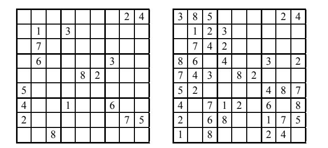

| 3 | 8 | 5 | 7 | 6 | 1 | 9 | 2 | 4 |
|---|---|---|---|---|---|---|---|---|
| 9 | 1 | 2 | 3 | 4 | 8 | 7 | 5 | 6 |
| 6 | 7 | 4 | 2 | 9 | 5 | 8 | 1 | 3 |
| 8 | 6 | 1 | 4 | 5 | 7 | 3 | 9 | 2 |
| 7 | 4 | 3 | 9 | 8 | 2 | 5 | 6 | 1 |
| 5 | 2 | 9 | 6 | 1 | 3 | 4 | 8 | 7 |
| 4 | 5 | 7 | 1 | 2 | 9 | 6 | 3 | 8 |
| 2 | 9 | 6 | 8 | 3 | 4 | 1 | 7 | 5 |
| 1 | 3 | 8 | 5 | 7 | 6 | 2 | 4 | 9 |

Figure 1. Puzzle Royle17-144, its L1\_0 elaboration and its solution

#### VI.2. Hidden-Pairs

#### VI.2.1. Hidden-Pairs-in-a-row

Let us now consider the Hidden-Pairs-in-a-row rule. To obtain it, we do the same as we did with Naked-Single. We just apply the informal version of meta-theorem 3 to Naked-Pairs-in-a-row, permuting the words "number" and "column". That is, once transposed in row-number space, a Naked-Pairs-in-a-row looks graphically like a Naked-Pairs-in-a-row.

Hidden-Pairs-in-a-row (final English formulation): if there is a row r and there are two different numbers  $n_1$  and  $n_2$  and two different columns  $c_1$  and  $c_2$ , such that: the candidates (columns) of rn-cell  $(r, n_1)$  (a cell in row-number space) are exactly  $c_1$  and  $c_2$ ,

the candidates (columns) of rn-cell  $(r, n_2)$  (a cell in row-number space) are exactly  $c_1$  and  $c_2$ ,

then eliminate the two columns  $c_1$  and  $c_2$  from the candidates for any other rn-cell (r, n) in row r in row-number space.

As for the logical formulation, it is convenient to introduce an auxiliary block-free predicate rn-bivalue. The intended meaning of the corresponding atomic formula rn-bivalue(r, n,  $c_1$ ,  $c_2$ ) is that, in row r, (the unique instance of) number n can be found only in columns  $c_1$  and  $c_2$ . We shall therefore say that, in abstract row-number space, the candidate columns for abstract rn-cell (r, r) are confined to values r0 and r1 and r2 or that rn-cell (r, r1) is bivalue. Using a more standard vocabulary, we may also say that cells (r, r1) and (r1, r2) are *conjugate* along row r2 for value r3; but this is somehow breaking the symmetry between Rows and Numbers and hiding the supersymmetry relationship between Naked and Hidden Pairs.

- **rn-bivalue** has arity 4 and signature (Row, Number, Column, Column);

```
rn-bivalue(r, n, c_1, c_2) is defined as:
candidate(n, r, c_1) & candidate(n, r, c_2) & c_1 \neq c_2 & \forall c \notin \{c_1, c_2\} not-candidate(n, r, c).
```

It can easily be seen that "rn-bivalue( $r_i$ ,  $n_j$ ,  $c_{k1}$ ,  $c_{k2}$ )" is the  $S_{cn}$  transform of "rc-bivalue( $r_i$ ,  $c_i$ ,  $n_{k1}$ ,  $n_{k2}$ )".

Then, the logical formulation of Hidden-Pairs-in-a-row parallels strictly the English one (and is also obviously, applying the formal version of meta-theorem 3, the direct transposition, i.e. the  $S_{cn}$  transform, of formal rule Naked-Pairs-in-a-row):

```
\begin{split} \forall r \forall n_1 \neq n_2 \forall c_1 \neq c_2 \\ & \{ \text{ rn-bivalue}(r, n_1, c_1, c_2) \& \\ & \text{ rn-bivalue}(r, n_2, c_1, c_2) \& \\ & \Rightarrow \\ & \forall n \notin \{n_1, n_2\} \, \forall c \in \{c_1, c_2\} \text{ not-candidate}(n, r, c) \, \}. \end{split}
```

#### VI.2.2. Hidden-Pairs-in-a-column

The Hidden-Pairs-in-a-column rule can be obtained by two equivalent ways: either by applying informal meta-theorem 3 to Naked-Pairs-in-a-column and permuting the words "number" and "row", or by applying informal meta-theorem 1 to Hidden-Pairs-in-a-row and permuting the words "row" and "column". The definition of the appropriate auxiliary predicate cn-bivalue, in column-number space, and the writing of the rule are left as an exercise for the reader.

As for the logical formulation, it is convenient to introduce an auxiliary predicate cn-bivalue. The intended meaning of the corresponding atomic formula cn-bivalue(c, n,  $r_1$ ,  $r_2$ ) is that that, in column c, (the unique instance of) number n can be found only in rows  $r_1$  and  $r_2$ . We shall therefore say that, in abstract column-number space, the candidate columns for abstract cn-cell (c, n) are confined to values  $r_1$  and  $r_2$  or that cn-cell (c, n) is bivalue. Again, we may also say that cells ( $r_1$ , c) and ( $r_2$ , c) are *conjugate* along column c for value n; but the same remarks as above apply.

```
- cn-bivalue has arity 4 and signature (Column, Number, Row, Row); cn-bivalue(c, n, r_1, r_2) is defined as:
```

```
candidate(n, r_1, c) & candidate(n, r_2, c) & r_1 \neq r_2 & \forall r \notin \{r_1, r_2\} not-candidate(n, r, c).
```

It can easily be seen that "cn-bivalue( $c_j$ ,  $n_i$ ,  $r_{k1}$ ,  $r_{k2}$ )" is the  $S_m$  transform of "rc-bivalue( $r_i$ ,  $c_i$ ,  $n_{k1}$ ,  $n_{k2}$ )".

Then, the logical formulation of Hidden-Pairs-in-a-column parallels strictly the English one (and is also obviously, applying the formal version of meta-theorem 3, the direct transposition, i.e. the  $S_{rn}$  transform, of the formal Naked-Pairs-in-a-column rule):

```
 \forall c \forall n_1 \neq n_2 \forall r_1 \neq r_2  { cn-bivalue(c, n<sub>1</sub>, r<sub>1</sub>, r<sub>2</sub>) & cn-bivalue(c, n<sub>2</sub>, r<sub>1</sub>, r<sub>2</sub>)  \Rightarrow   \forall n \notin \{n_1, n_2\} \forall r \in \{r_1, r_2\} \text{ not-candidate}(n, r, c) \}.
```

#### VI.2.3. Hidden-Pairs-in-a-block

The Hidden-Pairs-in-a-block rule is obtained by applying meta-theorem 2 to the Hidden-Pairs-in-a-row rule. Its validity can also easily be checked directly.

As previously, it is convenient to introduce an auxiliary predicate bn-bivalue, but it is not block-free. The intended meaning of the corresponding atomic formula bn-bivalue(b, n,  $s_1$ ,  $s_2$ ) is that, in block b, (the unique instance of) number n can be found only in squares  $s_1$  and  $s_2$ . We shall therefore say that, in abstract block-number space, the candidate squares for abstract bn-cell (b, n) are confined to values  $s_1$  and  $s_2$  or that bn-cell (b, n) is bivalue. Again, we may also say that cells [b,  $s_1$ ] and [b,  $s_2$ ] are *conjugate* along block b for value n; but the same remarks as above apply.

- **bn-bivalue** has arity 4 and signature (Block, Number, Square, Square); cn-bivalue(c, n,  $r_1$ ,  $r_2$ ) is defined as:

```
candidate[b, n, s_1] & candidate[b, n, s_2] & s_1 \neq s_2 & \forall s \notin \{s_1, s_2\} not-candidate[b, n, s].
```

Then, the logical formulation of Hidden-Pairs-in-a-block parallels strictly the English one (and, applying the formal version of meta-theorem 2, it is also obviously the direct transposition, i.e. the  $S_{\text{rcbs}}$  transform, of the formal Naked-Pairs-in-a-block rule):

```
\begin{split} \forall b \forall n_1 \neq n_2 \forall s_1 \neq s_2 \\ & \{ \text{ bn-bivalue(b, } n_1, \, s_1, \, s_2) \& \\ & \text{ bn-bivalue(b, } n_2, \, s_1, \, s_2) \\ \Rightarrow \\ & \forall n \notin \{n_1, \, n_2\} \, \forall s \in \{s_1, \, s_2\} \text{ not-candidate[b, } n, \, s] \, \}. \end{split}
```

#### VI.2.4. Conjugate cells

The situation described above for Hidden Pairs can be captured in a more uniform manner if we introduce a new definition, that will play a major conceptual role later in some chain rules (c-chain rules): two cells are very classically called *conjugate* along some unit u for a given number n if they are different, they share the given unit u and, in this unit, no other cell has n among its candidates. This situation is captured by the following new auxiliary (non block-free) predicate:

- **conjugate** has arity 5 and signature (Number, Row, Column, Row, Column, Unit-Type); conjugate(n,  $r_1$ ,  $c_1$ ,  $r_2$ ,  $c_2$ , ut) is defined as: candidate(n,  $r_1$ ,  $c_1$ ) & candidate(n,  $r_2$ ,  $c_2$ ) & { [ut=row &  $r_1$ = $r_2$  & rn-bivalue( $r_1$ , n,  $c_1$ ,  $c_2$ )] or [ut=col &  $c_1$ = $c_2$  & cn-bivalue( $c_1$ , n,  $r_1$ ,  $r_2$ ] or [ut=blk &  $\exists b\exists s_1\exists s_2$  [ correspondence( $r_1$ ,  $r_1$ ,  $r_2$ ) & correspondence( $r_2$ ,  $r_2$ ,  $r_2$ ,  $r_3$ ) & correspondence( $r_4$ ,  $r_3$ ,  $r_3$ )] }.

Thus, having two conjugate candidates in rc-space is equivalent to having a bivalue cell in one of the rn-, cn- or bn- spaces.

Using this definition, the three rules for Hidden Pairs can be rephrased as a single one: if there are two different cells that are conjugate along a given unit for two different values, then eliminate any other candidate from these two cells. The associated logical formulation follows:

```
\begin{split} \forall n_1 \neq n_2 \forall r_1 \forall r_2 \forall c_1 \forall c_2 \forall ut \forall n \notin \{n_1, n_2\} \\ & \{ conjugate(n_1, r_1, c_1, r_2, c_2, ut) \& \\ & conjugate(n_2, r_1, c_1, r_2, c_2, ut) \\ & \Rightarrow \\ & not\text{-candidate}(n, r_1, c_1) \& not\text{-candidate}(n, r_2, c_2) \, \}. \end{split}
```

The counterpart of this uniformity, and the reason why we have not based this chapter on this global auxiliary predicate for conjugacy along any unit, is that it would have hidden part of the symmetries and supersymmetries linking all the rules relative to Pairs (see section 3.3 below).

#### VI.2.5. Hidden-Pairs examples

In our first example (puzzle Royle17-262, Figure 2), the first rule one can apply to the L1\_0 elaborated puzzle is Hidden-Pairs-in-a-column. Notice the way it is displayed in the nrc-notation.

|   |   |   |   |   |   |   | 3 | 6 |
|---|---|---|---|---|---|---|---|---|
|   | 3 |   |   |   |   |   | 5 |   |
| 2 |   |   |   |   |   |   |   |   |
|   |   |   |   | 6 |   | 8 |   |   |
| 7 |   |   |   |   |   | 4 |   |   |
|   |   |   |   | 5 | 3 |   |   |   |
|   |   |   | 7 |   |   | 2 | 1 |   |
|   | 6 |   | 9 |   |   |   |   |   |
|   |   | 1 |   |   |   |   |   |   |

|   |   |   |   |   |   |   | 3 | 6 |
|---|---|---|---|---|---|---|---|---|
|   | 3 |   |   |   |   |   | 5 | 2 |
| 2 |   |   |   |   |   |   |   |   |
|   |   |   |   | 6 | 7 | 8 |   |   |
| 7 |   |   |   |   |   | 4 |   |   |
|   |   |   |   | 5 | 3 |   |   |   |
|   |   |   | 7 |   | 6 | 2 | 1 |   |
|   | 6 |   | 9 |   |   |   |   |   |
|   |   | 1 |   |   |   |   |   |   |

| 1 | 4 | 8 | 5 | 7 | 2 | 9 | 3 | 6 |
|---|---|---|---|---|---|---|---|---|
| 6 | 3 | 7 | 8 | 9 | 4 | 1 | 5 | 2 |
| 2 | 9 | 5 | 6 | 3 | 1 | 7 | 4 | 8 |
| 3 | 1 | 4 | 2 | 6 | 7 | 8 | 9 | 5 |
| 7 | 5 | 6 | 1 | 8 | 9 | 4 | 2 | 3 |
| 8 | 2 | 9 | 4 | 5 | 3 | 6 | 7 | 1 |
| 5 | 8 | 3 | 7 | 4 | 6 | 2 | 1 | 9 |
| 4 | 6 | 2 | 9 | 1 | 5 | 3 | 8 | 7 |
| 9 | 7 | 1 | 3 | 2 | 8 | 5 | 6 | 4 |

Figure 2. Puzzle Royle17-262, its L1\_0 elaboration and its solution

Resolution path in L1\_0+NP+HP for the L1\_0+NP (or L1\_0) elaboration of Royle17-262: **hidden-pairs-in-a-column {n3 n5}{r8 r9}c7** ==>  $r9c7 \neq 9$ ,  $r9c7 \neq 7$ ,  $r9c7 \neq 6$  ... (Naked-Singles and Hidden-Singles)

The puzzles in Figures 3 and 4 are interesting examples, showing that, even at the level of these basic rules, solving some puzzles may require an elaborate combination of Naked-Pairs and Hidden-Pairs in rows, columns and blocks. Notice how (naked or hidden) pairs in blocks are displayed.

|   |   |   |   |   |   | 2 | 1 |
|---|---|---|---|---|---|---|---|
|   | 7 | 3 |   |   |   |   |   |
|   |   | 4 |   | 8 |   |   |   |
| 1 |   |   | 6 |   |   | 5 |   |
|   | 3 |   |   |   | 4 |   |   |
|   |   |   | 2 |   |   |   |   |
| 2 |   |   | 5 |   |   |   |   |
|   |   | 7 |   |   | 8 |   |   |
| 6 |   |   |   |   |   |   |   |

|   |   |   |   |   |   |   | 2 | 1 |
|---|---|---|---|---|---|---|---|---|
|   | 7 |   | 3 |   | 2 |   |   |   |
|   | 2 |   | 4 |   | 8 |   |   |   |
| 1 |   |   |   | 6 |   | 2 | 5 |   |
|   | 3 | 2 |   |   |   | 4 |   |   |
|   |   |   |   | 2 |   |   |   |   |
| 2 |   |   |   | 5 |   |   |   |   |
|   |   |   | 7 |   |   | 8 |   | 2 |
| 6 |   |   | 2 |   |   |   |   |   |

| 8 | 9 | 4 | 6 | 7 | 5 | 3 | 2 | 1 |
|---|---|---|---|---|---|---|---|---|
| 5 | 7 | 1 | 3 | 9 | 2 | 6 | 4 | 8 |
| 3 | 2 | 6 | 4 | 1 | 8 | 5 | 7 | 9 |
| 1 | 4 | 8 | 9 | 6 | 3 | 2 | 5 | 7 |
| 9 | 3 | 2 | 5 | 8 | 7 | 4 | 1 | 6 |
| 7 | 6 | 5 | 1 | 2 | 4 | 9 | 8 | 3 |
| 2 | 1 | 3 | 8 | 5 | 6 | 7 | 9 | 4 |
| 4 | 5 | 9 | 7 | 3 | 1 | 8 | 6 | 2 |
| 6 | 8 | 7 | 2 | 4 | 9 | 1 | 3 | 5 |

Figure 3. Puzzle Royle17-92, its L1 0 elaboration and its solution

Resolution path in L1\_0+NP+HP for the L1\_0 elaboration of Royle17-92: **naked-pairs-in-a-column** {**n3 n5**}{**r5 r6**}**c1** ==>  $r9c1 \neq 5$ ,  $r8c1 \neq 5$ ,  $r1c1 \neq 5$ ,  $r1c1 \neq 3$  naked-single ==> r1c1 = 7 naked-pairs-in-a-block {**n1 n6**} {**r8c1 r9c1**} ==>  $r9c3 \neq 6$ ,  $r9c3 \neq 1$ ,  $r8c3 \neq 6$ ,  $r8c3 \neq 1$ ,  $r7c3 \neq 6$ ,  $r7c3 \neq 1$  naked and hidden singles ==> r7c3 = 9, r6c2 = 9, r6c3 = 2, r5c6 = 2, r5c4 = 9, r5c1 = 3, r6c1 = 5, r7c6 = 1, r3c4 = 1, r2c3 = 1, r3c3 = 6, r1c3 = 3, r1c4 = 5 naked-pairs-in-a-block {**n5 n8**}{**r8c3 r9c3**} ==>  $r9c2 \neq 8$ ,  $r9c2 \neq 5$  naked-pairs-in-a-row {**n4 n7**}**r7**{**c2 c8**} ==>  $r7c9 \neq 4$ ,  $r7c5 \neq 4$  hidden-pairs-in-a-column {**n2 n5**}{**r8 r9**}**c5** ==>  $r9c5 \neq 9$ ,  $r9c5 \neq 6$ ,  $r9c5 \neq 4$ ,  $r9c5 \neq 3$ ,  $r8c5 \neq 9$ ,  $r8c5 \neq 6$ ,  $r8c5 \neq 4$  hidden-pairs-in-a-block {**n4 n9**}{**r8c6 r9c6**} ==>  $r9c6 \neq 7$ ,  $r9c6 \neq 6$ ,  $r9c6 \neq 3$ ,  $r8c6 \neq 7$ ,  $r8c6 \neq 6$  naked-pairs-in-a-column {**n4 n9**}{**r8 r9**}**c6** ==>  $r3c6 \neq 4$ ,  $r2c6 \neq 9$ ,  $r1c6 \neq 9$ ,  $r1c6 \neq 9$ 

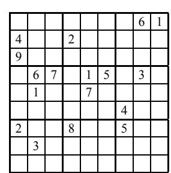

... (Naked-Singles)

... (Naked and Hidden Singles)

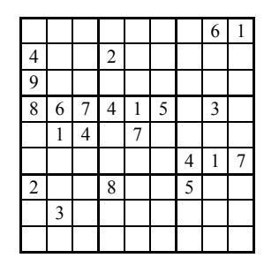

| 7 | 2 | 3 | 5 | 4 | 8 | 9 | 6 | 1 |
|---|---|---|---|---|---|---|---|---|
| 4 | 8 | 1 | 2 | 9 | 6 | 3 | 7 | 5 |
| 9 | 5 | 6 | 1 | 3 | 7 | 8 | 2 | 4 |
| 8 | 6 | 7 | 4 | 1 | 5 | 2 | 3 | 9 |
| 3 | 1 | 4 | 9 | 7 | 2 | 6 | 5 | 8 |
| 5 | 9 | 2 | 6 | 8 | 3 | 4 | 1 | 7 |
| 2 | 7 | 9 | 8 | 6 | 1 | 5 | 4 | 3 |
| 6 | 3 | 8 | 7 | 5 | 4 | 1 | 9 | 2 |
| 1 | 4 | 5 | 3 | 2 | 9 | 7 | 8 | 6 |

Figure 4. Puzzle Royle17-500, its L1 0 elaboration and its solution

```
Resolution path in L1_0+NP+HP for the L1_0 elaboration of Royle17-500: 

naked-pairs-in-a-column {n3 n5} {r5 r6}c1 ==> r9c1 \neq 5, r8c1 \neq 5, r1c1 \neq 5, r1c1 \neq 3 naked-single ==> r1c1 = 7 

naked-pairs-in-a-block {n1 n6} {r8c1 r9c1} ==> r9c3 \neq 6, r9c3 \neq 1, r8c3 \neq 6, r8c3 \neq 1, r7c3 \neq 6, r7c3 \neq 1 naked and hidden singles ==> r7c3 = 9, r6c2 = 9, r6c3 = 2, r5c6 = 2, r5c4 = 9, r5c1 = 3, r6c1 = 5, r7c6 = 1, r3c4 = 1, r2c3 = 1, r3c3 = 6, r1c3 = 3, r1c4 = 5 

naked-pairs-in-a-block {n5 n8} {r8c3 r9c3} ==> r9c2 \neq 8, r9c2 \neq 5 

naked-pairs-in-a-row {n4 n7}r7{c2 c8} ==> r7c9 \neq 4, r7c5 \neq 4 

hidden-pairs-in-a-column {n2 n5} {r8 r9}c5 ==> r9c5 \neq 9, r9c5 \neq 6, r9c5 \neq 4, r9c5 \neq 3, r8c5 \neq 9, r8c5 \neq 6, r8c5 \neq 4 

hidden-pairs-in-a-block {n4 n9} {r8c6 r9c6} ==> r9c6 \neq 7, r9c6 \neq 6, r9c6 \neq 3, r8c6 \neq 7, r8c6 \neq 6 

naked-pairs-in-a-column {n4 n9} {r8 r9}c6 ==> r3c6 \neq 4, r2c6 \neq 9, r1c6 \neq 9, r1c6 \neq 4
```

#### VI.3. Super-Hidden-Pairs or X-Wing

Notice that:

 $NP(row) \longrightarrow NP(col)$  under  $S_{rc}$ , i.e. under the permutation:  $row \longleftrightarrow column$ ;  $NP(row) \longrightarrow HP(row)$  under  $S_{cn}$ , i.e. under the permutation:  $column \longleftrightarrow number$ ;  $NP(col) \longrightarrow HP(col)$  under  $S_{m}$ , i.e. under the permutation:  $row \longleftrightarrow number$ .

One might therefore be tempted to think that these permutations can be combined in the simplest manner, and that the three rules correspond to each other through the three permutations one can do on the three symbols n, r, c, as was the case for the NS and HS rules in chapter V. For instance, one might think that applying symmetry  $S_{cn}$  to NP(row) and then symmetry  $S_{rn}$  to HP(row) is equivalent to applying directly symmetry  $S_{rc}$  to NP(row) and that, consequently  $S_{rn} \bullet S_{cn}(row)$  should be NP(col), and similarly  $S_{rn} \bullet S_{cn}(col)$  should be NP(row). But, as suggested in section IV.5.1.3, this is not true!

As can be seen on the logical formulæ (see section 3.3 for details), the difference with what happened in the case of NS and HS is related to the number of quantifiers concerned by each of these symmetries: this number is not the same in all the cases. Geometrically, this is also explained by the fact that the symmetries do not apply in the same spaces.

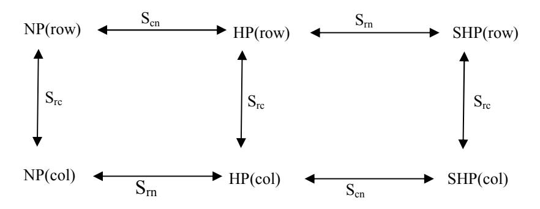

Figure 5. Symmetries and supersymmetries for Pairs

The full story is (temporarily) given by Figure 5, where double sided arrows indicate symmetries and two new rules, that remain to be identified, have been introduced: SHP(row) and SHP(col). This graph is more complex than the one we had for Singles in chapter V. For simplicity, analogies are not displayed.

#### VI.3.1. Super-Hidden-Pairs-in-rows (X-Wing-in-rows)

The SHP(row) rule is obtained from the HP(row) rule by permuting the words row and number in row-number space, according to meta-theorem 3.

Let us first do this permutation formally, i.e. by applying the  $S_{rn}$  transform to  $HP(row) = S_{cn}(NP(row))$ . Super-Hidden-Pairs-in-rows (logical formulation):

```
\begin{split} \forall n \forall r_1 \neq r_2 \forall c_1 \neq c_2 \\ & \{ \text{ rn-bivalue}(r_1, \, n, \, c_1, \, c_2) \, \& \\ & \text{ rn-bivalue}(r_2, \, n, \, c_1, \, c_2) \, \\ \Rightarrow \\ & \forall r \notin \{r_1, \, r_2\} \, \forall c \in \{c_1, \, c_2\} \text{ not-candidate}(n, \, r, \, c) \, \}. \end{split}
```

Let us now try to understand the result. First comes the literal English transcription of the logical formula:

Super-Hidden-Pairs-in-rows (English formulation): if there is a number n and there are two different rows  $r_1$  and  $r_2$  and two different columns  $c_1$  and  $c_2$  such that: the candidates (columns) of rn-cell  $(r_1, n)$  (a cell in row-number space) are  $c_1$  and  $c_2$  and no other column,

the candidates (columns) of rn-cell  $(r_2, n)$  (a cell in row-number space) are  $c_1$  and  $c_2$  and no other column,

then eliminate the two columns  $c_1$  and  $c_2$  from the rn-candidates for any other rn-cell (r, n) in row-number space.

Admittedly, this is not absolutely clear. So let us try to make it a little bit more explicit by a new equivalent formulation: if there is a number n, and there are two different rows  $r_1$  and  $r_2$ , such that, in these rows, n appears as a candidate only in columns  $c_1$  and  $c_2$ , then, in any of the two columns, eliminate n from the candidates for any row other than  $r_1$  and  $r_2$ .

Here comes the surprise: this is the usual formulation of X-Wing-in-rows – the direct proof of which is obvious (in each of the two rows there are two cells that can receive the instance of n in this row, and any two of these two instances cannot be in the same column; therefore, whatever their exact position may be in each of the two rows, there is one of them in each of the two columns; which implies that, in each of the two columns there can be no instance of n but in the two rows).

Finally, we have shown that the familiar X-Wing-in-rows rule is the super-hidden version of Naked-Pairs-in-a-row:  $SHP(row) \equiv S_{rn}(HP(row)) = X-Wing(row)$ .

#### VI.3.2. Super-Hidden-Pairs-in-columns (X-Wing-in-columns)

For completeness, let us just write the logical formulation of the SHP(col) rule. We leave it as an exercise to the reader to check that there are two paths to obtain the same result: either starting from HT(col) and applying number-column (i.e.  $S_{cn}$ ) permutation (meta-theorem 3), or starting from SHT(row) and applying row-column (i.e.  $S_{rc}$ ) permutation (meta-theorem 2). Super-Hidden-Pairs-in-columns (logical formulation):

```
\begin{split} \forall n \forall c_1 \neq c_2 \forall r_1 \neq r_2 \\ & \{ \text{ cn-bivalue}(c_1, n, r_1, r_2) \& \\ & \text{ cn-bivalue}(c_2, n, r_1, r_2) \\ \Rightarrow \\ & \forall c \notin \{c_1, c_2\} \, \forall r \in \{r_1, r_2\} \text{ not-candidate}(n, r, c) \, \}. \end{split}
```

Similarly to the previous case, we find that the familiar X-Wing-in-columns rule is the supersymmetric version of Naked-Pairs-in-a-column:

```
SHP(col) \equiv S_{cn}(HP(col)) = X-Wing(col).
```

#### VI.3.3. Final remarks

Now, several natural questions may arise in the mind of the awfully inquisitive reader, such as:

- what if, instead of applying symmetry  $S_{cn}$  to NP(row), we apply symmetry  $S_{m}$ ?
- what if we formulate a rule analogous to X-Wing-in-rows but in row-number space i.e. a rule that should be called Hidden-X-Wing-in-rows or HXW(row) or HSHP(row)?

Do we get new unknown rules? The answer is no, and the previous set of rules is strongly closed under symmetry and supersymmetry. More specifically, the real full story is not to be found in Figure 5 but in Figure 6. The practical consequence of this for the sequel is that it exempts us from searching for unknown types of rules dealing with Pairs of any kind.

After the first edition of this book was published, I was informed that the idea of "another view of fish" (i.e. of X-Wings, Swordfish and Jellyfish – see chapters VII and VIII) had already been expressed on the Sudoku Players Forum by "Arcilla". But, as it missed a formal support and the general idea of supersymmetry, it did not develop into a global framework and it led neither to the systematic relationships displayed in Figure 6 below nor to the idea of hidden chains.

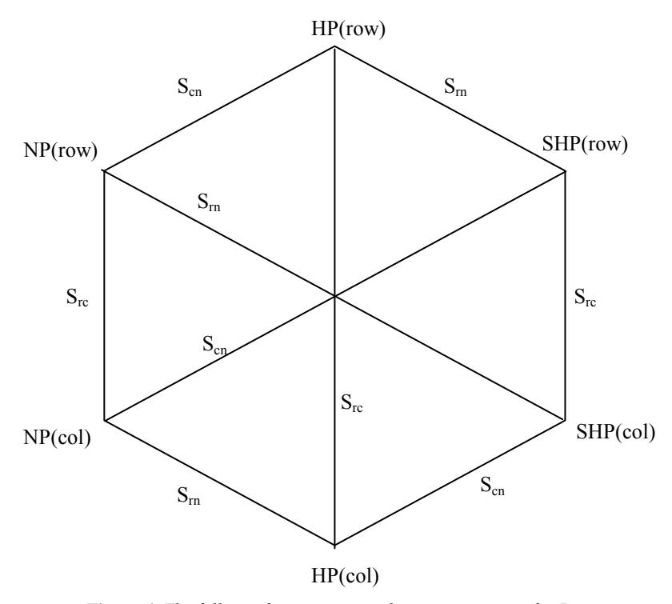

Figure 6. The full set of symmetries and supersymmetries for Pairs

It is worth checking some of the details and proving some of the above assertions. This is an easy exercise about  $S_{rc}$ ,  $S_{rn}$  and  $S_{cn}$  transforms, provided that we are very careful with the indices.

Consider atomic formula rc-bivalue( $r_i$ ,  $c_j$ ,  $n_{k1}$ ,  $n_{k2}$ ). By  $S_{cn}$ , it becomes rn-bivalue( $r_i$ ,  $n_j$ ,  $c_{k1}$ ,  $c_{k2}$ ). By  $S_{rn}$ , this last formula becomes rn-bivalue( $r_j$ ,  $n_i$ ,  $c_{k1}$ ,  $c_{k2}$ ). In turn, by  $S_{rc}$ , this becomes cn-bivalue( $c_j$ ,  $n_i$ ,  $r_{k1}$ ,  $r_{k2}$ ); notice that this is the same thing as the  $S_{rn}$  transform of the original formula. Let us now apply the same series of transformations to rule NP(row). But, let us first rewrite it with indices on the variables. NP(row):

```
\begin{split} \forall r_i \forall c_{j1} \neq & c_{j2} \forall n_{k1} \neq n_{k2} \\ & \{ \text{ rc-bivalue}(r_i, \, c_{j1}, \, n_{k1}, \, n_{k2}) \, \& \\ & \text{ rc-bivalue}(r_i, \, c_{j2}, \, n_{k1}, \, n_{k2}) \, \\ & \Rightarrow \\ & \forall c \not\in \{c_{j1}, \, c_{j2}\} \, \forall n \in \{n_{k1}, \, n_{k2}\} \, \, \text{not-candidate}(n, \, r_i, \, c) \, \}. \end{split}
```

Under S<sub>cn</sub>, this NP(row) rule becomes:

```
\begin{split} \forall r_i \forall n_{j1} \neq n_{j2} \forall c_{k1} \neq c_{k2} \\ & \{ \text{ rn-bivalue}(r_i, n_{j1}, c_{k1}, c_{k2}) \& \\ & \text{ rn-bivalue}(r_i, n_{j2}, c_{k1}, c_{k2}) \& \\ & \Rightarrow \\ & \forall n \not\in \{n_{j1}, n_{j2}\} \, \forall c \in \{c_{k1}, c_{k2}\} \text{ not-candidate}(n, r_i, c) \, \}. \end{split}
```

This is HP(row), as expected.

In turn, under S<sub>rn</sub>, this HP(row) rule becomes:

```
\begin{split} \forall n_i \forall r_{j1} \neq r_{j2} \forall c_{k1} \neq c_{k2} \\ & \{ \text{ rn-bivalue}(r_{j1}, n_i, c_{k1}, c_{k2}) \& \\ & \text{ rn-bivalue}(r_{j2}, n_i, c_{k1}, c_{k2}) \& \\ & \Rightarrow \\ & \forall r \notin \{r_{j1}, r_{j2}\} \, \forall c \in \{c_{k1}, c_{k2}\} \text{ not-candidate}(n_i, r, c) \, \}. \end{split}
```

This is not NP(col), but SHP(row) as expected.

Now comes the new part of the relationships. When submitted to  $S_{cn}$ , the above SHP(row) becomes:

```
\begin{split} \forall c_i \forall r_{j1} \neq r_{j2} \forall n_{k1} \neq n_{k2} \\ & \{ \text{ rc-bivalue}(r_{j1}, \, c_i, \, n_{k1}, \, n_{k2}) \, \& \\ & \text{ rc-bivalue}(r_{j2}, \, c_i, \, n_{k1}, \, n_{k2}) \, \& \\ & \Rightarrow \\ & \forall r \not \in \{r_{j1}, \, r_{j2}\} \, \forall n \in \{n_{k1}, \, n_{k2}\} \, \, \text{not-candidate}(n, \, r, \, c_i) \, \}. \end{split}
```

This is NP(col), as stated in Figure 6.

#### VI.3.4. X-Wing examples

Let us start with a simple example of a puzzle (Royle17-6973, Figure 7) whose L1\_0+NP+HP (or L1\_0) elaboration has a solution path starting with an X-Wing and requiring only this rule (in addition to lots of NS and HS).

Resolution path in L1\_0+NP+HP+SHP for the L1\_0+NP+HP (or L1\_0) elaboration of Royle17-6973:

```
x-wing-in-columns n5{r1 r7}{c1 c7} ==> r7c5 \neq 5 hidden-single-in-a-block ==> r9c5 = 5 x-wing-in-columns n5{r1 r7}{c1 c7} ==> r1c3 \neq 5 ... (Naked-Singles and Hidden-Singles)
```

|   |   |   | 2 |   |   |   | 3 | 4 |
|---|---|---|---|---|---|---|---|---|
| 1 |   | 8 |   | 6 |   |   |   |   |
|   |   |   |   |   |   |   |   |   |
|   | 4 |   | 5 |   |   |   | 2 |   |
|   |   |   |   | 1 |   | 8 |   |   |
| 7 |   |   |   |   |   |   |   |   |
|   | 2 |   | 4 |   | 3 |   |   |   |
| 6 |   |   |   |   |   | 1 |   |   |
|   |   |   |   |   |   |   |   |   |

|   |   |   | 2 | 8 | 1 |   | 3 | 4 |
|---|---|---|---|---|---|---|---|---|
| 1 |   | 8 |   | 6 | 4 | 2 |   |   |
| 4 |   | 2 |   |   | 5 |   | 1 | 8 |
| 8 | 4 | 6 | 5 | 3 |   |   | 2 | 1 |
| 2 |   | 3 | 6 | 1 |   | 8 | 4 |   |
| 7 | 1 |   | 8 | 4 | 2 | 3 | 6 |   |
|   | 2 | 1 | 4 |   | 3 |   | 8 | 6 |
| 6 |   | 4 |   | 2 | 8 | 1 |   | 3 |
| 3 | 8 |   | 1 |   | 6 | 4 |   | 2 |

|   | 9 | 6 | 7 | 2 | 8 | 1 | 5 | 3 | 4 |
|---|---|---|---|---|---|---|---|---|---|
|   | 1 | 5 | 8 | 3 | 6 | 4 | 2 | 9 | 7 |
|   | 4 | 3 | 2 | 7 | 9 | 5 | 6 | 1 | 8 |
|   | 8 | 4 | 6 | 5 | 3 | 9 | 7 | 2 | 1 |
|   | 2 | 9 | 3 | 6 | 1 | 7 | 8 | 4 | 5 |
|   | 7 | 1 | 5 | 8 | 4 | 2 | 3 | 6 | 9 |
|   | 5 | 2 | 1 | 4 | 7 | 3 | 9 | 8 | 6 |
|   | 6 | 7 | 4 | 9 | 2 | 8 | 1 | 5 | 3 |
| l | 3 | 8 | 9 | 1 | 5 | 6 | 4 | 7 | 2 |

Figure 7. Puzzle Royle17-6973, its L1\_0 elaboration and its solution

|           | cl  | <i>c</i> 2     | <i>c3</i> | c4       | <i>c</i> 5 | <i>c</i> 6 | <i>c</i> 7     | c8         | <i>c</i> 9 |           |
|-----------|-----|----------------|-----------|----------|------------|------------|----------------|------------|------------|-----------|
| r1        | 5 9 | <b>5</b> 6 7 9 | <u>5</u>  | 2        | 8          | 1          | <b>5</b> 6 7 9 | 3          | 4          | r1        |
| r2        | 1   | 3<br>5<br>7 9  | 8         | 3<br>7 9 | 6          | 4          | 2              | 5 6<br>7 9 | 5 6<br>7 9 | r2        |
| r3        | 4   | 3<br>6<br>7 9  | 2         | 3<br>7 9 | 7 9        | 5          | 6<br>7 9       | 1          | 8          | r3        |
| r4        | 8   | 4              | 6         | 5        | 3          | 7 9        | 7 9            | 2          | 1          | r4        |
| r5        | 2   | 5 9            | 3         | 6        | 1          | 7 9        | 8              | 4          | 5<br>7 9   | r5        |
| r6        | 7   | 1              | 5 9       | 8        | 4          | 2          | 3              | 6          | 5 9        | r6        |
| <i>r7</i> | 5 9 | 2              | 1         | 4        | <b>5</b>   | 3          | <b>5</b> 7 9   | 8          | 6          | <i>r7</i> |
| r8        | 6   | 5<br>7 9       | 4         | 7 9      | 2          | 8          | 1              | 5<br>7 9   | 3          | r8        |
| r9        | 3   | 8              | 5<br>7 9  | 1        | 5<br>7 9   | 6          | 4              | 5<br>7 9   | 2          | r9        |
| 1         | c1  | <i>c</i> 2     | <i>c3</i> | c4       | c5         | <i>c6</i>  | <i>c</i> 7     | c8         | c9         |           |

Figure 8. Grid Royle17-6073\* in rc-space, with the remaining candidates

It is worth dwelling a little on the situation for the candidate sets after propagation of all the elementary constraints has occurred (Figure 8), which corresponds to starting from the second grid in Figure 7 (call it Royle17-6973\*).

One can see lots of Naked-Pairs and Naked-Triplets (see next chapter for a definition) in rows, columns and blocks; but none of them can produce any new result. In columns c1 and c7, one can also see our X-Wing for number 5: in these two columns, this number appears only in rows r1 and r7. Therefore one can delete number 5 from any cell in rows r1 and r7 unless it is in column c1 or c7, i.e. in this case from cells r7c5, r1c2, r1c3. (In the above listing, deletion of 5 from r1c2 is interrupted by the application of a simpler rule, a mere artifact of SudoRules).

|      | cl | <i>c</i> 2      | <i>c3</i>    | <i>c4</i> | <i>c</i> 5 | <i>c</i> 6 | <i>c</i> 7    | c8       | c9       |    |
|------|----|-----------------|--------------|-----------|------------|------------|---------------|----------|----------|----|
| n1   | 2  | 6               | 7            | 9         | 5          | 1          | 8             | 3        | 4        | n1 |
| n2   | 5  | 7               | 3            | 1         | 8          | 6          | 2             | 4        | 9        | n2 |
| n3   | 9  | 2 3             | 5            | 2 3       | 4          | 7          | 6             | 1        | 8        | п3 |
| n4   | 3  | 4               | 8            | 7         | 6          | 2          | 9             | 5        | 1        | n4 |
| n5   | 7  | 1 2<br>5<br>8   | <u>1</u> 6 9 | 4         | <u>7</u> 9 | 3          | 1<br>7        | 2<br>8 9 | 2<br>5 6 | n5 |
| п6   | 8  | 1 3             | 4            | 5         | 2          | 9          | 1 3           | 6        | 7        | п6 |
| n7   | 6  | 1 2 3           | 1 9          | 2 3       | 3<br>7 9   | 4 5        | 1 3<br>4<br>7 | 2<br>8 9 | 2<br>5   | n7 |
| n8   | 4  | 9               | 2            | 6         | 1          | 8          | 5             | 7        | 3        | n8 |
| n9   | 7  | 1 2 3<br>5<br>8 | 1<br>6<br>9  | 2 3       | 3<br>7 9   | 4 5        | 1 3<br>4<br>7 | 2<br>8 9 | 2<br>5 6 | n9 |
| , —— | c1 | <i>c</i> 2      | <i>c3</i>    | <i>c4</i> | <i>c</i> 5 | <i>c</i> 6 | <i>c</i> 7    | c8       | с9       |    |

Figure 9. Grid Royle17-6073\* in cn-space, with the remaining candidates. Remember that numbers in the cn-cells represent column-candidates for these cells

This example is ideal for illustrating how a case of an X-Wing-in-columns can easily be detected in number-column representation: exactly as a Naked-Pairs in rows would be in row-column representation (Figure 9). Remember that "blocks" have no meaning in cn-space (i.e. there are no constraints on values in the same pseudo-block).

Here, in simili-row 5, one can see a simili Naked-Pairs in columns c1 and c7 for values 1 and 7 (i.e. rows r1 and r7). Application of simili NP(row), eliminates 1 (i.e. r1) from n5c2 and n5c3 and 7 (i.e. r7) from n5c5 – which corresponds exactly to eliminating number 5 from r1c2, r1c3 and r7c5, as we did in the previous row-column representation.

From this representation in cn-space, several things can be noted:

- there is a Hidden-Pairs in column c1 for numbers 5 and 9 and rows r1 and r7 (appearing here as a Naked-Pairs); but this is not useful, since there remains no candidate to eliminate in this column;
- there are lots of Hidden-Triplets and Hidden-Quadruplets (see definition in next chapters), nearly in every column (appearing here as Naked-Triplets and Naked-Quadruplets); but they are not useful, for the same reason as above;
- there is an X-Wing-in-columns c2 and c4 with rows r2 and r3 for number 3 (appearing here as a simili Naked-Pairs in simili-row 3 for values 2 and 3); but this is not useful, since there remains nothing to eliminate in this simili-row;
- finally, there is our X-Wing-in-columns c1 and c7 with rows r1 and r7 for number 5 (i.e. appearing here as a Naked-Pairs in simili-row 5 for columns c1 and c7): the candidates for these two cn-cells contain only rows r1 and r7.

As a conclusion of this example, if you don't like looking for Hidden-Pairs and/or X-Wings, just transpose your grids into rn- and cn- spaces and look for Naked Pairs. Of course, this is a lot of paper scratching and you'd probably better have a computer do it for you. Will this change your interest in Sudoku? Again, I think doing so hard paper work is not worth for puzzles that can be solved using only Subset (and Interaction) rules. But when complex chain rules are needed, it may allow you to solve puzzles you'd never imagined you could have solved.

Our second example (puzzle Royle17-5499, Figure 10) illustrates how it may be necessary to combine X-Wing and Naked-Pairs.

|   |   |   | 7 |   | 8 |   | 2 |   |   |   |   | 7 | 1 | 8 |   | 2 |   | 6 | 4 | 3 | 9 | 7 | 1 | 8 | 5 | 2 |
|---|---|---|---|---|---|---|---|---|---|---|---|---|---|---|---|---|---|---|---|---|---|---|---|---|---|---|
|   |   |   | 2 | 8 |   |   |   |   |   |   |   | 2 | 8 | 4 | 1 | 3 |   | 7 | 5 | 9 | 6 | 2 | 8 | 4 | 1 | 3 |
| 1 |   |   |   |   |   |   |   | 1 | 8 | 2 |   | 4 | 3 |   |   |   |   | 1 | 8 | 2 | 5 | 4 | 3 | 9 | 6 | 7 |
| 5 |   |   |   |   |   | 4 |   | 5 |   |   | 7 |   | 9 | 2 | 4 |   |   | 5 | 3 | 8 | 7 | 1 | 9 | 2 | 4 | 6 |
|   | 7 |   | 6 |   |   |   |   |   | 7 |   | 2 | 6 |   | 3 |   |   |   | 4 | 7 | 1 | 2 | 6 | 5 | 3 | 8 | 9 |
|   |   | 3 |   |   |   |   |   | 2 |   |   | 3 |   |   |   |   |   |   | 2 | 9 | 6 | 3 | 8 | 4 | 1 | 7 | 5 |
|   |   | 1 |   |   | 5 | 3 |   |   |   |   | 1 | 9 | 2 | 5 | 3 |   |   | 8 | 6 | 7 | 1 | 9 | 2 | 5 | 3 | 4 |
|   | 2 |   |   |   | 7 |   |   |   | 2 |   | 8 |   | 6 | 7 | 9 |   |   | 3 | 2 | 4 | 8 | 5 | 6 | 7 | 9 | 1 |
|   |   | 4 |   |   |   |   |   |   |   |   | 4 |   | 7 |   | 2 |   | 1 | 9 | 1 | 5 | 4 | 3 | 7 | 6 | 2 | 8 |

Figure 10. Puzzle Royle17-5499, its L1 0 elaboration and its solution

```
Resolution path in L1_0+NP+HP+SHP for the L1_0 elaboration of Royle17-5499: naked-pairs-in-a-column {n3 n5}{r8 r9}c5 ==> r6c5 \neq 5 x-wing-in-rows n1{r5 r8}{c3 c9} ==> r9c9 \neq 1, r9c3 \neq 1, r6c9 \neq 1, r6c3 \neq 1, r4c9 \neq 1 naked-pairs-in-a-column {n6 n8}{r4 r9}c9 ==> r7c9 \neq 8 ... (Naked-Singles and Hidden-Singles)
```

Finally, our third example (puzzle Royle17-32408, Figure 11) illustrates how things can be more complex, even when only rules for Singles and Pairs are needed to solve a puzzle; its solution combines two kinds of Naked-Pairs (in rows and in blocks), two kinds of Hidden-Pairs (in rows and in blocks) and two X-Wings (in columns).

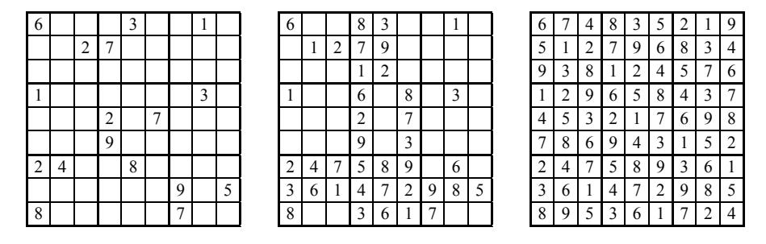

Figure 11. Puzzle Royle17-32408, its L1 0 elaboration and its solution

```
Resolution path in L1_0+NP+HP+SHP for the L1_0 elaboration of Royle17-32408: naked-pairs-in-a-row {n4 n5}r2{c1 c8} ==> r2c9 \neq 4, r2c7 \neq 5, r2c7 \neq 4, r2c6 \neq 5, r2c6 \neq 4 naked-single ==> r2c6 = 6 naked-pairs-in-a-block {n3 n8}{r2c7 r2c9} ==> r3c9 \neq 8, r3c9 \neq 3, r3c7 \neq 8, r3c7 \neq 3
```

```
hidden-pairs-in-a-row {n3 n8} r3 {c2 c3} ==> r3c3 \neq 9, r3c3 \neq 5, r3c3 \neq 4, r3c2 \neq 9, r3c2 \neq 7, r3c2 \neq 5

x-wing-in-columns n9 {r3 r5} {c1 c8} ==> r5c9 \neq 9, r5c3 \neq 9, r5c2 \neq 9, r3c9 \neq 9

x-wing-in-columns n7 {r3 r6} {c1 c8} ==> r6c9 \neq 7, r6c2 \neq 7, r3c9 \neq 7

hidden-pairs-in-a-block {n7 n9} {r1c9 r3c8} ==> r3c8 \neq 5, r3c8 \neq 4, r1c9 \neq 4, r1c9 \neq 2

hidden-single-in-a-block ==> r1c7 = 2

naked-pairs-in-a-row {n4 n5} r4{c5 c7} ==> r4c9 \neq 4, r4c3 \neq 5, r4c3 \neq 4

... (Naked-Singles)
```

#### VI.4. Theory L2

Let us define theory L2 as the union of L1 (whose definition will be completed in chapter IX) with the set of rules defined in the present chapter:

```
NP = \{NP(row), NP(col), NP(blk)\},
HP = \{HP(row), HP(col), HP(blk)\},
SHP = \{SHP(row), SHP(col)\},
L2 = L1 \cup NP \cup HP \cup SHP.
```

At level L2, there will be no additional rules. Notice that the symmetry relationships described by Figure 6 show that L2 is supersymmetric.

### Chapter VII

# Subset rules, level three: Triplets

Chapter VI has illustrated in full detail our approach on all rules relative to Pairs. In this chapter, we shall not write the rules relative to Triplets with all the details given for Pairs. Instead, we shall leave part of this work to the reader and concentrate on features that Pairs did not exhibit, particularly in what concerns the way these rules must be formulated.

The following familiar rules will be studied and their relations through symmetry, analogy and supersymmetry will be established:

- Naked-Triplets-in-a-row, or NT(row) for short;
- Naked-Triplets-in-a-column, or NT(col) for short;
- Naked-Triplets-in-a-block, or NT(blk) for short;
- Hidden-Triplets-in-a-row, or HT(row) for short;
- Hidden-Triplets-in-a-column, or HT(col) for short;
- Hidden-Triplets-in-a-block, or HT(blk) for short.

The super hidden version of each of these rules will also be introduced and proven to be respectively equivalent to the more familiar Swordfish-in-rows and Swordfish-in-columns:

- Super-Hidden-Triplets-in-rows, or SHT(row) for short;
- Super-Hidden-Triplets-in-columns, or SHT(col) for short.

This will give a graph of symmetries (Figure 1, where analogies are not displayed) similar to the one we had for Pairs.

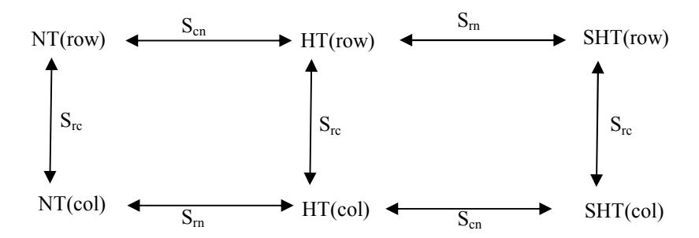

Figure 1. Symmetries and supersymmetries for Triplets

But, again, this is not the full story. Since the number of cells (and quantifiers) concerned by these rules is higher than in the case of Pairs, one may fear that the real full story is awfully more complicated – but this is not true. As in the case of Pairs, it is to be found in Figure 2. The additional symmetries can be proved easily by checking the precise logical formulation of all the rules, exactly as was done for Pairs

#### VII.1. Naked-Triplets

#### VII.1.1. Naked-Triplets-in-a-row

Let us first recall several frequent formulations of the Naked-Triplets-in-a-row rule and show the problems they raise.

Naked-Triplets-in-a-row (first tentative formulation, sometimes called Strict-Naked-Triplets): if there is a row and there are three numbers and three cells in this row whose remaining candidates are exactly these three numbers, then remove these three numbers from the candidates for the other cells in this row. The rule is obviously valid, by an argument similar to the case of Naked-Pairs. (Each of the three cells must get a unique value and only three values are available for them; therefore, whatever distribution is made between them, none of these three values remains available for the other cells in the same row). But there is a major problem: it is unnecessarily restrictive and situations where it can be applied are very rare.

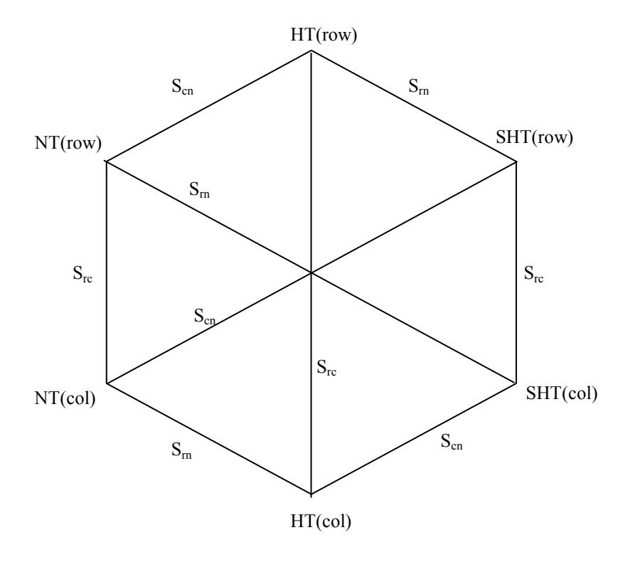

Figure 2. The full set of symmetries and supersymmetries for Triplets

Naked-Triplets-in-a-row (second tentative formulation, sometimes called Comprehensive-Naked-Triplets): if there is a row and there are three numbers and three cells in this row such that all their candidates are among these three numbers, then remove these three numbers from the candidates for the other cells in this row. Again, this rule is obviously valid and the argument for it is totally unchanged. (Each of the three cells must get a unique value and only three values are available for them; therefore, whatever distribution is made between them of these three values, none of these three values remains available for the other cells in the same row). Being more general than the first formulation (the only difference is that each cell can have missing values among the three), the second should be preferred. But, again, there are important drawbacks: it includes Naked-Pairs-in-a-row and even Naked-Single-in-a-row as special cases.

So, neither of the two usual formulations of the Naked-Triplets rule is correct according to our guiding principles. How then can one formulate this rule so that it is comprehensive but does not subsume Naked-Pairs-in-a-row or Naked-Single-in-a-row? It is enough to make certain that the three cells have no candidate other than the three given numbers (say  $n_1$ ,  $n_2$  and  $n_3$ ), that each of them has more than one candidate and that no two of them have exactly the same two candidates. The only way to do this is to impose candidates  $n_1$  and  $n_2$  for cell 1, candidates  $n_2$  and  $n_3$  for cell 2 and candidates  $n_3$  and  $n_1$  for cell 3. We get the final formulation, more complex than the usual ones but with its full natural scope:

Naked-Triplets-in-a-row (final English formulation): if there is a row r and there are three different columns  $c_1$ ,  $c_2$  and  $c_3$  and three different numbers  $n_1$ ,  $n_2$  and  $n_3$ , such that:

```
cell (r, c_1) has n_1 and n_2 among its candidates, cell (r, c_2) has n_2 and n_3 among its candidates, cell (r, c_3) has n_3 and n_1 among its candidates, none of the cells (r, c_1), (r, c_2) and (r, c_3) has any candidate other than n_1, n_2 or n_3, then eliminate the three numbers n_1, n_2 and n_3 from the candidates for any other cell in row r
```

Remembering the auxiliary predicates we introduced for Naked-Pairs, we may be tempted to introduce a predicate rc-trivalue. That would be fine for the strict version of Naked-Triplets rules but that would not simplify much the present formulation. We therefore choose to write everything in full detail.

The logical formulation of the Naked-Triplets-in-a-row rule parallels strictly the English one:

```
 \forall r \forall 3 \neq c_1 c_2 c_3 \forall 3 \neq n_1 n_2 n_3 \\ \{ \text{ candidate}(n_1, \, r, \, c_1) \& \text{ candidate}(n_2, \, r, \, c_1) \& \\ \forall n \notin \{n_1, \, n_2, \, n_3\} \text{ not-candidate}(n, \, r, \, c_1) \& \\ \text{ candidate}(n_2, \, r, \, c_2) \& \text{ candidate}(n_3, \, r, \, c_2) \& \\ \forall n \notin \{n_1, \, n_2, \, n_3\} \text{ not-candidate}(n, \, r, \, c_2) \& \\ \text{ candidate}(n_3, \, r, \, c_3) \& \text{ candidate}(n_1, \, r, \, c_3) \& \\ \forall n \notin \{n_1, \, n_2, \, n_3\} \text{ not-candidate}(n, \, r, \, c_3) \\ \Rightarrow \\ \forall c \notin \{c_1, \, c_2, \, c_3\} \forall n \in \{n_1, \, n_2, \, n_3\} \text{ not-candidate}(n, \, r, \, c) \}.
```

Later, this clarification of Naked-Triplets will allow us to show how close it is to XY-Wing and to xy3-chains, but also why it should not be reduced to them.

#### VII.1.2. Naked-Triplets-in-a-column

Starting from the Naked-Triplets-in-a-row rule, meta-theorem 1 gives the Naked-Triplets-in-a-column rule. Of course, the validity of this rule can also be checked directly.

Naked-Triplets-in-a-column (final English formulation): if there is a column and there are three different rows  $r_1$ ,  $r_2$  and  $r_3$  and three different numbers  $n_1$ ,  $n_2$  and  $n_3$ , such that:

```
cell (r, c_1) has n_1 and n_2 among its candidates, cell (r, c_2) has n_2 and n_3 among its candidates, cell (r, c_3) has n_3 and n_1 among its candidates, none of the cells (r_1, c), (r_2, c) and (r_3, c) has any candidate other than n_1, n_2 or n_3, then eliminate the three numbers n_1, n_2 and n_3 from the candidates for any other cell in column c.
```

The logical formulation of Naked-Triplets-in-a-column parallels strictly the English one:

```
 \forall c \forall 3 \neq r_1 r_2 r_3 \forall 3 \neq n_1 n_2 n_3 \\ \{ candidate(n_1, \, r_1, \, c) \, \& \, candidate(n_2, \, r_1, \, c) \, \& \\ \forall n \notin \{n_1, \, n_2, \, n_3\} \, \, not\text{-candidate}(n, \, r_1, \, c) \, \& \\ candidate(n_2, \, r_2, \, c) \, \& \, candidate(n_3, \, r_2, \, c) \, \& \\ \forall n \notin \{n_1, \, n_2, \, n_3\} \, \, not\text{-candidate}(n, \, r_2, \, c) \, \& \\ candidate(n_3, \, r_3, \, c) \, \& \, candidate(n_1, \, r_3, \, c) \, \& \\ \forall n \notin \{n_1, \, n_2, \, n_3\} \, \, not\text{-candidate}(n, \, r_3, \, c) \\ \Rightarrow \\ \forall r \notin \{r_1, \, r_2, \, r_3\} \, \forall n \in \{n_1, \, n_2, \, n_3\} \, \, not\text{-candidate}(n, \, r, \, c) \, \}.
```

#### VII.1.3. Naked-Triplets-in-a-block

Starting from the Naked-Triplets-in-a-row rule, meta-theorem 2 gives the Naked-Triplets-in-a-block rule. The validity of the resulting rule can also easily be checked directly. The direct proof parallels strictly that of Naked-Triplets-in-a-row: each of the three cells in the block must get a unique value and only three values are available for them; therefore, whatever distribution is made between them of these three values, none of these three values remains available for the other cells in the same block

square in block b.

Naked-Triplets-in-a-block (final English formulation): if there is a block b and there are three different squares  $s_1$ ,  $s_2$  and  $s_3$  in this block and three different numbers  $n_1$ ,  $n_2$  and  $n_3$ , such that:

```
cell [b, s_1] has n_1 and n_2 among its candidates, cell [b, s_2] has n_2 and n_3 among its candidates, cell [b, s_3] has n_3 and n_1 among its candidates, none of the cells [b, s_1], [b, s_2] and [b, s_3] has any candidate other than n_1, n_2 or n_3, then eliminate the three numbers n_1, n_2 and n_3 from the candidates for any other
```

The logical formulation of Naked-Triplets-in-a-block parallels strictly the English one:

```
 \forall b \forall 3 \neq s_1 s_2 s_3 \forall 3 \neq n_1 n_2 n_3 \\ \{ \ candidate[n_1, \ b, \ s_1] \ \& \ candidate[n_2, \ b, \ s_1] \ \& \\ \forall n \notin \{n_1, \ n_2, \ n_3\} \ not\text{-candidate}[n, \ b, \ s_1] \ \& \\ \ candidate[n_2, \ b, \ s_2] \ \& \ candidate[n_3, \ b, \ s_2] \ \& \\ \ \forall n \notin \{n_1, \ n_2, \ n_3\} \ not\text{-candidate}[n, \ b, \ s_2] \ \& \\ \ candidate[n_3, \ b, \ s_3] \ \& \ candidate[n_1, \ b, \ s_3] \ \& \\ \ \forall n \notin \{n_1, \ n_2, \ n_3\} \ not\text{-candidate}[n, \ b, \ s_3] \\ \Rightarrow \\ \ \forall s \notin \{s_1, \ s_2, \ s_3\} \ \forall n \in \{n_1, \ n_2, \ n_3\} \ not\text{-candidate}[n, \ b, \ s] \ \}.
```

#### VII.1.4. Naked-Triplets examples

One of the simplest examples of a Naked-Triplets is puzzle Royle17-11200 (Figure 3), whose L2+NT and L1 elaborations coincide.

|   |   | 8 |   |   |   |   | 2 |
|---|---|---|---|---|---|---|---|
| 1 |   |   |   |   | 3 |   |   |
| 7 | 4 |   |   |   |   |   |   |
|   |   | 2 |   | 3 | 5 |   |   |
| 5 |   |   |   |   |   | 1 |   |
|   |   | 6 |   |   |   |   |   |
|   |   |   | 1 |   |   | 7 |   |
| 3 | 2 |   |   |   |   |   |   |
|   | 8 |   |   |   |   |   |   |

|   | 3 |   | 8 |   | 7 | 1 |   | 2 |
|---|---|---|---|---|---|---|---|---|
| 1 |   | 8 |   | 2 |   | 3 |   | 7 |
| 7 | 4 | 2 | 1 | 3 |   |   | 8 |   |
| 8 | 1 | 6 | 2 | 7 | 3 | 5 | 9 | 4 |
| 5 | 7 | 3 |   |   |   | 2 | 1 | 6 |
| 2 | 9 | 4 | 6 | 5 | 1 | 7 | 3 | 8 |
|   |   |   |   | 1 | 2 | 8 | 7 |   |
| 3 | 2 |   |   |   |   |   |   |   |
|   | 8 |   |   |   |   |   | 2 |   |

| 9 | 3 | 5 | 8 | 4 | 7 | 1 | 6 | 2 |
|---|---|---|---|---|---|---|---|---|
| 1 | 6 | 8 | 5 | 2 | 9 | 3 | 4 | 7 |
| 7 | 4 | 2 | 1 | 3 | 6 | 9 | 8 | 5 |
| 8 | 1 | 6 | 2 | 7 |   |   | 9 | 4 |
| 5 | 7 | 3 | 9 | 8 | 4 | 2 | 1 | 6 |
| 2 | 9 | 4 | 6 | 5 | 1 | 7 | 3 | 8 |
| 6 | 5 | 9 | 4 | 1 | 2 | 8 | 7 | 3 |
| 3 | 2 | 1 | 7 | 6 | 8 | 4 | 5 | 9 |
| 4 | 8 | 7 | 3 | 9 | 5 | 6 | 2 | 1 |

Figure 3. Puzzle Royle17-11200, its L1 elaboration and its solution

```
Resolution path in L2+NT for the L2 (or L1) elaboration of Royle17-11200: row r2 interaction-with-block b2 ==> r3c6 \neq 9, r1c5 \neq 9 row r7 interaction-with-block b7 ==> r9c1 \neq 6 column c7 interaction-with-block b9 ==> r8c8 \neq 4 naked-pairs-in-a-column {n5 n9} {r1 r7}c3 ==> r9c3 \neq 9, r9c3 \neq 5, r8c3 \neq 9, r8c3 \neq 5 block b7 interaction-with-row r7 ==> r7c9 \neq 5, r7c4 \neq 5 naked-triplets-in-a-row {n9 n4 n6}r9{c1 c5 c7} ==> r9c9 \neq 9, r9c6 \neq 9, r9c6 \neq 6, r9c6 \neq 4 ... (Naked-Singles)
```

Our second example (puzzle Royle17-23317, Figure 4) is more complex. Several interaction and L2 rules are applied during the L2 elaboration process, they allow the elimination of some candidates but they do not produce many values. Thus, the L2 elaboration still requires the application of two NP(col) and two HP(row) in addition to NT(col).

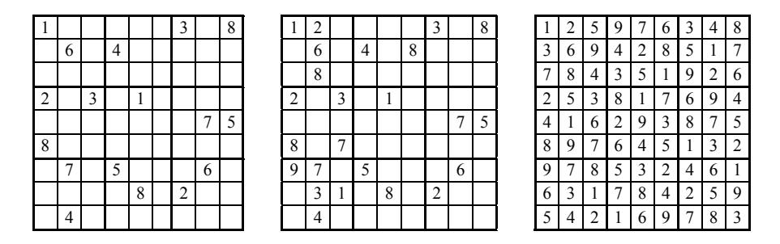

Figure 4. Puzzle Royle17-23337, its L1 elaboration and its solution

```
Resolution path in L2+NT for the L2 elaboration of Royle17-23317: row r1 interaction-with-block b2 ==> r3c6 \neq 7, r3c5 \neq 7, r3c4 \neq 7, r2c5 \neq 7, r3c6 \neq 6, r3c5 \neq 6, r3c4 \neq 6 row r5 interaction-with-block b5 ==> r6c6 \neq 3, r6c5 \neq 3, r6c4 \neq 3, r6c6 \neq 2, r6c5 \neq 2, r6c4 \neq 2 row r2 interaction-with-block b3 ==> r3c9 \neq 1, r3c8 \neq 1, r3c7 \neq 1 naked-pairs-in-a-column {n5 n6} {r8 r9}c1 ==> r3c1 \neq 5, r2c1 \neq 5 column c1 interaction-with-block b7 ==> r9c3 \neq 5 hidden-pairs-in-a-row {n2 n3}r6{c8 c9} ==> r6c9 \neq 9, r6c9 \neq 6, r6c9 \neq 4, r6c9 \neq 1, r6c8 \neq 9, r6c8 \neq 4, r6c8 \neq 1 block b6 interaction-with-column c7 ==> r9c7 \neq 1, r7c7 \neq 1, r2c7 \neq 1 naked-triplets-in-a-column {n7 n9 n6}{r1 r6 r8}c4 ==> r9c4 \neq 9, r9c4 \neq 7, r9c4 \neq 6, r5c4 \neq 9, r4c4 \neq 9, r4c4 \neq 7 hidden singles ==> r4c6 = 7, r4c2 = 5 row r4 interaction-with-block b6 ==> r6c7 \neq 9, r5c7 \neq 9, r6c7 \neq 4 hidden-pairs-in-a-row {n4 n5}r6{c5 c6} ==> r6c6 \neq 9
```

```
hidden-pairs-in-a-row {n4 n5}r6{c5 c6} ==> r6c6 \neq 6, r6c5 \neq 9, r6c5 \neq 6 block b5 interaction-with-column c4 ==> r8c4 \neq 6, r1c4 \neq 6 naked-pairs-in-a-column {n7 n9}{r1 r8}c4 ==> r6c4 \neq 9 ... (Naked-Singles and Hidden-Singles)
```

#### VII.2. Hidden-Triplets

As can be seen from the following formulations, stating the Hidden-Triplets rules with their appropriate scope would not be an obvious task if we could not rely on the previous formulation of the rules for Naked Triplets and on meta-theorem 3.

#### VII.2.1. Hidden-Triplets-in-a-row

To obtain the Hidden-Triplets-in-a-row rule, we just apply meta-theorem 3 to the Naked-Triplets-in-a-row rule, permuting the words "number" and "column". That is, once transposed in row-number space, a Naked-Triplets-in-a-row looks graphically like a Naked-Triplets-in-a-row does in row-column space.

Hidden-Triplets-in-a-row (final English formulation): if there is a row r, and there are three different numbers  $n_1$ ,  $n_2$  and  $n_3$  and three different columns  $c_1$ ,  $c_2$  and  $c_3$ , such that:

rn-cell  $(r, n_1)$  (in row-number space) has  $c_1$  and  $c_2$  among its candidates (columns), rn-cell  $(r, n_2)$  (in row-number space) has  $c_2$  and  $c_3$  among its candidates (columns), rn-cell  $(r, n_3)$  (in row-number space) has  $c_3$  and  $c_1$  among its candidates (columns), none of the rn-cells  $(r, n_1)$ ,  $(r, n_2)$  and  $(r, n_3)$  (in row-number space) has any remaining candidate (column) other than  $c_1$ ,  $c_2$  and  $c_3$ ,

then eliminate the three columns  $c_1$ ,  $c_2$  and  $c_3$  from the candidates for any other rncell (r, n) in row r in row-number space.

The logical formulation of Hidden-Triplets-in-a-row parallels strictly the English one (and is also a direct transposition, i.e. the  $S_{cn}$  transform, of the formal Naked-Triplets-in-a-row rule):

```
 \forall r \forall 3 \neq n_1 n_2 n_3 \forall 3 \neq c_1 c_2 c_3 \\ \{ \text{ candidate}(n_1, \, r, \, c_1) \, \& \, \text{ candidate}(n_1, \, r, \, c_2) \, \& \\ \forall c \not\in \{c_1, \, c_2, \, c_3\} \, \text{ not-candidate}(n_1, \, r, \, c) \, \& \\ \text{ candidate}(n_2, \, r, \, c_2) \, \& \, \text{ candidate}(n_2, \, r, \, c_3) \, \& \\ \forall c \not\in \{c_1, \, c_2, \, c_3\} \, \text{ not-candidate}(n_2, \, r, \, c) \, \& \\ \text{ candidate}(n_3, \, r, \, c_3) \, \& \, \text{ candidate}(n_3, \, r, \, c_1) \, \& \\ \forall c \not\in \{c_1, \, c_2, \, c_3\} \, \text{ not-candidate}(n_3, \, r, \, c) \\ \Rightarrow \\ \forall n \not\in \{n_1, \, n_2, \, n_3\} \, \forall c \in \{c_1, \, c_2, \, c_3\} \, \text{ not-candidate}(n, \, r, \, c) \, \}.
```

#### VII.2.2. Hidden-Triplets-in-a-column and Hidden-Triplets-in-a-block

Hidden-Triplets-in-a-column can be obtained by following two converging paths: either by applying meta-theorem 3 to Naked-Triplets-in-a-column and permuting the words "number" and "row", or by applying meta-theorem 1 to rule Hidden-Triplets-in-a-row and permuting the words "row" and "column".

Hidden-Triplets-in-a-block can be obtained by applying meta-theorem 3 to Naked-Triplets-in-a-row. Its validity is also very easy to check directly.

The detailed writing of both rules is left as an exercise to the reader.

#### VII.2.3. Hidden-Triplets example

In our databases, puzzle Royle17-13727 (Figure 5) is the one with the shortest resolution path (apart from NS and HS) among those requiring HT.

|   |   | 9 | 6 |   | 5 |   |   |   |   |   | 9 | 6 |   | 5 | 1 |   |   | 2 | 4 | 9 | 6 | 3 | 5 | 1 | 7 | 8 |
|---|---|---|---|---|---|---|---|---|---|---|---|---|---|---|---|---|---|---|---|---|---|---|---|---|---|---|
|   | 1 |   |   |   |   |   | 2 |   |   | 1 |   |   |   |   |   | 2 |   | 7 | 1 | 6 | 4 | 9 | 8 | 3 | 2 | 5 |
|   |   |   |   |   |   |   |   |   |   |   | 8 | 1 |   |   |   |   |   | 3 | 5 | 8 | 1 | 7 | 2 | 4 | 6 | 9 |
|   |   |   | 8 |   |   |   | 1 | 3 |   |   | 2 | 8 | 5 | 7 | 6 | 1 | 3 | 4 | 9 | 2 | 8 | 5 | 7 | 6 | 1 | 3 |
| 5 |   | 7 | 9 |   |   |   |   |   | 5 | 3 | 7 | 9 | 6 | 1 | 2 |   |   | 5 | 3 | 7 | 9 | 6 | 1 | 2 | 8 | 4 |
| 6 |   |   |   |   |   |   |   |   | 6 | 8 | 1 |   |   |   | 9 |   |   | 6 | 8 | 1 | 2 | 4 | 3 | 9 | 5 | 7 |
|   | 2 |   |   | 1 |   |   |   |   |   | 2 |   |   | 1 |   |   |   |   | 9 | 2 | 5 | 7 | 1 | 4 | 8 | 3 | 6 |
| 8 |   |   |   |   |   | 7 |   |   | 8 |   |   |   |   |   | 7 |   | 1 | 8 | 6 | 3 | 5 | 2 | 9 | 7 | 4 | 1 |
|   |   |   |   |   |   | 5 |   |   | 1 |   |   |   |   |   | 5 |   | 2 | 1 | 7 | 4 | 3 | 8 | 6 | 5 | 9 | 2 |

Figure 5. Puzzle Royle17-13727, its L2 elaboration and its solution

```
Resolution path in L2+NT+HT for the L2 elaboration of Royle17-13727: row r5 interaction-with-block b6 ==> r6c9 \neq 4, r6c8 \neq 4 hidden-pairs-in-a-row \{n5 \ n6\}r2\{c3 \ c9\} ==> r2c9 \neq 9 row r2 interaction-with-block b2 ==> r3c6 \neq 9, r3c5 \neq 9 hidden-pairs-in-a-row \{n5 \ n6\}r2\{c3 \ c9\} ==> r2c9 \neq 8, r2c9 \neq 7, r2c9 \neq 4, r2c3 \neq 4 column c3 interaction-with-block b7 ==> r9c2 \neq 4, r8c2 \neq 4, r7c1 \neq 4 hidden-pairs-in-a-row \{n5 \ n6\}r2\{c3 \ c9\} ==> r2c3 \neq 3 column c3 interaction-with-block b7 ==> r7c1 \neq 3 hidden-pairs-in-a-block \{n5 \ n6\}\{r2c3 \ r3c2\} ==> r3c2 \neq 7, r3c2 \neq 4 hidden-triplets-in-a-row \{n5 \ n6 \ n9\}r3\{c9 \ c2 \ c8\} ==> r3c9 \neq 7, r3c9 \neq 4, r3c8 \neq 7 block b3 interaction-with-row r1 ==> r1c5 \neq 7, r1c2 \neq 7 ... (Naked-Singles and Hidden-Singles)
```

#### VII.3. Super-Hidden-Triplets or Swordfish

#### VII.3.1. Super-Hidden-Triplets-in-rows (Swordfish-in-rows)

Now, in row-number space, there remains to consider a rule that one could call Super-Hidden-Triplets-in-a-row (or Naked-Triplets-in-a-number in row-number space, by analogy with Naked-Triplets-in-a-column in row-column space). This rule is obtained from Hidden-Triplets-in-a-row by permuting the words "row" and "number", according to meta-theorem 3. Let us first do this permutation formally, i.e. by applying the  $S_{rn}$  transform to  $HT(row) = S_{cn}(NT(row))$ . Super-Hidden-Triplets-in-rows (logical formulation):

```
 \forall n \forall 3 \neq r_1 r_2 r_3 \forall 3 \neq c_1 c_2 c_3  { candidate(n, r<sub>1</sub>, c<sub>1</sub>) & candidate(n, r<sub>1</sub>, c<sub>2</sub>) &  \forall c \notin \{c_1, c_2, c_3\} \text{ not-candidate}(n, r_1, c) \&  candidate(n, r<sub>2</sub>, c<sub>3</sub>) &  \forall c \notin \{c_1, c_2, c_3\} \text{ not-candidate}(n, r_2, c_3) \&   \forall c \notin \{c_1, c_2, c_3\} \text{ not-candidate}(n, r_2, c) \&  candidate(n, r<sub>3</sub>, c<sub>1</sub>) &  \forall c \notin \{c_1, c_2, c_3\} \text{ not-candidate}(n, r_3, c)   \Rightarrow   \forall r \notin \{r_1, r_2, r_3\} \forall c \in \{c_1, c_2, c_3\} \text{ not-candidate}(n, r, c) \}.
```

Let us now try to understand the result. First comes the direct English transliteration:

Super-Hidden-Triplets-in-rows (English formulation): if there is a number n, and there are three different rows  $r_1$ ,  $r_2$  and  $r_3$  and three different columns  $c_1$ ,  $c_2$  and  $c_3$ , such that:

rn-cell  $(r_1, n)$  (in row-number space) has  $c_1$  and  $c_2$  among its candidates (columns), rn-cell  $(r_2, n)$  (in row-number space) has  $c_2$  and  $c_3$  among its candidates (columns), rn-cell  $(r_3, n)$  (in row-number space) has  $c_3$  and  $c_1$  among its candidates (columns), none of the rn-cells  $(r_1, n)$ ,  $(r_2, n)$  and  $(r_3, n)$  (in row-number space) has any candidate (column) other than  $c_1, c_2$  and  $c_3$ ,

then eliminate the three columns  $c_1$ ,  $c_2$  and  $c_3$  from the candidates for any other rncell (r, n) based on number n in row-number space.

Admittedly, this is not very explicit. So let us try to clarify it a little by temporarily forgetting part of the conditions: if there is a number n, and there are three different rows  $r_1$ ,  $r_2$  and  $r_3$  and three different columns  $c_1$ ,  $c_2$  and  $c_3$ , such that for each of the three rows the instance of number n that must be somewhere in each of these rows can actually only be in either of the three columns, then in any of the three columns eliminate n from the candidates for any row different from the given three.

After chapter VI and our approach of X-Wings, this should not be a total surprise: we find the advanced formulation of the Swordfish-in-rows rule – the direct proof of which is obvious (in each of the three rows there are three cells that can receive the unique instance of n in this row, and any two of these three instances cannot be in the same column; therefore, whatever the exact positions of n may be in each of the three rows, there is one of them in each of the three columns; which implies that, in each of the three columns there can be no instance of n but in the three given rows).

There remains one point to examine. In the last English formulation of this rule, we have discarded part of the conditions. This part corresponds to what we have added to Comprehensive-Naked-Triplets-in-a-row; it is just what prevents Sword-fish-in-rows from reducing to X-wing. Finally, we have not only shown that Sword-fish-in-rows is the supersymmetric version of Naked-Triplets-in-a-row, but we have also found the proper way to write this rule according to our guiding principles, in as comprehensive a way as possible.

#### VII.3.2. Super-Hidden-Triplets-in-columns (Swordfish-in-columns)

Just applying meta-theorem 1 to Swordfish-in-rows gives our reformulation of the usual Swordfish-in-columns rule. We leave its detailed writing to the reader.

#### VII.3.3. Swordfish examples

As Swordfish is not a very frequent pattern, let us give several examples.

|   | 5 |   | 4 |   |   |   |   |   |
|---|---|---|---|---|---|---|---|---|
|   |   |   |   | 3 |   | 8 |   |   |
|   |   |   |   |   |   |   |   | 1 |
| 3 |   |   |   | 8 |   | 7 |   |   |
|   | 6 |   |   |   |   |   | 5 |   |
|   |   |   | 2 |   |   |   |   |   |
|   |   |   | 5 |   | 6 |   | 4 |   |
| 1 |   | 8 |   |   |   | 3 |   |   |
|   |   |   |   |   |   |   |   |   |

|   | 5 | 1 | 4 |   | 8 |   | 3 | 6 |
|---|---|---|---|---|---|---|---|---|
| 6 |   |   | 1 | 3 | 5 | 8 |   | 4 |
| 4 | 8 | 3 |   | 6 |   | 5 |   | 1 |
| 3 |   | 5 | 6 | 8 | 4 | 7 | 1 |   |
| 8 | 6 |   | 3 |   | 1 | 4 | 5 |   |
|   | 1 | 4 | 2 | 5 |   | 6 | 8 | 3 |
|   | 3 |   | 5 |   | 6 |   | 4 | 8 |
| 1 |   | 8 |   |   |   | 3 | 6 | 5 |
| 5 |   | 6 | 8 |   | 3 |   |   | 7 |

|   | 7 | 5 | 1 | 4 | 2 | 8 | 9 | 3 | 6 |
|---|---|---|---|---|---|---|---|---|---|
| I | 6 | 9 | 2 | 1 | 3 | 5 | 8 | 7 | 4 |
| Γ | 4 | 8 | 3 | 7 | 6 | 9 | 5 | 2 | 1 |
| Γ | 3 | 2 | 5 | 6 | 8 | 4 | 7 | 1 | 9 |
| Γ | 8 | 6 | 7 | 3 | 9 | 1 | 4 | 5 | 2 |
|   | 9 | 1 | 4 | 2 | 5 | 7 | 6 | 8 | 3 |
| I | 2 | 3 | 9 | 5 | 7 | 6 | 1 | 4 | 8 |
| Γ | 1 | 7 | 8 | 9 | 4 | 2 | 3 | 6 | 5 |
|   | 5 | 4 | 6 | 8 | 1 | 3 | 2 | 9 | 7 |

Figure 6. Puzzle Royle17-18966, its L1 0 elaboration and its solution

|            | c1             | <i>c</i> 2        | <i>c3</i>             | <i>c4</i> | <i>c</i> 5               | <i>c</i> 6          | <i>c</i> 7  | c8          | <i>c</i> 9 |            |
|------------|----------------|-------------------|-----------------------|-----------|--------------------------|---------------------|-------------|-------------|------------|------------|
| r1         | n2<br>n7 n9    | n5                | n1                    | n4        | n2<br>n7 n9              | n8                  | n2<br>n9    | n3          | n6         | r1         |
| <i>r</i> 2 | n6             | n2<br>n7 n9       | n2<br><b>n</b> 7 n9   | nl        | n3                       | n5                  | n8          | n2<br>n7 n9 | n4         | <i>r</i> 2 |
| r3         | n4             | n8                | n3                    | n7 n9     | n6                       | n2<br><b>n</b> 7 n9 | n5          | n2<br>n7 n9 | n1         | r3         |
| r4         | n3             | n2<br>n9          | n5                    | n6        | n8                       | n4                  | n7          | nl          | n2<br>n9   | r4         |
| r5         | n8             | n6                | n2<br>n7 n9           | n3        | n7 n9                    | n1                  | n4          | n5          | n2<br>n9   | r5         |
| r6         | n7 n9          | n1                | n4                    | n2        | n5                       | n7 n9               | n6          | n8          | n3         | r6         |
| <i>r7</i>  | n2<br>n7 n9    | n3                | n2<br>n7 n9           | n5        | n1 n2<br>n7 n9           | n6                  | n1 n2<br>n9 | n4          | n8         | r7         |
| r8         | n1             | n2<br>n4<br>n7 n9 | n8                    | n7 n9     | n2<br>n4<br><b>n7</b> n  | n2<br><b>n7</b> n   | n3          | n6          | n5         | r8         |
| r9         | n5             | n2<br>n4<br>n9    | n6                    | n8        | n1 n2<br>n4<br>n9        | n3                  | n1 n2<br>n9 | n2<br>n9    | n7         | r9         |
|            | c1             | c2                | <i>c3</i>             | c4        | <i>c</i> 5               | <i>c</i> 6          | <i>c</i> 7  | c8          | c9         |            |
| n1         | r8             | r6                | r1                    | r2        | r7 r9                    | r5                  | r7 r9       | r4          | r3         | n1         |
| <i>n</i> 2 | r1<br>r7       | r2<br>r4<br>r8    | r2<br>r5<br>r7        | r6        | r1<br>r7 r8 r9           | r3<br>r8            | r1<br>r7 r9 | r2 r3<br>r9 | r4 r5      | n2         |
| п3         | r4             | r7                | r3                    | r5        | r2                       | r9                  | r8          | r1          | r6         | n3         |
| n4         | r3             | r8 r9             | r6                    | r1        | r8 r9                    | r4                  | r5          | r7          | r2         | n4         |
| n5         | r9             | r1                | r4                    | r7        | r6                       | r2                  | r3          | r5          | r8         | n5         |
| п6         | r2             | r5                | r9                    | r4        | r3                       | r7                  | r6          | r8          | r1         | п6         |
| n7         | r1<br>r6<br>r7 | r2<br>r8          | <b>r2</b><br>r5<br>r7 | r3<br>r8  | r1<br>r5<br>r7 <b>r8</b> | r3<br>r6<br>r8      | r4          | r2 r3       | r9         | n7         |
| n8         | r5             | r3                | r8                    | r9        | r4                       | r1                  | r2          | r6          | r7         | n8         |
|            | r1             | r2                | r2                    | r3        | r1                       | r3                  | r1          | r2 r3       |            | 0          |
| n9         | r6<br>r7       | r4<br>r8 r9       | r5<br>r7              | r8        | r5<br>r7 r8 r9           | r6<br>r8            | r7 r9       | r9          | r4 r5      | n9         |

Figure 7. Puzzle Royle17-18966, seen in rc- and cn-spaces

The first (puzzle Royle17-18966, Figure 6) is interesting in that the simplest rule applicable to its L2 elaboration (which is equal to its L1\_0 elaboration) is Swordfish and this is enough (apart from NS, HS and ECP) to solve the grid.

```
Resolution path in L3_0 for the L2+NT+HT (or L1_0) elaboration of Royle17-18966: swordfish-in-columns n7{r2 r8 r3}{c2 c4 c8} ==> r8c6 \neq 7, r8c5 \neq 7, r3c6 \neq 7 ... (Naked-Singles and Hidden-Singles)
```

In this case, it is worth considering the full grid with candidates, both in rc- and cn- spaces (Figure 7). Spotting this Sworfish in the standard representation may be difficult because it is very degenerate (some of the cells on which it lies are even decided). In the cn-representation, it looks like a very degenerate Naked-Triplets, but still a Naked-Triplets. After we have spoken of hxy-chains, it will also appear as an hxy-cn-chain of length 3. The four candidates eliminated by the Swordfidh-in-columns rule are shown in slightly larger bold italics, in both grids.

In our second example (puzzle Royle17-34029, Figure 8) a Swordfish (in columns) appears immediately after a Hidden-Pairs. Again, the L2 and the L1\_0 elaborations are equal.

| 7 |   |   |   |   | 1 |   |  | 7 | 6 |   |   | 5 |   | 1 |   | 3 | 7 | 6 | 2 | 4 | 5 | 9 | 1 | 8 | 3 |
|---|---|---|---|---|---|---|--|---|---|---|---|---|---|---|---|---|---|---|---|---|---|---|---|---|---|
|   |   |   | 3 |   |   |   |  | 8 |   |   | 3 |   |   | 6 |   |   | 8 | 5 | 4 | 3 | 2 | 1 | 6 | 7 | 9 |
|   |   |   | 6 |   |   |   |  | 3 |   |   | 6 |   |   |   |   |   | 3 | 9 | 1 | 6 | 8 | 7 | 5 | 2 | 4 |
|   | 3 | 8 |   |   |   |   |  | 4 | 3 | 8 | 2 | 6 | 5 | 9 | 1 | 7 | 4 | 3 | 8 | 2 | 6 | 5 | 9 | 1 | 7 |
|   |   |   |   | 1 | 2 |   |  | 9 | 7 | 5 |   | 1 | 3 | 2 |   | 6 | 9 | 7 | 5 | 8 | 1 | 3 | 2 | 4 | 6 |
|   |   | 6 |   |   |   | 5 |  | 1 | 2 | 6 | 7 |   |   | 3 | 5 |   | 1 | 2 | 6 | 7 | 9 | 4 | 3 | 5 | 8 |
|   | 1 |   |   |   | 4 | 6 |  | 5 | 1 | 7 |   | 3 |   | 4 | 6 | 2 | 5 | 1 | 7 | 9 | 3 | 8 | 4 | 6 | 2 |
| 2 |   |   |   | 7 |   |   |  | 2 | 4 | 3 | 1 | 7 | 6 |   |   |   | 2 | 4 | 3 | 1 | 7 | 6 | 8 | 9 | 5 |
|   |   |   | 5 |   |   | 3 |  | 6 | 8 | 9 | 5 |   |   | 7 | 3 | 1 | 6 | 8 | 9 | 5 | 4 | 2 | 7 | 3 | 1 |

Figure 8. Puzzle Royle17-34029, its L1 0 elaboration and its solution

```
Resolution path in L3_0 for the L2+NT+HT (or L1_0) elaboration of Royle17-34029: hidden-pairs-in-a-column {n1 n7} {r2 r3}c6 ==> r3c6 \neq 9, r3c6 \neq 8, r3c6 \neq 4, r3c6 \neq 2, r2c6 \neq 9, r2c6 \neq 4, r2c6 \neq 2 swordfish-in-columns n8{r6 r3 r8}{c5 c7 c9} ==> r8c8 \neq 8 naked-single ==> r8c8 = 9 row r1 interaction-with-block b2 ==> r3c5 \neq 9, r2c5 \neq 9 ... (Naked-Singles and Hidden-Singles)
```

For our final example (puzzle Royle17-35491, Figure 9), the L2 elaboration (which has only one more value than the L1\_0 elaboration) requires combining HP(col) and SHP(col).

| 8 |   |   |   |   | 1 |   | 1 | 8 | 7 |   |   |   |   |
|---|---|---|---|---|---|---|---|---|---|---|---|---|---|
|   |   |   | 3 |   |   |   | 1 | 9 |   |   | 3 |   |   |
|   |   |   | 7 |   |   |   |   | 3 |   |   | 7 |   |   |
|   | 3 | 9 |   |   |   |   | 1 |   | 3 | 9 |   | 7 |   |
|   |   |   |   | 1 | 2 |   |   |   | 8 | 6 |   | 1 | 3 |
|   |   | 7 |   |   |   | 5 |   | 1 | 2 | 7 |   |   |   |
|   | 1 |   |   |   | 4 | 7 | 1 | 6 | 1 | 8 |   | 3 |   |
| 2 |   |   |   | 8 |   |   |   | 2 | 4 | 3 | 1 | 8 | 7 |
|   |   |   | 6 |   |   | 3 |   | 7 | 9 | 5 | 6 |   |   |

| 8 | 7 | 2 | 4 | 5 | 6 | 1 | 9 | 3 |
|---|---|---|---|---|---|---|---|---|
| 9 | 5 | 4 | 3 | 2 | 1 | 7 | 8 | 6 |
| 3 | 6 | 1 | 7 | 9 | 8 | 5 | 2 | 4 |
| 4 | 3 | 9 | 2 | 7 | 5 | 6 | 1 | 8 |
| 5 | 8 | 6 | 9 | 1 | 3 | 2 | 4 | 7 |
| 1 | 2 | 7 | 8 | 6 | 4 | 3 | 5 | 9 |
| 6 | 1 | 8 | 5 | 3 | 9 | 4 | 7 | 2 |
| 2 | 4 | 3 | 1 | 8 | 7 | 9 | 6 | 5 |
| 7 | 9 | 5 | 6 | 4 | 2 | 8 | 3 | 1 |

Figure 9. Puzzle Royle17-35491, its L2 elaboration and its solution

```
Resolution path in L3_0 for the L2 elaboration of Royle17-35491: column c8 interaction-with-block b3 ==> r3c9 \neq 8, r2c9 \neq 8 column c4 interaction-with-block b5 ==> r6c6 \neq 8, r4c6 \neq 8 hidden-pairs-in-a-column {n1 n8}{r2 r3}c6 ==> r3c6 \neq 9, r3c6 \neq 6, r3c6 \neq 4, r3c6 \neq 2, r2c6 \neq 6, r2c6 \neq 4, r2c6 \neq 2 swordfish-in-columns n9{r6 r3 r8}{c5 c7 c9} ==> r8c8 \neq 9 ... (Naked-Singles and Hidden-Singles)
```

#### VII.4. Theory L3 0

Finally, let us define theory L3\_0 as the union of L2 with the set of rules defined in the present chapter:

```
NT = \{NT(row), NT(col), NT(blk)\},
HT = \{HT(row), HT(col), HT(blk)\},
SHT = \{SHT(row), SHT(col)\},
L3 \ 0 = L2 \cup NT \cup HT \cup SHT.
```

Full level 3 and theory L3 will be obtained from L3\_0 by adding XY-Wing and XYZ-wing rules (see chapter X).

### Chapter VIII

# Subset rules, level four: Quadruplets

As the case of Quadruplets is very similar to that of Triplets, the first three sections of this chapter strictly parallel those of chapter VII, except for the specific examples.

The following familiar rules will be studied and their relationships through symmetry, analogy and supersymmetry will be established:

- Naked-Quadruplets-in-a-row, or NQ(row) for short;
- Naked-Quadruplets-in-a-column, or NQ(col) for short;
- Naked-Ouadruplets-in-a-block, or NO(blk) for short;
- Hidden-Quadruplets-in-a-row, or HQ(row) for short;
- Hidden-Quadruplets-in-a-column, or HQ(col) for short;
- Hidden-Quadruplets-in-a-block, or HQ(blk) for short.

The super hidden version of these rules will also be introduced and proven to be equivalent to the popular Jellyfish-in-rows and Jellyfish-in-columns respectively:

- Super-Hidden-Quadruplets-in-rows, or SHQ(row) for short;
- Super-Hidden-Quadruplets-in-columns, or SHQ(col) for short.

This will give a graph of symmetries (Figure 1, where analogies are not displayed) identical in its structure to those we had for Pairs or Triplets.

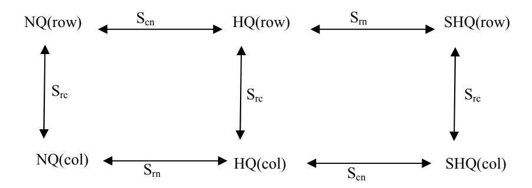

Figure 1. Symmetries and supersymmetries for Quadruplets

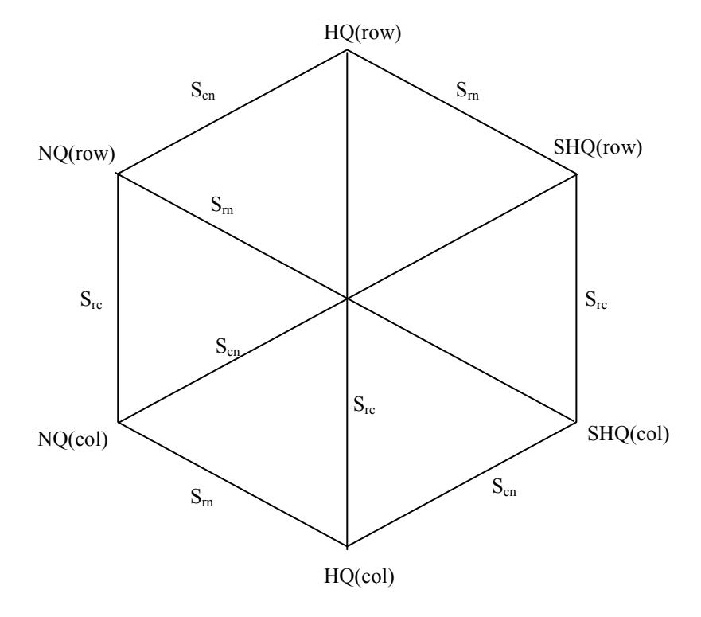

Figure 2. The full set of symmetries and supersymmetries for Quadruplets

But, as for Pairs or Triplets, this is not the real full story, which is to be found in Figure 2. And, here again, the additional symmetries can easily be proved by checking the precise logical formulation of all the rules (and, in particular, that the numbers of quantifiers of each appropriate sort are equal).

We shall also analyse the relationship between Naked and Hidden subsets of complementary cardinalities and show (a well known result) that it is not necessary to consider Subset rules for more than four cells.

Finally, we shall introduce the first four levels of our complexity hierarchy.

#### VIII.1. Naked-Quadruplets

#### VIII.1.1. Proper formulation of the Naked-Quadruplets rule

What is the proper formulation of Naked-Quadruplets-in-a-row? We can reproduce here the same argument as for Naked-Triplets.

Naked-Quadruplets-in-a-row (first tentative formulation, sometimes called Strict-Naked-Quadruplets): if there is a row and there are four numbers and four cells in this row whose remaining candidates are exactly these four numbers, then remove these four numbers from the candidates for the other cells in this row. The rule is easily validated by an argument similar to that used in the cases of Naked-Pairs and Naked-Triplets. (Each of the four cells must get a unique value and only four values are available for them; therefore, whatever distribution is made between them, none of these four values remains available for the other cells in the same row). But there is a major problem: it is unnecessarily restrictive and situations where it can be applied are extremely rare (actually, I have found no example that could not be solved using only simpler rules).

Naked-Quadruplets-in-a-row (second tentative formulation, sometimes called Comprehensive-Naked-Quadruplets): if there is a row and there are four numbers and four cells in this row such that all their candidates are among these four numbers, then remove these four numbers from the candidates for all the other cells in this row. Again, this rule is obviously valid and the argument for it is strictly unchanged. Being more general than the first formulation (the only difference is that each cell can have missing values among the four), the second should be preferred. But, again, it has a major problem: it includes Naked-Triplets-in-a-row, Naked-Pairs-in-a-row and even Naked-Single-in-a-row as special cases.

So, neither of the two usual formulations of the Naked-Quadruplets rule is correct according to our guiding principles. How then can one formulate this rule so that it is comprehensive but does not subsume Naked-Triplets-in-a-row, Naked-Pairs-in-a-row or Naked-Single-in-a-row? It is enough to make certain that the four cells have no candidate other than the four given numbers (say  $n_1$ ,  $n_2$ ,  $n_3$  and  $n_4$ ), that each of them has more than one candidate (it is not a Naked-Single), that no two of them have exactly the same two candidates (which would make a Naked-Pair-in-a-row) and that no three of them form a Naked-Triplets-in-a-row. The only way to satisfy these conditions is to impose candidates  $n_1$  and  $n_2$  for cell 1, candidates  $n_2$  and  $n_3$  for cell 2, candidates  $n_3$  and  $n_4$  for cell 3 and candidates  $n_4$  and  $n_1$  for cell 4. We get the final formulation, more complex than usual but with its full natural scope:

Naked-Quadruplets-in-a-row (final English formulation): if there is a row r and there are four different columns  $c_1$ ,  $c_2$ ,  $c_3$  and  $c_4$ , and four different numbers  $n_1$ ,  $n_2$ ,  $n_3$  and  $n_4$ , such that:

```
cell (r, c_1) has n_1 and n_2 among its candidates, cell (r, c_2) has n_2 and n_3 among its candidates, cell (r, c_3) has n_3 and n_4 among its candidates, cell (r, c_4) has n_4 and n_1 among its candidates, none of the cells (r, c_1), (r, c_2), (r, c_3) and (r, c_4) has any candidate other than n_1, n_2, n_3 or n_4,
```

then eliminate the four numbers  $n_1$ ,  $n_2$ ,  $n_3$  and  $n_4$  from the candidates for any other cell in row r.

The logical formulation of the Naked-Quadruplets-in-a-row rule parallels strictly the English one:

```
\begin{array}{l} \forall r \forall 4 \neq c_1 c_2 c_3 c_4 \forall 4 \neq n_1 n_2 n_3 n_4 \\ \{ \ candidate(n_1, \ r, \ c_1) \ \& \ candidate(n_2, \ r, \ c_1) \ \& \\ \forall n \not \in \{n_1, \ n_2, \ n_3, \ n_4\} \ not\text{-candidate}(n, \ r, \ c_1) \ \& \\ \text{candidate}(n_2, \ r, \ c_2) \ \& \ candidate(n_3, \ r, \ c_2) \ \& \\ \forall n \not \in \{n_1, \ n_2, \ n_3, \ n_4\} \ not\text{-candidate}(n, \ r, \ c_2) \ \& \\ \text{candidate}(n_3, \ r, \ c_3) \ \& \ candidate(n_4, \ r, \ c_3) \ \& \\ \forall n \not \in \{n_1, \ n_2, \ n_3, \ n_4\} \ not\text{-candidate}(n, \ r, \ c_4) \ \& \\ \forall n \not \in \{n_1, \ n_2, \ n_3, \ n_4\} \ not\text{-candidate}(n, \ r, \ c_4) \\ \Rightarrow \\ \forall c \not \in \{c_1, \ c_2, \ c_3, \ c_4\} \ \forall n \in \{n_1, \ n_2, \ n_3, \ n_4\} \ not\text{-candidate}(n, \ r, \ c) \ \}. \end{array}
```

Later, this clarification of the Naked-Quadruplets rule will allow us to show how close it is to xy4-chains, but also why it should not be reduced to them.

We leave it to the reader to write the Naked-Quadruplets-in-a-column and Naked-Quadruplets-in-a-block rules.

#### VIII.1.2. Naked-Quadruplets examples

Quadruplets (Naked or Hidden or Super-Hidden) are very rare. We have no example of a puzzle that cannot be solved using only Subset rules for Singles, Pairs and Triplets but can be solved if we add rules for Quadruplets to the allowed list. As a result, in some of the examples of this chapter we must anticipate rules (Interaction, XY-Wing and XYZ-Wing) and associated theories (L3) that will be explained in later chapters.

Our first example (Sudogen17-6947, Figure 3) has identical L3 and L1\_0 elaborations. It cannot be solved using only Subset rules (it requires the very classical XY-Wing and XYZ-Wing, also named xy3 and xyz3).

|   |   | 7 |   | 6 |   |   |   |   | 1 |   | 7 | 4 | 6 | 3 | 5 |   |   | 1 | 2 | 7 | 4 | 6 | 3 | 5 | 9 |
|---|---|---|---|---|---|---|---|---|---|---|---|---|---|---|---|---|---|---|---|---|---|---|---|---|---|
|   |   |   | 9 |   |   | 7 |   | 4 | 6 | 8 | 3 | 9 | 5 | 2 | 7 | 1 | 4 | 6 | 8 | 3 | 9 | 5 | 2 | 7 | 1 |
|   |   | 4 | 8 | 1 |   |   |   |   |   | 5 | 4 | 8 | 1 | 7 |   |   |   | 9 | 5 | 4 | 8 | 1 | 7 | 6 | 3 |
|   | 6 |   |   |   |   |   |   |   |   | 6 |   |   |   |   |   |   |   | 4 | 6 | 8 | 2 | 9 | 1 | 3 | 7 |
| 5 | 3 | 1 |   |   |   |   | 4 |   | 5 | 3 | 1 | 7 |   | 6 | 2 | 4 |   | 5 | 3 | 1 | 7 | 8 | 6 | 2 | 4 |
|   |   |   |   | 3 |   |   |   |   |   |   |   |   | 3 |   |   |   |   | 7 | 9 | 2 | 5 | 3 | 4 | 1 | 8 |
|   |   | 6 |   | 2 |   | 9 |   | 7 | 3 | 4 | 6 | 1 | 2 | 8 | 9 | 5 | 7 | 3 | 4 | 6 | 1 | 2 | 8 | 9 | 5 |
| 8 |   | 9 |   |   |   |   | 2 |   | 8 | 1 | 9 | 6 | 7 | 5 | 4 | 2 | 3 | 8 | 1 | 9 | 6 | 7 | 5 | 4 | 2 |
|   |   |   |   |   | 9 | 8 | 6 |   |   |   | 5 | 3 | 4 | 9 | 8 | 6 | 1 | 2 | 7 | 5 | 3 | 4 | 9 | 8 | 6 |

Figure 3. Puzzle Sudogen17-6947, its L1 0 elaboration and its solution

```
Resolution path in L3+NQ for the L3 (or L1_0) elaboration of Sudogen17-6947: column c3 interaction-with-block b4 => r6c2 \neq 2, r6c1 \neq 2, r4c1 \neq 2 xyz3-chain {n9 n8}r5c9 - {n8 n7}r6c8 - {n7 n9}r6c2 => r6c9 \neq 9 naked-quads-in-a-row {n8 n2 n5 n9}r4{c3 c4 c9 c5} => r4c8 \neq 9, r4c8 \neq 8, r4c1 \neq 9 block b4 interaction-with-row r6 => r6c8 \neq 9 column c8 interaction-with-block b3 => r3c9 \neq 9, r1c9 \neq 9 xy3-chain {n9 n8}r1c8 - {n8 n7}r6c8 - {n7 n9}r6c2 => r1c2 \neq 9 ... (Naked-Singles)
```

In our second example (puzzle Sudogen0-5610, Figure 4), a partial application of Naked-Quads (in a column) to the L3 or L1\_0 elaboration activates the (simpler) XYZ-Wing (or xyz3) rule. This rule is therefore applied before Naked-Quads is

applied again to obtain the remaining conclusions. But, of course, all the conclusions of naked Quads could be obtained before xyz3 applies.

|   |   |   | 6 |   |   |   |   |   |
|---|---|---|---|---|---|---|---|---|
| 4 | 8 |   | 1 |   |   |   |   | 3 |
|   | 7 |   |   |   |   |   |   |   |
| 1 | 3 | 4 | 5 |   |   |   |   |   |
|   |   |   |   |   | 1 |   | 6 |   |
|   |   |   |   | 9 |   | 5 |   |   |
|   |   |   | 8 | 3 |   |   |   |   |
|   |   | 5 |   |   | 9 | 8 | 2 |   |
| 6 | 2 |   |   |   |   | 9 |   |   |

|   |   |   | 6 |   |   |   |   |   |
|---|---|---|---|---|---|---|---|---|
| 4 | 8 |   | 1 |   | 7 |   |   | 3 |
|   | 7 |   | 9 |   |   |   |   |   |
| 1 | 3 | 4 | 5 |   | 6 |   |   |   |
|   |   |   | 2 |   | 1 | 3 | 6 |   |
|   | 6 |   | 3 | 9 |   | 5 |   |   |
|   |   |   | 8 | 3 | 2 |   |   |   |
| 3 |   | 5 |   | 6 | 9 | 8 | 2 |   |
| 6 | 2 | 8 |   | 1 | 5 | 9 | 3 |   |

| 9 | 1 | 3 | 6 | 2 | 8 | 7 | 4 | 5 |
|---|---|---|---|---|---|---|---|---|
| 4 | 8 | 2 | 1 | 5 | 7 | 6 | 9 | 3 |
| 5 | 7 | 6 | 9 | 4 | 3 | 1 | 8 | 2 |
| 1 | 3 | 4 | 5 | 8 | 6 | 2 | 7 | 9 |
| 8 | 5 | 9 | 2 | 7 | 1 | 3 | 6 | 4 |
| 2 | 6 | 7 | 3 | 9 | 4 | 5 | 1 | 8 |
| 7 | 9 | 1 | 8 | 3 | 2 | 4 | 5 | 6 |
| 3 | 4 | 5 | 7 | 6 | 9 | 8 | 2 | 1 |
| 6 | 2 | 8 | 4 | 1 | 5 | 9 | 3 | 7 |

Figure 4. Puzzle Sudogen0-5610, its L1 0 elaboration and its solution

```
Resolution path in L3+NQ for the L3 (or L1_0) elaboration of Sudogen0-5610: row r4 interaction-with-block b6 ==> r5c9 \neq 9, r6c9 \neq 2 block b7 interaction-with-row r7 ==> r7c9 \neq 7, r7c8 \neq 7, r7c7 \neq 7 block b9 interaction-with-column c9 ==> r6c9 \neq 7, r5c9 \neq 7, r4c9 \neq 7, r1c9 \neq 7 naked-quads-in-a-column {n4 n8 n1 n7}{r5 r6 r8 r9}c9 ==> r7c9 \neq 4, r7c9 \neq 1, r4c9 \neq 8, r3c9 \neq 8, r3c9 \neq 4, r3c9 \neq 1 xyz3-chain {n2 n6}r2c7 - {n6 n5}r3c9 - {n5 n2}r3c1 ==> r3c7 \neq 2 naked-quads-in-a-column {n4 n8 n1 n7}{r5 r6 r8 r9}c9 ==> r1c9 \neq 8 column c9 interaction-with-block b6 ==> r6c8 \neq 8, r4c8 \neq 8 ... (Naked-Singles and Hidden-Singles)
```

#### VIII.2. Hidden-Quadruplets

As for Triplets, the proper formulation of rules for Hidden Quadruplets would not be obvious if we could not rely on super-symmetries and meta-theorem 3.

#### VIII.2.1. Hidden-Ouadruplets-in-a-row

Let us start with the Hidden-Quadruplets-in-a-row rule. To obtain it, we just apply meta-theorem 3 to Naked-Quadruplets-in-a-row, permuting the words "number" and "column". That is, once transposed in row-number space, a Naked-Quadruplets-in-a-row looks graphically like a Naked-Quadruplets-in-a-row does in row-column space.

rn-cell (r, n) in row r in row-number space.

Hidden-Quadruplets-in-a-row (final English formulation): if there is a row r, and there are four different numbers  $n_1$ ,  $n_2$ ,  $n_3$  and  $n_4$  and four different columns  $c_1$ ,  $c_2$ ,  $c_3$  and  $c_4$ , such that:

```
rn-cell (r, n_1) (in row-number space) has c_1 and c_2 among its candidates (columns), rn-cell (r, n_2) (in row-number space) has c_2 and c_3 among its candidates (columns), rn-cell (r, n_3) (in row-number space) has c_3 and c_4 among its candidates (columns), rn-cell (r, n_4) (in row-number space) has c_4 and c_1 among its candidates (columns), none of the rn-cells (r, n_1), (r, n_2)), (r, n_3) and (r, n_4) (in row-number space) has any remaining candidate (column) other than c_1, c_2, c_3 and c_4, then eliminate the four columns c_1, c_2, c_3 and c_4 from the candidates for any other
```

The logical formulation of Hidden-Quadruplets-in-a-row parallels strictly the English one (and is also a direct transposition, i.e. the S<sub>cn</sub> transform, of the formal Naked-Quadruplets-in-a-row rule):

```
 \forall r \forall 4 \neq n_1 n_2 n_3 n_4 \forall 4 \neq c_1 c_2 c_3 c_4 \\ \{ \ candidate(n_1, \ r, \ c_1) \ \& \ candidate(n_1, \ r, \ c_2) \ \& \\ \forall c \not\in \{c_1, \ c_2, \ c_3, \ c_4\} \ not\text{-candidate}(n_1, \ r, \ c) \ \& \\ \ candidate(n_2, \ r, \ c_2) \ \& \ candidate(n_2, \ r, \ c_3) \ \& \\ \ \forall c \not\in \{ \ c_1, \ c_2, \ c_3, \ c_4\} \ not\text{-candidate}(n_2, \ r, \ c) \ \& \\ \ candidate(n_3, \ r, \ c_3) \ \& \ candidate(n_3, \ r, \ c_4) \ \& \\ \ \forall c \not\in \{ \ c_1, \ c_2, \ c_3, \ c_4\} \ not\text{-candidate}(n_4, \ r, \ c_1) \ \& \\ \ \forall c \not\in \{ \ c_1, \ c_2, \ c_3, \ c_4\} \ not\text{-candidate}(n_4, \ r, \ c) \\ \Rightarrow \\ \ \forall n \not\in \{ n_1, \ n_2, \ n_3, \ n_4\} \ \forall c \in \{ \ c_1, \ c_2, \ c_3, \ c_4\} \ not\text{-candidate}(n, \ r, \ c) \ \}.
```

We leave it to the reader to write rules Hidden-Quadruplets-in-a-column and Hidden-Quadruplets-in-a-block.

#### VIII.3. Super-Hidden-Quadruplets or Jellyfish

#### VIII.3.1. Super-Hidden-Quadruplets-in-rows (Jellyfish-in-rows)

Now, in row-number space, there remains to consider a rule that one could call Super-Hidden-Quadruplets-in-rows (or Naked-Quadruplets-in-a-number in row-number space, by analogy with the Naked-Quadruplets-in-a-column rule in row-column space). This rule is obtained from Hidden-Quadruplets-in-a-row by permuting the words "row" and "number", according to meta-theorem 3. Let us first do this permutation formally, i.e. by applying the  $S_{rn}$  transform to  $HQ(row) = S_{cn}(NQ(row))$ . Super-Hidden-Quadruplets-in-rows (logical formulation):

```
 \forall n \forall 4 \neq r_1 r_2 r_3 r_4 \forall 4 \neq c_1 c_2 c_3 c_4  { candidate(n, r<sub>1</sub>, c<sub>1</sub>) & candidate(n, r<sub>1</sub>, c<sub>2</sub>) &  \forall c \notin \{c_1, c_2, c_3, c_4\} \text{ not-candidate}(n, r_1, c) \text{ & candidate}(n, r_2, c_3) \text{ & }  candidate(n, r<sub>2</sub>, c<sub>3</sub>) &  \forall c \notin \{c_1, c_2, c_3, c_4\} \text{ not-candidate}(n, r_2, c) \text{ & candidate}(n, r_3, c) \text{ & candidate}(n, r_3, c_3) \text{ & candidate}(n, r_3, c_4) \text{ & }   \forall c \notin \{c_1, c_2, c_3, c_4\} \text{ not-candidate}(n, r_3, c)  candidate(n, r<sub>4</sub>, c<sub>1</sub>) &  \forall c \notin \{c_1, c_2, c_3, c_4\} \text{ not-candidate}(n, r_4, c_1) \text{ & }   \forall c \notin \{c_1, c_2, c_3, c_4\} \text{ not-candidate}(n, r_4, c) \text{ & }   \forall c \notin \{c_1, c_2, c_3, c_4\} \text{ not-candidate}(n, r_4, c) \text{ & }
```

Let us now try to understand the result. First comes the direct English translite-ration. Super-Hidden-Quadruplets-in-rows (English formulation): if there is a number n, and there are four different rows  $r_1$ ,  $r_2$ ,  $r_3$  and  $r_4$  and four different columns  $c_1$ ,  $c_2$ ,  $c_3$  and  $c_4$ , such that:

rn-cell  $(r_1, n)$  (in row-number space) has  $c_1$  and  $c_2$  among its candidates (columns), rn-cell  $(r_2, n)$  (in row-number space) has  $c_2$  and  $c_3$  among its candidates (columns), rn-cell  $(r_3, n)$  (in row-number space) has  $c_3$  and  $c_4$  among its candidates (columns), rn-cell  $(r_4, n)$  (in row-number space) has  $c_4$  and  $c_1$  among its candidates (columns), none of the rn-cells  $(r_1, n)$ ,  $(r_2, n)$ ,  $(r_3, n)$  and  $(r_4, n)$  (in row-number space) has any candidate (column) other than  $c_1, c_2, c_3$  and  $c_4$ ,

then eliminate the four columns  $c_1$ ,  $c_2$ ,  $c_3$  and  $c_4$  from the candidates for any other rncell (r, n) based on number n in row-number space.

Admittedly, this is not very explicit. So let us try to clarify it a little bit by temporarily forgetting part of the conditions: if there is a number n, and there are four different rows  $r_1$ ,  $r_2$ ,  $r_3$  and  $r_4$  and four different columns  $c_1$ ,  $c_2$ ,  $c_3$  and  $c_4$ , such that for each of the four rows the instance of number n that must be somewhere in each of these rows can actually only be in either of the four columns, then in any of the four columns eliminate n from the candidates for any row different from the given four.

After chapter VII, this should not be a surprise, since this section is a strict parallel to the section on Swordfish: this is the usual formulation of the Jellyfish-inrows rule – the direct proof of which is obvious (in each of the four rows there are four cells that can receive the unique instance of n in this row, and any two of these four instances cannot be in the same column; therefore, whatever the exact positions of n may be in each of the four rows, there is one of them in each of the four

columns; which implies that, in each of the four columns there can be no instance of n but in the four given rows).

As for Swordfish in chapter VII, there remains a point to examine. In the last English formulation of this rule, we have discarded part of the conditions. This part corresponds to what we have added to Comprehensive-Naked-Quadruplets-in-arow; it is just what prevents Jellyfish-in-rows from reducing to X-wing-in-rows or to Swordfish-in-rows. Finally, we have not only shown that Jellyfish-in-rows is the supersymmetric version of Naked-Quadruplets-in-a-row, but we have also found the proper way to write this rule according to our guiding principles, in as comprehensive a way as possible.

We leave it to the reader to write the rule for Jellyfish-in-columns.

#### VIII.3.2. Super-Hidden-Quadruplets or Jellyfish examples

So-called "fishy patterns" (Swordfish, Jellyfish) are very popular, even and especially even the non-existent ones (such as Squirmbag, a would be Super-Hidden-Quintuplets in our vocabulary – see section 4 below). But we have another reason for giving several examples: real cases (i.e. stemming from real puzzles and not invented for *ad hoc* illustration purposes) are as rare as they are celebrated among the Sudoku addicts.

For our first example (puzzle Royle17-1007, Figure 5), the strong elaboration by theory L3 (defined below – including some rules we have not yet defined, such as Interaction rules and XY-Wing) has only 25 empty cells.

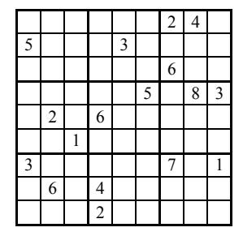

| 6 | 3 | 8 | 1 | 5 |   | 2 | 4 |   |
|---|---|---|---|---|---|---|---|---|
| 5 | 4 | 2 |   | 3 | 6 | 8 | 1 |   |
|   |   |   | 8 | 4 | 2 | 6 | 3 | 5 |
| 4 |   | 6 |   | 2 | 5 | 1 | 8 | 3 |
|   | 2 | 3 | 6 |   |   | 5 | 7 | 4 |
|   | 5 | 1 | 3 |   | 4 | 9 | 6 | 2 |
| 3 |   | 4 | 5 | 6 |   | 7 | 2 | 1 |
| 2 | 6 |   | 4 |   |   | 3 |   | 8 |
|   |   |   | 2 |   | 3 | 4 |   | 6 |

| 6 | 3 | 8 | 1 | 5 | 9 | 2 | 4 | 7 |
|---|---|---|---|---|---|---|---|---|
| 5 | 4 | 2 | 7 | 3 | 6 | 8 | 1 | 9 |
| 7 | 1 | 9 | 8 | 4 | 2 | 6 | 3 | 5 |
| 4 | 7 | 6 | 9 | 2 | 5 | 1 | 8 | 3 |
| 9 | 2 | 3 | 6 | 8 | 1 | 5 | 7 | 4 |
| 8 | 5 | 1 | 3 | 7 | 4 | 9 | 6 | 2 |
| 3 | 9 | 4 | 5 | 6 | 8 | 7 | 2 | 1 |
| 2 | 6 | 5 | 4 | 1 | 7 | 3 | 9 | 8 |
| 1 | 8 | 7 | 2 | 9 | 3 | 4 | 5 | 6 |

Figure 5. Puzzle Royle17-1007, its L3 elaboration and its solution

Resolution path in L3+NQ+HQ+SHQ for the L3+NQ+HQ (or L3) elaboration of Royle17-1007

```
column c2 interaction-with-block b7 => r9c1 \neq 8 row r8 interaction-with-block b8 => r9c5 \neq 1 jellyfish-in-rows n9{r1 r2 r4 r7}{c6 c9 c4 c2} => r9c2 \neq 9, r8c6 \neq 9, r5c6 \neq 9 xy3-chain {n7 n1}r8c6 - \{n1 n8\}r5c6 - \{n8 n7\}r6c5 => r9c5 \neq 7 row r9 interaction-with-block b7 => r8c3 \neq 7 naked-pairs-in-a-row {n5 n9}r8\{c3 c8\} => r8c5 \neq 9 xy3-chain {n1 n8}r5c6 - \{n8 n7\}r6c5 - \{n7 n1\}r8c5 => r8c6 \neq 1 ... (Naked-Singles)
```

For our second example (puzzle Sudogen17-6907, Figure 6), starting from its L3 elaboration, the solution requires using successively two rare patterns: Jellyfish and Swordfish.

|   | 3 |   |   |   | 7 | 1 |   |   |
|---|---|---|---|---|---|---|---|---|
|   |   | 4 |   |   |   | 5 |   |   |
|   |   |   | 8 | 1 |   |   |   |   |
|   |   | 9 |   |   |   |   |   |   |
|   | 5 |   | 2 | 8 |   |   |   |   |
| 4 |   | 2 | 5 |   | 3 |   |   |   |
|   | 8 |   |   |   | 9 |   |   |   |
| 7 |   |   |   |   |   |   | 6 | 9 |
|   |   |   |   | 5 |   | 2 | 8 |   |

| 5 | 3 | 8 |   |   | 7 | 1 |   |   |
|---|---|---|---|---|---|---|---|---|
| 1 |   | 4 |   |   | 2 | 5 | 7 | 8 |
|   |   |   | 8 | 1 | 5 |   |   |   |
| 8 |   | 9 |   | 7 | 4 | 3 |   |   |
|   | 5 |   | 2 | 8 |   |   |   |   |
| 4 |   | 2 | 5 | 9 | 3 | 8 | 1 |   |
|   | 8 |   |   |   | 9 |   |   |   |
| 7 |   | 5 |   |   | 8 | 4 | 6 | 9 |
| 9 | 4 |   | 7 | 5 |   | 2 | 8 |   |

| 5 | 3 | 8 | 9 | 4 | 7 | 1 | 2 | 6 |
|---|---|---|---|---|---|---|---|---|
| 1 | 9 | 4 | 3 | 6 | 2 | 5 | 7 | 8 |
| 2 | 7 | 6 | 8 | 1 | 5 | 9 | 4 | 3 |
| 8 | 1 | 9 | 6 | 7 | 4 | 3 | 5 | 2 |
| 3 | 5 | 7 | 2 | 8 | 1 | 6 | 9 | 4 |
| 4 | 6 | 2 | 5 | 9 | 3 | 8 | 1 | 7 |
| 6 | 8 | 1 | 4 | 2 | 9 | 7 | 3 | 5 |
| 7 | 2 | 5 | 1 | 3 | 8 | 4 | 6 | 9 |
| 9 | 4 | 3 | 7 | 5 | 6 | 2 | 8 | 1 |

Figure 6. Puzzle Sudogen17-6907, its L3 elaboration and its solution

```
Resolution path in L3+NQ+HQ for the L3+NQ (or L3) elaboration of Sudogen17-6907) row r3 interaction-with-block b3 ==> r1c9 \neq 4, r1c8 \neq 4 row r8 interaction-with-block b8 ==> r7c5 \neq 3, r7c4 \neq 3 row r1 interaction-with-block b3 ==> r3c9 \neq 2, r3c8 \neq 2 naked-pairs-in-a-row {n1 n6}r4{c2 c4} ==> r4c9 \neq 6 hidden-pairs-in-a-row {n3 n4}r3{c8 c9} ==> r3c9 \neq 6, r3c8 \neq 9 x-wing-in-rows n1 {r4 r8} {c2 c4} ==> r7c4 \neq 1 jellyfish-in-columns n6{r3 r7 r9 r5}{c1 c3 c6 c7} ==> r7c5 \neq 6 column c5 interaction-with-block b2 ==> r2c4 \neq 6, r1c4 \neq 6 swordfish-in-rows n6{r1 r2 r6}{c9 c5 c2} ==> r5c9 \neq 6, r4c2 \neq 6 ... (Naked-Singles)
```

In our third example (Figure 7), the same Jellisfish-in-rows eliminates five candidates but it is interrupted twice by simpler rules (this is only an artifact of SudoRules and of the different priorities assigned to the various rules).

1

2

5

4

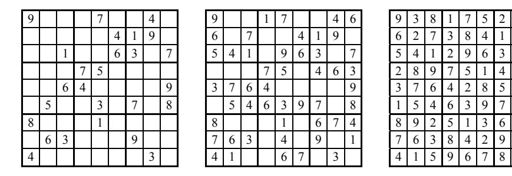

Figure 7. Puzzle Sudogen0-9657, its L3 elaboration and its solution

```
Resolution path in L3+NQ+HQ for the L3+NQ (or L3) elaboration of Sudogen0-9657: row r5 interaction-with-block b5 ==> r4c6 \neq 8 column c1 interaction-with-block b4 ==> r4c3 \neq 2, r4c2 \neq 2 naked-pairs-in-a-block {n2 n8} {r2c5 r3c4} ==> r2c4 \neq 8, r2c4 \neq 2, r1c6 \neq 8, r1c6 \neq 2 jellyfish-in-rows n2{r3 r8 r4 r6}{c8 c4 c6 c1} ==> r9c4 \neq 2, r7c6 \neq 2 naked-pairs-in-a-column {n3 n5} {r1 r7}c6 ==> r8c6 \neq 5 jellyfish-in-rows n2{r3 r8 r4 r6}{c8 c4 c6 c1} ==> r7c4 \neq 2 row r7 interaction-with-block b7 ==> r9c3 \neq 2 row r9 interaction-with-block b9 ==> r8c8 \neq 2 xy3-chain {n5 n2}r2c9 - {n2 n8}r3c8 - {n8 n5}r8c8 ==> r9c9 \neq 5 naked and hidden singles ==> r9c9 = 2, r2c9 = 5, r2c4 = 3, r1c6 = 5, r7c6 = 3, r1c2 = 3 jellyfish-in-rows n2{r3 r8 r4 r6}{c8 c4 c6 c1} ==> r5c8 \neq 2, r5c6 \neq 2 xy3-chain {n8 n5}r8c8 - {n5 n1}r5c8 - {n1 n8}r5c6 ==> r8c6 \neq 8 ... (Naked-Singles)
```

In our fourth and final example, puzzle Royle17-33858 (Figure 9), although XYZ-Wing (xyz3) is applied during the L3 elaboration process, it does not lead to the addition of a value and it is therefore applied again when we solve the L3 elaboration (which is indeed equal to the L1 elaboration).

```
Resolution path in L3+NQ+HQ for the L3+NQ (or L3) elaboration of Royle17-33858: column c3 interaction-with-block b1 ==> r2c2 \neq 8 row r2 interaction-with-block b1 ==> r3c3 \neq 2 block b7 interaction-with-column c3 ==> r2c3 \neq 7 xyz3-chain {n8 n2}r3c7 - {n2 n5}r3c9 - {n5 n8}r4c9 ==> r1c9 \neq 8 jellyfish-in-columns n5{r6 r2 r5 r1}{c1 c5 c4 c8} ==> r6c2 \neq 5, r2c3 \neq 5, r2c2 \neq 5, r1c9 \neq 5 ... (Naked-Singles and Hidden-Singles)
```

We shall take advantage of this example to show (Figure 8) how a typical (i.e. degenerate) Jellyfish-in-columns looks like in rc- and cn- spaces. In cn-space, it is very easy: just like a (degenerate) Naked-Quadruplets-in-a-row would in rc-space.

|            | cl       | <i>c2</i>                    | <i>c3</i>             | <i>c4</i> | <i>c5</i>  | <i>c6</i> | <i>c</i> 7 | c8             | <i>c</i> 9          |    |
|------------|----------|------------------------------|-----------------------|-----------|------------|-----------|------------|----------------|---------------------|----|
| rl         | n6       | n9                           | n1                    | n5<br>n8  | n3         | n2        | n4         | n5<br>n7 n8    | <u>n5</u>           | r1 |
| <i>r</i> 2 | n5<br>n7 | n2<br><u><b>n5</b></u><br>n7 | n2<br><u>n5</u><br>n8 | n6        | n5<br>n8   | n4        | n9         | n3             | n1                  | r2 |
| r3         | n4       | n3                           | n5<br>n8              | n9        | n7         | n1        | n2<br>n8   | n6             | n2<br>n5<br>n8      | r3 |
| r4         | n9       | n5<br>n8                     | n3                    | nl        | n4         | n6        | n7         | n2             | n5<br>n8            | r4 |
| r5         | n2       | n1                           | n4                    | n5<br>n8  | n5<br>n8   | n7        | n6         | n9             | n3                  | r5 |
| r6         | n5<br>n7 | <u><b>n5</b></u><br>n7 n8    | n6                    | n3        | n2         | n9        | nl         | n5<br>n8       | n4                  | r6 |
| <i>r</i> 7 | n3       | n2<br>n5                     | n9                    | n7        | n1         | n5<br>n8  | n2<br>n8   | n4             | n6                  | r7 |
| r8         | n8       | n6                           | n2<br>n7              | n4        | n9         | n3        | n5         | nl             | n2<br>n7            | r8 |
| r9         | n1       | n4                           | n5<br>n7 n8           | n2        | n6         | n5<br>n8  | n3         | n7 n8          | n9                  | r9 |
|            | cl       | <i>c</i> 2                   | <i>c3</i>             | <i>c4</i> | <i>c</i> 5 | <i>c6</i> | <i>c</i> 7 | c8             | c9                  |    |
| n1         | r9       | r5                           | r1                    | r4        | r7         | r3        | r6         | r8             | r2                  | n1 |
| n2         | r5       | r2<br>r7                     | r2<br>r8              | r9        | r6         | r1        | r3<br>r7   | r4             | r3<br>r8            | n2 |
| п3         | r7       | r3                           | r4                    | r6        | r1         | r8        | r9         | r2             | r5                  | n3 |
| n4         | r3       | r9                           | r5                    | r8        | r4         | r2        | r1         | r7             | r6                  | n4 |
| n5         | r2<br>r6 | <u>r2</u><br>r4 <u>r6</u>    | <u><b>r2</b></u> r3   | r1<br>r5  | r2<br>r5   | r7 r9     | r8         | r1<br>r6       | <u><b>r1</b></u> r3 | n5 |
| п6         | r1       | r8                           | r6                    | r2        | r9         | r4        | r5         | r3             | r7                  | п6 |
| n7         | r2<br>r6 | r2<br>r6                     | r8 r9                 | r7        | r3         | r5        | r4         | r1<br>r9       | r1<br>r8            | n7 |
| n8         | r8       | r4 r6                        | r2 r3                 | r1<br>r5  | r2<br>r5   | r7 r9     | r3<br>r7   | r1<br>r6<br>r9 | r3<br>r4            | n8 |
| n9         | r4       | r1                           | r7                    | r3        | r8         | r6        | r2         | r5             | r9                  | n9 |
|            |          |                              |                       |           |            |           |            |                |                     |    |

Figure 8. Puzzle Royle17-33858, seen in rc- and cn-spaces, just before the Jellyfish

Notice that, as for most cases of Jellyfish (and Swordfish), this is a highly degenerate example; it can also be considered as a hxy-cn4 chain (see chapter XV for the definition).

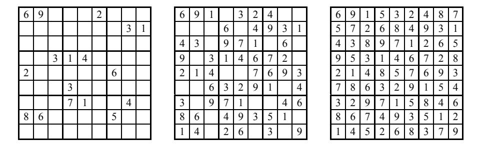

Figure 9. Puzzle Royle17-33858, its L3 elaboration and its solution

#### VIII.4. Correspondence between Naked and Hidden subsets

How far should we go in the definition of (Naked, Hidden and Super-Hidden) Subset rules? A well-known and obvious property of subsets shows that we are finished with them.

For any subset S of numbers of length k  $(1 \le k < 9)$ , there is obviously a complementary subset  $S^c$  of length 9-k (with  $1 \le 9$ -k < 9). And S forms a Naked-Subset of cardinality k on k cells in a row (respectively a column, a block), if and only if  $S^c$  forms a Hidden-Subset of length 9-k on the remaining 9-k cells in this row (respectively: this column, this block).

As a result, no Subset rule for subsets of length greater than four is needed. For instance, as is well known, Naked-Quintuplets in a row is just Hidden-Quadruplets in the same row and Hidden-Quintuplets in a row is just Naked-Quadruplets in the same row. As is less known, because super-symmetries are not generally considered, Super-Hidden-Quintuplets in a row (familiarly called Squirmbag) is just Naked-Quadruplets in a column (as shown by the graph in Figure 2). This is a very interesting example of a named and popular thing that has no independent existence.

#### VIII.5 Theory L4 0

Finally, let us define theory L4\_0 as the union of L3 with the set of rules defined in the present chapter:

$$\begin{split} &NQ = \{NQ(row), \, NQ(col), \, NQ(blk)\}, \\ &HQ = \{HQ(row), \, HQ(col), \, HQ(blk)\}, \\ &SHQ = \{SHQ(row), \, SHQ(col)\}, \\ &L4\_0 = L3 \cup NQ \cup HQ \cup SHQ. \end{split}$$

### Chapter IX

### Interaction rules

This chapter is dedicated to four rules relative to simple interactions between rows and blocks, or between columns and blocks. They go by pairs of reciprocal rules and the two pairs are related by row-column symmetry.

As simple as they are, these rules are used very frequently. Two facts will give an idea of how important they are:

- apart from very easy puzzles that can be solved at level L1\_0 (i.e. with only BSRT, NS and HS), the resolution process of almost any grid resorts to at least one of the rules described in this chapter; most of the time, many instances of these rules will be used;
- if 46% of Royle17 (respectively 42% of Sudogen0, 41% of Sudogen17) puzzles can be solved in L1\_0, the figures rise to 77.7% (respectively 54%, 53%) when one adds Interaction rules (see chapter XXI for details).

#### IX.1. Row-interaction-with-Block (RiB)

#### IX.1.1. Definition of Row-interaction-with-Block (RiB)

Row-interaction-with-Block (RiB): if there is a number n, a row r and a block b, such that row r intersects block b and such that the exact place of (the unique instance of) number n (that must occur) in row r is not yet known but cannot be in any of the other two blocks intersecting row r, then delete number n from the candidates for any cell in block b outside row r.

Proof: obvious. There must be an instance of number n in row r; it is known it cannot be in the part of row r outside block b, therefore it must be in the part of row r inside block b; but in block b, there can only be one instance of number n; it is known that this instance is in row r; therefore there can be no instance of number n in the part of block b outside row r.

```
Row-interaction-with-Block (logical formulation):  \forall n \forall r \forall b  { row-intersects(r, b) &  \exists c \text{ candidate}(n, r, c) \&   \forall c \left[ \neg \text{column-intersects}(c, b) \Rightarrow \text{not-candidate}(n, r, c) \right]   \Rightarrow   \forall r' \neq r \forall c' \left[ \text{row-intersects}(r', b) \& \text{column-intersects}(c', b) \right]   \Rightarrow \text{not-candidate}(n, r', c') \right] \}.
```

#### IX.1.2. Graphical representations of RiB in rc- and rn- spaces

Graphical representation of RiB: Figure 1 is our symbol, in natural row-column space, for the interaction of a row with a block. Let n be a fixed number. The large square represents a block, the horizontal line a row intersecting this block. The six X's in the row, outside the block, indicate the condition that number n is not a candidate for these cells, the arrows indicate the direction of inference, the six X's in the block outside the row indicate the conclusion that n cannot be a candidate for the cells shown.

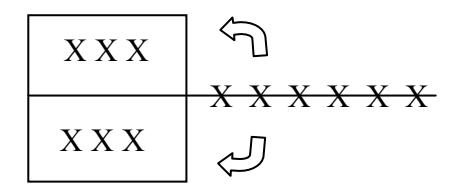

Figure 1. Row interaction with block, seen in rc-space

In rn-space, consider the content of cell (r, n). There are three generic cases corresponding to the preconditions of RiB; they are shown in Figure 2. Here, as usual in this book, values (i.e. candidate columns) inside an rn-cell are supposed to be always displayed with the same global pattern:

Interaction rules 151

123 456 789

Parentheses indicate that values may be present or not. Empty places indicate as usual that they may not be present.

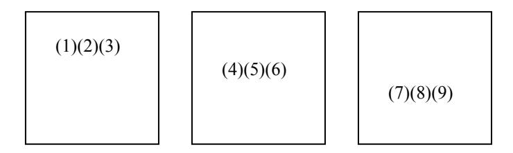

Figure 2. The three internal rn-cell patterns for detecting RiB in rn-space

#### IX.2. Column-interaction-with-Block (CiB)

By row-column symmetry, we obtain the Column-interaction-with-Block rule.

#### IX.2.1. Definition of Column-interaction-with-Block (CiB)

Column-interaction-with-Block (CiB): if there is a number n, a column c and a block b, such that column c intersects block b and such that the exact place of (the unique instance of) number n (that must occur) in column c is not yet known but cannot be in any of the other two blocks intersecting column c, then delete number n from the candidates for any cell in block b outside column c.

Proof: (apply meta-theorem 1) permute the words row and column in the proof of the previous rule. From a logical point of view, this permutation entails permuting the predicates "row-intersects" and "column-intersects" (see their definition at the end of section III.1.5.2).

#### IX.2.2. Graphical representations of CiB in rc and cn spaces

To get our symbol, still in natural row-column space, for the interaction of a column with a block, just rotate figure 1 by  $90^{\circ}$  to make it vertical. You get Figure 3, with the same conventions as for Figure 1.

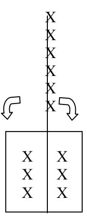

Figure 3. Column interaction with block, seen in rc-space

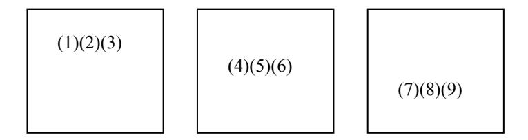

Figure 4. The three internal nc-cell patterns for detecting CiB in nc-space

In nc-space, consider the content of cell (n, c). There are three generic cases corresponding to the preconditions of CiB; they are shown in Figure 4. Here, values (i.e. candidate rows) inside an nc-cell are supposed to be always displayed with the same global pattern:

Interaction rules 153

123 456 789

As above, parentheses indicate that values may be present or not. Empty places indicate as usual that they may not be present.

# IX.3. Block-interaction-with-Row (BiR) and Block-interaction-with-Column (BiC)

# IX.3.1. Definition of Block-interaction-with-Row (BiR) and Block-interaction-with-Column (BiC)

Block-interaction-with-Row is the converse of Row-interaction-with-Block and its proof is just the converse of the previous one. We leave it to the reader as an easy exercise.

Block-interaction-with-Row (BiR): if there is a number n, a row r and a block b, such that row r intersects block b and such that the exact place of (the unique instance of) number n (that must occur) in block b is not yet known but cannot be in any of the other two rows intersecting block b, then delete number n from the candidates for any cell in row r outside block b.

By row-column symmetry, one gets Block-interaction-with-Column (BiC): if there is a number n, a column c and a block b, such that column c intersects block b and such that the exact place of (the unique instance of) number n (that must occur) in block b is not yet known but cannot be in any of the other two columns intersecting block b, then delete number n from the candidates for any cell in column c outside block b.

Block-interaction-with-Row (logical formulation):

```
 \forall n \forall r \forall b \\ \{ \text{row-intersects}(r, b) \& \\ \exists s \text{ candidate}[n, b, s] \& \\ \forall r' \neq r \forall c' \text{ [row-intersects}(r', b) \& \text{ column-intersects}(c', b) \\ \Rightarrow \text{not-candidate}(n, r', c')] \\ \Rightarrow \\ \forall c' \text{ [}\neg\text{column-intersects}(c', b) \\ \Rightarrow \text{not-candidate}(n, r, c') \text{ ]} \}.
```

#### IX.3.2. Graphical representations of BiR in rc space

Just reversing the arrows in Figure 1, one gets Figure 5 and our symbol, still in natural row-column space, for the interaction of a block with a row. Conventions are the same as for Figure 1. The direction of inference is reversed.

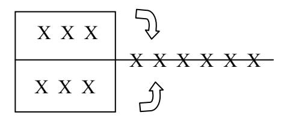

Figure 5. Block interaction with row seen in rc-space

As previously, rotating Figure 5 by  $90^{\circ}$ , or reversing the arrows in Figure 3, would give our symbol for the interaction of a block with a column.

#### IX.3.3. BiR and BiC seen in block-number space

Suppose the content of bn-cells in block-number space is always displayed according to the following pattern for squares:

123

456 789 (1)(2)(3) (4)(5)(6) (7)(8)(9)

Figure 6. The three internal bn-cell patterns for detecting BiR in bn-space

Interaction rules 155

Then, the three generic cases corresponding to the preconditions of the BiR rule will appear as shown in Figure 6.

And the three generic cases corresponding to the preconditions of rule BiC will appear as shown in Figure 7.

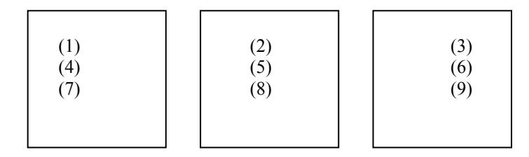

Figure 7. The three internal bn-cell patterns for detecting BiC in bn-space

#### IX.4. How the interaction rules integrate our hierarchy

As a result of the previous sections, detecting the preconditions of any of the four interaction rules needs considering only one cell in the appropriate (rn-, cn- or bn-) space. They must therefore be classified at level L1.

Nevertheless, application of the conclusions of the rule is easier in rc-space. As a consequence, we have a case where detection of a rule preconditions and application of its conclusions are easier in different spaces. But this remark does not change its position in level L1 of our classification, since the difficult part of a rule is spotting its instantiations

#### IX.5. Examples and independence results

#### IX.5.1. A puzzle in [L1\_0]+RiB+CiB

Our first example (puzzle Royle17-7, Figure 8) shows how a puzzle that cannot be solved in L1\_0 alone can be solved simply if one adds RiB and CiB.

```
Resolution path in L1_0+RiB+CiB for the L1_0 elaboration of Royle17-7: row r2 interaction-with-block b3 ==> r3c7 \neq 9 hidden-single-in-a-column ==> r2c7 = 9 column c7 interaction-with-block b3 ==> r2c8 \neq 6 ... (Naked-Singles and Hidden-Singles)
```

|   |   |   |   |   |   |   | 1 | 2 | 3 |   |   | 9 |   |   |   | 1 | 2 | 3 | 6 | 4 | 9 | 7 | 8 | 5 | 1 | 2 |
|---|---|---|---|---|---|---|---|---|---|---|---|---|---|---|---|---|---|---|---|---|---|---|---|---|---|---|
|   | 5 |   | 4 |   |   |   |   |   | 1 | 5 | 2 | 4 | 3 |   |   |   |   | 1 | 5 | 2 | 4 | 3 | 6 | 9 | 7 | 8 |
|   |   |   |   |   |   |   | 3 |   |   |   |   | 1 | 2 |   |   | 3 | 4 | 8 | 7 | 9 | 1 | 2 | 5 | 6 | 3 | 4 |
| 7 |   |   | 6 |   |   | 4 |   |   | 7 | 3 |   | 6 | 5 | 1 | 4 | 2 |   | 7 | 3 | 8 | 6 | 5 | 1 | 4 | 2 | 9 |
|   |   | 1 |   |   |   |   |   |   |   |   | 1 | 2 |   |   | 3 |   | 5 | 6 | 9 | 1 | 2 | 4 | 7 | 3 | 8 | 5 |
|   |   |   |   | 8 |   |   |   |   | 2 |   | 5 | 3 | 8 |   | 1 |   |   | 2 | 4 | 5 | 3 | 8 | 9 | 1 | 6 | 7 |
| 9 | 2 |   |   |   |   | 8 |   |   | 9 | 2 | 3 | 7 |   |   | 8 | 5 | 1 | 9 | 2 | 3 | 7 | 6 | 4 | 8 | 5 | 1 |
|   |   |   | 5 | 1 |   | 7 |   |   |   |   |   | 5 | 1 | 2 | 7 | 9 | 3 | 4 | 8 | 6 | 5 | 1 | 2 | 7 | 9 | 3 |
|   |   |   |   |   | 3 |   |   |   | 5 | 1 | 7 | 8 | 9 | 3 | 2 | 4 | 6 | 5 | 1 | 7 | 8 | 9 | 3 | 2 | 4 | 6 |

Figure 8. Puzzle Royle17-7, its L1\_0 elaboration and its solution

#### IX.5.2. A puzzle in [L1\_0+RiB+CiB]+BiR

Our second example, puzzle Royle17-323 (Figure 9) shows how a puzzle that cannot be solved in L1\_0 alone or in L1\_0+RiB+CiB can be solved simply if one adds BiR.

|   |   |   |   |   |   | 4 | 1 | Ì |   |   |   | 8 | 2 |   | 5 | 4 | 1 | 9 | 7 | 3 | 8 | 2 | 6 | 5 | 4 | 1 |
|---|---|---|---|---|---|---|---|---|---|---|---|---|---|---|---|---|---|---|---|---|---|---|---|---|---|---|
| 5 |   | 3 |   |   |   |   |   |   | 5 |   | 1 | 3 | 7 |   | 8 | 2 |   | 5 | 6 | 1 | 3 | 7 | 4 | 8 | 2 | 9 |
| 2 |   |   |   |   |   |   |   |   | 2 |   | 8 | 1 | 5 |   |   | 3 | 7 | 2 | 4 | 8 | 1 | 5 | 9 | 6 | 3 | 7 |
|   |   | 2 | 6 |   | 3 |   |   | Ī | 8 | 9 | 4 | 2 | 6 | 7 | 3 | 1 | 5 | 8 | 9 | 4 | 2 | 6 | 7 | 3 | 1 | 5 |
|   | 1 |   |   |   |   | 6 |   |   | 3 | 1 | 5 | 4 | 9 | 8 | 7 | 6 | 2 | 3 | 1 | 5 | 4 | 9 | 8 | 7 | 6 | 2 |
| 7 |   | 5 |   |   |   |   |   |   | 7 | 2 | 6 | 5 | 1 | 3 | 4 |   |   | 7 | 2 | 6 | 5 | 1 | 3 | 4 | 9 | 8 |
|   | 8 |   | 4 | 1 |   |   |   |   |   | 8 | 2 | 7 | 4 | 1 |   | 5 | 3 | 6 | 8 | 2 | 7 | 4 | 1 | 9 | 5 | 3 |
|   |   |   | 8 |   | 2 |   |   |   | 1 |   |   |   | 8 | 5 | 2 |   | 4 | 1 | 3 | 9 | 6 | 8 | 5 | 2 | 7 | 4 |
|   |   |   |   |   |   |   |   |   | 4 | 5 |   |   | 3 | 2 | 1 |   |   | 4 | 5 | 7 | 9 | 3 | 2 | 1 | 8 | 6 |

Figure 9. Puzzle Royle17-323, its L1 0 elaboration and its solution

Resolution path in L1\_0+RiB+CiB+BiR for the L1\_0+RiB+CiB (or L1\_0) elaboration of Royle17-323:

block b1 interaction with row r1 ==>  $r1c6 \neq 9$ 

... (Naked-Singles and Hidden-Singles)

#### XI.5.3. A puzzle with two solution paths, with and without Interaction rules

Our third example, puzzle Royle17-32227 (Figure 10), illustrates the fact that a puzzle can have different solution paths, at the same level in our classification (here level L3\_0) but using different sets of rules.

Interaction rules 157

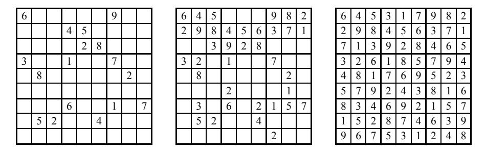

*Figure 10.* Puzzle Royle17-32227, its L1\_0 elaboration and its solution

If we allow only L1\_0 and subset rules (with no interaction rules), we get a solution in L3\_0 needing Hidden-Pairs, Naked-Triplets and Hidden-Triplets:

Resolution path (in L3\_0 minus the interaction rules) for the L1\_0 elaboration of Royle17-32227:

```
hidden-triplets-in-a-block {n4 n6 n8}{r6c5 r5c5 r4c5} ==> r6c5 \neq 9, r6c5 \neq 7, r6c5 \neq 3, r5c5 \neq 9, r5c5 \neq 7, r5c5 \neq 3
```

hidden-triplets-in-a-column {n1 n3 n7} {r9 r8 r1} c5 ==> r9c5  $\neq$  9, r9c5  $\neq$  8, r8c5  $\neq$  9, r8c5  $\neq$  8 hidden-triplets-in-a-block {n4 n6 n8} {r6c5 r5c5 r4c5} ==> r4c5  $\neq$  9

naked and hidden singles  $\Longrightarrow$  r7c5 = 9, r7c3 = 4, r7c1 = 8

hidden-pairs-in-a-column  $\{n4\ n5\}\{r5\ r6\}c1 ==> r6c1 \neq 9,\ r6c1 \neq 7, ==> r5c1 \neq 9,\ r5c1 \neq 7,\ r5c1 \neq 1$ 

hidden-single-in-a-block ==> r5c3 = 1

naked-triplets-in-a-row {n5 n4 n6}r5{c1 c5 c7}  $\Longrightarrow$  r5c9  $\neq$  6, r5c9  $\neq$  5, r5c9  $\neq$  4, r5c6  $\neq$  5, r5c4  $\neq$  5

... (Naked-Singles and Hidden-Singles)

If we allow L1\_0, Subset rules and Interaction rules together, we get a very different solution path, still in L3\_0 but using only Hidden Pairs and Naked-Triplets:

Resolution path (in full L3\_0, i.e. with interaction rules allowed) for the L1\_0 elaboration of Royle17-32227:

```
column c4 interaction-with-block b8 ==> r9c5 \neq 8, r8c5 \neq 8, r7c5 \neq 8 naked singles ==> r7c5 = 9, r7c3 = 4, r7c1 = 8 row r8 interaction-with-block b9 ==> r9c9 \neq 6, r9c8 \neq 6 column c8 interaction-with-block b9 ==> r9c9 \neq 3,9 ==> r8c9 \neq 3 hidden-pairs-in-a-column {n4 n5} {r5 r6}c1 ==> r6c1 \neq 9, r6c1 \neq 7, r5c1 \neq 9 column c1 interaction-with-block b7 ==> r9c3 \neq 9 hidden-pairs-in-a-column {n4 n5} {r5 r6}c1 ==> r5c1 \neq 7, r5c1 \neq 1 hidden-single-in-a-block ==> r5c3 = 1 row r5 interaction-with-block b5 ==> r6c6 \neq 7, r6c5 \neq 7
```

```
naked-triplets-in-a-column \{n7\ n3\ n1\}\{r1\ r8\ r9\}c5 \Longrightarrow r6c5 \neq 3,\ r5c5 \neq 7,\ r5c5 \neq 3 naked-triplets-in-a-row \{n5\ n4\ n6\}r5\{c1\ c5\ c7\} \Longrightarrow r5c9 \neq 6,\ r5c9 \neq 5,\ r5c9 \neq 4,\ r5c6 \neq 5,\ r5c4 \neq 5
```

... (Naked-Singles and Hidden-Singles)

#### XI.5.4. Puzzle Royle17-13840

Finally, our fourth example, puzzle Royle17-13840 (Figure 11), can be solved at level L3\_0 using Interaction rules but it could not be solved at this level without them.

|   | 1 |   |   |   |   |   | 5 |   |
|---|---|---|---|---|---|---|---|---|
|   |   |   | 3 | 6 |   |   |   |   |
|   |   |   |   | 2 |   | 7 |   |   |
| 6 |   |   |   |   |   | 3 |   |   |
|   |   |   | 5 |   | 9 |   |   |   |
|   |   |   | 1 |   |   |   |   |   |
|   |   |   |   |   |   |   | 1 | 9 |
| 2 |   | 8 |   |   |   |   |   |   |
| 3 |   |   | 4 |   |   |   |   |   |

| Г |   | 1 |   |   |   |   |   | 5 |   |
|---|---|---|---|---|---|---|---|---|---|
| Г |   |   |   | 3 | 6 | 5 | 1 |   |   |
|   |   |   |   |   | 2 | 1 | 7 |   |   |
| ( | 6 |   |   |   |   |   | 3 |   | 1 |
|   | 1 |   |   | 5 |   | 9 |   |   |   |
|   |   |   |   | 1 |   | 6 |   |   |   |
|   |   |   |   |   |   |   |   | 1 | 9 |
|   | 2 |   | 8 |   | 1 |   |   |   |   |
|   | 3 |   | 1 | 4 |   |   |   |   |   |

| 8 | 1 | 3 | 7 | 9 | 4 | 6 | 5 | 2 |
|---|---|---|---|---|---|---|---|---|
| 9 | 2 | 7 | 3 | 6 | 5 | 1 | 4 | 8 |
| 5 | 4 | 6 | 8 | 2 | 1 | 7 | 9 | 3 |
| 6 | 5 | 9 | 2 | 4 | 8 | 3 | 7 | 1 |
| 1 | 3 | 2 | 5 | 7 | 9 | 4 | 8 | 6 |
| 7 | 8 | 4 | 1 | 3 | 6 | 9 | 2 | 5 |
| 4 | 7 | 5 | 6 | 8 | 3 | 2 | 1 | 9 |
| 2 | 6 | 8 | 9 | 1 | 7 | 5 | 3 | 4 |
| 3 | 9 | 1 | 4 | 5 | 2 | 8 | 6 | 7 |

Figure 11. Puzzle Royle17-13840, its L1 0 elaboration and its solution

```
Resolution path in L3_0 for the L1_0 elaboration of Royle17-13840: row r2 interaction-with-block b1 ==> r1c3 \neq 7, r1c1 \neq 7 row r4 interaction-with-block b4 ==> r6c3 \neq 5, r6c2 \neq 5, r6c1 \neq 5 row r7 interaction-with-block b8 ==> r8c6 \neq 3 naked-single ==> r8c6 = 7 hidden-single-in-a-column ==> r7c6 = 3 row r7 interaction-with-block b7 ==> r9c2 \neq 7 block b7 interaction-with-column c2 ==> r6c2 \neq 9, ==> r4c2 \neq 9, r3c2 \neq 9, r2c2 \neq 9 block b2 interaction-with-row r1 ==> r1c9 \neq 4, r1c7 \neq 4, r1c3 \neq 4, r1c1 \neq 4 block b5 interaction-with-row r4 ==> r4c8 \neq 2, r4c3 \neq 2, r4c2 \neq 2 hidden-triplets-in-a-row {n2 n3 n6}r1{c7 c9 c3} ==> r1c9 \neq 8 r1c7 \neq 9 ... (Naked-Singles and Hidden-Singles)
```

Like Naked-Single and Hidden-Single, Interaction rules appear in all but the simplest puzzles. They are not very spectacular. We shall give no more examples here because they will appear again and again in the examples of the next chapters.

Interaction rules 159

### IX.6 Theory L1

We have now introduced all the rules necessary to complete the definition of theory L1 announced in chapter V: L1 is the union of L1 $_0$  with the set of rules defined in the present chapter:

```
RCiB = {RiB, CiB},

BiRC = {BiR, BiC},

L1 = L1_0 \cup RCiB \cup BiRC.
```

### Chapter X

# The XY-Wing and XYZ-Wing rules

This chapter is a bridge between popular rules such as XY-Wing and XYZ-Wing (as they are widely named in the Sudoku literature) and the general approach of xyrules and xyz-rules (and rules of associated types) that will be developed in great detail in forthcoming chapters.

It also proves that we need not consider hidden or super hidden versions of the XYZ-Wing rules.

Finally, it summarises the various Sudoku resolution theories (L1\_0 to L4\_0) that can be defined with the rules introduced up to this point.

#### X.1. XY-Wing or XYW

#### X.1.1. Definition of the XY-Wing pattern

Consider a sequence (or "chain") of three *different* cells  $(r_1, c_1)$ ,  $(r_2, c_2)$  and  $(r_3, c_3)$ , respectively in blocks  $b_1$ ,  $b_2$  and  $b_3$ , and satisfying the following conditions:

- two consecutive cells share a unit of some type (row, column or block);
- the three cells do not share a unit (if they did, the situation described below would reduce to a special case of Naked-Triplets in this shared unit).

These conditions obviously imply that, apart from reversing the order of the sequence, there are only three possibilities for the two shared units: row-column, row-block and column-block. We say the chains are of type rc, rb and cb.

Now suppose that there is a sequence of three *different* numbers,  $n_1$ ,  $n_2$  and  $n_3$  such that:

- the set of candidates for  $(r_1, c_1)$  is exactly  $\{n_1, n_2\}$ ;
- the set of candidates for  $(r_2, c_2)$  is exactly  $\{n_2, n_3\}$ ;
- the set of candidates for  $(r_3, c_3)$  is exactly  $\{n_3, n_1\}$ .

Following usage, such a pattern of cells and candidates is called an XY-Wing. But, anticipating on chapter XII, let us mention that, after we have defined xy-chains of any length, XY-Wing will appear to be the general case of an xy-chain of length 3, except that it excludes from consideration the cases of Naked-Triplets that are also xy3-chains (i.e. whose cells contain only the two specified elements).

Still in conformance with usage, we define the following sets of cells, to which the conclusions of the XY-Wing rule will apply:

```
- in case the 3-chain is of type rc:
```

```
S'_1 = cell (r_3, c_1), i.e. a cell that is both in column c_1 and in row r_3 plus all cells that are both in block b_1 and in row r_3, plus all cells that are both in column c_1 and in block b_3,
```

 $S'_2$  = all cells that are both in row  $r_1$  and in block  $b_3$ , plus all cells that are both in block  $b_1$  and in column  $c_3$ ,

- in case the 3-chain is of type rb:

```
S'_1 = all cells that are both in block b_1 and in row r_3,
```

 $S'_2$  = all cells that are both in row  $r_1$  and in block  $b_3$ ,

- in case the 3-chain is of type cb:

```
S'_1 = all cells that are both in block b_1 and in column c_3,
```

 $S'_2$  = all cells that are both in column  $c_1$  and in block  $b_3$ ,

- in all three cases:

```
S_1 = the set of cells in S_1 that do not belong to the chain,
```

 $S_2$  = the set of cells in  $S'_2$  that do not belong to the chain,

 $S = S_1 \cup S_2$ .

It should be noted that these definitions are the ones usually found in books and on Web sites for the sets of cells concerned by an XY-Wing or an XYZ-Wing – although, most of the time, they are given a less formal appearance, with the consequence that the (logically important) condition on the cells not belonging to the chain is usually omitted.

Generally, also, for XY-Wings of type rc, sets  $S'_1$  and  $S'_2$  are restricted respectively to cell  $(r_3, c_1)$  and to  $\emptyset$ ; this is justified because:

- if there exists a cell in block  $b_1$  and in row  $r_3$ , then cells  $(r_2, c_2)$  and  $(r_3, c_3)$  are not only in the same column, they must also be in the same block, and case rb applies;
- if there exists a cell in block  $b_1$  and in column  $c_3$ , then cells  $(r_1, c_1)$  and  $(r_2, c_2)$  are not only in the same row, they must also be in the same block, and case cb applies to the reversed sequence;
- if there exists a cell in row  $r_1$  and in block  $b_3$ , then cells  $(r_2, c_2)$  and  $(r_3, c_3)$  are not only in the same row, they must also be in the same block, and case rb applies;
- if there exists a cell in column  $c_1$  and in block  $b_3$ , then cells  $(r_1, c_1)$  and  $(r_2, c_2)$  are not only in the same column, they must also be in the same block, and case rb applies to the reversed sequence.

We have adopted the present extended definitions of sets S and  $S_2$  because they are equivalent to the following (this proof is left to the reader as an obvious exercise).

Definitions: S is the set of cells that do not belong to the chain and that share a unit (possibly a different one) with each of the endpoints of the chain.  $S_2$  is the set of cells that do not belong to the chain and that share a unit (possibly a different one) with each of the three cells in the chain.

Notice that, contrary to the usual definition of cells concerned by the XY-Wing (what we shall call later the target cells of the xy-chain), the present one does not refer in any way to the specific types of links between cells, either in the chain itself or between the chain and cells in sets S and  $S_2$ . This is characteristic of all the chain rules we shall meet in the sequel. What is important here is that this abstract form of the defining property is the one useful for the proof (as can be seen below) and it is also the one that can be generalised to state the general xy-chain rules and their extended forms (see chapters XII and XIV to XVIII).

**XY-Wing rule**: given an XY-Wing, eliminate  $n_1$  from the candidates for every cell that does not belong to the chain and that shares a unit (possibly a different one) with each endpoint of the chain.

Proof of the rule: let C be a cell in S. Notice that the following proof is based on the general properties of the chain and of C and not on the specific type of the XY-Wing (rc, rb or cb) or on the specific properties of the elements of S in each of these different cases. Consider cell  $(r_1, c_1)$ . There are only two possibilities: either  $(r_1, c_1) = n_1$  or  $(r_1, c_1) = n_2$ . Let us consider them in turn.

1) if  $(r_1, c_1) = n_1$ , then  $C \neq n_1$ , since C shares a unit with  $(r_1, c_1)$ .

```
2) If (r_1, c_1) = n_2, then (r_2, c_2) \neq n_2, since (r_2, c_2) shares a unit with (r_1, c_1). Therefore (r_2, c_2) = n_3. But then (r_3, c_3) \neq n_3, since (r_3, c_3) shares a unit with (r_2, c_2). Therefore (r_3, c_3) = n_1 and C \neq n_1, since C shares a unit with (r_3, c_3).
```

Finally, whichever value  $(r_1, c_1)$  has among its two candidates, C cannot be equal to  $n_1$ .

#### X.1.2. Logical formulation of the XY-Wing rule

The logical formulation parallels strictly the English one, using the general definitions and the auxiliary predicate rc-bivalue introduced in section VI.1.1. Notice that, after the condition on the three numbers  $n_1$ ,  $n_2$  and  $n_3$  being different is split into three separate conditions, it can be included in the three predicates "rc-bivalue"

```
 \forall r_1 \forall r_2 \forall r_3 \forall c_1 \forall c_2 \forall c_3 \forall n_1 \forall n_2 \forall n_3 \forall r \forall c \\ \{ \text{ rc-bivalue } (r_1, c_1, n_1, n_2) \& \\ \text{ share-a-unit} (r_2, c_2, r_1, c_1) \& \\ \text{ rc-bivalue } (r_2, c_2, n_2, n_3) \& \\ \text{ share-a-unit} (r_3, c_3, r_2, c_2) \& \\ \text{ rc-bivalue } (r_3, c_3, n_3, n_1) \& \\ \text{ share-a-unit} (r, c, r_1, c_1) \& \\ \text{ share-a-unit} (r, c, r_3, c_3) \& \\ \neg \text{ same-cell} (r, c, r_2, c_2) \& \\ \Rightarrow \\ \text{ not-candidate} (n_1, r, c) \}.
```

#### X.1.3. XY-Wing (or xy3-chain) examples

#### X.1.3.1. An xy-wing of block-column type in [L3 0]+XYW

Puzzle Royle-17-186 (Figure 1) is a very simple example of a grid that cannot be solved in L3\_0 alone but whose L3\_0 elaboration (which is indeed identical to its L1 elaboration) can be solved with a single application of an XY-Wing rule (followed of course by Naked-Singles and Hidden-Singles). The pattern for an XY-Wing can be seen directly on the central grid of Figure 1 (after candidates have been computed and elementary constraints have been propagated). It is of block-column type and it is applied to a cell linked by a column to the first cell of the chain and by a row (and a block) to the last cell. Notice the notation for an XY-Wing (considered as an xy3-chain). Details will be given in the chapter on xy-chains.

Resolution path in L3\_0+XYW for the L3\_0 (or L1) elaboration of Royle17-186: **xy3-chain** {**n8 n5**}**r2c8** – {**n5 n4**}**r3c7** – {**n4 n8**}**r4c7** ==>  $r4c8 \neq 8$  ... (Naked-Singles and Hidden-Singles)

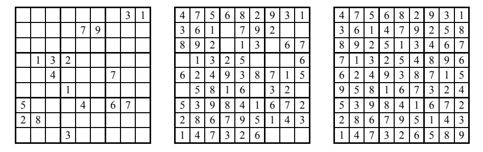

Figure 1. Puzzle Royle17-186, its L3 0 elaboration and its solution

#### X.1.3.2. An xy-wing of column-row type in $[L3 \ 0]+XYW$

Our second example, puzzle Royle17-4507 (Figure 2), illustrates an XY-Wing of column-row (and also block-row) type applied to a cell linked by a row to the first cell of the chain and by a block to the third cell. It can be seen on the central grid after interaction rules and X-Wing have been applied to its L3\_0 elaboration.

|   |   |   |   | 5 |   |   | 8 |   | 2 |   |   | 1 | 5 | 3 |   | 8 | 4 | 2 | 9 | 6 | 1 | 5 | 3 | 7 | 8 | 4 |
|---|---|---|---|---|---|---|---|---|---|---|---|---|---|---|---|---|---|---|---|---|---|---|---|---|---|---|
|   | 4 |   |   |   |   |   | 3 |   |   | 4 |   | 2 |   | 6 |   | 3 | 1 | 7 | 4 | 5 | 2 | 8 | 6 | 9 | 3 | 1 |
|   |   | 1 |   |   |   |   |   |   | 3 |   | 1 |   | 4 |   |   | 2 | 6 | 3 | 8 | 1 | 9 | 4 | 7 | 5 | 2 | 6 |
| 9 |   |   | 3 | 6 |   |   |   |   | 9 | 2 | 4 | 3 | 6 | 1 | 8 | 7 | 5 | 9 | 2 | 4 | 3 | 6 | 1 | 8 | 7 | 5 |
|   |   |   |   |   |   | 4 |   | 2 | 1 | 7 | 3 |   |   |   | 4 | 6 | 2 | 1 | 7 | 3 | 8 | 9 | 5 | 4 | 6 | 2 |
|   |   |   | 7 |   |   | 1 |   |   |   |   |   | 7 | 2 | 4 | 1 | 9 | 3 | 5 | 6 | 8 | 7 | 2 | 4 | 1 | 9 | 3 |
|   | 1 |   | 4 |   | 2 |   |   |   |   | 1 |   | 4 |   | 2 | 3 | 5 |   | 6 | 1 | 9 | 4 | 7 | 2 | 3 | 5 | 8 |
| 8 |   |   |   |   |   | 6 |   |   | 8 | 3 | 2 |   | 1 |   | 6 | 4 |   | 8 | 3 | 2 | 5 | 1 | 9 | 6 | 4 | 7 |
|   |   |   |   |   |   |   |   |   | 4 |   |   | 6 | 3 |   | 2 | 1 |   | 4 | 5 | 7 | 6 | 3 | 8 | 2 | 1 | 9 |

Figure 2. Puzzle Royle17-4507, its L3 0 elaboration and its solution

```
Resolution path in L3_0+XYW for the L3_0 elaboration of Royle17-4507: row r8 interaction-with-block b8 ==> r9c6 \neq 5 x-wing-in-columns n7{r2 r7}{c1 c5} ==> r7c9 \neq 7, r7c3 \neq 7, r2c7 \neq 7, r2c3 \neq 7 xy3-chain {n7 n9}r1c7 - {n9 n5}r2c7 - {n5 n7}r2c1 ==> r1c3 \neq 7 ... (Naked-Singles and Hidden-Singles)
```

#### X.2. XYZ-Wing or XYZW

#### X.2.1. Definition of the XYZ-Wing pattern

From the situation described in section 1, we obtain the definition of an XYZ-Wing by modifying the condition on the intermediate cell:

- the set of candidates for  $(r_2, c_2)$  is exactly  $\{n_1, n_2, n_3\}$ .

**XYZ-Wing rule**: given an XYZ-Wing, eliminate  $n_1$  from the candidates for any cell that does not belong to the chain and that shares a unit (possibly a different one) with each of its three cells.

Proof of the rule: the proof is an easy adaptation of the proof for XY-Wings. Let C be a cell in S<sub>2</sub>.

```
1) If (r_1, c_1) = n_1, then C \neq n_1, since C shares a unit with (r_1, c_1).
```

```
2) If (r_1, c_1) = n_2, then (r_2, c_2) \neq n_2, since (r_2, c_2) shares a unit with (r_1, c_1). Therefore, (r_2, c_2) = n_3 or (r_2, c_2) = n_1.
```

```
2a) If (r_2, c_2) = n_1, then C \neq n_1, since C shares a unit with (r_2, c_2).
```

2b) If  $(r_2, c_2) = n_3$ , then  $(r_3, c_3) \neq n_3$ , since  $(r_3, c_3)$  shares a unit with  $(r_2, c_2)$ . Therefore,  $(r_3, c_3) = n_1$  and  $C \neq n_1$ , since C shares a unit with  $(r_3, c_3)$ .

Finally, whichever value  $(r_1, c_1)$  has among its two candidates, C cannot be equal to  $n_1$ .

#### X.2.2. Logical formulation of the XYZ-Wing rule

The logical formulation of the XYZ-Wing rule is an obvious adaptation of the XY-Wing rule:

```
\begin{array}{l} \forall r_{1} \forall r_{2} \forall r_{3} \forall c_{1} \forall c_{2} \forall c_{3} \forall n_{1} \forall n_{2} \forall n_{3} \forall r \forall c \\ \{ \ rc\text{-bivalue} \ (r_{1}, \ c_{1}, \ n_{1}, \ n_{2}) \ \& \\ \text{share-a-unit}(r_{2}, \ c_{2}, \ r_{1}, \ c_{1}) \ \& \\ \text{candidate}(n_{2}, \ r_{2}, \ c_{2}) \ \& \ \text{candidate}(n_{3}, \ r_{2}, \ c_{2}) \ \& \ \text{candidate}(n_{1}, \ r_{2}, \ c_{2}) \ \& \\ n_{3} \neq n_{2} \ \& \ \forall n \not\in \{n_{2}, \ n_{3}, \ n_{1}\} \ \text{not-candidate}(n, \ r_{2}, \ c_{2}) \ \& \\ \text{share-a-unit}(r_{3}, \ c_{3}, \ r_{2}, \ c_{2}) \ \& \\ \text{rc-bivalue} \ (r_{3}, \ c_{3}, \ n_{3}, \ n_{1}) \ \& \\ \text{share-a-unit}(r, \ c, \ r_{1}, \ c_{1}) \ \& \\ \text{share-a-unit}(r, \ c, \ r_{2}, \ c_{2}) \ \& \\ \text{share-a-unit}(r, \ c, \ r_{3}, \ c_{3}) \ \& \\ \Rightarrow \\ \text{not-candidate}(n_{1}, \ r, \ c) \ \}. \end{array}
```

#### X.2.3. XYZ-Wing (or xyz3-chain) examples

The examples in this section prove that XYZW is not subsumed by L3 0+XYW.

#### X.2.3.1 An xyz-wing of block-row type in [L3 0+XYW]+XYZW

Puzzle Royle-17-2717 (Figure 3) is a very simple example of a grid that cannot be solved in L3\_0+XYW but whose L3\_0+XYW elaboration (equal to its L1\_0 elaboration) can be solved in L1\_0 after a single application of XYZ-Wing. The WYZ-Wing pattern (of block-row type) can be seen directly on the central grid. It is applied to a cell linked by a block to the first cell of the chain and by a row to the second and third cells.

|   |   |   |   | 1 |   | 6 |   |   |   | 4 |   | 7 | 1 | 5 | 6 |   | 8 | 3 | 4 | 2 | 7 | 1 | 5 | 6 | 9 | 8 |
|---|---|---|---|---|---|---|---|---|---|---|---|---|---|---|---|---|---|---|---|---|---|---|---|---|---|---|
|   | 5 |   |   |   |   |   |   | 3 | 6 | 5 | 1 | 8 | 2 | 9 | 4 | 7 | 3 | 6 | 5 | 1 | 8 | 2 | 9 | 4 | 7 | 3 |
|   |   |   |   | 4 |   |   |   |   |   |   |   | 6 | 4 | 3 | 5 |   | 1 | 7 | 9 | 8 | 6 | 4 | 3 | 5 | 2 | 1 |
|   | 7 |   | 2 |   |   |   | 5 |   |   | 7 |   | 2 | 6 |   | 1 | 5 | 9 | 4 | 7 | 3 | 2 | 6 | 8 | 1 | 5 | 9 |
|   |   |   | 3 |   |   |   |   |   |   | 1 |   | 3 |   |   | 8 | 6 |   | 2 | 1 | 9 | 3 | 5 | 4 | 8 | 6 | 7 |
|   |   |   |   |   |   |   | 4 |   |   |   | 6 | 1 |   |   | 3 | 4 |   | 5 | 8 | 6 | 1 | 9 | 7 | 3 | 4 | 2 |
| 1 |   | 4 |   |   |   | 7 |   |   | 1 |   | 4 |   |   |   | 7 |   |   | 1 | 6 | 4 | 9 | 3 | 2 | 7 | 8 | 5 |
|   |   |   | 5 |   | 6 | 2 |   |   |   | 3 |   | 5 | 8 | 6 | 2 | 1 | 4 | 9 | 3 | 7 | 5 | 8 | 6 | 2 | 1 | 4 |
| 8 |   |   |   |   |   |   |   |   | 8 | 2 | 5 | 4 | 7 | 1 | 9 | 3 | 6 | 8 | 2 | 5 | 4 | 7 | 1 | 9 | 3 | 6 |

Figure 3. Puzzle Royle17-2717, its L1 0 elaboration and its solution

Resolution path in L3\_0+XYW+XYZW for the L3\_0+XYW (or L1\_0) elaboration of Roy-le17-2717:

```
xyz3-chain {n9 n2}r5c3 – {n2 n5}r6c1 – {n5 n9}r6c5 ==> r6c2 \neq 9 ... (Naked-Singles and Hidden-Singles)
```

#### X.2.3.2. An xyz-wing of column-row type in [L3 0+XYW]+XYZW

For our second example, puzzle Royle17-4162 (Figure 4), the L3\_0+XYW elaboration is identical to the L2 elaboration (it uses Naked-Pairs). The solution is slightly more difficult than in the previous case, since it requires a mix of XYZ-Wing and XY-Wing. The XYZ-Wing (of column-row type) can be seen directly on the central grid. It is applied to a cell linked by a column to the first and second cells of the chain and by a block to the third.

Resolution path in L3\_0+XYW+XYZW for the L3\_0+XYW (or L2) elaboration of Royle17-2171:

```
xyz3-chain \{n5 \ n2\}r2c3 - \{n2 \ n8\}r8c3 - \{n8 \ n5\}r8c1 \Longrightarrow r9c3 \neq 5 naked-single \Longrightarrow r9c3 = 4
```

hidden-single-in-a-block ==> r5c2 = 4xy3-chain {n8 n2}r2c9 - {n2 n5}r2c3 - {n5 n8}r5c3 ==>  $r5c9 \neq 8$ ... (Naked-Singles)

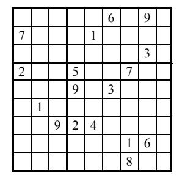

| 4 |   | 1 | 8 | 3 | 6 |   | 9 | 7 |
|---|---|---|---|---|---|---|---|---|
| 7 | 3 |   | 4 | 1 | 9 | 6 |   |   |
| 9 | 8 | 6 | 7 | 5 | 2 | 4 | 3 | 1 |
| 2 | 9 | 3 | 5 | 8 | 1 | 7 | 4 | 6 |
| 6 |   |   | 9 | 7 | 3 |   | 1 |   |
|   | 1 | 7 | 6 | 2 | 4 | 9 |   | 3 |
| 1 | 6 | 9 | 2 | 4 | 8 | 3 | 7 | 5 |
|   |   |   | 3 | 9 |   | 1 | 6 | 4 |
| 3 |   |   | 1 | 6 |   | 8 | 2 | 9 |

| 4 | 5 | 1 | 8 | 3 | 6 | 2 | 9 | 7 |
|---|---|---|---|---|---|---|---|---|
| 7 | 3 | 2 | 4 | 1 | 9 | 6 | 5 | 8 |
| 9 | 8 | 6 | 7 | 5 | 2 | 4 | 3 | 1 |
| 2 | 9 | 3 | 5 | 8 | 1 | 7 | 4 | 6 |
| 6 | 4 | 8 | 9 | 7 | 3 | 5 | 1 | 2 |
| 5 | 1 | 7 | 6 | 2 | 4 | 9 | 8 | 3 |
| 1 | 6 | 9 | 2 | 4 | 8 | 3 | 7 | 5 |
| 8 | 2 | 5 | 3 | 9 | 7 | 1 | 6 | 4 |
| 3 | 7 | 4 | 1 | 6 | 5 | 8 | 2 | 9 |

Figure 4. Puzzle Royle17-2171, its L2 elaboration and its solution

#### X.2.3.3. An xyz-wing of row-block type in [L3 0+XYW] +XYZW

For our third example (puzzle Royle17-4162, Figure 5) the L3\_0+XYW elaboration is identical to the L1\_0 elaboration. The solution is again slightly more difficult than the previous case, since it requires a mix of XYZ-Wing, XY-Wing and Sword-fish-in-rows. The XYZ-Wing (of row-block type) can be seen directly on the central grid. It is applied to a cell linked by a row to the first and second cells of the chain and by a block to the third.

|        |   |   |   | 4 | 8 |   |  |
|--------|---|---|---|---|---|---|--|
|        | 6 |   | 1 |   |   |   |  |
|        |   | 2 |   |   | 3 |   |  |
|        | 7 |   | 2 |   |   | 6 |  |
| 4      |   |   |   | 3 | 5 |   |  |
|        |   |   |   |   |   |   |  |
|        |   |   | 6 |   |   | 1 |  |
| 3<br>8 |   | 5 |   |   |   |   |  |
| 8      |   |   |   |   |   |   |  |

| _ | _ | _ | _ | _ | _ | _ | _ |   |
|---|---|---|---|---|---|---|---|---|
| 1 | 3 | 9 |   | 4 | 2 | 8 |   | 6 |
|   | 6 | 4 | 1 | 8 | 3 |   |   |   |
|   | 8 | 2 |   | 6 |   | 3 | 4 | 1 |
| 9 | 7 | 3 | 2 | 1 | 5 | 4 | 6 | 8 |
| 4 | 2 | 1 | 8 | 3 | 6 | 5 |   |   |
| 6 | 5 | 8 |   |   |   | 1 | 3 | 2 |
| 2 | 4 | 7 | 6 | 5 | 8 | 9 | 1 | 3 |
| 3 |   | 5 |   | 2 |   | 6 | 8 |   |
| 8 |   | 6 | 3 |   |   |   |   |   |

| 1 | 3 | 9 | 5 | 4 | 2 | 8 | 7 | 6 |
|---|---|---|---|---|---|---|---|---|
| 7 | 6 | 4 | 1 | 8 | 3 | 2 | 5 | 9 |
| 5 | 8 | 2 | 9 | 6 | 7 | 3 | 4 | 1 |
| 9 | 7 | 3 | 2 | 1 | 5 | 4 | 6 | 8 |
| 4 | 2 | 1 | 8 | 3 | 6 | 5 | 9 | 7 |
| 6 | 5 | 8 | 4 | 7 | 9 | 1 | 3 | 2 |
| 2 | 4 | 7 | 6 | 5 | 8 | 9 | 1 | 3 |
| 3 | 9 | 5 | 7 | 2 | 1 | 6 | 8 | 4 |
| 8 | 1 | 6 | 3 | 9 | 4 | 7 | 2 | 5 |

Figure 5. Puzzle Royle17-4162, its L3 0 elaboration and its solution

Resolution path in L3\_0+XYW+XYZW for the L3\_0+XYW (or L1\_0) elaboration of Royle17-4162:

```
xyz3-chain {n7 n4}r8c9 – {n4 n9}r8c4 – {n9 n7}r9c5 ==> r8c6 \neq 7 swordfish-in-rows n7{r1 r5 r8}{c4 c8 c9} ==> r9c9 \neq 7, r9c8 \neq 7, r6c4 \neq 7, r3c4 \neq 7, r2c9 \neq 7, r2c8 \neq 7
```

xy3-chain 
$$\{n9 \ n7\}r5c8 - \{n7 \ n5\}r1c8 - \{n5 \ n9\}r2c9 ==> r5c9 \neq 9$$
 ... (Naked-Singles)

#### X.3. Theory L3

In conformance with our general guiding principles, let us consider the possibility of hidden and/or super hidden versions of XY-Wing and XYZ-Wing. Applying the procedure described in section IV.4, we must first define the block-free versions of XY-Wing and XYZ-Wing. For these rules, this obviously amounts to restricting them to the cases in which blocks do not appear as linking units.

#### X.3.1. Hidden and super hidden XYZ-Wings

#### Theorem X.1: There are no hidden or super-hidden XYZ-Wings.

Proof: if there is an XYZ-Wing in which the shared units are limited to the types row or column, then it is of type rc (or cr) and no cell outside the chain can share a unit of type row or column with the three cells in the chain. Said otherwise, the conditions in the block-free version of XYZ-Wing can match no puzzle. By metatheorem 3, the same applies obviously to its hidden and super-hidden counterparts.

#### X.3.2. Hidden and super hidden XY-Wings

The case of XY-Wings is more difficult. In our three puzzle databases, we have found no case of a hidden XY-Wing. Conversely, we have not been able to prove the following

Conjecture: HXYW is subsumed by rules in L3\_0+XYW+XYZW.

#### *X.3.3. Theory L3*

Let us now define theory L3 as the union of L3 $_0$  with the set of rules introduced in the present chapter:

$$L3 = L3 \ 0 \cup \{XYW, XYZW, HXYW\}$$

Later, when we have defined xy-chains, we shall show that this is equivalent to:

$$L3 = L3 \ 0 \cup \{XY3, XYZ3, HXY3\}.$$

Using, theorem X.1, it can easily be shown that L3 is closed by symmetry, analogy and supersymmetry.

#### X.4. Theories L1 0 to L4 0

#### X.4.1. The first four levels of our classification

Rules relative to Subsets constitute the backbone of our classification – at least of its first four levels

Our classification of a Subset rule is based on the minimum number of cells, in the appropriate space, one must examine to *detect* the pattern defining its condition part. It is not based on the number of cells one must consider to apply the conclusions of the rule. This is because the difficult part of a rule is detecting its conditions pattern, not applying its conclusions. Moreover, the more cells are concerned by the conclusions of a rule, the more this rule is "productive"; exploiting it should therefore not be delayed by the attribution of a higher complexity.

One needs to examine one cell for detecting Singles, two for Pairs... This is obvious for Naked Subsets, in natural row-column space. For Hidden or Super-Hidden Subset rules, one has to detect the same pattern as for a Naked Subset, but in abstract rn-, cn- or bn- spaces. For instance, in rn-space, one can easily detect a Hidden-Triplets-in a-row because we have shown it looks like a Naked-Triplets-in-a-row would in rc-space; and, in the same rn-space, one can also easily detect a Super-Hidden-Triplets-in-a-row because it looks like a Naked-Triplets-in-a-column would in rc-space. Similarly, in nc representation one can easily detect a Hidden-Triplets-in-a-column, because it looks like a Naked-Triplets-in-a-column would in rc-space; and, in the same nc representation, one can also easily detect a Super-Hidden-Triplets-in-a-column because it looks like a Naked-Triplets-in-a-row would in rc-space. Finally, in bn-space, one can easily detect a Hidden-Triplets-in-a-block, because it looks like a Naked-Triplets-in-a-block would in rc-space.

It is therefore obvious that the larger a Naked Set is the higher in the logical complexity hierarchy the associated rule should be. And we have already mentionned that rules related by symmetry or super-symmetry should be given the same logical complexity.

Having also defined the rules for Interaction, XY-Wing and XYZ-Wing, we are now in a position to complete the specification of the first levels of our hierarchy:

```
BSRT = GT \cup \{ECP(cell), ECP(row), ECP(col), ECP(blk), CD, NS\}
L1 0 = BSTR \cup HS
        (where HS = \{HS(row), HS(col), HS(blk)\})
L1 = L1 \ 0 \cup \{RiB, CiB, BiR, BiC\}
L2 0 = L1 \cup NP \cup HP \cup SHP
         (where NP = \{NP(row), NP(col), NP(blk)\}
                 HP = \{HP(row), HP(col), HP(blk)\}\
                 SHP = {SHP(row), SHP(col)})
L2 = L2 \ 0
L3 0 = L2 \cup NT \cup HT \cup SHT
          (where NT = \{NT(row), NT(col), NT(blk)\}
                 HT = \{HT(row), HT(col), HT(blk)\}
                 SHT = {SHT(row), SHT(col)}
L3 = L3 \ 0 \cup \{XYW, XYZW, HXYW\} = L3 \ 0 \cup \{XY3, XYZ3, HXY3\}
L4 0 = L3 \cup NQ \cup HQ \cup SHQ
          (where NQ = \{NQ(row), NQ(col), NQ(blk)\}
                 HQ = \{HQ(row), HQ(col), HQ(blk)\}\
                 SHQ = \{SHQ(row), SHQ(col)\}\)
```

By an abuse of notation that should lead to no confusion, names of resolution theories, like BSRT, L1\_0, L1, L2... will also be used to name the sets of puzzles that can be solved by these theories.

In the examples of this chapter and the previous ones, whenever we had to anticipate rules that were not yet defined, we have been careful not to introduce puzzles whose solution would require rules of a higher level of complexity than that of the rule the example is intended to illustrate.

#### X.4.2. Remarks on the rn-, cn- and bn- spaces

We have already raised the following practical question: is it worth doing all the tedious extra job of maintaining the four representations for easier detection of patterns that, after some training, are finally not so difficult to detect on the usual row-column representation? Now, our answer can be more precise. If the abstract representations were used only for detecting the rules introduced up to this point, the

answer should probably be: no, let them serve only to illustrate the symmetry relationships between rules of types Naked, Hidden and Super-Hidden, but do not use them in practice.

But we shall see soon that these representations are the intuitive motivation for the definition of new types of chains that could hardly be detected in rc-space and that they allow one to solve grids that could probably not be solved without using them. Moreover, Sudoku machines have been appearing and it would be easy to program them for displaying simultaneously the four representations (or at least three, because, apart from easing detection of the pattern defining the conditions of a Hidden-Subset rule relative to blocks or of an Interaction rule, block-number space is not really useful – it does not benefit from the same symmetry relationships as rn-or cn- spaces).

Sudoku is basically a three dimensional problem, as can be seen from the fact that its basic predicates ("value" and "not-candidate") take three arguments. It should ideally be seen in the three dimensional row-column-number space. But defining rules based on 3D patterns (for instance 3D chain rules) is unrealistic from the human solver point of view. As a best approximation, this 3D space should be considered from several two dimensional points of view: rc- rn- and cn- spaces. If its analysis is restricted to only one of these views, the usual rc-space, significant aspects of the problem are missed.

#### X.4.3. The higher levels of our classification; notations

In forthcoming chapters, the consideration of chains of various types and of associated rules will lead us to complete the four levels introduced above with higher levels: L5, L6, ... *All the theories we shall define from now on will be extensions of L4\_0 and they will be based on various types of chain rules*. By convention, a rule relative to chains of length five (respectively six, seven...) will be classified into L5 (resp. L6, L7...). In our examples, we shall sometimes need to refer to these levels before defining them in detail.

If T is a resolution theory and  $A_1, A_2, ..., A_n$  and  $B_1, B_2, ..., B_p$  are resolution rules, then we write  $[T+A_1+A_2+...+A_n]+B_1+B_2+...+B_p$  to name the set of puzzles that cannot be solved in theory  $T \cup \{A_1, A_2, ..., A_n\}$  but can be solved in the extended theory  $T \cup \{A_1, A_2, ..., A_n\} \cup \{B_1, B_2, ..., B_p\}$ . This notation will be very useful for the easy statement of independence results. Indeed, having an example in  $[T+A_1+A_2+...+A_n]+B_1+B_2+...+B_p$  proves that no rule in  $\{B_1, B_2, ..., B_p\}$  can be subsumed by the set of rules  $T \cup \{A_1, A_2, ..., A_n\}$ . Many of the examples in the forthcoming chapters will be of this type. Usually, we shall not even state the

corresponding theorem, considering that it is obvious from the example. For instance, when we show that there is a puzzle in [L5]+XY6, this proves implicitly that the XY6 rule is not subsumed by rules in L4\_0 together with rules relative to chains built on at most five cells (among the types of chains considered in this book).

As a motivation for the introduction of chain rules and the associated higher levels (and anticipating on the classification results given in chapter XXI), let us mention that, using only the rules defined up to this point (i.e. the rules in L4\_0), one can solve approximately 88% of the puzzles in the Royle17 collection and 65% of the puzzles in the two randomly generated Sudogen collections.

## Part Three

# 2D CHAIN RULES

### Chapter XI

### General theorems on shared units

Chains of various types are the main tools for dealing with hard puzzles and shared units are the ingredients used to glue cells into chains. Section 1 proves a few general theorems on shared units that will be very useful in the sequel (especially in chapter XIV) when we deal with chains.

When the concept of a shared unit in natural rc-space is restricted to that of rc-connected cells, it has supersymmetric versions, the concepts of rn-connected rn-cells in abstract rn-space and of cn-connected cn-cells in abstract cn-space; in turn, these concepts will provide the glue for building new types of chains, hidden chains of various sorts in rn- and cn- spaces (see chapters XV, XVIII and XX).

Notice that this chapter may be considered as pertaining not only to Sudoku Resolution Theory but also, more basically, to Grid Theory.

#### XI.1. Shared units in natural row-column space

Remember from section III.1.3.2 that two cells *share a unit* if:

- they are different.
- they are either in the same row or in the same column or in the same block.

#### XI.1.1. Three cells

The theorems in this section are valid for Sudoku grids of any size.

Theorem XI.1: given two different cells in a row, if a cell shares a (possibly different) unit with each of them, then either all three cells are in the same row or they are in the same block (the "or" being non exclusive). The same is true if "row" is replaced by "column".

Proof: if the third cell is also in this row, we are done; if not, then it shares no row with any of the first two and it can share a column with at most one of them; therefore, it must share a block with at least one of them; but then it cannot share a column with any of the first two cells that would be outside this block, and the only way it has to share a unit with each of these two cells is sharing this block with them (which implies that the first two cells already shared this block), so that the first part of the theorem is proved. For the second part, just apply the row-column symmetry to this proof.

Theorem XI.2: given two different cells in a block, not in the same row and not in the same column, if a cell shares a (possibly different) unit with each of them, then it is in the same block.

Proof: in the conditions of the theorem, the first two cells span at least two rows and two columns; any cell that is not in the same block as these two can share no block with either of them, it can share a row with at most one of them but then it can share no column with either of them, or it can share a column with at most one of them but then it can share no row with either of them; finally, a cell which is not in the same block as the first two cannot share a (possibly different) unit with each of them

Theorem XI.3: given three different cells such that any two of them share a unit (possibly a different one for each couple), then there exists a unit shared by all three cells (and there may exist two such units).

Proof: it is an obvious consequence of the preceding two theorems. Take two cells from the three; if they share a row (respectively: a column), theorem XI.1 implies that the third shares with them either this row (respectively: this column) or a block; if they share neither a row nor a column, then they must share a block, and theorem XI.2 implies that the three cells share this block.

#### XI.1.2. Four cells

Unless otherwise stated, the theorems in this section are valid for Sudoku grids of any size.

Theorem XI.4: given three different cells in a row, if a cell shares a (possibly different) unit with each of them, then either all four cells are in the same row or they are in the same block (the "or" being exclusive in case of a 9x9 grid). The same is true if "row" is replaced by "column".

Proof: if the fourth cell is also in this row, we are done; if not, then it shares no row with any of the first three cells and it can share a column with at most one of them; therefore, it must share a block with at least two of them; but then it cannot share a column with any of the three cells that would be outside this block, and the only way it has to share a unit with each of the three cells is sharing this block with them all (which implies that the three cells already shared this block), so that the first part of the theorem is proved. For the second part, just apply the row-column symmetry to this proof.

Theorem XI.5: given three different cells in a block, not all three in the same row and not all three in the same column, if a cell shares a (possibly different) unit with each of them, then it is in the same block.

Proof: in the conditions of the theorem, the first three cells span at least two rows and two columns; any cell that is not in the same block as them can share no block with any of them, it can share a row with at most two of them but then it can share no column with any of them, or it can share a column with at most two of them but then it can share no row with any of them; finally, a cell which is not in the same block as the first three cannot share a (possibly different) unit with each of them.

Theorem XI.6: given four different cells such that any two of them share a unit (possibly a different one for each couple), then there exists a unit shared by all four cells. This unit is unique in case of a 9x9 grid.

Proof: it is an easy consequence of the preceding theorems. Consider any one of the four triplets one can assemble from the four given cells. After theorem XI.3, for each of these triplets there is a unit shared by its three cells. Therefore, one of theorems XI.4 and XI.5 applies to the situation and gives the conclusion.

#### XI.1.3. Five or more cells

When we consider five or more cells, results are slightly simpler when we limit them to 9x9 Sudoku grids (but notice that results similar to those in sections 1 and 2 could be formulated for grids of any size).

Theorem XI.7: given four different cells in a row, if a cell shares a (possibly different) unit with each of them, then all five cells are in the same row. The same is true if "row" is replaced by "column".

Proof: if the fifth cell is also in this row, we are done; if not, then it shares no row with any of the first four cells and it can share a column with at most one of them; therefore, it must share a block with at least three of them; but then it cannot share a column with any cell among them that would be outside this block, and the only way it has to share a unit with each of the first four cells is sharing this block with them all; but four cells in a row cannot share a block; so that the first part of the theorem is proved. For the second part, just apply the row-column symmetry to this proof.

Theorem XI.8: given four different cells in a block, if a cell shares a (possibly different) unit with each of them, then all five cells are in the same block.

Proof: in the conditions of the theorem, the four cells span at least two rows and two columns; any cell that is not in the same block as them can share no block with any of them, it can share a row with at most three of them but then it can share no column with any of them, or it can share a column with at most three of them but then it can share no row with any of them; finally, a cell which is not in the same block as the first four cannot share a (possibly different) unit with each of them.

Theorem XI.9: given five different cells such that any two of them share a unit (possibly a different one for each couple), then there exists a single unit shared by all five cells. This unit is unique in case of a 9x9 grid.

Proof: it is an easy consequence of the preceding theorems. Consider any one of the five quadruplets one can assemble from the five given cells. After theorem XI.6, for each of these quadruplets there is a unit shared by its four cells. Therefore, one of theorems XI.7 and XI.8 applies to the situation and gives the conclusion.

#### XI.2. Hidden counterparts of the previous theorems

Meta-theorem 3 (chapter I or IV) does not apply directly to the above theorems, since they refer to predicate "share-a-unit". But one can introduce block-free analogues of these theorems.

#### XI.2.1. rc-connected rc-cells in natural row-column space

Let us first replace predicate "share-a-unit" by "rc-connected", where auxiliary predicate rc-connected( $r_1$ ,  $c_1$ ,  $r_2$ ,  $c_2$ ) has been defined in III.1.

Now, the following limited versions of the theorems in section 1 are totally obvious (and, in themselves, they will be as useless to us are they are obvious). Notice that, given the trivial situation in the conclusion of these theorems, there is no need to consider sets of more than three cells.

Theorem XI.1-rc: given two different rc-cells in the same row, if a rc-cell is rc-connected to each of them, then it is in the same row. The same is true if "row" is replaced by "column".

Theorem XI.3-rc: given three different rc-cells such that any two of them are rc-connected, then either all three rc-cells share the same row coordinate (i.e. they are in the same row) or they share the same column coordinate (i.e. they are in the same column).

#### XI.2.2 rn-connected rn-cells in row-number space

The theorems of section 2.1 become more interesting, and they will be used in chapter XV, when they are transferred by column-number symmetry into abstract row-number space, according to meta-theorem 3 (chapter I or IV).

First, one has to introduce predicate rn-connected, with arity 4 and signature (Row, Number, Row, Number);

rn-connected $(r_1, n_1, r_2, n_2)$  is defined as a shorthand for:  $r_1 = r_2$  or  $n_1 = n_2$ .

Theorem XI.1-rn: given two different rn-cells, if an rn-cell is rn-connected with each of them, then either all three rn-cells share the same row coordinate (i.e. they are in the same row) or they share the same number coordinate.

Theorem XI.3-rn: given three different rn-cells such that any two of them are rn-connected, then either all of them have the same row coordinate (i.e. they are in the same row) or they have the same number coordinate.

Of course, these theorems can also be proved directly, with no invocation of meta-theorem 3, in a completely obvious way. What may have not been obvious before their formulation is the very idea of their existence, itself a consequence of having considered rn-space.

#### XI.2.3. cn-connected cn-cells in column-number space

By row-column symmetry, one can get the counterparts in column-number space of the theorems in section 2.2. We leave their explicit writing to the reader as an obvious exercise.

#### XI.2.4. bn-connected bn-cells in block-number space

As being bn-connected merely means being in the same block, any theorem in bn-space is obvious.

### Chapter XII

# Chains, target cells and chain rules

Chains are the main tools for dealing with hard Sudoku puzzles. Indeed, many of the advanced resolution rules that have been appearing on the Web are explicitly or implicitly concerned with various types of chains; moreover, some of the rules reviewed in the previous chapters may be recast as chain rules (as will be explained in chapters XIV through XVII).

But very often, proposed chain rules are only considered through particular examples, so that there remains much ambiguity concerning their scopes of application and much redundancy in proposals for new rules. It also appears that the basic concepts relevant for chain rules are unclear, leaving unanswered questions even for the most familiar types of rules (for instance, should one allow loops in xychains?, in AICs?). As a consequence, the need for a systematic classification of rules has been expressed many times but it remains as yet unsatisfied.

This chapter introduces our general conceptual framework for dealing with two dimensional (2D) chains. As all the chains in this Part Three are 2D chains (i.e. can be defined as chains of cells in either of the rc-, rn- or cn- 2D spaces), "2D" will generally be omitted. This chapter defines the notions of a link, of a chain, of a target value and of a target cell for a chain; based on these notions, it formulates a general inference rule schema for chains – a prototypical theorem for all conceivable types of chains.

Then it introduces some usual types of links and associated types of chains frequently met in the sequel: xy-chains (in section 2) and c-chains (or conjugacy chains, in section 3). Although such names may be familiar to the experimented

sudoku-ka, our definitions are non-standard, either refining the usual ones (in the case of xy-chains) or extending them (in the case of c-chains). The reasons for this will appear when the general inference rule schema of section 1 is specialised to chains of these types (respectively in sections 2 and 3): our definitions are the most general ones leading to a natural proof of these rules.

Whereas chapter XIII will introduce a more formal (graphico-logical) framework for representing chains and chain rules in a systematic and unified manner, the focus here is on intuitive, but precise, formulations of the basic notions and rules; in accordance with the general guiding principles explained in the introduction, we aim at a set of rules that are individually valid, individually as general as possible and globally as little redundant as possible – a list of requirements that is not as easy to meet as it may seem.

#### XII.1. Links, chains, targets and chain rules

This section introduces the basic notions of our general framework for dealing with 2D chains. It culminates at the end with the general inference rule schema for 2D chains. This rule schema must be considered as a regulatory principle for the definitions of specific types of chains (relevant conditions must be put in the definitions of the chain and of its targets so that the theorem is valid for them). This is why no specific types of chains, no concrete examples, will be introduced before the end of this section: we need to know how we intend to use chains of various types for inference before we can give them precise definitions.

#### XII.1.1. Links

When two different cells share a unit (i.e. when they are in the same row, in the same column or in the same block), we also say that they are *linked* (or rc-linked if we want to emphasise that the link is in natural row-column space) or that there is a link (or an rc-link) between them. This is a symmetric (but not reflexive) relation: if  $C_1$  is linked to  $C_2$ , then  $C_2$  is linked to  $C_1$  (but  $C_1$  is not linked to  $C_1$ ). Sometimes, one says that the two cells *see* each other, but we prefer avoiding such vocabulary.

Since two different cells can share two units at the same time (a row and a block, or a column and a block, but not a row and a column), we may have to be more precise when we say that they share a unit. So, if ut is a unit type (ut = row, col or blk), we shall sometimes say that the two cells are *ut-linked* or linked along a unit of type ut; similarly, if u is a unit, we shall sometimes say that the two cells are *u-linked* or linked along unit u. Notice that, given a unit-type ut and two cells ut-linked, there is

one and only one unit u of type ut that can link these cells. But, most of the time, in chain rules, only the existence of a link will be relevant, not its type.

In sections 2 and 3 respectively, two specific types of links between two cells (xy-links and conjugacy-links or c-links) will be introduced; they will play a major role in the next chapters.

#### XII.1.2. Chains and full chains

Linked cells are most useful when they combine into chains. Later we shall define various specific types of chains, but all of them will satisfy the conditions in the following definition: a *chain* (or a general chain) is a finite sequence of cells (it is thus linearly ordered) such that:

- any two consecutive cells in the sequence are different and they are linked by a definite unit.
  - the two endpoints of the sequence are different.

#### Remarks:

- "definite unit" in the first condition means that, in case two consecutive cells share two units, only one of these (the one specified in the definition of the chain) is considered as linking these two cells in this chain;
- we consider only chains with different endpoints, or "open" chains (it will be shown later that there is no reason for introducing global loops, since rules that might be associated with them can be handled with shorter chains through the notion of a target of a chain see chapter XIV);
- intermediate non consecutive cells are not *a priori* forbidden to be identical, so that a general chain may contain internal loops; but in the specific definitions of the usual types of chains, specific restrictions will allow one to discard such loops as being "unproductive" an idea that will be explained later;
- if we need to specify the length of a chain, we shall speak of a 3-chain, a 4-chain, a 5-chain..., according to the number of cells it contains (beware: we count the cells, not the links);
  - a 2-chain is simply a couple of cells that share a unit;
- in our definition of a chain, we do not impose the condition that the first and the last cells share some candidate; although such a condition will be needed in the end (i.e. when we want to use chains for inference), putting them in the general definition of a chain would unnecessarily complicate matters if we want to combine different kinds of chains;

- additional conditions on the links between consecutive cells may be considered, giving rise to different kinds of chains; in sections 2 and 3, we shall define two basic specific types of chains: xy-chains and c-chains; later, we shall meet other types of chains with higher complexity, but basically all the chains we shall consider will be built on these three types of links: simple links (i.e. shared units), xy-links and c-links;
- specifications of type and length can be combined, so that we get c4-chains, xy3-chains and so on.

We shall also need to make a distinction between a chain of a specified type and a *full chain* of the same type, i.e. a chain of this type satisfying additional conditions specific to this type that make it ready for the application of the inference rule specific to this type of chain (see section 1.4). Such a distinction is necessary if we want to be able to combine chains of different types (inference rules apply to full chains whereas non full chains can be combined to form chains of mixed types).

#### XII.1.3. Targets of a chain

The aim of introducing chains, and more specifically full chains of specified types, is the formulation of constraints propagation rules that lead to the elimination of a (generally unique) candidate from some (generally several) cells. The number and cells that may be concerned by such elimination will be called the *targets* of the chain (*target number* or *target value* and *target cells*). A specificity of our framework is that *the target cells of a chain do not belong to the chain*. For all the types of chains we consider in this book, this allows defining them with homogeneous chain patterns without incurring any loss of generality and this allows a chain to have several targets, as will be seen from the xy- and c- chain examples below.

To be more precise in our definition of a target cell, consider first that, in any actual chain on an actual grid, there are two aspects:

- the structural aspects: the number of cells, the types of links between them, the relationships these links impose on the values in the cells of the chain;
- the instantiation (or occurrence) aspects: the actual places of the cells on the grid and the actual values of the candidates for these cells.

It will always be very easy to define the target number of a full chain of a given type and there will be one and only one such number. As for the target cells, although similar ideas appear from time to time in the Web literature, this notion does not play a major or systematic role, because they are generally considered as being part of the chain. We define them according to our general guiding principles:

- since the structural aspects of a chain do not depend on actual values or on actual places, the defining conditions on target cells for any specific type of chain should not depend on actual values or on actual places; as this is the condition for being able to write rules respecting value and place independence (the two basic groups of symmetries in Sudoku), this can hardly be disputed;
- a target cell of a chain should not be a target cell of a subchain for the same target value; the obvious reason is that if a consequence can be drawn from a subchain, then it should be taken into account by a simpler rule (applying to this shorter chain); innocuous as this application of our general principles may seem, its practical consequences will appear soon (see next chapter);
- as a result, a target cell of a chain should be defined mainly from its endpoints (this will be commented and elaborated later on);
- this last condition naturally leads to the following more precise one: a target cell of a chain should be *linked* to both of its endpoints.

We therefore adopt the following definition: a *general target cell* of a full chain is a cell that does not belong to the chain and that is linked to both of its endpoints.

Let us also introduce a tentative definition: a specific target cell of a specific type of chain is a general target cell of this chain that satisfies additional conditions depending on the specific type of the chain. The additional conditions naturally appear as additional links to inner cells of the chain. Examples of chains whose targets have such additional links will appear with the xyz- and xyzt- chains of chapter XIX.

Finally, we adopt the following definition: *a specific target cell* of a specific type of chain is a cell that does not belong to the chain and that is linked to both of its endpoints and to zero or more cells in this chain, as defined precisely by the specific type of the chain.

When we speak of the target cell of a full chain or simply of the target of a chain of some specified type, unless otherwise specified, we mean a specific target cell of a full chain of this type. The next two sections will introduce the two basic cases of xy-chains and c-chains and give the corresponding definitions of full chains and target cells. Other types of chains will be considered in forthcoming chapters.

#### XII.1.4. General constraints propagation rule schema for full chains

With the above definitions, constraints propagation rules based on full chains of any type (zz) must be instances of the following (informal) general rule schema:

Constraints propagation rule schema for full zz-chains (informal):

For any full zz-chain, for any zz-target-number n for this chain and for any zz-target-cell C for this chain, eliminate n from the candidates for C,

where zz-chain is any predefined type of chain and zz-target-number and zz-target-cell define the target number and a target cell for a chain of this type.

A formal version of this theorem schema will be given in the next chapter, after we have introduced a graphico-logical formalism for representing chains.

Notice that, as the conclusion of the rule modifies the content of the target cells, if we allowed a target cell to be one of the cells in the chain, we would potentially have a vicious circle, amounting to negate the conditions used to justify the conclusion. This is why we excluded this possibility from the definition of a target cell

Notice also that all our chain rules can only eliminate candidates, they can never assert values. In the literature, one can find chain rules that assert value, but this can always be replaced by a succession of rules for shorter chains that eliminate candidates and of elementary rules. Finally, among all the rules discussed in this book, the only ones that assert values are Naked-Single and Hidden-Single.

#### XII.2. xy-links, xy-chains and xy-chain rules

#### XII.2.1. xy-links

Definition: two cells on a grid are said to be *xy-linked* along a given unit u (respectively: xy-linked along a given unit type ut) by a given number n if:

- they are linked along unit u (respectively: linked along a unit of type ut), which entails that they are different,
- each of the two cells has two distinguished non equal candidates, called the left-linking candidate and the right-linking candidate (and it may have additional candidates);
- the left-linking candidate for the second cell is equal to the right-linking candidate for the first cell; it is called the xy-linking candidate for the two cells.

In such a situation, u is called the xy-linking unit and ut the xy-linking unit type.

An xy-link is called *strict* if none of the two cells it links has any candidate other than the two distinguished ones.

#### XII.2.2. xy-chains and full-xy-chains

Definition: an xy-chain is a chain in which:

- each cell has two non equal distinguished candidates, called the left-linking candidate and the right-linking candidate, and it has no other candidate;
- the left-linking candidate for each cell but the first is equal to the right-linking candidate for the previous cell (therefore, for any two consecutive cells, the link between them is actually a strict xy-link);
- any two cells in the sequence are different i.e. there are no loops (this unusual and apparently too restrictive condition will be justified in detail in chapter XIV).

To make this definition more intuitive, and anticipating on chapter XIII (where such patterns will be given rigorous meaning and logical status), let us give a graphical representation of an xy5-chain (where the horizontal bars represent links along units of any type):

$$\{1\ 2\}$$
— $\{2\ 3\}$ — $\{3\ 4\}$ — $\{4\ 5\}$ — $\{5\ 6\}$ .

An xy2-chain is simply a pair of strictly xy-linked cells.

#### Definitions:

- a *full xy-chain* is an xy-chain in which the left-linking candidate for the first cell equals the right-linking candidate for the last cell (but it is not required that there is a direct link between these two cells, i.e. a full xy-chain does not necessarily extend into what might be called an xy-loop);
- the target number of a full-xy-chain is the left-linking candidate for the first cell, which is equal to the right-linking candidate for the last cell;
- a target cell of a full-xy-chain is any general target cell of this chain (notice in particular that we do not require a target cell to be bivalue and we do not require the links between the endpoints of an xy-chain and any of its target cells to be xy-links).

In order to illustrate the difference between a general xy-chain and a full xy-chain, let us give an intuitive graphical representation of a full xy5 chain:

$$\{1\ 2\}$$
— $\{2\ 3\}$ — $\{3\ 4\}$ — $\{4\ 5\}$ — $\{5\ 1\}$ .

#### XII.2.3. Full xy-chain rules

Theorem XII.1 (constraints propagation rule for full xy-chains): given a full xy-chain with xy-chain target value n, eliminate n from the candidates for any of its target cells.

Proof of the rule for the full xy4-chain  $\{1\ 2\}$ — $\{2\ 3\}$ — $\{3\ 4\}$ — $\{4\ 1\}$ : let the cells in the chain be  $C_1$ ,  $C_2$ ,  $C_3$ ,  $C_4$ ; let their successive left-linking candidates be  $n_1$ ,  $n_2$ ,  $n_3$ ,  $n_4$ , so that the target value is  $n_1$  and the successive right-linking candidates are  $n_2$ ,  $n_3$ ,  $n_4$ ,  $n_1$ ; let TC be any xy4-target-cell, i.e. TC shares a unit with both  $C_1$  and  $C_4$  – and it is therefore different from each of these two cells.

Cell  $C_1$  can take two and only two values (hypothesis  $n_2 \neq n_1$  is essential for this assertion). Let us consider each possibility in turn:

- if  $C_1 = n_1$ , then TC cannot be  $n_1$  since it shares a unit with  $C_1$  (notice that hypothesis TC ≠  $C_1$  is essential here);
- if  $C_1 = n_2$ , then  $C_2$  cannot be  $n_2$  since it shares a unit with  $C_1$ ; it must therefore be  $n_3$  (hypothesis  $n_3 \neq n_2$  is essential for this conclusion).  $C_3$  cannot be  $n_3$  since it shares a unit with  $C_2$ ; it must therefore be  $n_4$  (hypothesis  $n_4 \neq n_3$  is essential for this conclusion).  $C_4$  cannot be  $n_4$  since it shares a unit with  $C_3$ ; it must therefore be  $n_1$  (hypothesis  $n_1 \neq n_4$  is essential for this conclusion); finally, TC cannot be  $n_1$  since it shares a unit with  $C_4$  (notice that hypothesis  $TC \neq C_4$  is essential here).

To finish the proof: in any of the two cases, whether  $C_1 = n_1$  or  $C_1 = n_2$ , TC cannot be  $n_1$ .

The case of a full xy-chain of any length (at least 2) is completely similar. We just have to do the appropriate number of inference steps in the second branch of the above alternative concerning the possible values of cell C<sub>1</sub>. For a more formal proof, the best way to proceed is proving theorem XX.2 below by inference.

It should be noted that the two candidates for any cell in an xy-chain must be different but it is allowed for candidates in different cells to be identical (as far as this does not contradict the definition of xy-links). In particular, it is not forbidden for the target value to appear in the chain at places other than the endpoints, as in this particular xy5-chain:  $\{1\ 2\} - \{2\ 3\} - \{3\ 1\} - \{1\ 5\} - \{5\ 1\}$ .

It should also be noted that the no-loop condition we have put in the definition of xy-chains has not been used in this proof. Nevertheless, it will be justified on other grounds in the next chapter.

As a last remark on this theorem, we have defined target cells as not belonging to the chain, contrary to usage. This allows keeping the homogeneity of the chain (all links in the chains are pure xy-links) and having the greatest generality for the rule (target cells are not linked by xy-links). This also allows using the same chain for eliminations in different target cells. The same remark will apply to c-chains.

Finally, what is shown in the second branch of the alternative in the above proof is indeed that, if  $C_1 \neq n_1$ , then all the cells in the chain are equal to their right-linking candidate. We therefore have:

Theorem XII.2 (general theorem for non necessarily full xy-chains): given an xy-chain, either the value of the first cell is its left-linking candidate or the value of each cell in the chain is its right-linking candidate.

This result provides the basic tool for combining chains of different types. (Although such combinations will not be studied in this book, we think it is useful to mention how they could be dealt with.)

#### XII.3. c-links, c-chains and c-chain rules

#### XII.3.1. c-links

Definition: two cells on a grid are said to be *conjugate* or *c-linked* along a given unit u (respectively: c-linked along a unit of a given type ut) by a given number n if:

- they are linked along unit u (respectively: linked along a unit of type ut), which entails that they are different;
  - they both have number n among their candidates;
- on unit u (respectively: on the necessarily unique unit u of type ut linking them), no other cell has number n among its candidates;
- in this situation, number n is called the c-linking value, unit u the c-linking unit and unit type ut the c-linking unit type.

Notice that the third condition bears on the specified unit u (respectively: on the unique unit u of specified type ut) and does not imply anything about a possible second unit u' of another type ut' that might also be shared by the two cells. For instance, two cells that are both in the same row r and in the same block b can be clinked by number 1 along row r, but not by number 1 along block b: this is the case when there is no instance of number 1 among the candidates for other cells in row r but there is an instance of this number among the candidates for other cells in block b.

Similarly, two cells can be c-linked along a single unit u by two different numbers (and it is then a case of Hidden-Pairs in the corresponding unit), or along two different units by two different numbers (for instance, if they share a row and a block, they can be c-linked by number 1 along row r and by number 2 along block b). Nevertheless, two cells cannot be c-linked along a single unit (or unit type) by more than two different numbers (if two cells are c-linked along a unit u by two different numbers, this makes a Hidden Pairs; therefore, if they were c-linked along u by a third number, the puzzle would have no solution).

It can be expected that a pair of conjugate cells is a very useful tool for inference. Indeed, if one of them equals the c-linking value n then the other must be different (which is a simple consequence of their sharing a unit), but the converse is also true: one of them must be n (since there is no other possibility for the instance of n that must occur in unit u to find a place anywhere else in this unit).

Remember also from section VI.2.4, that conjugacy merely means bivalue in either of the rn-, cn- or bn- spaces.

#### XII.3.2. c-chains

Definition: a *c-chain* (or conjugacy chain) is a chain such that:

- for any *odd* cell in the sequence but the last one, the link between it and its successor in the chain is actually a c-link;
  - the c-linking value is the same for all c-links (odd links) in the chain;
- any two cells in the sequence are different i.e. there are no loops (this unusual and apparently too restrictive condition will be justified in detail in chapter XVI).

As a consequence of this definition, all the cells in the chain share the same defining candidate (and each cell can have any additional candidates).

A c2-chain is simply a pair of c-linked cells.

Notice that our definition is much broader than the usual ones appearing under the name of "simple colouring": we do not require all the links to be c-links, but only the odd links. The reason is that this is enough for the purpose of inference, as will be made clear in the next subsection.

To make this definition more intuitive, and anticipating on chapter XIII, let us give a graphical representation of a general c5-chain (where the  $=^{(1)}$ = symbols represent c-links relative to variable  $n_1$ ):

#### Definitions:

- a full c-chain is a c-chain of even length, i.e. it has an even number of cells (this additional condition will appear as being essential); as a consequence, the first and the last links of a full c-chain are c-links;
- the target number of a full c-chain is the number explicitly listed in the c-links as common to all the cells;
- a target cell of a full c-chain is simply a general target cell of this chain (notice in particular that we do not require the links between the endpoints of a c-chain and any of its a target cells to be c-links).

In order to illustrate the difference between a general c-chain and a full c-chain, let us give the intuitive graphical representations of a full c4- and a full c6- chain (the last link is also a c-link):

$$1={}^{(1)}=1-1={}^{(1)}=1$$
 and  $1={}^{(1)}=1-1={}^{(1)}=1-1={}^{(1)}=1$ 

#### XII.3.3. Full-c-chain rules

Theorem XII.3 (constraints propagation rule for full c-chains): given a full c-chain with c-chain target value n, eliminate n from the candidates for any of its target cells.

Proof of the rule for a full c4-chain: let the cells in the chain be  $C_1$ ,  $C_2$ ,  $C_3$ ,  $C_4$ , let n be the target value (which is also the common c-linking value) and let TC be a target cell. According to the definition of a c-chain, the link between  $C_1$  and  $C_2$  and the link between  $C_3$  and  $C_4$  are c-links. Now, consider in turn the possible values for cell  $C_1$ :

- if  $C_1$  = n, then TC cannot be n since it shares a unit with  $C_1$  (notice that hypothesis TC ≠  $C_1$  is essential here);
- if  $C_1 \neq n$ , then  $C_2 = n$ , since  $C_1$  and  $C_2$  are c-linked by number n; but then  $C_3 \neq n$ , since  $C_3$  shares a unit with  $C_2$ ; finally  $C_4 = n$ , since  $C_3$  and  $C_4$  are c-linked by number n; therefore TC cannot be n, since it shares a unit with  $C_4$  (notice that hypothesis TC ≠  $C_4$  is essential here).

To finish the proof: whether  $C_1$  is n or not, TC cannot be n.

The case of a full c-chain of any even length is completely similar. We just have to do the appropriate number of inference steps in the second branch of the above al-

ternative concerning values of cell  $C_1$ . Here the condition that the length is even is essential: when the first cell is not n, values of successive cells alternate between n and not n; the last one must be n for the inference to be valid; it must therefore occupy an even position in the chain. Notice also that the argument alternates between consecutive cells being conjugate and simply sharing a unit; this is the reason why we adopted an unusual extended definition of c-chains.

Again, not considering target cells as belonging to the chain is contrary to usage. But this allows keeping the homogeneity of the chain (all links alternate between clinks and ordinary links) and having the greatest generality for the rule (target cells are not necessarily linked to the endpoints by c-links). This avoids artificial and pointless distinctions between different types of c-chains, depending on the types of links with the target cells, such as the notions of "continuous" and "discontinuous" loops.

Notice that, as was the case for xy-chains, what is shown (if we transform it into an obvious recursion step) in the second branch of the alternative in the above proof is indeed that, if  $C_1 \neq n$ , then all the cells in the chain are equal to n if they are even and they are different from n if they are odd. We therefore have:

Theorem XII.4 (general theorem for non necessarily full c-chains): given a c-chain, either the value of the first cell is the c-chain linking value, or the value of each even cell in the chain is the c-linking value and the value of each odd cell in the chain is not the c-linking value.

#### XII.3.4. The case of Hidden Pairs

The case of Hidden Pairs should be clarified in order to dismiss some inappropriate conclusions.

Consider an instance of Hidden-Pairs in a row (respectively: in a column, in a block). Then, the two cells of this actual Pair are c-linked by this row (respectively: by this column, by this block) and by any of the two candidates in this Pair. And the c2-chain pattern  $1=^{(1)}=1$  can be mapped in four different ways to this actual Pair: the first cell pattern can be mapped on either of the two cells in the actual Pair and variable  $n_1$  can be mapped on either of the two candidates in the actual Pair. The c2-chain rule therefore applies several times (in chapter XVI, we shall show that it is subsumed by the Interaction rules).

Nevertheless, rules for Hidden Pairs are not subsumed by the c2-chain rule (nor by the Interaction rules). Indeed, the target cells for Hidden-Pairs are the cells forming the Hidden Pairs and the target values are the Numbers not in the Pairs, whereas the target cells for the c2-chain rule cannot be cells in the Pairs and the target values can only be values in the Pairs.

#### XII.4. Formal interpretation of the rules and of their proofs

We have stated the general chain rule schema and its specific instantiations for xy-chains and c-chains in their practical imperative form: "given ..., eliminate ..." (which is just a way of saying: "if ..., then eliminate ..."). Considering the formal (epistemic) definitions of predicates "value", "not-candidate" and "candidate" given in chapter IV, one might be sceptical about our informal way of stating and proving the chain rules. Let us therefore clarify these points. These clarifications will not be repeated, but they do apply to all the chain rules we shall state in each of the forthcoming chapters. (Of course, they also apply to all the rules previously stated, even though it is less obvious from their proofs that they need an interpretation).

First, a phrase such that "given a full zz-chain" should be interpreted as a strong epistemic condition: "whenever, in the current knowledge state, you have effectively detected a zz-chain on a grid". In practice, it means that the logical description of a zz-chain must be written with the epistemic predicates "value" and "not-candidate", as we said in chapter IV.

Second, the phrase "eliminate n from the candidates for cell (r, c)" in the conclusion of a chain rule must also be interpreted formally in a strong epistemic sense, i.e. as the assertion of "not-candidate(n, r, c)" in all the subsequent knowledge states.

Therefore, the global meaning of the rule is also completely epistemic: once you have effectively detected a full chain pattern on a grid, together with a target value and a target cell, then you do know that this value is excluded from this cell.

Now, nothing would be disturbing with this strong epistemic interpretation (the only one consistent with the notion of a resolution rule) if our proofs of these rules did not implicitly rely on the underlying non epistemic predicate "value°". Indeed, for our proofs to be meaningful, phrases such as "if (r, c) = n" or "if  $(r, c) \neq n$ " must be interpreted formally as: "given any (partial) solution for the puzzle, if it is the case that value°(n, r, c)" or "given any (partial) solution for the puzzle, if it is the case that ¬value°(n, r, c)", i.e. in terms of the simple (but unknown) truth (in epistemic states) of a fact about any solution. In chapter IV, we said that we never needed to use the primary non epistemic predicates in the statement of the resolution rules and we insist that this remains true, as shown by the above remarks on their interpretation, even if we need to use these predicates in their proofs.

Our proofs are of the following type: I know that, in any epistemic state accessible from the current one (if there is any), cell C<sub>1</sub> can only be 1 or 2, I do not know whether, in a supposedly given solution grid among these, cell C<sub>1</sub> is in fact 1 or 2, but, considering that I know the existence of the zz-chain and considering the possible values of the successive cells in this chain, whichever value cell C<sub>1</sub> has (among 1 and 2), zz-target cell C cannot have value 1. Such a proof is of the following type: I know the climate in Delhi is awful in monsoon time, I do not know whether it is raining right now in Delhi, but if it is raining I shall need an umbrella to protect me from the rain and if it is not raining I shall need an umbrella to protect me from the sun; therefore, I know that I shall always need an umbrella. From general known facts we may conclude to other general known facts, but in order to prove that the conclusion is correct we need to consider hypothetical contingent facts that do not have an epistemic status.

From the point of view of intuitionistic logic, although the law of the excluded middle is not valid, the above chain of reasoning is perfectly valid, because the following axiom, on which it relies, is valid:

$$(A \Rightarrow C) \Rightarrow ((B \Rightarrow C) \Rightarrow (A \text{ or } B \Rightarrow C)).$$

In the proof of the chain rules, this axiom is repeatedly applied in formulæ such as:

$$(C_1 = n_1 \Rightarrow C \neq n_1) \Rightarrow ((C_1 = n_2 \Rightarrow C \neq n_1) \Rightarrow (C_1 = n_1 \text{ or } C_1 = n_2 \Rightarrow C \neq n_1)).$$

This kind of proof is sometimes called "reasoning by cases" and this is certainly justified if we refer to the proof itself and to the person carrying it (except that, in the present situation, reasoning by cases is intermingled with epistemic facets of the underlying logic). But it would be very inappropriate to extend this qualification to the player: you cannot expect him to prove the resolution rules every time he uses them – or do you prove Pythagoras theorem any time you apply it? Like any other resolution rule, a chain rule is written (and applied) in the condition-action form, i.e. it has an imperative form and it requires no reasoning by cases on the part of the player. As is the case with any other rule, a chain rule is proven once and for all; how it was proven is not relevant for the player; he is just expected to detect the appropriate pattern (which leaves a lot of place for fun) and to apply the conclusion.

Classifying the chain rules in the "reasoning by cases" category is often used to argue that they is not much different from Trial and Error. But this amounts to confusing the mathematician and the player's roles. The two types of techniques should not be assimilated, for the mere and obvious reason that Trial and Error is not a resolution rule (it does not specify any pattern that could entail an elimination).

### Chapter XIII

# Graphico-logical patterns for chain rules

Before continuing with a detailed study of xy-chains and c-chains and before defining more complex types of chains, we need an intuitive (but non ambiguous) representation of chains. The graphical formalism introduced in section 1 of the present chapter (and some easy extensions of it that will be defined in the next chapters, when we need them) aims first at facilitating the writing of chains and chain rules in their full generality, e.g. discarding irrelevant data (such as the types of the units shared by consecutive cells in the chain or shared with target cells). But it also aims at establishing (in section 2) a strict correspondence between these intuitive representations and well-defined logical formulæ. Finally, it is justified by showing (in section 3), with the examples of xy-chain rules and c-chain rules, that it is adequate for writing resolution rules based on chains.

As a practical result, in the sequel we shall be able to write all our chain rules in this intuitive graphical formalism (with some minor extensions), never again writing explicitly any logical formula, but we shall be tranquil that these rules rest on the strictest logic. This opens the way to the systematic logical formulation of resolution rules based on chains, which can be considered itself as the first step towards their implementation by rules of an expert system simulating human behaviour.

# XIII.1. Simple patterns for cells and chains; their graphical representations and their instantiations

In the previous chapters, we have dealt with actual cells, links and chains on actual grids; the chain rules we have considered have been stated (and proven) in-

formally. Let us now introduce a formal language for specifying the previously reviewed situations of these cells, links and chains from a structural point of view (i.e. not depending on actual places or values). It will be based on various notions of abstract patterns and it will have simple graphical representations.

#### XIII.1.1. Simple cell patterns, their representations and their instantiations

Let us adopt the following definitions and conventions for a cell pattern, a notion intended to describe the structural content of a cell:

- a cell pattern is a set of variables (as such, each variable can appear only once in it); a cell pattern is either open or closed;
- an open cell pattern is represented by (and displayed as) a list of integers, where each integer i in the list stands for the corresponding variable  $n_i$ ; since a cell pattern is a set and not a sequence (i.e. repetition of a variable is not allowed), the integers in its representation must be different;
- a closed cell pattern is represented by (and displayed as) an open cell pattern except that it is enclosed in curly braces: for instance,  $\{1\ 2\ 3\}$  represents the cell pattern  $\{n_1, n_2, n_3\}$ ;
  - by a natural abuse of language, we often identify a cell pattern and its display;
- an open cell pattern is said to be instantiated in an actual cell (of an actual puzzle) when each of its variables is associated with an actual candidate for this cell, different variables being associated with different candidates (this is the *unique names assumption* at the level of cell patterns; it is essential in avoiding redundancies between rules);
- a closed cell pattern is said to be instantiated in an actual cell (of an actual puzzle) when each of its variables is associated with an actual candidate for this cell, different variables being associated with different candidates as before, and when there are no candidates for this cell other than those covered by such associations;
- when necessary, a cell pattern is named  $C_k$  (where k is any positive integer); accordingly, coordinates of the instantiating cell in the two canonical coordinate systems are named respectively  $(r_k, c_k)$  and  $[b_k, s_k]$ .

In future chapters, we shall introduce more complex cell patterns (with conditional optional variables), but the present definitions are enough for dealing with xychains and c-chains (and their hidden counterparts that will be introduced in chapter XV).

#### XIII.1.2. Link symbols, their representations and their instantiations

Let us adopt the following definitions and conventions:

- a *link symbol* is either an ordinary link symbol or a c-link symbol;
- an ordinary link symbol is the following symbol: "—",
- a c-link symbol is a symbol of the following type: "= $^{(i)}$ =", where i is an integer;  $n_i$  is called the linking variable;
  - a link symbol is represented by (and displayed as) this symbol itself.

Notice that these conventions for cell and link symbols provide no means for specifying actual values for the cells and candidates or for the type (row, column or block) of the link symbol. This is in resolute opposition with many graphical representations of chains that have been appearing on the Web. The reason for our choice is that introducing such possibilities and distinctions would unnecessarily complicate matters in the general formulation of chain rules.

#### XIII.1.3. Chain patterns, their representations and their instantiations

Definition: *a chain pattern* of length n (or n-chain pattern) is a finite sequence  $C_1L_1C_2L_2 \dots C_kL_kC_{k+1}\dots C_{n-1}L_{n-1}C_n$ ,  $(1 \le k \le n)$ ,

of alternating cell patterns and link symbols. Here, n and k are integers (not Numbers: a chain pattern can have any length).

We adopt the following convention: in a chain pattern, cell patterns and link symbols are always numbered in separate ascending order, starting from 1; accordingly, the coordinates of the k-th cell,  $C_k$ , are always named  $(r_k, c_k)$  or  $[b_k, s_k]$ . This convention remains true even when k indices are not explicitly displayed (as will be the usual case). As for the link symbols, when we need to refer to the unit-type of  $L_k$  (which will rarely be the case), it will always be named ut<sub>k</sub>.

A chain pattern is represented by (and displayed as) the sequence of the representations of each of its successive elements. By a natural abuse of language, a chain pattern and its representation are often assimilated, but one should not forget that the numbers appearing in the cell patterns are not literal constraints on values, they are only place holders for Numbers in an actual cell of an actual grid.

Definition: a chain pattern is instantiated by an actual chain of an actual grid when each element of the pattern is instantiated by an element of corresponding type in the actual chain, in such a way that:

- a variable appearing in different cell patterns in the chain pattern is instantiated by a single value (each variable must have a unique instantiation throughout the chain);
- a c-link symbol is instantiated by a conjugacy link with the instantiation of the specified variable as the linking value.

Notice that two variables that appear in the same cell pattern may not be instantiated by the same value but two variables that never appear together in any of the cell patterns in the chain may be instantiated by the same value.

Definition: an *xy-chain pattern* of length n or xy-n-chain pattern is an n-chain pattern such that any of its cell patterns has exactly two elements (called respectively the left and right-linking elements) and, for any of its cell patterns but the first one, its first element is equal to the second element of the previous cell pattern. This definition is coherent with our definition of xy-chains (in section XII.2). Representations of typical examples follow:

```
xy2-chain pattern: {1 2}—{2 3}
xy3-chain pattern: {1 2}—{2 3}—{3 4}
xy4-chain pattern: {1 2}—{2 3}—{3 4}—{4 5}
```

Definition: if n is any positive integer, a *c-chain pattern* of length n (or c-n-chain pattern) is an n-chain pattern such that any *odd* link symbol in the chain is a c-link symbol, the linking variable is the same for all link symbols in the chain and this variable is present in all the cell patterns of the chain. The cell patterns in the chain may be open or closed, the only condition being that they contain the linking variable. This definition is coherent with our definition of c-chains (in section XII.3). Representations of typical examples follow:

```
c2-chain pattern: 1=^{(1)}=1
c3-chain pattern: 1=^{(1)}=1-1
c4-chain pattern: 1=^{(1)}=1-1=^{(1)}=1
c5-chain pattern: 1=^{(1)}=1-1=^{(1)}=1-1
c6-chain pattern: 1=^{(1)}=1-1=^{(1)}=1-1=^{(1)}=1
```

#### XIII.1.4. Starred chain patterns, their representations and their instantiations

Definition: a starred chain pattern is like a chain pattern, except that the first and the last cell patterns, and possibly other ones, are followed by a star (\*). The intended meaning is that any target cell of any chain instantiating this chain pattern must be linked to the instantiations of the starred cell patterns.

A starred chain pattern is represented by (and displayed as) a chain pattern, with a star added after each appropriate cell pattern representation.

Definition: a starred chain pattern is instantiated in an actual grid when:

- the underlying chain pattern is instantiated by an actual chain in this grid,
- a cell that shares a unit with each of the (instantiations of the) starred cell patterns is selected (it will be a target of the chain).

#### XIII.2. Logical formula associated to a simple chain pattern

Our goal in this section is to establish a strict correspondence between the simple patterns defined in section 1 and logical formulæ. This is in preparation of the next section, where it will be shown that our chain patterns or their graphical displays are the main components of shorthands for the logical formulation of resolution rules.

The formulæ defined below are chosen so as to comply with all our previous definitions. We describe the correspondence with great detail, so that this section can be considered as the core specification for a software parser taking chain patterns as input and producing automatically logical formulæ (or rules for an inference engine) as output.

In this section, we always consider the following chain pattern and we progressively build a corresponding logical formula:

$$C_1L_1C_2L_2 \dots C_kL_kC_{k+1}\dots C_{n-1}L_{n-1}C_n$$
,  $(1 \le k \le n)$ .

#### XIII.2.1. Logical formula associated with a cell pattern

If  $C_k$  is an open cell pattern, we associate with it an open logical formula that is the conjunction of the following two conjunctions:

- the finite conjunction of the predicates "candidate( $n_i$ ,  $r_k$ ,  $c_k$ )", for all the variables  $n_i$  in  $C_k$ ,
- the finite conjunction of the predicates " $n_i \neq n_j$ " for all the variables  $n_i$  and  $n_j$  (with  $i \neq j$ ) in  $C_k$ .

If  $C_k$  is a closed cell pattern, we associate with it an open logical formula that is the conjunction of the following three conjunctions:

– the finite conjunction of the predicates "candidate( $n_i$ ,  $r_k$ ,  $c_k$ )", for all the variables  $n_i$  in  $C_k$ ,

- the finite conjunction of the predicates " $n_i \neq n_j$  " for all the variables  $n_i$  and  $n_j$  (with  $i \neq j)$  in  $C_k$
- the formula " $\forall n \ \{n \notin C_k \Rightarrow not\text{-candidate}(n, r_k, c_k)\}$ ", where  $n \notin C_k$  is a short-hand for the finite conjunction of the inequalities  $n \neq n_i$ , for all the variables  $n_i$  in  $C_k$ .

#### XIII.2.2. Logical formula associated with a link symbol

The logical formula associated with a link symbol  $L_k$  can only be defined in the context of the surrounding cell patterns  $C_k$  and  $C_{k+1}$ :

– to the link symbol "—", we associate the open logical formula: share-a-unit( $r_k$ ,  $c_k$ ,  $r_{k+1}$ ,  $c_{k+1}$ );

where the auxiliary predicate "share-a-unit" has been defined in section III.2.

- to the link symbol "=", we associate the open logical formula:  $\exists ut_k \text{ conjugate}(n_i, r_k, c_k, r_{k+1}, c_{k+1}, ut_k);$ 

where the auxiliary predicate "conjugate" has been defined in section VI.2.4.

#### XIII.2.3. Logical formula associated with a simple chain pattern

To the chain pattern  $C_1L_1C_2L_2 \dots C_kL_kC_{k+1}\dots C_{n-1}L_{n-1}C_n$ , (1 < k < n), we associate the open logical formula that is the conjunction of three families of formulæ:

- the formulæ associated to each of the cell patterns  $C_k$  appearing in the chain pattern;
- the formulæ associated to each of the link symbols  $L_k$  appearing in the chain pattern, in their respective contexts; in case  $L_k$  is a c-link symbol, we adopt the convention that the corresponding formula absorbs the formulæ (already introduced when considering cell patterns  $C_k$  and  $C_{k+1}$ ) expressing that  $n_i$  is a candidate for  $C_k$  and  $C_{k+1}$ ;
  - the formula expressing that the first and the last cells are different:  $\neg$ same-cell( $r_1$ ,  $c_1$ ,  $r_n$ ,  $c_n$ ).

#### Remarks:

- at this stage, the no-loop condition we have imposed on some types of chains (xy-chains) is not included in these definitions; it will be taken care of later;
- associating a formula with a chain pattern does not mean in itself that we assert anything about chains instantiating this pattern; the best way to consider such formulæ is as auxiliary predicates useful for describing situations in which there appears to be a chain;

– as can be seen from the above definitions and examples, one can easily define auxiliary predicates describing xy-chains or c-chains of any predefined length. But, unless one admits formulæ of infinite length, one cannot define a predicate for an xy-chain or a c-chain of unspecified length.

Example 1: for the typical xy3-chain pattern:  $\{1\ 2\}$ — $\{2\ 3\}$ — $\{3\ 4\}$ , the associated formula is (after introducing our auxiliary predicates):

```
 \begin{aligned} xy3\text{-chain}(r_1,\,c_1,\,r_2,\,c_2,\,r_3,\,c_3,\,n_1,\,n_2,\,n_3,\,n_4) \equiv \\ rc\text{-bivalue}(r_1,\,c_1,\,n_1,\,n_2) &\& \\ share\text{-a-unit}(r_1,\,c_1,\,r_2,\,c_2) &\& \\ rc\text{-bivalue}(r_2,\,c_2,\,n_2,\,n_3) &\& \\ share\text{-a-unit}(r_2,\,c_2,\,r_3,\,c_3) &\& \\ rc\text{-bivalue}(r_3,\,c_3,\,n_3,\,n_4) &\& \\ \neg same\text{-cell}(r_1,\,c_1,\,r_3,\,c_3). \end{aligned}
```

Example 2: for the typical c3-chain pattern:  $1=^{(1)}=1-1$ , the associated formula is (after introducing our auxiliary predicates):

```
c3-chain(r_1, c_1, r_2, c_2, r_3, c_3, n_1) \equiv
\exists ut_1 \ conjugate(n_1, r_1, c_1, r_2, c_2, ut_1) \& share-a-unit(r_2, c_2, r_3, c_3) \& candidate(n_1, r_3, c_3) \& \neg same-cell(r_1, c_1, r_3, c_3).
```

#### XIII.2.4. Logical formula associated with a starred chain pattern

From the above conventions, all the names of variables appearing in a chain pattern have a subscript. We now add the following convention: variable names without a subscript (r, c, b, s) are reserved to designate a target cell; variable n is reserved to name a target value. The logical formula associated to a starred chain pattern is now defined as the conjunction of:

- the formula associated to the underlying unstarred chain pattern,
- for every starred cell pattern  $C_k$  in the chain pattern (which always includes the cases k = 1 and k = n), the formula share-a-unit(r, c,  $r_k$ ,  $c_k$ ) (expressing that any target cell must share a unit with the instantiation of cell pattern  $C_k$ ),
- for every cell pattern  $C_i$  in the chain pattern, except the starred ones, the conjunction of all the formulæ  $\neg$ same-cell(r, c,  $r_i$ ,  $c_i$ ), expressing that a target cell does not belong to the chain; starred cell patterns can be excluded from this conjunction, since sharing a unit implies being different.

It may be useful to repeat that, even at this stage, writing such a formula does not mean that we assert anything about chains instantiating starred chain patterns. Since such patterns do not include conditions specific to particular types of chains, such assertions would not be correct. Asserting rules for specific types of chains is the topic of next section.

As an example of the difference between a simple chain pattern and a starred one, the typical starred xy3-chain pattern:  $\{1\ 2\}*-\{2\ 3\}-\{3\ 4\}*$  is associated to the following formula (last three lines added in comparison to the simple xy3-chain pattern):

```
xy3-chain*(r, c, r_1, c_1, r_2, c_2, r_3, c_3, n_1, n_2, n_3, n_4) = rc-bivalue(r_1, c_1, n_1, n_2) & share-a-unit(r_1, c_1, r_2, c_2) & rc-bivalue(r_2, c_2, n_2, n_3) & share-a-unit(r_2, c_2, r_3, c_3) & rc-bivalue(r_3, c_3, n_3, n_4) & ¬same-cell(r_1, c_1, r_3, c_3) & share-a-unit(r, c, r_1, c_1) & share-a-unit(r, r_2, r_3, r_3, r_3) & ¬same-cell(r_1, r_2, r_3, r_3, r_3) & ¬same-cell(r_1, r_2, r_3, r_3) & ¬same-cell(r_2, r_3, r_3, r_3).
```

#### XIII.3. Graphico-logical expression of chain rules

In this section, the above graphical formalism is used to write resolution rules based on full chains

#### XIII.3.1. Chain rule patterns

Definition: a chain rule pattern is an expression of the form: Prefix  $\mid$ = SCP, where "SCP" is a starred chain pattern and "Prefix" is a possibly empty set of symbols taken from the following set: {loops, rc, rn, cn, H}; moreover there may be in Prefix at most one of the symbols "n=n<sub>k</sub>", where n<sub>k</sub> is one of the Number variables appearing in the chain.

#### XIII.3.2. Assertion corresponding to a chain rule pattern

Contrary to a chain pattern or a starred chain pattern, which are only descriptions of possible situations, but in conformance with the standard meaning of the "|=" sign in logic, a chain rule pattern is an assertion. We must therefore be careful not to

write chain rule patterns that would express non valid rules. In particular, only chain rule patterns corresponding to full chains should be written.

To be precise, the chain rule pattern "Prefix  $\mid$ = SCP" asserts the validity of the rule defined by the following procedure:

- 1) let F1 designate the formula associated as above to the starred chain pattern SCP;
- 2) if no symbol of type " $n=n_k$ " is present (as should normally be the case) or if the symbol " $n=n_1$ " is present, then add to F1 the formula  $n=n_1$ ; otherwise, add to F1 the formula  $n=n_k$ ; this provides for the possibility of having a target variable other than  $n_1$ , but this is probably not useful; in any case, the result is a formula F2;
- 3) if "loops" is absent from the Prefix (which will be the standard case), then add to F2 the no-loop condition (which we take as the default for all type of chains); more precisely, for every cell pattern  $C_k$  in SCP but the first two, and for all i < k-1, add to F2 as a conjunct the following formula:
- $\neg$ same-cell( $r_k$ ,  $c_k$ ,  $r_i$ ,  $c_i$ ); this expresses the fact that each cell  $C_k$  is different from all the previous ones (as  $C_{k-1}$  is already specified as being linked to  $C_k$ , it is not necessary to repeat it); the result is a formula F3;
- 4) define F4 as the following formula: F3 => not-candidate(n, r, c);
- 5) define F5 as the universal closure of F4; i.e. F5 is obtained by enclosing F4 in the scope of a universal quantifier for every unquantified variable appearing in F4;
- 6) if rn, cn and H are absent from the prefix (i.e. if, forgetting loops, the prefix is rc or empty), then do nothing; if one or more of these symbols is present, then wait until chapter XV to know what to do; in any case, the result is a formula F6;
- 7) the rule asserted by the chain rule pattern is expressed by formula F6.

As our first example, consider the xy3 chain rule pattern (notice the difference with the general xy3 chain pattern: for the pattern to correspond to a full xy3-chain, variable  $n_4$  has to be the same as variable  $n_1$ ):

Applying the above procedure, we get the assertion associated with this pattern, the xy3-chain rule (in this particular case, the no-loop condition reduces to nought):

```
 \forall r_1 \forall c_1 \forall r_2 \forall c_2 \forall r_3 \forall c_3 \forall n_1 \forall n_2 \forall n_3 \forall r \forall c \forall n \\ \{ \text{ rc-bivalue}(r_1, \, c_1, \, n_1, \, n_2) \& \\ \text{ share-a-unit}(r_2, \, c_2, \, r_1, \, c_1) \& \\ \text{ rc-bivalue}(r_2, \, c_2, \, n_2, \, n_3) \& \\ \text{ share-a-unit}(r_3, \, c_3, \, r_2, \, c_2) \& \\ \text{ rc-bivalue}(r_3, \, c_3, \, n_3, \, n_1) \& \\ \text{ } \neg \text{same-cell}(r_3, \, c_3, \, r_1, \, c_1) \& \\ \text{ share-a-unit}(r, \, c, \, r_1, \, c_1) \&
```

```
share-a-unit(r, c, r_3, c_3) & \negsame-cell(r, c, r_2, c_2) & n=n_1 => not-candidate(n, r, c) }.
```

One can recognize the XY-Wing rule of section X.1.2 (except that in X.1.2,  $n_1$  was designed from the start as the target variable and there was no need for additional variable n).

As a second example, consider the c4-chain rule pattern:

This stands for the assertion of the logical formula (which is the c4-chain rule):

```
\begin{array}{l} \forall r_1 \forall c_1 \forall r_2 \forall c_2 \forall r_3 \forall c_3 \forall r_4 \forall c_4 \forall n_1 \forall r \forall c \forall n \\ \{ \exists ut_1 \ conjugate(n_1, \, r_1, \, c_1, \, r_2, \, c_2, \, ut_1) \ \& \\ \text{share-a-unit}(r_3, \, c_3, \, r_2, \, c_2) \ \& \\ \neg \text{same-cell}(r_3, \, c_3, \, r_1, \, c_1) \ \& \\ \exists ut_3 \ conjugate(n_1, \, r_3, \, c_3, \, r_4, \, c_4, \, ut_3) \ \& \\ \neg \text{same-cell}(r_4, \, c_4, \, r_1, \, c_1) \ \& \\ \neg \text{same-cell}(r_4, \, c_4, \, r_2, \, c_2) \ \& \\ \text{share-a-unit}(r, \, c, \, r_1, \, c_1) \ \& \\ \text{share-a-unit}(r, \, c, \, r_4, \, c_4) \ \& \\ \neg \text{same-cell}(r, \, c, \, r_2, \, c_2) \ \& \\ \neg \text{same-cell}(r, \, c, \, r_3, \, c_3) \ \& \\ n=n_1 \\ => \\ \text{not-candidate}(n, \, r, \, c) \ \}. \end{array}
```

Obviously, the graphical patterns are much more appealing than the logical formulæ, even though they are strictly equivalent. In the sequel, all the chain rules will be written in the graphical formalism introduced above (and some minor extensions of it). This means that we shall be able to define chain rules without having to explicitly write complex logical formulæ.

### Chapter XIV

# xy-chains

We consider xy-chains as the chains of the simplest kind and as the prototype for all other chains. They have been defined in section XII.2.2: an *xy-chain* is a chain in which:

- each cell has two non equal distinguished candidates, called the "left-linking candidate" and the "right-linking candidate", and it has no other candidate;
- the left-linking candidate for each cell but the first is equal to the right-linking candidate for the previous cell (therefore, for any two consecutive cells, the link between them is actually a strict xy-link);
  - any two cells in the sequence are different (i.e. there are no loops).

The first section of this chapter justifies the last condition by showing that one needs not consider xy-chains with (local or global) loops. This is very important in practice since it simplifies considerably the search for xy-chains. The second section lists all the xy-chain rules of length nine or less and analyses special cases of xy-chains. With detailed examples, the third section illustrates the diversity of situations one can encounter with xy-chains. Through these examples, although we do not state them explicitly, many independence results are also proven, as explained in the introduction

#### XIV.1. Why one should not allow loops in xy-chains

It is important to understand why we need not allow loops in xy-chains. We are not aware of any previous results of the kind stated here.

#### XIV.1.1 Global xy-loops are useless

Define an xy-loop as an xy-chain, but with the third condition replaced by the following: the last cell is the same as the first (they therefore have the same two candidates, but their left and right distinguished candidates may be different); this is the broadest definition of an xy-loop one can give. Define an xy-loop target cell as any cell linked to the unique endpoint.

Let there be an xy-loop of length p and let  $C_1, ..., C_2, ..., C_p$  be the sequence of cells in the chain, with  $C_p = C_1$ ; let  $n_1, n_2, ..., n_p$  be the sequence of left-linking candidates for the cells in the chain, so that the right-linking candidates are  $n_2, ..., n_p, n_{p+1}$ . Since  $C_p = C_1$ , the content of the two cells is the same and the following set equality is true:  $\{n_1, n_2\} = \{n_p, n_{p+1}\}$ .

Two cases must therefore be considered: either the right-linking candidate for the last cell equals the left-linking candidate for the first cell  $(n_{p+1}=n_1 \text{ and } n_p=n_2)$  and (conforming to our general notion of a full chain) we call the chain a full (or a true) xy-loop or it is not the case  $(n_p=n_1 \text{ and } n_{p+1}=n_2)$  and we call the chain a pseudo xy-loop.

#### Theorem XIV.1: a pseudo xy-loop allows no elimination or assertion.

Proof: suppose we have a pseudo xy-loop  $(n_p = n_1 \text{ and } n_{p+1} = n_2)$ . In this case, the loop allows no conclusion of xy type (i.e. it is not possible to conclude that either  $C_1 = n_1$  or  $C_p = n_1$ ): such a pseudo xy-loop is unproductive. For instance, in the following example of such a loop:  $\{1\ 2\}$ — $\{2\ 3\}$ — $\{31\}$ — $\{1\ 2\}$ ,  $C_1$  can be either 1 or 2. Actually, a pseudo-xy-loop is not a full xy-chain and we should therefore not expect to have an associated rule. This case was considered only for further reference.

# Theorem XIV.2: the resolution rule that might be associated with a true xy-loop is subsumed by BSRT together with rules for shorter xy-chains with no loops.

Proof: suppose we have a true xy-loop  $(n_{p+1} = n_1 \text{ and } n_p = n_2)$ . Then we can view the chain as a full xy-chain (except for the no loop condition), e.g.

 $\{1\ 2\}*-\{2\ 3\}-\{3\ 4\}-\{4\ 2\}-\{2\ 1\}*$ , and we may expect proper conclusions to be deduced from it. Consider the subchain  $C_2, ..., C_{p-1}$  obtained from the original loop by forgetting the two (identical) endpoints (and their links to the rest of the chain). Since cell  $C_{p-1}$  has  $n_p = n_2$  as its right-linking value, this is an xy-chain of length p-2 admitting number  $n_2$  as its target value and cell  $C_1$  as a target cell. The general xy-chain rule for chains of length p-2 allows to eliminate  $n_2$  from the candidates for  $C_1$ . Therefore  $C_1 = n_1$ . Since the target cells of the initial loop are all the

xy-chains 209

cells linked to  $C_1$  and  $C_p$  (=  $C_1$ ), the elementary constraints propagation rules (ECP) allow to eliminate  $n_1$  from the candidates for any target cell of the initial loop.

Finally, any conclusion that can be drawn from the existence of an xy-loop can already be drawn from rules applying to xy-chains with no loops. According to our general guiding principles, no specific rule should be formulated for xy-loops.

#### XIV.1.2. Loops on the endpoints of an xy-chain are useless

Suppose we allowed xy-loops on the endpoints of an xy-chain.

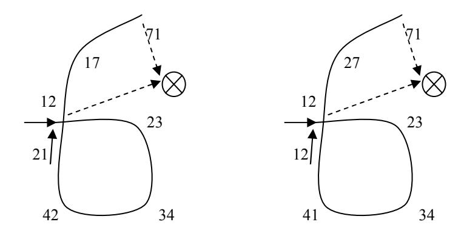

Figure 1. True (left) and pseudo (right) loop on the first cell of an xy-chain

Theorem XIV.3: the constraints propagation rules that might be associated with an xy-chain with loops on its endpoints are subsumed by BSRT together with rules for shorter xy-chains with no loops.

Proof: consider a loop on the first cell of an xy-chain (by reversing the chain, the case of the last cell is similar). The two types of xy-loops must be considered.

If it is a true xy-loop, then, as shown in section 1.1, BSRT together with rules for shorter xy-chains should allow one to conclude that  $C_1 = n_1$ ; it remains to apply an elementary propagation rule to get  $TC \neq n_1$ .

If it is a pseudo xy-loop, then the rest of the chain is an xy-chain, with the same target value and target cells as the original chain; and the loop can simply be excised.

#### XIV.1.3. Internal loops of an xy-chain are useless

Finally, suppose we allowed internal loops in xy-chains, i.e. we replaced the third defining condition by: the first and the last cells are different and there are no loops on the endpoints (we forbid the cases already taken care of in sections 1.1 and 1.2). Suppose a full xy-chain continues to be defined by the same additional condition as previously. A target cell is also defined as previously.

Theorem XIV.4: the resolution rules that might be associated with xy-chains with internal loops are subsumed by BSRT together with rules for shorter xy-chains with no loops.

Proof: consider a full xy-chain of this extended type, of length p, with cells  $C_1$ , ...,  $C_i$ , ...,  $C_k$ , ...,  $C_p$ ,  $C_1 \neq C_p$ , and suppose there is a loop between cells  $C_i$  and  $C_k$  (1 < i < k < p). Let  $n_1$ , ...,  $n_i$ , ...,  $n_k$ , ...,  $n_p$  be the sequence of left candidates for the cells in the chain, so that the sequence of right candidates is  $n_2$ , ...,  $n_{i+1}$ , ...,  $n_k$ ...,  $n_1$ . Let TC be any target cell. For our internal loop, we must consider two cases:

```
Either we have a true xy-loop (n_{k+1} = n_i \text{ and } n_k = n_{i+1}), looking like: \{n_i, n_{i+1}\}—\{n_{i+1}, n_{i+2}\}...—\{n_{i+1}, n_i\}.
```

As in section 1.1, simpler rules (from BSRT and shorter xy-chains) lead to the conclusion that  $C_i = C_k = n_i$ . After application of these rules, NS together with elementary constraints propagation rules along the two remaining parts of the chain lead to  $C_1 = n_1$ ,  $C_p = n_1$  and  $TC \neq n_1$ . It is therefore not necessary to consider such internal loops.

```
Or we have a pseudo xy-loop (n_{k+1} = n_{i+1} \text{ and } n_k = n_i), looking like: \{n_i, n_{i+1}\} - \{n_{i+1}, n_{i+2}\} - \dots - \{n_i, n_{i+1}\}.
```

It is then obvious that there is a direct xy-link between  $C_i$  and  $C_{k+1}$  (the right-linking candidate for  $C_i$  is equal to the left-linking candidate for  $C_{k+1}$ ). Therefore, if we excise the whole subchain between cells  $C_i$  and  $C_k$  we get a shorter xy-chain with no loops. All that can be deduced from the initial chain can already be deduced from the shorter xy-chain obtained by excision. In accordance with our guiding principles, we should not have a rule for the longer chain.

The situation in this second case can be described as follows: in an xy-chain with a loop between cells  $C_i$  and  $C_k$ , if the same number in cells  $C_i$  and  $C_k$  is used twice as the right candidate ( $C_{i+1}$  and  $C_{k+1}$ ), then, as far as inference is concerned, the loop can be excised. Such a loop is called unproductive.

xy-chains 211

#### XIV.1.4. xy-chains should have no loops

As a general conclusion of all the preceding cases, we have:

Theorem XIV.5 Formal statement: resolution rules that might be obtained from xy-chains with loops are subsumed by BSRT together with rules for shorter xy-chains with no loops. Practical statement: xy-chains should have no loops.

Of course, this does not mean that you should not use global xy-loops when you find them: they can help you find all the associated open xy-chains.

#### XIV.2. List of the first xy-chains

For each length n, a rule for xy-chains of length n has been proved in section XII.2.3. The goals of the present section are:

- to list these xy-chain rules systematically up to length nine, using the graphical conventions introduced in chapter XIII,
- for the simplest of them, to show their equivalence with previously defined rules.

#### XIV.2.1. List of the xy-chain rules of length nine or less

Remember that the following graphical representations stand for well-defined logical formulæ.

```
- xy2-chain rule (or XY2):

|= {1 2}*—{2 1}*

- xy3-chain rule (or XY3):

|= {1 2}*—{2 3}—{3 1}*

- xy4-chain rule (or XY4):

|= {1 2}*—{2 3}—{3 4}—{4 1}*

- xy5-chain rule (or XY5):

|= {1 2}*—{2 3}—{3 4}—{4 5}—{5 1}*
```

$$- xy6-chain rule (or XY6):$$

$$|= \{1 2\}^* - \{2 3\} - \{3 4\} - \{4 5\} - \{5 6\} - \{6 1\}^*$$

$$- xy7-chain rule (or XY7):$$

$$|= \{1 2\}^* - \{2 3\} - \{3 4\} - \{4 5\} - \{5 6\} - \{6 7\} - \{7 1\}^*$$

$$- xy8-chain rule (or XY8):$$

$$|= \{1 2\}^* - \{2 3\} - \{3 4\} - \{4 5\} - \{5 6\} - \{6 7\} - \{7 8\} - \{8 1\}^*$$

$$- xy9-chain rule (or XY9):$$

$$|= \{1 2\}^* - \{2 3\} - \{3 4\} - \{4 5\} - \{5 6\} - \{6 7\} - \{7 8\} - \{8 9\} - \{9 1\}^*$$

We leave it to the reader as an obvious exercise to write similar rules for longer xy-chains. How far should we go? We have no general answer; let us say that we have found (very few) puzzles that can be solved using rules for (extended) xy-chains of length thirteen but cannot be solved with the set of rules in our classification using only patterns with less than thirteen cells. But our set of rules is not complete with respect to such patterns. Similarly, we have not tried to find xy-chains of length greater than thirteen.

#### XIV.2.2. Special cases of xy-chains

#### XIV.2.2.1. The xv2-chain rule

The xy2-chain rule reads:  $= \{1 \ 2\}*-\{2 \ 1\}*$ . Let us show that it is not really new.

Indeed, it corresponds to Naked-Pairs – but viewed from a different perspective. To cover an instance of Naked-Pairs on an actual grid, the present rule should be applied twice, each value in the actual pair being matched in turn to target variable  $n_1$ . Conversely, in Naked-Pairs, we had a rule for rows, one for columns and one for blocks; here, if the xy-link is instantiated by a row (for instance), the target cells are: a) all the cells in the same row (other than the two cells of the pair), as is the case for Naked-Pairs-in-a-row; but also: b) all the cells in the same block, in case the two cells also share a block. This means that, with an identical global result, the group of three rules for Naked-Pairs and the unique xy2-chain rule are equivalent.

xy-chains 213

Nevertheless, a similar equivalence is not valid between xy3-chains and Naked-Triplets; as a result, there is no reason to replace the familiar Naked-Pairs rule with the somewhat more abstract xy2-chain rule. (Conversely, this is a reason for not considering xy2-chains any longer).

#### Theorem XIV.6: XY2 is equivalent to NP.

#### XIV.2.2.3. The xy3-chain rule

The xy3-chain rule reads:  $= \{1\ 2\}^* - \{2\ 3\} - \{3\ 1\}^*$ . Let us show that, apart from the classical cases of XY-Wing as defined in chapter X, it covers some but not all cases of Naked-Triplets. Let  $u_1$  and  $u_2$  be the linking units.

It is easily seen from the definition in chapter X that, when it is restricted to cells  $C_1$ ,  $C_2$  and  $C_3$  with two different linking units such that there is no link of type  $u_1$  between cells  $C_2$  and  $C_3$ , this rule is XY-Wing.

In the remaining case, when the rule is instantiated with cells  $C_1$ ,  $C_2$  and  $C_3$  with the same linking unit ( $u_2 = u_1$ ), then we have the conditions of a special case of Naked-Triplets, because the three cells share this unit. As for the conclusions of the xy3-rule in this case, they obviously cover all cases covered by NT in this unit. But the conditions on xy3-chains are far from covering all possible cases of Naked-Triplets in this unit (in NT, any of the three cells may actually contain any subset of the three values); for instance, the two examples of Naked-Triplets given in chapter VII, puzzles Royle17-11200 and Royle17-23317, cannot be solved in L2+XY-Wing or even in L4\_0  $\cup$ {all the rules for xy-chains of length thirteen or less}. Rules for Naked-Triplets should therefore not be eliminated in favour of the present one.

On the other hand, still in the case  $u_2 = u_1$ , the conclusions of the xy3-chain rule may also apply to xy-target cells that are not concerned by the NT rule: any cell that shares a unit other than  $u_1$  with  $C_1$  and  $C_3$  but not with  $C_2$ . For instance, if  $C_1$ ,  $C_2$  and  $C_3$  are in the same row, the links  $u_1$  and  $u_2$  are instantiated by this row and cells  $C_1$  and  $C_3$  are also in the same block, then all other cells in this block are target cells for XY3 but not for NT

Finally, XY3 is not equivalent to XY-Wing, but:

#### Theorem XIV.7: NT+XY3 is equivalent to NT+XY-Wing.

#### XIV.2.2.3. The xy4-chain rule

The xy4-chain rule reads:  $= \{1 \ 2\}*-\{2 \ 3\}-\{3 \ 4\}-\{4 \ 1\}*$ . Note that, similarly to the previous case for xy3-chains, if  $u_3 = u_2 = u_1$ , then we have the condi-

tions of a special case of Naked-Quads. But, again, there may be extra target cells. And, again, this is far from covering all possible cases of Naked-Quads (where any additional subset of the four values can be present in any of the four cells); therefore, rules for Naked-Quads should not be eliminated in favour of XY4. This is the occasion to notice that the gap between the two rules may be better understood if we remember that their proofs develop along very different lines: a global analysis of the four cells and the four values for Naked-Quads, a sequential analysis of the cells and values for xy-chains.

#### XIV.3. Examples and independence results

In this section, we give several examples of xy-chains of various lengths and we try to give an idea of the diversity of situations that can arise. To better illustrate the xy-rules, our examples are chosen so that:

- they have an elaboration to which the xy-rule applies (almost) directly;
- they cannot be solved by rules classified at a lower level (i.e. by rules for chains of any of the types defined in this book and of length shorter than the length of the given chain); for any length n, this proves that the xy-n-chain rule is not subsumed by L4\_0 together with rules for shorter chains of any of the types considered in this book;
- most of the examples are taken from Royle17; as a consequence, the independence results we obtain remain true even for 17-minimal puzzles.

#### XIV.3.1. A puzzle in [L4\_0]+XY4

|   |   |   |   | 3 | 1 |   |   |   |
|---|---|---|---|---|---|---|---|---|
| 7 |   |   |   |   |   | 2 |   |   |
| 5 |   |   |   |   |   |   |   |   |
|   | 1 | 8 |   | 6 |   |   |   | 3 |
|   |   |   | 5 |   |   | 4 |   |   |
|   |   |   |   |   |   |   |   |   |
| 4 | 3 |   | 7 |   |   |   |   |   |
|   |   |   |   |   |   |   | 1 | 8 |
|   |   |   |   |   |   |   | 2 |   |

| 8 | 2 |   |   | 3 | 1 | 5 | 4 | 7 |
|---|---|---|---|---|---|---|---|---|
| 7 |   | 1 | 8 | 4 | 5 | 2 | 3 |   |
| 5 | 4 | 3 | 2 | 7 |   | 1 | 8 |   |
| 2 | 1 | 8 | 4 | 6 | 7 | 9 | 5 | 3 |
| 3 |   |   | 5 | 8 | 2 | 4 | 6 | 1 |
| 6 | 5 | 4 | 1 | 9 | 3 | 8 | 7 | 2 |
| 4 | 3 | 2 | 7 | 1 | 8 | 6 | 9 | 5 |
| 9 |   | 5 |   | 2 | 4 |   | 1 | 8 |
| 1 | 8 |   |   | 5 |   |   | 2 | 4 |

| 8 | 2 | 6 | 9 | 3 | 1 | 5 | 4 | 7 |
|---|---|---|---|---|---|---|---|---|
| 7 | 9 | 1 | 8 | 4 | 5 | 2 | 3 | 6 |
| 5 | 4 | 3 | 2 | 7 | 6 | 1 | 8 | 9 |
| 2 | 1 | 8 | 4 | 6 | 7 | 9 | 5 | 3 |
| 3 | 7 | 9 | 5 | 8 | 2 | 4 | 6 | 1 |
| 6 | 5 | 4 | 1 | 9 | 3 | 8 | 7 | 2 |
| 4 | 3 | 2 | 7 | 1 | 8 | 6 | 9 | 5 |
| 9 | 6 | 5 | 3 | 2 | 4 | 7 | 1 | 8 |
| 1 | 8 | 7 | 6 | 5 | 9 | 3 | 2 | 4 |

Figure 2. Puzzle Royle17-3766, its L1 elaboration and its solution

Puzzle Royle17-3766 (Figure 2) cannot be solved in L4\_0 but its L4\_0 elaboration (which coincides with its L1 elaboration) is in L4\_0+XY4 (and indeed in L1\_0+XY4).

xy-chains 215

Resolution path in L4\_0+XY4 for the L4\_0 (or L1) elaboration of Royle17-3766: xy4-chain {n6 n9}r9c6 - {n9 n6}r3c6 - {n6 n9}r1c4 - {n9 n6}r1c3 ==> r9c3  $\neq$  6 ... (Naked-Singles and Hidden-Singles)

#### XIV.3.2. Two puzzles in [L4]+XY5

Puzzle Royle17-1874 (Figure 3) cannot be solved in L4 but its L4 elaboration (which coincides with its L2 elaboration) can easily be solved in L4+XY5 (and indeed in L1+XY5). The same xy5-chain produces three eliminations. It illustrates the important fact that a single chain may be used on several target cells (which should therefore not be considered as belonging to the chain).

| _ | _ |   |   | _ | _ |   | _ |   | i | _ | _ | _ |   | _ |   | _   |
|---|---|---|---|---|---|---|---|---|---|---|---|---|---|---|---|-----|
|   |   |   |   |   | 2 | 5 |   |   |   | 9 |   |   | 6 | 7 | 2 | 1   |
|   | 6 |   | 9 |   |   |   |   |   |   | 3 | 6 |   | 9 |   | 1 | 8   |
|   |   | 1 |   |   |   |   |   |   |   | 7 |   | 1 | 3 |   |   | 6   |
| 8 |   |   |   |   | 3 |   |   |   |   | 8 | 9 |   | 4 | 2 | 3 | ]   |
| 2 |   |   |   |   |   | 4 |   |   |   | 2 |   |   | 1 | 9 |   | 4   |
|   |   |   |   | 6 |   |   |   |   |   | 1 |   |   |   | 6 |   | 9   |
|   |   |   |   | 3 |   |   | 1 | 6 |   | 4 |   |   | 5 | 3 | 9 | 7   |
| 5 | 7 |   | 2 |   |   |   |   |   |   | 5 | 7 | 9 | 2 | 1 | 6 | (*) |
|   |   |   |   |   |   |   | 9 |   |   | 6 | 1 | 3 |   |   |   | 2   |

| 9 | 4 | 8 | 6 | 7 | 2 | 5 | 3 | 1 |
|---|---|---|---|---|---|---|---|---|
| 3 | 6 | 5 | 9 | 4 | 1 | 8 | 7 | 2 |
| 7 | 2 | 1 | 3 | 5 | 8 | 6 | 4 | 9 |
| 8 | 9 | 6 | 4 | 2 | 3 | 1 | 5 | 7 |
| 2 | 3 | 7 | 1 | 9 | 5 | 4 | 6 | 8 |
| 1 | 5 | 4 | 8 | 6 | 7 | 9 | 2 | 3 |
| 4 | 8 | 2 | 5 | 3 | 9 | 7 | 1 | 6 |
| 5 | 7 | 9 | 2 | 1 | 6 | 3 | 8 | 4 |
| 6 | 1 | 3 | 7 | 8 | 4 | 2 | 9 | 5 |

Figure 3. Puzzle Royle17-1874, its L2 elaboration and its solution

```
Resolution path in L4+XY5 for the L4 (or L2) elaboration of Royle17-1874: row r1 interaction-with-block b1 ==> r3c2 \neq 8 column c5 interaction-with-block b2 ==> r3c6 \neq 5 row r1 interaction-with-block b1 ==> r3c2 \neq 4, r2c3 \neq 4 xy5-chain {n5 n2}r2c3 - {n2 n4}r2c9 - {n4 n8}r8c9 - {n8 n3}r5c9 - {n3 n5}r5c2 ==> r6c3 \neq 5, r5c3 \neq 5, r4c3 \neq 5 ... (Naked-Singles)
```

Just a little more complex, puzzle Royle17-4954 (Figure 4) cannot be solved in L4 but its L4 elaboration (identical to its L4\_0+XY4 elaboration) can easily be solved in L4+XY5 (or in L1\_0+XY5).

It is interesting to have a look at the partial resolution path leading from the original 17-minimal puzzle (left-hand grid) to its L4 elaboration (central grid): it alrea-

dy requires two applications of another xy-chain rule, XY4, which leads to the addition of five new values.

|   |   |   |   | 6 |   | 2 |   |   |
|---|---|---|---|---|---|---|---|---|
|   | 2 |   |   |   |   |   |   | 1 |
|   |   |   |   |   |   | 8 |   |   |
|   |   |   | 8 |   | 1 |   |   |   |
| 6 |   |   |   |   |   |   | 4 |   |
| 3 |   |   |   |   |   |   |   |   |
|   | 7 | 1 | 4 |   |   |   |   |   |
|   |   |   |   | 5 |   | 3 | 6 |   |
|   |   |   |   |   |   |   | 9 |   |

| 1 |   |   |   | 6 | 8 | 2 | 7 | 9 |
|---|---|---|---|---|---|---|---|---|
| 8 | 2 | 6 | 9 | 7 |   | 4 |   | 1 |
| 7 |   |   | 2 | 1 | 4 | 8 |   | 6 |
| 4 | 5 | 7 | 8 | 9 | 1 | 6 | 2 | 3 |
| 6 | 1 |   |   | 2 |   |   | 4 |   |
| 3 |   | 2 | 6 | 4 |   |   | 1 |   |
| 9 | 7 | 1 | 4 | 3 | 6 | 5 | 8 | 2 |
| 2 |   |   | 1 | 5 | 9 | 3 | 6 | 7 |
| 5 | 6 | 3 | 7 | 8 | 2 | 1 | 9 | 4 |

| 1 | 3 | 4 | 5 | 6 | 8 | 2 | 7 | 9 |
|---|---|---|---|---|---|---|---|---|
| 8 | 2 | 6 | 9 | 7 | 3 | 4 | 5 | 1 |
| 7 | 9 | 5 | 2 | 1 | 4 | 8 | 3 | 6 |
| 4 | 5 | 7 | 8 | 9 | 1 | 6 | 2 | 3 |
| 6 | 1 | 9 | 3 | 2 | 5 | 7 | 4 | 8 |
| 3 | 8 | 2 | 6 | 4 | 7 | 9 | 1 | 5 |
| 9 | 7 | 1 | 4 | 3 | 6 | 5 | 8 | 2 |
| 2 | 4 | 8 | 1 | 5 | 9 | 3 | 6 | 7 |
| 5 | 6 | 3 | 7 | 8 | 2 | 1 | 9 | 4 |

Figure 4. Puzzle Royle17-4954, its L4 0+XY4 elaboration and its solution

```
Main steps of the elaboration of Royle17-4954 in L4 or L4_0+XY4: ... (Naked-Singles and Hidden-Singles) row r4 interaction-with-block b4 ==> r6c2 \neq 5, r5c3 \neq 5 xy4-chain {n9 n8}r6c2 - {n8 n5}r6c9 - {n5 n7}r6c6 - {n7 n9}r4c5 ==> r4c3 \neq 9, r4c2 \neq 9 naked and singles ==> r4c2 = 5, r4c3 = 7, r4c5 = 9, r2c5 = 7, r2c4 = 9
```

At this point, the puzzle has been fully elaborated in L4\_0+XY4, and, in particular, the Naked Singles and Hidden Singles following the application of the xy4-chain rule have completely integrated the action of this chain rule into the values asserted. But the puzzle is not yet solved, although only 19 values are missing. This L4\_0+XY4 elaborated version becomes the starting point for the resolution in L4+XY5. The second rule that applies to it is now XY5 and, after a single application of it, the final solution is obtained using only Naked-Singles.

```
Resolution path in L4+XY5 for the L4 (or L4_0+XY4) elaboration of Royle17-4954: number 5 : row R4 interaction with block B4

=>> 5 eliminated from the candidates for R5C3

xy5-chain {n5 n3}r1c4 - {n3 n5}r5c4 - {n5 n8}r5c9 - {n8 n9}r5c3 - {n9 n5}r3c3 ==> r1c3 ≠ 5

... (Naked-Singles)
```

#### *XIV.3.3. A puzzle in [L5]+XY6*

Puzzle Royle17-12506 (Figure 5) cannot be solved in L5 but its L5 elaboration (which coincides with its L1 elaboration) can easily be solved in L5+XY6 (or L1\_0+ XY6). This example also shows that, even in moderately long chains, there may be few linking values (here only the two values 9 and 4).

xy-chains 217

Moreover this puzzle can nearly be solved in L1\_0: XY6 is used only once to eliminate only one candidate. This illustrates a characteristic of most of the complex rules, which might be very frustrating: their action is very limited if one measures it by the number of candidates eliminated – but they have nevertheless a crucial unblocking role. This suggests that the worth of a rule cannot be evaluated after the (mean) number of candidates it leads to eliminate.

|   |   | 3 |   |   |   |   | 8 |   | 2 | 1 | 3 |   | 6 |   | 5 | 8 | 7 | 2 | 1 | 3 | 4 | 6 | 9 | 5 | 8 | 7 |
|---|---|---|---|---|---|---|---|---|---|---|---|---|---|---|---|---|---|---|---|---|---|---|---|---|---|---|
|   | 5 |   |   | 2 |   |   |   |   | 8 | 5 | 7 | 1 | 2 | 3 | 9 |   |   | 8 | 5 | 7 | 1 | 2 | 3 | 9 | 4 | 6 |
|   |   |   | 7 |   |   | 1 |   |   | 6 |   |   | 7 | 8 | 5 | 1 | 3 | 2 | 6 | 4 | 9 | 7 | 8 | 5 | 1 | 3 | 2 |
| 1 |   | 6 |   |   |   | 7 |   |   | 1 | 3 | 6 | 2 |   | 8 | 7 |   | 5 | 1 | 3 | 6 | 2 | 4 | 8 | 7 | 9 | 5 |
| 7 |   |   |   | 5 |   |   |   |   | 7 |   | 2 |   | 5 | 6 | 3 | 1 |   | 7 | 8 | 2 | 9 | 5 | 6 | 3 | 1 | 4 |
|   |   |   |   |   |   |   |   |   |   |   | 5 | 3 | 1 | 7 | 2 |   |   | 4 | 9 | 5 | 3 | 1 | 7 | 2 | 6 | 8 |
|   |   |   | 6 |   | 1 | 4 |   |   | 5 | 7 | 8 | 6 | 3 | 1 | 4 | 2 | 9 | 5 | 7 | 8 | 6 | 3 | 1 | 4 | 2 | 9 |
|   | 2 |   |   |   |   |   | 5 | 3 |   | 2 | 1 | 8 | 7 |   | 6 | 5 | 3 | 9 | 2 | 1 | 8 | 7 | 4 | 6 | 5 | 3 |
|   |   |   |   |   |   |   |   |   | 3 | 6 |   | 5 |   | 2 | 8 | 7 | 1 | 3 | 6 | 4 | 5 | 9 | 2 | 8 | 7 | 1 |

Figure 5. Puzzle Royle17-12506, its L1 elaboration and its solution

```
Resolution path in L5+XY6 for the L5 (or L1) elaboration of Royle17-12506: xy6-chain \{n9\ n4\}r6c1 - \{n4\ n9\}r8c1 - \{n9\ n4\}r9c3 - \{n4\ n9\}r9c5 - \{n9\ n4\}r4c5 - \{n4\ n9\}r5c4 ==> r5c2 \neq 9 ... (Naked-Singles and Hidden-Singles)
```

#### *XIV.3.4. A puzzle in [L6]+XY7*

Puzzle Royle17-35802 (Figure 6) is the only one in the Royle17 database that cannot be solved in L6 but whose L6 elaboration (identical to its L3 or to its L2+ XYZ-Wing elaboration) can be solved in L6+XY7. As the resolution of the L6 elaboration uses rules other than XY7 (among which are two instances of XY4), this case is more representative of reality than those we have to select in most of our examples in order to keep their resolution path short.

Resolution path in L6+XY7 for the L6 (or L3 or L2+XYZ-Wing) elaboration of Royle17-35802: naked-pairs-in-a-row  $\{n4 \ n6\}r2\{c3 \ c4\} \Longrightarrow r2c7 \neq 6, r2c7 \neq 4$ 

```
haked-pairs-in-a-row {n4 no}r2{c5 c4} ==> r2c7 \neq 6, r2c7 \neq 4
hidden-pairs-in-a-column {n2 n6} {r1 r3}c7 ==> r3c7 \neq 9, r3c7 \neq 4, r3c7 \neq 3, r1c7 \neq 9
hidden-pairs-in-a-column {n2 n6} {r1 r3}c7 ==> r1c7 \neq 4
xyz3-chain {n4 no}r3c8 - {n7 n9}r1c9 - {n9 n4}r4c9 ==> r3c9 \neq 4
xy7-chain {n4 no}r2c4 - {n6 n7}r1c6 - {n7 n9}r2c5 - {n9 n3}r2c7 - {n3 n4}r8c7 - {n4 n7}r8c8 - {n7 n4}r3c8 ==> r3c4 \neq 4
naked and hidden singles ==> r2c4 = 4, r2c3 = 6
```

```
xy4-chain \{n7\ n6\}r1c6 - \{n6\ n5\}r3c4 - \{n5\ n4\}r3c3 - \{n4\ n7\}r3c8 \Longrightarrow r3c5 \neq 7,\ r1c9 \neq 7 block b3 interaction-with-row r3 ==> r3c2 \neq 7 naked-pairs-in-a-column \{n4\ n9\}\{r1\ r4\}c9 \Longrightarrow r8c9 \neq 4,\ r3c9 \neq 9 xy4-chain \{n9\ n4\}r1c9 - \{n4\ n7\}r3c8 - \{n7\ n3\}r3c9 - \{n3\ n9\}r3c2 \Longrightarrow r1c2 \neq 9 ... (Naked-Singles)
```

| 8 |   | 3 |   |   |   |   |  |
|---|---|---|---|---|---|---|--|
|   |   |   |   |   |   | 5 |  |
| 1 |   |   |   |   |   |   |  |
|   | 2 |   | 6 | 5 |   |   |  |
|   | 5 |   |   | 4 | 7 |   |  |
|   |   |   |   |   | 1 |   |  |
|   | 4 |   |   |   |   | 2 |  |
|   |   | 8 | 1 |   |   |   |  |
| 3 |   | 7 |   |   |   |   |  |

| 8 |   |   | 3 |   |   |   | 1 |   |
|---|---|---|---|---|---|---|---|---|
| 2 |   |   |   |   | 1 |   | 5 | 8 |
| 1 |   |   |   |   | 8 |   |   |   |
| 7 | 2 | 3 | 1 | 6 | 5 |   | 8 |   |
| 6 | 5 | 1 | 9 | 8 | 4 | 7 | 3 | 2 |
| 4 | 8 | 9 | 2 |   |   | 1 | 6 | 5 |
| 9 | 4 | 7 |   |   |   | 8 | 2 | 1 |
| 5 | 6 | 2 | 8 | 1 | 9 |   |   |   |
| 3 | 1 | 8 | 7 | 4 | 2 | 5 | 9 | 6 |

| 8 | 7 | 5 | 3 | 9 | 6 | 2 | 1 | 4 |
|---|---|---|---|---|---|---|---|---|
| 2 | 3 | 6 | 4 | 7 | 1 | 9 | 5 | 8 |
| 1 | 9 | 4 | 5 | 2 | 8 | 6 | 7 | 3 |
| 7 | 2 | 3 | 1 | 6 | 5 | 4 | 8 | 9 |
| 6 | 5 | 1 | 9 | 8 | 4 | 7 | 3 | 2 |
| 4 | 8 | 9 | 2 | 3 | 7 | 1 | 6 | 5 |
| 9 | 4 | 7 | 6 | 5 | 3 | 8 | 2 | 1 |
| 5 | 6 | 2 | 8 | 1 | 9 | 3 | 4 | 7 |
| 3 | 1 | 8 | 7 | 4 | 2 | 5 | 9 | 6 |

Figure 6. Puzzle Royle17-35802, its L3 elaboration and its solution

#### XIV.3.5. A puzzle in [L4 0]+XY4 9 and in [L4 0]+XY4+HXY4

Let us introduce the following notation: if X designates any of the chain types considered in this book (i.e. X = XY or HXY or XYT or HXYT ...), define  $Xj_k$  as the set of rules for chains of type X and of length between j and k included. Generally j will be 4. Thus,  $XY4_9$  stands for the set  $\{XY4, XY5, XY6, XY7, XY8, XY9\}$ .

Although hidden xy-chains and associated rules of type HXY will be defined only in the next chapter, the example of puzzle Royle17-14259 (Figure 7), with identical L4\_0 and L1\_0 elaborations, provides a very good motivation for introducing them: without them, rules for xy-chains of lengths 4, 5, 8 and 9 are required, whereas if HXY4 is allowed, only the simplest of these rules (XY4) will be needed. This illustrates the fact that the maximum length of the chains of some type required to solve a puzzle can (sometimes) be traded with the acceptation of hidden chains of the same type.

Let us display the two resolution paths. Notice first that they start with the same rules (rules from L2 that produce no value and whose results therefore do not appear in the L4\_0 elaboration); this is normal since rules of lower complexity are always applied before rules of higher complexity:

xy-chains 219

```
;;; common part in L2 for the two resolution paths, in L4_0+XY4_9 and in L4_0+XY4+ HXY4, for the L4_0 (or L1_0) elaboration of Royle17-14259: column c4 interaction-with-block b8 => r9c6 \neq 6, r8c6 \neq 6 row r9 interaction-with-block b8 => r8c6 \neq 4, r8c6 \neq 2, r8c4 \neq 2 hidden-pairs-in-a-row {n3 n7}r1 {c3 c6} => r1c6 \neq 6 row r1 interaction-with-block b3 => r3c9 \neq 6 naked-pairs-in-a-row {n2 n4}r3{c5 c9} => r3c6 \neq 4, r3c6 \neq 2, r3c2 \neq 2 hidden-pairs-in-a-row {n3 n7}r1 {c3 c6} => r1c6 \neq 4, r1c6 \neq 2, r1c3 \neq 4, r1c3 \neq 2 ;;; end of the common part
```

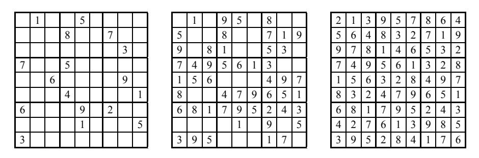

Figure 7. Puzzle Royle17-14259, its L1 0 elaboration and its solution

Continuation of the resolution path in L4 0+XY4 9 for the L4 0 (or L1 0) elaboration of

#### 1) Resolution path in L4\_0+XY4\_9 using only xy-chains:

```
Royle17-14259: xy5-chain {n2 n4}r3c5 - {n4 n2}r3c9 - {n2 n8}r4c9 - {n8 n6}r9c9 - {n6 n2}r9c4 ==> r9c5 \neq 2 xy8-chain {n2 n4}r8c1 - {n4 n2}r1c1 - {n2 n6}r1c8 - {n6 n8}r8c8 - {n8 n3}r8c6 - {n3 n7}r1c6 - {n7 n3}r1c3 - {n3 n2}r6c3 ==> r8c3 \neq 2 xy9-chain {n2 n4}r1c1 - {n4 n2}r8c1 - {n2 n7}r8c2 - {n7 n6}r3c2 - {n6 n7}r3c6 - {n7 n3}r1c6 - {n3 n8}r8c6 - {n8 n6}r8c8 - {n6 n2}r1c8 ==> r1c9 \neq 2 xy5-chain {n8 n4}r9c5 - {n4 n2}r3c5 - {n2 n4}r3c9 - {n4 n6}r1c9 - {n6 n8}r9c9 ==> r9c6 \neq 8 xy5-chain {n4 n8}r9c5 - {n8 n6}r9c9 - {n6 n4}r1c9 - {n4 n2}r3c9 - {n2 n4}r3c5 ==> r2c5 \neq 4 xvz3-chain {n2 n4}r1c1 - {n4 n3}r2c3 - {n3 n2}r2c5 ==> r2c2 \neq 2
```

2) Resolution path in L4 0+XY4+HXY4 using hidden xy-chains:

xy4-chain  $\{n7 \ n3\}r1c6 - \{n3 \ n2\}r2c5 - \{n2 \ n4\}r2c3 - \{n4 \ n7\}r8c3 ==> r1c3 \neq 7$ 

hidden-pairs-in-a-block  $\{n2\ n4\}\{r1c1\ r2c3\} \Longrightarrow r2c3 \neq 3$ 

... (Naked-Singles and Hidden-Singles)

Continuation of the resolution path in L4\_0+XY4+HXY4 for the L4\_0 (or L1\_0) elaboration of Royle17-14259:

```
 \begin{array}{l} \textbf{hxy-cn4-chain} \ \{\textbf{r2}\ \textbf{r3}\}\textbf{c6n6} - \{\textbf{r3}\ \textbf{r1}\}\textbf{c6n7} - \{\textbf{r1}\ \textbf{r8}\}\textbf{c3n7} - \{\textbf{r8}\ \textbf{r2}\}\textbf{c3n4} \Longrightarrow \textbf{r2c6} \neq 4 \\ \textbf{hidden-single-in-a-column} => \textbf{r9c6} = 4 \\ \textbf{xy4-chain} \ \{\textbf{n8}\ \textbf{n2}\}\textbf{r4c9} - \{\textbf{n2}\ \textbf{n4}\}\textbf{r3c9} - \{\textbf{n4}\ \textbf{n2}\}\textbf{r3c5} - \{\textbf{n2}\ \textbf{n8}\}\textbf{r9c5} \Longrightarrow \textbf{r9c9} \neq 8 \\ \dots \ (\textbf{Naked-Singles}\ ) \\ \end{array}
```

#### XIV.3.6. A puzzle in [L4 0]+XY4 11 or in [L4 0]+L5

For another example of a trade of a similar kind, between the lengths and the types of the chains required to reach the solution, consider puzzle Royle17-17265 (Figure 8). Its L4\_0 elaboration (central grid) coincides with its L2 elaboration. It can be solved either in L4\_0+XY4\_11, i.e. using only chains of type xy (and of lengths between 4 and 11) in addition to rules in L4\_0, or in L5, using chains of the more complex types hxy and xyt (which will be introduced in chapters XV and XVII respectively). This is also the longer xy-chain (length 11) we have found in the Royle17 database (considering that L4\_0 should be fully applied before any chain of any type and of length greater than 4 is looked for).

|   | 3 | 8 |   | 5 |   |   |   |   |
|---|---|---|---|---|---|---|---|---|
|   |   |   | 4 |   |   | 2 |   |   |
|   |   |   |   |   |   |   |   |   |
|   |   |   |   | 8 | 1 | 5 |   |   |
| 4 | 6 |   |   |   |   |   | 7 |   |
| 2 |   |   |   |   |   |   |   |   |
| 7 |   |   | 6 |   |   |   |   | 4 |
|   |   |   |   |   |   | 3 |   |   |
|   |   |   |   |   |   |   | 9 |   |

| 6 | 3 | 8 | 9 | 5 | 2 | 4 | 1 | 7 |
|---|---|---|---|---|---|---|---|---|
| 5 |   |   | 4 |   |   | 2 | 8 |   |
|   |   |   | 8 |   |   | 6 | 5 |   |
|   |   |   | 2 | 8 | 1 | 5 | 4 | 6 |
| 4 | 6 | 1 |   |   |   | 8 | 7 | 2 |
| 2 | 8 | 5 | 7 |   |   | 9 | 3 | 1 |
| 7 | 5 |   | 6 |   | 8 | 1 | 2 | 4 |
|   |   |   |   |   |   | 3 | 6 |   |
|   |   | 6 |   |   |   | 7 | 9 |   |

| 6 | 3 | 8 | 9 | 5 | 2 | 4 | 1 | 7 |
|---|---|---|---|---|---|---|---|---|
| 5 | 1 | 7 | 4 | 6 | 3 | 2 | 8 | 9 |
| 9 | 2 | 4 | 8 | 1 | 7 | 6 | 5 | 3 |
| 3 | 7 | 9 | 2 | 8 | 1 | 5 | 4 | 6 |
| 4 | 6 | 1 | 5 | 3 | 9 | 8 | 7 | 2 |
| 2 | 8 | 5 | 7 | 4 | 6 | 9 | 3 | 1 |
| 7 | 5 | 3 | 6 | 9 | 8 | 1 | 2 | 4 |
| 8 | 9 | 2 | 1 | 7 | 4 | 3 | 6 | 5 |
| 1 | 4 | 6 | 3 | 2 | 5 | 7 | 9 | 8 |

Figure 8. Puzzle Royle17-17265, its L2 elaboration and its solution

As was the case in the previous example, the two resolution paths start with the same rules:

```
;;; common part in L2 for the two resolution paths, in L4_0+XY4_11 and in L5, for the L4_0 (or L2) elaboration of Royle17-17265: column c4 interaction-with-block b8 \Longrightarrow r9c5 \neq 1, r8c5 \neq 1 naked-pairs-in-a-column {n3 n9} {r5 r7}c5 \Longrightarrow r9c5 \neq 3, r8c5 \neq 9, r3c5 \neq 3, r2c5 \neq 3 block b2 interaction-with-column c6 \Longrightarrow r9c6 \neq 3 block b2 interaction-with-column c6 \Longrightarrow r5c6 \neq 3 hidden-pairs-in-a-column {n2 n4} {r3 r8}c3 \Longrightarrow r8c3 \neq 9, r3c3 \neq 9, r3c3 \neq 7 hidden-pairs-in-a-row {n2 n4}r3{c2 c3} \Longrightarrow r3c2 \neq 9, r3c2 \neq 7
```

xy-chains 221

```
row r3 interaction-with-block b2 ==> r2c6 \neq 7, r2c5 \neq 7 hidden-pairs-in-a-row {n2 n4}r3{c2 c3} ==> r3c2 \neq 1 ;;; end of the common part
```

#### 1) Resolution path in L4\_0+XY4\_11:

Continuation of the resolution path in L4\_0+XY4\_11 for the L4\_0 (or L2) elaboration of Royle17-17265:

2) Resolution path in L5 using chains of more complex types (hxy and xyt):

```
Continuation of the resolution path in L5 for the L4_0 (or L2) elaboration of Royle17-17265:  
xyt4-chain {n1 n5}r8c4 - {n5 n4}r9c6 - {n4 n2}r9c5 - {n2 n1}r9c2 ==> r9c4 \neq 1 hidden-single-in-a-block ==> r8c4 = 1
    hxy-cn4-chain {r9 r8}c5n2 - {r8 r3}c5n7 - {r3 r2}c5n1 - {r2 r9}c2n1 ==> r9c2 \neq 2 hidden-single-in-a-row ==> r9c5 = 2
    hxy-rn5-chain {c2 c5}r2n1 - {c5 c6}r2n6 - {c6 c5}r6n6 - {c5 c6}r6n4 - {c6 c2}r9n4 ==> r9c2 \neq 1 ... (Naked-Singles)
```

#### XIV.3.7. A puzzle in [L4\_0]+XY4\_13 or in [L4\_0]+XY4+HXY4+XYT4

Now comes the longer xy-chain we have found in our three databases (still considering that L4\_0 should be fully applied before any chain of any type and of length greater than four is looked for). Indeed, as this is the unique xy-chain of length thirteen in these databases, we have not searched for longer ones (except in Royle-17, where we have gone up to length sixteen).

This puzzle (Sudogen17-3403, Figure 9) is another example of a trade between the length and the types of the chains needed to reach a solution. The L4\_0+XY4+HXY4+C4 and the L1 elaborations coincide. They can be solved either in L4\_0+XY4 13 or in L4\_0+XY4+HXY4+XYT4.

As was the case for the previous example, the two resolution paths start with the same (uninteresting) rules (in L2):

```
;;; common part, in L2 for the two resolution paths, in L4_0+XY4_11 and in L4_0+XY4+ HXY4+C4, for the L4_0+XY4+HXY4+C4 (or L1) elaboration of Sudogen17-3403: row r6 interaction-with-block b5 => r4c4 \neq 8 row r3 interaction-with-block b3 => r1c9 \neq 7 column c6 interaction-with-block b5 => r6c5 \neq 7 column c4 interaction-with-block b5 => r6c6 \neq 6, r4c6 \neq 6 row r6 interaction-with-block b5 => r5c4 \neq 2 block b2 interaction-with-column c1 => r6c1 \neq 1, r5c1 \neq 1 block b4 interaction-with-row r6 => r6c4 \neq 1 block b7 interaction-with-column c1 => r1c1 \neq 1 naked-pairs-in-a-column {n1 n6} {r4 r5}c4 => r6c4 \neq 6 row r6 interaction-with-block b4 => r5c1 \neq 6 ;;; end of the common part
```

|   |   |   | 9 | 5 |   | 4 | 8 |   |
|---|---|---|---|---|---|---|---|---|
| 8 |   |   | 7 | 1 |   |   |   |   |
| 2 |   |   |   |   | 8 |   | 6 |   |
|   | 2 |   |   |   |   |   |   |   |
|   | 9 | 8 |   | 3 |   |   |   |   |
|   |   |   |   |   |   | 3 |   | 4 |
|   | 3 | 7 |   | 6 |   |   | 5 |   |
| 9 |   |   |   |   | 1 |   |   |   |
|   |   | 5 |   |   |   |   |   | 6 |

|   |   | 3 | 9 | 5 |   | 4 | 8 |   |
|---|---|---|---|---|---|---|---|---|
| 8 | 4 |   | 7 | 1 |   |   | 3 |   |
| 2 | 5 |   | 3 | 4 | 8 |   | 6 |   |
| 3 | 2 | 4 |   | 9 |   |   |   |   |
|   | 9 | 8 |   | 3 | 4 |   |   |   |
|   |   |   |   |   |   | 3 | 9 | 4 |
|   | 3 | 7 |   | 6 | 9 |   | 5 |   |
| 9 | 6 | 2 | 5 |   | 1 |   | 4 | 3 |
|   | 8 | 5 |   |   | 3 | 9 |   | 6 |

| 6 | 7 | 3 | Q | 5 | 2 | 1 | Ω | 1 |
|---|---|---|---|---|---|---|---|---|
| 0 | 1 | 0 | 7 | 1 | _ | ~ | 2 | - |
| 8 | 4 | 9 | / | 1 | 6 | 2 | 3 | 5 |
| 2 | 5 | 1 | 3 | 4 | 8 | 7 | 6 | 9 |
| 3 | 2 | 4 | 6 | 9 | 7 | 5 | 1 | 8 |
| 5 | 9 | 8 | 1 | 3 | 4 | 6 | 2 | 7 |
| 7 | 1 | 6 | 2 | 8 | 5 | 3 | 9 | 4 |
| 4 | 3 | 7 | 8 | 6 | 9 | 1 | 5 | 2 |
| 9 | 6 | 2 | 5 | 7 | 1 | 8 | 4 | 3 |
| 1 | 8 | 5 | 4 | 2 | 3 | 9 | 7 | 6 |

Figure 9. Puzzle Sudogen17-3403, its L1 elaboration and its solution

```
1) Resolution path in L4 0+XY4 13:
 ;;; continuation of the resolution path in L4 0+XY4 13 for the L4 0+XY4+HXY4+C4 (or
L1) elaboration of Sudogen17-3403:
xy7-chain \{n7\ n1\}r3c7 - \{n1\ n9\}r3c3 - \{n9\ n6\}r2c3 - \{n6\ n1\}r6c3 - \{n1\ n7\}r6c2 - \{n6\ n1\}r6c3 - \{n6\ n1\}r6c3 - \{n6\ n1\}r6c3 - \{n6\ n1\}r6c3 - \{n6\ n1\}r6c3 - \{n6\ n1\}r6c3 - \{n6\ n1\}r6c3 - \{n6\ n1\}r6c3 - \{n6\ n1\}r6c3 - \{n6\ n1\}r6c3 - \{n6\ n1\}r6c3 - \{n6\ n1\}r6c3 - \{n6\ n1\}r6c3 - \{n6\ n1\}r6c3 - \{n6\ n1\}r6c3 - \{n6\ n1\}r6c3 - \{n6\ n1\}r6c3 - \{n6\ n1\}r6c3 - \{n6\ n1\}r6c3 - \{n6\ n1\}r6c3 - \{n6\ n1\}r6c3 - \{n6\ n1\}r6c3 - \{n6\ n1\}r6c3 - \{n6\ n1\}r6c3 - \{n6\ n1\}r6c3 - \{n6\ n1\}r6c3 - \{n6\ n1\}r6c3 - \{n6\ n1\}r6c3 - \{n6\ n1\}r6c3 - \{n6\ n1\}r6c3 - \{n6\ n1\}r6c3 - \{n6\ n1\}r6c3 - \{n6\ n1\}r6c3 - \{n6\ n1\}r6c3 - \{n6\ n1\}r6c3 - \{n6\ n1\}r6c3 - \{n6\ n1\}r6c3 - \{n6\ n1\}r6c3 - \{n6\ n1\}r6c3 - \{n6\ n1\}r6c3 - \{n6\ n1\}r6c3 - \{n6\ n1\}r6c3 - \{n6\ n1\}r6c3 - \{n6\ n1\}r6c3 - \{n6\ n1\}r6c3 - \{n6\ n1\}r6c3 - \{n6\ n1\}r6c3 - \{n6\ n1\}r6c3 - \{n6\ n1\}r6c3 - \{n6\ n1\}r6c3 - \{n6\ n1\}r6c3 - \{n6\ n1\}r6c3 - \{n6\ n1\}r6c3 - \{n6\ n1\}r6c3 - \{n6\ n1\}r6c3 - \{n6\ n1\}r6c3 - \{n6\ n1\}r6c3 - \{n6\ n1\}r6c3 - \{n6\ n1\}r6c3 - \{n6\ n1\}r6c3 - \{n6\ n1\}r6c3 - \{n6\ n1\}r6c3 - \{n6\ n1\}r6c3 - \{n6\ n1\}r6c3 - \{n6\ n1\}r6c3 - \{n6\ n1\}r6c3 - \{n6\ n1\}r6c3 - \{n6\ n1\}r6c3 - \{n6\ n1\}r6c3 - \{n6\ n1\}r6c3 - \{n6\ n1\}r6c3 - \{n6\ n1\}r6c3 - \{n6\ n1\}r6c3 - \{n6\ n1\}r6c3 - \{n6\ n1\}r6c3 - \{n6\ n1\}r6c3 - \{n6\ n1\}r6c3 - \{n6\ n1\}r6c3 - \{n6\ n1\}r6c3 - \{n6\ n1\}r6c3 - \{n6\ n1\}r6c3 - \{n6\ n1\}r6c3 - \{n6\ n1\}r6c3 - \{n6\ n1\}r6c3 - \{n6\ n1\}r6c3 - \{n6\ n1\}r6c3 - \{n6\ n1\}r6c3 - \{n6\ n1\}r6c3 - \{n6\ n1\}r6c3 - \{n6\ n1\}r6c3 - \{n6\ n1\}r6c3 - \{n6\ n1\}r6c3 - \{n6\ n1\}r6c3 - \{n6\ n1\}r6c3 - \{n6\ n1\}r6c3 - \{n6\ n1\}r6c3 - \{n6\ n1\}r6c3 - \{n6\ n1\}r6c3 - \{n6\ n1\}r6c3 - \{n6\ n1\}r6c3 - \{n6\ n1\}r6c3 - \{n6\ n1\}r6c3 - \{n6\ n1\}r6c3 - \{n6\ n1\}r6c3 - \{n6\ n1\}r6c3 - \{n6\ n1\}r6c3 - \{n6\ n1\}r6c3 - \{n6\ n1\}r6c3 - \{n6\ n1\}r6c3 - \{n6\ n1\}r6c3 - \{n6\ n1\}r6c3 - \{n6\ n1\}r6c3 - \{n6\ n1\}r6c3 - \{n6\ n1\}r6c3 - \{n6\ n1\}r6c3 - \{n6\ n1\}r6c3 - \{n6\ n1\}r6c3 - \{n6\ n1\}r6c3 - \{n6\ n1\}r6c3 - \{n6\ n1\}r6c3 - \{n6\ n1\}r6c3 - \{n6\ n1\}r6c3 - \{n6\ n1\}r6c3 - \{n6\ n1\}r6c3 - \{n6\ n1\}r6c3 - \{n6\ n1\}r6c3 - \{n6\ n1\}r6c3 - \{n6\ n1\}r6c3 - \{n6\ n1\}r6c3 - \{n6\ n1\}r6c3 - \{n6\ n1
 \{n7 \ n5\}r6c6 - \{n5 \ n7\}r4c6 ==> r4c7 \neq 7
xy8-chain \{n1\ n7\}r4c8 - \{n7\ n5\}r4c6 - \{n5\ n7\}r6c6 - \{n7\ n1\}r6c2 - \{n1\ n7\}r1c2 - \{n7\ n7\}r1c2 - \{n7\ n7\}r1c2 - \{n7\ n7\}r1c2 - \{n7\ n7\}r1c2 - \{n7\ n7\}r1c2 - \{n7\ n7\}r1c2 - \{n7\ n7\}r1c2 - \{n7\ n7\}r1c2 - \{n7\ n7\}r1c2 - \{n7\ n7\}r1c2 - \{n7\ n7\}r1c2 - \{n7\ n7\}r1c2 - \{n7\ n7\}r1c2 - \{n7\ n7\}r1c2 - \{n7\ n7\}r1c2 - \{n7\ n7\}r1c2 - \{n7\ n7\}r1c2 - \{n7\ n7\}r1c2 - \{n7\ n7\}r1c2 - \{n7\ n7\}r1c2 - \{n7\ n7\}r1c2 - \{n7\ n7\}r1c2 - \{n7\ n7\}r1c2 - \{n7\ n7\}r1c2 - \{n7\ n7\}r1c2 - \{n7\ n7\}r1c2 - \{n7\ n7\}r1c2 - \{n7\ n7\}r1c2 - \{n7\ n7\}r1c2 - \{n7\ n7\}r1c2 - \{n7\ n7\}r1c2 - \{n7\ n7\}r1c2 - \{n7\ n7\}r1c2 - \{n7\ n7\}r1c2 - \{n7\ n7\}r1c2 - \{n7\ n7\}r1c2 - \{n7\ n7\}r1c2 - \{n7\ n7\}r1c2 - \{n7\ n7\}r1c2 - \{n7\ n7\}r1c2 - \{n7\ n7\}r1c2 - \{n7\ n7\}r1c2 - \{n7\ n7\}r1c2 - \{n7\ n7\}r1c2 - \{n7\ n7\}r1c2 - \{n7\ n7\}r1c2 - \{n7\ n7\}r1c2 - \{n7\ n7\}r1c2 - \{n7\ n7\}r1c2 - \{n7\ n7\}r1c2 - \{n7\ n7\}r1c2 - \{n7\ n7\}r1c2 - \{n7\ n7\}r1c2 - \{n7\ n7\}r1c2 - \{n7\ n7\}r1c2 - \{n7\ n7\}r1c2 - \{n7\ n7\}r1c2 - \{n7\ n7\}r1c2 - \{n7\ n7\}r1c2 - \{n7\ n7\}r1c2 - \{n7\ n7\}r1c2 - \{n7\ n7\}r1c2 - \{n7\ n7\}r1c2 - \{n7\ n7\}r1c2 - \{n7\ n7\}r1c2 - \{n7\ n7\}r1c2 - \{n7\ n7\}r1c2 - \{n7\ n7\}r1c2 - \{n7\ n7\}r1c2 - \{n7\ n7\}r1c2 - \{n7\ n7\}r1c2 - \{n7\ n7\}r1c2 - \{n7\ n7\}r1c2 - \{n7\ n7\}r1c2 - \{n7\ n7\}r1c2 - \{n7\ n7\}r1c2 - \{n7\ n7\}r1c2 - \{n7\ n7\}r1c2 - \{n7\ n7\}r1c2 - \{n7\ n7\}r1c2 - \{n7\ n7\}r1c2 - \{n7\ n7\}r1c2 - \{n7\ n7\}r1c2 - \{n7\ n7\}r1c2 - \{n7\ n7\}r1c2 - \{n7\ n7\}r1c2 - \{n7\ n7\}r1c2 - \{n7\ n7\}r1c2 - \{n7\ n7\}r1c2 - \{n7\ n7\}r1c2 - \{n7\ n7\}r1c2 - \{n7\ n7\}r1c2 - \{n7\ n7\}r1c2 - \{n7\ n7\}r1c2 - \{n7\ n7\}r1c2 - \{n7\ n7\}r1c2 - \{n7\ n7\}r1c2 - \{n7\ n7\}r1c2 - \{n7\ n7\}r1c2 - \{n7\ n7\}r1c2 - \{n7\ n7\}r1c2 - \{n7\ n7\}r1c2 - \{n7\ n7\}r1c2 - \{n7\ n7\}r1c2 - \{n7\ n7\}r1c2 - \{n7\ n7\}r1c2 - \{n7\ n7\}r1c2 - \{n7\ n7\}r1c2 - \{n7\ n7\}r1c2 - \{n7\ n7\}r1c2 - \{n7\ n7\}r1c2 - \{n7\ n7\}r1c2 - \{n7\ n7\}r1c2 - \{n7\ n7\}r1c2 - \{n7\ n7\}r1c2 - \{n7\ n7\}r1c2 - \{n7\ n7\}r1c2 - \{n7\ n7\}r1c2 - \{n7\ n7\}r1c2 - \{n7\ n7\}r1c2 - \{n7\ n7\}r1c2 - \{n7\ n7\}r1c2 - \{n7\ n7\}r1c2 - \{n7\ n7\}r1c2 - \{n7\ n7\}r1c2 - \{n7\ n7\}r1c2 - \{n7\ n7\}r1c2 - \{n7\ n7\}r1c2 - \{n7\ n7\}r1c2 - \{n7\ n7\}r1c2 - \{n7\ n7
 \{n7 \ n6\}r1c1 - \{n6 \ n2\}r1c6 - \{n2 \ n1\}r1c9 ==> r5c9 \neq 1, r4c9 \neq 1
xy_13-chain \{n1, n7\}r4c8 - \{n7, n5\}r4c6 - \{n5, n7\}r6c6 - \{n7, n1\}r6c2 - \{n1, n6\}r6c3 - \{n7, n1\}r6c3
 \{n6\ n9\}r2c3 - \{n9\ n1\}r3c3 - \{n1\ n7\}r3c7 - \{n7\ n8\}r8c7 - \{n8\ n7\}r8c5 - \{n7\ n2\}r9c5 - \{n7\ n2\}r9c5 - \{n7\ n2\}r9c5 - \{n7\ n2\}r9c5 - \{n7\ n2\}r9c5 - \{n7\ n2\}r9c5 - \{n7\ n2\}r9c5 - \{n7\ n2\}r9c5 - \{n7\ n2\}r9c5 - \{n7\ n2\}r9c5 - \{n7\ n2\}r9c5 - \{n7\ n2\}r9c5 - \{n7\ n2\}r9c5 - \{n7\ n2\}r9c5 - \{n7\ n2\}r9c5 - \{n7\ n2\}r9c5 - \{n7\ n2\}r9c5 - \{n7\ n2\}r9c5 - \{n7\ n2\}r9c5 - \{n7\ n2\}r9c5 - \{n7\ n2\}r9c5 - \{n7\ n2\}r9c5 - \{n7\ n2\}r9c5 - \{n7\ n2\}r9c5 - \{n7\ n2\}r9c5 - \{n7\ n2\}r9c5 - \{n7\ n2\}r9c5 - \{n7\ n2\}r9c5 - \{n7\ n2\}r9c5 - \{n7\ n2\}r9c5 - \{n7\ n2\}r9c5 - \{n7\ n2\}r9c5 - \{n7\ n2\}r9c5 - \{n7\ n2\}r9c5 - \{n7\ n2\}r9c5 - \{n7\ n2\}r9c5 - \{n7\ n2\}r9c5 - \{n7\ n2\}r9c5 - \{n7\ n2\}r9c5 - \{n7\ n2\}r9c5 - \{n7\ n2\}r9c5 - \{n7\ n2\}r9c5 - \{n7\ n2\}r9c5 - \{n7\ n2\}r9c5 - \{n7\ n2\}r9c5 - \{n7\ n2\}r9c5 - \{n7\ n2\}r9c5 - \{n7\ n2\}r9c5 - \{n7\ n2\}r9c5 - \{n7\ n2\}r9c5 - \{n7\ n2\}r9c5 - \{n7\ n2\}r9c5 - \{n7\ n2\}r9c5 - \{n7\ n2\}r9c5 - \{n7\ n2\}r9c5 - \{n7\ n2\}r9c5 - \{n7\ n2\}r9c5 - \{n7\ n2\}r9c5 - \{n7\ n2\}r9c5 - \{n7\ n2\}r9c5 - \{n7\ n2\}r9c5 - \{n7\ n2\}r9c5 - \{n7\ n2\}r9c5 - \{n7\ n2\}r9c5 - \{n7\ n2\}r9c5 - \{n7\ n2\}r9c5 - \{n7\ n2\}r9c5 - \{n7\ n2\}r9c5 - \{n7\ n2\}r9c5 - \{n7\ n2\}r9c5 - \{n7\ n2\}r9c5 - \{n7\ n2\}r9c5 - \{n7\ n2\}r9c5 - \{n7\ n2\}r9c5 - \{n7\ n2\}r9c5 - \{n7\ n2\}r9c5 - \{n7\ n2\}r9c5 - \{n7\ n2\}r9c5 - \{n7\ n2\}r9c5 - \{n7\ n2\}r9c5 - \{n7\ n2\}r9c5 - \{n7\ n2\}r9c5 - \{n7\ n2\}r9c5 - \{n7\ n2\}r9c5 - \{n7\ n2\}r9c5 - \{n7\ n2\}r9c5 - \{n7\ n2\}r9c5 - \{n7\ n2\}r9c5 - \{n7\ n2\}r9c5 - \{n7\ n2\}r9c5 - \{n7\ n2\}r9c5 - \{n7\ n2\}r9c5 - \{n7\ n2\}r9c5 - \{n7\ n2\}r9c5 - \{n7\ n2\}r9c5 - \{n7\ n2\}r9c5 - \{n7\ n2\}r9c5 - \{n7\ n2\}r9c5 - \{n7\ n2\}r9c5 - \{n7\ n2\}r9c5 - \{n7\ n2\}r9c5 - \{n7\ n2\}r9c5 - \{n7\ n2\}r9c5 - \{n7\ n2\}r9c5 - \{n7\ n2\}r9c5 - \{n7\ n2\}r9c5 - \{n7\ n2\}r9c5 - \{n7\ n2\}r9c5 - \{n7\ n2\}r9c5 - \{n7\ n2\}r9c5 - \{n7\ n2\}r9c5 - \{n7\ n2\}r9c5 - \{n7\ n2\}r9c5 - \{n7\ n2\}r9c5 - \{n7\ n2\}r9c5 - \{n7\ n2\}r9c5 - \{n7\ n2\}r9c5 - \{n7\ n2\}r9c5 - \{n7\ n2\}r9c5 - \{n7\ n2\}r9c5 - \{n7\ n2\}r9c5 - \{n7\ n2\}r9c5 - \{n7\ n2\}r9c5 - \{n7\ n2\}r9c5 - \{n7\ n2\}r9c5 - \{n7\ n2\}r9c5 - \{n7\ n2\}r9c5 - \{n7\ n2\}r9c5 - \{n7\ n2\}r9c5 - \{n7\ n2\}r9c5 - \{n7\ n2\}r9c5 - \{n7\
 {n2 n4}r9c4 - {n4 n1}r9c1 ==> r9c8 \neq 1
naked and hidden singles \Longrightarrow r9c1 = 1, r7c1 = 4, r9c4 = 4
column c8 interaction-with-block b6 ==> r5c7 \neq 1, r4c7 \neq 1
xv11-chain \{n7\ n5\}r4c6 - \{n5\ n7\}r6c6 - \{n7\ n1\}r6c2 - \{n1\ n6\}r6c3 - \{n6\ n9\}r2c3 - \{n6\ n9\}r2c3 - \{n6\ n9\}r2c3 - \{n6\ n9\}r2c3 - \{n6\ n9\}r2c3 - \{n6\ n9\}r2c3 - \{n6\ n9\}r2c3 - \{n6\ n9\}r2c3 - \{n6\ n9\}r2c3 - \{n6\ n9\}r2c3 - \{n6\ n9\}r2c3 - \{n6\ n9\}r2c3 - \{n6\ n9\}r2c3 - \{n6\ n9\}r2c3 - \{n6\ n9\}r2c3 - \{n6\ n9\}r2c3 - \{n6\ n9\}r2c3 - \{n6\ n9\}r2c3 - \{n6\ n9\}r2c3 - \{n6\ n9\}r2c3 - \{n6\ n9\}r2c3 - \{n6\ n9\}r2c3 - \{n6\ n9\}r2c3 - \{n6\ n9\}r2c3 - \{n6\ n9\}r2c3 - \{n6\ n9\}r2c3 - \{n6\ n9\}r2c3 - \{n6\ n9\}r2c3 - \{n6\ n9\}r2c3 - \{n6\ n9\}r2c3 - \{n6\ n9\}r2c3 - \{n6\ n9\}r2c3 - \{n6\ n9\}r2c3 - \{n6\ n9\}r2c3 - \{n6\ n9\}r2c3 - \{n6\ n9\}r2c3 - \{n6\ n9\}r2c3 - \{n6\ n9\}r2c3 - \{n6\ n9\}r2c3 - \{n6\ n9\}r2c3 - \{n6\ n9\}r2c3 - \{n6\ n9\}r2c3 - \{n6\ n9\}r2c3 - \{n6\ n9\}r2c3 - \{n6\ n9\}r2c3 - \{n6\ n9\}r2c3 - \{n6\ n9\}r2c3 - \{n6\ n9\}r2c3 - \{n6\ n9\}r2c3 - \{n6\ n9\}r2c3 - \{n6\ n9\}r2c3 - \{n6\ n9\}r2c3 - \{n6\ n9\}r2c3 - \{n6\ n9\}r2c3 - \{n6\ n9\}r2c3 - \{n6\ n9\}r2c3 - \{n6\ n9\}r2c3 - \{n6\ n9\}r2c3 - \{n6\ n9\}r2c3 - \{n6\ n9\}r2c3 - \{n6\ n9\}r2c3 - \{n6\ n9\}r2c3 - \{n6\ n9\}r2c3 - \{n6\ n9\}r2c3 - \{n6\ n9\}r2c3 - \{n6\ n9\}r2c3 - \{n6\ n9\}r2c3 - \{n6\ n9\}r2c3 - \{n6\ n9\}r2c3 - \{n6\ n9\}r2c3 - \{n6\ n9\}r2c3 - \{n6\ n9\}r2c3 - \{n6\ n9\}r2c3 - \{n6\ n9\}r2c3 - \{n6\ n9\}r2c3 - \{n6\ n9\}r2c3 - \{n6\ n9\}r2c3 - \{n6\ n9\}r2c3 - \{n6\ n9\}r2c3 - \{n6\ n9\}r2c3 - \{n6\ n9\}r2c3 - \{n6\ n9\}r2c3 - \{n6\ n9\}r2c3 - \{n6\ n9\}r2c3 - \{n6\ n9\}r2c3 - \{n6\ n9\}r2c3 - \{n6\ n9\}r2c3 - \{n6\ n9\}r2c3 - \{n6\ n9\}r2c3 - \{n6\ n9\}r2c3 - \{n6\ n9\}r2c3 - \{n6\ n9\}r2c3 - \{n6\ n9\}r2c3 - \{n6\ n9\}r2c3 - \{n6\ n9\}r2c3 - \{n6\ n9\}r2c3 - \{n6\ n9\}r2c3 - \{n6\ n9\}r2c3 - \{n6\ n9\}r2c3 - \{n6\ n9\}r2c3 - \{n6\ n9\}r2c3 - \{n6\ n9\}r2c3 - \{n6\ n9\}r2c3 - \{n6\ n9\}r2c3 - \{n6\ n9\}r2c3 - \{n6\ n9\}r2c3 - \{n6\ n9\}r2c3 - \{n6\ n9\}r2c3 - \{n6\ n9\}r2c3 - \{n6\ n9\}r2c3 - \{n6\ n9\}r2c3 - \{n6\ n9\}r2c3 - \{n6\ n9\}r2c3 - \{n6\ n9\}r2c3 - \{n6\ n9\}r2c3 - \{n6\ n9\}r2c3 - \{n6\ n9\}r2c3 - \{n6\ n9\}r2c3 - \{n6\ n9\}r2c3 - \{n6\ n9\}r2c3 - \{n6\ n9\}r2c3 - \{n6\ n9\}r2c3 - \{n6\ n9\}r2c3 - \{n6\ n9\}r2c3 - \{n6\ n9\}r2c3 - \{n6\ n9\}r2c3 - \{n6\ n9\}r2c3 - \{n6\ n9\}r2c3 - \{n6\ n9\}r2c3 - \{n6\ n9\}r2c3 - \{n6\ n9\}r2c3 - \{n6\ n
 \{n9 \ n1\}r3c3 - \{n1 \ n7\}r3c7 - \{n7 \ n8\}r8c7 - \{n8 \ n7\}r8c5 - \{n7 \ n2\}r9c5 - \{n2 \ n7\}r9c8 ==>
r4c8 \pm 7
naked and hidden singles ==> r4c8 = 1, r4c4 = 6, r5c4 = 1, r5c7 = 6
xy4-chain \{n2\ n7\}r9c8 - \{n7\ n8\}r8c7 - \{n8\ n5\}r4c7 - \{n5\ n2\}r2c7 ==> r7c7 \neq 2
... (Naked-Singles and Hidden-Singles)
```

xy-chains 223

2) Resolution path in L4 using shorter chains of more complex types (hxy and xyt):

;;; continuation of the resolution path in L4\_0+XY4+HXY4+XYT4 for the L4\_0+XY4+HXY4+C4 (or L1) elaboration of Sudogen17-3403:

```
hxy-rn4-chain {c9 c7}r4n8 - {c7 c5}r8n8 - {c5 c7}r8n7 - {c7 c9}r3n7 => r4c9 \neq 7 xyt4-chain {n2 n1}r1c9 - {n1 n7}r3c7 - {n7 n8}r8c7 - {n8 n2}r7c9 => r5c9 \neq 2 xyz3-chain {n7 n1}r4c8 - {n1 n5}r5c9 - {n5 n7}r5c1 => r5c8 \neq 7 xyz3-chain {n7 n1}r4c8 - {n1 n5}r5c9 - {n5 n7}r5c1 => r5c7 \neq 7 xyt4-chain {n2 n1}r1c9 - {n1 n7}r3c7 - {n7 n8}r8c7 - {n8 n2}r7c9 => r2c9 \neq 2 xy4-chain {n5 n7}r5c1 - {n7 n6}r1c1 - {n6 n9}r2c3 - {n9 n5}r2c9 => r5c9 \neq 5 naked-pairs-in-a-block {n1 n7} {r4c8 r5c9} => r5c8 \neq 1 naked-single => r5c8 = 2 row r9 interaction-with-block b8 => r7c4 \neq 2 naked-pairs-in-a-block {n1 n7} {r4c8 r5c9} => r5c7 \neq 1, r4c9 \neq 1, r4c7 \neq 7, r4c7 \neq 1 xy4-chain {n1 n2}r1c9 - {n2 n5}r2c7 - {n5 n6}r5c7 - {n6 n1}r5c4 => r5c9 \neq 1 ... (Naked-Singles)
```

### Chapter XV

# Hidden xy-chains (hxy-chains)

This chapter is probably the strongest illustration of hidden structures and of the strength of meta-theorem 3. The xy-chain rules defined and studied in the previous chapters have their "hidden" counterparts in row-number and column-number spaces. Roughly speaking, a hxy-chain is defined as and looks like an xy-chain, but in rn- or cn- space – except that there are no links along 3x3 pseudo-blocks in these spaces; and the eliminations it allows in rn- or cn- space are similar to those allowed in rc-space by xy-chains. Moreover, the "super-hidden" counterparts of xy-chains are identical to their "hidden" counterparts. This will also be the case for the xyt-and xyzt- chain rules defined in the forthcoming chapters. As for the c-chains, it will be easy to see that there are no hidden c-chains (see chapter XVI).

#### XV.1. Introduction to hidden xy-chains (or hxy-chains)

Given xy-chains in natural rc-space, the supersymmetries of Sudoku, as explicited in chapter I, lead us to define corresponding hidden xy-chains (hxy-chains) in abstract rn- and cn- spaces.

#### XV.1.1. General principles for the transposition of xy-chain rules

Let us consider  $xy_k$ -chain\*, the pattern for a full xy-chain of length k. The  $XY_k$  rule asserts that the universal closure of the following formula is valid:  $"xy_k$ -chain\* => not-candidate(n, r, c)".

#### Theorem XV.1: $XY_k$ is a block-positive resolution rule.

Proof: It is enough to check that the starred chain pattern  $xy_k$ -chain\* is block-positive; and this can be done easily from its definition: the only non block-free predicates it contains are "share-a-unit" and they never appear in the scope of a negation.

We can therefore apply the extended version of meta-theorem 3 (section IV.5.5). From each xy-chain rule,  $XY_k$ , we can deduce two hxy-chain rules,  $HXY_k$ -rn, defined as  $S_m \bullet BF(XY_k)$ , and  $HXY_k$ -cn, defined as  $S_m \bullet BF(XY_k)$ , leading to:

# Theorem XV.2: For any k, $HXY-rn_k \equiv S_{cn} \bullet BF(XY_k)$ and $HXY-cn_k \equiv S_{rn} \bullet BF(XY_k)$ are resolution rules.

As usual, the validity of these rules can also be proven directly. We leave this as an easy exercise for the reader.

#### XV.1.2. Formula associated to a chain rule pattern with rn, cn or H in its prefix

In section XIII.3.2, we defined a procedure for associating a well-defined logical formula to any chain rule pattern, but we skipped the case when H, rn or cn is present in the prefix. It is now time to fill this gap by completing the definition of step 6 of this procedure:

- if rn is in the prefix, then define F6 as  $S_{cn}(F5)$ ,
- if cn is in the prefix, then define F6 as  $S_{rn}(F5)$ ,
- if H is in the prefix, then define F6 as the set of the two formulæ  $S_{m}(F5)$  and  $S_{cn}(F5)$ .

This is equivalent to saying that, in the chain rule patterns with rn (respectively cn) prefixes:

- cell patterns should be interpreted as describing the content of rn-cells, (respectively cn-cells) in rn-space (respectively cn-space), i.e. the set of candidate rows (respectively columns) for rn-cells (respectively cn-cells); notice that the rn- or cn-in the name of the rules point to the space in which the chains live, not to the ( $S_{cn}$  or  $S_{rn}$ ) transform by which they are obtained;
- link patterns should be interpreted as predicates "rn-connected" (respectively "cn-connected") instead of "share-a-unit";
- target cells should be understood as rn-cells (respectively cn-cells) and their links to the starred cells in the chain pattern should be considered as meaning "rn-connected" (respectively "cn-connected").

This also means that we can easily describe how the instantiations of the patterns corresponding to the above rules look, at least if we do this in the appropriate spaces. In rn-space, the hxy- $rn_k$  pattern looks like an  $xy_k$  pattern (with no links along blocks) would in rc-space. And, in cn-space, the hxy- $cn_k$  pattern also looks like an  $xy_k$  pattern (with no links along blocks) would in rc-space.

This is why, in full compatibility with the previous formal definitions (using the  $S_{cn}$  and  $S_{m}$  transforms), such patterns are called hidden xy-chains.

#### XV.1.3. A list of the first hxy-chain rules

With the previous definitions, and just to make things more concrete, let us write the first hxy-chain rules. Remember that cells are now rn-cells (respectively cncells), with content candidate columns (resp. candidate rows), while two rn-cells (resp. cn-cells) are linked in rn-space (resp. cn-space) if and only if they share a row or a number (resp. a column or a number).

- hxy-rn3-chain (or HXY-rn3) and hxy-cn3-chain (or HXY-cn3) rules:

$$rn = \{1\ 2\}*-\{2\ 3\}-\{3\ 1\}*$$

$$cn = \{1\ 2\} * - \{2\ 3\} - \{3\ 1\} *$$

The set of these two rules is written as:

$$H = \{1\ 2\}*-\{2\ 3\}-\{3\ 1\}*$$

- hxy-rn4-chain (or HXY-rn4) and hxy-cn4-chain (or HXY-cn4) rules:

$$cn = \{1\ 2\}*-\{2\ 3\}-\{3\ 4\}-\{4\ 1\}*$$

The set of these two rules is written as:

$$H = \{1\ 2\} * - \{2\ 3\} - \{3\ 4\} - \{4\ 1\} *$$

- hxy-rn5-chain (or HXY-rn5) and hxy-cn5-chain (or HXY-cn5) rules:

$$rn = \{1\ 2\}*-\{2\ 3\}-\{3\ 4\}-\{4\ 5\}-\{5\ 1\}*$$

$$cn = \{1\ 2\}^* - \{2\ 3\} - \{3\ 4\} - \{4\ 5\} - \{5\ 1\}^*$$

The set of these two rules is written as:

$$H = \{1\ 2\} * - \{2\ 3\} - \{3\ 4\} - \{4\ 5\} - \{5\ 1\} *$$

The general pattern should now be clear and we leave it to the reader as an easy (and tedious) exercise to write rules for hxy-chains of longer lengths. How far should we go? We could repeat the remarks we made for xy-chains in section XIV.2.1. In our SudoRules solver, hxy-chains, like xy-chains, have been implemented up to length thirteen.

#### XV.1.4. Logical formulation of the hxy-chain rules

As the simplest example of the logical details our graphico-logical representations allow us to skip, let us consider the logical formulation of the hxy3-rn-chain rule. From the XY3 rule (section XIII.3.2):

```
\forall r_1 \forall c_1 \forall r_2 \forall c_2 \forall r_3 \forall c_3 \forall n_1 \forall n_2 \forall n_3 \forall r \forall c \forall n \\ \{ rc\text{-bivalue}(r_1, c_1, n_1, n_2) \& \\ \text{share-a-unit}(r_2, c_2, r_1, c_1) \& \\ \text{rc-bivalue}(r_2, c_2, n_2, n_3) \& \\ \text{share-a-unit}(r_3, c_3, r_2, c_2) \& \\ \text{rc-bivalue}(r_3, c_3, n_3, n_1) \& \\ \neg \text{same-cell}(r_3, c_3, r_1, c_1) \& \\ \text{share-a-unit}(r, c, r_1, c_1) \& \\ \text{share-a-unit}(r, c, r_3, c_3) \& \\ \neg \text{same-cell}(r, c, r_2, c_2) \& \\ \text{n=}n_1 \\ => \\ \text{not-candidate}(n, r, c) \}, \\ \text{we first get its block-free version BF(XY3):}
```

```
 \forall r_1 \forall c_1 \forall r_2 \forall c_2 \forall r_3 \forall c_3 \forall n_1 \forall n_2 \forall n_3 \forall r \forall c \forall n \\ \{ \text{ rc-bivalue}(r_1, \, c_1, \, n_1, \, n_2) \& \\ \text{ rc-connected}(r_2, \, c_2, \, r_1, \, c_1) \& \\ \text{ rc-bivalue}(r_2, \, c_2, \, n_2, \, n_3) \& \\ \text{ rc-connected}(r_3, \, c_3, \, r_2, \, c_2) \& \\ \text{ rc-bivalue}(r_3, \, c_3, \, n_3, \, n_1) \& \\ \text{ } \neg same-cell(r_3, \, c_3, \, r_1, \, c_1) \&
```

```
rc-connected(r, c, r_1, c_1) & rc-connected(r, c, r_3, c_3) & \negsame-cell(r, c, r_2, c_2) & n=n_1 => not-candidate(n, r, c) }.
```

As was said for the general  $XY_k$  case, this is a specialisation of XY3, it is obviously valid in LS and, by meta-theorem 3, we can assert the validity of its  $S_{cn}$  and  $S_{m}$  transforms. Let us write the  $S_{cn}$  transform, the HXY3-rn rule:

```
\begin{array}{l} \forall r_1 \forall n_1 \forall r_2 \forall n_2 \forall r_3 \forall n_3 \forall c_1 \forall c_2 \forall c_3 \forall r \forall n \forall c \\ \{ \text{ rn-bivalue}(r_1, \, n_1, \, c_1, \, c_2) \& \\ \text{ rn-connected}(r_2, \, n_2, \, r_1, \, n_1) \& \\ \text{ rn-bivalue}(r_2, \, n_2, \, c_2, \, c_3) \& \\ \text{ rn-connected}(r_3, \, n_3, \, r_2, \, n_2) \& \\ \text{ rn-bivalue}(r_3, \, n_3, \, c_3, \, c_1) \& \\ \text{ \neg same-rn-cell}(r_3, \, n_3, \, r_1, \, n_1) \& \\ \text{ rn-connected}(r, \, n, \, r_1, \, n_1) \& \\ \text{ rn-connected}(r, \, n, \, r_3, \, n_3) \& \\ \text{ \neg same-rn-cell}(r, \, n, \, r_2, \, n_2) \& \\ \text{ c=} c_1 \\ \text{ =>} \\ \text{ not-candidate}(n, \, r, \, c) \end{cases}.
```

#### XV.1.5. Relationships between xy-chains and hxy-chains

We already know that, for any k, in the  $XY_k$  rule, the two rc-space coordinates play symmetrical roles and that  $S_{rc}(XY_k) = XY_k$ . This identity remains obviously true under the BF transform. Under the  $S_{cn}$  (respectively  $S_{rn}$ ) transform, it gets transposed into rn- (resp. cn-) space; this means that:

```
S_{cn}(HXY-rn_k) = HXY-rn_k and S_{rn}(HXY-cn_k) = HXY-cn_k.
```

As a consequence, xy- and hxy- chain rules are related as described in Figure 1.

Of course, this can also be checked for any k, on the logical formulation of the rules: in rule HXY-rn<sub>k</sub>, the two rn-space coordinates (i.e. all the variables of sorts Row and Number) play symmetrical roles (you can check this on the above example XY-rn3); similarly, for any k, in the HXY-cn<sub>k</sub> rule, the two cn-space coordinates (i.e. all the variables of sorts Column and Number) play symmetrical roles.

In particular, we have the useful practical consequence:

Theorem XV.3: "super hidden" xy-chains coincide with hxy-chains. Practical statement: we need not consider "super hidden" xy-chains.

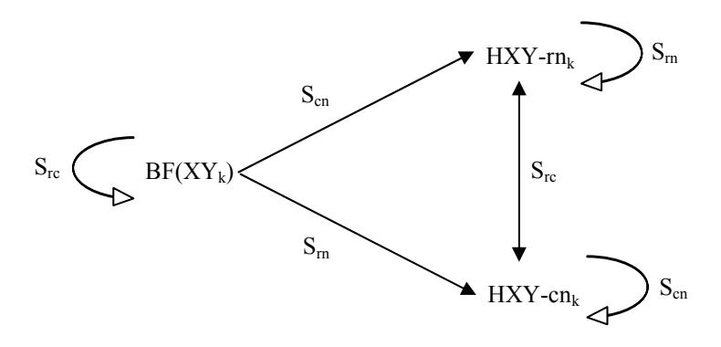

Figure 1. Relationships between the XY and the HXY rules

#### XV.2. The unifying power of hidden xy-chains

If we admit that xy-chains constitute chains of the simplest kind, hxy chains, which are their supersymmetric version, should be granted the same logical (if not psychological) simplicity, according to our general guiding principles.

Considering various cases of hxy-chains together with their graphical representations in rn- and rc- spaces shows that the notion of a hxy-chain leads to the natural unification of patterns that look very different in natural rc-space (all these patterns are special cases of the two types of patterns known in the Sudoku literature as "Nice Loops" and "Alternating Inference Chains" or "AICs").

The graphical representations of hidden chains we are giving in this section are not representations of rule patterns in the sense of chapter XIII. Their purpose is only to give an intuitive visual description of how these chains appear in rn- and rc-spaces. Let us adopt the following convention: a simple bar represents a link (along the indicated coordinate in rn- or rc- space) and a double bar (in rc-space) represents a conjugacy link (for the value indicated between parentheses and along the indicated coordinate in rc-space). Open and closed sets of candidates are displayed as for chain patterns, whereas the X symbol inside a circle indicates a target cell. The star on the right of a value indicates that it is the target value.

#### XV.2.1. hxy3 chains

For the HXY-rn3 rule, apart from reversing the order of the cells in the chain, there is *a priori* only one possibility that does not reduce to Hidden Triplets or to Swordfish. (But remember that we have found no case of this possibility and we conjecture that it is subsumed by simpler rules).

The representation of this case of a hxy-rn3 chain in rc-space (Figure 2) shows that it corresponds to a combination of two c-chains (for two distinct conjugacy numbers), involving a total of four rc-cells (one more than in rn-spaces). As an easy exercise, validity of this rather complex rule can be checked directly in rc-space. It can also easily be deduced from the inference rule stated for non full c-chains.

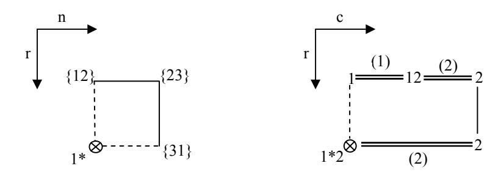

Figure 2. The typical hxy-rn3-chain seen in rn-space (left) and in rc-space (right)

#### XV.2.2. hxy4 chains

hxy4-chains lead to still more striking observations: some cases correspond to the combination of up to three c-chains on up to seven rc-cells. Apart from reversing the order of the cells in the chain, there are *a priori* four cases of hxy4-rn-chains that do not reduce to Hidden-Quadruplets or to Jellyfish, as shown in Figures 3 to 7.

What can we conclude from this review of hxy-rn4 chains? First, this notion unifies what would otherwise be considered as very different combinations of c-chains with several c-linking values (a family of patterns called Nice Loops). Second, it also shows that such combinations are logically much simpler than one would think if one looked at them only in rc-space:

- in case 1, three c-chains on a total of six re-cells: C2(1), C2(2) and C4(3);
- in case 2, two c-chains on a total of seven re-cells: C2(1) and C6(2);

- in case 3, three c-chains on a total of six rc-cells: C2(1), C4(2) and C2(3);
- in case 4, two c-chains on a total of seven re-cells: C4(1) and C4(2).

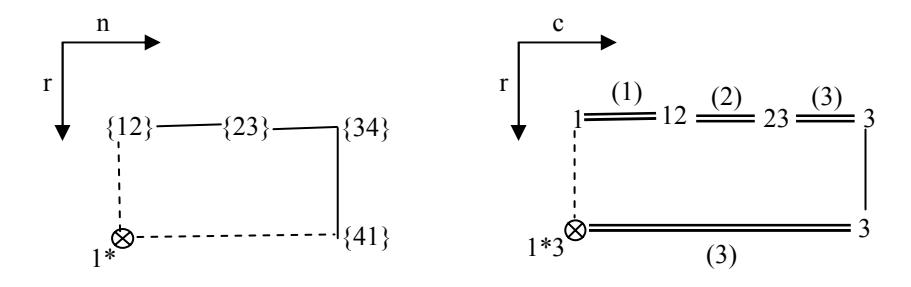

Figure 3. The typical hxy-rn4-chain, case 1, seen in rn-space (left) and in rc-space (right)

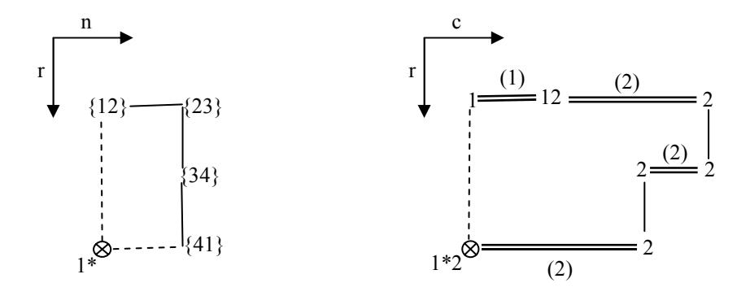

Figure 4. The typical hxy-rn4-chain, case 2, seen in rn-space (left) and in rc-space (right)

Looking for combinations of chains of different types or of c-chains with different c-linking values is a difficult job, because the possibilities are nearly unlimited. Having a unifying framework as above is thus very important in practice. And the longer the hxy chains are, the more important this becomes.

Notice nevertheless that combinations of c-chains thus obtained are very specific: they do not mix c-links along different unit-types (as AICs or Nice Loops would do); to a hxy-rn-chain (respectively to a hxy-cn-chain), there correspond only com-

binations of c-chains where all the c-links are along rows (resp. along columns). hxy-chains do not exempt us from looking for complex combinations of c-chains, but, at least, they exempt us from looking for some combinations of them that should be considered as less complex.

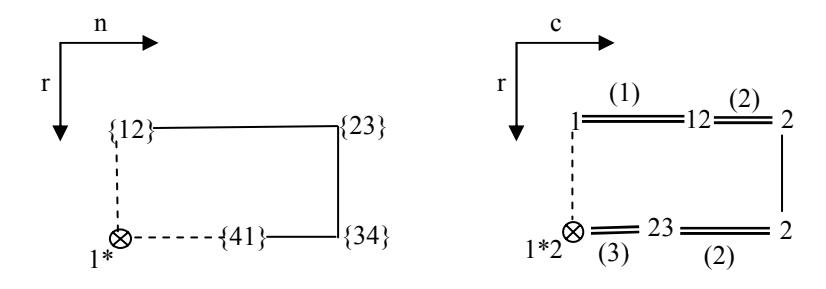

*Figure 5.* The typical hxy-rn4-chain, case 3, seen in rn-space (left) and in rc-space (right)

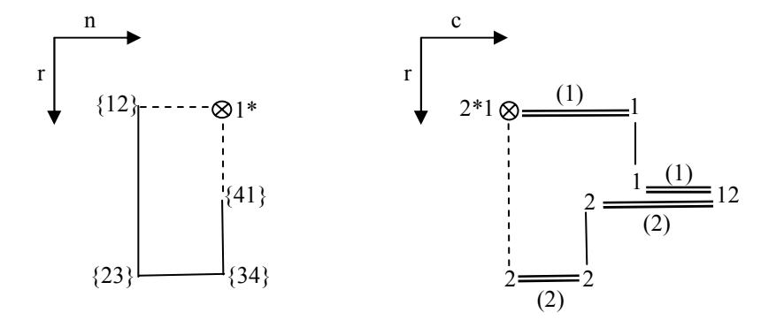

Figure 6. The typical hxy-rn4-chain, case 4, seen in rn-space (left) and in rc-space (right)

#### XV.3. Examples and independence results

Apart from providing examples of hxy-chains of various lengths, the puzzles in this section prove independence results, as explained in the introduction (at the beginning of section 3). Being obvious consequences of the sets of rules by which the puzzles are and are not solved, these independence results need not be stated explicitly.

#### XV.3.1. Three puzzles in [L4 0+XY4]+HXY4

With our first example, puzzle Royle17-211 (Figure 7), a hxy4-cn-chain (of type 2 in the above classification) can be seen immediately after three simple Interaction rules have eliminated four candidates from the L4\_0+XY4 elaboration (which is equal to the L1 elaboration). Notice how the nrc-notation for these chains is a simple adaptation of the notation for xy-chains, by merely permuting the nrc symbols.

|   |   |   |   |   |   | 3 | 1 |
|---|---|---|---|---|---|---|---|
|   | 8 |   |   | 4 |   |   |   |
|   | 7 |   |   |   |   |   |   |
| 1 |   | 6 | 3 |   |   | 7 |   |
| 3 |   |   |   |   |   |   |   |
|   |   |   |   | 8 |   |   |   |
| 5 | 4 |   |   |   | 8 |   |   |
|   |   |   | 6 |   | 2 |   |   |
|   |   |   | 1 |   |   |   |   |

| l | 4 | 6 | 5 | 8 |   |   |   | 3 | 1 |
|---|---|---|---|---|---|---|---|---|---|
| ĺ | 9 | 8 | 1 |   | 4 | 3 | 6 |   |   |
| ĺ | 2 | 7 | 3 |   | 1 | 6 |   | 8 | 4 |
| ĺ | 1 |   | 6 | 3 |   | 5 | 4 | 7 | 8 |
| ĺ | 3 |   | 8 | 4 | 6 | 7 | 1 |   |   |
| ĺ | 7 |   | 4 |   | 8 | 1 | 3 | 6 |   |
| ĺ | 5 | 4 |   |   | 3 |   | 8 | 1 | 6 |
| ĺ | 8 | 1 |   | 6 |   | 4 | 2 |   | 3 |
| ĺ | 6 | 3 |   | 1 |   | 8 |   | 4 |   |

| 4 | 6 | 5 | 8 | 7 | 2 | 9 | 3 | 1 |
|---|---|---|---|---|---|---|---|---|
| 9 | 8 | 1 | 5 | 4 | 3 | 6 | 2 | 7 |
| 2 | 7 | 3 | 9 | 1 | 6 | 5 | 8 | 4 |
| 1 | 2 | 6 | 3 | 9 | 5 | 4 | 7 | 8 |
| 3 | 9 | 8 | 4 | 6 | 7 | 1 | 5 | 2 |
| 7 | 5 | 4 | 2 | 8 | 1 | 3 | 6 | 9 |
| 5 | 4 | 2 | 7 | 3 | 9 | 8 | 1 | 6 |
| 8 | 1 | 7 | 6 | 5 | 4 | 2 | 9 | 3 |
| 6 | 3 | 9 | 1 | 2 | 8 | 7 | 4 | 5 |
|   |   |   |   |   |   |   |   |   |

Figure 7. Puzzle Royle17-211, its L1 elaboration and its solution

```
Resolution path in L4_0+XY4+HXY4 for the L4_0+XY4 (or L1) elaboration of Royle17-211: row r1 interaction-with-block b2 ==> r2c4 \neq 2
```

```
block b3 interaction-with-column c7 ==> r9c7 \neq 9
block b9 interaction-with-row r9 ==> r9c5 \neq 7, r9c3 \neq 7
hxy-cn4-chain {r1 r3}c7n9 - {r3 r9}c7n5 - {r9 r8}c5n5 - {r8 r1}c5n7 ==> r1c7 \neq 7
... (Naked-Singles)
```

This elementary example can be used to illustrate the benefits of the cn-space. Let us consider various representations of the knowledge state just before the hxy-cn4-rule is applied. For completeness, let us first notice that it has nothing particularly appealing in the standard rc-representation (Figure 8), which contains no useful xy-chain.

Things are very different with the cn-representation of the same knowledge state. A hxy-cn4-chain  $\{r1\ r3\}c7n9 - \{r3\ r9\}c7n5 - \{r9\ r8\}c5n5 - \{r8\ r1\}c5n7$  immediately appears, and the hxy-cn4-chain rule can now be used to eliminate the (row) candidate r1 from the hxy-cn4-target cell c7n7. Let us use the extended Sudoku board with the explicit n, c, and r symbols in the rc-, rn- and cn- cells.

|                      | c1                              | <i>c</i> 2                       | c3                             | c4                                                    | <i>c</i> 5                         | <i>c</i> 6        | <i>c</i> 7                                       | c8                        | <i>c</i> 9                                  |                            |
|----------------------|---------------------------------|----------------------------------|--------------------------------|-------------------------------------------------------|------------------------------------|-------------------|--------------------------------------------------|---------------------------|---------------------------------------------|----------------------------|
| r1                   | 4                               | 6                                | 5                              | 8                                                     | n2<br>n7 n9                        | n2<br>n9          | n7 n9                                            | 3                         | 1                                           | r1                         |
| r2                   | 9                               | 8                                | 1                              | n5<br>n7                                              | 4                                  | 3                 | 6                                                | n2<br>n5                  | n2<br>n5<br>n7                              | r2                         |
| r3                   | 2                               | 7                                | 3                              | n5<br>n9                                              | 1                                  | 6                 | n5<br>n9                                         | 8                         | 4                                           | r3                         |
| r4                   | 1                               | n2<br>n9                         | 6                              | 3                                                     | n2<br>n9                           | 5                 | 4                                                | 7                         | 8                                           | r4                         |
| r5                   | 3                               | n2<br>n5<br>n9                   | 8                              | 4                                                     | 6                                  | 7                 | 1                                                | n2<br>n5<br>n9            | n2<br>n5<br>n9                              | r5                         |
| r6                   | 7                               | n2<br>n5<br>n9                   | 4                              | n2<br>n9                                              | 8                                  | 1                 | 3                                                | 6                         | n2<br>n5<br>n9                              | r6                         |
| <i>r</i> 7           | 5                               | 4                                | n2<br>n7 n9                    | n2<br>n5<br>n7 n9                                     | 3                                  | n2<br>n9          | 8                                                | 1                         | 6                                           | r7                         |
| r8                   | 8                               | 1                                | n7 n9                          | 6                                                     | n5<br>n7 n9                        | 4                 | 2                                                | n5<br>n9                  | 3                                           | r8                         |
| r9                   | 6                               | 3                                | n2<br>n9                       | 1                                                     | n2<br>n5<br>n9                     | 8                 | n5<br>n7                                         | 4                         | n2<br>n5<br>n7 n9                           | r9                         |
|                      |                                 |                                  |                                |                                                       |                                    |                   |                                                  |                           |                                             |                            |
|                      | c1                              | <i>c</i> 2                       | сЗ                             | <i>c4</i>                                             | <i>c</i> 5                         | <i>c</i> 6        | <i>c</i> 7                                       | c8                        | <i>c</i> 9                                  |                            |
| n1                   | <i>c1</i>                       | c2<br>8                          | <i>c3</i>                      | <i>c4</i><br>9                                        | c5<br>3                            | <i>c6</i> 6       | <i>c7</i> 5                                      | c8<br>7                   | c9                                          | n1                         |
| n1<br>n2             |                                 |                                  |                                |                                                       |                                    |                   |                                                  |                           |                                             | n1<br>n2                   |
|                      | 4                               | 8                                | 2                              | 9<br>r2<br>r6                                         | 3<br>r1<br>r4                      | 6                 | 5                                                | 7<br>r2                   | 1<br>r2<br>r5 r6                            |                            |
| n2                   | 3                               | 8<br>r4 r5 r6                    | 2<br>r7 r9                     | 9<br>r2<br>r6                                         | 3 r1 r4 r9                         | 6 r1 r7           | 5                                                | 7<br>r2<br>r5             | 1<br>r2<br>r5 r6<br>r9                      | n2                         |
| n2<br>n3             | 3 5                             | 8<br>r4 r5 r6                    | 2<br>r7 r9<br>3                | 9<br>r2<br>r6<br>r7                                   | 3 r1 r4 r9 7                       | 6 r1 r7 2         | 5<br>8<br>6                                      | 7 r2 r5                   | 1<br>r2<br>r5 r6<br>r9                      | n2<br>n3                   |
| n2<br>n3<br>n4       | 4<br>3<br>5                     | 8<br>r4r5r6<br>9                 | 2<br>r7 r9<br>3                | 9  r <sup>2</sup> r6  r7  4  5  r <sup>2</sup> r3     | 3 r1 r4 r9 7 2                     | 6 r1 r7 2         | 5<br>8<br>6<br>4                                 | 7 r2 r5  1 9 r2 r5        | 1  r2 r5 r6 r9  8  3  r2 r5 r6              | n2<br>n3<br>n4             |
| n2<br>n3<br>n4<br>n5 | 4<br>3<br>5<br>1<br>7           | 8<br>r4 r5 r6<br>9<br>7<br>r5 r6 | 2<br>r7 r9<br>3<br>6           | 9  r <sup>2</sup> r6  r7  4  5  r <sup>2</sup> r3  r7 | 3 r1 r4 r9 7 2 r8 r9               | 6 r1 r7 2 8 4     | 5<br>8<br>6<br>4<br>r <sub>9</sub>               | 7 r2 r5  1 9 r2 r5 r8     | 1  r2 r5 r6 r9  8  3  r2 r5 r6 r9           | n2<br>n3<br>n4<br>n5       |
| n2<br>n3<br>n4<br>n5 | 4<br>3<br>5<br>1<br>7<br>9      | 8 r4 r5 r6 9 7 r5 r6             | 2<br>r7 r9<br>3<br>6<br>1<br>4 | 9 r2 r6 r7 4 5 r2 r3 r7 8 r2                          | 3  r1 r4 r9  7 2  r8 r9  5 r1      | 6 r1 r7 2 8 4     | 5<br>8<br>6<br>4<br>r9<br>2                      | 7 r2 r5  1 9 r2 r5 r8 6   | 1  r2 r5 r6 r9  8  3  r2 r5 r6 r9  7  r2    | n2<br>n3<br>n4<br>n5       |
| n2 n3 n4 n5 n6       | 4<br>3<br>5<br>1<br>7<br>9<br>6 | 8 r4 r5 r6 9 7 r5 r6 1 3         | 2  r7 r9  3  6  1  4  r7 r8    | 9 r2 r6 r7 r6 4 5 r2 r3 r7 8 r2 r7                    | 3  r1 r4 r9  7  2  r8 r9  5  r1 r8 | 6 r1 r7 2 8 4 3 5 | 5<br>8<br>6<br>4<br>r3<br>r9<br>2<br>rL r3<br>r9 | 7 r2 r5  1 9 r2 r5 r8 6 4 | 1  r2 r5 r6 r9  8  3  r2 r5 r6 r9  7  r2 r9 | n2<br>n3<br>n4<br>n5<br>n6 |

Figure 8. Puzzle Royle17-211, in rc- and cn- spaces, just before HXY4 is applied

Our second example, puzzle Royle17-619 (Figure 9), requires a simple combination of xy4 and hxy4 chains. The L4\_0+XY4 elaboration process uses the XY4 rule but this does not lead to the addition of any new value and the L4\_0+XY4 elaboration is equal to the L1\_0 elaboration. Its resolution path starts with XY4, which, after an Interaction, is followed by HXY-cn4 (of type 4 in the above classification), the sequel being in L1\_0.

|   |   |   |   |   |   |   |   | _ |   |   |   |   |   |   |   |   |   |   |   |   |   |   |   |   |   |
|---|---|---|---|---|---|---|---|---|---|---|---|---|---|---|---|---|---|---|---|---|---|---|---|---|---|
|   |   |   |   |   |   | 8 | 1 | Ī | 3 | 5 | 4 |   | 7 |   |   | 8 | 1 |   | 3 | 5 | 4 | 6 | 7 | 2 | 9 |
|   | 2 |   | 3 |   |   |   |   |   |   | 2 | 1 | 8 | 3 |   | 7 |   |   |   | 9 | 2 | 1 | 8 | 3 | 4 | 7 |
|   |   |   |   |   |   |   |   |   |   | 7 | 8 |   | 1 |   |   | 3 | 2 |   | 6 | 7 | 8 | 5 | 1 | 9 | 4 |
|   |   |   | 6 |   | 3 | 2 |   |   | 4 | 8 | 5 | 9 | 6 | 1 | 3 | 2 | 7 |   | 4 | 8 | 5 | 9 | 6 | 1 | 3 |
| 7 |   | 4 | 5 |   |   |   |   |   | 7 |   |   | 4 | 5 |   | 1 |   | 8 |   | 7 | 9 | 2 | 4 | 5 | 3 | 1 |
| 1 |   |   |   |   |   |   |   |   | 1 |   |   |   | 8 | 7 |   |   |   |   | 1 | 3 | 6 | 2 | 8 | 7 | 5 |
| 5 |   | 7 |   | 8 |   |   |   | İ | 5 | 1 | 9 | 7 | 2 | 8 |   |   | 3 |   | 5 | 1 | 9 | 7 | 2 | 8 | 6 |
|   | 6 |   |   |   | 2 |   |   |   | 8 | 6 | 7 |   | 4 |   | 2 | 1 | 9 | 1 | 8 | 6 | 7 | 3 | 4 | 5 | 2 |
|   |   | 1 |   |   |   |   |   |   | 2 | 4 | 3 | 1 | 9 | 6 | 8 | 7 | 5 |   | 2 | 4 | 3 | 1 | 9 | 6 | 8 |
|   |   |   |   |   |   |   |   | - |   |   |   |   |   |   |   |   |   | - |   |   |   |   |   |   |   |

Figure 9. Puzzle Royle17-619, its L1 0 elaboration and its solution

Resolution path in L4\_0+XY4+HXY4 for the L4\_0+XY4 (or L1\_0) elaboration of puzzle Royle17-619:

```
xy4-chain \{n9\ n3\}r6c2 - \{n3\ n2\}r6c4 - \{n2\ n6\}r1c4 - \{n6\ n9\}r1c7 \Longrightarrow r6c7 \neq 9 column c7 interaction-with-block b3 \Longrightarrow r2c8 \neq 9 
hxy-cn4-chain \{r1\ r3\}c4n6 - \{r3\ r2\}c1n6 - \{r2\ r3\}c1n9 - \{r3\ r1\}c7n9 \Longrightarrow r1c7 \neq 6 ... (Naked-Singles)
```

Notice that the hxy-cn4-chain was not present at the start. The content of cn-cell c7n9 was {r3, r1, r6}. r6 is eliminated by the xy4 rule, leading to the apparition of the hxy-cn4 pattern. The Interaction rule is nevertheless applied before the hxy-cn4 rule because it is simpler. It does not change the content of the cn-cells in the hxy-cn4-chain.

Our third example, puzzle Royle17-520 (Figure 10), also combines an xy4 chain and a hxy-cn4 chain (of type 1 in the above classification) but the two chains now live at the same time on the grid. After four simple Interaction rules have eliminated six candidates from the L4\_0+XY4 elaboration (which coincides with the L1 elaboration), this can be seen from the fact that the xy4 rule, applied just before the hxy4 rule, does not change anything in the cn-cells on which the hxy4 chain lives.

|   |   |   |   |   |   |   | 6 | 5 |   | 7 | 2 |   | 3 |   | ľ |
|---|---|---|---|---|---|---|---|---|---|---|---|---|---|---|---|
| 9 |   |   | 2 |   |   |   |   |   |   | 9 |   | 5 | 2 | 6 | ľ |
|   |   |   |   |   |   |   |   |   |   | 3 |   | 6 | 5 | 7 | ľ |
|   |   |   | 9 |   |   | 2 | 4 |   | 1 | 6 |   |   | 9 |   | ľ |
|   | 5 | 3 |   |   |   |   |   |   |   |   | 5 | 3 | 7 |   | ľ |
|   |   |   |   |   |   |   |   |   |   |   | 9 |   | 6 |   | ľ |
|   | 6 |   |   | 5 | 7 |   |   |   | 1 |   | 6 | 9 |   | 5 | ľ |
| 1 |   |   |   |   | 6 | 8 |   |   |   | 1 | 3 |   | 4 | 9 | ľ |
|   |   |   |   | 3 |   | 9 |   |   |   | 5 |   |   |   | 3 | ľ |

| 7 | 2 | 8 | 3 | 4 | 9 | 1 | 6 | 5 |
|---|---|---|---|---|---|---|---|---|
| 9 | 4 | 5 | 2 | 6 | 1 | 7 | 3 | 8 |
| 3 | 1 | 6 | 5 | 7 | 8 | 4 | 2 | 9 |
| 6 | 7 | 1 | 9 | 8 | 5 | 2 | 4 | 3 |
| 8 | 5 | 3 | 7 | 2 | 4 | 6 | 9 | 1 |
| 4 | 9 | 2 | 6 | 1 | 3 | 5 | 8 | 7 |
| 2 | 6 | 9 | 8 | 5 | 7 | 3 | 1 | 4 |
| 1 | 3 | 7 | 4 | 9 | 6 | 8 | 5 | 2 |
| 5 | 8 | 4 | 1 | 3 | 2 | 9 | 7 | 6 |
|   |   |   |   |   |   |   |   |   |

Figure 10. Puzzle Royle17-520, its L1 elaboration and its solution

Resolution path in L4\_0+XY4+HXY4 for the L4\_0+XY4 (or L1) elaboration of Royle17-520:

```
row r4 interaction-with-block b4 ==> r6c3 \neq 7 column c1 interaction-with-block b4 ==> r6c3 \neq 4 column c9 interaction-with-block b6 ==> r5c8 \neq 1 row r1 interaction-with-block b1 ==> r3c2 \neq 2 hidden-single-in-a-column ==> r1c2 = 2 xy4-chain {n8 n2}r7c1 - {n2 n1}r7c8 - {n1 n7}r9c8 - {n7 n8}r6c8 ==> r6c1 \neq 8 hxy-cn4-chain {r6 r5}c9n1 - {r5 r3}c9n9 - {r3 r8}c9n2 - {r8 r6}c3n2 ==> r6c3 \neq 1 block b4 interaction-with-row r4 ==> r4c5 \neq 1 ... (Naked-Singles and Hidden-Singles)
```

#### XV.3.2. Three puzzles in [L4+XY5]+HXY5

|   |   |   | 8 |   |   |   |   | 5 |
|---|---|---|---|---|---|---|---|---|
|   |   |   |   | 6 |   | 2 |   |   |
| 1 |   |   |   |   |   |   |   |   |
| 4 | 2 |   | 1 |   |   |   |   |   |
|   |   |   |   |   |   | 6 | 7 |   |
|   |   |   |   |   |   |   | 3 |   |
|   | 6 | 7 |   |   |   | 3 |   |   |
|   |   |   | 4 |   | 5 |   |   |   |
|   |   | 2 |   |   |   |   |   |   |

| 2 | 9 | 6 | 8 |   | 3 | 7 |   | 5 |
|---|---|---|---|---|---|---|---|---|
| 7 | 8 | 4 | 5 | 6 |   | 2 |   | 3 |
| 1 | 3 | 5 | 7 |   | 2 |   |   | 6 |
| 4 | 2 | 3 | 1 | 7 | 6 | 5 |   |   |
|   | 5 | 1 | 3 |   | 4 | 6 | 7 | 2 |
| 6 | 7 |   | 2 | 5 |   | 4 | 3 | 1 |
| 5 | 6 | 7 | 9 |   |   | 3 | 2 | 4 |
| 3 | 1 |   | 4 | 2 | 5 |   | 6 | 7 |
|   | 4 | 2 | 6 | 3 | 7 | 1 | 5 |   |

| 2 | 9 | 6 | 8 | 1 | 3 | 7 | 4 | 5 |
|---|---|---|---|---|---|---|---|---|
| 7 | 8 | 4 | 5 | 6 | 9 | 2 | 1 | 3 |
| 1 | 3 | 5 | 7 | 4 | 2 | 8 | 9 | 6 |
| 4 | 2 | 3 | 1 | 7 | 6 | 5 | 8 | 9 |
| 8 | 5 | 1 | 3 | 9 | 4 | 6 | 7 | 2 |
| 6 | 7 | 9 | 2 | 5 | 8 | 4 | 3 | 1 |
| 5 | 6 | 7 | 9 | 8 | 1 | 3 | 2 | 4 |
| 3 | 1 | 8 | 4 | 2 | 5 | 9 | 6 | 7 |
| 9 | 4 | 2 | 6 | 3 | 7 | 1 | 5 | 8 |

Figure 11. Puzzle Royle17-11212, its L1 0 elaboration and its solution

As usual, let us start with a very simple example, puzzle Royle17-11212 (Figure 11). Its L4+XY5 elaboration coincides with its L1 0 elaboration. And this elabora-

tion can be solved by a single application of HXY5 (apart from the final NS). The hxy-cn5 pattern is readily visible on the central puzzle.

Resolution path in L4+XY5+HXY5 for the L4+XY5 (or L1\_0) elaboration of puzzle Royle17-11212:

hxy-cn5-chain {r3 r5}c5n9 - {r5 r7}c5n8 - {r7 r6}c6n8 - {r6 r8}c3n8 - {r8 r3}c7n8 ==>  $r3c7 \neq 9$ 

... (Naked-Singles)

Another simple example is puzzle Royle17-7295 (Figure 12). Again, the L4+ XY5 and L1\_0 elaborations coincide. The HXY5-rn pattern appears immediately after an Interaction.

|   |   |   | 2 |   | 1 |   |   |   |
|---|---|---|---|---|---|---|---|---|
|   | 4 |   |   |   |   |   | 9 |   |
|   |   |   |   |   |   |   |   |   |
|   |   |   | 7 | 5 |   |   | 6 |   |
| 2 |   | 1 |   |   |   |   |   |   |
| 8 |   |   | 6 |   |   |   |   |   |
|   | 9 |   |   | 3 |   |   |   |   |
|   |   |   |   |   |   | 1 |   | 3 |
|   |   |   |   | 4 |   | 8 |   |   |

|   | 8 |   | 2 |   | 1 |   |   |   |
|---|---|---|---|---|---|---|---|---|
| 1 | 4 |   | 3 | 8 | 5 |   | 9 | 2 |
|   | 2 |   | 9 |   | 4 |   | 1 | 8 |
|   | 3 |   | 7 | 5 | 8 | 2 | 6 | 1 |
| 2 | 6 | 1 | 4 | 9 | 3 |   | 8 |   |
| 8 |   |   | 6 | 1 | 2 | 9 | 3 | 4 |
|   | 9 | 8 | 1 | 3 | 7 |   | 2 |   |
|   |   |   | 8 | 2 | 9 | 1 |   | 3 |
| 3 | 1 | 2 | 5 | 4 | 6 | 8 | 7 | 9 |

| 9 | 8 | 3 | 2 | 7 | 1 | 6 | 4 | 5 |
|---|---|---|---|---|---|---|---|---|
| 1 | 4 | 6 | 3 | 8 | 5 | 7 | 9 | 2 |
| 7 | 2 | 5 | 9 | 6 | 4 | 3 | 1 | 8 |
| 4 | 3 | 9 | 7 | 5 | 8 | 2 | 6 | 1 |
| 2 | 6 | 1 | 4 | 9 | 3 | 5 | 8 | 7 |
| 8 | 5 | 7 | 6 | 1 | 2 | 9 | 3 | 4 |
| 5 | 9 | 8 | 1 | 3 | 7 | 4 | 2 | 6 |
| 6 | 7 | 4 | 8 | 2 | 9 | 1 | 5 | 3 |
| 3 | 1 | 2 | 5 | 4 | 6 | 8 | 7 | 9 |

Figure 12. Puzzle Royle17-7295, its L1 0 elaboration and its solution

Resolution path in L4+XY5+HXY5 for the L4+XY5 (or L1\_0) elaboration of puzzle Royle17 -7295:

row r8 interaction-with-block b7 ==> r7c1  $\neq$  6

hxy-rn5-chain {c7 c3}r1n3 – {c3 c1}r1n9 – {c1 c3}r4n9 – {c3 c1}r4n4 – {c1 c7}r7n4 ==>  $r1c7 \neq 4$ 

... (Naked-Singles and Hidden-Singles)

Our third example, puzzle Royle-17-4167 (Figure 13) is no more complex. Its L4+XY5 and L1\_0 elaborations coincide. After the initial elimination of a candidate by an Interaction rule, the solution path for this elaboration starts with HXY-rn5 and the sequel is entirely in L1\_0.

Resolution path in L4+XY5+HXY5 for the L4+XY5 (or L1\_0) elaboration of puzzle Royle17-4167:

block b4 interaction-with-row r4 ==>  $r4c5 \neq 6$ 

hxy-rn5-chain {c5 c3}r4n3 – {c3 c2}r4n6 – {c2 c8}r3n6 – {c8 c9}r8n6 – {c9 c5}r5n6 ==>  $r5c5 \neq 3$ 

... (Naked-Singles and Hidden-Singles)

|   |   |   |   | 4 |   | 8 |   | 1 |   | 5 |   |   | 4 | 7 | 8 | 2 | 1 | 9 | 5 | 3 | 6 | 4 | 7 | 8 | 2 | 1 |
|---|---|---|---|---|---|---|---|---|---|---|---|---|---|---|---|---|---|---|---|---|---|---|---|---|---|---|
| 7 |   | 2 |   |   |   |   |   |   | 7 | 4 | 2 | 1 | 8 |   |   | 5 | 3 | 7 | 4 | 2 | 1 | 8 | 9 | 6 | 5 | 3 |
|   |   |   |   |   |   |   |   |   | 1 |   | 8 | 3 | 5 | 2 | 7 |   | 4 | 1 | 6 | 8 | 3 | 5 | 2 | 7 | 9 | 4 |
|   |   |   | 7 |   | 5 |   | 4 |   | 8 |   |   | 7 |   | 5 | 1 | 4 | 2 | 8 | 9 | 6 | 7 | 3 | 5 | 1 | 4 | 2 |
|   |   |   | 2 |   |   |   |   |   |   | 7 | 4 | 2 |   | 1 | 5 | 8 |   | 3 | 7 | 4 | 2 | 9 | 1 | 5 | 8 | 6 |
|   | 1 |   |   |   |   |   |   |   | 2 | 1 | 5 | 8 |   | 4 |   | 3 | 7 | 2 | 1 | 5 | 8 | 6 | 4 | 9 | 3 | 7 |
| 6 |   |   | 4 |   |   | 3 |   |   | 6 | 2 | 9 | 4 | 7 | 8 | 3 | 1 | 5 | 6 | 2 | 9 | 4 | 7 | 8 | 3 | 1 | 5 |
|   | 8 |   |   | 1 |   |   |   |   | 4 | 8 | 7 | 5 | 1 | 3 | 2 |   |   | 4 | 8 | 7 | 5 | 1 | 3 | 2 | 6 | 9 |
| 5 |   |   |   |   |   |   | 7 |   | 5 | 3 | 1 |   | 2 |   | 4 | 7 | 8 | 5 | 3 | 1 | 9 | 2 | 6 | 4 | 7 | 8 |

Figure 13. Puzzle Royle17-4167, its L1 0 elaboration and its solution

#### *XV.3.3. A puzzle in [L5+XY6]+HXY6*

The L5+XY6 elaboration of puzzle Royle-17-5546 (Figure 14) coincides with its L1 elaboration and, moreover, all the candidates elimination done by the elaboration process is subsumed by the values it produces. The resolution path for the elaborated puzzle starts with the HXY-rn6 rule. One can therefore detect a HXY-rn6 pattern directly on the central grid of Figure 13 (after displaying it in rn-space).

|   |   |   |   | 7 | 1 |   |   |   | 4 |   | 2 |   | 7 | 1 |   | 6 |   | 4 | 9 | 2 | 8 | 7 | 1 | 5 | 6 | 3 |
|---|---|---|---|---|---|---|---|---|---|---|---|---|---|---|---|---|---|---|---|---|---|---|---|---|---|---|
| 3 |   |   |   |   |   | 2 |   |   | 3 | 7 |   | 4 |   | 6 | 2 |   | 1 | 3 | 7 | 8 | 4 | 5 | 6 | 2 | 9 | 1 |
|   |   |   |   |   |   |   |   |   | 1 |   | 6 |   | 3 | 2 | 4 |   | 7 | 1 | 5 | 6 | 9 | 3 | 2 | 4 | 8 | 7 |
|   | 4 |   |   |   |   | 7 | 1 |   |   | 4 |   |   |   | 3 | 7 | 1 |   | 8 | 4 | 9 | 5 | 6 | 3 | 7 | 1 | 2 |
| 6 |   |   | 2 | 8 |   |   |   |   | 6 | 1 | 7 | 2 | 8 | 4 | 9 | 3 | 5 | 6 | 1 | 7 | 2 | 8 | 4 | 9 | 3 | 5 |
|   |   |   |   |   |   |   | 4 |   |   |   |   | 1 |   | 7 | 8 | 4 |   | 2 | 3 | 5 | 1 | 9 | 7 | 8 | 4 | 6 |
| 5 |   |   | 3 |   |   |   |   | 9 | 5 | 2 | 4 | 3 | 1 | 8 | 6 | 7 | 9 | 5 | 2 | 4 | 3 | 1 | 8 | 6 | 7 | 9 |
|   |   |   | 6 | 2 |   |   |   |   | 7 |   |   | 6 | 2 |   | 1 |   | 4 | 7 | 8 | 3 | 6 | 2 | 9 | 1 | 5 | 4 |
|   |   | 1 |   |   |   |   |   |   |   | 6 | 1 | 7 | 4 |   |   | 2 |   | 9 | 6 | 1 | 7 | 4 | 5 | 3 | 2 | 8 |

Figure 14. Puzzle Royle17-5546, its L1 elaboration and its solution

Resolution path in L5+XY6+HXY6 for the L5+XY6+HXY6 (or L1) elaboration of puzzle Royle17-5546:

 $\begin{array}{l} \text{hxy-rn6-chain } \{ c8 \ c6 \} r8n5 - \{ c6 \ c7 \} r9n5 - \{ c7 \ c9 \} r9n3 - \{ c9 \ c1 \} r9n8 - \{ c1 \ c3 \} r4n8 - \{ c3 \ c8 \} r2n8 ==> r8c8 \neq 8 \\ \end{array}$ 

naked and hidden singles  $\implies$  r8c8 = 5, r9c7 = 3, r1c7 = 5, r9c9 = 8, r1c9 = 3, r9c1 = 9, r6c1 = 2, r4c1 = 8, r6c9 = 6, r4c9 = 2, r9c6 = 5, r8c6 = 9, r4c5 = 6

#### XV.3.4. A puzzle in [L6+XY7]+HXY7

For puzzle Sudogen0-9617 (Figure 15), the L6+XY7 and the L5 elaborations coincide (they effectively use XY5 and it leads to assert the value r6c7 = 3).

| 3 |   |   |   |   | 9 |   |   |   |
|---|---|---|---|---|---|---|---|---|
|   |   |   |   |   | 1 | 4 |   | 6 |
| 8 | 2 |   | 4 |   | 5 |   |   |   |
|   |   |   |   | 5 |   |   | 9 |   |
| 7 |   | 8 | 3 |   |   |   |   | 4 |
|   |   |   |   |   |   | 2 | 6 |   |
|   | 7 |   |   | 6 |   | 9 |   |   |
|   |   | 3 |   | 8 |   |   |   |   |
|   |   | 2 |   |   |   | 6 |   |   |

| 3 |   |   | 6 |   | 9 |   |   |   |
|---|---|---|---|---|---|---|---|---|
|   |   | 7 | 8 |   | 1 | 4 |   | 6 |
| 8 | 2 | 6 | 4 |   | 5 |   |   | 9 |
| 2 |   |   |   | 5 | 6 |   | 9 |   |
| 7 | 6 | 8 | 3 | 9 | 2 |   |   | 4 |
|   |   | 9 |   | 4 | 8 | 2 | 6 |   |
|   | 7 | 5 | 2 | 6 | 3 | 9 |   |   |
| 6 |   | 3 |   | 8 |   |   |   |   |
|   | 8 | 2 |   | 1 |   | 6 |   |   |

| 3 | 4 | 1 | 6 | 2 | 9 | 8 | 7 | 5 |
|---|---|---|---|---|---|---|---|---|
| 5 | 9 | 7 | 8 | 3 | 1 | 4 | 2 | 6 |
| 8 | 2 | 6 | 4 | 7 | 5 | 3 | 1 | 9 |
| 2 | 3 | 4 | 1 | 5 | 6 | 7 | 9 | 8 |
| 7 | 6 | 8 | 3 | 9 | 2 | 1 | 5 | 4 |
| 1 | 5 | 9 | 7 | 4 | 8 | 2 | 6 | 3 |
| 4 | 7 | 5 | 2 | 6 | 3 | 9 | 8 | 1 |
| 6 | 1 | 3 | 9 | 8 | 7 | 5 | 4 | 2 |
| 9 | 8 | 2 | 5 | 1 | 4 | 6 | 3 | 7 |

Figure 15. Puzzle Sudogen0-9617, its L5 elaboration and its solution

Two resolution paths for this elaboration can now be considered: either in L6+XH7+HXY7 or in L4\_0+XY4\_7+HXY4\_7. The two paths have a common (not very interesting) part in L3:

```
;;; common part in L3 for the two resolution paths, in L4_0+XY4_7+HXY4_7 and in L6+XH7+HXY7, for the L6+XY7 (or L5) elaboration of Sudogen0-9617: column c6 interaction-with-block b8 => r9c4 \neq 7, r8c4 \neq 7 row r5 interaction-with-block b6 => r6c9 \neq 5 column c1 interaction-with-block b7 => r8c2 \neq 4 row r5 interaction-with-block b6 => r6c9 \neq 1, r4c9 \neq 1, r4c7 \neq 1 row r3 interaction-with-block b3 => r1c9 \neq 1 column c9 interaction-with-block b9 => r8c8 \neq 1, r8c7 \neq 1, r7c8 \neq 1 row r3 interaction-with-block b3 => r1c8 \neq 1, r1c7 \neq 1 naked-pairs-in-a-row \{n5 \ n9\}r2\{c1 \ c2\} => r2c8 \neq 5 row r2 interaction-with-block b1 => r1c2 \neq 5 xyz3-chain \{n7 \ n3\}r6c9 - \{n3 \ n5\}r9c9 - \{n5 \ n7\}r8c7 => r8c9 \neq 7 ;;; end of the common part
```

From this point on, either we allow only rules of types XY and HXY and of length at most seven, or, in addition, we allow any rule of length at most six.

Continuation of the resolution path, in L4\_0+XY4\_7+HXY4\_7, for the L6+XY7 (or L5) elaboration of Sudogen0-96179:

```
hxy-rn6-chain {c2 c9}r8n1 - {c9 c8}r8n2 - {c8 c5}r2n2 - {c5 c8}r2n3 - {c8 c9}r9n3 - {c9 c2}r6n3 ==> r6c2 \neq 1
hxy-cn7-chain {r7 r1}c8n8 - {r1 r4}c7n8 - {r4 r3}c7n3 - {r3 r2}c5n3 - {r2 r1}c5n2 - {r1 r8}c9n2 - {r8 r7}c9n1 ==> r7c9 \neq 8
```

... (38 Naked-Singles)

Continuation of the resolution path, in L6+XY7+HXY7, for the L6+XY7 (or L5) elaboration of Sudogen0-9617:

```
xyzt5-chain \{n7\ n3\}r6c9 - \{n3\ n5\}r9c9 - \{n5\ n7\}r8c7 - \{n7\ n8\}r4c7 - \{n8\ n7\}r4c9 => r1c9 \neq 7
```

```
hxy-rn6-chain {c2 c9}r8n1 - {c9 c8}r8n2 - {c8 c5}r2n2 - {c5 c8}r2n3 - {c8 c9}r9n3 - {c9 c2}r6n3 ==> r6c2 \neq 1
```

hxy-cn7-chain {r7 r1}c8n8 - {r1 r4}c7n8 - {r4 r3}c7n3 - {r3 r2}c5n3 - {r2 r1}c5n2 - {r1 r8}c9n2 - {r8 r7}c9n1  $\Longrightarrow$  r7c9  $\neq$  8

... (38 Naked-Singles)

In the second case, one more rule for a shorter chain is applied (XYZT5) before hxy-rn6 and hxy-cn7, but this is useless, since the next steps are unchanged.

One more thing to notice about this puzzle is the long sequence of 38 final Naked-Singles.

#### XV.3.5. A puzzle not in [L4\_0+XY4\_13+HXY4\_13] but in [L7+XY8] +HXY8

Now comes a very complex but also very instructive example, puzzle Royle17-1020 (Figure 16). It can be solved neither in L7+XY8 nor in L4\_0+XY4\_13+ HXY4\_13, i.e. in L4\_0 plus all the rules of type xy and of length between four and thirteen (XY4\_13) plus all the rules of type hxy and of length between four and thirteen (HXY4\_13). Indeed, the elaborations of this puzzle by any one of these two sets of rules coincide with its L1\_0 elaboration; this means that all the other rules in L7+XY8 or in L4\_0+XY4\_13+HXY4\_13 are of no use for producing an interesting elaboration of this puzzle. Moreover, the L1\_0 elaboration has only three more values than the original puzzle; as a result, it may be expected that the resolution path starting from the elaborated version will be very long.

This puzzle can be solved if we add the HXY8 rule to L7+XY8. The solution requires many kinds of rules for chains of length not greater than seven in addition to the rule of interest (HXY-cn8); some of these chains are of types (hxyt and c) that

will be introduced or studied only in further chapters. This example is thus also a justification for introducing these more complex rules. In contrast with our usual examples chosen for simplicity, it shows how complex a resolution path can be.

|   |   |   |   |   |   | 2 | 6 |   |
|---|---|---|---|---|---|---|---|---|
| 8 |   |   | 7 |   |   |   |   |   |
|   |   |   |   |   |   | 3 |   |   |
| 1 |   |   |   |   | 6 |   | 5 |   |
|   | 7 |   |   | 3 |   |   |   |   |
|   |   |   |   | 4 | 2 |   |   |   |
|   |   |   | 5 |   |   |   |   | 1 |
|   | 2 | 4 |   |   |   |   |   |   |
|   |   | 3 |   |   |   |   |   |   |

|   |   |   |   |   |   | 2 | 6 |   |
|---|---|---|---|---|---|---|---|---|
| 8 |   |   | 7 |   |   |   |   |   |
|   |   |   |   |   |   | 3 |   |   |
| 1 |   |   |   | 7 | 6 |   | 5 |   |
|   | 7 |   |   | 3 | 5 |   |   |   |
|   |   |   |   | 4 | 2 |   |   |   |
|   |   |   | 5 |   |   |   |   | 1 |
|   | 2 | 4 |   |   |   |   |   |   |
|   | 1 | 3 |   |   |   |   |   |   |

| 4 | 9 | 1 | 3 | 5 | 8 | 2 | 6 | 7 |
|---|---|---|---|---|---|---|---|---|
| 8 | 3 | 6 | 7 | 2 | 9 | 5 | 1 | 4 |
| 2 | 5 | 7 | 4 | 6 | 1 | 3 | 8 | 9 |
| 1 | 4 | 2 | 9 | 7 | 6 | 8 | 5 | 3 |
| 6 | 7 | 9 | 8 | 3 | 5 | 1 | 4 | 2 |
| 3 | 8 | 5 | 1 | 4 | 2 | 7 | 9 | 6 |
| 7 | 6 | 8 | 5 | 9 | 3 | 4 | 2 | 1 |
| 5 | 2 | 4 | 6 | 1 | 7 | 9 | 3 | 8 |
| 9 | 1 | 3 | 2 | 8 | 4 | 6 | 7 | 5 |

Figure 16. Puzzle Royle17-1020, its L1 0 elaboration and its solution

```
Resolution path in L7+XY8+HXY8 of the L7+XY8 (or L4 0+XY4 13+HXY4 13 or L1 0)
elaboration of Royle17-1020
block b5 interaction-with-column c4 ==> r9c4 \neq 9, r8c4 \neq 9, r3c4 \neq 9, r1c4 \neq 9
block b7 interaction-with-row r7 ==> r7c8 \neq 8, r7c7 \neq 8, r7c6 \neq 8, r7c5 \neq 8
block b5 interaction-with-column c4 ==> r9c4 \neq 8, r8c4 \neq 8, r3c4 \neq 8, r1c4 \neq 8
block b7 interaction-with-column c1 ==> r6c1 \neq 5, r3c1 \neq 5, r1c1 \neq 5
block b5 interaction-with-column c4 ==> r8c4 \neq 1, r3c4 \neq 1, r1c4 \neq 1
hxyt-rn5-chain {c3 c5}r2n2 - {c5 c8}r7n2 - {c8 c6}r7n3 - {c6 c2}r2n3 - {c2 c3}r2n6 \Longrightarrow
r2c3 \neq 9, r2c3 \neq 5, r2c3 \neq 1
hxy-rn6-chain {c8 c6}r7n3 - {c6 c2}r2n3 - {c2 c9}r4n3 - {c9 c3}r4n2 - {c3 c5}r2n2 - {c5 c5}r2n2 - {c5 c5}r2n2 - {c5 c5}r2n2 - {c5 c5}r2n2 - {c5 c5}r2n2 - {c5 c5}r2n2 - {c5 c5}r2n2 - {c5 c5}r2n2 - {c5 c5}r2n2 - {c5 c5}r2n2 - {c5 c5}r2n2 - {c5 c5}r2n2 - {c5 c5}r2n2 - {c5 c5}r2n2 - {c5 c5}r2n2 - {c5 c5}r2n2 - {c5 c5}r2n2 - {c5 c5}r2n2 - {c5 c5}r2n2 - {c5 c5}r2n2 - {c5 c5}r2n2 - {c5 c5}r2n2 - {c5 c5}r2n2 - {c5 c5}r2n2 - {c5 c5}r2n2 - {c5 c5}r2n2 - {c5 c5}r2n2 - {c5 c5}r2n2 - {c5 c5}r2n2 - {c5 c5}r2n2 - {c5 c5}r2n2 - {c5 c5}r2n2 - {c5 c5}r2n2 - {c5 c5}r2n2 - {c5 c5}r2n2 - {c5 c5}r2n2 - {c5 c5}r2n2 - {c5 c5}r2n2 - {c5 c5}r2n2 - {c5 c5}r2n2 - {c5 c5}r2n2 - {c5 c5}r2n2 - {c5 c5}r2n2 - {c5 c5}r2n2 - {c5 c5}r2n2 - {c5 c5}r2n2 - {c5 c5}r2n2 - {c5 c5}r2n2 - {c5 c5}r2n2 - {c5 c5}r2n2 - {c5 c5}r2n2 - {c5 c5}r2n2 - {c5 c5}r2n2 - {c5 c5}r2n2 - {c5 c5}r2n2 - {c5 c5}r2n2 - {c5 c5}r2n2 - {c5 c5}r2n2 - {c5 c5}r2n2 - {c5 c5}r2n2 - {c5 c5}r2n2 - {c5 c5}r2n2 - {c5 c5}r2n2 - {c5 c5}r2n2 - {c5 c5}r2n2 - {c5 c5}r2n2 - {c5 c5}r2n2 - {c5 c5}r2n2 - {c5 c5}r2n2 - {c5 c5}r2n2 - {c5 c5}r2n2 - {c5 c5}r2n2 - {c5 c5}r2n2 - {c5 c5}r2n2 - {c5 c5}r2n2 - {c5 c5}r2n2 - {c5 c5}r2n2 - {c5 c5}r2n2 - {c5 c5}r2n2 - {c5 c5}r2n2 - {c5 c5}r2n2 - {c5 c5}r2n2 - {c5 c5}r2n2 - {c5 c5}r2n2 - {c5 c5}r2n2 - {c5 c5}r2n2 - {c5 c5}r2n2 - {c5 c5}r2n2 - {c5 c5}r2n2 - {c5 c5}r2n2 - {c5 c5}r2n2 - {c5 c5}r2n2 - {c5 c5}r2n2 - {c5 c5}r2n2 - {c5 c5}r2n2 - {c5 c5}r2n2 - {c5 c5}r2n2 - {c5 c5}r2n2 - {c5 c5}r2n2 - {c5 c5}r2n2 - {c5 c5}r2n2 - {c5 c5}r2n2 - {c5 c5}r2n2 - {c5 c5}r2n2 - {c5 c5}r2n2 - {c5 c5}r2n2 - {c5 c5}r2n2 - {c5 c5}r2n2 - {c5 c5}r2n2 - {c5 c5}r2n2 - {c5 c5}r2n2 - {c5 c5}r2n2 - {c5 c5}r2n2 - {c5 c5}r2n2 - {c5 c5}r2n2 - {c5 c5}r2n2 - {c5 c5}r2n2 - {c5 c5}r2n2 - {c5 c5}r2n2 - {c5 c5}r2n2 - {c5 c5}r2n2 - {c5 c5}r2n2 - {c5 c5}r2n2 - {c5 c5}r2n2 - {c5 c5}r2n2 - {c5 c5}r2n2 - {c5 c5}r2n2 - {c5 c5}r2n2 - {c5 c5}r2n2 - {c5 c5}r2n2 - {c5 c5}r2n2 - {c5 c5}r2n2 - {c5 c5}r2n2 - {c5 c5}r2n2 - {c5 c5}r2n2 - {c5 c5}r2n2 - {c5 c5}r2n2 - {c5 c5}r2n2 - {c5 c5}r2n2 - {c5 c5}r2n2 - 
 \{c5 c8\}r7n2 =  r7c8 \neq 9, r7c8 \neq 7, r7c8 \neq 4
hxy-rn6-chain {c6 c8}r7n3 - {c8 c5}r7n2 - {c5 c3}r2n2 - {c3 c9}r4n2 - {c9 c2}r4n3 -
 \{c2\ c6\}r2n3 ==> r8c6 \neq 3, r1c6 \neq 3
hxy-rn6-chain {c5 c8}r7n2 - {c8 c6}r7n3 - {c6 c2}r2n3 - {c2 c9}r4n3 - {c9 c3}r4n2 -
 \{c3 \ c5\}r2n2 ==> r9c5 \neq 2, r3c5 \neq 2
hxy-rn6-chain {c9 c2}r4n3 - {c2 c6}r2n3 - {c6 c8}r7n3 - {c8 c5}r7n2 - {c5 c3}r2n2 -
 \{c3\ c9\}r4n2 => r4c9 \neq 9, r4c9 \neq 8, r4c9 \neq 4
hxy-rn6-chain {c3 c9}r4n2 - {c9 c2}r4n3 - {c2 c6}r2n3 - {c6 c8}r7n3 - {c8 c5}r7n2 -
 \{c5 \ c3\}r2n2 => r5c3 \neq 2, r3c3 \neq 2
hxy-rn6-chain \{c2\ c9\}r4n3-\{c9\ c3\}r4n2-\{c3\ c5\}r2n2-\{c5\ c8\}r7n2-\{c8\ c6\}r7n3-\{c9\ c3\}r4n2-\{c3\ c5\}r2n2-\{c5\ c8\}r7n2-\{c8\ c6\}r7n3-\{c9\ c3\}r4n3-\{c9\ c3\}r4n3-\{c9\ c3\}r4n3-\{c3\ c5\}r2n2-\{c5\ c8\}r7n2-\{c8\ c6\}r7n3-\{c9\ c3\}r4n3-\{c9\ c3\}r4n3-\{c3\ c5\}r2n2-\{c5\ c8\}r7n2-\{c8\ c6\}r7n3-\{c9\ c3\}r4n3-\{c9\ c3\}r4n3-\{c9\ c3\}r4n3-\{c3\ c5\}r2n2-\{c5\ c8\}r7n3-\{c9\ c3\}r4n3-\{c9\ c3\}r4n3-\{c9\ c3\}r4n3-\{c9\ c3\}r4n3-\{c9\ c3\}r4n3-\{c9\ c3\}r4n3-\{c9\ c3\}r4n3-\{c9\ c3\}r4n3-\{c9\ c3\}r4n3-\{c9\ c3\}r4n3-\{c9\ c3\}r4n3-\{c9\ c3\}r4n3-\{c9\ c3\}r4n3-\{c9\ c3\}r4n3-\{c9\ c3\}r4n3-\{c9\ c3\}r4n3-\{c9\ c3\}r4n3-\{c9\ c3\}r4n3-\{c9\ c3\}r4n3-\{c9\ c3\}r4n3-\{c9\ c3\}r4n3-\{c9\ c3\}r4n3-\{c9\ c3\}r4n3-\{c9\ c3\}r4n3-\{c9\ c3\}r4n3-\{c9\ c3\}r4n3-\{c9\ c3\}r4n3-\{c9\ c3\}r4n3-\{c9\ c3\}r4n3-\{c9\ c3\}r4n3-\{c9\ c3\}r4n3-\{c9\ c3\}r4n3-\{c9\ c3\}r4n3-\{c9\ c3\}r4n3-\{c9\ c3\}r4n3-\{c9\ c3\}r4n3-\{c9\ c3\}r4n3-\{c9\ c3\}r4n3-\{c9\ c3\}r4n3-\{c9\ c3\}r4n3-\{c9\ c3\}r4n3-\{c9\ c3\}r4n3-\{c9\ c3\}r4n3-\{c9\ c3\}r4n3-\{c9\ c3\}r4n3-\{c9\ c3\}r4n3-\{c9\ c3\}r4n3-\{c9\ c3\}r4n3-\{c9\ c3\}r4n3-\{c9\ c3\}r4n3-\{c9\ c3\}r4n3-\{c9\ c3\}r4n3-\{c9\ c3\}r4n3-\{c9\ c3\}r4n3-\{c9\ c3\}r4n3-\{c9\ c3\}r4n3-\{c9\ c3\}r4n3-\{c9\ c3\}r4n3-\{c9\ c3\}r4n3-\{c9\ c3\}r4n3-\{c9\ c3\}r4n3-\{c9\ c3\}r4n3-\{c9\ c3\}r4n3-\{c9\ c3\}r4n3-\{c9\ c3\}r4n3-\{c9\ c3\}r4n3-\{c9\ c3\}r4n3-\{c9\ c3\}r4n3-\{c9\ c3\}r4n3-\{c9\ c3\}r4n3-\{c9\ c3\}r4n3-\{c9\ c3\}r4n3-\{c9\ c3\}r4n3-\{c9\ c3\}r4n3-\{c9\ c3\}r4n3-\{c9\ c3\}r4n3-\{c9\ c3\}r4n3-\{c9\ c3\}r4n3-\{c9\ c3\}r4n3-\{c9\ c3\}r4n3-\{c9\ c3\}r4n3-\{c9\ c3\}r4n3-\{c9\ c3\}r4n3-\{c9\ c3\}r4n3-\{c9\ c3\}r4n3-\{c9\ c3\}r4n3-\{c9\ c3\}r4n3-\{c9\ c3\}r4n3-\{c9\ c3\}r4n3-\{c9\ c3\}r4n3-\{c9\ c3\}r4n3-\{c9\ c3\}r4n3-\{c9\ c3\}r4n3-\{c9\ c3\}r4n3-\{c9\ c3\}r4n3-\{c9\ c3\}r4n3-\{c9\ c4\}r4n3-\{c9\ c4\}r4n3-\{c4\}r4n3-\{c4\}r4n3-\{c4\}r4n3-\{c4\}r4n3-\{c4\}r4n3-\{c4\}r4n3-\{c4\}r4n3-\{c4\}r4n3-\{c4\}r4n3-\{c4\}r4n3-\{c4\}r4n3-\{c4\}r4n3-\{c4\}r4n3-\{c4\}r4n3-\{c4\}r4n3-\{c4\}r4n3-\{c4\}r4n3-\{c4\}r4n3-\{c4\}r4n3-\{c4\}r4n3-\{c4\}r4n3-\{c4\}r4n3-\{c4\}r4n3-\{c4\}r4n3-\{c4\}r4n3-\{c4\}r4n3-\{c4\}r4n3-\{c4\}r4n3-\{c4\}r4n3-\{c4\}r4n3-\{c4\}r4n3-\{c4\}r4n3-\{c4\}r4n3-\{c4\}r4n3-\{c4\}r4n3-\{c4\}r4n3-\{c4\}r4n3-\{c4\}r4n3-\{c4\}r4n3-\{c4\}r4n3-\{c4\}r4n3-\{c4\}r4n3-\{c4\}r4n3-\{c4\}r4n3-\{c4\}r4n3-\{c4\}r4n3-\{c4\}r4n3-\{c4\}r4n3
 \{c6\ c2\}r2n3 ==> r6c2 \neq 3, r1c2 \neq 3
c6-chain n2\{r9c4 r3c4\} - n2\{r2c5 r2c3\} - n2\{r4c3 r4c9\} \Longrightarrow r9c9 \neq 2
column c9 interaction-with-block b6 \Longrightarrow r5c8 \neq 2
c6-chain n3\{r8c4 r1c4\} - n3\{r1c1 r2c2\} - n3\{r4c2 r4c9\} \Longrightarrow r8c9 \neq 3
column c9 interaction-with-block b6 \Longrightarrow r6c8 \neq 3
hxyt-cn5-chain \{r3 r9\}c4n2 - \{r9 r7\}c8n2 - \{r7 r8\}c8n3 - \{r8 r1\}c4n3 - \{r1 r3\}c4n4 =>>
r3c4 \neq 6
```

column c4 interaction-with-block b8 ==>  $r9c5 \neq 6$ ,  $r8c5 \neq 6$ ,  $r7c5 \neq 6$ 

```
hxyt-cn5-chain {r3 r5}c1n2 - {r5 r4}c9n2 - {r4 r6}c9n3 - {r6 r1}c1n3 - {r1 r3}c1n4 =>
r3c1 \neq 9, r3c1 \neq 7, r3c1 \neq 6
 naked-pairs-in-a-row \{n2 \ n4\}r3\{c1 \ c4\} = > r3c9 \neq 4, r3c8 \neq 4, r3c6 \neq 4, r3c2 \neq 4\}
 hxyt-cn6-chain \{r9\ r7\}c8n2 - \{r7\ r2\}c5n2 - \{r2\ r3\}c5n6 - \{r3\ r1\}c5n5 - \{r1\ r8\}c5n1 - \{r4\ r2\}c5n2 - \{r4\ r4\}c5n4 - \{r4\ r4\}c5n5 - \{r4\ r4\}c5n5 - \{r4\ r4\}c5n4 - \{r4\ r4\}c5n5 - \{r4\ r4\}c5n5 - \{r4\ r4\}c5n5 - \{r4\ r4\}c5n5 - \{r4\ r4\}c5n5 - \{r4\ r4\}c5n5 - \{r4\ r4\}c5n5 - \{r4\ r4\}c5n5 - \{r4\ r4\}c5n5 - \{r4\ r4\}c5n5 - \{r4\ r4\}c5n5 - \{r4\ r4\}c5n5 - \{r4\ r4\}c5n5 - \{r4\ r4\}c5n5 - \{r4\ r4\}c5n5 - \{r4\ r4\}c5n5 - \{r4\ r4\}c5n5 - \{r4\ r4\}c5n5 - \{r4\ r4\}c5n5 - \{r4\ r4\}c5n5 - \{r4\ r4\}c5n5 - \{r4\ r4\}c5n5 - \{r4\ r4\}c5n5 - \{r4\ r4\}c5n5 - \{r4\ r4\}c5n5 - \{r4\ r4\}c5n5 - \{r4\ r4\}c5n5 - \{r4\ r4\}c5n5 - \{r4\ r4\}c5n5 - \{r4\ r4\}c5n5 - \{r4\ r4\}c5n5 - \{r4\ r4\}c5n5 - \{r4\ r4\}c5n5 - \{r4\ r4\}c5n5 - \{r4\ r4\}c5n5 - \{r4\ r4\}c5n5 - \{r4\ r4\}c5n5 - \{r4\ r4\}c5n5 - \{r4\ r4\}c5n5 - \{r4\ r4\}c5n5 - \{r4\ r4\}c5n5 - \{r4\ r4\}c5n5 - \{r4\ r4\}c5n5 - \{r4\ r4\}c5n5 - \{r4\ r4\}c5n5 - \{r4\ r4\}c5n5 - \{r4\ r4\}c5n5 - \{r4\ r4\}c5n5 - \{r4\ r4\}c5n5 - \{r4\ r4\}c5n5 - \{r4\ r4\}c5n5 - \{r4\ r4\}c5n5 - \{r4\ r4\}c5n5 - \{r4\ r4\}c5n5 - \{r4\ r4\}c5n5 - \{r4\ r4\}c5n5 - \{r4\ r4\}c5n5 - \{r4\ r4\}c5n5 - \{r4\ r4\}c5n5 - \{r4\ r4\}c5n5 - \{r4\ r4\}c5n5 - \{r4\ r4\}c5n5 - \{r4\ r4\}c5n5 - \{r4\ r4\}c5n5 - \{r4\ r4\}c5n5 - \{r4\ r4\}c5n5 - \{r4\ r4\}c5n5 - \{r4\ r4\}c5n5 - \{r4\ r4\}c5n5 - \{r4\ r4\}c5n5 - \{r4\ r4\}c5n5 - \{r4\ r4\}c5n5 - \{r4\ r4\}c5n5 - \{r4\ r4\}c5n5 - \{r4\ r4\}c5n5 - \{r4\ r4\}c5n5 - \{r4\ r4\}c5n5 - \{r4\ r4\}c5n5 - \{r4\ r4\}c5n5 - \{r4\ r4\}c5n5 - \{r4\ r4\}c5n5 - \{r4\ r4\}c5n5 - \{r4\ r4\}c5n5 - \{r4\ r4\}c5n5 - \{r4\ r4\}c5n5 - \{r4\ r4\}c5n5 - \{r4\ r4\}c5n5 - \{r4\ r4\}c5n5 - \{r4\ r4\}c5n5 - \{r4\ r4\}c5n5 - \{r4\ r4\}c5n5 - \{r4\ r4\}c5n5 - \{r4\ r4\}c5n5 - \{r4\ r4\}c5n5 - \{r4\ r4\}c5n5 - \{r4\ r4\}c5n5 - \{r4\ r4\}c5n5 - \{r4\ r4\}c5n5 - \{r4\ r4\}c5n5 - \{r4\ r4\}c5n5 - \{r4\ r4\}c5n5 - \{r4\ r4\}c5n5 - \{r4\ r4\}c5n5 - \{r4\ r4\}c5n5 - \{r4\ r4\}c5n5 - \{r4\ r4\}c5n5 - \{r4\ r4\}c5n5 - \{r4\ r4\}c5n5 - \{r4\ r4\}c5n5 - \{r4\ r4\}c5n5 - \{r4\ r4\}c5n5 - \{r4\ r4\}c5n5 - \{r4\ r4\}c5n5 - \{r4\ r4\}c5n5 - \{r4\ r4\}c5n5 - \{r4\ r4\}c5n5 - \{r4\ r4\}c5n5 - \{r4\ r4\}c5n5 - \{r4\ r4\}c5n5 - \{r4\ r4\}c5n5 - \{r4\ r4\}c5n5 - \{r4\ r4\}c5n5 - \{r4\ r4\}c5n5 - \{r4\ r4\}c5n5 - \{r4\ r4\}c5n5 - \{r4\
 \{r8 \ r9\} c5n8 ==> r9c8 \neq 8
 hxy-rn7-chain \{c2\ c9\}r4n3 - \{c9\ c3\}r4n2 - \{c3\ c5\}r2n2 - \{c5\ c8\}r7n2 - \{c8\ c6\}r7n3 - \{c9\ c4\}r7n3 - \{c9\ c4\}r7n3 - \{c9\ c4\}r7n3 - \{c9\ c4\}r7n3 - \{c9\ c4\}r7n3 - \{c9\ c4\}r7n3 - \{c9\ c4\}r7n3 - \{c9\ c4\}r7n3 - \{c9\ c4\}r7n3 - \{c9\ c4\}r7n3 - \{c9\ c4\}r7n3 - \{c9\ c4\}r7n3 - \{c9\ c4\}r7n3 - \{c9\ c4\}r7n3 - \{c9\ c4\}r7n3 - \{c9\ c4\}r7n3 - \{c9\ c4\}r7n3 - \{c9\ c4\}r7n3 - \{c9\ c4\}r7n3 - \{c9\ c4\}r7n3 - \{c9\ c4\}r7n3 - \{c9\ c4\}r7n3 - \{c9\ c4\}r7n3 - \{c9\ c4\}r7n3 - \{c9\ c4\}r7n3 - \{c9\ c4\}r7n3 - \{c9\ c4\}r7n3 - \{c9\ c4\}r7n3 - \{c9\ c4\}r7n3 - \{c9\ c4\}r7n3 - \{c9\ c4\}r7n3 - \{c9\ c4\}r7n3 - \{c9\ c4\}r7n3 - \{c9\ c4\}r7n3 - \{c9\ c4\}r7n3 - \{c9\ c4\}r7n3 - \{c9\ c4\}r7n3 - \{c9\ c4\}r7n3 - \{c9\ c4\}r7n3 - \{c9\ c4\}r7n3 - \{c9\ c4\}r7n3 - \{c9\ c4\}r7n3 - \{c9\ c4\}r7n3 - \{c9\ c4\}r7n3 - \{c9\ c4\}r7n3 - \{c9\ c4\}r7n3 - \{c9\ c4\}r7n3 - \{c9\ c4\}r7n3 - \{c9\ c4\}r7n3 - \{c9\ c4\}r7n3 - \{c9\ c4\}r7n3 - \{c9\ c4\}r7n3 - \{c9\ c4\}r7n3 - \{c9\ c4\}r7n3 - \{c9\ c4\}r7n3 - \{c9\ c4\}r7n3 - \{c9\ c4\}r7n3 - \{c9\ c4\}r7n3 - \{c9\ c4\}r7n3 - \{c9\ c4\}r7n3 - \{c9\ c4\}r7n3 - \{c9\ c4\}r7n3 - \{c9\ c4\}r7n3 - \{c9\ c4\}r7n3 - \{c9\ c4\}r7n3 - \{c9\ c4\}r7n3 - \{c9\ c4\}r7n3 - \{c9\ c4\}r7n3 - \{c9\ c4\}r7n3 - \{c9\ c4\}r7n3 - \{c9\ c4\}r7n3 - \{c9\ c4\}r7n3 - \{c9\ c4\}r7n3 - \{c9\ c4\}r7n3 - \{c9\ c4\}r7n3 - \{c9\ c4\}r7n3 - \{c9\ c4\}r7n3 - \{c9\ c4\}r7n3 - \{c9\ c4\}r7n3 - \{c9\ c4\}r7n3 - \{c9\ c4\}r7n3 - \{c9\ c4\}r7n3 - \{c9\ c4\}r7n3 - \{c9\ c4\}r7n3 - \{c9\ c4\}r7n3 - \{c9\ c4\}r7n3 - \{c9\ c4\}r7n3 - \{c9\ c4\}r7n3 - \{c9\ c4\}r7n3 - \{c9\ c4\}r7n3 - \{c9\ c4\}r7n3 - \{c9\ c4\}r7n3 - \{c9\ c4\}r7n3 - \{c9\ c4\}r7n3 - \{c9\ c4\}r7n3 - \{c9\ c4\}r7n3 - \{c9\ c4\}r7n3 - \{c9\ c4\}r7n3 - \{c9\ c4\}r7n3 - \{c9\ c4\}r7n3 - \{c9\ c4\}r7n3 - \{c9\ c4\}r7n3 - \{c9\ c4\}r7n3 - \{c9\ c4\}r7n3 - \{c9\ c4\}r7n3 - \{c9\ c4\}r7n3 - \{c9\ c4\}r7n3 - \{c9\ c4\}r7n3 - \{c9\ c4\}r7n3 - \{c9\ c4\}r7n3 - \{c9\ c4\}r7n3 - \{c9\ c4\}r7n3 - \{c9\ c4\}r7n3 - \{c9\ c4\}r7n3 - \{c9\ c4\}r7n3 - \{c9\ c4\}r7n3 - \{c9\ c4\}r7n3 - \{c9\ c4\}r7n3 - \{c9\ c4\}r7n3 - \{c9\ c4\}r7n3 - \{c9\ c4\}r7n3 - \{c9\ c4\}r7n3 - \{c9\ c4\}r7n3 - \{c9\ c4\}r7n3 - \{c9\ c4\}r7n3 - \{c9\ c4\}r7n3 - \{c9\ c4\}r7n3 - \{c9\ c4\}r7n3 - \{c9\ c4\}r7n3 - \{c9\ c4\}r7n3 - \{c9\ 
 \{c6\ c7\}r7n4 - \{c7\ c2\}r4n4 ==> r4c2 \neq 9, r4c2 \neq 8
 hxy-rn7-chain {c6 c8}r7n3 - {c8 c5}r7n2 - {c5 c3}r2n2 - {c3 c9}r4n2 - {c9 c2}r4n3 -
 \{c2\ c7\}r4n4 - \{c7\ c6\}r7n4 ==> r7c6 \neq 9, r7c6 \neq 7
 hxy-rn7-chain {c7 c6}r7n4 - {c6 c8}r7n3 - {c8 c5}r7n2 - {c5 c3}r2n2 - {c3 c9}r4n2 -
 \{c9\ c2\}r4n3 - \{c2\ c7\}r4n4 ==> r9c7 \neq 4, r5c7 \neq 4, r2c7 \neq 4\}
hxy-cn7-chain \{r9\ r3\}c4n2 - \{r3\ r5\}c1n2 - \{r5\ r4\}c9n2 - \{r4\ r6\}c9n3 - \{r6\ r1\}c1n3 - \{r6\ r1\}c1n3 - \{r6\ r1\}c1n3 - \{r6\ r1\}c1n3 - \{r6\ r1\}c1n3 - \{r6\ r1\}c1n3 - \{r6\ r1\}c1n3 - \{r6\ r1\}c1n3 - \{r6\ r1\}c1n3 - \{r6\ r1\}c1n3 - \{r6\ r1\}c1n3 - \{r6\ r1\}c1n3 - \{r6\ r1\}c1n3 - \{r6\ r1\}c1n3 - \{r6\ r1\}c1n3 - \{r6\ r1\}c1n3 - \{r6\ r1\}c1n3 - \{r6\ r1\}c1n3 - \{r6\ r1\}c1n3 - \{r6\ r1\}c1n3 - \{r6\ r1\}c1n3 - \{r6\ r1\}c1n3 - \{r6\ r1\}c1n3 - \{r6\ r1\}c1n3 - \{r6\ r1\}c1n3 - \{r6\ r1\}c1n3 - \{r6\ r1\}c1n3 - \{r6\ r1\}c1n3 - \{r6\ r1\}c1n3 - \{r6\ r1\}c1n3 - \{r6\ r1\}c1n3 - \{r6\ r1\}c1n3 - \{r6\ r1\}c1n3 - \{r6\ r1\}c1n3 - \{r6\ r1\}c1n3 - \{r6\ r1\}c1n3 - \{r6\ r1\}c1n3 - \{r6\ r1\}c1n3 - \{r6\ r1\}c1n3 - \{r6\ r1\}c1n3 - \{r6\ r1\}c1n3 - \{r6\ r1\}c1n3 - \{r6\ r1\}c1n3 - \{r6\ r1\}c1n3 - \{r6\ r1\}c1n3 - \{r6\ r1\}c1n3 - \{r6\ r1\}c1n3 - \{r6\ r1\}c1n3 - \{r6\ r1\}c1n3 - \{r6\ r1\}c1n3 - \{r6\ r1\}c1n3 - \{r6\ r1\}c1n3 - \{r6\ r1\}c1n3 - \{r6\ r1\}c1n3 - \{r6\ r1\}c1n3 - \{r6\ r1\}c1n3 - \{r6\ r1\}c1n3 - \{r6\ r1\}c1n3 - \{r6\ r1\}c1n3 - \{r6\ r1\}c1n3 - \{r6\ r1\}c1n3 - \{r6\ r1\}c1n3 - \{r6\ r1\}c1n3 - \{r6\ r1\}c1n3 - \{r6\ r1\}c1n3 - \{r6\ r1\}c1n3 - \{r6\ r1\}c1n3 - \{r6\ r1\}c1n3 - \{r6\ r1\}c1n3 - \{r6\ r1\}c1n3 - \{r6\ r1\}c1n3 - \{r6\ r1\}c1n3 - \{r6\ r1\}c1n3 - \{r6\ r1\}c1n3 - \{r6\ r1\}c1n3 - \{r6\ r1\}c1n3 - \{r6\ r1\}c1n3 - \{r6\ r1\}c1n3 - \{r6\ r1\}c1n3 - \{r6\ r1\}c1n3 - \{r6\ r1\}c1n3 - \{r6\ r1\}c1n3 - \{r6\ r1\}c1n3 - \{r6\ r1\}c1n3 - \{r6\ r1\}c1n3 - \{r6\ r1\}c1n3 - \{r6\ r1\}c1n3 - \{r6\ r1\}c1n3 - \{r6\ r1\}c1n3 - \{r6\ r1\}c1n3 - \{r6\ r1\}c1n3 - \{r6\ r1\}c1n3 - \{r6\ r1\}c1n3 - \{r6\ r1\}c1n3 - \{r6\ r1\}c1n3 - \{r6\ r1\}c1n3 - \{r6\ r1\}c1n3 - \{r6\ r1\}c1n3 - \{r6\ r1\}c1n3 - \{r6\ r1\}c1n3 - \{r6\ r1\}c1n3 - \{r6\ r1\}c1n3 - \{r6\ r1\}c1n3 - \{r6\ r1\}c1n3 - \{r6\ r1\}c1n3 - \{r6\ r1\}c1n3 - \{r6\ r1\}c1n3 - \{r6\ r1\}c1n3 - \{r6\ r1\}c1n3 - \{r6\ r1\}c1n3 - \{r6\ r1\}c1n3 - \{r6\ r1\}c1n3 - \{r6\ r1\}c1n3 - \{r6\ r1\}c1n3 - \{r6\ r1\}c1n3 - \{r6\ r1\}c1n3 - \{r6\ r1\}c1n3 - \{r6\ r1\}c1n3 - \{r6\ r1\}c1n3 - \{r6\ r1\}c1n3 - \{r6\ r1\}c1n3 - \{r6\ r1\}c1n3 - \{r6\ r1\}c1n3 - \{r6\ r1\}c1n3 - \{r6\ r1\}c1n3 - \{r6\ r1\}c1n3 - \{r6\ r1\}c1n3 - \{r6\ r1\}c1n3 - \{r6\ r1\}c1n3 - \{r6\ r1\}c1n3 - \{r6\ r1\}c1n3 - \{r6\ 
 {r1 r8}c4n3 - {r8 r9}c4n6 ==> r9c4 \neq 4
column c4 interaction-with-block b2 ==> r2c6 \neq 4, r1c6 \neq 4
hxy-cn8-chain \{r9\ r7\}c8n2 - \{r7\ r8\}c8n3 - \{r8\ r1\}c4n3 - \{r1\ r6\}c1n3 - \{r6\ r4\}c9n3 - \{r6\ r4\}c9n3 - \{r6\ r4\}c9n3 - \{r6\ r4\}c9n3 - \{r6\ r4\}c9n3 - \{r6\ r4\}c9n3 - \{r6\ r4\}c9n3 - \{r6\ r4\}c9n3 - \{r6\ r4\}c9n3 - \{r6\ r4\}c9n3 - \{r6\ r4\}c9n3 - \{r6\ r4\}c9n3 - \{r6\ r4\}c9n3 - \{r6\ r4\}c9n3 - \{r6\ r4\}c9n3 - \{r6\ r4\}c9n3 - \{r6\ r4\}c9n3 - \{r6\ r4\}c9n3 - \{r6\ r4\}c9n3 - \{r6\ r4\}c9n3 - \{r6\ r4\}c9n3 - \{r6\ r4\}c9n3 - \{r6\ r4\}c9n3 - \{r6\ r4\}c9n3 - \{r6\ r4\}c9n3 - \{r6\ r4\}c9n3 - \{r6\ r4\}c9n3 - \{r6\ r4\}c9n3 - \{r6\ r4\}c9n3 - \{r6\ r4\}c9n3 - \{r6\ r4\}c9n3 - \{r6\ r4\}c9n3 - \{r6\ r4\}c9n3 - \{r6\ r4\}c9n3 - \{r6\ r4\}c9n3 - \{r6\ r4\}c9n3 - \{r6\ r4\}c9n3 - \{r6\ r4\}c9n3 - \{r6\ r4\}c9n3 - \{r6\ r4\}c9n3 - \{r6\ r4\}c9n3 - \{r6\ r4\}c9n3 - \{r6\ r4\}c9n3 - \{r6\ r4\}c9n3 - \{r6\ r4\}c9n3 - \{r6\ r4\}c9n3 - \{r6\ r4\}c9n3 - \{r6\ r4\}c9n3 - \{r6\ r4\}c9n3 - \{r6\ r4\}c9n3 - \{r6\ r4\}c9n3 - \{r6\ r4\}c9n3 - \{r6\ r4\}c9n3 - \{r6\ r4\}c9n3 - \{r6\ r4\}c9n3 - \{r6\ r4\}c9n3 - \{r6\ r4\}c9n3 - \{r6\ r4\}c9n3 - \{r6\ r4\}c9n3 - \{r6\ r4\}c9n3 - \{r6\ r4\}c9n3 - \{r6\ r4\}c9n3 - \{r6\ r4\}c9n3 - \{r6\ r4\}c9n3 - \{r6\ r4\}c9n3 - \{r6\ r4\}c9n3 - \{r6\ r4\}c9n3 - \{r6\ r4\}c9n3 - \{r6\ r4\}c9n3 - \{r6\ r4\}c9n3 - \{r6\ r4\}c9n3 - \{r6\ r4\}c9n3 - \{r6\ r4\}c9n3 - \{r6\ r4\}c9n3 - \{r6\ r4\}c9n3 - \{r6\ r4\}c9n3 - \{r6\ r4\}c9n3 - \{r6\ r4\}c9n3 - \{r6\ r4\}c9n3 - \{r6\ r4\}c9n3 - \{r6\ r4\}c9n3 - \{r6\ r4\}c9n3 - \{r6\ r4\}c9n3 - \{r6\ r4\}c9n3 - \{r6\ r4\}c9n3 - \{r6\ r4\}c9n3 - \{r6\ r4\}c9n3 - \{r6\ r4\}c9n3 - \{r6\ r4\}c9n3 - \{r6\ r4\}c9n3 - \{r6\ r4\}c9n3 - \{r6\ r4\}c9n3 - \{r6\ r4\}c9n3 - \{r6\ r4\}c9n3 - \{r6\ r4\}c9n3 - \{r6\ r4\}c9n3 - \{r6\ r4\}c9n3 - \{r6\ r4\}c9n3 - \{r6\ r4\}c9n3 - \{r6\ r4\}c9n3 - \{r6\ r4\}c9n3 - \{r6\ r4\}c9n3 - \{r6\ r4\}c9n3 - \{r6\ r4\}c9n3 - \{r6\ r4\}c9n3 - \{r6\ r4\}c9n3 - \{r6\ r4\}c9n3 - \{r6\ r4\}c9n3 - \{r6\ r4\}c9n3 - \{r6\ r4\}c9n3 - \{r6\ r4\}c9n3 - \{r6\ r4\}c9n3 - \{r6\ r4\}c9n3 - \{r6\ r4\}c9n3 - \{r6\ r4\}c9n3 - \{r6\ r4\}c9n3 - \{r6\ r4\}c9n3 - \{r6\ r4\}c9n3 - \{r6\ r4\}c9n3 - \{r6\ r4\}c9n3 - \{r6\ r4\}c9n3 - \{r6\ r4\}c9n3 - \{r6\ r4\}c9n3 - \{r6\ r4\}c9n3 - \{r6\ r4\}c9n3 - \{r6\ r4\}c9n3 - \{r6\ r4\}c9n3 - \{r6\ r4\}c9n3 - \{r6\ r4\}c9n3 - \{r6\ r4\}c9n3 - \{r6\ r4\}c9n3 - \{r6\ 
 \{r4 \ r2\}c2n3 - \{r2 \ r7\}c6n3 - \{r7 \ r9\}c6n4 ==> r9c8 \neq 4
c4-chain row-bl-col on cells n4\{r4c2 r4c7\} - n4\{r5c8 r2c8\} ==> r2c2 \neq 4
row r2 interaction-with-block b3 ==> r1c9 \neq 4
\frac{1}{2} \frac{1}{2} \frac{1}{2} \frac{1}{2} \frac{1}{2} \frac{1}{2} \frac{1}{2} \frac{1}{2} \frac{1}{2} \frac{1}{2} \frac{1}{2} \frac{1}{2} \frac{1}{2} \frac{1}{2} \frac{1}{2} \frac{1}{2} \frac{1}{2} \frac{1}{2} \frac{1}{2} \frac{1}{2} \frac{1}{2} \frac{1}{2} \frac{1}{2} \frac{1}{2} \frac{1}{2} \frac{1}{2} \frac{1}{2} \frac{1}{2} \frac{1}{2} \frac{1}{2} \frac{1}{2} \frac{1}{2} \frac{1}{2} \frac{1}{2} \frac{1}{2} \frac{1}{2} \frac{1}{2} \frac{1}{2} \frac{1}{2} \frac{1}{2} \frac{1}{2} \frac{1}{2} \frac{1}{2} \frac{1}{2} \frac{1}{2} \frac{1}{2} \frac{1}{2} \frac{1}{2} \frac{1}{2} \frac{1}{2} \frac{1}{2} \frac{1}{2} \frac{1}{2} \frac{1}{2} \frac{1}{2} \frac{1}{2} \frac{1}{2} \frac{1}{2} \frac{1}{2} \frac{1}{2} \frac{1}{2} \frac{1}{2} \frac{1}{2} \frac{1}{2} \frac{1}{2} \frac{1}{2} \frac{1}{2} \frac{1}{2} \frac{1}{2} \frac{1}{2} \frac{1}{2} \frac{1}{2} \frac{1}{2} \frac{1}{2} \frac{1}{2} \frac{1}{2} \frac{1}{2} \frac{1}{2} \frac{1}{2} \frac{1}{2} \frac{1}{2} \frac{1}{2} \frac{1}{2} \frac{1}{2} \frac{1}{2} \frac{1}{2} \frac{1}{2} \frac{1}{2} \frac{1}{2} \frac{1}{2} \frac{1}{2} \frac{1}{2} \frac{1}{2} \frac{1}{2} \frac{1}{2} \frac{1}{2} \frac{1}{2} \frac{1}{2} \frac{1}{2} \frac{1}{2} \frac{1}{2} \frac{1}{2} \frac{1}{2} \frac{1}{2} \frac{1}{2} \frac{1}{2} \frac{1}{2} \frac{1}{2} \frac{1}{2} \frac{1}{2} \frac{1}{2} \frac{1}{2} \frac{1}{2} \frac{1}{2} \frac{1}{2} \frac{1}{2} \frac{1}{2} \frac{1}{2} \frac{1}{2} \frac{1}{2} \frac{1}{2} \frac{1}{2} \frac{1}{2} \frac{1}{2} \frac{1}{2} \frac{1}{2} \frac{1}{2} \frac{1}{2} \frac{1}{2} \frac{1}{2} \frac{1}{2} \frac{1}{2} \frac{1}{2} \frac{1}{2} \frac{1}{2} \frac{1}{2} \frac{1}{2} \frac{1}{2} \frac{1}{2} \frac{1}{2} \frac{1}{2} \frac{1}{2} \frac{1}{2} \frac{1}{2} \frac{1}{2} \frac{1}{2} \frac{1}{2} \frac{1}{2} \frac{1}{2} \frac{1}{2} \frac{1}{2} \frac{1}{2} \frac{1}{2} \frac{1}{2} \frac{1}{2} \frac{1}{2} \frac{1}{2} \frac{1}{2} \frac{1}{2} \frac{1}{2} \frac{1}{2} \frac{1}{2} \frac{1}{2} \frac{1}{2} \frac{1}{2} \frac{1}{2} \frac{1}{2} \frac{1}{2} \frac{1}{2} \frac{1}{2} \frac{1}{2} \frac{1}{2} \frac{1}{2} \frac{1}{2} \frac{1}{2} \frac{1}{2} \frac{1}{2} \frac{1}{2} \frac{1}{2} \frac{1}{2} \frac{1}{2} \frac{1}{2} \frac{1}{2} \frac{1}{2} \frac{1}{2} \frac{1}{2} \frac{1}{2} \frac{1}{2} \frac{1}{2} \frac{1}{2} \frac{1}{2} \frac{1}{2} \frac{1}{2} \frac{1}{2} \frac{1}{2} \frac{1}{2} \frac{1}{2} \frac{1}{2} \frac{1}{2} \frac{1}{2} \frac{1}{2} \frac{1}{2} \frac{1}{2} \frac{1}{2} \frac{1}{2} \frac{1}{2} \frac{1}{2} \frac{1}{2} \frac{1}{2} \frac{1}{2} \frac{1}{2} \frac{1}{2} \frac{1}{2} \frac{1}{2} \frac{1}{2} \frac{1}{2} \frac{1}{2} \frac{1}{2} \frac{1}{2} \frac{1}{2} \frac{1}{2} \frac{1}{2} \frac{1}{2} \frac{1}{2} \frac{1}{2} \frac{1}{2} \frac{1}{2} \frac{1}{2} \frac{1}{2} \frac{1}{2} \frac{1}{2} \frac{1}{2} \frac{1}{2} \frac{1}{2} \frac{1}{2} \frac{1}{2} \frac{1}{2} \frac{1}{2} \frac{1}{2} \frac{1}{2} \frac{1}{2} \frac{1}{2} \frac{1}{2} \frac{1}{2} \frac{1}{2} \frac{1}{2} \frac{1}{2} \frac{1}{2} \frac{1}{2} \frac{1}{2} \frac{1}{2} \frac{1}{2} \frac{1}{2} \frac{1}{2} \frac{1}{2} \frac{1}
r1c4 \neq 4
...(Naked-Singles and Hidden-Singles)
```

Let us now comment some parts of this very long resolution path. First, you can see six different instances of the HXY-rn6 rule:

You can notice that these six instances live on the same six rn-cells, each of which contains exactly two (column) candidates. These rn-cells are just built into different hxy-sequences, with different left and right candidates. Each of them allows eliminating different (column) candidates from different target rn-cells. Notice that these cells form a loop in rn-space and this example also illustrates how loops are considered in our approach (whichever of the rc-, rn- or cn- spaces they lie in):

not as a specific pattern in itself but as the support for several open chains built on it. Of course, in practice, this does not forbid the search for loops, if you like loops. It just illustrates that we need not add specific rules for dealing with them.

Figure 17 gives a simple representation of these chains in rn-space. For better readability, rows 7, 2 and 4 are represented in this order from top to bottom. For each of the six drawings, the two columns represent the numbers 2 and 3, from left to right. Exercise: draw the corresponding representations in rc-space.

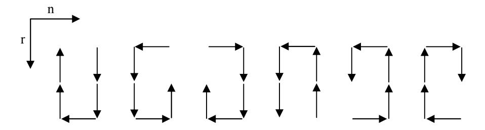

Figure 17. Six instances of a hxy-rn chain on the same six cells in rn-space

Something similar (including the remark on loops) occurs with the three different instances of the HXY-rn7 rule:

$$rn \models \{1\ 2\}^* - \{2\ 3\} - \{3\ 4\} - \{4\ 5\} - \{5\ 6\} - \{6\ 7\} - \{7\ 1\}^* \\$$

### Chapter XVI

# Conjugacy chains (c-chains)

Conjugacy chains, or c-chains, have been defined in section XII.3.2: a *c-chain* is a chain such that:

- for any *odd* cell in the sequence but the last one, the link between it and its successor in the chain is actually a c-link,
  - the c-linking value is the same for all c-links (odd links) in the chain,
  - any two cells in the sequence are different i.e. there are no loops.

The first section of this chapter justifies the last condition by showing that one needs not consider c-chains with (local or global) loops. This is very important in practice since it simplifies considerably the search for c-chains (for both humans and computers).

Section 2 first shows that the super-hidden subset rules introduced in chapters VI to VIII are subsumed by full c-chains rules (but should not be replaced by them, due to their lower complexity). It also simplifies the search for chains by showing that we need not consider hidden or super-hidden c-chains.

Finally, detailed examples of c-chains of lengths four, six and eight are given in section 3; as explained in the introduction, these examples implicitly prove independence results.

#### XVI.1. Why one should not allow loops in c-chains

#### XVI.1.1. General theorems on c-chains

# Theorem XV.1: in a c-chain, two consecutive links must be of different types (row, col or blk).

Proof: given two consecutive links in the chain, one of them is a c-link, say u. Since any cell in the chain must contain the common c-linking value as a candidate, no other cell of the chain can be in u; in particular, the previous and the next link in the chain (if there is any) cannot be u.

# Theorem XVI.2: in a c-chain, the RiB and CiB Interaction rules enforce that three consecutive cells cannot be in the same block.

Proof: consider three consecutive cells. Apart from reversing their order, they form a c3-chain  $1=^{(1)}=1-1$ . Suppose these three cells share a block b.

If the first link is of type blk, no other cell containing candidate  $n_1$  can be in this block, by the mere definition of a c-link.

If the first link is of type row (respectively col), let this row (resp. column) be r (resp. c). Then the RiB (resp. CiB) rule applies to row r (resp. column c) and block b; it allows us to eliminate candidate  $n_1$  from every cell in block b and not in row r (resp. column c). As a result, in block b, candidate  $n_1$  can only be in the first two cells of the chain. Therefore, no other cell of the chain can be in block b.

Finally, in all three possible cases our hypothesis is contradicted, which proves the theorem.

#### XVI.1.2. c-loops and the case of c-loops of odd length

Define a c-loop as a c-chain, but with the last conditions modified as follows: all the cells are different, except the first and the last, which are equal. Define the length of a c-loop as the number of cells in the chain, where the first and the last count for only one.

Notice that, to a given c-loop of length k, one can associate a c-chain of length k by just forgetting the last link between cells  $C_k$  and  $C_1$ . A c-loop can therefore be also defined as a c-chain in which there is a direct link between the last and the first cells, such that this link is a c-link if k is odd. The length of the c-loop is thus the

length of the associated c-chain. Moreover, if k is even, then the associated c-chain is a full c-chain.

Notice that, given a c-loop of odd length k, the first and the last links are c-links and it is easy to prove that the value of the first cell  $C_1$  must be  $n_1$ : if  $C_1$  is supposed to be different from  $n_1$ , theorem XII.4 (applied to the associated non-full c-chain proves that the value of cell  $C_k$  cannot be  $n_1$ ; since the last link (between  $C_k$  and  $C_1$ ) is a c-link for value  $n_1$ ,  $C_1$  must be  $n_1$  – a contradiction.

One might therefore think that c-loops of odd length lead to a new type of chain rules, one for each odd length, the  $C_{2k+1}$ -loop rule: for any c-loop of odd length, assert the common c-linking value as the value of its first cell. Nevertheless, this subsection shows that this rule is unnecessary since it is subsumed by simpler rules.

# Theorem XVI.3: The c3-loop rule is subsumed by the RiB and RiC Interaction rules.

Proof: consider a c3-loop, where the first and the last cells are the same. Since any two of the three cells share a unit, there must be a common unit shared by them, after theorem XI.3. Due to the existence of two c-links, these cells cannot share a row or a column; therefore, they must share a block. But, given the RiB and CiB rules, this contradicts theorem 2 above.

# Theorem XVI.4: For any k > 1, the $c_{2k+1}$ -loop rule is subsumed by the $c_{2k}$ -chain rule.

Proof: given a  $c_{2k+1}$ -loop, consider the associated full  $c_{2k}$ -chain composed of its first 2k cells and the links between them inherited from the loop. Since cell  $C_{2k+1}$  is linked to cells  $C_{2k}$  and  $C_1$ , it is a full c-chain target cell for the  $c_{2k}$ -chain and the  $c_{2k}$ -chain rule entails that  $C_{2k+1}$  cannot be  $n_1$ . Now, it suffices to remark that, since  $C_{2k+1}$  and  $C_1$  are c-linked for number  $n_1$ ,  $C_1$  must be  $n_1$ .

#### XVI.1.3. c-chains should have no loops

Theorem XVI.5 Formal statement: the resolution rules that might be obtained from c-chains with loops are subsumed by BSRT together with Hidden Single, the RiB and CiB Interaction rules, and rules for shorter c-chains with no loops. Practical statement: c-chains should have no loops.

Proof: We have seen above that it is not necessary to introduce chain rules for global c-loops. Consider now a full c-chain in which there is a loop on cell  $C_k$ .

If the loop has odd length, then, according to theorems 3 and 4 above, interaction rules (RiB and CiB) or rules for simpler chains imply that  $C_k = n_1$ . Let us propagate this result along the links in the given c-chain (in the forward direction if k is even, in the backward direction if k is odd): we use ordinary ECP rules along an ordinary link and Hidden-Single along a c-link. Finally, we obtain that one of the endpoints of the initial c-chain is equal to  $n_1$ . Therefore, none of its target cells can be  $n_1$ .

If the loop has even length, we can always suppose that its first link is a c-link (by reversing the given c-chain if necessary); then this loop can simply be excised: this does not change the set of target cells of the given chain and, using theorem XII.4, this does not change the inferences one can make along the chain.

#### XVI.2. Special c-chains and the case of hidden c-chains

#### XVI.2.1. Special case: c2-chains

Theorem XVI.6: the c2-chain rule is subsumed by the Interaction rules (RiB, CiB, BiR and BiC).

Note that the converse of this theorem does not hold: there are cases of RiB, CiB, BiR and BiC that are not of type c2-chain.

Proof of the theorem: Let cells  $C_1$  and  $C_2$  form a c2-chain with linking unit u, of type ut, and c-linking value  $n_1$ . Let TC be a full c-chain target cell, i.e. TC shares a unit with each of  $C_1$  and  $C_2$ . According to theorem XI.3, there is a unit u' shared by  $C_1$ ,  $C_2$  and TC.

If this common unit is u, number  $n_1$  is already absent from the candidates for TC by the definition of a c-link and no rule is needed in this case.

If this unit is not u, then we have to consider three different cases, according to the value of ut.

- if ut = row, then u' cannot be of type col (since two cells  $C_1$  and  $C_2$  in the same row u cannot share a column), so that u' is of type blk; let  $r_1$  be the row c-linking  $C_1$  and  $C_2$  and let  $b_1$  be the block common to all three cells; then the situation is one of an Interaction of row  $r_1$  with block  $b_1$ ; and the RiB rule leads to the conclusion that  $n_1$  should be eliminated from the candidates for TC;
  - if ut = col, the reasoning is similar (permute row and column);
- if ut = blk, then u' is of type row or col; let  $b_1$  be the block c-linking  $C_1$  and  $C_2$  and let  $r_1$  be the row (resp.  $c_1$  the column) common to all three cells; then the situation is one of an Interaction of block  $b_1$  with row  $r_1$  (resp. column  $c_1$ ); and the BiR

(respectively BiC) rule leads to the conclusion that  $n_1$  should be eliminated from the candidates for TC.

Now, why should we prefer the set of Interaction rules to the c2-chain rule? The first subsuming the second is not sufficient reason for this. We must also check that the first is not more complex than the second. This is true according to our complexity scale: these rules should be placed at level L1. For the c2-chain rule, this assertion may contradict our general positioning of chain rules according to their length (which would put c2-chains *a priori* at level 2). But c2-chains with any pre-specified type of link constitute a very particular case; for instance, any c2-chain  $1=^{(1)}=1$  with a link of type column can be represented by a single cell in row-number space. The internal pattern of this cell is the presence of exactly two values (columns). Conversely, this argument might lead to classify c2-chain rules as simpler than Interaction rules (which have more complex internal patterns). But we have decided not to introduce so subtle differences in our classification. In any case, this rule can be added anywhere in a sub-hierarchy inside level L1, globally it will not change the set of grids solved at this level.

#### XVI.2.2. Special cases: X-Wing, Swordfish and Jellyfish

#### Theorem XVI.7:

- 1) the X-Wing(row) and X-Wing(col) rules are subsumed by the c4-chain rule;
- 2) the Swordfish(row) and Swordfish(col) rules are subsumed by the c6-chain rule;
- 3) the Jellyfish(row) rules and Jellyfish(col) are subsumed by the c8-chain rule.

Proof: details of the proof are left to the reader as an easy exercise. Given an instance of one of the above Super-Hidden Subset patterns, the proof proceeds in two steps: first show that the corresponding c-chain pattern can be instantiated in respectively four (2x2), nine (3x3) or sixteen (4x4) different ways in the actual Super-Hidden Subset; then show that the c-chain rule (applied successively to each of these instantiations) globally leads to eliminate the same candidates as the initial Super-Hidden Subset rule.

Should we therefore eliminate X-Wing, Swordfish and Jellyfish from our sets of rules? No, because they are less complex than the general rules subsuming them.

Remember that the meaning of "block-free" has been defined in III.1.5. A stronger formulation of the previous theorem is (the technical but easy proof is left to the reader):

#### Theorem XVI.8:

- 1) the X-Wing(row) and X-Wing(col) rules are the block-free part of c4-chain;
- 2) the Swordfish(row) and Swordfish(col) rules are the block-free part of c6-chain:
- 3) the Jellyfish(row) and Jellyfish(col) rules are the block-free part of c8-chain.

#### XVI.2.3. There is no hidden or super-hidden c-chain

As a consequence of the previous theorem and of all the relationships existing between subset rules (Figure 6 in section VI.3.3, Figure 2 in chapter VII, Figure 2 in chapter VIII, section VIII.4), we have:

Theorem XVI.9: Hidden or super-hidden c-chains are subsumed by subset rules.

#### XVI.3. Examples of c4-chains; independence of C4, XY4 and HXY4

As there are some similarities between xy-, hxy- and c- chains, it is worth expliciting their independence with some detail. We do this for chains of length 4, given L4\_0 (and actually given much less than L4\_0). For this purpose, we shall exhibit three puzzles: one in  $[L4_0+XY4+HXY4]+C4$ , one both in  $[L4_0+C4]+XY4$  and in  $[L4_0+C4]+HXY4$  and one in  $[L4_0+C4+XY4]+HXY4$ .

#### XVI.3.1. A puzzle in [L4 0+XY4+HXY4]+C4

|   |   |   |   |   |   |   | 1 | 7 |
|---|---|---|---|---|---|---|---|---|
| 6 |   |   |   | 2 |   |   |   |   |
|   |   |   |   |   |   |   |   |   |
| 1 | 5 | 3 |   |   |   |   |   |   |
|   |   |   |   | 8 |   | 2 |   |   |
|   |   | 7 |   |   |   |   |   |   |
| 4 |   |   | 3 |   | 1 | 5 |   |   |
|   | 2 |   |   |   |   | 6 |   |   |
|   |   |   | 7 |   |   |   |   |   |

| 8 |   | 2 | 6 | 3 | 5 |   | 1 | 7 |
|---|---|---|---|---|---|---|---|---|
| 6 | 7 |   | 1 | 2 | 8 | 3 | 5 |   |
| 3 | 1 | 5 |   | 7 |   | 8 | 2 | 6 |
| 1 | 5 | 3 | 2 |   | 6 | 7 |   |   |
| 9 |   |   | 5 | 8 | 7 | 2 | 3 | 1 |
| 2 | 8 | 7 |   | 1 | 3 |   | 6 | 5 |
| 4 |   | 8 | 3 |   | 1 | 5 | 7 | 2 |
| 7 | 2 | 1 | 8 | 5 |   | 6 |   | 3 |
| 5 | 3 |   | 7 |   | 2 | 1 |   |   |

| 8 | 4 | 2 | 6 | 3 | 5 | 9 | 1 | 7 |
|---|---|---|---|---|---|---|---|---|
| 6 | 7 | 9 | 1 | 2 | 8 | 3 | 5 | 4 |
| 3 | 1 | 5 | 4 | 7 | 9 | 8 | 2 | 6 |
| 1 | 5 | 3 | 2 | 4 | 6 | 7 | 8 | 9 |
| 9 | 6 | 4 | 5 | 8 | 7 | 2 | 3 | 1 |
| 2 | 8 | 7 | 9 | 1 | 3 | 4 | 6 | 5 |
| 4 | 9 | 8 | 3 | 6 | 1 | 5 | 7 | 2 |
| 7 | 2 | 1 | 8 | 5 | 4 | 6 | 9 | 3 |
| 5 | 3 | 6 | 7 | 9 | 2 | 1 | 4 | 8 |

Figure 1. Puzzle Royle17-57, its L1 0 elaboration and its solution

The L4\_0+XY4+HXY4 elaboration of puzzle Royle17-57 (Figure 1) coincides with its L1\_0 elaboration. This puzzle cannot be solved in L4\_0+XY4+ HXY4 but it can in L4\_0+XY4+HXY4+C4.

Resolution path in L4\_0+XY4+HXY4+C4 for the L4\_0+XY4+HXY4 (or L4\_0 or L1\_0) elaboration of Royle17-57:

```
c4-chain row-bl-col n4r8{c8 c6} – n4{r9 r4}c5 ==> r4c8 \neq 4 column c8 interaction-with-block b9 ==> r9c9 \neq 4 hxy-cn4-chain {r9 r5}c3n6 – {r5 r2}c3n4 – {r2 r4}c9n4 – {r4 r9}c5n4 ==> r9c5 \neq 6 ... (Naked-Singles and Hidden-Singles)
```

#### XVI.3.2. A puzzle in $[L4\_0+C4]+XY4$ and in $[L4\_0+C4]+HXY4$

Puzzle Royle17-118 (Figure 2) cannot be solved in L4\_0+C4; its L4\_0+C4 elaboration, which is equal to its L1\_0 elaboration, can be solved both in [L4\_0+C4] +XY4 and in [L4\_0+C4]+ HXY4.

|   |   |   |   |   |   | 2 | 1 | 7 | •  |
|---|---|---|---|---|---|---|---|---|----|
| 8 |   |   | 4 |   |   |   |   | 8 |    |
|   |   | 9 |   |   |   |   |   | 2 | 1  |
| 6 |   |   | 5 | 7 |   | 4 |   | 6 | 9  |
| 3 |   |   |   |   | 8 |   |   | 3 | 4, |
|   |   |   |   | 2 |   |   |   | 1 | 4  |
|   | 7 |   | 9 |   | 4 |   |   | 5 | •  |
|   | 2 | 1 |   |   |   |   |   |   |    |
|   |   |   |   |   |   |   |   |   | 9  |

| 7 | 6 | 4 | 3 | 8 |   |   | 2 | 1 |
|---|---|---|---|---|---|---|---|---|
| 8 | 1 | 5 | 4 |   | 2 | 7 | 3 |   |
| 2 | 3 | 9 | 1 |   | 7 |   | 8 | 4 |
| 6 | 9 | 8 | 5 | 7 | 1 | 2 | 4 | 3 |
| 3 | 5 | 2 | 6 |   |   | 8 | 1 | 7 |
| 1 | 4 | 7 | 8 | 2 | 3 |   |   |   |
| 5 | 7 | 3 | 9 | 1 | 8 | 4 | 6 | 2 |
|   | 2 | 1 | 7 |   | 6 | 3 |   | 8 |
|   | 8 | 6 | 2 | 3 |   | 1 | 7 |   |

| 7 | 6 | 4 | 3 | 8 | 5 | 9 | 2 | 1 |
|---|---|---|---|---|---|---|---|---|
| 8 | 1 | 5 | 4 | 9 | 2 | 7 | 3 | 6 |
| 2 | 3 | 9 | 1 | 6 | 7 | 5 | 8 | 4 |
| 6 | 9 | 8 | 5 | 7 | 1 | 2 | 4 | 3 |
| 3 | 5 | 2 | 6 | 4 | 9 | 8 | 1 | 7 |
| 1 | 4 | 7 | 8 | 2 | 3 | 6 | 5 | 9 |
| 5 | 7 | 3 | 9 | 1 | 8 | 4 | 6 | 2 |
| 4 | 2 | 1 | 7 | 5 | 6 | 3 | 9 | 8 |
| 9 | 8 | 6 | 2 | 3 | 4 | 1 | 7 | 5 |

Figure 2. Puzzle Royle17-118, its L1 0 elaboration and its solution

After a single Interaction rule (which is applied first because it is simpler and has therefore higher priority), one can chose indifferently between an xy-chain rule and an hxy-chain rule (that were already both applicable before the Interaction rule applied). The two (xy4 and hxy4) chains appear directly on the central grid. Let us give the two resolution paths:

```
Resolution path in L4_0+C4+XY4 for the L4_0+C4 (or L1_0) elaboration of Royle17-118: block b3 interaction-with-column c7 ==> r6c7 \neq 5 xy4-chain {n5 n9}r9c9 - {n9 n6}r2c9 - {n6 n9}r2c5 - {n9 n5}r1c6 ==> r9c6 \neq 5 ... (17 Naked Singles)
```

Resolution path in L4\_0+C4+HXY4 for the L4\_0+C4 (or L1\_0) elaboration of Royle17-118: block b3 interaction-with-column c7  $\Longrightarrow$  r6c7  $\neq$  5

hxy-rn4-chain {c6 c1}r9n4 – {c1 c9}r9n9 – {c9 c5}r2n9 – {c5 c6}r5n9 ==>  $r5c6 \neq 4$  ... (17 Naked Singles)

#### XVI.3.3. Two puzzles in [L4 0+C4+XY4]+HXY4

In puzzle Royle17-934 (Figure 3), the L4\_0+C4+XY4 and the L1 elaborations coincide. The HXY4 rule applies directly to them (as usual, not considering ECP).

|   |   |   |   |   |   | 2 |   | 1 |
|---|---|---|---|---|---|---|---|---|
| 7 | 3 |   |   |   |   |   |   |   |
| 6 |   |   |   | 4 |   |   |   |   |
|   |   |   |   | 6 |   |   | 3 |   |
|   |   | 8 |   |   |   | 5 |   |   |
| 2 |   |   |   |   |   |   |   |   |
|   |   | 1 | 2 |   |   |   |   |   |
|   |   |   | 5 |   | 8 |   |   |   |
|   | 6 |   |   |   |   |   | 7 |   |

|            |   |   |   | 7 | 5 | 3 | 2 | 6 | 1 |
|------------|---|---|---|---|---|---|---|---|---|
| 7          | 7 | 3 | 5 | 6 | 2 | 1 |   | 8 |   |
| $\epsilon$ | Ó | 1 | 2 | 8 | 4 | 9 |   | 5 |   |
| 1          |   | 5 |   |   | 6 | 2 |   | 3 | 8 |
| 3          | ; |   | 8 |   |   | 7 | 5 | 2 | 6 |
| 2          | 2 |   | 6 | 3 | 8 | 5 | 1 |   |   |
|            |   |   | 1 | 2 |   | 6 |   |   | 5 |
|            |   | 2 |   | 5 |   | 8 | 6 | 1 |   |
| 5          | , | 6 |   |   |   | 4 | 8 | 7 | 2 |

| 9 | 8 | 4 | 7 | 5 | 3 | 2 | 6 | 1 |
|---|---|---|---|---|---|---|---|---|
| 7 | 3 | 5 | 6 | 2 | 1 | 9 | 8 | 4 |
| 6 | 1 | 2 | 8 | 4 | 9 | 7 | 5 | 3 |
| 1 | 5 | 7 | 9 | 6 | 2 | 4 | 3 | 8 |
| 3 | 9 | 8 | 4 | 1 | 7 | 5 | 2 | 6 |
| 2 | 4 | 6 | 3 | 8 | 5 | 1 | 9 | 7 |
| 8 | 7 | 1 | 2 | 9 | 6 | 3 | 4 | 5 |
| 4 | 2 | 3 | 5 | 7 | 8 | 6 | 1 | 9 |
| 5 | 6 | 9 | 1 | 3 | 4 | 8 | 7 | 2 |

Figure 3. Puzzle Royle17-934, its L1 elaboration and its solution

Resolution path in L4\_0+C4+XY4+HXY4 for the L4\_0+C4+XY4 (or L4\_0 or L1) elaboration of Royle17-4934:

```
hxy-rn4-chain {c7 c5}r7n3 – {c5 c2}r7n7 – {c2 c9}r6n7 – {c9 c7}r3n7 ==> r3c7 \neq 3 ... (Naked-Singles and Hidden-Singles)
```

In puzzle Royle17-520 (Figure 4), the L4\_0+C4+XY4 and the L1 elaborations still coincide, but XY4 is needed together with HXY4 to finish the puzzle. Notice that the xy4 and hxy4 chains live together at the same time on the same grid (after the Interaction rules have been applied).

Resolution path in L4\_0+C4+XY4+HXY4 for the L4\_0+C4+XY4 (or L4\_0 or L1) elaboration of Royle17-520:

```
row r4 interaction-with-block b4 ==> r6c3 \neq 7 column c1 interaction-with-block b4 ==> r6c3 \neq 4 column c7 interaction-with-block b3 ==> r3c9 \neq 1, r3c8 \neq 1 column c9 interaction-with-block b6 ==> r6c8 \neq 1, r5c8 \neq 1 xy4-chain \{n8\ n2\}r7c1 - \{n2\ n1\}r7c8 - \{n1\ n7\}r9c8 - \{n7\ n8\}r6c8 ==> <math>r6c1 \neq 8 hxy-cn4-chain \{r6\ r5\}c9n1 - \{r5\ r3\}c9n9 - \{r3\ r8\}c9n2 - \{r8\ r6\}c3n2 ==> <math>r6c3 \neq 1 block b4 interaction-with-row r4 ==> r4c5 \neq 1 ... (Naked-Singles and Hidden-Singles)
```

|   |   |   |   |   |   |   | 6 | 5 | 7 | 2 |   | 3 |   | 9 |   | 6 | 5 | 7 | 2 | 8 | 3 | 4 | 9 | 1 | 6 | 5 |
|---|---|---|---|---|---|---|---|---|---|---|---|---|---|---|---|---|---|---|---|---|---|---|---|---|---|---|
| 9 |   |   | 2 |   |   |   |   |   | 9 |   | 5 | 2 | 6 |   | 7 | 3 | 8 | 9 | 4 | 5 | 2 | 6 | 1 | 7 | 3 | 8 |
|   |   |   |   |   |   |   |   |   | 3 |   | 6 | 5 | 7 |   |   |   |   | 3 | 1 | 6 | 5 | 7 | 8 | 4 | 2 | 9 |
|   |   |   | 9 |   |   | 2 | 4 |   | 6 |   |   | 9 |   | 5 | 2 | 4 | 3 | 6 | 7 | 1 | 9 | 8 | 5 | 2 | 4 | 3 |
|   | 5 | 3 |   |   |   |   |   |   |   | 5 | 3 | 7 |   |   | 6 |   |   | 8 | 5 | 3 | 7 | 2 | 4 | 6 | 9 | 1 |
|   |   |   |   |   |   |   |   |   |   | 9 |   | 6 |   | 3 | 5 |   |   | 4 | 9 | 2 | 6 | 1 | 3 | 5 | 8 | 7 |
|   | 6 |   |   | 5 | 7 |   |   |   |   | 6 | 9 |   | 5 | 7 | 3 |   | 4 | 2 | 6 | 9 | 8 | 5 | 7 | 3 | 1 | 4 |
| 1 |   |   |   |   | 6 | 8 |   |   | 1 | 3 |   | 4 | 9 | 6 | 8 | 5 |   | 1 | 3 | 7 | 4 | 9 | 6 | 8 | 5 | 2 |
|   |   |   |   | 3 |   | 9 |   |   | 5 |   |   |   | 3 | 2 | 9 |   | 6 | 5 | 8 | 4 | 1 | 3 | 2 | 9 | 7 | 6 |

Figure 4. Puzzle Royle17-520, its L1 elaboration and its solution

#### XVI.3.4. Two puzzles in $[L4\_0]+XY4$ and in $[L4\_0]+C4$

Finally, being in [L4\_0]+XY4 and being in [L4\_0]+C4 is not contradictory. It is not even rare. Indeed, the two examples in this section show more than this. They show two puzzles that have at the same time (in fact, just after all L1 rules have been applied) an xy4- and a c4- chain (such chains must nevertheless be different, a 4-chain cannot be at the same time an xy4- and a c4- chain).

When we first encountered puzzle Royle-17-3766 (Figure 2 in section XIV.3.1), its  $L4_0$  (or L1) elaboration was shown to be easily solved with a single application of the XY4 rule (plus of course NS and HS). This puzzle is thus in  $[L4_0]+XY4$ .

But the same L4\_0 elaboration can also be easily solved with a single instance of C4, applied to another sequence of cells. This puzzle is thus also in [L4\_0]+C4.

Let us display the two resolution paths and check that the two xy4 and c4 chains use different sequences of cells on the same grid (leading to different eliminations):

```
Resolution path in L4_0+XY4 for the L4_0 (or L1) elaboration of Royle17-3766: 
 xy4-chain {n6 n9}r9c6 – {n9 n6}r3c6 – {n6 n9}r1c4 – {n9 n6}r1c3 ==> r9c3 \neq 6 ... (Naked-Singles)
```

```
Resolution path in L4_0+C4 for the L4_0 (or L1) elaboration of Royle17-3766: c4-chain col-row-bl n6{r9 r1}c3 – n6{r1c4 r3c6} ==> r9c6 \neq 6 ... (Naked-Singles)
```

A similar example is puzzle Royle17-147 (Figure 5). It cannot be solved in L4\_0, but its L4\_0 elaboration (which coincides with its L1\_0 elaboration) can be

easily solved by a single step (apart from NS and ECP), either in L4\_0+XY4 or in L4\_0+C4.

|   |   |   |   |   |   |   | 2 | 4 |
|---|---|---|---|---|---|---|---|---|
| 1 |   |   | 8 |   |   |   |   |   |
|   |   |   |   |   |   |   |   | 3 |
|   |   |   | 4 |   |   | 5 |   |   |
| 7 |   |   |   |   |   | 1 |   |   |
|   |   |   |   | 3 |   |   |   |   |
|   |   |   | 5 | 1 |   | 6 |   |   |
|   |   | 2 |   |   |   |   | 5 |   |
|   | 3 |   |   |   | 7 |   |   |   |

|   | 6 | 7 | 3 | 5 | 1 |   | 2 | 4 |
|---|---|---|---|---|---|---|---|---|
| 1 |   | 3 | 8 | 2 |   | 7 | 6 | 5 |
| 2 |   | 5 | 7 |   | 6 |   | 1 | 3 |
| 3 | 1 |   | 4 | 7 | 2 | 5 |   | 6 |
| 7 | 2 | 4 | 6 |   | 5 | 1 | 3 |   |
|   | 5 | 6 | 1 | 3 |   | 2 | 4 | 7 |
| 4 |   |   | 5 | 1 | 3 | 6 | 7 | 2 |
| 6 | 7 | 2 | 9 |   |   | 3 | 5 | 1 |
| 5 | 3 | 1 | 2 | 6 | 7 | 4 |   |   |

| 8 | 6 | 7 | 3 | 5 | 1 | 9 | 2 | 4 |
|---|---|---|---|---|---|---|---|---|
| 1 | 4 | 3 | 8 | 2 | 9 | 7 | 6 | 5 |
| 2 | 9 | 5 | 7 | 4 | 6 | 8 | 1 | 3 |
| 3 | 1 | 8 | 4 | 7 | 2 | 5 | 9 | 6 |
| 7 | 2 | 4 | 6 | 9 | 5 | 1 | 3 | 9 |
| 9 | 5 | 6 | 1 | 3 | 8 | 2 | 4 | 7 |
| 4 | 8 | 9 | 5 | 1 | 3 | 6 | 7 | 2 |
| 6 | 7 | 2 | 9 | 8 | 4 | 3 | 5 | 1 |
| 5 | 3 | 1 | 2 | 6 | 7 | 4 | 8 | 9 |

Figure 5. Puzzle Royle17-147, its L1\_0 elaboration and its solution

Let us display the two resolution paths:

```
Resolution path in L4_0+XY4 for the L4_0 (or L1) elaboration of Royle17-147: 
 xy4-chain {n8 n9}r6c6 - {n9 n4}r2c6 - {n4 n9}r2c2 - {n9 n8}r1c1 ==> r6c1 \neq 8 ... (Naked-Singles)
```

```
Resolution path in L4_0+C4 for the L4_0 (or L1) elaboration of Royle17-147: c4-chain row-col-row n9r6{c1 c6} – n9r2{c6 c2} ==> r1c1 \neq 9 ... (Naked-Singles)
```

#### XVI.4. Example of a c6-chain

Puzzle Royle17-16774 (Figure 6) is an example where only three values are added at the start by NS and HS rules, and then many candidates must be deleted by lots of different rules before any other value can be added. It has two interesting resolution paths, one in L5+C6 and one in L5+XY4\_8. Moreover, the only part of L5 that is effectively used in both cases is very simple, being limited to L3\_0+XY4. Given L3\_0+XY4, this is thus an example of a trade between C6 and XY8.

Part common to the two resolution paths (in L5+XY6+HXY6+C6 and in L5+XY4\_8) for the L5 (or L1\_0) elaboration of Royle17-16774:

```
;;; beginning of the part common to the two resolution paths: column c7 interaction-with-block b3 ==> r3c9 \neq 2, r1c9 \neq 2 block b4 interaction-with-row r5 ==> r5c9 \neq 8, r5c8 \neq 8, r5c6 \neq 8, r5c5 \neq 8 block b8 interaction-with-column c4 ==> r6c4 \neq 8, r4c4 \neq 8, r3c4 \neq 8, r2c4 \neq 8 block b4 interaction-with-column c2 ==> r8c2 \neq 7, r7c2 \neq 7, r3c2 \neq 7, r2c2 \neq 7
```

```
hidden-pairs-in-a-column {n4 n6} {r6 r9}c7 ==> r9c7 \neq 9, r6c7 \neq 9, r6c7 \neq 8, r6c7 \neq 5 column c7 interaction-with-block b3 ==> r2c8 \neq 5 hidden-triplets-in-a-column {n1 n4 n6} {r2 r3 r6}c4 ==> r6c4 \neq 9, r6c4 \neq 7, r3c4 \neq 9, r3c4 \neq 7, r3c4 \neq 9, r2c4 \neq 9, r2c4 \neq 7, r2c4 \neq 2 hidden-triplets-in-a-column {n2 n4 n6} {r2 r3 r8}c2 ==> r8c2 \neq 9, r3c2 \neq 9, r3c2 \neq 5, r3c2 \neq 1, r2c2 \neq 9, r2c2 \neq 5, r2c2 \neq 1 xy4-chain {n4 n1}r3c4 - {n1 n6}r2c4 - {n6 n2}r2c2 - {n2 n4}r3c2 ==> r3c5 \neq 4, r3c1 \neq 4 xy4-chain {n1 n4}r3c4 - {n4 n2}r3c2 - {n2 n6}r2c2 - {n6 n1}r2c4 ==> r6c4 \neq 1 column c4 interaction-with-block b2 ==> r3c6 \neq 1, r1c6 \neq 1 naked-pairs-in-a-row {n4 n6}r6{c4 c7} ==> r6c9 \neq 6, r6c8 \neq 4, r6c6 \neq 6, r6c5 \neq 4 xy4-chain {n2 n4}r3c2 - {n4 n1}r3c4 - {n1 n6}r2c4 - {n6 n2}r2c2 ==> r8c2 \neq 2 column c2 interaction-with-block b1 ==> r3c3 \neq 2, r2c3 \neq 2, r1c3 \neq 2 xy4-chain {n6 n1}r2c4 - {n1 n4}r3c4 - {n4 n2}r3c2 - {n2 n6}r2c2 ==> r2c6 \neq 6, r2c3 \neq 6 ;;; end of the part common to the two resolution paths (this part is wholly in L4)
```

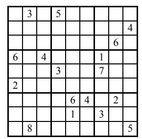

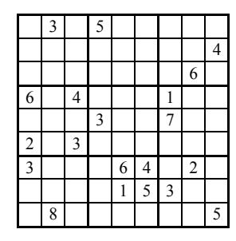

| 4 | 3 | 8 | 5 | 7 | 6 | 2 | 1 | 9 |
|---|---|---|---|---|---|---|---|---|
| 5 | 6 | 9 | 1 | 2 | 3 | 8 | 7 | 4 |
| 7 | 2 | 1 | 4 | 8 | 9 | 5 | 6 | 3 |
| 6 | 9 | 4 | 7 | 5 | 8 | 1 | 3 | 2 |
| 8 | 1 | 5 | 3 | 4 | 2 | 7 | 9 | 6 |
| 2 | 7 | 3 | 6 | 9 | 1 | 4 | 5 | 8 |
| 3 | 5 | 7 | 8 | 6 | 4 | 9 | 2 | 1 |
| 9 | 4 | 6 | 2 | 1 | 5 | 3 | 8 | 7 |
| 1 | 8 | 2 | 9 | 3 | 7 | 6 | 4 | 5 |

Figure 6. Puzzle Royle17-16774, its L1\_0 elaboration and its solution

Let us now display the ends of the two resolution paths. The same number (6) appears to be the target value of a c6-chain and an xy8-chain (living, of course, on different cells). But the target cells of the two chains are different. In both cases, the rule eliminates one single candidate before the puzzle can be finished with only NS and HS.

Continuation of the resolution path in L5+C6 for the L5 (or L1\_0) elaboration of Royle17-16774:

```
c6-chain n6\{r9c7 r9c3\} - n6\{r1c3 r1c6\} - n6\{r5c6 r6c4\} ==> r6c7 \neq 6 ... (Naked-Singles and Hidden-Singles)
```

Continuation of the resolution path in L5+XY4\_8 for the L5 (or L1\_0) elaboration of Royle17-16774:

```
xy8-chain {n6 n4}r8c2 – {n4 n2}r3c2 – {n2 n6}r2c2 – {n6 n1}r2c4 – {n1 n4}r3c4 – {n4 n6}r6c4 – {n6 n4}r6c7 – {n4 n6}r9c7 ==> r9c3 \neq 6 ... (Naked-Singles and Hidden-Singles)
```

#### XVI.5. Example of a c8-chain

We have very few examples of c8-chains (given our principle that simpler rules should be applied before we search for these chains). Puzzle Royle17-14207 (Figure 7) can be solved at level L8 using C8 but, in addition to C8, it needs an application of the rule for another type of chains (xyzt-chains, that will be defined later, in chapter XIX ), of length 8. (Notice that the application of XYZT8 is necessary before C8 becomes applicable).

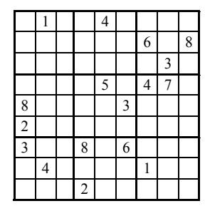

| 6 | 1 | 8 | 3 | 4 |   |   | 2 |   |
|---|---|---|---|---|---|---|---|---|
| 4 | 3 |   |   |   | 2 | 6 | 1 | 8 |
|   | 2 |   | 6 | 8 | 1 |   | 3 | 4 |
|   | 6 | 3 |   | 5 | 8 | 4 | 7 | 2 |
| 8 |   |   |   | 2 | 3 |   | 6 | 1 |
| 2 |   |   |   | 6 |   | 8 |   | 3 |
| 3 |   |   | 8 |   | 6 | 2 | 4 |   |
|   | 4 | 2 |   | 3 |   | 1 | 8 | 6 |
|   | 8 | 6 | 2 |   | 4 | 3 |   |   |

| 6 | 1 | 8 | 3 | 4 | 7 | 5 | 2 | 9 |
|---|---|---|---|---|---|---|---|---|
| 4 | 3 | 7 | 5 | 9 | 2 | 6 | 1 | 8 |
| 5 | 2 | 9 | 6 | 8 | 1 | 7 | 3 | 4 |
| 9 | 6 | 3 | 1 | 5 | 8 | 4 | 7 | 2 |
| 8 | 5 | 4 | 7 | 2 | 3 | 9 | 6 | 1 |
| 2 | 7 | 1 | 4 | 6 | 9 | 8 | 5 | 3 |
| 3 | 9 | 5 | 8 | 1 | 6 | 2 | 4 | 7 |
| 7 | 4 | 2 | 9 | 3 | 5 | 1 | 8 | 6 |
| 1 | 8 | 6 | 2 | 7 | 4 | 3 | 9 | 5 |

Figure 7. Puzzle Royle17-14207, its L4 elaboration and its solution

```
Resolution path in L8 for the L7+XY8+HXY8 (or L4) elaboration of Royle17-14207
 column c7 interaction-with-block b3 \Longrightarrow r1c9 \neq 7
 block b8 interaction-with-row r8 ==> r8c1 \neq 5
 hidden-pairs-in-a-row {n1 n4}r6{c3 c4} ==> r6c4 \neq 9, r6c4 \neq 7, r6c3 \neq 9, r6c3 \neq 7, r6c3 \neq 5
xy4-chain \{n7 \ n9\}r8c1 - \{n9 \ n1\}r4c1 - \{n1 \ n9\}r4c4 - \{n9 \ n7\}r6c6 ==> r8c6 \neq 7
 xyzt4-chain \{n7 \ n9\}r8c1 - \{n9 \ n1\}r4c1 - \{n1 \ n5\}r9c1 - \{n5 \ n7\}r7c2 \Longrightarrow r7c3 \neq 7
 xyzt5-chain \{n9 \ n5\}r1c9 - \{n5 \ n7\}r1c6 - \{n7 \ n9\}r6c6 - \{n9 \ n5\}r6c8 - \{n5 \ n9\}r5c7 =>>
 r1c7 \neq 9
xyzt6-chain \{n9\ n1\}r4c4 - \{n1\ n4\}r6c4 - \{n4\ n7\}r5c4 - \{n7\ n9\}r6c6 - \{n9\ n5\}r8c6 - \{n9\ n5\}r8c6 - \{n9\ n5\}r8c6 - \{n9\ n5\}r8c6 - \{n9\ n5\}r8c6 - \{n9\ n5\}r8c6 - \{n9\ n5\}r8c6 - \{n9\ n5\}r8c6 - \{n9\ n5\}r8c6 - \{n9\ n5\}r8c6 - \{n9\ n5\}r8c6 - \{n9\ n5\}r8c6 - \{n9\ n5\}r8c6 - \{n9\ n5\}r8c6 - \{n9\ n5\}r8c6 - \{n9\ n5\}r8c6 - \{n9\ n5\}r8c6 - \{n9\ n5\}r8c6 - \{n9\ n5\}r8c6 - \{n9\ n5\}r8c6 - \{n9\ n5\}r8c6 - \{n9\ n5\}r8c6 - \{n9\ n5\}r8c6 - \{n9\ n5\}r8c6 - \{n9\ n5\}r8c6 - \{n9\ n5\}r8c6 - \{n9\ n5\}r8c6 - \{n9\ n5\}r8c6 - \{n9\ n5\}r8c6 - \{n9\ n5\}r8c6 - \{n9\ n5\}r8c6 - \{n9\ n5\}r8c6 - \{n9\ n5\}r8c6 - \{n9\ n5\}r8c6 - \{n9\ n5\}r8c6 - \{n9\ n5\}r8c6 - \{n9\ n5\}r8c6 - \{n9\ n5\}r8c6 - \{n9\ n5\}r8c6 - \{n9\ n5\}r8c6 - \{n9\ n5\}r8c6 - \{n9\ n5\}r8c6 - \{n9\ n5\}r8c6 - \{n9\ n5\}r8c6 - \{n9\ n5\}r8c6 - \{n9\ n5\}r8c6 - \{n9\ n5\}r8c6 - \{n9\ n5\}r8c6 - \{n9\ n5\}r8c6 - \{n9\ n5\}r8c6 - \{n9\ n5\}r8c6 - \{n9\ n5\}r8c6 - \{n9\ n5\}r8c6 - \{n9\ n5\}r8c6 - \{n9\ n5\}r8c6 - \{n9\ n5\}r8c6 - \{n9\ n5\}r8c6 - \{n9\ n5\}r8c6 - \{n9\ n5\}r8c6 - \{n9\ n5\}r8c6 - \{n9\ n5\}r8c6 - \{n9\ n5\}r8c6 - \{n9\ n5\}r8c6 - \{n9\ n5\}r8c6 - \{n9\ n5\}r8c6 - \{n9\ n5\}r8c6 - \{n9\ n5\}r8c6 - \{n9\ n5\}r8c6 - \{n9\ n5\}r8c6 - \{n9\ n5\}r8c6 - \{n9\ n5\}r8c6 - \{n9\ n5\}r8c6 - \{n9\ n5\}r8c6 - \{n9\ n5\}r8c6 - \{n9\ n5\}r8c6 - \{n9\ n5\}r8c6 - \{n9\ n5\}r8c6 - \{n9\ n5\}r8c6 - \{n9\ n5\}r8c6 - \{n9\ n5\}r8c6 - \{n9\ n5\}r8c6 - \{n9\ n5\}r8c6 - \{n9\ n5\}r8c6 - \{n9\ n5\}r8c6 - \{n9\ n5\}r8c6 - \{n9\ n5\}r8c6 - \{n9\ n5\}r8c6 - \{n9\ n5\}r8c6 - \{n9\ n5\}r8c6 - \{n9\ n5\}r8c6 - \{n9\ n5\}r8c6 - \{n9\ n5\}r8c6 - \{n9\ n5\}r8c6 - \{n9\ n5\}r8c6 - \{n9\ n5\}r8c6 - \{n9\ n5\}r8c6 - \{n9\ n5\}r8c6 - \{n9\ n5\}r8c6 - \{n9\ n5\}r8c6 - \{n9\ n5\}r8c6 - \{n9\ n5\}r8c6 - \{n9\ n5\}r8c6 - \{n9\ n5\}r8c6 - \{n9\ n5\}r8c6 - \{n9\ n5\}r8c6 - \{n9\ n5\}r8c6 - \{n9\ n5\}r8c6 - \{n9\ n5\}r8c6 - \{n9\ n5\}r8c6 - \{n9\ n5\}r8c6 - \{n9\ n5\}r8c6 - \{n9\ n5\}r8c6 - \{n9\ n5\}r8c6 - \{n9\ n5\}r8c6 - \{n9\ n5\}r8c6 - \{n9\ n5\}r8c6 - \{n9\ n5\}r8c6 - \{n9\ n5\}r8c6 - \{n9\ n5\}r8c6 - \{n9\ n5\}r8c6 - \{n9\ n5\}r8c6 - \{n9\ n5\}r8c6 - \{n9\ n5\}r8c6 - \{n9\ n5\}r8c6 - \{n9\ n5\}r8c6 - \{n9\ n5\}r8c6 - \{n9\ n5\}r8c6 - \{n9\ n5\}r8c6 - \{n9\ n5\}r8c6 - \{n9\ n5\}r8c6 - \{n9\ n5\}r8c6 - \{n9\ 
  {n5 n9}r8c4 ==> r2c4 \neq 9
c6-chain n9\{r5c7 r3c7\} - n9\{r1c9 r1c6\} - n9\{r2c5 r2c3\} = > r5c3 \neq 9
 xyzt6-chain \{n9 \ n5\}r9c8 - \{n5 \ n9\}r6c8 - \{n9 \ n7\}r6c6 - \{n7 \ n5\}r6c2 - \{n5 \ n7\}r7c2 - \{n5 \ n7\}r7c2 - \{n5 \ n7\}r7c2 - \{n5 \ n7\}r7c2 - \{n5 \ n7\}r7c2 - \{n5 \ n7\}r7c2 - \{n5 \ n7\}r7c2 - \{n5 \ n7\}r7c2 - \{n5 \ n7\}r7c2 - \{n5 \ n7\}r7c2 - \{n5 \ n7\}r7c2 - \{n5 \ n7\}r7c2 - \{n5 \ n7\}r7c2 - \{n5 \ n7\}r7c2 - \{n5 \ n7\}r7c2 - \{n5 \ n7\}r7c2 - \{n5 \ n7\}r7c2 - \{n5 \ n7\}r7c2 - \{n5 \ n7\}r7c2 - \{n5 \ n7\}r7c2 - \{n5 \ n7\}r7c2 - \{n5 \ n7\}r7c2 - \{n5 \ n7\}r7c2 - \{n5 \ n7\}r7c2 - \{n5 \ n7\}r7c2 - \{n5 \ n7\}r7c2 - \{n5 \ n7\}r7c2 - \{n5 \ n7\}r7c2 - \{n5 \ n7\}r7c2 - \{n5 \ n7\}r7c2 - \{n5 \ n7\}r7c2 - \{n5 \ n7\}r7c2 - \{n5 \ n7\}r7c2 - \{n5 \ n7\}r7c2 - \{n5 \ n7\}r7c2 - \{n5 \ n7\}r7c2 - \{n5 \ n7\}r7c2 - \{n5 \ n7\}r7c2 - \{n5 \ n7\}r7c2 - \{n5 \ n7\}r7c2 - \{n5 \ n7\}r7c2 - \{n5 \ n7\}r7c2 - \{n5 \ n7\}r7c2 - \{n5 \ n7\}r7c2 - \{n5 \ n7\}r7c2 - \{n5 \ n7\}r7c2 - \{n5 \ n7\}r7c2 - \{n5 \ n7\}r7c2 - \{n5 \ n7\}r7c2 - \{n5 \ n7\}r7c2 - \{n5 \ n7\}r7c2 - \{n5 \ n7\}r7c2 - \{n5 \ n7\}r7c2 - \{n5 \ n7\}r7c2 - \{n5 \ n7\}r7c2 - \{n5 \ n7\}r7c2 - \{n5 \ n7\}r7c2 - \{n5 \ n7\}r7c2 - \{n5 \ n7\}r7c2 - \{n5 \ n7\}r7c2 - \{n5 \ n7\}r7c2 - \{n5 \ n7\}r7c2 - \{n5 \ n7\}r7c2 - \{n5 \ n7\}r7c2 - \{n5 \ n7\}r7c2 - \{n5 \ n7\}r7c2 - \{n5 \ n7\}r7c2 - \{n5 \ n7\}r7c2 - \{n5 \ n7\}r7c2 - \{n5 \ n7\}r7c2 - \{n5 \ n7\}r7c2 - \{n5 \ n7\}r7c2 - \{n5 \ n7\}r7c2 - \{n5 \ n7\}r7c2 - \{n5 \ n7\}r7c2 - \{n5 \ n7\}r7c2 - \{n5 \ n7\}r7c2 - \{n5 \ n7\}r7c2 - \{n5 \ n7\}r7c2 - \{n5 \ n7\}r7c2 - \{n5 \ n7\}r7c2 - \{n5 \ n7\}r7c2 - \{n5 \ n7\}r7c2 - \{n5 \ n7\}r7c2 - \{n5 \ n7\}r7c2 - \{n5 \ n7\}r7c2 - \{n5 \ n7\}r7c2 - \{n5 \ n7\}r7c2 - \{n5 \ n7\}r7c2 - \{n5 \ n7\}r7c2 - \{n5 \ n7\}r7c2 - \{n5 \ n7\}r7c2 - \{n5 \ n7\}r7c2 - \{n5 \ n7\}r7c2 - \{n5 \ n7\}r7c2 - \{n5 \ n7\}r7c2 - \{n5 \ n7\}r7c2 - \{n5 \ n7\}r7c2 - \{n5 \ n7\}r7c2 - \{n5 \ n7\}r7c2 - \{n5 \ n7\}r7c2 - \{n5 \ n7\}r7c2 - \{n5 \ n7\}r7c2 - \{n5 \ n7\}r7c2 - \{n5 \ n7\}r7c2 - \{n5 \ n7\}r7c2 - \{n5 \ n7\}r7c2 - \{n5 \ n7\}r7c2 - \{n5 \ n7\}r7c2 - \{n5 \ n7\}r7c2 - \{n5 \ n7\}r7c2 - \{n5 \ n7\}r7c2 - \{n5 \ n7\}r7c2 - \{n5 \ n7\}r7c2 - \{n5 \ n7\}r7c2 - \{n5 \ n7\}r7c2 - \{n5 \ n7\}r7c2 - \{n5 \ n7\}r7c2 - \{n5 \ n7\}r7c2 - \{n5 \ n7\}r7c2 - \{n5 \ n7\}r7c2 - \{n5 \ n7\}r7c2 - \{n5 \ n7\}r7c2 
  \{n7 \ n9\}\ r8c1 ==> r9c1 \neq 9
 xyzt8-chain \{n9 \ n1\}r4c1 - \{n1 \ n9\}r4c4 - \{n9 \ n7\}r6c6 - \{n7 \ n5\}r6c2 - \{n5 \ n9\}r6c8 - \{n7 \ n5\}r6c8 - \{n7 \ n5\}r6c9 - \{n7 \ n5\}r6c9 - \{n7 \ n5\}r6c9 - \{n7 \ n5\}r6c9 - \{n7 \ n5\}r6c9 - \{n7 \ n5\}r6c9 - \{n7 \ n5\}r6c9 - \{n7 \ n5\}r6c9 - \{n7 \ n5\}r6c9 - \{n7 \ n5\}r6c9 - \{n7 \ n5\}r6c9 - \{n7 \ n5\}r6c9 - \{n7 \ n5\}r6c9 - \{n7 \ n5\}r6c9 - \{n7 \ n5\}r6c9 - \{n7 \ n5\}r6c9 - \{n7 \ n5\}r6c9 - \{n7 \ n5\}r6c9 - \{n7 \ n5\}r6c9 - \{n7 \ n5\}r6c9 - \{n7 \ n5\}r6c9 - \{n7 \ n5\}r6c9 - \{n7 \ n5\}r6c9 - \{n7 \ n5\}r6c9 - \{n7 \ n5\}r6c9 - \{n7 \ n5\}r6c9 - \{n7 \ n5\}r6c9 - \{n7 \ n5\}r6c9 - \{n7 \ n5\}r6c9 - \{n7 \ n5\}r6c9 - \{n7 \ n5\}r6c9 - \{n7 \ n5\}r6c9 - \{n7 \ n5\}r6c9 - \{n7 \ n5\}r6c9 - \{n7 \ n5\}r6c9 - \{n7 \ n5\}r6c9 - \{n7 \ n5\}r6c9 - \{n7 \ n5\}r6c9 - \{n7 \ n5\}r6c9 - \{n7 \ n5\}r6c9 - \{n7 \ n5\}r6c9 - \{n7 \ n5\}r6c9 - \{n7 \ n5\}r6c9 - \{n7 \ n5\}r6c9 - \{n7 \ n5\}r6c9 - \{n7 \ n5\}r6c9 - \{n7 \ n5\}r6c9 - \{n7 \ n5\}r6c9 - \{n7 \ n5\}r6c9 - \{n7 \ n5\}r6c9 - \{n7 \ n5\}r6c9 - \{n7 \ n5\}r6c9 - \{n7 \ n5\}r6c9 - \{n7 \ n5\}r6c9 - \{n7 \ n5\}r6c9 - \{n7 \ n5\}r6c9 - \{n7 \ n5\}r6c9 - \{n7 \ n5\}r6c9 - \{n7 \ n5\}r6c9 - \{n7 \ n5\}r6c9 - \{n7 \ n5\}r6c9 - \{n7 \ n5\}r6c9 - \{n7 \ n5\}r6c9 - \{n7 \ n5\}r6c9 - \{n7 \ n5\}r6c9 - \{n7 \ n5\}r6c9 - \{n7 \ n5\}r6c9 - \{n7 \ n5\}r6c9 - \{n7 \ n5\}r6c9 - \{n7 \ n5\}r6c9 - \{n7 \ n5\}r6c9 - \{n7 \ n5\}r6c9 - \{n7 \ n5\}r6c9 - \{n7 \ n5\}r6c9 - \{n7 \ n5\}r6c9 - \{n7 \ n5\}r6c9 - \{n7 \ n5\}r6c9 - \{n7 \ n5\}r6c9 - \{n7 \ n5\}r6c9 - \{n7 \ n5\}r6c9 - \{n7 \ n5\}r6c9 - \{n7 \ n5\}r6c9 - \{n7 \ n5\}r6c9 - \{n7 \ n5\}r6c9 - \{n7 \ n5\}r6c9 - \{n7 \ n5\}r6c9 - \{n7 \ n5\}r6c9 - \{n7 \ n5\}r6c9 - \{n7 \ n5\}r6c9 - \{n7 \ n5\}r6c9 - \{n7 \ n5\}r6c9 - \{n7 \ n5\}r6c9 - \{n7 \ n5\}r6c9 - \{n7 \ n5\}r6c9 - \{n7 \ n5\}r6c9 - \{n7 \ n5\}r6c9 - \{n7 \ n5\}r6c9 - \{n7 \ n5\}r6c9 - \{n7 \ n5\}r6c9 - \{n7 \ n5\}r6c9 - \{n7 \ n5\}r6c9 - \{n7 \ n5\}r6c9 - \{n7 \ n5\}r6c9 - \{n7 \ n5\}r6c9 - \{n7 \ n5\}r6c9 - \{n7 \ n5\}r6c9 - \{n7 \ n5\}r6c9 - \{n7 \ n5\}r6c9 - \{n7 \ n5\}r6c9 - \{n7 \ n5\}r6c9 - \{n7 \ n5\}r6c9 - \{n7 \ n5\}r6c9 - \{n7 \ n5\}r6c9 - \{n7 \ n5\}r6c9 - \{n7 \ n5\}r6c9 - \{n7 \ n5\}r6c9 - \{n7 \ n5\}r6c9 - \{n7 \ n5\}r6c9 - \{n7 \ n5\}r6c9 - \{n7 \ n5\}r6c9 - \{n7 \ n5\}r6c9 
  \{n9 \ n5\}r9c8 - \{n5 \ n7\}r9c1 - \{n7 \ n9\}r7c2 \Longrightarrow r5c2 \neq 9
 c4-chain col-row-col n9\{r7\ r6\}c2 - n9\{r6\ r9\}c8 => r7c9 \neq 9
 block b9 interaction-with-row r9 ==> r9c5 \neq 9
 c8-chain n9{r1c9 r9c9} - n9{r9c8 r6c8}- n9{r6c2 r7c2} - n9{r7c5 r2c5} ==> r1c6 \neq 9
 ...(Naked-Singles, Hidden-Singles, Interaction and XY-Wing)
```

### Chapter XVII

# xyt-chains

Pure xy-chains as we have considered them up to this point can be extended or modified along two directions: we can alter the definition of the chain itself or of its target cells. In the first case, additional values are allowed in some cells, provided that they have additional links with appropriate previous cells in the chain. In the second case, the target value is allowed as an additional value in a cell provided that there is a link between this cell and the target cell. The present chapter deals with the first case, xyt-chains, a simple but very powerful extension of xy-chains, while chapter XIX will deal with the second (xyz-chains).

#### XVII.1. xyt-chains and xyt-chain rules

#### XVII.1.1. xyt-chains

Definition: an xyt-chain is a chain such that:

- each cell has two non equal distinguished candidates, called the left-linking candidate and the right-linking candidate (we do not say that there are only two candidates);
- the left-linking candidate for each cell (but the first) is equal to the right linking candidate for the previous cell (as is the case for xy-chains);
- each cell (but the first two) may have additional candidates (called the t-candidates), taken from the right-linking candidates for the cells preceding its immediate predecessor; such a candidate is allowed in a cell provided that this cell is linked to a previous cell in the chain where the same candidate is distinguished as

the right-linking candidate; notice that several cells may have such additional tcandidates and there can be more than one such additional candidate in each cell.

#### Definitions:

- a *full xyt-chain* is an xyt-chain such that the right-linking candidate for the last cell equals the left-linking candidate for the first cell;
- the target number of a full-xyt-chain is the left-linking candidate for the first cell, which is equal to the right-linking candidate for the last cell (as is the case for xy-chains);
  - a target cell of a full-xyt-chain is any general target cell.

#### Remarks:

- since xyt-chains obviously include xy-chains as particular cases (no extra candidate present in any cell) and they have the same targets, our general guiding principles would recommend eliminating pure xy-chains from strategies including xyt-chains; but we keep them as the basis for all the types of extended xy-chains; moreover, there is a second reason for keeping pure xy-chains: they are easier to find than xyt-chains of the same length (and computationally "cheaper");
- contrary to pure xy-chains, xyt-chains are fundamentally non symmetrical relatively to their endpoints and each cell must "keep some memory" of the previous cells;
- the more we advance to the right end of an xyt-chain, the more additional candidates are allowed in a cell;
- as a consequence, as the length of an xyt-chain gets larger, it may become more and more difficult to discover the potential next cells (both for a human solver and for a machine); however see the nrc(z)(t) tagging algorithm in Part Four;
- xyt-chains defined as above are strong xyt-chains; one might also introduce the notion of a weak xyt-chain, in which only one of the above additional values is allowed in each cell; one might also introduce the notion of an extra-weak xyt-chain, in which only one of the above additional values is allowed in only one cell; it is obvious that strong xyt-chains subsume weak xyt-chains, which subsume extra-weak xyt-chains, which subsume pure xy-chains; in the sequel we shall consider only strong xyt-chains. Notice however that, in practice, xyt-chains with more than one additional candidate in a cell are rare. In practice, the search for xyt-chains could therefore be limited (at least in a first stage) to the search for weak xyt-chains for which only bi- and tri- value cells have to be considered. For all practical questions on how to spot the chains, see Part Four.

xyt-chains 259

#### XVII.1.2. xyt-chain rules

Theorem XVII.1 (constraints propagation rule for full xyt-chains): given a full xyt-chain of any length, with xyt-chain target value n, eliminate n from the candidates for any of its target cells.

Let us prove the rule for a full xyt4-chain: let the cells in the chain be  $C_1$ ,  $C_2$ ,  $C_3$ ,  $C_4$ ; let the successive left-linking candidates be  $n_1$ ,  $n_2$ ,  $n_3$ ,  $n_4$ , so that the target variable is  $n_1$  and the successive right-linking candidates are  $n_2$ ,  $n_3$ ,  $n_4$ ,  $n_1$ .

A symbolic representation of the chain and the possible values in its cells could be:  $\{1\ 2\}$ — $\{2\ 3\}$ — $\{3\ 4\ (2\#1)\}$ — $\{4\ 1\ (2\#1)\ (3\#2)\}$ . This schema should be read as follows: cell  $C_3$  can optionally have additional value  $n_2$  provided that it is linked to cell  $C_1$ ; cell  $C_4$  can optionally have additional value  $n_2$  provided that it is linked to cell  $C_1$  or (non exclusive "or") additional value  $n_3$  provided that it is linked to cell  $C_2$ . Details of this extended chain pattern are given in section 2 below.

Proof of xyt4-chain rule: the proof of the theorem parallels the proof of the xy4-chain rule in section XII.2.3 until, in the second branch of the alternative for  $C_1$  (i.e. in the hypothesis  $C_1 = n_2$ ), we reach cell  $C_3$ .

Cell  $C_1$  can take two and only two values (hypothesis  $n_2 \neq n_1$  is essential for this assertion). Let us consider each possibility in turn:

- 1) if  $C_1 = n_1$ , then TC cannot be  $n_1$  since it shares a unit with  $C_1$  (notice that hypothesis  $TC \neq C_1$  is essential here);
- 2) if  $C_1 = n_2$ , then  $C_2$  cannot be  $n_2$  since it shares a unit with  $C_1$ ; it must therefore be  $n_3$  (hypothesis  $n_3 \neq n_2$  is essential for this conclusion). Therefore,  $C_3$  cannot be  $n_3$  since it shares a unit with  $C_2$ .

At this point of divergence with the proof for xy-chains, there remain not one but two possibilities for cell  $C_3$ :  $C_3 = n_4$  or  $C_3 = n_2$  (this makes sense only if we assume  $n_2 \neq n_4$ , i.e.  $n_2$  is effectively an additional value in  $C_3$ ); but the second possibility  $(C_3 = n_2)$  is present only when  $C_3$  is linked to  $C_1$ , which makes it inconsistent with the current hypothesis  $C_1 = n_2$ . We can therefore conclude that  $C_3 = n_4$ .

As a consequence,  $C_4$  cannot be  $n_4$ , since it is linked to  $C_3$ , and it can a priori be:

- either  $n_1$ , in which case TC cannot be  $n_1$  since TC shares a unit with  $C_4$ ;
- or  $n_2$  (this makes sense only if we assume  $n_2 \neq n_4$ , i.e.  $n_2$  is effectively an additional value in  $C_4$ ); but  $C_4$  can be  $n_2$  only if it is linked to  $C_1$ , which makes this possibility inconsistent with the current hypothesis  $C_1 = n_2$ ;

– or  $n_3$ ; but  $C_4$  can be  $n_3$  only if it is linked to  $C_2$ , which makes this possibility inconsistent with the conclusion  $C_2 = n_3$  already reached from the current hypothesis  $C_1 = n_2$ .

The proof for longer xyt-chains is similar, the only difference being that every step in the proof imposes considering an alternative with one more case than for the previous cell; therefore the longer the chain the longer the number of successive steps of the proof (as for xy-chains) and the longer the maximal number of alternatives one has to consider in each of these steps.

Notice that, as was the case for pure xy-chains, what we actually proved in the branch of the alternative with  $C_1 = n_2$  is that all the cells in the chain are equal to their right-linking candidate. We therefore have:

Theorem XVII.2 (general theorem for non necessarily full xyt-chains): given an xyt-chain, either the value of the first cell is its left-linking candidate, or the value of each cell in the chain is its right-linking candidate.

#### XVII.2. Extended cell patterns and chain patterns

Let us extend our definitions of cell and chain patterns and show that we can still associate unambiguous logical formulæ to such extensions.

#### XVII.2.1. Extended patterns

The extension of our graphico-logical formalism consists of allowing conditional optional values in closed cell patterns (such an extension would be pointless for open cell patterns). The definition of a closed cell pattern is modified as follows.

Definitions: a closed cell pattern  $C_k$  is a set of different variables and conditional optional variables. A conditional optional variable is an expression of type  $(n_i\#k)$ , where  $n_i$  is a variable and k is an integer. Variables and conditional optional variables in a cell pattern must all be different.

A closed cell pattern is represented by (and displayed as) a list of integers and conditional optional integers, where each integer i in the list stands for the corresponding variable  $n_i$ ; the conditional optional variable  $(n_i\#k)$  is represented as the conditional optional integer (i#k).

xyt-chains 261

Definitions of chain patterns and their representations and of starred cell and chain patterns are modified accordingly, with the condition that, for a cell pattern  $C_p$  appearing in a chain pattern, conditional optional variable  $(n_i\#k)$  is allowed only if k < p.

As for the meaning and the instantiations of these extended [starred] cell patterns, they can be defined only in the context of a [starred] chain pattern. The [starred] chain pattern

$$C_1L_1C_2L_2 \dots C_kL_kC_{k+1}\dots C_{n-1}L_{n-1}C_n$$
,  $(1 \le k \le n)$ , and its ordinary [starred] cell patterns are instantiated as previously, with the addition that an instantiation of a closed cell pattern  $C_p$  with conditional optional variables must satisfy the following conditions.  $C_p$  is instantiated in an actual cell  $i(C_p)$  of an actual chain when:

- each of its ordinary (i.e. non conditional optional) variables is instantiated by an actual candidate in actual cell  $i(C_p)$ , i.e. is associated to an actual candidate in this cell;
- for each of its conditional optional variable  $(n_i\#k)$ , either there is a link between  $i(C_p)$  and the instantiation  $i(C_k)$  of cell pattern  $C_k$ , in which case variable  $n_i$  may be (but is not necessarily) instantiated by an actual candidate in  $i(C_p)$ , or there is no such link and variable  $n_i$  may not be instantiated in  $i(C_p)$ ;
- any two variables that are effectively instantiated, whatever their type (ordinary or conditional optional), must have different instantiations,
- there are no candidates in actual cell i(C<sub>p</sub>) other than those covered by all previous associations.

#### XVII.2.2. Logical formula associated to an extended chain pattern

The logical formula associated to an unstarred extended chain pattern is defined as in chapter XIII, with the following modifications and complements allowing one to take extended closed cell patterns into account.

Let  $C_p$  be an unstarred extended closed cell pattern; let  $V_p$  be the finite set of its ordinary variables and  $CO_p$  the finite set of its conditional optional variables, of type  $(n_i\#k)$ . Let also  $i(C_p)$  designate any actual cell instantiating  $C_p$  in any actual grid.

The formula associated to  $C_p$  is defined as the disjunction, taken on every (possibly empty) subset  $CO_p$  of  $CO_p$ , of the following conjunction:

– all the predicates "candidate( $n_i$ ,  $r_p$ ,  $c_p$ )", for all the variables  $n_i$  in  $V_p \cup CO'_p$ ; this expresses that variables in  $V_p \cup CO'_p$  must be instantiated by candidates in  $i(C_p)$ ;

- all the predicates " $n_i \neq n_j$ ", for all the variables  $n_i$  and  $n_j$  (with  $i \neq j$ ) in V  $_p \cup$  CO' $_p$ ; this expresses that the instantiations of all the instantiated variables must be different;
- the formula "share-a-unit( $r_p$ ,  $c_p$ ,  $r_k$ ,  $c_k$ )", for every k in CO' $_p$ ; this expresses that  $i(C_p)$  must share a unit with  $i(C_k)$ ;
- the formula "∀n {n ∉ V<sub>p</sub> ∪ CO'<sub>p</sub> ⇒ not-candidate(n, r<sub>p</sub>, c<sub>p</sub>)}", where n ∉ V<sub>p</sub> ∪ CO'<sub>p</sub> is a shorthand for the finite conjunction of inequalities n ≠ n<sub>i</sub> for all variables n<sub>i</sub> in V<sub>p</sub> ∪ CO'<sub>p</sub>; this expresses the condition that there may be no candidates in i(C<sub>p</sub>) other than those covered by the instantiations of variables in V<sub>p</sub> ∪ CO'<sub>p</sub>.

Obviously, due to its disjunctive form, this may be a very complex formula, and it will generally be possible to simplify it quite a lot. But the important point here is that there is a systematic procedure for associating a clearly defined logical formula to an extended chain pattern.

As for a starred extended chain pattern, the associated formula F is defined as in chapter XIII, with the above modifications relative to extended closed cell patterns.

#### XVII.3. List of the first xyt-chain rules

With the above simple extension of the formalism introduced in chapter XIII, all the xyt-chain rules can be written very easily. Let us do it for chains of length seven or less.

#### XVII.3.1. List of the first xyt-chain rules

Let us write the rules for the shortest xyt-chains.

- xyt4-chain rule (or XYT4):

$$= \{1\ 2\}* - \{2\ 3\} - \{3\ 4\ (2\#1)\} - \{4\ 1\ (2\#1)\ (3\#2)\}*$$

– xyt5-chain rule (or XYT5):

$$= \{1\ 2\}*-\{2\ 3\}-\{3\ 4\ (2\#1)\}-\{4\ 5\ (2\#1)\ (3\#2)\}-\{5\ 1\ (2\#1)\ (3\#2)\ (4\#3)\}*$$

- xyt6-chain rule (or XYT6):

xyt-chains 263

```
|= {1 2}*—{2 3}—{3 4 (2#1)}—{4 5 (2#1) (3#2)}—{5 6 (2#1) (3#2) (4#3)}—
{6 1 (2#1) (3#2) (4#3) (5#4)}*

- xyt7-chain rule (or XYT7):

|= {1 2}*—{2 3}—{3 4 (2#1)}—{4 5 (2#1) (3#2)}—{5 6 (2#1) (3#2) (4#3)}—
{6 7 (2#1) (3#2) (4#3) (5#4)}—{7 1 (2#1) (3#2) (4#3) (5#4) (6#5)}*
```

The general principle should now be clear, as should be the pattern of regularly increasing complexity with length. How far should we go? Same question and same non-answer as for xy- and hxy- chains. In SudoRules, xyt-chain rules, like xy-chain rules, have been implemented up to length sixteen and systematically tested up to length thirteen. As the examples below show, this is not superfluous.

#### XVII.3.2. Logical formulation of the xyt-chain rules

As an example of the logical formula associated to such a rule, let us write it for the simpler case of an xyt3-chain (this rule was not listed above, because this case is useless in practice after theorem 1 below). After simplification (factorisation and introduction of auxiliary predicates), we get:

```
\forall r_1 \forall c_1 \forall r_2 \forall c_2 \forall r_3 \forall c_3 \forall n_1 \forall n_2 \forall n_3 \forall r \forall c \forall n
             \{ \text{ rc-bivalue}(r_1, c_1, n_1, n_2) \& 
                share-a-unit(r_2, c_2, r_1, c_1) &
                rc-bivalue(r_2, c_2, n_2, n_3) &
                share-a-unit(r_3, c_3, r_2, c_2) &
               { rc-bivalue r_3, c_3, n_3, n_1) or
                  [ candidate(n_3, r_3, c_3) & candidate(n_1, n_3, n_4 \neq n_3 &
                    candidate(n_2, r_3, c_3) & share-a-unit(r_3, c_3, r_1, c_1) &
                     \forall n \notin \{n_1, n_2, n_3\} not-candidate(n, r_3, c_3)\}
                \negsame-cell(r_3, c_3, r_1, c_1) &
                share-a-unit(r, c, r_1, c_1) &
                share-a-unit(r, c, r_3, c_3) &
                \negsame-cell(r, c, r<sub>2</sub>, c<sub>2</sub>) &
                n=n_1
                =>
                not-candidate(n, r, c) }.
```

It should be noted that the complexity of the raw logical formula obtained from the procedure defined above grows rapidly (although polynomially) as the length of the chain increases – much faster than the apparent complexity of the chain pattern.

#### XVII.3.3. Special cases of xyt-chains: XYT3

Considering the XYT3 rule:  $= \{1\ 2\}^* - \{2\ 3\} - \{3\ 1\ (2\#1)\}^*$ , it can be split into two simpler rules (corresponding to the options in the third cell):

- one without the additional variable  $n_2$  in cell  $C_3$  and with no additional link imposed between cells  $C_3$  and  $C_1$ ; this case reduces to XY3;
- one with the additional variable  $n_2$  in cell  $C_3$  and an additional link imposed between cells  $C_3$  and  $C_1$ ; due to theorem XI.3, there is a unit u shared by the three cells and the pattern is one of Naked Triplets in u; NT allows us to eliminate  $n_1$  from all the other cells in u; but this is not enough, since the initial XYT3 rule applies to additional target cells: any cell not in u that is linked to both  $C_1$  and  $C_3$ ; this is taken care of as follows.

Suppose, for instance, that u is a row r and that  $C_1$  and  $C_3$  are also in the same block b; if  $n_1$  is not a candidate for  $C_2$ , i.e. if  $n_1 \neq n_3$ ,whether  $C_2$  is also in b or not, the RiB rule applies to number  $n_1$ , row r and block b; it allows us to eliminate  $n_1$  from the candidates for any cell in block b and not in row r; if  $n_1 = n_3$ , the same eliminations are done by NP(blk); in any case, this completes the job that would have been done by the XYT3 rule.

To complete the proof, one must consider the other three possible cases for which there may be additional target cells: u is a column and  $C_1$  and  $C_3$  are also in the same block b; u is a block and  $C_1$  and  $C_3$  are also in the same row r; u is a block and  $C_1$  and  $C_3$  are also in the same column c; these cases are treated exactly as the first, but with RiB replaced respectively by CiB, BiR, BiC, and with NP(blk) replaced by appropriate NPs.

As a result, we have:

Theorem XVII.1: XYT3 is subsumed by {RiB, CiB, BiR, BiC, NP, NT, XY3}.

#### XVII.4. Examples and independence results

The examples below prove independence results, as explained in the introduction. Notice also that these examples also prove that, using only the types of chains

xyt-chains 265

considered in this book, it is necessary to have xyt-chains of length at least fourteen if we do not want to use Trial and Error.

#### XVII.4.1. Three puzzles in [L4 0+XY4+HXY4+C4]+XYT4

One of the simplest examples of a puzzle in [L4\_0+XY4+HXY4+C4]+XYT4 is Royle17-2769 (Figure 1). Its L4\_0+XY4+HXY4+C4 and its L2 elaborations coincide and the second rule that applies to them after a simple interaction is XYT4.

|   |   |   | 1 |   | 7 | 3 |   | 9 | 4 | 6 | 5 | 1 | 2 | 7 | 3 | 8 | 9 | 4 | 6 | 5 | 1 | 2 | 7 | 3 | 8 |
|---|---|---|---|---|---|---|---|---|---|---|---|---|---|---|---|---|---|---|---|---|---|---|---|---|---|
| 5 |   | 6 |   |   |   |   | 4 | 5 | 2 | 8 | 6 |   |   | 1 | 9 | 4 | 5 | 2 | 8 | 6 | 3 | 7 | 1 | 9 | 4 |
|   |   |   |   |   |   |   |   | 1 |   |   | 8 | 4 | 9 | 2 | 5 | 6 | 1 | 3 | 7 | 8 | 4 | 9 | 2 | 5 | 6 |
| 2 |   | 4 |   | 5 |   |   |   | 2 | 8 | 1 | 4 |   | 5 |   |   |   | 2 | 8 | 1 | 4 | 7 | 5 | 9 | 6 | 3 |
|   |   |   |   |   | 8 | 1 |   |   | 5 | 4 |   |   |   | 8 | 1 |   | 7 | 5 | 4 | 3 | 9 | 6 | 8 | 1 | 2 |
|   |   |   |   |   |   |   |   |   | 6 | 9 | 1 |   | 8 | 5 | 4 |   | 3 | 6 | 9 | 1 | 2 | 8 | 5 | 4 | 7 |
|   | 1 |   | 8 |   | 3 |   |   | 6 | 1 | 5 |   | 8 | 4 | 3 | 2 |   | 6 | 1 | 5 | 7 | 8 | 4 | 3 | 2 | 9 |
|   |   | 2 |   |   |   |   | 5 | 8 |   |   | 2 |   | 1 | 4 |   | 5 | 8 | 9 | 3 | 2 | 6 | 1 | 4 | 7 | 5 |
| 4 |   |   |   |   |   |   |   | 4 |   | 2 |   | 5 |   |   | 8 | 1 | 4 | 7 | 2 | 9 | 5 | 3 | 6 | 8 | 1 |

Figure 1. Puzzle Royle17-2769, its L2 elaboration and its solution

```
Resolution path in L4_0+XY4+HXY4+C4+XYT4 of the L4_0+XY4+HXY4+C4 (or L2) elaboration of Royle17-2759: row r5 interaction-with-block b5 ==> r4c5 \neq 6
```

```
xyt4-chain \{n9 n6\}r9c7 - \{n6 n7\}r8c8 - \{n7 n3\}r8c3 - \{n3 n9\}r8c2 \Longrightarrow r9c2 \neq 9 hidden-single-in-a-block \Longrightarrow r8c2 = 9
```

column c5 interaction-with-block b5  $\Longrightarrow$  r5c4  $\neq$  9

naked-pairs-in-a-row  $\{n3\ n7\}r5\{c1\ c4\} \Longrightarrow r5c9 \neq 7, r5c9 \neq 3, r5c6 \neq 7, r5c6 \neq 3 \dots (Naked-Singles and Hidden-Singles)$ 

Our second example, puzzle Royle17-5105 (Figure 2), is interesting in that its L4\_0+XY4+HXY4+C4 elaboration effectively uses the XY4 and C4 rules and it produces values that subsume the elimination of candidates done by these rules. As a result, the resolution process of this elaboration can start with XYT4, and the xyt4 pattern is thus directly visible in the central grid of Figure 2 (after ECP is applied).

Resolution path in L4\_0+XY4+HXY4+C4+XYT4 for the L4\_0+XY4+HXY4+C4 elaboration of Royle17-5105:

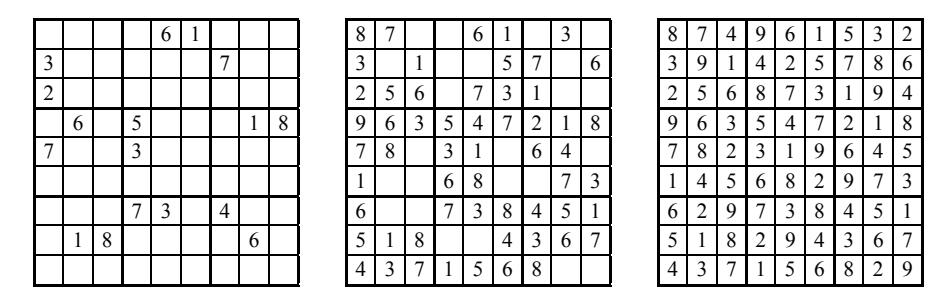

Figure 2. Puzzle Royle17-5105, its L4\_0+XY4+HXY4+C4 elaboration and its solution

Our third example, puzzle Royle17-499 (Figure 3) is remarkable for another reason: its L4\_0+XY4+HXY4+C4 and its L1 elaborations coincide, and, after a single interaction rule is applied to them, a succession of 4-chain patterns of various types (xy4, hxy4, xyt4, c4 and again xy4) appears on the grid.

|   |   |   |   |   |   |   | 6 | 1 |   | 5 | 7 | 4 |   | 3 |   | 6 | 1 | 8 | 5 | 7 | 4 | 2 | 3 | 9 | 6 | 1 |
|---|---|---|---|---|---|---|---|---|---|---|---|---|---|---|---|---|---|---|---|---|---|---|---|---|---|---|
| 4 |   |   |   | 7 |   |   |   |   | 4 | 1 |   |   | 7 | 6 | 5 |   | 3 | 4 | 1 | 9 | 8 | 7 | 6 | 5 | 2 | 3 |
|   | 2 |   |   |   |   |   |   |   | 6 | 2 | 3 |   | 1 | 5 |   | 7 | 4 | 6 | 2 | 3 | 9 | 1 | 5 | 8 | 7 | 4 |
|   | 6 | 1 | 5 |   |   |   |   |   | 3 | 6 | 1 | 5 | 4 | 7 |   |   |   | 3 | 6 | 1 | 5 | 4 | 7 | 2 | 8 | 9 |
|   |   |   |   | 3 |   | 7 | 4 |   |   |   |   | 6 | 3 | 1 | 7 | 4 | 5 | 9 | 8 | 2 | 6 | 3 | 1 | 7 | 4 | 5 |
| 5 |   |   |   |   |   |   |   |   | 5 | 7 | 4 |   |   |   | 1 | 3 | 6 | 5 | 7 | 4 | 2 | 8 | 9 | 1 | 3 | 6 |
|   |   | 5 | 1 |   | 8 |   |   |   |   | 4 | 5 | 1 | 6 | 8 | 3 |   | 7 | 2 | 4 | 5 | 1 | 6 | 8 | 3 | 9 | 7 |
| 7 |   |   |   |   |   | 4 |   |   | 7 |   | 6 | 3 | 5 |   | 4 | 1 |   | 7 | 9 | 6 | 3 | 5 | 2 | 4 | 1 | 8 |
|   |   |   |   |   |   |   |   |   | 1 | 3 |   | 7 |   | 4 | 6 | 5 |   | 1 | 3 | 8 | 7 | 9 | 4 | 6 | 5 | 2 |

Figure 3. Puzzle Royle17-499, its L1 elaboration and its solution

```
Resolution path in L4_0+XY4+HXY4+XYT4 of the L4_0+XY4+HXY4 (or L1) elaboration of Royle17-499: block b9 interaction-with-column c9 \Longrightarrow r4c9 \neq 8 xy4-chain {n9 n2}r7c8 - {n2 n9}r7c1 - {n9 n8}r1c1 - {n8 n9}r2c3 \Longrightarrow r2c8 \neq 9 block b3 interaction-with-column c7 \Longrightarrow r4c7 \neq 9 hxy-rn4-chain {c3 c1}r5n2 - {c1 c8}r7n2 - {c8 c4}r2n2 - {c4 c3}r2n9 \Longrightarrow r5c3 \neq 9 xyt4-chain {n9 n2}r9c5 - {n2 n9}r8c6 - {n9 n8}r8c2 - {n8 n9}r9c3 \Longrightarrow r9c9 \neq 9 c4-chain row-col-bl n9r9{c5 c3} - n9{r2c3 r1c1} \Longrightarrow r1c5 \neq 9 block b2 interaction-with-column c4 \Longrightarrow r6c4 \neq 9 xy4-chain {n2 n8}r2c8 - {n8 n9}r3c7 - {n9 n8}r3c4 - {n8 n2}r6c4 \Longrightarrow r2c4 \neq 2 ....(Naked-Singles and Hidden-Singles)
```

xyt-chains 267

#### XVII.4.2. A puzzle in [L4+XY5+HXY5]+XYT5

A very simple example of a puzzle in [L4+XY5+HXY5]+XYT5 is Royle17-1365 (Figure 4). Its L4+XY5+HXY5 and its L1\_0 elaborations coincide. Their resolution path starts with HXY-cn5, which is immediately followed by XYT5.

|   |   |   |   |   | 6 |   | 1 |
|---|---|---|---|---|---|---|---|
| 8 |   |   |   | 7 |   |   |   |
|   |   |   |   |   |   |   |   |
| 6 | 4 |   | 1 |   |   |   |   |
| 3 |   |   |   |   | 7 | 8 |   |
|   |   |   | 5 |   |   |   |   |
|   |   |   |   | 3 |   | 7 |   |
|   | 1 | 2 |   |   |   |   |   |
|   | 5 |   | 6 |   |   |   |   |

| 5 |   |   | 8 | 2 |   | 6 |   | 1 |
|---|---|---|---|---|---|---|---|---|
| 8 |   |   |   | 7 | 1 |   | 5 | 4 |
| 1 |   |   |   | 5 | 6 | 8 |   | 7 |
| 6 | 4 | 5 | 1 | 8 | 7 |   |   |   |
| 3 | 9 | 1 |   | 6 |   | 7 | 8 | 5 |
| 2 |   |   | 5 | 9 | 3 | 4 | 1 | 6 |
| 4 |   |   |   | 3 | 5 | 1 | 7 |   |
| 9 | 1 | 2 | 7 | 4 | 8 | 5 | 6 | 3 |
| 7 | 5 | 3 | 6 | 1 |   |   | 4 | 8 |

| 5     7     9     8     2     4     6     3     1       8     2     6     3     7     1     9     5     4       1     3     4     9     5     6     8     2     7       6     4     5     1     8     7     3     9     2       3     9     1     4     6     2     7     8     5       2     8     7     5     9     3     4     1     6       4     6     8     2     3     5     1     7     9       9     1     2     7     4     8     5     6     3       7     5     3     6     1     9     2     4     8 |   |   |   |   |   |   |   |   |   |   |
|-------------------------------------------------------------------------------------------------------------------------------------------------------------------------------------------------------------------------------------------------------------------------------------------------------------------------------------------------------------------------------------------------------------------------------------------------------------------------------------------------------------------|---|---|---|---|---|---|---|---|---|---|
| 1     3     4     9     5     6     8     2     7       6     4     5     1     8     7     3     9     2       3     9     1     4     6     2     7     8     5       2     8     7     5     9     3     4     1     6       4     6     8     2     3     5     1     7     9       9     1     2     7     4     8     5     6     3                                                                                                                                                                         |   | 5 | 7 | 9 | 8 | 2 | 4 | 6 | 3 | 1 |
| 6     4     5     1     8     7     3     9     2       3     9     1     4     6     2     7     8     5       2     8     7     5     9     3     4     1     6       4     6     8     2     3     5     1     7     9       9     1     2     7     4     8     5     6     3                                                                                                                                                                                                                                 |   | 8 | 2 | 6 | 3 | 7 | 1 | 9 | 5 | 4 |
| 3 9 1 4 6 2 7 8 5<br>2 8 7 5 9 3 4 1 6<br>4 6 8 2 3 5 1 7 9<br>9 1 2 7 4 8 5 6 3                                                                                                                                                                                                                                                                                                                                                                                                                                  |   | 1 | 3 | 4 | 9 | 5 | 6 | 8 | 2 | 7 |
| 2     8     7     5     9     3     4     1     6       4     6     8     2     3     5     1     7     9       9     1     2     7     4     8     5     6     3                                                                                                                                                                                                                                                                                                                                                 | Г | 6 | 4 | 5 | 1 | 8 | 7 | 3 | 9 | 2 |
| 4     6     8     2     3     5     1     7     9       9     1     2     7     4     8     5     6     3                                                                                                                                                                                                                                                                                                                                                                                                         |   | 3 | 9 | 1 | 4 | 6 | 2 | 7 | 8 | 5 |
| 9 1 2 7 4 8 5 6 3                                                                                                                                                                                                                                                                                                                                                                                                                                                                                                 |   | 2 | 8 | 7 | 5 | 9 | 3 | 4 | 1 | 6 |
|                                                                                                                                                                                                                                                                                                                                                                                                                                                                                                                   | - | 4 | 6 | 8 | 2 | 3 | 5 | 1 | 7 | 9 |
| 7 5 3 6 1 9 2 4 8                                                                                                                                                                                                                                                                                                                                                                                                                                                                                                 |   | 9 | 1 | 2 | 7 | 4 | 8 | 5 | 6 | 3 |
|                                                                                                                                                                                                                                                                                                                                                                                                                                                                                                                   | , | 7 | 5 | 3 | 6 | 1 | 9 | 2 | 4 | 8 |

Figure 4. Puzzle Royle17-1365, its L1 0 elaboration and its solution

Resolution path in L4+XY5+HXY5+XYT5 for the L4+XY5+HXY5 (or L1 $_0$ ) elaboration of Royle 17-1365

hxy-cn5-chain {r4 r2}c7n3 - {r2 r3}c4n3 - {r3 r5}c4n4 - {r5 r7}c4n2 - {r7 r4}c9n2 ==> r4c7  $\neq$  2

xyt5-chain  $\{n3 \ n9\}r2c4 - \{n9 \ n2\}r7c4 - \{n2 \ n9\}r7c9 - \{n9 \ n2\}r9c7 - \{n2 \ n3\}r2c7 ==> r2c2 \neq 3$ 

xy4-chain  $\{n3 \ n9\}r2c4 - \{n9 \ n6\}r2c3 - \{n6 \ n2\}r2c2 - \{n2 \ n3\}r3c2 ==> r3c4 \neq 3$ hidden singles ==> r2c4 = 3, r4c7 = 3

naked-pairs-in-a-row  $\{n4 \ n9\}\ r3\{c3 \ c4\} ==> r3c8 \neq 9$ 

c4-chain col-row-bl  $n9\{r9\ r1\}c6 - n9\{r1c8\ r2c7\} ==> r9c7 \neq 9$ 

...(Naked-Singles)

#### XVII.4.3. A puzzle in [L5+XY6+HXY6+C6]+XYT6

|   |   |   |   |   | 2 | 3 |   |   |
|---|---|---|---|---|---|---|---|---|
|   | 4 |   |   | 9 |   |   |   |   |
| 7 |   |   |   |   |   |   |   |   |
| 5 |   |   | 6 |   |   | 1 |   |   |
|   |   |   | 4 | 8 |   |   |   |   |
|   |   |   |   |   |   |   | 2 |   |
|   |   |   | 8 |   |   |   |   | 4 |
| 2 |   |   |   |   |   |   | 9 |   |
| 1 |   | 3 |   |   |   |   |   |   |

| 9 |   |   |   | 4 | 2 | 3 | 8 |   |
|---|---|---|---|---|---|---|---|---|
| 8 | 4 |   | 3 | 9 |   |   |   | 2 |
| 7 | 3 | 2 |   |   | 8 | 4 |   | 9 |
| 5 | 7 | 9 | 6 | 2 | 3 | 1 | 4 | 8 |
| 3 | 2 |   | 4 | 8 |   | 9 |   |   |
| 4 |   | 8 | 9 |   |   |   | 2 | 3 |
| 6 | 5 | 7 | 8 | 1 | 9 | 2 | 3 | 4 |
| 2 | 8 | 4 |   | 3 |   |   | 9 | 1 |
| 1 | 9 | 3 | 2 |   | 4 | 8 |   |   |

| 9 | 1 | 6 | 7 | 4 | 2 | 3 | 8 | 5 |
|---|---|---|---|---|---|---|---|---|
| 8 | 4 | 5 | 3 | 9 | 6 | 7 | 1 | 2 |
| 7 | 3 | 2 | 1 | 5 | 8 | 4 | 6 | 9 |
| 5 | 7 | 9 | 6 | 2 | 3 | 1 | 4 | 8 |
| 3 | 2 | 1 | 4 | 8 | 5 | 9 | 7 | 6 |
| 4 | 6 | 8 | 9 | 7 | 1 | 5 | 2 | 3 |
| 6 | 5 | 7 | 8 | 1 | 9 | 2 | 3 | 4 |
| 2 | 8 | 4 | 5 | 3 | 7 | 6 | 9 | 1 |
| 1 | 9 | 3 | 2 | 6 | 4 | 8 | 5 | 7 |

Figure 5. Puzzle Royle17-1861, its L1 0 elaboration and its solution

One of the simplest examples of a puzzle in [L5+XY6+HXY6+C6]+XYT6 is Royle17-1861 (Figure 5). Its L5+XY6+HXY6+C6 elaboration coincides with the L1\_0 elaboration and the XYT6 pattern is visible on it (central grid) immediately after a single Interaction rule is applied.

Resolution path in L5+XY6+HXY6+C6+XYT6 for the L5+XY6+HXY6+C6 (or L1\_0) elaboration of Royle17-1861:

column c4 interaction-with-block b2  $\Longrightarrow$  r2c6  $\neq$  1

xyt6-chain  $\{n7 \ n5\}r6c5 - \{n5 \ n6\}r3c5 - \{n6 \ n7\}r9c5 - \{n7 \ n5\}r8c4 - \{n5 \ n6\}r8c6 - \{n6 \ n7\}r8c7 ==> r6c7 \neq 7$ 

row r6 interaction-with-block b5  $\Longrightarrow$  r5c6  $\ne$  7

c4-chain col-row-bl  $n7\{r8\ r1\}c4 - n7\{r1c9\ r2c7\} ==> r8c7 \neq 7$ 

...(Naked-Singles and Hidden-Singles)

|            | cl | <i>c</i> 2 | <i>c3</i> | <i>c4</i>   | <i>c</i> 5 | <i>c</i> 6  | <i>c</i> 7      | c8            | <i>c</i> 9 |            |
|------------|----|------------|-----------|-------------|------------|-------------|-----------------|---------------|------------|------------|
| r1         | 9  | 1 6        | 5 6       | 1<br>5<br>7 | 4          | 2           | 3               | 8             | 5 6        | r1         |
| r2         | 8  | 4          | 1 5 6     | 3           | 9          | 5 6<br>7    | 5 6<br>7        | 1<br>5 6<br>7 | 2          | r2         |
| r3         | 7  | 3          | 2         | 1 5         | 5 6        | 8           | 4               | 5 6           | 9          | r3         |
| r4         | 5  | 7          | 9         | 6           | 2          | 3           | 1               | 4             | 8          | r4         |
| r5         | 3  | 2          | 1 6       | 4           | 8          | 1<br>5<br>7 | 9               | 5 6           | 5 6        | r5         |
| r6         | 4  | 1 6        | 8         | 9           | 5          | 1<br>5<br>7 | 5 6<br><u>7</u> | 2             | 3          | r6         |
| <i>r</i> 7 | 6  | 5          | 7         | 8           | 1          | 9           | 2               | 3             | 4          | <i>r</i> 7 |
| r8         | 2  | 8          | 4         | 5           | 3          | 5 6         | 5 6             | 9             | 1          | r8         |
| r9         | 1  | 9          | 3         | 2           | 5 6<br>7   | 4           | 8               | 5 6<br>7      | 5 6<br>7   | r9         |
|            | cl | <i>c</i> 2 | <i>c3</i> | c4          | <i>c</i> 5 | <i>c</i> 6  | <i>c</i> 7      | c8            | c9         |            |

Figure 6. Puzzle Royle17-1861, just before the xyt6-chain rule is applied

xyt-chains 269

Because of the place it takes, we cannot do this for all our examples, but it is useful to display the full re-representation of at least a few cases. Let us do this just before the xyt6-chain rule is applied (Figure 6). This xyt6-chain is:

 ${n7 n5}r6c5 - {n5 n6}r3c5 - {n6 n7 n5#1}r9c5 - {n7 n5}r8c4 - {n5 n6 n7#3}r8c6 - {n6 n7 n5#4}r8c7$ , where the additional candidates are marked with a "#".

It is interesting to notice that among the six cells of this moderately long xytchain, three have a (single) additional candidate: additional candidate 5 is allowed in r9c5 because this cell shares a column with cell 1 (r6c5), in which 5 is the right-linking candidate; additional candidate 7 is allowed in r8c6 because this cell shares a block with cell 3 (r9c5), in which 7 is the right-linking candidate; finally, additional candidate 5 is allowed in r8c7 because this cell shares a column with cell 4 (r8c4), in which 5 is the right-linking candidate.

#### *XVII.4.4. A puzzle in [L6+XY7+HXY7]+XYT7*

The L6+XY7+HXY7 and L1 elaborations of puzzle Royle17-20565 (Figure 7) coincide. After the application of two Interaction rules, their resolution path uses successively XYT5 and XYT7.

|   | 6 | 8 |   |   |   |   | 3 |   |   | (   |
|---|---|---|---|---|---|---|---|---|---|-----|
|   |   |   |   | 5 | 2 |   |   |   | 3 |     |
|   |   |   |   |   |   |   |   |   |   | 4,  |
| 5 | 1 |   |   |   |   | 7 |   |   | 5 |     |
|   |   |   | 8 |   | 6 |   |   |   |   | 1   |
|   |   |   | 3 |   |   |   |   |   | 8 |     |
| 1 |   |   |   | 4 |   | 2 |   |   | 1 | 1.1 |
| 2 |   |   |   |   |   |   |   | 7 | 2 |     |
|   |   |   |   |   |   |   | 8 |   | 6 |     |

|   | 6 | 8 |   | 9 |   | 5 | 3 | 2 |
|---|---|---|---|---|---|---|---|---|
| 3 |   | 1 | 6 | 5 | 2 | 8 |   |   |
|   | 5 | 2 |   | 8 | 3 | 6 |   |   |
| 5 | 1 | 3 |   | 2 |   | 7 | 6 | 8 |
|   | 2 |   | 8 |   | 6 |   | 5 | 3 |
| 8 |   | 6 | 3 |   | 5 |   | 2 |   |
| 1 | 3 |   |   | 4 | 8 | 2 | 9 | 6 |
| 2 | 8 |   |   | 6 |   | 3 |   | 7 |
| 6 |   |   | 2 | 3 |   |   | 8 | 5 |

| 4 | 6 | 8 | 1 | 9 | 7 | 5 | 3 | 2 |
|---|---|---|---|---|---|---|---|---|
| 3 | 9 | 1 | 6 | 5 | 2 | 8 | 7 | 4 |
| 7 | 5 | 2 | 4 | 8 | 3 | 6 | 1 | 9 |
| 5 | 1 | 3 | 9 | 2 | 4 | 7 | 6 | 8 |
| 9 | 2 | 7 | 8 | 1 | 6 | 4 | 5 | 3 |
| 8 | 4 | 6 | 3 | 7 | 5 | 9 | 2 | 1 |
| 1 | 3 | 5 | 7 | 4 | 8 | 2 | 9 | 6 |
| 2 | 8 | 9 | 5 | 6 | 1 | 3 | 4 | 7 |
| 6 | 7 | 4 | 2 | 3 | 9 | 1 | 8 | 5 |

Figure 7. Puzzle Royle17-20565, its L1 elaboration and its solution

Resolution path in L6+XY7+HXY7+XYT7 for the L6+XY7+HXY7 (or L1) elaboration of Royle17- 20565:

```
column c7 interaction-with-block b6 ==> r6c9 \neq 9

row r1 interaction-with-block b2 ==> r3c4 \neq 1

xyt5-chain {n4 n1}r8c8 - \{n1 \ n9\}r8c6 - \{n9 \ n5\}r8c4 - \{n5 \ n7\}r7c4 - \{n7 \ n4\}r3c4 ==> <math>r3c8 \neq 4

xyt7-chain {n7 n1}r6c5 - \{n1 \ n4\}r6c9 - \{n4 \ n9\}r3c9 - \{n9 \ n1\}r3c9 - \{n1 \ n7\}r3c8
```

```
xyt7-chain \{n7 \ n1\}r6c5 - \{n1 \ n4\}r6c9 - \{n4 \ n9\}r2c9 - \{n9 \ n1\}r3c9 - \{n1 \ n7\}r3c8 - \{n7 \ n4\}r2c8 - \{n4 \ n7\}r2c2 => r6c2 \neq 7
```

```
hidden-single-in-a-row ==> r6c5 = 7
naked-single ==> r5c5 = 1
```

```
c4-chain col-row-col n7{r1 r9}c6 – n7{r9 r2}c2 ==> r1c1 \neq 7 naked and hidden singles ==> r1c1 = 4, r3c4 = 4, r4c4 = 9, r4c6 = 4 hxy-cn4-chain {r6 r5}c7n9 – {r5 r3}c1n9 – {r3 r2}c9n9 – {r2 r6}c9n4 ==> r6c7 \neq 4 xy3-chain {n4 n9}r6c2 – {n9 n1}r6c7 – {n1 n4}r9c7 ==> r9c2 \neq 4 ...(Naked-Singles and Hidden-Singles)
```

#### XVII.4.5. A puzzle in [L9+XY10+HXY10]+XYT10

Let us skip a few lengths. For puzzle Royle17-33442 (Figure 8), the L9+XY10+ HXY10 and L1 elaborations coincide. After a few (relatively) simple rules (in L2+C4), XYT10 applies to it and the sequel needs only rules in L1 0.

| 6 | 2 |   |   |   |   |   |   | 7 |
|---|---|---|---|---|---|---|---|---|
|   |   |   |   | 4 | 1 |   |   |   |
|   |   |   |   |   |   |   | 8 |   |
|   |   |   |   | 5 |   | 4 | 1 |   |
| 7 |   |   | 3 |   |   |   |   |   |
| 2 |   |   |   |   |   |   |   |   |
|   |   | 4 |   |   |   | 3 |   |   |
|   | 5 |   | 7 |   |   |   |   |   |
|   |   |   | 2 |   |   |   |   |   |

| 6 | 2 |   | 5 |   |   | 1 | 4 | 7 |
|---|---|---|---|---|---|---|---|---|
| 5 |   | 7 |   | 4 | 1 | 2 |   |   |
| 4 | 1 |   |   | 7 | 2 |   | 8 |   |
|   |   |   |   | 5 | 7 | 4 | 1 | 2 |
| 7 | 4 | 1 | 3 | 2 |   |   |   |   |
| 2 |   | 5 | 4 | 1 |   |   |   |   |
|   | 7 | 4 | 1 |   |   | 3 | 2 |   |
|   | 5 | 2 | 7 |   |   |   |   |   |
|   |   |   | 2 |   |   |   |   |   |

| 6 | 2 | 8 | 5 | 9 | 3 | 1 | 4 | 7 |
|---|---|---|---|---|---|---|---|---|
| 5 | 3 | 7 | 8 | 4 | 1 | 2 | 9 | 6 |
| 4 | 1 | 9 | 6 | 7 | 2 | 5 | 8 | 3 |
| 3 | 8 | 6 | 9 | 5 | 7 | 4 | 1 | 2 |
| 7 | 4 | 1 | 3 | 2 | 8 | 6 | 5 | 9 |
| 2 | 9 | 5 | 4 | 1 | 6 | 7 | 3 | 8 |
| 8 | 7 | 4 | 1 | 6 | 9 | 3 | 2 | 5 |
| 9 | 5 | 2 | 7 | 3 | 4 | 8 | 6 | 1 |
| 1 | 6 | 3 | 2 | 8 | 5 | 9 | 7 | 4 |

Figure 8. Puzzle Royle17-33442, its L1 elaboration and its solution

```
Resolution path in L9+XY10+HXY10+XYT10 for the L9+XY10+HXY10 (or L1) elaboration of Royle17-33442: column c5 interaction-with-block b8 ==> r9c6 \neq 6, r8c6 \neq 6, r7c6 \neq 6 column c6 interaction-with-block b5 ==> r4c4 \neq 6 row r4 interaction-with-block b4 ==> r6c2 \neq 6, r6c2 \neq 3 block b7 interaction-with-row r9 ==> r9c9 \neq 6, r9c8 \neq 6, r9c7 \neq 6, r9c5 \neq 6 block b2 interaction-with-row r1 ==> r1c3 \neq 3 hidden-pairs-in-a-column {n1 n4}{r8 r9}c9 ==> r9c9 \neq 9, r9c9 \neq 8, r9c9 \neq 5, r8c9 \neq 9, r8c9 \neq 8, r8c9 \neq 6 c4-chain col-row-bl n8{r4 r2}c4 - n8{r2c2 r1c3} ==> r4c3 \neq 8 xyt10-chain {n8 n9}r1c3 - {n9 n3}r3c3 - {n3 n8}r2c2 - {n8 n9}r6c2 - {n9 n6}r4c3 - {n6 n3}r4c2 - {n3 n8}r4c1 - {n8 n9}r4c4 - {n9 n6}r3c4 - {n6 n8}r2c4 ==> r1c6 \neq 8, r1c5 \neq 8 ...(Naked-Singles and Hidden-Singles)
```

#### XVII.4.6. A puzzle in [L10+XY11+HXY11]+XYT11

In our example of a puzzle (Royle17-19749, Figure 9) that cannot be solved in L10+XY11+HXY11 but can be solved if we add XYT11 to this theory, the L10+

xyt-chains 271

XY11+HXY11 and the L2 elaborations coincide. The solution in L10+XY11+ HXY11+XYT11 effectively uses rules in L10, for chains of length less than eleven and of a type (xyzt) not yet defined. XYT11 allows the elimination of a single candidate, which unblocks the situation.

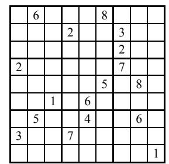

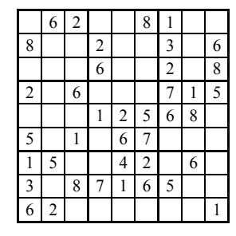

| 7 | 6 | 2 | 9 | 3 | 8 | 1 | 5 | 4 |
|---|---|---|---|---|---|---|---|---|
| 8 | 1 | 5 | 2 | 7 | 4 | 3 | 9 | 6 |
| 4 | 9 | 3 | 6 | 5 | 1 | 2 | 7 | 8 |
| 2 | 8 | 6 | 4 | 9 | 3 | 7 | 1 | 5 |
| 9 | 7 | 4 | 1 | 2 | 5 | 6 | 8 | 3 |
| 5 | 3 | 1 | 8 | 6 | 7 | 9 | 4 | 2 |
| 1 | 5 | 9 | 3 | 4 | 2 | 8 | 6 | 7 |
| 3 | 4 | 8 | 7 | 1 | 6 | 5 | 2 | 9 |
| 6 | 2 | 7 | 5 | 8 | 9 | 4 | 3 | 1 |

Figure 9. Puzzle Royle17-19749, its L2 elaboration and its solution

Resolution path in L10+XY11+HXY11+XYT11 for the L10+XY11+HXY11 (or L2) elabora-

```
tion of Royle17-19749:
row r1 interaction-with-block b2 ==> r3c6 \neq 3, r3c5 \neq 3
block b7 interaction-with-column c3 ==> r5c3 \neq 7, r3c3 \neq 7, r2c3 \neq 7
hidden-pairs-in-a-block {n3 n7} {r7c9 r9c8} ==> r9c8 \neq 9, r9c8 \neq 4, r7c9 \neq 9
c4-chain row-bl-col n3r7{c4 c9} - n3{r9 r6}c8 ==> r6c4 \neq 3
block b5 interaction-with-row r4 ==> r4c2 \neq 3
c4-chain col-row-bl n4\{r6 r9\}c7 - n4\{r9c3 r8c2\} ==> r6c2 \neq 4
xyzt5-chain \{n9 \ n3\}r9c6 - \{n3 \ n8\}r7c4 - \{n8 \ n9\}r7c7 - \{n9 \ n4\}r6c7 - \{n4 \ n9\}r6c4 \Longrightarrow
r9c4 \neq 9
xyzt7-chain \{n9\ n7\}r7c3 - \{n7\ n3\}r7c9 - \{n3\ n4\}r5c9 - \{n4\ n9\}r6c7 - \{n9\ n8\}r7c7 - \{n9\ n8\}r7c7 - \{n9\ n8\}r7c7 - \{n9\ n8\}r7c7 - \{n9\ n8\}r7c7 - \{n9\ n8\}r7c7 - \{n9\ n8\}r7c7 - \{n9\ n8\}r7c7 - \{n9\ n8\}r7c7 - \{n9\ n8\}r7c7 - \{n9\ n8\}r7c7 - \{n9\ n8\}r7c7 - \{n9\ n8\}r7c7 - \{n9\ n8\}r7c7 - \{n9\ n8\}r7c7 - \{n9\ n8\}r7c7 - \{n9\ n8\}r7c7 - \{n9\ n8\}r7c7 - \{n9\ n8\}r7c7 - \{n9\ n8\}r7c7 - \{n9\ n8\}r7c7 - \{n9\ n8\}r7c7 - \{n9\ n8\}r7c7 - \{n9\ n8\}r7c7 - \{n9\ n8\}r7c7 - \{n9\ n8\}r7c7 - \{n9\ n8\}r7c7 - \{n9\ n8\}r7c7 - \{n9\ n8\}r7c7 - \{n9\ n8\}r7c7 - \{n9\ n8\}r7c7 - \{n9\ n8\}r7c7 - \{n9\ n8\}r7c7 - \{n9\ n8\}r7c7 - \{n9\ n8\}r7c7 - \{n9\ n8\}r7c7 - \{n9\ n8\}r7c7 - \{n9\ n8\}r7c7 - \{n9\ n8\}r7c7 - \{n9\ n8\}r7c7 - \{n9\ n8\}r7c7 - \{n9\ n8\}r7c7 - \{n9\ n8\}r7c7 - \{n9\ n8\}r7c7 - \{n9\ n8\}r7c7 - \{n9\ n8\}r7c7 - \{n9\ n8\}r7c7 - \{n9\ n8\}r7c7 - \{n9\ n8\}r7c7 - \{n9\ n8\}r7c7 - \{n9\ n8\}r7c7 - \{n9\ n8\}r7c7 - \{n9\ n8\}r7c7 - \{n9\ n8\}r7c7 - \{n9\ n8\}r7c7 - \{n9\ n8\}r7c7 - \{n9\ n8\}r7c7 - \{n9\ n8\}r7c7 - \{n9\ n8\}r7c7 - \{n9\ n8\}r7c7 - \{n9\ n8\}r7c7 - \{n9\ n8\}r7c7 - \{n9\ n8\}r7c7 - \{n9\ n8\}r7c7 - \{n9\ n8\}r7c7 - \{n9\ n8\}r7c7 - \{n9\ n8\}r7c7 - \{n9\ n8\}r7c7 - \{n9\ n8\}r7c7 - \{n9\ n8\}r7c7 - \{n9\ n8\}r7c7 - \{n9\ n8\}r7c7 - \{n9\ n8\}r7c7 - \{n9\ n8\}r7c7 - \{n9\ n8\}r7c7 - \{n9\ n8\}r7c7 - \{n9\ n8\}r7c7 - \{n9\ n8\}r7c7 - \{n9\ n8\}r7c7 - \{n9\ n8\}r7c7 - \{n9\ n8\}r7c7 - \{n9\ n8\}r7c7 - \{n9\ n8\}r7c7 - \{n9\ n8\}r7c7 - \{n9\ n8\}r7c7 - \{n9\ n8\}r7c7 - \{n9\ n8\}r7c7 - \{n9\ n8\}r7c7 - \{n9\ n8\}r7c7 - \{n9\ n8\}r7c7 - \{n9\ n8\}r7c7 - \{n9\ n8\}r7c7 - \{n9\ n8\}r7c7 - \{n9\ n8\}r7c7 - \{n9\ n8\}r7c7 - \{n9\ n8\}r7c7 - \{n9\ n8\}r7c7 - \{n9\ n8\}r7c7 - \{n9\ n8\}r7c7 - \{n9\ n8\}r7c7 - \{n9\ n8\}r7c7 - \{n9\ n8\}r7c7 - \{n9\ n8\}r7c7 - \{n9\ n8\}r7c7 - \{n9\ n8\}r7c7 - \{n9\ n8\}r7c7 - \{n9\ n8\}r7c7 - \{n9\ n8\}r7c7 - \{n9\ n8\}r7c7 - \{n9\ n8\}r7c7 - \{n9\ n8\}r7c7 - \{n9\ n8\}r7c7 - \{n9\ n8\}r7c7 - \{n9\ n8\}r7c7 - \{n9\ n8\}r7c7 - \{n9\ n8\}r7c7 - \{n9\ n8\}r7c7 - \{n9\ n8\}r7c7 - \{n9\ n8\}r7c7 - \{n9\ n8\}r7c7 - \{n9\ n8\}r7c7 - \{n9\ n8\}r7c7 - \{n9\ n8\}r7c7 - \{n9\ n8\}r7c7 - \{n9\ n8\}r7c7 - \{n9\ n8\}r7c7 - \{n9\ n8\}r7c7 - \{n9\ n8\}r7c7 - \{n9\ n8\}r7c7 - \{n9\ n8\}r7c7 - \{n9\ n8\}r7c7 - \{n9\ 
 \{n8 \ n4\}r9c7 - \{n4 \ n9\}r9c3 ==> r5c3 \neq 9
xyzt4-chain \{n4 \ n9\}r8c2 - \{n9 \ n8\}r4c2 - \{n8 \ n3\}r6c2 - \{n3 \ n4\}r5c3 ==> r5c2 \neq 4
xyt6-chain \{n4\ n9\}r8c2 - \{n9\ n7\}r7c3 - \{n7\ n4\}r9c3 - \{n4\ n3\}r5c3 - \{n3\ n8\}r6c2 - \{n4\ n4\}r9c3 - \{n4\ n4\}r9c3 - \{n4\ n4\}r9c3 - \{n4\ n4\}r9c3 - \{n4\ n4\}r9c3 - \{n4\ n4\}r9c3 - \{n4\ n4\}r9c3 - \{n4\ n4\}r9c3 - \{n4\ n4\}r9c3 - \{n4\ n4\}r9c3 - \{n4\ n4\}r9c3 - \{n4\ n4\}r9c3 - \{n4\ n4\}r9c3 - \{n4\ n4\}r9c3 - \{n4\ n4\}r9c3 - \{n4\ n4\}r9c3 - \{n4\ n4\}r9c3 - \{n4\ n4\}r9c3 - \{n4\ n4\}r9c3 - \{n4\ n4\}r9c3 - \{n4\ n4\}r9c3 - \{n4\ n4\}r9c3 - \{n4\ n4\}r9c3 - \{n4\ n4\}r9c3 - \{n4\ n4\}r9c3 - \{n4\ n4\}r9c3 - \{n4\ n4\}r9c3 - \{n4\ n4\}r9c3 - \{n4\ n4\}r9c3 - \{n4\ n4\}r9c3 - \{n4\ n4\}r9c3 - \{n4\ n4\}r9c3 - \{n4\ n4\}r9c3 - \{n4\ n4\}r9c3 - \{n4\ n4\}r9c3 - \{n4\ n4\}r9c3 - \{n4\ n4\}r9c3 - \{n4\ n4\}r9c3 - \{n4\ n4\}r9c3 - \{n4\ n4\}r9c3 - \{n4\ n4\}r9c3 - \{n4\ n4\}r9c3 - \{n4\ n4\}r9c3 - \{n4\ n4\}r9c3 - \{n4\ n4\}r9c3 - \{n4\ n4\}r9c3 - \{n4\ n4\}r9c3 - \{n4\ n4\}r9c3 - \{n4\ n4\}r9c3 - \{n4\ n4\}r9c3 - \{n4\ n4\}r9c3 - \{n4\ n4\}r9c3 - \{n4\ n4\}r9c3 - \{n4\ n4\}r9c3 - \{n4\ n4\}r9c3 - \{n4\ n4\}r9c3 - \{n4\ n4\}r9c3 - \{n4\ n4\}r9c3 - \{n4\ n4\}r9c3 - \{n4\ n4\}r9c3 - \{n4\ n4\}r9c3 - \{n4\ n4\}r9c3 - \{n4\ n4\}r9c3 - \{n4\ n4\}r9c3 - \{n4\ n4\}r9c3 - \{n4\ n4\}r9c3 - \{n4\ n4\}r9c3 - \{n4\ n4\}r9c3 - \{n4\ n4\}r9c3 - \{n4\ n4\}r9c3 - \{n4\ n4\}r9c3 - \{n4\ n4\}r9c3 - \{n4\ n4\}r9c3 - \{n4\ n4\}r9c3 - \{n4\ n4\}r9c3 - \{n4\ n4\}r9c3 - \{n4\ n4\}r9c3 - \{n4\ n4\}r9c3 - \{n4\ n4\}r9c3 - \{n4\ n4\}r9c3 - \{n4\ n4\}r9c3 - \{n4\ n4\}r9c3 - \{n4\ n4\}r9c3 - \{n4\ n4\}r9c3 - \{n4\ n4\}r9c3 - \{n4\ n4\}r9c3 - \{n4\ n4\}r9c3 - \{n4\ n4\}r9c3 - \{n4\ n4\}r9c3 - \{n4\ n4\}r9c3 - \{n4\ n4\}r9c3 - \{n4\ n4\}r9c3 - \{n4\ n4\}r9c3 - \{n4\ n4\}r9c3 - \{n4\ n4\}r9c3 - \{n4\ n4\}r9c3 - \{n4\ n4\}r9c3 - \{n4\ n4\}r9c3 - \{n4\ n4\}r9c3 - \{n4\ n4\}r9c3 - \{n4\ n4\}r9c3 - \{n4\ n4\}r9c3 - \{n4\ n4\}r9c3 - \{n4\ n4\}r9c3 - \{n4\ n4\}r9c3 - \{n4\ n4\}r9c3 - \{n4\ n4\}r9c3 - \{n4\ n4\}r9c3 - \{n4\ n4\}r9c3 - \{n4\ n4\}r9c3 - \{n4\ n4\}r9c3 - \{n4\ n4\}r9c3 - \{n4\ n4\}r9c3 - \{n4\ n4\}r9c3 - \{n4\ n4\}r9c3 - \{n4\ n4\}r9c3 - \{n4\ n4\}r9c3 - \{n4\ n4\}r9c3 - \{n4\ n4\}r9c3 - \{n4\ n4\}r9c3 - \{n4\ n4\}r9c3 - \{n4\ n4\}r9c3 - \{n4\ n4\}r9c3 - \{n4\ n4\}r9c3 - \{n4\ n4\}r9c3 - \{n4\ n4\}r9c3 - \{n4\ n4\}r9c3 - \{n4\ n4\}r9c3 - \{n4\ n4\}r9c3 - \{n4\ n4\}r9c3 - \{n4\ n
 \{n8 \ n4\} r4c2 ==> r3c2 \neq 4, r2c2 \neq 4
xyzt9-chain \{n9\ n4\}r6c7 - \{n4\ n3\}r5c9 - \{n3\ n7\}r7c9 - \{n7\ n3\}r9c8 - \{n3\ n9\}r9c6 - \{n4\ n3\}r9c8 - \{n3\ n7\}r9c8 - \{n3\ n7\}r9c8 - \{n3\ n7\}r9c8 - \{n3\ n7\}r9c8 - \{n3\ n7\}r9c8 - \{n3\ n7\}r9c8 - \{n3\ n7\}r9c8 - \{n3\ n7\}r9c8 - \{n3\ n7\}r9c8 - \{n3\ n7\}r9c8 - \{n3\ n7\}r9c8 - \{n3\ n7\}r9c8 - \{n3\ n7\}r9c8 - \{n3\ n7\}r9c8 - \{n3\ n7\}r9c8 - \{n3\ n7\}r9c8 - \{n3\ n7\}r9c8 - \{n3\ n7\}r9c8 - \{n3\ n7\}r9c8 - \{n3\ n7\}r9c8 - \{n3\ n7\}r9c8 - \{n3\ n7\}r9c8 - \{n3\ n7\}r9c8 - \{n3\ n7\}r9c8 - \{n3\ n7\}r9c8 - \{n3\ n7\}r9c8 - \{n3\ n7\}r9c8 - \{n3\ n7\}r9c8 - \{n3\ n7\}r9c8 - \{n3\ n7\}r9c8 - \{n3\ n7\}r9c8 - \{n3\ n7\}r9c8 - \{n3\ n7\}r9c8 - \{n3\ n7\}r9c8 - \{n3\ n7\}r9c8 - \{n3\ n7\}r9c8 - \{n3\ n7\}r9c8 - \{n3\ n7\}r9c8 - \{n3\ n7\}r9c8 - \{n3\ n7\}r9c8 - \{n3\ n7\}r9c8 - \{n3\ n7\}r9c8 - \{n3\ n7\}r9c8 - \{n3\ n7\}r9c8 - \{n3\ n7\}r9c8 - \{n3\ n7\}r9c8 - \{n3\ n7\}r9c8 - \{n3\ n7\}r9c8 - \{n3\ n7\}r9c8 - \{n3\ n7\}r9c8 - \{n3\ n7\}r9c8 - \{n3\ n7\}r9c8 - \{n3\ n7\}r9c8 - \{n3\ n7\}r9c8 - \{n3\ n7\}r9c8 - \{n3\ n7\}r9c8 - \{n3\ n7\}r9c8 - \{n3\ n7\}r9c8 - \{n3\ n7\}r9c8 - \{n3\ n7\}r9c8 - \{n3\ n7\}r9c8 - \{n3\ n7\}r9c8 - \{n3\ n7\}r9c8 - \{n3\ n7\}r9c8 - \{n3\ n7\}r9c8 - \{n3\ n7\}r9c8 - \{n3\ n7\}r9c8 - \{n3\ n7\}r9c8 - \{n3\ n7\}r9c8 - \{n3\ n7\}r9c8 - \{n3\ n7\}r9c8 - \{n3\ n7\}r9c8 - \{n3\ n7\}r9c8 - \{n3\ n7\}r9c8 - \{n3\ n7\}r9c8 - \{n3\ n7\}r9c8 - \{n3\ n7\}r9c8 - \{n3\ n7\}r9c8 - \{n3\ n7\}r9c8 - \{n3\ n7\}r9c8 - \{n3\ n7\}r9c8 - \{n3\ n7\}r9c8 - \{n3\ n7\}r9c8 - \{n3\ n7\}r9c8 - \{n3\ n7\}r9c8 - \{n3\ n7\}r9c8 - \{n3\ n7\}r9c8 - \{n3\ n7\}r9c8 - \{n3\ n7\}r9c8 - \{n3\ n7\}r9c8 - \{n3\ n7\}r9c8 - \{n3\ n7\}r9c8 - \{n3\ n7\}r9c8 - \{n3\ n7\}r9c8 - \{n3\ n7\}r9c8 - \{n3\ n7\}r9c8 - \{n3\ n7\}r9c8 - \{n3\ n7\}r9c8 - \{n3\ n7\}r9c8 - \{n3\ n7\}r9c8 - \{n3\ n7\}r9c8 - \{n3\ n7\}r9c8 - \{n3\ n7\}r9c8 - \{n3\ n7\}r9c8 - \{n3\ n7\}r9c8 - \{n3\ n7\}r9c8 - \{n3\ n7\}r9c8 - \{n3\ n7\}r9c8 - \{n3\ n7\}r9c8 - \{n3\ n7\}r9c8 - \{n3\ n7\}r9c8 - \{n3\ n7\}r9c8 - \{n3\ n7\}r9c8 - \{n3\ n7\}r9c8 - \{n3\ n7\}r9c8 - \{n3\ n7\}r9c8 - \{n3\ n7\}r9c8 - \{n3\ n7\}r9c8 - \{n3\ n7\}r9c8 - \{n3\ n7\}r9c8 - \{n3\ n7\}r9c8 - \{n3\ n7\}r9c8 - \{n3\ n7\}r9c8 - \{n3\ n7\}r9c8 - \{n3\ n7\}r9c8 - \{n3\ n7\}r9c8 - \{n3\ n7\}r9c8 - \{n3\ n7\}r9c8 - \{n3\ n7\}r9c8 - \{n3\ 
 \{n9 \ n8\} r9c7 - \{n8 \ n5\} r9c5 - \{n5 \ n8\} r9c4 - \{n8 \ n9\} r6c4 \Longrightarrow r6c9 \neq 9, r6c8 \neq 9\}
xyt11-chain \{n4\ n9\}r8c2 - \{n9\ n7\}r7c3 - \{n7\ n4\}r9c3 - \{n4\ n3\}r5c3 - \{n3\ n7\}r5c2 - \{n4\ n4\}r5c3 - \{n4\ n4\}r5c3 - \{n4\ n4\}r5c3 - \{n4\ n4\}r5c3 - \{n4\ n4\}r5c3 - \{n4\ n4\}r5c3 - \{n4\ n4\}r5c3 - \{n4\ n4\}r5c3 - \{n4\ n4\}r5c3 - \{n4\ n4\}r5c3 - \{n4\ n4\}r5c3 - \{n4\ n4\}r5c3 - \{n4\ n4\}r5c3 - \{n4\ n4\}r5c3 - \{n4\ n4\}r5c3 - \{n4\ n4\}r5c3 - \{n4\ n4\}r5c3 - \{n4\ n4\}r5c3 - \{n4\ n4\}r5c3 - \{n4\ n4\}r5c3 - \{n4\ n4\}r5c3 - \{n4\ n4\}r5c3 - \{n4\ n4\}r5c3 - \{n4\ n4\}r5c3 - \{n4\ n4\}r5c3 - \{n4\ n4\}r5c3 - \{n4\ n4\}r5c3 - \{n4\ n4\}r5c3 - \{n4\ n4\}r5c3 - \{n4\ n4\}r5c3 - \{n4\ n4\}r5c3 - \{n4\ n4\}r5c3 - \{n4\ n4\}r5c3 - \{n4\ n4\}r5c3 - \{n4\ n4\}r5c3 - \{n4\ n4\}r5c3 - \{n4\ n4\}r5c3 - \{n4\ n4\}r5c3 - \{n4\ n4\}r5c3 - \{n4\ n4\}r5c3 - \{n4\ n4\}r5c3 - \{n4\ n4\}r5c3 - \{n4\ n4\}r5c3 - \{n4\ n4\}r5c3 - \{n4\ n4\}r5c3 - \{n4\ n4\}r5c3 - \{n4\ n4\}r5c3 - \{n4\ n4\}r5c3 - \{n4\ n4\}r5c3 - \{n4\ n4\}r5c3 - \{n4\ n4\}r5c3 - \{n4\ n4\}r5c3 - \{n4\ n4\}r5c3 - \{n4\ n4\}r5c3 - \{n4\ n4\}r5c3 - \{n4\ n4\}r5c3 - \{n4\ n4\}r5c3 - \{n4\ n4\}r5c3 - \{n4\ n4\}r5c3 - \{n4\ n4\}r5c3 - \{n4\ n4\}r5c3 - \{n4\ n4\}r5c3 - \{n4\ n4\}r5c3 - \{n4\ n4\}r5c3 - \{n4\ n4\}r5c3 - \{n4\ n4\}r5c3 - \{n4\ n4\}r5c3 - \{n4\ n4\}r5c3 - \{n4\ n4\}r5c3 - \{n4\ n4\}r5c3 - \{n4\ n4\}r5c3 - \{n4\ n4\}r5c3 - \{n4\ n4\}r5c3 - \{n4\ n4\}r5c3 - \{n4\ n4\}r5c3 - \{n4\ n4\}r5c3 - \{n4\ n4\}r5c3 - \{n4\ n4\}r5c3 - \{n4\ n4\}r5c3 - \{n4\ n4\}r5c3 - \{n4\ n4\}r5c3 - \{n4\ n4\}r5c3 - \{n4\ n4\}r5c3 - \{n4\ n4\}r5c3 - \{n4\ n4\}r5c3 - \{n4\ n4\}r5c3 - \{n4\ n4\}r5c3 - \{n4\ n4\}r5c3 - \{n4\ n4\}r5c3 - \{n4\ n4\}r5c3 - \{n4\ n4\}r5c3 - \{n4\ n4\}r5c3 - \{n4\ n4\}r5c3 - \{n4\ n4\}r5c3 - \{n4\ n4\}r5c3 - \{n4\ n4\}r5c3 - \{n4\ n4\}r5c3 - \{n4\ n4\}r5c3 - \{n4\ n4\}r5c3 - \{n4\ n4\}r5c3 - \{n4\ n4\}r5c3 - \{n4\ n4\}r5c3 - \{n4\ n4\}r5c3 - \{n4\ n4\}r5c3 - \{n4\ n4\}r5c3 - \{n4\ n4\}r5c3 - \{n4\ n4\}r5c3 - \{n4\ n4\}r5c3 - \{n4\ n4\}r5c3 - \{n4\ n4\}r5c3 - \{n4\ n4\}r5c3 - \{n4\ n4\}r5c3 - \{n4\ n4\}r5c3 - \{n4\ n4\}r5c3 - \{n4\ n4\}r5c3 - \{n4\ n4\}r5c3 - \{n4\ n4\}r5c3 - \{n4\ n4\}r5c3 - \{n4\ n4\}r5c3 - \{n4\ n4\}r5c3 - \{n4\ n4\}r5c3 - \{n4\ n4\}r5c3 - \{n4\ n4\}r5c3 - \{n4\ n4\}r5c3 - \{n4\ n4\}r5c3 - \{n4\ n4\}r5c3 - \{n4\ n4\}r5c3 - \{n4\ n4\}r5c3 - \{n4\ n4\}r5c3 - \{n4\ n4\}r5c3 - \{n4\ 
 \{n7 \ n1\}r2c2 - \{n1 \ n3\}r3c2 - \{n3 \ n8\}r6c2 - \{n8 \ n4\}r4c2 - \{n4 \ n9\}r5c1 - \{n9 \ n4\}r5c9 ==>
r8c9 \neq 4
xyzt7-chain \{n9\ n2\}r8c9 - \{n2\ n4\}r8c8 - \{n4\ n9\}r8c2 - \{n9\ n7\}r7c3 - \{n7\ n3\}r7c9 - \{n7\ n3\}r7c9 - \{n7\ n3\}r7c9 - \{n7\ n3\}r7c9 - \{n7\ n3\}r7c9 - \{n7\ n3\}r7c9 - \{n7\ n3\}r7c9 - \{n7\ n3\}r7c9 - \{n7\ n3\}r7c9 - \{n7\ n3\}r7c9 - \{n7\ n3\}r7c9 - \{n7\ n3\}r7c9 - \{n7\ n3\}r7c9 - \{n7\ n3\}r7c9 - \{n7\ n3\}r7c9 - \{n7\ n3\}r7c9 - \{n7\ n3\}r7c9 - \{n7\ n3\}r7c9 - \{n7\ n3\}r7c9 - \{n7\ n3\}r7c9 - \{n7\ n3\}r7c9 - \{n7\ n3\}r7c9 - \{n7\ n3\}r7c9 - \{n7\ n3\}r7c9 - \{n7\ n3\}r7c9 - \{n7\ n3\}r7c9 - \{n7\ n3\}r7c9 - \{n7\ n3\}r7c9 - \{n7\ n3\}r7c9 - \{n7\ n3\}r7c9 - \{n7\ n3\}r7c9 - \{n7\ n3\}r7c9 - \{n7\ n3\}r7c9 - \{n7\ n3\}r7c9 - \{n7\ n3\}r7c9 - \{n7\ n3\}r7c9 - \{n7\ n3\}r7c9 - \{n7\ n3\}r7c9 - \{n7\ n3\}r7c9 - \{n7\ n3\}r7c9 - \{n7\ n3\}r7c9 - \{n7\ n3\}r7c9 - \{n7\ n3\}r7c9 - \{n7\ n3\}r7c9 - \{n7\ n3\}r7c9 - \{n7\ n3\}r7c9 - \{n7\ n3\}r7c9 - \{n7\ n3\}r7c9 - \{n7\ n3\}r7c9 - \{n7\ n3\}r7c9 - \{n7\ n3\}r7c9 - \{n7\ n3\}r7c9 - \{n7\ n3\}r7c9 - \{n7\ n3\}r7c9 - \{n7\ n3\}r7c9 - \{n7\ n3\}r7c9 - \{n7\ n3\}r7c9 - \{n7\ n3\}r7c9 - \{n7\ n3\}r7c9 - \{n7\ n3\}r7c9 - \{n7\ n3\}r7c9 - \{n7\ n3\}r7c9 - \{n7\ n3\}r7c9 - \{n7\ n3\}r7c9 - \{n7\ n3\}r7c9 - \{n7\ n3\}r7c9 - \{n7\ n3\}r7c9 - \{n7\ n3\}r7c9 - \{n7\ n3\}r7c9 - \{n7\ n3\}r7c9 - \{n7\ n3\}r7c9 - \{n7\ n3\}r7c9 - \{n7\ n3\}r7c9 - \{n7\ n3\}r7c9 - \{n7\ n3\}r7c9 - \{n7\ n3\}r7c9 - \{n7\ n3\}r7c9 - \{n7\ n3\}r7c9 - \{n7\ n3\}r7c9 - \{n7\ n3\}r7c9 - \{n7\ n3\}r7c9 - \{n7\ n3\}r7c9 - \{n7\ n3\}r7c9 - \{n7\ n3\}r7c9 - \{n7\ n3\}r7c9 - \{n7\ n3\}r7c9 - \{n7\ n3\}r7c9 - \{n7\ n3\}r7c9 - \{n7\ n3\}r7c9 - \{n7\ n3\}r7c9 - \{n7\ n3\}r7c9 - \{n7\ n3\}r7c9 - \{n7\ n3\}r7c9 - \{n7\ n3\}r7c9 - \{n7\ n3\}r7c9 - \{n7\ n3\}r7c9 - \{n7\ n3\}r7c9 - \{n7\ n3\}r7c9 - \{n7\ n3\}r7c9 - \{n7\ n3\}r7c9 - \{n7\ n3\}r7c9 - \{n7\ n3\}r7c9 - \{n7\ n3\}r7c9 - \{n7\ n3\}r7c9 - \{n7\ n3\}r7c9 - \{n7\ n3\}r7c9 - \{n7\ n3\}r7c9 - \{n7\ n3\}r7c9 - \{n7\ n3\}r7c9 - \{n7\ n3\}r7c9 - \{n7\ n3\}r7c9 - \{n7\ n3\}r7c9 - \{n7\ n3\}r7c9 - \{n7\ n3\}r7c9 - \{n7\ n3\}r7c9 - \{n7\ n3\}r7c9 - \{n7\ n3\}r7c9 - \{n7\ n3\}r7c9 - \{n7\ n3\}r7c9 - \{n7\ n3\}r7c9 - \{n7\ n3\}r7c9 - \{n7\ n3\}r7c9 - \{n7\ n3\}r7c9 - \{n7\ n3\}r7c9 - \{n7\ n3\}r7c9 - \{n7\ n3\}r7c9 - \{n7\ n3\}r7c9 - \{n7\ n3\}r7c9 - \{n7\ n3\}r7c9 - \{n7\ n3\}r7c9 - \{n7\ n3\}r7c9 - \{n7\ 
 {n3 n4}r6c9 - {n4 n9}r6c7 ==> r9c7 \neq 9
hxy-cn4-chain \{r6\ r4\}c2n8 - \{r4\ r9\}c5n8 - \{r9\ r7\}c7n8 - \{r7\ r6\}c7n9 ==> r6c2 \neq 9
xyt7-chain \{n9 \ n4\}r6c7 - \{n4 \ n8\}r9c7 - \{n8 \ n9\}r7c7 - \{n9 \ n7\}r7c3 - \{n7 \ n3\}r7c9 - \{n8 \ n9\}r7c7 - \{n9 \ n7\}r7c3 - \{n7 \ n3\}r7c9 - \{n9 \ n7\}r7c3 - \{n9 \ n7\}r7c3 - \{n9 \ n7\}r7c9 - \{n9 \ n7\}r7c9 - \{n9 \ n7\}r7c9 - \{n9 \ n7\}r7c9 - \{n9 \ n7\}r7c9 - \{n9 \ n7\}r7c9 - \{n9 \ n7\}r7c9 - \{n9 \ n7\}r7c9 - \{n9 \ n7\}r7c9 - \{n9 \ n7\}r7c9 - \{n9 \ n7\}r7c9 - \{n9 \ n7\}r7c9 - \{n9 \ n7\}r7c9 - \{n9 \ n7\}r7c9 - \{n9 \ n7\}r7c9 - \{n9 \ n7\}r7c9 - \{n9 \ n7\}r7c9 - \{n9 \ n7\}r7c9 - \{n9 \ n7\}r7c9 - \{n9 \ n7\}r7c9 - \{n9 \ n7\}r7c9 - \{n9 \ n7\}r7c9 - \{n9 \ n7\}r7c9 - \{n9 \ n7\}r7c9 - \{n9 \ n7\}r7c9 - \{n9 \ n7\}r7c9 - \{n9 \ n7\}r7c9 - \{n9 \ n7\}r7c9 - \{n9 \ n7\}r7c9 - \{n9 \ n7\}r7c9 - \{n9 \ n7\}r7c9 - \{n9 \ n7\}r7c9 - \{n9 \ n7\}r7c9 - \{n9 \ n7\}r7c9 - \{n9 \ n7\}r7c9 - \{n9 \ n7\}r7c9 - \{n9 \ n7\}r7c9 - \{n9 \ n7\}r7c9 - \{n9 \ n7\}r7c9 - \{n9 \ n7\}r7c9 - \{n9 \ n7\}r7c9 - \{n9 \ n7\}r7c9 - \{n9 \ n7\}r7c9 - \{n9 \ n7\}r7c9 - \{n9 \ n7\}r7c9 - \{n9 \ n7\}r7c9 - \{n9 \ n7\}r7c9 - \{n9 \ n7\}r7c9 - \{n9 \ n7\}r7c9 - \{n9 \ n7\}r7c9 - \{n9 \ n7\}r7c9 - \{n9 \ n7\}r7c9 - \{n9 \ n7\}r7c9 - \{n9 \ n7\}r7c9 - \{n9 \ n7\}r7c9 - \{n9 \ n7\}r7c9 - \{n9 \ n7\}r7c9 - \{n9 \ n7\}r7c9 - \{n9 \ n7\}r7c9 - \{n9 \ n7\}r7c9 - \{n9 \ n7\}r7c9 - \{n9 \ n7\}r7c9 - \{n9 \ n7\}r7c9 - \{n9 \ n7\}r7c9 - \{n9 \ n7\}r7c9 - \{n9 \ n7\}r7c9 - \{n9 \ n7\}r7c9 - \{n9 \ n7\}r7c9 - \{n9 \ n7\}r7c9 - \{n9 \ n7\}r7c9 - \{n9 \ n7\}r7c9 - \{n9 \ n7\}r7c9 - \{n9 \ n7\}r7c9 - \{n9 \ n7\}r7c9 - \{n9 \ n7\}r7c9 - \{n9 \ n7\}r7c9 - \{n9 \ n7\}r7c9 - \{n9 \ n7\}r7c9 - \{n9 \ n7\}r7c9 - \{n9 \ n7\}r7c9 - \{n9 \ n7\}r7c9 - \{n9 \ n7\}r7c9 - \{n9 \ n7\}r7c9 - \{n9 \ n7\}r7c9 - \{n9 \ n7\}r7c9 - \{n9 \ n7\}r7c9 - \{n9 \ n7\}r7c9 - \{n9 \ n7\}r7c9 - \{n9 \ n7\}r7c9 - \{n9 \ n7\}r7c9 - \{n9 \ n7\}r7c9 - \{n9 \ n7\}r7c9 - \{n9 \ n7\}r7c9 - \{n9 \ n7\}r7c9 - \{n9 \ n7\}r7c9 - \{n9 \ n7\}r7c9 - \{n9 \ n7\}r7c9 - \{n9 \ n7\}r7c9 - \{n9 \ n7\}r7c9 - \{n9 \ n7\}r7c9 - \{n9 \ n7\}r7c9 - \{n9 \ n7\}r7c9 - \{n9 \ n7\}r7c9 - \{n9 \ n7\}r7c9 - \{n9 \ n7\}r7c9 - \{n9 \ n7\}r7c9 - \{n9 \ n7\}r7c9 - \{n9 \ n7\}r7c9 - \{n9 \ n7\}r7c9 - \{n9 \ n7\}r7c9 - \{n9 \ n7\}r7c9 - \{n9 \ n7\}r7c9 - \{n9 \ n7\}r7c9 - \{n9 \ n7\}r7c9 - \{n9 \ n7\}r7c9 - \{n9 \ n7\}r7c9 - \{n9 \ n7\}r7c9 -
 \{n3 \ n2\}\ r6c9 - \{n2 \ n9\}\ r8c9 = r5c9 \neq 9
naked and hidden singles ==> r6c7 = 9, r7c7 = 8, r9c7 = 4, r8c2 = 4
row r4 interaction-with-block b5 ==> r6c4 \neq 4
...(Naked-Singles and Hidden-Singles)
```

#### XVII.4.7. A puzzle in [L12+XY13+HXY13]+XYT13

For puzzle Royle17-34171 (Figure 10) the L12+XY13+HXY13 and L2 elaborations coincide. An xyt13-chain appears in their resolution path.

| 7 |   |   |   |   | 9 |   |   |
|---|---|---|---|---|---|---|---|
|   |   |   |   | 3 |   |   | 8 |
|   |   |   | 5 |   |   |   |   |
|   |   | 9 |   |   | 7 | 2 |   |
| 4 | 5 |   |   |   |   |   |   |
|   |   | 1 |   |   |   |   |   |
|   |   |   | 8 |   |   | 5 | 3 |
| 9 |   | 7 |   |   |   |   |   |
|   | 1 |   |   |   |   |   |   |

| 7 |   |   | 8 | 1 |   | 9 |   | 5 |
|---|---|---|---|---|---|---|---|---|
| 5 |   | 1 |   | 9 | 3 |   | 7 | 8 |
| 8 |   |   |   | 5 | 7 | 3 |   |   |
| 1 |   |   | 9 |   | 5 | 7 | 2 |   |
| 4 | 5 |   | 3 |   |   |   |   |   |
|   |   |   | 1 |   | 8 | 5 | 3 |   |
|   |   |   |   | 8 | 9 | 1 | 5 | 3 |
| 9 |   | 5 | 7 | 3 | 1 |   |   |   |
| 3 | 1 |   | 5 |   |   |   | 9 | 7 |

| 7 | 2 | 3 | 8 | 1 | 6 | 9 | 4 | 5 |
|---|---|---|---|---|---|---|---|---|
| 5 | 6 | 1 | 4 | 9 | 3 | 2 | 7 | 8 |
| 8 | 9 | 4 | 2 | 5 | 7 | 3 | 1 | 6 |
| 1 | 3 | 8 | 9 | 6 | 5 | 7 | 2 | 4 |
| 4 | 5 | 9 | 3 | 7 | 2 | 6 | 8 | 1 |
| 6 | 7 | 2 | 1 | 4 | 8 | 5 | 3 | 9 |
| 2 | 4 | 7 | 6 | 8 | 9 | 1 | 5 | 3 |
| 9 | 8 | 5 | 7 | 3 | 1 | 4 | 6 | 2 |
| 3 | 1 | 6 | 5 | 2 | 4 | 8 | 9 | 7 |
|   |   |   |   |   |   |   |   |   |

Figure 10. Puzzle Royle17-34171, its L2 elaboration and its solution

```
Resolution path in L12+XY13+HXY13+XYT13 for the L12+XY13+HXY13 (or L2) elabora-
 tion of Royle17-34171:
 row r4 interaction-with-block b4 ==> r5c3 \neq 8
block b6 interaction-with-column c9 ==> r8c9 \neq 4, r3c9 \neq 4
block b5 interaction-with-column c5 \Longrightarrow r9c5 \neq 4
naked-pairs-in-a-row \{n4 \ n6\} \ r4 \ \{c5 \ c9\} = > r4c3 \ne 6, r4c2 \ne 6
 xy4-chain \{n2 \ n6\}r9c5 - \{n6 \ n4\}r4c5 - \{n4 \ n6\}r4c9 - \{n6 \ n2\}r8c9 ==> r9c7 \neq 2
 block b9 interaction-with-row r8 ==> r8c2 \neq 2
 xyt6-chain \{n2 \ n6\}r9c5 - \{n6 \ n4\}r4c5 - \{n4 \ n6\}r4c9 - \{n6 \ n8\}r5c7 - \{n8 \ n4\}r9c7 - \{n8 \ n4\}r9c7 - \{n8 \ n4\}r9c7 - \{n8 \ n4\}r9c7 - \{n8 \ n4\}r9c7 - \{n8 \ n4\}r9c7 - \{n8 \ n4\}r9c7 - \{n8 \ n4\}r9c7 - \{n8 \ n4\}r9c7 - \{n8 \ n4\}r9c7 - \{n8 \ n4\}r9c7 - \{n8 \ n4\}r9c7 - \{n8 \ n4\}r9c7 - \{n8 \ n4\}r9c7 - \{n8 \ n4\}r9c7 - \{n8 \ n4\}r9c7 - \{n8 \ n4\}r9c7 - \{n8 \ n4\}r9c7 - \{n8 \ n4\}r9c7 - \{n8 \ n4\}r9c7 - \{n8 \ n4\}r9c7 - \{n8 \ n4\}r9c7 - \{n8 \ n4\}r9c7 - \{n8 \ n4\}r9c7 - \{n8 \ n4\}r9c7 - \{n8 \ n4\}r9c7 - \{n8 \ n4\}r9c7 - \{n8 \ n4\}r9c7 - \{n8 \ n4\}r9c7 - \{n8 \ n4\}r9c7 - \{n8 \ n4\}r9c7 - \{n8 \ n4\}r9c7 - \{n8 \ n4\}r9c7 - \{n8 \ n4\}r9c7 - \{n8 \ n4\}r9c7 - \{n8 \ n4\}r9c7 - \{n8 \ n4\}r9c7 - \{n8 \ n4\}r9c7 - \{n8 \ n4\}r9c7 - \{n8 \ n4\}r9c7 - \{n8 \ n4\}r9c7 - \{n8 \ n4\}r9c7 - \{n8 \ n4\}r9c7 - \{n8 \ n4\}r9c7 - \{n8 \ n4\}r9c7 - \{n8 \ n4\}r9c7 - \{n8 \ n4\}r9c7 - \{n8 \ n4\}r9c7 - \{n8 \ n4\}r9c7 - \{n8 \ n4\}r9c7 - \{n8 \ n4\}r9c7 - \{n8 \ n4\}r9c7 - \{n8 \ n4\}r9c7 - \{n8 \ n4\}r9c7 - \{n8 \ n4\}r9c7 - \{n8 \ n4\}r9c7 - \{n8 \ n4\}r9c7 - \{n8 \ n4\}r9c7 - \{n8 \ n4\}r9c7 - \{n8 \ n4\}r9c7 - \{n8 \ n4\}r9c7 - \{n8 \ n4\}r9c7 - \{n8 \ n4\}r9c7 - \{n8 \ n4\}r9c7 - \{n8 \ n4\}r9c7 - \{n8 \ n4\}r9c7 - \{n8 \ n4\}r9c7 - \{n8 \ n4\}r9c7 - \{n8 \ n4\}r9c7 - \{n8 \ n4\}r9c7 - \{n8 \ n4\}r9c7 - \{n8 \ n4\}r9c7 - \{n8 \ n4\}r9c7 - \{n8 \ n4\}r9c7 - \{n8 \ n4\}r9c7 - \{n8 \ n4\}r9c7 - \{n8 \ n4\}r9c7 - \{n8 \ n4\}r9c7 - \{n8 \ n4\}r9c7 - \{n8 \ n4\}r9c7 - \{n8 \ n4\}r9c7 - \{n8 \ n4\}r9c7 - \{n8 \ n4\}r9c7 - \{n8 \ n4\}r9c7 - \{n8 \ n4\}r9c7 - \{n8 \ n4\}r9c7 - \{n8 \ n4\}r9c7 - \{n8 \ n4\}r9c7 - \{n8 \ n4\}r9c7 - \{n8 \ n4\}r9c7 - \{n8 \ n4\}r9c7 - \{n8 \ n4\}r9c7 - \{n8 \ n4\}r9c7 - \{n8 \ n4\}r9c7 - \{n8 \ n4\}r9c7 - \{n8 \ n4\}r9c7 - \{n8 \ n4\}r9c7 - \{n8 \ n4\}r9c7 - \{n8 \ n4\}r9c7 - \{n8 \ n4\}r9c7 - \{n8 \ n4\}r9c7 - \{n8 \ n4\}r9c7 - \{n8 \ n4\}r9c7 - \{n8 \ n4\}r9c7 - \{n8 \ n4\}r9c7 - \{n8 \ n4\}r9c7 - \{n8 \ n4\}r9c7 - \{n8 \ n4\}r9c7 - \{n8 \ n4\}r9c7 - \{n8 \ n4\}r9c7 - \{n8 \ n4\}r9c7 - \{n8 \ n4\}r9c7 - \{n8 \ n4\}r9c7 - \{n8 \ n4\}r9c7 - \{n8 \ n4\}r9c7 - \{n8 \ n4\}r9c7 - \{n8 \ n4\}r9c7 - \{n8 \ n4\}r9c7 - \{n8 \ n4\}r9c7 - \{n8 \ n4\}r9c7 - \{n8 \ n4\}r9c7 - \{n8 \ n4\}r9c7 - \{n8 \ n4\}r9c7 -
  \{n4 \ n2\}\ r9c6 ==> r9c3 \neq 2
 row r9 interaction-with-block b8 ==> r7c4 \neq 2
column c4 interaction-with-block b2 ==> r1c6 \neq 2
 row r1 interaction-with-block b1 ==> r3c3 \neq 2, r3c2 \neq 2, r2c2 \neq 2
 naked-pairs-in-a-row \{n4 \ n6\}r1\{c6 \ c8\} == r1c3 \neq 6, r1c3 \neq 4, r1c2 \neq 6, r1c2 \neq 4\}
 xyzt6-chain \{n6\ n4\}r1c8 - \{n4\ n6\}r1c6 - \{n6\ n2\}r5c6 - \{n2\ n4\}r9c6 - \{n4\ n8\}r9c7 - \{n4\ n8\}r9c7 - \{n4\ n8\}r9c7 - \{n4\ n8\}r9c7 - \{n4\ n8\}r9c7 - \{n4\ n8\}r9c7 - \{n4\ n8\}r9c7 - \{n4\ n8\}r9c7 - \{n4\ n8\}r9c7 - \{n4\ n8\}r9c7 - \{n4\ n8\}r9c7 - \{n4\ n8\}r9c7 - \{n4\ n8\}r9c7 - \{n4\ n8\}r9c7 - \{n4\ n8\}r9c7 - \{n4\ n8\}r9c7 - \{n4\ n8\}r9c7 - \{n4\ n8\}r9c7 - \{n4\ n8\}r9c7 - \{n4\ n8\}r9c7 - \{n4\ n8\}r9c7 - \{n4\ n8\}r9c7 - \{n4\ n8\}r9c7 - \{n4\ n8\}r9c7 - \{n4\ n8\}r9c7 - \{n4\ n8\}r9c7 - \{n4\ n8\}r9c7 - \{n4\ n8\}r9c7 - \{n4\ n8\}r9c7 - \{n4\ n8\}r9c7 - \{n4\ n8\}r9c7 - \{n4\ n8\}r9c7 - \{n4\ n8\}r9c7 - \{n4\ n8\}r9c7 - \{n4\ n8\}r9c7 - \{n4\ n8\}r9c7 - \{n4\ n8\}r9c7 - \{n4\ n8\}r9c7 - \{n4\ n8\}r9c7 - \{n4\ n8\}r9c7 - \{n4\ n8\}r9c7 - \{n4\ n8\}r9c7 - \{n4\ n8\}r9c7 - \{n4\ n8\}r9c7 - \{n4\ n8\}r9c7 - \{n4\ n8\}r9c7 - \{n4\ n8\}r9c7 - \{n4\ n8\}r9c7 - \{n4\ n8\}r9c7 - \{n4\ n8\}r9c7 - \{n4\ n8\}r9c7 - \{n4\ n8\}r9c7 - \{n4\ n8\}r9c7 - \{n4\ n8\}r9c7 - \{n4\ n8\}r9c7 - \{n4\ n8\}r9c7 - \{n4\ n8\}r9c7 - \{n4\ n8\}r9c7 - \{n4\ n8\}r9c7 - \{n4\ n8\}r9c7 - \{n4\ n8\}r9c7 - \{n4\ n8\}r9c7 - \{n4\ n8\}r9c7 - \{n4\ n8\}r9c7 - \{n4\ n8\}r9c7 - \{n4\ n8\}r9c7 - \{n4\ n8\}r9c7 - \{n4\ n8\}r9c7 - \{n4\ n8\}r9c7 - \{n4\ n8\}r9c7 - \{n4\ n8\}r9c7 - \{n4\ n8\}r9c7 - \{n4\ n8\}r9c7 - \{n4\ n8\}r9c7 - \{n4\ n8\}r9c7 - \{n4\ n8\}r9c7 - \{n4\ n8\}r9c7 - \{n4\ n8\}r9c7 - \{n4\ n8\}r9c7 - \{n4\ n8\}r9c7 - \{n4\ n8\}r9c7 - \{n4\ n8\}r9c7 - \{n4\ n8\}r9c7 - \{n4\ n8\}r9c7 - \{n4\ n8\}r9c7 - \{n4\ n8\}r9c7 - \{n4\ n8\}r9c7 - \{n4\ n8\}r9c7 - \{n4\ n8\}r9c7 - \{n4\ n8\}r9c7 - \{n4\ n8\}r9c7 - \{n4\ n8\}r9c7 - \{n4\ n8\}r9c7 - \{n4\ n8\}r9c7 - \{n4\ n8\}r9c7 - \{n4\ n8\}r9c7 - \{n4\ n8\}r9c7 - \{n4\ n8\}r9c7 - \{n4\ n8\}r9c7 - \{n4\ n8\}r9c7 - \{n4\ n8\}r9c7 - \{n4\ n8\}r9c7 - \{n4\ n8\}r9c7 - \{n4\ n8\}r9c7 - \{n4\ n8\}r9c7 - \{n4\ n8\}r9c7 - \{n4\ n8\}r9c7 - \{n4\ n8\}r9c7 - \{n4\ n8\}r9c7 - \{n4\ n8\}r9c7 - \{n4\ n8\}r9c7 - \{n4\ n8\}r9c7 - \{n4\ n8\}r9c7 - \{n4\ n8\}r9c7 - \{n4\ n8\}r9c7 - \{n4\ n8\}r9c7 - \{n4\ n8\}r9c7 - \{n4\ n8\}r9c7 - \{n4\ n8\}r9c7 - \{n4\ n8\}r9c7 - \{n4\ n8\}r9c7 - \{n4\ n8\}r9c7 - \{n4\ n8\}r9c7 - \{n4\ n8\}r9c7 - \{n4\ n8\}r9c7 - \{n4\ n8\}r9c7 - \{n4\ n8\}r9c7 - \{n4\ n8\}r9c7 - \{n4\ n8\}r9c7 - \{n4\ n8\}r9c7 - \{n4\ n8\}r9c7 - \{n4\ 
  \{n8 \ n6\}\ r5\ c7 ==> r2\ c7 \neq 6
 xyt4-chain \{n4\ n6\}r1c6 - \{n6\ n4\}r1c8 - \{n4\ n2\}r2c7 - \{n2\ n4\}r2c4 \Longrightarrow r3c4 \neq 4
hxyt-rn8-chain {c3 c9}r5n9 - {c9 c8}r5n1 - {c8 c7}r5n8 - {c7 c3}r9n8 - {c3 c2}r4n8 -
  \{c2\ c3\}r4n3 - \{c3\ c2\}r1n3 - \{c2\ c3\}r1n2 \Longrightarrow r5c3 \neq 2
 row r5 interaction-with-block b5 ==> r6c5 \neq 2
 xyt9-chain \{n6\ n4\}r2c2 - \{n4\ n2\}r2c7 - \{n2\ n6\}r2c4 - \{n6\ n4\}r1c6 - \{n4\ n6\}r1c8 - \{n6\ n4\}r1c6 - \{n6\ n4\}r1c8 - \{n6\ n4\}r1c8 - \{n6\ n4\}r1c8 - \{n6\ n4\}r1c8 - \{n6\ n4\}r1c8 - \{n6\ n4\}r1c8 - \{n6\ n4\}r1c8 - \{n6\ n4\}r1c8 - \{n6\ n4\}r1c8 - \{n6\ n4\}r1c8 - \{n6\ n4\}r1c8 - \{n6\ n4\}r1c8 - \{n6\ n4\}r1c8 - \{n6\ n4\}r1c8 - \{n6\ n4\}r1c8 - \{n6\ n4\}r1c8 - \{n6\ n4\}r1c8 - \{n6\ n4\}r1c8 - \{n6\ n4\}r1c8 - \{n6\ n4\}r1c8 - \{n6\ n4\}r1c8 - \{n6\ n4\}r1c8 - \{n6\ n4\}r1c8 - \{n6\ n4\}r1c8 - \{n6\ n4\}r1c8 - \{n6\ n4\}r1c8 - \{n6\ n4\}r1c8 - \{n6\ n4\}r1c8 - \{n6\ n4\}r1c8 - \{n6\ n4\}r1c8 - \{n6\ n4\}r1c8 - \{n6\ n4\}r1c8 - \{n6\ n4\}r1c8 - \{n6\ n4\}r1c8 - \{n6\ n4\}r1c8 - \{n6\ n4\}r1c8 - \{n6\ n4\}r1c8 - \{n6\ n4\}r1c8 - \{n6\ n4\}r1c8 - \{n6\ n4\}r1c8 - \{n6\ n4\}r1c8 - \{n6\ n4\}r1c8 - \{n6\ n4\}r1c8 - \{n6\ n4\}r1c8 - \{n6\ n4\}r1c8 - \{n6\ n4\}r1c8 - \{n6\ n4\}r1c8 - \{n6\ n4\}r1c8 - \{n6\ n4\}r1c8 - \{n6\ n4\}r1c8 - \{n6\ n4\}r1c8 - \{n6\ n4\}r1c8 - \{n6\ n4\}r1c8 - \{n6\ n4\}r1c8 - \{n6\ n4\}r1c8 - \{n6\ n4\}r1c8 - \{n6\ n4\}r1c8 - \{n6\ n4\}r1c8 - \{n6\ n4\}r1c8 - \{n6\ n4\}r1c8 - \{n6\ n4\}r1c8 - \{n6\ n4\}r1c8 - \{n6\ n4\}r1c8 - \{n6\ n4\}r1c8 - \{n6\ n4\}r1c8 - \{n6\ n4\}r1c8 - \{n6\ n4\}r1c8 - \{n6\ n4\}r1c8 - \{n6\ n4\}r1c8 - \{n6\ n4\}r1c8 - \{n6\ n4\}r1c8 - \{n6\ n4\}r1c8 - \{n6\ n4\}r1c8 - \{n6\ n4\}r1c8 - \{n6\ n4\}r1c8 - \{n6\ n4\}r1c8 - \{n6\ n4\}r1c8 - \{n6\ n4\}r1c8 - \{n6\ n4\}r1c8 - \{n6\ n4\}r1c8 - \{n6\ n4\}r1c8 - \{n6\ n4\}r1c8 - \{n6\ n4\}r1c8 - \{n6\ n4\}r1c8 - \{n6\ n4\}r1c8 - \{n6\ n4\}r1c8 - \{n6\ n4\}r1c8 - \{n6\ n4\}r1c8 - \{n6\ n4\}r1c8 - \{n6\ n4\}r1c8 - \{n6\ n4\}r1c8 - \{n6\ n4\}r1c8 - \{n6\ n4\}r1c8 - \{n6\ n4\}r1c8 - \{n6\ n4\}r1c8 - \{n6\ n4\}r1c8 - \{n6\ n4\}r1c8 - \{n6\ n4\}r1c8 - \{n6\ n4\}r1c8 - \{n6\ n4\}r1c8 - \{n6\ n4\}r1c8 - \{n6\ n4\}r1c8 - \{n6\ n4\}r1c8 - \{n6\ n4\}r1c8 - \{n6\ n4\}r1c8 - \{n6\ n4\}r1c8 - \{n6\ n4\}r1c8 - \{n6\ n4\}r1c8 - \{n6\ n4\}r1c8 - \{n6\ n4\}r1c8 - \{n6\ n4\}r1c8 - \{n6\ n4\}r1c8 - \{n6\ n4\}r1c8 - \{n6\ n4\}r1c8 - \{n6\ n4\}r1c8 - \{n6\ n4\}r1c8 - \{n6\ n4\}r1c8 - \{n6\ n4\}r1c8 - \{n6\ n4\}r1c8 - \{n6\ n4\}r1c8 - \{n6\ n4\}r1c8 - \{n6\ n4\}r1c8 - \{n6\ n4\}r1c8 - \{n6\ n4\}r1c8 - \{n6\ n4\}r1c8 - \{n6\ n4\}r1c8 - \{n6\ n4\}r1c8 - \{n6\ n4\}r1c8 - \{n6\ n4\}r1c8 - \{n6\ n
  \{n6\ n1\}r3c9 - \{n1\ n4\}r3c8 - \{n4\ n8\}r8c8 - \{n8\ n6\}r8c2 \Longrightarrow r7c2 \ne 6, r6c2 \ne 6, r3c2 \ne 6\}
 xyt13-chain \{n6\ n4\}r2c2 - \{n4\ n9\}r3c2 - \{n9\ n6\}r3c3 - \{n6\ n2\}r3c4 - \{n2\ n1\}r3c9 - \{n4\ n2\}r3c4 - \{n4\ n2\}r3c4 - \{n4\ n2\}r3c4 - \{n4\ n3\}r3c9 - \{n4\ n4\}r3c9 - \{n4\ n4\}r3c9 - \{n4\ n4\}r3c9 - \{n4\ n4\}r3c9 - \{n4\ n4\}r3c9 - \{n4\ n4\}r3c9 - \{n4\ n4\}r3c9 - \{n4\ n4\}r3c9 - \{n4\ n4\}r3c9 - \{n4\ n4\}r3c9 - \{n4\ n4\}r3c9 - \{n4\ n4\}r3c9 - \{n4\ n4\}r3c9 - \{n4\ n4\}r3c9 - \{n4\ n4\}r3c9 - \{n4\ n4\}r3c9 - \{n4\ n4\}r3c9 - \{n4\ n4\}r3c9 - \{n4\ n4\}r3c9 - \{n4\ n4\}r3c9 - \{n4\ n4\}r3c9 - \{n4\ n4\}r3c9 - \{n4\ n4\}r3c9 - \{n4\ n4\}r3c9 - \{n4\ n4\}r3c9 - \{n4\ n4\}r3c9 - \{n4\ n4\}r3c9 - \{n4\ n4\}r3c9 - \{n4\ n4\}r3c9 - \{n4\ n4\}r3c9 - \{n4\ n4\}r3c9 - \{n4\ n4\}r3c9 - \{n4\ n4\}r3c9 - \{n4\ n4\}r3c9 - \{n4\ n4\}r3c9 - \{n4\ n4\}r3c9 - \{n4\ n4\}r3c9 - \{n4\ n4\}r3c9 - \{n4\ n4\}r3c9 - \{n4\ n4\}r3c9 - \{n4\ n4\}r3c9 - \{n4\ n4\}r3c9 - \{n4\ n4\}r3c9 - \{n4\ n4\}r3c9 - \{n4\ n4\}r3c9 - \{n4\ n4\}r3c9 - \{n4\ n4\}r3c9 - \{n4\ n4\}r3c9 - \{n4\ n4\}r3c9 - \{n4\ n4\}r3c9 - \{n4\ n4\}r3c9 - \{n4\ n4\}r3c9 - \{n4\ n4\}r3c9 - \{n4\ n4\}r3c9 - \{n4\ n4\}r3c9 - \{n4\ n4\}r3c9 - \{n4\ n4\}r4c9 - \{n4\ n4\}r4c9 - \{n4\ n4\}r4c9 - \{n4\ n4\}r4c9 - \{n4\ n4\}r4c9 - \{n4\ n4\}r4c9 - \{n4\ n4\}r4c9 - \{n4\ n4\}r4c9 - \{n4\ n4\}r4c9 - \{n4\ n4\}r4c9 - \{n4\ n4\}r4c9 - \{n4\ n4\}r4c9 - \{n4\ n4\}r4c9 - \{n4\ n4\}r4c9 - \{n4\ n4\}r4c9 - \{n4\ n4\}r4c9 - \{n4\ n4\}r4c9 - \{n4\ n4\}r4c9 - \{n4\ n4\}r4c9 - \{n4\ n4\}r4c9 - \{n4\ n4\}r4c9 - \{n4\ n4\}r4c9 - \{n4\ n4\}r4c9 - \{n4\ n4\}r4c9 - \{n4\ n4\}r4c9 - \{n4\ n4\}r4c9 - \{n4\ n4\}r4c9 - \{n4\ n4\}r4c9 - \{n4\ n4\}r4c9 - \{n4\ n4\}r4c9 - \{n4\ n4\}r4c9 - \{n4\ n4\}r4c9 - \{n4\ n4\}r4c9 - \{n4\ n4\}r4c9 - \{n4\ n4\}r4c9 - \{n4\ n4\}r4c9 - \{n4\ n4\}r4c9 - \{n4\ n4\}r4c9 - \{n4\ n4\}r4c9 - \{n4\ n4\}r4c9 - \{n4\ n4\}r4c9 - \{n4\ n4\}r4c9 - \{n4\ n4\}r4c9 - \{n4\ n4\}r4c9 - \{n4\ n4\}r4c9 - \{n4\ n4\}r4c9 - \{n4\ n4\}r4c9 - \{n4\ n4\}r4c9 - \{n4\ n4\}r4c9 - \{n4\ n4\}r4c9 - \{n4\ n4\}r4c9 - \{n4\ n4\}r4c9 - \{n4\ n4\}r4c9 - \{n4\ n4\}r4c9 - \{n4\ n4\}r4c9 - \{n4\ n4\}r4c9 - \{n4\ n4\}r4c9 - \{n4\ n4\}r4c9 - \{n4\ n4\}r4c9 - \{n4\ n4\}r4c9 - \{n4\ n4\}r4c9 - \{n4\ n4\}r4c9 - \{n4\ n4\}r4c9 - \{n4\ n4\}r4c9 - \{n4\ n4\}r4c9 - \{n4\ n4\}r4c9 - \{n4\ n4\}r4c9 - \{n4\ n4\}r4c9 - \{n4\ n4\}r4c9 - \{n4\ n4\}r4c9 - \{n4\ 
  {n1 n4}r3c8 - {n4 n6}r1c8 - {n6 n8}r8c8 - {n8 n6}r8c2 - {n6 n2}r7c1 - {n2 n7}r7c2 -
  \{n7 \ n4\}r7c3 - \{n4 \ n6\}r7c4 ==> r2c4 \neq 6
 hidden-single-in-a-row ==> r2c2 = 6
 row r8 interaction-with-block b9 ==> r9c7 \neq 6
```

xyt-chains 273

```
block b1 interaction-with-row r3 ==> r3c8 \neq 4 c4-chain col-row-col n4{r9 r1}c6 – n4{r1 r8}c8 ==> r9c7 \neq 4 ...(Naked-Singles and Hidden-Singles)
```

A simpler example of an xyt13-chain is obtained with puzzle Sudogen17-1542 (Figure 11). Its L12+XY13+HXY13 elaboration effectively uses rules (C4, XYZT4, XYZT6, XYZT7, XYZT8, XYZT9, and XYT12) for lots of chains of shorter lengths and of varied types.

|   | 3 |   |   |   |   |   |   |   | 9 | 3 | 7 |   |   | 1 |   |   |   | 9 | 3 | 7 | 6 | 5 | 1 | 8 | 2 | 4 |
|---|---|---|---|---|---|---|---|---|---|---|---|---|---|---|---|---|---|---|---|---|---|---|---|---|---|---|
|   |   |   | 7 | 2 |   | 9 |   |   | 4 | 1 |   | 7 | 2 |   | 9 |   | 3 | 4 | 1 | 5 | 7 | 2 | 8 | 9 | 6 | 3 |
| 8 |   |   |   |   |   |   | 1 | 7 | 8 |   | 2 |   | 9 | 3 |   | 1 | 7 | 8 | 6 | 2 | 4 | 9 | 3 | 5 | 1 | 7 |
|   |   |   |   |   | 4 | 3 |   | 2 |   |   |   | 9 | 1 | 4 | 3 |   | 2 | 7 | 5 | 6 | 9 | 1 | 4 | 3 | 8 | 2 |
|   |   | 1 |   |   |   |   | 9 |   | 3 |   | 1 | 2 | 6 |   |   | 9 |   | 3 | 8 | 1 | 2 | 6 | 7 | 4 | 9 | 5 |
|   |   | 9 | 3 |   |   | 6 |   |   | 2 |   | 9 | 3 |   |   | 6 |   | 1 | 2 | 4 | 9 | 3 | 8 | 5 | 6 | 7 | 1 |
| 6 |   |   | 5 | 7 |   | 1 |   |   | 6 |   | 3 | 5 | 7 | 2 | 1 |   |   | 6 | 9 | 3 | 5 | 7 | 2 | 1 | 4 | 8 |
|   | 2 |   |   | 4 | 9 |   | 3 |   |   | 2 |   | 1 | 4 | 9 |   | 3 | 6 | 5 | 2 | 8 | 1 | 4 | 9 | 7 | 3 | 6 |
| 1 |   |   |   |   |   |   |   |   | 1 |   | 4 | 8 | 3 | 6 |   |   |   | 1 | 7 | 4 | 8 | 3 | 6 | 2 | 5 | 9 |

*Figure 11.* Puzzle Sudogen17-1542, its L12 elaboration and its solutio

```
Resolution path in L12+XY13+HXY13+XYT13 for the L12+XY13+HXY13+XYT13 (or
L12) elaboration of Sudogen17-1542:
xyz3-chain \{n5 \ n8\}r1c5 - \{n8 \ n4\}r1c9 - \{n4 \ n5\}r3c7 \Longrightarrow r1c8 \neq 5, r1c7 \neq 5
c4-chain row-bl-col n8r2\{c8\ c6\} - n8\{r1\ r6\}c5 ==> r6c8 \neq 8
xyt8-chain \{n8\ n5\}r6c5 - \{n5\ n8\}r1c5 - \{n8\ n5\}r2c6 - \{n5\ n6\}r2c3 - \{n6\ n8\}r2c8 - \{n6\ n8\}r2c8 - \{n6\ n8\}r2c8 - \{n6\ n8\}r2c8 - \{n6\ n8\}r2c8 - \{n6\ n8\}r2c8 - \{n6\ n8\}r2c8 - \{n6\ n8\}r2c8 - \{n6\ n8\}r2c8 - \{n6\ n8\}r2c8 - \{n6\ n8\}r2c8 - \{n6\ n8\}r2c8 - \{n6\ n8\}r2c8 - \{n6\ n8\}r2c8 - \{n6\ n8\}r2c8 - \{n6\ n8\}r2c8 - \{n6\ n8\}r2c8 - \{n6\ n8\}r2c8 - \{n6\ n8\}r2c8 - \{n6\ n8\}r2c8 - \{n6\ n8\}r2c8 - \{n6\ n8\}r2c8 - \{n6\ n8\}r2c8 - \{n6\ n8\}r2c8 - \{n6\ n8\}r2c8 - \{n6\ n8\}r2c8 - \{n6\ n8\}r2c8 - \{n6\ n8\}r2c8 - \{n6\ n8\}r2c8 - \{n6\ n8\}r2c8 - \{n6\ n8\}r2c8 - \{n6\ n8\}r2c8 - \{n6\ n8\}r2c8 - \{n6\ n8\}r2c8 - \{n6\ n8\}r2c8 - \{n6\ n8\}r2c8 - \{n6\ n8\}r2c8 - \{n6\ n8\}r2c8 - \{n6\ n8\}r2c8 - \{n6\ n8\}r2c8 - \{n6\ n8\}r2c8 - \{n6\ n8\}r2c8 - \{n6\ n8\}r2c8 - \{n6\ n8\}r2c8 - \{n6\ n8\}r2c8 - \{n6\ n8\}r2c8 - \{n6\ n8\}r2c8 - \{n6\ n8\}r2c8 - \{n6\ n8\}r2c8 - \{n6\ n8\}r2c8 - \{n6\ n8\}r2c8 - \{n6\ n8\}r2c8 - \{n6\ n8\}r2c8 - \{n6\ n8\}r2c8 - \{n6\ n8\}r2c8 - \{n6\ n8\}r2c8 - \{n6\ n8\}r2c8 - \{n6\ n8\}r2c8 - \{n6\ n8\}r2c8 - \{n6\ n8\}r2c8 - \{n6\ n8\}r2c8 - \{n6\ n8\}r2c8 - \{n6\ n8\}r2c8 - \{n6\ n8\}r2c8 - \{n6\ n8\}r2c8 - \{n6\ n8\}r2c8 - \{n6\ n8\}r2c8 - \{n6\ n8\}r2c8 - \{n6\ n8\}r2c8 - \{n6\ n8\}r2c8 - \{n6\ n8\}r2c8 - \{n6\ n8\}r2c8 - \{n6\ n8\}r2c8 - \{n6\ n8\}r2c8 - \{n6\ n8\}r2c8 - \{n6\ n8\}r2c8 - \{n6\ n8\}r2c8 - \{n6\ n8\}r2c8 - \{n6\ n8\}r2c8 - \{n6\ n8\}r2c8 - \{n6\ n8\}r2c8 - \{n6\ n8\}r2c8 - \{n6\ n8\}r2c8 - \{n6\ n8\}r2c8 - \{n6\ n8\}r2c8 - \{n6\ n8\}r2c8 - \{n6\ n8\}r2c8 - \{n6\ n8\}r2c8 - \{n6\ n8\}r2c8 - \{n6\ n8\}r2c8 - \{n6\ n8\}r2c8 - \{n6\ n8\}r2c8 - \{n6\ n8\}r2c8 - \{n6\ n8\}r2c8 - \{n6\ n8\}r2c8 - \{n6\ n8\}r2c8 - \{n6\ n8\}r2c8 - \{n6\ n8\}r2c8 - \{n6\ n8\}r2c8 - \{n6\ n8\}r2c8 - \{n6\ n8\}r2c8 - \{n6\ n8\}r2c8 - \{n6\ n8\}r2c8 - \{n6\ n8\}r2c8 - \{n6\ n8\}r2c8 - \{n6\ n8\}r2c8 - \{n6\ n8\}r2c8 - \{n6\ n8\}r2c8 - \{n6\ n8\}r2c8 - \{n6\ n8\}r2c8 - \{n6\ n8\}r2c8 - \{n6\ n8\}r2c8 - \{n6\ n8\}r2c8 - \{n6\ n8\}r2c8 - \{n6\ n8\}r2c8 - \{n6\ n8\}r2c8 - \{n6\ n8\}r2c8 - \{n6\ n8\}r2c8 - \{n6\ n8\}r2c8 - \{n6\ n8\}r2c8 - \{n6\ n8\}r2c8 - \{n6\ n8\}r2c8 - \{n6\ n8\}r2c8 - \{n6\ n8\}r2c8 - \{n6\ n8\}r2c8 - \{n6\ n8\}r2c8 - \{n6\ n8\}r2c8 - \{n6\ n8\}r2c8 - \{n6\ n8\}r2c8 - \{n6\ n8\}r2c8 - \{n6\ n8\}r2c8 - \{n6\ n
 \{n8 \ n4\}\ r7c8 - \{n4 \ n7\}\ r6c8 - \{n7 \ n8\}\ r6c6 \Longrightarrow r6c2 \neq 8
row r6 interaction-with-block b5 ==> r5c6 \neq 8
xyzt8-chain \{n4 \ n5\}r3c7 - \{n5 \ n8\}r1c9 - \{n8 \ n6\}r2c8 - \{n6 \ n5\}r2c3 - \{n5 \ n8\}r8c3 - \{n5 \ n8\}r8c3 - \{n5 \ n8\}r8c3 - \{n5 \ n8\}r8c3 - \{n5 \ n8\}r8c3 - \{n5 \ n8\}r8c3 - \{n5 \ n8\}r8c3 - \{n5 \ n8\}r8c3 - \{n5 \ n8\}r8c3 - \{n5 \ n8\}r8c3 - \{n5 \ n8\}r8c3 - \{n5 \ n8\}r8c3 - \{n5 \ n8\}r8c3 - \{n5 \ n8\}r8c3 - \{n5 \ n8\}r8c3 - \{n5 \ n8\}r8c3 - \{n5 \ n8\}r8c3 - \{n5 \ n8\}r8c3 - \{n5 \ n8\}r8c3 - \{n5 \ n8\}r8c3 - \{n5 \ n8\}r8c3 - \{n5 \ n8\}r8c3 - \{n5 \ n8\}r8c3 - \{n5 \ n8\}r8c3 - \{n5 \ n8\}r8c3 - \{n5 \ n8\}r8c3 - \{n5 \ n8\}r8c3 - \{n5 \ n8\}r8c3 - \{n5 \ n8\}r8c3 - \{n5 \ n8\}r8c3 - \{n5 \ n8\}r8c3 - \{n5 \ n8\}r8c3 - \{n5 \ n8\}r8c3 - \{n5 \ n8\}r8c3 - \{n5 \ n8\}r8c3 - \{n5 \ n8\}r8c3 - \{n5 \ n8\}r8c3 - \{n5 \ n8\}r8c3 - \{n5 \ n8\}r8c3 - \{n5 \ n8\}r8c3 - \{n5 \ n8\}r8c3 - \{n5 \ n8\}r8c3 - \{n5 \ n8\}r8c3 - \{n5 \ n8\}r8c3 - \{n5 \ n8\}r8c3 - \{n5 \ n8\}r8c3 - \{n5 \ n8\}r8c3 - \{n5 \ n8\}r8c3 - \{n5 \ n8\}r8c3 - \{n5 \ n8\}r8c3 - \{n5 \ n8\}r8c3 - \{n5 \ n8\}r8c3 - \{n5 \ n8\}r8c3 - \{n5 \ n8\}r8c3 - \{n5 \ n8\}r8c3 - \{n5 \ n8\}r8c3 - \{n5 \ n8\}r8c3 - \{n5 \ n8\}r8c3 - \{n5 \ n8\}r8c3 - \{n5 \ n8\}r8c3 - \{n5 \ n8\}r8c3 - \{n5 \ n8\}r8c3 - \{n5 \ n8\}r8c3 - \{n5 \ n8\}r8c3 - \{n5 \ n8\}r8c3 - \{n5 \ n8\}r8c3 - \{n5 \ n8\}r8c3 - \{n5 \ n8\}r8c3 - \{n5 \ n8\}r8c3 - \{n5 \ n8\}r8c3 - \{n5 \ n8\}r8c3 - \{n5 \ n8\}r8c3 - \{n5 \ n8\}r8c3 - \{n5 \ n8\}r8c3 - \{n5 \ n8\}r8c3 - \{n5 \ n8\}r8c3 - \{n5 \ n8\}r8c3 - \{n5 \ n8\}r8c3 - \{n5 \ n8\}r8c3 - \{n5 \ n8\}r8c3 - \{n5 \ n8\}r8c3 - \{n5 \ n8\}r8c3 - \{n5 \ n8\}r8c3 - \{n5 \ n8\}r8c3 - \{n5 \ n8\}r8c3 - \{n5 \ n8\}r8c3 - \{n5 \ n8\}r8c3 - \{n5 \ n8\}r8c3 - \{n5 \ n8\}r8c3 - \{n5 \ n8\}r8c3 - \{n5 \ n8\}r8c3 - \{n5 \ n8\}r8c3 - \{n5 \ n8\}r8c3 - \{n5 \ n8\}r8c3 - \{n5 \ n8\}r8c3 - \{n5 \ n8\}r8c3 - \{n5 \ n8\}r8c3 - \{n5 \ n8\}r8c3 - \{n5 \ n8\}r8c3 - \{n5 \ n8\}r8c3 - \{n5 \ n8\}r8c3 - \{n5 \ n8\}r8c3 - \{n5 \ n8\}r8c3 - \{n5 \ n8\}r8c3 - \{n5 \ n8\}r8c3 - \{n5 \ n8\}r8c3 - \{n5 \ n8\}r8c3 - \{n5 \ n8\}r8c3 - \{n5 \ n8\}r8c3 - \{n5 \ n8\}r8c3 - \{n5 \ n8\}r8c3 - \{n5 \ n8\}r8c3 - \{n5 \ n8\}r8c3 - \{n5 \ n8\}r8c3 - \{n5 \ n8\}r8c3 - \{n5 \ n8\}r8c3 - \{n5 \ n8\}r8c3 - \{n5 \ n8\}r8c3 - \{n5 \ n8\}r8c3 - \{n5 \ n8\}r8c3 - \{n5 \ n8\}r8c3 - \{n5 \ n8\}r8c3 - \{n5 \ n8\}r8c3 
 \{n8 \ n7\}r8c7 - \{n7 \ n2\}r9c7 - \{n2 \ n4\}r1c7 ==> r1c8 \neq 4
xyzt9-chain \{n8 \ n5\}r1c5 - \{n5 \ n4\}r1c9 - \{n4 \ n5\}r3c7 - \{n5 \ n6\}r3c2 - \{n6 \ n5\}r2c3 - \{n6 \ n5\}r2c3 - \{n6 \ n5\}r3c7 - \{n6 \ n5\}r3c7 - \{n6 \ n5\}r3c7 - \{n6 \ n5\}r3c7 - \{n6 \ n5\}r3c7 - \{n6 \ n5\}r3c7 - \{n6 \ n5\}r3c7 - \{n6 \ n5\}r3c7 - \{n6 \ n5\}r3c7 - \{n6 \ n5\}r3c7 - \{n6 \ n5\}r3c7 - \{n6 \ n5\}r3c7 - \{n6 \ n5\}r3c7 - \{n6 \ n5\}r3c7 - \{n6 \ n5\}r3c7 - \{n6 \ n5\}r3c7 - \{n6 \ n5\}r3c7 - \{n6 \ n5\}r3c7 - \{n6 \ n5\}r3c7 - \{n6 \ n5\}r3c7 - \{n6 \ n5\}r3c7 - \{n6 \ n5\}r3c7 - \{n6 \ n5\}r3c7 - \{n6 \ n5\}r3c7 - \{n6 \ n5\}r3c7 - \{n6 \ n5\}r3c7 - \{n6 \ n5\}r3c7 - \{n6 \ n5\}r3c7 - \{n6 \ n5\}r3c7 - \{n6 \ n5\}r3c7 - \{n6 \ n5\}r3c7 - \{n6 \ n5\}r3c7 - \{n6 \ n5\}r3c7 - \{n6 \ n5\}r3c7 - \{n6 \ n5\}r3c7 - \{n6 \ n5\}r3c7 - \{n6 \ n5\}r3c7 - \{n6 \ n5\}r3c7 - \{n6 \ n5\}r3c7 - \{n6 \ n5\}r3c7 - \{n6 \ n5\}r3c7 - \{n6 \ n5\}r3c7 - \{n6 \ n5\}r3c7 - \{n6 \ n5\}r3c7 - \{n6 \ n5\}r3c7 - \{n6 \ n5\}r3c7 - \{n6 \ n5\}r3c7 - \{n6 \ n5\}r3c7 - \{n6 \ n5\}r3c7 - \{n6 \ n5\}r3c7 - \{n6 \ n5\}r3c7 - \{n6 \ n5\}r3c7 - \{n6 \ n5\}r3c7 - \{n6 \ n5\}r3c7 - \{n6 \ n5\}r3c7 - \{n6 \ n5\}r3c7 - \{n6 \ n5\}r3c7 - \{n6 \ n5\}r3c7 - \{n6 \ n5\}r3c7 - \{n6 \ n5\}r3c7 - \{n6 \ n5\}r3c7 - \{n6 \ n5\}r3c7 - \{n6 \ n5\}r3c7 - \{n6 \ n5\}r3c7 - \{n6 \ n5\}r3c7 - \{n6 \ n5\}r3c7 - \{n6 \ n5\}r3c7 - \{n6 \ n5\}r3c7 - \{n6 \ n5\}r3c7 - \{n6 \ n5\}r3c7 - \{n6 \ n5\}r3c7 - \{n6 \ n5\}r3c7 - \{n6 \ n5\}r3c7 - \{n6 \ n5\}r3c7 - \{n6 \ n5\}r3c7 - \{n6 \ n5\}r3c7 - \{n6 \ n5\}r3c7 - \{n6 \ n5\}r3c7 - \{n6 \ n5\}r3c7 - \{n6 \ n5\}r3c7 - \{n6 \ n5\}r3c7 - \{n6 \ n5\}r3c7 - \{n6 \ n5\}r3c7 - \{n6 \ n5\}r3c7 - \{n6 \ n5\}r3c7 - \{n6 \ n5\}r3c7 - \{n6 \ n5\}r3c7 - \{n6 \ n5\}r3c7 - \{n6 \ n5\}r3c7 - \{n6 \ n5\}r3c7 - \{n6 \ n5\}r3c7 - \{n6 \ n5\}r3c7 - \{n6 \ n5\}r3c7 - \{n6 \ n5\}r3c7 - \{n6 \ n5\}r3c7 - \{n6 \ n5\}r3c7 - \{n6 \ n5\}r3c7 - \{n6 \ n5\}r3c7 - \{n6 \ n5\}r3c7 - \{n6 \ n5\}r3c7 - \{n6 \ n5\}r3c7 - \{n6 \ n5\}r3c7 - \{n6 \ n5\}r3c7 - \{n6 \ n5\}r3c7 - \{n6 \ n5\}r3c7 - \{n6 \ n5\}r3c7 - \{n6 \ n5\}r3c7 - \{n6 \ n5\}r3c7 - \{n6 \ n5\}r3c7 - \{n6 \ n5\}r3c7 - \{n6 \ n5\}r3c7 - \{n6 \ n5\}r3c7 - \{n6 \ n5\}r3c7 - \{n6 \ n5\}r3c7 - \{n6 \ n5\}r3c7 - \{n6 \ n5\}r3c7 - \{n6 \ n5\}r3c7 - \{n6 \ n5\}r3c7 - \{n6 \ n5\}r3c7 - \{n6 \ n5\}r3c7 - \{n6 \ n5\}r3c7 
 \{n5 \ n8\} r8c3 - \{n8 \ n7\} r8c7 - \{n7 \ n2\} r9c7 - \{n2 \ n8\} r1c7 \Longrightarrow r1c8 \neq 8
 xyt13-chain \{n4 \ n5\}r3c7 - \{n5 \ n6\}r3c2 - \{n6 \ n5\}r2c3 - \{n5 \ n8\}r8c3 - \{n8 \ n7\}r8c7 - \{n5 \ n8\}r8c3 - \{n8 \ n7\}r8c7 - \{n5 \ n8\}r8c3 - \{n8 \ n7\}r8c7 - \{n5 \ n8\}r8c3 - \{n8 \ n7\}r8c7 - \{n5 \ n8\}r8c3 - \{n8 \ n7\}r8c7 - \{n5 \ n8\}r8c3 - \{n8 \ n7\}r8c7 - \{n5 \ n8\}r8c3 - \{n8 \ n7\}r8c7 - \{n5 \ n8\}r8c3 - \{n8 \ n7\}r8c7 - \{n5 \ n8\}r8c3 - \{n8 \ n7\}r8c7 - \{n5 \ n8\}r8c3 - \{n8 \ n7\}r8c7 - \{n5 \ n8\}r8c3 - \{n8 \ n7\}r8c7 - \{n5 \ n8\}r8c3 - \{n8 \ n7\}r8c7 - \{n5 \ n8\}r8c3 - \{n8 \ n7\}r8c7 - \{n5 \ n8\}r8c3 - \{n8 \ n7\}r8c7 - \{n5 \ n8\}r8c3 - \{n8 \ n7\}r8c7 - \{n5 \ n8\}r8c3 - \{n8 \ n7\}r8c7 - \{n5 \ n8\}r8c3 - \{n8 \ n7\}r8c7 - \{n5 \ n8\}r8c3 - \{n8 \ n7\}r8c7 - \{n5 \ n8\}r8c3 - \{n8 \ n7\}r8c7 - \{n5 \ n8\}r8c3 - \{n8 \ n7\}r8c7 - \{n5 \ n8\}r8c3 - \{n8 \ n7\}r8c7 - \{n5 \ n8\}r8c3 - \{n8 \ n7\}r8c7 - \{n8 \ n7\}r8c7 - \{n8 \ n7\}r8c7 - \{n8 \ n7\}r8c7 - \{n8 \ n7\}r8c7 - \{n8 \ n7\}r8c7 - \{n8 \ n7\}r8c7 - \{n8 \ n7\}r8c7 - \{n8 \ n7\}r8c7 - \{n8 \ n7\}r8c7 - \{n8 \ n7\}r8c7 - \{n8 \ n7\}r8c7 - \{n8 \ n7\}r8c7 - \{n8 \ n7\}r8c7 - \{n8 \ n7\}r8c7 - \{n8 \ n7\}r8c7 - \{n8 \ n7\}r8c7 - \{n8 \ n7\}r8c7 - \{n8 \ n7\}r8c7 - \{n8 \ n7\}r8c7 - \{n8 \ n7\}r8c7 - \{n8 \ n7\}r8c7 - \{n8 \ n7\}r8c7 - \{n8 \ n7\}r8c7 - \{n8 \ n7\}r8c7 - \{n8 \ n7\}r8c7 - \{n8 \ n7\}r8c7 - \{n8 \ n7\}r8c7 - \{n8 \ n7\}r8c7 - \{n8 \ n7\}r8c7 - \{n8 \ n7\}r8c7 - \{n8 \ n7\}r8c7 - \{n8 \ n7\}r8c7 - \{n8 \ n7\}r8c7 - \{n8 \ n7\}r8c7 - \{n8 \ n7\}r8c7 - \{n8 \ n7\}r8c7 - \{n8 \ n7\}r8c7 - \{n8 \ n7\}r8c7 - \{n8 \ n7\}r8c7 - \{n8 \ n7\}r8c7 - \{n8 \ n7\}r8c7 - \{n8 \ n7\}r8c7 - \{n8 \ n7\}r8c7 - \{n8 \ n7\}r8c7 - \{n8 \ n7\}r8c7 - \{n8 \ n7\}r8c7 - \{n8 \ n7\}r8c7 - \{n8 \ n7\}r8c7 - \{n8 \ n7\}r8c7 - \{n8 \ n7\}r8c7 - \{n8 \ n7\}r8c7 - \{n8 \ n7\}r8c7 - \{n8 \ n7\}r8c7 - \{n8 \ n7\}r8c7 - \{n8 \ n7\}r8c7 - \{n8 \ n7\}r8c7 - \{n8 \ n7\}r8c7 - \{n8 \ n7\}r8c7 - \{n8 \ n7\}r8c7 - \{n8 \ n7\}r8c7 - \{n8 \ n7\}r8c7 - \{n8 \ n7\}r8c7 - \{n8 \ n7\}r8c7 - \{n8 \ n7\}r8c7 - \{n8 \ n7\}r8c7 - \{n8 \ n7\}r8c7 - \{n8 \ n7\}r8c7 - \{n8 \ n7\}r8c7 - \{n8 \ n7\}r8c7 - \{n8 \ n7\}r8c7 - \{n8 \ n7\}r8c7 - \{n8 \ n7\}r8c7 - \{n8 \ n7\}r8c7 - \{n8 \ n7\}r8c7 - \{n8 \ n7\}r8c7 - \{n8 \ n7\}r8c7 - \{n8 \ n7\}r8c7 - \{n8 \ n7\}r8c7 - \{n8 \ n7\}r8c7 - \{n8 \ n7\}r8c7 
 \{n7\ n2\}r9c7 - \{n2\ n5\}r9c8 - \{n5\ n9\}r9c9 - \{n9\ n7\}r9c2 - \{n7\ n5\}r8c1 - \{n5\ n7\}r4c1 - \{n5\ n7\}r4c1 - \{n5\ n7\}r4c1 - \{n5\ n7\}r4c1 - \{n5\ n7\}r4c1 - \{n5\ n7\}r4c1 - \{n5\ n7\}r4c1 - \{n5\ n7\}r4c1 - \{n5\ n7\}r4c1 - \{n5\ n7\}r4c1 - \{n5\ n7\}r4c1 - \{n5\ n7\}r4c1 - \{n5\ n7\}r4c1 - \{n5\ n7\}r4c1 - \{n5\ n7\}r4c1 - \{n5\ n7\}r4c1 - \{n5\ n7\}r4c1 - \{n5\ n7\}r4c1 - \{n5\ n7\}r4c1 - \{n5\ n7\}r4c1 - \{n5\ n7\}r4c1 - \{n5\ n7\}r4c1 - \{n5\ n7\}r4c1 - \{n5\ n7\}r4c1 - \{n5\ n7\}r4c1 - \{n5\ n7\}r4c1 - \{n5\ n7\}r4c1 - \{n5\ n7\}r4c1 - \{n5\ n7\}r4c1 - \{n5\ n7\}r4c1 - \{n5\ n7\}r4c1 - \{n5\ n7\}r4c1 - \{n5\ n7\}r4c1 - \{n5\ n7\}r4c1 - \{n5\ n7\}r4c1 - \{n5\ n7\}r4c1 - \{n5\ n7\}r4c1 - \{n5\ n7\}r4c1 - \{n5\ n7\}r4c1 - \{n5\ n7\}r4c1 - \{n5\ n7\}r4c1 - \{n5\ n7\}r4c1 - \{n5\ n7\}r4c1 - \{n5\ n7\}r4c1 - \{n5\ n7\}r4c1 - \{n5\ n7\}r4c1 - \{n5\ n7\}r4c1 - \{n5\ n7\}r4c1 - \{n5\ n7\}r4c1 - \{n5\ n7\}r4c1 - \{n5\ n7\}r4c1 - \{n5\ n7\}r4c1 - \{n5\ n7\}r4c1 - \{n5\ n7\}r4c1 - \{n5\ n7\}r4c1 - \{n5\ n7\}r4c1 - \{n5\ n7\}r4c1 - \{n5\ n7\}r4c1 - \{n5\ n7\}r4c1 - \{n5\ n7\}r4c1 - \{n5\ n7\}r4c1 - \{n5\ n7\}r4c1 - \{n5\ n7\}r4c1 - \{n5\ n7\}r4c1 - \{n5\ n7\}r4c1 - \{n5\ n7\}r4c1 - \{n5\ n7\}r4c1 - \{n5\ n7\}r4c1 - \{n5\ n7\}r4c1 - \{n5\ n7\}r4c1 - \{n5\ n7\}r4c1 - \{n5\ n7\}r4c1 - \{n5\ n7\}r4c1 - \{n5\ n7\}r4c1 - \{n5\ n7\}r4c1 - \{n5\ n7\}r4c1 - \{n5\ n7\}r4c1 - \{n5\ n7\}r4c1 - \{n5\ n7\}r4c1 - \{n5\ n7\}r4c1 - \{n5\ n7\}r4c1 - \{n5\ n7\}r4c1 - \{n5\ n7\}r4c1 - \{n5\ n7\}r4c1 - \{n5\ n7\}r4c1 - \{n5\ n7\}r4c1 - \{n5\ n7\}r4c1 - \{n5\ n7\}r4c1 - \{n5\ n7\}r4c1 - \{n5\ n7\}r4c1 - \{n5\ n7\}r4c1 - \{n5\ n7\}r4c1 - \{n5\ n7\}r4c1 - \{n5\ n7\}r4c1 - \{n5\ n7\}r4c1 - \{n5\ n7\}r4c1 - \{n5\ n7\}r4c1 - \{n5\ n7\}r4c1 - \{n5\ n7\}r4c1 - \{n5\ n7\}r4c1 - \{n5\ n7\}r4c1 - \{n5\ n7\}r4c1 - \{n5\ n7\}r4c1 - \{n5\ n7\}r4c1 - \{n5\ n7\}r4c1 - \{n5\ n7\}r4c1 - \{n5\ n7\}r4c1 - \{n5\ n7\}r4c1 - \{n5\ n7\}r4c1 - \{n5\ n7\}r4c1 - \{n5\ n7\}r4c1 - \{n5\ n7\}r4c1 - \{n5\ n7\}r4c1 - \{n5\ n7\}r4c1 - \{n5\ n7\}r4c1 - \{n5\ n7\}r4c1 - \{n5\ n7\}r4c1 - \{n5\ n7\}r4c1 - \{n5\ n7\}r4c1 - \{n5\ n7\}r4c1 - \{n5\ n7\}r4c1 - \{n5\ n7\}r4c1 - \{n5\ n7\}r4c1 - \{n5\ n7\}r4c1 - \{n5\ n7\}r4c1 - \{n5\ n7\}r4c1 - \{n5\ n7\}r4c1 - \{n5\ n7\}r4c1 - \{n5\ n7\}r4c1 - \{n5\ n7\}r4c1 - \{n5\ n7\}r4c1 - \{n5\
 \{n7 \ n8\}r4c8 - \{n8 \ n4\}r5c7 ==> r1c7 \neq 4
hxy-rn5-chain {c2 c8}r6n4 - {c8 c9}r7n4 - {c9 c4}r1n4 - {c4 c7}r3n4 - {c7 c2}r3n5 ==>
hxyt-cn7-chain {r7 r6}c8n4 - {r6 r5}c2n4 - {r5 r3}c7n4 - {r3 r1}c4n4 - {r1 r3}c4n6 -
 \{r3 \ r4\}c2n6 - \{r4 \ r7\}c2n8 \Longrightarrow r7c8 \neq 8
naked and hidden singles ==> r7c8 = 4, r6c2 = 4
hxy-cn4-chain \{r4\ r3\}c2n6 - \{r3\ r1\}c4n6 - \{r1\ r2\}c8n6 - \{r2\ r4\}c8n8 ==> r4c2 \neq 8
xyz3-chain \{n5 \ n6\}r3c2 - \{n6 \ n7\}r4c2 - \{n7 \ n5\}r4c1 \Longrightarrow r5c2 \neq 5
```

```
block b4 interaction-with-row r4 ==> r4c8 \neq 5 c4-chain row-col-row n8r8 {c7 c3} - n8r4{c3 c8} ==> r5c7 \neq 8 x-wing-in-rows n8{r5 r7} {c2 c9} ==> r1c9 \neq 8 naked-pairs-in-a-block {n4 n5} {r1c9 r3c7} ==> r2c8 \neq 5 xy4-chain {n5 n7}r4c1 - {n7 n8}r4c8 - {n8 n6}r2c8 - {n6 n5}r2c3 ==> r4c3 \neq 5 xy4-chain {n5 n7}r5c6 - {n7 n8}r5c2 - {n8 n6}r4c3 - {n6 n5}r2c3 ==> r2c6 \neq 5 ...(31 Naked-Singles)
```

#### XVII.4.8. A puzzle in [L13+XY14]+XYT14

Although we have not searched our three collections systematically for xytchains of lengths greater than thirteen, we have found a unique xyt14-chain in Royle17: puzzle Royle17-17692 (Figure 12); its L13+XY14 and L1\_0 elaborations coincide. Notice that, in Royle17, there is no xyt-chain of length fifteen or sixteen.

|   | 4 |   |   | 6 |   | 1 |   |   |
|---|---|---|---|---|---|---|---|---|
| 5 |   |   | 3 |   |   |   |   |   |
|   |   |   |   |   |   | 8 |   |   |
| 3 |   | 2 |   |   |   |   | 5 |   |
|   |   |   |   |   | 1 | 4 |   |   |
|   |   |   |   |   |   |   |   |   |
|   | 1 |   |   | 7 | 4 |   |   |   |
|   |   |   | 5 |   |   |   | 3 | 2 |
|   |   |   |   |   |   |   |   |   |

| 2 | 4 |   |   | 6 | 5 | 1 |   | 3 |
|---|---|---|---|---|---|---|---|---|
| 5 |   | 1 | 3 | 4 |   | 2 |   |   |
|   | 3 |   | 1 | 2 |   | 8 | 4 | 5 |
| 3 |   | 2 | 4 |   |   |   | 5 | 1 |
|   | 5 |   |   | 3 | 1 | 4 | 2 |   |
| 1 |   | 4 |   | 5 | 2 | 3 |   |   |
|   | 1 | 3 | 2 | 7 | 4 | 5 |   |   |
| 4 |   |   | 5 | 1 |   |   | 3 | 2 |
|   | 2 | 5 |   |   | 3 |   | 1 | 4 |

| 2 | 4 | 9 | 8 | 6 | 5 | 1 | 7 | 3 |
|---|---|---|---|---|---|---|---|---|
| 5 | 8 | 1 | 3 | 4 | 7 | 2 | 6 | 9 |
| 7 | 3 | 6 | 1 | 2 | 9 | 8 | 4 | 5 |
| 3 | 7 | 2 | 4 | 8 | 6 | 9 | 5 | 1 |
| 9 | 5 | 8 | 7 | 3 | 1 | 4 | 2 | 6 |
| 1 | 6 | 4 | 9 | 5 | 2 | 3 | 8 | 7 |
| 6 | 1 | 3 | 2 | 7 | 4 | 5 | 9 | 8 |
| 4 | 9 | 7 | 5 | 1 | 8 | 6 | 3 | 2 |
| 8 | 2 | 5 | 6 | 9 | 3 | 7 | 1 | 4 |

Figure 12. Puzzle Royle17-17692, its L1 0 elaboration and its solution

```
Resolution path in L14 for the L13+XY14 (or L1 0) elaboration of Royle17-17692
row r3 interaction-with-block b1 ==> r2c2 \neq 6
block b9 interaction-with-row r7 ==> r7c1 \pm 8
block b9 interaction-with-column c7 \Longrightarrow r4c7 \ne 7
c4-chain col-row-col n8\{r5 r9\}c1 - n8\{r9 r4\}c5 ==> r5c4 \neq 8, r4c2 \neq 8
row r4 interaction-with-block b5 ==> r6c4 \neq 8
xyzt7-chain \{n9 \ n8\}r9c5 - \{n8 \ n6\}r9c4 - \{n6 \ n9\}r8c6 - \{n9 \ n7\}r3c6 - \{n7 \ n8\}r2c6 - \{n9 \ n7\}r3c6 - \{n7 \ n8\}r2c6 - \{n9 \ n7\}r3c6 - \{n7 \ n8\}r2c6 - \{n9 \ n7\}r3c6 - \{n7 \ n8\}r2c6 - \{n9 \ n7\}r3c6 - \{n7 \ n8\}r2c6 - \{n9 \ n7\}r3c6 - \{n7 \ n8\}r2c6 - \{n9 \ n7\}r3c6 - \{n7 \ n8\}r2c6 - \{n9 \ n7\}r3c6 - \{n7 \ n8\}r2c6 - \{n9 \ n7\}r3c6 - \{n7 \ n8\}r2c6 - \{n9 \ n7\}r3c6 - \{n7 \ n8\}r2c6 - \{n9 \ n7\}r3c6 - \{n9 \ n7\}r3c6 - \{n9 \ n7\}r3c6 - \{n9 \ n7\}r3c6 - \{n9 \ n7\}r3c6 - \{n9 \ n7\}r3c6 - \{n9 \ n7\}r3c6 - \{n9 \ n7\}r3c6 - \{n9 \ n7\}r3c6 - \{n9 \ n7\}r3c6 - \{n9 \ n7\}r3c6 - \{n9 \ n7\}r3c6 - \{n9 \ n7\}r3c6 - \{n9 \ n7\}r3c6 - \{n9 \ n7\}r3c6 - \{n9 \ n7\}r3c6 - \{n9 \ n7\}r3c6 - \{n9 \ n7\}r3c6 - \{n9 \ n7\}r3c6 - \{n9 \ n7\}r3c6 - \{n9 \ n7\}r3c6 - \{n9 \ n7\}r3c6 - \{n9 \ n7\}r3c6 - \{n9 \ n7\}r3c6 - \{n9 \ n7\}r3c6 - \{n9 \ n7\}r3c6 - \{n9 \ n7\}r3c6 - \{n9 \ n7\}r3c6 - \{n9 \ n7\}r3c6 - \{n9 \ n7\}r3c6 - \{n9 \ n7\}r3c6 - \{n9 \ n7\}r3c6 - \{n9 \ n7\}r3c6 - \{n9 \ n7\}r3c6 - \{n9 \ n7\}r3c6 - \{n9 \ n7\}r3c6 - \{n9 \ n7\}r3c6 - \{n9 \ n7\}r3c6 - \{n9 \ n7\}r3c6 - \{n9 \ n7\}r3c6 - \{n9 \ n7\}r3c6 - \{n9 \ n7\}r3c6 - \{n9 \ n7\}r3c6 - \{n9 \ n7\}r3c6 - \{n9 \ n7\}r3c6 - \{n9 \ n7\}r3c6 - \{n9 \ n7\}r3c6 - \{n9 \ n7\}r3c6 - \{n9 \ n7\}r3c6 - \{n9 \ n7\}r3c6 - \{n9 \ n7\}r3c6 - \{n9 \ n7\}r3c6 - \{n9 \ n7\}r3c6 - \{n9 \ n7\}r3c6 - \{n9 \ n7\}r3c6 - \{n9 \ n7\}r3c6 - \{n9 \ n7\}r3c6 - \{n9 \ n7\}r3c6 - \{n9 \ n7\}r3c6 - \{n9 \ n7\}r3c6 - \{n9 \ n7\}r3c6 - \{n9 \ n7\}r3c6 - \{n9 \ n7\}r3c6 - \{n9 \ n7\}r3c6 - \{n9 \ n7\}r3c6 - \{n9 \ n7\}r3c6 - \{n9 \ n7\}r3c6 - \{n9 \ n7\}r3c6 - \{n9 \ n7\}r3c6 - \{n9 \ n7\}r3c6 - \{n9 \ n7\}r3c6 - \{n9 \ n7\}r3c6 - \{n9 \ n7\}r3c6 - \{n9 \ n7\}r3c6 - \{n9 \ n7\}r3c6 - \{n9 \ n7\}r3c6 - \{n9 \ n7\}r3c6 - \{n9 \ n7\}r3c6 - \{n9 \ n7\}r3c6 - \{n9 \ n7\}r3c6 - \{n9 \ n7\}r3c6 - \{n9 \ n7\}r3c6 - \{n9 \ n7\}r3c6 - \{n9 \ n7\}r3c6 - \{n9 \ n7\}r3c6 - \{n9 \ n7\}r3c6 - \{n9 \ n7\}r3c6 - \{n9 \ n7\}r3c6 - \{n9 \ n7\}r3c6 - \{n9 \ n7\}r3c6 - \{n9 \ n7\}r3c6 - \{n9 \ n7\}r3c6 - \{n9 \ n7\}r3c6 - \{n9 \ n7\}r3c6 - \{n9 \ n7\}r3c6 - \{n9 \ n7\}r3c6 - \{n9 \ n7\}r3c6 - \{n9 \ n7\}r3c6 - \{n9 \ n7\}r3c6 - \{n9 \ n7\}r3c6 - \{n9 \ n7\}r3c6 - \{n9 \ n7\}r3c6 - \{n9 \ n7\}r3c6 - \{n9 \ n7\}r3c6 
 \{n8 \ n6\}\ r4c6 - \{n6 \ n9\}\ r4c7 ==> r9c7 \neq 9
c4-chain col-row-col n9\{r8\ r4\}c7 - n9\{r4\ r9\}c5 ==> r8c6 \neq 9
block b8 interaction-with-row r9 =  r9c1 \neq 9
xyt14-chain \{n7\ n6\}r9c7 - \{n6\ n9\}r4c7 - \{n9\ n8\}r4c5 - \{n8\ n9\}r9c5 - \{n9\ n8\}r9c4 -
 \{n8 \ n6\}r8c6 - \{n6 \ n7\}r4c6 - \{n7 \ n9\}r3c6 - \{n9 \ n7\}r1c4 - \{n7 \ n9\}r1c8 - \{n9 \ n8\}r7c8 - \{n9 \ n8\}r7c8 - \{n9 \ n8\}r7c8 - \{n9 \ n8\}r7c8 - \{n9 \ n8\}r7c8 - \{n9 \ n8\}r7c8 - \{n9 \ n8\}r7c8 - \{n9 \ n8\}r7c8 - \{n9 \ n8\}r7c8 - \{n9 \ n8\}r7c8 - \{n9 \ n8\}r7c8 - \{n9 \ n8\}r7c8 - \{n9 \ n8\}r7c8 - \{n9 \ n8\}r7c8 - \{n9 \ n8\}r7c8 - \{n9 \ n8\}r7c8 - \{n9 \ n8\}r7c8 - \{n9 \ n8\}r7c8 - \{n9 \ n8\}r7c8 - \{n9 \ n8\}r7c8 - \{n9 \ n8\}r7c8 - \{n9 \ n8\}r7c8 - \{n9 \ n8\}r7c8 - \{n9 \ n8\}r7c8 - \{n9 \ n8\}r7c8 - \{n9 \ n8\}r7c8 - \{n9 \ n8\}r7c8 - \{n9 \ n8\}r7c8 - \{n9 \ n8\}r7c8 - \{n9 \ n8\}r7c8 - \{n9 \ n8\}r7c8 - \{n9 \ n8\}r7c8 - \{n9 \ n8\}r7c8 - \{n9 \ n8\}r7c8 - \{n9 \ n8\}r7c8 - \{n9 \ n8\}r7c8 - \{n9 \ n8\}r7c8 - \{n9 \ n8\}r7c8 - \{n9 \ n8\}r7c8 - \{n9 \ n8\}r7c8 - \{n9 \ n8\}r7c8 - \{n9 \ n8\}r7c8 - \{n9 \ n8\}r7c8 - \{n9 \ n8\}r7c8 - \{n9 \ n8\}r7c8 - \{n9 \ n8\}r7c8 - \{n9 \ n8\}r7c8 - \{n9 \ n8\}r7c8 - \{n9 \ n8\}r7c8 - \{n9 \ n8\}r7c8 - \{n9 \ n8\}r7c8 - \{n9 \ n8\}r7c8 - \{n9 \ n8\}r7c8 - \{n9 \ n8\}r7c8 - \{n9 \ n8\}r7c8 - \{n9 \ n8\}r8c8 - \{n9 \ n8\}r8c8 - \{n9 \ n8\}r8c8 - \{n9 \ n8\}r8c8 - \{n9 \ n8\}r8c8 - \{n9 \ n8\}r8c8 - \{n9 \ n8\}r8c8 - \{n9 \ n8\}r8c8 - \{n9 \ n8\}r8c8 - \{n9 \ n8\}r8c8 - \{n9 \ n8\}r8c8 - \{n9 \ n8\}r8c8 - \{n9 \ n8\}r8c8 - \{n9 \ n8\}r8c8 - \{n9 \ n8\}r8c8 - \{n9 \ n8\}r8c8 - \{n9 \ n8\}r8c8 - \{n9 \ n8\}r8c8 - \{n9 \ n8\}r8c8 - \{n9 \ n8\}r8c8 - \{n9 \ n8\}r8c8 - \{n9 \ n8\}r8c8 - \{n9 \ n8\}r8c8 - \{n9 \ n8\}r8c8 - \{n9 \ n8\}r8c8 - \{n9 \ n8\}r8c8 - \{n9 \ n8\}r8c8 - \{n9 \ n8\}r8c8 - \{n9 \ n8\}r8c8 - \{n9 \ n8\}r8c8 - \{n9 \ n8\}r8c8 - \{n9 \ n8\}r8c8 - \{n9 \ n8\}r8c8 - \{n9 \ n8\}r8c8 - \{n9 \ n8\}r8c8 - \{n9 \ n8\}r8c8 - \{n9 \ n8\}r8c8 - \{n9 \ n8\}r8c8 - \{n9 \ n8\}r8c8 - \{n9 \ n8\}r8c8 - \{n9 \ n8\}r8c8 - \{n9 \ n8\}r8c8 - \{n9 \ n8\}r8c8 - \{n9 \ n8\}r8c8 - \{n9 \ n8\}r8c8 - \{n9 \ n8\}r8c8 - \{n9 \ n8\}r8c8 - \{n9 \ n8\}r8c8 - \{n9 \ n8\}r8c8 - \{n9 \ n8\}r8c8 - \{n9 \ n8\}r8c8 - \{n9 \ n8\}r8c8 - \{n9 \ n8\}r8c8 - \{n9 \ n8\}r8c8 - \{n9 \ n8\}r8c8 - \{n9 \ n8\}r8c8 - \{n9 \ n8\}r8c8 - \{n9 \ n8\}r8c8 - \{n9 \ n8\}r8c8 - \{n9 \ n8\}r8c8 - \{n9 \ n8\}r8c8 - \{n9 \ n8\}r8c8 - \{n9 \ n8\}r8c8 - \{n9 \ n8\}r8c8 - \{n9 \ n8\}r8c8 - \{n9 \ n8\}r8c8 - \{n9 \ n8\}r8c8 - \{n9 \ n8\}r8c
 \{n8 \ n9\}r7c9 - \{n9 \ n6\}r7c1 - \{n6 \ n7\}r3c1 ==> r9c1 \neq 7
hidden-single-in-a-row ==> r9c7 = 7
x-wing-in-columns n6{r4 r8}{c6 c7} ==> r8c3 \neq 6, r8c2 \neq 6
column c2 interaction-with-block b4 \Longrightarrow r5c3 \neq 6
```

xyt-chains 275

```
hidden-single-in-a-column ==> r3c3 = 6 column c2 interaction-with-block b4 ==> r5c1 \neq 6 x-wing-in-columns n6 \{r4 r8\} \{c6 c7\} ==> r4c2 \neq 6 hidden-single-in-a-block ==> r6c2 = 6 row r6 interaction-with-block b6 ==> r5c9 \neq 8 c4-chain row-col-row n7r4 \{c2 c6\} - n7r3 \{c6 c1\} ==> r2c2 \neq 7 c4-chain row-col-row n7r3 \{c1 c6\} - n7r4 \{c6 c2\} ==> r5c1 \neq 7 hidden-single-in-a-column ==> r3c1 = 7 naked-single ==> r3c6 = 9 xy3-chain \{n7 n9\}r4c2 - \{n9 n8\}r2c2 - \{n8 n7\}r2c6 ==> r4c6 \neq 7 ...(Naked-Singles and Hidden-Singles)
```

#### *XVII.4.9. A puzzle in [L14+XY15]+XYT15*

We have found several xyt15-chain and xyt16-chains in Sudogen0. First, for an example of an xyt15-chain, consider puzzle Sudogen0-456 (Figure 13), whose L14+XY15 and L1 0 elaborations coincide.

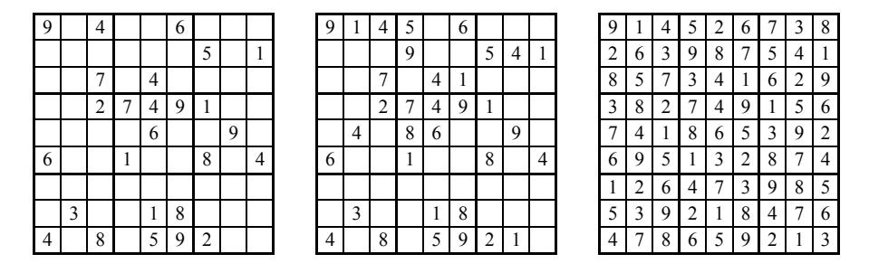

Figure 13. Puzzle Sudogen0-456, its L1 0 elaboration and its solution

```
Resolution path in L15 for the L14+XY15 (or L1_0) elaboration of Sudogen0-456 row r2 interaction-with-block b2 ==> r1c5 \neq 7, r3c2 \neq 6 block b8 interaction-with-row r7 ==> r7c9 \neq 7, r7c8 \neq 7, r7c7 \neq 7, r7c2 \neq 7, r7c1 \neq 7 naked-pairs-in-a-column {n3 n7} {r1 r5}c7 ==> r8c7 \neq 7, r7c7 \neq 3, r3c7 \neq 3 c4-chain row-col-bl n7r9{c9 c2} - n7{r6c2 r5c1} ==> r5c9 \neq 7 c4-chain col-row-bl n7{r8 r5}c1 - n7{r5c7 r6c8} ==> r8c8 \neq 7 block b9 interaction-with-column c9 ==> r1c9 \neq 7 xyzt5-chain {n3 n2}r6c5 - {n2 n5}r6c6 - {n5 n3}r5c6 - {n3 n7}r5c7 - {n7 n3}r6c8 ==> r6c3 \neq 3 xyzt4-chain {n5 n9}r6c3 - {n9 n6}r8c3 - {n6 n7}r9c2 - {n7 n5}r6c2 ==> r5c3 \neq 5 xyt7-chain {n8 n5}r4c2 - {n5 n9}r6c3 - {n9 n7}r6c2 - {n7 n6}r9c2 - {n6 n3}r9c4 - {n3 n2}r3c4 - {n2 n8}r3c2 ==> r2c2 \neq 8
```

```
xyzt8-chain \{n5\ n6\}r8c8 - \{n6\ n9\}r8c3 - \{n9\ n4\}r8c7 - \{n4\ n2\}r8c4 - \{n2\ n3\}r3c4 - \{n4\ n2\}r8c4 - \{n4\ n2\}r8c4 - \{n4\ n3\}r3c4 - \{n4\ n4\}r8c4 - \{n4\ n4\}r8c4 - \{n4\ n4\}r8c4 - \{n4\ n4\}r8c4 - \{n4\ n4\}r8c4 - \{n4\ n4\}r8c4 - \{n4\ n4\}r8c4 - \{n4\ n4\}r8c4 - \{n4\ n4\}r8c4 - \{n4\ n4\}r8c4 - \{n4\ n4\}r8c4 - \{n4\ n4\}r8c4 - \{n4\ n4\}r8c4 - \{n4\ n4\}r8c4 - \{n4\ n4\}r8c4 - \{n4\ n4\}r8c4 - \{n4\ n4\}r8c4 - \{n4\ n4\}r8c4 - \{n4\ n4\}r8c4 - \{n4\ n4\}r8c4 - \{n4\ n4\}r8c4 - \{n4\ n4\}r8c4 - \{n4\ n4\}r8c4 - \{n4\ n4\}r8c4 - \{n4\ n4\}r8c4 - \{n4\ n4\}r8c4 - \{n4\ n4\}r8c4 - \{n4\ n4\}r8c4 - \{n4\ n4\}r8c4 - \{n4\ n4\}r8c4 - \{n4\ n4\}r8c4 - \{n4\ n4\}r8c4 - \{n4\ n4\}r8c4 - \{n4\ n4\}r8c4 - \{n4\ n4\}r8c4 - \{n4\ n4\}r8c4 - \{n4\ n4\}r8c4 - \{n4\ n4\}r8c4 - \{n4\ n4\}r8c4 - \{n4\ n4\}r8c4 - \{n4\ n4\}r8c4 - \{n4\ n4\}r8c4 - \{n4\ n4\}r8c4 - \{n4\ n4\}r8c4 - \{n4\ n4\}r8c4 - \{n4\ n4\}r8c4 - \{n4\ n4\}r8c4 - \{n4\ n4\}r8c4 - \{n4\ n4\}r8c4 - \{n4\ n4\}r8c4 - \{n4\ n4\}r8c4 - \{n4\ n4\}r8c4 - \{n4\ n4\}r8c4 - \{n4\ n4\}r8c4 - \{n4\ n4\}r8c4 - \{n4\ n4\}r8c4 - \{n4\ n4\}r8c4 - \{n4\ n4\}r8c4 - \{n4\ n4\}r8c4 - \{n4\ n4\}r8c4 - \{n4\ n4\}r8c4 - \{n4\ n4\}r8c4 - \{n4\ n4\}r8c4 - \{n4\ n4\}r8c4 - \{n4\ n4\}r8c4 - \{n4\ n4\}r8c4 - \{n4\ n4\}r8c4 - \{n4\ n4\}r8c4 - \{n4\ n4\}r8c4 - \{n4\ n4\}r8c4 - \{n4\ n4\}r8c4 - \{n4\ n4\}r8c4 - \{n4\ n4\}r8c4 - \{n4\ n4\}r8c4 - \{n4\ n4\}r8c4 - \{n4\ n4\}r8c4 - \{n4\ n4\}r8c4 - \{n4\ n4\}r8c4 - \{n4\ n4\}r8c4 - \{n4\ n4\}r8c4 - \{n4\ n4\}r8c4 - \{n4\ n4\}r8c4 - \{n4\ n4\}r8c4 - \{n4\ n4\}r8c4 - \{n4\ n4\}r8c4 - \{n4\ n4\}r8c4 - \{n4\ n4\}r8c4 - \{n4\ n4\}r8c4 - \{n4\ n4\}r8c4 - \{n4\ n4\}r8c4 - \{n4\ n4\}r8c4 - \{n4\ n4\}r8c4 - \{n4\ n4\}r8c4 - \{n4\ n4\}r8c4 - \{n4\ n4\}r8c4 - \{n4\ n4\}r8c4 - \{n4\ n4\}r8c4 - \{n4\ n4\}r8c4 - \{n4\ n4\}r8c4 - \{n4\ n4\}r8c4 - \{n4\ n4\}r8c4 - \{n4\ n4\}r8c4 - \{n4\ n4\}r8c4 - \{n4\ n4\}r8c4 - \{n4\ n4\}r8c4 - \{n4\ n4\}r8c4 - \{n4\ n4\}r8c4 - \{n4\ n4\}r8c4 - \{n4\ n4\}r8c4 - \{n4\ n4\}r8c4 - \{n4\ n4\}r8c4 - \{n4\ n4\}r8c4 - \{n4\ n4\}r8c4 - \{n4\ n4\}r8c4 - \{n4\ n4\}r8c4 - \{n4\ n4\}r8c4 - \{n4\ n4\}r8c4 - \{n4\ n4\}r8c4 - \{n4\ n4\}r8c4 - \{n4\ n4\}r8c4 - \{n4\ n4\}r8c4 - \{n4\ n4\}r8c4 - \{n4\ n4\}r8c4 - \{n4\ n4\}r8c4 - \{n4\ n4\}r8c4 - \{n4\ n4\}r8c4 - \{n4\ n4\}r8c4 - \{n4\ 
    \{n3 \ n6\}r9c4 - \{n6 \ n7\}r9c2 - \{n7 \ n5\}r8c1 \Longrightarrow r8c9 \neq 5
xyzt8-chain \{n3\ n2\}r6c5-\{n2\ n5\}r6c6-\{n5\ n9\}r6c3-\{n9\ n7\}r6c2-\{n7\ n6\}r9c2-\{n7\ n6\}r9c2-\{n7\ n6\}r9c2-\{n7\ n6\}r9c2-\{n7\ n6\}r9c2-\{n7\ n6\}r9c2-\{n7\ n6\}r9c2-\{n7\ n6\}r9c2-\{n7\ n6\}r9c2-\{n7\ n6\}r9c2-\{n7\ n6\}r9c2-\{n7\ n6\}r9c2-\{n7\ n6\}r9c2-\{n7\ n6\}r9c2-\{n7\ n6\}r9c2-\{n7\ n6\}r9c2-\{n7\ n6\}r9c2-\{n7\ n6\}r9c2-\{n7\ n6\}r9c2-\{n7\ n6\}r9c2-\{n7\ n6\}r9c2-\{n7\ n6\}r9c2-\{n7\ n6\}r9c2-\{n7\ n6\}r9c2-\{n7\ n6\}r9c2-\{n7\ n6\}r9c2-\{n7\ n6\}r9c2-\{n7\ n6\}r9c2-\{n7\ n6\}r9c2-\{n7\ n6\}r9c2-\{n7\ n6\}r9c2-\{n7\ n6\}r9c2-\{n7\ n6\}r9c2-\{n7\ n6\}r9c2-\{n7\ n6\}r9c2-\{n7\ n6\}r9c2-\{n7\ n6\}r9c2-\{n7\ n6\}r9c2-\{n7\ n6\}r9c2-\{n7\ n6\}r9c2-\{n7\ n6\}r9c2-\{n7\ n6\}r9c2-\{n7\ n6\}r9c2-\{n7\ n6\}r9c2-\{n7\ n6\}r9c2-\{n7\ n6\}r9c2-\{n7\ n6\}r9c2-\{n7\ n6\}r9c2-\{n7\ n6\}r9c2-\{n7\ n6\}r9c2-\{n7\ n6\}r9c2-\{n7\ n6\}r9c2-\{n7\ n6\}r9c2-\{n7\ n6\}r9c2-\{n7\ n6\}r9c2-\{n7\ n6\}r9c2-\{n7\ n6\}r9c2-\{n7\ n6\}r9c2-\{n7\ n6\}r9c2-\{n7\ n6\}r9c2-\{n7\ n6\}r9c2-\{n7\ n6\}r9c2-\{n7\ n6\}r9c2-\{n7\ n6\}r9c2-\{n7\ n6\}r9c2-\{n7\ n6\}r9c2-\{n7\ n6\}r9c2-\{n7\ n6\}r9c2-\{n7\ n6\}r9c2-\{n7\ n6\}r9c2-\{n7\ n6\}r9c2-\{n7\ n6\}r9c2-\{n7\ n6\}r9c2-\{n7\ n6\}r9c2-\{n7\ n6\}r9c2-\{n7\ n6\}r9c2-\{n7\ n6\}r9c2-\{n7\ n6\}r9c2-\{n7\ n6\}r9c2-\{n7\ n6\}r9c2-\{n7\ n6\}r9c2-\{n7\ n6\}r9c2-\{n7\ n6\}r9c2-\{n7\ n6\}r9c2-\{n7\ n6\}r9c2-\{n7\ n6\}r9c2-\{n7\ n6\}r9c2-\{n7\ n6\}r9c2-\{n7\ n6\}r9c2-\{n7\ n6\}r9c2-\{n7\ n6\}r9c2-\{n7\ n6\}r9c2-\{n7\ n6\}r9c2-\{n7\ n6\}r9c2-\{n7\ n6\}r9c2-\{n7\ n6\}r9c2-\{n7\ n6\}r9c2-\{n7\ n6\}r9c2-\{n7\ n6\}r9c2-\{n7\ n6\}r9c2-\{n7\ n6\}r9c2-\{n7\ n6\}r9c2-\{n7\ n6\}r9c2-\{n7\ n6\}r9c2-\{n7\ n6\}r9c2-\{n7\ n6\}r9c2-\{n7\ n6\}r9c2-\{n7\ n6\}r9c2-\{n7\ n6\}r9c2-\{n7\ n6\}r9c2-\{n7\ n6\}r9c2-\{n7\ n6\}r9c2-\{n7\ n6\}r9c2-\{n7\ n6\}r9c2-\{n7\ n6\}r9c2-\{n7\ n6\}r9c2-\{n7\ n6\}r9c2-\{n7\ n6\}r9c2-\{n7\ n6\}r9c2-\{n7\ n6\}r9c2-\{n7\ n6\}r9c2-\{n7\ n6\}r9c2-\{n7\ n6\}r9c2-\{n7\ n6\}r9c2-\{n7\ n6\}r9c2-\{n7\ n6\}r9c2-\{n7\ n6\}r9c2-\{n7\ n6\}r9c2-\{n7\ n6\}r9c2-\{n7\ n6\}r9c2-\{n7\ n6\}r9c2-\{n7\ n6\}r9c2-\{n7\ n6\}r9c2-\{n7\ n6\}r9c2-\{n7\ n6\}r9c2-\{n7\ n6\}r9c2-\{n7\ n6\}r9c2-\{n7\ n6\}r9c2-\{n7\ n6\}r9c2-\{n7\ n6\}r9c2-\{n7\ n6\}r9c2-\{n7\ n6\}r9c2-\{n7\ n6\}r9c2-\{n7\ n6\}r9c2-\{n7\ n6\}r9c2-\{n7\ n6\}r9c2-\{n7\ n6\}r9c2-\{n7\ n6\}r9c2-\{n7\ n6\}r9c2-\{n7\ n6\}r9c2-\{n7\ n6\}r9c2-\{n7\ n6\}r9c2-\{n7\
    \{n6 \ n5\}r8c3 - \{n5 \ n1\}r7c3 - \{n1 \ n3\}r5c3 ==> r5c6 \neq 3
  block b5 interaction-with-row r6 ==> r6c8 \neq 3
  xyt10-chain \{n5 \ n2\}r5c6 - \{n2 \ n3\}r6c5 - \{n3 \ n5\}r6c6 - \{n5 \ n9\}r6c3 - \{n9 \ n7\}r6c2 - \{n5 \ n5\}r6c3 - \{n5 \ n5\}r6c3 - \{n5 \ n5\}r6c3 - \{n5 \ n5\}r6c5 - \{n5 \ n5\}r6c5 - \{n5 \ n5\}r6c5 - \{n5 \ n5\}r6c5 - \{n5 \ n5\}r6c5 - \{n5 \ n5\}r6c5 - \{n5 \ n5\}r6c5 - \{n5 \ n5\}r6c5 - \{n5 \ n5\}r6c5 - \{n5 \ n5\}r6c5 - \{n5 \ n5\}r6c5 - \{n5 \ n5\}r6c5 - \{n5 \ n5\}r6c5 - \{n5 \ n5\}r6c5 - \{n5 \ n5\}r6c5 - \{n5 \ n5\}r6c5 - \{n5 \ n5\}r6c5 - \{n5 \ n5\}r6c5 - \{n5 \ n5\}r6c5 - \{n5 \ n5\}r6c5 - \{n5 \ n5\}r6c5 - \{n5 \ n5\}r6c5 - \{n5 \ n5\}r6c5 - \{n5 \ n5\}r6c5 - \{n5 \ n5\}r6c5 - \{n5 \ n5\}r6c5 - \{n5 \ n5\}r6c5 - \{n5 \ n5\}r6c5 - \{n5 \ n5\}r6c5 - \{n5 \ n5\}r6c5 - \{n5 \ n5\}r6c5 - \{n5 \ n5\}r6c5 - \{n5 \ n5\}r6c5 - \{n5 \ n5\}r6c5 - \{n5 \ n5\}r6c5 - \{n5 \ n5\}r6c5 - \{n5 \ n5\}r6c5 - \{n5 \ n5\}r6c5 - \{n5 \ n5\}r6c5 - \{n5 \ n5\}r6c5 - \{n5 \ n5\}r6c5 - \{n5 \ n5\}r6c5 - \{n5 \ n5\}r6c5 - \{n5 \ n5\}r6c5 - \{n5 \ n5\}r6c5 - \{n5 \ n5\}r6c5 - \{n5 \ n5\}r6c5 - \{n5 \ n5\}r6c5 - \{n5 \ n5\}r6c5 - \{n5 \ n5\}r6c5 - \{n5 \ n5\}r6c5 - \{n5 \ n5\}r6c5 - \{n5 \ n5\}r6c5 - \{n5 \ n5\}r6c5 - \{n5 \ n5\}r6c5 - \{n5 \ n5\}r6c5 - \{n5 \ n5\}r6c5 - \{n5 \ n5\}r6c5 - \{n5 \ n5\}r6c5 - \{n5 \ n5\}r6c5 - \{n5 \ n5\}r6c5 - \{n5 \ n5\}r6c5 - \{n5 \ n5\}r6c5 - \{n5 \ n5\}r6c5 - \{n5 \ n5\}r6c5 - \{n5 \ n5\}r6c5 - \{n5 \ n5\}r6c5 - \{n5 \ n5\}r6c5 - \{n5 \ n5\}r6c5 - \{n5 \ n5\}r6c5 - \{n5 \ n5\}r6c5 - \{n5 \ n5\}r6c5 - \{n5 \ n5\}r6c5 - \{n5 \ n5\}r6c5 - \{n5 \ n5\}r6c5 - \{n5 \ n5\}r6c5 - \{n5 \ n5\}r6c5 - \{n5 \ n5\}r6c5 - \{n5 \ n5\}r6c5 - \{n5 \ n5\}r6c5 - \{n5 \ n5\}r6c5 - \{n5 \ n5\}r6c5 - \{n5 \ n5\}r6c5 - \{n5 \ n5\}r6c5 - \{n5 \ n5\}r6c5 - \{n5 \ n5\}r6c5 - \{n5 \ n5\}r6c5 - \{n5 \ n5\}r6c5 - \{n5 \ n5\}r6c5 - \{n5 \ n5\}r6c5 - \{n5 \ n5\}r6c5 - \{n5 \ n5\}r6c5 - \{n5 \ n5\}r6c5 - \{n5 \ n5\}r6c5 - \{n5 \ n5\}r6c5 - \{n5 \ n5\}r6c5 - \{n5 \ n5\}r6c5 - \{n5 \ n5\}r6c5 - \{n5 \ n5\}r6c5 - \{n5 \ n5\}r6c5 - \{n5 \ n5\}r6c5 - \{n5 \ n5\}r6c5 - \{n5 \ n5\}r6c5 - \{n5 \ n5\}r6c5 - \{n5 \ n5\}r6c5 - \{n5 \ n5\}r6c5 - \{n5 \ n5\}r6c5 - \{n5 \ n5\}r6c5 - \{n5 \ n5\}r6c5 - \{n5 \ n5\}r6c5 - \{n5 \ n5\}r6c5 - \{n5 \ n5\}r6c5 - \{n5 \ n5\}r6c5 - \{n5 \ n5\}r6c5 - \{n5 \ n5\}r6c5 - \{n5 \ n5\}r6c5 - \{n5 \ n5\}r6c5 - \{n5 \ n5\}r6c5 - \{n5 \ n5\}r6c5 
    \{n7 \ n6\} r9c2 - \{n6 \ n5\} r8c3 - \{n5 \ n1\} r7c3 - \{n1 \ n3\} r5c3 - \{n3 \ n5\} r5c9 ==> r5c1 \neq 5
  hidden-pairs-in-a-row \{n2 \ n5\}\ r5\{c6 \ c9\} \Longrightarrow r5c9 \neq 3
  xyt9-chain \{n2 \ n5\}r5c9 - \{n5 \ n2\}r5c6 - \{n2 \ n3\}r6c5 - \{n3 \ n5\}r6c6 - \{n5 \ n9\}r6c3 - \{n5 \ n5\}r6c6 - \{n5 \ n5\}r6c6 - \{n5 \ n5\}r6c6 - \{n5 \ n5\}r6c6 - \{n5 \ n5\}r6c6 - \{n5 \ n5\}r6c6 - \{n5 \ n5\}r6c6 - \{n5 \ n5\}r6c6 - \{n5 \ n5\}r6c6 - \{n5 \ n5\}r6c6 - \{n5 \ n5\}r6c6 - \{n5 \ n5\}r6c6 - \{n5 \ n5\}r6c6 - \{n5 \ n5\}r6c6 - \{n5 \ n5\}r6c6 - \{n5 \ n5\}r6c6 - \{n5 \ n5\}r6c6 - \{n5 \ n5\}r6c6 - \{n5 \ n5\}r6c6 - \{n5 \ n5\}r6c6 - \{n5 \ n5\}r6c6 - \{n5 \ n5\}r6c6 - \{n5 \ n5\}r6c6 - \{n5 \ n5\}r6c6 - \{n5 \ n5\}r6c6 - \{n5 \ n5\}r6c6 - \{n5 \ n5\}r6c6 - \{n5 \ n5\}r6c6 - \{n5 \ n5\}r6c6 - \{n5 \ n5\}r6c6 - \{n5 \ n5\}r6c6 - \{n5 \ n5\}r6c6 - \{n5 \ n5\}r6c6 - \{n5 \ n5\}r6c6 - \{n5 \ n5\}r6c6 - \{n5 \ n5\}r6c6 - \{n5 \ n5\}r6c6 - \{n5 \ n5\}r6c6 - \{n5 \ n5\}r6c6 - \{n5 \ n5\}r6c6 - \{n5 \ n5\}r6c6 - \{n5 \ n5\}r6c6 - \{n5 \ n5\}r6c6 - \{n5 \ n5\}r6c6 - \{n5 \ n5\}r6c6 - \{n5 \ n5\}r6c6 - \{n5 \ n5\}r6c6 - \{n5 \ n5\}r6c6 - \{n5 \ n5\}r6c6 - \{n5 \ n5\}r6c6 - \{n5 \ n5\}r6c6 - \{n5 \ n5\}r6c6 - \{n5 \ n5\}r6c6 - \{n5 \ n5\}r6c6 - \{n5 \ n5\}r6c6 - \{n5 \ n5\}r6c6 - \{n5 \ n5\}r6c6 - \{n5 \ n5\}r6c6 - \{n5 \ n5\}r6c6 - \{n5 \ n5\}r6c6 - \{n5 \ n5\}r6c6 - \{n5 \ n5\}r6c6 - \{n5 \ n5\}r6c6 - \{n5 \ n5\}r6c6 - \{n5 \ n5\}r6c6 - \{n5 \ n5\}r6c6 - \{n5 \ n5\}r6c6 - \{n5 \ n5\}r6c6 - \{n5 \ n5\}r6c6 - \{n5 \ n5\}r6c6 - \{n5 \ n5\}r6c6 - \{n5 \ n5\}r6c6 - \{n5 \ n5\}r6c6 - \{n5 \ n5\}r6c6 - \{n5 \ n5\}r6c6 - \{n5 \ n5\}r6c6 - \{n5 \ n5\}r6c6 - \{n5 \ n5\}r6c6 - \{n5 \ n5\}r6c6 - \{n5 \ n5\}r6c6 - \{n5 \ n5\}r6c6 - \{n5 \ n5\}r6c6 - \{n5 \ n5\}r6c6 - \{n5 \ n5\}r6c6 - \{n5 \ n5\}r6c6 - \{n5 \ n5\}r6c6 - \{n5 \ n5\}r6c6 - \{n5 \ n5\}r6c6 - \{n5 \ n5\}r6c6 - \{n5 \ n5\}r6c6 - \{n5 \ n5\}r6c6 - \{n5 \ n5\}r6c6 - \{n5 \ n5\}r6c6 - \{n5 \ n5\}r6c6 - \{n5 \ n5\}r6c6 - \{n5 \ n5\}r6c6 - \{n5 \ n5\}r6c6 - \{n5 \ n5\}r6c6 - \{n5 \ n5\}r6c6 - \{n5 \ n5\}r6c6 - \{n5 \ n5\}r6c6 - \{n5 \ n5\}r6c6 - \{n5 \ n5\}r6c6 - \{n5 \ n5\}r6c6 - \{n5 \ n5\}r6c6 - \{n5 \ n5\}r6c6 - \{n5 \ n5\}r6c6 - \{n5 \ n5\}r6c6 - \{n5 \ n5\}r6c6 - \{n5 \ n5\}r6c6 - \{n5 \ n5\}r6c6 - \{n5 \ n5\}r6c6 - \{n5 \ n5\}r6c6 - \{n5 \ n5\}r6c6 - \{n5 \ n5\}r6c6 - \{n5 \ n5\}r6c6 - \{n5 \ n5\}r6c6 - \{n5 \ n5\}r6c6 - \{n5 \ n5\}r6c6 - \{n5 \ n5\}r6c6 - \{n5 \ n5\}r6c6 - \{n5 \ n5\}r6c6 -
    \{n9 \ n7\} \ r6c2 - \{n7 \ n6\} \ r9c2 - \{n6 \ n3\} \ r9c4 - \{n3 \ n2\} \ r3c4 \Longrightarrow r3c9 \neq 2
  xyt15-chain n8 n5r4c2 - n5 n9r6c3 - n9 n7r6c2 - n7 n6r9c2 - n6 n2r2c2 -
    \{n2\ n9\}r^7c^2 - \{n9\ n5\}r^8c^3 - \{n5\ n6\}r^8c^8 - \{n6\ n4\}r^7c^7 - \{n4\ n9\}r^8c^7 - \{n9\ n7\}r^8c^9 - \{n6\ n4\}r^7c^7 - \{n4\ n9\}r^8c^7 - \{n9\ n7\}r^8c^9 - \{n6\ n4\}r^8c^9 - \{n6\ n4\}r^8c^9 - \{n6\ n4\}r^8c^9 - \{n6\ n4\}r^8c^9 - \{n6\ n4\}r^8c^9 - \{n6\ n4\}r^8c^9 - \{n6\ n4\}r^8c^9 - \{n6\ n4\}r^8c^9 - \{n6\ n4\}r^8c^9 - \{n6\ n4\}r^8c^9 - \{n6\ n4\}r^8c^9 - \{n6\ n4\}r^8c^9 - \{n6\ n4\}r^8c^9 - \{n6\ n4\}r^8c^9 - \{n6\ n4\}r^8c^9 - \{n6\ n4\}r^8c^9 - \{n6\ n4\}r^8c^9 - \{n6\ n4\}r^8c^9 - \{n6\ n4\}r^8c^9 - \{n6\ n4\}r^8c^9 - \{n6\ n4\}r^8c^9 - \{n6\ n4\}r^8c^9 - \{n6\ n4\}r^8c^9 - \{n6\ n4\}r^8c^9 - \{n6\ n4\}r^8c^9 - \{n6\ n4\}r^8c^9 - \{n6\ n4\}r^8c^9 - \{n6\ n4\}r^8c^9 - \{n6\ n4\}r^8c^9 - \{n6\ n4\}r^8c^9 - \{n6\ n4\}r^8c^9 - \{n6\ n4\}r^8c^9 - \{n6\ n4\}r^8c^9 - \{n6\ n4\}r^8c^9 - \{n6\ n4\}r^8c^9 - \{n6\ n4\}r^8c^9 - \{n6\ n4\}r^8c^9 - \{n6\ n4\}r^8c^9 - \{n6\ n4\}r^8c^9 - \{n6\ n4\}r^8c^9 - \{n6\ n4\}r^8c^9 - \{n6\ n4\}r^8c^9 - \{n6\ n4\}r^8c^9 - \{n6\ n4\}r^8c^9 - \{n6\ n4\}r^8c^9 - \{n6\ n4\}r^8c^9 - \{n6\ n4\}r^8c^9 - \{n6\ n4\}r^8c^9 - \{n6\ n4\}r^8c^9 - \{n6\ n4\}r^8c^9 - \{n6\ n4\}r^8c^9 - \{n6\ n4\}r^8c^9 - \{n6\ n4\}r^8c^9 - \{n6\ n4\}r^8c^9 - \{n6\ n4\}r^8c^9 - \{n6\ n4\}r^8c^9 - \{n6\ n4\}r^8c^9 - \{n6\ n4\}r^8c^9 - \{n6\ n4\}r^8c^9 - \{n6\ n4\}r^8c^9 - \{n6\ n4\}r^8c^9 - \{n6\ n4\}r^8c^9 - \{n6\ n4\}r^8c^9 - \{n6\ n4\}r^8c^9 - \{n6\ n4\}r^8c^9 - \{n6\ n4\}r^8c^9 - \{n6\ n4\}r^8c^9 - \{n6\ n4\}r^8c^9 - \{n6\ n4\}r^8c^9 - \{n6\ n4\}r^8c^9 - \{n6\ n4\}r^8c^9 - \{n6\ n4\}r^8c^9 - \{n6\ n4\}r^8c^9 - \{n6\ n4\}r^8c^9 - \{n6\ n4\}r^8c^9 - \{n6\ n4\}r^8c^9 - \{n6\ n4\}r^8c^9 - \{n6\ n4\}r^8c^9 - \{n6\ n4\}r^8c^9 - \{n6\ n4\}r^8c^9 - \{n6\ n4\}r^8c^9 - \{n6\ n4\}r^8c^9 - \{n6\ n4\}r^8c^9 - \{n6\ n4\}r^8c^9 - \{n6\ n4\}r^8c^9 - \{n6\ n4\}r^8c^9 - \{n6\ n4\}r^8c^9 - \{n6\ n4\}r^8c^9 - \{n6\ n4\}r^8c^9 - \{n6\ n4\}r^8c^9 - \{n6\ n4\}r^8c^9 - \{n6\ n4\}r^8c^9 - \{n6\ n4\}r^8c^9 - \{n6\ n4\}r^8c^9 - \{n6\ n4\}r^8c^9 - \{n6\ n4\}r^8c^9 - \{n6\ n4\}r^8c^9 - \{n6\ n4\}r^8c^9 - \{n6\ n4\}r^8c^9 - \{n6\ n4\}r^8c^9 - \{n6\ n4\}r^8c^9 - \{n6\ n4\}r^8c^9 - \{n6\ n4\}r^8c^9 - \{n6\ n4\}r^8c^9 - \{n6\ n4\}r^8c^9 - \{n6\ n4\}r^8c^9 - \{n6\ n4\}r^8c^9 - \{n6\ n4\}r^8c^9 - \{n6\ n4\}r^8c^9 - \{n6\ n4\}r^8c^9 - \{n6\ n4\}r^8c^9 - \{n6\
    {n7 n2}r8c1 - {n2 n1}r7c1 - {n1 n3}r5c1 - {n3 n8}r2c1 ==> r4c1 \neq 8
  hidden-single-in-a-block ==> r4c2 = 8
  xyzt6-chain \{n5 \ n3\}r4c1 - \{n3 \ n1\}r5c3 - \{n1 \ n7\}r5c1 - \{n7 \ n2\}r8c1 - \{n2 \ n8\}r2c1 - \{n3 \ n7\}r5c1 - \{n4 \ n7\}r8c1 - \{n4 \ n8\}r2c1 - \{n5 \ n8\}r2c1 - \{n5 \ n8\}r2c1 - \{n5 \ n8\}r2c1 - \{n5 \ n8\}r2c1 - \{n5 \ n8\}r2c1 - \{n5 \ n8\}r2c1 - \{n5 \ n8\}r2c1 - \{n5 \ n8\}r2c1 - \{n5 \ n8\}r2c1 - \{n5 \ n8\}r2c1 - \{n5 \ n8\}r2c1 - \{n5 \ n8\}r2c1 - \{n5 \ n8\}r2c1 - \{n5 \ n8\}r2c1 - \{n5 \ n8\}r2c1 - \{n5 \ n8\}r2c1 - \{n5 \ n8\}r2c1 - \{n5 \ n8\}r2c1 - \{n5 \ n8\}r2c1 - \{n5 \ n8\}r2c1 - \{n5 \ n8\}r2c1 - \{n5 \ n8\}r2c1 - \{n5 \ n8\}r2c1 - \{n5 \ n8\}r2c1 - \{n5 \ n8\}r2c1 - \{n5 \ n8\}r2c1 - \{n5 \ n8\}r2c1 - \{n5 \ n8\}r2c1 - \{n5 \ n8\}r2c1 - \{n5 \ n8\}r2c1 - \{n5 \ n8\}r2c1 - \{n5 \ n8\}r2c1 - \{n5 \ n8\}r2c1 - \{n5 \ n8\}r2c1 - \{n5 \ n8\}r2c1 - \{n5 \ n8\}r2c1 - \{n5 \ n8\}r2c1 - \{n5 \ n8\}r2c1 - \{n5 \ n8\}r2c1 - \{n5 \ n8\}r2c1 - \{n5 \ n8\}r2c1 - \{n5 \ n8\}r2c1 - \{n5 \ n8\}r2c1 - \{n5 \ n8\}r2c1 - \{n5 \ n8\}r2c1 - \{n5 \ n8\}r2c1 - \{n5 \ n8\}r2c1 - \{n5 \ n8\}r2c1 - \{n5 \ n8\}r2c1 - \{n5 \ n8\}r2c1 - \{n5 \ n8\}r2c1 - \{n5 \ n8\}r2c1 - \{n5 \ n8\}r2c1 - \{n5 \ n8\}r2c1 - \{n5 \ n8\}r2c1 - \{n5 \ n8\}r2c1 - \{n5 \ n8\}r2c1 - \{n5 \ n8\}r2c1 - \{n5 \ n8\}r2c1 - \{n5 \ n8\}r2c1 - \{n5 \ n8\}r2c1 - \{n5 \ n8\}r2c1 - \{n5 \ n8\}r2c1 - \{n5 \ n8\}r2c1 - \{n5 \ n8\}r2c1 - \{n5 \ n8\}r2c1 - \{n5 \ n8\}r2c1 - \{n5 \ n8\}r2c1 - \{n5 \ n8\}r2c1 - \{n5 \ n8\}r2c1 - \{n5 \ n8\}r2c1 - \{n5 \ n8\}r2c1 - \{n5 \ n8\}r2c1 - \{n5 \ n8\}r2c1 - \{n5 \ n8\}r2c1 - \{n5 \ n8\}r2c1 - \{n5 \ n8\}r2c1 - \{n5 \ n8\}r2c1 - \{n5 \ n8\}r2c1 - \{n5 \ n8\}r2c1 - \{n5 \ n8\}r2c1 - \{n5 \ n8\}r2c1 - \{n5 \ n8\}r2c1 - \{n5 \ n8\}r2c1 - \{n5 \ n8\}r2c1 - \{n5 \ n8\}r2c1 - \{n5 \ n8\}r2c1 - \{n5 \ n8\}r2c1 - \{n5 \ n8\}r2c1 - \{n5 \ n8\}r2c1 - \{n5 \ n8\}r2c1 - \{n5 \ n8\}r2c1 - \{n5 \ n8\}r2c1 - \{n5 \ n8\}r2c1 - \{n5 \ n8\}r2c1 - \{n5 \ n8\}r2c1 - \{n5 \ n8\}r2c1 - \{n5 \ n8\}r2c1 - \{n5 \ n8\}r2c1 - \{n5 \ n8\}r2c1 - \{n5 \ n8\}r2c1 - \{n5 \ n8\}r2c1 - \{n5 \ n8\}r2c1 - \{n5 \ n8\}r2c1 - \{n5 \ n8\}r2c1 - \{n5 \ n8\}r2c1 - \{n5 \ n8\}r2c1 - \{n5 \ n8\}r2c1 - \{n5 \ n8\}r2c1 - \{n5 \ n8\}r2c1 - \{n5 \ n8\}r2c1 - \{n5 \ n8\}r2c1 - \{n5 \ n8\}r2c1 - \{n5 \ n8\}r2c1 - \{n5 \ n8\}r2c1 - \{n5 \ n8\}r2c1 - \{n5 \ n8\}r2c1 - \{n5 \ n8\}r2c1 - \{n5 \ n8\}r2c1 
    \{n8 \ n5\}\ r3c1 ==> r7c1 \neq 5
  xyt7-chain \{n3 \ n5\}r4c1 - \{n5 \ n9\}r6c3 - \{n9 \ n7\}r6c2 - \{n7 \ n6\}r9c2 - \{n6 \ n5\}r8c3 - \{n7 \ n6\}r8c3 - \{n7 \ n6\}r8c3 - \{n7 \ n6\}r8c3 - \{n7 \ n6\}r8c3 - \{n7 \ n6\}r8c3 - \{n7 \ n6\}r8c3 - \{n7 \ n6\}r8c3 - \{n7 \ n6\}r8c3 - \{n7 \ n6\}r8c3 - \{n7 \ n6\}r8c3 - \{n7 \ n6\}r8c3 - \{n7 \ n6\}r8c3 - \{n7 \ n6\}r8c3 - \{n7 \ n6\}r8c3 - \{n7 \ n6\}r8c3 - \{n7 \ n6\}r8c3 - \{n7 \ n6\}r8c3 - \{n7 \ n6\}r8c3 - \{n7 \ n6\}r8c3 - \{n7 \ n6\}r8c3 - \{n7 \ n6\}r8c3 - \{n7 \ n6\}r8c3 - \{n7 \ n6\}r8c3 - \{n7 \ n6\}r8c3 - \{n7 \ n6\}r8c3 - \{n7 \ n6\}r8c3 - \{n7 \ n6\}r8c3 - \{n7 \ n6\}r8c3 - \{n7 \ n6\}r8c3 - \{n7 \ n6\}r8c3 - \{n7 \ n6\}r8c3 - \{n7 \ n6\}r8c3 - \{n7 \ n6\}r8c3 - \{n7 \ n6\}r8c3 - \{n7 \ n6\}r8c3 - \{n7 \ n6\}r8c3 - \{n7 \ n6\}r8c3 - \{n7 \ n6\}r8c3 - \{n7 \ n6\}r8c3 - \{n7 \ n6\}r8c3 - \{n7 \ n6\}r8c3 - \{n7 \ n6\}r8c3 - \{n7 \ n6\}r8c3 - \{n7 \ n6\}r8c3 - \{n7 \ n6\}r8c3 - \{n7 \ n6\}r8c3 - \{n7 \ n6\}r8c3 - \{n7 \ n6\}r8c3 - \{n7 \ n6\}r8c3 - \{n7 \ n6\}r8c3 - \{n7 \ n6\}r8c3 - \{n7 \ n6\}r8c3 - \{n7 \ n6\}r8c3 - \{n7 \ n6\}r8c3 - \{n7 \ n6\}r8c3 - \{n7 \ n6\}r8c3 - \{n7 \ n6\}r8c3 - \{n7 \ n6\}r8c3 - \{n7 \ n6\}r8c3 - \{n7 \ n6\}r8c3 - \{n7 \ n6\}r8c3 - \{n7 \ n6\}r8c3 - \{n7 \ n6\}r8c3 - \{n7 \ n6\}r8c3 - \{n7 \ n6\}r8c3 - \{n7 \ n6\}r8c3 - \{n7 \ n6\}r8c3 - \{n7 \ n6\}r8c3 - \{n7 \ n6\}r8c3 - \{n7 \ n6\}r8c3 - \{n7 \ n6\}r8c3 - \{n7 \ n6\}r8c3 - \{n7 \ n6\}r8c3 - \{n7 \ n6\}r8c3 - \{n7 \ n6\}r8c3 - \{n7 \ n6\}r8c3 - \{n7 \ n6\}r8c3 - \{n7 \ n6\}r8c3 - \{n7 \ n6\}r8c3 - \{n7 \ n6\}r8c3 - \{n7 \ n6\}r8c3 - \{n7 \ n6\}r8c3 - \{n7 \ n6\}r8c3 - \{n7 \ n6\}r8c3 - \{n7 \ n6\}r8c3 - \{n7 \ n6\}r8c3 - \{n7 \ n6\}r8c3 - \{n7 \ n6\}r8c3 - \{n7 \ n6\}r8c3 - \{n7 \ n6\}r8c3 - \{n7 \ n6\}r8c3 - \{n7 \ n6\}r8c3 - \{n7 \ n6\}r8c3 - \{n7 \ n6\}r8c3 - \{n7 \ n6\}r8c3 - \{n7 \ n6\}r8c3 - \{n7 \ n6\}r8c3 - \{n7 \ n6\}r8c3 - \{n7 \ n6\}r8c3 - \{n7 \ n6\}r8c3 - \{n7 \ n6\}r8c3 - \{n7 \ n6\}r8c3 - \{n7 \ n6\}r8c3 - \{n7 \ n6\}r8c3 - \{n7 \ n6\}r8c3 - \{n7 \ n6\}r8c3 - \{n7 \ n6\}r8c3 - \{n7 \ n6\}r8c3 - \{n7 \ n6\}r8c3 - \{n7 \ n6\}r8c3 - \{n7 \ n6\}r8c3 - \{n7 \ n6\}r8c3 - \{n7 \ n6\}r8c3 - \{n7 \ n6\}r8c3 - \{n7 \ n6\}r8c3 - \{n7 \ n6\}r8c3 - \{n7 \ n6\}r8c3 - \{n7 \ n6\}r8c3 - \{n7 \ n6\}r8c3 - \{n7 \ n6\}r8c3 - \{n7 \ n6\}r8c3 - \{n7 \ n6\}r8c3 -
    \{n5 \ n6\} \ r8c8 - \{n6 \ n3\} \ r4c8 =  r4c9 \neq 3
xyt7-chain \{n3 \ n5\}r4c1 - \{n5 \ n9\}r6c3 - \{n9 \ n7\}r6c2 - \{n7 \ n6\}r9c2 - \{n6 \ n5\}r8c3 - \{n9 \ n7\}r6c3 - \{n9 \ n7\}r6c3 - \{n9 \ n7\}r6c3 - \{n9 \ n7\}r6c3 - \{n9 \ n7\}r6c3 - \{n9 \ n7\}r6c3 - \{n9 \ n7\}r6c3 - \{n9 \ n7\}r6c3 - \{n9 \ n7\}r6c3 - \{n9 \ n7\}r6c3 - \{n9 \ n7\}r6c3 - \{n9 \ n7\}r6c3 - \{n9 \ n7\}r6c3 - \{n9 \ n7\}r6c3 - \{n9 \ n7\}r6c3 - \{n9 \ n7\}r6c3 - \{n9 \ n7\}r6c3 - \{n9 \ n7\}r6c3 - \{n9 \ n7\}r6c3 - \{n9 \ n7\}r6c3 - \{n9 \ n7\}r6c3 - \{n9 \ n7\}r6c3 - \{n9 \ n7\}r6c3 - \{n9 \ n7\}r6c3 - \{n9 \ n7\}r6c3 - \{n9 \ n7\}r6c3 - \{n9 \ n7\}r6c3 - \{n9 \ n7\}r6c3 - \{n9 \ n7\}r6c3 - \{n9 \ n7\}r6c3 - \{n9 \ n7\}r6c3 - \{n9 \ n7\}r6c3 - \{n9 \ n7\}r6c3 - \{n9 \ n7\}r6c3 - \{n9 \ n7\}r6c3 - \{n9 \ n7\}r6c3 - \{n9 \ n7\}r6c3 - \{n9 \ n7\}r6c3 - \{n9 \ n7\}r6c3 - \{n9 \ n7\}r6c3 - \{n9 \ n7\}r6c3 - \{n9 \ n7\}r6c3 - \{n9 \ n7\}r6c3 - \{n9 \ n7\}r6c3 - \{n9 \ n7\}r6c3 - \{n9 \ n7\}r6c3 - \{n9 \ n7\}r6c3 - \{n9 \ n7\}r6c3 - \{n9 \ n7\}r6c3 - \{n9 \ n7\}r6c3 - \{n9 \ n7\}r6c3 - \{n9 \ n7\}r6c3 - \{n9 \ n7\}r6c3 - \{n9 \ n7\}r6c3 - \{n9 \ n7\}r6c3 - \{n9 \ n7\}r6c3 - \{n9 \ n7\}r6c3 - \{n9 \ n7\}r6c3 - \{n9 \ n7\}r6c3 - \{n9 \ n7\}r6c3 - \{n9 \ n7\}r6c3 - \{n9 \ n7\}r6c3 - \{n9 \ n7\}r6c3 - \{n9 \ n7\}r6c3 - \{n9 \ n7\}r6c3 - \{n9 \ n7\}r6c3 - \{n9 \ n7\}r6c3 - \{n9 \ n7\}r6c3 - \{n9 \ n7\}r6c3 - \{n9 \ n7\}r6c3 - \{n9 \ n7\}r6c3 - \{n9 \ n7\}r6c3 - \{n9 \ n7\}r6c3 - \{n9 \ n7\}r6c3 - \{n9 \ n7\}r6c3 - \{n9 \ n7\}r6c3 - \{n9 \ n7\}r6c3 - \{n9 \ n7\}r6c3 - \{n9 \ n7\}r6c3 - \{n9 \ n7\}r6c3 - \{n9 \ n7\}r6c3 - \{n9 \ n7\}r6c3 - \{n9 \ n7\}r6c3 - \{n9 \ n7\}r6c3 - \{n9 \ n7\}r6c3 - \{n9 \ n7\}r6c3 - \{n9 \ n7\}r6c3 - \{n9 \ n7\}r6c3 - \{n9 \ n7\}r6c3 - \{n9 \ n7\}r6c3 - \{n9 \ n7\}r6c3 - \{n9 \ n7\}r6c3 - \{n9 \ n7\}r6c3 - \{n9 \ n7\}r6c3 - \{n9 \ n7\}r6c3 - \{n9 \ n7\}r6c3 - \{n9 \ n7\}r6c3 - \{n9 \ n7\}r6c3 - \{n9 \ n7\}r6c3 - \{n9 \ n7\}r6c3 - \{n9 \ n7\}r6c3 - \{n9 \ n7\}r6c3 - \{n9 \ n7\}r6c3 - \{n9 \ n7\}r6c3 - \{n9 \ n7\}r6c3 - \{n9 \ n7\}r6c3 - \{n9 \ n7\}r6c3 - \{n9 \ n7\}r6c3 - \{n9 \ n7\}r6c3 - \{n9 \ n7\}r6c3 - \{n9 \ n7\}r6c3 - \{n9 \ n7\}r6c3 - \{n9 \ n7\}r6c3 - \{n9 \ n7\}r6c3 - \{n9 \ n7\}r6c3 - \{n9 \ n7\}r6c3 - \{n9 \ n7\}r6c3 - \{n9 \ n7\}r6c3 - \{n9 \ n7\}r6c3 - \{n9 \ n7\}r6c3 - \{n9 \ n7\}r6c3 - \{n9 \ n7\}r6c3 -
    \{n5 \ n1\}\ r7\ c3 - \{n1 \ n3\}\ r5\ c3 \Longrightarrow r5\ c1 \ne 3
  xyt9-chain \{n7 \ n6\}r9c2 - \{n6 \ n2\}r2c2 - \{n2 \ n5\}r3c2 - \{n5 \ n9\}r7c2 - \{n9 \ n5\}r8c3 - \{n6 \ n2\}r8c3 - \{n9 \ n5\}r8c3 - \{n9 \ n5\}r8c3 - \{n9 \ n5\}r8c3 - \{n9 \ n5\}r8c3 - \{n9 \ n5\}r8c3 - \{n9 \ n5\}r8c3 - \{n9 \ n5\}r8c3 - \{n9 \ n5\}r8c3 - \{n9 \ n5\}r8c3 - \{n9 \ n5\}r8c3 - \{n9 \ n5\}r8c3 - \{n9 \ n5\}r8c3 - \{n9 \ n5\}r8c3 - \{n9 \ n5\}r8c3 - \{n9 \ n5\}r8c3 - \{n9 \ n5\}r8c3 - \{n9 \ n5\}r8c3 - \{n9 \ n5\}r8c3 - \{n9 \ n5\}r8c3 - \{n9 \ n5\}r8c3 - \{n9 \ n5\}r8c3 - \{n9 \ n5\}r8c3 - \{n9 \ n5\}r8c3 - \{n9 \ n5\}r8c3 - \{n9 \ n5\}r8c3 - \{n9 \ n5\}r8c3 - \{n9 \ n5\}r8c3 - \{n9 \ n5\}r8c3 - \{n9 \ n5\}r8c3 - \{n9 \ n5\}r8c3 - \{n9 \ n5\}r8c3 - \{n9 \ n5\}r8c3 - \{n9 \ n5\}r8c3 - \{n9 \ n5\}r8c3 - \{n9 \ n5\}r8c3 - \{n9 \ n5\}r8c3 - \{n9 \ n5\}r8c3 - \{n9 \ n5\}r8c3 - \{n9 \ n5\}r8c3 - \{n9 \ n5\}r8c3 - \{n9 \ n5\}r8c3 - \{n9 \ n5\}r8c3 - \{n9 \ n5\}r8c3 - \{n9 \ n5\}r8c3 - \{n9 \ n5\}r8c3 - \{n9 \ n5\}r8c3 - \{n9 \ n5\}r8c3 - \{n9 \ n5\}r8c3 - \{n9 \ n5\}r8c3 - \{n9 \ n5\}r8c3 - \{n9 \ n5\}r8c3 - \{n9 \ n5\}r8c3 - \{n9 \ n5\}r8c3 - \{n9 \ n5\}r8c3 - \{n9 \ n5\}r8c3 - \{n9 \ n5\}r8c3 - \{n9 \ n5\}r8c3 - \{n9 \ n5\}r8c3 - \{n9 \ n5\}r8c3 - \{n9 \ n5\}r8c3 - \{n9 \ n5\}r8c3 - \{n9 \ n5\}r8c3 - \{n9 \ n5\}r8c3 - \{n9 \ n5\}r8c3 - \{n9 \ n5\}r8c3 - \{n9 \ n5\}r8c3 - \{n9 \ n5\}r8c3 - \{n9 \ n5\}r8c3 - \{n9 \ n5\}r8c3 - \{n9 \ n5\}r8c3 - \{n9 \ n5\}r8c3 - \{n9 \ n5\}r8c3 - \{n9 \ n5\}r8c3 - \{n9 \ n5\}r8c3 - \{n9 \ n5\}r8c3 - \{n9 \ n5\}r8c3 - \{n9 \ n5\}r8c3 - \{n9 \ n5\}r8c3 - \{n9 \ n5\}r8c3 - \{n9 \ n5\}r8c3 - \{n9 \ n5\}r8c3 - \{n9 \ n5\}r8c3 - \{n9 \ n5\}r8c3 - \{n9 \ n5\}r8c3 - \{n9 \ n5\}r8c3 - \{n9 \ n5\}r8c3 - \{n9 \ n5\}r8c3 - \{n9 \ n5\}r8c3 - \{n9 \ n5\}r8c3 - \{n9 \ n5\}r8c3 - \{n9 \ n5\}r8c3 - \{n9 \ n5\}r8c3 - \{n9 \ n5\}r8c3 - \{n9 \ n5\}r8c3 - \{n9 \ n5\}r8c3 - \{n9 \ n5\}r8c3 - \{n9 \ n5\}r8c3 - \{n9 \ n5\}r8c3 - \{n9 \ n5\}r8c3 - \{n9 \ n5\}r8c3 - \{n9 \ n5\}r8c3 - \{n9 \ n5\}r8c3 - \{n9 \ n5\}r8c3 - \{n9 \ n5\}r8c3 - \{n9 \ n5\}r8c3 - \{n9 \ n5\}r8c3 - \{n9 \ n5\}r8c3 - \{n9 \ n5\}r8c3 - \{n9 \ n5\}r8c3 - \{n9 \ n5\}r8c3 - \{n9 \ n5\}r8c3 - \{n9 \ n5\}r8c3 - \{n9 \ n5\}r8c3 - \{n9 \ n5\}r8c3 - \{n9 \ n5\}r8c3 - \{n9 \ n5\}r8c3 - \{n9 \ n5\}r8c3 - \{n9 \ n5\}r8c3 - \{n9 \ n5\}r8c3 - \{n9 \ n5\}r8c3 - \{n9 \ n5\}r8c3 -
    \{n5 \ n6\}r8c8 - \{n6 \ n4\}r7c7 - \{n4 \ n9\}r8c7 - \{n9 \ n7\}r8c9 \Longrightarrow r9c9 \neq 7
naked and hidden singles ==> r8c9 = 7, r9c2 = 7, r5c1 = 7, r5c7 = 3, r1c7 = 7, r5c3 = 1,
r7c1 = 1, r6c8 = 7, r5c9 = 2, r5c6 = 5, r4c1 = 3, r2c3 = 3, r2c2 = 6
  naked-pairs-in-a-column \{n5 \ n6\} \{r4 \ r8\} c8 => r7c8 \neq 6, r7c8 \neq 5, r3c8 \neq 6\}
hidden-pairs-in-a-block \{n6 \ n9\} \{r3c7 \ r3c9\} ==> r3c9 \neq 8, r3c9 \neq 3
c4-chain row-col-row n3r9\{c9 c4\} - n3r3\{c4 c8\} ==> r1c9 \neq 3
  ...(Naked-Singles and Hidden-Singles)
```

#### XVII.4.10. Two puzzles in [L15+XY16]+XYT16

|   |   |   | 7 | 8 |   |   |   |   |   |
|---|---|---|---|---|---|---|---|---|---|
|   | 2 | 3 |   |   | 1 |   | 5 |   |   |
|   |   |   |   |   | 6 | 3 |   | 7 |   |
|   |   |   |   |   | 9 | 1 |   | 8 |   |
|   | 3 | 1 |   | 7 |   |   |   |   |   |
| ı |   |   | 9 | 6 |   |   |   |   |   |
|   | 4 |   |   |   |   | 2 | 9 |   | 3 |
|   |   | 5 |   |   |   |   |   |   | 7 |
|   | 1 | 8 |   |   | 7 |   |   |   |   |

|   |   | 7 | 8 |   |   |   |   |   |
|---|---|---|---|---|---|---|---|---|
| 2 | 3 |   |   | 1 | 7 | 5 |   |   |
|   |   | 1 |   | 6 | 3 |   | 7 |   |
|   |   |   |   | 9 | 1 |   | 8 |   |
| 3 | 1 |   | 7 |   |   |   |   |   |
|   |   | 9 | 6 |   |   |   |   |   |
| 4 | 7 | 6 |   | 8 | 2 | 9 |   | 3 |
| 9 | 5 |   |   |   |   | 8 |   | 7 |
| 1 | 8 |   |   | 7 |   |   |   |   |

| 6 | 4 | 7 | 8 | 2 | 5 | 1 | 3 | 9 |
|---|---|---|---|---|---|---|---|---|
| 2 | 3 | 8 | 9 | 1 | 7 | 5 | 4 | 6 |
| 5 | 9 | 1 | 4 | 6 | 3 | 2 | 7 | 8 |
| 7 | 6 | 5 | 2 | 9 | 1 | 3 | 8 | 4 |
| 3 | 1 | 4 | 7 | 5 | 8 | 6 | 9 | 2 |
| 8 | 2 | 9 | 6 | 3 | 4 | 7 | 5 | 1 |
| 4 | 7 | 6 | 5 | 8 | 2 | 9 | 1 | 3 |
| 9 | 5 | 3 | 1 | 4 | 6 | 8 | 2 | 7 |
| 1 | 8 | 2 | 3 | 7 | 9 | 4 | 6 | 5 |

Figure 14. Puzzle Sudogen0-7766, its L3 elaboration and its solution

xyt-chains 277

Puzzle Sudogen0-7766 (Figure 14) provides a relatively simple example of an xyt16-chain although its L15+XY16 elaboration reduces to the L1\_0 elaboration.

```
Resolution path in L16 for the L15+XY16 (or L3) elaboration of Sudogen0-7766
row r5 interaction-with-block b6 ==> r4c9 \neq 6, r4c7 \neq 6
row r2 interaction-with-block b3 ==> r1c9 \neq 6, r1c8 \neq 6, r1c7 \neq 6
column c3 interaction-with-block b4 ==> r6c1 \neq 5, r4c1 \neq 5, r5c3 \neq 2, r4c3 \neq 2
block b9 interaction-with-column c8 \Longrightarrow r6c8 \neq 1, r1c8 \neq 1
naked-triplets-in-a-column \{n4 \ n2 \ n6\} \{r3 \ r5 \ r9\} \ c7 ==> r6c7 \neq 4, r6c7 \neq 2, r4c7 \neq 4, r4c7 \neq 2,
r1c7 \neq 4, r1c7 \neq 2
hxy-cn8-chain \{r3\ r2\}c9n8 - \{r2\ r5\}c3n8 - \{r5\ r6\}c6n8 - \{r6\ r3\}c1n8 - \{r3\ r1\}c1n5 - \{r5\ r6\}c6n8 - \{r6\ r3\}c1n8 - \{r5\ r6\}c6n8 - \{r6\ r3\}c1n8 - \{r5\ r6\}c6n8 - \{r6\ r3\}c1n8 - \{r5\ r6\}c6n8 - \{r6\ r3\}c1n8 - \{r5\ r6\}c6n8 - \{r6\ r6\}c6n8 - \{r6\ r6\}c6n8 - \{r6\ r6\}c6n8 - \{r6\ r6\}c6n8 - \{r6\ r6\}c6n8 - \{r6\ r6\}c6n8 - \{r6\ r6\}c6n8 - \{r6\ r6\}c6n8 - \{r6\ r6\}c6n8 - \{r6\ r6\}c6n8 - \{r6\ r6\}c6n8 - \{r6\ r6\}c6n8 - \{r6\ r6\}c6n8 - \{r6\ r6\}c6n8 - \{r6\ r6\}c6n8 - \{r6\ r6\}c6n8 - \{r6\ r6\}c6n8 - \{r6\ r6\}c6n8 - \{r6\ r6\}c6n8 - \{r6\ r6\}c6n8 - \{r6\ r6\}c6n8 - \{r6\ r6\}c6n8 - \{r6\ r6\}c6n8 - \{r6\ r6\}c6n8 - \{r6\ r6\}c6n8 - \{r6\ r6\}c6n8 - \{r6\ r6\}c6n8 - \{r6\ r6\}c6n8 - \{r6\ r6\}c6n8 - \{r6\ r6\}c6n8 - \{r6\ r6\}c6n8 - \{r6\ r6\}c6n8 - \{r6\ r6\}c6n8 - \{r6\ r6\}c6n8 - \{r6\ r6\}c6n8 - \{r6\ r6\}c6n8 - \{r6\ r6\}c6n8 - \{r6\ r6\}c6n8 - \{r6\ r6\}c6n8 - \{r6\ r6\}c6n8 - \{r6\ r6\}c6n8 - \{r6\ r6\}c6n8 - \{r6\ r6\}c6n8 - \{r6\ r6\}c6n8 - \{r6\ r6\}c6n8 - \{r6\ r6\}c6n8 - \{r6\ r6\}c6n8 - \{r6\ r6\}c6n8 - \{r6\ r6\}c6n8 - \{r6\ r6\}c6n8 - \{r6\ r6\}c6n8 - \{r6\ r6\}c6n8 - \{r6\ r6\}c6n8 - \{r6\ r6\}c6n8 - \{r6\ r6\}c6n8 - \{r6\ r6\}c6n8 - \{r6\ r6\}c6n8 - \{r6\ r6\}c6n8 - \{r6\ r6\}c6n8 - \{r6\ r6\}c6n8 - \{r6\ r6\}c6n8 - \{r6\ r6\}c6n8 - \{r6\ r6\}c6n8 - \{r6\ r6\}c6n8 - \{r6\ r6\}c6n8 - \{r6\ r6\}c6n8 - \{r6\ r6\}c6n8 - \{r6\ r6\}c6n8 - \{r6\ r6\}c6n8 - \{r6\ r6\}c6n8 - \{r6\ r6\}c6n8 - \{r6\ r6\}c6n8 - \{r6\ r6\}c6n8 - \{r6\ r6\}c6n8 - \{r6\ r6\}c6n8 - \{r6\ r6\}c6n8 - \{r6\ r6\}c6n8 - \{r6\ r6\}c6n8 - \{r6\ r6\}c6n8 - \{r6\ r6\}c6n8 - \{r6\ r6\}c6n8 - \{r6\ r6\}c6n8 - \{r6\ r6\}c6n8 - \{r6\ r6\}c6n8 - \{r6\ r6\}c6n8 - \{r6\ r6\}c6n8 - \{r6\ r6\}c6n8 - \{r6\ r6\}c6n8 - \{r6\ r6\}c6n8 - \{r6\ r6\}c6n8 - \{r6\ r6\}c6n8 - \{r6\ r6\}c6n8 - \{r6\ r6\}c6n8 - \{r6\ r6\}c6n8 - \{r6\ r6\}c6n8 - \{r6\ r6\}c6n8 - \{r6\ r6\}c6n8 - \{r6\ r6\}c6n8 - \{r6\ r6\}c6n8 - \{r6\ r6\}c6n8 - \{r6\ r6\}c6n8 - \{r6\ r6\}c6n8 - \{r6\ r6\}c6n8 - \{r6\ r6\}c6n8 - \{r6\ r6\}c6n8 - \{r6\ r6\}c6n8 - \{r6\ r6\}c6n8 - \{r6\ r6\}c6n8 - \{r6\ r6\}c6n8 - \{r6\ r6\}c6n8 - \{r6\ r6\}c6n8 - \{r6\ r6\}c6n8 - \{r6\ r6\}c6n8 - \{r6\ r6\}c6n8 - \{r6\ r6\}c6n8 - \{r6\ r6\}c6n8 - \{r6\ r6\}c6n8 - \{r6\ r6\}c6n8 - \{r6\ r6\}c6n8 - \{r6\ r6\}c6n8 - \{r6\ r6\}c6n8 - \{r6\ 
  \{r1\ r4\}c1n6 - \{r4\ r1\}c2n6 - \{r1\ r3\}c2n9 ==> r3c9 \neq 9
xyt9-chain \{n2\ n4\}r6c2 - \{n4\ n9\}r3c2 - \{n9\ n6\}r1c2 - \{n6\ n5\}r1c1 - \{n5\ n8\}r3c1 - \{n6\ n5\}r3c1 - \{n6\ n5\}r3c1 - \{n6\ n5\}r3c1 - \{n6\ n5\}r3c1 - \{n6\ n5\}r3c1 - \{n6\ n5\}r3c1 - \{n6\ n5\}r3c1 - \{n6\ n5\}r3c1 - \{n6\ n5\}r3c1 - \{n6\ n5\}r3c1 - \{n6\ n5\}r3c1 - \{n6\ n5\}r3c1 - \{n6\ n5\}r3c1 - \{n6\ n5\}r3c1 - \{n6\ n5\}r3c1 - \{n6\ n5\}r3c1 - \{n6\ n5\}r3c1 - \{n6\ n5\}r3c1 - \{n6\ n5\}r3c1 - \{n6\ n5\}r3c1 - \{n6\ n5\}r3c1 - \{n6\ n5\}r3c1 - \{n6\ n5\}r3c1 - \{n6\ n5\}r3c1 - \{n6\ n5\}r3c1 - \{n6\ n5\}r3c1 - \{n6\ n5\}r3c1 - \{n6\ n5\}r3c1 - \{n6\ n5\}r3c1 - \{n6\ n5\}r3c1 - \{n6\ n5\}r3c1 - \{n6\ n5\}r3c1 - \{n6\ n5\}r3c1 - \{n6\ n5\}r3c1 - \{n6\ n5\}r3c1 - \{n6\ n5\}r3c1 - \{n6\ n5\}r3c1 - \{n6\ n5\}r3c1 - \{n6\ n5\}r3c1 - \{n6\ n5\}r3c1 - \{n6\ n5\}r3c1 - \{n6\ n5\}r3c1 - \{n6\ n5\}r3c1 - \{n6\ n5\}r3c1 - \{n6\ n5\}r3c1 - \{n6\ n5\}r3c1 - \{n6\ n5\}r3c1 - \{n6\ n5\}r3c1 - \{n6\ n5\}r3c1 - \{n6\ n5\}r3c1 - \{n6\ n5\}r3c1 - \{n6\ n5\}r3c1 - \{n6\ n5\}r3c1 - \{n6\ n5\}r3c1 - \{n6\ n5\}r3c1 - \{n6\ n5\}r3c1 - \{n6\ n5\}r3c1 - \{n6\ n5\}r3c1 - \{n6\ n5\}r3c1 - \{n6\ n5\}r3c1 - \{n6\ n5\}r3c1 - \{n6\ n5\}r3c1 - \{n6\ n5\}r3c1 - \{n6\ n5\}r3c1 - \{n6\ n5\}r3c1 - \{n6\ n5\}r3c1 - \{n6\ n5\}r3c1 - \{n6\ n5\}r3c1 - \{n6\ n5\}r3c1 - \{n6\ n5\}r3c1 - \{n6\ n5\}r3c1 - \{n6\ n5\}r3c1 - \{n6\ n5\}r3c1 - \{n6\ n5\}r3c1 - \{n6\ n5\}r3c1 - \{n6\ n5\}r3c1 - \{n6\ n5\}r3c1 - \{n6\ n5\}r3c1 - \{n6\ n5\}r3c1 - \{n6\ n5\}r3c1 - \{n6\ n5\}r3c1 - \{n6\ n5\}r3c1 - \{n6\ n5\}r3c1 - \{n6\ n5\}r3c1 - \{n6\ n5\}r3c1 - \{n6\ n5\}r3c1 - \{n6\ n5\}r3c1 - \{n6\ n5\}r3c1 - \{n6\ n5\}r3c1 - \{n6\ n5\}r3c1 - \{n6\ n5\}r3c1 - \{n6\ n5\}r3c1 - \{n6\ n5\}r3c1 - \{n6\ n5\}r3c1 - \{n6\ n5\}r3c1 - \{n6\ n5\}r3c1 - \{n6\ n5\}r3c1 - \{n6\ n5\}r3c1 - \{n6\ n5\}r3c1 - \{n6\ n5\}r3c1 - \{n6\ n5\}r3c1 - \{n6\ n5\}r3c1 - \{n6\ n5\}r3c1 - \{n6\ n5\}r3c1 - \{n6\ n5\}r3c1 - \{n6\ n5\}r3c1 - \{n6\ n5\}r3c1 - \{n6\ n5\}r3c1 - \{n6\ n5\}r3c1 - \{n6\ n5\}r3c1 - \{n6\ n5\}r3c1 - \{n6\ n5\}r3c1 - \{n6\ n5\}r3c1 - \{n6\ n5\}r3c1 - \{n6\ n5\}r3c1 - \{n6\ n5\}r3c1 - \{n6\ n5\}r3c1 - \{n6\ n5\}r3c1 - \{n6\ n5\}r3c1 - \{n6\ n5\}r3c1 - \{n6\ n5\}r3c1 - \{n6\ n5\}r3c1 - \{n6\ n5\}r3c1 - \{n6\ n5\}r3c1 - \{n6\ n5\}r3c1 - \{n6\ n5\}r3c1 - \{n6\ n5\}r3c1 - \{n6\ n5\}r3c1 - \{n6\ n5\}r3c1 - \{n6\ n5\}r3c1 - \{n6\ n
  \{n8 \ n4\}r2c3 - \{n4 \ n9\}r2c4 - \{n9 \ n4\}r1c6 - \{n4 \ n2\}r1c5 \Longrightarrow r6c5 \neq 2
xyzt9-chain \{n2\ n4\}r6c2 - \{n4\ n9\}r3c2 - \{n9\ n6\}r1c2 - \{n6\ n5\}r1c1 - \{n5\ n8\}r3c1 - \{n6\ n5\}r3c1 - \{n6\ n5\}r3c1 - \{n6\ n5\}r3c1 - \{n6\ n5\}r3c1 - \{n6\ n5\}r3c1 - \{n6\ n5\}r3c1 - \{n6\ n5\}r3c1 - \{n6\ n5\}r3c1 - \{n6\ n5\}r3c1 - \{n6\ n5\}r3c1 - \{n6\ n5\}r3c1 - \{n6\ n5\}r3c1 - \{n6\ n5\}r3c1 - \{n6\ n5\}r3c1 - \{n6\ n5\}r3c1 - \{n6\ n5\}r3c1 - \{n6\ n5\}r3c1 - \{n6\ n5\}r3c1 - \{n6\ n5\}r3c1 - \{n6\ n5\}r3c1 - \{n6\ n5\}r3c1 - \{n6\ n5\}r3c1 - \{n6\ n5\}r3c1 - \{n6\ n5\}r3c1 - \{n6\ n5\}r3c1 - \{n6\ n5\}r3c1 - \{n6\ n5\}r3c1 - \{n6\ n5\}r3c1 - \{n6\ n5\}r3c1 - \{n6\ n5\}r3c1 - \{n6\ n5\}r3c1 - \{n6\ n5\}r3c1 - \{n6\ n5\}r3c1 - \{n6\ n5\}r3c1 - \{n6\ n5\}r3c1 - \{n6\ n5\}r3c1 - \{n6\ n5\}r3c1 - \{n6\ n5\}r3c1 - \{n6\ n5\}r3c1 - \{n6\ n5\}r3c1 - \{n6\ n5\}r3c1 - \{n6\ n5\}r3c1 - \{n6\ n5\}r3c1 - \{n6\ n5\}r3c1 - \{n6\ n5\}r3c1 - \{n6\ n5\}r3c1 - \{n6\ n5\}r3c1 - \{n6\ n5\}r3c1 - \{n6\ n5\}r3c1 - \{n6\ n5\}r3c1 - \{n6\ n5\}r3c1 - \{n6\ n5\}r3c1 - \{n6\ n5\}r3c1 - \{n6\ n5\}r3c1 - \{n6\ n5\}r3c1 - \{n6\ n5\}r3c1 - \{n6\ n5\}r3c1 - \{n6\ n5\}r3c1 - \{n6\ n5\}r3c1 - \{n6\ n5\}r3c1 - \{n6\ n5\}r3c1 - \{n6\ n5\}r3c1 - \{n6\ n5\}r3c1 - \{n6\ n5\}r3c1 - \{n6\ n5\}r3c1 - \{n6\ n5\}r3c1 - \{n6\ n5\}r3c1 - \{n6\ n5\}r3c1 - \{n6\ n5\}r3c1 - \{n6\ n5\}r3c1 - \{n6\ n5\}r3c1 - \{n6\ n5\}r3c1 - \{n6\ n5\}r3c1 - \{n6\ n5\}r3c1 - \{n6\ n5\}r3c1 - \{n6\ n5\}r3c1 - \{n6\ n5\}r3c1 - \{n6\ n5\}r3c1 - \{n6\ n5\}r3c1 - \{n6\ n5\}r3c1 - \{n6\ n5\}r3c1 - \{n6\ n5\}r3c1 - \{n6\ n5\}r3c1 - \{n6\ n5\}r3c1 - \{n6\ n5\}r3c1 - \{n6\ n5\}r3c1 - \{n6\ n5\}r3c1 - \{n6\ n5\}r3c1 - \{n6\ n5\}r3c1 - \{n6\ n5\}r3c1 - \{n6\ n5\}r3c1 - \{n6\ n5\}r3c1 - \{n6\ n5\}r3c1 - \{n6\ n5\}r3c1 - \{n6\ n5\}r3c1 - \{n6\ n5\}r3c1 - \{n6\ n5\}r3c1 - \{n6\ n5\}r3c1 - \{n6\ n5\}r3c1 - \{n6\ n5\}r3c1 - \{n6\ n5\}r3c1 - \{n6\ n5\}r3c1 - \{n6\ n5\}r3c1 - \{n6\ n5\}r3c1 - \{n6\ n5\}r3c1 - \{n6\ n5\}r3c1 - \{n6\ n5\}r3c1 - \{n6\ n5\}r3c1 - \{n6\ n5\}r3c1 - \{n6\ n5\}r3c1 - \{n6\ n5\}r3c1 - \{n6\ n5\}r3c1 - \{n6\ n5\}r3c1 - \{n6\ n5\}r3c1 - \{n6\ n5\}r3c1 - \{n6\ n5\}r3c1 - \{n6\ n5\}r3c1 - \{n6\ n5\}r3c1 - \{n6\ n5\}r3c1 - \{n6\ n5\}r3c1 - \{n6\ n5\}r3c1 - \{n6\ n5\}r3c1 - \{n6\ n5\}r3c1 - \{n6\ n5\}r3c1 - \{n6\ n5\}r3c1 - \{n6\ n5\}r3c1 - \{n6\ n5\}r3c1 - \{n6\ n5\}r3c1 - \{n6\ n5\}r3c1 - \{n6\ n5\}r3c1 - \{n6\ 
  \{n8 \ n4\}r2c3 - \{n4 \ n5\}r4c3 - \{n5 \ n4\}r4c9 - \{n4 \ n2\}r3c9 \Longrightarrow r6c9 \neq 2
  xyt16-chain \{n2\ n4\}r6c2 - \{n4\ n5\}r4c3 - \{n5\ n8\}r5c3 - \{n8\ n7\}r6c1 - \{n7\ n6\}r4c1 - \{n7\ n6\}r4c1 - \{n7\ n6\}r4c1 - \{n7\ n6\}r4c1 - \{n7\ n6\}r4c1 - \{n7\ n6\}r4c1 - \{n7\ n6\}r4c1 - \{n7\ n6\}r4c1 - \{n7\ n6\}r4c1 - \{n7\ n6\}r4c1 - \{n7\ n6\}r4c1 - \{n7\ n6\}r4c1 - \{n7\ n6\}r4c1 - \{n7\ n6\}r4c1 - \{n7\ n6\}r4c1 - \{n7\ n6\}r4c1 - \{n7\ n6\}r4c1 - \{n7\ n6\}r4c1 - \{n7\ n6\}r4c1 - \{n7\ n6\}r4c1 - \{n7\ n6\}r4c1 - \{n7\ n6\}r4c1 - \{n7\ n6\}r4c1 - \{n7\ n6\}r4c1 - \{n7\ n6\}r4c1 - \{n7\ n6\}r4c1 - \{n7\ n6\}r4c1 - \{n7\ n6\}r4c1 - \{n7\ n6\}r4c1 - \{n7\ n6\}r4c1 - \{n7\ n6\}r4c1 - \{n7\ n6\}r4c1 - \{n7\ n6\}r4c1 - \{n7\ n6\}r4c1 - \{n7\ n6\}r4c1 - \{n7\ n6\}r4c1 - \{n7\ n6\}r4c1 - \{n7\ n6\}r4c1 - \{n7\ n6\}r4c1 - \{n7\ n6\}r4c1 - \{n7\ n6\}r4c1 - \{n7\ n6\}r4c1 - \{n7\ n6\}r4c1 - \{n7\ n6\}r4c1 - \{n7\ n6\}r4c1 - \{n7\ n6\}r4c1 - \{n7\ n6\}r4c1 - \{n7\ n6\}r4c1 - \{n7\ n6\}r4c1 - \{n7\ n6\}r4c1 - \{n7\ n6\}r4c1 - \{n7\ n6\}r4c1 - \{n7\ n6\}r4c1 - \{n7\ n6\}r4c1 - \{n7\ n6\}r4c1 - \{n7\ n6\}r4c1 - \{n7\ n6\}r4c1 - \{n7\ n6\}r4c1 - \{n7\ n6\}r4c1 - \{n7\ n6\}r4c1 - \{n7\ n6\}r4c1 - \{n7\ n6\}r4c1 - \{n7\ n6\}r4c1 - \{n7\ n6\}r4c1 - \{n7\ n6\}r4c1 - \{n7\ n6\}r4c1 - \{n7\ n6\}r4c1 - \{n7\ n6\}r4c1 - \{n7\ n6\}r4c1 - \{n7\ n6\}r4c1 - \{n7\ n6\}r4c1 - \{n7\ n6\}r4c1 - \{n7\ n6\}r4c1 - \{n7\ n6\}r4c1 - \{n7\ n6\}r4c1 - \{n7\ n6\}r4c1 - \{n7\ n6\}r4c1 - \{n7\ n6\}r4c1 - \{n7\ n6\}r4c1 - \{n7\ n6\}r4c1 - \{n7\ n6\}r4c1 - \{n7\ n6\}r4c1 - \{n7\ n6\}r4c1 - \{n7\ n6\}r4c1 - \{n7\ n6\}r4c1 - \{n7\ n6\}r4c1 - \{n7\ n6\}r4c1 - \{n7\ n6\}r4c1 - \{n7\ n6\}r4c1 - \{n7\ n6\}r4c1 - \{n7\ n6\}r4c1 - \{n7\ n6\}r4c1 - \{n7\ n6\}r4c1 - \{n7\ n6\}r4c1 - \{n7\ n6\}r4c1 - \{n7\ n6\}r4c1 - \{n7\ n6\}r4c1 - \{n7\ n6\}r4c1 - \{n7\ n6\}r4c1 - \{n7\ n6\}r4c1 - \{n7\ n6\}r4c1 - \{n7\ n6\}r4c1 - \{n7\ n6\}r4c1 - \{n7\ n6\}r4c1 - \{n7\ n6\}r4c1 - \{n7\ n6\}r4c1 - \{n7\ n6\}r4c1 - \{n7\ n6\}r4c1 - \{n7\ n6\}r4c1 - \{n7\ n6\}r4c1 - \{n7\ n6\}r4c1 - \{n7\ n6\}r4c1 - \{n7\ n6\}r4c1 - \{n7\ n6\}r4c1 - \{n7\ n6\}r4c1 - \{n7\ n6\}r4c1 - \{n7\ n6\}r4c1 - \{n7\ n6\}r4c1 - \{n7\ n6\}r4c1 - \{n7\ n6\}r4c1 - \{n7\ n6\}r4c1 - \{n7\ n6\}r4c1 - \{n7\ n6\}r4c1 - \{n7\ n6\}r4c1 - \{n7\ n6\}r4c1 - \{n7\ n6\}r4c1 - \{n7\ n6\}r4c1 - \{n7\ n6\}r4c1 - \{n7\ n6\}r4c1 - \{n7\ n6\}r4c1 - \{n7\ n6\}r4c1 - \{n7\ 
  \{n6\ n5\}r1c1 - \{n5\ n8\}r3c1 - \{n8\ n4\}r2c3 - \{n4\ n9\}r2c4 - \{n9\ n4\}r1c6 - \{n4\ n5\}r5c6 - \{n4\ n5\}r5c6 - \{n4\ n5\}r5c6 - \{n4\ n5\}r5c6 - \{n4\ n5\}r5c6 - \{n4\ n5\}r5c6 - \{n4\ n5\}r5c6 - \{n4\ n5\}r5c6 - \{n4\ n5\}r5c6 - \{n4\ n5\}r5c6 - \{n4\ n5\}r5c6 - \{n4\ n5\}r5c6 - \{n4\ n5\}r5c6 - \{n4\ n5\}r5c6 - \{n4\ n5\}r5c6 - \{n4\ n5\}r5c6 - \{n4\ n5\}r5c6 - \{n4\ n5\}r5c6 - \{n4\ n5\}r5c6 - \{n4\ n5\}r5c6 - \{n4\ n5\}r5c6 - \{n4\ n5\}r5c6 - \{n4\ n5\}r5c6 - \{n4\ n5\}r5c6 - \{n4\ n5\}r5c6 - \{n4\ n5\}r5c6 - \{n4\ n5\}r5c6 - \{n4\ n5\}r5c6 - \{n4\ n5\}r5c6 - \{n4\ n5\}r5c6 - \{n4\ n5\}r5c6 - \{n4\ n5\}r5c6 - \{n4\ n5\}r5c6 - \{n4\ n5\}r5c6 - \{n4\ n5\}r5c6 - \{n4\ n5\}r5c6 - \{n4\ n5\}r5c6 - \{n4\ n5\}r5c6 - \{n4\ n5\}r5c6 - \{n4\ n5\}r5c6 - \{n4\ n5\}r5c6 - \{n4\ n5\}r5c6 - \{n4\ n5\}r5c6 - \{n4\ n5\}r5c6 - \{n4\ n5\}r5c6 - \{n4\ n5\}r5c6 - \{n4\ n5\}r5c6 - \{n4\ n5\}r5c6 - \{n4\ n5\}r5c6 - \{n4\ n5\}r5c6 - \{n4\ n5\}r5c6 - \{n4\ n5\}r5c6 - \{n4\ n5\}r5c6 - \{n4\ n5\}r5c6 - \{n4\ n5\}r5c6 - \{n4\ n5\}r5c6 - \{n4\ n5\}r5c6 - \{n4\ n5\}r5c6 - \{n4\ n5\}r5c6 - \{n4\ n5\}r5c6 - \{n4\ n5\}r5c6 - \{n4\ n5\}r5c6 - \{n4\ n5\}r5c6 - \{n4\ n5\}r5c6 - \{n4\ n5\}r5c6 - \{n4\ n5\}r5c6 - \{n4\ n5\}r5c6 - \{n4\ n5\}r5c6 - \{n4\ n5\}r5c6 - \{n4\ n5\}r5c6 - \{n4\ n5\}r5c6 - \{n4\ n5\}r5c6 - \{n4\ n5\}r5c6 - \{n4\ n5\}r5c6 - \{n4\ n5\}r5c6 - \{n4\ n5\}r5c6 - \{n4\ n5\}r5c6 - \{n4\ n5\}r5c6 - \{n4\ n5\}r5c6 - \{n4\ n5\}r5c6 - \{n4\ n5\}r5c6 - \{n4\ n5\}r5c6 - \{n4\ n5\}r5c6 - \{n4\ n5\}r5c6 - \{n4\ n5\}r5c6 - \{n4\ n5\}r5c6 - \{n4\ n5\}r5c6 - \{n4\ n5\}r5c6 - \{n4\ n5\}r5c6 - \{n4\ n5\}r5c6 - \{n4\ n5\}r5c6 - \{n4\ n5\}r5c6 - \{n4\ n5\}r5c6 - \{n4\ n5\}r5c6 - \{n4\ n5\}r5c6 - \{n4\ n5\}r5c6 - \{n4\ n5\}r5c6 - \{n4\ n5\}r5c6 - \{n4\ n5\}r5c6 - \{n4\ n5\}r5c6 - \{n4\ n5\}r5c6 - \{n4\ n5\}r5c6 - \{n4\ n5\}r5c6 - \{n4\ n5\}r5c6 - \{n4\ n5\}r5c6 - \{n4\ n5\}r5c6 - \{n4\ n5\}r5c6 - \{n4\ n5\}r5c6 - \{n4\ n5\}r5c6 - \{n4\ n5\}r5c6 - \{n4\ n5\}r5c6 - \{n4\ n5\}r5c6 - \{n4\ n5\}r5c6 - \{n4\ n5\}r5c6 - \{n4\ n5\}r5c6 - \{n4\ n5\}r5c6 - \{n4\ n5\}r5c6 - \{n4\ n5\}r5c6 - \{n4\ n5\}r5c6 - \{n4\ n5\}r5c6 - \{n4\ n5\}r5c6 - \{n4\ n5\}r5c6 - \{n4\ n5\}r5c6 - \{n4\ n5\}r5c6 - \{n4\ n5\}r5c6 - \{n4\ n5\}r5c6 - \{n4\ n5\}r5c6 - \{n4\ n5\}r5c6 - \{n4\ n5\}r5c6 - \{n4\ n5\}r5c6 - \{n4\ n5\}r5c6 - \{n4\
  \{n5 \ n3\} + 6c5 - \{n3 \ n4\} + 8c5 - \{n4 \ n2\} + 1c5 - \{n2 \ n4\} + 5c5 - \{n4 \ n2\} + 4c4 ==> r4c2 \neq 2
hidden-single-in-a-block \Longrightarrow r6c2 = 2
c4-chain row-col-bl n2r4\{c9 c4\} - n2\{r3c4 r1c5\} ==> r1c9 \neq 2
xyzt9-chain \{n9\ n4\}r2c4 - \{n4\ n8\}r2c3 - \{n8\ n5\}r3c1 - \{n5\ n6\}r1c1 - \{n6\ n7\}r4c1 - \{n6\ n7\}r4c1 - \{n6\ n7\}r4c1 - \{n6\ n7\}r4c1 - \{n6\ n7\}r4c1 - \{n6\ n7\}r4c1 - \{n6\ n7\}r4c1 - \{n6\ n7\}r4c1 - \{n6\ n7\}r4c1 - \{n6\ n7\}r4c1 - \{n6\ n7\}r4c1 - \{n6\ n7\}r4c1 - \{n6\ n7\}r4c1 - \{n6\ n7\}r4c1 - \{n6\ n7\}r4c1 - \{n6\ n7\}r4c1 - \{n6\ n7\}r4c1 - \{n6\ n7\}r4c1 - \{n6\ n7\}r4c1 - \{n6\ n7\}r4c1 - \{n6\ n7\}r4c1 - \{n6\ n7\}r4c1 - \{n6\ n7\}r4c1 - \{n6\ n7\}r4c1 - \{n6\ n7\}r4c1 - \{n6\ n7\}r4c1 - \{n6\ n7\}r4c1 - \{n6\ n7\}r4c1 - \{n6\ n7\}r4c1 - \{n6\ n7\}r4c1 - \{n6\ n7\}r4c1 - \{n6\ n7\}r4c1 - \{n6\ n7\}r4c1 - \{n6\ n7\}r4c1 - \{n6\ n7\}r4c1 - \{n6\ n7\}r4c1 - \{n6\ n7\}r4c1 - \{n6\ n7\}r4c1 - \{n6\ n7\}r4c1 - \{n6\ n7\}r4c1 - \{n6\ n7\}r4c1 - \{n6\ n7\}r4c1 - \{n6\ n7\}r4c1 - \{n6\ n7\}r4c1 - \{n6\ n7\}r4c1 - \{n6\ n7\}r4c1 - \{n6\ n7\}r4c1 - \{n6\ n7\}r4c1 - \{n6\ n7\}r4c1 - \{n6\ n7\}r4c1 - \{n6\ n7\}r4c1 - \{n6\ n7\}r4c1 - \{n6\ n7\}r4c1 - \{n6\ n7\}r4c1 - \{n6\ n7\}r4c1 - \{n6\ n7\}r4c1 - \{n6\ n7\}r4c1 - \{n6\ n7\}r4c1 - \{n6\ n7\}r4c1 - \{n6\ n7\}r4c1 - \{n6\ n7\}r4c1 - \{n6\ n7\}r4c1 - \{n6\ n7\}r4c1 - \{n6\ n7\}r4c1 - \{n6\ n7\}r4c1 - \{n6\ n7\}r4c1 - \{n6\ n7\}r4c1 - \{n6\ n7\}r4c1 - \{n6\ n7\}r4c1 - \{n6\ n7\}r4c1 - \{n6\ n7\}r4c1 - \{n6\ n7\}r4c1 - \{n6\ n7\}r4c1 - \{n6\ n7\}r4c1 - \{n6\ n7\}r4c1 - \{n6\ n7\}r4c1 - \{n6\ n7\}r4c1 - \{n6\ n7\}r4c1 - \{n6\ n7\}r4c1 - \{n6\ n7\}r4c1 - \{n6\ n7\}r4c1 - \{n6\ n7\}r4c1 - \{n6\ n7\}r4c1 - \{n6\ n7\}r4c1 - \{n6\ n7\}r4c1 - \{n6\ n7\}r4c1 - \{n6\ n7\}r4c1 - \{n6\ n7\}r4c1 - \{n6\ n7\}r4c1 - \{n6\ n7\}r4c1 - \{n6\ n7\}r4c1 - \{n6\ n7\}r4c1 - \{n6\ n7\}r4c1 - \{n6\ n7\}r4c1 - \{n6\ n7\}r4c1 - \{n6\ n7\}r4c1 - \{n6\ n7\}r4c1 - \{n6\ n7\}r4c1 - \{n6\ n7\}r4c1 - \{n6\ n7\}r4c1 - \{n6\ n7\}r4c1 - \{n6\ n7\}r4c1 - \{n6\ n7\}r4c1 - \{n6\ n7\}r4c1 - \{n6\ n7\}r4c1 - \{n6\ n7\}r4c1 - \{n6\ n7\}r4c1 - \{n6\ n7\}r4c1 - \{n6\ n7\}r4c1 - \{n6\ n7\}r4c1 - \{n6\ n7\}r4c1 - \{n6\ n7\}r4c1 - \{n6\ n7\}r4c1 - \{n6\ n7\}r4c1 - \{n6\ n7\}r4c1 - \{n6\ n7\}r4c1 - \{n6\ n7\}r4c1 - \{n6\ n7\}r4c1 - \{n6\ n7\}r4c1 - \{n6\ n7\}r4c1 - \{n6\ n7\}r4c1 - \{n6\ n7\}r4c1 - \{n6\ n7\}r4c1 - \{n6\ n7\}r4c1 - \{n6\ n7\}r4c1 - \{n6\ n7\}r4c1 - \{n6\ n7\}r4c1 - \{n6\ n7\}r4c1 - \{n6\ n7\}r4c1 - \{n6\ n7\}r4c1 - \{n6\ n7\}r4c1 - \{n6\ 
  \{n7 \ n3\}r4c7 - \{n3 \ n1\}r1c7 - \{n1 \ n4\}r1c9 - \{n4 \ n9\}r1c2 ==> r1c6 \neq 9
  ...(Naked-Singles, Hidden-Singles and Interactions)
```

Finally, in the following example of an xyt16-chain, puzzle Sudogen0-4443 (Figure 15), the L15+XY16 and L1\_0 elaborations coincide. What is remarkable is the succession of xyt-, hxyt- and xyzt- chains of lengths from six to sixteen.

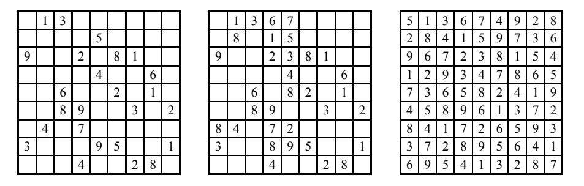

Figure 15. Puzzle Sudogen0-4443, its L3 elaboration and its solution

```
column c3 interaction-with-block b1 ==> r2c1 \neq 4, r1c1 \neq 4
  column c4 interaction-with-block b5 ==> r4c6 \neq 3
  naked-triplets-in-a-column \{n7 \ n5 \ n4\} \{r3 \ r6 \ r8\} c8 ==> r7c8 \neq 5, r2c8 \neq 7, r2c8 \neq 4, r1c8 \neq 5,
r1c8 \neq 4
c4-chain row-col-bl n6r8{c7 c2} - n6{r3c2 r2c1} ==> r2c7 \neq 6
  column c7 interaction-with-block b9 ==> r9c9 \neq 6, r7c9 \neq 6
  xyt9-chain \{n7 \ n1\}r4c6 - \{n1 \ n6\}r6c5 - \{n6 \ n7\}r6c6 - \{n7 \ n5\}r6c2 - \{n5 \ n4\}r6c8 - \{n7 \ n5\}r6c3 - \{n7 \ n5\}r6c3 - \{n7 \ n5\}r6c3 - \{n7 \ n5\}r6c3 - \{n7 \ n5\}r6c3 - \{n7 \ n5\}r6c3 - \{n7 \ n5\}r6c3 - \{n7 \ n5\}r6c3 - \{n7 \ n5\}r6c3 - \{n7 \ n5\}r6c3 - \{n7 \ n5\}r6c3 - \{n7 \ n5\}r6c3 - \{n7 \ n5\}r6c3 - \{n7 \ n5\}r6c3 - \{n7 \ n5\}r6c3 - \{n7 \ n5\}r6c3 - \{n7 \ n5\}r6c3 - \{n7 \ n5\}r6c3 - \{n7 \ n5\}r6c3 - \{n7 \ n5\}r6c3 - \{n7 \ n5\}r6c3 - \{n7 \ n5\}r6c3 - \{n7 \ n5\}r6c3 - \{n7 \ n5\}r6c3 - \{n7 \ n5\}r6c3 - \{n7 \ n5\}r6c3 - \{n7 \ n5\}r6c3 - \{n7 \ n5\}r6c3 - \{n7 \ n5\}r6c3 - \{n7 \ n5\}r6c3 - \{n7 \ n5\}r6c3 - \{n7 \ n5\}r6c3 - \{n7 \ n5\}r6c3 - \{n7 \ n5\}r6c3 - \{n7 \ n5\}r6c3 - \{n7 \ n5\}r6c3 - \{n7 \ n5\}r6c3 - \{n7 \ n5\}r6c3 - \{n7 \ n5\}r6c3 - \{n7 \ n5\}r6c3 - \{n7 \ n5\}r6c3 - \{n7 \ n5\}r6c3 - \{n7 \ n5\}r6c3 - \{n7 \ n5\}r6c3 - \{n7 \ n5\}r6c3 - \{n7 \ n5\}r6c3 - \{n7 \ n5\}r6c3 - \{n7 \ n5\}r6c3 - \{n7 \ n5\}r6c3 - \{n7 \ n5\}r6c3 - \{n7 \ n5\}r6c3 - \{n7 \ n5\}r6c3 - \{n7 \ n5\}r6c3 - \{n7 \ n5\}r6c3 - \{n7 \ n5\}r6c3 - \{n7 \ n5\}r6c3 - \{n7 \ n5\}r6c3 - \{n7 \ n5\}r6c3 - \{n7 \ n5\}r6c3 - \{n7 \ n5\}r6c3 - \{n7 \ n5\}r6c3 - \{n7 \ n5\}r6c3 - \{n7 \ n5\}r6c3 - \{n7 \ n5\}r6c3 - \{n7 \ n5\}r6c3 - \{n7 \ n5\}r6c3 - \{n7 \ n5\}r6c3 - \{n7 \ n5\}r6c3 - \{n7 \ n5\}r6c3 - \{n7 \ n5\}r6c3 - \{n7 \ n5\}r6c3 - \{n7 \ n5\}r6c3 - \{n7 \ n5\}r6c3 - \{n7 \ n5\}r6c3 - \{n7 \ n5\}r6c3 - \{n7 \ n5\}r6c3 - \{n7 \ n5\}r6c3 - \{n7 \ n5\}r6c3 - \{n7 \ n5\}r6c3 - \{n7 \ n5\}r6c3 - \{n7 \ n5\}r6c3 - \{n7 \ n5\}r6c3 - \{n7 \ n5\}r6c3 - \{n7 \ n5\}r6c3 - \{n7 \ n5\}r6c3 - \{n7 \ n5\}r6c3 - \{n7 \ n5\}r6c3 - \{n7 \ n5\}r6c3 - \{n7 \ n5\}r6c3 - \{n7 \ n5\}r6c3 - \{n7 \ n5\}r6c3 - \{n7 \ n5\}r6c3 - \{n7 \ n5\}r6c3 - \{n7 \ n5\}r6c3 - \{n7 \ n5\}r6c3 - \{n7 \ n5\}r6c3 - \{n7 \ n5\}r6c3 - \{n7 \ n5\}r6c3 - \{n7 \ n5\}r6c3 - \{n7 \ n5\}r6c3 - \{n7 \ n5\}r6c3 - \{n7 \ n5\}r6c3 - \{n7 \ n5\}r6c3 - \{n7 \ n5\}r6c3 - \{n7 \ n5\}r6c3 - \{n7 \ n5\}r6c3 - \{n7 \ n5\}r6c3 - \{n7 \ n5\}r6c3 - \{n7 \ n5\}r6c3 - \{n7 \ n5\}r6c3 - \{n7 \ n5\}r6c3 - \{n7 \ n5\}r6c3 - \{n7 \ n5\}r6c3 - \{n7 \ n5\}r6c3 - \{n7 \ n5\}r6c3 - \{n7 \ n5\}r6c3 - \{n7 \ n5\}r6c3 - \{n7 \ n5\}r6c3 - \{n7 \ n5\}r6c3 - \{n7 \ n5\}r6c3 - \{n7 \ n5\}r6c3 - \{n7 \ n5\}r6c3 -
    \{n4 \ n7\}r8c8 - \{n7 \ n2\}r8c3 - \{n2 \ n6\}r8c2 - \{n6 \ n7\}r3c2 ==> r4c2 \neq 7
  hxyt-cn10-chain {r9 r6}c5n1 - {r6 r9}c5n6 - {r9 r2}c1n6 - {r2 r3}c9n6 - {r3 r8}c2n6 -
    {r8 r4}c2n2 - {r4 r1}c1n2 - {r1 r2}c8n2 - {r2 r7}c8n3 - {r7 r9}c6n3 ==> r9c6 \neq 1
  xyzt10-chain {n5 n7}r6c2 - {n7 n4}r6c8 - {n4 n7}r8c8 - {n7 n5}r3c8 - {n5 n6}r3c2 -
    {n6 n2}r8c2 - {n2 n7}r8c3 - {n7 n4}r3c3 - {n4 n2}r2c3 - {n2 n5}r1c1 \Longrightarrow r6c1 \neq 5
  xyt12-chain \{n7\ n1\}r4c6 - \{n1\ n6\}r6c5 - \{n6\ n7\}r6c6 - \{n7\ n5\}r6c2 - \{n5\ n4\}r6c8 - \{n7\ n5\}r6c3 - \{n7\ n5\}r6c3 - \{n7\ n5\}r6c3 - \{n7\ n5\}r6c3 - \{n7\ n5\}r6c3 - \{n7\ n5\}r6c3 - \{n7\ n5\}r6c3 - \{n7\ n5\}r6c3 - \{n7\ n5\}r6c3 - \{n7\ n5\}r6c3 - \{n7\ n5\}r6c3 - \{n7\ n5\}r6c3 - \{n7\ n5\}r6c3 - \{n7\ n5\}r6c3 - \{n7\ n5\}r6c3 - \{n7\ n5\}r6c3 - \{n7\ n5\}r6c3 - \{n7\ n5\}r6c3 - \{n7\ n5\}r6c3 - \{n7\ n5\}r6c3 - \{n7\ n5\}r6c3 - \{n7\ n5\}r6c3 - \{n7\ n5\}r6c3 - \{n7\ n5\}r6c3 - \{n7\ n5\}r6c3 - \{n7\ n5\}r6c3 - \{n7\ n5\}r6c3 - \{n7\ n5\}r6c3 - \{n7\ n5\}r6c3 - \{n7\ n5\}r6c3 - \{n7\ n5\}r6c3 - \{n7\ n5\}r6c3 - \{n7\ n5\}r6c3 - \{n7\ n5\}r6c3 - \{n7\ n5\}r6c3 - \{n7\ n5\}r6c3 - \{n7\ n5\}r6c3 - \{n7\ n5\}r6c3 - \{n7\ n5\}r6c3 - \{n7\ n5\}r6c3 - \{n7\ n5\}r6c3 - \{n7\ n5\}r6c3 - \{n7\ n5\}r6c3 - \{n7\ n5\}r6c3 - \{n7\ n5\}r6c3 - \{n7\ n5\}r6c3 - \{n7\ n5\}r6c3 - \{n7\ n5\}r6c3 - \{n7\ n5\}r6c3 - \{n7\ n5\}r6c3 - \{n7\ n5\}r6c3 - \{n7\ n5\}r6c3 - \{n7\ n5\}r6c3 - \{n7\ n5\}r6c3 - \{n7\ n5\}r6c3 - \{n7\ n5\}r6c3 - \{n7\ n5\}r6c3 - \{n7\ n5\}r6c3 - \{n7\ n5\}r6c3 - \{n7\ n5\}r6c3 - \{n7\ n5\}r6c3 - \{n7\ n5\}r6c3 - \{n7\ n5\}r6c3 - \{n7\ n5\}r6c3 - \{n7\ n5\}r6c3 - \{n7\ n5\}r6c3 - \{n7\ n5\}r6c3 - \{n7\ n5\}r6c3 - \{n7\ n5\}r6c3 - \{n7\ n5\}r6c3 - \{n7\ n5\}r6c3 - \{n7\ n5\}r6c3 - \{n7\ n5\}r6c3 - \{n7\ n5\}r6c3 - \{n7\ n5\}r6c3 - \{n7\ n5\}r6c3 - \{n7\ n5\}r6c3 - \{n7\ n5\}r6c3 - \{n7\ n5\}r6c3 - \{n7\ n5\}r6c3 - \{n7\ n5\}r6c3 - \{n7\ n5\}r6c3 - \{n7\ n5\}r6c3 - \{n7\ n5\}r6c3 - \{n7\ n5\}r6c3 - \{n7\ n5\}r6c3 - \{n7\ n5\}r6c3 - \{n7\ n5\}r6c3 - \{n7\ n5\}r6c3 - \{n7\ n5\}r6c3 - \{n7\ n5\}r6c3 - \{n7\ n5\}r6c3 - \{n7\ n5\}r6c3 - \{n7\ n5\}r6c3 - \{n7\ n5\}r6c3 - \{n7\ n5\}r6c3 - \{n7\ n5\}r6c3 - \{n7\ n5\}r6c3 - \{n7\ n5\}r6c3 - \{n7\ n5\}r6c3 - \{n7\ n5\}r6c3 - \{n7\ n5\}r6c3 - \{n7\ n5\}r6c3 - \{n7\ n5\}r6c3 - \{n7\ n5\}r6c3 - \{n7\ n5\}r6c3 - \{n7\ n5\}r6c3 - \{n7\ n5\}r6c3 - \{n7\ n5\}r6c3 - \{n7\ n5\}r6c3 - \{n7\ n5\}r6c3 - \{n7\ n5\}r6c3 - \{n7\ n5\}r6c3 - \{n7\ n5\}r6c3 - \{n7\ n5\}r6c3 - \{n7\ n5\}r6c3 - \{n7\ n5\}r6c3 - \{n7\ n5\}r6c3 - \{n7\ n5\}r6c3 - \{n7\ n5\}r6c3 - \{n7\ n5\}r6c3 - \{n7\ n5\}r6c3 - \{n7\ n5\}r6c3 - \{n7\ n5\}r6c3 - \{n7\ n5\}r6c3 - \{n7\ n5\}r6c3 - \{n7\ n5\}r6c3 - \{n7\ n5\}r6c3 - \{n7\ n5\}r6c3 - \{n7\ n5\}r6c3 - \{n7\ 
    \{n4\ n7\}r8c8 - \{n7\ n2\}r8c3 - \{n2\ n6\}r8c2 - \{n6\ n7\}r3c2 - \{n7\ n4\}r2c3 - \{n4\ n9\}r2c6 - \{n7\ n4\}r2c3 - \{n4\ n9\}r2c6 - \{n6\ n7\}r3c2 - \{n7\ n4\}r2c3 - \{n4\ n9\}r2c6 - \{n6\ n7\}r3c2 - \{n7\ n4\}r2c3 - \{n6\ n9\}r3c3 - \{n6\ n9\}r3c3 - \{n6\ n9\}r3c3 - \{n6\ n9\}r3c3 - \{n6\ n9\}r3c3 - \{n6\ n9\}r3c3 - \{n6\ n9\}r3c3 - \{n6\ n9\}r3c3 - \{n6\ n9\}r3c3 - \{n6\ n9\}r3c3 - \{n6\ n9\}r3c3 - \{n6\ n9\}r3c3 - \{n6\ n9\}r3c3 - \{n6\ n9\}r3c3 - \{n6\ n9\}r3c3 - \{n6\ n9\}r3c3 - \{n6\ n9\}r3c3 - \{n6\ n9\}r3c3 - \{n6\ n9\}r3c3 - \{n6\ n9\}r3c3 - \{n6\ n9\}r3c3 - \{n6\ n9\}r3c3 - \{n6\ n9\}r3c3 - \{n6\ n9\}r3c3 - \{n6\ n9\}r3c3 - \{n6\ n9\}r3c3 - \{n6\ n9\}r3c3 - \{n6\ n9\}r3c3 - \{n6\ n9\}r3c3 - \{n6\ n9\}r3c3 - \{n6\ n9\}r3c3 - \{n6\ n9\}r3c3 - \{n6\ n9\}r3c3 - \{n6\ n9\}r3c3 - \{n6\ n9\}r3c3 - \{n6\ n9\}r3c3 - \{n6\ n9\}r3c3 - \{n6\ n9\}r3c3 - \{n6\ n9\}r3c3 - \{n6\ n9\}r3c3 - \{n6\ n9\}r3c3 - \{n6\ n9\}r3c3 - \{n6\ n9\}r3c3 - \{n6\ n9\}r3c3 - \{n6\ n9\}r3c3 - \{n6\ n9\}r3c3 - \{n6\ n9\}r3c3 - \{n6\ n9\}r3c3 - \{n6\ n9\}r3c3 - \{n6\ n9\}r3c3 - \{n6\ n9\}r3c3 - \{n6\ n9\}r3c3 - \{n6\ n9\}r3c3 - \{n6\ n9\}r3c3 - \{n6\ n9\}r3c3 - \{n6\ n9\}r3c3 - \{n6\ n9\}r3c3 - \{n6\ n9\}r3c3 - \{n6\ n9\}r3c3 - \{n6\ n9\}r3c3 - \{n6\ n9\}r3c3 - \{n6\ n9\}r3c3 - \{n6\ n9\}r3c3 - \{n6\ n9\}r3c3 - \{n6\ n9\}r3c3 - \{n6\ n9\}r3c3 - \{n6\ n9\}r3c3 - \{n6\ n9\}r3c3 - \{n6\ n9\}r3c3 - \{n6\ n9\}r3c3 - \{n6\ n9\}r3c3 - \{n6\ n9\}r3c3 - \{n6\ n9\}r3c3 - \{n6\ n9\}r3c3 - \{n6\ n9\}r3c3 - \{n6\ n9\}r3c3 - \{n6\ n9\}r3c3 - \{n6\ n9\}r3c3 - \{n6\ n9\}r3c3 - \{n6\ n9\}r3c3 - \{n6\ n9\}r3c3 - \{n6\ n9\}r3c3 - \{n6\ n9\}r3c3 - \{n6\ n9\}r3c3 - \{n6\ n9\}r3c3 - \{n6\ n9\}r3c3 - \{n6\ n9\}r3c3 - \{n6\ n9\}r3c3 - \{n6\ n9\}r3c3 - \{n6\ n9\}r3c3 - \{n6\ n9\}r3c3 - \{n6\ n9\}r3c3 - \{n6\ n9\}r3c3 - \{n6\ n9\}r3c3 - \{n6\ n9\}r3c3 - \{n6\ n9\}r3c3 - \{n6\ n9\}r3c3 - \{n6\ n9\}r3c3 - \{n6\ n9\}r3c3 - \{n6\ n9\}r3c3 - \{n6\ n9\}r3c3 - \{n6\ n9\}r3c3 - \{n6\ n9\}r3c3 - \{n6\ n9\}r3c3 - \{n6\ n9\}r3c3 - \{n6\ n9\}r3c3 - \{n6\ n9\}r3c3 - \{n6\ n9\}r3c3 - \{n6\ n9\}r3c3 - \{n6\ n9\}r3c3 - \{n6\ n9\}r3c3 - \{n6\ n9\}r3c3 - \{n6\ n9\}r3c3 - \{n6\ n9\}r3c3 - \{n6\ n9\}r3c3 - \{n6\ n9\}r3c3 - \{n6\ n9\}r3c3 - \{n6\ n9\}r3c3 - \{n6\ n9\}r3c3 - \{n6\ n9\}r3c3 - \{n6\ n9\}r3c3 - \{n6\ n9\}r3c3 - \{n6\ n9\}r3c3 - \{n6\
  {n9 n7}r2c7 ==> r4c7 \neq 7
  xyt12-chain \{n7\ n1\}r4c6 - \{n1\ n6\}r6c5 - \{n6\ n7\}r6c6 - \{n7\ n5\}r6c2 - \{n5\ n4\}r6c8 - \{n7\ n5\}r6c3 - \{n7\ n5\}r6c3 - \{n7\ n5\}r6c3 - \{n7\ n5\}r6c3 - \{n7\ n5\}r6c3 - \{n7\ n5\}r6c3 - \{n7\ n5\}r6c3 - \{n7\ n5\}r6c3 - \{n7\ n5\}r6c3 - \{n7\ n5\}r6c3 - \{n7\ n5\}r6c3 - \{n7\ n5\}r6c3 - \{n7\ n5\}r6c3 - \{n7\ n5\}r6c3 - \{n7\ n5\}r6c3 - \{n7\ n5\}r6c3 - \{n7\ n5\}r6c3 - \{n7\ n5\}r6c3 - \{n7\ n5\}r6c3 - \{n7\ n5\}r6c3 - \{n7\ n5\}r6c3 - \{n7\ n5\}r6c3 - \{n7\ n5\}r6c3 - \{n7\ n5\}r6c3 - \{n7\ n5\}r6c3 - \{n7\ n5\}r6c3 - \{n7\ n5\}r6c3 - \{n7\ n5\}r6c3 - \{n7\ n5\}r6c3 - \{n7\ n5\}r6c3 - \{n7\ n5\}r6c3 - \{n7\ n5\}r6c3 - \{n7\ n5\}r6c3 - \{n7\ n5\}r6c3 - \{n7\ n5\}r6c3 - \{n7\ n5\}r6c3 - \{n7\ n5\}r6c3 - \{n7\ n5\}r6c3 - \{n7\ n5\}r6c3 - \{n7\ n5\}r6c3 - \{n7\ n5\}r6c3 - \{n7\ n5\}r6c3 - \{n7\ n5\}r6c3 - \{n7\ n5\}r6c3 - \{n7\ n5\}r6c3 - \{n7\ n5\}r6c3 - \{n7\ n5\}r6c3 - \{n7\ n5\}r6c3 - \{n7\ n5\}r6c3 - \{n7\ n5\}r6c3 - \{n7\ n5\}r6c3 - \{n7\ n5\}r6c3 - \{n7\ n5\}r6c3 - \{n7\ n5\}r6c3 - \{n7\ n5\}r6c3 - \{n7\ n5\}r6c3 - \{n7\ n5\}r6c3 - \{n7\ n5\}r6c3 - \{n7\ n5\}r6c3 - \{n7\ n5\}r6c3 - \{n7\ n5\}r6c3 - \{n7\ n5\}r6c3 - \{n7\ n5\}r6c3 - \{n7\ n5\}r6c3 - \{n7\ n5\}r6c3 - \{n7\ n5\}r6c3 - \{n7\ n5\}r6c3 - \{n7\ n5\}r6c3 - \{n7\ n5\}r6c3 - \{n7\ n5\}r6c3 - \{n7\ n5\}r6c3 - \{n7\ n5\}r6c3 - \{n7\ n5\}r6c3 - \{n7\ n5\}r6c3 - \{n7\ n5\}r6c3 - \{n7\ n5\}r6c3 - \{n7\ n5\}r6c3 - \{n7\ n5\}r6c3 - \{n7\ n5\}r6c3 - \{n7\ n5\}r6c3 - \{n7\ n5\}r6c3 - \{n7\ n5\}r6c3 - \{n7\ n5\}r6c3 - \{n7\ n5\}r6c3 - \{n7\ n5\}r6c3 - \{n7\ n5\}r6c3 - \{n7\ n5\}r6c3 - \{n7\ n5\}r6c3 - \{n7\ n5\}r6c3 - \{n7\ n5\}r6c3 - \{n7\ n5\}r6c3 - \{n7\ n5\}r6c3 - \{n7\ n5\}r6c3 - \{n7\ n5\}r6c3 - \{n7\ n5\}r6c3 - \{n7\ n5\}r6c3 - \{n7\ n5\}r6c3 - \{n7\ n5\}r6c3 - \{n7\ n5\}r6c3 - \{n7\ n5\}r6c3 - \{n7\ n5\}r6c3 - \{n7\ n5\}r6c3 - \{n7\ n5\}r6c3 - \{n7\ n5\}r6c3 - \{n7\ n5\}r6c3 - \{n7\ n5\}r6c3 - \{n7\ n5\}r6c3 - \{n7\ n5\}r6c3 - \{n7\ n5\}r6c3 - \{n7\ n5\}r6c3 - \{n7\ n5\}r6c3 - \{n7\ n5\}r6c3 - \{n7\ n5\}r6c3 - \{n7\ n5\}r6c3 - \{n7\ n5\}r6c3 - \{n7\ n5\}r6c3 - \{n7\ n5\}r6c3 - \{n7\ n5\}r6c3 - \{n7\ n5\}r6c3 - \{n7\ n5\}r6c3 - \{n7\ n5\}r6c3 - \{n7\ n5\}r6c3 - \{n7\ n5\}r6c3 - \{n7\ n5\}r6c3 - \{n7\ n5\}r6c3 - \{n7\ n5\}r6c3 - \{n7\ n5\}r6c3 - \{n7\ n5\}r6c3 - \{n7\ n5\}r6c3 - \{n7\ n5\}r6c3 - \{n7\ 
    \{n4\ n7\}r8c8 - \{n7\ n2\}r8c3 - \{n2\ n6\}r8c2 - \{n6\ n7\}r3c2 - \{n7\ n5\}r3c8 - \{n5\ n4\}r3c3 - \{n6\ n7\}r3c3 - \{n6\ n7\}r3c3 - \{n6\ n7\}r3c3 - \{n6\ n7\}r3c3 - \{n6\ n7\}r3c3 - \{n6\ n7\}r3c3 - \{n6\ n7\}r3c3 - \{n6\ n7\}r3c3 - \{n6\ n7\}r3c3 - \{n6\ n7\}r3c3 - \{n6\ n7\}r3c3 - \{n6\ n7\}r3c3 - \{n6\ n7\}r3c3 - \{n6\ n7\}r3c3 - \{n6\ n7\}r3c3 - \{n6\ n7\}r3c3 - \{n6\ n7\}r3c3 - \{n6\ n7\}r3c3 - \{n6\ n7\}r3c3 - \{n6\ n7\}r3c3 - \{n6\ n7\}r3c3 - \{n6\ n7\}r3c3 - \{n6\ n7\}r3c3 - \{n6\ n7\}r3c3 - \{n6\ n7\}r3c3 - \{n6\ n7\}r3c3 - \{n6\ n7\}r3c3 - \{n6\ n7\}r3c3 - \{n6\ n7\}r3c3 - \{n6\ n7\}r3c3 - \{n6\ n7\}r3c3 - \{n6\ n7\}r3c3 - \{n6\ n7\}r3c3 - \{n6\ n7\}r3c3 - \{n6\ n7\}r3c3 - \{n6\ n7\}r3c3 - \{n6\ n7\}r3c3 - \{n6\ n7\}r3c3 - \{n6\ n7\}r3c3 - \{n6\ n7\}r3c3 - \{n6\ n7\}r3c3 - \{n6\ n7\}r3c3 - \{n6\ n7\}r3c3 - \{n6\ n7\}r3c3 - \{n6\ n7\}r3c3 - \{n6\ n7\}r3c3 - \{n6\ n7\}r3c3 - \{n6\ n7\}r3c3 - \{n6\ n7\}r3c3 - \{n6\ n7\}r3c3 - \{n6\ n7\}r3c3 - \{n6\ n7\}r3c3 - \{n6\ n7\}r3c3 - \{n6\ n7\}r3c3 - \{n6\ n7\}r3c3 - \{n6\ n7\}r3c3 - \{n6\ n7\}r3c3 - \{n6\ n7\}r3c3 - \{n6\ n7\}r3c3 - \{n6\ n7\}r3c3 - \{n6\ n7\}r3c3 - \{n6\ n7\}r3c3 - \{n6\ n7\}r3c3 - \{n6\ n7\}r3c3 - \{n6\ n7\}r3c3 - \{n6\ n7\}r3c3 - \{n6\ n7\}r3c3 - \{n6\ n7\}r3c3 - \{n6\ n7\}r3c3 - \{n6\ n7\}r3c3 - \{n6\ n7\}r3c3 - \{n6\ n7\}r3c3 - \{n6\ n7\}r3c3 - \{n6\ n7\}r3c3 - \{n6\ n7\}r3c3 - \{n6\ n7\}r3c3 - \{n6\ n7\}r3c3 - \{n6\ n7\}r3c3 - \{n6\ n7\}r3c3 - \{n6\ n7\}r3c3 - \{n6\ n7\}r3c3 - \{n6\ n7\}r3c3 - \{n6\ n7\}r3c3 - \{n6\ n7\}r3c3 - \{n6\ n7\}r3c3 - \{n6\ n7\}r3c3 - \{n6\ n7\}r3c3 - \{n6\ n7\}r3c3 - \{n6\ n7\}r3c3 - \{n6\ n7\}r3c3 - \{n6\ n7\}r3c3 - \{n6\ n7\}r3c3 - \{n6\ n7\}r3c3 - \{n6\ n7\}r3c3 - \{n6\ n7\}r3c3 - \{n6\ n7\}r3c3 - \{n6\ n7\}r3c3 - \{n6\ n7\}r3c3 - \{n6\ n7\}r3c3 - \{n6\ n7\}r3c3 - \{n6\ n7\}r3c3 - \{n6\ n7\}r3c3 - \{n6\ n7\}r3c3 - \{n6\ n7\}r3c3 - \{n6\ n7\}r3c3 - \{n6\ n7\}r3c3 - \{n6\ n7\}r3c3 - \{n6\ n7\}r3c3 - \{n6\ n7\}r3c3 - \{n6\ n7\}r3c3 - \{n6\ n7\}r3c3 - \{n6\ n7\}r3c3 - \{n6\ n7\}r3c3 - \{n6\ n7\}r3c3 - \{n6\ n7\}r3c3 - \{n6\ n7\}r3c3 - \{n6\ n7\}r3c3 - \{n6\ n7\}r3c3 - \{n6\ n7\}r3c3 - \{n6\ n7\}r3c3 - \{n6\ n7\}r3c3 - \{n6\ n7\}r3c3 - \{n6\ n7\}r3c3 - \{n6\ n7\}r3c3 - \{n6\ n7\}r3c3 - \{n6\ n7\}r3c3 - \{n6\ n7\}r3c3 - \{n6\ n7\}r3c3 - \{n6\ n7\}r3c3 - \{n6\ n7\}r3c3 - \{n6\
    \{n4 \ n7\} \ r2c3 ==> r4c3 \neq 7
  xyt13-chain \{n7\ n1\}r4c6 - \{n1\ n6\}r6c5 - \{n6\ n7\}r6c6 - \{n7\ n5\}r6c2 - \{n5\ n4\}r6c8 - \{n7\ n5\}r6c7 - \{n5\ n4\}r6c8 - \{n7\ n5\}r6c7 - \{n5\ n4\}r6c8 - \{n7\ n5\}r6c7 - \{n5\ n4\}r6c8 - \{n7\ n5\}r6c7 - \{n5\ n4\}r6c8 - \{n7\ n5\}r6c7 - \{n5\ n4\}r6c8 - \{n7\ n5\}r6c7 - \{n5\ n4\}r6c8 - \{n7\ n5\}r6c7 - \{n5\ n4\}r6c8 - \{n7\ n5\}r6c7 - \{n5\ n4\}r6c8 - \{n7\ n5\}r6c7 - \{n5\ n4\}r6c8 - \{n7\ n5\}r6c7 - \{n5\ n4\}r6c8 - \{n7\ n5\}r6c7 - \{n5\ n4\}r6c8 - \{n7\ n5\}r6c7 - \{n5\ n4\}r6c8 - \{n7\ n5\}r6c7 - \{n5\ n4\}r6c8 - \{n7\ n5\}r6c7 - \{n5\ n4\}r6c8 - \{n7\ n5\}r6c7 - \{n5\ n4\}r6c8 - \{n7\ n5\}r6c9 - \{n5\ n4\}r6c8 - \{n5\ n4\}r6c8 - \{n5\ n4\}r6c8 - \{n5\ n4\}r6c8 - \{n5\ n4\}r6c8 - \{n5\ n4\}r6c8 - \{n5\ n4\}r6c8 - \{n5\ n4\}r6c8 - \{n5\ n4\}r6c8 - \{n5\ n4\}r6c8 - \{n5\ n4\}r6c8 - \{n5\ n4\}r6c8 - \{n5\ n4\}r6c8 - \{n5\ n4\}r6c8 - \{n5\ n4\}r6c8 - \{n5\ n4\}r6c8 - \{n5\ n4\}r6c8 - \{n5\ n4\}r6c8 - \{n5\ n4\}r6c8 - \{n5\ n4\}r6c8 - \{n5\ n4\}r6c8 - \{n5\ n4\}r6c8 - \{n5\ n4\}r6c8 - \{n5\ n4\}r6c8 - \{n5\ n4\}r6c8 - \{n5\ n4\}r6c8 - \{n5\ n4\}r6c8 - \{n5\ n4\}r6c8 - \{n5\ n4\}r6c8 - \{n5\ n4\}r6c8 - \{n5\ n4\}r6c8 - \{n5\ n4\}r6c8 - \{n5\ n4\}r6c8 - \{n5\ n4\}r6c8 - \{n5\ n4\}r6c8 - \{n5\ n4\}r6c8 - \{n5\ n4\}r6c8 - \{n5\ n4\}r6c8 - \{n5\ n4\}r6c8 - \{n5\ n4\}r6c8 - \{n5\ n4\}r6c8 - \{n5\ n4\}r6c8 - \{n5\ n4\}r6c8 - \{n5\ n4\}r6c8 - \{n5\ n4\}r6c8 - \{n5\ n4\}r6c8 - \{n5\ n4\}r6c8 - \{n5\ n4\}r6c8 - \{n5\ n4\}r6c8 - \{n5\ n4\}r6c8 - \{n5\ n4\}r6c8 - \{n5\ n4\}r6c8 - \{n5\ n4\}r6c8 - \{n5\ n4\}r6c8 - \{n5\ n4\}r6c8 - \{n5\ n4\}r6c8 - \{n5\ n4\}r6c8 - \{n5\ n4\}r6c8 - \{n5\ n4\}r6c8 - \{n5\ n4\}r6c8 - \{n5\ n4\}r6c8 - \{n5\ n4\}r6c8 - \{n5\ n4\}r6c8 - \{n5\ n4\}r6c8 - \{n5\ n4\}r6c8 - \{n5\ n4\}r6c8 - \{n5\ n4\}r6c8 - \{n5\ n4\}r6c8 - \{n5\ n4\}r6c8 - \{n5\ n4\}r6c8 - \{n5\ n4\}r6c8 - \{n5\ n4\}r6c8 - \{n5\ n4\}r6c8 - \{n5\ n4\}r6c8 - \{n5\ n4\}r6c8 - \{n5\ n4\}r6c8 - \{n5\ n4\}r6c8 - \{n5\ n4\}r6c8 - \{n5\ n4\}r6c8 - \{n5\ n4\}r6c8 - \{n5\ n4\}r6c8 - \{n5\ n4\}r6c8 - \{n5\ n4\}r6c8 - \{n5\ n4\}r6c8 - \{n5\ n4\}r6c8 - \{n5\ n4\}r6c8 - \{n5\ n4\}r6c8 - \{n5\ n4\}r6c8 - \{n5\ n4\}r6c8 - \{n5\ n4\}r6c8 - \{n5\ n4\}r6c8 - \{n5\ n4\}r6c8 - \{n5\ n4\}r6c8 - \{n5\ n4\}r6c8 - \{n5\ n4\}r6c8 - \{n5\ n4\}r6c8 - \{n5\ n4\}r6c8 - \{n5\ n4\}r6c8 - \{n5\ n4\}r6c8 - \{n5\ 
    {n4 n7}r8c8 - {n7 n2}r8c3 - {n2 n6}r8c2 - {n6 n7}r3c2 - {n7 n9}r9c2 - {n9 n3}r5c2 -
    {n3 n2}r4c2 - {n2 n7}r4c1 ==> r4c9 \neq 7
  xyt16-chain \{n3 \ n6\}r9c6 - \{n6 \ n1\}r9c5 - \{n1 \ n3\}r7c6 - \{n3 \ n9\}r7c8 - \{n9 \ n2\}r1c8 - \{n4 \ n4\}r9c8 - \{n4 \ n4\}r1c8 - \{n4 \ n4\}r1c8 - \{n4 \ n4\}r1c8 - \{n4 \ n4\}r1c8 - \{n4 \ n4\}r1c8 - \{n4 \ n4\}r1c8 - \{n4 \ n4\}r1c8 - \{n4 \ n4\}r1c8 - \{n4 \ n4\}r1c8 - \{n4 \ n4\}r1c8 - \{n4 \ n4\}r1c8 - \{n4 \ n4\}r1c8 - \{n4 \ n4\}r1c8 - \{n4 \ n4\}r1c8 - \{n4 \ n4\}r1c8 - \{n4 \ n4\}r1c8 - \{n4 \ n4\}r1c8 - \{n4 \ n4\}r1c8 - \{n4 \ n4\}r1c8 - \{n4 \ n4\}r1c8 - \{n4 \ n4\}r1c8 - \{n4 \ n4\}r1c8 - \{n4 \ n4\}r1c8 - \{n4 \ n4\}r1c8 - \{n4 \ n4\}r1c8 - \{n4 \ n4\}r1c8 - \{n4 \ n4\}r1c8 - \{n4 \ n4\}r1c8 - \{n4 \ n4\}r1c8 - \{n4 \ n4\}r1c8 - \{n4 \ n4\}r1c8 - \{n4 \ n4\}r1c8 - \{n4 \ n4\}r1c8 - \{n4 \ n4\}r1c8 - \{n4 \ n4\}r1c8 - \{n4 \ n4\}r1c8 - \{n4 \ n4\}r1c8 - \{n4 \ n4\}r1c8 - \{n4 \ n4\}r1c8 - \{n4 \ n4\}r1c8 - \{n4 \ n4\}r1c8 - \{n4 \ n4\}r1c8 - \{n4 \ n4\}r1c8 - \{n4 \ n4\}r1c8 - \{n4 \ n4\}r1c8 - \{n4 \ n4\}r1c8 - \{n4 \ n4\}r1c8 - \{n4 \ n4\}r1c8 - \{n4 \ n4\}r1c8 - \{n4 \ n4\}r1c8 - \{n4 \ n4\}r1c8 - \{n4 \ n4\}r1c8 - \{n4 \ n4\}r1c8 - \{n4 \ n4\}r1c8 - \{n4 \ n4\}r1c8 - \{n4 \ n4\}r1c8 - \{n4 \ n4\}r1c8 - \{n4 \ n4\}r1c8 - \{n4 \ n4\}r1c8 - \{n4 \ n4\}r1c8 - \{n4 \ n4\}r1c8 - \{n4 \ n4\}r1c8 - \{n4 \ n4\}r1c8 - \{n4 \ n4\}r1c8 - \{n4 \ n4\}r1c8 - \{n4 \ n4\}r1c8 - \{n4 \ n4\}r1c8 - \{n4 \ n4\}r1c8 - \{n4 \ n4\}r1c8 - \{n4 \ n4\}r1c8 - \{n4 \ n4\}r1c8 - \{n4 \ n4\}r1c8 - \{n4 \ n4\}r1c8 - \{n4 \ n4\}r1c8 - \{n4 \ n4\}r1c8 - \{n4 \ n4\}r1c8 - \{n4 \ n4\}r1c8 - \{n4 \ n4\}r1c8 - \{n4 \ n4\}r1c8 - \{n4 \ n4\}r1c8 - \{n4 \ n4\}r1c8 - \{n4 \ n4\}r1c8 - \{n4 \ n4\}r1c8 - \{n4 \ n4\}r1c8 - \{n4 \ n4\}r1c8 - \{n4 \ n4\}r1c8 - \{n4 \ n4\}r1c8 - \{n4 \ n4\}r1c8 - \{n4 \ n4\}r1c8 - \{n4 \ n4\}r1c8 - \{n4 \ n4\}r1c8 - \{n4 \ n4\}r1c8 - \{n4 \ n4\}r1c8 - \{n4 \ n4\}r1c8 - \{n4 \ n4\}r1c8 - \{n4 \ n4\}r1c8 - \{n4 \ n4\}r1c8 - \{n4 \ n4\}r1c8 - \{n4 \ n4\}r1c8 - \{n4 \ n4\}r1c8 - \{n4 \ n4\}r1c8 - \{n4 \ n4\}r1c8 - \{n4 \ n4\}r1c8 - \{n4 \ n4\}r1c8 - \{n4 \ n4\}r1c8 - \{n4 \ n4\}r1c8 - \{n4 \ n4\}r1c8 - \{n4 \ n4\}r1c8 - \{n4 \ n4\}r1c8 - \{n4 \ n4\}r1c8 - \{n4 \ n4\}r1c8 - \{n4 \ n4\}r1c8 - \{n4 \ n4\}r1c8 - \{n4 \ n4\}r1c8 - \{n4 \ n4\}r1c8 - \{n4 \ n4\}r1c8 - \{n4 \ n4\}r1c8 - \{n4 \ n4\}r1c8 - \{n4 \ n4\}r1c8 - \{n4 \ n4\}r1c8 - \{n4 \ n4\}r1c8 
    \{n2\ n5\}r1c1 - \{n5\ n7\}r9c1 - \{n7\ n2\}r8c3 - \{n2\ n6\}r8c2 - \{n6\ n7\}r3c2 - \{n7\ n4\}r2c3 - \{n7\ n4\}r2c3 - \{n7\ n4\}r2c3 - \{n7\ n4\}r2c3 - \{n7\ n4\}r2c3 - \{n7\ n4\}r2c3 - \{n7\ n4\}r2c3 - \{n7\ n4\}r2c3 - \{n7\ n4\}r2c3 - \{n7\ n4\}r2c3 - \{n7\ n4\}r2c3 - \{n7\ n4\}r2c3 - \{n7\ n4\}r2c3 - \{n7\ n4\}r2c3 - \{n7\ n4\}r2c3 - \{n7\ n4\}r2c3 - \{n7\ n4\}r2c3 - \{n7\ n4\}r2c3 - \{n7\ n4\}r2c3 - \{n7\ n4\}r2c3 - \{n7\ n4\}r2c3 - \{n7\ n4\}r2c3 - \{n7\ n4\}r2c3 - \{n7\ n4\}r2c3 - \{n7\ n4\}r2c3 - \{n7\ n4\}r2c3 - \{n7\ n4\}r2c3 - \{n7\ n4\}r2c3 - \{n7\ n4\}r2c3 - \{n7\ n4\}r2c3 - \{n7\ n4\}r2c3 - \{n7\ n4\}r2c3 - \{n7\ n4\}r2c3 - \{n7\ n4\}r2c3 - \{n7\ n4\}r2c3 - \{n7\ n4\}r2c3 - \{n7\ n4\}r2c3 - \{n7\ n4\}r2c3 - \{n7\ n4\}r2c3 - \{n7\ n4\}r2c3 - \{n7\ n4\}r2c3 - \{n7\ n4\}r2c3 - \{n7\ n4\}r2c3 - \{n7\ n4\}r2c3 - \{n7\ n4\}r2c3 - \{n7\ n4\}r2c3 - \{n7\ n4\}r2c3 - \{n7\ n4\}r2c3 - \{n7\ n4\}r2c3 - \{n7\ n4\}r2c3 - \{n7\ n4\}r2c3 - \{n7\ n4\}r2c3 - \{n7\ n4\}r2c3 - \{n7\ n4\}r2c3 - \{n7\ n4\}r2c3 - \{n7\ n4\}r2c3 - \{n7\ n4\}r2c3 - \{n7\ n4\}r2c3 - \{n7\ n4\}r2c3 - \{n7\ n4\}r2c3 - \{n7\ n4\}r2c3 - \{n7\ n4\}r2c3 - \{n7\ n4\}r2c3 - \{n7\ n4\}r2c3 - \{n7\ n4\}r2c3 - \{n7\ n4\}r2c3 - \{n7\ n4\}r2c3 - \{n7\ n4\}r2c3 - \{n7\ n4\}r2c3 - \{n7\ n4\}r2c3 - \{n7\ n4\}r2c3 - \{n7\ n4\}r2c3 - \{n7\ n4\}r2c3 - \{n7\ n4\}r2c3 - \{n7\ n4\}r2c3 - \{n7\ n4\}r2c3 - \{n7\ n4\}r2c3 - \{n7\ n4\}r2c3 - \{n7\ n4\}r2c3 - \{n7\ n4\}r2c3 - \{n7\ n4\}r2c3 - \{n7\ n4\}r2c3 - \{n7\ n4\}r2c3 - \{n7\ n4\}r2c3 - \{n7\ n4\}r2c3 - \{n7\ n4\}r2c3 - \{n7\ n4\}r2c3 - \{n7\ n4\}r2c3 - \{n7\ n4\}r2c3 - \{n7\ n4\}r2c3 - \{n7\ n4\}r2c3 - \{n7\ n4\}r2c3 - \{n7\ n4\}r2c3 - \{n7\ n4\}r2c3 - \{n7\ n4\}r2c3 - \{n7\ n4\}r2c3 - \{n7\ n4\}r2c3 - \{n7\ n4\}r2c3 - \{n7\ n4\}r2c3 - \{n7\ n4\}r2c3 - \{n7\ n4\}r2c3 - \{n7\ n4\}r2c3 - \{n7\ n4\}r2c3 - \{n7\ n4\}r2c3 - \{n7\ n4\}r2c3 - \{n7\ n4\}r2c3 - \{n7\ n4\}r2c3 - \{n7\ n4\}r2c3 - \{n7\ n4\}r2c3 - \{n7\ n4\}r2c3 - \{n7\ n4\}r2c3 - \{n7\ n4\}r2c3 - \{n7\ n4\}r2c3 - \{n7\ n4\}r2c3 - \{n7\ n4\}r2c3 - \{n7\ n4\}r2c3 - \{n7\ n4\}r2c3 - \{n7\ n4\}r2c3 - \{n7\ n4\}r2c3 - \{n7\ n4\}r2c3 - \{n7\ n4\}r2c3 - \{n7\ n4\}r2c3 - \{n7\ n4\}r2c3 - \{n7\ n4\}r2c3 - \{n7\ n4\}r2c3 - \{n7\ n4\}r2c3 - \{n7\ n4\}r2c3 - \{n7\ n4\}r2c3 - \{n7\ n4\}r2c3 - \{n7\ n4\}r2c3 - \{n7\ n4\}r2c3 - \{n7\
    {n4 n5}r3c3 - {n5 n9}r9c3 - {n9 n1}r4c3 - {n1 n5}r7c3 - {n5 n3}r7c9 ==> r9c9 \neq 3
  hidden-single-in-a-row ==> r9c6 = 3
  xyt14-chain \{n7\ n1\}r4c6 - \{n1\ n6\}r6c5 - \{n6\ n1\}r9c5 - \{n1\ n6\}r7c6 - \{n6\ n7\}r6c6 - \{n6\ n7\}r6c6 - \{n6\ n7\}r6c6 - \{n6\ n7\}r6c6 - \{n6\ n7\}r6c6 - \{n6\ n7\}r6c6 - \{n6\ n7\}r6c6 - \{n6\ n7\}r6c6 - \{n6\ n7\}r6c6 - \{n6\ n7\}r6c6 - \{n6\ n7\}r6c6 - \{n6\ n7\}r6c6 - \{n6\ n7\}r6c6 - \{n6\ n7\}r6c6 - \{n6\ n7\}r6c6 - \{n6\ n7\}r6c6 - \{n6\ n7\}r6c6 - \{n6\ n7\}r6c6 - \{n6\ n7\}r6c6 - \{n6\ n7\}r6c6 - \{n6\ n7\}r6c6 - \{n6\ n7\}r6c6 - \{n6\ n7\}r6c6 - \{n6\ n7\}r6c6 - \{n6\ n7\}r6c6 - \{n6\ n7\}r6c6 - \{n6\ n7\}r6c6 - \{n6\ n7\}r6c6 - \{n6\ n7\}r6c6 - \{n6\ n7\}r6c6 - \{n6\ n7\}r6c6 - \{n6\ n7\}r6c6 - \{n6\ n7\}r6c6 - \{n6\ n7\}r6c6 - \{n6\ n7\}r6c6 - \{n6\ n7\}r6c6 - \{n6\ n7\}r6c6 - \{n6\ n7\}r6c6 - \{n6\ n7\}r6c6 - \{n6\ n7\}r6c6 - \{n6\ n7\}r6c6 - \{n6\ n7\}r6c6 - \{n6\ n7\}r6c6 - \{n6\ n7\}r6c6 - \{n6\ n7\}r6c6 - \{n6\ n7\}r6c6 - \{n6\ n7\}r6c6 - \{n6\ n7\}r6c6 - \{n6\ n7\}r6c6 - \{n6\ n7\}r6c6 - \{n6\ n7\}r6c6 - \{n6\ n7\}r6c6 - \{n6\ n7\}r6c6 - \{n6\ n7\}r6c6 - \{n6\ n7\}r6c6 - \{n6\ n7\}r6c6 - \{n6\ n7\}r6c6 - \{n6\ n7\}r6c6 - \{n6\ n7\}r6c6 - \{n6\ n7\}r6c6 - \{n6\ n7\}r6c6 - \{n6\ n7\}r6c6 - \{n6\ n7\}r6c6 - \{n6\ n7\}r6c6 - \{n6\ n7\}r6c6 - \{n6\ n7\}r6c6 - \{n6\ n7\}r6c6 - \{n6\ n7\}r6c6 - \{n6\ n7\}r6c6 - \{n6\ n7\}r6c6 - \{n6\ n7\}r6c6 - \{n6\ n7\}r6c6 - \{n6\ n7\}r6c6 - \{n6\ n7\}r6c6 - \{n6\ n7\}r6c6 - \{n6\ n7\}r6c6 - \{n6\ n7\}r6c6 - \{n6\ n7\}r6c6 - \{n6\ n7\}r6c6 - \{n6\ n7\}r6c6 - \{n6\ n7\}r6c6 - \{n6\ n7\}r6c6 - \{n6\ n7\}r6c6 - \{n6\ n7\}r6c6 - \{n6\ n7\}r6c6 - \{n6\ n7\}r6c6 - \{n6\ n7\}r6c6 - \{n6\ n7\}r6c6 - \{n6\ n7\}r6c6 - \{n6\ n7\}r6c6 - \{n6\ n7\}r6c6 - \{n6\ n7\}r6c6 - \{n6\ n7\}r6c6 - \{n6\ n7\}r6c6 - \{n6\ n7\}r6c6 - \{n6\ n7\}r6c6 - \{n6\ n7\}r6c6 - \{n6\ n7\}r6c6 - \{n6\ n7\}r6c6 - \{n6\ n7\}r6c6 - \{n6\ n7\}r6c6 - \{n6\ n7\}r6c6 - \{n6\ n7\}r6c6 - \{n6\ n7\}r6c6 - \{n6\ n7\}r6c6 - \{n6\ n7\}r6c6 - \{n6\ n7\}r6c6 - \{n6\ n7\}r6c6 - \{n6\ n7\}r6c6 - \{n6\ n7\}r6c6 - \{n6\ n7\}r6c6 - \{n6\ n7\}r6c6 - \{n6\ n7\}r6c6 - \{n6\ n7\}r6c6 - \{n6\ n7\}r6c6 - \{n6\ n7\}r6c6 - \{n6\ n7\}r6c6 - \{n6\ n7\}r6c6 - \{n6\ n7\}r6c6 - \{n6\ n7\}r6c6 - \{n6\ n7\}r6c6 - \{n6\ n7\}r6c6 - \{n6\ n7\}r6c6 - \{n6\ n7\}r6c6 - \{n6\ n7\}r6c6 - \{n6\ n7\}r6c6 - \{n6\ n7\}r6c6 - \{n6\ n7\}r6c6 - \{n6\ n7\}r6c6 - \{n6\ n7\}r6c6 - \{n6\ n7\}r6c6 - \{n6\ 
    \{n7, n5\}\ r6c2 - \{n5, n4\}\ r6c8 - \{n4, n7\}\ r8c8 - \{n7, n2\}\ r8c3 - \{n2, n6\}\ r8c2 - \{n6, n7\}\ r3c2 - \{n6, n7\}\ r3c2 - \{n6, n7\}\ r3c2 - \{n6, n7\}\ r3c2 - \{n6, n7\}\ r3c2 - \{n6, n7\}\ r3c2 - \{n7, n2\}\ r3c2 - \{n8, n4\}\ r3c2 - \{n6, n7\}\ r3c2 - \{n7, n2\}\ r3c2 - \{n8, n4\}\ r3c2 - \{n6, n7\}\ r3c2 - \{n7, n2\}\ r3c2 - \{n7, n2\}\ r3c2 - \{n8, n4\}\ r3c2 - \{n8, n4\}\ r3c2 - \{n8, n4\}\ r3c2 - \{n8, n4\}\ r3c2 - \{n8, n4\}\ r3c2 - \{n8, n4\}\ r3c2 - \{n8, n4\}\ r3c2 - \{n8, n4\}\ r3c2 - \{n8, n4\}\ r3c2 - \{n8, n4\}\ r3c2 - \{n8, n4\}\ r3c2 - \{n8, n4\}\ r3c2 - \{n8, n4\}\ r3c2 - \{n8, n4\}\ r3c2 - \{n8, n4\}\ r3c2 - \{n8, n4\}\ r3c2 - \{n8, n4\}\ r3c2 - \{n8, n4\}\ r3c2 - \{n8, n4\}\ r3c2 - \{n8, n4\}\ r3c2 - \{n8, n4\}\ r3c2 - \{n8, n4\}\ r3c2 - \{n8, n4\}\ r3c2 - \{n8, n4\}\ r3c2 - \{n8, n4\}\ r3c2 - \{n8, n4\}\ r3c2 - \{n8, n4\}\ r3c2 - \{n8, n4\}\ r3c2 - \{n8, n4\}\ r3c2 - \{n8, n4\}\ r3c2 - \{n8, n4\}\ r3c2 - \{n8, n4\}\ r3c2 - \{n8, n4\}\ r3c2 - \{n8, n4\}\ r3c2 - \{n8, n4\}\ r3c2 - \{n8, n4\}\ r3c2 - \{n8, n4\}\ r3c2 - \{n8, n4\}\ r3c2 - \{n8, n4\}\ r3c2 - \{n8, n4\}\ r3c2 - \{n8, n4\}\ r3c2 - \{n8, n4\}\ r3c2 - \{n8, n4\}\ r3c2 - \{n8, n4\}\ r3c2 - \{n8, n4\}\ r3c2 - \{n8, n4\}\ r3c2 - \{n8, n4\}\ r3c2 - \{n8, n4\}\ r3c2 - \{n8, n4\}\ r3c2 - \{n8, n4\}\ r3c2 - \{n8, n4\}\ r3c2 - \{n8, n4\}\ r3c2 - \{n8, n4\}\ r3c2 - \{n8, n4\}\ r3c2 - \{n8, n4\}\ r3c2 - \{n8, n4\}\ r3c2 - \{n8, n4\}\ r3c2 - \{n8, n4\}\ r3c2 - \{n8, n4\}\ r3c2 - \{n8, n4\}\ r3c2 - \{n8, n4\}\ r3c2 - \{n8, n4\}\ r3c2 - \{n8, n4\}\ r3c2 - \{n8, n4\}\ r3c2 - \{n8, n4\}\ r3c2 - \{n8, n4\}\ r3c2 - \{n8, n4\}\ r3c2 - \{n8, n4\}\ r3c2 - \{n8, n4\}\ r3c2 - \{n8, n4\}\ r3c2 - \{n8, n4\}\ r3c2 - \{n8, n4\}\ r3c2 - \{n8, n4\}\ r3c2 - \{n8, n4\}\ r3c2 - \{n8, n4\}\ r3c2 - \{n8, n4\}\ r3c2 - \{n8, n4\}\ r3c2 - \{n8, n4\}\ r3c2 - \{n8, n4\}\ r3c2 - \{n8, n4\}\ r3c2 - \{n8, n4\}\ r3c2 - \{n8, n4\}\ r3c2 - \{n8, n4\}\ r3c2 - \{n8, n4\}\ r3c2 - \{n8, n4\}\ r3c2 - \{n8, n4\}\ r3c2 - \{n8, n4\}\ r3c2 - \{n8, n4\}\ r3c2 - \{n8, n4\}\ r3c2 - \{n8, n4\}\ r3c2 - \{n8, n4\}\ r3c2 - \{n8, n4\}\ r3c2 - \{n8, n4\}\ r3c2 - \{n8, n4\}\ r3c2 - \{n8, n4\}\ r3c2 - \{n8, n4\}\ r3c2 - \{n8, n4\}\ r3c2 - \{n8, n4\}\ r3c2 - \{n8, n4\}\ r3c2 - \{n8, n4\}\ r3c2 - \{n8, n4\}\ r3c2 - \{n8,
    {n7 n9}r9c2 - {n9 n5}r9c9 - {n5 n7}r9c1 ==> r4c1 \neq 7
  hidden-single-in-a-row ==> r4c6 = 7
  row r4 interaction-with-block b4 ==> r6c1 \neq 1
  naked-triplets-in-a-block \{n5 \ n4 \ n7\} \{r5c1 \ r6c1 \ r6c2\} \Longrightarrow r5c2 \ne 7, r5c2 \ne 5, r4c3 \ne 5,
  r4c2 \neq 5, r4c1 \neq 5
\frac{1}{4} + \frac{1}{4} + \frac{1}{4} + \frac{1}{4} + \frac{1}{4} + \frac{1}{4} + \frac{1}{4} + \frac{1}{4} + \frac{1}{4} + \frac{1}{4} + \frac{1}{4} + \frac{1}{4} + \frac{1}{4} + \frac{1}{4} + \frac{1}{4} + \frac{1}{4} + \frac{1}{4} + \frac{1}{4} + \frac{1}{4} + \frac{1}{4} + \frac{1}{4} + \frac{1}{4} + \frac{1}{4} + \frac{1}{4} + \frac{1}{4} + \frac{1}{4} + \frac{1}{4} + \frac{1}{4} + \frac{1}{4} + \frac{1}{4} + \frac{1}{4} + \frac{1}{4} + \frac{1}{4} + \frac{1}{4} + \frac{1}{4} + \frac{1}{4} + \frac{1}{4} + \frac{1}{4} + \frac{1}{4} + \frac{1}{4} + \frac{1}{4} + \frac{1}{4} + \frac{1}{4} + \frac{1}{4} + \frac{1}{4} + \frac{1}{4} + \frac{1}{4} + \frac{1}{4} + \frac{1}{4} + \frac{1}{4} + \frac{1}{4} + \frac{1}{4} + \frac{1}{4} + \frac{1}{4} + \frac{1}{4} + \frac{1}{4} + \frac{1}{4} + \frac{1}{4} + \frac{1}{4} + \frac{1}{4} + \frac{1}{4} + \frac{1}{4} + \frac{1}{4} + \frac{1}{4} + \frac{1}{4} + \frac{1}{4} + \frac{1}{4} + \frac{1}{4} + \frac{1}{4} + \frac{1}{4} + \frac{1}{4} + \frac{1}{4} + \frac{1}{4} + \frac{1}{4} + \frac{1}{4} + \frac{1}{4} + \frac{1}{4} + \frac{1}{4} + \frac{1}{4} + \frac{1}{4} + \frac{1}{4} + \frac{1}{4} + \frac{1}{4} + \frac{1}{4} + \frac{1}{4} + \frac{1}{4} + \frac{1}{4} + \frac{1}{4} + \frac{1}{4} + \frac{1}{4} + \frac{1}{4} + \frac{1}{4} + \frac{1}{4} + \frac{1}{4} + \frac{1}{4} + \frac{1}{4} + \frac{1}{4} + \frac{1}{4} + \frac{1}{4} + \frac{1}{4} + \frac{1}{4} + \frac{1}{4} + \frac{1}{4} + \frac{1}{4} + \frac{1}{4} + \frac{1}{4} + \frac{1}{4} + \frac{1}{4} + \frac{1}{4} + \frac{1}{4} + \frac{1}{4} + \frac{1}{4} + \frac{1}{4} + \frac{1}{4} + \frac{1}{4} + \frac{1}{4} + \frac{1}{4} + \frac{1}{4} + \frac{1}{4} + \frac{1}{4} + \frac{1}{4} + \frac{1}{4} + \frac{1}{4} + \frac{1}{4} + \frac{1}{4} + \frac{1}{4} + \frac{1}{4} + \frac{1}{4} + \frac{1}{4} + \frac{1}{4} + \frac{1}{4} + \frac{1}{4} + \frac{1}{4} + \frac{1}{4} + \frac{1}{4} + \frac{1}{4} + \frac{1}{4} + \frac{1}{4} + \frac{1}{4} + \frac{1}{4} + \frac{1}{4} + \frac{1}{4} + \frac{1}{4} + \frac{1}{4} + \frac{1}{4} + \frac{1}{4} + \frac{1}{4} + \frac{1}{4} + \frac{1}{4} + \frac{1}{4} + \frac{1}{4} + \frac{1}{4} + \frac{1}{4} + \frac{1}{4} + \frac{1}{4} + \frac{1}{4} + \frac{1}{4} + \frac{1}{4} + \frac{1}{4} + \frac{1}{4} + \frac{1}{4} + \frac{1}{4} + \frac{1}{4} + \frac{1}{4} + \frac{1}{4} + \frac{1}{4} + \frac{1}{4} + \frac{1}{4} + \frac{1}{4} + \frac{1}{4} + \frac{1}{4} + \frac{1}{4} + \frac{1}{4} + \frac{1}{4} + \frac{1}{4} + \frac{1}{4} + \frac{1}{4} + \frac{1}{4} + \frac{1}{4} + \frac{1}{4} + \frac{1}{4} + \frac{1}{4} + \frac{1}{4} + \frac{1}{4} + \frac{1}{4} + \frac{1}{4} + \frac{1}{4} + \frac{1}{4} + \frac{1}{4} + \frac{1}{4} + \frac{1}{4} + \frac{1}{4} + \frac{1}{4} + \frac{1}{4} + \frac{1}{4} + \frac{1}{4} + \frac{1}{4} + \frac{1}{4} + \frac{1}{4} + \frac{1}{4} + \frac{1}{4} + \frac{1}{4} + \frac{1}{4} + \frac{1}{4} + \frac{1}
    \{c1\ c3\}r4n2 ==> r2c3 \neq 2
block b1 interaction-with-column c1 ==> r4c1 \neq 2
  naked-single ==> r4c1 = 1
  naked-triplets-in-a-row {n7 n4 n9}r2{c3 c6 c7} ==> r2c9 \neq 9, r2c9 \neq 7, r2c9 \neq 4, r2c8 \neq 9,
  r2c1 \neq 7
  xyt6-chain \{n5 \ n7\}r6c2 - \{n7 \ n4\}r6c1 - \{n4 \ n5\}r5c1 - \{n5 \ n2\}r1c1 - \{n2 \ n6\}r2c1 - \{n5 \ n2\}r1c1 - \{n4 \ n5\}r2c1 - \{n5 \ n2\}r1c1 - \{n5 \ n6\}r2c1 - \{n5 \ n6\}r2c1 - \{n5 \ n6\}r2c1 - \{n5 \ n6\}r2c1 - \{n5 \ n6\}r2c1 - \{n5 \ n6\}r2c1 - \{n5 \ n6\}r3c1 - \{n5 \ n6\}r3c1 - \{n5 \ n6\}r3c1 - \{n5 \ n6\}r3c1 - \{n5 \ n6\}r3c1 - \{n5 \ n6\}r3c1 - \{n5 \ n6\}r3c1 - \{n5 \ n6\}r3c1 - \{n5 \ n6\}r3c1 - \{n5 \ n6\}r3c1 - \{n5 \ n6\}r3c1 - \{n5 \ n6\}r3c1 - \{n5 \ n6\}r3c1 - \{n5 \ n6\}r3c1 - \{n5 \ n6\}r3c1 - \{n5 \ n6\}r3c1 - \{n5 \ n6\}r3c1 - \{n5 \ n6\}r3c1 - \{n5 \ n6\}r3c1 - \{n5 \ n6\}r3c1 - \{n5 \ n6\}r3c1 - \{n5 \ n6\}r3c1 - \{n5 \ n6\}r3c1 - \{n5 \ n6\}r3c1 - \{n5 \ n6\}r3c1 - \{n5 \ n6\}r3c1 - \{n5 \ n6\}r3c1 - \{n5 \ n6\}r3c1 - \{n5 \ n6\}r3c1 - \{n5 \ n6\}r3c1 - \{n5 \ n6\}r3c1 - \{n5 \ n6\}r3c1 - \{n5 \ n6\}r3c1 - \{n5 \ n6\}r3c1 - \{n5 \ n6\}r3c1 - \{n5 \ n6\}r3c1 - \{n5 \ n6\}r3c1 - \{n5 \ n6\}r3c1 - \{n5 \ n6\}r3c1 - \{n5 \ n6\}r3c1 - \{n5 \ n6\}r3c1 - \{n5 \ n6\}r3c1 - \{n5 \ n6\}r3c1 - \{n5 \ n6\}r3c1 - \{n5 \ n6\}r3c1 - \{n5 \ n6\}r3c1 - \{n5 \ n6\}r3c1 - \{n5 \ n6\}r3c1 - \{n5 \ n6\}r3c1 - \{n5 \ n6\}r3c1 - \{n5 \ n6\}r3c1 - \{n5 \ n6\}r3c1 - \{n5 \ n6\}r3c1 - \{n5 \ n6\}r3c1 - \{n5 \ n6\}r3c1 - \{n5 \ n6\}r3c1 - \{n5 \ n6\}r3c1 - \{n5 \ n6\}r3c1 - \{n5 \ n6\}r3c1 - \{n5 \ n6\}r3c1 - \{n5 \ n6\}r3c1 - \{n5 \ n6\}r3c1 - \{n5 \ n6\}r3c1 - \{n5 \ n6\}r3c1 - \{n5 \ n6\}r3c1 - \{n5 \ n6\}r3c1 - \{n5 \ n6\}r3c1 - \{n5 \ n6\}r3c1 - \{n5 \ n6\}r3c1 - \{n5 \ n6\}r3c1 - \{n5 \ n6\}r3c1 - \{n5 \ n6\}r3c1 - \{n5 \ n6\}r3c1 - \{n5 \ n6\}r3c1 - \{n5 \ n6\}r3c1 - \{n5 \ n6\}r3c1 - \{n5 \ n6\}r3c1 - \{n5 \ n6\}r3c1 - \{n5 \ n6\}r3c1 - \{n5 \ n6\}r3c1 - \{n5 \ n6\}r3c1 - \{n5 \ n6\}r3c1 - \{n5 \ n6\}r3c1 - \{n5 \ n6\}r3c1 - \{n5 \ n6\}r3c1 - \{n5 \ n6\}r3c1 - \{n5 \ n6\}r3c1 - \{n5 \ n6\}r3c1 - \{n5 \ n6\}r3c1 - \{n5 \ n6\}r3c1 - \{n5 \ n6\}r3c1 - \{n5 \ n6\}r3c1 - \{n5 \ n6\}r3c1 - \{n5 \ n6\}r3c1 - \{n5 \ n6\}r3c1 - \{n5 \ n6\}r3c1 - \{n5 \ n6\}r3c1 - \{n5 \ n6\}r3c1 - \{n5 \ n6\}r3c1 - \{n5 \ n6\}r3c1 - \{n5 \ n6\}r3c1 - \{n5 \ n6\}r3c1 - \{n5 \ n6\}r3c1 - \{n5 \ n6\}r3c1 - \{n5 \ n6\}r3c1 - \{n5 \ n6\}r3c1 - \{n5 \ n6\}r3c1 - \{n5 \ n6\}r3c1 - \{n5 \ n6\}r3c1 - \{n5 \ n6\}r3c1 - \{n5 \ n6\}r3c1 - \{n5 \ n6\}r3c1 - \{n5 \ n6\}r3c1 -
    \{n6 n5\}r3c2 => r9c2 \neq 5
  x-wing-in-columns n5 {r3 r6} {c2 c8} ==> r3c9 \neq 5, r3c3 \neq 5
  column c3 interaction-with-block b7 ==> r9c1 \neq 5
  naked-pairs-in-a-block \{n4 \ n7\} \{r2c3 \ r3c3\} =  r3c2 \neq 7
  block b1 interaction-with-column c3 ==> r9c3 \neq 7, r8c3 \neq 7
  ...(Naked-Singles and Hidden-Singles)
```

### Chapter XVIII

# Hidden xyt-chains (hxyt-chains)

Hidden xyt-chains, or hxyt-chains, are the "hidden" counterpart of xyt-chains. They are to xyt-chains exactly what hxy-chains are to xy-chains. Roughly speaking, a hxyt-chain is defined as and looks like an xyt-chain, but in rn- or cn- instead of rc-space — except that there are no links along 3x3 pseudo-blocks in these spaces; and the eliminations it allows in rn- or cn- space are similar to those allowed in rc-space by xyt-chains. Moreover, the "super-hidden" counterparts of xyt-chains are identical to their "hidden" counterparts.

#### XVIII.1. Introduction to hidden xyt-chains (or hxyt-chains)

This section is a strict parallel to section XV.1 on hxy-chains; we shall therefore be much more sketchy.

#### XVIII.1.1. On the transposition of xyt-chain rules

hxyt-chain rules are obtained from the block-free part of xyt-chain rules, by applying the  $S_{cn}$  and  $S_{m}$  transformations.

Let us consider  $xyt_k$ -chain\*, the pattern for a full xyt-chain of length k. The  $XYT_k$  rule asserts that the universal closure of the following formula is valid: " $xyt_k$ -chain\* => not-candidate(n, r, c)".

#### Theorem XVIII.1: $XYT_k$ is a block-positive resolution rule.

Proof: apply the same proof as for XY<sub>k</sub>. It is enough to check that the starred chain pattern xyt<sub>k</sub>-chain\* is block-positive; and this can be done easily from its definition: the only non block-free predicates it contains are "share-a-unit" and they never appear in the scope of a negation.

We can therefore apply the extended version of meta-theorem 3 (section IV.5.5). From each xyt-chain rule,  $XTY_k$ , we can deduce two hxyt-chain rules:

Theorem XVIII.2: For any k, HXYT- $rn_k \equiv S_{cn} \circ BF(XY_k)$  and HXYT- $cn_k \equiv S_{rn} \circ BF(XY_k)$  are resolution rules.

#### XVIII.1.2. A list of the first hxyt-chain rules

Let us apply the previous theorem to list the first hxyt-chain rules:

- from XYT4, we get HXYT-rn4 and HXYT-cn4:

$$rn \models \{1\ 2\}* - \{2\ 3\} - \{3\ 4\ (2\#1)\} - \{4\ 1\ (2\#1)\ (3\#2)\}*$$

$$cn = \{1 \ 2\} * - \{2 \ 3\} - \{3 \ 4 \ (2\#1)\} - \{4 \ 1 \ (2\#1) \ (3\#2)\} *$$

- from XYT5, we get HXYT-rn5-chain and HXYT-cn5:

$$\begin{array}{llllllllllllllllllllllllllllllllllll$$

cn |= 
$$\{1\ 2\}*-\{2\ 3\}-\{3\ 4\ (2\#1)\}-\{4\ 5\ (2\#1)\ (3\#2)\}-\{5\ 1\ (2\#1)\ (3\#2)\}*$$

and so on. The pattern is clear. How far should we go? The answer is the same as for xy-chains. In our SudoRules solver, hxyt-chains have been implemented up to length thirteen.

#### XVIII.1.3. Relationships between xyt-chains and hxyt-chains

As was the case for xy- and hxy- chain rules, it can easily be seen that xyt- and hxyt- chain rules are related as described in Figure 1.

In particular, we have the useful practical consequence:

Theorem XVIII.3: "super hidden" xyt-chains coincide with hxyt-chains. Practical statement: we need not consider "super hidden" xyt-chains.

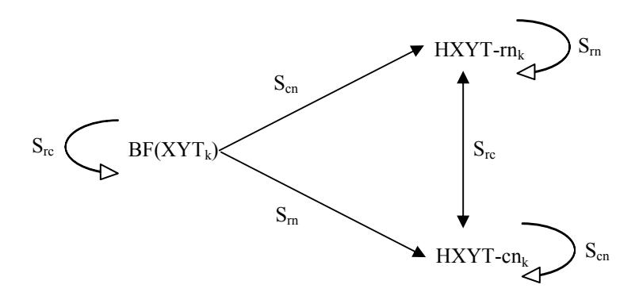

Figure 1. Relationships between the XYT and the HXYT rules

#### XVIII.2. Examples and independence results

The examples in this section will prove that hxyt-chain rules of any length at least up to length thirteen are not subsumed by simpler rules in our hierarchy.

#### XVIII.2.1. Two puzzles in [L3+XY4+HXY4+C4+XYT4]+HXYT4

The L3+XY4+HXY4+C4+XYT4 and L2 elaborations of puzzle Royle17-3174 (Figure 2) coincide. After the application of three simple rules, a hxyt-cn4 chain appears.

|   |   |   |   | 2 |   | 6 |   |  |
|---|---|---|---|---|---|---|---|--|
|   | 1 |   |   |   |   |   |   |  |
|   |   |   | 9 |   |   |   |   |  |
| 2 | 3 |   |   |   | 6 |   |   |  |
|   |   |   |   | 8 |   |   | 9 |  |
| 5 |   |   |   |   |   |   | 4 |  |
|   |   |   | 4 |   | 1 | 3 |   |  |
|   |   | 9 | 7 |   |   |   |   |  |
| 8 |   |   |   |   |   |   |   |  |

| 9 |   |   | 8 | 2 |   | 6 | 1 | 4 |
|---|---|---|---|---|---|---|---|---|
|   | 1 | 2 | 6 | 4 |   | 9 |   | 8 |
| 4 | 8 | 6 | 9 | 1 |   |   |   |   |
| 2 | 3 | 4 | 1 | 9 | 6 | 8 |   |   |
|   |   |   | 5 | 8 | 4 | 2 | 9 | 3 |
| 5 | 9 | 8 | 3 | 7 | 2 | 1 | 4 | 6 |
|   | 2 |   | 4 |   | 1 | 3 | 8 | 9 |
|   |   | 9 | 7 |   | 8 |   |   |   |
| 8 |   |   | 2 |   | 9 |   |   |   |

| 9 | 5 | 7 | 8 | 2 | 3 | 6 | 1 | 4 |
|---|---|---|---|---|---|---|---|---|
| 3 | 1 | 2 | 6 | 4 | 5 | 9 | 7 | 8 |
| 4 | 8 | 6 | 9 | 1 | 7 | 5 | 3 | 2 |
| 2 | 3 | 4 | 1 | 9 | 6 | 8 | 5 | 7 |
| 6 | 7 | 1 | 5 | 8 | 4 | 2 | 9 | 3 |
| 5 | 9 | 8 | 3 | 7 | 2 | 1 | 4 | 6 |
| 7 | 2 | 5 | 4 | 6 | 1 | 3 | 8 | 9 |
| 1 | 6 | 9 | 7 | 3 | 8 | 4 | 2 | 5 |
| 8 | 4 | 3 | 2 | 5 | 9 | 7 | 6 | 1 |

Figure 2. Puzzle Royle17-3174, its L2 elaboration and its solution

```
Resolution path in L3+XY4+HXY4+C4+XYT4+HXYT4 for the L3+XY4+HXY4+C4 +XYT4 (or L2) elaboration of Royle17-3174: row r7 interaction-with-block b7 ==> r9c3 \neq 7, r9c2 \neq 7 hidden-pairs-in-a-block \{n1\ n3\}\{r8c1\ r9c3\} ==> r9c3 \neq 6, r8c1 \neq 6 block b1 interaction-with-row r1 ==> r1c6 \neq 5 hxyt-cn4-chain \{r8\ r9\}c5n3 - \{r9\ r1\}c3n3 - \{r1\ r7\}c3n5 - \{r7\ r8\}c5n5 ==> r8c5 \neq 6 xy4-chain \{n3\ n7\}r2c1 - \{n7\ n6\}r7c1 - \{n6\ n5\}r7c5 - \{n5\ n3\}r8c5 ==> r8c1 \neq 3 ...(Naked-Singles and Hidden-Singles)
```

Our second example, puzzle Royle17-20059 (Figure 3), has the advantage of showing a c4-chain and a hxyt4-chain living at the same time on the same grid.

|   | 6 |   | 3 |   | 2 |   |   |  |
|---|---|---|---|---|---|---|---|--|
|   |   | 7 |   |   |   | 4 | 1 |  |
|   |   |   |   |   |   |   | 8 |  |
|   | 3 |   | 5 |   |   | 6 |   |  |
|   |   |   |   | 1 |   |   | 4 |  |
|   |   |   |   |   |   |   |   |  |
|   |   |   | 6 |   |   | 3 |   |  |
| 8 |   |   |   | 4 |   |   |   |  |
| 1 |   |   |   |   |   |   |   |  |

| 4 | 6 | 1 | 3 | 8 | 2 |   |   |   |
|---|---|---|---|---|---|---|---|---|
| 2 | 8 | 7 | 9 |   |   | 4 | 1 | 3 |
| 3 |   |   | 1 | 7 | 4 | 2 | 8 | 6 |
| 7 | 3 | 4 | 5 |   | 8 | 6 |   | 1 |
| 6 |   |   |   | 1 | 3 |   | 4 |   |
|   | 1 |   | 4 |   |   |   | 3 |   |
|   | 4 |   | 6 |   | 1 | 3 | 7 | 8 |
| 8 |   | 3 |   | 4 |   | 1 | 6 |   |
| 1 |   | 6 | 8 | 3 |   |   |   | 4 |

| 4 | 6 | 1 | 3 | 8 | 2 | 9 | 5 | 7 |
|---|---|---|---|---|---|---|---|---|
| 2 | 8 | 7 | 9 | 6 | 5 | 4 | 1 | 3 |
| 3 | 9 | 5 | 1 | 7 | 4 | 2 | 8 | 6 |
| 7 | 3 | 4 | 5 | 2 | 8 | 6 | 9 | 1 |
| 6 | 2 | 9 | 7 | 1 | 3 | 8 | 4 | 5 |
| 5 | 1 | 8 | 4 | 9 | 6 | 7 | 3 | 2 |
| 9 | 4 | 2 | 6 | 5 | 1 | 3 | 7 | 8 |
| 8 | 5 | 3 | 2 | 4 | 7 | 1 | 6 | 9 |
| 1 | 7 | 6 | 8 | 3 | 9 | 5 | 2 | 4 |

Figure 3. Puzzle Royle17-20059, its L3 elaboration and its solution

Resolution path in L3+XY4+HXY4+C4+XYT4+HXYT4 for the L3+XY4+HXY4+C4+XYT4 (or L3) elaboration of Royle17-20059:

```
c4-chain row-bl-col n2r7\{c3 c5\} - n2\{r8 r5\}c4 ==> r5c3 \neq 2
hxyt-cn4-chain \{r8 r5\}c4n2 - \{r5 r8\}c4n7 - \{r8 r9\}c2n7 - \{r9 r8\}c2n2 ==> r8c9 \neq 2
...(Naked-Singles and Hidden-Singles)
```

#### XVIII.2.2. Three puzzles in [L4+XY5+HXY5+XYT5]+HXYT5

One of the simplest examples of a hxyt5-chain is given by puzzle Royle17-9039 (Figure 4). The L4+XY5+HXY5+XYT5 and the L2 elaborations coincide. After an Interaction rule has been applied to them, we have a hxy-rn5 chain and a hxyt-rn5 chain at the same time on the grid. As hxy5 has higher priority than hxyt5, it is applied first.

```
Resolution path in L4+XY5+HXY5+XYT5+HXYT5 for the L4+XY5+HXY5+XYT5 (or L2) elaboration of Royle17-9039: column c5 interaction-with-block b2 \Longrightarrow r2c6 \neq 3
```

```
hxy-rn5-chain {c5 c2}r2n3 – {c2 c6}r5n3 – {c6 c3}r6n3 – {c3 c7}r6n4 – {c7 c5}r8n4 ==> r2c5 \neq 4
hxyt-rn5-chain {c5 c7}r8n4 – {c7 c5}r8n9 – {c5 c1}r1n9 – {c1 c6}r9n9 – {c6 c5}r9n6 ==> r9c5 \neq 4
c4-chain row-col-row n4r2{c2 c6} – n4r9{c6 c1} ==> r7c2 \neq 4
block b7 interaction-with-column c1 ==> r1c1 \neq 4
swordfish-in-rows n4{r1 r6 r8}{c5 c3 c7} ==> r5c7 \neq 4
hxy-rn4-chain {c2 c1}r7n3 – {c1 c8}r7n4 – {c8 c9}r3n4 – {c9 c2}r5n4 ==> r5c2 \neq 3
...(Naked-Singles and Hidden-Singles)
```

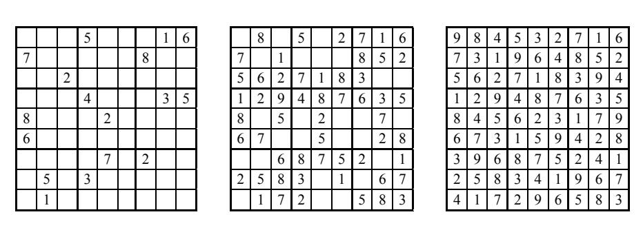

Figure 4. Puzzle Royle17-9039, its L2 elaboration and its solution

In our second example, puzzle Royle17-4068 (Figure 5), a hxyt-rn4-chain comes just before a hxyt-rn5-chain. Notice that the hxyt-rn4 rule eliminates candidate (column) c4 from rn-cell r9n9 and this is what allows the hxyt-rn5 pattern to appear: it could not be there before, because c4 is not in the list (c8, c5, c1, c3, c6) of the right (column) candidates for this hxyt-rn5 pattern.

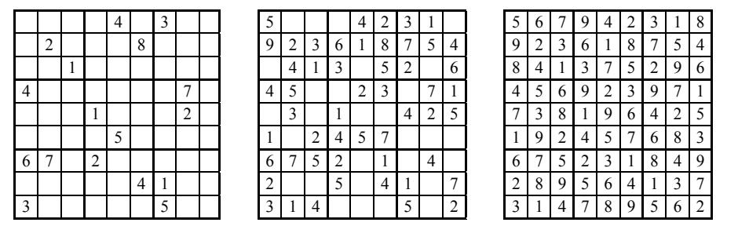

Figure 5. Puzzle Royle17-4068, its L1 elaboration and its solution

Resolution path in L4+XY5+HXY5+XYT5+HXYT5 for the L4+XY5+HXY5+XYT5 (or L1) elaboration of Royle17-4068:

```
column c7 interaction-with-block b6 ==> r6c8 \neq 6 block b7 interaction-with-row r8 ==> r8c8 \neq 9, r8c5 \neq 9, r8c8 \neq 8, r8c5 \neq 8 block b5 interaction-with-row r5 ==> r5c3 \neq 6 xyz3-chain \{n8\ n7\}r5c1 - \{n7\ n9\}r5c3 - \{n9\ n8\}r8c3 ==> r4c3 \neq 8 hxyt-rn4-chain \{c4\ c5\}r9n7 - \{c5\ c1\}r3n7 - \{c1\ c8\}r3n8 - \{c8\ c4\}r9n8 ==> r9c4 \neq 9 hxyt-rn5-chain \{c8\ c5\}r3n9 - \{c5\ c1\}r3n7 - \{c1\ c3\}r5n7 - \{c3\ c6\}r5n9 - \{c6\ c8\}r9n9 ==> r6c8 \neq 9 xyt4-chain \{n8\ n9\}r1c9 - \{n9\ n8\}r3c8 - \{n8\ n3\}r6c8 - \{n3\ n8\}r6c9 ==> r7c9 \neq 8 c4-chain row-col-row n8r4\{c4\ c7\} - n8r7\{c7\ c5\} ==> r9c4 \neq 8 ...(Naked-Singles and Hidden-Singles)
```

With our third example, puzzle Royle17-8530 (Figure 6), after a few simple rules have been applied to the L4+XY5+HXY5+XYT5 elaboration (which coincides with the L4 elaboration), three chains of length five and of different types (hxy-rn5, hxy-cn5 and hxyt-rn5) appear to live at the same time on the same grid:

|   |   |   | 4 |   |   | 2 |   | 3 |
|---|---|---|---|---|---|---|---|---|
| 6 | 5 |   |   |   | 8 |   |   |   |
|   |   |   |   |   |   | 7 |   |   |
| 1 |   |   | 5 |   |   |   | 6 |   |
|   |   |   |   | 3 |   |   |   |   |
| 8 |   |   |   |   |   |   |   |   |
|   |   |   | 1 |   |   |   | 9 |   |
|   |   | 3 |   | 7 |   |   |   |   |
|   | 2 |   |   |   |   |   |   |   |

 $r8c7 \neq 1$ 

| 9 |   |   | 4 | 6 | 7 | 2 | 5 | 3 |
|---|---|---|---|---|---|---|---|---|
| 6 | 5 | 7 | 3 | 2 | 8 |   |   |   |
| 3 | 4 | 2 | 9 |   |   | 7 | 8 | 6 |
| 1 | 7 |   | 5 |   | 2 | 3 | 6 |   |
| 2 |   |   |   | 3 |   |   | 7 |   |
| 8 | 3 |   | 7 |   |   |   | 2 |   |
| 7 |   |   | 1 |   | 3 |   | 9 | 2 |
|   |   | 3 | 2 | 7 |   |   |   |   |
|   | 2 |   |   |   |   |   | 3 | 7 |

| 9 | 8 | 1 | 4 | 6 | 7 | 2 | 5 | 3 |
|---|---|---|---|---|---|---|---|---|
| 6 | 5 | 7 | 3 | 2 | 8 | 9 | 1 | 4 |
| 3 | 4 | 2 | 9 | 1 | 5 | 7 | 8 | 6 |
| 1 | 7 | 4 | 5 | 8 | 2 | 3 | 6 | 9 |
| 2 | 9 | 5 | 6 | 3 | 4 | 8 | 7 | 1 |
| 8 | 3 | 6 | 7 | 9 | 1 | 4 | 2 | 5 |
| 7 | 6 | 8 | 1 | 4 | 3 | 5 | 9 | 2 |
| 5 | 1 | 3 | 2 | 7 | 9 | 6 | 4 | 8 |
| 4 | 2 | 9 | 8 | 5 | 6 | 1 | 3 | 7 |

Figure 6. Puzzle Royle17-8530, its L4 elaboration and its solution

```
Resolution path in L4+XY5+HXY5+XYT5+HXYT5 for the L4+XY5+HXY5+XYT5 (or L4) elaboration of Royle17-8530: column c1 interaction-with-block b7 \Longrightarrow r9c3 \neq 5, r7c3 \neq 5, r9c3 \neq 4, r7c3 \neq 4 naked-pairs-in-a-row {n6 n8}r7{c2 c3} \Longrightarrow r7c7 \neq 8, r7c7 \neq 6 row r7 interaction-with-block b7 \Longrightarrow r9c3 \neq 6, r8c2 \neq 6 naked-pairs-in-a-row {n6 n8}r7{c2 c3} \Longrightarrow r7c5 \neq 8 row r7 interaction-with-block b7 \Longrightarrow r9c3 \neq 8, r8c2 \neq 8 row r8 interaction-with-block b9 \Longrightarrow r9c7 \neq 8 xyt4-chain {n4 n9}r4c3 - {n9 n6}r5c2 - {n6 n8}r5c4 - {n8 n4}r4c5 \Longrightarrow r4c9 \neq 4 hxy-rn5-chain {c3 c6}r6n6 - {c6 c7}r8n6 - {c7 c9}r8n8 - {c9 c5}r4n8 - {c5 c3}r4n4 \Longrightarrow r6c3 \neq 4 hxy-cn5-chain {r8 r1}c2n1 - {r1 r7}c2n8 - {r7 r5}c2n6 - {r5 r9}c4n6 - {r9 r8}c7n6 \Longrightarrow
```

...(Naked-Singles and Hidden-Singles)

#### XVIII.2.3. Two puzzles in [L5+XY6+HXY6+C6+XYT6]+HXYT6

One of the simplest examples we have found of a puzzle in [L5+XY6+HXY6+C6+XYT6]+HXYT6 is Royle17-14425 (Figure 7). The L5+XY6+HXY6+C6+XYT6 elaboration does not produce more values than the L1 elaboration, but, after a few simple Interaction rules have been applied to it, the hxyt-cn6 pattern appears.

|   |   | 1 |   | 2 | 6 |   |   |   |   | 4 | 1 | 8 | 2 | 6 | 3 | 9 |
|---|---|---|---|---|---|---|---|---|---|---|---|---|---|---|---|---|
|   |   |   |   |   |   |   | 8 |   | 4 |   |   |   |   | 7 | 1 | 8 |
| Γ |   |   |   |   |   |   | 3 |   |   |   |   |   | 8 | 4 |   | 3 |
|   | 6 |   | 4 | 7 |   |   |   |   |   | 6 |   | 4 | 7 |   |   | 1 |
|   |   |   |   | 1 |   |   | 5 |   |   |   |   |   | 1 |   | 8 | 5 |
|   | 8 |   |   |   |   |   |   |   |   | 8 |   | 1 | 4 |   | 6 | 2 |
|   |   |   |   |   |   |   | 7 | 1 |   |   | 4 | 6 | 3 |   |   | 7 |
| Г | 3 |   |   |   |   | 4 |   |   |   | 3 | 8 | 7 |   | 1 | 4 | 6 |
| Γ |   |   |   |   | 8 |   |   |   |   | 1 |   |   | 6 | 8 | 7 | 4 |

| 4 | 1 | 8 | 2 | 6 | 3 | 9 | 5 | 7 |
|---|---|---|---|---|---|---|---|---|
| 2 | 3 | 5 | 9 | 7 | 1 | 8 | 6 | 4 |
| 7 | 6 | 9 | 8 | 4 | 5 | 3 | 2 | 1 |
| 6 | 2 | 4 | 7 | 5 | 9 | 1 | 8 | 3 |
| 9 | 7 | 3 | 1 | 2 | 8 | 5 | 4 | 6 |
| 8 | 5 | 1 | 4 | 3 | 6 | 2 | 7 | 9 |
| 5 | 4 | 6 | 3 | 9 | 2 | 7 | 1 | 8 |
| 3 | 8 | 7 | 5 | 1 | 4 | 6 | 9 | 2 |
| 1 | 9 | 2 | 6 | 8 | 7 | 4 | 3 | 5 |

Figure 7. Puzzle Royle17-14425, its L1 elaboration and its solution

```
Resolution path in L5+XY6+HXY6+C6+XYT6+HXYT6 for the L5+XY6+HXY6+C6 +XYT6 (or L1) elaboration of Royle17-14425: row r5 interaction-with-block b4 ==> r6c2 \neq 7 row r1 interaction-with-block b3 ==> r3c8 \neq 7, r3c8 \neq 5, r2c8 \neq 5 row r9 interaction-with-block b7 ==> r7c1 \neq 2 block b4 interaction-with-column c2 ==> r9c2 \neq 5, r3c2 \neq 5, r2c2 \neq 5 hxyt-cn6-chain {r3 r5}c1n7 - {r5 r3}c2n7 - {r3 r2}c2n6 - {r2 r3}c8n6 - {r3 r2}c8n2 - {r2 r3}c1n2 ==> r3c1 \neq 9, r3c1 \neq 5 c4-chain col-row-bl r3c1 = r3c1 = r3c1 = r3c1 = r3c1 = r3c1 = r3c1 = r3c1 = r3c1 = r3c1 = r3c1 = r3c1 = r3c1 = r3c1 = r3c1 = r3c1 = r3c1 = r3c1 = r3c1 = r3c1 = r3c1 = r3c1 = r3c1 = r3c1 = r3c1 = r3c1 = r3c1 = r3c1 = r3c1 = r3c1 = r3c1 = r3c1 = r3c1 = r3c1 = r3c1 = r3c1 = r3c1 = r3c1 = r3c1 = r3c1 = r3c1 = r3c1 = r3c1 = r3c1 = r3c1 = r3c1 = r3c1 = r3c1 = r3c1 = r3c1 = r3c1 = r3c1 = r3c1 = r3c1 = r3c1 = r3c1 = r3c1 = r3c1 = r3c1 = r3c1 = r3c1 = r3c1 = r3c1 = r3c1 = r3c1 = r3c1 = r3c1 = r3c1 = r3c1 = r3c1 = r3c1 = r3c1 = r3c1 = r3c1 = r3c1 = r3c1 = r3c1 = r3c1 = r3c1 = r3c1 = r3c1 = r3c1 = r3c1 = r3c1 = r3c1 = r3c1 = r3c1 = r3c1 = r3c1 = r3c1 = r3c1 = r3c1 = r3c1 = r3c1 = r3c1 = r3c1 = r3c1 = r3c1 = r3c1 = r3c1 = r3c1 = r3c1 = r3c1 = r3c1 = r3c1 = r3c1 = r3c1 = r3c1 = r3c1 = r3c1 = r3c1 = r3c1 = r3c1 = r3c1 = r3c1 = r3c1 = r3c1 = r3c1 = r3c1 = r3c1 = r3c1 = r3c1 = r3c1 = r3c1 = r3c1 = r3c1 = r3c1 = r3c1 = r3c1 = r3c1 = r3c1 = r3c1 = r3c1 = r3c1 = r3c1 = r3c1 = r3c1 = r3c1 = r3c1 = r3c1 = r3c1 = r3c1 = r3c1 = r3c1 = r3c1 = r3c1 = r3c1 = r3c1 = r3c1 = r3c1 = r3c1 = r3c1 = r3c1 = r3c1 = r3c1 = r3c1 = r3c1 = r3c1 = r3c1 = r3c1 = r3c1 = r3c1 = r3c1 = r3c1 = r3c1 = r3c1 = r3c1 = r3c1 = r3c1 = r3c1 = r3c1 = r3c1 = r3c1 = r3c1 = r3c1 = r3c1 = r3c1 = r3c1 = r3c1 = r3c1 = r3c1 = r3c1 = r3c1 = r3c1 = r3c1 = r3c1 = r3c1 = r3c1 = r3c1 = r3c1 = r3c1 = r3c1 = r3c1 = r3c1 = r3c1 = r3c1 = r3c1 = r3c1 = r3c1 = r3c1 = r3c1 = r3c1 = r3c1 = r3c1 = r3c1 = r3c1 = r3c1 = r3c1 = r3c1 = r3c1 = r3c1 = r3c1 = r3c1 = r3c1 = r3c1 = r3c1 = r3c1 = r3c1 = r3c1 = r3c1 = r3c1
```

Our second example, puzzle Royle17-3340 (Figure 8), is interesting for two reasons:

– its L5+XY6+HXY6+C6+XYT6 and its L2 elaborations coincide and their solution requires no complex rule apart from (c4 and) hxyt-rn6;

– it has only a small sequence of final Naked-Singles (17); indeed, before these, there is a long series of 27 NS and 4 HS, as generally occurs when the solution is close, but an xy4 has to be applied before the 17 final NS can effectively lead to it.

|   |   |   |   | 2 | 3 | 6 |   |   | 5 |   |   |
|---|---|---|---|---|---|---|---|---|---|---|---|
|   | 1 |   |   |   |   |   | 5 |   |   | 1 | 3 |
|   |   |   |   |   |   |   |   |   |   | 2 | 6 |
| 3 |   | 2 |   | 7 |   |   |   |   | 3 |   | 2 |
|   |   |   | 5 |   |   |   | 4 |   |   |   |   |
| 6 | , |   |   |   |   |   |   |   | 6 |   | 5 |
|   |   |   | 1 |   |   |   |   | 8 |   | 3 | 9 |
|   | 5 |   | 4 |   |   |   |   |   |   | 5 |   |
| 7 | ' |   |   |   |   | 3 |   |   | 7 | 6 |   |

| 5 |   |   |   | 2 | 3 | 6 |   |   |
|---|---|---|---|---|---|---|---|---|
|   | 1 | 3 | 6 |   |   |   | 5 |   |
|   | 2 | 6 | 7 |   |   |   | 3 | 9 |
| 3 |   | 2 |   | 7 |   |   |   |   |
|   |   |   | 5 |   |   |   | 4 | 3 |
| 6 |   | 5 | 3 |   |   |   |   |   |
|   | 3 | 9 | 1 |   |   |   |   | 8 |
|   | 5 |   | 4 | 3 |   |   |   |   |
| 7 | 6 |   | 2 |   |   | 3 |   |   |

| 5 | 7 | 4 | 9 | 2 | 3 | 6 | 8 | 1 |
|---|---|---|---|---|---|---|---|---|
| 9 | 1 | 3 | 6 | 8 | 4 | 7 | 5 | 2 |
| 8 | 2 | 6 | 7 | 1 | 5 | 4 | 3 | 9 |
| 3 | 4 | 2 | 8 | 7 | 1 | 9 | 6 | 5 |
| 1 | 8 | 7 | 5 | 9 | 6 | 2 | 4 | 3 |
| 6 | 9 | 5 | 3 | 4 | 2 | 8 | 1 | 7 |
| 4 | 3 | 9 | 1 | 6 | 7 | 5 | 2 | 8 |
| 2 | 5 | 8 | 4 | 3 | 9 | 1 | 7 | 6 |
| 7 | 6 | 1 | 2 | 5 | 8 | 3 | 9 | 4 |

Figure 8. Puzzle Royle17-3340, its L2 elaboration and its solution

```
Resolution path in L5+XY6+HXY6+C6+XYT6+HXYT6 for the L5+XY6+HXY6+C6+
XYT6 (or L2) elaboration of Royle17-3340:
row r2 interaction-with-block b3 ==> r1c9 \neq 7, r1c8 \neq 7
row r5 interaction-with-block b5 ==> r4c6 \neq 6
row r1 interaction-with-block b3 ==> r3c7 \neq 1
block b4 interaction-with-column c2 \Longrightarrow r1c2 \neq 4
block b4 interaction-with-row r5 ==> r5c7 \neq 1, r5c6 \neq 1, r5c5 \neq 1
naked-pairs-in-a-row \{n4 \ n8\} r3 \{c1 \ c7\} ==  r3c6 \neq 8, r3c6 \neq 4, r3c5 \neq 8, r3c5 \neq 4 
block b2 interaction-with-row r2 ==> r2c9 \neq 4, r2c7 \neq 4, r2c1 \neq 4
hidden-pairs-in-a-block \{n4 \ n5\} \{r7c7 \ r9c9\} ==> r9c9 \neq 1, r7c7 \neq 7, r7c7 \neq 2
hidden-pairs-in-a-row \{n2\ n7\}r2\{c7\ c9\} \Longrightarrow r2c7 \neq 8
c4-chain col-row-bl n8\{r4\ r1\}c4 - n8\{r1c8\ r3c7\} \Longrightarrow r4c7 \neq 8
hxyt-rn6-chain {c8 c3}r9n1 - {c3 c9}r9n4 - {c9 c3}r1n4 - {c3 c2}r1n7 - {c2 c4}r1n9 -
{c4 c8}r1n8 => r1c8 \neq 1
27 Naked-Singles followed by 4 Hidden-Singles ==> r1c8 = 8, r3c7 = 4, r1c9 = 1, r7c7 = 5,
r9c9 = 4, r7c5 = 6, r7c6 = 7, r7c8 = 2, r7c1 = 4, r3c1 = 8, r2c1 = 9, r1c2 = 7, r1c3 = 4,
r5c1 = 1, r8c1 = 2, r1c4 = 9, r4c4 = 8, r5c5 = 9, r5c2 = 8, r5c3 = 7, r5c7 = 2, r6c9 = 7,
r2c9 = 2, r8c9 = 6, r4c9 = 5, r2c7 = 7, r5c6 = 6, r8c8 = 7, r4c8 = 6, r6c6 = 2, r6c7 = 8
xy4-chain \{n1\ n4\}r4c6 - \{n4\ n8\}r2c6 - \{n8\ n9\}r8c6 - \{n9\ n1\}r8c7 ==> r4c7 \neq 1
...(17 final Naked-Singles)
```

#### XVIII.2.4. A puzzle in [L6+XY7+HXY7+XYT7]+HXYT7

In puzzle Royle17-7584, the L6+XY7+HXY7+XYT7 and the L6 elaborations coincide; rules for chains of length six (HXY-cn6 and XYZT6) are effectively used and what they produce is subsumed by the addition of a value (r1c8 = 7). Starting from this elaborated puzzle, two resolution paths can be considered:

- either in L4\_0+XY4\_7+HXY4\_7+C4\_7+XYT4\_7+HXYT4\_7, i.e. using only the rules in L4\_0 and the rules for chains of types and lengths no more complex than those of HXYT7,
- or in L6+XY7+HXY7+XYT7+HXYT7, i.e. allowing the addition of all the rules of length no more than six.

|   |   |   | 2 | 8 | 6 |   |   |   | 5 |   |   | 2 | 8 | 6 | 3 | 7 |   | 5 | 4 | 9 | 2 | 8 | 6 | 3 | 7 | 1 |
|---|---|---|---|---|---|---|---|---|---|---|---|---|---|---|---|---|---|---|---|---|---|---|---|---|---|---|
| 7 |   |   |   |   |   |   | 4 | 5 | 7 | 6 | 2 | 3 | 9 | 1 | 8 | 4 | 5 | 7 | 6 | 2 | 3 | 9 | 1 | 8 | 4 | 5 |
|   |   |   |   |   |   |   |   |   | 3 |   |   | 7 | 5 | 4 |   |   |   | 3 | 8 | 1 | 7 | 5 | 4 | 9 | 6 | 2 |
|   | 3 | 6 |   |   |   | 2 |   |   | 1 | 3 | 6 |   | 7 | 5 | 2 |   | 4 | 1 | 3 | 6 | 9 | 7 | 5 | 2 | 8 | 4 |
|   | 5 |   | 4 |   |   |   |   |   |   | 5 |   | 4 | 3 |   |   |   |   | 8 | 5 | 7 | 4 | 3 | 2 | 1 | 9 | 6 |
|   |   |   |   | 1 |   |   |   |   |   |   |   | 6 | 1 |   | 5 | 3 |   | 9 | 2 | 4 | 6 | 1 | 8 | 5 | 3 | 7 |
|   |   |   |   |   | 3 | 6 |   |   |   |   |   | 1 | 4 | 3 | 6 | 5 |   | 2 | 7 | 8 | 1 | 4 | 3 | 6 | 5 | 9 |
| 4 |   |   | 5 |   |   |   |   |   | 4 | 1 | 3 | 5 | 6 |   |   |   |   | 4 | 1 | 3 | 5 | 6 | 9 | 7 | 2 | 8 |
|   |   |   |   |   |   |   | 1 |   | 6 |   | 5 |   | 2 |   | 4 | 1 | 3 | 6 | 9 | 5 | 8 | 2 | 7 | 4 | 1 | 3 |

Figure 9. Puzzle Royle17-7584, its L6 elaboration and its solution

As usual, the two paths have a common part (in L2), but it is very short in the present case:

```
;;; common part in L2 for the two resolution paths, in L4_0+XY4_7+HXY4_7+C4_7+XYT4_7+HXYT4_7 and in L6+XY7+HXY7+XYT7+HXYT7, for the L6+XY7+HXY7+XYT7 (or L6) elaboration of Royle17-7584: row r8 interaction-with-block b9 ==> r7c9 \neq 2 naked-pairs-in-a-block {n1 n9} {r1c9 r3c7} ==> r3c9 \neq 9, r3c9 \neq 1, r3c8 \neq 9 ;;; end of the common part
```

As the display of the two resolution paths shows, which one should be preferred in this case is a matter of taste. In both cases, the same hxyt-rn7 chain produces the same elimination.

1) Resolution path in L4\_0+XY4\_7+HXY4\_7+C4\_7+XYT4\_7+HXYT4\_7, using only chains of types xy, hxy, c, xyt and hxyt:

```
Continuation of the resolution path, in L4_0+XY4_7+HXY4_7+C4_7+XYT4_7+ HXYT4_7, for the L6+XY7+HXY7+XYT7 (or L6) elaboration of Royle17-7584: 

hxy-cn6-chain {r8 r3}c9n2 – {r3 r5}c9n6 – {r5 r1}c9n1 – {r1 r3}c3n1 – {r3 r5}c7n1 – {r5 r8}c7n7 ==> r8c9 \neq 7 

hxyt-cn7-chain {r1 r6}c2n4 – {r6 r7}c2n2 – {r7 r9}c2n7 – {r9 r8}c6n7 – {r8 r5}c7n7 – {r5 r3}c7n1 – {r3 r1}c3n1 ==> r1c3 \neq 4 

hidden-single-in-a-block ==> r1c2 = 4, r6c3 = 4 

c4-chain col-row-col r7{r7 r5}r8}c7 ==> r7c9 \neq 7
```

```
hidden-single-in-a-block => r8c7 = 7; r9c6 = 7
naked-pairs-in-a-column \{n8\ n9\}\{r3\ r9\}c2 \Longrightarrow r7c2 \neq 9, r7c2 \neq 8, r6c2 \neq 9, r6c2 \neq 8
xy4-chain \{n9\ n1\}r1c3 - \{n1\ n9\}r1c9 - \{n9\ n1\}r3c7 - \{n1\ n9\}r5c7 \Longrightarrow r5c3 \neq 9
block b4 interaction-with-column c1 \Longrightarrow r7c1 \neq 9
x-wing-in-rows n9\{r1\ r7\}\{c3\ c9\} \Longrightarrow r8c9 \neq 9, r6c9 \neq 9, r5c9 \neq 9, r3c3 \neq 9
xy4-chain \{n9\ n8\}r4c8 - \{n8\ n9\}r4c4 - \{n9\ n8\}r9c4 - \{n8\ n9\}r8c6 \Longrightarrow r8c8 \neq 9
...(Naked-Singles and Hidden-Singles)
```

2) Resolution path in L6+XY7+HXY7+XYT7+HXYT7, allowing the additional use of any type of chains of length no more than six (but only XYZT5 is effectively used):

```
Continuation of the resolution path, in L6+XY7+HXY7+XYT7+HXYT7, for the L6+XY7+HXY7+XYT7 (or L6) elaboration of Royle17-7584:
```

#### XVIII.2.5. A puzzle in [L7+XY8+HXY8+C8+XYT8]+HXYT8

In puzzle Royle17-1092 (Figure 10), the L7+XY8+HXY8+C8+XYT8 and the L1 0 elaborations coincide.

The first steps of this example are another illustration, for hxy-cn4-chains, of what we saw in section XV.3.5 for hxy-rn6-chains: on the same set of cells, different orderings can lead to different hxy-chains (of course, this is also true for xy-chains; it is less likely for non reversible chains, like xyt, hxyt, xyzt or hxyzt; nevertheless, see the example in section 2.6 below).

This is also a case in which the resolution paths in L7+XY8+HXY8+C8+XYT8 +HXYT8 and in L4\_0+XY4\_8+HXY4\_8+C4\_8+XYT4\_8+HXYT4\_8 coincide. This means that rules of types xyzt and hxyzt and lengths strictly less than eight are not useful for elaborating this puzzle.

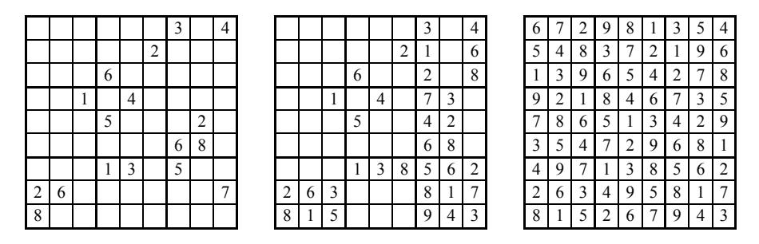

*Figure 10.* Puzzle Royle17-1092, its L1\_0 elaboration and its solution

```
Resolution path, in L7+XY8+HXY8+C8+XYT8+HXYT8 or in L4 0+XY4 8+HXY4 8+
C4 8+XYT4 8+HXYT4 8, for the L7+XY8+HXY8+C8+ XYT8 (or L1 0) elaboration of
Royle17-1092:
hidden-pairs-in-a-row \{n2 \ n8\} r4 \{c2 \ c4\} ==> r4c4 \neq 9, r4c2 \neq 9, r4c2 \neq 5
hidden-pairs-in-a-block {n3 n4}{r2c4 r3c6} ==> r3c6 \neq 9, r3c6 \neq 7, r3c6 \neq 5, r3c6 \neq 1,
r2c4 \neq 9, r2c4 \neq 8, r2c4 \neq 7
hxy-cn4-chain \{r9\ r5\}c5n6 - \{r5\ r1\}c3n6 - \{r1\ r6\}c3n2 - \{r6\ r9\}c5n2 ==> r9c5 \neq 7
hxy-cn4-chain \{r6\ r9\}c5n2 - \{r9\ r5\}c5n6 - \{r5\ r1\}c3n6 - \{r1\ r6\}c3n2 ==> r6c4 \neq 2, r6c2 \neq 2
hxy-cn4-chain \{r1\ r6\}c3n2 - \{r6\ r9\}c5n2 - \{r9\ r4\}c4n2 - \{r4\ r1\}c4n8 ==> r1c3 \neq 8
hxy-cn4-chain {r5 r9}c5n6 - {r9 r6}c5n2 - {r6 r1}c3n2 - {r1 r5}c3n6 ==> r5c6 \neq 6, r5c1 \neq 6
hxy-cn4-chain \{r1\ r5\}c3n6 - \{r5\ r9\}c5n6 - \{r9\ r6\}c5n2 - \{r6\ r1\}c3n2 ==> r1c3 \neq 9, r1c3 \neq 7
\frac{1}{12} \frac{1}{12} \frac{1}{12} \frac{1}{12} \frac{1}{12} \frac{1}{12} \frac{1}{12} \frac{1}{12} \frac{1}{12} \frac{1}{12} \frac{1}{12} \frac{1}{12} \frac{1}{12} \frac{1}{12} \frac{1}{12} \frac{1}{12} \frac{1}{12} \frac{1}{12} \frac{1}{12} \frac{1}{12} \frac{1}{12} \frac{1}{12} \frac{1}{12} \frac{1}{12} \frac{1}{12} \frac{1}{12} \frac{1}{12} \frac{1}{12} \frac{1}{12} \frac{1}{12} \frac{1}{12} \frac{1}{12} \frac{1}{12} \frac{1}{12} \frac{1}{12} \frac{1}{12} \frac{1}{12} \frac{1}{12} \frac{1}{12} \frac{1}{12} \frac{1}{12} \frac{1}{12} \frac{1}{12} \frac{1}{12} \frac{1}{12} \frac{1}{12} \frac{1}{12} \frac{1}{12} \frac{1}{12} \frac{1}{12} \frac{1}{12} \frac{1}{12} \frac{1}{12} \frac{1}{12} \frac{1}{12} \frac{1}{12} \frac{1}{12} \frac{1}{12} \frac{1}{12} \frac{1}{12} \frac{1}{12} \frac{1}{12} \frac{1}{12} \frac{1}{12} \frac{1}{12} \frac{1}{12} \frac{1}{12} \frac{1}{12} \frac{1}{12} \frac{1}{12} \frac{1}{12} \frac{1}{12} \frac{1}{12} \frac{1}{12} \frac{1}{12} \frac{1}{12} \frac{1}{12} \frac{1}{12} \frac{1}{12} \frac{1}{12} \frac{1}{12} \frac{1}{12} \frac{1}{12} \frac{1}{12} \frac{1}{12} \frac{1}{12} \frac{1}{12} \frac{1}{12} \frac{1}{12} \frac{1}{12} \frac{1}{12} \frac{1}{12} \frac{1}{12} \frac{1}{12} \frac{1}{12} \frac{1}{12} \frac{1}{12} \frac{1}{12} \frac{1}{12} \frac{1}{12} \frac{1}{12} \frac{1}{12} \frac{1}{12} \frac{1}{12} \frac{1}{12} \frac{1}{12} \frac{1}{12} \frac{1}{12} \frac{1}{12} \frac{1}{12} \frac{1}{12} \frac{1}{12} \frac{1}{12} \frac{1}{12} \frac{1}{12} \frac{1}{12} \frac{1}{12} \frac{1}{12} \frac{1}{12} \frac{1}{12} \frac{1}{12} \frac{1}{12} \frac{1}{12} \frac{1}{12} \frac{1}{12} \frac{1}{12} \frac{1}{12} \frac{1}{12} \frac{1}{12} \frac{1}{12} \frac{1}{12} \frac{1}{12} \frac{1}{12} \frac{1}{12} \frac{1}{12} \frac{1}{12} \frac{1}{12} \frac{1}{12} \frac{1}{12} \frac{1}{12} \frac{1}{12} \frac{1}{12} \frac{1}{12} \frac{1}{12} \frac{1}{12} \frac{1}{12} \frac{1}{12} \frac{1}{12} \frac{1}{12} \frac{1}{12} \frac{1}{12} \frac{1}{12} \frac{1}{12} \frac{1}{12} \frac{1}{12} \frac{1}{12} \frac{1}{12} \frac{1}{12} \frac{1}{12} \frac{1}{12} \frac{1}{12} \frac{1}{12} \frac{1}{12} \frac{1}{12} \frac{1}{12} \frac{1}{12} \frac{1}{12} \frac{1}{12} \frac{1}{12} \frac{1}{12} \frac{1}{12} \frac{1}{12} \frac{1}{12} \frac{1}{12} \frac{1}{12} \frac{1}{12} \frac{1}{12} \frac{1}{12} \frac{1}{12} \frac{1}{12} \frac{1}{12} \frac{1}{12} \frac{1}{12} \frac{1}{12} \frac{1}{12} \frac{1}{12} \frac{1}{12} \frac{1}{12} \frac{1}{12} \frac{1}{12} \frac{1}{12} \frac{1}{12} \frac{1}{12} \frac{1}{12} \frac{1}{12} \frac{1}{12} \frac{1}{12} \frac{1}{12} \frac{1}{12} \frac{1}{12} \frac{1}{12} \frac{1}{12} \frac{1}{12} \frac{1}{12} \frac{1}{12} \frac{1}{12} \frac{1}{12} \frac{1}{12} \frac{1}{12} \frac{1}{12} \frac{1}{12} \frac{1}{12} \frac{1}{12} \frac{1}{12} \frac{1}{12} \frac{1}{12} \frac{1}{12} \frac{1}{12} \frac{1}{12} \frac{1}{12} \frac{1}{12} \frac{1}{12} \frac{1}{12} \frac{1}{12} \frac{1}{12} \frac{1}{12} \frac{1}{12} \frac
\{r4 \ r1\}c4n8 - \{r1 \ r2\}c5n8 \Longrightarrow r2c2 \neq 8
hxyt-rn8-chain {c3 c5}r5n6 - {c5 c6}r9n6 - {c6 c1}r4n6 - {c1 c3}r1n6 - {c3 c2}r1n2 -
\{c2\ c4\}r4n2 - \{c4\ c2\}r4n8 - \{c2\ c3\}r5n8 ==> r5c3 \neq 9, r5c3 \neq 7
xy3-chain \{n2 \ n6\}r1c3 - \{n6 \ n8\}r5c3 - \{n8 \ n2\}r4c2 => r6c3 \neq 2
...(Naked-Singles and Hidden-Singles)
```

#### XVIII.2.6. A puzzle in [L8+XY9+HXY9+XYT9]+HXYT9

For puzzle Royle17-29499 (Figure 11), the L8+XY9+HXY9+XYT9 and the L4 elaborations coincide. Moreover, the resolution paths for this elaborated puzzle in the following two theories: L4\_0+XY4\_9+HXY4\_9+C4\_9+XYT4\_9+HXYT4\_9 and L8+XY9+HXY9+XYT9+HXYT9, coincide; i.e. rules of types XYZT and HXYZT are not useful for solving it.

Near the end of this common path (forgetting as usual the final NS and HS), one can see three hxyt-rn-chains, one of length seven and two of length nine, living at the same time on the grid (with no cell in common). As was the case in previous

examples of chains of types xy or hxy, the two hxyt9-chains consist of the same cells, taken in a different order.

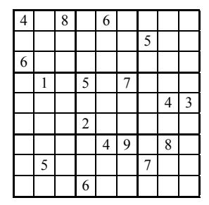

| 4 |   | 8 |   | 6 | 5 |   |   |   |
|---|---|---|---|---|---|---|---|---|
|   |   |   | 4 |   |   | 5 |   |   |
| 6 |   | 5 |   |   |   | 4 |   |   |
|   | 1 | 4 | 5 |   | 7 |   |   |   |
| 5 |   |   |   |   | 6 |   | 4 | 3 |
|   |   |   | 2 |   | 4 | 1 | 5 | 7 |
|   |   |   | 7 | 4 | 9 |   | 8 | 5 |
|   | 5 |   |   |   |   | 7 |   | 4 |
|   | 4 |   | 6 | 5 |   |   |   |   |

| _ |   |   |   |   |   |   |   |   |
|---|---|---|---|---|---|---|---|---|
| 4 | 2 | 8 | 3 | 6 | 5 | 9 | 7 | 1 |
| 7 | 9 | 1 | 4 | 2 | 8 | 5 | 3 | 6 |
| 6 | 3 | 5 | 9 | 7 | 1 | 4 | 2 | 8 |
| 3 | 1 | 4 | 5 | 8 | 7 | 6 | 9 | 2 |
| 5 | 7 | 2 | 1 | 9 | 6 | 8 | 4 | 3 |
| 9 | 8 | 6 | 2 | 3 | 4 | 1 | 5 | 7 |
| 1 | 6 | 3 | 7 | 4 | 9 | 2 | 8 | 5 |
| 2 | 5 | 9 | 8 | 1 | 3 | 7 | 6 | 4 |
| 8 | 4 | 7 | 6 | 5 | 2 | 3 | 1 | 9 |

Figure 11. Puzzle Royle17-29499, its L4 elaboration and its solution

Resolution path, in L4\_0+XY4\_9+HXY4\_9+C4\_9+XYT4\_9+HXYT4\_9 or in L8+XY9+HXY9+XYT9+HXYT9, for the L8+XY9+HXY9+XYT9 (or L4) elaboration of Royle17-29499:

```
column c7 interaction-with-block b6 ==> r4c9 \neq 8
 column c2 interaction-with-block b4 ==> r6c1 \neq 8, r4c1 \neq 8
 row r7 interaction-with-block b7 ==> r9c3 \neq 1, r9c1 \neq 1, r8c3 \neq 1, r8c1 \neq 1
block b5 interaction-with-column c5 ==> r8c5 \neq 3, r3c5 \neq 3, r2c5 \neq 3
 block b1 interaction-with-row r2 ==> r2c9 \neq 1, r2c8 \neq 1, r2c6 \neq 1, r2c5 \neq 1
 hxy-cn4-chain \{r7\ r4\}\ c7n6 - \{r4\ r5\}\ c7n8 - \{r5\ r6\}\ c2n8 - \{r6\ r7\}\ c2n6 ==> r7c3 \neq 6
 hxy-cn4-chain \{r6\ r5\}\ c2n8 - \{r5\ r4\}\ c7n8 - \{r4\ r7\}\ c7n6 - \{r7\ r6\}\ c2n6 ==> r6c2 \neq 9, r6c2 \neq 3
 hxy-cn4-chain {r5 r4}c7n8 - {r4 r7}c7n6 - {r7 r6}c2n6 - {r6 r5}c2n8 ==> r5c5 \neq 8, r5c4 \neq 8
 block b5 interaction-with-column c5 ==> r8c5 \neq 8, r3c5 \neq 8, r2c5 \neq 8
 naked-pairs-in-a-block \{n1 \ n9\} \{r5c4 \ r5c5\} = > r6c5 \neq 9
 row r6 interaction-with-block b4 ==> r5c3 \neq 9, r5c2 \neq 9
column c2 interaction-with-block b1 ==> r2c3 \neq 9, r2c1 \neq 9
 row r6 interaction-with-block b4 ==> r4c1 \neq 9
 naked-pairs-in-a-block \{n1 \ n9\} \{r5c4 \ r5c5\} \implies r4c5 \neq 9
 row r4 interaction-with-block b6 ==> r5c7 \neq 9
 \frac{1}{2} \frac{1}{2} \frac{1}{2} \frac{1}{2} \frac{1}{2} \frac{1}{2} \frac{1}{2} \frac{1}{2} \frac{1}{2} \frac{1}{2} \frac{1}{2} \frac{1}{2} \frac{1}{2} \frac{1}{2} \frac{1}{2} \frac{1}{2} \frac{1}{2} \frac{1}{2} \frac{1}{2} \frac{1}{2} \frac{1}{2} \frac{1}{2} \frac{1}{2} \frac{1}{2} \frac{1}{2} \frac{1}{2} \frac{1}{2} \frac{1}{2} \frac{1}{2} \frac{1}{2} \frac{1}{2} \frac{1}{2} \frac{1}{2} \frac{1}{2} \frac{1}{2} \frac{1}{2} \frac{1}{2} \frac{1}{2} \frac{1}{2} \frac{1}{2} \frac{1}{2} \frac{1}{2} \frac{1}{2} \frac{1}{2} \frac{1}{2} \frac{1}{2} \frac{1}{2} \frac{1}{2} \frac{1}{2} \frac{1}{2} \frac{1}{2} \frac{1}{2} \frac{1}{2} \frac{1}{2} \frac{1}{2} \frac{1}{2} \frac{1}{2} \frac{1}{2} \frac{1}{2} \frac{1}{2} \frac{1}{2} \frac{1}{2} \frac{1}{2} \frac{1}{2} \frac{1}{2} \frac{1}{2} \frac{1}{2} \frac{1}{2} \frac{1}{2} \frac{1}{2} \frac{1}{2} \frac{1}{2} \frac{1}{2} \frac{1}{2} \frac{1}{2} \frac{1}{2} \frac{1}{2} \frac{1}{2} \frac{1}{2} \frac{1}{2} \frac{1}{2} \frac{1}{2} \frac{1}{2} \frac{1}{2} \frac{1}{2} \frac{1}{2} \frac{1}{2} \frac{1}{2} \frac{1}{2} \frac{1}{2} \frac{1}{2} \frac{1}{2} \frac{1}{2} \frac{1}{2} \frac{1}{2} \frac{1}{2} \frac{1}{2} \frac{1}{2} \frac{1}{2} \frac{1}{2} \frac{1}{2} \frac{1}{2} \frac{1}{2} \frac{1}{2} \frac{1}{2} \frac{1}{2} \frac{1}{2} \frac{1}{2} \frac{1}{2} \frac{1}{2} \frac{1}{2} \frac{1}{2} \frac{1}{2} \frac{1}{2} \frac{1}{2} \frac{1}{2} \frac{1}{2} \frac{1}{2} \frac{1}{2} \frac{1}{2} \frac{1}{2} \frac{1}{2} \frac{1}{2} \frac{1}{2} \frac{1}{2} \frac{1}{2} \frac{1}{2} \frac{1}{2} \frac{1}{2} \frac{1}{2} \frac{1}{2} \frac{1}{2} \frac{1}{2} \frac{1}{2} \frac{1}{2} \frac{1}{2} \frac{1}{2} \frac{1}{2} \frac{1}{2} \frac{1}{2} \frac{1}{2} \frac{1}{2} \frac{1}{2} \frac{1}{2} \frac{1}{2} \frac{1}{2} \frac{1}{2} \frac{1}{2} \frac{1}{2} \frac{1}{2} \frac{1}{2} \frac{1}{2} \frac{1}{2} \frac{1}{2} \frac{1}{2} \frac{1}{2} \frac{1}{2} \frac{1}{2} \frac{1}{2} \frac{1}{2} \frac{1}{2} \frac{1}{2} \frac{1}{2} \frac{1}{2} \frac{1}{2} \frac{1}{2} \frac{1}{2} \frac{1}{2} \frac{1}{2} \frac{1}{2} \frac{1}{2} \frac{1}{2} \frac{1}{2} \frac{1}{2} \frac{1}{2} \frac{1}{2} \frac{1}{2} \frac{1}{2} \frac{1}{2} \frac{1}{2} \frac{1}{2} \frac{1}{2} \frac{1}{2} \frac{1}{2} \frac{1}{2} \frac{1}{2} \frac{1}{2} \frac{1}{2} \frac{1}{2} \frac{1}{2} \frac{1}{2} \frac{1}{2} \frac{1}{2} \frac{1}{2} \frac{1}{2} \frac{1}{2} \frac{1}{2} \frac{1}{2} \frac{1}{2} \frac{1}{2} \frac{1}{2} \frac{1}{2} \frac{1}{2} \frac{1}{2} \frac{1}{2} \frac{1}{2} \frac{1}{2} \frac{1}{2} \frac{1}{2} \frac{1}{2} \frac{1}{2} \frac{1}{2} \frac{1}{2} \frac{1}{2} \frac{1}{2} \frac{1}{2} \frac{1}{2} \frac{1}{2} \frac{1}{2} \frac{1}{2} \frac{1}{2} \frac{1}{2} \frac{1}{2} \frac{1}{2} \frac{1}{2} \frac{1}{2} \frac{1}{2} \frac{1}{2} \frac{1}{2} \frac{1}{2} \frac{1}{2} \frac{1}{2} \frac{1}{2} \frac{1}{2} \frac{1}{2} \frac{1}{2} \frac{1}{2} \frac{1}{2} \frac{1}{2} \frac{1}{2} \frac{1}{2} \frac{1}{2} \frac{1}{2} \frac{1}{2} \frac{1}{2} \frac{1}{2} \frac{1}{2} \frac{1}{2} \frac{1}{2} \frac{1}{2} \frac{1}{2} \frac{1}{2} \frac{1}{2} \frac{1}{2} \frac{1}{2} \frac{1}
 hxy-rn5-chain {c1 c5}r4n3 - {c5 c7}r4n8 - {c7 c2}r5n8 - {c2 c3}r5n7 - {c3 c1}r9n7 ==>
 r9c1 \neq 3
 \frac{1}{12} \ln \frac{1}{12} \ln \frac{1}{12} \ln \frac{1}{12} \ln \frac{1}{12} \ln \frac{1}{12} \ln \frac{1}{12} \ln \frac{1}{12} \ln \frac{1}{12} \ln \frac{1}{12} \ln \frac{1}{12} \ln \frac{1}{12} \ln \frac{1}{12} \ln \frac{1}{12} \ln \frac{1}{12} \ln \frac{1}{12} \ln \frac{1}{12} \ln \frac{1}{12} \ln \frac{1}{12} \ln \frac{1}{12} \ln \frac{1}{12} \ln \frac{1}{12} \ln \frac{1}{12} \ln \frac{1}{12} \ln \frac{1}{12} \ln \frac{1}{12} \ln \frac{1}{12} \ln \frac{1}{12} \ln \frac{1}{12} \ln \frac{1}{12} \ln \frac{1}{12} \ln \frac{1}{12} \ln \frac{1}{12} \ln \frac{1}{12} \ln \frac{1}{12} \ln \frac{1}{12} \ln \frac{1}{12} \ln \frac{1}{12} \ln \frac{1}{12} \ln \frac{1}{12} \ln \frac{1}{12} \ln \frac{1}{12} \ln \frac{1}{12} \ln \frac{1}{12} \ln \frac{1}{12} \ln \frac{1}{12} \ln \frac{1}{12} \ln \frac{1}{12} \ln \frac{1}{12} \ln \frac{1}{12} \ln \frac{1}{12} \ln \frac{1}{12} \ln \frac{1}{12} \ln \frac{1}{12} \ln \frac{1}{12} \ln \frac{1}{12} \ln \frac{1}{12} \ln \frac{1}{12} \ln \frac{1}{12} \ln \frac{1}{12} \ln \frac{1}{12} \ln \frac{1}{12} \ln \frac{1}{12} \ln \frac{1}{12} \ln \frac{1}{12} \ln \frac{1}{12} \ln \frac{1}{12} \ln \frac{1}{12} \ln \frac{1}{12} \ln \frac{1}{12} \ln \frac{1}{12} \ln \frac{1}{12} \ln \frac{1}{12} \ln \frac{1}{12} \ln \frac{1}{12} \ln \frac{1}{12} \ln \frac{1}{12} \ln \frac{1}{12} \ln \frac{1}{12} \ln \frac{1}{12} \ln \frac{1}{12} \ln \frac{1}{12} \ln \frac{1}{12} \ln \frac{1}{12} \ln \frac{1}{12} \ln \frac{1}{12} \ln \frac{1}{12} \ln \frac{1}{12} \ln \frac{1}{12} \ln \frac{1}{12} \ln \frac{1}{12} \ln \frac{1}{12} \ln \frac{1}{12} \ln \frac{1}{12} \ln \frac{1}{12} \ln \frac{1}{12} \ln \frac{1}{12} \ln \frac{1}{12} \ln \frac{1}{12} \ln \frac{1}{12} \ln \frac{1}{12} \ln \frac{1}{12} \ln \frac{1}{12} \ln \frac{1}{12} \ln \frac{1}{12} \ln \frac{1}{12} \ln \frac{1}{12} \ln \frac{1}{12} \ln \frac{1}{12} \ln \frac{1}{12} \ln \frac{1}{12} \ln \frac{1}{12} \ln \frac{1}{12} \ln \frac{1}{12} \ln \frac{1}{12} \ln \frac{1}{12} \ln \frac{1}{12} \ln \frac{1}{12} \ln \frac{1}{12} \ln \frac{1}{12} \ln \frac{1}{12} \ln \frac{1}{12} \ln \frac{1}{12} \ln \frac{1}{12} \ln \frac{1}{12} \ln \frac{1}{12} \ln \frac{1}{12} \ln \frac{1}{12} \ln \frac{1}{12} \ln \frac{1}{12} \ln \frac{1}{12} \ln \frac{1}{12} \ln \frac{1}{12} \ln \frac{1}{12} \ln \frac{1}{12} \ln \frac{1}{12} \ln \frac{1}{12} \ln \frac{1}{12} \ln \frac{1}{12} \ln \frac{1}{12} \ln \frac{1}{12} \ln \frac{1}{12} \ln \frac{1}{12} \ln \frac{1}{12} \ln \frac{1}{12} \ln \frac{1}{12} \ln \frac{1}{12} \ln \frac{1}{12} \ln \frac{1}{12} \ln \frac{1}{12} \ln \frac{1}{12} \ln \frac{1}{12} \ln \frac{1}{12} \ln \frac{1}{12} \ln \frac{1}{12} \ln \frac{1}{12} \ln \frac{1}{12} \ln \frac{1}{12} \ln \frac{1}{12} \ln \frac{1}{12} \ln \frac{1}{12} \ln \frac{1}{12} \ln \frac{1}{12} \ln \frac{1}{12} \ln \frac{1}{12} \ln \frac{1}{12} \ln \frac{1}{12} \ln \frac{1}{12} \ln \frac{1}{12} \ln \frac{1}{12} \ln \frac{1}{12} \ln \frac{1}{12} \ln \frac{1}{12} \ln \frac{1}{12} \ln \frac{1}{12} \ln \frac{1}{12} \ln \frac{1}{12} \ln \frac{1}{12} \ln \frac{1}{12} \ln \frac{1}{12} \ln \frac{1}{12} \ln \frac{1}{12} \ln \frac{1}{12} \ln \frac{1}{12} \ln \frac{1}{12} \ln \frac{1}{12} 
  \{c2\ c8\}r1n7 ==> r2c8 \neq 7
 hxy-rn7-chain {c1 c3}r9n7 - {c3 c2}r5n7 - {c2 c7}r5n8 - {c7 c5}r4n8 - {c5 c2}r6n8 -
  \{c2\ c3\}r6n6 - \{c3\ c1\}r6n9 ==> r9c1 \neq 9
 hxyt-rn7-chain {c3 c8}r8n6 - \{c8 c9\}r2n6 - \{c9 c7\}r4n6 - \{c7 c2\}r7n6 - \{c2 c3\}r6n6 - \{c4 c3\}r6n6 - \{c4 c3\}r6n6 - \{c4 c4\}r8n6 - \{c4 c4\}r8n6 - \{c4 c4\}r8n6 - \{c4 c4\}r8n6 - \{c4 c4\}r8n6 - \{c4 c4\}r8n6 - \{c4 c4\}r8n6 - \{c4 c4\}r8n6 - \{c4 c4\}r8n6 - \{c4 c4\}r8n6 - \{c4 c4\}r8n6 - \{c4 c4\}r8n6 - \{c4 c4\}r8n6 - \{c4 c4\}r8n6 - \{c4 c4\}r8n6 - \{c4 c4\}r8n6 - \{c4 c4\}r8n6 - \{c4 c4\}r8n6 - \{c4 c4\}r8n6 - \{c4 c4\}r8n6 - \{c4 c4\}r8n6 - \{c4 c4\}r8n6 - \{c4 c4\}r8n6 - \{c4 c4\}r8n6 - \{c4 c4\}r8n6 - \{c4 c4\}r8n6 - \{c4 c4\}r8n6 - \{c4 c4\}r8n6 - \{c4 c4\}r8n6 - \{c4 c4\}r8n6 - \{c4 c4\}r8n6 - \{c4 c4\}r8n6 - \{c4 c4\}r8n6 - \{c4 c4\}r8n6 - \{c4 c4\}r8n6 - \{c4 c4\}r8n6 - \{c4 c4\}r8n6 - \{c4 c4\}r8n6 - \{c4 c4\}r8n6 - \{c4 c4\}r8n6 - \{c4 c4\}r8n6 - \{c4 c4\}r8n6 - \{c4 c4\}r8n6 - \{c4 c4\}r8n6 - \{c4 c4\}r8n6 - \{c4 c4\}r8n6 - \{c4 c4\}r8n6 - \{c4 c4\}r8n6 - \{c4 c4\}r8n6 - \{c4 c4\}r8n6 - \{c4 c4\}r8n6 - \{c4 c4\}r8n6 - \{c4 c4\}r8n6 - \{c4 c4\}r8n6 - \{c4 c4\}r8n6 - \{c4 c4\}r8n6 - \{c4 c4\}r8n6 - \{c4 c4\}r8n6 - \{c4 c4\}r8n6 - \{c4 c4\}r8n6 - \{c4 c4\}r8n6 - \{c4 c4\}r8n6 - \{c4 c4\}r8n6 - \{c4 c4\}r8n6 - \{c4 c4\}r8n6 - \{c4 c4\}r8n6 - \{c4 c4\}r8n6 - \{c4 c4\}r8n6 - \{c4 c4\}r8n6 - \{c4 c4\}r8n6 - \{c4 c4\}r8n6 - \{c4 c4\}r8n6 - \{c4 c4\}r8n6 - \{c4 c4\}r8n6 - \{c4 c4\}r8n6 - \{c4 c4\}r8n6 - \{c4 c4\}r8n6 - \{c4 c4\}r8n6 - \{c4 c4\}r8n6 - \{c4 c4\}r8n6 - \{c4 c4\}r8n6 - \{c4 c4\}r8n6 - \{c4 c4\}r8n6 - \{c4 c4\}r8n6 - \{c4 c4\}r8n6 - \{c4 c4\}r8n6 - \{c4 c4\}r8n6 - \{c4 c4\}r8n6 - \{c4 c4\}r8n6 - \{c4 c4\}r8n6 - \{c4 c4\}r8n6 - \{c4 c4\}r8n6 - \{c4 c4\}r8n6 - \{c4 c4\}r8n6 - \{c4 c4\}r8n6 - \{c4 c4\}r8n6 - \{c4 c4\}r8n6 - \{c4 c4\}r8n6 - \{c4 c4\}r8n6 - \{c4 c4\}r8n6 - \{c4 c4\}r8n6 - \{c4 c4\}r8n6 - \{c4 c4\}r8n6 - \{c4 c4\}r8n6 - \{c4 c4\}r8n6 - \{c4 c4\}r8n6 - \{c4 c4\}r8n6 - \{c4 c4\}r8n6 - \{c4 c4\}r8n6 - \{c4 c4\}r8n6 - \{c4 c4\}r8n6 - \{c4 c4\}r8n6 - \{c4 c4\}r8n6 - \{c4 c4\}r8n6 - \{c4 c4\}r8n6 - \{c4 c4\}r8n6 - \{c4 c4\}r8n6 - \{c4 c4\}r8n6 - \{c4 c4\}r8n6 - \{c4 c4\}r8n6 - \{c4 c4\}r8n6 - \{c4 c4\}r8n6 - \{c4 c4\}r8n6 - \{c4 c4\}r8n6 - \{c4 c4\}r8n6 - \{c4 c4\}r8n6 - \{c4 c4\}r8n6 - \{c4 c4\}r8n6 - \{c4 c4\}r8n6 - \{c4 c4\}r8n6 - \{c4 c4\}r8n6 - \{c4 c4\}r8n6 - \{c4 c4\}r8n6 - \{c4 c4\}r8n6 - \{c4 c4\}r8n6 - \{c4 c4\}r8n6 - \{c4 c4\}r8n6 - \{c4 c4\}r8n6
```

 $hxyt-rn9-chain {c1 c5}r4n3 - {c5 c7}r4n8 - {c7 c2}r5n8 - {c2 c3}r5n7 - {c3 c1}r9n7 -$ 

 $\{c3\ c1\}r6n9 - \{c1\ c3\}r8n9 ==> r8c3 \neq 3, r8c3 \neq 2$ 

 $\{c1\ c6\}r9n8 - \{c6\ c9\}r2n8 - \{c9\ c4\}r3n8 - \{c4\ c1\}r8n8 ==> r8c1 \neq 3$ 

 $\begin{array}{l} \text{hxyt-rn9-chain } \{c1\ c6\}r9n8 - \{c6\ c9\}r2n8 - \{c9\ c8\}r2n6 - \{c8\ c3\}r8n6 - \{c3\ c2\}r6n6 - \{c2\ c7\}r7n6 - \{c7\ c9\}r4n6 - \{c9\ c8\}r4n9 - \{c8\ c1\}r8n9 ==> r8c1 \neq 8 \\ \text{...} (\text{Naked-Singles and Hidden-Singles}) \end{array}$ 

#### XVIII.2.7. A puzzle in [L9+XY10+HXY10+XYT10]+HXYT10

For puzzle Royle17-23788 (Figure 12), the L9+XY10+HXY10+XYT10 and the L1 elaborations coincide. A hxyt-chain of length ten appears in their L9+XY10+HXY10+HXYT10 resolution path. Contrary to previous examples, rules of type xyzt and hxyzt (of length 4 and 5) are also needed.

| 1 |   |   | 2 |   |   |   | 5 | 1 |   | 4 | 2 |   | 9 | 6 | 8 | 5 | 1 | 7 | 4 | 2 | 3 | 9 | 6 | 8 | 5 |
|---|---|---|---|---|---|---|---|---|---|---|---|---|---|---|---|---|---|---|---|---|---|---|---|---|---|
|   | 8 |   |   |   |   | 9 |   | 6 | 8 |   |   |   |   |   | 9 |   | 6 | 8 | 2 | 4 | 5 | 7 | 1 | 9 | 3 |
|   |   |   |   |   |   |   |   | 9 |   |   | 6 |   | 8 |   |   |   | 9 | 3 | 5 | 6 | 1 | 8 | 4 | 7 | 2 |
| 7 |   |   | 1 |   | 2 |   |   | 7 | 5 | 9 | 1 |   |   | 2 |   | 8 | 7 | 5 | 9 | 1 | 4 | 6 | 2 | 3 | 8 |
| 4 |   |   |   | 8 |   |   |   | 4 |   | 6 |   | 8 |   | 9 |   |   | 4 | 2 | 6 | 3 | 8 | 5 | 9 | 1 | 7 |
|   |   |   |   | 9 |   | 6 |   | 3 |   | 8 |   | 9 |   |   | 6 |   | 3 | 1 | 8 | 7 | 9 | 2 | 5 | 6 | 4 |
|   | 6 | 3 |   |   |   |   |   |   | 6 | 3 | 9 |   |   | 8 |   |   | 2 | 6 | 3 | 9 | 7 | 4 | 8 | 5 | 1 |
|   |   |   | 5 |   | 7 |   |   | 8 | 4 | 1 | 5 |   |   | 7 |   | 9 | 8 | 4 | 1 | 5 | 6 | 3 | 7 | 2 | 9 |
|   | 9 |   |   |   |   |   |   |   | 9 | 7 | 8 |   |   |   |   | 6 | 5 | 9 | 7 | 8 | 2 | 1 | 3 | 4 | 6 |

Figure 12. Puzzle Royle17-23788, its L1 elaboration and its solution

```
Resolution path in L9+XY10+HXY10+XYT10+HXYT10 for the L9+XY10+HXY10+
XYT10 (or L1) elaboration of Royle17-23788:
column c5 interaction-with-block b2 ==> r2c6 \neq 5
column c5 interaction-with-block b8 ==> r9c6 \neq 2, r8c6 \neq 2, r7c6 \neq 2
column c3 interaction-with-block b1 \Longrightarrow r3c2 \neq 2
 hidden-pairs-in-a-column \{n2 \ n5\} \{r5 \ r6\} = r6c6 \neq 7, r6c6 \neq 4, r5c6 \neq 7\}
block b5 interaction-with-column c4 \Longrightarrow r2c4 \ne 7
hidden-pairs-in-a-column \{n2\ n5\}\{r5\ r6\}c6 \Longrightarrow r5c6 \neq 3
xvzt4-chain \{n4, n3\}r2c4 - \{n3, n7\}r1c5 - \{n7, n1\}r2c6 - \{n1, n4\}r2c7 ==> r2c9 \neq 4, r2c5 \neq 4
xyzt5-chain {n3 n6}r8c6 - {n6 n2}r8c5 - {n2 n3}r8c8 - {n3 n4}r4c8 - {n4 n3}r4c6 ==>
r9c6 \neq 3
hxyzt-cn5-chain \{r5\ r2\}c4n3 - \{r2\ r3\}c9n3 - \{r3\ r1\}c2n3 - \{r1\ r3\}c2n7 - \{r3\ r5\}c8n7 =>>
for r5c8 \neq 3
\frac{1}{12} + \frac{1}{12} + \frac{1}{12} + \frac{1}{12} + \frac{1}{12} + \frac{1}{12} + \frac{1}{12} + \frac{1}{12} + \frac{1}{12} + \frac{1}{12} + \frac{1}{12} + \frac{1}{12} + \frac{1}{12} + \frac{1}{12} + \frac{1}{12} + \frac{1}{12} + \frac{1}{12} + \frac{1}{12} + \frac{1}{12} + \frac{1}{12} + \frac{1}{12} + \frac{1}{12} + \frac{1}{12} + \frac{1}{12} + \frac{1}{12} + \frac{1}{12} + \frac{1}{12} + \frac{1}{12} + \frac{1}{12} + \frac{1}{12} + \frac{1}{12} + \frac{1}{12} + \frac{1}{12} + \frac{1}{12} + \frac{1}{12} + \frac{1}{12} + \frac{1}{12} + \frac{1}{12} + \frac{1}{12} + \frac{1}{12} + \frac{1}{12} + \frac{1}{12} + \frac{1}{12} + \frac{1}{12} + \frac{1}{12} + \frac{1}{12} + \frac{1}{12} + \frac{1}{12} + \frac{1}{12} + \frac{1}{12} + \frac{1}{12} + \frac{1}{12} + \frac{1}{12} + \frac{1}{12} + \frac{1}{12} + \frac{1}{12} + \frac{1}{12} + \frac{1}{12} + \frac{1}{12} + \frac{1}{12} + \frac{1}{12} + \frac{1}{12} + \frac{1}{12} + \frac{1}{12} + \frac{1}{12} + \frac{1}{12} + \frac{1}{12} + \frac{1}{12} + \frac{1}{12} + \frac{1}{12} + \frac{1}{12} + \frac{1}{12} + \frac{1}{12} + \frac{1}{12} + \frac{1}{12} + \frac{1}{12} + \frac{1}{12} + \frac{1}{12} + \frac{1}{12} + \frac{1}{12} + \frac{1}{12} + \frac{1}{12} + \frac{1}{12} + \frac{1}{12} + \frac{1}{12} + \frac{1}{12} + \frac{1}{12} + \frac{1}{12} + \frac{1}{12} + \frac{1}{12} + \frac{1}{12} + \frac{1}{12} + \frac{1}{12} + \frac{1}{12} + \frac{1}{12} + \frac{1}{12} + \frac{1}{12} + \frac{1}{12} + \frac{1}{12} + \frac{1}{12} + \frac{1}{12} + \frac{1}{12} + \frac{1}{12} + \frac{1}{12} + \frac{1}{12} + \frac{1}{12} + \frac{1}{12} + \frac{1}{12} + \frac{1}{12} + \frac{1}{12} + \frac{1}{12} + \frac{1}{12} + \frac{1}{12} + \frac{1}{12} + \frac{1}{12} + \frac{1}{12} + \frac{1}{12} + \frac{1}{12} + \frac{1}{12} + \frac{1}{12} + \frac{1}{12} + \frac{1}{12} + \frac{1}{12} + \frac{1}{12} + \frac{1}{12} + \frac{1}{12} + \frac{1}{12} + \frac{1}{12} + \frac{1}{12} + \frac{1}{12} + \frac{1}{12} + \frac{1}{12} + \frac{1}{12} + \frac{1}{12} + \frac{1}{12} + \frac{1}{12} + \frac{1}{12} + \frac{1}{12} + \frac{1}{12} + \frac{1}{12} + \frac{1}{12} + \frac{1}{12} + \frac{1}{12} + \frac{1}{12} + \frac{1}{12} + \frac{1}{12} + \frac{1}{12} + \frac{1}{12} + \frac{1}{12} + \frac{1}{12} + \frac{1}{12} + \frac{1}{12} + \frac{1}{12} + \frac{1}{12} + \frac{1}{12} + \frac{1}{12} + \frac{1}{12} + \frac{1}{12} + \frac{1}{12} + \frac{1}{12} + \frac{1}{12} + \frac{1}{12} + \frac{1}{12} + \frac{1}{12} + \frac{1}{12} + \frac{1}{12} + \frac{1}{12} + \frac{1}{12} + \frac{1}{12} + \frac{1}{12} + \frac{1}{12} + \frac{1}{12} + \frac{1}{12} + \frac{1}{12} + \frac{1}{12} + \frac{1}{12} + \frac{1}{12} + \frac{1}{12} + \frac{1}{12} + \frac{1}{12} + \frac{1}{12} + \frac{1}{12} + \frac{1}{12} + \frac{1}{12} + \frac{1}{12} + \frac{1}{12} 
 \{c3 \ c5\}r2n5 ==> r2c5 \neq 3
\frac{1}{2} hxyt-cn10-chain {r6 r9}c7n5 - {r9 r7}c1n5 - {r7 r5}c8n5 - {r5 r3}c8n7 - {r3 r1}c2n7 -
 \{r1\ r3\}c2n3 - \{r3\ r2\}c7n3 - \{r2\ r5\}c9n3 - \{r5\ r2\}c4n3 - \{r2\ r6\}c4n4 \Longrightarrow r6c7 \neq 4
hidden-pairs-in-a-row \{n4 \ n7\} \ r6 \ \{c4 \ c9\} = > r6c9 \neq 1
xyt5-chain \{n7\ n4\}r6c9 - \{n4\ n3\}r4c8 - \{n3\ n2\}r8c8 - \{n2\ n1\}r7c9 - \{n1\ n7\}r5c9 ==> r5c8
≠ 7
```

...(Naked-Singles and Hidden-Singles)

#### XVIII.2.8. A puzzle in [L10+XY11+HXY11+XYT11]+HXYT11

Puzzle Sudogen17-3661 (Figure 13) proves that HXYT11 is not subsumed by the rules in L10+XY11+HXY11+XYT11, i.e. that HXYT11 is not superfluous. Its L10+XY11+HXY11+XYT11 and L1 elaborations coincide. Their resolution path displays at the same time a hxyt-rn11-chain and a hxyt-cn11-chain.

|   |   | 1 | 4 | 8 |   |   |   | 6 |
|---|---|---|---|---|---|---|---|---|
| 9 |   |   | 6 |   |   |   |   | 8 |
| 3 |   |   |   | 5 |   |   |   |   |
| 7 |   |   | 3 | 9 |   | 8 |   |   |
|   |   |   |   |   |   |   |   |   |
|   |   |   |   |   | 8 | 2 |   |   |
|   | 3 | 5 |   |   |   |   |   |   |
| 1 |   | 9 |   |   | 3 |   | 7 |   |
| 8 | 7 |   |   |   | 1 |   |   | 9 |

 $\{n6 \ n5\}\ r8\ c7 ==> r5\ c7 \neq 5$ 

|   |   | 1 | 4 | 8 |   |   |   | 6 |
|---|---|---|---|---|---|---|---|---|
| 9 | 4 | 7 | 6 | 3 | 2 |   |   | 8 |
| 3 |   |   | 1 | 5 |   |   |   |   |
| 7 |   |   | 3 | 9 |   | 8 |   |   |
|   |   |   | 2 |   |   |   |   |   |
|   |   |   | 7 |   | 8 | 2 |   |   |
|   | 3 | 5 | 9 | 7 |   |   | 8 |   |
| 1 |   | 9 | 8 |   | 3 |   | 7 |   |
| 8 | 7 |   | 5 |   | 1 |   |   | 9 |

| 2 | 5 | 1 | 4 | 8 | 7 | 9 | 3 | 6 |
|---|---|---|---|---|---|---|---|---|
| 9 | 4 | 7 | 6 | 3 | 2 | 5 | 1 | 8 |
| 3 | 6 | 8 | 1 | 5 | 9 | 4 | 2 | 7 |
| 7 | 1 | 2 | 3 | 9 | 5 | 8 | 6 | 4 |
| 5 | 8 | 3 | 2 | 6 | 4 | 7 | 9 | 1 |
| 6 | 9 | 4 | 7 | 1 | 8 | 2 | 5 | 3 |
| 4 | 3 | 5 | 9 | 7 | 6 | 1 | 8 | 2 |
| 1 | 2 | 9 | 8 | 4 | 3 | 6 | 7 | 5 |
| 8 | 7 | 6 | 5 | 2 | 1 | 3 | 4 | 9 |

Figure 13. Puzzle Royle17-3661, its L1 elaboration and its solution

```
Resolution path in L10+XY11+HXY11+XYT11+HXYT11 for the L10+XY11+HXY11+
XYT1 (or L1) elaboration of puzzle Sudogen17-3661:
 row r2 interaction-with-block b3 ==> r1c8 \neq 5, r1c7 \neq 5
column c9 interaction-with-block b6 ==> r6c8 \neq 3, r5c8 \neq 3, r5c7 \neq 3
 naked-pairs-in-a-row \{n2 \ n5\}r1\{c1 \ c2\} \Longrightarrow r1c8 \neq 2
 row r1 interaction-with-block b1 ==> r3c3 \neq 2, r3c2 \neq 2
 xyzt9-chain \{n4 \ n6\}r7c6 - \{n6 \ n2\}r7c1 - \{n2 \ n6\}r8c2 - \{n6 \ n4\}r9c3 - \{n4 \ n2\}r9c5 - \{n6 \ n4\}r9c3 - \{n6 \ n4\}r9c3 - \{n6 \ n4\}r9c3 - \{n6 \ n4\}r9c3 - \{n6 \ n4\}r9c3 - \{n6 \ n4\}r9c3 - \{n6 \ n4\}r9c3 - \{n6 \ n4\}r9c3 - \{n6 \ n4\}r9c3 - \{n6 \ n4\}r9c3 - \{n6 \ n4\}r9c3 - \{n6 \ n4\}r9c3 - \{n6 \ n4\}r9c3 - \{n6 \ n4\}r9c3 - \{n6 \ n4\}r9c3 - \{n6 \ n4\}r9c3 - \{n6 \ n4\}r9c3 - \{n6 \ n4\}r9c3 - \{n6 \ n4\}r9c3 - \{n6 \ n4\}r9c3 - \{n6 \ n4\}r9c3 - \{n6 \ n4\}r9c3 - \{n6 \ n4\}r9c3 - \{n6 \ n4\}r9c3 - \{n6 \ n4\}r9c3 - \{n6 \ n4\}r9c3 - \{n6 \ n4\}r9c3 - \{n6 \ n4\}r9c3 - \{n6 \ n4\}r9c3 - \{n6 \ n4\}r9c3 - \{n6 \ n4\}r9c3 - \{n6 \ n4\}r9c3 - \{n6 \ n4\}r9c3 - \{n6 \ n4\}r9c3 - \{n6 \ n4\}r9c3 - \{n6 \ n4\}r9c3 - \{n6 \ n4\}r9c3 - \{n6 \ n4\}r9c3 - \{n6 \ n4\}r9c3 - \{n6 \ n4\}r9c3 - \{n6 \ n4\}r9c3 - \{n6 \ n4\}r9c3 - \{n6 \ n4\}r9c3 - \{n6 \ n4\}r9c3 - \{n6 \ n4\}r9c3 - \{n6 \ n4\}r9c3 - \{n6 \ n4\}r9c3 - \{n6 \ n4\}r9c3 - \{n6 \ n4\}r9c3 - \{n6 \ n4\}r9c3 - \{n6 \ n4\}r9c3 - \{n6 \ n4\}r9c3 - \{n6 \ n4\}r9c3 - \{n6 \ n4\}r9c3 - \{n6 \ n4\}r9c3 - \{n6 \ n4\}r9c3 - \{n6 \ n4\}r9c3 - \{n6 \ n4\}r9c3 - \{n6 \ n4\}r9c3 - \{n6 \ n4\}r9c3 - \{n6 \ n4\}r9c3 - \{n6 \ n4\}r9c3 - \{n6 \ n4\}r9c3 - \{n6 \ n4\}r9c3 - \{n6 \ n4\}r9c3 - \{n6 \ n4\}r9c3 - \{n6 \ n4\}r9c3 - \{n6 \ n4\}r9c3 - \{n6 \ n4\}r9c3 - \{n6 \ n4\}r9c3 - \{n6 \ n4\}r9c3 - \{n6 \ n4\}r9c3 - \{n6 \ n4\}r9c3 - \{n6 \ n4\}r9c3 - \{n6 \ n4\}r9c3 - \{n6 \ n4\}r9c3 - \{n6 \ n4\}r9c3 - \{n6 \ n4\}r9c3 - \{n6 \ n4\}r9c3 - \{n6 \ n4\}r9c3 - \{n6 \ n4\}r9c3 - \{n6 \ n4\}r9c3 - \{n6 \ n4\}r9c3 - \{n6 \ n4\}r9c3 - \{n6 \ n4\}r9c3 - \{n6 \ n4\}r9c3 - \{n6 \ n4\}r9c3 - \{n6 \ n4\}r9c3 - \{n6 \ n4\}r9c3 - \{n6 \ n4\}r9c3 - \{n6 \ n4\}r9c3 - \{n6 \ n4\}r9c3 - \{n6 \ n4\}r9c3 - \{n6 \ n4\}r9c3 - \{n6 \ n4\}r9c3 - \{n6 \ n4\}r9c3 - \{n6 \ n4\}r9c3 - \{n6 \ n4\}r9c3 - \{n6 \ n4\}r9c3 - \{n6 \ n4\}r9c3 - \{n6 \ n4\}r9c3 - \{n6 \ n4\}r9c3 - \{n6 \ n4\}r9c3 - \{n6 \ n4\}r9c3 - \{n6 \ n4\}r9c3 - \{n6 \ n4\}r9c3 - \{n6 \ n4\}r9c3 - \{n6 \ n4\}r9c3 - \{n6 \ n4\}r9c3 - \{n6 \ n4\}r9c3 - \{n6 \ n4\}r9c3 - \{n6 \ n4\}r9c3 - \{n6 \ n4\}r9c3 - \{n6 \ n4\}r9c3 - \{n6 \ n4\}r9c3 - \{n6 \ n4\}r9c3 - \{n6 \ n4\}r9c3 - \{n6 \ n4\}r9c3 - \{n6 \ n4\}r9c3 - \{n6 \ n4\}r9c3 - \{n6 \ n4\}r9c3 - \{n6 \ n4\}r9c3 
   \{n2 \ n4\}r8c5 - \{n4 \ n5\}r8c7 - \{n5 \ n1\}r2c7 - \{n1 \ n4\}r7c7 \Longrightarrow r7c9 \neq 4
 hxyt-rn11-chain {c3 c2}r4n2 - {c2 c1}r1n2 - {c1 c9}r7n2 - {c9 c7}r7n1 - {c7 c8}r2n1 -
   \{c8\ c7\}r2n5 - \{c7\ c9\}r8n5 - \{c9\ c5\}r8n2 - \{c5\ c7\}r8n4 - \{c7\ c2\}r8n6 - \{c2\ c3\}r3n6 ==>
 hxyt-cn11-chain \{r3 r5\}c9n7 - \{r5 r6\}c9n3 - \{r6 r5\}c3n3 - \{r5 r3\}c3n8 - \{r3 r5\}c2n8 - \{r5 r3\}c3n8 - \{r5 r5\}c2n8 - \{r5 r5\}c3n8 - \{r5 r5\}c2n8 - \{r5 r5\}c3n8 - \{r5 r5\}c2n8 - \{r5 r5\}c3n8 - \{r5 r5\}c3n8 - \{r5 r5\}c3n8 - \{r5 r5\}c3n8 - \{r5 r5\}c3n8 - \{r5 r5\}c3n8 - \{r5 r5\}c3n8 - \{r5 r5\}c3n8 - \{r5 r5\}c3n8 - \{r5 r5\}c3n8 - \{r5 r5\}c3n8 - \{r5 r5\}c3n8 - \{r5 r5\}c3n8 - \{r5 r5\}c3n8 - \{r5 r5\}c3n8 - \{r5 r5\}c3n8 - \{r5 r5\}c3n8 - \{r5 r5\}c3n8 - \{r5 r5\}c3n8 - \{r5 r5\}c3n8 - \{r5 r5\}c3n8 - \{r5 r5\}c3n8 - \{r5 r5\}c3n8 - \{r5 r5\}c3n8 - \{r5 r5\}c3n8 - \{r5 r5\}c3n8 - \{r5 r5\}c3n8 - \{r5 r5\}c3n8 - \{r5 r5\}c3n8 - \{r5 r5\}c3n8 - \{r5 r5\}c3n8 - \{r5 r5\}c3n8 - \{r5 r5\}c3n8 - \{r5 r5\}c3n8 - \{r5 r5\}c3n8 - \{r5 r5\}c3n8 - \{r5 r5\}c3n8 - \{r5 r5\}c3n8 - \{r5 r5\}c3n8 - \{r5 r5\}c3n8 - \{r5 r5\}c3n8 - \{r5 r5\}c3n8 - \{r5 r5\}c3n8 - \{r5 r5\}c3n8 - \{r5 r5\}c3n8 - \{r5 r5\}c3n8 - \{r5 r5\}c3n8 - \{r5 r5\}c3n8 - \{r5 r5\}c3n8 - \{r5 r5\}c3n8 - \{r5 r5\}c3n8 - \{r5 r5\}c3n8 - \{r5 r5\}c3n8 - \{r5 r5\}c3n8 - \{r5 r5\}c3n8 - \{r5 r5\}c3n8 - \{r5 r5\}c3n8 - \{r5 r5\}c3n8 - \{r5 r5\}c3n8 - \{r5 r5\}c3n8 - \{r5 r5\}c3n8 - \{r5 r5\}c3n8 - \{r5 r5\}c3n8 - \{r5 r5\}c3n8 - \{r5 r5\}c3n8 - \{r5 r5\}c3n8 - \{r5 r5\}c3n8 - \{r5 r5\}c3n8 - \{r5 r5\}c3n8 - \{r5 r5\}c3n8 - \{r5 r5\}c3n8 - \{r5 r5\}c3n8 - \{r5 r5\}c3n8 - \{r5 r5\}c3n8 - \{r5 r5\}c3n8 - \{r5 r5\}c3n8 - \{r5 r5\}c3n8 - \{r5 r5\}c3n8 - \{r5 r5\}c3n8 - \{r5 r5\}c3n8 - \{r5 r5\}c3n8 - \{r5 r5\}c3n8 - \{r5 r5\}c3n8 - \{r5 r5\}c3n8 - \{r5 r5\}c3n8 - \{r5 r5\}c3n8 - \{r5 r5\}c3n8 - \{r5 r5\}c3n8 - \{r5 r5\}c3n8 - \{r5 r5\}c3n8 - \{r5 r5\}c3n8 - \{r5 r5\}c3n8 - \{r5 r5\}c3n8 - \{r5 r5\}c3n8 - \{r5 r5\}c3n8 - \{r5 r5\}c3n8 - \{r5 r5\}c3n8 - \{r5 r5\}c3n8 - \{r5 r5\}c3n8 - \{r5 r5\}c3n8 - \{r5 r5\}c3n8 - \{r5 r5\}c3n8 - \{r5 r5\}c3n8 - \{r5 r5\}c3n8 - \{r5 r5\}c3n8 - \{r5 r5\}c3n8 - \{r5 r5\}c3n8 - \{r5 r5\}c3n8 - \{r5 r5\}c3n8 - \{r5 r5\}c3n8 - \{r5 r5\}c3n8 - \{r5 r5\}c3n8 - \{r5 r5\}c3n8 - \{r5 r5\}c3n8 - \{r5 r5\}c3n8 - \{r5 r5\}c3n8 - \{r5 r5\}c3n8 - \{r5 r5\}c3n8 - \{r5 r5\}c3n8 - \{r5 r5\}c3n8 - \{r5 r5\}c3n8 - \{r5 r5\}c3n8 - \{r5 r5\}c3n8 - \{r5 r5\}c3n8 - \{r5 r5\}c3n8 - \{r5 r5\}c3n8 - \{r5 r5\}c3n8 - \{r5 r5\}c3n8 - \{r5 r5\}c3n8 - \{r5 r5\}c3n8 - \{r5 r5\}c3n8 - \{r5 r5\}c3n8 - \{r5 r5\}c3n8 - \{r5 r5\}c3n8 
   \{r5\ r6\}c2n9 - \{r6\ r4\}c2n1 - \{r4\ r1\}c2n5 - \{r1\ r8\}c2n2 - \{r8\ r9\}c5n2 - \{r9\ r3\}c8n2 ==>
r3c9 \neq 2
hidden-single-in-a-block ==> r3c8 = 2
xyzt8-chain \{n6\ n4\}r7c6 - \{n4\ n2\}r7c1 - \{n2\ n6\}r8c2 - \{n6\ n2\}r8c5 - \{n2\ n6\}r9c5 - \{n6\ n2\}r9c5 - \{n6\ n2\}r9c5 - \{n6\ n2\}r9c5 - \{n6\ n2\}r9c5 - \{n6\ n2\}r9c5 - \{n6\ n2\}r9c5 - \{n6\ n2\}r9c5 - \{n6\ n2\}r9c5 - \{n6\ n2\}r9c5 - \{n6\ n2\}r9c5 - \{n6\ n2\}r9c5 - \{n6\ n2\}r9c5 - \{n6\ n2\}r9c5 - \{n6\ n2\}r9c5 - \{n6\ n2\}r9c5 - \{n6\ n2\}r9c5 - \{n6\ n2\}r9c5 - \{n6\ n2\}r9c5 - \{n6\ n2\}r9c5 - \{n6\ n2\}r9c5 - \{n6\ n2\}r9c5 - \{n6\ n2\}r9c5 - \{n6\ n2\}r9c5 - \{n6\ n2\}r9c5 - \{n6\ n2\}r9c5 - \{n6\ n2\}r9c5 - \{n6\ n2\}r9c5 - \{n6\ n2\}r9c5 - \{n6\ n2\}r9c5 - \{n6\ n2\}r9c5 - \{n6\ n2\}r9c5 - \{n6\ n2\}r9c5 - \{n6\ n2\}r9c5 - \{n6\ n2\}r9c5 - \{n6\ n2\}r9c5 - \{n6\ n2\}r9c5 - \{n6\ n2\}r9c5 - \{n6\ n2\}r9c5 - \{n6\ n2\}r9c5 - \{n6\ n2\}r9c5 - \{n6\ n2\}r9c5 - \{n6\ n2\}r9c5 - \{n6\ n2\}r9c5 - \{n6\ n2\}r9c5 - \{n6\ n2\}r9c5 - \{n6\ n2\}r9c5 - \{n6\ n2\}r9c5 - \{n6\ n2\}r9c5 - \{n6\ n2\}r9c5 - \{n6\ n2\}r9c5 - \{n6\ n2\}r9c5 - \{n6\ n2\}r9c5 - \{n6\ n2\}r9c5 - \{n6\ n2\}r9c5 - \{n6\ n2\}r9c5 - \{n6\ n2\}r9c5 - \{n6\ n2\}r9c5 - \{n6\ n2\}r9c5 - \{n6\ n2\}r9c5 - \{n6\ n2\}r9c5 - \{n6\ n2\}r9c5 - \{n6\ n2\}r9c5 - \{n6\ n2\}r9c5 - \{n6\ n2\}r9c5 - \{n6\ n2\}r9c5 - \{n6\ n2\}r9c5 - \{n6\ n2\}r9c5 - \{n6\ n2\}r9c5 - \{n6\ n2\}r9c5 - \{n6\ n2\}r9c5 - \{n6\ n2\}r9c5 - \{n6\ n2\}r9c5 - \{n6\ n2\}r9c5 - \{n6\ n2\}r9c5 - \{n6\ n2\}r9c5 - \{n6\ n2\}r9c5 - \{n6\ n2\}r9c5 - \{n6\ n2\}r9c5 - \{n6\ n2\}r9c5 - \{n6\ n2\}r9c5 - \{n6\ n2\}r9c5 - \{n6\ n2\}r9c5 - \{n6\ n2\}r9c5 - \{n6\ n2\}r9c5 - \{n6\ n2\}r9c5 - \{n6\ n2\}r9c5 - \{n6\ n2\}r9c5 - \{n6\ n2\}r9c5 - \{n6\ n2\}r9c5 - \{n6\ n2\}r9c5 - \{n6\ n2\}r9c5 - \{n6\ n2\}r9c5 - \{n6\ n2\}r9c5 - \{n6\ n2\}r9c5 - \{n6\ n2\}r9c5 - \{n6\ n2\}r9c5 - \{n6\ n2\}r9c5 - \{n6\ n2\}r9c5 - \{n6\ n2\}r9c5 - \{n6\ n2\}r9c5 - \{n6\ n2\}r9c5 - \{n6\ n2\}r9c5 - \{n6\ n2\}r9c5 - \{n6\ n2\}r9c5 - \{n6\ n2\}r9c5 - \{n6\ n2\}r9c5 - \{n6\ n2\}r9c5 - \{n6\ n2\}r9c5 - \{n6\ n2\}r9c5 - \{n6\ n2\}r9c5 - \{n6\ n2\}r9c5 - \{n6\ n2\}r9c5 - \{n6\ n2\}r9c5 - \{n6\ n2\}r9c5 - \{n6\ n2\}r9c5 - \{n6\ n2\}r9c5 - \{n6\ n2\}r9c5 - \{n6\ n2\}r9c5 - \{n6\ n2\}r9c5 - \{n6\ n2\}r9c5 - \{n6\ n2\}r9c5 - \{n6\ n2\}r9c5 - \{n6\ n2\}r9c5 - \{n6\ n2\}r9c5 - \{n6\ n2\}r9c5 - \{n6\ n2\}r9c5 - \{n6\ n2\}r9c5 - \{n6\ n2\}r9c5 - \{n6\ n2\}r9c5 - \{n6\ n2\}r9c5 - \{n6\ 
   \{n6 \ n4\}r9c3 - \{n4 \ n3\}r9c7 - \{n3 \ n6\}r9c8 \Longrightarrow r7c7 \neq 6
xyzt5-chain \{n4 \ n1\}r7c7 - \{n1 \ n5\}r2c7 - \{n5 \ n6\}r8c7 - \{n6 \ n2\}r8c2 - \{n2 \ n4\}r8c5 \Longrightarrow
 r8c9 \neq 4
 xyt6-chain \{n5, n1\}r2c7 - \{n1, n4\}r7c7 - \{n4, n6\}r7c6 - \{n6, n2\}r7c1 - \{n2, n6\}r8c2 - \{n6, n2\}r7c1 - \{n2, n6\}r8c2 - \{n6, n2\}r7c1 - \{n2, n6\}r8c2 - \{n6, n2\}r7c1 - \{n2, n6\}r8c2 - \{n6, n2\}r7c1 - \{n6, n2\}r7c1 - \{n6, n2\}r7c1 - \{n6, n2\}r7c1 - \{n6, n2\}r7c1 - \{n6, n2\}r7c1 - \{n6, n2\}r7c1 - \{n6, n2\}r7c1 - \{n6, n2\}r7c1 - \{n6, n2\}r7c1 - \{n6, n2\}r7c1 - \{n6, n2\}r7c1 - \{n6, n2\}r7c1 - \{n6, n2\}r7c1 - \{n6, n2\}r7c1 - \{n6, n2\}r7c1 - \{n6, n2\}r7c1 - \{n6, n2\}r7c1 - \{n6, n2\}r7c1 - \{n6, n2\}r7c1 - \{n6, n2\}r7c1 - \{n6, n2\}r7c1 - \{n6, n2\}r7c1 - \{n6, n2\}r7c1 - \{n6, n2\}r7c1 - \{n6, n2\}r7c1 - \{n6, n2\}r7c1 - \{n6, n2\}r7c1 - \{n6, n2\}r7c1 - \{n6, n2\}r7c1 - \{n6, n2\}r7c1 - \{n6, n2\}r7c1 - \{n6, n2\}r7c1 - \{n6, n2\}r7c1 - \{n6, n2\}r7c1 - \{n6, n2\}r7c1 - \{n6, n2\}r7c1 - \{n6, n2\}r7c1 - \{n6, n2\}r7c1 - \{n6, n2\}r7c1 - \{n6, n2\}r7c1 - \{n6, n2\}r7c1 - \{n6, n2\}r7c1 - \{n6, n2\}r7c1 - \{n6, n2\}r7c1 - \{n6, n2\}r7c1 - \{n6, n2\}r7c1 - \{n6, n2\}r7c1 - \{n6, n2\}r7c1 - \{n6, n2\}r7c1 - \{n6, n2\}r7c1 - \{n6, n2\}r7c1 - \{n6, n2\}r7c1 - \{n6, n2\}r7c1 - \{n6, n2\}r7c1 - \{n6, n2\}r7c1 - \{n6, n2\}r7c1 - \{n6, n2\}r7c1 - \{n6, n2\}r7c1 - \{n6, n2\}r7c1 - \{n6, n2\}r7c1 - \{n6, n2\}r7c1 - \{n6, n2\}r7c1 - \{n6, n2\}r7c1 - \{n6, n2\}r7c1 - \{n6, n2\}r7c1 - \{n6, n2\}r7c1 - \{n6, n2\}r7c1 - \{n6, n2\}r7c1 - \{n6, n2\}r7c1 - \{n6, n2\}r7c1 - \{n6, n2\}r7c1 - \{n6, n2\}r7c1 - \{n6, n2\}r7c1 - \{n6, n2\}r7c1 - \{n6, n2\}r7c1 - \{n6, n2\}r7c1 - \{n6, n2\}r7c1 - \{n6, n2\}r7c1 - \{n6, n2\}r7c1 - \{n6, n2\}r7c1 - \{n6, n2\}r7c1 - \{n6, n2\}r7c1 - \{n6, n2\}r7c1 - \{n6, n2\}r7c1 - \{n6, n2\}r7c1 - \{n6, n2\}r7c1 - \{n6, n2\}r7c1 - \{n6, n2\}r7c1 - \{n6, n2\}r7c1 - \{n6, n2\}r7c1 - \{n6, n2\}r7c1 - \{n6, n2\}r7c1 - \{n6, n2\}r7c1 - \{n6, n2\}r7c1 - \{n6, n2\}r7c1 - \{n6, n2\}r7c1 - \{n6, n2\}r7c1 - \{n6, n2\}r7c1 - \{n6, n2\}r7c1 - \{n6, n2\}r7c1 - \{n6, n2\}r7c1 - \{n6, n2\}r7c1 - \{n6, n2\}r7c1 - \{n6, n2\}r7c1 - \{n6, n2\}r7c1 - \{n6, n2\}r7c1 - \{n6, n2\}r7c1 - \{n6, n2\}r7c1 - \{n6, n2\}r7c1 - \{n6, n2\}r7c1 - \{n6, n2\}r7c1 - \{n6, n2\}r7c1 - \{n6, n2\}r7c1 - \{n6, n2\}r7c1 - \{n6, n2\}r7c1 - \{n6, n2\}r7c1 - \{n6, n2\}r7c1 - \{n6, n2\}r7c1 - \{n6, n2\}r7c1 - \{n6, n2\}r7c1 - \{n6, n2\}r7c1 - \{n6, n2\}r7c1 - \{n6, n2\}r7c1 - \{n6, n
```

#### XVIII.2.9. A puzzle in [L11+XY12+HXY12+XYT12]+HXYT12

Puzzle Sudogen0-7875 (Figure 14) proves that HXYT12 is not subsumed by the rules in L11+XY12+HXY12+XYT12, i.e. that HXYT12 is not superfluous. Its L11+ XY12+HXY12+XYT12 elaboration reduces to its L1\_0 elaboration and it adds only five new values to the original. In its resolution path, after a few simple rules, three chains of lengths five, seven and eight (hxy-rn5, xyzt7 and xyt8) appear, followed by a hxyt-cn12-chain. After that, only rules in L1\_0 are necessary.

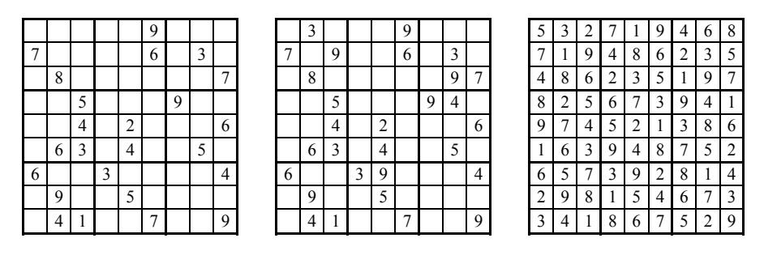

Figure 14. Puzzle Sudogen0-7875, its L1 0 elaboration and its solution

```
Resolution path in L11+XY12+HXY12+XYT12+HXYT12 for the L11+XY12+HXY12+XYT12 (or L1_0) elaboration of Sudogen0-7875: column c3 interaction-with-block b7 \Longrightarrow r9c1 \neq 8, r8c1 \neq 8, r7c2 \neq 7 column c9 interaction-with-block b3 \Longrightarrow r3c7 \neq 5, r2c7 \neq 5, r1c7 \neq 5 naked-pairs-in-a-column {n2 n6} {r1 r3}c3 \Longrightarrow r8c3 \neq 2, r7c3 \neq 2 column c3 interaction-with-block b1 \Longrightarrow r3c1 \neq 2, r2c2 \neq 2, r1c1 \neq 2 hidden-pairs-in-a-row {n3 n5}r9{c1 c7} \Longrightarrow r9c7 \neq 8, r9c7 \neq 6, r9c7 \neq 2, r9c1 \neq 2 hxy-rn5-chain {c7 c6}r5n3 - {c6 c4}r5n5 - {c4 c1}r5n9 - {c1 c4}r6n9 - {c4 c7}r6n7 \Longrightarrow r5c7 \neq 7 xyzt7-chain {n8 n1}r6c6 - {n1 n2}r7c6 - {n2 n5}r7c2 - {n5 n1}r2c2 - {n1 n8}r2c5 - {n8 n6}r9c5 - {n6 n8}r9c4 \Longrightarrow r8c6 \neq 8
```

```
xyt8-chain \{n7 \ n1\}r5c2 - \{n1 \ n5\}r2c2 - \{n5 \ n2\}r7c2 - \{n2 \ n3\}r8c1 - \{n3 \ n5\}r9c1 - \{n5 \ n3\}r9c7 - \{n3 \ n8\}r5c7 - \{n8 \ n7\}r5c8 \Longrightarrow r5c4 \neq 7

hxyt-cn12-chain \{r9 \ r8\}c1n3 - \{r8 \ r4\}c9n3 - \{r4 \ r3\}c5n3 - \{r3 \ r5\}c6n3 - \{r5 \ r3\}c6n5 - \{r3 \ r8\}c6n4 - \{r8 \ r7\}c6n2 - \{r7 \ r4\}c2n2 - \{r4 \ r5\}c2n7 - \{r5 \ r2\}c2n1 - \{r2 \ r7\}c2n5 - \{r7 \ r9\}c7n5 \Longrightarrow r9c7 \neq 3

...(57 Naked-Singles and Hidden-Singles)
```

#### XVIII, 2.10. A puzzle in [L12+XY13+HXY13+XYT13]+HXYT13

Finally, puzzle Royle17-2995 (Figure 15) proves that HXYT13 is not subsumed by the rules in L12+XY13+HXY13+XYT13, i.e. that HXYT13 is not superfluous. The L12+XY13+HXY13+XYT13 and L7 elaborations coincide.

|   |   |   | 2 |   |   | 1 | 9 |
|---|---|---|---|---|---|---|---|
| 8 |   | 6 |   |   |   |   |   |
| 5 |   |   |   |   |   |   |   |
|   | 9 |   | 4 |   |   |   |   |
| 6 |   |   |   |   | 3 |   |   |
|   |   |   |   | 1 |   |   |   |
|   | 1 |   |   |   |   | 4 |   |
| 7 |   | 3 |   |   |   |   |   |
|   |   | 5 |   |   | 8 |   |   |

| 3 |   |   | 4 | 2 | 8 | 5 | 1 | 9 |
|---|---|---|---|---|---|---|---|---|
| 8 |   | 1 | 6 |   |   |   | 3 |   |
| 5 |   | 9 | 1 |   |   |   |   |   |
| 1 | 9 |   |   | 4 |   |   |   |   |
| 6 |   | 4 | 9 |   |   | 3 |   | 1 |
| 2 |   |   |   |   | 1 | 9 |   | 4 |
| 9 | 1 |   |   |   |   |   | 4 |   |
| 7 |   |   | 3 |   | 4 | 1 |   |   |
| 4 |   |   | 5 | 1 |   | 8 |   |   |

| 3 | 6 | 7 | 4 | 2 | 8 | 5 | 1 | 9 |
|---|---|---|---|---|---|---|---|---|
| 8 | 4 | 1 | 6 | 5 | 9 | 7 | 3 | 2 |
| 5 | 2 | 9 | 1 | 3 | 7 | 4 | 6 | 8 |
| 1 | 9 | 8 | 2 | 4 | 3 | 6 | 7 | 5 |
| 6 | 7 | 4 | 9 | 8 | 5 | 3 | 2 | 1 |
| 2 | 5 | 3 | 7 | 6 | 1 | 9 | 8 | 4 |
| 9 | 1 | 5 | 8 | 7 | 6 | 2 | 4 | 3 |
| 7 | 8 | 2 | 3 | 9 | 4 | 1 | 5 | 6 |
| 4 | 3 | 6 | 5 | 1 | 2 | 8 | 9 | 7 |

Figure 15. Puzzle Royle17-2995, its L7 elaboration and its solution

Resolution path in L13 for the L12+XY13+HXY13+XYT13 (or L7) elaboration of Royle17-2995:

```
row r1 interaction-with-block b1 ==> r3c2 \neq 7, r2c2 \neq 7, r3c2 \neq 6 column c3 interaction-with-block b7 ==> r9c2 \neq 2, r8c2 \neq 2 naked-pairs-in-a-row {n3 n7}r3 {c5 c6} ==> r3c9 \neq 7, r3c8 \neq 7, r3c7 \neq 7 row r3 interaction-with-block b2 ==> r2c6 \neq 7, r2c5 \neq 7 hidden-pairs-in-a-row {n3 n5}r7{c3 c9} ==> r7c9 \neq 7, r7c9 \neq 6, r7c9 \neq 2, r7c3 \neq 8 row r7 interaction-with-block b8 ==> r8c5 \neq 8 hidden-pairs-in-a-row {n3 n5}r7{c3 c9} ==> r7c3 \neq 6, r7c3 \neq 2 hidden-pairs-in-a-block {n3 n6}{r4c6 r6c5} ==> r6c5 \neq 8, r6c5 \neq 7, r6c5 \neq 5, r4c6 \neq 7, r4c6 \neq 5 block b5 interaction-with-row r5 ==> r5c8 \neq 5, r5c2 \neq 5 hidden-pairs-in-a-block {n3 n6}{r4c6 r6c5} ==> r4c6 \neq 2 hxy-rn5-chain {c8 c6}r5n2 - {c6 c5}r5n5 - {c5 c6}r2n5 - {c6 c5}r2n9 - {c5 c8}r8n9 ==> r8c8 \neq 2 xyt5-chain {n7 n6}r1c2 - {n6 n3}r9c2 - {n3 n5}r7c3 - {n5 n8}r8c2 - {n8 n7}r5c2 ==> r6c2 \neq 7
```

```
xyt5-chain \{n8\ n7\}r5c2 - \{n7\ n6\}r1c2 - \{n6\ n3\}r9c2 - \{n3\ n5\}r7c3 - \{n5\ n8\}r8c2 \Longrightarrow
r6c2 \neq 8
xyt5-chain \{n5 \ n3\}r7c3 - \{n3 \ n6\}r9c2 - \{n6 \ n7\}r1c2 - \{n7 \ n8\}r5c2 - \{n8 \ n5\}r8c2 =>>
r8c3 \neq 5
xyt5-chain \{n3\ n6\}r9c2 - \{n6\ n7\}r1c2 - \{n7\ n8\}r5c2 - \{n8\ n5\}r8c2 - \{n5\ n3\}r7c3 =>>
r9c3 \neq 3
xyzt8-chain \{n7\ n8\}r6c4 - \{n8\ n5\}r5c5 - \{n5\ n9\}r2c5 - \{n9\ n6\}r8c5 - \{n6\ n3\}r6c5 - \{n6\ n3\}r6c5 - \{n6\ n3\}r6c5 - \{n6\ n3\}r6c5 - \{n6\ n3\}r6c5 - \{n6\ n3\}r6c5 - \{n6\ n3\}r6c5 - \{n6\ n3\}r6c5 - \{n6\ n3\}r6c5 - \{n6\ n3\}r6c5 - \{n6\ n3\}r6c5 - \{n6\ n3\}r6c5 - \{n6\ n3\}r6c5 - \{n6\ n3\}r6c5 - \{n6\ n3\}r6c5 - \{n6\ n3\}r6c5 - \{n6\ n3\}r6c5 - \{n6\ n3\}r6c5 - \{n6\ n3\}r6c5 - \{n6\ n3\}r6c5 - \{n6\ n3\}r6c5 - \{n6\ n3\}r6c5 - \{n6\ n3\}r6c5 - \{n6\ n3\}r6c5 - \{n6\ n3\}r6c5 - \{n6\ n3\}r6c5 - \{n6\ n3\}r6c5 - \{n6\ n3\}r6c5 - \{n6\ n3\}r6c5 - \{n6\ n3\}r6c5 - \{n6\ n3\}r6c5 - \{n6\ n3\}r6c5 - \{n6\ n3\}r6c5 - \{n6\ n3\}r6c5 - \{n6\ n3\}r6c5 - \{n6\ n3\}r6c5 - \{n6\ n3\}r6c5 - \{n6\ n3\}r6c5 - \{n6\ n3\}r6c5 - \{n6\ n3\}r6c5 - \{n6\ n3\}r6c5 - \{n6\ n3\}r6c5 - \{n6\ n3\}r6c5 - \{n6\ n3\}r6c5 - \{n6\ n3\}r6c5 - \{n6\ n3\}r6c5 - \{n6\ n3\}r6c5 - \{n6\ n3\}r6c5 - \{n6\ n3\}r6c5 - \{n6\ n3\}r6c5 - \{n6\ n3\}r6c5 - \{n6\ n3\}r6c5 - \{n6\ n3\}r6c5 - \{n6\ n3\}r6c5 - \{n6\ n3\}r6c5 - \{n6\ n3\}r6c5 - \{n6\ n3\}r6c5 - \{n6\ n3\}r6c5 - \{n6\ n3\}r6c5 - \{n6\ n3\}r6c5 - \{n6\ n3\}r6c5 - \{n6\ n3\}r6c5 - \{n6\ n3\}r6c5 - \{n6\ n3\}r6c5 - \{n6\ n3\}r6c5 - \{n6\ n3\}r6c5 - \{n6\ n3\}r6c5 - \{n6\ n3\}r6c5 - \{n6\ n3\}r6c5 - \{n6\ n3\}r6c5 - \{n6\ n3\}r6c5 - \{n6\ n3\}r6c5 - \{n6\ n3\}r6c5 - \{n6\ n3\}r6c5 - \{n6\ n3\}r6c5 - \{n6\ n3\}r6c5 - \{n6\ n3\}r6c5 - \{n6\ n3\}r6c5 - \{n6\ n3\}r6c5 - \{n6\ n3\}r6c5 - \{n6\ n3\}r6c5 - \{n6\ n3\}r6c5 - \{n6\ n3\}r6c5 - \{n6\ n3\}r6c5 - \{n6\ n3\}r6c5 - \{n6\ n3\}r6c5 - \{n6\ n3\}r6c5 - \{n6\ n3\}r6c5 - \{n6\ n3\}r6c5 - \{n6\ n3\}r6c5 - \{n6\ n3\}r6c5 - \{n6\ n3\}r6c5 - \{n6\ n3\}r6c5 - \{n6\ n3\}r6c5 - \{n6\ n3\}r6c5 - \{n6\ n3\}r6c5 - \{n6\ n3\}r6c5 - \{n6\ n3\}r6c5 - \{n6\ n3\}r6c5 - \{n6\ n3\}r6c5 - \{n6\ n3\}r6c5 - \{n6\ n3\}r6c5 - \{n6\ n3\}r6c5 - \{n6\ n3\}r6c5 - \{n6\ n3\}r6c5 - \{n6\ n3\}r6c5 - \{n6\ n3\}r6c5 - \{n6\ n3\}r6c5 - \{n6\ n3\}r6c5 - \{n6\ n3\}r6c5 - \{n6\ n3\}r6c5 - \{n6\ n3\}r6c5 - \{n6\ n3\}r6c5 - \{n6\ n3\}r6c5 - \{n6\ n3\}r6c5 - \{n6\ n3\}r6c5 - \{n6\ n3\}r6c5 - \{n6\ n3\}r6c5 - \{n6\ n3\}r6c5 - \{n6\ n3\}r6c5 - \{n6\ n3\}r6c5 - \{n6\ n3\}r6c5 - \{n6\ n3\}r6c5 - \{n6\ n3\}r6c5 - \{n6\ n3\}r6c5 - \{n6\ n3\}r6c5 - \{n6\ n3\}r6c5 - \{n6\ n3\}r6c5 - \{n6\ n3\}r6c5 - \{n6\ n3\}r6c5 - \{n6\ n3\}r6c5 - \{n6\ 
 \{n3 \ n5\}\ r6c2 - \{n5 \ n8\}\ r8c2 - \{n8 \ n7\}\ r5c2 \Longrightarrow r5c6 \neq 7
hxyt-rn13-chain \{c2\ c9\}r9n3-\{c9\ c3\}r7n3-\{c3\ c6\}r4n3-\{c6\ c5\}r3n3-\{c5\ c6\}r3n7-
 \{c6\ c8\}r9n7 - \{c8\ c6\}r9n9 - \{c6\ c5\}r2n9 - \{c5\ c6\}r2n5 - \{c6\ c5\}r5n5 - \{c5\ c2\}r5n7 - \{c6\ c5\}r5n5 - \{c6\ c5\}r5n5 - \{c6\ c5\}r5n5 - \{c6\ c5\}r5n7 - \{c6\ c5\}r5n5 - \{c6\ c5\}r5n5 - \{c6\ c5\}r5n5 - \{c6\ c5\}r5n5 - \{c6\ c5\}r5n5 - \{c6\ c5\}r5n5 - \{c6\ c5\}r5n5 - \{c6\ c5\}r5n5 - \{c6\ c5\}r5n5 - \{c6\ c5\}r5n5 - \{c6\ c5\}r5n5 - \{c6\ c5\}r5n5 - \{c6\ c5\}r5n5 - \{c6\ c5\}r5n5 - \{c6\ c5\}r5n5 - \{c6\ c5\}r5n5 - \{c6\ c5\}r5n5 - \{c6\ c5\}r5n5 - \{c6\ c5\}r5n5 - \{c6\ c5\}r5n5 - \{c6\ c5\}r5n5 - \{c6\ c5\}r5n5 - \{c6\ c5\}r5n5 - \{c6\ c5\}r5n5 - \{c6\ c5\}r5n5 - \{c6\ c5\}r5n5 - \{c6\ c5\}r5n5 - \{c6\ c5\}r5n5 - \{c6\ c5\}r5n5 - \{c6\ c5\}r5n5 - \{c6\ c5\}r5n5 - \{c6\ c5\}r5n5 - \{c6\ c5\}r5n5 - \{c6\ c5\}r5n5 - \{c6\ c5\}r5n5 - \{c6\ c5\}r5n5 - \{c6\ c5\}r5n5 - \{c6\ c5\}r5n5 - \{c6\ c5\}r5n5 - \{c6\ c5\}r5n5 - \{c6\ c5\}r5n5 - \{c6\ c5\}r5n5 - \{c6\ c5\}r5n5 - \{c6\ c5\}r5n5 - \{c6\ c5\}r5n5 - \{c6\ c5\}r5n5 - \{c6\ c5\}r5n5 - \{c6\ c5\}r5n5 - \{c6\ c5\}r5n5 - \{c6\ c5\}r5n5 - \{c6\ c5\}r5n5 - \{c6\ c5\}r5n5 - \{c6\ c5\}r5n5 - \{c6\ c5\}r5n5 - \{c6\ c5\}r5n5 - \{c6\ c5\}r5n5 - \{c6\ c5\}r5n5 - \{c6\ c5\}r5n5 - \{c6\ c5\}r5n5 - \{c6\ c5\}r5n5 - \{c6\ c5\}r5n5 - \{c6\ c5\}r5n5 - \{c6\ c5\}r5n5 - \{c6\ c5\}r5n5 - \{c6\ c5\}r5n5 - \{c6\ c5\}r5n5 - \{c6\ c5\}r5n5 - \{c6\ c5\}r5n5 - \{c6\ c5\}r5n5 - \{c6\ c5\}r5n5 - \{c6\ c5\}r5n5 - \{c6\ c5\}r5n5 - \{c6\ c5\}r5n5 - \{c6\ c5\}r5n5 - \{c6\ c5\}r5n5 - \{c6\ c5\}r5n5 - \{c6\ c5\}r5n5 - \{c6\ c5\}r5n5 - \{c6\ c5\}r5n5 - \{c6\ c5\}r5n5 - \{c6\ c5\}r5n5 - \{c6\ c5\}r5n5 - \{c6\ c5\}r5n5 - \{c6\ c5\}r5n5 - \{c6\ c5\}r5n5 - \{c6\ c5\}r5n5 - \{c6\ c5\}r5n5 - \{c6\ c5\}r5n5 - \{c6\ c5\}r5n5 - \{c6\ c5\}r5n5 - \{c6\ c5\}r5n5 - \{c6\ c5\}r5n5 - \{c6\ c5\}r5n5 - \{c6\ c5\}r5n5 - \{c6\ c5\}r5n5 - \{c6\ c5\}r5n5 - \{c6\ c5\}r5n5 - \{c6\ c5\}r5n5 - \{c6\ c5\}r5n5 - \{c6\ c5\}r5n5 - \{c6\ c5\}r5n5 - \{c6\ c5\}r5n5 - \{c6\ c5\}r5n5 - \{c6\ c5\}r5n5 - \{c6\ c5\}r5n5 - \{c6\ c5\}r5n5 - \{c6\ c5\}r5n5 - \{c6\ c5\}r5n5 - \{c6\ c5\}r5n5 - \{c6\ c5\}r5n5 - \{c6\ c5\}r5n5 - \{c6\ c5\}r5n5 - \{c6\ c5\}r5n5 - \{c6\ c5\}r5n5 - \{c6\ c5\}r5n5 - \{c6\ c5\}r5n5 - \{c6\ c5\}r5n5 - \{c6\ c5\}r5n5 - \{c6\ c5\}r5n5 - \{c6\ c5\}r5n5 - \{c6\ c5\}r5n5 - \{c6\ c5\}r5n5 - \{c6\ c5\}r5n5 - \{c6\ c5\}r5n5 - \{c6\ c5\}r5n5 - \{c6\ c5\}r5n5 - \{c6\
 \{c2\ c3\}r1n7 - \{c3\ c2\}r1n6 ==> r9c2 \neq 6
naked singles ==> r9c2 = 3, r7c3 = 5, r7c9 = 3, r6c2 = 5
xyt5-chain \{n7\ n8\}r5c2 - \{n8\ n6\}r8c2 - \{n6\ n9\}r8c5 - \{n9\ n5\}r2c5 - \{n5\ n7\}r5c5 \Longrightarrow
r5c8 \neq 7
hxy-rn5-chain {c3 c5}r6n3 - {c5 c6}r3n3 - {c6 c5}r3n7 - {c5 c2}r5n7 - {c2 c3}r1n7 ==>
r6c3 \neq 7
xyt6-chain \{n7 \ n8\}r6c4 - \{n8 \ n3\}r6c3 - \{n3 \ n6\}r6c5 - \{n6 \ n9\}r8c5 - \{n9 \ n5\}r2c5 - \{n9 \ n5\}r2c5 - \{n9 \ n5\}r2c5 - \{n9 \ n5\}r2c5 - \{n9 \ n5\}r2c5 - \{n9 \ n5\}r2c5 - \{n9 \ n5\}r2c5 - \{n9 \ n5\}r2c5 - \{n9 \ n5\}r2c5 - \{n9 \ n5\}r2c5 - \{n9 \ n5\}r2c5 - \{n9 \ n5\}r2c5 - \{n9 \ n5\}r2c5 - \{n9 \ n5\}r2c5 - \{n9 \ n5\}r2c5 - \{n9 \ n5\}r2c5 - \{n9 \ n5\}r2c5 - \{n9 \ n5\}r2c5 - \{n9 \ n5\}r2c5 - \{n9 \ n5\}r2c5 - \{n9 \ n5\}r2c5 - \{n9 \ n5\}r2c5 - \{n9 \ n5\}r2c5 - \{n9 \ n5\}r2c5 - \{n9 \ n5\}r2c5 - \{n9 \ n5\}r2c5 - \{n9 \ n5\}r2c5 - \{n9 \ n5\}r2c5 - \{n9 \ n5\}r2c5 - \{n9 \ n5\}r2c5 - \{n9 \ n5\}r2c5 - \{n9 \ n5\}r2c5 - \{n9 \ n5\}r2c5 - \{n9 \ n5\}r2c5 - \{n9 \ n5\}r2c5 - \{n9 \ n5\}r2c5 - \{n9 \ n5\}r2c5 - \{n9 \ n5\}r2c5 - \{n9 \ n5\}r2c5 - \{n9 \ n5\}r2c5 - \{n9 \ n5\}r2c5 - \{n9 \ n5\}r2c5 - \{n9 \ n5\}r2c5 - \{n9 \ n5\}r2c5 - \{n9 \ n5\}r2c5 - \{n9 \ n5\}r2c5 - \{n9 \ n5\}r2c5 - \{n9 \ n5\}r2c5 - \{n9 \ n5\}r2c5 - \{n9 \ n5\}r2c5 - \{n9 \ n5\}r2c5 - \{n9 \ n5\}r2c5 - \{n9 \ n5\}r2c5 - \{n9 \ n5\}r2c5 - \{n9 \ n5\}r2c5 - \{n9 \ n5\}r2c5 - \{n9 \ n5\}r2c5 - \{n9 \ n5\}r2c5 - \{n9 \ n5\}r2c5 - \{n9 \ n5\}r2c5 - \{n9 \ n5\}r2c5 - \{n9 \ n5\}r2c5 - \{n9 \ n5\}r2c5 - \{n9 \ n5\}r2c5 - \{n9 \ n5\}r2c5 - \{n9 \ n5\}r2c5 - \{n9 \ n5\}r2c5 - \{n9 \ n5\}r2c5 - \{n9 \ n5\}r2c5 - \{n9 \ n5\}r2c5 - \{n9 \ n5\}r2c5 - \{n9 \ n5\}r2c5 - \{n9 \ n5\}r2c5 - \{n9 \ n5\}r2c5 - \{n9 \ n5\}r2c5 - \{n9 \ n5\}r2c5 - \{n9 \ n5\}r2c5 - \{n9 \ n5\}r2c5 - \{n9 \ n5\}r2c5 - \{n9 \ n5\}r2c5 - \{n9 \ n5\}r2c5 - \{n9 \ n5\}r2c5 - \{n9 \ n5\}r2c5 - \{n9 \ n5\}r2c5 - \{n9 \ n5\}r2c5 - \{n9 \ n5\}r2c5 - \{n9 \ n5\}r2c5 - \{n9 \ n5\}r2c5 - \{n9 \ n5\}r2c5 - \{n9 \ n5\}r2c5 - \{n9 \ n5\}r2c5 - \{n9 \ n5\}r2c5 - \{n9 \ n5\}r2c5 - \{n9 \ n5\}r2c5 - \{n9 \ n5\}r2c5 - \{n9 \ n5\}r2c5 - \{n9 \ n5\}r2c5 - \{n9 \ n5\}r2c5 - \{n9 \ n5\}r2c5 - \{n9 \ n5\}r2c5 - \{n9 \ n5\}r2c5 - \{n9 \ n5\}r2c5 - \{n9 \ n5\}r2c5 - \{n9 \ n5\}r2c5 - \{n9 \ n5\}r2c5 - \{n9 \ n5\}r2c5 - \{n9 \ n5\}r2c5 - \{n9 \ n5\}r2c5 - \{n9 \ n5\}r2c5 - \{n9 \ n5\}r2c5 - \{n9 \ n5\}r2c5 - \{n9 \ n5\}r2c5 - \{n9 \ n5\}r2c5 - \{n9 \ n5\}r2c5 - \{n9 \ n5\}r2c5 - \{n9 \ n5\}r2c5 - \{n9 \ n5\}r2c5 - \{n9 \ n5\}r2c5 - \{n9 \ n5\}r2c5 - \{n9 \ n5\}r2c5 - \{n9 \ n5\}r2c5 - \{n9 \ n5\}r2c5 - \{n9 \ n5\}r2c5 -
 \{n5 \ n7\}\ r5\ c5 ==> r4\ c4 \neq 7
xyzt5-chain \{n2\ n8\}r5c8 - \{n8\ n6\}r3c8 - \{n6\ n7\}r6c8 - \{n7\ n8\}r6c4 - \{n8\ n2\}r4c4 ==>
r4c8 \neq 2
xyt8-chain \{n2\ n8\}r5c8 - \{n8\ n7\}r5c2 - \{n7\ n5\}r5c5 - \{n5\ n2\}r5c6 - \{n2\ n8\}r4c4 - \{n8\}r5c8 - \{n8\}r4c4 - \{n8\}r5c8 - \{n8\}r4c4 - \{n8\}r4c4 - \{n8\}r4c4 - \{n8\}r4c4 - \{n8\}r4c4 - \{n8\}r4c4 - \{n8\}r4c4 - \{n8\}r4c4 - \{n8\}r4c4 - \{n8\}r4c4 - \{n8\}r4c4 - \{n8\}r4c4 - \{n8\}r4c4 - \{n8\}r4c4 - \{n8\}r4c4 - \{n8\}r4c4 - \{n8\}r4c4 - \{n8\}r4c4 - \{n8\}r4c4 - \{n8\}r4c4 - \{n8\}r4c4 - \{n8\}r4c4 - \{n8\}r4c4 - \{n8\}r4c4 - \{n8\}r4c4 - \{n8\}r4c4 - \{n8\}r4c4 - \{n8\}r4c4 - \{n8\}r4c4 - \{n8\}r4c4 - \{n8\}r4c4 - \{n8\}r4c4 - \{n8\}r4c4 - \{n8\}r4c4 - \{n8\}r4c4 - \{n8\}r4c4 - \{n8\}r4c4 - \{n8\}r4c4 - \{n8\}r4c4 - \{n8\}r4c4 - \{n8\}r4c4 - \{n8\}r4c4 - \{n8\}r4c4 - \{n8\}r4c4 - \{n8\}r4c4 - \{n8\}r4c4 - \{n8\}r4c4 - \{n8\}r4c4 - \{n8\}r4c4 - \{n8\}r4c4 - \{n8\}r4c4 - \{n8\}r4c4 - \{n8\}r4c4 - \{n8\}r4c4 - \{n8\}r4c4 - \{n8\}r4c4 - \{n8\}r4c4 - \{n8\}r4c4 - \{n8\}r4c4 - \{n8\}r4c4 - \{n8\}r4c4 - \{n8\}r4c4 - \{n8\}r4c4 - \{n8\}r4c4 - \{n8\}r4c4 - \{n8\}r4c4 - \{n8\}r4c4 - \{n8\}r4c4 - \{n8\}r4c4 - \{n8\}r4c4 - \{n8\}r4c4 - \{n8\}r4c4 - \{n8\}r4c4 - \{n8\}r4c4 - \{n8\}r4c4 - \{n8\}r4c4 - \{n8\}r4c4 - \{n8\}r4c4 - \{n8\}r4c4 - \{n8\}r4c4 - \{n8\}r4c4 - \{n8\}r4c4 - \{n8\}r4c4 - \{n8\}r4c4 - \{n8\}r4c4 - \{n8\}r4c4 - \{n8\}r4c4 - \{n8\}r4c4 - \{n8\}r4c4 - \{n8\}r4c4 - \{n8\}r4c4 - \{n8\}r4c4 - \{n8\}r4c4 - \{n8\}r4c4 - \{n8\}r4c4 - \{n8\}r4c4 - \{n8\}r4c4 - \{n8\}r4c4 - \{n8\}r4c4 - \{n8\}r4c4 - \{n8\}r4c4 - \{n8\}r4c4 - \{n8\}r4c4 - \{n8\}r4c4 - \{n8\}r4c4 - \{n8\}r4c4 - \{n8\}r4c4 - \{n8\}r4c4 - \{n8\}r4c4 - \{n8\}r4c4 - \{n8\}r4c4 - \{n8\}r4c4 - \{n8\}r4c4 - \{n8\}r4c4 - \{n8\}r4c4 - \{n8\}r4c4 - \{n8\}r4c4 - \{n8\}r4c4 - \{n8\}r4c4 - \{n8\}r4c4 - \{n8\}r4c4 - \{n8\}r4c4 - \{n8\}r4c4 - \{n8\}r4c4 - \{n8\}r4c4 - \{n8\}r4c4 - \{n8\}r4c4 - \{n8\}r4c4 - \{n8\}r4c4 - \{n8\}r4c4 - \{n8\}r4c4 - \{n8\}r4c4 - \{n8\}r4c4 - \{n8\}r4c4 - \{n8\}r4c4 - \{n8\}r4c4 - \{n8\}r4c4 - \{n8\}r4c4 - \{n8\}r4c4 - \{n8\}r4c4 - \{n8\}r4c4 - \{n8\}r4c4 - \{n8\}r4c4 - \{n8\}r4c4 - \{n8\}r4c4 - \{n8\}r4c4 - \{n8\}r4c4 - \{n8\}r4c4 - \{n8\}r4c4 - \{n8\}r4c4 - \{n8\}r4c4 - \{n8\}r4c4 - \{n8\}r4c4 - \{n8\}r4c4 - \{n8\}r4c4 - \{n8\}r4c4 - \{n8\}r4c4 - \{n8\}r4c4 - \{n8\}r4c4 - \{n8\}r4c4 - \{n8\}r4c4 - \{n8\}r4c4 - \{n8\}r4c4 - \{n8\}r4c4 - \{n8\}r4c4 - \{n8\}r4c4 - \{n8\}r4c4 - \{n8\}r4c4 - \{n8\}r4c4 - \{n8\}r4c4 - \{n8\}r4c4 - \{n8\}r4c4 - \{n8\}r4c4 - \{n8\}r4c4 - \{n8\}r4c4 
 \{n8 \ n7\}\ r6c4 - \{n7 \ n6\}\ r6c8 - \{n6 \ n2\}\ r3c8 \Longrightarrow r9c8 \neq 2
hxyt-rn7-chain {c8 c6}r9n9 - {c6 c5}r2n9 - {c5 c8}r8n9 - {c8 c9}r8n5 - {c9 c3}r8n2 -
 \{c3 c9\}r9n2 - \{c9 c8\}r9n7 ==> r9c8 \neq 6
hxyt-rn7-chain {c9 c7}r2n7 - {c7 c2}r2n4 - {c2 c9}r2n2 - {c9 c3}r8n2 - {c3 c6}r9n2 -
 \{c6\ c8\}r9n9 - \{c8\ c9\}r9n7 ==> r4c9 \neq 7
xyzt10-chain \{n2\ n8\}r4c4 - \{n8\ n7\}r6c4 - \{n7\ n5\}r5c5 - \{n5\ n9\}r2c5 - \{n9\ n6\}r8c5 - \{n9\ n6\}r8c5 - \{n9\ n6\}r8c5 - \{n9\ n6\}r8c5 - \{n9\ n6\}r8c5 - \{n9\ n6\}r8c5 - \{n9\ n6\}r8c5 - \{n9\ n6\}r8c5 - \{n9\ n6\}r8c5 - \{n9\ n6\}r8c5 - \{n9\ n6\}r8c5 - \{n9\ n6\}r8c5 - \{n9\ n6\}r8c5 - \{n9\ n6\}r8c5 - \{n9\ n6\}r8c5 - \{n9\ n6\}r8c5 - \{n9\ n6\}r8c5 - \{n9\ n6\}r8c5 - \{n9\ n6\}r8c5 - \{n9\ n6\}r8c5 - \{n9\ n6\}r8c5 - \{n9\ n6\}r8c5 - \{n9\ n6\}r8c5 - \{n9\ n6\}r8c5 - \{n9\ n6\}r8c5 - \{n9\ n6\}r8c5 - \{n9\ n6\}r8c5 - \{n9\ n6\}r8c5 - \{n9\ n6\}r8c5 - \{n9\ n6\}r8c5 - \{n9\ n6\}r8c5 - \{n9\ n6\}r8c5 - \{n9\ n6\}r8c5 - \{n9\ n6\}r8c5 - \{n9\ n6\}r8c5 - \{n9\ n6\}r8c5 - \{n9\ n6\}r8c5 - \{n9\ n6\}r8c5 - \{n9\ n6\}r8c5 - \{n9\ n6\}r8c5 - \{n9\ n6\}r8c5 - \{n9\ n6\}r8c5 - \{n9\ n6\}r8c5 - \{n9\ n6\}r8c5 - \{n9\ n6\}r8c5 - \{n9\ n6\}r8c5 - \{n9\ n6\}r8c5 - \{n9\ n6\}r8c5 - \{n9\ n6\}r8c5 - \{n9\ n6\}r8c5 - \{n9\ n6\}r8c5 - \{n9\ n6\}r8c5 - \{n9\ n6\}r8c5 - \{n9\ n6\}r8c5 - \{n9\ n6\}r8c5 - \{n9\ n6\}r8c5 - \{n9\ n6\}r8c5 - \{n9\ n6\}r8c5 - \{n9\ n6\}r8c5 - \{n9\ n6\}r8c5 - \{n9\ n6\}r8c5 - \{n9\ n6\}r8c5 - \{n9\ n6\}r8c5 - \{n9\ n6\}r8c5 - \{n9\ n6\}r8c5 - \{n9\ n6\}r8c5 - \{n9\ n6\}r8c5 - \{n9\ n6\}r8c5 - \{n9\ n6\}r8c5 - \{n9\ n6\}r8c5 - \{n9\ n6\}r8c5 - \{n9\ n6\}r8c5 - \{n9\ n6\}r8c5 - \{n9\ n6\}r8c5 - \{n9\ n6\}r8c5 - \{n9\ n6\}r8c5 - \{n9\ n6\}r8c5 - \{n9\ n6\}r8c5 - \{n9\ n6\}r8c5 - \{n9\ n6\}r8c5 - \{n9\ n6\}r8c5 - \{n9\ n6\}r8c5 - \{n9\ n6\}r8c5 - \{n9\ n6\}r8c5 - \{n9\ n6\}r8c5 - \{n9\ n6\}r8c5 - \{n9\ n6\}r8c5 - \{n9\ n6\}r8c5 - \{n9\ n6\}r8c5 - \{n9\ n6\}r8c5 - \{n9\ n6\}r8c5 - \{n9\ n6\}r8c5 - \{n9\ n6\}r8c5 - \{n9\ n6\}r8c5 - \{n9\ n6\}r8c5 - \{n9\ n6\}r8c5 - \{n9\ n6\}r8c5 - \{n9\ n6\}r8c5 - \{n9\ n6\}r8c5 - \{n9\ n6\}r8c5 - \{n9\ n6\}r8c5 - \{n9\ n6\}r8c5 - \{n9\ n6\}r8c5 - \{n9\ n6\}r8c5 - \{n9\ n6\}r8c5 - \{n9\ n6\}r8c5 - \{n9\ n6\}r8c5 - \{n9\ n6\}r8c5 - \{n9\ n6\}r8c5 - \{n9\ n6\}r8c5 - \{n9\ n6\}r8c5 - \{n9\ n6\}r8c5 - \{n9\ n6\}r8c5 - \{n9\ n6\}r8c5 - \{n9\ n6\}r8c5 - \{n9\ n6\}r8c5 - \{n9\ n6\}r8c5 - \{n9\ n6\}r8c5 - \{n9\ n6\}r8c5 - \{n9\ n6\}r8c5 - \{n9\ n6\}r8c5 - \{n9\ n6\}r8c5 - \{n9\ n6\}r8c5 - \{n9\ n6\}r8c5 - \{n9\ n6\}r8c5 - \{n9\ n6\}r8c5 - \{n9\ n6\}r8c5 - \{n9\ n6\}r8c5 - \{n9\ n6\}r8c5 - \{n9\ n6\}r8c5 - \{n9\ n6\}r8c5 - \{n9\
 \{n6 \ n8\}r8c2 - \{n8 \ n2\}r8c3 - \{n2 \ n6\}r9c3 - \{n6 \ n7\}r9c9 - \{n7 \ n2\}r2c9 \Longrightarrow r4c9 \neq 2
xyt11-chain \{n2\ n8\}r4c4 - \{n8\ n7\}r6c4 - \{n7\ n5\}r5c5 - \{n5\ n9\}r2c5 - \{n9\ n6\}r8c5 - \{n9\ n6\}r8c5 - \{n9\ n6\}r8c5 - \{n9\ n6\}r8c5 - \{n9\ n6\}r8c5 - \{n9\ n6\}r8c5 - \{n9\ n6\}r8c5 - \{n9\ n6\}r8c5 - \{n9\ n6\}r8c5 - \{n9\ n6\}r8c5 - \{n9\ n6\}r8c5 - \{n9\ n6\}r8c5 - \{n9\ n6\}r8c5 - \{n9\ n6\}r8c5 - \{n9\ n6\}r8c5 - \{n9\ n6\}r8c5 - \{n9\ n6\}r8c5 - \{n9\ n6\}r8c5 - \{n9\ n6\}r8c5 - \{n9\ n6\}r8c5 - \{n9\ n6\}r8c5 - \{n9\ n6\}r8c5 - \{n9\ n6\}r8c5 - \{n9\ n6\}r8c5 - \{n9\ n6\}r8c5 - \{n9\ n6\}r8c5 - \{n9\ n6\}r8c5 - \{n9\ n6\}r8c5 - \{n9\ n6\}r8c5 - \{n9\ n6\}r8c5 - \{n9\ n6\}r8c5 - \{n9\ n6\}r8c5 - \{n9\ n6\}r8c5 - \{n9\ n6\}r8c5 - \{n9\ n6\}r8c5 - \{n9\ n6\}r8c5 - \{n9\ n6\}r8c5 - \{n9\ n6\}r8c5 - \{n9\ n6\}r8c5 - \{n9\ n6\}r8c5 - \{n9\ n6\}r8c5 - \{n9\ n6\}r8c5 - \{n9\ n6\}r8c5 - \{n9\ n6\}r8c5 - \{n9\ n6\}r8c5 - \{n9\ n6\}r8c5 - \{n9\ n6\}r8c5 - \{n9\ n6\}r8c5 - \{n9\ n6\}r8c5 - \{n9\ n6\}r8c5 - \{n9\ n6\}r8c5 - \{n9\ n6\}r8c5 - \{n9\ n6\}r8c5 - \{n9\ n6\}r8c5 - \{n9\ n6\}r8c5 - \{n9\ n6\}r8c5 - \{n9\ n6\}r8c5 - \{n9\ n6\}r8c5 - \{n9\ n6\}r8c5 - \{n9\ n6\}r8c5 - \{n9\ n6\}r8c5 - \{n9\ n6\}r8c5 - \{n9\ n6\}r8c5 - \{n9\ n6\}r8c5 - \{n9\ n6\}r8c5 - \{n9\ n6\}r8c5 - \{n9\ n6\}r8c5 - \{n9\ n6\}r8c5 - \{n9\ n6\}r8c5 - \{n9\ n6\}r8c5 - \{n9\ n6\}r8c5 - \{n9\ n6\}r8c5 - \{n9\ n6\}r8c5 - \{n9\ n6\}r8c5 - \{n9\ n6\}r8c5 - \{n9\ n6\}r8c5 - \{n9\ n6\}r8c5 - \{n9\ n6\}r8c5 - \{n9\ n6\}r8c5 - \{n9\ n6\}r8c5 - \{n9\ n6\}r8c5 - \{n9\ n6\}r8c5 - \{n9\ n6\}r8c5 - \{n9\ n6\}r8c5 - \{n9\ n6\}r8c5 - \{n9\ n6\}r8c5 - \{n9\ n6\}r8c5 - \{n9\ n6\}r8c5 - \{n9\ n6\}r8c5 - \{n9\ n6\}r8c5 - \{n9\ n6\}r8c5 - \{n9\ n6\}r8c5 - \{n9\ n6\}r8c5 - \{n9\ n6\}r8c5 - \{n9\ n6\}r8c5 - \{n9\ n6\}r8c5 - \{n9\ n6\}r8c5 - \{n9\ n6\}r8c5 - \{n9\ n6\}r8c5 - \{n9\ n6\}r8c5 - \{n9\ n6\}r8c5 - \{n9\ n6\}r8c5 - \{n9\ n6\}r8c5 - \{n9\ n6\}r8c5 - \{n9\ n6\}r8c5 - \{n9\ n6\}r8c5 - \{n9\ n6\}r8c5 - \{n9\ n6\}r8c5 - \{n9\ n6\}r8c5 - \{n9\ n6\}r8c5 - \{n9\ n6\}r8c5 - \{n9\ n6\}r8c5 - \{n9\ n6\}r8c5 - \{n9\ n6\}r8c5 - \{n9\ n6\}r8c5 - \{n9\ n6\}r8c5 - \{n9\ n6\}r8c5 - \{n9\ n6\}r8c5 - \{n9\ n6\}r8c5 - \{n9\ n6\}r8c5 - \{n9\ n6\}r8c5 - \{n9\ n6\}r8c5 - \{n9\ n6\}r8c5 - \{n9\ n6\}r8c5 - \{n9\ n6\}r8c5 - \{n9\ n6\}r8c5 - \{n9\ n6\}r8c5 - \{n9\ n6\}r8c5 - \{n9\ n6\}r8c5 - \{n9\ n6\}r8c5 - \{n9\ n6\}r8c5 - \{n9\ 
 \{n6 \ n8\} \ r8c2 - \{n8 \ n2\} \ r8c3 - \{n2 \ n5\} \ r8c9 - \{n5 \ n6\} \ r4c9 - \{n6 \ n8\} \ r6c8 - \{n8 \ n2\} \ r5c8 \Longrightarrow > \{n6 \ n8\} \ r6c8 - \{n8 \ n2\} \ r5c8 \Longrightarrow > \{n6 \ n8\} \ r6c8 - \{n8 \ n2\} \ r5c8 \Longrightarrow > \{n6 \ n8\} \ r6c8 - \{n8 \ n2\} \ r5c8 \Longrightarrow > \{n6 \ n8\} \ r6c8 - \{n8 \ n2\} \ r5c8 \Longrightarrow > \{n6 \ n8\} \ r6c8 - \{n8 \ n2\} \ r5c8 \Longrightarrow > \{n6 \ n8\} \ r6c8 - \{n8 \ n2\} \ r5c8 \Longrightarrow > \{n6 \ n8\} \ r6c8 - \{n8 \ n2\} \ r5c8 \Longrightarrow > \{n6 \ n8\} \ r6c8 - \{n8 \ n2\} \ r5c8 \Longrightarrow > \{n6 \ n8\} \ r6c8 - \{n8 \ n2\} \ r5c8 \Longrightarrow > \{n6 \ n8\} \ r6c8 - \{n8 \ n2\} \ r5c8 \Longrightarrow > \{n6 \ n8\} \ r6c8 - \{n8 \ n2\} \ r5c8 \Longrightarrow > \{n6 \ n8\} \ r6c8 - \{n8 \ n2\} \ r5c8 \Longrightarrow > \{n6 \ n8\} \ r6c8 - \{n8 \ n2\} \ r5c8 \Longrightarrow > \{n6 \ n8\} \ r6c8 - \{n8 \ n2\} \ r5c8 \Longrightarrow > \{n6 \ n8\} \ r6c8 - \{n8 \ n2\} \ r5c8 \Longrightarrow > \{n6 \ n8\} \ r6c8 - \{n8 \ n2\} \ r5c8 \Longrightarrow > \{n6 \ n8\} \ r6c8 - \{n8 \ n2\} \ r5c8 \Longrightarrow > \{n6 \ n8\} \ r6c8 - \{n8 \ n2\} \ r5c8 \Longrightarrow > \{n6 \ n8\} \ r6c8 - \{n8 \ n2\} \ r5c8 \Longrightarrow > \{n6 \ n8\} \ r6c8 - \{n8 \ n2\} \ r5c8 \Longrightarrow > \{n6 \ n8\} \ r6c8 - \{n8 \ n2\} \ r5c8 \Longrightarrow > \{n6 \ n8\} \ r6c8 - \{n8 \ n2\} \ r5c8 \Longrightarrow > \{n6 \ n8\} \ r6c8 - \{n8 \ n2\} \ r5c8 \Longrightarrow > \{n6 \ n8\} \ r6c8 - \{n8 \ n2\} \ r5c8 \Longrightarrow > \{n6 \ n8\} \ r6c8 \Longrightarrow > \{n6 \ n8\} \ r6c8 \Longrightarrow > \{n6 \ n8\} \ r6c8 \Longrightarrow > \{n6 \ n8\} \ r6c8 \Longrightarrow > \{n6 \ n8\} \ r6c8 \Longrightarrow > \{n6 \ n8\} \ r6c8 \Longrightarrow > \{n6 \ n8\} \ r6c8 \Longrightarrow > \{n6 \ n8\} \ r6c8 \Longrightarrow > \{n6 \ n8\} \ r6c8 \Longrightarrow > \{n6 \ n8\} \ r6c8 \Longrightarrow > \{n6 \ n8\} \ r6c8 \Longrightarrow > \{n6 \ n8\} \ r6c8 \Longrightarrow > \{n6 \ n8\} \ r6c8 \Longrightarrow > \{n6 \ n8\} \ r6c8 \Longrightarrow > \{n6 \ n8\} \ r6c8 \Longrightarrow > \{n6 \ n8\} \ r6c8 \Longrightarrow > \{n6 \ n8\} \ r6c8 \Longrightarrow > \{n6 \ n8\} \ r6c8 \Longrightarrow > \{n6 \ n8\} \ r6c8 \Longrightarrow > \{n6 \ n8\} \ r6c8 \Longrightarrow > \{n6 \ n8\} \ r6c8 \Longrightarrow > \{n6 \ n8\} \ r6c8 \Longrightarrow > \{n6 \ n8\} \ r6c8 \Longrightarrow > \{n6 \ n8\} \ r6c8 \Longrightarrow > \{n6 \ n8\} \ r6c8 \Longrightarrow > \{n6 \ n8\} \ r6c8 \Longrightarrow > \{n6 \ n8\} \ r6c8 \Longrightarrow > \{n6 \ n8\} \ r6c8 \Longrightarrow > \{n6 \ n8\} \ r6c8 \Longrightarrow > \{n6 \ n8\} \ r6c8 \Longrightarrow > \{n6 \ n8\} \ r6c8 \Longrightarrow > \{n6 \ n8\} \ r6c8 \Longrightarrow > \{n6 \ n8\} \ r6c8 \Longrightarrow > \{n6 \ n8\} \ r6c8 \Longrightarrow > \{n6 \ n8\} \ r6c8 \Longrightarrow > \{n6 \ n8\} \ r6c8 \Longrightarrow > \{n6 \ n8\} \ r6c8 \Longrightarrow > \{n6 \ n8\} \ r6c8 \Longrightarrow > \{n6 \ n8\} \ r6c8 \Longrightarrow > \{n6 \ n8\} \ r6c8 \Longrightarrow > \{n6 \ n8\} \ r6c8 \Longrightarrow > \{n6 \ n8\} \ r6c8 \Longrightarrow > \{n6 \ n8\} \ r6c8 \Longrightarrow > \{n6 \ n8\} \ r6c8 \Longrightarrow > \{n6 \ n8\} \ r6c8 \Longrightarrow > \{n6 \ n8\} \ r6c8 \Longrightarrow > \{n
r5c6 \neq 2
...(Rules in L1)...
```

The hxyt-rn13-chain rule applies to the following chain:  $\{c2\ c9\}r9n3 - \{c9\ c3\}r7n3 - \{c3\ c6\}r4n3 - \{c6\ c5\}r3n3 - \{c5\ c6\}r3n7 - \{c6\ c8\ c9\#1\}r9n7 - \{c8\ c6\}r9n9 - \{c6\ c5\}r2n9 - \{c5\ c6\}r2n5 - \{c6\ c5\}r5n5 - \{c5\ c2\ c8\#6\}r5n7 - \{c2\ c3\}r1n7 - \{c3\ c2\}r1n6,$  leading to eliminate (column) candidate c2 from rn-cell r9n6.

Whether any human being can find so long hxyt-chains (or xyt-chains) will be left as an open question. What is certain is that it is much more likely to happen with the rn- representation (Figure 16) than without it, because the corresponding situation in ordinary rc-space is much more complex.

|           | n1 | n2            | п3    | n4     | n5       | п6              | n7              | n8            | n9          |    |
|-----------|----|---------------|-------|--------|----------|-----------------|-----------------|---------------|-------------|----|
| r1        | 8  | 5             | 1     | 4      | 7        | 2 3             | 2 3             | 6             | 9           | r1 |
| r2        | 3  | 2<br>7 9      | 8     | 2<br>7 | 5 6      | 4               | 7 9             | 1             | 5 6         | r2 |
| r3        | 4  | 2<br>7 8 9    | 5 6   | 2<br>7 | 1        | 7 8 9           | 5 6             | 8 9           | 3           | r3 |
| r4        | 1  | 4<br>7 8 9    | 3 6   | 5      | 3<br>8 9 | 6<br>7 8 9      | 3<br>4<br>7 8 9 | 3<br>4<br>8 9 | 2           | r4 |
| r5        | 9  | 8             | 7     | 3      | 5 6      | 1               | 2<br>5<br>8     | 2<br>5<br>8   | 4           | r5 |
| r6        | 6  | 1             | 2 3 5 | 9      | 2 3      | 5<br>8          | 3<br>4<br>8     | 3<br>4<br>8   | 7           | r6 |
| <i>r7</i> | 2  | 4 6           | 3     | 8      | 3<br>9   | 5 6<br>7        | 4 5 6<br>7      | 4 5           | 1           | r7 |
| r8        | 7  | 3<br>9        | 4     | 6      | 2<br>8 9 | 2 3<br>5<br>8 9 | 1               | 2 3           | 3<br>5<br>8 | r8 |
| r9        | 5  | 3<br>6<br>8 9 | 2 9   | 1      | 4        | 2 3<br>6<br>8 9 | 6<br>8 9        | 7             | 8           | r9 |
| ı ¬       | nl | <i>n</i> 2    | п3    | n4     | n5       | п6              | n7              | n8            | n9          |    |

Figure 16. Puzzle Royle17-2995, seen in rn-space, just before the hxyt13-chain rule

It should be noted that, although this chain is very long (thirteen cells), only two cells have a (single) additional (column) candidate: c9 is allowed in r9n7 because this rn-cell shares a row with (has the same row-coordinate as) rn-cell 1 (r9n3), in which c9 appears to be the right-linking candidate; c8 is allowed in r5n7 because this rn-cell ("shares a number with" i.e.) has the same number-coordinate as rn-cell 5 (r9n7), in which c9 appears to be the right-linking candidate. Moreover, this long chain can be considered as composed of three simpler autonomous partial chains: a partial hxyt-rn6 chain on the first six cells, a partial hxyt-rn6 chain on cells 6 to 11 and a partial hxy-rn chain on cells 12 and 13.

### Chapter XIX

## xyz- and xyzt- chains

As indicated in the introduction to chapter XVII, we can modify the definition of xy-chains by allowing the target value to appear as an extra candidate for an internal cell of the chain, provided that we require the target cells to have an extra link to this cell; thus, we get xyz-chains.

But the same change can be applied to xyt-chains, leading to xyzt-chains. In exactly the same way as xyz-chains are obtained from xy-chains, xyzt-chains are obtained from xyt-chains. Moreover, xyzt-chains are also an extension of xyz-chains. After a short section on xyz-chains, where the general principle of the modification is introduced, we shall therefore concentrate on xyzt-chains. (xyz chains have not been implemented as such in our SudoRules solver.)

#### XIX.1. Introduction to xyz-chains

#### XIX.1.1. xyz-chains

In the same way as xy-chains are simple generalisations of xy-wing, xyz-chains are a simple generalisation of xyz-wing. That is, we can slightly relax the conditions on one cell in the chain provided that we add a corresponding condition on the target cells. Definition: an xyz-chain is a chain such that

 each cell has two non equal distinguished candidates, called the left-linking candidate and the right-linking candidate (we do not say that there are only two candidates);

- the left-linking candidate for each cell (but the first) is equal to the right-linking candidate for the previous cell (as is the case for xy-chains);
- one and only one of the internal cells of the chain (i.e. not the endpoints) may have a third candidate (called a z-candidate, equal to the left-linking candidate for the first cell (the target value of a full xyz-chain), but no other extra candidate. Notice that a cell may contain the target value as a left or a right-linking candidate, but then it is not counted as a third candidate (if there is no other extra candidate in the chain, it is then a pure xy-chain).

#### Definitions:

- a *full xyz-chain* is an xyz-chain such that the right-linking candidate for the last cell equals the left-linking candidate for the first cell;
- the target number of a full-xyz-chain is the left-linking candidate for the first cell, which is equal to the right-linking candidate for the last cell (as is the case for xy-chains);
- a target cell of a full-xyz-chain is any cell that is linked to both endpoints of the chain and to the unique cell in the chain having three candidates.

#### XIX.1.2. xyz-chain rules

Theorem XIX.1 (constraints propagation rule for full xyz-chains): given a full xyz-chain with xyz-chain target value n, eliminate n from the candidates for any of its xyz-target cells.

Proof of the rule for a full xyz4-chain: let the cells in the chain be  $C_1$ ,  $C_2$ ,  $C_3$ ,  $C_4$ ; let the successive left candidates be  $n_1$ ,  $n_2$ ,  $n_3$ ,  $n_4$ , so that the target variable is  $n_1$  and the successive right candidates are  $n_2$ ,  $n_3$ ,  $n_4$ ,  $n_1$ .

There are two types of xyzt4-chains, depending on which of the second or the third cell has an extra candidate and a link to the target cells; to these two cases, there correspond two symbolic representations:

– xyz4-chain\_type-1 rule:

- xyz4-chain\_type-2 rule (logically equivalent to type-1, by order reversal):

Consider for instance the second case and let TC be any xyz4-target-cell, i.e. TC shares a unit with both  $C_1$ ,  $C_3$  and  $C_4$  – and is therefore different from these three cells.

The proof of the theorem parallels the proof of the xy4-chain rule in section XII.2.3 until, in the second branch of the alternative for  $C_1$  (i.e. in the hypothesis  $C_1 = n_2$ ), we reach cell  $C_3$ .

Cell  $C_1$  can take only two values (hypothesis  $n_2 \neq n_1$  is essential for this assertion). Let us consider each possibility in turn:

- if  $C_1 = n_1$ , then TC cannot be  $n_1$  since it shares a unit with  $C_1$ ;
- if  $C_1 = n_2$ , then  $C_2$  cannot be  $n_2$  since it shares a unit with  $C_1$ ; it must therefore be  $n_3$  (hypothesis  $n_3 \neq n_2$  is essential for this conclusion). Therefore  $C_3$  cannot be  $n_3$  since it shares a unit with  $C_2$ .

Here comes the main difference with a simple xy4-chain: there remain two possibilities for C<sub>3</sub> instead of one:  $n_1$  or  $n_4$  (and it is essential for this conclusion that we have the three inequalities:  $n_4 \neq n_3$ ,  $n_1 \neq n_3$  and  $n_1 \neq n_4$ ). Let us consider each possibility in turn:

- if  $C_3 = n_1$ , then TC cannot be  $n_1$  since it shares a unit with  $C_3$ ; (this is where the additional constraint on target cells is useful);
- if  $C_3$  =  $n_4$ , then  $C_4$  cannot be  $n_4$  since it shares a unit with  $C_3$ ; it must therefore be  $n_1$  (hypothesis  $n_1 \neq n_4$  is essential for this conclusion); and TC cannot be  $n_1$  since it shares a unit with  $C_4$ .

Finally, in any case, TC cannot be  $n_1$ .

The proof for longer xyz-chains is similar, wherever the additional candidate and link to the target cell are situated. We just have to do the appropriate number of inferences in the second branch of the above alternative concerning values of cell  $C_1$  (i.e. in the hypothesis  $C_1 = n_2$ ).

Notice that, as was the case for pure xy-chains, what we actually proved in the branch of the alternative with  $C_1 = n_2$  is that, if there is a compatible target cell, all the cells in the chain are equal to their right-linking candidate. We therefore have:

Theorem XIX.2 (general theorem for non necessarily full xyz-chains): given an xyz-chain with target value  $n_1$ , if there is at least one cell TC linked to all the starred cells of this chain, then, for each such cell, either  $TC \neq n_1$  or the value of each cell in the chain is its right-linking candidate.

#### XIX.1.3. List of the first xyz-chain rules

#### XIX.1.3.1. xyz-chains of length 3

Starting from the xy3-chain rule, there is only one possibility of adding the target value to an internal cell, leading to:

– xyz3-chain rule:

Let us show that, apart from special cases of Naked-Triplets, this general pattern for xyz3-chains covers exactly the classical cases of XYZ-Wing described in detail in chapter X – entailing that there is no reason to add effectively this rule to our rule base. Remember our conventions:  $u_1$  and  $u_2$  are the names for the first two links in a chain.

If there are links  $u'_1$  and  $u'_2$  (possibly different from  $u_1$  and  $u_2$ ) between the same three cells, such  $u'_1 = u'_2$ , then we still have an xyz-chain on these cells with these new links and, due to theorems XI.3 and XI.6, the conditions and conclusions of the rule are those of a Naked-Triplets.

We can therefore assume in the sequel that  $u_1 \neq u_2$ . And we have to consider only two cases:  $u_1$  is a row and  $u_2$  is a column;  $u_1$  is a row and  $u_2$  is a block; all other cases can be deduced from these two by symmetry.

- the first case ( $u_1$  is a row and  $u_2$  is a column) is impossible (more precisely, it would entail that the three cells and the target cell share a block).
- the second case ( $u_1$  is a row and  $u_2$  is a block) corresponds to xyz-wing-rows-blocks. The only thing we have to check is that the cells sharing a link with the three cells of the chain are in row  $r_1$  and in block  $b_2$ .

Thus, we have proven:

#### Theorem XIX.3: NT+XYZ3 is equivalent to NT+XYZ-Wing.

#### XIX.1.3.2. xyz-chains of length 4

Starting from the xy4-chain rule, there are formally two (logically equivalent) possibilities of adding the target value to an internal cell, leading to:

- xyz4-chain type-1 rule:

xyz- and xyzt- chains 301

#### XIX.3.3. xyz-chains of length 5

Starting from the xy5-chain rule, there are formally three (but only two non logically equivalent) possibilities of adding the target value to an internal cell, leading to:

 $= \{1\ 2\}* - \{2\ 3\} - \{3\ 4\} - \{4\ 5\ 1\}* - \{5\ 1\}*$ 

#### XIX.1.3.4. xyz-chains of length 6

Starting from the xy6-chain rule, there are formally four (but only two non logically equivalent) possibilities of adding the target value to an internal cell, leading to:

- xyz6-chain\_type-4 rule (logically equivalent to type-1):

$$= \{1\ 2\}*-\{2\ 3\}-\{3\ 4\}-\{4\ 5\}-\{5\ 6\ 1\}*-\{6\ 1\}*$$

#### XIX.1.4. Final remarks on xyz-chains

We leave it to the reader as a very easy exercise to write similar rules for xyz-chains of length seven or more. It is obvious that, for any chain length k, there are formally k-2 rules for xyz-chains of length k but only IP((k-1)/2) non logically equivalent such rules (where IP stands for "integer part").

From the definition of xyz-chains, it appears that we have decided not to consider target cells having explicitly four or more links with cells in the chain. For such a target cell, two of these links would be of the same type and therefore identical, which means that some additional link of this type would already be present between the two cells in the chain. Therefore, instead of adding constraints on the target cells, we (partially) take care of such situations with the types of chains (xyzt) introduced below. Indeed, xyz-chains are subsumed by the more complex xyzt-chains. They had been implemented in the first versions of SudoRules but they are not considered independently in our classification results in chapter XXII.

#### XIX.2. Introduction to xyzt-chains

#### XIX.2.1. xyzt-chains

One can combine the ideas of xyt-chains and xyz-chains and obtain xyzt-chains. xyzt-chains are obtained from xyt-chains in exactly the same way as xyz-chains are obtained from xy-chains.

Definition: an *xyzt-chain* is a chain such that

- each cell has two non equal distinguished candidates, called the left-linking candidate and the right-linking candidate (we do not say that there are only two candidates);
- the left-linking candidate for each cell (but the first) is equal to the right-linking candidate for the previous cell (as is the case for xy-chains);
- each cell (but the first two) can have additional candidates, taken from the right-linking candidates for the cells preceding its immediate predecessor; such a candidate (called a t-candidate) is allowed in a cell provided that this cell is linked to a cell where this candidate appears as the distinguished right-linking candidate; notice that several cells may have such additional t-candidates and there can be

more than one additional t-candidate in each cell; (up to this point, the conditions are those of xyt-chains);

- moreover, one of the internal cells of the chain (i.e. not its endpoints), whether or not it already has extra t-candidates from the previous origin, may have one more candidate (called a z-candidate), equal to the left-linking candidate for the first cell (the target value of a full xyt-chain); notice that a cell may contain the target value as a left or a right-linking candidate, but then it is pointless to add it as an extra zcandidate (it would be a pure xyt-chain).

#### Definitions:

- a *full xyzt-chain* is an xyzt-chain such that the right-linking candidate for the last cell equals the left-linking candidate for the first cell;
- the target number of a full-xyzt-chain is the left-linking candidate for the first cell, which is equal to the right-linking candidate for the last cell (as is the case for xy-chains);
- a target cell of a full-xyzt-chain is any general target cell with one link added to the cell where the fourth condition applies.

#### XIX.2.2. xyzt-chain rules

Theorem XIX.4 (constraints propagation rule for full xyzt-chains): given a full xyzt-chain with xyzt-chain target value n, one can eliminate n from the candidates for any of its xyzt-target cells.

Proof of the rule for a full xyzt4-chain: let the cells in the chain be  $C_1$ ,  $C_2$ ,  $C_3$ ,  $C_4$ ; let the successive left-linking candidates be  $n_1$ ,  $n_2$ ,  $n_3$ ,  $n_4$ , so that the target variable is  $n_1$  and the successive right-linking candidates are  $n_2$ ,  $n_3$ ,  $n_4$ ,  $n_1$ .

As for xyz4-chains, there are two possible generic cases of xyzt4-chains, according to the cell receiving the extra target value. The corresponding symbolic representations follow:

$$\{1\ 2\}* - \{2\ 3\ 1\}* - \{3\ 4\ (2\#1)\} - \{4\ 1\ (2\#1)\ (3\#2)\}*$$
 and  $\{1\ 2\}* - \{2\ 3\} - \{3\ 4\ (2\#1)\ 1\}* - \{4\ 1\ (2\#1)\ (3\#2)\}*$ 

Let us prove the rule in the second case (the first case is simpler). The proof is a combination of the proofs for xyz- and xyt- chains. It parallels the proof of the xyt4-chain rule in section XVII.1.2 until, in the second branch of the alternative for C1 (i.e. in the hypothesis C1 = n2), we reach cell C3. We just have to be careful about the tree of hypotheses.

- Cell  $C_1$  can take two and only two values (hypothesis  $n_2 \neq n_1$  is essential for this assertion). Let us consider each possibility in turn:
- 1) if  $C_1 = n_1$ , then TC cannot be  $n_1$  since it shares a unit with  $C_1$  (notice that hypothesis TC  $\neq$   $C_1$  is essential here);
- 2) if  $C_1 = n_2$ , then  $C_2$  cannot be  $n_2$  since it shares a unit with  $C_1$ ; it must therefore be  $n_3$  (hypothesis  $n_3 \neq n_2$  is essential for this conclusion). Therefore,  $C_3$  cannot be  $n_3$  since it shares a unit with  $C_2$ .

At this point of divergence with the proof for xyt4-chains, there remain not two but three possibilities for cell  $C_3$ : either  $C_3 = n_4$  or  $C_3 = n_2$  or  $C_3 = n_1$  (this makes sense only if we assume  $n_2 \neq n_4$ ,  $n_1 \neq n_3$  and  $n_1 \neq n_4$ , i.e.  $n_2$  and  $n_1$  are effectively additional values in  $C_3$ ); let us consider them in turn:

- 2a) the second possibility  $(C_3 = n_2)$  is present only when  $C_3$  is linked to  $C_1$ , which makes it inconsistent with the current hypothesis  $C_1 = n_2$ ;
- 2b) the third possibility ( $C_3 = n_1$ ) directly entails that TC cannot be  $n_1$ , since it shares a unit with  $C_3$ ; (this is where the additional constraint on target cells is useful);
- 2c) as for the first possibility ( $C_3 = n_4$ ), it entails that  $C_4$  cannot be  $n_4$ , since it shares a unit with  $C_3$ , and  $C_4$  can *a priori* be either  $n_1$  or  $n_2$  or  $n_3$ ; let us consider the three possibilities in turn:
  - $2c\alpha$ ) in the first case ( $C_4 = n_1$ ), TC cannot be  $n_1$  since it shares a unit with  $C_4$ ;
- $2c\beta$ ) the second case ( $C_4 = n_2$ ), which makes sense only if we assume  $n_2 \neq n_4$ , i.e.  $n_2$  is effectively an additional value in  $C_4$ , can be present only when  $C_4$  is linked to  $C_1$ , which makes this possibility inconsistent with the current hypothesis  $C_1 = n_2$ ;
- $2c\gamma$ ) the third case ( $C_4 = n_3$ ) can be present only if  $C_4$  is linked to  $C_2$ , which makes this possibility inconsistent with the conclusion  $C_2 = n_3$  already reached from the current hypothesis  $C_1 = n_2$ .

Finally, in any of the possible cases, TC cannot be  $n_1$ .

#### Remarks:

- the proof for longer xyzt-chains, wherever we put the additional target value and link, is completely similar;

xyz- and xyzt- chains 305

Notice that, as was the case for pure xy-chains, what we actually proved in the branch of the alternative with  $C_1 = n_2$  is that, if there is a compatible target cell, all the cells in the chain are equal to their right-linking candidate. We therefore have:

Theorem XIX.5 (general theorem for non necessarily full xyzt-chains): given an xyzt-chain with target value  $n_1$ , if there is at least one cell TC linked to all the starred cells of this chain, then, for each such cell, either  $TC \neq n_1$  or the value of each cell in the chain is its right-linking candidate.

#### XIX.3. List of the first xyzt-chain rules

All the xyzt-chain rules of any given length are easily written starting with the xyt-chain rule of the same length. To each rule for xyt-chains of length k, there correspond k-2 rules for xyzt-chains of length k. (The logical equivalences that existed among xyz-chains are not preserved here, due to the non symmetrical nature of the underlying xyt-chains).

#### XIX.3.1. List of the xyzt-chain rules

#### XIX.3.1.1. xyzt-chains of length 4

Starting from the xyt4-chain rule, there are two possibilities of adding the target value to an internal cell, leading to:

#### XIX.3.1.2. xyzt-chains of length 5

Starting from the xyt5-chain rule, there are three possibilities of adding the target value to an internal cell, leading to:

```
- xyzt5-chain type-1 rule (or XYZT5-type-1):
```

$$= \{1\ 2\}* - \{2\ 3\ 1\}* - \{3\ 4\ (2\#1)\} - \{4\ 5\ (2\#1)\ (3\#2)\} - \{5\ 1\ (2\#1)\ (3\#2)\}$$

– xyzt5-chain\_type-2 rule (or XYZT5-type-2):

$$= \{1 \ 2\}* - \{2 \ 3\} - \{3 \ 4 \ (2#1) \ 1\}* - \{4 \ 5 \ (2#1) \ (3#2)\} - \{5 \ 1 \ (2#1) \ (3#2) \ (4#3)\}*$$

- xyzt5-chain type-3 rule (or XYZT5-type-3):

#### XIX.3.1.3. xyzt-chains of length 6

Starting from the xyt6-chain rule, there are four possibilities of adding the target value to an internal cell, leading to:

– xyzt6-chain\_type-1 rule (or XYZT6-type-1):

$$= \{1\ 2\}* - \{2\ 3\ 1\}* - \{3\ 4\ (2\#1)\} - \{4\ 5\ (2\#1)\ (3\#2)\} - \{5\ 6\ (2\#1)\ (3\#2)\} - \{6\ 1\ (2\#1)\ (3\#2)\ (4\#3)\}*$$

– xyzt6-chain\_type-2 rule (or XYZT6-type-2):

$$= \{1 \ 2\}^* - \{2 \ 3\} - \{3 \ 4 \ (2#1) \ 1\}^* - \{4 \ 5 \ (2#1) \ (3#2)\} - \{5 \ 6 \ (2#1) \ (3#2) \ (4#3)\} - \{6 \ 1 \ (2#1) \ (3#2) \ (4#3) \ (5#4)\}^*$$

- xyzt6-chain type-3 rule (or XYZT6-type-3):

$$= \{1\ 2\}* - \{2\ 3\} - \{3\ 4\ (2#1)\} - \{4\ 5\ (2#1)\ (3#2)\ 1\}* - \{5\ 6\ (2#1)\ (3#2)\ (4#3)\} - \{6\ 1\ (2#1)\ (3#2)\ (4#3)\ (5#4)\}*$$

- xyzt6-chain type-4 rule (or XYZT6-type-4):

$$= \{1 \ 2\}^* - \{2 \ 3\} - \{3 \ 4 \ (2\#1)\} - \{4 \ 5 \ (2\#1) \ (3\#2)\} - \{5 \ 6 \ (2\#1) \ (3\#2) \ (4\#3)$$
  $1\}^* - \{6 \ 1 \ (2\#1) \ (3\#2) \ (4\#3) \ (5\#4)\}^*$ 

The general principle should now be clear, as should be the pattern of increasing complexity with length. How far should we go? Same question and same non-answer as for all the types of chains we have already met. In SudoRules, xyzt-chain rules have been implemented up to length ten. As the examples below show, this is not superfluous.

#### XIX.4. Examples and independence results

As, for each length k, there are k-2 types of xyzt-chains, we shall give up any idea of completeness in the independence results and we shall propose examples neither for all lengths nor for all types of xyzt-chains.

#### XIX.4.1. Two puzzles in [L4 0+XY4+HXY4+C4+XYT4+HXYT4]+XYZT4

The simplest example of an xyzt4-chain is provided by puzzle Royle17-9373 (Figure 1). An xyzt4-chain of type 2 is directly visible on its L4\_0+XY4+HXY4+ C4+XYT4+HXYT4 (or, equivalently, its L1) elaboration. Application of the XYZT4 rule leads to a c4-pattern.

|   |   |   | 5 |   | 1 |   |   |   |  |
|---|---|---|---|---|---|---|---|---|--|
|   | 2 | 4 |   |   |   |   |   |   |  |
|   | 3 |   | 9 |   |   |   |   |   |  |
| 9 |   |   |   |   |   | 2 |   | 1 |  |
| 1 |   |   | 8 |   |   |   |   |   |  |
|   |   |   |   |   |   | 3 |   |   |  |
|   |   | 6 |   | 2 |   |   |   |   |  |
| 8 |   |   |   |   |   |   | 6 |   |  |
|   |   |   |   |   |   |   | 8 |   |  |

|   | 9 | 8 | 5 | 3 | 1 |   | 2 |   |
|---|---|---|---|---|---|---|---|---|
| 5 | 2 | 4 |   | 8 |   | 1 | 3 | 9 |
|   | 3 | 1 | 9 | 4 | 2 | 8 |   |   |
| 9 | 8 | 3 |   |   |   | 2 |   | 1 |
| 1 |   | 2 | 8 | 9 | 3 |   | 4 |   |
| 4 | 6 |   | 2 | 1 |   | 3 | 9 | 8 |
| 3 |   | 6 |   | 2 | 8 | 9 | 1 |   |
| 8 | 1 |   | 3 |   |   |   | 6 | 2 |
| 2 |   |   | 1 |   |   |   | 8 | 3 |

| 6 | 9 | 8 | 5 | 3 | 1 | 7 | 2 | 4 |
|---|---|---|---|---|---|---|---|---|
| 5 | 2 | 4 | 7 | 8 | 6 | 1 | 3 | 9 |
| 7 | 3 | 1 | 9 | 4 | 2 | 8 | 5 | 6 |
| 9 | 8 | 3 | 6 | 5 | 4 | 2 | 7 | 1 |
| 1 | 7 | 2 | 8 | 9 | 3 | 6 | 4 | 5 |
| 4 | 6 | 5 | 2 | 1 | 7 | 3 | 9 | 8 |
| 3 | 5 | 6 | 4 | 2 | 8 | 9 | 1 | 7 |
| 8 | 1 | 9 | 3 | 7 | 5 | 4 | 6 | 2 |
| 2 | 4 | 7 | 1 | 6 | 9 | 5 | 8 | 3 |

Figure 1. Puzzle Royle17-9373, its L1 elaboration and its solution

```
Resolution path in L4_0+XY4+HXY4+C4+XYT4+HXYT4+XYZT4 for the L4_0+XY4 +HXY4+C4+XYT4+HXYT4 (or L1) elaboration of Royle17-9373:
```

Puzzle Royle17-4601 (Figure 2) provides an example of two xyzt4-chains of type 1 (on different cells) and an xyzt4-chain of type 2 living at the same time on the

grid. The L4\_0+XY4+HXY4+C4+XYT4+HXYT4 and the L1\_0 elaborations coincide.

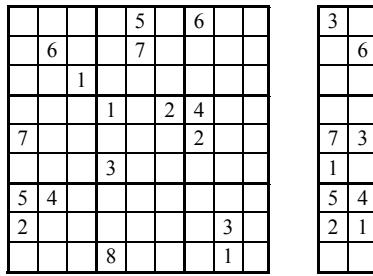

| 3 |   |   |   | 5 | 1 | 6 |   |   |
|---|---|---|---|---|---|---|---|---|
|   | 6 |   |   | 7 | 3 | 1 |   |   |
|   |   | 1 | 6 | 2 | 8 | 3 |   |   |
|   |   |   | 1 | 9 | 2 | 4 | 7 | 3 |
| 7 | 3 | 4 | 5 | 8 | 6 | 2 | 9 | 1 |
| 1 |   |   | 3 | 4 | 7 | 8 |   |   |
| 5 | 4 | 3 | 2 | 1 | 9 | 7 |   |   |
| 2 | 1 | 8 | 7 | 6 | 5 | 9 | 3 | 4 |
|   |   |   | 8 | 3 | 4 | 5 | 1 | 2 |

| 3 | 8 | 2 | 9 | 5 | 1 | 6 | 4 | 7 |
|---|---|---|---|---|---|---|---|---|
| 9 | 6 | 5 | 4 | 7 | 3 | 1 | 2 | 8 |
| 4 | 7 | 1 | 6 | 2 | 8 | 3 | 5 | 9 |
| 8 | 5 | 6 | 1 | 9 | 2 | 4 | 7 | 3 |
| 7 | 3 | 4 | 5 | 8 | 6 | 2 | 9 | 1 |
| 1 | 2 | 9 | 3 | 4 | 7 | 8 | 6 | 5 |
| 5 | 4 | 3 | 2 | 1 | 9 | 7 | 8 | 6 |
| 2 | 1 | 8 | 7 | 6 | 5 | 9 | 3 | 4 |
| 6 | 9 | 7 | 8 | 3 | 4 | 5 | 1 | 2 |

Figure 2. Puzzle Royle17-4601, its L1\_0 elaboration and its solution

Resolution path in L4\_0+XY4+HXY4+C4+XYT4+HXYT4+XYZT4 for the L4\_0+XY4+HXY4+C4+XYT4+HXYT4 (or L1\_0) elaboration of Royle17-4601: row r4 interaction-with-block b4 ==> r6c3  $\neq$  6, r6c3  $\neq$  5, r6c2  $\neq$  5

#### XIX.4.2. A puzzle in [L4+XY5+HXY5+XYT5+HXYT5]+XYZT5

|   |   |   |   |   |   |   | 3 | 8 |
|---|---|---|---|---|---|---|---|---|
|   |   |   |   |   |   | 7 | 1 |   |
| 9 |   |   | 4 |   |   |   |   |   |
|   |   |   |   | 1 | 7 |   |   |   |
| 6 |   |   |   |   |   | 9 |   |   |
|   |   |   |   |   | 3 |   |   |   |
|   |   |   | 6 | 5 |   | 2 |   |   |
|   |   | 3 |   |   |   |   | 6 |   |
|   | 1 |   |   |   |   |   |   |   |

|   |   | 6 |   | 1 | 7 | 9 | 4 | 3 | 8 |
|---|---|---|---|---|---|---|---|---|---|
| I | 3 |   |   | 5 | 2 | 6 | 7 | 1 | 9 |
| ſ | 9 | 7 | 1 | 4 | 3 | 8 | 6 |   |   |
| ſ |   |   |   |   | 1 | 7 | 3 |   | 6 |
| ſ | 6 | 3 |   |   | 4 | 5 | 9 |   | 1 |
| ĺ | 1 |   |   |   | 6 | 3 |   |   |   |
| ľ |   |   |   | 6 | 5 | 1 | 2 |   | 3 |
| I |   |   | 3 | 7 |   |   | 1 | 6 |   |
| I |   | 1 | 6 | 3 |   |   |   |   |   |

| _ | - | _ | - |   | - | - | _ | - |
|---|---|---|---|---|---|---|---|---|
| 5 | 6 | 2 | 1 | 7 | 9 | 4 | 3 | 8 |
| 3 | 8 | 4 | 5 | 2 | 6 | 7 | 1 | 9 |
| 9 | 7 | 1 | 4 | 3 | 8 | 6 | 5 | 2 |
| 4 | 9 | 5 | 8 | 1 | 7 | 3 | 2 | 6 |
| 6 | 3 | 8 | 2 | 4 | 5 | 9 | 7 | 1 |
| 1 | 2 | 7 | 9 | 6 | 3 | 8 | 4 | 5 |
| 7 | 4 | 9 | 6 | 5 | 1 | 2 | 8 | 3 |
| 8 | 5 | 3 | 7 | 9 | 2 | 1 | 6 | 4 |
| 2 | 1 | 6 | 3 | 8 | 4 | 5 | 9 | 7 |

Figure 3. Puzzle Royle17-277, its L1 0 elaboration and its solution

Puzzle Royle17-277 (Figure 3) has identical L4+XY5+HXY5+XYT5+HXYT5 and L1\_0 elaborations. It provides a simple example of two xyzt5-chains of type 3 (living on the same cells) and one xyz5-chain at the same time on the same grid.

Resolution path in L4+XY5+HXY5+XYT5+HXYT5+XYZT5 for the L4+XY5+HXY5+XYT5+HXYT5 (or L1\_0) elaboration of Royle17-277: column c1 interaction-with-block b7  $\Longrightarrow$  r7c3  $\ne$  7

|    | cl              | <i>c</i> 2      | <i>c3</i>         | <i>c4</i> | <i>c</i> 5 | <i>c</i> 6 | <i>c</i> 7 | c8              | с9            |           |
|----|-----------------|-----------------|-------------------|-----------|------------|------------|------------|-----------------|---------------|-----------|
| r1 | 2<br>5          | 6               | 2<br>5            | 1         | 7          | 9          | 4          | 3               | 8             | r1        |
| r2 | 3               | 4 8             | 4 8               | 5         | 2          | 6          | 7          | 1               | 9             | r2        |
| r3 | 9               | 7               | 1                 | 4         | 3          | 8          | 6          | 2<br>5          | 2<br>5        | r3        |
| r4 | 2<br>4 5<br>8   | 2<br>4 5<br>8 9 | 2<br>4 5<br>8 9   | 2<br>8 9  | 1          | 7          | 3          | 2<br>4 5<br>8   | 6             | r4        |
| r5 | 6               | 3               | 2<br>7 8          | 2 8       | 4          | 5          | 9          | 2<br>7 8        | 1             | r5        |
| r6 | 1               | 2<br>4 5<br>8 9 | 2<br>4 5<br>7 8 9 | 2<br>8 9  | 6          | 3          | 5<br>8     | 2<br>4 5<br>7 8 | 2<br>4 5<br>7 | r6        |
| r7 | 4<br>7 8        | 4 8 9           | 4<br>7 8 9        | 6         | 5          | 1          | 2          | 4<br>7 8 9      | 3             | <i>r7</i> |
| r8 | 2<br>4 5<br>8   | 2<br>4 5<br>8 9 | 3                 | 7         | 8 9        | 4          | 1          | 6               | 4 5           | r8        |
| r9 | 2<br>4 5<br>7 8 | 1               | 6                 | 3         | 8 9        | 4          | 5<br>8     | 4 5<br>7 8 9    | 4 5<br>7      | r9        |
|    | cl              | <i>c</i> 2      | <i>c3</i>         | c4        | c5         | <i>c</i> 6 | <i>c</i> 7 | c8              | c9            |           |

Figure 4. L1 0 elaboration of puzzle Royle17-277, in rc-space

It is worth analysing the starting situation in some detail. Notice that the first two xyzt5-chains reside on the same five cells, but ordered differently and with different target values and target cells. This example is ideal for understanding how the "t, z and zt extensions" work. Let us look successively at the three chains, with the full content of their cells, their target values (TV) and their target cells (TC). Notice that, for the first two chains, although they lie on the same set of cells, the same additional value in the same cell (e.g. n4 in r9c8) requires different justifications.

First chain, xyzt5-chain (on the grey cells):  $\{n8\ n5\}r9c7 - \{n5\ n4\}r8c9 - \{n4\ n7\ n5\#1\}r9c9 - \{n7\ n9\ n5\#1\ n4\#2\ n8*\}r9c8 - \{n9\ n8\}r9c5, \ with \ TV = n8\ and \ TC = r9c1; \ additional \ values \ are justified \ as \ follows:$ 

- n5 is allowed in cell 3 (r9c9) because this cell shares a row with cell 1 (r9c7), in which n5 is the right-linking value;
- n5 is allowed in cell 4 (r9c8) because this cell shares a column with cell 1 (r9c7), in which n5 is the right-linking value;
- n4 is allowed in cell 4 (r9c8) because this cell shares a block with cell 2 (r8c9), in which n4 is the right-linking value;
- n8 is allowed in cell 4 (r9c8) because this cell shares a column with TC (r9c1), and n8 is the target value.

Second chain, xyzt5-chain (also on the grey cells):  $\{n4\ n5\}r8c9 - \{n5\ n8\}r9c7 - \{n8\ n9\}r9c5 - \{n9\ n7\ n5\#1\ n8\#2\ n4*\}r9c8 - \{n7\ n4\ n5\#1\}r9c9$ , with TV = n4 and TC = r7c8; additional values are justified as follows:

- n5 is allowed in cell 4 (r9c8) because this cell shares a block with cell 1 (r8c9), in which n5 is the right-linking value;
- n8 is allowed in cell 4 (r9c8) because this cell shares a row with cell 2 (r9c7), in which n8 is the right-linking value;
- n4 is allowed in cell 4 (r9c8) because this cell shares a column with TC (r7c8), and n4 is the target value.
- n5 is allowed in cell 5 (r9c9) because this cell shares a column with cell 1 (r8c9), in which n5 is the right-linking value.

Third chain, xyz5-chain:

 $\{n5\ n8\}r9c7 - \{n8\ n9\}r9c5 - \{n9\ n8\}r8c5 - \{n8\ n2\ n5*\}r8c1 - \{n2\ n5\}r1c1, \text{ with } TV = n5 \text{ and } TC = r9c1 \text{ (notice that, when this chain is detected, candidate n4 has been deleted from r8c1); there is only one additional value in only one cell; it is justified as follows (this chain is a mere xyz-chain; no t-extension is used):$ 

- n5 is allowed in cell 4 (r8c1) because this cell shares a column with TC (r9c1) and n5 is the target value.

#### XIX.4.3. A puzzle in [L5+XY6+HXY6+C6+XYT6+HXYT6]+XYZT6

The L5+XY6+HXY6+C6+XYT6+HXYT6 and the L1\_0 elaborations of puzzle Royle17-9812 (Figure 5) coincide. After propagation of the elementary constraints has occurred, they display, at the same time, two xyzt-chains: one of length five and type 1 and one of length 6 and type 3.

|   |   |   | 6 |   |   | 3 | 5 | 8 | 1 | 9 | 6 | 7 | 2 | 4 | 3 | 5 | 8 | 1 | 9 | 6 | 7 | 2 | 4 | 3 | 8 |
|---|---|---|---|---|---|---|---|---|---|---|---|---|---|---|---|---|---|---|---|---|---|---|---|---|---|
| 7 |   |   |   | 4 |   | 1 |   | 7 | 6 | 3 |   | 4 | 5 |   | 1 | 2 | 7 | 6 | 3 | 8 | 4 | 5 | 9 | 1 | 9 |
| 2 |   |   |   |   |   |   |   | 2 | 4 | 5 | 1 | 3 |   |   |   |   | 2 | 4 | 5 | 1 | 3 | 9 | 8 | 7 | 2 |
|   | 5 |   |   | 2 | 7 |   |   |   | 5 | 4 |   | 2 | 3 | 7 |   |   | 6 | 5 | 4 | 9 | 2 | 3 | 7 | 8 | 6 |
|   | 3 |   | 5 |   |   |   |   |   | 3 | 7 | 5 |   |   |   | 2 | 4 | 9 | 3 | 7 | 5 | 1 | 8 | 6 | 2 | 1 |
|   | 8 |   |   |   |   |   |   |   | 8 | 2 | 4 |   | 7 | 3 | 5 |   | 1 | 8 | 2 | 4 | 6 | 7 | 3 | 5 | 5 |
| 4 |   |   |   |   | 2 |   |   | 4 | 9 |   | 7 | 5 | 1 | 2 |   | 3 | 4 | 9 | 8 | 7 | 5 | 1 | 2 | 6 | 3 |
|   |   | 1 |   |   |   |   |   | 3 | 7 | 1 | 2 |   |   | 5 |   |   | 3 | 7 | 1 | 2 | 9 | 6 | 5 | 4 | 4 |
|   |   |   | 3 |   |   |   |   | 5 | 2 |   | 3 |   |   |   |   |   | 5 | 2 | 6 | 3 | 8 | 4 | 1 | 9 | 7 |

Figure 5. Puzzle Royle17-9812, its L1 0 elaboration and its solution n

Resolution path in L5+XY6+HXY6+C6+XYT6+HXYT6+XYZT6 for the L5+XY6+HXY6+C6+XYT6+HXYT6 (or L1 0) elaboration of Royle17-9812:

xyzt5-chain  $\{n8 \ n6\}r7c8 - \{n6 \ n9\}r4c8 - \{n9 \ n8\}r4c4 - \{n8 \ n9\}r2c4 - \{n9 \ n8\}r3c6 \Longrightarrow r3c8 \neq 8$ 

xyzt6-chain {n8 n9}r2c7 - {n9 n8}r2c4 - {n8 n9}r4c4 - {n9 n6}r5c6 - {n6 n1}r6c5 - {n1 n8}r5c5 ==>  $r5c7 \neq 8$ 

... (Naked-Singles, Hidden-Singles, Interactions, Naked Pairs)

#### XIX.4.4. A puzzle in [L6+XY7+HXY7+XYT7+HXYT7]+XYZT7

The L6+XY7+HXY+XYT7+HXYT7 and the L1\_0 elaborations of puzzle Royle 17-14143 (Figure 6) coincide. After a few simple rules and a hxyt-rn5 chain, their resolution path displays an xyzt5-chain (of type 1) and an xyzt7-chain (of type 1).

Resolution path in L6+XY7+HXY+XYT7+HXYT7+XYZT7 for the L6+XY7+HXY+XYT7 +HXYT7 (or L1 0) elaboration of Royle17-14143:

row r1 interaction-with-block b3 ==>  $r3c8 \neq 8$ ,  $r2c8 \neq 8$ 

column c4 interaction-with-block b2 ==>  $r2c6 \neq 2$ 

hxyt-rn5-chain {c6 c2}r9n8 - {c2 c9}r6n8 - {c9 c8}r1n8 - {c8 c4}r1n7 - {c4 c6}r9n7 ==>  $r9c6 \neq 6$ 

xyzt5-chain  $\{n7 \ n2\}r1c4 - \{n2 \ n6\}r3c4 - \{n6 \ n7\}r9c4 - \{n7 \ n8\}r9c6 - \{n8 \ n7\}r2c6 \Longrightarrow r3c5 \neq 7$ 

xyzt7-chain {n7 n6}r6c5 – {n6 n2}r6c6 – {n2 n7}r5c6 – {n7 n8}r9c6 – {n8 n7}r7c5 – {n7 n6}r9c4 – {n6 n7}r9c2  $\Longrightarrow$  r6c2  $\ne$  7

```
row r6 interaction-with-block b5 ==> r5c6 \neq 7 xyt6-chain {n6 n7}r9c4 - {n7 n8}r9c6 - {n8 n6}r9c2 - {n6 n8}r6c2 - {n8 n7}r2c2 - {n7 n6}r2c6 ==> r3c4 \neq 6 hidden-single-in-a-column ==> r9c4 = 6 column c4 interaction-with-block b2 ==> r2c6 \neq 7 xy4-chain {n6 n8}r6c2 - {n8 n7}r9c2 - {n7 n8}r9c6 - {n8 n6}r2c6 ==> r6c6 \neq 6, r2c2 \neq 6 ... (Naked-Singles and Hidden-Singles)
```

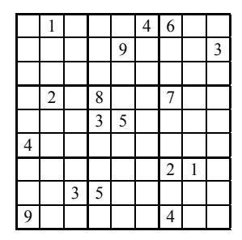

| 5 | 1 | 9 |   | 3 | 4 | 6 |   |   |
|---|---|---|---|---|---|---|---|---|
|   |   |   | 1 | 9 |   | 5 |   | 3 |
|   | 3 |   |   |   | 5 | 9 |   | 1 |
| 3 | 2 | 5 | 8 | 4 | 1 | 7 | 9 | 6 |
|   | 9 |   | 3 | 5 |   | 1 |   | 4 |
| 4 |   | 1 | 9 |   |   | 3 | 5 |   |
|   | 5 |   | 4 |   | 3 | 2 | 1 | 9 |
| 1 | 4 | 3 | 5 | 2 | 9 | 8 | 6 | 7 |
| 9 |   | 2 |   | 1 |   | 4 | 3 | 5 |

| 5 | 1 | 9 | 7 | 3 | 4 | 6 | 8 | 2 |
|---|---|---|---|---|---|---|---|---|
| 2 | 7 | 6 | 1 | 9 | 8 | 5 | 4 | 3 |
| 8 | 3 | 4 | 2 | 6 | 5 | 9 | 7 | 1 |
| 3 | 2 | 5 | 8 | 4 | 1 | 7 | 9 | 6 |
| 7 | 9 | 8 | 3 | 5 | 6 | 1 | 2 | 4 |
| 4 | 6 | 1 | 9 | 7 | 2 | 3 | 5 | 8 |
| 6 | 5 | 7 | 4 | 8 | 3 | 2 | 1 | 9 |
| 1 | 4 | 3 | 5 | 2 | 9 | 8 | 6 | 7 |
| 9 | 8 | 2 | 6 | 1 | 7 | 4 | 3 | 5 |

*Figure 6.* Puzzle Royle17-14143, its L1\_0 elaboration and its solution

Notice that, before the hxyt-rn5 rule was applied, the xyzt5-chain was not present, but the xyzt7-chain was already present.

Our second example is one of an xyzt7-chain of type 5. Puzzle Royle17-29144 (Figure 7) has identical L6+XY7+HXY+XYT7+HXYT7 and L1\_0 elaborations. After a few simple rules, it displays successively a hxyzt-rn6-chain of type 1 (a type of chains that will be introduced in the next chapter), an xyzt5-chain of type 3, an xyzt6-chain of type 4 and an xyzt7-chain of type 5.

```
Resolution path in L6+XY7+HXY+XYT7+HXYT7+XYZT7 for the L6+XY7+HXY+XYT7 +HXYT7 (or L1_0) elaboration of Royle17-29144: column c3 interaction-with-block b1 \Longrightarrow r1c2 \neq 5 naked-pairs-in-a-column {n1 n7}{r4 r9}c1 \Longrightarrow r3c1 \neq 1, r2c1 \neq 7 naked-pairs-in-a-block {n4 n9}{r2c5 r3c6} \Longrightarrow r3c4 \neq 9, r2c6 \neq 9, r2c6 \neq 4, r2c4 \neq 9 hxyzt-rn6-chain {c6 c3}r1n5 - {c3 c4}r2n5 - {c4 c1}r2n3 - {c1 c7}r2n6 - {c7 c5}r2n4 - {c5 c6}r5n4 \Longrightarrow r5c6 \neq 5 xyzt5-chain {n7 n1}r1c2 - {n1 n9}r3c3 - {n9 n4}r3c6 - {n4 n9}r5c6 - {n9 n7}r5c8 \Longrightarrow r5c2 \neq 7 xyzt6-chain {n9 n4}r3c6 - {n4 n6}r3c7 - {n6 n3}r3c1 - {n3 n1}r3c4 - {n1 n7}r4c4 - {n7 n9}r5c6 \Longrightarrow r6c6 \neq 9 xyzt7-chain {n9 n4}r3c6 - {n4 n6}r3c7 - {n6 n3}r3c1 - {n3 n1}r3c4 - {n1 n8}r1c5 - {n8 n6}r6c5 - {n6 n9}r7c5 \Longrightarrow r2c5 \neq 9 ... (Naked-Singles)
```

| 4 |   |   | 6 |   |   |   | 2 |   | 4 |   |   | 6 |   |   | 9 | 2 | 3 | 4 | 7 | 5 | 6 | 1 | 8 | 9 | 2 | 3 |
|---|---|---|---|---|---|---|---|---|---|---|---|---|---|---|---|---|---|---|---|---|---|---|---|---|---|---|
|   |   |   |   |   |   |   | 1 |   |   | 2 |   |   |   |   |   | 1 | 8 | 3 | 2 | 9 | 7 | 4 | 5 | 6 | 1 | 8 |
|   | 8 |   |   |   |   |   |   |   |   | 8 |   |   | 2 |   |   | 5 | 7 | 6 | 8 | 1 | 3 | 2 | 9 | 4 | 5 | 7 |
|   |   |   |   | 3 |   | 8 |   | 5 |   |   | 4 |   | 3 | 2 | 8 | 6 | 5 | 7 | 9 | 4 | 1 | 3 | 2 | 8 | 6 | 5 |
|   |   | 6 |   |   |   | 3 |   |   | 8 |   | 6 |   |   |   | 3 |   | 2 | 8 | 1 | 6 | 5 | 9 | 4 | 3 | 7 | 2 |
| 2 |   |   |   |   |   |   |   |   | 2 |   | 3 |   |   |   | 1 |   | 4 | 2 | 5 | 3 | 8 | 6 | 7 | 1 | 9 | 4 |
| 5 | 3 |   |   |   |   | 7 |   |   | 5 | 3 | 2 |   |   |   | 7 | 4 | 1 | 5 | 3 | 2 | 9 | 8 | 6 | 7 | 4 | 1 |
|   |   |   | 2 |   | 1 |   |   |   | 9 | 4 | 8 | 2 | 7 | 1 | 5 | 3 | 6 | 9 | 4 | 8 | 2 | 7 | 1 | 5 | 3 | 6 |
|   |   |   | 4 |   |   |   |   |   |   | 6 |   | 4 | 5 | 3 | 2 | 8 | 9 | 1 | 6 | 7 | 4 | 5 | 3 | 2 | 8 | 9 |

Figure 7. Puzzle Royle17-29144, its L1\_0 elaboration and its solution

Exercise: before the HXYZT-rn6-type-1 rule applied, the xyzt5- and the xyzt6-chains were not present (candidate 5 may not be present in cell r5c6), but the xyzt7-chain was already present (no change of its candidates is produced by the three preceding chain rules).

#### XIX.4.4. A puzzle in [L9+XY10+HXY10+XYT10+HXYT10]+XYZT10

Let us skip a few possible lengths and show an example of an xyzt10-chain of type 1. This is obtained with puzzle Royle17-9480 (Figure 8), whose L9+XY9+HXY9+XYT9+HXYT9+XYZT9 and L1 elaborations coincide.

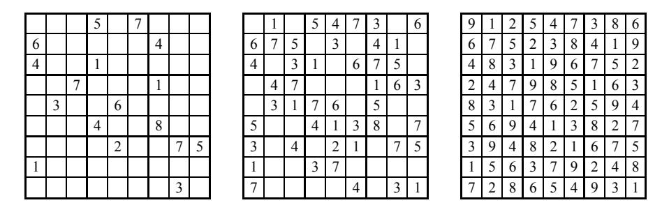

Figure 8. Puzzle Royle17-9480, its L1 elaboration and its solution

Resolution path in L9+XY9+HXY9+XYT9+HXYT9+XYZT9 of the L9+XY9+HXY9+XYT9+HXYT9 (or L1) elaboration of Royle17-9480: column c7 interaction-with-block b9 ==>  $r8c9 \neq 9$ ,  $r8c8 \neq 9$ ,  $r8c9 \neq 2$ ,  $r8c8 \neq 2$  block b9 interaction-with-row r8 ==>  $r8c6 \neq 8$ ,  $r8c3 \neq 8$ ,  $r8c2 \neq 8$  block b4 interaction-with-column c1 ==>  $r1c1 \neq 8$ 

```
block b2 interaction-with-row r2 ==> r2c9 \neq 2
```

### Chapter XX

# Hidden xyz- and xyzt- chains (hxyz- and hxyzt- chains)

Hidden xyz- (respectively hidden xyzt-) chains, or hyyz- (resp. hxyzt-) chains, are the "hidden" counterpart of xyz- (resp. xyzt-) chains. They are to xyz- (resp. to xyzt-) chains exactly what hxyt-chains are to xyt-chains or what hxy-chains are to xy-chains. Roughly speaking, a hxyz- (respectively a hxyzt-) chain is defined as and looks like an xyz- (resp. an xyzt-) chain, but in rn- or cn- instead of rc- space – except that there are no links along 3x3 pseudo-blocks in these spaces; and the eliminations it allows in rn- or cn- space are similar to those allowed in rc-space by xyz- (resp. xyzt-) chains. Moreover, the "super-hidden" counterparts of xyz- and xyzt- chains are identical to their "hidden" counterparts. As xyz-chains are subsumed by xyzt-chains, we shall develop here only the hxyzt-chains.

#### XX.1. Introduction to hxyzt-chains

This section is a strict parallel to section XV.1 on hxy-chains and to section XVIII.1 on hxyt-chains; we shall therefore be very sketchy.

#### XX.1.1. On the transposition of xyzt-chain rules

hxyzt-chain rules are obtained from the block-free part of xyzt-chain rules, by applying the  $S_{cn}$  and  $S_{rn}$  transformations.

Let us consider  $xyzt_k$ -type-i-chain\*, the pattern for a full xyzt-chain of length k and type i. The  $XYZT_k$ -type-i rule is the universal closure of formula " $xyzt_k$ -type-i-chain\* => not-candidate(n, r, c)".

Theorem XX.1:  $XYZT_k$ -type-i is a block-positive resolution rule.

Theorem XX.2: For any k and i  $(1 \le i \le k-2)$ ,  $HXYZT_k$ -rn-type- $i \equiv Scn \bullet BF(XYZT_k$ -type-i) and  $HXYZT_k$ -cn-type- $i \equiv Srn \bullet BF(XYZT_k$ -type-i) are resolution rules.

Proof: apply the same proofs as for  $XY_k$  or  $XYT_k$ .

#### XX.1.2. A list of the first hxyzt-chain rules

Let us apply the previous theorem to list the first hxyt-chain rules:

#### XX.1.2.1. hxyzt-chains of length 4

Starting from the two rules for xyzt4-chains, we get four rules for hxyzt4-chains:

- hxyzt-rn4-chain type-1 rule (or HXYZT-rn4-type-1):

$$rn = \{1\ 2\}* - \{2\ 3\ 1\}* - \{3\ 4\ (2\#1)\} - \{4\ 1\ (2\#1)\ (3\#2)\}*$$

- hxyzt-cn4-chain type-1 rule (or HXYZT-cn4-type-1):

$$cn = \{1 \ 2\} * \{2 \ 3 \ 1\} * \{3 \ 4 \ (2\#1)\} \{4 \ 1 \ (2\#1) \ (3\#2)\} *$$

- hxyzt-rn4-chain type-2 rule (or HXYZT-rn4-type-2):

$$rn = \{1\ 2\}*-\{2\ 3\}-\{3\ 4\ (2\#1)\ 1\}*-\{4\ 1\ (2\#1)\ (3\#2)\}*$$

- hxyzt-cn4-chain type-2 rule (or HXYZT-cn4-type-2):

$$cn = \{1 2\}* - \{2 3\} - \{3 4 (2#1) 1\}* - \{4 1 (2#1) (3#2)\}*$$

#### XX.1.2.2. hxyzt-chains of length 5 or more

Starting from the three rules for xyzt5-chains, we get six rules for hxyzt5-chains; let us write only the three rn- rules:

– hxyzt-rn5-chain\_type-1 rule (or HXYZT-rn5-type-1):

rn |= 
$$\{1\ 2\}*-\{2\ 3\ 1\}*-\{3\ 4\ (2\#1)\}-\{4\ 5\ (2\#1)\ (3\#2)\}-\{5\ 1\ (2\#1)\ (3\#2)\}$$
 (4#3)}\*

- hxyzt-rn5-chain type-2 rule (or HXYZT-rn5-type-2):

rn |= 
$$\{1\ 2\}*-\{2\ 3\}-\{3\ 4\ (2\#1)\ 1\}*-\{4\ 5\ (2\#1)\ (3\#2)\}-\{5\ 1\ (2\#1)\ (3\#2)\}*$$

- hxyzt-rn5-chain type-3 rule (or HXYZT-rn5-type-3):

rn |= 
$$\{1\ 2\}*-\{2\ 3\}-\{3\ 4\ (2\#1)\}-\{4\ 5\ (2\#1)\ (3\#2)\ 1\}*-\{5\ 1\ (2\#1)\ (3\#2)\ (4\#3)\}*$$

Starting from the four rules for xyzt6-chains, we get eight rules for hxyzt6-chains; and so on.

The pattern is clear. How far should we go? The answer is the same as for all the previous types of chains. In our SudoRules solver, hxyzt-chains have been implemented up to length seven. As the examples below show, this is not superfluous. But, conversely, there may exist hxyzt-chains of greater length.

#### XX.1.3. Relationships between xyzt-chains and hxyzt-chains

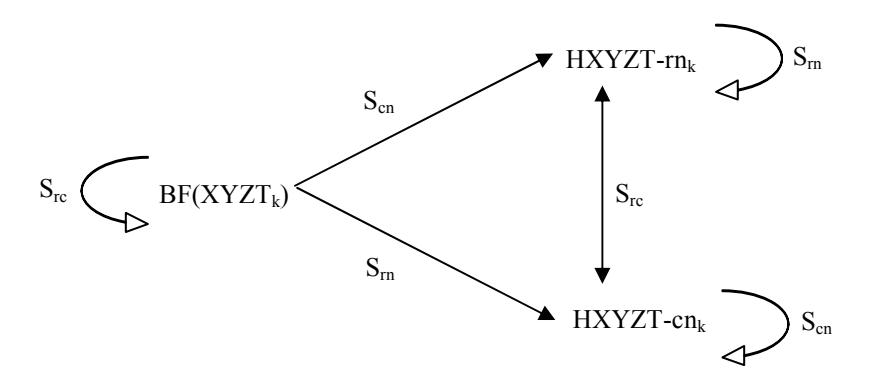

Figure 1. Relationships between the XYZT and the HXYZT rules

As was the case for xy- and hxy- chain rules, or for xyt- and hxyt- chain rules, it can easily be seen that xyzt- and hxyzt- chain rules are related as described in Figure 1

In particular, we have the useful practical consequence:

Theorem XX.3: "super hidden" xyzt-chains coincide with hxyzt-chains. Practical statement: we need not consider "super-hidden" xyzt-chains.

#### XX.2. Examples and independence results

#### XX.2.1. A puzzle in [L4 0+XY4+HXY4+C4+XYT4+HXYT4+XYZT4]+HXYZT4

For puzzle Royle17-17003 (Figure 2), the L4\_0+XY4+HXY4+C4+XYT4+HXYT4+XYZT4 and the L1 elaborations coincide. After a few simple rules, their solution in L4 shows a c4-chain, followed by an hxyt-rn4-chain and by a hxyzt-cn4-chain of type 1.

|   | 3 | 1 |   |   |   |   | 6 |
|---|---|---|---|---|---|---|---|
|   |   |   | 8 |   |   | 4 |   |
|   |   |   |   |   |   |   |   |
|   |   |   |   | 7 | 3 |   | 1 |
| 4 |   |   | 2 |   |   |   |   |
| 8 |   |   |   |   | 7 |   |   |
| 2 |   |   | 5 |   |   | 8 |   |
|   | 5 |   |   | 1 |   |   |   |
|   |   |   |   |   |   |   |   |

|   | 3 | 1 |   | 2 | 4 | 8 |   | 6 |
|---|---|---|---|---|---|---|---|---|
| 7 |   |   | 8 |   | 1 |   | 4 | 3 |
|   | 8 | 4 | 3 |   |   |   | 1 |   |
|   |   |   | 4 | 7 | 8 | 3 |   | 1 |
| 4 | 1 | 7 | 2 | 3 |   |   |   | 8 |
| 8 |   | 3 | 1 |   |   | 7 |   | 4 |
| 2 | 7 | 6 | 5 | 4 | 3 | 1 | 8 | 9 |
| 3 | 5 | 8 |   | 1 |   | 4 |   |   |
| 1 | 4 | 9 |   | 8 |   |   | 3 |   |

| _ | _ | _ |   | _ | _ | _ |   | _ |
|---|---|---|---|---|---|---|---|---|
| 5 | 3 | 1 | 9 | 2 | 4 | 8 | 7 | 6 |
| 7 | 6 | 2 | 8 | 5 | 1 | 9 | 4 | 3 |
| 9 | 8 | 4 | 3 | 6 | 7 | 2 | 1 | 5 |
| 6 | 9 | 5 | 4 | 7 | 8 | 3 | 2 | 1 |
| 4 | 1 | 7 | 2 | 3 | 5 | 6 | 9 | 8 |
| 8 | 2 | 3 | 1 | 9 | 6 | 7 | 5 | 4 |
| 2 | 7 | 6 | 5 | 4 | 3 | 1 | 8 | 9 |
| 3 | 5 | 8 | 7 | 1 | 9 | 4 | 6 | 2 |
| 1 | 4 | 9 | 6 | 8 | 2 | 5 | 3 | 7 |

Figure 2. Puzzle Royle17-17003, its L1 elaboration and its solution

Resolution path in L4 for the L4\_0+XY4+HXY4+C4+XYT4+HXYT4+XYZT4 (or L1) elaboration of Royle17-17003: column c4 interaction-with-block b8 ==>  $r9c6 \neq 6$ ,  $r8c6 \neq 6$ 

row r3 interaction-with-block b3 ==>  $r2c7 \neq 2$ 

block b4 interaction-with-row r4 ==>  $r4c8 \neq 5$ 

block b6 interaction-with-column c8  $\Longrightarrow$  r8c8  $\neq$  2

c4-chain col-row-bl  $n7\{r8\ r1\}c8 - n7\{r1c4\ r3c6\} ==> r8c6 \neq 7$ 

 $hxyt-rn4-chain \{c6 c4\}r8n9 - \{c4 c8\}r8n6 - \{c8 c9\}r8n7 - \{c9 c6\}r3n7 ==> r3c6 \neq 9$ 

...(Naked-Singles and Hidden-Singles)

#### XX.2.2. Two puzzles in [L4+XY5+HXY5+XYT5+HXYT5+XYZT5]+HXYZT5

Puzzle Royle17-34408 (Figure 3), with its identical L4+XY5+HXY5+XYT5+ HXYT5+XYZT5 and L1 elaborations, provides one of the simplest examples of a hxyzt-rn5-chain of type 3, because these elaborations can be solved in L2+ HXYZT5.

| 7 |   |   |   | 8 |   | 4 |   |   | 1 | 7 |   |   |   | 8 |   | 4 |   |   | 7 | 6 | 1 | 5 | 8 | 3 | 4 | 9 | 2 |
|---|---|---|---|---|---|---|---|---|---|---|---|---|---|---|---|---|---|---|---|---|---|---|---|---|---|---|---|
| 9 |   | 3 |   |   |   |   |   |   |   | 9 |   | 3 |   |   |   | 8 |   |   | 9 | 4 | 3 | 2 | 7 | 6 | 8 | 5 | 1 |
|   |   |   |   | 1 |   |   |   |   |   | 8 |   |   |   | 1 |   |   |   |   | 8 | 5 | 2 | 4 | 1 | 9 | 3 | 6 | 7 |
|   |   |   | 3 |   | 5 | 9 |   |   | ] |   |   |   | 3 |   | 5 | 9 | 8 |   | 1 | 7 | 4 | 3 | 2 | 5 | 9 | 8 | 6 |
|   | 8 |   |   |   |   |   |   |   |   |   | 8 | 9 | 1 |   |   |   |   |   | 6 | 8 | 9 | 1 | 4 | 7 | 2 | 3 | 5 |
|   |   |   | 9 |   |   |   |   |   |   |   |   |   | 9 |   | 8 | 1 |   |   | 2 | 3 | 5 | 9 | 6 | 8 | 1 | 7 | 4 |
|   | 2 |   |   |   |   |   | 1 | 8 | 1 |   | 2 |   |   | 9 |   |   | 1 | 8 | 3 | 2 | 6 | 7 | 9 | 4 | 5 | 1 | 8 |
| 5 |   |   | 6 |   |   |   |   |   |   | 5 |   | 8 | 6 |   |   |   |   |   | 5 | 1 | 8 | 6 | 3 | 2 | 7 | 4 | 9 |
|   |   |   |   |   |   |   | 2 |   |   |   |   |   | 8 |   |   |   | 2 |   | 4 | 9 | 7 | 8 | 5 | 1 | 6 | 2 | 3 |

Figure 3. Puzzle Royle17-17003, its L1 elaboration and its solution

```
Resolution path in L5 for the L4+XY5+HXY5+XYT5+HXYT5+XYZT5 (or L1) elaboration of Royle17-34408:
```

```
row r5 interaction-with-block b6 ==> r6c9 \neq 5, r6c8 \neq 5 column c5 interaction-with-block b8 ==> r9c6 \neq 3, r8c6 \neq 3, r7c6 \neq 3 column c4 interaction-with-block b2 ==> r3c6 \neq 2, r2c6 \neq 2, r2c5 \neq 2, r1c6 \neq 2 column c1 interaction-with-block b4 ==> r6c3 \neq 2, r4c3 \neq 2 hidden-pairs-in-a-column {n3 n9} {r1 r3}c6 ==> r3c6 \neq 7, r3c6 \neq 6, r3c6 \neq 4, r1c6 \neq 6 block b2 interaction-with-row r2 ==> r2c9 \neq 6, r2c8 \neq 6, r2c2 \neq 6 hxyzt-rn5-chain {c9 c2}r2n1 - {c2 c6}r8n1 - {c6 c5}r8n2 - {c5 c1}r4n2 - {c1 c9}r6n2 ==> r2c9 \neq 2 ...(Naked-Singles and Hidden-Singles)
```

Although it is a little more complex, it is worth looking also at the following example. For puzzle Royle17-9449 (Figure 4), the L4+XY5+HXY5+XYT5+ HXYT5+XYZT5 and the L2 elaborations coincide. A hxyzt5-chain of type 3 appears together with a very special xy4-chain. (Due to the priorities associated to their relative complexities, the corresponding HXYZT5 rule fires after the XY4 rule). The xy4-chain is built on only two xy-linking values, 4 and 9; it is indeed a sequence of three Naked Pairs (on column c6, in block b5 and on row r5); and the same cell r9c7 is a target cell for both target values 4 and 9. Such a pattern is called "Remote Pairs" in the Sudoku literature ([ARM xx], [STU 07]...), but there is no

reason to introduce such a specific chain type, since it is subsumed by the general xy-pattern.

|   |   |   | 5 |   | 3 | 2 |   |   |
|---|---|---|---|---|---|---|---|---|
|   | 6 | 1 |   |   |   |   |   |   |
|   |   |   | 4 |   |   |   |   |   |
|   | 4 |   |   | 7 |   |   | 1 | 6 |
|   |   |   |   |   |   |   | 8 |   |
| 5 |   |   |   |   |   |   |   |   |
| 8 |   |   | 2 |   |   |   |   |   |
| 3 |   |   |   |   |   | 5 |   |   |
|   |   |   |   | 1 |   |   |   |   |

|   | 9 | 8 | 5 | 6 | 3 | 2 |   | 1 |
|---|---|---|---|---|---|---|---|---|
|   | 6 | 1 |   |   |   |   | 5 | 3 |
|   | 5 | 3 | 4 |   | 1 | 6 |   |   |
| 9 | 4 | 2 | 8 | 7 | 5 | 3 | 1 | 6 |
| 1 | 3 | 7 | 6 |   | 2 |   | 8 | 5 |
| 5 | 8 | 6 | 1 | 3 |   |   | 2 |   |
| 8 | 7 |   | 2 | 5 | 6 | 1 | 3 |   |
| 3 | 1 |   |   |   |   | 5 | 6 | 2 |
| 6 | 2 | 5 | 3 | 1 |   |   |   |   |

Figure 4. Puzzle Royle17-9449, its L2 elaboration and its solution

Resolution path in L5 for the L4+XY5+HXY5+XYT5+HXYT5+XYZT5 (or L2) elaboration of Royle17-9449:

```
row r8 interaction-with-block b8 =>> r9c6 \neq 8, r9c6 \neq 7 block b2 interaction-with-row r2 =>> r2c7 \neq 7, r2c1 \neq 7 naked-pairs-in-a-column {n4 n9} {r6 r9}c6 =>> r8c6 \neq 9, r8c6 \neq 4, r2c6 \neq 9 xy4-chain {n9 n4}r9c6 - {n4 n9}r6c6 - {n9 n4}r5c5 - {n4 n9}r5c7 =>> r9c7 \neq 9 <b>xy4-chain {n4 n9}r9c6 - {n9 n4}r6c6 - {n4 n9}r5c5 - {n9 n4}r5c7 =>> r9c7 \neq 4 hxyzt-rn5-chain {c5 c7}r5n9 - {c7 c5}r5n4 - {c5 c3}r8n4 - {c3 c4}r8n9 - {c4 c5} =>> r3c5 \neq 9 row r3 interaction-with-block b3 ==> r2c7 \neq 9 column c7 interaction-with-block b6 =>> r6c9 \neq 9 xy3-chain {n7 n8}r9c7 - {n8 n4}r2c7 - {n4 n7}r1c8 =>> r9c8 \neq 7 column c8 interaction-with-block b3 =>> r3c9 \neq 7 naked-pairs-in-a-block {n4 n9}{r7c9 r9c8} =>> r9c9 \neq 9, r9c9 \neq 4 xy4-chain {n4 n9}r6c6 - {n9 n4}r9c6 - {n4 n9}r9c8 - {n9 n4}r7c9 =>> r6c9 \neq 4 ...(Naked-Singles)
```

#### XX.2.3. Two puzzles in [L5+XY6+HXY6+C6+XYT6+HXYT6+XYZT6] +HXYZT6

For puzzle Royle17-12407 (Figure 5), the L5+XY6+HXY6+C6+XYT6+HXYT6 +XYZT6 and the L1 elaborations coincide. Their resolution path displays at the same time on the same grid a xyzt6-chain of type 1 and a hxyzt-cn6-chain of type 4.

```
Resolution path in L6 for the L5+XY6+HXY6+C6+XYT6+HXYT6+XYZT6 (or L1) elaboration of Royle17-12407: column c4 interaction-with-block b8 ==> r7c6 \neq 8 column c1 interaction-with-block b1 ==> r3c3 \neq 8 xy4-chain \{n9\ n7\}r4c8 - \{n7\ n9\}r4c4 - \{n9\ n7\}r6c5 - \{n7\ n9\}r1c5 ==> r1c8 \neq 9
```

2

9 1

3 2

2 8 9 3 5

3

8

5

2

2

4 9 5

8 4

6

9

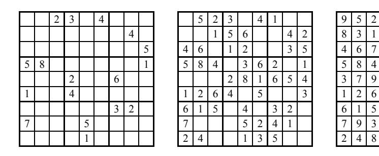

Figure 5. Puzzle Royle17-12407, its L1 elaboration and its solution

For puzzle Royle17-3831 (Figure 6), the L5+XY6+HXY6+C6+XYT6+HXYT6 +XYZT6 and the L3 elaborations coincide.

Two different hxy-cn6 chains appear, that share four of their six underlying cn-cells. At the same time, there is a hxyzt-rn6-chain of type 1. After the HXYZT-rn6 rule has fired, a chain of type hxyt-rn6 appears. One can check that, before rule HXYZT-rn6 eliminated candidate c5 from rn-cell r6n5, which is the second cell of the hxyt6-chain, the presence of column-candidate c5 in this rn-cell prevented the underlying sequence of rn-cells (r6n3, r6n5, r2n5, r4n5, r7n5 and r9n5) from being the support of either a hxyt-rn6- or a hxyzt-rn6- chain.

```
Resolution path in L6 for the L5+XY6+HXY6+C6+XYT6+HXYT6+XYZT6 (or L3) elaboration of Royle17-3831:
```

```
column c8 interaction-with-block b3 \Longrightarrow r3c7 \neq 7, r2c7 \neq 7 row r5 interaction-with-block b6 \Longrightarrow r4c9 \neq 6, r4c8 \neq 6, r4c7 \neq 6 column c2 interaction-with-block b4 \Longrightarrow r6c1 \neq 1, r5c1 \neq 1 block b9 interaction-with-column c8 \Longrightarrow r4c8 \neq 5, r2c8 \neq 5 block b9 interaction-with-row r8 \Longrightarrow r8c4 \neq 3, r8c3 \neq 3, r8c1 \neq 3
```

```
block b1 interaction-with-column c2 \Longrightarrow r7c2 \neq 3, r6c2 \neq 3, r4c2 \neq 3 hidden-pairs-in-a-block {n3 n8}{r4c6 r6c4} \Longrightarrow r6c4 \neq 9, r6c4 \neq 7, r6c4 \neq 5, r6c4 \neq 4, r4c6 \neq 4 x-wing-in-columns n3 {r6 r9} {c1 c4} \Longrightarrow r6c3 \neq 3 hxy-cn6-chain {r6 r4}c7n8 - {r4 r2}c6n8 - {r2 r6}c4n8 - {r6 r9}c4n3 - {r9 r5}c4n5 - {r5 r6}c1n5 \Longrightarrow r6c7 \neq 5 hxy-cn6-chain {r5 r6}c7n7 - {r6 r4}c7n8 - {r4 r2}c6n8 - {r2 r6}c4n8 - {r6 r9}c4n3 - {r9 r5}c4n5 \Longrightarrow r5c7 \neq 5, r5c4 \neq 7 hxyzt-rn6-chain {c5 c8}r7n5 - {c8 c4}r9n5 - {c4 c1}r9n3 - {c1 c4}r6n3 - {c4 c7}r6n8 - {c7 c5}r6n7 \Longrightarrow r6c5 \neq 5 hxyt-rn6-chain {c4 c1}r6n3 - {c1 c9}r6n5 - {c9 c7}r2n5 - {c7 c5}r4n5 - {c5 c8}r7n5 - {c8 c4}r9n5 \Longrightarrow r9c4 \neq 3 ...(Naked-Singles and Hidden-Singles)
```

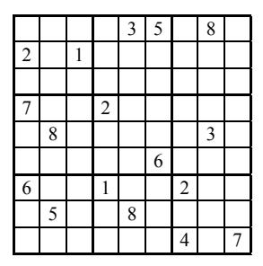

|   |   |   |   | 3 | 5 | 1 | 8 | 2 |
|---|---|---|---|---|---|---|---|---|
| 2 |   | 1 |   |   |   |   |   |   |
| 8 |   | 5 |   | 2 | 1 |   |   |   |
| 7 |   |   | 2 |   |   |   |   |   |
|   | 8 | 2 |   |   |   |   | 3 |   |
|   |   |   |   |   | 6 |   | 2 |   |
| 6 |   |   | 1 |   |   | 2 |   | 8 |
|   | 5 |   |   | 8 | 2 |   |   |   |
|   | 2 | 8 |   |   | 9 | 4 |   | 7 |

| ٥ | 7 | 6 | 1 | 3 | 5 | 1 | Q | 2 |
|---|---|---|---|---|---|---|---|---|
| 2 | 7 | 1 | 4 | 2 | 7 | 1 | 6 | 4 |
| 2 | 3 | I | 8 | 9 | 1 | 5 | 6 | 4 |
| 8 | 4 | 5 | 6 | 2 | 1 | 3 | 7 | 9 |
| 7 | 6 | 3 | 2 | 5 | 8 | 9 | 4 | 1 |
| 5 | 8 | 2 | 9 | 1 | 4 | 7 | 3 | 6 |
| 4 | 1 | 9 | 3 | 7 | 6 | 8 | 2 | 5 |
| 6 | 9 | 7 | 1 | 4 | 3 | 2 | 5 | 8 |
| 1 | 5 | 4 | 7 | 8 | 2 | 6 | 9 | 3 |
| 3 | 2 | 8 | 5 | 6 | 9 | 4 | 1 | 7 |

Figure 6. Puzzle Royle17-3831, its L3 elaboration and its solution

#### *XX.2.4.* A puzzle in [L6+XY7+HXY7+XYT7+HXYT7+XYZT7]+HXYZT7?

In our three databases, we have found no example of a puzzle in [L6+XY7+HXY7+XYT7+HXYT7+XYZT7]+HXYZT7. But this does not mean there cannot be one.

### Chapter XXI

### Classification results

As indicated in the introduction, we have chosen to test the resolution rules and theories defined in this book (and the associated knowledge base implementing them) against three collections of minimal puzzles with a single solution: the non random Royle's database of 36,628 non equivalent 17-minimal puzzles and two randomly generated databases Sudogen0 and Sudogen17. Through all the examples they contain, the previous chapters have already included some of the results thus obtained. Nevertheless what has just been occasionally hinted at but is still missing is a global view on the relative efficiencies of the various resolution rules. Providing such a view is the purpose of this chapter. Detailed listings of the puzzles pertaining to each cell in the following tables (thus fully justifying them) can be obtained on the author's Web pages. These listings can also be used to find additional examples for all the rules introduced in this book.

All the rules defined in this book have been implemented in a knowledge base that can be run with either the CLIPS or the JESS inference engines. Nevertheless all the results in this book (including those below) have been obtained using CLIPS (version 6.24). CLIPS is very slow when solving long series of puzzles (due to referenced but unsolved memory management problems) but it is free software, whereas JESS is much faster (on long series) but it is not free. Moreover, JESS has some longstanding undocumented problems regarding management of saliences (i.e. of the priorities between the rules); as a result, JESS misses some patterns and fails to classify some puzzles in their proper place in our hierarchy, a crippling defect for classification purposes.

#### XXI.1. Detailed results for levels L0 to L4 0

Let us first consider the levels (L0 to L4 $_{-}$ 0) that have been defined based on the most classical patterns, i.e. with no chain rules other than the very special cases of XY-Wing and XYZ-Wing.

As a strict precedence order has been defined on groups of logically equivalent rules at these levels, a linear presentation of the results is feasible. In order to have greater detail and to show how many additional puzzles are solved thanks to hidden or super-hidden subset rules, we have nevertheless introduced a finer artificial ordering among rules for subsets of the same cardinality: Naked before Hidden before Super-Hidden.

In the following tables, "new" (in "new grids solved") means relatively to the grids solved using only the techniques preceding it in this classification:

| Table for Royle17 | numbers of grids | out of 36 628). |
|-------------------|------------------|-----------------|
|                   |                  |                 |

| New rules used<br>(relatively to all the<br>previous lines) | number of<br>new grids<br>solved | % of<br>new grids<br>solved | total<br>number of<br>grids<br>solved | % of grids solved |
|-------------------------------------------------------------|----------------------------------|-----------------------------|---------------------------------------|-------------------|
| NS                                                          | 0                                | 0%                          | 0                                     | 0%                |
| $+HS \rightarrow L1_0$                                      | 16,867                           | 46.05%                      | 16,867                                | 46.05%            |
| +RCiB                                                       | 10,363                           | 28.29%                      | 27,230                                | 74.34%            |
| +BiRC → L1                                                  | 1,233                            | 3.37%                       | 28,463                                | 77.71%            |
| +NP                                                         | 1,652                            | 4.51%                       | 30,115                                | 82.22%            |
| +HP                                                         | 1,155                            | 3.15%                       | 31,270                                | 85.37%            |
| $+SHP \rightarrow L2$                                       | 11                               | 0.03%                       | 31,281                                | 85.40%            |
| +NT                                                         | 24                               | 0.07%                       | 31,305                                | 85.47%            |
| +HT                                                         | 13                               | 0.04%                       | 31,318                                | 85.50%            |
| $+SHT \rightarrow L3_0$                                     | 3                                | 0.01%                       | 31,321                                | 85.51%            |
| +XY3                                                        | 850                              | 2.32%                       | 32,171                                | 87.83%            |
| $+XYZ3 \rightarrow L3$                                      | 9                                | 0.02%                       | 32,180                                | 87.86%            |
| +N4                                                         | 0                                | 0%                          | 32,176                                | 87.85%            |
| +H4                                                         | 0                                | 0%                          | 32,176                                | 87.85%            |
| $+SH4 \rightarrow L4_0$                                     | 3                                | 0.01%                       | 32,179                                | 87.85%            |

Classification results 325

Table for Sudogen0 and Sudogen17 (numbers of grids out of 10,000):

| New rules used          | number of | number of | total    | total     |  |
|-------------------------|-----------|-----------|----------|-----------|--|
| (relatively to all the  | new grids | new grids | number   | number    |  |
| previous lines)         | solved    | solved    | of grids | of grids  |  |
|                         | Sudogen0  | Sudogen17 | solved   | solved    |  |
|                         |           |           | Sudogen0 | Sudogen17 |  |
| NS                      | 0         | 0         | 0        | 0         |  |
| $+HS \rightarrow L1_0$  | 4,247     | 4,153     | 4,247    | 4,153     |  |
| +RCiB                   | 1,011     | 1,071     | 5,258    | 5,224     |  |
| $+BiRC \rightarrow L1$  | 124       | 131       | 5,382    | 5,355     |  |
| +NP                     | 408       | 437       | 5,790    | 5,792     |  |
| +HP                     | 213       | 193       | 6,003    | 5,985     |  |
| $+SHP \rightarrow L2$   | 23        | 24        | 6,026    | 6,009     |  |
| +NT                     | 22        | 31        | 6,048    | 6,040     |  |
| +HT                     | 7         | 6         | 6,055    | 6,046     |  |
| $+SHT \rightarrow L3_0$ | 6         | 0         | 6,061    | 6,046     |  |
| +XY3                    | 450       | 422       | 6,511    | 6,468     |  |
| $+XYZ3 \rightarrow L3$  | 66        | 54        | 6,577    | 6,522     |  |
| +N4                     | 1         | 3         | 6,578    | 6,525     |  |
| +H4                     | 0         | 0         | 6,578    | 6,525     |  |
| $+SH4 \rightarrow L4_0$ | 1         | 1         | 6,579    | 6,526     |  |

These tables show that, at any level between L0 and L4 0:

- there is no significant difference between the two randomly generated Sudogen0 and Sudogen17 databases;
  - no minimal puzzle can be solved using only Naked-Singles;
- adding Hidden-Singles causes the proportion of solved puzzles to reach 46% in the Royle17 database and 42% in the two Sudogen databases;
- adding the four interaction rules makes these proportions rise to 77% and 53% respectively; in the Royle17 database, there are 31% puzzles solved thanks to the addition of Interaction rules, but only 11% in the Sudogen databases; this is the major difference between the two groups of databases; "Royle17 loves Interaction";
- in proportion, there are many more puzzles solved at levels between L0 and L4\_0 in the Royle17 database (88%) than in any of the two Sudogen databases (65%); most of this difference is explained by the results on Interaction rules;

 there are very few puzzles solved thanks to the addition of rules for Triplets or Quadruplets (whether they are Naked, Hidden or Super-Hidden).

Royle17 is the only list of non-randomly generated minimal puzzles we know of that is both widely available and in a format easily readable for automatic processing. One can then ask: is it representative of all the minimal puzzles? Our results about randomly generated grids indicate that this is not the case. But this does not imply any particular status for seventeen entry puzzles, since the Royle17 collection is the result of an (as yet undefined) process of selection of humanly solvable grids. All the results in this book tend to show that there is no correlation between the number of entries of a puzzle and the complexity of its resolution path (however this notion is defined).

#### XXI.2. Global results for levels L4 0 to L13

Regarding levels L4\_0 to L13, relative to the addition of the chain rules for all the types of chains defined in this book, let us first give global results, based on the length of the chains allowed at each level.

First, let us synthesise what we said in the various chapters relative to chain rules. Depending on the levels (i.e. on the length of the chains), only certain types of chains have been considered:

- levels L4 to L7: XY, HXY, C, XYT, HXYT, XYZT, HXYZT (all types)
- levels L8 to L10: XY, HXY, C, XYT, HXYT, XYZT (HXYZT discarded)
- level L10: XY, HXY, XYT, HXYT, XYZT (C10 discarded)
- levels L11 to L13: XY, HXY, XYT, HXYT (XYZT discarded).

There are several reasons for these limitations, all pertaining to the general notion of "return on investment" (ROI) – in terms of programming time (often related to computation time) versus number of new grids solved: for any type of chains, the first increases with length (a global self-evident truth that has to be modulated by the type of the chain for the details) while the following table shows that the third decreases significantly with lengths greater than seven or eight (this table also indicates that, with a little more work, it is likely we would have solved a few additional puzzles, but the difference would not be very significant). For more specific explanations on the ROI of each rule type, see our comments after the tables in section 3.

The table below shows that there is still little difference between the two randomly generated Sudogen collections.

Classification results 327

It also shows that the Royle17 collection has a very strong bias against chain rules, in particular of length greater than five or six. Whether this is due to the 17-minimal property or to the (undisclosed) origins of Royle17 remains uncertain (although we think the second hypothesis is the right one).

| Levels |        | ew grids sol<br>among 10,0 |           |         | tal grids solv<br>among 10,00 |           |
|--------|--------|----------------------------|-----------|---------|-------------------------------|-----------|
|        | Royle1 | Sudogen0                   | Sudogen17 | Royle17 | Sudogen0                      | Sudogen17 |
| L4_0   |        |                            |           | 8,791   | 6,579                         | 6,526     |
| L4     | 903    | 1,692                      | 1,707     | 9,694   | 8,271                         | 8,233     |
| L5     | 125    | 688                        | 668       | 9,819   | 8,959                         | 8,901     |
| L6     | 116    | 367                        | 397       | 9,935   | 9,326                         | 9,298     |
| L7     | 17     | 146                        | 161       | 9,952   | 9,472                         | 9,459     |
| L8     | 7      | 112                        | 94        | 9,959   | 9,584                         | 9,553     |
| L9     | 6      | 52                         | 72        | 9,965   | 9,636                         | 9625      |
| L10    | 2      | 49                         | 44        | 9,967   | 9,685                         | 9,669     |
| L11    | ε      | 10                         | 10        | 9,967   | 9,695                         | 9,679     |
| L12    | 0      | 13                         | 6         | 9,967   | 9,708                         | 9,685     |
| L13    | 3      | 9                          | 6         | 9,968   | 9,717                         | 9,691     |
| T&E    | qsp.   | qsp.                       | qsp.      | 10,000  | 10,000                        | 10,000    |

#### XXI.3. Further results for levels L4 0 to L7

Let us now define a partial order on chain rules at levels above L4\_0. A chain is characterised by two factors: its type T and its length k. Lengths inherit from the natural order on the integers, whereas types are ordered as follows:

$$XY < HXY < C < XYT < HXYT < XYZT < XYZT$$

Notice that we should write XY = HXY, XYT = HXYT and XYZT = HXYZT, since these rules are related by supersymmetry. Nevertheless, as in section 1, for the purpose of evaluating how much the hidden chains add to the solution of puzzles, we have separated them when we established the following tables.

Then, the partial order on chains of length no less than four is defined by:

$$(T_1, k_1) \le (T_2, k_2)$$
 if an only if  $T_1 \le T_2$  and  $4 \le k_1 \le k_2$ .

The following tables give the numbers of new grids solved, where "new" means relatively to the grids solved using only the techniques preceding it in this classification, being admitted once and for all that L4\_0 is the root of the classification and is included in every set of rules considered hereafter.

Notice that having a puzzle classified in  $(T_i, l_k)$  does not mean that chains of type  $T_i$  and length  $l_k$  are necessary to solve it. It means precisely that:

- it cannot be solved using only chains of types  $T_{i'}$  (i' < i) and length  $l_{k'}$  (k' < k) and either chains of type  $T_{i'}$  ( $i' \le i$ ) and length  $l_{k'}$  ( $k' \le k$ ) or chains of types  $T_{i'}$  ( $i' \le i$ ) and length  $l_{k'}$  ( $k' \le k$ );
- it can be solved using a combination of the three types of chains above and, possibly but not necessarily, chains of type  $T_i$  and length  $l_k$ .

|        | ^   | ~ 1  |         |
|--------|-----|------|---------|
| Tabla  | tor | V110 | con().  |
| 1 aute | 101 | Suu  | logen0: |

| 6,579 | XY  | HX  | C   | XY  | HXY | XYZ | HXYZ | Total |
|-------|-----|-----|-----|-----|-----|-----|------|-------|
|       |     | Y   |     | T   | T   | T   | T    |       |
| L4    | 739 | 255 | 441 | 124 | 30  | 93  | 10   | 8,271 |
| L5    | 373 | 180 | 52  | 272 | 98  | 133 | 24   | 8,959 |
| L6    | 171 | 114 | 91  | 175 | 70  | 123 | 18   | 9,326 |
| L7    | 68  | 48  | 13  | 128 | 66  | 67  | 5    | 9,472 |

#### Table for Sudogen17:

| 6,526 | XY  | HX  | C   | XY  | HXY | XYZ | HXYZ | Total |
|-------|-----|-----|-----|-----|-----|-----|------|-------|
|       |     | Y   |     | T   | T   | T   | T    |       |
| L4    | 714 | 263 | 471 | 137 | 22  | 90  | 10   | 8,233 |
| L5    | 372 | 220 | 49  | 224 | 87  | 138 | 23   | 8,901 |
| L6    | 182 | 124 | 100 | 168 | 82  | 127 | 26   | 9,298 |
| L7    | 61  | 44  | 20  | 126 | 79  | 69  | 3    | 9,459 |

Classification results 329

Table for Royle17 (each cell contains the number of puzzles solved among the 36,628 puzzles in the collection, followed, for easier comparison with the two Sudogen cases, by the number of puzzles solved among 10,000):

| 32,201 | XY    | HX  | С   | XY  | HXY | XYZ | HXYZ | Total  |
|--------|-------|-----|-----|-----|-----|-----|------|--------|
| 8,791  |       | Y   |     | T   | T   | T   | T    |        |
| L4     | 1,842 | 415 | 829 | 120 | 32  | 62  | 5    | 35,506 |
|        | 503   | 113 | 226 | 33  | 9   | 17  | 1    | 9,694  |
| L5     | 446   | 175 | 67  | 187 | 48  | 89  | 9    | 35,965 |
|        | 122   | 48  | 18  | 51  | 13  | 24  | 3    | 9,819  |
| L6     | 269   | 93  | 293 | 78  | 51  | 53  | 8    | 36,391 |
|        | 73    | 25  | 80  | 21  | 14  | 14  | 2    | 9,935  |
| L7     | 34    | 29  | 8   | 45  | 27  | 30  | 2    | 36,451 |
|        | 9     | 8   | 2   | 12  | 7   | 8   | 1    | 9,952  |

From these tables, one can conclude that:

- with increasing length, xyt-chains have a much better return on investment than pure xy-chains: they are a little more difficult to find or to program, but they produce many more results; this is easily understandable since they significantly relax the conditions for each cell in the chain;
- with increasing length, xyzt-chains have a much worse return on investment than xyt-chains: they are more difficult to program (linearly increasing number of xyzt-chain rules for each of the xyt-chain rules) and they produce fewer additional results; this is understandable since they relax the conditions on the chain to a much smaller extent than the xyt-chains do to the xy-chains;
- although there are two hidden rules associated to each non hidden one, the addition of hidden chains appears to have a worse return on investment than the addition of their non hidden counterparts. There are two reasons for this. Firstly, the hidden chains are added after the non-hidden ones, which leads to attributing to the first the cases that might be solved by either of them; and we have not tried to reverse the order. Secondly, there are only two unit types to be considered in rn- and cn- spaces instead of three in rc-space and this loss of combinatorial possibilities may not be balanced by the existence of two types of hidden chains (in rn- and cn-spaces).

#### XXI.4. Comparison with number of entries (Sudogen0)

Finally, we checked on the Sudogen0 database whether there was any correlation between the number of entries of a (minimal) puzzle and the maximum level of the rules necessary to solve it. Since the numbers of remaining puzzles rapidly become small as the level increases and variations become meaningless, we did this comparison for only our first three levels (L1 to L3). As the following table shows, there does not seem to be any significant correlation. Similar statements have been made frequently, but I have never seen any quantitative justification for them.

| Nb of entries             | 20 | 21  | 22  | 23   | 24   | 25   | 26   | 27  | 28  | 29  |
|---------------------------|----|-----|-----|------|------|------|------|-----|-----|-----|
| Total nb of puzzles       | 0  | 32  | 375 | 1758 | 3455 | 2872 | 1231 | 249 | 24  | 4   |
| Puzzles solved in L1      |    | 59% | 48% | 54%  | 55%  | 52%  | 56%  | 55% | 54% | 50% |
| Puzzles solved in [L1]+L2 |    | 0%  | 4%  | 6%   | 7%   | 6%   | 6%   | 6%  | 4%  | 0%  |
| Puzzles solved in [L2]+L3 |    | 0%  | 3%  | 5%   | 5%   | 5%   | 5%   | 5%  | 0%  | 0%  |

Considering the results of this chapter, we shall adopt Sudogen0 as our reference collection in the sequel.

### Part Four

# FULLY SUPERSYMMETRIC (OR "3D") CHAIN RULES

### Chapter XXII

3D chains: nrc-, nrct-, nrcz- and nrczt- chains

Until now, apart from c-chains, all the chains we have considered were defined and could be spotted as (pure or extended) xy-chains in either of the two dimensional spaces: rc, rn or cn (bn-space could have been used, but there are much fewer 2D chains in this space than in the others). Nevertheless, we remarked that some way of "knitting" conditions through the two dimensional spaces was also needed. c-chains, as the simplest example of such a knitting, had a special status in part Three (where they were more or less misplaced). The present chapter introduces the three dimensional (3D) analogues of the xy-, xyt-, xyz- and xyzt- chains and shows that they subsume all the previously defined chains. Of course, this does not mean that they should replace them in the player's arsenal and that we could forget everything that was written in part Three: on the contrary, because instances of 3D chains are more difficult to discover than those of 2D chains, it remains worth dealing with them before 3D chains (or at least before 3D chains of the same length).

The general ideas underlying the various types of 3D chains remain the same as for 2D chains, roughly speaking: any candidate that is contradictory with previous right-linking candidates in the chain (or with the target cell) can be ignored as an additional candidate whenever necessary (but it can still be used as a linking candidate). In order to use this idea in the 3D view, we just have to slightly adapt its formulation. This provides a second, pedagogical reason for beginning with the 2D chains: 3D chains are a simple generalisation of them.

One can consider this chapter as the culmination of our general ideas on super-symmetry. Contrary to the 2D chains, the various types of 3D chains defined below are their own hidden and super-hidden counterparts.

Whereas the most natural way to consider a chain in the 2D spaces is as a sequence of cells in its base space (rc-, rn- or cn- space), the most natural way to consider a chain in the 3D nrc-space is as a chain of candidates (indeed a candidate is almost the same thing as a cell in 3D space). Nevertheless, this chapter will show that these apparently contradictory views of chains can be unified. It entirely relies on the general idea that conjugate means bivalue in either of the 2D spaces (rn-, cnor bn- space), which leads us to consider all the chains defined here and in the previous chapters as generalisations of the basic xy-chains along various lines. What is noticeable is not only that these new 3D chains allow to solve more than 99.99% of all the random minimal puzzles (instead of the 97 % we got with 2D chains of the same length), but they allow to solve more than 99% of these puzzles using only chains of length no more than five, and more than 99.9% of these puzzles using only chains of length no more than seven. As psychologists keep saying that human short term memory can only manage seven (plus or minus two) data at the same time, it means that, using such chains, a human player should be able to solve almost any random puzzle with no computer assistance.

#### XXII.1. nrc-cells, candidates, nrc-links and nrc-chains

#### XXII.1.1. nrc-cells in nrc-space

In each of the 2D spaces, there are 2D cells: rc-cells in rc-space, rn-cells in rn-space, cn-cells in cn-space and bn-cells in bn-space. And in each of these spaces, there are associated notions of cells being linked. In order to avoid any ambiguities, and because this is a major condition for a correct understanding of links in 3D-space, let us recall all the definitions:

- two different rc-cells  $(r_1, c_1)$  and  $(r_2, c_2)$  are rc-linked in rc-space if and only if they share a unit ("rc-linked" should not be confused with the narrowest "rc-connected" introduced in chapter IV for purely technical reasons), i.e. if and only if they are in the same row or in the same column or in the same block;
- two different rn-cells  $(r_1, n_1)$  and  $(r_2, n_2)$  are rn-linked in rn-space if and only if  $r_1 = r_2$  or  $n_1 = n_2$ ; (here, as the cells must be different, "or" is necessarily exclusive);
- two different cn-cells  $(c_1, n_1)$  and  $(c_2, n_2)$  are cn-linked in cn-space if and only if  $c_1 = c_2$  or  $n_1 = n_2$ ; (here, as the cells must be different, "or" is necessarily exclusive);
- two different bn-cells  $(b_1, n_1)$  and  $(b_2, n_2)$  are bn-linked in bn-space if and only if  $b_1 = b_2$  (and  $n_1 \neq n_2$ ); (notice the difference with the previous two cases: in bn-space, there is no link along the b coordinate).

In this chapter, we shall consider the 3D nrc-space, in which there naturally are nrc-cells, with coordinates (n, r, c). Notice that the 3D nrc-space can be considered as mapped onto the usual 2D grid, with the n-coordinate being uniformly curled into each rc-cell, i.e. with the same n-coordinate value always occupying the same place in the rc-cell. The presence of a candidate on the grid is equivalent to an nrc-cell being occupied. In order to distinguish a candidate from its underlying nrc-cell, we introduce a special notation for candidates: nrc,  $n_1r_1c_1$ ,  $n_2r_2c_2$ ,... In this notation, "nrc" merely stands as a shorthand for the atomic formula "candidate(n, r, c)". We say that nrc-cell (n, r, c) is the underlying cell (i.e. nrc-cell) of candidate nrc.

#### XXII.1.2. nrc-links and nrc-bivalue (or nrc-conjugate) links

Definition: two *nrc-cells*  $(n_1, r_1, c_1)$  and  $(n_2, r_2, c_2)$  are *nrc-linked* if they are *different* and:

- either  $n_1 = n_2$  and the two re-cells  $(r_1, c_1)$  and  $(r_2, c_2)$  are re-linked in re-space,
- or  $n_1 \neq n_2$  and the re-cells  $(r_1, c_1)$  and  $(r_2, c_2)$  are the same.

This definition is equivalent to either of the following. Two *different* nrc-cells  $(n_1, r_1, c_1)$  and  $(n_2, r_2, c_2)$  are nrc-linked if and only if:

- they have a common coordinate along which they can be projected to one of the rc-, rn-, cn- or bn- spaces, in which their projections are linked (in the sense defined above);
- either two of their nrc-coordinates are equal or  $n_1 = n_2$  and  $b_1 = b_2$ , where  $(r_1, c_1) = [b_1, s_1]$  and  $(r_2, c_2) = [b_2, s_2]$ .

Definition: two *candidates*  $n_1r_1c_1$  and  $n_2r_2c_2$  are *nrc-linked* if they are different and their underlying nrc-cells are nrc-linked, i.e. if:

- either  $n_1 = n_2$  and the two re-cells  $(r_1, c_1)$  and  $(r_2, c_2)$  are re-linked in re-space,
- or  $n_1 \neq n_2$  and the re-cells  $(r_1, c_1)$  and  $(r_2, c_2)$  are the same.

In practice, only the definition for candidates is useful. But we started with a definition of nrc-cells being nrc-linked in order to emphasise that two given candidates being nrc-linked is a purely factual property of a knowledge state and that it is quasi "physical" in the sense that it depends only on the grid structure (in addition, of course, to the actual presence of the candidates). In particular, it does not depend on the ultimate truth value of these candidates.

Obviously, if two candidates are nrc-linked and one of them is ultimately true, then the other will be false: an nrc-link is indeed the most general, fully supersymmetric support for the immediate detection of a contradiction between two

candidates. This is how an nrc-link can be used (for what is often called a "weak inference" in the Sudoku litteraure), but this is not its purely factual definition.

Definition: two different candidates  $n_1r_1c_1$  and  $n_2r_2c_2$  are *nrc-bivalue* or *nrc-conjugate* if they are nrc-linked and:

- either  $n_1 \neq n_2$ ,  $(r_1, c_1)$  and  $(r_2, c_2)$  are the same rc-cell, and the only candidates for this cell are  $n_1$  and  $n_2$ ,
- or  $n_1 = n_2$ ,  $(r_1, c_1)$  and  $(r_2, c_2)$  are different rc-cells, and there is a row, a column or a block along which  $(r_1, c_1)$  and  $(r_2, c_2)$  are conjugate for  $n_1$  i.e. in which  $n_1$  is a candidate for only these two cells.

Here again, this defines a purely factual predicate, with a "physical" support (the nrc-link), although its instances are (slightly) less directly visible on an actual grid than those of "nrc-linked". When seen in rc-space, "nrc-bivalue" is the most general, fully super-symmetric synthesis of the bivalue property of cells and the conjugacy property of candidates in rc-space; informally, "nrc-bivalue" means "bivalue or conjugate"; this is why it can also be named "nrc-conjugate". It also follows from the interpretation of conjugacy in section IV.2.4 that "nrc-bivalue" or "nrc-conjugate" means "bivalue in either of the rc-, rn-, cn- or bn- spaces".

As previously, this property can be used for inferences: one and only one of the two candidates must be true (in particular, if one of them is false, then the other must be true, which is often called a "strong inference" in the Sudoku litteraure). Again, this is how it can be used for inference, but this is not its purely factual definition.

#### XXII.1.2. Chains in nrc-space or 3D chains

The notion of a 3D chain that will be introduced in this section will lead to the unification of two apparently conflicting views of chains: chains of cells and chains of candidates.

Definition: a *3D chain* is a sequence of *candidates*, all different, such that any two consecutive candidates are nrc-linked. A general 3D chain (of length 6) will be represented by the pattern:

$$1 - 2 - 3 - 4 - 5 - 6$$

where number k stands for candidate  $n_k r_k c_k$  and "—" stands for an nrc-link.

Notice that the condition on all the candidates being different could be relaxed, as in Part Three, to the only condition that the first and last be different. This would amount to allowing inner loops. We shall see later that these are rarely useful.

Definition: *a general target of a 3D chain* is a *candidate* that does not belong to the chain and that is nrc-linked to each of the endpoints of the chain.

Notice that the condition that the target does not belong to the chain could be relaxed, but we shall see later that this would rarely be useful.

Of course, as for 2D chains, not all 3D chains are useful. The rest of this chapter is devoted to useful types of 3D chains, i.e. chains that allow eliminations. All these chains will appear as different generalisations of the basic xy-chains:

- nrc-chains as their 3D generalisation,
- nrct-chains as the t-relaxation of the nrc-chains and as the 3D generalisation of the xyt- or hxyt- chains,
- nrcz-chains as the z-relaxation of the nrc-chains and as the 3D generalisation of the xyz- or hxyz- chains,
- and nrczt-chains as the combined z- and t- relaxations of the nrc-chains and as the 3D generalisation of the xyzt- or hxyzt- chains.

#### XXII.2. nrc-chains

Definitions:

- an *nrc-chain* of length n is a 3D chain of even length 2n such that, for any k with  $1 \le k \le n$ , the two candidates  $n_{2k-1}r_{2k-1}c_{2k-1}$  and  $n_{2k}r_{2k}c_{2k}$  are nrc-bivalue (i.e. the odd links in the chain are nrc-bivalue links, while the even links are mere nrc-links);
- because nrc-chains are the 3D-generalisation of xy-chains, odd candidates are called *left-linking candidates* and even candidates are called *right-linking candidates*; the n cells containing the successive groups of two conjugate candidates are called the cells of the chain; they generally belong to different 2D spaces;
- a *target of an nrc-chain* is simply a general target of the underlying 3D chain; notice that, as was the case for all our 2D chains, the links between elements of a 3D chain and any of its targets are simple links (the only difference being that, in the present case they are nrc-links).

An nrc-chain (of length 3) can be represented by the pattern:

$$\{1\ 2\} - \{3\ 4\} - \{5\ 6\}$$

where the curly brackets indicate the nrc-bivalue relation (equivalent to a bivalue relation in either of the rc-, rn-, cn- or bn- spaces). This notation emphasises the cell view of chains.

# Theorem XXII.1 (nrc-chain rule): given an nrc-chain, any of its targets can be eliminated.

As was the case for the xy-chains, we have a more general theorem, independent of any target:

# Theorem XXII.2 (general nrc-chain rule): given a partial nrc-chain, either the first left-linking candidate is true, or every right-linking candidate is true.

Notice that there is a close relationship between nrc-chains and what is known in the Sudoku litterature as Nice Loops (NLs) and Alternating Inference Chains (AICs) – or at least of the "basic" such chains (i.e. disregarding their extensions to sets of candidates). nrc-chains may be merely a different view of such well known chains. Nevertheless, there is such ambiguity and variation in the definitions of these chains that I am still unable to know for certain whether they subsume nrc-chains. Once NLs and AICs are translated into the present conceptual framework and targets are extracted from these chains, the problem is:

- in the NL litterature, the target is supposed to be a cell that "sees" both endpoints, where "sees" means "shares-a-unit"; the targets are therefore less general than those of nrc-chains;
- in the AIC litterature, "sees" means sometimes "shares-a-unit" and sometimes "nrc-linked".
- the vocabulary of "weak links" and "strong links" varies with author, time and seemingly also with meteorological conditions.

#### Theorem XXII.3: nrc-chains should have no loops.

Proof: the proof goes along the same lines as that for xy-chains, with links replaced by nrc-links.

#### XXII.3. nrct-chains

nrct-chains are the 3D generalisation of xyt- and hxyt- chains, based on the same general idea: any candidate that is already ruled out by a previous right-linking candidate in the chain can be ignored as an additional candidate whenever necessary (but it can still be used as a linking candidate).

Definition: given a set S of candidates, two candidates  $n_1r_1c_1$  and  $n_2r_2c_2$  are *nrc-bivalue modulo S* if they are not in S, they are nrc-linked and:

- either  $n_1 \neq n_2$ ,  $(r_1, c_1)$  and  $(r_2, c_2)$  are the same rc-cell, and the only candidates for this rc-cell are  $n_1$ ,  $n_2$  and possibly any other value n such that  $(n, r_2, c_2)$  is nrc-linked to an element of S.
- or  $n_1 = n_2$ ,  $(r_1, c_1)$  and  $(r_2, c_2)$  are different rc-cells, and there is a row, a column or a block along which  $(r_1, c_1)$  and  $(r_2, c_2)$  are rc-conjugate for  $n_2$  modulo S i.e. in which  $n_1$  is a candidate only for these two cells and possibly for any other cell (r, c) such that  $n_1$ rc is nrc-linked to an element of S.

#### Definitions:

- an *nrct-chain* is a 3D chain of even length 2n such that, for any k with  $1 \le k \le n$ , the two candidates  $n_{2k-1}r_{2k-1}e_{2k-1}$  and  $n_{2k}r_{2k}e_{2k}$  are nrc-bivalue modulo the set of previous even nrc-candidates of the chain; (notice that the candidates that may appear as additional candidates, which are called the t-candidates, are not considered as belonging to the chain; notice also that this implies that the first two candidates are nrc-bivalue);
- because nrc-chains are both the 3D-generalisation of xy-chains and the t-relaxation of nrc-chains, odd candidates are called *left-linking candidates* and even candidates are called *right-linking candidates*; the n cells containing the successive groups of two conjugate candidates (modulo the previous right-linking candidates) are called the cells of the chain; they generally belong to different 2D spaces;
  - a target of an nrct-chain is merely a general target of the underlying 3D chain.

An nrct-chain (of length 6) can be represented by the pattern:

$$\{1\ 2\} \longrightarrow \{3\ 4\ (\#2)\} \longrightarrow \{5\ 6\ (\#2)\ (\#4)\}$$

where the curly braces indicate the nrc-bivalue relation modulo the additional t-candidates and (#k) indicates any optional candidates that are individually nrc-linked to candidate  $n_k r_k c_k$ . It can also be represented by the simpler, more homogeneous pattern:

$$\{1\ 2\} \longrightarrow \{3\ 4\ \#\} \longrightarrow \{5\ 6\ \#\}$$

where the curly braces still indicate the nrc-bivalue relation modulo the additional t-candidates and the #'s indicate any sets of optional candidates that are individually nrc-linked to a previous right-linking candidate (may be a different one for each of them).

Notice that, contrary to 2D chains, the second cell can contain additional t-candidates; this was impossible in 2D chains because the second candidate was already in the second cell; but in 3D chains, the nrc-links allow for more possibilities.

Most of the time, when we write an nrct-chain pattern or an instance of an nrct-chain, we shall write only the linking candidates and ignore the additional candi-

dates. This is non ambiguous if the type of the chain is prefixed to the pattern or to the instance, as in:

 $nret-chain \{1 2\} - \{3 4\} - \{5 6\}$ 

Theorem XXII.4 (nrct-chain rule): given an nrct-chain, any of its targets can be eliminated.

As was the case for the xy-chains or nrc-chains, we can prove (along similar lines) a more general theorem, independent of any target:

Theorem XXII.5 (general nrct-chain rule): given a partial nrct-chain, either the first left-linking candidate is true, or every right-linking candidate is true.

Notice that, as was the case for xyt-chains and as will be the case for nrczt-chains, there is no theorem justifying the no-loop condition. Inner loops cannot be excised in these cases because they may contain the only right-linking candidates justifying additional t-candidates in future cells.

#### XXII.4. nrcz-chains

nrcz-chains are the 3D generalisation of xyz- and hxyz- chains, based on the same general idea: any candidate that is already ruled out by its being linked to the target can be ignored as an additional candidate whenever necessary (but it can still be used as a linking candidate).

Definition: given a candidate C, an *nrcz-chain* of length n built on C is a 3D chain of even length 2n that does not contain C and such that:

- C is nrc-linked to the first left-linking candidate in the chain (because nrcz-chains are both the 3D-generalisation of xyz-chains and the z-relaxation of nrc-chains, odd candidates are called *left-linking candidates* and even candidates are called *right-linking candidates*);
  - $-n_1r_1c_1$  and  $n_2r_2c_2$  are nrc-bivalue;
- for any k with 1 < k ≤ n,  $n_{2k-1}r_{2k-1}c_{2k-1}$  and  $n_{2k}r_{2k}c_{2k}$  are nrc-bivalue modulo C; C is called *the standard nrcz target of the nrcz-chain*; notice that the first cell is nrc-bivalue (not nrc-bivalue modulo C); any additional candidate allowed by C in one of the cells of the chain is called a z-candidate.

Definition: given a candidate C, a full *nrcz-chain* of length n built on C is an nrcz-chain of length n such that C is nrc-linked to its last right-linking candidate.

An nrcz-chain (of length 3) can be represented by the pattern:

$$\{1\ 2\} \longrightarrow \{3\ 4\ *\} \longrightarrow \{5\ 6\ *\}$$

where the curly braces indicate the nrc-bivalue relation modulo the additional z-candidates and the \*'s indicate optional candidates that are individually nrc-linked to C. Notice that the convention on the "\*" is different from that for 2D chains.

Theorem XXII.6 (full nrcz-chain rule): given a full nrcz-chain built on an nrcz-target C, C can be eliminated.

As was the case for the xy-chains or nrc-chains, we have a more general theorem, for non full nrcz-chains:

Theorem XXII.7 (general nrcz-chain rule): given a partial nrcz-chain built on an nrcz-target C, either the target is false or every right-linking candidate is true.

Theorem XXII.8: nrcz-chains should have no loops.

Proof: the proof goes along the same lines as for nrc-chains.

#### XXII.5. nrczt-chains

nrczt-chains are the 3D generalisation of xyzt- and hxyzt- chains, based on the same general idea: any candidate that is already ruled out by a previous right-linking candidate in the chain or by the target can be ignored as an additional candidate whenever necessary (but it can still be used as a linking candidate).

Definition: given a candidate C, an *nrczt-chain* built on C is a 3D chain of even length 2n that does not contain C and such that:

- C is nrc-linked to the first left-linking candidate in the chain (because nrczt-chains are both the 3D-generalisation of xyz-chains and the z-generalisation of nrc-chains, odd candidates are called *left-linking candidates* and even candidates are called *right-linking candidates*);
  - $-n_1r_1c_1$  and  $n_2r_2c_2$  are nrc-bivalue;
- for any k with  $1 < k \le n$ ,  $n_{2k-1}r_{2k-1}c_{2k-1}$  and  $n_{2k}r_{2k}c_{2k}$  are nrc-bivalue modulo the set consisting of C plus the previous even nrc-candidates of the chain; C is the standard *nrczt target of the nrczt-chain*; notice that the first cell is nrc-bivalue (not nrc-bivalue modulo anything); the additional candidates in each cell are called t-candidates if they are justified by the previous right-linking candidates and z-candidates if they are justified by the target (notice that some additional candidates may be doubly justified, in which case we shall always prefer the t justification because it remains valid for other targets).

Definition: given a candidate C, a full *nrczt-chain* of length n built on C is an nrczt-chain of length n such that C is nrc-linked to its last right-linking candidate.

An nrczt-chain (of length 3) can be represented by the pattern:  $\{1\ 2\} \longrightarrow \{3\ 4\ \#^*\} \longrightarrow \{5\ 6\ \#^*\}$ 

where the curly braces indicate the nrc-bivalue relation modulo the additional t- and z- candidates with the same conventions as above for #'s and \*'s.

Most of the time, when we write an nrczt-chain pattern or an instance of an nrczt-chain, we shall write only the linking candidates and ignore the additional candidates, as we also do for nrct- ar nrcz- chains. This is non ambiguous if the type of the chain is prefixed to the pattern or to the instance, as in:

nrczt-chain  $\{1\ 2\}$  —  $\{3\ 4\}$  —  $\{5\ 6\}$ 

Theorem XXII.9 (full nrczt-chain rule): given a full nrczt-chain built on an nrczt-target C, this candidate can be eliminated.

As was the case for the xy-chains or nrc-chains, we have a more general theorem, for non full nrcz-chains:

Theorem XXII.10 (general nrczt-chain rule): given a partial nrczt-chain built on an nrczt-target C, either the target is false or every right-linking candidate is true.

#### XXII.6. Proof of the nrc-, nrct-, nrcz- and nrczt- chain rules

The proofs of the nrc- and nrct- chain rules follow the same general pattern, which is the adaptation to 3D-space of the proofs for the xy- and xyt- chain rules: in any of these chains, if the first candidate is false, then all the even candidates must be true and all the odd candidates must be false. This can easily be proven by recursion on the length of the chain.

In the case of nrcz- and nrczt- chains, the target cell has to be included in the proof itself: if the target is true, then all the additional z-candidates are false and the proof becomes similar to the proof for nrc- and nrct- chains.

The application to the chain rules themselves is straightforward. For any target C, if it was true, then the first candidate in the chain would be false, and the last would be true, which would entail that the target is false – a contradiction.

As for any kind of chain, what is difficult is not proving the validity of the associated chain rule, it is discovering the actual chains on an actual grid.

#### XXII.7. Graphico-logical patterns for 3D chains and associated logical formulæ

Some care must be taken when we write graphico-logical patterns for 3D chains. For 2D chains, we could write only the list of (number, column or row) candidates, leaving the underlying (rc-, rn- or cn-) cells implicit, e.g.  $\{1\ 2\} - \{2\ 3\} - \{3\ 1\}$  for an xy3-chain, because we know they all lie in the same 2D space.

But 3D chains are chains of candidates. They can also be seen as chain of cells, but in varying 2D spaces. The variables used must therefore denote full candidates (i.e. of type nrc). As the examples introduced above show, we must write something such as  $\{1\ 2\}$  —  $\{3\ 4\}$  —  $\{5\ 6\}$  for an nrc3-chain, where each integer stands for a candidate instead of a Number:  $n_1r_1c_1$ ,  $n_2r_2c_2$ ... Apart from this change, the same conventions for the optional candidates (be they z- or t- candidates) apply. As an optional t-candidate is justified by a previous right-linking candidate (and not by a cell), the reference will be to the justifying candidate, e.g. #2 to represent any additional candidate nrc-linked to candidate  $n_2r_2c_2$  (and not to cell 2, which would be ambiguous).

After such precautions, the logical formula associated with a 3D chain pattern can be defined as in the 2D case, apart from the following:

- variables corresponding to symbols "1", "2",... must be interpreted as denoting candidates:  $n_1r_1c_1$ ,  $n_2r_2c_2$ ,...;
  - the "—" link symbol must be interpreted by predicate "nrc-linked";
- the "#" symbol in a closed cell pattern means the cell must be interpreted as "nrc-bivalue modulo the previous right-linking candidates";
- the "\*" symbol in a closed cell pattern means the cell must be interpreted as "nrc-bivalue modulo the target";
- the "#\*" symbol in a closed cell pattern means the cell must be interpreted as "nrc-bivalue modulo the previous right-linking candidates and the target".

As, given these indications, the transposition is straightforward, details are left to the reader.

#### XXII.8. Miscellanea

#### XXII.8.1. Subsumption relationships

The following theorem is obvious.

#### Theorem XXII.11:

- nrc-chains subsume xy, hxy-rn, hxy-cn- and c- chains;
- nrct-chains subsume nrc-chains, xyt-, hxyt-rn- and hxyt-cn- chains;
- nrcz-chains subsume nrc-chains, xyz-, hxyz-rn- and hxyz-cn- chains;
- nrczt-chains subsume nrc-, nrct-, nrcz- chains and xyzt-, hxyzt-rn- and hxyzt-cn- chains.

Of course, this does not mean that we should only keep the nrczt-chains and forget all the other types, in particular the simpler 2D chains. In practice, it is often easier to find 2D chains first.

#### XXII.8.2. Lassos (rl-lassos and lr-lassos)

Once we have a partial nrct- or nrczt- chain, it is normally ended on the right when its last right-linking candidate can be nrc-linked to a target. But there are two other ways of getting a contradiction on the target. Notice that the following remarks are not useful for nrc- or nrcz- chains, due to the no-loop theorems.

The first case is when there is already somewhere in the partial chain a left-linking candidate C that might be taken as a right-linking candidate of a later part of the chain if we had not excluded loops. In this case, the target of the partial chain can be eliminated (for the same reason as usual: this situation leads to a contradiction). Notice that, when this happens, the target can be eliminated but nothing can be said directly about C; this is because the part of the chain before C cannot be excised, due to the t-candidates it may be used to justify in further cells. We call this case an nrc(z)t-rl-lasso ("rl" because a right-linking candidate is equal to a previous left-linking candidate). (Notice that there is no full chain in this case and that a target of an rl-lasso does not have to be linked to the last candidate.)

The second case is when there is already somewhere in the chain a right-linking candidate C that might be taken as a left-linking candidate of a later part of the chain if we had not excluded loops. As in the previous case, the target can be eliminated (for the same reason and with the same other remarks applying). We call this case an *nrc(z)t-lr-lasso* ("lr" because a left-linking candidate is equal to a previous right-linking candidate). (Again, there is no full chain in this case and a target of an lr-lasso does not have to be linked to the last candidate.)

Generally, these lassos lead to slightly shorter partial nrc(z)t-chains, and they are interesting for this reason, but they do not lead to eliminations that could not have been obtained without them: see the classification results in section XXIII.4.

### Chapter XXIII

# Examples and classification results for 3D chains

Contrary to what we did in the previous parts of this book, we did not give examples of each new type of 3D chain immediately after we defined it. The main reason is that any puzzle may have lots of different resolution paths, which depend on the priorities ascribed to the various rules. For 3D chains, the possibilities for such ascriptions are much more diverse than for 2D chains, one major factor being how we rank 3D chains, that cut through various 2D spaces, with respect to chains of the same length that reside completely in a single 2D space. As the resolution paths we obtain largely depend on such priorities, we must start with a discussion of this topic before we can deal with any example. A second reason is that we must also introduce a specific notation for 3D chains.

#### XXIII.1. 3D chains: priorities and notation

#### XXX.1.1. Priorities on 3D chains

Formally, a conjugacy link is no more than a bivalue in some 2D space; when such links are combined to form chains, if they all correspond to bivalues in the same 2D space, they make 2D chains; but if they jump from one such space to another, they make 3D chains. How we set the relative priorities on 2D and 3D chains of the same length largely depends on whether and how much we consider a conjugacy relation as more complex than a bivalue relation. There can be no general answer to such questions. In SudoRules, a 3D-penalty parameter has been intro-

duced and can be modified at will. In the examples given in this chapter, this parameter was set to 0. This has the advantage of illustrating the 3D rules (and the inconvenient of making 2D chains appear less often). This choice is consistent with the Alternating Inference Chain view that both types of links have the same complexity. This must be true from a purely logical point of view but highly debatable from a player's.

#### XXIII.1.2. The nrc notation

Another point that must be explained before we give examples is the notation we shall use for displaying concrete 3D chains.

In order to describe all the patterns for 2D chains in Part Three, the same representation was enough: e.g. {1 2}—{2 3}—{3 4}—{4 1} can represent an xy4, an hxy-rn4 or an hxy-cn4 chain, depending on the space where it is interpreted. The three associated chain rules could thus be written:

```
rc |= \{1 2\}—\{2 3\}—\{3 4\}—\{4 1\}* (rc being generally omitted, as the default) rn |= \{1 2\}—\{2 3\}—\{3 4\}—\{4 1\}* en |= \{1 2\}—\{2 3\}—\{3 4\}—\{4 1\}*
```

where the \*'s indicate the cells to which any target cell must be linked, the (rc-, rn-or cn-) cells are merely omitted and the numbers are shortcuts for variables in the remaining dimension. Particular instantiations of 2D chains could thus be written as:

```
- for an xy-chain: \{n1\ n5\}r7c5 - \{n5\ n3\}r8c3 - \{n3\ n6\}r9c3,
```

- for an hxy-rn-chain:  $\{c2\ c4\}r2n1 \{c4\ c6\}r6n1 n6r6\{c6\ c3\}r6n6$ ,
- for an hxy-cn-chain:  $\{r1\ r5\}c5n7 \{r5\ r3\}c3n7 n9\{r3\ r6\}c3n9$ .

For 3D chains, things are more complex, as they are both chains of candidates and chains of cells but, in the cell view, cells can jump form one space to another.

The new "nrc notation" that we have defined and shall use in the sequel is based on the idea that it must be able to represent uniformly the two views of 3D chains. As any notation, it is the result of a compromise between different constraints; as in the case of our 2D chains and contrary to conventions one can find on the Web, we have chosen to represent the mere nrc-links as simply as possible and to put the complex relations (nrc-conjugacy, modulo something or not) within curly brackets. But, contrary to the notation we used for 2D chains, where the base space coordinates always appear after the content of the bivalue cells, we decided to always keep the same ordering for the coordinates, because it is likely to make things globally easier to read.

In 3D chains, as in the 2D chains, we have adopted the convention that, between the curly brackets, the first (respectively the second) variable is always the left-(resp. the right-) linking candidate. When they are written, additional t- or z- candidates are always written after these two, t-candidates first and then z-candidates. In the strict nrc notation, we thus have the following:

- $\{n_i n_i\} r_k c_l$  represents a bivalue cell in rc-space;
- $n_i r_j \{c_k \ c_l\}$  represents a bivalue cell in rn-space, i.e. a conjugacy for number  $n_i$  along row  $r_i;$
- $n_i\{r_j \; r_k\}c_l$  represents a bivalue cell in cn-space, i.e. a conjugacy for number  $n_i$  along column  $c_l;$
- $-n_i\{r_jc_k\ r_lc_m\}$  represents a bivalue cell in bs-space, i.e. a conjugacy for number  $n_i$  along the block common to  $r_jc_k$  and  $r_lc_m$ ;

Alternatively, in the sloppy version of the nrc notation,  $n_i\{r_jc_k\ r_lc_m\}$  represents a conjugacy for number  $n_i$  along an unspecified unit in rc-space, i.e. any of the last three cases above. A priori, this sloppy notation introduces some ambiguity. But what  $n_i\{r_jc_k\ r_lc_m\}$  means should always be clear from the context. Unless otherwise stated, in the resolution paths given below, we need not give details about which unit type is used for conjugacy (or conjugacy modulo some candidates) and we use the broader interpretation of  $n_i\{r_jc_k\ r_lc_m\}$  in the sloppy notation. We then leave it to the reader to determine the proper conjugacy unit in each particular case. This is consistent with the approach taken in most mathematics books, where small details of the proofs are often left to the reader. Remember that the most difficult part in solving is finding the patterns; when you know where they are, proving their validity is easy. Notice also that, in the same resolution path, we never mix the strict and the sloppy notation.

As a first example, consider the short chain:  $n8r6\{c8\ c4\} - n8r3\{c4\ c9\} \Longrightarrow not\ n8r2c8$ . In this chain, the first bivalue cell in rn-space corresponds to a conjugacy link for number n8 along row r6; we then follow a simple link in cn-space from n8r6c4 to n8r3c4; finally the second bivalue cell in rn-space corresponds to a conjugacy link, still for number n8, along row r3. This allows to eliminate e.g. n8r2c8 (written as  $\Longrightarrow r2c8 \ne 8$ ), because this candidate is nrc-linked to the first candidate (n8r6c8) (they share the c and n coordinates) and to the last candidate (n8r3c9) (they share the n and block coordinates).

Take a second example:  $\{n4 \ n8\}r9c1 - \{n8 \ n5\}r4c1 - n5r6\{c1 \ c8\} - n5r9\{c8 \ c7\} ==> not n4r9c7$ . In this simple chain, we first have two bivalue rc-cells, joined by an xy-link in rc-space, then two bivalue rn-cells joined by an xy-link in rn-space.

These two groups of cells are joined by an nrc-link between n5r4c1 and n5r6c1. The target n4r9c7 is in the same rn-cell as the first candidate n4r9c1 and in the same rc-cell as the last candidate n5r9c7.

As we said, the additional t- or z- candidates that may appear in nrc(z)(t) chains are usually not displayed. Thus, by extension, the above notation also represents bivalues modulo some set of candidates. Nevertheless, the additional candidates can also be displayed. The way this can be done will be clear from the examples below. When this is done, we avoid using the sloppy notation.

#### XXIII.2. Examples of 3D chains of types nrc, nrct, nrcz and nrczt

#### XXIII.2.1. 3D chains of length 3

As a first simple example of an nrc-chain of length 3, let us take a puzzle (Figure 1) used by Ron Hagglund to introduce the hinge pattern. Notice the nrc2-chain, which would have appeared as an hxy-bn4 chain in the bn-space if we had used this space in Part Three. Also notice that the nrc3 chains are typical examples of AICs.

| 6 |   | 4 | 3 | 5 | 2 | 9 | 7 |   |
|---|---|---|---|---|---|---|---|---|
|   |   | 2 | 4 | 7 |   |   | 3 | 6 |
| 3 | 7 |   | 6 | 9 |   |   |   | 2 |
| 4 | 2 | 9 | 5 | 3 | 6 | 1 | 8 | 7 |
| 7 | 5 | 1 | 2 | 8 | 4 | 3 | 6 | 9 |
| 8 | 6 | 3 | 7 | 1 | 9 | 2 |   |   |
| 2 |   |   | 1 | 6 |   |   | 9 | 3 |
| 1 |   |   |   | 4 |   | 6 | 2 |   |
|   |   | 6 |   | 2 |   | 7 |   |   |

| 6 |   | 4 | 3 | 5 | 2 | 9 | 7 |   |
|---|---|---|---|---|---|---|---|---|
|   |   | 2 | 4 | 7 |   |   | 3 | 6 |
| 3 | 7 |   | 6 | 9 |   |   |   | 2 |
| 4 | 2 | 9 | 5 | 3 | 6 | 1 | 8 | 7 |
| 7 | 5 | 1 | 2 | 8 | 4 | 3 | 6 | 9 |
| 8 | 6 | 3 | 7 | 1 | 9 | 2 |   |   |
| 2 |   |   | 1 | 6 |   |   | 9 | 3 |
| 1 |   |   |   | 4 |   | 6 | 2 |   |
|   |   | 6 |   | 2 |   | 7 |   |   |

| 6 | 1 | 4 | 3 | 5 | 2 | 9 | 7 | 8 |
|---|---|---|---|---|---|---|---|---|
| 9 | 8 | 2 | 4 | 7 | 1 | 5 | 3 | 6 |
| 3 | 7 | 5 | 6 | 9 | 8 | 4 | 1 | 2 |
| 4 | 2 | 9 | 5 | 3 | 6 | 1 | 8 | 7 |
| 7 | 5 | 1 | 2 | 8 | 4 | 3 | 6 | 9 |
| 8 | 6 | 3 | 7 | 1 | 9 | 2 | 5 | 4 |
| 2 | 4 | 7 | 1 | 6 | 5 | 8 | 9 | 3 |
| 1 | 3 | 8 | 9 | 4 | 7 | 6 | 2 | 5 |
| 5 | 9 | 6 | 8 | 2 | 3 | 7 | 4 | 1 |
|   |   |   |   |   |   |   |   |   |

Figure 1. Ron Hagglund's example, its L1 0 elaboration and its solution

Resolution path in M3 for the L3 (or L1\_0) elaboration of Rod Hagglung's example of a hinge pattern.

```
column c4 interaction-with-block b8 ==> r9c6 \neq 8, r8c6 \neq 8, r7c6 \neq 8 nrc3-chain n1 {r9c8 r9c9} - {n1 n8}r1c9 - {n8 n5}r8c9 ==> r9c8 \neq 5 nrc3-chain {n8 n9}r9c4 - n9{r8c4 r8c2} - n3{r8c2 r9c2} ==> r9c2 \neq 8 nrc3-chain {n9 n5}r9c1 - {n5 n3}r9c6 - n3{r9c2 r8c2} ==> r8c2 \neq 9 hidden-single-in-a-row ==> r8c4 = 9 naked-single ==> r9c4 = 8 nrc2-chain n8{r1c2 r1c9} - n8{r8c9 r7c7} ==> r7c2 \neq 8 naked-single ==> r7c2 = 4 hidden-single-in-a-column ==> r3c7 = 4
```

```
naked-pairs-in-a-block {n5 n8} {r7c7 r8c9} ==> r9c9 \neq 5 xy3-chain {n1 n8}r1c2 - {n8 n5}r3c3 - {n5 n1}r3c8 ==> r1c9 \neq 1 ...(Naked Singles)...
```

For our second example, consider puzzle Sudogen0-212 (Figure 2). We now find two simple examples of nrct3-chains. Exceptionally, let us display the full content of the cells (with their additional candidates), so as to underline that these two chains have *an additional t-candidate in their second cell*, which is t-justified by the right-linking candidate of the first cell. Such an additional candidate was not possible for 2D chains, but this example illustrates how it is for 3D chains.

| 3 | 5 | 1 |   | 9 |   |   |   | 2 | 3 | 5 | 1 | 6 | 9 |   |   |   | 2 | 3 | 5 | 1 | 6 | 9 | 4 | 8 | 7 | 2 |
|---|---|---|---|---|---|---|---|---|---|---|---|---|---|---|---|---|---|---|---|---|---|---|---|---|---|---|
|   |   | 8 |   |   | 3 |   |   |   | 6 | 7 | 8 |   |   | 3 | 9 |   |   | 6 | 7 | 8 | 2 | 5 | 3 | 9 | 1 | 4 |
|   |   |   |   |   |   |   | 6 |   | 2 | 9 | 4 |   |   |   | 3 | 6 |   | 2 | 9 | 4 | 7 | 1 | 8 | 3 | 6 | 5 |
| 7 | 1 |   |   | 4 | 6 |   |   | 9 | 7 | 1 |   | 5 | 4 | 6 |   |   | 9 | 7 | 1 | 3 | 5 | 4 | 6 | 2 | 8 | 9 |
|   | 4 |   |   |   |   |   |   | 6 | 5 | 4 |   |   |   |   |   |   | 6 | 5 | 4 | 9 | 8 | 2 | 1 | 7 | 3 | 6 |
|   |   |   |   | 3 |   |   | 5 |   | 8 |   |   |   | 3 |   |   | 5 |   | 8 | 2 | 6 | 9 | 3 | 7 | 4 | 5 | 1 |
| 4 |   |   |   | 8 |   |   |   | 7 | 4 |   |   | 3 | 8 | 9 |   |   | 7 | 4 | 6 | 5 | 3 | 8 | 9 | 1 | 2 | 7 |
| 9 |   |   | 1 |   |   | 6 |   |   | 9 | 3 |   | 1 |   |   | 6 |   |   | 9 | 3 | 2 | 1 | 7 | 5 | 6 | 4 | 8 |
|   |   |   |   |   |   |   | 9 | 3 | 1 | 8 |   |   | 6 |   |   | 9 | 3 | 1 | 8 | 7 | 4 | 6 | 2 | 5 | 9 | 3 |

Figure 2. Puzzle Sudogen0-212, its L1 0 elaboration and its solution

```
Resolution path in M3 for the L2 (or L1_0) elaboration of puzzle Sudogen0-212 row r4 interaction-with-block b6 ==> r5c8 \neq 8, r5c7 \neq 8 row r3 interaction-with-block b2 ==> r1c6 \neq 7 column c7 interaction-with-block b9 ==> r8c9 \neq 5 nrc3-chain n4{r9c4 r2c4} - {n4 n8}r1c6 - {n8 n7}r3c4 ==> r9c4 \neq 7 naked-pairs-in-a-column {n2 n4} {r2 r9}c4 ==> r6c4 \neq 2, r5c4 \neq 2 nrct3-chain {n4 n1}r2c8 - n1{r3 r6 r2#n1r2c8}c9 - n4{r6c9 r6c7} ==> r1c7 \neq 4 nrc3-chain r3c6 r1c8} - {n7 n8}r1c7 - {n8 n2}r4c7 => r5c8 \neq 2 nrct3-chain {n4 n8}r1c6 - n8r3c4 c9 c6#n8r1c6} - {n8 n4}r8c9 ==> r8c6 \neq 4 row r8 interaction-with-block b9 ==> r9c7 \neq 4 ...(Naked and Hidden Singles)...
```

For our third example, consider puzzle Sudogen0-59 (Figure 3). We have a typical nrcz2-chain, soon followed by an nrcz3-chain. Here again, we display the full content of the cells.

```
Resolution path in M4 for the L4+M3+NRC3 (or L1_0) elaboration of puzzle Sudogen0-59 block b9 interaction-with-column c8 \Longrightarrow r3c8 \ne 1, r2c8 \ne 1 naked-pairs-in-a-row {n5 n8}r6{c2 c3} \Longrightarrow r6c9 \ne 5 row r6 interaction-with-block b4 \Longrightarrow r4c3 \ne 5, r4c2 \ne 5 naked-pairs-in-a-column {n5 n8} {r6 r8}c2 \Longrightarrow r7c2 \ne 8, r3c2 \ne 8, r3c2 \ne 5, r1c2 \ne 5 hidden-pairs-in-a-column {n8 n9} {r3 r7}c1 \Longrightarrow r7c1 \ne 2, r3c1 \ne 6, r3c1 \ne 5 nrc3-chain {n6 n9}r3c2 - {n9 n1}r3c7 - n1 {r3c3 r2c3} \Longrightarrow r2c3 \ne 6 nrc2-chain n6r5{c8 c1} - n6r2{c1 c9 c8*} \Longrightarrow r3c8 \ne 6 nrc3-chain n4{r2c8 r2c4} - {n4 n5}r9c4 - n5{r9c1 r2c1} \Longrightarrow r2c8 \ne 5 nrc3-chain {n6 n4}r2c8 - n4{r2c4 r3c5} - n6{r3c5 r1c5} \Longrightarrow r1c9 \ne 6 block b3 interaction-with-row r2 \Longrightarrow r2c1 \ne 6 nrc23-chain n4{r2c4 r3c5} - {n4 n5}r3c8 - n5r1{c9 c5 c4*} \Longrightarrow r2c4 \ne 5 xy3-chain {n5 n2}r2c1 - {n2 n4}r2c4 - {n4 n5}r9c4 \Longrightarrow r9c1 \ne 5 ...(Naked Singles)...
```

| 4 |   | 3 |   |   | 1 |   | 7 |   |
|---|---|---|---|---|---|---|---|---|
|   | 7 |   |   | 9 | 8 |   |   |   |
|   |   |   |   |   |   |   |   | 2 |
| 1 |   |   |   |   | 9 |   |   |   |
|   | 3 | 9 |   |   |   | 4 |   |   |
|   |   |   | 6 | 2 |   |   | 3 |   |
|   |   |   |   |   | 6 | 5 |   |   |
|   |   |   | 9 |   |   | 6 |   | 4 |
|   | 1 |   |   | 8 | 7 |   |   |   |

| _ | _ | _ |   | _ | _ |   | _ | _ |
|---|---|---|---|---|---|---|---|---|
| 4 |   | 3 |   |   | 1 | 8 | 7 |   |
|   | 7 |   |   | 9 | 8 | 3 |   |   |
|   |   |   | 7 |   | 3 |   |   | 2 |
| 1 |   |   | 8 | 3 | 9 | 7 |   |   |
|   | 3 | 9 | 1 | 7 | 5 | 4 |   | 8 |
| 7 |   |   | 6 | 2 | 4 |   | 3 |   |
|   |   |   | 3 |   | 6 | 5 |   | 7 |
| 3 |   | 7 | 9 |   | 2 | 6 |   | 4 |
|   | 1 |   |   | 8 | 7 | 2 | 9 | 3 |

| 4 | 2 | 3 | 5 | 6 | 1 | 8 | 7 | 9 |
|---|---|---|---|---|---|---|---|---|
| 5 | 7 | 1 | 2 | 9 | 8 | 3 | 4 | 6 |
| 8 | 9 | 6 | 7 | 4 | 3 | 1 | 5 | 2 |
| 1 | 6 | 4 | 8 | 3 | 9 | 7 | 2 | 5 |
| 2 | 3 | 9 | 1 | 7 | 5 | 4 | 6 | 8 |
| 7 | 5 | 8 | 6 | 2 | 4 | 9 | 3 | 1 |
| 9 | 4 | 2 | 3 | 1 | 6 | 5 | 8 | 7 |
| 3 | 8 | 7 | 9 | 5 | 2 | 6 | 1 | 4 |
| 6 | 1 | 5 | 4 | 8 | 7 | 2 | 9 | 3 |

Figure 3. Puzzle Sudogen0-59, its L1 0 elaboration and its solution

#### XXIII.2.2. 3D chains of length 4

For an example in [M3+L4]+NRC4, consider puzzle Sudogen0-3 (Figure 4).

|   |   |   |   |   | 6 |   |   |   |
|---|---|---|---|---|---|---|---|---|
| 9 |   | 4 | 7 |   |   | 8 |   |   |
|   | 7 |   |   |   |   | 3 |   |   |
| 6 | 8 |   | 9 | 2 | 1 | 4 |   |   |
|   |   | 1 | 6 |   | 7 |   |   |   |
|   |   |   |   | 4 |   |   | 5 |   |
| 2 | 1 |   |   |   |   |   |   |   |
|   |   | 7 |   |   | 2 |   | 8 | 3 |
| 3 |   |   |   |   |   |   | 9 |   |

|   |   |   |   |   | 6 |   |   |   |
|---|---|---|---|---|---|---|---|---|
| 9 |   | 4 | 7 |   |   | 8 |   |   |
|   | 7 |   |   |   |   | 3 |   |   |
| 6 | 8 | 5 | 9 | 2 | 1 | 4 | 3 | 7 |
| 4 | 3 | 1 | 6 | 5 | 7 | 9 | 2 | 8 |
| 7 |   |   |   | 4 |   |   | 5 |   |
| 2 | 1 |   |   |   |   |   |   |   |
| 5 |   | 7 |   |   | 2 |   | 8 | 3 |
| 3 |   |   |   |   |   |   | 9 |   |

| 1 | 5 | 3 | 2 | 8 | 6 | 7 | 4 | 9 |
|---|---|---|---|---|---|---|---|---|
| 9 | 6 | 4 | 7 | 3 | 5 | 8 | 1 | 2 |
| 8 | 7 | 2 | 1 | 9 | 4 | 3 | 6 | 5 |
| 6 | 8 | 5 | 9 | 2 | 1 | 4 | 3 | 7 |
| 4 | 3 | 1 | 6 | 5 | 7 | 9 | 2 | 8 |
| 7 | 2 | 9 | 8 | 4 | 3 | 1 | 5 | 6 |
| 2 | 1 | 8 | 3 | 6 | 9 | 5 | 7 | 4 |
| 5 | 9 | 7 | 4 | 1 | 2 | 6 | 8 | 3 |
| 3 | 4 | 6 | 5 | 7 | 8 | 2 | 9 | 1 |

Figure 4. Puzzle Sudogen0-3, its L1 0 elaboration and its solution

```
Resolution path in M4 for the M3+L4+NRC4 (or L1 0) elaboration of puzzle Sudogen0-3
column c1 interaction-with-block b1 ==> r3c3 \neq 8
column c8 interaction-with-block b3 ==> r3c9 \neq 1, r2c9 \neq 1, r1c9 \neq 1, r1c7 \neq 1
naked-pairs-in-a-column \{n1 \ n6\} \{r6 \ r8\} c7 ==> r9c7 \neq 6, r9c7 \neq 1, r7c7 \neq 6\}
nrc3-chain n1\{r9c9\ r8c7\} - \{n1\ n4\}r8c4 - n4\{r8c2\ r9c2\} \Longrightarrow r9c9 \neq 4
block b9 interaction-with-row r7 \Longrightarrow r7c6 \neq 4, r7c4 \neq 4
rc4-chain {r5 r2}r1c2 - {<math>r2 r3}r6c2 - r3{r8c2 r8c5} - r3{r1c5 r1c9} ==> r1c9 \ne 5
nrc4-chain \ n9 \{r1c9 \ r1c5\} - n9 \{r8c5 \ r8c2\} - \{n9 \ n2\} r6c2 - n2 \{r2c2 \ r2c9\} ==> r1c9 \neq 2
nrc4-chain n9\{r3c6 r7c6\} - n9\{r8c5 r8c2\} - n4\{r8c2 r8c4\} - n4\{r9c6 r3c6\} ==> r3c6 \neq 8,
r3c6 \neq 5
nrc3-chain n5\{r3c9 r3c4\} - n2\{r3c4 r1c4\} - \{n2 n5\}r1c2 => r1c7 \neq 5
column c7 interaction-with-block b9 ==> r9c9 \neq 5, r7c9 \neq 5
nrc3-chain n5\{r3c9 r2c9\} - n2\{r2c9 r2c2\} - \{n2 n6\}r3c3 => r3c9 \neq 6
nrct3-chain n5\{r3c9 r3c4\} - n2\{r3c4 r1c4\} - n4\{r1c4 r3c6\} \Longrightarrow r3c9 \neq 4
rc4-chain ra4 rac4 rac2 rac3 rac3 rac3 rac3 rac3 rac3 rac3 rac4 rac3 rac3 rac3 rac3 rac3 rac3 rac3 rac3 rac3 rac3 rac3 rac3 rac3 rac3 rac3 rac3 rac3 rac3 rac3 rac3 rac3 rac3 rac3 rac3 rac3 rac3 rac3 rac3 rac3 rac3 rac3 rac3 rac3 rac3 rac3 rac3 rac3 rac3 rac3 rac3 rac3 rac3 rac3 rac3 rac3 rac3 rac3 rac3 rac3 rac3 rac3 rac3 rac3 rac3 rac3 rac3 rac3 rac3 rac3 rac3 rac3 rac3 rac3 rac3 rac3 rac3 rac3 rac3 rac3 rac3 rac3 rac3 rac3 rac3 rac3 rac3 rac3 rac3 rac3 rac3 rac3 rac3 rac3 rac3 rac3 rac3 rac3 rac3 rac3 rac3 rac3 rac3 rac3 rac3 rac3 rac3 rac3 rac3 rac3 rac3 rac3 rac3 rac3 rac3 rac3 rac3 rac3 rac3 rac3 rac3 rac3 rac3 rac3 rac3 rac3 rac3 rac3 rac3 rac3 rac3 rac3 rac3 rac3 rac3 rac3 rac3 rac3 rac3 rac3 rac3 rac3 rac3 rac3 rac3 rac3 rac3 rac3 rac3 rac3 rac3 rac3 rac3 rac3 rac3 rac3 rac3 rac3 rac3 rac3 rac3 rac3 rac3 rac3 rac3 rac3 rac3 rac3 rac3 rac3 rac3 rac3 rac3 rac3 rac3 rac3 rac3 rac3 rac3 rac3 rac3 rac3 rac3 rac3 rac3 rac3 rac3 rac3 rac3 rac3 rac3 rac3 rac3 rac3 rac3 rac3 rac3 rac3 rac3 rac3 rac3 rac3 rac3 rac3 rac3 rac3 rac3 rac3 rac3 rac3 rac3 rac3 rac3 rac3 rac3 rac3 rac3 rac3 rac3 rac3 rac3 rac3 rac3 rac3 rac3 rac3 rac3 rac3 rac3 rac3 rac3 rac3 rac3 rac3 rac3 rac3 rac3 rac3 rac3 rac3 rac3 rac3 rac3 rac3 rac3 rac3 rac3 rac3 rac3 rac3 rac3 rac3 rac3 rac3 rac3 rac3 rac3 rac3 rac3 rac3 rac3 rac3 rac3 rac3 rac3 rac3 rac3 rac3 rac3 rac3 rac3 rac3 rac3 rac3 rac3 rac3 rac3 rac3 rac3 rac3 rac3 rac3 rac3 rac3 rac3 rac3 rac3 rac3 rac3 rac3 rac
rc4-chain rc4-chain rc4-chain rc4-chain rc4-chain rc4-chain rc4-chain rc4-chain rc4-chain rc4-chain rc4-chain rc4-chain rc4-chain rc4-chain rc4-chain rc4-chain rc4-chain rc4-chain rc4-chain rc4-chain rc4-chain rc4-chain rc4-chain rc4-chain rc4-chain rc4-chain rc4-chain rc4-chain rc4-chain rc4-chain rc4-chain rc4-chain rc4-chain rc4-chain rc4-chain rc4-chain rc4-chain rc4-chain rc4-chain rc4-chain rc4-chain rc4-chain rc4-chain rc4-chain rc4-chain rc4-chain rc4-chain rc4-chain rc4-chain rc4-chain rc4-chain rc4-chain rc4-chain rc4-chain rc4-chain rc4-chain rc4-chain rc4-chain rc4-chain rc4-chain rc4-chain rc4-chain rc4-chain rc4-chain rc4-chain rc4-chain rc4-chain rc4-chain rc4-chain rc4-chain rc4-chain rc4-chain rc4-chain rc4-chain rc4-chain rc4-chain rc4-chain rc4-chain rc4-chain rc4-chain rc4-chain rc4-chain rc4-chain rc4-chain rc4-chain rc4-chain rc4-chain rc4-chain rc4-chain rc4-chain rc4-chain rc4-chain rc4-chain rc4-chain rc4-chain rc4-chain rc4-chain rc4-chain rc4-chain rc4-chain rc4-chain rc4-chain rc4-chain rc4-chain rc4-chain rc4-chain rc4-chain rc4-chain rc4-chain rc4-chain rc4-chain rc4-chain rc4-chain rc4-chain rc4-chain rc4-chain rc4-chain rc4-chain rc4-chain rc4-chain rc4-chain rc4-chain rc4-chain rc4-chain rc4-chain rc4-chain rc4-chain rc4-chain rc4-chain rc4-chain rc4-chain rc4-chain rc4-chain rc4-chain rc4-chain rc4-chain rc4-chain rc4-chain rc4-chain rc4-chain rc4-chain rc4-chain rc4-chain rc4-chain rc4-chain rc4-chain rc4-chain rc4-chain rc4-chain rc4-chain rc4-chain rc4-chain rc4-chain rc4-chain rc4-chain rc4-chain rc4-chain rc4-chain rc4-chain rc4-chain rc4-chain rc4-chain rc4-chain rc4-chain rc4-chain rc4-chain rc4-chain rc4-chain rc4-chain rc4-chain rc4
rc4-chain rc4-chain rc4-chain rc4-chain rc4-chain rc4-chain rc4-chain rc4-chain rc4-chain rc4-chain rc4-chain rc4-chain rc4-chain rc4-chain rc4-chain rc4-chain rc4-chain rc4-chain rc4-chain rc4-chain rc4-chain rc4-chain rc4-chain rc4-chain rc4-chain rc4-chain rc4-chain rc4-chain rc4-chain rc4-chain rc4-chain rc4-chain rc4-chain rc4-chain rc4-chain rc4-chain rc4-chain rc4-chain rc4-chain rc4-chain rc4-chain rc4-chain rc4-chain rc4-chain rc4-chain rc4-chain rc4-chain rc4-chain rc4-chain rc4-chain rc4-chain rc4-chain rc4-chain rc4-chain rc4-chain rc4-chain rc4-chain rc4-chain rc4-chain rc4-chain rc4-chain rc4-chain rc4-chain rc4-chain rc4-chain rc4-chain rc4-chain rc4-chain rc4-chain rc4-chain rc4-chain rc4-chain rc4-chain rc4-chain rc4-chain rc4-chain rc4-chain rc4-chain rc4-chain rc4-chain rc4-chain rc4-chain rc4-chain rc4-chain rc4-chain rc4-chain rc4-chain rc4-chain rc4-chain rc4-chain rc4-chain rc4-chain rc4-chain rc4-chain rc4-chain rc4-chain rc4-chain rc4-chain rc4-chain rc4-chain rc4-chain rc4-chain rc4-chain rc4-chain rc4-chain rc4-chain rc4-chain rc4-chain rc4-chain rc4-chain rc4-chain rc4-chain rc4-chain rc4-chain rc4-chain rc4-chain rc4-chain rc4-chain rc4-chain rc4-chain rc4-chain rc4-chain rc4-chain rc4-chain rc4-chain rc4-chain rc4-chain rc4-chain rc4-chain rc4-chain rc4-chain rc4-chain rc4-chain rc4-chain rc4-chain rc4-chain rc4-chain rc4-chain rc4-chain rc4-chain rc4-chain rc4-chain rc4-chain rc4-chain rc4-chain rc4-chain rc4-chain rc4-chain rc4-chain rc4-chain rc4-chain rc4-chain rc4-chain rc4-chain rc4-chain rc4-chain rc4-chain rc4-chain rc4-chain rc4-chain rc4-chain rc4-chain rc4-chain rc4-chain rc4-chain rc4-chain rc4-chain rc4-chain rc4-chain rc4-chain rc4
rc4-chain rc4-chain rc4-chain rc4-chain rc4-chain rc4-chain rc4-chain rc4-chain rc4-chain rc4-chain rc4-chain rc4-chain rc4-chain rc4-chain rc4-chain rc4-chain rc4-chain rc4-chain rc4-chain rc4-chain rc4-chain rc4-chain rc4-chain rc4-chain rc4-chain rc4-chain rc4-chain rc4-chain rc4-chain rc4-chain rc4-chain rc4-chain rc4-chain rc4-chain rc4-chain rc4-chain rc4-chain rc4-chain rc4-chain rc4-chain rc4-chain rc4-chain rc4-chain rc4-chain rc4-chain rc4-chain rc4-chain rc4-chain rc4-chain rc4-chain rc4-chain rc4-chain rc4-chain rc4-chain rc4-chain rc4-chain rc4-chain rc4-chain rc4-chain rc4-chain rc4-chain rc4-chain rc4-chain rc4-chain rc4-chain rc4-chain rc4-chain rc4-chain rc4-chain rc4-chain rc4-chain rc4-chain rc4-chain rc4-chain rc4-chain rc4-chain rc4-chain rc4-chain rc4-chain rc4-chain rc4-chain rc4-chain rc4-chain rc4-chain rc4-chain rc4-chain rc4-chain rc4-chain rc4-chain rc4-chain rc4-chain rc4-chain rc4-chain rc4-chain rc4-chain rc4-chain rc4-chain rc4-chain rc4-chain rc4-chain rc4-chain rc4-chain rc4-chain rc4-chain rc4-chain rc4-chain rc4-chain rc4-chain rc4-chain rc4-chain rc4-chain rc4-chain rc4-chain rc4-chain rc4-chain rc4-chain rc4-chain rc4-chain rc4-chain rc4-chain rc4-chain rc4-chain rc4-chain rc4-chain rc4-chain rc4-chain rc4-chain rc4-chain rc4-chain rc4-chain rc4-chain rc4-chain rc4-chain rc4-chain rc4-chain rc4-chain rc4-chain rc4-chain rc4-chain rc4-chain rc4-chain rc4-chain rc4-chain rc4-chain rc4-chain rc4-chain rc4-chain rc4-chain rc4-chain rc4-chain rc4-chain rc4-chain rc4-chain rc4-chain rc4-chain rc4-chain rc4-chain rc4-chain rc4-chain rc4-chain rc4-chain rc4-chain rc4-chain rc4-chain rc4-chain rc4-chain rc4-chain rc4-chain rc4-chain rc4-chain rc4
nrc4-chain n9\{r7c6 r8c5\} - n6\{r8c5 r7c5\} - n3\{r7c5 r2c5\} - \{n3 n5\}r2c6 \Longrightarrow r7c6 \neq 5
nrc3-chain n5\{r2c6 r9c6\} - n4\{r9c6 r9c2\} - n6\{r9c2 r2c2\} \Longrightarrow r2c2 \neq 5
hidden-single-in-a-block ==> r1c2 = 5
rc4-chain rc4-chain rc4-chain rc4-chain rc4-chain rc4-chain rc4-chain rc4-chain rc4-chain rc4-chain rc4-chain rc4-chain rc4-chain rc4-chain rc4-chain rc4-chain rc4-chain rc4-chain rc4-chain rc4-chain rc4-chain rc4-chain rc4-chain rc4-chain rc4-chain rc4-chain rc4-chain rc4-chain rc4-chain rc4-chain rc4-chain rc4-chain rc4-chain rc4-chain rc4-chain rc4-chain rc4-chain rc4-chain rc4-chain rc4-chain rc4-chain rc4-chain rc4-chain rc4-chain rc4-chain rc4-chain rc4-chain rc4-chain rc4-chain rc4-chain rc4-chain rc4-chain rc4-chain rc4-chain rc4-chain rc4-chain rc4-chain rc4-chain rc4-chain rc4-chain rc4-chain rc4-chain rc4-chain rc4-chain rc4-chain rc4-chain rc4-chain rc4-chain rc4-chain rc4-chain rc4-chain rc4-chain rc4-chain rc4-chain rc4-chain rc4-chain rc4-chain rc4-chain rc4-chain rc4-chain rc4-chain rc4-chain rc4-chain rc4-chain rc4-chain rc4-chain rc4-chain rc4-chain rc4-chain rc4-chain rc4-chain rc4-chain rc4-chain rc4-chain rc4-chain rc4-chain rc4-chain rc4-chain rc4-chain rc4-chain rc4-chain rc4-chain rc4-chain rc4-chain rc4-chain rc4-chain rc4-chain rc4-chain rc4-chain rc4-chain rc4-chain rc4-chain rc4-chain rc4-chain rc4-chain rc4-chain rc4-chain rc4-chain rc4-chain rc4-chain rc4-chain rc4-chain rc4-chain rc4-chain rc4-chain rc4-chain rc4-chain rc4-chain rc4-chain rc4-chain rc4-chain rc4-chain rc4-chain rc4-chain rc4-chain rc4-chain rc4-chain rc4-chain rc4-chain rc4-chain rc4-chain rc4-chain rc4-chain rc4-chain rc4-chain rc4-chain rc4-chain rc4-chain rc4-chain rc4-chain rc4-chain rc4-chain rc4-chain rc4-chain rc4-chain rc4-chain rc4-chain rc4-chain rc4-chain rc4-chain rc4-chain rc4-chain rc4-chain rc4-chain rc4-chain rc4-chain rc4-chain rc4-chain rc4-chain rc4-chain rc4
hidden singles ==> r2c6 = 5, r3c9 = 5, r1c9 = 9, r7c9 = 4, r2c5 = 3, r2c8 = 1
naked-pairs-in-a-row \{n1 \ n8\}r1\{c1 \ c5\} ==> r1c4 \neq 8, r1c4 \neq 1
naked-triplets-in-a-row \{n4 \text{ n6 n8}\}\ r9\{c2 \text{ c3 c6}\} \Longrightarrow r9c9 \neq 6
row r9 interaction-with-block b7 ==> r7c3 \neq 6
naked-triplets-in-a-row \{n4 \ n6 \ n8\} r9 \{c2 \ c3 \ c6\} ==> r9c5 \neq 8, r9c4 \neq 8
nrc3-chain \{n8\ n9\}\ r7c3 - n9\{r7c6\ r8c5\} - n6\{r8c5\ r7c5\} \Longrightarrow r7c5 \neq 8
column c5 interaction-with-block b2 ==> r3c4 \neq 8
naked-pairs-in-a-row {n6 n7}r7{c5 c8} \Longrightarrow r7c7 \neq 7
naked-single ==> r7c7 = 5
hidden-single-in-a-row ==> r9c4 = 5
xy4-chain \{n2\ n4\}r1c4 - \{n4\ n1\}r8c4 - \{n1\ n7\}r9c5 - \{n7\ n2\}r9c7 ==> r1c7 \neq 2
...(Naked Singles)...
```

For an example in [M3+L4+NRC4]+NRCT4, consider puzzle Sudogen0-1911 (Figure 5).

```
Resolution path in M4 for the L4+M3+NRC4 (or L3) elaboration of puzzle Sudogen0-1911 column c1 interaction-with-block b4 \Longrightarrow r6c2 \neq 9, r4c2 \neq 9 row r1 interaction-with-block b2 \Longrightarrow r2c6 \neq 8 row r5 interaction-with-block b5 \Longrightarrow r4c5 \neq 7, r4c4 \neq 7 column c8 interaction-with-block b9 \Longrightarrow r7c7 \neq 6 column c6 interaction-with-block b8 \Longrightarrow r7c5 \neq 5 block b7 interaction-with-column c2 \Longrightarrow r6c2 \neq 6, r4c2 \neq 6, r2c2 \neq 6, r1c2 \neq 6
```

```
block b6 interaction-with-row r4 ==> r4c5 \neq 1, r4c4 \neq 1, r4c2 \neq 1 nrct3-chain {n8 n9}r6c8 - n9{r4c9 r4c5} - n5{r4c5 r6c5} ==> r6c5 \neq 8 nrczt2-chain n8{r6c4 r6c8} - n8{r8c8 r8c6} ==> r7c4 \neq 8 nrczt3-chain {n8 n6}r8c4 - n6{r7c5 r7c8} - n5{r7c8 r7c6} ==> r7c6 \neq 8 nrct4-chain {n8 n6}r8c4 - n6{r8c2 r9c2} - n6{r9c8 r7c8} - n5{r7c8 r8c8} ==> r8c8 \neq 8 row r8 interaction-with-block b8 ==> r7c5 \neq 8 nrct4-chain n8{r6c8 r6c4} - {n8 n6}r8c4 - n6{r8c2 r9c2} - n6{r9c8 r7c8} ==> r7c8 \neq 8 column c8 interaction-with-block b6 ==> r4c9 \neq 8, r4c7 \neq 8 nrct4-chain {n6 n7}r3c5 - n7{r1c6 r1c2} - n2{r1c2 r4c2} - n5{r4c2 r4c5} ==> r4c5 \neq 6 nrc3-chain {n2 n6}r1c3 - n6{r4c3 r4c4} - n2{r4c4 r5c4} ==> r5c3 \neq 2 ...(Naked and Hidden Singles)...
```

|   |   |   | 5 |   |   | 9 |   |   |
|---|---|---|---|---|---|---|---|---|
|   |   |   | 4 | 3 |   |   |   |   |
|   | 8 |   | 9 |   | 2 |   | 1 |   |
|   |   |   |   |   | 3 |   |   |   |
|   |   |   |   |   |   | 5 | 4 | 6 |
|   |   | 7 |   |   |   | 2 |   | 3 |
| 2 |   | 3 |   |   |   |   |   |   |
| 7 |   | 1 |   | 4 |   | 3 |   | 2 |
|   |   | 5 |   |   |   | 4 |   |   |

| - |   |   |   |   |   |   |   |   |   |
|---|---|---|---|---|---|---|---|---|---|
|   |   |   |   | 5 |   |   | 9 | 3 | 4 |
|   |   |   | 9 | 4 | 3 |   |   | 2 |   |
|   | 3 | 8 | 4 | 9 |   | 2 |   | 1 | 5 |
|   | 4 |   |   |   |   | 3 |   |   |   |
|   |   | 3 |   |   |   |   | 5 | 4 | 6 |
|   |   |   | 7 |   |   | 4 | 2 |   | 3 |
|   | 2 | 4 | 3 |   |   |   |   |   |   |
|   | 7 |   | 1 |   | 4 |   | 3 |   | 2 |
|   | 8 |   | 5 | 3 | 2 |   | 4 |   |   |

| - |   |   |   |   |   |   |   |   |
|---|---|---|---|---|---|---|---|---|
| 6 | 7 | 2 | 5 | 8 | 1 | 9 | 3 | 4 |
| 5 | 1 | 9 | 4 | 3 | 6 | 7 | 2 | 8 |
| 3 | 8 | 4 | 9 | 7 | 2 | 6 | 1 | 5 |
| 4 | 2 | 6 | 8 | 5 | 3 | 1 | 9 | 7 |
| 1 | 3 | 8 | 2 | 9 | 7 | 5 | 4 | 6 |
| 9 | 5 | 7 | 1 | 6 | 4 | 2 | 8 | 3 |
| 2 | 4 | 3 | 7 | 1 | 5 | 8 | 6 | 9 |
| 7 | 9 | 1 | 6 | 4 | 8 | 3 | 5 | 2 |
| 8 | 6 | 5 | 3 | 2 | 9 | 4 | 7 | 1 |

Figure 5. Puzzle Sudogen0-1911, its L3 elaboration and its solution

Finally, for an example in [M3+L4+NRC4+NRCT4]+NRCZT4, consider puzzle Sudogen0-7291 (Figure 6).

|   |   |   |   |   |   |   | 9 |   |
|---|---|---|---|---|---|---|---|---|
|   |   |   |   |   | 5 |   | 6 | 7 |
| 5 |   |   | 2 | 6 | 9 |   |   | 4 |
| 6 |   |   |   | 1 | 7 | 9 |   | 5 |
|   |   |   |   |   |   |   | 7 |   |
|   | 2 | 5 |   |   |   |   |   |   |
|   |   | 6 |   |   |   |   |   |   |
| 4 |   | 3 | 9 |   |   | 1 |   |   |
| 1 |   |   |   | 3 |   |   |   | 8 |

|   | 6 |   |   |   |   | 5 | 9 |   |
|---|---|---|---|---|---|---|---|---|
|   |   |   |   |   | 5 |   | 6 | 7 |
| 5 |   | 7 | 2 | 6 | 9 |   |   | 4 |
| 6 |   |   |   | 1 | 7 | 9 | 2 | 5 |
|   |   |   |   |   |   |   | 7 |   |
| 7 | 2 | 5 |   | 9 |   |   |   |   |
|   |   | 6 |   |   |   |   | 3 | 9 |
| 4 | 7 | 3 | 9 |   |   | 1 | 5 |   |
| 1 |   |   |   | 3 |   |   | 4 | 8 |

| 3 | 6 | 4 | 7 | 8 | 1 | 5 | 9 | 2 |
|---|---|---|---|---|---|---|---|---|
| 2 | 1 | 9 | 3 | 4 | 5 | 8 | 6 | 7 |
| 5 | 8 | 7 | 2 | 6 | 9 | 3 | 1 | 4 |
| 6 | 3 | 8 | 4 | 1 | 7 | 9 | 2 | 5 |
| 9 | 4 | 1 | 8 | 5 | 2 | 6 | 7 | 3 |
| 7 | 2 | 5 | 6 | 9 | 3 | 4 | 8 | 1 |
| 8 | 5 | 6 | 1 | 7 | 4 | 2 | 3 | 9 |
| 4 | 7 | 3 | 9 | 2 | 8 | 1 | 5 | 6 |
| 1 | 9 | 2 | 5 | 3 | 6 | 7 | 4 | 8 |

Figure 6. Puzzle Sudogen0-7291, its M3 elaboration and its solution

Resolution path in M4 for the M3 elaboration of puzzle Sudogen0-7291 row r8 interaction-with-block b8 ==>  $r7c6 \neq 8$ ,  $r7c5 \neq 8$ ,  $r7c4 \neq 8$ 

```
row r6 interaction-with-block b6 ==> r5c9 \neq 1
naked-triplets-in-a-block \{n2 \ n8 \ n6\} \{r8c5 \ r8c6 \ r9c6\} ==> r9c4 \neq 6
column c4 interaction-with-block b5 ==> r6c6 \neq 6, r5c6 \neq 6
naked-triplets-in-a-block \{n2 \ n8 \ n6\} \{r8c5 \ r8c6 \ r9c6\} ==> r7c6 \neq 2, r7c5 \neq 2
nrc2-chain n2\{r1c9 r8c9\} - n2\{r7c7 r7c1\} ==> r1c1 \neq 2
nrc3-chain n9\{r5c1\ r2c1\} - n2\{r2c1\ r7c1\} - \{n2\ n9\}r9c3 ==> r5c3 \neq 9
nrct3-chain \{n8 \ n4\}r4c3 - n4\{r5c2 \ r2c2\} - \{n4 \ n8\}r2c5 => r2c3 \neq 8
nrczt3-chain n3\{r3c7\ r3c2\} - n3\{r2c1\ r1c1\} - n3\{r1c9\ r6c9\} \Longrightarrow r5c7 \neq 3
nrc4-chain \{n3\ n6\}r5c9 - \{n6\ n2\}r8c9 - n2\{r8c5\ r5c5\} - n5\{r5c5\ r5c4\} ==> r5c4 \neq 3
nrc4-chain\ n6 \{r6c4\ r5c4\} - n5 \{r5c4\ r5c5\} - n2 \{r5c5\ r8c5\} - \{n2\ n6\} r8c9 \Longrightarrow r6c9 \neq 6
nrct3-chain n6\{r6c4\ r6c7\} - n4\{r6c7\ r5c7\} - n8\{r5c7\ r6c8\} \Longrightarrow r6c4 \neq 8
nrczt4-chain n3\{r3c7 r3c2\} - n3\{r4c2 r4c4\} - n3\{r5c6 r1c6\} - n3\{r1c9 r5c9\} ==> r6c7 \neq 3
column c7 interaction-with-block b3 \Longrightarrow r1c9 \neq 3
rct4-chain rct4-chain rct4-chain rct4-chain rct4-chain rct4-chain rct4-chain rct4-chain rct4-chain rct4-chain rct4-chain rct4-chain rct4-chain rct4-chain rct4-chain rct4-chain rct4-chain rct4-chain rct4-chain rct4-chain rct4-chain rct4-chain rct4-chain rct4-chain rct4-chain rct4-chain rct4-chain rct4-chain rct4-chain rct4-chain rct4-chain rct4-chain rct4-chain rct4-chain rct4-chain rct4-chain rct4-chain rct4-chain rct4-chain rct4-chain rct4-chain rct4-chain rct4-chain rct4-chain rct4-chain rct4-chain rct4-chain rct4-chain rct4-chain rct4-chain rct4-chain rct4-chain rct4-chain rct4-chain rct4-chain rct4-chain rct4-chain rct4-chain rct4-chain rct4-chain rct4-chain rct4-chain rct4-chain rct4-chain rct4-chain rct4-chain rct4-chain rct4-chain rct4-chain rct4-chain rct4-chain rct4-chain rct4-chain rct4-chain rct4-chain rct4-chain rct4-chain rct4-chain rct4-chain rct4-chain rct4-chain rct4-chain rct4-chain rct4-chain rct4-chain rct4-chain rct4-chain rct4-chain rct4-chain rct4-chain rct4-chain rct4-chain rct4-chain rct4-chain rct4-chain rct4-chain rct4-chain rct4-chain rct4-chain rct4-chain rct4-chain rct4-chain rct4-chain rct4-chain rct4-chain rct4-chain rct4-chain rct4-chain rct4-chain rct4-chain rct4-chain rct4-chain rct4-chain rct4-chain rct4-chain rct4-chain rct4-chain rct4-chain rct4-chain rct4-chain rct4-chain rct4-chain rct4-chain rct4-chain rct4-chain rct4-chain rct4-chain rct4-chain rct4-chain rct4-chain rct4-chain rct4-chain rct4-chain rct4-chain rct4-chain rct4-chain rct4-chain rct4-chain rct4-chain rct4-chain rct4-chain rct4-chain rct4-chain rct4-chain rct4-chain rct4-chain rct4-chain rct4-chain rct4-chain rct4-chain rct4-chain rct4-chain rct4-chain rct4-chain rct4-chain rct4-chain rct4-chain rct
hidden-single-in-a-row ==> r3c7 = 3
nrc3-chain n2\{r1c3 r1c9\} - \{n2 n8\}r2c7 - n8\{r3c8 r3c2\} ==> r1c3 \neq 8
column c3 interaction-with-block b4 ==> r5c2 \neq 8, r5c1 \neq 8, r4c2 \neq 8
nrc3-chain \{n8\ n2\}\{r2c7 - n2\}\{r1c9\ r8c9\}\{r2c5 = r2c5 \neq 8\}
...(Naked and Hidden Singles)...
```

#### XXIII.2.3. 3D chains of length 5

As our first example in [M4+L5]+M5, consider puzzle Sudogen0-618 (Figure 7).

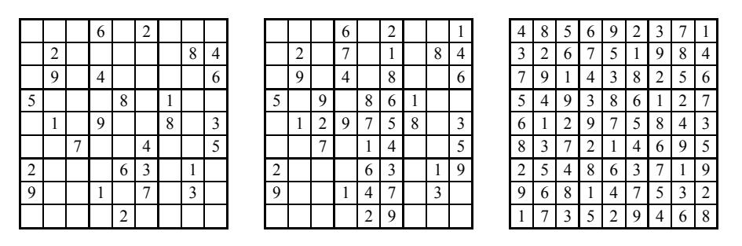

Figure 7. Puzzle Sudogen0-618, its L1 0 elaboration and its solution

```
Resolution path in M5 for the M4+L5 (or L1_0) elaboration of puzzle Sudogen0-618 column c7 interaction-with-block b9 \Longrightarrow r9c8 \neq 4 xy3-chain {n3 n6}r2c1 - {n6 n4}r5c1 - {n4 n3}r4c2 \Longrightarrow r6c1 \neq 3 block b4 interaction-with-column c2 \Longrightarrow r9c2 \neq 3, r1c2 \neq 3 hidden-pairs-in-a-block {n1 n3} {r9c1 r9c3} \Longrightarrow r9c3 \neq 8, r9c3 \neq 6, r9c3 \neq 5, r9c3 \neq 4, r9c1 \neq 8, r9c1 \neq 7 column c1 interaction-with-block b1 \Longrightarrow r1c2 \neq 7
```

```
hidden-pairs-in-a-block \{n1\ n3\}\{r9c1\ r9c3\} ==> r9c1 \neq 6, r9c1 \neq 4
nrc3-chain n8\{r7c4 r9c4\} - \{n8 n7\}r9c9 - n7\{r9c2 r7c2\} \Longrightarrow r7c2 \neq 8
nrct4-chain n4\{r9c7 r9c2\} - n4\{r4c2 r4c8\} - \{n4 n6\}r5c8 - n6\{r9c8 r9c7\} ==> r9c7 \neq 7
r9c7 \neq 5
nrczt4-chain \{n5\ n8\}r9c4 - n8\{r9c9\ r8c9\} - \{n8\ n6\}r8c2 - \{n6\ n5\}r8c3 ==> r9c2 \neq 5
nrezt4-chain \{n3\ n1\}r9c3 - \{n1\ n5\}r3c3 - \{n5\ n6\}r2c3 - \{n6\ n3\}r2c1 \Longrightarrow r1c3 \neq 3
rct5-chain r7{r7c2 r9c2} - r4{r9c2 r9c7} - r4{r9c7 r9c8} - r4{r4c8 r4c2}
==> r7c2 \neq 4
nrc5-chain {n8 n7}r9c9 - n7{r4c9 r4c8} - n4{r4c8 r4c2} - n4{r9c2 r7c3} - n8{r7c3 r7c4}
==> r9c4 \neq 8
naked singles ==> r9c4 = 5, r7c4 = 8
column c8 interaction-with-block b3 ==> r3c7 \neq 5, r2c7 \neq 5, r1c7 \neq 5
nrc4-chain n6\{r5c8 r5c1\} - \{n6 n3\}r2c1 - \{n3 n9\}r2c7 - n9\{r6c7 r6c8\} \Longrightarrow r6c8 \neq 6
nrc4-chain \{n7\ n6\}r9c8 - n6\{r5c8\ r5c1\} - n4\{r5c1\ r1c1\} - n7\{r1c1\ r3c1\} \Longrightarrow r3c8 \ne 7
nrct5-chain n6\{r2c3 r8c3\} - n6\{r9c2 r6c2\} - n6\{r6c7 r9c7\} - n4\{r9c7 r7c7\} - \{n4 n5\}r7c3
==> r2c3 \pm 5
naked and hidden singles ==> r2c5 = 5, r3c5 = 3, r1c5 = 9, r2c7 = 9, r6c8 = 9, r1c7 = 3
nrc3-chain n7\{r1c8 r1c1\} - n4\{r1c1 r5c1\} - n4\{r5c8 r4c8\} \Longrightarrow r4c8 \neq 7
naked and hidden singles \Longrightarrow r4c9 = 7, r9c9 = 8, r8c9 = 2
nrc3-chain \{n5 \ n7\}r7c2 - n7\{r9c2 \ r9c8\} - \{n7 \ n5\}r1c8 ==> r1c2 \neq 5
column c2 interaction-with-block b7 ==> r8c3 \neq 5, r7c3 \neq 5
naked and hidden singles ==> r7c3 = 4, r9c7 = 4
nrc2-chain n6\{r9c2 r9c8\} - n6\{r8c7 r6c7\} = > r6c2 \neq 6
column c2 interaction-with-block b7 ==> r8c3 \neq 6
...(Naked Singles)...
```

The next puzzle, Sudogen0-8027 (Figure 8), is worth examining in full detail.

|   |   | 8 |   |   |   | 6 |   |
|---|---|---|---|---|---|---|---|
| 4 |   |   | 5 | 9 |   |   |   |
|   |   |   | 7 | 3 |   | 2 | 9 |
|   |   |   | 2 | 7 |   |   |   |
|   | 5 |   |   |   |   |   |   |
|   |   | 4 |   |   | 3 |   | 8 |
|   |   |   |   |   | 7 |   | 1 |
|   |   | 5 |   | 6 |   | 8 |   |
| 3 | 6 |   | 1 |   |   |   | 4 |

|   |   | 8 | 4 |   |   |   | 6 |   |
|---|---|---|---|---|---|---|---|---|
| 4 |   |   | 5 | 9 | 6 | 8 | 1 |   |
| 5 | 1 | 6 | 7 | 3 | 8 | 4 | 2 | 9 |
|   |   |   | 2 | 7 |   |   |   |   |
|   | 5 |   | 8 |   |   |   |   |   |
|   |   | 4 | 6 |   | 3 |   |   | 8 |
|   |   |   |   |   | 7 | 6 |   | 1 |
| 1 |   | 5 |   | 6 |   |   | 8 |   |
| 3 | 6 |   | 1 | 8 |   |   |   | 4 |

| 9 | 3 | 8 | 4 | 1 | 2 | 5 | 6 | 7 |
|---|---|---|---|---|---|---|---|---|
| 4 | 2 | 7 | 5 | 9 | 6 | 8 | 1 | 3 |
| 5 | 1 | 6 | 7 | 3 | 8 | 4 | 2 | 9 |
| 6 | 8 | 3 | 2 | 7 | 1 | 9 | 4 | 5 |
| 7 | 5 | 1 | 8 | 4 | 9 | 2 | 3 | 6 |
| 2 | 9 | 4 | 6 | 5 | 3 | 1 | 7 | 8 |
| 8 | 4 | 9 | 3 | 2 | 7 | 6 | 5 | 1 |
| 1 | 7 | 5 | 9 | 6 | 4 | 3 | 8 | 2 |
| 3 | 6 | 2 | 1 | 8 | 5 | 7 | 9 | 4 |

Figure 8. Puzzle Sudogen0-8027, its L1 0 elaboration and its solution

Resolution path in M5 for the M4+L5 (or L1\_0) elaboration of puzzle Sudogen0-8027 column c4 interaction-with-block b8  $\Longrightarrow$  r9c6  $\neq$  9, r8c6  $\neq$  9

```
row r2 interaction-with-block b1 ==> r1c2 \neq 2, r1c1 \neq 2
nrc2-chain n5\{r4c6 r6c5\} - n5r7\{c5 c8\} =  r4c8 \neq 5
::: Figure 9 describes the situation at this point:
nrct4-chain n4\{r4\ r5\}c8 - n4\{r5\ r7\}c5 - n5r7\{c5\ c8\} - n3\{r7\ r4\ r5\#n4r5c8\}c8 ==> r4c8 \neq 9
nrct5-chain n1 \{r4 \ r5\}c3 - \{n1 \ n4\}r5c5 - n4r7\{c5 \ c2\} - n8\{r7 \ r4\}c2 - n3\{r4c2 \ r4c3 \ r4c3 \ r4c4 \ r4c4 \ r4c4 \ r4c4 \ r4c4 \ r4c4 \ r4c4 \ r4c4 \ r4c4 \ r4c4 \ r4c4 \ r4c4 \ r4c4 \ r4c4 \ r4c4 \ r4c4 \ r4c4 \ r4c4 \ r4c4 \ r4c4 \ r4c4 \ r4c4 \ r4c4 \ r4c4 \ r4c4 \ r4c4 \ r4c4 \ r4c4 \ r4c4 \ r4c4 \ r4c4 \ r4c4 \ r4c4 \ r4c4 \ r4c4 \ r4c4 \ r4c4 \ r4c4 \ r4c4 \ r4c4 \ r4c4 \ r4c4 \ r4c4 \ r4c4 \ r4c4 \ r4c4 \ r4c4 \ r4c4 \ r4c4 \ r4c4 \ r4c4 \ r4c4 \ r4c4 \ r4c4 \ r4c4 \ r4c4 \ r4c4 \ r4c4 \ r4c4 \ r4c4 \ r4c4 \ r4c4 \ r4c4 \ r4c4 \ r4c4 \ r4c4 \ r4c4 \ r4c4 \ r4c4 \ r4c4 \ r4c4 \ r4c4 \ r4c4 \ r4c4 \ r4c4 \ r4c4 \ r4c4 \ r4c4 \ r4c4 \ r4c4 \ r4c4 \ r4c4 \ r4c4 \ r4c4 \ r4c4 \ r4c4 \ r4c4 \ r4c4 \ r4c4 \ r4c4 \ r4c4 \ r4c4 \ r4c4 \ r4c4 \ r4c4 \ r4c4 \ r4c4 \ r4c4 \ r4c4 \ r4c4 \ r4c4 \ r4c4 \ r4c4 \ r4c4 \ r4c4 \ r4c4 \ r4c4 \ r4c4 \ r4c4 \ r4c4 \ r4c4 \ r4c4 \ r4c4 \ r4c4 \ r4c4 \ r4c4 \ r4c4 \ r4c4 \ r4c4 \ r4c4 \ r4c4 \ r4c4 \ r4c4 \ r4c4 \ r4c4 \ r4c4 \ r4c4 \ r4c4 \ r4c4 \ r4c4 \ r4c4 \ r4c4 \ r4c4 \ r4c4 \ r4c4 \ r4c4 \ r4c4 \ r4c4 \ r4c4 \ r4c4 \ r4c4 \ r4c4 \ r4c4 \ r4c4 \ r4c4 \ r4c4 \ r4c4 \ r4c4 \ r4c4 \ r4c4 \ r4c4 \ r4c4 \ r4c4 \ r4c4 \ r4c4 \ r4c4 \ r4c4 \ r4c4 \ r4c4 \ r4c4 \ r4c4 \ r4c4 \ r4c4 \ r4c4 \ r4c4 \ r4c4 \ r4c4 \ r4c4 \ r4c4 \ r4c4 \ r4c4 \ r4c4 \ r4c4 \ r4c4 \ r4c4 \ r4c4 \ r4c4 \ r4c4 \ r4c4 \ r4c4 \ r4c4 \ r4c4 \ r4c4 \ r4c4 \ r4c4 \ r4c4 \ r4c4 \ r4c4 \ r4c4 \ r4c4 \ r4c4 \ r4c4 \ r4c4 \ r4c4 \ r4c4 \ r4c4 \ r4c4 \ r4c4 \ r4c4 \ r4c4 \ r4c4 \ r4c4 \ r4c4 \ r4c4 \ r4c4 \ r4c4 \ r4c4 \ r4c4 \ r4c4 \ r4c4 \ r4c4 \ r4c4 \ r4c4 \ r4c4 \ r4c4 \ r4c4 \ r4c4 \ r4c4 \ r4c4 \ r4c4 \ r4c4 \ r4c4 \ r4c4 \ r4c4 \ r4c4 \ r4c4 \ r4c4 \ r4c4 \ r4c4 \ r4c4 \ r4c4 \ r4c4 \ r4c4 \ r4c4 \ r4c4 \ r4c4 \ r4c4 \ r4c4 \ r4c4 \ r4c4 \ r4c4 \ r4c4 \ r4c4 \ r4c4 \ r4c4 \ r4c4 \ r4c4 \ r4c4 \ r4c4 \ r4c4 \ r4c4 \ r4c4 \ r4c4 \ r4c4 \ r4c4 \ r4c4 \ r4c4 \ r4c4 \ r4c4 \ r4c4 \ r4c4 \ r4c4 \ r4c4 \ r4c4 \ r4c4 \ r4c4 \ r4c4 \ r4c4 \ r4c4 \ r4c4 \ r4c4 \ r4c4 \ r4c4 \ r4c4 \ r4c4 \ r4c4 \ r4c4 \ r4
r5c3#n1r5c3} ==> r4c3 \neq 9
nrczt5-chain {n9 n2}r7c3 - n2r2{c3 c2} - {n2 n7 n9*}r6c2 - n7{r5 r1 r6#n7r6c2}c1 -
n9r1\{c1\ c2\} ==> r8c2 \neq 9
nrczt5-chain n2\{r5\ r8\}c9 - \{n2\ n4\}r8c6 - \{n4\ n7\ n2\#n2r8c9\}r8c2 - \{n7\ n9\ n2*\}r9c3 - \{n9\ n2*\}r9c3 - \{n9\ n2*\}r9c3 - \{n9\ n2*\}r9c3 - \{n9\ n2*\}r9c3 - \{n9\ n2*\}r9c3 - \{n9\ n2*\}r9c3 - \{n9\ n2*\}r9c3 - \{n9\ n2*\}r9c3 - \{n9\ n2*\}r9c3 - \{n9\ n2*\}r9c3 - \{n9\ n2*\}r9c3 - \{n9\ n2*\}r9c3 - \{n9\ n2*\}r9c3 - \{n9\ n2*\}r9c3 - \{n9\ n2*\}r9c3 - \{n9\ n2*\}r9c3 - \{n9\ n2*\}r9c3 - \{n9\ n2*\}r9c3 - \{n9\ n2*\}r9c3 - \{n9\ n2*\}r9c3 - \{n9\ n2*\}r9c3 - \{n9\ n2*\}r9c3 - \{n9\ n2*\}r9c3 - \{n9\ n2*\}r9c3 - \{n9\ n2*\}r9c3 - \{n9\ n2*\}r9c3 - \{n9\ n2*\}r9c3 - \{n9\ n2*\}r9c3 - \{n9\ n2*\}r9c3 - \{n9\ n2*\}r9c3 - \{n9\ n2*\}r9c3 - \{n9\ n2*\}r9c3 - \{n9\ n2*\}r9c3 - \{n9\ n2*\}r9c3 - \{n9\ n2*\}r9c3 - \{n9\ n2*\}r9c3 - \{n9\ n2*\}r9c3 - \{n9\ n2*\}r9c3 - \{n9\ n2*\}r9c3 - \{n9\ n2*\}r9c3 - \{n9\ n2*\}r9c3 - \{n9\ n2*\}r9c3 - \{n9\ n2*\}r9c3 - \{n9\ n2*\}r9c3 - \{n9\ n2*\}r9c3 - \{n9\ n2*\}r9c3 - \{n9\ n2*\}r9c3 - \{n9\ n2*\}r9c3 - \{n9\ n2*\}r9c3 - \{n9\ n2*\}r9c3 - \{n9\ n2*\}r9c3 - \{n9\ n2*\}r9c3 - \{n9\ n2*\}r9c3 - \{n9\ n2*\}r9c3 - \{n9\ n2*\}r9c3 - \{n9\ n2*\}r9c3 - \{n9\ n2*\}r9c3 - \{n9\ n2*\}r9c3 - \{n9\ n2*\}r9c3 - \{n9\ n2*\}r9c3 - \{n9\ n2*\}r9c3 - \{n9\ n2*\}r9c3 - \{n9\ n2*\}r9c3 - \{n9\ n2*\}r9c3 - \{n9\ n2*\}r9c3 - \{n9\ n2*\}r9c3 - \{n9\ n2*\}r9c3 - \{n9\ n2*\}r9c3 - \{n9\ n2*\}r9c3 - \{n9\ n2*\}r9c3 - \{n9\ n2*\}r9c3 - \{n9\ n2*\}r9c3 - \{n9\ n2*\}r9c3 - \{n9\ n2*\}r9c3 - \{n9\ n2*\}r9c3 - \{n9\ n2*\}r9c3 - \{n9\ n2*\}r9c3 - \{n9\ n2*\}r9c3 - \{n9\ n2*\}r9c3 - \{n9\ n2*\}r9c3 - \{n9\ n2*\}r9c3 - \{n9\ n2*\}r9c3 - \{n9\ n2*\}r9c3 - \{n9\ n2*\}r9c3 - \{n9\ n2*\}r9c3 - \{n9\ n2*\}r9c3 - \{n9\ n2*\}r9c3 - \{n9\ n2*\}r9c3 - \{n9\ n2*\}r9c3 - \{n9\ n2*\}r9c3 - \{n9\ n2*\}r9c3 - \{n9\ n2*\}r9c3 - \{n9\ n2*\}r9c3 - \{n9\ n2*\}r9c3 - \{n9\ n2*\}r9c3 - \{n9\ n2*\}r9c3 - \{n9\ n2*\}r9c3 - \{n9\ n2*\}r9c3 - \{n9\ n2*\}r9c3 - \{n9\ n2*\}r9c3 - \{n9\ n2*\}r9c3 - \{n9\ n2*\}r9c3 - \{n9\ n2*\}r9c3 - \{n9\ n2*\}r9c3 - \{n9\ n2*\}r9c3 - \{n9\ n2*\}r9c3 - \{n9\ n2*\}r9c3 - \{n9\ n2*\}r9c3 - \{n9\ n2*\}r9c3 - \{n9\ n2*\}r9c3 - \{n9\ n2*\}r9c3 - \{n9\ n2*\}r9c3 - \{n9\ n2*\}r9c3 - \{n9\ n2*\}r9c3 - \{n9\ n2*\}r9c3 - \{n9\ n2*\}r9c3 - \{n9\ n2*\}r9c3 - \{n9\ n2*\}r9c3 - \{n9\ n2*\}r9c3 - \{n9\ n2*\}r9c3 - \{n9\ n2*\}r9c3 - \{n9\ n2*\}r9c3 - \{
n2r7c3 ==> r5c3 \neq 2
nrczt5-chain {n9 n2}r7c3 - {n2 n7 n9*}r9c3 - {n7 n3 n2#n2r7c3}r2c3 - n3{r1 r4
r2#n3r2c3c2 - n8{r4 r7}c2 ==> r7c2 \neq 9
nrcz5-chain\ n4\{r5\ r4\}c8-n3\{r4\ r7\ r5^*\}c8-n5r7\{c8\ c5\}-n5\{r9\ r4\}c6-n9\{r4\ r5\}c6==>
r5c8 \neq 9
n7{r9c3 r8c2} - n4{r8 r7}{c2 - n8{r7 r4}{c2 - n3{r4c2 r4c3 r5c3*}} - n1{r4}
r5c3 ==> r5c3 \neq 7
nrct5-chain n2\{r5 r8\}c9 - \{n2 n4\}r8c6 - \{n4 n7 n2\#n2r8c9\}r8c2 - n7\{r9 r2\}c3 - \{n7 n2\#n2r8c9\}r8c2 - n7\{r9 r2\}c3 - \{n7 n2\#n2r8c9\}r8c2 - n7\{r9 r2\}c3 - \{n7 n2\#n2r8c9\}r8c2 - n7\{r9 r2\}c3 - \{n7 n2\#n2r8c9\}r8c2 - n7\{r9 r2\}c3 - \{n7 n2\#n2r8c9\}r8c2 - n7\{r9 r2\}c3 - \{n7 n2\#n2r8c9\}r8c2 - n7\{r9 r2\}c3 - \{n7 n2\#n2r8c9\}r8c2 - n7\{r9 r2\}c3 - \{n7 n2\#n2r8c9\}r8c2 - n7\{r9 r2\}c3 - \{n7 n2\#n2r8c9\}r8c2 - n7\{r9 r2\}c3 - \{n7 n2\#n2r8c9\}r8c2 - n7\{r9 r2\}c3 - \{n7 n2\#n2r8c9\}r8c2 - n7\{r9 r2\}c3 - \{n7 n2\#n2r8c9\}r8c2 - n7\{r9 r2\}c3 - \{n7 n2\#n2r8c9\}r8c2 - n7\{r9 r2\}c3 - \{n7 n2\#n2r8c9\}r8c2 - n7\{r9 r2\}c3 - \{n7 n2\#n2r8c9\}r8c2 - n7\{r9 r2\}c3 - \{n7 n2\#n2r8c9\}r8c2 - n7\{r9 r2\}c3 - \{n7 n2\#n2r8c9\}r8c2 - n7\{r9 r2\}c3 - \{n7 n2\#n2r8c9\}r8c2 - n7\{r9 r2\}c3 - \{n7 n2\#n2r8c9\}r8c2 - n7\{r9 r2\}c3 - \{n7 n2\#n2r8c9\}r8c2 - n7\{r9 r2\}c3 - \{n7 n2\#n2r8c9\}r8c2 - n7\{r9 r2\}c3 - \{n7 n2\#n2r8c9\}r8c2 - n7\{r9 r2\}c3 - \{n7 n2\#n2r8c9\}r8c2 - n7\{r9 r2\}c3 - \{n7 n2\#n2r8c9\}r8c2 - n7\{r9 r2\}c3 - \{n7 n2\#n2r8c9\}r8c2 - n7\{r9 r2\}c3 - \{n7 n2\#n2r8c9\}r8c2 - n7\{r9 r2\}c3 - \{n7 n2\#n2r8c9\}r8c2 - n7\{r9 r2\}c3 - \{n7 n2\#n2r8c9\}r8c2 - n7\{r9 r2\}c3 - \{n7 n2\#n2r8c9\}r8c2 - n7\{r9 r2\}c3 - \{n7 n2\#n2r8c9\}r8c2 - n7\{r9 r2\}c3 - \{n7 n2\#n2r8c9\}r8c2 - n7\{r9 r2\}c3 - \{n7 n2\#n2r8c9\}r8c2 - n7\{r9 r2\}c3 - \{n7 n2\#n2r8c9\}r8c2 - n7\{r9 r2\}c3 - \{n7 n2\#n2r8c9\}r8c2 - n7\{r9 r2\}c3 - \{n7 n2\#n2r8c9\}r8c2 - n7\{r9 r2\}c3 - \{n7 n2\#n2r8c9\}r8c2 - n7\{r9 r2\}c3 - \{n7 n2\#n2r8c9\}r8c2 - n7\{r9 r2\}c3 - \{n7 n2\#n2r8c9\}r8c2 - n7\{r9 r2\}c3 - \{n7 n2\#n2r8c9\}r8c2 - n7\{r9 r2\}c3 - \{n7 n2\#n2r8c9\}r8c2 - n7\{r9 r2\}c3 - \{n7 n2\#n2r8c9\}r8c2 - n7\{r9 r2\}c3 - \{n7 n2\#n2r8c9\}r8c2 - n7\{r9 r2\}c3 - \{n7 n2\#n2r8c9\}r8c2 - n7\{r9 r2\}c3 - \{n7 n2\#n2r8c9\}r8c2 - n7\{r9 r2\}c3 - \{n7 n2\#n2r8c9\}r8c2 - n7\{r9 r2\}c3 - \{n7 n2\#n2r8c9\}r8c2 - n7\{r9 r2\}c3 - n7\{r9 r2\}c3 - n7\{r9 r2\}c3 - n7\{r9 r2\}c3 - n7\{r9 r2\}c3 - n7\{r9 r2\}c3 - n7\{r9 r2\}c3 - n7\{r9 r2\}c3 - n7\{r9 r2\}c3 - n7\{r9 r2\}c3 - n7\{r9 r2\}c3 - n7\{r9 r2\}c3 - n7\{r9 r2\}c3 - n7\{r9 r2\}c3 - n7\{r9 r2\}c3 - n7\{r9 r2\}c3 - n7\{r9 r2\}c3 - n7\{r9 r2\}c3 - n7\{r9 r2\}c3 - n7\{r9 r2\}c3 - n7\{r9 r2\}c3 - n7\{r9 r2\}c3 - n7\{r9 r2\}c3 - n7\{r9 r2\}c3 - n7\{r9 r2\}c3 - n7\{r9 r2\}c3 - n7\{r
n3 r2c9 =  r5c9 \neq 3
nrct5-chain {n3 n7}r2c9 - n7{r2 r9}c3 - n7r8{c2 c7 c9#n7r2c9} - n9r8{c7 c4} - n3r8{c4 c9}
c7#n7r8c7 ==> r4c9 \neq 3
nrct5-chain n6r5\{c1\ c9\} - \{n6\ n5\}r4c9 - n5\{r4c6\ r6c5\} - n1r6\{c5\ c7\} - n2\{r6c7\ r5c7\}
r5c9#n6r5c9} ==> r5c1 \neq 2
row r5 interaction-with-block b6 ==> r6c7 \neq 2
nrezt3-chain n2r6\{c1\ c2\} - n7\{r6c2\ r5c1\ r6c1*\} - \{n7\ n9\}r1c1 ==> r6c1 \neq 9
nrct5-chain n7 n7 n7 n7 n7 n7 n7 n7
c7#n7r8c7 ==> r1c9 \neq 3
nrc4-chain n6 \{r5 r4\}c1 - \{n6 n5\}r4c9 - \{n5 n7\}r1c9 - \{n7 n9\}r1c1 ==> r5c1 \neq 9
nrczt5-chain n9r8\{c7 c4\} - n3r8\{c4 c9 c7*\} - \{n3 n7\}r2c9 - n7\{r2 r9\}c3 - n7r8\{c2 c7\}
c9\#n7r2c9} ==> r8c7 \neq 2
nrc4-chain n2\{r5 r9\}c7 - \{n2 n5\}r9c6 - n5\{r4c6 r6c5\} - n1r6\{c5 c7\} \Longrightarrow r5c7 \neq 1
rczt4-chain rczt4-chain rczt4-chain rczt4-chain rczt4-chain rczt4-chain rczt4-chain rczt4-chain rczt4-chain rczt4-chain rczt4-chain rczt4-chain rczt4-chain rczt4-chain rczt4-chain rczt4-chain rczt4-chain rczt4-chain rczt4-chain rczt4-chain rczt4-chain rczt4-chain rczt4-chain rczt4-chain rczt4-chain rczt4-chain rczt4-chain rczt4-chain rczt4-chain rczt4-chain rczt4-chain rczt4-chain rczt4-chain rczt4-chain rczt4-chain rczt4-chain rczt4-chain rczt4-chain rczt4-chain rczt4-chain rczt4-chain rczt4-chain rczt4-chain rczt4-chain rczt4-chain rczt4-chain rczt4-chain rczt4-chain rczt4-chain rczt4-chain rczt4-chain rczt4-chain rczt4-chain rczt4-chain rczt4-chain rczt4-chain rczt4-chain rczt4-chain rczt4-chain rczt4-chain rczt4-chain rczt4-chain rczt4-chain rczt4-chain rczt4-chain rczt4-chain rczt4-chain rczt4-chain rczt4-chain rczt4-chain rczt4-chain rczt4-chain rczt4-chain rczt4-chain rczt4-chain rczt4-chain rczt4-chain rczt4-chain rczt4-chain rczt4-chain rczt4-chain rczt4-chain rczt4-chain rczt4-chain rczt4-chain rczt4-chain rczt4-chain rczt4-chain rczt4-chain rczt4-chain rczt4-chain rczt4-chain rczt4-chain rczt4-chain rczt4-chain rczt4-chain rczt4-chain rczt4-chain rczt4-chain rczt4-chain rczt4-chain rczt4-chain rczt4-chain rczt4-chain rczt4-chain rczt4-chain rczt4-chain rczt4-chain rczt4-chain rczt4-chain rczt4-chain rczt4-chain rczt4-chain rczt4-chain rczt4-chain rczt4-chain rczt4-chain rczt4-chain rczt4-chain rczt4-chain rczt4-chain rczt4-chain rczt4-chain rczt4-chain rczt4-chain rczt4-chain rczt4-chain rczt4-chain rczt4-chain rczt4-chain rczt4-chain rczt4-chain rczt4-chain rczt4-chain rczt4-chain rczt4-chain rczt4-chain rczt4-chain rczt4-chain rczt4-chain rczt4-chain rczt4-chain rczt4-chain rczt4-chain rczt4-chain rczt4-chain 
r^2 + r^2 + r^2 + r^2 + r^2 + r^2 + r^2 + r^2 + r^2 + r^2 + r^2 + r^2 + r^2 + r^2 + r^2 + r^2 + r^2 + r^2 + r^2 + r^2 + r^2 + r^2 + r^2 + r^2 + r^2 + r^2 + r^2 + r^2 + r^2 + r^2 + r^2 + r^2 + r^2 + r^2 + r^2 + r^2 + r^2 + r^2 + r^2 + r^2 + r^2 + r^2 + r^2 + r^2 + r^2 + r^2 + r^2 + r^2 + r^2 + r^2 + r^2 + r^2 + r^2 + r^2 + r^2 + r^2 + r^2 + r^2 + r^2 + r^2 + r^2 + r^2 + r^2 + r^2 + r^2 + r^2 + r^2 + r^2 + r^2 + r^2 + r^2 + r^2 + r^2 + r^2 + r^2 + r^2 + r^2 + r^2 + r^2 + r^2 + r^2 + r^2 + r^2 + r^2 + r^2 + r^2 + r^2 + r^2 + r^2 + r^2 + r^2 + r^2 + r^2 + r^2 + r^2 + r^2 + r^2 + r^2 + r^2 + r^2 + r^2 + r^2 + r^2 + r^2 + r^2 + r^2 + r^2 + r^2 + r^2 + r^2 + r^2 + r^2 + r^2 + r^2 + r^2 + r^2 + r^2 + r^2 + r^2 + r^2 + r^2 + r^2 + r^2 + r^2 + r^2 + r^2 + r^2 + r^2 + r^2 + r^2 + r^2 + r^2 + r^2 + r^2 + r^2 + r^2 + r^2 + r^2 + r^2 + r^2 + r^2 + r^2 + r^2 + r^2 + r^2 + r^2 + r^2 + r^2 + r^2 + r^2 + r^2 + r^2 + r^2 + r^2 + r^2 + r^2 + r^2 + r^2 + r^2 + r^2 + r^2 + r^2 + r^2 + r^2 + r^2 + r^2 + r^2 + r^2 + r^2 + r^2 + r^2 + r^2 + r^2 + r^2 + r^2 + r^2 + r^2 + r^2 + r^2 + r^2 + r^2 + r^2 + r^2 + r^2 + r^2 + r^2 + r^2 + r^2 + r^2 + r^2 + r^2 + r^2 + r^2 + r^2 + r^2 + r^2 + r^2 + r^2 + r^2 + r^2 + r^2 + r^2 + r^2 + r^2 + r^2 + r^2 + r^2 + r^2 + r^2 + r^2 + r^2 + r^2 + r^2 + r^2 + r^2 + r^2 + r^2 + r^2 + r^2 + r^2 + r^2 + r^2 + r^2 + r^2 + r^2 + r^2 + r^2 + r^2 + r^2 + r^2 + r^2 + r^2 + r^2 + r^2 + r^2 + r^2 + r^2 + r^2 + r^2 + r^2 + r^2 + r^2 + r^2 + r^2 + r^2 + r^2 + r^2 + r^2 + r^2 + r^2 + r^2 + r^2 + r^2 + r^2 + r^2 + r^2 + r^2 + r^2 + r^2 + r^2 + r^2 + r^2 + r^2 + r^2 + r^2 + r^2 + r^2 + r^2 + r^2 + r^2 + r^2 + r^2 + r^2 + r^2 + r^2 + r^2 + r^2 + r^2 + r^2 + r^2 + r^2 + r^2 + r^2 + r^2 + r^2 + r^2 + r^2 + r^2 + r^2 + r^2 + r^2 + r^2 + r^2 + r^2 + r^2 + r^2 + r^2 + r^2 + r^2 + r^2 + r^2 + r^2 + r^2 + r^2 + r^2 + r^2 + r^2 + r^2 + r^2 + r^2 + r^2 + r^2 + r^2 + r^2 + r^2 + r^2 + r^2 + r^2 + r^2 + r^2 + r^2 + r^2 + r^2 + r^2 + r^2 + r^2 + r^2 + r^2 + r^2 + r^2 + r^2 + r^2 + r^2 + r^2 + r^2 + r^2 + r^2 + r^2 + r^2 + r^2 + r^2 
block b6 interaction-with-column c8 \Longrightarrow r7c8 \neq 3
naked and hidden singles ==> r7c4 = 3, r8c4 = 9
hidden-pairs-in-a-column \{n3 \ n4\} \{r4 \ r5\} c8 \Longrightarrow r5c8 \neq 7
hidden-triplets-in-a-row \{n2 \text{ n6 n7}\}\ r5\{c7 \text{ c9 c1}\} \Longrightarrow r5c7 \neq 9
nrc2-chain n7\{r8c2 r9c3\} - n7\{r9c8 r6c8\} ==> r6c2 \neq 7
block b4 interaction-with-column c1 \Longrightarrow r1c1 \ne 7
naked-single ==> r1c1 = 9
column c2 interaction-with-block b4 ==> r5c3 \neq 9
hidden-single-in-a-row ==> r5c6 = 9
naked-pairs-in-a-block \{n1\ n3\}\{r4c3\ r5c3\} \Longrightarrow r4c2 \neq 3
column c2 interaction-with-block b1 \Longrightarrow r2c3 \neq 3
nrc3-chain n2\{r8c9 r9c7\} - \{n2 n7\}r5c7 - \{n7 n3\}r8c7 => r8c9 \neq 3
hidden singles ==> r8c7 = 3, r2c9 = 3, r1c2 = 3
nrc3-chain \{n2\ n7\}r5c7 - n7r1\{c7\ c9\} - \{n7\ n2\}r8c9 ==> r9c7 \neq 2
...(Naked and Hidden Singles)...
```

|     | cl            | <i>c</i> 2    | <i>c3</i> | <i>c4</i> | c5         | <i>c</i> 6    | <i>c</i> 7      | c8            | c9            |    |
|-----|---------------|---------------|-----------|-----------|------------|---------------|-----------------|---------------|---------------|----|
| r1  | 7 9           | 3<br>7 9      | 8         | 4         | 1 2        | 1 2           | 5<br>7          | 6             | 5<br>7        | r1 |
| r2  | 4             | 2 3           | 2 3       | 5         | 9          | 6             | 8               | 1             | 7             | r2 |
| r3  | 5             | 1             | 6         | 7         | 3          | 8             | 4               | 2             | 9             | r3 |
| r4  | 6<br>8 9      | 3<br>8 9      | 1 3       | 2         | 7          | 1<br>4 5<br>9 | 1 3 5 9         | 3<br>4<br>9   | 3<br>5 6      | r4 |
| r5  | 2<br>6<br>7 9 | 5             | 1 2 3 7 9 | 8         | 1 4        | 1<br>4<br>9   | 1 2 3<br>7 9    | 3<br>4<br>7 9 | 2 3<br>6<br>7 | r5 |
| r6  | 2<br>7 9      | 2<br>7 9      | 4         | 6         | 1 5        | 3             | 1 2<br>5<br>7 9 | 5<br>7 9      | 8             | r6 |
| r7  | 2<br>8 9      | 2<br>4<br>8 9 | 9         | 3         | 2<br>4 5   | 7             | 6               | 3<br>5<br>9   | 1             | r7 |
| r8  | 1             | 2<br>4<br>7 9 | 5         | 3<br>9    | 6          | 4             | 2 3 7 9         | 8             | 2 3           | r8 |
| r9  | 3             | 6             | 2<br>7 9  | 1         | 8          | 2<br>5        | 2<br>5<br>7 9   | 5<br>7 9      | 4             | r9 |
| ,—— | cl            | <i>c</i> 2    | <i>c3</i> | <i>c4</i> | <i>c</i> 5 | <i>c</i> 6    | <i>c</i> 7      | c8            | c9            |    |

Figure 9. Puzzle Sudogen0-8027, just before the first nrct4 rule is applied

#### XXIII.2.4. 3D chains of length 6

The next example, puzzle Sudogen0-352 (Figure 10), is in [M5]+M6. For illustrative purposes, we have allowed lassos, but this does not change much of the resolution path (it would still be in M6 without lassos).

```
Resolution path in M6 for the M5 (or L1_0) elaboration of puzzle Sudogen0-352 row r1 interaction-with-block b3 => r2c7 \neq 7 nrczt4-chain n2 {r9c2 r4c2} - n4 {r4c2 r8c2} - {n4 n7}r7c3 - {n7 n1}r9c3 ==> r9c2 \neq 1 nrczt6-chain n4{r5c7 r5c3} - n6{r5c3 r5c1} - n6{r4c3 r2c3} - n9{r2c3 r4c3} - n9{r4c6 r2c6} - n9{r3c4 r5c4} ==> r5c7 \neq 9 nrczt2-lr-lasso n9 {r3c4 r3c9} - n9 {r1c7 r4c7} - n9 {r4c4 \neq 9 nrczt4-chain n9 {r3c4 r3c9} - n9 {r1c7 r4c7} - n9 {r4c3 r5c3} - n9 {r5c6 r2c6} ==> r2c4 \neq 9 nrct4-chain n9 {r3c4 r5c4} - n9 {r4c6 r2c6} - n9 {r2c3 r4c3} - n9 {r4c7 r1c7} ==> r3c9 \neq 9
```

```
hidden-single-in-a-row ==> r3c4 = 9
naked-pairs-in-a-block {n3 n6} {r1c8 r3c9} ==> r2c7 \neq 6, r2c7 \neq 3, r1c9 \neq 6, r1c9 \neq 3, r1c7 \neq 6
6, r1c7 \neq 3
nrc2-chain n6\{r9c4 r2c4\} - n6\{r3c5 r3c9\} =  r9c9 \neq 6
nrct4-chain n8\{r6c5 r7c5\} - n2\{r7c5 r5c5\} - \{n2 n7\}r5c4 - \{n7 n5\}r4c4 ==> r6c5 \neq 5
naked and hidden singles \Longrightarrow r6c5 = 8, r7c6 = 8, r6c9 = 5
row r6 interaction-with-block b4 ==> r5c3 \neq 9, r5c1 \neq 9
hidden-single-in-a-row ==> r5c6 = 9
row r6 interaction-with-block b4 ==> r4c3 \neq 9
naked and hidden singles \Longrightarrow r2c3 = 9, r2c7 = 1
column c3 interaction-with-block b7 ==> r8c2 \neq 1, r8c1 \neq 1
hidden-single-in-a-row ==> r8c9 = 1
column c3 interaction-with-block b7 ==> r7c1 \neq 1
column c3 interaction-with-block b4 ==> r5c1 \neq 6, r4c1 \neq 6
row r6 interaction-with-block b4 ==> r4c2 \neq 9, r4c1 \neq 9
block b9 interaction-with-column c7 \Longrightarrow r5c7 \ne 6
...(Naked-Singles and Hidden-Singles)...
```

|   |   | 5 | 8 |   | 2 |   |   |   |
|---|---|---|---|---|---|---|---|---|
|   |   |   |   |   |   |   | 4 | 2 |
| 4 | 7 |   |   |   | 1 |   | 5 |   |
|   |   |   |   | 1 |   |   |   |   |
|   | 5 |   |   |   |   |   | 1 | 8 |
|   |   | 3 | 4 |   | 6 | 2 |   |   |
|   | 6 |   |   |   |   |   | 9 |   |
|   |   | 8 | 3 |   |   |   |   |   |
| 3 |   |   |   | 9 |   |   |   |   |

|   |   |   | 5 | 8 | 4 | 2 |   |   |   |
|---|---|---|---|---|---|---|---|---|---|
|   |   |   |   |   |   |   |   | 4 | 2 |
|   | 4 | 7 | 2 |   |   | 1 | 8 | 5 |   |
|   |   |   |   |   | 1 |   |   |   |   |
|   |   | 5 |   |   |   |   |   | 1 | 8 |
|   |   |   | 3 | 4 |   | 6 | 2 | 7 |   |
|   |   | 6 |   |   |   |   |   | 9 |   |
| ı |   |   | 8 | 3 |   |   |   | 2 |   |
|   | 3 |   |   |   | 9 |   |   | 8 |   |

| 1 | 3 | 5 | 8 | 4 | 2 | 7 | 6 | 9 |
|---|---|---|---|---|---|---|---|---|
| 6 | 8 | 9 | 5 | 7 | 3 | 1 | 4 | 2 |
| 4 | 7 | 2 | 9 | 6 | 1 | 8 | 5 | 3 |
| 8 | 4 | 7 | 2 | 1 | 5 | 9 | 3 | 6 |
| 2 | 5 | 6 | 7 | 3 | 9 | 4 | 1 | 8 |
| 9 | 1 | 3 | 4 | 8 | 6 | 2 | 7 | 5 |
| 5 | 6 | 4 | 1 | 2 | 8 | 3 | 9 | 7 |
| 7 | 9 | 8 | 3 | 5 | 4 | 6 | 2 | 1 |
| 3 | 2 | 1 | 6 | 9 | 7 | 5 | 8 | 4 |

*Figure 10.* Puzzle Sudogen0-352, its L1\_0 elaboration and its solution

#### XXIII.2.5. Exceptionally long 3D chains

Even with 3D chains, life may be hard. Here is an example, puzzle Sudogen0-707 (Figure 11), one of the hardest two in the Sudogen0 collection, that requires three different nrczt-chains of length thirteen (this maximal length is not changed if we allow lassos). In order to let you fully appreciate this puzzle, we have displayed the justifications for all the additional candidates and interspersed comments throughout the resolution path. Notice however that, given the classification results in the next section, such a hard puzzle is quite exceptional.

```
Resolution path in M13 for the L1_0 elaboration of puzzle Sudogen0-707 row r3 interaction-with-block b2 ==> r2c4 \neq 8 row r1 interaction-with-block b2 ==> r3c6 \neq 5, r3c4 \neq 5 column c2 interaction-with-block b1 ==> r2c1 \neq 2
```

naked-pairs-in-a-column {n2 n4} {r2 r6} c9 ==> r8c9  $\neq$  4, r8c9  $\neq$  2, r7c9  $\neq$  4, r5c9  $\neq$  4, r4c9  $\neq$  4, r4c9  $\neq$  2

| 4 |   |   | 3 |   |   | 6 |   | 8 |
|---|---|---|---|---|---|---|---|---|
|   |   | 5 |   |   | 1 |   | 3 |   |
|   | 1 | 6 |   | 4 |   |   |   | 7 |
|   | 7 |   |   |   |   |   | 8 |   |
|   |   |   |   |   | 2 |   |   |   |
|   | 5 | 1 |   |   | 6 | 3 | 7 |   |
|   |   | 2 |   | 9 |   | 8 |   |   |
|   |   |   | 1 |   |   |   |   |   |
|   |   |   |   |   | 4 |   |   | 9 |

| ı | 4 |   |   | 3 |   |   | 6 | 1 | 8 |
|---|---|---|---|---|---|---|---|---|---|
|   |   |   | 5 |   |   | 1 |   | 3 |   |
|   | 3 | 1 | 6 |   | 4 |   |   |   | 7 |
|   |   | 7 |   |   |   |   |   | 8 |   |
|   |   |   |   |   |   | 2 |   |   |   |
|   |   | 5 | 1 |   | 8 | 6 | 3 | 7 |   |
|   |   |   | 2 |   | 9 |   | 8 |   |   |
|   |   |   |   | 1 |   |   |   |   |   |
|   |   |   |   |   |   | 4 |   |   | 9 |

| 4 | 2 | 7 | 3 | 5 | 9 | 6 | 1 | 8 |
|---|---|---|---|---|---|---|---|---|
| 8 | 9 | 5 | 6 | 7 | 1 | 2 | 3 | 4 |
| 3 | 1 | 6 | 2 | 4 | 8 | 5 | 9 | 7 |
| 2 | 7 | 4 | 9 | 3 | 5 | 1 | 8 | 6 |
| 6 | 3 | 8 | 7 | 1 | 2 | 9 | 4 | 5 |
| 9 | 5 | 1 | 4 | 8 | 6 | 3 | 7 | 2 |
| 7 | 4 | 2 | 5 | 9 | 3 | 8 | 6 | 1 |
| 5 | 8 | 9 | 1 | 6 | 7 | 4 | 2 | 3 |
| 1 | 6 | 3 | 8 | 2 | 4 | 7 | 5 | 9 |

Figure 11. Puzzle Sudogen0-707, its L1\_0 elaboration and its solution

|            | cl              | <i>c</i> 2      | <i>c3</i>       | c4            | <i>c</i> 5    | <i>c</i> 6    | <i>c</i> 7      | c8          | <i>c</i> 9 |            |
|------------|-----------------|-----------------|-----------------|---------------|---------------|---------------|-----------------|-------------|------------|------------|
| r1         | 4               | 9               | 7 9             | 3             | 2<br>5<br>7   | 5<br>7 9      | 6               | 1           | 8          | r1         |
| r2         | 7 8 9           | 2<br>8 9        | 5               | 2<br>6<br>7 9 | 2<br>6<br>7   | 1             | 2<br>4<br>7 9   | 3           | 4          | <i>r</i> 2 |
| r3         | 3               | 1               | 6               | 2<br>8 9      | 4             | 8 9           | 2<br>5<br>9     | 2<br>5<br>9 | 7          | r3         |
| r4         | 2<br>6<br>9     | 7               | 3<br>4<br>9     | 4 5 9         | 1 3 5         | 3<br>5<br>9   | 1 2<br>4 5<br>9 | 8           | 1 5 6      | r4         |
| r5         | 8               | 4 6<br>8        | 3<br>4<br>8     | 4 5<br>7 9    | 1 3<br>5<br>7 | 2             | 1<br>4 5<br>9   | 4 5 6 9     | 1 5 6      | r5         |
| r6         | 9               | 5               | 1               | 4 9           | 8             | 6             | 3               | 7           | 4          | r6         |
| <i>r</i> 7 | 1<br>5 6<br>7   | 4 6             | 2               | 5 6<br>7      | 9             | 5<br>7        | 8               | 4 5 6       | 1 3 5 6    | r7         |
| r8         | 5 6<br>7 8      | 3<br>4 6<br>8 9 | 3<br>4<br>7 8 9 | 1             | 2 3<br>5 6    | 3<br>5<br>7 8 | 2<br>4 5<br>7   | 2<br>4 5 6  | 3<br>5 6   | r8         |
| r9         | 1<br>5 6<br>7 8 | 3<br>6<br>8     | 3<br>7 8        | 2<br>5 6<br>8 | 2 3<br>5 6    | 4             | 1 2<br>5<br>7   | 2<br>5 6    | 9          | r9         |
|            | cl              | c2              | <i>c3</i>       | c4            | c5            | <i>c</i> 6    | <i>c</i> 7      | c8          | c9         |            |

Figure 12. Puzzle Sudogen0-707, situation just before the first nrczt11 chain

 $r9c4 \neq 6$ 

```
;;; Here are three chains built on the same cells, with candidates differently ordered
and additional candidates differently justified:
nrczt3-chain n7r5\{c5\ c4\} - n7r2\{c4\ c1\ c5*\} - n7r7\{c1\ c6\ c4\#n7r5c4\} ==> r8c5 \neq 7
nrczt3-chain n7r5\{c4\ c5\} - n7r2\{c5\ c1\ c4*\} - n7r7\{c1\ c6\ c4*\} ==> r9c4 \neq 7
nrczt3-chain n7r5\{c5\ c4\} - n7r2\{c4\ c1\ c5*\} - n7r7\{c1\ c6\ c4\#n7r5c4\} \Longrightarrow r9c5 \neq 7
;;; Here is now an nrczt4-chain that can be considered as built around three different
targets – i.e. the only additional z-candidate r5 in the second (cn-) cell (c7n9) can be
justified by any of the three targets:
nrczt4-chain n9\{r5 r3\}c8 - n9\{r2 r4 r3\#n9r3c8 r5*\}c7 - n2r4\{c7 c1\} - \{n2 n9\}r6c1 =>>
r5c3 \neq 9, r5c2 \neq 9, r5c1 \neq 9
nrczt6-chain n9 n2 r6c1 - n2 n6 n9* r4c1 - n6 n8 n9* r5c1 - n8r2 r2c1 c2 r2c2
r1c2} - n9{r1 r8 r2#n8r2c2}c2 ==> r8c1 \neq 9
;;; The situation at this point is described in Figure 12.
nrczt11-chain {n6 n8}r5c1 - n8r2{c1 c2} - {n8 n3 n6*}r9c2 - {n3 n4 n6*}r7c2 - {n4 n5
n6*}r7c8 - {n5} n7 n6*}r7c4 - n7r5{c4} c5} - n1{r5c5} r4c5} - n3{r4} r8 r5#n7r5c5}
r9#n3r9c2}c5 - n3r7{c6 c9 c2#n3r9c2} - n1r7{c9 c1} ==> r7c1 \neq 6
nrczt13-chain n6r4\{c9\ c1\} - n2r4\{c1\ c7\} - n2\{r6\ r2\ r5\#n2r4c7\}c9 - n2r3\{c8\ c4
c7#n2r4c7} - n8{r3} r9{c4} - n6{r9} r2 r7*{c4} - {n6} n7 n2#n2r2c9{r2c5} - n7{r2c1} r1c3} -
\{n7 \ n3 \ n8\#n8r9c4\}r9c3 - n3r7\{c2 \ c6 \ c9*\} - n7\{r7 \ r8 \ r1\#n7r2c5\}c6 - n7\{r8 \ r9\}r7\{r8 \ r9\}r8r9c4\}r9c3 - n3r7\{c2 \ c6 \ c9*\} - n7\{r7 \ r8 \ r9\}r8r9c4\}r9c3 - n7\{r8 \ r9\}r9c4\}r9c3 - n7\{r8 \ r9\}r9c4\}r9c3 - n7\{r8 \ r9\}r9c4\}r9c3 - n7\{r8 \ r9\}r9c4\}r9c3 - n7\{r8 \ r9\}r9c4\}r9c3 - n7\{r8 \ r9\}r9c4\}r9c3 - n7\{r8 \ r9\}r9c4\}r9c3 - n7\{r8 \ r9\}r9c4\}r9c3 - n7\{r8 \ r9\}r9c4\}r9c3 - n7\{r8 \ r9\}r9c4\}r9c3 - n7\{r8 \ r9\}r9c4\}r9c3 - n7\{r8 \ r9\}r9c4\}r9c3 - n7\{r8 \ r9\}r9c4\}r9c3 - n7\{r8 \ r9\}r9c4\}r9c3 - n7\{r8 \ r9\}r9c4\}r9c3 - n7\{r8 \ r9\}r9c4\}r9c3 - n7\{r8 \ r9\}r9c4\}r9c3 - n7\{r8 \ r9\}r9c4
r2#n7r2c5c7 - n1{r9c7 r7c9} ==> r7c9 \neq 6
nrczt13-chain n9r8{c2 c3} - {n9 n7}r1c3 - {n7 n8 n3*}r9c3 - n8r8{c1 c6 c3#n9r8c3 c2*}
- n7\{r8 r7 r1\#n7r1c3\}c6 - n3r7\{c6 c9 c2*\} - n1\{r7c9 r9c7\} - n7\{r9c7 r8c7\} - n4r8\{c7 c8
c3\#n9r8c3 c2* - n2r8\{c8 c5 c7\#n7r8c7\} - \{n2 n5 n7\#n7r1c3\}r1c5 - n5\{r1 r4
r7#n7r7c6}c6 - n3{r4 r8 r7#n7r7c6}c6 ==> r8c2 \neq 3
nrczt13-chain n3\{r8\ r7\}c9 - n1\{r7c9\ r9c7\} - n7\{r9c7\ r8c7\} - n2r8\{c7\ c8\ c5*\} - n4\{r8c8\}
r7c8 r8c7#n7r8c7} - {n4 n6 n3#n3r7c9}r7c2 - n6r8{c1 c9 c2#n6r7c2 c8#n2r8c8 c5*} -
n6\{r9\ r5\ r7\#n6r7c2\ r8\#n2r8c8\}c8-n9\{r5\ r3\}c8-\{n9\ n8\}r3c6-\{n8\ n5\ n7\#n7r8c7\}c8-\{n9\ n8\}r3c6-\{n8\ n5\ n7\#n7r8c7\}c8-\{n9\ n8\}r3c6-\{n8\ n5\ n7\#n7r8c7\}c8-\{n9\ n8\}r3c8-\{n9\ n8\}r3c8-\{n9\ n8\}r3c8-\{n9\ n8\}r3c8-\{n9\ n8\}r3c8-\{n9\ n8\}r3c8-\{n9\ n8\}r3c8-\{n9\ n8\}r3c8-\{n9\ n8\}r3c8-\{n9\ n8\}r3c8-\{n9\ n8\}r3c8-\{n9\ n8\}r3c8-\{n9\ n8\}r3c8-\{n9\ n8\}r3c8-\{n9\ n8\}r3c8-\{n9\ n8\}r3c8-\{n9\ n8\}r3c8-\{n9\ n8\}r3c8-\{n9\ n8\}r3c8-\{n9\ n8\}r3c8-\{n9\ n8\}r3c8-\{n9\ n8\}r3c8-\{n9\ n8\}r3c8-\{n9\ n8\}r3c8-\{n9\ n8\}r3c8-\{n9\ n8\}r3c8-\{n9\ n8\}r3c8-\{n9\ n8\}r3c8-\{n9\ n8\}r3c8-\{n9\ n8\}r3c8-\{n9\ n8\}r3c8-\{n9\ n8\}r3c8-\{n9\ n8\}r3c8-\{n9\ n8\}r3c8-\{n9\ n8\}r3c8-\{n9\ n8\}r3c8-\{n9\ n8\}r3c8-\{n9\ n8\}r3c8-\{n9\ n8\}r3c8-\{n9\ n8\}r3c8-\{n9\ n8\}r3c8-\{n9\ n8\}r3c8-\{n9\ n8\}r3c8-\{n9\ n8\}r3c8-\{n9\ n8\}r3c8-\{n9\ n8\}r3c8-\{n9\ n8\}r3c8-\{n9\ n8\}r3c8-\{n9\ n8\}r3c8-\{n9\ n8\}r3c8-\{n9\ n8\}r3c8-\{n9\ n8\}r3c8-\{n9\ n8\}r3c8-\{n9\ n8\}r3c8-\{n9\ n8\}r3c8-\{n9\ n8\}r3c8-\{n9\ n8\}r3c8-\{n9\ n8\}r3c8-\{n9\ n8\}r3c8-\{n9\ n8\}r3c8-\{n9\ n8\}r3c8-\{n9\ n8\}r3c8-\{n9\ n8\}r3c8-\{n9\ n8\}r3c8-\{n9\ n8\}r3c8-\{n9\ n8\}r3c8-\{n9\ n8\}r3c8-\{n9\ n8\}r3c8-\{n9\ n8\}r3c8-\{n9\ n8\}r3c8-\{n9\ n8\}r3c8-\{n9\ n8\}r3c8-\{n9\ n8\}r3c8-\{n9\ n8\}r3c8-\{n9\ n8\}r3c8-\{n9\ n8\}r3c8-\{n9\ n8\}r3c8-\{n9\ n8\}r3c8-\{n9\ n8\}r3c8-\{n9\ n8\}r3c8-\{n9\ n8\}r3c8-\{n9\ n8\}r3c8-\{n9\ n8\}r3c8-\{n9\ n8\}r3c8-\{n9\ n8\}r3c8-\{n9\ n8\}r3c8-\{n9\ n8\}r3c8-\{n9\ n8\}r3c8-\{n9\ n8\}r3c8-\{n9\ n8\}r3c8-\{n9\ n8\}r3c8-\{n9\ n8\}r3c8-\{n9\ n8\}r3c8-\{n9\ n8\}r3c8-\{n9\ n8\}r3c8-\{n9\ n8\}r3c8-\{n9\ n8\}r3c8-\{n9\ n8\}r3c8-\{n9\ n8\}r3c8-\{n9\ n8\}r3c8-\{n9\ n8\}r3c8-\{n9\ n8\}r3c8-\{n9\ n8\}r3c8-\{n9\ n8\}r3c8-\{n9\ n8\}r3c8-\{n9\ n8\}r3c8-\{n9\ n8\}r3c8-\{n9\ n8\}r3c8-\{n9\ n8\}r3c8-\{n9\ n8\}r3c8-\{n9\ n8\}r3c8-\{n9\ n8\}r3c8-\{n9\ n8\}r3c8-\{n9\ n8\}r3c8-\{n9\ n8\}r3c8-\{n9\ n8\}r3c8-\{n9\ n8\}r3c8-\{n9\ n8\}r3c8-\{n9\ n8\}r3c8-\{n9\ n8\}r3c8-\{n9\ n8\}r3c8-\{n9\ n8\}r3c8-\{n9\ n8\}r3c8-\{n9\ n8\}r3c8-\{n9\ n8\}r3c8-\{n9\ n8\}r3c8-\{n9\ n8\}r3c8-\{n9\ n8\}r3c8-\{n9\ n8\}r3c8-\{n9\ n8\}r3c8-\{n9\ n8\}r3c8-\{n9\ n8\}r3c8-\{n9\ n8\}r3c8-\{n9\ n8\}r3c8-\{n9\ n8\}r3c8-\{n9\ n8\}r3c8-\{n9\ n8\}r3c8-\{n9\ n8\}r3c8-\{n9\ n8\}r3c8-\{n9\ n8\}r3c8-\{n9\ n8\}r3c8-\{n9\ n8\}r3c8-\{n9\ n8\}r3c8-\{n9\ n8\}r3c8-\{n9\ n8\}r3c8-\{n9\ n
n3*{r8c6 - {n5 n7}{r7c4 - {n7 n3 n5}#n5r8c6}r7c6} ==> r8c5 \neq 3
;;; Notice that the last elimination (r8c5\neq 3) is necessary before the next rule can be
applied, because otherwise cell 6, which is now n3{r7c6 r9c5}, would be n3{r7c6
r9c5 r8c5}, and the additional candidate n3r8c5 could be justified neither by the
previous right-linking candidates nor by the target:
nrczt7-chain n8\{r9c4 r8c6\} - n8\{r8 r5 r9*\}c3 - n8\{r5 r2 r8#n8r8c6 r9*\}c1 - n7\{r2c1 r1c3\} - n8\{r8 r5 r9*\}c1 - n7\{r2c1 r1c3\} - n8\{r8 r5 r9*\}c1 - n7\{r2c1 r1c3\} - n8\{r8 r5 r9*\}c1 - n7\{r2c1 r1c3\} - n8\{r8 r5 r9*\}c1 - n7\{r2c1 r1c3\} - n8\{r8 r5 r9*\}c1 - n7\{r2c1 r1c3\} - n8\{r8 r5 r9*\}c1 - n7\{r2c1 r1c3\} - n8\{r8 r5 r9*\}c1 - n7\{r2c1 r1c3\} - n8\{r8 r5 r9*\}c1 - n7\{r2c1 r1c3\} - n8\{r8 r5 r9*\}c1 - n7\{r2c1 r1c3\} - n8\{r8 r5 r9*\}c1 - n7\{r2c1 r1c3\} - n8\{r8 r5 r9*\}c1 - n7\{r2c1 r1c3\} - n8\{r8 r5 r9*\}c1 - n7\{r2c1 r1c3\} - n8\{r8 r5 r9*\}c1 - n7\{r2c1 r1c3\} - n8\{r8 r5 r9*\}c1 - n8\{r8 r5 r9*\}c1 - n7\{r2c1 r1c3\} - n8\{r8 r5 r9*\}c1 - n8\{r8 r5 r9*\}c1 - n8\{r8 r5 r9*\}c1 - n8\{r8 r5 r9*\}c1 - n8\{r8 r5 r9*\}c1 - n8\{r8 r5 r9*\}c1 - n8\{r8 r5 r9*\}c1 - n8\{r8 r5 r9*\}c1 - n8\{r8 r5 r9*\}c1 - n8\{r8 r5 r9*\}c1 - n8\{r8 r5 r9*\}c1 - n8\{r8 r5 r9*\}c1 - n8\{r8 r5 r9*\}c1 - n8\{r8 r5 r9*\}c1 - n8\{r8 r5 r9*\}c1 - n8\{r8 r5 r9*\}c1 - n8\{r8 r5 r9*\}c1 - n8\{r8 r5 r9*\}c1 - n8\{r8 r5 r9*\}c1 - n8\{r8 r5 r9*\}c1 - n8\{r8 r5 r9*\}c1 - n8\{r8 r5 r9*\}c1 - n8\{r8 r5 r9*\}c1 - n8\{r8 r5 r9*\}c1 - n8\{r8 r5 r9*\}c1 - n8\{r8 r5 r9*\}c1 - n8\{r8 r5 r9*\}c1 - n8\{r8 r5 r9*\}c1 - n8\{r8 r5 r9*\}c1 - n8\{r8 r5 r9*\}c1 - n8\{r8 r5 r9*\}c1 - n8\{r8 r5 r9*\}c1 - n8\{r8 r5 r9*\}c1 - n8\{r8 r5 r9*\}c1 - n8\{r8 r5 r9*\}c1 - n8\{r8 r5 r9*\}c1 - n8\{r8 r5 r9*\}c1 - n8\{r8 r5 r9*\}c1 - n8\{r8 r5 r9*\}c1 - n8\{r8 r5 r9*\}c1 - n8\{r8 r5 r9*\}c1 - n8\{r8 r5 r9*\}c1 - n8\{r8 r5 r9*\}c1 - n8\{r8 r5 r9*\}c1 - n8\{r8 r5 r9*\}c1 - n8\{r8 r5 r9*\}c1 - n8\{r8 r5 r9*\}c1 - n8\{r8 r5 r9*\}c1 - n8\{r8 r5 r9*\}c1 - n8\{r8 r5 r9*\}c1 - n8\{r8 r5 r9*\}c1 - n8\{r8 r5 r9*\}c1 - n8\{r8 r5 r9*\}c1 - n8\{r8 r5 r9*\}c1 - n8\{r8 r5 r9*\}c1 - n8\{r8 r5 r9*\}c1 - n8\{r8 r5 r9*\}c1 - n8\{r8 r5 r9*\}c1 - n8\{r8 r5 r9*\}c1 - n8\{r8 r5 r9*\}c1 - n8\{r8 r5 r9*\}c1 - n8\{r8 r5 r9*\}c1 - n8\{r8 r5 r9*\}c1 - n8\{r8 r5 r9*\}c1 - n8\{r8 r5 r9*\}c1 - n8\{r8 r5 r9*\}c1 - n8\{r8 r5 r9*\}c1 - n8\{r8 r5 r9*\}c1 - n8\{r8 r5 r9*\}c1 - n8\{r8 r5 r9*\}c1 - n8\{r8 r5 r9*\}c1 - n8\{r8 r5 r5 r9*\}c1 - n8\{r8 r5 r5 r5 r5 r5 r5 r5 r5 r5 r5 r5 r5 r5 
n7\{r1\ r7\ r8\#n8r8c6\}c6 - n3\{r7c6\ r9c5\} - \{n3\ n8\ n7\#n7r1c3\}r9c3 ==> r9c2 \neq 8
;;; Notice that the elimination (r7c9\neq 6) done by the first nrczt13 is necessary before
the next rule can be applied, because otherwise cell 9, which is now {n3 n1 n5}r7c9
would be {n3 n1 n5 n6}r7c9, and the additional candidate n6r7c9 could be justified
neither by the previous right-linking candidates nor by the target:
nrczt11-chain n7r5\{c4\ c5\} - n1\{r5\ r4\}c5 - n3\{r4\ r9\ r5\#n7r5c5\}c5 - \{n3\ n6\}r9c2 - n6\{r9c4\}c5
r8c5 + r9c5 + n3r9c5 = n2 + r8c5 + r9c4 + r9c5 + n3r9c5 = n2 + n5 + n6 + n6 + n6 + n6 + n6 + n6 + n6
n6\#n6r8c5 r8c9 - \{n3 \ n1 \ n5\#n5r9c8 \} r7c9 - \{n1 \ n5\} r7c1 - \{n5 \ n7 \ n6\#n6r8c5 \ n7*\} r7c6 ==>
r7c4 \neq 7
block b8 interaction-with-column c6 ==> r1c6 \neq 7
rct4-chain r8\{r9c4 \ r8c6\} - r7\{r8 \ r7\}c6 - r3\{r7c6 \ r9c5 \ r8c6\#n8r8c6\} - \{r3 \ r6\} r9c2 ==>
```

```
;;; Notice that, in the following chain, there are two additional t-candidates in the
same cell (cell 4), which can be justified by the same right-linking candidate (in
cell 1); one is justified by a link along a column and one by a link along a block:
nrct7-chain n7r7\{c6\ c1\} - n7\{r2c1\ r1c3\} - n7r9\{c3\ c7\ c1\#n7r7c1\} - n7r8\{c7\ c6\ c1\#n7r7c1\}
c3\#n7r7c1} - n8\{r8c6 r9c4\} - \{n8 n3\}r9c3 - n3\{r9c5 r7c6\} ==> r7c6 \neq 5
nrczt7-chain n7\{r8c7 r9c7\} - n1\{r9c7 r7c9\} - \{n1 n5 n7*\}r7c1 - \{n5 n6\}r7c4 - \{n6 n4\}r7c4
n5\#n5r7c1r7c8 - n4{r7c2 r8c2 r8c3*} - n9r8{c2 c3} ==> r8c3 \neq 7
nrct9-chain n7\{r5\ r2\}c4 - n7\{r2c1\ r1c3\} - n7\{r1\ r5\ r2\#n7r2c4\}c5 - n1\{r5\ r4\}c5 - n3\{r4\ r9\}c4
r5\#n7r5c5c5 - {n3 n8 n7#n7r1c3}r9c3 - n8{r9c4 r8c6} - {n8 n9}r3c6 - n9{r3 r5}c8 ==>
r5c4 \neq 9
row r5 interaction-with-block b6 ==> r4c7 \neq 9
nrczt10-chain {n6 n5}r7c4 - {n5 n2 n6*}r8c5 - {n2 n7 n6*}r2c5 - n7{r2c1 r1c3} - {n7 n5}
n2\#n2*8c5r1c5 - {n5 n9}r1c6 - {n9 n8}r3c6 - n8{r8c6 r9c4} - {n8 n3 n7#n7r1c3}r9c3 -
 \{n3 \ n6\} r9c2 => r9c5 \neq 6
nrczt10-chain n1\{r9\ r7\}c1 - n5\{r7\ r8\ r9*\}c1 - n7\{r8\ r2\ r7\#n1r7c1\ r9*\}c1 - n7r7\{c1\ c6\} - n7r7\{c1\ c6\}
n7r8\{c6\ c7\ c1\#n5r8c1\} - n7r9\{c7\ c3\ c1\#n7r2c1\} - n8r9\{c3\ c4\ c1^*\} - \{n8\ n3\ n5\#n5r8c1\}
n7#n7r7c6r8c6 - {n3 n6 n5#n5r8c1}r8c9 - n6r4{c9 c1} ==> r9c1 \neq 6
r^2 - r^2 - r^2 - r^2 - r^2 - r^2 - r^2 - r^2 - r^2 - r^2 - r^2 - r^2 - r^2 - r^2 - r^2 - r^2 - r^2 - r^2 - r^2 - r^2 - r^2 - r^2 - r^2 - r^2 - r^2 - r^2 - r^2 - r^2 - r^2 - r^2 - r^2 - r^2 - r^2 - r^2 - r^2 - r^2 - r^2 - r^2 - r^2 - r^2 - r^2 - r^2 - r^2 - r^2 - r^2 - r^2 - r^2 - r^2 - r^2 - r^2 - r^2 - r^2 - r^2 - r^2 - r^2 - r^2 - r^2 - r^2 - r^2 - r^2 - r^2 - r^2 - r^2 - r^2 - r^2 - r^2 - r^2 - r^2 - r^2 - r^2 - r^2 - r^2 - r^2 - r^2 - r^2 - r^2 - r^2 - r^2 - r^2 - r^2 - r^2 - r^2 - r^2 - r^2 - r^2 - r^2 - r^2 - r^2 - r^2 - r^2 - r^2 - r^2 - r^2 - r^2 - r^2 - r^2 - r^2 - r^2 - r^2 - r^2 - r^2 - r^2 - r^2 - r^2 - r^2 - r^2 - r^2 - r^2 - r^2 - r^2 - r^2 - r^2 - r^2 - r^2 - r^2 - r^2 - r^2 - r^2 - r^2 - r^2 - r^2 - r^2 - r^2 - r^2 - r^2 - r^2 - r^2 - r^2 - r^2 - r^2 - r^2 - r^2 - r^2 - r^2 - r^2 - r^2 - r^2 - r^2 - r^2 - r^2 - r^2 - r^2 - r^2 - r^2 - r^2 - r^2 - r^2 - r^2 - r^2 - r^2 - r^2 - r^2 - r^2 - r^2 - r^2 - r^2 - r^2 - r^2 - r^2 - r^2 - r^2 - r^2 - r^2 - r^2 - r^2 - r^2 - r^2 - r^2 - r^2 - r^2 - r^2 - r^2 - r^2 - r^2 - r^2 - r^2 - r^2 - r^2 - r^2 - r^2 - r^2 - r^2 - r^2 - r^2 - r^2 - r^2 - r^2 - r^2 - r^2 - r^2 - r^2 - r^2 - r^2 - r^2 - r^2 - r^2 - r^2 - r^2 - r^2 - r^2 - r^2 - r^2 - r^2 - r^2 - r^2 - r^2 - r^2 - r^2 - r^2 - r^2 - r^2 - r^2 - r^2 - r^2 - r^2 - r^2 - r^2 - r^2 - r^2 - r^2 - r^2 - r^2 - r^2 - r^2 - r^2 - r^2 - r^2 - r^2 - r^2 - r^2 - r^2 - r^2 - r^2 - r^2 - r^2 - r^2 - r^2 - r^2 - r^2 - r^2 - r^2 - r^2 - r^2 - r^2 - r^2 - r^2 - r^2 - r^2 - r^2 - r^2 - r^2 - r^2 - r^2 - r^2 - r^2 - r^2 - r^2 - r^2 - r^2 - r^2 - r^2 - r^2 - r^2 - r^2 - r^2 - r^2 - r^2 - r^2 - r^2 - r^2 - r^2 - r^2 - r^2 - r^2 - r^2 - r^2 - r^2 - r^2 - r^2 - r^2 - r^2 - r^2 - r^2 - r^2 - r^2 - r^2 - r^2 - r^2 - r^2 - r^2 - r^2 - r^2 - r^2 - r^2 - r^2 - r^2 - r^2 - r^2 - r^2 - r^2 - r^2 - r^2 - r^2 - r^2 - r^2 - r^2 - r^2 - r^2 - r^2 - r^2 - r^2 - r^2 - r^2 - r^2 - r^2 - r^2 - r^2 - r^2 - r^2 - r^2 - r^2 - r^2 - r^2 - r^2 - r^2 - r^2 - r^2 - r^2 - r^2 - r^2 - r^2 - r^2 - r^2 - r^2 - r^2 - r^2 - r^2 - r^2 - r^2 - r^2 - r^2 
c5* - {n3 n4 n6#n6r7c4}r7c2 - {n4 n5 n6#n6r7c4}r7c8 - {n5 n1 n6#n6r7c4}
n7#n7r9c3r7c1 - {n1 n8 n7#n7r9c3 n5*}r9c1 - {n8 n5 n2#n2r8c5}r9c4 ==> r9c5 \neq 5
nrczt6-chain {n6 n3}r9c2 - {n3 n2}r9c5 - {n2 n5 n6*}}r8c5 - {n5 n7 n2}#n2r9c5}r1c5 - {n7 n2}#n2r9c5}r1c5 - {n7 n2}#n2r9c5}r1c5 - {n7 n2}#n2r9c5}r1c5 - {n7 n2}#n2r9c5}r1c5 - {n7 n2}#n2r9c5}r1c5 - {n7 n2}#n2r9c5}r1c5 - {n7 n2}#n2r9c5}r1c5 - {n7 n2}#n2r9c5}r1c5 - {n7 n2}#n2r9c5}r1c5 - {n7 n2}#n2r9c5}r1c5 - {n7 n2}#n2r9c5}r1c5 - {n7 n2}#n2r9c5}r1c5 - {n7 n2}#n2r9c5}r1c5 - {n7 n2}#n2r9c5}r1c5 - {n7 n2}#n2r9c5}r1c5 - {n7 n2}#n2r9c5}r1c5 - {n7 n2}#n2r9c5}r1c5 - {n7 n2}#n2r9c5}r1c5 - {n7 n2}#n2r9c5}r1c5 - {n7 n2}#n2r9c5}r1c5 - {n7 n2}#n2r9c5}r1c5 - {n7 n2}#n2r9c5}r1c5 - {n7 n2}#n2r9c5}r1c5 - {n7 n2}#n2r9c5}r1c5 - {n7 n2}#n2r9c5}r1c5 - {n7 n2}#n2r9c5}r1c5 - {n7 n2}#n2r9c5}r1c5 - {n7 n2}#n2r9c5}r1c5 - {n7 n2}#n2r9c5}r1c5 - {n7 n2}#n2r9c5}r1c5 - {n7 n2}#n2r9c5}r1c5 - {n7 n2}#n2r9c5}r1c5 - {n7 n2}#n2r9c5}r1c5 - {n7 n2}#n2r9c5}r1c5 - {n7 n2}#n2r9c5}r1c5 - {n7 n2}#n2r9c5}r1c5 - {n7 n2}#n2r9c5}r1c5 - {n7 n2}#n2r9c5}r1c5 - {n7 n2}#n2r9c5}r1c5 - {n7 n2}#n2r9c5}r1c5 - {n7 n2}#n2r9c5}r1c5 - {n7 n2}#n2r9c5}r1c5 - {n7 n2}#n2r9c5}r1c5 - {n7 n2}#n2r9c5}r1c5 - {n7 n2}#n2r9c5}r1c5 - {n7 n2}#n2r9c5}r1c5 - {n7 n2}#n2r9c5}r1c5 - {n7 n2}#n2r9c5}r1c5 - {n7 n2}#n2r9c5}r1c5 - {n7 n2}#n2r9c5}r1c5 - {n7 n2}#n2r9c5}r1c5 - {n7 n2}#n2r9c5}r1c5 - {n7 n2}#n2r9c5}r1c5 - {n7 n2}#n2r9c5}r1c5 - {n7 n2}#n2r9c5}r1c5 - {n7 n2}#n2r9c5}r1c5 - {n7 n2}#n2r9c5}r1c5 - {n7 n2}#n2r9c5}r1c5 - {n7 n2}#n2r9c5}r1c5}r1c5}r1c5}r1c5}r1c5}r1c5}r1c5}r1c5}r1c5}r1c5}r1c5}r1c5}r1c5}r1c5}r1c5}r1c5}r1c5}r1c5}r1c5}r1c5}r1c5}r1c5}r1c5}r1c5}r1c5}r1c5}r1c5}r1c5}r1c5}r1c5}r1c5}r1c5}r1c5}r1c5}r1c5}r1c5}r1c5}r1c5}r1c5}r1c5}r1c5}r1c5}r1c5}r1c5}r1c5}r1c5}r1c5}r1c5}r1c5}r1c5}r1c5}r1c5}r1c5}r1c5}r1c5}r1c5}r1c5}r1c5}r1c5}r1c5}
n9{r1c3 - n9r8{c3 c2} ==> r8c2 \neq 6
nrczt8-chain {n6 n3}r9c2 - {n3 n2}r9c5 - {n2 n5 n6*}r8c5 - {n5 n8 n2#n2r9c5}r9c4 - {n8
n7 + n3 + n3 + n3 + n3 + n3 + n3 + n3 + 
n5\#n5r8c5r8c9 ==> r8c1 \neq 6
column c1 interaction-with-block b4 \Longrightarrow r5c2 \neq 6
n^2 + n^2 + n^2 + n^2 + n^2 + n^2 + n^2 + n^2 + n^2 + n^2 + n^2 + n^2 + n^2 + n^2 + n^2 + n^2 + n^2 + n^2 + n^2 + n^2 + n^2 + n^2 + n^2 + n^2 + n^2 + n^2 + n^2 + n^2 + n^2 + n^2 + n^2 + n^2 + n^2 + n^2 + n^2 + n^2 + n^2 + n^2 + n^2 + n^2 + n^2 + n^2 + n^2 + n^2 + n^2 + n^2 + n^2 + n^2 + n^2 + n^2 + n^2 + n^2 + n^2 + n^2 + n^2 + n^2 + n^2 + n^2 + n^2 + n^2 + n^2 + n^2 + n^2 + n^2 + n^2 + n^2 + n^2 + n^2 + n^2 + n^2 + n^2 + n^2 + n^2 + n^2 + n^2 + n^2 + n^2 + n^2 + n^2 + n^2 + n^2 + n^2 + n^2 + n^2 + n^2 + n^2 + n^2 + n^2 + n^2 + n^2 + n^2 + n^2 + n^2 + n^2 + n^2 + n^2 + n^2 + n^2 + n^2 + n^2 + n^2 + n^2 + n^2 + n^2 + n^2 + n^2 + n^2 + n^2 + n^2 + n^2 + n^2 + n^2 + n^2 + n^2 + n^2 + n^2 + n^2 + n^2 + n^2 + n^2 + n^2 + n^2 + n^2 + n^2 + n^2 + n^2 + n^2 + n^2 + n^2 + n^2 + n^2 + n^2 + n^2 + n^2 + n^2 + n^2 + n^2 + n^2 + n^2 + n^2 + n^2 + n^2 + n^2 + n^2 + n^2 + n^2 + n^2 + n^2 + n^2 + n^2 + n^2 + n^2 + n^2 + n^2 + n^2 + n^2 + n^2 + n^2 + n^2 + n^2 + n^2 + n^2 + n^2 + n^2 + n^2 + n^2 + n^2 + n^2 + n^2 + n^2 + n^2 + n^2 + n^2 + n^2 + n^2 + n^2 + n^2 + n^2 + n^2 + n^2 + n^2 + n^2 + n^2 + n^2 + n^2 + n^2 + n^2 + n^2 + n^2 + n^2 + n^2 + n^2 + n^2 + n^2 + n^2 + n^2 + n^2 + n^2 + n^2 + n^2 + n^2 + n^2 + n^2 + n^2 + n^2 + n^2 + n^2 + n^2 + n^2 + n^2 + n^2 + n^2 + n^2 + n^2 + n^2 + n^2 + n^2 + n^2 + n^2 + n^2 + n^2 + n^2 + n^2 + n^2 + n^2 + n^2 + n^2 + n^2 + n^2 + n^2 + n^2 + n^2 + n^2 + n^2 + n^2 + n^2 + n^2 + n^2 + n^2 + n^2 + n^2 + n^2 + n^2 + n^2 + n^2 + n^2 + n^2 + n^2 + n^2 + n^2 + n^2 + n^2 + n^2 + n^2 + n^2 + n^2 + n^2 + n^2 + n^2 + n^2 + n^2 + n^2 + n^2 + n^2 + n^2 + n^2 + n^2 + n^2 + n^2 + n^2 + n^2 + n^2 + n^2 + n^2 + n^2 + n^2 + n^2 + n^2 + n^2 + n^2 + n^2 + n^2 + n^2 + n^2 + n^2 + n^2 + n^2 + n^2 + n^2 + n^2 + n^2 + n^2 + n^2 + n^2 + n^2 + n^2 + n^2 + n^2 + n^2 + n^2 + n^2 + n^2 + n^2 + n^2 + n^2 + n^2 + n^2 + n^2 + n^2 + n^2 + n^2 + n^2 + n^2 + n^2 + n^2 + n^2 + n^2 + n^2 + n^2 + n^2 + n^2 + n^2 + n^2 + n^2 + n^2 + n^2 + n^2 + n^2 + n^2 + n^2 + n^2 + n^2 + n^2 + n^2 + n^2 + n^2 + n^2 + n^2 + n^2 + n^2 + n^2 
n3\#n3r9c5r9c3 - {n7 n9}r1c3 - {n9 n5}r1c6 - {n5 n7 n3#n3r9c5 n8#n8r9c4}r8c6 -
n7\{r8c7 \ r9c7\} ==> r9c7 \neq 2
nrczt9-chain n6r2\{c5 c4\} - n7\{r2c4 r1c5 r2c5*\} - n7\{r1 r9\}c3 - n7\{r9c7 r8c7\} - n2r8\{c7 c8\}
c5\#n2r8c8\} - n4\{r8c8\ r7c8\ r8c8\#n2r8c8\} - n6r7\{c8\ c2\ c4\#n6r2c4\ c9\#n7r8c7\} - \{n6\ n3\}r9c2\} + (n6\ n3)r9c2\} + (n6\ n3)r9c3
- \{n3 \ n2\} r9c5 ==> r2c5 \neq 2
nrczt8-chain n6\{r9c2\ r9c8\} - n6\{r8c9\ r8c5\} - \{n6\ n7\{r2c5 - n7\{r2c1\ r1c3\} - \{n7\ n8\}r9c3 - n7\{r2c1\ r1c3\} - \{n7\ n8\}r9c3 - n7\{r2c1\ r1c3\} - \{n7\ n8\}r9c3 - n7\{r2c1\ r1c3\} - \{n7\ n8\}r9c3 - n7\{r2c1\ r1c3\} - \{n7\ n8\}r9c3 - n7\{r2c1\ r1c3\} - \{n7\ n8\}r9c3 - n7\{r2c1\ r1c3\} - \{n7\ n8\}r9c3 - n7\{r2c1\ r1c3\} - \{n7\ n8\}r9c3 - n7\{r2c1\ r1c3\} - \{n7\ n8\}r9c3 - n7\{r2c1\ r1c3\} - \{n7\ n8\}r9c3 - n7\{r2c1\ r1c3\} - \{n7\ n8\}r9c3 - n7\{r2c1\ r1c3\} - \{n7\ n8\}r9c3 - n7\{r2c1\ r1c3\} - \{n7\ n8\}r9c3 - n7\{r2c1\ r1c3\} - \{n7\ n8\}r9c3 - n7\{r2c1\ r1c3\} - \{n7\ n8\}r9c3 - n7\{r2c1\ r1c3\} - \{n7\ n8\}r9c3 - n7\{r2c1\ r1c3\} - \{n7\ n8\}r9c3 - n7\{r2c1\ r1c3\} - \{n7\ n8\}r9c3 - n7\{r2c1\ r1c3\} - \{n7\ n8\}r9c3 - n7\{r2c1\ r1c3\} - \{n7\ n8\}r9c3 - n7\{r2c1\ r1c3\} - \{n7\ n8\}r9c3 - n7\{r2c1\ r1c3\} - \{n7\ n8\}r9c3 - n7\{r2c1\ r1c3\} - \{n7\ n8\}r9c3 - n7\{r2c1\ r1c3\} - \{n7\ n8\}r9c3 - n7\{r2c1\ r1c3\} - \{n7\ n8\}r9c3 - n7\{r2c1\ r1c3\} - \{n7\ n8\}r9c3 - n7\{r2c1\ r1c3\} - \{n7\ n8\}r9c3 - n7\{r2c1\ r1c3\} - \{n7\ n8\}r9c3 - n7\{r2c1\ r1c3\} - \{n7\ n8\}r9c3 - n7\{r2c1\ r1c3\} - \{n7\ n8\}r9c3 - n7\{r2c1\ r1c3\} - \{n7\ n8\}r9c3 - n7\{r2c1\ r1c3\} - \{n7\ n8\}r9c3 - n7\{r2c1\ r1c3\} - \{n7\ n8\}r9c3 - n7\{r2c1\ r1c3\} - \{n7\ n8\}r9c3 - n7\{r2c1\ r1c3\} - \{n7\ n8\}r9c3 - n7\{r2c1\ r1c3\} - \{n7\ n8\}r9c3 - n7\{r2c1\ r1c3\} - \{n7\ n8\}r9c3 - n7\{r2c1\ r1c3\} - \{n7\ n8\}r9c3 - n7\{r2c1\ r1c3\} - n7\{r2c1\ r1c3\} - n7\{r2c1\ r1c3\} - n7\{r2c1\ r1c3\} - n7\{r2c1\ r1c3\} - n7\{r2c1\ r1c3\} - n7\{r2c1\ r1c3\} - n7\{r2c1\ r1c3\} - n7\{r2c1\ r1c3\} - n7\{r2c1\ r1c3\} - n7\{r2c1\ r1c3\} - n7\{r2c1\ r1c3\} - n7\{r2c1\ r1c3\} - n7\{r2c1\ r1c3\} - n7\{r2c1\ r1c3\} - n7\{r2c1\ r1c3\} - n7\{r2c1\ r1c3\} - n7\{r2c1\ r1c3\} - n7\{r2c1\ r1c3\} - n7\{r2c1\ r1c3\} - n7\{r2c1\ r1c3\} - n7\{r2c1\ r1c3\} - n7\{r2c1\ r1c3\} - n7\{r2c1\ r1c3\} - n7\{r2c1\ r1c3\} - n7\{r2c1\ r1c3\} - n7\{r2c1\ r1c3\} - n7\{r2c1\ r1c3\} - n7\{r2c1\ r1c3\} - n7\{r2c1\ r1c3\} - n7\{r2c1\ r1c3\} - n7\{r2c1\ r1c3\} - n7\{r2c1\ r1c3\} - n7\{r2c1\ r1c3\} - n7\{r2c1\ r1c3\} - n7\{r2c1\ r1c3\} - n7\{r2c1\ r1c3\} - n7\{r2c1\ r1c3\} - n7\{r2c1\ r1c3\} - n7\{r2c1\ r1c3\} - n7\{r2c1\ r1c3\} - n7\{r2c1\ r1c3\} - n7\{r2c1\ r1c3\} - n7\{r2c1\ r1c3\} - n7\{r2c1\ r1c3\} -
n8\{r9c4 \ r8c6\} - n7\{r8c6 \ r7c6\} - n3\{r7c6 \ r9c5\} ==> r9c2 \neq 3
naked-single ==> r9c2 = 6
nrc2-chain n3r9\{c5\ c3\} - n3\{r7\ r5\}c2 => r5c5 \neq 3
row r5 interaction-with-block b4 ==> r4c3 \neq 3
xy3-chain \{n4\ n2\}r6c9 - \{n2\ n9\}r6c1 - \{n9\ n4\}r4c3 \Longrightarrow r4c7 \neq 4
xyzt6-chain \{n5 \ n2\}r9c8 - \{n2 \ n3\}r9c5 - \{n3 \ n7\}r7c6 - \{n7 \ n8 \ n3\#n3r9c5 \ n5*\}r8c6 - \{n8 \ n3\#n3r9c5 \ n5*\}r8c6 - \{n8 \ n3\#n3r9c5 \ n5*\}r8c6 - \{n8 \ n3\#n3r9c5 \ n5*\}r8c6 - \{n8 \ n3\#n3r9c5 \ n5*\}r8c6 - \{n8 \ n3\#n3r9c5 \ n5*\}r8c6 - \{n8 \ n3\#n3r9c5 \ n5*\}r8c6 - \{n8 \ n3\#n3r9c5 \ n5*\}r8c6 - \{n8 \ n3\#n3r9c5 \ n5*\}r8c6 - \{n8 \ n3\#n3r9c5 \ n5*\}r8c6 - \{n8 \ n3\#n3r9c5 \ n5*\}r8c6 - \{n8 \ n3\#n3r9c5 \ n5*\}r8c6 - \{n8 \ n3\#n3r9c5 \ n5*\}r8c6 - \{n8 \ n3\#n3r9c5 \ n5*\}r8c6 - \{n8 \ n3\#n3r9c5 \ n5*\}r8c6 - \{n8 \ n3\#n3r9c5 \ n5*\}r8c6 - \{n8 \ n3\#n3r9c5 \ n5*\}r8c6 - \{n8 \ n3\#n3r9c5 \ n5*\}r8c6 - \{n8 \ n3\#n3r9c5 \ n5*\}r8c6 - \{n8 \ n3\#n3r9c5 \ n5*\}r8c6 - \{n8 \ n3\#n3r9c5 \ n5*\}r8c6 - \{n8 \ n3\#n3r9c5 \ n5*\}r8c6 - \{n8 \ n3\#n3r9c5 \ n5*\}r8c6 - \{n8 \ n3\#n3r9c5 \ n5*\}r8c6 - \{n8 \ n3\#n3r9c5 \ n5*\}r8c6 - \{n8 \ n3\#n3r9c5 \ n5*\}r8c6 - \{n8 \ n3\#n3r9c5 \ n5*\}r8c6 - \{n8 \ n3\#n3r9c5 \ n5*\}r8c6 - \{n8 \ n3\#n3r9c5 \ n5*\}r8c6 - \{n8 \ n3\#n3r9c5 \ n5*\}r8c6 - \{n8 \ n3\#n3r9c5 \ n5*\}r8c6 - \{n8 \ n3\#n3r9c5 \ n5*\}r8c6 - \{n8 \ n3\#n3r9c5 \ n5*\}r8c6 - \{n8 \ n3\#n3r9c5 \ n5*\}r8c6 - \{n8 \ n3\#n3r9c5 \ n5*\}r8c6 - \{n8 \ n3\#n3r9c5 \ n5*\}r8c6 - \{n8 \ n3\#n3r9c5 \ n5*\}r8c6 - \{n8 \ n3\#n3r9c5 \ n5*\}r8c6 - \{n8 \ n3\#n3r9c5 \ n5*\}r8c6 - \{n8 \ n3\#n3r9c5 \ n5*\}r8c6 - \{n8 \ n3\#n3r9c5 \ n5*\}r8c6 - \{n8 \ n3\#n3r9c5 \ n5*\}r8c6 - \{n8 \ n3\#n3r9c5 \ n5*\}r8c6 - \{n8 \ n3\#n3r9c5 \ n5*\}r8c6 - \{n8 \ n3\#n3r9c5 \ n5*\}r8c6 - \{n8 \ n3\#n3r9c5 \ n5*\}r8c6 - \{n8 \ n3\#n3r9c5 \ n5*\}r8c6 - \{n8 \ n3\#n3r9c5 \ n5*\}r8c6 - \{n8 \ n3\#n3r9c5 \ n5*\}r8c6 - \{n8 \ n3\#n3r9c5 \ n5*\}r8c6 - \{n8 \ n3\#n3r9c5 \ n5*\}r8c6 - \{n8 \ n3\#n3r9c5 \ n5*\}r8c6 - \{n8 \ n3\#n3r9c5 \ n5*\}r8c6 - \{n8 \ n3\#n3r9c5 \ n5*\}r8c6 - \{n8 \ n3\#n3r9c5 \ n5*\}r8c6 - \{n8 \ n3\#n3r9c5 \ n5*\}r8c6 - \{n8 \ n3\#n3r9c5 \ n5*\}r8c6 - \{n8 \ n3\#n3r9c5 \ n5*\}r8c6 - \{n8 \ n3\#n3r9c5 \ n5*\}r8c6 - \{n8 \ n3\#n3r9c5 \ n5*\}r8c6 - \{n8 \ n3\#n3r9c5 \ n5*\}r8c6 - \{n8 \ n3\#n3r9c5 \ n5*\}r8c6 - \{n8 \ n3\#n3r9c5 \ n5*\}r8c6 - \{n8 \ n3\#n3r9c5 \ n5*\}r8c6 - \{n8 \ n3\#n3r9c5 \ n5*\}r8c6 - \{n8 \ n3\#n3r9c5 \ n5*\}r8c6 - \{n8 \ n3\#n3r9c5 \ n5*\}r8c6 - \{n8 \ n3\#n3r9c5 \ n5*\}r8c6 - \{n8 \
n9 r3c6 - \{n9 n5 n2 \# n2 r9c8\} r3c8 ==> r8c8 \neq 5
nrczt6-chain {n5 n2}r9c8 - n2r8{c7 c5 c8#n2r9c8} - n6r8{c5 c8 c9*} - {n6 n4 n5*}r7c8 -
 \{n4 \ n3\}r7c2 - n3\{r7 \ r8\}c9 => r8c9 \neq 5
nrczt7-chain n9r6\{c4\ c1\} - n9r4\{c3\ c6\ c1\#n9r6c1\ c4*\} - n3r4\{c6\ c5\} - n3r9\{c5\ c3\} - n7\{r9\}
r1}c3 - n7{r1c5 r2c5 r2c4#n7r1c3} - n6r2{c5 c4} ==> r2c4 \neq 9
nrczt8-chain n4 n9r4c3 - n9r8c3 c2} - n9r1c2 c6 c3#n9r4c3} - n9 n8r3c6 - n8r3
r9c4 - n8{r9 r5 r8*}c3 - n3{r5 r9 r8*}c3 - {n3 n4}r7c2 ==> r8c3 \neq 4
column c3 interaction-with-block b4 \Longrightarrow r5c2 \neq 4
```

```
nrczt7-chain {n8 n6}r5c1 - n6r4{c1 c9} - {n6 n3}r8c9 - {n3 n9 n8*}r8c3 - {n9 n7}r1c3 -
n7r9\{c3\ c7\ c1^*\} - n1r9\{c7\ c1\} ==> r9c1 \neq 8
nrczt7-chain n8\{r9\ r3\}c4 - n2\{r3c4\ r2c4\} - n6r2\{c4\ c5\} - n7\{r2c5\ r1c5\ r2c4\#n2r2c4\} - n6r2\{c4\ c5\} - n7\{r2c5\ r1c5\ r2c4\#n2r2c4\} - n6r2\{c4\ c5\} - n7\{r2c5\ r1c5\ r2c4\#n2r2c4\} - n6r2\{c4\ c5\} - n7\{r2c5\ r1c5\ r2c4\#n2r2c4\} - n6r2\{c4\ c5\} - n7\{r2c5\ r1c5\ r2c4\#n2r2c4\} - n6r2\{c4\ c5\} - n7\{r2c5\ r1c5\ r2c4\#n2r2c4\} - n6r2\{c4\ c5\} - n7\{r2c5\ r1c5\ r2c4\#n2r2c4\} - n6r2\{c4\ c5\} - n7\{r2c5\ r1c5\ r2c4\#n2r2c4\} - n6r2\{c4\ c5\} - n7\{r2c5\ r1c5\ r2c4\#n2r2c4\} - n6r2\{c4\ c5\} - n7\{r2c5\ r1c5\ r2c4\#n2r2c4\} - n6r2\{c4\ c5\} - n7\{r2c5\ r1c5\ r2c4\#n2r2c4\} - n6r2\{c4\ c5\} - n7\{r2c5\ r1c5\ r2c4\#n2r2c4\} - n6r2\{c4\ c5\} - n7\{r2c5\ r1c5\ r2c4\#n2r2c4\} - n6r2\{c4\ c5\} - n7\{r2c5\ r1c5\ r2c4\#n2r2c4\} - n6r2\{c4\ c5\} - n7\{r2c5\ r1c5\ r2c4\#n2r2c4\} - n6r2\{c4\ c5\} - n7\{r2c5\ r1c5\ r2c4\#n2r2c4\} - n6r2\{c4\ c5\} - n7\{r2c5\ r1c5\ r2c4\#n2r2c4\} - n6r2\{c4\ c5\} - n7\{r2c5\ r1c5\ r2c4\#n2r2c4\} - n6r2\{c4\ c5\} - n7\{r2c5\ r1c5\ r2c4\#n2r2c4\} - n6r2\{c4\ r2c4\} - n6r2\{c4\ r2c4\} - n6r2\{c4\ r2c4\} - n6r2\{c4\ r2c4\} - n6r2\{c4\ r2c4\} - n6r2\{c4\ r2c4\} - n6r2\{c4\ r2c4\} - n6r2\{c4\ r2c4\} - n6r2\{c4\ r2c4\} - n6r2\{c4\ r2c4\} - n6r2\{c4\ r2c4\} - n6r2\{c4\ r2c4\} - n6r2\{c4\ r2c4\} - n6r2\{c4\ r2c4\} - n6r2\{c4\ r2c4\} - n6r2\{c4\ r2c4\} - n6r2\{c4\ r2c4\} - n6r2\{c4\ r2c4\} - n6r2\{c4\ r2c4\} - n6r2\{c4\ r2c4\} - n6r2\{c4\ r2c4\} - n6r2\{c4\ r2c4\} - n6r2\{c4\ r2c4\} - n6r2\{c4\ r2c4\} - n6r2\{c4\ r2c4\} - n6r2\{c4\ r2c4\} - n6r2\{c4\ r2c4\} - n6r2\{c4\ r2c4\} - n6r2\{c4\ r2c4\} - n6r2\{c4\ r2c4\} - n6r2\{c4\ r2c4\} - n6r2\{c4\ r2c4\} - n6r2\{c4\ r2c4\} - n6r2\{c4\ r2c4\} - n6r2\{c4\ r2c4\} - n6r2\{c4\ r2c4\} - n6r2\{c4\ r2c4\} - n6r2\{c4\ r2c4\} - n6r2\{c4\ r2c4\} - n6r2\{c4\ r2c4\} - n6r2\{c4\ r2c4\} - n6r2\{c4\ r2c4\} - n6r2\{c4\ r2c4\} - n6r2\{c4\ r2c4\} - n6r2\{c4\ r2c4\} - n6r2\{c4\ r2c4\} - n6r2\{c4\ r2c4\} - n6r2\{c4\ r2c4\} - n6r2\{c4\ r2c4\} - n6r2\{c4\ r2c4\} - n6r2\{c4\ r2c4\} - n6r2\{c4\ r2c4\} - n6r2\{c4\ r2c4\} - n6r2\{c4\ r2c4\} - n6r2\{c4\ r2c4\} - n6r2\{c4\ r2c4\} - n6r2\{c4\ r2c4\} - n6r2\{c4\ r2c4\} - n6r2\{c4\ r2c4\} - n6r2\{c4\ r2c4\} - n6r2\{c4\ r2c4\} - n6r2\{c4\ r2c4\} - n6r2\{c4\ r2c4\} - n6r2\{c4\ r2c4\} - n6r2\{c4\ r2c4\} - n6r2\{c4\ r2c4\} - n6r2\{c4\ r2c4\} - n6r
n7\{r1\ r9\}c3 - \{n7\ n1\ n5*\}r9c1 - \{n1\ n5\ n7\#n7r9c3\}r9c7 ==> r9c4 \neq 5
nrct3-chain n7\{r8c7 r9c7\} - n1r9\{c7 c1\} - n5r9\{c1 c8 c7#n7r9c7\} ==> r8c7 \neq 5
nrczt6-chain n7\{r1\ r9\}c3 - n3r9\{c3\ c5\} - n2\{r9\ r8\ r1*\}c5 - n6\{r8c5\ r7c4\} - n5\{r7c4\ r8c6\}
r8c5#n2r8c5} - n5r1{c6 c5} ==> r1c5 \neq 7
hidden-single-in-a-row ==> r1c3 = 7
hidden-pairs-in-a-row \{n6\ n7\}r2\{c4\ c5\} \Longrightarrow r2c4 \neq 2
hidden-pairs-in-a-column \{n2\ n8\}\{r3\ r9\}c4 \Longrightarrow r3c4 \neq 9
column c4 interaction-with-block b5 ==> r4c6 \neq 9
hidden-pairs-in-a-row \{n1\ n7\}r9\{c1\ c7\} \Longrightarrow r9c7 \ne 5, r9c1 \ne 5
hidden singles ==> r9c8 = 5, r3c7 = 5
row r9 interaction-with-block b8 ==> r8c5 \neq 2
naked-pairs-in-a-block \{n5 \ n6\} \{r7c4 \ r8c5\} ==> r8c6 \neq 5
hidden-triplets-in-a-column \{n1 \ n5 \ n7\} \{r9 \ r7 \ r8\} c1 \Longrightarrow r8c1 \neq 8
xy3-chain \{n3 \ n6\}r8c9 - \{n6 \ n4\}r7c8 - \{n4 \ n3\}r7c2 \Longrightarrow r8c3 \neq 3, r7c9 \neq 3
naked and hidden singles ==> r7c9 = 1, r9c7 = 7, r9c1 = 1, r8c9 = 3
column c9 interaction-with-block b6 ==> r5c8 \neq 6
xy3-chain \{n4 \ n2\}r2c9 - \{n2 \ n9\}r3c8 - \{n9 \ n4\}r5c8 => r6c9 \neq 4
...(Naked Singles)...
```

#### XXIII.2.6. Simplifications induced by 3D chains

Although we have just seen that there are exceptionally hard puzzles whose solutions require long 3D chains, the introduction of 3D chains may drastically simplify the solution of some puzzles. Remember the very long xyt-chains we used at the end of chapter XVII for the following two examples.

Puzzle Sudogen0-7766 (Figure XVII.14) was shown to be in [L15+XY16]+ XYT16, i.e. to require an xyt-chain of length 16 for its solution. With 3D chains, it can now be solved with chains of maximal length 4.

```
Resolution path in M4 for the M3 (or L3) elaboration of Sudogen0-7766 row r5 interaction-with-block b6 =>> r4c9 \neq 6, r4c7 \neq 6 row r2 interaction-with-block b3 =>> r1c9 \neq 6, r1c8 \neq 6, r1c7 \neq 6 column c3 interaction-with-block b4 =>> r6c1 \neq 5, r4c1 \neq 5, r5c3 \neq 2, r4c3 \neq 2 block b9 interaction-with-column c8 =>> r6c8 \neq 1, r1c8 \neq 1 naked-triplets-in-a-column {n4 n2 n6} {r3 r5 r9}c7 =>> r6c7 \neq 4, r6c7 \neq 2, r4c7 \neq 4, r4c7 \neq 2, r1c7 \neq 4, r1c7 \neq 2 nrc3-chain n8 {r3c9 r3c1} - {n8 n4}r2c3 - {n4 n9}r3c2 =>> r3c9 \neq 9 nrc4-chain n3 {r1c8 r6c8} - n3 {r6c5 r4c4} - n2 {r4c4 r3c4} - {n2 n4}r3c7 =>> r1c8 \neq 4 nrc4-chain n6 {r4c2 r1c2} - {n6 n5}r1c1 - n5 {r3c1 r3c4} - n2 {r3c4 r4c4} =>> r4c2 \neq 2 hidden-single-in-a-block =>> r6c2 = 2 nrc2-chain n2 {r4c9 r4c4} - n2 {r5c5 r1c5} ==> r1c9 \neq 2
```

```
nrc3-chain n2\{r5c5 r4c4\} - n3\{r4c4 r6c5\} - \{n3 n4\}r8c5 ==> r5c5 \neq 4
nrc3-chain n2\{r4c9 r4c4\} - \{n2 n5\}r5c5 - n5\{r5c3 r4c3\} ==> r4c9 \neq 5
rc3-chain rac{14c9}{r4c9} - rac{12c4}{r3c4} - rac{12c4}{r3c7} ==> rac{12c4}{r3c9} + rac{12c9}{r3c9} + rac{12c9}{r3c9} + rac{12c9}{r3c9} + rac{12c9}{r3c9} + rac{12c9}{r3c9} + rac{12c9}{r3c9} + rac{12c9}{r3c9} + rac{12c9}{r3c9} + rac{12c9}{r3c9} + rac{12c9}{r3c9} + rac{12c9}{r3c9} + rac{12c9}{r3c9} + rac{12c9}{r3c9} + rac{12c9}{r3c9} + rac{12c9}{r3c9} + rac{12c9}{r3c9} + rac{12c9}{r3c9} + rac{12c9}{r3c9} + rac{12c9}{r3c9} + rac{12c9}{r3c9} + rac{12c9}{r3c9} + rac{12c9}{r3c9} + rac{12c9}{r3c9} + rac{12c9}{r3c9} + rac{12c9}{r3c9} + rac{12c9}{r3c9} + rac{12c9}{r3c9} + rac{12c9}{r3c9} + rac{12c9}{r3c9} + rac{12c9}{r3c9} + rac{12c9}{r3c9} + rac{12c9}{r3c9} + rac{12c9}{r3c9} + rac{12c9}{r3c9} + rac{12c9}{r3c9} + rac{12c9}{r3c9} + rac{12c9}{r3c9} + rac{12c9}{r3c9} + rac{12c9}{r3c9} + rac{12c9}{r3c9} + rac{12c9}{r3c9} + rac{12c9}{r3c9} + rac{12c9}{r3c9} + rac{12c9}{r3c9} + rac{12c9}{r3c9} + rac{12c9}{r3c9} + rac{12c9}{r3c9} + rac{12c9}{r3c9} + rac{12c9}{r3c9} + rac{12c9}{r3c9} + rac{12c9}{r3c9} + rac{12c9}{r3c9} + rac{12c9}{r3c9} + rac{12c9}{r3c9} + rac{12c9}{r3c9} + rac{12c9}{r3c9} + rac{12c9}{r3c9} + rac{12c9}{r3c9} + rac{12c9}{r3c9} + rac{12c9}{r3c9} + rac{12c9}{r3c9} + rac{12c9}{r3c9} + rac{12c9}{r3c9} + rac{12c9}{r3c9} + rac{12c9}{r3c9} + rac{12c9}{r3c9} + rac{12c9}{r3c9} + rac{12c9}{r3c9} + rac{12c9}{r3c9} + rac{12c9}{r3c9} + rac{12c9}{r3c9} + rac{12c9}{r3c9} + rac{12c9}{r3c9} + rac{12c9}{r3c9} + rac{12c9}{r3c9} + rac{12c9}{r3c9} + rac{12c9}{r3c9} + rac{12c9}{r3c9} + rac{12c9}{r3c9} + rac{12c9}{r3c9} + rac{12c9}{r3c9} + rac{12c9}{r3c9} + rac{12c9}{r3c9} + rac{12c9}{r3c9} + rac{12c9}{r3c9} + rac{12c9}{r3c9} + rac{12c9}{r3c9} + rac{12c9}{r3c9} + rac{12c9}{r3c9} + rac{12c9}{r3c9} + rac{12c9}{r3c9} + rac{12c9}{r3c9} + rac{12c9}{r3c9} + rac{12c9}{r3c9} + rac{12c9}{r3c9} + rac{12c9}{r3c9} + rac{12c9}{r3c9} + rac{12c9}{
\pm 4
nrc3-chain \{n9\ n4\}r2c4 - n4\{r2c8\ r3c7\} - \{n4\ n9\}r3c2 => r3c4 \neq 9
hidden-single-in-a-row ==> r3c2 = 9
nrczt3-chain n4\{r3c4 r3c7\} - n4\{r2c8 r2c3\} - n4\{r1c2 r4c2\} ==> r4c4 \neq 4
xyzt4-chain \{n4 \ n9\}r2c4 - \{n9 \ n5\}r1c6 - \{n5 \ n6\}r1c1 - \{n6 \ n4\}r1c2 ==> r1c5 \neq 4
naked-pairs-in-a-column \{n2 \ n5\}\{r1 \ r5\}c5 \Longrightarrow r6c5 \neq 5
nrc3-chain n4\{r1c6 r1c2\} - \{n4 n8\}r2c3 - n8\{r5c3 r5c6\} ==> r5c6 \neq 4
block b5 interaction-with-row r6 ==> r6c9 \neq 4, r6c8 \neq 4
nrc3-chain n3\{r4c4\ r6c5\} - \{n3\ n5\}r6c8 - n5\{r7c8\ r7c4\} \Longrightarrow r4c4 \neq 5
hidden-single-in-a-row ==> r4c3 = 5
nrc3-chain \{n5\ n1\}\ r6c9 - \{n1\ n9\}\ r1c9 - n9\{r5c9\ r5c8\} \Longrightarrow r5c8 \neq 5
naked-quads-in-a-block {n3 n7 n1} {r4c7 r6c7 r6c9 r6c8} ==> r5c9 \neq 5
row r5 interaction-with-block b5 ==> r6c6 \neq 5
hxy-cn4-chain \{r5\ r6\}\ c6n8 - \{r6\ r3\}\ c1n8 - \{r3\ r1\}\ c1n5 - \{r1\ r5\}\ c5n5 ==> r5c6 \neq 5
 ...(Naked Singles)...
```

Similarly, puzzle Sudogen0-4443 (Figure XVII.15) was shown to be in [L15+XY16]+XYT16, i.e. to require an xyt-chain of length 16 for its solution. With 3D chains, it can now be solved with chains and lassos of maximal length 4. This example also illustrates the use of lassos.

```
Resolution path in M4 for the M3 (or L3) elaboration of Sudogen0-4443
column c3 interaction-with-block b1 ==> r2c1 \neq 4, r1c1 \neq 4
column c4 interaction-with-block b5 ==> r4c6 \neq 3
naked-triplets-in-a-column \{n7 \ n5 \ n4\} \{r3 \ r6 \ r8\} c8 => r7c8 \neq 5, r2c8 \neq 7, r2c8 \neq 4, r1c8 \neq 5,
r1c8 \neq 4
nrc2-chain n6\{r2c1 \ r3c2\} - n6\{r8c2 \ r8c7\} ==> r2c7 \neq 6
column c7 interaction-with-block b9 ==> r9c9 \neq 6, r7c9 \neq 6
nrczt2-lr-lasso n5 \{r6c8 r3c8\} - n5 \{r1c9 r1c7\} = > r6c1 \neq 5
nrct4-chain \{n7\ n2\}r8c3 - n2\{r8c2\ r4c2\} - n3\{r4c2\ r5c2\} - n9\{r5c2\ r9c2\} ==> r9c2 \neq 7
r^{2} - r^{2} - r^{2} - r^{2} - r^{2} - r^{2} - r^{2} - r^{2} - r^{2} - r^{2} - r^{2} - r^{2} - r^{2} - r^{2} - r^{2} - r^{2} - r^{2} - r^{2} - r^{2} - r^{2} - r^{2} - r^{2} - r^{2} - r^{2} - r^{2} - r^{2} - r^{2} - r^{2} - r^{2} - r^{2} - r^{2} - r^{2} - r^{2} - r^{2} - r^{2} - r^{2} - r^{2} - r^{2} - r^{2} - r^{2} - r^{2} - r^{2} - r^{2} - r^{2} - r^{2} - r^{2} - r^{2} - r^{2} - r^{2} - r^{2} - r^{2} - r^{2} - r^{2} - r^{2} - r^{2} - r^{2} - r^{2} - r^{2} - r^{2} - r^{2} - r^{2} - r^{2} - r^{2} - r^{2} - r^{2} - r^{2} - r^{2} - r^{2} - r^{2} - r^{2} - r^{2} - r^{2} - r^{2} - r^{2} - r^{2} - r^{2} - r^{2} - r^{2} - r^{2} - r^{2} - r^{2} - r^{2} - r^{2} - r^{2} - r^{2} - r^{2} - r^{2} - r^{2} - r^{2} - r^{2} - r^{2} - r^{2} - r^{2} - r^{2} - r^{2} - r^{2} - r^{2} - r^{2} - r^{2} - r^{2} - r^{2} - r^{2} - r^{2} - r^{2} - r^{2} - r^{2} - r^{2} - r^{2} - r^{2} - r^{2} - r^{2} - r^{2} - r^{2} - r^{2} - r^{2} - r^{2} - r^{2} - r^{2} - r^{2} - r^{2} - r^{2} - r^{2} - r^{2} - r^{2} - r^{2} - r^{2} - r^{2} - r^{2} - r^{2} - r^{2} - r^{2} - r^{2} - r^{2} - r^{2} - r^{2} - r^{2} - r^{2} - r^{2} - r^{2} - r^{2} - r^{2} - r^{2} - r^{2} - r^{2} - r^{2} - r^{2} - r^{2} - r^{2} - r^{2} - r^{2} - r^{2} - r^{2} - r^{2} - r^{2} - r^{2} - r^{2} - r^{2} - r^{2} - r^{2} - r^{2} - r^{2} - r^{2} - r^{2} - r^{2} - r^{2} - r^{2} - r^{2} - r^{2} - r^{2} - r^{2} - r^{2} - r^{2} - r^{2} - r^{2} - r^{2} - r^{2} - r^{2} - r^{2} - r^{2} - r^{2} - r^{2} - r^{2} - r^{2} - r^{2} - r^{2} - r^{2} - r^{2} - r^{2} - r^{2} - r^{2} - r^{2} - r^{2} - r^{2} - r^{2} - r^{2} - r^{2} - r^{2} - r^{2} - r^{2} - r^{2} - r^{2} - r^{2} - r^{2} - r^{2} - r^{2} - r^{2} - r^{2} - r^{2} - r^{2} - r^{2} - r^{2} - r^{2} - r^{2} - r^{2} - r^{2} - r^{2} - r^{2} - r^{2} - r^{2} - r^{2} - r^{2} - r^{2} - r^{2} - r^{2} - r^{2} - r^{2} - r^{2} - r^{2} - r^{2} - r^{2} - r^{2} - r^{2} - r^{2} - r^{2} - r^{2} - r^{2} - r^{2} - r^{2} - r^{2} - r^{2} - r^{2} - r^{2} - r^{2} - r^{2} - r^{2} - r^{2} - r^{2} - r^{2} - r^{2} - r^{2} - r^{2} - r^{2} - r^{2} - r^{2} - r^{2} - r^{2
nrct4-chain n6\{r3c9 r3c2\} - n6\{r8c2 r8c7\} - n4\{r8c7 r8c8\} - n7\{r8c8 r9c9\} ==> r3c9 \neq 7
rczt4-rl-lasso n5{r6c2 r6c8} - n4{r6c8 r6c1} - {n4 n7}r5c1 - {n7 n5}r6c2 ==> r4c1 \neq 5
r4c2 \neq 5, r4c3 \neq 5, r5c2 \neq 5
nrczt3-lr-lasso n5{r3c8 r6c8} - n5{r6c2 r9c2} - n5{r9c3 r7c3} \Longrightarrow r3c9 \neq 5
nrczt3-chain n5\{r5c1\ r6c2\} - n5\{r6c8\ r3c8\} - n5\{r3c3\ r7c3\} ==> r9c1 \neq 5
xyzt4-chain \{n6 \ n1\}r9c5 - \{n1 \ n7\}r9c1 - \{n7 \ n2\}r8c3 - \{n2 \ n6\}r8c2 \Longrightarrow r9c2 \neq 6
r^2 - r^2 - r^2 - r^2 - r^2 - r^2 - r^2 - r^2 - r^2 - r^2 - r^2 - r^2 - r^2 - r^2 - r^2 - r^2 - r^2 - r^2 - r^2 - r^2 - r^2 - r^2 - r^2 - r^2 - r^2 - r^2 - r^2 - r^2 - r^2 - r^2 - r^2 - r^2 - r^2 - r^2 - r^2 - r^2 - r^2 - r^2 - r^2 - r^2 - r^2 - r^2 - r^2 - r^2 - r^2 - r^2 - r^2 - r^2 - r^2 - r^2 - r^2 - r^2 - r^2 - r^2 - r^2 - r^2 - r^2 - r^2 - r^2 - r^2 - r^2 - r^2 - r^2 - r^2 - r^2 - r^2 - r^2 - r^2 - r^2 - r^2 - r^2 - r^2 - r^2 - r^2 - r^2 - r^2 - r^2 - r^2 - r^2 - r^2 - r^2 - r^2 - r^2 - r^2 - r^2 - r^2 - r^2 - r^2 - r^2 - r^2 - r^2 - r^2 - r^2 - r^2 - r^2 - r^2 - r^2 - r^2 - r^2 - r^2 - r^2 - r^2 - r^2 - r^2 - r^2 - r^2 - r^2 - r^2 - r^2 - r^2 - r^2 - r^2 - r^2 - r^2 - r^2 - r^2 - r^2 - r^2 - r^2 - r^2 - r^2 - r^2 - r^2 - r^2 - r^2 - r^2 - r^2 - r^2 - r^2 - r^2 - r^2 - r^2 - r^2 - r^2 - r^2 - r^2 - r^2 - r^2 - r^2 - r^2 - r^2 - r^2 - r^2 - r^2 - r^2 - r^2 - r^2 - r^2 - r^2 - r^2 - r^2 - r^2 - r^2 - r^2 - r^2 - r^2 - r^2 - r^2 - r^2 - r^2 - r^2 - r^2 - r^2 - r^2 - r^2 - r^2 - r^2 - r^2 - r^2 - r^2 - r^2 - r^2 - r^2 - r^2 - r^2 - r^2 - r^2 - r^2 - r^2 - r^2 - r^2 - r^2 - r^2 - r^2 - r^2 - r^2 - r^2 - r^2 - r^2 - r^2 - r^2 - r^2 - r^2 - r^2 - r^2 - r^2 - r^2 - r^2 - r^2 - r^2 - r^2 - r^2 - r^2 - r^2 - r^2 - r^2 - r^2 - r^2 - r^2 - r^2 - r^2 - r^2 - r^2 - r^2 - r^2 - r^2 - r^2 - r^2 - r^2 - r^2 - r^2 - r^2 - r^2 - r^2 - r^2 - r^2 - r^2 - r^2 - r^2 - r^2 - r^2 - r^2 - r^2 - r^2 - r^2 - r^2 - r^2 - r^2 - r^2 - r^2 - r^2 - r^2 - r^2 - r^2 - r^2 - r^2 - r^2 - r^2 - r^2 - r^2 - r^2 - r^2 - r^2 - r^2 - r^2 - r^2 - r^2 - r^2 - r^2 - r^2 - r^2 - r^2 - r^2 - r^2 - r^2 - r^2 - r^2 - r^2 - r^2 - r^2 - r^2 - r^2 - r^2 - r^2 - r^2 - r^2 - r^2 - r^2 - r^2 - r^2 - r^2 - r^2 - r^2 - r^2 - r^2 - r^2 - r^2 - r^2 - r^2 - r^2 - r^2 - r^2 - r^2 - r^2 - r^2 - r^2 - r^2 - r^2 - r^2 - r^2 - r^2 - r^2 - r^2 - r^2 - r^2 - r^2 - r^2 - r^2 - r^2 - r^2 - r^2 - r^2 - r^2 - r^2 - r^2 - r^2 - r^2 - r^2 - r^2 - r^2 - r^2 - r^2 - r^2 - r^2 - r^2 - r^2 - r^2 - r^2 - r^2 - r^2 - r^2 - r^2 - r^2 - r^2 - r^2 - r^2 - r^2 - r^2 - r^2 - r^2 - r^2 
block b1 interaction-with-column c1 ==> r4c1 \neq 2
naked-pairs-in-a-row {n1 n7}r4{c1 c6} ==> r4c9 \neq 7, r4c7 \neq 7, r4c3 \neq 1
column c3 interaction-with-block b7 ==> r9c1 \neq 1
```

```
naked-pairs-in-a-row {n1 n7}r4{c1 c6} ==> r4c2 \neq 7 naked-triplets-in-a-block {n6 n2 n7} {r8c2 r8c3 r9c1} ==> r9c3 \neq 7 naked-triplets-in-a-row {n7 n4 n9}r2{c3 c6 c7} ==> r2c9 \neq 9, r2c9 \neq 7, r2c9 \neq 4, r2c8 , r2c1 \neq 7 hidden-triplets-in-a-block {n2 n3 n9} {r4c3 r4c2 r5c2} ==> r5c2 \neq 7 nrc3-chain n3{r9c6 r9c9} - {n3 n6}r2c9 - n6{r2c1 r9c1} ==> r9c6 \neq 6 nrc3-chain {n3 n6}r2c9 - n6{r2c1 r9c1} - n7{r9c1 r9c9} ==> r9c9 \neq 3 hidden-single-in-a-row ==> r9c6 = 3 nrc3-chain n7{r9c1 r9c9} - {n7 n4}r8c8 - n4{r6c8 r6c1} ==> r6c1 \neq 7 nrczt3-chain {n4 n7}r8c8 - n7{r9c9 r5c9} - n4{r5c9 r1c9} ==> r3c8 \neq 4 xyz3-chain {n7 n4}r2c3 - {n4 n5}r3c3 - {n5 n7}r3c8 ==> r3c2 \neq 7 block b1 interaction-with-column c3 ==> r8c3 \neq 7 ...(Naked-Singles and Hidden-Singles)
```

#### XXIII.4. Classification results

The nrc-, nrct- and nrczt- chains (and lassos) have been included upto length twenty eight in version 13 of SudoRules. As a result, it can now solve all of the 10,000 randomly generated puzzles in the Sudogen0 collection without using any chain rule based on the consideration of subsets (no Hinges, no Almost Locked Sets) or any rule based on the assumption of Uniqueness. In the following table, giving the number of grids solved for each length n,  $M_n$  and  $N_n$  are defined as:  $M_1 = L_1$  and:

for 
$$n \ge 2$$
,  $M_n = M_{n-1} + L_n + NRC_n + NRCT_n + NRCZ_n + NRCZT_n$ , for  $n \ge 2$ ,  $N_n = M_n + NRCZT_n$ -rl-lassos + NRCZT\_n-lr-lassos.

|        | 2     | 3     | 4     | 5     | 6     | 7     | 8     |
|--------|-------|-------|-------|-------|-------|-------|-------|
| L (2D) | 6,026 | 6,577 | 8,271 | 8,959 | 9,326 | 9,472 | 9,584 |
| M (3D) | 6,754 | 8,400 | 9,638 | 9,893 | 9,964 | 9,984 | 9,997 |
| N (3D) | 6,773 | 8,415 | 9,658 | 9,913 | 9,975 | 9,991 | 9,997 |

|        | 9     | 10    | 11    | 12    | 13     | 14    | 15    | 16    |
|--------|-------|-------|-------|-------|--------|-------|-------|-------|
| L (2D) | 9,636 | 9,685 | 9,695 | 9,708 | 9,717  | 9,727 | 9,735 | 9,739 |
| M (3D) | 9,998 | 9,998 | 9,999 | 9,999 | 10,000 |       |       |       |

As can be seen from this table, 99.99% of the random minimal puzzles can be solved with 3D chains of length no more than twelve. More significantly, *more than* 

99% (respectively 99.9%) of the random minimal puzzles can be solved with 3D chains of length no more than five (resp. seven). As the psychologists keep repeating that human short term memory has size seven plus or minus two, these results mean that a human should be able to solve almost any random minimal puzzle without any computer assistance. But he may need quite a lot of patience for finding even these short chain patterns.

#### XXIII.5. An unsolved puzzle: Easter Monster

Finally, there are also absolute monsters. Easter Monster (Figure 13) is currently the hardest known puzzle. After the Elementary Constraints Propagation rules have been applied to it, none of the rules described in this book can be applied. Indeed, no resolution rule is yet known to be applicable to this puzzle.

|    | C1                | C2              | C3              | C4              | C5              | <i>C6</i>       | <i>C</i> 7        | C8              | <i>C</i> 9      |    |
|----|-------------------|-----------------|-----------------|-----------------|-----------------|-----------------|-------------------|-----------------|-----------------|----|
| R1 | 1                 | 4<br>7 8        | 3<br>4 5<br>7 8 | 5 6<br>7        | 3<br>6<br>8 9   | 5 6<br>7 8      | 3<br>4<br>8 9     | 3<br>6<br>9     | 2               | R1 |
| R2 | 2 3               | 9               | 7 8             | 4               | 1 2 3 6 8       | 1 2<br>6<br>7 8 | 1 3               | 5               | 3<br>6<br>8     | R2 |
| R3 | 2 3<br>4 5<br>8   | 2<br>4<br>8     | 6               | 1 2 3           | 1 2 3           | 1 2<br>5<br>8   | 7                 | 1 3             | 3<br>4<br>8 9   | R3 |
| R4 | 4 6<br>8          | 5               | 1<br>4<br>7 8   | 9               | 1 2 4 6         | 3               | 1 2               | 1 2<br>6<br>7   | 7 8             | R4 |
| R5 | 2 3<br>4 6<br>8 9 | 1 2<br>4 6<br>8 | 1 3<br>4<br>8 9 | 1 2             | 7               | 1 2 4 6         | 1 2 3<br>5<br>8 9 | 1 2 3<br>6<br>9 | 3<br>5 6<br>8 9 | R5 |
| R6 | 2 3<br>6<br>9     | 1 2<br>6<br>7   | 1 3<br>7 9      | 8               | 5               | 1 2 6           | 1 2 3             | 4               | 3<br>6<br>7 9   | R6 |
| R7 | 7                 | 1<br>4<br>8     | 1<br>4 5<br>8 9 | 1 2 3 5         | 1 2 3<br>4<br>8 | 1 2<br>4 5<br>8 | 6                 | 2 3             | 4 5 9           | R7 |
| R8 | 4 5 6             | 3               | 1 4 5           | 1 2<br>5 6<br>7 | 1 2<br>4 6      | 9               | 2<br>4 5          | 8               | 4 5<br>7        | R8 |
| R9 | 4 5 6 8 9         | 4 6             | 2               | 3<br>5 6<br>7   | 4 6<br>8        | 4 5 6<br>7 8    | 3<br>4 5<br>9     | 3<br>7 9        | 1               | R9 |
|    | CI                | C2              | <i>C3</i>       | C4              | C5              | <i>C6</i>       | <i>C7</i>         | C8              | <i>C9</i>       |    |

Figure 13. Easter Monster

### Chapter XXIV

# Resolution rules and resolution techniques

#### XXIV.1. On the concept of a resolution rule

The assessment of a conceptual framework cannot be based on vague *a priori* notions for each of the words used to define it, but only on its global logical consistency and on its practical consequences: what it allows to express or to clarify, which results it leads to... Even the concept of a resolution rule introduced in the first edition of this book, totally obvious from the point of view of elementary mathematical logic, has been the topic of much debate in some Web forums, most of which was sterile because it amounted to ignoring the precise definitions given here. In this first section below, vaguely inspired by these debates, we shall discuss a few aspects of our general framework (which is exactly the same as in the first edition).

#### XXIV.1.1. Basic facts vs basic inferences

There is a generalised confusion, on the Web forums and in most of the books on Sudoku, between the description of a purely factual situation (e.g. the existence of what was defined in this book as an ordinary link, i.e. of a unit being shared between two cells, or of a conjugacy link or of an nrc-link) and the way this can be used in the proof of a chain rule. As a consequence there is also a double generalised confusion: 1) between the logical validity of a chain rule and the internal structure of the chain and 2) between how a resolution rule can be proven and how the associated patterns can be found.

Let us define a basic fact as what can be seen, physically and immediately, on the standard grid. On the standard grid, only values, candidates, equality between them and "physical" links between cells or candidates can be seen physically and immediately. Inferences or bits of inferences cannot be seen physically. As an obvious consequence, the basic predicates adopted in this book are "equal" (indeed, one "equal" predicate for each sort), "value", "candidate", to which almost primary predicates, easily defined from the primary ones, such as "same-cell", "share-a-unit" and "nrc-linked", have been added. Basic facts can thus be defined formally as what can be described by either of our primary or almost primary predicates. (We could also define "extended basic facts" as what can be seen, physically and immediately, on a well defined universal representation extending the standard grid, such as our extended Sudoku board – but this is not necessary, because such facts can be defined by simple auxiliary predicates).

#### XXIV.1.2. Basic facts and atomic steps in the resolution path

Of course, one can always say that what we consider as a basic fact is mainly a matter of modelling and that different models could be developed. It has been suggested that "or statements" – i.e. disjunctions such as "candidate( $n_1$ ,  $r_1$ ,  $c_1$ ) or candidate( $n_2$ ,  $r_2$ ,  $c_2$ )" or much longer ones – could be considered as the basic facts. What we consider as basic facts and what we consider as atomic steps in the resolution process of a puzzle are two closely related questions. In this alternative view, elementary steps in the resolution process should be the assertion of such "or statements" instead of the assertion of a value and/or the deletion of a candidate.

The validity of such suggestions could only be fully assessed if a consistent conceptual framework based on them had been presented, which is currently not the case. It is nevertheless very unlikely it would lead to anything interesting in practice, because a solution described in terms of thousands of intermediate "or statements", as was the case with examples provided by a supporter of this option, will never be very illuminating for a human player. Resolution rules as we have defined them act as a filter for such intermediate statements: they produce only the conclusions that have a direct meaning for the player, i.e. that modify his grid. Moreover, allowing "or statements" in the conclusion of resolution rules would lead to loosing their "operational" look).

#### XXIV.1.3. The "inference level" versus factual patterns

Among the problems currently plaguing every discussion on Sudoku is the idea that Sudoku must be approached "at the inference level" and the two associated

notions of a "weak" and a "strong" link. These notions are certainly the most confusing ones that have ever been introduced – leading e.g. to hyper-realistic debates on whether a strong link is also a weak link. In this view, there is a weak link between two candidates C1 and C2 if C2 is false whenever C1 is true (which is called a "weak inference") and there is a strong link between them if C2 is true whenever C1 is false (which is called a "strong inference"): a link is thus defined by how it can be used in the proof of a rule instead of being a purely factual notion as in our approach. The central notion of all this confusion, that of a strong link, is an aberration for two reasons:

- its meaning has evolved with time: initially, it covered merely "conjugate", then "bivalue" was added to it, then "ALS" (Almost Locked Sets); and if other ways of doing "strong inferences" are found, one can be sure that the notion of a strong link will be extended to cover them;
- as a result of using it, one never knows exactly what is under discussion which is a way of cheating with complexity: a bivalue is much less complex than a link based on an ALS, but the difference is negated by giving them the same name. (Notice that, for some people, this is also a way of cheating with credit: nothing new can be invented, because it was already implicit in their definition.)

#### XXIV.1.4. Chains of inferences vs chains of cells vs chains of candidates

Chains of different kinds are the main tool for solving hard puzzles. Nevertheless, chains have a bad reputation. The main problem is that many people are still thinking of a chain as a chain of inferences and, for this reason, they cannot understand that a chain is a pattern exactly like any other pattern (e.g. Naked-Pairs or Swordfish). As a result of viewing chains as chains of inferences, many also are still thinking that they must re-prove each chain rule every time they use one – as if they had to re-prove Pythagoras Theorem every time they use it.

On the contrary, in the approach developed in this book, a chain (of some specified type) has a purely factual definition: it is a well defined physical pattern on the grid, a conjunction of precise physical conditions if you prefer. When you discover one, you have nothing to prove; as for any other pattern, you know in advance what you can conclude.

Within our approach, there are two factual views of chains and these two views (that had previously been considered, "at the inference level", as conflicting by the Nice Loop and Alternating Inference Chains communities) have been shown to blend perfectly: 2D chains are chains of cells in their fixed base space, whereas 3D

chains are chains of candidates that can also be considered as chains of cells in varying 2D spaces.

The cell view is obviously best adapted to xy-chains, based on directly visible bivalue cells, which we consider as the most basic chains. But xy-chains are only a small part of the story. In order to consistently use the cell view but overcome its limitations, and considering that "conjugate" is "bivalue" in another 2D space, the rn-, cn- and bn- spaces and the corresponding hxy-chains were introduced. Using the z- and t- extensions of these basic chains, one can solve 97% of the minimal puzzles. Which means that the most general combininations of bivalue and conjugacy links are required for only at most 3% of these puzzles (although they may lead to simplifications for some of the 97%). Which also means that the cell view is enough for these 97%.

In order to solve the remaining 3% (and to simplify some of the 97%), general combinations of bivalue and conjugacy links are necessary. Such combinations may seem very unnatural in the cell view. Here the fundamental view of chains is chains in the 3D nrc-space, where cells are nrc-cells (each nrc-cell having a corresponding candidate that can be present or absent). Then the natural view of chains becomes chains of candidates. Whence the notion of nrc-chains (and their t-, z- and zt- extensions). What is interesting, at least from a theoretical point of view, is that viewing 3D chains as chains of candidates doesn't preclude viewing them as chains of cells (but in varying 2D spaces). One of the advantages of the cell oriented view (implemented in the nrc notation) is that it allows generalising to the "3D" chains the simple and powerful z and t relaxations that were first defined only for xy or hxy chains.

#### XXIV.1.5. Proving a rule versus finding its instantiations

The idea that Sudoku must be approached "at the inference level" leads to another confusion, between how a rule can be proven and how its instantiations on a real grid can be found. Let it therefore be clear that:

- a resolution rule is proven once and for all, and the way it has been proven, by valid logical methods, including reasoning by cases, has no impact of any kind on its logical validity;
- being logically valid doesn't prevent a rule from being more or less easy to apply (i.e. having instances more or less easy to find), but this has *a priori* nothing to do with the way it has been proven. How the instances of a rule can be found will be evoked in section 4 below

#### XXIV.1.6. On the non integrist application of the concept of a resolution rule

The concept of a resolution rule has been defined formally in section IV.3. After the first edition of this book, some people interpreted it in an "integrist" perspective: every resolution rule should be explicitly written in FOL, using only the basic predicates introduced in chapter III; as a consequence, the whole approach would be very tedious. This book is the best proof of the contrary: just have a look at the very simple graphico-logical representations of the most complex chain rules!

FOL (or, more precisely, MS-FOL) is the ultimate scientific form of these rules, but most of the time, using the auxiliary predicates that have already been proven to be writable as MS-FOL formulæ, a non ambiguous factual English formulation is enough to guarantee that they can be expressed as resolution rules.

Concerning resolution rules, there is an obvious (syntactic) property that they should respect. Due to the natural elementary symmetries of Sudoku, this is mere common sense, but it may be useful to state it once explicitly: a chain rule should rely on no particular row, column, block or number. The technical form of this statement follows: the formula expressing a chain rule should only have symbols for variables, not for constants.

#### XXIV.2. Chains and their objective properties

We have seen that chains are the subject of heated debates and that, due to their being viewed as "chains of inferences", they have a bad reputation. Among those who do not like them, some do not want to say it explicitly and they have invented pseudo-scientific words (such as "multiple inference", "bifurcative" or "assumptive") to disguise their dislike. It is important to understand that such words are devoid of any meaning in our purely factual approach (and it seems it is also the case in the "inference" view).

A chain pattern is a pattern like any other pattern (e.g. Jellyfish,...). The idea that chains are more complex than other patterns is completely false: this can be seen from our classification results, or from subsumption results showing that nrczt chains subsume most kinds of "finned" and/or "sashimi" fishy patterns (see our posts in the the "supersymmetric chains" thread in the Sudoku Players Forum).

Warning: chains should not be confused with chain rules. A chain rule is merely valid or not valid, which depends neither on the way it has been proven nor on the properties of the underlying chain that will be defined below. A non valid chain rule is merely useless. But a valid chain rule can be more a less general (giving rise to

subsumption relationships) or more a less useful, easy to apply, acceptable. As (apart from the first) these are purely subjective criteria, they can only lead to confusion if we cannot ground them in objective ones.

We have therefore devised a few, purely objective (or descriptive, or factual) properties of (2D or 3D) chains that may be relevant to estimate their usefulness. For simplicity, we shall consider neither chains built on subsets (as in AICs) nor nets, but all the definitions below could easily be extended to such cases. Notice that even these objective properties can give rise to much debate when it comes to subjectively evaluating their impact on usefulness or acceptability.

#### XXIV.2.1. Linearity

Linearity defines chains as opposed to nets. A chain has been defined as a sequence of cells (or candidates) linked by the ordinary links defined in their base space; these cells or candidates are thus totally ordered by these links (possible additional t- or z- links used to justify additional t- or z- candidates do not take part in the definition of this strict linear order and they do not alleviate in any way this requirement; they are inessential). In a net, only a partial order of the cells or candidates would be required, with branching and merging of different paths in the net.

#### XXIV.2.2. Homogeneity

First, remember that, in our approach, a target of a chain never belongs to the chain. This is very important for three reasons: 1) it allows a chain to have several targets; 2) it also allows to discard irrelevant distinctions depending on the type of links a target cell has with the chain (such as Nice Loops being "continuous" or "discontinuous"); 3) all the chain rules that have been introduced in this book can be based on homogeneous patterns.

"Homogeneous" means that the pattern is a sequence of similar bricks. This property of all the chains introduced in this book is obvious from their definitions. It would become meaningless if we had to include the targets in the chains.

#### XXIV.2.3. Reversibility and block-reversibility

The word "reversibility" has been the pretext of so poisonous debates on Web forums that nobody has yet tried to propose an objective definition of it. Let us do it:

- given a (2D or 3D) chain C, the reversed chain is the chain obtained by reversing the order of the candidates; in the process, when used in the definition of the chain type, left- (resp. right-) linking candidates become right- (resp. left-) linking candidates;
- a chain type is called *reversible* if for any chain of this type, the reversed chain is of this type.

Theorem XXIV.1: xy-chains, xyz-chains, nrc-chains, nrcz-chains are reversible.

Proof: obvious.

Notice that chains using the t-extension are not reversible. This is a weak point for them. But the sequel will show that they satisfy properties (left-extendability and composability) that partially palliate this weakness.

#### XXIV.2.4. Non anticipativeness

Definition: a given type of (2D or 3D) chain is called *non-anticipative* if, when a chain of this type is built from left to right, all that needs be checked when adding the next candidate depends only on the previous candidates (and not on the potential future ones) (and possibly on the target, for chains that have to be built around a target, e.g. xyz, xyzt, nrcz or nrczt). Notice that this doesn't imply that adding a candidate will always allow to finally get a full chain of this type, but it guarantees that, up to the new candidate added, the chain satisfies the conditions on chains of this type whatever will be added to it later.

Comment: this seems to be a strong criterion for acceptability of chains, from both points of view of human players and programmers, because it is the practical condition necessary for being able to build the chain progressively from left to right, instead of having to spot it globally.

Theorem XXIV.2: any reversible chain is non-anticipative.

Theorem XXIV.3: all the chains defined in this book, (h)xy(z)(t)-chains and nrc(z)(t)-chains, are non-anticipative.

Proofs: obvious. Indeed, when I first defined them, I had in mind this condition of non-anticipativeness (although it was only implicit).

#### XXIV.2.5. Left-extendability and composability

Definition: a given type of (2D or 3D) chain is called *left-extendable* if, when given a partial chain of this type, cells or candidates can be added not only to its right but also to its left (of course, respecting the linking conditions on left- and right- linking candidates for chains of this type at the junction and having the same target in case they are built around a target).

Theorem XXIV.4: any reversible chain is left-extendable.

Theorem XXIV.5: any non-anticipative chain is left-extendable.

Theorem XXIV.6: all the chains defined in this book, (h)xy(z)(t)-chains and nrc(z)(t)-chains, are left-extendable.

Proof: obvious. The idea is that, when the presence of a t-candidate can be justified by previous right-linking candidates in a partial chain, it will remain justified by them if we add candidates to the left of this partial chain (and justifications of z-candidates will not be changed). This notion and the last theorem were first suggested by Mike Barker.

Definition: a given type of (2D or 3D) chain is called *composable* if, when two partial chains of this type are given, they can be combined into a single chain of this type (of course, respecting the linking conditions on left- and right- linking candidates for chains of this type at the junction and having the same target in case they are built around a target).

Theorem XXIV.7: all the chains defined in this book, (h)xy(z)(t)-chains and nrc(z)(t)-chains, are composable.

The practical impact of this theorem is mainly for chains with the t-extension: when additional t-candidates are justified by previous right-linking candidates of a partial chain, they will still be justified by the same candidates if another partial chain of the same type is added to its left. Of course, not all chains with the t-extension can be obtained by combining shorter chains of the same type, but looking first for chains with limited distance t-interactions may be a valuable strategy.

#### XXIV.2.6. Complexity

The search for xy(z)(t)-chains on a real grid is undoubtedly more complex than the search for the simplest xy-chains of the same length. As xy(z)(t)-chains are more general than xy-chains and allow many more puzzles to be solved, this should not be

a surprise. The same remarks apply to nrc(z)(t)-chains with respect to xy(z)(t)-chains or to xy-chains.

Unfortunately, defining objective complexity measures is a very difficult task. Whereas worst case analysis is relatively easy but not very meaningful, mean case analysis would be more meaningful but is nearly unfeasible in practice. As a result, we won't discuss this topic further, although it is of course very important from a practical point of view.

#### XXIV.3. Resolution rules versus resolution techniques

There is theory and there is practice and they should not be confused. Said otherwise, there is logic with the whole fauna of resolution rules and there is the question of how they can be applied in practice.

Resolution rules are mathematical theorems in the "condition-action" form; these theorems guarantee that asserting a value or (more often) deleting a candidate, is legitimate if some conditions are satisfied, i.e. if you have found some precise pattern. As such, resolution rules are invaluable: without them, Sudoku can only be *ad hoc* reasoning. We have seen that they are useful for disambiguating, formalising and proving already known rules and that these formalisations naturally lead to the discovery of new rules. There is another reason why resolution rules are invaluable: only precise formulations of such rules allow to prove subsumption relationships between different rules and to conclude that some rules are redundant – which has direct practical consequences.

But the role of resolution rules is not to help a player find their instantiations on a real grid. For instance, a chain rule will tell you that it is worth looking for chains of well defined types and what to do when you discover one, but it wont't tell you (or at least not directly) how to discover them. This is done by resolution techniques.

#### XXIV.3.1. Resolution rule, resolution technique and representation technique

Whereas the phrase "resolution rule" has been given a precise, purely logical definition, it is not yet the case for "resolution technique". First, two different kinds of techniques should be defined.

A "resolution technique" is a procedure or an algorithm that can help get closer to a solution by eliminating candidates or asserting values. Some colouring or tagging techniques, depending on how they are defined (in Sudoku, these words have very ambiguous meanings), can be resolution techniques in this sense.

By "representation technique", we generally mean a representation that can be the support for several resolution techniques. Tagging conjugate candidates with upper and lower case letters can be a technique in this sense. It can be used for finding Nice Loops or AICs. Our rn- and cn- representations and the extended Sudoku board are representation techniques in this sense.

#### XXIV.3.2. Resolution techniques implementing a resolution rule

A given resolution rule can, in practice, be applied in various ways. Said otherwise, different resolution techniques can sometimes be associated with – or, to be more precise, be the implementation of – a single resolution rule. This distinction is important. Forgetting it may lead to a confusion of categories, i.e. to the absurd assimilation of an algorithm and a logical formula – two notions that do not belong to the same universes of discourse (Computer Science versus Logic).

There are resolution rules and there are resolution techniques implementing such rules, whose purpose is to answer the practical question: how do we apply the rules on a real grid, i.e. how do we find the patterns (defining the condition part of a rule) on a real grid. Let us therefore introduce the:

definition (informal): A resolution technique is the implementation of a resolution rule R (or of a resolution theory with the confluence property) if for any partially filled grid with candidates, applying the technique to this grid has the same final effect (values asserted and candidates deleted) as determining all the logical consequences of R (or S) on this grid.

A more formal definition may be helpful. First, as the two notions pertain to different universes of discourse, we need define a common framework in which comparing them will be meaningful. The notion of a knowledge state introduced in section IV.2.2 and the set *KS* of such states naturally provide this framework. Remember that *KS* contains inconsistent states, corresponding to puzzles with no solution, and that a knowledge state is something very concrete: the set of values and candidates present on your grid in each cell.

With both a resolution rule (or a resolution theory, i.e. a set of resolution rules) and a resolution technique one can straightforwardly associate a unique function defined on all of **KS** and with values in **KS**. In the case of a resolution theory, notice that the confluence property is not strictly necessary: it only guarantees that we can repeatedly apply the rules in any order and we are certain we always get the same result. If the confluence property was not satisfied, determining "all the logical

consequences of T" would be more difficult in practice (but would still be meaningful from a theoretical point of view).

Definition (formal): A resolution technique is the implementation of a resolution rule R or of a resolution theory T (with the confluence property) if the functions from **KS** to **KS** associated with them are identical modulo the identification of all the states containing a cell with no candidate (i.e. of all the states explicitly showing that a puzzle has no solution).

Validity of a resolution rule is based on logic. Validity of a resolution technique is based either on its conformity with the underlying resolution rule if there is one or on the algorithm describing it.

For a technique that is not based on a known (set of) resolution rule(s), it may be very difficult to guarantee that it doesn't amount to Depth First Search (recursive Trial and Error) or to Breadth First Search (as many of the general tagging algorithms that are regularly proposed do); and it may be very difficult to find a set of acceptable (whatever one understands by this) resolution rules such that it would be its implementation. Such a set may have to contain very complex rules (e.g., for algorithms using general tagging, rules based on complex nets).

As the notion of a resolution rule being implemented by a resolution technique will play a major role in the rest of this chapter, the next section will give a detailed example before we apply it to the T&E theorem.

Before that, notice that, for any resolution technique, it is likely that it will have many variants; e.g. one can start the search for an xyt-chain from the first cell in the chain or from a previously obtained shorter chain; but, even though knowing the target cell in advance is not needed in the search for an xyt-chain, one can nevertheless also start this search from a target cell (e.g. because one would like to eliminate some candidate in this cell).

#### XXIV.4. Several resolution techniques implementing the nrczt-chain rule

Let us consider the most general rule defined in this book, the nrczt-chain rule (or rule schema, since there is one rule for each length). We shall show that there are at least three different resolution techniques that can be used to implement it. This example can easily be specialised for all the simpler 2D or 3D chains. For simplicity reasons, let us suppose a target candidate TC is given. This corresponds to a realistic situation in which a player focuses on the elimination of this candidate.

nrc(z)t chains built around TC can be found by using three different techniques. All of them start with two candidates that are linked by an nrc-bivalue link, the first being nrc-linked to TC; let's call the target and these two candidates the seed of the chain. In either method, the chain is progressively extended to the right, in steps that add two candidates at the same time. Suppose therefore we already have a partial nrc(z)t chain on 2(n-1) candidates (n > 1), suppose also that the last candidate is not nrc-linked to TC (otherwise we have found a full nrczt-chain and the algorithm has succeeded), and let's try to extend it with two more candidates. Each of the three techniques is defined by two sub-procedures: an "initialisation step" and a "next step". They also all have the same exit condition, that will not be repeated: if the last right-linking candidate is nrc-linked to the target, then stop (you have found an nrczt-chain). We can also have additional exit conditions in case we want to find rland Ir- lassos together with nrczt-chains: for rl-lassos, accept a new right-linking candidate that is already present in the chain as a left-linking candidate and stop; for Ir-lassos, if the new right-linking candidate is nrc-linked to a right-linking candidate in the chain, stop; for simplicity reasons, we won't mention this in the sequel.

#### XXIV.4.1. First resolution technique for nrc(z)(t)-chains: drawing arrows

This is the simplest (and my preferred) method. Initialisation step: initialise the procedure by choosing two nrc-bivalue candidates such that the first is nrc-linked to TC and drawing a red arrow from the first to the second. Next step:

- find two new candidates not already in the chain, such that the first is nrc-linked to candidate 2(n-1) (it will be the new left-linking candidate) and the second is nrc-conjugate with the first modulo any previous right-linking candidate in the chain and modulo TC (it will be the new right-linking candidate); the fact that this second candidate satisfies these conditions is checked on the fly, noting that the previous right-linking candidates are the arrival points of the red arrows;
  - draw a blue arrow from candidate 2(n-1) to the first a these new candidates:
  - draw a red arrow from the first to the second of these new candidates.

#### XXIV.4.2. Second resolution technique for nrc(z)(t)-chains: nrc(z)(t)-colouring

(This technique was inspired by an "xyt-colouring" algorithm first defined by John MacLeod, to help find the xyt-chains). This is for fans of colouring.

Initialisation step: same as above; in addition, colour in blue any candidate that is nrc-linked to the second candidate or to the target. Next step:

- find two new candidates not already in the chain, such that the first is nrc-linked to candidate 2(n-1) (it will be the new left-linking candidate) and the second is nrc-conjugate with the first when all the candidates coloured in blue are ignored (it will be the new right-linking candidate); notice that there is no restriction on the first candidate (it may be already coloured in blue); notice also that the search for the new pair is facilitated by the colours (which was the goal of using them), because it can be limited to cells that appear as mono- or bi- value when the blue candidates are ignored (a pseudo mono-value, but undecided, cell corresponds to the case when the first of the two new candidates is coloured in blue);
  - draw a blue arrow from candidate 2(n-1) to the first a these new candidates;
- draw a red arrow from the first to the second of these new candidates; (notice that arrows need not be coloured);
- colour in blue any candidate that is nrc-linked to the second of these new candidates.

#### XXIV.4.3. What happens if?

In the above two techniques, the same two questions can be asked.

Firstly, what happens if the predefined target is not nrc-linked to the last candidate added? Answer: nothing happens. You may continue extending the chain. (Or you may try starting another chain; the algorithm decribed here has a lot of possible variants.)

Secondly, what happens if, at some point, the extension step cannot be done? Concerning the values and the candidates present on the grid, nothing will happen. As for any type of chain, you will just have to find a better extension. How can this be done? The answer is very standard: go one step backwards in the chain and try another extension. Here the two methods behave very differently. For the first, you just have to erase the last two arrows. For the second, you must also erase all the colouring and restart it from nought; as this makes it rather inefficient, it is a debilitating point for  $\operatorname{nrc}(z)(t)$ -colouring. But it can be saved by  $\operatorname{nrc}(z)(t)$  tagging.

#### XXIV.4.4. Third resolution technique for nrc(z)(t)-chains: nrc(z)(t)-tagging

This technique is for fans of limited tagging. This modification of the previous procedure is only a slight adaptation from an abstract point of view, but a huge one with respect to efficiency matters. Choose a fixed sequence of symbols (e.g. letters).

Follow the same procedure as for nrc(z)(t) colouring, but, instead of colouring the candidates in blue, tagg them with letters; a candidate needs be tagged with only one letter (if it is already tagged, don't tagg it again). The letters used for tagging are chosen as follows: in any new step of the technique described above for colouring, the next letter in the sequence must be used. In the choice of the next candidates, ignore tagged ones instead of coloured ones.

When you have to "backtrack" to the previous step, just erase all the instances of the last letter used in tags. All the tagging done by the previous steps will be kept.

#### XXIV.4.5. Additional remarks

Notice that we didn't explicitly describe how to manage "backtracking" in the above search for nrczt-chains, because this is very standard. Let us nevertheless add the following in order to avoid any ambiguities.

In problem solving practice, the simplest and most commonly used method for managing this kind of backtracking is ordering all the possible choices: order the cells, candidates and types of links (e.g. for the red links: bivalue first, then row-conjugacy, ...) and always follow the same order in your choices. Thus, you need no explicit markings for keeping track of the possibilities already tried.

If you don't want to follow a systematic procedure, you can also mark your choices. But this requires some complex marking procedure. In any case, I would not recommend using the tag system itself for keeping track of the search paths. With the tag system as defined above, you need only as many tags as the longest chain length you are looking for. But explicit marks for paths would require many more different signs.

The above resolution techniques were presented here merely as an illustration of:

- the difference between a resolution rule and a resolution technique;
- what it means for a resolution technique to be an implementation of a resolution rule:
- the fact that, in any of the techniques used here, no value is tentatively asserted and no candidate is tentatively eliminated; i.e. none of these techniques introduces anything that could reasonably be called T&E, in any sense compatible with the definition of it given in the next section, although they also involve some kind of search (but this search is at another level); they should therefore also help understand the full scope of the T&E theorem.

Finally, notice that, in SudoRules, nrc(z)(t) tagging is not used. It is the job of the inference engine (CLIPS or JESS or any one compatible with their common syntax) to execute the set of rules as if it was a procedure (taking their priorities into account). The inference engine can be considered as a super-compiler that automatically transforms logical formulæ into procedures (this is largely metaphorical – and should therefore not be taken too litterally). This is longstanding AI technology.

#### XXIV.5. The Trial and Error Theorem

As a major application of the distinction between a resolution rule and a resolution technique, a clear difference can now be made between recursive Trial and Error (rT&E) and "pure logic solutions"; this will be our T&E theorem.

The question of Trial and Error (T&E) has always been the topic of much confusion and heated (or even poisonous) debates – very often for the main reason that the terms used in these debates are undefined and are given at least as many different meanings as there are participants. Many of these meanings are so vague that anything in Sudoku would be T&E if they were to be taken seriously. Some types of resolution rules have even been claimed to be T&E, because their proof uses reasoning by cases. Leaving all this aside, we shall define rT&E as a precise resolution technique.

#### XXIV.5.1. Definition of rT&E

We consider rT&E to be the general recursive procedure corresponding to the longstanding depth-first search technique of graph theory. When it is applied to problem solving in general, one can give the following intuitive formulation, familiar in AI: whenever no specific knowledge applies, make an *ad hoc* hypothesis on something that you do not know to be true or false at the time you make it, develop its consequences (using all the available knowledge), with the possibility of negating this hypothesis and retracting its consequences if it leads to a contradiction; do so recursively until you find want you wanted.

In this definition, there are three sources of variation: "making an *ad hoc* hypothesis", "using all the available knowledge" and "what you wanted". You may use different methods for choosing the successive *ad hoc* hypotheses (random choice, lexicographic order, heuristics,...), you may use different sources of knowledge (which will prune the search graph in different ways) and you may want one or more solutions. rT&E is thus a whole family of techniques. What is common to

all of them is the idea that when no knowledge is applicable, you try anything that has not yet been shown to be impossible.

Specialised to Sudoku solving, considered as a special case of problem solving, and expanded, this definition can be described as follows (supposing we want at most one solution – easy adaptations can be made in case we want several solutions when the solution is not unique).

Definition: Let T be a resolution theory including BSRT. rT&E(T) is the following recursive procedure. Given an input knowledge state KS0, we define a tree of states, where each new state in the tree is generated from its "father" by a "generating value" and has depth one more than its father. More precisely, given an input knowledge state KS0, define it as the current state and define its depth as being 0.

For any current state KS, at any depth n, do the following:

- draw all the valid conclusions T allows you to derive from KS, i.e. eliminate candidates and/or assert other values by repeatedly appying all the rules in T; you thus get a new knowledge state KS';
- if this new state is a solution state, then output this state and stop (you have found a solution remember we supposed you want only one);
- if this new state is an explicitly contradictory state (i.e. it contains an undecided cell with no remaining candidate) and current depth is 0, then output this state and stop (you have proven that the puzzle has no solution);
- if this new state is an explicitly contradictory state (i.e. it contains an undecided cell with no remaining candidate) and current depth n is strictly positive, then consider the father state KS<sup>-</sup> of KS and the generating value(n, r, c) of KS in KS<sup>-</sup>; delete candidate(n, r, c) from KS<sup>-</sup> (because you have just proven that this value is contradictory with the data in KS<sup>-</sup>), thus getting a new knowledge state KS2; define its depth as being n-1 and set current state to KS2 and current depth to n-1; reiterate the whole process, starting from KS2 and depth n-1;
- otherwise, choose (according to some predefined method) some value(n, r, c) compatible with the remaining candidates for some cell (r, c) in KS', and for which you have not yet done this, assert value(n, r, c), thus getting a new state KS3, call KS its father, value(n, r, c) its generating value and set its depth to n+1; set current state to KS3 and reiterate the whole process, starting from KS3 and depth n+1.

Notice that, for each T, rT&E(T) thus defined is in fact a whole family of resolution techniques in the above sense, with variants associated to each exit condition (how many solutions one wants) and to each method for choosing the successive hypotheses. The forthcoming rT&E theorem will be valid for any T and for any member of the rT&E(T) family. Notice that the only effect of the resolution

rules in T is to prune the tree of possibilities, thus focusing the search (but not necessarily making the algorithm more efficient when programmed into a computer, since computing the logical consequences of an hypothesis may be time consuming for complex rules); it has no impact on the solutions that can be found. We shall write simply rT&E to mean any member of any of the rT&E(T) families.

As Sudoku is a problem on a finite domain, rT&E is guaranteed to find a solution if there is (at least) one or to prove that there is none – although the number of steps and the depth of the search cannot be known in advance for a given puzzle but largely depends on chance (in addition to the rules in T), i.e. on the successive choices of tentative values.

The above general procedure can also be improved (i.e. made more efficient in terms of computing time) in various ways, such as making hypotheses preferably in bivalue cells (or also from conjugate candidates, which are bivalue in rn-, cn-, or bn-space), but this doesn't change the fundamentally tentative nature of the successive hypotheses to be made.

What is important for the sequel is that, considering the function from **KS** to **KS** associated to any fixed member of the rT&E family (see section 3.2), it always outputs a solution state or an explicitly contradictory state.

#### XXIV.5.2. T&E should not be confused with the search for patterns on a real grid

As a resolution rule is given in the condition-action form, using it on a real grid supposes one can find cells and candidates that satisfy its conditions. Depending on these conditions, finding such patterns may be more or less difficult and it may require some form of search on the part of the player. And this is where confusion enters the scene. The "search" that has to be done at this level is not of the same nature as the rT&E procedure defined above: when you "search" the grid for an xy-chain or for any of the more complex types of chains, (h)xy(z)(t) or nrc(z)(t), you never add values or delete candidates until you have found a full chain and a target; and when you have found it and you apply the conclusion of the associated rule, this is irrevocable: you never have to re-add a candidate that the rule has allowed you to eliminate. How this works has been illustrated by the algorithms in section 4.

Here is the difference between rT&E and resolution rules: with rT&E, one tentatively asserts values and/or deletes candidates, thus modifying the basic data; one sometimes needs to restore a previous state of these data. With resolution rules, although one has to search the grid for some pattern, this search does not imply any modification of the "basic data" (i.e. values and candidates); all the modifications

one ever does on the basic data are irrevocable. And it can be seen that this difference is both conceptual and practical. Moreover, as Max Beran puts it: when we are using a resolution rule, "we can declare precisely what we are trying to achieve and the properties that the pattern must have for this to be true. A bifurcator [i.e. one that uses T&E] can make no such equivalent statement".

If this distinction is lost, then nearly everything in Sudoku is T&E, even Naked Pairs: once you have a bivalue cell, you must search for a second; in this process, you may encounter a second bivalue cell, but with different candidates; then you have to search for another bivalue, until you find one with the same two candidates. This is an obviously absurd view of Pairs.

#### XXIV.5.3. The T&E theorem

A precise understanding of the idea that a resolution technique can be the implementation of a resolution rule is necessary to catch the full scope of our T&E theorem. This is why we first gave detailed examples of this association.

As a resolution rule is a formula and rT&E is a procedure or algorithm, the two terms pertain to different domains of discourse (say Logic and Computer Science) and they can never apply to the same objects. As we already noticed, this is obviously true but very far from being the end of the story. By using the above defined relationship between resolution rules and resolution techniques, the rT&E theorem goes much beyond an obvious remark on the "non confusion of categories". In some sense, understanding the rT&E theorem is a test of understanding the contribution of First Order Logic to Sudoku.

As this theorem has been the topic of much debate, let us give two versions of it and two proofs, based on completely different approaches and with different scopes.

# Theorem XXIV.8: Recursive Trial and Error (rT&E) is a resolution technique that cannot be the implementation of any resolution rule.

Proof: if rT&E was the implementation of a resolution rule R, by definition of this relation, repeated application of R would produce a solution or an explicitly contradictory state for any initial knowledge state. This is obviously true for any R for states corresponding to solved puzzles. But, for all the other states, the only condition they all satisfy is: "there is a cell with at least two candidates". This could therefore be the only condition in R. But it is obvious that, from such a condition, no general conclusion can be obtained (no value can irrevocably be asserted and no candidate can irrevocably be eliminated).

Notice that this proof cannot be extended to a set T of resolution rules: although the condition "there is a cell with at least two candidates" would have to be satisfied by all the rules in T, any one of these rules could have specific additional conditions. This is somewhat reassuring, because if such an extension was true, it would entail we have no chance of ever finding a complete set of resolution rules.

The second version is stronger, but, whereas the first did not depend on adopting or excluding the assumption of uniqueness, it applies only if we accept puzzles with non necessarily unique solutions:

Theorem XXIV.9 (strong version): if we do not limit a priori puzzles to those with a unique solution, recursive Trial and Error (rT&E) is a resolution technique that cannot be the implementation of any set of resolution rules.

Proof: for any set S of resolution rules, if a puzzle has more than one solution, rT&E(S) is guaranteed to find one (or several or all, depending on the exit condition we put on the rT&E algorithm – again, rT&E is a family of algorithms, and the theorem applies to any variant). On the contrary, as S can only lead to conclusions that are logical consequences of S and of the entries of the puzzle, if a puzzle has several solutions, S cannot find any; e.g. if there are two solutions such that  $r_1c_1$  is 1 in the first and 2 in the second, S cannot prove that  $r_1c_1 = 1$  (nor that  $r_1c_1 = 2$ ). It can therefore find none of these solutions. (This corresponds to the following general meta-theorem in FOL: what a FOL theory can prove is exactly what is true in all its models.) q.e.d.

#### Miscellanea

We finally address the general questions of completeness and confluence of a Sudoku Resolution Theory. Then we consider what can be obtained from the additional assumption of the uniqueness of a solution.

#### 1. The question of completeness

What does it mean for a Sudoku Resolution Theory to be "complete"? Since all the results that can be produced (i.e. all the values that can be asserted and all the candidates that can be eliminated) when a resolution theory T is applied to a given puzzle P are logical consequences of theory  $T \cup E_P$  (where  $E_P$  is the conjunction of the entries for P, as defined in chapter IV), these results must be valid for any solution for P (i.e. for any model of  $T \cup E_P$ ). Therefore a resolution theory can only solve puzzles that have a unique solution and one can give three sensible definitions of the completeness of T:

- it solves all the puzzles that have a unique solution;
- for any puzzle, it finds all the values common to all its solutions;
- for any puzzle, it finds all the values common to all its solutions and it eliminates all the candidates that are excluded by any solution.

Obviously, the third definition implies the second, which implies the first, but whether the converse of any of these two implications is true remains an open question.

Even regarding the weakest definition, the strongest resolution theory examined in this book, L13 (or even its weak extension L16 obtained by adding the xyt-chains of length fourteen to sixteen, or even its extension to M28, in this second edition, by nrc(z)(t) chains of length up to 28), does not solve all the puzzles that have a single

solution. It can solve *most of* these puzzles, but not *all* these puzzles. Whether a stronger theory using only chains of the same types as those defined in this book, though longer, would allow a positive answer remains an open question.

Given a resolution theory T and a puzzle P, one must make a clear distinction between the full abstract epistemic model  $KS_P$  of P (as defined in chapter IV) and that part of  $KS_P$  to which T gives access. Firstly, by construction, in the full  $KS_P$  there are always lots of inconsistent states; but in the part accessible through T, there are only consistent knowledge states, unless P has no solution. Secondly, two different problems related to  $KS_P$  must be distinguished.

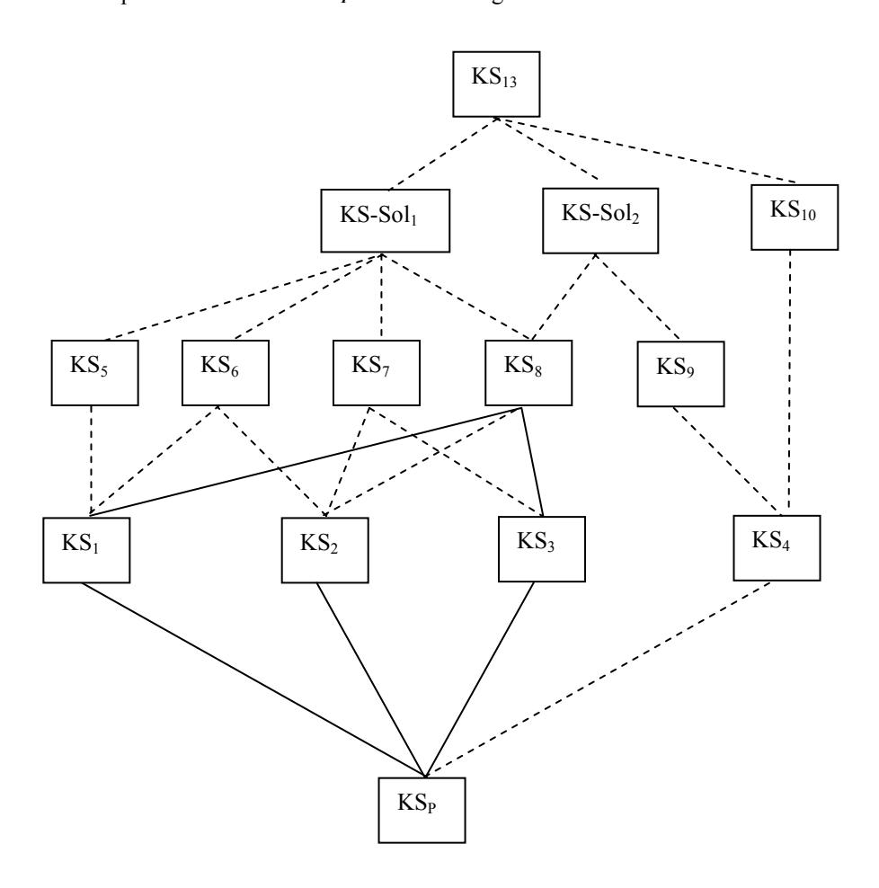

Figure 1. The epistemic model  $KS_P$  of a puzzle P with two solutions (all lines) and the part of it accessible by a Resolution Theory T (full lines).

Miscellanea 387

If the uniqueness of a solution for P is granted,  $KS_P$  has a maximally consistent element KS-Sol corresponding to this solution; and this maximally consistent element is accessible (in the sense of the order relation in  $KS_P$ ) from every other consistent knowledge state in  $KS_P$ . Nevertheless, if T is not complete, KS-Sol may not be accessible *via rules in T* from the initial knowledge state  $KS_P$  associated with P. Or it may be accessible from some of the states to which T leads but not from others; this is the problem of a rule that would prevent another from being applicable; it will be dealt with in section 2.

A second problem appears in case there may be several solutions. There are several maximally consistent elements in  $KS_P$ , some of which may be accessible from some states reachable by T, and some others not accessible. Questions related to uniqueness will be dealt with in section 3.

Figure 1 shows a puzzle with two solutions; knowledge state  $KS_8$  represents all the "value" and "cand" ground atomic formulæ that must be true in either of them. No greater knowledge state can be attained within any consistent Resolution Theory. In this example, this knowledge state  $KS_8$  can effectively be reached by theory T, following two paths, one through  $KS_1$  and one through  $KS_3$ . Nevertheless, the figure suggests that the path leading to  $KS_3$ , although valid within T, is a dead end within T. The next section will show that this is impossible for the Resolution Theories intro-duced in this book.

#### 2. The question of confluence

There is logic, together with the logical Resolution Theories introduced in this book... and there are the many ways we can use them in practice to solve real puzzles. From a strict logical standpoint, all the rules in a logical theory are on an equal footing, which leaves no possibility of defining a precedence order between them (unless we use some of the circumscription theories introduced by AI or some of their numerous sprouts – which would be a complex approach). Nevertheless, throughout this book, we have referred to some ordering of the rules and we have stated many results mentioning it. This is harmless when we state that a rule is subsumed by others, because in such theorems we are completely free to choose which rules we prefer to keep and which to reduce to the previous ones.

But, when it comes to the practical exploitation of our theories and in particular to their implementation in our SudoRules solver, one question remains unanswered: can superimposing some ordering on the set of rules prevent us from reaching a solution that the choice of an other ordering might have made accessible? This is obviously a fundamental question when we assert that a puzzle P cannot be solved

in some theory T, because what we effectively prove is only that P cannot be solved with our implementation of T in SudoRules. By proving that all the resolution theories introduced in this book have the confluence property (to be defined soon) we shall reject any objection of this kind.

First, given a resolution theory T, consider all the resolution methods that can be built on it by defining various orderings of the rules in T. Given a puzzle P and starting from  $KS_P$ , the resolution process associated with a method M built on T consists of repeatedly applying resolution rules from T according to the additional constraints (i.e. the precedence order) introduced by M. Considering that, at any point in the resolution process, different rules from T may be applicable (and different rules will be applied) depending on the chosen resolution method M, we must allow for several resolution paths starting from  $KS_P$ . (Since our complexity hierarchy only defines a partial order relation on the set of resolution rules, all this discussion would remain unchanged even if all the resolution methods we consider were restricted to those conforming to this hierarchy – but this is not the point we want to make here.)

Let us define the *confluence property* as follows: a Sudoku Resolution Theory T has the confluence property if, for any puzzle P, all the resolution paths starting from  $KS_P$  and associated with all the resolution methods built on T lead to the same final state in  $KS_P$  (all explicitly inconsistent states being considered as identical).

Do all our theories BSRT and L1\_0 to L13 have the confluence property? The question can easily be seen as equivalent to the following: in any resolution method based on any of these theories, can the application of a rule prevent us from reaching a conclusion (i.e. asserting a value or a non-candidate) that might have been obtained if another rule had been applied first?

# Theorem 1: All the resolution theories defined in this book (BRST, L1\_0 to L13 and beyond, M2 to M28 and beyond) have the confluence property.

Proof: since the conclusion of a resolution rule in any of the theories listed above is either the addition of a value or (non exclusive "or") the elimination of a candidate, proving the confluence property *a priori* imposes the examination of all the rules and all the interactions that may occur between them. Nevertheless, it is enough to prove the following property: for any theory T as above and for any of the rules R in T, if R is applicable at some point in the resolution process, then the assertion of a value or the elimination of a candidate (e.g. as a result of the application of another rule in T) may make R inapplicable but then its conclusions can still be obtained by applying other rules whose complexity is no greater than that of R (rules which belong therefore to the same theory T).

Miscellanea 389

Let T be any of the theories listed in the theorem. Let us consider in turn all the rules R it contains and see what happens if, in any knowledge state where it can be applied, another rule R' is applied before it. Given T, you should only read the paragraphs of the following proof starting with the names of rules R belonging to T.

ECP: since rules in ECP always belong to T, if a candidate n for a cell C could have been eliminated by ECP but instead another rule R' in T is applied to assert some value or to eliminate some candidate, this cannot prevent the later applicability of ECP if R' has not already asserted this value or eliminated this candidate.

CD: since no rule can add a candidate for a cell, no rule can make CD inapplicable if it was applicable in some knowledge state. Stated otherwise, a contradiction that would have been detected by a rule in one of our theories can never be hidden by the application of another rule.

NS: the only condition in NS is the presence of a single candidate for a cell C; if this candidate is eliminated by another rule R' in T before being asserted by NS as the value for cell C, then CD applies.

NP: consider a Naked-Pairs in some unit u, for two cells  $C_1$  and  $C_2$ , with candidates  $n_1$  and  $n_2$ . If  $n_1$  is eliminated as a candidate for  $C_1$  (by the application of any other rule R' in T), then NS (a rule present in T whenever NP is) can still prove that the remaining candidate  $(n_2)$  is the value for  $C_1$ ;  $n_2$  can therefore still be eliminated by ECP (a set of rules present in all our theories) from all the other cells in unit u, including  $C_2$ . As a result,  $C_2$  can still be proved to have a single candidate  $(n_1)$  and NS can still be used to conclude that  $C_2$ = $n_1$ . ECP can still be applied to eliminate  $n_1$  from the candidates for any other cell in unit u. Finally  $n_1$  and  $n_2$  can still be eliminated from the candidates for all the cells in unit u other than  $C_1$  and  $C_2$ . The same argument works (skipping the first step) if  $n_2$  is asserted as the value for  $C_1$ .

NT and NQ: the proof works along the same lines; elimination of a candidate in a cell of the Triplet (respectively the Quadruplet) leads to a NP (resp. a NT), which can be dealt with by T, since NP (resp. NT) rules are present in all the theories that contain NT (resp. NQ).

HS: suppose HS is applicable in some unit u, where number  $n_1$  is a candidate for cell  $C_1$  and only cell  $C_1$  in this unit. Then if values are asserted or candidates eliminated for other cells in u (by another rule R'), this does not change the applicability of HS. If a candidate  $n_2 \neq n_1$  is eliminated from the candidates for  $C_1$ , this does not change the applicability of HS. If  $n_1$  is eliminated from the candidates for  $C_1$ , then P has no solution. In any case, all that could be deduced from the initial situation can still be.

The proofs for HP, HT and HQ work by combining the arguments for the NP, NT and NQ cases with those for HS.

Interaction rules: since the conditions of the Interaction rules bear only on the absence of candidates for some cells, eliminating candidates for any cell or asserting values for some cells does not change the validity of these conditions.

Chain rules (non hidden): this is certainly the most interesting part of the proof.

xy-chains: suppose a candidate for a cell in an xy-chain with target value  $n_1$  is eliminated or a value for this cell is asserted (which is equivalent given NS) before rule XY is applied. If a right candidate is thus asserted, then the forward propagation of elementary constraints along the cells in the initial chain (legitimate since ECP belongs to T) shows that the last cell in the chain (which is no longer an xy-chain but remains nevertheless a chain) must have value  $n_1$ . If a left candidate is thus asserted, then the backward propagation of elementary constraints along these cells shows that the first cell in the chain must have value  $n_1$ . In both cases, ECP can eliminate  $n_1$  from any target cell of the initial xy-chain.

xyt-chains: suppose we have an xyt-chain with target value  $n_1$  and a rule R' is applied before XYT. If, in some cell of the chain, a left candidate is thus eliminated or a right candidate is thus asserted, then the forward *and* backward propagation of constraints (via ECP) along the cells in the initial xyt-chain (along the same lines as in the proof of the xyt-chain rule) can still show that either of the endpoints of the chain must have value  $n_1$ ; if a right candidate is eliminated or a left candidate is asserted, a similar argument can still show that either of the endpoints of the chain must have value  $n_1$ . In both cases ECP will still be able to eliminate  $n_1$  from any target cell of the initial chain. If the value n of an extra candidate is asserted for a cell C in the chain, then C is linked to a previous cell where n is the right candidate and one can eliminate n from this cell via ECP, which brings us to the previous case. Finally, if an extra candidate (i.e. neither left nor right distinguished) is eliminated, then we still have an xyt-chain (possibly reduced to an xy-chain of the same length) with the same target value and target cells and rule XYT<sub>k</sub> (or XY<sub>k</sub>, which is in T whenever XYT<sub>k</sub> is) can still apply to it.

xyzt-chains: the proof is similar to that for xyt-chains, with propagation of constraints following the proof of the xyzt-chain rule. The major difference is that a new type of extra candidates must be taken care of: the target value  $n_1$ . Suppose it appears in cell C as an additional value of this type; if it is eliminated as a candidate for C, then the situation is reduced to that of an xyt-chain; if it is asserted as the value of C, then  $n_1$  can still be eliminated by ECP from any xyzt-target cell.

Miscellanea 391

c-chains: if a value is asserted for a cell C in a c-chain, either it is the c-linking value n and propagation of elementary and c-link constraints along the chain in the direction of the non c-link issuing from C can still lead to the conclusion that the corresponding endpoint is equal to n, or it is a non c-linking value and propagation of elementary and c-link constraints along the chain in the direction of the c-link issuing from C can still lead to the conclusion that the corresponding endpoint is equal to n. In any case, target value n can still be proved to be impossible for any target cell of the initial c-chain. If a candidate is eliminated from a cell C in the chain, either it does not change the fact that it is a c-chain for number n or it leads to asserting a value in this cell; which brings us to the previous case.

Hidden chain rules: since these rules are obtained from the non-hidden ones by supersymmetry, the above arguments used for the original chains can be transposed to their hidden counterparts.

3D chain rules: there is nothing new in the proofs, they are the direct transpositions of the proofs for the corresponding 2D chain rules.

#### 3. The question of uniqueness

Uniqueness of a solution is related to two problems. Firstly, as we said above, a resolution theory as defined in this book cannot find any of the solutions when a puzzle has several; however unpleasant this may be, it is final. Secondly, if a puzzle is known to have a unique solution, some rules based on the assumption of uniqueness may be added to a resolution theory; we call them U-resolution rules or U-rules. Nevertheless, the status of such U-rules is very different from that of ordinary resolution rules. In particular, they may not be used if a puzzle T has several solutions. Unfortunately, this is often forgotten. Notice also that such rules are not resolution rules in the strict sense defined in chapter IV, since they cannot be proven from the Sudoku axioms only.

#### 3.1. When non-uniqueness is hidden by using the uniqueness rules (BUG)

In Part V of his otherwise interesting book [STU 07], Andrew C. Stuart describes several techniques based on the assumption of uniqueness. In particular, the technique known as BUG (for Bivalue Universal Grave – sic) is stated as follows: "If a puzzle has one cell with three candidates and all the other undecided cells have two candidates, you can immediately fill that three-candidate cell. Just check which candidate appears three times in the row, column or box [block, in our vocabulary]

in which this three-candidate cell resides. That candidate is the one that goes in the three-candidate cell."

|               | cl  | <i>c</i> 2 | <i>c3</i> | <i>c4</i> | <i>c</i> 5  | <i>c</i> 6 | <i>c</i> 7 | c8 | c9     |    |
|---------------|-----|------------|-----------|-----------|-------------|------------|------------|----|--------|----|
| r1            | 3   | 5<br>9     | 2         | 8         | 4 7         | 1          | 4 9        | 6  | 5<br>7 | r1 |
| r2            | 1   | 8          | 5<br>9    | 4 7       | 3           | 6          | 4 9        | 2  | 5<br>7 | r2 |
| r3            | 7   | 6          | 4         | 2         | 5           | 9          | 1          | 3  | 8      | r3 |
| r4            | 5   | 2          | 7         | 6         | 1           | 8          | 3          | 9  | 4      | r4 |
| r5            | 9   | 3          | 8         | 4<br>7    | 2<br>4<br>7 | 4          | 5          | 1  | 6      | r5 |
| r6            | 6   | 4          | 1         | 3         | 9           | 5          | 7          | 8  | 2      | r6 |
| <i>r</i> 7    | 8   | 1          | 3         | 5         | 6           | 7          | 2          | 4  | 9      | r7 |
| r8            | 4   | 5 9        | 5 9       | 1         | 8           | 4          | 6          | 7  | 3      | r8 |
| r9            | 2 4 | 7          | 6         | 9         | 2 4         | 3          | 8          | 5  | 1      | r9 |
| r <del></del> | cl  | <i>c</i> 2 | <i>c3</i> | c4        | <i>c</i> 5  | <i>c</i> 6 | <i>c</i> 7 | c8 | с9     |    |

Figure 2. Stuart's example, BUG-41-1

Stuart proposes the puzzle in Figure 2 (call it BUG-41-1) as an example that can be solved with this technique. Notice that we can consider that this is a puzzle given in the most ordinary sense used throughout this book (i.e. only with values as entries), since the complete configuration with candidates can be computed from the values alone with just a few applications of ECP.

The solution given by Stuart (left-hand grid in Figure 3), based on the direct application of the above BUG rule, chooses value 7 for cell R5C5, all the remaining values being then decided by mere NS.

Miscellanea 393

This puzzle is a good illustration of what happens when a hypothesis (uniqueness) is used to assert itself as a conclusion – a major logical flaw, too commonly encountered in relation to questions of uniqueness.

| 3 | 5 | 2 | 8 | 4 | 1 | 9 | 6 | 7 |
|---|---|---|---|---|---|---|---|---|
| 1 | 8 | 9 | 7 | 3 | 6 | 4 | 2 | 5 |
| 7 | 6 | 4 | 2 | 5 | 9 | 1 | 3 | 8 |
| 5 | 2 | 7 | 6 | 1 | 8 | 3 | 9 | 4 |
| 9 | 3 | 8 | 4 | 7 | 2 | 5 | 1 | 6 |
| 6 | 4 | 1 | 3 | 9 | 5 | 7 | 8 | 2 |
| 8 | 1 | 3 | 5 | 6 | 7 | 2 | 4 | 9 |
| 2 | 9 | 5 | 1 | 8 | 4 | 6 | 7 | 3 |
| 1 | 7 | 6 | Q | 2 | 3 | Q | 5 | 1 |

| Ì | 3 | 9 | 2 | 8 | 7 | 1 | 4 | 6 | 5 |
|---|---|---|---|---|---|---|---|---|---|
|   | 1 | 8 | 5 | 4 | 3 | 6 | 9 | 2 | 7 |
|   | 7 | 6 | 4 | 2 | 5 | 9 | 1 | 3 | 8 |
| ] | 5 | 2 | 7 | 6 | 1 | 8 | 3 | 9 | 4 |
|   | 9 | 3 | 8 | 7 | 2 | 4 | 5 | 1 | 6 |
| 1 | 6 | 4 | 1 | 3 | 9 | 5 | 7 | 8 | 2 |
| l | 8 | 1 | 3 | 5 | 6 | 7 | 2 | 4 | 9 |
| ] | 4 | 5 | 9 | 1 | 8 | 2 | 6 | 7 | 3 |
|   | 2 | 7 | 6 | 9 | 4 | 3 | 8 | 5 | 1 |

| 3 | 9 | 2 | 8 | 7 | 1 | 4 | 6 | 5 |
|---|---|---|---|---|---|---|---|---|
| 1 | 8 | 5 | 4 | 3 | 6 | 9 | 2 | 7 |
| 7 | 6 | 4 | 2 | 5 | 9 | 1 | 3 | 8 |
| 5 | 2 | 7 | 6 | 1 | 8 | 3 | 9 | 4 |
| 9 | 3 | 8 | 7 | 4 | 2 | 5 | 1 | 6 |
| 6 | 4 | 1 | 3 | 9 | 5 | 7 | 8 | 2 |
| 8 | 1 | 3 | 5 | 6 | 7 | 2 | 4 | 9 |
| 2 | 5 | 9 | 1 | 8 | 4 | 6 | 7 | 3 |
| 4 | 7 | 6 | 9 | 2 | 3 | 8 | 5 | 1 |

Figure 3. The three solutions for puzzle BUG-41-1: Stuart's solution based on BUG and two other solutions

The assumption of uniqueness is false in the present case and applying the BUG rule produces the illusion that there is a unique solution. Unfortunately, there are two others, as shown by the central and right-hand grids in Figure 3. These two solutions can be obtained by trying the value r2c4=4; a few NS later, only 6 cells (r5c5, r5c6, r8c1, r8c6, r9c1 and r9c5) remain undecided, with the same two candidates each (Numbers 2 and 4). This situation is a wonderful generalisation of Unique Rectangle (see definition below) to six cells instead of four; it is somewhat reminiscent of an unproductive Swordfish or of a c4-, c5- or c6- chain with no productive target cell.

This is the place to notice that the BUG U-rule (or any U-rule based on the assumption of uniqueness) does not guarantee that the candidate it eliminates would have led to no solution. It only says it would have led to two (or more) solutions. It is therefore fine to apply this rule if you are absolutely sure there is only one solution; but how can you be absolutely sure unless you have proved it for yourself? Otherwise, it lets you unduly believe that there is a unique solution when there may be several.

One should never forget that the rules based on the assumption of uniqueness cannot produce uniqueness in a puzzle when it is not there.

This remark has *practical consequences for the puzzle creator*. Puzzles proposed to the public are supposed to have a unique solution, mainly because "puzzle compilers would not want to annoy their audience with puzzles that have two or

more solutions" ([STU 07]). There are currently two general types of algorithms for generating a puzzle: either you start from nought and you progressively add a random value in a random cell until you get a puzzle with a unique solution or you start from a complete puzzle (randomly generated) and you repeatedly withdraw a randomly chosen entry as long as the resulting puzzle has more than one solution. In both cases, each step requires a proof that the current puzzle has a unique solution. Now, this proof can be done in either of two ways: using a solver based on some resolution theory or carrying out a recursive Trial and Error (or combining both). The problem with the first method is that if some of the rules in your solver are based on an assumption of uniqueness, you do not really prove that which you intended. This is how some puzzles are proposed as having a single solution but appear to have several.

#### 3.2. Do we need rules based on the assumption of uniqueness?

Another question is: "do we *need* rules based on the assumption of uniqueness", i.e. can these U-rules solve puzzles (effectively known to have a unique solution) that could not be solved without them (let us say within the theories defined in this book or within other theories built on well defined guiding principles)?

In a preliminary exploration of this problem, I have found no vast database of puzzles in a specific relationship with the associated techniques. So, first, I have simply tried to solve the puzzles proposed by Andrew C. Stuart in that part of his book dedicated to this topic ([STU 07], part V). Except for the above example with three solutions, SudoRules has solved all these grids within theory L5, except one that needs rules as complex as those in L9. For a full listing of these solutions, see my Web pages.

I therefore decided to try these rules on the part of Royle17 that was not solved within L13 (or within its weak extension L16 by the sole xyt-chain rules). And I actually found very few puzzles that could be solved by U-rules belonging to the Unique Rectangles family.

#### 3.3. The family of U-rules for Unique Rectangles

One of the basic rules (or family of rules) in relation to uniqueness is named Unique Rectangles. It is based on the following remark. Define a horizontal rectangle as given by two different rows  $r_1$  and  $r_2$  and two different columns  $c_1$  and  $c_2$  (whose intersections define the corners of the rectangle) such that the two cells on the first column are in the same block  $b_1$  and the two cells on the second column are

Miscellanea 395

in the same block  $b_2 \neq b_1$ . Given such a rectangle, if, in a puzzle P, each of the four cells at the corners have the same two numbers  $n_1$  and  $n_2$  as their only candidates, then to any solution for P such that  $(r_1, c_1) = n_1$ , there corresponds a solution such that  $(r_1, c_1) = n_2$ , and conversely. The proof is obvious, since permuting the two numbers in these four cells does not change the constraints (along rows, columns and blocks) their values impose on any other cell. As a result, no puzzle with a unique solution can display the above pattern.

From this general remark, several "unique rectangle" U-resolution rules can be devised, whose purpose is to avoid reaching a knowledge state with the above pattern. Let us write the U-rules in this family that are most commonly encountered in the literature, in their "horizontal" versions; as usual, transposing rows and columns will provide "vertical" versions. In each of the following U-rules, we consider a horizontal rectangle where the four corners are supposed to have  $n_1$  and  $n_2$  as their only two candidates, unless otherwise specified. Proofs of the U-rules are left to the reader as an easy exercise.

UR1-H (Type 1 Unique Rectangle – Horizontal): if  $(r_2, c_2)$  has one or more additional candidate(s), then eliminate  $n_1$  and  $n_2$  from the candidates for  $(r_2, c_2)$ .

UR2-H (Type 2 Unique Rectangle – Horizontal): if  $(r_1, c_2)$  and  $(r_2, c_2)$  both have a third candidate  $n_3$  (different from  $n_1$  and  $n_2$ ), then eliminate  $n_3$  from the candidates for any cell that shares a unit with  $(r_1, c_2)$  and  $(r_2, c_2)$ , i.e. from any other cell in column  $c_2$  or in block  $b_2$ .

UR2b-H (Type 2b Unique Rectangle – Horizontal): if  $(r_2, c_1)$  and  $(r_2, c_2)$  both have a third candidate  $n_3$  (different from  $n_1$  and  $n_2$ ), then eliminate  $n_3$  and  $n_4$  from the candidates for any cell that shares a unit with  $(r_2, c_1)$  and  $(r_2, c_2)$ , i.e. from any other cell in row  $r_2$ .

UR3-H (Type 3 Unique Rectangle – Horizontal): if each of  $(r_2, c_1)$  and  $(r_2, c_2)$  has a third candidate different from  $n_1$  and  $n_2$ , as in type UR2b, but these additional candidates,  $n_3$  for  $(r_2, c_1)$  and  $n_4$  for  $(r_2, c_2)$ , are different, and if there is a third cell on row  $r_2$  such that its only two candidates are  $n_3$  and  $n_4$ , then eliminate  $n_3$  and  $n_4$  from the candidates for any cell in row  $r_2$  other than the three already mentioned.

UR4-H (Type 4 Unique Rectangle – Horizontal): if  $(r_1, c_2)$  and  $(r_2, c_2)$  both have additional candidates (different from  $n_1$  and  $n_2$ ) and if  $n_1$  is not a candidate for any other cell in block  $b_2$ , then eliminate  $n_2$  from the candidates for cells  $(r_1, c_2)$  and  $(r_2, c_2)$ .

UR4b-H (Type 4b Unique Rectangle – Horizontal): if  $(r_2, c_1)$  and  $(r_2, c_2)$  both have additional candidates (different from  $n_1$  and  $n_2$ ), and if  $n_1$  is not a candidate for any other cell in row  $r_2$ , then eliminate  $n_2$  from the candidates for cells  $(r_2, c_1)$  and  $(r_2, c_2)$ .

#### 3.4. Unique rectangles in the Royle-17 database

In the Royle17 database, we have found only five puzzles that cannot be solved within L16 but can be solved if we add U-rules for Unique Rectangles. (Among the puzzles not solved by L16, ten of them actually use Unique Rectangles, but for five of them, this is not enough to reach a solution.) This is not a lot of puzzles, although it is enough to prove that these U-rules are not subsumed by those in L16. Notice that if we had given U-rules for Unique Rectangles priorities between those in L4 and L5 (a natural choice, since these patterns rely on four cells) this might have changed the sets of puzzles solved at all the levels above L4. Nevertheless, we stick to our preference for rules not based on the assumption of uniqueness (see section 3.4 below). Notice also that, when we add rules for 3D chains, all the examples below can be solved at worst within M5 without resorting to any U-rule.

#### 3.4.1. UR1 cannot be reduced to L16

In the L16 elaboration process of puzzle Royle17-6526 (Figure 4), only rules in L1 apply and the L16 elaboration coincides with the L1\_0 elaboration. After a few interaction rules are applied to it, an horizontal rectangle of type 1 appears.

|   |   |   | 1 |   |   | 6 |   | 8 |
|---|---|---|---|---|---|---|---|---|
|   | 7 | 4 |   |   |   |   |   |   |
|   |   |   |   |   |   |   |   |   |
|   | 1 |   |   |   | 3 |   |   |   |
|   |   |   |   | 7 |   |   | 4 |   |
| 6 |   |   |   |   |   | 5 |   |   |
| 2 |   |   | 6 | 5 |   |   |   |   |
|   |   | 3 |   |   |   |   | 7 |   |
|   |   |   |   |   |   | 1 |   |   |

|   |   |   | 1 | 4 | 7 | 6 |   | 8 |
|---|---|---|---|---|---|---|---|---|
|   | 7 | 4 |   | 6 |   | 3 | 1 |   |
|   | 6 | 1 | 3 |   |   | 7 |   | 4 |
| 7 | 1 | 5 | 4 |   | 3 |   | 6 |   |
|   |   |   | 5 | 7 | 6 |   | 4 | 1 |
| 6 | 4 |   |   | 1 |   | 5 | 3 | 7 |
| 2 |   | 7 | 6 | 5 | 1 | 4 |   | 3 |
| 1 | 5 | 3 |   |   | 4 |   | 7 | 6 |
| 4 |   | 6 | 7 | 3 |   | 1 |   |   |

| 5 | 3 | 2 | 1 | 4 | 7 | 6 | 9 | 8 |
|---|---|---|---|---|---|---|---|---|
| 9 | 7 | 4 | 2 | 6 | 8 | 3 | 1 | 5 |
| 8 | 6 | 1 | 3 | 9 | 5 | 7 | 2 | 4 |
| 7 | 1 | 5 | 4 | 8 | 3 | 2 | 6 | 9 |
| 3 | 2 | 9 | 5 | 7 | 6 | 8 | 4 | 1 |
| 6 | 4 | 8 | 9 | 1 | 2 | 5 | 3 | 7 |
| 2 | 9 | 7 | 6 | 5 | 1 | 4 | 8 | 3 |
| 1 | 5 | 3 | 8 | 2 | 4 | 9 | 7 | 6 |
| 4 | 8 | 6 | 7 | 3 | 9 | 1 | 5 | 2 |

Figure 4. Puzzle Royle17-6526, its L1 0 elaboration and its solution

Resolution path in L16+UR1 for the L16 (or L1\_0) elaboration of Royle17-6526: column c8 interaction-with-block b9 ==>  $r8c7 \neq 8$  row r8 interaction-with-block b8 ==>  $r9c6 \neq 8$  column c3 interaction-with-block b4 ==>  $r5c2 \neq 8$ ,  $r5c1 \neq 8$  block b7 interaction-with-column c2 ==>  $r5c2 \neq 9$ ,  $r1c2 \neq 9$ 

Miscellanea 397

```
block b1 interaction-with-row r1 ==> r1c8 \neq 2 horizontal unique rectangle type 1 {r7 r9}{c2 c8} ==> r9c8 \neq 9, r9c8 \neq 8 naked and hidden singles =>> r7c8 = 8, r7c2 = 9, r9c2 = 8 column c8 interaction-with-block b3 ==> r2c9 \neq 9 hxyt-rn4-chain {c6 c9}r9n9 - {c9 c8}r9n5 - {c8 c1}r1n5 - {c1 c6}r3n5 ==> r3c6 \neq 9 xyzt9-chain {n9 n2}r4c9 - {n2 n5}r2c9 - {n5 n9}r9c9 - {n9 n2}r9c6 - {n2 n5}r9c8 - {n5 n9}r1c8 - {n9 n2}r3c8 - {n2 n8}r3c5 - {n8 n9}r8c5 ==> r4c5 \neq 9 row r4 interaction-with-block b6 ==> r5c7 \neq 9 row r5 interaction-with-block b4 ==> r6c3 \neq 9 hxy-cn5-chain {r5 r4}c7n8 - {r4 r8}c7n9 - {r8 r3}c5n9 - {r3 r1}c8n9 - {r1 r5}c3n9 ==> r5c3 \neq 8 naked-pairs-in-a-block {n2 n9}{r2c4 r3c5} ==> r3c6 \neq 2, r2c6 \neq 9, r2c6 \neq 2 c4-chain row-col-bl n2r3{c8 c5} - n2{r8c5 r9c6} ==> r9c8 \neq 2 ...(Naked Singles)
```

For an example with a vertical unique rectangle, consider puzzle Royle17-10233 (Figure 5), which has identical L16 and L1 elaborations. Let us give only the part of the resolution path before UR1 becomes applicable.

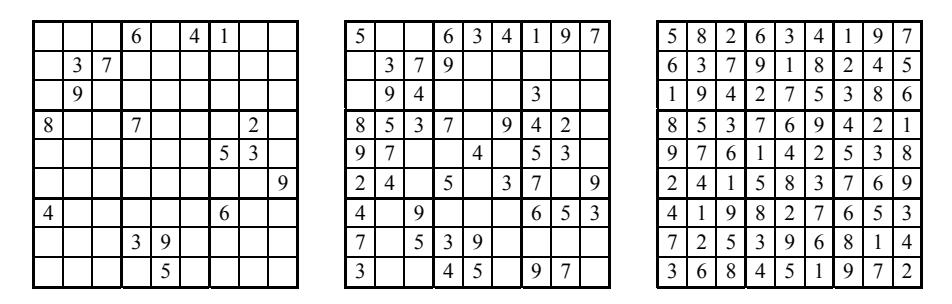

Figure 5. Puzzle Royle17-10233, its L1 elaboration and its solution

```
Resolution path in L16+UR1 for the L16 (or L1) elaboration of Royle17-10233: column c5 interaction-with-block b5 \Longrightarrow r5c6 \neq 6 column c2 interaction-with-block b7 \Longrightarrow r9c3 \neq 6, r9c3 \neq 1 xyzt4-chain {n8 n2}r8c7 - {n2 n1}r9c9 - {n1 n6}r4c9 - {n6 n8}r5c9 \Longrightarrow r8c9 \neq 8 xyzt8-chain {n2 n8}r9c3 - {n8 n1}r9c9 - {n1 n6}r4c9 - {n6 n8}r5c9 - {n8 n1}r6c8 - {n1 n6}r6c3 - {n6 n1}r5c3 - {n1 n2}r5c6 \Longrightarrow r9c6 \neq 2 xyzt9-chain {n8 n2}r9c3 - {n2 n1}r9c9 - {n1 n6}r4c9 - {n6 n8}r5c9 - {n8 n1}r6c8 - {n1 n6}r6c3 - {n6 n1}r5c3 - {n1 n2}r5c4 - {n2 n8}r5c6 \Longrightarrow r9c6 \neq 8 vertical unique rectangle type 1 {r1 r9}{c3 c2} \Longrightarrow r9c2 \neq 8, r9c2 \neq 2 naked-pairs-in-a-row {n1 n6}r9{c2 c6} \Longrightarrow r9c9 \neq 1 block b9 interaction-with-row r8 \Longrightarrow r8c6 \neq 1, r8c2 \neq 1
```

```
naked-pairs-in-a-block \{n2 \ n8\} \{r8c7 \ r9c9\} ==> r8c9 \neq 2, r8c8 \neq 8
   \frac{1}{100} hxyzt-rn6-chain \frac{1}{100} c6 c5 r6n8 - \frac{1}{100} c7 r6n6 - \frac{1}{100} c7 r6n6 - \frac{1}{100} c7 r6n8 - \frac{1}{100} r6n6 - \frac{1}{100} r6n6 - \frac{1}{100} r6n6 - \frac{1}{100} r6n6 - \frac{1}{100} r6n6 - \frac{1}{100} r6n6 - \frac{1}{100} r6n6 - \frac{1}{100} r6n6 - \frac{1}{100} r6n6 - \frac{1}{100} r6n6 - \frac{1}{100} r6n6 - \frac{1}{100} r6n6 - \frac{1}{100} r6n6 - \frac{1}{100} r6n6 - \frac{1}{100} r6n6 - \frac{1}{100} r6n6 - \frac{1}{100} r6n6 - \frac{1}{100} r6n6 - \frac{1}{100} r6n6 - \frac{1}{100} r6n6 - \frac{1}{100} r6n6 - \frac{1}{100} r6n6 - \frac{1}{100} r6n6 - \frac{1}{100} r6n6 - \frac{1}{100} r6n6 - \frac{1}{100} r6n6 - \frac{1}{100} r6n6 - \frac{1}{100} r6n6 - \frac{1}{100} r6n6 - \frac{1}{100} r6n6 - \frac{1}{100} r6n6 - \frac{1}{100} r6n6 - \frac{1}{100} r6n6 - \frac{1}{100} r6n6 - \frac{1}{100} r6n6 - \frac{1}{100} r6n6 - \frac{1}{100} r6n6 - \frac{1}{100} r6n6 - \frac{1}{100} r6n6 - \frac{1}{100} r6n6 - \frac{1}{100} r6n6 - \frac{1}{100} r6n6 - \frac{1}{100} r6n6 - \frac{1}{100} r6n6 - \frac{1}{100} r6n6 - \frac{1}{100} r6n6 - \frac{1}{100} r6n6 - \frac{1}{100} r6n6 - \frac{1}{100} r6n6 - \frac{1}{100} r6n6 - \frac{1}{100} r6n6 - \frac{1}{100} r6n6 - \frac{1}{100} r6n6 - \frac{1}{100} r6n6 - \frac{1}{100} r6n6 - \frac{1}{100} r6n6 - \frac{1}{100} r6n6 - \frac{1}{100} r6n6 - \frac{1}{100} r6n6 - \frac{1}{100} r6n6 - \frac{1}{100} r6n6 - \frac{1}{100} r6n6 - \frac{1}{100} r6n6 - \frac{1}{100} r6n6 - \frac{1}{100} r6n6 - \frac{1}{100} r6n6 - \frac{1}{100} r6n6 - \frac{1}{100} r6n6 - \frac{1}{100} r6n6 - \frac{1}{100} r6n6 - \frac{1}{100} r6n6 - \frac{1}{100} r6n6 - \frac{1}{100} r6n6 - \frac{1}{100} r6n6 - \frac{1}{100} r6n6 - \frac{1}{100} r6n6 - \frac{1}{100} r6n6 - \frac{1}{100} r6n6 - \frac{1}{100} r6n6 - \frac{1}{100} r6n6 - \frac{1}{100} r6n6 - \frac{1}{100} r6n6 - \frac{1}{100} r6n6 - \frac{1}{100} r6n6 - \frac{1}{100} r6n6 - \frac{1}{100} r6n6 - \frac{1}{100} r6n6 - \frac{1}{100} r6n6 - \frac{1}{100} r6n6 - \frac{1}{100} r6n6 - \frac{1}{100} r6n6 - \frac{1}{100} r6n6 - \frac{1}{100} r6n6 - \frac{1}{100} r6n6 - \frac{1}{100} r6n6 - \frac{1}{100} r6n6 - \frac{1}{100} r6n6 - \frac{1}{100} r6n6 - \frac{1}{100} r6n6 - \frac{1}{100} r6n6 - \frac{1}{100} r6n6 - \frac{1}{1
      \{c9\ c8\}r8n1 ==> r6c8 \neq 1
   naked and hidden singles \Longrightarrow r8c8 = 1, r8c9 = 4, r2c8 = 4
   xyzt6-chain \{n8 \ n2\}r2c7 - \{n2 \ n1\}r2c5 - \{n1 \ n6\}r4c5 - \{n6 \ n8\}r6c5 - \{n8 \ n6\}r6c8 - \{n8 \ n6\}r6c8 - \{n8 \ n6\}r6c8 - \{n8 \ n6\}r6c8 - \{n8 \ n6\}r6c8 - \{n8 \ n6\}r6c8 - \{n8 \ n6\}r6c8 - \{n8 \ n6\}r6c8 - \{n8 \ n6\}r6c8 - \{n8 \ n6\}r6c8 - \{n8 \ n6\}r6c8 - \{n8 \ n6\}r6c8 - \{n8 \ n6\}r6c8 - \{n8 \ n6\}r6c8 - \{n8 \ n6\}r6c8 - \{n8 \ n6\}r6c8 - \{n8 \ n6\}r6c8 - \{n8 \ n6\}r6c8 - \{n8 \ n6\}r6c8 - \{n8 \ n6\}r6c8 - \{n8 \ n6\}r6c8 - \{n8 \ n6\}r6c8 - \{n8 \ n6\}r6c8 - \{n8 \ n6\}r6c8 - \{n8 \ n6\}r6c8 - \{n8 \ n6\}r6c8 - \{n8 \ n6\}r6c8 - \{n8 \ n6\}r6c8 - \{n8 \ n6\}r6c8 - \{n8 \ n6\}r6c8 - \{n8 \ n6\}r6c8 - \{n8 \ n6\}r6c8 - \{n8 \ n6\}r6c8 - \{n8 \ n6\}r6c8 - \{n8 \ n6\}r6c8 - \{n8 \ n6\}r6c8 - \{n8 \ n6\}r6c8 - \{n8 \ n6\}r6c8 - \{n8 \ n6\}r6c8 - \{n8 \ n6\}r6c8 - \{n8 \ n6\}r6c8 - \{n8 \ n6\}r6c8 - \{n8 \ n6\}r6c8 - \{n8 \ n6\}r6c8 - \{n8 \ n6\}r6c8 - \{n8 \ n6\}r6c8 - \{n8 \ n6\}r6c8 - \{n8 \ n6\}r6c8 - \{n8 \ n6\}r6c8 - \{n8 \ n6\}r6c8 - \{n8 \ n6\}r6c8 - \{n8 \ n6\}r6c8 - \{n8 \ n6\}r6c8 - \{n8 \ n6\}r6c8 - \{n8 \ n6\}r6c8 - \{n8 \ n6\}r6c8 - \{n8 \ n6\}r6c8 - \{n8 \ n6\}r6c8 - \{n8 \ n6\}r6c8 - \{n8 \ n6\}r6c8 - \{n8 \ n6\}r6c8 - \{n8 \ n6\}r6c8 - \{n8 \ n6\}r6c8 - \{n8 \ n6\}r6c8 - \{n8 \ n6\}r6c8 - \{n8 \ n6\}r6c8 - \{n8 \ n6\}r6c8 - \{n8 \ n6\}r6c8 - \{n8 \ n6\}r6c8 - \{n8 \ n6\}r6c8 - \{n8 \ n6\}r6c8 - \{n8 \ n6\}r6c8 - \{n8 \ n6\}r6c8 - \{n8 \ n6\}r6c8 - \{n8 \ n6\}r6c8 - \{n8 \ n6\}r6c8 - \{n8 \ n6\}r6c8 - \{n8 \ n6\}r6c8 - \{n8 \ n6\}r6c8 - \{n8 \ n6\}r6c8 - \{n8 \ n6\}r6c8 - \{n8 \ n6\}r6c8 - \{n8 \ n6\}r6c8 - \{n8 \ n6\}r6c8 - \{n8 \ n6\}r6c8 - \{n8 \ n6\}r6c8 - \{n8 \ n6\}r6c8 - \{n8 \ n6\}r6c8 - \{n8 \ n6\}r6c8 - \{n8 \ n6\}r6c8 - \{n8 \ n6\}r6c8 - \{n8 \ n6\}r6c8 - \{n8 \ n6\}r6c8 - \{n8 \ n6\}r6c8 - \{n8 \ n6\}r6c8 - \{n8 \ n6\}r6c8 - \{n8 \ n6\}r6c8 - \{n8 \ n6\}r6c8 - \{n8 \ n6\}r6c8 - \{n8 \ n6\}r6c8 - \{n8 \ n6\}r6c8 - \{n8 \ n6\}r6c8 - \{n8 \ n6\}r6c8 - \{n8 \ n6\}r6c8 - \{n8 \ n6\}r6c8 - \{n8 \ n6\}r6c8 - \{n8 \ n6\}r6c8 - \{n8 \ n6\}r6c8 - \{n8 \ n6\}r6c8 - \{n8 \ n6\}r6c8 - \{n8 \ n6\}r6c8 - \{n8 \ n6\}r6c8 - \{n8 \ n6\}r6c8 - \{n8 \ n6\}r6c8 - \{n8 \ n6\}r6c8 - \{n8 \ n6\}r6c8 - \{n8 \ n6\}r6c8 - \{n8 \ n6\}r6c8 - \{n8 \ n6\}r6c8 - \{n8 \ n6\}r6c8 - \{n8 \ n6\}r6c8 - \{n8 \ n6\}r6c8 - \{n8 \ n6\}r6c8 
      \{n6 \ n8\}\ r3c8 ==> r2c9 \neq 8, \ r7c5 \neq 1
xyzt6-chain \{n1\ n6\}r4c5 - \{n6\ n8\}r6c5 - \{n8\ n6\}r6c8 - \{n6\ n8\}r3c8 - \{n8\ n2\}r2c7 - \{n8\ n8\}r3c8 - \{n8\ n2\}r2c7 - \{n8\ n8\}r3c8 - \{n8\ n2\}r2c7 - \{n8\ n8\}r3c8 - \{n8\ n2\}r2c7 - \{n8\ n8\}r3c8 - \{n8\ n2\}r2c7 - \{n8\ n8\}r3c8 - \{n8\ n2\}r2c7 - \{n8\ n8\}r3c8 - \{n8\ n2\}r2c7 - \{n8\ n8\}r3c8 - \{n8\ n2\}r2c7 - \{n8\ n8\}r3c8 - \{n8\ n2\}r2c7 - \{n8\ n8\}r3c8 - \{n8\ n2\}r2c7 - \{n8\ n8\}r3c8 - \{n8\ n8\}r3c8 - \{n8\ n8\}r3c8 - \{n8\ n8\}r3c8 - \{n8\ n8\}r3c8 - \{n8\ n8\}r3c8 - \{n8\ n8\}r3c8 - \{n8\ n8\}r3c8 - \{n8\ n8\}r3c8 - \{n8\ n8\}r3c8 - \{n8\ n8\}r3c8 - \{n8\ n8\}r3c8 - \{n8\ n8\}r3c8 - \{n8\ n8\}r3c8 - \{n8\ n8\}r3c8 - \{n8\ n8\}r3c8 - \{n8\ n8\}r3c8 - \{n8\ n8\}r3c8 - \{n8\ n8\}r3c8 - \{n8\ n8\}r3c8 - \{n8\ n8\}r3c8 - \{n8\ n8\}r3c8 - \{n8\ n8\}r3c8 - \{n8\ n8\}r3c8 - \{n8\ n8\}r3c8 - \{n8\ n8\}r3c8 - \{n8\ n8\}r3c8 - \{n8\ n8\}r3c8 - \{n8\ n8\}r3c8 - \{n8\ n8\}r3c8 - \{n8\ n8\}r3c8 - \{n8\ n8\}r3c8 - \{n8\ n8\}r3c8 - \{n8\ n8\}r3c8 - \{n8\ n8\}r3c8 - \{n8\ n8\}r3c8 - \{n8\ n8\}r3c8 - \{n8\ n8\}r3c8 - \{n8\ n8\}r3c8 - \{n8\ n8\}r3c8 - \{n8\ n8\}r3c8 - \{n8\ n8\}r3c8 - \{n8\ n8\}r3c8 - \{n8\ n8\}r3c8 - \{n8\ n8\}r3c8 - \{n8\ n8\}r3c8 - \{n8\ n8\}r3c8 - \{n8\ n8\}r3c8 - \{n8\ n8\}r3c8 - \{n8\ n8\}r3c8 - \{n8\ n8\}r3c8 - \{n8\ n8\}r3c8 - \{n8\ n8\}r3c8 - \{n8\ n8\}r3c8 - \{n8\ n8\}r3c8 - \{n8\ n8\}r3c8 - \{n8\ n8\}r3c8 - \{n8\ n8\}r3c8 - \{n8\ n8\}r3c8 - \{n8\ n8\}r3c8 - \{n8\ n8\}r3c8 - \{n8\ n8\}r3c8 - \{n8\ n8\}r3c8 - \{n8\ n8\}r3c8 - \{n8\ n8\}r3c8 - \{n8\ n8\}r3c8 - \{n8\ n8\}r3c8 - \{n8\ n8\}r3c8 - \{n8\ n8\}r3c8 - \{n8\ n8\}r3c8 - \{n8\ n8\}r3c8 - \{n8\ n8\}r3c8 - \{n8\ n8\}r3c8 - \{n8\ n8\}r3c8 - \{n8\ n8\}r3c8 - \{n8\ n8\}r3c8 - \{n8\ n8\}r3c8 - \{n8\ n8\}r3c8 - \{n8\ n8\}r3c8 - \{n8\ n8\}r3c8 - \{n8\ n8\}r3c8 - \{n8\ n8\}r3c8 - \{n8\ n8\}r3c8 - \{n8\ n8\}r3c8 - \{n8\ n8\}r3c8 - \{n8\ n8\}r3c8 - \{n8\ n8\}r3c8 - \{n8\ n8\}r3c8 - \{n8\ n8\}r3c8 - \{n8\ n8\}r3c8 - \{n8\ n8\}r3c8 - \{n8\ n8\}r3c8 - \{n8\ n8\}r3c8 - \{n8\ n8\}r3c8 - \{n8\ n8\}r3c8 - \{n8\ n8\}r3c8 - \{n8\ n8\}r3c8 - \{n8\ n8\}r3c8 - \{n8\ n8\}r3c8 - \{n8\ n8\}r3c8 - \{n8\ n8\}r3c8 - \{n8\ n8\}r3c8 - \{n8\ n8\}r3c8 - \{n8\ n8\}r3c8 - \{n8\ n8\}r3c8 - \{n8\ n8\}r3c8 - \{n8\ n8\}r3c8 - \{n8\ n8\}r3c8 - \{n8\ n8\}r3c8 - \{n8\ n8\}r3c8 - \{n8\ n8\}r3c8 - \{n8\ n8\}r3c8 - \{n8\ 
      \{n2 \ n1\}\ r2c5 => r3c5 \neq 1
   xyzt7-chain \{n2 \ n8\}r2c7 - \{n8 \ n1\}r2c5 - \{n1 \ n6\}r4c5 - \{n6 \ n8\}r6c5 - \{n8 \ n6\}r6c8 - \{n8 \ n6\}r6c8 - \{n8 \ n6\}r6c8 - \{n8 \ n6\}r6c8 - \{n8 \ n6\}r6c8 - \{n8 \ n6\}r6c8 - \{n8 \ n6\}r6c8 - \{n8 \ n6\}r6c8 - \{n8 \ n6\}r6c8 - \{n8 \ n6\}r6c8 - \{n8 \ n6\}r6c8 - \{n8 \ n6\}r6c8 - \{n8 \ n6\}r6c8 - \{n8 \ n6\}r6c8 - \{n8 \ n6\}r6c8 - \{n8 \ n6\}r6c8 - \{n8 \ n6\}r6c8 - \{n8 \ n6\}r6c8 - \{n8 \ n6\}r6c8 - \{n8 \ n6\}r6c8 - \{n8 \ n6\}r6c8 - \{n8 \ n6\}r6c8 - \{n8 \ n6\}r6c8 - \{n8 \ n6\}r6c8 - \{n8 \ n6\}r6c8 - \{n8 \ n6\}r6c8 - \{n8 \ n6\}r6c8 - \{n8 \ n6\}r6c8 - \{n8 \ n6\}r6c8 - \{n8 \ n6\}r6c8 - \{n8 \ n6\}r6c8 - \{n8 \ n6\}r6c8 - \{n8 \ n6\}r6c8 - \{n8 \ n6\}r6c8 - \{n8 \ n6\}r6c8 - \{n8 \ n6\}r6c8 - \{n8 \ n6\}r6c8 - \{n8 \ n6\}r6c8 - \{n8 \ n6\}r6c8 - \{n8 \ n6\}r6c8 - \{n8 \ n6\}r6c8 - \{n8 \ n6\}r6c8 - \{n8 \ n6\}r6c8 - \{n8 \ n6\}r6c8 - \{n8 \ n6\}r6c8 - \{n8 \ n6\}r6c8 - \{n8 \ n6\}r6c8 - \{n8 \ n6\}r6c8 - \{n8 \ n6\}r6c8 - \{n8 \ n6\}r6c8 - \{n8 \ n6\}r6c8 - \{n8 \ n6\}r6c8 - \{n8 \ n6\}r6c8 - \{n8 \ n6\}r6c8 - \{n8 \ n6\}r6c8 - \{n8 \ n6\}r6c8 - \{n8 \ n6\}r6c8 - \{n8 \ n6\}r6c8 - \{n8 \ n6\}r6c8 - \{n8 \ n6\}r6c8 - \{n8 \ n6\}r6c8 - \{n8 \ n6\}r6c8 - \{n8 \ n6\}r6c8 - \{n8 \ n6\}r6c8 - \{n8 \ n6\}r6c8 - \{n8 \ n6\}r6c8 - \{n8 \ n6\}r6c8 - \{n8 \ n6\}r6c8 - \{n8 \ n6\}r6c8 - \{n8 \ n6\}r6c8 - \{n8 \ n6\}r6c8 - \{n8 \ n6\}r6c8 - \{n8 \ n6\}r6c8 - \{n8 \ n6\}r6c8 - \{n8 \ n6\}r6c8 - \{n8 \ n6\}r6c8 - \{n8 \ n6\}r6c8 - \{n8 \ n6\}r6c8 - \{n8 \ n6\}r6c8 - \{n8 \ n6\}r6c8 - \{n8 \ n6\}r6c8 - \{n8 \ n6\}r6c8 - \{n8 \ n6\}r6c8 - \{n8 \ n6\}r6c8 - \{n8 \ n6\}r6c8 - \{n8 \ n6\}r6c8 - \{n8 \ n6\}r6c8 - \{n8 \ n6\}r6c8 - \{n8 \ n6\}r6c8 - \{n8 \ n6\}r6c8 - \{n8 \ n6\}r6c8 - \{n8 \ n6\}r6c8 - \{n8 \ n6\}r6c8 - \{n8 \ n6\}r6c8 - \{n8 \ n6\}r6c8 - \{n8 \ n6\}r6c8 - \{n8 \ n6\}r6c8 - \{n8 \ n6\}r6c8 - \{n8 \ n6\}r6c8 - \{n8 \ n6\}r6c8 - \{n8 \ n6\}r6c8 - \{n8 \ n6\}r6c8 - \{n8 \ n6\}r6c8 - \{n8 \ n6\}r6c8 - \{n8 \ n6\}r6c8 - \{n8 \ n6\}r6c8 - \{n8 \ n6\}r6c8 - \{n8 \ n6\}r6c8 - \{n8 \ n6\}r6c8 - \{n8 \ n6\}r6c8 - \{n8 \ n6\}r6c8 - \{n8 \ n6\}r6c8 - \{n8 \ n6\}r6c8 - \{n8 \ n6\}r6c8 - \{n8 \ n6\}r6c8 - \{n8 \ n6\}r6c8 - \{n8 \ n6\}r6c8 - \{n8 \ n6\}r6c8 - \{n8 \ n6\}r6c8 - \{n8 \ n6\}r6c8 - \{n8 \ n6\}r6c8 - \{n8 \ n6\}r6c8 - \{n8 \ n6\}r6c8 
      \{n6 \ n8\}\ r3c8 - \{n8 \ n2\}\ r3c4 ==> r2c6 \neq 2
   xyzt7-chain \{n1 \ n6\}r3c1 - \{n6 \ n8\}r3c8 - \{n8 \ n6\}r6c8 - \{n6 \ n1\}r6c3 - \{n1 \ n8\}r6c5 - \{n6 \ n1\}r6c3 - \{n1 \ n8\}r6c5 - \{n6 \ n1\}r6c3 - \{n1 \ n8\}r6c5 - \{n6 \ n1\}r6c3 - \{n1 \ n8\}r6c5 - \{n6 \ n1\}r6c3 - \{n1 \ n8\}r6c5 - \{n6 \ n1\}r6c3 - \{n1 \ n8\}r6c5 - \{n6 \ n1\}r6c3 - \{n1 \ n8\}r6c5 - \{n6 \ n1\}r6c3 - \{n1 \ n8\}r6c5 - \{n6 \ n1\}r6c3 - \{n1 \ n8\}r6c5 - \{n6 \ n1\}r6c3 - \{n1 \ n8\}r6c5 - \{n6 \ n1\}r6c3 - \{n1 \ n8\}r6c5 - \{n6 \ n1\}r6c3 - \{n1 \ n8\}r6c5 - \{n6 \ n1\}r6c3 - \{n1 \ n8\}r6c5 - \{n6 \ n1\}r6c3 - \{n1 \ n8\}r6c5 - \{n6 \ n1\}r6c3 - \{n1 \ n8\}r6c5 - \{n6 \ n1\}r6c3 - \{n1 \ n8\}r6c5 - \{n6 \ n1\}r6c3 - \{n1 \ n8\}r6c5 - \{n6 \ n1\}r6c3 - \{n1 \ n8\}r6c5 - \{n6 \ n1\}r6c3 - \{n1 \ n8\}r6c5 - \{n6 \ n1\}r6c3 - \{n1 \ n8\}r6c5 - \{n6 \ n1\}r6c3 - \{n1 \ n8\}r6c5 - \{n6 \ n1\}r6c3 - \{n1 \ n8\}r6c5 - \{n6 \ n1\}r6c3 - \{n1 \ n8\}r6c5 - \{n6 \ n1\}r6c3 - \{n1 \ n8\}r6c5 - \{n6 \ n1\}r6c3 - \{n1 \ n8\}r6c5 - \{n6 \ n1\}r6c3 - \{n1 \ n8\}r6c5 - \{n6 \ n1\}r6c3 - \{n1 \ n8\}r6c5 - \{n6 \ n1\}r6c3 - \{n6 \ n1\}r6c3 - \{n6 \ n1\}r6c3 - \{n6 \ n1\}r6c3 - \{n6 \ n1\}r6c3 - \{n6 \ n1\}r6c3 - \{n6 \ n1\}r6c3 - \{n6 \ n1\}r6c3 - \{n6 \ n1\}r6c3 - \{n6 \ n1\}r6c3 - \{n6 \ n1\}r6c3 - \{n6 \ n1\}r6c3 - \{n6 \ n1\}r6c3 - \{n6 \ n1\}r6c3 - \{n6 \ n1\}r6c3 - \{n6 \ n1\}r6c3 - \{n6 \ n1\}r6c3 - \{n6 \ n1\}r6c3 - \{n6 \ n1\}r6c3 - \{n6 \ n1\}r6c3 - \{n6 \ n1\}r6c3 - \{n6 \ n1\}r6c3 - \{n6 \ n1\}r6c3 - \{n6 \ n1\}r6c3 - \{n6 \ n1\}r6c3 - \{n6 \ n1\}r6c3 - \{n6 \ n1\}r6c3 - \{n6 \ n1\}r6c3 - \{n6 \ n1\}r6c3 - \{n6 \ n1\}r6c3 - \{n6 \ n1\}r6c3 - \{n6 \ n1\}r6c3 - \{n6 \ n1\}r6c3 - \{n6 \ n1\}r6c3 - \{n6 \ n1\}r6c3 - \{n6 \ n1\}r6c3 - \{n6 \ n1\}r6c3 - \{n6 \ n1\}r6c3 - \{n6 \ n1\}r6c3 - \{n6 \ n1\}r6c3 - \{n6 \ n1\}r6c3 - \{n6 \ n1\}r6c3 - \{n6 \ n1\}r6c3 - \{n6 \ n1\}r6c3 - \{n6 \ n1\}r6c3 - \{n6 \ n1\}r6c3 - \{n6 \ n1\}r6c3 - \{n6 \ n1\}r6c3 - \{n6 \ n1\}r6c3 - \{n6 \ n1\}r6c3 - \{n6 \ n1\}r6c3 - \{n6 \ n1\}r6c3 - \{n6 \ n1\}r6c3 - \{n6 \ n1\}r6c3 - \{n6 \ n1\}r6c3 - \{n6 \ n1\}r6c3 - \{n6 \ n1\}r6c3 - \{n6 \ n1\}r6c3 - \{n6 \ n1\}r6c3 - \{n6 \ n1\}r6c3 - \{n6 \ n1\}r6c3 - \{n6 \ n1\}r6c3 - \{n6 \ n1\}r6c3 - \{n6 \ n1\}r6c3 - \{n6 \ n1\}r6c3 - \{n6 \ n1\}r6c3 - \{n6 \ n1\}r6c3 - \{n6 \ n1\}r6c3 - \{n6 \ n1\}r6c3 - \{n6 \ n1\}r6c3 
      \{n8 \ n2\}r2c5 - \{n2 \ n1\}r3c4 ==> r3c6 \neq 1
   xyzt8-chain \{n2\ n8\}r2c7 - \{n8\ n1\}r2c5 - \{n1\ n6\}r4c5 - \{n6\ n8\}r6c5 - \{n8\ n6\}r6c8 - \{n8\ n6\}r6c8 - \{n8\ n6\}r6c8 - \{n8\ n6\}r6c8 - \{n8\ n6\}r6c8 - \{n8\ n6\}r6c8 - \{n8\ n6\}r6c8 - \{n8\ n6\}r6c8 - \{n8\ n6\}r6c8 - \{n8\ n6\}r6c8 - \{n8\ n6\}r6c8 - \{n8\ n6\}r6c8 - \{n8\ n6\}r6c8 - \{n8\ n6\}r6c8 - \{n8\ n6\}r6c8 - \{n8\ n6\}r6c8 - \{n8\ n6\}r6c8 - \{n8\ n6\}r6c8 - \{n8\ n6\}r6c8 - \{n8\ n6\}r6c8 - \{n8\ n6\}r6c8 - \{n8\ n6\}r6c8 - \{n8\ n6\}r6c8 - \{n8\ n6\}r6c8 - \{n8\ n6\}r6c8 - \{n8\ n6\}r6c8 - \{n8\ n6\}r6c8 - \{n8\ n6\}r6c8 - \{n8\ n6\}r6c8 - \{n8\ n6\}r6c8 - \{n8\ n6\}r6c8 - \{n8\ n6\}r6c8 - \{n8\ n6\}r6c8 - \{n8\ n6\}r6c8 - \{n8\ n6\}r6c8 - \{n8\ n6\}r6c8 - \{n8\ n6\}r6c8 - \{n8\ n6\}r6c8 - \{n8\ n6\}r6c8 - \{n8\ n6\}r6c8 - \{n8\ n6\}r6c8 - \{n8\ n6\}r6c8 - \{n8\ n6\}r6c8 - \{n8\ n6\}r6c8 - \{n8\ n6\}r6c8 - \{n8\ n6\}r6c8 - \{n8\ n6\}r6c8 - \{n8\ n6\}r6c8 - \{n8\ n6\}r6c8 - \{n8\ n6\}r6c8 - \{n8\ n6\}r6c8 - \{n8\ n6\}r6c8 - \{n8\ n6\}r6c8 - \{n8\ n6\}r6c8 - \{n8\ n6\}r6c8 - \{n8\ n6\}r6c8 - \{n8\ n6\}r6c8 - \{n8\ n6\}r6c8 - \{n8\ n6\}r6c8 - \{n8\ n6\}r6c8 - \{n8\ n6\}r6c8 - \{n8\ n6\}r6c8 - \{n8\ n6\}r6c8 - \{n8\ n6\}r6c8 - \{n8\ n6\}r6c8 - \{n8\ n6\}r6c8 - \{n8\ n6\}r6c8 - \{n8\ n6\}r6c8 - \{n8\ n6\}r6c8 - \{n8\ n6\}r6c8 - \{n8\ n6\}r6c8 - \{n8\ n6\}r6c8 - \{n8\ n6\}r6c8 - \{n8\ n6\}r6c8 - \{n8\ n6\}r6c8 - \{n8\ n6\}r6c8 - \{n8\ n6\}r6c8 - \{n8\ n6\}r6c8 - \{n8\ n6\}r6c8 - \{n8\ n6\}r6c8 - \{n8\ n6\}r6c8 - \{n8\ n6\}r6c8 - \{n8\ n6\}r6c8 - \{n8\ n6\}r6c8 - \{n8\ n6\}r6c8 - \{n8\ n6\}r6c8 - \{n8\ n6\}r6c8 - \{n8\ n6\}r6c8 - \{n8\ n6\}r6c8 - \{n8\ n6\}r6c8 - \{n8\ n6\}r6c8 - \{n8\ n6\}r6c8 - \{n8\ n6\}r6c8 - \{n8\ n6\}r6c8 - \{n8\ n6\}r6c8 - \{n8\ n6\}r6c8 - \{n8\ n6\}r6c8 - \{n8\ n6\}r6c8 - \{n8\ n6\}r6c8 - \{n8\ n6\}r6c8 - \{n8\ n6\}r6c8 - \{n8\ n6\}r6c8 - \{n8\ n6\}r6c8 - \{n8\ n6\}r6c8 - \{n8\ n6\}r6c8 - \{n8\ n6\}r6c8 - \{n8\ n6\}r6c8 - \{n8\ n6\}r6c8 - \{n8\ n6\}r6c8 - \{n8\ n6\}r6c8 - \{n8\ n6\}r6c8 - \{n8\ n6\}r6c8 - \{n8\ n6\}r6c8 - \{n8\ n6\}r6c8 - \{n8\ n6\}r6c8 - \{n8\ n6\}r6c8 - \{n8\ n6\}r6c8 - \{n8\ n6\}r6c8 - \{n8\ n6\}r6c8 - \{n8\ n6\}r6c8 - \{n8\ n6\}r6c8 - \{n8\ n6\}r6c8 - \{n8\ n6\}r6c8 - \{n8\ n6\}r6c8 - \{n8\ n6\}r6c8 - \{n8\ n6\}r6c8 - \{n8\ n6\}r6c8 - \{n8\ n6\}r6c8 - \{n8\ n6\}r6c8 - \{n8\ n6\}r6c8 - \{n8\ n6\}r6c8 - \{n8\ 
      \{n6 \ n1\}r4c9 - \{n1 \ n8\}r5c9 - \{n8 \ n2\}r9c9 \Longrightarrow r2c9 \neq 2
   xyzt6-chain \{n8 \ n6\}r3c8 - \{n6 \ n1\}r3c1 - \{n1 \ n6\}r2c1 - \{n6 \ n5\}r2c9 - \{n5 \ n2\}r3c9 - \{n5 \ n2\}r3c9 - \{n6 \ n5\}r3c9 - \{n6 \ n5\}r3c9 - \{n6 \ n5\}r3c9 - \{n6 \ n5\}r3c9 - \{n6 \ n5\}r3c9 - \{n6 \ n5\}r3c9 - \{n6 \ n5\}r3c9 - \{n6 \ n5\}r3c9 - \{n6 \ n5\}r3c9 - \{n6 \ n5\}r3c9 - \{n6 \ n5\}r3c9 - \{n6 \ n5\}r3c9 - \{n6 \ n5\}r3c9 - \{n6 \ n5\}r3c9 - \{n6 \ n5\}r3c9 - \{n6 \ n5\}r3c9 - \{n6 \ n5\}r3c9 - \{n6 \ n5\}r3c9 - \{n6 \ n5\}r3c9 - \{n6 \ n5\}r3c9 - \{n6 \ n5\}r3c9 - \{n6 \ n5\}r3c9 - \{n6 \ n5\}r3c9 - \{n6 \ n5\}r3c9 - \{n6 \ n5\}r3c9 - \{n6 \ n5\}r3c9 - \{n6 \ n5\}r3c9 - \{n6 \ n5\}r3c9 - \{n6 \ n5\}r3c9 - \{n6 \ n5\}r3c9 - \{n6 \ n5\}r3c9 - \{n6 \ n5\}r3c9 - \{n6 \ n5\}r3c9 - \{n6 \ n5\}r3c9 - \{n6 \ n5\}r3c9 - \{n6 \ n5\}r3c9 - \{n6 \ n5\}r3c9 - \{n6 \ n5\}r3c9 - \{n6 \ n5\}r3c9 - \{n6 \ n5\}r3c9 - \{n6 \ n5\}r3c9 - \{n6 \ n5\}r3c9 - \{n6 \ n5\}r3c9 - \{n6 \ n5\}r3c9 - \{n6 \ n5\}r3c9 - \{n6 \ n5\}r3c9 - \{n6 \ n5\}r3c9 - \{n6 \ n5\}r3c9 - \{n6 \ n5\}r3c9 - \{n6 \ n5\}r3c9 - \{n6 \ n5\}r3c9 - \{n6 \ n5\}r3c9 - \{n6 \ n5\}r3c9 - \{n6 \ n5\}r3c9 - \{n6 \ n5\}r3c9 - \{n6 \ n5\}r3c9 - \{n6 \ n5\}r3c9 - \{n6 \ n5\}r3c9 - \{n6 \ n5\}r3c9 - \{n6 \ n5\}r3c9 - \{n6 \ n5\}r3c9 - \{n6 \ n5\}r3c9 - \{n6 \ n5\}r3c9 - \{n6 \ n5\}r3c9 - \{n6 \ n5\}r3c9 - \{n6 \ n5\}r3c9 - \{n6 \ n5\}r3c9 - \{n6 \ n5\}r3c9 - \{n6 \ n5\}r3c9 - \{n6 \ n5\}r3c9 - \{n6 \ n5\}r3c9 - \{n6 \ n5\}r3c9 - \{n6 \ n5\}r3c9 - \{n6 \ n5\}r3c9 - \{n6 \ n5\}r3c9 - \{n6 \ n5\}r3c9 - \{n6 \ n5\}r3c9 - \{n6 \ n5\}r3c9 - \{n6 \ n5\}r3c9 - \{n6 \ n5\}r3c9 - \{n6 \ n5\}r3c9 - \{n6 \ n5\}r3c9 - \{n6 \ n5\}r3c9 - \{n6 \ n5\}r3c9 - \{n6 \ n5\}r3c9 - \{n6 \ n5\}r3c9 - \{n6 \ n5\}r3c9 - \{n6 \ n5\}r3c9 - \{n6 \ n5\}r3c9 - \{n6 \ n5\}r3c9 - \{n6 \ n5\}r3c9 - \{n6 \ n5\}r3c9 - \{n6 \ n5\}r3c9 - \{n6 \ n5\}r3c9 - \{n6 \ n5\}r3c9 - \{n6 \ n5\}r3c9 - \{n6 \ n5\}r3c9 - \{n6 \ n5\}r3c9 - \{n6 \ n5\}r3c9 - \{n6 \ n5\}r3c9 - \{n6 \ n5\}r3c9 - \{n6 \ n5\}r3c9 - \{n6 \ n5\}r3c9 - \{n6 \ n5\}r3c9 - \{n6 \ n5\}r3c9 - \{n6 \ n5\}r3c9 - \{n6 \ n5\}r3c9 - \{n6 \ n5\}r3c9 - \{n6 \ n5\}r3c9 - \{n6 \ n5\}r3c9 - \{n6 \ n5\}r3c9 - \{n6 \ n5\}r3c9 - \{n6 \ n5\}r3c9 - \{n6 \ n5\}r3c9 - \{n6 \ n5\}r3c9 - \{n6 \ n5\}r3c9 - \{n6 \ n5\}r3c9 - \{n6 \ n5\}r3c9 - \{n6 \ n5\}r3c9 - \{n6 \ n5\}r3c9 - \{n6 \ n5\}r3c9 
      \{n2 \ n8\}\ r3c4 ==> r3c6 \neq 8, \ r3c5 \neq 8
   xyt7-chain \{n8\ n2\}r8c7 - \{n2\ n8\}r2c7 - \{n8\ n6\}r3c8 - \{n6\ n5\}r2c9 - \{n5\ n1\}r2c6 - \{n6\ n5\}r3c8 - \{n6\ n5\}r3c9 - \{n6\ n5\}r3c9 - \{n6\ n5\}r3c9 - \{n6\ n5\}r3c9 - \{n6\ n5\}r3c9 - \{n6\ n5\}r3c9 - \{n6\ n5\}r3c9 - \{n6\ n5\}r3c9 - \{n6\ n5\}r3c9 - \{n6\ n5\}r3c9 - \{n6\ n5\}r3c9 - \{n6\ n5\}r3c9 - \{n6\ n5\}r3c9 - \{n6\ n5\}r3c9 - \{n6\ n5\}r3c9 - \{n6\ n5\}r3c9 - \{n6\ n5\}r3c9 - \{n6\ n5\}r3c9 - \{n6\ n5\}r3c9 - \{n6\ n5\}r3c9 - \{n6\ n5\}r3c9 - \{n6\ n5\}r3c9 - \{n6\ n5\}r3c9 - \{n6\ n5\}r3c9 - \{n6\ n5\}r3c9 - \{n6\ n5\}r3c9 - \{n6\ n5\}r3c9 - \{n6\ n5\}r3c9 - \{n6\ n5\}r3c9 - \{n6\ n5\}r3c9 - \{n6\ n5\}r3c9 - \{n6\ n5\}r3c9 - \{n6\ n5\}r3c9 - \{n6\ n5\}r3c9 - \{n6\ n5\}r3c9 - \{n6\ n5\}r3c9 - \{n6\ n5\}r3c9 - \{n6\ n5\}r3c9 - \{n6\ n5\}r3c9 - \{n6\ n5\}r3c9 - \{n6\ n5\}r3c9 - \{n6\ n5\}r3c9 - \{n6\ n5\}r3c9 - \{n6\ n5\}r3c9 - \{n6\ n5\}r3c9 - \{n6\ n5\}r3c9 - \{n6\ n5\}r3c9 - \{n6\ n5\}r3c9 - \{n6\ n5\}r3c9 - \{n6\ n5\}r3c9 - \{n6\ n5\}r3c9 - \{n6\ n5\}r3c9 - \{n6\ n5\}r3c9 - \{n6\ n5\}r3c9 - \{n6\ n5\}r3c9 - \{n6\ n5\}r3c9 - \{n6\ n5\}r3c9 - \{n6\ n5\}r3c9 - \{n6\ n5\}r3c9 - \{n6\ n5\}r3c9 - \{n6\ n5\}r3c9 - \{n6\ n5\}r3c9 - \{n6\ n5\}r3c9 - \{n6\ n5\}r3c9 - \{n6\ n5\}r3c9 - \{n6\ n5\}r3c9 - \{n6\ n5\}r3c9 - \{n6\ n5\}r3c9 - \{n6\ n5\}r3c9 - \{n6\ n5\}r3c9 - \{n6\ n5\}r3c9 - \{n6\ n5\}r3c9 - \{n6\ n5\}r3c9 - \{n6\ n5\}r3c9 - \{n6\ n5\}r3c9 - \{n6\ n5\}r3c9 - \{n6\ n5\}r3c9 - \{n6\ n5\}r3c9 - \{n6\ n5\}r3c9 - \{n6\ n5\}r3c9 - \{n6\ n5\}r3c9 - \{n6\ n5\}r3c9 - \{n6\ n5\}r3c9 - \{n6\ n5\}r3c9 - \{n6\ n5\}r3c9 - \{n6\ n5\}r3c9 - \{n6\ n5\}r3c9 - \{n6\ n5\}r3c9 - \{n6\ n5\}r3c9 - \{n6\ n5\}r3c9 - \{n6\ n5\}r3c9 - \{n6\ n5\}r3c9 - \{n6\ n5\}r3c9 - \{n6\ n5\}r3c9 - \{n6\ n5\}r3c9 - \{n6\ n5\}r3c9 - \{n6\ n5\}r3c9 - \{n6\ n5\}r3c9 - \{n6\ n5\}r3c9 - \{n6\ n5\}r3c9 - \{n6\ n5\}r3c9 - \{n6\ n5\}r3c9 - \{n6\ n5\}r3c9 - \{n6\ n5\}r3c9 - \{n6\ n5\}r3c9 - \{n6\ n5\}r3c9 - \{n6\ n5\}r3c9 - \{n6\ n5\}r3c9 - \{n6\ n5\}r3c9 - \{n6\ n5\}r3c9 - \{n6\ n5\}r3c9 - \{n6\ n5\}r3c9 - \{n6\ n5\}r3c9 - \{n6\ n5\}r3c9 - \{n6\ n5\}r3c9 - \{n6\ n5\}r3c9 - \{n6\ n5\}r3c9 - \{n6\ n5\}r3c9 - \{n6\ n5\}r3c9 - \{n6\ n5\}r3c9 - \{n6\ n5\}r3c9 - \{n6\ n5\}r3c9 - \{n6\ n5\}r3c9 - \{n6\ n5\}r3c9 - \{n6\ n5\}r3c9 - \{n6\ n5\}r3c9 - \{n6\ n5\}r3c9 - \{n6\ n5\}r3c9 - \{n6\ n5\}r3c9 - \{n6\ n
      \{n1 \ n6\} r9c6 - \{n6 \ n8\} r8c6 ==> r8c2 \neq 8
xyzt6-chain \{n2\ n8\}r2c7 - \{n8\ n2\}r8c7 - \{n2\ n6\}r8c2 - \{n6\ n8\}r8c6 - \{n8\ n7\}r7c5 - \{n8\ n7\}r7c5 - \{n8\ n7\}r7c5 - \{n8\ n7\}r7c5 - \{n8\ n7\}r7c5 - \{n8\ n7\}r7c5 - \{n8\ n7\}r7c5 - \{n8\ n7\}r7c5 - \{n8\ n7\}r7c5 - \{n8\ n7\}r7c5 - \{n8\ n7\}r7c5 - \{n8\ n7\}r7c5 - \{n8\ n7\}r7c5 - \{n8\ n7\}r7c5 - \{n8\ n7\}r7c5 - \{n8\ n7\}r7c5 - \{n8\ n7\}r7c5 - \{n8\ n7\}r7c5 - \{n8\ n7\}r7c5 - \{n8\ n7\}r7c5 - \{n8\ n7\}r7c5 - \{n8\ n7\}r7c5 - \{n8\ n7\}r7c5 - \{n8\ n7\}r7c5 - \{n8\ n7\}r7c5 - \{n8\ n7\}r7c5 - \{n8\ n7\}r7c5 - \{n8\ n7\}r7c5 - \{n8\ n7\}r7c5 - \{n8\ n7\}r7c5 - \{n8\ n7\}r7c5 - \{n8\ n7\}r7c5 - \{n8\ n7\}r7c5 - \{n8\ n7\}r7c5 - \{n8\ n7\}r7c5 - \{n8\ n7\}r7c5 - \{n8\ n7\}r7c5 - \{n8\ n7\}r7c5 - \{n8\ n7\}r7c5 - \{n8\ n7\}r7c5 - \{n8\ n7\}r7c5 - \{n8\ n7\}r7c5 - \{n8\ n7\}r7c5 - \{n8\ n7\}r7c5 - \{n8\ n7\}r7c5 - \{n8\ n7\}r7c5 - \{n8\ n7\}r7c5 - \{n8\ n7\}r7c5 - \{n8\ n7\}r7c5 - \{n8\ n7\}r7c5 - \{n8\ n7\}r7c5 - \{n8\ n7\}r7c5 - \{n8\ n7\}r7c5 - \{n8\ n7\}r7c5 - \{n8\ n7\}r7c5 - \{n8\ n7\}r7c5 - \{n8\ n7\}r7c5 - \{n8\ n7\}r7c5 - \{n8\ n7\}r7c5 - \{n8\ n7\}r7c5 - \{n8\ n7\}r7c5 - \{n8\ n7\}r7c5 - \{n8\ n7\}r7c5 - \{n8\ n7\}r7c5 - \{n8\ n7\}r7c5 - \{n8\ n7\}r7c5 - \{n8\ n7\}r7c5 - \{n8\ n7\}r7c5 - \{n8\ n7\}r7c5 - \{n8\ n7\}r7c5 - \{n8\ n7\}r7c5 - \{n8\ n7\}r7c5 - \{n8\ n7\}r7c5 - \{n8\ n7\}r7c5 - \{n8\ n7\}r7c5 - \{n8\ n7\}r7c5 - \{n8\ n7\}r7c5 - \{n8\ n7\}r7c5 - \{n8\ n7\}r7c5 - \{n8\ n7\}r7c5 - \{n8\ n7\}r7c5 - \{n8\ n7\}r7c5 - \{n8\ n7\}r7c5 - \{n8\ n7\}r7c5 - \{n8\ n7\}r7c5 - \{n8\ n7\}r7c5 - \{n8\ n7\}r7c5 - \{n8\ n7\}r7c5 - \{n8\ n7\}r7c5 - \{n8\ n7\}r7c5 - \{n8\ n7\}r7c5 - \{n8\ n7\}r7c5 - \{n8\ n7\}r7c5 - \{n8\ n7\}r7c5 - \{n8\ n7\}r7c5 - \{n8\ n7\}r7c5 - \{n8\ n7\}r7c5 - \{n8\ n7\}r7c5 - \{n8\ n7\}r7c5 - \{n8\ n7\}r7c5 - \{n8\ n7\}r7c5 - \{n8\ n7\}r7c5 - \{n8\ n7\}r7c5 - \{n8\ n7\}r7c5 - \{n8\ n7\}r7c5 - \{n8\ n7\}r7c5 - \{n8\ n7\}r7c5 - \{n8\ n7\}r7c5 - \{n8\ n7\}r7c5 - \{n8\ n7\}r7c5 - \{n8\ n7\}r7c5 - \{n8\ n7\}r7c5 - \{n8\ n7\}r7c5 - \{n8\ n7\}r7c5 - \{n8\ n7\}r7c5 - \{n8\ n7\}r7c5 - \{n8\ n7\}r7c5 - \{n8\ n7\}r7c5 - \{n8\ n7\}r7c5 - \{n8\ n7\}r7c5 - \{n8\ n7\}r7c5 - \{n8\ n7\}r7c5 - \{n8\ n7\}r7c5 - \{n8\ n7\}r7c5 - \{n8\ n7\}r7c5 - \{n8\ n7\}r7c5 - \{n8\ n7\}r7c5 - \{n8\ n7\}r7c5 - \{n8\ n7\}r7c5 - \{n8\ n7\}r8c5 - \{n8\ n7\}r8c5 - \{n8\ 
      \{n7 \ n2\}\ r3\ c5 ==> r2\ c5 \neq 2
      ...(rules in L4)
```

#### 3.4.2. UR2 cannot be reduced to L16+UR1

Puzzle Royle17-4218 (Figure 6), with identical L16+UR1 and L1\_0 elaborations provides a relatively simple proof that R2 cannot be reduced to L16+UR1.

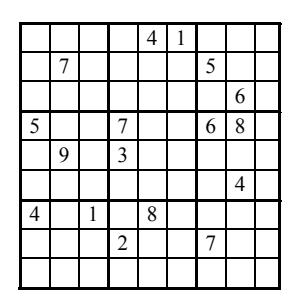

| ı |   |   |   |   | 4 | 1 | 8 |   | 7 |
|---|---|---|---|---|---|---|---|---|---|
|   |   | 7 | 4 |   |   |   | 5 | 1 |   |
|   |   | 1 |   |   | 7 |   | 4 | 6 |   |
|   | 5 | 4 | 3 | 7 |   |   | 6 | 8 | 1 |
|   | 1 | 9 | 8 | 3 | 6 | 4 | 2 | 7 | 5 |
|   |   |   |   | 1 | 5 | 8 |   | 4 |   |
|   | 4 |   | 1 |   | 8 | 7 |   |   | 6 |
|   |   | 8 |   | 2 | 1 |   | 7 |   | 4 |
|   |   |   |   | 4 |   |   | 1 |   | 8 |

| _ |   |   |   |   |   |   |   |   |
|---|---|---|---|---|---|---|---|---|
| 6 | 5 | 2 | 9 | 4 | 1 | 8 | 3 | 7 |
| 8 | 7 | 4 | 6 | 3 | 2 | 5 | 1 | 9 |
| 3 | 1 | 9 | 8 | 7 | 5 | 4 | 6 | 2 |
| 5 | 4 | 3 | 7 | 2 | 9 | 6 | 8 | 1 |
| 1 | 9 | 8 | 3 | 6 | 4 | 2 | 7 | 5 |
| 2 | 6 | 7 | 1 | 5 | 8 | 9 | 4 | 3 |
| 4 | 2 | 1 | 5 | 8 | 7 | 3 | 9 | 6 |
| 9 | 8 | 6 | 2 | 1 | 3 | 7 | 5 | 4 |
| 7 | 3 | 5 | 4 | 9 | 6 | 1 | 2 | 8 |

Figure 6. Puzzle Royle17-4218, its L1 0 elaboration and its solution

```
Resolution path in L16+UR1+UR2 for the L16+UR1 (or L1_0) elaboration of Royle17-4218: column c4 interaction-with-block b2 \Longrightarrow r2c6 \neq 6 column c9 interaction-with-block b3 \Longrightarrow r1c8 \neq 2 row r1 interaction-with-block b1 \Longrightarrow r3c3 \neq 2, r3c1 \neq 2, r2c1 \neq 2 hidden-pairs-in-a-row {n6 n8}r2{c1 c4} \Longrightarrow r2c4 \neq 9, r2c1 \neq 9, r2c1 \neq 3
```

Miscellanea 399

```
vertical unique rectangle type 2 in cells {r4 r2} {c6 c5} \Longrightarrow r2c9 \ne 3 row r2 interaction-with-block b2 \Longrightarrow r3c6 \ne 3 xyt5-chain {n9 n2}r4c6 - {n2 n9}r4c5 - {n9 n3}r9c5 - {n3 n2}r2c5 - {n2 n9}r2c9 \Longrightarrow r2c6 \ne 9 xyzt4-chain {n9 n5}r3c3 - {n5 n2}r3c6 - {n2 n3}r2c6 - {n3 n9}r2c5 \Longrightarrow r3c4 \ne 9 xyt5-chain {n3 n9}r1c8 - {n9 n2}r2c9 - {n2 n3}r2c6 - {n3 n9}r2c5 - {n9 n3}r9c5 \Longrightarrow r9c8 \ne 3 xyt6-chain {n3 n9}r7c7 - {n9 n5}r7c4 - {n5 n8}r3c4 - {n8 n6}r2c4 - {n6 n9}r1c4 - {n9 n3}r1c8 \Longrightarrow r8c8 \ne 3 block b9 interaction-with-row r7 \Longrightarrow r7c2 \ne 3 hxy-cn4-chain {r1 r7}c4n9 - {r7 r6}c7n9 - {r6 r7}c7n3 - {r7 r1}c8n3 \Longrightarrow r1c8 \ne 9 ...(Naked Singles and Hidden Singles)
```

#### 3.4.3. UR4 cannot be reduced to L16+UR1+UR3+UR3

In Royle 17, we have found no example of a puzzle in [L16+UR1+UR2]+UR3, but puzzles Royle17-692 (Figure 7) and Royle17-2635 (Figure 8), with their L16+UR1+UR2+UR3 elaborations coinciding respectively with their L1 and L2 elaborations, are in [L16+UR1+UR2+UR3]+UR4. We give the resolution path only for the first. As for the second, the UR4 pattern appears after rules in L3 have been applied.

|   |   |   |   |   |   |   | 8 | 2 | 6 | 3 |   |   |   |   |   | 8 | 2 | 6 | 3 | 7 | 9 | 4 | 1 | 5 | 8 | 2 |
|---|---|---|---|---|---|---|---|---|---|---|---|---|---|---|---|---|---|---|---|---|---|---|---|---|---|---|
|   | 4 |   | 6 |   |   |   |   |   |   | 4 | 8 | 6 |   |   |   | 1 |   | 5 | 4 | 8 | 6 | 7 | 2 | 9 | 1 | 3 |
|   | 1 |   |   |   |   |   |   |   |   | 1 | 2 | 8 |   |   |   |   |   | 9 | 1 | 2 | 8 | 3 | 5 | 7 | 6 | 4 |
| 2 |   |   |   | 9 | 8 |   |   |   | 2 | 7 |   |   | 9 | 8 |   |   |   | 2 | 7 | 6 | 1 | 9 | 8 | 3 | 4 | 5 |
|   |   |   |   |   |   | 1 |   |   | 4 | 8 |   |   |   |   | 1 |   |   | 4 | 8 | 5 | 3 | 2 | 6 | 1 | 9 | 7 |
| 3 |   |   |   |   |   |   |   |   | 3 | 9 |   |   |   |   | 8 |   |   | 3 | 9 | 1 | 7 | 5 | 4 | 8 | 2 | 6 |
| 8 |   | 3 |   |   |   |   | 7 |   | 8 | 5 | 3 |   |   |   | 4 | 7 | 1 | 8 | 5 | 3 | 2 | 6 | 9 | 4 | 7 | 1 |
|   |   |   | 4 | 1 |   | 6 |   |   |   | 2 |   | 4 | 1 | 3 | 6 | 5 | 8 | 7 | 2 | 9 | 4 | 1 | 3 | 6 | 5 | 8 |
|   |   |   | 5 |   |   |   |   |   | 1 | 6 | 4 | 5 | 8 | 7 | 2 |   |   | 1 | 6 | 4 | 5 | 8 | 7 | 2 | 3 | 9 |

Figure 7. Puzzle Royle17-692, its L1 elaboration and its solution

```
Resolution path in L16+UR1+UR2+UR3+UR4 for the L16+UR1+UR2+UR3 (or L1) elaboration of Royle17-692: column c7 interaction-with-block b3 \Longrightarrow r3c9 \ne 9, r3c8 \ne 9, r2c9 \ne 9, r3c9 \ne 7, r2c9 \ne 7 column c1 interaction-with-block b1 \Longrightarrow r1c3 \ne 5 row r4 interaction-with-block b6 \Longrightarrow r6c9 \ne 4, r6c8 \ne 4 row r1 interaction-with-block b2 \Longrightarrow r3c6 \ne 4, r3c5 \ne 4 column c4 interaction-with-block b5 \Longrightarrow r5c5 \ne 3 hidden-pairs-in-a-row {n4 n6}r3 {c8 c9} \Longrightarrow r3c9 \ne 5, r3c9 \ne 3, r3c8 \ne 3 hidden-pairs-in-a-column {n1 n4} {r1 r6}c6 \Longrightarrow r6c6 \ne 6, r6c6 \ne 5, r6c6 \ne 2, r1c6 \ne 9, r1c6 \ne 5
```

```
xyzt5-chain \{n7\ n9\}r1c3 - \{n9\ n5\}r1c7 - \{n5\ n3\}r4c7 - \{n3\ n1\}r4c4 - \{n1\ n7\}r1c4 \Longrightarrow r1c5 \neq 7

xyzt6-chain \{n5\ n9\}r3c6 - \{n9\ n7\}r3c1 - \{n7\ n9\}r8c1 - \{n9\ n5\}r2c1 - \{n5\ n3\}r2c9 - \{n3\ n5\}r3c7 \Longrightarrow r3c5 \neq 5

vertical unique rectangle type 4 \{r9\ r5\}\{c9\ c8\} \Longrightarrow r5c9 \neq 3, r5c8 \neq 3

...(Naked Singles and Hidden Singles)
```

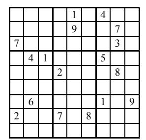

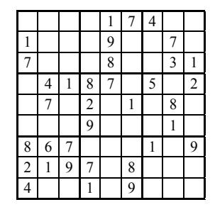

| 3 | 9 | 2 | 6 | 1 | 7 | 4 | 5 | 8 |
|---|---|---|---|---|---|---|---|---|
| 1 | 8 | 4 | 3 | 9 | 5 | 2 | 7 | 6 |
| 7 | 5 | 6 | 4 | 8 | 2 | 9 | 3 | 1 |
| 6 | 4 | 1 | 8 | 7 | 3 | 5 | 9 | 2 |
| 9 | 7 | 3 | 2 | 5 | 1 | 6 | 8 | 4 |
| 5 | 2 | 8 | 9 | 4 | 6 | 7 | 1 | 3 |
| 8 | 6 | 7 | 5 | 3 | 4 | 1 | 2 | 9 |
| 2 | 1 | 9 | 7 | 6 | 8 | 3 | 4 | 5 |
| 4 | 3 | 5 | 1 | 2 | 9 | 8 | 6 | 7 |
|   |   |   |   |   |   |   |   |   |

Figure 8. Puzzle Royle17-2635, its L2 elaboration and its solution

#### 3.5. Where should rules based on uniqueness be classified?

Unless you need to prove uniqueness of a solution, whether or not you should adopt rules based on the assumption of uniqueness is mainly a matter of personal taste. Nevertheless I would like to make two remarks:

- a resolution path provides a stronger result when it does not use rules based on this assumption: it does prove uniqueness;
- rules based on the assumption of uniqueness should therefore not be applied before rules (or at least before rules of similar complexity) that do not use it.

Given the partial order relation we have defined on the set of rules introduced in this book, where should rules based on the assumption of uniqueness be situated in it (if we accept them)? The answer depends on the goals we pursue. If we want not only to find a solution but also to prove it is the only one, then we should not use these rules at all. If we admit uniqueness of the solution but we nevertheless prefer to prove it independently whenever possible, then we should accept these rules as last resort weapons (just before recursive Trial and Error) and put them at the farthest end of the hierarchy, as we have done in the previous examples.

If we are fully confident in uniqueness, then different rules based on it can be placed at different places in the hierarchy, depending on their logical complexity. Unique rectangles are built on only four cells and could therefore be placed in L4 or

Miscellanea 401

between L4 and L5. BUGs depend on many cells and should in any case be placed as far as possible in the hierarchy.

#### 4. Are any other types of rules necessary?

We know that theories L16 or M28 are not complete and that the Uniqueness rules discussed above are not enough to make them complete. Could it be made complete only with rules of all the types defined in this book merely by increasing the maximal lengths of the chains we consider (the Easter Monster example shows that this is not the case), or do we need other types of rules, such as some of those discussed in [STU 07] and in many Web forums? The same Easter Monster example shows that there remain a few extreme cases for which the known rules are not enough.

As for the rules in [STU 07], many of which are based on subsets (Almost Locked Sets, Hinges, Grouped chains), SudoRules solves within theory L8 all the puzzles this book proposes to illustrate them (for a full listing of the resolution paths, see my Web pages), but this does not prove that it would also solve any complex puzzle that can be solved with these rules. Moreover, all this is not to suggest in any way that the set of rules defined here is better than Stuart's. The goals we pursue are very different. Whereas Stuart, as many Sudoku experts, is interested in the diversity of rules that may be helpful (and that may be sheer bliss when you find the opportunity of applying them), I am more interested in finding a minimal set of rules that does the same job (preferably without resorting to subsets in potentially exponential number). I think the advantages of such an approach are not only theoretical but they may have a practical impact on the way one will search for a solution. Finding complex patterns is a very demanding task and the more varied patterns you want to spot on a grid, the more complex this task will become. Limiting the number of different types of patterns to be looked for (if that does not sacrifice the possibility of finding the solution or the simplicity of the resolution path – two important restrictions) is thus a means of easing the resolution task.

#### Conclusion

#### What has been achieved

In this conclusion, I'd like first to highlight a few facets of what has been achieved in this book, from four complementary overlapping points of view.

1) *From the point of view of the Sudoku addict*, the most striking results should be the following.

By formalising the familiar resolution rules, we have eliminated from some of them the ambiguities that plagued their usual presentations and we have clarified their scopes. For instance, we have shown that none of the two usual formulations of Triplets (or Quadruplets) – neither the "strict" nor the "comprehensive" – was the best; our reformulation shows how close Triplets (and Quadruplets) are to xy-chains but also why they cannot be reduced to them (nor to our stronger xyt- or xyzt-chains).

We have fully clarified the symmetry relationships that exist between Naked, Hidden and Super-Hidden Subset rules (the latter being classically known as X-Wing, Swordfish, Jellyfish, Squirmbag and other existent or non existent "fishy patterns"). Such relationships had already been partly mentioned on some Web pages, but never in the systematic way we have dealt with them here. As a result, we have naturally found the proper formulations for the Hidden and Super-Hidden Subset rules and we have proven that no other subset rule of such type can exist.

More generally, we have proven three meta-theorems that automatically produce new resolution rules (their Hidden or Super-Hidden counterparts) from existing ones

With the introduction of new graphical representations of the problem in auxiliary 2D spaces (mainly row-number and column-number spaces), we have shown that the Hidden or Super-Hidden counterparts of well-known patterns (subsets or chains) defined in natural row-column space can be detected as easily as their originals, because in these new spaces they look like the originals do in the standard representation. We have thus extended the resolution power of such patterns.

We have defined a (non strict) complexity hierarchy between the resolution rules, compatible with their logical symmetry relationships.

We have proven certain theorems showing that particular resolution rules can be formally reduced to simpler ones in the above hierarchy (e.g. "xy-chains of length 3 are subsumed by Naked-Triplets plus XY-Wing").

We have evaluated the strength of each rule by the proportion of new puzzles ("new" according to the above hierarchy) its introduction allows to solve and, for the first time, such an evaluation has been based on a large collection of puzzles (more than 56,000), with detailed results available online.

We have given chain rules a major place in this book (they occupy more than half of it), because they are the main tool for dealing with hard puzzles but they remain the subject of much confusion. We have introduced a general conceptual framework (including the notion of a target not belonging to the chain) for dealing with all conceivable types of chains and we have applied it systematically to all the types we have defined. In particular, we have introduced an intuitive graphical language of patterns for specifying chains and their targets, abstracting them from any irrelevant facet (such as a link being a row or a column or a block), and we have shown that these patterns are equivalent to logical formulæ. In our framework, the confusing notions of "chain of inferences", "weak link" and "strong link" are never used; our chains are well defined patterns of candidates, cells and links.

We have chosen the simplest kind of homogeneous chains, the xy-chains, as our main type of chains, with all the other chains being intuitive generalisations of them.

We have proven that xy-chains and c-chains should have no loops (with the practical consequence that searching for these chains becomes simpler for both a human and a computer).

Conclusion 405

By pushing the underlying logic of xy-chains to its limits, we have introduced xyt-chains and shown that they are a very natural and powerful generalisation of xy-chains. We have also defined another independent generalisation, the xyz-chains, and combined it with the previous one to get the xyzt-chains.

With each type of chain in natural row-column space, we have associated two new types of chains, their hidden counterparts in row-number and column-number spaces, and, in particular, we have shown the unifying power of the hidden xy-chains. All these chains can be spotted in either of the 2D representations, using our Extended Sudoku Board.

We have also proven theorems allowing to combine our various types of homogeneous chains to build heterogeneous, more complex, ones.

In this second edition, we have generalised the above 2D chains, introduced their fully super-symmetric 3D versions (the nrc-, nrct-, nrcz- and nrczt- chains) and shown that all these types of chains can still be considered in a natural way as various generalisations of the basic xy-chains.

We have produced a multiplicity of well chosen examples proving that particular resolution rules cannot be reduced to simpler ones (in the above hierarchy).

In particular, we have proven that, using only the types of chain rules introduced in the first edition, it is necessary to consider chains of length more than thirty if we want to have a chance of solving all the randomly generated puzzles without resorting to Trial and Error or assuming the uniqueness of a solution.

In the first edition, we had exhibited a set of resolution rules (L13) based on only 2D chains that could solve 97% of the randomly generated minimal puzzles and 99,67% of the 36,628 17-minimal puzzles in the famous Royle database (without resorting to Trial and Error or to an assumption of uniqueness).

In this second edition, we have also exhibited a set of resolution rules (M5) that can solve more than 99% of the randomly generated minimal puzzles using only 3D chains of length no more than five and a set of resolution rules (M7) that can solve 99.9% of these puzzles using only 3D chains of length no more than seven. As psychologists consider that human short term memory has size seven plus or minus two, this means that a human being using these rules should be able to solve almost any puzzle without any computer assistance (but still with some patience). It should be noticed that these chains do not include subsets (Hinges or Almost Locked Sets or grouped chains), contrary to the currently popular chains (Nice Loops or Alternating Inference Chains), thus avoiding a potential source of exponential behaviour.

2) From the point of view of mathematical logic, our most obvious result is the introduction of a strict formalism allowing a clear distinction between the straightforward Sudoku Theory (that merely expresses the constraints defining the game) and all the possible Sudoku Resolution Theories formulated in terms of conditionaction rules (that may be put to practical use for solving puzzles). We have given a clear logical definition of what a "resolution rule" is, as opposed to any logically valid formula. With the notions of a resolution theory T and a resolution path (which is merely a proof of the solution within T, in the sense of mathematical logic), we have given a precise meaning to the widespread but as yet informal idea that one wants a "pure logic solution". This leads to both sound foundations and intuitive justifications for our resolution theories, exhibiting the following facets and consequences.

We have established a clear logical (epistemic) status for the notion of a candidate – a notion that is quasi universally introduced for stating the resolution rules but that does not pertain *a priori* to Sudoku Theory and that is usually used only from an intuitive standpoint. Moreover, we have shown that the epistemic operator that must appear in any proper formal definition of this notion can be "forgotten" in practice when we state the resolution rules and that this notion can be considered as primary, provided that we work with intuitionistic (or constructive) logic instead of standard logic (this is not a restriction in practice). Notice that this whole approach can be extended to any game that is based on techniques of progressive elimination of candidates.

We have also defined what a "resolution method" based on a resolution theory is and we have shown that all the resolution theories introduced in this book have the very important *confluence property*, allowing any ordering to be superimposed on their resolution rules without changing their overall resolution capacity. As a major practical consequence, in any software implementation of a resolution theory into a resolution method (e.g. in our SudoRules solver), we may take advantage of any convenient ordering of the rules.

The natural symmetries of the Sudoku problem have been expressed as three general meta-theorems asserting the validity of resolution rules obtained by some simple transformations of those already proven. These meta-theorems have been stated and proven both intuitively and formally. As a first example of how these meta-theorems can be used in practice, we have exhibited a precise relationship between well known (Naked and Hidden) Subset rules with what we call their Super-Hidden counterparts (the famous "fishy patterns") and we have proven some form of completeness of the set of known Subset rules. As a second example of how these meta-theorems can be used in practice, we have defined entirely new types of chain rules, hidden chains of various types, and shown their unifying power.

Conclusion 407

We have also devised a direct proof of the existence of a simple and striking relationship between Sudoku and Latin Squares: a block-free resolution rule (i.e. a rule that does not mention blocks or squares) is valid for Sudoku if and only if it is already valid for Latin Squares. Notice that it does not seem one can prove this result by using only the general methods one would expect to see used in such cases: either the interpolation theorem or the techniques of Gentzen's sequent calculus.

Finally, we have provided a very intuitive example of how difficult it may be to transform a theory formulated in terms of (a few and simple) constraints into a set of "production rules" (or condition-action rules). This also shows that, although the given constraints on rows and columns on the one hand and the constraint on blocks on the other hand can be formulated as axioms with independent predicates, many of the condition-action rules necessary to operationalise them do mix these predicates. This mixture is most visible in the 3D (or fully super-symmetric) chain rules.

# 3) From the point of view of Artificial Intelligence (AI), the following should be stressed

Sudoku is a wonderful example for AI teachers. It has simpler rules and is more accessible for student projects than games such as chess or go, but it is much more complex and exciting than the usual examples one can find in AI textbooks (Tic-Tac-Toe, Hanoi Towers, Monkey and Bananas, Bricks World, ...). It easily suggests lots of projects based on the introduction and the formalisation of new types of rules since no complete set of resolution rules is known (see below).

Sudoku provides a very good illustration of a basic software engineering principle: never start writing a program (or a knowledge base for an inference engine) unless you have a non-ambiguous specification for it. The logic of certain resolution rules is so subtle that the least deviation from it (e.g. forgetting that a target of a chain may not belong to it or that loops are not allowed in a chain) has "catastrophic" consequences (typically some puzzles being falsely claimed to have no solution). This can also be considered a nice illustration of Newell's classical distinction (introduced in [New 82]) between the knowledge level, here assimilated to the logical formulation, in which knowledge must be formulated in a "declarative" form independent of any processes that might be applied to it, and the symbol level, here assimilated to the set of rules in the CLIPS or the JESS language, in which the knowledge level is operationalised in a form that may depend (and does largely depend in practice) on the specificities of the knowledge representation and processing tools used to implement it. Although this book does not tackle this point, there are many ways a given resolution rule (as formulated in logic) can be implemented as a production rule in an inference engine, which are more or less related to the different ways it may be used in practice.

Sudoku is also a wonderful testbed for the inference engine chosen to run the knowledge base of resolution rules. The logic of the set of rules is so intricate that many functionalities of the inference engine are stringently tested, which is how we discovered a longstanding undocumented bug in the management of saliences in JESS. With long series of puzzles to solve, memory management can also be a problem (as it is in CLIPS).

The previous topic is related to a crucial problem of AI, both practical and epistemological: how can one be sure that the system does what it is intended to do? Although this is already a very difficult question for classical software (i.e. mainly procedural, notwithstanding the object oriented refinements), it is much worse for AI, for two main reasons. Firstly, the logic underlying a knowledge base is generally much more complex than a set of procedures is (otherwise it would probably be much better to solve the problem with procedural techniques) and secondly an inference engine is a very complex piece of software and debugging it is very difficult.

As a general result, using AI to prove theorems (although this has always been and remains one of the key subtopics of the domain) may make mathematicians and logicians very suspicious.

As a specific result, all the independence theorems that have been proven in this book rely on the correctness of the inference engine we used for our computations. They do not depend on this correctness when we assert that "theory T allows the following resolution path for puzzle P", since the validity of any particular path can easily be checked "by hand", whichever method was used to generate it. But these independence results depend on this correctness any time we state that a particular theory is not able to find a solution for some puzzle P. This is why all our computations have finally been done with CLIPS instead of JESS despite the fact that CLIPS regularly gets lost in memory management problems and computation times on long series of puzzles grow astronomical. But the fact that, due to its problem with the management of saliences<sup>6</sup>, JESS misses some inferences on simpler rules, even though this may be infrequent, disqualifies it as a theorem prover in our case (so much so that missed inferences also vary from one version to the next). Obviously, this does not prove that CLIPS is bug free. The only certain conclusions are that, using the same knowledge base, CLIPS solved (a few) more puzzles than JESS and never returned any spurious message of type "this puzzle has no solution".

Of course, these independence theorems also rely on the correctness of the knowledge base we have developed to implement all the rules defined in this book.

<sup>&</sup>lt;sup>6</sup> It seems that this bug has been corrected in the latest release of JESS (71b1) available as of the publication of this second edition. But we haven't carried out systematic tests.

Conclusion 409

In this respect, I would like to make three points:

- firstly, thanks to the monotonicity of the facts base (each rule can only add values or not-candidates), a confluence theorem has been proven, which guarantees that there cannot be unwanted interactions between the rules;

- secondly, each individual rule has received the same systematic treatment: it has been stated in plain English, with great care being taken for not forgetting any conditions; it has then been proven, still in plain English, in rather straightforward steps that can be checked by anybody; its formulation in multi-sorted logic (or, for the chain rules, in our equivalent graphical formalism) has been shown to be the direct transliteration of the English one; in turn, the CLIPS or the JESS formulation is the direct transliteration of the logical one, thus minimising the possibilities of discrepancies between successive steps in the development;
- thirdly, the current release of our solver (SudoRules 13) has been tested on more than 56,000 puzzles known to have a unique solution (and this produced the classification results in chapters XXI and XXIII); whereas an error in a rule that would illegitimately eliminate candidates leads very rapidly to the claim that a puzzle has no solution (this allowed the detection of a few subtle bugs in the first version of SudoRules), it is noticeable that SudoRules has not yet produced an incorrect result in the CLIPS environment
- 4) Finally, considering the (currently very fashionable) notion of complexity, problems that can be stated in simple terms but that need a complex solution are not anything new, although the general idea may remain obscure for the novice thinker. Among the most famous problems of this type, you have certainly heard of the four-colour problem in graph theory or Fermat's conjecture in arithmetic (now known as the "Fermat-Wiles Theorem", since it has been proven recently by Andrew Wiles, more than three centuries after its formulation by Fermat). But proofs of these theorems are not really accessible to the non-mathematician and the type of complexity hidden behind the problem statement therefore remains very abstract. With the notion of deterministic chaos, the second part of the twentieth century has uncovered a new type of complexity: some dynamical systems ruled by very simple equations may have very complex trajectories and two neighbouring points may follow quickly diverging paths but this also remains a little mysterious if you do not have a minimum mathematical background.

On the contrary, with the popular game of Sudoku, you can get a feeling of another type of complexity, computational complexity (how this is related to the previous ones remains an interesting but very difficult question). Sudoku is known to be NP-complete, i.e., to state it very informally (and somewhat incorrectly), when

we consider grids of increasing sizes, resolution times grow faster than any deterministic polynomial algorithm. As you will never try to solve a Sudoku puzzle on a 100x100 grid (unless you have unlimited free access to a psychoanalyst), this may also remain an abstract definition. There is nevertheless a difference with the previous examples: you can already get a foretaste of the underlying complexity with the standard 9x9 puzzles (e.g. by comparing them to their homologues on 4x4 grids, the so-called Sudokids).

The Sudoku problem is defined by four very simple constraints, immediately understood by everybody in terms of "single occupancy" of a cell and of "mutual exclusion" in a row, a column or a block. For a classically formatted mind, it is therefore natural to think that any puzzle can easily be proven to have no solution or be solved by a finite set of simple operational resolution rules of the condition-action type: "in such a situation carry out such an action (assert a value or eliminate a candidate)". And this idea can only be reinforced if you consider the majority of puzzles published in newspapers. But the independence results proven in this book through a multiplicity of examples have shown that very complex resolution rules are indeed needed.

What this book has shown then, in both intuitive and logically grounded ways, is that writing a set of operational rules for solving an apparently very simple constraints propagation problem may be a very complex task. (Indeed, notwithstanding their overall complexity, the rules that have been defined in this book do not even form a complete resolution theory.) Moreover, as all the NP-complete problems are equivalent (through polynomial transformations) and some of them have lots of practical applications, such as the famous travelling salesman, dealing with the apparently futile example of Sudoku may provide intuitions on problems that seem to be unrelated.

#### What has been partly achieved (from the point of view of AI)

In the introduction, we said we wanted a set of rules that would simulate a human solver and that could explain each of the resolution steps. The explanations produced by SudoRules are largely illustrated by the listings given in this book; they are sufficiently explicit once you know the definitions of our rules and it would be easy work to make them still more explicit for those who do not know them; but we do not consider this as a very exciting topic. As for the solver facet, SudoRules does simulate a human solver, a particular kind of player who would try all our rules systematically (ordered according to their complexity) on all of their potential instantiations.

Conclusion 411

Is it likely that any human solver would proceed in such a systematic way? He may prefer to concentrate on a part of the puzzle and try to eliminate a candidate from a chosen cell (or group of cells). What may be missing then in our system is a "strategic" knowledge level: when should one look for such or such pattern? But I have no idea of which criteria could constitute a basis for such strategic knowledge; moreover, as far as I know, whereas there is a plethora of literature on resolution techniques (often misleadingly called strategies), nothing has ever been written on the ways they should be used, i.e. on what might legitimately be called strategies.

To say it otherwise, we do have a strategic level: searching for the different patterns in their order of increasing complexity. Notice that there is already more strategy in this than proposed by most of the books or Web pages on the subject. The question then is: can one define a better (or at least another) strategy? Well, the rules in this book (and the corresponding software SudoRules) are there; you can use them as a basis for further analysis of alternative strategies. One of the simplest ways to do so is to modify the complexity measure and the ordering we have defined on the set of rules. For instance, using psychological analyses, one could break or relax the symmetry constraints we have adopted.

#### What was not our purpose and has not been achieved; open questions

The first thing that has not been done in this book is a review of all the advanced rules that have been proposed, mainly on the Web (under varying names, in more or less clear formulations, with more or less defined scopes). The list would be too long and moreover it is regularly increasing. The best place to get an idea on this topic is in the recent book by Andrew C. Stuart ([STU 07]) or on the Web, in particular in the Sudoku Players Forum:

http://www.sudoku.com/forums/viewtopic.php?t=3315

(with the problem that chains are often considered as "chains of inferences" instead of patterns and they are sometimes classified according to absurd criteria).

Instead, our two main purposes in this regard were to take advantage of the symmetries of the game in a systematic way and to isolate a limited number of rule types, with rules definitions extended as far as the arguments used in their proofs allowed: this is how we introduced xyt-, xyz- and xzyt- chain rules (on the basis of xy-chain rules) and their hidden counterparts (on the basis of our general metatheorems); this is also how this second edition introduced the 3D chain rules. Of course, we do not claim that there may not be another general type of rules that should be added to ours. For instance, if you admit uniqueness of the solution (i.e. add the axiom of uniqueness), much work remains to be done in order to clarify all the techniques that have been proposed to express it in the form of U-resolution

rules. But one of the main questions in this regard is: should we accept rules for nets or for chains of subsets? In a sense, AICs based on subsets appear to be nets when we try to re-formulate them as chains of candidates; but they are mild kinds of nets. nrczt-chains, which have approximately the same solving power as the most complex AICs, prove that including subsets (Hinges, Almost Locked Sets) in chains is not necessary. On the other hand, general tagging algorithms that can solve anything correspond to unrestricted kinds of nets and they are not of much help for answering the question: which (mild) kinds of nets should we accept?

Viewed from the methodological standpoint, more than proposing a final set of resolution rules, our purpose was to set some minimal standard in the way one should systematise the definition of rules in natural language, formalise them in logic (or in equivalent graphical representations), implement them (as rules for an inference engine or in any other formalism that can be run on a computer, e.g. as strictly defined colouring or tagging resolution techniques) and test their validity and efficiency through the treatment of large collections of examples. It is our opinion that only this complete cycle may bring some clarity into the subject.

The second thing that has not been achieved in this book is the discovery of a *complete* resolution theory that would make no uniqueness assumption and that would not use Trial and Error. Our strongest resolution theory (L16 in the first edition, M28 in this second edition) cannot solve all the minimal puzzles that have a single solution. It can solve *almost all* these puzzles, but not *all* these puzzles, and increasing the maximal length of the chains would not help. Indeed, no set of resolution rules is known that would allow to solve such exceptionally complex puzzles as Easter Monster. Some kind of nets may be necessary. Defining very complex types of nrczt-nets is very easy; defining useful but mild ones is more difficult

Finally, another related question is: does our strongest resolution theory (L13, or its weak extension L16 or the 3D theory M28) detect all the puzzles that have no solution? We have found no example that could not be detected. But this nevertheless leaves the question open. Underlying this question, there is a more general informal one, still open: is formulating *a priori* necessary and sufficient criteria on the existence of a solution (criteria that would only bear on the entries of a puzzle) easier than finding a complete resolution theory?

#### References

[ANG 05-07] ANGUS J., Simple Sudoku, http://www.angusj.com/sudoku/, 2005-2007.

[ARM 00-07] ARMSTRONG S., Sadman Software Sudoku, Solving Techniques, http://www.sadmansoftware.com/sudoku/techniques.htm, 2000-2007.

[BAR 06] BARKER M., Sudoku Players Forum, Advanced solving techniques, post 362, *in* http://www.sudoku.com/forums/viewtopic.php?t=3315

[BER xx] BERTHIER D., Solving Sudoku with the CLIPS or the JESS Inference Engine, forthcoming.

[BER www] BERTHIER's Web pages: http://www.carva.org/denis.berthier

[BRI 06] BRIDGES D. & VITA L., Techniques of Constructive Analysis, Springer, 2006.

[BRO 06] BROUWER A., Solving Sudokus, http://homepages.cwi.nl/~aeb/games/sudoku/, 2006.

[DAV 06] DAVIS T., The Mathematics of Sudoku, www.geometer.org/mathcircles/sudoku. pdf, 2006.

[FEL 05] FELGENHAUER B. & JARVIS F., Enumerating possible Sudoku grids, http://www.afjarvis.staff.shef.ac.uk/sudoku/sudgroup.html, 2005.

[FIT 69] FITTING M.C., Intuitionistic Logic, Model Theory and Forcing, North Holland, 1969.

[GAR 03] GARSON J., Modal Logic, Stanford Encyclopedia of Philosophy, http://plato.stanford.edu/entries/logic-modal/, 2003.

[HAN xx] HANSSEN V., http://www.menneske.no/sudoku/eng/index.html

[HEN 06] HENDRICKS V. & SYMONS J., Epistemic Logic, Stanford Encyclopedia of Philosophy, http://plato.stan ford. edu/entries/logic-epistemic/, 2006.

[HIN 62] HINTIKKA J., Knowledge and Belief: An Introduction to the Logic of the Two Notions, Cornell University Press, 1962.

[JAR 06] JARVIS F., Sudoku enumeration problems, http://www.afjarvis.staff.shef.ac.uk/sudoku/, 2006.

[KRI 63] KRIPKE S.: Semantical Analysis of Modal Logic, Zeitchrift für Matematische Logik und Grundlagen der Matematik, Vol. 9, pp. 67-96, 1963.

[MEI 93] MEINKE K. & TUCKER J., eds., Many-Sorted Logic and its Applications, Wiley, 1993.

[MEP xx] MEPHAM M., http://www.sudoku.org.uk/

[MOS 07] MOSCHOVAKIS J., Intuitionistic Logic, Stanford Encyclopedia of Philosophy, http://plato.stan ford.edu/entries/logic-intuitionistic/, 2006.

[NEW 82] NEWELL A., The Knowledge Level, *Artificial Intelligence*, Vol. 59, pp 87-127, 1982.

[RUS 05] RUSSELL E. & JARVIS F., There are 5472730538 essentially different Sudoku grids ... and the Sudoku symmetry group, http://www.afjarvis.staff.shef.ac.uk/sudoku/sud group.html, 2005.

[ROY xx] ROYLE G., Minimum Sudoku, http://www.csse.uwa.edu.au/~gordon/sudokumin.php

[SPIF] Sudoku Players Forums, http://www.sudoku.com/forums/index.php

[SPrF] Sudoku Programmers Forums, http://www.setbb.com/sudoku/ index.php?mforum=sudoku

[STE] STERTEN, http://magictour.free.fr/sudoku.htm

[STU 06] STUART A., http://www.scanraid.com, 2006.

[STU 07] STUART A., The Logic of Sudoku, Michael Mepham Publishing, 2007.

[SUD] Sudopedia, http://www.sudopedia.org/wiki/Main\_Page

[SUF] Sudoku UK Forums, http://www.sudoku.org.uk/cgi-bin/discus/discus.cgi?pg=topics

[WER 05-07] van der WERF R., Sudocue, Sudoku Solving Guide, http://www.sudocue.net/guide.php, 2005-2007.

[YAT 02] YATO T. & SETA T., Complexity and completeness of finding another solution and its application to puzzles, IPSG SIG Notes 2002-AL-87-2, http://www-imai.is.s.u-tokyo.ac.jp/~yato/data2/SIGAL87-2.pdf, 2002.